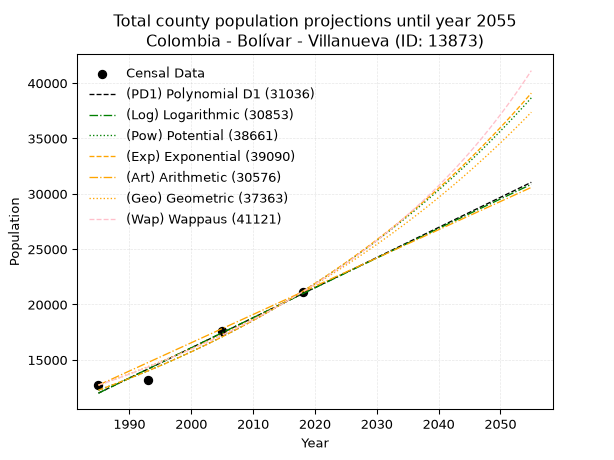
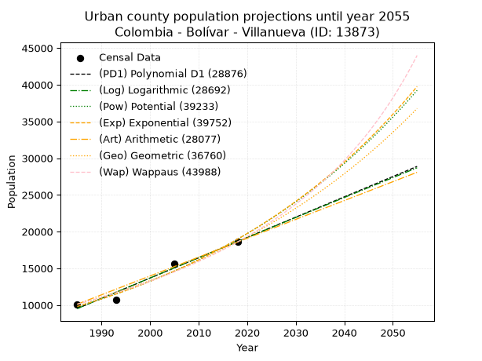
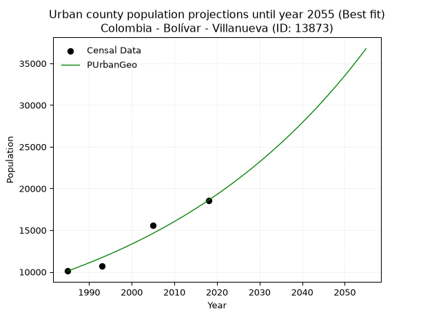
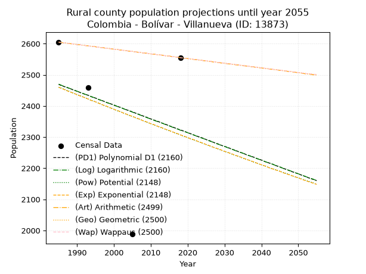
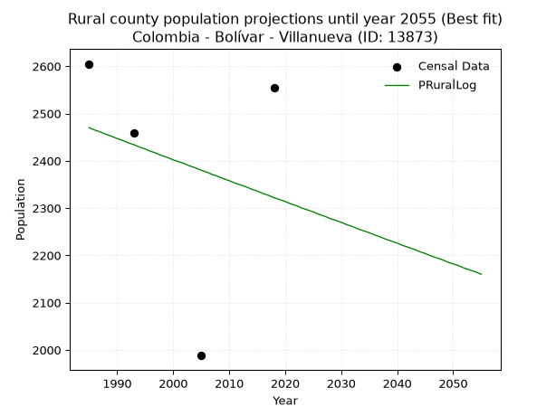

<div align="center">


</div>

# 📜 _“Population and Public Services Demand Projections (PPSD) until Year 2050 for Colombia - Bolívar - Villanueva (ID: 13873)”_
Keywords: `population` `public-service` `projection` `lineal` `polynomial` `logarithmic` `potential` `exponential` `arithmetic` `geometric` `wappaus` `dane` `colombia` `south-america`

PPSD are analytical estimates used by governments and planners to anticipate future changes in population size, age distribution, and the resulting community needs for utilities, healthcare, education, and infrastructure as sizing future water treatment facilities, electrical grids, and road networks based on spatial growth.

<div align="center">

</img>

</div>


> **General running parameters**: • app_version: _v20260806_. • Python version: _3.14.7_. • Pandas version: _3.0.5_. • NumPy version: _2.5.1_. • Creates, save and include plots into reports (create_plot): _False_. • Projection until year: _2050_. • Process polynomial degree 2 and up: _False_. • Process Wappaus: _True_. • Process Wappaus: _True_. • Set negative values to zero: _True_. • Set infinite values to zero: _True_. • Drop dataset notes: _True_. 
<div align="center">

Maps & GIS Layers: [:earth_americas:Google](http://maps.google.com/maps?q=10.44408901,-75.2756128) [:earth_americas:OSM](https://www.openstreetmap.org/#map=18/10.44408901/-75.2756128&layers=P) [:earth_americas:Bing](https://www.bing.com/maps?cp=10.44408901~-75.2756128&lvl=18) [:earth_americas:Apple](https://maps.apple.com/frame?center=10.44408901%2C-75.2756128&span=0.003%2C0.006) [:earth_americas:GISMobile](https://github.com/rcfdtools/R.GISMobile/blob/main/file/gis/CountyLayer_CO/Readme.md)

</div>


<div align="center">

```geojson
{
  "type": "Feature",
  "geometry": {
    "type": "Point", 
    "coordinates": [-75.2756128, 10.44408901]
  }, 
  "properties": {
    "Name": "Colombia - Bolívar - Villanueva (ID: 13873)"
  }
}
```

</div>


## 0. Census Data (4 records)

Census data are official statistics collected by a government about the people and housing in a country. They usually include counts of total population, age, sex, race, income, education, and jobs.

📅Global census file: [Population.xlsx](../data/Population.xlsx)

| Source   |   Year |   CountryID | CountryName   |   StateID | StateName   |   CountyID | CountyName   |   PTotal |   PUrban |   PRural |
|:---------|-------:|------------:|:--------------|----------:|:------------|-----------:|:-------------|---------:|---------:|---------:|
| DANE     |   1985 |          57 | Colombia      |        13 | Bolívar     |      13873 | Villanueva   |    12715 |    10110 |     2605 |
| DANE     |   1993 |          57 | Colombia      |        13 | Bolívar     |      13873 | Villanueva   |    13151 |    10693 |     2458 |
| DANE     |   2005 |          57 | Colombia      |        13 | Bolívar     |      13873 | Villanueva   |    17576 |    15588 |     1988 |
| DANE     |   2018 |          57 | Colombia      |        13 | Bolívar     |      13873 | Villanueva   |    21135 |    18580 |     2555 |

> 🔥Some records could had specific notes about the registered values or the corresponding urban or rural distribution.

📅[SUI-RUPS](https://www.datos.gov.co/Hacienda-y-Cr-dito-P-blico/Registro-nico-de-Prestadores-de-Servicios-P-blicos/4qkq-csdn/about_data) - Local public utility companies: [RUPS.csv](../data/RUPS.csv)

 | SERVICIO   | ESTADO                    | NOMBRE                                                                                               | NIT         | DEPARTAMENTO_DOMICILIO   | MUNICIPIO_DOMICILIO   | DIRECCION                                     |   TELEFONO | EMAIL                                    | TIPO_PRESTADOR                             | CLASIFICACION                 |
|:-----------|:--------------------------|:-----------------------------------------------------------------------------------------------------|:------------|:-------------------------|:----------------------|:----------------------------------------------|-----------:|:-----------------------------------------|:-------------------------------------------|:------------------------------|
| ACUEDUCTO  | OPERATIVA                 | EMPRESA INTERMUNICIPAL DE SERVICIOS PUBLICOS DOMICILIARIOS DE ACUEDUCTO Y ALCANTARILLADO S.A. E.S.P. | 806013532-7 | BOLIVAR                  | SANTA ROSA            | calle nueva de las florez  Cra. 28 No. 16-147 |    6903120 | gerencia.empresaintermunicipal@gmail.com | SOCIEDADES (EMPRESA DE SERVICIOS PUBLICOS) | MAYOR O IGUAL A 5001 USUARIOS |
| ACUEDUCTO  | EN PROCESO DE LIQUIDACION | GISCOL SOCIEDAD ANÓNIMA EMPRESA DE SERVICOS PÚBLICOS                                                 | 900175706-7 | BOGOTA, D.C.             | BOGOTA, D.C.          | CARRERA SÉPTIMA # 70 A- 21  PISO 8            |    7210697 | gerencia.giscol@gmail.com                | SOCIEDADES (EMPRESA DE SERVICIOS PUBLICOS) | MAYOR O IGUAL A 5001 USUARIOS |

## 1. Total

### 1.1. Coefficients and Parameters

* (PD1) Polynomial Deg 1: 271.99317543155115, -527910.0991569601 (lineal)
* (Log) Logarithmic: 544291.8558145143, -4121022.5077273203
* (Pow) Potential: 33.14361251177267, -105.21127905935622
* (Exp) Exponential: 0.01656043782061061, 6.490644247922895e-11
* (Art) Arithmetic: Year diff. 2018 - 1985 = 33, Population diff. 21135 - 12715 = 8420, Annual growth = 255.15151515151516
* (Geo) Geometric: Year diff. 2018 - 1985 = 33, Population diff. 21135 - 12715 = 8420, Annual growth % = 0.015517591932157515
* (Wap) Wappaus: i = 1.5075421870104293, Condition values only valid for < 200)

<sub>
Wappaus condition values: ['0.00', '1.51', '3.02', '4.52', '6.03', '7.54', '9.05', '10.55', '12.06', '13.57', '15.08', '16.58', '18.09', '19.60', '21.11', '22.61', '24.12', '25.63', '27.14', '28.64', '30.15', '31.66', '33.17', '34.67', '36.18', '37.69', '39.20', '40.70', '42.21', '43.72', '45.23', '46.73', '48.24', '49.75', '51.26', '52.76', '54.27', '55.78', '57.29', '58.79', '60.30', '61.81', '63.32', '64.82', '66.33', '67.84', '69.35', '70.85', '72.36', '73.87', '75.38', '76.88', '78.39', '79.90', '81.41', '82.91', '84.42', '85.93', '87.44', '88.94', '90.45', '91.96', '93.47', '94.98', '96.48', '97.99']
</sub>


### 1.2. Projected Dataset

|   Year |   CountyID |   PTotalPD1 |   PTotalLog |   PTotalPow |   PTotalExp |   PTotalArt |   PTotalGeo |   PTotalWap |
|-------:|-----------:|------------:|------------:|------------:|------------:|------------:|------------:|------------:|
|   1985 |      13873 |       11996 |       11989 |       12258 |       12264 |       12715 |       12715 |       12715 |
|   1986 |      13873 |       12268 |       12263 |       12464 |       12468 |       12970 |       12912 |       12908 |
|   1987 |      13873 |       12540 |       12537 |       12674 |       12677 |       13225 |       13113 |       13104 |
|   1988 |      13873 |       12812 |       12811 |       12887 |       12888 |       13480 |       13316 |       13303 |
|   1989 |      13873 |       13084 |       13085 |       13104 |       13104 |       13736 |       13523 |       13506 |
|   1990 |      13873 |       13356 |       13359 |       13324 |       13322 |       13991 |       13733 |       13711 |
|   1991 |      13873 |       13628 |       13632 |       13548 |       13545 |       14246 |       13946 |       13920 |
|   1992 |      13873 |       13900 |       13905 |       13775 |       13771 |       14501 |       14162 |       14132 |
|   1993 |      13873 |       14172 |       14178 |       14006 |       14001 |       14756 |       14382 |       14347 |
|   1994 |      13873 |       14444 |       14451 |       14241 |       14235 |       15011 |       14605 |       14566 |
|   1995 |      13873 |       14716 |       14724 |       14479 |       14472 |       15267 |       14832 |       14788 |
|   1996 |      13873 |       14988 |       14997 |       14722 |       14714 |       15522 |       15062 |       15014 |
|   1997 |      13873 |       15260 |       15270 |       14968 |       14960 |       15777 |       15296 |       15244 |
|   1998 |      13873 |       15532 |       15542 |       15219 |       15210 |       16032 |       15533 |       15478 |
|   1999 |      13873 |       15804 |       15815 |       15473 |       15464 |       16287 |       15774 |       15715 |
|   2000 |      13873 |       16076 |       16087 |       15732 |       15722 |       16542 |       16019 |       15957 |
|   2001 |      13873 |       16348 |       16359 |       15995 |       15984 |       16797 |       16267 |       16203 |
|   2002 |      13873 |       16620 |       16631 |       16262 |       16251 |       17053 |       16520 |       16453 |
|   2003 |      13873 |       16892 |       16903 |       16533 |       16523 |       17308 |       16776 |       16707 |
|   2004 |      13873 |       17164 |       17174 |       16809 |       16798 |       17563 |       17036 |       16966 |
|   2005 |      13873 |       17436 |       17446 |       17089 |       17079 |       17818 |       17301 |       17229 |
|   2006 |      13873 |       17708 |       17717 |       17374 |       17364 |       18073 |       17569 |       17497 |
|   2007 |      13873 |       17980 |       17988 |       17663 |       17654 |       18328 |       17842 |       17770 |
|   2008 |      13873 |       18252 |       18260 |       17957 |       17949 |       18583 |       18119 |       18048 |
|   2009 |      13873 |       18524 |       18531 |       18256 |       18249 |       18839 |       18400 |       18331 |
|   2010 |      13873 |       18796 |       18801 |       18560 |       18553 |       19094 |       18685 |       18620 |
|   2011 |      13873 |       19068 |       19072 |       18868 |       18863 |       19349 |       18975 |       18914 |
|   2012 |      13873 |       19340 |       19343 |       19182 |       19178 |       19604 |       19270 |       19213 |
|   2013 |      13873 |       19612 |       19613 |       19500 |       19498 |       19859 |       19569 |       19518 |
|   2014 |      13873 |       19884 |       19884 |       19824 |       19824 |       20114 |       19872 |       19829 |
|   2015 |      13873 |       20156 |       20154 |       20153 |       20155 |       20370 |       20181 |       20146 |
|   2016 |      13873 |       20428 |       20424 |       20487 |       20492 |       20625 |       20494 |       20469 |
|   2017 |      13873 |       20700 |       20694 |       20826 |       20834 |       20880 |       20812 |       20799 |
|   2018 |      13873 |       20972 |       20964 |       21171 |       21182 |       21135 |       21135 |       21135 |
|   2019 |      13873 |       21244 |       21233 |       21522 |       21535 |       21390 |       21463 |       21478 |
|   2020 |      13873 |       21516 |       21503 |       21878 |       21895 |       21645 |       21796 |       21828 |
|   2021 |      13873 |       21788 |       21772 |       22240 |       22261 |       21900 |       22134 |       22186 |
|   2022 |      13873 |       22060 |       22041 |       22607 |       22632 |       22156 |       22478 |       22550 |
|   2023 |      13873 |       22332 |       22310 |       22981 |       23010 |       22411 |       22827 |       22923 |
|   2024 |      13873 |       22604 |       22579 |       23360 |       23394 |       22666 |       23181 |       23303 |
|   2025 |      13873 |       22876 |       22848 |       23746 |       23785 |       22921 |       23540 |       23692 |
|   2026 |      13873 |       23148 |       23117 |       24138 |       24182 |       23176 |       23906 |       24089 |
|   2027 |      13873 |       23420 |       23386 |       24536 |       24586 |       23431 |       24277 |       24495 |
|   2028 |      13873 |       23692 |       23654 |       24940 |       24997 |       23687 |       24653 |       24910 |
|   2029 |      13873 |       23964 |       23922 |       25351 |       25414 |       23942 |       25036 |       25334 |
|   2030 |      13873 |       24236 |       24191 |       25768 |       25838 |       24197 |       25424 |       25768 |
|   2031 |      13873 |       24508 |       24459 |       26192 |       26270 |       24452 |       25819 |       26213 |
|   2032 |      13873 |       24780 |       24727 |       26623 |       26708 |       24707 |       26220 |       26667 |
|   2033 |      13873 |       25052 |       24994 |       27061 |       27154 |       24962 |       26626 |       27132 |
|   2034 |      13873 |       25324 |       25262 |       27506 |       27608 |       25217 |       27040 |       27608 |
|   2035 |      13873 |       25596 |       25530 |       27957 |       28069 |       25473 |       27459 |       28096 |
|   2036 |      13873 |       25868 |       25797 |       28416 |       28538 |       25728 |       27885 |       28596 |
|   2037 |      13873 |       26140 |       26064 |       28883 |       29014 |       25983 |       28318 |       29108 |
|   2038 |      13873 |       26412 |       26331 |       29356 |       29499 |       26238 |       28758 |       29633 |
|   2039 |      13873 |       26684 |       26598 |       29838 |       29991 |       26493 |       29204 |       30171 |
|   2040 |      13873 |       26956 |       26865 |       30326 |       30492 |       26748 |       29657 |       30723 |
|   2041 |      13873 |       27228 |       27132 |       30823 |       31001 |       27003 |       30117 |       31290 |
|   2042 |      13873 |       27500 |       27399 |       31327 |       31519 |       27259 |       30584 |       31872 |
|   2043 |      13873 |       27772 |       27665 |       31840 |       32045 |       27514 |       31059 |       32469 |
|   2044 |      13873 |       28044 |       27931 |       32361 |       32580 |       27769 |       31541 |       33082 |
|   2045 |      13873 |       28316 |       28198 |       32889 |       33124 |       28024 |       32030 |       33712 |
|   2046 |      13873 |       28588 |       28464 |       33427 |       33677 |       28279 |       32528 |       34360 |
|   2047 |      13873 |       28860 |       28730 |       33973 |       34240 |       28534 |       33032 |       35026 |
|   2048 |      13873 |       29132 |       28996 |       34527 |       34811 |       28790 |       33545 |       35712 |
|   2049 |      13873 |       29404 |       29261 |       35090 |       35393 |       29045 |       34065 |       36417 |
|   2050 |      13873 |       29676 |       29527 |       35662 |       35984 |       29300 |       34594 |       37143 |
<div align="center">

</img>

</div>


### 1.3. Best fit with absolute and relative error (%)

Relative error puts that difference into context by dividing the absolute error by the true value, creating a unitless ratio or percentage that shows the scale of the mistake.

Absolute and relative error

|   Year | Source   |   CountryID | CountryName   |   StateID | StateName   |   CountyID_x | CountyName   |   PTotal |   PUrban |   PRural |   CountyID_y |   PTotalPD1 |   PTotalLog |   PTotalPow |   PTotalExp |   PTotalArt |   PTotalGeo |   PTotalWap |   PTotalPD1AbsError |   PTotalLogAbsError |   PTotalPowAbsError |   PTotalExpAbsError |   PTotalArtAbsError |   PTotalGeoAbsError |   PTotalWapAbsError |   PTotalPD1RelError |   PTotalLogRelError |   PTotalPowRelError |   PTotalExpRelError |   PTotalArtRelError |   PTotalGeoRelError |   PTotalWapRelError |
|-------:|:---------|------------:|:--------------|----------:|:------------|-------------:|:-------------|---------:|---------:|---------:|-------------:|------------:|------------:|------------:|------------:|------------:|------------:|------------:|--------------------:|--------------------:|--------------------:|--------------------:|--------------------:|--------------------:|--------------------:|--------------------:|--------------------:|--------------------:|--------------------:|--------------------:|--------------------:|--------------------:|
|   1985 | DANE     |          57 | Colombia      |        13 | Bolívar     |        13873 | Villanueva   |    12715 |    10110 |     2605 |        13873 |       11996 |       11989 |       12258 |       12264 |       12715 |       12715 |       12715 |                 719 |                 726 |                 457 |                 451 |                   0 |                   0 |                   0 |            5.65474  |            5.70979  |            3.59418  |             3.54699 |             0       |             0       |             0       |
|   1993 | DANE     |          57 | Colombia      |        13 | Bolívar     |        13873 | Villanueva   |    13151 |    10693 |     2458 |        13873 |       14172 |       14178 |       14006 |       14001 |       14756 |       14382 |       14347 |                1021 |                1027 |                 855 |                 850 |                1605 |                1231 |                1196 |            7.76367  |            7.80929  |            6.50141  |             6.46339 |            12.2044  |             9.3605  |             9.09437 |
|   2005 | DANE     |          57 | Colombia      |        13 | Bolívar     |        13873 | Villanueva   |    17576 |    15588 |     1988 |        13873 |       17436 |       17446 |       17089 |       17079 |       17818 |       17301 |       17229 |                 140 |                 130 |                 487 |                 497 |                 242 |                 275 |                 347 |            0.796541 |            0.739645 |            2.77082  |             2.82772 |             1.37688 |             1.56463 |             1.97428 |
|   2018 | DANE     |          57 | Colombia      |        13 | Bolívar     |        13873 | Villanueva   |    21135 |    18580 |     2555 |        13873 |       20972 |       20964 |       21171 |       21182 |       21135 |       21135 |       21135 |                 163 |                 171 |                  36 |                  47 |                   0 |                   0 |                   0 |            0.771233 |            0.809084 |            0.170334 |             0.22238 |             0       |             0       |             0       |

Relative error mean

| Method    |   RelError | Best   |
|:----------|-----------:|:-------|
| PTotalPD1 |    3.74654 |        |
| PTotalLog |    3.76695 |        |
| PTotalPow |    3.25919 |        |
| PTotalExp |    3.26512 |        |
| PTotalArt |    3.39532 |        |
| PTotalGeo |    2.73128 | True   |
| PTotalWap |    2.76716 |        |

💙Best method: _**PTotalGeo**_
<div align="center">

</img>

</div>


### 1.4. Fresh water supply demand in liters per capita per day (lpcd)

The fresh water supply demand typically ranges from 100 to 300 liters per capita per day (lpcd) for standard domestic and municipal planning, though absolute survival minimums set by the World Health Organization are as low as 7.5 to 20 liters per day, and total consumption in high-income nations can exceed 400 liters.

> `CZ`: Level in meters above the sea level (masl)<br> `WS`: Fresh water supply demand in liters per capita per day (lpcd or l/h/d)<br> `WSAll`: Zonal fresh water supply demand in liters per second (l/s)<br> `A`: Zonal area in square meters<br> `DP`: Population density (people/hectare or p/ha)

Reference values (RAS Colombia)

|    CZ |   WS |
|------:|-----:|
|  1000 |  120 |
|  2000 |  130 |
| 99999 |  140 |

County shapefile geometry properties and water supply values

|   CountyID |      ATotal |   CZTotal |   WSTotal |
|-----------:|------------:|----------:|----------:|
|      13873 | 1.33025e+08 |   157.755 |       120 |

Projected values for best method: PTotalGeo

|   CountyID |   Year |   PTotalGeo |   DPTotal |   WSTotal |   WSTotalAll |
|-----------:|-------:|------------:|----------:|----------:|-------------:|
|      13873 |   1985 |       12715 |      0.96 |       120 |      17.6597 |
|      13873 |   1986 |       12912 |      0.97 |       120 |      17.9333 |
|      13873 |   1987 |       13113 |      0.99 |       120 |      18.2125 |
|      13873 |   1988 |       13316 |      1    |       120 |      18.4944 |
|      13873 |   1989 |       13523 |      1.02 |       120 |      18.7819 |
|      13873 |   1990 |       13733 |      1.03 |       120 |      19.0736 |
|      13873 |   1991 |       13946 |      1.05 |       120 |      19.3694 |
|      13873 |   1992 |       14162 |      1.06 |       120 |      19.6694 |
|      13873 |   1993 |       14382 |      1.08 |       120 |      19.975  |
|      13873 |   1994 |       14605 |      1.1  |       120 |      20.2847 |
|      13873 |   1995 |       14832 |      1.11 |       120 |      20.6    |
|      13873 |   1996 |       15062 |      1.13 |       120 |      20.9194 |
|      13873 |   1997 |       15296 |      1.15 |       120 |      21.2444 |
|      13873 |   1998 |       15533 |      1.17 |       120 |      21.5736 |
|      13873 |   1999 |       15774 |      1.19 |       120 |      21.9083 |
|      13873 |   2000 |       16019 |      1.2  |       120 |      22.2486 |
|      13873 |   2001 |       16267 |      1.22 |       120 |      22.5931 |
|      13873 |   2002 |       16520 |      1.24 |       120 |      22.9444 |
|      13873 |   2003 |       16776 |      1.26 |       120 |      23.3    |
|      13873 |   2004 |       17036 |      1.28 |       120 |      23.6611 |
|      13873 |   2005 |       17301 |      1.3  |       120 |      24.0292 |
|      13873 |   2006 |       17569 |      1.32 |       120 |      24.4014 |
|      13873 |   2007 |       17842 |      1.34 |       120 |      24.7806 |
|      13873 |   2008 |       18119 |      1.36 |       120 |      25.1653 |
|      13873 |   2009 |       18400 |      1.38 |       120 |      25.5556 |
|      13873 |   2010 |       18685 |      1.4  |       120 |      25.9514 |
|      13873 |   2011 |       18975 |      1.43 |       120 |      26.3542 |
|      13873 |   2012 |       19270 |      1.45 |       120 |      26.7639 |
|      13873 |   2013 |       19569 |      1.47 |       120 |      27.1792 |
|      13873 |   2014 |       19872 |      1.49 |       120 |      27.6    |
|      13873 |   2015 |       20181 |      1.52 |       120 |      28.0292 |
|      13873 |   2016 |       20494 |      1.54 |       120 |      28.4639 |
|      13873 |   2017 |       20812 |      1.56 |       120 |      28.9056 |
|      13873 |   2018 |       21135 |      1.59 |       120 |      29.3542 |
|      13873 |   2019 |       21463 |      1.61 |       120 |      29.8097 |
|      13873 |   2020 |       21796 |      1.64 |       120 |      30.2722 |
|      13873 |   2021 |       22134 |      1.66 |       120 |      30.7417 |
|      13873 |   2022 |       22478 |      1.69 |       120 |      31.2194 |
|      13873 |   2023 |       22827 |      1.72 |       120 |      31.7042 |
|      13873 |   2024 |       23181 |      1.74 |       120 |      32.1958 |
|      13873 |   2025 |       23540 |      1.77 |       120 |      32.6944 |
|      13873 |   2026 |       23906 |      1.8  |       120 |      33.2028 |
|      13873 |   2027 |       24277 |      1.82 |       120 |      33.7181 |
|      13873 |   2028 |       24653 |      1.85 |       120 |      34.2403 |
|      13873 |   2029 |       25036 |      1.88 |       120 |      34.7722 |
|      13873 |   2030 |       25424 |      1.91 |       120 |      35.3111 |
|      13873 |   2031 |       25819 |      1.94 |       120 |      35.8597 |
|      13873 |   2032 |       26220 |      1.97 |       120 |      36.4167 |
|      13873 |   2033 |       26626 |      2    |       120 |      36.9806 |
|      13873 |   2034 |       27040 |      2.03 |       120 |      37.5556 |
|      13873 |   2035 |       27459 |      2.06 |       120 |      38.1375 |
|      13873 |   2036 |       27885 |      2.1  |       120 |      38.7292 |
|      13873 |   2037 |       28318 |      2.13 |       120 |      39.3306 |
|      13873 |   2038 |       28758 |      2.16 |       120 |      39.9417 |
|      13873 |   2039 |       29204 |      2.2  |       120 |      40.5611 |
|      13873 |   2040 |       29657 |      2.23 |       120 |      41.1903 |
|      13873 |   2041 |       30117 |      2.26 |       120 |      41.8292 |
|      13873 |   2042 |       30584 |      2.3  |       120 |      42.4778 |
|      13873 |   2043 |       31059 |      2.33 |       120 |      43.1375 |
|      13873 |   2044 |       31541 |      2.37 |       120 |      43.8069 |
|      13873 |   2045 |       32030 |      2.41 |       120 |      44.4861 |
|      13873 |   2046 |       32528 |      2.45 |       120 |      45.1778 |
|      13873 |   2047 |       33032 |      2.48 |       120 |      45.8778 |
|      13873 |   2048 |       33545 |      2.52 |       120 |      46.5903 |
|      13873 |   2049 |       34065 |      2.56 |       120 |      47.3125 |
|      13873 |   2050 |       34594 |      2.6  |       120 |      48.0472 |

## 2. Urban

### 2.1. Coefficients and Parameters

* (PD1) Polynomial Deg 1: 276.4130871136068, -539152.5274989919 (lineal)
* (Log) Logarithmic: 553216.7579302972, -4191262.2602290637
* (Pow) Potential: 40.024617955929465, -128.00037751874808
* (Exp) Exponential: 0.019995381808912166, 5.6752208933000546e-14
* (Art) Arithmetic: Year diff. 2018 - 1985 = 33, Population diff. 18580 - 10110 = 8470, Annual growth = 256.6666666666667
* (Geo) Geometric: Year diff. 2018 - 1985 = 33, Population diff. 18580 - 10110 = 8470, Annual growth % = 0.018612322970700923
* (Wap) Wappaus: i = 1.7892413152085511, Condition values only valid for < 200)

<sub>
Wappaus condition values: ['0.00', '1.79', '3.58', '5.37', '7.16', '8.95', '10.74', '12.52', '14.31', '16.10', '17.89', '19.68', '21.47', '23.26', '25.05', '26.84', '28.63', '30.42', '32.21', '34.00', '35.78', '37.57', '39.36', '41.15', '42.94', '44.73', '46.52', '48.31', '50.10', '51.89', '53.68', '55.47', '57.26', '59.04', '60.83', '62.62', '64.41', '66.20', '67.99', '69.78', '71.57', '73.36', '75.15', '76.94', '78.73', '80.52', '82.31', '84.09', '85.88', '87.67', '89.46', '91.25', '93.04', '94.83', '96.62', '98.41', '100.20', '101.99', '103.78', '105.57', '107.35', '109.14', '110.93', '112.72', '114.51', '116.30']
</sub>


### 2.2. Projected Dataset

|   Year |   CountyID |   PUrbanPD1 |   PUrbanLog |   PUrbanPow |   PUrbanExp |   PUrbanArt |   PUrbanGeo |   PUrbanWap |
|-------:|-----------:|------------:|------------:|------------:|------------:|------------:|------------:|------------:|
|   1985 |      13873 |        9527 |        9520 |        9800 |        9806 |       10110 |       10110 |       10110 |
|   1986 |      13873 |        9804 |        9798 |       10000 |       10004 |       10367 |       10298 |       10293 |
|   1987 |      13873 |       10080 |       10077 |       10203 |       10206 |       10623 |       10490 |       10478 |
|   1988 |      13873 |       10357 |       10355 |       10411 |       10412 |       10880 |       10685 |       10668 |
|   1989 |      13873 |       10633 |       10633 |       10622 |       10623 |       11137 |       10884 |       10860 |
|   1990 |      13873 |       10910 |       10911 |       10838 |       10837 |       11393 |       11087 |       11057 |
|   1991 |      13873 |       11186 |       11189 |       11058 |       11056 |       11650 |       11293 |       11257 |
|   1992 |      13873 |       11462 |       11467 |       11283 |       11279 |       11907 |       11503 |       11461 |
|   1993 |      13873 |       11739 |       11745 |       11512 |       11507 |       12163 |       11717 |       11669 |
|   1994 |      13873 |       12015 |       12022 |       11745 |       11739 |       12420 |       11935 |       11881 |
|   1995 |      13873 |       12292 |       12300 |       11983 |       11977 |       12677 |       12157 |       12097 |
|   1996 |      13873 |       12568 |       12577 |       12226 |       12218 |       12933 |       12384 |       12317 |
|   1997 |      13873 |       12844 |       12854 |       12474 |       12465 |       13190 |       12614 |       12542 |
|   1998 |      13873 |       13121 |       13131 |       12726 |       12717 |       13447 |       12849 |       12771 |
|   1999 |      13873 |       13397 |       13408 |       12984 |       12974 |       13703 |       13088 |       13005 |
|   2000 |      13873 |       13674 |       13684 |       13246 |       13236 |       13960 |       13332 |       13244 |
|   2001 |      13873 |       13950 |       13961 |       13514 |       13503 |       14217 |       13580 |       13488 |
|   2002 |      13873 |       14226 |       14237 |       13787 |       13776 |       14473 |       13833 |       13737 |
|   2003 |      13873 |       14503 |       14514 |       14065 |       14054 |       14730 |       14090 |       13991 |
|   2004 |      13873 |       14779 |       14790 |       14349 |       14338 |       14987 |       14352 |       14251 |
|   2005 |      13873 |       15056 |       15066 |       14638 |       14628 |       15243 |       14619 |       14516 |
|   2006 |      13873 |       15332 |       15342 |       14933 |       14923 |       15500 |       14892 |       14788 |
|   2007 |      13873 |       15609 |       15617 |       15234 |       15224 |       15757 |       15169 |       15065 |
|   2008 |      13873 |       15885 |       15893 |       15541 |       15532 |       16013 |       15451 |       15348 |
|   2009 |      13873 |       16161 |       16168 |       15854 |       15845 |       16270 |       15739 |       15638 |
|   2010 |      13873 |       16438 |       16444 |       16173 |       16166 |       16527 |       16032 |       15935 |
|   2011 |      13873 |       16714 |       16719 |       16498 |       16492 |       16783 |       16330 |       16239 |
|   2012 |      13873 |       16991 |       16994 |       16829 |       16825 |       17040 |       16634 |       16550 |
|   2013 |      13873 |       17267 |       17269 |       17168 |       17165 |       17297 |       16943 |       16868 |
|   2014 |      13873 |       17543 |       17543 |       17512 |       17512 |       17553 |       17259 |       17194 |
|   2015 |      13873 |       17820 |       17818 |       17864 |       17865 |       17810 |       17580 |       17528 |
|   2016 |      13873 |       18096 |       18092 |       18222 |       18226 |       18067 |       17907 |       17870 |
|   2017 |      13873 |       18373 |       18367 |       18587 |       18594 |       18323 |       18241 |       18220 |
|   2018 |      13873 |       18649 |       18641 |       18960 |       18970 |       18580 |       18580 |       18580 |
|   2019 |      13873 |       18925 |       18915 |       19339 |       19353 |       18837 |       18926 |       18949 |
|   2020 |      13873 |       19202 |       19189 |       19726 |       19744 |       19093 |       19278 |       19327 |
|   2021 |      13873 |       19478 |       19463 |       20121 |       20142 |       19350 |       19637 |       19716 |
|   2022 |      13873 |       19755 |       19737 |       20523 |       20549 |       19607 |       20002 |       20115 |
|   2023 |      13873 |       20031 |       20010 |       20934 |       20964 |       19863 |       20375 |       20524 |
|   2024 |      13873 |       20308 |       20283 |       21352 |       21388 |       20120 |       20754 |       20945 |
|   2025 |      13873 |       20584 |       20557 |       21778 |       21820 |       20377 |       21140 |       21378 |
|   2026 |      13873 |       20860 |       20830 |       22213 |       22260 |       20633 |       21534 |       21823 |
|   2027 |      13873 |       21137 |       21103 |       22656 |       22710 |       20890 |       21934 |       22280 |
|   2028 |      13873 |       21413 |       21376 |       23108 |       23169 |       21147 |       22343 |       22751 |
|   2029 |      13873 |       21690 |       21648 |       23568 |       23637 |       21403 |       22759 |       23236 |
|   2030 |      13873 |       21966 |       21921 |       24037 |       24114 |       21660 |       23182 |       23735 |
|   2031 |      13873 |       22242 |       22193 |       24516 |       24601 |       21917 |       23614 |       24250 |
|   2032 |      13873 |       22519 |       22466 |       25004 |       25098 |       22173 |       24053 |       24780 |
|   2033 |      13873 |       22795 |       22738 |       25501 |       25605 |       22430 |       24501 |       25327 |
|   2034 |      13873 |       23072 |       23010 |       26008 |       26122 |       22687 |       24957 |       25892 |
|   2035 |      13873 |       23348 |       23282 |       26525 |       26649 |       22943 |       25421 |       26475 |
|   2036 |      13873 |       23625 |       23554 |       27051 |       27188 |       23200 |       25894 |       27077 |
|   2037 |      13873 |       23901 |       23825 |       27588 |       27737 |       23457 |       26376 |       27699 |
|   2038 |      13873 |       24177 |       24097 |       28136 |       28297 |       23713 |       26867 |       28342 |
|   2039 |      13873 |       24454 |       24368 |       28693 |       28868 |       23970 |       27367 |       29007 |
|   2040 |      13873 |       24730 |       24640 |       29262 |       29451 |       24227 |       27877 |       29696 |
|   2041 |      13873 |       25007 |       24911 |       29842 |       30046 |       24483 |       28396 |       30410 |
|   2042 |      13873 |       25283 |       25182 |       30433 |       30653 |       24740 |       28924 |       31150 |
|   2043 |      13873 |       25559 |       25452 |       31035 |       31272 |       24997 |       29462 |       31917 |
|   2044 |      13873 |       25836 |       25723 |       31649 |       31904 |       25253 |       30011 |       32713 |
|   2045 |      13873 |       26112 |       25994 |       32274 |       32548 |       25510 |       30569 |       33540 |
|   2046 |      13873 |       26389 |       26264 |       32912 |       33205 |       25767 |       31138 |       34400 |
|   2047 |      13873 |       26665 |       26535 |       33562 |       33876 |       26023 |       31718 |       35294 |
|   2048 |      13873 |       26941 |       26805 |       34225 |       34560 |       26280 |       32308 |       36225 |
|   2049 |      13873 |       27218 |       27075 |       34900 |       35258 |       26537 |       32910 |       37195 |
|   2050 |      13873 |       27494 |       27345 |       35588 |       35970 |       26793 |       33522 |       38206 |
<div align="center">

</img>

</div>


### 2.3. Best fit with absolute and relative error (%)

Relative error puts that difference into context by dividing the absolute error by the true value, creating a unitless ratio or percentage that shows the scale of the mistake.

Absolute and relative error

|   Year | Source   |   CountryID | CountryName   |   StateID | StateName   |   CountyID_x | CountyName   |   PTotal |   PUrban |   PRural |   CountyID_y |   PUrbanPD1 |   PUrbanLog |   PUrbanPow |   PUrbanExp |   PUrbanArt |   PUrbanGeo |   PUrbanWap |   PUrbanPD1AbsError |   PUrbanLogAbsError |   PUrbanPowAbsError |   PUrbanExpAbsError |   PUrbanArtAbsError |   PUrbanGeoAbsError |   PUrbanWapAbsError |   PUrbanPD1RelError |   PUrbanLogRelError |   PUrbanPowRelError |   PUrbanExpRelError |   PUrbanArtRelError |   PUrbanGeoRelError |   PUrbanWapRelError |
|-------:|:---------|------------:|:--------------|----------:|:------------|-------------:|:-------------|---------:|---------:|---------:|-------------:|------------:|------------:|------------:|------------:|------------:|------------:|------------:|--------------------:|--------------------:|--------------------:|--------------------:|--------------------:|--------------------:|--------------------:|--------------------:|--------------------:|--------------------:|--------------------:|--------------------:|--------------------:|--------------------:|
|   1985 | DANE     |          57 | Colombia      |        13 | Bolívar     |        13873 | Villanueva   |    12715 |    10110 |     2605 |        13873 |        9527 |        9520 |        9800 |        9806 |       10110 |       10110 |       10110 |                 583 |                 590 |                 310 |                 304 |                   0 |                   0 |                   0 |            5.76657  |             5.83581 |             3.06627 |             3.00692 |             0       |             0       |             0       |
|   1993 | DANE     |          57 | Colombia      |        13 | Bolívar     |        13873 | Villanueva   |    13151 |    10693 |     2458 |        13873 |       11739 |       11745 |       11512 |       11507 |       12163 |       11717 |       11669 |                1046 |                1052 |                 819 |                 814 |                1470 |                1024 |                 976 |            9.7821   |             9.83821 |             7.65922 |             7.61246 |            13.7473  |             9.57636 |             9.12747 |
|   2005 | DANE     |          57 | Colombia      |        13 | Bolívar     |        13873 | Villanueva   |    17576 |    15588 |     1988 |        13873 |       15056 |       15066 |       14638 |       14628 |       15243 |       14619 |       14516 |                 532 |                 522 |                 950 |                 960 |                 345 |                 969 |                1072 |            3.41288  |             3.34873 |             6.09443 |             6.15858 |             2.21324 |             6.21632 |             6.87708 |
|   2018 | DANE     |          57 | Colombia      |        13 | Bolívar     |        13873 | Villanueva   |    21135 |    18580 |     2555 |        13873 |       18649 |       18641 |       18960 |       18970 |       18580 |       18580 |       18580 |                  69 |                  61 |                 380 |                 390 |                   0 |                   0 |                   0 |            0.371367 |             0.32831 |             2.04521 |             2.09903 |             0       |             0       |             0       |

Relative error mean

| Method    |   RelError | Best   |
|:----------|-----------:|:-------|
| PUrbanPD1 |    4.83323 |        |
| PUrbanLog |    4.83776 |        |
| PUrbanPow |    4.71628 |        |
| PUrbanExp |    4.71925 |        |
| PUrbanArt |    3.99014 |        |
| PUrbanGeo |    3.94817 | True   |
| PUrbanWap |    4.00114 |        |

💙Best method: _**PUrbanGeo**_
<div align="center">

</img>

</div>


### 2.4. Fresh water supply demand in liters per capita per day (lpcd)

The fresh water supply demand typically ranges from 100 to 300 liters per capita per day (lpcd) for standard domestic and municipal planning, though absolute survival minimums set by the World Health Organization are as low as 7.5 to 20 liters per day, and total consumption in high-income nations can exceed 400 liters.

> `CZ`: Level in meters above the sea level (masl)<br> `WS`: Fresh water supply demand in liters per capita per day (lpcd or l/h/d)<br> `WSAll`: Zonal fresh water supply demand in liters per second (l/s)<br> `A`: Zonal area in square meters<br> `DP`: Population density (people/hectare or p/ha)

Reference values (RAS Colombia)

|    CZ |   WS |
|------:|-----:|
|  1000 |  120 |
|  2000 |  130 |
| 99999 |  140 |

County shapefile geometry properties and water supply values

|   CountyID |      AUrban |   CZUrban |   WSUrban |
|-----------:|------------:|----------:|----------:|
|      13873 | 1.49739e+06 |    105.53 |       120 |

Projected values for best method: PUrbanGeo

|   CountyID |   Year |   PUrbanGeo |   DPUrban |   WSUrban |   WSUrbanAll |
|-----------:|-------:|------------:|----------:|----------:|-------------:|
|      13873 |   1985 |       10110 |     67.52 |       120 |      14.0417 |
|      13873 |   1986 |       10298 |     68.77 |       120 |      14.3028 |
|      13873 |   1987 |       10490 |     70.06 |       120 |      14.5694 |
|      13873 |   1988 |       10685 |     71.36 |       120 |      14.8403 |
|      13873 |   1989 |       10884 |     72.69 |       120 |      15.1167 |
|      13873 |   1990 |       11087 |     74.04 |       120 |      15.3986 |
|      13873 |   1991 |       11293 |     75.42 |       120 |      15.6847 |
|      13873 |   1992 |       11503 |     76.82 |       120 |      15.9764 |
|      13873 |   1993 |       11717 |     78.25 |       120 |      16.2736 |
|      13873 |   1994 |       11935 |     79.71 |       120 |      16.5764 |
|      13873 |   1995 |       12157 |     81.19 |       120 |      16.8847 |
|      13873 |   1996 |       12384 |     82.7  |       120 |      17.2    |
|      13873 |   1997 |       12614 |     84.24 |       120 |      17.5194 |
|      13873 |   1998 |       12849 |     85.81 |       120 |      17.8458 |
|      13873 |   1999 |       13088 |     87.41 |       120 |      18.1778 |
|      13873 |   2000 |       13332 |     89.03 |       120 |      18.5167 |
|      13873 |   2001 |       13580 |     90.69 |       120 |      18.8611 |
|      13873 |   2002 |       13833 |     92.38 |       120 |      19.2125 |
|      13873 |   2003 |       14090 |     94.1  |       120 |      19.5694 |
|      13873 |   2004 |       14352 |     95.85 |       120 |      19.9333 |
|      13873 |   2005 |       14619 |     97.63 |       120 |      20.3042 |
|      13873 |   2006 |       14892 |     99.45 |       120 |      20.6833 |
|      13873 |   2007 |       15169 |    101.3  |       120 |      21.0681 |
|      13873 |   2008 |       15451 |    103.19 |       120 |      21.4597 |
|      13873 |   2009 |       15739 |    105.11 |       120 |      21.8597 |
|      13873 |   2010 |       16032 |    107.07 |       120 |      22.2667 |
|      13873 |   2011 |       16330 |    109.06 |       120 |      22.6806 |
|      13873 |   2012 |       16634 |    111.09 |       120 |      23.1028 |
|      13873 |   2013 |       16943 |    113.15 |       120 |      23.5319 |
|      13873 |   2014 |       17259 |    115.26 |       120 |      23.9708 |
|      13873 |   2015 |       17580 |    117.4  |       120 |      24.4167 |
|      13873 |   2016 |       17907 |    119.59 |       120 |      24.8708 |
|      13873 |   2017 |       18241 |    121.82 |       120 |      25.3347 |
|      13873 |   2018 |       18580 |    124.08 |       120 |      25.8056 |
|      13873 |   2019 |       18926 |    126.39 |       120 |      26.2861 |
|      13873 |   2020 |       19278 |    128.74 |       120 |      26.775  |
|      13873 |   2021 |       19637 |    131.14 |       120 |      27.2736 |
|      13873 |   2022 |       20002 |    133.58 |       120 |      27.7806 |
|      13873 |   2023 |       20375 |    136.07 |       120 |      28.2986 |
|      13873 |   2024 |       20754 |    138.6  |       120 |      28.825  |
|      13873 |   2025 |       21140 |    141.18 |       120 |      29.3611 |
|      13873 |   2026 |       21534 |    143.81 |       120 |      29.9083 |
|      13873 |   2027 |       21934 |    146.48 |       120 |      30.4639 |
|      13873 |   2028 |       22343 |    149.21 |       120 |      31.0319 |
|      13873 |   2029 |       22759 |    151.99 |       120 |      31.6097 |
|      13873 |   2030 |       23182 |    154.82 |       120 |      32.1972 |
|      13873 |   2031 |       23614 |    157.7  |       120 |      32.7972 |
|      13873 |   2032 |       24053 |    160.63 |       120 |      33.4069 |
|      13873 |   2033 |       24501 |    163.62 |       120 |      34.0292 |
|      13873 |   2034 |       24957 |    166.67 |       120 |      34.6625 |
|      13873 |   2035 |       25421 |    169.77 |       120 |      35.3069 |
|      13873 |   2036 |       25894 |    172.93 |       120 |      35.9639 |
|      13873 |   2037 |       26376 |    176.15 |       120 |      36.6333 |
|      13873 |   2038 |       26867 |    179.43 |       120 |      37.3153 |
|      13873 |   2039 |       27367 |    182.76 |       120 |      38.0097 |
|      13873 |   2040 |       27877 |    186.17 |       120 |      38.7181 |
|      13873 |   2041 |       28396 |    189.64 |       120 |      39.4389 |
|      13873 |   2042 |       28924 |    193.16 |       120 |      40.1722 |
|      13873 |   2043 |       29462 |    196.76 |       120 |      40.9194 |
|      13873 |   2044 |       30011 |    200.42 |       120 |      41.6819 |
|      13873 |   2045 |       30569 |    204.15 |       120 |      42.4569 |
|      13873 |   2046 |       31138 |    207.95 |       120 |      43.2472 |
|      13873 |   2047 |       31718 |    211.82 |       120 |      44.0528 |
|      13873 |   2048 |       32308 |    215.76 |       120 |      44.8722 |
|      13873 |   2049 |       32910 |    219.78 |       120 |      45.7083 |
|      13873 |   2050 |       33522 |    223.87 |       120 |      46.5583 |

## 3. Rural

### 3.1. Coefficients and Parameters

* (PD1) Polynomial Deg 1: -4.419911682055712, 11242.428342031939 (lineal)
* (Log) Logarithmic: -8924.90211578293, 70239.75250174309
* (Pow) Potential: -3.912887493812211, 16.29478758204489
* (Exp) Exponential: -0.001937906292529607, 115213.57342515832
* (Art) Arithmetic: Year diff. 2018 - 1985 = 33, Population diff. 2555 - 2605 = -50, Annual growth = -1.5151515151515151
* (Geo) Geometric: Year diff. 2018 - 1985 = 33, Population diff. 2555 - 2605 = -50, Annual growth % = -0.0005871139916865387
* (Wap) Wappaus: i = -0.05872680291284942, Condition values only valid for < 200)

<sub>
Wappaus condition values: ['-0.00', '-0.06', '-0.12', '-0.18', '-0.23', '-0.29', '-0.35', '-0.41', '-0.47', '-0.53', '-0.59', '-0.65', '-0.70', '-0.76', '-0.82', '-0.88', '-0.94', '-1.00', '-1.06', '-1.12', '-1.17', '-1.23', '-1.29', '-1.35', '-1.41', '-1.47', '-1.53', '-1.59', '-1.64', '-1.70', '-1.76', '-1.82', '-1.88', '-1.94', '-2.00', '-2.06', '-2.11', '-2.17', '-2.23', '-2.29', '-2.35', '-2.41', '-2.47', '-2.53', '-2.58', '-2.64', '-2.70', '-2.76', '-2.82', '-2.88', '-2.94', '-3.00', '-3.05', '-3.11', '-3.17', '-3.23', '-3.29', '-3.35', '-3.41', '-3.46', '-3.52', '-3.58', '-3.64', '-3.70', '-3.76', '-3.82']
</sub>


### 3.2. Projected Dataset

|   Year |   CountyID |   PRuralPD1 |   PRuralLog |   PRuralPow |   PRuralExp |   PRuralArt |   PRuralGeo |   PRuralWap |
|-------:|-----------:|------------:|------------:|------------:|------------:|------------:|------------:|------------:|
|   1985 |      13873 |        2469 |        2470 |        2460 |        2460 |        2605 |        2605 |        2605 |
|   1986 |      13873 |        2464 |        2465 |        2456 |        2455 |        2603 |        2603 |        2603 |
|   1987 |      13873 |        2460 |        2461 |        2451 |        2450 |        2602 |        2602 |        2602 |
|   1988 |      13873 |        2456 |        2456 |        2446 |        2445 |        2600 |        2600 |        2600 |
|   1989 |      13873 |        2451 |        2452 |        2441 |        2441 |        2599 |        2599 |        2599 |
|   1990 |      13873 |        2447 |        2447 |        2436 |        2436 |        2597 |        2597 |        2597 |
|   1991 |      13873 |        2442 |        2443 |        2432 |        2431 |        2596 |        2596 |        2596 |
|   1992 |      13873 |        2438 |        2438 |        2427 |        2427 |        2594 |        2594 |        2594 |
|   1993 |      13873 |        2434 |        2434 |        2422 |        2422 |        2593 |        2593 |        2593 |
|   1994 |      13873 |        2429 |        2429 |        2417 |        2417 |        2591 |        2591 |        2591 |
|   1995 |      13873 |        2425 |        2425 |        2413 |        2413 |        2590 |        2590 |        2590 |
|   1996 |      13873 |        2420 |        2420 |        2408 |        2408 |        2588 |        2588 |        2588 |
|   1997 |      13873 |        2416 |        2416 |        2403 |        2403 |        2587 |        2587 |        2587 |
|   1998 |      13873 |        2411 |        2411 |        2398 |        2399 |        2585 |        2585 |        2585 |
|   1999 |      13873 |        2407 |        2407 |        2394 |        2394 |        2584 |        2584 |        2584 |
|   2000 |      13873 |        2403 |        2402 |        2389 |        2389 |        2582 |        2582 |        2582 |
|   2001 |      13873 |        2398 |        2398 |        2384 |        2385 |        2581 |        2581 |        2581 |
|   2002 |      13873 |        2394 |        2394 |        2380 |        2380 |        2579 |        2579 |        2579 |
|   2003 |      13873 |        2389 |        2389 |        2375 |        2375 |        2578 |        2578 |        2578 |
|   2004 |      13873 |        2385 |        2385 |        2370 |        2371 |        2576 |        2576 |        2576 |
|   2005 |      13873 |        2381 |        2380 |        2366 |        2366 |        2575 |        2575 |        2575 |
|   2006 |      13873 |        2376 |        2376 |        2361 |        2362 |        2573 |        2573 |        2573 |
|   2007 |      13873 |        2372 |        2371 |        2357 |        2357 |        2572 |        2572 |        2572 |
|   2008 |      13873 |        2367 |        2367 |        2352 |        2352 |        2570 |        2570 |        2570 |
|   2009 |      13873 |        2363 |        2362 |        2347 |        2348 |        2569 |        2569 |        2569 |
|   2010 |      13873 |        2358 |        2358 |        2343 |        2343 |        2567 |        2567 |        2567 |
|   2011 |      13873 |        2354 |        2353 |        2338 |        2339 |        2566 |        2566 |        2566 |
|   2012 |      13873 |        2350 |        2349 |        2334 |        2334 |        2564 |        2564 |        2564 |
|   2013 |      13873 |        2345 |        2345 |        2329 |        2330 |        2563 |        2563 |        2563 |
|   2014 |      13873 |        2341 |        2340 |        2325 |        2325 |        2561 |        2561 |        2561 |
|   2015 |      13873 |        2336 |        2336 |        2320 |        2321 |        2560 |        2560 |        2560 |
|   2016 |      13873 |        2332 |        2331 |        2316 |        2316 |        2558 |        2558 |        2558 |
|   2017 |      13873 |        2327 |        2327 |        2311 |        2312 |        2557 |        2557 |        2557 |
|   2018 |      13873 |        2323 |        2322 |        2307 |        2307 |        2555 |        2555 |        2555 |
|   2019 |      13873 |        2319 |        2318 |        2302 |        2303 |        2553 |        2553 |        2553 |
|   2020 |      13873 |        2314 |        2314 |        2298 |        2298 |        2552 |        2552 |        2552 |
|   2021 |      13873 |        2310 |        2309 |        2293 |        2294 |        2550 |        2551 |        2551 |
|   2022 |      13873 |        2305 |        2305 |        2289 |        2290 |        2549 |        2549 |        2549 |
|   2023 |      13873 |        2301 |        2300 |        2285 |        2285 |        2547 |        2548 |        2548 |
|   2024 |      13873 |        2297 |        2296 |        2280 |        2281 |        2546 |        2546 |        2546 |
|   2025 |      13873 |        2292 |        2292 |        2276 |        2276 |        2544 |        2545 |        2545 |
|   2026 |      13873 |        2288 |        2287 |        2271 |        2272 |        2543 |        2543 |        2543 |
|   2027 |      13873 |        2283 |        2283 |        2267 |        2267 |        2541 |        2542 |        2542 |
|   2028 |      13873 |        2279 |        2278 |        2263 |        2263 |        2540 |        2540 |        2540 |
|   2029 |      13873 |        2274 |        2274 |        2258 |        2259 |        2538 |        2539 |        2539 |
|   2030 |      13873 |        2270 |        2270 |        2254 |        2254 |        2537 |        2537 |        2537 |
|   2031 |      13873 |        2266 |        2265 |        2250 |        2250 |        2535 |        2536 |        2536 |
|   2032 |      13873 |        2261 |        2261 |        2245 |        2246 |        2534 |        2534 |        2534 |
|   2033 |      13873 |        2257 |        2256 |        2241 |        2241 |        2532 |        2533 |        2533 |
|   2034 |      13873 |        2252 |        2252 |        2237 |        2237 |        2531 |        2531 |        2531 |
|   2035 |      13873 |        2248 |        2248 |        2232 |        2233 |        2529 |        2530 |        2530 |
|   2036 |      13873 |        2243 |        2243 |        2228 |        2228 |        2528 |        2528 |        2528 |
|   2037 |      13873 |        2239 |        2239 |        2224 |        2224 |        2526 |        2527 |        2527 |
|   2038 |      13873 |        2235 |        2234 |        2219 |        2220 |        2525 |        2525 |        2525 |
|   2039 |      13873 |        2230 |        2230 |        2215 |        2215 |        2523 |        2524 |        2524 |
|   2040 |      13873 |        2226 |        2226 |        2211 |        2211 |        2522 |        2522 |        2522 |
|   2041 |      13873 |        2221 |        2221 |        2207 |        2207 |        2520 |        2521 |        2521 |
|   2042 |      13873 |        2217 |        2217 |        2202 |        2202 |        2519 |        2519 |        2519 |
|   2043 |      13873 |        2213 |        2213 |        2198 |        2198 |        2517 |        2518 |        2518 |
|   2044 |      13873 |        2208 |        2208 |        2194 |        2194 |        2516 |        2516 |        2516 |
|   2045 |      13873 |        2204 |        2204 |        2190 |        2190 |        2514 |        2515 |        2515 |
|   2046 |      13873 |        2199 |        2199 |        2186 |        2185 |        2513 |        2513 |        2513 |
|   2047 |      13873 |        2195 |        2195 |        2182 |        2181 |        2511 |        2512 |        2512 |
|   2048 |      13873 |        2190 |        2191 |        2177 |        2177 |        2510 |        2510 |        2510 |
|   2049 |      13873 |        2186 |        2186 |        2173 |        2173 |        2508 |        2509 |        2509 |
|   2050 |      13873 |        2182 |        2182 |        2169 |        2169 |        2507 |        2507 |        2507 |
<div align="center">

</img>

</div>


### 3.3. Best fit with absolute and relative error (%)

Relative error puts that difference into context by dividing the absolute error by the true value, creating a unitless ratio or percentage that shows the scale of the mistake.

Absolute and relative error

|   Year | Source   |   CountryID | CountryName   |   StateID | StateName   |   CountyID_x | CountyName   |   PTotal |   PUrban |   PRural |   CountyID_y |   PRuralPD1 |   PRuralLog |   PRuralPow |   PRuralExp |   PRuralArt |   PRuralGeo |   PRuralWap |   PRuralPD1AbsError |   PRuralLogAbsError |   PRuralPowAbsError |   PRuralExpAbsError |   PRuralArtAbsError |   PRuralGeoAbsError |   PRuralWapAbsError |   PRuralPD1RelError |   PRuralLogRelError |   PRuralPowRelError |   PRuralExpRelError |   PRuralArtRelError |   PRuralGeoRelError |   PRuralWapRelError |
|-------:|:---------|------------:|:--------------|----------:|:------------|-------------:|:-------------|---------:|---------:|---------:|-------------:|------------:|------------:|------------:|------------:|------------:|------------:|------------:|--------------------:|--------------------:|--------------------:|--------------------:|--------------------:|--------------------:|--------------------:|--------------------:|--------------------:|--------------------:|--------------------:|--------------------:|--------------------:|--------------------:|
|   1985 | DANE     |          57 | Colombia      |        13 | Bolívar     |        13873 | Villanueva   |    12715 |    10110 |     2605 |        13873 |        2469 |        2470 |        2460 |        2460 |        2605 |        2605 |        2605 |                 136 |                 135 |                 145 |                 145 |                   0 |                   0 |                   0 |            5.22073  |            5.18234  |             5.56622 |             5.56622 |             0       |             0       |             0       |
|   1993 | DANE     |          57 | Colombia      |        13 | Bolívar     |        13873 | Villanueva   |    13151 |    10693 |     2458 |        13873 |        2434 |        2434 |        2422 |        2422 |        2593 |        2593 |        2593 |                  24 |                  24 |                  36 |                  36 |                 135 |                 135 |                 135 |            0.976404 |            0.976404 |             1.46461 |             1.46461 |             5.49227 |             5.49227 |             5.49227 |
|   2005 | DANE     |          57 | Colombia      |        13 | Bolívar     |        13873 | Villanueva   |    17576 |    15588 |     1988 |        13873 |        2381 |        2380 |        2366 |        2366 |        2575 |        2575 |        2575 |                 393 |                 392 |                 378 |                 378 |                 587 |                 587 |                 587 |           19.7686   |           19.7183   |            19.0141  |            19.0141  |            29.5272  |            29.5272  |            29.5272  |
|   2018 | DANE     |          57 | Colombia      |        13 | Bolívar     |        13873 | Villanueva   |    21135 |    18580 |     2555 |        13873 |        2323 |        2322 |        2307 |        2307 |        2555 |        2555 |        2555 |                 232 |                 233 |                 248 |                 248 |                   0 |                   0 |                   0 |            9.08023  |            9.11937  |             9.70646 |             9.70646 |             0       |             0       |             0       |

Relative error mean

| Method    |   RelError | Best   |
|:----------|-----------:|:-------|
| PRuralPD1 |    8.76149 |        |
| PRuralLog |    8.74911 | True   |
| PRuralPow |    8.93784 |        |
| PRuralExp |    8.93784 |        |
| PRuralArt |    8.75486 |        |
| PRuralGeo |    8.75486 |        |
| PRuralWap |    8.75486 |        |

💙Best method: _**PRuralLog**_
<div align="center">

</img>

</div>


### 3.4. Fresh water supply demand in liters per capita per day (lpcd)

The fresh water supply demand typically ranges from 100 to 300 liters per capita per day (lpcd) for standard domestic and municipal planning, though absolute survival minimums set by the World Health Organization are as low as 7.5 to 20 liters per day, and total consumption in high-income nations can exceed 400 liters.

> `CZ`: Level in meters above the sea level (masl)<br> `WS`: Fresh water supply demand in liters per capita per day (lpcd or l/h/d)<br> `WSAll`: Zonal fresh water supply demand in liters per second (l/s)<br> `A`: Zonal area in square meters<br> `DP`: Population density (people/hectare or p/ha)

Reference values (RAS Colombia)

|    CZ |   WS |
|------:|-----:|
|  1000 |  120 |
|  2000 |  130 |
| 99999 |  140 |

County shapefile geometry properties and water supply values

|   CountyID |      ARural |   CZRural |   WSRural |
|-----------:|------------:|----------:|----------:|
|      13873 | 1.31528e+08 |   158.349 |       120 |

Projected values for best method: PRuralLog

|   CountyID |   Year |   PRuralLog |   DPRural |   WSRural |   WSRuralAll |
|-----------:|-------:|------------:|----------:|----------:|-------------:|
|      13873 |   1985 |        2470 |      0.19 |       120 |      3.43056 |
|      13873 |   1986 |        2465 |      0.19 |       120 |      3.42361 |
|      13873 |   1987 |        2461 |      0.19 |       120 |      3.41806 |
|      13873 |   1988 |        2456 |      0.19 |       120 |      3.41111 |
|      13873 |   1989 |        2452 |      0.19 |       120 |      3.40556 |
|      13873 |   1990 |        2447 |      0.19 |       120 |      3.39861 |
|      13873 |   1991 |        2443 |      0.19 |       120 |      3.39306 |
|      13873 |   1992 |        2438 |      0.19 |       120 |      3.38611 |
|      13873 |   1993 |        2434 |      0.19 |       120 |      3.38056 |
|      13873 |   1994 |        2429 |      0.18 |       120 |      3.37361 |
|      13873 |   1995 |        2425 |      0.18 |       120 |      3.36806 |
|      13873 |   1996 |        2420 |      0.18 |       120 |      3.36111 |
|      13873 |   1997 |        2416 |      0.18 |       120 |      3.35556 |
|      13873 |   1998 |        2411 |      0.18 |       120 |      3.34861 |
|      13873 |   1999 |        2407 |      0.18 |       120 |      3.34306 |
|      13873 |   2000 |        2402 |      0.18 |       120 |      3.33611 |
|      13873 |   2001 |        2398 |      0.18 |       120 |      3.33056 |
|      13873 |   2002 |        2394 |      0.18 |       120 |      3.325   |
|      13873 |   2003 |        2389 |      0.18 |       120 |      3.31806 |
|      13873 |   2004 |        2385 |      0.18 |       120 |      3.3125  |
|      13873 |   2005 |        2380 |      0.18 |       120 |      3.30556 |
|      13873 |   2006 |        2376 |      0.18 |       120 |      3.3     |
|      13873 |   2007 |        2371 |      0.18 |       120 |      3.29306 |
|      13873 |   2008 |        2367 |      0.18 |       120 |      3.2875  |
|      13873 |   2009 |        2362 |      0.18 |       120 |      3.28056 |
|      13873 |   2010 |        2358 |      0.18 |       120 |      3.275   |
|      13873 |   2011 |        2353 |      0.18 |       120 |      3.26806 |
|      13873 |   2012 |        2349 |      0.18 |       120 |      3.2625  |
|      13873 |   2013 |        2345 |      0.18 |       120 |      3.25694 |
|      13873 |   2014 |        2340 |      0.18 |       120 |      3.25    |
|      13873 |   2015 |        2336 |      0.18 |       120 |      3.24444 |
|      13873 |   2016 |        2331 |      0.18 |       120 |      3.2375  |
|      13873 |   2017 |        2327 |      0.18 |       120 |      3.23194 |
|      13873 |   2018 |        2322 |      0.18 |       120 |      3.225   |
|      13873 |   2019 |        2318 |      0.18 |       120 |      3.21944 |
|      13873 |   2020 |        2314 |      0.18 |       120 |      3.21389 |
|      13873 |   2021 |        2309 |      0.18 |       120 |      3.20694 |
|      13873 |   2022 |        2305 |      0.18 |       120 |      3.20139 |
|      13873 |   2023 |        2300 |      0.17 |       120 |      3.19444 |
|      13873 |   2024 |        2296 |      0.17 |       120 |      3.18889 |
|      13873 |   2025 |        2292 |      0.17 |       120 |      3.18333 |
|      13873 |   2026 |        2287 |      0.17 |       120 |      3.17639 |
|      13873 |   2027 |        2283 |      0.17 |       120 |      3.17083 |
|      13873 |   2028 |        2278 |      0.17 |       120 |      3.16389 |
|      13873 |   2029 |        2274 |      0.17 |       120 |      3.15833 |
|      13873 |   2030 |        2270 |      0.17 |       120 |      3.15278 |
|      13873 |   2031 |        2265 |      0.17 |       120 |      3.14583 |
|      13873 |   2032 |        2261 |      0.17 |       120 |      3.14028 |
|      13873 |   2033 |        2256 |      0.17 |       120 |      3.13333 |
|      13873 |   2034 |        2252 |      0.17 |       120 |      3.12778 |
|      13873 |   2035 |        2248 |      0.17 |       120 |      3.12222 |
|      13873 |   2036 |        2243 |      0.17 |       120 |      3.11528 |
|      13873 |   2037 |        2239 |      0.17 |       120 |      3.10972 |
|      13873 |   2038 |        2234 |      0.17 |       120 |      3.10278 |
|      13873 |   2039 |        2230 |      0.17 |       120 |      3.09722 |
|      13873 |   2040 |        2226 |      0.17 |       120 |      3.09167 |
|      13873 |   2041 |        2221 |      0.17 |       120 |      3.08472 |
|      13873 |   2042 |        2217 |      0.17 |       120 |      3.07917 |
|      13873 |   2043 |        2213 |      0.17 |       120 |      3.07361 |
|      13873 |   2044 |        2208 |      0.17 |       120 |      3.06667 |
|      13873 |   2045 |        2204 |      0.17 |       120 |      3.06111 |
|      13873 |   2046 |        2199 |      0.17 |       120 |      3.05417 |
|      13873 |   2047 |        2195 |      0.17 |       120 |      3.04861 |
|      13873 |   2048 |        2191 |      0.17 |       120 |      3.04306 |
|      13873 |   2049 |        2186 |      0.17 |       120 |      3.03611 |
|      13873 |   2050 |        2182 |      0.17 |       120 |      3.03056 |

#

<div align="center"><br><sub>Share this research</sub></div><br>

<sub>**APPS & TOOLS & CONTENT DISCLAIMER**: • NO WARRANTY - This content and software is provided by <a href="https://github.com/rcfdtools" target="_blank">github.com/rcfdtools</a> "as is", without any express or implied warranty, including warranties of merchantability, fitness for a particular purpose, or non-infringement. There is no guarantee that the software will be error-free or operate without interruption. • LIMITATION OF LIABILITY - Neither the authors nor copyright holders will be liable for claims or damages arising from the software or its use. You are responsible for determining if the software is appropriate for your use and assume all associated risks, including errors, legal compliance, and data loss. • NO PROFESSIONAL ADVICE - The software provides general information and does not offer professional advice. It should not replace consultation with professional advisors. [Clauses and global license for rcfdtools use.](https://github.com/rcfdtools/rcfdtools/blob/main/LICENSE.md)</sub>

| [:house: Home](Readme.md)  | [:beginner: Help / Collab](https://github.com/rcfdtools/R.HydroTools/discussions/31) |
|----------------------------|-------------------------------------------------------------------------------------------|