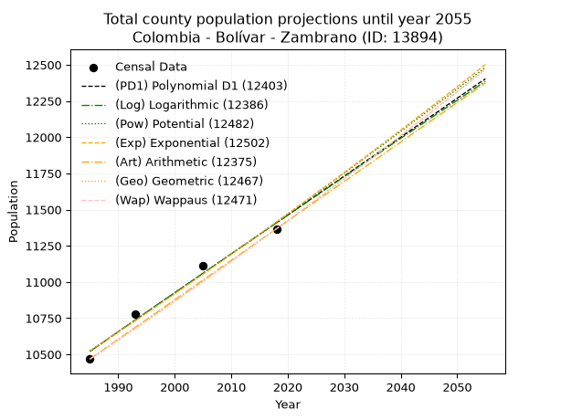
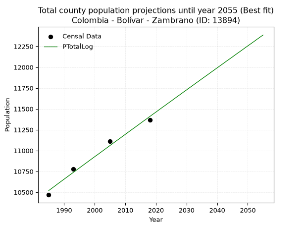
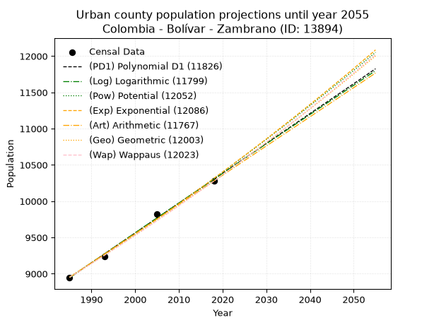
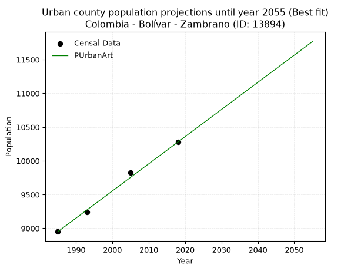
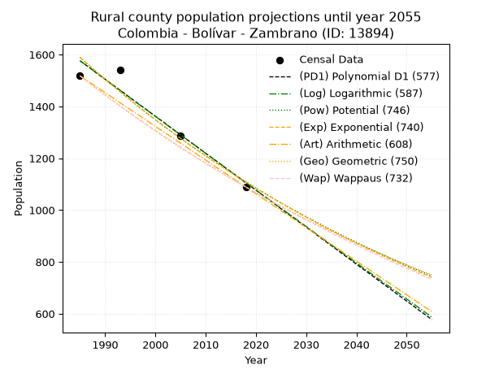
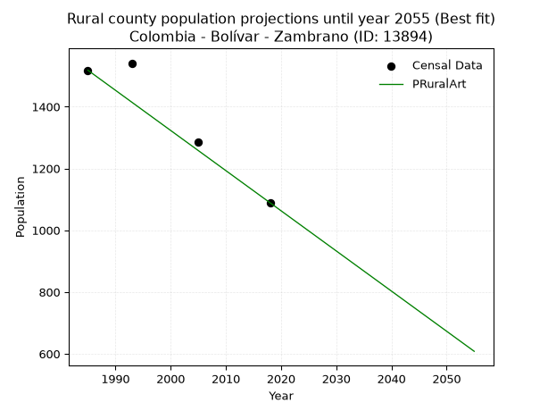

<div align="center">


</div>

# _“Population and Public Services Demand Projections (PPSD) until Year 2050 for Colombia - Bolívar - Zambrano (ID: 13894)”_
Keywords: `population` `public-service` `projection` `lineal` `polynomial` `logarithmic` `potential` `exponential` `arithmetic` `geometric` `wappaus` `dane` `colombia` `south-america`

PPSD are analytical estimates used by governments and planners to anticipate future changes in population size, age distribution, and the resulting community needs for utilities, healthcare, education, and infrastructure as sizing future water treatment facilities, electrical grids, and road networks based on spatial growth.

> **General running parameters**: • app_version: _v20260806_. • Python version: _3.14.7_. • Pandas version: _3.0.5_. • NumPy version: _2.5.1_. • Creates, save and include plots into reports (create_plot): _False_. • Projection until year: _2050_. • Process polynomial degree 2 and up: _False_. • Process Wappaus: _True_. • Process Wappaus: _True_. • Set negative values to zero: _True_. • Set infinite values to zero: _True_. • Drop dataset notes: _True_. 
<div align="center">

Dynamic map: [:earth_americas:Google](http://maps.google.com/maps?q=9.746306263,-74.8178792) [:earth_americas:OSM](https://www.openstreetmap.org/#map=18/9.746306263/-74.8178792&layers=P) [:earth_americas:Bing](https://www.bing.com/maps?cp=9.746306263~-74.8178792&lvl=18) [:earth_americas:Apple](https://maps.apple.com/frame?center=9.746306263%2C-74.8178792&span=0.003%2C0.006)

</div>


<div align="center">

```geojson
{
  "type": "Feature",
  "geometry": {
    "type": "Point", 
    "coordinates": [-74.8178792, 9.746306263]
  }, 
  "properties": {
    "Name": "Colombia - Bolívar - Zambrano (ID: 13894)"
  }
}
```

</div>


## 0. Census Data (4 records)

Census data are official statistics collected by a government about the people and housing in a country. They usually include counts of total population, age, sex, race, income, education, and jobs.

📅Global census file: [Population.xlsx](../data/Population.xlsx)

| Source   |   Year |   CountryID | CountryName   |   StateID | StateName   |   CountyID | CountyName   |   PTotal |   PUrban |   PRural |
|:---------|-------:|------------:|:--------------|----------:|:------------|-----------:|:-------------|---------:|---------:|---------:|
| DANE     |   1985 |          57 | Colombia      |        13 | Bolívar     |      13894 | Zambrano     |    10468 |     8950 |     1518 |
| DANE     |   1993 |          57 | Colombia      |        13 | Bolívar     |      13894 | Zambrano     |    10780 |     9239 |     1541 |
| DANE     |   2005 |          57 | Colombia      |        13 | Bolívar     |      13894 | Zambrano     |    11110 |     9824 |     1286 |
| DANE     |   2018 |          57 | Colombia      |        13 | Bolívar     |      13894 | Zambrano     |    11367 |    10278 |     1089 |

> 🔥Some records could had specific notes about the registered values or the corresponding urban or rural distribution.

## 1. Total

### 1.1. Coefficients and Parameters

* (PD1) Polynomial Deg 1: 26.888398233640913, -42852.268566840234 (lineal)
* (Log) Logarithmic: 53838.05578928084, -398292.24348542653
* (Pow) Potential: 4.926658613845662, -12.22481310968416
* (Exp) Exponential: 0.0024604592034193095, 79.627988945818
* (Art) Arithmetic: Year diff. 2018 - 1985 = 33, Population diff. 11367 - 10468 = 899, Annual growth = 27.242424242424242
* (Geo) Geometric: Year diff. 2018 - 1985 = 33, Population diff. 11367 - 10468 = 899, Annual growth % = 0.0024998295593177122
* (Wap) Wappaus: i = 0.24952987627592618, Condition values only valid for < 200)

<sub>
Wappaus condition values: ['0.00', '0.25', '0.50', '0.75', '1.00', '1.25', '1.50', '1.75', '2.00', '2.25', '2.50', '2.74', '2.99', '3.24', '3.49', '3.74', '3.99', '4.24', '4.49', '4.74', '4.99', '5.24', '5.49', '5.74', '5.99', '6.24', '6.49', '6.74', '6.99', '7.24', '7.49', '7.74', '7.98', '8.23', '8.48', '8.73', '8.98', '9.23', '9.48', '9.73', '9.98', '10.23', '10.48', '10.73', '10.98', '11.23', '11.48', '11.73', '11.98', '12.23', '12.48', '12.73', '12.98', '13.23', '13.47', '13.72', '13.97', '14.22', '14.47', '14.72', '14.97', '15.22', '15.47', '15.72', '15.97', '16.22']
</sub>


### 1.2. Projected Dataset

|   Year |   CountyID |   PTotalPD1 |   PTotalLog |   PTotalPow |   PTotalExp |   PTotalArt |   PTotalGeo |   PTotalWap |
|-------:|-----------:|------------:|------------:|------------:|------------:|------------:|------------:|------------:|
|   1985 |      13894 |       10521 |       10520 |       10523 |       10524 |       10468 |       10468 |       10468 |
|   1986 |      13894 |       10548 |       10547 |       10549 |       10550 |       10495 |       10494 |       10494 |
|   1987 |      13894 |       10575 |       10574 |       10575 |       10576 |       10522 |       10520 |       10520 |
|   1988 |      13894 |       10602 |       10602 |       10601 |       10602 |       10550 |       10547 |       10547 |
|   1989 |      13894 |       10629 |       10629 |       10628 |       10628 |       10577 |       10573 |       10573 |
|   1990 |      13894 |       10656 |       10656 |       10654 |       10654 |       10604 |       10599 |       10599 |
|   1991 |      13894 |       10683 |       10683 |       10680 |       10680 |       10631 |       10626 |       10626 |
|   1992 |      13894 |       10709 |       10710 |       10707 |       10706 |       10659 |       10653 |       10652 |
|   1993 |      13894 |       10736 |       10737 |       10733 |       10733 |       10686 |       10679 |       10679 |
|   1994 |      13894 |       10763 |       10764 |       10760 |       10759 |       10713 |       10706 |       10706 |
|   1995 |      13894 |       10790 |       10791 |       10786 |       10786 |       10740 |       10733 |       10733 |
|   1996 |      13894 |       10817 |       10818 |       10813 |       10812 |       10768 |       10759 |       10759 |
|   1997 |      13894 |       10844 |       10845 |       10840 |       10839 |       10795 |       10786 |       10786 |
|   1998 |      13894 |       10871 |       10872 |       10867 |       10866 |       10822 |       10813 |       10813 |
|   1999 |      13894 |       10898 |       10899 |       10893 |       10892 |       10849 |       10840 |       10840 |
|   2000 |      13894 |       10925 |       10926 |       10920 |       10919 |       10877 |       10867 |       10867 |
|   2001 |      13894 |       10951 |       10952 |       10947 |       10946 |       10904 |       10895 |       10894 |
|   2002 |      13894 |       10978 |       10979 |       10974 |       10973 |       10931 |       10922 |       10922 |
|   2003 |      13894 |       11005 |       11006 |       11001 |       11000 |       10958 |       10949 |       10949 |
|   2004 |      13894 |       11032 |       11033 |       11028 |       11027 |       10986 |       10977 |       10976 |
|   2005 |      13894 |       11059 |       11060 |       11055 |       11054 |       11013 |       11004 |       11004 |
|   2006 |      13894 |       11086 |       11087 |       11083 |       11082 |       11040 |       11031 |       11031 |
|   2007 |      13894 |       11113 |       11114 |       11110 |       11109 |       11067 |       11059 |       11059 |
|   2008 |      13894 |       11140 |       11140 |       11137 |       11136 |       11095 |       11087 |       11087 |
|   2009 |      13894 |       11167 |       11167 |       11165 |       11164 |       11122 |       11114 |       11114 |
|   2010 |      13894 |       11193 |       11194 |       11192 |       11191 |       11149 |       11142 |       11142 |
|   2011 |      13894 |       11220 |       11221 |       11219 |       11219 |       11176 |       11170 |       11170 |
|   2012 |      13894 |       11247 |       11248 |       11247 |       11246 |       11204 |       11198 |       11198 |
|   2013 |      13894 |       11274 |       11274 |       11274 |       11274 |       11231 |       11226 |       11226 |
|   2014 |      13894 |       11301 |       11301 |       11302 |       11302 |       11258 |       11254 |       11254 |
|   2015 |      13894 |       11328 |       11328 |       11330 |       11330 |       11285 |       11282 |       11282 |
|   2016 |      13894 |       11355 |       11355 |       11358 |       11358 |       11313 |       11310 |       11310 |
|   2017 |      13894 |       11382 |       11381 |       11385 |       11386 |       11340 |       11339 |       11339 |
|   2018 |      13894 |       11409 |       11408 |       11413 |       11414 |       11367 |       11367 |       11367 |
|   2019 |      13894 |       11435 |       11435 |       11441 |       11442 |       11394 |       11395 |       11395 |
|   2020 |      13894 |       11462 |       11461 |       11469 |       11470 |       11421 |       11424 |       11424 |
|   2021 |      13894 |       11489 |       11488 |       11497 |       11498 |       11449 |       11452 |       11453 |
|   2022 |      13894 |       11516 |       11515 |       11525 |       11527 |       11476 |       11481 |       11481 |
|   2023 |      13894 |       11543 |       11541 |       11553 |       11555 |       11503 |       11510 |       11510 |
|   2024 |      13894 |       11570 |       11568 |       11581 |       11583 |       11530 |       11539 |       11539 |
|   2025 |      13894 |       11597 |       11594 |       11610 |       11612 |       11558 |       11567 |       11568 |
|   2026 |      13894 |       11624 |       11621 |       11638 |       11641 |       11585 |       11596 |       11597 |
|   2027 |      13894 |       11651 |       11648 |       11666 |       11669 |       11612 |       11625 |       11626 |
|   2028 |      13894 |       11677 |       11674 |       11695 |       11698 |       11639 |       11654 |       11655 |
|   2029 |      13894 |       11704 |       11701 |       11723 |       11727 |       11667 |       11684 |       11684 |
|   2030 |      13894 |       11731 |       11727 |       11751 |       11756 |       11694 |       11713 |       11713 |
|   2031 |      13894 |       11758 |       11754 |       11780 |       11785 |       11721 |       11742 |       11743 |
|   2032 |      13894 |       11785 |       11780 |       11809 |       11814 |       11748 |       11771 |       11772 |
|   2033 |      13894 |       11812 |       11807 |       11837 |       11843 |       11776 |       11801 |       11802 |
|   2034 |      13894 |       11839 |       11833 |       11866 |       11872 |       11803 |       11830 |       11831 |
|   2035 |      13894 |       11866 |       11860 |       11895 |       11901 |       11830 |       11860 |       11861 |
|   2036 |      13894 |       11893 |       11886 |       11924 |       11931 |       11857 |       11889 |       11891 |
|   2037 |      13894 |       11919 |       11912 |       11952 |       11960 |       11885 |       11919 |       11921 |
|   2038 |      13894 |       11946 |       11939 |       11981 |       11989 |       11912 |       11949 |       11950 |
|   2039 |      13894 |       11973 |       11965 |       12010 |       12019 |       11939 |       11979 |       11980 |
|   2040 |      13894 |       12000 |       11992 |       12039 |       12049 |       11966 |       12009 |       12010 |
|   2041 |      13894 |       12027 |       12018 |       12069 |       12078 |       11994 |       12039 |       12041 |
|   2042 |      13894 |       12054 |       12044 |       12098 |       12108 |       12021 |       12069 |       12071 |
|   2043 |      13894 |       12081 |       12071 |       12127 |       12138 |       12048 |       12099 |       12101 |
|   2044 |      13894 |       12108 |       12097 |       12156 |       12168 |       12075 |       12129 |       12132 |
|   2045 |      13894 |       12135 |       12123 |       12185 |       12198 |       12103 |       12160 |       12162 |
|   2046 |      13894 |       12161 |       12150 |       12215 |       12228 |       12130 |       12190 |       12193 |
|   2047 |      13894 |       12188 |       12176 |       12244 |       12258 |       12157 |       12221 |       12223 |
|   2048 |      13894 |       12215 |       12202 |       12274 |       12288 |       12184 |       12251 |       12254 |
|   2049 |      13894 |       12242 |       12229 |       12303 |       12318 |       12212 |       12282 |       12285 |
|   2050 |      13894 |       12269 |       12255 |       12333 |       12349 |       12239 |       12312 |       12316 |
<div align="center">

</img>

</div>


### 1.3. Best fit with absolute and relative error (%)

Relative error puts that difference into context by dividing the absolute error by the true value, creating a unitless ratio or percentage that shows the scale of the mistake.

Absolute and relative error

|   Year | Source   |   CountryID | CountryName   |   StateID | StateName   |   CountyID_x | CountyName   |   PTotal |   PUrban |   PRural |   CountyID_y |   PTotalPD1 |   PTotalLog |   PTotalPow |   PTotalExp |   PTotalArt |   PTotalGeo |   PTotalWap |   PTotalPD1AbsError |   PTotalLogAbsError |   PTotalPowAbsError |   PTotalExpAbsError |   PTotalArtAbsError |   PTotalGeoAbsError |   PTotalWapAbsError |   PTotalPD1RelError |   PTotalLogRelError |   PTotalPowRelError |   PTotalExpRelError |   PTotalArtRelError |   PTotalGeoRelError |   PTotalWapRelError |
|-------:|:---------|------------:|:--------------|----------:|:------------|-------------:|:-------------|---------:|---------:|---------:|-------------:|------------:|------------:|------------:|------------:|------------:|------------:|------------:|--------------------:|--------------------:|--------------------:|--------------------:|--------------------:|--------------------:|--------------------:|--------------------:|--------------------:|--------------------:|--------------------:|--------------------:|--------------------:|--------------------:|
|   1985 | DANE     |          57 | Colombia      |        13 | Bolívar     |        13894 | Zambrano     |    10468 |     8950 |     1518 |        13894 |       10521 |       10520 |       10523 |       10524 |       10468 |       10468 |       10468 |                  53 |                  52 |                  55 |                  56 |                   0 |                   0 |                   0 |            0.506305 |            0.496752 |            0.525411 |            0.534964 |            0        |            0        |            0        |
|   1993 | DANE     |          57 | Colombia      |        13 | Bolívar     |        13894 | Zambrano     |    10780 |     9239 |     1541 |        13894 |       10736 |       10737 |       10733 |       10733 |       10686 |       10679 |       10679 |                  44 |                  43 |                  47 |                  47 |                  94 |                 101 |                 101 |            0.408163 |            0.398887 |            0.435993 |            0.435993 |            0.871985 |            0.93692  |            0.93692  |
|   2005 | DANE     |          57 | Colombia      |        13 | Bolívar     |        13894 | Zambrano     |    11110 |     9824 |     1286 |        13894 |       11059 |       11060 |       11055 |       11054 |       11013 |       11004 |       11004 |                  51 |                  50 |                  55 |                  56 |                  97 |                 106 |                 106 |            0.459046 |            0.450045 |            0.49505  |            0.50405  |            0.873087 |            0.954095 |            0.954095 |
|   2018 | DANE     |          57 | Colombia      |        13 | Bolívar     |        13894 | Zambrano     |    11367 |    10278 |     1089 |        13894 |       11409 |       11408 |       11413 |       11414 |       11367 |       11367 |       11367 |                  42 |                  41 |                  46 |                  47 |                   0 |                   0 |                   0 |            0.369491 |            0.360693 |            0.40468  |            0.413478 |            0        |            0        |            0        |

Relative error mean

| Method    |   RelError | Best   |
|:----------|-----------:|:-------|
| PTotalPD1 |   0.435751 |        |
| PTotalLog |   0.426594 | True   |
| PTotalPow |   0.465283 |        |
| PTotalExp |   0.472121 |        |
| PTotalArt |   0.436268 |        |
| PTotalGeo |   0.472754 |        |
| PTotalWap |   0.472754 |        |

💙Best method: _**PTotalLog**_
<div align="center">

</img>

</div>


### 1.4. Fresh water supply demand in liters per capita per day (lpcd)

The fresh water supply demand typically ranges from 100 to 300 liters per capita per day (lpcd) for standard domestic and municipal planning, though absolute survival minimums set by the World Health Organization are as low as 7.5 to 20 liters per day, and total consumption in high-income nations can exceed 400 liters.

> `CZ`: Level in meters above the sea level (masl)<br> `WS`: Fresh water supply demand in liters per capita per day (lpcd or l/h/d)<br> `WSAll`: Zonal fresh water supply demand in liters per second (l/s)<br> `A`: Zonal area in square meters<br> `DP`: Population density (people/hectare)

Reference values (RAS Colombia)

|    CZ |   WS |
|------:|-----:|
|  1000 |  120 |
|  2000 |  130 |
| 99999 |  140 |

County shapefile geometry properties and water supply values

|   CountyID |     ATotal |   CZTotal |   WSTotal |
|-----------:|-----------:|----------:|----------:|
|      13894 | 3.0931e+08 |   50.4312 |       120 |

Projected values for best method: PTotalLog

|   CountyID |   Year |   PTotalLog |   DPTotal |   WSTotal |   WSTotalAll |
|-----------:|-------:|------------:|----------:|----------:|-------------:|
|      13894 |   1985 |       10520 |      0.34 |       120 |      14.6111 |
|      13894 |   1986 |       10547 |      0.34 |       120 |      14.6486 |
|      13894 |   1987 |       10574 |      0.34 |       120 |      14.6861 |
|      13894 |   1988 |       10602 |      0.34 |       120 |      14.725  |
|      13894 |   1989 |       10629 |      0.34 |       120 |      14.7625 |
|      13894 |   1990 |       10656 |      0.34 |       120 |      14.8    |
|      13894 |   1991 |       10683 |      0.35 |       120 |      14.8375 |
|      13894 |   1992 |       10710 |      0.35 |       120 |      14.875  |
|      13894 |   1993 |       10737 |      0.35 |       120 |      14.9125 |
|      13894 |   1994 |       10764 |      0.35 |       120 |      14.95   |
|      13894 |   1995 |       10791 |      0.35 |       120 |      14.9875 |
|      13894 |   1996 |       10818 |      0.35 |       120 |      15.025  |
|      13894 |   1997 |       10845 |      0.35 |       120 |      15.0625 |
|      13894 |   1998 |       10872 |      0.35 |       120 |      15.1    |
|      13894 |   1999 |       10899 |      0.35 |       120 |      15.1375 |
|      13894 |   2000 |       10926 |      0.35 |       120 |      15.175  |
|      13894 |   2001 |       10952 |      0.35 |       120 |      15.2111 |
|      13894 |   2002 |       10979 |      0.35 |       120 |      15.2486 |
|      13894 |   2003 |       11006 |      0.36 |       120 |      15.2861 |
|      13894 |   2004 |       11033 |      0.36 |       120 |      15.3236 |
|      13894 |   2005 |       11060 |      0.36 |       120 |      15.3611 |
|      13894 |   2006 |       11087 |      0.36 |       120 |      15.3986 |
|      13894 |   2007 |       11114 |      0.36 |       120 |      15.4361 |
|      13894 |   2008 |       11140 |      0.36 |       120 |      15.4722 |
|      13894 |   2009 |       11167 |      0.36 |       120 |      15.5097 |
|      13894 |   2010 |       11194 |      0.36 |       120 |      15.5472 |
|      13894 |   2011 |       11221 |      0.36 |       120 |      15.5847 |
|      13894 |   2012 |       11248 |      0.36 |       120 |      15.6222 |
|      13894 |   2013 |       11274 |      0.36 |       120 |      15.6583 |
|      13894 |   2014 |       11301 |      0.37 |       120 |      15.6958 |
|      13894 |   2015 |       11328 |      0.37 |       120 |      15.7333 |
|      13894 |   2016 |       11355 |      0.37 |       120 |      15.7708 |
|      13894 |   2017 |       11381 |      0.37 |       120 |      15.8069 |
|      13894 |   2018 |       11408 |      0.37 |       120 |      15.8444 |
|      13894 |   2019 |       11435 |      0.37 |       120 |      15.8819 |
|      13894 |   2020 |       11461 |      0.37 |       120 |      15.9181 |
|      13894 |   2021 |       11488 |      0.37 |       120 |      15.9556 |
|      13894 |   2022 |       11515 |      0.37 |       120 |      15.9931 |
|      13894 |   2023 |       11541 |      0.37 |       120 |      16.0292 |
|      13894 |   2024 |       11568 |      0.37 |       120 |      16.0667 |
|      13894 |   2025 |       11594 |      0.37 |       120 |      16.1028 |
|      13894 |   2026 |       11621 |      0.38 |       120 |      16.1403 |
|      13894 |   2027 |       11648 |      0.38 |       120 |      16.1778 |
|      13894 |   2028 |       11674 |      0.38 |       120 |      16.2139 |
|      13894 |   2029 |       11701 |      0.38 |       120 |      16.2514 |
|      13894 |   2030 |       11727 |      0.38 |       120 |      16.2875 |
|      13894 |   2031 |       11754 |      0.38 |       120 |      16.325  |
|      13894 |   2032 |       11780 |      0.38 |       120 |      16.3611 |
|      13894 |   2033 |       11807 |      0.38 |       120 |      16.3986 |
|      13894 |   2034 |       11833 |      0.38 |       120 |      16.4347 |
|      13894 |   2035 |       11860 |      0.38 |       120 |      16.4722 |
|      13894 |   2036 |       11886 |      0.38 |       120 |      16.5083 |
|      13894 |   2037 |       11912 |      0.39 |       120 |      16.5444 |
|      13894 |   2038 |       11939 |      0.39 |       120 |      16.5819 |
|      13894 |   2039 |       11965 |      0.39 |       120 |      16.6181 |
|      13894 |   2040 |       11992 |      0.39 |       120 |      16.6556 |
|      13894 |   2041 |       12018 |      0.39 |       120 |      16.6917 |
|      13894 |   2042 |       12044 |      0.39 |       120 |      16.7278 |
|      13894 |   2043 |       12071 |      0.39 |       120 |      16.7653 |
|      13894 |   2044 |       12097 |      0.39 |       120 |      16.8014 |
|      13894 |   2045 |       12123 |      0.39 |       120 |      16.8375 |
|      13894 |   2046 |       12150 |      0.39 |       120 |      16.875  |
|      13894 |   2047 |       12176 |      0.39 |       120 |      16.9111 |
|      13894 |   2048 |       12202 |      0.39 |       120 |      16.9472 |
|      13894 |   2049 |       12229 |      0.4  |       120 |      16.9847 |
|      13894 |   2050 |       12255 |      0.4  |       120 |      17.0208 |

## 2. Urban

### 2.1. Coefficients and Parameters

* (PD1) Polynomial Deg 1: 41.15335206744252, -72744.24247290191 (lineal)
* (Log) Logarithmic: 82379.33632973053, -616593.2455888528
* (Pow) Potential: 8.576128808540812, -24.330040343888836
* (Exp) Exponential: 0.004284103368005339, 1.814768350271667
* (Art) Arithmetic: Year diff. 2018 - 1985 = 33, Population diff. 10278 - 8950 = 1328, Annual growth = 40.24242424242424
* (Geo) Geometric: Year diff. 2018 - 1985 = 33, Population diff. 10278 - 8950 = 1328, Annual growth % = 0.004201290363559318
* (Wap) Wappaus: i = 0.4185814878554633, Condition values only valid for < 200)

<sub>
Wappaus condition values: ['0.00', '0.42', '0.84', '1.26', '1.67', '2.09', '2.51', '2.93', '3.35', '3.77', '4.19', '4.60', '5.02', '5.44', '5.86', '6.28', '6.70', '7.12', '7.53', '7.95', '8.37', '8.79', '9.21', '9.63', '10.05', '10.46', '10.88', '11.30', '11.72', '12.14', '12.56', '12.98', '13.39', '13.81', '14.23', '14.65', '15.07', '15.49', '15.91', '16.32', '16.74', '17.16', '17.58', '18.00', '18.42', '18.84', '19.25', '19.67', '20.09', '20.51', '20.93', '21.35', '21.77', '22.18', '22.60', '23.02', '23.44', '23.86', '24.28', '24.70', '25.11', '25.53', '25.95', '26.37', '26.79', '27.21']
</sub>


### 2.2. Projected Dataset

|   Year |   CountyID |   PUrbanPD1 |   PUrbanLog |   PUrbanPow |   PUrbanExp |   PUrbanArt |   PUrbanGeo |   PUrbanWap |
|-------:|-----------:|------------:|------------:|------------:|------------:|------------:|------------:|------------:|
|   1985 |      13894 |        8945 |        8944 |        8953 |        8954 |        8950 |        8950 |        8950 |
|   1986 |      13894 |        8986 |        8985 |        8992 |        8993 |        8990 |        8988 |        8988 |
|   1987 |      13894 |        9027 |        9027 |        9031 |        9031 |        9030 |        9025 |        9025 |
|   1988 |      13894 |        9069 |        9068 |        9070 |        9070 |        9071 |        9063 |        9063 |
|   1989 |      13894 |        9110 |        9110 |        9109 |        9109 |        9111 |        9101 |        9101 |
|   1990 |      13894 |        9151 |        9151 |        9148 |        9148 |        9151 |        9140 |        9139 |
|   1991 |      13894 |        9192 |        9193 |        9188 |        9188 |        9191 |        9178 |        9178 |
|   1992 |      13894 |        9233 |        9234 |        9228 |        9227 |        9232 |        9217 |        9216 |
|   1993 |      13894 |        9274 |        9275 |        9267 |        9267 |        9272 |        9255 |        9255 |
|   1994 |      13894 |        9316 |        9317 |        9307 |        9306 |        9312 |        9294 |        9294 |
|   1995 |      13894 |        9357 |        9358 |        9347 |        9346 |        9352 |        9333 |        9333 |
|   1996 |      13894 |        9398 |        9399 |        9388 |        9387 |        9393 |        9372 |        9372 |
|   1997 |      13894 |        9439 |        9440 |        9428 |        9427 |        9433 |        9412 |        9411 |
|   1998 |      13894 |        9480 |        9482 |        9469 |        9467 |        9473 |        9451 |        9451 |
|   1999 |      13894 |        9521 |        9523 |        9509 |        9508 |        9513 |        9491 |        9490 |
|   2000 |      13894 |        9562 |        9564 |        9550 |        9549 |        9554 |        9531 |        9530 |
|   2001 |      13894 |        9604 |        9605 |        9591 |        9590 |        9594 |        9571 |        9570 |
|   2002 |      13894 |        9645 |        9646 |        9633 |        9631 |        9634 |        9611 |        9610 |
|   2003 |      13894 |        9686 |        9688 |        9674 |        9672 |        9674 |        9652 |        9651 |
|   2004 |      13894 |        9727 |        9729 |        9715 |        9714 |        9715 |        9692 |        9691 |
|   2005 |      13894 |        9768 |        9770 |        9757 |        9755 |        9755 |        9733 |        9732 |
|   2006 |      13894 |        9809 |        9811 |        9799 |        9797 |        9795 |        9774 |        9773 |
|   2007 |      13894 |        9851 |        9852 |        9841 |        9839 |        9835 |        9815 |        9814 |
|   2008 |      13894 |        9892 |        9893 |        9883 |        9882 |        9876 |        9856 |        9855 |
|   2009 |      13894 |        9933 |        9934 |        9925 |        9924 |        9916 |        9897 |        9897 |
|   2010 |      13894 |        9974 |        9975 |        9968 |        9967 |        9956 |        9939 |        9938 |
|   2011 |      13894 |       10015 |       10016 |       10010 |       10009 |        9996 |        9981 |        9980 |
|   2012 |      13894 |       10056 |       10057 |       10053 |       10052 |       10037 |       10023 |       10022 |
|   2013 |      13894 |       10097 |       10098 |       10096 |       10096 |       10077 |       10065 |       10064 |
|   2014 |      13894 |       10139 |       10139 |       10139 |       10139 |       10117 |       10107 |       10107 |
|   2015 |      13894 |       10180 |       10180 |       10182 |       10183 |       10157 |       10150 |       10149 |
|   2016 |      13894 |       10221 |       10220 |       10226 |       10226 |       10198 |       10192 |       10192 |
|   2017 |      13894 |       10262 |       10261 |       10269 |       10270 |       10238 |       10235 |       10235 |
|   2018 |      13894 |       10303 |       10302 |       10313 |       10314 |       10278 |       10278 |       10278 |
|   2019 |      13894 |       10344 |       10343 |       10357 |       10358 |       10318 |       10321 |       10321 |
|   2020 |      13894 |       10386 |       10384 |       10401 |       10403 |       10358 |       10365 |       10365 |
|   2021 |      13894 |       10427 |       10425 |       10445 |       10448 |       10399 |       10408 |       10409 |
|   2022 |      13894 |       10468 |       10465 |       10490 |       10492 |       10439 |       10452 |       10452 |
|   2023 |      13894 |       10509 |       10506 |       10534 |       10538 |       10479 |       10496 |       10497 |
|   2024 |      13894 |       10550 |       10547 |       10579 |       10583 |       10519 |       10540 |       10541 |
|   2025 |      13894 |       10591 |       10587 |       10624 |       10628 |       10560 |       10584 |       10585 |
|   2026 |      13894 |       10632 |       10628 |       10669 |       10674 |       10600 |       10629 |       10630 |
|   2027 |      13894 |       10674 |       10669 |       10714 |       10720 |       10640 |       10673 |       10675 |
|   2028 |      13894 |       10715 |       10709 |       10760 |       10766 |       10680 |       10718 |       10720 |
|   2029 |      13894 |       10756 |       10750 |       10805 |       10812 |       10721 |       10763 |       10766 |
|   2030 |      13894 |       10797 |       10791 |       10851 |       10858 |       10761 |       10808 |       10811 |
|   2031 |      13894 |       10838 |       10831 |       10897 |       10905 |       10801 |       10854 |       10857 |
|   2032 |      13894 |       10879 |       10872 |       10943 |       10952 |       10841 |       10899 |       10903 |
|   2033 |      13894 |       10921 |       10912 |       10989 |       10999 |       10882 |       10945 |       10949 |
|   2034 |      13894 |       10962 |       10953 |       11036 |       11046 |       10922 |       10991 |       10995 |
|   2035 |      13894 |       11003 |       10993 |       11082 |       11093 |       10962 |       11037 |       11042 |
|   2036 |      13894 |       11044 |       11034 |       11129 |       11141 |       11002 |       11084 |       11089 |
|   2037 |      13894 |       11085 |       11074 |       11176 |       11189 |       11043 |       11130 |       11136 |
|   2038 |      13894 |       11126 |       11115 |       11223 |       11237 |       11083 |       11177 |       11183 |
|   2039 |      13894 |       11167 |       11155 |       11271 |       11285 |       11123 |       11224 |       11231 |
|   2040 |      13894 |       11209 |       11195 |       11318 |       11334 |       11163 |       11271 |       11279 |
|   2041 |      13894 |       11250 |       11236 |       11366 |       11382 |       11204 |       11318 |       11326 |
|   2042 |      13894 |       11291 |       11276 |       11414 |       11431 |       11244 |       11366 |       11375 |
|   2043 |      13894 |       11332 |       11316 |       11462 |       11480 |       11284 |       11414 |       11423 |
|   2044 |      13894 |       11373 |       11357 |       11510 |       11530 |       11324 |       11462 |       11472 |
|   2045 |      13894 |       11414 |       11397 |       11558 |       11579 |       11365 |       11510 |       11521 |
|   2046 |      13894 |       11456 |       11437 |       11607 |       11629 |       11405 |       11558 |       11570 |
|   2047 |      13894 |       11497 |       11478 |       11656 |       11679 |       11445 |       11607 |       11619 |
|   2048 |      13894 |       11538 |       11518 |       11704 |       11729 |       11485 |       11656 |       11669 |
|   2049 |      13894 |       11579 |       11558 |       11754 |       11779 |       11526 |       11704 |       11718 |
|   2050 |      13894 |       11620 |       11598 |       11803 |       11830 |       11566 |       11754 |       11769 |
<div align="center">

</img>

</div>


### 2.3. Best fit with absolute and relative error (%)

Relative error puts that difference into context by dividing the absolute error by the true value, creating a unitless ratio or percentage that shows the scale of the mistake.

Absolute and relative error

|   Year | Source   |   CountryID | CountryName   |   StateID | StateName   |   CountyID_x | CountyName   |   PTotal |   PUrban |   PRural |   CountyID_y |   PUrbanPD1 |   PUrbanLog |   PUrbanPow |   PUrbanExp |   PUrbanArt |   PUrbanGeo |   PUrbanWap |   PUrbanPD1AbsError |   PUrbanLogAbsError |   PUrbanPowAbsError |   PUrbanExpAbsError |   PUrbanArtAbsError |   PUrbanGeoAbsError |   PUrbanWapAbsError |   PUrbanPD1RelError |   PUrbanLogRelError |   PUrbanPowRelError |   PUrbanExpRelError |   PUrbanArtRelError |   PUrbanGeoRelError |   PUrbanWapRelError |
|-------:|:---------|------------:|:--------------|----------:|:------------|-------------:|:-------------|---------:|---------:|---------:|-------------:|------------:|------------:|------------:|------------:|------------:|------------:|------------:|--------------------:|--------------------:|--------------------:|--------------------:|--------------------:|--------------------:|--------------------:|--------------------:|--------------------:|--------------------:|--------------------:|--------------------:|--------------------:|--------------------:|
|   1985 | DANE     |          57 | Colombia      |        13 | Bolívar     |        13894 | Zambrano     |    10468 |     8950 |     1518 |        13894 |        8945 |        8944 |        8953 |        8954 |        8950 |        8950 |        8950 |                   5 |                   6 |                   3 |                   4 |                   0 |                   0 |                   0 |           0.0558659 |           0.0670391 |           0.0335196 |           0.0446927 |            0        |            0        |            0        |
|   1993 | DANE     |          57 | Colombia      |        13 | Bolívar     |        13894 | Zambrano     |    10780 |     9239 |     1541 |        13894 |        9274 |        9275 |        9267 |        9267 |        9272 |        9255 |        9255 |                  35 |                  36 |                  28 |                  28 |                  33 |                  16 |                  16 |           0.378829  |           0.389653  |           0.303063  |           0.303063  |            0.357182 |            0.173179 |            0.173179 |
|   2005 | DANE     |          57 | Colombia      |        13 | Bolívar     |        13894 | Zambrano     |    11110 |     9824 |     1286 |        13894 |        9768 |        9770 |        9757 |        9755 |        9755 |        9733 |        9732 |                  56 |                  54 |                  67 |                  69 |                  69 |                  91 |                  92 |           0.570033  |           0.549674  |           0.682003  |           0.702362  |            0.702362 |            0.926303 |            0.936482 |
|   2018 | DANE     |          57 | Colombia      |        13 | Bolívar     |        13894 | Zambrano     |    11367 |    10278 |     1089 |        13894 |       10303 |       10302 |       10313 |       10314 |       10278 |       10278 |       10278 |                  25 |                  24 |                  35 |                  36 |                   0 |                   0 |                   0 |           0.243238  |           0.233508  |           0.340533  |           0.350263  |            0        |            0        |            0        |

Relative error mean

| Method    |   RelError | Best   |
|:----------|-----------:|:-------|
| PUrbanPD1 |   0.311991 |        |
| PUrbanLog |   0.309969 |        |
| PUrbanPow |   0.33978  |        |
| PUrbanExp |   0.350095 |        |
| PUrbanArt |   0.264886 | True   |
| PUrbanGeo |   0.27487  |        |
| PUrbanWap |   0.277415 |        |

💙Best method: _**PUrbanArt**_
<div align="center">

</img>

</div>


### 2.4. Fresh water supply demand in liters per capita per day (lpcd)

The fresh water supply demand typically ranges from 100 to 300 liters per capita per day (lpcd) for standard domestic and municipal planning, though absolute survival minimums set by the World Health Organization are as low as 7.5 to 20 liters per day, and total consumption in high-income nations can exceed 400 liters.

> `CZ`: Level in meters above the sea level (masl)<br> `WS`: Fresh water supply demand in liters per capita per day (lpcd or l/h/d)<br> `WSAll`: Zonal fresh water supply demand in liters per second (l/s)<br> `A`: Zonal area in square meters<br> `DP`: Population density (people/hectare)

Reference values (RAS Colombia)

|    CZ |   WS |
|------:|-----:|
|  1000 |  120 |
|  2000 |  130 |
| 99999 |  140 |

County shapefile geometry properties and water supply values

|   CountyID |      AUrban |   CZUrban |   WSUrban |
|-----------:|------------:|----------:|----------:|
|      13894 | 2.29134e+06 |   14.5331 |       120 |

Projected values for best method: PUrbanArt

|   CountyID |   Year |   PUrbanArt |   DPUrban |   WSUrban |   WSUrbanAll |
|-----------:|-------:|------------:|----------:|----------:|-------------:|
|      13894 |   1985 |        8950 |     39.06 |       120 |      12.4306 |
|      13894 |   1986 |        8990 |     39.23 |       120 |      12.4861 |
|      13894 |   1987 |        9030 |     39.41 |       120 |      12.5417 |
|      13894 |   1988 |        9071 |     39.59 |       120 |      12.5986 |
|      13894 |   1989 |        9111 |     39.76 |       120 |      12.6542 |
|      13894 |   1990 |        9151 |     39.94 |       120 |      12.7097 |
|      13894 |   1991 |        9191 |     40.11 |       120 |      12.7653 |
|      13894 |   1992 |        9232 |     40.29 |       120 |      12.8222 |
|      13894 |   1993 |        9272 |     40.47 |       120 |      12.8778 |
|      13894 |   1994 |        9312 |     40.64 |       120 |      12.9333 |
|      13894 |   1995 |        9352 |     40.81 |       120 |      12.9889 |
|      13894 |   1996 |        9393 |     40.99 |       120 |      13.0458 |
|      13894 |   1997 |        9433 |     41.17 |       120 |      13.1014 |
|      13894 |   1998 |        9473 |     41.34 |       120 |      13.1569 |
|      13894 |   1999 |        9513 |     41.52 |       120 |      13.2125 |
|      13894 |   2000 |        9554 |     41.7  |       120 |      13.2694 |
|      13894 |   2001 |        9594 |     41.87 |       120 |      13.325  |
|      13894 |   2002 |        9634 |     42.05 |       120 |      13.3806 |
|      13894 |   2003 |        9674 |     42.22 |       120 |      13.4361 |
|      13894 |   2004 |        9715 |     42.4  |       120 |      13.4931 |
|      13894 |   2005 |        9755 |     42.57 |       120 |      13.5486 |
|      13894 |   2006 |        9795 |     42.75 |       120 |      13.6042 |
|      13894 |   2007 |        9835 |     42.92 |       120 |      13.6597 |
|      13894 |   2008 |        9876 |     43.1  |       120 |      13.7167 |
|      13894 |   2009 |        9916 |     43.28 |       120 |      13.7722 |
|      13894 |   2010 |        9956 |     43.45 |       120 |      13.8278 |
|      13894 |   2011 |        9996 |     43.63 |       120 |      13.8833 |
|      13894 |   2012 |       10037 |     43.8  |       120 |      13.9403 |
|      13894 |   2013 |       10077 |     43.98 |       120 |      13.9958 |
|      13894 |   2014 |       10117 |     44.15 |       120 |      14.0514 |
|      13894 |   2015 |       10157 |     44.33 |       120 |      14.1069 |
|      13894 |   2016 |       10198 |     44.51 |       120 |      14.1639 |
|      13894 |   2017 |       10238 |     44.68 |       120 |      14.2194 |
|      13894 |   2018 |       10278 |     44.86 |       120 |      14.275  |
|      13894 |   2019 |       10318 |     45.03 |       120 |      14.3306 |
|      13894 |   2020 |       10358 |     45.21 |       120 |      14.3861 |
|      13894 |   2021 |       10399 |     45.38 |       120 |      14.4431 |
|      13894 |   2022 |       10439 |     45.56 |       120 |      14.4986 |
|      13894 |   2023 |       10479 |     45.73 |       120 |      14.5542 |
|      13894 |   2024 |       10519 |     45.91 |       120 |      14.6097 |
|      13894 |   2025 |       10560 |     46.09 |       120 |      14.6667 |
|      13894 |   2026 |       10600 |     46.26 |       120 |      14.7222 |
|      13894 |   2027 |       10640 |     46.44 |       120 |      14.7778 |
|      13894 |   2028 |       10680 |     46.61 |       120 |      14.8333 |
|      13894 |   2029 |       10721 |     46.79 |       120 |      14.8903 |
|      13894 |   2030 |       10761 |     46.96 |       120 |      14.9458 |
|      13894 |   2031 |       10801 |     47.14 |       120 |      15.0014 |
|      13894 |   2032 |       10841 |     47.31 |       120 |      15.0569 |
|      13894 |   2033 |       10882 |     47.49 |       120 |      15.1139 |
|      13894 |   2034 |       10922 |     47.67 |       120 |      15.1694 |
|      13894 |   2035 |       10962 |     47.84 |       120 |      15.225  |
|      13894 |   2036 |       11002 |     48.02 |       120 |      15.2806 |
|      13894 |   2037 |       11043 |     48.19 |       120 |      15.3375 |
|      13894 |   2038 |       11083 |     48.37 |       120 |      15.3931 |
|      13894 |   2039 |       11123 |     48.54 |       120 |      15.4486 |
|      13894 |   2040 |       11163 |     48.72 |       120 |      15.5042 |
|      13894 |   2041 |       11204 |     48.9  |       120 |      15.5611 |
|      13894 |   2042 |       11244 |     49.07 |       120 |      15.6167 |
|      13894 |   2043 |       11284 |     49.25 |       120 |      15.6722 |
|      13894 |   2044 |       11324 |     49.42 |       120 |      15.7278 |
|      13894 |   2045 |       11365 |     49.6  |       120 |      15.7847 |
|      13894 |   2046 |       11405 |     49.77 |       120 |      15.8403 |
|      13894 |   2047 |       11445 |     49.95 |       120 |      15.8958 |
|      13894 |   2048 |       11485 |     50.12 |       120 |      15.9514 |
|      13894 |   2049 |       11526 |     50.3  |       120 |      16.0083 |
|      13894 |   2050 |       11566 |     50.48 |       120 |      16.0639 |

## 3. Rural

### 3.1. Coefficients and Parameters

* (PD1) Polynomial Deg 1: -14.264953833801545, 29891.973906061543 (lineal)
* (Log) Logarithmic: -28541.28054044976, 218301.00210342687
* (Pow) Potential: -21.820787367986586, 75.16090974301332
* (Exp) Exponential: -0.010906818442464553, 4013859225421.759
* (Art) Arithmetic: Year diff. 2018 - 1985 = 33, Population diff. 1089 - 1518 = -429, Annual growth = -13.0
* (Geo) Geometric: Year diff. 2018 - 1985 = 33, Population diff. 1089 - 1518 = -429, Annual growth % = -0.01001418245412422
* (Wap) Wappaus: i = -0.9973149213655543, Condition values only valid for < 200)

<sub>
Wappaus condition values: ['-0.00', '-1.00', '-1.99', '-2.99', '-3.99', '-4.99', '-5.98', '-6.98', '-7.98', '-8.98', '-9.97', '-10.97', '-11.97', '-12.97', '-13.96', '-14.96', '-15.96', '-16.95', '-17.95', '-18.95', '-19.95', '-20.94', '-21.94', '-22.94', '-23.94', '-24.93', '-25.93', '-26.93', '-27.92', '-28.92', '-29.92', '-30.92', '-31.91', '-32.91', '-33.91', '-34.91', '-35.90', '-36.90', '-37.90', '-38.90', '-39.89', '-40.89', '-41.89', '-42.88', '-43.88', '-44.88', '-45.88', '-46.87', '-47.87', '-48.87', '-49.87', '-50.86', '-51.86', '-52.86', '-53.86', '-54.85', '-55.85', '-56.85', '-57.84', '-58.84', '-59.84', '-60.84', '-61.83', '-62.83', '-63.83', '-64.83']
</sub>


### 3.2. Projected Dataset

|   Year |   CountyID |   PRuralPD1 |   PRuralLog |   PRuralPow |   PRuralExp |   PRuralArt |   PRuralGeo |   PRuralWap |
|-------:|-----------:|------------:|------------:|------------:|------------:|------------:|------------:|------------:|
|   1985 |      13894 |        1576 |        1576 |        1589 |        1589 |        1518 |        1518 |        1518 |
|   1986 |      13894 |        1562 |        1562 |        1572 |        1572 |        1505 |        1503 |        1503 |
|   1987 |      13894 |        1548 |        1548 |        1555 |        1555 |        1492 |        1488 |        1488 |
|   1988 |      13894 |        1533 |        1533 |        1538 |        1538 |        1479 |        1473 |        1473 |
|   1989 |      13894 |        1519 |        1519 |        1521 |        1521 |        1466 |        1458 |        1459 |
|   1990 |      13894 |        1505 |        1505 |        1504 |        1504 |        1453 |        1443 |        1444 |
|   1991 |      13894 |        1490 |        1490 |        1488 |        1488 |        1440 |        1429 |        1430 |
|   1992 |      13894 |        1476 |        1476 |        1472 |        1472 |        1427 |        1415 |        1416 |
|   1993 |      13894 |        1462 |        1462 |        1456 |        1456 |        1414 |        1401 |        1402 |
|   1994 |      13894 |        1448 |        1447 |        1440 |        1440 |        1401 |        1387 |        1388 |
|   1995 |      13894 |        1433 |        1433 |        1424 |        1425 |        1388 |        1373 |        1374 |
|   1996 |      13894 |        1419 |        1419 |        1409 |        1409 |        1375 |        1359 |        1360 |
|   1997 |      13894 |        1405 |        1404 |        1393 |        1394 |        1362 |        1345 |        1347 |
|   1998 |      13894 |        1391 |        1390 |        1378 |        1379 |        1349 |        1332 |        1333 |
|   1999 |      13894 |        1376 |        1376 |        1363 |        1364 |        1336 |        1318 |        1320 |
|   2000 |      13894 |        1362 |        1362 |        1348 |        1349 |        1323 |        1305 |        1307 |
|   2001 |      13894 |        1348 |        1347 |        1334 |        1334 |        1310 |        1292 |        1294 |
|   2002 |      13894 |        1334 |        1333 |        1319 |        1320 |        1297 |        1279 |        1281 |
|   2003 |      13894 |        1319 |        1319 |        1305 |        1306 |        1284 |        1266 |        1268 |
|   2004 |      13894 |        1305 |        1304 |        1291 |        1291 |        1271 |        1254 |        1255 |
|   2005 |      13894 |        1291 |        1290 |        1277 |        1277 |        1258 |        1241 |        1243 |
|   2006 |      13894 |        1276 |        1276 |        1263 |        1264 |        1245 |        1229 |        1230 |
|   2007 |      13894 |        1262 |        1262 |        1249 |        1250 |        1232 |        1216 |        1218 |
|   2008 |      13894 |        1248 |        1248 |        1236 |        1236 |        1219 |        1204 |        1206 |
|   2009 |      13894 |        1234 |        1233 |        1223 |        1223 |        1206 |        1192 |        1193 |
|   2010 |      13894 |        1219 |        1219 |        1209 |        1210 |        1193 |        1180 |        1181 |
|   2011 |      13894 |        1205 |        1205 |        1196 |        1197 |        1180 |        1168 |        1170 |
|   2012 |      13894 |        1191 |        1191 |        1183 |        1184 |        1167 |        1157 |        1158 |
|   2013 |      13894 |        1177 |        1177 |        1171 |        1171 |        1154 |        1145 |        1146 |
|   2014 |      13894 |        1162 |        1162 |        1158 |        1158 |        1141 |        1134 |        1134 |
|   2015 |      13894 |        1148 |        1148 |        1146 |        1145 |        1128 |        1122 |        1123 |
|   2016 |      13894 |        1134 |        1134 |        1133 |        1133 |        1115 |        1111 |        1112 |
|   2017 |      13894 |        1120 |        1120 |        1121 |        1121 |        1102 |        1100 |        1100 |
|   2018 |      13894 |        1105 |        1106 |        1109 |        1109 |        1089 |        1089 |        1089 |
|   2019 |      13894 |        1091 |        1092 |        1097 |        1097 |        1076 |        1078 |        1078 |
|   2020 |      13894 |        1077 |        1078 |        1085 |        1085 |        1063 |        1067 |        1067 |
|   2021 |      13894 |        1063 |        1063 |        1074 |        1073 |        1050 |        1057 |        1056 |
|   2022 |      13894 |        1048 |        1049 |        1062 |        1061 |        1037 |        1046 |        1045 |
|   2023 |      13894 |        1034 |        1035 |        1051 |        1050 |        1024 |        1036 |        1034 |
|   2024 |      13894 |        1020 |        1021 |        1039 |        1038 |        1011 |        1025 |        1024 |
|   2025 |      13894 |        1005 |        1007 |        1028 |        1027 |         998 |        1015 |        1013 |
|   2026 |      13894 |         991 |         993 |        1017 |        1016 |         985 |        1005 |        1003 |
|   2027 |      13894 |         977 |         979 |        1006 |        1005 |         972 |         995 |         992 |
|   2028 |      13894 |         963 |         965 |         996 |         994 |         959 |         985 |         982 |
|   2029 |      13894 |         948 |         951 |         985 |         983 |         946 |         975 |         972 |
|   2030 |      13894 |         934 |         937 |         974 |         973 |         933 |         965 |         962 |
|   2031 |      13894 |         920 |         923 |         964 |         962 |         920 |         955 |         952 |
|   2032 |      13894 |         906 |         908 |         954 |         952 |         907 |         946 |         942 |
|   2033 |      13894 |         891 |         894 |         944 |         941 |         894 |         936 |         932 |
|   2034 |      13894 |         877 |         880 |         933 |         931 |         881 |         927 |         922 |
|   2035 |      13894 |         863 |         866 |         923 |         921 |         868 |         918 |         912 |
|   2036 |      13894 |         849 |         852 |         914 |         911 |         855 |         909 |         902 |
|   2037 |      13894 |         834 |         838 |         904 |         901 |         842 |         899 |         893 |
|   2038 |      13894 |         820 |         824 |         894 |         891 |         829 |         890 |         883 |
|   2039 |      13894 |         806 |         810 |         885 |         882 |         816 |         882 |         874 |
|   2040 |      13894 |         791 |         796 |         875 |         872 |         803 |         873 |         865 |
|   2041 |      13894 |         777 |         782 |         866 |         863 |         790 |         864 |         855 |
|   2042 |      13894 |         763 |         768 |         857 |         853 |         777 |         855 |         846 |
|   2043 |      13894 |         749 |         754 |         848 |         844 |         764 |         847 |         837 |
|   2044 |      13894 |         734 |         740 |         839 |         835 |         751 |         838 |         828 |
|   2045 |      13894 |         720 |         726 |         830 |         826 |         738 |         830 |         819 |
|   2046 |      13894 |         706 |         712 |         821 |         817 |         725 |         822 |         810 |
|   2047 |      13894 |         692 |         699 |         812 |         808 |         712 |         813 |         801 |
|   2048 |      13894 |         677 |         685 |         804 |         799 |         699 |         805 |         792 |
|   2049 |      13894 |         663 |         671 |         795 |         791 |         686 |         797 |         783 |
|   2050 |      13894 |         649 |         657 |         787 |         782 |         673 |         789 |         775 |
<div align="center">

</img>

</div>


### 3.3. Best fit with absolute and relative error (%)

Relative error puts that difference into context by dividing the absolute error by the true value, creating a unitless ratio or percentage that shows the scale of the mistake.

Absolute and relative error

|   Year | Source   |   CountryID | CountryName   |   StateID | StateName   |   CountyID_x | CountyName   |   PTotal |   PUrban |   PRural |   CountyID_y |   PRuralPD1 |   PRuralLog |   PRuralPow |   PRuralExp |   PRuralArt |   PRuralGeo |   PRuralWap |   PRuralPD1AbsError |   PRuralLogAbsError |   PRuralPowAbsError |   PRuralExpAbsError |   PRuralArtAbsError |   PRuralGeoAbsError |   PRuralWapAbsError |   PRuralPD1RelError |   PRuralLogRelError |   PRuralPowRelError |   PRuralExpRelError |   PRuralArtRelError |   PRuralGeoRelError |   PRuralWapRelError |
|-------:|:---------|------------:|:--------------|----------:|:------------|-------------:|:-------------|---------:|---------:|---------:|-------------:|------------:|------------:|------------:|------------:|------------:|------------:|------------:|--------------------:|--------------------:|--------------------:|--------------------:|--------------------:|--------------------:|--------------------:|--------------------:|--------------------:|--------------------:|--------------------:|--------------------:|--------------------:|--------------------:|
|   1985 | DANE     |          57 | Colombia      |        13 | Bolívar     |        13894 | Zambrano     |    10468 |     8950 |     1518 |        13894 |        1576 |        1576 |        1589 |        1589 |        1518 |        1518 |        1518 |                  58 |                  58 |                  71 |                  71 |                   0 |                   0 |                   0 |            3.82082  |            3.82082  |            4.67721  |            4.67721  |             0       |             0       |             0       |
|   1993 | DANE     |          57 | Colombia      |        13 | Bolívar     |        13894 | Zambrano     |    10780 |     9239 |     1541 |        13894 |        1462 |        1462 |        1456 |        1456 |        1414 |        1401 |        1402 |                  79 |                  79 |                  85 |                  85 |                 127 |                 140 |                 139 |            5.12654  |            5.12654  |            5.5159   |            5.5159   |             8.2414  |             9.08501 |             9.02012 |
|   2005 | DANE     |          57 | Colombia      |        13 | Bolívar     |        13894 | Zambrano     |    11110 |     9824 |     1286 |        13894 |        1291 |        1290 |        1277 |        1277 |        1258 |        1241 |        1243 |                   5 |                   4 |                   9 |                   9 |                  28 |                  45 |                  43 |            0.388802 |            0.311042 |            0.699844 |            0.699844 |             2.17729 |             3.49922 |             3.3437  |
|   2018 | DANE     |          57 | Colombia      |        13 | Bolívar     |        13894 | Zambrano     |    11367 |    10278 |     1089 |        13894 |        1105 |        1106 |        1109 |        1109 |        1089 |        1089 |        1089 |                  16 |                  17 |                  20 |                  20 |                   0 |                   0 |                   0 |            1.46924  |            1.56107  |            1.83655  |            1.83655  |             0       |             0       |             0       |

Relative error mean

| Method    |   RelError | Best   |
|:----------|-----------:|:-------|
| PRuralPD1 |    2.70135 |        |
| PRuralLog |    2.70487 |        |
| PRuralPow |    3.18237 |        |
| PRuralExp |    3.18237 |        |
| PRuralArt |    2.60467 | True   |
| PRuralGeo |    3.14606 |        |
| PRuralWap |    3.09095 |        |

💙Best method: _**PRuralArt**_
<div align="center">

</img>

</div>


### 3.4. Fresh water supply demand in liters per capita per day (lpcd)

The fresh water supply demand typically ranges from 100 to 300 liters per capita per day (lpcd) for standard domestic and municipal planning, though absolute survival minimums set by the World Health Organization are as low as 7.5 to 20 liters per day, and total consumption in high-income nations can exceed 400 liters.

> `CZ`: Level in meters above the sea level (masl)<br> `WS`: Fresh water supply demand in liters per capita per day (lpcd or l/h/d)<br> `WSAll`: Zonal fresh water supply demand in liters per second (l/s)<br> `A`: Zonal area in square meters<br> `DP`: Population density (people/hectare)

Reference values (RAS Colombia)

|    CZ |   WS |
|------:|-----:|
|  1000 |  120 |
|  2000 |  130 |
| 99999 |  140 |

County shapefile geometry properties and water supply values

|   CountyID |      ARural |   CZRural |   WSRural |
|-----------:|------------:|----------:|----------:|
|      13894 | 3.07019e+08 |    50.703 |       120 |

Projected values for best method: PRuralArt

|   CountyID |   Year |   PRuralArt |   DPRural |   WSRural |   WSRuralAll |
|-----------:|-------:|------------:|----------:|----------:|-------------:|
|      13894 |   1985 |        1518 |      0.05 |       120 |     2.10833  |
|      13894 |   1986 |        1505 |      0.05 |       120 |     2.09028  |
|      13894 |   1987 |        1492 |      0.05 |       120 |     2.07222  |
|      13894 |   1988 |        1479 |      0.05 |       120 |     2.05417  |
|      13894 |   1989 |        1466 |      0.05 |       120 |     2.03611  |
|      13894 |   1990 |        1453 |      0.05 |       120 |     2.01806  |
|      13894 |   1991 |        1440 |      0.05 |       120 |     2        |
|      13894 |   1992 |        1427 |      0.05 |       120 |     1.98194  |
|      13894 |   1993 |        1414 |      0.05 |       120 |     1.96389  |
|      13894 |   1994 |        1401 |      0.05 |       120 |     1.94583  |
|      13894 |   1995 |        1388 |      0.05 |       120 |     1.92778  |
|      13894 |   1996 |        1375 |      0.04 |       120 |     1.90972  |
|      13894 |   1997 |        1362 |      0.04 |       120 |     1.89167  |
|      13894 |   1998 |        1349 |      0.04 |       120 |     1.87361  |
|      13894 |   1999 |        1336 |      0.04 |       120 |     1.85556  |
|      13894 |   2000 |        1323 |      0.04 |       120 |     1.8375   |
|      13894 |   2001 |        1310 |      0.04 |       120 |     1.81944  |
|      13894 |   2002 |        1297 |      0.04 |       120 |     1.80139  |
|      13894 |   2003 |        1284 |      0.04 |       120 |     1.78333  |
|      13894 |   2004 |        1271 |      0.04 |       120 |     1.76528  |
|      13894 |   2005 |        1258 |      0.04 |       120 |     1.74722  |
|      13894 |   2006 |        1245 |      0.04 |       120 |     1.72917  |
|      13894 |   2007 |        1232 |      0.04 |       120 |     1.71111  |
|      13894 |   2008 |        1219 |      0.04 |       120 |     1.69306  |
|      13894 |   2009 |        1206 |      0.04 |       120 |     1.675    |
|      13894 |   2010 |        1193 |      0.04 |       120 |     1.65694  |
|      13894 |   2011 |        1180 |      0.04 |       120 |     1.63889  |
|      13894 |   2012 |        1167 |      0.04 |       120 |     1.62083  |
|      13894 |   2013 |        1154 |      0.04 |       120 |     1.60278  |
|      13894 |   2014 |        1141 |      0.04 |       120 |     1.58472  |
|      13894 |   2015 |        1128 |      0.04 |       120 |     1.56667  |
|      13894 |   2016 |        1115 |      0.04 |       120 |     1.54861  |
|      13894 |   2017 |        1102 |      0.04 |       120 |     1.53056  |
|      13894 |   2018 |        1089 |      0.04 |       120 |     1.5125   |
|      13894 |   2019 |        1076 |      0.04 |       120 |     1.49444  |
|      13894 |   2020 |        1063 |      0.03 |       120 |     1.47639  |
|      13894 |   2021 |        1050 |      0.03 |       120 |     1.45833  |
|      13894 |   2022 |        1037 |      0.03 |       120 |     1.44028  |
|      13894 |   2023 |        1024 |      0.03 |       120 |     1.42222  |
|      13894 |   2024 |        1011 |      0.03 |       120 |     1.40417  |
|      13894 |   2025 |         998 |      0.03 |       120 |     1.38611  |
|      13894 |   2026 |         985 |      0.03 |       120 |     1.36806  |
|      13894 |   2027 |         972 |      0.03 |       120 |     1.35     |
|      13894 |   2028 |         959 |      0.03 |       120 |     1.33194  |
|      13894 |   2029 |         946 |      0.03 |       120 |     1.31389  |
|      13894 |   2030 |         933 |      0.03 |       120 |     1.29583  |
|      13894 |   2031 |         920 |      0.03 |       120 |     1.27778  |
|      13894 |   2032 |         907 |      0.03 |       120 |     1.25972  |
|      13894 |   2033 |         894 |      0.03 |       120 |     1.24167  |
|      13894 |   2034 |         881 |      0.03 |       120 |     1.22361  |
|      13894 |   2035 |         868 |      0.03 |       120 |     1.20556  |
|      13894 |   2036 |         855 |      0.03 |       120 |     1.1875   |
|      13894 |   2037 |         842 |      0.03 |       120 |     1.16944  |
|      13894 |   2038 |         829 |      0.03 |       120 |     1.15139  |
|      13894 |   2039 |         816 |      0.03 |       120 |     1.13333  |
|      13894 |   2040 |         803 |      0.03 |       120 |     1.11528  |
|      13894 |   2041 |         790 |      0.03 |       120 |     1.09722  |
|      13894 |   2042 |         777 |      0.03 |       120 |     1.07917  |
|      13894 |   2043 |         764 |      0.02 |       120 |     1.06111  |
|      13894 |   2044 |         751 |      0.02 |       120 |     1.04306  |
|      13894 |   2045 |         738 |      0.02 |       120 |     1.025    |
|      13894 |   2046 |         725 |      0.02 |       120 |     1.00694  |
|      13894 |   2047 |         712 |      0.02 |       120 |     0.988889 |
|      13894 |   2048 |         699 |      0.02 |       120 |     0.970833 |
|      13894 |   2049 |         686 |      0.02 |       120 |     0.952778 |
|      13894 |   2050 |         673 |      0.02 |       120 |     0.934722 |

<div align="center"><br><sub>Share this research</sub></div><br>

<sub>**APPS & TOOLS & CONTENT DISCLAIMER**: • NO WARRANTY - This content and software is provided by <a href="https://github.com/rcfdtools" target="_blank">github.com/rcfdtools</a> "as is", without any express or implied warranty, including warranties of merchantability, fitness for a particular purpose, or non-infringement. There is no guarantee that the software will be error-free or operate without interruption. • LIMITATION OF LIABILITY - Neither the authors nor copyright holders will be liable for claims or damages arising from the software or its use. You are responsible for determining if the software is appropriate for your use and assume all associated risks, including errors, legal compliance, and data loss. • NO PROFESSIONAL ADVICE - The software provides general information and does not offer professional advice. It should not replace consultation with professional advisors. [Clauses and global license for rcfdtools use.](https://github.com/rcfdtools/rcfdtools/blob/main/LICENSE.md)</sub>

| [:house: Home](Readme.md)  | [:beginner: Help / Collaborate](https://github.com/rcfdtools/R.HydroTools/discussions/31) |
|----------------------------|-------------------------------------------------------------------------------------------|