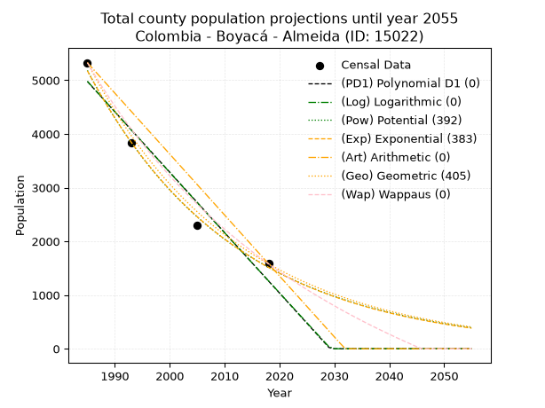
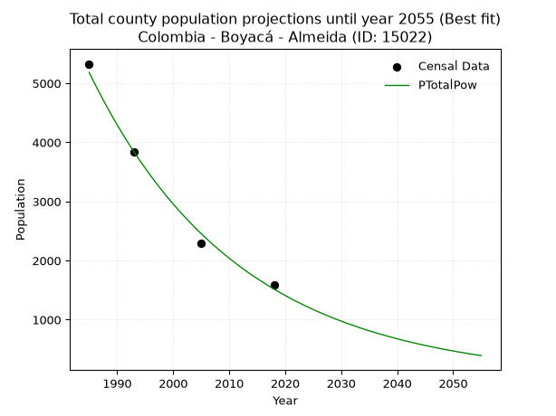
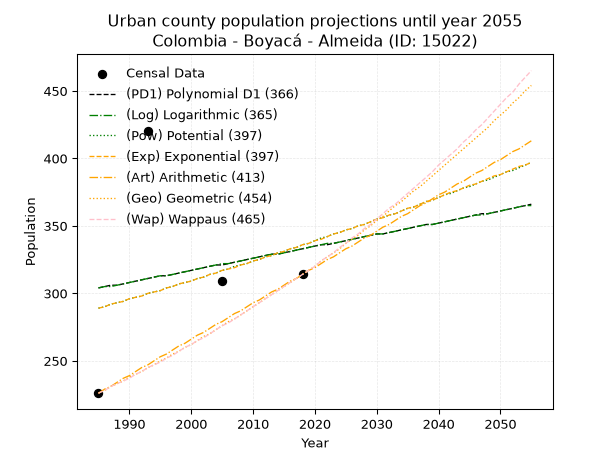
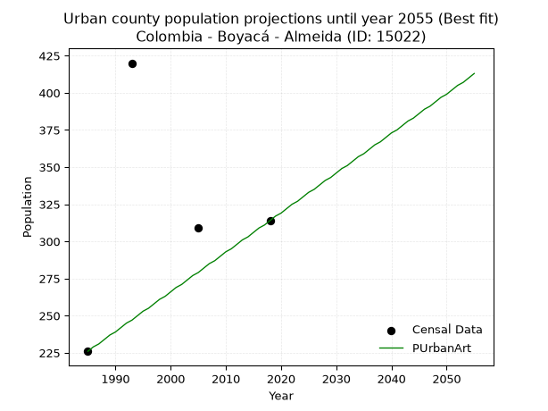
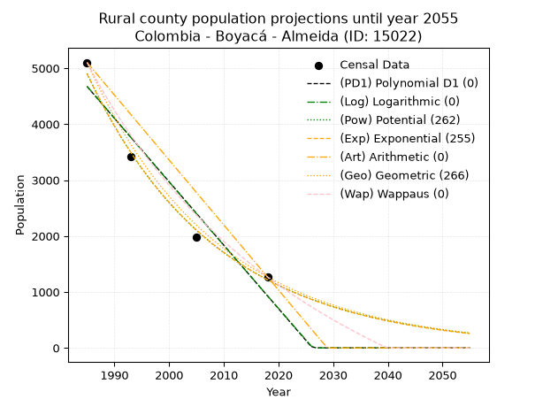
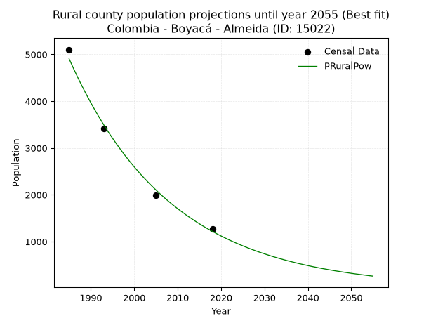

<div align="center">


</div>

# 📜 _“Population and Public Services Demand Projections (PPSD) until Year 2050 for Colombia - Boyacá - Almeida (ID: 15022)”_
Keywords: `population` `public-service` `projection` `lineal` `polynomial` `logarithmic` `potential` `exponential` `arithmetic` `geometric` `wappaus` `dane` `colombia` `south-america`

PPSD are analytical estimates used by governments and planners to anticipate future changes in population size, age distribution, and the resulting community needs for utilities, healthcare, education, and infrastructure as sizing future water treatment facilities, electrical grids, and road networks based on spatial growth.

<div align="center">

</img>

</div>


> **General running parameters**: • app_version: _v20260806_. • Python version: _3.14.7_. • Pandas version: _3.0.5_. • NumPy version: _2.5.1_. • Creates, save and include plots into reports (create_plot): _False_. • Projection until year: _2050_. • Process polynomial degree 2 and up: _False_. • Process Wappaus: _True_. • Process Wappaus: _True_. • Set negative values to zero: _True_. • Set infinite values to zero: _True_. • Drop dataset notes: _True_. 
<div align="center">

Maps & GIS Layers: [:earth_americas:Google](http://maps.google.com/maps?q=4.970856508,-73.3789331) [:earth_americas:OSM](https://www.openstreetmap.org/#map=18/4.970856508/-73.3789331&layers=P) [:earth_americas:Bing](https://www.bing.com/maps?cp=4.970856508~-73.3789331&lvl=18) [:earth_americas:Apple](https://maps.apple.com/frame?center=4.970856508%2C-73.3789331&span=0.003%2C0.006) [:earth_americas:GISMobile](https://github.com/rcfdtools/R.GISMobile/blob/main/file/gis/CountyLayer_CO/Readme.md)

</div>


<div align="center">

```geojson
{
  "type": "Feature",
  "geometry": {
    "type": "Point", 
    "coordinates": [-73.3789331, 4.970856508]
  }, 
  "properties": {
    "Name": "Colombia - Boyacá - Almeida (ID: 15022)"
  }
}
```

</div>


## 0. Census Data (4 records)

Census data are official statistics collected by a government about the people and housing in a country. They usually include counts of total population, age, sex, race, income, education, and jobs.

📅Global census file: [Population.xlsx](../data/Population.xlsx)

| Source   |   Year |   CountryID | CountryName   |   StateID | StateName   |   CountyID | CountyName   |   PTotal |   PUrban |   PRural |
|:---------|-------:|------------:|:--------------|----------:|:------------|-----------:|:-------------|---------:|---------:|---------:|
| DANE     |   1985 |          57 | Colombia      |        15 | Boyacá      |      15022 | Almeida      |     5328 |      226 |     5102 |
| DANE     |   1993 |          57 | Colombia      |        15 | Boyacá      |      15022 | Almeida      |     3837 |      420 |     3417 |
| DANE     |   2005 |          57 | Colombia      |        15 | Boyacá      |      15022 | Almeida      |     2294 |      309 |     1985 |
| DANE     |   2018 |          57 | Colombia      |        15 | Boyacá      |      15022 | Almeida      |     1582 |      314 |     1268 |

> 🔥Some records could had specific notes about the registered values or the corresponding urban or rural distribution.

📅[SUI-RUPS](https://www.datos.gov.co/Hacienda-y-Cr-dito-P-blico/Registro-nico-de-Prestadores-de-Servicios-P-blicos/4qkq-csdn/about_data) - Local public utility companies: [RUPS.csv](../data/RUPS.csv)

 | SERVICIO       | ESTADO    | NOMBRE                                   | NIT         | DEPARTAMENTO_DOMICILIO   | MUNICIPIO_DOMICILIO   | DIRECCION        |   TELEFONO | EMAIL                       | TIPO_PRESTADOR                             | CLASIFICACION                 |
|:---------------|:----------|:-----------------------------------------|:------------|:-------------------------|:----------------------|:-----------------|-----------:|:----------------------------|:-------------------------------------------|:------------------------------|
| ACUEDUCTO      | OPERATIVA | EMPRESA DE SERVICIOS PUBLICOS DE ALMEIDA | 900306425-6 | BOYACA                   | ALMEIDA               | Calle 4 No. 3-06 |    7500809 | espalmeidasaesp@hotmail.com | SOCIEDADES (EMPRESA DE SERVICIOS PUBLICOS) | MENOR O IGUAL A 2500 USUARIOS |
| ALCANTARILLADO | OPERATIVA | EMPRESA DE SERVICIOS PUBLICOS DE ALMEIDA | 900306425-6 | BOYACA                   | ALMEIDA               | Calle 4 No. 3-06 |    7500809 | espalmeidasaesp@hotmail.com | SOCIEDADES (EMPRESA DE SERVICIOS PUBLICOS) | MENOR O IGUAL A 2500 USUARIOS |

## 1. Total

### 1.1. Coefficients and Parameters

* (PD1) Polynomial Deg 1: -112.55439582496933, 228397.1802488949 (lineal)
* (Log) Logarithmic: -225419.7659918926, 1716677.6977050125
* (Pow) Potential: -74.50702793790184, 249.42093860174603
* (Exp) Exponential: -0.0372159539844392, 6.2660889601234125e+35
* (Art) Arithmetic: Year diff. 2018 - 1985 = 33, Population diff. 1582 - 5328 = -3746, Annual growth = -113.51515151515152
* (Geo) Geometric: Year diff. 2018 - 1985 = 33, Population diff. 1582 - 5328 = -3746, Annual growth % = -0.03612778228061719
* (Wap) Wappaus: i = -3.285532605358944, Condition values only valid for < 200)

<sub>
Wappaus condition values: ['-0.00', '-3.29', '-6.57', '-9.86', '-13.14', '-16.43', '-19.71', '-23.00', '-26.28', '-29.57', '-32.86', '-36.14', '-39.43', '-42.71', '-46.00', '-49.28', '-52.57', '-55.85', '-59.14', '-62.43', '-65.71', '-69.00', '-72.28', '-75.57', '-78.85', '-82.14', '-85.42', '-88.71', '-91.99', '-95.28', '-98.57', '-101.85', '-105.14', '-108.42', '-111.71', '-114.99', '-118.28', '-121.56', '-124.85', '-128.14', '-131.42', '-134.71', '-137.99', '-141.28', '-144.56', '-147.85', '-151.13', '-154.42', '-157.71', '-160.99', '-164.28', '-167.56', '-170.85', '-174.13', '-177.42', '-180.70', '-183.99', '-187.28', '-190.56', '-193.85', '-197.13', '-200.42', '-203.70', '-206.99', '-210.27', '-213.56']
</sub>


### 1.2. Projected Dataset

|   Year |   CountyID |   PTotalPD1 |   PTotalLog |   PTotalPow |   PTotalExp |   PTotalArt |   PTotalGeo |   PTotalWap |
|-------:|-----------:|------------:|------------:|------------:|------------:|------------:|------------:|------------:|
|   1985 |      15022 |        4977 |        4981 |        5183 |        5177 |        5328 |        5328 |        5328 |
|   1986 |      15022 |        4864 |        4868 |        4992 |        4988 |        5214 |        5136 |        5156 |
|   1987 |      15022 |        4752 |        4754 |        4809 |        4806 |        5101 |        4950 |        4989 |
|   1988 |      15022 |        4639 |        4641 |        4632 |        4630 |        4987 |        4771 |        4828 |
|   1989 |      15022 |        4526 |        4527 |        4461 |        4461 |        4874 |        4599 |        4671 |
|   1990 |      15022 |        4414 |        4414 |        4297 |        4298 |        4760 |        4433 |        4519 |
|   1991 |      15022 |        4301 |        4301 |        4139 |        4141 |        4647 |        4272 |        4372 |
|   1992 |      15022 |        4189 |        4188 |        3987 |        3990 |        4533 |        4118 |        4229 |
|   1993 |      15022 |        4076 |        4074 |        3841 |        3844 |        4420 |        3969 |        4090 |
|   1994 |      15022 |        3964 |        3961 |        3700 |        3703 |        4306 |        3826 |        3955 |
|   1995 |      15022 |        3851 |        3848 |        3565 |        3568 |        4193 |        3688 |        3824 |
|   1996 |      15022 |        3739 |        3735 |        3434 |        3438 |        4079 |        3554 |        3697 |
|   1997 |      15022 |        3626 |        3622 |        3308 |        3312 |        3966 |        3426 |        3573 |
|   1998 |      15022 |        3513 |        3510 |        3187 |        3191 |        3852 |        3302 |        3453 |
|   1999 |      15022 |        3401 |        3397 |        3070 |        3075 |        3739 |        3183 |        3336 |
|   2000 |      15022 |        3288 |        3284 |        2958 |        2962 |        3625 |        3068 |        3221 |
|   2001 |      15022 |        3176 |        3171 |        2850 |        2854 |        3512 |        2957 |        3110 |
|   2002 |      15022 |        3063 |        3059 |        2746 |        2750 |        3398 |        2850 |        3002 |
|   2003 |      15022 |        2951 |        2946 |        2645 |        2649 |        3285 |        2747 |        2896 |
|   2004 |      15022 |        2838 |        2834 |        2549 |        2553 |        3171 |        2648 |        2793 |
|   2005 |      15022 |        2726 |        2721 |        2456 |        2459 |        3058 |        2552 |        2693 |
|   2006 |      15022 |        2613 |        2609 |        2366 |        2369 |        2944 |        2460 |        2595 |
|   2007 |      15022 |        2501 |        2496 |        2280 |        2283 |        2831 |        2371 |        2499 |
|   2008 |      15022 |        2388 |        2384 |        2197 |        2200 |        2717 |        2286 |        2406 |
|   2009 |      15022 |        2275 |        2272 |        2117 |        2119 |        2604 |        2203 |        2315 |
|   2010 |      15022 |        2163 |        2160 |        2040 |        2042 |        2490 |        2123 |        2226 |
|   2011 |      15022 |        2050 |        2048 |        1966 |        1967 |        2377 |        2047 |        2139 |
|   2012 |      15022 |        1938 |        1936 |        1894 |        1895 |        2263 |        1973 |        2054 |
|   2013 |      15022 |        1825 |        1824 |        1825 |        1826 |        2150 |        1902 |        1971 |
|   2014 |      15022 |        1713 |        1712 |        1759 |        1759 |        2036 |        1833 |        1890 |
|   2015 |      15022 |        1600 |        1600 |        1695 |        1695 |        1923 |        1767 |        1810 |
|   2016 |      15022 |        1488 |        1488 |        1634 |        1633 |        1809 |        1703 |        1732 |
|   2017 |      15022 |        1375 |        1376 |        1574 |        1573 |        1696 |        1641 |        1656 |
|   2018 |      15022 |        1262 |        1264 |        1517 |        1516 |        1582 |        1582 |        1582 |
|   2019 |      15022 |        1150 |        1153 |        1462 |        1461 |        1468 |        1525 |        1509 |
|   2020 |      15022 |        1037 |        1041 |        1409 |        1407 |        1355 |        1470 |        1438 |
|   2021 |      15022 |         925 |         929 |        1358 |        1356 |        1241 |        1417 |        1368 |
|   2022 |      15022 |         812 |         818 |        1309 |        1306 |        1128 |        1365 |        1300 |
|   2023 |      15022 |         700 |         707 |        1262 |        1259 |        1014 |        1316 |        1233 |
|   2024 |      15022 |         587 |         595 |        1216 |        1213 |         901 |        1269 |        1167 |
|   2025 |      15022 |         475 |         484 |        1172 |        1168 |         787 |        1223 |        1102 |
|   2026 |      15022 |         362 |         372 |        1130 |        1126 |         674 |        1179 |        1039 |
|   2027 |      15022 |         249 |         261 |        1089 |        1085 |         560 |        1136 |         977 |
|   2028 |      15022 |         137 |         150 |        1050 |        1045 |         447 |        1095 |         917 |
|   2029 |      15022 |          24 |          39 |        1012 |        1007 |         333 |        1055 |         857 |
|   2030 |      15022 |           0 |           0 |         976 |         970 |         220 |        1017 |         799 |
|   2031 |      15022 |           0 |           0 |         940 |         935 |         106 |         981 |         741 |
|   2032 |      15022 |           0 |           0 |         907 |         900 |           0 |         945 |         685 |
|   2033 |      15022 |           0 |           0 |         874 |         867 |           0 |         911 |         630 |
|   2034 |      15022 |           0 |           0 |         842 |         836 |           0 |         878 |         576 |
|   2035 |      15022 |           0 |           0 |         812 |         805 |           0 |         846 |         522 |
|   2036 |      15022 |           0 |           0 |         783 |         776 |           0 |         816 |         470 |
|   2037 |      15022 |           0 |           0 |         755 |         747 |           0 |         786 |         419 |
|   2038 |      15022 |           0 |           0 |         728 |         720 |           0 |         758 |         368 |
|   2039 |      15022 |           0 |           0 |         702 |         694 |           0 |         730 |         319 |
|   2040 |      15022 |           0 |           0 |         676 |         669 |           0 |         704 |         270 |
|   2041 |      15022 |           0 |           0 |         652 |         644 |           0 |         679 |         222 |
|   2042 |      15022 |           0 |           0 |         629 |         621 |           0 |         654 |         175 |
|   2043 |      15022 |           0 |           0 |         606 |         598 |           0 |         631 |         129 |
|   2044 |      15022 |           0 |           0 |         585 |         576 |           0 |         608 |          83 |
|   2045 |      15022 |           0 |           0 |         564 |         555 |           0 |         586 |          38 |
|   2046 |      15022 |           0 |           0 |         544 |         535 |           0 |         565 |           0 |
|   2047 |      15022 |           0 |           0 |         524 |         515 |           0 |         544 |           0 |
|   2048 |      15022 |           0 |           0 |         505 |         496 |           0 |         525 |           0 |
|   2049 |      15022 |           0 |           0 |         487 |         478 |           0 |         506 |           0 |
|   2050 |      15022 |           0 |           0 |         470 |         461 |           0 |         487 |           0 |
<div align="center">

</img>

</div>


### 1.3. Best fit with absolute and relative error (%)

Relative error puts that difference into context by dividing the absolute error by the true value, creating a unitless ratio or percentage that shows the scale of the mistake.

Absolute and relative error

|   Year | Source   |   CountryID | CountryName   |   StateID | StateName   |   CountyID_x | CountyName   |   PTotal |   PUrban |   PRural |   CountyID_y |   PTotalPD1 |   PTotalLog |   PTotalPow |   PTotalExp |   PTotalArt |   PTotalGeo |   PTotalWap |   PTotalPD1AbsError |   PTotalLogAbsError |   PTotalPowAbsError |   PTotalExpAbsError |   PTotalArtAbsError |   PTotalGeoAbsError |   PTotalWapAbsError |   PTotalPD1RelError |   PTotalLogRelError |   PTotalPowRelError |   PTotalExpRelError |   PTotalArtRelError |   PTotalGeoRelError |   PTotalWapRelError |
|-------:|:---------|------------:|:--------------|----------:|:------------|-------------:|:-------------|---------:|---------:|---------:|-------------:|------------:|------------:|------------:|------------:|------------:|------------:|------------:|--------------------:|--------------------:|--------------------:|--------------------:|--------------------:|--------------------:|--------------------:|--------------------:|--------------------:|--------------------:|--------------------:|--------------------:|--------------------:|--------------------:|
|   1985 | DANE     |          57 | Colombia      |        15 | Boyacá      |        15022 | Almeida      |     5328 |      226 |     5102 |        15022 |        4977 |        4981 |        5183 |        5177 |        5328 |        5328 |        5328 |                 351 |                 347 |                 145 |                 151 |                   0 |                   0 |                   0 |             6.58784 |             6.51276 |            2.72147  |            2.83408  |              0      |             0       |             0       |
|   1993 | DANE     |          57 | Colombia      |        15 | Boyacá      |        15022 | Almeida      |     3837 |      420 |     3417 |        15022 |        4076 |        4074 |        3841 |        3844 |        4420 |        3969 |        4090 |                 239 |                 237 |                   4 |                   7 |                 583 |                 132 |                 253 |             6.22882 |             6.1767  |            0.104248 |            0.182434 |             15.1942 |             3.44019 |             6.59369 |
|   2005 | DANE     |          57 | Colombia      |        15 | Boyacá      |        15022 | Almeida      |     2294 |      309 |     1985 |        15022 |        2726 |        2721 |        2456 |        2459 |        3058 |        2552 |        2693 |                 432 |                 427 |                 162 |                 165 |                 764 |                 258 |                 399 |            18.8317  |            18.6138  |            7.0619   |            7.19268  |             33.3043 |            11.2467  |            17.3932  |
|   2018 | DANE     |          57 | Colombia      |        15 | Boyacá      |        15022 | Almeida      |     1582 |      314 |     1268 |        15022 |        1262 |        1264 |        1517 |        1516 |        1582 |        1582 |        1582 |                 320 |                 318 |                  65 |                  66 |                   0 |                   0 |                   0 |            20.2276  |            20.1011  |            4.10872  |            4.17193  |              0      |             0       |             0       |

Relative error mean

| Method    |   RelError | Best   |
|:----------|-----------:|:-------|
| PTotalPD1 |   12.969   |        |
| PTotalLog |   12.8511  |        |
| PTotalPow |    3.49909 | True   |
| PTotalExp |    3.59528 |        |
| PTotalArt |   12.1246  |        |
| PTotalGeo |    3.67173 |        |
| PTotalWap |    5.99672 |        |

💙Best method: _**PTotalPow**_
<div align="center">

</img>

</div>


### 1.4. Fresh water supply demand in liters per capita per day (lpcd)

The fresh water supply demand typically ranges from 100 to 300 liters per capita per day (lpcd) for standard domestic and municipal planning, though absolute survival minimums set by the World Health Organization are as low as 7.5 to 20 liters per day, and total consumption in high-income nations can exceed 400 liters.

> `CZ`: Level in meters above the sea level (masl)<br> `WS`: Fresh water supply demand in liters per capita per day (lpcd or l/h/d)<br> `WSAll`: Zonal fresh water supply demand in liters per second (l/s)<br> `A`: Zonal area in square meters<br> `DP`: Population density (people/hectare or p/ha)

Reference values (RAS Colombia)

|    CZ |   WS |
|------:|-----:|
|  1000 |  120 |
|  2000 |  130 |
| 99999 |  140 |

County shapefile geometry properties and water supply values

|   CountyID |      ATotal |   CZTotal |   WSTotal |
|-----------:|------------:|----------:|----------:|
|      15022 | 5.75742e+07 |   2120.96 |       140 |

Projected values for best method: PTotalPow

|   CountyID |   Year |   PTotalPow |   DPTotal |   WSTotal |   WSTotalAll |
|-----------:|-------:|------------:|----------:|----------:|-------------:|
|      15022 |   1985 |        5183 |      0.9  |       140 |     8.39838  |
|      15022 |   1986 |        4992 |      0.87 |       140 |     8.08889  |
|      15022 |   1987 |        4809 |      0.84 |       140 |     7.79236  |
|      15022 |   1988 |        4632 |      0.8  |       140 |     7.50556  |
|      15022 |   1989 |        4461 |      0.77 |       140 |     7.22847  |
|      15022 |   1990 |        4297 |      0.75 |       140 |     6.96273  |
|      15022 |   1991 |        4139 |      0.72 |       140 |     6.70671  |
|      15022 |   1992 |        3987 |      0.69 |       140 |     6.46042  |
|      15022 |   1993 |        3841 |      0.67 |       140 |     6.22384  |
|      15022 |   1994 |        3700 |      0.64 |       140 |     5.99537  |
|      15022 |   1995 |        3565 |      0.62 |       140 |     5.77662  |
|      15022 |   1996 |        3434 |      0.6  |       140 |     5.56435  |
|      15022 |   1997 |        3308 |      0.57 |       140 |     5.36019  |
|      15022 |   1998 |        3187 |      0.55 |       140 |     5.16412  |
|      15022 |   1999 |        3070 |      0.53 |       140 |     4.97454  |
|      15022 |   2000 |        2958 |      0.51 |       140 |     4.79306  |
|      15022 |   2001 |        2850 |      0.5  |       140 |     4.61806  |
|      15022 |   2002 |        2746 |      0.48 |       140 |     4.44954  |
|      15022 |   2003 |        2645 |      0.46 |       140 |     4.28588  |
|      15022 |   2004 |        2549 |      0.44 |       140 |     4.13032  |
|      15022 |   2005 |        2456 |      0.43 |       140 |     3.97963  |
|      15022 |   2006 |        2366 |      0.41 |       140 |     3.8338   |
|      15022 |   2007 |        2280 |      0.4  |       140 |     3.69444  |
|      15022 |   2008 |        2197 |      0.38 |       140 |     3.55995  |
|      15022 |   2009 |        2117 |      0.37 |       140 |     3.43032  |
|      15022 |   2010 |        2040 |      0.35 |       140 |     3.30556  |
|      15022 |   2011 |        1966 |      0.34 |       140 |     3.18565  |
|      15022 |   2012 |        1894 |      0.33 |       140 |     3.06898  |
|      15022 |   2013 |        1825 |      0.32 |       140 |     2.95718  |
|      15022 |   2014 |        1759 |      0.31 |       140 |     2.85023  |
|      15022 |   2015 |        1695 |      0.29 |       140 |     2.74653  |
|      15022 |   2016 |        1634 |      0.28 |       140 |     2.64769  |
|      15022 |   2017 |        1574 |      0.27 |       140 |     2.55046  |
|      15022 |   2018 |        1517 |      0.26 |       140 |     2.4581   |
|      15022 |   2019 |        1462 |      0.25 |       140 |     2.36898  |
|      15022 |   2020 |        1409 |      0.24 |       140 |     2.2831   |
|      15022 |   2021 |        1358 |      0.24 |       140 |     2.20046  |
|      15022 |   2022 |        1309 |      0.23 |       140 |     2.12106  |
|      15022 |   2023 |        1262 |      0.22 |       140 |     2.04491  |
|      15022 |   2024 |        1216 |      0.21 |       140 |     1.97037  |
|      15022 |   2025 |        1172 |      0.2  |       140 |     1.89907  |
|      15022 |   2026 |        1130 |      0.2  |       140 |     1.83102  |
|      15022 |   2027 |        1089 |      0.19 |       140 |     1.76458  |
|      15022 |   2028 |        1050 |      0.18 |       140 |     1.70139  |
|      15022 |   2029 |        1012 |      0.18 |       140 |     1.63981  |
|      15022 |   2030 |         976 |      0.17 |       140 |     1.58148  |
|      15022 |   2031 |         940 |      0.16 |       140 |     1.52315  |
|      15022 |   2032 |         907 |      0.16 |       140 |     1.46968  |
|      15022 |   2033 |         874 |      0.15 |       140 |     1.4162   |
|      15022 |   2034 |         842 |      0.15 |       140 |     1.36435  |
|      15022 |   2035 |         812 |      0.14 |       140 |     1.31574  |
|      15022 |   2036 |         783 |      0.14 |       140 |     1.26875  |
|      15022 |   2037 |         755 |      0.13 |       140 |     1.22338  |
|      15022 |   2038 |         728 |      0.13 |       140 |     1.17963  |
|      15022 |   2039 |         702 |      0.12 |       140 |     1.1375   |
|      15022 |   2040 |         676 |      0.12 |       140 |     1.09537  |
|      15022 |   2041 |         652 |      0.11 |       140 |     1.05648  |
|      15022 |   2042 |         629 |      0.11 |       140 |     1.01921  |
|      15022 |   2043 |         606 |      0.11 |       140 |     0.981944 |
|      15022 |   2044 |         585 |      0.1  |       140 |     0.947917 |
|      15022 |   2045 |         564 |      0.1  |       140 |     0.913889 |
|      15022 |   2046 |         544 |      0.09 |       140 |     0.881481 |
|      15022 |   2047 |         524 |      0.09 |       140 |     0.849074 |
|      15022 |   2048 |         505 |      0.09 |       140 |     0.818287 |
|      15022 |   2049 |         487 |      0.08 |       140 |     0.78912  |
|      15022 |   2050 |         470 |      0.08 |       140 |     0.761574 |

## 2. Urban

### 2.1. Coefficients and Parameters

* (PD1) Polynomial Deg 1: 0.8827780008028945, -1448.5266961059897 (lineal)
* (Log) Logarithmic: 1781.9715931085948, -13227.530359042586
* (Pow) Potential: 9.145675557818938, -27.69950713419828
* (Exp) Exponential: 0.004544506093090633, 0.034934956946555525
* (Art) Arithmetic: Year diff. 2018 - 1985 = 33, Population diff. 314 - 226 = 88, Annual growth = 2.6666666666666665
* (Geo) Geometric: Year diff. 2018 - 1985 = 33, Population diff. 314 - 226 = 88, Annual growth % = 0.010015213422644997
* (Wap) Wappaus: i = 0.9876543209876543, Condition values only valid for < 200)

<sub>
Wappaus condition values: ['0.00', '0.99', '1.98', '2.96', '3.95', '4.94', '5.93', '6.91', '7.90', '8.89', '9.88', '10.86', '11.85', '12.84', '13.83', '14.81', '15.80', '16.79', '17.78', '18.77', '19.75', '20.74', '21.73', '22.72', '23.70', '24.69', '25.68', '26.67', '27.65', '28.64', '29.63', '30.62', '31.60', '32.59', '33.58', '34.57', '35.56', '36.54', '37.53', '38.52', '39.51', '40.49', '41.48', '42.47', '43.46', '44.44', '45.43', '46.42', '47.41', '48.40', '49.38', '50.37', '51.36', '52.35', '53.33', '54.32', '55.31', '56.30', '57.28', '58.27', '59.26', '60.25', '61.23', '62.22', '63.21', '64.20']
</sub>


### 2.2. Projected Dataset

|   Year |   CountyID |   PUrbanPD1 |   PUrbanLog |   PUrbanPow |   PUrbanExp |   PUrbanArt |   PUrbanGeo |   PUrbanWap |
|-------:|-----------:|------------:|------------:|------------:|------------:|------------:|------------:|------------:|
|   1985 |      15022 |         304 |         304 |         289 |         289 |         226 |         226 |         226 |
|   1986 |      15022 |         305 |         305 |         290 |         290 |         229 |         228 |         228 |
|   1987 |      15022 |         306 |         305 |         292 |         292 |         231 |         231 |         231 |
|   1988 |      15022 |         306 |         306 |         293 |         293 |         234 |         233 |         233 |
|   1989 |      15022 |         307 |         307 |         294 |         294 |         237 |         235 |         235 |
|   1990 |      15022 |         308 |         308 |         296 |         296 |         239 |         238 |         237 |
|   1991 |      15022 |         309 |         309 |         297 |         297 |         242 |         240 |         240 |
|   1992 |      15022 |         310 |         310 |         298 |         298 |         245 |         242 |         242 |
|   1993 |      15022 |         311 |         311 |         300 |         300 |         247 |         245 |         245 |
|   1994 |      15022 |         312 |         312 |         301 |         301 |         250 |         247 |         247 |
|   1995 |      15022 |         313 |         313 |         302 |         302 |         253 |         250 |         249 |
|   1996 |      15022 |         313 |         313 |         304 |         304 |         255 |         252 |         252 |
|   1997 |      15022 |         314 |         314 |         305 |         305 |         258 |         255 |         254 |
|   1998 |      15022 |         315 |         315 |         307 |         307 |         261 |         257 |         257 |
|   1999 |      15022 |         316 |         316 |         308 |         308 |         263 |         260 |         260 |
|   2000 |      15022 |         317 |         317 |         309 |         309 |         266 |         262 |         262 |
|   2001 |      15022 |         318 |         318 |         311 |         311 |         269 |         265 |         265 |
|   2002 |      15022 |         319 |         319 |         312 |         312 |         271 |         268 |         267 |
|   2003 |      15022 |         320 |         320 |         314 |         314 |         274 |         270 |         270 |
|   2004 |      15022 |         321 |         321 |         315 |         315 |         277 |         273 |         273 |
|   2005 |      15022 |         321 |         322 |         317 |         317 |         279 |         276 |         276 |
|   2006 |      15022 |         322 |         322 |         318 |         318 |         282 |         279 |         278 |
|   2007 |      15022 |         323 |         323 |         320 |         319 |         285 |         281 |         281 |
|   2008 |      15022 |         324 |         324 |         321 |         321 |         287 |         284 |         284 |
|   2009 |      15022 |         325 |         325 |         322 |         322 |         290 |         287 |         287 |
|   2010 |      15022 |         326 |         326 |         324 |         324 |         293 |         290 |         290 |
|   2011 |      15022 |         327 |         327 |         325 |         325 |         295 |         293 |         293 |
|   2012 |      15022 |         328 |         328 |         327 |         327 |         298 |         296 |         296 |
|   2013 |      15022 |         329 |         329 |         328 |         328 |         301 |         299 |         299 |
|   2014 |      15022 |         329 |         329 |         330 |         330 |         303 |         302 |         302 |
|   2015 |      15022 |         330 |         330 |         331 |         331 |         306 |         305 |         305 |
|   2016 |      15022 |         331 |         331 |         333 |         333 |         309 |         308 |         308 |
|   2017 |      15022 |         332 |         332 |         334 |         334 |         311 |         311 |         311 |
|   2018 |      15022 |         333 |         333 |         336 |         336 |         314 |         314 |         314 |
|   2019 |      15022 |         334 |         334 |         337 |         337 |         317 |         317 |         317 |
|   2020 |      15022 |         335 |         335 |         339 |         339 |         319 |         320 |         320 |
|   2021 |      15022 |         336 |         336 |         341 |         340 |         322 |         324 |         324 |
|   2022 |      15022 |         336 |         337 |         342 |         342 |         325 |         327 |         327 |
|   2023 |      15022 |         337 |         337 |         344 |         344 |         327 |         330 |         330 |
|   2024 |      15022 |         338 |         338 |         345 |         345 |         330 |         333 |         334 |
|   2025 |      15022 |         339 |         339 |         347 |         347 |         333 |         337 |         337 |
|   2026 |      15022 |         340 |         340 |         348 |         348 |         335 |         340 |         341 |
|   2027 |      15022 |         341 |         341 |         350 |         350 |         338 |         343 |         344 |
|   2028 |      15022 |         342 |         342 |         351 |         351 |         341 |         347 |         348 |
|   2029 |      15022 |         343 |         343 |         353 |         353 |         343 |         350 |         351 |
|   2030 |      15022 |         344 |         344 |         355 |         355 |         346 |         354 |         355 |
|   2031 |      15022 |         344 |         344 |         356 |         356 |         349 |         357 |         359 |
|   2032 |      15022 |         345 |         345 |         358 |         358 |         351 |         361 |         363 |
|   2033 |      15022 |         346 |         346 |         359 |         359 |         354 |         365 |         366 |
|   2034 |      15022 |         347 |         347 |         361 |         361 |         357 |         368 |         370 |
|   2035 |      15022 |         348 |         348 |         363 |         363 |         359 |         372 |         374 |
|   2036 |      15022 |         349 |         349 |         364 |         364 |         362 |         376 |         378 |
|   2037 |      15022 |         350 |         350 |         366 |         366 |         365 |         379 |         382 |
|   2038 |      15022 |         351 |         351 |         368 |         368 |         367 |         383 |         386 |
|   2039 |      15022 |         351 |         351 |         369 |         369 |         370 |         387 |         390 |
|   2040 |      15022 |         352 |         352 |         371 |         371 |         373 |         391 |         395 |
|   2041 |      15022 |         353 |         353 |         373 |         373 |         375 |         395 |         399 |
|   2042 |      15022 |         354 |         354 |         374 |         375 |         378 |         399 |         403 |
|   2043 |      15022 |         355 |         355 |         376 |         376 |         381 |         403 |         407 |
|   2044 |      15022 |         356 |         356 |         378 |         378 |         383 |         407 |         412 |
|   2045 |      15022 |         357 |         357 |         379 |         380 |         386 |         411 |         416 |
|   2046 |      15022 |         358 |         358 |         381 |         381 |         389 |         415 |         421 |
|   2047 |      15022 |         359 |         358 |         383 |         383 |         391 |         419 |         425 |
|   2048 |      15022 |         359 |         359 |         384 |         385 |         394 |         423 |         430 |
|   2049 |      15022 |         360 |         360 |         386 |         387 |         397 |         428 |         435 |
|   2050 |      15022 |         361 |         361 |         388 |         388 |         399 |         432 |         440 |
<div align="center">

</img>

</div>


### 2.3. Best fit with absolute and relative error (%)

Relative error puts that difference into context by dividing the absolute error by the true value, creating a unitless ratio or percentage that shows the scale of the mistake.

Absolute and relative error

|   Year | Source   |   CountryID | CountryName   |   StateID | StateName   |   CountyID_x | CountyName   |   PTotal |   PUrban |   PRural |   CountyID_y |   PUrbanPD1 |   PUrbanLog |   PUrbanPow |   PUrbanExp |   PUrbanArt |   PUrbanGeo |   PUrbanWap |   PUrbanPD1AbsError |   PUrbanLogAbsError |   PUrbanPowAbsError |   PUrbanExpAbsError |   PUrbanArtAbsError |   PUrbanGeoAbsError |   PUrbanWapAbsError |   PUrbanPD1RelError |   PUrbanLogRelError |   PUrbanPowRelError |   PUrbanExpRelError |   PUrbanArtRelError |   PUrbanGeoRelError |   PUrbanWapRelError |
|-------:|:---------|------------:|:--------------|----------:|:------------|-------------:|:-------------|---------:|---------:|---------:|-------------:|------------:|------------:|------------:|------------:|------------:|------------:|------------:|--------------------:|--------------------:|--------------------:|--------------------:|--------------------:|--------------------:|--------------------:|--------------------:|--------------------:|--------------------:|--------------------:|--------------------:|--------------------:|--------------------:|
|   1985 | DANE     |          57 | Colombia      |        15 | Boyacá      |        15022 | Almeida      |     5328 |      226 |     5102 |        15022 |         304 |         304 |         289 |         289 |         226 |         226 |         226 |                  78 |                  78 |                  63 |                  63 |                   0 |                   0 |                   0 |            34.5133  |            34.5133  |            27.8761  |            27.8761  |             0       |              0      |              0      |
|   1993 | DANE     |          57 | Colombia      |        15 | Boyacá      |        15022 | Almeida      |     3837 |      420 |     3417 |        15022 |         311 |         311 |         300 |         300 |         247 |         245 |         245 |                 109 |                 109 |                 120 |                 120 |                 173 |                 175 |                 175 |            25.9524  |            25.9524  |            28.5714  |            28.5714  |            41.1905  |             41.6667 |             41.6667 |
|   2005 | DANE     |          57 | Colombia      |        15 | Boyacá      |        15022 | Almeida      |     2294 |      309 |     1985 |        15022 |         321 |         322 |         317 |         317 |         279 |         276 |         276 |                  12 |                  13 |                   8 |                   8 |                  30 |                  33 |                  33 |             3.8835  |             4.20712 |             2.589   |             2.589   |             9.70874 |             10.6796 |             10.6796 |
|   2018 | DANE     |          57 | Colombia      |        15 | Boyacá      |        15022 | Almeida      |     1582 |      314 |     1268 |        15022 |         333 |         333 |         336 |         336 |         314 |         314 |         314 |                  19 |                  19 |                  22 |                  22 |                   0 |                   0 |                   0 |             6.05096 |             6.05096 |             7.00637 |             7.00637 |             0       |              0      |              0      |

Relative error mean

| Method    |   RelError | Best   |
|:----------|-----------:|:-------|
| PUrbanPD1 |    17.6    |        |
| PUrbanLog |    17.6809 |        |
| PUrbanPow |    16.5107 |        |
| PUrbanExp |    16.5107 |        |
| PUrbanArt |    12.7248 | True   |
| PUrbanGeo |    13.0866 |        |
| PUrbanWap |    13.0866 |        |

💙Best method: _**PUrbanArt**_
<div align="center">

</img>

</div>


### 2.4. Fresh water supply demand in liters per capita per day (lpcd)

The fresh water supply demand typically ranges from 100 to 300 liters per capita per day (lpcd) for standard domestic and municipal planning, though absolute survival minimums set by the World Health Organization are as low as 7.5 to 20 liters per day, and total consumption in high-income nations can exceed 400 liters.

> `CZ`: Level in meters above the sea level (masl)<br> `WS`: Fresh water supply demand in liters per capita per day (lpcd or l/h/d)<br> `WSAll`: Zonal fresh water supply demand in liters per second (l/s)<br> `A`: Zonal area in square meters<br> `DP`: Population density (people/hectare or p/ha)

Reference values (RAS Colombia)

|    CZ |   WS |
|------:|-----:|
|  1000 |  120 |
|  2000 |  130 |
| 99999 |  140 |

County shapefile geometry properties and water supply values

|   CountyID |   AUrban |   CZUrban |   WSUrban |
|-----------:|---------:|----------:|----------:|
|      15022 |   161493 |   1922.02 |       130 |

Projected values for best method: PUrbanArt

|   CountyID |   Year |   PUrbanArt |   DPUrban |   WSUrban |   WSUrbanAll |
|-----------:|-------:|------------:|----------:|----------:|-------------:|
|      15022 |   1985 |         226 |     13.99 |       130 |     0.340046 |
|      15022 |   1986 |         229 |     14.18 |       130 |     0.34456  |
|      15022 |   1987 |         231 |     14.3  |       130 |     0.347569 |
|      15022 |   1988 |         234 |     14.49 |       130 |     0.352083 |
|      15022 |   1989 |         237 |     14.68 |       130 |     0.356597 |
|      15022 |   1990 |         239 |     14.8  |       130 |     0.359606 |
|      15022 |   1991 |         242 |     14.99 |       130 |     0.36412  |
|      15022 |   1992 |         245 |     15.17 |       130 |     0.368634 |
|      15022 |   1993 |         247 |     15.29 |       130 |     0.371644 |
|      15022 |   1994 |         250 |     15.48 |       130 |     0.376157 |
|      15022 |   1995 |         253 |     15.67 |       130 |     0.380671 |
|      15022 |   1996 |         255 |     15.79 |       130 |     0.383681 |
|      15022 |   1997 |         258 |     15.98 |       130 |     0.388194 |
|      15022 |   1998 |         261 |     16.16 |       130 |     0.392708 |
|      15022 |   1999 |         263 |     16.29 |       130 |     0.395718 |
|      15022 |   2000 |         266 |     16.47 |       130 |     0.400231 |
|      15022 |   2001 |         269 |     16.66 |       130 |     0.404745 |
|      15022 |   2002 |         271 |     16.78 |       130 |     0.407755 |
|      15022 |   2003 |         274 |     16.97 |       130 |     0.412269 |
|      15022 |   2004 |         277 |     17.15 |       130 |     0.416782 |
|      15022 |   2005 |         279 |     17.28 |       130 |     0.419792 |
|      15022 |   2006 |         282 |     17.46 |       130 |     0.424306 |
|      15022 |   2007 |         285 |     17.65 |       130 |     0.428819 |
|      15022 |   2008 |         287 |     17.77 |       130 |     0.431829 |
|      15022 |   2009 |         290 |     17.96 |       130 |     0.436343 |
|      15022 |   2010 |         293 |     18.14 |       130 |     0.440856 |
|      15022 |   2011 |         295 |     18.27 |       130 |     0.443866 |
|      15022 |   2012 |         298 |     18.45 |       130 |     0.44838  |
|      15022 |   2013 |         301 |     18.64 |       130 |     0.452894 |
|      15022 |   2014 |         303 |     18.76 |       130 |     0.455903 |
|      15022 |   2015 |         306 |     18.95 |       130 |     0.460417 |
|      15022 |   2016 |         309 |     19.13 |       130 |     0.464931 |
|      15022 |   2017 |         311 |     19.26 |       130 |     0.46794  |
|      15022 |   2018 |         314 |     19.44 |       130 |     0.472454 |
|      15022 |   2019 |         317 |     19.63 |       130 |     0.476968 |
|      15022 |   2020 |         319 |     19.75 |       130 |     0.479977 |
|      15022 |   2021 |         322 |     19.94 |       130 |     0.484491 |
|      15022 |   2022 |         325 |     20.12 |       130 |     0.489005 |
|      15022 |   2023 |         327 |     20.25 |       130 |     0.492014 |
|      15022 |   2024 |         330 |     20.43 |       130 |     0.496528 |
|      15022 |   2025 |         333 |     20.62 |       130 |     0.501042 |
|      15022 |   2026 |         335 |     20.74 |       130 |     0.504051 |
|      15022 |   2027 |         338 |     20.93 |       130 |     0.508565 |
|      15022 |   2028 |         341 |     21.12 |       130 |     0.513079 |
|      15022 |   2029 |         343 |     21.24 |       130 |     0.516088 |
|      15022 |   2030 |         346 |     21.43 |       130 |     0.520602 |
|      15022 |   2031 |         349 |     21.61 |       130 |     0.525116 |
|      15022 |   2032 |         351 |     21.73 |       130 |     0.528125 |
|      15022 |   2033 |         354 |     21.92 |       130 |     0.532639 |
|      15022 |   2034 |         357 |     22.11 |       130 |     0.537153 |
|      15022 |   2035 |         359 |     22.23 |       130 |     0.540162 |
|      15022 |   2036 |         362 |     22.42 |       130 |     0.544676 |
|      15022 |   2037 |         365 |     22.6  |       130 |     0.54919  |
|      15022 |   2038 |         367 |     22.73 |       130 |     0.552199 |
|      15022 |   2039 |         370 |     22.91 |       130 |     0.556713 |
|      15022 |   2040 |         373 |     23.1  |       130 |     0.561227 |
|      15022 |   2041 |         375 |     23.22 |       130 |     0.564236 |
|      15022 |   2042 |         378 |     23.41 |       130 |     0.56875  |
|      15022 |   2043 |         381 |     23.59 |       130 |     0.573264 |
|      15022 |   2044 |         383 |     23.72 |       130 |     0.576273 |
|      15022 |   2045 |         386 |     23.9  |       130 |     0.580787 |
|      15022 |   2046 |         389 |     24.09 |       130 |     0.585301 |
|      15022 |   2047 |         391 |     24.21 |       130 |     0.58831  |
|      15022 |   2048 |         394 |     24.4  |       130 |     0.592824 |
|      15022 |   2049 |         397 |     24.58 |       130 |     0.597338 |
|      15022 |   2050 |         399 |     24.71 |       130 |     0.600347 |

## 3. Rural

### 3.1. Coefficients and Parameters

* (PD1) Polynomial Deg 1: -113.43717382577225, 229845.70694500094 (lineal)
* (Log) Logarithmic: -227201.7375850012, 1729905.2280640549
* (Pow) Potential: -84.51369141195214, 282.39667092897434
* (Exp) Exponential: -0.04221463503735285, 1.208692423352851e+40
* (Art) Arithmetic: Year diff. 2018 - 1985 = 33, Population diff. 1268 - 5102 = -3834, Annual growth = -116.18181818181819
* (Geo) Geometric: Year diff. 2018 - 1985 = 33, Population diff. 1268 - 5102 = -3834, Annual growth % = -0.04131011452307287
* (Wap) Wappaus: i = -3.6477807906379334, Condition values only valid for < 200)

<sub>
Wappaus condition values: ['-0.00', '-3.65', '-7.30', '-10.94', '-14.59', '-18.24', '-21.89', '-25.53', '-29.18', '-32.83', '-36.48', '-40.13', '-43.77', '-47.42', '-51.07', '-54.72', '-58.36', '-62.01', '-65.66', '-69.31', '-72.96', '-76.60', '-80.25', '-83.90', '-87.55', '-91.19', '-94.84', '-98.49', '-102.14', '-105.79', '-109.43', '-113.08', '-116.73', '-120.38', '-124.02', '-127.67', '-131.32', '-134.97', '-138.62', '-142.26', '-145.91', '-149.56', '-153.21', '-156.85', '-160.50', '-164.15', '-167.80', '-171.45', '-175.09', '-178.74', '-182.39', '-186.04', '-189.68', '-193.33', '-196.98', '-200.63', '-204.28', '-207.92', '-211.57', '-215.22', '-218.87', '-222.51', '-226.16', '-229.81', '-233.46', '-237.11']
</sub>


### 3.2. Projected Dataset

|   Year |   CountyID |   PRuralPD1 |   PRuralLog |   PRuralPow |   PRuralExp |   PRuralArt |   PRuralGeo |   PRuralWap |
|-------:|-----------:|------------:|------------:|------------:|------------:|------------:|------------:|------------:|
|   1985 |      15022 |        4673 |        4677 |        4906 |        4900 |        5102 |        5102 |        5102 |
|   1986 |      15022 |        4559 |        4563 |        4702 |        4697 |        4986 |        4891 |        4919 |
|   1987 |      15022 |        4446 |        4449 |        4506 |        4503 |        4870 |        4689 |        4743 |
|   1988 |      15022 |        4333 |        4334 |        4318 |        4317 |        4753 |        4495 |        4573 |
|   1989 |      15022 |        4219 |        4220 |        4139 |        4138 |        4637 |        4310 |        4408 |
|   1990 |      15022 |        4106 |        4106 |        3967 |        3967 |        4521 |        4132 |        4249 |
|   1991 |      15022 |        3992 |        3992 |        3802 |        3803 |        4405 |        3961 |        4095 |
|   1992 |      15022 |        3879 |        3878 |        3644 |        3646 |        4289 |        3797 |        3947 |
|   1993 |      15022 |        3765 |        3764 |        3492 |        3495 |        4173 |        3641 |        3803 |
|   1994 |      15022 |        3652 |        3650 |        3347 |        3351 |        4056 |        3490 |        3663 |
|   1995 |      15022 |        3539 |        3536 |        3209 |        3212 |        3940 |        3346 |        3528 |
|   1996 |      15022 |        3425 |        3422 |        3076 |        3080 |        3824 |        3208 |        3397 |
|   1997 |      15022 |        3312 |        3308 |        2948 |        2952 |        3708 |        3075 |        3270 |
|   1998 |      15022 |        3198 |        3194 |        2826 |        2830 |        3592 |        2948 |        3146 |
|   1999 |      15022 |        3085 |        3081 |        2709 |        2713 |        3475 |        2826 |        3026 |
|   2000 |      15022 |        2971 |        2967 |        2597 |        2601 |        3359 |        2710 |        2910 |
|   2001 |      15022 |        2858 |        2853 |        2489 |        2494 |        3243 |        2598 |        2797 |
|   2002 |      15022 |        2744 |        2740 |        2386 |        2390 |        3127 |        2490 |        2687 |
|   2003 |      15022 |        2631 |        2626 |        2288 |        2292 |        3011 |        2388 |        2580 |
|   2004 |      15022 |        2518 |        2513 |        2193 |        2197 |        2895 |        2289 |        2476 |
|   2005 |      15022 |        2404 |        2400 |        2103 |        2106 |        2778 |        2194 |        2375 |
|   2006 |      15022 |        2291 |        2286 |        2016 |        2019 |        2662 |        2104 |        2276 |
|   2007 |      15022 |        2177 |        2173 |        1933 |        1936 |        2546 |        2017 |        2180 |
|   2008 |      15022 |        2064 |        2060 |        1853 |        1856 |        2430 |        1933 |        2086 |
|   2009 |      15022 |        1950 |        1947 |        1777 |        1779 |        2314 |        1854 |        1995 |
|   2010 |      15022 |        1837 |        1834 |        1704 |        1705 |        2197 |        1777 |        1906 |
|   2011 |      15022 |        1724 |        1721 |        1634 |        1635 |        2081 |        1704 |        1820 |
|   2012 |      15022 |        1610 |        1608 |        1566 |        1567 |        1965 |        1633 |        1735 |
|   2013 |      15022 |        1497 |        1495 |        1502 |        1502 |        1849 |        1566 |        1653 |
|   2014 |      15022 |        1383 |        1382 |        1440 |        1440 |        1733 |        1501 |        1572 |
|   2015 |      15022 |        1270 |        1269 |        1381 |        1381 |        1617 |        1439 |        1493 |
|   2016 |      15022 |        1156 |        1157 |        1324 |        1324 |        1500 |        1380 |        1416 |
|   2017 |      15022 |        1043 |        1044 |        1270 |        1269 |        1384 |        1323 |        1341 |
|   2018 |      15022 |         929 |         931 |        1218 |        1217 |        1268 |        1268 |        1268 |
|   2019 |      15022 |         816 |         819 |        1168 |        1166 |        1152 |        1216 |        1196 |
|   2020 |      15022 |         703 |         706 |        1120 |        1118 |        1036 |        1165 |        1126 |
|   2021 |      15022 |         589 |         594 |        1074 |        1072 |         919 |        1117 |        1058 |
|   2022 |      15022 |         476 |         481 |        1030 |        1028 |         803 |        1071 |         991 |
|   2023 |      15022 |         362 |         369 |         988 |         985 |         687 |        1027 |         925 |
|   2024 |      15022 |         249 |         257 |         948 |         944 |         571 |         984 |         861 |
|   2025 |      15022 |         135 |         145 |         909 |         905 |         455 |         944 |         798 |
|   2026 |      15022 |          22 |          32 |         872 |         868 |         339 |         905 |         736 |
|   2027 |      15022 |           0 |           0 |         836 |         832 |         222 |         867 |         676 |
|   2028 |      15022 |           0 |           0 |         802 |         798 |         106 |         832 |         617 |
|   2029 |      15022 |           0 |           0 |         769 |         765 |           0 |         797 |         559 |
|   2030 |      15022 |           0 |           0 |         738 |         733 |           0 |         764 |         502 |
|   2031 |      15022 |           0 |           0 |         708 |         703 |           0 |         733 |         447 |
|   2032 |      15022 |           0 |           0 |         679 |         674 |           0 |         702 |         392 |
|   2033 |      15022 |           0 |           0 |         651 |         646 |           0 |         673 |         339 |
|   2034 |      15022 |           0 |           0 |         625 |         619 |           0 |         646 |         286 |
|   2035 |      15022 |           0 |           0 |         599 |         594 |           0 |         619 |         235 |
|   2036 |      15022 |           0 |           0 |         575 |         569 |           0 |         593 |         185 |
|   2037 |      15022 |           0 |           0 |         552 |         546 |           0 |         569 |         135 |
|   2038 |      15022 |           0 |           0 |         529 |         523 |           0 |         545 |          86 |
|   2039 |      15022 |           0 |           0 |         508 |         501 |           0 |         523 |          39 |
|   2040 |      15022 |           0 |           0 |         487 |         481 |           0 |         501 |           0 |
|   2041 |      15022 |           0 |           0 |         467 |         461 |           0 |         481 |           0 |
|   2042 |      15022 |           0 |           0 |         448 |         442 |           0 |         461 |           0 |
|   2043 |      15022 |           0 |           0 |         430 |         423 |           0 |         442 |           0 |
|   2044 |      15022 |           0 |           0 |         413 |         406 |           0 |         423 |           0 |
|   2045 |      15022 |           0 |           0 |         396 |         389 |           0 |         406 |           0 |
|   2046 |      15022 |           0 |           0 |         380 |         373 |           0 |         389 |           0 |
|   2047 |      15022 |           0 |           0 |         365 |         358 |           0 |         373 |           0 |
|   2048 |      15022 |           0 |           0 |         350 |         343 |           0 |         358 |           0 |
|   2049 |      15022 |           0 |           0 |         336 |         329 |           0 |         343 |           0 |
|   2050 |      15022 |           0 |           0 |         322 |         315 |           0 |         329 |           0 |
<div align="center">

</img>

</div>


### 3.3. Best fit with absolute and relative error (%)

Relative error puts that difference into context by dividing the absolute error by the true value, creating a unitless ratio or percentage that shows the scale of the mistake.

Absolute and relative error

|   Year | Source   |   CountryID | CountryName   |   StateID | StateName   |   CountyID_x | CountyName   |   PTotal |   PUrban |   PRural |   CountyID_y |   PRuralPD1 |   PRuralLog |   PRuralPow |   PRuralExp |   PRuralArt |   PRuralGeo |   PRuralWap |   PRuralPD1AbsError |   PRuralLogAbsError |   PRuralPowAbsError |   PRuralExpAbsError |   PRuralArtAbsError |   PRuralGeoAbsError |   PRuralWapAbsError |   PRuralPD1RelError |   PRuralLogRelError |   PRuralPowRelError |   PRuralExpRelError |   PRuralArtRelError |   PRuralGeoRelError |   PRuralWapRelError |
|-------:|:---------|------------:|:--------------|----------:|:------------|-------------:|:-------------|---------:|---------:|---------:|-------------:|------------:|------------:|------------:|------------:|------------:|------------:|------------:|--------------------:|--------------------:|--------------------:|--------------------:|--------------------:|--------------------:|--------------------:|--------------------:|--------------------:|--------------------:|--------------------:|--------------------:|--------------------:|--------------------:|
|   1985 | DANE     |          57 | Colombia      |        15 | Boyacá      |        15022 | Almeida      |     5328 |      226 |     5102 |        15022 |        4673 |        4677 |        4906 |        4900 |        5102 |        5102 |        5102 |                 429 |                 425 |                 196 |                 202 |                   0 |                   0 |                   0 |             8.40847 |             8.33007 |             3.84163 |             3.95923 |              0      |             0       |              0      |
|   1993 | DANE     |          57 | Colombia      |        15 | Boyacá      |        15022 | Almeida      |     3837 |      420 |     3417 |        15022 |        3765 |        3764 |        3492 |        3495 |        4173 |        3641 |        3803 |                 348 |                 347 |                  75 |                  78 |                 756 |                 224 |                 386 |            10.1844  |            10.1551  |             2.19491 |             2.2827  |             22.1247 |             6.55546 |             11.2965 |
|   2005 | DANE     |          57 | Colombia      |        15 | Boyacá      |        15022 | Almeida      |     2294 |      309 |     1985 |        15022 |        2404 |        2400 |        2103 |        2106 |        2778 |        2194 |        2375 |                 419 |                 415 |                 118 |                 121 |                 793 |                 209 |                 390 |            21.1083  |            20.9068  |             5.94458 |             6.09572 |             39.9496 |            10.529   |             19.6474 |
|   2018 | DANE     |          57 | Colombia      |        15 | Boyacá      |        15022 | Almeida      |     1582 |      314 |     1268 |        15022 |         929 |         931 |        1218 |        1217 |        1268 |        1268 |        1268 |                 339 |                 337 |                  50 |                  51 |                   0 |                   0 |                   0 |            26.735   |            26.5773  |             3.94322 |             4.02208 |              0      |             0       |              0      |

Relative error mean

| Method    |   RelError | Best   |
|:----------|-----------:|:-------|
| PRuralPD1 |   16.609   |        |
| PRuralLog |   16.4923  |        |
| PRuralPow |    3.98109 | True   |
| PRuralExp |    4.08993 |        |
| PRuralArt |   15.5186  |        |
| PRuralGeo |    4.27111 |        |
| PRuralWap |    7.73595 |        |

💙Best method: _**PRuralPow**_
<div align="center">

</img>

</div>


### 3.4. Fresh water supply demand in liters per capita per day (lpcd)

The fresh water supply demand typically ranges from 100 to 300 liters per capita per day (lpcd) for standard domestic and municipal planning, though absolute survival minimums set by the World Health Organization are as low as 7.5 to 20 liters per day, and total consumption in high-income nations can exceed 400 liters.

> `CZ`: Level in meters above the sea level (masl)<br> `WS`: Fresh water supply demand in liters per capita per day (lpcd or l/h/d)<br> `WSAll`: Zonal fresh water supply demand in liters per second (l/s)<br> `A`: Zonal area in square meters<br> `DP`: Population density (people/hectare or p/ha)

Reference values (RAS Colombia)

|    CZ |   WS |
|------:|-----:|
|  1000 |  120 |
|  2000 |  130 |
| 99999 |  140 |

County shapefile geometry properties and water supply values

|   CountyID |      ARural |   CZRural |   WSRural |
|-----------:|------------:|----------:|----------:|
|      15022 | 5.74127e+07 |   2121.55 |       140 |

Projected values for best method: PRuralPow

|   CountyID |   Year |   PRuralPow |   DPRural |   WSRural |   WSRuralAll |
|-----------:|-------:|------------:|----------:|----------:|-------------:|
|      15022 |   1985 |        4906 |      0.85 |       140 |     7.94954  |
|      15022 |   1986 |        4702 |      0.82 |       140 |     7.61898  |
|      15022 |   1987 |        4506 |      0.78 |       140 |     7.30139  |
|      15022 |   1988 |        4318 |      0.75 |       140 |     6.99676  |
|      15022 |   1989 |        4139 |      0.72 |       140 |     6.70671  |
|      15022 |   1990 |        3967 |      0.69 |       140 |     6.42801  |
|      15022 |   1991 |        3802 |      0.66 |       140 |     6.16065  |
|      15022 |   1992 |        3644 |      0.63 |       140 |     5.90463  |
|      15022 |   1993 |        3492 |      0.61 |       140 |     5.65833  |
|      15022 |   1994 |        3347 |      0.58 |       140 |     5.42338  |
|      15022 |   1995 |        3209 |      0.56 |       140 |     5.19977  |
|      15022 |   1996 |        3076 |      0.54 |       140 |     4.98426  |
|      15022 |   1997 |        2948 |      0.51 |       140 |     4.77685  |
|      15022 |   1998 |        2826 |      0.49 |       140 |     4.57917  |
|      15022 |   1999 |        2709 |      0.47 |       140 |     4.38958  |
|      15022 |   2000 |        2597 |      0.45 |       140 |     4.2081   |
|      15022 |   2001 |        2489 |      0.43 |       140 |     4.0331   |
|      15022 |   2002 |        2386 |      0.42 |       140 |     3.8662   |
|      15022 |   2003 |        2288 |      0.4  |       140 |     3.70741  |
|      15022 |   2004 |        2193 |      0.38 |       140 |     3.55347  |
|      15022 |   2005 |        2103 |      0.37 |       140 |     3.40764  |
|      15022 |   2006 |        2016 |      0.35 |       140 |     3.26667  |
|      15022 |   2007 |        1933 |      0.34 |       140 |     3.13218  |
|      15022 |   2008 |        1853 |      0.32 |       140 |     3.00255  |
|      15022 |   2009 |        1777 |      0.31 |       140 |     2.8794   |
|      15022 |   2010 |        1704 |      0.3  |       140 |     2.76111  |
|      15022 |   2011 |        1634 |      0.28 |       140 |     2.64769  |
|      15022 |   2012 |        1566 |      0.27 |       140 |     2.5375   |
|      15022 |   2013 |        1502 |      0.26 |       140 |     2.4338   |
|      15022 |   2014 |        1440 |      0.25 |       140 |     2.33333  |
|      15022 |   2015 |        1381 |      0.24 |       140 |     2.23773  |
|      15022 |   2016 |        1324 |      0.23 |       140 |     2.14537  |
|      15022 |   2017 |        1270 |      0.22 |       140 |     2.05787  |
|      15022 |   2018 |        1218 |      0.21 |       140 |     1.97361  |
|      15022 |   2019 |        1168 |      0.2  |       140 |     1.89259  |
|      15022 |   2020 |        1120 |      0.2  |       140 |     1.81481  |
|      15022 |   2021 |        1074 |      0.19 |       140 |     1.74028  |
|      15022 |   2022 |        1030 |      0.18 |       140 |     1.66898  |
|      15022 |   2023 |         988 |      0.17 |       140 |     1.60093  |
|      15022 |   2024 |         948 |      0.17 |       140 |     1.53611  |
|      15022 |   2025 |         909 |      0.16 |       140 |     1.47292  |
|      15022 |   2026 |         872 |      0.15 |       140 |     1.41296  |
|      15022 |   2027 |         836 |      0.15 |       140 |     1.35463  |
|      15022 |   2028 |         802 |      0.14 |       140 |     1.29954  |
|      15022 |   2029 |         769 |      0.13 |       140 |     1.24606  |
|      15022 |   2030 |         738 |      0.13 |       140 |     1.19583  |
|      15022 |   2031 |         708 |      0.12 |       140 |     1.14722  |
|      15022 |   2032 |         679 |      0.12 |       140 |     1.10023  |
|      15022 |   2033 |         651 |      0.11 |       140 |     1.05486  |
|      15022 |   2034 |         625 |      0.11 |       140 |     1.01273  |
|      15022 |   2035 |         599 |      0.1  |       140 |     0.970602 |
|      15022 |   2036 |         575 |      0.1  |       140 |     0.931713 |
|      15022 |   2037 |         552 |      0.1  |       140 |     0.894444 |
|      15022 |   2038 |         529 |      0.09 |       140 |     0.857176 |
|      15022 |   2039 |         508 |      0.09 |       140 |     0.823148 |
|      15022 |   2040 |         487 |      0.08 |       140 |     0.78912  |
|      15022 |   2041 |         467 |      0.08 |       140 |     0.756713 |
|      15022 |   2042 |         448 |      0.08 |       140 |     0.725926 |
|      15022 |   2043 |         430 |      0.07 |       140 |     0.696759 |
|      15022 |   2044 |         413 |      0.07 |       140 |     0.669213 |
|      15022 |   2045 |         396 |      0.07 |       140 |     0.641667 |
|      15022 |   2046 |         380 |      0.07 |       140 |     0.615741 |
|      15022 |   2047 |         365 |      0.06 |       140 |     0.591435 |
|      15022 |   2048 |         350 |      0.06 |       140 |     0.56713  |
|      15022 |   2049 |         336 |      0.06 |       140 |     0.544444 |
|      15022 |   2050 |         322 |      0.06 |       140 |     0.521759 |

#

<div align="center"><br><sub>Share this research</sub></div><br>

<sub>**APPS & TOOLS & CONTENT DISCLAIMER**: • NO WARRANTY - This content and software is provided by <a href="https://github.com/rcfdtools" target="_blank">github.com/rcfdtools</a> "as is", without any express or implied warranty, including warranties of merchantability, fitness for a particular purpose, or non-infringement. There is no guarantee that the software will be error-free or operate without interruption. • LIMITATION OF LIABILITY - Neither the authors nor copyright holders will be liable for claims or damages arising from the software or its use. You are responsible for determining if the software is appropriate for your use and assume all associated risks, including errors, legal compliance, and data loss. • NO PROFESSIONAL ADVICE - The software provides general information and does not offer professional advice. It should not replace consultation with professional advisors. [Clauses and global license for rcfdtools use.](https://github.com/rcfdtools/rcfdtools/blob/main/LICENSE.md)</sub>

| [:house: Home](Readme.md)  | [:beginner: Help / Collab](https://github.com/rcfdtools/R.HydroTools/discussions/31) |
|----------------------------|-------------------------------------------------------------------------------------------|