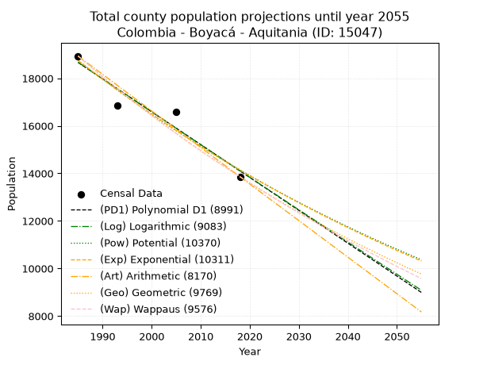
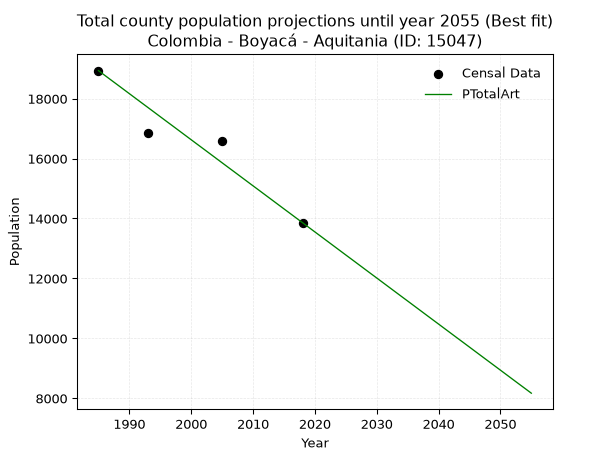
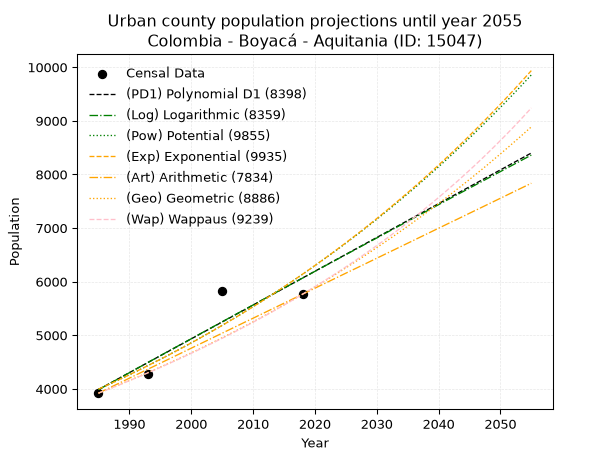
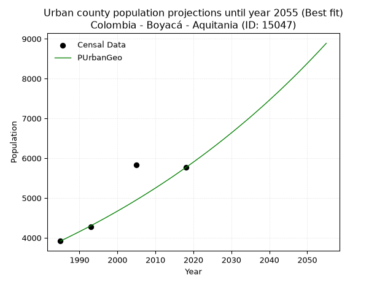
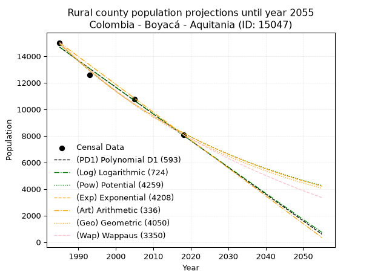
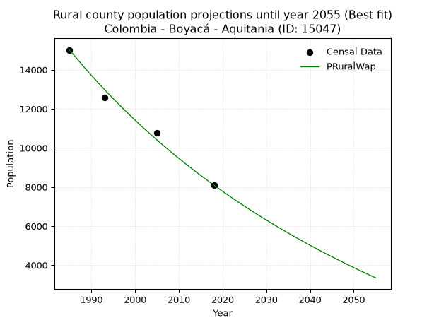

<div align="center">


</div>

# _“Population and Public Services Demand Projections (PPSD) until Year 2050 for Colombia - Boyacá - Aquitania (ID: 15047)”_
Keywords: `population` `public-service` `projection` `lineal` `polynomial` `logarithmic` `potential` `exponential` `arithmetic` `geometric` `wappaus` `dane` `colombia` `south-america`

PPSD are analytical estimates used by governments and planners to anticipate future changes in population size, age distribution, and the resulting community needs for utilities, healthcare, education, and infrastructure as sizing future water treatment facilities, electrical grids, and road networks based on spatial growth.

> **General running parameters**: • app_version: _v20260806_. • Python version: _3.14.7_. • Pandas version: _3.0.5_. • NumPy version: _2.5.1_. • Creates, save and include plots into reports (create_plot): _False_. • Projection until year: _2050_. • Process polynomial degree 2 and up: _False_. • Process Wappaus: _True_. • Process Wappaus: _True_. • Set negative values to zero: _True_. • Set infinite values to zero: _True_. • Drop dataset notes: _True_. 
<div align="center">

Dynamic map: [:earth_americas:Google](http://maps.google.com/maps?q=5.518602363,-72.8839898) [:earth_americas:OSM](https://www.openstreetmap.org/#map=18/5.518602363/-72.8839898&layers=P) [:earth_americas:Bing](https://www.bing.com/maps?cp=5.518602363~-72.8839898&lvl=18) [:earth_americas:Apple](https://maps.apple.com/frame?center=5.518602363%2C-72.8839898&span=0.003%2C0.006)

</div>


<div align="center">

```geojson
{
  "type": "Feature",
  "geometry": {
    "type": "Point", 
    "coordinates": [-72.8839898, 5.518602363]
  }, 
  "properties": {
    "Name": "Colombia - Boyacá - Aquitania (ID: 15047)"
  }
}
```

</div>


## 0. Census Data (4 records)

Census data are official statistics collected by a government about the people and housing in a country. They usually include counts of total population, age, sex, race, income, education, and jobs.

📅Global census file: [Population.xlsx](../data/Population.xlsx)

| Source   |   Year |   CountryID | CountryName   |   StateID | StateName   |   CountyID | CountyName   |   PTotal |   PUrban |   PRural |
|:---------|-------:|------------:|:--------------|----------:|:------------|-----------:|:-------------|---------:|---------:|---------:|
| DANE     |   1985 |          57 | Colombia      |        15 | Boyacá      |      15047 | Aquitania    |    18935 |     3918 |    15017 |
| DANE     |   1993 |          57 | Colombia      |        15 | Boyacá      |      15047 | Aquitania    |    16847 |     4275 |    12572 |
| DANE     |   2005 |          57 | Colombia      |        15 | Boyacá      |      15047 | Aquitania    |    16592 |     5830 |    10762 |
| DANE     |   2018 |          57 | Colombia      |        15 | Boyacá      |      15047 | Aquitania    |    13860 |     5764 |     8096 |

> 🔥Some records could had specific notes about the registered values or the corresponding urban or rural distribution.

## 1. Total

### 1.1. Coefficients and Parameters

* (PD1) Polynomial Deg 1: -138.21356884785055, 293020.1910879131 (lineal)
* (Log) Logarithmic: -276622.18060208467, 2119165.911467482
* (Pow) Potential: -17.090380082771425, 60.63300320284897
* (Exp) Exponential: -0.008540245760720898, 431770458696.21216
* (Art) Arithmetic: Year diff. 2018 - 1985 = 33, Population diff. 13860 - 18935 = -5075, Annual growth = -153.78787878787878
* (Geo) Geometric: Year diff. 2018 - 1985 = 33, Population diff. 13860 - 18935 = -5075, Annual growth % = -0.009410143880216548
* (Wap) Wappaus: i = -0.937873936806701, Condition values only valid for < 200)

<sub>
Wappaus condition values: ['-0.00', '-0.94', '-1.88', '-2.81', '-3.75', '-4.69', '-5.63', '-6.57', '-7.50', '-8.44', '-9.38', '-10.32', '-11.25', '-12.19', '-13.13', '-14.07', '-15.01', '-15.94', '-16.88', '-17.82', '-18.76', '-19.70', '-20.63', '-21.57', '-22.51', '-23.45', '-24.38', '-25.32', '-26.26', '-27.20', '-28.14', '-29.07', '-30.01', '-30.95', '-31.89', '-32.83', '-33.76', '-34.70', '-35.64', '-36.58', '-37.51', '-38.45', '-39.39', '-40.33', '-41.27', '-42.20', '-43.14', '-44.08', '-45.02', '-45.96', '-46.89', '-47.83', '-48.77', '-49.71', '-50.65', '-51.58', '-52.52', '-53.46', '-54.40', '-55.33', '-56.27', '-57.21', '-58.15', '-59.09', '-60.02', '-60.96']
</sub>


### 1.2. Projected Dataset

|   Year |   CountyID |   PTotalPD1 |   PTotalLog |   PTotalPow |   PTotalExp |   PTotalArt |   PTotalGeo |   PTotalWap |
|-------:|-----------:|------------:|------------:|------------:|------------:|------------:|------------:|------------:|
|   1985 |      15047 |       18666 |       18670 |       18751 |       18747 |       18935 |       18935 |       18935 |
|   1986 |      15047 |       18528 |       18531 |       18590 |       18587 |       18781 |       18757 |       18758 |
|   1987 |      15047 |       18390 |       18392 |       18431 |       18429 |       18627 |       18580 |       18583 |
|   1988 |      15047 |       18252 |       18252 |       18273 |       18272 |       18474 |       18405 |       18410 |
|   1989 |      15047 |       18113 |       18113 |       18117 |       18117 |       18320 |       18232 |       18238 |
|   1990 |      15047 |       17975 |       17974 |       17962 |       17963 |       18166 |       18061 |       18067 |
|   1991 |      15047 |       17837 |       17835 |       17808 |       17810 |       18012 |       17891 |       17899 |
|   1992 |      15047 |       17699 |       17696 |       17656 |       17659 |       17858 |       17722 |       17731 |
|   1993 |      15047 |       17561 |       17558 |       17505 |       17509 |       17705 |       17556 |       17566 |
|   1994 |      15047 |       17422 |       17419 |       17356 |       17360 |       17551 |       17390 |       17401 |
|   1995 |      15047 |       17284 |       17280 |       17208 |       17212 |       17397 |       17227 |       17239 |
|   1996 |      15047 |       17146 |       17141 |       17061 |       17066 |       17243 |       17065 |       17077 |
|   1997 |      15047 |       17008 |       17003 |       16916 |       16921 |       17090 |       16904 |       16917 |
|   1998 |      15047 |       16869 |       16864 |       16771 |       16777 |       16936 |       16745 |       16759 |
|   1999 |      15047 |       16731 |       16726 |       16629 |       16634 |       16782 |       16587 |       16602 |
|   2000 |      15047 |       16593 |       16588 |       16487 |       16493 |       16628 |       16431 |       16446 |
|   2001 |      15047 |       16455 |       16449 |       16347 |       16352 |       16474 |       16277 |       16292 |
|   2002 |      15047 |       16317 |       16311 |       16208 |       16213 |       16321 |       16124 |       16139 |
|   2003 |      15047 |       16178 |       16173 |       16070 |       16075 |       16167 |       15972 |       15987 |
|   2004 |      15047 |       16040 |       16035 |       15934 |       15939 |       16013 |       15822 |       15837 |
|   2005 |      15047 |       15902 |       15897 |       15798 |       15803 |       15859 |       15673 |       15688 |
|   2006 |      15047 |       15764 |       15759 |       15664 |       15669 |       15705 |       15525 |       15540 |
|   2007 |      15047 |       15626 |       15621 |       15531 |       15536 |       15552 |       15379 |       15393 |
|   2008 |      15047 |       15487 |       15483 |       15400 |       15403 |       15398 |       15234 |       15248 |
|   2009 |      15047 |       15349 |       15346 |       15269 |       15272 |       15244 |       15091 |       15104 |
|   2010 |      15047 |       15211 |       15208 |       15140 |       15143 |       15090 |       14949 |       14961 |
|   2011 |      15047 |       15073 |       15070 |       15012 |       15014 |       14937 |       14808 |       14820 |
|   2012 |      15047 |       14934 |       14933 |       14885 |       14886 |       14783 |       14669 |       14679 |
|   2013 |      15047 |       14796 |       14795 |       14759 |       14760 |       14629 |       14531 |       14540 |
|   2014 |      15047 |       14658 |       14658 |       14634 |       14634 |       14475 |       14394 |       14402 |
|   2015 |      15047 |       14520 |       14521 |       14511 |       14510 |       14321 |       14259 |       14264 |
|   2016 |      15047 |       14382 |       14384 |       14388 |       14386 |       14168 |       14125 |       14129 |
|   2017 |      15047 |       14243 |       14246 |       14267 |       14264 |       14014 |       13992 |       13994 |
|   2018 |      15047 |       14105 |       14109 |       14146 |       14143 |       13860 |       13860 |       13860 |
|   2019 |      15047 |       13967 |       13972 |       14027 |       14022 |       13706 |       13730 |       13727 |
|   2020 |      15047 |       13829 |       13835 |       13909 |       13903 |       13552 |       13600 |       13596 |
|   2021 |      15047 |       13691 |       13698 |       13792 |       13785 |       13399 |       13472 |       13465 |
|   2022 |      15047 |       13552 |       13561 |       13676 |       13668 |       13245 |       13346 |       13336 |
|   2023 |      15047 |       13414 |       13425 |       13561 |       13551 |       13091 |       13220 |       13207 |
|   2024 |      15047 |       13276 |       13288 |       13446 |       13436 |       12937 |       13096 |       13080 |
|   2025 |      15047 |       13138 |       13151 |       13333 |       13322 |       12783 |       12972 |       12954 |
|   2026 |      15047 |       13000 |       13015 |       13221 |       13209 |       12630 |       12850 |       12828 |
|   2027 |      15047 |       12861 |       12878 |       13110 |       13096 |       12476 |       12729 |       12704 |
|   2028 |      15047 |       12723 |       12742 |       13000 |       12985 |       12322 |       12610 |       12580 |
|   2029 |      15047 |       12585 |       12605 |       12891 |       12874 |       12168 |       12491 |       12458 |
|   2030 |      15047 |       12447 |       12469 |       12783 |       12765 |       12015 |       12373 |       12336 |
|   2031 |      15047 |       12308 |       12333 |       12676 |       12656 |       11861 |       12257 |       12215 |
|   2032 |      15047 |       12170 |       12197 |       12570 |       12549 |       11707 |       12142 |       12096 |
|   2033 |      15047 |       12032 |       12061 |       12465 |       12442 |       11553 |       12027 |       11977 |
|   2034 |      15047 |       11894 |       11925 |       12360 |       12336 |       11399 |       11914 |       11859 |
|   2035 |      15047 |       11756 |       11789 |       12257 |       12231 |       11246 |       11802 |       11742 |
|   2036 |      15047 |       11617 |       11653 |       12154 |       12127 |       11092 |       11691 |       11626 |
|   2037 |      15047 |       11479 |       11517 |       12053 |       12024 |       10938 |       11581 |       11511 |
|   2038 |      15047 |       11341 |       11381 |       11952 |       11922 |       10784 |       11472 |       11397 |
|   2039 |      15047 |       11203 |       11245 |       11852 |       11821 |       10630 |       11364 |       11283 |
|   2040 |      15047 |       11065 |       11110 |       11753 |       11720 |       10477 |       11257 |       11170 |
|   2041 |      15047 |       10926 |       10974 |       11655 |       11620 |       10323 |       11151 |       11059 |
|   2042 |      15047 |       10788 |       10839 |       11558 |       11522 |       10169 |       11046 |       10948 |
|   2043 |      15047 |       10650 |       10703 |       11462 |       11424 |       10015 |       10942 |       10837 |
|   2044 |      15047 |       10512 |       10568 |       11366 |       11326 |        9862 |       10839 |       10728 |
|   2045 |      15047 |       10373 |       10433 |       11272 |       11230 |        9708 |       10737 |       10619 |
|   2046 |      15047 |       10235 |       10297 |       11178 |       11135 |        9554 |       10636 |       10512 |
|   2047 |      15047 |       10097 |       10162 |       11085 |       11040 |        9400 |       10536 |       10405 |
|   2048 |      15047 |        9959 |       10027 |       10993 |       10946 |        9246 |       10437 |       10299 |
|   2049 |      15047 |        9821 |        9892 |       10902 |       10853 |        9093 |       10339 |       10193 |
|   2050 |      15047 |        9682 |        9757 |       10811 |       10761 |        8939 |       10242 |       10088 |
<div align="center">

</img>

</div>


### 1.3. Best fit with absolute and relative error (%)

Relative error puts that difference into context by dividing the absolute error by the true value, creating a unitless ratio or percentage that shows the scale of the mistake.

Absolute and relative error

|   Year | Source   |   CountryID | CountryName   |   StateID | StateName   |   CountyID_x | CountyName   |   PTotal |   PUrban |   PRural |   CountyID_y |   PTotalPD1 |   PTotalLog |   PTotalPow |   PTotalExp |   PTotalArt |   PTotalGeo |   PTotalWap |   PTotalPD1AbsError |   PTotalLogAbsError |   PTotalPowAbsError |   PTotalExpAbsError |   PTotalArtAbsError |   PTotalGeoAbsError |   PTotalWapAbsError |   PTotalPD1RelError |   PTotalLogRelError |   PTotalPowRelError |   PTotalExpRelError |   PTotalArtRelError |   PTotalGeoRelError |   PTotalWapRelError |
|-------:|:---------|------------:|:--------------|----------:|:------------|-------------:|:-------------|---------:|---------:|---------:|-------------:|------------:|------------:|------------:|------------:|------------:|------------:|------------:|--------------------:|--------------------:|--------------------:|--------------------:|--------------------:|--------------------:|--------------------:|--------------------:|--------------------:|--------------------:|--------------------:|--------------------:|--------------------:|--------------------:|
|   1985 | DANE     |          57 | Colombia      |        15 | Boyacá      |        15047 | Aquitania    |    18935 |     3918 |    15017 |        15047 |       18666 |       18670 |       18751 |       18747 |       18935 |       18935 |       18935 |                 269 |                 265 |                 184 |                 188 |                   0 |                   0 |                   0 |             1.42065 |             1.39952 |            0.971745 |             0.99287 |             0       |             0       |             0       |
|   1993 | DANE     |          57 | Colombia      |        15 | Boyacá      |        15047 | Aquitania    |    16847 |     4275 |    12572 |        15047 |       17561 |       17558 |       17505 |       17509 |       17705 |       17556 |       17566 |                 714 |                 711 |                 658 |                 662 |                 858 |                 709 |                 719 |             4.23814 |             4.22034 |            3.90574  |             3.92948 |             5.09289 |             4.20846 |             4.26782 |
|   2005 | DANE     |          57 | Colombia      |        15 | Boyacá      |        15047 | Aquitania    |    16592 |     5830 |    10762 |        15047 |       15902 |       15897 |       15798 |       15803 |       15859 |       15673 |       15688 |                 690 |                 695 |                 794 |                 789 |                 733 |                 919 |                 904 |             4.15863 |             4.18877 |            4.78544  |             4.7553  |             4.41779 |             5.53881 |             5.44841 |
|   2018 | DANE     |          57 | Colombia      |        15 | Boyacá      |        15047 | Aquitania    |    13860 |     5764 |     8096 |        15047 |       14105 |       14109 |       14146 |       14143 |       13860 |       13860 |       13860 |                 245 |                 249 |                 286 |                 283 |                   0 |                   0 |                   0 |             1.76768 |             1.79654 |            2.06349  |             2.04185 |             0       |             0       |             0       |

Relative error mean

| Method    |   RelError | Best   |
|:----------|-----------:|:-------|
| PTotalPD1 |    2.89628 |        |
| PTotalLog |    2.90129 |        |
| PTotalPow |    2.9316  |        |
| PTotalExp |    2.92988 |        |
| PTotalArt |    2.37767 | True   |
| PTotalGeo |    2.43682 |        |
| PTotalWap |    2.42906 |        |

💙Best method: _**PTotalArt**_
<div align="center">

</img>

</div>


### 1.4. Fresh water supply demand in liters per capita per day (lpcd)

The fresh water supply demand typically ranges from 100 to 300 liters per capita per day (lpcd) for standard domestic and municipal planning, though absolute survival minimums set by the World Health Organization are as low as 7.5 to 20 liters per day, and total consumption in high-income nations can exceed 400 liters.

> `CZ`: Level in meters above the sea level (masl).<br> `WS`: Fresh water supply demand in liters per capita per day (lpcd or l/h/d).<br> `WSAll`: Zonal fresh water supply demand in liters per second (l/s).<br> `A`: Zonal area in square meters.

Reference values (RAS Colombia)

|    CZ |   WS |
|------:|-----:|
|  1000 |  120 |
|  2000 |  130 |
| 99999 |  140 |

County shapefile geometry properties and water supply values

|   CountyID |      ATotal |   CZTotal |   WSTotal |
|-----------:|------------:|----------:|----------:|
|      15047 | 9.40354e+08 |    2974.1 |       140 |

Projected values for best method: PTotalArt

|   CountyID |   Year |   PTotalArt |   WSTotal |   WSTotalAll |
|-----------:|-------:|------------:|----------:|-------------:|
|      15047 |   1985 |       18935 |       140 |      30.6817 |
|      15047 |   1986 |       18781 |       140 |      30.4322 |
|      15047 |   1987 |       18627 |       140 |      30.1826 |
|      15047 |   1988 |       18474 |       140 |      29.9347 |
|      15047 |   1989 |       18320 |       140 |      29.6852 |
|      15047 |   1990 |       18166 |       140 |      29.4356 |
|      15047 |   1991 |       18012 |       140 |      29.1861 |
|      15047 |   1992 |       17858 |       140 |      28.9366 |
|      15047 |   1993 |       17705 |       140 |      28.6887 |
|      15047 |   1994 |       17551 |       140 |      28.4391 |
|      15047 |   1995 |       17397 |       140 |      28.1896 |
|      15047 |   1996 |       17243 |       140 |      27.94   |
|      15047 |   1997 |       17090 |       140 |      27.6921 |
|      15047 |   1998 |       16936 |       140 |      27.4426 |
|      15047 |   1999 |       16782 |       140 |      27.1931 |
|      15047 |   2000 |       16628 |       140 |      26.9435 |
|      15047 |   2001 |       16474 |       140 |      26.694  |
|      15047 |   2002 |       16321 |       140 |      26.4461 |
|      15047 |   2003 |       16167 |       140 |      26.1965 |
|      15047 |   2004 |       16013 |       140 |      25.947  |
|      15047 |   2005 |       15859 |       140 |      25.6975 |
|      15047 |   2006 |       15705 |       140 |      25.4479 |
|      15047 |   2007 |       15552 |       140 |      25.2    |
|      15047 |   2008 |       15398 |       140 |      24.9505 |
|      15047 |   2009 |       15244 |       140 |      24.7009 |
|      15047 |   2010 |       15090 |       140 |      24.4514 |
|      15047 |   2011 |       14937 |       140 |      24.2035 |
|      15047 |   2012 |       14783 |       140 |      23.9539 |
|      15047 |   2013 |       14629 |       140 |      23.7044 |
|      15047 |   2014 |       14475 |       140 |      23.4549 |
|      15047 |   2015 |       14321 |       140 |      23.2053 |
|      15047 |   2016 |       14168 |       140 |      22.9574 |
|      15047 |   2017 |       14014 |       140 |      22.7079 |
|      15047 |   2018 |       13860 |       140 |      22.4583 |
|      15047 |   2019 |       13706 |       140 |      22.2088 |
|      15047 |   2020 |       13552 |       140 |      21.9593 |
|      15047 |   2021 |       13399 |       140 |      21.7113 |
|      15047 |   2022 |       13245 |       140 |      21.4618 |
|      15047 |   2023 |       13091 |       140 |      21.2123 |
|      15047 |   2024 |       12937 |       140 |      20.9627 |
|      15047 |   2025 |       12783 |       140 |      20.7132 |
|      15047 |   2026 |       12630 |       140 |      20.4653 |
|      15047 |   2027 |       12476 |       140 |      20.2157 |
|      15047 |   2028 |       12322 |       140 |      19.9662 |
|      15047 |   2029 |       12168 |       140 |      19.7167 |
|      15047 |   2030 |       12015 |       140 |      19.4688 |
|      15047 |   2031 |       11861 |       140 |      19.2192 |
|      15047 |   2032 |       11707 |       140 |      18.9697 |
|      15047 |   2033 |       11553 |       140 |      18.7201 |
|      15047 |   2034 |       11399 |       140 |      18.4706 |
|      15047 |   2035 |       11246 |       140 |      18.2227 |
|      15047 |   2036 |       11092 |       140 |      17.9731 |
|      15047 |   2037 |       10938 |       140 |      17.7236 |
|      15047 |   2038 |       10784 |       140 |      17.4741 |
|      15047 |   2039 |       10630 |       140 |      17.2245 |
|      15047 |   2040 |       10477 |       140 |      16.9766 |
|      15047 |   2041 |       10323 |       140 |      16.7271 |
|      15047 |   2042 |       10169 |       140 |      16.4775 |
|      15047 |   2043 |       10015 |       140 |      16.228  |
|      15047 |   2044 |        9862 |       140 |      15.9801 |
|      15047 |   2045 |        9708 |       140 |      15.7306 |
|      15047 |   2046 |        9554 |       140 |      15.481  |
|      15047 |   2047 |        9400 |       140 |      15.2315 |
|      15047 |   2048 |        9246 |       140 |      14.9819 |
|      15047 |   2049 |        9093 |       140 |      14.734  |
|      15047 |   2050 |        8939 |       140 |      14.4845 |

## 2. Urban

### 2.1. Coefficients and Parameters

* (PD1) Polynomial Deg 1: 63.04335608189474, -121155.72300280996 (lineal)
* (Log) Logarithmic: 126276.06069272052, -954878.5992382122
* (Pow) Potential: 26.079202626363557, -82.40182737299135
* (Exp) Exponential: 0.013019659853270074, 2.3847991966850406e-08
* (Art) Arithmetic: Year diff. 2018 - 1985 = 33, Population diff. 5764 - 3918 = 1846, Annual growth = 55.93939393939394
* (Geo) Geometric: Year diff. 2018 - 1985 = 33, Population diff. 5764 - 3918 = 1846, Annual growth % = 0.011767190731374555
* (Wap) Wappaus: i = 1.1555338553892571, Condition values only valid for < 200)

<sub>
Wappaus condition values: ['0.00', '1.16', '2.31', '3.47', '4.62', '5.78', '6.93', '8.09', '9.24', '10.40', '11.56', '12.71', '13.87', '15.02', '16.18', '17.33', '18.49', '19.64', '20.80', '21.96', '23.11', '24.27', '25.42', '26.58', '27.73', '28.89', '30.04', '31.20', '32.35', '33.51', '34.67', '35.82', '36.98', '38.13', '39.29', '40.44', '41.60', '42.75', '43.91', '45.07', '46.22', '47.38', '48.53', '49.69', '50.84', '52.00', '53.15', '54.31', '55.47', '56.62', '57.78', '58.93', '60.09', '61.24', '62.40', '63.55', '64.71', '65.87', '67.02', '68.18', '69.33', '70.49', '71.64', '72.80', '73.95', '75.11']
</sub>


### 2.2. Projected Dataset

|   Year |   CountyID |   PUrbanPD1 |   PUrbanLog |   PUrbanPow |   PUrbanExp |   PUrbanArt |   PUrbanGeo |   PUrbanWap |
|-------:|-----------:|------------:|------------:|------------:|------------:|------------:|------------:|------------:|
|   1985 |      15047 |        3985 |        3983 |        3992 |        3994 |        3918 |        3918 |        3918 |
|   1986 |      15047 |        4048 |        4046 |        4044 |        4046 |        3974 |        3964 |        3964 |
|   1987 |      15047 |        4111 |        4110 |        4098 |        4099 |        4030 |        4011 |        4010 |
|   1988 |      15047 |        4174 |        4173 |        4152 |        4153 |        4086 |        4058 |        4056 |
|   1989 |      15047 |        4238 |        4237 |        4207 |        4207 |        4142 |        4106 |        4103 |
|   1990 |      15047 |        4301 |        4300 |        4262 |        4262 |        4198 |        4154 |        4151 |
|   1991 |      15047 |        4364 |        4364 |        4318 |        4318 |        4254 |        4203 |        4199 |
|   1992 |      15047 |        4427 |        4427 |        4375 |        4375 |        4310 |        4252 |        4248 |
|   1993 |      15047 |        4490 |        4491 |        4433 |        4432 |        4366 |        4302 |        4298 |
|   1994 |      15047 |        4553 |        4554 |        4491 |        4490 |        4421 |        4353 |        4348 |
|   1995 |      15047 |        4616 |        4617 |        4550 |        4549 |        4477 |        4404 |        4398 |
|   1996 |      15047 |        4679 |        4681 |        4610 |        4609 |        4533 |        4456 |        4450 |
|   1997 |      15047 |        4742 |        4744 |        4671 |        4669 |        4589 |        4508 |        4502 |
|   1998 |      15047 |        4805 |        4807 |        4732 |        4730 |        4645 |        4562 |        4554 |
|   1999 |      15047 |        4868 |        4870 |        4794 |        4792 |        4701 |        4615 |        4608 |
|   2000 |      15047 |        4931 |        4933 |        4857 |        4855 |        4757 |        4670 |        4662 |
|   2001 |      15047 |        4994 |        4997 |        4921 |        4919 |        4813 |        4724 |        4716 |
|   2002 |      15047 |        5057 |        5060 |        4986 |        4983 |        4869 |        4780 |        4771 |
|   2003 |      15047 |        5120 |        5123 |        5051 |        5048 |        4925 |        4836 |        4828 |
|   2004 |      15047 |        5183 |        5186 |        5117 |        5114 |        4981 |        4893 |        4884 |
|   2005 |      15047 |        5246 |        5249 |        5184 |        5182 |        5037 |        4951 |        4942 |
|   2006 |      15047 |        5309 |        5312 |        5252 |        5249 |        5093 |        5009 |        5000 |
|   2007 |      15047 |        5372 |        5375 |        5321 |        5318 |        5149 |        5068 |        5059 |
|   2008 |      15047 |        5435 |        5438 |        5390 |        5388 |        5205 |        5128 |        5119 |
|   2009 |      15047 |        5498 |        5500 |        5461 |        5459 |        5261 |        5188 |        5179 |
|   2010 |      15047 |        5561 |        5563 |        5532 |        5530 |        5316 |        5249 |        5241 |
|   2011 |      15047 |        5624 |        5626 |        5604 |        5603 |        5372 |        5311 |        5303 |
|   2012 |      15047 |        5688 |        5689 |        5677 |        5676 |        5428 |        5373 |        5366 |
|   2013 |      15047 |        5751 |        5752 |        5752 |        5750 |        5484 |        5437 |        5430 |
|   2014 |      15047 |        5814 |        5814 |        5827 |        5826 |        5540 |        5500 |        5495 |
|   2015 |      15047 |        5877 |        5877 |        5902 |        5902 |        5596 |        5565 |        5561 |
|   2016 |      15047 |        5940 |        5940 |        5979 |        5979 |        5652 |        5631 |        5628 |
|   2017 |      15047 |        6003 |        6002 |        6057 |        6058 |        5708 |        5697 |        5695 |
|   2018 |      15047 |        6066 |        6065 |        6136 |        6137 |        5764 |        5764 |        5764 |
|   2019 |      15047 |        6129 |        6127 |        6216 |        6218 |        5820 |        5832 |        5834 |
|   2020 |      15047 |        6192 |        6190 |        6297 |        6299 |        5876 |        5900 |        5904 |
|   2021 |      15047 |        6255 |        6252 |        6378 |        6382 |        5932 |        5970 |        5976 |
|   2022 |      15047 |        6318 |        6315 |        6461 |        6465 |        5988 |        6040 |        6049 |
|   2023 |      15047 |        6381 |        6377 |        6545 |        6550 |        6044 |        6111 |        6122 |
|   2024 |      15047 |        6444 |        6440 |        6630 |        6636 |        6100 |        6183 |        6197 |
|   2025 |      15047 |        6507 |        6502 |        6716 |        6723 |        6156 |        6256 |        6273 |
|   2026 |      15047 |        6570 |        6564 |        6803 |        6811 |        6212 |        6329 |        6350 |
|   2027 |      15047 |        6633 |        6627 |        6891 |        6900 |        6267 |        6404 |        6429 |
|   2028 |      15047 |        6696 |        6689 |        6980 |        6990 |        6323 |        6479 |        6508 |
|   2029 |      15047 |        6759 |        6751 |        7071 |        7082 |        6379 |        6556 |        6589 |
|   2030 |      15047 |        6822 |        6813 |        7162 |        7175 |        6435 |        6633 |        6671 |
|   2031 |      15047 |        6885 |        6876 |        7255 |        7269 |        6491 |        6711 |        6754 |
|   2032 |      15047 |        6948 |        6938 |        7348 |        7364 |        6547 |        6790 |        6839 |
|   2033 |      15047 |        7011 |        7000 |        7443 |        7461 |        6603 |        6870 |        6925 |
|   2034 |      15047 |        7074 |        7062 |        7539 |        7558 |        6659 |        6950 |        7012 |
|   2035 |      15047 |        7138 |        7124 |        7637 |        7658 |        6715 |        7032 |        7101 |
|   2036 |      15047 |        7201 |        7186 |        7735 |        7758 |        6771 |        7115 |        7192 |
|   2037 |      15047 |        7264 |        7248 |        7835 |        7860 |        6827 |        7199 |        7283 |
|   2038 |      15047 |        7327 |        7310 |        7936 |        7963 |        6883 |        7283 |        7377 |
|   2039 |      15047 |        7390 |        7372 |        8038 |        8067 |        6939 |        7369 |        7471 |
|   2040 |      15047 |        7453 |        7434 |        8141 |        8173 |        6995 |        7456 |        7568 |
|   2041 |      15047 |        7516 |        7496 |        8246 |        8280 |        7051 |        7544 |        7666 |
|   2042 |      15047 |        7579 |        7558 |        8352 |        8388 |        7107 |        7632 |        7766 |
|   2043 |      15047 |        7642 |        7620 |        8459 |        8498 |        7162 |        7722 |        7867 |
|   2044 |      15047 |        7705 |        7681 |        8568 |        8609 |        7218 |        7813 |        7971 |
|   2045 |      15047 |        7768 |        7743 |        8678 |        8722 |        7274 |        7905 |        8076 |
|   2046 |      15047 |        7831 |        7805 |        8789 |        8837 |        7330 |        7998 |        8183 |
|   2047 |      15047 |        7894 |        7867 |        8902 |        8952 |        7386 |        8092 |        8292 |
|   2048 |      15047 |        7957 |        7928 |        9016 |        9070 |        7442 |        8187 |        8403 |
|   2049 |      15047 |        8020 |        7990 |        9132 |        9189 |        7498 |        8284 |        8516 |
|   2050 |      15047 |        8083 |        8052 |        9249 |        9309 |        7554 |        8381 |        8631 |
<div align="center">

</img>

</div>


### 2.3. Best fit with absolute and relative error (%)

Relative error puts that difference into context by dividing the absolute error by the true value, creating a unitless ratio or percentage that shows the scale of the mistake.

Absolute and relative error

|   Year | Source   |   CountryID | CountryName   |   StateID | StateName   |   CountyID_x | CountyName   |   PTotal |   PUrban |   PRural |   CountyID_y |   PUrbanPD1 |   PUrbanLog |   PUrbanPow |   PUrbanExp |   PUrbanArt |   PUrbanGeo |   PUrbanWap |   PUrbanPD1AbsError |   PUrbanLogAbsError |   PUrbanPowAbsError |   PUrbanExpAbsError |   PUrbanArtAbsError |   PUrbanGeoAbsError |   PUrbanWapAbsError |   PUrbanPD1RelError |   PUrbanLogRelError |   PUrbanPowRelError |   PUrbanExpRelError |   PUrbanArtRelError |   PUrbanGeoRelError |   PUrbanWapRelError |
|-------:|:---------|------------:|:--------------|----------:|:------------|-------------:|:-------------|---------:|---------:|---------:|-------------:|------------:|------------:|------------:|------------:|------------:|------------:|------------:|--------------------:|--------------------:|--------------------:|--------------------:|--------------------:|--------------------:|--------------------:|--------------------:|--------------------:|--------------------:|--------------------:|--------------------:|--------------------:|--------------------:|
|   1985 | DANE     |          57 | Colombia      |        15 | Boyacá      |        15047 | Aquitania    |    18935 |     3918 |    15017 |        15047 |        3985 |        3983 |        3992 |        3994 |        3918 |        3918 |        3918 |                  67 |                  65 |                  74 |                  76 |                   0 |                   0 |                   0 |             1.71006 |             1.65901 |             1.88872 |             1.93977 |             0       |            0        |            0        |
|   1993 | DANE     |          57 | Colombia      |        15 | Boyacá      |        15047 | Aquitania    |    16847 |     4275 |    12572 |        15047 |        4490 |        4491 |        4433 |        4432 |        4366 |        4302 |        4298 |                 215 |                 216 |                 158 |                 157 |                  91 |                  27 |                  23 |             5.02924 |             5.05263 |             3.69591 |             3.67251 |             2.12865 |            0.631579 |            0.538012 |
|   2005 | DANE     |          57 | Colombia      |        15 | Boyacá      |        15047 | Aquitania    |    16592 |     5830 |    10762 |        15047 |        5246 |        5249 |        5184 |        5182 |        5037 |        4951 |        4942 |                 584 |                 581 |                 646 |                 648 |                 793 |                 879 |                 888 |            10.0172  |             9.96569 |            11.0806  |            11.1149  |            13.6021  |           15.0772   |           15.2316   |
|   2018 | DANE     |          57 | Colombia      |        15 | Boyacá      |        15047 | Aquitania    |    13860 |     5764 |     8096 |        15047 |        6066 |        6065 |        6136 |        6137 |        5764 |        5764 |        5764 |                 302 |                 301 |                 372 |                 373 |                   0 |                   0 |                   0 |             5.23942 |             5.22207 |             6.45385 |             6.4712  |             0       |            0        |            0        |

Relative error mean

| Method    |   RelError | Best   |
|:----------|-----------:|:-------|
| PUrbanPD1 |    5.49897 |        |
| PUrbanLog |    5.47485 |        |
| PUrbanPow |    5.77977 |        |
| PUrbanExp |    5.7996  |        |
| PUrbanArt |    3.93268 |        |
| PUrbanGeo |    3.92719 | True   |
| PUrbanWap |    3.94239 |        |

💙Best method: _**PUrbanGeo**_
<div align="center">

</img>

</div>


### 2.4. Fresh water supply demand in liters per capita per day (lpcd)

The fresh water supply demand typically ranges from 100 to 300 liters per capita per day (lpcd) for standard domestic and municipal planning, though absolute survival minimums set by the World Health Organization are as low as 7.5 to 20 liters per day, and total consumption in high-income nations can exceed 400 liters.

> `CZ`: Level in meters above the sea level (masl).<br> `WS`: Fresh water supply demand in liters per capita per day (lpcd or l/h/d).<br> `WSAll`: Zonal fresh water supply demand in liters per second (l/s).<br> `A`: Zonal area in square meters.

Reference values (RAS Colombia)

|    CZ |   WS |
|------:|-----:|
|  1000 |  120 |
|  2000 |  130 |
| 99999 |  140 |

County shapefile geometry properties and water supply values

|   CountyID |      AUrban |   CZUrban |   WSUrban |
|-----------:|------------:|----------:|----------:|
|      15047 | 1.08945e+06 |    3038.3 |       140 |

Projected values for best method: PUrbanGeo

|   CountyID |   Year |   PUrbanGeo |   WSUrban |   WSUrbanAll |
|-----------:|-------:|------------:|----------:|-------------:|
|      15047 |   1985 |        3918 |       140 |      6.34861 |
|      15047 |   1986 |        3964 |       140 |      6.42315 |
|      15047 |   1987 |        4011 |       140 |      6.49931 |
|      15047 |   1988 |        4058 |       140 |      6.57546 |
|      15047 |   1989 |        4106 |       140 |      6.65324 |
|      15047 |   1990 |        4154 |       140 |      6.73102 |
|      15047 |   1991 |        4203 |       140 |      6.81042 |
|      15047 |   1992 |        4252 |       140 |      6.88981 |
|      15047 |   1993 |        4302 |       140 |      6.97083 |
|      15047 |   1994 |        4353 |       140 |      7.05347 |
|      15047 |   1995 |        4404 |       140 |      7.13611 |
|      15047 |   1996 |        4456 |       140 |      7.22037 |
|      15047 |   1997 |        4508 |       140 |      7.30463 |
|      15047 |   1998 |        4562 |       140 |      7.39213 |
|      15047 |   1999 |        4615 |       140 |      7.47801 |
|      15047 |   2000 |        4670 |       140 |      7.56713 |
|      15047 |   2001 |        4724 |       140 |      7.65463 |
|      15047 |   2002 |        4780 |       140 |      7.74537 |
|      15047 |   2003 |        4836 |       140 |      7.83611 |
|      15047 |   2004 |        4893 |       140 |      7.92847 |
|      15047 |   2005 |        4951 |       140 |      8.02245 |
|      15047 |   2006 |        5009 |       140 |      8.11644 |
|      15047 |   2007 |        5068 |       140 |      8.21204 |
|      15047 |   2008 |        5128 |       140 |      8.30926 |
|      15047 |   2009 |        5188 |       140 |      8.40648 |
|      15047 |   2010 |        5249 |       140 |      8.50532 |
|      15047 |   2011 |        5311 |       140 |      8.60579 |
|      15047 |   2012 |        5373 |       140 |      8.70625 |
|      15047 |   2013 |        5437 |       140 |      8.80995 |
|      15047 |   2014 |        5500 |       140 |      8.91204 |
|      15047 |   2015 |        5565 |       140 |      9.01736 |
|      15047 |   2016 |        5631 |       140 |      9.12431 |
|      15047 |   2017 |        5697 |       140 |      9.23125 |
|      15047 |   2018 |        5764 |       140 |      9.33981 |
|      15047 |   2019 |        5832 |       140 |      9.45    |
|      15047 |   2020 |        5900 |       140 |      9.56019 |
|      15047 |   2021 |        5970 |       140 |      9.67361 |
|      15047 |   2022 |        6040 |       140 |      9.78704 |
|      15047 |   2023 |        6111 |       140 |      9.90208 |
|      15047 |   2024 |        6183 |       140 |     10.0188  |
|      15047 |   2025 |        6256 |       140 |     10.137   |
|      15047 |   2026 |        6329 |       140 |     10.2553  |
|      15047 |   2027 |        6404 |       140 |     10.3769  |
|      15047 |   2028 |        6479 |       140 |     10.4984  |
|      15047 |   2029 |        6556 |       140 |     10.6231  |
|      15047 |   2030 |        6633 |       140 |     10.7479  |
|      15047 |   2031 |        6711 |       140 |     10.8743  |
|      15047 |   2032 |        6790 |       140 |     11.0023  |
|      15047 |   2033 |        6870 |       140 |     11.1319  |
|      15047 |   2034 |        6950 |       140 |     11.2616  |
|      15047 |   2035 |        7032 |       140 |     11.3944  |
|      15047 |   2036 |        7115 |       140 |     11.5289  |
|      15047 |   2037 |        7199 |       140 |     11.665   |
|      15047 |   2038 |        7283 |       140 |     11.8012  |
|      15047 |   2039 |        7369 |       140 |     11.9405  |
|      15047 |   2040 |        7456 |       140 |     12.0815  |
|      15047 |   2041 |        7544 |       140 |     12.2241  |
|      15047 |   2042 |        7632 |       140 |     12.3667  |
|      15047 |   2043 |        7722 |       140 |     12.5125  |
|      15047 |   2044 |        7813 |       140 |     12.66    |
|      15047 |   2045 |        7905 |       140 |     12.809   |
|      15047 |   2046 |        7998 |       140 |     12.9597  |
|      15047 |   2047 |        8092 |       140 |     13.112   |
|      15047 |   2048 |        8187 |       140 |     13.266   |
|      15047 |   2049 |        8284 |       140 |     13.4231  |
|      15047 |   2050 |        8381 |       140 |     13.5803  |

## 3. Rural

### 3.1. Coefficients and Parameters

* (PD1) Polynomial Deg 1: -201.2569249297453, 414175.91409072303 (lineal)
* (Log) Logarithmic: -402898.2412948052, 3074044.5107056946
* (Pow) Potential: -36.189435824000014, 123.51810991928946
* (Exp) Exponential: -0.01808155885296278, 5.773556344645224e+19
* (Art) Arithmetic: Year diff. 2018 - 1985 = 33, Population diff. 8096 - 15017 = -6921, Annual growth = -209.72727272727272
* (Geo) Geometric: Year diff. 2018 - 1985 = 33, Population diff. 8096 - 15017 = -6921, Annual growth % = -0.018547438805029848
* (Wap) Wappaus: i = -1.8147992275106886, Condition values only valid for < 200)

<sub>
Wappaus condition values: ['-0.00', '-1.81', '-3.63', '-5.44', '-7.26', '-9.07', '-10.89', '-12.70', '-14.52', '-16.33', '-18.15', '-19.96', '-21.78', '-23.59', '-25.41', '-27.22', '-29.04', '-30.85', '-32.67', '-34.48', '-36.30', '-38.11', '-39.93', '-41.74', '-43.56', '-45.37', '-47.18', '-49.00', '-50.81', '-52.63', '-54.44', '-56.26', '-58.07', '-59.89', '-61.70', '-63.52', '-65.33', '-67.15', '-68.96', '-70.78', '-72.59', '-74.41', '-76.22', '-78.04', '-79.85', '-81.67', '-83.48', '-85.30', '-87.11', '-88.93', '-90.74', '-92.55', '-94.37', '-96.18', '-98.00', '-99.81', '-101.63', '-103.44', '-105.26', '-107.07', '-108.89', '-110.70', '-112.52', '-114.33', '-116.15', '-117.96']
</sub>


### 3.2. Projected Dataset

|   Year |   CountyID |   PRuralPD1 |   PRuralLog |   PRuralPow |   PRuralExp |   PRuralArt |   PRuralGeo |   PRuralWap |
|-------:|-----------:|------------:|------------:|------------:|------------:|------------:|------------:|------------:|
|   1985 |      15047 |       14681 |       14687 |       14929 |       14921 |       15017 |       15017 |       15017 |
|   1986 |      15047 |       14480 |       14484 |       14659 |       14653 |       14807 |       14738 |       14747 |
|   1987 |      15047 |       14278 |       14282 |       14394 |       14391 |       14598 |       14465 |       14482 |
|   1988 |      15047 |       14077 |       14079 |       14135 |       14133 |       14388 |       14197 |       14221 |
|   1989 |      15047 |       13876 |       13876 |       13880 |       13880 |       14178 |       13934 |       13965 |
|   1990 |      15047 |       13675 |       13674 |       13629 |       13631 |       13968 |       13675 |       13713 |
|   1991 |      15047 |       13473 |       13471 |       13384 |       13387 |       13759 |       13421 |       13466 |
|   1992 |      15047 |       13272 |       13269 |       13143 |       13147 |       13549 |       13173 |       13223 |
|   1993 |      15047 |       13071 |       13067 |       12906 |       12911 |       13339 |       12928 |       12984 |
|   1994 |      15047 |       12870 |       12865 |       12674 |       12680 |       13129 |       12688 |       12749 |
|   1995 |      15047 |       12668 |       12663 |       12446 |       12453 |       12920 |       12453 |       12518 |
|   1996 |      15047 |       12467 |       12461 |       12223 |       12230 |       12710 |       12222 |       12291 |
|   1997 |      15047 |       12266 |       12259 |       12003 |       12010 |       12500 |       11995 |       12068 |
|   1998 |      15047 |       12065 |       12057 |       11787 |       11795 |       12291 |       11773 |       11848 |
|   1999 |      15047 |       11863 |       11856 |       11576 |       11584 |       12081 |       11555 |       11632 |
|   2000 |      15047 |       11662 |       11654 |       11368 |       11376 |       11871 |       11340 |       11419 |
|   2001 |      15047 |       11461 |       11453 |       11165 |       11172 |       11661 |       11130 |       11209 |
|   2002 |      15047 |       11260 |       11252 |       10964 |       10972 |       11452 |       10923 |       11003 |
|   2003 |      15047 |       11058 |       11050 |       10768 |       10776 |       11242 |       10721 |       10800 |
|   2004 |      15047 |       10857 |       10849 |       10575 |       10583 |       11032 |       10522 |       10600 |
|   2005 |      15047 |       10656 |       10648 |       10386 |       10393 |       10822 |       10327 |       10404 |
|   2006 |      15047 |       10455 |       10447 |       10200 |       10207 |       10613 |       10135 |       10210 |
|   2007 |      15047 |       10253 |       10247 |       10018 |       10024 |       10403 |        9947 |       10019 |
|   2008 |      15047 |       10052 |       10046 |        9839 |        9844 |       10193 |        9763 |        9831 |
|   2009 |      15047 |        9851 |        9845 |        9663 |        9668 |        9984 |        9582 |        9646 |
|   2010 |      15047 |        9649 |        9645 |        9491 |        9495 |        9774 |        9404 |        9464 |
|   2011 |      15047 |        9448 |        9444 |        9322 |        9324 |        9564 |        9230 |        9284 |
|   2012 |      15047 |        9247 |        9244 |        9155 |        9157 |        9354 |        9058 |        9107 |
|   2013 |      15047 |        9046 |        9044 |        8992 |        8993 |        9145 |        8890 |        8932 |
|   2014 |      15047 |        8844 |        8844 |        8832 |        8832 |        8935 |        8726 |        8760 |
|   2015 |      15047 |        8643 |        8644 |        8675 |        8674 |        8725 |        8564 |        8591 |
|   2016 |      15047 |        8442 |        8444 |        8520 |        8518 |        8515 |        8405 |        8423 |
|   2017 |      15047 |        8241 |        8244 |        8369 |        8366 |        8306 |        8249 |        8259 |
|   2018 |      15047 |        8039 |        8044 |        8220 |        8216 |        8096 |        8096 |        8096 |
|   2019 |      15047 |        7838 |        7845 |        8074 |        8069 |        7886 |        7946 |        7936 |
|   2020 |      15047 |        7637 |        7645 |        7931 |        7924 |        7677 |        7798 |        7778 |
|   2021 |      15047 |        7436 |        7446 |        7790 |        7782 |        7467 |        7654 |        7622 |
|   2022 |      15047 |        7234 |        7247 |        7652 |        7643 |        7257 |        7512 |        7468 |
|   2023 |      15047 |        7033 |        7047 |        7516 |        7506 |        7047 |        7373 |        7316 |
|   2024 |      15047 |        6832 |        6848 |        7383 |        7371 |        6838 |        7236 |        7167 |
|   2025 |      15047 |        6631 |        6649 |        7252 |        7239 |        6628 |        7102 |        7019 |
|   2026 |      15047 |        6429 |        6450 |        7124 |        7109 |        6418 |        6970 |        6873 |
|   2027 |      15047 |        6228 |        6252 |        6997 |        6982 |        6208 |        6841 |        6729 |
|   2028 |      15047 |        6027 |        6053 |        6874 |        6857 |        5999 |        6714 |        6587 |
|   2029 |      15047 |        5826 |        5854 |        6752 |        6734 |        5789 |        6589 |        6447 |
|   2030 |      15047 |        5624 |        5656 |        6633 |        6613 |        5579 |        6467 |        6309 |
|   2031 |      15047 |        5423 |        5457 |        6516 |        6495 |        5370 |        6347 |        6172 |
|   2032 |      15047 |        5222 |        5259 |        6401 |        6378 |        5160 |        6229 |        6038 |
|   2033 |      15047 |        5021 |        5061 |        6288 |        6264 |        4950 |        6114 |        5905 |
|   2034 |      15047 |        4819 |        4863 |        6177 |        6152 |        4740 |        6000 |        5773 |
|   2035 |      15047 |        4618 |        4665 |        6068 |        6042 |        4531 |        5889 |        5643 |
|   2036 |      15047 |        4417 |        4467 |        5961 |        5933 |        4321 |        5780 |        5515 |
|   2037 |      15047 |        4216 |        4269 |        5856 |        5827 |        4111 |        5673 |        5389 |
|   2038 |      15047 |        4014 |        4071 |        5753 |        5723 |        3901 |        5567 |        5264 |
|   2039 |      15047 |        3813 |        3873 |        5652 |        5620 |        3692 |        5464 |        5140 |
|   2040 |      15047 |        3612 |        3676 |        5552 |        5519 |        3482 |        5363 |        5018 |
|   2041 |      15047 |        3411 |        3478 |        5455 |        5421 |        3272 |        5263 |        4898 |
|   2042 |      15047 |        3209 |        3281 |        5359 |        5323 |        3063 |        5166 |        4778 |
|   2043 |      15047 |        3008 |        3084 |        5265 |        5228 |        2853 |        5070 |        4661 |
|   2044 |      15047 |        2807 |        2887 |        5172 |        5134 |        2643 |        4976 |        4544 |
|   2045 |      15047 |        2606 |        2690 |        5081 |        5042 |        2433 |        4884 |        4430 |
|   2046 |      15047 |        2404 |        2493 |        4992 |        4952 |        2224 |        4793 |        4316 |
|   2047 |      15047 |        2203 |        2296 |        4905 |        4863 |        2014 |        4704 |        4204 |
|   2048 |      15047 |        2002 |        2099 |        4819 |        4776 |        1804 |        4617 |        4093 |
|   2049 |      15047 |        1800 |        1902 |        4735 |        4690 |        1594 |        4531 |        3983 |
|   2050 |      15047 |        1599 |        1706 |        4652 |        4606 |        1385 |        4447 |        3875 |
<div align="center">

</img>

</div>


### 3.3. Best fit with absolute and relative error (%)

Relative error puts that difference into context by dividing the absolute error by the true value, creating a unitless ratio or percentage that shows the scale of the mistake.

Absolute and relative error

|   Year | Source   |   CountryID | CountryName   |   StateID | StateName   |   CountyID_x | CountyName   |   PTotal |   PUrban |   PRural |   CountyID_y |   PRuralPD1 |   PRuralLog |   PRuralPow |   PRuralExp |   PRuralArt |   PRuralGeo |   PRuralWap |   PRuralPD1AbsError |   PRuralLogAbsError |   PRuralPowAbsError |   PRuralExpAbsError |   PRuralArtAbsError |   PRuralGeoAbsError |   PRuralWapAbsError |   PRuralPD1RelError |   PRuralLogRelError |   PRuralPowRelError |   PRuralExpRelError |   PRuralArtRelError |   PRuralGeoRelError |   PRuralWapRelError |
|-------:|:---------|------------:|:--------------|----------:|:------------|-------------:|:-------------|---------:|---------:|---------:|-------------:|------------:|------------:|------------:|------------:|------------:|------------:|------------:|--------------------:|--------------------:|--------------------:|--------------------:|--------------------:|--------------------:|--------------------:|--------------------:|--------------------:|--------------------:|--------------------:|--------------------:|--------------------:|--------------------:|
|   1985 | DANE     |          57 | Colombia      |        15 | Boyacá      |        15047 | Aquitania    |    18935 |     3918 |    15017 |        15047 |       14681 |       14687 |       14929 |       14921 |       15017 |       15017 |       15017 |                 336 |                 330 |                  88 |                  96 |                   0 |                   0 |                   0 |            2.23746  |            2.19751  |            0.586003 |            0.639275 |            0        |             0       |             0       |
|   1993 | DANE     |          57 | Colombia      |        15 | Boyacá      |        15047 | Aquitania    |    16847 |     4275 |    12572 |        15047 |       13071 |       13067 |       12906 |       12911 |       13339 |       12928 |       12984 |                 499 |                 495 |                 334 |                 339 |                 767 |                 356 |                 412 |            3.96914  |            3.93732  |            2.6567   |            2.69647  |            6.10086  |             2.83169 |             3.27712 |
|   2005 | DANE     |          57 | Colombia      |        15 | Boyacá      |        15047 | Aquitania    |    16592 |     5830 |    10762 |        15047 |       10656 |       10648 |       10386 |       10393 |       10822 |       10327 |       10404 |                 106 |                 114 |                 376 |                 369 |                  60 |                 435 |                 358 |            0.984947 |            1.05928  |            3.49377  |            3.42873  |            0.557517 |             4.042   |             3.32652 |
|   2018 | DANE     |          57 | Colombia      |        15 | Boyacá      |        15047 | Aquitania    |    13860 |     5764 |     8096 |        15047 |        8039 |        8044 |        8220 |        8216 |        8096 |        8096 |        8096 |                  57 |                  52 |                 124 |                 120 |                   0 |                   0 |                   0 |            0.704051 |            0.642292 |            1.53162  |            1.48221  |            0        |             0       |             0       |

Relative error mean

| Method    |   RelError | Best   |
|:----------|-----------:|:-------|
| PRuralPD1 |    1.9739  |        |
| PRuralLog |    1.9591  |        |
| PRuralPow |    2.06702 |        |
| PRuralExp |    2.06167 |        |
| PRuralArt |    1.66459 |        |
| PRuralGeo |    1.71842 |        |
| PRuralWap |    1.65091 | True   |

💙Best method: _**PRuralWap**_
<div align="center">

</img>

</div>


### 3.4. Fresh water supply demand in liters per capita per day (lpcd)

The fresh water supply demand typically ranges from 100 to 300 liters per capita per day (lpcd) for standard domestic and municipal planning, though absolute survival minimums set by the World Health Organization are as low as 7.5 to 20 liters per day, and total consumption in high-income nations can exceed 400 liters.

> `CZ`: Level in meters above the sea level (masl).<br> `WS`: Fresh water supply demand in liters per capita per day (lpcd or l/h/d).<br> `WSAll`: Zonal fresh water supply demand in liters per second (l/s).<br> `A`: Zonal area in square meters.

Reference values (RAS Colombia)

|    CZ |   WS |
|------:|-----:|
|  1000 |  120 |
|  2000 |  130 |
| 99999 |  140 |

County shapefile geometry properties and water supply values

|   CountyID |      ARural |   CZRural |   WSRural |
|-----------:|------------:|----------:|----------:|
|      15047 | 9.39265e+08 |   2974.02 |       140 |

Projected values for best method: PRuralWap

|   CountyID |   Year |   PRuralWap |   WSRural |   WSRuralAll |
|-----------:|-------:|------------:|----------:|-------------:|
|      15047 |   1985 |       15017 |       140 |     24.3331  |
|      15047 |   1986 |       14747 |       140 |     23.8956  |
|      15047 |   1987 |       14482 |       140 |     23.4662  |
|      15047 |   1988 |       14221 |       140 |     23.0433  |
|      15047 |   1989 |       13965 |       140 |     22.6285  |
|      15047 |   1990 |       13713 |       140 |     22.2201  |
|      15047 |   1991 |       13466 |       140 |     21.8199  |
|      15047 |   1992 |       13223 |       140 |     21.4262  |
|      15047 |   1993 |       12984 |       140 |     21.0389  |
|      15047 |   1994 |       12749 |       140 |     20.6581  |
|      15047 |   1995 |       12518 |       140 |     20.2838  |
|      15047 |   1996 |       12291 |       140 |     19.916   |
|      15047 |   1997 |       12068 |       140 |     19.5546  |
|      15047 |   1998 |       11848 |       140 |     19.1981  |
|      15047 |   1999 |       11632 |       140 |     18.8481  |
|      15047 |   2000 |       11419 |       140 |     18.503   |
|      15047 |   2001 |       11209 |       140 |     18.1627  |
|      15047 |   2002 |       11003 |       140 |     17.8289  |
|      15047 |   2003 |       10800 |       140 |     17.5     |
|      15047 |   2004 |       10600 |       140 |     17.1759  |
|      15047 |   2005 |       10404 |       140 |     16.8583  |
|      15047 |   2006 |       10210 |       140 |     16.544   |
|      15047 |   2007 |       10019 |       140 |     16.2345  |
|      15047 |   2008 |        9831 |       140 |     15.9299  |
|      15047 |   2009 |        9646 |       140 |     15.6301  |
|      15047 |   2010 |        9464 |       140 |     15.3352  |
|      15047 |   2011 |        9284 |       140 |     15.0435  |
|      15047 |   2012 |        9107 |       140 |     14.7567  |
|      15047 |   2013 |        8932 |       140 |     14.4731  |
|      15047 |   2014 |        8760 |       140 |     14.1944  |
|      15047 |   2015 |        8591 |       140 |     13.9206  |
|      15047 |   2016 |        8423 |       140 |     13.6484  |
|      15047 |   2017 |        8259 |       140 |     13.3826  |
|      15047 |   2018 |        8096 |       140 |     13.1185  |
|      15047 |   2019 |        7936 |       140 |     12.8593  |
|      15047 |   2020 |        7778 |       140 |     12.6032  |
|      15047 |   2021 |        7622 |       140 |     12.3505  |
|      15047 |   2022 |        7468 |       140 |     12.1009  |
|      15047 |   2023 |        7316 |       140 |     11.8546  |
|      15047 |   2024 |        7167 |       140 |     11.6132  |
|      15047 |   2025 |        7019 |       140 |     11.3734  |
|      15047 |   2026 |        6873 |       140 |     11.1368  |
|      15047 |   2027 |        6729 |       140 |     10.9035  |
|      15047 |   2028 |        6587 |       140 |     10.6734  |
|      15047 |   2029 |        6447 |       140 |     10.4465  |
|      15047 |   2030 |        6309 |       140 |     10.2229  |
|      15047 |   2031 |        6172 |       140 |     10.0009  |
|      15047 |   2032 |        6038 |       140 |      9.7838  |
|      15047 |   2033 |        5905 |       140 |      9.56829 |
|      15047 |   2034 |        5773 |       140 |      9.3544  |
|      15047 |   2035 |        5643 |       140 |      9.14375 |
|      15047 |   2036 |        5515 |       140 |      8.93634 |
|      15047 |   2037 |        5389 |       140 |      8.73218 |
|      15047 |   2038 |        5264 |       140 |      8.52963 |
|      15047 |   2039 |        5140 |       140 |      8.3287  |
|      15047 |   2040 |        5018 |       140 |      8.13102 |
|      15047 |   2041 |        4898 |       140 |      7.93657 |
|      15047 |   2042 |        4778 |       140 |      7.74213 |
|      15047 |   2043 |        4661 |       140 |      7.55255 |
|      15047 |   2044 |        4544 |       140 |      7.36296 |
|      15047 |   2045 |        4430 |       140 |      7.17824 |
|      15047 |   2046 |        4316 |       140 |      6.99352 |
|      15047 |   2047 |        4204 |       140 |      6.81204 |
|      15047 |   2048 |        4093 |       140 |      6.63218 |
|      15047 |   2049 |        3983 |       140 |      6.45394 |
|      15047 |   2050 |        3875 |       140 |      6.27894 |

<div align="center"><br><sub>Share this research</sub></div><br>

<sub>**APPS & TOOLS & CONTENT DISCLAIMER**: • NO WARRANTY - This content and software is provided by <a href="https://github.com/rcfdtools" target="_blank">github.com/rcfdtools</a> "as is", without any express or implied warranty, including warranties of merchantability, fitness for a particular purpose, or non-infringement. There is no guarantee that the software will be error-free or operate without interruption. • LIMITATION OF LIABILITY - Neither the authors nor copyright holders will be liable for claims or damages arising from the software or its use. You are responsible for determining if the software is appropriate for your use and assume all associated risks, including errors, legal compliance, and data loss. • NO PROFESSIONAL ADVICE - The software provides general information and does not offer professional advice. It should not replace consultation with professional advisors. [Clauses and global license for rcfdtools use.](https://github.com/rcfdtools/rcfdtools/blob/main/LICENSE.md)</sub>

| [:house: Home](Readme.md)  | [:beginner: Help / Collaborate](https://github.com/rcfdtools/R.HydroTools/discussions/31) |
|----------------------------|-------------------------------------------------------------------------------------------|