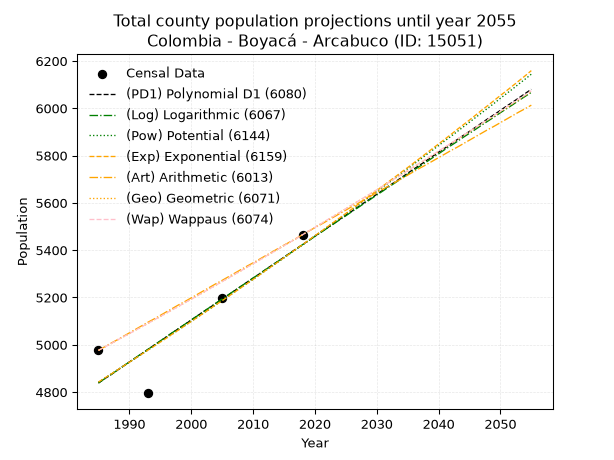
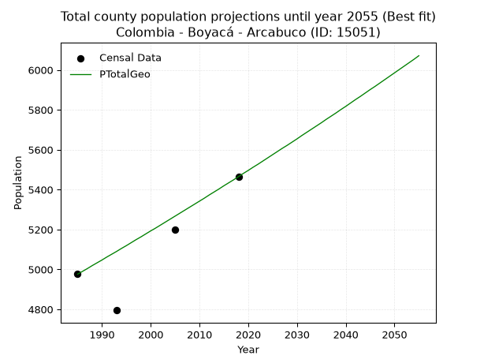
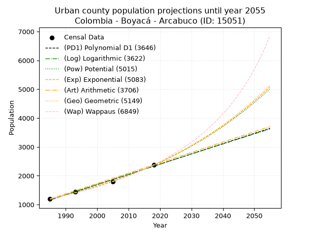
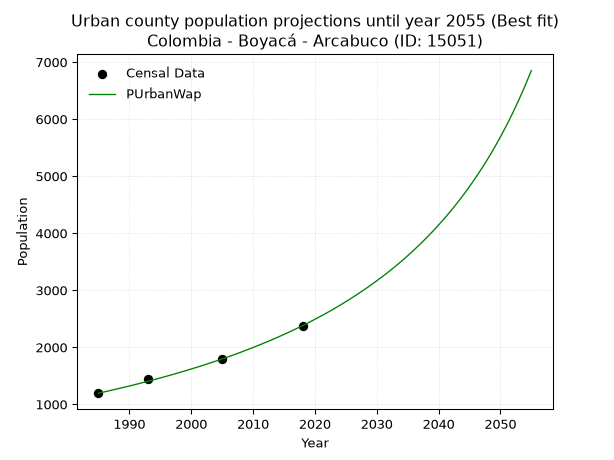
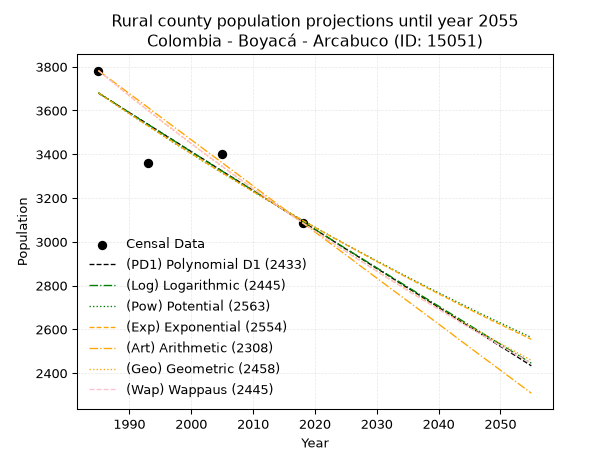
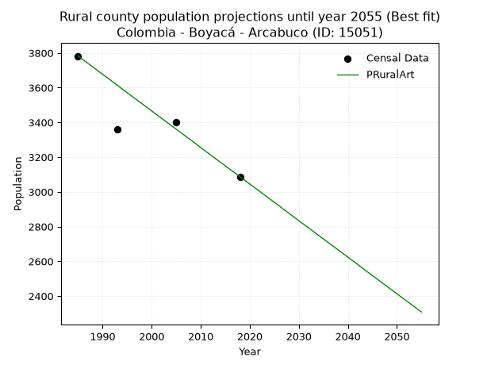

<div align="center">


</div>

# 📜 _“Population and Public Services Demand Projections (PPSD) until Year 2050 for Colombia - Boyacá - Arcabuco (ID: 15051)”_
Keywords: `population` `public-service` `projection` `lineal` `polynomial` `logarithmic` `potential` `exponential` `arithmetic` `geometric` `wappaus` `dane` `colombia` `south-america`

PPSD are analytical estimates used by governments and planners to anticipate future changes in population size, age distribution, and the resulting community needs for utilities, healthcare, education, and infrastructure as sizing future water treatment facilities, electrical grids, and road networks based on spatial growth.

<div align="center">

</img>

</div>


> **General running parameters**: • app_version: _v20260806_. • Python version: _3.14.7_. • Pandas version: _3.0.5_. • NumPy version: _2.5.1_. • Creates, save and include plots into reports (create_plot): _False_. • Projection until year: _2050_. • Process polynomial degree 2 and up: _False_. • Process Wappaus: _True_. • Process Wappaus: _True_. • Set negative values to zero: _True_. • Set infinite values to zero: _True_. • Drop dataset notes: _True_. 
<div align="center">

Maps & GIS Layers: [:earth_americas:Google](http://maps.google.com/maps?q=5.755672969,-73.4375027) [:earth_americas:OSM](https://www.openstreetmap.org/#map=18/5.755672969/-73.4375027&layers=P) [:earth_americas:Bing](https://www.bing.com/maps?cp=5.755672969~-73.4375027&lvl=18) [:earth_americas:Apple](https://maps.apple.com/frame?center=5.755672969%2C-73.4375027&span=0.003%2C0.006) [:earth_americas:GISMobile](https://github.com/rcfdtools/R.GISMobile/blob/main/file/gis/CountyLayer_CO/Readme.md)

</div>


<div align="center">

```geojson
{
  "type": "Feature",
  "geometry": {
    "type": "Point", 
    "coordinates": [-73.4375027, 5.755672969]
  }, 
  "properties": {
    "Name": "Colombia - Boyacá - Arcabuco (ID: 15051)"
  }
}
```

</div>


## 0. Census Data (4 records)

Census data are official statistics collected by a government about the people and housing in a country. They usually include counts of total population, age, sex, race, income, education, and jobs.

📅Global census file: [Population.xlsx](../data/Population.xlsx)

| Source   |   Year |   CountryID | CountryName   |   StateID | StateName   |   CountyID | CountyName   |   PTotal |   PUrban |   PRural |
|:---------|-------:|------------:|:--------------|----------:|:------------|-----------:|:-------------|---------:|---------:|---------:|
| DANE     |   1985 |          57 | Colombia      |        15 | Boyacá      |      15051 | Arcabuco     |     4976 |     1194 |     3782 |
| DANE     |   1993 |          57 | Colombia      |        15 | Boyacá      |      15051 | Arcabuco     |     4795 |     1435 |     3360 |
| DANE     |   2005 |          57 | Colombia      |        15 | Boyacá      |      15051 | Arcabuco     |     5198 |     1796 |     3402 |
| DANE     |   2018 |          57 | Colombia      |        15 | Boyacá      |      15051 | Arcabuco     |     5465 |     2378 |     3087 |

> 🔥Some records could had specific notes about the registered values or the corresponding urban or rural distribution.

📅[SUI-RUPS](https://www.datos.gov.co/Hacienda-y-Cr-dito-P-blico/Registro-nico-de-Prestadores-de-Servicios-P-blicos/4qkq-csdn/about_data) - Local public utility companies: [RUPS.csv](../data/RUPS.csv)

 | SERVICIO       | ESTADO    | NOMBRE                                                                                                                              | NIT         | DEPARTAMENTO_DOMICILIO   | MUNICIPIO_DOMICILIO   | DIRECCION                         |   TELEFONO | EMAIL                           | TIPO_PRESTADOR                             | CLASIFICACION                 |
|:---------------|:----------|:------------------------------------------------------------------------------------------------------------------------------------|:------------|:-------------------------|:----------------------|:----------------------------------|-----------:|:--------------------------------|:-------------------------------------------|:------------------------------|
| ACUEDUCTO      | OPERATIVA | ASOCIACION DE SUSCRIPTORES  DEL ACUEDUCTO INTERVEREDAL  DE LAS VEREDAS QUEMADOS, PEÑAS BLANCAS, ALCAPARROS, MONTESUAREZ Y CABECERAS | 820001510-4 | BOGOTA, D.C.             | BOGOTA, D.C.          | K 79 No. 127 C - 75 Bq 7 - Ap 102 |    6249954 | sippdbg@gmail.com               | ORGANIZACION AUTORIZADA                    | MENOR O IGUAL A 2500 USUARIOS |
| ACUEDUCTO      | OPERATIVA | AGUAS DE ARCABUCOSA ESP                                                                                                             | 900263342-7 | BOYACA                   | ARCABUCO              | CARRERA 6 # 4-09                  |    7360012 | maribelpulidoaponte@hotmail.com | SOCIEDADES (EMPRESA DE SERVICIOS PUBLICOS) | MENOR O IGUAL A 2500 USUARIOS |
| ALCANTARILLADO | OPERATIVA | AGUAS DE ARCABUCOSA ESP                                                                                                             | 900263342-7 | BOYACA                   | ARCABUCO              | CARRERA 6 # 4-09                  |    7360012 | maribelpulidoaponte@hotmail.com | SOCIEDADES (EMPRESA DE SERVICIOS PUBLICOS) | MENOR O IGUAL A 2500 USUARIOS |

## 1. Total

### 1.1. Coefficients and Parameters

* (PD1) Polynomial Deg 1: 17.738257727819974, -30372.450020071905 (lineal)
* (Log) Logarithmic: 35476.57935549272, -264549.2639725652
* (Pow) Potential: 6.872150916313313, -18.97771748302751
* (Exp) Exponential: 0.003436054677002801, 5.283012275223922
* (Art) Arithmetic: Year diff. 2018 - 1985 = 33, Population diff. 5465 - 4976 = 489, Annual growth = 14.818181818181818
* (Geo) Geometric: Year diff. 2018 - 1985 = 33, Population diff. 5465 - 4976 = 489, Annual growth % = 0.0028445765211604357
* (Wap) Wappaus: i = 0.2838460265909744, Condition values only valid for < 200)

<sub>
Wappaus condition values: ['0.00', '0.28', '0.57', '0.85', '1.14', '1.42', '1.70', '1.99', '2.27', '2.55', '2.84', '3.12', '3.41', '3.69', '3.97', '4.26', '4.54', '4.83', '5.11', '5.39', '5.68', '5.96', '6.24', '6.53', '6.81', '7.10', '7.38', '7.66', '7.95', '8.23', '8.52', '8.80', '9.08', '9.37', '9.65', '9.93', '10.22', '10.50', '10.79', '11.07', '11.35', '11.64', '11.92', '12.21', '12.49', '12.77', '13.06', '13.34', '13.62', '13.91', '14.19', '14.48', '14.76', '15.04', '15.33', '15.61', '15.90', '16.18', '16.46', '16.75', '17.03', '17.31', '17.60', '17.88', '18.17', '18.45']
</sub>


### 1.2. Projected Dataset

|   Year |   CountyID |   PTotalPD1 |   PTotalLog |   PTotalPow |   PTotalExp |   PTotalArt |   PTotalGeo |   PTotalWap |
|-------:|-----------:|------------:|------------:|------------:|------------:|------------:|------------:|------------:|
|   1985 |      15051 |        4838 |        4838 |        4842 |        4842 |        4976 |        4976 |        4976 |
|   1986 |      15051 |        4856 |        4856 |        4858 |        4859 |        4991 |        4990 |        4990 |
|   1987 |      15051 |        4873 |        4873 |        4875 |        4875 |        5006 |        5004 |        5004 |
|   1988 |      15051 |        4891 |        4891 |        4892 |        4892 |        5020 |        5019 |        5019 |
|   1989 |      15051 |        4909 |        4909 |        4909 |        4909 |        5035 |        5033 |        5033 |
|   1990 |      15051 |        4927 |        4927 |        4926 |        4926 |        5050 |        5047 |        5047 |
|   1991 |      15051 |        4944 |        4945 |        4943 |        4943 |        5065 |        5062 |        5061 |
|   1992 |      15051 |        4962 |        4963 |        4960 |        4960 |        5080 |        5076 |        5076 |
|   1993 |      15051 |        4980 |        4980 |        4977 |        4977 |        5095 |        5090 |        5090 |
|   1994 |      15051 |        4998 |        4998 |        4994 |        4994 |        5109 |        5105 |        5105 |
|   1995 |      15051 |        5015 |        5016 |        5012 |        5011 |        5124 |        5119 |        5119 |
|   1996 |      15051 |        5033 |        5034 |        5029 |        5028 |        5139 |        5134 |        5134 |
|   1997 |      15051 |        5051 |        5052 |        5046 |        5046 |        5154 |        5149 |        5148 |
|   1998 |      15051 |        5069 |        5069 |        5064 |        5063 |        5169 |        5163 |        5163 |
|   1999 |      15051 |        5086 |        5087 |        5081 |        5081 |        5183 |        5178 |        5178 |
|   2000 |      15051 |        5104 |        5105 |        5099 |        5098 |        5198 |        5193 |        5192 |
|   2001 |      15051 |        5122 |        5122 |        5116 |        5116 |        5213 |        5207 |        5207 |
|   2002 |      15051 |        5140 |        5140 |        5134 |        5133 |        5228 |        5222 |        5222 |
|   2003 |      15051 |        5157 |        5158 |        5151 |        5151 |        5243 |        5237 |        5237 |
|   2004 |      15051 |        5175 |        5176 |        5169 |        5169 |        5258 |        5252 |        5252 |
|   2005 |      15051 |        5193 |        5193 |        5187 |        5186 |        5272 |        5267 |        5267 |
|   2006 |      15051 |        5210 |        5211 |        5205 |        5204 |        5287 |        5282 |        5282 |
|   2007 |      15051 |        5228 |        5229 |        5223 |        5222 |        5302 |        5297 |        5297 |
|   2008 |      15051 |        5246 |        5246 |        5241 |        5240 |        5317 |        5312 |        5312 |
|   2009 |      15051 |        5264 |        5264 |        5258 |        5258 |        5332 |        5327 |        5327 |
|   2010 |      15051 |        5281 |        5282 |        5276 |        5276 |        5346 |        5342 |        5342 |
|   2011 |      15051 |        5299 |        5299 |        5295 |        5294 |        5361 |        5357 |        5357 |
|   2012 |      15051 |        5317 |        5317 |        5313 |        5313 |        5376 |        5373 |        5373 |
|   2013 |      15051 |        5335 |        5335 |        5331 |        5331 |        5391 |        5388 |        5388 |
|   2014 |      15051 |        5352 |        5352 |        5349 |        5349 |        5406 |        5403 |        5403 |
|   2015 |      15051 |        5370 |        5370 |        5367 |        5368 |        5421 |        5419 |        5419 |
|   2016 |      15051 |        5388 |        5387 |        5386 |        5386 |        5435 |        5434 |        5434 |
|   2017 |      15051 |        5406 |        5405 |        5404 |        5405 |        5450 |        5449 |        5449 |
|   2018 |      15051 |        5423 |        5423 |        5422 |        5423 |        5465 |        5465 |        5465 |
|   2019 |      15051 |        5441 |        5440 |        5441 |        5442 |        5480 |        5481 |        5481 |
|   2020 |      15051 |        5459 |        5458 |        5460 |        5461 |        5495 |        5496 |        5496 |
|   2021 |      15051 |        5477 |        5475 |        5478 |        5479 |        5509 |        5512 |        5512 |
|   2022 |      15051 |        5494 |        5493 |        5497 |        5498 |        5524 |        5527 |        5528 |
|   2023 |      15051 |        5512 |        5510 |        5516 |        5517 |        5539 |        5543 |        5543 |
|   2024 |      15051 |        5530 |        5528 |        5534 |        5536 |        5554 |        5559 |        5559 |
|   2025 |      15051 |        5548 |        5545 |        5553 |        5555 |        5569 |        5575 |        5575 |
|   2026 |      15051 |        5565 |        5563 |        5572 |        5574 |        5584 |        5591 |        5591 |
|   2027 |      15051 |        5583 |        5580 |        5591 |        5594 |        5598 |        5607 |        5607 |
|   2028 |      15051 |        5601 |        5598 |        5610 |        5613 |        5613 |        5622 |        5623 |
|   2029 |      15051 |        5618 |        5615 |        5629 |        5632 |        5628 |        5638 |        5639 |
|   2030 |      15051 |        5636 |        5633 |        5648 |        5652 |        5643 |        5654 |        5655 |
|   2031 |      15051 |        5654 |        5650 |        5667 |        5671 |        5658 |        5671 |        5671 |
|   2032 |      15051 |        5672 |        5668 |        5686 |        5691 |        5672 |        5687 |        5687 |
|   2033 |      15051 |        5689 |        5685 |        5706 |        5710 |        5687 |        5703 |        5704 |
|   2034 |      15051 |        5707 |        5703 |        5725 |        5730 |        5702 |        5719 |        5720 |
|   2035 |      15051 |        5725 |        5720 |        5744 |        5749 |        5717 |        5735 |        5736 |
|   2036 |      15051 |        5743 |        5738 |        5764 |        5769 |        5732 |        5752 |        5753 |
|   2037 |      15051 |        5760 |        5755 |        5783 |        5789 |        5747 |        5768 |        5769 |
|   2038 |      15051 |        5778 |        5772 |        5803 |        5809 |        5761 |        5784 |        5785 |
|   2039 |      15051 |        5796 |        5790 |        5822 |        5829 |        5776 |        5801 |        5802 |
|   2040 |      15051 |        5814 |        5807 |        5842 |        5849 |        5791 |        5817 |        5819 |
|   2041 |      15051 |        5831 |        5825 |        5862 |        5869 |        5806 |        5834 |        5835 |
|   2042 |      15051 |        5849 |        5842 |        5881 |        5889 |        5821 |        5851 |        5852 |
|   2043 |      15051 |        5867 |        5859 |        5901 |        5910 |        5835 |        5867 |        5869 |
|   2044 |      15051 |        5885 |        5877 |        5921 |        5930 |        5850 |        5884 |        5885 |
|   2045 |      15051 |        5902 |        5894 |        5941 |        5950 |        5865 |        5901 |        5902 |
|   2046 |      15051 |        5920 |        5911 |        5961 |        5971 |        5880 |        5917 |        5919 |
|   2047 |      15051 |        5938 |        5929 |        5981 |        5992 |        5895 |        5934 |        5936 |
|   2048 |      15051 |        5956 |        5946 |        6001 |        6012 |        5910 |        5951 |        5953 |
|   2049 |      15051 |        5973 |        5963 |        6021 |        6033 |        5924 |        5968 |        5970 |
|   2050 |      15051 |        5991 |        5981 |        6042 |        6054 |        5939 |        5985 |        5987 |
<div align="center">

</img>

</div>


### 1.3. Best fit with absolute and relative error (%)

Relative error puts that difference into context by dividing the absolute error by the true value, creating a unitless ratio or percentage that shows the scale of the mistake.

Absolute and relative error

|   Year | Source   |   CountryID | CountryName   |   StateID | StateName   |   CountyID_x | CountyName   |   PTotal |   PUrban |   PRural |   CountyID_y |   PTotalPD1 |   PTotalLog |   PTotalPow |   PTotalExp |   PTotalArt |   PTotalGeo |   PTotalWap |   PTotalPD1AbsError |   PTotalLogAbsError |   PTotalPowAbsError |   PTotalExpAbsError |   PTotalArtAbsError |   PTotalGeoAbsError |   PTotalWapAbsError |   PTotalPD1RelError |   PTotalLogRelError |   PTotalPowRelError |   PTotalExpRelError |   PTotalArtRelError |   PTotalGeoRelError |   PTotalWapRelError |
|-------:|:---------|------------:|:--------------|----------:|:------------|-------------:|:-------------|---------:|---------:|---------:|-------------:|------------:|------------:|------------:|------------:|------------:|------------:|------------:|--------------------:|--------------------:|--------------------:|--------------------:|--------------------:|--------------------:|--------------------:|--------------------:|--------------------:|--------------------:|--------------------:|--------------------:|--------------------:|--------------------:|
|   1985 | DANE     |          57 | Colombia      |        15 | Boyacá      |        15051 | Arcabuco     |     4976 |     1194 |     3782 |        15051 |        4838 |        4838 |        4842 |        4842 |        4976 |        4976 |        4976 |                 138 |                 138 |                 134 |                 134 |                   0 |                   0 |                   0 |           2.77331   |           2.77331   |            2.69293  |            2.69293  |             0       |             0       |             0       |
|   1993 | DANE     |          57 | Colombia      |        15 | Boyacá      |        15051 | Arcabuco     |     4795 |     1435 |     3360 |        15051 |        4980 |        4980 |        4977 |        4977 |        5095 |        5090 |        5090 |                 185 |                 185 |                 182 |                 182 |                 300 |                 295 |                 295 |           3.85819   |           3.85819   |            3.79562  |            3.79562  |             6.25652 |             6.15224 |             6.15224 |
|   2005 | DANE     |          57 | Colombia      |        15 | Boyacá      |        15051 | Arcabuco     |     5198 |     1796 |     3402 |        15051 |        5193 |        5193 |        5187 |        5186 |        5272 |        5267 |        5267 |                   5 |                   5 |                  11 |                  12 |                  74 |                  69 |                  69 |           0.0961908 |           0.0961908 |            0.21162  |            0.230858 |             1.42362 |             1.32743 |             1.32743 |
|   2018 | DANE     |          57 | Colombia      |        15 | Boyacá      |        15051 | Arcabuco     |     5465 |     2378 |     3087 |        15051 |        5423 |        5423 |        5422 |        5423 |        5465 |        5465 |        5465 |                  42 |                  42 |                  43 |                  42 |                   0 |                   0 |                   0 |           0.768527  |           0.768527  |            0.786825 |            0.768527 |             0       |             0       |             0       |

Relative error mean

| Method    |   RelError | Best   |
|:----------|-----------:|:-------|
| PTotalPD1 |    1.87405 |        |
| PTotalLog |    1.87405 |        |
| PTotalPow |    1.87175 |        |
| PTotalExp |    1.87198 |        |
| PTotalArt |    1.92004 |        |
| PTotalGeo |    1.86992 | True   |
| PTotalWap |    1.86992 | True   |

💙Best method: _**PTotalGeo**_
<div align="center">

</img>

</div>


### 1.4. Fresh water supply demand in liters per capita per day (lpcd)

The fresh water supply demand typically ranges from 100 to 300 liters per capita per day (lpcd) for standard domestic and municipal planning, though absolute survival minimums set by the World Health Organization are as low as 7.5 to 20 liters per day, and total consumption in high-income nations can exceed 400 liters.

> `CZ`: Level in meters above the sea level (masl)<br> `WS`: Fresh water supply demand in liters per capita per day (lpcd or l/h/d)<br> `WSAll`: Zonal fresh water supply demand in liters per second (l/s)<br> `A`: Zonal area in square meters<br> `DP`: Population density (people/hectare or p/ha)

Reference values (RAS Colombia)

|    CZ |   WS |
|------:|-----:|
|  1000 |  120 |
|  2000 |  130 |
| 99999 |  140 |

County shapefile geometry properties and water supply values

|   CountyID |      ATotal |   CZTotal |   WSTotal |
|-----------:|------------:|----------:|----------:|
|      15051 | 1.37669e+08 |   2815.78 |       140 |

Projected values for best method: PTotalGeo

|   CountyID |   Year |   PTotalGeo |   DPTotal |   WSTotal |   WSTotalAll |
|-----------:|-------:|------------:|----------:|----------:|-------------:|
|      15051 |   1985 |        4976 |      0.36 |       140 |      8.06296 |
|      15051 |   1986 |        4990 |      0.36 |       140 |      8.08565 |
|      15051 |   1987 |        5004 |      0.36 |       140 |      8.10833 |
|      15051 |   1988 |        5019 |      0.36 |       140 |      8.13264 |
|      15051 |   1989 |        5033 |      0.37 |       140 |      8.15532 |
|      15051 |   1990 |        5047 |      0.37 |       140 |      8.17801 |
|      15051 |   1991 |        5062 |      0.37 |       140 |      8.20231 |
|      15051 |   1992 |        5076 |      0.37 |       140 |      8.225   |
|      15051 |   1993 |        5090 |      0.37 |       140 |      8.24769 |
|      15051 |   1994 |        5105 |      0.37 |       140 |      8.27199 |
|      15051 |   1995 |        5119 |      0.37 |       140 |      8.29468 |
|      15051 |   1996 |        5134 |      0.37 |       140 |      8.31898 |
|      15051 |   1997 |        5149 |      0.37 |       140 |      8.34329 |
|      15051 |   1998 |        5163 |      0.38 |       140 |      8.36597 |
|      15051 |   1999 |        5178 |      0.38 |       140 |      8.39028 |
|      15051 |   2000 |        5193 |      0.38 |       140 |      8.41458 |
|      15051 |   2001 |        5207 |      0.38 |       140 |      8.43727 |
|      15051 |   2002 |        5222 |      0.38 |       140 |      8.46157 |
|      15051 |   2003 |        5237 |      0.38 |       140 |      8.48588 |
|      15051 |   2004 |        5252 |      0.38 |       140 |      8.51019 |
|      15051 |   2005 |        5267 |      0.38 |       140 |      8.53449 |
|      15051 |   2006 |        5282 |      0.38 |       140 |      8.5588  |
|      15051 |   2007 |        5297 |      0.38 |       140 |      8.5831  |
|      15051 |   2008 |        5312 |      0.39 |       140 |      8.60741 |
|      15051 |   2009 |        5327 |      0.39 |       140 |      8.63171 |
|      15051 |   2010 |        5342 |      0.39 |       140 |      8.65602 |
|      15051 |   2011 |        5357 |      0.39 |       140 |      8.68032 |
|      15051 |   2012 |        5373 |      0.39 |       140 |      8.70625 |
|      15051 |   2013 |        5388 |      0.39 |       140 |      8.73056 |
|      15051 |   2014 |        5403 |      0.39 |       140 |      8.75486 |
|      15051 |   2015 |        5419 |      0.39 |       140 |      8.78079 |
|      15051 |   2016 |        5434 |      0.39 |       140 |      8.80509 |
|      15051 |   2017 |        5449 |      0.4  |       140 |      8.8294  |
|      15051 |   2018 |        5465 |      0.4  |       140 |      8.85532 |
|      15051 |   2019 |        5481 |      0.4  |       140 |      8.88125 |
|      15051 |   2020 |        5496 |      0.4  |       140 |      8.90556 |
|      15051 |   2021 |        5512 |      0.4  |       140 |      8.93148 |
|      15051 |   2022 |        5527 |      0.4  |       140 |      8.95579 |
|      15051 |   2023 |        5543 |      0.4  |       140 |      8.98171 |
|      15051 |   2024 |        5559 |      0.4  |       140 |      9.00764 |
|      15051 |   2025 |        5575 |      0.4  |       140 |      9.03356 |
|      15051 |   2026 |        5591 |      0.41 |       140 |      9.05949 |
|      15051 |   2027 |        5607 |      0.41 |       140 |      9.08542 |
|      15051 |   2028 |        5622 |      0.41 |       140 |      9.10972 |
|      15051 |   2029 |        5638 |      0.41 |       140 |      9.13565 |
|      15051 |   2030 |        5654 |      0.41 |       140 |      9.16157 |
|      15051 |   2031 |        5671 |      0.41 |       140 |      9.18912 |
|      15051 |   2032 |        5687 |      0.41 |       140 |      9.21505 |
|      15051 |   2033 |        5703 |      0.41 |       140 |      9.24097 |
|      15051 |   2034 |        5719 |      0.42 |       140 |      9.2669  |
|      15051 |   2035 |        5735 |      0.42 |       140 |      9.29282 |
|      15051 |   2036 |        5752 |      0.42 |       140 |      9.32037 |
|      15051 |   2037 |        5768 |      0.42 |       140 |      9.3463  |
|      15051 |   2038 |        5784 |      0.42 |       140 |      9.37222 |
|      15051 |   2039 |        5801 |      0.42 |       140 |      9.39977 |
|      15051 |   2040 |        5817 |      0.42 |       140 |      9.42569 |
|      15051 |   2041 |        5834 |      0.42 |       140 |      9.45324 |
|      15051 |   2042 |        5851 |      0.43 |       140 |      9.48079 |
|      15051 |   2043 |        5867 |      0.43 |       140 |      9.50671 |
|      15051 |   2044 |        5884 |      0.43 |       140 |      9.53426 |
|      15051 |   2045 |        5901 |      0.43 |       140 |      9.56181 |
|      15051 |   2046 |        5917 |      0.43 |       140 |      9.58773 |
|      15051 |   2047 |        5934 |      0.43 |       140 |      9.61528 |
|      15051 |   2048 |        5951 |      0.43 |       140 |      9.64282 |
|      15051 |   2049 |        5968 |      0.43 |       140 |      9.67037 |
|      15051 |   2050 |        5985 |      0.43 |       140 |      9.69792 |

## 2. Urban

### 2.1. Coefficients and Parameters

* (PD1) Polynomial Deg 1: 35.53311922922483, -69374.37173825697 (lineal)
* (Log) Logarithmic: 71107.18555635292, -538785.5372310622
* (Pow) Potential: 41.254223577729064, -132.96722703079084
* (Exp) Exponential: 0.02061039444578827, 2.0506649200166844e-15
* (Art) Arithmetic: Year diff. 2018 - 1985 = 33, Population diff. 2378 - 1194 = 1184, Annual growth = 35.878787878787875
* (Geo) Geometric: Year diff. 2018 - 1985 = 33, Population diff. 2378 - 1194 = 1184, Annual growth % = 0.021096751767849753
* (Wap) Wappaus: i = 2.008890698700329, Condition values only valid for < 200)

<sub>
Wappaus condition values: ['0.00', '2.01', '4.02', '6.03', '8.04', '10.04', '12.05', '14.06', '16.07', '18.08', '20.09', '22.10', '24.11', '26.12', '28.12', '30.13', '32.14', '34.15', '36.16', '38.17', '40.18', '42.19', '44.20', '46.20', '48.21', '50.22', '52.23', '54.24', '56.25', '58.26', '60.27', '62.28', '64.28', '66.29', '68.30', '70.31', '72.32', '74.33', '76.34', '78.35', '80.36', '82.36', '84.37', '86.38', '88.39', '90.40', '92.41', '94.42', '96.43', '98.44', '100.44', '102.45', '104.46', '106.47', '108.48', '110.49', '112.50', '114.51', '116.52', '118.52', '120.53', '122.54', '124.55', '126.56', '128.57', '130.58']
</sub>


### 2.2. Projected Dataset

|   Year |   CountyID |   PUrbanPD1 |   PUrbanLog |   PUrbanPow |   PUrbanExp |   PUrbanArt |   PUrbanGeo |   PUrbanWap |
|-------:|-----------:|------------:|------------:|------------:|------------:|------------:|------------:|------------:|
|   1985 |      15051 |        1159 |        1158 |        1200 |        1201 |        1194 |        1194 |        1194 |
|   1986 |      15051 |        1194 |        1194 |        1226 |        1226 |        1230 |        1219 |        1218 |
|   1987 |      15051 |        1230 |        1230 |        1251 |        1252 |        1266 |        1245 |        1243 |
|   1988 |      15051 |        1265 |        1265 |        1278 |        1278 |        1302 |        1271 |        1268 |
|   1989 |      15051 |        1301 |        1301 |        1304 |        1304 |        1338 |        1298 |        1294 |
|   1990 |      15051 |        1337 |        1337 |        1332 |        1332 |        1373 |        1325 |        1320 |
|   1991 |      15051 |        1372 |        1373 |        1360 |        1359 |        1409 |        1353 |        1347 |
|   1992 |      15051 |        1408 |        1408 |        1388 |        1388 |        1445 |        1382 |        1375 |
|   1993 |      15051 |        1443 |        1444 |        1417 |        1416 |        1481 |        1411 |        1403 |
|   1994 |      15051 |        1479 |        1480 |        1447 |        1446 |        1517 |        1441 |        1431 |
|   1995 |      15051 |        1514 |        1515 |        1477 |        1476 |        1553 |        1471 |        1461 |
|   1996 |      15051 |        1550 |        1551 |        1508 |        1507 |        1589 |        1502 |        1491 |
|   1997 |      15051 |        1585 |        1587 |        1539 |        1538 |        1625 |        1534 |        1521 |
|   1998 |      15051 |        1621 |        1622 |        1571 |        1570 |        1660 |        1566 |        1553 |
|   1999 |      15051 |        1656 |        1658 |        1604 |        1603 |        1696 |        1599 |        1585 |
|   2000 |      15051 |        1692 |        1693 |        1638 |        1636 |        1732 |        1633 |        1618 |
|   2001 |      15051 |        1727 |        1729 |        1672 |        1670 |        1768 |        1668 |        1651 |
|   2002 |      15051 |        1763 |        1764 |        1707 |        1705 |        1804 |        1703 |        1686 |
|   2003 |      15051 |        1798 |        1800 |        1742 |        1741 |        1840 |        1739 |        1721 |
|   2004 |      15051 |        1834 |        1835 |        1778 |        1777 |        1876 |        1775 |        1757 |
|   2005 |      15051 |        1870 |        1871 |        1815 |        1814 |        1912 |        1813 |        1794 |
|   2006 |      15051 |        1905 |        1906 |        1853 |        1852 |        1947 |        1851 |        1832 |
|   2007 |      15051 |        1941 |        1942 |        1891 |        1890 |        1983 |        1890 |        1871 |
|   2008 |      15051 |        1976 |        1977 |        1931 |        1930 |        2019 |        1930 |        1911 |
|   2009 |      15051 |        2012 |        2013 |        1971 |        1970 |        2055 |        1971 |        1953 |
|   2010 |      15051 |        2047 |        2048 |        2012 |        2011 |        2091 |        2012 |        1995 |
|   2011 |      15051 |        2083 |        2083 |        2053 |        2053 |        2127 |        2055 |        2038 |
|   2012 |      15051 |        2118 |        2119 |        2096 |        2095 |        2163 |        2098 |        2083 |
|   2013 |      15051 |        2154 |        2154 |        2139 |        2139 |        2199 |        2142 |        2128 |
|   2014 |      15051 |        2189 |        2189 |        2184 |        2184 |        2234 |        2187 |        2175 |
|   2015 |      15051 |        2225 |        2225 |        2229 |        2229 |        2270 |        2234 |        2224 |
|   2016 |      15051 |        2260 |        2260 |        2275 |        2275 |        2306 |        2281 |        2274 |
|   2017 |      15051 |        2296 |        2295 |        2322 |        2323 |        2342 |        2329 |        2325 |
|   2018 |      15051 |        2331 |        2330 |        2370 |        2371 |        2378 |        2378 |        2378 |
|   2019 |      15051 |        2367 |        2366 |        2419 |        2421 |        2414 |        2428 |        2432 |
|   2020 |      15051 |        2403 |        2401 |        2469 |        2471 |        2450 |        2479 |        2489 |
|   2021 |      15051 |        2438 |        2436 |        2520 |        2522 |        2486 |        2532 |        2547 |
|   2022 |      15051 |        2474 |        2471 |        2572 |        2575 |        2522 |        2585 |        2606 |
|   2023 |      15051 |        2509 |        2506 |        2625 |        2629 |        2557 |        2640 |        2668 |
|   2024 |      15051 |        2545 |        2541 |        2679 |        2683 |        2593 |        2695 |        2732 |
|   2025 |      15051 |        2580 |        2577 |        2734 |        2739 |        2629 |        2752 |        2798 |
|   2026 |      15051 |        2616 |        2612 |        2790 |        2796 |        2665 |        2810 |        2866 |
|   2027 |      15051 |        2651 |        2647 |        2847 |        2855 |        2701 |        2870 |        2937 |
|   2028 |      15051 |        2687 |        2682 |        2906 |        2914 |        2737 |        2930 |        3010 |
|   2029 |      15051 |        2722 |        2717 |        2966 |        2975 |        2773 |        2992 |        3085 |
|   2030 |      15051 |        2758 |        2752 |        3027 |        3037 |        2809 |        3055 |        3164 |
|   2031 |      15051 |        2793 |        2787 |        3089 |        3100 |        2844 |        3119 |        3245 |
|   2032 |      15051 |        2829 |        2822 |        3152 |        3164 |        2880 |        3185 |        3329 |
|   2033 |      15051 |        2864 |        2857 |        3217 |        3230 |        2916 |        3252 |        3417 |
|   2034 |      15051 |        2900 |        2892 |        3283 |        3298 |        2952 |        3321 |        3508 |
|   2035 |      15051 |        2936 |        2927 |        3350 |        3366 |        2988 |        3391 |        3603 |
|   2036 |      15051 |        2971 |        2962 |        3418 |        3436 |        3024 |        3463 |        3702 |
|   2037 |      15051 |        3007 |        2997 |        3488 |        3508 |        3060 |        3536 |        3805 |
|   2038 |      15051 |        3042 |        3032 |        3560 |        3581 |        3096 |        3610 |        3912 |
|   2039 |      15051 |        3078 |        3066 |        3633 |        3655 |        3131 |        3687 |        4025 |
|   2040 |      15051 |        3113 |        3101 |        3707 |        3732 |        3167 |        3764 |        4142 |
|   2041 |      15051 |        3149 |        3136 |        3782 |        3809 |        3203 |        3844 |        4264 |
|   2042 |      15051 |        3184 |        3171 |        3860 |        3889 |        3239 |        3925 |        4392 |
|   2043 |      15051 |        3220 |        3206 |        3938 |        3970 |        3275 |        4008 |        4527 |
|   2044 |      15051 |        3255 |        3241 |        4019 |        4052 |        3311 |        4092 |        4668 |
|   2045 |      15051 |        3291 |        3275 |        4101 |        4137 |        3347 |        4178 |        4816 |
|   2046 |      15051 |        3326 |        3310 |        4184 |        4223 |        3383 |        4267 |        4972 |
|   2047 |      15051 |        3362 |        3345 |        4269 |        4311 |        3418 |        4357 |        5136 |
|   2048 |      15051 |        3397 |        3380 |        4356 |        4401 |        3454 |        4449 |        5309 |
|   2049 |      15051 |        3433 |        3414 |        4445 |        4492 |        3490 |        4542 |        5492 |
|   2050 |      15051 |        3469 |        3449 |        4535 |        4586 |        3526 |        4638 |        5686 |
<div align="center">

</img>

</div>


### 2.3. Best fit with absolute and relative error (%)

Relative error puts that difference into context by dividing the absolute error by the true value, creating a unitless ratio or percentage that shows the scale of the mistake.

Absolute and relative error

|   Year | Source   |   CountryID | CountryName   |   StateID | StateName   |   CountyID_x | CountyName   |   PTotal |   PUrban |   PRural |   CountyID_y |   PUrbanPD1 |   PUrbanLog |   PUrbanPow |   PUrbanExp |   PUrbanArt |   PUrbanGeo |   PUrbanWap |   PUrbanPD1AbsError |   PUrbanLogAbsError |   PUrbanPowAbsError |   PUrbanExpAbsError |   PUrbanArtAbsError |   PUrbanGeoAbsError |   PUrbanWapAbsError |   PUrbanPD1RelError |   PUrbanLogRelError |   PUrbanPowRelError |   PUrbanExpRelError |   PUrbanArtRelError |   PUrbanGeoRelError |   PUrbanWapRelError |
|-------:|:---------|------------:|:--------------|----------:|:------------|-------------:|:-------------|---------:|---------:|---------:|-------------:|------------:|------------:|------------:|------------:|------------:|------------:|------------:|--------------------:|--------------------:|--------------------:|--------------------:|--------------------:|--------------------:|--------------------:|--------------------:|--------------------:|--------------------:|--------------------:|--------------------:|--------------------:|--------------------:|
|   1985 | DANE     |          57 | Colombia      |        15 | Boyacá      |        15051 | Arcabuco     |     4976 |     1194 |     3782 |        15051 |        1159 |        1158 |        1200 |        1201 |        1194 |        1194 |        1194 |                  35 |                  36 |                   6 |                   7 |                   0 |                   0 |                   0 |            2.93132  |            3.01508  |            0.502513 |            0.586265 |             0       |            0        |            0        |
|   1993 | DANE     |          57 | Colombia      |        15 | Boyacá      |        15051 | Arcabuco     |     4795 |     1435 |     3360 |        15051 |        1443 |        1444 |        1417 |        1416 |        1481 |        1411 |        1403 |                   8 |                   9 |                  18 |                  19 |                  46 |                  24 |                  32 |            0.557491 |            0.627178 |            1.25436  |            1.32404  |             3.20557 |            1.67247  |            2.22997  |
|   2005 | DANE     |          57 | Colombia      |        15 | Boyacá      |        15051 | Arcabuco     |     5198 |     1796 |     3402 |        15051 |        1870 |        1871 |        1815 |        1814 |        1912 |        1813 |        1794 |                  74 |                  75 |                  19 |                  18 |                 116 |                  17 |                   2 |            4.12027  |            4.17595  |            1.05791  |            1.00223  |             6.4588  |            0.946548 |            0.111359 |
|   2018 | DANE     |          57 | Colombia      |        15 | Boyacá      |        15051 | Arcabuco     |     5465 |     2378 |     3087 |        15051 |        2331 |        2330 |        2370 |        2371 |        2378 |        2378 |        2378 |                  47 |                  48 |                   8 |                   7 |                   0 |                   0 |                   0 |            1.97645  |            2.0185   |            0.336417 |            0.294365 |             0       |            0        |            0        |

Relative error mean

| Method    |   RelError | Best   |
|:----------|-----------:|:-------|
| PUrbanPD1 |   2.39638  |        |
| PUrbanLog |   2.45918  |        |
| PUrbanPow |   0.787798 |        |
| PUrbanExp |   0.801725 |        |
| PUrbanArt |   2.41609  |        |
| PUrbanGeo |   0.654755 |        |
| PUrbanWap |   0.585331 | True   |

💙Best method: _**PUrbanWap**_
<div align="center">

</img>

</div>


### 2.4. Fresh water supply demand in liters per capita per day (lpcd)

The fresh water supply demand typically ranges from 100 to 300 liters per capita per day (lpcd) for standard domestic and municipal planning, though absolute survival minimums set by the World Health Organization are as low as 7.5 to 20 liters per day, and total consumption in high-income nations can exceed 400 liters.

> `CZ`: Level in meters above the sea level (masl)<br> `WS`: Fresh water supply demand in liters per capita per day (lpcd or l/h/d)<br> `WSAll`: Zonal fresh water supply demand in liters per second (l/s)<br> `A`: Zonal area in square meters<br> `DP`: Population density (people/hectare or p/ha)

Reference values (RAS Colombia)

|    CZ |   WS |
|------:|-----:|
|  1000 |  120 |
|  2000 |  130 |
| 99999 |  140 |

County shapefile geometry properties and water supply values

|   CountyID |   AUrban |   CZUrban |   WSUrban |
|-----------:|---------:|----------:|----------:|
|      15051 |   654197 |   2561.35 |       140 |

Projected values for best method: PUrbanWap

|   CountyID |   Year |   PUrbanWap |   DPUrban |   WSUrban |   WSUrbanAll |
|-----------:|-------:|------------:|----------:|----------:|-------------:|
|      15051 |   1985 |        1194 |     18.25 |       140 |      1.93472 |
|      15051 |   1986 |        1218 |     18.62 |       140 |      1.97361 |
|      15051 |   1987 |        1243 |     19    |       140 |      2.01412 |
|      15051 |   1988 |        1268 |     19.38 |       140 |      2.05463 |
|      15051 |   1989 |        1294 |     19.78 |       140 |      2.09676 |
|      15051 |   1990 |        1320 |     20.18 |       140 |      2.13889 |
|      15051 |   1991 |        1347 |     20.59 |       140 |      2.18264 |
|      15051 |   1992 |        1375 |     21.02 |       140 |      2.22801 |
|      15051 |   1993 |        1403 |     21.45 |       140 |      2.27338 |
|      15051 |   1994 |        1431 |     21.87 |       140 |      2.31875 |
|      15051 |   1995 |        1461 |     22.33 |       140 |      2.36736 |
|      15051 |   1996 |        1491 |     22.79 |       140 |      2.41597 |
|      15051 |   1997 |        1521 |     23.25 |       140 |      2.46458 |
|      15051 |   1998 |        1553 |     23.74 |       140 |      2.51644 |
|      15051 |   1999 |        1585 |     24.23 |       140 |      2.56829 |
|      15051 |   2000 |        1618 |     24.73 |       140 |      2.62176 |
|      15051 |   2001 |        1651 |     25.24 |       140 |      2.67523 |
|      15051 |   2002 |        1686 |     25.77 |       140 |      2.73194 |
|      15051 |   2003 |        1721 |     26.31 |       140 |      2.78866 |
|      15051 |   2004 |        1757 |     26.86 |       140 |      2.84699 |
|      15051 |   2005 |        1794 |     27.42 |       140 |      2.90694 |
|      15051 |   2006 |        1832 |     28    |       140 |      2.96852 |
|      15051 |   2007 |        1871 |     28.6  |       140 |      3.03171 |
|      15051 |   2008 |        1911 |     29.21 |       140 |      3.09653 |
|      15051 |   2009 |        1953 |     29.85 |       140 |      3.16458 |
|      15051 |   2010 |        1995 |     30.5  |       140 |      3.23264 |
|      15051 |   2011 |        2038 |     31.15 |       140 |      3.30231 |
|      15051 |   2012 |        2083 |     31.84 |       140 |      3.37523 |
|      15051 |   2013 |        2128 |     32.53 |       140 |      3.44815 |
|      15051 |   2014 |        2175 |     33.25 |       140 |      3.52431 |
|      15051 |   2015 |        2224 |     34    |       140 |      3.6037  |
|      15051 |   2016 |        2274 |     34.76 |       140 |      3.68472 |
|      15051 |   2017 |        2325 |     35.54 |       140 |      3.76736 |
|      15051 |   2018 |        2378 |     36.35 |       140 |      3.85324 |
|      15051 |   2019 |        2432 |     37.18 |       140 |      3.94074 |
|      15051 |   2020 |        2489 |     38.05 |       140 |      4.0331  |
|      15051 |   2021 |        2547 |     38.93 |       140 |      4.12708 |
|      15051 |   2022 |        2606 |     39.84 |       140 |      4.22269 |
|      15051 |   2023 |        2668 |     40.78 |       140 |      4.32315 |
|      15051 |   2024 |        2732 |     41.76 |       140 |      4.42685 |
|      15051 |   2025 |        2798 |     42.77 |       140 |      4.5338  |
|      15051 |   2026 |        2866 |     43.81 |       140 |      4.64398 |
|      15051 |   2027 |        2937 |     44.89 |       140 |      4.75903 |
|      15051 |   2028 |        3010 |     46.01 |       140 |      4.87731 |
|      15051 |   2029 |        3085 |     47.16 |       140 |      4.99884 |
|      15051 |   2030 |        3164 |     48.36 |       140 |      5.12685 |
|      15051 |   2031 |        3245 |     49.6  |       140 |      5.2581  |
|      15051 |   2032 |        3329 |     50.89 |       140 |      5.39421 |
|      15051 |   2033 |        3417 |     52.23 |       140 |      5.53681 |
|      15051 |   2034 |        3508 |     53.62 |       140 |      5.68426 |
|      15051 |   2035 |        3603 |     55.08 |       140 |      5.83819 |
|      15051 |   2036 |        3702 |     56.59 |       140 |      5.99861 |
|      15051 |   2037 |        3805 |     58.16 |       140 |      6.16551 |
|      15051 |   2038 |        3912 |     59.8  |       140 |      6.33889 |
|      15051 |   2039 |        4025 |     61.53 |       140 |      6.52199 |
|      15051 |   2040 |        4142 |     63.31 |       140 |      6.71157 |
|      15051 |   2041 |        4264 |     65.18 |       140 |      6.90926 |
|      15051 |   2042 |        4392 |     67.14 |       140 |      7.11667 |
|      15051 |   2043 |        4527 |     69.2  |       140 |      7.33542 |
|      15051 |   2044 |        4668 |     71.35 |       140 |      7.56389 |
|      15051 |   2045 |        4816 |     73.62 |       140 |      7.8037  |
|      15051 |   2046 |        4972 |     76    |       140 |      8.05648 |
|      15051 |   2047 |        5136 |     78.51 |       140 |      8.32222 |
|      15051 |   2048 |        5309 |     81.15 |       140 |      8.60255 |
|      15051 |   2049 |        5492 |     83.95 |       140 |      8.89907 |
|      15051 |   2050 |        5686 |     86.92 |       140 |      9.21343 |

## 3. Rural

### 3.1. Coefficients and Parameters

* (PD1) Polynomial Deg 1: -17.794861501404856, 39001.92171818507 (lineal)
* (Log) Logarithmic: -35630.6062008603, 274236.2732584979
* (Pow) Potential: -10.446713673304043, 38.01672701988098
* (Exp) Exponential: -0.005217836656872407, 115892355.43103686
* (Art) Arithmetic: Year diff. 2018 - 1985 = 33, Population diff. 3087 - 3782 = -695, Annual growth = -21.060606060606062
* (Geo) Geometric: Year diff. 2018 - 1985 = 33, Population diff. 3087 - 3782 = -695, Annual growth % = -0.006134236297072215
* (Wap) Wappaus: i = -0.6132073390771892, Condition values only valid for < 200)

<sub>
Wappaus condition values: ['-0.00', '-0.61', '-1.23', '-1.84', '-2.45', '-3.07', '-3.68', '-4.29', '-4.91', '-5.52', '-6.13', '-6.75', '-7.36', '-7.97', '-8.58', '-9.20', '-9.81', '-10.42', '-11.04', '-11.65', '-12.26', '-12.88', '-13.49', '-14.10', '-14.72', '-15.33', '-15.94', '-16.56', '-17.17', '-17.78', '-18.40', '-19.01', '-19.62', '-20.24', '-20.85', '-21.46', '-22.08', '-22.69', '-23.30', '-23.92', '-24.53', '-25.14', '-25.75', '-26.37', '-26.98', '-27.59', '-28.21', '-28.82', '-29.43', '-30.05', '-30.66', '-31.27', '-31.89', '-32.50', '-33.11', '-33.73', '-34.34', '-34.95', '-35.57', '-36.18', '-36.79', '-37.41', '-38.02', '-38.63', '-39.25', '-39.86']
</sub>


### 3.2. Projected Dataset

|   Year |   CountyID |   PRuralPD1 |   PRuralLog |   PRuralPow |   PRuralExp |   PRuralArt |   PRuralGeo |   PRuralWap |
|-------:|-----------:|------------:|------------:|------------:|------------:|------------:|------------:|------------:|
|   1985 |      15051 |        3679 |        3680 |        3681 |        3680 |        3782 |        3782 |        3782 |
|   1986 |      15051 |        3661 |        3662 |        3662 |        3661 |        3761 |        3759 |        3759 |
|   1987 |      15051 |        3644 |        3644 |        3642 |        3642 |        3740 |        3736 |        3736 |
|   1988 |      15051 |        3626 |        3626 |        3623 |        3623 |        3719 |        3713 |        3713 |
|   1989 |      15051 |        3608 |        3608 |        3604 |        3604 |        3698 |        3690 |        3690 |
|   1990 |      15051 |        3590 |        3590 |        3586 |        3586 |        3677 |        3667 |        3668 |
|   1991 |      15051 |        3572 |        3572 |        3567 |        3567 |        3656 |        3645 |        3645 |
|   1992 |      15051 |        3555 |        3554 |        3548 |        3548 |        3635 |        3623 |        3623 |
|   1993 |      15051 |        3537 |        3536 |        3530 |        3530 |        3614 |        3600 |        3601 |
|   1994 |      15051 |        3519 |        3519 |        3511 |        3512 |        3592 |        3578 |        3579 |
|   1995 |      15051 |        3501 |        3501 |        3493 |        3493 |        3571 |        3556 |        3557 |
|   1996 |      15051 |        3483 |        3483 |        3475 |        3475 |        3550 |        3534 |        3535 |
|   1997 |      15051 |        3466 |        3465 |        3456 |        3457 |        3529 |        3513 |        3514 |
|   1998 |      15051 |        3448 |        3447 |        3438 |        3439 |        3508 |        3491 |        3492 |
|   1999 |      15051 |        3430 |        3429 |        3420 |        3421 |        3487 |        3470 |        3471 |
|   2000 |      15051 |        3412 |        3412 |        3403 |        3403 |        3466 |        3449 |        3449 |
|   2001 |      15051 |        3394 |        3394 |        3385 |        3386 |        3445 |        3427 |        3428 |
|   2002 |      15051 |        3377 |        3376 |        3367 |        3368 |        3424 |        3406 |        3407 |
|   2003 |      15051 |        3359 |        3358 |        3350 |        3350 |        3403 |        3385 |        3386 |
|   2004 |      15051 |        3341 |        3340 |        3332 |        3333 |        3382 |        3365 |        3366 |
|   2005 |      15051 |        3323 |        3323 |        3315 |        3316 |        3361 |        3344 |        3345 |
|   2006 |      15051 |        3305 |        3305 |        3298 |        3298 |        3340 |        3324 |        3324 |
|   2007 |      15051 |        3288 |        3287 |        3281 |        3281 |        3319 |        3303 |        3304 |
|   2008 |      15051 |        3270 |        3269 |        3264 |        3264 |        3298 |        3283 |        3284 |
|   2009 |      15051 |        3252 |        3252 |        3247 |        3247 |        3277 |        3263 |        3264 |
|   2010 |      15051 |        3234 |        3234 |        3230 |        3230 |        3255 |        3243 |        3243 |
|   2011 |      15051 |        3216 |        3216 |        3213 |        3213 |        3234 |        3223 |        3224 |
|   2012 |      15051 |        3199 |        3198 |        3196 |        3197 |        3213 |        3203 |        3204 |
|   2013 |      15051 |        3181 |        3181 |        3180 |        3180 |        3192 |        3183 |        3184 |
|   2014 |      15051 |        3163 |        3163 |        3163 |        3164 |        3171 |        3164 |        3164 |
|   2015 |      15051 |        3145 |        3145 |        3147 |        3147 |        3150 |        3145 |        3145 |
|   2016 |      15051 |        3127 |        3128 |        3131 |        3131 |        3129 |        3125 |        3125 |
|   2017 |      15051 |        3110 |        3110 |        3115 |        3114 |        3108 |        3106 |        3106 |
|   2018 |      15051 |        3092 |        3092 |        3099 |        3098 |        3087 |        3087 |        3087 |
|   2019 |      15051 |        3074 |        3075 |        3083 |        3082 |        3066 |        3068 |        3068 |
|   2020 |      15051 |        3056 |        3057 |        3067 |        3066 |        3045 |        3049 |        3049 |
|   2021 |      15051 |        3039 |        3039 |        3051 |        3050 |        3024 |        3031 |        3030 |
|   2022 |      15051 |        3021 |        3022 |        3035 |        3034 |        3003 |        3012 |        3011 |
|   2023 |      15051 |        3003 |        3004 |        3019 |        3018 |        2982 |        2993 |        2993 |
|   2024 |      15051 |        2985 |        2986 |        3004 |        3003 |        2961 |        2975 |        2974 |
|   2025 |      15051 |        2967 |        2969 |        2988 |        2987 |        2940 |        2957 |        2956 |
|   2026 |      15051 |        2950 |        2951 |        2973 |        2972 |        2919 |        2939 |        2937 |
|   2027 |      15051 |        2932 |        2934 |        2958 |        2956 |        2897 |        2921 |        2919 |
|   2028 |      15051 |        2914 |        2916 |        2943 |        2941 |        2876 |        2903 |        2901 |
|   2029 |      15051 |        2896 |        2899 |        2928 |        2925 |        2855 |        2885 |        2883 |
|   2030 |      15051 |        2878 |        2881 |        2912 |        2910 |        2834 |        2867 |        2865 |
|   2031 |      15051 |        2861 |        2863 |        2898 |        2895 |        2813 |        2850 |        2847 |
|   2032 |      15051 |        2843 |        2846 |        2883 |        2880 |        2792 |        2832 |        2829 |
|   2033 |      15051 |        2825 |        2828 |        2868 |        2865 |        2771 |        2815 |        2812 |
|   2034 |      15051 |        2807 |        2811 |        2853 |        2850 |        2750 |        2798 |        2794 |
|   2035 |      15051 |        2789 |        2793 |        2839 |        2835 |        2729 |        2780 |        2777 |
|   2036 |      15051 |        2772 |        2776 |        2824 |        2820 |        2708 |        2763 |        2759 |
|   2037 |      15051 |        2754 |        2758 |        2810 |        2806 |        2687 |        2746 |        2742 |
|   2038 |      15051 |        2736 |        2741 |        2795 |        2791 |        2666 |        2730 |        2725 |
|   2039 |      15051 |        2718 |        2723 |        2781 |        2777 |        2645 |        2713 |        2708 |
|   2040 |      15051 |        2700 |        2706 |        2767 |        2762 |        2624 |        2696 |        2691 |
|   2041 |      15051 |        2683 |        2688 |        2753 |        2748 |        2603 |        2680 |        2674 |
|   2042 |      15051 |        2665 |        2671 |        2739 |        2734 |        2582 |        2663 |        2657 |
|   2043 |      15051 |        2647 |        2654 |        2725 |        2719 |        2560 |        2647 |        2640 |
|   2044 |      15051 |        2629 |        2636 |        2711 |        2705 |        2539 |        2631 |        2623 |
|   2045 |      15051 |        2611 |        2619 |        2697 |        2691 |        2518 |        2614 |        2607 |
|   2046 |      15051 |        2594 |        2601 |        2683 |        2677 |        2497 |        2598 |        2590 |
|   2047 |      15051 |        2576 |        2584 |        2669 |        2663 |        2476 |        2583 |        2574 |
|   2048 |      15051 |        2558 |        2566 |        2656 |        2649 |        2455 |        2567 |        2557 |
|   2049 |      15051 |        2540 |        2549 |        2642 |        2635 |        2434 |        2551 |        2541 |
|   2050 |      15051 |        2522 |        2532 |        2629 |        2622 |        2413 |        2535 |        2525 |
<div align="center">

</img>

</div>


### 3.3. Best fit with absolute and relative error (%)

Relative error puts that difference into context by dividing the absolute error by the true value, creating a unitless ratio or percentage that shows the scale of the mistake.

Absolute and relative error

|   Year | Source   |   CountryID | CountryName   |   StateID | StateName   |   CountyID_x | CountyName   |   PTotal |   PUrban |   PRural |   CountyID_y |   PRuralPD1 |   PRuralLog |   PRuralPow |   PRuralExp |   PRuralArt |   PRuralGeo |   PRuralWap |   PRuralPD1AbsError |   PRuralLogAbsError |   PRuralPowAbsError |   PRuralExpAbsError |   PRuralArtAbsError |   PRuralGeoAbsError |   PRuralWapAbsError |   PRuralPD1RelError |   PRuralLogRelError |   PRuralPowRelError |   PRuralExpRelError |   PRuralArtRelError |   PRuralGeoRelError |   PRuralWapRelError |
|-------:|:---------|------------:|:--------------|----------:|:------------|-------------:|:-------------|---------:|---------:|---------:|-------------:|------------:|------------:|------------:|------------:|------------:|------------:|------------:|--------------------:|--------------------:|--------------------:|--------------------:|--------------------:|--------------------:|--------------------:|--------------------:|--------------------:|--------------------:|--------------------:|--------------------:|--------------------:|--------------------:|
|   1985 | DANE     |          57 | Colombia      |        15 | Boyacá      |        15051 | Arcabuco     |     4976 |     1194 |     3782 |        15051 |        3679 |        3680 |        3681 |        3680 |        3782 |        3782 |        3782 |                 103 |                 102 |                 101 |                 102 |                   0 |                   0 |                   0 |             2.72343 |             2.69699 |            2.67054  |            2.69699  |             0       |             0       |             0       |
|   1993 | DANE     |          57 | Colombia      |        15 | Boyacá      |        15051 | Arcabuco     |     4795 |     1435 |     3360 |        15051 |        3537 |        3536 |        3530 |        3530 |        3614 |        3600 |        3601 |                 177 |                 176 |                 170 |                 170 |                 254 |                 240 |                 241 |             5.26786 |             5.2381  |            5.05952  |            5.05952  |             7.55952 |             7.14286 |             7.17262 |
|   2005 | DANE     |          57 | Colombia      |        15 | Boyacá      |        15051 | Arcabuco     |     5198 |     1796 |     3402 |        15051 |        3323 |        3323 |        3315 |        3316 |        3361 |        3344 |        3345 |                  79 |                  79 |                  87 |                  86 |                  41 |                  58 |                  57 |             2.32216 |             2.32216 |            2.55732  |            2.52792  |             1.20517 |             1.70488 |             1.67549 |
|   2018 | DANE     |          57 | Colombia      |        15 | Boyacá      |        15051 | Arcabuco     |     5465 |     2378 |     3087 |        15051 |        3092 |        3092 |        3099 |        3098 |        3087 |        3087 |        3087 |                   5 |                   5 |                  12 |                  11 |                   0 |                   0 |                   0 |             0.16197 |             0.16197 |            0.388727 |            0.356333 |             0       |             0       |             0       |

Relative error mean

| Method    |   RelError | Best   |
|:----------|-----------:|:-------|
| PRuralPD1 |    2.61885 |        |
| PRuralLog |    2.6048  |        |
| PRuralPow |    2.66903 |        |
| PRuralExp |    2.66019 |        |
| PRuralArt |    2.19117 | True   |
| PRuralGeo |    2.21193 |        |
| PRuralWap |    2.21203 |        |

💙Best method: _**PRuralArt**_
<div align="center">

</img>

</div>


### 3.4. Fresh water supply demand in liters per capita per day (lpcd)

The fresh water supply demand typically ranges from 100 to 300 liters per capita per day (lpcd) for standard domestic and municipal planning, though absolute survival minimums set by the World Health Organization are as low as 7.5 to 20 liters per day, and total consumption in high-income nations can exceed 400 liters.

> `CZ`: Level in meters above the sea level (masl)<br> `WS`: Fresh water supply demand in liters per capita per day (lpcd or l/h/d)<br> `WSAll`: Zonal fresh water supply demand in liters per second (l/s)<br> `A`: Zonal area in square meters<br> `DP`: Population density (people/hectare or p/ha)

Reference values (RAS Colombia)

|    CZ |   WS |
|------:|-----:|
|  1000 |  120 |
|  2000 |  130 |
| 99999 |  140 |

County shapefile geometry properties and water supply values

|   CountyID |      ARural |   CZRural |   WSRural |
|-----------:|------------:|----------:|----------:|
|      15051 | 1.37015e+08 |   2817.01 |       140 |

Projected values for best method: PRuralArt

|   CountyID |   Year |   PRuralArt |   DPRural |   WSRural |   WSRuralAll |
|-----------:|-------:|------------:|----------:|----------:|-------------:|
|      15051 |   1985 |        3782 |      0.28 |       140 |      6.12824 |
|      15051 |   1986 |        3761 |      0.27 |       140 |      6.09421 |
|      15051 |   1987 |        3740 |      0.27 |       140 |      6.06019 |
|      15051 |   1988 |        3719 |      0.27 |       140 |      6.02616 |
|      15051 |   1989 |        3698 |      0.27 |       140 |      5.99213 |
|      15051 |   1990 |        3677 |      0.27 |       140 |      5.9581  |
|      15051 |   1991 |        3656 |      0.27 |       140 |      5.92407 |
|      15051 |   1992 |        3635 |      0.27 |       140 |      5.89005 |
|      15051 |   1993 |        3614 |      0.26 |       140 |      5.85602 |
|      15051 |   1994 |        3592 |      0.26 |       140 |      5.82037 |
|      15051 |   1995 |        3571 |      0.26 |       140 |      5.78634 |
|      15051 |   1996 |        3550 |      0.26 |       140 |      5.75231 |
|      15051 |   1997 |        3529 |      0.26 |       140 |      5.71829 |
|      15051 |   1998 |        3508 |      0.26 |       140 |      5.68426 |
|      15051 |   1999 |        3487 |      0.25 |       140 |      5.65023 |
|      15051 |   2000 |        3466 |      0.25 |       140 |      5.6162  |
|      15051 |   2001 |        3445 |      0.25 |       140 |      5.58218 |
|      15051 |   2002 |        3424 |      0.25 |       140 |      5.54815 |
|      15051 |   2003 |        3403 |      0.25 |       140 |      5.51412 |
|      15051 |   2004 |        3382 |      0.25 |       140 |      5.48009 |
|      15051 |   2005 |        3361 |      0.25 |       140 |      5.44606 |
|      15051 |   2006 |        3340 |      0.24 |       140 |      5.41204 |
|      15051 |   2007 |        3319 |      0.24 |       140 |      5.37801 |
|      15051 |   2008 |        3298 |      0.24 |       140 |      5.34398 |
|      15051 |   2009 |        3277 |      0.24 |       140 |      5.30995 |
|      15051 |   2010 |        3255 |      0.24 |       140 |      5.27431 |
|      15051 |   2011 |        3234 |      0.24 |       140 |      5.24028 |
|      15051 |   2012 |        3213 |      0.23 |       140 |      5.20625 |
|      15051 |   2013 |        3192 |      0.23 |       140 |      5.17222 |
|      15051 |   2014 |        3171 |      0.23 |       140 |      5.13819 |
|      15051 |   2015 |        3150 |      0.23 |       140 |      5.10417 |
|      15051 |   2016 |        3129 |      0.23 |       140 |      5.07014 |
|      15051 |   2017 |        3108 |      0.23 |       140 |      5.03611 |
|      15051 |   2018 |        3087 |      0.23 |       140 |      5.00208 |
|      15051 |   2019 |        3066 |      0.22 |       140 |      4.96806 |
|      15051 |   2020 |        3045 |      0.22 |       140 |      4.93403 |
|      15051 |   2021 |        3024 |      0.22 |       140 |      4.9     |
|      15051 |   2022 |        3003 |      0.22 |       140 |      4.86597 |
|      15051 |   2023 |        2982 |      0.22 |       140 |      4.83194 |
|      15051 |   2024 |        2961 |      0.22 |       140 |      4.79792 |
|      15051 |   2025 |        2940 |      0.21 |       140 |      4.76389 |
|      15051 |   2026 |        2919 |      0.21 |       140 |      4.72986 |
|      15051 |   2027 |        2897 |      0.21 |       140 |      4.69421 |
|      15051 |   2028 |        2876 |      0.21 |       140 |      4.66019 |
|      15051 |   2029 |        2855 |      0.21 |       140 |      4.62616 |
|      15051 |   2030 |        2834 |      0.21 |       140 |      4.59213 |
|      15051 |   2031 |        2813 |      0.21 |       140 |      4.5581  |
|      15051 |   2032 |        2792 |      0.2  |       140 |      4.52407 |
|      15051 |   2033 |        2771 |      0.2  |       140 |      4.49005 |
|      15051 |   2034 |        2750 |      0.2  |       140 |      4.45602 |
|      15051 |   2035 |        2729 |      0.2  |       140 |      4.42199 |
|      15051 |   2036 |        2708 |      0.2  |       140 |      4.38796 |
|      15051 |   2037 |        2687 |      0.2  |       140 |      4.35394 |
|      15051 |   2038 |        2666 |      0.19 |       140 |      4.31991 |
|      15051 |   2039 |        2645 |      0.19 |       140 |      4.28588 |
|      15051 |   2040 |        2624 |      0.19 |       140 |      4.25185 |
|      15051 |   2041 |        2603 |      0.19 |       140 |      4.21782 |
|      15051 |   2042 |        2582 |      0.19 |       140 |      4.1838  |
|      15051 |   2043 |        2560 |      0.19 |       140 |      4.14815 |
|      15051 |   2044 |        2539 |      0.19 |       140 |      4.11412 |
|      15051 |   2045 |        2518 |      0.18 |       140 |      4.08009 |
|      15051 |   2046 |        2497 |      0.18 |       140 |      4.04606 |
|      15051 |   2047 |        2476 |      0.18 |       140 |      4.01204 |
|      15051 |   2048 |        2455 |      0.18 |       140 |      3.97801 |
|      15051 |   2049 |        2434 |      0.18 |       140 |      3.94398 |
|      15051 |   2050 |        2413 |      0.18 |       140 |      3.90995 |

#

<div align="center"><br><sub>Share this research</sub></div><br>

<sub>**APPS & TOOLS & CONTENT DISCLAIMER**: • NO WARRANTY - This content and software is provided by <a href="https://github.com/rcfdtools" target="_blank">github.com/rcfdtools</a> "as is", without any express or implied warranty, including warranties of merchantability, fitness for a particular purpose, or non-infringement. There is no guarantee that the software will be error-free or operate without interruption. • LIMITATION OF LIABILITY - Neither the authors nor copyright holders will be liable for claims or damages arising from the software or its use. You are responsible for determining if the software is appropriate for your use and assume all associated risks, including errors, legal compliance, and data loss. • NO PROFESSIONAL ADVICE - The software provides general information and does not offer professional advice. It should not replace consultation with professional advisors. [Clauses and global license for rcfdtools use.](https://github.com/rcfdtools/rcfdtools/blob/main/LICENSE.md)</sub>

| [:house: Home](Readme.md)  | [:beginner: Help / Collab](https://github.com/rcfdtools/R.HydroTools/discussions/31) |
|----------------------------|-------------------------------------------------------------------------------------------|