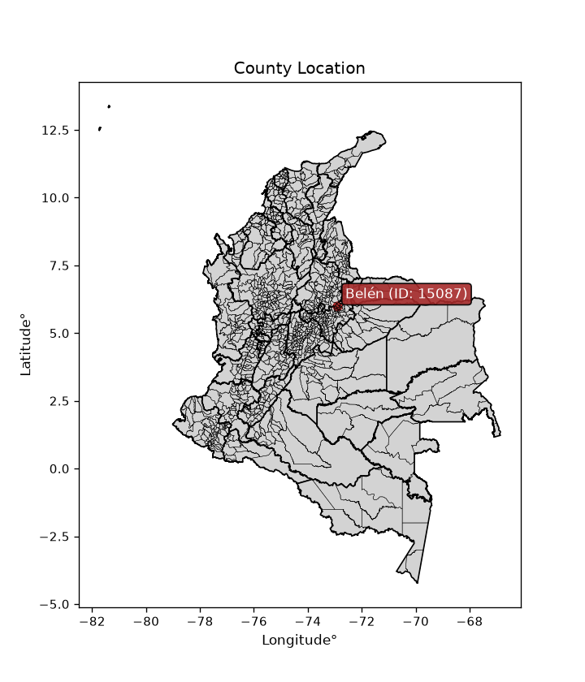
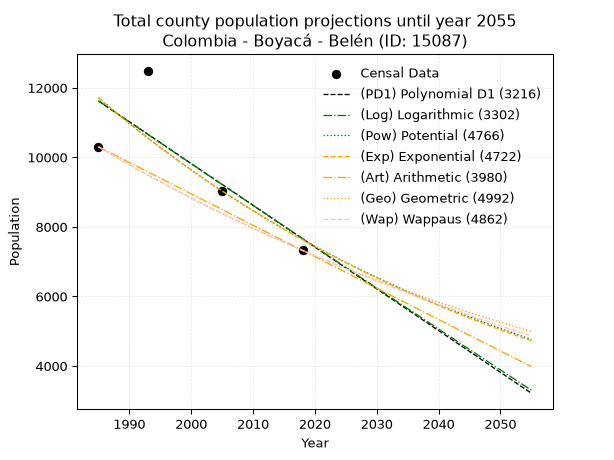
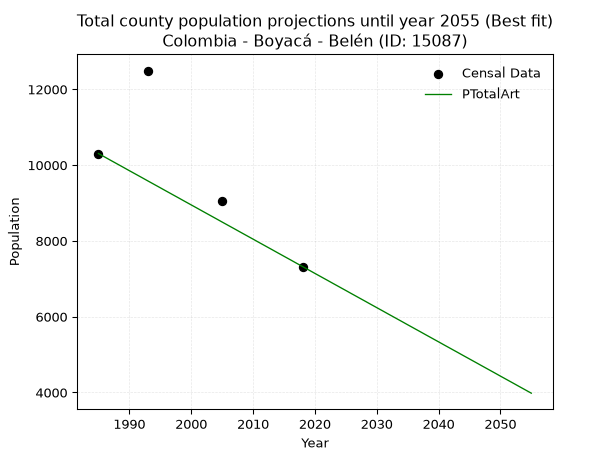
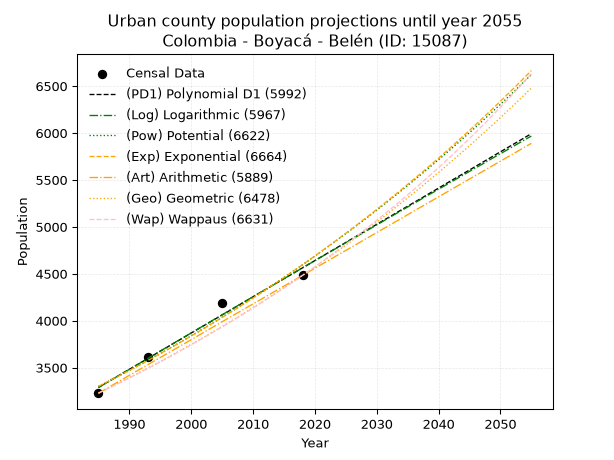
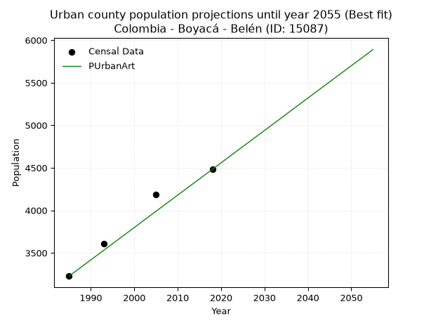
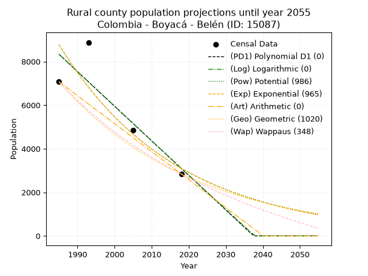
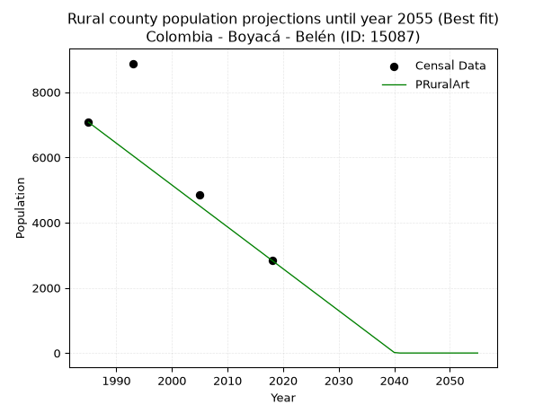

<div align="center">


</div>

# _“Population and Public Services Demand Projections (PPSD) until Year 2050 for Colombia - Boyacá - Belén (ID: 15087)”_
Keywords: `population` `public-service` `projection` `lineal` `polynomial` `logarithmic` `potential` `exponential` `arithmetic` `geometric` `wappaus` `dane` `colombia` `south-america`

PPSD are analytical estimates used by governments and planners to anticipate future changes in population size, age distribution, and the resulting community needs for utilities, healthcare, education, and infrastructure as sizing future water treatment facilities, electrical grids, and road networks based on spatial growth.

<div align="center">

</img>

</div>


> **General running parameters**: • app_version: _v20260806_. • Python version: _3.14.7_. • Pandas version: _3.0.5_. • NumPy version: _2.5.1_. • Creates, save and include plots into reports (create_plot): _False_. • Projection until year: _2050_. • Process polynomial degree 2 and up: _False_. • Process Wappaus: _True_. • Process Wappaus: _True_. • Set negative values to zero: _True_. • Set infinite values to zero: _True_. • Drop dataset notes: _True_. 
<div align="center">

Dynamic map: [:earth_americas:Google](http://maps.google.com/maps?q=5.98922954,-72.9116412) [:earth_americas:OSM](https://www.openstreetmap.org/#map=18/5.98922954/-72.9116412&layers=P) [:earth_americas:Bing](https://www.bing.com/maps?cp=5.98922954~-72.9116412&lvl=18) [:earth_americas:Apple](https://maps.apple.com/frame?center=5.98922954%2C-72.9116412&span=0.003%2C0.006)

</div>


<div align="center">

```geojson
{
  "type": "Feature",
  "geometry": {
    "type": "Point", 
    "coordinates": [-72.9116412, 5.98922954]
  }, 
  "properties": {
    "Name": "Colombia - Boyacá - Belén (ID: 15087)"
  }
}
```

</div>


## 0. Census Data (4 records)

Census data are official statistics collected by a government about the people and housing in a country. They usually include counts of total population, age, sex, race, income, education, and jobs.

📅Global census file: [Population.xlsx](../data/Population.xlsx)

| Source   |   Year |   CountryID | CountryName   |   StateID | StateName   |   CountyID | CountyName   |   PTotal |   PUrban |   PRural |
|:---------|-------:|------------:|:--------------|----------:|:------------|-----------:|:-------------|---------:|---------:|---------:|
| DANE     |   1985 |          57 | Colombia      |        15 | Boyacá      |      15087 | Belén        |    10303 |     3227 |     7076 |
| DANE     |   1993 |          57 | Colombia      |        15 | Boyacá      |      15087 | Belén        |    12491 |     3612 |     8879 |
| DANE     |   2005 |          57 | Colombia      |        15 | Boyacá      |      15087 | Belén        |     9041 |     4188 |     4853 |
| DANE     |   2018 |          57 | Colombia      |        15 | Boyacá      |      15087 | Belén        |     7322 |     4482 |     2840 |

> 🔥Some records could had specific notes about the registered values or the corresponding urban or rural distribution.

📅   [RUPS](https://www.datos.gov.co/Hacienda-y-Cr-dito-P-blico/Registro-nico-de-Prestadores-de-Servicios-P-blicos/4qkq-csdn/about_data) - Local public utility companies: [RUPS.csv](../data/RUPS.xlsx)

 | SERVICIO       | ESTADO    | NOMBRE                                           | NIT         | DEPARTAMENTO_DOMICILIO   | MUNICIPIO_DOMICILIO   | DIRECCION           |   TELEFONO | EMAIL                               | TIPO_PRESTADOR          | CLASIFICACION                 |
|:---------------|:----------|:-------------------------------------------------|:------------|:-------------------------|:----------------------|:--------------------|-----------:|:------------------------------------|:------------------------|:------------------------------|
| ACUEDUCTO      | OPERATIVA | EMPRESA SOLIDARIA DE SERVICIOS PUBLICOS DE BELEN | 826003618-1 | BOYACA                   | BELEN                 | Carrera  6 No. 7-07 |    7870468 | gerencia.servibelen.esp@hotmail.com | ORGANIZACION AUTORIZADA | MENOR O IGUAL A 2500 USUARIOS |
| ALCANTARILLADO | OPERATIVA | EMPRESA SOLIDARIA DE SERVICIOS PUBLICOS DE BELEN | 826003618-1 | BOYACA                   | BELEN                 | Carrera  6 No. 7-07 |    7870468 | gerencia.servibelen.esp@hotmail.com | ORGANIZACION AUTORIZADA | MENOR O IGUAL A 2500 USUARIOS |

## 1. Total

### 1.1. Coefficients and Parameters

* (PD1) Polynomial Deg 1: -120.06463267763826, 249948.53151344592 (lineal)
* (Log) Logarithmic: -240066.02784854636, 1834533.051445214
* (Pow) Potential: -25.94107379215116, 89.61605366085625
* (Exp) Exponential: -0.012973677104117749, 1789794327088171.8
* (Art) Arithmetic: Year diff. 2018 - 1985 = 33, Population diff. 7322 - 10303 = -2981, Annual growth = -90.33333333333333
* (Geo) Geometric: Year diff. 2018 - 1985 = 33, Population diff. 7322 - 10303 = -2981, Annual growth % = -0.010296671052727246
* (Wap) Wappaus: i = -1.0250591016548463, Condition values only valid for < 200)

<sub>
Wappaus condition values: ['-0.00', '-1.03', '-2.05', '-3.08', '-4.10', '-5.13', '-6.15', '-7.18', '-8.20', '-9.23', '-10.25', '-11.28', '-12.30', '-13.33', '-14.35', '-15.38', '-16.40', '-17.43', '-18.45', '-19.48', '-20.50', '-21.53', '-22.55', '-23.58', '-24.60', '-25.63', '-26.65', '-27.68', '-28.70', '-29.73', '-30.75', '-31.78', '-32.80', '-33.83', '-34.85', '-35.88', '-36.90', '-37.93', '-38.95', '-39.98', '-41.00', '-42.03', '-43.05', '-44.08', '-45.10', '-46.13', '-47.15', '-48.18', '-49.20', '-50.23', '-51.25', '-52.28', '-53.30', '-54.33', '-55.35', '-56.38', '-57.40', '-58.43', '-59.45', '-60.48', '-61.50', '-62.53', '-63.55', '-64.58', '-65.60', '-66.63']
</sub>


### 1.2. Projected Dataset

|   Year |   CountyID |   PTotalPD1 |   PTotalLog |   PTotalPow |   PTotalExp |   PTotalArt |   PTotalGeo |   PTotalWap |
|-------:|-----------:|------------:|------------:|------------:|------------:|------------:|------------:|------------:|
|   1985 |      15087 |       11620 |       11622 |       11711 |       11709 |       10303 |       10303 |       10303 |
|   1986 |      15087 |       11500 |       11501 |       11559 |       11558 |       10213 |       10197 |       10198 |
|   1987 |      15087 |       11380 |       11380 |       11409 |       11409 |       10122 |       10092 |       10094 |
|   1988 |      15087 |       11260 |       11259 |       11261 |       11262 |       10032 |        9988 |        9991 |
|   1989 |      15087 |       11140 |       11139 |       11115 |       11117 |        9942 |        9885 |        9889 |
|   1990 |      15087 |       11020 |       11018 |       10971 |       10974 |        9851 |        9783 |        9788 |
|   1991 |      15087 |       10900 |       10897 |       10829 |       10832 |        9761 |        9683 |        9688 |
|   1992 |      15087 |       10780 |       10777 |       10689 |       10693 |        9671 |        9583 |        9589 |
|   1993 |      15087 |       10660 |       10656 |       10551 |       10555 |        9580 |        9484 |        9491 |
|   1994 |      15087 |       10540 |       10536 |       10415 |       10419 |        9490 |        9387 |        9394 |
|   1995 |      15087 |       10420 |       10416 |       10280 |       10284 |        9400 |        9290 |        9298 |
|   1996 |      15087 |       10300 |       10295 |       10147 |       10152 |        9309 |        9194 |        9203 |
|   1997 |      15087 |       10179 |       10175 |       10016 |       10021 |        9219 |        9100 |        9109 |
|   1998 |      15087 |       10059 |       10055 |        9887 |        9892 |        9129 |        9006 |        9016 |
|   1999 |      15087 |        9939 |        9935 |        9759 |        9764 |        9038 |        8913 |        8923 |
|   2000 |      15087 |        9819 |        9815 |        9634 |        9639 |        8948 |        8821 |        8832 |
|   2001 |      15087 |        9699 |        9695 |        9510 |        9514 |        8858 |        8731 |        8741 |
|   2002 |      15087 |        9579 |        9575 |        9387 |        9392 |        8767 |        8641 |        8651 |
|   2003 |      15087 |        9459 |        9455 |        9266 |        9271 |        8677 |        8552 |        8563 |
|   2004 |      15087 |        9339 |        9335 |        9147 |        9151 |        8587 |        8464 |        8474 |
|   2005 |      15087 |        9219 |        9215 |        9029 |        9033 |        8496 |        8377 |        8387 |
|   2006 |      15087 |        9099 |        9095 |        8913 |        8917 |        8406 |        8290 |        8301 |
|   2007 |      15087 |        8979 |        8976 |        8799 |        8802 |        8316 |        8205 |        8215 |
|   2008 |      15087 |        8859 |        8856 |        8686 |        8688 |        8225 |        8120 |        8130 |
|   2009 |      15087 |        8739 |        8737 |        8574 |        8576 |        8135 |        8037 |        8046 |
|   2010 |      15087 |        8619 |        8617 |        8464 |        8466 |        8045 |        7954 |        7963 |
|   2011 |      15087 |        8499 |        8498 |        8356 |        8357 |        7954 |        7872 |        7880 |
|   2012 |      15087 |        8378 |        8378 |        8249 |        8249 |        7864 |        7791 |        7798 |
|   2013 |      15087 |        8258 |        8259 |        8143 |        8143 |        7774 |        7711 |        7717 |
|   2014 |      15087 |        8138 |        8140 |        8039 |        8038 |        7683 |        7631 |        7637 |
|   2015 |      15087 |        8018 |        8021 |        7936 |        7934 |        7593 |        7553 |        7557 |
|   2016 |      15087 |        7898 |        7902 |        7835 |        7832 |        7503 |        7475 |        7478 |
|   2017 |      15087 |        7778 |        7783 |        7735 |        7731 |        7412 |        7398 |        7400 |
|   2018 |      15087 |        7658 |        7664 |        7636 |        7631 |        7322 |        7322 |        7322 |
|   2019 |      15087 |        7538 |        7545 |        7538 |        7533 |        7232 |        7247 |        7245 |
|   2020 |      15087 |        7418 |        7426 |        7442 |        7436 |        7141 |        7172 |        7169 |
|   2021 |      15087 |        7298 |        7307 |        7347 |        7340 |        7051 |        7098 |        7093 |
|   2022 |      15087 |        7178 |        7188 |        7253 |        7245 |        6961 |        7025 |        7018 |
|   2023 |      15087 |        7058 |        7070 |        7161 |        7152 |        6870 |        6953 |        6944 |
|   2024 |      15087 |        6938 |        6951 |        7070 |        7060 |        6780 |        6881 |        6870 |
|   2025 |      15087 |        6818 |        6832 |        6980 |        6969 |        6690 |        6810 |        6797 |
|   2026 |      15087 |        6698 |        6714 |        6891 |        6879 |        6599 |        6740 |        6725 |
|   2027 |      15087 |        6578 |        6595 |        6803 |        6790 |        6509 |        6671 |        6653 |
|   2028 |      15087 |        6457 |        6477 |        6717 |        6703 |        6419 |        6602 |        6582 |
|   2029 |      15087 |        6337 |        6359 |        6631 |        6616 |        6328 |        6534 |        6511 |
|   2030 |      15087 |        6217 |        6240 |        6547 |        6531 |        6238 |        6467 |        6441 |
|   2031 |      15087 |        6097 |        6122 |        6464 |        6447 |        6148 |        6400 |        6372 |
|   2032 |      15087 |        5977 |        6004 |        6382 |        6364 |        6057 |        6334 |        6303 |
|   2033 |      15087 |        5857 |        5886 |        6301 |        6282 |        5967 |        6269 |        6235 |
|   2034 |      15087 |        5737 |        5768 |        6221 |        6201 |        5877 |        6205 |        6167 |
|   2035 |      15087 |        5617 |        5650 |        6142 |        6121 |        5786 |        6141 |        6100 |
|   2036 |      15087 |        5497 |        5532 |        6065 |        6042 |        5696 |        6077 |        6033 |
|   2037 |      15087 |        5377 |        5414 |        5988 |        5964 |        5606 |        6015 |        5967 |
|   2038 |      15087 |        5257 |        5296 |        5912 |        5887 |        5515 |        5953 |        5901 |
|   2039 |      15087 |        5137 |        5178 |        5837 |        5811 |        5425 |        5892 |        5836 |
|   2040 |      15087 |        5017 |        5061 |        5764 |        5736 |        5335 |        5831 |        5772 |
|   2041 |      15087 |        4897 |        4943 |        5691 |        5662 |        5244 |        5771 |        5708 |
|   2042 |      15087 |        4777 |        4825 |        5619 |        5589 |        5154 |        5712 |        5644 |
|   2043 |      15087 |        4656 |        4708 |        5548 |        5517 |        5064 |        5653 |        5581 |
|   2044 |      15087 |        4536 |        4590 |        5478 |        5446 |        4973 |        5594 |        5519 |
|   2045 |      15087 |        4416 |        4473 |        5409 |        5376 |        4883 |        5537 |        5457 |
|   2046 |      15087 |        4296 |        4356 |        5341 |        5307 |        4793 |        5480 |        5395 |
|   2047 |      15087 |        4176 |        4238 |        5274 |        5238 |        4702 |        5423 |        5334 |
|   2048 |      15087 |        4056 |        4121 |        5207 |        5171 |        4612 |        5368 |        5273 |
|   2049 |      15087 |        3936 |        4004 |        5142 |        5104 |        4522 |        5312 |        5213 |
|   2050 |      15087 |        3816 |        3887 |        5077 |        5038 |        4431 |        5258 |        5154 |
<div align="center">

</img>

</div>


### 1.3. Best fit with absolute and relative error (%)

Relative error puts that difference into context by dividing the absolute error by the true value, creating a unitless ratio or percentage that shows the scale of the mistake.

Absolute and relative error

|   Year | Source   |   CountryID | CountryName   |   StateID | StateName   |   CountyID_x | CountyName   |   PTotal |   PUrban |   PRural |   CountyID_y |   PTotalPD1 |   PTotalLog |   PTotalPow |   PTotalExp |   PTotalArt |   PTotalGeo |   PTotalWap |   PTotalPD1AbsError |   PTotalLogAbsError |   PTotalPowAbsError |   PTotalExpAbsError |   PTotalArtAbsError |   PTotalGeoAbsError |   PTotalWapAbsError |   PTotalPD1RelError |   PTotalLogRelError |   PTotalPowRelError |   PTotalExpRelError |   PTotalArtRelError |   PTotalGeoRelError |   PTotalWapRelError |
|-------:|:---------|------------:|:--------------|----------:|:------------|-------------:|:-------------|---------:|---------:|---------:|-------------:|------------:|------------:|------------:|------------:|------------:|------------:|------------:|--------------------:|--------------------:|--------------------:|--------------------:|--------------------:|--------------------:|--------------------:|--------------------:|--------------------:|--------------------:|--------------------:|--------------------:|--------------------:|--------------------:|
|   1985 | DANE     |          57 | Colombia      |        15 | Boyacá      |        15087 | Belén        |    10303 |     3227 |     7076 |        15087 |       11620 |       11622 |       11711 |       11709 |       10303 |       10303 |       10303 |                1317 |                1319 |                1408 |                1406 |                   0 |                   0 |                   0 |            12.7827  |            12.8021  |           13.6659   |          13.6465    |             0       |             0       |             0       |
|   1993 | DANE     |          57 | Colombia      |        15 | Boyacá      |        15087 | Belén        |    12491 |     3612 |     8879 |        15087 |       10660 |       10656 |       10551 |       10555 |        9580 |        9484 |        9491 |                1831 |                1835 |                1940 |                1936 |                2911 |                3007 |                3000 |            14.6586  |            14.6906  |           15.5312   |          15.4992    |            23.3048  |            24.0733  |            24.0173  |
|   2005 | DANE     |          57 | Colombia      |        15 | Boyacá      |        15087 | Belén        |     9041 |     4188 |     4853 |        15087 |        9219 |        9215 |        9029 |        9033 |        8496 |        8377 |        8387 |                 178 |                 174 |                  12 |                   8 |                 545 |                 664 |                 654 |             1.96881 |             1.92457 |            0.132729 |           0.0884858 |             6.02809 |             7.34432 |             7.23371 |
|   2018 | DANE     |          57 | Colombia      |        15 | Boyacá      |        15087 | Belén        |     7322 |     4482 |     2840 |        15087 |        7658 |        7664 |        7636 |        7631 |        7322 |        7322 |        7322 |                 336 |                 342 |                 314 |                 309 |                   0 |                   0 |                   0 |             4.58891 |             4.67085 |            4.28845  |           4.22016   |             0       |             0       |             0       |

Relative error mean

| Method    |   RelError | Best   |
|:----------|-----------:|:-------|
| PTotalPD1 |    8.49974 |        |
| PTotalLog |    8.52202 |        |
| PTotalPow |    8.40457 |        |
| PTotalExp |    8.36358 |        |
| PTotalArt |    7.33322 | True   |
| PTotalGeo |    7.85441 |        |
| PTotalWap |    7.81275 |        |

💙Best method: _**PTotalArt**_
<div align="center">

</img>

</div>


### 1.4. Fresh water supply demand in liters per capita per day (lpcd)

The fresh water supply demand typically ranges from 100 to 300 liters per capita per day (lpcd) for standard domestic and municipal planning, though absolute survival minimums set by the World Health Organization are as low as 7.5 to 20 liters per day, and total consumption in high-income nations can exceed 400 liters.

> `CZ`: Level in meters above the sea level (masl)<br> `WS`: Fresh water supply demand in liters per capita per day (lpcd or l/h/d)<br> `WSAll`: Zonal fresh water supply demand in liters per second (l/s)<br> `A`: Zonal area in square meters<br> `DP`: Population density (people/hectare or p/ha)

Reference values (RAS Colombia)

|    CZ |   WS |
|------:|-----:|
|  1000 |  120 |
|  2000 |  130 |
| 99999 |  140 |

County shapefile geometry properties and water supply values

|   CountyID |      ATotal |   CZTotal |   WSTotal |
|-----------:|------------:|----------:|----------:|
|      15087 | 1.62774e+08 |    3043.3 |       140 |

Projected values for best method: PTotalArt

|   CountyID |   Year |   PTotalArt |   DPTotal |   WSTotal |   WSTotalAll |
|-----------:|-------:|------------:|----------:|----------:|-------------:|
|      15087 |   1985 |       10303 |      0.63 |       140 |     16.6947  |
|      15087 |   1986 |       10213 |      0.63 |       140 |     16.5488  |
|      15087 |   1987 |       10122 |      0.62 |       140 |     16.4014  |
|      15087 |   1988 |       10032 |      0.62 |       140 |     16.2556  |
|      15087 |   1989 |        9942 |      0.61 |       140 |     16.1097  |
|      15087 |   1990 |        9851 |      0.61 |       140 |     15.9623  |
|      15087 |   1991 |        9761 |      0.6  |       140 |     15.8164  |
|      15087 |   1992 |        9671 |      0.59 |       140 |     15.6706  |
|      15087 |   1993 |        9580 |      0.59 |       140 |     15.5231  |
|      15087 |   1994 |        9490 |      0.58 |       140 |     15.3773  |
|      15087 |   1995 |        9400 |      0.58 |       140 |     15.2315  |
|      15087 |   1996 |        9309 |      0.57 |       140 |     15.084   |
|      15087 |   1997 |        9219 |      0.57 |       140 |     14.9382  |
|      15087 |   1998 |        9129 |      0.56 |       140 |     14.7924  |
|      15087 |   1999 |        9038 |      0.56 |       140 |     14.6449  |
|      15087 |   2000 |        8948 |      0.55 |       140 |     14.4991  |
|      15087 |   2001 |        8858 |      0.54 |       140 |     14.3532  |
|      15087 |   2002 |        8767 |      0.54 |       140 |     14.2058  |
|      15087 |   2003 |        8677 |      0.53 |       140 |     14.06    |
|      15087 |   2004 |        8587 |      0.53 |       140 |     13.9141  |
|      15087 |   2005 |        8496 |      0.52 |       140 |     13.7667  |
|      15087 |   2006 |        8406 |      0.52 |       140 |     13.6208  |
|      15087 |   2007 |        8316 |      0.51 |       140 |     13.475   |
|      15087 |   2008 |        8225 |      0.51 |       140 |     13.3275  |
|      15087 |   2009 |        8135 |      0.5  |       140 |     13.1817  |
|      15087 |   2010 |        8045 |      0.49 |       140 |     13.0359  |
|      15087 |   2011 |        7954 |      0.49 |       140 |     12.8884  |
|      15087 |   2012 |        7864 |      0.48 |       140 |     12.7426  |
|      15087 |   2013 |        7774 |      0.48 |       140 |     12.5968  |
|      15087 |   2014 |        7683 |      0.47 |       140 |     12.4493  |
|      15087 |   2015 |        7593 |      0.47 |       140 |     12.3035  |
|      15087 |   2016 |        7503 |      0.46 |       140 |     12.1576  |
|      15087 |   2017 |        7412 |      0.46 |       140 |     12.0102  |
|      15087 |   2018 |        7322 |      0.45 |       140 |     11.8644  |
|      15087 |   2019 |        7232 |      0.44 |       140 |     11.7185  |
|      15087 |   2020 |        7141 |      0.44 |       140 |     11.5711  |
|      15087 |   2021 |        7051 |      0.43 |       140 |     11.4252  |
|      15087 |   2022 |        6961 |      0.43 |       140 |     11.2794  |
|      15087 |   2023 |        6870 |      0.42 |       140 |     11.1319  |
|      15087 |   2024 |        6780 |      0.42 |       140 |     10.9861  |
|      15087 |   2025 |        6690 |      0.41 |       140 |     10.8403  |
|      15087 |   2026 |        6599 |      0.41 |       140 |     10.6928  |
|      15087 |   2027 |        6509 |      0.4  |       140 |     10.547   |
|      15087 |   2028 |        6419 |      0.39 |       140 |     10.4012  |
|      15087 |   2029 |        6328 |      0.39 |       140 |     10.2537  |
|      15087 |   2030 |        6238 |      0.38 |       140 |     10.1079  |
|      15087 |   2031 |        6148 |      0.38 |       140 |      9.96204 |
|      15087 |   2032 |        6057 |      0.37 |       140 |      9.81458 |
|      15087 |   2033 |        5967 |      0.37 |       140 |      9.66875 |
|      15087 |   2034 |        5877 |      0.36 |       140 |      9.52292 |
|      15087 |   2035 |        5786 |      0.36 |       140 |      9.37546 |
|      15087 |   2036 |        5696 |      0.35 |       140 |      9.22963 |
|      15087 |   2037 |        5606 |      0.34 |       140 |      9.0838  |
|      15087 |   2038 |        5515 |      0.34 |       140 |      8.93634 |
|      15087 |   2039 |        5425 |      0.33 |       140 |      8.79051 |
|      15087 |   2040 |        5335 |      0.33 |       140 |      8.64468 |
|      15087 |   2041 |        5244 |      0.32 |       140 |      8.49722 |
|      15087 |   2042 |        5154 |      0.32 |       140 |      8.35139 |
|      15087 |   2043 |        5064 |      0.31 |       140 |      8.20556 |
|      15087 |   2044 |        4973 |      0.31 |       140 |      8.0581  |
|      15087 |   2045 |        4883 |      0.3  |       140 |      7.91227 |
|      15087 |   2046 |        4793 |      0.29 |       140 |      7.76644 |
|      15087 |   2047 |        4702 |      0.29 |       140 |      7.61898 |
|      15087 |   2048 |        4612 |      0.28 |       140 |      7.47315 |
|      15087 |   2049 |        4522 |      0.28 |       140 |      7.32731 |
|      15087 |   2050 |        4431 |      0.27 |       140 |      7.17986 |

## 2. Urban

### 2.1. Coefficients and Parameters

* (PD1) Polynomial Deg 1: 38.61862705740643, -73369.6587715772 (lineal)
* (Log) Logarithmic: 77328.76996290452, -583899.3501619094
* (Pow) Potential: 20.105076674147742, -62.78337650529945
* (Exp) Exponential: 0.010039684099036852, 7.303944335027062e-06
* (Art) Arithmetic: Year diff. 2018 - 1985 = 33, Population diff. 4482 - 3227 = 1255, Annual growth = 38.03030303030303
* (Geo) Geometric: Year diff. 2018 - 1985 = 33, Population diff. 4482 - 3227 = 1255, Annual growth % = 0.010004760605034857
* (Wap) Wappaus: i = 0.9866468551122851, Condition values only valid for < 200)

<sub>
Wappaus condition values: ['0.00', '0.99', '1.97', '2.96', '3.95', '4.93', '5.92', '6.91', '7.89', '8.88', '9.87', '10.85', '11.84', '12.83', '13.81', '14.80', '15.79', '16.77', '17.76', '18.75', '19.73', '20.72', '21.71', '22.69', '23.68', '24.67', '25.65', '26.64', '27.63', '28.61', '29.60', '30.59', '31.57', '32.56', '33.55', '34.53', '35.52', '36.51', '37.49', '38.48', '39.47', '40.45', '41.44', '42.43', '43.41', '44.40', '45.39', '46.37', '47.36', '48.35', '49.33', '50.32', '51.31', '52.29', '53.28', '54.27', '55.25', '56.24', '57.23', '58.21', '59.20', '60.19', '61.17', '62.16', '63.15', '64.13']
</sub>


### 2.2. Projected Dataset

|   Year |   CountyID |   PUrbanPD1 |   PUrbanLog |   PUrbanPow |   PUrbanExp |   PUrbanArt |   PUrbanGeo |   PUrbanWap |
|-------:|-----------:|------------:|------------:|------------:|------------:|------------:|------------:|------------:|
|   1985 |      15087 |        3288 |        3287 |        3299 |        3300 |        3227 |        3227 |        3227 |
|   1986 |      15087 |        3327 |        3326 |        3332 |        3333 |        3265 |        3259 |        3259 |
|   1987 |      15087 |        3366 |        3365 |        3366 |        3367 |        3303 |        3292 |        3291 |
|   1988 |      15087 |        3404 |        3404 |        3400 |        3401 |        3341 |        3325 |        3324 |
|   1989 |      15087 |        3443 |        3443 |        3435 |        3435 |        3379 |        3358 |        3357 |
|   1990 |      15087 |        3481 |        3481 |        3470 |        3470 |        3417 |        3392 |        3390 |
|   1991 |      15087 |        3520 |        3520 |        3505 |        3505 |        3455 |        3426 |        3424 |
|   1992 |      15087 |        3559 |        3559 |        3541 |        3540 |        3493 |        3460 |        3458 |
|   1993 |      15087 |        3597 |        3598 |        3577 |        3576 |        3531 |        3495 |        3492 |
|   1994 |      15087 |        3636 |        3637 |        3613 |        3612 |        3569 |        3529 |        3527 |
|   1995 |      15087 |        3675 |        3676 |        3649 |        3649 |        3607 |        3565 |        3562 |
|   1996 |      15087 |        3713 |        3714 |        3686 |        3685 |        3645 |        3600 |        3597 |
|   1997 |      15087 |        3752 |        3753 |        3724 |        3723 |        3683 |        3636 |        3633 |
|   1998 |      15087 |        3790 |        3792 |        3761 |        3760 |        3721 |        3673 |        3669 |
|   1999 |      15087 |        3829 |        3830 |        3799 |        3798 |        3759 |        3710 |        3706 |
|   2000 |      15087 |        3868 |        3869 |        3838 |        3836 |        3797 |        3747 |        3743 |
|   2001 |      15087 |        3906 |        3908 |        3877 |        3875 |        3835 |        3784 |        3780 |
|   2002 |      15087 |        3945 |        3946 |        3916 |        3914 |        3874 |        3822 |        3818 |
|   2003 |      15087 |        3983 |        3985 |        3955 |        3954 |        3912 |        3860 |        3856 |
|   2004 |      15087 |        4022 |        4024 |        3995 |        3994 |        3950 |        3899 |        3895 |
|   2005 |      15087 |        4061 |        4062 |        4035 |        4034 |        3988 |        3938 |        3933 |
|   2006 |      15087 |        4099 |        4101 |        4076 |        4075 |        4026 |        3977 |        3973 |
|   2007 |      15087 |        4138 |        4139 |        4117 |        4116 |        4064 |        4017 |        4013 |
|   2008 |      15087 |        4177 |        4178 |        4159 |        4157 |        4102 |        4057 |        4053 |
|   2009 |      15087 |        4215 |        4216 |        4200 |        4199 |        4140 |        4098 |        4094 |
|   2010 |      15087 |        4254 |        4255 |        4243 |        4241 |        4178 |        4139 |        4135 |
|   2011 |      15087 |        4292 |        4293 |        4285 |        4284 |        4216 |        4180 |        4177 |
|   2012 |      15087 |        4331 |        4332 |        4328 |        4328 |        4254 |        4222 |        4219 |
|   2013 |      15087 |        4370 |        4370 |        4372 |        4371 |        4292 |        4264 |        4261 |
|   2014 |      15087 |        4408 |        4409 |        4416 |        4415 |        4330 |        4307 |        4304 |
|   2015 |      15087 |        4447 |        4447 |        4460 |        4460 |        4368 |        4350 |        4348 |
|   2016 |      15087 |        4485 |        4485 |        4505 |        4505 |        4406 |        4394 |        4392 |
|   2017 |      15087 |        4524 |        4524 |        4550 |        4550 |        4444 |        4438 |        4437 |
|   2018 |      15087 |        4563 |        4562 |        4595 |        4596 |        4482 |        4482 |        4482 |
|   2019 |      15087 |        4601 |        4600 |        4641 |        4643 |        4520 |        4527 |        4528 |
|   2020 |      15087 |        4640 |        4639 |        4688 |        4689 |        4558 |        4572 |        4574 |
|   2021 |      15087 |        4679 |        4677 |        4735 |        4737 |        4596 |        4618 |        4621 |
|   2022 |      15087 |        4717 |        4715 |        4782 |        4785 |        4634 |        4664 |        4668 |
|   2023 |      15087 |        4756 |        4753 |        4830 |        4833 |        4672 |        4711 |        4716 |
|   2024 |      15087 |        4794 |        4792 |        4878 |        4882 |        4710 |        4758 |        4765 |
|   2025 |      15087 |        4833 |        4830 |        4927 |        4931 |        4748 |        4805 |        4814 |
|   2026 |      15087 |        4872 |        4868 |        4976 |        4981 |        4786 |        4854 |        4863 |
|   2027 |      15087 |        4910 |        4906 |        5025 |        5031 |        4824 |        4902 |        4914 |
|   2028 |      15087 |        4949 |        4944 |        5075 |        5082 |        4862 |        4951 |        4965 |
|   2029 |      15087 |        4988 |        4982 |        5126 |        5133 |        4900 |        5001 |        5016 |
|   2030 |      15087 |        5026 |        5020 |        5177 |        5185 |        4938 |        5051 |        5069 |
|   2031 |      15087 |        5065 |        5058 |        5229 |        5237 |        4976 |        5101 |        5122 |
|   2032 |      15087 |        5103 |        5097 |        5281 |        5290 |        5014 |        5152 |        5175 |
|   2033 |      15087 |        5142 |        5135 |        5333 |        5343 |        5052 |        5204 |        5229 |
|   2034 |      15087 |        5181 |        5173 |        5386 |        5397 |        5090 |        5256 |        5284 |
|   2035 |      15087 |        5219 |        5211 |        5440 |        5452 |        5129 |        5308 |        5340 |
|   2036 |      15087 |        5258 |        5249 |        5494 |        5507 |        5167 |        5362 |        5397 |
|   2037 |      15087 |        5296 |        5287 |        5548 |        5562 |        5205 |        5415 |        5454 |
|   2038 |      15087 |        5335 |        5325 |        5603 |        5618 |        5243 |        5469 |        5512 |
|   2039 |      15087 |        5374 |        5362 |        5659 |        5675 |        5281 |        5524 |        5571 |
|   2040 |      15087 |        5412 |        5400 |        5715 |        5732 |        5319 |        5579 |        5630 |
|   2041 |      15087 |        5451 |        5438 |        5771 |        5790 |        5357 |        5635 |        5691 |
|   2042 |      15087 |        5490 |        5476 |        5828 |        5848 |        5395 |        5692 |        5752 |
|   2043 |      15087 |        5528 |        5514 |        5886 |        5908 |        5433 |        5749 |        5814 |
|   2044 |      15087 |        5567 |        5552 |        5944 |        5967 |        5471 |        5806 |        5877 |
|   2045 |      15087 |        5605 |        5590 |        6003 |        6027 |        5509 |        5864 |        5941 |
|   2046 |      15087 |        5644 |        5628 |        6062 |        6088 |        5547 |        5923 |        6005 |
|   2047 |      15087 |        5683 |        5665 |        6122 |        6150 |        5585 |        5982 |        6071 |
|   2048 |      15087 |        5721 |        5703 |        6183 |        6212 |        5623 |        6042 |        6137 |
|   2049 |      15087 |        5760 |        5741 |        6244 |        6274 |        5661 |        6102 |        6205 |
|   2050 |      15087 |        5799 |        5779 |        6305 |        6338 |        5699 |        6163 |        6273 |
<div align="center">

</img>

</div>


### 2.3. Best fit with absolute and relative error (%)

Relative error puts that difference into context by dividing the absolute error by the true value, creating a unitless ratio or percentage that shows the scale of the mistake.

Absolute and relative error

|   Year | Source   |   CountryID | CountryName   |   StateID | StateName   |   CountyID_x | CountyName   |   PTotal |   PUrban |   PRural |   CountyID_y |   PUrbanPD1 |   PUrbanLog |   PUrbanPow |   PUrbanExp |   PUrbanArt |   PUrbanGeo |   PUrbanWap |   PUrbanPD1AbsError |   PUrbanLogAbsError |   PUrbanPowAbsError |   PUrbanExpAbsError |   PUrbanArtAbsError |   PUrbanGeoAbsError |   PUrbanWapAbsError |   PUrbanPD1RelError |   PUrbanLogRelError |   PUrbanPowRelError |   PUrbanExpRelError |   PUrbanArtRelError |   PUrbanGeoRelError |   PUrbanWapRelError |
|-------:|:---------|------------:|:--------------|----------:|:------------|-------------:|:-------------|---------:|---------:|---------:|-------------:|------------:|------------:|------------:|------------:|------------:|------------:|------------:|--------------------:|--------------------:|--------------------:|--------------------:|--------------------:|--------------------:|--------------------:|--------------------:|--------------------:|--------------------:|--------------------:|--------------------:|--------------------:|--------------------:|
|   1985 | DANE     |          57 | Colombia      |        15 | Boyacá      |        15087 | Belén        |    10303 |     3227 |     7076 |        15087 |        3288 |        3287 |        3299 |        3300 |        3227 |        3227 |        3227 |                  61 |                  60 |                  72 |                  73 |                   0 |                   0 |                   0 |            1.8903   |            1.85931  |            2.23117  |            2.26216  |             0       |             0       |             0       |
|   1993 | DANE     |          57 | Colombia      |        15 | Boyacá      |        15087 | Belén        |    12491 |     3612 |     8879 |        15087 |        3597 |        3598 |        3577 |        3576 |        3531 |        3495 |        3492 |                  15 |                  14 |                  35 |                  36 |                  81 |                 117 |                 120 |            0.415282 |            0.387597 |            0.968992 |            0.996678 |             2.24252 |             3.2392  |             3.32226 |
|   2005 | DANE     |          57 | Colombia      |        15 | Boyacá      |        15087 | Belén        |     9041 |     4188 |     4853 |        15087 |        4061 |        4062 |        4035 |        4034 |        3988 |        3938 |        3933 |                 127 |                 126 |                 153 |                 154 |                 200 |                 250 |                 255 |            3.03247  |            3.0086   |            3.6533   |            3.67717  |             4.77555 |             5.96944 |             6.08883 |
|   2018 | DANE     |          57 | Colombia      |        15 | Boyacá      |        15087 | Belén        |     7322 |     4482 |     2840 |        15087 |        4563 |        4562 |        4595 |        4596 |        4482 |        4482 |        4482 |                  81 |                  80 |                 113 |                 114 |                   0 |                   0 |                   0 |            1.80723  |            1.78492  |            2.5212   |            2.54351  |             0       |             0       |             0       |

Relative error mean

| Method    |   RelError | Best   |
|:----------|-----------:|:-------|
| PUrbanPD1 |    1.78632 |        |
| PUrbanLog |    1.76011 |        |
| PUrbanPow |    2.34366 |        |
| PUrbanExp |    2.36988 |        |
| PUrbanArt |    1.75452 | True   |
| PUrbanGeo |    2.30216 |        |
| PUrbanWap |    2.35277 |        |

💙Best method: _**PUrbanArt**_
<div align="center">

</img>

</div>


### 2.4. Fresh water supply demand in liters per capita per day (lpcd)

The fresh water supply demand typically ranges from 100 to 300 liters per capita per day (lpcd) for standard domestic and municipal planning, though absolute survival minimums set by the World Health Organization are as low as 7.5 to 20 liters per day, and total consumption in high-income nations can exceed 400 liters.

> `CZ`: Level in meters above the sea level (masl)<br> `WS`: Fresh water supply demand in liters per capita per day (lpcd or l/h/d)<br> `WSAll`: Zonal fresh water supply demand in liters per second (l/s)<br> `A`: Zonal area in square meters<br> `DP`: Population density (people/hectare or p/ha)

Reference values (RAS Colombia)

|    CZ |   WS |
|------:|-----:|
|  1000 |  120 |
|  2000 |  130 |
| 99999 |  140 |

County shapefile geometry properties and water supply values

|   CountyID |      AUrban |   CZUrban |   WSUrban |
|-----------:|------------:|----------:|----------:|
|      15087 | 1.09394e+06 |   2642.37 |       140 |

Projected values for best method: PUrbanArt

|   CountyID |   Year |   PUrbanArt |   DPUrban |   WSUrban |   WSUrbanAll |
|-----------:|-------:|------------:|----------:|----------:|-------------:|
|      15087 |   1985 |        3227 |     29.5  |       140 |      5.22894 |
|      15087 |   1986 |        3265 |     29.85 |       140 |      5.29051 |
|      15087 |   1987 |        3303 |     30.19 |       140 |      5.35208 |
|      15087 |   1988 |        3341 |     30.54 |       140 |      5.41366 |
|      15087 |   1989 |        3379 |     30.89 |       140 |      5.47523 |
|      15087 |   1990 |        3417 |     31.24 |       140 |      5.53681 |
|      15087 |   1991 |        3455 |     31.58 |       140 |      5.59838 |
|      15087 |   1992 |        3493 |     31.93 |       140 |      5.65995 |
|      15087 |   1993 |        3531 |     32.28 |       140 |      5.72153 |
|      15087 |   1994 |        3569 |     32.63 |       140 |      5.7831  |
|      15087 |   1995 |        3607 |     32.97 |       140 |      5.84468 |
|      15087 |   1996 |        3645 |     33.32 |       140 |      5.90625 |
|      15087 |   1997 |        3683 |     33.67 |       140 |      5.96782 |
|      15087 |   1998 |        3721 |     34.01 |       140 |      6.0294  |
|      15087 |   1999 |        3759 |     34.36 |       140 |      6.09097 |
|      15087 |   2000 |        3797 |     34.71 |       140 |      6.15255 |
|      15087 |   2001 |        3835 |     35.06 |       140 |      6.21412 |
|      15087 |   2002 |        3874 |     35.41 |       140 |      6.27731 |
|      15087 |   2003 |        3912 |     35.76 |       140 |      6.33889 |
|      15087 |   2004 |        3950 |     36.11 |       140 |      6.40046 |
|      15087 |   2005 |        3988 |     36.46 |       140 |      6.46204 |
|      15087 |   2006 |        4026 |     36.8  |       140 |      6.52361 |
|      15087 |   2007 |        4064 |     37.15 |       140 |      6.58519 |
|      15087 |   2008 |        4102 |     37.5  |       140 |      6.64676 |
|      15087 |   2009 |        4140 |     37.84 |       140 |      6.70833 |
|      15087 |   2010 |        4178 |     38.19 |       140 |      6.76991 |
|      15087 |   2011 |        4216 |     38.54 |       140 |      6.83148 |
|      15087 |   2012 |        4254 |     38.89 |       140 |      6.89306 |
|      15087 |   2013 |        4292 |     39.23 |       140 |      6.95463 |
|      15087 |   2014 |        4330 |     39.58 |       140 |      7.0162  |
|      15087 |   2015 |        4368 |     39.93 |       140 |      7.07778 |
|      15087 |   2016 |        4406 |     40.28 |       140 |      7.13935 |
|      15087 |   2017 |        4444 |     40.62 |       140 |      7.20093 |
|      15087 |   2018 |        4482 |     40.97 |       140 |      7.2625  |
|      15087 |   2019 |        4520 |     41.32 |       140 |      7.32407 |
|      15087 |   2020 |        4558 |     41.67 |       140 |      7.38565 |
|      15087 |   2021 |        4596 |     42.01 |       140 |      7.44722 |
|      15087 |   2022 |        4634 |     42.36 |       140 |      7.5088  |
|      15087 |   2023 |        4672 |     42.71 |       140 |      7.57037 |
|      15087 |   2024 |        4710 |     43.06 |       140 |      7.63194 |
|      15087 |   2025 |        4748 |     43.4  |       140 |      7.69352 |
|      15087 |   2026 |        4786 |     43.75 |       140 |      7.75509 |
|      15087 |   2027 |        4824 |     44.1  |       140 |      7.81667 |
|      15087 |   2028 |        4862 |     44.44 |       140 |      7.87824 |
|      15087 |   2029 |        4900 |     44.79 |       140 |      7.93981 |
|      15087 |   2030 |        4938 |     45.14 |       140 |      8.00139 |
|      15087 |   2031 |        4976 |     45.49 |       140 |      8.06296 |
|      15087 |   2032 |        5014 |     45.83 |       140 |      8.12454 |
|      15087 |   2033 |        5052 |     46.18 |       140 |      8.18611 |
|      15087 |   2034 |        5090 |     46.53 |       140 |      8.24769 |
|      15087 |   2035 |        5129 |     46.89 |       140 |      8.31088 |
|      15087 |   2036 |        5167 |     47.23 |       140 |      8.37245 |
|      15087 |   2037 |        5205 |     47.58 |       140 |      8.43403 |
|      15087 |   2038 |        5243 |     47.93 |       140 |      8.4956  |
|      15087 |   2039 |        5281 |     48.27 |       140 |      8.55718 |
|      15087 |   2040 |        5319 |     48.62 |       140 |      8.61875 |
|      15087 |   2041 |        5357 |     48.97 |       140 |      8.68032 |
|      15087 |   2042 |        5395 |     49.32 |       140 |      8.7419  |
|      15087 |   2043 |        5433 |     49.66 |       140 |      8.80347 |
|      15087 |   2044 |        5471 |     50.01 |       140 |      8.86505 |
|      15087 |   2045 |        5509 |     50.36 |       140 |      8.92662 |
|      15087 |   2046 |        5547 |     50.71 |       140 |      8.98819 |
|      15087 |   2047 |        5585 |     51.05 |       140 |      9.04977 |
|      15087 |   2048 |        5623 |     51.4  |       140 |      9.11134 |
|      15087 |   2049 |        5661 |     51.75 |       140 |      9.17292 |
|      15087 |   2050 |        5699 |     52.1  |       140 |      9.23449 |

## 3. Rural

### 3.1. Coefficients and Parameters

* (PD1) Polynomial Deg 1: -158.68325973504466, 323318.19028502307 (lineal)
* (Log) Logarithmic: -317394.7978114511, 2418432.4016071246
* (Pow) Potential: -63.078672543793466, 211.96185190260522
* (Exp) Exponential: -0.03153905359906652, 1.3560269540457588e+31
* (Art) Arithmetic: Year diff. 2018 - 1985 = 33, Population diff. 2840 - 7076 = -4236, Annual growth = -128.36363636363637
* (Geo) Geometric: Year diff. 2018 - 1985 = 33, Population diff. 2840 - 7076 = -4236, Annual growth % = -0.027284641346673966
* (Wap) Wappaus: i = -2.5890204994682606, Condition values only valid for < 200)

<sub>
Wappaus condition values: ['-0.00', '-2.59', '-5.18', '-7.77', '-10.36', '-12.95', '-15.53', '-18.12', '-20.71', '-23.30', '-25.89', '-28.48', '-31.07', '-33.66', '-36.25', '-38.84', '-41.42', '-44.01', '-46.60', '-49.19', '-51.78', '-54.37', '-56.96', '-59.55', '-62.14', '-64.73', '-67.31', '-69.90', '-72.49', '-75.08', '-77.67', '-80.26', '-82.85', '-85.44', '-88.03', '-90.62', '-93.20', '-95.79', '-98.38', '-100.97', '-103.56', '-106.15', '-108.74', '-111.33', '-113.92', '-116.51', '-119.09', '-121.68', '-124.27', '-126.86', '-129.45', '-132.04', '-134.63', '-137.22', '-139.81', '-142.40', '-144.99', '-147.57', '-150.16', '-152.75', '-155.34', '-157.93', '-160.52', '-163.11', '-165.70', '-168.29']
</sub>


### 3.2. Projected Dataset

|   Year |   CountyID |   PRuralPD1 |   PRuralLog |   PRuralPow |   PRuralExp |   PRuralArt |   PRuralGeo |   PRuralWap |
|-------:|-----------:|------------:|------------:|------------:|------------:|------------:|------------:|------------:|
|   1985 |      15087 |        8332 |        8335 |        8780 |        8775 |        7076 |        7076 |        7076 |
|   1986 |      15087 |        8173 |        8175 |        8505 |        8503 |        6948 |        6883 |        6895 |
|   1987 |      15087 |        8015 |        8015 |        8240 |        8239 |        6819 |        6695 |        6719 |
|   1988 |      15087 |        7856 |        7856 |        7982 |        7983 |        6691 |        6512 |        6547 |
|   1989 |      15087 |        7697 |        7696 |        7733 |        7735 |        6563 |        6335 |        6379 |
|   1990 |      15087 |        7539 |        7536 |        7492 |        7495 |        6434 |        6162 |        6216 |
|   1991 |      15087 |        7380 |        7377 |        7258 |        7262 |        6306 |        5994 |        6056 |
|   1992 |      15087 |        7221 |        7218 |        7032 |        7037 |        6177 |        5830 |        5900 |
|   1993 |      15087 |        7062 |        7058 |        6813 |        6818 |        6049 |        5671 |        5748 |
|   1994 |      15087 |        6904 |        6899 |        6600 |        6607 |        5921 |        5516 |        5599 |
|   1995 |      15087 |        6745 |        6740 |        6395 |        6401 |        5792 |        5366 |        5454 |
|   1996 |      15087 |        6586 |        6581 |        6196 |        6203 |        5664 |        5220 |        5312 |
|   1997 |      15087 |        6428 |        6422 |        6003 |        6010 |        5536 |        5077 |        5173 |
|   1998 |      15087 |        6269 |        6263 |        5817 |        5824 |        5407 |        4939 |        5037 |
|   1999 |      15087 |        6110 |        6104 |        5636 |        5643 |        5279 |        4804 |        4905 |
|   2000 |      15087 |        5952 |        5946 |        5461 |        5468 |        5151 |        4673 |        4775 |
|   2001 |      15087 |        5793 |        5787 |        5291 |        5298 |        5022 |        4545 |        4648 |
|   2002 |      15087 |        5634 |        5628 |        5127 |        5133 |        4894 |        4421 |        4523 |
|   2003 |      15087 |        5476 |        5470 |        4968 |        4974 |        4765 |        4301 |        4402 |
|   2004 |      15087 |        5317 |        5311 |        4814 |        4820 |        4637 |        4183 |        4282 |
|   2005 |      15087 |        5158 |        5153 |        4665 |        4670 |        4509 |        4069 |        4166 |
|   2006 |      15087 |        5000 |        4995 |        4521 |        4525 |        4380 |        3958 |        4051 |
|   2007 |      15087 |        4841 |        4837 |        4381 |        4384 |        4252 |        3850 |        3939 |
|   2008 |      15087 |        4682 |        4678 |        4245 |        4248 |        4124 |        3745 |        3829 |
|   2009 |      15087 |        4524 |        4520 |        4114 |        4116 |        3995 |        3643 |        3721 |
|   2010 |      15087 |        4365 |        4362 |        3987 |        3989 |        3867 |        3543 |        3616 |
|   2011 |      15087 |        4206 |        4205 |        3864 |        3865 |        3739 |        3447 |        3512 |
|   2012 |      15087 |        4047 |        4047 |        3744 |        3745 |        3610 |        3353 |        3411 |
|   2013 |      15087 |        3889 |        3889 |        3629 |        3629 |        3482 |        3261 |        3311 |
|   2014 |      15087 |        3730 |        3731 |        3517 |        3516 |        3353 |        3172 |        3213 |
|   2015 |      15087 |        3571 |        3574 |        3409 |        3407 |        3225 |        3086 |        3117 |
|   2016 |      15087 |        3413 |        3416 |        3304 |        3301 |        3097 |        3002 |        3023 |
|   2017 |      15087 |        3254 |        3259 |        3202 |        3198 |        2968 |        2920 |        2931 |
|   2018 |      15087 |        3095 |        3102 |        3103 |        3099 |        2840 |        2840 |        2840 |
|   2019 |      15087 |        2937 |        2944 |        3008 |        3003 |        2712 |        2763 |        2751 |
|   2020 |      15087 |        2778 |        2787 |        2915 |        2910 |        2583 |        2687 |        2663 |
|   2021 |      15087 |        2619 |        2630 |        2826 |        2819 |        2455 |        2614 |        2577 |
|   2022 |      15087 |        2461 |        2473 |        2739 |        2732 |        2327 |        2543 |        2493 |
|   2023 |      15087 |        2302 |        2316 |        2655 |        2647 |        2198 |        2473 |        2410 |
|   2024 |      15087 |        2143 |        2159 |        2573 |        2565 |        2070 |        2406 |        2328 |
|   2025 |      15087 |        1985 |        2003 |        2494 |        2485 |        1941 |        2340 |        2248 |
|   2026 |      15087 |        1826 |        1846 |        2418 |        2408 |        1813 |        2276 |        2169 |
|   2027 |      15087 |        1667 |        1689 |        2344 |        2333 |        1685 |        2214 |        2092 |
|   2028 |      15087 |        1509 |        1533 |        2272 |        2261 |        1556 |        2154 |        2015 |
|   2029 |      15087 |        1350 |        1376 |        2202 |        2191 |        1428 |        2095 |        1940 |
|   2030 |      15087 |        1191 |        1220 |        2135 |        2123 |        1300 |        2038 |        1867 |
|   2031 |      15087 |        1032 |        1064 |        2070 |        2057 |        1171 |        1982 |        1794 |
|   2032 |      15087 |         874 |         907 |        2006 |        1993 |        1043 |        1928 |        1723 |
|   2033 |      15087 |         715 |         751 |        1945 |        1931 |         915 |        1875 |        1652 |
|   2034 |      15087 |         556 |         595 |        1886 |        1871 |         786 |        1824 |        1583 |
|   2035 |      15087 |         398 |         439 |        1828 |        1813 |         658 |        1775 |        1515 |
|   2036 |      15087 |         239 |         283 |        1772 |        1757 |         529 |        1726 |        1448 |
|   2037 |      15087 |          80 |         127 |        1718 |        1702 |         401 |        1679 |        1382 |
|   2038 |      15087 |           0 |           0 |        1666 |        1649 |         273 |        1633 |        1317 |
|   2039 |      15087 |           0 |           0 |        1615 |        1598 |         144 |        1589 |        1253 |
|   2040 |      15087 |           0 |           0 |        1566 |        1548 |          16 |        1545 |        1190 |
|   2041 |      15087 |           0 |           0 |        1518 |        1500 |           0 |        1503 |        1128 |
|   2042 |      15087 |           0 |           0 |        1472 |        1454 |           0 |        1462 |        1067 |
|   2043 |      15087 |           0 |           0 |        1427 |        1409 |           0 |        1422 |        1007 |
|   2044 |      15087 |           0 |           0 |        1384 |        1365 |           0 |        1383 |         948 |
|   2045 |      15087 |           0 |           0 |        1342 |        1323 |           0 |        1346 |         889 |
|   2046 |      15087 |           0 |           0 |        1301 |        1282 |           0 |        1309 |         832 |
|   2047 |      15087 |           0 |           0 |        1262 |        1242 |           0 |        1273 |         775 |
|   2048 |      15087 |           0 |           0 |        1223 |        1203 |           0 |        1238 |         719 |
|   2049 |      15087 |           0 |           0 |        1186 |        1166 |           0 |        1205 |         664 |
|   2050 |      15087 |           0 |           0 |        1150 |        1130 |           0 |        1172 |         609 |
<div align="center">

</img>

</div>


### 3.3. Best fit with absolute and relative error (%)

Relative error puts that difference into context by dividing the absolute error by the true value, creating a unitless ratio or percentage that shows the scale of the mistake.

Absolute and relative error

|   Year | Source   |   CountryID | CountryName   |   StateID | StateName   |   CountyID_x | CountyName   |   PTotal |   PUrban |   PRural |   CountyID_y |   PRuralPD1 |   PRuralLog |   PRuralPow |   PRuralExp |   PRuralArt |   PRuralGeo |   PRuralWap |   PRuralPD1AbsError |   PRuralLogAbsError |   PRuralPowAbsError |   PRuralExpAbsError |   PRuralArtAbsError |   PRuralGeoAbsError |   PRuralWapAbsError |   PRuralPD1RelError |   PRuralLogRelError |   PRuralPowRelError |   PRuralExpRelError |   PRuralArtRelError |   PRuralGeoRelError |   PRuralWapRelError |
|-------:|:---------|------------:|:--------------|----------:|:------------|-------------:|:-------------|---------:|---------:|---------:|-------------:|------------:|------------:|------------:|------------:|------------:|------------:|------------:|--------------------:|--------------------:|--------------------:|--------------------:|--------------------:|--------------------:|--------------------:|--------------------:|--------------------:|--------------------:|--------------------:|--------------------:|--------------------:|--------------------:|
|   1985 | DANE     |          57 | Colombia      |        15 | Boyacá      |        15087 | Belén        |    10303 |     3227 |     7076 |        15087 |        8332 |        8335 |        8780 |        8775 |        7076 |        7076 |        7076 |                1256 |                1259 |                1704 |                1699 |                   0 |                   0 |                   0 |            17.7501  |            17.7925  |            24.0814  |            24.0107  |              0      |              0      |              0      |
|   1993 | DANE     |          57 | Colombia      |        15 | Boyacá      |        15087 | Belén        |    12491 |     3612 |     8879 |        15087 |        7062 |        7058 |        6813 |        6818 |        6049 |        5671 |        5748 |                1817 |                1821 |                2066 |                2061 |                2830 |                3208 |                3131 |            20.464   |            20.5091  |            23.2684  |            23.2121  |             31.873  |             36.1302 |             35.263  |
|   2005 | DANE     |          57 | Colombia      |        15 | Boyacá      |        15087 | Belén        |     9041 |     4188 |     4853 |        15087 |        5158 |        5153 |        4665 |        4670 |        4509 |        4069 |        4166 |                 305 |                 300 |                 188 |                 183 |                 344 |                 784 |                 687 |             6.28477 |             6.18174 |             3.87389 |             3.77086 |              7.0884 |             16.155  |             14.1562 |
|   2018 | DANE     |          57 | Colombia      |        15 | Boyacá      |        15087 | Belén        |     7322 |     4482 |     2840 |        15087 |        3095 |        3102 |        3103 |        3099 |        2840 |        2840 |        2840 |                 255 |                 262 |                 263 |                 259 |                   0 |                   0 |                   0 |             8.97887 |             9.22535 |             9.26056 |             9.11972 |              0      |              0      |              0      |

Relative error mean

| Method    |   RelError | Best   |
|:----------|-----------:|:-------|
| PRuralPD1 |   13.3695  |        |
| PRuralLog |   13.4272  |        |
| PRuralPow |   15.1211  |        |
| PRuralExp |   15.0283  |        |
| PRuralArt |    9.74034 | True   |
| PRuralGeo |   13.0713  |        |
| PRuralWap |   12.3548  |        |

💙Best method: _**PRuralArt**_
<div align="center">

</img>

</div>


### 3.4. Fresh water supply demand in liters per capita per day (lpcd)

The fresh water supply demand typically ranges from 100 to 300 liters per capita per day (lpcd) for standard domestic and municipal planning, though absolute survival minimums set by the World Health Organization are as low as 7.5 to 20 liters per day, and total consumption in high-income nations can exceed 400 liters.

> `CZ`: Level in meters above the sea level (masl)<br> `WS`: Fresh water supply demand in liters per capita per day (lpcd or l/h/d)<br> `WSAll`: Zonal fresh water supply demand in liters per second (l/s)<br> `A`: Zonal area in square meters<br> `DP`: Population density (people/hectare or p/ha)

Reference values (RAS Colombia)

|    CZ |   WS |
|------:|-----:|
|  1000 |  120 |
|  2000 |  130 |
| 99999 |  140 |

County shapefile geometry properties and water supply values

|   CountyID |     ARural |   CZRural |   WSRural |
|-----------:|-----------:|----------:|----------:|
|      15087 | 1.6168e+08 |   3046.06 |       140 |

Projected values for best method: PRuralArt

|   CountyID |   Year |   PRuralArt |   DPRural |   WSRural |   WSRuralAll |
|-----------:|-------:|------------:|----------:|----------:|-------------:|
|      15087 |   1985 |        7076 |      0.44 |       140 |   11.4657    |
|      15087 |   1986 |        6948 |      0.43 |       140 |   11.2583    |
|      15087 |   1987 |        6819 |      0.42 |       140 |   11.0493    |
|      15087 |   1988 |        6691 |      0.41 |       140 |   10.8419    |
|      15087 |   1989 |        6563 |      0.41 |       140 |   10.6345    |
|      15087 |   1990 |        6434 |      0.4  |       140 |   10.4255    |
|      15087 |   1991 |        6306 |      0.39 |       140 |   10.2181    |
|      15087 |   1992 |        6177 |      0.38 |       140 |   10.009     |
|      15087 |   1993 |        6049 |      0.37 |       140 |    9.80162   |
|      15087 |   1994 |        5921 |      0.37 |       140 |    9.59421   |
|      15087 |   1995 |        5792 |      0.36 |       140 |    9.38519   |
|      15087 |   1996 |        5664 |      0.35 |       140 |    9.17778   |
|      15087 |   1997 |        5536 |      0.34 |       140 |    8.97037   |
|      15087 |   1998 |        5407 |      0.33 |       140 |    8.76134   |
|      15087 |   1999 |        5279 |      0.33 |       140 |    8.55394   |
|      15087 |   2000 |        5151 |      0.32 |       140 |    8.34653   |
|      15087 |   2001 |        5022 |      0.31 |       140 |    8.1375    |
|      15087 |   2002 |        4894 |      0.3  |       140 |    7.93009   |
|      15087 |   2003 |        4765 |      0.29 |       140 |    7.72106   |
|      15087 |   2004 |        4637 |      0.29 |       140 |    7.51366   |
|      15087 |   2005 |        4509 |      0.28 |       140 |    7.30625   |
|      15087 |   2006 |        4380 |      0.27 |       140 |    7.09722   |
|      15087 |   2007 |        4252 |      0.26 |       140 |    6.88981   |
|      15087 |   2008 |        4124 |      0.26 |       140 |    6.68241   |
|      15087 |   2009 |        3995 |      0.25 |       140 |    6.47338   |
|      15087 |   2010 |        3867 |      0.24 |       140 |    6.26597   |
|      15087 |   2011 |        3739 |      0.23 |       140 |    6.05856   |
|      15087 |   2012 |        3610 |      0.22 |       140 |    5.84954   |
|      15087 |   2013 |        3482 |      0.22 |       140 |    5.64213   |
|      15087 |   2014 |        3353 |      0.21 |       140 |    5.4331    |
|      15087 |   2015 |        3225 |      0.2  |       140 |    5.22569   |
|      15087 |   2016 |        3097 |      0.19 |       140 |    5.01829   |
|      15087 |   2017 |        2968 |      0.18 |       140 |    4.80926   |
|      15087 |   2018 |        2840 |      0.18 |       140 |    4.60185   |
|      15087 |   2019 |        2712 |      0.17 |       140 |    4.39444   |
|      15087 |   2020 |        2583 |      0.16 |       140 |    4.18542   |
|      15087 |   2021 |        2455 |      0.15 |       140 |    3.97801   |
|      15087 |   2022 |        2327 |      0.14 |       140 |    3.7706    |
|      15087 |   2023 |        2198 |      0.14 |       140 |    3.56157   |
|      15087 |   2024 |        2070 |      0.13 |       140 |    3.35417   |
|      15087 |   2025 |        1941 |      0.12 |       140 |    3.14514   |
|      15087 |   2026 |        1813 |      0.11 |       140 |    2.93773   |
|      15087 |   2027 |        1685 |      0.1  |       140 |    2.73032   |
|      15087 |   2028 |        1556 |      0.1  |       140 |    2.5213    |
|      15087 |   2029 |        1428 |      0.09 |       140 |    2.31389   |
|      15087 |   2030 |        1300 |      0.08 |       140 |    2.10648   |
|      15087 |   2031 |        1171 |      0.07 |       140 |    1.89745   |
|      15087 |   2032 |        1043 |      0.06 |       140 |    1.69005   |
|      15087 |   2033 |         915 |      0.06 |       140 |    1.48264   |
|      15087 |   2034 |         786 |      0.05 |       140 |    1.27361   |
|      15087 |   2035 |         658 |      0.04 |       140 |    1.0662    |
|      15087 |   2036 |         529 |      0.03 |       140 |    0.857176  |
|      15087 |   2037 |         401 |      0.02 |       140 |    0.649769  |
|      15087 |   2038 |         273 |      0.02 |       140 |    0.442361  |
|      15087 |   2039 |         144 |      0.01 |       140 |    0.233333  |
|      15087 |   2040 |          16 |      0    |       140 |    0.0259259 |
|      15087 |   2041 |           0 |      0    |       140 |    0         |
|      15087 |   2042 |           0 |      0    |       140 |    0         |
|      15087 |   2043 |           0 |      0    |       140 |    0         |
|      15087 |   2044 |           0 |      0    |       140 |    0         |
|      15087 |   2045 |           0 |      0    |       140 |    0         |
|      15087 |   2046 |           0 |      0    |       140 |    0         |
|      15087 |   2047 |           0 |      0    |       140 |    0         |
|      15087 |   2048 |           0 |      0    |       140 |    0         |
|      15087 |   2049 |           0 |      0    |       140 |    0         |
|      15087 |   2050 |           0 |      0    |       140 |    0         |

<div align="center"><br><sub>Share this research</sub></div><br>

<sub>**APPS & TOOLS & CONTENT DISCLAIMER**: • NO WARRANTY - This content and software is provided by <a href="https://github.com/rcfdtools" target="_blank">github.com/rcfdtools</a> "as is", without any express or implied warranty, including warranties of merchantability, fitness for a particular purpose, or non-infringement. There is no guarantee that the software will be error-free or operate without interruption. • LIMITATION OF LIABILITY - Neither the authors nor copyright holders will be liable for claims or damages arising from the software or its use. You are responsible for determining if the software is appropriate for your use and assume all associated risks, including errors, legal compliance, and data loss. • NO PROFESSIONAL ADVICE - The software provides general information and does not offer professional advice. It should not replace consultation with professional advisors. [Clauses and global license for rcfdtools use.](https://github.com/rcfdtools/rcfdtools/blob/main/LICENSE.md)</sub>

| [:house: Home](Readme.md)  | [:beginner: Help / Collab](https://github.com/rcfdtools/R.HydroTools/discussions/31) |
|----------------------------|-------------------------------------------------------------------------------------------|