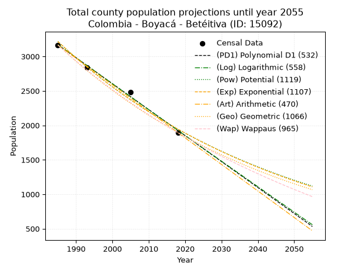
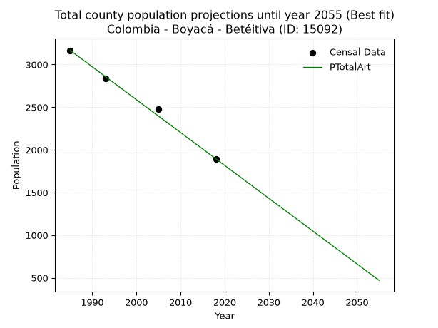
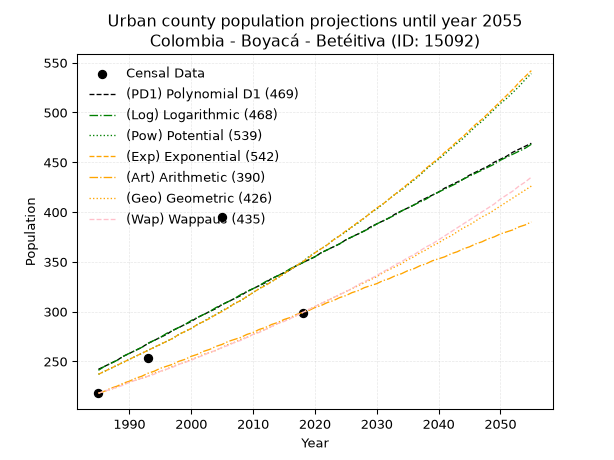
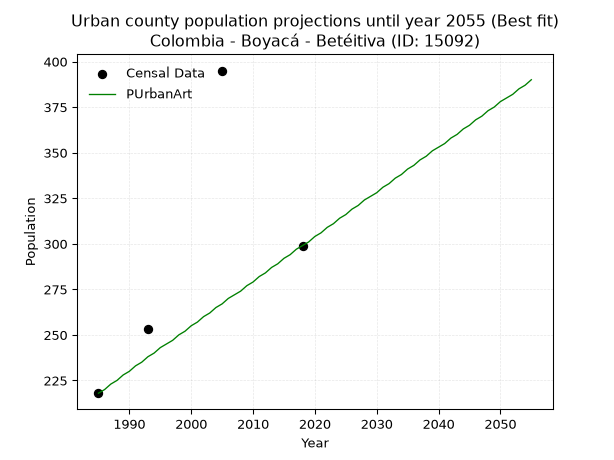
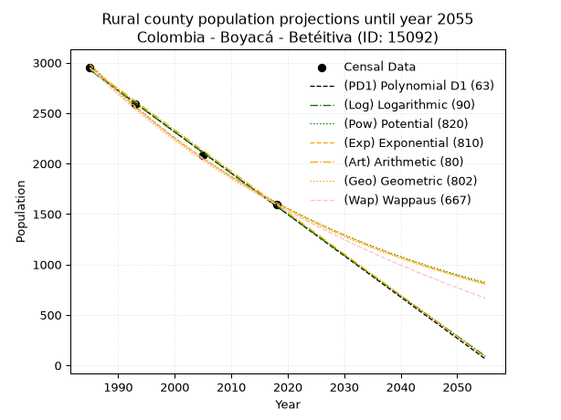
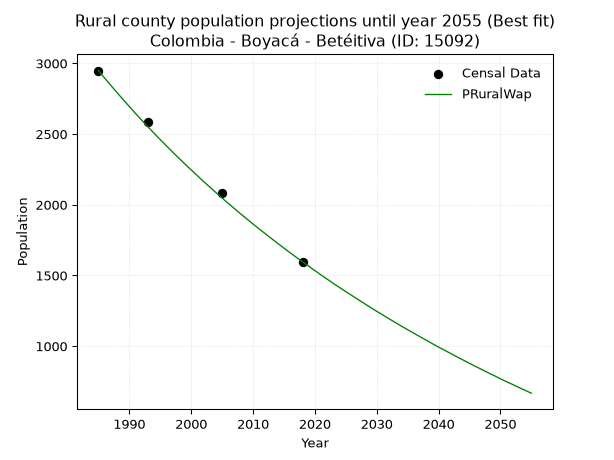

<div align="center">


</div>

# _“Population and Public Services Demand Projections (PPSD) until Year 2050 for Colombia - Boyacá - Betéitiva (ID: 15092)”_
Keywords: `population` `public-service` `projection` `lineal` `polynomial` `logarithmic` `potential` `exponential` `arithmetic` `geometric` `wappaus` `dane` `colombia` `south-america`

PPSD are analytical estimates used by governments and planners to anticipate future changes in population size, age distribution, and the resulting community needs for utilities, healthcare, education, and infrastructure as sizing future water treatment facilities, electrical grids, and road networks based on spatial growth.

> **General running parameters**: • app_version: _v20260806_. • Python version: _3.14.7_. • Pandas version: _3.0.5_. • NumPy version: _2.5.1_. • Creates, save and include plots into reports (create_plot): _False_. • Projection until year: _2050_. • Process polynomial degree 2 and up: _False_. • Process Wappaus: _True_. • Process Wappaus: _True_. • Set negative values to zero: _True_. • Set infinite values to zero: _True_. • Drop dataset notes: _True_. 
<div align="center">

Dynamic map: [:earth_americas:Google](http://maps.google.com/maps?q=5.909977519,-72.8090138) [:earth_americas:OSM](https://www.openstreetmap.org/#map=18/5.909977519/-72.8090138&layers=P) [:earth_americas:Bing](https://www.bing.com/maps?cp=5.909977519~-72.8090138&lvl=18) [:earth_americas:Apple](https://maps.apple.com/frame?center=5.909977519%2C-72.8090138&span=0.003%2C0.006)

</div>


<div align="center">

```geojson
{
  "type": "Feature",
  "geometry": {
    "type": "Point", 
    "coordinates": [-72.8090138, 5.909977519]
  }, 
  "properties": {
    "Name": "Colombia - Boyacá - Betéitiva (ID: 15092)"
  }
}
```

</div>


## 0. Census Data (4 records)

Census data are official statistics collected by a government about the people and housing in a country. They usually include counts of total population, age, sex, race, income, education, and jobs.

📅Global census file: [Population.xlsx](../data/Population.xlsx)

| Source   |   Year |   CountryID | CountryName   |   StateID | StateName   |   CountyID | CountyName   |   PTotal |   PUrban |   PRural |
|:---------|-------:|------------:|:--------------|----------:|:------------|-----------:|:-------------|---------:|---------:|---------:|
| DANE     |   1985 |          57 | Colombia      |        15 | Boyacá      |      15092 | Betéitiva    |     3166 |      218 |     2948 |
| DANE     |   1993 |          57 | Colombia      |        15 | Boyacá      |      15092 | Betéitiva    |     2840 |      253 |     2587 |
| DANE     |   2005 |          57 | Colombia      |        15 | Boyacá      |      15092 | Betéitiva    |     2479 |      395 |     2084 |
| DANE     |   2018 |          57 | Colombia      |        15 | Boyacá      |      15092 | Betéitiva    |     1895 |      299 |     1596 |

> 🔥Some records could had specific notes about the registered values or the corresponding urban or rural distribution.

## 1. Total

### 1.1. Coefficients and Parameters

* (PD1) Polynomial Deg 1: -37.67161782416662, 77947.65355278928 (lineal)
* (Log) Logarithmic: -75395.69680114253, 575678.2955686806
* (Pow) Potential: -30.475190795162238, 104.00734471478957
* (Exp) Exponential: -0.01522968158091458, 4.329279580812232e+16
* (Art) Arithmetic: Year diff. 2018 - 1985 = 33, Population diff. 1895 - 3166 = -1271, Annual growth = -38.515151515151516
* (Geo) Geometric: Year diff. 2018 - 1985 = 33, Population diff. 1895 - 3166 = -1271, Annual growth % = -0.015432710202120337
* (Wap) Wappaus: i = -1.5220372066845096, Condition values only valid for < 200)

<sub>
Wappaus condition values: ['-0.00', '-1.52', '-3.04', '-4.57', '-6.09', '-7.61', '-9.13', '-10.65', '-12.18', '-13.70', '-15.22', '-16.74', '-18.26', '-19.79', '-21.31', '-22.83', '-24.35', '-25.87', '-27.40', '-28.92', '-30.44', '-31.96', '-33.48', '-35.01', '-36.53', '-38.05', '-39.57', '-41.10', '-42.62', '-44.14', '-45.66', '-47.18', '-48.71', '-50.23', '-51.75', '-53.27', '-54.79', '-56.32', '-57.84', '-59.36', '-60.88', '-62.40', '-63.93', '-65.45', '-66.97', '-68.49', '-70.01', '-71.54', '-73.06', '-74.58', '-76.10', '-77.62', '-79.15', '-80.67', '-82.19', '-83.71', '-85.23', '-86.76', '-88.28', '-89.80', '-91.32', '-92.84', '-94.37', '-95.89', '-97.41', '-98.93']
</sub>


### 1.2. Projected Dataset

|   Year |   CountyID |   PTotalPD1 |   PTotalLog |   PTotalPow |   PTotalExp |   PTotalArt |   PTotalGeo |   PTotalWap |
|-------:|-----------:|------------:|------------:|------------:|------------:|------------:|------------:|------------:|
|   1985 |      15092 |        3169 |        3171 |        3217 |        3216 |        3166 |        3166 |        3166 |
|   1986 |      15092 |        3132 |        3133 |        3168 |        3167 |        3127 |        3117 |        3118 |
|   1987 |      15092 |        3094 |        3095 |        3120 |        3119 |        3089 |        3069 |        3071 |
|   1988 |      15092 |        3056 |        3057 |        3072 |        3072 |        3050 |        3022 |        3025 |
|   1989 |      15092 |        3019 |        3019 |        3026 |        3026 |        3012 |        2975 |        2979 |
|   1990 |      15092 |        2981 |        2981 |        2980 |        2980 |        2973 |        2929 |        2934 |
|   1991 |      15092 |        2943 |        2943 |        2934 |        2935 |        2935 |        2884 |        2889 |
|   1992 |      15092 |        2906 |        2905 |        2890 |        2891 |        2896 |        2839 |        2846 |
|   1993 |      15092 |        2868 |        2867 |        2846 |        2847 |        2858 |        2796 |        2803 |
|   1994 |      15092 |        2830 |        2829 |        2803 |        2804 |        2819 |        2752 |        2760 |
|   1995 |      15092 |        2793 |        2792 |        2760 |        2762 |        2781 |        2710 |        2718 |
|   1996 |      15092 |        2755 |        2754 |        2718 |        2720 |        2742 |        2668 |        2677 |
|   1997 |      15092 |        2717 |        2716 |        2677 |        2679 |        2704 |        2627 |        2636 |
|   1998 |      15092 |        2680 |        2678 |        2637 |        2638 |        2665 |        2586 |        2596 |
|   1999 |      15092 |        2642 |        2641 |        2597 |        2598 |        2627 |        2547 |        2556 |
|   2000 |      15092 |        2604 |        2603 |        2558 |        2559 |        2588 |        2507 |        2517 |
|   2001 |      15092 |        2567 |        2565 |        2519 |        2520 |        2550 |        2469 |        2479 |
|   2002 |      15092 |        2529 |        2528 |        2481 |        2482 |        2511 |        2430 |        2441 |
|   2003 |      15092 |        2491 |        2490 |        2443 |        2445 |        2473 |        2393 |        2403 |
|   2004 |      15092 |        2454 |        2452 |        2406 |        2408 |        2434 |        2356 |        2366 |
|   2005 |      15092 |        2416 |        2415 |        2370 |        2371 |        2396 |        2320 |        2330 |
|   2006 |      15092 |        2378 |        2377 |        2334 |        2336 |        2357 |        2284 |        2293 |
|   2007 |      15092 |        2341 |        2340 |        2299 |        2300 |        2319 |        2249 |        2258 |
|   2008 |      15092 |        2303 |        2302 |        2265 |        2266 |        2280 |        2214 |        2223 |
|   2009 |      15092 |        2265 |        2264 |        2230 |        2231 |        2242 |        2180 |        2188 |
|   2010 |      15092 |        2228 |        2227 |        2197 |        2198 |        2203 |        2146 |        2154 |
|   2011 |      15092 |        2190 |        2189 |        2164 |        2164 |        2165 |        2113 |        2120 |
|   2012 |      15092 |        2152 |        2152 |        2131 |        2132 |        2126 |        2080 |        2087 |
|   2013 |      15092 |        2115 |        2114 |        2099 |        2099 |        2088 |        2048 |        2054 |
|   2014 |      15092 |        2077 |        2077 |        2068 |        2068 |        2049 |        2017 |        2021 |
|   2015 |      15092 |        2039 |        2040 |        2037 |        2036 |        2011 |        1986 |        1989 |
|   2016 |      15092 |        2002 |        2002 |        2006 |        2006 |        1972 |        1955 |        1957 |
|   2017 |      15092 |        1964 |        1965 |        1976 |        1975 |        1934 |        1925 |        1926 |
|   2018 |      15092 |        1926 |        1927 |        1946 |        1945 |        1895 |        1895 |        1895 |
|   2019 |      15092 |        1889 |        1890 |        1917 |        1916 |        1856 |        1866 |        1864 |
|   2020 |      15092 |        1851 |        1853 |        1889 |        1887 |        1818 |        1837 |        1834 |
|   2021 |      15092 |        1813 |        1815 |        1860 |        1859 |        1779 |        1809 |        1804 |
|   2022 |      15092 |        1776 |        1778 |        1832 |        1831 |        1741 |        1781 |        1775 |
|   2023 |      15092 |        1738 |        1741 |        1805 |        1803 |        1702 |        1753 |        1746 |
|   2024 |      15092 |        1700 |        1704 |        1778 |        1776 |        1664 |        1726 |        1717 |
|   2025 |      15092 |        1663 |        1666 |        1752 |        1749 |        1625 |        1700 |        1688 |
|   2026 |      15092 |        1625 |        1629 |        1725 |        1722 |        1587 |        1673 |        1660 |
|   2027 |      15092 |        1587 |        1592 |        1700 |        1696 |        1548 |        1647 |        1632 |
|   2028 |      15092 |        1550 |        1555 |        1674 |        1671 |        1510 |        1622 |        1605 |
|   2029 |      15092 |        1512 |        1518 |        1649 |        1645 |        1471 |        1597 |        1578 |
|   2030 |      15092 |        1474 |        1480 |        1625 |        1621 |        1433 |        1572 |        1551 |
|   2031 |      15092 |        1437 |        1443 |        1600 |        1596 |        1394 |        1548 |        1524 |
|   2032 |      15092 |        1399 |        1406 |        1577 |        1572 |        1356 |        1524 |        1498 |
|   2033 |      15092 |        1361 |        1369 |        1553 |        1548 |        1317 |        1501 |        1472 |
|   2034 |      15092 |        1324 |        1332 |        1530 |        1525 |        1279 |        1478 |        1446 |
|   2035 |      15092 |        1286 |        1295 |        1507 |        1502 |        1240 |        1455 |        1421 |
|   2036 |      15092 |        1248 |        1258 |        1485 |        1479 |        1202 |        1432 |        1396 |
|   2037 |      15092 |        1211 |        1221 |        1463 |        1457 |        1163 |        1410 |        1371 |
|   2038 |      15092 |        1173 |        1184 |        1441 |        1435 |        1125 |        1388 |        1346 |
|   2039 |      15092 |        1135 |        1147 |        1420 |        1413 |        1086 |        1367 |        1322 |
|   2040 |      15092 |        1098 |        1110 |        1399 |        1392 |        1048 |        1346 |        1298 |
|   2041 |      15092 |        1060 |        1073 |        1378 |        1371 |        1009 |        1325 |        1274 |
|   2042 |      15092 |        1022 |        1036 |        1358 |        1350 |         971 |        1305 |        1250 |
|   2043 |      15092 |         985 |         999 |        1337 |        1329 |         932 |        1285 |        1227 |
|   2044 |      15092 |         947 |         962 |        1318 |        1309 |         894 |        1265 |        1204 |
|   2045 |      15092 |         909 |         925 |        1298 |        1290 |         855 |        1245 |        1181 |
|   2046 |      15092 |         872 |         888 |        1279 |        1270 |         817 |        1226 |        1158 |
|   2047 |      15092 |         834 |         852 |        1260 |        1251 |         778 |        1207 |        1136 |
|   2048 |      15092 |         796 |         815 |        1241 |        1232 |         740 |        1188 |        1114 |
|   2049 |      15092 |         759 |         778 |        1223 |        1213 |         701 |        1170 |        1092 |
|   2050 |      15092 |         721 |         741 |        1205 |        1195 |         663 |        1152 |        1070 |
<div align="center">

</img>

</div>


### 1.3. Best fit with absolute and relative error (%)

Relative error puts that difference into context by dividing the absolute error by the true value, creating a unitless ratio or percentage that shows the scale of the mistake.

Absolute and relative error

|   Year | Source   |   CountryID | CountryName   |   StateID | StateName   |   CountyID_x | CountyName   |   PTotal |   PUrban |   PRural |   CountyID_y |   PTotalPD1 |   PTotalLog |   PTotalPow |   PTotalExp |   PTotalArt |   PTotalGeo |   PTotalWap |   PTotalPD1AbsError |   PTotalLogAbsError |   PTotalPowAbsError |   PTotalExpAbsError |   PTotalArtAbsError |   PTotalGeoAbsError |   PTotalWapAbsError |   PTotalPD1RelError |   PTotalLogRelError |   PTotalPowRelError |   PTotalExpRelError |   PTotalArtRelError |   PTotalGeoRelError |   PTotalWapRelError |
|-------:|:---------|------------:|:--------------|----------:|:------------|-------------:|:-------------|---------:|---------:|---------:|-------------:|------------:|------------:|------------:|------------:|------------:|------------:|------------:|--------------------:|--------------------:|--------------------:|--------------------:|--------------------:|--------------------:|--------------------:|--------------------:|--------------------:|--------------------:|--------------------:|--------------------:|--------------------:|--------------------:|
|   1985 | DANE     |          57 | Colombia      |        15 | Boyacá      |        15092 | Betéitiva    |     3166 |      218 |     2948 |        15092 |        3169 |        3171 |        3217 |        3216 |        3166 |        3166 |        3166 |                   3 |                   5 |                  51 |                  50 |                   0 |                   0 |                   0 |           0.0947568 |            0.157928 |            1.61087  |            1.57928  |            0        |             0       |             0       |
|   1993 | DANE     |          57 | Colombia      |        15 | Boyacá      |        15092 | Betéitiva    |     2840 |      253 |     2587 |        15092 |        2868 |        2867 |        2846 |        2847 |        2858 |        2796 |        2803 |                  28 |                  27 |                   6 |                   7 |                  18 |                  44 |                  37 |           0.985915  |            0.950704 |            0.211268 |            0.246479 |            0.633803 |             1.5493  |             1.30282 |
|   2005 | DANE     |          57 | Colombia      |        15 | Boyacá      |        15092 | Betéitiva    |     2479 |      395 |     2084 |        15092 |        2416 |        2415 |        2370 |        2371 |        2396 |        2320 |        2330 |                  63 |                  64 |                 109 |                 108 |                  83 |                 159 |                 149 |           2.54135   |            2.58169  |            4.39693  |            4.3566   |            3.34812  |             6.41388 |             6.01049 |
|   2018 | DANE     |          57 | Colombia      |        15 | Boyacá      |        15092 | Betéitiva    |     1895 |      299 |     1596 |        15092 |        1926 |        1927 |        1946 |        1945 |        1895 |        1895 |        1895 |                  31 |                  32 |                  51 |                  50 |                   0 |                   0 |                   0 |           1.63588   |            1.68865  |            2.69129  |            2.63852  |            0        |             0       |             0       |

Relative error mean

| Method    |   RelError | Best   |
|:----------|-----------:|:-------|
| PTotalPD1 |   1.31448  |        |
| PTotalLog |   1.34474  |        |
| PTotalPow |   2.22759  |        |
| PTotalExp |   2.20522  |        |
| PTotalArt |   0.995482 | True   |
| PTotalGeo |   1.99079  |        |
| PTotalWap |   1.82833  |        |

💙Best method: _**PTotalArt**_
<div align="center">

</img>

</div>


### 1.4. Fresh water supply demand in liters per capita per day (lpcd)

The fresh water supply demand typically ranges from 100 to 300 liters per capita per day (lpcd) for standard domestic and municipal planning, though absolute survival minimums set by the World Health Organization are as low as 7.5 to 20 liters per day, and total consumption in high-income nations can exceed 400 liters.

> `CZ`: Level in meters above the sea level (masl).<br> `WS`: Fresh water supply demand in liters per capita per day (lpcd or l/h/d).<br> `WSAll`: Zonal fresh water supply demand in liters per second (l/s).<br> `A`: Zonal area in square meters.

Reference values (RAS Colombia)

|    CZ |   WS |
|------:|-----:|
|  1000 |  120 |
|  2000 |  130 |
| 99999 |  140 |

County shapefile geometry properties and water supply values

|   CountyID |      ATotal |   CZTotal |   WSTotal |
|-----------:|------------:|----------:|----------:|
|      15092 | 1.01666e+08 |   2791.54 |       140 |

Projected values for best method: PTotalArt

|   CountyID |   Year |   PTotalArt |   WSTotal |   WSTotalAll |
|-----------:|-------:|------------:|----------:|-------------:|
|      15092 |   1985 |        3166 |       140 |      5.13009 |
|      15092 |   1986 |        3127 |       140 |      5.0669  |
|      15092 |   1987 |        3089 |       140 |      5.00532 |
|      15092 |   1988 |        3050 |       140 |      4.94213 |
|      15092 |   1989 |        3012 |       140 |      4.88056 |
|      15092 |   1990 |        2973 |       140 |      4.81736 |
|      15092 |   1991 |        2935 |       140 |      4.75579 |
|      15092 |   1992 |        2896 |       140 |      4.69259 |
|      15092 |   1993 |        2858 |       140 |      4.63102 |
|      15092 |   1994 |        2819 |       140 |      4.56782 |
|      15092 |   1995 |        2781 |       140 |      4.50625 |
|      15092 |   1996 |        2742 |       140 |      4.44306 |
|      15092 |   1997 |        2704 |       140 |      4.38148 |
|      15092 |   1998 |        2665 |       140 |      4.31829 |
|      15092 |   1999 |        2627 |       140 |      4.25671 |
|      15092 |   2000 |        2588 |       140 |      4.19352 |
|      15092 |   2001 |        2550 |       140 |      4.13194 |
|      15092 |   2002 |        2511 |       140 |      4.06875 |
|      15092 |   2003 |        2473 |       140 |      4.00718 |
|      15092 |   2004 |        2434 |       140 |      3.94398 |
|      15092 |   2005 |        2396 |       140 |      3.88241 |
|      15092 |   2006 |        2357 |       140 |      3.81921 |
|      15092 |   2007 |        2319 |       140 |      3.75764 |
|      15092 |   2008 |        2280 |       140 |      3.69444 |
|      15092 |   2009 |        2242 |       140 |      3.63287 |
|      15092 |   2010 |        2203 |       140 |      3.56968 |
|      15092 |   2011 |        2165 |       140 |      3.5081  |
|      15092 |   2012 |        2126 |       140 |      3.44491 |
|      15092 |   2013 |        2088 |       140 |      3.38333 |
|      15092 |   2014 |        2049 |       140 |      3.32014 |
|      15092 |   2015 |        2011 |       140 |      3.25856 |
|      15092 |   2016 |        1972 |       140 |      3.19537 |
|      15092 |   2017 |        1934 |       140 |      3.1338  |
|      15092 |   2018 |        1895 |       140 |      3.0706  |
|      15092 |   2019 |        1856 |       140 |      3.00741 |
|      15092 |   2020 |        1818 |       140 |      2.94583 |
|      15092 |   2021 |        1779 |       140 |      2.88264 |
|      15092 |   2022 |        1741 |       140 |      2.82106 |
|      15092 |   2023 |        1702 |       140 |      2.75787 |
|      15092 |   2024 |        1664 |       140 |      2.6963  |
|      15092 |   2025 |        1625 |       140 |      2.6331  |
|      15092 |   2026 |        1587 |       140 |      2.57153 |
|      15092 |   2027 |        1548 |       140 |      2.50833 |
|      15092 |   2028 |        1510 |       140 |      2.44676 |
|      15092 |   2029 |        1471 |       140 |      2.38356 |
|      15092 |   2030 |        1433 |       140 |      2.32199 |
|      15092 |   2031 |        1394 |       140 |      2.2588  |
|      15092 |   2032 |        1356 |       140 |      2.19722 |
|      15092 |   2033 |        1317 |       140 |      2.13403 |
|      15092 |   2034 |        1279 |       140 |      2.07245 |
|      15092 |   2035 |        1240 |       140 |      2.00926 |
|      15092 |   2036 |        1202 |       140 |      1.94769 |
|      15092 |   2037 |        1163 |       140 |      1.88449 |
|      15092 |   2038 |        1125 |       140 |      1.82292 |
|      15092 |   2039 |        1086 |       140 |      1.75972 |
|      15092 |   2040 |        1048 |       140 |      1.69815 |
|      15092 |   2041 |        1009 |       140 |      1.63495 |
|      15092 |   2042 |         971 |       140 |      1.57338 |
|      15092 |   2043 |         932 |       140 |      1.51019 |
|      15092 |   2044 |         894 |       140 |      1.44861 |
|      15092 |   2045 |         855 |       140 |      1.38542 |
|      15092 |   2046 |         817 |       140 |      1.32384 |
|      15092 |   2047 |         778 |       140 |      1.26065 |
|      15092 |   2048 |         740 |       140 |      1.19907 |
|      15092 |   2049 |         701 |       140 |      1.13588 |
|      15092 |   2050 |         663 |       140 |      1.07431 |

## 2. Urban

### 2.1. Coefficients and Parameters

* (PD1) Polynomial Deg 1: 3.251304696908924, -6212.172219992075 (lineal)
* (Log) Logarithmic: 6523.930604890285, -49297.19880726991
* (Pow) Potential: 23.68255194877485, -75.72443867580327
* (Exp) Exponential: 0.011805631971348029, 1.5773857147104212e-08
* (Art) Arithmetic: Year diff. 2018 - 1985 = 33, Population diff. 299 - 218 = 81, Annual growth = 2.4545454545454546
* (Geo) Geometric: Year diff. 2018 - 1985 = 33, Population diff. 299 - 218 = 81, Annual growth % = 0.00962017653882108
* (Wap) Wappaus: i = 0.9495340249692281, Condition values only valid for < 200)

<sub>
Wappaus condition values: ['0.00', '0.95', '1.90', '2.85', '3.80', '4.75', '5.70', '6.65', '7.60', '8.55', '9.50', '10.44', '11.39', '12.34', '13.29', '14.24', '15.19', '16.14', '17.09', '18.04', '18.99', '19.94', '20.89', '21.84', '22.79', '23.74', '24.69', '25.64', '26.59', '27.54', '28.49', '29.44', '30.39', '31.33', '32.28', '33.23', '34.18', '35.13', '36.08', '37.03', '37.98', '38.93', '39.88', '40.83', '41.78', '42.73', '43.68', '44.63', '45.58', '46.53', '47.48', '48.43', '49.38', '50.33', '51.27', '52.22', '53.17', '54.12', '55.07', '56.02', '56.97', '57.92', '58.87', '59.82', '60.77', '61.72']
</sub>


### 2.2. Projected Dataset

|   Year |   CountyID |   PUrbanPD1 |   PUrbanLog |   PUrbanPow |   PUrbanExp |   PUrbanArt |   PUrbanGeo |   PUrbanWap |
|-------:|-----------:|------------:|------------:|------------:|------------:|------------:|------------:|------------:|
|   1985 |      15092 |         242 |         241 |         237 |         237 |         218 |         218 |         218 |
|   1986 |      15092 |         245 |         245 |         240 |         240 |         220 |         220 |         220 |
|   1987 |      15092 |         248 |         248 |         243 |         243 |         223 |         222 |         222 |
|   1988 |      15092 |         251 |         251 |         246 |         246 |         225 |         224 |         224 |
|   1989 |      15092 |         255 |         255 |         249 |         249 |         228 |         227 |         226 |
|   1990 |      15092 |         258 |         258 |         252 |         252 |         230 |         229 |         229 |
|   1991 |      15092 |         261 |         261 |         255 |         255 |         233 |         231 |         231 |
|   1992 |      15092 |         264 |         264 |         258 |         258 |         235 |         233 |         233 |
|   1993 |      15092 |         268 |         268 |         261 |         261 |         238 |         235 |         235 |
|   1994 |      15092 |         271 |         271 |         264 |         264 |         240 |         238 |         237 |
|   1995 |      15092 |         274 |         274 |         267 |         267 |         243 |         240 |         240 |
|   1996 |      15092 |         277 |         278 |         270 |         270 |         245 |         242 |         242 |
|   1997 |      15092 |         281 |         281 |         273 |         273 |         247 |         245 |         244 |
|   1998 |      15092 |         284 |         284 |         277 |         277 |         250 |         247 |         247 |
|   1999 |      15092 |         287 |         287 |         280 |         280 |         252 |         249 |         249 |
|   2000 |      15092 |         290 |         291 |         283 |         283 |         255 |         252 |         251 |
|   2001 |      15092 |         294 |         294 |         287 |         287 |         257 |         254 |         254 |
|   2002 |      15092 |         297 |         297 |         290 |         290 |         260 |         257 |         256 |
|   2003 |      15092 |         300 |         300 |         294 |         293 |         262 |         259 |         259 |
|   2004 |      15092 |         303 |         304 |         297 |         297 |         265 |         261 |         261 |
|   2005 |      15092 |         307 |         307 |         301 |         300 |         267 |         264 |         264 |
|   2006 |      15092 |         310 |         310 |         304 |         304 |         270 |         267 |         266 |
|   2007 |      15092 |         313 |         313 |         308 |         308 |         272 |         269 |         269 |
|   2008 |      15092 |         316 |         317 |         311 |         311 |         274 |         272 |         271 |
|   2009 |      15092 |         320 |         320 |         315 |         315 |         277 |         274 |         274 |
|   2010 |      15092 |         323 |         323 |         319 |         319 |         279 |         277 |         277 |
|   2011 |      15092 |         326 |         326 |         323 |         323 |         282 |         280 |         279 |
|   2012 |      15092 |         329 |         330 |         327 |         326 |         284 |         282 |         282 |
|   2013 |      15092 |         333 |         333 |         330 |         330 |         287 |         285 |         285 |
|   2014 |      15092 |         336 |         336 |         334 |         334 |         289 |         288 |         288 |
|   2015 |      15092 |         339 |         339 |         338 |         338 |         292 |         291 |         290 |
|   2016 |      15092 |         342 |         343 |         342 |         342 |         294 |         293 |         293 |
|   2017 |      15092 |         346 |         346 |         346 |         346 |         297 |         296 |         296 |
|   2018 |      15092 |         349 |         349 |         350 |         350 |         299 |         299 |         299 |
|   2019 |      15092 |         352 |         352 |         355 |         354 |         301 |         302 |         302 |
|   2020 |      15092 |         355 |         355 |         359 |         359 |         304 |         305 |         305 |
|   2021 |      15092 |         359 |         359 |         363 |         363 |         306 |         308 |         308 |
|   2022 |      15092 |         362 |         362 |         367 |         367 |         309 |         311 |         311 |
|   2023 |      15092 |         365 |         365 |         372 |         372 |         311 |         314 |         314 |
|   2024 |      15092 |         368 |         368 |         376 |         376 |         314 |         317 |         317 |
|   2025 |      15092 |         372 |         372 |         380 |         381 |         316 |         320 |         320 |
|   2026 |      15092 |         375 |         375 |         385 |         385 |         319 |         323 |         323 |
|   2027 |      15092 |         378 |         378 |         389 |         390 |         321 |         326 |         327 |
|   2028 |      15092 |         381 |         381 |         394 |         394 |         324 |         329 |         330 |
|   2029 |      15092 |         385 |         384 |         399 |         399 |         326 |         332 |         333 |
|   2030 |      15092 |         388 |         388 |         403 |         404 |         328 |         335 |         336 |
|   2031 |      15092 |         391 |         391 |         408 |         408 |         331 |         339 |         340 |
|   2032 |      15092 |         394 |         394 |         413 |         413 |         333 |         342 |         343 |
|   2033 |      15092 |         398 |         397 |         418 |         418 |         336 |         345 |         347 |
|   2034 |      15092 |         401 |         401 |         422 |         423 |         338 |         348 |         350 |
|   2035 |      15092 |         404 |         404 |         427 |         428 |         341 |         352 |         354 |
|   2036 |      15092 |         407 |         407 |         432 |         433 |         343 |         355 |         357 |
|   2037 |      15092 |         411 |         410 |         437 |         438 |         346 |         359 |         361 |
|   2038 |      15092 |         414 |         413 |         443 |         444 |         348 |         362 |         365 |
|   2039 |      15092 |         417 |         417 |         448 |         449 |         351 |         366 |         368 |
|   2040 |      15092 |         420 |         420 |         453 |         454 |         353 |         369 |         372 |
|   2041 |      15092 |         424 |         423 |         458 |         460 |         355 |         373 |         376 |
|   2042 |      15092 |         427 |         426 |         464 |         465 |         358 |         376 |         380 |
|   2043 |      15092 |         430 |         429 |         469 |         471 |         360 |         380 |         384 |
|   2044 |      15092 |         433 |         433 |         474 |         476 |         363 |         384 |         388 |
|   2045 |      15092 |         437 |         436 |         480 |         482 |         365 |         387 |         392 |
|   2046 |      15092 |         440 |         439 |         486 |         488 |         368 |         391 |         396 |
|   2047 |      15092 |         443 |         442 |         491 |         493 |         370 |         395 |         400 |
|   2048 |      15092 |         446 |         445 |         497 |         499 |         373 |         398 |         404 |
|   2049 |      15092 |         450 |         448 |         503 |         505 |         375 |         402 |         408 |
|   2050 |      15092 |         453 |         452 |         509 |         511 |         378 |         406 |         413 |
<div align="center">

</img>

</div>


### 2.3. Best fit with absolute and relative error (%)

Relative error puts that difference into context by dividing the absolute error by the true value, creating a unitless ratio or percentage that shows the scale of the mistake.

Absolute and relative error

|   Year | Source   |   CountryID | CountryName   |   StateID | StateName   |   CountyID_x | CountyName   |   PTotal |   PUrban |   PRural |   CountyID_y |   PUrbanPD1 |   PUrbanLog |   PUrbanPow |   PUrbanExp |   PUrbanArt |   PUrbanGeo |   PUrbanWap |   PUrbanPD1AbsError |   PUrbanLogAbsError |   PUrbanPowAbsError |   PUrbanExpAbsError |   PUrbanArtAbsError |   PUrbanGeoAbsError |   PUrbanWapAbsError |   PUrbanPD1RelError |   PUrbanLogRelError |   PUrbanPowRelError |   PUrbanExpRelError |   PUrbanArtRelError |   PUrbanGeoRelError |   PUrbanWapRelError |
|-------:|:---------|------------:|:--------------|----------:|:------------|-------------:|:-------------|---------:|---------:|---------:|-------------:|------------:|------------:|------------:|------------:|------------:|------------:|------------:|--------------------:|--------------------:|--------------------:|--------------------:|--------------------:|--------------------:|--------------------:|--------------------:|--------------------:|--------------------:|--------------------:|--------------------:|--------------------:|--------------------:|
|   1985 | DANE     |          57 | Colombia      |        15 | Boyacá      |        15092 | Betéitiva    |     3166 |      218 |     2948 |        15092 |         242 |         241 |         237 |         237 |         218 |         218 |         218 |                  24 |                  23 |                  19 |                  19 |                   0 |                   0 |                   0 |            11.0092  |            10.5505  |             8.7156  |             8.7156  |             0       |             0       |             0       |
|   1993 | DANE     |          57 | Colombia      |        15 | Boyacá      |        15092 | Betéitiva    |     2840 |      253 |     2587 |        15092 |         268 |         268 |         261 |         261 |         238 |         235 |         235 |                  15 |                  15 |                   8 |                   8 |                  15 |                  18 |                  18 |             5.92885 |             5.92885 |             3.16206 |             3.16206 |             5.92885 |             7.11462 |             7.11462 |
|   2005 | DANE     |          57 | Colombia      |        15 | Boyacá      |        15092 | Betéitiva    |     2479 |      395 |     2084 |        15092 |         307 |         307 |         301 |         300 |         267 |         264 |         264 |                  88 |                  88 |                  94 |                  95 |                 128 |                 131 |                 131 |            22.2785  |            22.2785  |            23.7975  |            24.0506  |            32.4051  |            33.1646  |            33.1646  |
|   2018 | DANE     |          57 | Colombia      |        15 | Boyacá      |        15092 | Betéitiva    |     1895 |      299 |     1596 |        15092 |         349 |         349 |         350 |         350 |         299 |         299 |         299 |                  50 |                  50 |                  51 |                  51 |                   0 |                   0 |                   0 |            16.7224  |            16.7224  |            17.0569  |            17.0569  |             0       |             0       |             0       |

Relative error mean

| Method    |   RelError | Best   |
|:----------|-----------:|:-------|
| PUrbanPD1 |   13.9847  |        |
| PUrbanLog |   13.8701  |        |
| PUrbanPow |   13.183   |        |
| PUrbanExp |   13.2463  |        |
| PUrbanArt |    9.58348 | True   |
| PUrbanGeo |   10.0698  |        |
| PUrbanWap |   10.0698  |        |

💙Best method: _**PUrbanArt**_
<div align="center">

</img>

</div>


### 2.4. Fresh water supply demand in liters per capita per day (lpcd)

The fresh water supply demand typically ranges from 100 to 300 liters per capita per day (lpcd) for standard domestic and municipal planning, though absolute survival minimums set by the World Health Organization are as low as 7.5 to 20 liters per day, and total consumption in high-income nations can exceed 400 liters.

> `CZ`: Level in meters above the sea level (masl).<br> `WS`: Fresh water supply demand in liters per capita per day (lpcd or l/h/d).<br> `WSAll`: Zonal fresh water supply demand in liters per second (l/s).<br> `A`: Zonal area in square meters.

Reference values (RAS Colombia)

|    CZ |   WS |
|------:|-----:|
|  1000 |  120 |
|  2000 |  130 |
| 99999 |  140 |

County shapefile geometry properties and water supply values

|   CountyID |   AUrban |   CZUrban |   WSUrban |
|-----------:|---------:|----------:|----------:|
|      15092 |   168200 |   2600.15 |       140 |

Projected values for best method: PUrbanArt

|   CountyID |   Year |   PUrbanArt |   WSUrban |   WSUrbanAll |
|-----------:|-------:|------------:|----------:|-------------:|
|      15092 |   1985 |         218 |       140 |     0.353241 |
|      15092 |   1986 |         220 |       140 |     0.356481 |
|      15092 |   1987 |         223 |       140 |     0.361343 |
|      15092 |   1988 |         225 |       140 |     0.364583 |
|      15092 |   1989 |         228 |       140 |     0.369444 |
|      15092 |   1990 |         230 |       140 |     0.372685 |
|      15092 |   1991 |         233 |       140 |     0.377546 |
|      15092 |   1992 |         235 |       140 |     0.380787 |
|      15092 |   1993 |         238 |       140 |     0.385648 |
|      15092 |   1994 |         240 |       140 |     0.388889 |
|      15092 |   1995 |         243 |       140 |     0.39375  |
|      15092 |   1996 |         245 |       140 |     0.396991 |
|      15092 |   1997 |         247 |       140 |     0.400231 |
|      15092 |   1998 |         250 |       140 |     0.405093 |
|      15092 |   1999 |         252 |       140 |     0.408333 |
|      15092 |   2000 |         255 |       140 |     0.413194 |
|      15092 |   2001 |         257 |       140 |     0.416435 |
|      15092 |   2002 |         260 |       140 |     0.421296 |
|      15092 |   2003 |         262 |       140 |     0.424537 |
|      15092 |   2004 |         265 |       140 |     0.429398 |
|      15092 |   2005 |         267 |       140 |     0.432639 |
|      15092 |   2006 |         270 |       140 |     0.4375   |
|      15092 |   2007 |         272 |       140 |     0.440741 |
|      15092 |   2008 |         274 |       140 |     0.443981 |
|      15092 |   2009 |         277 |       140 |     0.448843 |
|      15092 |   2010 |         279 |       140 |     0.452083 |
|      15092 |   2011 |         282 |       140 |     0.456944 |
|      15092 |   2012 |         284 |       140 |     0.460185 |
|      15092 |   2013 |         287 |       140 |     0.465046 |
|      15092 |   2014 |         289 |       140 |     0.468287 |
|      15092 |   2015 |         292 |       140 |     0.473148 |
|      15092 |   2016 |         294 |       140 |     0.476389 |
|      15092 |   2017 |         297 |       140 |     0.48125  |
|      15092 |   2018 |         299 |       140 |     0.484491 |
|      15092 |   2019 |         301 |       140 |     0.487731 |
|      15092 |   2020 |         304 |       140 |     0.492593 |
|      15092 |   2021 |         306 |       140 |     0.495833 |
|      15092 |   2022 |         309 |       140 |     0.500694 |
|      15092 |   2023 |         311 |       140 |     0.503935 |
|      15092 |   2024 |         314 |       140 |     0.508796 |
|      15092 |   2025 |         316 |       140 |     0.512037 |
|      15092 |   2026 |         319 |       140 |     0.516898 |
|      15092 |   2027 |         321 |       140 |     0.520139 |
|      15092 |   2028 |         324 |       140 |     0.525    |
|      15092 |   2029 |         326 |       140 |     0.528241 |
|      15092 |   2030 |         328 |       140 |     0.531481 |
|      15092 |   2031 |         331 |       140 |     0.536343 |
|      15092 |   2032 |         333 |       140 |     0.539583 |
|      15092 |   2033 |         336 |       140 |     0.544444 |
|      15092 |   2034 |         338 |       140 |     0.547685 |
|      15092 |   2035 |         341 |       140 |     0.552546 |
|      15092 |   2036 |         343 |       140 |     0.555787 |
|      15092 |   2037 |         346 |       140 |     0.560648 |
|      15092 |   2038 |         348 |       140 |     0.563889 |
|      15092 |   2039 |         351 |       140 |     0.56875  |
|      15092 |   2040 |         353 |       140 |     0.571991 |
|      15092 |   2041 |         355 |       140 |     0.575231 |
|      15092 |   2042 |         358 |       140 |     0.580093 |
|      15092 |   2043 |         360 |       140 |     0.583333 |
|      15092 |   2044 |         363 |       140 |     0.588194 |
|      15092 |   2045 |         365 |       140 |     0.591435 |
|      15092 |   2046 |         368 |       140 |     0.596296 |
|      15092 |   2047 |         370 |       140 |     0.599537 |
|      15092 |   2048 |         373 |       140 |     0.604398 |
|      15092 |   2049 |         375 |       140 |     0.607639 |
|      15092 |   2050 |         378 |       140 |     0.6125   |

## 3. Rural

### 3.1. Coefficients and Parameters

* (PD1) Polynomial Deg 1: -40.92292252107553, 84159.82577278133 (lineal)
* (Log) Logarithmic: -81919.62740603283, 624975.4943759507
* (Pow) Potential: -37.25539278411884, 126.33394055110183
* (Exp) Exponential: -0.018614686809302623, 3.323504097930448e+19
* (Art) Arithmetic: Year diff. 2018 - 1985 = 33, Population diff. 1596 - 2948 = -1352, Annual growth = -40.96969696969697
* (Geo) Geometric: Year diff. 2018 - 1985 = 33, Population diff. 1596 - 2948 = -1352, Annual growth % = -0.01842292607051188
* (Wap) Wappaus: i = -1.8032437046521554, Condition values only valid for < 200)

<sub>
Wappaus condition values: ['-0.00', '-1.80', '-3.61', '-5.41', '-7.21', '-9.02', '-10.82', '-12.62', '-14.43', '-16.23', '-18.03', '-19.84', '-21.64', '-23.44', '-25.25', '-27.05', '-28.85', '-30.66', '-32.46', '-34.26', '-36.06', '-37.87', '-39.67', '-41.47', '-43.28', '-45.08', '-46.88', '-48.69', '-50.49', '-52.29', '-54.10', '-55.90', '-57.70', '-59.51', '-61.31', '-63.11', '-64.92', '-66.72', '-68.52', '-70.33', '-72.13', '-73.93', '-75.74', '-77.54', '-79.34', '-81.15', '-82.95', '-84.75', '-86.56', '-88.36', '-90.16', '-91.97', '-93.77', '-95.57', '-97.38', '-99.18', '-100.98', '-102.78', '-104.59', '-106.39', '-108.19', '-110.00', '-111.80', '-113.60', '-115.41', '-117.21']
</sub>


### 3.2. Projected Dataset

|   Year |   CountyID |   PRuralPD1 |   PRuralLog |   PRuralPow |   PRuralExp |   PRuralArt |   PRuralGeo |   PRuralWap |
|-------:|-----------:|------------:|------------:|------------:|------------:|------------:|------------:|------------:|
|   1985 |      15092 |        2928 |        2929 |        2982 |        2981 |        2948 |        2948 |        2948 |
|   1986 |      15092 |        2887 |        2888 |        2927 |        2926 |        2907 |        2894 |        2895 |
|   1987 |      15092 |        2846 |        2847 |        2873 |        2872 |        2866 |        2840 |        2844 |
|   1988 |      15092 |        2805 |        2805 |        2819 |        2819 |        2825 |        2788 |        2793 |
|   1989 |      15092 |        2764 |        2764 |        2767 |        2767 |        2784 |        2737 |        2743 |
|   1990 |      15092 |        2723 |        2723 |        2716 |        2716 |        2743 |        2686 |        2694 |
|   1991 |      15092 |        2682 |        2682 |        2665 |        2666 |        2702 |        2637 |        2645 |
|   1992 |      15092 |        2641 |        2641 |        2616 |        2617 |        2661 |        2588 |        2598 |
|   1993 |      15092 |        2600 |        2600 |        2567 |        2568 |        2620 |        2541 |        2551 |
|   1994 |      15092 |        2560 |        2559 |        2520 |        2521 |        2579 |        2494 |        2505 |
|   1995 |      15092 |        2519 |        2517 |        2473 |        2475 |        2538 |        2448 |        2460 |
|   1996 |      15092 |        2478 |        2476 |        2428 |        2429 |        2497 |        2403 |        2416 |
|   1997 |      15092 |        2437 |        2435 |        2383 |        2384 |        2456 |        2358 |        2372 |
|   1998 |      15092 |        2396 |        2394 |        2339 |        2340 |        2415 |        2315 |        2329 |
|   1999 |      15092 |        2355 |        2353 |        2295 |        2297 |        2374 |        2272 |        2287 |
|   2000 |      15092 |        2314 |        2312 |        2253 |        2255 |        2333 |        2230 |        2246 |
|   2001 |      15092 |        2273 |        2271 |        2211 |        2213 |        2292 |        2189 |        2205 |
|   2002 |      15092 |        2232 |        2231 |        2171 |        2172 |        2252 |        2149 |        2164 |
|   2003 |      15092 |        2191 |        2190 |        2131 |        2132 |        2211 |        2109 |        2125 |
|   2004 |      15092 |        2150 |        2149 |        2091 |        2093 |        2170 |        2071 |        2086 |
|   2005 |      15092 |        2109 |        2108 |        2053 |        2054 |        2129 |        2032 |        2047 |
|   2006 |      15092 |        2068 |        2067 |        2015 |        2016 |        2088 |        1995 |        2009 |
|   2007 |      15092 |        2028 |        2026 |        1978 |        1979 |        2047 |        1958 |        1972 |
|   2008 |      15092 |        1987 |        1985 |        1942 |        1943 |        2006 |        1922 |        1935 |
|   2009 |      15092 |        1946 |        1945 |        1906 |        1907 |        1965 |        1887 |        1899 |
|   2010 |      15092 |        1905 |        1904 |        1871 |        1872 |        1924 |        1852 |        1863 |
|   2011 |      15092 |        1864 |        1863 |        1837 |        1837 |        1883 |        1818 |        1828 |
|   2012 |      15092 |        1823 |        1822 |        1803 |        1803 |        1842 |        1784 |        1794 |
|   2013 |      15092 |        1782 |        1782 |        1770 |        1770 |        1801 |        1752 |        1760 |
|   2014 |      15092 |        1741 |        1741 |        1737 |        1737 |        1760 |        1719 |        1726 |
|   2015 |      15092 |        1700 |        1700 |        1706 |        1705 |        1719 |        1688 |        1693 |
|   2016 |      15092 |        1659 |        1660 |        1674 |        1674 |        1678 |        1656 |        1660 |
|   2017 |      15092 |        1618 |        1619 |        1644 |        1643 |        1637 |        1626 |        1628 |
|   2018 |      15092 |        1577 |        1578 |        1614 |        1613 |        1596 |        1596 |        1596 |
|   2019 |      15092 |        1536 |        1538 |        1584 |        1583 |        1555 |        1567 |        1565 |
|   2020 |      15092 |        1496 |        1497 |        1555 |        1554 |        1514 |        1538 |        1534 |
|   2021 |      15092 |        1455 |        1457 |        1527 |        1525 |        1473 |        1509 |        1503 |
|   2022 |      15092 |        1414 |        1416 |        1499 |        1497 |        1432 |        1482 |        1473 |
|   2023 |      15092 |        1373 |        1376 |        1472 |        1469 |        1391 |        1454 |        1443 |
|   2024 |      15092 |        1332 |        1335 |        1445 |        1442 |        1350 |        1428 |        1414 |
|   2025 |      15092 |        1291 |        1295 |        1418 |        1416 |        1309 |        1401 |        1385 |
|   2026 |      15092 |        1250 |        1254 |        1392 |        1390 |        1268 |        1375 |        1357 |
|   2027 |      15092 |        1209 |        1214 |        1367 |        1364 |        1227 |        1350 |        1329 |
|   2028 |      15092 |        1168 |        1173 |        1342 |        1339 |        1186 |        1325 |        1301 |
|   2029 |      15092 |        1127 |        1133 |        1318 |        1314 |        1145 |        1301 |        1273 |
|   2030 |      15092 |        1086 |        1093 |        1294 |        1290 |        1104 |        1277 |        1246 |
|   2031 |      15092 |        1045 |        1052 |        1270 |        1266 |        1063 |        1253 |        1220 |
|   2032 |      15092 |        1004 |        1012 |        1247 |        1243 |        1022 |        1230 |        1193 |
|   2033 |      15092 |         964 |         972 |        1225 |        1220 |         981 |        1208 |        1167 |
|   2034 |      15092 |         923 |         931 |        1202 |        1197 |         940 |        1185 |        1141 |
|   2035 |      15092 |         882 |         891 |        1181 |        1175 |         900 |        1163 |        1116 |
|   2036 |      15092 |         841 |         851 |        1159 |        1154 |         859 |        1142 |        1091 |
|   2037 |      15092 |         800 |         811 |        1138 |        1132 |         818 |        1121 |        1066 |
|   2038 |      15092 |         759 |         771 |        1117 |        1111 |         777 |        1100 |        1042 |
|   2039 |      15092 |         718 |         730 |        1097 |        1091 |         736 |        1080 |        1017 |
|   2040 |      15092 |         677 |         690 |        1077 |        1071 |         695 |        1060 |         993 |
|   2041 |      15092 |         636 |         650 |        1058 |        1051 |         654 |        1041 |         970 |
|   2042 |      15092 |         595 |         610 |        1039 |        1032 |         613 |        1021 |         947 |
|   2043 |      15092 |         554 |         570 |        1020 |        1013 |         572 |        1003 |         923 |
|   2044 |      15092 |         513 |         530 |        1002 |         994 |         531 |         984 |         901 |
|   2045 |      15092 |         472 |         490 |         983 |         976 |         490 |         966 |         878 |
|   2046 |      15092 |         432 |         450 |         966 |         958 |         449 |         948 |         856 |
|   2047 |      15092 |         391 |         410 |         948 |         940 |         408 |         931 |         834 |
|   2048 |      15092 |         350 |         370 |         931 |         923 |         367 |         914 |         812 |
|   2049 |      15092 |         309 |         330 |         914 |         906 |         326 |         897 |         791 |
|   2050 |      15092 |         268 |         290 |         898 |         889 |         285 |         880 |         769 |
<div align="center">

</img>

</div>


### 3.3. Best fit with absolute and relative error (%)

Relative error puts that difference into context by dividing the absolute error by the true value, creating a unitless ratio or percentage that shows the scale of the mistake.

Absolute and relative error

|   Year | Source   |   CountryID | CountryName   |   StateID | StateName   |   CountyID_x | CountyName   |   PTotal |   PUrban |   PRural |   CountyID_y |   PRuralPD1 |   PRuralLog |   PRuralPow |   PRuralExp |   PRuralArt |   PRuralGeo |   PRuralWap |   PRuralPD1AbsError |   PRuralLogAbsError |   PRuralPowAbsError |   PRuralExpAbsError |   PRuralArtAbsError |   PRuralGeoAbsError |   PRuralWapAbsError |   PRuralPD1RelError |   PRuralLogRelError |   PRuralPowRelError |   PRuralExpRelError |   PRuralArtRelError |   PRuralGeoRelError |   PRuralWapRelError |
|-------:|:---------|------------:|:--------------|----------:|:------------|-------------:|:-------------|---------:|---------:|---------:|-------------:|------------:|------------:|------------:|------------:|------------:|------------:|------------:|--------------------:|--------------------:|--------------------:|--------------------:|--------------------:|--------------------:|--------------------:|--------------------:|--------------------:|--------------------:|--------------------:|--------------------:|--------------------:|--------------------:|
|   1985 | DANE     |          57 | Colombia      |        15 | Boyacá      |        15092 | Betéitiva    |     3166 |      218 |     2948 |        15092 |        2928 |        2929 |        2982 |        2981 |        2948 |        2948 |        2948 |                  20 |                  19 |                  34 |                  33 |                   0 |                   0 |                   0 |            0.678426 |            0.644505 |            1.15332  |            1.1194   |             0       |             0       |             0       |
|   1993 | DANE     |          57 | Colombia      |        15 | Boyacá      |        15092 | Betéitiva    |     2840 |      253 |     2587 |        15092 |        2600 |        2600 |        2567 |        2568 |        2620 |        2541 |        2551 |                  13 |                  13 |                  20 |                  19 |                  33 |                  46 |                  36 |            0.502513 |            0.502513 |            0.773096 |            0.734441 |             1.27561 |             1.77812 |             1.39157 |
|   2005 | DANE     |          57 | Colombia      |        15 | Boyacá      |        15092 | Betéitiva    |     2479 |      395 |     2084 |        15092 |        2109 |        2108 |        2053 |        2054 |        2129 |        2032 |        2047 |                  25 |                  24 |                  31 |                  30 |                  45 |                  52 |                  37 |            1.19962  |            1.15163  |            1.48752  |            1.43954  |             2.15931 |             2.4952  |             1.77543 |
|   2018 | DANE     |          57 | Colombia      |        15 | Boyacá      |        15092 | Betéitiva    |     1895 |      299 |     1596 |        15092 |        1577 |        1578 |        1614 |        1613 |        1596 |        1596 |        1596 |                  19 |                  18 |                  18 |                  17 |                   0 |                   0 |                   0 |            1.19048  |            1.12782  |            1.12782  |            1.06516  |             0       |             0       |             0       |

Relative error mean

| Method    |   RelError | Best   |
|:----------|-----------:|:-------|
| PRuralPD1 |   0.892758 |        |
| PRuralLog |   0.856617 |        |
| PRuralPow |   1.13544  |        |
| PRuralExp |   1.08964  |        |
| PRuralArt |   0.858729 |        |
| PRuralGeo |   1.06833  |        |
| PRuralWap |   0.791751 | True   |

💙Best method: _**PRuralWap**_
<div align="center">

</img>

</div>


### 3.4. Fresh water supply demand in liters per capita per day (lpcd)

The fresh water supply demand typically ranges from 100 to 300 liters per capita per day (lpcd) for standard domestic and municipal planning, though absolute survival minimums set by the World Health Organization are as low as 7.5 to 20 liters per day, and total consumption in high-income nations can exceed 400 liters.

> `CZ`: Level in meters above the sea level (masl).<br> `WS`: Fresh water supply demand in liters per capita per day (lpcd or l/h/d).<br> `WSAll`: Zonal fresh water supply demand in liters per second (l/s).<br> `A`: Zonal area in square meters.

Reference values (RAS Colombia)

|    CZ |   WS |
|------:|-----:|
|  1000 |  120 |
|  2000 |  130 |
| 99999 |  140 |

County shapefile geometry properties and water supply values

|   CountyID |      ARural |   CZRural |   WSRural |
|-----------:|------------:|----------:|----------:|
|      15092 | 1.01498e+08 |   2791.82 |       140 |

Projected values for best method: PRuralWap

|   CountyID |   Year |   PRuralWap |   WSRural |   WSRuralAll |
|-----------:|-------:|------------:|----------:|-------------:|
|      15092 |   1985 |        2948 |       140 |      4.77685 |
|      15092 |   1986 |        2895 |       140 |      4.69097 |
|      15092 |   1987 |        2844 |       140 |      4.60833 |
|      15092 |   1988 |        2793 |       140 |      4.52569 |
|      15092 |   1989 |        2743 |       140 |      4.44468 |
|      15092 |   1990 |        2694 |       140 |      4.36528 |
|      15092 |   1991 |        2645 |       140 |      4.28588 |
|      15092 |   1992 |        2598 |       140 |      4.20972 |
|      15092 |   1993 |        2551 |       140 |      4.13356 |
|      15092 |   1994 |        2505 |       140 |      4.05903 |
|      15092 |   1995 |        2460 |       140 |      3.98611 |
|      15092 |   1996 |        2416 |       140 |      3.91481 |
|      15092 |   1997 |        2372 |       140 |      3.84352 |
|      15092 |   1998 |        2329 |       140 |      3.77384 |
|      15092 |   1999 |        2287 |       140 |      3.70579 |
|      15092 |   2000 |        2246 |       140 |      3.63935 |
|      15092 |   2001 |        2205 |       140 |      3.57292 |
|      15092 |   2002 |        2164 |       140 |      3.50648 |
|      15092 |   2003 |        2125 |       140 |      3.44329 |
|      15092 |   2004 |        2086 |       140 |      3.38009 |
|      15092 |   2005 |        2047 |       140 |      3.3169  |
|      15092 |   2006 |        2009 |       140 |      3.25532 |
|      15092 |   2007 |        1972 |       140 |      3.19537 |
|      15092 |   2008 |        1935 |       140 |      3.13542 |
|      15092 |   2009 |        1899 |       140 |      3.07708 |
|      15092 |   2010 |        1863 |       140 |      3.01875 |
|      15092 |   2011 |        1828 |       140 |      2.96204 |
|      15092 |   2012 |        1794 |       140 |      2.90694 |
|      15092 |   2013 |        1760 |       140 |      2.85185 |
|      15092 |   2014 |        1726 |       140 |      2.79676 |
|      15092 |   2015 |        1693 |       140 |      2.74329 |
|      15092 |   2016 |        1660 |       140 |      2.68981 |
|      15092 |   2017 |        1628 |       140 |      2.63796 |
|      15092 |   2018 |        1596 |       140 |      2.58611 |
|      15092 |   2019 |        1565 |       140 |      2.53588 |
|      15092 |   2020 |        1534 |       140 |      2.48565 |
|      15092 |   2021 |        1503 |       140 |      2.43542 |
|      15092 |   2022 |        1473 |       140 |      2.38681 |
|      15092 |   2023 |        1443 |       140 |      2.33819 |
|      15092 |   2024 |        1414 |       140 |      2.2912  |
|      15092 |   2025 |        1385 |       140 |      2.24421 |
|      15092 |   2026 |        1357 |       140 |      2.19884 |
|      15092 |   2027 |        1329 |       140 |      2.15347 |
|      15092 |   2028 |        1301 |       140 |      2.1081  |
|      15092 |   2029 |        1273 |       140 |      2.06273 |
|      15092 |   2030 |        1246 |       140 |      2.01898 |
|      15092 |   2031 |        1220 |       140 |      1.97685 |
|      15092 |   2032 |        1193 |       140 |      1.9331  |
|      15092 |   2033 |        1167 |       140 |      1.89097 |
|      15092 |   2034 |        1141 |       140 |      1.84884 |
|      15092 |   2035 |        1116 |       140 |      1.80833 |
|      15092 |   2036 |        1091 |       140 |      1.76782 |
|      15092 |   2037 |        1066 |       140 |      1.72731 |
|      15092 |   2038 |        1042 |       140 |      1.68843 |
|      15092 |   2039 |        1017 |       140 |      1.64792 |
|      15092 |   2040 |         993 |       140 |      1.60903 |
|      15092 |   2041 |         970 |       140 |      1.57176 |
|      15092 |   2042 |         947 |       140 |      1.53449 |
|      15092 |   2043 |         923 |       140 |      1.4956  |
|      15092 |   2044 |         901 |       140 |      1.45995 |
|      15092 |   2045 |         878 |       140 |      1.42269 |
|      15092 |   2046 |         856 |       140 |      1.38704 |
|      15092 |   2047 |         834 |       140 |      1.35139 |
|      15092 |   2048 |         812 |       140 |      1.31574 |
|      15092 |   2049 |         791 |       140 |      1.28171 |
|      15092 |   2050 |         769 |       140 |      1.24606 |

<div align="center"><br><sub>Share this research</sub></div><br>

<sub>**APPS & TOOLS & CONTENT DISCLAIMER**: • NO WARRANTY - This content and software is provided by <a href="https://github.com/rcfdtools" target="_blank">github.com/rcfdtools</a> "as is", without any express or implied warranty, including warranties of merchantability, fitness for a particular purpose, or non-infringement. There is no guarantee that the software will be error-free or operate without interruption. • LIMITATION OF LIABILITY - Neither the authors nor copyright holders will be liable for claims or damages arising from the software or its use. You are responsible for determining if the software is appropriate for your use and assume all associated risks, including errors, legal compliance, and data loss. • NO PROFESSIONAL ADVICE - The software provides general information and does not offer professional advice. It should not replace consultation with professional advisors. [Clauses and global license for rcfdtools use.](https://github.com/rcfdtools/rcfdtools/blob/main/LICENSE.md)</sub>

| [:house: Home](Readme.md)  | [:beginner: Help / Collaborate](https://github.com/rcfdtools/R.HydroTools/discussions/31) |
|----------------------------|-------------------------------------------------------------------------------------------|