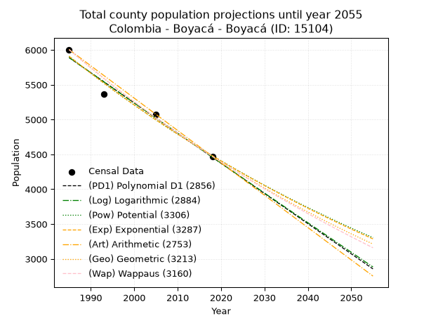
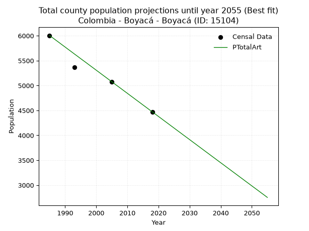
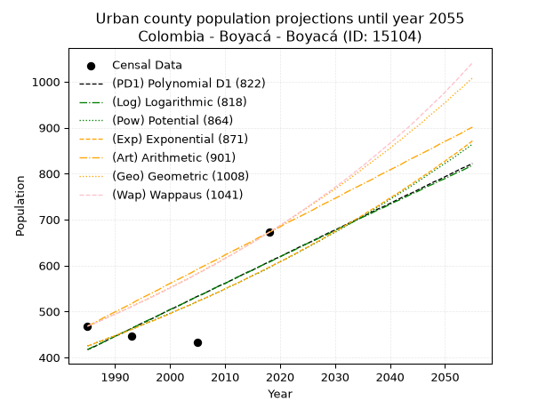
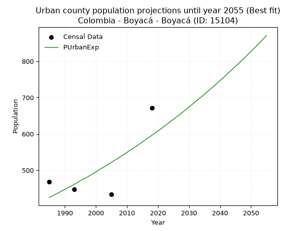
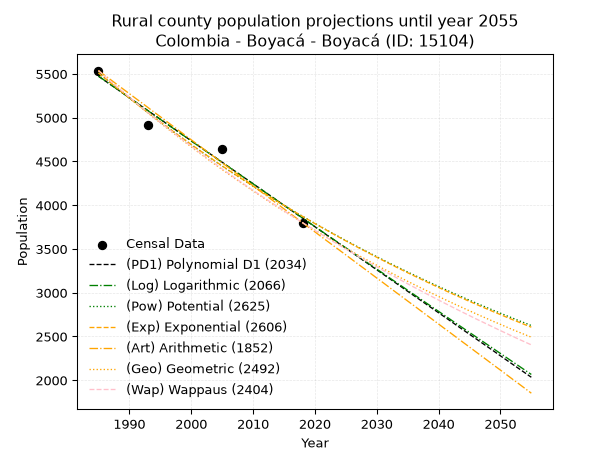
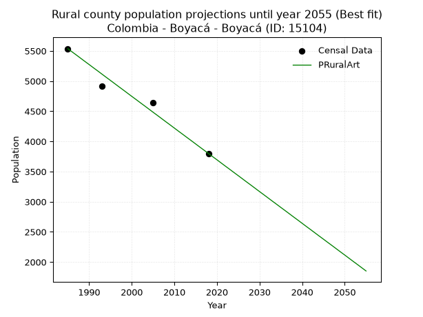

<div align="center">


</div>

# _“Population and Public Services Demand Projections (PPSD) until Year 2050 for Colombia - Boyacá - Boyacá (ID: 15104)”_
Keywords: `population` `public-service` `projection` `lineal` `polynomial` `logarithmic` `potential` `exponential` `arithmetic` `geometric` `wappaus` `dane` `colombia` `south-america`

PPSD are analytical estimates used by governments and planners to anticipate future changes in population size, age distribution, and the resulting community needs for utilities, healthcare, education, and infrastructure as sizing future water treatment facilities, electrical grids, and road networks based on spatial growth.

> **General running parameters**: • app_version: _v20260806_. • Python version: _3.14.7_. • Pandas version: _3.0.5_. • NumPy version: _2.5.1_. • Creates, save and include plots into reports (create_plot): _False_. • Projection until year: _2050_. • Process polynomial degree 2 and up: _False_. • Process Wappaus: _True_. • Process Wappaus: _True_. • Set negative values to zero: _True_. • Set infinite values to zero: _True_. • Drop dataset notes: _True_. 
<div align="center">

Dynamic map: [:earth_americas:Google](http://maps.google.com/maps?q=5.454577891,-73.3619454) [:earth_americas:OSM](https://www.openstreetmap.org/#map=18/5.454577891/-73.3619454&layers=P) [:earth_americas:Bing](https://www.bing.com/maps?cp=5.454577891~-73.3619454&lvl=18) [:earth_americas:Apple](https://maps.apple.com/frame?center=5.454577891%2C-73.3619454&span=0.003%2C0.006)

</div>


<div align="center">

```geojson
{
  "type": "Feature",
  "geometry": {
    "type": "Point", 
    "coordinates": [-73.3619454, 5.454577891]
  }, 
  "properties": {
    "Name": "Colombia - Boyacá - Boyacá (ID: 15104)"
  }
}
```

</div>


## 0. Census Data (4 records)

Census data are official statistics collected by a government about the people and housing in a country. They usually include counts of total population, age, sex, race, income, education, and jobs.

📅Global census file: [Population.xlsx](../data/Population.xlsx)

| Source   |   Year |   CountryID | CountryName   |   StateID | StateName   |   CountyID | CountyName   |   PTotal |   PUrban |   PRural |
|:---------|-------:|------------:|:--------------|----------:|:------------|-----------:|:-------------|---------:|---------:|---------:|
| DANE     |   1985 |          57 | Colombia      |        15 | Boyacá      |      15104 | Boyacá       |     6005 |      468 |     5537 |
| DANE     |   1993 |          57 | Colombia      |        15 | Boyacá      |      15104 | Boyacá       |     5365 |      447 |     4918 |
| DANE     |   2005 |          57 | Colombia      |        15 | Boyacá      |      15104 | Boyacá       |     5074 |      433 |     4641 |
| DANE     |   2018 |          57 | Colombia      |        15 | Boyacá      |      15104 | Boyacá       |     4472 |      672 |     3800 |

> 🔥Some records could had specific notes about the registered values or the corresponding urban or rural distribution.

📅   [RUPS](https://www.datos.gov.co/Hacienda-y-Cr-dito-P-blico/Registro-nico-de-Prestadores-de-Servicios-P-blicos/4qkq-csdn/about_data) - Local public utility companies: [RUPS.csv](../data/RUPS.xlsx)

 | SERVICIO       | ESTADO    | NOMBRE                                                                                                               | NIT         | DEPARTAMENTO_DOMICILIO   | MUNICIPIO_DOMICILIO   | DIRECCION                           |   TELEFONO | EMAIL                      | TIPO_INSCRIPCION    | REPRESENTANTE_LEGAL               | TIPO_PRESTADOR                             | CLASIFICACION                 |
|:---------------|:----------|:---------------------------------------------------------------------------------------------------------------------|:------------|:-------------------------|:----------------------|:------------------------------------|-----------:|:---------------------------|:--------------------|:----------------------------------|:-------------------------------------------|:------------------------------|
| ACUEDUCTO      | OPERATIVA | ASOCIACION DEL ACUEDUCTO INTERVEREDAL POZO HONDODEL MUNICIPIO DE BOYACA BOYACA                                       | 900139841-0 | BOYACA                   | BOYACA                | VEREDA HUERTA CHICA                 |    7422723 | juliorosorubio@hotmail.com | Registro por la ESP | JUAN DE JESUS MARTINEZ RIQUE      | ORGANIZACION AUTORIZADA                    | MENOR O IGUAL A 2500 USUARIOS |
| ACUEDUCTO      | OPERATIVA | EMPRESA DE SERVICIOS PUBLICOS DOMICILIARIOS DE LA PROVINCIA DE MARQUEZ -SERVIMARQUEZ SA ESP                          | 900371611-6 | BOYACA                   | CIENEGA               | CIENEGA                             |    7379009 | fredyjufuerte@gmail.com    | Registro por la ESP | JULIO CESAR CASTELBLANCO CARDENAS | SOCIEDADES (EMPRESA DE SERVICIOS PUBLICOS) | MENOR O IGUAL A 2500 USUARIOS |
| ALCANTARILLADO | OPERATIVA | EMPRESA DE SERVICIOS PUBLICOS DOMICILIARIOS DE LA PROVINCIA DE MARQUEZ -SERVIMARQUEZ SA ESP                          | 900371611-6 | BOYACA                   | CIENEGA               | CIENEGA                             |    7379009 | fredyjufuerte@gmail.com    | Registro por la ESP | JULIO CESAR CASTELBLANCO CARDENAS | SOCIEDADES (EMPRESA DE SERVICIOS PUBLICOS) | MENOR O IGUAL A 2500 USUARIOS |
| ACUEDUCTO      | OPERATIVA | ASOCIACION DE SUSCRIPTORES DEL ACUEDUCTO CUPAMUY DE LA VEREDA RIQUE MUNICIPIO DE BOYACA                              | 820002198-3 | BOYACA                   | BOYACA                | carrera 3 No 6 137                  |    7404011 | cupamuy@gmail.com          | Registro por la ESP | JULIO GONZALEZ LANCHEROS          | ORGANIZACION AUTORIZADA                    | MENOR O IGUAL A 2500 USUARIOS |
| ACUEDUCTO      | OPERATIVA | ASOCIACION DE SUSCRIPTORES DEL ACUEDUCTO DE LA VEREDA HUERTA GRANDE SECTOR AGUA BLANCA  MUNICIPIO DE BOYACA - BOYACA | 820004541-6 | BOYACA                   | BOYACA                | vereda huerta grande                |    7422723 | juliorosorubio@hotmail.com | Registro por la ESP | LUIS ENRIQUE BOHORQUEZ TOVAR      | ORGANIZACION AUTORIZADA                    | MENOR O IGUAL A 2500 USUARIOS |
| ACUEDUCTO      | OPERATIVA | ASOCIACIÓN DE SUSCRIPTORES DEL ACUEDUCTO AGUA BUENA DE LAS VEREDAS CANDELARIA OCCIDENTE Y PUEBLO VIEJO               | 901237765-2 | BOYACA                   | RAQUIRA               | VEREDA CANDELARIA SECTOR AGUA BUENA |    7357174 | egresap@hotmail.com        | Registro por la ESP | KATHERINE CASTILLO PEREZ          | ORGANIZACION AUTORIZADA                    | MENOR O IGUAL A 2500 USUARIOS |

## 1. Total

### 1.1. Coefficients and Parameters

* (PD1) Polynomial Deg 1: -43.344841429144516, 91929.51906864632 (lineal)
* (Log) Logarithmic: -86778.03259593782, 664829.5211572342
* (Pow) Potential: -16.76368867730396, 59.05419138334208
* (Exp) Exponential: -0.008374282491341794, 97881885571.51302
* (Art) Arithmetic: Year diff. 2018 - 1985 = 33, Population diff. 4472 - 6005 = -1533, Annual growth = -46.45454545454545
* (Geo) Geometric: Year diff. 2018 - 1985 = 33, Population diff. 4472 - 6005 = -1533, Annual growth % = -0.008892249804555497
* (Wap) Wappaus: i = -0.8867909793747343, Condition values only valid for < 200)

<sub>
Wappaus condition values: ['-0.00', '-0.89', '-1.77', '-2.66', '-3.55', '-4.43', '-5.32', '-6.21', '-7.09', '-7.98', '-8.87', '-9.75', '-10.64', '-11.53', '-12.42', '-13.30', '-14.19', '-15.08', '-15.96', '-16.85', '-17.74', '-18.62', '-19.51', '-20.40', '-21.28', '-22.17', '-23.06', '-23.94', '-24.83', '-25.72', '-26.60', '-27.49', '-28.38', '-29.26', '-30.15', '-31.04', '-31.92', '-32.81', '-33.70', '-34.58', '-35.47', '-36.36', '-37.25', '-38.13', '-39.02', '-39.91', '-40.79', '-41.68', '-42.57', '-43.45', '-44.34', '-45.23', '-46.11', '-47.00', '-47.89', '-48.77', '-49.66', '-50.55', '-51.43', '-52.32', '-53.21', '-54.09', '-54.98', '-55.87', '-56.75', '-57.64']
</sub>


### 1.2. Projected Dataset

|   Year |   CountyID |   PTotalPD1 |   PTotalLog |   PTotalPow |   PTotalExp |   PTotalArt |   PTotalGeo |   PTotalWap |
|-------:|-----------:|------------:|------------:|------------:|------------:|------------:|------------:|------------:|
|   1985 |      15104 |        5890 |        5891 |        5910 |        5908 |        6005 |        6005 |        6005 |
|   1986 |      15104 |        5847 |        5848 |        5860 |        5859 |        5959 |        5952 |        5952 |
|   1987 |      15104 |        5803 |        5804 |        5811 |        5810 |        5912 |        5899 |        5899 |
|   1988 |      15104 |        5760 |        5760 |        5762 |        5762 |        5866 |        5846 |        5847 |
|   1989 |      15104 |        5717 |        5717 |        5714 |        5713 |        5819 |        5794 |        5796 |
|   1990 |      15104 |        5673 |        5673 |        5666 |        5666 |        5773 |        5743 |        5745 |
|   1991 |      15104 |        5630 |        5630 |        5618 |        5619 |        5726 |        5692 |        5694 |
|   1992 |      15104 |        5587 |        5586 |        5571 |        5572 |        5680 |        5641 |        5643 |
|   1993 |      15104 |        5543 |        5542 |        5524 |        5525 |        5633 |        5591 |        5594 |
|   1994 |      15104 |        5500 |        5499 |        5478 |        5479 |        5587 |        5541 |        5544 |
|   1995 |      15104 |        5457 |        5455 |        5432 |        5433 |        5540 |        5492 |        5495 |
|   1996 |      15104 |        5413 |        5412 |        5387 |        5388 |        5494 |        5443 |        5446 |
|   1997 |      15104 |        5370 |        5368 |        5342 |        5343 |        5448 |        5395 |        5398 |
|   1998 |      15104 |        5327 |        5325 |        5297 |        5299 |        5401 |        5347 |        5350 |
|   1999 |      15104 |        5283 |        5282 |        5253 |        5254 |        5355 |        5299 |        5303 |
|   2000 |      15104 |        5240 |        5238 |        5209 |        5211 |        5308 |        5252 |        5256 |
|   2001 |      15104 |        5196 |        5195 |        5166 |        5167 |        5262 |        5205 |        5209 |
|   2002 |      15104 |        5153 |        5151 |        5122 |        5124 |        5215 |        5159 |        5163 |
|   2003 |      15104 |        5110 |        5108 |        5080 |        5081 |        5169 |        5113 |        5117 |
|   2004 |      15104 |        5066 |        5065 |        5037 |        5039 |        5122 |        5068 |        5072 |
|   2005 |      15104 |        5023 |        5021 |        4995 |        4997 |        5076 |        5023 |        5027 |
|   2006 |      15104 |        4980 |        4978 |        4954 |        4955 |        5029 |        4978 |        4982 |
|   2007 |      15104 |        4936 |        4935 |        4913 |        4914 |        4983 |        4934 |        4938 |
|   2008 |      15104 |        4893 |        4892 |        4872 |        4873 |        4937 |        4890 |        4894 |
|   2009 |      15104 |        4850 |        4849 |        4831 |        4832 |        4890 |        4846 |        4850 |
|   2010 |      15104 |        4806 |        4805 |        4791 |        4792 |        4844 |        4803 |        4807 |
|   2011 |      15104 |        4763 |        4762 |        4751 |        4752 |        4797 |        4761 |        4764 |
|   2012 |      15104 |        4720 |        4719 |        4712 |        4712 |        4751 |        4718 |        4721 |
|   2013 |      15104 |        4676 |        4676 |        4673 |        4673 |        4704 |        4676 |        4679 |
|   2014 |      15104 |        4633 |        4633 |        4634 |        4634 |        4658 |        4635 |        4637 |
|   2015 |      15104 |        4590 |        4590 |        4596 |        4596 |        4611 |        4593 |        4595 |
|   2016 |      15104 |        4546 |        4547 |        4558 |        4557 |        4565 |        4553 |        4554 |
|   2017 |      15104 |        4503 |        4504 |        4520 |        4519 |        4518 |        4512 |        4513 |
|   2018 |      15104 |        4460 |        4461 |        4483 |        4482 |        4472 |        4472 |        4472 |
|   2019 |      15104 |        4416 |        4418 |        4445 |        4444 |        4426 |        4432 |        4432 |
|   2020 |      15104 |        4373 |        4375 |        4409 |        4407 |        4379 |        4393 |        4392 |
|   2021 |      15104 |        4330 |        4332 |        4372 |        4370 |        4333 |        4354 |        4352 |
|   2022 |      15104 |        4286 |        4289 |        4336 |        4334 |        4286 |        4315 |        4312 |
|   2023 |      15104 |        4243 |        4246 |        4300 |        4298 |        4240 |        4277 |        4273 |
|   2024 |      15104 |        4200 |        4203 |        4265 |        4262 |        4193 |        4239 |        4234 |
|   2025 |      15104 |        4156 |        4160 |        4230 |        4226 |        4147 |        4201 |        4196 |
|   2026 |      15104 |        4113 |        4117 |        4195 |        4191 |        4100 |        4164 |        4158 |
|   2027 |      15104 |        4070 |        4074 |        4160 |        4156 |        4054 |        4127 |        4120 |
|   2028 |      15104 |        4026 |        4032 |        4126 |        4122 |        4007 |        4090 |        4082 |
|   2029 |      15104 |        3983 |        3989 |        4092 |        4087 |        3961 |        4054 |        4044 |
|   2030 |      15104 |        3939 |        3946 |        4058 |        4053 |        3915 |        4017 |        4007 |
|   2031 |      15104 |        3896 |        3903 |        4025 |        4019 |        3868 |        3982 |        3970 |
|   2032 |      15104 |        3853 |        3861 |        3992 |        3986 |        3822 |        3946 |        3934 |
|   2033 |      15104 |        3809 |        3818 |        3959 |        3953 |        3775 |        3911 |        3897 |
|   2034 |      15104 |        3766 |        3775 |        3927 |        3920 |        3729 |        3876 |        3861 |
|   2035 |      15104 |        3723 |        3733 |        3894 |        3887 |        3682 |        3842 |        3826 |
|   2036 |      15104 |        3679 |        3690 |        3863 |        3854 |        3636 |        3808 |        3790 |
|   2037 |      15104 |        3636 |        3647 |        3831 |        3822 |        3589 |        3774 |        3755 |
|   2038 |      15104 |        3593 |        3605 |        3799 |        3790 |        3543 |        3740 |        3720 |
|   2039 |      15104 |        3549 |        3562 |        3768 |        3759 |        3496 |        3707 |        3685 |
|   2040 |      15104 |        3506 |        3520 |        3738 |        3727 |        3450 |        3674 |        3650 |
|   2041 |      15104 |        3463 |        3477 |        3707 |        3696 |        3404 |        3642 |        3616 |
|   2042 |      15104 |        3419 |        3435 |        3677 |        3666 |        3357 |        3609 |        3582 |
|   2043 |      15104 |        3376 |        3392 |        3647 |        3635 |        3311 |        3577 |        3548 |
|   2044 |      15104 |        3333 |        3350 |        3617 |        3605 |        3264 |        3545 |        3515 |
|   2045 |      15104 |        3289 |        3307 |        3587 |        3575 |        3218 |        3514 |        3481 |
|   2046 |      15104 |        3246 |        3265 |        3558 |        3545 |        3171 |        3482 |        3448 |
|   2047 |      15104 |        3203 |        3222 |        3529 |        3515 |        3125 |        3451 |        3415 |
|   2048 |      15104 |        3159 |        3180 |        3500 |        3486 |        3078 |        3421 |        3383 |
|   2049 |      15104 |        3116 |        3138 |        3472 |        3457 |        3032 |        3390 |        3350 |
|   2050 |      15104 |        3073 |        3095 |        3443 |        3428 |        2985 |        3360 |        3318 |
<div align="center">

</img>

</div>


### 1.3. Best fit with absolute and relative error (%)

Relative error puts that difference into context by dividing the absolute error by the true value, creating a unitless ratio or percentage that shows the scale of the mistake.

Absolute and relative error

|   Year | Source   |   CountryID | CountryName   |   StateID | StateName   |   CountyID_x | CountyName   |   PTotal |   PUrban |   PRural |   CountyID_y |   PTotalPD1 |   PTotalLog |   PTotalPow |   PTotalExp |   PTotalArt |   PTotalGeo |   PTotalWap |   PTotalPD1AbsError |   PTotalLogAbsError |   PTotalPowAbsError |   PTotalExpAbsError |   PTotalArtAbsError |   PTotalGeoAbsError |   PTotalWapAbsError |   PTotalPD1RelError |   PTotalLogRelError |   PTotalPowRelError |   PTotalExpRelError |   PTotalArtRelError |   PTotalGeoRelError |   PTotalWapRelError |
|-------:|:---------|------------:|:--------------|----------:|:------------|-------------:|:-------------|---------:|---------:|---------:|-------------:|------------:|------------:|------------:|------------:|------------:|------------:|------------:|--------------------:|--------------------:|--------------------:|--------------------:|--------------------:|--------------------:|--------------------:|--------------------:|--------------------:|--------------------:|--------------------:|--------------------:|--------------------:|--------------------:|
|   1985 | DANE     |          57 | Colombia      |        15 | Boyacá      |        15104 | Boyacá       |     6005 |      468 |     5537 |        15104 |        5890 |        5891 |        5910 |        5908 |        6005 |        6005 |        6005 |                 115 |                 114 |                  95 |                  97 |                   0 |                   0 |                   0 |            1.91507  |            1.89842  |            1.58201  |            1.61532  |           0         |             0       |            0        |
|   1993 | DANE     |          57 | Colombia      |        15 | Boyacá      |        15104 | Boyacá       |     5365 |      447 |     4918 |        15104 |        5543 |        5542 |        5524 |        5525 |        5633 |        5591 |        5594 |                 178 |                 177 |                 159 |                 160 |                 268 |                 226 |                 229 |            3.3178   |            3.29916  |            2.96365  |            2.98229  |           4.99534   |             4.21249 |            4.26841  |
|   2005 | DANE     |          57 | Colombia      |        15 | Boyacá      |        15104 | Boyacá       |     5074 |      433 |     4641 |        15104 |        5023 |        5021 |        4995 |        4997 |        5076 |        5023 |        5027 |                  51 |                  53 |                  79 |                  77 |                   2 |                  51 |                  47 |            1.00512  |            1.04454  |            1.55696  |            1.51754  |           0.0394166 |             1.00512 |            0.926291 |
|   2018 | DANE     |          57 | Colombia      |        15 | Boyacá      |        15104 | Boyacá       |     4472 |      672 |     3800 |        15104 |        4460 |        4461 |        4483 |        4482 |        4472 |        4472 |        4472 |                  12 |                  11 |                  11 |                  10 |                   0 |                   0 |                   0 |            0.268336 |            0.245975 |            0.245975 |            0.223614 |           0         |             0       |            0        |

Relative error mean

| Method    |   RelError | Best   |
|:----------|-----------:|:-------|
| PTotalPD1 |    1.62658 |        |
| PTotalLog |    1.62202 |        |
| PTotalPow |    1.58715 |        |
| PTotalExp |    1.58469 |        |
| PTotalArt |    1.25869 | True   |
| PTotalGeo |    1.3044  |        |
| PTotalWap |    1.29867 |        |

💙Best method: _**PTotalArt**_
<div align="center">

</img>

</div>


### 1.4. Fresh water supply demand in liters per capita per day (lpcd)

The fresh water supply demand typically ranges from 100 to 300 liters per capita per day (lpcd) for standard domestic and municipal planning, though absolute survival minimums set by the World Health Organization are as low as 7.5 to 20 liters per day, and total consumption in high-income nations can exceed 400 liters.

> `CZ`: Level in meters above the sea level (masl)<br> `WS`: Fresh water supply demand in liters per capita per day (lpcd or l/h/d)<br> `WSAll`: Zonal fresh water supply demand in liters per second (l/s)<br> `A`: Zonal area in square meters<br> `DP`: Population density (people/hectare or p/ha)

Reference values (RAS Colombia)

|    CZ |   WS |
|------:|-----:|
|  1000 |  120 |
|  2000 |  130 |
| 99999 |  140 |

County shapefile geometry properties and water supply values

|   CountyID |      ATotal |   CZTotal |   WSTotal |
|-----------:|------------:|----------:|----------:|
|      15104 | 4.79411e+07 |   2593.54 |       140 |

Projected values for best method: PTotalArt

|   CountyID |   Year |   PTotalArt |   DPTotal |   WSTotal |   WSTotalAll |
|-----------:|-------:|------------:|----------:|----------:|-------------:|
|      15104 |   1985 |        6005 |      1.25 |       140 |      9.73032 |
|      15104 |   1986 |        5959 |      1.24 |       140 |      9.65579 |
|      15104 |   1987 |        5912 |      1.23 |       140 |      9.57963 |
|      15104 |   1988 |        5866 |      1.22 |       140 |      9.50509 |
|      15104 |   1989 |        5819 |      1.21 |       140 |      9.42894 |
|      15104 |   1990 |        5773 |      1.2  |       140 |      9.3544  |
|      15104 |   1991 |        5726 |      1.19 |       140 |      9.27824 |
|      15104 |   1992 |        5680 |      1.18 |       140 |      9.2037  |
|      15104 |   1993 |        5633 |      1.17 |       140 |      9.12755 |
|      15104 |   1994 |        5587 |      1.17 |       140 |      9.05301 |
|      15104 |   1995 |        5540 |      1.16 |       140 |      8.97685 |
|      15104 |   1996 |        5494 |      1.15 |       140 |      8.90231 |
|      15104 |   1997 |        5448 |      1.14 |       140 |      8.82778 |
|      15104 |   1998 |        5401 |      1.13 |       140 |      8.75162 |
|      15104 |   1999 |        5355 |      1.12 |       140 |      8.67708 |
|      15104 |   2000 |        5308 |      1.11 |       140 |      8.60093 |
|      15104 |   2001 |        5262 |      1.1  |       140 |      8.52639 |
|      15104 |   2002 |        5215 |      1.09 |       140 |      8.45023 |
|      15104 |   2003 |        5169 |      1.08 |       140 |      8.37569 |
|      15104 |   2004 |        5122 |      1.07 |       140 |      8.29954 |
|      15104 |   2005 |        5076 |      1.06 |       140 |      8.225   |
|      15104 |   2006 |        5029 |      1.05 |       140 |      8.14884 |
|      15104 |   2007 |        4983 |      1.04 |       140 |      8.07431 |
|      15104 |   2008 |        4937 |      1.03 |       140 |      7.99977 |
|      15104 |   2009 |        4890 |      1.02 |       140 |      7.92361 |
|      15104 |   2010 |        4844 |      1.01 |       140 |      7.84907 |
|      15104 |   2011 |        4797 |      1    |       140 |      7.77292 |
|      15104 |   2012 |        4751 |      0.99 |       140 |      7.69838 |
|      15104 |   2013 |        4704 |      0.98 |       140 |      7.62222 |
|      15104 |   2014 |        4658 |      0.97 |       140 |      7.54769 |
|      15104 |   2015 |        4611 |      0.96 |       140 |      7.47153 |
|      15104 |   2016 |        4565 |      0.95 |       140 |      7.39699 |
|      15104 |   2017 |        4518 |      0.94 |       140 |      7.32083 |
|      15104 |   2018 |        4472 |      0.93 |       140 |      7.2463  |
|      15104 |   2019 |        4426 |      0.92 |       140 |      7.17176 |
|      15104 |   2020 |        4379 |      0.91 |       140 |      7.0956  |
|      15104 |   2021 |        4333 |      0.9  |       140 |      7.02106 |
|      15104 |   2022 |        4286 |      0.89 |       140 |      6.94491 |
|      15104 |   2023 |        4240 |      0.88 |       140 |      6.87037 |
|      15104 |   2024 |        4193 |      0.87 |       140 |      6.79421 |
|      15104 |   2025 |        4147 |      0.87 |       140 |      6.71968 |
|      15104 |   2026 |        4100 |      0.86 |       140 |      6.64352 |
|      15104 |   2027 |        4054 |      0.85 |       140 |      6.56898 |
|      15104 |   2028 |        4007 |      0.84 |       140 |      6.49282 |
|      15104 |   2029 |        3961 |      0.83 |       140 |      6.41829 |
|      15104 |   2030 |        3915 |      0.82 |       140 |      6.34375 |
|      15104 |   2031 |        3868 |      0.81 |       140 |      6.26759 |
|      15104 |   2032 |        3822 |      0.8  |       140 |      6.19306 |
|      15104 |   2033 |        3775 |      0.79 |       140 |      6.1169  |
|      15104 |   2034 |        3729 |      0.78 |       140 |      6.04236 |
|      15104 |   2035 |        3682 |      0.77 |       140 |      5.9662  |
|      15104 |   2036 |        3636 |      0.76 |       140 |      5.89167 |
|      15104 |   2037 |        3589 |      0.75 |       140 |      5.81551 |
|      15104 |   2038 |        3543 |      0.74 |       140 |      5.74097 |
|      15104 |   2039 |        3496 |      0.73 |       140 |      5.66481 |
|      15104 |   2040 |        3450 |      0.72 |       140 |      5.59028 |
|      15104 |   2041 |        3404 |      0.71 |       140 |      5.51574 |
|      15104 |   2042 |        3357 |      0.7  |       140 |      5.43958 |
|      15104 |   2043 |        3311 |      0.69 |       140 |      5.36505 |
|      15104 |   2044 |        3264 |      0.68 |       140 |      5.28889 |
|      15104 |   2045 |        3218 |      0.67 |       140 |      5.21435 |
|      15104 |   2046 |        3171 |      0.66 |       140 |      5.13819 |
|      15104 |   2047 |        3125 |      0.65 |       140 |      5.06366 |
|      15104 |   2048 |        3078 |      0.64 |       140 |      4.9875  |
|      15104 |   2049 |        3032 |      0.63 |       140 |      4.91296 |
|      15104 |   2050 |        2985 |      0.62 |       140 |      4.83681 |

## 2. Urban

### 2.1. Coefficients and Parameters

* (PD1) Polynomial Deg 1: 5.792051384985802, -11080.550782817852 (lineal)
* (Log) Logarithmic: 11570.15983623505, -87439.87763266469
* (Pow) Potential: 20.47992600279095, -64.90968623832025
* (Exp) Exponential: 0.010253550266728317, 6.149910136123421e-07
* (Art) Arithmetic: Year diff. 2018 - 1985 = 33, Population diff. 672 - 468 = 204, Annual growth = 6.181818181818182
* (Geo) Geometric: Year diff. 2018 - 1985 = 33, Population diff. 672 - 468 = 204, Annual growth % = 0.011023652264461559
* (Wap) Wappaus: i = 1.0845295055821371, Condition values only valid for < 200)

<sub>
Wappaus condition values: ['0.00', '1.08', '2.17', '3.25', '4.34', '5.42', '6.51', '7.59', '8.68', '9.76', '10.85', '11.93', '13.01', '14.10', '15.18', '16.27', '17.35', '18.44', '19.52', '20.61', '21.69', '22.78', '23.86', '24.94', '26.03', '27.11', '28.20', '29.28', '30.37', '31.45', '32.54', '33.62', '34.70', '35.79', '36.87', '37.96', '39.04', '40.13', '41.21', '42.30', '43.38', '44.47', '45.55', '46.63', '47.72', '48.80', '49.89', '50.97', '52.06', '53.14', '54.23', '55.31', '56.40', '57.48', '58.56', '59.65', '60.73', '61.82', '62.90', '63.99', '65.07', '66.16', '67.24', '68.33', '69.41', '70.49']
</sub>


### 2.2. Projected Dataset

|   Year |   CountyID |   PUrbanPD1 |   PUrbanLog |   PUrbanPow |   PUrbanExp |   PUrbanArt |   PUrbanGeo |   PUrbanWap |
|-------:|-----------:|------------:|------------:|------------:|------------:|------------:|------------:|------------:|
|   1985 |      15104 |         417 |         417 |         425 |         425 |         468 |         468 |         468 |
|   1986 |      15104 |         422 |         423 |         429 |         429 |         474 |         473 |         473 |
|   1987 |      15104 |         428 |         428 |         434 |         434 |         480 |         478 |         478 |
|   1988 |      15104 |         434 |         434 |         438 |         438 |         487 |         484 |         483 |
|   1989 |      15104 |         440 |         440 |         443 |         443 |         493 |         489 |         489 |
|   1990 |      15104 |         446 |         446 |         447 |         447 |         499 |         494 |         494 |
|   1991 |      15104 |         451 |         452 |         452 |         452 |         505 |         500 |         499 |
|   1992 |      15104 |         457 |         457 |         457 |         456 |         511 |         505 |         505 |
|   1993 |      15104 |         463 |         463 |         461 |         461 |         517 |         511 |         510 |
|   1994 |      15104 |         469 |         469 |         466 |         466 |         524 |         517 |         516 |
|   1995 |      15104 |         475 |         475 |         471 |         471 |         530 |         522 |         522 |
|   1996 |      15104 |         480 |         481 |         476 |         476 |         536 |         528 |         527 |
|   1997 |      15104 |         486 |         486 |         481 |         480 |         542 |         534 |         533 |
|   1998 |      15104 |         492 |         492 |         486 |         485 |         548 |         540 |         539 |
|   1999 |      15104 |         498 |         498 |         491 |         490 |         555 |         546 |         545 |
|   2000 |      15104 |         504 |         504 |         496 |         495 |         561 |         552 |         551 |
|   2001 |      15104 |         509 |         510 |         501 |         501 |         567 |         558 |         557 |
|   2002 |      15104 |         515 |         515 |         506 |         506 |         573 |         564 |         563 |
|   2003 |      15104 |         521 |         521 |         511 |         511 |         579 |         570 |         569 |
|   2004 |      15104 |         527 |         527 |         516 |         516 |         585 |         576 |         576 |
|   2005 |      15104 |         533 |         533 |         522 |         522 |         592 |         583 |         582 |
|   2006 |      15104 |         538 |         538 |         527 |         527 |         598 |         589 |         588 |
|   2007 |      15104 |         544 |         544 |         532 |         532 |         604 |         596 |         595 |
|   2008 |      15104 |         550 |         550 |         538 |         538 |         610 |         602 |         601 |
|   2009 |      15104 |         556 |         556 |         543 |         543 |         616 |         609 |         608 |
|   2010 |      15104 |         561 |         561 |         549 |         549 |         623 |         616 |         615 |
|   2011 |      15104 |         567 |         567 |         555 |         555 |         629 |         622 |         622 |
|   2012 |      15104 |         573 |         573 |         560 |         560 |         635 |         629 |         629 |
|   2013 |      15104 |         579 |         579 |         566 |         566 |         641 |         636 |         636 |
|   2014 |      15104 |         585 |         584 |         572 |         572 |         647 |         643 |         643 |
|   2015 |      15104 |         590 |         590 |         578 |         578 |         653 |         650 |         650 |
|   2016 |      15104 |         596 |         596 |         583 |         584 |         660 |         657 |         657 |
|   2017 |      15104 |         602 |         602 |         589 |         590 |         666 |         665 |         665 |
|   2018 |      15104 |         608 |         607 |         595 |         596 |         672 |         672 |         672 |
|   2019 |      15104 |         614 |         613 |         602 |         602 |         678 |         679 |         680 |
|   2020 |      15104 |         619 |         619 |         608 |         608 |         684 |         687 |         687 |
|   2021 |      15104 |         625 |         625 |         614 |         614 |         691 |         694 |         695 |
|   2022 |      15104 |         631 |         630 |         620 |         621 |         697 |         702 |         703 |
|   2023 |      15104 |         637 |         636 |         626 |         627 |         703 |         710 |         711 |
|   2024 |      15104 |         643 |         642 |         633 |         634 |         709 |         718 |         719 |
|   2025 |      15104 |         648 |         648 |         639 |         640 |         715 |         726 |         727 |
|   2026 |      15104 |         654 |         653 |         646 |         647 |         721 |         734 |         736 |
|   2027 |      15104 |         660 |         659 |         652 |         653 |         728 |         742 |         744 |
|   2028 |      15104 |         666 |         665 |         659 |         660 |         734 |         750 |         753 |
|   2029 |      15104 |         672 |         670 |         666 |         667 |         740 |         758 |         761 |
|   2030 |      15104 |         677 |         676 |         672 |         674 |         746 |         766 |         770 |
|   2031 |      15104 |         683 |         682 |         679 |         681 |         752 |         775 |         779 |
|   2032 |      15104 |         689 |         687 |         686 |         688 |         759 |         783 |         788 |
|   2033 |      15104 |         695 |         693 |         693 |         695 |         765 |         792 |         797 |
|   2034 |      15104 |         700 |         699 |         700 |         702 |         771 |         801 |         807 |
|   2035 |      15104 |         706 |         705 |         707 |         709 |         777 |         810 |         816 |
|   2036 |      15104 |         712 |         710 |         714 |         717 |         783 |         819 |         826 |
|   2037 |      15104 |         718 |         716 |         721 |         724 |         789 |         828 |         836 |
|   2038 |      15104 |         724 |         722 |         729 |         731 |         796 |         837 |         846 |
|   2039 |      15104 |         729 |         727 |         736 |         739 |         802 |         846 |         856 |
|   2040 |      15104 |         735 |         733 |         744 |         747 |         808 |         855 |         866 |
|   2041 |      15104 |         741 |         739 |         751 |         754 |         814 |         865 |         876 |
|   2042 |      15104 |         747 |         744 |         759 |         762 |         820 |         874 |         887 |
|   2043 |      15104 |         753 |         750 |         766 |         770 |         827 |         884 |         897 |
|   2044 |      15104 |         758 |         756 |         774 |         778 |         833 |         894 |         908 |
|   2045 |      15104 |         764 |         761 |         782 |         786 |         839 |         903 |         919 |
|   2046 |      15104 |         770 |         767 |         790 |         794 |         845 |         913 |         931 |
|   2047 |      15104 |         776 |         773 |         798 |         802 |         851 |         924 |         942 |
|   2048 |      15104 |         782 |         778 |         806 |         810 |         857 |         934 |         954 |
|   2049 |      15104 |         787 |         784 |         814 |         819 |         864 |         944 |         965 |
|   2050 |      15104 |         793 |         789 |         822 |         827 |         870 |         954 |         977 |
<div align="center">

</img>

</div>


### 2.3. Best fit with absolute and relative error (%)

Relative error puts that difference into context by dividing the absolute error by the true value, creating a unitless ratio or percentage that shows the scale of the mistake.

Absolute and relative error

|   Year | Source   |   CountryID | CountryName   |   StateID | StateName   |   CountyID_x | CountyName   |   PTotal |   PUrban |   PRural |   CountyID_y |   PUrbanPD1 |   PUrbanLog |   PUrbanPow |   PUrbanExp |   PUrbanArt |   PUrbanGeo |   PUrbanWap |   PUrbanPD1AbsError |   PUrbanLogAbsError |   PUrbanPowAbsError |   PUrbanExpAbsError |   PUrbanArtAbsError |   PUrbanGeoAbsError |   PUrbanWapAbsError |   PUrbanPD1RelError |   PUrbanLogRelError |   PUrbanPowRelError |   PUrbanExpRelError |   PUrbanArtRelError |   PUrbanGeoRelError |   PUrbanWapRelError |
|-------:|:---------|------------:|:--------------|----------:|:------------|-------------:|:-------------|---------:|---------:|---------:|-------------:|------------:|------------:|------------:|------------:|------------:|------------:|------------:|--------------------:|--------------------:|--------------------:|--------------------:|--------------------:|--------------------:|--------------------:|--------------------:|--------------------:|--------------------:|--------------------:|--------------------:|--------------------:|--------------------:|
|   1985 | DANE     |          57 | Colombia      |        15 | Boyacá      |        15104 | Boyacá       |     6005 |      468 |     5537 |        15104 |         417 |         417 |         425 |         425 |         468 |         468 |         468 |                  51 |                  51 |                  43 |                  43 |                   0 |                   0 |                   0 |            10.8974  |            10.8974  |             9.18803 |             9.18803 |              0      |              0      |              0      |
|   1993 | DANE     |          57 | Colombia      |        15 | Boyacá      |        15104 | Boyacá       |     5365 |      447 |     4918 |        15104 |         463 |         463 |         461 |         461 |         517 |         511 |         510 |                  16 |                  16 |                  14 |                  14 |                  70 |                  64 |                  63 |             3.57942 |             3.57942 |             3.13199 |             3.13199 |             15.66   |             14.3177 |             14.094  |
|   2005 | DANE     |          57 | Colombia      |        15 | Boyacá      |        15104 | Boyacá       |     5074 |      433 |     4641 |        15104 |         533 |         533 |         522 |         522 |         592 |         583 |         582 |                 100 |                 100 |                  89 |                  89 |                 159 |                 150 |                 149 |            23.0947  |            23.0947  |            20.5543  |            20.5543  |             36.7206 |             34.642  |             34.4111 |
|   2018 | DANE     |          57 | Colombia      |        15 | Boyacá      |        15104 | Boyacá       |     4472 |      672 |     3800 |        15104 |         608 |         607 |         595 |         596 |         672 |         672 |         672 |                  64 |                  65 |                  77 |                  76 |                   0 |                   0 |                   0 |             9.52381 |             9.67262 |            11.4583  |            11.3095  |              0      |              0      |              0      |

Relative error mean

| Method    |   RelError | Best   |
|:----------|-----------:|:-------|
| PUrbanPD1 |    11.7738 |        |
| PUrbanLog |    11.811  |        |
| PUrbanPow |    11.0832 |        |
| PUrbanExp |    11.046  | True   |
| PUrbanArt |    13.0951 |        |
| PUrbanGeo |    12.2399 |        |
| PUrbanWap |    12.1263 |        |

💙Best method: _**PUrbanExp**_
<div align="center">

</img>

</div>


### 2.4. Fresh water supply demand in liters per capita per day (lpcd)

The fresh water supply demand typically ranges from 100 to 300 liters per capita per day (lpcd) for standard domestic and municipal planning, though absolute survival minimums set by the World Health Organization are as low as 7.5 to 20 liters per day, and total consumption in high-income nations can exceed 400 liters.

> `CZ`: Level in meters above the sea level (masl)<br> `WS`: Fresh water supply demand in liters per capita per day (lpcd or l/h/d)<br> `WSAll`: Zonal fresh water supply demand in liters per second (l/s)<br> `A`: Zonal area in square meters<br> `DP`: Population density (people/hectare or p/ha)

Reference values (RAS Colombia)

|    CZ |   WS |
|------:|-----:|
|  1000 |  120 |
|  2000 |  130 |
| 99999 |  140 |

County shapefile geometry properties and water supply values

|   CountyID |   AUrban |   CZUrban |   WSUrban |
|-----------:|---------:|----------:|----------:|
|      15104 |   318843 |   2413.17 |       140 |

Projected values for best method: PUrbanExp

|   CountyID |   Year |   PUrbanExp |   DPUrban |   WSUrban |   WSUrbanAll |
|-----------:|-------:|------------:|----------:|----------:|-------------:|
|      15104 |   1985 |         425 |     13.33 |       140 |     0.688657 |
|      15104 |   1986 |         429 |     13.45 |       140 |     0.695139 |
|      15104 |   1987 |         434 |     13.61 |       140 |     0.703241 |
|      15104 |   1988 |         438 |     13.74 |       140 |     0.709722 |
|      15104 |   1989 |         443 |     13.89 |       140 |     0.717824 |
|      15104 |   1990 |         447 |     14.02 |       140 |     0.724306 |
|      15104 |   1991 |         452 |     14.18 |       140 |     0.732407 |
|      15104 |   1992 |         456 |     14.3  |       140 |     0.738889 |
|      15104 |   1993 |         461 |     14.46 |       140 |     0.746991 |
|      15104 |   1994 |         466 |     14.62 |       140 |     0.755093 |
|      15104 |   1995 |         471 |     14.77 |       140 |     0.763194 |
|      15104 |   1996 |         476 |     14.93 |       140 |     0.771296 |
|      15104 |   1997 |         480 |     15.05 |       140 |     0.777778 |
|      15104 |   1998 |         485 |     15.21 |       140 |     0.78588  |
|      15104 |   1999 |         490 |     15.37 |       140 |     0.793981 |
|      15104 |   2000 |         495 |     15.52 |       140 |     0.802083 |
|      15104 |   2001 |         501 |     15.71 |       140 |     0.811806 |
|      15104 |   2002 |         506 |     15.87 |       140 |     0.819907 |
|      15104 |   2003 |         511 |     16.03 |       140 |     0.828009 |
|      15104 |   2004 |         516 |     16.18 |       140 |     0.836111 |
|      15104 |   2005 |         522 |     16.37 |       140 |     0.845833 |
|      15104 |   2006 |         527 |     16.53 |       140 |     0.853935 |
|      15104 |   2007 |         532 |     16.69 |       140 |     0.862037 |
|      15104 |   2008 |         538 |     16.87 |       140 |     0.871759 |
|      15104 |   2009 |         543 |     17.03 |       140 |     0.879861 |
|      15104 |   2010 |         549 |     17.22 |       140 |     0.889583 |
|      15104 |   2011 |         555 |     17.41 |       140 |     0.899306 |
|      15104 |   2012 |         560 |     17.56 |       140 |     0.907407 |
|      15104 |   2013 |         566 |     17.75 |       140 |     0.91713  |
|      15104 |   2014 |         572 |     17.94 |       140 |     0.926852 |
|      15104 |   2015 |         578 |     18.13 |       140 |     0.936574 |
|      15104 |   2016 |         584 |     18.32 |       140 |     0.946296 |
|      15104 |   2017 |         590 |     18.5  |       140 |     0.956019 |
|      15104 |   2018 |         596 |     18.69 |       140 |     0.965741 |
|      15104 |   2019 |         602 |     18.88 |       140 |     0.975463 |
|      15104 |   2020 |         608 |     19.07 |       140 |     0.985185 |
|      15104 |   2021 |         614 |     19.26 |       140 |     0.994907 |
|      15104 |   2022 |         621 |     19.48 |       140 |     1.00625  |
|      15104 |   2023 |         627 |     19.66 |       140 |     1.01597  |
|      15104 |   2024 |         634 |     19.88 |       140 |     1.02731  |
|      15104 |   2025 |         640 |     20.07 |       140 |     1.03704  |
|      15104 |   2026 |         647 |     20.29 |       140 |     1.04838  |
|      15104 |   2027 |         653 |     20.48 |       140 |     1.0581   |
|      15104 |   2028 |         660 |     20.7  |       140 |     1.06944  |
|      15104 |   2029 |         667 |     20.92 |       140 |     1.08079  |
|      15104 |   2030 |         674 |     21.14 |       140 |     1.09213  |
|      15104 |   2031 |         681 |     21.36 |       140 |     1.10347  |
|      15104 |   2032 |         688 |     21.58 |       140 |     1.11481  |
|      15104 |   2033 |         695 |     21.8  |       140 |     1.12616  |
|      15104 |   2034 |         702 |     22.02 |       140 |     1.1375   |
|      15104 |   2035 |         709 |     22.24 |       140 |     1.14884  |
|      15104 |   2036 |         717 |     22.49 |       140 |     1.16181  |
|      15104 |   2037 |         724 |     22.71 |       140 |     1.17315  |
|      15104 |   2038 |         731 |     22.93 |       140 |     1.18449  |
|      15104 |   2039 |         739 |     23.18 |       140 |     1.19745  |
|      15104 |   2040 |         747 |     23.43 |       140 |     1.21042  |
|      15104 |   2041 |         754 |     23.65 |       140 |     1.22176  |
|      15104 |   2042 |         762 |     23.9  |       140 |     1.23472  |
|      15104 |   2043 |         770 |     24.15 |       140 |     1.24769  |
|      15104 |   2044 |         778 |     24.4  |       140 |     1.26065  |
|      15104 |   2045 |         786 |     24.65 |       140 |     1.27361  |
|      15104 |   2046 |         794 |     24.9  |       140 |     1.28657  |
|      15104 |   2047 |         802 |     25.15 |       140 |     1.29954  |
|      15104 |   2048 |         810 |     25.4  |       140 |     1.3125   |
|      15104 |   2049 |         819 |     25.69 |       140 |     1.32708  |
|      15104 |   2050 |         827 |     25.94 |       140 |     1.34005  |

## 3. Rural

### 3.1. Coefficients and Parameters

* (PD1) Polynomial Deg 1: -49.1368928141303, 103010.06985146414 (lineal)
* (Log) Logarithmic: -98348.19243217287, 752269.3987898987
* (Pow) Potential: -21.405328749925292, 74.3309780761717
* (Exp) Exponential: -0.010696120592291618, 9163432219359.215
* (Art) Arithmetic: Year diff. 2018 - 1985 = 33, Population diff. 3800 - 5537 = -1737, Annual growth = -52.63636363636363
* (Geo) Geometric: Year diff. 2018 - 1985 = 33, Population diff. 3800 - 5537 = -1737, Annual growth % = -0.01134280913903174
* (Wap) Wappaus: i = -1.1274791396886288, Condition values only valid for < 200)

<sub>
Wappaus condition values: ['-0.00', '-1.13', '-2.25', '-3.38', '-4.51', '-5.64', '-6.76', '-7.89', '-9.02', '-10.15', '-11.27', '-12.40', '-13.53', '-14.66', '-15.78', '-16.91', '-18.04', '-19.17', '-20.29', '-21.42', '-22.55', '-23.68', '-24.80', '-25.93', '-27.06', '-28.19', '-29.31', '-30.44', '-31.57', '-32.70', '-33.82', '-34.95', '-36.08', '-37.21', '-38.33', '-39.46', '-40.59', '-41.72', '-42.84', '-43.97', '-45.10', '-46.23', '-47.35', '-48.48', '-49.61', '-50.74', '-51.86', '-52.99', '-54.12', '-55.25', '-56.37', '-57.50', '-58.63', '-59.76', '-60.88', '-62.01', '-63.14', '-64.27', '-65.39', '-66.52', '-67.65', '-68.78', '-69.90', '-71.03', '-72.16', '-73.29']
</sub>


### 3.2. Projected Dataset

|   Year |   CountyID |   PRuralPD1 |   PRuralLog |   PRuralPow |   PRuralExp |   PRuralArt |   PRuralGeo |   PRuralWap |
|-------:|-----------:|------------:|------------:|------------:|------------:|------------:|------------:|------------:|
|   1985 |      15104 |        5473 |        5475 |        5512 |        5511 |        5537 |        5537 |        5537 |
|   1986 |      15104 |        5424 |        5425 |        5453 |        5452 |        5484 |        5474 |        5475 |
|   1987 |      15104 |        5375 |        5376 |        5395 |        5394 |        5432 |        5412 |        5414 |
|   1988 |      15104 |        5326 |        5326 |        5337 |        5337 |        5379 |        5351 |        5353 |
|   1989 |      15104 |        5277 |        5277 |        5280 |        5280 |        5326 |        5290 |        5293 |
|   1990 |      15104 |        5228 |        5227 |        5223 |        5224 |        5274 |        5230 |        5233 |
|   1991 |      15104 |        5179 |        5178 |        5167 |        5168 |        5221 |        5171 |        5175 |
|   1992 |      15104 |        5129 |        5129 |        5112 |        5113 |        5169 |        5112 |        5117 |
|   1993 |      15104 |        5080 |        5079 |        5058 |        5059 |        5116 |        5054 |        5059 |
|   1994 |      15104 |        5031 |        5030 |        5004 |        5005 |        5063 |        4997 |        5002 |
|   1995 |      15104 |        4982 |        4981 |        4950 |        4952 |        5011 |        4940 |        4946 |
|   1996 |      15104 |        4933 |        4931 |        4897 |        4899 |        4958 |        4884 |        4890 |
|   1997 |      15104 |        4884 |        4882 |        4845 |        4847 |        4905 |        4829 |        4835 |
|   1998 |      15104 |        4835 |        4833 |        4793 |        4795 |        4853 |        4774 |        4781 |
|   1999 |      15104 |        4785 |        4784 |        4742 |        4744 |        4800 |        4720 |        4727 |
|   2000 |      15104 |        4736 |        4734 |        4692 |        4694 |        4747 |        4666 |        4674 |
|   2001 |      15104 |        4687 |        4685 |        4642 |        4644 |        4695 |        4613 |        4621 |
|   2002 |      15104 |        4638 |        4636 |        4593 |        4594 |        4642 |        4561 |        4569 |
|   2003 |      15104 |        4589 |        4587 |        4544 |        4546 |        4590 |        4509 |        4517 |
|   2004 |      15104 |        4540 |        4538 |        4495 |        4497 |        4537 |        4458 |        4466 |
|   2005 |      15104 |        4491 |        4489 |        4448 |        4449 |        4484 |        4407 |        4415 |
|   2006 |      15104 |        4441 |        4440 |        4400 |        4402 |        4432 |        4357 |        4365 |
|   2007 |      15104 |        4392 |        4391 |        4354 |        4355 |        4379 |        4308 |        4315 |
|   2008 |      15104 |        4343 |        4342 |        4308 |        4309 |        4326 |        4259 |        4266 |
|   2009 |      15104 |        4294 |        4293 |        4262 |        4263 |        4274 |        4211 |        4217 |
|   2010 |      15104 |        4245 |        4244 |        4217 |        4218 |        4221 |        4163 |        4169 |
|   2011 |      15104 |        4196 |        4195 |        4172 |        4173 |        4168 |        4116 |        4121 |
|   2012 |      15104 |        4147 |        4146 |        4128 |        4128 |        4116 |        4069 |        4074 |
|   2013 |      15104 |        4098 |        4097 |        4084 |        4084 |        4063 |        4023 |        4027 |
|   2014 |      15104 |        4048 |        4048 |        4041 |        4041 |        4011 |        3977 |        3981 |
|   2015 |      15104 |        3999 |        4000 |        3998 |        3998 |        3958 |        3932 |        3935 |
|   2016 |      15104 |        3950 |        3951 |        3956 |        3956 |        3905 |        3888 |        3890 |
|   2017 |      15104 |        3901 |        3902 |        3914 |        3913 |        3853 |        3844 |        3845 |
|   2018 |      15104 |        3852 |        3853 |        3873 |        3872 |        3800 |        3800 |        3800 |
|   2019 |      15104 |        3803 |        3804 |        3832 |        3831 |        3747 |        3757 |        3756 |
|   2020 |      15104 |        3754 |        3756 |        3792 |        3790 |        3695 |        3714 |        3712 |
|   2021 |      15104 |        3704 |        3707 |        3752 |        3750 |        3642 |        3672 |        3669 |
|   2022 |      15104 |        3655 |        3658 |        3712 |        3710 |        3589 |        3631 |        3626 |
|   2023 |      15104 |        3606 |        3610 |        3673 |        3670 |        3537 |        3589 |        3583 |
|   2024 |      15104 |        3557 |        3561 |        3635 |        3631 |        3484 |        3549 |        3541 |
|   2025 |      15104 |        3508 |        3513 |        3596 |        3592 |        3432 |        3508 |        3499 |
|   2026 |      15104 |        3459 |        3464 |        3559 |        3554 |        3379 |        3469 |        3458 |
|   2027 |      15104 |        3410 |        3416 |        3521 |        3516 |        3326 |        3429 |        3417 |
|   2028 |      15104 |        3360 |        3367 |        3484 |        3479 |        3274 |        3390 |        3376 |
|   2029 |      15104 |        3311 |        3319 |        3448 |        3442 |        3221 |        3352 |        3336 |
|   2030 |      15104 |        3262 |        3270 |        3411 |        3405 |        3168 |        3314 |        3296 |
|   2031 |      15104 |        3213 |        3222 |        3376 |        3369 |        3116 |        3276 |        3257 |
|   2032 |      15104 |        3164 |        3173 |        3340 |        3333 |        3063 |        3239 |        3217 |
|   2033 |      15104 |        3115 |        3125 |        3305 |        3298 |        3010 |        3202 |        3179 |
|   2034 |      15104 |        3066 |        3077 |        3271 |        3263 |        2958 |        3166 |        3140 |
|   2035 |      15104 |        3016 |        3028 |        3236 |        3228 |        2905 |        3130 |        3102 |
|   2036 |      15104 |        2967 |        2980 |        3203 |        3194 |        2853 |        3095 |        3064 |
|   2037 |      15104 |        2918 |        2932 |        3169 |        3160 |        2800 |        3060 |        3027 |
|   2038 |      15104 |        2869 |        2883 |        3136 |        3126 |        2747 |        3025 |        2989 |
|   2039 |      15104 |        2820 |        2835 |        3103 |        3093 |        2695 |        2991 |        2953 |
|   2040 |      15104 |        2771 |        2787 |        3071 |        3060 |        2642 |        2957 |        2916 |
|   2041 |      15104 |        2722 |        2739 |        3039 |        3027 |        2589 |        2923 |        2880 |
|   2042 |      15104 |        2673 |        2690 |        3007 |        2995 |        2537 |        2890 |        2844 |
|   2043 |      15104 |        2623 |        2642 |        2976 |        2963 |        2484 |        2857 |        2808 |
|   2044 |      15104 |        2574 |        2594 |        2945 |        2932 |        2431 |        2825 |        2773 |
|   2045 |      15104 |        2525 |        2546 |        2914 |        2901 |        2379 |        2793 |        2738 |
|   2046 |      15104 |        2476 |        2498 |        2884 |        2870 |        2326 |        2761 |        2703 |
|   2047 |      15104 |        2427 |        2450 |        2854 |        2839 |        2274 |        2730 |        2669 |
|   2048 |      15104 |        2378 |        2402 |        2824 |        2809 |        2221 |        2699 |        2635 |
|   2049 |      15104 |        2329 |        2354 |        2795 |        2779 |        2168 |        2668 |        2601 |
|   2050 |      15104 |        2279 |        2306 |        2766 |        2750 |        2116 |        2638 |        2567 |
<div align="center">

</img>

</div>


### 3.3. Best fit with absolute and relative error (%)

Relative error puts that difference into context by dividing the absolute error by the true value, creating a unitless ratio or percentage that shows the scale of the mistake.

Absolute and relative error

|   Year | Source   |   CountryID | CountryName   |   StateID | StateName   |   CountyID_x | CountyName   |   PTotal |   PUrban |   PRural |   CountyID_y |   PRuralPD1 |   PRuralLog |   PRuralPow |   PRuralExp |   PRuralArt |   PRuralGeo |   PRuralWap |   PRuralPD1AbsError |   PRuralLogAbsError |   PRuralPowAbsError |   PRuralExpAbsError |   PRuralArtAbsError |   PRuralGeoAbsError |   PRuralWapAbsError |   PRuralPD1RelError |   PRuralLogRelError |   PRuralPowRelError |   PRuralExpRelError |   PRuralArtRelError |   PRuralGeoRelError |   PRuralWapRelError |
|-------:|:---------|------------:|:--------------|----------:|:------------|-------------:|:-------------|---------:|---------:|---------:|-------------:|------------:|------------:|------------:|------------:|------------:|------------:|------------:|--------------------:|--------------------:|--------------------:|--------------------:|--------------------:|--------------------:|--------------------:|--------------------:|--------------------:|--------------------:|--------------------:|--------------------:|--------------------:|--------------------:|
|   1985 | DANE     |          57 | Colombia      |        15 | Boyacá      |        15104 | Boyacá       |     6005 |      468 |     5537 |        15104 |        5473 |        5475 |        5512 |        5511 |        5537 |        5537 |        5537 |                  64 |                  62 |                  25 |                  26 |                   0 |                   0 |                   0 |             1.15586 |             1.11974 |            0.451508 |            0.469568 |             0       |             0       |             0       |
|   1993 | DANE     |          57 | Colombia      |        15 | Boyacá      |        15104 | Boyacá       |     5365 |      447 |     4918 |        15104 |        5080 |        5079 |        5058 |        5059 |        5116 |        5054 |        5059 |                 162 |                 161 |                 140 |                 141 |                 198 |                 136 |                 141 |             3.29402 |             3.27369 |            2.84669  |            2.86702  |             4.02603 |             2.76535 |             2.86702 |
|   2005 | DANE     |          57 | Colombia      |        15 | Boyacá      |        15104 | Boyacá       |     5074 |      433 |     4641 |        15104 |        4491 |        4489 |        4448 |        4449 |        4484 |        4407 |        4415 |                 150 |                 152 |                 193 |                 192 |                 157 |                 234 |                 226 |             3.23206 |             3.27516 |            4.15859  |            4.13704  |             3.38289 |             5.04202 |             4.86964 |
|   2018 | DANE     |          57 | Colombia      |        15 | Boyacá      |        15104 | Boyacá       |     4472 |      672 |     3800 |        15104 |        3852 |        3853 |        3873 |        3872 |        3800 |        3800 |        3800 |                  52 |                  53 |                  73 |                  72 |                   0 |                   0 |                   0 |             1.36842 |             1.39474 |            1.92105  |            1.89474  |             0       |             0       |             0       |

Relative error mean

| Method    |   RelError | Best   |
|:----------|-----------:|:-------|
| PRuralPD1 |    2.26259 |        |
| PRuralLog |    2.26583 |        |
| PRuralPow |    2.34446 |        |
| PRuralExp |    2.34209 |        |
| PRuralArt |    1.85223 | True   |
| PRuralGeo |    1.95184 |        |
| PRuralWap |    1.93416 |        |

💙Best method: _**PRuralArt**_
<div align="center">

</img>

</div>


### 3.4. Fresh water supply demand in liters per capita per day (lpcd)

The fresh water supply demand typically ranges from 100 to 300 liters per capita per day (lpcd) for standard domestic and municipal planning, though absolute survival minimums set by the World Health Organization are as low as 7.5 to 20 liters per day, and total consumption in high-income nations can exceed 400 liters.

> `CZ`: Level in meters above the sea level (masl)<br> `WS`: Fresh water supply demand in liters per capita per day (lpcd or l/h/d)<br> `WSAll`: Zonal fresh water supply demand in liters per second (l/s)<br> `A`: Zonal area in square meters<br> `DP`: Population density (people/hectare or p/ha)

Reference values (RAS Colombia)

|    CZ |   WS |
|------:|-----:|
|  1000 |  120 |
|  2000 |  130 |
| 99999 |  140 |

County shapefile geometry properties and water supply values

|   CountyID |      ARural |   CZRural |   WSRural |
|-----------:|------------:|----------:|----------:|
|      15104 | 4.76223e+07 |    2594.8 |       140 |

Projected values for best method: PRuralArt

|   CountyID |   Year |   PRuralArt |   DPRural |   WSRural |   WSRuralAll |
|-----------:|-------:|------------:|----------:|----------:|-------------:|
|      15104 |   1985 |        5537 |      1.16 |       140 |      8.97199 |
|      15104 |   1986 |        5484 |      1.15 |       140 |      8.88611 |
|      15104 |   1987 |        5432 |      1.14 |       140 |      8.80185 |
|      15104 |   1988 |        5379 |      1.13 |       140 |      8.71597 |
|      15104 |   1989 |        5326 |      1.12 |       140 |      8.63009 |
|      15104 |   1990 |        5274 |      1.11 |       140 |      8.54583 |
|      15104 |   1991 |        5221 |      1.1  |       140 |      8.45995 |
|      15104 |   1992 |        5169 |      1.09 |       140 |      8.37569 |
|      15104 |   1993 |        5116 |      1.07 |       140 |      8.28981 |
|      15104 |   1994 |        5063 |      1.06 |       140 |      8.20394 |
|      15104 |   1995 |        5011 |      1.05 |       140 |      8.11968 |
|      15104 |   1996 |        4958 |      1.04 |       140 |      8.0338  |
|      15104 |   1997 |        4905 |      1.03 |       140 |      7.94792 |
|      15104 |   1998 |        4853 |      1.02 |       140 |      7.86366 |
|      15104 |   1999 |        4800 |      1.01 |       140 |      7.77778 |
|      15104 |   2000 |        4747 |      1    |       140 |      7.6919  |
|      15104 |   2001 |        4695 |      0.99 |       140 |      7.60764 |
|      15104 |   2002 |        4642 |      0.97 |       140 |      7.52176 |
|      15104 |   2003 |        4590 |      0.96 |       140 |      7.4375  |
|      15104 |   2004 |        4537 |      0.95 |       140 |      7.35162 |
|      15104 |   2005 |        4484 |      0.94 |       140 |      7.26574 |
|      15104 |   2006 |        4432 |      0.93 |       140 |      7.18148 |
|      15104 |   2007 |        4379 |      0.92 |       140 |      7.0956  |
|      15104 |   2008 |        4326 |      0.91 |       140 |      7.00972 |
|      15104 |   2009 |        4274 |      0.9  |       140 |      6.92546 |
|      15104 |   2010 |        4221 |      0.89 |       140 |      6.83958 |
|      15104 |   2011 |        4168 |      0.88 |       140 |      6.7537  |
|      15104 |   2012 |        4116 |      0.86 |       140 |      6.66944 |
|      15104 |   2013 |        4063 |      0.85 |       140 |      6.58356 |
|      15104 |   2014 |        4011 |      0.84 |       140 |      6.49931 |
|      15104 |   2015 |        3958 |      0.83 |       140 |      6.41343 |
|      15104 |   2016 |        3905 |      0.82 |       140 |      6.32755 |
|      15104 |   2017 |        3853 |      0.81 |       140 |      6.24329 |
|      15104 |   2018 |        3800 |      0.8  |       140 |      6.15741 |
|      15104 |   2019 |        3747 |      0.79 |       140 |      6.07153 |
|      15104 |   2020 |        3695 |      0.78 |       140 |      5.98727 |
|      15104 |   2021 |        3642 |      0.76 |       140 |      5.90139 |
|      15104 |   2022 |        3589 |      0.75 |       140 |      5.81551 |
|      15104 |   2023 |        3537 |      0.74 |       140 |      5.73125 |
|      15104 |   2024 |        3484 |      0.73 |       140 |      5.64537 |
|      15104 |   2025 |        3432 |      0.72 |       140 |      5.56111 |
|      15104 |   2026 |        3379 |      0.71 |       140 |      5.47523 |
|      15104 |   2027 |        3326 |      0.7  |       140 |      5.38935 |
|      15104 |   2028 |        3274 |      0.69 |       140 |      5.30509 |
|      15104 |   2029 |        3221 |      0.68 |       140 |      5.21921 |
|      15104 |   2030 |        3168 |      0.67 |       140 |      5.13333 |
|      15104 |   2031 |        3116 |      0.65 |       140 |      5.04907 |
|      15104 |   2032 |        3063 |      0.64 |       140 |      4.96319 |
|      15104 |   2033 |        3010 |      0.63 |       140 |      4.87731 |
|      15104 |   2034 |        2958 |      0.62 |       140 |      4.79306 |
|      15104 |   2035 |        2905 |      0.61 |       140 |      4.70718 |
|      15104 |   2036 |        2853 |      0.6  |       140 |      4.62292 |
|      15104 |   2037 |        2800 |      0.59 |       140 |      4.53704 |
|      15104 |   2038 |        2747 |      0.58 |       140 |      4.45116 |
|      15104 |   2039 |        2695 |      0.57 |       140 |      4.3669  |
|      15104 |   2040 |        2642 |      0.55 |       140 |      4.28102 |
|      15104 |   2041 |        2589 |      0.54 |       140 |      4.19514 |
|      15104 |   2042 |        2537 |      0.53 |       140 |      4.11088 |
|      15104 |   2043 |        2484 |      0.52 |       140 |      4.025   |
|      15104 |   2044 |        2431 |      0.51 |       140 |      3.93912 |
|      15104 |   2045 |        2379 |      0.5  |       140 |      3.85486 |
|      15104 |   2046 |        2326 |      0.49 |       140 |      3.76898 |
|      15104 |   2047 |        2274 |      0.48 |       140 |      3.68472 |
|      15104 |   2048 |        2221 |      0.47 |       140 |      3.59884 |
|      15104 |   2049 |        2168 |      0.46 |       140 |      3.51296 |
|      15104 |   2050 |        2116 |      0.44 |       140 |      3.4287  |

<div align="center"><br><sub>Share this research</sub></div><br>

<sub>**APPS & TOOLS & CONTENT DISCLAIMER**: • NO WARRANTY - This content and software is provided by <a href="https://github.com/rcfdtools" target="_blank">github.com/rcfdtools</a> "as is", without any express or implied warranty, including warranties of merchantability, fitness for a particular purpose, or non-infringement. There is no guarantee that the software will be error-free or operate without interruption. • LIMITATION OF LIABILITY - Neither the authors nor copyright holders will be liable for claims or damages arising from the software or its use. You are responsible for determining if the software is appropriate for your use and assume all associated risks, including errors, legal compliance, and data loss. • NO PROFESSIONAL ADVICE - The software provides general information and does not offer professional advice. It should not replace consultation with professional advisors. [Clauses and global license for rcfdtools use.](https://github.com/rcfdtools/rcfdtools/blob/main/LICENSE.md)</sub>

| [:house: Home](Readme.md)  | [:beginner: Help / Collaborate](https://github.com/rcfdtools/R.HydroTools/discussions/31) |
|----------------------------|-------------------------------------------------------------------------------------------|