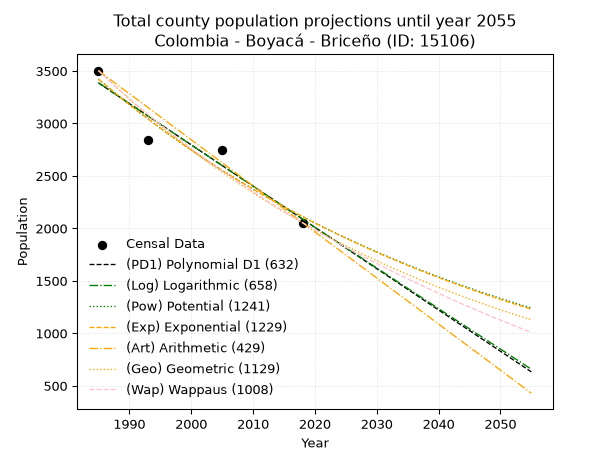
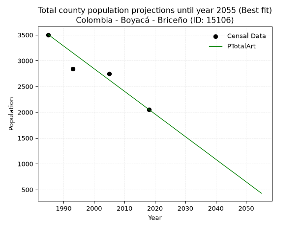
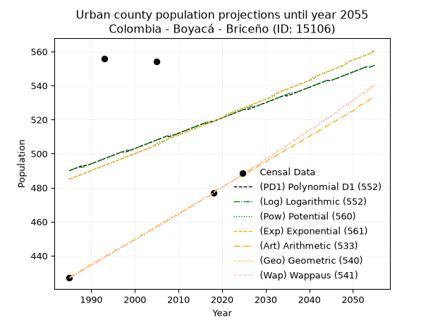
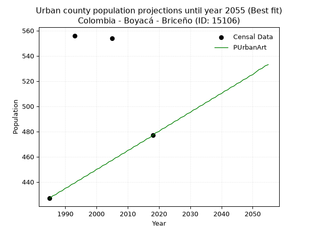
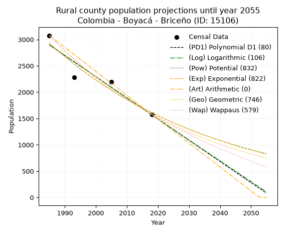
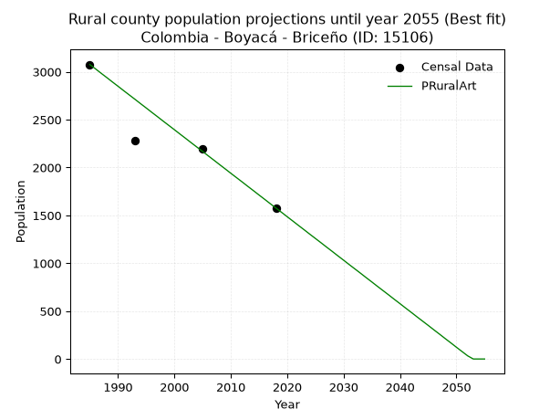

<div align="center">


</div>

# _“Population and Public Services Demand Projections (PPSD) until Year 2050 for Colombia - Boyacá - Briceño (ID: 15106)”_
Keywords: `population` `public-service` `projection` `lineal` `polynomial` `logarithmic` `potential` `exponential` `arithmetic` `geometric` `wappaus` `dane` `colombia` `south-america`

PPSD are analytical estimates used by governments and planners to anticipate future changes in population size, age distribution, and the resulting community needs for utilities, healthcare, education, and infrastructure as sizing future water treatment facilities, electrical grids, and road networks based on spatial growth.

> **General running parameters**: • app_version: _v20260806_. • Python version: _3.14.7_. • Pandas version: _3.0.5_. • NumPy version: _2.5.1_. • Creates, save and include plots into reports (create_plot): _False_. • Projection until year: _2050_. • Process polynomial degree 2 and up: _False_. • Process Wappaus: _True_. • Process Wappaus: _True_. • Set negative values to zero: _True_. • Set infinite values to zero: _True_. • Drop dataset notes: _True_. 
<div align="center">

Dynamic map: [:earth_americas:Google](http://maps.google.com/maps?q=5.690878897,-73.9232596) [:earth_americas:OSM](https://www.openstreetmap.org/#map=18/5.690878897/-73.9232596&layers=P) [:earth_americas:Bing](https://www.bing.com/maps?cp=5.690878897~-73.9232596&lvl=18) [:earth_americas:Apple](https://maps.apple.com/frame?center=5.690878897%2C-73.9232596&span=0.003%2C0.006)

</div>


<div align="center">

```geojson
{
  "type": "Feature",
  "geometry": {
    "type": "Point", 
    "coordinates": [-73.9232596, 5.690878897]
  }, 
  "properties": {
    "Name": "Colombia - Boyacá - Briceño (ID: 15106)"
  }
}
```

</div>


## 0. Census Data (4 records)

Census data are official statistics collected by a government about the people and housing in a country. They usually include counts of total population, age, sex, race, income, education, and jobs.

📅Global census file: [Population.xlsx](../data/Population.xlsx)

| Source   |   Year |   CountryID | CountryName   |   StateID | StateName   |   CountyID | CountyName   |   PTotal |   PUrban |   PRural |
|:---------|-------:|------------:|:--------------|----------:|:------------|-----------:|:-------------|---------:|---------:|---------:|
| DANE     |   1985 |          57 | Colombia      |        15 | Boyacá      |      15106 | Briceño      |     3503 |      427 |     3076 |
| DANE     |   1993 |          57 | Colombia      |        15 | Boyacá      |      15106 | Briceño      |     2840 |      556 |     2284 |
| DANE     |   2005 |          57 | Colombia      |        15 | Boyacá      |      15106 | Briceño      |     2748 |      554 |     2194 |
| DANE     |   2018 |          57 | Colombia      |        15 | Boyacá      |      15106 | Briceño      |     2054 |      477 |     1577 |

> 🔥Some records could had specific notes about the registered values or the corresponding urban or rural distribution.

## 1. Total

### 1.1. Coefficients and Parameters

* (PD1) Polynomial Deg 1: -39.34042553191447, 81476.93617021192 (lineal)
* (Log) Logarithmic: -78750.90116215487, 601372.4808036555
* (Pow) Potential: -29.268462653030888, 100.05475876611581
* (Exp) Exponential: -0.014624448366263497, 1.3853713220365576e+16
* (Art) Arithmetic: Year diff. 2018 - 1985 = 33, Population diff. 2054 - 3503 = -1449, Annual growth = -43.90909090909091
* (Geo) Geometric: Year diff. 2018 - 1985 = 33, Population diff. 2054 - 3503 = -1449, Annual growth % = -0.016046545946314716
* (Wap) Wappaus: i = -1.5803163904657516, Condition values only valid for < 200)

<sub>
Wappaus condition values: ['-0.00', '-1.58', '-3.16', '-4.74', '-6.32', '-7.90', '-9.48', '-11.06', '-12.64', '-14.22', '-15.80', '-17.38', '-18.96', '-20.54', '-22.12', '-23.70', '-25.29', '-26.87', '-28.45', '-30.03', '-31.61', '-33.19', '-34.77', '-36.35', '-37.93', '-39.51', '-41.09', '-42.67', '-44.25', '-45.83', '-47.41', '-48.99', '-50.57', '-52.15', '-53.73', '-55.31', '-56.89', '-58.47', '-60.05', '-61.63', '-63.21', '-64.79', '-66.37', '-67.95', '-69.53', '-71.11', '-72.69', '-74.27', '-75.86', '-77.44', '-79.02', '-80.60', '-82.18', '-83.76', '-85.34', '-86.92', '-88.50', '-90.08', '-91.66', '-93.24', '-94.82', '-96.40', '-97.98', '-99.56', '-101.14', '-102.72']
</sub>


### 1.2. Projected Dataset

|   Year |   CountyID |   PTotalPD1 |   PTotalLog |   PTotalPow |   PTotalExp |   PTotalArt |   PTotalGeo |   PTotalWap |
|-------:|-----------:|------------:|------------:|------------:|------------:|------------:|------------:|------------:|
|   1985 |      15106 |        3386 |        3387 |        3423 |        3421 |        3503 |        3503 |        3503 |
|   1986 |      15106 |        3347 |        3348 |        3373 |        3372 |        3459 |        3447 |        3448 |
|   1987 |      15106 |        3308 |        3308 |        3323 |        3323 |        3415 |        3391 |        3394 |
|   1988 |      15106 |        3268 |        3268 |        3275 |        3275 |        3371 |        3337 |        3341 |
|   1989 |      15106 |        3229 |        3229 |        3227 |        3227 |        3327 |        3284 |        3288 |
|   1990 |      15106 |        3189 |        3189 |        3180 |        3180 |        3283 |        3231 |        3237 |
|   1991 |      15106 |        3150 |        3150 |        3133 |        3134 |        3240 |        3179 |        3186 |
|   1992 |      15106 |        3111 |        3110 |        3088 |        3088 |        3196 |        3128 |        3136 |
|   1993 |      15106 |        3071 |        3071 |        3043 |        3044 |        3152 |        3078 |        3086 |
|   1994 |      15106 |        3032 |        3031 |        2998 |        2999 |        3108 |        3028 |        3038 |
|   1995 |      15106 |        2993 |        2992 |        2955 |        2956 |        3064 |        2980 |        2990 |
|   1996 |      15106 |        2953 |        2952 |        2912 |        2913 |        3020 |        2932 |        2943 |
|   1997 |      15106 |        2914 |        2913 |        2869 |        2871 |        2976 |        2885 |        2896 |
|   1998 |      15106 |        2875 |        2873 |        2828 |        2829 |        2932 |        2839 |        2850 |
|   1999 |      15106 |        2835 |        2834 |        2786 |        2788 |        2888 |        2793 |        2805 |
|   2000 |      15106 |        2796 |        2795 |        2746 |        2747 |        2844 |        2748 |        2761 |
|   2001 |      15106 |        2757 |        2755 |        2706 |        2708 |        2800 |        2704 |        2717 |
|   2002 |      15106 |        2717 |        2716 |        2667 |        2668 |        2757 |        2661 |        2673 |
|   2003 |      15106 |        2678 |        2677 |        2628 |        2630 |        2713 |        2618 |        2631 |
|   2004 |      15106 |        2639 |        2637 |        2590 |        2591 |        2669 |        2576 |        2588 |
|   2005 |      15106 |        2599 |        2598 |        2552 |        2554 |        2625 |        2535 |        2547 |
|   2006 |      15106 |        2560 |        2559 |        2515 |        2517 |        2581 |        2494 |        2506 |
|   2007 |      15106 |        2521 |        2519 |        2479 |        2480 |        2537 |        2454 |        2465 |
|   2008 |      15106 |        2481 |        2480 |        2443 |        2444 |        2493 |        2415 |        2426 |
|   2009 |      15106 |        2442 |        2441 |        2408 |        2409 |        2449 |        2376 |        2386 |
|   2010 |      15106 |        2403 |        2402 |        2373 |        2374 |        2405 |        2338 |        2347 |
|   2011 |      15106 |        2363 |        2363 |        2339 |        2339 |        2361 |        2300 |        2309 |
|   2012 |      15106 |        2324 |        2323 |        2305 |        2305 |        2317 |        2263 |        2271 |
|   2013 |      15106 |        2285 |        2284 |        2272 |        2272 |        2274 |        2227 |        2234 |
|   2014 |      15106 |        2245 |        2245 |        2239 |        2239 |        2230 |        2191 |        2197 |
|   2015 |      15106 |        2206 |        2206 |        2207 |        2206 |        2186 |        2156 |        2160 |
|   2016 |      15106 |        2167 |        2167 |        2175 |        2174 |        2142 |        2122 |        2125 |
|   2017 |      15106 |        2127 |        2128 |        2143 |        2143 |        2098 |        2087 |        2089 |
|   2018 |      15106 |        2088 |        2089 |        2113 |        2112 |        2054 |        2054 |        2054 |
|   2019 |      15106 |        2049 |        2050 |        2082 |        2081 |        2010 |        2021 |        2019 |
|   2020 |      15106 |        2009 |        2011 |        2052 |        2051 |        1966 |        1989 |        1985 |
|   2021 |      15106 |        1970 |        1972 |        2023 |        2021 |        1922 |        1957 |        1951 |
|   2022 |      15106 |        1931 |        1933 |        1994 |        1992 |        1878 |        1925 |        1918 |
|   2023 |      15106 |        1891 |        1894 |        1965 |        1963 |        1834 |        1894 |        1885 |
|   2024 |      15106 |        1852 |        1855 |        1937 |        1934 |        1791 |        1864 |        1853 |
|   2025 |      15106 |        1813 |        1816 |        1909 |        1906 |        1747 |        1834 |        1820 |
|   2026 |      15106 |        1773 |        1777 |        1882 |        1878 |        1703 |        1805 |        1789 |
|   2027 |      15106 |        1734 |        1739 |        1855 |        1851 |        1659 |        1776 |        1757 |
|   2028 |      15106 |        1695 |        1700 |        1828 |        1824 |        1615 |        1747 |        1726 |
|   2029 |      15106 |        1655 |        1661 |        1802 |        1798 |        1571 |        1719 |        1696 |
|   2030 |      15106 |        1616 |        1622 |        1776 |        1772 |        1527 |        1692 |        1665 |
|   2031 |      15106 |        1577 |        1583 |        1751 |        1746 |        1483 |        1664 |        1635 |
|   2032 |      15106 |        1537 |        1545 |        1726 |        1721 |        1439 |        1638 |        1606 |
|   2033 |      15106 |        1498 |        1506 |        1701 |        1696 |        1395 |        1611 |        1576 |
|   2034 |      15106 |        1459 |        1467 |        1677 |        1671 |        1351 |        1586 |        1548 |
|   2035 |      15106 |        1419 |        1428 |        1653 |        1647 |        1308 |        1560 |        1519 |
|   2036 |      15106 |        1380 |        1390 |        1629 |        1623 |        1264 |        1535 |        1491 |
|   2037 |      15106 |        1340 |        1351 |        1606 |        1599 |        1220 |        1510 |        1463 |
|   2038 |      15106 |        1301 |        1312 |        1583 |        1576 |        1176 |        1486 |        1435 |
|   2039 |      15106 |        1262 |        1274 |        1560 |        1553 |        1132 |        1462 |        1408 |
|   2040 |      15106 |        1222 |        1235 |        1538 |        1531 |        1088 |        1439 |        1381 |
|   2041 |      15106 |        1183 |        1196 |        1516 |        1508 |        1044 |        1416 |        1354 |
|   2042 |      15106 |        1144 |        1158 |        1495 |        1487 |        1000 |        1393 |        1327 |
|   2043 |      15106 |        1104 |        1119 |        1473 |        1465 |         956 |        1371 |        1301 |
|   2044 |      15106 |        1065 |        1081 |        1452 |        1444 |         912 |        1349 |        1275 |
|   2045 |      15106 |        1026 |        1042 |        1432 |        1423 |         868 |        1327 |        1250 |
|   2046 |      15106 |         986 |        1004 |        1411 |        1402 |         825 |        1306 |        1224 |
|   2047 |      15106 |         947 |         965 |        1391 |        1382 |         781 |        1285 |        1199 |
|   2048 |      15106 |         908 |         927 |        1372 |        1362 |         737 |        1264 |        1175 |
|   2049 |      15106 |         868 |         888 |        1352 |        1342 |         693 |        1244 |        1150 |
|   2050 |      15106 |         829 |         850 |        1333 |        1322 |         649 |        1224 |        1126 |
<div align="center">

</img>

</div>


### 1.3. Best fit with absolute and relative error (%)

Relative error puts that difference into context by dividing the absolute error by the true value, creating a unitless ratio or percentage that shows the scale of the mistake.

Absolute and relative error

|   Year | Source   |   CountryID | CountryName   |   StateID | StateName   |   CountyID_x | CountyName   |   PTotal |   PUrban |   PRural |   CountyID_y |   PTotalPD1 |   PTotalLog |   PTotalPow |   PTotalExp |   PTotalArt |   PTotalGeo |   PTotalWap |   PTotalPD1AbsError |   PTotalLogAbsError |   PTotalPowAbsError |   PTotalExpAbsError |   PTotalArtAbsError |   PTotalGeoAbsError |   PTotalWapAbsError |   PTotalPD1RelError |   PTotalLogRelError |   PTotalPowRelError |   PTotalExpRelError |   PTotalArtRelError |   PTotalGeoRelError |   PTotalWapRelError |
|-------:|:---------|------------:|:--------------|----------:|:------------|-------------:|:-------------|---------:|---------:|---------:|-------------:|------------:|------------:|------------:|------------:|------------:|------------:|------------:|--------------------:|--------------------:|--------------------:|--------------------:|--------------------:|--------------------:|--------------------:|--------------------:|--------------------:|--------------------:|--------------------:|--------------------:|--------------------:|--------------------:|
|   1985 | DANE     |          57 | Colombia      |        15 | Boyacá      |        15106 | Briceño      |     3503 |      427 |     3076 |        15106 |        3386 |        3387 |        3423 |        3421 |        3503 |        3503 |        3503 |                 117 |                 116 |                  80 |                  82 |                   0 |                   0 |                   0 |             3.33999 |             3.31145 |             2.28376 |             2.34085 |             0       |             0       |             0       |
|   1993 | DANE     |          57 | Colombia      |        15 | Boyacá      |        15106 | Briceño      |     2840 |      556 |     2284 |        15106 |        3071 |        3071 |        3043 |        3044 |        3152 |        3078 |        3086 |                 231 |                 231 |                 203 |                 204 |                 312 |                 238 |                 246 |             8.1338  |             8.1338  |             7.14789 |             7.1831  |            10.9859  |             8.38028 |             8.66197 |
|   2005 | DANE     |          57 | Colombia      |        15 | Boyacá      |        15106 | Briceño      |     2748 |      554 |     2194 |        15106 |        2599 |        2598 |        2552 |        2554 |        2625 |        2535 |        2547 |                 149 |                 150 |                 196 |                 194 |                 123 |                 213 |                 201 |             5.42213 |             5.45852 |             7.13246 |             7.05968 |             4.47598 |             7.75109 |             7.31441 |
|   2018 | DANE     |          57 | Colombia      |        15 | Boyacá      |        15106 | Briceño      |     2054 |      477 |     1577 |        15106 |        2088 |        2089 |        2113 |        2112 |        2054 |        2054 |        2054 |                  34 |                  35 |                  59 |                  58 |                   0 |                   0 |                   0 |             1.65531 |             1.70399 |             2.87244 |             2.82376 |             0       |             0       |             0       |

Relative error mean

| Method    |   RelError | Best   |
|:----------|-----------:|:-------|
| PTotalPD1 |    4.63781 |        |
| PTotalLog |    4.65194 |        |
| PTotalPow |    4.85914 |        |
| PTotalExp |    4.85185 |        |
| PTotalArt |    3.86547 | True   |
| PTotalGeo |    4.03284 |        |
| PTotalWap |    3.9941  |        |

💙Best method: _**PTotalArt**_
<div align="center">

</img>

</div>


### 1.4. Fresh water supply demand in liters per capita per day (lpcd)

The fresh water supply demand typically ranges from 100 to 300 liters per capita per day (lpcd) for standard domestic and municipal planning, though absolute survival minimums set by the World Health Organization are as low as 7.5 to 20 liters per day, and total consumption in high-income nations can exceed 400 liters.

> `CZ`: Level in meters above the sea level (masl)<br> `WS`: Fresh water supply demand in liters per capita per day (lpcd or l/h/d)<br> `WSAll`: Zonal fresh water supply demand in liters per second (l/s)<br> `A`: Zonal area in square meters<br> `DP`: Population density (people/hectare)

Reference values (RAS Colombia)

|    CZ |   WS |
|------:|-----:|
|  1000 |  120 |
|  2000 |  130 |
| 99999 |  140 |

County shapefile geometry properties and water supply values

|   CountyID |     ATotal |   CZTotal |   WSTotal |
|-----------:|-----------:|----------:|----------:|
|      15106 | 6.4512e+07 |   1779.72 |       130 |

Projected values for best method: PTotalArt

|   CountyID |   Year |   PTotalArt |   DPTotal |   WSTotal |   WSTotalAll |
|-----------:|-------:|------------:|----------:|----------:|-------------:|
|      15106 |   1985 |        3503 |      0.54 |       130 |     5.27072  |
|      15106 |   1986 |        3459 |      0.54 |       130 |     5.20451  |
|      15106 |   1987 |        3415 |      0.53 |       130 |     5.13831  |
|      15106 |   1988 |        3371 |      0.52 |       130 |     5.07211  |
|      15106 |   1989 |        3327 |      0.52 |       130 |     5.0059   |
|      15106 |   1990 |        3283 |      0.51 |       130 |     4.9397   |
|      15106 |   1991 |        3240 |      0.5  |       130 |     4.875    |
|      15106 |   1992 |        3196 |      0.5  |       130 |     4.8088   |
|      15106 |   1993 |        3152 |      0.49 |       130 |     4.74259  |
|      15106 |   1994 |        3108 |      0.48 |       130 |     4.67639  |
|      15106 |   1995 |        3064 |      0.47 |       130 |     4.61019  |
|      15106 |   1996 |        3020 |      0.47 |       130 |     4.54398  |
|      15106 |   1997 |        2976 |      0.46 |       130 |     4.47778  |
|      15106 |   1998 |        2932 |      0.45 |       130 |     4.41157  |
|      15106 |   1999 |        2888 |      0.45 |       130 |     4.34537  |
|      15106 |   2000 |        2844 |      0.44 |       130 |     4.27917  |
|      15106 |   2001 |        2800 |      0.43 |       130 |     4.21296  |
|      15106 |   2002 |        2757 |      0.43 |       130 |     4.14826  |
|      15106 |   2003 |        2713 |      0.42 |       130 |     4.08206  |
|      15106 |   2004 |        2669 |      0.41 |       130 |     4.01586  |
|      15106 |   2005 |        2625 |      0.41 |       130 |     3.94965  |
|      15106 |   2006 |        2581 |      0.4  |       130 |     3.88345  |
|      15106 |   2007 |        2537 |      0.39 |       130 |     3.81725  |
|      15106 |   2008 |        2493 |      0.39 |       130 |     3.75104  |
|      15106 |   2009 |        2449 |      0.38 |       130 |     3.68484  |
|      15106 |   2010 |        2405 |      0.37 |       130 |     3.61863  |
|      15106 |   2011 |        2361 |      0.37 |       130 |     3.55243  |
|      15106 |   2012 |        2317 |      0.36 |       130 |     3.48623  |
|      15106 |   2013 |        2274 |      0.35 |       130 |     3.42153  |
|      15106 |   2014 |        2230 |      0.35 |       130 |     3.35532  |
|      15106 |   2015 |        2186 |      0.34 |       130 |     3.28912  |
|      15106 |   2016 |        2142 |      0.33 |       130 |     3.22292  |
|      15106 |   2017 |        2098 |      0.33 |       130 |     3.15671  |
|      15106 |   2018 |        2054 |      0.32 |       130 |     3.09051  |
|      15106 |   2019 |        2010 |      0.31 |       130 |     3.02431  |
|      15106 |   2020 |        1966 |      0.3  |       130 |     2.9581   |
|      15106 |   2021 |        1922 |      0.3  |       130 |     2.8919   |
|      15106 |   2022 |        1878 |      0.29 |       130 |     2.82569  |
|      15106 |   2023 |        1834 |      0.28 |       130 |     2.75949  |
|      15106 |   2024 |        1791 |      0.28 |       130 |     2.69479  |
|      15106 |   2025 |        1747 |      0.27 |       130 |     2.62859  |
|      15106 |   2026 |        1703 |      0.26 |       130 |     2.56238  |
|      15106 |   2027 |        1659 |      0.26 |       130 |     2.49618  |
|      15106 |   2028 |        1615 |      0.25 |       130 |     2.42998  |
|      15106 |   2029 |        1571 |      0.24 |       130 |     2.36377  |
|      15106 |   2030 |        1527 |      0.24 |       130 |     2.29757  |
|      15106 |   2031 |        1483 |      0.23 |       130 |     2.23137  |
|      15106 |   2032 |        1439 |      0.22 |       130 |     2.16516  |
|      15106 |   2033 |        1395 |      0.22 |       130 |     2.09896  |
|      15106 |   2034 |        1351 |      0.21 |       130 |     2.03275  |
|      15106 |   2035 |        1308 |      0.2  |       130 |     1.96806  |
|      15106 |   2036 |        1264 |      0.2  |       130 |     1.90185  |
|      15106 |   2037 |        1220 |      0.19 |       130 |     1.83565  |
|      15106 |   2038 |        1176 |      0.18 |       130 |     1.76944  |
|      15106 |   2039 |        1132 |      0.18 |       130 |     1.70324  |
|      15106 |   2040 |        1088 |      0.17 |       130 |     1.63704  |
|      15106 |   2041 |        1044 |      0.16 |       130 |     1.57083  |
|      15106 |   2042 |        1000 |      0.16 |       130 |     1.50463  |
|      15106 |   2043 |         956 |      0.15 |       130 |     1.43843  |
|      15106 |   2044 |         912 |      0.14 |       130 |     1.37222  |
|      15106 |   2045 |         868 |      0.13 |       130 |     1.30602  |
|      15106 |   2046 |         825 |      0.13 |       130 |     1.24132  |
|      15106 |   2047 |         781 |      0.12 |       130 |     1.17512  |
|      15106 |   2048 |         737 |      0.11 |       130 |     1.10891  |
|      15106 |   2049 |         693 |      0.11 |       130 |     1.04271  |
|      15106 |   2050 |         649 |      0.1  |       130 |     0.976505 |

## 2. Urban

### 2.1. Coefficients and Parameters

* (PD1) Polynomial Deg 1: 0.8920112404657261, -1280.745483741569 (lineal)
* (Log) Logarithmic: 1804.6132440961294, -13213.379729637642
* (Pow) Potential: 4.179705923780925, -11.098143528851287
* (Exp) Exponential: 0.002068925957871491, 7.982001735444351
* (Art) Arithmetic: Year diff. 2018 - 1985 = 33, Population diff. 477 - 427 = 50, Annual growth = 1.5151515151515151
* (Geo) Geometric: Year diff. 2018 - 1985 = 33, Population diff. 477 - 427 = 50, Annual growth % = 0.003361165717848724
* (Wap) Wappaus: i = 0.33521051220166265, Condition values only valid for < 200)

<sub>
Wappaus condition values: ['0.00', '0.34', '0.67', '1.01', '1.34', '1.68', '2.01', '2.35', '2.68', '3.02', '3.35', '3.69', '4.02', '4.36', '4.69', '5.03', '5.36', '5.70', '6.03', '6.37', '6.70', '7.04', '7.37', '7.71', '8.05', '8.38', '8.72', '9.05', '9.39', '9.72', '10.06', '10.39', '10.73', '11.06', '11.40', '11.73', '12.07', '12.40', '12.74', '13.07', '13.41', '13.74', '14.08', '14.41', '14.75', '15.08', '15.42', '15.75', '16.09', '16.43', '16.76', '17.10', '17.43', '17.77', '18.10', '18.44', '18.77', '19.11', '19.44', '19.78', '20.11', '20.45', '20.78', '21.12', '21.45', '21.79']
</sub>


### 2.2. Projected Dataset

|   Year |   CountyID |   PUrbanPD1 |   PUrbanLog |   PUrbanPow |   PUrbanExp |   PUrbanArt |   PUrbanGeo |   PUrbanWap |
|-------:|-----------:|------------:|------------:|------------:|------------:|------------:|------------:|------------:|
|   1985 |      15106 |         490 |         490 |         485 |         485 |         427 |         427 |         427 |
|   1986 |      15106 |         491 |         491 |         486 |         486 |         429 |         428 |         428 |
|   1987 |      15106 |         492 |         492 |         487 |         487 |         430 |         430 |         430 |
|   1988 |      15106 |         493 |         492 |         488 |         488 |         432 |         431 |         431 |
|   1989 |      15106 |         493 |         493 |         489 |         489 |         433 |         433 |         433 |
|   1990 |      15106 |         494 |         494 |         490 |         490 |         435 |         434 |         434 |
|   1991 |      15106 |         495 |         495 |         491 |         491 |         436 |         436 |         436 |
|   1992 |      15106 |         496 |         496 |         492 |         492 |         438 |         437 |         437 |
|   1993 |      15106 |         497 |         497 |         493 |         493 |         439 |         439 |         439 |
|   1994 |      15106 |         498 |         498 |         494 |         494 |         441 |         440 |         440 |
|   1995 |      15106 |         499 |         499 |         495 |         495 |         442 |         442 |         442 |
|   1996 |      15106 |         500 |         500 |         496 |         496 |         444 |         443 |         443 |
|   1997 |      15106 |         501 |         501 |         497 |         497 |         445 |         445 |         445 |
|   1998 |      15106 |         501 |         502 |         498 |         498 |         447 |         446 |         446 |
|   1999 |      15106 |         502 |         502 |         499 |         499 |         448 |         448 |         448 |
|   2000 |      15106 |         503 |         503 |         500 |         500 |         450 |         449 |         449 |
|   2001 |      15106 |         504 |         504 |         501 |         501 |         451 |         451 |         451 |
|   2002 |      15106 |         505 |         505 |         502 |         502 |         453 |         452 |         452 |
|   2003 |      15106 |         506 |         506 |         503 |         503 |         454 |         454 |         454 |
|   2004 |      15106 |         507 |         507 |         504 |         504 |         456 |         455 |         455 |
|   2005 |      15106 |         508 |         508 |         506 |         505 |         457 |         457 |         457 |
|   2006 |      15106 |         509 |         509 |         507 |         506 |         459 |         458 |         458 |
|   2007 |      15106 |         510 |         510 |         508 |         508 |         460 |         460 |         460 |
|   2008 |      15106 |         510 |         511 |         509 |         509 |         462 |         461 |         461 |
|   2009 |      15106 |         511 |         511 |         510 |         510 |         463 |         463 |         463 |
|   2010 |      15106 |         512 |         512 |         511 |         511 |         465 |         464 |         464 |
|   2011 |      15106 |         513 |         513 |         512 |         512 |         466 |         466 |         466 |
|   2012 |      15106 |         514 |         514 |         513 |         513 |         468 |         467 |         467 |
|   2013 |      15106 |         515 |         515 |         514 |         514 |         469 |         469 |         469 |
|   2014 |      15106 |         516 |         516 |         515 |         515 |         471 |         471 |         471 |
|   2015 |      15106 |         517 |         517 |         516 |         516 |         472 |         472 |         472 |
|   2016 |      15106 |         518 |         518 |         517 |         517 |         474 |         474 |         474 |
|   2017 |      15106 |         518 |         519 |         518 |         518 |         475 |         475 |         475 |
|   2018 |      15106 |         519 |         519 |         519 |         519 |         477 |         477 |         477 |
|   2019 |      15106 |         520 |         520 |         520 |         520 |         479 |         479 |         479 |
|   2020 |      15106 |         521 |         521 |         521 |         521 |         480 |         480 |         480 |
|   2021 |      15106 |         522 |         522 |         523 |         522 |         482 |         482 |         482 |
|   2022 |      15106 |         523 |         523 |         524 |         524 |         483 |         483 |         483 |
|   2023 |      15106 |         524 |         524 |         525 |         525 |         485 |         485 |         485 |
|   2024 |      15106 |         525 |         525 |         526 |         526 |         486 |         487 |         487 |
|   2025 |      15106 |         526 |         526 |         527 |         527 |         488 |         488 |         488 |
|   2026 |      15106 |         526 |         527 |         528 |         528 |         489 |         490 |         490 |
|   2027 |      15106 |         527 |         528 |         529 |         529 |         491 |         492 |         492 |
|   2028 |      15106 |         528 |         528 |         530 |         530 |         492 |         493 |         493 |
|   2029 |      15106 |         529 |         529 |         531 |         531 |         494 |         495 |         495 |
|   2030 |      15106 |         530 |         530 |         532 |         532 |         495 |         497 |         497 |
|   2031 |      15106 |         531 |         531 |         533 |         533 |         497 |         498 |         498 |
|   2032 |      15106 |         532 |         532 |         535 |         534 |         498 |         500 |         500 |
|   2033 |      15106 |         533 |         533 |         536 |         536 |         500 |         502 |         502 |
|   2034 |      15106 |         534 |         534 |         537 |         537 |         501 |         503 |         503 |
|   2035 |      15106 |         534 |         535 |         538 |         538 |         503 |         505 |         505 |
|   2036 |      15106 |         535 |         536 |         539 |         539 |         504 |         507 |         507 |
|   2037 |      15106 |         536 |         536 |         540 |         540 |         506 |         508 |         509 |
|   2038 |      15106 |         537 |         537 |         541 |         541 |         507 |         510 |         510 |
|   2039 |      15106 |         538 |         538 |         542 |         542 |         509 |         512 |         512 |
|   2040 |      15106 |         539 |         539 |         543 |         543 |         510 |         514 |         514 |
|   2041 |      15106 |         540 |         540 |         545 |         544 |         512 |         515 |         515 |
|   2042 |      15106 |         541 |         541 |         546 |         546 |         513 |         517 |         517 |
|   2043 |      15106 |         542 |         542 |         547 |         547 |         515 |         519 |         519 |
|   2044 |      15106 |         543 |         543 |         548 |         548 |         516 |         520 |         521 |
|   2045 |      15106 |         543 |         543 |         549 |         549 |         518 |         522 |         522 |
|   2046 |      15106 |         544 |         544 |         550 |         550 |         519 |         524 |         524 |
|   2047 |      15106 |         545 |         545 |         551 |         551 |         521 |         526 |         526 |
|   2048 |      15106 |         546 |         546 |         552 |         552 |         522 |         528 |         528 |
|   2049 |      15106 |         547 |         547 |         554 |         554 |         524 |         529 |         530 |
|   2050 |      15106 |         548 |         548 |         555 |         555 |         525 |         531 |         531 |
<div align="center">

</img>

</div>


### 2.3. Best fit with absolute and relative error (%)

Relative error puts that difference into context by dividing the absolute error by the true value, creating a unitless ratio or percentage that shows the scale of the mistake.

Absolute and relative error

|   Year | Source   |   CountryID | CountryName   |   StateID | StateName   |   CountyID_x | CountyName   |   PTotal |   PUrban |   PRural |   CountyID_y |   PUrbanPD1 |   PUrbanLog |   PUrbanPow |   PUrbanExp |   PUrbanArt |   PUrbanGeo |   PUrbanWap |   PUrbanPD1AbsError |   PUrbanLogAbsError |   PUrbanPowAbsError |   PUrbanExpAbsError |   PUrbanArtAbsError |   PUrbanGeoAbsError |   PUrbanWapAbsError |   PUrbanPD1RelError |   PUrbanLogRelError |   PUrbanPowRelError |   PUrbanExpRelError |   PUrbanArtRelError |   PUrbanGeoRelError |   PUrbanWapRelError |
|-------:|:---------|------------:|:--------------|----------:|:------------|-------------:|:-------------|---------:|---------:|---------:|-------------:|------------:|------------:|------------:|------------:|------------:|------------:|------------:|--------------------:|--------------------:|--------------------:|--------------------:|--------------------:|--------------------:|--------------------:|--------------------:|--------------------:|--------------------:|--------------------:|--------------------:|--------------------:|--------------------:|
|   1985 | DANE     |          57 | Colombia      |        15 | Boyacá      |        15106 | Briceño      |     3503 |      427 |     3076 |        15106 |         490 |         490 |         485 |         485 |         427 |         427 |         427 |                  63 |                  63 |                  58 |                  58 |                   0 |                   0 |                   0 |            14.7541  |            14.7541  |            13.5831  |            13.5831  |              0      |              0      |              0      |
|   1993 | DANE     |          57 | Colombia      |        15 | Boyacá      |        15106 | Briceño      |     2840 |      556 |     2284 |        15106 |         497 |         497 |         493 |         493 |         439 |         439 |         439 |                  59 |                  59 |                  63 |                  63 |                 117 |                 117 |                 117 |            10.6115  |            10.6115  |            11.3309  |            11.3309  |             21.0432 |             21.0432 |             21.0432 |
|   2005 | DANE     |          57 | Colombia      |        15 | Boyacá      |        15106 | Briceño      |     2748 |      554 |     2194 |        15106 |         508 |         508 |         506 |         505 |         457 |         457 |         457 |                  46 |                  46 |                  48 |                  49 |                  97 |                  97 |                  97 |             8.30325 |             8.30325 |             8.66426 |             8.84477 |             17.509  |             17.509  |             17.509  |
|   2018 | DANE     |          57 | Colombia      |        15 | Boyacá      |        15106 | Briceño      |     2054 |      477 |     1577 |        15106 |         519 |         519 |         519 |         519 |         477 |         477 |         477 |                  42 |                  42 |                  42 |                  42 |                   0 |                   0 |                   0 |             8.80503 |             8.80503 |             8.80503 |             8.80503 |              0      |              0      |              0      |

Relative error mean

| Method    |   RelError | Best   |
|:----------|-----------:|:-------|
| PUrbanPD1 |   10.6185  |        |
| PUrbanLog |   10.6185  |        |
| PUrbanPow |   10.5958  |        |
| PUrbanExp |   10.641   |        |
| PUrbanArt |    9.63805 | True   |
| PUrbanGeo |    9.63805 | True   |
| PUrbanWap |    9.63805 | True   |

💙Best method: _**PUrbanArt**_
<div align="center">

</img>

</div>


### 2.4. Fresh water supply demand in liters per capita per day (lpcd)

The fresh water supply demand typically ranges from 100 to 300 liters per capita per day (lpcd) for standard domestic and municipal planning, though absolute survival minimums set by the World Health Organization are as low as 7.5 to 20 liters per day, and total consumption in high-income nations can exceed 400 liters.

> `CZ`: Level in meters above the sea level (masl)<br> `WS`: Fresh water supply demand in liters per capita per day (lpcd or l/h/d)<br> `WSAll`: Zonal fresh water supply demand in liters per second (l/s)<br> `A`: Zonal area in square meters<br> `DP`: Population density (people/hectare)

Reference values (RAS Colombia)

|    CZ |   WS |
|------:|-----:|
|  1000 |  120 |
|  2000 |  130 |
| 99999 |  140 |

County shapefile geometry properties and water supply values

|   CountyID |   AUrban |   CZUrban |   WSUrban |
|-----------:|---------:|----------:|----------:|
|      15106 |   184212 |   1352.99 |       130 |

Projected values for best method: PUrbanArt

|   CountyID |   Year |   PUrbanArt |   DPUrban |   WSUrban |   WSUrbanAll |
|-----------:|-------:|------------:|----------:|----------:|-------------:|
|      15106 |   1985 |         427 |     23.18 |       130 |     0.642477 |
|      15106 |   1986 |         429 |     23.29 |       130 |     0.645486 |
|      15106 |   1987 |         430 |     23.34 |       130 |     0.646991 |
|      15106 |   1988 |         432 |     23.45 |       130 |     0.65     |
|      15106 |   1989 |         433 |     23.51 |       130 |     0.651505 |
|      15106 |   1990 |         435 |     23.61 |       130 |     0.654514 |
|      15106 |   1991 |         436 |     23.67 |       130 |     0.656019 |
|      15106 |   1992 |         438 |     23.78 |       130 |     0.659028 |
|      15106 |   1993 |         439 |     23.83 |       130 |     0.660532 |
|      15106 |   1994 |         441 |     23.94 |       130 |     0.663542 |
|      15106 |   1995 |         442 |     23.99 |       130 |     0.665046 |
|      15106 |   1996 |         444 |     24.1  |       130 |     0.668056 |
|      15106 |   1997 |         445 |     24.16 |       130 |     0.66956  |
|      15106 |   1998 |         447 |     24.27 |       130 |     0.672569 |
|      15106 |   1999 |         448 |     24.32 |       130 |     0.674074 |
|      15106 |   2000 |         450 |     24.43 |       130 |     0.677083 |
|      15106 |   2001 |         451 |     24.48 |       130 |     0.678588 |
|      15106 |   2002 |         453 |     24.59 |       130 |     0.681597 |
|      15106 |   2003 |         454 |     24.65 |       130 |     0.683102 |
|      15106 |   2004 |         456 |     24.75 |       130 |     0.686111 |
|      15106 |   2005 |         457 |     24.81 |       130 |     0.687616 |
|      15106 |   2006 |         459 |     24.92 |       130 |     0.690625 |
|      15106 |   2007 |         460 |     24.97 |       130 |     0.69213  |
|      15106 |   2008 |         462 |     25.08 |       130 |     0.695139 |
|      15106 |   2009 |         463 |     25.13 |       130 |     0.696644 |
|      15106 |   2010 |         465 |     25.24 |       130 |     0.699653 |
|      15106 |   2011 |         466 |     25.3  |       130 |     0.701157 |
|      15106 |   2012 |         468 |     25.41 |       130 |     0.704167 |
|      15106 |   2013 |         469 |     25.46 |       130 |     0.705671 |
|      15106 |   2014 |         471 |     25.57 |       130 |     0.708681 |
|      15106 |   2015 |         472 |     25.62 |       130 |     0.710185 |
|      15106 |   2016 |         474 |     25.73 |       130 |     0.713194 |
|      15106 |   2017 |         475 |     25.79 |       130 |     0.714699 |
|      15106 |   2018 |         477 |     25.89 |       130 |     0.717708 |
|      15106 |   2019 |         479 |     26    |       130 |     0.720718 |
|      15106 |   2020 |         480 |     26.06 |       130 |     0.722222 |
|      15106 |   2021 |         482 |     26.17 |       130 |     0.725231 |
|      15106 |   2022 |         483 |     26.22 |       130 |     0.726736 |
|      15106 |   2023 |         485 |     26.33 |       130 |     0.729745 |
|      15106 |   2024 |         486 |     26.38 |       130 |     0.73125  |
|      15106 |   2025 |         488 |     26.49 |       130 |     0.734259 |
|      15106 |   2026 |         489 |     26.55 |       130 |     0.735764 |
|      15106 |   2027 |         491 |     26.65 |       130 |     0.738773 |
|      15106 |   2028 |         492 |     26.71 |       130 |     0.740278 |
|      15106 |   2029 |         494 |     26.82 |       130 |     0.743287 |
|      15106 |   2030 |         495 |     26.87 |       130 |     0.744792 |
|      15106 |   2031 |         497 |     26.98 |       130 |     0.747801 |
|      15106 |   2032 |         498 |     27.03 |       130 |     0.749306 |
|      15106 |   2033 |         500 |     27.14 |       130 |     0.752315 |
|      15106 |   2034 |         501 |     27.2  |       130 |     0.753819 |
|      15106 |   2035 |         503 |     27.31 |       130 |     0.756829 |
|      15106 |   2036 |         504 |     27.36 |       130 |     0.758333 |
|      15106 |   2037 |         506 |     27.47 |       130 |     0.761343 |
|      15106 |   2038 |         507 |     27.52 |       130 |     0.762847 |
|      15106 |   2039 |         509 |     27.63 |       130 |     0.765856 |
|      15106 |   2040 |         510 |     27.69 |       130 |     0.767361 |
|      15106 |   2041 |         512 |     27.79 |       130 |     0.77037  |
|      15106 |   2042 |         513 |     27.85 |       130 |     0.771875 |
|      15106 |   2043 |         515 |     27.96 |       130 |     0.774884 |
|      15106 |   2044 |         516 |     28.01 |       130 |     0.776389 |
|      15106 |   2045 |         518 |     28.12 |       130 |     0.779398 |
|      15106 |   2046 |         519 |     28.17 |       130 |     0.780903 |
|      15106 |   2047 |         521 |     28.28 |       130 |     0.783912 |
|      15106 |   2048 |         522 |     28.34 |       130 |     0.785417 |
|      15106 |   2049 |         524 |     28.45 |       130 |     0.788426 |
|      15106 |   2050 |         525 |     28.5  |       130 |     0.789931 |

## 3. Rural

### 3.1. Coefficients and Parameters

* (PD1) Polynomial Deg 1: -40.232436772380176, 82757.68165395345 (lineal)
* (Log) Logarithmic: -80555.51440625101, 614585.8605332935
* (Pow) Potential: -36.339163427505916, 123.30477202011768
* (Exp) Exponential: -0.01815428617840786, 1.3092463859459277e+19
* (Art) Arithmetic: Year diff. 2018 - 1985 = 33, Population diff. 1577 - 3076 = -1499, Annual growth = -45.42424242424242
* (Geo) Geometric: Year diff. 2018 - 1985 = 33, Population diff. 1577 - 3076 = -1499, Annual growth % = -0.02004206195006475
* (Wap) Wappaus: i = -1.9524711981191671, Condition values only valid for < 200)

<sub>
Wappaus condition values: ['-0.00', '-1.95', '-3.90', '-5.86', '-7.81', '-9.76', '-11.71', '-13.67', '-15.62', '-17.57', '-19.52', '-21.48', '-23.43', '-25.38', '-27.33', '-29.29', '-31.24', '-33.19', '-35.14', '-37.10', '-39.05', '-41.00', '-42.95', '-44.91', '-46.86', '-48.81', '-50.76', '-52.72', '-54.67', '-56.62', '-58.57', '-60.53', '-62.48', '-64.43', '-66.38', '-68.34', '-70.29', '-72.24', '-74.19', '-76.15', '-78.10', '-80.05', '-82.00', '-83.96', '-85.91', '-87.86', '-89.81', '-91.77', '-93.72', '-95.67', '-97.62', '-99.58', '-101.53', '-103.48', '-105.43', '-107.39', '-109.34', '-111.29', '-113.24', '-115.20', '-117.15', '-119.10', '-121.05', '-123.01', '-124.96', '-126.91']
</sub>


### 3.2. Projected Dataset

|   Year |   CountyID |   PRuralPD1 |   PRuralLog |   PRuralPow |   PRuralExp |   PRuralArt |   PRuralGeo |   PRuralWap |
|-------:|-----------:|------------:|------------:|------------:|------------:|------------:|------------:|------------:|
|   1985 |      15106 |        2896 |        2898 |        2930 |        2929 |        3076 |        3076 |        3076 |
|   1986 |      15106 |        2856 |        2857 |        2877 |        2876 |        3031 |        3014 |        3017 |
|   1987 |      15106 |        2816 |        2817 |        2825 |        2824 |        2985 |        2954 |        2958 |
|   1988 |      15106 |        2776 |        2776 |        2774 |        2773 |        2940 |        2895 |        2901 |
|   1989 |      15106 |        2735 |        2736 |        2724 |        2724 |        2894 |        2837 |        2845 |
|   1990 |      15106 |        2695 |        2695 |        2674 |        2675 |        2849 |        2780 |        2790 |
|   1991 |      15106 |        2655 |        2655 |        2626 |        2626 |        2803 |        2724 |        2736 |
|   1992 |      15106 |        2615 |        2614 |        2578 |        2579 |        2758 |        2670 |        2682 |
|   1993 |      15106 |        2574 |        2574 |        2532 |        2533 |        2713 |        2616 |        2630 |
|   1994 |      15106 |        2534 |        2533 |        2486 |        2487 |        2667 |        2564 |        2579 |
|   1995 |      15106 |        2494 |        2493 |        2441 |        2442 |        2622 |        2512 |        2529 |
|   1996 |      15106 |        2454 |        2453 |        2397 |        2399 |        2576 |        2462 |        2479 |
|   1997 |      15106 |        2414 |        2412 |        2354 |        2355 |        2531 |        2413 |        2431 |
|   1998 |      15106 |        2373 |        2372 |        2311 |        2313 |        2485 |        2364 |        2383 |
|   1999 |      15106 |        2333 |        2332 |        2270 |        2271 |        2440 |        2317 |        2336 |
|   2000 |      15106 |        2293 |        2291 |        2229 |        2231 |        2395 |        2270 |        2290 |
|   2001 |      15106 |        2253 |        2251 |        2189 |        2190 |        2349 |        2225 |        2245 |
|   2002 |      15106 |        2212 |        2211 |        2149 |        2151 |        2304 |        2180 |        2200 |
|   2003 |      15106 |        2172 |        2171 |        2111 |        2112 |        2258 |        2137 |        2157 |
|   2004 |      15106 |        2132 |        2130 |        2073 |        2074 |        2213 |        2094 |        2113 |
|   2005 |      15106 |        2092 |        2090 |        2036 |        2037 |        2168 |        2052 |        2071 |
|   2006 |      15106 |        2051 |        2050 |        1999 |        2000 |        2122 |        2011 |        2029 |
|   2007 |      15106 |        2011 |        2010 |        1963 |        1964 |        2077 |        1970 |        1988 |
|   2008 |      15106 |        1971 |        1970 |        1928 |        1929 |        2031 |        1931 |        1948 |
|   2009 |      15106 |        1931 |        1930 |        1893 |        1894 |        1986 |        1892 |        1908 |
|   2010 |      15106 |        1890 |        1889 |        1859 |        1860 |        1940 |        1854 |        1869 |
|   2011 |      15106 |        1850 |        1849 |        1826 |        1827 |        1895 |        1817 |        1831 |
|   2012 |      15106 |        1810 |        1809 |        1793 |        1794 |        1850 |        1781 |        1793 |
|   2013 |      15106 |        1770 |        1769 |        1761 |        1762 |        1804 |        1745 |        1755 |
|   2014 |      15106 |        1730 |        1729 |        1730 |        1730 |        1759 |        1710 |        1719 |
|   2015 |      15106 |        1689 |        1689 |        1699 |        1699 |        1713 |        1676 |        1682 |
|   2016 |      15106 |        1649 |        1649 |        1669 |        1668 |        1668 |        1642 |        1647 |
|   2017 |      15106 |        1609 |        1609 |        1639 |        1638 |        1622 |        1609 |        1612 |
|   2018 |      15106 |        1569 |        1569 |        1610 |        1609 |        1577 |        1577 |        1577 |
|   2019 |      15106 |        1528 |        1530 |        1581 |        1580 |        1532 |        1545 |        1543 |
|   2020 |      15106 |        1488 |        1490 |        1553 |        1551 |        1486 |        1514 |        1509 |
|   2021 |      15106 |        1448 |        1450 |        1525 |        1523 |        1441 |        1484 |        1476 |
|   2022 |      15106 |        1408 |        1410 |        1498 |        1496 |        1395 |        1454 |        1444 |
|   2023 |      15106 |        1367 |        1370 |        1471 |        1469 |        1350 |        1425 |        1411 |
|   2024 |      15106 |        1327 |        1330 |        1445 |        1443 |        1304 |        1397 |        1380 |
|   2025 |      15106 |        1287 |        1291 |        1419 |        1417 |        1259 |        1369 |        1348 |
|   2026 |      15106 |        1247 |        1251 |        1394 |        1391 |        1214 |        1341 |        1317 |
|   2027 |      15106 |        1207 |        1211 |        1369 |        1366 |        1168 |        1314 |        1287 |
|   2028 |      15106 |        1166 |        1171 |        1345 |        1342 |        1123 |        1288 |        1257 |
|   2029 |      15106 |        1126 |        1132 |        1321 |        1318 |        1077 |        1262 |        1227 |
|   2030 |      15106 |        1086 |        1092 |        1298 |        1294 |        1032 |        1237 |        1198 |
|   2031 |      15106 |        1046 |        1052 |        1275 |        1271 |         986 |        1212 |        1169 |
|   2032 |      15106 |        1005 |        1013 |        1252 |        1248 |         941 |        1188 |        1141 |
|   2033 |      15106 |         965 |         973 |        1230 |        1225 |         896 |        1164 |        1113 |
|   2034 |      15106 |         925 |         933 |        1208 |        1203 |         850 |        1141 |        1085 |
|   2035 |      15106 |         885 |         894 |        1187 |        1182 |         805 |        1118 |        1058 |
|   2036 |      15106 |         844 |         854 |        1166 |        1160 |         759 |        1095 |        1031 |
|   2037 |      15106 |         804 |         815 |        1145 |        1139 |         714 |        1073 |        1005 |
|   2038 |      15106 |         764 |         775 |        1125 |        1119 |         669 |        1052 |         978 |
|   2039 |      15106 |         724 |         736 |        1105 |        1099 |         623 |        1031 |         952 |
|   2040 |      15106 |         684 |         696 |        1085 |        1079 |         578 |        1010 |         927 |
|   2041 |      15106 |         643 |         657 |        1066 |        1060 |         532 |         990 |         902 |
|   2042 |      15106 |         603 |         617 |        1047 |        1041 |         487 |         970 |         877 |
|   2043 |      15106 |         563 |         578 |        1029 |        1022 |         441 |         951 |         852 |
|   2044 |      15106 |         523 |         538 |        1011 |        1003 |         396 |         932 |         828 |
|   2045 |      15106 |         482 |         499 |         993 |         985 |         351 |         913 |         804 |
|   2046 |      15106 |         442 |         459 |         976 |         968 |         305 |         895 |         780 |
|   2047 |      15106 |         402 |         420 |         958 |         950 |         260 |         877 |         756 |
|   2048 |      15106 |         362 |         381 |         941 |         933 |         214 |         859 |         733 |
|   2049 |      15106 |         321 |         341 |         925 |         916 |         169 |         842 |         710 |
|   2050 |      15106 |         281 |         302 |         909 |         900 |         123 |         825 |         688 |
<div align="center">

</img>

</div>


### 3.3. Best fit with absolute and relative error (%)

Relative error puts that difference into context by dividing the absolute error by the true value, creating a unitless ratio or percentage that shows the scale of the mistake.

Absolute and relative error

|   Year | Source   |   CountryID | CountryName   |   StateID | StateName   |   CountyID_x | CountyName   |   PTotal |   PUrban |   PRural |   CountyID_y |   PRuralPD1 |   PRuralLog |   PRuralPow |   PRuralExp |   PRuralArt |   PRuralGeo |   PRuralWap |   PRuralPD1AbsError |   PRuralLogAbsError |   PRuralPowAbsError |   PRuralExpAbsError |   PRuralArtAbsError |   PRuralGeoAbsError |   PRuralWapAbsError |   PRuralPD1RelError |   PRuralLogRelError |   PRuralPowRelError |   PRuralExpRelError |   PRuralArtRelError |   PRuralGeoRelError |   PRuralWapRelError |
|-------:|:---------|------------:|:--------------|----------:|:------------|-------------:|:-------------|---------:|---------:|---------:|-------------:|------------:|------------:|------------:|------------:|------------:|------------:|------------:|--------------------:|--------------------:|--------------------:|--------------------:|--------------------:|--------------------:|--------------------:|--------------------:|--------------------:|--------------------:|--------------------:|--------------------:|--------------------:|--------------------:|
|   1985 | DANE     |          57 | Colombia      |        15 | Boyacá      |        15106 | Briceño      |     3503 |      427 |     3076 |        15106 |        2896 |        2898 |        2930 |        2929 |        3076 |        3076 |        3076 |                 180 |                 178 |                 146 |                 147 |                   0 |                   0 |                   0 |            5.85176  |            5.78674  |             4.74642 |             4.77893 |             0       |              0      |              0      |
|   1993 | DANE     |          57 | Colombia      |        15 | Boyacá      |        15106 | Briceño      |     2840 |      556 |     2284 |        15106 |        2574 |        2574 |        2532 |        2533 |        2713 |        2616 |        2630 |                 290 |                 290 |                 248 |                 249 |                 429 |                 332 |                 346 |           12.697    |           12.697    |            10.8581  |            10.9019  |            18.7828  |             14.5359 |             15.1489 |
|   2005 | DANE     |          57 | Colombia      |        15 | Boyacá      |        15106 | Briceño      |     2748 |      554 |     2194 |        15106 |        2092 |        2090 |        2036 |        2037 |        2168 |        2052 |        2071 |                 102 |                 104 |                 158 |                 157 |                  26 |                 142 |                 123 |            4.64904  |            4.7402   |             7.20146 |             7.15588 |             1.18505 |              6.4722 |              5.6062 |
|   2018 | DANE     |          57 | Colombia      |        15 | Boyacá      |        15106 | Briceño      |     2054 |      477 |     1577 |        15106 |        1569 |        1569 |        1610 |        1609 |        1577 |        1577 |        1577 |                   8 |                   8 |                  33 |                  32 |                   0 |                   0 |                   0 |            0.507292 |            0.507292 |             2.09258 |             2.02917 |             0       |              0      |              0      |

Relative error mean

| Method    |   RelError | Best   |
|:----------|-----------:|:-------|
| PRuralPD1 |    5.92628 |        |
| PRuralLog |    5.93281 |        |
| PRuralPow |    6.22465 |        |
| PRuralExp |    6.21648 |        |
| PRuralArt |    4.99197 | True   |
| PRuralGeo |    5.25202 |        |
| PRuralWap |    5.18877 |        |

💙Best method: _**PRuralArt**_
<div align="center">

</img>

</div>


### 3.4. Fresh water supply demand in liters per capita per day (lpcd)

The fresh water supply demand typically ranges from 100 to 300 liters per capita per day (lpcd) for standard domestic and municipal planning, though absolute survival minimums set by the World Health Organization are as low as 7.5 to 20 liters per day, and total consumption in high-income nations can exceed 400 liters.

> `CZ`: Level in meters above the sea level (masl)<br> `WS`: Fresh water supply demand in liters per capita per day (lpcd or l/h/d)<br> `WSAll`: Zonal fresh water supply demand in liters per second (l/s)<br> `A`: Zonal area in square meters<br> `DP`: Population density (people/hectare)

Reference values (RAS Colombia)

|    CZ |   WS |
|------:|-----:|
|  1000 |  120 |
|  2000 |  130 |
| 99999 |  140 |

County shapefile geometry properties and water supply values

|   CountyID |      ARural |   CZRural |   WSRural |
|-----------:|------------:|----------:|----------:|
|      15106 | 6.43278e+07 |   1780.96 |       130 |

Projected values for best method: PRuralArt

|   CountyID |   Year |   PRuralArt |   DPRural |   WSRural |   WSRuralAll |
|-----------:|-------:|------------:|----------:|----------:|-------------:|
|      15106 |   1985 |        3076 |      0.48 |       130 |     4.62824  |
|      15106 |   1986 |        3031 |      0.47 |       130 |     4.56053  |
|      15106 |   1987 |        2985 |      0.46 |       130 |     4.49132  |
|      15106 |   1988 |        2940 |      0.46 |       130 |     4.42361  |
|      15106 |   1989 |        2894 |      0.45 |       130 |     4.3544   |
|      15106 |   1990 |        2849 |      0.44 |       130 |     4.28669  |
|      15106 |   1991 |        2803 |      0.44 |       130 |     4.21748  |
|      15106 |   1992 |        2758 |      0.43 |       130 |     4.14977  |
|      15106 |   1993 |        2713 |      0.42 |       130 |     4.08206  |
|      15106 |   1994 |        2667 |      0.41 |       130 |     4.01285  |
|      15106 |   1995 |        2622 |      0.41 |       130 |     3.94514  |
|      15106 |   1996 |        2576 |      0.4  |       130 |     3.87593  |
|      15106 |   1997 |        2531 |      0.39 |       130 |     3.80822  |
|      15106 |   1998 |        2485 |      0.39 |       130 |     3.739    |
|      15106 |   1999 |        2440 |      0.38 |       130 |     3.6713   |
|      15106 |   2000 |        2395 |      0.37 |       130 |     3.60359  |
|      15106 |   2001 |        2349 |      0.37 |       130 |     3.53437  |
|      15106 |   2002 |        2304 |      0.36 |       130 |     3.46667  |
|      15106 |   2003 |        2258 |      0.35 |       130 |     3.39745  |
|      15106 |   2004 |        2213 |      0.34 |       130 |     3.32975  |
|      15106 |   2005 |        2168 |      0.34 |       130 |     3.26204  |
|      15106 |   2006 |        2122 |      0.33 |       130 |     3.19282  |
|      15106 |   2007 |        2077 |      0.32 |       130 |     3.12512  |
|      15106 |   2008 |        2031 |      0.32 |       130 |     3.0559   |
|      15106 |   2009 |        1986 |      0.31 |       130 |     2.98819  |
|      15106 |   2010 |        1940 |      0.3  |       130 |     2.91898  |
|      15106 |   2011 |        1895 |      0.29 |       130 |     2.85127  |
|      15106 |   2012 |        1850 |      0.29 |       130 |     2.78356  |
|      15106 |   2013 |        1804 |      0.28 |       130 |     2.71435  |
|      15106 |   2014 |        1759 |      0.27 |       130 |     2.64664  |
|      15106 |   2015 |        1713 |      0.27 |       130 |     2.57743  |
|      15106 |   2016 |        1668 |      0.26 |       130 |     2.50972  |
|      15106 |   2017 |        1622 |      0.25 |       130 |     2.44051  |
|      15106 |   2018 |        1577 |      0.25 |       130 |     2.3728   |
|      15106 |   2019 |        1532 |      0.24 |       130 |     2.30509  |
|      15106 |   2020 |        1486 |      0.23 |       130 |     2.23588  |
|      15106 |   2021 |        1441 |      0.22 |       130 |     2.16817  |
|      15106 |   2022 |        1395 |      0.22 |       130 |     2.09896  |
|      15106 |   2023 |        1350 |      0.21 |       130 |     2.03125  |
|      15106 |   2024 |        1304 |      0.2  |       130 |     1.96204  |
|      15106 |   2025 |        1259 |      0.2  |       130 |     1.89433  |
|      15106 |   2026 |        1214 |      0.19 |       130 |     1.82662  |
|      15106 |   2027 |        1168 |      0.18 |       130 |     1.75741  |
|      15106 |   2028 |        1123 |      0.17 |       130 |     1.6897   |
|      15106 |   2029 |        1077 |      0.17 |       130 |     1.62049  |
|      15106 |   2030 |        1032 |      0.16 |       130 |     1.55278  |
|      15106 |   2031 |         986 |      0.15 |       130 |     1.48356  |
|      15106 |   2032 |         941 |      0.15 |       130 |     1.41586  |
|      15106 |   2033 |         896 |      0.14 |       130 |     1.34815  |
|      15106 |   2034 |         850 |      0.13 |       130 |     1.27894  |
|      15106 |   2035 |         805 |      0.13 |       130 |     1.21123  |
|      15106 |   2036 |         759 |      0.12 |       130 |     1.14201  |
|      15106 |   2037 |         714 |      0.11 |       130 |     1.07431  |
|      15106 |   2038 |         669 |      0.1  |       130 |     1.0066   |
|      15106 |   2039 |         623 |      0.1  |       130 |     0.937384 |
|      15106 |   2040 |         578 |      0.09 |       130 |     0.869676 |
|      15106 |   2041 |         532 |      0.08 |       130 |     0.800463 |
|      15106 |   2042 |         487 |      0.08 |       130 |     0.732755 |
|      15106 |   2043 |         441 |      0.07 |       130 |     0.663542 |
|      15106 |   2044 |         396 |      0.06 |       130 |     0.595833 |
|      15106 |   2045 |         351 |      0.05 |       130 |     0.528125 |
|      15106 |   2046 |         305 |      0.05 |       130 |     0.458912 |
|      15106 |   2047 |         260 |      0.04 |       130 |     0.391204 |
|      15106 |   2048 |         214 |      0.03 |       130 |     0.321991 |
|      15106 |   2049 |         169 |      0.03 |       130 |     0.254282 |
|      15106 |   2050 |         123 |      0.02 |       130 |     0.185069 |

<div align="center"><br><sub>Share this research</sub></div><br>

<sub>**APPS & TOOLS & CONTENT DISCLAIMER**: • NO WARRANTY - This content and software is provided by <a href="https://github.com/rcfdtools" target="_blank">github.com/rcfdtools</a> "as is", without any express or implied warranty, including warranties of merchantability, fitness for a particular purpose, or non-infringement. There is no guarantee that the software will be error-free or operate without interruption. • LIMITATION OF LIABILITY - Neither the authors nor copyright holders will be liable for claims or damages arising from the software or its use. You are responsible for determining if the software is appropriate for your use and assume all associated risks, including errors, legal compliance, and data loss. • NO PROFESSIONAL ADVICE - The software provides general information and does not offer professional advice. It should not replace consultation with professional advisors. [Clauses and global license for rcfdtools use.](https://github.com/rcfdtools/rcfdtools/blob/main/LICENSE.md)</sub>

| [:house: Home](Readme.md)  | [:beginner: Help / Collaborate](https://github.com/rcfdtools/R.HydroTools/discussions/31) |
|----------------------------|-------------------------------------------------------------------------------------------|