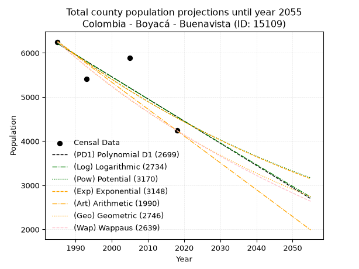
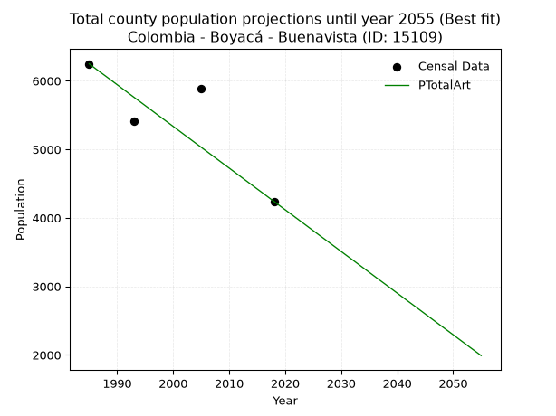
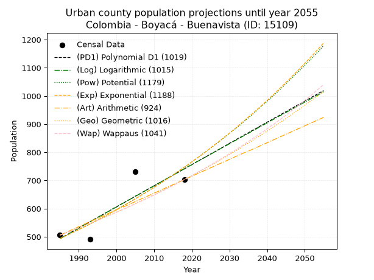
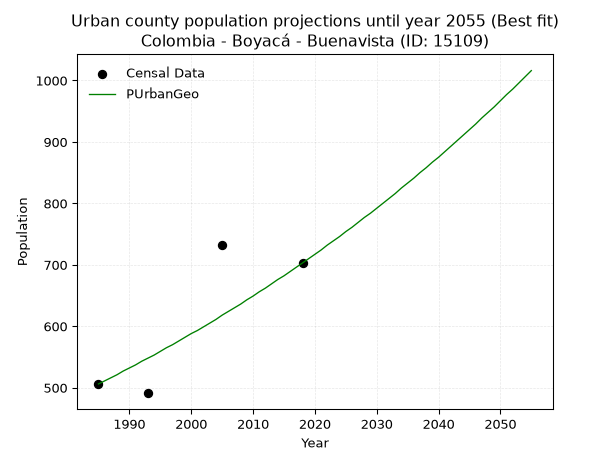
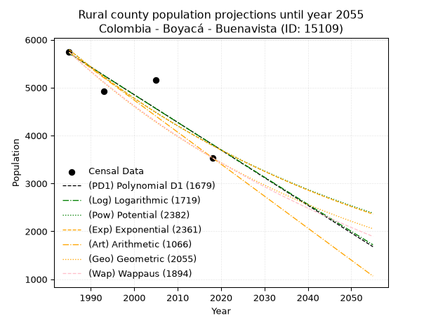
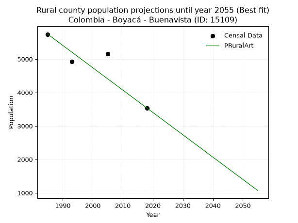

<div align="center">


</div>

# _“Population and Public Services Demand Projections (PPSD) until Year 2050 for Colombia - Boyacá - Buenavista (ID: 15109)”_
Keywords: `population` `public-service` `projection` `lineal` `polynomial` `logarithmic` `potential` `exponential` `arithmetic` `geometric` `wappaus` `dane` `colombia` `south-america`

PPSD are analytical estimates used by governments and planners to anticipate future changes in population size, age distribution, and the resulting community needs for utilities, healthcare, education, and infrastructure as sizing future water treatment facilities, electrical grids, and road networks based on spatial growth.

> **General running parameters**: • app_version: _v20260806_. • Python version: _3.14.7_. • Pandas version: _3.0.5_. • NumPy version: _2.5.1_. • Creates, save and include plots into reports (create_plot): _False_. • Projection until year: _2050_. • Process polynomial degree 2 and up: _False_. • Process Wappaus: _True_. • Process Wappaus: _True_. • Set negative values to zero: _True_. • Set infinite values to zero: _True_. • Drop dataset notes: _True_. 
<div align="center">

Dynamic map: [:earth_americas:Google](http://maps.google.com/maps?q=5.512594172,-73.9421699) [:earth_americas:OSM](https://www.openstreetmap.org/#map=18/5.512594172/-73.9421699&layers=P) [:earth_americas:Bing](https://www.bing.com/maps?cp=5.512594172~-73.9421699&lvl=18) [:earth_americas:Apple](https://maps.apple.com/frame?center=5.512594172%2C-73.9421699&span=0.003%2C0.006)

</div>


<div align="center">

```geojson
{
  "type": "Feature",
  "geometry": {
    "type": "Point", 
    "coordinates": [-73.9421699, 5.512594172]
  }, 
  "properties": {
    "Name": "Colombia - Boyacá - Buenavista (ID: 15109)"
  }
}
```

</div>


## 0. Census Data (4 records)

Census data are official statistics collected by a government about the people and housing in a country. They usually include counts of total population, age, sex, race, income, education, and jobs.

📅Global census file: [Population.xlsx](../data/Population.xlsx)

| Source   |   Year |   CountryID | CountryName   |   StateID | StateName   |   CountyID | CountyName   |   PTotal |   PUrban |   PRural |
|:---------|-------:|------------:|:--------------|----------:|:------------|-----------:|:-------------|---------:|---------:|---------:|
| DANE     |   1985 |          57 | Colombia      |        15 | Boyacá      |      15109 | Buenavista   |     6247 |      506 |     5741 |
| DANE     |   1993 |          57 | Colombia      |        15 | Boyacá      |      15109 | Buenavista   |     5410 |      491 |     4919 |
| DANE     |   2005 |          57 | Colombia      |        15 | Boyacá      |      15109 | Buenavista   |     5889 |      732 |     5157 |
| DANE     |   2018 |          57 | Colombia      |        15 | Boyacá      |      15109 | Buenavista   |     4240 |      703 |     3537 |

> 🔥Some records could had specific notes about the registered values or the corresponding urban or rural distribution.

📅   [RUPS](https://www.datos.gov.co/Hacienda-y-Cr-dito-P-blico/Registro-nico-de-Prestadores-de-Servicios-P-blicos/4qkq-csdn/about_data) - Local public utility companies: [RUPS.csv](../data/RUPS.xlsx)

 | SERVICIO       | ESTADO    | NOMBRE                                                 | NIT         | DEPARTAMENTO_DOMICILIO   | MUNICIPIO_DOMICILIO   | DIRECCION       |   TELEFONO | EMAIL                         | TIPO_INSCRIPCION    | REPRESENTANTE_LEGAL            | TIPO_PRESTADOR                             | CLASIFICACION                 |
|:---------------|:----------|:-------------------------------------------------------|:------------|:-------------------------|:----------------------|:----------------|-----------:|:------------------------------|:--------------------|:-------------------------------|:-------------------------------------------|:------------------------------|
| ACUEDUCTO      | OPERATIVA | EMPRESA DE SERVICIOS PÚBLICOS DE BUENAVISTA S.A E.S.P. | 900327645-1 | BOYACA                   | BUENAVISTA            | CALLE 4 Nº 4-44 |    8024510 | buenservicio.sa.esp@gmail.com | Registro por la ESP | YILVER ALEXANDER PARRA CAMACHO | SOCIEDADES (EMPRESA DE SERVICIOS PUBLICOS) | MENOR O IGUAL A 2500 USUARIOS |
| ALCANTARILLADO | OPERATIVA | EMPRESA DE SERVICIOS PÚBLICOS DE BUENAVISTA S.A E.S.P. | 900327645-1 | BOYACA                   | BUENAVISTA            | CALLE 4 Nº 4-44 |    8024510 | buenservicio.sa.esp@gmail.com | Registro por la ESP | YILVER ALEXANDER PARRA CAMACHO | SOCIEDADES (EMPRESA DE SERVICIOS PUBLICOS) | MENOR O IGUAL A 2500 USUARIOS |

## 1. Total

### 1.1. Coefficients and Parameters

* (PD1) Polynomial Deg 1: -50.19108791649843, 105841.22360497598 (lineal)
* (Log) Logarithmic: -100386.01355377265, 768481.3934652522
* (Pow) Potential: -19.64111382644407, 68.56837531295703
* (Exp) Exponential: -0.009821266945198463, 1833493840003.3389
* (Art) Arithmetic: Year diff. 2018 - 1985 = 33, Population diff. 4240 - 6247 = -2007, Annual growth = -60.81818181818182
* (Geo) Geometric: Year diff. 2018 - 1985 = 33, Population diff. 4240 - 6247 = -2007, Annual growth % = -0.011674891484331651
* (Wap) Wappaus: i = -1.1598775973716375, Condition values only valid for < 200)

<sub>
Wappaus condition values: ['-0.00', '-1.16', '-2.32', '-3.48', '-4.64', '-5.80', '-6.96', '-8.12', '-9.28', '-10.44', '-11.60', '-12.76', '-13.92', '-15.08', '-16.24', '-17.40', '-18.56', '-19.72', '-20.88', '-22.04', '-23.20', '-24.36', '-25.52', '-26.68', '-27.84', '-29.00', '-30.16', '-31.32', '-32.48', '-33.64', '-34.80', '-35.96', '-37.12', '-38.28', '-39.44', '-40.60', '-41.76', '-42.92', '-44.08', '-45.24', '-46.40', '-47.55', '-48.71', '-49.87', '-51.03', '-52.19', '-53.35', '-54.51', '-55.67', '-56.83', '-57.99', '-59.15', '-60.31', '-61.47', '-62.63', '-63.79', '-64.95', '-66.11', '-67.27', '-68.43', '-69.59', '-70.75', '-71.91', '-73.07', '-74.23', '-75.39']
</sub>


### 1.2. Projected Dataset

|   Year |   CountyID |   PTotalPD1 |   PTotalLog |   PTotalPow |   PTotalExp |   PTotalArt |   PTotalGeo |   PTotalWap |
|-------:|-----------:|------------:|------------:|------------:|------------:|------------:|------------:|------------:|
|   1985 |      15109 |        6212 |        6213 |        6262 |        6261 |        6247 |        6247 |        6247 |
|   1986 |      15109 |        6162 |        6162 |        6200 |        6199 |        6186 |        6174 |        6175 |
|   1987 |      15109 |        6112 |        6112 |        6139 |        6139 |        6125 |        6102 |        6104 |
|   1988 |      15109 |        6061 |        6061 |        6079 |        6079 |        6065 |        6031 |        6033 |
|   1989 |      15109 |        6011 |        6011 |        6019 |        6019 |        6004 |        5960 |        5964 |
|   1990 |      15109 |        5961 |        5960 |        5960 |        5961 |        5943 |        5891 |        5895 |
|   1991 |      15109 |        5911 |        5910 |        5901 |        5902 |        5882 |        5822 |        5827 |
|   1992 |      15109 |        5861 |        5859 |        5843 |        5845 |        5821 |        5754 |        5760 |
|   1993 |      15109 |        5810 |        5809 |        5786 |        5788 |        5760 |        5687 |        5693 |
|   1994 |      15109 |        5760 |        5759 |        5729 |        5731 |        5700 |        5620 |        5627 |
|   1995 |      15109 |        5710 |        5708 |        5673 |        5675 |        5639 |        5555 |        5562 |
|   1996 |      15109 |        5660 |        5658 |        5618 |        5619 |        5578 |        5490 |        5498 |
|   1997 |      15109 |        5610 |        5608 |        5563 |        5565 |        5517 |        5426 |        5434 |
|   1998 |      15109 |        5559 |        5558 |        5508 |        5510 |        5456 |        5363 |        5371 |
|   1999 |      15109 |        5509 |        5507 |        5454 |        5456 |        5396 |        5300 |        5309 |
|   2000 |      15109 |        5459 |        5457 |        5401 |        5403 |        5335 |        5238 |        5247 |
|   2001 |      15109 |        5409 |        5407 |        5348 |        5350 |        5274 |        5177 |        5186 |
|   2002 |      15109 |        5359 |        5357 |        5296 |        5298 |        5213 |        5116 |        5126 |
|   2003 |      15109 |        5308 |        5307 |        5244 |        5246 |        5152 |        5057 |        5066 |
|   2004 |      15109 |        5258 |        5257 |        5193 |        5195 |        5091 |        4998 |        5007 |
|   2005 |      15109 |        5208 |        5206 |        5142 |        5144 |        5031 |        4939 |        4948 |
|   2006 |      15109 |        5158 |        5156 |        5092 |        5094 |        4970 |        4882 |        4891 |
|   2007 |      15109 |        5108 |        5106 |        5043 |        5044 |        4909 |        4825 |        4833 |
|   2008 |      15109 |        5058 |        5056 |        4994 |        4995 |        4848 |        4768 |        4777 |
|   2009 |      15109 |        5007 |        5006 |        4945 |        4946 |        4787 |        4713 |        4720 |
|   2010 |      15109 |        4957 |        4956 |        4897 |        4898 |        4727 |        4658 |        4665 |
|   2011 |      15109 |        4907 |        4906 |        4849 |        4850 |        4666 |        4603 |        4610 |
|   2012 |      15109 |        4857 |        4857 |        4802 |        4802 |        4605 |        4550 |        4556 |
|   2013 |      15109 |        4807 |        4807 |        4756 |        4755 |        4544 |        4496 |        4502 |
|   2014 |      15109 |        4756 |        4757 |        4709 |        4709 |        4483 |        4444 |        4448 |
|   2015 |      15109 |        4706 |        4707 |        4664 |        4663 |        4422 |        4392 |        4395 |
|   2016 |      15109 |        4656 |        4657 |        4618 |        4617 |        4362 |        4341 |        4343 |
|   2017 |      15109 |        4606 |        4607 |        4574 |        4572 |        4301 |        4290 |        4291 |
|   2018 |      15109 |        4556 |        4558 |        4529 |        4528 |        4240 |        4240 |        4240 |
|   2019 |      15109 |        4505 |        4508 |        4486 |        4483 |        4179 |        4190 |        4189 |
|   2020 |      15109 |        4455 |        4458 |        4442 |        4439 |        4118 |        4142 |        4139 |
|   2021 |      15109 |        4405 |        4409 |        4399 |        4396 |        4058 |        4093 |        4089 |
|   2022 |      15109 |        4355 |        4359 |        4357 |        4353 |        3997 |        4045 |        4040 |
|   2023 |      15109 |        4305 |        4309 |        4315 |        4311 |        3936 |        3998 |        3991 |
|   2024 |      15109 |        4254 |        4260 |        4273 |        4268 |        3875 |        3952 |        3942 |
|   2025 |      15109 |        4204 |        4210 |        4232 |        4227 |        3814 |        3905 |        3894 |
|   2026 |      15109 |        4154 |        4160 |        4191 |        4185 |        3753 |        3860 |        3847 |
|   2027 |      15109 |        4104 |        4111 |        4150 |        4144 |        3693 |        3815 |        3800 |
|   2028 |      15109 |        4054 |        4061 |        4110 |        4104 |        3632 |        3770 |        3753 |
|   2029 |      15109 |        4004 |        4012 |        4071 |        4064 |        3571 |        3726 |        3707 |
|   2030 |      15109 |        3953 |        3962 |        4032 |        4024 |        3510 |        3683 |        3661 |
|   2031 |      15109 |        3903 |        3913 |        3993 |        3985 |        3449 |        3640 |        3616 |
|   2032 |      15109 |        3853 |        3864 |        3954 |        3946 |        3389 |        3597 |        3571 |
|   2033 |      15109 |        3803 |        3814 |        3916 |        3907 |        3328 |        3555 |        3526 |
|   2034 |      15109 |        3753 |        3765 |        3879 |        3869 |        3267 |        3514 |        3482 |
|   2035 |      15109 |        3702 |        3716 |        3841 |        3831 |        3206 |        3473 |        3439 |
|   2036 |      15109 |        3652 |        3666 |        3804 |        3794 |        3145 |        3432 |        3395 |
|   2037 |      15109 |        3602 |        3617 |        3768 |        3757 |        3084 |        3392 |        3352 |
|   2038 |      15109 |        3552 |        3568 |        3732 |        3720 |        3024 |        3352 |        3310 |
|   2039 |      15109 |        3502 |        3518 |        3696 |        3684 |        2963 |        3313 |        3267 |
|   2040 |      15109 |        3451 |        3469 |        3661 |        3648 |        2902 |        3275 |        3226 |
|   2041 |      15109 |        3401 |        3420 |        3626 |        3612 |        2841 |        3236 |        3184 |
|   2042 |      15109 |        3351 |        3371 |        3591 |        3577 |        2780 |        3199 |        3143 |
|   2043 |      15109 |        3301 |        3322 |        3556 |        3542 |        2720 |        3161 |        3102 |
|   2044 |      15109 |        3251 |        3273 |        3522 |        3507 |        2659 |        3124 |        3062 |
|   2045 |      15109 |        3200 |        3223 |        3489 |        3473 |        2598 |        3088 |        3022 |
|   2046 |      15109 |        3150 |        3174 |        3455 |        3439 |        2537 |        3052 |        2982 |
|   2047 |      15109 |        3100 |        3125 |        3422 |        3405 |        2476 |        3016 |        2943 |
|   2048 |      15109 |        3050 |        3076 |        3390 |        3372 |        2415 |        2981 |        2904 |
|   2049 |      15109 |        3000 |        3027 |        3357 |        3339 |        2355 |        2946 |        2865 |
|   2050 |      15109 |        2949 |        2978 |        3325 |        3307 |        2294 |        2912 |        2827 |
<div align="center">

</img>

</div>


### 1.3. Best fit with absolute and relative error (%)

Relative error puts that difference into context by dividing the absolute error by the true value, creating a unitless ratio or percentage that shows the scale of the mistake.

Absolute and relative error

|   Year | Source   |   CountryID | CountryName   |   StateID | StateName   |   CountyID_x | CountyName   |   PTotal |   PUrban |   PRural |   CountyID_y |   PTotalPD1 |   PTotalLog |   PTotalPow |   PTotalExp |   PTotalArt |   PTotalGeo |   PTotalWap |   PTotalPD1AbsError |   PTotalLogAbsError |   PTotalPowAbsError |   PTotalExpAbsError |   PTotalArtAbsError |   PTotalGeoAbsError |   PTotalWapAbsError |   PTotalPD1RelError |   PTotalLogRelError |   PTotalPowRelError |   PTotalExpRelError |   PTotalArtRelError |   PTotalGeoRelError |   PTotalWapRelError |
|-------:|:---------|------------:|:--------------|----------:|:------------|-------------:|:-------------|---------:|---------:|---------:|-------------:|------------:|------------:|------------:|------------:|------------:|------------:|------------:|--------------------:|--------------------:|--------------------:|--------------------:|--------------------:|--------------------:|--------------------:|--------------------:|--------------------:|--------------------:|--------------------:|--------------------:|--------------------:|--------------------:|
|   1985 | DANE     |          57 | Colombia      |        15 | Boyacá      |        15109 | Buenavista   |     6247 |      506 |     5741 |        15109 |        6212 |        6213 |        6262 |        6261 |        6247 |        6247 |        6247 |                  35 |                  34 |                  15 |                  14 |                   0 |                   0 |                   0 |            0.560269 |            0.544261 |            0.240115 |            0.224108 |              0      |             0       |             0       |
|   1993 | DANE     |          57 | Colombia      |        15 | Boyacá      |        15109 | Buenavista   |     5410 |      491 |     4919 |        15109 |        5810 |        5809 |        5786 |        5788 |        5760 |        5687 |        5693 |                 400 |                 399 |                 376 |                 378 |                 350 |                 277 |                 283 |            7.39372  |            7.37523  |            6.95009  |            6.98706  |              6.4695 |             5.12015 |             5.23105 |
|   2005 | DANE     |          57 | Colombia      |        15 | Boyacá      |        15109 | Buenavista   |     5889 |      732 |     5157 |        15109 |        5208 |        5206 |        5142 |        5144 |        5031 |        4939 |        4948 |                 681 |                 683 |                 747 |                 745 |                 858 |                 950 |                 941 |           11.5639   |           11.5979   |           12.6847   |           12.6507   |             14.5695 |            16.1318  |            15.9789  |
|   2018 | DANE     |          57 | Colombia      |        15 | Boyacá      |        15109 | Buenavista   |     4240 |      703 |     3537 |        15109 |        4556 |        4558 |        4529 |        4528 |        4240 |        4240 |        4240 |                 316 |                 318 |                 289 |                 288 |                   0 |                   0 |                   0 |            7.45283  |            7.5      |            6.81604  |            6.79245  |              0      |             0       |             0       |

Relative error mean

| Method    |   RelError | Best   |
|:----------|-----------:|:-------|
| PTotalPD1 |    6.74269 |        |
| PTotalLog |    6.75435 |        |
| PTotalPow |    6.67273 |        |
| PTotalExp |    6.66358 |        |
| PTotalArt |    5.25976 | True   |
| PTotalGeo |    5.31298 |        |
| PTotalWap |    5.3025  |        |

💙Best method: _**PTotalArt**_
<div align="center">

</img>

</div>


### 1.4. Fresh water supply demand in liters per capita per day (lpcd)

The fresh water supply demand typically ranges from 100 to 300 liters per capita per day (lpcd) for standard domestic and municipal planning, though absolute survival minimums set by the World Health Organization are as low as 7.5 to 20 liters per day, and total consumption in high-income nations can exceed 400 liters.

> `CZ`: Level in meters above the sea level (masl)<br> `WS`: Fresh water supply demand in liters per capita per day (lpcd or l/h/d)<br> `WSAll`: Zonal fresh water supply demand in liters per second (l/s)<br> `A`: Zonal area in square meters<br> `DP`: Population density (people/hectare or p/ha)

Reference values (RAS Colombia)

|    CZ |   WS |
|------:|-----:|
|  1000 |  120 |
|  2000 |  130 |
| 99999 |  140 |

County shapefile geometry properties and water supply values

|   CountyID |     ATotal |   CZTotal |   WSTotal |
|-----------:|-----------:|----------:|----------:|
|      15109 | 1.1001e+08 |   2106.44 |       140 |

Projected values for best method: PTotalArt

|   CountyID |   Year |   PTotalArt |   DPTotal |   WSTotal |   WSTotalAll |
|-----------:|-------:|------------:|----------:|----------:|-------------:|
|      15109 |   1985 |        6247 |      0.57 |       140 |     10.1225  |
|      15109 |   1986 |        6186 |      0.56 |       140 |     10.0236  |
|      15109 |   1987 |        6125 |      0.56 |       140 |      9.92477 |
|      15109 |   1988 |        6065 |      0.55 |       140 |      9.82755 |
|      15109 |   1989 |        6004 |      0.55 |       140 |      9.7287  |
|      15109 |   1990 |        5943 |      0.54 |       140 |      9.62986 |
|      15109 |   1991 |        5882 |      0.53 |       140 |      9.53102 |
|      15109 |   1992 |        5821 |      0.53 |       140 |      9.43218 |
|      15109 |   1993 |        5760 |      0.52 |       140 |      9.33333 |
|      15109 |   1994 |        5700 |      0.52 |       140 |      9.23611 |
|      15109 |   1995 |        5639 |      0.51 |       140 |      9.13727 |
|      15109 |   1996 |        5578 |      0.51 |       140 |      9.03843 |
|      15109 |   1997 |        5517 |      0.5  |       140 |      8.93958 |
|      15109 |   1998 |        5456 |      0.5  |       140 |      8.84074 |
|      15109 |   1999 |        5396 |      0.49 |       140 |      8.74352 |
|      15109 |   2000 |        5335 |      0.48 |       140 |      8.64468 |
|      15109 |   2001 |        5274 |      0.48 |       140 |      8.54583 |
|      15109 |   2002 |        5213 |      0.47 |       140 |      8.44699 |
|      15109 |   2003 |        5152 |      0.47 |       140 |      8.34815 |
|      15109 |   2004 |        5091 |      0.46 |       140 |      8.24931 |
|      15109 |   2005 |        5031 |      0.46 |       140 |      8.15208 |
|      15109 |   2006 |        4970 |      0.45 |       140 |      8.05324 |
|      15109 |   2007 |        4909 |      0.45 |       140 |      7.9544  |
|      15109 |   2008 |        4848 |      0.44 |       140 |      7.85556 |
|      15109 |   2009 |        4787 |      0.44 |       140 |      7.75671 |
|      15109 |   2010 |        4727 |      0.43 |       140 |      7.65949 |
|      15109 |   2011 |        4666 |      0.42 |       140 |      7.56065 |
|      15109 |   2012 |        4605 |      0.42 |       140 |      7.46181 |
|      15109 |   2013 |        4544 |      0.41 |       140 |      7.36296 |
|      15109 |   2014 |        4483 |      0.41 |       140 |      7.26412 |
|      15109 |   2015 |        4422 |      0.4  |       140 |      7.16528 |
|      15109 |   2016 |        4362 |      0.4  |       140 |      7.06806 |
|      15109 |   2017 |        4301 |      0.39 |       140 |      6.96921 |
|      15109 |   2018 |        4240 |      0.39 |       140 |      6.87037 |
|      15109 |   2019 |        4179 |      0.38 |       140 |      6.77153 |
|      15109 |   2020 |        4118 |      0.37 |       140 |      6.67269 |
|      15109 |   2021 |        4058 |      0.37 |       140 |      6.57546 |
|      15109 |   2022 |        3997 |      0.36 |       140 |      6.47662 |
|      15109 |   2023 |        3936 |      0.36 |       140 |      6.37778 |
|      15109 |   2024 |        3875 |      0.35 |       140 |      6.27894 |
|      15109 |   2025 |        3814 |      0.35 |       140 |      6.18009 |
|      15109 |   2026 |        3753 |      0.34 |       140 |      6.08125 |
|      15109 |   2027 |        3693 |      0.34 |       140 |      5.98403 |
|      15109 |   2028 |        3632 |      0.33 |       140 |      5.88519 |
|      15109 |   2029 |        3571 |      0.32 |       140 |      5.78634 |
|      15109 |   2030 |        3510 |      0.32 |       140 |      5.6875  |
|      15109 |   2031 |        3449 |      0.31 |       140 |      5.58866 |
|      15109 |   2032 |        3389 |      0.31 |       140 |      5.49144 |
|      15109 |   2033 |        3328 |      0.3  |       140 |      5.39259 |
|      15109 |   2034 |        3267 |      0.3  |       140 |      5.29375 |
|      15109 |   2035 |        3206 |      0.29 |       140 |      5.19491 |
|      15109 |   2036 |        3145 |      0.29 |       140 |      5.09606 |
|      15109 |   2037 |        3084 |      0.28 |       140 |      4.99722 |
|      15109 |   2038 |        3024 |      0.27 |       140 |      4.9     |
|      15109 |   2039 |        2963 |      0.27 |       140 |      4.80116 |
|      15109 |   2040 |        2902 |      0.26 |       140 |      4.70231 |
|      15109 |   2041 |        2841 |      0.26 |       140 |      4.60347 |
|      15109 |   2042 |        2780 |      0.25 |       140 |      4.50463 |
|      15109 |   2043 |        2720 |      0.25 |       140 |      4.40741 |
|      15109 |   2044 |        2659 |      0.24 |       140 |      4.30856 |
|      15109 |   2045 |        2598 |      0.24 |       140 |      4.20972 |
|      15109 |   2046 |        2537 |      0.23 |       140 |      4.11088 |
|      15109 |   2047 |        2476 |      0.23 |       140 |      4.01204 |
|      15109 |   2048 |        2415 |      0.22 |       140 |      3.91319 |
|      15109 |   2049 |        2355 |      0.21 |       140 |      3.81597 |
|      15109 |   2050 |        2294 |      0.21 |       140 |      3.71713 |

## 2. Urban

### 2.1. Coefficients and Parameters

* (PD1) Polynomial Deg 1: 7.51344841429145, -14420.775190686476 (lineal)
* (Log) Logarithmic: 15047.420469631366, -113767.56357212801
* (Pow) Potential: 25.110901643900633, -80.11631606232638
* (Exp) Exponential: 0.012538961281110211, 7.657902223771057e-09
* (Art) Arithmetic: Year diff. 2018 - 1985 = 33, Population diff. 703 - 506 = 197, Annual growth = 5.96969696969697
* (Geo) Geometric: Year diff. 2018 - 1985 = 33, Population diff. 703 - 506 = 197, Annual growth % = 0.010014057595172376
* (Wap) Wappaus: i = 0.987542923026794, Condition values only valid for < 200)

<sub>
Wappaus condition values: ['0.00', '0.99', '1.98', '2.96', '3.95', '4.94', '5.93', '6.91', '7.90', '8.89', '9.88', '10.86', '11.85', '12.84', '13.83', '14.81', '15.80', '16.79', '17.78', '18.76', '19.75', '20.74', '21.73', '22.71', '23.70', '24.69', '25.68', '26.66', '27.65', '28.64', '29.63', '30.61', '31.60', '32.59', '33.58', '34.56', '35.55', '36.54', '37.53', '38.51', '39.50', '40.49', '41.48', '42.46', '43.45', '44.44', '45.43', '46.41', '47.40', '48.39', '49.38', '50.36', '51.35', '52.34', '53.33', '54.31', '55.30', '56.29', '57.28', '58.27', '59.25', '60.24', '61.23', '62.22', '63.20', '64.19']
</sub>


### 2.2. Projected Dataset

|   Year |   CountyID |   PUrbanPD1 |   PUrbanLog |   PUrbanPow |   PUrbanExp |   PUrbanArt |   PUrbanGeo |   PUrbanWap |
|-------:|-----------:|------------:|------------:|------------:|------------:|------------:|------------:|------------:|
|   1985 |      15109 |         493 |         493 |         494 |         494 |         506 |         506 |         506 |
|   1986 |      15109 |         501 |         501 |         500 |         500 |         512 |         511 |         511 |
|   1987 |      15109 |         508 |         508 |         506 |         506 |         518 |         516 |         516 |
|   1988 |      15109 |         516 |         516 |         513 |         513 |         524 |         521 |         521 |
|   1989 |      15109 |         523 |         523 |         519 |         519 |         530 |         527 |         526 |
|   1990 |      15109 |         531 |         531 |         526 |         526 |         536 |         532 |         532 |
|   1991 |      15109 |         539 |         539 |         533 |         532 |         542 |         537 |         537 |
|   1992 |      15109 |         546 |         546 |         539 |         539 |         548 |         543 |         542 |
|   1993 |      15109 |         554 |         554 |         546 |         546 |         554 |         548 |         548 |
|   1994 |      15109 |         561 |         561 |         553 |         553 |         560 |         553 |         553 |
|   1995 |      15109 |         569 |         569 |         560 |         560 |         566 |         559 |         559 |
|   1996 |      15109 |         576 |         576 |         567 |         567 |         572 |         565 |         564 |
|   1997 |      15109 |         584 |         584 |         574 |         574 |         578 |         570 |         570 |
|   1998 |      15109 |         591 |         591 |         582 |         581 |         584 |         576 |         575 |
|   1999 |      15109 |         599 |         599 |         589 |         589 |         590 |         582 |         581 |
|   2000 |      15109 |         606 |         606 |         596 |         596 |         596 |         588 |         587 |
|   2001 |      15109 |         614 |         614 |         604 |         604 |         602 |         593 |         593 |
|   2002 |      15109 |         621 |         621 |         612 |         611 |         607 |         599 |         599 |
|   2003 |      15109 |         629 |         629 |         619 |         619 |         613 |         605 |         605 |
|   2004 |      15109 |         636 |         636 |         627 |         627 |         619 |         611 |         611 |
|   2005 |      15109 |         644 |         644 |         635 |         635 |         625 |         618 |         617 |
|   2006 |      15109 |         651 |         651 |         643 |         643 |         631 |         624 |         623 |
|   2007 |      15109 |         659 |         659 |         651 |         651 |         637 |         630 |         629 |
|   2008 |      15109 |         666 |         666 |         659 |         659 |         643 |         636 |         636 |
|   2009 |      15109 |         674 |         674 |         668 |         667 |         649 |         643 |         642 |
|   2010 |      15109 |         681 |         681 |         676 |         676 |         655 |         649 |         649 |
|   2011 |      15109 |         689 |         689 |         684 |         684 |         661 |         656 |         655 |
|   2012 |      15109 |         696 |         696 |         693 |         693 |         667 |         662 |         662 |
|   2013 |      15109 |         704 |         704 |         702 |         702 |         673 |         669 |         668 |
|   2014 |      15109 |         711 |         711 |         711 |         710 |         679 |         676 |         675 |
|   2015 |      15109 |         719 |         719 |         719 |         719 |         685 |         682 |         682 |
|   2016 |      15109 |         726 |         726 |         728 |         729 |         691 |         689 |         689 |
|   2017 |      15109 |         734 |         734 |         738 |         738 |         697 |         696 |         696 |
|   2018 |      15109 |         741 |         741 |         747 |         747 |         703 |         703 |         703 |
|   2019 |      15109 |         749 |         749 |         756 |         756 |         709 |         710 |         710 |
|   2020 |      15109 |         756 |         756 |         766 |         766 |         715 |         717 |         717 |
|   2021 |      15109 |         764 |         764 |         775 |         776 |         721 |         724 |         725 |
|   2022 |      15109 |         771 |         771 |         785 |         785 |         727 |         732 |         732 |
|   2023 |      15109 |         779 |         778 |         795 |         795 |         733 |         739 |         740 |
|   2024 |      15109 |         786 |         786 |         805 |         805 |         739 |         746 |         747 |
|   2025 |      15109 |         794 |         793 |         815 |         816 |         745 |         754 |         755 |
|   2026 |      15109 |         801 |         801 |         825 |         826 |         751 |         761 |         763 |
|   2027 |      15109 |         809 |         808 |         835 |         836 |         757 |         769 |         771 |
|   2028 |      15109 |         816 |         816 |         846 |         847 |         763 |         777 |         779 |
|   2029 |      15109 |         824 |         823 |         856 |         858 |         769 |         784 |         787 |
|   2030 |      15109 |         832 |         830 |         867 |         868 |         775 |         792 |         795 |
|   2031 |      15109 |         839 |         838 |         878 |         879 |         781 |         800 |         803 |
|   2032 |      15109 |         847 |         845 |         888 |         890 |         787 |         808 |         812 |
|   2033 |      15109 |         854 |         853 |         899 |         902 |         793 |         816 |         820 |
|   2034 |      15109 |         862 |         860 |         911 |         913 |         799 |         825 |         829 |
|   2035 |      15109 |         869 |         867 |         922 |         925 |         804 |         833 |         838 |
|   2036 |      15109 |         877 |         875 |         933 |         936 |         810 |         841 |         847 |
|   2037 |      15109 |         884 |         882 |         945 |         948 |         816 |         850 |         856 |
|   2038 |      15109 |         892 |         890 |         957 |         960 |         822 |         858 |         865 |
|   2039 |      15109 |         899 |         897 |         969 |         972 |         828 |         867 |         874 |
|   2040 |      15109 |         907 |         904 |         981 |         984 |         834 |         875 |         883 |
|   2041 |      15109 |         914 |         912 |         993 |         997 |         840 |         884 |         893 |
|   2042 |      15109 |         922 |         919 |        1005 |        1009 |         846 |         893 |         902 |
|   2043 |      15109 |         929 |         927 |        1017 |        1022 |         852 |         902 |         912 |
|   2044 |      15109 |         937 |         934 |        1030 |        1035 |         858 |         911 |         922 |
|   2045 |      15109 |         944 |         941 |        1043 |        1048 |         864 |         920 |         932 |
|   2046 |      15109 |         952 |         949 |        1056 |        1061 |         870 |         929 |         942 |
|   2047 |      15109 |         959 |         956 |        1069 |        1075 |         876 |         939 |         953 |
|   2048 |      15109 |         967 |         963 |        1082 |        1088 |         882 |         948 |         963 |
|   2049 |      15109 |         974 |         971 |        1095 |        1102 |         888 |         957 |         974 |
|   2050 |      15109 |         982 |         978 |        1109 |        1116 |         894 |         967 |         984 |
<div align="center">

</img>

</div>


### 2.3. Best fit with absolute and relative error (%)

Relative error puts that difference into context by dividing the absolute error by the true value, creating a unitless ratio or percentage that shows the scale of the mistake.

Absolute and relative error

|   Year | Source   |   CountryID | CountryName   |   StateID | StateName   |   CountyID_x | CountyName   |   PTotal |   PUrban |   PRural |   CountyID_y |   PUrbanPD1 |   PUrbanLog |   PUrbanPow |   PUrbanExp |   PUrbanArt |   PUrbanGeo |   PUrbanWap |   PUrbanPD1AbsError |   PUrbanLogAbsError |   PUrbanPowAbsError |   PUrbanExpAbsError |   PUrbanArtAbsError |   PUrbanGeoAbsError |   PUrbanWapAbsError |   PUrbanPD1RelError |   PUrbanLogRelError |   PUrbanPowRelError |   PUrbanExpRelError |   PUrbanArtRelError |   PUrbanGeoRelError |   PUrbanWapRelError |
|-------:|:---------|------------:|:--------------|----------:|:------------|-------------:|:-------------|---------:|---------:|---------:|-------------:|------------:|------------:|------------:|------------:|------------:|------------:|------------:|--------------------:|--------------------:|--------------------:|--------------------:|--------------------:|--------------------:|--------------------:|--------------------:|--------------------:|--------------------:|--------------------:|--------------------:|--------------------:|--------------------:|
|   1985 | DANE     |          57 | Colombia      |        15 | Boyacá      |        15109 | Buenavista   |     6247 |      506 |     5741 |        15109 |         493 |         493 |         494 |         494 |         506 |         506 |         506 |                  13 |                  13 |                  12 |                  12 |                   0 |                   0 |                   0 |             2.56917 |             2.56917 |             2.37154 |             2.37154 |              0      |              0      |              0      |
|   1993 | DANE     |          57 | Colombia      |        15 | Boyacá      |        15109 | Buenavista   |     5410 |      491 |     4919 |        15109 |         554 |         554 |         546 |         546 |         554 |         548 |         548 |                  63 |                  63 |                  55 |                  55 |                  63 |                  57 |                  57 |            12.831   |            12.831   |            11.2016  |            11.2016  |             12.831  |             11.609  |             11.609  |
|   2005 | DANE     |          57 | Colombia      |        15 | Boyacá      |        15109 | Buenavista   |     5889 |      732 |     5157 |        15109 |         644 |         644 |         635 |         635 |         625 |         618 |         617 |                  88 |                  88 |                  97 |                  97 |                 107 |                 114 |                 115 |            12.0219  |            12.0219  |            13.2514  |            13.2514  |             14.6175 |             15.5738 |             15.7104 |
|   2018 | DANE     |          57 | Colombia      |        15 | Boyacá      |        15109 | Buenavista   |     4240 |      703 |     3537 |        15109 |         741 |         741 |         747 |         747 |         703 |         703 |         703 |                  38 |                  38 |                  44 |                  44 |                   0 |                   0 |                   0 |             5.40541 |             5.40541 |             6.25889 |             6.25889 |              0      |              0      |              0      |

Relative error mean

| Method    |   RelError | Best   |
|:----------|-----------:|:-------|
| PUrbanPD1 |    8.20685 |        |
| PUrbanLog |    8.20685 |        |
| PUrbanPow |    8.27086 |        |
| PUrbanExp |    8.27086 |        |
| PUrbanArt |    6.86211 |        |
| PUrbanGeo |    6.79568 | True   |
| PUrbanWap |    6.82984 |        |

💙Best method: _**PUrbanGeo**_
<div align="center">

</img>

</div>


### 2.4. Fresh water supply demand in liters per capita per day (lpcd)

The fresh water supply demand typically ranges from 100 to 300 liters per capita per day (lpcd) for standard domestic and municipal planning, though absolute survival minimums set by the World Health Organization are as low as 7.5 to 20 liters per day, and total consumption in high-income nations can exceed 400 liters.

> `CZ`: Level in meters above the sea level (masl)<br> `WS`: Fresh water supply demand in liters per capita per day (lpcd or l/h/d)<br> `WSAll`: Zonal fresh water supply demand in liters per second (l/s)<br> `A`: Zonal area in square meters<br> `DP`: Population density (people/hectare or p/ha)

Reference values (RAS Colombia)

|    CZ |   WS |
|------:|-----:|
|  1000 |  120 |
|  2000 |  130 |
| 99999 |  140 |

County shapefile geometry properties and water supply values

|   CountyID |   AUrban |   CZUrban |   WSUrban |
|-----------:|---------:|----------:|----------:|
|      15109 |   253127 |   2183.99 |       140 |

Projected values for best method: PUrbanGeo

|   CountyID |   Year |   PUrbanGeo |   DPUrban |   WSUrban |   WSUrbanAll |
|-----------:|-------:|------------:|----------:|----------:|-------------:|
|      15109 |   1985 |         506 |     19.99 |       140 |     0.819907 |
|      15109 |   1986 |         511 |     20.19 |       140 |     0.828009 |
|      15109 |   1987 |         516 |     20.39 |       140 |     0.836111 |
|      15109 |   1988 |         521 |     20.58 |       140 |     0.844213 |
|      15109 |   1989 |         527 |     20.82 |       140 |     0.853935 |
|      15109 |   1990 |         532 |     21.02 |       140 |     0.862037 |
|      15109 |   1991 |         537 |     21.21 |       140 |     0.870139 |
|      15109 |   1992 |         543 |     21.45 |       140 |     0.879861 |
|      15109 |   1993 |         548 |     21.65 |       140 |     0.887963 |
|      15109 |   1994 |         553 |     21.85 |       140 |     0.896065 |
|      15109 |   1995 |         559 |     22.08 |       140 |     0.905787 |
|      15109 |   1996 |         565 |     22.32 |       140 |     0.915509 |
|      15109 |   1997 |         570 |     22.52 |       140 |     0.923611 |
|      15109 |   1998 |         576 |     22.76 |       140 |     0.933333 |
|      15109 |   1999 |         582 |     22.99 |       140 |     0.943056 |
|      15109 |   2000 |         588 |     23.23 |       140 |     0.952778 |
|      15109 |   2001 |         593 |     23.43 |       140 |     0.96088  |
|      15109 |   2002 |         599 |     23.66 |       140 |     0.970602 |
|      15109 |   2003 |         605 |     23.9  |       140 |     0.980324 |
|      15109 |   2004 |         611 |     24.14 |       140 |     0.990046 |
|      15109 |   2005 |         618 |     24.41 |       140 |     1.00139  |
|      15109 |   2006 |         624 |     24.65 |       140 |     1.01111  |
|      15109 |   2007 |         630 |     24.89 |       140 |     1.02083  |
|      15109 |   2008 |         636 |     25.13 |       140 |     1.03056  |
|      15109 |   2009 |         643 |     25.4  |       140 |     1.0419   |
|      15109 |   2010 |         649 |     25.64 |       140 |     1.05162  |
|      15109 |   2011 |         656 |     25.92 |       140 |     1.06296  |
|      15109 |   2012 |         662 |     26.15 |       140 |     1.07269  |
|      15109 |   2013 |         669 |     26.43 |       140 |     1.08403  |
|      15109 |   2014 |         676 |     26.71 |       140 |     1.09537  |
|      15109 |   2015 |         682 |     26.94 |       140 |     1.10509  |
|      15109 |   2016 |         689 |     27.22 |       140 |     1.11644  |
|      15109 |   2017 |         696 |     27.5  |       140 |     1.12778  |
|      15109 |   2018 |         703 |     27.77 |       140 |     1.13912  |
|      15109 |   2019 |         710 |     28.05 |       140 |     1.15046  |
|      15109 |   2020 |         717 |     28.33 |       140 |     1.16181  |
|      15109 |   2021 |         724 |     28.6  |       140 |     1.17315  |
|      15109 |   2022 |         732 |     28.92 |       140 |     1.18611  |
|      15109 |   2023 |         739 |     29.19 |       140 |     1.19745  |
|      15109 |   2024 |         746 |     29.47 |       140 |     1.2088   |
|      15109 |   2025 |         754 |     29.79 |       140 |     1.22176  |
|      15109 |   2026 |         761 |     30.06 |       140 |     1.2331   |
|      15109 |   2027 |         769 |     30.38 |       140 |     1.24606  |
|      15109 |   2028 |         777 |     30.7  |       140 |     1.25903  |
|      15109 |   2029 |         784 |     30.97 |       140 |     1.27037  |
|      15109 |   2030 |         792 |     31.29 |       140 |     1.28333  |
|      15109 |   2031 |         800 |     31.6  |       140 |     1.2963   |
|      15109 |   2032 |         808 |     31.92 |       140 |     1.30926  |
|      15109 |   2033 |         816 |     32.24 |       140 |     1.32222  |
|      15109 |   2034 |         825 |     32.59 |       140 |     1.33681  |
|      15109 |   2035 |         833 |     32.91 |       140 |     1.34977  |
|      15109 |   2036 |         841 |     33.22 |       140 |     1.36273  |
|      15109 |   2037 |         850 |     33.58 |       140 |     1.37731  |
|      15109 |   2038 |         858 |     33.9  |       140 |     1.39028  |
|      15109 |   2039 |         867 |     34.25 |       140 |     1.40486  |
|      15109 |   2040 |         875 |     34.57 |       140 |     1.41782  |
|      15109 |   2041 |         884 |     34.92 |       140 |     1.43241  |
|      15109 |   2042 |         893 |     35.28 |       140 |     1.44699  |
|      15109 |   2043 |         902 |     35.63 |       140 |     1.46157  |
|      15109 |   2044 |         911 |     35.99 |       140 |     1.47616  |
|      15109 |   2045 |         920 |     36.35 |       140 |     1.49074  |
|      15109 |   2046 |         929 |     36.7  |       140 |     1.50532  |
|      15109 |   2047 |         939 |     37.1  |       140 |     1.52153  |
|      15109 |   2048 |         948 |     37.45 |       140 |     1.53611  |
|      15109 |   2049 |         957 |     37.81 |       140 |     1.55069  |
|      15109 |   2050 |         967 |     38.2  |       140 |     1.5669   |

## 3. Rural

### 3.1. Coefficients and Parameters

* (PD1) Polynomial Deg 1: -57.70453633078986, 120261.99879566242 (lineal)
* (Log) Logarithmic: -115433.43402340404, 882248.9570373807
* (Pow) Potential: -25.6506235943551, 88.3526278956811
* (Exp) Exponential: -0.012824625711253663, 658710997032175.4
* (Art) Arithmetic: Year diff. 2018 - 1985 = 33, Population diff. 3537 - 5741 = -2204, Annual growth = -66.78787878787878
* (Geo) Geometric: Year diff. 2018 - 1985 = 33, Population diff. 3537 - 5741 = -2204, Annual growth % = -0.014570221006218631
* (Wap) Wappaus: i = -1.4397042204759385, Condition values only valid for < 200)

<sub>
Wappaus condition values: ['-0.00', '-1.44', '-2.88', '-4.32', '-5.76', '-7.20', '-8.64', '-10.08', '-11.52', '-12.96', '-14.40', '-15.84', '-17.28', '-18.72', '-20.16', '-21.60', '-23.04', '-24.47', '-25.91', '-27.35', '-28.79', '-30.23', '-31.67', '-33.11', '-34.55', '-35.99', '-37.43', '-38.87', '-40.31', '-41.75', '-43.19', '-44.63', '-46.07', '-47.51', '-48.95', '-50.39', '-51.83', '-53.27', '-54.71', '-56.15', '-57.59', '-59.03', '-60.47', '-61.91', '-63.35', '-64.79', '-66.23', '-67.67', '-69.11', '-70.55', '-71.99', '-73.42', '-74.86', '-76.30', '-77.74', '-79.18', '-80.62', '-82.06', '-83.50', '-84.94', '-86.38', '-87.82', '-89.26', '-90.70', '-92.14', '-93.58']
</sub>


### 3.2. Projected Dataset

|   Year |   CountyID |   PRuralPD1 |   PRuralLog |   PRuralPow |   PRuralExp |   PRuralArt |   PRuralGeo |   PRuralWap |
|-------:|-----------:|------------:|------------:|------------:|------------:|------------:|------------:|------------:|
|   1985 |      15109 |        5718 |        5720 |        5794 |        5793 |        5741 |        5741 |        5741 |
|   1986 |      15109 |        5661 |        5662 |        5720 |        5719 |        5674 |        5657 |        5659 |
|   1987 |      15109 |        5603 |        5603 |        5647 |        5646 |        5607 |        5575 |        5578 |
|   1988 |      15109 |        5545 |        5545 |        5574 |        5574 |        5541 |        5494 |        5498 |
|   1989 |      15109 |        5488 |        5487 |        5503 |        5503 |        5474 |        5414 |        5420 |
|   1990 |      15109 |        5430 |        5429 |        5432 |        5433 |        5407 |        5335 |        5342 |
|   1991 |      15109 |        5372 |        5371 |        5363 |        5364 |        5340 |        5257 |        5266 |
|   1992 |      15109 |        5315 |        5313 |        5294 |        5296 |        5273 |        5180 |        5190 |
|   1993 |      15109 |        5257 |        5255 |        5226 |        5228 |        5207 |        5105 |        5116 |
|   1994 |      15109 |        5199 |        5198 |        5160 |        5162 |        5140 |        5031 |        5042 |
|   1995 |      15109 |        5141 |        5140 |        5094 |        5096 |        5073 |        4957 |        4970 |
|   1996 |      15109 |        5084 |        5082 |        5029 |        5031 |        5006 |        4885 |        4899 |
|   1997 |      15109 |        5026 |        5024 |        4964 |        4967 |        4940 |        4814 |        4828 |
|   1998 |      15109 |        4968 |        4966 |        4901 |        4903 |        4873 |        4744 |        4758 |
|   1999 |      15109 |        4911 |        4908 |        4839 |        4841 |        4806 |        4675 |        4690 |
|   2000 |      15109 |        4853 |        4851 |        4777 |        4779 |        4739 |        4607 |        4622 |
|   2001 |      15109 |        4795 |        4793 |        4716 |        4718 |        4672 |        4539 |        4555 |
|   2002 |      15109 |        4738 |        4735 |        4656 |        4658 |        4606 |        4473 |        4489 |
|   2003 |      15109 |        4680 |        4678 |        4597 |        4599 |        4539 |        4408 |        4424 |
|   2004 |      15109 |        4622 |        4620 |        4538 |        4540 |        4472 |        4344 |        4360 |
|   2005 |      15109 |        4564 |        4562 |        4481 |        4482 |        4405 |        4281 |        4296 |
|   2006 |      15109 |        4507 |        4505 |        4424 |        4425 |        4338 |        4218 |        4233 |
|   2007 |      15109 |        4449 |        4447 |        4367 |        4369 |        4272 |        4157 |        4171 |
|   2008 |      15109 |        4391 |        4390 |        4312 |        4313 |        4205 |        4096 |        4110 |
|   2009 |      15109 |        4334 |        4332 |        4257 |        4258 |        4138 |        4036 |        4050 |
|   2010 |      15109 |        4276 |        4275 |        4203 |        4204 |        4071 |        3978 |        3990 |
|   2011 |      15109 |        4218 |        4218 |        4150 |        4150 |        4005 |        3920 |        3931 |
|   2012 |      15109 |        4160 |        4160 |        4097 |        4098 |        3938 |        3863 |        3873 |
|   2013 |      15109 |        4103 |        4103 |        4046 |        4045 |        3871 |        3806 |        3815 |
|   2014 |      15109 |        4045 |        4045 |        3994 |        3994 |        3804 |        3751 |        3758 |
|   2015 |      15109 |        3987 |        3988 |        3944 |        3943 |        3737 |        3696 |        3702 |
|   2016 |      15109 |        3930 |        3931 |        3894 |        3893 |        3671 |        3642 |        3646 |
|   2017 |      15109 |        3872 |        3874 |        3845 |        3843 |        3604 |        3589 |        3591 |
|   2018 |      15109 |        3814 |        3816 |        3796 |        3794 |        3537 |        3537 |        3537 |
|   2019 |      15109 |        3757 |        3759 |        3748 |        3746 |        3470 |        3485 |        3483 |
|   2020 |      15109 |        3699 |        3702 |        3701 |        3698 |        3403 |        3435 |        3430 |
|   2021 |      15109 |        3641 |        3645 |        3654 |        3651 |        3337 |        3385 |        3378 |
|   2022 |      15109 |        3583 |        3588 |        3608 |        3604 |        3270 |        3335 |        3326 |
|   2023 |      15109 |        3526 |        3531 |        3563 |        3558 |        3203 |        3287 |        3275 |
|   2024 |      15109 |        3468 |        3474 |        3518 |        3513 |        3136 |        3239 |        3224 |
|   2025 |      15109 |        3410 |        3417 |        3473 |        3468 |        3069 |        3192 |        3174 |
|   2026 |      15109 |        3353 |        3360 |        3430 |        3424 |        3003 |        3145 |        3124 |
|   2027 |      15109 |        3295 |        3303 |        3387 |        3381 |        2936 |        3099 |        3075 |
|   2028 |      15109 |        3237 |        3246 |        3344 |        3337 |        2869 |        3054 |        3027 |
|   2029 |      15109 |        3179 |        3189 |        3302 |        3295 |        2802 |        3010 |        2979 |
|   2030 |      15109 |        3122 |        3132 |        3261 |        3253 |        2736 |        2966 |        2932 |
|   2031 |      15109 |        3064 |        3075 |        3220 |        3211 |        2669 |        2923 |        2885 |
|   2032 |      15109 |        3006 |        3018 |        3179 |        3171 |        2602 |        2880 |        2838 |
|   2033 |      15109 |        2949 |        2962 |        3139 |        3130 |        2535 |        2838 |        2792 |
|   2034 |      15109 |        2891 |        2905 |        3100 |        3090 |        2468 |        2797 |        2747 |
|   2035 |      15109 |        2833 |        2848 |        3061 |        3051 |        2402 |        2756 |        2702 |
|   2036 |      15109 |        2776 |        2791 |        3023 |        3012 |        2335 |        2716 |        2658 |
|   2037 |      15109 |        2718 |        2735 |        2985 |        2974 |        2268 |        2676 |        2614 |
|   2038 |      15109 |        2660 |        2678 |        2948 |        2936 |        2201 |        2637 |        2570 |
|   2039 |      15109 |        2602 |        2621 |        2911 |        2898 |        2134 |        2599 |        2527 |
|   2040 |      15109 |        2545 |        2565 |        2874 |        2861 |        2068 |        2561 |        2484 |
|   2041 |      15109 |        2487 |        2508 |        2839 |        2825 |        2001 |        2524 |        2442 |
|   2042 |      15109 |        2429 |        2452 |        2803 |        2789 |        1934 |        2487 |        2400 |
|   2043 |      15109 |        2372 |        2395 |        2768 |        2753 |        1867 |        2451 |        2359 |
|   2044 |      15109 |        2314 |        2339 |        2734 |        2718 |        1801 |        2415 |        2318 |
|   2045 |      15109 |        2256 |        2282 |        2699 |        2684 |        1734 |        2380 |        2278 |
|   2046 |      15109 |        2199 |        2226 |        2666 |        2649 |        1667 |        2345 |        2238 |
|   2047 |      15109 |        2141 |        2169 |        2633 |        2616 |        1600 |        2311 |        2198 |
|   2048 |      15109 |        2083 |        2113 |        2600 |        2582 |        1533 |        2277 |        2159 |
|   2049 |      15109 |        2025 |        2057 |        2568 |        2549 |        1467 |        2244 |        2120 |
|   2050 |      15109 |        1968 |        2000 |        2536 |        2517 |        1400 |        2211 |        2081 |
<div align="center">

</img>

</div>


### 3.3. Best fit with absolute and relative error (%)

Relative error puts that difference into context by dividing the absolute error by the true value, creating a unitless ratio or percentage that shows the scale of the mistake.

Absolute and relative error

|   Year | Source   |   CountryID | CountryName   |   StateID | StateName   |   CountyID_x | CountyName   |   PTotal |   PUrban |   PRural |   CountyID_y |   PRuralPD1 |   PRuralLog |   PRuralPow |   PRuralExp |   PRuralArt |   PRuralGeo |   PRuralWap |   PRuralPD1AbsError |   PRuralLogAbsError |   PRuralPowAbsError |   PRuralExpAbsError |   PRuralArtAbsError |   PRuralGeoAbsError |   PRuralWapAbsError |   PRuralPD1RelError |   PRuralLogRelError |   PRuralPowRelError |   PRuralExpRelError |   PRuralArtRelError |   PRuralGeoRelError |   PRuralWapRelError |
|-------:|:---------|------------:|:--------------|----------:|:------------|-------------:|:-------------|---------:|---------:|---------:|-------------:|------------:|------------:|------------:|------------:|------------:|------------:|------------:|--------------------:|--------------------:|--------------------:|--------------------:|--------------------:|--------------------:|--------------------:|--------------------:|--------------------:|--------------------:|--------------------:|--------------------:|--------------------:|--------------------:|
|   1985 | DANE     |          57 | Colombia      |        15 | Boyacá      |        15109 | Buenavista   |     6247 |      506 |     5741 |        15109 |        5718 |        5720 |        5794 |        5793 |        5741 |        5741 |        5741 |                  23 |                  21 |                  53 |                  52 |                   0 |                   0 |                   0 |            0.400627 |             0.36579 |            0.923184 |            0.905766 |             0       |             0       |             0       |
|   1993 | DANE     |          57 | Colombia      |        15 | Boyacá      |        15109 | Buenavista   |     5410 |      491 |     4919 |        15109 |        5257 |        5255 |        5226 |        5228 |        5207 |        5105 |        5116 |                 338 |                 336 |                 307 |                 309 |                 288 |                 186 |                 197 |            6.87132  |             6.83066 |            6.24111  |            6.28176  |             5.85485 |             3.78126 |             4.00488 |
|   2005 | DANE     |          57 | Colombia      |        15 | Boyacá      |        15109 | Buenavista   |     5889 |      732 |     5157 |        15109 |        4564 |        4562 |        4481 |        4482 |        4405 |        4281 |        4296 |                 593 |                 595 |                 676 |                 675 |                 752 |                 876 |                 861 |           11.4989   |            11.5377  |           13.1084   |           13.089    |            14.5821  |            16.9866  |            16.6958  |
|   2018 | DANE     |          57 | Colombia      |        15 | Boyacá      |        15109 | Buenavista   |     4240 |      703 |     3537 |        15109 |        3814 |        3816 |        3796 |        3794 |        3537 |        3537 |        3537 |                 277 |                 279 |                 259 |                 257 |                   0 |                   0 |                   0 |            7.8315   |             7.88804 |            7.32259  |            7.26604  |             0       |             0       |             0       |

Relative error mean

| Method    |   RelError | Best   |
|:----------|-----------:|:-------|
| PRuralPD1 |    6.65059 |        |
| PRuralLog |    6.65555 |        |
| PRuralPow |    6.89882 |        |
| PRuralExp |    6.88565 |        |
| PRuralArt |    5.10924 | True   |
| PRuralGeo |    5.19197 |        |
| PRuralWap |    5.17516 |        |

💙Best method: _**PRuralArt**_
<div align="center">

</img>

</div>


### 3.4. Fresh water supply demand in liters per capita per day (lpcd)

The fresh water supply demand typically ranges from 100 to 300 liters per capita per day (lpcd) for standard domestic and municipal planning, though absolute survival minimums set by the World Health Organization are as low as 7.5 to 20 liters per day, and total consumption in high-income nations can exceed 400 liters.

> `CZ`: Level in meters above the sea level (masl)<br> `WS`: Fresh water supply demand in liters per capita per day (lpcd or l/h/d)<br> `WSAll`: Zonal fresh water supply demand in liters per second (l/s)<br> `A`: Zonal area in square meters<br> `DP`: Population density (people/hectare or p/ha)

Reference values (RAS Colombia)

|    CZ |   WS |
|------:|-----:|
|  1000 |  120 |
|  2000 |  130 |
| 99999 |  140 |

County shapefile geometry properties and water supply values

|   CountyID |      ARural |   CZRural |   WSRural |
|-----------:|------------:|----------:|----------:|
|      15109 | 1.09757e+08 |   2106.27 |       140 |

Projected values for best method: PRuralArt

|   CountyID |   Year |   PRuralArt |   DPRural |   WSRural |   WSRuralAll |
|-----------:|-------:|------------:|----------:|----------:|-------------:|
|      15109 |   1985 |        5741 |      0.52 |       140 |      9.30255 |
|      15109 |   1986 |        5674 |      0.52 |       140 |      9.19398 |
|      15109 |   1987 |        5607 |      0.51 |       140 |      9.08542 |
|      15109 |   1988 |        5541 |      0.5  |       140 |      8.97847 |
|      15109 |   1989 |        5474 |      0.5  |       140 |      8.86991 |
|      15109 |   1990 |        5407 |      0.49 |       140 |      8.76134 |
|      15109 |   1991 |        5340 |      0.49 |       140 |      8.65278 |
|      15109 |   1992 |        5273 |      0.48 |       140 |      8.54421 |
|      15109 |   1993 |        5207 |      0.47 |       140 |      8.43727 |
|      15109 |   1994 |        5140 |      0.47 |       140 |      8.3287  |
|      15109 |   1995 |        5073 |      0.46 |       140 |      8.22014 |
|      15109 |   1996 |        5006 |      0.46 |       140 |      8.11157 |
|      15109 |   1997 |        4940 |      0.45 |       140 |      8.00463 |
|      15109 |   1998 |        4873 |      0.44 |       140 |      7.89606 |
|      15109 |   1999 |        4806 |      0.44 |       140 |      7.7875  |
|      15109 |   2000 |        4739 |      0.43 |       140 |      7.67894 |
|      15109 |   2001 |        4672 |      0.43 |       140 |      7.57037 |
|      15109 |   2002 |        4606 |      0.42 |       140 |      7.46343 |
|      15109 |   2003 |        4539 |      0.41 |       140 |      7.35486 |
|      15109 |   2004 |        4472 |      0.41 |       140 |      7.2463  |
|      15109 |   2005 |        4405 |      0.4  |       140 |      7.13773 |
|      15109 |   2006 |        4338 |      0.4  |       140 |      7.02917 |
|      15109 |   2007 |        4272 |      0.39 |       140 |      6.92222 |
|      15109 |   2008 |        4205 |      0.38 |       140 |      6.81366 |
|      15109 |   2009 |        4138 |      0.38 |       140 |      6.70509 |
|      15109 |   2010 |        4071 |      0.37 |       140 |      6.59653 |
|      15109 |   2011 |        4005 |      0.36 |       140 |      6.48958 |
|      15109 |   2012 |        3938 |      0.36 |       140 |      6.38102 |
|      15109 |   2013 |        3871 |      0.35 |       140 |      6.27245 |
|      15109 |   2014 |        3804 |      0.35 |       140 |      6.16389 |
|      15109 |   2015 |        3737 |      0.34 |       140 |      6.05532 |
|      15109 |   2016 |        3671 |      0.33 |       140 |      5.94838 |
|      15109 |   2017 |        3604 |      0.33 |       140 |      5.83981 |
|      15109 |   2018 |        3537 |      0.32 |       140 |      5.73125 |
|      15109 |   2019 |        3470 |      0.32 |       140 |      5.62269 |
|      15109 |   2020 |        3403 |      0.31 |       140 |      5.51412 |
|      15109 |   2021 |        3337 |      0.3  |       140 |      5.40718 |
|      15109 |   2022 |        3270 |      0.3  |       140 |      5.29861 |
|      15109 |   2023 |        3203 |      0.29 |       140 |      5.19005 |
|      15109 |   2024 |        3136 |      0.29 |       140 |      5.08148 |
|      15109 |   2025 |        3069 |      0.28 |       140 |      4.97292 |
|      15109 |   2026 |        3003 |      0.27 |       140 |      4.86597 |
|      15109 |   2027 |        2936 |      0.27 |       140 |      4.75741 |
|      15109 |   2028 |        2869 |      0.26 |       140 |      4.64884 |
|      15109 |   2029 |        2802 |      0.26 |       140 |      4.54028 |
|      15109 |   2030 |        2736 |      0.25 |       140 |      4.43333 |
|      15109 |   2031 |        2669 |      0.24 |       140 |      4.32477 |
|      15109 |   2032 |        2602 |      0.24 |       140 |      4.2162  |
|      15109 |   2033 |        2535 |      0.23 |       140 |      4.10764 |
|      15109 |   2034 |        2468 |      0.22 |       140 |      3.99907 |
|      15109 |   2035 |        2402 |      0.22 |       140 |      3.89213 |
|      15109 |   2036 |        2335 |      0.21 |       140 |      3.78356 |
|      15109 |   2037 |        2268 |      0.21 |       140 |      3.675   |
|      15109 |   2038 |        2201 |      0.2  |       140 |      3.56644 |
|      15109 |   2039 |        2134 |      0.19 |       140 |      3.45787 |
|      15109 |   2040 |        2068 |      0.19 |       140 |      3.35093 |
|      15109 |   2041 |        2001 |      0.18 |       140 |      3.24236 |
|      15109 |   2042 |        1934 |      0.18 |       140 |      3.1338  |
|      15109 |   2043 |        1867 |      0.17 |       140 |      3.02523 |
|      15109 |   2044 |        1801 |      0.16 |       140 |      2.91829 |
|      15109 |   2045 |        1734 |      0.16 |       140 |      2.80972 |
|      15109 |   2046 |        1667 |      0.15 |       140 |      2.70116 |
|      15109 |   2047 |        1600 |      0.15 |       140 |      2.59259 |
|      15109 |   2048 |        1533 |      0.14 |       140 |      2.48403 |
|      15109 |   2049 |        1467 |      0.13 |       140 |      2.37708 |
|      15109 |   2050 |        1400 |      0.13 |       140 |      2.26852 |

<div align="center"><br><sub>Share this research</sub></div><br>

<sub>**APPS & TOOLS & CONTENT DISCLAIMER**: • NO WARRANTY - This content and software is provided by <a href="https://github.com/rcfdtools" target="_blank">github.com/rcfdtools</a> "as is", without any express or implied warranty, including warranties of merchantability, fitness for a particular purpose, or non-infringement. There is no guarantee that the software will be error-free or operate without interruption. • LIMITATION OF LIABILITY - Neither the authors nor copyright holders will be liable for claims or damages arising from the software or its use. You are responsible for determining if the software is appropriate for your use and assume all associated risks, including errors, legal compliance, and data loss. • NO PROFESSIONAL ADVICE - The software provides general information and does not offer professional advice. It should not replace consultation with professional advisors. [Clauses and global license for rcfdtools use.](https://github.com/rcfdtools/rcfdtools/blob/main/LICENSE.md)</sub>

| [:house: Home](Readme.md)  | [:beginner: Help / Collaborate](https://github.com/rcfdtools/R.HydroTools/discussions/31) |
|----------------------------|-------------------------------------------------------------------------------------------|