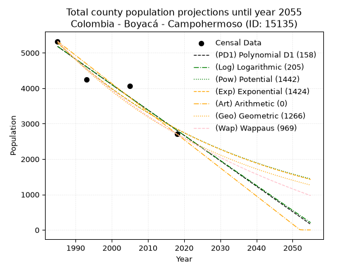
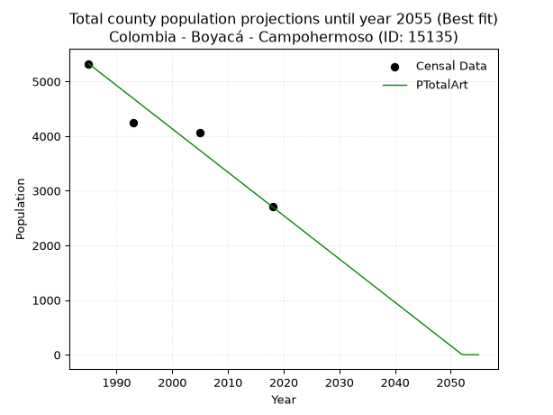
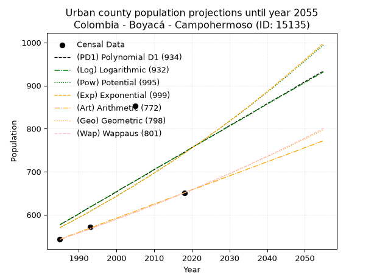
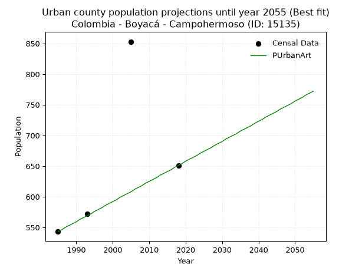
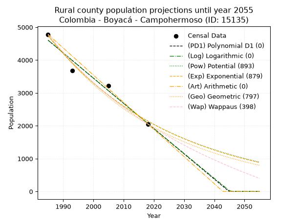
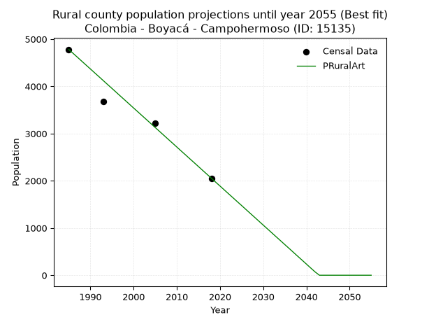

<div align="center">


</div>

# 📜 _“Population and Public Services Demand Projections (PPSD) until Year 2050 for Colombia - Boyacá - Campohermoso (ID: 15135)”_
Keywords: `population` `public-service` `projection` `lineal` `polynomial` `logarithmic` `potential` `exponential` `arithmetic` `geometric` `wappaus` `dane` `colombia` `south-america`

PPSD are analytical estimates used by governments and planners to anticipate future changes in population size, age distribution, and the resulting community needs for utilities, healthcare, education, and infrastructure as sizing future water treatment facilities, electrical grids, and road networks based on spatial growth.

<div align="center">

</img>

</div>


> **General running parameters**: • app_version: _v20260806_. • Python version: _3.14.7_. • Pandas version: _3.0.5_. • NumPy version: _2.5.1_. • Creates, save and include plots into reports (create_plot): _False_. • Projection until year: _2050_. • Process polynomial degree 2 and up: _False_. • Process Wappaus: _True_. • Process Wappaus: _True_. • Set negative values to zero: _True_. • Set infinite values to zero: _True_. • Drop dataset notes: _True_. 
<div align="center">

Maps & GIS Layers: [:earth_americas:Google](http://maps.google.com/maps?q=5.031675732,-73.1041729) [:earth_americas:OSM](https://www.openstreetmap.org/#map=18/5.031675732/-73.1041729&layers=P) [:earth_americas:Bing](https://www.bing.com/maps?cp=5.031675732~-73.1041729&lvl=18) [:earth_americas:Apple](https://maps.apple.com/frame?center=5.031675732%2C-73.1041729&span=0.003%2C0.006) [:earth_americas:GISMobile](https://github.com/rcfdtools/R.GISMobile/blob/main/file/gis/CountyLayer_CO/Readme.md)

</div>


<div align="center">

```geojson
{
  "type": "Feature",
  "geometry": {
    "type": "Point", 
    "coordinates": [-73.1041729, 5.031675732]
  }, 
  "properties": {
    "Name": "Colombia - Boyacá - Campohermoso (ID: 15135)"
  }
}
```

</div>


## 0. Census Data (4 records)

Census data are official statistics collected by a government about the people and housing in a country. They usually include counts of total population, age, sex, race, income, education, and jobs.

📅Global census file: [Population.xlsx](../data/Population.xlsx)

| Source   |   Year |   CountryID | CountryName   |   StateID | StateName   |   CountyID | CountyName   |   PTotal |   PUrban |   PRural |
|:---------|-------:|------------:|:--------------|----------:|:------------|-----------:|:-------------|---------:|---------:|---------:|
| DANE     |   1985 |          57 | Colombia      |        15 | Boyacá      |      15135 | Campohermoso |     5324 |      543 |     4781 |
| DANE     |   1993 |          57 | Colombia      |        15 | Boyacá      |      15135 | Campohermoso |     4250 |      572 |     3678 |
| DANE     |   2005 |          57 | Colombia      |        15 | Boyacá      |      15135 | Campohermoso |     4065 |      853 |     3212 |
| DANE     |   2018 |          57 | Colombia      |        15 | Boyacá      |      15135 | Campohermoso |     2705 |      651 |     2054 |

> 🔥Some records could had specific notes about the registered values or the corresponding urban or rural distribution.

📅[SUI-RUPS](https://www.datos.gov.co/Hacienda-y-Cr-dito-P-blico/Registro-nico-de-Prestadores-de-Servicios-P-blicos/4qkq-csdn/about_data) - Local public utility companies: [RUPS.csv](../data/RUPS.csv)

 | SERVICIO       | ESTADO    | NOMBRE                                       | NIT         | DEPARTAMENTO_DOMICILIO   | MUNICIPIO_DOMICILIO   | DIRECCION                             |   TELEFONO | EMAIL                            | TIPO_PRESTADOR                 | CLASIFICACION                 |
|:---------------|:----------|:---------------------------------------------|:------------|:-------------------------|:----------------------|:--------------------------------------|-----------:|:---------------------------------|:-------------------------------|:------------------------------|
| ACUEDUCTO      | OPERATIVA | UNIDAD DE SERVICIOS PUBLICOS DE CAMPOHERMOSO | 800028393-3 | BOYACA                   | CAMPOHERMOSO          | Carrera 5 No 2 - 23 Palacio Municipal |    7500813 | obras@campohermoso-boyaca.gov.co | MUNICIPIO (PRESTACIÓN DIRECTA) | MENOR O IGUAL A 2500 USUARIOS |
| ALCANTARILLADO | OPERATIVA | UNIDAD DE SERVICIOS PUBLICOS DE CAMPOHERMOSO | 800028393-3 | BOYACA                   | CAMPOHERMOSO          | Carrera 5 No 2 - 23 Palacio Municipal |    7500813 | obras@campohermoso-boyaca.gov.co | MUNICIPIO (PRESTACIÓN DIRECTA) | MENOR O IGUAL A 2500 USUARIOS |

## 1. Total

### 1.1. Coefficients and Parameters

* (PD1) Polynomial Deg 1: -71.74789241268479, 147599.72179847275 (lineal)
* (Log) Logarithmic: -143602.7462605783, 1095611.6250868433
* (Pow) Potential: -37.487430742121575, 127.34781551923955
* (Exp) Exponential: -0.018734754133870872, 7.478224167682302e+19
* (Art) Arithmetic: Year diff. 2018 - 1985 = 33, Population diff. 2705 - 5324 = -2619, Annual growth = -79.36363636363636
* (Geo) Geometric: Year diff. 2018 - 1985 = 33, Population diff. 2705 - 5324 = -2619, Annual growth % = -0.02030979871426708
* (Wap) Wappaus: i = -1.976924557569719, Condition values only valid for < 200)

<sub>
Wappaus condition values: ['-0.00', '-1.98', '-3.95', '-5.93', '-7.91', '-9.88', '-11.86', '-13.84', '-15.82', '-17.79', '-19.77', '-21.75', '-23.72', '-25.70', '-27.68', '-29.65', '-31.63', '-33.61', '-35.58', '-37.56', '-39.54', '-41.52', '-43.49', '-45.47', '-47.45', '-49.42', '-51.40', '-53.38', '-55.35', '-57.33', '-59.31', '-61.28', '-63.26', '-65.24', '-67.22', '-69.19', '-71.17', '-73.15', '-75.12', '-77.10', '-79.08', '-81.05', '-83.03', '-85.01', '-86.98', '-88.96', '-90.94', '-92.92', '-94.89', '-96.87', '-98.85', '-100.82', '-102.80', '-104.78', '-106.75', '-108.73', '-110.71', '-112.68', '-114.66', '-116.64', '-118.62', '-120.59', '-122.57', '-124.55', '-126.52', '-128.50']
</sub>


### 1.2. Projected Dataset

|   Year |   CountyID |   PTotalPD1 |   PTotalLog |   PTotalPow |   PTotalExp |   PTotalArt |   PTotalGeo |   PTotalWap |
|-------:|-----------:|------------:|------------:|------------:|------------:|------------:|------------:|------------:|
|   1985 |      15135 |        5180 |        5182 |        5287 |        5285 |        5324 |        5324 |        5324 |
|   1986 |      15135 |        5108 |        5110 |        5189 |        5187 |        5245 |        5216 |        5220 |
|   1987 |      15135 |        5037 |        5038 |        5092 |        5091 |        5165 |        5110 |        5118 |
|   1988 |      15135 |        4965 |        4965 |        4996 |        4996 |        5086 |        5006 |        5017 |
|   1989 |      15135 |        4893 |        4893 |        4903 |        4903 |        5007 |        4904 |        4919 |
|   1990 |      15135 |        4821 |        4821 |        4812 |        4812 |        4927 |        4805 |        4823 |
|   1991 |      15135 |        4750 |        4749 |        4722 |        4723 |        4848 |        4707 |        4728 |
|   1992 |      15135 |        4678 |        4677 |        4634 |        4635 |        4768 |        4612 |        4635 |
|   1993 |      15135 |        4606 |        4605 |        4547 |        4549 |        4689 |        4518 |        4544 |
|   1994 |      15135 |        4534 |        4533 |        4463 |        4465 |        4610 |        4426 |        4454 |
|   1995 |      15135 |        4463 |        4461 |        4380 |        4382 |        4530 |        4336 |        4366 |
|   1996 |      15135 |        4391 |        4389 |        4298 |        4301 |        4451 |        4248 |        4280 |
|   1997 |      15135 |        4319 |        4317 |        4218 |        4221 |        4372 |        4162 |        4195 |
|   1998 |      15135 |        4247 |        4245 |        4140 |        4143 |        4292 |        4077 |        4112 |
|   1999 |      15135 |        4176 |        4173 |        4063 |        4066 |        4213 |        3995 |        4030 |
|   2000 |      15135 |        4104 |        4101 |        3987 |        3990 |        4134 |        3914 |        3949 |
|   2001 |      15135 |        4032 |        4029 |        3913 |        3916 |        4054 |        3834 |        3870 |
|   2002 |      15135 |        3960 |        3958 |        3841 |        3843 |        3975 |        3756 |        3792 |
|   2003 |      15135 |        3889 |        3886 |        3769 |        3772 |        3895 |        3680 |        3716 |
|   2004 |      15135 |        3817 |        3814 |        3700 |        3702 |        3816 |        3605 |        3640 |
|   2005 |      15135 |        3745 |        3743 |        3631 |        3633 |        3737 |        3532 |        3566 |
|   2006 |      15135 |        3673 |        3671 |        3564 |        3566 |        3657 |        3460 |        3494 |
|   2007 |      15135 |        3602 |        3599 |        3498 |        3500 |        3578 |        3390 |        3422 |
|   2008 |      15135 |        3530 |        3528 |        3433 |        3435 |        3499 |        3321 |        3352 |
|   2009 |      15135 |        3458 |        3456 |        3370 |        3371 |        3419 |        3254 |        3282 |
|   2010 |      15135 |        3386 |        3385 |        3307 |        3309 |        3340 |        3188 |        3214 |
|   2011 |      15135 |        3315 |        3314 |        3246 |        3247 |        3261 |        3123 |        3147 |
|   2012 |      15135 |        3243 |        3242 |        3186 |        3187 |        3181 |        3059 |        3081 |
|   2013 |      15135 |        3171 |        3171 |        3128 |        3128 |        3102 |        2997 |        3016 |
|   2014 |      15135 |        3099 |        3099 |        3070 |        3070 |        3022 |        2936 |        2952 |
|   2015 |      15135 |        3028 |        3028 |        3013 |        3013 |        2943 |        2877 |        2889 |
|   2016 |      15135 |        2956 |        2957 |        2958 |        2957 |        2864 |        2818 |        2826 |
|   2017 |      15135 |        2884 |        2886 |        2903 |        2902 |        2784 |        2761 |        2765 |
|   2018 |      15135 |        2812 |        2815 |        2850 |        2848 |        2705 |        2705 |        2705 |
|   2019 |      15135 |        2741 |        2743 |        2797 |        2795 |        2626 |        2650 |        2646 |
|   2020 |      15135 |        2669 |        2672 |        2746 |        2743 |        2546 |        2596 |        2587 |
|   2021 |      15135 |        2597 |        2601 |        2695 |        2692 |        2467 |        2544 |        2529 |
|   2022 |      15135 |        2525 |        2530 |        2646 |        2642 |        2388 |        2492 |        2473 |
|   2023 |      15135 |        2454 |        2459 |        2597 |        2593 |        2308 |        2441 |        2417 |
|   2024 |      15135 |        2382 |        2388 |        2550 |        2545 |        2229 |        2392 |        2361 |
|   2025 |      15135 |        2310 |        2317 |        2503 |        2498 |        2149 |        2343 |        2307 |
|   2026 |      15135 |        2238 |        2246 |        2457 |        2452 |        2070 |        2296 |        2253 |
|   2027 |      15135 |        2167 |        2175 |        2412 |        2406 |        1991 |        2249 |        2200 |
|   2028 |      15135 |        2095 |        2105 |        2368 |        2361 |        1911 |        2203 |        2148 |
|   2029 |      15135 |        2023 |        2034 |        2324 |        2318 |        1832 |        2158 |        2097 |
|   2030 |      15135 |        1952 |        1963 |        2282 |        2275 |        1753 |        2115 |        2046 |
|   2031 |      15135 |        1880 |        1892 |        2240 |        2232 |        1673 |        2072 |        1996 |
|   2032 |      15135 |        1808 |        1822 |        2199 |        2191 |        1594 |        2030 |        1946 |
|   2033 |      15135 |        1736 |        1751 |        2159 |        2150 |        1515 |        1988 |        1898 |
|   2034 |      15135 |        1665 |        1680 |        2120 |        2110 |        1435 |        1948 |        1850 |
|   2035 |      15135 |        1593 |        1610 |        2081 |        2071 |        1356 |        1908 |        1802 |
|   2036 |      15135 |        1521 |        1539 |        2043 |        2033 |        1276 |        1870 |        1755 |
|   2037 |      15135 |        1449 |        1469 |        2006 |        1995 |        1197 |        1832 |        1709 |
|   2038 |      15135 |        1378 |        1398 |        1969 |        1958 |        1118 |        1794 |        1663 |
|   2039 |      15135 |        1306 |        1328 |        1933 |        1922 |        1038 |        1758 |        1618 |
|   2040 |      15135 |        1234 |        1257 |        1898 |        1886 |         959 |        1722 |        1574 |
|   2041 |      15135 |        1162 |        1187 |        1863 |        1851 |         880 |        1687 |        1530 |
|   2042 |      15135 |        1091 |        1117 |        1829 |        1817 |         800 |        1653 |        1487 |
|   2043 |      15135 |        1019 |        1046 |        1796 |        1783 |         721 |        1620 |        1444 |
|   2044 |      15135 |         947 |         976 |        1764 |        1750 |         642 |        1587 |        1402 |
|   2045 |      15135 |         875 |         906 |        1732 |        1717 |         562 |        1554 |        1360 |
|   2046 |      15135 |         804 |         836 |        1700 |        1685 |         483 |        1523 |        1319 |
|   2047 |      15135 |         732 |         766 |        1669 |        1654 |         403 |        1492 |        1278 |
|   2048 |      15135 |         660 |         695 |        1639 |        1623 |         324 |        1462 |        1238 |
|   2049 |      15135 |         588 |         625 |        1609 |        1593 |         245 |        1432 |        1198 |
|   2050 |      15135 |         517 |         555 |        1580 |        1564 |         165 |        1403 |        1159 |
<div align="center">

</img>

</div>


### 1.3. Best fit with absolute and relative error (%)

Relative error puts that difference into context by dividing the absolute error by the true value, creating a unitless ratio or percentage that shows the scale of the mistake.

Absolute and relative error

|   Year | Source   |   CountryID | CountryName   |   StateID | StateName   |   CountyID_x | CountyName   |   PTotal |   PUrban |   PRural |   CountyID_y |   PTotalPD1 |   PTotalLog |   PTotalPow |   PTotalExp |   PTotalArt |   PTotalGeo |   PTotalWap |   PTotalPD1AbsError |   PTotalLogAbsError |   PTotalPowAbsError |   PTotalExpAbsError |   PTotalArtAbsError |   PTotalGeoAbsError |   PTotalWapAbsError |   PTotalPD1RelError |   PTotalLogRelError |   PTotalPowRelError |   PTotalExpRelError |   PTotalArtRelError |   PTotalGeoRelError |   PTotalWapRelError |
|-------:|:---------|------------:|:--------------|----------:|:------------|-------------:|:-------------|---------:|---------:|---------:|-------------:|------------:|------------:|------------:|------------:|------------:|------------:|------------:|--------------------:|--------------------:|--------------------:|--------------------:|--------------------:|--------------------:|--------------------:|--------------------:|--------------------:|--------------------:|--------------------:|--------------------:|--------------------:|--------------------:|
|   1985 | DANE     |          57 | Colombia      |        15 | Boyacá      |        15135 | Campohermoso |     5324 |      543 |     4781 |        15135 |        5180 |        5182 |        5287 |        5285 |        5324 |        5324 |        5324 |                 144 |                 142 |                  37 |                  39 |                   0 |                   0 |                   0 |             2.70473 |             2.66717 |            0.694966 |            0.732532 |             0       |             0       |             0       |
|   1993 | DANE     |          57 | Colombia      |        15 | Boyacá      |        15135 | Campohermoso |     4250 |      572 |     3678 |        15135 |        4606 |        4605 |        4547 |        4549 |        4689 |        4518 |        4544 |                 356 |                 355 |                 297 |                 299 |                 439 |                 268 |                 294 |             8.37647 |             8.35294 |            6.98824  |            7.03529  |            10.3294  |             6.30588 |             6.91765 |
|   2005 | DANE     |          57 | Colombia      |        15 | Boyacá      |        15135 | Campohermoso |     4065 |      853 |     3212 |        15135 |        3745 |        3743 |        3631 |        3633 |        3737 |        3532 |        3566 |                 320 |                 322 |                 434 |                 432 |                 328 |                 533 |                 499 |             7.87208 |             7.92128 |           10.6765   |           10.6273   |             8.06888 |            13.1119  |            12.2755  |
|   2018 | DANE     |          57 | Colombia      |        15 | Boyacá      |        15135 | Campohermoso |     2705 |      651 |     2054 |        15135 |        2812 |        2815 |        2850 |        2848 |        2705 |        2705 |        2705 |                 107 |                 110 |                 145 |                 143 |                   0 |                   0 |                   0 |             3.95564 |             4.06654 |            5.36044  |            5.28651  |             0       |             0       |             0       |

Relative error mean

| Method    |   RelError | Best   |
|:----------|-----------:|:-------|
| PTotalPD1 |    5.72723 |        |
| PTotalLog |    5.75198 |        |
| PTotalPow |    5.93004 |        |
| PTotalExp |    5.92041 |        |
| PTotalArt |    4.59957 | True   |
| PTotalGeo |    4.85445 |        |
| PTotalWap |    4.79829 |        |

💙Best method: _**PTotalArt**_
<div align="center">

</img>

</div>


### 1.4. Fresh water supply demand in liters per capita per day (lpcd)

The fresh water supply demand typically ranges from 100 to 300 liters per capita per day (lpcd) for standard domestic and municipal planning, though absolute survival minimums set by the World Health Organization are as low as 7.5 to 20 liters per day, and total consumption in high-income nations can exceed 400 liters.

> `CZ`: Level in meters above the sea level (masl)<br> `WS`: Fresh water supply demand in liters per capita per day (lpcd or l/h/d)<br> `WSAll`: Zonal fresh water supply demand in liters per second (l/s)<br> `A`: Zonal area in square meters<br> `DP`: Population density (people/hectare or p/ha)

Reference values (RAS Colombia)

|    CZ |   WS |
|------:|-----:|
|  1000 |  120 |
|  2000 |  130 |
| 99999 |  140 |

County shapefile geometry properties and water supply values

|   CountyID |      ATotal |   CZTotal |   WSTotal |
|-----------:|------------:|----------:|----------:|
|      15135 | 2.98174e+08 |    1358.1 |       130 |

Projected values for best method: PTotalArt

|   CountyID |   Year |   PTotalArt |   DPTotal |   WSTotal |   WSTotalAll |
|-----------:|-------:|------------:|----------:|----------:|-------------:|
|      15135 |   1985 |        5324 |      0.18 |       130 |     8.01065  |
|      15135 |   1986 |        5245 |      0.18 |       130 |     7.89178  |
|      15135 |   1987 |        5165 |      0.17 |       130 |     7.77141  |
|      15135 |   1988 |        5086 |      0.17 |       130 |     7.65255  |
|      15135 |   1989 |        5007 |      0.17 |       130 |     7.53368  |
|      15135 |   1990 |        4927 |      0.17 |       130 |     7.41331  |
|      15135 |   1991 |        4848 |      0.16 |       130 |     7.29444  |
|      15135 |   1992 |        4768 |      0.16 |       130 |     7.17407  |
|      15135 |   1993 |        4689 |      0.16 |       130 |     7.05521  |
|      15135 |   1994 |        4610 |      0.15 |       130 |     6.93634  |
|      15135 |   1995 |        4530 |      0.15 |       130 |     6.81597  |
|      15135 |   1996 |        4451 |      0.15 |       130 |     6.69711  |
|      15135 |   1997 |        4372 |      0.15 |       130 |     6.57824  |
|      15135 |   1998 |        4292 |      0.14 |       130 |     6.45787  |
|      15135 |   1999 |        4213 |      0.14 |       130 |     6.339    |
|      15135 |   2000 |        4134 |      0.14 |       130 |     6.22014  |
|      15135 |   2001 |        4054 |      0.14 |       130 |     6.09977  |
|      15135 |   2002 |        3975 |      0.13 |       130 |     5.9809   |
|      15135 |   2003 |        3895 |      0.13 |       130 |     5.86053  |
|      15135 |   2004 |        3816 |      0.13 |       130 |     5.74167  |
|      15135 |   2005 |        3737 |      0.13 |       130 |     5.6228   |
|      15135 |   2006 |        3657 |      0.12 |       130 |     5.50243  |
|      15135 |   2007 |        3578 |      0.12 |       130 |     5.38356  |
|      15135 |   2008 |        3499 |      0.12 |       130 |     5.2647   |
|      15135 |   2009 |        3419 |      0.11 |       130 |     5.14433  |
|      15135 |   2010 |        3340 |      0.11 |       130 |     5.02546  |
|      15135 |   2011 |        3261 |      0.11 |       130 |     4.9066   |
|      15135 |   2012 |        3181 |      0.11 |       130 |     4.78623  |
|      15135 |   2013 |        3102 |      0.1  |       130 |     4.66736  |
|      15135 |   2014 |        3022 |      0.1  |       130 |     4.54699  |
|      15135 |   2015 |        2943 |      0.1  |       130 |     4.42812  |
|      15135 |   2016 |        2864 |      0.1  |       130 |     4.30926  |
|      15135 |   2017 |        2784 |      0.09 |       130 |     4.18889  |
|      15135 |   2018 |        2705 |      0.09 |       130 |     4.07002  |
|      15135 |   2019 |        2626 |      0.09 |       130 |     3.95116  |
|      15135 |   2020 |        2546 |      0.09 |       130 |     3.83079  |
|      15135 |   2021 |        2467 |      0.08 |       130 |     3.71192  |
|      15135 |   2022 |        2388 |      0.08 |       130 |     3.59306  |
|      15135 |   2023 |        2308 |      0.08 |       130 |     3.47269  |
|      15135 |   2024 |        2229 |      0.07 |       130 |     3.35382  |
|      15135 |   2025 |        2149 |      0.07 |       130 |     3.23345  |
|      15135 |   2026 |        2070 |      0.07 |       130 |     3.11458  |
|      15135 |   2027 |        1991 |      0.07 |       130 |     2.99572  |
|      15135 |   2028 |        1911 |      0.06 |       130 |     2.87535  |
|      15135 |   2029 |        1832 |      0.06 |       130 |     2.75648  |
|      15135 |   2030 |        1753 |      0.06 |       130 |     2.63762  |
|      15135 |   2031 |        1673 |      0.06 |       130 |     2.51725  |
|      15135 |   2032 |        1594 |      0.05 |       130 |     2.39838  |
|      15135 |   2033 |        1515 |      0.05 |       130 |     2.27951  |
|      15135 |   2034 |        1435 |      0.05 |       130 |     2.15914  |
|      15135 |   2035 |        1356 |      0.05 |       130 |     2.04028  |
|      15135 |   2036 |        1276 |      0.04 |       130 |     1.91991  |
|      15135 |   2037 |        1197 |      0.04 |       130 |     1.80104  |
|      15135 |   2038 |        1118 |      0.04 |       130 |     1.68218  |
|      15135 |   2039 |        1038 |      0.03 |       130 |     1.56181  |
|      15135 |   2040 |         959 |      0.03 |       130 |     1.44294  |
|      15135 |   2041 |         880 |      0.03 |       130 |     1.32407  |
|      15135 |   2042 |         800 |      0.03 |       130 |     1.2037   |
|      15135 |   2043 |         721 |      0.02 |       130 |     1.08484  |
|      15135 |   2044 |         642 |      0.02 |       130 |     0.965972 |
|      15135 |   2045 |         562 |      0.02 |       130 |     0.845602 |
|      15135 |   2046 |         483 |      0.02 |       130 |     0.726736 |
|      15135 |   2047 |         403 |      0.01 |       130 |     0.606366 |
|      15135 |   2048 |         324 |      0.01 |       130 |     0.4875   |
|      15135 |   2049 |         245 |      0.01 |       130 |     0.368634 |
|      15135 |   2050 |         165 |      0.01 |       130 |     0.248264 |

## 2. Urban

### 2.1. Coefficients and Parameters

* (PD1) Polynomial Deg 1: 5.105178643115322, -9556.883580891425 (lineal)
* (Log) Logarithmic: 10247.551623795467, -77236.97201119436
* (Pow) Potential: 16.07286916786718, -50.248578574418055
* (Exp) Exponential: 0.008009601257794662, 7.100036496029841e-05
* (Art) Arithmetic: Year diff. 2018 - 1985 = 33, Population diff. 651 - 543 = 108, Annual growth = 3.272727272727273
* (Geo) Geometric: Year diff. 2018 - 1985 = 33, Population diff. 651 - 543 = 108, Annual growth % = 0.0055121155760671225
* (Wap) Wappaus: i = 0.5481955230698949, Condition values only valid for < 200)

<sub>
Wappaus condition values: ['0.00', '0.55', '1.10', '1.64', '2.19', '2.74', '3.29', '3.84', '4.39', '4.93', '5.48', '6.03', '6.58', '7.13', '7.67', '8.22', '8.77', '9.32', '9.87', '10.42', '10.96', '11.51', '12.06', '12.61', '13.16', '13.70', '14.25', '14.80', '15.35', '15.90', '16.45', '16.99', '17.54', '18.09', '18.64', '19.19', '19.74', '20.28', '20.83', '21.38', '21.93', '22.48', '23.02', '23.57', '24.12', '24.67', '25.22', '25.77', '26.31', '26.86', '27.41', '27.96', '28.51', '29.05', '29.60', '30.15', '30.70', '31.25', '31.80', '32.34', '32.89', '33.44', '33.99', '34.54', '35.08', '35.63']
</sub>


### 2.2. Projected Dataset

|   Year |   CountyID |   PUrbanPD1 |   PUrbanLog |   PUrbanPow |   PUrbanExp |   PUrbanArt |   PUrbanGeo |   PUrbanWap |
|-------:|-----------:|------------:|------------:|------------:|------------:|------------:|------------:|------------:|
|   1985 |      15135 |         577 |         577 |         570 |         570 |         543 |         543 |         543 |
|   1986 |      15135 |         582 |         582 |         575 |         575 |         546 |         546 |         546 |
|   1987 |      15135 |         587 |         587 |         579 |         580 |         550 |         549 |         549 |
|   1988 |      15135 |         592 |         592 |         584 |         584 |         553 |         552 |         552 |
|   1989 |      15135 |         597 |         597 |         589 |         589 |         556 |         555 |         555 |
|   1990 |      15135 |         602 |         602 |         594 |         594 |         559 |         558 |         558 |
|   1991 |      15135 |         608 |         607 |         598 |         598 |         563 |         561 |         561 |
|   1992 |      15135 |         613 |         613 |         603 |         603 |         566 |         564 |         564 |
|   1993 |      15135 |         618 |         618 |         608 |         608 |         569 |         567 |         567 |
|   1994 |      15135 |         623 |         623 |         613 |         613 |         572 |         571 |         570 |
|   1995 |      15135 |         628 |         628 |         618 |         618 |         576 |         574 |         574 |
|   1996 |      15135 |         633 |         633 |         623 |         623 |         579 |         577 |         577 |
|   1997 |      15135 |         638 |         638 |         628 |         628 |         582 |         580 |         580 |
|   1998 |      15135 |         643 |         643 |         633 |         633 |         586 |         583 |         583 |
|   1999 |      15135 |         648 |         649 |         638 |         638 |         589 |         586 |         586 |
|   2000 |      15135 |         653 |         654 |         643 |         643 |         592 |         590 |         590 |
|   2001 |      15135 |         659 |         659 |         649 |         648 |         595 |         593 |         593 |
|   2002 |      15135 |         664 |         664 |         654 |         654 |         599 |         596 |         596 |
|   2003 |      15135 |         669 |         669 |         659 |         659 |         602 |         599 |         599 |
|   2004 |      15135 |         674 |         674 |         664 |         664 |         605 |         603 |         603 |
|   2005 |      15135 |         679 |         679 |         670 |         669 |         608 |         606 |         606 |
|   2006 |      15135 |         684 |         684 |         675 |         675 |         612 |         609 |         609 |
|   2007 |      15135 |         689 |         689 |         681 |         680 |         615 |         613 |         613 |
|   2008 |      15135 |         694 |         695 |         686 |         686 |         618 |         616 |         616 |
|   2009 |      15135 |         699 |         700 |         691 |         691 |         622 |         620 |         619 |
|   2010 |      15135 |         705 |         705 |         697 |         697 |         625 |         623 |         623 |
|   2011 |      15135 |         710 |         710 |         703 |         702 |         628 |         626 |         626 |
|   2012 |      15135 |         715 |         715 |         708 |         708 |         631 |         630 |         630 |
|   2013 |      15135 |         720 |         720 |         714 |         714 |         635 |         633 |         633 |
|   2014 |      15135 |         725 |         725 |         720 |         719 |         638 |         637 |         637 |
|   2015 |      15135 |         730 |         730 |         725 |         725 |         641 |         640 |         640 |
|   2016 |      15135 |         735 |         735 |         731 |         731 |         644 |         644 |         644 |
|   2017 |      15135 |         740 |         740 |         737 |         737 |         648 |         647 |         647 |
|   2018 |      15135 |         745 |         745 |         743 |         743 |         651 |         651 |         651 |
|   2019 |      15135 |         750 |         751 |         749 |         749 |         654 |         655 |         655 |
|   2020 |      15135 |         756 |         756 |         755 |         755 |         658 |         658 |         658 |
|   2021 |      15135 |         761 |         761 |         761 |         761 |         661 |         662 |         662 |
|   2022 |      15135 |         766 |         766 |         767 |         767 |         664 |         665 |         666 |
|   2023 |      15135 |         771 |         771 |         773 |         773 |         667 |         669 |         669 |
|   2024 |      15135 |         776 |         776 |         779 |         779 |         671 |         673 |         673 |
|   2025 |      15135 |         781 |         781 |         786 |         786 |         674 |         677 |         677 |
|   2026 |      15135 |         786 |         786 |         792 |         792 |         677 |         680 |         680 |
|   2027 |      15135 |         791 |         791 |         798 |         798 |         680 |         684 |         684 |
|   2028 |      15135 |         796 |         796 |         804 |         805 |         684 |         688 |         688 |
|   2029 |      15135 |         802 |         801 |         811 |         811 |         687 |         692 |         692 |
|   2030 |      15135 |         807 |         806 |         817 |         818 |         690 |         695 |         696 |
|   2031 |      15135 |         812 |         811 |         824 |         824 |         694 |         699 |         700 |
|   2032 |      15135 |         817 |         816 |         830 |         831 |         697 |         703 |         704 |
|   2033 |      15135 |         822 |         821 |         837 |         838 |         700 |         707 |         708 |
|   2034 |      15135 |         827 |         826 |         844 |         844 |         703 |         711 |         711 |
|   2035 |      15135 |         832 |         831 |         850 |         851 |         707 |         715 |         715 |
|   2036 |      15135 |         837 |         836 |         857 |         858 |         710 |         719 |         719 |
|   2037 |      15135 |         842 |         842 |         864 |         865 |         713 |         723 |         724 |
|   2038 |      15135 |         847 |         847 |         871 |         872 |         716 |         727 |         728 |
|   2039 |      15135 |         853 |         852 |         878 |         879 |         720 |         731 |         732 |
|   2040 |      15135 |         858 |         857 |         884 |         886 |         723 |         735 |         736 |
|   2041 |      15135 |         863 |         862 |         891 |         893 |         726 |         739 |         740 |
|   2042 |      15135 |         868 |         867 |         898 |         900 |         730 |         743 |         744 |
|   2043 |      15135 |         873 |         872 |         906 |         908 |         733 |         747 |         748 |
|   2044 |      15135 |         878 |         877 |         913 |         915 |         736 |         751 |         753 |
|   2045 |      15135 |         883 |         882 |         920 |         922 |         739 |         755 |         757 |
|   2046 |      15135 |         888 |         887 |         927 |         930 |         743 |         759 |         761 |
|   2047 |      15135 |         893 |         892 |         935 |         937 |         746 |         764 |         765 |
|   2048 |      15135 |         899 |         897 |         942 |         945 |         749 |         768 |         770 |
|   2049 |      15135 |         904 |         902 |         949 |         952 |         752 |         772 |         774 |
|   2050 |      15135 |         909 |         907 |         957 |         960 |         756 |         776 |         778 |
<div align="center">

</img>

</div>


### 2.3. Best fit with absolute and relative error (%)

Relative error puts that difference into context by dividing the absolute error by the true value, creating a unitless ratio or percentage that shows the scale of the mistake.

Absolute and relative error

|   Year | Source   |   CountryID | CountryName   |   StateID | StateName   |   CountyID_x | CountyName   |   PTotal |   PUrban |   PRural |   CountyID_y |   PUrbanPD1 |   PUrbanLog |   PUrbanPow |   PUrbanExp |   PUrbanArt |   PUrbanGeo |   PUrbanWap |   PUrbanPD1AbsError |   PUrbanLogAbsError |   PUrbanPowAbsError |   PUrbanExpAbsError |   PUrbanArtAbsError |   PUrbanGeoAbsError |   PUrbanWapAbsError |   PUrbanPD1RelError |   PUrbanLogRelError |   PUrbanPowRelError |   PUrbanExpRelError |   PUrbanArtRelError |   PUrbanGeoRelError |   PUrbanWapRelError |
|-------:|:---------|------------:|:--------------|----------:|:------------|-------------:|:-------------|---------:|---------:|---------:|-------------:|------------:|------------:|------------:|------------:|------------:|------------:|------------:|--------------------:|--------------------:|--------------------:|--------------------:|--------------------:|--------------------:|--------------------:|--------------------:|--------------------:|--------------------:|--------------------:|--------------------:|--------------------:|--------------------:|
|   1985 | DANE     |          57 | Colombia      |        15 | Boyacá      |        15135 | Campohermoso |     5324 |      543 |     4781 |        15135 |         577 |         577 |         570 |         570 |         543 |         543 |         543 |                  34 |                  34 |                  27 |                  27 |                   0 |                   0 |                   0 |             6.26151 |             6.26151 |             4.97238 |             4.97238 |            0        |            0        |            0        |
|   1993 | DANE     |          57 | Colombia      |        15 | Boyacá      |        15135 | Campohermoso |     4250 |      572 |     3678 |        15135 |         618 |         618 |         608 |         608 |         569 |         567 |         567 |                  46 |                  46 |                  36 |                  36 |                   3 |                   5 |                   5 |             8.04196 |             8.04196 |             6.29371 |             6.29371 |            0.524476 |            0.874126 |            0.874126 |
|   2005 | DANE     |          57 | Colombia      |        15 | Boyacá      |        15135 | Campohermoso |     4065 |      853 |     3212 |        15135 |         679 |         679 |         670 |         669 |         608 |         606 |         606 |                 174 |                 174 |                 183 |                 184 |                 245 |                 247 |                 247 |            20.3986  |            20.3986  |            21.4537  |            21.5709  |           28.7222   |           28.9566   |           28.9566   |
|   2018 | DANE     |          57 | Colombia      |        15 | Boyacá      |        15135 | Campohermoso |     2705 |      651 |     2054 |        15135 |         745 |         745 |         743 |         743 |         651 |         651 |         651 |                  94 |                  94 |                  92 |                  92 |                   0 |                   0 |                   0 |            14.4393  |            14.4393  |            14.1321  |            14.1321  |            0        |            0        |            0        |

Relative error mean

| Method    |   RelError | Best   |
|:----------|-----------:|:-------|
| PUrbanPD1 |   12.2853  |        |
| PUrbanLog |   12.2853  |        |
| PUrbanPow |   11.713   |        |
| PUrbanExp |   11.7423  |        |
| PUrbanArt |    7.31166 | True   |
| PUrbanGeo |    7.45769 |        |
| PUrbanWap |    7.45769 |        |

💙Best method: _**PUrbanArt**_
<div align="center">

</img>

</div>


### 2.4. Fresh water supply demand in liters per capita per day (lpcd)

The fresh water supply demand typically ranges from 100 to 300 liters per capita per day (lpcd) for standard domestic and municipal planning, though absolute survival minimums set by the World Health Organization are as low as 7.5 to 20 liters per day, and total consumption in high-income nations can exceed 400 liters.

> `CZ`: Level in meters above the sea level (masl)<br> `WS`: Fresh water supply demand in liters per capita per day (lpcd or l/h/d)<br> `WSAll`: Zonal fresh water supply demand in liters per second (l/s)<br> `A`: Zonal area in square meters<br> `DP`: Population density (people/hectare or p/ha)

Reference values (RAS Colombia)

|    CZ |   WS |
|------:|-----:|
|  1000 |  120 |
|  2000 |  130 |
| 99999 |  140 |

County shapefile geometry properties and water supply values

|   CountyID |   AUrban |   CZUrban |   WSUrban |
|-----------:|---------:|----------:|----------:|
|      15135 |   304795 |    1103.7 |       130 |

Projected values for best method: PUrbanArt

|   CountyID |   Year |   PUrbanArt |   DPUrban |   WSUrban |   WSUrbanAll |
|-----------:|-------:|------------:|----------:|----------:|-------------:|
|      15135 |   1985 |         543 |     17.82 |       130 |     0.817014 |
|      15135 |   1986 |         546 |     17.91 |       130 |     0.821528 |
|      15135 |   1987 |         550 |     18.04 |       130 |     0.827546 |
|      15135 |   1988 |         553 |     18.14 |       130 |     0.83206  |
|      15135 |   1989 |         556 |     18.24 |       130 |     0.836574 |
|      15135 |   1990 |         559 |     18.34 |       130 |     0.841088 |
|      15135 |   1991 |         563 |     18.47 |       130 |     0.847106 |
|      15135 |   1992 |         566 |     18.57 |       130 |     0.85162  |
|      15135 |   1993 |         569 |     18.67 |       130 |     0.856134 |
|      15135 |   1994 |         572 |     18.77 |       130 |     0.860648 |
|      15135 |   1995 |         576 |     18.9  |       130 |     0.866667 |
|      15135 |   1996 |         579 |     19    |       130 |     0.871181 |
|      15135 |   1997 |         582 |     19.09 |       130 |     0.875694 |
|      15135 |   1998 |         586 |     19.23 |       130 |     0.881713 |
|      15135 |   1999 |         589 |     19.32 |       130 |     0.886227 |
|      15135 |   2000 |         592 |     19.42 |       130 |     0.890741 |
|      15135 |   2001 |         595 |     19.52 |       130 |     0.895255 |
|      15135 |   2002 |         599 |     19.65 |       130 |     0.901273 |
|      15135 |   2003 |         602 |     19.75 |       130 |     0.905787 |
|      15135 |   2004 |         605 |     19.85 |       130 |     0.910301 |
|      15135 |   2005 |         608 |     19.95 |       130 |     0.914815 |
|      15135 |   2006 |         612 |     20.08 |       130 |     0.920833 |
|      15135 |   2007 |         615 |     20.18 |       130 |     0.925347 |
|      15135 |   2008 |         618 |     20.28 |       130 |     0.929861 |
|      15135 |   2009 |         622 |     20.41 |       130 |     0.93588  |
|      15135 |   2010 |         625 |     20.51 |       130 |     0.940394 |
|      15135 |   2011 |         628 |     20.6  |       130 |     0.944907 |
|      15135 |   2012 |         631 |     20.7  |       130 |     0.949421 |
|      15135 |   2013 |         635 |     20.83 |       130 |     0.95544  |
|      15135 |   2014 |         638 |     20.93 |       130 |     0.959954 |
|      15135 |   2015 |         641 |     21.03 |       130 |     0.964468 |
|      15135 |   2016 |         644 |     21.13 |       130 |     0.968981 |
|      15135 |   2017 |         648 |     21.26 |       130 |     0.975    |
|      15135 |   2018 |         651 |     21.36 |       130 |     0.979514 |
|      15135 |   2019 |         654 |     21.46 |       130 |     0.984028 |
|      15135 |   2020 |         658 |     21.59 |       130 |     0.990046 |
|      15135 |   2021 |         661 |     21.69 |       130 |     0.99456  |
|      15135 |   2022 |         664 |     21.79 |       130 |     0.999074 |
|      15135 |   2023 |         667 |     21.88 |       130 |     1.00359  |
|      15135 |   2024 |         671 |     22.01 |       130 |     1.00961  |
|      15135 |   2025 |         674 |     22.11 |       130 |     1.01412  |
|      15135 |   2026 |         677 |     22.21 |       130 |     1.01863  |
|      15135 |   2027 |         680 |     22.31 |       130 |     1.02315  |
|      15135 |   2028 |         684 |     22.44 |       130 |     1.02917  |
|      15135 |   2029 |         687 |     22.54 |       130 |     1.03368  |
|      15135 |   2030 |         690 |     22.64 |       130 |     1.03819  |
|      15135 |   2031 |         694 |     22.77 |       130 |     1.04421  |
|      15135 |   2032 |         697 |     22.87 |       130 |     1.04873  |
|      15135 |   2033 |         700 |     22.97 |       130 |     1.05324  |
|      15135 |   2034 |         703 |     23.06 |       130 |     1.05775  |
|      15135 |   2035 |         707 |     23.2  |       130 |     1.06377  |
|      15135 |   2036 |         710 |     23.29 |       130 |     1.06829  |
|      15135 |   2037 |         713 |     23.39 |       130 |     1.0728   |
|      15135 |   2038 |         716 |     23.49 |       130 |     1.07731  |
|      15135 |   2039 |         720 |     23.62 |       130 |     1.08333  |
|      15135 |   2040 |         723 |     23.72 |       130 |     1.08785  |
|      15135 |   2041 |         726 |     23.82 |       130 |     1.09236  |
|      15135 |   2042 |         730 |     23.95 |       130 |     1.09838  |
|      15135 |   2043 |         733 |     24.05 |       130 |     1.10289  |
|      15135 |   2044 |         736 |     24.15 |       130 |     1.10741  |
|      15135 |   2045 |         739 |     24.25 |       130 |     1.11192  |
|      15135 |   2046 |         743 |     24.38 |       130 |     1.11794  |
|      15135 |   2047 |         746 |     24.48 |       130 |     1.12245  |
|      15135 |   2048 |         749 |     24.57 |       130 |     1.12697  |
|      15135 |   2049 |         752 |     24.67 |       130 |     1.13148  |
|      15135 |   2050 |         756 |     24.8  |       130 |     1.1375   |

## 3. Rural

### 3.1. Coefficients and Parameters

* (PD1) Polynomial Deg 1: -76.8530710558001, 157156.60537936413 (lineal)
* (Log) Logarithmic: -153850.2978843738, 1172848.597098038
* (Pow) Potential: -48.1517017402176, 162.46854574408505
* (Exp) Exponential: -0.024061151796469338, 2.618122267066183e+24
* (Art) Arithmetic: Year diff. 2018 - 1985 = 33, Population diff. 2054 - 4781 = -2727, Annual growth = -82.63636363636364
* (Geo) Geometric: Year diff. 2018 - 1985 = 33, Population diff. 2054 - 4781 = -2727, Annual growth % = -0.0252768888816588
* (Wap) Wappaus: i = -2.41803551240274, Condition values only valid for < 200)

<sub>
Wappaus condition values: ['-0.00', '-2.42', '-4.84', '-7.25', '-9.67', '-12.09', '-14.51', '-16.93', '-19.34', '-21.76', '-24.18', '-26.60', '-29.02', '-31.43', '-33.85', '-36.27', '-38.69', '-41.11', '-43.52', '-45.94', '-48.36', '-50.78', '-53.20', '-55.61', '-58.03', '-60.45', '-62.87', '-65.29', '-67.70', '-70.12', '-72.54', '-74.96', '-77.38', '-79.80', '-82.21', '-84.63', '-87.05', '-89.47', '-91.89', '-94.30', '-96.72', '-99.14', '-101.56', '-103.98', '-106.39', '-108.81', '-111.23', '-113.65', '-116.07', '-118.48', '-120.90', '-123.32', '-125.74', '-128.16', '-130.57', '-132.99', '-135.41', '-137.83', '-140.25', '-142.66', '-145.08', '-147.50', '-149.92', '-152.34', '-154.75', '-157.17']
</sub>


### 3.2. Projected Dataset

|   Year |   CountyID |   PRuralPD1 |   PRuralLog |   PRuralPow |   PRuralExp |   PRuralArt |   PRuralGeo |   PRuralWap |
|-------:|-----------:|------------:|------------:|------------:|------------:|------------:|------------:|------------:|
|   1985 |      15135 |        4603 |        4606 |        4740 |        4737 |        4781 |        4781 |        4781 |
|   1986 |      15135 |        4526 |        4528 |        4626 |        4624 |        4698 |        4660 |        4667 |
|   1987 |      15135 |        4450 |        4451 |        4515 |        4514 |        4616 |        4542 |        4555 |
|   1988 |      15135 |        4373 |        4373 |        4407 |        4407 |        4533 |        4428 |        4446 |
|   1989 |      15135 |        4296 |        4296 |        4302 |        4302 |        4450 |        4316 |        4340 |
|   1990 |      15135 |        4219 |        4219 |        4199 |        4200 |        4368 |        4207 |        4236 |
|   1991 |      15135 |        4142 |        4141 |        4099 |        4100 |        4285 |        4100 |        4134 |
|   1992 |      15135 |        4065 |        4064 |        4001 |        4003 |        4203 |        3997 |        4035 |
|   1993 |      15135 |        3988 |        3987 |        3905 |        3907 |        4120 |        3896 |        3938 |
|   1994 |      15135 |        3912 |        3910 |        3812 |        3814 |        4037 |        3797 |        3843 |
|   1995 |      15135 |        3835 |        3833 |        3721 |        3724 |        3955 |        3701 |        3750 |
|   1996 |      15135 |        3758 |        3755 |        3632 |        3635 |        3872 |        3608 |        3659 |
|   1997 |      15135 |        3681 |        3678 |        3546 |        3549 |        3789 |        3516 |        3569 |
|   1998 |      15135 |        3604 |        3601 |        3461 |        3464 |        3707 |        3427 |        3482 |
|   1999 |      15135 |        3527 |        3524 |        3379 |        3382 |        3624 |        3341 |        3397 |
|   2000 |      15135 |        3450 |        3447 |        3299 |        3302 |        3541 |        3256 |        3313 |
|   2001 |      15135 |        3374 |        3371 |        3220 |        3223 |        3459 |        3174 |        3231 |
|   2002 |      15135 |        3297 |        3294 |        3144 |        3147 |        3376 |        3094 |        3151 |
|   2003 |      15135 |        3220 |        3217 |        3069 |        3072 |        3294 |        3016 |        3072 |
|   2004 |      15135 |        3143 |        3140 |        2996 |        2999 |        3211 |        2939 |        2995 |
|   2005 |      15135 |        3066 |        3063 |        2925 |        2927 |        3128 |        2865 |        2919 |
|   2006 |      15135 |        2989 |        2987 |        2856 |        2858 |        3046 |        2793 |        2845 |
|   2007 |      15135 |        2912 |        2910 |        2788 |        2790 |        2963 |        2722 |        2772 |
|   2008 |      15135 |        2836 |        2833 |        2722 |        2724 |        2880 |        2653 |        2701 |
|   2009 |      15135 |        2759 |        2757 |        2657 |        2659 |        2798 |        2586 |        2630 |
|   2010 |      15135 |        2682 |        2680 |        2594 |        2596 |        2715 |        2521 |        2562 |
|   2011 |      15135 |        2605 |        2604 |        2533 |        2534 |        2632 |        2457 |        2494 |
|   2012 |      15135 |        2528 |        2527 |        2473 |        2474 |        2550 |        2395 |        2428 |
|   2013 |      15135 |        2451 |        2451 |        2415 |        2415 |        2467 |        2335 |        2363 |
|   2014 |      15135 |        2375 |        2374 |        2358 |        2357 |        2385 |        2275 |        2299 |
|   2015 |      15135 |        2298 |        2298 |        2302 |        2301 |        2302 |        2218 |        2236 |
|   2016 |      15135 |        2221 |        2222 |        2248 |        2247 |        2219 |        2162 |        2174 |
|   2017 |      15135 |        2144 |        2145 |        2194 |        2193 |        2137 |        2107 |        2114 |
|   2018 |      15135 |        2067 |        2069 |        2143 |        2141 |        2054 |        2054 |        2054 |
|   2019 |      15135 |        1990 |        1993 |        2092 |        2090 |        1971 |        2002 |        1995 |
|   2020 |      15135 |        1913 |        1917 |        2043 |        2041 |        1889 |        1951 |        1938 |
|   2021 |      15135 |        1837 |        1840 |        1995 |        1992 |        1806 |        1902 |        1881 |
|   2022 |      15135 |        1760 |        1764 |        1948 |        1945 |        1723 |        1854 |        1826 |
|   2023 |      15135 |        1683 |        1688 |        1902 |        1898 |        1641 |        1807 |        1771 |
|   2024 |      15135 |        1606 |        1612 |        1857 |        1853 |        1558 |        1762 |        1717 |
|   2025 |      15135 |        1529 |        1536 |        1814 |        1809 |        1476 |        1717 |        1664 |
|   2026 |      15135 |        1452 |        1460 |        1771 |        1766 |        1393 |        1674 |        1612 |
|   2027 |      15135 |        1375 |        1384 |        1729 |        1724 |        1310 |        1631 |        1561 |
|   2028 |      15135 |        1299 |        1309 |        1689 |        1683 |        1228 |        1590 |        1510 |
|   2029 |      15135 |        1222 |        1233 |        1649 |        1643 |        1145 |        1550 |        1461 |
|   2030 |      15135 |        1145 |        1157 |        1611 |        1604 |        1062 |        1511 |        1412 |
|   2031 |      15135 |        1068 |        1081 |        1573 |        1566 |         980 |        1473 |        1364 |
|   2032 |      15135 |         991 |        1005 |        1536 |        1529 |         897 |        1435 |        1316 |
|   2033 |      15135 |         914 |         930 |        1500 |        1492 |         814 |        1399 |        1270 |
|   2034 |      15135 |         837 |         854 |        1465 |        1457 |         732 |        1364 |        1224 |
|   2035 |      15135 |         761 |         778 |        1431 |        1422 |         649 |        1329 |        1178 |
|   2036 |      15135 |         684 |         703 |        1397 |        1389 |         567 |        1296 |        1134 |
|   2037 |      15135 |         607 |         627 |        1365 |        1356 |         484 |        1263 |        1090 |
|   2038 |      15135 |         530 |         552 |        1333 |        1323 |         401 |        1231 |        1047 |
|   2039 |      15135 |         453 |         476 |        1302 |        1292 |         319 |        1200 |        1004 |
|   2040 |      15135 |         376 |         401 |        1271 |        1261 |         236 |        1169 |         962 |
|   2041 |      15135 |         299 |         325 |        1242 |        1231 |         153 |        1140 |         921 |
|   2042 |      15135 |         223 |         250 |        1213 |        1202 |          71 |        1111 |         880 |
|   2043 |      15135 |         146 |         175 |        1184 |        1173 |           0 |        1083 |         840 |
|   2044 |      15135 |          69 |          99 |        1157 |        1145 |           0 |        1056 |         800 |
|   2045 |      15135 |           0 |          24 |        1130 |        1118 |           0 |        1029 |         761 |
|   2046 |      15135 |           0 |           0 |        1104 |        1092 |           0 |        1003 |         722 |
|   2047 |      15135 |           0 |           0 |        1078 |        1066 |           0 |         978 |         684 |
|   2048 |      15135 |           0 |           0 |        1053 |        1040 |           0 |         953 |         647 |
|   2049 |      15135 |           0 |           0 |        1028 |        1016 |           0 |         929 |         610 |
|   2050 |      15135 |           0 |           0 |        1005 |         991 |           0 |         905 |         573 |
<div align="center">

</img>

</div>


### 3.3. Best fit with absolute and relative error (%)

Relative error puts that difference into context by dividing the absolute error by the true value, creating a unitless ratio or percentage that shows the scale of the mistake.

Absolute and relative error

|   Year | Source   |   CountryID | CountryName   |   StateID | StateName   |   CountyID_x | CountyName   |   PTotal |   PUrban |   PRural |   CountyID_y |   PRuralPD1 |   PRuralLog |   PRuralPow |   PRuralExp |   PRuralArt |   PRuralGeo |   PRuralWap |   PRuralPD1AbsError |   PRuralLogAbsError |   PRuralPowAbsError |   PRuralExpAbsError |   PRuralArtAbsError |   PRuralGeoAbsError |   PRuralWapAbsError |   PRuralPD1RelError |   PRuralLogRelError |   PRuralPowRelError |   PRuralExpRelError |   PRuralArtRelError |   PRuralGeoRelError |   PRuralWapRelError |
|-------:|:---------|------------:|:--------------|----------:|:------------|-------------:|:-------------|---------:|---------:|---------:|-------------:|------------:|------------:|------------:|------------:|------------:|------------:|------------:|--------------------:|--------------------:|--------------------:|--------------------:|--------------------:|--------------------:|--------------------:|--------------------:|--------------------:|--------------------:|--------------------:|--------------------:|--------------------:|--------------------:|
|   1985 | DANE     |          57 | Colombia      |        15 | Boyacá      |        15135 | Campohermoso |     5324 |      543 |     4781 |        15135 |        4603 |        4606 |        4740 |        4737 |        4781 |        4781 |        4781 |                 178 |                 175 |                  41 |                  44 |                   0 |                   0 |                   0 |            3.72307  |            3.66032  |            0.857561 |             0.92031 |             0       |             0       |             0       |
|   1993 | DANE     |          57 | Colombia      |        15 | Boyacá      |        15135 | Campohermoso |     4250 |      572 |     3678 |        15135 |        3988 |        3987 |        3905 |        3907 |        4120 |        3896 |        3938 |                 310 |                 309 |                 227 |                 229 |                 442 |                 218 |                 260 |            8.42849  |            8.40131  |            6.17183  |             6.22621 |            12.0174  |             5.92713 |             7.06906 |
|   2005 | DANE     |          57 | Colombia      |        15 | Boyacá      |        15135 | Campohermoso |     4065 |      853 |     3212 |        15135 |        3066 |        3063 |        2925 |        2927 |        3128 |        2865 |        2919 |                 146 |                 149 |                 287 |                 285 |                  84 |                 347 |                 293 |            4.54545  |            4.63885  |            8.93524  |             8.87298 |             2.61519 |            10.8032  |             9.12204 |
|   2018 | DANE     |          57 | Colombia      |        15 | Boyacá      |        15135 | Campohermoso |     2705 |      651 |     2054 |        15135 |        2067 |        2069 |        2143 |        2141 |        2054 |        2054 |        2054 |                  13 |                  15 |                  89 |                  87 |                   0 |                   0 |                   0 |            0.632911 |            0.730282 |            4.33301  |             4.23564 |             0       |             0       |             0       |

Relative error mean

| Method    |   RelError | Best   |
|:----------|-----------:|:-------|
| PRuralPD1 |    4.33248 |        |
| PRuralLog |    4.35769 |        |
| PRuralPow |    5.07441 |        |
| PRuralExp |    5.06378 |        |
| PRuralArt |    3.65815 | True   |
| PRuralGeo |    4.18259 |        |
| PRuralWap |    4.04778 |        |

💙Best method: _**PRuralArt**_
<div align="center">

</img>

</div>


### 3.4. Fresh water supply demand in liters per capita per day (lpcd)

The fresh water supply demand typically ranges from 100 to 300 liters per capita per day (lpcd) for standard domestic and municipal planning, though absolute survival minimums set by the World Health Organization are as low as 7.5 to 20 liters per day, and total consumption in high-income nations can exceed 400 liters.

> `CZ`: Level in meters above the sea level (masl)<br> `WS`: Fresh water supply demand in liters per capita per day (lpcd or l/h/d)<br> `WSAll`: Zonal fresh water supply demand in liters per second (l/s)<br> `A`: Zonal area in square meters<br> `DP`: Population density (people/hectare or p/ha)

Reference values (RAS Colombia)

|    CZ |   WS |
|------:|-----:|
|  1000 |  120 |
|  2000 |  130 |
| 99999 |  140 |

County shapefile geometry properties and water supply values

|   CountyID |      ARural |   CZRural |   WSRural |
|-----------:|------------:|----------:|----------:|
|      15135 | 2.97869e+08 |   1358.35 |       130 |

Projected values for best method: PRuralArt

|   CountyID |   Year |   PRuralArt |   DPRural |   WSRural |   WSRuralAll |
|-----------:|-------:|------------:|----------:|----------:|-------------:|
|      15135 |   1985 |        4781 |      0.16 |       130 |     7.19363  |
|      15135 |   1986 |        4698 |      0.16 |       130 |     7.06875  |
|      15135 |   1987 |        4616 |      0.15 |       130 |     6.94537  |
|      15135 |   1988 |        4533 |      0.15 |       130 |     6.82049  |
|      15135 |   1989 |        4450 |      0.15 |       130 |     6.6956   |
|      15135 |   1990 |        4368 |      0.15 |       130 |     6.57222  |
|      15135 |   1991 |        4285 |      0.14 |       130 |     6.44734  |
|      15135 |   1992 |        4203 |      0.14 |       130 |     6.32396  |
|      15135 |   1993 |        4120 |      0.14 |       130 |     6.19907  |
|      15135 |   1994 |        4037 |      0.14 |       130 |     6.07419  |
|      15135 |   1995 |        3955 |      0.13 |       130 |     5.95081  |
|      15135 |   1996 |        3872 |      0.13 |       130 |     5.82593  |
|      15135 |   1997 |        3789 |      0.13 |       130 |     5.70104  |
|      15135 |   1998 |        3707 |      0.12 |       130 |     5.57766  |
|      15135 |   1999 |        3624 |      0.12 |       130 |     5.45278  |
|      15135 |   2000 |        3541 |      0.12 |       130 |     5.32789  |
|      15135 |   2001 |        3459 |      0.12 |       130 |     5.20451  |
|      15135 |   2002 |        3376 |      0.11 |       130 |     5.07963  |
|      15135 |   2003 |        3294 |      0.11 |       130 |     4.95625  |
|      15135 |   2004 |        3211 |      0.11 |       130 |     4.83137  |
|      15135 |   2005 |        3128 |      0.11 |       130 |     4.70648  |
|      15135 |   2006 |        3046 |      0.1  |       130 |     4.5831   |
|      15135 |   2007 |        2963 |      0.1  |       130 |     4.45822  |
|      15135 |   2008 |        2880 |      0.1  |       130 |     4.33333  |
|      15135 |   2009 |        2798 |      0.09 |       130 |     4.20995  |
|      15135 |   2010 |        2715 |      0.09 |       130 |     4.08507  |
|      15135 |   2011 |        2632 |      0.09 |       130 |     3.96019  |
|      15135 |   2012 |        2550 |      0.09 |       130 |     3.83681  |
|      15135 |   2013 |        2467 |      0.08 |       130 |     3.71192  |
|      15135 |   2014 |        2385 |      0.08 |       130 |     3.58854  |
|      15135 |   2015 |        2302 |      0.08 |       130 |     3.46366  |
|      15135 |   2016 |        2219 |      0.07 |       130 |     3.33877  |
|      15135 |   2017 |        2137 |      0.07 |       130 |     3.21539  |
|      15135 |   2018 |        2054 |      0.07 |       130 |     3.09051  |
|      15135 |   2019 |        1971 |      0.07 |       130 |     2.96563  |
|      15135 |   2020 |        1889 |      0.06 |       130 |     2.84225  |
|      15135 |   2021 |        1806 |      0.06 |       130 |     2.71736  |
|      15135 |   2022 |        1723 |      0.06 |       130 |     2.59248  |
|      15135 |   2023 |        1641 |      0.06 |       130 |     2.4691   |
|      15135 |   2024 |        1558 |      0.05 |       130 |     2.34421  |
|      15135 |   2025 |        1476 |      0.05 |       130 |     2.22083  |
|      15135 |   2026 |        1393 |      0.05 |       130 |     2.09595  |
|      15135 |   2027 |        1310 |      0.04 |       130 |     1.97106  |
|      15135 |   2028 |        1228 |      0.04 |       130 |     1.84769  |
|      15135 |   2029 |        1145 |      0.04 |       130 |     1.7228   |
|      15135 |   2030 |        1062 |      0.04 |       130 |     1.59792  |
|      15135 |   2031 |         980 |      0.03 |       130 |     1.47454  |
|      15135 |   2032 |         897 |      0.03 |       130 |     1.34965  |
|      15135 |   2033 |         814 |      0.03 |       130 |     1.22477  |
|      15135 |   2034 |         732 |      0.02 |       130 |     1.10139  |
|      15135 |   2035 |         649 |      0.02 |       130 |     0.976505 |
|      15135 |   2036 |         567 |      0.02 |       130 |     0.853125 |
|      15135 |   2037 |         484 |      0.02 |       130 |     0.728241 |
|      15135 |   2038 |         401 |      0.01 |       130 |     0.603356 |
|      15135 |   2039 |         319 |      0.01 |       130 |     0.479977 |
|      15135 |   2040 |         236 |      0.01 |       130 |     0.355093 |
|      15135 |   2041 |         153 |      0.01 |       130 |     0.230208 |
|      15135 |   2042 |          71 |      0    |       130 |     0.106829 |
|      15135 |   2043 |           0 |      0    |       130 |     0        |
|      15135 |   2044 |           0 |      0    |       130 |     0        |
|      15135 |   2045 |           0 |      0    |       130 |     0        |
|      15135 |   2046 |           0 |      0    |       130 |     0        |
|      15135 |   2047 |           0 |      0    |       130 |     0        |
|      15135 |   2048 |           0 |      0    |       130 |     0        |
|      15135 |   2049 |           0 |      0    |       130 |     0        |
|      15135 |   2050 |           0 |      0    |       130 |     0        |

#

<div align="center"><br><sub>Share this research</sub></div><br>

<sub>**APPS & TOOLS & CONTENT DISCLAIMER**: • NO WARRANTY - This content and software is provided by <a href="https://github.com/rcfdtools" target="_blank">github.com/rcfdtools</a> "as is", without any express or implied warranty, including warranties of merchantability, fitness for a particular purpose, or non-infringement. There is no guarantee that the software will be error-free or operate without interruption. • LIMITATION OF LIABILITY - Neither the authors nor copyright holders will be liable for claims or damages arising from the software or its use. You are responsible for determining if the software is appropriate for your use and assume all associated risks, including errors, legal compliance, and data loss. • NO PROFESSIONAL ADVICE - The software provides general information and does not offer professional advice. It should not replace consultation with professional advisors. [Clauses and global license for rcfdtools use.](https://github.com/rcfdtools/rcfdtools/blob/main/LICENSE.md)</sub>

| [:house: Home](Readme.md)  | [:beginner: Help / Collab](https://github.com/rcfdtools/R.HydroTools/discussions/31) |
|----------------------------|-------------------------------------------------------------------------------------------|