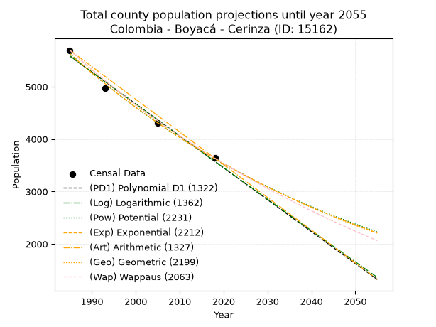
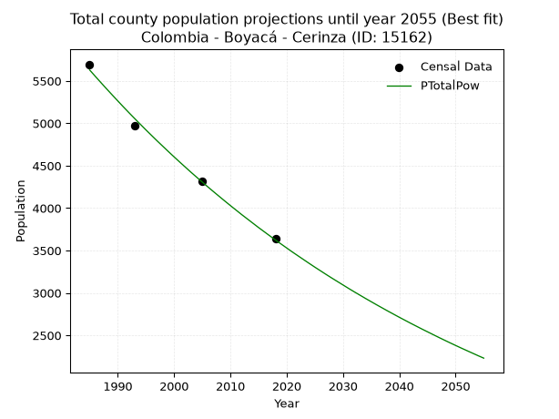
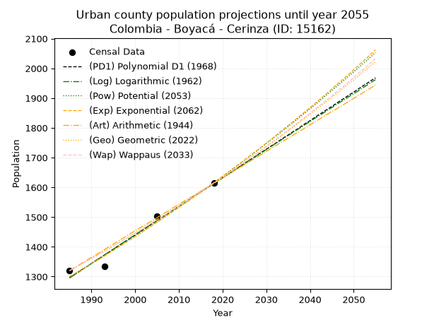
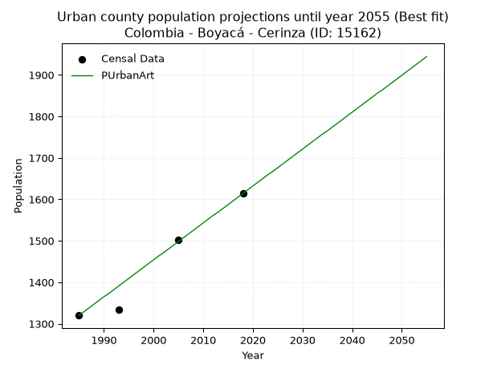
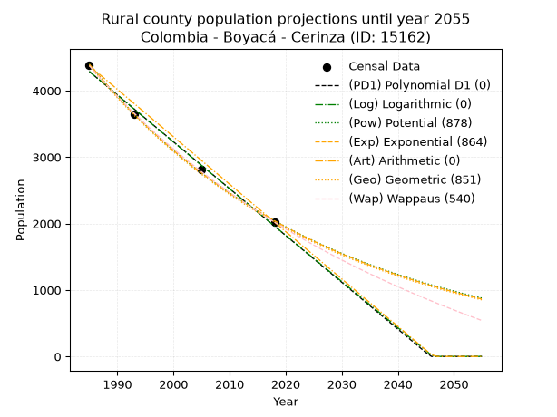
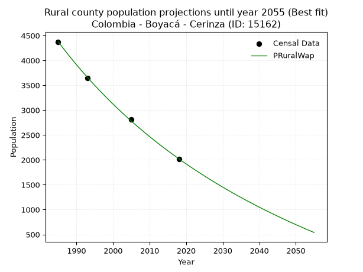

<div align="center">


</div>

# _“Population and Public Services Demand Projections (PPSD) until Year 2050 for Colombia - Boyacá - Cerinza (ID: 15162)”_
Keywords: `population` `public-service` `projection` `lineal` `polynomial` `logarithmic` `potential` `exponential` `arithmetic` `geometric` `wappaus` `dane` `colombia` `south-america`

PPSD are analytical estimates used by governments and planners to anticipate future changes in population size, age distribution, and the resulting community needs for utilities, healthcare, education, and infrastructure as sizing future water treatment facilities, electrical grids, and road networks based on spatial growth.

> **General running parameters**: • app_version: _v20260806_. • Python version: _3.14.7_. • Pandas version: _3.0.5_. • NumPy version: _2.5.1_. • Creates, save and include plots into reports (create_plot): _False_. • Projection until year: _2050_. • Process polynomial degree 2 and up: _False_. • Process Wappaus: _True_. • Process Wappaus: _True_. • Set negative values to zero: _True_. • Set infinite values to zero: _True_. • Drop dataset notes: _True_. 
<div align="center">

Dynamic map: [:earth_americas:Google](http://maps.google.com/maps?q=5.955939426,-72.9479183) [:earth_americas:OSM](https://www.openstreetmap.org/#map=18/5.955939426/-72.9479183&layers=P) [:earth_americas:Bing](https://www.bing.com/maps?cp=5.955939426~-72.9479183&lvl=18) [:earth_americas:Apple](https://maps.apple.com/frame?center=5.955939426%2C-72.9479183&span=0.003%2C0.006)

</div>


<div align="center">

```geojson
{
  "type": "Feature",
  "geometry": {
    "type": "Point", 
    "coordinates": [-72.9479183, 5.955939426]
  }, 
  "properties": {
    "Name": "Colombia - Boyacá - Cerinza (ID: 15162)"
  }
}
```

</div>


## 0. Census Data (4 records)

Census data are official statistics collected by a government about the people and housing in a country. They usually include counts of total population, age, sex, race, income, education, and jobs.

📅Global census file: [Population.xlsx](../data/Population.xlsx)

| Source   |   Year |   CountryID | CountryName   |   StateID | StateName   |   CountyID | CountyName   |   PTotal |   PUrban |   PRural |
|:---------|-------:|------------:|:--------------|----------:|:------------|-----------:|:-------------|---------:|---------:|---------:|
| DANE     |   1985 |          57 | Colombia      |        15 | Boyacá      |      15162 | Cerinza      |     5695 |     1320 |     4375 |
| DANE     |   1993 |          57 | Colombia      |        15 | Boyacá      |      15162 | Cerinza      |     4976 |     1334 |     3642 |
| DANE     |   2005 |          57 | Colombia      |        15 | Boyacá      |      15162 | Cerinza      |     4312 |     1502 |     2810 |
| DANE     |   2018 |          57 | Colombia      |        15 | Boyacá      |      15162 | Cerinza      |     3636 |     1614 |     2022 |

> 🔥Some records could had specific notes about the registered values or the corresponding urban or rural distribution.

📅   [RUPS](https://www.datos.gov.co/Hacienda-y-Cr-dito-P-blico/Registro-nico-de-Prestadores-de-Servicios-P-blicos/4qkq-csdn/about_data) - Local public utility companies: [RUPS.csv](../data/RUPS.xlsx)

 | SERVICIO       | ESTADO    | NOMBRE                                                                                                 | NIT         | DEPARTAMENTO_DOMICILIO   | MUNICIPIO_DOMICILIO   | DIRECCION                                   |   TELEFONO | EMAIL                              | TIPO_INSCRIPCION    | REPRESENTANTE_LEGAL            | TIPO_PRESTADOR                 | CLASIFICACION                 |
|:---------------|:----------|:-------------------------------------------------------------------------------------------------------|:------------|:-------------------------|:----------------------|:--------------------------------------------|-----------:|:-----------------------------------|:--------------------|:-------------------------------|:-------------------------------|:------------------------------|
| ACUEDUCTO      | OPERATIVA | ASOCIACION DE USUARIOS DEL SERVICIO DE ACUEDUCTO ALCANTARILLADO Y ASEO                                 | 826001609-6 | BOYACA                   | CERINZA               | Calle 7 Nº 5-47                             |    7877287 | acueductocerinza@gmail.com         | Registro por la ESP | HUMBERTO   VEGA RODRIGUEZ      | ORGANIZACION AUTORIZADA        | MENOR O IGUAL A 2500 USUARIOS |
| ALCANTARILLADO | OPERATIVA | ASOCIACION DE USUARIOS DEL SERVICIO DE ACUEDUCTO ALCANTARILLADO Y ASEO                                 | 826001609-6 | BOYACA                   | CERINZA               | Calle 7 Nº 5-47                             |    7877287 | acueductocerinza@gmail.com         | Registro por la ESP | HUMBERTO   VEGA RODRIGUEZ      | ORGANIZACION AUTORIZADA        | MENOR O IGUAL A 2500 USUARIOS |
| ACUEDUCTO      | OPERATIVA | ASOCIACION DE SUSCRIPTORES DEL PROACUEDUCTO LA TENERIA VEREDA COBAGOTE DEL MUNICIPIO DE CERINZA        | 900151825-1 | BOYACA                   | CERINZA               | Vereda Cobagote                             |    3115793 | PROACUEDUCTOLATENERIA@YAHOO.COM.CO | Registro por la ESP | JAIRO DE JESUS PITA BAEZ       | ORGANIZACION AUTORIZADA        | MENOR O IGUAL A 2500 USUARIOS |
| ALCANTARILLADO | OPERATIVA | MUNICIPO DE CERINZA                                                                                    | 891857805-3 | BOYACA                   | CERINZA               | Calle 7 Nº 5-73                             |    7877287 | luchoporcerinza@hotmail.com        | Registro por la ESP | LUIS ERNESTO PINTO TAMAYO      | MUNICIPIO (PRESTACIÓN DIRECTA) | HASTA 2500 SUSCRIPTORES       |
| ACUEDUCTO      | OPERATIVA | ASOCIACION DE SUSCRIPTORES DEL ACUEDUCTO DE LA VEREDA CHITAL CENTRO DEL MUNICIPIO DE CERINZA BOYACA    | 900043026-0 | BOYACA                   | CERINZA               | VEREDA CHITAL                               |    0000000 | ajcorredor@hotmail.es              | Registro por la ESP | ALONSO DE JESUS CORREDOR REYES | ORGANIZACION AUTORIZADA        | MENOR O IGUAL A 2500 USUARIOS |
| ACUEDUCTO      | OPERATIVA | ASOCIACION DE SUSCRIPTORES DEL ACUEDUCTO DE LA VEREDA TOBA                                             | 900133607-6 | BOYACA                   | CERINZA               | VEREDA DE TOBA                              |    7876070 | madecarosa71@yahoo.com             | Registro por la ESP | MANUEL ROJAS LEON              | ORGANIZACION AUTORIZADA        | HASTA 2500 SUSCRIPTORES       |
| ACUEDUCTO      | OPERATIVA | ASOCIACIÓN DE SUSCRIPTORES DEL ACUEDUCTO RURAL TOBA COBAGOTE Y NOVARE DEL MUNICIPIO DE CERINZA, BOYACA | 826000442-9 | BOYACA                   | CERINZA               | VEREDA COBAGOTE CARRETERA CENTRAL DEL NORTE |    7625009 | ASOTOCONO@GMAIL.COM                | Registro por la ESP | LUIS FRANCISCO MALAVER BECERRA | ORGANIZACION AUTORIZADA        | MENOR O IGUAL A 2500 USUARIOS |

## 1. Total

### 1.1. Coefficients and Parameters

* (PD1) Polynomial Deg 1: -60.86511441188228, 126400.19510236754 (lineal)
* (Log) Logarithmic: -121859.39572289368, 930908.9934096267
* (Pow) Potential: -26.703871869635073, 91.81342536928717
* (Exp) Exponential: -0.013339886536173583, 1779286014910869.0
* (Art) Arithmetic: Year diff. 2018 - 1985 = 33, Population diff. 3636 - 5695 = -2059, Annual growth = -62.39393939393939
* (Geo) Geometric: Year diff. 2018 - 1985 = 33, Population diff. 3636 - 5695 = -2059, Annual growth % = -0.013505080594691132
* (Wap) Wappaus: i = -1.337347323843948, Condition values only valid for < 200)

<sub>
Wappaus condition values: ['-0.00', '-1.34', '-2.67', '-4.01', '-5.35', '-6.69', '-8.02', '-9.36', '-10.70', '-12.04', '-13.37', '-14.71', '-16.05', '-17.39', '-18.72', '-20.06', '-21.40', '-22.73', '-24.07', '-25.41', '-26.75', '-28.08', '-29.42', '-30.76', '-32.10', '-33.43', '-34.77', '-36.11', '-37.45', '-38.78', '-40.12', '-41.46', '-42.80', '-44.13', '-45.47', '-46.81', '-48.14', '-49.48', '-50.82', '-52.16', '-53.49', '-54.83', '-56.17', '-57.51', '-58.84', '-60.18', '-61.52', '-62.86', '-64.19', '-65.53', '-66.87', '-68.20', '-69.54', '-70.88', '-72.22', '-73.55', '-74.89', '-76.23', '-77.57', '-78.90', '-80.24', '-81.58', '-82.92', '-84.25', '-85.59', '-86.93']
</sub>


### 1.2. Projected Dataset

|   Year |   CountyID |   PTotalPD1 |   PTotalLog |   PTotalPow |   PTotalExp |   PTotalArt |   PTotalGeo |   PTotalWap |
|-------:|-----------:|------------:|------------:|------------:|------------:|------------:|------------:|------------:|
|   1985 |      15162 |        5583 |        5585 |        5629 |        5627 |        5695 |        5695 |        5695 |
|   1986 |      15162 |        5522 |        5524 |        5554 |        5552 |        5633 |        5618 |        5619 |
|   1987 |      15162 |        5461 |        5462 |        5480 |        5479 |        5570 |        5542 |        5545 |
|   1988 |      15162 |        5400 |        5401 |        5407 |        5406 |        5508 |        5467 |        5471 |
|   1989 |      15162 |        5339 |        5340 |        5335 |        5335 |        5445 |        5394 |        5398 |
|   1990 |      15162 |        5279 |        5278 |        5264 |        5264 |        5383 |        5321 |        5327 |
|   1991 |      15162 |        5218 |        5217 |        5193 |        5194 |        5321 |        5249 |        5256 |
|   1992 |      15162 |        5157 |        5156 |        5124 |        5125 |        5258 |        5178 |        5186 |
|   1993 |      15162 |        5096 |        5095 |        5056 |        5057 |        5196 |        5108 |        5117 |
|   1994 |      15162 |        5035 |        5034 |        4989 |        4990 |        5133 |        5039 |        5048 |
|   1995 |      15162 |        4974 |        4973 |        4922 |        4924 |        5071 |        4971 |        4981 |
|   1996 |      15162 |        4913 |        4912 |        4857 |        4859 |        5009 |        4904 |        4915 |
|   1997 |      15162 |        4853 |        4851 |        4792 |        4795 |        4946 |        4838 |        4849 |
|   1998 |      15162 |        4792 |        4790 |        4729 |        4731 |        4884 |        4772 |        4784 |
|   1999 |      15162 |        4731 |        4729 |        4666 |        4668 |        4821 |        4708 |        4720 |
|   2000 |      15162 |        4670 |        4668 |        4604 |        4606 |        4759 |        4644 |        4657 |
|   2001 |      15162 |        4609 |        4607 |        4543 |        4545 |        4697 |        4582 |        4594 |
|   2002 |      15162 |        4548 |        4546 |        4483 |        4485 |        4634 |        4520 |        4532 |
|   2003 |      15162 |        4487 |        4485 |        4423 |        4426 |        4572 |        4459 |        4471 |
|   2004 |      15162 |        4427 |        4424 |        4365 |        4367 |        4510 |        4398 |        4411 |
|   2005 |      15162 |        4366 |        4363 |        4307 |        4309 |        4447 |        4339 |        4351 |
|   2006 |      15162 |        4305 |        4303 |        4250 |        4252 |        4385 |        4280 |        4293 |
|   2007 |      15162 |        4244 |        4242 |        4194 |        4196 |        4322 |        4223 |        4234 |
|   2008 |      15162 |        4183 |        4181 |        4139 |        4140 |        4260 |        4166 |        4177 |
|   2009 |      15162 |        4122 |        4120 |        4084 |        4085 |        4198 |        4109 |        4120 |
|   2010 |      15162 |        4061 |        4060 |        4030 |        4031 |        4135 |        4054 |        4064 |
|   2011 |      15162 |        4000 |        3999 |        3977 |        3978 |        4073 |        3999 |        4008 |
|   2012 |      15162 |        3940 |        3939 |        3924 |        3925 |        4010 |        3945 |        3953 |
|   2013 |      15162 |        3879 |        3878 |        3873 |        3873 |        3948 |        3892 |        3899 |
|   2014 |      15162 |        3818 |        3818 |        3822 |        3822 |        3886 |        3839 |        3845 |
|   2015 |      15162 |        3757 |        3757 |        3771 |        3771 |        3823 |        3787 |        3792 |
|   2016 |      15162 |        3696 |        3697 |        3722 |        3721 |        3761 |        3736 |        3739 |
|   2017 |      15162 |        3635 |        3636 |        3673 |        3672 |        3698 |        3686 |        3687 |
|   2018 |      15162 |        3574 |        3576 |        3624 |        3623 |        3636 |        3636 |        3636 |
|   2019 |      15162 |        3514 |        3515 |        3577 |        3575 |        3574 |        3587 |        3585 |
|   2020 |      15162 |        3453 |        3455 |        3530 |        3528 |        3511 |        3538 |        3535 |
|   2021 |      15162 |        3392 |        3395 |        3483 |        3481 |        3449 |        3491 |        3485 |
|   2022 |      15162 |        3331 |        3334 |        3438 |        3435 |        3386 |        3444 |        3436 |
|   2023 |      15162 |        3270 |        3274 |        3393 |        3389 |        3324 |        3397 |        3387 |
|   2024 |      15162 |        3209 |        3214 |        3348 |        3344 |        3262 |        3351 |        3339 |
|   2025 |      15162 |        3148 |        3154 |        3304 |        3300 |        3199 |        3306 |        3291 |
|   2026 |      15162 |        3087 |        3094 |        3261 |        3256 |        3137 |        3261 |        3244 |
|   2027 |      15162 |        3027 |        3034 |        3218 |        3213 |        3074 |        3217 |        3198 |
|   2028 |      15162 |        2966 |        2973 |        3176 |        3171 |        3012 |        3174 |        3151 |
|   2029 |      15162 |        2905 |        2913 |        3135 |        3129 |        2950 |        3131 |        3106 |
|   2030 |      15162 |        2844 |        2853 |        3094 |        3087 |        2887 |        3089 |        3060 |
|   2031 |      15162 |        2783 |        2793 |        3053 |        3046 |        2825 |        3047 |        3016 |
|   2032 |      15162 |        2722 |        2733 |        3013 |        3006 |        2762 |        3006 |        2971 |
|   2033 |      15162 |        2661 |        2673 |        2974 |        2966 |        2700 |        2965 |        2927 |
|   2034 |      15162 |        2601 |        2613 |        2935 |        2927 |        2638 |        2925 |        2884 |
|   2035 |      15162 |        2540 |        2554 |        2897 |        2888 |        2575 |        2886 |        2841 |
|   2036 |      15162 |        2479 |        2494 |        2859 |        2850 |        2513 |        2847 |        2799 |
|   2037 |      15162 |        2418 |        2434 |        2822 |        2812 |        2451 |        2808 |        2756 |
|   2038 |      15162 |        2357 |        2374 |        2785 |        2775 |        2388 |        2770 |        2715 |
|   2039 |      15162 |        2296 |        2314 |        2749 |        2738 |        2326 |        2733 |        2673 |
|   2040 |      15162 |        2235 |        2254 |        2713 |        2702 |        2263 |        2696 |        2632 |
|   2041 |      15162 |        2174 |        2195 |        2678 |        2666 |        2201 |        2660 |        2592 |
|   2042 |      15162 |        2114 |        2135 |        2643 |        2631 |        2139 |        2624 |        2552 |
|   2043 |      15162 |        2053 |        2075 |        2609 |        2596 |        2076 |        2588 |        2512 |
|   2044 |      15162 |        1992 |        2016 |        2575 |        2561 |        2014 |        2553 |        2473 |
|   2045 |      15162 |        1931 |        1956 |        2542 |        2527 |        1951 |        2519 |        2434 |
|   2046 |      15162 |        1870 |        1897 |        2509 |        2494 |        1889 |        2485 |        2395 |
|   2047 |      15162 |        1809 |        1837 |        2476 |        2461 |        1827 |        2451 |        2357 |
|   2048 |      15162 |        1748 |        1778 |        2444 |        2428 |        1764 |        2418 |        2319 |
|   2049 |      15162 |        1688 |        1718 |        2412 |        2396 |        1702 |        2385 |        2281 |
|   2050 |      15162 |        1627 |        1659 |        2381 |        2364 |        1639 |        2353 |        2244 |
<div align="center">

</img>

</div>


### 1.3. Best fit with absolute and relative error (%)

Relative error puts that difference into context by dividing the absolute error by the true value, creating a unitless ratio or percentage that shows the scale of the mistake.

Absolute and relative error

|   Year | Source   |   CountryID | CountryName   |   StateID | StateName   |   CountyID_x | CountyName   |   PTotal |   PUrban |   PRural |   CountyID_y |   PTotalPD1 |   PTotalLog |   PTotalPow |   PTotalExp |   PTotalArt |   PTotalGeo |   PTotalWap |   PTotalPD1AbsError |   PTotalLogAbsError |   PTotalPowAbsError |   PTotalExpAbsError |   PTotalArtAbsError |   PTotalGeoAbsError |   PTotalWapAbsError |   PTotalPD1RelError |   PTotalLogRelError |   PTotalPowRelError |   PTotalExpRelError |   PTotalArtRelError |   PTotalGeoRelError |   PTotalWapRelError |
|-------:|:---------|------------:|:--------------|----------:|:------------|-------------:|:-------------|---------:|---------:|---------:|-------------:|------------:|------------:|------------:|------------:|------------:|------------:|------------:|--------------------:|--------------------:|--------------------:|--------------------:|--------------------:|--------------------:|--------------------:|--------------------:|--------------------:|--------------------:|--------------------:|--------------------:|--------------------:|--------------------:|
|   1985 | DANE     |          57 | Colombia      |        15 | Boyacá      |        15162 | Cerinza      |     5695 |     1320 |     4375 |        15162 |        5583 |        5585 |        5629 |        5627 |        5695 |        5695 |        5695 |                 112 |                 110 |                  66 |                  68 |                   0 |                   0 |                   0 |             1.96664 |             1.93152 |            1.15891  |           1.19403   |             0       |             0       |            0        |
|   1993 | DANE     |          57 | Colombia      |        15 | Boyacá      |        15162 | Cerinza      |     4976 |     1334 |     3642 |        15162 |        5096 |        5095 |        5056 |        5057 |        5196 |        5108 |        5117 |                 120 |                 119 |                  80 |                  81 |                 220 |                 132 |                 141 |             2.41158 |             2.39148 |            1.60772  |           1.62781   |             4.42122 |             2.65273 |            2.8336   |
|   2005 | DANE     |          57 | Colombia      |        15 | Boyacá      |        15162 | Cerinza      |     4312 |     1502 |     2810 |        15162 |        4366 |        4363 |        4307 |        4309 |        4447 |        4339 |        4351 |                  54 |                  51 |                   5 |                   3 |                 135 |                  27 |                  39 |             1.25232 |             1.18275 |            0.115955 |           0.0695733 |             3.1308  |             0.62616 |            0.904453 |
|   2018 | DANE     |          57 | Colombia      |        15 | Boyacá      |        15162 | Cerinza      |     3636 |     1614 |     2022 |        15162 |        3574 |        3576 |        3624 |        3623 |        3636 |        3636 |        3636 |                  62 |                  60 |                  12 |                  13 |                   0 |                   0 |                   0 |             1.70517 |             1.65017 |            0.330033 |           0.357536  |             0       |             0       |            0        |

Relative error mean

| Method    |   RelError | Best   |
|:----------|-----------:|:-------|
| PTotalPD1 |   1.83393  |        |
| PTotalLog |   1.78898  |        |
| PTotalPow |   0.803154 | True   |
| PTotalExp |   0.812238 |        |
| PTotalArt |   1.888    |        |
| PTotalGeo |   0.819723 |        |
| PTotalWap |   0.934513 |        |

💙Best method: _**PTotalPow**_
<div align="center">

</img>

</div>


### 1.4. Fresh water supply demand in liters per capita per day (lpcd)

The fresh water supply demand typically ranges from 100 to 300 liters per capita per day (lpcd) for standard domestic and municipal planning, though absolute survival minimums set by the World Health Organization are as low as 7.5 to 20 liters per day, and total consumption in high-income nations can exceed 400 liters.

> `CZ`: Level in meters above the sea level (masl)<br> `WS`: Fresh water supply demand in liters per capita per day (lpcd or l/h/d)<br> `WSAll`: Zonal fresh water supply demand in liters per second (l/s)<br> `A`: Zonal area in square meters<br> `DP`: Population density (people/hectare or p/ha)

Reference values (RAS Colombia)

|    CZ |   WS |
|------:|-----:|
|  1000 |  120 |
|  2000 |  130 |
| 99999 |  140 |

County shapefile geometry properties and water supply values

|   CountyID |      ATotal |   CZTotal |   WSTotal |
|-----------:|------------:|----------:|----------:|
|      15162 | 6.34531e+07 |   3114.84 |       140 |

Projected values for best method: PTotalPow

|   CountyID |   Year |   PTotalPow |   DPTotal |   WSTotal |   WSTotalAll |
|-----------:|-------:|------------:|----------:|----------:|-------------:|
|      15162 |   1985 |        5629 |      0.89 |       140 |      9.12106 |
|      15162 |   1986 |        5554 |      0.88 |       140 |      8.99954 |
|      15162 |   1987 |        5480 |      0.86 |       140 |      8.87963 |
|      15162 |   1988 |        5407 |      0.85 |       140 |      8.76134 |
|      15162 |   1989 |        5335 |      0.84 |       140 |      8.64468 |
|      15162 |   1990 |        5264 |      0.83 |       140 |      8.52963 |
|      15162 |   1991 |        5193 |      0.82 |       140 |      8.41458 |
|      15162 |   1992 |        5124 |      0.81 |       140 |      8.30278 |
|      15162 |   1993 |        5056 |      0.8  |       140 |      8.19259 |
|      15162 |   1994 |        4989 |      0.79 |       140 |      8.08403 |
|      15162 |   1995 |        4922 |      0.78 |       140 |      7.97546 |
|      15162 |   1996 |        4857 |      0.77 |       140 |      7.87014 |
|      15162 |   1997 |        4792 |      0.76 |       140 |      7.76481 |
|      15162 |   1998 |        4729 |      0.75 |       140 |      7.66273 |
|      15162 |   1999 |        4666 |      0.74 |       140 |      7.56065 |
|      15162 |   2000 |        4604 |      0.73 |       140 |      7.46019 |
|      15162 |   2001 |        4543 |      0.72 |       140 |      7.36134 |
|      15162 |   2002 |        4483 |      0.71 |       140 |      7.26412 |
|      15162 |   2003 |        4423 |      0.7  |       140 |      7.1669  |
|      15162 |   2004 |        4365 |      0.69 |       140 |      7.07292 |
|      15162 |   2005 |        4307 |      0.68 |       140 |      6.97894 |
|      15162 |   2006 |        4250 |      0.67 |       140 |      6.88657 |
|      15162 |   2007 |        4194 |      0.66 |       140 |      6.79583 |
|      15162 |   2008 |        4139 |      0.65 |       140 |      6.70671 |
|      15162 |   2009 |        4084 |      0.64 |       140 |      6.61759 |
|      15162 |   2010 |        4030 |      0.64 |       140 |      6.53009 |
|      15162 |   2011 |        3977 |      0.63 |       140 |      6.44421 |
|      15162 |   2012 |        3924 |      0.62 |       140 |      6.35833 |
|      15162 |   2013 |        3873 |      0.61 |       140 |      6.27569 |
|      15162 |   2014 |        3822 |      0.6  |       140 |      6.19306 |
|      15162 |   2015 |        3771 |      0.59 |       140 |      6.11042 |
|      15162 |   2016 |        3722 |      0.59 |       140 |      6.03102 |
|      15162 |   2017 |        3673 |      0.58 |       140 |      5.95162 |
|      15162 |   2018 |        3624 |      0.57 |       140 |      5.87222 |
|      15162 |   2019 |        3577 |      0.56 |       140 |      5.79606 |
|      15162 |   2020 |        3530 |      0.56 |       140 |      5.71991 |
|      15162 |   2021 |        3483 |      0.55 |       140 |      5.64375 |
|      15162 |   2022 |        3438 |      0.54 |       140 |      5.57083 |
|      15162 |   2023 |        3393 |      0.53 |       140 |      5.49792 |
|      15162 |   2024 |        3348 |      0.53 |       140 |      5.425   |
|      15162 |   2025 |        3304 |      0.52 |       140 |      5.3537  |
|      15162 |   2026 |        3261 |      0.51 |       140 |      5.28403 |
|      15162 |   2027 |        3218 |      0.51 |       140 |      5.21435 |
|      15162 |   2028 |        3176 |      0.5  |       140 |      5.1463  |
|      15162 |   2029 |        3135 |      0.49 |       140 |      5.07986 |
|      15162 |   2030 |        3094 |      0.49 |       140 |      5.01343 |
|      15162 |   2031 |        3053 |      0.48 |       140 |      4.94699 |
|      15162 |   2032 |        3013 |      0.47 |       140 |      4.88218 |
|      15162 |   2033 |        2974 |      0.47 |       140 |      4.81898 |
|      15162 |   2034 |        2935 |      0.46 |       140 |      4.75579 |
|      15162 |   2035 |        2897 |      0.46 |       140 |      4.69421 |
|      15162 |   2036 |        2859 |      0.45 |       140 |      4.63264 |
|      15162 |   2037 |        2822 |      0.44 |       140 |      4.57269 |
|      15162 |   2038 |        2785 |      0.44 |       140 |      4.51273 |
|      15162 |   2039 |        2749 |      0.43 |       140 |      4.4544  |
|      15162 |   2040 |        2713 |      0.43 |       140 |      4.39606 |
|      15162 |   2041 |        2678 |      0.42 |       140 |      4.33935 |
|      15162 |   2042 |        2643 |      0.42 |       140 |      4.28264 |
|      15162 |   2043 |        2609 |      0.41 |       140 |      4.22755 |
|      15162 |   2044 |        2575 |      0.41 |       140 |      4.17245 |
|      15162 |   2045 |        2542 |      0.4  |       140 |      4.11898 |
|      15162 |   2046 |        2509 |      0.4  |       140 |      4.06551 |
|      15162 |   2047 |        2476 |      0.39 |       140 |      4.01204 |
|      15162 |   2048 |        2444 |      0.39 |       140 |      3.96019 |
|      15162 |   2049 |        2412 |      0.38 |       140 |      3.90833 |
|      15162 |   2050 |        2381 |      0.38 |       140 |      3.8581  |

## 2. Urban

### 2.1. Coefficients and Parameters

* (PD1) Polynomial Deg 1: 9.604977920513766, -17769.85708550766 (lineal)
* (Log) Logarithmic: 19222.157913092597, -144665.2763341231
* (Pow) Potential: 13.196593236399291, -40.40537925960178
* (Exp) Exponential: 0.006593796291803721, 0.0026888167504035853
* (Art) Arithmetic: Year diff. 2018 - 1985 = 33, Population diff. 1614 - 1320 = 294, Annual growth = 8.909090909090908
* (Geo) Geometric: Year diff. 2018 - 1985 = 33, Population diff. 1614 - 1320 = 294, Annual growth % = 0.006112052321705752
* (Wap) Wappaus: i = 0.6072999938030613, Condition values only valid for < 200)

<sub>
Wappaus condition values: ['0.00', '0.61', '1.21', '1.82', '2.43', '3.04', '3.64', '4.25', '4.86', '5.47', '6.07', '6.68', '7.29', '7.89', '8.50', '9.11', '9.72', '10.32', '10.93', '11.54', '12.15', '12.75', '13.36', '13.97', '14.58', '15.18', '15.79', '16.40', '17.00', '17.61', '18.22', '18.83', '19.43', '20.04', '20.65', '21.26', '21.86', '22.47', '23.08', '23.68', '24.29', '24.90', '25.51', '26.11', '26.72', '27.33', '27.94', '28.54', '29.15', '29.76', '30.36', '30.97', '31.58', '32.19', '32.79', '33.40', '34.01', '34.62', '35.22', '35.83', '36.44', '37.05', '37.65', '38.26', '38.87', '39.47']
</sub>


### 2.2. Projected Dataset

|   Year |   CountyID |   PUrbanPD1 |   PUrbanLog |   PUrbanPow |   PUrbanExp |   PUrbanArt |   PUrbanGeo |   PUrbanWap |
|-------:|-----------:|------------:|------------:|------------:|------------:|------------:|------------:|------------:|
|   1985 |      15162 |        1296 |        1296 |        1300 |        1300 |        1320 |        1320 |        1320 |
|   1986 |      15162 |        1306 |        1305 |        1308 |        1308 |        1329 |        1328 |        1328 |
|   1987 |      15162 |        1315 |        1315 |        1317 |        1317 |        1338 |        1336 |        1336 |
|   1988 |      15162 |        1325 |        1325 |        1326 |        1326 |        1347 |        1344 |        1344 |
|   1989 |      15162 |        1334 |        1334 |        1335 |        1335 |        1356 |        1353 |        1352 |
|   1990 |      15162 |        1344 |        1344 |        1344 |        1343 |        1365 |        1361 |        1361 |
|   1991 |      15162 |        1354 |        1354 |        1352 |        1352 |        1373 |        1369 |        1369 |
|   1992 |      15162 |        1363 |        1363 |        1361 |        1361 |        1382 |        1378 |        1377 |
|   1993 |      15162 |        1373 |        1373 |        1370 |        1370 |        1391 |        1386 |        1386 |
|   1994 |      15162 |        1382 |        1383 |        1380 |        1379 |        1400 |        1394 |        1394 |
|   1995 |      15162 |        1392 |        1392 |        1389 |        1388 |        1409 |        1403 |        1403 |
|   1996 |      15162 |        1402 |        1402 |        1398 |        1398 |        1418 |        1412 |        1411 |
|   1997 |      15162 |        1411 |        1412 |        1407 |        1407 |        1427 |        1420 |        1420 |
|   1998 |      15162 |        1421 |        1421 |        1417 |        1416 |        1436 |        1429 |        1428 |
|   1999 |      15162 |        1430 |        1431 |        1426 |        1426 |        1445 |        1438 |        1437 |
|   2000 |      15162 |        1440 |        1440 |        1435 |        1435 |        1454 |        1446 |        1446 |
|   2001 |      15162 |        1450 |        1450 |        1445 |        1445 |        1463 |        1455 |        1455 |
|   2002 |      15162 |        1459 |        1460 |        1454 |        1454 |        1471 |        1464 |        1464 |
|   2003 |      15162 |        1469 |        1469 |        1464 |        1464 |        1480 |        1473 |        1473 |
|   2004 |      15162 |        1479 |        1479 |        1474 |        1473 |        1489 |        1482 |        1482 |
|   2005 |      15162 |        1488 |        1488 |        1483 |        1483 |        1498 |        1491 |        1491 |
|   2006 |      15162 |        1498 |        1498 |        1493 |        1493 |        1507 |        1500 |        1500 |
|   2007 |      15162 |        1507 |        1508 |        1503 |        1503 |        1516 |        1509 |        1509 |
|   2008 |      15162 |        1517 |        1517 |        1513 |        1513 |        1525 |        1519 |        1518 |
|   2009 |      15162 |        1527 |        1527 |        1523 |        1523 |        1534 |        1528 |        1528 |
|   2010 |      15162 |        1536 |        1536 |        1533 |        1533 |        1543 |        1537 |        1537 |
|   2011 |      15162 |        1546 |        1546 |        1543 |        1543 |        1552 |        1547 |        1546 |
|   2012 |      15162 |        1555 |        1555 |        1553 |        1553 |        1561 |        1556 |        1556 |
|   2013 |      15162 |        1565 |        1565 |        1564 |        1563 |        1569 |        1566 |        1565 |
|   2014 |      15162 |        1575 |        1575 |        1574 |        1574 |        1578 |        1575 |        1575 |
|   2015 |      15162 |        1584 |        1584 |        1584 |        1584 |        1587 |        1585 |        1585 |
|   2016 |      15162 |        1594 |        1594 |        1595 |        1595 |        1596 |        1594 |        1594 |
|   2017 |      15162 |        1603 |        1603 |        1605 |        1605 |        1605 |        1604 |        1604 |
|   2018 |      15162 |        1613 |        1613 |        1616 |        1616 |        1614 |        1614 |        1614 |
|   2019 |      15162 |        1623 |        1622 |        1626 |        1627 |        1623 |        1624 |        1624 |
|   2020 |      15162 |        1632 |        1632 |        1637 |        1637 |        1632 |        1634 |        1634 |
|   2021 |      15162 |        1642 |        1641 |        1648 |        1648 |        1641 |        1644 |        1644 |
|   2022 |      15162 |        1651 |        1651 |        1658 |        1659 |        1650 |        1654 |        1654 |
|   2023 |      15162 |        1661 |        1660 |        1669 |        1670 |        1659 |        1664 |        1664 |
|   2024 |      15162 |        1671 |        1670 |        1680 |        1681 |        1667 |        1674 |        1675 |
|   2025 |      15162 |        1680 |        1679 |        1691 |        1692 |        1676 |        1684 |        1685 |
|   2026 |      15162 |        1690 |        1689 |        1702 |        1703 |        1685 |        1695 |        1695 |
|   2027 |      15162 |        1699 |        1698 |        1713 |        1715 |        1694 |        1705 |        1706 |
|   2028 |      15162 |        1709 |        1708 |        1724 |        1726 |        1703 |        1715 |        1716 |
|   2029 |      15162 |        1719 |        1717 |        1736 |        1737 |        1712 |        1726 |        1727 |
|   2030 |      15162 |        1728 |        1727 |        1747 |        1749 |        1721 |        1736 |        1738 |
|   2031 |      15162 |        1738 |        1736 |        1758 |        1760 |        1730 |        1747 |        1749 |
|   2032 |      15162 |        1747 |        1746 |        1770 |        1772 |        1739 |        1758 |        1759 |
|   2033 |      15162 |        1757 |        1755 |        1781 |        1784 |        1748 |        1768 |        1770 |
|   2034 |      15162 |        1767 |        1765 |        1793 |        1796 |        1757 |        1779 |        1781 |
|   2035 |      15162 |        1776 |        1774 |        1805 |        1808 |        1765 |        1790 |        1793 |
|   2036 |      15162 |        1786 |        1783 |        1816 |        1819 |        1774 |        1801 |        1804 |
|   2037 |      15162 |        1795 |        1793 |        1828 |        1832 |        1783 |        1812 |        1815 |
|   2038 |      15162 |        1805 |        1802 |        1840 |        1844 |        1792 |        1823 |        1826 |
|   2039 |      15162 |        1815 |        1812 |        1852 |        1856 |        1801 |        1834 |        1838 |
|   2040 |      15162 |        1824 |        1821 |        1864 |        1868 |        1810 |        1846 |        1849 |
|   2041 |      15162 |        1834 |        1831 |        1876 |        1880 |        1819 |        1857 |        1861 |
|   2042 |      15162 |        1844 |        1840 |        1888 |        1893 |        1828 |        1868 |        1873 |
|   2043 |      15162 |        1853 |        1849 |        1901 |        1905 |        1837 |        1880 |        1884 |
|   2044 |      15162 |        1863 |        1859 |        1913 |        1918 |        1846 |        1891 |        1896 |
|   2045 |      15162 |        1872 |        1868 |        1925 |        1931 |        1855 |        1903 |        1908 |
|   2046 |      15162 |        1882 |        1878 |        1938 |        1944 |        1863 |        1914 |        1920 |
|   2047 |      15162 |        1892 |        1887 |        1950 |        1956 |        1872 |        1926 |        1932 |
|   2048 |      15162 |        1901 |        1896 |        1963 |        1969 |        1881 |        1938 |        1944 |
|   2049 |      15162 |        1911 |        1906 |        1976 |        1982 |        1890 |        1950 |        1957 |
|   2050 |      15162 |        1920 |        1915 |        1988 |        1995 |        1899 |        1961 |        1969 |
<div align="center">

</img>

</div>


### 2.3. Best fit with absolute and relative error (%)

Relative error puts that difference into context by dividing the absolute error by the true value, creating a unitless ratio or percentage that shows the scale of the mistake.

Absolute and relative error

|   Year | Source   |   CountryID | CountryName   |   StateID | StateName   |   CountyID_x | CountyName   |   PTotal |   PUrban |   PRural |   CountyID_y |   PUrbanPD1 |   PUrbanLog |   PUrbanPow |   PUrbanExp |   PUrbanArt |   PUrbanGeo |   PUrbanWap |   PUrbanPD1AbsError |   PUrbanLogAbsError |   PUrbanPowAbsError |   PUrbanExpAbsError |   PUrbanArtAbsError |   PUrbanGeoAbsError |   PUrbanWapAbsError |   PUrbanPD1RelError |   PUrbanLogRelError |   PUrbanPowRelError |   PUrbanExpRelError |   PUrbanArtRelError |   PUrbanGeoRelError |   PUrbanWapRelError |
|-------:|:---------|------------:|:--------------|----------:|:------------|-------------:|:-------------|---------:|---------:|---------:|-------------:|------------:|------------:|------------:|------------:|------------:|------------:|------------:|--------------------:|--------------------:|--------------------:|--------------------:|--------------------:|--------------------:|--------------------:|--------------------:|--------------------:|--------------------:|--------------------:|--------------------:|--------------------:|--------------------:|
|   1985 | DANE     |          57 | Colombia      |        15 | Boyacá      |        15162 | Cerinza      |     5695 |     1320 |     4375 |        15162 |        1296 |        1296 |        1300 |        1300 |        1320 |        1320 |        1320 |                  24 |                  24 |                  20 |                  20 |                   0 |                   0 |                   0 |           1.81818   |           1.81818   |            1.51515  |            1.51515  |            0        |            0        |            0        |
|   1993 | DANE     |          57 | Colombia      |        15 | Boyacá      |        15162 | Cerinza      |     4976 |     1334 |     3642 |        15162 |        1373 |        1373 |        1370 |        1370 |        1391 |        1386 |        1386 |                  39 |                  39 |                  36 |                  36 |                  57 |                  52 |                  52 |           2.92354   |           2.92354   |            2.69865  |            2.69865  |            4.27286  |            3.89805  |            3.89805  |
|   2005 | DANE     |          57 | Colombia      |        15 | Boyacá      |        15162 | Cerinza      |     4312 |     1502 |     2810 |        15162 |        1488 |        1488 |        1483 |        1483 |        1498 |        1491 |        1491 |                  14 |                  14 |                  19 |                  19 |                   4 |                  11 |                  11 |           0.932091  |           0.932091  |            1.26498  |            1.26498  |            0.266312 |            0.732357 |            0.732357 |
|   2018 | DANE     |          57 | Colombia      |        15 | Boyacá      |        15162 | Cerinza      |     3636 |     1614 |     2022 |        15162 |        1613 |        1613 |        1616 |        1616 |        1614 |        1614 |        1614 |                   1 |                   1 |                   2 |                   2 |                   0 |                   0 |                   0 |           0.0619579 |           0.0619579 |            0.123916 |            0.123916 |            0        |            0        |            0        |

Relative error mean

| Method    |   RelError | Best   |
|:----------|-----------:|:-------|
| PUrbanPD1 |    1.43394 |        |
| PUrbanLog |    1.43394 |        |
| PUrbanPow |    1.40067 |        |
| PUrbanExp |    1.40067 |        |
| PUrbanArt |    1.13479 | True   |
| PUrbanGeo |    1.1576  |        |
| PUrbanWap |    1.1576  |        |

💙Best method: _**PUrbanArt**_
<div align="center">

</img>

</div>


### 2.4. Fresh water supply demand in liters per capita per day (lpcd)

The fresh water supply demand typically ranges from 100 to 300 liters per capita per day (lpcd) for standard domestic and municipal planning, though absolute survival minimums set by the World Health Organization are as low as 7.5 to 20 liters per day, and total consumption in high-income nations can exceed 400 liters.

> `CZ`: Level in meters above the sea level (masl)<br> `WS`: Fresh water supply demand in liters per capita per day (lpcd or l/h/d)<br> `WSAll`: Zonal fresh water supply demand in liters per second (l/s)<br> `A`: Zonal area in square meters<br> `DP`: Population density (people/hectare or p/ha)

Reference values (RAS Colombia)

|    CZ |   WS |
|------:|-----:|
|  1000 |  120 |
|  2000 |  130 |
| 99999 |  140 |

County shapefile geometry properties and water supply values

|   CountyID |   AUrban |   CZUrban |   WSUrban |
|-----------:|---------:|----------:|----------:|
|      15162 |   479542 |   2721.06 |       140 |

Projected values for best method: PUrbanArt

|   CountyID |   Year |   PUrbanArt |   DPUrban |   WSUrban |   WSUrbanAll |
|-----------:|-------:|------------:|----------:|----------:|-------------:|
|      15162 |   1985 |        1320 |     27.53 |       140 |      2.13889 |
|      15162 |   1986 |        1329 |     27.71 |       140 |      2.15347 |
|      15162 |   1987 |        1338 |     27.9  |       140 |      2.16806 |
|      15162 |   1988 |        1347 |     28.09 |       140 |      2.18264 |
|      15162 |   1989 |        1356 |     28.28 |       140 |      2.19722 |
|      15162 |   1990 |        1365 |     28.46 |       140 |      2.21181 |
|      15162 |   1991 |        1373 |     28.63 |       140 |      2.22477 |
|      15162 |   1992 |        1382 |     28.82 |       140 |      2.23935 |
|      15162 |   1993 |        1391 |     29.01 |       140 |      2.25394 |
|      15162 |   1994 |        1400 |     29.19 |       140 |      2.26852 |
|      15162 |   1995 |        1409 |     29.38 |       140 |      2.2831  |
|      15162 |   1996 |        1418 |     29.57 |       140 |      2.29769 |
|      15162 |   1997 |        1427 |     29.76 |       140 |      2.31227 |
|      15162 |   1998 |        1436 |     29.95 |       140 |      2.32685 |
|      15162 |   1999 |        1445 |     30.13 |       140 |      2.34144 |
|      15162 |   2000 |        1454 |     30.32 |       140 |      2.35602 |
|      15162 |   2001 |        1463 |     30.51 |       140 |      2.3706  |
|      15162 |   2002 |        1471 |     30.68 |       140 |      2.38356 |
|      15162 |   2003 |        1480 |     30.86 |       140 |      2.39815 |
|      15162 |   2004 |        1489 |     31.05 |       140 |      2.41273 |
|      15162 |   2005 |        1498 |     31.24 |       140 |      2.42731 |
|      15162 |   2006 |        1507 |     31.43 |       140 |      2.4419  |
|      15162 |   2007 |        1516 |     31.61 |       140 |      2.45648 |
|      15162 |   2008 |        1525 |     31.8  |       140 |      2.47106 |
|      15162 |   2009 |        1534 |     31.99 |       140 |      2.48565 |
|      15162 |   2010 |        1543 |     32.18 |       140 |      2.50023 |
|      15162 |   2011 |        1552 |     32.36 |       140 |      2.51481 |
|      15162 |   2012 |        1561 |     32.55 |       140 |      2.5294  |
|      15162 |   2013 |        1569 |     32.72 |       140 |      2.54236 |
|      15162 |   2014 |        1578 |     32.91 |       140 |      2.55694 |
|      15162 |   2015 |        1587 |     33.09 |       140 |      2.57153 |
|      15162 |   2016 |        1596 |     33.28 |       140 |      2.58611 |
|      15162 |   2017 |        1605 |     33.47 |       140 |      2.60069 |
|      15162 |   2018 |        1614 |     33.66 |       140 |      2.61528 |
|      15162 |   2019 |        1623 |     33.84 |       140 |      2.62986 |
|      15162 |   2020 |        1632 |     34.03 |       140 |      2.64444 |
|      15162 |   2021 |        1641 |     34.22 |       140 |      2.65903 |
|      15162 |   2022 |        1650 |     34.41 |       140 |      2.67361 |
|      15162 |   2023 |        1659 |     34.6  |       140 |      2.68819 |
|      15162 |   2024 |        1667 |     34.76 |       140 |      2.70116 |
|      15162 |   2025 |        1676 |     34.95 |       140 |      2.71574 |
|      15162 |   2026 |        1685 |     35.14 |       140 |      2.73032 |
|      15162 |   2027 |        1694 |     35.33 |       140 |      2.74491 |
|      15162 |   2028 |        1703 |     35.51 |       140 |      2.75949 |
|      15162 |   2029 |        1712 |     35.7  |       140 |      2.77407 |
|      15162 |   2030 |        1721 |     35.89 |       140 |      2.78866 |
|      15162 |   2031 |        1730 |     36.08 |       140 |      2.80324 |
|      15162 |   2032 |        1739 |     36.26 |       140 |      2.81782 |
|      15162 |   2033 |        1748 |     36.45 |       140 |      2.83241 |
|      15162 |   2034 |        1757 |     36.64 |       140 |      2.84699 |
|      15162 |   2035 |        1765 |     36.81 |       140 |      2.85995 |
|      15162 |   2036 |        1774 |     36.99 |       140 |      2.87454 |
|      15162 |   2037 |        1783 |     37.18 |       140 |      2.88912 |
|      15162 |   2038 |        1792 |     37.37 |       140 |      2.9037  |
|      15162 |   2039 |        1801 |     37.56 |       140 |      2.91829 |
|      15162 |   2040 |        1810 |     37.74 |       140 |      2.93287 |
|      15162 |   2041 |        1819 |     37.93 |       140 |      2.94745 |
|      15162 |   2042 |        1828 |     38.12 |       140 |      2.96204 |
|      15162 |   2043 |        1837 |     38.31 |       140 |      2.97662 |
|      15162 |   2044 |        1846 |     38.5  |       140 |      2.9912  |
|      15162 |   2045 |        1855 |     38.68 |       140 |      3.00579 |
|      15162 |   2046 |        1863 |     38.85 |       140 |      3.01875 |
|      15162 |   2047 |        1872 |     39.04 |       140 |      3.03333 |
|      15162 |   2048 |        1881 |     39.22 |       140 |      3.04792 |
|      15162 |   2049 |        1890 |     39.41 |       140 |      3.0625  |
|      15162 |   2050 |        1899 |     39.6  |       140 |      3.07708 |

## 3. Rural

### 3.1. Coefficients and Parameters

* (PD1) Polynomial Deg 1: -70.47009233239609, 144170.05218787526 (lineal)
* (Log) Logarithmic: -141081.55363598623, 1075574.2697437496
* (Pow) Potential: -46.51626231001056, 157.04291091426094
* (Exp) Exponential: -0.023240892581371148, 4.769880738951585e+23
* (Art) Arithmetic: Year diff. 2018 - 1985 = 33, Population diff. 2022 - 4375 = -2353, Annual growth = -71.3030303030303
* (Geo) Geometric: Year diff. 2018 - 1985 = 33, Population diff. 2022 - 4375 = -2353, Annual growth % = -0.023117076374894685
* (Wap) Wappaus: i = -2.2292646647813132, Condition values only valid for < 200)

<sub>
Wappaus condition values: ['-0.00', '-2.23', '-4.46', '-6.69', '-8.92', '-11.15', '-13.38', '-15.60', '-17.83', '-20.06', '-22.29', '-24.52', '-26.75', '-28.98', '-31.21', '-33.44', '-35.67', '-37.90', '-40.13', '-42.36', '-44.59', '-46.81', '-49.04', '-51.27', '-53.50', '-55.73', '-57.96', '-60.19', '-62.42', '-64.65', '-66.88', '-69.11', '-71.34', '-73.57', '-75.79', '-78.02', '-80.25', '-82.48', '-84.71', '-86.94', '-89.17', '-91.40', '-93.63', '-95.86', '-98.09', '-100.32', '-102.55', '-104.78', '-107.00', '-109.23', '-111.46', '-113.69', '-115.92', '-118.15', '-120.38', '-122.61', '-124.84', '-127.07', '-129.30', '-131.53', '-133.76', '-135.99', '-138.21', '-140.44', '-142.67', '-144.90']
</sub>


### 3.2. Projected Dataset

|   Year |   CountyID |   PRuralPD1 |   PRuralLog |   PRuralPow |   PRuralExp |   PRuralArt |   PRuralGeo |   PRuralWap |
|-------:|-----------:|------------:|------------:|------------:|------------:|------------:|------------:|------------:|
|   1985 |      15162 |        4287 |        4289 |        4400 |        4397 |        4375 |        4375 |        4375 |
|   1986 |      15162 |        4216 |        4218 |        4298 |        4296 |        4304 |        4274 |        4279 |
|   1987 |      15162 |        4146 |        4147 |        4198 |        4197 |        4232 |        4175 |        4184 |
|   1988 |      15162 |        4076 |        4076 |        4101 |        4101 |        4161 |        4079 |        4092 |
|   1989 |      15162 |        4005 |        4005 |        4006 |        4006 |        4090 |        3984 |        4002 |
|   1990 |      15162 |        3935 |        3934 |        3914 |        3914 |        4018 |        3892 |        3913 |
|   1991 |      15162 |        3864 |        3863 |        3823 |        3824 |        3947 |        3802 |        3827 |
|   1992 |      15162 |        3794 |        3793 |        3735 |        3737 |        3876 |        3714 |        3742 |
|   1993 |      15162 |        3723 |        3722 |        3649 |        3651 |        3805 |        3628 |        3659 |
|   1994 |      15162 |        3653 |        3651 |        3565 |        3567 |        3733 |        3545 |        3577 |
|   1995 |      15162 |        3582 |        3580 |        3483 |        3485 |        3662 |        3463 |        3498 |
|   1996 |      15162 |        3512 |        3510 |        3402 |        3405 |        3591 |        3383 |        3419 |
|   1997 |      15162 |        3441 |        3439 |        3324 |        3327 |        3519 |        3304 |        3343 |
|   1998 |      15162 |        3371 |        3368 |        3247 |        3250 |        3448 |        3228 |        3268 |
|   1999 |      15162 |        3300 |        3298 |        3173 |        3176 |        3377 |        3153 |        3194 |
|   2000 |      15162 |        3230 |        3227 |        3100 |        3103 |        3305 |        3080 |        3122 |
|   2001 |      15162 |        3159 |        3157 |        3029 |        3031 |        3234 |        3009 |        3051 |
|   2002 |      15162 |        3089 |        3086 |        2959 |        2962 |        3163 |        2940 |        2981 |
|   2003 |      15162 |        3018 |        3016 |        2891 |        2894 |        3092 |        2872 |        2913 |
|   2004 |      15162 |        2948 |        2945 |        2825 |        2827 |        3020 |        2805 |        2846 |
|   2005 |      15162 |        2878 |        2875 |        2760 |        2762 |        2949 |        2740 |        2780 |
|   2006 |      15162 |        2807 |        2805 |        2697 |        2699 |        2878 |        2677 |        2715 |
|   2007 |      15162 |        2737 |        2734 |        2635 |        2637 |        2806 |        2615 |        2652 |
|   2008 |      15162 |        2666 |        2664 |        2574 |        2576 |        2735 |        2555 |        2590 |
|   2009 |      15162 |        2596 |        2594 |        2516 |        2517 |        2664 |        2496 |        2528 |
|   2010 |      15162 |        2525 |        2523 |        2458 |        2459 |        2592 |        2438 |        2468 |
|   2011 |      15162 |        2455 |        2453 |        2402 |        2403 |        2521 |        2382 |        2409 |
|   2012 |      15162 |        2384 |        2383 |        2347 |        2347 |        2450 |        2327 |        2351 |
|   2013 |      15162 |        2314 |        2313 |        2293 |        2294 |        2379 |        2273 |        2294 |
|   2014 |      15162 |        2243 |        2243 |        2241 |        2241 |        2307 |        2220 |        2238 |
|   2015 |      15162 |        2173 |        2173 |        2190 |        2189 |        2236 |        2169 |        2182 |
|   2016 |      15162 |        2102 |        2103 |        2140 |        2139 |        2165 |        2119 |        2128 |
|   2017 |      15162 |        2032 |        2033 |        2091 |        2090 |        2093 |        2070 |        2075 |
|   2018 |      15162 |        1961 |        1963 |        2043 |        2042 |        2022 |        2022 |        2022 |
|   2019 |      15162 |        1891 |        1893 |        1997 |        1995 |        1951 |        1975 |        1970 |
|   2020 |      15162 |        1820 |        1823 |        1951 |        1949 |        1879 |        1930 |        1919 |
|   2021 |      15162 |        1750 |        1754 |        1907 |        1904 |        1808 |        1885 |        1869 |
|   2022 |      15162 |        1680 |        1684 |        1863 |        1861 |        1737 |        1841 |        1820 |
|   2023 |      15162 |        1609 |        1614 |        1821 |        1818 |        1665 |        1799 |        1772 |
|   2024 |      15162 |        1539 |        1544 |        1780 |        1776 |        1594 |        1757 |        1724 |
|   2025 |      15162 |        1468 |        1475 |        1739 |        1735 |        1523 |        1717 |        1677 |
|   2026 |      15162 |        1398 |        1405 |        1700 |        1695 |        1452 |        1677 |        1630 |
|   2027 |      15162 |        1327 |        1335 |        1661 |        1657 |        1380 |        1638 |        1585 |
|   2028 |      15162 |        1257 |        1266 |        1624 |        1618 |        1309 |        1600 |        1540 |
|   2029 |      15162 |        1186 |        1196 |        1587 |        1581 |        1238 |        1563 |        1496 |
|   2030 |      15162 |        1116 |        1127 |        1551 |        1545 |        1166 |        1527 |        1452 |
|   2031 |      15162 |        1045 |        1057 |        1516 |        1509 |        1095 |        1492 |        1409 |
|   2032 |      15162 |         975 |         988 |        1481 |        1475 |        1024 |        1457 |        1367 |
|   2033 |      15162 |         904 |         918 |        1448 |        1441 |         952 |        1424 |        1325 |
|   2034 |      15162 |         834 |         849 |        1415 |        1408 |         881 |        1391 |        1284 |
|   2035 |      15162 |         763 |         780 |        1383 |        1375 |         810 |        1359 |        1244 |
|   2036 |      15162 |         693 |         710 |        1352 |        1344 |         739 |        1327 |        1204 |
|   2037 |      15162 |         622 |         641 |        1321 |        1313 |         667 |        1297 |        1164 |
|   2038 |      15162 |         552 |         572 |        1292 |        1283 |         596 |        1267 |        1126 |
|   2039 |      15162 |         482 |         503 |        1262 |        1253 |         525 |        1237 |        1087 |
|   2040 |      15162 |         411 |         433 |        1234 |        1225 |         453 |        1209 |        1050 |
|   2041 |      15162 |         341 |         364 |        1206 |        1196 |         382 |        1181 |        1012 |
|   2042 |      15162 |         270 |         295 |        1179 |        1169 |         311 |        1153 |         976 |
|   2043 |      15162 |         200 |         226 |        1152 |        1142 |         239 |        1127 |         939 |
|   2044 |      15162 |         129 |         157 |        1126 |        1116 |         168 |        1101 |         904 |
|   2045 |      15162 |          59 |          88 |        1101 |        1090 |          97 |        1075 |         868 |
|   2046 |      15162 |           0 |          19 |        1076 |        1065 |          26 |        1050 |         834 |
|   2047 |      15162 |           0 |           0 |        1052 |        1041 |           0 |        1026 |         799 |
|   2048 |      15162 |           0 |           0 |        1029 |        1017 |           0 |        1002 |         765 |
|   2049 |      15162 |           0 |           0 |        1005 |         993 |           0 |         979 |         732 |
|   2050 |      15162 |           0 |           0 |         983 |         971 |           0 |         957 |         699 |
<div align="center">

</img>

</div>


### 3.3. Best fit with absolute and relative error (%)

Relative error puts that difference into context by dividing the absolute error by the true value, creating a unitless ratio or percentage that shows the scale of the mistake.

Absolute and relative error

|   Year | Source   |   CountryID | CountryName   |   StateID | StateName   |   CountyID_x | CountyName   |   PTotal |   PUrban |   PRural |   CountyID_y |   PRuralPD1 |   PRuralLog |   PRuralPow |   PRuralExp |   PRuralArt |   PRuralGeo |   PRuralWap |   PRuralPD1AbsError |   PRuralLogAbsError |   PRuralPowAbsError |   PRuralExpAbsError |   PRuralArtAbsError |   PRuralGeoAbsError |   PRuralWapAbsError |   PRuralPD1RelError |   PRuralLogRelError |   PRuralPowRelError |   PRuralExpRelError |   PRuralArtRelError |   PRuralGeoRelError |   PRuralWapRelError |
|-------:|:---------|------------:|:--------------|----------:|:------------|-------------:|:-------------|---------:|---------:|---------:|-------------:|------------:|------------:|------------:|------------:|------------:|------------:|------------:|--------------------:|--------------------:|--------------------:|--------------------:|--------------------:|--------------------:|--------------------:|--------------------:|--------------------:|--------------------:|--------------------:|--------------------:|--------------------:|--------------------:|
|   1985 | DANE     |          57 | Colombia      |        15 | Boyacá      |        15162 | Cerinza      |     5695 |     1320 |     4375 |        15162 |        4287 |        4289 |        4400 |        4397 |        4375 |        4375 |        4375 |                  88 |                  86 |                  25 |                  22 |                   0 |                   0 |                   0 |             2.01143 |             1.96571 |            0.571429 |            0.502857 |             0       |            0        |            0        |
|   1993 | DANE     |          57 | Colombia      |        15 | Boyacá      |        15162 | Cerinza      |     4976 |     1334 |     3642 |        15162 |        3723 |        3722 |        3649 |        3651 |        3805 |        3628 |        3659 |                  81 |                  80 |                   7 |                   9 |                 163 |                  14 |                  17 |             2.22405 |             2.1966  |            0.192202 |            0.247117 |             4.47556 |            0.384404 |            0.466776 |
|   2005 | DANE     |          57 | Colombia      |        15 | Boyacá      |        15162 | Cerinza      |     4312 |     1502 |     2810 |        15162 |        2878 |        2875 |        2760 |        2762 |        2949 |        2740 |        2780 |                  68 |                  65 |                  50 |                  48 |                 139 |                  70 |                  30 |             2.41993 |             2.31317 |            1.77936  |            1.70819  |             4.94662 |            2.4911   |            1.06762  |
|   2018 | DANE     |          57 | Colombia      |        15 | Boyacá      |        15162 | Cerinza      |     3636 |     1614 |     2022 |        15162 |        1961 |        1963 |        2043 |        2042 |        2022 |        2022 |        2022 |                  61 |                  59 |                  21 |                  20 |                   0 |                   0 |                   0 |             3.01682 |             2.9179  |            1.03858  |            0.98912  |             0       |            0        |            0        |

Relative error mean

| Method    |   RelError | Best   |
|:----------|-----------:|:-------|
| PRuralPD1 |   2.41806  |        |
| PRuralLog |   2.34834  |        |
| PRuralPow |   0.895391 |        |
| PRuralExp |   0.86182  |        |
| PRuralArt |   2.35555  |        |
| PRuralGeo |   0.718877 |        |
| PRuralWap |   0.383598 | True   |

💙Best method: _**PRuralWap**_
<div align="center">

</img>

</div>


### 3.4. Fresh water supply demand in liters per capita per day (lpcd)

The fresh water supply demand typically ranges from 100 to 300 liters per capita per day (lpcd) for standard domestic and municipal planning, though absolute survival minimums set by the World Health Organization are as low as 7.5 to 20 liters per day, and total consumption in high-income nations can exceed 400 liters.

> `CZ`: Level in meters above the sea level (masl)<br> `WS`: Fresh water supply demand in liters per capita per day (lpcd or l/h/d)<br> `WSAll`: Zonal fresh water supply demand in liters per second (l/s)<br> `A`: Zonal area in square meters<br> `DP`: Population density (people/hectare or p/ha)

Reference values (RAS Colombia)

|    CZ |   WS |
|------:|-----:|
|  1000 |  120 |
|  2000 |  130 |
| 99999 |  140 |

County shapefile geometry properties and water supply values

|   CountyID |      ARural |   CZRural |   WSRural |
|-----------:|------------:|----------:|----------:|
|      15162 | 6.29735e+07 |   3117.81 |       140 |

Projected values for best method: PRuralWap

|   CountyID |   Year |   PRuralWap |   DPRural |   WSRural |   WSRuralAll |
|-----------:|-------:|------------:|----------:|----------:|-------------:|
|      15162 |   1985 |        4375 |      0.69 |       140 |      7.08912 |
|      15162 |   1986 |        4279 |      0.68 |       140 |      6.93356 |
|      15162 |   1987 |        4184 |      0.66 |       140 |      6.77963 |
|      15162 |   1988 |        4092 |      0.65 |       140 |      6.63056 |
|      15162 |   1989 |        4002 |      0.64 |       140 |      6.48472 |
|      15162 |   1990 |        3913 |      0.62 |       140 |      6.34051 |
|      15162 |   1991 |        3827 |      0.61 |       140 |      6.20116 |
|      15162 |   1992 |        3742 |      0.59 |       140 |      6.06343 |
|      15162 |   1993 |        3659 |      0.58 |       140 |      5.92894 |
|      15162 |   1994 |        3577 |      0.57 |       140 |      5.79606 |
|      15162 |   1995 |        3498 |      0.56 |       140 |      5.66806 |
|      15162 |   1996 |        3419 |      0.54 |       140 |      5.54005 |
|      15162 |   1997 |        3343 |      0.53 |       140 |      5.4169  |
|      15162 |   1998 |        3268 |      0.52 |       140 |      5.29537 |
|      15162 |   1999 |        3194 |      0.51 |       140 |      5.17546 |
|      15162 |   2000 |        3122 |      0.5  |       140 |      5.0588  |
|      15162 |   2001 |        3051 |      0.48 |       140 |      4.94375 |
|      15162 |   2002 |        2981 |      0.47 |       140 |      4.83032 |
|      15162 |   2003 |        2913 |      0.46 |       140 |      4.72014 |
|      15162 |   2004 |        2846 |      0.45 |       140 |      4.61157 |
|      15162 |   2005 |        2780 |      0.44 |       140 |      4.50463 |
|      15162 |   2006 |        2715 |      0.43 |       140 |      4.39931 |
|      15162 |   2007 |        2652 |      0.42 |       140 |      4.29722 |
|      15162 |   2008 |        2590 |      0.41 |       140 |      4.19676 |
|      15162 |   2009 |        2528 |      0.4  |       140 |      4.0963  |
|      15162 |   2010 |        2468 |      0.39 |       140 |      3.99907 |
|      15162 |   2011 |        2409 |      0.38 |       140 |      3.90347 |
|      15162 |   2012 |        2351 |      0.37 |       140 |      3.80949 |
|      15162 |   2013 |        2294 |      0.36 |       140 |      3.71713 |
|      15162 |   2014 |        2238 |      0.36 |       140 |      3.62639 |
|      15162 |   2015 |        2182 |      0.35 |       140 |      3.53565 |
|      15162 |   2016 |        2128 |      0.34 |       140 |      3.44815 |
|      15162 |   2017 |        2075 |      0.33 |       140 |      3.36227 |
|      15162 |   2018 |        2022 |      0.32 |       140 |      3.27639 |
|      15162 |   2019 |        1970 |      0.31 |       140 |      3.19213 |
|      15162 |   2020 |        1919 |      0.3  |       140 |      3.10949 |
|      15162 |   2021 |        1869 |      0.3  |       140 |      3.02847 |
|      15162 |   2022 |        1820 |      0.29 |       140 |      2.94907 |
|      15162 |   2023 |        1772 |      0.28 |       140 |      2.8713  |
|      15162 |   2024 |        1724 |      0.27 |       140 |      2.79352 |
|      15162 |   2025 |        1677 |      0.27 |       140 |      2.71736 |
|      15162 |   2026 |        1630 |      0.26 |       140 |      2.6412  |
|      15162 |   2027 |        1585 |      0.25 |       140 |      2.56829 |
|      15162 |   2028 |        1540 |      0.24 |       140 |      2.49537 |
|      15162 |   2029 |        1496 |      0.24 |       140 |      2.42407 |
|      15162 |   2030 |        1452 |      0.23 |       140 |      2.35278 |
|      15162 |   2031 |        1409 |      0.22 |       140 |      2.2831  |
|      15162 |   2032 |        1367 |      0.22 |       140 |      2.21505 |
|      15162 |   2033 |        1325 |      0.21 |       140 |      2.14699 |
|      15162 |   2034 |        1284 |      0.2  |       140 |      2.08056 |
|      15162 |   2035 |        1244 |      0.2  |       140 |      2.01574 |
|      15162 |   2036 |        1204 |      0.19 |       140 |      1.95093 |
|      15162 |   2037 |        1164 |      0.18 |       140 |      1.88611 |
|      15162 |   2038 |        1126 |      0.18 |       140 |      1.82454 |
|      15162 |   2039 |        1087 |      0.17 |       140 |      1.76134 |
|      15162 |   2040 |        1050 |      0.17 |       140 |      1.70139 |
|      15162 |   2041 |        1012 |      0.16 |       140 |      1.63981 |
|      15162 |   2042 |         976 |      0.15 |       140 |      1.58148 |
|      15162 |   2043 |         939 |      0.15 |       140 |      1.52153 |
|      15162 |   2044 |         904 |      0.14 |       140 |      1.46481 |
|      15162 |   2045 |         868 |      0.14 |       140 |      1.40648 |
|      15162 |   2046 |         834 |      0.13 |       140 |      1.35139 |
|      15162 |   2047 |         799 |      0.13 |       140 |      1.29468 |
|      15162 |   2048 |         765 |      0.12 |       140 |      1.23958 |
|      15162 |   2049 |         732 |      0.12 |       140 |      1.18611 |
|      15162 |   2050 |         699 |      0.11 |       140 |      1.13264 |

<div align="center"><br><sub>Share this research</sub></div><br>

<sub>**APPS & TOOLS & CONTENT DISCLAIMER**: • NO WARRANTY - This content and software is provided by <a href="https://github.com/rcfdtools" target="_blank">github.com/rcfdtools</a> "as is", without any express or implied warranty, including warranties of merchantability, fitness for a particular purpose, or non-infringement. There is no guarantee that the software will be error-free or operate without interruption. • LIMITATION OF LIABILITY - Neither the authors nor copyright holders will be liable for claims or damages arising from the software or its use. You are responsible for determining if the software is appropriate for your use and assume all associated risks, including errors, legal compliance, and data loss. • NO PROFESSIONAL ADVICE - The software provides general information and does not offer professional advice. It should not replace consultation with professional advisors. [Clauses and global license for rcfdtools use.](https://github.com/rcfdtools/rcfdtools/blob/main/LICENSE.md)</sub>

| [:house: Home](Readme.md)  | [:beginner: Help / Collaborate](https://github.com/rcfdtools/R.HydroTools/discussions/31) |
|----------------------------|-------------------------------------------------------------------------------------------|