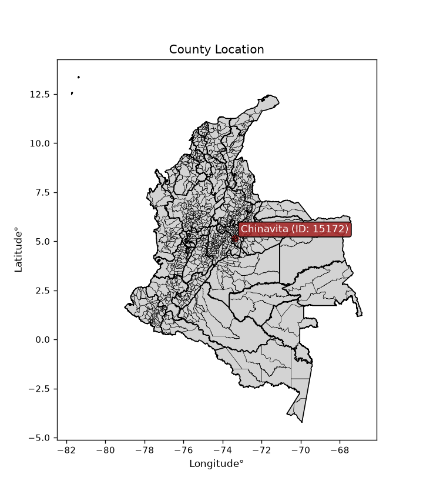
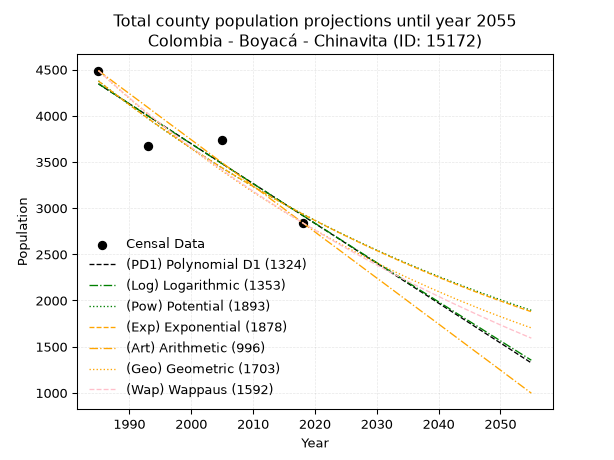
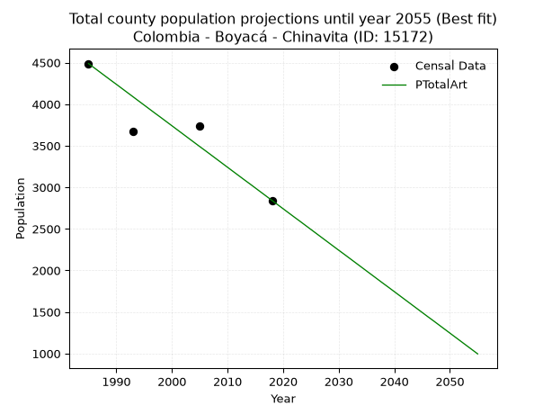
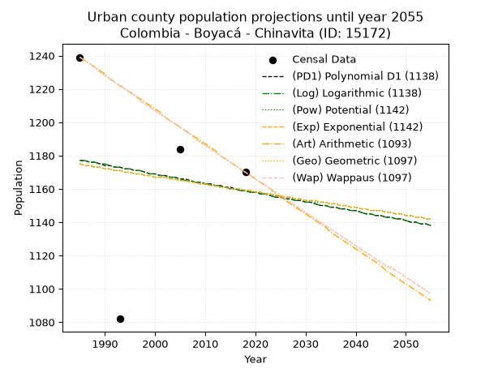
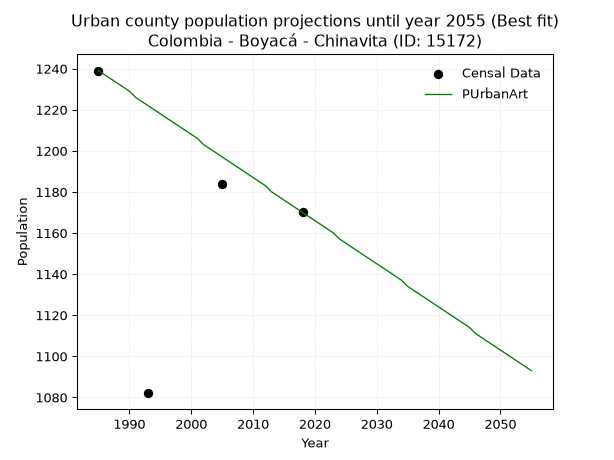
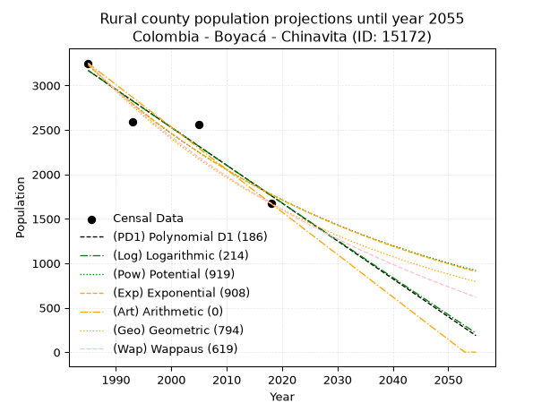
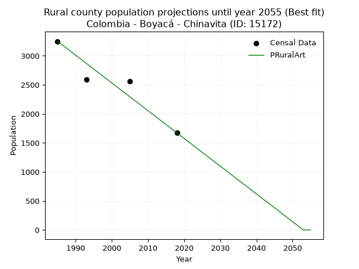

<div align="center">


</div>

# _“Population and Public Services Demand Projections (PPSD) until Year 2050 for Colombia - Boyacá - Chinavita (ID: 15172)”_
Keywords: `population` `public-service` `projection` `lineal` `polynomial` `logarithmic` `potential` `exponential` `arithmetic` `geometric` `wappaus` `dane` `colombia` `south-america`

PPSD are analytical estimates used by governments and planners to anticipate future changes in population size, age distribution, and the resulting community needs for utilities, healthcare, education, and infrastructure as sizing future water treatment facilities, electrical grids, and road networks based on spatial growth.

<div align="center">

</img>

</div>


> **General running parameters**: • app_version: _v20260806_. • Python version: _3.14.7_. • Pandas version: _3.0.5_. • NumPy version: _2.5.1_. • Creates, save and include plots into reports (create_plot): _False_. • Projection until year: _2050_. • Process polynomial degree 2 and up: _False_. • Process Wappaus: _True_. • Process Wappaus: _True_. • Set negative values to zero: _True_. • Set infinite values to zero: _True_. • Drop dataset notes: _True_. 
<div align="center">

Dynamic map: [:earth_americas:Google](http://maps.google.com/maps?q=5.16748581,-73.3684763) [:earth_americas:OSM](https://www.openstreetmap.org/#map=18/5.16748581/-73.3684763&layers=P) [:earth_americas:Bing](https://www.bing.com/maps?cp=5.16748581~-73.3684763&lvl=18) [:earth_americas:Apple](https://maps.apple.com/frame?center=5.16748581%2C-73.3684763&span=0.003%2C0.006)

</div>


<div align="center">

```geojson
{
  "type": "Feature",
  "geometry": {
    "type": "Point", 
    "coordinates": [-73.3684763, 5.16748581]
  }, 
  "properties": {
    "Name": "Colombia - Boyacá - Chinavita (ID: 15172)"
  }
}
```

</div>


## 0. Census Data (4 records)

Census data are official statistics collected by a government about the people and housing in a country. They usually include counts of total population, age, sex, race, income, education, and jobs.

📅Global census file: [Population.xlsx](../data/Population.xlsx)

| Source   |   Year |   CountryID | CountryName   |   StateID | StateName   |   CountyID | CountyName   |   PTotal |   PUrban |   PRural |
|:---------|-------:|------------:|:--------------|----------:|:------------|-----------:|:-------------|---------:|---------:|---------:|
| DANE     |   1985 |          57 | Colombia      |        15 | Boyacá      |      15172 | Chinavita    |     4488 |     1239 |     3249 |
| DANE     |   1993 |          57 | Colombia      |        15 | Boyacá      |      15172 | Chinavita    |     3675 |     1082 |     2593 |
| DANE     |   2005 |          57 | Colombia      |        15 | Boyacá      |      15172 | Chinavita    |     3741 |     1184 |     2557 |
| DANE     |   2018 |          57 | Colombia      |        15 | Boyacá      |      15172 | Chinavita    |     2842 |     1170 |     1672 |

> 🔥Some records could had specific notes about the registered values or the corresponding urban or rural distribution.

📅   [RUPS](https://www.datos.gov.co/Hacienda-y-Cr-dito-P-blico/Registro-nico-de-Prestadores-de-Servicios-P-blicos/4qkq-csdn/about_data) - Local public utility companies: [RUPS.csv](../data/RUPS.xlsx)

 | SERVICIO       | ESTADO    | NOMBRE                                               | NIT         | DEPARTAMENTO_DOMICILIO   | MUNICIPIO_DOMICILIO   | DIRECCION          |   TELEFONO | EMAIL                           | TIPO_PRESTADOR          | CLASIFICACION                 |
|:---------------|:----------|:-----------------------------------------------------|:------------|:-------------------------|:----------------------|:-------------------|-----------:|:--------------------------------|:------------------------|:------------------------------|
| ACUEDUCTO      | OPERATIVA | EMPRESA SOLIDARIA DE SERVICIOS PUBLICOS DE CHINAVITA | 830508349-8 | BOYACA                   | CHINAVITA             | CARRERA 4 No. 2-05 |    7524490 | maribelpulidoaponte@hotmail.com | ORGANIZACION AUTORIZADA | MENOR O IGUAL A 2500 USUARIOS |
| ALCANTARILLADO | OPERATIVA | EMPRESA SOLIDARIA DE SERVICIOS PUBLICOS DE CHINAVITA | 830508349-8 | BOYACA                   | CHINAVITA             | CARRERA 4 No. 2-05 |    7524490 | maribelpulidoaponte@hotmail.com | ORGANIZACION AUTORIZADA | MENOR O IGUAL A 2500 USUARIOS |

## 1. Total

### 1.1. Coefficients and Parameters

* (PD1) Polynomial Deg 1: -43.14813327980674, 89993.55359293344 (lineal)
* (Log) Logarithmic: -86364.32945952666, 660142.4603021641
* (Pow) Potential: -24.183867096918306, 83.39375981619132
* (Exp) Exponential: -0.01208474582490976, 114543231659412.88
* (Art) Arithmetic: Year diff. 2018 - 1985 = 33, Population diff. 2842 - 4488 = -1646, Annual growth = -49.878787878787875
* (Geo) Geometric: Year diff. 2018 - 1985 = 33, Population diff. 2842 - 4488 = -1646, Annual growth % = -0.013750021321461636
* (Wap) Wappaus: i = -1.3609491917813883, Condition values only valid for < 200)

<sub>
Wappaus condition values: ['-0.00', '-1.36', '-2.72', '-4.08', '-5.44', '-6.80', '-8.17', '-9.53', '-10.89', '-12.25', '-13.61', '-14.97', '-16.33', '-17.69', '-19.05', '-20.41', '-21.78', '-23.14', '-24.50', '-25.86', '-27.22', '-28.58', '-29.94', '-31.30', '-32.66', '-34.02', '-35.38', '-36.75', '-38.11', '-39.47', '-40.83', '-42.19', '-43.55', '-44.91', '-46.27', '-47.63', '-48.99', '-50.36', '-51.72', '-53.08', '-54.44', '-55.80', '-57.16', '-58.52', '-59.88', '-61.24', '-62.60', '-63.96', '-65.33', '-66.69', '-68.05', '-69.41', '-70.77', '-72.13', '-73.49', '-74.85', '-76.21', '-77.57', '-78.94', '-80.30', '-81.66', '-83.02', '-84.38', '-85.74', '-87.10', '-88.46']
</sub>


### 1.2. Projected Dataset

|   Year |   CountyID |   PTotalPD1 |   PTotalLog |   PTotalPow |   PTotalExp |   PTotalArt |   PTotalGeo |   PTotalWap |
|-------:|-----------:|------------:|------------:|------------:|------------:|------------:|------------:|------------:|
|   1985 |      15172 |        4345 |        4346 |        4377 |        4375 |        4488 |        4488 |        4488 |
|   1986 |      15172 |        4301 |        4302 |        4324 |        4323 |        4438 |        4426 |        4427 |
|   1987 |      15172 |        4258 |        4259 |        4272 |        4271 |        4388 |        4365 |        4367 |
|   1988 |      15172 |        4215 |        4215 |        4220 |        4220 |        4338 |        4305 |        4308 |
|   1989 |      15172 |        4172 |        4172 |        4169 |        4169 |        4288 |        4246 |        4250 |
|   1990 |      15172 |        4129 |        4129 |        4118 |        4119 |        4239 |        4188 |        4193 |
|   1991 |      15172 |        4086 |        4085 |        4069 |        4069 |        4189 |        4130 |        4136 |
|   1992 |      15172 |        4042 |        4042 |        4020 |        4020 |        4139 |        4073 |        4080 |
|   1993 |      15172 |        3999 |        3998 |        3971 |        3972 |        4089 |        4017 |        4025 |
|   1994 |      15172 |        3956 |        3955 |        3923 |        3924 |        4039 |        3962 |        3970 |
|   1995 |      15172 |        3913 |        3912 |        3876 |        3877 |        3989 |        3908 |        3916 |
|   1996 |      15172 |        3870 |        3869 |        3829 |        3831 |        3939 |        3854 |        3863 |
|   1997 |      15172 |        3827 |        3825 |        3783 |        3785 |        3889 |        3801 |        3810 |
|   1998 |      15172 |        3784 |        3782 |        3738 |        3739 |        3840 |        3749 |        3759 |
|   1999 |      15172 |        3740 |        3739 |        3693 |        3694 |        3790 |        3697 |        3707 |
|   2000 |      15172 |        3697 |        3696 |        3648 |        3650 |        3740 |        3646 |        3657 |
|   2001 |      15172 |        3654 |        3652 |        3604 |        3606 |        3690 |        3596 |        3607 |
|   2002 |      15172 |        3611 |        3609 |        3561 |        3563 |        3640 |        3547 |        3557 |
|   2003 |      15172 |        3568 |        3566 |        3518 |        3520 |        3590 |        3498 |        3509 |
|   2004 |      15172 |        3525 |        3523 |        3476 |        3478 |        3540 |        3450 |        3460 |
|   2005 |      15172 |        3482 |        3480 |        3435 |        3436 |        3490 |        3402 |        3413 |
|   2006 |      15172 |        3438 |        3437 |        3393 |        3395 |        3441 |        3356 |        3366 |
|   2007 |      15172 |        3395 |        3394 |        3353 |        3354 |        3391 |        3310 |        3319 |
|   2008 |      15172 |        3352 |        3351 |        3313 |        3314 |        3341 |        3264 |        3273 |
|   2009 |      15172 |        3309 |        3308 |        3273 |        3274 |        3291 |        3219 |        3228 |
|   2010 |      15172 |        3266 |        3265 |        3234 |        3235 |        3241 |        3175 |        3183 |
|   2011 |      15172 |        3223 |        3222 |        3195 |        3196 |        3191 |        3131 |        3139 |
|   2012 |      15172 |        3180 |        3179 |        3157 |        3157 |        3141 |        3088 |        3095 |
|   2013 |      15172 |        3136 |        3136 |        3119 |        3119 |        3091 |        3046 |        3051 |
|   2014 |      15172 |        3093 |        3093 |        3082 |        3082 |        3042 |        3004 |        3009 |
|   2015 |      15172 |        3050 |        3050 |        3045 |        3045 |        2992 |        2963 |        2966 |
|   2016 |      15172 |        3007 |        3007 |        3009 |        3008 |        2942 |        2922 |        2924 |
|   2017 |      15172 |        2964 |        2965 |        2973 |        2972 |        2892 |        2882 |        2883 |
|   2018 |      15172 |        2921 |        2922 |        2938 |        2936 |        2842 |        2842 |        2842 |
|   2019 |      15172 |        2877 |        2879 |        2903 |        2901 |        2792 |        2803 |        2801 |
|   2020 |      15172 |        2834 |        2836 |        2868 |        2866 |        2742 |        2764 |        2761 |
|   2021 |      15172 |        2791 |        2794 |        2834 |        2832 |        2692 |        2726 |        2722 |
|   2022 |      15172 |        2748 |        2751 |        2800 |        2798 |        2642 |        2689 |        2683 |
|   2023 |      15172 |        2705 |        2708 |        2767 |        2764 |        2593 |        2652 |        2644 |
|   2024 |      15172 |        2662 |        2665 |        2734 |        2731 |        2543 |        2615 |        2605 |
|   2025 |      15172 |        2619 |        2623 |        2702 |        2698 |        2493 |        2579 |        2568 |
|   2026 |      15172 |        2575 |        2580 |        2670 |        2666 |        2443 |        2544 |        2530 |
|   2027 |      15172 |        2532 |        2537 |        2638 |        2634 |        2393 |        2509 |        2493 |
|   2028 |      15172 |        2489 |        2495 |        2607 |        2602 |        2343 |        2475 |        2456 |
|   2029 |      15172 |        2446 |        2452 |        2576 |        2571 |        2293 |        2441 |        2420 |
|   2030 |      15172 |        2403 |        2410 |        2545 |        2540 |        2243 |        2407 |        2384 |
|   2031 |      15172 |        2360 |        2367 |        2515 |        2510 |        2194 |        2374 |        2348 |
|   2032 |      15172 |        2317 |        2325 |        2485 |        2479 |        2144 |        2341 |        2313 |
|   2033 |      15172 |        2273 |        2282 |        2456 |        2450 |        2094 |        2309 |        2278 |
|   2034 |      15172 |        2230 |        2240 |        2427 |        2420 |        2044 |        2277 |        2243 |
|   2035 |      15172 |        2187 |        2197 |        2398 |        2391 |        1994 |        2246 |        2209 |
|   2036 |      15172 |        2144 |        2155 |        2370 |        2362 |        1944 |        2215 |        2175 |
|   2037 |      15172 |        2101 |        2112 |        2342 |        2334 |        1894 |        2185 |        2142 |
|   2038 |      15172 |        2058 |        2070 |        2314 |        2306 |        1844 |        2155 |        2109 |
|   2039 |      15172 |        2015 |        2028 |        2287 |        2278 |        1795 |        2125 |        2076 |
|   2040 |      15172 |        1971 |        1985 |        2260 |        2251 |        1745 |        2096 |        2044 |
|   2041 |      15172 |        1928 |        1943 |        2233 |        2224 |        1695 |        2067 |        2011 |
|   2042 |      15172 |        1885 |        1901 |        2207 |        2197 |        1645 |        2039 |        1979 |
|   2043 |      15172 |        1842 |        1858 |        2181 |        2171 |        1595 |        2010 |        1948 |
|   2044 |      15172 |        1799 |        1816 |        2155 |        2145 |        1545 |        1983 |        1917 |
|   2045 |      15172 |        1756 |        1774 |        2130 |        2119 |        1495 |        1956 |        1886 |
|   2046 |      15172 |        1712 |        1732 |        2105 |        2093 |        1445 |        1929 |        1855 |
|   2047 |      15172 |        1669 |        1690 |        2080 |        2068 |        1396 |        1902 |        1825 |
|   2048 |      15172 |        1626 |        1647 |        2056 |        2043 |        1346 |        1876 |        1795 |
|   2049 |      15172 |        1583 |        1605 |        2032 |        2019 |        1296 |        1850 |        1765 |
|   2050 |      15172 |        1540 |        1563 |        2008 |        1995 |        1246 |        1825 |        1735 |
<div align="center">

</img>

</div>


### 1.3. Best fit with absolute and relative error (%)

Relative error puts that difference into context by dividing the absolute error by the true value, creating a unitless ratio or percentage that shows the scale of the mistake.

Absolute and relative error

|   Year | Source   |   CountryID | CountryName   |   StateID | StateName   |   CountyID_x | CountyName   |   PTotal |   PUrban |   PRural |   CountyID_y |   PTotalPD1 |   PTotalLog |   PTotalPow |   PTotalExp |   PTotalArt |   PTotalGeo |   PTotalWap |   PTotalPD1AbsError |   PTotalLogAbsError |   PTotalPowAbsError |   PTotalExpAbsError |   PTotalArtAbsError |   PTotalGeoAbsError |   PTotalWapAbsError |   PTotalPD1RelError |   PTotalLogRelError |   PTotalPowRelError |   PTotalExpRelError |   PTotalArtRelError |   PTotalGeoRelError |   PTotalWapRelError |
|-------:|:---------|------------:|:--------------|----------:|:------------|-------------:|:-------------|---------:|---------:|---------:|-------------:|------------:|------------:|------------:|------------:|------------:|------------:|------------:|--------------------:|--------------------:|--------------------:|--------------------:|--------------------:|--------------------:|--------------------:|--------------------:|--------------------:|--------------------:|--------------------:|--------------------:|--------------------:|--------------------:|
|   1985 | DANE     |          57 | Colombia      |        15 | Boyacá      |        15172 | Chinavita    |     4488 |     1239 |     3249 |        15172 |        4345 |        4346 |        4377 |        4375 |        4488 |        4488 |        4488 |                 143 |                 142 |                 111 |                 113 |                   0 |                   0 |                   0 |             3.18627 |             3.16399 |             2.47326 |             2.51783 |             0       |             0       |             0       |
|   1993 | DANE     |          57 | Colombia      |        15 | Boyacá      |        15172 | Chinavita    |     3675 |     1082 |     2593 |        15172 |        3999 |        3998 |        3971 |        3972 |        4089 |        4017 |        4025 |                 324 |                 323 |                 296 |                 297 |                 414 |                 342 |                 350 |             8.81633 |             8.78912 |             8.05442 |             8.08163 |            11.2653  |             9.30612 |             9.52381 |
|   2005 | DANE     |          57 | Colombia      |        15 | Boyacá      |        15172 | Chinavita    |     3741 |     1184 |     2557 |        15172 |        3482 |        3480 |        3435 |        3436 |        3490 |        3402 |        3413 |                 259 |                 261 |                 306 |                 305 |                 251 |                 339 |                 328 |             6.92328 |             6.97674 |             8.17963 |             8.1529  |             6.70944 |             9.06175 |             8.76771 |
|   2018 | DANE     |          57 | Colombia      |        15 | Boyacá      |        15172 | Chinavita    |     2842 |     1170 |     1672 |        15172 |        2921 |        2922 |        2938 |        2936 |        2842 |        2842 |        2842 |                  79 |                  80 |                  96 |                  94 |                   0 |                   0 |                   0 |             2.77973 |             2.81492 |             3.3779  |             3.30753 |             0       |             0       |             0       |

Relative error mean

| Method    |   RelError | Best   |
|:----------|-----------:|:-------|
| PTotalPD1 |    5.4264  |        |
| PTotalLog |    5.43619 |        |
| PTotalPow |    5.5213  |        |
| PTotalExp |    5.51497 |        |
| PTotalArt |    4.49369 | True   |
| PTotalGeo |    4.59197 |        |
| PTotalWap |    4.57288 |        |

💙Best method: _**PTotalArt**_
<div align="center">

</img>

</div>


### 1.4. Fresh water supply demand in liters per capita per day (lpcd)

The fresh water supply demand typically ranges from 100 to 300 liters per capita per day (lpcd) for standard domestic and municipal planning, though absolute survival minimums set by the World Health Organization are as low as 7.5 to 20 liters per day, and total consumption in high-income nations can exceed 400 liters.

> `CZ`: Level in meters above the sea level (masl)<br> `WS`: Fresh water supply demand in liters per capita per day (lpcd or l/h/d)<br> `WSAll`: Zonal fresh water supply demand in liters per second (l/s)<br> `A`: Zonal area in square meters<br> `DP`: Population density (people/hectare or p/ha)

Reference values (RAS Colombia)

|    CZ |   WS |
|------:|-----:|
|  1000 |  120 |
|  2000 |  130 |
| 99999 |  140 |

County shapefile geometry properties and water supply values

|   CountyID |      ATotal |   CZTotal |   WSTotal |
|-----------:|------------:|----------:|----------:|
|      15172 | 1.36138e+08 |   2333.13 |       140 |

Projected values for best method: PTotalArt

|   CountyID |   Year |   PTotalArt |   DPTotal |   WSTotal |   WSTotalAll |
|-----------:|-------:|------------:|----------:|----------:|-------------:|
|      15172 |   1985 |        4488 |      0.33 |       140 |      7.27222 |
|      15172 |   1986 |        4438 |      0.33 |       140 |      7.1912  |
|      15172 |   1987 |        4388 |      0.32 |       140 |      7.11019 |
|      15172 |   1988 |        4338 |      0.32 |       140 |      7.02917 |
|      15172 |   1989 |        4288 |      0.31 |       140 |      6.94815 |
|      15172 |   1990 |        4239 |      0.31 |       140 |      6.86875 |
|      15172 |   1991 |        4189 |      0.31 |       140 |      6.78773 |
|      15172 |   1992 |        4139 |      0.3  |       140 |      6.70671 |
|      15172 |   1993 |        4089 |      0.3  |       140 |      6.62569 |
|      15172 |   1994 |        4039 |      0.3  |       140 |      6.54468 |
|      15172 |   1995 |        3989 |      0.29 |       140 |      6.46366 |
|      15172 |   1996 |        3939 |      0.29 |       140 |      6.38264 |
|      15172 |   1997 |        3889 |      0.29 |       140 |      6.30162 |
|      15172 |   1998 |        3840 |      0.28 |       140 |      6.22222 |
|      15172 |   1999 |        3790 |      0.28 |       140 |      6.1412  |
|      15172 |   2000 |        3740 |      0.27 |       140 |      6.06019 |
|      15172 |   2001 |        3690 |      0.27 |       140 |      5.97917 |
|      15172 |   2002 |        3640 |      0.27 |       140 |      5.89815 |
|      15172 |   2003 |        3590 |      0.26 |       140 |      5.81713 |
|      15172 |   2004 |        3540 |      0.26 |       140 |      5.73611 |
|      15172 |   2005 |        3490 |      0.26 |       140 |      5.65509 |
|      15172 |   2006 |        3441 |      0.25 |       140 |      5.57569 |
|      15172 |   2007 |        3391 |      0.25 |       140 |      5.49468 |
|      15172 |   2008 |        3341 |      0.25 |       140 |      5.41366 |
|      15172 |   2009 |        3291 |      0.24 |       140 |      5.33264 |
|      15172 |   2010 |        3241 |      0.24 |       140 |      5.25162 |
|      15172 |   2011 |        3191 |      0.23 |       140 |      5.1706  |
|      15172 |   2012 |        3141 |      0.23 |       140 |      5.08958 |
|      15172 |   2013 |        3091 |      0.23 |       140 |      5.00856 |
|      15172 |   2014 |        3042 |      0.22 |       140 |      4.92917 |
|      15172 |   2015 |        2992 |      0.22 |       140 |      4.84815 |
|      15172 |   2016 |        2942 |      0.22 |       140 |      4.76713 |
|      15172 |   2017 |        2892 |      0.21 |       140 |      4.68611 |
|      15172 |   2018 |        2842 |      0.21 |       140 |      4.60509 |
|      15172 |   2019 |        2792 |      0.21 |       140 |      4.52407 |
|      15172 |   2020 |        2742 |      0.2  |       140 |      4.44306 |
|      15172 |   2021 |        2692 |      0.2  |       140 |      4.36204 |
|      15172 |   2022 |        2642 |      0.19 |       140 |      4.28102 |
|      15172 |   2023 |        2593 |      0.19 |       140 |      4.20162 |
|      15172 |   2024 |        2543 |      0.19 |       140 |      4.1206  |
|      15172 |   2025 |        2493 |      0.18 |       140 |      4.03958 |
|      15172 |   2026 |        2443 |      0.18 |       140 |      3.95856 |
|      15172 |   2027 |        2393 |      0.18 |       140 |      3.87755 |
|      15172 |   2028 |        2343 |      0.17 |       140 |      3.79653 |
|      15172 |   2029 |        2293 |      0.17 |       140 |      3.71551 |
|      15172 |   2030 |        2243 |      0.16 |       140 |      3.63449 |
|      15172 |   2031 |        2194 |      0.16 |       140 |      3.55509 |
|      15172 |   2032 |        2144 |      0.16 |       140 |      3.47407 |
|      15172 |   2033 |        2094 |      0.15 |       140 |      3.39306 |
|      15172 |   2034 |        2044 |      0.15 |       140 |      3.31204 |
|      15172 |   2035 |        1994 |      0.15 |       140 |      3.23102 |
|      15172 |   2036 |        1944 |      0.14 |       140 |      3.15    |
|      15172 |   2037 |        1894 |      0.14 |       140 |      3.06898 |
|      15172 |   2038 |        1844 |      0.14 |       140 |      2.98796 |
|      15172 |   2039 |        1795 |      0.13 |       140 |      2.90856 |
|      15172 |   2040 |        1745 |      0.13 |       140 |      2.82755 |
|      15172 |   2041 |        1695 |      0.12 |       140 |      2.74653 |
|      15172 |   2042 |        1645 |      0.12 |       140 |      2.66551 |
|      15172 |   2043 |        1595 |      0.12 |       140 |      2.58449 |
|      15172 |   2044 |        1545 |      0.11 |       140 |      2.50347 |
|      15172 |   2045 |        1495 |      0.11 |       140 |      2.42245 |
|      15172 |   2046 |        1445 |      0.11 |       140 |      2.34144 |
|      15172 |   2047 |        1396 |      0.1  |       140 |      2.26204 |
|      15172 |   2048 |        1346 |      0.1  |       140 |      2.18102 |
|      15172 |   2049 |        1296 |      0.1  |       140 |      2.1     |
|      15172 |   2050 |        1246 |      0.09 |       140 |      2.01898 |

## 2. Urban

### 2.1. Coefficients and Parameters

* (PD1) Polynomial Deg 1: -0.5584102769971895, 2285.710156563628 (lineal)
* (Log) Logarithmic: -1128.616210795072, 9747.370862416052
* (Pow) Potential: -0.8143136662560565, 5.755320200370362
* (Exp) Exponential: -0.0004021544100807248, 2609.513683597154
* (Art) Arithmetic: Year diff. 2018 - 1985 = 33, Population diff. 1170 - 1239 = -69, Annual growth = -2.090909090909091
* (Geo) Geometric: Year diff. 2018 - 1985 = 33, Population diff. 1170 - 1239 = -69, Annual growth % = -0.0017348828581279507
* (Wap) Wappaus: i = -0.1735914562813691, Condition values only valid for < 200)

<sub>
Wappaus condition values: ['-0.00', '-0.17', '-0.35', '-0.52', '-0.69', '-0.87', '-1.04', '-1.22', '-1.39', '-1.56', '-1.74', '-1.91', '-2.08', '-2.26', '-2.43', '-2.60', '-2.78', '-2.95', '-3.12', '-3.30', '-3.47', '-3.65', '-3.82', '-3.99', '-4.17', '-4.34', '-4.51', '-4.69', '-4.86', '-5.03', '-5.21', '-5.38', '-5.55', '-5.73', '-5.90', '-6.08', '-6.25', '-6.42', '-6.60', '-6.77', '-6.94', '-7.12', '-7.29', '-7.46', '-7.64', '-7.81', '-7.99', '-8.16', '-8.33', '-8.51', '-8.68', '-8.85', '-9.03', '-9.20', '-9.37', '-9.55', '-9.72', '-9.89', '-10.07', '-10.24', '-10.42', '-10.59', '-10.76', '-10.94', '-11.11', '-11.28']
</sub>


### 2.2. Projected Dataset

|   Year |   CountyID |   PUrbanPD1 |   PUrbanLog |   PUrbanPow |   PUrbanExp |   PUrbanArt |   PUrbanGeo |   PUrbanWap |
|-------:|-----------:|------------:|------------:|------------:|------------:|------------:|------------:|------------:|
|   1985 |      15172 |        1177 |        1177 |        1175 |        1175 |        1239 |        1239 |        1239 |
|   1986 |      15172 |        1177 |        1177 |        1174 |        1174 |        1237 |        1237 |        1237 |
|   1987 |      15172 |        1176 |        1176 |        1174 |        1174 |        1235 |        1235 |        1235 |
|   1988 |      15172 |        1176 |        1176 |        1173 |        1173 |        1233 |        1233 |        1233 |
|   1989 |      15172 |        1175 |        1175 |        1173 |        1173 |        1231 |        1230 |        1230 |
|   1990 |      15172 |        1174 |        1175 |        1172 |        1172 |        1229 |        1228 |        1228 |
|   1991 |      15172 |        1174 |        1174 |        1172 |        1172 |        1226 |        1226 |        1226 |
|   1992 |      15172 |        1173 |        1173 |        1171 |        1171 |        1224 |        1224 |        1224 |
|   1993 |      15172 |        1173 |        1173 |        1171 |        1171 |        1222 |        1222 |        1222 |
|   1994 |      15172 |        1172 |        1172 |        1170 |        1170 |        1220 |        1220 |        1220 |
|   1995 |      15172 |        1172 |        1172 |        1170 |        1170 |        1218 |        1218 |        1218 |
|   1996 |      15172 |        1171 |        1171 |        1169 |        1169 |        1216 |        1216 |        1216 |
|   1997 |      15172 |        1171 |        1171 |        1169 |        1169 |        1214 |        1213 |        1213 |
|   1998 |      15172 |        1170 |        1170 |        1168 |        1168 |        1212 |        1211 |        1211 |
|   1999 |      15172 |        1169 |        1169 |        1168 |        1168 |        1210 |        1209 |        1209 |
|   2000 |      15172 |        1169 |        1169 |        1167 |        1167 |        1208 |        1207 |        1207 |
|   2001 |      15172 |        1168 |        1168 |        1167 |        1167 |        1206 |        1205 |        1205 |
|   2002 |      15172 |        1168 |        1168 |        1167 |        1167 |        1203 |        1203 |        1203 |
|   2003 |      15172 |        1167 |        1167 |        1166 |        1166 |        1201 |        1201 |        1201 |
|   2004 |      15172 |        1167 |        1167 |        1166 |        1166 |        1199 |        1199 |        1199 |
|   2005 |      15172 |        1166 |        1166 |        1165 |        1165 |        1197 |        1197 |        1197 |
|   2006 |      15172 |        1166 |        1165 |        1165 |        1165 |        1195 |        1195 |        1195 |
|   2007 |      15172 |        1165 |        1165 |        1164 |        1164 |        1193 |        1193 |        1193 |
|   2008 |      15172 |        1164 |        1164 |        1164 |        1164 |        1191 |        1190 |        1190 |
|   2009 |      15172 |        1164 |        1164 |        1163 |        1163 |        1189 |        1188 |        1188 |
|   2010 |      15172 |        1163 |        1163 |        1163 |        1163 |        1187 |        1186 |        1186 |
|   2011 |      15172 |        1163 |        1163 |        1162 |        1162 |        1185 |        1184 |        1184 |
|   2012 |      15172 |        1162 |        1162 |        1162 |        1162 |        1183 |        1182 |        1182 |
|   2013 |      15172 |        1162 |        1162 |        1161 |        1161 |        1180 |        1180 |        1180 |
|   2014 |      15172 |        1161 |        1161 |        1161 |        1161 |        1178 |        1178 |        1178 |
|   2015 |      15172 |        1161 |        1160 |        1160 |        1160 |        1176 |        1176 |        1176 |
|   2016 |      15172 |        1160 |        1160 |        1160 |        1160 |        1174 |        1174 |        1174 |
|   2017 |      15172 |        1159 |        1159 |        1159 |        1160 |        1172 |        1172 |        1172 |
|   2018 |      15172 |        1159 |        1159 |        1159 |        1159 |        1170 |        1170 |        1170 |
|   2019 |      15172 |        1158 |        1158 |        1159 |        1159 |        1168 |        1168 |        1168 |
|   2020 |      15172 |        1158 |        1158 |        1158 |        1158 |        1166 |        1166 |        1166 |
|   2021 |      15172 |        1157 |        1157 |        1158 |        1158 |        1164 |        1164 |        1164 |
|   2022 |      15172 |        1157 |        1157 |        1157 |        1157 |        1162 |        1162 |        1162 |
|   2023 |      15172 |        1156 |        1156 |        1157 |        1157 |        1160 |        1160 |        1160 |
|   2024 |      15172 |        1155 |        1155 |        1156 |        1156 |        1157 |        1158 |        1158 |
|   2025 |      15172 |        1155 |        1155 |        1156 |        1156 |        1155 |        1156 |        1156 |
|   2026 |      15172 |        1154 |        1154 |        1155 |        1155 |        1153 |        1154 |        1154 |
|   2027 |      15172 |        1154 |        1154 |        1155 |        1155 |        1151 |        1152 |        1152 |
|   2028 |      15172 |        1153 |        1153 |        1154 |        1154 |        1149 |        1150 |        1150 |
|   2029 |      15172 |        1153 |        1153 |        1154 |        1154 |        1147 |        1148 |        1148 |
|   2030 |      15172 |        1152 |        1152 |        1153 |        1153 |        1145 |        1146 |        1146 |
|   2031 |      15172 |        1152 |        1152 |        1153 |        1153 |        1143 |        1144 |        1144 |
|   2032 |      15172 |        1151 |        1151 |        1152 |        1153 |        1141 |        1142 |        1142 |
|   2033 |      15172 |        1150 |        1150 |        1152 |        1152 |        1139 |        1140 |        1140 |
|   2034 |      15172 |        1150 |        1150 |        1152 |        1152 |        1137 |        1138 |        1138 |
|   2035 |      15172 |        1149 |        1149 |        1151 |        1151 |        1134 |        1136 |        1136 |
|   2036 |      15172 |        1149 |        1149 |        1151 |        1151 |        1132 |        1134 |        1134 |
|   2037 |      15172 |        1148 |        1148 |        1150 |        1150 |        1130 |        1132 |        1132 |
|   2038 |      15172 |        1148 |        1148 |        1150 |        1150 |        1128 |        1130 |        1130 |
|   2039 |      15172 |        1147 |        1147 |        1149 |        1149 |        1126 |        1128 |        1128 |
|   2040 |      15172 |        1147 |        1147 |        1149 |        1149 |        1124 |        1126 |        1126 |
|   2041 |      15172 |        1146 |        1146 |        1148 |        1148 |        1122 |        1124 |        1124 |
|   2042 |      15172 |        1145 |        1145 |        1148 |        1148 |        1120 |        1122 |        1122 |
|   2043 |      15172 |        1145 |        1145 |        1147 |        1147 |        1118 |        1120 |        1120 |
|   2044 |      15172 |        1144 |        1144 |        1147 |        1147 |        1116 |        1118 |        1118 |
|   2045 |      15172 |        1144 |        1144 |        1147 |        1147 |        1114 |        1116 |        1116 |
|   2046 |      15172 |        1143 |        1143 |        1146 |        1146 |        1111 |        1114 |        1114 |
|   2047 |      15172 |        1143 |        1143 |        1146 |        1146 |        1109 |        1113 |        1112 |
|   2048 |      15172 |        1142 |        1142 |        1145 |        1145 |        1107 |        1111 |        1111 |
|   2049 |      15172 |        1142 |        1142 |        1145 |        1145 |        1105 |        1109 |        1109 |
|   2050 |      15172 |        1141 |        1141 |        1144 |        1144 |        1103 |        1107 |        1107 |
<div align="center">

</img>

</div>


### 2.3. Best fit with absolute and relative error (%)

Relative error puts that difference into context by dividing the absolute error by the true value, creating a unitless ratio or percentage that shows the scale of the mistake.

Absolute and relative error

|   Year | Source   |   CountryID | CountryName   |   StateID | StateName   |   CountyID_x | CountyName   |   PTotal |   PUrban |   PRural |   CountyID_y |   PUrbanPD1 |   PUrbanLog |   PUrbanPow |   PUrbanExp |   PUrbanArt |   PUrbanGeo |   PUrbanWap |   PUrbanPD1AbsError |   PUrbanLogAbsError |   PUrbanPowAbsError |   PUrbanExpAbsError |   PUrbanArtAbsError |   PUrbanGeoAbsError |   PUrbanWapAbsError |   PUrbanPD1RelError |   PUrbanLogRelError |   PUrbanPowRelError |   PUrbanExpRelError |   PUrbanArtRelError |   PUrbanGeoRelError |   PUrbanWapRelError |
|-------:|:---------|------------:|:--------------|----------:|:------------|-------------:|:-------------|---------:|---------:|---------:|-------------:|------------:|------------:|------------:|------------:|------------:|------------:|------------:|--------------------:|--------------------:|--------------------:|--------------------:|--------------------:|--------------------:|--------------------:|--------------------:|--------------------:|--------------------:|--------------------:|--------------------:|--------------------:|--------------------:|
|   1985 | DANE     |          57 | Colombia      |        15 | Boyacá      |        15172 | Chinavita    |     4488 |     1239 |     3249 |        15172 |        1177 |        1177 |        1175 |        1175 |        1239 |        1239 |        1239 |                  62 |                  62 |                  64 |                  64 |                   0 |                   0 |                   0 |            5.00404  |            5.00404  |            5.16546  |            5.16546  |             0       |             0       |             0       |
|   1993 | DANE     |          57 | Colombia      |        15 | Boyacá      |        15172 | Chinavita    |     3675 |     1082 |     2593 |        15172 |        1173 |        1173 |        1171 |        1171 |        1222 |        1222 |        1222 |                  91 |                  91 |                  89 |                  89 |                 140 |                 140 |                 140 |            8.41035  |            8.41035  |            8.22551  |            8.22551  |            12.939   |            12.939   |            12.939   |
|   2005 | DANE     |          57 | Colombia      |        15 | Boyacá      |        15172 | Chinavita    |     3741 |     1184 |     2557 |        15172 |        1166 |        1166 |        1165 |        1165 |        1197 |        1197 |        1197 |                  18 |                  18 |                  19 |                  19 |                  13 |                  13 |                  13 |            1.52027  |            1.52027  |            1.60473  |            1.60473  |             1.09797 |             1.09797 |             1.09797 |
|   2018 | DANE     |          57 | Colombia      |        15 | Boyacá      |        15172 | Chinavita    |     2842 |     1170 |     1672 |        15172 |        1159 |        1159 |        1159 |        1159 |        1170 |        1170 |        1170 |                  11 |                  11 |                  11 |                  11 |                   0 |                   0 |                   0 |            0.940171 |            0.940171 |            0.940171 |            0.940171 |             0       |             0       |             0       |

Relative error mean

| Method    |   RelError | Best   |
|:----------|-----------:|:-------|
| PUrbanPD1 |    3.96871 |        |
| PUrbanLog |    3.96871 |        |
| PUrbanPow |    3.98397 |        |
| PUrbanExp |    3.98397 |        |
| PUrbanArt |    3.50924 | True   |
| PUrbanGeo |    3.50924 | True   |
| PUrbanWap |    3.50924 | True   |

💙Best method: _**PUrbanArt**_
<div align="center">

</img>

</div>


### 2.4. Fresh water supply demand in liters per capita per day (lpcd)

The fresh water supply demand typically ranges from 100 to 300 liters per capita per day (lpcd) for standard domestic and municipal planning, though absolute survival minimums set by the World Health Organization are as low as 7.5 to 20 liters per day, and total consumption in high-income nations can exceed 400 liters.

> `CZ`: Level in meters above the sea level (masl)<br> `WS`: Fresh water supply demand in liters per capita per day (lpcd or l/h/d)<br> `WSAll`: Zonal fresh water supply demand in liters per second (l/s)<br> `A`: Zonal area in square meters<br> `DP`: Population density (people/hectare or p/ha)

Reference values (RAS Colombia)

|    CZ |   WS |
|------:|-----:|
|  1000 |  120 |
|  2000 |  130 |
| 99999 |  140 |

County shapefile geometry properties and water supply values

|   CountyID |   AUrban |   CZUrban |   WSUrban |
|-----------:|---------:|----------:|----------:|
|      15172 |   423929 |   1763.44 |       130 |

Projected values for best method: PUrbanArt

|   CountyID |   Year |   PUrbanArt |   DPUrban |   WSUrban |   WSUrbanAll |
|-----------:|-------:|------------:|----------:|----------:|-------------:|
|      15172 |   1985 |        1239 |     29.23 |       130 |      1.86424 |
|      15172 |   1986 |        1237 |     29.18 |       130 |      1.86123 |
|      15172 |   1987 |        1235 |     29.13 |       130 |      1.85822 |
|      15172 |   1988 |        1233 |     29.09 |       130 |      1.85521 |
|      15172 |   1989 |        1231 |     29.04 |       130 |      1.8522  |
|      15172 |   1990 |        1229 |     28.99 |       130 |      1.84919 |
|      15172 |   1991 |        1226 |     28.92 |       130 |      1.84468 |
|      15172 |   1992 |        1224 |     28.87 |       130 |      1.84167 |
|      15172 |   1993 |        1222 |     28.83 |       130 |      1.83866 |
|      15172 |   1994 |        1220 |     28.78 |       130 |      1.83565 |
|      15172 |   1995 |        1218 |     28.73 |       130 |      1.83264 |
|      15172 |   1996 |        1216 |     28.68 |       130 |      1.82963 |
|      15172 |   1997 |        1214 |     28.64 |       130 |      1.82662 |
|      15172 |   1998 |        1212 |     28.59 |       130 |      1.82361 |
|      15172 |   1999 |        1210 |     28.54 |       130 |      1.8206  |
|      15172 |   2000 |        1208 |     28.5  |       130 |      1.81759 |
|      15172 |   2001 |        1206 |     28.45 |       130 |      1.81458 |
|      15172 |   2002 |        1203 |     28.38 |       130 |      1.81007 |
|      15172 |   2003 |        1201 |     28.33 |       130 |      1.80706 |
|      15172 |   2004 |        1199 |     28.28 |       130 |      1.80405 |
|      15172 |   2005 |        1197 |     28.24 |       130 |      1.80104 |
|      15172 |   2006 |        1195 |     28.19 |       130 |      1.79803 |
|      15172 |   2007 |        1193 |     28.14 |       130 |      1.79502 |
|      15172 |   2008 |        1191 |     28.09 |       130 |      1.79201 |
|      15172 |   2009 |        1189 |     28.05 |       130 |      1.789   |
|      15172 |   2010 |        1187 |     28    |       130 |      1.786   |
|      15172 |   2011 |        1185 |     27.95 |       130 |      1.78299 |
|      15172 |   2012 |        1183 |     27.91 |       130 |      1.77998 |
|      15172 |   2013 |        1180 |     27.83 |       130 |      1.77546 |
|      15172 |   2014 |        1178 |     27.79 |       130 |      1.77245 |
|      15172 |   2015 |        1176 |     27.74 |       130 |      1.76944 |
|      15172 |   2016 |        1174 |     27.69 |       130 |      1.76644 |
|      15172 |   2017 |        1172 |     27.65 |       130 |      1.76343 |
|      15172 |   2018 |        1170 |     27.6  |       130 |      1.76042 |
|      15172 |   2019 |        1168 |     27.55 |       130 |      1.75741 |
|      15172 |   2020 |        1166 |     27.5  |       130 |      1.7544  |
|      15172 |   2021 |        1164 |     27.46 |       130 |      1.75139 |
|      15172 |   2022 |        1162 |     27.41 |       130 |      1.74838 |
|      15172 |   2023 |        1160 |     27.36 |       130 |      1.74537 |
|      15172 |   2024 |        1157 |     27.29 |       130 |      1.74086 |
|      15172 |   2025 |        1155 |     27.25 |       130 |      1.73785 |
|      15172 |   2026 |        1153 |     27.2  |       130 |      1.73484 |
|      15172 |   2027 |        1151 |     27.15 |       130 |      1.73183 |
|      15172 |   2028 |        1149 |     27.1  |       130 |      1.72882 |
|      15172 |   2029 |        1147 |     27.06 |       130 |      1.72581 |
|      15172 |   2030 |        1145 |     27.01 |       130 |      1.7228  |
|      15172 |   2031 |        1143 |     26.96 |       130 |      1.71979 |
|      15172 |   2032 |        1141 |     26.91 |       130 |      1.71678 |
|      15172 |   2033 |        1139 |     26.87 |       130 |      1.71377 |
|      15172 |   2034 |        1137 |     26.82 |       130 |      1.71076 |
|      15172 |   2035 |        1134 |     26.75 |       130 |      1.70625 |
|      15172 |   2036 |        1132 |     26.7  |       130 |      1.70324 |
|      15172 |   2037 |        1130 |     26.66 |       130 |      1.70023 |
|      15172 |   2038 |        1128 |     26.61 |       130 |      1.69722 |
|      15172 |   2039 |        1126 |     26.56 |       130 |      1.69421 |
|      15172 |   2040 |        1124 |     26.51 |       130 |      1.6912  |
|      15172 |   2041 |        1122 |     26.47 |       130 |      1.68819 |
|      15172 |   2042 |        1120 |     26.42 |       130 |      1.68519 |
|      15172 |   2043 |        1118 |     26.37 |       130 |      1.68218 |
|      15172 |   2044 |        1116 |     26.33 |       130 |      1.67917 |
|      15172 |   2045 |        1114 |     26.28 |       130 |      1.67616 |
|      15172 |   2046 |        1111 |     26.21 |       130 |      1.67164 |
|      15172 |   2047 |        1109 |     26.16 |       130 |      1.66863 |
|      15172 |   2048 |        1107 |     26.11 |       130 |      1.66562 |
|      15172 |   2049 |        1105 |     26.07 |       130 |      1.66262 |
|      15172 |   2050 |        1103 |     26.02 |       130 |      1.65961 |

## 3. Rural

### 3.1. Coefficients and Parameters

* (PD1) Polynomial Deg 1: -42.589723002809556, 87707.84343636982 (lineal)
* (Log) Logarithmic: -85235.71324873157, 650395.0894397479
* (Pow) Potential: -36.28712007107755, 123.17566507422032
* (Exp) Exponential: -0.01813629730113736, 1.3934346663214496e+19
* (Art) Arithmetic: Year diff. 2018 - 1985 = 33, Population diff. 1672 - 3249 = -1577, Annual growth = -47.78787878787879
* (Geo) Geometric: Year diff. 2018 - 1985 = 33, Population diff. 1672 - 3249 = -1577, Annual growth % = -0.019929835443969757
* (Wap) Wappaus: i = -1.9422019422019423, Condition values only valid for < 200)

<sub>
Wappaus condition values: ['-0.00', '-1.94', '-3.88', '-5.83', '-7.77', '-9.71', '-11.65', '-13.60', '-15.54', '-17.48', '-19.42', '-21.36', '-23.31', '-25.25', '-27.19', '-29.13', '-31.08', '-33.02', '-34.96', '-36.90', '-38.84', '-40.79', '-42.73', '-44.67', '-46.61', '-48.56', '-50.50', '-52.44', '-54.38', '-56.32', '-58.27', '-60.21', '-62.15', '-64.09', '-66.03', '-67.98', '-69.92', '-71.86', '-73.80', '-75.75', '-77.69', '-79.63', '-81.57', '-83.51', '-85.46', '-87.40', '-89.34', '-91.28', '-93.23', '-95.17', '-97.11', '-99.05', '-100.99', '-102.94', '-104.88', '-106.82', '-108.76', '-110.71', '-112.65', '-114.59', '-116.53', '-118.47', '-120.42', '-122.36', '-124.30', '-126.24']
</sub>


### 3.2. Projected Dataset

|   Year |   CountyID |   PRuralPD1 |   PRuralLog |   PRuralPow |   PRuralExp |   PRuralArt |   PRuralGeo |   PRuralWap |
|-------:|-----------:|------------:|------------:|------------:|------------:|------------:|------------:|------------:|
|   1985 |      15172 |        3167 |        3168 |        3232 |        3230 |        3249 |        3249 |        3249 |
|   1986 |      15172 |        3125 |        3125 |        3173 |        3172 |        3201 |        3184 |        3187 |
|   1987 |      15172 |        3082 |        3083 |        3116 |        3115 |        3153 |        3121 |        3125 |
|   1988 |      15172 |        3039 |        3040 |        3059 |        3059 |        3106 |        3059 |        3065 |
|   1989 |      15172 |        2997 |        2997 |        3004 |        3004 |        3058 |        2998 |        3006 |
|   1990 |      15172 |        2954 |        2954 |        2950 |        2950 |        3010 |        2938 |        2948 |
|   1991 |      15172 |        2912 |        2911 |        2896 |        2897 |        2962 |        2879 |        2891 |
|   1992 |      15172 |        2869 |        2868 |        2844 |        2845 |        2914 |        2822 |        2835 |
|   1993 |      15172 |        2827 |        2826 |        2793 |        2794 |        2867 |        2766 |        2781 |
|   1994 |      15172 |        2784 |        2783 |        2742 |        2744 |        2819 |        2711 |        2727 |
|   1995 |      15172 |        2741 |        2740 |        2693 |        2695 |        2771 |        2657 |        2674 |
|   1996 |      15172 |        2699 |        2697 |        2644 |        2646 |        2723 |        2604 |        2622 |
|   1997 |      15172 |        2656 |        2655 |        2597 |        2599 |        2676 |        2552 |        2571 |
|   1998 |      15172 |        2614 |        2612 |        2550 |        2552 |        2628 |        2501 |        2521 |
|   1999 |      15172 |        2571 |        2569 |        2504 |        2506 |        2580 |        2451 |        2471 |
|   2000 |      15172 |        2528 |        2527 |        2459 |        2461 |        2532 |        2402 |        2423 |
|   2001 |      15172 |        2486 |        2484 |        2415 |        2417 |        2484 |        2354 |        2375 |
|   2002 |      15172 |        2443 |        2442 |        2372 |        2373 |        2437 |        2307 |        2328 |
|   2003 |      15172 |        2401 |        2399 |        2329 |        2331 |        2389 |        2261 |        2282 |
|   2004 |      15172 |        2358 |        2356 |        2287 |        2289 |        2341 |        2216 |        2237 |
|   2005 |      15172 |        2315 |        2314 |        2246 |        2248 |        2293 |        2172 |        2192 |
|   2006 |      15172 |        2273 |        2271 |        2206 |        2207 |        2245 |        2129 |        2148 |
|   2007 |      15172 |        2230 |        2229 |        2166 |        2168 |        2198 |        2086 |        2105 |
|   2008 |      15172 |        2188 |        2186 |        2128 |        2129 |        2150 |        2045 |        2063 |
|   2009 |      15172 |        2145 |        2144 |        2089 |        2090 |        2102 |        2004 |        2021 |
|   2010 |      15172 |        2103 |        2102 |        2052 |        2053 |        2054 |        1964 |        1980 |
|   2011 |      15172 |        2060 |        2059 |        2015 |        2016 |        2007 |        1925 |        1939 |
|   2012 |      15172 |        2017 |        2017 |        1979 |        1980 |        1959 |        1887 |        1899 |
|   2013 |      15172 |        1975 |        1975 |        1944 |        1944 |        1911 |        1849 |        1860 |
|   2014 |      15172 |        1932 |        1932 |        1909 |        1909 |        1863 |        1812 |        1821 |
|   2015 |      15172 |        1890 |        1890 |        1875 |        1875 |        1815 |        1776 |        1783 |
|   2016 |      15172 |        1847 |        1848 |        1842 |        1841 |        1768 |        1741 |        1745 |
|   2017 |      15172 |        1804 |        1805 |        1809 |        1808 |        1720 |        1706 |        1708 |
|   2018 |      15172 |        1762 |        1763 |        1777 |        1776 |        1672 |        1672 |        1672 |
|   2019 |      15172 |        1719 |        1721 |        1745 |        1744 |        1624 |        1639 |        1636 |
|   2020 |      15172 |        1677 |        1679 |        1714 |        1712 |        1576 |        1606 |        1601 |
|   2021 |      15172 |        1634 |        1636 |        1683 |        1681 |        1529 |        1574 |        1566 |
|   2022 |      15172 |        1591 |        1594 |        1653 |        1651 |        1481 |        1543 |        1531 |
|   2023 |      15172 |        1549 |        1552 |        1624 |        1622 |        1433 |        1512 |        1497 |
|   2024 |      15172 |        1506 |        1510 |        1595 |        1592 |        1385 |        1482 |        1464 |
|   2025 |      15172 |        1464 |        1468 |        1567 |        1564 |        1337 |        1452 |        1431 |
|   2026 |      15172 |        1421 |        1426 |        1539 |        1536 |        1290 |        1423 |        1399 |
|   2027 |      15172 |        1378 |        1384 |        1512 |        1508 |        1242 |        1395 |        1367 |
|   2028 |      15172 |        1336 |        1342 |        1485 |        1481 |        1194 |        1367 |        1335 |
|   2029 |      15172 |        1293 |        1300 |        1459 |        1454 |        1146 |        1340 |        1304 |
|   2030 |      15172 |        1251 |        1258 |        1433 |        1428 |        1099 |        1313 |        1273 |
|   2031 |      15172 |        1208 |        1216 |        1407 |        1403 |        1051 |        1287 |        1243 |
|   2032 |      15172 |        1166 |        1174 |        1382 |        1377 |        1003 |        1261 |        1213 |
|   2033 |      15172 |        1123 |        1132 |        1358 |        1353 |         955 |        1236 |        1183 |
|   2034 |      15172 |        1080 |        1090 |        1334 |        1328 |         907 |        1212 |        1154 |
|   2035 |      15172 |        1038 |        1048 |        1310 |        1304 |         860 |        1187 |        1125 |
|   2036 |      15172 |         995 |        1006 |        1287 |        1281 |         812 |        1164 |        1097 |
|   2037 |      15172 |         953 |         964 |        1264 |        1258 |         764 |        1141 |        1069 |
|   2038 |      15172 |         910 |         922 |        1242 |        1235 |         716 |        1118 |        1041 |
|   2039 |      15172 |         867 |         881 |        1220 |        1213 |         668 |        1096 |        1014 |
|   2040 |      15172 |         825 |         839 |        1199 |        1191 |         621 |        1074 |         987 |
|   2041 |      15172 |         782 |         797 |        1178 |        1170 |         573 |        1052 |         960 |
|   2042 |      15172 |         740 |         755 |        1157 |        1149 |         525 |        1031 |         934 |
|   2043 |      15172 |         697 |         714 |        1136 |        1128 |         477 |        1011 |         908 |
|   2044 |      15172 |         654 |         672 |        1116 |        1108 |         430 |         991 |         882 |
|   2045 |      15172 |         612 |         630 |        1097 |        1088 |         382 |         971 |         857 |
|   2046 |      15172 |         569 |         589 |        1078 |        1069 |         334 |         952 |         832 |
|   2047 |      15172 |         527 |         547 |        1059 |        1049 |         286 |         933 |         807 |
|   2048 |      15172 |         484 |         505 |        1040 |        1030 |         238 |         914 |         783 |
|   2049 |      15172 |         442 |         464 |        1022 |        1012 |         191 |         896 |         758 |
|   2050 |      15172 |         399 |         422 |        1004 |         994 |         143 |         878 |         735 |
<div align="center">

</img>

</div>


### 3.3. Best fit with absolute and relative error (%)

Relative error puts that difference into context by dividing the absolute error by the true value, creating a unitless ratio or percentage that shows the scale of the mistake.

Absolute and relative error

|   Year | Source   |   CountryID | CountryName   |   StateID | StateName   |   CountyID_x | CountyName   |   PTotal |   PUrban |   PRural |   CountyID_y |   PRuralPD1 |   PRuralLog |   PRuralPow |   PRuralExp |   PRuralArt |   PRuralGeo |   PRuralWap |   PRuralPD1AbsError |   PRuralLogAbsError |   PRuralPowAbsError |   PRuralExpAbsError |   PRuralArtAbsError |   PRuralGeoAbsError |   PRuralWapAbsError |   PRuralPD1RelError |   PRuralLogRelError |   PRuralPowRelError |   PRuralExpRelError |   PRuralArtRelError |   PRuralGeoRelError |   PRuralWapRelError |
|-------:|:---------|------------:|:--------------|----------:|:------------|-------------:|:-------------|---------:|---------:|---------:|-------------:|------------:|------------:|------------:|------------:|------------:|------------:|------------:|--------------------:|--------------------:|--------------------:|--------------------:|--------------------:|--------------------:|--------------------:|--------------------:|--------------------:|--------------------:|--------------------:|--------------------:|--------------------:|--------------------:|
|   1985 | DANE     |          57 | Colombia      |        15 | Boyacá      |        15172 | Chinavita    |     4488 |     1239 |     3249 |        15172 |        3167 |        3168 |        3232 |        3230 |        3249 |        3249 |        3249 |                  82 |                  81 |                  17 |                  19 |                   0 |                   0 |                   0 |             2.52385 |             2.49307 |            0.523238 |            0.584795 |              0      |             0       |             0       |
|   1993 | DANE     |          57 | Colombia      |        15 | Boyacá      |        15172 | Chinavita    |     3675 |     1082 |     2593 |        15172 |        2827 |        2826 |        2793 |        2794 |        2867 |        2766 |        2781 |                 234 |                 233 |                 200 |                 201 |                 274 |                 173 |                 188 |             9.0243  |             8.98573 |            7.71307  |            7.75164  |             10.5669 |             6.67181 |             7.25029 |
|   2005 | DANE     |          57 | Colombia      |        15 | Boyacá      |        15172 | Chinavita    |     3741 |     1184 |     2557 |        15172 |        2315 |        2314 |        2246 |        2248 |        2293 |        2172 |        2192 |                 242 |                 243 |                 311 |                 309 |                 264 |                 385 |                 365 |             9.46422 |             9.50332 |           12.1627   |           12.0845   |             10.3246 |            15.0567  |            14.2745  |
|   2018 | DANE     |          57 | Colombia      |        15 | Boyacá      |        15172 | Chinavita    |     2842 |     1170 |     1672 |        15172 |        1762 |        1763 |        1777 |        1776 |        1672 |        1672 |        1672 |                  90 |                  91 |                 105 |                 104 |                   0 |                   0 |                   0 |             5.38278 |             5.44258 |            6.2799   |            6.2201   |              0      |             0       |             0       |

Relative error mean

| Method    |   RelError | Best   |
|:----------|-----------:|:-------|
| PRuralPD1 |    6.59879 |        |
| PRuralLog |    6.60618 |        |
| PRuralPow |    6.66973 |        |
| PRuralExp |    6.66025 |        |
| PRuralArt |    5.22288 | True   |
| PRuralGeo |    5.43213 |        |
| PRuralWap |    5.38121 |        |

💙Best method: _**PRuralArt**_
<div align="center">

</img>

</div>


### 3.4. Fresh water supply demand in liters per capita per day (lpcd)

The fresh water supply demand typically ranges from 100 to 300 liters per capita per day (lpcd) for standard domestic and municipal planning, though absolute survival minimums set by the World Health Organization are as low as 7.5 to 20 liters per day, and total consumption in high-income nations can exceed 400 liters.

> `CZ`: Level in meters above the sea level (masl)<br> `WS`: Fresh water supply demand in liters per capita per day (lpcd or l/h/d)<br> `WSAll`: Zonal fresh water supply demand in liters per second (l/s)<br> `A`: Zonal area in square meters<br> `DP`: Population density (people/hectare or p/ha)

Reference values (RAS Colombia)

|    CZ |   WS |
|------:|-----:|
|  1000 |  120 |
|  2000 |  130 |
| 99999 |  140 |

County shapefile geometry properties and water supply values

|   CountyID |      ARural |   CZRural |   WSRural |
|-----------:|------------:|----------:|----------:|
|      15172 | 1.35714e+08 |   2334.92 |       140 |

Projected values for best method: PRuralArt

|   CountyID |   Year |   PRuralArt |   DPRural |   WSRural |   WSRuralAll |
|-----------:|-------:|------------:|----------:|----------:|-------------:|
|      15172 |   1985 |        3249 |      0.24 |       140 |     5.26458  |
|      15172 |   1986 |        3201 |      0.24 |       140 |     5.18681  |
|      15172 |   1987 |        3153 |      0.23 |       140 |     5.10903  |
|      15172 |   1988 |        3106 |      0.23 |       140 |     5.03287  |
|      15172 |   1989 |        3058 |      0.23 |       140 |     4.95509  |
|      15172 |   1990 |        3010 |      0.22 |       140 |     4.87731  |
|      15172 |   1991 |        2962 |      0.22 |       140 |     4.79954  |
|      15172 |   1992 |        2914 |      0.21 |       140 |     4.72176  |
|      15172 |   1993 |        2867 |      0.21 |       140 |     4.6456   |
|      15172 |   1994 |        2819 |      0.21 |       140 |     4.56782  |
|      15172 |   1995 |        2771 |      0.2  |       140 |     4.49005  |
|      15172 |   1996 |        2723 |      0.2  |       140 |     4.41227  |
|      15172 |   1997 |        2676 |      0.2  |       140 |     4.33611  |
|      15172 |   1998 |        2628 |      0.19 |       140 |     4.25833  |
|      15172 |   1999 |        2580 |      0.19 |       140 |     4.18056  |
|      15172 |   2000 |        2532 |      0.19 |       140 |     4.10278  |
|      15172 |   2001 |        2484 |      0.18 |       140 |     4.025    |
|      15172 |   2002 |        2437 |      0.18 |       140 |     3.94884  |
|      15172 |   2003 |        2389 |      0.18 |       140 |     3.87106  |
|      15172 |   2004 |        2341 |      0.17 |       140 |     3.79329  |
|      15172 |   2005 |        2293 |      0.17 |       140 |     3.71551  |
|      15172 |   2006 |        2245 |      0.17 |       140 |     3.63773  |
|      15172 |   2007 |        2198 |      0.16 |       140 |     3.56157  |
|      15172 |   2008 |        2150 |      0.16 |       140 |     3.4838   |
|      15172 |   2009 |        2102 |      0.15 |       140 |     3.40602  |
|      15172 |   2010 |        2054 |      0.15 |       140 |     3.32824  |
|      15172 |   2011 |        2007 |      0.15 |       140 |     3.25208  |
|      15172 |   2012 |        1959 |      0.14 |       140 |     3.17431  |
|      15172 |   2013 |        1911 |      0.14 |       140 |     3.09653  |
|      15172 |   2014 |        1863 |      0.14 |       140 |     3.01875  |
|      15172 |   2015 |        1815 |      0.13 |       140 |     2.94097  |
|      15172 |   2016 |        1768 |      0.13 |       140 |     2.86481  |
|      15172 |   2017 |        1720 |      0.13 |       140 |     2.78704  |
|      15172 |   2018 |        1672 |      0.12 |       140 |     2.70926  |
|      15172 |   2019 |        1624 |      0.12 |       140 |     2.63148  |
|      15172 |   2020 |        1576 |      0.12 |       140 |     2.5537   |
|      15172 |   2021 |        1529 |      0.11 |       140 |     2.47755  |
|      15172 |   2022 |        1481 |      0.11 |       140 |     2.39977  |
|      15172 |   2023 |        1433 |      0.11 |       140 |     2.32199  |
|      15172 |   2024 |        1385 |      0.1  |       140 |     2.24421  |
|      15172 |   2025 |        1337 |      0.1  |       140 |     2.16644  |
|      15172 |   2026 |        1290 |      0.1  |       140 |     2.09028  |
|      15172 |   2027 |        1242 |      0.09 |       140 |     2.0125   |
|      15172 |   2028 |        1194 |      0.09 |       140 |     1.93472  |
|      15172 |   2029 |        1146 |      0.08 |       140 |     1.85694  |
|      15172 |   2030 |        1099 |      0.08 |       140 |     1.78079  |
|      15172 |   2031 |        1051 |      0.08 |       140 |     1.70301  |
|      15172 |   2032 |        1003 |      0.07 |       140 |     1.62523  |
|      15172 |   2033 |         955 |      0.07 |       140 |     1.54745  |
|      15172 |   2034 |         907 |      0.07 |       140 |     1.46968  |
|      15172 |   2035 |         860 |      0.06 |       140 |     1.39352  |
|      15172 |   2036 |         812 |      0.06 |       140 |     1.31574  |
|      15172 |   2037 |         764 |      0.06 |       140 |     1.23796  |
|      15172 |   2038 |         716 |      0.05 |       140 |     1.16019  |
|      15172 |   2039 |         668 |      0.05 |       140 |     1.08241  |
|      15172 |   2040 |         621 |      0.05 |       140 |     1.00625  |
|      15172 |   2041 |         573 |      0.04 |       140 |     0.928472 |
|      15172 |   2042 |         525 |      0.04 |       140 |     0.850694 |
|      15172 |   2043 |         477 |      0.04 |       140 |     0.772917 |
|      15172 |   2044 |         430 |      0.03 |       140 |     0.696759 |
|      15172 |   2045 |         382 |      0.03 |       140 |     0.618981 |
|      15172 |   2046 |         334 |      0.02 |       140 |     0.541204 |
|      15172 |   2047 |         286 |      0.02 |       140 |     0.463426 |
|      15172 |   2048 |         238 |      0.02 |       140 |     0.385648 |
|      15172 |   2049 |         191 |      0.01 |       140 |     0.309491 |
|      15172 |   2050 |         143 |      0.01 |       140 |     0.231713 |

<div align="center"><br><sub>Share this research</sub></div><br>

<sub>**APPS & TOOLS & CONTENT DISCLAIMER**: • NO WARRANTY - This content and software is provided by <a href="https://github.com/rcfdtools" target="_blank">github.com/rcfdtools</a> "as is", without any express or implied warranty, including warranties of merchantability, fitness for a particular purpose, or non-infringement. There is no guarantee that the software will be error-free or operate without interruption. • LIMITATION OF LIABILITY - Neither the authors nor copyright holders will be liable for claims or damages arising from the software or its use. You are responsible for determining if the software is appropriate for your use and assume all associated risks, including errors, legal compliance, and data loss. • NO PROFESSIONAL ADVICE - The software provides general information and does not offer professional advice. It should not replace consultation with professional advisors. [Clauses and global license for rcfdtools use.](https://github.com/rcfdtools/rcfdtools/blob/main/LICENSE.md)</sub>

| [:house: Home](Readme.md)  | [:beginner: Help / Collab](https://github.com/rcfdtools/R.HydroTools/discussions/31) |
|----------------------------|-------------------------------------------------------------------------------------------|