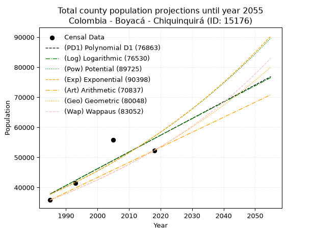
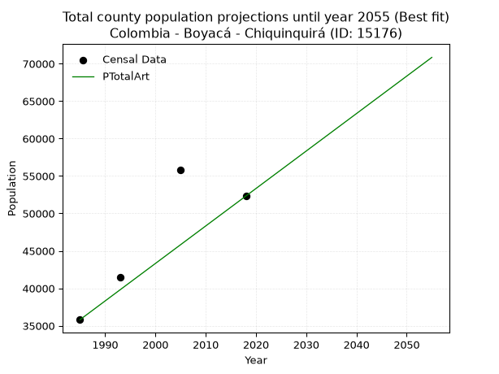
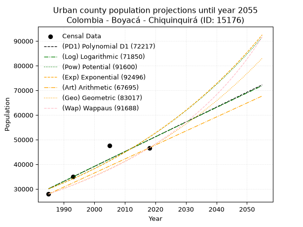
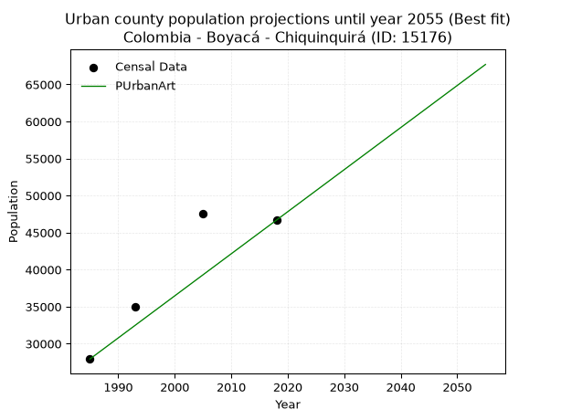
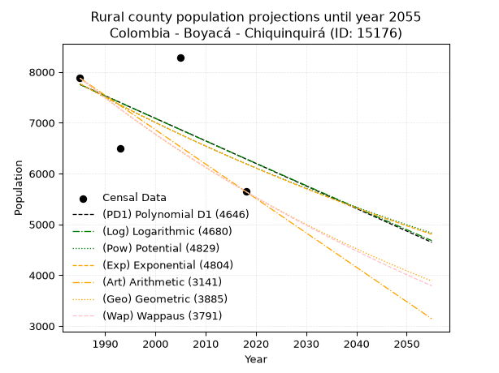
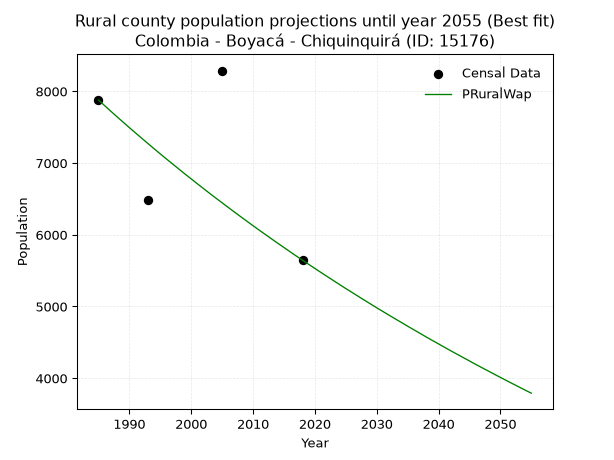

<div align="center">


</div>

# 📜 _“Population and Public Services Demand Projections (PPSD) until Year 2050 for Colombia - Boyacá - Chiquinquirá (ID: 15176)”_
Keywords: `population` `public-service` `projection` `lineal` `polynomial` `logarithmic` `potential` `exponential` `arithmetic` `geometric` `wappaus` `dane` `colombia` `south-america`

PPSD are analytical estimates used by governments and planners to anticipate future changes in population size, age distribution, and the resulting community needs for utilities, healthcare, education, and infrastructure as sizing future water treatment facilities, electrical grids, and road networks based on spatial growth.

<div align="center">

</img>

</div>


> **General running parameters**: • app_version: _v20260806_. • Python version: _3.14.7_. • Pandas version: _3.0.5_. • NumPy version: _2.5.1_. • Creates, save and include plots into reports (create_plot): _False_. • Projection until year: _2050_. • Process polynomial degree 2 and up: _False_. • Process Wappaus: _True_. • Process Wappaus: _True_. • Set negative values to zero: _True_. • Set infinite values to zero: _True_. • Drop dataset notes: _True_. 
<div align="center">

Maps & GIS Layers: [:earth_americas:Google](http://maps.google.com/maps?q=5.613789624,-73.8187454) [:earth_americas:OSM](https://www.openstreetmap.org/#map=18/5.613789624/-73.8187454&layers=P) [:earth_americas:Bing](https://www.bing.com/maps?cp=5.613789624~-73.8187454&lvl=18) [:earth_americas:Apple](https://maps.apple.com/frame?center=5.613789624%2C-73.8187454&span=0.003%2C0.006) [:earth_americas:GISMobile](https://github.com/rcfdtools/R.GISMobile/blob/main/file/gis/CountyLayer_CO/Readme.md)

</div>


<div align="center">

```geojson
{
  "type": "Feature",
  "geometry": {
    "type": "Point", 
    "coordinates": [-73.8187454, 5.613789624]
  }, 
  "properties": {
    "Name": "Colombia - Boyacá - Chiquinquirá (ID: 15176)"
  }
}
```

</div>


## 0. Census Data (4 records)

Census data are official statistics collected by a government about the people and housing in a country. They usually include counts of total population, age, sex, race, income, education, and jobs.

📅Global census file: [Population.xlsx](../data/Population.xlsx)

| Source   |   Year |   CountryID | CountryName   |   StateID | StateName   |   CountyID | CountyName   |   PTotal |   PUrban |   PRural |
|:---------|-------:|------------:|:--------------|----------:|:------------|-----------:|:-------------|---------:|---------:|---------:|
| DANE     |   1985 |          57 | Colombia      |        15 | Boyacá      |      15176 | Chiquinquirá |    35807 |    27929 |     7878 |
| DANE     |   1993 |          57 | Colombia      |        15 | Boyacá      |      15176 | Chiquinquirá |    41437 |    34946 |     6491 |
| DANE     |   2005 |          57 | Colombia      |        15 | Boyacá      |      15176 | Chiquinquirá |    55786 |    47498 |     8288 |
| DANE     |   2018 |          57 | Colombia      |        15 | Boyacá      |      15176 | Chiquinquirá |    52321 |    46676 |     5645 |

> 🔥Some records could had specific notes about the registered values or the corresponding urban or rural distribution.

📅[SUI-RUPS](https://www.datos.gov.co/Hacienda-y-Cr-dito-P-blico/Registro-nico-de-Prestadores-de-Servicios-P-blicos/4qkq-csdn/about_data) - Local public utility companies: [RUPS.csv](../data/RUPS.csv)

 | SERVICIO       | ESTADO    | NOMBRE                                                                                                                    | NIT         | DEPARTAMENTO_DOMICILIO   | MUNICIPIO_DOMICILIO   | DIRECCION                             |   TELEFONO | EMAIL                            | TIPO_PRESTADOR                            | CLASIFICACION                 |
|:---------------|:----------|:--------------------------------------------------------------------------------------------------------------------------|:------------|:-------------------------|:----------------------|:--------------------------------------|-----------:|:---------------------------------|:------------------------------------------|:------------------------------|
| ACUEDUCTO      | OPERATIVA | EMPRESA INDUSTRIAL Y COMERCIAL DE SERVICIOS PUBLICOS DE CHIQUINQUIRA                                                      | 800082204-9 | BOYACA                   | CHIQUINQUIRA          | Avenida 6 No 14A- 03                  |    7262601 | gerencia@empochiquinquira.gov.co | EMPRESA INDUSTRIAL Y COMERCIAL DEL ESTADO | MAYOR O IGUAL A 5001 USUARIOS |
| ALCANTARILLADO | OPERATIVA | EMPRESA INDUSTRIAL Y COMERCIAL DE SERVICIOS PUBLICOS DE CHIQUINQUIRA                                                      | 800082204-9 | BOYACA                   | CHIQUINQUIRA          | Avenida 6 No 14A- 03                  |    7262601 | gerencia@empochiquinquira.gov.co | EMPRESA INDUSTRIAL Y COMERCIAL DEL ESTADO | MAYOR O IGUAL A 5001 USUARIOS |
| ACUEDUCTO      | OPERATIVA | ASOCIACION DE SUSCRIPTORES DEL ACUEDUCTO DE LAS VEREDAS DEL MOLINO LA MESA Y CASABLANCA DE MUNICIPIO DE CHIQUINQUIRA      | 800254334-7 | BOYACA                   | CHIQUINQUIRA          | calle 14 n° 9-48                      |    7211154 | tifloram468@hotmail.com          | ORGANIZACION AUTORIZADA                   | MENOR O IGUAL A 2500 USUARIOS |
| ACUEDUCTO      | OPERATIVA | ASOCIACION DE SUSCRIPTORES DEL ACUEDUCTO LOS CERROS DE LAS VEREDAS DE CARAPACHO ALTO Y BAJO DEL MUNICIPIO DE CHIQUINQUIRA | 900176298-8 | BOYACA                   | CHIQUINQUIRA          | VEREDA CARAPACHO SITIO LOMA DEL TOLDO |    7264624 | patriciomur@hotmail.com          | ORGANIZACION AUTORIZADA                   | HASTA 2500 SUSCRIPTORES       |

## 1. Total

### 1.1. Coefficients and Parameters

* (PD1) Polynomial Deg 1: 557.5371336812537, -1068875.901645928 (lineal)
* (Log) Logarithmic: 1117257.7071378818, -8445947.035096413
* (Pow) Potential: 25.031980630866734, -77.97332704189462
* (Exp) Exponential: 0.012491522108986327, 6.423694526274529e-07
* (Art) Arithmetic: Year diff. 2018 - 1985 = 33, Population diff. 52321 - 35807 = 16514, Annual growth = 500.42424242424244
* (Geo) Geometric: Year diff. 2018 - 1985 = 33, Population diff. 52321 - 35807 = 16514, Annual growth % = 0.01155885119423905
* (Wap) Wappaus: i = 1.1356759314275655, Condition values only valid for < 200)

<sub>
Wappaus condition values: ['0.00', '1.14', '2.27', '3.41', '4.54', '5.68', '6.81', '7.95', '9.09', '10.22', '11.36', '12.49', '13.63', '14.76', '15.90', '17.04', '18.17', '19.31', '20.44', '21.58', '22.71', '23.85', '24.98', '26.12', '27.26', '28.39', '29.53', '30.66', '31.80', '32.93', '34.07', '35.21', '36.34', '37.48', '38.61', '39.75', '40.88', '42.02', '43.16', '44.29', '45.43', '46.56', '47.70', '48.83', '49.97', '51.11', '52.24', '53.38', '54.51', '55.65', '56.78', '57.92', '59.06', '60.19', '61.33', '62.46', '63.60', '64.73', '65.87', '67.00', '68.14', '69.28', '70.41', '71.55', '72.68', '73.82']
</sub>


### 1.2. Projected Dataset

|   Year |   CountyID |   PTotalPD1 |   PTotalLog |   PTotalPow |   PTotalExp |   PTotalArt |   PTotalGeo |   PTotalWap |
|-------:|-----------:|------------:|------------:|------------:|------------:|------------:|------------:|------------:|
|   1985 |      15176 |       37835 |       37809 |       37683 |       37706 |       35807 |       35807 |       35807 |
|   1986 |      15176 |       38393 |       38372 |       38162 |       38180 |       36307 |       36221 |       36216 |
|   1987 |      15176 |       38950 |       38934 |       38645 |       38660 |       36808 |       36640 |       36630 |
|   1988 |      15176 |       39508 |       39496 |       39135 |       39146 |       37308 |       37063 |       37048 |
|   1989 |      15176 |       40065 |       40058 |       39631 |       39638 |       37809 |       37491 |       37471 |
|   1990 |      15176 |       40623 |       40620 |       40133 |       40136 |       38309 |       37925 |       37900 |
|   1991 |      15176 |       41181 |       41181 |       40641 |       40640 |       38810 |       38363 |       38333 |
|   1992 |      15176 |       41738 |       41742 |       41155 |       41151 |       39310 |       38807 |       38771 |
|   1993 |      15176 |       42296 |       42303 |       41675 |       41669 |       39810 |       39255 |       39215 |
|   1994 |      15176 |       42853 |       42863 |       42202 |       42192 |       40311 |       39709 |       39664 |
|   1995 |      15176 |       43411 |       43423 |       42735 |       42723 |       40811 |       40168 |       40118 |
|   1996 |      15176 |       43968 |       43983 |       43274 |       43260 |       41312 |       40632 |       40578 |
|   1997 |      15176 |       44526 |       44543 |       43820 |       43803 |       41812 |       41102 |       41044 |
|   1998 |      15176 |       45083 |       45102 |       44373 |       44354 |       42313 |       41577 |       41515 |
|   1999 |      15176 |       45641 |       45661 |       44932 |       44912 |       42813 |       42058 |       41992 |
|   2000 |      15176 |       46198 |       46220 |       45498 |       45476 |       43313 |       42544 |       42475 |
|   2001 |      15176 |       46756 |       46778 |       46071 |       46048 |       43814 |       43035 |       42964 |
|   2002 |      15176 |       47313 |       47337 |       46651 |       46627 |       44314 |       43533 |       43459 |
|   2003 |      15176 |       47871 |       47894 |       47237 |       47213 |       44815 |       44036 |       43960 |
|   2004 |      15176 |       48429 |       48452 |       47831 |       47806 |       45315 |       44545 |       44468 |
|   2005 |      15176 |       48986 |       49009 |       48432 |       48407 |       45815 |       45060 |       44982 |
|   2006 |      15176 |       49544 |       49567 |       49041 |       49015 |       46316 |       45581 |       45503 |
|   2007 |      15176 |       50101 |       50123 |       49656 |       49632 |       46816 |       46108 |       46030 |
|   2008 |      15176 |       50659 |       50680 |       50279 |       50255 |       47317 |       46641 |       46565 |
|   2009 |      15176 |       51216 |       51236 |       50910 |       50887 |       47817 |       47180 |       47107 |
|   2010 |      15176 |       51774 |       51792 |       51548 |       51527 |       48318 |       47725 |       47655 |
|   2011 |      15176 |       52331 |       52348 |       52194 |       52174 |       48818 |       48277 |       48211 |
|   2012 |      15176 |       52889 |       52903 |       52848 |       52830 |       49318 |       48835 |       48775 |
|   2013 |      15176 |       53446 |       53458 |       53509 |       53494 |       49819 |       49399 |       49346 |
|   2014 |      15176 |       54004 |       54013 |       54178 |       54167 |       50319 |       49970 |       49925 |
|   2015 |      15176 |       54561 |       54568 |       54856 |       54848 |       50820 |       50548 |       50511 |
|   2016 |      15176 |       55119 |       55122 |       55541 |       55537 |       51320 |       51132 |       51106 |
|   2017 |      15176 |       55676 |       55676 |       56235 |       56235 |       51821 |       51723 |       51709 |
|   2018 |      15176 |       56234 |       56230 |       56937 |       56942 |       52321 |       52321 |       52321 |
|   2019 |      15176 |       56792 |       56784 |       57648 |       57658 |       52821 |       52926 |       52941 |
|   2020 |      15176 |       57349 |       57337 |       58367 |       58383 |       53322 |       53538 |       53570 |
|   2021 |      15176 |       57907 |       57890 |       59094 |       59116 |       53822 |       54156 |       54208 |
|   2022 |      15176 |       58464 |       58443 |       59831 |       59860 |       54323 |       54782 |       54855 |
|   2023 |      15176 |       59022 |       58995 |       60576 |       60612 |       54823 |       55416 |       55512 |
|   2024 |      15176 |       59579 |       59547 |       61330 |       61374 |       55324 |       56056 |       56178 |
|   2025 |      15176 |       60137 |       60099 |       62093 |       62145 |       55824 |       56704 |       56853 |
|   2026 |      15176 |       60694 |       60651 |       62865 |       62926 |       56324 |       57359 |       57539 |
|   2027 |      15176 |       61252 |       61202 |       63646 |       63717 |       56825 |       58022 |       58235 |
|   2028 |      15176 |       61809 |       61753 |       64437 |       64518 |       57325 |       58693 |       58942 |
|   2029 |      15176 |       62367 |       62304 |       65237 |       65329 |       57826 |       59372 |       59659 |
|   2030 |      15176 |       62924 |       62854 |       66046 |       66150 |       58326 |       60058 |       60387 |
|   2031 |      15176 |       63482 |       63404 |       66866 |       66982 |       58827 |       60752 |       61127 |
|   2032 |      15176 |       64040 |       63954 |       67695 |       67824 |       59327 |       61454 |       61877 |
|   2033 |      15176 |       64597 |       64504 |       68534 |       68676 |       59827 |       62165 |       62640 |
|   2034 |      15176 |       65155 |       65054 |       69382 |       69540 |       60328 |       62883 |       63414 |
|   2035 |      15176 |       65712 |       65603 |       70241 |       70414 |       60828 |       63610 |       64201 |
|   2036 |      15176 |       66270 |       66152 |       71111 |       71299 |       61329 |       64345 |       65001 |
|   2037 |      15176 |       66827 |       66700 |       71990 |       72195 |       61829 |       65089 |       65813 |
|   2038 |      15176 |       67385 |       67249 |       72880 |       73103 |       62329 |       65841 |       66638 |
|   2039 |      15176 |       67942 |       67797 |       73780 |       74022 |       62830 |       66602 |       67477 |
|   2040 |      15176 |       68500 |       68344 |       74692 |       74952 |       63330 |       67372 |       68330 |
|   2041 |      15176 |       69057 |       68892 |       75613 |       75894 |       63831 |       68151 |       69197 |
|   2042 |      15176 |       69615 |       69439 |       76546 |       76848 |       64331 |       68939 |       70079 |
|   2043 |      15176 |       70172 |       69986 |       77490 |       77814 |       64832 |       69736 |       70975 |
|   2044 |      15176 |       70730 |       70533 |       78445 |       78792 |       65332 |       70542 |       71887 |
|   2045 |      15176 |       71288 |       71079 |       79412 |       79783 |       65832 |       71357 |       72815 |
|   2046 |      15176 |       71845 |       71626 |       80389 |       80785 |       66333 |       72182 |       73758 |
|   2047 |      15176 |       72403 |       72172 |       81379 |       81801 |       66833 |       73016 |       74719 |
|   2048 |      15176 |       72960 |       72717 |       82380 |       82829 |       67334 |       73860 |       75696 |
|   2049 |      15176 |       73518 |       73263 |       83393 |       83870 |       67834 |       74714 |       76690 |
|   2050 |      15176 |       74075 |       73808 |       84417 |       84925 |       68335 |       75578 |       77703 |
<div align="center">

</img>

</div>


### 1.3. Best fit with absolute and relative error (%)

Relative error puts that difference into context by dividing the absolute error by the true value, creating a unitless ratio or percentage that shows the scale of the mistake.

Absolute and relative error

|   Year | Source   |   CountryID | CountryName   |   StateID | StateName   |   CountyID_x | CountyName   |   PTotal |   PUrban |   PRural |   CountyID_y |   PTotalPD1 |   PTotalLog |   PTotalPow |   PTotalExp |   PTotalArt |   PTotalGeo |   PTotalWap |   PTotalPD1AbsError |   PTotalLogAbsError |   PTotalPowAbsError |   PTotalExpAbsError |   PTotalArtAbsError |   PTotalGeoAbsError |   PTotalWapAbsError |   PTotalPD1RelError |   PTotalLogRelError |   PTotalPowRelError |   PTotalExpRelError |   PTotalArtRelError |   PTotalGeoRelError |   PTotalWapRelError |
|-------:|:---------|------------:|:--------------|----------:|:------------|-------------:|:-------------|---------:|---------:|---------:|-------------:|------------:|------------:|------------:|------------:|------------:|------------:|------------:|--------------------:|--------------------:|--------------------:|--------------------:|--------------------:|--------------------:|--------------------:|--------------------:|--------------------:|--------------------:|--------------------:|--------------------:|--------------------:|--------------------:|
|   1985 | DANE     |          57 | Colombia      |        15 | Boyacá      |        15176 | Chiquinquirá |    35807 |    27929 |     7878 |        15176 |       37835 |       37809 |       37683 |       37706 |       35807 |       35807 |       35807 |                2028 |                2002 |                1876 |                1899 |                   0 |                   0 |                   0 |             5.6637  |             5.59109 |            5.2392   |            5.30343  |             0       |             0       |             0       |
|   1993 | DANE     |          57 | Colombia      |        15 | Boyacá      |        15176 | Chiquinquirá |    41437 |    34946 |     6491 |        15176 |       42296 |       42303 |       41675 |       41669 |       39810 |       39255 |       39215 |                 859 |                 866 |                 238 |                 232 |                1627 |                2182 |                2222 |             2.07303 |             2.08992 |            0.574366 |            0.559886 |             3.92644 |             5.26583 |             5.36236 |
|   2005 | DANE     |          57 | Colombia      |        15 | Boyacá      |        15176 | Chiquinquirá |    55786 |    47498 |     8288 |        15176 |       48986 |       49009 |       48432 |       48407 |       45815 |       45060 |       44982 |                6800 |                6777 |                7354 |                7379 |                9971 |               10726 |               10804 |            12.1894  |            12.1482  |           13.1825   |           13.2273   |            17.8737  |            19.227   |            19.3669  |
|   2018 | DANE     |          57 | Colombia      |        15 | Boyacá      |        15176 | Chiquinquirá |    52321 |    46676 |     5645 |        15176 |       56234 |       56230 |       56937 |       56942 |       52321 |       52321 |       52321 |                3913 |                3909 |                4616 |                4621 |                   0 |                   0 |                   0 |             7.47883 |             7.47119 |            8.82246  |            8.83202  |             0       |             0       |             0       |

Relative error mean

| Method    |   RelError | Best   |
|:----------|-----------:|:-------|
| PTotalPD1 |    6.85125 |        |
| PTotalLog |    6.8251  |        |
| PTotalPow |    6.95464 |        |
| PTotalExp |    6.98067 |        |
| PTotalArt |    5.45003 | True   |
| PTotalGeo |    6.12322 |        |
| PTotalWap |    6.18231 |        |

💙Best method: _**PTotalArt**_
<div align="center">

</img>

</div>


### 1.4. Fresh water supply demand in liters per capita per day (lpcd)

The fresh water supply demand typically ranges from 100 to 300 liters per capita per day (lpcd) for standard domestic and municipal planning, though absolute survival minimums set by the World Health Organization are as low as 7.5 to 20 liters per day, and total consumption in high-income nations can exceed 400 liters.

> `CZ`: Level in meters above the sea level (masl)<br> `WS`: Fresh water supply demand in liters per capita per day (lpcd or l/h/d)<br> `WSAll`: Zonal fresh water supply demand in liters per second (l/s)<br> `A`: Zonal area in square meters<br> `DP`: Population density (people/hectare or p/ha)

Reference values (RAS Colombia)

|    CZ |   WS |
|------:|-----:|
|  1000 |  120 |
|  2000 |  130 |
| 99999 |  140 |

County shapefile geometry properties and water supply values

|   CountyID |      ATotal |   CZTotal |   WSTotal |
|-----------:|------------:|----------:|----------:|
|      15176 | 1.64778e+08 |      2649 |       140 |

Projected values for best method: PTotalArt

|   CountyID |   Year |   PTotalArt |   DPTotal |   WSTotal |   WSTotalAll |
|-----------:|-------:|------------:|----------:|----------:|-------------:|
|      15176 |   1985 |       35807 |      2.17 |       140 |      58.0206 |
|      15176 |   1986 |       36307 |      2.2  |       140 |      58.8308 |
|      15176 |   1987 |       36808 |      2.23 |       140 |      59.6426 |
|      15176 |   1988 |       37308 |      2.26 |       140 |      60.4528 |
|      15176 |   1989 |       37809 |      2.29 |       140 |      61.2646 |
|      15176 |   1990 |       38309 |      2.32 |       140 |      62.0748 |
|      15176 |   1991 |       38810 |      2.36 |       140 |      62.8866 |
|      15176 |   1992 |       39310 |      2.39 |       140 |      63.6968 |
|      15176 |   1993 |       39810 |      2.42 |       140 |      64.5069 |
|      15176 |   1994 |       40311 |      2.45 |       140 |      65.3187 |
|      15176 |   1995 |       40811 |      2.48 |       140 |      66.1289 |
|      15176 |   1996 |       41312 |      2.51 |       140 |      66.9407 |
|      15176 |   1997 |       41812 |      2.54 |       140 |      67.7509 |
|      15176 |   1998 |       42313 |      2.57 |       140 |      68.5627 |
|      15176 |   1999 |       42813 |      2.6  |       140 |      69.3729 |
|      15176 |   2000 |       43313 |      2.63 |       140 |      70.1831 |
|      15176 |   2001 |       43814 |      2.66 |       140 |      70.9949 |
|      15176 |   2002 |       44314 |      2.69 |       140 |      71.8051 |
|      15176 |   2003 |       44815 |      2.72 |       140 |      72.6169 |
|      15176 |   2004 |       45315 |      2.75 |       140 |      73.4271 |
|      15176 |   2005 |       45815 |      2.78 |       140 |      74.2373 |
|      15176 |   2006 |       46316 |      2.81 |       140 |      75.0491 |
|      15176 |   2007 |       46816 |      2.84 |       140 |      75.8593 |
|      15176 |   2008 |       47317 |      2.87 |       140 |      76.6711 |
|      15176 |   2009 |       47817 |      2.9  |       140 |      77.4813 |
|      15176 |   2010 |       48318 |      2.93 |       140 |      78.2931 |
|      15176 |   2011 |       48818 |      2.96 |       140 |      79.1032 |
|      15176 |   2012 |       49318 |      2.99 |       140 |      79.9134 |
|      15176 |   2013 |       49819 |      3.02 |       140 |      80.7252 |
|      15176 |   2014 |       50319 |      3.05 |       140 |      81.5354 |
|      15176 |   2015 |       50820 |      3.08 |       140 |      82.3472 |
|      15176 |   2016 |       51320 |      3.11 |       140 |      83.1574 |
|      15176 |   2017 |       51821 |      3.14 |       140 |      83.9692 |
|      15176 |   2018 |       52321 |      3.18 |       140 |      84.7794 |
|      15176 |   2019 |       52821 |      3.21 |       140 |      85.5896 |
|      15176 |   2020 |       53322 |      3.24 |       140 |      86.4014 |
|      15176 |   2021 |       53822 |      3.27 |       140 |      87.2116 |
|      15176 |   2022 |       54323 |      3.3  |       140 |      88.0234 |
|      15176 |   2023 |       54823 |      3.33 |       140 |      88.8336 |
|      15176 |   2024 |       55324 |      3.36 |       140 |      89.6454 |
|      15176 |   2025 |       55824 |      3.39 |       140 |      90.4556 |
|      15176 |   2026 |       56324 |      3.42 |       140 |      91.2657 |
|      15176 |   2027 |       56825 |      3.45 |       140 |      92.0775 |
|      15176 |   2028 |       57325 |      3.48 |       140 |      92.8877 |
|      15176 |   2029 |       57826 |      3.51 |       140 |      93.6995 |
|      15176 |   2030 |       58326 |      3.54 |       140 |      94.5097 |
|      15176 |   2031 |       58827 |      3.57 |       140 |      95.3215 |
|      15176 |   2032 |       59327 |      3.6  |       140 |      96.1317 |
|      15176 |   2033 |       59827 |      3.63 |       140 |      96.9419 |
|      15176 |   2034 |       60328 |      3.66 |       140 |      97.7537 |
|      15176 |   2035 |       60828 |      3.69 |       140 |      98.5639 |
|      15176 |   2036 |       61329 |      3.72 |       140 |      99.3757 |
|      15176 |   2037 |       61829 |      3.75 |       140 |     100.186  |
|      15176 |   2038 |       62329 |      3.78 |       140 |     100.996  |
|      15176 |   2039 |       62830 |      3.81 |       140 |     101.808  |
|      15176 |   2040 |       63330 |      3.84 |       140 |     102.618  |
|      15176 |   2041 |       63831 |      3.87 |       140 |     103.43   |
|      15176 |   2042 |       64331 |      3.9  |       140 |     104.24   |
|      15176 |   2043 |       64832 |      3.93 |       140 |     105.052  |
|      15176 |   2044 |       65332 |      3.96 |       140 |     105.862  |
|      15176 |   2045 |       65832 |      4    |       140 |     106.672  |
|      15176 |   2046 |       66333 |      4.03 |       140 |     107.484  |
|      15176 |   2047 |       66833 |      4.06 |       140 |     108.294  |
|      15176 |   2048 |       67334 |      4.09 |       140 |     109.106  |
|      15176 |   2049 |       67834 |      4.12 |       140 |     109.916  |
|      15176 |   2050 |       68335 |      4.15 |       140 |     110.728  |

## 2. Urban

### 2.1. Coefficients and Parameters

* (PD1) Polynomial Deg 1: 601.90887193898, -1164705.9710959448 (lineal)
* (Log) Logarithmic: 1205922.2423639565, -9126962.3778628
* (Pow) Potential: 32.216274381888255, -101.76455947226916
* (Exp) Exponential: 0.01607887840288192, 4.1316486260196185e-10
* (Art) Arithmetic: Year diff. 2018 - 1985 = 33, Population diff. 46676 - 27929 = 18747, Annual growth = 568.0909090909091
* (Geo) Geometric: Year diff. 2018 - 1985 = 33, Population diff. 46676 - 27929 = 18747, Annual growth % = 0.01568428907795516
* (Wap) Wappaus: i = 1.522929854811096, Condition values only valid for < 200)

<sub>
Wappaus condition values: ['0.00', '1.52', '3.05', '4.57', '6.09', '7.61', '9.14', '10.66', '12.18', '13.71', '15.23', '16.75', '18.28', '19.80', '21.32', '22.84', '24.37', '25.89', '27.41', '28.94', '30.46', '31.98', '33.50', '35.03', '36.55', '38.07', '39.60', '41.12', '42.64', '44.16', '45.69', '47.21', '48.73', '50.26', '51.78', '53.30', '54.83', '56.35', '57.87', '59.39', '60.92', '62.44', '63.96', '65.49', '67.01', '68.53', '70.05', '71.58', '73.10', '74.62', '76.15', '77.67', '79.19', '80.72', '82.24', '83.76', '85.28', '86.81', '88.33', '89.85', '91.38', '92.90', '94.42', '95.94', '97.47', '98.99']
</sub>


### 2.2. Projected Dataset

|   Year |   CountyID |   PUrbanPD1 |   PUrbanLog |   PUrbanPow |   PUrbanExp |   PUrbanArt |   PUrbanGeo |   PUrbanWap |
|-------:|-----------:|------------:|------------:|------------:|------------:|------------:|------------:|------------:|
|   1985 |      15176 |       30083 |       30056 |       29991 |       30013 |       27929 |       27929 |       27929 |
|   1986 |      15176 |       30685 |       30664 |       30482 |       30500 |       28497 |       28367 |       28358 |
|   1987 |      15176 |       31287 |       31271 |       30980 |       30994 |       29065 |       28812 |       28793 |
|   1988 |      15176 |       31889 |       31878 |       31487 |       31497 |       29633 |       29264 |       29235 |
|   1989 |      15176 |       32491 |       32484 |       32001 |       32007 |       30201 |       29723 |       29684 |
|   1990 |      15176 |       33093 |       33090 |       32523 |       32526 |       30769 |       30189 |       30140 |
|   1991 |      15176 |       33695 |       33696 |       33054 |       33053 |       31338 |       30663 |       30603 |
|   1992 |      15176 |       34297 |       34302 |       33593 |       33589 |       31906 |       31143 |       31074 |
|   1993 |      15176 |       34898 |       34907 |       34141 |       34133 |       32474 |       31632 |       31552 |
|   1994 |      15176 |       35500 |       35512 |       34697 |       34687 |       33042 |       32128 |       32039 |
|   1995 |      15176 |       36102 |       36116 |       35262 |       35249 |       33610 |       32632 |       32533 |
|   1996 |      15176 |       36704 |       36721 |       35836 |       35820 |       34178 |       33144 |       33035 |
|   1997 |      15176 |       37306 |       37325 |       36419 |       36401 |       34746 |       33664 |       33546 |
|   1998 |      15176 |       37908 |       37928 |       37011 |       36991 |       35314 |       34192 |       34066 |
|   1999 |      15176 |       38510 |       38532 |       37612 |       37590 |       35882 |       34728 |       34594 |
|   2000 |      15176 |       39112 |       39135 |       38223 |       38200 |       36450 |       35273 |       35132 |
|   2001 |      15176 |       39714 |       39738 |       38844 |       38819 |       37018 |       35826 |       35679 |
|   2002 |      15176 |       40316 |       40340 |       39474 |       39448 |       37587 |       36388 |       36235 |
|   2003 |      15176 |       40917 |       40942 |       40114 |       40087 |       38155 |       36958 |       36801 |
|   2004 |      15176 |       41519 |       41544 |       40765 |       40737 |       38723 |       37538 |       37377 |
|   2005 |      15176 |       42121 |       42146 |       41425 |       41398 |       39291 |       38127 |       37964 |
|   2006 |      15176 |       42723 |       42747 |       42096 |       42069 |       39859 |       38725 |       38561 |
|   2007 |      15176 |       43325 |       43348 |       42777 |       42750 |       40427 |       39332 |       39169 |
|   2008 |      15176 |       43927 |       43949 |       43469 |       43443 |       40995 |       39949 |       39789 |
|   2009 |      15176 |       44529 |       44549 |       44172 |       44148 |       41563 |       40576 |       40420 |
|   2010 |      15176 |       45131 |       45150 |       44886 |       44863 |       42131 |       41212 |       41063 |
|   2011 |      15176 |       45733 |       45749 |       45611 |       45590 |       42699 |       41858 |       41718 |
|   2012 |      15176 |       46335 |       46349 |       46347 |       46329 |       43267 |       42515 |       42385 |
|   2013 |      15176 |       46937 |       46948 |       47095 |       47080 |       43836 |       43182 |       43066 |
|   2014 |      15176 |       47538 |       47547 |       47855 |       47843 |       44404 |       43859 |       43760 |
|   2015 |      15176 |       48140 |       48146 |       48626 |       48619 |       44972 |       44547 |       44467 |
|   2016 |      15176 |       48742 |       48744 |       49410 |       49407 |       45540 |       45246 |       45189 |
|   2017 |      15176 |       49344 |       49342 |       50206 |       50208 |       46108 |       45955 |       45925 |
|   2018 |      15176 |       49946 |       49940 |       51014 |       51021 |       46676 |       46676 |       46676 |
|   2019 |      15176 |       50548 |       50537 |       51835 |       51848 |       47244 |       47408 |       47443 |
|   2020 |      15176 |       51150 |       51134 |       52668 |       52689 |       47812 |       48152 |       48225 |
|   2021 |      15176 |       51752 |       51731 |       53515 |       53543 |       48380 |       48907 |       49024 |
|   2022 |      15176 |       52354 |       52328 |       54374 |       54411 |       48948 |       49674 |       49840 |
|   2023 |      15176 |       52956 |       52924 |       55247 |       55293 |       49516 |       50453 |       50673 |
|   2024 |      15176 |       53558 |       53520 |       56134 |       56189 |       50085 |       51244 |       51524 |
|   2025 |      15176 |       54159 |       54116 |       57034 |       57100 |       50653 |       52048 |       52394 |
|   2026 |      15176 |       54761 |       54711 |       57949 |       58025 |       51221 |       52864 |       53284 |
|   2027 |      15176 |       55363 |       55306 |       58877 |       58966 |       51789 |       53694 |       54193 |
|   2028 |      15176 |       55965 |       55901 |       59820 |       59922 |       52357 |       54536 |       55123 |
|   2029 |      15176 |       56567 |       56495 |       60778 |       60893 |       52925 |       55391 |       56074 |
|   2030 |      15176 |       57169 |       57089 |       61750 |       61880 |       53493 |       56260 |       57047 |
|   2031 |      15176 |       57771 |       57683 |       62738 |       62883 |       54061 |       57142 |       58043 |
|   2032 |      15176 |       58373 |       58277 |       63741 |       63902 |       54629 |       58038 |       59062 |
|   2033 |      15176 |       58975 |       58870 |       64759 |       64938 |       55197 |       58949 |       60106 |
|   2034 |      15176 |       59577 |       59463 |       65793 |       65990 |       55765 |       59873 |       61175 |
|   2035 |      15176 |       60179 |       60056 |       66844 |       67060 |       56334 |       60812 |       62271 |
|   2036 |      15176 |       60780 |       60649 |       67910 |       68147 |       56902 |       61766 |       63394 |
|   2037 |      15176 |       61382 |       61241 |       68993 |       69252 |       57470 |       62735 |       64545 |
|   2038 |      15176 |       61984 |       61833 |       70092 |       70374 |       58038 |       63719 |       65726 |
|   2039 |      15176 |       62586 |       62424 |       71209 |       71515 |       58606 |       64718 |       66937 |
|   2040 |      15176 |       63188 |       63015 |       72343 |       72674 |       59174 |       65733 |       68180 |
|   2041 |      15176 |       63790 |       63606 |       73494 |       73852 |       59742 |       66764 |       69456 |
|   2042 |      15176 |       64392 |       64197 |       74663 |       75049 |       60310 |       67811 |       70766 |
|   2043 |      15176 |       64994 |       64788 |       75850 |       76265 |       60878 |       68875 |       72112 |
|   2044 |      15176 |       65596 |       65378 |       77055 |       77502 |       61446 |       69955 |       73495 |
|   2045 |      15176 |       66198 |       65967 |       78279 |       78758 |       62014 |       71053 |       74917 |
|   2046 |      15176 |       66800 |       66557 |       79522 |       80034 |       62583 |       72167 |       76380 |
|   2047 |      15176 |       67401 |       67146 |       80783 |       81332 |       63151 |       73299 |       77884 |
|   2048 |      15176 |       68003 |       67735 |       82064 |       82650 |       63719 |       74448 |       79433 |
|   2049 |      15176 |       68605 |       68324 |       83365 |       83990 |       64287 |       75616 |       81028 |
|   2050 |      15176 |       69207 |       68912 |       84686 |       85351 |       64855 |       76802 |       82670 |
<div align="center">

</img>

</div>


### 2.3. Best fit with absolute and relative error (%)

Relative error puts that difference into context by dividing the absolute error by the true value, creating a unitless ratio or percentage that shows the scale of the mistake.

Absolute and relative error

|   Year | Source   |   CountryID | CountryName   |   StateID | StateName   |   CountyID_x | CountyName   |   PTotal |   PUrban |   PRural |   CountyID_y |   PUrbanPD1 |   PUrbanLog |   PUrbanPow |   PUrbanExp |   PUrbanArt |   PUrbanGeo |   PUrbanWap |   PUrbanPD1AbsError |   PUrbanLogAbsError |   PUrbanPowAbsError |   PUrbanExpAbsError |   PUrbanArtAbsError |   PUrbanGeoAbsError |   PUrbanWapAbsError |   PUrbanPD1RelError |   PUrbanLogRelError |   PUrbanPowRelError |   PUrbanExpRelError |   PUrbanArtRelError |   PUrbanGeoRelError |   PUrbanWapRelError |
|-------:|:---------|------------:|:--------------|----------:|:------------|-------------:|:-------------|---------:|---------:|---------:|-------------:|------------:|------------:|------------:|------------:|------------:|------------:|------------:|--------------------:|--------------------:|--------------------:|--------------------:|--------------------:|--------------------:|--------------------:|--------------------:|--------------------:|--------------------:|--------------------:|--------------------:|--------------------:|--------------------:|
|   1985 | DANE     |          57 | Colombia      |        15 | Boyacá      |        15176 | Chiquinquirá |    35807 |    27929 |     7878 |        15176 |       30083 |       30056 |       29991 |       30013 |       27929 |       27929 |       27929 |                2154 |                2127 |                2062 |                2084 |                   0 |                   0 |                   0 |            7.71241  |            7.61574  |             7.38301 |             7.46178 |             0       |              0      |             0       |
|   1993 | DANE     |          57 | Colombia      |        15 | Boyacá      |        15176 | Chiquinquirá |    41437 |    34946 |     6491 |        15176 |       34898 |       34907 |       34141 |       34133 |       32474 |       31632 |       31552 |                  48 |                  39 |                 805 |                 813 |                2472 |                3314 |                3394 |            0.137355 |            0.111601 |             2.30355 |             2.32645 |             7.07377 |              9.4832 |             9.71213 |
|   2005 | DANE     |          57 | Colombia      |        15 | Boyacá      |        15176 | Chiquinquirá |    55786 |    47498 |     8288 |        15176 |       42121 |       42146 |       41425 |       41398 |       39291 |       38127 |       37964 |                5377 |                5352 |                6073 |                6100 |                8207 |                9371 |                9534 |           11.3205   |           11.2678   |            12.7858  |            12.8426  |            17.2786  |             19.7293 |            20.0724  |
|   2018 | DANE     |          57 | Colombia      |        15 | Boyacá      |        15176 | Chiquinquirá |    52321 |    46676 |     5645 |        15176 |       49946 |       49940 |       51014 |       51021 |       46676 |       46676 |       46676 |                3270 |                3264 |                4338 |                4345 |                   0 |                   0 |                   0 |            7.00574  |            6.99289  |             9.29386 |             9.30885 |             0       |              0      |             0       |

Relative error mean

| Method    |   RelError | Best   |
|:----------|-----------:|:-------|
| PUrbanPD1 |    6.544   |        |
| PUrbanLog |    6.49702 |        |
| PUrbanPow |    7.94155 |        |
| PUrbanExp |    7.98493 |        |
| PUrbanArt |    6.0881  | True   |
| PUrbanGeo |    7.30311 |        |
| PUrbanWap |    7.44614 |        |

💙Best method: _**PUrbanArt**_
<div align="center">

</img>

</div>


### 2.4. Fresh water supply demand in liters per capita per day (lpcd)

The fresh water supply demand typically ranges from 100 to 300 liters per capita per day (lpcd) for standard domestic and municipal planning, though absolute survival minimums set by the World Health Organization are as low as 7.5 to 20 liters per day, and total consumption in high-income nations can exceed 400 liters.

> `CZ`: Level in meters above the sea level (masl)<br> `WS`: Fresh water supply demand in liters per capita per day (lpcd or l/h/d)<br> `WSAll`: Zonal fresh water supply demand in liters per second (l/s)<br> `A`: Zonal area in square meters<br> `DP`: Population density (people/hectare or p/ha)

Reference values (RAS Colombia)

|    CZ |   WS |
|------:|-----:|
|  1000 |  120 |
|  2000 |  130 |
| 99999 |  140 |

County shapefile geometry properties and water supply values

|   CountyID |      AUrban |   CZUrban |   WSUrban |
|-----------:|------------:|----------:|----------:|
|      15176 | 6.37022e+06 |    2560.9 |       140 |

Projected values for best method: PUrbanArt

|   CountyID |   Year |   PUrbanArt |   DPUrban |   WSUrban |   WSUrbanAll |
|-----------:|-------:|------------:|----------:|----------:|-------------:|
|      15176 |   1985 |       27929 |     43.84 |       140 |      45.2553 |
|      15176 |   1986 |       28497 |     44.73 |       140 |      46.1757 |
|      15176 |   1987 |       29065 |     45.63 |       140 |      47.0961 |
|      15176 |   1988 |       29633 |     46.52 |       140 |      48.0164 |
|      15176 |   1989 |       30201 |     47.41 |       140 |      48.9368 |
|      15176 |   1990 |       30769 |     48.3  |       140 |      49.8572 |
|      15176 |   1991 |       31338 |     49.19 |       140 |      50.7792 |
|      15176 |   1992 |       31906 |     50.09 |       140 |      51.6995 |
|      15176 |   1993 |       32474 |     50.98 |       140 |      52.6199 |
|      15176 |   1994 |       33042 |     51.87 |       140 |      53.5403 |
|      15176 |   1995 |       33610 |     52.76 |       140 |      54.4606 |
|      15176 |   1996 |       34178 |     53.65 |       140 |      55.381  |
|      15176 |   1997 |       34746 |     54.54 |       140 |      56.3014 |
|      15176 |   1998 |       35314 |     55.44 |       140 |      57.2218 |
|      15176 |   1999 |       35882 |     56.33 |       140 |      58.1421 |
|      15176 |   2000 |       36450 |     57.22 |       140 |      59.0625 |
|      15176 |   2001 |       37018 |     58.11 |       140 |      59.9829 |
|      15176 |   2002 |       37587 |     59    |       140 |      60.9049 |
|      15176 |   2003 |       38155 |     59.9  |       140 |      61.8252 |
|      15176 |   2004 |       38723 |     60.79 |       140 |      62.7456 |
|      15176 |   2005 |       39291 |     61.68 |       140 |      63.666  |
|      15176 |   2006 |       39859 |     62.57 |       140 |      64.5863 |
|      15176 |   2007 |       40427 |     63.46 |       140 |      65.5067 |
|      15176 |   2008 |       40995 |     64.35 |       140 |      66.4271 |
|      15176 |   2009 |       41563 |     65.25 |       140 |      67.3475 |
|      15176 |   2010 |       42131 |     66.14 |       140 |      68.2678 |
|      15176 |   2011 |       42699 |     67.03 |       140 |      69.1882 |
|      15176 |   2012 |       43267 |     67.92 |       140 |      70.1086 |
|      15176 |   2013 |       43836 |     68.81 |       140 |      71.0306 |
|      15176 |   2014 |       44404 |     69.71 |       140 |      71.9509 |
|      15176 |   2015 |       44972 |     70.6  |       140 |      72.8713 |
|      15176 |   2016 |       45540 |     71.49 |       140 |      73.7917 |
|      15176 |   2017 |       46108 |     72.38 |       140 |      74.712  |
|      15176 |   2018 |       46676 |     73.27 |       140 |      75.6324 |
|      15176 |   2019 |       47244 |     74.16 |       140 |      76.5528 |
|      15176 |   2020 |       47812 |     75.06 |       140 |      77.4731 |
|      15176 |   2021 |       48380 |     75.95 |       140 |      78.3935 |
|      15176 |   2022 |       48948 |     76.84 |       140 |      79.3139 |
|      15176 |   2023 |       49516 |     77.73 |       140 |      80.2343 |
|      15176 |   2024 |       50085 |     78.62 |       140 |      81.1562 |
|      15176 |   2025 |       50653 |     79.52 |       140 |      82.0766 |
|      15176 |   2026 |       51221 |     80.41 |       140 |      82.997  |
|      15176 |   2027 |       51789 |     81.3  |       140 |      83.9174 |
|      15176 |   2028 |       52357 |     82.19 |       140 |      84.8377 |
|      15176 |   2029 |       52925 |     83.08 |       140 |      85.7581 |
|      15176 |   2030 |       53493 |     83.97 |       140 |      86.6785 |
|      15176 |   2031 |       54061 |     84.87 |       140 |      87.5988 |
|      15176 |   2032 |       54629 |     85.76 |       140 |      88.5192 |
|      15176 |   2033 |       55197 |     86.65 |       140 |      89.4396 |
|      15176 |   2034 |       55765 |     87.54 |       140 |      90.36   |
|      15176 |   2035 |       56334 |     88.43 |       140 |      91.2819 |
|      15176 |   2036 |       56902 |     89.32 |       140 |      92.2023 |
|      15176 |   2037 |       57470 |     90.22 |       140 |      93.1227 |
|      15176 |   2038 |       58038 |     91.11 |       140 |      94.0431 |
|      15176 |   2039 |       58606 |     92    |       140 |      94.9634 |
|      15176 |   2040 |       59174 |     92.89 |       140 |      95.8838 |
|      15176 |   2041 |       59742 |     93.78 |       140 |      96.8042 |
|      15176 |   2042 |       60310 |     94.67 |       140 |      97.7245 |
|      15176 |   2043 |       60878 |     95.57 |       140 |      98.6449 |
|      15176 |   2044 |       61446 |     96.46 |       140 |      99.5653 |
|      15176 |   2045 |       62014 |     97.35 |       140 |     100.486  |
|      15176 |   2046 |       62583 |     98.24 |       140 |     101.408  |
|      15176 |   2047 |       63151 |     99.13 |       140 |     102.328  |
|      15176 |   2048 |       63719 |    100.03 |       140 |     103.248  |
|      15176 |   2049 |       64287 |    100.92 |       140 |     104.169  |
|      15176 |   2050 |       64855 |    101.81 |       140 |     105.089  |

## 3. Rural

### 3.1. Coefficients and Parameters

* (PD1) Polynomial Deg 1: -44.37173825772621, 95830.06945001685 (lineal)
* (Log) Logarithmic: -88664.53522607504, 681015.3427663903
* (Pow) Potential: -13.705959108568868, 49.08912075702357
* (Exp) Exponential: -0.006858510775760282, 6348655185.597074
* (Art) Arithmetic: Year diff. 2018 - 1985 = 33, Population diff. 5645 - 7878 = -2233, Annual growth = -67.66666666666667
* (Geo) Geometric: Year diff. 2018 - 1985 = 33, Population diff. 5645 - 7878 = -2233, Annual growth % = -0.01004928228676727
* (Wap) Wappaus: i = -1.0007641302472332, Condition values only valid for < 200)

<sub>
Wappaus condition values: ['-0.00', '-1.00', '-2.00', '-3.00', '-4.00', '-5.00', '-6.00', '-7.01', '-8.01', '-9.01', '-10.01', '-11.01', '-12.01', '-13.01', '-14.01', '-15.01', '-16.01', '-17.01', '-18.01', '-19.01', '-20.02', '-21.02', '-22.02', '-23.02', '-24.02', '-25.02', '-26.02', '-27.02', '-28.02', '-29.02', '-30.02', '-31.02', '-32.02', '-33.03', '-34.03', '-35.03', '-36.03', '-37.03', '-38.03', '-39.03', '-40.03', '-41.03', '-42.03', '-43.03', '-44.03', '-45.03', '-46.04', '-47.04', '-48.04', '-49.04', '-50.04', '-51.04', '-52.04', '-53.04', '-54.04', '-55.04', '-56.04', '-57.04', '-58.04', '-59.05', '-60.05', '-61.05', '-62.05', '-63.05', '-64.05', '-65.05']
</sub>


### 3.2. Projected Dataset

|   Year |   CountyID |   PRuralPD1 |   PRuralLog |   PRuralPow |   PRuralExp |   PRuralArt |   PRuralGeo |   PRuralWap |
|-------:|-----------:|------------:|------------:|------------:|------------:|------------:|------------:|------------:|
|   1985 |      15176 |        7752 |        7752 |        7765 |        7765 |        7878 |        7878 |        7878 |
|   1986 |      15176 |        7708 |        7708 |        7712 |        7712 |        7810 |        7799 |        7800 |
|   1987 |      15176 |        7663 |        7663 |        7659 |        7659 |        7743 |        7720 |        7722 |
|   1988 |      15176 |        7619 |        7618 |        7606 |        7607 |        7675 |        7643 |        7645 |
|   1989 |      15176 |        7575 |        7574 |        7554 |        7555 |        7607 |        7566 |        7569 |
|   1990 |      15176 |        7530 |        7529 |        7502 |        7503 |        7540 |        7490 |        7493 |
|   1991 |      15176 |        7486 |        7485 |        7450 |        7452 |        7472 |        7415 |        7419 |
|   1992 |      15176 |        7442 |        7440 |        7399 |        7401 |        7404 |        7340 |        7345 |
|   1993 |      15176 |        7397 |        7396 |        7349 |        7350 |        7337 |        7266 |        7272 |
|   1994 |      15176 |        7353 |        7351 |        7298 |        7300 |        7269 |        7193 |        7199 |
|   1995 |      15176 |        7308 |        7307 |        7248 |        7250 |        7201 |        7121 |        7127 |
|   1996 |      15176 |        7264 |        7262 |        7199 |        7201 |        7134 |        7050 |        7056 |
|   1997 |      15176 |        7220 |        7218 |        7149 |        7151 |        7066 |        6979 |        6986 |
|   1998 |      15176 |        7175 |        7174 |        7101 |        7103 |        6998 |        6909 |        6916 |
|   1999 |      15176 |        7131 |        7129 |        7052 |        7054 |        6931 |        6839 |        6846 |
|   2000 |      15176 |        7087 |        7085 |        7004 |        7006 |        6863 |        6770 |        6778 |
|   2001 |      15176 |        7042 |        7041 |        6956 |        6958 |        6795 |        6702 |        6710 |
|   2002 |      15176 |        6998 |        6996 |        6909 |        6910 |        6728 |        6635 |        6643 |
|   2003 |      15176 |        6953 |        6952 |        6861 |        6863 |        6660 |        6568 |        6576 |
|   2004 |      15176 |        6909 |        6908 |        6815 |        6816 |        6592 |        6502 |        6510 |
|   2005 |      15176 |        6865 |        6863 |        6768 |        6770 |        6525 |        6437 |        6445 |
|   2006 |      15176 |        6820 |        6819 |        6722 |        6723 |        6457 |        6372 |        6380 |
|   2007 |      15176 |        6776 |        6775 |        6676 |        6677 |        6389 |        6308 |        6316 |
|   2008 |      15176 |        6732 |        6731 |        6631 |        6632 |        6322 |        6245 |        6252 |
|   2009 |      15176 |        6687 |        6687 |        6586 |        6586 |        6254 |        6182 |        6189 |
|   2010 |      15176 |        6643 |        6643 |        6541 |        6541 |        6186 |        6120 |        6126 |
|   2011 |      15176 |        6599 |        6599 |        6497 |        6497 |        6119 |        6059 |        6064 |
|   2012 |      15176 |        6554 |        6554 |        6453 |        6452 |        6051 |        5998 |        6003 |
|   2013 |      15176 |        6510 |        6510 |        6409 |        6408 |        5983 |        5937 |        5942 |
|   2014 |      15176 |        6465 |        6466 |        6365 |        6364 |        5916 |        5878 |        5881 |
|   2015 |      15176 |        6421 |        6422 |        6322 |        6321 |        5848 |        5819 |        5822 |
|   2016 |      15176 |        6377 |        6378 |        6279 |        6278 |        5780 |        5760 |        5762 |
|   2017 |      15176 |        6332 |        6334 |        6237 |        6235 |        5713 |        5702 |        5703 |
|   2018 |      15176 |        6288 |        6290 |        6195 |        6192 |        5645 |        5645 |        5645 |
|   2019 |      15176 |        6244 |        6247 |        6153 |        6150 |        5577 |        5588 |        5587 |
|   2020 |      15176 |        6199 |        6203 |        6111 |        6108 |        5510 |        5532 |        5530 |
|   2021 |      15176 |        6155 |        6159 |        6070 |        6066 |        5442 |        5477 |        5473 |
|   2022 |      15176 |        6110 |        6115 |        6029 |        6025 |        5374 |        5421 |        5417 |
|   2023 |      15176 |        6066 |        6071 |        5988 |        5983 |        5307 |        5367 |        5361 |
|   2024 |      15176 |        6022 |        6027 |        5948 |        5942 |        5239 |        5313 |        5305 |
|   2025 |      15176 |        5977 |        5983 |        5907 |        5902 |        5171 |        5260 |        5250 |
|   2026 |      15176 |        5933 |        5940 |        5868 |        5862 |        5104 |        5207 |        5196 |
|   2027 |      15176 |        5889 |        5896 |        5828 |        5821 |        5036 |        5154 |        5142 |
|   2028 |      15176 |        5844 |        5852 |        5789 |        5782 |        4968 |        5103 |        5088 |
|   2029 |      15176 |        5800 |        5808 |        5750 |        5742 |        4901 |        5051 |        5035 |
|   2030 |      15176 |        5755 |        5765 |        5711 |        5703 |        4833 |        5001 |        4982 |
|   2031 |      15176 |        5711 |        5721 |        5673 |        5664 |        4765 |        4950 |        4930 |
|   2032 |      15176 |        5667 |        5677 |        5634 |        5625 |        4698 |        4901 |        4878 |
|   2033 |      15176 |        5622 |        5634 |        5597 |        5587 |        4630 |        4851 |        4827 |
|   2034 |      15176 |        5578 |        5590 |        5559 |        5549 |        4562 |        4803 |        4776 |
|   2035 |      15176 |        5534 |        5547 |        5522 |        5511 |        4495 |        4754 |        4725 |
|   2036 |      15176 |        5489 |        5503 |        5485 |        5473 |        4427 |        4707 |        4675 |
|   2037 |      15176 |        5445 |        5460 |        5448 |        5436 |        4359 |        4659 |        4625 |
|   2038 |      15176 |        5400 |        5416 |        5411 |        5398 |        4292 |        4612 |        4575 |
|   2039 |      15176 |        5356 |        5373 |        5375 |        5362 |        4224 |        4566 |        4526 |
|   2040 |      15176 |        5312 |        5329 |        5339 |        5325 |        4156 |        4520 |        4478 |
|   2041 |      15176 |        5267 |        5286 |        5303 |        5288 |        4089 |        4475 |        4429 |
|   2042 |      15176 |        5223 |        5242 |        5268 |        5252 |        4021 |        4430 |        4381 |
|   2043 |      15176 |        5179 |        5199 |        5233 |        5216 |        3953 |        4385 |        4334 |
|   2044 |      15176 |        5134 |        5155 |        5198 |        5181 |        3886 |        4341 |        4287 |
|   2045 |      15176 |        5090 |        5112 |        5163 |        5145 |        3818 |        4298 |        4240 |
|   2046 |      15176 |        5045 |        5069 |        5128 |        5110 |        3750 |        4254 |        4193 |
|   2047 |      15176 |        5001 |        5025 |        5094 |        5075 |        3683 |        4212 |        4147 |
|   2048 |      15176 |        4957 |        4982 |        5060 |        5041 |        3615 |        4169 |        4102 |
|   2049 |      15176 |        4912 |        4939 |        5026 |        5006 |        3547 |        4127 |        4056 |
|   2050 |      15176 |        4868 |        4895 |        4993 |        4972 |        3480 |        4086 |        4011 |
<div align="center">

</img>

</div>


### 3.3. Best fit with absolute and relative error (%)

Relative error puts that difference into context by dividing the absolute error by the true value, creating a unitless ratio or percentage that shows the scale of the mistake.

Absolute and relative error

|   Year | Source   |   CountryID | CountryName   |   StateID | StateName   |   CountyID_x | CountyName   |   PTotal |   PUrban |   PRural |   CountyID_y |   PRuralPD1 |   PRuralLog |   PRuralPow |   PRuralExp |   PRuralArt |   PRuralGeo |   PRuralWap |   PRuralPD1AbsError |   PRuralLogAbsError |   PRuralPowAbsError |   PRuralExpAbsError |   PRuralArtAbsError |   PRuralGeoAbsError |   PRuralWapAbsError |   PRuralPD1RelError |   PRuralLogRelError |   PRuralPowRelError |   PRuralExpRelError |   PRuralArtRelError |   PRuralGeoRelError |   PRuralWapRelError |
|-------:|:---------|------------:|:--------------|----------:|:------------|-------------:|:-------------|---------:|---------:|---------:|-------------:|------------:|------------:|------------:|------------:|------------:|------------:|------------:|--------------------:|--------------------:|--------------------:|--------------------:|--------------------:|--------------------:|--------------------:|--------------------:|--------------------:|--------------------:|--------------------:|--------------------:|--------------------:|--------------------:|
|   1985 | DANE     |          57 | Colombia      |        15 | Boyacá      |        15176 | Chiquinquirá |    35807 |    27929 |     7878 |        15176 |        7752 |        7752 |        7765 |        7765 |        7878 |        7878 |        7878 |                 126 |                 126 |                 113 |                 113 |                   0 |                   0 |                   0 |             1.59939 |             1.59939 |             1.43437 |             1.43437 |              0      |              0      |               0     |
|   1993 | DANE     |          57 | Colombia      |        15 | Boyacá      |        15176 | Chiquinquirá |    41437 |    34946 |     6491 |        15176 |        7397 |        7396 |        7349 |        7350 |        7337 |        7266 |        7272 |                 906 |                 905 |                 858 |                 859 |                 846 |                 775 |                 781 |            13.9578  |            13.9424  |            13.2183  |            13.2337  |             13.0334 |             11.9396 |              12.032 |
|   2005 | DANE     |          57 | Colombia      |        15 | Boyacá      |        15176 | Chiquinquirá |    55786 |    47498 |     8288 |        15176 |        6865 |        6863 |        6768 |        6770 |        6525 |        6437 |        6445 |                1423 |                1425 |                1520 |                1518 |                1763 |                1851 |                1843 |            17.1694  |            17.1935  |            18.3398  |            18.3156  |             21.2717 |             22.3335 |              22.237 |
|   2018 | DANE     |          57 | Colombia      |        15 | Boyacá      |        15176 | Chiquinquirá |    52321 |    46676 |     5645 |        15176 |        6288 |        6290 |        6195 |        6192 |        5645 |        5645 |        5645 |                 643 |                 645 |                 550 |                 547 |                   0 |                   0 |                   0 |            11.3906  |            11.426   |             9.74314 |             9.68999 |              0      |              0      |               0     |

Relative error mean

| Method    |   RelError | Best   |
|:----------|-----------:|:-------|
| PRuralPD1 |   11.0293  |        |
| PRuralLog |   11.0403  |        |
| PRuralPow |   10.6839  |        |
| PRuralExp |   10.6684  |        |
| PRuralArt |    8.57629 |        |
| PRuralGeo |    8.56828 |        |
| PRuralWap |    8.56725 | True   |

💙Best method: _**PRuralWap**_
<div align="center">

</img>

</div>


### 3.4. Fresh water supply demand in liters per capita per day (lpcd)

The fresh water supply demand typically ranges from 100 to 300 liters per capita per day (lpcd) for standard domestic and municipal planning, though absolute survival minimums set by the World Health Organization are as low as 7.5 to 20 liters per day, and total consumption in high-income nations can exceed 400 liters.

> `CZ`: Level in meters above the sea level (masl)<br> `WS`: Fresh water supply demand in liters per capita per day (lpcd or l/h/d)<br> `WSAll`: Zonal fresh water supply demand in liters per second (l/s)<br> `A`: Zonal area in square meters<br> `DP`: Population density (people/hectare or p/ha)

Reference values (RAS Colombia)

|    CZ |   WS |
|------:|-----:|
|  1000 |  120 |
|  2000 |  130 |
| 99999 |  140 |

County shapefile geometry properties and water supply values

|   CountyID |      ARural |   CZRural |   WSRural |
|-----------:|------------:|----------:|----------:|
|      15176 | 1.58408e+08 |   2652.49 |       140 |

Projected values for best method: PRuralWap

|   CountyID |   Year |   PRuralWap |   DPRural |   WSRural |   WSRuralAll |
|-----------:|-------:|------------:|----------:|----------:|-------------:|
|      15176 |   1985 |        7878 |      0.5  |       140 |     12.7653  |
|      15176 |   1986 |        7800 |      0.49 |       140 |     12.6389  |
|      15176 |   1987 |        7722 |      0.49 |       140 |     12.5125  |
|      15176 |   1988 |        7645 |      0.48 |       140 |     12.3877  |
|      15176 |   1989 |        7569 |      0.48 |       140 |     12.2646  |
|      15176 |   1990 |        7493 |      0.47 |       140 |     12.1414  |
|      15176 |   1991 |        7419 |      0.47 |       140 |     12.0215  |
|      15176 |   1992 |        7345 |      0.46 |       140 |     11.9016  |
|      15176 |   1993 |        7272 |      0.46 |       140 |     11.7833  |
|      15176 |   1994 |        7199 |      0.45 |       140 |     11.665   |
|      15176 |   1995 |        7127 |      0.45 |       140 |     11.5484  |
|      15176 |   1996 |        7056 |      0.45 |       140 |     11.4333  |
|      15176 |   1997 |        6986 |      0.44 |       140 |     11.3199  |
|      15176 |   1998 |        6916 |      0.44 |       140 |     11.2065  |
|      15176 |   1999 |        6846 |      0.43 |       140 |     11.0931  |
|      15176 |   2000 |        6778 |      0.43 |       140 |     10.9829  |
|      15176 |   2001 |        6710 |      0.42 |       140 |     10.8727  |
|      15176 |   2002 |        6643 |      0.42 |       140 |     10.7641  |
|      15176 |   2003 |        6576 |      0.42 |       140 |     10.6556  |
|      15176 |   2004 |        6510 |      0.41 |       140 |     10.5486  |
|      15176 |   2005 |        6445 |      0.41 |       140 |     10.4433  |
|      15176 |   2006 |        6380 |      0.4  |       140 |     10.338   |
|      15176 |   2007 |        6316 |      0.4  |       140 |     10.2343  |
|      15176 |   2008 |        6252 |      0.39 |       140 |     10.1306  |
|      15176 |   2009 |        6189 |      0.39 |       140 |     10.0285  |
|      15176 |   2010 |        6126 |      0.39 |       140 |      9.92639 |
|      15176 |   2011 |        6064 |      0.38 |       140 |      9.82593 |
|      15176 |   2012 |        6003 |      0.38 |       140 |      9.72708 |
|      15176 |   2013 |        5942 |      0.38 |       140 |      9.62824 |
|      15176 |   2014 |        5881 |      0.37 |       140 |      9.5294  |
|      15176 |   2015 |        5822 |      0.37 |       140 |      9.4338  |
|      15176 |   2016 |        5762 |      0.36 |       140 |      9.33657 |
|      15176 |   2017 |        5703 |      0.36 |       140 |      9.24097 |
|      15176 |   2018 |        5645 |      0.36 |       140 |      9.14699 |
|      15176 |   2019 |        5587 |      0.35 |       140 |      9.05301 |
|      15176 |   2020 |        5530 |      0.35 |       140 |      8.96065 |
|      15176 |   2021 |        5473 |      0.35 |       140 |      8.86829 |
|      15176 |   2022 |        5417 |      0.34 |       140 |      8.77755 |
|      15176 |   2023 |        5361 |      0.34 |       140 |      8.68681 |
|      15176 |   2024 |        5305 |      0.33 |       140 |      8.59606 |
|      15176 |   2025 |        5250 |      0.33 |       140 |      8.50694 |
|      15176 |   2026 |        5196 |      0.33 |       140 |      8.41944 |
|      15176 |   2027 |        5142 |      0.32 |       140 |      8.33194 |
|      15176 |   2028 |        5088 |      0.32 |       140 |      8.24444 |
|      15176 |   2029 |        5035 |      0.32 |       140 |      8.15856 |
|      15176 |   2030 |        4982 |      0.31 |       140 |      8.07269 |
|      15176 |   2031 |        4930 |      0.31 |       140 |      7.98843 |
|      15176 |   2032 |        4878 |      0.31 |       140 |      7.90417 |
|      15176 |   2033 |        4827 |      0.3  |       140 |      7.82153 |
|      15176 |   2034 |        4776 |      0.3  |       140 |      7.73889 |
|      15176 |   2035 |        4725 |      0.3  |       140 |      7.65625 |
|      15176 |   2036 |        4675 |      0.3  |       140 |      7.57523 |
|      15176 |   2037 |        4625 |      0.29 |       140 |      7.49421 |
|      15176 |   2038 |        4575 |      0.29 |       140 |      7.41319 |
|      15176 |   2039 |        4526 |      0.29 |       140 |      7.3338  |
|      15176 |   2040 |        4478 |      0.28 |       140 |      7.25602 |
|      15176 |   2041 |        4429 |      0.28 |       140 |      7.17662 |
|      15176 |   2042 |        4381 |      0.28 |       140 |      7.09884 |
|      15176 |   2043 |        4334 |      0.27 |       140 |      7.02269 |
|      15176 |   2044 |        4287 |      0.27 |       140 |      6.94653 |
|      15176 |   2045 |        4240 |      0.27 |       140 |      6.87037 |
|      15176 |   2046 |        4193 |      0.26 |       140 |      6.79421 |
|      15176 |   2047 |        4147 |      0.26 |       140 |      6.71968 |
|      15176 |   2048 |        4102 |      0.26 |       140 |      6.64676 |
|      15176 |   2049 |        4056 |      0.26 |       140 |      6.57222 |
|      15176 |   2050 |        4011 |      0.25 |       140 |      6.49931 |

#

<div align="center"><br><sub>Share this research</sub></div><br>

<sub>**APPS & TOOLS & CONTENT DISCLAIMER**: • NO WARRANTY - This content and software is provided by <a href="https://github.com/rcfdtools" target="_blank">github.com/rcfdtools</a> "as is", without any express or implied warranty, including warranties of merchantability, fitness for a particular purpose, or non-infringement. There is no guarantee that the software will be error-free or operate without interruption. • LIMITATION OF LIABILITY - Neither the authors nor copyright holders will be liable for claims or damages arising from the software or its use. You are responsible for determining if the software is appropriate for your use and assume all associated risks, including errors, legal compliance, and data loss. • NO PROFESSIONAL ADVICE - The software provides general information and does not offer professional advice. It should not replace consultation with professional advisors. [Clauses and global license for rcfdtools use.](https://github.com/rcfdtools/rcfdtools/blob/main/LICENSE.md)</sub>

| [:house: Home](Readme.md)  | [:beginner: Help / Collab](https://github.com/rcfdtools/R.HydroTools/discussions/31) |
|----------------------------|-------------------------------------------------------------------------------------------|