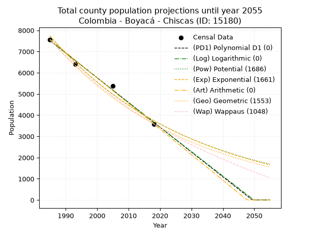
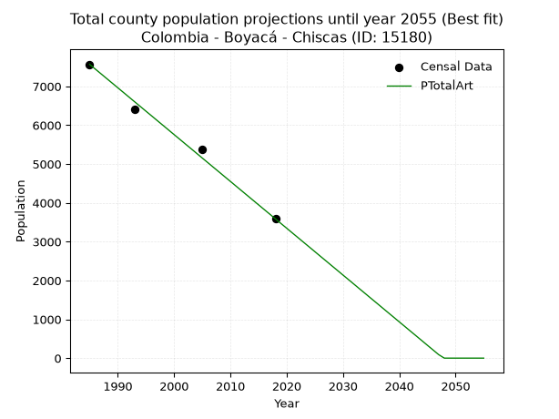
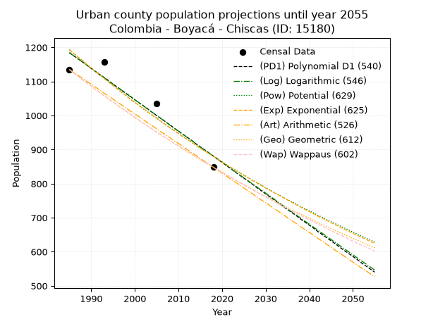
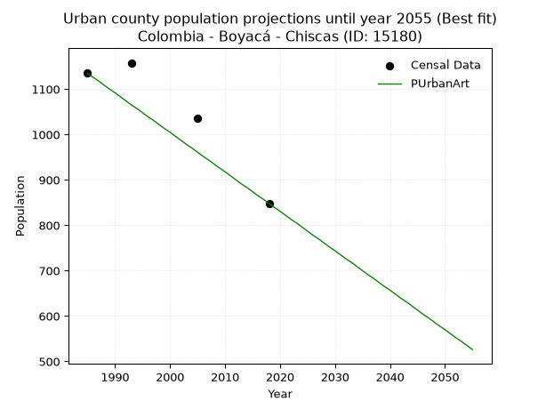
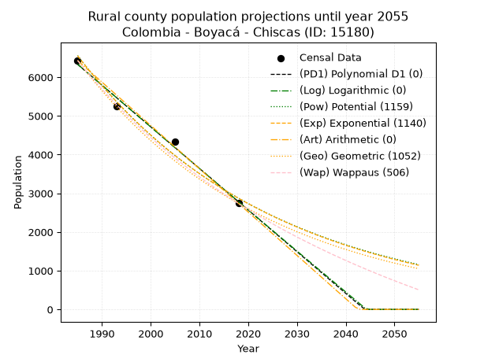
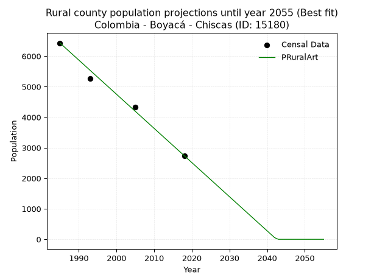

<div align="center">


</div>

# _“Population and Public Services Demand Projections (PPSD) until Year 2050 for Colombia - Boyacá - Chiscas (ID: 15180)”_
Keywords: `population` `public-service` `projection` `lineal` `polynomial` `logarithmic` `potential` `exponential` `arithmetic` `geometric` `wappaus` `dane` `colombia` `south-america`

PPSD are analytical estimates used by governments and planners to anticipate future changes in population size, age distribution, and the resulting community needs for utilities, healthcare, education, and infrastructure as sizing future water treatment facilities, electrical grids, and road networks based on spatial growth.

> **General running parameters**: • app_version: _v20260806_. • Python version: _3.14.7_. • Pandas version: _3.0.5_. • NumPy version: _2.5.1_. • Creates, save and include plots into reports (create_plot): _False_. • Projection until year: _2050_. • Process polynomial degree 2 and up: _False_. • Process Wappaus: _True_. • Process Wappaus: _True_. • Set negative values to zero: _True_. • Set infinite values to zero: _True_. • Drop dataset notes: _True_. 
<div align="center">

Dynamic map: [:earth_americas:Google](http://maps.google.com/maps?q=6.553136498,-72.5009572) [:earth_americas:OSM](https://www.openstreetmap.org/#map=18/6.553136498/-72.5009572&layers=P) [:earth_americas:Bing](https://www.bing.com/maps?cp=6.553136498~-72.5009572&lvl=18) [:earth_americas:Apple](https://maps.apple.com/frame?center=6.553136498%2C-72.5009572&span=0.003%2C0.006)

</div>


<div align="center">

```geojson
{
  "type": "Feature",
  "geometry": {
    "type": "Point", 
    "coordinates": [-72.5009572, 6.553136498]
  }, 
  "properties": {
    "Name": "Colombia - Boyacá - Chiscas (ID: 15180)"
  }
}
```

</div>


## 0. Census Data (4 records)

Census data are official statistics collected by a government about the people and housing in a country. They usually include counts of total population, age, sex, race, income, education, and jobs.

📅Global census file: [Population.xlsx](../data/Population.xlsx)

| Source   |   Year |   CountryID | CountryName   |   StateID | StateName   |   CountyID | CountyName   |   PTotal |   PUrban |   PRural |
|:---------|-------:|------------:|:--------------|----------:|:------------|-----------:|:-------------|---------:|---------:|---------:|
| DANE     |   1985 |          57 | Colombia      |        15 | Boyacá      |      15180 | Chiscas      |     7566 |     1135 |     6431 |
| DANE     |   1993 |          57 | Colombia      |        15 | Boyacá      |      15180 | Chiscas      |     6416 |     1158 |     5258 |
| DANE     |   2005 |          57 | Colombia      |        15 | Boyacá      |      15180 | Chiscas      |     5372 |     1035 |     4337 |
| DANE     |   2018 |          57 | Colombia      |        15 | Boyacá      |      15180 | Chiscas      |     3587 |      848 |     2739 |

> 🔥Some records could had specific notes about the registered values or the corresponding urban or rural distribution.

📅   [RUPS](https://www.datos.gov.co/Hacienda-y-Cr-dito-P-blico/Registro-nico-de-Prestadores-de-Servicios-P-blicos/4qkq-csdn/about_data) - Local public utility companies: [RUPS.csv](../data/RUPS.xlsx)

 | SERVICIO       | ESTADO    | NOMBRE                                                                                       | NIT         | DEPARTAMENTO_DOMICILIO   | MUNICIPIO_DOMICILIO   | DIRECCION              |   TELEFONO | EMAIL                            | TIPO_INSCRIPCION    | REPRESENTANTE_LEGAL           | TIPO_PRESTADOR          | CLASIFICACION                 |
|:---------------|:----------|:---------------------------------------------------------------------------------------------|:------------|:-------------------------|:----------------------|:-----------------------|-----------:|:---------------------------------|:--------------------|:------------------------------|:------------------------|:------------------------------|
| ACUEDUCTO      | OPERATIVA | ADMINISTRACIÓN PUBLICA COOPERATIVA EMPRESA SOLIDARIA DE SERVICIOS PUBLICOS DE CHISCAS BOYACA | 900265657-0 | BOYACA                   | CHISCAS               | PALACIO MUNICIPAL      |    7888226 | emsochiscasesp@hotmail.com       | Registro por la ESP | JOSE ELIBRANDO LOZANO FUENTES | ORGANIZACION AUTORIZADA | MENOR O IGUAL A 2500 USUARIOS |
| ALCANTARILLADO | OPERATIVA | ADMINISTRACIÓN PUBLICA COOPERATIVA EMPRESA SOLIDARIA DE SERVICIOS PUBLICOS DE CHISCAS BOYACA | 900265657-0 | BOYACA                   | CHISCAS               | PALACIO MUNICIPAL      |    7888226 | emsochiscasesp@hotmail.com       | Registro por la ESP | JOSE ELIBRANDO LOZANO FUENTES | ORGANIZACION AUTORIZADA | MENOR O IGUAL A 2500 USUARIOS |
| ACUEDUCTO      | OPERATIVA | ASOCIACION DE SUSCRIPTORES DEL ACUEDUCTO  DE PUERTA GRANDE LAS MERCEDES                      | 900369440-7 | BOYACA                   | CHISCAS               | VEREDA LAS MERCEDES    |    7888226 | personeria@chiscas-boyaca.goc.co | Registro por la ESP | JESUS LEAL  BARON             | ORGANIZACION AUTORIZADA | HASTA 2500 SUSCRIPTORES       |
| ACUEDUCTO      | OPERATIVA | ASOCIACION DE SUSCRIPTORES DE LOS ACUEDUCTOS DEL SECTOR DE EL LIMON                          | 900115218-8 | BOYACA                   | CHISCAS               | VEREDA LLANO DE TABACO |    7888226 | personeria@chiscas-boyaca.goc.co | Registro por la ESP | ERNESTO VELANDIA JIMENEZ      | ORGANIZACION AUTORIZADA | HASTA 2500 SUSCRIPTORES       |
| ACUEDUCTO      | OPERATIVA | ASOCIACION DE SUSCRIPTORES DE LOS ACUEDUCTOS DEL SECTOR DE BETAVEBA                          | 900114932-4 | BOYACA                   | CHISCAS               | VEREDA DE TAPIAS       |    7888226 | personeria@chiscas-boyaca.gov.co | Registro por la ESP | HERNANDO SILVA                | ORGANIZACION AUTORIZADA | HASTA 2500 SUSCRIPTORES       |
| ACUEDUCTO      | OPERATIVA | ASOCIACION DE SUSCRIPTORES DE LOS ACUEDUCTOS DEL SECTOR DE SOYAGRA                           | 900115518-2 | BOYACA                   | CHISCAS               | VEREDA DE CENTRO       |    7888226 | bcarismendy@gmail.com            | Registro por la ESP | NOE GOMEZ CARRENO             | ORGANIZACION AUTORIZADA | MENOR O IGUAL A 2500 USUARIOS |
| ACUEDUCTO      | OPERATIVA | ASOCIACION DE AFILIADOS A LOS ACUEDUCTOS DE LA RAMADA                                        | 900114717-7 | BOYACA                   | CHISCAS               | VEREDA TAUCASI         |    7888226 | personeria@chiscas-boyaca.gov.co | Registro por la ESP | FERNANDO PEDRAZA NAVARRO      | ORGANIZACION AUTORIZADA | HASTA 2500 SUSCRIPTORES       |

## 1. Total

### 1.1. Coefficients and Parameters

* (PD1) Polynomial Deg 1: -116.75832998795549, 239281.09955840796 (lineal)
* (Log) Logarithmic: -233692.69161541126, 1782035.271664443
* (Pow) Potential: -43.9528412468819, 148.83441173302126
* (Exp) Exponential: -0.02196560897374693, 6.671445488374523e+22
* (Art) Arithmetic: Year diff. 2018 - 1985 = 33, Population diff. 3587 - 7566 = -3979, Annual growth = -120.57575757575758
* (Geo) Geometric: Year diff. 2018 - 1985 = 33, Population diff. 3587 - 7566 = -3979, Annual growth % = -0.02236277758678451
* (Wap) Wappaus: i = -2.1622120967588554, Condition values only valid for < 200)

<sub>
Wappaus condition values: ['-0.00', '-2.16', '-4.32', '-6.49', '-8.65', '-10.81', '-12.97', '-15.14', '-17.30', '-19.46', '-21.62', '-23.78', '-25.95', '-28.11', '-30.27', '-32.43', '-34.60', '-36.76', '-38.92', '-41.08', '-43.24', '-45.41', '-47.57', '-49.73', '-51.89', '-54.06', '-56.22', '-58.38', '-60.54', '-62.70', '-64.87', '-67.03', '-69.19', '-71.35', '-73.52', '-75.68', '-77.84', '-80.00', '-82.16', '-84.33', '-86.49', '-88.65', '-90.81', '-92.98', '-95.14', '-97.30', '-99.46', '-101.62', '-103.79', '-105.95', '-108.11', '-110.27', '-112.44', '-114.60', '-116.76', '-118.92', '-121.08', '-123.25', '-125.41', '-127.57', '-129.73', '-131.89', '-134.06', '-136.22', '-138.38', '-140.54']
</sub>


### 1.2. Projected Dataset

|   Year |   CountyID |   PTotalPD1 |   PTotalLog |   PTotalPow |   PTotalExp |   PTotalArt |   PTotalGeo |   PTotalWap |
|-------:|-----------:|------------:|------------:|------------:|------------:|------------:|------------:|------------:|
|   1985 |      15180 |        7516 |        7519 |        7735 |        7731 |        7566 |        7566 |        7566 |
|   1986 |      15180 |        7399 |        7402 |        7566 |        7563 |        7445 |        7397 |        7404 |
|   1987 |      15180 |        7282 |        7284 |        7400 |        7399 |        7325 |        7231 |        7246 |
|   1988 |      15180 |        7166 |        7166 |        7238 |        7238 |        7204 |        7070 |        7091 |
|   1989 |      15180 |        7049 |        7049 |        7080 |        7081 |        7084 |        6912 |        6939 |
|   1990 |      15180 |        6932 |        6931 |        6925 |        6927 |        6963 |        6757 |        6790 |
|   1991 |      15180 |        6815 |        6814 |        6774 |        6776 |        6843 |        6606 |        6644 |
|   1992 |      15180 |        6699 |        6697 |        6626 |        6629 |        6722 |        6458 |        6501 |
|   1993 |      15180 |        6582 |        6579 |        6482 |        6485 |        6601 |        6314 |        6361 |
|   1994 |      15180 |        6465 |        6462 |        6340 |        6344 |        6481 |        6173 |        6224 |
|   1995 |      15180 |        6348 |        6345 |        6202 |        6206 |        6360 |        6035 |        6090 |
|   1996 |      15180 |        6231 |        6228 |        6067 |        6071 |        6240 |        5900 |        5958 |
|   1997 |      15180 |        6115 |        6111 |        5935 |        5940 |        6119 |        5768 |        5828 |
|   1998 |      15180 |        5998 |        5994 |        5806 |        5810 |        5999 |        5639 |        5701 |
|   1999 |      15180 |        5881 |        5877 |        5680 |        5684 |        5878 |        5513 |        5577 |
|   2000 |      15180 |        5764 |        5760 |        5556 |        5561 |        5757 |        5389 |        5455 |
|   2001 |      15180 |        5648 |        5643 |        5435 |        5440 |        5637 |        5269 |        5335 |
|   2002 |      15180 |        5531 |        5526 |        5317 |        5322 |        5516 |        5151 |        5217 |
|   2003 |      15180 |        5414 |        5410 |        5202 |        5206 |        5396 |        5036 |        5101 |
|   2004 |      15180 |        5297 |        5293 |        5089 |        5093 |        5275 |        4923 |        4987 |
|   2005 |      15180 |        5181 |        5176 |        4979 |        4982 |        5154 |        4813 |        4876 |
|   2006 |      15180 |        5064 |        5060 |        4871 |        4874 |        5034 |        4705 |        4766 |
|   2007 |      15180 |        4947 |        4943 |        4765 |        4768 |        4913 |        4600 |        4658 |
|   2008 |      15180 |        4830 |        4827 |        4662 |        4665 |        4793 |        4497 |        4553 |
|   2009 |      15180 |        4714 |        4711 |        4561 |        4563 |        4672 |        4397 |        4449 |
|   2010 |      15180 |        4597 |        4594 |        4462 |        4464 |        4552 |        4298 |        4346 |
|   2011 |      15180 |        4480 |        4478 |        4366 |        4367 |        4431 |        4202 |        4246 |
|   2012 |      15180 |        4363 |        4362 |        4271 |        4272 |        4310 |        4108 |        4147 |
|   2013 |      15180 |        4247 |        4246 |        4179 |        4179 |        4190 |        4016 |        4050 |
|   2014 |      15180 |        4130 |        4130 |        4089 |        4089 |        4069 |        3927 |        3954 |
|   2015 |      15180 |        4013 |        4014 |        4001 |        4000 |        3949 |        3839 |        3860 |
|   2016 |      15180 |        3896 |        3898 |        3914 |        3913 |        3828 |        3753 |        3768 |
|   2017 |      15180 |        3780 |        3782 |        3830 |        3828 |        3708 |        3669 |        3677 |
|   2018 |      15180 |        3663 |        3666 |        3747 |        3745 |        3587 |        3587 |        3587 |
|   2019 |      15180 |        3546 |        3550 |        3667 |        3663 |        3466 |        3507 |        3499 |
|   2020 |      15180 |        3429 |        3435 |        3588 |        3584 |        3346 |        3428 |        3412 |
|   2021 |      15180 |        3313 |        3319 |        3511 |        3506 |        3225 |        3352 |        3327 |
|   2022 |      15180 |        3196 |        3203 |        3435 |        3430 |        3105 |        3277 |        3243 |
|   2023 |      15180 |        3079 |        3088 |        3361 |        3355 |        2984 |        3203 |        3160 |
|   2024 |      15180 |        2962 |        2972 |        3289 |        3282 |        2864 |        3132 |        3078 |
|   2025 |      15180 |        2845 |        2857 |        3218 |        3211 |        2743 |        3062 |        2998 |
|   2026 |      15180 |        2729 |        2741 |        3149 |        3141 |        2622 |        2993 |        2919 |
|   2027 |      15180 |        2612 |        2626 |        3082 |        3073 |        2502 |        2926 |        2841 |
|   2028 |      15180 |        2495 |        2511 |        3016 |        3006 |        2381 |        2861 |        2764 |
|   2029 |      15180 |        2378 |        2396 |        2951 |        2941 |        2261 |        2797 |        2688 |
|   2030 |      15180 |        2262 |        2281 |        2888 |        2877 |        2140 |        2734 |        2614 |
|   2031 |      15180 |        2145 |        2165 |        2826 |        2815 |        2020 |        2673 |        2540 |
|   2032 |      15180 |        2028 |        2050 |        2765 |        2753 |        1899 |        2613 |        2468 |
|   2033 |      15180 |        1911 |        1935 |        2706 |        2694 |        1778 |        2555 |        2396 |
|   2034 |      15180 |        1795 |        1821 |        2648 |        2635 |        1658 |        2498 |        2326 |
|   2035 |      15180 |        1678 |        1706 |        2592 |        2578 |        1537 |        2442 |        2256 |
|   2036 |      15180 |        1561 |        1591 |        2536 |        2522 |        1417 |        2387 |        2188 |
|   2037 |      15180 |        1444 |        1476 |        2482 |        2467 |        1296 |        2334 |        2120 |
|   2038 |      15180 |        1328 |        1361 |        2429 |        2413 |        1175 |        2282 |        2054 |
|   2039 |      15180 |        1211 |        1247 |        2378 |        2361 |        1055 |        2231 |        1988 |
|   2040 |      15180 |        1094 |        1132 |        2327 |        2310 |         934 |        2181 |        1923 |
|   2041 |      15180 |         977 |        1018 |        2277 |        2260 |         814 |        2132 |        1860 |
|   2042 |      15180 |         861 |         903 |        2229 |        2210 |         693 |        2084 |        1797 |
|   2043 |      15180 |         744 |         789 |        2181 |        2162 |         573 |        2038 |        1734 |
|   2044 |      15180 |         627 |         674 |        2135 |        2115 |         452 |        1992 |        1673 |
|   2045 |      15180 |         510 |         560 |        2089 |        2069 |         331 |        1948 |        1612 |
|   2046 |      15180 |         394 |         446 |        2045 |        2024 |         211 |        1904 |        1553 |
|   2047 |      15180 |         277 |         332 |        2002 |        1981 |          90 |        1862 |        1494 |
|   2048 |      15180 |         160 |         218 |        1959 |        1937 |           0 |        1820 |        1435 |
|   2049 |      15180 |          43 |         103 |        1917 |        1895 |           0 |        1779 |        1378 |
|   2050 |      15180 |           0 |           0 |        1877 |        1854 |           0 |        1739 |        1321 |
<div align="center">

</img>

</div>


### 1.3. Best fit with absolute and relative error (%)

Relative error puts that difference into context by dividing the absolute error by the true value, creating a unitless ratio or percentage that shows the scale of the mistake.

Absolute and relative error

|   Year | Source   |   CountryID | CountryName   |   StateID | StateName   |   CountyID_x | CountyName   |   PTotal |   PUrban |   PRural |   CountyID_y |   PTotalPD1 |   PTotalLog |   PTotalPow |   PTotalExp |   PTotalArt |   PTotalGeo |   PTotalWap |   PTotalPD1AbsError |   PTotalLogAbsError |   PTotalPowAbsError |   PTotalExpAbsError |   PTotalArtAbsError |   PTotalGeoAbsError |   PTotalWapAbsError |   PTotalPD1RelError |   PTotalLogRelError |   PTotalPowRelError |   PTotalExpRelError |   PTotalArtRelError |   PTotalGeoRelError |   PTotalWapRelError |
|-------:|:---------|------------:|:--------------|----------:|:------------|-------------:|:-------------|---------:|---------:|---------:|-------------:|------------:|------------:|------------:|------------:|------------:|------------:|------------:|--------------------:|--------------------:|--------------------:|--------------------:|--------------------:|--------------------:|--------------------:|--------------------:|--------------------:|--------------------:|--------------------:|--------------------:|--------------------:|--------------------:|
|   1985 | DANE     |          57 | Colombia      |        15 | Boyacá      |        15180 | Chiscas      |     7566 |     1135 |     6431 |        15180 |        7516 |        7519 |        7735 |        7731 |        7566 |        7566 |        7566 |                  50 |                  47 |                 169 |                 165 |                   0 |                   0 |                   0 |            0.660851 |             0.6212  |             2.23368 |             2.18081 |             0       |             0       |            0        |
|   1993 | DANE     |          57 | Colombia      |        15 | Boyacá      |        15180 | Chiscas      |     6416 |     1158 |     5258 |        15180 |        6582 |        6579 |        6482 |        6485 |        6601 |        6314 |        6361 |                 166 |                 163 |                  66 |                  69 |                 185 |                 102 |                  55 |            2.58728  |             2.54052 |             1.02868 |             1.07544 |             2.88342 |             1.58978 |            0.857232 |
|   2005 | DANE     |          57 | Colombia      |        15 | Boyacá      |        15180 | Chiscas      |     5372 |     1035 |     4337 |        15180 |        5181 |        5176 |        4979 |        4982 |        5154 |        4813 |        4876 |                 191 |                 196 |                 393 |                 390 |                 218 |                 559 |                 496 |            3.55547  |             3.64855 |             7.31571 |             7.25987 |             4.05808 |            10.4058  |            9.23306  |
|   2018 | DANE     |          57 | Colombia      |        15 | Boyacá      |        15180 | Chiscas      |     3587 |      848 |     2739 |        15180 |        3663 |        3666 |        3747 |        3745 |        3587 |        3587 |        3587 |                  76 |                  79 |                 160 |                 158 |                   0 |                   0 |                   0 |            2.11876  |             2.2024  |             4.46055 |             4.4048  |             0       |             0       |            0        |

Relative error mean

| Method    |   RelError | Best   |
|:----------|-----------:|:-------|
| PTotalPD1 |    2.23059 |        |
| PTotalLog |    2.25317 |        |
| PTotalPow |    3.75965 |        |
| PTotalExp |    3.73023 |        |
| PTotalArt |    1.73537 | True   |
| PTotalGeo |    2.9989  |        |
| PTotalWap |    2.52257 |        |

💙Best method: _**PTotalArt**_
<div align="center">

</img>

</div>


### 1.4. Fresh water supply demand in liters per capita per day (lpcd)

The fresh water supply demand typically ranges from 100 to 300 liters per capita per day (lpcd) for standard domestic and municipal planning, though absolute survival minimums set by the World Health Organization are as low as 7.5 to 20 liters per day, and total consumption in high-income nations can exceed 400 liters.

> `CZ`: Level in meters above the sea level (masl)<br> `WS`: Fresh water supply demand in liters per capita per day (lpcd or l/h/d)<br> `WSAll`: Zonal fresh water supply demand in liters per second (l/s)<br> `A`: Zonal area in square meters<br> `DP`: Population density (people/hectare or p/ha)

Reference values (RAS Colombia)

|    CZ |   WS |
|------:|-----:|
|  1000 |  120 |
|  2000 |  130 |
| 99999 |  140 |

County shapefile geometry properties and water supply values

|   CountyID |      ATotal |   CZTotal |   WSTotal |
|-----------:|------------:|----------:|----------:|
|      15180 | 6.57281e+08 |    3409.2 |       140 |

Projected values for best method: PTotalArt

|   CountyID |   Year |   PTotalArt |   DPTotal |   WSTotal |   WSTotalAll |
|-----------:|-------:|------------:|----------:|----------:|-------------:|
|      15180 |   1985 |        7566 |      0.12 |       140 |    12.2597   |
|      15180 |   1986 |        7445 |      0.11 |       140 |    12.0637   |
|      15180 |   1987 |        7325 |      0.11 |       140 |    11.8692   |
|      15180 |   1988 |        7204 |      0.11 |       140 |    11.6731   |
|      15180 |   1989 |        7084 |      0.11 |       140 |    11.4787   |
|      15180 |   1990 |        6963 |      0.11 |       140 |    11.2826   |
|      15180 |   1991 |        6843 |      0.1  |       140 |    11.0882   |
|      15180 |   1992 |        6722 |      0.1  |       140 |    10.8921   |
|      15180 |   1993 |        6601 |      0.1  |       140 |    10.6961   |
|      15180 |   1994 |        6481 |      0.1  |       140 |    10.5016   |
|      15180 |   1995 |        6360 |      0.1  |       140 |    10.3056   |
|      15180 |   1996 |        6240 |      0.09 |       140 |    10.1111   |
|      15180 |   1997 |        6119 |      0.09 |       140 |     9.91505  |
|      15180 |   1998 |        5999 |      0.09 |       140 |     9.7206   |
|      15180 |   1999 |        5878 |      0.09 |       140 |     9.52454  |
|      15180 |   2000 |        5757 |      0.09 |       140 |     9.32847  |
|      15180 |   2001 |        5637 |      0.09 |       140 |     9.13403  |
|      15180 |   2002 |        5516 |      0.08 |       140 |     8.93796  |
|      15180 |   2003 |        5396 |      0.08 |       140 |     8.74352  |
|      15180 |   2004 |        5275 |      0.08 |       140 |     8.54745  |
|      15180 |   2005 |        5154 |      0.08 |       140 |     8.35139  |
|      15180 |   2006 |        5034 |      0.08 |       140 |     8.15694  |
|      15180 |   2007 |        4913 |      0.07 |       140 |     7.96088  |
|      15180 |   2008 |        4793 |      0.07 |       140 |     7.76644  |
|      15180 |   2009 |        4672 |      0.07 |       140 |     7.57037  |
|      15180 |   2010 |        4552 |      0.07 |       140 |     7.37593  |
|      15180 |   2011 |        4431 |      0.07 |       140 |     7.17986  |
|      15180 |   2012 |        4310 |      0.07 |       140 |     6.9838   |
|      15180 |   2013 |        4190 |      0.06 |       140 |     6.78935  |
|      15180 |   2014 |        4069 |      0.06 |       140 |     6.59329  |
|      15180 |   2015 |        3949 |      0.06 |       140 |     6.39884  |
|      15180 |   2016 |        3828 |      0.06 |       140 |     6.20278  |
|      15180 |   2017 |        3708 |      0.06 |       140 |     6.00833  |
|      15180 |   2018 |        3587 |      0.05 |       140 |     5.81227  |
|      15180 |   2019 |        3466 |      0.05 |       140 |     5.6162   |
|      15180 |   2020 |        3346 |      0.05 |       140 |     5.42176  |
|      15180 |   2021 |        3225 |      0.05 |       140 |     5.22569  |
|      15180 |   2022 |        3105 |      0.05 |       140 |     5.03125  |
|      15180 |   2023 |        2984 |      0.05 |       140 |     4.83519  |
|      15180 |   2024 |        2864 |      0.04 |       140 |     4.64074  |
|      15180 |   2025 |        2743 |      0.04 |       140 |     4.44468  |
|      15180 |   2026 |        2622 |      0.04 |       140 |     4.24861  |
|      15180 |   2027 |        2502 |      0.04 |       140 |     4.05417  |
|      15180 |   2028 |        2381 |      0.04 |       140 |     3.8581   |
|      15180 |   2029 |        2261 |      0.03 |       140 |     3.66366  |
|      15180 |   2030 |        2140 |      0.03 |       140 |     3.46759  |
|      15180 |   2031 |        2020 |      0.03 |       140 |     3.27315  |
|      15180 |   2032 |        1899 |      0.03 |       140 |     3.07708  |
|      15180 |   2033 |        1778 |      0.03 |       140 |     2.88102  |
|      15180 |   2034 |        1658 |      0.03 |       140 |     2.68657  |
|      15180 |   2035 |        1537 |      0.02 |       140 |     2.49051  |
|      15180 |   2036 |        1417 |      0.02 |       140 |     2.29606  |
|      15180 |   2037 |        1296 |      0.02 |       140 |     2.1      |
|      15180 |   2038 |        1175 |      0.02 |       140 |     1.90394  |
|      15180 |   2039 |        1055 |      0.02 |       140 |     1.70949  |
|      15180 |   2040 |         934 |      0.01 |       140 |     1.51343  |
|      15180 |   2041 |         814 |      0.01 |       140 |     1.31898  |
|      15180 |   2042 |         693 |      0.01 |       140 |     1.12292  |
|      15180 |   2043 |         573 |      0.01 |       140 |     0.928472 |
|      15180 |   2044 |         452 |      0.01 |       140 |     0.732407 |
|      15180 |   2045 |         331 |      0.01 |       140 |     0.536343 |
|      15180 |   2046 |         211 |      0    |       140 |     0.341898 |
|      15180 |   2047 |          90 |      0    |       140 |     0.145833 |
|      15180 |   2048 |           0 |      0    |       140 |     0        |
|      15180 |   2049 |           0 |      0    |       140 |     0        |
|      15180 |   2050 |           0 |      0    |       140 |     0        |

## 2. Urban

### 2.1. Coefficients and Parameters

* (PD1) Polynomial Deg 1: -9.210758731433032, 19467.820152548924 (lineal)
* (Log) Logarithmic: -18421.59357268102, 141066.68036733472
* (Pow) Potential: -18.49055255477598, 64.05422641012792
* (Exp) Exponential: -0.009245765259408099, 111502259533.5341
* (Art) Arithmetic: Year diff. 2018 - 1985 = 33, Population diff. 848 - 1135 = -287, Annual growth = -8.696969696969697
* (Geo) Geometric: Year diff. 2018 - 1985 = 33, Population diff. 848 - 1135 = -287, Annual growth % = -0.00879465315559469
* (Wap) Wappaus: i = -0.8771527682268984, Condition values only valid for < 200)

<sub>
Wappaus condition values: ['-0.00', '-0.88', '-1.75', '-2.63', '-3.51', '-4.39', '-5.26', '-6.14', '-7.02', '-7.89', '-8.77', '-9.65', '-10.53', '-11.40', '-12.28', '-13.16', '-14.03', '-14.91', '-15.79', '-16.67', '-17.54', '-18.42', '-19.30', '-20.17', '-21.05', '-21.93', '-22.81', '-23.68', '-24.56', '-25.44', '-26.31', '-27.19', '-28.07', '-28.95', '-29.82', '-30.70', '-31.58', '-32.45', '-33.33', '-34.21', '-35.09', '-35.96', '-36.84', '-37.72', '-38.59', '-39.47', '-40.35', '-41.23', '-42.10', '-42.98', '-43.86', '-44.73', '-45.61', '-46.49', '-47.37', '-48.24', '-49.12', '-50.00', '-50.87', '-51.75', '-52.63', '-53.51', '-54.38', '-55.26', '-56.14', '-57.01']
</sub>


### 2.2. Projected Dataset

|   Year |   CountyID |   PUrbanPD1 |   PUrbanLog |   PUrbanPow |   PUrbanExp |   PUrbanArt |   PUrbanGeo |   PUrbanWap |
|-------:|-----------:|------------:|------------:|------------:|------------:|------------:|------------:|------------:|
|   1985 |      15180 |        1184 |        1185 |        1193 |        1193 |        1135 |        1135 |        1135 |
|   1986 |      15180 |        1175 |        1175 |        1182 |        1182 |        1126 |        1125 |        1125 |
|   1987 |      15180 |        1166 |        1166 |        1171 |        1171 |        1118 |        1115 |        1115 |
|   1988 |      15180 |        1157 |        1157 |        1161 |        1161 |        1109 |        1105 |        1106 |
|   1989 |      15180 |        1148 |        1148 |        1150 |        1150 |        1100 |        1096 |        1096 |
|   1990 |      15180 |        1138 |        1138 |        1139 |        1139 |        1092 |        1086 |        1086 |
|   1991 |      15180 |        1129 |        1129 |        1129 |        1129 |        1083 |        1076 |        1077 |
|   1992 |      15180 |        1120 |        1120 |        1118 |        1119 |        1074 |        1067 |        1067 |
|   1993 |      15180 |        1111 |        1111 |        1108 |        1108 |        1065 |        1058 |        1058 |
|   1994 |      15180 |        1102 |        1101 |        1098 |        1098 |        1057 |        1048 |        1049 |
|   1995 |      15180 |        1092 |        1092 |        1088 |        1088 |        1048 |        1039 |        1040 |
|   1996 |      15180 |        1083 |        1083 |        1078 |        1078 |        1039 |        1030 |        1031 |
|   1997 |      15180 |        1074 |        1074 |        1068 |        1068 |        1031 |        1021 |        1022 |
|   1998 |      15180 |        1065 |        1064 |        1058 |        1058 |        1022 |        1012 |        1013 |
|   1999 |      15180 |        1056 |        1055 |        1048 |        1048 |        1013 |        1003 |        1004 |
|   2000 |      15180 |        1046 |        1046 |        1038 |        1039 |        1005 |         994 |         995 |
|   2001 |      15180 |        1037 |        1037 |        1029 |        1029 |         996 |         985 |         986 |
|   2002 |      15180 |        1028 |        1028 |        1019 |        1020 |         987 |         977 |         977 |
|   2003 |      15180 |        1019 |        1018 |        1010 |        1010 |         978 |         968 |         969 |
|   2004 |      15180 |        1009 |        1009 |        1001 |        1001 |         970 |         960 |         960 |
|   2005 |      15180 |        1000 |        1000 |         992 |         992 |         961 |         951 |         952 |
|   2006 |      15180 |         991 |         991 |         982 |         983 |         952 |         943 |         944 |
|   2007 |      15180 |         982 |         982 |         973 |         974 |         944 |         935 |         935 |
|   2008 |      15180 |         973 |         972 |         964 |         965 |         935 |         926 |         927 |
|   2009 |      15180 |         963 |         963 |         956 |         956 |         926 |         918 |         919 |
|   2010 |      15180 |         954 |         954 |         947 |         947 |         918 |         910 |         911 |
|   2011 |      15180 |         945 |         945 |         938 |         938 |         909 |         902 |         903 |
|   2012 |      15180 |         936 |         936 |         930 |         930 |         900 |         894 |         895 |
|   2013 |      15180 |         927 |         927 |         921 |         921 |         891 |         886 |         887 |
|   2014 |      15180 |         917 |         917 |         913 |         913 |         883 |         878 |         879 |
|   2015 |      15180 |         908 |         908 |         904 |         904 |         874 |         871 |         871 |
|   2016 |      15180 |         899 |         899 |         896 |         896 |         865 |         863 |         863 |
|   2017 |      15180 |         890 |         890 |         888 |         888 |         857 |         856 |         856 |
|   2018 |      15180 |         881 |         881 |         880 |         880 |         848 |         848 |         848 |
|   2019 |      15180 |         871 |         872 |         872 |         871 |         839 |         841 |         840 |
|   2020 |      15180 |         862 |         863 |         864 |         863 |         831 |         833 |         833 |
|   2021 |      15180 |         853 |         854 |         856 |         855 |         822 |         826 |         825 |
|   2022 |      15180 |         844 |         844 |         848 |         848 |         813 |         819 |         818 |
|   2023 |      15180 |         834 |         835 |         840 |         840 |         805 |         811 |         811 |
|   2024 |      15180 |         825 |         826 |         833 |         832 |         796 |         804 |         803 |
|   2025 |      15180 |         816 |         817 |         825 |         824 |         787 |         797 |         796 |
|   2026 |      15180 |         807 |         808 |         818 |         817 |         778 |         790 |         789 |
|   2027 |      15180 |         798 |         799 |         810 |         809 |         770 |         783 |         782 |
|   2028 |      15180 |         788 |         790 |         803 |         802 |         761 |         776 |         775 |
|   2029 |      15180 |         779 |         781 |         796 |         794 |         752 |         769 |         768 |
|   2030 |      15180 |         770 |         772 |         788 |         787 |         744 |         763 |         761 |
|   2031 |      15180 |         761 |         763 |         781 |         780 |         735 |         756 |         754 |
|   2032 |      15180 |         752 |         754 |         774 |         773 |         726 |         749 |         747 |
|   2033 |      15180 |         742 |         744 |         767 |         766 |         718 |         743 |         740 |
|   2034 |      15180 |         733 |         735 |         760 |         759 |         709 |         736 |         733 |
|   2035 |      15180 |         724 |         726 |         753 |         752 |         700 |         730 |         727 |
|   2036 |      15180 |         715 |         717 |         747 |         745 |         691 |         723 |         720 |
|   2037 |      15180 |         706 |         708 |         740 |         738 |         683 |         717 |         713 |
|   2038 |      15180 |         696 |         699 |         733 |         731 |         674 |         711 |         707 |
|   2039 |      15180 |         687 |         690 |         727 |         724 |         665 |         704 |         700 |
|   2040 |      15180 |         678 |         681 |         720 |         718 |         657 |         698 |         694 |
|   2041 |      15180 |         669 |         672 |         714 |         711 |         648 |         692 |         687 |
|   2042 |      15180 |         659 |         663 |         707 |         704 |         639 |         686 |         681 |
|   2043 |      15180 |         650 |         654 |         701 |         698 |         631 |         680 |         675 |
|   2044 |      15180 |         641 |         645 |         694 |         692 |         622 |         674 |         668 |
|   2045 |      15180 |         632 |         636 |         688 |         685 |         613 |         668 |         662 |
|   2046 |      15180 |         623 |         627 |         682 |         679 |         604 |         662 |         656 |
|   2047 |      15180 |         613 |         618 |         676 |         673 |         596 |         656 |         650 |
|   2048 |      15180 |         604 |         609 |         670 |         666 |         587 |         651 |         644 |
|   2049 |      15180 |         595 |         600 |         664 |         660 |         578 |         645 |         637 |
|   2050 |      15180 |         586 |         591 |         658 |         654 |         570 |         639 |         631 |
<div align="center">

</img>

</div>


### 2.3. Best fit with absolute and relative error (%)

Relative error puts that difference into context by dividing the absolute error by the true value, creating a unitless ratio or percentage that shows the scale of the mistake.

Absolute and relative error

|   Year | Source   |   CountryID | CountryName   |   StateID | StateName   |   CountyID_x | CountyName   |   PTotal |   PUrban |   PRural |   CountyID_y |   PUrbanPD1 |   PUrbanLog |   PUrbanPow |   PUrbanExp |   PUrbanArt |   PUrbanGeo |   PUrbanWap |   PUrbanPD1AbsError |   PUrbanLogAbsError |   PUrbanPowAbsError |   PUrbanExpAbsError |   PUrbanArtAbsError |   PUrbanGeoAbsError |   PUrbanWapAbsError |   PUrbanPD1RelError |   PUrbanLogRelError |   PUrbanPowRelError |   PUrbanExpRelError |   PUrbanArtRelError |   PUrbanGeoRelError |   PUrbanWapRelError |
|-------:|:---------|------------:|:--------------|----------:|:------------|-------------:|:-------------|---------:|---------:|---------:|-------------:|------------:|------------:|------------:|------------:|------------:|------------:|------------:|--------------------:|--------------------:|--------------------:|--------------------:|--------------------:|--------------------:|--------------------:|--------------------:|--------------------:|--------------------:|--------------------:|--------------------:|--------------------:|--------------------:|
|   1985 | DANE     |          57 | Colombia      |        15 | Boyacá      |        15180 | Chiscas      |     7566 |     1135 |     6431 |        15180 |        1184 |        1185 |        1193 |        1193 |        1135 |        1135 |        1135 |                  49 |                  50 |                  58 |                  58 |                   0 |                   0 |                   0 |             4.31718 |             4.40529 |             5.11013 |             5.11013 |             0       |             0       |             0       |
|   1993 | DANE     |          57 | Colombia      |        15 | Boyacá      |        15180 | Chiscas      |     6416 |     1158 |     5258 |        15180 |        1111 |        1111 |        1108 |        1108 |        1065 |        1058 |        1058 |                  47 |                  47 |                  50 |                  50 |                  93 |                 100 |                 100 |             4.05872 |             4.05872 |             4.31779 |             4.31779 |             8.03109 |             8.63558 |             8.63558 |
|   2005 | DANE     |          57 | Colombia      |        15 | Boyacá      |        15180 | Chiscas      |     5372 |     1035 |     4337 |        15180 |        1000 |        1000 |         992 |         992 |         961 |         951 |         952 |                  35 |                  35 |                  43 |                  43 |                  74 |                  84 |                  83 |             3.38164 |             3.38164 |             4.15459 |             4.15459 |             7.14976 |             8.11594 |             8.01932 |
|   2018 | DANE     |          57 | Colombia      |        15 | Boyacá      |        15180 | Chiscas      |     3587 |      848 |     2739 |        15180 |         881 |         881 |         880 |         880 |         848 |         848 |         848 |                  33 |                  33 |                  32 |                  32 |                   0 |                   0 |                   0 |             3.89151 |             3.89151 |             3.77358 |             3.77358 |             0       |             0       |             0       |

Relative error mean

| Method    |   RelError | Best   |
|:----------|-----------:|:-------|
| PUrbanPD1 |    3.91226 |        |
| PUrbanLog |    3.93429 |        |
| PUrbanPow |    4.33902 |        |
| PUrbanExp |    4.33902 |        |
| PUrbanArt |    3.79521 | True   |
| PUrbanGeo |    4.18788 |        |
| PUrbanWap |    4.16373 |        |

💙Best method: _**PUrbanArt**_
<div align="center">

</img>

</div>


### 2.4. Fresh water supply demand in liters per capita per day (lpcd)

The fresh water supply demand typically ranges from 100 to 300 liters per capita per day (lpcd) for standard domestic and municipal planning, though absolute survival minimums set by the World Health Organization are as low as 7.5 to 20 liters per day, and total consumption in high-income nations can exceed 400 liters.

> `CZ`: Level in meters above the sea level (masl)<br> `WS`: Fresh water supply demand in liters per capita per day (lpcd or l/h/d)<br> `WSAll`: Zonal fresh water supply demand in liters per second (l/s)<br> `A`: Zonal area in square meters<br> `DP`: Population density (people/hectare or p/ha)

Reference values (RAS Colombia)

|    CZ |   WS |
|------:|-----:|
|  1000 |  120 |
|  2000 |  130 |
| 99999 |  140 |

County shapefile geometry properties and water supply values

|   CountyID |   AUrban |   CZUrban |   WSUrban |
|-----------:|---------:|----------:|----------:|
|      15180 |   187305 |   2365.84 |       140 |

Projected values for best method: PUrbanArt

|   CountyID |   Year |   PUrbanArt |   DPUrban |   WSUrban |   WSUrbanAll |
|-----------:|-------:|------------:|----------:|----------:|-------------:|
|      15180 |   1985 |        1135 |     60.6  |       140 |     1.83912  |
|      15180 |   1986 |        1126 |     60.12 |       140 |     1.82454  |
|      15180 |   1987 |        1118 |     59.69 |       140 |     1.81157  |
|      15180 |   1988 |        1109 |     59.21 |       140 |     1.79699  |
|      15180 |   1989 |        1100 |     58.73 |       140 |     1.78241  |
|      15180 |   1990 |        1092 |     58.3  |       140 |     1.76944  |
|      15180 |   1991 |        1083 |     57.82 |       140 |     1.75486  |
|      15180 |   1992 |        1074 |     57.34 |       140 |     1.74028  |
|      15180 |   1993 |        1065 |     56.86 |       140 |     1.72569  |
|      15180 |   1994 |        1057 |     56.43 |       140 |     1.71273  |
|      15180 |   1995 |        1048 |     55.95 |       140 |     1.69815  |
|      15180 |   1996 |        1039 |     55.47 |       140 |     1.68356  |
|      15180 |   1997 |        1031 |     55.04 |       140 |     1.6706   |
|      15180 |   1998 |        1022 |     54.56 |       140 |     1.65602  |
|      15180 |   1999 |        1013 |     54.08 |       140 |     1.64144  |
|      15180 |   2000 |        1005 |     53.66 |       140 |     1.62847  |
|      15180 |   2001 |         996 |     53.18 |       140 |     1.61389  |
|      15180 |   2002 |         987 |     52.69 |       140 |     1.59931  |
|      15180 |   2003 |         978 |     52.21 |       140 |     1.58472  |
|      15180 |   2004 |         970 |     51.79 |       140 |     1.57176  |
|      15180 |   2005 |         961 |     51.31 |       140 |     1.55718  |
|      15180 |   2006 |         952 |     50.83 |       140 |     1.54259  |
|      15180 |   2007 |         944 |     50.4  |       140 |     1.52963  |
|      15180 |   2008 |         935 |     49.92 |       140 |     1.51505  |
|      15180 |   2009 |         926 |     49.44 |       140 |     1.50046  |
|      15180 |   2010 |         918 |     49.01 |       140 |     1.4875   |
|      15180 |   2011 |         909 |     48.53 |       140 |     1.47292  |
|      15180 |   2012 |         900 |     48.05 |       140 |     1.45833  |
|      15180 |   2013 |         891 |     47.57 |       140 |     1.44375  |
|      15180 |   2014 |         883 |     47.14 |       140 |     1.43079  |
|      15180 |   2015 |         874 |     46.66 |       140 |     1.4162   |
|      15180 |   2016 |         865 |     46.18 |       140 |     1.40162  |
|      15180 |   2017 |         857 |     45.75 |       140 |     1.38866  |
|      15180 |   2018 |         848 |     45.27 |       140 |     1.37407  |
|      15180 |   2019 |         839 |     44.79 |       140 |     1.35949  |
|      15180 |   2020 |         831 |     44.37 |       140 |     1.34653  |
|      15180 |   2021 |         822 |     43.89 |       140 |     1.33194  |
|      15180 |   2022 |         813 |     43.41 |       140 |     1.31736  |
|      15180 |   2023 |         805 |     42.98 |       140 |     1.3044   |
|      15180 |   2024 |         796 |     42.5  |       140 |     1.28981  |
|      15180 |   2025 |         787 |     42.02 |       140 |     1.27523  |
|      15180 |   2026 |         778 |     41.54 |       140 |     1.26065  |
|      15180 |   2027 |         770 |     41.11 |       140 |     1.24769  |
|      15180 |   2028 |         761 |     40.63 |       140 |     1.2331   |
|      15180 |   2029 |         752 |     40.15 |       140 |     1.21852  |
|      15180 |   2030 |         744 |     39.72 |       140 |     1.20556  |
|      15180 |   2031 |         735 |     39.24 |       140 |     1.19097  |
|      15180 |   2032 |         726 |     38.76 |       140 |     1.17639  |
|      15180 |   2033 |         718 |     38.33 |       140 |     1.16343  |
|      15180 |   2034 |         709 |     37.85 |       140 |     1.14884  |
|      15180 |   2035 |         700 |     37.37 |       140 |     1.13426  |
|      15180 |   2036 |         691 |     36.89 |       140 |     1.11968  |
|      15180 |   2037 |         683 |     36.46 |       140 |     1.10671  |
|      15180 |   2038 |         674 |     35.98 |       140 |     1.09213  |
|      15180 |   2039 |         665 |     35.5  |       140 |     1.07755  |
|      15180 |   2040 |         657 |     35.08 |       140 |     1.06458  |
|      15180 |   2041 |         648 |     34.6  |       140 |     1.05     |
|      15180 |   2042 |         639 |     34.12 |       140 |     1.03542  |
|      15180 |   2043 |         631 |     33.69 |       140 |     1.02245  |
|      15180 |   2044 |         622 |     33.21 |       140 |     1.00787  |
|      15180 |   2045 |         613 |     32.73 |       140 |     0.993287 |
|      15180 |   2046 |         604 |     32.25 |       140 |     0.978704 |
|      15180 |   2047 |         596 |     31.82 |       140 |     0.965741 |
|      15180 |   2048 |         587 |     31.34 |       140 |     0.951157 |
|      15180 |   2049 |         578 |     30.86 |       140 |     0.936574 |
|      15180 |   2050 |         570 |     30.43 |       140 |     0.923611 |

## 3. Rural

### 3.1. Coefficients and Parameters

* (PD1) Polynomial Deg 1: -107.54757125652239, 219813.27940585892 (lineal)
* (Log) Logarithmic: -215271.0980427303, 1640968.5912971082
* (Pow) Potential: -50.00246375525961, 168.71289503760406
* (Exp) Exponential: -0.024988412002039415, 2.2821390736970506e+25
* (Art) Arithmetic: Year diff. 2018 - 1985 = 33, Population diff. 2739 - 6431 = -3692, Annual growth = -111.87878787878788
* (Geo) Geometric: Year diff. 2018 - 1985 = 33, Population diff. 2739 - 6431 = -3692, Annual growth % = -0.025533134673075164
* (Wap) Wappaus: i = -2.440104424837249, Condition values only valid for < 200)

<sub>
Wappaus condition values: ['-0.00', '-2.44', '-4.88', '-7.32', '-9.76', '-12.20', '-14.64', '-17.08', '-19.52', '-21.96', '-24.40', '-26.84', '-29.28', '-31.72', '-34.16', '-36.60', '-39.04', '-41.48', '-43.92', '-46.36', '-48.80', '-51.24', '-53.68', '-56.12', '-58.56', '-61.00', '-63.44', '-65.88', '-68.32', '-70.76', '-73.20', '-75.64', '-78.08', '-80.52', '-82.96', '-85.40', '-87.84', '-90.28', '-92.72', '-95.16', '-97.60', '-100.04', '-102.48', '-104.92', '-107.36', '-109.80', '-112.24', '-114.68', '-117.13', '-119.57', '-122.01', '-124.45', '-126.89', '-129.33', '-131.77', '-134.21', '-136.65', '-139.09', '-141.53', '-143.97', '-146.41', '-148.85', '-151.29', '-153.73', '-156.17', '-158.61']
</sub>


### 3.2. Projected Dataset

|   Year |   CountyID |   PRuralPD1 |   PRuralLog |   PRuralPow |   PRuralExp |   PRuralArt |   PRuralGeo |   PRuralWap |
|-------:|-----------:|------------:|------------:|------------:|------------:|------------:|------------:|------------:|
|   1985 |      15180 |        6331 |        6335 |        6558 |        6553 |        6431 |        6431 |        6431 |
|   1986 |      15180 |        6224 |        6226 |        6395 |        6392 |        6319 |        6267 |        6276 |
|   1987 |      15180 |        6116 |        6118 |        6236 |        6234 |        6207 |        6107 |        6125 |
|   1988 |      15180 |        6009 |        6009 |        6081 |        6080 |        6095 |        5951 |        5977 |
|   1989 |      15180 |        5901 |        5901 |        5930 |        5930 |        5983 |        5799 |        5833 |
|   1990 |      15180 |        5794 |        5793 |        5782 |        5784 |        5872 |        5651 |        5691 |
|   1991 |      15180 |        5686 |        5685 |        5639 |        5641 |        5760 |        5507 |        5554 |
|   1992 |      15180 |        5579 |        5577 |        5499 |        5502 |        5648 |        5366 |        5419 |
|   1993 |      15180 |        5471 |        5469 |        5363 |        5366 |        5536 |        5229 |        5287 |
|   1994 |      15180 |        5363 |        5361 |        5230 |        5234 |        5424 |        5095 |        5158 |
|   1995 |      15180 |        5256 |        5253 |        5101 |        5104 |        5312 |        4965 |        5032 |
|   1996 |      15180 |        5148 |        5145 |        4974 |        4978 |        5200 |        4839 |        4909 |
|   1997 |      15180 |        5041 |        5037 |        4851 |        4856 |        5088 |        4715 |        4788 |
|   1998 |      15180 |        4933 |        4929 |        4731 |        4736 |        4977 |        4595 |        4670 |
|   1999 |      15180 |        4826 |        4822 |        4614 |        4619 |        4865 |        4477 |        4555 |
|   2000 |      15180 |        4718 |        4714 |        4501 |        4505 |        4753 |        4363 |        4441 |
|   2001 |      15180 |        4611 |        4606 |        4389 |        4394 |        4641 |        4252 |        4330 |
|   2002 |      15180 |        4503 |        4499 |        4281 |        4285 |        4529 |        4143 |        4222 |
|   2003 |      15180 |        4395 |        4391 |        4176 |        4180 |        4417 |        4037 |        4115 |
|   2004 |      15180 |        4288 |        4284 |        4073 |        4076 |        4305 |        3934 |        4011 |
|   2005 |      15180 |        4180 |        4176 |        3972 |        3976 |        4193 |        3834 |        3908 |
|   2006 |      15180 |        4073 |        4069 |        3874 |        3878 |        4082 |        3736 |        3808 |
|   2007 |      15180 |        3965 |        3962 |        3779 |        3782 |        3970 |        3640 |        3709 |
|   2008 |      15180 |        3858 |        3855 |        3686 |        3689 |        3858 |        3547 |        3613 |
|   2009 |      15180 |        3750 |        3747 |        3596 |        3598 |        3746 |        3457 |        3518 |
|   2010 |      15180 |        3643 |        3640 |        3507 |        3509 |        3634 |        3369 |        3425 |
|   2011 |      15180 |        3535 |        3533 |        3421 |        3422 |        3522 |        3283 |        3334 |
|   2012 |      15180 |        3428 |        3426 |        3337 |        3338 |        3410 |        3199 |        3244 |
|   2013 |      15180 |        3320 |        3319 |        3255 |        3255 |        3298 |        3117 |        3156 |
|   2014 |      15180 |        3212 |        3212 |        3175 |        3175 |        3187 |        3038 |        3070 |
|   2015 |      15180 |        3105 |        3105 |        3097 |        3097 |        3075 |        2960 |        2985 |
|   2016 |      15180 |        2997 |        2999 |        3022 |        3020 |        2963 |        2884 |        2901 |
|   2017 |      15180 |        2890 |        2892 |        2948 |        2946 |        2851 |        2811 |        2819 |
|   2018 |      15180 |        2782 |        2785 |        2875 |        2873 |        2739 |        2739 |        2739 |
|   2019 |      15180 |        2675 |        2679 |        2805 |        2802 |        2627 |        2669 |        2660 |
|   2020 |      15180 |        2567 |        2572 |        2736 |        2733 |        2515 |        2601 |        2582 |
|   2021 |      15180 |        2460 |        2465 |        2670 |        2666 |        2403 |        2535 |        2506 |
|   2022 |      15180 |        2352 |        2359 |        2604 |        2600 |        2291 |        2470 |        2431 |
|   2023 |      15180 |        2245 |        2252 |        2541 |        2536 |        2180 |        2407 |        2357 |
|   2024 |      15180 |        2137 |        2146 |        2479 |        2473 |        2068 |        2345 |        2284 |
|   2025 |      15180 |        2029 |        2040 |        2418 |        2412 |        1956 |        2285 |        2213 |
|   2026 |      15180 |        1922 |        1933 |        2359 |        2352 |        1844 |        2227 |        2142 |
|   2027 |      15180 |        1814 |        1827 |        2302 |        2294 |        1732 |        2170 |        2073 |
|   2028 |      15180 |        1707 |        1721 |        2246 |        2238 |        1620 |        2115 |        2005 |
|   2029 |      15180 |        1599 |        1615 |        2191 |        2183 |        1508 |        2061 |        1938 |
|   2030 |      15180 |        1492 |        1509 |        2138 |        2129 |        1396 |        2008 |        1872 |
|   2031 |      15180 |        1384 |        1403 |        2086 |        2076 |        1285 |        1957 |        1807 |
|   2032 |      15180 |        1277 |        1297 |        2035 |        2025 |        1173 |        1907 |        1744 |
|   2033 |      15180 |        1169 |        1191 |        1986 |        1975 |        1061 |        1858 |        1681 |
|   2034 |      15180 |        1062 |        1085 |        1937 |        1926 |         949 |        1811 |        1619 |
|   2035 |      15180 |         954 |         979 |        1890 |        1879 |         837 |        1765 |        1558 |
|   2036 |      15180 |         846 |         874 |        1844 |        1832 |         725 |        1719 |        1498 |
|   2037 |      15180 |         739 |         768 |        1800 |        1787 |         613 |        1676 |        1438 |
|   2038 |      15180 |         631 |         662 |        1756 |        1743 |         501 |        1633 |        1380 |
|   2039 |      15180 |         524 |         557 |        1713 |        1700 |         390 |        1591 |        1323 |
|   2040 |      15180 |         416 |         451 |        1672 |        1658 |         278 |        1550 |        1266 |
|   2041 |      15180 |         309 |         346 |        1632 |        1617 |         166 |        1511 |        1210 |
|   2042 |      15180 |         201 |         240 |        1592 |        1577 |          54 |        1472 |        1155 |
|   2043 |      15180 |          94 |         135 |        1554 |        1538 |           0 |        1435 |        1101 |
|   2044 |      15180 |           0 |          29 |        1516 |        1500 |           0 |        1398 |        1048 |
|   2045 |      15180 |           0 |           0 |        1479 |        1463 |           0 |        1362 |         995 |
|   2046 |      15180 |           0 |           0 |        1444 |        1427 |           0 |        1328 |         943 |
|   2047 |      15180 |           0 |           0 |        1409 |        1392 |           0 |        1294 |         892 |
|   2048 |      15180 |           0 |           0 |        1375 |        1358 |           0 |        1261 |         841 |
|   2049 |      15180 |           0 |           0 |        1342 |        1324 |           0 |        1228 |         791 |
|   2050 |      15180 |           0 |           0 |        1309 |        1291 |           0 |        1197 |         742 |
<div align="center">

</img>

</div>


### 3.3. Best fit with absolute and relative error (%)

Relative error puts that difference into context by dividing the absolute error by the true value, creating a unitless ratio or percentage that shows the scale of the mistake.

Absolute and relative error

|   Year | Source   |   CountryID | CountryName   |   StateID | StateName   |   CountyID_x | CountyName   |   PTotal |   PUrban |   PRural |   CountyID_y |   PRuralPD1 |   PRuralLog |   PRuralPow |   PRuralExp |   PRuralArt |   PRuralGeo |   PRuralWap |   PRuralPD1AbsError |   PRuralLogAbsError |   PRuralPowAbsError |   PRuralExpAbsError |   PRuralArtAbsError |   PRuralGeoAbsError |   PRuralWapAbsError |   PRuralPD1RelError |   PRuralLogRelError |   PRuralPowRelError |   PRuralExpRelError |   PRuralArtRelError |   PRuralGeoRelError |   PRuralWapRelError |
|-------:|:---------|------------:|:--------------|----------:|:------------|-------------:|:-------------|---------:|---------:|---------:|-------------:|------------:|------------:|------------:|------------:|------------:|------------:|------------:|--------------------:|--------------------:|--------------------:|--------------------:|--------------------:|--------------------:|--------------------:|--------------------:|--------------------:|--------------------:|--------------------:|--------------------:|--------------------:|--------------------:|
|   1985 | DANE     |          57 | Colombia      |        15 | Boyacá      |        15180 | Chiscas      |     7566 |     1135 |     6431 |        15180 |        6331 |        6335 |        6558 |        6553 |        6431 |        6431 |        6431 |                 100 |                  96 |                 127 |                 122 |                   0 |                   0 |                   0 |             1.55497 |             1.49277 |             1.97481 |             1.89706 |             0       |            0        |            0        |
|   1993 | DANE     |          57 | Colombia      |        15 | Boyacá      |        15180 | Chiscas      |     6416 |     1158 |     5258 |        15180 |        5471 |        5469 |        5363 |        5366 |        5536 |        5229 |        5287 |                 213 |                 211 |                 105 |                 108 |                 278 |                  29 |                  29 |             4.05097 |             4.01293 |             1.99696 |             2.05401 |             5.28718 |            0.551541 |            0.551541 |
|   2005 | DANE     |          57 | Colombia      |        15 | Boyacá      |        15180 | Chiscas      |     5372 |     1035 |     4337 |        15180 |        4180 |        4176 |        3972 |        3976 |        4193 |        3834 |        3908 |                 157 |                 161 |                 365 |                 361 |                 144 |                 503 |                 429 |             3.62001 |             3.71224 |             8.41596 |             8.32373 |             3.32027 |           11.5979   |            9.89163  |
|   2018 | DANE     |          57 | Colombia      |        15 | Boyacá      |        15180 | Chiscas      |     3587 |      848 |     2739 |        15180 |        2782 |        2785 |        2875 |        2873 |        2739 |        2739 |        2739 |                  43 |                  46 |                 136 |                 134 |                   0 |                   0 |                   0 |             1.56992 |             1.67945 |             4.96532 |             4.8923  |             0       |            0        |            0        |

Relative error mean

| Method    |   RelError | Best   |
|:----------|-----------:|:-------|
| PRuralPD1 |    2.69897 |        |
| PRuralLog |    2.72435 |        |
| PRuralPow |    4.33826 |        |
| PRuralExp |    4.29177 |        |
| PRuralArt |    2.15186 | True   |
| PRuralGeo |    3.03735 |        |
| PRuralWap |    2.61079 |        |

💙Best method: _**PRuralArt**_
<div align="center">

</img>

</div>


### 3.4. Fresh water supply demand in liters per capita per day (lpcd)

The fresh water supply demand typically ranges from 100 to 300 liters per capita per day (lpcd) for standard domestic and municipal planning, though absolute survival minimums set by the World Health Organization are as low as 7.5 to 20 liters per day, and total consumption in high-income nations can exceed 400 liters.

> `CZ`: Level in meters above the sea level (masl)<br> `WS`: Fresh water supply demand in liters per capita per day (lpcd or l/h/d)<br> `WSAll`: Zonal fresh water supply demand in liters per second (l/s)<br> `A`: Zonal area in square meters<br> `DP`: Population density (people/hectare or p/ha)

Reference values (RAS Colombia)

|    CZ |   WS |
|------:|-----:|
|  1000 |  120 |
|  2000 |  130 |
| 99999 |  140 |

County shapefile geometry properties and water supply values

|   CountyID |      ARural |   CZRural |   WSRural |
|-----------:|------------:|----------:|----------:|
|      15180 | 6.57093e+08 |   3409.47 |       140 |

Projected values for best method: PRuralArt

|   CountyID |   Year |   PRuralArt |   DPRural |   WSRural |   WSRuralAll |
|-----------:|-------:|------------:|----------:|----------:|-------------:|
|      15180 |   1985 |        6431 |      0.1  |       140 |    10.4206   |
|      15180 |   1986 |        6319 |      0.1  |       140 |    10.2391   |
|      15180 |   1987 |        6207 |      0.09 |       140 |    10.0576   |
|      15180 |   1988 |        6095 |      0.09 |       140 |     9.87616  |
|      15180 |   1989 |        5983 |      0.09 |       140 |     9.69468  |
|      15180 |   1990 |        5872 |      0.09 |       140 |     9.51481  |
|      15180 |   1991 |        5760 |      0.09 |       140 |     9.33333  |
|      15180 |   1992 |        5648 |      0.09 |       140 |     9.15185  |
|      15180 |   1993 |        5536 |      0.08 |       140 |     8.97037  |
|      15180 |   1994 |        5424 |      0.08 |       140 |     8.78889  |
|      15180 |   1995 |        5312 |      0.08 |       140 |     8.60741  |
|      15180 |   1996 |        5200 |      0.08 |       140 |     8.42593  |
|      15180 |   1997 |        5088 |      0.08 |       140 |     8.24444  |
|      15180 |   1998 |        4977 |      0.08 |       140 |     8.06458  |
|      15180 |   1999 |        4865 |      0.07 |       140 |     7.8831   |
|      15180 |   2000 |        4753 |      0.07 |       140 |     7.70162  |
|      15180 |   2001 |        4641 |      0.07 |       140 |     7.52014  |
|      15180 |   2002 |        4529 |      0.07 |       140 |     7.33866  |
|      15180 |   2003 |        4417 |      0.07 |       140 |     7.15718  |
|      15180 |   2004 |        4305 |      0.07 |       140 |     6.97569  |
|      15180 |   2005 |        4193 |      0.06 |       140 |     6.79421  |
|      15180 |   2006 |        4082 |      0.06 |       140 |     6.61435  |
|      15180 |   2007 |        3970 |      0.06 |       140 |     6.43287  |
|      15180 |   2008 |        3858 |      0.06 |       140 |     6.25139  |
|      15180 |   2009 |        3746 |      0.06 |       140 |     6.06991  |
|      15180 |   2010 |        3634 |      0.06 |       140 |     5.88843  |
|      15180 |   2011 |        3522 |      0.05 |       140 |     5.70694  |
|      15180 |   2012 |        3410 |      0.05 |       140 |     5.52546  |
|      15180 |   2013 |        3298 |      0.05 |       140 |     5.34398  |
|      15180 |   2014 |        3187 |      0.05 |       140 |     5.16412  |
|      15180 |   2015 |        3075 |      0.05 |       140 |     4.98264  |
|      15180 |   2016 |        2963 |      0.05 |       140 |     4.80116  |
|      15180 |   2017 |        2851 |      0.04 |       140 |     4.61968  |
|      15180 |   2018 |        2739 |      0.04 |       140 |     4.43819  |
|      15180 |   2019 |        2627 |      0.04 |       140 |     4.25671  |
|      15180 |   2020 |        2515 |      0.04 |       140 |     4.07523  |
|      15180 |   2021 |        2403 |      0.04 |       140 |     3.89375  |
|      15180 |   2022 |        2291 |      0.03 |       140 |     3.71227  |
|      15180 |   2023 |        2180 |      0.03 |       140 |     3.53241  |
|      15180 |   2024 |        2068 |      0.03 |       140 |     3.35093  |
|      15180 |   2025 |        1956 |      0.03 |       140 |     3.16944  |
|      15180 |   2026 |        1844 |      0.03 |       140 |     2.98796  |
|      15180 |   2027 |        1732 |      0.03 |       140 |     2.80648  |
|      15180 |   2028 |        1620 |      0.02 |       140 |     2.625    |
|      15180 |   2029 |        1508 |      0.02 |       140 |     2.44352  |
|      15180 |   2030 |        1396 |      0.02 |       140 |     2.26204  |
|      15180 |   2031 |        1285 |      0.02 |       140 |     2.08218  |
|      15180 |   2032 |        1173 |      0.02 |       140 |     1.90069  |
|      15180 |   2033 |        1061 |      0.02 |       140 |     1.71921  |
|      15180 |   2034 |         949 |      0.01 |       140 |     1.53773  |
|      15180 |   2035 |         837 |      0.01 |       140 |     1.35625  |
|      15180 |   2036 |         725 |      0.01 |       140 |     1.17477  |
|      15180 |   2037 |         613 |      0.01 |       140 |     0.993287 |
|      15180 |   2038 |         501 |      0.01 |       140 |     0.811806 |
|      15180 |   2039 |         390 |      0.01 |       140 |     0.631944 |
|      15180 |   2040 |         278 |      0    |       140 |     0.450463 |
|      15180 |   2041 |         166 |      0    |       140 |     0.268981 |
|      15180 |   2042 |          54 |      0    |       140 |     0.0875   |
|      15180 |   2043 |           0 |      0    |       140 |     0        |
|      15180 |   2044 |           0 |      0    |       140 |     0        |
|      15180 |   2045 |           0 |      0    |       140 |     0        |
|      15180 |   2046 |           0 |      0    |       140 |     0        |
|      15180 |   2047 |           0 |      0    |       140 |     0        |
|      15180 |   2048 |           0 |      0    |       140 |     0        |
|      15180 |   2049 |           0 |      0    |       140 |     0        |
|      15180 |   2050 |           0 |      0    |       140 |     0        |

<div align="center"><br><sub>Share this research</sub></div><br>

<sub>**APPS & TOOLS & CONTENT DISCLAIMER**: • NO WARRANTY - This content and software is provided by <a href="https://github.com/rcfdtools" target="_blank">github.com/rcfdtools</a> "as is", without any express or implied warranty, including warranties of merchantability, fitness for a particular purpose, or non-infringement. There is no guarantee that the software will be error-free or operate without interruption. • LIMITATION OF LIABILITY - Neither the authors nor copyright holders will be liable for claims or damages arising from the software or its use. You are responsible for determining if the software is appropriate for your use and assume all associated risks, including errors, legal compliance, and data loss. • NO PROFESSIONAL ADVICE - The software provides general information and does not offer professional advice. It should not replace consultation with professional advisors. [Clauses and global license for rcfdtools use.](https://github.com/rcfdtools/rcfdtools/blob/main/LICENSE.md)</sub>

| [:house: Home](Readme.md)  | [:beginner: Help / Collaborate](https://github.com/rcfdtools/R.HydroTools/discussions/31) |
|----------------------------|-------------------------------------------------------------------------------------------|