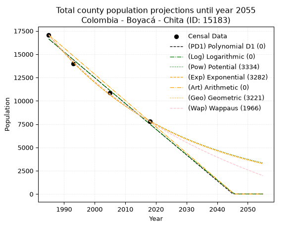
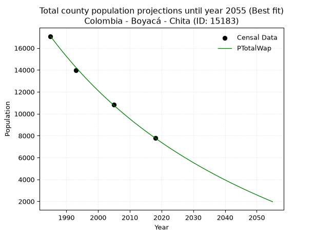
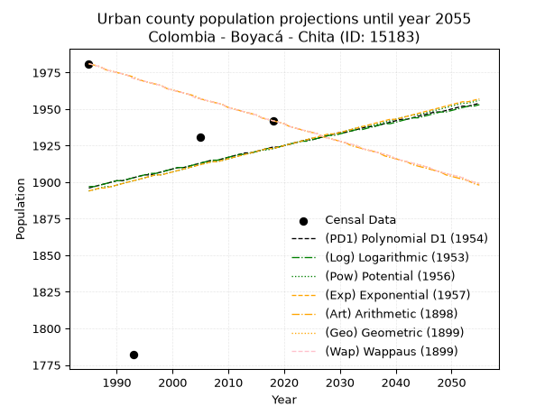
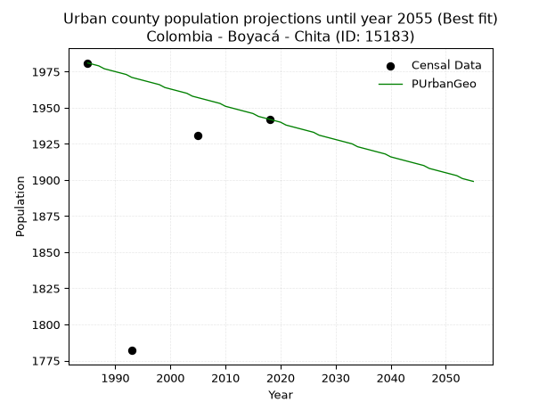
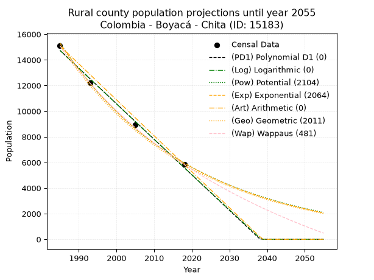
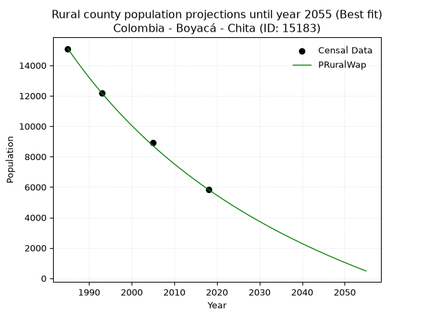

<div align="center">


</div>

# _“Population and Public Services Demand Projections (PPSD) until Year 2050 for Colombia - Boyacá - Chita (ID: 15183)”_
Keywords: `population` `public-service` `projection` `lineal` `polynomial` `logarithmic` `potential` `exponential` `arithmetic` `geometric` `wappaus` `dane` `colombia` `south-america`

PPSD are analytical estimates used by governments and planners to anticipate future changes in population size, age distribution, and the resulting community needs for utilities, healthcare, education, and infrastructure as sizing future water treatment facilities, electrical grids, and road networks based on spatial growth.

> **General running parameters**: • app_version: _v20260806_. • Python version: _3.14.7_. • Pandas version: _3.0.5_. • NumPy version: _2.5.1_. • Creates, save and include plots into reports (create_plot): _False_. • Projection until year: _2050_. • Process polynomial degree 2 and up: _False_. • Process Wappaus: _True_. • Process Wappaus: _True_. • Set negative values to zero: _True_. • Set infinite values to zero: _True_. • Drop dataset notes: _True_. 
<div align="center">

Dynamic map: [:earth_americas:Google](http://maps.google.com/maps?q=6.187082996,-72.4718923) [:earth_americas:OSM](https://www.openstreetmap.org/#map=18/6.187082996/-72.4718923&layers=P) [:earth_americas:Bing](https://www.bing.com/maps?cp=6.187082996~-72.4718923&lvl=18) [:earth_americas:Apple](https://maps.apple.com/frame?center=6.187082996%2C-72.4718923&span=0.003%2C0.006)

</div>


<div align="center">

```geojson
{
  "type": "Feature",
  "geometry": {
    "type": "Point", 
    "coordinates": [-72.4718923, 6.187082996]
  }, 
  "properties": {
    "Name": "Colombia - Boyacá - Chita (ID: 15183)"
  }
}
```

</div>


## 0. Census Data (4 records)

Census data are official statistics collected by a government about the people and housing in a country. They usually include counts of total population, age, sex, race, income, education, and jobs.

📅Global census file: [Population.xlsx](../data/Population.xlsx)

| Source   |   Year |   CountryID | CountryName   |   StateID | StateName   |   CountyID | CountyName   |   PTotal |   PUrban |   PRural |
|:---------|-------:|------------:|:--------------|----------:|:------------|-----------:|:-------------|---------:|---------:|---------:|
| DANE     |   1985 |          57 | Colombia      |        15 | Boyacá      |      15183 | Chita        |    17075 |     1981 |    15094 |
| DANE     |   1993 |          57 | Colombia      |        15 | Boyacá      |      15183 | Chita        |    13974 |     1782 |    12192 |
| DANE     |   2005 |          57 | Colombia      |        15 | Boyacá      |      15183 | Chita        |    10844 |     1931 |     8913 |
| DANE     |   2018 |          57 | Colombia      |        15 | Boyacá      |      15183 | Chita        |     7778 |     1942 |     5836 |

> 🔥Some records could had specific notes about the registered values or the corresponding urban or rural distribution.

## 1. Total

### 1.1. Coefficients and Parameters

* (PD1) Polynomial Deg 1: -276.4138900040124, 565314.6334805258 (lineal)
* (Log) Logarithmic: -553402.2890906782, 4218832.984065874
* (Pow) Potential: -47.11959742001807, 159.62129922487313
* (Exp) Exponential: -0.023541719244669027, 3.3617720289196217e+24
* (Art) Arithmetic: Year diff. 2018 - 1985 = 33, Population diff. 7778 - 17075 = -9297, Annual growth = -281.72727272727275
* (Geo) Geometric: Year diff. 2018 - 1985 = 33, Population diff. 7778 - 17075 = -9297, Annual growth % = -0.02354612296393166
* (Wap) Wappaus: i = -2.2671490180442824, Condition values only valid for < 200)

<sub>
Wappaus condition values: ['-0.00', '-2.27', '-4.53', '-6.80', '-9.07', '-11.34', '-13.60', '-15.87', '-18.14', '-20.40', '-22.67', '-24.94', '-27.21', '-29.47', '-31.74', '-34.01', '-36.27', '-38.54', '-40.81', '-43.08', '-45.34', '-47.61', '-49.88', '-52.14', '-54.41', '-56.68', '-58.95', '-61.21', '-63.48', '-65.75', '-68.01', '-70.28', '-72.55', '-74.82', '-77.08', '-79.35', '-81.62', '-83.88', '-86.15', '-88.42', '-90.69', '-92.95', '-95.22', '-97.49', '-99.75', '-102.02', '-104.29', '-106.56', '-108.82', '-111.09', '-113.36', '-115.62', '-117.89', '-120.16', '-122.43', '-124.69', '-126.96', '-129.23', '-131.49', '-133.76', '-136.03', '-138.30', '-140.56', '-142.83', '-145.10', '-147.36']
</sub>


### 1.2. Projected Dataset

|   Year |   CountyID |   PTotalPD1 |   PTotalLog |   PTotalPow |   PTotalExp |   PTotalArt |   PTotalGeo |   PTotalWap |
|-------:|-----------:|------------:|------------:|------------:|------------:|------------:|------------:|------------:|
|   1985 |      15183 |       16633 |       16642 |       17067 |       17055 |       17075 |       17075 |       17075 |
|   1986 |      15183 |       16357 |       16364 |       16667 |       16658 |       16793 |       16673 |       16692 |
|   1987 |      15183 |       16080 |       16085 |       16276 |       16271 |       16512 |       16280 |       16318 |
|   1988 |      15183 |       15804 |       15807 |       15895 |       15892 |       16230 |       15897 |       15952 |
|   1989 |      15183 |       15527 |       15528 |       15522 |       15522 |       15948 |       15523 |       15594 |
|   1990 |      15183 |       15251 |       15250 |       15159 |       15161 |       15666 |       15157 |       15243 |
|   1991 |      15183 |       14975 |       14972 |       14804 |       14808 |       15385 |       14800 |       14900 |
|   1992 |      15183 |       14698 |       14694 |       14458 |       14464 |       15103 |       14452 |       14564 |
|   1993 |      15183 |       14422 |       14416 |       14120 |       14127 |       14821 |       14112 |       14236 |
|   1994 |      15183 |       14145 |       14139 |       13790 |       13799 |       14539 |       13779 |       13914 |
|   1995 |      15183 |       13869 |       13861 |       13468 |       13478 |       14258 |       13455 |       13598 |
|   1996 |      15183 |       13593 |       13584 |       13154 |       13164 |       13976 |       13138 |       13289 |
|   1997 |      15183 |       13316 |       13307 |       12847 |       12858 |       13694 |       12829 |       12986 |
|   1998 |      15183 |       13040 |       13030 |       12548 |       12559 |       13413 |       12527 |       12689 |
|   1999 |      15183 |       12763 |       12753 |       12255 |       12266 |       13131 |       12232 |       12398 |
|   2000 |      15183 |       12487 |       12476 |       11970 |       11981 |       12849 |       11944 |       12112 |
|   2001 |      15183 |       12210 |       12200 |       11691 |       11702 |       12567 |       11662 |       11832 |
|   2002 |      15183 |       11934 |       11923 |       11419 |       11430 |       12286 |       11388 |       11557 |
|   2003 |      15183 |       11658 |       11647 |       11154 |       11164 |       12004 |       11120 |       11288 |
|   2004 |      15183 |       11381 |       11370 |       10895 |       10904 |       11722 |       10858 |       11023 |
|   2005 |      15183 |       11105 |       11094 |       10641 |       10651 |       11440 |       10602 |       10764 |
|   2006 |      15183 |       10828 |       10818 |       10394 |       10403 |       11159 |       10353 |       10509 |
|   2007 |      15183 |       10552 |       10543 |       10153 |       10161 |       10877 |       10109 |       10258 |
|   2008 |      15183 |       10276 |       10267 |        9918 |        9924 |       10595 |        9871 |       10013 |
|   2009 |      15183 |        9999 |        9991 |        9688 |        9693 |       10314 |        9638 |        9771 |
|   2010 |      15183 |        9723 |        9716 |        9463 |        9468 |       10032 |        9411 |        9534 |
|   2011 |      15183 |        9446 |        9441 |        9244 |        9248 |        9750 |        9190 |        9301 |
|   2012 |      15183 |        9170 |        9166 |        9030 |        9032 |        9468 |        8973 |        9072 |
|   2013 |      15183 |        8893 |        8891 |        8821 |        8822 |        9187 |        8762 |        8847 |
|   2014 |      15183 |        8617 |        8616 |        8617 |        8617 |        8905 |        8556 |        8626 |
|   2015 |      15183 |        8341 |        8341 |        8418 |        8416 |        8623 |        8354 |        8409 |
|   2016 |      15183 |        8064 |        8067 |        8223 |        8221 |        8341 |        8158 |        8195 |
|   2017 |      15183 |        7788 |        7792 |        8033 |        8029 |        8060 |        7966 |        7985 |
|   2018 |      15183 |        7511 |        7518 |        7848 |        7843 |        7778 |        7778 |        7778 |
|   2019 |      15183 |        7235 |        7244 |        7667 |        7660 |        7496 |        7595 |        7575 |
|   2020 |      15183 |        6959 |        6970 |        7490 |        7482 |        7215 |        7416 |        7375 |
|   2021 |      15183 |        6682 |        6696 |        7317 |        7308 |        6933 |        7241 |        7178 |
|   2022 |      15183 |        6406 |        6422 |        7149 |        7138 |        6651 |        7071 |        6984 |
|   2023 |      15183 |        6129 |        6148 |        6984 |        6972 |        6369 |        6904 |        6793 |
|   2024 |      15183 |        5853 |        5875 |        6823 |        6809 |        6088 |        6742 |        6606 |
|   2025 |      15183 |        5577 |        5602 |        6666 |        6651 |        5806 |        6583 |        6421 |
|   2026 |      15183 |        5300 |        5328 |        6513 |        6496 |        5524 |        6428 |        6239 |
|   2027 |      15183 |        5024 |        5055 |        6363 |        6345 |        5242 |        6277 |        6060 |
|   2028 |      15183 |        4747 |        4782 |        6217 |        6198 |        4961 |        6129 |        5884 |
|   2029 |      15183 |        4471 |        4509 |        6074 |        6053 |        4679 |        5985 |        5710 |
|   2030 |      15183 |        4194 |        4237 |        5935 |        5912 |        4397 |        5844 |        5539 |
|   2031 |      15183 |        3918 |        3964 |        5799 |        5775 |        4116 |        5706 |        5371 |
|   2032 |      15183 |        3642 |        3692 |        5666 |        5641 |        3834 |        5572 |        5205 |
|   2033 |      15183 |        3365 |        3420 |        5536 |        5509 |        3552 |        5441 |        5041 |
|   2034 |      15183 |        3089 |        3147 |        5409 |        5381 |        3270 |        5312 |        4880 |
|   2035 |      15183 |        2812 |        2875 |        5285 |        5256 |        2989 |        5187 |        4721 |
|   2036 |      15183 |        2536 |        2604 |        5164 |        5134 |        2707 |        5065 |        4565 |
|   2037 |      15183 |        2260 |        2332 |        5046 |        5014 |        2425 |        4946 |        4410 |
|   2038 |      15183 |        1983 |        2060 |        4931 |        4898 |        2143 |        4830 |        4258 |
|   2039 |      15183 |        1707 |        1789 |        4818 |        4784 |        1862 |        4716 |        4108 |
|   2040 |      15183 |        1430 |        1517 |        4708 |        4672 |        1580 |        4605 |        3960 |
|   2041 |      15183 |        1154 |        1246 |        4601 |        4564 |        1298 |        4496 |        3814 |
|   2042 |      15183 |         877 |         975 |        4496 |        4457 |        1017 |        4390 |        3671 |
|   2043 |      15183 |         601 |         704 |        4393 |        4354 |         735 |        4287 |        3529 |
|   2044 |      15183 |         325 |         433 |        4293 |        4252 |         453 |        4186 |        3389 |
|   2045 |      15183 |          48 |         163 |        4195 |        4153 |         171 |        4088 |        3251 |
|   2046 |      15183 |           0 |           0 |        4100 |        4057 |           0 |        3991 |        3114 |
|   2047 |      15183 |           0 |           0 |        4006 |        3962 |           0 |        3897 |        2980 |
|   2048 |      15183 |           0 |           0 |        3915 |        3870 |           0 |        3806 |        2847 |
|   2049 |      15183 |           0 |           0 |        3826 |        3780 |           0 |        3716 |        2717 |
|   2050 |      15183 |           0 |           0 |        3739 |        3692 |           0 |        3628 |        2587 |
<div align="center">

</img>

</div>


### 1.3. Best fit with absolute and relative error (%)

Relative error puts that difference into context by dividing the absolute error by the true value, creating a unitless ratio or percentage that shows the scale of the mistake.

Absolute and relative error

|   Year | Source   |   CountryID | CountryName   |   StateID | StateName   |   CountyID_x | CountyName   |   PTotal |   PUrban |   PRural |   CountyID_y |   PTotalPD1 |   PTotalLog |   PTotalPow |   PTotalExp |   PTotalArt |   PTotalGeo |   PTotalWap |   PTotalPD1AbsError |   PTotalLogAbsError |   PTotalPowAbsError |   PTotalExpAbsError |   PTotalArtAbsError |   PTotalGeoAbsError |   PTotalWapAbsError |   PTotalPD1RelError |   PTotalLogRelError |   PTotalPowRelError |   PTotalExpRelError |   PTotalArtRelError |   PTotalGeoRelError |   PTotalWapRelError |
|-------:|:---------|------------:|:--------------|----------:|:------------|-------------:|:-------------|---------:|---------:|---------:|-------------:|------------:|------------:|------------:|------------:|------------:|------------:|------------:|--------------------:|--------------------:|--------------------:|--------------------:|--------------------:|--------------------:|--------------------:|--------------------:|--------------------:|--------------------:|--------------------:|--------------------:|--------------------:|--------------------:|
|   1985 | DANE     |          57 | Colombia      |        15 | Boyacá      |        15183 | Chita        |    17075 |     1981 |    15094 |        15183 |       16633 |       16642 |       17067 |       17055 |       17075 |       17075 |       17075 |                 442 |                 433 |                   8 |                  20 |                   0 |                   0 |                   0 |             2.58858 |             2.53587 |           0.0468521 |             0.11713 |             0       |            0        |            0        |
|   1993 | DANE     |          57 | Colombia      |        15 | Boyacá      |        15183 | Chita        |    13974 |     1782 |    12192 |        15183 |       14422 |       14416 |       14120 |       14127 |       14821 |       14112 |       14236 |                 448 |                 442 |                 146 |                 153 |                 847 |                 138 |                 262 |             3.20595 |             3.16302 |           1.0448    |             1.09489 |             6.06126 |            0.987548 |            1.87491  |
|   2005 | DANE     |          57 | Colombia      |        15 | Boyacá      |        15183 | Chita        |    10844 |     1931 |     8913 |        15183 |       11105 |       11094 |       10641 |       10651 |       11440 |       10602 |       10764 |                 261 |                 250 |                 203 |                 193 |                 596 |                 242 |                  80 |             2.40686 |             2.30542 |           1.872     |             1.77979 |             5.49613 |            2.23165  |            0.737735 |
|   2018 | DANE     |          57 | Colombia      |        15 | Boyacá      |        15183 | Chita        |     7778 |     1942 |     5836 |        15183 |        7511 |        7518 |        7848 |        7843 |        7778 |        7778 |        7778 |                 267 |                 260 |                  70 |                  65 |                   0 |                   0 |                   0 |             3.43276 |             3.34276 |           0.899974  |             0.83569 |             0       |            0        |            0        |

Relative error mean

| Method    |   RelError | Best   |
|:----------|-----------:|:-------|
| PTotalPD1 |   2.90854  |        |
| PTotalLog |   2.83677  |        |
| PTotalPow |   0.965907 |        |
| PTotalExp |   0.956874 |        |
| PTotalArt |   2.88935  |        |
| PTotalGeo |   0.804799 |        |
| PTotalWap |   0.653161 | True   |

💙Best method: _**PTotalWap**_
<div align="center">

</img>

</div>


### 1.4. Fresh water supply demand in liters per capita per day (lpcd)

The fresh water supply demand typically ranges from 100 to 300 liters per capita per day (lpcd) for standard domestic and municipal planning, though absolute survival minimums set by the World Health Organization are as low as 7.5 to 20 liters per day, and total consumption in high-income nations can exceed 400 liters.

> `CZ`: Level in meters above the sea level (masl)<br> `WS`: Fresh water supply demand in liters per capita per day (lpcd or l/h/d)<br> `WSAll`: Zonal fresh water supply demand in liters per second (l/s)<br> `A`: Zonal area in square meters<br> `DP`: Population density (people/hectare)

Reference values (RAS Colombia)

|    CZ |   WS |
|------:|-----:|
|  1000 |  120 |
|  2000 |  130 |
| 99999 |  140 |

County shapefile geometry properties and water supply values

|   CountyID |      ATotal |   CZTotal |   WSTotal |
|-----------:|------------:|----------:|----------:|
|      15183 | 6.75808e+08 |   3037.61 |       140 |

Projected values for best method: PTotalWap

|   CountyID |   Year |   PTotalWap |   DPTotal |   WSTotal |   WSTotalAll |
|-----------:|-------:|------------:|----------:|----------:|-------------:|
|      15183 |   1985 |       17075 |      0.25 |       140 |     27.6678  |
|      15183 |   1986 |       16692 |      0.25 |       140 |     27.0472  |
|      15183 |   1987 |       16318 |      0.24 |       140 |     26.4412  |
|      15183 |   1988 |       15952 |      0.24 |       140 |     25.8481  |
|      15183 |   1989 |       15594 |      0.23 |       140 |     25.2681  |
|      15183 |   1990 |       15243 |      0.23 |       140 |     24.6993  |
|      15183 |   1991 |       14900 |      0.22 |       140 |     24.1435  |
|      15183 |   1992 |       14564 |      0.22 |       140 |     23.5991  |
|      15183 |   1993 |       14236 |      0.21 |       140 |     23.0676  |
|      15183 |   1994 |       13914 |      0.21 |       140 |     22.5458  |
|      15183 |   1995 |       13598 |      0.2  |       140 |     22.0338  |
|      15183 |   1996 |       13289 |      0.2  |       140 |     21.5331  |
|      15183 |   1997 |       12986 |      0.19 |       140 |     21.0421  |
|      15183 |   1998 |       12689 |      0.19 |       140 |     20.5609  |
|      15183 |   1999 |       12398 |      0.18 |       140 |     20.0894  |
|      15183 |   2000 |       12112 |      0.18 |       140 |     19.6259  |
|      15183 |   2001 |       11832 |      0.18 |       140 |     19.1722  |
|      15183 |   2002 |       11557 |      0.17 |       140 |     18.7266  |
|      15183 |   2003 |       11288 |      0.17 |       140 |     18.2907  |
|      15183 |   2004 |       11023 |      0.16 |       140 |     17.8613  |
|      15183 |   2005 |       10764 |      0.16 |       140 |     17.4417  |
|      15183 |   2006 |       10509 |      0.16 |       140 |     17.0285  |
|      15183 |   2007 |       10258 |      0.15 |       140 |     16.6218  |
|      15183 |   2008 |       10013 |      0.15 |       140 |     16.2248  |
|      15183 |   2009 |        9771 |      0.14 |       140 |     15.8326  |
|      15183 |   2010 |        9534 |      0.14 |       140 |     15.4486  |
|      15183 |   2011 |        9301 |      0.14 |       140 |     15.0711  |
|      15183 |   2012 |        9072 |      0.13 |       140 |     14.7     |
|      15183 |   2013 |        8847 |      0.13 |       140 |     14.3354  |
|      15183 |   2014 |        8626 |      0.13 |       140 |     13.9773  |
|      15183 |   2015 |        8409 |      0.12 |       140 |     13.6257  |
|      15183 |   2016 |        8195 |      0.12 |       140 |     13.2789  |
|      15183 |   2017 |        7985 |      0.12 |       140 |     12.9387  |
|      15183 |   2018 |        7778 |      0.12 |       140 |     12.6032  |
|      15183 |   2019 |        7575 |      0.11 |       140 |     12.2743  |
|      15183 |   2020 |        7375 |      0.11 |       140 |     11.9502  |
|      15183 |   2021 |        7178 |      0.11 |       140 |     11.631   |
|      15183 |   2022 |        6984 |      0.1  |       140 |     11.3167  |
|      15183 |   2023 |        6793 |      0.1  |       140 |     11.0072  |
|      15183 |   2024 |        6606 |      0.1  |       140 |     10.7042  |
|      15183 |   2025 |        6421 |      0.1  |       140 |     10.4044  |
|      15183 |   2026 |        6239 |      0.09 |       140 |     10.1095  |
|      15183 |   2027 |        6060 |      0.09 |       140 |      9.81944 |
|      15183 |   2028 |        5884 |      0.09 |       140 |      9.53426 |
|      15183 |   2029 |        5710 |      0.08 |       140 |      9.25231 |
|      15183 |   2030 |        5539 |      0.08 |       140 |      8.97523 |
|      15183 |   2031 |        5371 |      0.08 |       140 |      8.70301 |
|      15183 |   2032 |        5205 |      0.08 |       140 |      8.43403 |
|      15183 |   2033 |        5041 |      0.07 |       140 |      8.16829 |
|      15183 |   2034 |        4880 |      0.07 |       140 |      7.90741 |
|      15183 |   2035 |        4721 |      0.07 |       140 |      7.64977 |
|      15183 |   2036 |        4565 |      0.07 |       140 |      7.39699 |
|      15183 |   2037 |        4410 |      0.07 |       140 |      7.14583 |
|      15183 |   2038 |        4258 |      0.06 |       140 |      6.89954 |
|      15183 |   2039 |        4108 |      0.06 |       140 |      6.65648 |
|      15183 |   2040 |        3960 |      0.06 |       140 |      6.41667 |
|      15183 |   2041 |        3814 |      0.06 |       140 |      6.18009 |
|      15183 |   2042 |        3671 |      0.05 |       140 |      5.94838 |
|      15183 |   2043 |        3529 |      0.05 |       140 |      5.71829 |
|      15183 |   2044 |        3389 |      0.05 |       140 |      5.49144 |
|      15183 |   2045 |        3251 |      0.05 |       140 |      5.26782 |
|      15183 |   2046 |        3114 |      0.05 |       140 |      5.04583 |
|      15183 |   2047 |        2980 |      0.04 |       140 |      4.8287  |
|      15183 |   2048 |        2847 |      0.04 |       140 |      4.61319 |
|      15183 |   2049 |        2717 |      0.04 |       140 |      4.40255 |
|      15183 |   2050 |        2587 |      0.04 |       140 |      4.1919  |

## 2. Urban

### 2.1. Coefficients and Parameters

* (PD1) Polynomial Deg 1: 0.8237655560015908, 261.2629466078179 (lineal)
* (Log) Logarithmic: 1633.1454700950492, -10504.551805398925
* (Pow) Potential: 0.9339673775227463, 0.19735877600776358
* (Exp) Exponential: 0.00047076071982279444, 743.8874650033606
* (Art) Arithmetic: Year diff. 2018 - 1985 = 33, Population diff. 1942 - 1981 = -39, Annual growth = -1.1818181818181819
* (Geo) Geometric: Year diff. 2018 - 1985 = 33, Population diff. 1942 - 1981 = -39, Annual growth % = -0.0006023457244267449
* (Wap) Wappaus: i = -0.060250735754177, Condition values only valid for < 200)

<sub>
Wappaus condition values: ['-0.00', '-0.06', '-0.12', '-0.18', '-0.24', '-0.30', '-0.36', '-0.42', '-0.48', '-0.54', '-0.60', '-0.66', '-0.72', '-0.78', '-0.84', '-0.90', '-0.96', '-1.02', '-1.08', '-1.14', '-1.21', '-1.27', '-1.33', '-1.39', '-1.45', '-1.51', '-1.57', '-1.63', '-1.69', '-1.75', '-1.81', '-1.87', '-1.93', '-1.99', '-2.05', '-2.11', '-2.17', '-2.23', '-2.29', '-2.35', '-2.41', '-2.47', '-2.53', '-2.59', '-2.65', '-2.71', '-2.77', '-2.83', '-2.89', '-2.95', '-3.01', '-3.07', '-3.13', '-3.19', '-3.25', '-3.31', '-3.37', '-3.43', '-3.49', '-3.55', '-3.62', '-3.68', '-3.74', '-3.80', '-3.86', '-3.92']
</sub>


### 2.2. Projected Dataset

|   Year |   CountyID |   PUrbanPD1 |   PUrbanLog |   PUrbanPow |   PUrbanExp |   PUrbanArt |   PUrbanGeo |   PUrbanWap |
|-------:|-----------:|------------:|------------:|------------:|------------:|------------:|------------:|------------:|
|   1985 |      15183 |        1896 |        1897 |        1894 |        1894 |        1981 |        1981 |        1981 |
|   1986 |      15183 |        1897 |        1897 |        1895 |        1895 |        1980 |        1980 |        1980 |
|   1987 |      15183 |        1898 |        1898 |        1896 |        1896 |        1979 |        1979 |        1979 |
|   1988 |      15183 |        1899 |        1899 |        1897 |        1896 |        1977 |        1977 |        1977 |
|   1989 |      15183 |        1900 |        1900 |        1897 |        1897 |        1976 |        1976 |        1976 |
|   1990 |      15183 |        1901 |        1901 |        1898 |        1898 |        1975 |        1975 |        1975 |
|   1991 |      15183 |        1901 |        1901 |        1899 |        1899 |        1974 |        1974 |        1974 |
|   1992 |      15183 |        1902 |        1902 |        1900 |        1900 |        1973 |        1973 |        1973 |
|   1993 |      15183 |        1903 |        1903 |        1901 |        1901 |        1972 |        1971 |        1971 |
|   1994 |      15183 |        1904 |        1904 |        1902 |        1902 |        1970 |        1970 |        1970 |
|   1995 |      15183 |        1905 |        1905 |        1903 |        1903 |        1969 |        1969 |        1969 |
|   1996 |      15183 |        1905 |        1906 |        1904 |        1904 |        1968 |        1968 |        1968 |
|   1997 |      15183 |        1906 |        1906 |        1905 |        1905 |        1967 |        1967 |        1967 |
|   1998 |      15183 |        1907 |        1907 |        1905 |        1905 |        1966 |        1966 |        1966 |
|   1999 |      15183 |        1908 |        1908 |        1906 |        1906 |        1964 |        1964 |        1964 |
|   2000 |      15183 |        1909 |        1909 |        1907 |        1907 |        1963 |        1963 |        1963 |
|   2001 |      15183 |        1910 |        1910 |        1908 |        1908 |        1962 |        1962 |        1962 |
|   2002 |      15183 |        1910 |        1910 |        1909 |        1909 |        1961 |        1961 |        1961 |
|   2003 |      15183 |        1911 |        1911 |        1910 |        1910 |        1960 |        1960 |        1960 |
|   2004 |      15183 |        1912 |        1912 |        1911 |        1911 |        1959 |        1958 |        1958 |
|   2005 |      15183 |        1913 |        1913 |        1912 |        1912 |        1957 |        1957 |        1957 |
|   2006 |      15183 |        1914 |        1914 |        1913 |        1913 |        1956 |        1956 |        1956 |
|   2007 |      15183 |        1915 |        1915 |        1914 |        1914 |        1955 |        1955 |        1955 |
|   2008 |      15183 |        1915 |        1915 |        1914 |        1914 |        1954 |        1954 |        1954 |
|   2009 |      15183 |        1916 |        1916 |        1915 |        1915 |        1953 |        1953 |        1953 |
|   2010 |      15183 |        1917 |        1917 |        1916 |        1916 |        1951 |        1951 |        1951 |
|   2011 |      15183 |        1918 |        1918 |        1917 |        1917 |        1950 |        1950 |        1950 |
|   2012 |      15183 |        1919 |        1919 |        1918 |        1918 |        1949 |        1949 |        1949 |
|   2013 |      15183 |        1920 |        1919 |        1919 |        1919 |        1948 |        1948 |        1948 |
|   2014 |      15183 |        1920 |        1920 |        1920 |        1920 |        1947 |        1947 |        1947 |
|   2015 |      15183 |        1921 |        1921 |        1921 |        1921 |        1946 |        1946 |        1946 |
|   2016 |      15183 |        1922 |        1922 |        1922 |        1922 |        1944 |        1944 |        1944 |
|   2017 |      15183 |        1923 |        1923 |        1922 |        1923 |        1943 |        1943 |        1943 |
|   2018 |      15183 |        1924 |        1923 |        1923 |        1923 |        1942 |        1942 |        1942 |
|   2019 |      15183 |        1924 |        1924 |        1924 |        1924 |        1941 |        1941 |        1941 |
|   2020 |      15183 |        1925 |        1925 |        1925 |        1925 |        1940 |        1940 |        1940 |
|   2021 |      15183 |        1926 |        1926 |        1926 |        1926 |        1938 |        1938 |        1938 |
|   2022 |      15183 |        1927 |        1927 |        1927 |        1927 |        1937 |        1937 |        1937 |
|   2023 |      15183 |        1928 |        1928 |        1928 |        1928 |        1936 |        1936 |        1936 |
|   2024 |      15183 |        1929 |        1928 |        1929 |        1929 |        1935 |        1935 |        1935 |
|   2025 |      15183 |        1929 |        1929 |        1930 |        1930 |        1934 |        1934 |        1934 |
|   2026 |      15183 |        1930 |        1930 |        1930 |        1931 |        1933 |        1933 |        1933 |
|   2027 |      15183 |        1931 |        1931 |        1931 |        1932 |        1931 |        1931 |        1931 |
|   2028 |      15183 |        1932 |        1932 |        1932 |        1933 |        1930 |        1930 |        1930 |
|   2029 |      15183 |        1933 |        1932 |        1933 |        1933 |        1929 |        1929 |        1929 |
|   2030 |      15183 |        1934 |        1933 |        1934 |        1934 |        1928 |        1928 |        1928 |
|   2031 |      15183 |        1934 |        1934 |        1935 |        1935 |        1927 |        1927 |        1927 |
|   2032 |      15183 |        1935 |        1935 |        1936 |        1936 |        1925 |        1926 |        1926 |
|   2033 |      15183 |        1936 |        1936 |        1937 |        1937 |        1924 |        1925 |        1925 |
|   2034 |      15183 |        1937 |        1936 |        1938 |        1938 |        1923 |        1923 |        1923 |
|   2035 |      15183 |        1938 |        1937 |        1938 |        1939 |        1922 |        1922 |        1922 |
|   2036 |      15183 |        1938 |        1938 |        1939 |        1940 |        1921 |        1921 |        1921 |
|   2037 |      15183 |        1939 |        1939 |        1940 |        1941 |        1920 |        1920 |        1920 |
|   2038 |      15183 |        1940 |        1940 |        1941 |        1942 |        1918 |        1919 |        1919 |
|   2039 |      15183 |        1941 |        1940 |        1942 |        1943 |        1917 |        1918 |        1918 |
|   2040 |      15183 |        1942 |        1941 |        1943 |        1943 |        1916 |        1916 |        1916 |
|   2041 |      15183 |        1943 |        1942 |        1944 |        1944 |        1915 |        1915 |        1915 |
|   2042 |      15183 |        1943 |        1943 |        1945 |        1945 |        1914 |        1914 |        1914 |
|   2043 |      15183 |        1944 |        1944 |        1946 |        1946 |        1912 |        1913 |        1913 |
|   2044 |      15183 |        1945 |        1944 |        1946 |        1947 |        1911 |        1912 |        1912 |
|   2045 |      15183 |        1946 |        1945 |        1947 |        1948 |        1910 |        1911 |        1911 |
|   2046 |      15183 |        1947 |        1946 |        1948 |        1949 |        1909 |        1910 |        1910 |
|   2047 |      15183 |        1948 |        1947 |        1949 |        1950 |        1908 |        1908 |        1908 |
|   2048 |      15183 |        1948 |        1948 |        1950 |        1951 |        1907 |        1907 |        1907 |
|   2049 |      15183 |        1949 |        1948 |        1951 |        1952 |        1905 |        1906 |        1906 |
|   2050 |      15183 |        1950 |        1949 |        1952 |        1953 |        1904 |        1905 |        1905 |
<div align="center">

</img>

</div>


### 2.3. Best fit with absolute and relative error (%)

Relative error puts that difference into context by dividing the absolute error by the true value, creating a unitless ratio or percentage that shows the scale of the mistake.

Absolute and relative error

|   Year | Source   |   CountryID | CountryName   |   StateID | StateName   |   CountyID_x | CountyName   |   PTotal |   PUrban |   PRural |   CountyID_y |   PUrbanPD1 |   PUrbanLog |   PUrbanPow |   PUrbanExp |   PUrbanArt |   PUrbanGeo |   PUrbanWap |   PUrbanPD1AbsError |   PUrbanLogAbsError |   PUrbanPowAbsError |   PUrbanExpAbsError |   PUrbanArtAbsError |   PUrbanGeoAbsError |   PUrbanWapAbsError |   PUrbanPD1RelError |   PUrbanLogRelError |   PUrbanPowRelError |   PUrbanExpRelError |   PUrbanArtRelError |   PUrbanGeoRelError |   PUrbanWapRelError |
|-------:|:---------|------------:|:--------------|----------:|:------------|-------------:|:-------------|---------:|---------:|---------:|-------------:|------------:|------------:|------------:|------------:|------------:|------------:|------------:|--------------------:|--------------------:|--------------------:|--------------------:|--------------------:|--------------------:|--------------------:|--------------------:|--------------------:|--------------------:|--------------------:|--------------------:|--------------------:|--------------------:|
|   1985 | DANE     |          57 | Colombia      |        15 | Boyacá      |        15183 | Chita        |    17075 |     1981 |    15094 |        15183 |        1896 |        1897 |        1894 |        1894 |        1981 |        1981 |        1981 |                  85 |                  84 |                  87 |                  87 |                   0 |                   0 |                   0 |             4.29076 |            4.24028  |            4.39172  |            4.39172  |             0       |             0       |             0       |
|   1993 | DANE     |          57 | Colombia      |        15 | Boyacá      |        15183 | Chita        |    13974 |     1782 |    12192 |        15183 |        1903 |        1903 |        1901 |        1901 |        1972 |        1971 |        1971 |                 121 |                 121 |                 119 |                 119 |                 190 |                 189 |                 189 |             6.79012 |            6.79012  |            6.67789  |            6.67789  |            10.6622  |            10.6061  |            10.6061  |
|   2005 | DANE     |          57 | Colombia      |        15 | Boyacá      |        15183 | Chita        |    10844 |     1931 |     8913 |        15183 |        1913 |        1913 |        1912 |        1912 |        1957 |        1957 |        1957 |                  18 |                  18 |                  19 |                  19 |                  26 |                  26 |                  26 |             0.93216 |            0.93216  |            0.983946 |            0.983946 |             1.34645 |             1.34645 |             1.34645 |
|   2018 | DANE     |          57 | Colombia      |        15 | Boyacá      |        15183 | Chita        |     7778 |     1942 |     5836 |        15183 |        1924 |        1923 |        1923 |        1923 |        1942 |        1942 |        1942 |                  18 |                  19 |                  19 |                  19 |                   0 |                   0 |                   0 |             0.92688 |            0.978373 |            0.978373 |            0.978373 |             0       |             0       |             0       |

Relative error mean

| Method    |   RelError | Best   |
|:----------|-----------:|:-------|
| PUrbanPD1 |    3.23498 |        |
| PUrbanLog |    3.23523 |        |
| PUrbanPow |    3.25798 |        |
| PUrbanExp |    3.25798 |        |
| PUrbanArt |    3.00216 |        |
| PUrbanGeo |    2.98813 | True   |
| PUrbanWap |    2.98813 | True   |

💙Best method: _**PUrbanGeo**_
<div align="center">

</img>

</div>


### 2.4. Fresh water supply demand in liters per capita per day (lpcd)

The fresh water supply demand typically ranges from 100 to 300 liters per capita per day (lpcd) for standard domestic and municipal planning, though absolute survival minimums set by the World Health Organization are as low as 7.5 to 20 liters per day, and total consumption in high-income nations can exceed 400 liters.

> `CZ`: Level in meters above the sea level (masl)<br> `WS`: Fresh water supply demand in liters per capita per day (lpcd or l/h/d)<br> `WSAll`: Zonal fresh water supply demand in liters per second (l/s)<br> `A`: Zonal area in square meters<br> `DP`: Population density (people/hectare)

Reference values (RAS Colombia)

|    CZ |   WS |
|------:|-----:|
|  1000 |  120 |
|  2000 |  130 |
| 99999 |  140 |

County shapefile geometry properties and water supply values

|   CountyID |   AUrban |   CZUrban |   WSUrban |
|-----------:|---------:|----------:|----------:|
|      15183 |   561004 |   2942.13 |       140 |

Projected values for best method: PUrbanGeo

|   CountyID |   Year |   PUrbanGeo |   DPUrban |   WSUrban |   WSUrbanAll |
|-----------:|-------:|------------:|----------:|----------:|-------------:|
|      15183 |   1985 |        1981 |     35.31 |       140 |      3.20995 |
|      15183 |   1986 |        1980 |     35.29 |       140 |      3.20833 |
|      15183 |   1987 |        1979 |     35.28 |       140 |      3.20671 |
|      15183 |   1988 |        1977 |     35.24 |       140 |      3.20347 |
|      15183 |   1989 |        1976 |     35.22 |       140 |      3.20185 |
|      15183 |   1990 |        1975 |     35.2  |       140 |      3.20023 |
|      15183 |   1991 |        1974 |     35.19 |       140 |      3.19861 |
|      15183 |   1992 |        1973 |     35.17 |       140 |      3.19699 |
|      15183 |   1993 |        1971 |     35.13 |       140 |      3.19375 |
|      15183 |   1994 |        1970 |     35.12 |       140 |      3.19213 |
|      15183 |   1995 |        1969 |     35.1  |       140 |      3.19051 |
|      15183 |   1996 |        1968 |     35.08 |       140 |      3.18889 |
|      15183 |   1997 |        1967 |     35.06 |       140 |      3.18727 |
|      15183 |   1998 |        1966 |     35.04 |       140 |      3.18565 |
|      15183 |   1999 |        1964 |     35.01 |       140 |      3.18241 |
|      15183 |   2000 |        1963 |     34.99 |       140 |      3.18079 |
|      15183 |   2001 |        1962 |     34.97 |       140 |      3.17917 |
|      15183 |   2002 |        1961 |     34.96 |       140 |      3.17755 |
|      15183 |   2003 |        1960 |     34.94 |       140 |      3.17593 |
|      15183 |   2004 |        1958 |     34.9  |       140 |      3.17269 |
|      15183 |   2005 |        1957 |     34.88 |       140 |      3.17106 |
|      15183 |   2006 |        1956 |     34.87 |       140 |      3.16944 |
|      15183 |   2007 |        1955 |     34.85 |       140 |      3.16782 |
|      15183 |   2008 |        1954 |     34.83 |       140 |      3.1662  |
|      15183 |   2009 |        1953 |     34.81 |       140 |      3.16458 |
|      15183 |   2010 |        1951 |     34.78 |       140 |      3.16134 |
|      15183 |   2011 |        1950 |     34.76 |       140 |      3.15972 |
|      15183 |   2012 |        1949 |     34.74 |       140 |      3.1581  |
|      15183 |   2013 |        1948 |     34.72 |       140 |      3.15648 |
|      15183 |   2014 |        1947 |     34.71 |       140 |      3.15486 |
|      15183 |   2015 |        1946 |     34.69 |       140 |      3.15324 |
|      15183 |   2016 |        1944 |     34.65 |       140 |      3.15    |
|      15183 |   2017 |        1943 |     34.63 |       140 |      3.14838 |
|      15183 |   2018 |        1942 |     34.62 |       140 |      3.14676 |
|      15183 |   2019 |        1941 |     34.6  |       140 |      3.14514 |
|      15183 |   2020 |        1940 |     34.58 |       140 |      3.14352 |
|      15183 |   2021 |        1938 |     34.55 |       140 |      3.14028 |
|      15183 |   2022 |        1937 |     34.53 |       140 |      3.13866 |
|      15183 |   2023 |        1936 |     34.51 |       140 |      3.13704 |
|      15183 |   2024 |        1935 |     34.49 |       140 |      3.13542 |
|      15183 |   2025 |        1934 |     34.47 |       140 |      3.1338  |
|      15183 |   2026 |        1933 |     34.46 |       140 |      3.13218 |
|      15183 |   2027 |        1931 |     34.42 |       140 |      3.12894 |
|      15183 |   2028 |        1930 |     34.4  |       140 |      3.12731 |
|      15183 |   2029 |        1929 |     34.38 |       140 |      3.12569 |
|      15183 |   2030 |        1928 |     34.37 |       140 |      3.12407 |
|      15183 |   2031 |        1927 |     34.35 |       140 |      3.12245 |
|      15183 |   2032 |        1926 |     34.33 |       140 |      3.12083 |
|      15183 |   2033 |        1925 |     34.31 |       140 |      3.11921 |
|      15183 |   2034 |        1923 |     34.28 |       140 |      3.11597 |
|      15183 |   2035 |        1922 |     34.26 |       140 |      3.11435 |
|      15183 |   2036 |        1921 |     34.24 |       140 |      3.11273 |
|      15183 |   2037 |        1920 |     34.22 |       140 |      3.11111 |
|      15183 |   2038 |        1919 |     34.21 |       140 |      3.10949 |
|      15183 |   2039 |        1918 |     34.19 |       140 |      3.10787 |
|      15183 |   2040 |        1916 |     34.15 |       140 |      3.10463 |
|      15183 |   2041 |        1915 |     34.14 |       140 |      3.10301 |
|      15183 |   2042 |        1914 |     34.12 |       140 |      3.10139 |
|      15183 |   2043 |        1913 |     34.1  |       140 |      3.09977 |
|      15183 |   2044 |        1912 |     34.08 |       140 |      3.09815 |
|      15183 |   2045 |        1911 |     34.06 |       140 |      3.09653 |
|      15183 |   2046 |        1910 |     34.05 |       140 |      3.09491 |
|      15183 |   2047 |        1908 |     34.01 |       140 |      3.09167 |
|      15183 |   2048 |        1907 |     33.99 |       140 |      3.09005 |
|      15183 |   2049 |        1906 |     33.97 |       140 |      3.08843 |
|      15183 |   2050 |        1905 |     33.96 |       140 |      3.08681 |

## 3. Rural

### 3.1. Coefficients and Parameters

* (PD1) Polynomial Deg 1: -277.2376555600139, 565053.3705339177 (lineal)
* (Log) Logarithmic: -555035.4345607731, 4229337.53587127
* (Pow) Potential: -57.27337818608033, 193.05901946518463
* (Exp) Exponential: -0.028616944809428252, 7.1568861230539165e+28
* (Art) Arithmetic: Year diff. 2018 - 1985 = 33, Population diff. 5836 - 15094 = -9258, Annual growth = -280.54545454545456
* (Geo) Geometric: Year diff. 2018 - 1985 = 33, Population diff. 5836 - 15094 = -9258, Annual growth % = -0.0283848659465864
* (Wap) Wappaus: i = -2.680797463406159, Condition values only valid for < 200)

<sub>
Wappaus condition values: ['-0.00', '-2.68', '-5.36', '-8.04', '-10.72', '-13.40', '-16.08', '-18.77', '-21.45', '-24.13', '-26.81', '-29.49', '-32.17', '-34.85', '-37.53', '-40.21', '-42.89', '-45.57', '-48.25', '-50.94', '-53.62', '-56.30', '-58.98', '-61.66', '-64.34', '-67.02', '-69.70', '-72.38', '-75.06', '-77.74', '-80.42', '-83.10', '-85.79', '-88.47', '-91.15', '-93.83', '-96.51', '-99.19', '-101.87', '-104.55', '-107.23', '-109.91', '-112.59', '-115.27', '-117.96', '-120.64', '-123.32', '-126.00', '-128.68', '-131.36', '-134.04', '-136.72', '-139.40', '-142.08', '-144.76', '-147.44', '-150.12', '-152.81', '-155.49', '-158.17', '-160.85', '-163.53', '-166.21', '-168.89', '-171.57', '-174.25']
</sub>


### 3.2. Projected Dataset

|   Year |   CountyID |   PRuralPD1 |   PRuralLog |   PRuralPow |   PRuralExp |   PRuralArt |   PRuralGeo |   PRuralWap |
|-------:|-----------:|------------:|------------:|------------:|------------:|------------:|------------:|------------:|
|   1985 |      15183 |       14737 |       14746 |       15316 |       15303 |       15094 |       15094 |       15094 |
|   1986 |      15183 |       14459 |       14466 |       14880 |       14872 |       14813 |       14666 |       14695 |
|   1987 |      15183 |       14182 |       14187 |       14457 |       14452 |       14533 |       14249 |       14306 |
|   1988 |      15183 |       13905 |       13908 |       14047 |       14044 |       14252 |       13845 |       13927 |
|   1989 |      15183 |       13628 |       13628 |       13648 |       13648 |       13972 |       13452 |       13558 |
|   1990 |      15183 |       13350 |       13349 |       13260 |       13263 |       13691 |       13070 |       13198 |
|   1991 |      15183 |       13073 |       13071 |       12884 |       12889 |       13411 |       12699 |       12847 |
|   1992 |      15183 |       12796 |       12792 |       12519 |       12525 |       13130 |       12339 |       12504 |
|   1993 |      15183 |       12519 |       12513 |       12164 |       12172 |       12850 |       11988 |       12170 |
|   1994 |      15183 |       12241 |       12235 |       11820 |       11829 |       12569 |       11648 |       11844 |
|   1995 |      15183 |       11964 |       11957 |       11485 |       11495 |       12289 |       11317 |       11526 |
|   1996 |      15183 |       11687 |       11679 |       11160 |       11171 |       12008 |       10996 |       11215 |
|   1997 |      15183 |       11410 |       11401 |       10845 |       10855 |       11727 |       10684 |       10911 |
|   1998 |      15183 |       11133 |       11123 |       10538 |       10549 |       11447 |       10381 |       10614 |
|   1999 |      15183 |       10855 |       10845 |       10240 |       10252 |       11166 |       10086 |       10324 |
|   2000 |      15183 |       10578 |       10567 |        9951 |        9962 |       10886 |        9800 |       10040 |
|   2001 |      15183 |       10301 |       10290 |        9670 |        9681 |       10605 |        9522 |        9763 |
|   2002 |      15183 |       10024 |       10013 |        9398 |        9408 |       10325 |        9251 |        9492 |
|   2003 |      15183 |        9746 |        9735 |        9133 |        9143 |       10044 |        8989 |        9226 |
|   2004 |      15183 |        9469 |        9458 |        8875 |        8885 |        9764 |        8734 |        8966 |
|   2005 |      15183 |        9192 |        9181 |        8625 |        8634 |        9483 |        8486 |        8712 |
|   2006 |      15183 |        8915 |        8905 |        8382 |        8391 |        9203 |        8245 |        8463 |
|   2007 |      15183 |        8637 |        8628 |        8147 |        8154 |        8922 |        8011 |        8219 |
|   2008 |      15183 |        8360 |        8352 |        7917 |        7924 |        8641 |        7783 |        7980 |
|   2009 |      15183 |        8083 |        8075 |        7695 |        7700 |        8361 |        7563 |        7746 |
|   2010 |      15183 |        7806 |        7799 |        7479 |        7483 |        8080 |        7348 |        7517 |
|   2011 |      15183 |        7528 |        7523 |        7269 |        7272 |        7800 |        7139 |        7292 |
|   2012 |      15183 |        7251 |        7247 |        7065 |        7067 |        7519 |        6937 |        7072 |
|   2013 |      15183 |        6974 |        6971 |        6866 |        6867 |        7239 |        6740 |        6856 |
|   2014 |      15183 |        6697 |        6696 |        6674 |        6674 |        6958 |        6548 |        6644 |
|   2015 |      15183 |        6419 |        6420 |        6487 |        6485 |        6678 |        6363 |        6436 |
|   2016 |      15183 |        6142 |        6145 |        6305 |        6302 |        6397 |        6182 |        6232 |
|   2017 |      15183 |        5865 |        5869 |        6128 |        6125 |        6117 |        6006 |        6032 |
|   2018 |      15183 |        5588 |        5594 |        5957 |        5952 |        5836 |        5836 |        5836 |
|   2019 |      15183 |        5311 |        5319 |        5790 |        5784 |        5555 |        5670 |        5643 |
|   2020 |      15183 |        5033 |        5045 |        5628 |        5621 |        5275 |        5509 |        5454 |
|   2021 |      15183 |        4756 |        4770 |        5471 |        5462 |        4994 |        5353 |        5268 |
|   2022 |      15183 |        4479 |        4495 |        5318 |        5308 |        4714 |        5201 |        5086 |
|   2023 |      15183 |        4202 |        4221 |        5170 |        5158 |        4433 |        5053 |        4907 |
|   2024 |      15183 |        3924 |        3947 |        5025 |        5013 |        4153 |        4910 |        4731 |
|   2025 |      15183 |        3647 |        3672 |        4885 |        4871 |        3872 |        4771 |        4558 |
|   2026 |      15183 |        3370 |        3398 |        4749 |        4734 |        3592 |        4635 |        4388 |
|   2027 |      15183 |        3093 |        3124 |        4617 |        4600 |        3311 |        4504 |        4221 |
|   2028 |      15183 |        2815 |        2851 |        4488 |        4471 |        3031 |        4376 |        4056 |
|   2029 |      15183 |        2538 |        2577 |        4363 |        4345 |        2750 |        4252 |        3895 |
|   2030 |      15183 |        2261 |        2304 |        4242 |        4222 |        2469 |        4131 |        3736 |
|   2031 |      15183 |        1984 |        2030 |        4124 |        4103 |        2189 |        4014 |        3580 |
|   2032 |      15183 |        1706 |        1757 |        4009 |        3987 |        1908 |        3900 |        3426 |
|   2033 |      15183 |        1429 |        1484 |        3898 |        3875 |        1628 |        3789 |        3275 |
|   2034 |      15183 |        1152 |        1211 |        3790 |        3765 |        1347 |        3681 |        3127 |
|   2035 |      15183 |         875 |         938 |        3684 |        3659 |        1067 |        3577 |        2980 |
|   2036 |      15183 |         598 |         666 |        3582 |        3556 |         786 |        3475 |        2837 |
|   2037 |      15183 |         320 |         393 |        3483 |        3456 |         506 |        3377 |        2695 |
|   2038 |      15183 |          43 |         121 |        3386 |        3358 |         225 |        3281 |        2556 |
|   2039 |      15183 |           0 |           0 |        3292 |        3263 |           0 |        3188 |        2418 |
|   2040 |      15183 |           0 |           0 |        3201 |        3171 |           0 |        3097 |        2283 |
|   2041 |      15183 |           0 |           0 |        3113 |        3082 |           0 |        3009 |        2150 |
|   2042 |      15183 |           0 |           0 |        3027 |        2995 |           0 |        2924 |        2019 |
|   2043 |      15183 |           0 |           0 |        2943 |        2910 |           0 |        2841 |        1890 |
|   2044 |      15183 |           0 |           0 |        2862 |        2828 |           0 |        2760 |        1763 |
|   2045 |      15183 |           0 |           0 |        2782 |        2748 |           0 |        2682 |        1638 |
|   2046 |      15183 |           0 |           0 |        2706 |        2671 |           0 |        2606 |        1514 |
|   2047 |      15183 |           0 |           0 |        2631 |        2596 |           0 |        2532 |        1393 |
|   2048 |      15183 |           0 |           0 |        2558 |        2522 |           0 |        2460 |        1273 |
|   2049 |      15183 |           0 |           0 |        2488 |        2451 |           0 |        2390 |        1155 |
|   2050 |      15183 |           0 |           0 |        2419 |        2382 |           0 |        2322 |        1038 |
<div align="center">

</img>

</div>


### 3.3. Best fit with absolute and relative error (%)

Relative error puts that difference into context by dividing the absolute error by the true value, creating a unitless ratio or percentage that shows the scale of the mistake.

Absolute and relative error

|   Year | Source   |   CountryID | CountryName   |   StateID | StateName   |   CountyID_x | CountyName   |   PTotal |   PUrban |   PRural |   CountyID_y |   PRuralPD1 |   PRuralLog |   PRuralPow |   PRuralExp |   PRuralArt |   PRuralGeo |   PRuralWap |   PRuralPD1AbsError |   PRuralLogAbsError |   PRuralPowAbsError |   PRuralExpAbsError |   PRuralArtAbsError |   PRuralGeoAbsError |   PRuralWapAbsError |   PRuralPD1RelError |   PRuralLogRelError |   PRuralPowRelError |   PRuralExpRelError |   PRuralArtRelError |   PRuralGeoRelError |   PRuralWapRelError |
|-------:|:---------|------------:|:--------------|----------:|:------------|-------------:|:-------------|---------:|---------:|---------:|-------------:|------------:|------------:|------------:|------------:|------------:|------------:|------------:|--------------------:|--------------------:|--------------------:|--------------------:|--------------------:|--------------------:|--------------------:|--------------------:|--------------------:|--------------------:|--------------------:|--------------------:|--------------------:|--------------------:|
|   1985 | DANE     |          57 | Colombia      |        15 | Boyacá      |        15183 | Chita        |    17075 |     1981 |    15094 |        15183 |       14737 |       14746 |       15316 |       15303 |       15094 |       15094 |       15094 |                 357 |                 348 |                 222 |                 209 |                   0 |                   0 |                   0 |             2.36518 |             2.30555 |            1.47078  |            1.38466  |             0       |             0       |            0        |
|   1993 | DANE     |          57 | Colombia      |        15 | Boyacá      |        15183 | Chita        |    13974 |     1782 |    12192 |        15183 |       12519 |       12513 |       12164 |       12172 |       12850 |       11988 |       12170 |                 327 |                 321 |                  28 |                  20 |                 658 |                 204 |                  22 |             2.68209 |             2.63287 |            0.229659 |            0.164042 |             5.39698 |             1.67323 |            0.180446 |
|   2005 | DANE     |          57 | Colombia      |        15 | Boyacá      |        15183 | Chita        |    10844 |     1931 |     8913 |        15183 |        9192 |        9181 |        8625 |        8634 |        9483 |        8486 |        8712 |                 279 |                 268 |                 288 |                 279 |                 570 |                 427 |                 201 |             3.13026 |             3.00684 |            3.23124  |            3.13026  |             6.39515 |             4.79076 |            2.25513  |
|   2018 | DANE     |          57 | Colombia      |        15 | Boyacá      |        15183 | Chita        |     7778 |     1942 |     5836 |        15183 |        5588 |        5594 |        5957 |        5952 |        5836 |        5836 |        5836 |                 248 |                 242 |                 121 |                 116 |                   0 |                   0 |                   0 |             4.24949 |             4.14668 |            2.07334  |            1.98766  |             0       |             0       |            0        |

Relative error mean

| Method    |   RelError | Best   |
|:----------|-----------:|:-------|
| PRuralPD1 |   3.10675  |        |
| PRuralLog |   3.02299  |        |
| PRuralPow |   1.75125  |        |
| PRuralExp |   1.66666  |        |
| PRuralArt |   2.94803  |        |
| PRuralGeo |   1.616    |        |
| PRuralWap |   0.608895 | True   |

💙Best method: _**PRuralWap**_
<div align="center">

</img>

</div>


### 3.4. Fresh water supply demand in liters per capita per day (lpcd)

The fresh water supply demand typically ranges from 100 to 300 liters per capita per day (lpcd) for standard domestic and municipal planning, though absolute survival minimums set by the World Health Organization are as low as 7.5 to 20 liters per day, and total consumption in high-income nations can exceed 400 liters.

> `CZ`: Level in meters above the sea level (masl)<br> `WS`: Fresh water supply demand in liters per capita per day (lpcd or l/h/d)<br> `WSAll`: Zonal fresh water supply demand in liters per second (l/s)<br> `A`: Zonal area in square meters<br> `DP`: Population density (people/hectare)

Reference values (RAS Colombia)

|    CZ |   WS |
|------:|-----:|
|  1000 |  120 |
|  2000 |  130 |
| 99999 |  140 |

County shapefile geometry properties and water supply values

|   CountyID |      ARural |   CZRural |   WSRural |
|-----------:|------------:|----------:|----------:|
|      15183 | 6.75247e+08 |   3037.69 |       140 |

Projected values for best method: PRuralWap

|   CountyID |   Year |   PRuralWap |   DPRural |   WSRural |   WSRuralAll |
|-----------:|-------:|------------:|----------:|----------:|-------------:|
|      15183 |   1985 |       15094 |      0.22 |       140 |     24.4579  |
|      15183 |   1986 |       14695 |      0.22 |       140 |     23.8113  |
|      15183 |   1987 |       14306 |      0.21 |       140 |     23.181   |
|      15183 |   1988 |       13927 |      0.21 |       140 |     22.5669  |
|      15183 |   1989 |       13558 |      0.2  |       140 |     21.969   |
|      15183 |   1990 |       13198 |      0.2  |       140 |     21.3856  |
|      15183 |   1991 |       12847 |      0.19 |       140 |     20.8169  |
|      15183 |   1992 |       12504 |      0.19 |       140 |     20.2611  |
|      15183 |   1993 |       12170 |      0.18 |       140 |     19.7199  |
|      15183 |   1994 |       11844 |      0.18 |       140 |     19.1917  |
|      15183 |   1995 |       11526 |      0.17 |       140 |     18.6764  |
|      15183 |   1996 |       11215 |      0.17 |       140 |     18.1725  |
|      15183 |   1997 |       10911 |      0.16 |       140 |     17.6799  |
|      15183 |   1998 |       10614 |      0.16 |       140 |     17.1986  |
|      15183 |   1999 |       10324 |      0.15 |       140 |     16.7287  |
|      15183 |   2000 |       10040 |      0.15 |       140 |     16.2685  |
|      15183 |   2001 |        9763 |      0.14 |       140 |     15.8197  |
|      15183 |   2002 |        9492 |      0.14 |       140 |     15.3806  |
|      15183 |   2003 |        9226 |      0.14 |       140 |     14.9495  |
|      15183 |   2004 |        8966 |      0.13 |       140 |     14.5282  |
|      15183 |   2005 |        8712 |      0.13 |       140 |     14.1167  |
|      15183 |   2006 |        8463 |      0.13 |       140 |     13.7132  |
|      15183 |   2007 |        8219 |      0.12 |       140 |     13.3178  |
|      15183 |   2008 |        7980 |      0.12 |       140 |     12.9306  |
|      15183 |   2009 |        7746 |      0.11 |       140 |     12.5514  |
|      15183 |   2010 |        7517 |      0.11 |       140 |     12.1803  |
|      15183 |   2011 |        7292 |      0.11 |       140 |     11.8157  |
|      15183 |   2012 |        7072 |      0.1  |       140 |     11.4593  |
|      15183 |   2013 |        6856 |      0.1  |       140 |     11.1093  |
|      15183 |   2014 |        6644 |      0.1  |       140 |     10.7657  |
|      15183 |   2015 |        6436 |      0.1  |       140 |     10.4287  |
|      15183 |   2016 |        6232 |      0.09 |       140 |     10.0981  |
|      15183 |   2017 |        6032 |      0.09 |       140 |      9.77407 |
|      15183 |   2018 |        5836 |      0.09 |       140 |      9.45648 |
|      15183 |   2019 |        5643 |      0.08 |       140 |      9.14375 |
|      15183 |   2020 |        5454 |      0.08 |       140 |      8.8375  |
|      15183 |   2021 |        5268 |      0.08 |       140 |      8.53611 |
|      15183 |   2022 |        5086 |      0.08 |       140 |      8.2412  |
|      15183 |   2023 |        4907 |      0.07 |       140 |      7.95116 |
|      15183 |   2024 |        4731 |      0.07 |       140 |      7.66597 |
|      15183 |   2025 |        4558 |      0.07 |       140 |      7.38565 |
|      15183 |   2026 |        4388 |      0.06 |       140 |      7.11019 |
|      15183 |   2027 |        4221 |      0.06 |       140 |      6.83958 |
|      15183 |   2028 |        4056 |      0.06 |       140 |      6.57222 |
|      15183 |   2029 |        3895 |      0.06 |       140 |      6.31134 |
|      15183 |   2030 |        3736 |      0.06 |       140 |      6.0537  |
|      15183 |   2031 |        3580 |      0.05 |       140 |      5.80093 |
|      15183 |   2032 |        3426 |      0.05 |       140 |      5.55139 |
|      15183 |   2033 |        3275 |      0.05 |       140 |      5.30671 |
|      15183 |   2034 |        3127 |      0.05 |       140 |      5.0669  |
|      15183 |   2035 |        2980 |      0.04 |       140 |      4.8287  |
|      15183 |   2036 |        2837 |      0.04 |       140 |      4.59699 |
|      15183 |   2037 |        2695 |      0.04 |       140 |      4.3669  |
|      15183 |   2038 |        2556 |      0.04 |       140 |      4.14167 |
|      15183 |   2039 |        2418 |      0.04 |       140 |      3.91806 |
|      15183 |   2040 |        2283 |      0.03 |       140 |      3.69931 |
|      15183 |   2041 |        2150 |      0.03 |       140 |      3.4838  |
|      15183 |   2042 |        2019 |      0.03 |       140 |      3.27153 |
|      15183 |   2043 |        1890 |      0.03 |       140 |      3.0625  |
|      15183 |   2044 |        1763 |      0.03 |       140 |      2.85671 |
|      15183 |   2045 |        1638 |      0.02 |       140 |      2.65417 |
|      15183 |   2046 |        1514 |      0.02 |       140 |      2.45324 |
|      15183 |   2047 |        1393 |      0.02 |       140 |      2.25718 |
|      15183 |   2048 |        1273 |      0.02 |       140 |      2.06273 |
|      15183 |   2049 |        1155 |      0.02 |       140 |      1.87153 |
|      15183 |   2050 |        1038 |      0.02 |       140 |      1.68194 |

<div align="center"><br><sub>Share this research</sub></div><br>

<sub>**APPS & TOOLS & CONTENT DISCLAIMER**: • NO WARRANTY - This content and software is provided by <a href="https://github.com/rcfdtools" target="_blank">github.com/rcfdtools</a> "as is", without any express or implied warranty, including warranties of merchantability, fitness for a particular purpose, or non-infringement. There is no guarantee that the software will be error-free or operate without interruption. • LIMITATION OF LIABILITY - Neither the authors nor copyright holders will be liable for claims or damages arising from the software or its use. You are responsible for determining if the software is appropriate for your use and assume all associated risks, including errors, legal compliance, and data loss. • NO PROFESSIONAL ADVICE - The software provides general information and does not offer professional advice. It should not replace consultation with professional advisors. [Clauses and global license for rcfdtools use.](https://github.com/rcfdtools/rcfdtools/blob/main/LICENSE.md)</sub>

| [:house: Home](Readme.md)  | [:beginner: Help / Collaborate](https://github.com/rcfdtools/R.HydroTools/discussions/31) |
|----------------------------|-------------------------------------------------------------------------------------------|