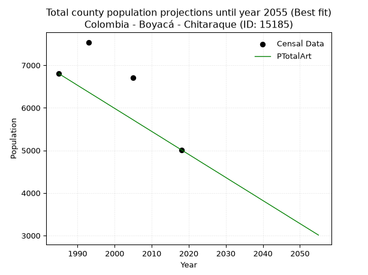
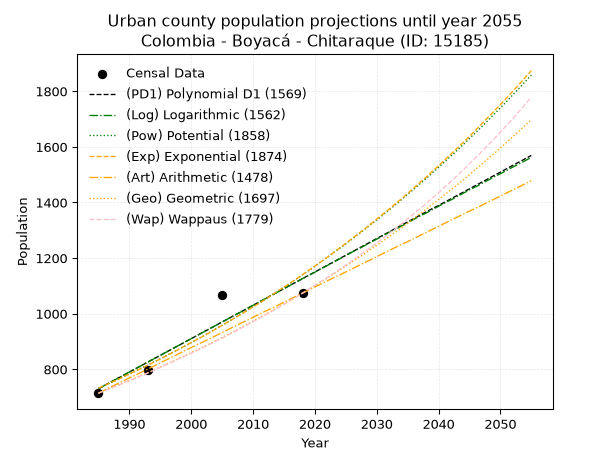
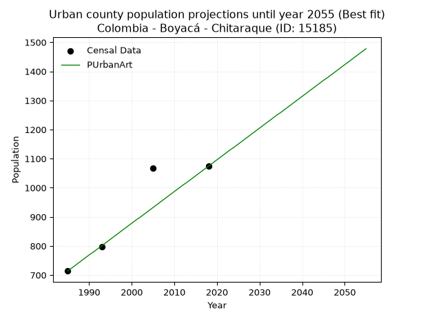
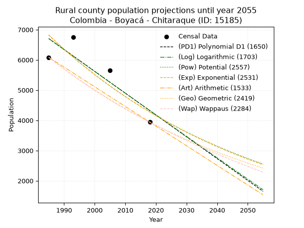
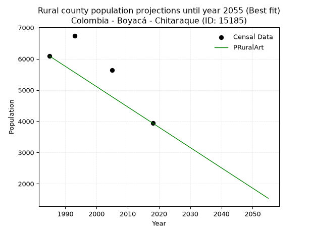

<div align="center">


</div>

# _“Population and Public Services Demand Projections (PPSD) until Year 2050 for Colombia - Boyacá - Chitaraque (ID: 15185)”_
Keywords: `population` `public-service` `projection` `lineal` `polynomial` `logarithmic` `potential` `exponential` `arithmetic` `geometric` `wappaus` `dane` `colombia` `south-america`

PPSD are analytical estimates used by governments and planners to anticipate future changes in population size, age distribution, and the resulting community needs for utilities, healthcare, education, and infrastructure as sizing future water treatment facilities, electrical grids, and road networks based on spatial growth.

> **General running parameters**: • app_version: _v20260806_. • Python version: _3.14.7_. • Pandas version: _3.0.5_. • NumPy version: _2.5.1_. • Creates, save and include plots into reports (create_plot): _False_. • Projection until year: _2050_. • Process polynomial degree 2 and up: _False_. • Process Wappaus: _True_. • Process Wappaus: _True_. • Set negative values to zero: _True_. • Set infinite values to zero: _True_. • Drop dataset notes: _True_. 
<div align="center">

Dynamic map: [:earth_americas:Google](http://maps.google.com/maps?q=6.027425133,-73.4471004) [:earth_americas:OSM](https://www.openstreetmap.org/#map=18/6.027425133/-73.4471004&layers=P) [:earth_americas:Bing](https://www.bing.com/maps?cp=6.027425133~-73.4471004&lvl=18) [:earth_americas:Apple](https://maps.apple.com/frame?center=6.027425133%2C-73.4471004&span=0.003%2C0.006)

</div>


<div align="center">

```geojson
{
  "type": "Feature",
  "geometry": {
    "type": "Point", 
    "coordinates": [-73.4471004, 6.027425133]
  }, 
  "properties": {
    "Name": "Colombia - Boyacá - Chitaraque (ID: 15185)"
  }
}
```

</div>


## 0. Census Data (4 records)

Census data are official statistics collected by a government about the people and housing in a country. They usually include counts of total population, age, sex, race, income, education, and jobs.

📅Global census file: [Population.xlsx](../data/Population.xlsx)

| Source   |   Year |   CountryID | CountryName   |   StateID | StateName   |   CountyID | CountyName   |   PTotal |   PUrban |   PRural |
|:---------|-------:|------------:|:--------------|----------:|:------------|-----------:|:-------------|---------:|---------:|---------:|
| DANE     |   1985 |          57 | Colombia      |        15 | Boyacá      |      15185 | Chitaraque   |     6799 |      714 |     6085 |
| DANE     |   1993 |          57 | Colombia      |        15 | Boyacá      |      15185 | Chitaraque   |     7540 |      797 |     6743 |
| DANE     |   2005 |          57 | Colombia      |        15 | Boyacá      |      15185 | Chitaraque   |     6711 |     1067 |     5644 |
| DANE     |   2018 |          57 | Colombia      |        15 | Boyacá      |      15185 | Chitaraque   |     5013 |     1074 |     3939 |

> 🔥Some records has specific notes about the registered values or the corresponding urban or rural distribution.

## 1. Total

### 1.1. Coefficients and Parameters

* (PD1) Polynomial Deg 1: -60.20353271778294, 126937.86631874533 (lineal)
* (Log) Logarithmic: -120309.62220190495, 920990.1524574856
* (Pow) Potential: -19.963407850542044, 69.70989861549631
* (Exp) Exponential: -0.009989597632860791, 3069829082783.3027
* (Art) Arithmetic: Year diff. 2018 - 1985 = 33, Population diff. 5013 - 6799 = -1786, Annual growth = -54.121212121212125
* (Geo) Geometric: Year diff. 2018 - 1985 = 33, Population diff. 5013 - 6799 = -1786, Annual growth % = -0.00919206813849216
* (Wap) Wappaus: i = -0.9163767714394196, Condition values only valid for < 200)

<sub>
Wappaus condition values: ['-0.00', '-0.92', '-1.83', '-2.75', '-3.67', '-4.58', '-5.50', '-6.41', '-7.33', '-8.25', '-9.16', '-10.08', '-11.00', '-11.91', '-12.83', '-13.75', '-14.66', '-15.58', '-16.49', '-17.41', '-18.33', '-19.24', '-20.16', '-21.08', '-21.99', '-22.91', '-23.83', '-24.74', '-25.66', '-26.57', '-27.49', '-28.41', '-29.32', '-30.24', '-31.16', '-32.07', '-32.99', '-33.91', '-34.82', '-35.74', '-36.66', '-37.57', '-38.49', '-39.40', '-40.32', '-41.24', '-42.15', '-43.07', '-43.99', '-44.90', '-45.82', '-46.74', '-47.65', '-48.57', '-49.48', '-50.40', '-51.32', '-52.23', '-53.15', '-54.07', '-54.98', '-55.90', '-56.82', '-57.73', '-58.65', '-59.56']
</sub>


### 1.2. Projected Dataset

|   Year |   CountyID |   PTotalPD1 |   PTotalLog |   PTotalPow |   PTotalExp |   PTotalArt |   PTotalGeo |   PTotalWap |
|-------:|-----------:|------------:|------------:|------------:|------------:|------------:|------------:|------------:|
|   1985 |      15185 |        7434 |        7434 |        7505 |        7505 |        6799 |        6799 |        6799 |
|   1986 |      15185 |        7374 |        7374 |        7430 |        7430 |        6745 |        6737 |        6737 |
|   1987 |      15185 |        7313 |        7313 |        7356 |        7356 |        6691 |        6675 |        6676 |
|   1988 |      15185 |        7253 |        7252 |        7282 |        7283 |        6637 |        6613 |        6615 |
|   1989 |      15185 |        7193 |        7192 |        7210 |        7211 |        6583 |        6552 |        6554 |
|   1990 |      15185 |        7133 |        7132 |        7138 |        7139 |        6528 |        6492 |        6494 |
|   1991 |      15185 |        7073 |        7071 |        7066 |        7068 |        6474 |        6433 |        6435 |
|   1992 |      15185 |        7012 |        7011 |        6996 |        6998 |        6420 |        6373 |        6376 |
|   1993 |      15185 |        6952 |        6950 |        6926 |        6928 |        6366 |        6315 |        6318 |
|   1994 |      15185 |        6892 |        6890 |        6857 |        6859 |        6312 |        6257 |        6260 |
|   1995 |      15185 |        6832 |        6830 |        6789 |        6791 |        6258 |        6199 |        6203 |
|   1996 |      15185 |        6772 |        6769 |        6721 |        6724 |        6204 |        6142 |        6147 |
|   1997 |      15185 |        6711 |        6709 |        6654 |        6657 |        6150 |        6086 |        6090 |
|   1998 |      15185 |        6651 |        6649 |        6588 |        6591 |        6095 |        6030 |        6035 |
|   1999 |      15185 |        6591 |        6589 |        6523 |        6525 |        6041 |        5974 |        5979 |
|   2000 |      15185 |        6531 |        6528 |        6458 |        6460 |        5987 |        5920 |        5925 |
|   2001 |      15185 |        6471 |        6468 |        6394 |        6396 |        5933 |        5865 |        5870 |
|   2002 |      15185 |        6410 |        6408 |        6330 |        6333 |        5879 |        5811 |        5816 |
|   2003 |      15185 |        6350 |        6348 |        6268 |        6270 |        5825 |        5758 |        5763 |
|   2004 |      15185 |        6290 |        6288 |        6205 |        6207 |        5771 |        5705 |        5710 |
|   2005 |      15185 |        6230 |        6228 |        6144 |        6146 |        5717 |        5652 |        5658 |
|   2006 |      15185 |        6170 |        6168 |        6083 |        6085 |        5662 |        5600 |        5605 |
|   2007 |      15185 |        6109 |        6108 |        6023 |        6024 |        5608 |        5549 |        5554 |
|   2008 |      15185 |        6049 |        6048 |        5963 |        5964 |        5554 |        5498 |        5503 |
|   2009 |      15185 |        5989 |        5988 |        5904 |        5905 |        5500 |        5447 |        5452 |
|   2010 |      15185 |        5929 |        5928 |        5846 |        5846 |        5446 |        5397 |        5401 |
|   2011 |      15185 |        5869 |        5869 |        5788 |        5788 |        5392 |        5348 |        5352 |
|   2012 |      15185 |        5808 |        5809 |        5731 |        5731 |        5338 |        5299 |        5302 |
|   2013 |      15185 |        5748 |        5749 |        5674 |        5674 |        5284 |        5250 |        5253 |
|   2014 |      15185 |        5688 |        5689 |        5618 |        5617 |        5229 |        5202 |        5204 |
|   2015 |      15185 |        5628 |        5629 |        5563 |        5561 |        5175 |        5154 |        5156 |
|   2016 |      15185 |        5568 |        5570 |        5508 |        5506 |        5121 |        5106 |        5108 |
|   2017 |      15185 |        5507 |        5510 |        5454 |        5451 |        5067 |        5060 |        5060 |
|   2018 |      15185 |        5447 |        5451 |        5400 |        5397 |        5013 |        5013 |        5013 |
|   2019 |      15185 |        5387 |        5391 |        5347 |        5344 |        4959 |        4967 |        4966 |
|   2020 |      15185 |        5327 |        5331 |        5294 |        5290 |        4905 |        4921 |        4920 |
|   2021 |      15185 |        5267 |        5272 |        5242 |        5238 |        4851 |        4876 |        4874 |
|   2022 |      15185 |        5206 |        5212 |        5191 |        5186 |        4797 |        4831 |        4828 |
|   2023 |      15185 |        5146 |        5153 |        5140 |        5134 |        4742 |        4787 |        4783 |
|   2024 |      15185 |        5086 |        5093 |        5089 |        5083 |        4688 |        4743 |        4738 |
|   2025 |      15185 |        5026 |        5034 |        5039 |        5033 |        4634 |        4699 |        4693 |
|   2026 |      15185 |        4966 |        4975 |        4990 |        4983 |        4580 |        4656 |        4649 |
|   2027 |      15185 |        4905 |        4915 |        4941 |        4933 |        4526 |        4613 |        4605 |
|   2028 |      15185 |        4845 |        4856 |        4893 |        4884 |        4472 |        4571 |        4561 |
|   2029 |      15185 |        4785 |        4796 |        4845 |        4836 |        4418 |        4529 |        4518 |
|   2030 |      15185 |        4725 |        4737 |        4797 |        4787 |        4364 |        4487 |        4475 |
|   2031 |      15185 |        4664 |        4678 |        4750 |        4740 |        4309 |        4446 |        4432 |
|   2032 |      15185 |        4604 |        4619 |        4704 |        4693 |        4255 |        4405 |        4390 |
|   2033 |      15185 |        4544 |        4560 |        4658 |        4646 |        4201 |        4365 |        4348 |
|   2034 |      15185 |        4484 |        4500 |        4613 |        4600 |        4147 |        4324 |        4306 |
|   2035 |      15185 |        4424 |        4441 |        4567 |        4554 |        4093 |        4285 |        4264 |
|   2036 |      15185 |        4363 |        4382 |        4523 |        4509 |        4039 |        4245 |        4223 |
|   2037 |      15185 |        4303 |        4323 |        4479 |        4464 |        3985 |        4206 |        4183 |
|   2038 |      15185 |        4243 |        4264 |        4435 |        4420 |        3931 |        4168 |        4142 |
|   2039 |      15185 |        4183 |        4205 |        4392 |        4376 |        3876 |        4129 |        4102 |
|   2040 |      15185 |        4123 |        4146 |        4349 |        4332 |        3822 |        4091 |        4062 |
|   2041 |      15185 |        4062 |        4087 |        4307 |        4289 |        3768 |        4054 |        4022 |
|   2042 |      15185 |        4002 |        4028 |        4265 |        4247 |        3714 |        4016 |        3983 |
|   2043 |      15185 |        3942 |        3969 |        4223 |        4204 |        3660 |        3980 |        3944 |
|   2044 |      15185 |        3882 |        3910 |        4182 |        4163 |        3606 |        3943 |        3905 |
|   2045 |      15185 |        3822 |        3851 |        4142 |        4121 |        3552 |        3907 |        3867 |
|   2046 |      15185 |        3761 |        3793 |        4101 |        4080 |        3498 |        3871 |        3829 |
|   2047 |      15185 |        3701 |        3734 |        4062 |        4040 |        3443 |        3835 |        3791 |
|   2048 |      15185 |        3641 |        3675 |        4022 |        4000 |        3389 |        3800 |        3753 |
|   2049 |      15185 |        3581 |        3616 |        3983 |        3960 |        3335 |        3765 |        3716 |
|   2050 |      15185 |        3521 |        3558 |        3945 |        3920 |        3281 |        3730 |        3679 |
<div align="center">

</img>

</div>


### 1.3. Best fit with absolute error and relative error (%)

Relative error puts that difference into context by dividing the absolute error by the true value, creating a unitless ratio or percentage that shows the scale of the mistake.

Absolute and relative error

|   Year | Source   |   CountryID | CountryName   |   StateID | StateName   |   CountyID_x | CountyName   |   PTotal |   PUrban |   PRural |   CountyID_y |   PTotalPD1 |   PTotalLog |   PTotalPow |   PTotalExp |   PTotalArt |   PTotalGeo |   PTotalWap |   PTotalPD1AbsError |   PTotalLogAbsError |   PTotalPowAbsError |   PTotalExpAbsError |   PTotalArtAbsError |   PTotalGeoAbsError |   PTotalWapAbsError |   PTotalPD1RelError |   PTotalLogRelError |   PTotalPowRelError |   PTotalExpRelError |   PTotalArtRelError |   PTotalGeoRelError |   PTotalWapRelError |
|-------:|:---------|------------:|:--------------|----------:|:------------|-------------:|:-------------|---------:|---------:|---------:|-------------:|------------:|------------:|------------:|------------:|------------:|------------:|------------:|--------------------:|--------------------:|--------------------:|--------------------:|--------------------:|--------------------:|--------------------:|--------------------:|--------------------:|--------------------:|--------------------:|--------------------:|--------------------:|--------------------:|
|   1985 | DANE     |          57 | Colombia      |        15 | Boyacá      |        15185 | Chitaraque   |     6799 |      714 |     6085 |        15185 |        7434 |        7434 |        7505 |        7505 |        6799 |        6799 |        6799 |                 635 |                 635 |                 706 |                 706 |                   0 |                   0 |                   0 |             9.33961 |             9.33961 |            10.3839  |            10.3839  |              0      |              0      |              0      |
|   1993 | DANE     |          57 | Colombia      |        15 | Boyacá      |        15185 | Chitaraque   |     7540 |      797 |     6743 |        15185 |        6952 |        6950 |        6926 |        6928 |        6366 |        6315 |        6318 |                 588 |                 590 |                 614 |                 612 |                1174 |                1225 |                1222 |             7.79841 |             7.82493 |             8.14324 |             8.11671 |             15.5703 |             16.2467 |             16.2069 |
|   2005 | DANE     |          57 | Colombia      |        15 | Boyacá      |        15185 | Chitaraque   |     6711 |     1067 |     5644 |        15185 |        6230 |        6228 |        6144 |        6146 |        5717 |        5652 |        5658 |                 481 |                 483 |                 567 |                 565 |                 994 |                1059 |                1053 |             7.16734 |             7.19714 |             8.44882 |             8.41901 |             14.8115 |             15.7801 |             15.6907 |
|   2018 | DANE     |          57 | Colombia      |        15 | Boyacá      |        15185 | Chitaraque   |     5013 |     1074 |     3939 |        15185 |        5447 |        5451 |        5400 |        5397 |        5013 |        5013 |        5013 |                 434 |                 438 |                 387 |                 384 |                   0 |                   0 |                   0 |             8.65749 |             8.73728 |             7.71993 |             7.66008 |              0      |              0      |              0      |

Relative error mean

| Method    |   RelError | Best   |
|:----------|-----------:|:-------|
| PTotalPD1 |    8.24071 |        |
| PTotalLog |    8.27474 |        |
| PTotalPow |    8.67396 |        |
| PTotalExp |    8.64492 |        |
| PTotalArt |    7.59545 | True   |
| PTotalGeo |    8.00669 |        |
| PTotalWap |    7.97439 |        |

💙Best method: _**PTotalArt**_
<div align="center">

</img>

</div>


### 1.4. Fresh water supply demand in liters per capita per day (lpcd)

The fresh water supply demand typically ranges from 100 to 300 liters per capita per day (lpcd) for standard domestic and municipal planning, though absolute survival minimums set by the World Health Organization are as low as 7.5 to 20 liters per day, and total consumption in high-income nations can exceed 400 liters.

> `CZ`: Level in meters above the sea level (masl).<br> `WS`: Fresh water supply demand in liters per capita per day (lpcd or l/h/d).<br> `WSAll`: Zonal fresh water supply demand in liters per second (l/s).<br> `A`: Zonal area in square meters.

Reference values (RAS Colombia)

|    CZ |   WS |
|------:|-----:|
|  1000 |  120 |
|  2000 |  130 |
| 99999 |  140 |

County shapefile geometry properties and water supply values

|   CountyID |     ATotal |   CZTotal |   WSTotal |
|-----------:|-----------:|----------:|----------:|
|      15185 | 1.5827e+08 |   1962.52 |       130 |

Projected values for best method: PTotalArt

|   CountyID |   Year |   PTotalArt |   WSTotal |   WSTotalAll |
|-----------:|-------:|------------:|----------:|-------------:|
|      15185 |   1985 |        6799 |       130 |     10.23    |
|      15185 |   1986 |        6745 |       130 |     10.1487  |
|      15185 |   1987 |        6691 |       130 |     10.0675  |
|      15185 |   1988 |        6637 |       130 |      9.98623 |
|      15185 |   1989 |        6583 |       130 |      9.90498 |
|      15185 |   1990 |        6528 |       130 |      9.82222 |
|      15185 |   1991 |        6474 |       130 |      9.74097 |
|      15185 |   1992 |        6420 |       130 |      9.65972 |
|      15185 |   1993 |        6366 |       130 |      9.57847 |
|      15185 |   1994 |        6312 |       130 |      9.49722 |
|      15185 |   1995 |        6258 |       130 |      9.41597 |
|      15185 |   1996 |        6204 |       130 |      9.33472 |
|      15185 |   1997 |        6150 |       130 |      9.25347 |
|      15185 |   1998 |        6095 |       130 |      9.17072 |
|      15185 |   1999 |        6041 |       130 |      9.08947 |
|      15185 |   2000 |        5987 |       130 |      9.00822 |
|      15185 |   2001 |        5933 |       130 |      8.92697 |
|      15185 |   2002 |        5879 |       130 |      8.84572 |
|      15185 |   2003 |        5825 |       130 |      8.76447 |
|      15185 |   2004 |        5771 |       130 |      8.68322 |
|      15185 |   2005 |        5717 |       130 |      8.60197 |
|      15185 |   2006 |        5662 |       130 |      8.51921 |
|      15185 |   2007 |        5608 |       130 |      8.43796 |
|      15185 |   2008 |        5554 |       130 |      8.35671 |
|      15185 |   2009 |        5500 |       130 |      8.27546 |
|      15185 |   2010 |        5446 |       130 |      8.19421 |
|      15185 |   2011 |        5392 |       130 |      8.11296 |
|      15185 |   2012 |        5338 |       130 |      8.03171 |
|      15185 |   2013 |        5284 |       130 |      7.95046 |
|      15185 |   2014 |        5229 |       130 |      7.86771 |
|      15185 |   2015 |        5175 |       130 |      7.78646 |
|      15185 |   2016 |        5121 |       130 |      7.70521 |
|      15185 |   2017 |        5067 |       130 |      7.62396 |
|      15185 |   2018 |        5013 |       130 |      7.54271 |
|      15185 |   2019 |        4959 |       130 |      7.46146 |
|      15185 |   2020 |        4905 |       130 |      7.38021 |
|      15185 |   2021 |        4851 |       130 |      7.29896 |
|      15185 |   2022 |        4797 |       130 |      7.21771 |
|      15185 |   2023 |        4742 |       130 |      7.13495 |
|      15185 |   2024 |        4688 |       130 |      7.0537  |
|      15185 |   2025 |        4634 |       130 |      6.97245 |
|      15185 |   2026 |        4580 |       130 |      6.8912  |
|      15185 |   2027 |        4526 |       130 |      6.80995 |
|      15185 |   2028 |        4472 |       130 |      6.7287  |
|      15185 |   2029 |        4418 |       130 |      6.64745 |
|      15185 |   2030 |        4364 |       130 |      6.5662  |
|      15185 |   2031 |        4309 |       130 |      6.48345 |
|      15185 |   2032 |        4255 |       130 |      6.4022  |
|      15185 |   2033 |        4201 |       130 |      6.32095 |
|      15185 |   2034 |        4147 |       130 |      6.2397  |
|      15185 |   2035 |        4093 |       130 |      6.15845 |
|      15185 |   2036 |        4039 |       130 |      6.0772  |
|      15185 |   2037 |        3985 |       130 |      5.99595 |
|      15185 |   2038 |        3931 |       130 |      5.9147  |
|      15185 |   2039 |        3876 |       130 |      5.83194 |
|      15185 |   2040 |        3822 |       130 |      5.75069 |
|      15185 |   2041 |        3768 |       130 |      5.66944 |
|      15185 |   2042 |        3714 |       130 |      5.58819 |
|      15185 |   2043 |        3660 |       130 |      5.50694 |
|      15185 |   2044 |        3606 |       130 |      5.42569 |
|      15185 |   2045 |        3552 |       130 |      5.34444 |
|      15185 |   2046 |        3498 |       130 |      5.26319 |
|      15185 |   2047 |        3443 |       130 |      5.18044 |
|      15185 |   2048 |        3389 |       130 |      5.09919 |
|      15185 |   2049 |        3335 |       130 |      5.01794 |
|      15185 |   2050 |        3281 |       130 |      4.93669 |

## 2. Urban

### 2.1. Coefficients and Parameters

* (PD1) Polynomial Deg 1: 11.987153753512624, -23064.30429546363 (lineal)
* (Log) Logarithmic: 24009.29176067869, -181581.81907130816
* (Pow) Potential: 26.881388597492304, -85.78392106011243
* (Exp) Exponential: 0.013420388164186265, 1.9738909639824336e-09
* (Art) Arithmetic: Year diff. 2018 - 1985 = 33, Population diff. 1074 - 714 = 360, Annual growth = 10.909090909090908
* (Geo) Geometric: Year diff. 2018 - 1985 = 33, Population diff. 1074 - 714 = 360, Annual growth % = 0.012448429864475141
* (Wap) Wappaus: i = 1.2202562538133008, Condition values only valid for < 200)

<sub>
Wappaus condition values: ['0.00', '1.22', '2.44', '3.66', '4.88', '6.10', '7.32', '8.54', '9.76', '10.98', '12.20', '13.42', '14.64', '15.86', '17.08', '18.30', '19.52', '20.74', '21.96', '23.18', '24.41', '25.63', '26.85', '28.07', '29.29', '30.51', '31.73', '32.95', '34.17', '35.39', '36.61', '37.83', '39.05', '40.27', '41.49', '42.71', '43.93', '45.15', '46.37', '47.59', '48.81', '50.03', '51.25', '52.47', '53.69', '54.91', '56.13', '57.35', '58.57', '59.79', '61.01', '62.23', '63.45', '64.67', '65.89', '67.11', '68.33', '69.55', '70.77', '72.00', '73.22', '74.44', '75.66', '76.88', '78.10', '79.32']
</sub>


### 2.2. Projected Dataset

|   Year |   CountyID |   PUrbanPD1 |   PUrbanLog |   PUrbanPow |   PUrbanExp |   PUrbanArt |   PUrbanGeo |   PUrbanWap |
|-------:|-----------:|------------:|------------:|------------:|------------:|------------:|------------:|------------:|
|   1985 |      15185 |         730 |         730 |         732 |         732 |         714 |         714 |         714 |
|   1986 |      15185 |         742 |         742 |         742 |         742 |         725 |         723 |         723 |
|   1987 |      15185 |         754 |         754 |         752 |         752 |         736 |         732 |         732 |
|   1988 |      15185 |         766 |         766 |         762 |         762 |         747 |         741 |         741 |
|   1989 |      15185 |         778 |         778 |         773 |         773 |         758 |         750 |         750 |
|   1990 |      15185 |         790 |         790 |         783 |         783 |         769 |         760 |         759 |
|   1991 |      15185 |         802 |         802 |         794 |         794 |         779 |         769 |         768 |
|   1992 |      15185 |         814 |         814 |         805 |         804 |         790 |         779 |         778 |
|   1993 |      15185 |         826 |         826 |         815 |         815 |         801 |         788 |         787 |
|   1994 |      15185 |         838 |         838 |         827 |         826 |         812 |         798 |         797 |
|   1995 |      15185 |         850 |         850 |         838 |         837 |         823 |         808 |         807 |
|   1996 |      15185 |         862 |         862 |         849 |         849 |         834 |         818 |         817 |
|   1997 |      15185 |         874 |         874 |         861 |         860 |         845 |         828 |         827 |
|   1998 |      15185 |         886 |         886 |         872 |         872 |         856 |         839 |         837 |
|   1999 |      15185 |         898 |         898 |         884 |         884 |         867 |         849 |         847 |
|   2000 |      15185 |         910 |         910 |         896 |         896 |         878 |         860 |         858 |
|   2001 |      15185 |         922 |         922 |         908 |         908 |         889 |         870 |         868 |
|   2002 |      15185 |         934 |         934 |         920 |         920 |         899 |         881 |         879 |
|   2003 |      15185 |         946 |         946 |         933 |         932 |         910 |         892 |         890 |
|   2004 |      15185 |         958 |         958 |         946 |         945 |         921 |         903 |         901 |
|   2005 |      15185 |         970 |         970 |         958 |         958 |         932 |         914 |         912 |
|   2006 |      15185 |         982 |         982 |         971 |         971 |         943 |         926 |         924 |
|   2007 |      15185 |         994 |         994 |         984 |         984 |         954 |         937 |         935 |
|   2008 |      15185 |        1006 |        1006 |         998 |         997 |         965 |         949 |         947 |
|   2009 |      15185 |        1018 |        1018 |        1011 |        1011 |         976 |         961 |         959 |
|   2010 |      15185 |        1030 |        1030 |        1025 |        1024 |         987 |         973 |         971 |
|   2011 |      15185 |        1042 |        1042 |        1038 |        1038 |         998 |         985 |         983 |
|   2012 |      15185 |        1054 |        1054 |        1052 |        1052 |        1009 |         997 |         996 |
|   2013 |      15185 |        1066 |        1066 |        1067 |        1066 |        1019 |        1010 |        1008 |
|   2014 |      15185 |        1078 |        1078 |        1081 |        1081 |        1030 |        1022 |        1021 |
|   2015 |      15185 |        1090 |        1090 |        1095 |        1095 |        1041 |        1035 |        1034 |
|   2016 |      15185 |        1102 |        1102 |        1110 |        1110 |        1052 |        1048 |        1047 |
|   2017 |      15185 |        1114 |        1114 |        1125 |        1125 |        1063 |        1061 |        1060 |
|   2018 |      15185 |        1126 |        1126 |        1140 |        1140 |        1074 |        1074 |        1074 |
|   2019 |      15185 |        1138 |        1137 |        1155 |        1156 |        1085 |        1087 |        1088 |
|   2020 |      15185 |        1150 |        1149 |        1171 |        1171 |        1096 |        1101 |        1102 |
|   2021 |      15185 |        1162 |        1161 |        1187 |        1187 |        1107 |        1115 |        1116 |
|   2022 |      15185 |        1174 |        1173 |        1202 |        1203 |        1118 |        1128 |        1130 |
|   2023 |      15185 |        1186 |        1185 |        1219 |        1219 |        1129 |        1143 |        1145 |
|   2024 |      15185 |        1198 |        1197 |        1235 |        1236 |        1139 |        1157 |        1160 |
|   2025 |      15185 |        1210 |        1209 |        1251 |        1253 |        1150 |        1171 |        1175 |
|   2026 |      15185 |        1222 |        1221 |        1268 |        1270 |        1161 |        1186 |        1190 |
|   2027 |      15185 |        1234 |        1232 |        1285 |        1287 |        1172 |        1200 |        1206 |
|   2028 |      15185 |        1246 |        1244 |        1302 |        1304 |        1183 |        1215 |        1222 |
|   2029 |      15185 |        1258 |        1256 |        1320 |        1322 |        1194 |        1231 |        1238 |
|   2030 |      15185 |        1270 |        1268 |        1337 |        1340 |        1205 |        1246 |        1254 |
|   2031 |      15185 |        1282 |        1280 |        1355 |        1358 |        1216 |        1261 |        1271 |
|   2032 |      15185 |        1294 |        1292 |        1373 |        1376 |        1227 |        1277 |        1288 |
|   2033 |      15185 |        1306 |        1303 |        1391 |        1395 |        1238 |        1293 |        1305 |
|   2034 |      15185 |        1318 |        1315 |        1410 |        1413 |        1249 |        1309 |        1323 |
|   2035 |      15185 |        1330 |        1327 |        1429 |        1433 |        1259 |        1325 |        1341 |
|   2036 |      15185 |        1342 |        1339 |        1448 |        1452 |        1270 |        1342 |        1359 |
|   2037 |      15185 |        1354 |        1351 |        1467 |        1472 |        1281 |        1359 |        1378 |
|   2038 |      15185 |        1366 |        1362 |        1486 |        1491 |        1292 |        1376 |        1396 |
|   2039 |      15185 |        1378 |        1374 |        1506 |        1512 |        1303 |        1393 |        1416 |
|   2040 |      15185 |        1389 |        1386 |        1526 |        1532 |        1314 |        1410 |        1435 |
|   2041 |      15185 |        1401 |        1398 |        1546 |        1553 |        1325 |        1428 |        1455 |
|   2042 |      15185 |        1413 |        1409 |        1567 |        1574 |        1336 |        1445 |        1475 |
|   2043 |      15185 |        1425 |        1421 |        1587 |        1595 |        1347 |        1463 |        1496 |
|   2044 |      15185 |        1437 |        1433 |        1608 |        1616 |        1358 |        1481 |        1517 |
|   2045 |      15185 |        1449 |        1445 |        1630 |        1638 |        1369 |        1500 |        1539 |
|   2046 |      15185 |        1461 |        1456 |        1651 |        1660 |        1379 |        1519 |        1561 |
|   2047 |      15185 |        1473 |        1468 |        1673 |        1683 |        1390 |        1538 |        1583 |
|   2048 |      15185 |        1485 |        1480 |        1695 |        1706 |        1401 |        1557 |        1606 |
|   2049 |      15185 |        1497 |        1492 |        1718 |        1729 |        1412 |        1576 |        1629 |
|   2050 |      15185 |        1509 |        1503 |        1740 |        1752 |        1423 |        1596 |        1653 |
<div align="center">

</img>

</div>


### 2.3. Best fit with absolute error and relative error (%)

Relative error puts that difference into context by dividing the absolute error by the true value, creating a unitless ratio or percentage that shows the scale of the mistake.

Absolute and relative error

|   Year | Source   |   CountryID | CountryName   |   StateID | StateName   |   CountyID_x | CountyName   |   PTotal |   PUrban |   PRural |   CountyID_y |   PUrbanPD1 |   PUrbanLog |   PUrbanPow |   PUrbanExp |   PUrbanArt |   PUrbanGeo |   PUrbanWap |   PUrbanPD1AbsError |   PUrbanLogAbsError |   PUrbanPowAbsError |   PUrbanExpAbsError |   PUrbanArtAbsError |   PUrbanGeoAbsError |   PUrbanWapAbsError |   PUrbanPD1RelError |   PUrbanLogRelError |   PUrbanPowRelError |   PUrbanExpRelError |   PUrbanArtRelError |   PUrbanGeoRelError |   PUrbanWapRelError |
|-------:|:---------|------------:|:--------------|----------:|:------------|-------------:|:-------------|---------:|---------:|---------:|-------------:|------------:|------------:|------------:|------------:|------------:|------------:|------------:|--------------------:|--------------------:|--------------------:|--------------------:|--------------------:|--------------------:|--------------------:|--------------------:|--------------------:|--------------------:|--------------------:|--------------------:|--------------------:|--------------------:|
|   1985 | DANE     |          57 | Colombia      |        15 | Boyacá      |        15185 | Chitaraque   |     6799 |      714 |     6085 |        15185 |         730 |         730 |         732 |         732 |         714 |         714 |         714 |                  16 |                  16 |                  18 |                  18 |                   0 |                   0 |                   0 |             2.2409  |             2.2409  |             2.52101 |             2.52101 |            0        |             0       |             0       |
|   1993 | DANE     |          57 | Colombia      |        15 | Boyacá      |        15185 | Chitaraque   |     7540 |      797 |     6743 |        15185 |         826 |         826 |         815 |         815 |         801 |         788 |         787 |                  29 |                  29 |                  18 |                  18 |                   4 |                   9 |                  10 |             3.63864 |             3.63864 |             2.25847 |             2.25847 |            0.501882 |             1.12923 |             1.25471 |
|   2005 | DANE     |          57 | Colombia      |        15 | Boyacá      |        15185 | Chitaraque   |     6711 |     1067 |     5644 |        15185 |         970 |         970 |         958 |         958 |         932 |         914 |         912 |                  97 |                  97 |                 109 |                 109 |                 135 |                 153 |                 155 |             9.09091 |             9.09091 |            10.2156  |            10.2156  |           12.6523   |            14.3393  |            14.5267  |
|   2018 | DANE     |          57 | Colombia      |        15 | Boyacá      |        15185 | Chitaraque   |     5013 |     1074 |     3939 |        15185 |        1126 |        1126 |        1140 |        1140 |        1074 |        1074 |        1074 |                  52 |                  52 |                  66 |                  66 |                   0 |                   0 |                   0 |             4.84171 |             4.84171 |             6.14525 |             6.14525 |            0        |             0       |             0       |

Relative error mean

| Method    |   RelError | Best   |
|:----------|-----------:|:-------|
| PUrbanPD1 |    4.95304 |        |
| PUrbanLog |    4.95304 |        |
| PUrbanPow |    5.28507 |        |
| PUrbanExp |    5.28507 |        |
| PUrbanArt |    3.28854 | True   |
| PUrbanGeo |    3.86713 |        |
| PUrbanWap |    3.94535 |        |

💙Best method: _**PUrbanArt**_
<div align="center">

</img>

</div>


### 2.4. Fresh water supply demand in liters per capita per day (lpcd)

The fresh water supply demand typically ranges from 100 to 300 liters per capita per day (lpcd) for standard domestic and municipal planning, though absolute survival minimums set by the World Health Organization are as low as 7.5 to 20 liters per day, and total consumption in high-income nations can exceed 400 liters.

> `CZ`: Level in meters above the sea level (masl).<br> `WS`: Fresh water supply demand in liters per capita per day (lpcd or l/h/d).<br> `WSAll`: Zonal fresh water supply demand in liters per second (l/s).<br> `A`: Zonal area in square meters.

Reference values (RAS Colombia)

|    CZ |   WS |
|------:|-----:|
|  1000 |  120 |
|  2000 |  130 |
| 99999 |  140 |

County shapefile geometry properties and water supply values

|   CountyID |   AUrban |   CZUrban |   WSUrban |
|-----------:|---------:|----------:|----------:|
|      15185 |   248033 |   1572.79 |       130 |

Projected values for best method: PUrbanArt

|   CountyID |   Year |   PUrbanArt |   WSUrban |   WSUrbanAll |
|-----------:|-------:|------------:|----------:|-------------:|
|      15185 |   1985 |         714 |       130 |      1.07431 |
|      15185 |   1986 |         725 |       130 |      1.09086 |
|      15185 |   1987 |         736 |       130 |      1.10741 |
|      15185 |   1988 |         747 |       130 |      1.12396 |
|      15185 |   1989 |         758 |       130 |      1.14051 |
|      15185 |   1990 |         769 |       130 |      1.15706 |
|      15185 |   1991 |         779 |       130 |      1.17211 |
|      15185 |   1992 |         790 |       130 |      1.18866 |
|      15185 |   1993 |         801 |       130 |      1.20521 |
|      15185 |   1994 |         812 |       130 |      1.22176 |
|      15185 |   1995 |         823 |       130 |      1.23831 |
|      15185 |   1996 |         834 |       130 |      1.25486 |
|      15185 |   1997 |         845 |       130 |      1.27141 |
|      15185 |   1998 |         856 |       130 |      1.28796 |
|      15185 |   1999 |         867 |       130 |      1.30451 |
|      15185 |   2000 |         878 |       130 |      1.32106 |
|      15185 |   2001 |         889 |       130 |      1.33762 |
|      15185 |   2002 |         899 |       130 |      1.35266 |
|      15185 |   2003 |         910 |       130 |      1.36921 |
|      15185 |   2004 |         921 |       130 |      1.38576 |
|      15185 |   2005 |         932 |       130 |      1.40231 |
|      15185 |   2006 |         943 |       130 |      1.41887 |
|      15185 |   2007 |         954 |       130 |      1.43542 |
|      15185 |   2008 |         965 |       130 |      1.45197 |
|      15185 |   2009 |         976 |       130 |      1.46852 |
|      15185 |   2010 |         987 |       130 |      1.48507 |
|      15185 |   2011 |         998 |       130 |      1.50162 |
|      15185 |   2012 |        1009 |       130 |      1.51817 |
|      15185 |   2013 |        1019 |       130 |      1.53322 |
|      15185 |   2014 |        1030 |       130 |      1.54977 |
|      15185 |   2015 |        1041 |       130 |      1.56632 |
|      15185 |   2016 |        1052 |       130 |      1.58287 |
|      15185 |   2017 |        1063 |       130 |      1.59942 |
|      15185 |   2018 |        1074 |       130 |      1.61597 |
|      15185 |   2019 |        1085 |       130 |      1.63252 |
|      15185 |   2020 |        1096 |       130 |      1.64907 |
|      15185 |   2021 |        1107 |       130 |      1.66562 |
|      15185 |   2022 |        1118 |       130 |      1.68218 |
|      15185 |   2023 |        1129 |       130 |      1.69873 |
|      15185 |   2024 |        1139 |       130 |      1.71377 |
|      15185 |   2025 |        1150 |       130 |      1.73032 |
|      15185 |   2026 |        1161 |       130 |      1.74687 |
|      15185 |   2027 |        1172 |       130 |      1.76343 |
|      15185 |   2028 |        1183 |       130 |      1.77998 |
|      15185 |   2029 |        1194 |       130 |      1.79653 |
|      15185 |   2030 |        1205 |       130 |      1.81308 |
|      15185 |   2031 |        1216 |       130 |      1.82963 |
|      15185 |   2032 |        1227 |       130 |      1.84618 |
|      15185 |   2033 |        1238 |       130 |      1.86273 |
|      15185 |   2034 |        1249 |       130 |      1.87928 |
|      15185 |   2035 |        1259 |       130 |      1.89433 |
|      15185 |   2036 |        1270 |       130 |      1.91088 |
|      15185 |   2037 |        1281 |       130 |      1.92743 |
|      15185 |   2038 |        1292 |       130 |      1.94398 |
|      15185 |   2039 |        1303 |       130 |      1.96053 |
|      15185 |   2040 |        1314 |       130 |      1.97708 |
|      15185 |   2041 |        1325 |       130 |      1.99363 |
|      15185 |   2042 |        1336 |       130 |      2.01019 |
|      15185 |   2043 |        1347 |       130 |      2.02674 |
|      15185 |   2044 |        1358 |       130 |      2.04329 |
|      15185 |   2045 |        1369 |       130 |      2.05984 |
|      15185 |   2046 |        1379 |       130 |      2.07488 |
|      15185 |   2047 |        1390 |       130 |      2.09144 |
|      15185 |   2048 |        1401 |       130 |      2.10799 |
|      15185 |   2049 |        1412 |       130 |      2.12454 |
|      15185 |   2050 |        1423 |       130 |      2.14109 |

## 3. Rural

### 3.1. Coefficients and Parameters

* (PD1) Polynomial Deg 1: -72.19068647129554, 150002.1706142089 (lineal)
* (Log) Logarithmic: -144318.91396258358, 1102571.9715287935
* (Pow) Potential: -28.31695571995835, 97.21643999123604
* (Exp) Exponential: -0.014164992720435922, 1.1094710538351104e+16
* (Art) Arithmetic: Year diff. 2018 - 1985 = 33, Population diff. 3939 - 6085 = -2146, Annual growth = -65.03030303030303
* (Geo) Geometric: Year diff. 2018 - 1985 = 33, Population diff. 3939 - 6085 = -2146, Annual growth % = -0.013092323171498776
* (Wap) Wappaus: i = -1.2974920796149847, Condition values only valid for < 200)

<sub>
Wappaus condition values: ['-0.00', '-1.30', '-2.59', '-3.89', '-5.19', '-6.49', '-7.78', '-9.08', '-10.38', '-11.68', '-12.97', '-14.27', '-15.57', '-16.87', '-18.16', '-19.46', '-20.76', '-22.06', '-23.35', '-24.65', '-25.95', '-27.25', '-28.54', '-29.84', '-31.14', '-32.44', '-33.73', '-35.03', '-36.33', '-37.63', '-38.92', '-40.22', '-41.52', '-42.82', '-44.11', '-45.41', '-46.71', '-48.01', '-49.30', '-50.60', '-51.90', '-53.20', '-54.49', '-55.79', '-57.09', '-58.39', '-59.68', '-60.98', '-62.28', '-63.58', '-64.87', '-66.17', '-67.47', '-68.77', '-70.06', '-71.36', '-72.66', '-73.96', '-75.25', '-76.55', '-77.85', '-79.15', '-80.44', '-81.74', '-83.04', '-84.34']
</sub>


### 3.2. Projected Dataset

|   Year |   CountyID |   PRuralPD1 |   PRuralLog |   PRuralPow |   PRuralExp |   PRuralArt |   PRuralGeo |   PRuralWap |
|-------:|-----------:|------------:|------------:|------------:|------------:|------------:|------------:|------------:|
|   1985 |      15185 |        6704 |        6704 |        6822 |        6821 |        6085 |        6085 |        6085 |
|   1986 |      15185 |        6631 |        6632 |        6725 |        6725 |        6020 |        6005 |        6007 |
|   1987 |      15185 |        6559 |        6559 |        6630 |        6630 |        5955 |        5927 |        5929 |
|   1988 |      15185 |        6487 |        6487 |        6536 |        6537 |        5890 |        5849 |        5853 |
|   1989 |      15185 |        6415 |        6414 |        6444 |        6445 |        5825 |        5773 |        5777 |
|   1990 |      15185 |        6343 |        6341 |        6353 |        6354 |        5760 |        5697 |        5703 |
|   1991 |      15185 |        6271 |        6269 |        6263 |        6265 |        5695 |        5622 |        5629 |
|   1992 |      15185 |        6198 |        6196 |        6175 |        6177 |        5630 |        5549 |        5556 |
|   1993 |      15185 |        6126 |        6124 |        6087 |        6090 |        5565 |        5476 |        5485 |
|   1994 |      15185 |        6054 |        6052 |        6002 |        6004 |        5500 |        5404 |        5414 |
|   1995 |      15185 |        5982 |        5979 |        5917 |        5920 |        5435 |        5334 |        5344 |
|   1996 |      15185 |        5910 |        5907 |        5834 |        5837 |        5370 |        5264 |        5274 |
|   1997 |      15185 |        5837 |        5835 |        5751 |        5755 |        5305 |        5195 |        5206 |
|   1998 |      15185 |        5765 |        5762 |        5671 |        5674 |        5240 |        5127 |        5138 |
|   1999 |      15185 |        5693 |        5690 |        5591 |        5594 |        5175 |        5060 |        5072 |
|   2000 |      15185 |        5621 |        5618 |        5512 |        5515 |        5110 |        4994 |        5006 |
|   2001 |      15185 |        5549 |        5546 |        5435 |        5438 |        5045 |        4928 |        4941 |
|   2002 |      15185 |        5476 |        5474 |        5358 |        5361 |        4979 |        4864 |        4876 |
|   2003 |      15185 |        5404 |        5402 |        5283 |        5286 |        4914 |        4800 |        4812 |
|   2004 |      15185 |        5332 |        5330 |        5209 |        5211 |        4849 |        4737 |        4750 |
|   2005 |      15185 |        5260 |        5258 |        5136 |        5138 |        4784 |        4675 |        4687 |
|   2006 |      15185 |        5188 |        5186 |        5064 |        5066 |        4719 |        4614 |        4626 |
|   2007 |      15185 |        5115 |        5114 |        4993 |        4995 |        4654 |        4553 |        4565 |
|   2008 |      15185 |        5043 |        5042 |        4923 |        4924 |        4589 |        4494 |        4505 |
|   2009 |      15185 |        4971 |        4970 |        4854 |        4855 |        4524 |        4435 |        4445 |
|   2010 |      15185 |        4899 |        4898 |        4786 |        4787 |        4459 |        4377 |        4387 |
|   2011 |      15185 |        4827 |        4826 |        4719 |        4719 |        4394 |        4320 |        4329 |
|   2012 |      15185 |        4755 |        4755 |        4653 |        4653 |        4329 |        4263 |        4271 |
|   2013 |      15185 |        4682 |        4683 |        4588 |        4588 |        4264 |        4207 |        4214 |
|   2014 |      15185 |        4610 |        4611 |        4524 |        4523 |        4199 |        4152 |        4158 |
|   2015 |      15185 |        4538 |        4540 |        4461 |        4459 |        4134 |        4098 |        4102 |
|   2016 |      15185 |        4466 |        4468 |        4399 |        4397 |        4069 |        4044 |        4047 |
|   2017 |      15185 |        4394 |        4396 |        4337 |        4335 |        4004 |        3991 |        3993 |
|   2018 |      15185 |        4321 |        4325 |        4277 |        4274 |        3939 |        3939 |        3939 |
|   2019 |      15185 |        4249 |        4253 |        4217 |        4214 |        3874 |        3887 |        3886 |
|   2020 |      15185 |        4177 |        4182 |        4159 |        4155 |        3809 |        3837 |        3833 |
|   2021 |      15185 |        4105 |        4111 |        4101 |        4096 |        3744 |        3786 |        3781 |
|   2022 |      15185 |        4033 |        4039 |        4044 |        4039 |        3679 |        3737 |        3729 |
|   2023 |      15185 |        3960 |        3968 |        3988 |        3982 |        3614 |        3688 |        3678 |
|   2024 |      15185 |        3888 |        3896 |        3932 |        3926 |        3549 |        3640 |        3628 |
|   2025 |      15185 |        3816 |        3825 |        3877 |        3870 |        3484 |        3592 |        3578 |
|   2026 |      15185 |        3744 |        3754 |        3824 |        3816 |        3419 |        3545 |        3528 |
|   2027 |      15185 |        3672 |        3683 |        3771 |        3762 |        3354 |        3498 |        3479 |
|   2028 |      15185 |        3599 |        3612 |        3718 |        3709 |        3289 |        3453 |        3431 |
|   2029 |      15185 |        3527 |        3540 |        3667 |        3657 |        3224 |        3407 |        3383 |
|   2030 |      15185 |        3455 |        3469 |        3616 |        3606 |        3159 |        3363 |        3335 |
|   2031 |      15185 |        3383 |        3398 |        3566 |        3555 |        3094 |        3319 |        3288 |
|   2032 |      15185 |        3311 |        3327 |        3517 |        3505 |        3029 |        3275 |        3241 |
|   2033 |      15185 |        3239 |        3256 |        3468 |        3456 |        2964 |        3232 |        3195 |
|   2034 |      15185 |        3166 |        3185 |        3420 |        3407 |        2899 |        3190 |        3149 |
|   2035 |      15185 |        3094 |        3114 |        3373 |        3359 |        2833 |        3148 |        3104 |
|   2036 |      15185 |        3022 |        3043 |        3326 |        3312 |        2768 |        3107 |        3059 |
|   2037 |      15185 |        2950 |        2972 |        3280 |        3265 |        2703 |        3066 |        3015 |
|   2038 |      15185 |        2878 |        2902 |        3235 |        3220 |        2638 |        3026 |        2971 |
|   2039 |      15185 |        2805 |        2831 |        3190 |        3174 |        2573 |        2987 |        2928 |
|   2040 |      15185 |        2733 |        2760 |        3146 |        3130 |        2508 |        2948 |        2885 |
|   2041 |      15185 |        2661 |        2689 |        3103 |        3086 |        2443 |        2909 |        2842 |
|   2042 |      15185 |        2589 |        2619 |        3060 |        3042 |        2378 |        2871 |        2800 |
|   2043 |      15185 |        2517 |        2548 |        3018 |        2999 |        2313 |        2833 |        2758 |
|   2044 |      15185 |        2444 |        2477 |        2976 |        2957 |        2248 |        2796 |        2716 |
|   2045 |      15185 |        2372 |        2407 |        2936 |        2916 |        2183 |        2760 |        2675 |
|   2046 |      15185 |        2300 |        2336 |        2895 |        2875 |        2118 |        2724 |        2634 |
|   2047 |      15185 |        2228 |        2266 |        2855 |        2834 |        2053 |        2688 |        2594 |
|   2048 |      15185 |        2156 |        2195 |        2816 |        2794 |        1988 |        2653 |        2554 |
|   2049 |      15185 |        2083 |        2125 |        2777 |        2755 |        1923 |        2618 |        2515 |
|   2050 |      15185 |        2011 |        2054 |        2739 |        2716 |        1858 |        2584 |        2475 |
<div align="center">

</img>

</div>


### 3.3. Best fit with absolute error and relative error (%)

Relative error puts that difference into context by dividing the absolute error by the true value, creating a unitless ratio or percentage that shows the scale of the mistake.

Absolute and relative error

|   Year | Source   |   CountryID | CountryName   |   StateID | StateName   |   CountyID_x | CountyName   |   PTotal |   PUrban |   PRural |   CountyID_y |   PRuralPD1 |   PRuralLog |   PRuralPow |   PRuralExp |   PRuralArt |   PRuralGeo |   PRuralWap |   PRuralPD1AbsError |   PRuralLogAbsError |   PRuralPowAbsError |   PRuralExpAbsError |   PRuralArtAbsError |   PRuralGeoAbsError |   PRuralWapAbsError |   PRuralPD1RelError |   PRuralLogRelError |   PRuralPowRelError |   PRuralExpRelError |   PRuralArtRelError |   PRuralGeoRelError |   PRuralWapRelError |
|-------:|:---------|------------:|:--------------|----------:|:------------|-------------:|:-------------|---------:|---------:|---------:|-------------:|------------:|------------:|------------:|------------:|------------:|------------:|------------:|--------------------:|--------------------:|--------------------:|--------------------:|--------------------:|--------------------:|--------------------:|--------------------:|--------------------:|--------------------:|--------------------:|--------------------:|--------------------:|--------------------:|
|   1985 | DANE     |          57 | Colombia      |        15 | Boyacá      |        15185 | Chitaraque   |     6799 |      714 |     6085 |        15185 |        6704 |        6704 |        6822 |        6821 |        6085 |        6085 |        6085 |                 619 |                 619 |                 737 |                 736 |                   0 |                   0 |                   0 |            10.1726  |            10.1726  |            12.1118  |            12.0953  |              0      |              0      |              0      |
|   1993 | DANE     |          57 | Colombia      |        15 | Boyacá      |        15185 | Chitaraque   |     7540 |      797 |     6743 |        15185 |        6126 |        6124 |        6087 |        6090 |        5565 |        5476 |        5485 |                 617 |                 619 |                 656 |                 653 |                1178 |                1267 |                1258 |             9.15023 |             9.17989 |             9.72861 |             9.68412 |             17.47   |             18.7899 |             18.6564 |
|   2005 | DANE     |          57 | Colombia      |        15 | Boyacá      |        15185 | Chitaraque   |     6711 |     1067 |     5644 |        15185 |        5260 |        5258 |        5136 |        5138 |        4784 |        4675 |        4687 |                 384 |                 386 |                 508 |                 506 |                 860 |                 969 |                 957 |             6.80369 |             6.83912 |             9.00071 |             8.96527 |             15.2374 |             17.1687 |             16.9561 |
|   2018 | DANE     |          57 | Colombia      |        15 | Boyacá      |        15185 | Chitaraque   |     5013 |     1074 |     3939 |        15185 |        4321 |        4325 |        4277 |        4274 |        3939 |        3939 |        3939 |                 382 |                 386 |                 338 |                 335 |                   0 |                   0 |                   0 |             9.69789 |             9.79944 |             8.58086 |             8.5047  |              0      |              0      |              0      |

Relative error mean

| Method    |   RelError | Best   |
|:----------|-----------:|:-------|
| PRuralPD1 |    8.95609 |        |
| PRuralLog |    8.99775 |        |
| PRuralPow |    9.85548 |        |
| PRuralExp |    9.81235 |        |
| PRuralArt |    8.17685 | True   |
| PRuralGeo |    8.98963 |        |
| PRuralWap |    8.90311 |        |

💙Best method: _**PRuralArt**_
<div align="center">

</img>

</div>


### 3.4. Fresh water supply demand in liters per capita per day (lpcd)

The fresh water supply demand typically ranges from 100 to 300 liters per capita per day (lpcd) for standard domestic and municipal planning, though absolute survival minimums set by the World Health Organization are as low as 7.5 to 20 liters per day, and total consumption in high-income nations can exceed 400 liters.

> `CZ`: Level in meters above the sea level (masl).<br> `WS`: Fresh water supply demand in liters per capita per day (lpcd or l/h/d).<br> `WSAll`: Zonal fresh water supply demand in liters per second (l/s).<br> `A`: Zonal area in square meters.

Reference values (RAS Colombia)

|    CZ |   WS |
|------:|-----:|
|  1000 |  120 |
|  2000 |  130 |
| 99999 |  140 |

County shapefile geometry properties and water supply values

|   CountyID |      ARural |   CZRural |   WSRural |
|-----------:|------------:|----------:|----------:|
|      15185 | 1.58022e+08 |    1963.1 |       130 |

Projected values for best method: PRuralArt

|   CountyID |   Year |   PRuralArt |   WSRural |   WSRuralAll |
|-----------:|-------:|------------:|----------:|-------------:|
|      15185 |   1985 |        6085 |       130 |      9.15567 |
|      15185 |   1986 |        6020 |       130 |      9.05787 |
|      15185 |   1987 |        5955 |       130 |      8.96007 |
|      15185 |   1988 |        5890 |       130 |      8.86227 |
|      15185 |   1989 |        5825 |       130 |      8.76447 |
|      15185 |   1990 |        5760 |       130 |      8.66667 |
|      15185 |   1991 |        5695 |       130 |      8.56887 |
|      15185 |   1992 |        5630 |       130 |      8.47106 |
|      15185 |   1993 |        5565 |       130 |      8.37326 |
|      15185 |   1994 |        5500 |       130 |      8.27546 |
|      15185 |   1995 |        5435 |       130 |      8.17766 |
|      15185 |   1996 |        5370 |       130 |      8.07986 |
|      15185 |   1997 |        5305 |       130 |      7.98206 |
|      15185 |   1998 |        5240 |       130 |      7.88426 |
|      15185 |   1999 |        5175 |       130 |      7.78646 |
|      15185 |   2000 |        5110 |       130 |      7.68866 |
|      15185 |   2001 |        5045 |       130 |      7.59086 |
|      15185 |   2002 |        4979 |       130 |      7.49155 |
|      15185 |   2003 |        4914 |       130 |      7.39375 |
|      15185 |   2004 |        4849 |       130 |      7.29595 |
|      15185 |   2005 |        4784 |       130 |      7.19815 |
|      15185 |   2006 |        4719 |       130 |      7.10035 |
|      15185 |   2007 |        4654 |       130 |      7.00255 |
|      15185 |   2008 |        4589 |       130 |      6.90475 |
|      15185 |   2009 |        4524 |       130 |      6.80694 |
|      15185 |   2010 |        4459 |       130 |      6.70914 |
|      15185 |   2011 |        4394 |       130 |      6.61134 |
|      15185 |   2012 |        4329 |       130 |      6.51354 |
|      15185 |   2013 |        4264 |       130 |      6.41574 |
|      15185 |   2014 |        4199 |       130 |      6.31794 |
|      15185 |   2015 |        4134 |       130 |      6.22014 |
|      15185 |   2016 |        4069 |       130 |      6.12234 |
|      15185 |   2017 |        4004 |       130 |      6.02454 |
|      15185 |   2018 |        3939 |       130 |      5.92674 |
|      15185 |   2019 |        3874 |       130 |      5.82894 |
|      15185 |   2020 |        3809 |       130 |      5.73113 |
|      15185 |   2021 |        3744 |       130 |      5.63333 |
|      15185 |   2022 |        3679 |       130 |      5.53553 |
|      15185 |   2023 |        3614 |       130 |      5.43773 |
|      15185 |   2024 |        3549 |       130 |      5.33993 |
|      15185 |   2025 |        3484 |       130 |      5.24213 |
|      15185 |   2026 |        3419 |       130 |      5.14433 |
|      15185 |   2027 |        3354 |       130 |      5.04653 |
|      15185 |   2028 |        3289 |       130 |      4.94873 |
|      15185 |   2029 |        3224 |       130 |      4.85093 |
|      15185 |   2030 |        3159 |       130 |      4.75312 |
|      15185 |   2031 |        3094 |       130 |      4.65532 |
|      15185 |   2032 |        3029 |       130 |      4.55752 |
|      15185 |   2033 |        2964 |       130 |      4.45972 |
|      15185 |   2034 |        2899 |       130 |      4.36192 |
|      15185 |   2035 |        2833 |       130 |      4.26262 |
|      15185 |   2036 |        2768 |       130 |      4.16481 |
|      15185 |   2037 |        2703 |       130 |      4.06701 |
|      15185 |   2038 |        2638 |       130 |      3.96921 |
|      15185 |   2039 |        2573 |       130 |      3.87141 |
|      15185 |   2040 |        2508 |       130 |      3.77361 |
|      15185 |   2041 |        2443 |       130 |      3.67581 |
|      15185 |   2042 |        2378 |       130 |      3.57801 |
|      15185 |   2043 |        2313 |       130 |      3.48021 |
|      15185 |   2044 |        2248 |       130 |      3.38241 |
|      15185 |   2045 |        2183 |       130 |      3.28461 |
|      15185 |   2046 |        2118 |       130 |      3.18681 |
|      15185 |   2047 |        2053 |       130 |      3.089   |
|      15185 |   2048 |        1988 |       130 |      2.9912  |
|      15185 |   2049 |        1923 |       130 |      2.8934  |
|      15185 |   2050 |        1858 |       130 |      2.7956  |

<div align="center"><br><sub>Share this research</sub></div><br>

<sub>**APPS & TOOLS & CONTENT DISCLAIMER**: • NO WARRANTY - This content and software is provided by <a href="https://github.com/rcfdtools" target="_blank">github.com/rcfdtools</a> "as is", without any express or implied warranty, including warranties of merchantability, fitness for a particular purpose, or non-infringement. There is no guarantee that the software will be error-free or operate without interruption. • LIMITATION OF LIABILITY - Neither the authors nor copyright holders will be liable for claims or damages arising from the software or its use. You are responsible for determining if the software is appropriate for your use and assume all associated risks, including errors, legal compliance, and data loss. • NO PROFESSIONAL ADVICE - The software provides general information and does not offer professional advice. It should not replace consultation with professional advisors. [Clauses and global license for rcfdtools use.](https://github.com/rcfdtools/rcfdtools/blob/main/LICENSE.md)</sub>