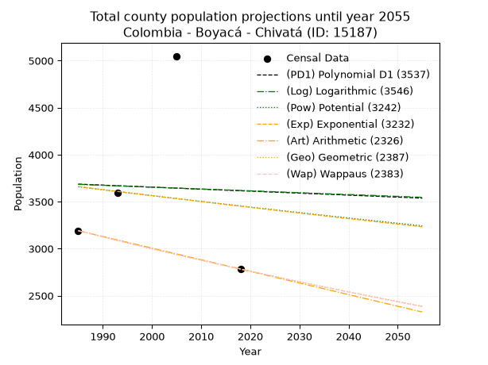
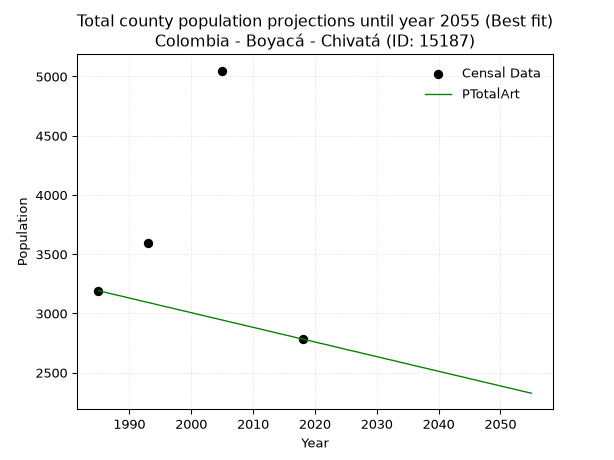
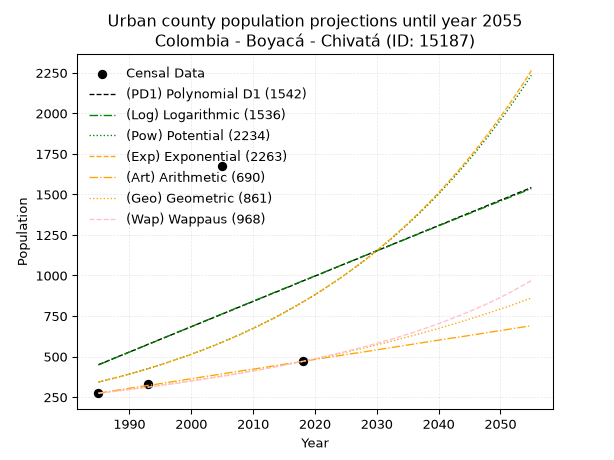
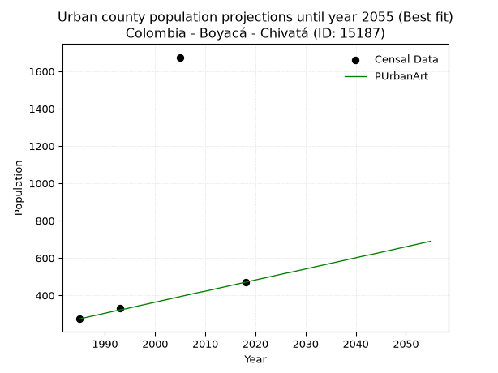
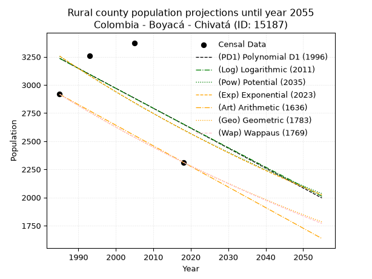
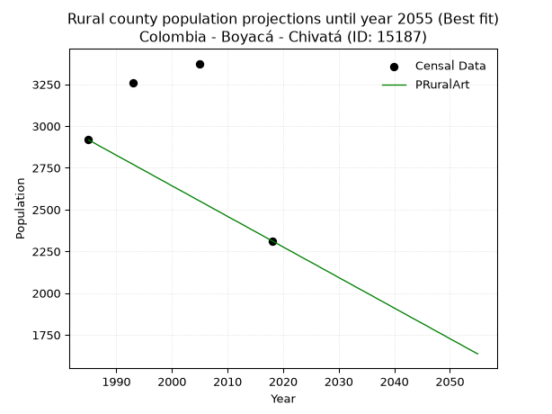

<div align="center">


</div>

# _“Population and Public Services Demand Projections (PPSD) until Year 2050 for Colombia - Boyacá - Chivatá (ID: 15187)”_
Keywords: `population` `public-service` `projection` `lineal` `polynomial` `logarithmic` `potential` `exponential` `arithmetic` `geometric` `wappaus` `dane` `colombia` `south-america`

PPSD are analytical estimates used by governments and planners to anticipate future changes in population size, age distribution, and the resulting community needs for utilities, healthcare, education, and infrastructure as sizing future water treatment facilities, electrical grids, and road networks based on spatial growth.

> **General running parameters**: • app_version: _v20260806_. • Python version: _3.14.7_. • Pandas version: _3.0.5_. • NumPy version: _2.5.1_. • Creates, save and include plots into reports (create_plot): _False_. • Projection until year: _2050_. • Process polynomial degree 2 and up: _False_. • Process Wappaus: _True_. • Process Wappaus: _True_. • Set negative values to zero: _True_. • Set infinite values to zero: _True_. • Drop dataset notes: _True_. 
<div align="center">

Dynamic map: [:earth_americas:Google](http://maps.google.com/maps?q=5.558948844,-73.2825294) [:earth_americas:OSM](https://www.openstreetmap.org/#map=18/5.558948844/-73.2825294&layers=P) [:earth_americas:Bing](https://www.bing.com/maps?cp=5.558948844~-73.2825294&lvl=18) [:earth_americas:Apple](https://maps.apple.com/frame?center=5.558948844%2C-73.2825294&span=0.003%2C0.006)

</div>


<div align="center">

```geojson
{
  "type": "Feature",
  "geometry": {
    "type": "Point", 
    "coordinates": [-73.2825294, 5.558948844]
  }, 
  "properties": {
    "Name": "Colombia - Boyacá - Chivatá (ID: 15187)"
  }
}
```

</div>


## 0. Census Data (4 records)

Census data are official statistics collected by a government about the people and housing in a country. They usually include counts of total population, age, sex, race, income, education, and jobs.

📅Global census file: [Population.xlsx](../data/Population.xlsx)

| Source   |   Year |   CountryID | CountryName   |   StateID | StateName   |   CountyID | CountyName   |   PTotal |   PUrban |   PRural |
|:---------|-------:|------------:|:--------------|----------:|:------------|-----------:|:-------------|---------:|---------:|---------:|
| DANE     |   1985 |          57 | Colombia      |        15 | Boyacá      |      15187 | Chivatá      |     3191 |      274 |     2917 |
| DANE     |   1993 |          57 | Colombia      |        15 | Boyacá      |      15187 | Chivatá      |     3592 |      332 |     3260 |
| DANE     |   2005 |          57 | Colombia      |        15 | Boyacá      |      15187 | Chivatá      |     5049 |     1675 |     3374 |
| DANE     |   2018 |          57 | Colombia      |        15 | Boyacá      |      15187 | Chivatá      |     2783 |      470 |     2313 |

> 🔥Some records could had specific notes about the registered values or the corresponding urban or rural distribution.

📅   [RUPS](https://www.datos.gov.co/Hacienda-y-Cr-dito-P-blico/Registro-nico-de-Prestadores-de-Servicios-P-blicos/4qkq-csdn/about_data) - Local public utility companies: [RUPS.csv](../data/RUPS.xlsx)

 | SERVICIO       | ESTADO    | NOMBRE               | NIT         | DEPARTAMENTO_DOMICILIO   | MUNICIPIO_DOMICILIO   | DIRECCION   |   TELEFONO | EMAIL                          | TIPO_INSCRIPCION    | REPRESENTANTE_LEGAL         | TIPO_PRESTADOR                 | CLASIFICACION                 |
|:---------------|:----------|:---------------------|:------------|:-------------------------|:----------------------|:------------|-----------:|:-------------------------------|:--------------------|:----------------------------|:-------------------------------|:------------------------------|
| ACUEDUCTO      | OPERATIVA | MUNICIPIO DE CHIVATA | 800014989-1 | BOYACA                   | CHIVATA               | CALLE4 3 36 |    7425859 | alcaldia@chivata-boyaca.gov.co | Registro por la ESP | RAFAEL ANTONIO FONSECA CELY | MUNICIPIO (PRESTACIÓN DIRECTA) | MENOR O IGUAL A 2500 USUARIOS |
| ALCANTARILLADO | OPERATIVA | MUNICIPIO DE CHIVATA | 800014989-1 | BOYACA                   | CHIVATA               | CALLE4 3 36 |    7425859 | alcaldia@chivata-boyaca.gov.co | Registro por la ESP | RAFAEL ANTONIO FONSECA CELY | MUNICIPIO (PRESTACIÓN DIRECTA) | MENOR O IGUAL A 2500 USUARIOS |

## 1. Total

### 1.1. Coefficients and Parameters

* (PD1) Polynomial Deg 1: -2.1256523484531225, 7905.586109993358 (lineal)
* (Log) Logarithmic: -3974.103842489812, 33860.9451532346
* (Pow) Potential: -3.4841359597321246, 15.053142457371116
* (Exp) Exponential: -0.0017775003667422345, 124696.88901439148
* (Art) Arithmetic: Year diff. 2018 - 1985 = 33, Population diff. 2783 - 3191 = -408, Annual growth = -12.363636363636363
* (Geo) Geometric: Year diff. 2018 - 1985 = 33, Population diff. 2783 - 3191 = -408, Annual growth % = -0.004137020816478265
* (Wap) Wappaus: i = -0.4139148431080135, Condition values only valid for < 200)

<sub>
Wappaus condition values: ['-0.00', '-0.41', '-0.83', '-1.24', '-1.66', '-2.07', '-2.48', '-2.90', '-3.31', '-3.73', '-4.14', '-4.55', '-4.97', '-5.38', '-5.79', '-6.21', '-6.62', '-7.04', '-7.45', '-7.86', '-8.28', '-8.69', '-9.11', '-9.52', '-9.93', '-10.35', '-10.76', '-11.18', '-11.59', '-12.00', '-12.42', '-12.83', '-13.25', '-13.66', '-14.07', '-14.49', '-14.90', '-15.31', '-15.73', '-16.14', '-16.56', '-16.97', '-17.38', '-17.80', '-18.21', '-18.63', '-19.04', '-19.45', '-19.87', '-20.28', '-20.70', '-21.11', '-21.52', '-21.94', '-22.35', '-22.77', '-23.18', '-23.59', '-24.01', '-24.42', '-24.83', '-25.25', '-25.66', '-26.08', '-26.49', '-26.90']
</sub>


### 1.2. Projected Dataset

|   Year |   CountyID |   PTotalPD1 |   PTotalLog |   PTotalPow |   PTotalExp |   PTotalArt |   PTotalGeo |   PTotalWap |
|-------:|-----------:|------------:|------------:|------------:|------------:|------------:|------------:|------------:|
|   1985 |      15187 |        3686 |        3684 |        3658 |        3660 |        3191 |        3191 |        3191 |
|   1986 |      15187 |        3684 |        3682 |        3652 |        3654 |        3179 |        3178 |        3178 |
|   1987 |      15187 |        3682 |        3680 |        3646 |        3647 |        3166 |        3165 |        3165 |
|   1988 |      15187 |        3680 |        3678 |        3639 |        3641 |        3154 |        3152 |        3152 |
|   1989 |      15187 |        3678 |        3676 |        3633 |        3634 |        3142 |        3139 |        3139 |
|   1990 |      15187 |        3676 |        3674 |        3627 |        3628 |        3129 |        3126 |        3126 |
|   1991 |      15187 |        3673 |        3672 |        3620 |        3621 |        3117 |        3113 |        3113 |
|   1992 |      15187 |        3671 |        3670 |        3614 |        3615 |        3104 |        3100 |        3100 |
|   1993 |      15187 |        3669 |        3668 |        3608 |        3609 |        3092 |        3087 |        3087 |
|   1994 |      15187 |        3667 |        3666 |        3601 |        3602 |        3080 |        3074 |        3074 |
|   1995 |      15187 |        3665 |        3664 |        3595 |        3596 |        3067 |        3061 |        3062 |
|   1996 |      15187 |        3663 |        3662 |        3589 |        3589 |        3055 |        3049 |        3049 |
|   1997 |      15187 |        3661 |        3660 |        3582 |        3583 |        3043 |        3036 |        3036 |
|   1998 |      15187 |        3659 |        3658 |        3576 |        3577 |        3030 |        3024 |        3024 |
|   1999 |      15187 |        3656 |        3656 |        3570 |        3570 |        3018 |        3011 |        3011 |
|   2000 |      15187 |        3654 |        3654 |        3564 |        3564 |        3006 |        2999 |        2999 |
|   2001 |      15187 |        3652 |        3652 |        3558 |        3558 |        2993 |        2986 |        2986 |
|   2002 |      15187 |        3650 |        3650 |        3551 |        3551 |        2981 |        2974 |        2974 |
|   2003 |      15187 |        3648 |        3648 |        3545 |        3545 |        2968 |        2962 |        2962 |
|   2004 |      15187 |        3646 |        3646 |        3539 |        3539 |        2956 |        2949 |        2950 |
|   2005 |      15187 |        3644 |        3644 |        3533 |        3532 |        2944 |        2937 |        2937 |
|   2006 |      15187 |        3642 |        3642 |        3527 |        3526 |        2931 |        2925 |        2925 |
|   2007 |      15187 |        3639 |        3640 |        3521 |        3520 |        2919 |        2913 |        2913 |
|   2008 |      15187 |        3637 |        3638 |        3515 |        3514 |        2907 |        2901 |        2901 |
|   2009 |      15187 |        3635 |        3636 |        3508 |        3507 |        2894 |        2889 |        2889 |
|   2010 |      15187 |        3633 |        3634 |        3502 |        3501 |        2882 |        2877 |        2877 |
|   2011 |      15187 |        3631 |        3632 |        3496 |        3495 |        2870 |        2865 |        2865 |
|   2012 |      15187 |        3629 |        3630 |        3490 |        3489 |        2857 |        2853 |        2853 |
|   2013 |      15187 |        3627 |        3628 |        3484 |        3483 |        2845 |        2841 |        2841 |
|   2014 |      15187 |        3625 |        3626 |        3478 |        3476 |        2832 |        2830 |        2830 |
|   2015 |      15187 |        3622 |        3624 |        3472 |        3470 |        2820 |        2818 |        2818 |
|   2016 |      15187 |        3620 |        3623 |        3466 |        3464 |        2808 |        2806 |        2806 |
|   2017 |      15187 |        3618 |        3621 |        3460 |        3458 |        2795 |        2795 |        2795 |
|   2018 |      15187 |        3616 |        3619 |        3454 |        3452 |        2783 |        2783 |        2783 |
|   2019 |      15187 |        3614 |        3617 |        3448 |        3446 |        2771 |        2771 |        2771 |
|   2020 |      15187 |        3612 |        3615 |        3442 |        3440 |        2758 |        2760 |        2760 |
|   2021 |      15187 |        3610 |        3613 |        3436 |        3433 |        2746 |        2749 |        2748 |
|   2022 |      15187 |        3608 |        3611 |        3430 |        3427 |        2734 |        2737 |        2737 |
|   2023 |      15187 |        3605 |        3609 |        3425 |        3421 |        2721 |        2726 |        2726 |
|   2024 |      15187 |        3603 |        3607 |        3419 |        3415 |        2709 |        2715 |        2714 |
|   2025 |      15187 |        3601 |        3605 |        3413 |        3409 |        2696 |        2703 |        2703 |
|   2026 |      15187 |        3599 |        3603 |        3407 |        3403 |        2684 |        2692 |        2692 |
|   2027 |      15187 |        3597 |        3601 |        3401 |        3397 |        2672 |        2681 |        2681 |
|   2028 |      15187 |        3595 |        3599 |        3395 |        3391 |        2659 |        2670 |        2669 |
|   2029 |      15187 |        3593 |        3597 |        3389 |        3385 |        2647 |        2659 |        2658 |
|   2030 |      15187 |        3591 |        3595 |        3384 |        3379 |        2635 |        2648 |        2647 |
|   2031 |      15187 |        3588 |        3593 |        3378 |        3373 |        2622 |        2637 |        2636 |
|   2032 |      15187 |        3586 |        3591 |        3372 |        3367 |        2610 |        2626 |        2625 |
|   2033 |      15187 |        3584 |        3589 |        3366 |        3361 |        2598 |        2615 |        2614 |
|   2034 |      15187 |        3582 |        3587 |        3360 |        3355 |        2585 |        2604 |        2603 |
|   2035 |      15187 |        3580 |        3585 |        3355 |        3349 |        2573 |        2594 |        2593 |
|   2036 |      15187 |        3578 |        3583 |        3349 |        3343 |        2560 |        2583 |        2582 |
|   2037 |      15187 |        3576 |        3581 |        3343 |        3337 |        2548 |        2572 |        2571 |
|   2038 |      15187 |        3574 |        3579 |        3338 |        3331 |        2536 |        2562 |        2560 |
|   2039 |      15187 |        3571 |        3577 |        3332 |        3325 |        2523 |        2551 |        2549 |
|   2040 |      15187 |        3569 |        3575 |        3326 |        3319 |        2511 |        2540 |        2539 |
|   2041 |      15187 |        3567 |        3574 |        3320 |        3314 |        2499 |        2530 |        2528 |
|   2042 |      15187 |        3565 |        3572 |        3315 |        3308 |        2486 |        2519 |        2518 |
|   2043 |      15187 |        3563 |        3570 |        3309 |        3302 |        2474 |        2509 |        2507 |
|   2044 |      15187 |        3561 |        3568 |        3304 |        3296 |        2462 |        2499 |        2497 |
|   2045 |      15187 |        3559 |        3566 |        3298 |        3290 |        2449 |        2488 |        2486 |
|   2046 |      15187 |        3557 |        3564 |        3292 |        3284 |        2437 |        2478 |        2476 |
|   2047 |      15187 |        3554 |        3562 |        3287 |        3278 |        2424 |        2468 |        2465 |
|   2048 |      15187 |        3552 |        3560 |        3281 |        3273 |        2412 |        2458 |        2455 |
|   2049 |      15187 |        3550 |        3558 |        3276 |        3267 |        2400 |        2447 |        2445 |
|   2050 |      15187 |        3548 |        3556 |        3270 |        3261 |        2387 |        2437 |        2434 |
<div align="center">

</img>

</div>


### 1.3. Best fit with absolute and relative error (%)

Relative error puts that difference into context by dividing the absolute error by the true value, creating a unitless ratio or percentage that shows the scale of the mistake.

Absolute and relative error

|   Year | Source   |   CountryID | CountryName   |   StateID | StateName   |   CountyID_x | CountyName   |   PTotal |   PUrban |   PRural |   CountyID_y |   PTotalPD1 |   PTotalLog |   PTotalPow |   PTotalExp |   PTotalArt |   PTotalGeo |   PTotalWap |   PTotalPD1AbsError |   PTotalLogAbsError |   PTotalPowAbsError |   PTotalExpAbsError |   PTotalArtAbsError |   PTotalGeoAbsError |   PTotalWapAbsError |   PTotalPD1RelError |   PTotalLogRelError |   PTotalPowRelError |   PTotalExpRelError |   PTotalArtRelError |   PTotalGeoRelError |   PTotalWapRelError |
|-------:|:---------|------------:|:--------------|----------:|:------------|-------------:|:-------------|---------:|---------:|---------:|-------------:|------------:|------------:|------------:|------------:|------------:|------------:|------------:|--------------------:|--------------------:|--------------------:|--------------------:|--------------------:|--------------------:|--------------------:|--------------------:|--------------------:|--------------------:|--------------------:|--------------------:|--------------------:|--------------------:|
|   1985 | DANE     |          57 | Colombia      |        15 | Boyacá      |        15187 | Chivatá      |     3191 |      274 |     2917 |        15187 |        3686 |        3684 |        3658 |        3660 |        3191 |        3191 |        3191 |                 495 |                 493 |                 467 |                 469 |                   0 |                   0 |                   0 |            15.5124  |            15.4497  |           14.6349   |           14.6976   |              0      |              0      |              0      |
|   1993 | DANE     |          57 | Colombia      |        15 | Boyacá      |        15187 | Chivatá      |     3592 |      332 |     3260 |        15187 |        3669 |        3668 |        3608 |        3609 |        3092 |        3087 |        3087 |                  77 |                  76 |                  16 |                  17 |                 500 |                 505 |                 505 |             2.14365 |             2.11581 |            0.445434 |            0.473274 |             13.9198 |             14.059  |             14.059  |
|   2005 | DANE     |          57 | Colombia      |        15 | Boyacá      |        15187 | Chivatá      |     5049 |     1675 |     3374 |        15187 |        3644 |        3644 |        3533 |        3532 |        2944 |        2937 |        2937 |                1405 |                1405 |                1516 |                1517 |                2105 |                2112 |                2112 |            27.8273  |            27.8273  |           30.0257   |           30.0456   |             41.6914 |             41.8301 |             41.8301 |
|   2018 | DANE     |          57 | Colombia      |        15 | Boyacá      |        15187 | Chivatá      |     2783 |      470 |     2313 |        15187 |        3616 |        3619 |        3454 |        3452 |        2783 |        2783 |        2783 |                 833 |                 836 |                 671 |                 669 |                   0 |                   0 |                   0 |            29.9317  |            30.0395  |           24.1107   |           24.0388   |              0      |              0      |              0      |

Relative error mean

| Method    |   RelError | Best   |
|:----------|-----------:|:-------|
| PTotalPD1 |    18.8538 |        |
| PTotalLog |    18.8581 |        |
| PTotalPow |    17.3042 |        |
| PTotalExp |    17.3138 |        |
| PTotalArt |    13.9028 | True   |
| PTotalGeo |    13.9723 |        |
| PTotalWap |    13.9723 |        |

💙Best method: _**PTotalArt**_
<div align="center">

</img>

</div>


### 1.4. Fresh water supply demand in liters per capita per day (lpcd)

The fresh water supply demand typically ranges from 100 to 300 liters per capita per day (lpcd) for standard domestic and municipal planning, though absolute survival minimums set by the World Health Organization are as low as 7.5 to 20 liters per day, and total consumption in high-income nations can exceed 400 liters.

> `CZ`: Level in meters above the sea level (masl)<br> `WS`: Fresh water supply demand in liters per capita per day (lpcd or l/h/d)<br> `WSAll`: Zonal fresh water supply demand in liters per second (l/s)<br> `A`: Zonal area in square meters<br> `DP`: Population density (people/hectare or p/ha)

Reference values (RAS Colombia)

|    CZ |   WS |
|------:|-----:|
|  1000 |  120 |
|  2000 |  130 |
| 99999 |  140 |

County shapefile geometry properties and water supply values

|   CountyID |      ATotal |   CZTotal |   WSTotal |
|-----------:|------------:|----------:|----------:|
|      15187 | 4.94442e+07 |   2870.59 |       140 |

Projected values for best method: PTotalArt

|   CountyID |   Year |   PTotalArt |   DPTotal |   WSTotal |   WSTotalAll |
|-----------:|-------:|------------:|----------:|----------:|-------------:|
|      15187 |   1985 |        3191 |      0.65 |       140 |      5.1706  |
|      15187 |   1986 |        3179 |      0.64 |       140 |      5.15116 |
|      15187 |   1987 |        3166 |      0.64 |       140 |      5.13009 |
|      15187 |   1988 |        3154 |      0.64 |       140 |      5.11065 |
|      15187 |   1989 |        3142 |      0.64 |       140 |      5.0912  |
|      15187 |   1990 |        3129 |      0.63 |       140 |      5.07014 |
|      15187 |   1991 |        3117 |      0.63 |       140 |      5.05069 |
|      15187 |   1992 |        3104 |      0.63 |       140 |      5.02963 |
|      15187 |   1993 |        3092 |      0.63 |       140 |      5.01019 |
|      15187 |   1994 |        3080 |      0.62 |       140 |      4.99074 |
|      15187 |   1995 |        3067 |      0.62 |       140 |      4.96968 |
|      15187 |   1996 |        3055 |      0.62 |       140 |      4.95023 |
|      15187 |   1997 |        3043 |      0.62 |       140 |      4.93079 |
|      15187 |   1998 |        3030 |      0.61 |       140 |      4.90972 |
|      15187 |   1999 |        3018 |      0.61 |       140 |      4.89028 |
|      15187 |   2000 |        3006 |      0.61 |       140 |      4.87083 |
|      15187 |   2001 |        2993 |      0.61 |       140 |      4.84977 |
|      15187 |   2002 |        2981 |      0.6  |       140 |      4.83032 |
|      15187 |   2003 |        2968 |      0.6  |       140 |      4.80926 |
|      15187 |   2004 |        2956 |      0.6  |       140 |      4.78981 |
|      15187 |   2005 |        2944 |      0.6  |       140 |      4.77037 |
|      15187 |   2006 |        2931 |      0.59 |       140 |      4.74931 |
|      15187 |   2007 |        2919 |      0.59 |       140 |      4.72986 |
|      15187 |   2008 |        2907 |      0.59 |       140 |      4.71042 |
|      15187 |   2009 |        2894 |      0.59 |       140 |      4.68935 |
|      15187 |   2010 |        2882 |      0.58 |       140 |      4.66991 |
|      15187 |   2011 |        2870 |      0.58 |       140 |      4.65046 |
|      15187 |   2012 |        2857 |      0.58 |       140 |      4.6294  |
|      15187 |   2013 |        2845 |      0.58 |       140 |      4.60995 |
|      15187 |   2014 |        2832 |      0.57 |       140 |      4.58889 |
|      15187 |   2015 |        2820 |      0.57 |       140 |      4.56944 |
|      15187 |   2016 |        2808 |      0.57 |       140 |      4.55    |
|      15187 |   2017 |        2795 |      0.57 |       140 |      4.52894 |
|      15187 |   2018 |        2783 |      0.56 |       140 |      4.50949 |
|      15187 |   2019 |        2771 |      0.56 |       140 |      4.49005 |
|      15187 |   2020 |        2758 |      0.56 |       140 |      4.46898 |
|      15187 |   2021 |        2746 |      0.56 |       140 |      4.44954 |
|      15187 |   2022 |        2734 |      0.55 |       140 |      4.43009 |
|      15187 |   2023 |        2721 |      0.55 |       140 |      4.40903 |
|      15187 |   2024 |        2709 |      0.55 |       140 |      4.38958 |
|      15187 |   2025 |        2696 |      0.55 |       140 |      4.36852 |
|      15187 |   2026 |        2684 |      0.54 |       140 |      4.34907 |
|      15187 |   2027 |        2672 |      0.54 |       140 |      4.32963 |
|      15187 |   2028 |        2659 |      0.54 |       140 |      4.30856 |
|      15187 |   2029 |        2647 |      0.54 |       140 |      4.28912 |
|      15187 |   2030 |        2635 |      0.53 |       140 |      4.26968 |
|      15187 |   2031 |        2622 |      0.53 |       140 |      4.24861 |
|      15187 |   2032 |        2610 |      0.53 |       140 |      4.22917 |
|      15187 |   2033 |        2598 |      0.53 |       140 |      4.20972 |
|      15187 |   2034 |        2585 |      0.52 |       140 |      4.18866 |
|      15187 |   2035 |        2573 |      0.52 |       140 |      4.16921 |
|      15187 |   2036 |        2560 |      0.52 |       140 |      4.14815 |
|      15187 |   2037 |        2548 |      0.52 |       140 |      4.1287  |
|      15187 |   2038 |        2536 |      0.51 |       140 |      4.10926 |
|      15187 |   2039 |        2523 |      0.51 |       140 |      4.08819 |
|      15187 |   2040 |        2511 |      0.51 |       140 |      4.06875 |
|      15187 |   2041 |        2499 |      0.51 |       140 |      4.04931 |
|      15187 |   2042 |        2486 |      0.5  |       140 |      4.02824 |
|      15187 |   2043 |        2474 |      0.5  |       140 |      4.0088  |
|      15187 |   2044 |        2462 |      0.5  |       140 |      3.98935 |
|      15187 |   2045 |        2449 |      0.5  |       140 |      3.96829 |
|      15187 |   2046 |        2437 |      0.49 |       140 |      3.94884 |
|      15187 |   2047 |        2424 |      0.49 |       140 |      3.92778 |
|      15187 |   2048 |        2412 |      0.49 |       140 |      3.90833 |
|      15187 |   2049 |        2400 |      0.49 |       140 |      3.88889 |
|      15187 |   2050 |        2387 |      0.48 |       140 |      3.86782 |

## 2. Urban

### 2.1. Coefficients and Parameters

* (PD1) Polynomial Deg 1: 15.597350461662646, -30510.850260940704 (lineal)
* (Log) Logarithmic: 31371.329345419574, -237765.97574859028
* (Pow) Potential: 54.129793381104705, -175.97280267209595
* (Exp) Exponential: 0.026953871207012002, 1.9906219440700203e-21
* (Art) Arithmetic: Year diff. 2018 - 1985 = 33, Population diff. 470 - 274 = 196, Annual growth = 5.9393939393939394
* (Geo) Geometric: Year diff. 2018 - 1985 = 33, Population diff. 470 - 274 = 196, Annual growth % = 0.016486074152257002
* (Wap) Wappaus: i = 1.5966112740306289, Condition values only valid for < 200)

<sub>
Wappaus condition values: ['0.00', '1.60', '3.19', '4.79', '6.39', '7.98', '9.58', '11.18', '12.77', '14.37', '15.97', '17.56', '19.16', '20.76', '22.35', '23.95', '25.55', '27.14', '28.74', '30.34', '31.93', '33.53', '35.13', '36.72', '38.32', '39.92', '41.51', '43.11', '44.71', '46.30', '47.90', '49.49', '51.09', '52.69', '54.28', '55.88', '57.48', '59.07', '60.67', '62.27', '63.86', '65.46', '67.06', '68.65', '70.25', '71.85', '73.44', '75.04', '76.64', '78.23', '79.83', '81.43', '83.02', '84.62', '86.22', '87.81', '89.41', '91.01', '92.60', '94.20', '95.80', '97.39', '98.99', '100.59', '102.18', '103.78']
</sub>


### 2.2. Projected Dataset

|   Year |   CountyID |   PUrbanPD1 |   PUrbanLog |   PUrbanPow |   PUrbanExp |   PUrbanArt |   PUrbanGeo |   PUrbanWap |
|-------:|-----------:|------------:|------------:|------------:|------------:|------------:|------------:|------------:|
|   1985 |      15187 |         450 |         448 |         342 |         343 |         274 |         274 |         274 |
|   1986 |      15187 |         465 |         464 |         352 |         352 |         280 |         279 |         278 |
|   1987 |      15187 |         481 |         480 |         361 |         362 |         286 |         283 |         283 |
|   1988 |      15187 |         497 |         496 |         371 |         372 |         292 |         288 |         287 |
|   1989 |      15187 |         512 |         511 |         382 |         382 |         298 |         293 |         292 |
|   1990 |      15187 |         528 |         527 |         392 |         392 |         304 |         297 |         297 |
|   1991 |      15187 |         543 |         543 |         403 |         403 |         310 |         302 |         302 |
|   1992 |      15187 |         559 |         559 |         414 |         414 |         316 |         307 |         306 |
|   1993 |      15187 |         575 |         574 |         425 |         425 |         322 |         312 |         311 |
|   1994 |      15187 |         590 |         590 |         437 |         437 |         327 |         317 |         316 |
|   1995 |      15187 |         606 |         606 |         449 |         449 |         333 |         323 |         322 |
|   1996 |      15187 |         621 |         622 |         462 |         461 |         339 |         328 |         327 |
|   1997 |      15187 |         637 |         637 |         474 |         474 |         345 |         333 |         332 |
|   1998 |      15187 |         653 |         653 |         487 |         487 |         351 |         339 |         337 |
|   1999 |      15187 |         668 |         669 |         501 |         500 |         357 |         344 |         343 |
|   2000 |      15187 |         684 |         684 |         514 |         514 |         363 |         350 |         349 |
|   2001 |      15187 |         699 |         700 |         528 |         528 |         369 |         356 |         354 |
|   2002 |      15187 |         715 |         716 |         543 |         542 |         375 |         362 |         360 |
|   2003 |      15187 |         731 |         731 |         558 |         557 |         381 |         368 |         366 |
|   2004 |      15187 |         746 |         747 |         573 |         572 |         387 |         374 |         372 |
|   2005 |      15187 |         762 |         763 |         589 |         588 |         393 |         380 |         378 |
|   2006 |      15187 |         777 |         778 |         605 |         604 |         399 |         386 |         384 |
|   2007 |      15187 |         793 |         794 |         621 |         621 |         405 |         393 |         391 |
|   2008 |      15187 |         809 |         810 |         638 |         637 |         411 |         399 |         397 |
|   2009 |      15187 |         824 |         825 |         656 |         655 |         417 |         406 |         404 |
|   2010 |      15187 |         840 |         841 |         674 |         673 |         422 |         412 |         411 |
|   2011 |      15187 |         855 |         857 |         692 |         691 |         428 |         419 |         418 |
|   2012 |      15187 |         871 |         872 |         711 |         710 |         434 |         426 |         425 |
|   2013 |      15187 |         887 |         888 |         730 |         729 |         440 |         433 |         432 |
|   2014 |      15187 |         902 |         903 |         750 |         749 |         446 |         440 |         439 |
|   2015 |      15187 |         918 |         919 |         771 |         770 |         452 |         448 |         447 |
|   2016 |      15187 |         933 |         934 |         792 |         791 |         458 |         455 |         454 |
|   2017 |      15187 |         949 |         950 |         813 |         813 |         464 |         462 |         462 |
|   2018 |      15187 |         965 |         966 |         835 |         835 |         470 |         470 |         470 |
|   2019 |      15187 |         980 |         981 |         858 |         858 |         476 |         478 |         478 |
|   2020 |      15187 |         996 |         997 |         881 |         881 |         482 |         486 |         486 |
|   2021 |      15187 |        1011 |        1012 |         905 |         905 |         488 |         494 |         495 |
|   2022 |      15187 |        1027 |        1028 |         930 |         930 |         494 |         502 |         504 |
|   2023 |      15187 |        1043 |        1043 |         955 |         955 |         500 |         510 |         513 |
|   2024 |      15187 |        1058 |        1059 |         981 |         981 |         506 |         518 |         522 |
|   2025 |      15187 |        1074 |        1074 |        1008 |        1008 |         512 |         527 |         531 |
|   2026 |      15187 |        1089 |        1090 |        1035 |        1036 |         518 |         536 |         541 |
|   2027 |      15187 |        1105 |        1105 |        1063 |        1064 |         523 |         545 |         550 |
|   2028 |      15187 |        1121 |        1121 |        1092 |        1093 |         529 |         553 |         560 |
|   2029 |      15187 |        1136 |        1136 |        1121 |        1123 |         535 |         563 |         571 |
|   2030 |      15187 |        1152 |        1152 |        1152 |        1153 |         541 |         572 |         581 |
|   2031 |      15187 |        1167 |        1167 |        1183 |        1185 |         547 |         581 |         592 |
|   2032 |      15187 |        1183 |        1182 |        1215 |        1217 |         553 |         591 |         603 |
|   2033 |      15187 |        1199 |        1198 |        1247 |        1251 |         559 |         601 |         614 |
|   2034 |      15187 |        1214 |        1213 |        1281 |        1285 |         565 |         611 |         626 |
|   2035 |      15187 |        1230 |        1229 |        1316 |        1320 |         571 |         621 |         638 |
|   2036 |      15187 |        1245 |        1244 |        1351 |        1356 |         577 |         631 |         650 |
|   2037 |      15187 |        1261 |        1260 |        1387 |        1393 |         583 |         641 |         663 |
|   2038 |      15187 |        1277 |        1275 |        1425 |        1431 |         589 |         652 |         676 |
|   2039 |      15187 |        1292 |        1290 |        1463 |        1470 |         595 |         663 |         689 |
|   2040 |      15187 |        1308 |        1306 |        1502 |        1510 |         601 |         673 |         703 |
|   2041 |      15187 |        1323 |        1321 |        1543 |        1552 |         607 |         685 |         717 |
|   2042 |      15187 |        1339 |        1336 |        1584 |        1594 |         613 |         696 |         732 |
|   2043 |      15187 |        1355 |        1352 |        1627 |        1637 |         618 |         707 |         747 |
|   2044 |      15187 |        1370 |        1367 |        1670 |        1682 |         624 |         719 |         762 |
|   2045 |      15187 |        1386 |        1382 |        1715 |        1728 |         630 |         731 |         778 |
|   2046 |      15187 |        1401 |        1398 |        1761 |        1775 |         636 |         743 |         794 |
|   2047 |      15187 |        1417 |        1413 |        1809 |        1824 |         642 |         755 |         811 |
|   2048 |      15187 |        1433 |        1428 |        1857 |        1874 |         648 |         768 |         828 |
|   2049 |      15187 |        1448 |        1444 |        1907 |        1925 |         654 |         780 |         846 |
|   2050 |      15187 |        1464 |        1459 |        1958 |        1978 |         660 |         793 |         865 |
<div align="center">

</img>

</div>


### 2.3. Best fit with absolute and relative error (%)

Relative error puts that difference into context by dividing the absolute error by the true value, creating a unitless ratio or percentage that shows the scale of the mistake.

Absolute and relative error

|   Year | Source   |   CountryID | CountryName   |   StateID | StateName   |   CountyID_x | CountyName   |   PTotal |   PUrban |   PRural |   CountyID_y |   PUrbanPD1 |   PUrbanLog |   PUrbanPow |   PUrbanExp |   PUrbanArt |   PUrbanGeo |   PUrbanWap |   PUrbanPD1AbsError |   PUrbanLogAbsError |   PUrbanPowAbsError |   PUrbanExpAbsError |   PUrbanArtAbsError |   PUrbanGeoAbsError |   PUrbanWapAbsError |   PUrbanPD1RelError |   PUrbanLogRelError |   PUrbanPowRelError |   PUrbanExpRelError |   PUrbanArtRelError |   PUrbanGeoRelError |   PUrbanWapRelError |
|-------:|:---------|------------:|:--------------|----------:|:------------|-------------:|:-------------|---------:|---------:|---------:|-------------:|------------:|------------:|------------:|------------:|------------:|------------:|------------:|--------------------:|--------------------:|--------------------:|--------------------:|--------------------:|--------------------:|--------------------:|--------------------:|--------------------:|--------------------:|--------------------:|--------------------:|--------------------:|--------------------:|
|   1985 | DANE     |          57 | Colombia      |        15 | Boyacá      |        15187 | Chivatá      |     3191 |      274 |     2917 |        15187 |         450 |         448 |         342 |         343 |         274 |         274 |         274 |                 176 |                 174 |                  68 |                  69 |                   0 |                   0 |                   0 |             64.2336 |             63.5036 |             24.8175 |             25.1825 |             0       |              0      |              0      |
|   1993 | DANE     |          57 | Colombia      |        15 | Boyacá      |        15187 | Chivatá      |     3592 |      332 |     3260 |        15187 |         575 |         574 |         425 |         425 |         322 |         312 |         311 |                 243 |                 242 |                  93 |                  93 |                  10 |                  20 |                  21 |             73.1928 |             72.8916 |             28.012  |             28.012  |             3.01205 |              6.0241 |              6.3253 |
|   2005 | DANE     |          57 | Colombia      |        15 | Boyacá      |        15187 | Chivatá      |     5049 |     1675 |     3374 |        15187 |         762 |         763 |         589 |         588 |         393 |         380 |         378 |                 913 |                 912 |                1086 |                1087 |                1282 |                1295 |                1297 |             54.5075 |             54.4478 |             64.8358 |             64.8955 |            76.5373  |             77.3134 |             77.4328 |
|   2018 | DANE     |          57 | Colombia      |        15 | Boyacá      |        15187 | Chivatá      |     2783 |      470 |     2313 |        15187 |         965 |         966 |         835 |         835 |         470 |         470 |         470 |                 495 |                 496 |                 365 |                 365 |                   0 |                   0 |                   0 |            105.319  |            105.532  |             77.6596 |             77.6596 |             0       |              0      |              0      |

Relative error mean

| Method    |   RelError | Best   |
|:----------|-----------:|:-------|
| PUrbanPD1 |    74.3132 |        |
| PUrbanLog |    74.0937 |        |
| PUrbanPow |    48.8312 |        |
| PUrbanExp |    48.9374 |        |
| PUrbanArt |    19.8873 | True   |
| PUrbanGeo |    20.8344 |        |
| PUrbanWap |    20.9395 |        |

💙Best method: _**PUrbanArt**_
<div align="center">

</img>

</div>


### 2.4. Fresh water supply demand in liters per capita per day (lpcd)

The fresh water supply demand typically ranges from 100 to 300 liters per capita per day (lpcd) for standard domestic and municipal planning, though absolute survival minimums set by the World Health Organization are as low as 7.5 to 20 liters per day, and total consumption in high-income nations can exceed 400 liters.

> `CZ`: Level in meters above the sea level (masl)<br> `WS`: Fresh water supply demand in liters per capita per day (lpcd or l/h/d)<br> `WSAll`: Zonal fresh water supply demand in liters per second (l/s)<br> `A`: Zonal area in square meters<br> `DP`: Population density (people/hectare or p/ha)

Reference values (RAS Colombia)

|    CZ |   WS |
|------:|-----:|
|  1000 |  120 |
|  2000 |  130 |
| 99999 |  140 |

County shapefile geometry properties and water supply values

|   CountyID |   AUrban |   CZUrban |   WSUrban |
|-----------:|---------:|----------:|----------:|
|      15187 |   248390 |   2921.29 |       140 |

Projected values for best method: PUrbanArt

|   CountyID |   Year |   PUrbanArt |   DPUrban |   WSUrban |   WSUrbanAll |
|-----------:|-------:|------------:|----------:|----------:|-------------:|
|      15187 |   1985 |         274 |     11.03 |       140 |     0.443981 |
|      15187 |   1986 |         280 |     11.27 |       140 |     0.453704 |
|      15187 |   1987 |         286 |     11.51 |       140 |     0.463426 |
|      15187 |   1988 |         292 |     11.76 |       140 |     0.473148 |
|      15187 |   1989 |         298 |     12    |       140 |     0.48287  |
|      15187 |   1990 |         304 |     12.24 |       140 |     0.492593 |
|      15187 |   1991 |         310 |     12.48 |       140 |     0.502315 |
|      15187 |   1992 |         316 |     12.72 |       140 |     0.512037 |
|      15187 |   1993 |         322 |     12.96 |       140 |     0.521759 |
|      15187 |   1994 |         327 |     13.16 |       140 |     0.529861 |
|      15187 |   1995 |         333 |     13.41 |       140 |     0.539583 |
|      15187 |   1996 |         339 |     13.65 |       140 |     0.549306 |
|      15187 |   1997 |         345 |     13.89 |       140 |     0.559028 |
|      15187 |   1998 |         351 |     14.13 |       140 |     0.56875  |
|      15187 |   1999 |         357 |     14.37 |       140 |     0.578472 |
|      15187 |   2000 |         363 |     14.61 |       140 |     0.588194 |
|      15187 |   2001 |         369 |     14.86 |       140 |     0.597917 |
|      15187 |   2002 |         375 |     15.1  |       140 |     0.607639 |
|      15187 |   2003 |         381 |     15.34 |       140 |     0.617361 |
|      15187 |   2004 |         387 |     15.58 |       140 |     0.627083 |
|      15187 |   2005 |         393 |     15.82 |       140 |     0.636806 |
|      15187 |   2006 |         399 |     16.06 |       140 |     0.646528 |
|      15187 |   2007 |         405 |     16.31 |       140 |     0.65625  |
|      15187 |   2008 |         411 |     16.55 |       140 |     0.665972 |
|      15187 |   2009 |         417 |     16.79 |       140 |     0.675694 |
|      15187 |   2010 |         422 |     16.99 |       140 |     0.683796 |
|      15187 |   2011 |         428 |     17.23 |       140 |     0.693519 |
|      15187 |   2012 |         434 |     17.47 |       140 |     0.703241 |
|      15187 |   2013 |         440 |     17.71 |       140 |     0.712963 |
|      15187 |   2014 |         446 |     17.96 |       140 |     0.722685 |
|      15187 |   2015 |         452 |     18.2  |       140 |     0.732407 |
|      15187 |   2016 |         458 |     18.44 |       140 |     0.74213  |
|      15187 |   2017 |         464 |     18.68 |       140 |     0.751852 |
|      15187 |   2018 |         470 |     18.92 |       140 |     0.761574 |
|      15187 |   2019 |         476 |     19.16 |       140 |     0.771296 |
|      15187 |   2020 |         482 |     19.4  |       140 |     0.781019 |
|      15187 |   2021 |         488 |     19.65 |       140 |     0.790741 |
|      15187 |   2022 |         494 |     19.89 |       140 |     0.800463 |
|      15187 |   2023 |         500 |     20.13 |       140 |     0.810185 |
|      15187 |   2024 |         506 |     20.37 |       140 |     0.819907 |
|      15187 |   2025 |         512 |     20.61 |       140 |     0.82963  |
|      15187 |   2026 |         518 |     20.85 |       140 |     0.839352 |
|      15187 |   2027 |         523 |     21.06 |       140 |     0.847454 |
|      15187 |   2028 |         529 |     21.3  |       140 |     0.857176 |
|      15187 |   2029 |         535 |     21.54 |       140 |     0.866898 |
|      15187 |   2030 |         541 |     21.78 |       140 |     0.87662  |
|      15187 |   2031 |         547 |     22.02 |       140 |     0.886343 |
|      15187 |   2032 |         553 |     22.26 |       140 |     0.896065 |
|      15187 |   2033 |         559 |     22.5  |       140 |     0.905787 |
|      15187 |   2034 |         565 |     22.75 |       140 |     0.915509 |
|      15187 |   2035 |         571 |     22.99 |       140 |     0.925231 |
|      15187 |   2036 |         577 |     23.23 |       140 |     0.934954 |
|      15187 |   2037 |         583 |     23.47 |       140 |     0.944676 |
|      15187 |   2038 |         589 |     23.71 |       140 |     0.954398 |
|      15187 |   2039 |         595 |     23.95 |       140 |     0.96412  |
|      15187 |   2040 |         601 |     24.2  |       140 |     0.973843 |
|      15187 |   2041 |         607 |     24.44 |       140 |     0.983565 |
|      15187 |   2042 |         613 |     24.68 |       140 |     0.993287 |
|      15187 |   2043 |         618 |     24.88 |       140 |     1.00139  |
|      15187 |   2044 |         624 |     25.12 |       140 |     1.01111  |
|      15187 |   2045 |         630 |     25.36 |       140 |     1.02083  |
|      15187 |   2046 |         636 |     25.6  |       140 |     1.03056  |
|      15187 |   2047 |         642 |     25.85 |       140 |     1.04028  |
|      15187 |   2048 |         648 |     26.09 |       140 |     1.05     |
|      15187 |   2049 |         654 |     26.33 |       140 |     1.05972  |
|      15187 |   2050 |         660 |     26.57 |       140 |     1.06944  |

## 3. Rural

### 3.1. Coefficients and Parameters

* (PD1) Polynomial Deg 1: -17.723002810115773, 38416.43637093408 (lineal)
* (Log) Logarithmic: -35345.43318790939, 271626.9209018249
* (Pow) Potential: -13.560290841693746, 48.231167127487275
* (Exp) Exponential: -0.006797022441167344, 2356000300.6272354
* (Art) Arithmetic: Year diff. 2018 - 1985 = 33, Population diff. 2313 - 2917 = -604, Annual growth = -18.303030303030305
* (Geo) Geometric: Year diff. 2018 - 1985 = 33, Population diff. 2313 - 2917 = -604, Annual growth % = -0.007005958424954883
* (Wap) Wappaus: i = -0.6999246769801263, Condition values only valid for < 200)

<sub>
Wappaus condition values: ['-0.00', '-0.70', '-1.40', '-2.10', '-2.80', '-3.50', '-4.20', '-4.90', '-5.60', '-6.30', '-7.00', '-7.70', '-8.40', '-9.10', '-9.80', '-10.50', '-11.20', '-11.90', '-12.60', '-13.30', '-14.00', '-14.70', '-15.40', '-16.10', '-16.80', '-17.50', '-18.20', '-18.90', '-19.60', '-20.30', '-21.00', '-21.70', '-22.40', '-23.10', '-23.80', '-24.50', '-25.20', '-25.90', '-26.60', '-27.30', '-28.00', '-28.70', '-29.40', '-30.10', '-30.80', '-31.50', '-32.20', '-32.90', '-33.60', '-34.30', '-35.00', '-35.70', '-36.40', '-37.10', '-37.80', '-38.50', '-39.20', '-39.90', '-40.60', '-41.30', '-42.00', '-42.70', '-43.40', '-44.10', '-44.80', '-45.50']
</sub>


### 3.2. Projected Dataset

|   Year |   CountyID |   PRuralPD1 |   PRuralLog |   PRuralPow |   PRuralExp |   PRuralArt |   PRuralGeo |   PRuralWap |
|-------:|-----------:|------------:|------------:|------------:|------------:|------------:|------------:|------------:|
|   1985 |      15187 |        3236 |        3236 |        3255 |        3256 |        2917 |        2917 |        2917 |
|   1986 |      15187 |        3219 |        3218 |        3233 |        3234 |        2899 |        2897 |        2897 |
|   1987 |      15187 |        3201 |        3200 |        3211 |        3212 |        2880 |        2876 |        2876 |
|   1988 |      15187 |        3183 |        3182 |        3189 |        3190 |        2862 |        2856 |        2856 |
|   1989 |      15187 |        3165 |        3165 |        3168 |        3168 |        2844 |        2836 |        2836 |
|   1990 |      15187 |        3148 |        3147 |        3146 |        3147 |        2825 |        2816 |        2817 |
|   1991 |      15187 |        3130 |        3129 |        3125 |        3126 |        2807 |        2797 |        2797 |
|   1992 |      15187 |        3112 |        3111 |        3103 |        3104 |        2789 |        2777 |        2777 |
|   1993 |      15187 |        3094 |        3094 |        3082 |        3083 |        2771 |        2757 |        2758 |
|   1994 |      15187 |        3077 |        3076 |        3062 |        3062 |        2752 |        2738 |        2739 |
|   1995 |      15187 |        3059 |        3058 |        3041 |        3042 |        2734 |        2719 |        2720 |
|   1996 |      15187 |        3041 |        3040 |        3020 |        3021 |        2716 |        2700 |        2701 |
|   1997 |      15187 |        3024 |        3023 |        3000 |        3001 |        2697 |        2681 |        2682 |
|   1998 |      15187 |        3006 |        3005 |        2979 |        2980 |        2679 |        2662 |        2663 |
|   1999 |      15187 |        2988 |        2987 |        2959 |        2960 |        2661 |        2644 |        2645 |
|   2000 |      15187 |        2970 |        2970 |        2939 |        2940 |        2642 |        2625 |        2626 |
|   2001 |      15187 |        2953 |        2952 |        2919 |        2920 |        2624 |        2607 |        2608 |
|   2002 |      15187 |        2935 |        2934 |        2900 |        2900 |        2606 |        2588 |        2589 |
|   2003 |      15187 |        2917 |        2917 |        2880 |        2881 |        2588 |        2570 |        2571 |
|   2004 |      15187 |        2900 |        2899 |        2861 |        2861 |        2569 |        2552 |        2553 |
|   2005 |      15187 |        2882 |        2881 |        2841 |        2842 |        2551 |        2534 |        2535 |
|   2006 |      15187 |        2864 |        2864 |        2822 |        2823 |        2533 |        2517 |        2518 |
|   2007 |      15187 |        2846 |        2846 |        2803 |        2803 |        2514 |        2499 |        2500 |
|   2008 |      15187 |        2829 |        2829 |        2784 |        2784 |        2496 |        2481 |        2482 |
|   2009 |      15187 |        2811 |        2811 |        2766 |        2766 |        2478 |        2464 |        2465 |
|   2010 |      15187 |        2793 |        2793 |        2747 |        2747 |        2459 |        2447 |        2448 |
|   2011 |      15187 |        2775 |        2776 |        2729 |        2728 |        2441 |        2430 |        2430 |
|   2012 |      15187 |        2758 |        2758 |        2710 |        2710 |        2423 |        2413 |        2413 |
|   2013 |      15187 |        2740 |        2741 |        2692 |        2691 |        2405 |        2396 |        2396 |
|   2014 |      15187 |        2722 |        2723 |        2674 |        2673 |        2386 |        2379 |        2379 |
|   2015 |      15187 |        2705 |        2706 |        2656 |        2655 |        2368 |        2362 |        2363 |
|   2016 |      15187 |        2687 |        2688 |        2638 |        2637 |        2350 |        2346 |        2346 |
|   2017 |      15187 |        2669 |        2671 |        2621 |        2619 |        2331 |        2329 |        2329 |
|   2018 |      15187 |        2651 |        2653 |        2603 |        2601 |        2313 |        2313 |        2313 |
|   2019 |      15187 |        2634 |        2636 |        2586 |        2584 |        2295 |        2297 |        2297 |
|   2020 |      15187 |        2616 |        2618 |        2568 |        2566 |        2276 |        2281 |        2280 |
|   2021 |      15187 |        2598 |        2601 |        2551 |        2549 |        2258 |        2265 |        2264 |
|   2022 |      15187 |        2581 |        2583 |        2534 |        2532 |        2240 |        2249 |        2248 |
|   2023 |      15187 |        2563 |        2566 |        2517 |        2515 |        2221 |        2233 |        2232 |
|   2024 |      15187 |        2545 |        2548 |        2500 |        2498 |        2203 |        2217 |        2216 |
|   2025 |      15187 |        2527 |        2531 |        2484 |        2481 |        2185 |        2202 |        2201 |
|   2026 |      15187 |        2510 |        2513 |        2467 |        2464 |        2167 |        2186 |        2185 |
|   2027 |      15187 |        2492 |        2496 |        2451 |        2447 |        2148 |        2171 |        2169 |
|   2028 |      15187 |        2474 |        2478 |        2434 |        2431 |        2130 |        2156 |        2154 |
|   2029 |      15187 |        2456 |        2461 |        2418 |        2414 |        2112 |        2141 |        2139 |
|   2030 |      15187 |        2439 |        2443 |        2402 |        2398 |        2093 |        2126 |        2123 |
|   2031 |      15187 |        2421 |        2426 |        2386 |        2381 |        2075 |        2111 |        2108 |
|   2032 |      15187 |        2403 |        2409 |        2370 |        2365 |        2057 |        2096 |        2093 |
|   2033 |      15187 |        2386 |        2391 |        2354 |        2349 |        2038 |        2081 |        2078 |
|   2034 |      15187 |        2368 |        2374 |        2339 |        2333 |        2020 |        2067 |        2063 |
|   2035 |      15187 |        2350 |        2357 |        2323 |        2318 |        2002 |        2052 |        2048 |
|   2036 |      15187 |        2332 |        2339 |        2308 |        2302 |        1984 |        2038 |        2033 |
|   2037 |      15187 |        2315 |        2322 |        2292 |        2286 |        1965 |        2024 |        2019 |
|   2038 |      15187 |        2297 |        2304 |        2277 |        2271 |        1947 |        2010 |        2004 |
|   2039 |      15187 |        2279 |        2287 |        2262 |        2255 |        1929 |        1996 |        1990 |
|   2040 |      15187 |        2262 |        2270 |        2247 |        2240 |        1910 |        1982 |        1975 |
|   2041 |      15187 |        2244 |        2252 |        2232 |        2225 |        1892 |        1968 |        1961 |
|   2042 |      15187 |        2226 |        2235 |        2217 |        2210 |        1874 |        1954 |        1947 |
|   2043 |      15187 |        2208 |        2218 |        2203 |        2195 |        1855 |        1940 |        1933 |
|   2044 |      15187 |        2191 |        2201 |        2188 |        2180 |        1837 |        1927 |        1919 |
|   2045 |      15187 |        2173 |        2183 |        2174 |        2165 |        1819 |        1913 |        1905 |
|   2046 |      15187 |        2155 |        2166 |        2159 |        2151 |        1801 |        1900 |        1891 |
|   2047 |      15187 |        2137 |        2149 |        2145 |        2136 |        1782 |        1886 |        1877 |
|   2048 |      15187 |        2120 |        2131 |        2131 |        2122 |        1764 |        1873 |        1863 |
|   2049 |      15187 |        2102 |        2114 |        2117 |        2107 |        1746 |        1860 |        1849 |
|   2050 |      15187 |        2084 |        2097 |        2103 |        2093 |        1727 |        1847 |        1836 |
<div align="center">

</img>

</div>


### 3.3. Best fit with absolute and relative error (%)

Relative error puts that difference into context by dividing the absolute error by the true value, creating a unitless ratio or percentage that shows the scale of the mistake.

Absolute and relative error

|   Year | Source   |   CountryID | CountryName   |   StateID | StateName   |   CountyID_x | CountyName   |   PTotal |   PUrban |   PRural |   CountyID_y |   PRuralPD1 |   PRuralLog |   PRuralPow |   PRuralExp |   PRuralArt |   PRuralGeo |   PRuralWap |   PRuralPD1AbsError |   PRuralLogAbsError |   PRuralPowAbsError |   PRuralExpAbsError |   PRuralArtAbsError |   PRuralGeoAbsError |   PRuralWapAbsError |   PRuralPD1RelError |   PRuralLogRelError |   PRuralPowRelError |   PRuralExpRelError |   PRuralArtRelError |   PRuralGeoRelError |   PRuralWapRelError |
|-------:|:---------|------------:|:--------------|----------:|:------------|-------------:|:-------------|---------:|---------:|---------:|-------------:|------------:|------------:|------------:|------------:|------------:|------------:|------------:|--------------------:|--------------------:|--------------------:|--------------------:|--------------------:|--------------------:|--------------------:|--------------------:|--------------------:|--------------------:|--------------------:|--------------------:|--------------------:|--------------------:|
|   1985 | DANE     |          57 | Colombia      |        15 | Boyacá      |        15187 | Chivatá      |     3191 |      274 |     2917 |        15187 |        3236 |        3236 |        3255 |        3256 |        2917 |        2917 |        2917 |                 319 |                 319 |                 338 |                 339 |                   0 |                   0 |                   0 |            10.9359  |            10.9359  |            11.5872  |            11.6215  |              0      |              0      |              0      |
|   1993 | DANE     |          57 | Colombia      |        15 | Boyacá      |        15187 | Chivatá      |     3592 |      332 |     3260 |        15187 |        3094 |        3094 |        3082 |        3083 |        2771 |        2757 |        2758 |                 166 |                 166 |                 178 |                 177 |                 489 |                 503 |                 502 |             5.09202 |             5.09202 |             5.46012 |             5.42945 |             15      |             15.4294 |             15.3988 |
|   2005 | DANE     |          57 | Colombia      |        15 | Boyacá      |        15187 | Chivatá      |     5049 |     1675 |     3374 |        15187 |        2882 |        2881 |        2841 |        2842 |        2551 |        2534 |        2535 |                 492 |                 493 |                 533 |                 532 |                 823 |                 840 |                 839 |            14.5821  |            14.6117  |            15.7973  |            15.7676  |             24.3924 |             24.8963 |             24.8666 |
|   2018 | DANE     |          57 | Colombia      |        15 | Boyacá      |        15187 | Chivatá      |     2783 |      470 |     2313 |        15187 |        2651 |        2653 |        2603 |        2601 |        2313 |        2313 |        2313 |                 338 |                 340 |                 290 |                 288 |                   0 |                   0 |                   0 |            14.6131  |            14.6995  |            12.5378  |            12.4514  |              0      |              0      |              0      |

Relative error mean

| Method    |   RelError | Best   |
|:----------|-----------:|:-------|
| PRuralPD1 |    11.3058 |        |
| PRuralLog |    11.3348 |        |
| PRuralPow |    11.3456 |        |
| PRuralExp |    11.3175 |        |
| PRuralArt |     9.8481 | True   |
| PRuralGeo |    10.0814 |        |
| PRuralWap |    10.0664 |        |

💙Best method: _**PRuralArt**_
<div align="center">

</img>

</div>


### 3.4. Fresh water supply demand in liters per capita per day (lpcd)

The fresh water supply demand typically ranges from 100 to 300 liters per capita per day (lpcd) for standard domestic and municipal planning, though absolute survival minimums set by the World Health Organization are as low as 7.5 to 20 liters per day, and total consumption in high-income nations can exceed 400 liters.

> `CZ`: Level in meters above the sea level (masl)<br> `WS`: Fresh water supply demand in liters per capita per day (lpcd or l/h/d)<br> `WSAll`: Zonal fresh water supply demand in liters per second (l/s)<br> `A`: Zonal area in square meters<br> `DP`: Population density (people/hectare or p/ha)

Reference values (RAS Colombia)

|    CZ |   WS |
|------:|-----:|
|  1000 |  120 |
|  2000 |  130 |
| 99999 |  140 |

County shapefile geometry properties and water supply values

|   CountyID |      ARural |   CZRural |   WSRural |
|-----------:|------------:|----------:|----------:|
|      15187 | 4.91958e+07 |   2870.36 |       140 |

Projected values for best method: PRuralArt

|   CountyID |   Year |   PRuralArt |   DPRural |   WSRural |   WSRuralAll |
|-----------:|-------:|------------:|----------:|----------:|-------------:|
|      15187 |   1985 |        2917 |      0.59 |       140 |      4.72662 |
|      15187 |   1986 |        2899 |      0.59 |       140 |      4.69745 |
|      15187 |   1987 |        2880 |      0.59 |       140 |      4.66667 |
|      15187 |   1988 |        2862 |      0.58 |       140 |      4.6375  |
|      15187 |   1989 |        2844 |      0.58 |       140 |      4.60833 |
|      15187 |   1990 |        2825 |      0.57 |       140 |      4.57755 |
|      15187 |   1991 |        2807 |      0.57 |       140 |      4.54838 |
|      15187 |   1992 |        2789 |      0.57 |       140 |      4.51921 |
|      15187 |   1993 |        2771 |      0.56 |       140 |      4.49005 |
|      15187 |   1994 |        2752 |      0.56 |       140 |      4.45926 |
|      15187 |   1995 |        2734 |      0.56 |       140 |      4.43009 |
|      15187 |   1996 |        2716 |      0.55 |       140 |      4.40093 |
|      15187 |   1997 |        2697 |      0.55 |       140 |      4.37014 |
|      15187 |   1998 |        2679 |      0.54 |       140 |      4.34097 |
|      15187 |   1999 |        2661 |      0.54 |       140 |      4.31181 |
|      15187 |   2000 |        2642 |      0.54 |       140 |      4.28102 |
|      15187 |   2001 |        2624 |      0.53 |       140 |      4.25185 |
|      15187 |   2002 |        2606 |      0.53 |       140 |      4.22269 |
|      15187 |   2003 |        2588 |      0.53 |       140 |      4.19352 |
|      15187 |   2004 |        2569 |      0.52 |       140 |      4.16273 |
|      15187 |   2005 |        2551 |      0.52 |       140 |      4.13356 |
|      15187 |   2006 |        2533 |      0.51 |       140 |      4.1044  |
|      15187 |   2007 |        2514 |      0.51 |       140 |      4.07361 |
|      15187 |   2008 |        2496 |      0.51 |       140 |      4.04444 |
|      15187 |   2009 |        2478 |      0.5  |       140 |      4.01528 |
|      15187 |   2010 |        2459 |      0.5  |       140 |      3.98449 |
|      15187 |   2011 |        2441 |      0.5  |       140 |      3.95532 |
|      15187 |   2012 |        2423 |      0.49 |       140 |      3.92616 |
|      15187 |   2013 |        2405 |      0.49 |       140 |      3.89699 |
|      15187 |   2014 |        2386 |      0.49 |       140 |      3.8662  |
|      15187 |   2015 |        2368 |      0.48 |       140 |      3.83704 |
|      15187 |   2016 |        2350 |      0.48 |       140 |      3.80787 |
|      15187 |   2017 |        2331 |      0.47 |       140 |      3.77708 |
|      15187 |   2018 |        2313 |      0.47 |       140 |      3.74792 |
|      15187 |   2019 |        2295 |      0.47 |       140 |      3.71875 |
|      15187 |   2020 |        2276 |      0.46 |       140 |      3.68796 |
|      15187 |   2021 |        2258 |      0.46 |       140 |      3.6588  |
|      15187 |   2022 |        2240 |      0.46 |       140 |      3.62963 |
|      15187 |   2023 |        2221 |      0.45 |       140 |      3.59884 |
|      15187 |   2024 |        2203 |      0.45 |       140 |      3.56968 |
|      15187 |   2025 |        2185 |      0.44 |       140 |      3.54051 |
|      15187 |   2026 |        2167 |      0.44 |       140 |      3.51134 |
|      15187 |   2027 |        2148 |      0.44 |       140 |      3.48056 |
|      15187 |   2028 |        2130 |      0.43 |       140 |      3.45139 |
|      15187 |   2029 |        2112 |      0.43 |       140 |      3.42222 |
|      15187 |   2030 |        2093 |      0.43 |       140 |      3.39144 |
|      15187 |   2031 |        2075 |      0.42 |       140 |      3.36227 |
|      15187 |   2032 |        2057 |      0.42 |       140 |      3.3331  |
|      15187 |   2033 |        2038 |      0.41 |       140 |      3.30231 |
|      15187 |   2034 |        2020 |      0.41 |       140 |      3.27315 |
|      15187 |   2035 |        2002 |      0.41 |       140 |      3.24398 |
|      15187 |   2036 |        1984 |      0.4  |       140 |      3.21481 |
|      15187 |   2037 |        1965 |      0.4  |       140 |      3.18403 |
|      15187 |   2038 |        1947 |      0.4  |       140 |      3.15486 |
|      15187 |   2039 |        1929 |      0.39 |       140 |      3.12569 |
|      15187 |   2040 |        1910 |      0.39 |       140 |      3.09491 |
|      15187 |   2041 |        1892 |      0.38 |       140 |      3.06574 |
|      15187 |   2042 |        1874 |      0.38 |       140 |      3.03657 |
|      15187 |   2043 |        1855 |      0.38 |       140 |      3.00579 |
|      15187 |   2044 |        1837 |      0.37 |       140 |      2.97662 |
|      15187 |   2045 |        1819 |      0.37 |       140 |      2.94745 |
|      15187 |   2046 |        1801 |      0.37 |       140 |      2.91829 |
|      15187 |   2047 |        1782 |      0.36 |       140 |      2.8875  |
|      15187 |   2048 |        1764 |      0.36 |       140 |      2.85833 |
|      15187 |   2049 |        1746 |      0.35 |       140 |      2.82917 |
|      15187 |   2050 |        1727 |      0.35 |       140 |      2.79838 |

<div align="center"><br><sub>Share this research</sub></div><br>

<sub>**APPS & TOOLS & CONTENT DISCLAIMER**: • NO WARRANTY - This content and software is provided by <a href="https://github.com/rcfdtools" target="_blank">github.com/rcfdtools</a> "as is", without any express or implied warranty, including warranties of merchantability, fitness for a particular purpose, or non-infringement. There is no guarantee that the software will be error-free or operate without interruption. • LIMITATION OF LIABILITY - Neither the authors nor copyright holders will be liable for claims or damages arising from the software or its use. You are responsible for determining if the software is appropriate for your use and assume all associated risks, including errors, legal compliance, and data loss. • NO PROFESSIONAL ADVICE - The software provides general information and does not offer professional advice. It should not replace consultation with professional advisors. [Clauses and global license for rcfdtools use.](https://github.com/rcfdtools/rcfdtools/blob/main/LICENSE.md)</sub>

| [:house: Home](Readme.md)  | [:beginner: Help / Collaborate](https://github.com/rcfdtools/R.HydroTools/discussions/31) |
|----------------------------|-------------------------------------------------------------------------------------------|