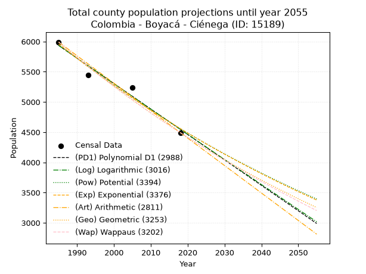
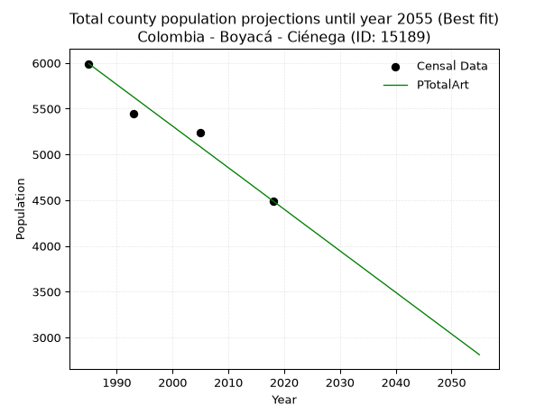
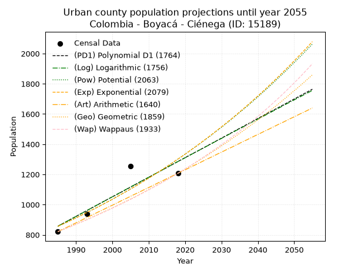
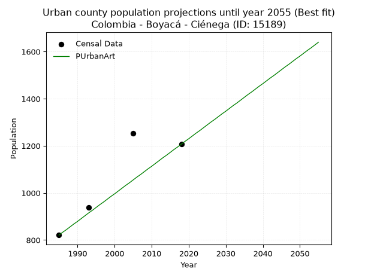
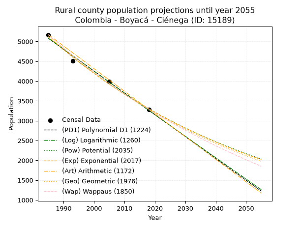
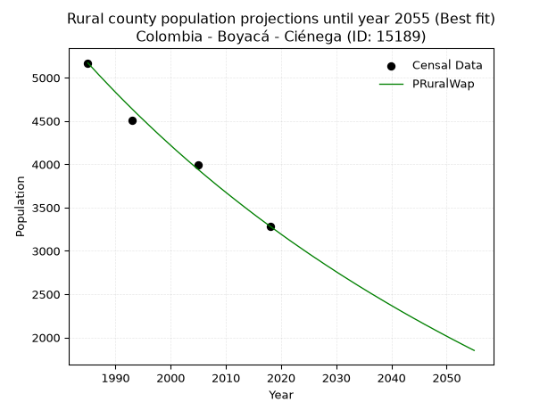

<div align="center">


</div>

# 📜 _“Population and Public Services Demand Projections (PPSD) until Year 2050 for Colombia - Boyacá - Ciénega (ID: 15189)”_
Keywords: `population` `public-service` `projection` `lineal` `polynomial` `logarithmic` `potential` `exponential` `arithmetic` `geometric` `wappaus` `dane` `colombia` `south-america`

PPSD are analytical estimates used by governments and planners to anticipate future changes in population size, age distribution, and the resulting community needs for utilities, healthcare, education, and infrastructure as sizing future water treatment facilities, electrical grids, and road networks based on spatial growth.

<div align="center">

</img>

</div>


> **General running parameters**: • app_version: _v20260806_. • Python version: _3.14.7_. • Pandas version: _3.0.5_. • NumPy version: _2.5.1_. • Creates, save and include plots into reports (create_plot): _False_. • Projection until year: _2050_. • Process polynomial degree 2 and up: _False_. • Process Wappaus: _True_. • Process Wappaus: _True_. • Set negative values to zero: _True_. • Set infinite values to zero: _True_. • Drop dataset notes: _True_. 
<div align="center">

Dynamic map: [:earth_americas:Google](http://maps.google.com/maps?q=5.408693641,-73.2960491) [:earth_americas:OSM](https://www.openstreetmap.org/#map=18/5.408693641/-73.2960491&layers=P) [:earth_americas:Bing](https://www.bing.com/maps?cp=5.408693641~-73.2960491&lvl=18) [:earth_americas:Apple](https://maps.apple.com/frame?center=5.408693641%2C-73.2960491&span=0.003%2C0.006)

</div>


<div align="center">

```geojson
{
  "type": "Feature",
  "geometry": {
    "type": "Point", 
    "coordinates": [-73.2960491, 5.408693641]
  }, 
  "properties": {
    "Name": "Colombia - Boyacá - Ciénega (ID: 15189)"
  }
}
```

</div>


## 0. Census Data (4 records)

Census data are official statistics collected by a government about the people and housing in a country. They usually include counts of total population, age, sex, race, income, education, and jobs.

📅Global census file: [Population.xlsx](../data/Population.xlsx)

| Source   |   Year |   CountryID | CountryName   |   StateID | StateName   |   CountyID | CountyName   |   PTotal |   PUrban |   PRural |
|:---------|-------:|------------:|:--------------|----------:|:------------|-----------:|:-------------|---------:|---------:|---------:|
| DANE     |   1985 |          57 | Colombia      |        15 | Boyacá      |      15189 | Ciénega      |     5991 |      821 |     5170 |
| DANE     |   1993 |          57 | Colombia      |        15 | Boyacá      |      15189 | Ciénega      |     5446 |      937 |     4509 |
| DANE     |   2005 |          57 | Colombia      |        15 | Boyacá      |      15189 | Ciénega      |     5242 |     1254 |     3988 |
| DANE     |   2018 |          57 | Colombia      |        15 | Boyacá      |      15189 | Ciénega      |     4492 |     1207 |     3285 |

> 🔥Some records could had specific notes about the registered values or the corresponding urban or rural distribution.

📅[SUI-RUPS](https://www.datos.gov.co/Hacienda-y-Cr-dito-P-blico/Registro-nico-de-Prestadores-de-Servicios-P-blicos/4qkq-csdn/about_data) - Local public utility companies: [RUPS.csv](../data/RUPS.xlsx)

 | SERVICIO       | ESTADO    | NOMBRE                                                                                      | NIT         | DEPARTAMENTO_DOMICILIO   | MUNICIPIO_DOMICILIO   | DIRECCION   |   TELEFONO | EMAIL                   | TIPO_PRESTADOR                             | CLASIFICACION                 |
|:---------------|:----------|:--------------------------------------------------------------------------------------------|:------------|:-------------------------|:----------------------|:------------|-----------:|:------------------------|:-------------------------------------------|:------------------------------|
| ACUEDUCTO      | OPERATIVA | EMPRESA DE SERVICIOS PUBLICOS DOMICILIARIOS DE LA PROVINCIA DE MARQUEZ -SERVIMARQUEZ SA ESP | 900371611-6 | BOYACA                   | CIENEGA               | CIENEGA     |    7379009 | fredyjufuerte@gmail.com | SOCIEDADES (EMPRESA DE SERVICIOS PUBLICOS) | MENOR O IGUAL A 2500 USUARIOS |
| ALCANTARILLADO | OPERATIVA | EMPRESA DE SERVICIOS PUBLICOS DOMICILIARIOS DE LA PROVINCIA DE MARQUEZ -SERVIMARQUEZ SA ESP | 900371611-6 | BOYACA                   | CIENEGA               | CIENEGA     |    7379009 | fredyjufuerte@gmail.com | SOCIEDADES (EMPRESA DE SERVICIOS PUBLICOS) | MENOR O IGUAL A 2500 USUARIOS |

## 1. Total

### 1.1. Coefficients and Parameters

* (PD1) Polynomial Deg 1: -42.093536732235556, 89490.34684865418 (lineal)
* (Log) Logarithmic: -84248.6547021912, 645667.4495177037
* (Pow) Potential: -16.241918396745373, 57.33718279888708
* (Exp) Exponential: -0.008115937274657347, 59111659868.48718
* (Art) Arithmetic: Year diff. 2018 - 1985 = 33, Population diff. 4492 - 5991 = -1499, Annual growth = -45.42424242424242
* (Geo) Geometric: Year diff. 2018 - 1985 = 33, Population diff. 4492 - 5991 = -1499, Annual growth % = -0.008688108236713399
* (Wap) Wappaus: i = -0.8666267752407216, Condition values only valid for < 200)

<sub>
Wappaus condition values: ['-0.00', '-0.87', '-1.73', '-2.60', '-3.47', '-4.33', '-5.20', '-6.07', '-6.93', '-7.80', '-8.67', '-9.53', '-10.40', '-11.27', '-12.13', '-13.00', '-13.87', '-14.73', '-15.60', '-16.47', '-17.33', '-18.20', '-19.07', '-19.93', '-20.80', '-21.67', '-22.53', '-23.40', '-24.27', '-25.13', '-26.00', '-26.87', '-27.73', '-28.60', '-29.47', '-30.33', '-31.20', '-32.07', '-32.93', '-33.80', '-34.67', '-35.53', '-36.40', '-37.26', '-38.13', '-39.00', '-39.86', '-40.73', '-41.60', '-42.46', '-43.33', '-44.20', '-45.06', '-45.93', '-46.80', '-47.66', '-48.53', '-49.40', '-50.26', '-51.13', '-52.00', '-52.86', '-53.73', '-54.60', '-55.46', '-56.33']
</sub>


### 1.2. Projected Dataset

|   Year |   CountyID |   PTotalPD1 |   PTotalLog |   PTotalPow |   PTotalExp |   PTotalArt |   PTotalGeo |   PTotalWap |
|-------:|-----------:|------------:|------------:|------------:|------------:|------------:|------------:|------------:|
|   1985 |      15189 |        5935 |        5936 |        5960 |        5958 |        5991 |        5991 |        5991 |
|   1986 |      15189 |        5893 |        5893 |        5911 |        5910 |        5946 |        5939 |        5939 |
|   1987 |      15189 |        5850 |        5851 |        5863 |        5862 |        5900 |        5887 |        5888 |
|   1988 |      15189 |        5808 |        5809 |        5815 |        5815 |        5855 |        5836 |        5837 |
|   1989 |      15189 |        5766 |        5766 |        5768 |        5768 |        5809 |        5785 |        5787 |
|   1990 |      15189 |        5724 |        5724 |        5721 |        5721 |        5764 |        5735 |        5737 |
|   1991 |      15189 |        5682 |        5682 |        5675 |        5675 |        5718 |        5685 |        5687 |
|   1992 |      15189 |        5640 |        5639 |        5629 |        5629 |        5673 |        5636 |        5638 |
|   1993 |      15189 |        5598 |        5597 |        5583 |        5584 |        5628 |        5587 |        5590 |
|   1994 |      15189 |        5556 |        5555 |        5538 |        5539 |        5582 |        5539 |        5541 |
|   1995 |      15189 |        5514 |        5513 |        5493 |        5494 |        5537 |        5490 |        5493 |
|   1996 |      15189 |        5472 |        5470 |        5448 |        5450 |        5491 |        5443 |        5446 |
|   1997 |      15189 |        5430 |        5428 |        5404 |        5405 |        5446 |        5395 |        5399 |
|   1998 |      15189 |        5387 |        5386 |        5360 |        5362 |        5400 |        5349 |        5352 |
|   1999 |      15189 |        5345 |        5344 |        5317 |        5318 |        5355 |        5302 |        5306 |
|   2000 |      15189 |        5303 |        5302 |        5274 |        5275 |        5310 |        5256 |        5260 |
|   2001 |      15189 |        5261 |        5260 |        5231 |        5233 |        5264 |        5210 |        5214 |
|   2002 |      15189 |        5219 |        5217 |        5189 |        5191 |        5219 |        5165 |        5169 |
|   2003 |      15189 |        5177 |        5175 |        5147 |        5149 |        5173 |        5120 |        5124 |
|   2004 |      15189 |        5135 |        5133 |        5105 |        5107 |        5128 |        5076 |        5080 |
|   2005 |      15189 |        5093 |        5091 |        5064 |        5066 |        5083 |        5032 |        5035 |
|   2006 |      15189 |        5051 |        5049 |        5023 |        5025 |        5037 |        4988 |        4992 |
|   2007 |      15189 |        5009 |        5007 |        4983 |        4984 |        4992 |        4945 |        4948 |
|   2008 |      15189 |        4967 |        4965 |        4943 |        4944 |        4946 |        4902 |        4905 |
|   2009 |      15189 |        4924 |        4923 |        4903 |        4904 |        4901 |        4859 |        4862 |
|   2010 |      15189 |        4882 |        4881 |        4863 |        4864 |        4855 |        4817 |        4820 |
|   2011 |      15189 |        4840 |        4840 |        4824 |        4825 |        4810 |        4775 |        4778 |
|   2012 |      15189 |        4798 |        4798 |        4785 |        4786 |        4765 |        4733 |        4736 |
|   2013 |      15189 |        4756 |        4756 |        4747 |        4747 |        4719 |        4692 |        4695 |
|   2014 |      15189 |        4714 |        4714 |        4709 |        4709 |        4674 |        4652 |        4653 |
|   2015 |      15189 |        4672 |        4672 |        4671 |        4671 |        4628 |        4611 |        4613 |
|   2016 |      15189 |        4630 |        4630 |        4634 |        4633 |        4583 |        4571 |        4572 |
|   2017 |      15189 |        4588 |        4589 |        4596 |        4596 |        4537 |        4531 |        4532 |
|   2018 |      15189 |        4546 |        4547 |        4560 |        4558 |        4492 |        4492 |        4492 |
|   2019 |      15189 |        4503 |        4505 |        4523 |        4522 |        4447 |        4453 |        4452 |
|   2020 |      15189 |        4461 |        4463 |        4487 |        4485 |        4401 |        4414 |        4413 |
|   2021 |      15189 |        4419 |        4422 |        4451 |        4449 |        4356 |        4376 |        4374 |
|   2022 |      15189 |        4377 |        4380 |        4415 |        4413 |        4310 |        4338 |        4335 |
|   2023 |      15189 |        4335 |        4338 |        4380 |        4377 |        4265 |        4300 |        4297 |
|   2024 |      15189 |        4293 |        4297 |        4345 |        4342 |        4219 |        4263 |        4259 |
|   2025 |      15189 |        4251 |        4255 |        4310 |        4307 |        4174 |        4226 |        4221 |
|   2026 |      15189 |        4209 |        4213 |        4276 |        4272 |        4129 |        4189 |        4183 |
|   2027 |      15189 |        4167 |        4172 |        4242 |        4237 |        4083 |        4153 |        4146 |
|   2028 |      15189 |        4125 |        4130 |        4208 |        4203 |        4038 |        4117 |        4109 |
|   2029 |      15189 |        4083 |        4089 |        4174 |        4169 |        3992 |        4081 |        4072 |
|   2030 |      15189 |        4040 |        4047 |        4141 |        4135 |        3947 |        4045 |        4036 |
|   2031 |      15189 |        3998 |        4006 |        4108 |        4102 |        3901 |        4010 |        4000 |
|   2032 |      15189 |        3956 |        3964 |        4075 |        4069 |        3856 |        3975 |        3964 |
|   2033 |      15189 |        3914 |        3923 |        4043 |        4036 |        3811 |        3941 |        3928 |
|   2034 |      15189 |        3872 |        3881 |        4011 |        4003 |        3765 |        3907 |        3893 |
|   2035 |      15189 |        3830 |        3840 |        3979 |        3971 |        3720 |        3873 |        3857 |
|   2036 |      15189 |        3788 |        3799 |        3947 |        3939 |        3674 |        3839 |        3822 |
|   2037 |      15189 |        3746 |        3757 |        3916 |        3907 |        3629 |        3806 |        3788 |
|   2038 |      15189 |        3704 |        3716 |        3885 |        3875 |        3584 |        3773 |        3753 |
|   2039 |      15189 |        3662 |        3675 |        3854 |        3844 |        3538 |        3740 |        3719 |
|   2040 |      15189 |        3620 |        3633 |        3823 |        3813 |        3493 |        3707 |        3685 |
|   2041 |      15189 |        3577 |        3592 |        3793 |        3782 |        3447 |        3675 |        3651 |
|   2042 |      15189 |        3535 |        3551 |        3763 |        3752 |        3402 |        3643 |        3618 |
|   2043 |      15189 |        3493 |        3509 |        3733 |        3721 |        3356 |        3612 |        3584 |
|   2044 |      15189 |        3451 |        3468 |        3704 |        3691 |        3311 |        3580 |        3551 |
|   2045 |      15189 |        3409 |        3427 |        3674 |        3661 |        3266 |        3549 |        3519 |
|   2046 |      15189 |        3367 |        3386 |        3645 |        3632 |        3220 |        3518 |        3486 |
|   2047 |      15189 |        3325 |        3345 |        3616 |        3602 |        3175 |        3488 |        3454 |
|   2048 |      15189 |        3283 |        3304 |        3588 |        3573 |        3129 |        3457 |        3422 |
|   2049 |      15189 |        3241 |        3262 |        3559 |        3544 |        3084 |        3427 |        3390 |
|   2050 |      15189 |        3199 |        3221 |        3531 |        3516 |        3038 |        3398 |        3358 |
<div align="center">

</img>

</div>


### 1.3. Best fit with absolute and relative error (%)

Relative error puts that difference into context by dividing the absolute error by the true value, creating a unitless ratio or percentage that shows the scale of the mistake.

Absolute and relative error

|   Year | Source   |   CountryID | CountryName   |   StateID | StateName   |   CountyID_x | CountyName   |   PTotal |   PUrban |   PRural |   CountyID_y |   PTotalPD1 |   PTotalLog |   PTotalPow |   PTotalExp |   PTotalArt |   PTotalGeo |   PTotalWap |   PTotalPD1AbsError |   PTotalLogAbsError |   PTotalPowAbsError |   PTotalExpAbsError |   PTotalArtAbsError |   PTotalGeoAbsError |   PTotalWapAbsError |   PTotalPD1RelError |   PTotalLogRelError |   PTotalPowRelError |   PTotalExpRelError |   PTotalArtRelError |   PTotalGeoRelError |   PTotalWapRelError |
|-------:|:---------|------------:|:--------------|----------:|:------------|-------------:|:-------------|---------:|---------:|---------:|-------------:|------------:|------------:|------------:|------------:|------------:|------------:|------------:|--------------------:|--------------------:|--------------------:|--------------------:|--------------------:|--------------------:|--------------------:|--------------------:|--------------------:|--------------------:|--------------------:|--------------------:|--------------------:|--------------------:|
|   1985 | DANE     |          57 | Colombia      |        15 | Boyacá      |        15189 | Ciénega      |     5991 |      821 |     5170 |        15189 |        5935 |        5936 |        5960 |        5958 |        5991 |        5991 |        5991 |                  56 |                  55 |                  31 |                  33 |                   0 |                   0 |                   0 |            0.934735 |            0.918044 |            0.517443 |            0.550826 |             0       |             0       |             0       |
|   1993 | DANE     |          57 | Colombia      |        15 | Boyacá      |        15189 | Ciénega      |     5446 |      937 |     4509 |        15189 |        5598 |        5597 |        5583 |        5584 |        5628 |        5587 |        5590 |                 152 |                 151 |                 137 |                 138 |                 182 |                 141 |                 144 |            2.79104  |            2.77268  |            2.51561  |            2.53397  |             3.3419  |             2.58906 |             2.64414 |
|   2005 | DANE     |          57 | Colombia      |        15 | Boyacá      |        15189 | Ciénega      |     5242 |     1254 |     3988 |        15189 |        5093 |        5091 |        5064 |        5066 |        5083 |        5032 |        5035 |                 149 |                 151 |                 178 |                 176 |                 159 |                 210 |                 207 |            2.84243  |            2.88058  |            3.39565  |            3.3575   |             3.03319 |             4.0061  |             3.94887 |
|   2018 | DANE     |          57 | Colombia      |        15 | Boyacá      |        15189 | Ciénega      |     4492 |     1207 |     3285 |        15189 |        4546 |        4547 |        4560 |        4558 |        4492 |        4492 |        4492 |                  54 |                  55 |                  68 |                  66 |                   0 |                   0 |                   0 |            1.20214  |            1.2244   |            1.5138   |            1.46928  |             0       |             0       |             0       |

Relative error mean

| Method    |   RelError | Best   |
|:----------|-----------:|:-------|
| PTotalPD1 |    1.94258 |        |
| PTotalLog |    1.94892 |        |
| PTotalPow |    1.98563 |        |
| PTotalExp |    1.97789 |        |
| PTotalArt |    1.59377 | True   |
| PTotalGeo |    1.64879 |        |
| PTotalWap |    1.64825 |        |

💙Best method: _**PTotalArt**_
<div align="center">

</img>

</div>


### 1.4. Fresh water supply demand in liters per capita per day (lpcd)

The fresh water supply demand typically ranges from 100 to 300 liters per capita per day (lpcd) for standard domestic and municipal planning, though absolute survival minimums set by the World Health Organization are as low as 7.5 to 20 liters per day, and total consumption in high-income nations can exceed 400 liters.

> `CZ`: Level in meters above the sea level (masl)<br> `WS`: Fresh water supply demand in liters per capita per day (lpcd or l/h/d)<br> `WSAll`: Zonal fresh water supply demand in liters per second (l/s)<br> `A`: Zonal area in square meters<br> `DP`: Population density (people/hectare or p/ha)

Reference values (RAS Colombia)

|    CZ |   WS |
|------:|-----:|
|  1000 |  120 |
|  2000 |  130 |
| 99999 |  140 |

County shapefile geometry properties and water supply values

|   CountyID |     ATotal |   CZTotal |   WSTotal |
|-----------:|-----------:|----------:|----------:|
|      15189 | 5.3897e+07 |   2734.06 |       140 |

Projected values for best method: PTotalArt

|   CountyID |   Year |   PTotalArt |   DPTotal |   WSTotal |   WSTotalAll |
|-----------:|-------:|------------:|----------:|----------:|-------------:|
|      15189 |   1985 |        5991 |      1.11 |       140 |      9.70764 |
|      15189 |   1986 |        5946 |      1.1  |       140 |      9.63472 |
|      15189 |   1987 |        5900 |      1.09 |       140 |      9.56019 |
|      15189 |   1988 |        5855 |      1.09 |       140 |      9.48727 |
|      15189 |   1989 |        5809 |      1.08 |       140 |      9.41273 |
|      15189 |   1990 |        5764 |      1.07 |       140 |      9.33981 |
|      15189 |   1991 |        5718 |      1.06 |       140 |      9.26528 |
|      15189 |   1992 |        5673 |      1.05 |       140 |      9.19236 |
|      15189 |   1993 |        5628 |      1.04 |       140 |      9.11944 |
|      15189 |   1994 |        5582 |      1.04 |       140 |      9.04491 |
|      15189 |   1995 |        5537 |      1.03 |       140 |      8.97199 |
|      15189 |   1996 |        5491 |      1.02 |       140 |      8.89745 |
|      15189 |   1997 |        5446 |      1.01 |       140 |      8.82454 |
|      15189 |   1998 |        5400 |      1    |       140 |      8.75    |
|      15189 |   1999 |        5355 |      0.99 |       140 |      8.67708 |
|      15189 |   2000 |        5310 |      0.99 |       140 |      8.60417 |
|      15189 |   2001 |        5264 |      0.98 |       140 |      8.52963 |
|      15189 |   2002 |        5219 |      0.97 |       140 |      8.45671 |
|      15189 |   2003 |        5173 |      0.96 |       140 |      8.38218 |
|      15189 |   2004 |        5128 |      0.95 |       140 |      8.30926 |
|      15189 |   2005 |        5083 |      0.94 |       140 |      8.23634 |
|      15189 |   2006 |        5037 |      0.93 |       140 |      8.16181 |
|      15189 |   2007 |        4992 |      0.93 |       140 |      8.08889 |
|      15189 |   2008 |        4946 |      0.92 |       140 |      8.01435 |
|      15189 |   2009 |        4901 |      0.91 |       140 |      7.94144 |
|      15189 |   2010 |        4855 |      0.9  |       140 |      7.8669  |
|      15189 |   2011 |        4810 |      0.89 |       140 |      7.79398 |
|      15189 |   2012 |        4765 |      0.88 |       140 |      7.72106 |
|      15189 |   2013 |        4719 |      0.88 |       140 |      7.64653 |
|      15189 |   2014 |        4674 |      0.87 |       140 |      7.57361 |
|      15189 |   2015 |        4628 |      0.86 |       140 |      7.49907 |
|      15189 |   2016 |        4583 |      0.85 |       140 |      7.42616 |
|      15189 |   2017 |        4537 |      0.84 |       140 |      7.35162 |
|      15189 |   2018 |        4492 |      0.83 |       140 |      7.2787  |
|      15189 |   2019 |        4447 |      0.83 |       140 |      7.20579 |
|      15189 |   2020 |        4401 |      0.82 |       140 |      7.13125 |
|      15189 |   2021 |        4356 |      0.81 |       140 |      7.05833 |
|      15189 |   2022 |        4310 |      0.8  |       140 |      6.9838  |
|      15189 |   2023 |        4265 |      0.79 |       140 |      6.91088 |
|      15189 |   2024 |        4219 |      0.78 |       140 |      6.83634 |
|      15189 |   2025 |        4174 |      0.77 |       140 |      6.76343 |
|      15189 |   2026 |        4129 |      0.77 |       140 |      6.69051 |
|      15189 |   2027 |        4083 |      0.76 |       140 |      6.61597 |
|      15189 |   2028 |        4038 |      0.75 |       140 |      6.54306 |
|      15189 |   2029 |        3992 |      0.74 |       140 |      6.46852 |
|      15189 |   2030 |        3947 |      0.73 |       140 |      6.3956  |
|      15189 |   2031 |        3901 |      0.72 |       140 |      6.32106 |
|      15189 |   2032 |        3856 |      0.72 |       140 |      6.24815 |
|      15189 |   2033 |        3811 |      0.71 |       140 |      6.17523 |
|      15189 |   2034 |        3765 |      0.7  |       140 |      6.10069 |
|      15189 |   2035 |        3720 |      0.69 |       140 |      6.02778 |
|      15189 |   2036 |        3674 |      0.68 |       140 |      5.95324 |
|      15189 |   2037 |        3629 |      0.67 |       140 |      5.88032 |
|      15189 |   2038 |        3584 |      0.66 |       140 |      5.80741 |
|      15189 |   2039 |        3538 |      0.66 |       140 |      5.73287 |
|      15189 |   2040 |        3493 |      0.65 |       140 |      5.65995 |
|      15189 |   2041 |        3447 |      0.64 |       140 |      5.58542 |
|      15189 |   2042 |        3402 |      0.63 |       140 |      5.5125  |
|      15189 |   2043 |        3356 |      0.62 |       140 |      5.43796 |
|      15189 |   2044 |        3311 |      0.61 |       140 |      5.36505 |
|      15189 |   2045 |        3266 |      0.61 |       140 |      5.29213 |
|      15189 |   2046 |        3220 |      0.6  |       140 |      5.21759 |
|      15189 |   2047 |        3175 |      0.59 |       140 |      5.14468 |
|      15189 |   2048 |        3129 |      0.58 |       140 |      5.07014 |
|      15189 |   2049 |        3084 |      0.57 |       140 |      4.99722 |
|      15189 |   2050 |        3038 |      0.56 |       140 |      4.92269 |

## 2. Urban

### 2.1. Coefficients and Parameters

* (PD1) Polynomial Deg 1: 12.954235246888802, -24856.95905258933 (lineal)
* (Log) Logarithmic: 25954.348132176015, -196224.45813776285
* (Pow) Potential: 25.397898855728887, -80.82386833873655
* (Exp) Exponential: 0.012676224222832959, 1.010920776784456e-08
* (Art) Arithmetic: Year diff. 2018 - 1985 = 33, Population diff. 1207 - 821 = 386, Annual growth = 11.696969696969697
* (Geo) Geometric: Year diff. 2018 - 1985 = 33, Population diff. 1207 - 821 = 386, Annual growth % = 0.011746334838282024
* (Wap) Wappaus: i = 1.1535473073934612, Condition values only valid for < 200)

<sub>
Wappaus condition values: ['0.00', '1.15', '2.31', '3.46', '4.61', '5.77', '6.92', '8.07', '9.23', '10.38', '11.54', '12.69', '13.84', '15.00', '16.15', '17.30', '18.46', '19.61', '20.76', '21.92', '23.07', '24.22', '25.38', '26.53', '27.69', '28.84', '29.99', '31.15', '32.30', '33.45', '34.61', '35.76', '36.91', '38.07', '39.22', '40.37', '41.53', '42.68', '43.83', '44.99', '46.14', '47.30', '48.45', '49.60', '50.76', '51.91', '53.06', '54.22', '55.37', '56.52', '57.68', '58.83', '59.98', '61.14', '62.29', '63.45', '64.60', '65.75', '66.91', '68.06', '69.21', '70.37', '71.52', '72.67', '73.83', '74.98']
</sub>


### 2.2. Projected Dataset

|   Year |   CountyID |   PUrbanPD1 |   PUrbanLog |   PUrbanPow |   PUrbanExp |   PUrbanArt |   PUrbanGeo |   PUrbanWap |
|-------:|-----------:|------------:|------------:|------------:|------------:|------------:|------------:|------------:|
|   1985 |      15189 |         857 |         857 |         856 |         856 |         821 |         821 |         821 |
|   1986 |      15189 |         870 |         870 |         867 |         867 |         833 |         831 |         831 |
|   1987 |      15189 |         883 |         883 |         878 |         878 |         844 |         840 |         840 |
|   1988 |      15189 |         896 |         896 |         889 |         889 |         856 |         850 |         850 |
|   1989 |      15189 |         909 |         909 |         901 |         901 |         868 |         860 |         860 |
|   1990 |      15189 |         922 |         922 |         912 |         912 |         879 |         870 |         870 |
|   1991 |      15189 |         935 |         935 |         924 |         924 |         891 |         881 |         880 |
|   1992 |      15189 |         948 |         948 |         936 |         936 |         903 |         891 |         890 |
|   1993 |      15189 |         961 |         961 |         948 |         948 |         915 |         901 |         900 |
|   1994 |      15189 |         974 |         974 |         960 |         960 |         926 |         912 |         911 |
|   1995 |      15189 |         987 |         987 |         972 |         972 |         938 |         923 |         922 |
|   1996 |      15189 |        1000 |        1000 |         985 |         984 |         950 |         934 |         932 |
|   1997 |      15189 |        1013 |        1013 |         997 |         997 |         961 |         945 |         943 |
|   1998 |      15189 |        1026 |        1026 |        1010 |        1010 |         973 |         956 |         954 |
|   1999 |      15189 |        1039 |        1039 |        1023 |        1022 |         985 |         967 |         965 |
|   2000 |      15189 |        1052 |        1052 |        1036 |        1035 |         996 |         978 |         977 |
|   2001 |      15189 |        1064 |        1065 |        1049 |        1049 |        1008 |         990 |         988 |
|   2002 |      15189 |        1077 |        1078 |        1063 |        1062 |        1020 |        1001 |        1000 |
|   2003 |      15189 |        1090 |        1091 |        1076 |        1076 |        1032 |        1013 |        1011 |
|   2004 |      15189 |        1103 |        1104 |        1090 |        1089 |        1043 |        1025 |        1023 |
|   2005 |      15189 |        1116 |        1117 |        1104 |        1103 |        1055 |        1037 |        1035 |
|   2006 |      15189 |        1129 |        1130 |        1118 |        1117 |        1067 |        1049 |        1047 |
|   2007 |      15189 |        1142 |        1143 |        1132 |        1132 |        1078 |        1061 |        1060 |
|   2008 |      15189 |        1155 |        1156 |        1147 |        1146 |        1090 |        1074 |        1072 |
|   2009 |      15189 |        1168 |        1169 |        1161 |        1161 |        1102 |        1087 |        1085 |
|   2010 |      15189 |        1181 |        1181 |        1176 |        1175 |        1113 |        1099 |        1098 |
|   2011 |      15189 |        1194 |        1194 |        1191 |        1190 |        1125 |        1112 |        1111 |
|   2012 |      15189 |        1207 |        1207 |        1206 |        1206 |        1137 |        1125 |        1124 |
|   2013 |      15189 |        1220 |        1220 |        1221 |        1221 |        1149 |        1139 |        1137 |
|   2014 |      15189 |        1233 |        1233 |        1237 |        1237 |        1160 |        1152 |        1151 |
|   2015 |      15189 |        1246 |        1246 |        1252 |        1252 |        1172 |        1165 |        1165 |
|   2016 |      15189 |        1259 |        1259 |        1268 |        1268 |        1184 |        1179 |        1179 |
|   2017 |      15189 |        1272 |        1272 |        1284 |        1285 |        1195 |        1193 |        1193 |
|   2018 |      15189 |        1285 |        1285 |        1301 |        1301 |        1207 |        1207 |        1207 |
|   2019 |      15189 |        1298 |        1297 |        1317 |        1317 |        1219 |        1221 |        1222 |
|   2020 |      15189 |        1311 |        1310 |        1334 |        1334 |        1230 |        1236 |        1236 |
|   2021 |      15189 |        1324 |        1323 |        1351 |        1351 |        1242 |        1250 |        1251 |
|   2022 |      15189 |        1337 |        1336 |        1368 |        1369 |        1254 |        1265 |        1266 |
|   2023 |      15189 |        1349 |        1349 |        1385 |        1386 |        1265 |        1280 |        1282 |
|   2024 |      15189 |        1362 |        1362 |        1403 |        1404 |        1277 |        1295 |        1298 |
|   2025 |      15189 |        1375 |        1374 |        1420 |        1422 |        1289 |        1310 |        1313 |
|   2026 |      15189 |        1388 |        1387 |        1438 |        1440 |        1301 |        1325 |        1330 |
|   2027 |      15189 |        1401 |        1400 |        1456 |        1458 |        1312 |        1341 |        1346 |
|   2028 |      15189 |        1414 |        1413 |        1475 |        1477 |        1324 |        1357 |        1363 |
|   2029 |      15189 |        1427 |        1426 |        1493 |        1496 |        1336 |        1372 |        1379 |
|   2030 |      15189 |        1440 |        1438 |        1512 |        1515 |        1347 |        1389 |        1397 |
|   2031 |      15189 |        1453 |        1451 |        1531 |        1534 |        1359 |        1405 |        1414 |
|   2032 |      15189 |        1466 |        1464 |        1550 |        1554 |        1371 |        1421 |        1432 |
|   2033 |      15189 |        1479 |        1477 |        1570 |        1573 |        1382 |        1438 |        1450 |
|   2034 |      15189 |        1492 |        1490 |        1590 |        1593 |        1394 |        1455 |        1468 |
|   2035 |      15189 |        1505 |        1502 |        1610 |        1614 |        1406 |        1472 |        1486 |
|   2036 |      15189 |        1518 |        1515 |        1630 |        1634 |        1418 |        1489 |        1505 |
|   2037 |      15189 |        1531 |        1528 |        1650 |        1655 |        1429 |        1507 |        1524 |
|   2038 |      15189 |        1544 |        1541 |        1671 |        1676 |        1441 |        1525 |        1544 |
|   2039 |      15189 |        1557 |        1553 |        1692 |        1698 |        1453 |        1542 |        1564 |
|   2040 |      15189 |        1570 |        1566 |        1713 |        1719 |        1464 |        1561 |        1584 |
|   2041 |      15189 |        1583 |        1579 |        1735 |        1741 |        1476 |        1579 |        1604 |
|   2042 |      15189 |        1596 |        1591 |        1756 |        1763 |        1488 |        1597 |        1625 |
|   2043 |      15189 |        1609 |        1604 |        1778 |        1786 |        1499 |        1616 |        1646 |
|   2044 |      15189 |        1621 |        1617 |        1800 |        1809 |        1511 |        1635 |        1668 |
|   2045 |      15189 |        1634 |        1630 |        1823 |        1832 |        1523 |        1654 |        1690 |
|   2046 |      15189 |        1647 |        1642 |        1846 |        1855 |        1535 |        1674 |        1712 |
|   2047 |      15189 |        1660 |        1655 |        1869 |        1879 |        1546 |        1693 |        1735 |
|   2048 |      15189 |        1673 |        1668 |        1892 |        1903 |        1558 |        1713 |        1758 |
|   2049 |      15189 |        1686 |        1680 |        1916 |        1927 |        1570 |        1734 |        1782 |
|   2050 |      15189 |        1699 |        1693 |        1940 |        1952 |        1581 |        1754 |        1806 |
<div align="center">

</img>

</div>


### 2.3. Best fit with absolute and relative error (%)

Relative error puts that difference into context by dividing the absolute error by the true value, creating a unitless ratio or percentage that shows the scale of the mistake.

Absolute and relative error

|   Year | Source   |   CountryID | CountryName   |   StateID | StateName   |   CountyID_x | CountyName   |   PTotal |   PUrban |   PRural |   CountyID_y |   PUrbanPD1 |   PUrbanLog |   PUrbanPow |   PUrbanExp |   PUrbanArt |   PUrbanGeo |   PUrbanWap |   PUrbanPD1AbsError |   PUrbanLogAbsError |   PUrbanPowAbsError |   PUrbanExpAbsError |   PUrbanArtAbsError |   PUrbanGeoAbsError |   PUrbanWapAbsError |   PUrbanPD1RelError |   PUrbanLogRelError |   PUrbanPowRelError |   PUrbanExpRelError |   PUrbanArtRelError |   PUrbanGeoRelError |   PUrbanWapRelError |
|-------:|:---------|------------:|:--------------|----------:|:------------|-------------:|:-------------|---------:|---------:|---------:|-------------:|------------:|------------:|------------:|------------:|------------:|------------:|------------:|--------------------:|--------------------:|--------------------:|--------------------:|--------------------:|--------------------:|--------------------:|--------------------:|--------------------:|--------------------:|--------------------:|--------------------:|--------------------:|--------------------:|
|   1985 | DANE     |          57 | Colombia      |        15 | Boyacá      |        15189 | Ciénega      |     5991 |      821 |     5170 |        15189 |         857 |         857 |         856 |         856 |         821 |         821 |         821 |                  36 |                  36 |                  35 |                  35 |                   0 |                   0 |                   0 |             4.3849  |             4.3849  |             4.26309 |             4.26309 |             0       |             0       |             0       |
|   1993 | DANE     |          57 | Colombia      |        15 | Boyacá      |        15189 | Ciénega      |     5446 |      937 |     4509 |        15189 |         961 |         961 |         948 |         948 |         915 |         901 |         900 |                  24 |                  24 |                  11 |                  11 |                  22 |                  36 |                  37 |             2.56137 |             2.56137 |             1.17396 |             1.17396 |             2.34792 |             3.84205 |             3.94877 |
|   2005 | DANE     |          57 | Colombia      |        15 | Boyacá      |        15189 | Ciénega      |     5242 |     1254 |     3988 |        15189 |        1116 |        1117 |        1104 |        1103 |        1055 |        1037 |        1035 |                 138 |                 137 |                 150 |                 151 |                 199 |                 217 |                 219 |            11.0048  |            10.925   |            11.9617  |            12.0415  |            15.8692  |            17.3046  |            17.4641  |
|   2018 | DANE     |          57 | Colombia      |        15 | Boyacá      |        15189 | Ciénega      |     4492 |     1207 |     3285 |        15189 |        1285 |        1285 |        1301 |        1301 |        1207 |        1207 |        1207 |                  78 |                  78 |                  94 |                  94 |                   0 |                   0 |                   0 |             6.4623  |             6.4623  |             7.7879  |             7.7879  |             0       |             0       |             0       |

Relative error mean

| Method    |   RelError | Best   |
|:----------|-----------:|:-------|
| PUrbanPD1 |    6.10334 |        |
| PUrbanLog |    6.0834  |        |
| PUrbanPow |    6.29667 |        |
| PUrbanExp |    6.31661 |        |
| PUrbanArt |    4.55428 | True   |
| PUrbanGeo |    5.28667 |        |
| PUrbanWap |    5.35322 |        |

💙Best method: _**PUrbanArt**_
<div align="center">

</img>

</div>


### 2.4. Fresh water supply demand in liters per capita per day (lpcd)

The fresh water supply demand typically ranges from 100 to 300 liters per capita per day (lpcd) for standard domestic and municipal planning, though absolute survival minimums set by the World Health Organization are as low as 7.5 to 20 liters per day, and total consumption in high-income nations can exceed 400 liters.

> `CZ`: Level in meters above the sea level (masl)<br> `WS`: Fresh water supply demand in liters per capita per day (lpcd or l/h/d)<br> `WSAll`: Zonal fresh water supply demand in liters per second (l/s)<br> `A`: Zonal area in square meters<br> `DP`: Population density (people/hectare or p/ha)

Reference values (RAS Colombia)

|    CZ |   WS |
|------:|-----:|
|  1000 |  120 |
|  2000 |  130 |
| 99999 |  140 |

County shapefile geometry properties and water supply values

|   CountyID |   AUrban |   CZUrban |   WSUrban |
|-----------:|---------:|----------:|----------:|
|      15189 |   365199 |   2464.41 |       140 |

Projected values for best method: PUrbanArt

|   CountyID |   Year |   PUrbanArt |   DPUrban |   WSUrban |   WSUrbanAll |
|-----------:|-------:|------------:|----------:|----------:|-------------:|
|      15189 |   1985 |         821 |     22.48 |       140 |      1.33032 |
|      15189 |   1986 |         833 |     22.81 |       140 |      1.34977 |
|      15189 |   1987 |         844 |     23.11 |       140 |      1.36759 |
|      15189 |   1988 |         856 |     23.44 |       140 |      1.38704 |
|      15189 |   1989 |         868 |     23.77 |       140 |      1.40648 |
|      15189 |   1990 |         879 |     24.07 |       140 |      1.42431 |
|      15189 |   1991 |         891 |     24.4  |       140 |      1.44375 |
|      15189 |   1992 |         903 |     24.73 |       140 |      1.46319 |
|      15189 |   1993 |         915 |     25.05 |       140 |      1.48264 |
|      15189 |   1994 |         926 |     25.36 |       140 |      1.50046 |
|      15189 |   1995 |         938 |     25.68 |       140 |      1.51991 |
|      15189 |   1996 |         950 |     26.01 |       140 |      1.53935 |
|      15189 |   1997 |         961 |     26.31 |       140 |      1.55718 |
|      15189 |   1998 |         973 |     26.64 |       140 |      1.57662 |
|      15189 |   1999 |         985 |     26.97 |       140 |      1.59606 |
|      15189 |   2000 |         996 |     27.27 |       140 |      1.61389 |
|      15189 |   2001 |        1008 |     27.6  |       140 |      1.63333 |
|      15189 |   2002 |        1020 |     27.93 |       140 |      1.65278 |
|      15189 |   2003 |        1032 |     28.26 |       140 |      1.67222 |
|      15189 |   2004 |        1043 |     28.56 |       140 |      1.69005 |
|      15189 |   2005 |        1055 |     28.89 |       140 |      1.70949 |
|      15189 |   2006 |        1067 |     29.22 |       140 |      1.72894 |
|      15189 |   2007 |        1078 |     29.52 |       140 |      1.74676 |
|      15189 |   2008 |        1090 |     29.85 |       140 |      1.7662  |
|      15189 |   2009 |        1102 |     30.18 |       140 |      1.78565 |
|      15189 |   2010 |        1113 |     30.48 |       140 |      1.80347 |
|      15189 |   2011 |        1125 |     30.81 |       140 |      1.82292 |
|      15189 |   2012 |        1137 |     31.13 |       140 |      1.84236 |
|      15189 |   2013 |        1149 |     31.46 |       140 |      1.86181 |
|      15189 |   2014 |        1160 |     31.76 |       140 |      1.87963 |
|      15189 |   2015 |        1172 |     32.09 |       140 |      1.89907 |
|      15189 |   2016 |        1184 |     32.42 |       140 |      1.91852 |
|      15189 |   2017 |        1195 |     32.72 |       140 |      1.93634 |
|      15189 |   2018 |        1207 |     33.05 |       140 |      1.95579 |
|      15189 |   2019 |        1219 |     33.38 |       140 |      1.97523 |
|      15189 |   2020 |        1230 |     33.68 |       140 |      1.99306 |
|      15189 |   2021 |        1242 |     34.01 |       140 |      2.0125  |
|      15189 |   2022 |        1254 |     34.34 |       140 |      2.03194 |
|      15189 |   2023 |        1265 |     34.64 |       140 |      2.04977 |
|      15189 |   2024 |        1277 |     34.97 |       140 |      2.06921 |
|      15189 |   2025 |        1289 |     35.3  |       140 |      2.08866 |
|      15189 |   2026 |        1301 |     35.62 |       140 |      2.1081  |
|      15189 |   2027 |        1312 |     35.93 |       140 |      2.12593 |
|      15189 |   2028 |        1324 |     36.25 |       140 |      2.14537 |
|      15189 |   2029 |        1336 |     36.58 |       140 |      2.16481 |
|      15189 |   2030 |        1347 |     36.88 |       140 |      2.18264 |
|      15189 |   2031 |        1359 |     37.21 |       140 |      2.20208 |
|      15189 |   2032 |        1371 |     37.54 |       140 |      2.22153 |
|      15189 |   2033 |        1382 |     37.84 |       140 |      2.23935 |
|      15189 |   2034 |        1394 |     38.17 |       140 |      2.2588  |
|      15189 |   2035 |        1406 |     38.5  |       140 |      2.27824 |
|      15189 |   2036 |        1418 |     38.83 |       140 |      2.29769 |
|      15189 |   2037 |        1429 |     39.13 |       140 |      2.31551 |
|      15189 |   2038 |        1441 |     39.46 |       140 |      2.33495 |
|      15189 |   2039 |        1453 |     39.79 |       140 |      2.3544  |
|      15189 |   2040 |        1464 |     40.09 |       140 |      2.37222 |
|      15189 |   2041 |        1476 |     40.42 |       140 |      2.39167 |
|      15189 |   2042 |        1488 |     40.74 |       140 |      2.41111 |
|      15189 |   2043 |        1499 |     41.05 |       140 |      2.42894 |
|      15189 |   2044 |        1511 |     41.37 |       140 |      2.44838 |
|      15189 |   2045 |        1523 |     41.7  |       140 |      2.46782 |
|      15189 |   2046 |        1535 |     42.03 |       140 |      2.48727 |
|      15189 |   2047 |        1546 |     42.33 |       140 |      2.50509 |
|      15189 |   2048 |        1558 |     42.66 |       140 |      2.52454 |
|      15189 |   2049 |        1570 |     42.99 |       140 |      2.54398 |
|      15189 |   2050 |        1581 |     43.29 |       140 |      2.56181 |

## 3. Rural

### 3.1. Coefficients and Parameters

* (PD1) Polynomial Deg 1: -55.04777197912438, 114347.30590124354 (lineal)
* (Log) Logarithmic: -110203.0028343673, 841891.9076554673
* (Pow) Potential: -26.64853490625444, 91.59005000034668
* (Exp) Exponential: -0.013313480973938542, 1536750850416027.0
* (Art) Arithmetic: Year diff. 2018 - 1985 = 33, Population diff. 3285 - 5170 = -1885, Annual growth = -57.121212121212125
* (Geo) Geometric: Year diff. 2018 - 1985 = 33, Population diff. 3285 - 5170 = -1885, Annual growth % = -0.013648608630969061
* (Wap) Wappaus: i = -1.3511818361020016, Condition values only valid for < 200)

<sub>
Wappaus condition values: ['-0.00', '-1.35', '-2.70', '-4.05', '-5.40', '-6.76', '-8.11', '-9.46', '-10.81', '-12.16', '-13.51', '-14.86', '-16.21', '-17.57', '-18.92', '-20.27', '-21.62', '-22.97', '-24.32', '-25.67', '-27.02', '-28.37', '-29.73', '-31.08', '-32.43', '-33.78', '-35.13', '-36.48', '-37.83', '-39.18', '-40.54', '-41.89', '-43.24', '-44.59', '-45.94', '-47.29', '-48.64', '-49.99', '-51.34', '-52.70', '-54.05', '-55.40', '-56.75', '-58.10', '-59.45', '-60.80', '-62.15', '-63.51', '-64.86', '-66.21', '-67.56', '-68.91', '-70.26', '-71.61', '-72.96', '-74.32', '-75.67', '-77.02', '-78.37', '-79.72', '-81.07', '-82.42', '-83.77', '-85.12', '-86.48', '-87.83']
</sub>


### 3.2. Projected Dataset

|   Year |   CountyID |   PRuralPD1 |   PRuralLog |   PRuralPow |   PRuralExp |   PRuralArt |   PRuralGeo |   PRuralWap |
|-------:|-----------:|------------:|------------:|------------:|------------:|------------:|------------:|------------:|
|   1985 |      15189 |        5077 |        5079 |        5123 |        5121 |        5170 |        5170 |        5170 |
|   1986 |      15189 |        5022 |        5024 |        5055 |        5054 |        5113 |        5099 |        5101 |
|   1987 |      15189 |        4967 |        4968 |        4988 |        4987 |        5056 |        5030 |        5032 |
|   1988 |      15189 |        4912 |        4913 |        4921 |        4921 |        4999 |        4961 |        4965 |
|   1989 |      15189 |        4857 |        4857 |        4856 |        4856 |        4942 |        4893 |        4898 |
|   1990 |      15189 |        4802 |        4802 |        4791 |        4792 |        4884 |        4827 |        4832 |
|   1991 |      15189 |        4747 |        4747 |        4728 |        4728 |        4827 |        4761 |        4767 |
|   1992 |      15189 |        4692 |        4691 |        4665 |        4666 |        4770 |        4696 |        4703 |
|   1993 |      15189 |        4637 |        4636 |        4603 |        4604 |        4713 |        4632 |        4640 |
|   1994 |      15189 |        4582 |        4581 |        4542 |        4543 |        4656 |        4569 |        4577 |
|   1995 |      15189 |        4527 |        4525 |        4481 |        4483 |        4599 |        4506 |        4516 |
|   1996 |      15189 |        4472 |        4470 |        4422 |        4424 |        4542 |        4445 |        4455 |
|   1997 |      15189 |        4417 |        4415 |        4363 |        4365 |        4485 |        4384 |        4395 |
|   1998 |      15189 |        4362 |        4360 |        4305 |        4307 |        4427 |        4324 |        4335 |
|   1999 |      15189 |        4307 |        4305 |        4248 |        4251 |        4370 |        4265 |        4277 |
|   2000 |      15189 |        4252 |        4250 |        4192 |        4194 |        4313 |        4207 |        4219 |
|   2001 |      15189 |        4197 |        4195 |        4137 |        4139 |        4256 |        4150 |        4161 |
|   2002 |      15189 |        4142 |        4139 |        4082 |        4084 |        4199 |        4093 |        4105 |
|   2003 |      15189 |        4087 |        4084 |        4028 |        4030 |        4142 |        4037 |        4049 |
|   2004 |      15189 |        4032 |        4029 |        3975 |        3977 |        4085 |        3982 |        3994 |
|   2005 |      15189 |        3977 |        3974 |        3922 |        3924 |        4028 |        3928 |        3939 |
|   2006 |      15189 |        3921 |        3920 |        3871 |        3872 |        3970 |        3874 |        3885 |
|   2007 |      15189 |        3866 |        3865 |        3819 |        3821 |        3913 |        3821 |        3832 |
|   2008 |      15189 |        3811 |        3810 |        3769 |        3771 |        3856 |        3769 |        3779 |
|   2009 |      15189 |        3756 |        3755 |        3719 |        3721 |        3799 |        3717 |        3727 |
|   2010 |      15189 |        3701 |        3700 |        3670 |        3671 |        3742 |        3667 |        3676 |
|   2011 |      15189 |        3646 |        3645 |        3622 |        3623 |        3685 |        3617 |        3625 |
|   2012 |      15189 |        3591 |        3590 |        3574 |        3575 |        3628 |        3567 |        3575 |
|   2013 |      15189 |        3536 |        3536 |        3527 |        3528 |        3571 |        3519 |        3525 |
|   2014 |      15189 |        3481 |        3481 |        3481 |        3481 |        3513 |        3471 |        3476 |
|   2015 |      15189 |        3426 |        3426 |        3435 |        3435 |        3456 |        3423 |        3427 |
|   2016 |      15189 |        3371 |        3372 |        3390 |        3390 |        3399 |        3377 |        3379 |
|   2017 |      15189 |        3316 |        3317 |        3346 |        3345 |        3342 |        3330 |        3332 |
|   2018 |      15189 |        3261 |        3262 |        3302 |        3301 |        3285 |        3285 |        3285 |
|   2019 |      15189 |        3206 |        3208 |        3258 |        3257 |        3228 |        3240 |        3239 |
|   2020 |      15189 |        3151 |        3153 |        3216 |        3214 |        3171 |        3196 |        3193 |
|   2021 |      15189 |        3096 |        3099 |        3174 |        3171 |        3114 |        3152 |        3147 |
|   2022 |      15189 |        3041 |        3044 |        3132 |        3129 |        3057 |        3109 |        3102 |
|   2023 |      15189 |        2986 |        2990 |        3091 |        3088 |        2999 |        3067 |        3058 |
|   2024 |      15189 |        2931 |        2935 |        3051 |        3047 |        2942 |        3025 |        3014 |
|   2025 |      15189 |        2876 |        2881 |        3011 |        3007 |        2885 |        2984 |        2970 |
|   2026 |      15189 |        2821 |        2826 |        2971 |        2967 |        2828 |        2943 |        2927 |
|   2027 |      15189 |        2765 |        2772 |        2933 |        2928 |        2771 |        2903 |        2885 |
|   2028 |      15189 |        2710 |        2717 |        2894 |        2889 |        2714 |        2863 |        2842 |
|   2029 |      15189 |        2655 |        2663 |        2856 |        2851 |        2657 |        2824 |        2801 |
|   2030 |      15189 |        2600 |        2609 |        2819 |        2813 |        2600 |        2786 |        2759 |
|   2031 |      15189 |        2545 |        2555 |        2782 |        2776 |        2542 |        2748 |        2718 |
|   2032 |      15189 |        2490 |        2500 |        2746 |        2739 |        2485 |        2710 |        2678 |
|   2033 |      15189 |        2435 |        2446 |        2710 |        2703 |        2428 |        2673 |        2638 |
|   2034 |      15189 |        2380 |        2392 |        2675 |        2667 |        2371 |        2637 |        2598 |
|   2035 |      15189 |        2325 |        2338 |        2640 |        2632 |        2314 |        2601 |        2559 |
|   2036 |      15189 |        2270 |        2284 |        2606 |        2597 |        2257 |        2565 |        2520 |
|   2037 |      15189 |        2215 |        2230 |        2572 |        2563 |        2200 |        2530 |        2482 |
|   2038 |      15189 |        2160 |        2175 |        2539 |        2529 |        2143 |        2496 |        2444 |
|   2039 |      15189 |        2105 |        2121 |        2506 |        2496 |        2085 |        2462 |        2406 |
|   2040 |      15189 |        2050 |        2067 |        2473 |        2463 |        2028 |        2428 |        2369 |
|   2041 |      15189 |        1995 |        2013 |        2441 |        2430 |        1971 |        2395 |        2332 |
|   2042 |      15189 |        1940 |        1959 |        2409 |        2398 |        1914 |        2362 |        2295 |
|   2043 |      15189 |        1885 |        1905 |        2378 |        2366 |        1857 |        2330 |        2259 |
|   2044 |      15189 |        1830 |        1851 |        2347 |        2335 |        1800 |        2298 |        2223 |
|   2045 |      15189 |        1775 |        1798 |        2317 |        2304 |        1743 |        2267 |        2188 |
|   2046 |      15189 |        1720 |        1744 |        2287 |        2273 |        1686 |        2236 |        2152 |
|   2047 |      15189 |        1665 |        1690 |        2257 |        2243 |        1628 |        2205 |        2118 |
|   2048 |      15189 |        1609 |        1636 |        2228 |        2214 |        1571 |        2175 |        2083 |
|   2049 |      15189 |        1554 |        1582 |        2199 |        2184 |        1514 |        2145 |        2049 |
|   2050 |      15189 |        1499 |        1528 |        2171 |        2156 |        1457 |        2116 |        2015 |
<div align="center">

</img>

</div>


### 3.3. Best fit with absolute and relative error (%)

Relative error puts that difference into context by dividing the absolute error by the true value, creating a unitless ratio or percentage that shows the scale of the mistake.

Absolute and relative error

|   Year | Source   |   CountryID | CountryName   |   StateID | StateName   |   CountyID_x | CountyName   |   PTotal |   PUrban |   PRural |   CountyID_y |   PRuralPD1 |   PRuralLog |   PRuralPow |   PRuralExp |   PRuralArt |   PRuralGeo |   PRuralWap |   PRuralPD1AbsError |   PRuralLogAbsError |   PRuralPowAbsError |   PRuralExpAbsError |   PRuralArtAbsError |   PRuralGeoAbsError |   PRuralWapAbsError |   PRuralPD1RelError |   PRuralLogRelError |   PRuralPowRelError |   PRuralExpRelError |   PRuralArtRelError |   PRuralGeoRelError |   PRuralWapRelError |
|-------:|:---------|------------:|:--------------|----------:|:------------|-------------:|:-------------|---------:|---------:|---------:|-------------:|------------:|------------:|------------:|------------:|------------:|------------:|------------:|--------------------:|--------------------:|--------------------:|--------------------:|--------------------:|--------------------:|--------------------:|--------------------:|--------------------:|--------------------:|--------------------:|--------------------:|--------------------:|--------------------:|
|   1985 | DANE     |          57 | Colombia      |        15 | Boyacá      |        15189 | Ciénega      |     5991 |      821 |     5170 |        15189 |        5077 |        5079 |        5123 |        5121 |        5170 |        5170 |        5170 |                  93 |                  91 |                  47 |                  49 |                   0 |                   0 |                   0 |            1.79884  |            1.76015  |            0.909091 |            0.947776 |             0       |             0       |             0       |
|   1993 | DANE     |          57 | Colombia      |        15 | Boyacá      |        15189 | Ciénega      |     5446 |      937 |     4509 |        15189 |        4637 |        4636 |        4603 |        4604 |        4713 |        4632 |        4640 |                 128 |                 127 |                  94 |                  95 |                 204 |                 123 |                 131 |            2.83877  |            2.81659  |            2.08472  |            2.1069   |             4.52428 |             2.72788 |             2.9053  |
|   2005 | DANE     |          57 | Colombia      |        15 | Boyacá      |        15189 | Ciénega      |     5242 |     1254 |     3988 |        15189 |        3977 |        3974 |        3922 |        3924 |        4028 |        3928 |        3939 |                  11 |                  14 |                  66 |                  64 |                  40 |                  60 |                  49 |            0.275827 |            0.351053 |            1.65496  |            1.60481  |             1.00301 |             1.50451 |             1.22869 |
|   2018 | DANE     |          57 | Colombia      |        15 | Boyacá      |        15189 | Ciénega      |     4492 |     1207 |     3285 |        15189 |        3261 |        3262 |        3302 |        3301 |        3285 |        3285 |        3285 |                  24 |                  23 |                  17 |                  16 |                   0 |                   0 |                   0 |            0.730594 |            0.700152 |            0.517504 |            0.487062 |             0       |             0       |             0       |

Relative error mean

| Method    |   RelError | Best   |
|:----------|-----------:|:-------|
| PRuralPD1 |    1.41101 |        |
| PRuralLog |    1.40699 |        |
| PRuralPow |    1.29157 |        |
| PRuralExp |    1.28664 |        |
| PRuralArt |    1.38182 |        |
| PRuralGeo |    1.0581  |        |
| PRuralWap |    1.0335  | True   |

💙Best method: _**PRuralWap**_
<div align="center">

</img>

</div>


### 3.4. Fresh water supply demand in liters per capita per day (lpcd)

The fresh water supply demand typically ranges from 100 to 300 liters per capita per day (lpcd) for standard domestic and municipal planning, though absolute survival minimums set by the World Health Organization are as low as 7.5 to 20 liters per day, and total consumption in high-income nations can exceed 400 liters.

> `CZ`: Level in meters above the sea level (masl)<br> `WS`: Fresh water supply demand in liters per capita per day (lpcd or l/h/d)<br> `WSAll`: Zonal fresh water supply demand in liters per second (l/s)<br> `A`: Zonal area in square meters<br> `DP`: Population density (people/hectare or p/ha)

Reference values (RAS Colombia)

|    CZ |   WS |
|------:|-----:|
|  1000 |  120 |
|  2000 |  130 |
| 99999 |  140 |

County shapefile geometry properties and water supply values

|   CountyID |      ARural |   CZRural |   WSRural |
|-----------:|------------:|----------:|----------:|
|      15189 | 5.35318e+07 |   2735.95 |       140 |

Projected values for best method: PRuralWap

|   CountyID |   Year |   PRuralWap |   DPRural |   WSRural |   WSRuralAll |
|-----------:|-------:|------------:|----------:|----------:|-------------:|
|      15189 |   1985 |        5170 |      0.97 |       140 |      8.37731 |
|      15189 |   1986 |        5101 |      0.95 |       140 |      8.26551 |
|      15189 |   1987 |        5032 |      0.94 |       140 |      8.1537  |
|      15189 |   1988 |        4965 |      0.93 |       140 |      8.04514 |
|      15189 |   1989 |        4898 |      0.91 |       140 |      7.93657 |
|      15189 |   1990 |        4832 |      0.9  |       140 |      7.82963 |
|      15189 |   1991 |        4767 |      0.89 |       140 |      7.72431 |
|      15189 |   1992 |        4703 |      0.88 |       140 |      7.6206  |
|      15189 |   1993 |        4640 |      0.87 |       140 |      7.51852 |
|      15189 |   1994 |        4577 |      0.86 |       140 |      7.41644 |
|      15189 |   1995 |        4516 |      0.84 |       140 |      7.31759 |
|      15189 |   1996 |        4455 |      0.83 |       140 |      7.21875 |
|      15189 |   1997 |        4395 |      0.82 |       140 |      7.12153 |
|      15189 |   1998 |        4335 |      0.81 |       140 |      7.02431 |
|      15189 |   1999 |        4277 |      0.8  |       140 |      6.93032 |
|      15189 |   2000 |        4219 |      0.79 |       140 |      6.83634 |
|      15189 |   2001 |        4161 |      0.78 |       140 |      6.74236 |
|      15189 |   2002 |        4105 |      0.77 |       140 |      6.65162 |
|      15189 |   2003 |        4049 |      0.76 |       140 |      6.56088 |
|      15189 |   2004 |        3994 |      0.75 |       140 |      6.47176 |
|      15189 |   2005 |        3939 |      0.74 |       140 |      6.38264 |
|      15189 |   2006 |        3885 |      0.73 |       140 |      6.29514 |
|      15189 |   2007 |        3832 |      0.72 |       140 |      6.20926 |
|      15189 |   2008 |        3779 |      0.71 |       140 |      6.12338 |
|      15189 |   2009 |        3727 |      0.7  |       140 |      6.03912 |
|      15189 |   2010 |        3676 |      0.69 |       140 |      5.95648 |
|      15189 |   2011 |        3625 |      0.68 |       140 |      5.87384 |
|      15189 |   2012 |        3575 |      0.67 |       140 |      5.79282 |
|      15189 |   2013 |        3525 |      0.66 |       140 |      5.71181 |
|      15189 |   2014 |        3476 |      0.65 |       140 |      5.63241 |
|      15189 |   2015 |        3427 |      0.64 |       140 |      5.55301 |
|      15189 |   2016 |        3379 |      0.63 |       140 |      5.47523 |
|      15189 |   2017 |        3332 |      0.62 |       140 |      5.39907 |
|      15189 |   2018 |        3285 |      0.61 |       140 |      5.32292 |
|      15189 |   2019 |        3239 |      0.61 |       140 |      5.24838 |
|      15189 |   2020 |        3193 |      0.6  |       140 |      5.17384 |
|      15189 |   2021 |        3147 |      0.59 |       140 |      5.09931 |
|      15189 |   2022 |        3102 |      0.58 |       140 |      5.02639 |
|      15189 |   2023 |        3058 |      0.57 |       140 |      4.95509 |
|      15189 |   2024 |        3014 |      0.56 |       140 |      4.8838  |
|      15189 |   2025 |        2970 |      0.55 |       140 |      4.8125  |
|      15189 |   2026 |        2927 |      0.55 |       140 |      4.74282 |
|      15189 |   2027 |        2885 |      0.54 |       140 |      4.67477 |
|      15189 |   2028 |        2842 |      0.53 |       140 |      4.60509 |
|      15189 |   2029 |        2801 |      0.52 |       140 |      4.53866 |
|      15189 |   2030 |        2759 |      0.52 |       140 |      4.4706  |
|      15189 |   2031 |        2718 |      0.51 |       140 |      4.40417 |
|      15189 |   2032 |        2678 |      0.5  |       140 |      4.33935 |
|      15189 |   2033 |        2638 |      0.49 |       140 |      4.27454 |
|      15189 |   2034 |        2598 |      0.49 |       140 |      4.20972 |
|      15189 |   2035 |        2559 |      0.48 |       140 |      4.14653 |
|      15189 |   2036 |        2520 |      0.47 |       140 |      4.08333 |
|      15189 |   2037 |        2482 |      0.46 |       140 |      4.02176 |
|      15189 |   2038 |        2444 |      0.46 |       140 |      3.96019 |
|      15189 |   2039 |        2406 |      0.45 |       140 |      3.89861 |
|      15189 |   2040 |        2369 |      0.44 |       140 |      3.83866 |
|      15189 |   2041 |        2332 |      0.44 |       140 |      3.7787  |
|      15189 |   2042 |        2295 |      0.43 |       140 |      3.71875 |
|      15189 |   2043 |        2259 |      0.42 |       140 |      3.66042 |
|      15189 |   2044 |        2223 |      0.42 |       140 |      3.60208 |
|      15189 |   2045 |        2188 |      0.41 |       140 |      3.54537 |
|      15189 |   2046 |        2152 |      0.4  |       140 |      3.48704 |
|      15189 |   2047 |        2118 |      0.4  |       140 |      3.43194 |
|      15189 |   2048 |        2083 |      0.39 |       140 |      3.37523 |
|      15189 |   2049 |        2049 |      0.38 |       140 |      3.32014 |
|      15189 |   2050 |        2015 |      0.38 |       140 |      3.26505 |

#

<div align="center"><br><sub>Share this research</sub></div><br>

<sub>**APPS & TOOLS & CONTENT DISCLAIMER**: • NO WARRANTY - This content and software is provided by <a href="https://github.com/rcfdtools" target="_blank">github.com/rcfdtools</a> "as is", without any express or implied warranty, including warranties of merchantability, fitness for a particular purpose, or non-infringement. There is no guarantee that the software will be error-free or operate without interruption. • LIMITATION OF LIABILITY - Neither the authors nor copyright holders will be liable for claims or damages arising from the software or its use. You are responsible for determining if the software is appropriate for your use and assume all associated risks, including errors, legal compliance, and data loss. • NO PROFESSIONAL ADVICE - The software provides general information and does not offer professional advice. It should not replace consultation with professional advisors. [Clauses and global license for rcfdtools use.](https://github.com/rcfdtools/rcfdtools/blob/main/LICENSE.md)</sub>

| [:house: Home](Readme.md)  | [:beginner: Help / Collab](https://github.com/rcfdtools/R.HydroTools/discussions/31) |
|----------------------------|-------------------------------------------------------------------------------------------|