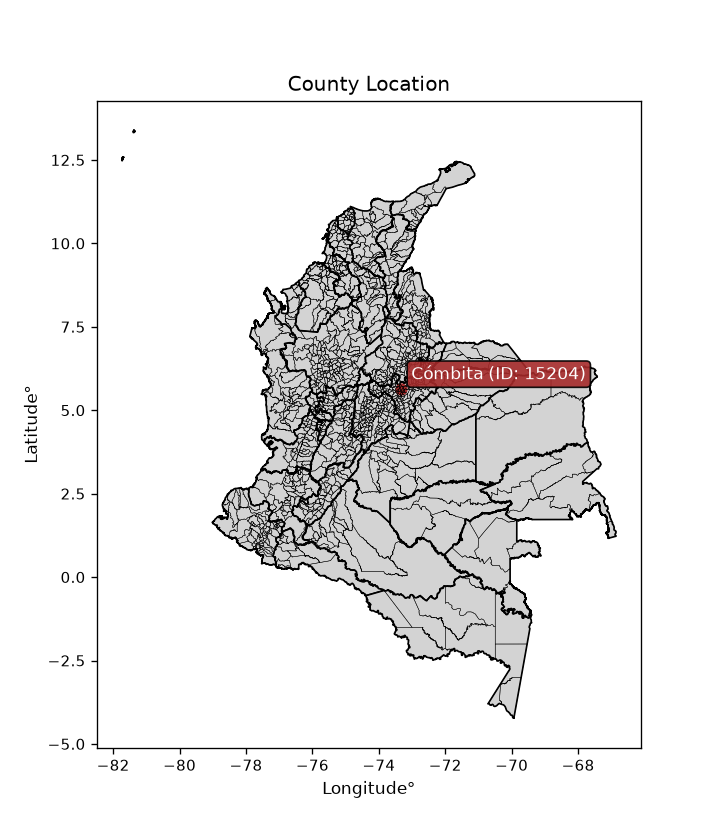
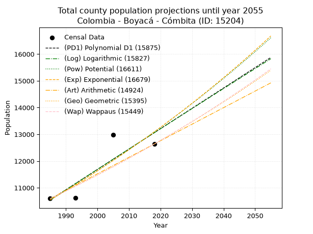
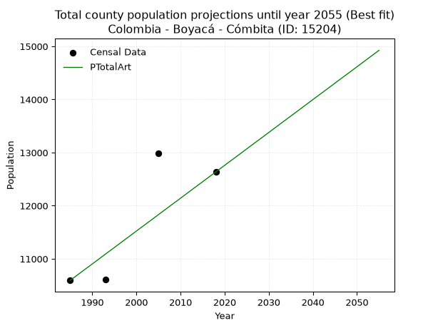
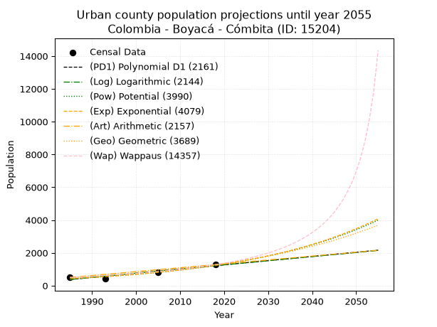
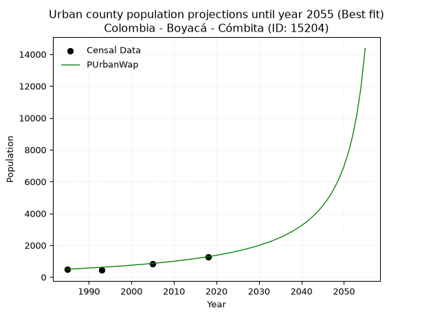
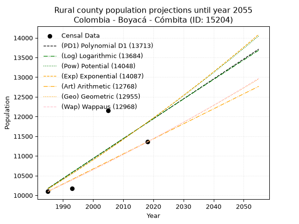
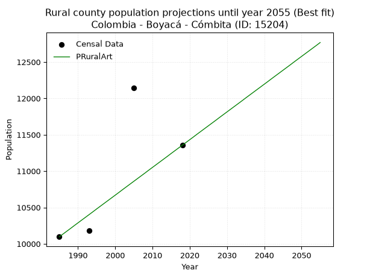

<div align="center">


</div>

# _“Population and Public Services Demand Projections (PPSD) until Year 2050 for Colombia - Boyacá - Cómbita (ID: 15204)”_
Keywords: `population` `public-service` `projection` `lineal` `polynomial` `logarithmic` `potential` `exponential` `arithmetic` `geometric` `wappaus` `dane` `colombia` `south-america`

PPSD are analytical estimates used by governments and planners to anticipate future changes in population size, age distribution, and the resulting community needs for utilities, healthcare, education, and infrastructure as sizing future water treatment facilities, electrical grids, and road networks based on spatial growth.

<div align="center">

</img>

</div>


> **General running parameters**: • app_version: _v20260806_. • Python version: _3.14.7_. • Pandas version: _3.0.5_. • NumPy version: _2.5.1_. • Creates, save and include plots into reports (create_plot): _False_. • Projection until year: _2050_. • Process polynomial degree 2 and up: _False_. • Process Wappaus: _True_. • Process Wappaus: _True_. • Set negative values to zero: _True_. • Set infinite values to zero: _True_. • Drop dataset notes: _True_. 
<div align="center">

Dynamic map: [:earth_americas:Google](http://maps.google.com/maps?q=5.634545423,-73.3239567) [:earth_americas:OSM](https://www.openstreetmap.org/#map=18/5.634545423/-73.3239567&layers=P) [:earth_americas:Bing](https://www.bing.com/maps?cp=5.634545423~-73.3239567&lvl=18) [:earth_americas:Apple](https://maps.apple.com/frame?center=5.634545423%2C-73.3239567&span=0.003%2C0.006)

</div>


<div align="center">

```geojson
{
  "type": "Feature",
  "geometry": {
    "type": "Point", 
    "coordinates": [-73.3239567, 5.634545423]
  }, 
  "properties": {
    "Name": "Colombia - Boyacá - Cómbita (ID: 15204)"
  }
}
```

</div>


## 0. Census Data (4 records)

Census data are official statistics collected by a government about the people and housing in a country. They usually include counts of total population, age, sex, race, income, education, and jobs.

📅Global census file: [Population.xlsx](../data/Population.xlsx)

| Source   |   Year |   CountryID | CountryName   |   StateID | StateName   |   CountyID | CountyName   |   PTotal |   PUrban |   PRural |
|:---------|-------:|------------:|:--------------|----------:|:------------|-----------:|:-------------|---------:|---------:|---------:|
| DANE     |   1985 |          57 | Colombia      |        15 | Boyacá      |      15204 | Cómbita      |    10595 |      498 |    10097 |
| DANE     |   1993 |          57 | Colombia      |        15 | Boyacá      |      15204 | Cómbita      |    10617 |      438 |    10179 |
| DANE     |   2005 |          57 | Colombia      |        15 | Boyacá      |      15204 | Cómbita      |    12981 |      834 |    12147 |
| DANE     |   2018 |          57 | Colombia      |        15 | Boyacá      |      15204 | Cómbita      |    12636 |     1280 |    11356 |

> 🔥Some records could had specific notes about the registered values or the corresponding urban or rural distribution.

📅[SUI-RUPS](https://www.datos.gov.co/Hacienda-y-Cr-dito-P-blico/Registro-nico-de-Prestadores-de-Servicios-P-blicos/4qkq-csdn/about_data) - Local public utility companies: [RUPS.csv](../data/RUPS.xlsx)

 | SERVICIO       | ESTADO    | NOMBRE                                                                                                                       | NIT         | DEPARTAMENTO_DOMICILIO   | MUNICIPIO_DOMICILIO   | DIRECCION                              |   TELEFONO | EMAIL                                    | TIPO_PRESTADOR                 | CLASIFICACION                 |
|:---------------|:----------|:-----------------------------------------------------------------------------------------------------------------------------|:------------|:-------------------------|:----------------------|:---------------------------------------|-----------:|:-----------------------------------------|:-------------------------------|:------------------------------|
| ACUEDUCTO      | OPERATIVA | UNIDAD DE SERVICIOS PUBLICOS DEL MUNICIPIO DE COMBITA                                                                        | 891801932-1 | BOYACA                   | COMBITA               | CALLE 3 No. 5 - 63 - PALACIO MUNICIPAL |    7310010 | infraestructuraysp@combita-boyaca.gov.co | MUNICIPIO (PRESTACIÓN DIRECTA) | MENOR O IGUAL A 2500 USUARIOS |
| ALCANTARILLADO | OPERATIVA | UNIDAD DE SERVICIOS PUBLICOS DEL MUNICIPIO DE COMBITA                                                                        | 891801932-1 | BOYACA                   | COMBITA               | CALLE 3 No. 5 - 63 - PALACIO MUNICIPAL |    7310010 | infraestructuraysp@combita-boyaca.gov.co | MUNICIPIO (PRESTACIÓN DIRECTA) | MENOR O IGUAL A 2500 USUARIOS |
| ACUEDUCTO      | OPERATIVA | ASOCIACION DE SUSCRIPTORES DEL ACUEDUCTO SAN MIGUEL MUNICIPIO DE COMBITA                                                     | 900095436-1 | BOYACA                   | COMBITA               | 3 N° 5-63                              |    7401823 | victoreduardoamezquita1941@gmail.co      | ORGANIZACION AUTORIZADA        | MENOR O IGUAL A 2500 USUARIOS |
| ACUEDUCTO      | OPERATIVA | ASOCIACION DE SUSCRIPTORES DEL ACUEDUCTO CHORRO DEL MUNICIPIO DE COMBITA DEPARTAMENTO DE BOYACÁ                              | 900080531-6 | BOYACA                   | COMBITA               | VEREDA SAN FRANCISCO  COMBITA          |    7430660 | nancyyolandacardenas@hotmial.com         | ORGANIZACION AUTORIZADA        | HASTA 2500 SUSCRIPTORES       |
| ACUEDUCTO      | OPERATIVA | ASOCIACION DE SUSCRIPTORES DEL ACUEDUCTO LA CAL                                                                              | 900146605-8 | BOYACA                   | COMBITA               | Personería  Municipal Cómbita          |    7310010 | rojasfabian85@gmail.com                  | ORGANIZACION AUTORIZADA        | HASTA 2500 SUSCRIPTORES       |
| ACUEDUCTO      | OPERATIVA | ASOCIACION DE SUSCRIPTORES DEL ACUEDUCTO CHINATA LA CAL CHIQUITA DE LA VEREDA SAN RAFAEL  DEL MUNICIPIO DE COMBITA - BOYACA  | 900095956-8 | BOYACA                   | COMBITA               | Personería Municipal Cómbita           |    7310010 | luisenriquemedinaruiz@hotmail.com        | ORGANIZACION AUTORIZADA        | HASTA 2500 SUSCRIPTORES       |
| ACUEDUCTO      | OPERATIVA | ASOCIACION DE SUSCRIPTORES DEL ACUEDUCTO EL CHORRO DE LA NINFA, VEREDAS SAN RAFAEL Y OTRAS DEL MUNICIPIO DE COMBITA - BOYACA | 900060292-5 | BOYACA                   | COMBITA               | Personeria Municipal Cómbita           |    7310010 | ACUACHORRO@HOTMAIL.COM                   | ORGANIZACION AUTORIZADA        | HASTA 2500 SUSCRIPTORES       |
| ACUEDUCTO      | OPERATIVA | ASOCIACIÓN DE SUCRIPTORES DEL ACUEDUCTO REGIONAL COMBITA RED NUMERO 2 DEL MUNICIPIO DE CÓMBITA                               | 900005200-4 | BOYACA                   | COMBITA               | calle 42A No 8A - 15 Tunja             |    3125385 | acueductored2@gmail.com                  | ORGANIZACION AUTORIZADA        | MENOR O IGUAL A 2500 USUARIOS |
| ACUEDUCTO      | OPERATIVA | ASOCIACION DE SUSCRIPTORES DEL ACUEDUCTO EL CHUSCAL DE LA VEREDA DE SAN ISIDRO MUNICIPIO DE COMBITA                          | 900068788-2 | BOYACA                   | TUNJA                 | CALLE 42A No 8A - 15                   |    7310010 | contactenos@combita-boyaca.gov.co        | ORGANIZACION AUTORIZADA        | HASTA 2500 SUSCRIPTORES       |
| ACUEDUCTO      | OPERATIVA | ASOCIACIÓN ACUEDUCTO POZO PROFUNDO VEREDA LA CONCEPCIÓN MUNICIPIO DE COMBITA                                                 | 900241277-1 | BOYACA                   | COMBITA               | CLL 3 NO 6 - 22                        |    7310081 | asocia@hotmail.com                       | ORGANIZACION AUTORIZADA        | HASTA 2500 SUSCRIPTORES       |
| ACUEDUCTO      | OPERATIVA | ASOCIACION DE SUSCRIPTORES DEL ACUEDUCTO EL PETAQUINAL DEL MUNICIPIO DE COMBITA                                              | 820005602-1 | BOYACA                   | COMBITA               | VEREDA SANTA BARBARA                   |    7310010 | joviriga@gmail.com                       | ORGANIZACION AUTORIZADA        | MENOR O IGUAL A 2500 USUARIOS |
| ACUEDUCTO      | OPERATIVA | ASOCIACION DE SUSCRIPTORES DEL ACUEDUCTO EL CAJON DE LA VEREDA SANTA BARBARA DEL MUNICIPIO DE COMBITA                        | 900023550-3 | BOYACA                   | COMBITA               | Vereda Santa Barbara                   |    7310010 | joviriga@gmail.com                       | ORGANIZACION AUTORIZADA        | HASTA 2500 SUSCRIPTORES       |
| ACUEDUCTO      | OPERATIVA | JUNTA ADMINISTRADORA DEL ACUEDUCTO VEREDAL SECTOR 1 DE LA COMUNIDAD DE LA VEREDA EL CARMEN                                   | 820003954-1 | BOYACA                   | COMBITA               | Vereda el Carmen - Combita             |    6957660 | acueductoveredaelcarmen@gmail.com        | ORGANIZACION AUTORIZADA        | MENOR O IGUAL A 2500 USUARIOS |
| ACUEDUCTO      | OPERATIVA | ASOCIACION DE SUSCRIPTORES DEL ACUEDUCTO REGIONAL NO.1 DE COMBITA                                                            | 820005061-7 | BOYACA                   | COMBITA               | CL 20 12 84 OFICINA 220A PLAZA REAL    |    7402711 | acueductocombita1@gmail.com              | ORGANIZACION AUTORIZADA        | HASTA 2500 SUSCRIPTORES       |
| ACUEDUCTO      | OPERATIVA | ASOCIACION DE USUARIOS DEL ACUEDUCTO EL TRIUNFO DE LA VEREDA SAN MARTIN                                                      | 820001988-0 | BOYACA                   | COMBITA               | TRV 2 ESTE 64 - 09                     |    7310010 | astriunfo@hotmail.com                    | ORGANIZACION AUTORIZADA        | HASTA 2500 SUSCRIPTORES       |
| ACUEDUCTO      | OPERATIVA | ASOCIACION DE SUSCRIPTORES DEL ACUEDUCTO LA POSETA DE LA VEREDA LAS MERCEDES DEL MUNICIPIO DE COMBITA                        | 900084504-5 | BOYACA                   | COMBITA               | CRA 5 No 2 - 98                        |    7310010 | polloirra1964@hotmail.com                | ORGANIZACION AUTORIZADA        | HASTA 2500 SUSCRIPTORES       |
| ACUEDUCTO      | OPERATIVA | ASOCIACION DE SUSCRIPTORES DEL ACUEDUCTO POZO PROFUNDO SURQUIRA VEREDA SAN ISIDRO                                            | 900271637-8 | BOYACA                   | COMBITA               | VEREDA SAN ISIDRO                      |    3125385 | nancycardenasmora@hotmail.com            | ORGANIZACION AUTORIZADA        | HASTA 2500 SUSCRIPTORES       |
| ACUEDUCTO      | OPERATIVA | ACUEDUCTO SAN ANTONIO                                                                                                        | 900265251-4 | BOYACA                   | COMBITA               | VEREDA LAS MERCEDES                    |    7310097 | contactenos@combita-boyaca.gov.co        | ORGANIZACION AUTORIZADA        | HASTA 2500 SUSCRIPTORES       |

## 1. Total

### 1.1. Coefficients and Parameters

* (PD1) Polynomial Deg 1: 76.11682055399449, -140545.42031312748 (lineal)
* (Log) Logarithmic: 152460.52648549716, -1147146.433558248
* (Pow) Potential: 13.111746359900001, -39.21636395530239
* (Exp) Exponential: 0.006546261754792176, 0.023976383177363055
* (Art) Arithmetic: Year diff. 2018 - 1985 = 33, Population diff. 12636 - 10595 = 2041, Annual growth = 61.84848484848485
* (Geo) Geometric: Year diff. 2018 - 1985 = 33, Population diff. 12636 - 10595 = 2041, Annual growth % = 0.005352689612353467
* (Wap) Wappaus: i = 0.532465109969307, Condition values only valid for < 200)

<sub>
Wappaus condition values: ['0.00', '0.53', '1.06', '1.60', '2.13', '2.66', '3.19', '3.73', '4.26', '4.79', '5.32', '5.86', '6.39', '6.92', '7.45', '7.99', '8.52', '9.05', '9.58', '10.12', '10.65', '11.18', '11.71', '12.25', '12.78', '13.31', '13.84', '14.38', '14.91', '15.44', '15.97', '16.51', '17.04', '17.57', '18.10', '18.64', '19.17', '19.70', '20.23', '20.77', '21.30', '21.83', '22.36', '22.90', '23.43', '23.96', '24.49', '25.03', '25.56', '26.09', '26.62', '27.16', '27.69', '28.22', '28.75', '29.29', '29.82', '30.35', '30.88', '31.42', '31.95', '32.48', '33.01', '33.55', '34.08', '34.61']
</sub>


### 1.2. Projected Dataset

|   Year |   CountyID |   PTotalPD1 |   PTotalLog |   PTotalPow |   PTotalExp |   PTotalArt |   PTotalGeo |   PTotalWap |
|-------:|-----------:|------------:|------------:|------------:|------------:|------------:|------------:|------------:|
|   1985 |      15204 |       10546 |       10543 |       10545 |       10547 |       10595 |       10595 |       10595 |
|   1986 |      15204 |       10623 |       10620 |       10615 |       10617 |       10657 |       10652 |       10652 |
|   1987 |      15204 |       10699 |       10697 |       10685 |       10686 |       10719 |       10709 |       10708 |
|   1988 |      15204 |       10775 |       10774 |       10756 |       10757 |       10781 |       10766 |       10766 |
|   1989 |      15204 |       10851 |       10850 |       10827 |       10827 |       10842 |       10824 |       10823 |
|   1990 |      15204 |       10927 |       10927 |       10898 |       10898 |       10904 |       10882 |       10881 |
|   1991 |      15204 |       11003 |       11004 |       10970 |       10970 |       10966 |       10940 |       10939 |
|   1992 |      15204 |       11079 |       11080 |       11043 |       11042 |       11028 |       10998 |       10997 |
|   1993 |      15204 |       11155 |       11157 |       11116 |       11115 |       11090 |       11057 |       11056 |
|   1994 |      15204 |       11232 |       11233 |       11189 |       11188 |       11152 |       11116 |       11115 |
|   1995 |      15204 |       11308 |       11310 |       11263 |       11261 |       11213 |       11176 |       11175 |
|   1996 |      15204 |       11384 |       11386 |       11337 |       11335 |       11275 |       11236 |       11234 |
|   1997 |      15204 |       11460 |       11462 |       11412 |       11409 |       11337 |       11296 |       11294 |
|   1998 |      15204 |       11536 |       11539 |       11487 |       11484 |       11399 |       11356 |       11355 |
|   1999 |      15204 |       11612 |       11615 |       11563 |       11560 |       11461 |       11417 |       11415 |
|   2000 |      15204 |       11688 |       11691 |       11639 |       11636 |       11523 |       11478 |       11476 |
|   2001 |      15204 |       11764 |       11767 |       11715 |       11712 |       11585 |       11540 |       11538 |
|   2002 |      15204 |       11840 |       11844 |       11792 |       11789 |       11646 |       11602 |       11600 |
|   2003 |      15204 |       11917 |       11920 |       11870 |       11867 |       11708 |       11664 |       11662 |
|   2004 |      15204 |       11993 |       11996 |       11948 |       11944 |       11770 |       11726 |       11724 |
|   2005 |      15204 |       12069 |       12072 |       12026 |       12023 |       11832 |       11789 |       11787 |
|   2006 |      15204 |       12145 |       12148 |       12105 |       12102 |       11894 |       11852 |       11850 |
|   2007 |      15204 |       12221 |       12224 |       12184 |       12181 |       11956 |       11915 |       11913 |
|   2008 |      15204 |       12297 |       12300 |       12264 |       12261 |       12018 |       11979 |       11977 |
|   2009 |      15204 |       12373 |       12376 |       12344 |       12342 |       12079 |       12043 |       12041 |
|   2010 |      15204 |       12449 |       12452 |       12425 |       12423 |       12141 |       12108 |       12106 |
|   2011 |      15204 |       12526 |       12527 |       12507 |       12505 |       12203 |       12173 |       12171 |
|   2012 |      15204 |       12602 |       12603 |       12588 |       12587 |       12265 |       12238 |       12236 |
|   2013 |      15204 |       12678 |       12679 |       12671 |       12669 |       12327 |       12303 |       12302 |
|   2014 |      15204 |       12754 |       12755 |       12753 |       12753 |       12389 |       12369 |       12368 |
|   2015 |      15204 |       12830 |       12830 |       12837 |       12836 |       12450 |       12435 |       12434 |
|   2016 |      15204 |       12906 |       12906 |       12920 |       12921 |       12512 |       12502 |       12501 |
|   2017 |      15204 |       12982 |       12982 |       13005 |       13005 |       12574 |       12569 |       12568 |
|   2018 |      15204 |       13058 |       13057 |       13090 |       13091 |       12636 |       12636 |       12636 |
|   2019 |      15204 |       13134 |       13133 |       13175 |       13177 |       12698 |       12704 |       12704 |
|   2020 |      15204 |       13211 |       13208 |       13261 |       13263 |       12760 |       12772 |       12772 |
|   2021 |      15204 |       13287 |       13284 |       13347 |       13350 |       12822 |       12840 |       12841 |
|   2022 |      15204 |       13363 |       13359 |       13434 |       13438 |       12883 |       12909 |       12910 |
|   2023 |      15204 |       13439 |       13434 |       13521 |       13526 |       12945 |       12978 |       12980 |
|   2024 |      15204 |       13515 |       13510 |       13609 |       13615 |       13007 |       13047 |       13050 |
|   2025 |      15204 |       13591 |       13585 |       13698 |       13705 |       13069 |       13117 |       13121 |
|   2026 |      15204 |       13667 |       13660 |       13786 |       13795 |       13131 |       13187 |       13191 |
|   2027 |      15204 |       13743 |       13736 |       13876 |       13885 |       13193 |       13258 |       13263 |
|   2028 |      15204 |       13819 |       13811 |       13966 |       13977 |       13254 |       13329 |       13334 |
|   2029 |      15204 |       13896 |       13886 |       14057 |       14068 |       13316 |       13400 |       13407 |
|   2030 |      15204 |       13972 |       13961 |       14148 |       14161 |       13378 |       13472 |       13479 |
|   2031 |      15204 |       14048 |       14036 |       14239 |       14254 |       13440 |       13544 |       13552 |
|   2032 |      15204 |       14124 |       14111 |       14332 |       14347 |       13502 |       13617 |       13626 |
|   2033 |      15204 |       14200 |       14186 |       14424 |       14442 |       13564 |       13689 |       13700 |
|   2034 |      15204 |       14276 |       14261 |       14518 |       14536 |       13626 |       13763 |       13774 |
|   2035 |      15204 |       14352 |       14336 |       14611 |       14632 |       13687 |       13836 |       13849 |
|   2036 |      15204 |       14428 |       14411 |       14706 |       14728 |       13749 |       13910 |       13924 |
|   2037 |      15204 |       14505 |       14486 |       14801 |       14825 |       13811 |       13985 |       14000 |
|   2038 |      15204 |       14581 |       14561 |       14896 |       14922 |       13873 |       14060 |       14076 |
|   2039 |      15204 |       14657 |       14636 |       14993 |       15020 |       13935 |       14135 |       14153 |
|   2040 |      15204 |       14733 |       14710 |       15089 |       15119 |       13997 |       14211 |       14230 |
|   2041 |      15204 |       14809 |       14785 |       15187 |       15218 |       14059 |       14287 |       14308 |
|   2042 |      15204 |       14885 |       14860 |       15284 |       15318 |       14120 |       14363 |       14386 |
|   2043 |      15204 |       14961 |       14934 |       15383 |       15419 |       14182 |       14440 |       14465 |
|   2044 |      15204 |       15037 |       15009 |       15482 |       15520 |       14244 |       14517 |       14544 |
|   2045 |      15204 |       15113 |       15083 |       15581 |       15622 |       14306 |       14595 |       14623 |
|   2046 |      15204 |       15190 |       15158 |       15682 |       15724 |       14368 |       14673 |       14704 |
|   2047 |      15204 |       15266 |       15233 |       15782 |       15828 |       14430 |       14752 |       14784 |
|   2048 |      15204 |       15342 |       15307 |       15884 |       15932 |       14491 |       14831 |       14865 |
|   2049 |      15204 |       15418 |       15381 |       15986 |       16036 |       14553 |       14910 |       14947 |
|   2050 |      15204 |       15494 |       15456 |       16088 |       16142 |       14615 |       14990 |       15029 |
<div align="center">

</img>

</div>


### 1.3. Best fit with absolute and relative error (%)

Relative error puts that difference into context by dividing the absolute error by the true value, creating a unitless ratio or percentage that shows the scale of the mistake.

Absolute and relative error

|   Year | Source   |   CountryID | CountryName   |   StateID | StateName   |   CountyID_x | CountyName   |   PTotal |   PUrban |   PRural |   CountyID_y |   PTotalPD1 |   PTotalLog |   PTotalPow |   PTotalExp |   PTotalArt |   PTotalGeo |   PTotalWap |   PTotalPD1AbsError |   PTotalLogAbsError |   PTotalPowAbsError |   PTotalExpAbsError |   PTotalArtAbsError |   PTotalGeoAbsError |   PTotalWapAbsError |   PTotalPD1RelError |   PTotalLogRelError |   PTotalPowRelError |   PTotalExpRelError |   PTotalArtRelError |   PTotalGeoRelError |   PTotalWapRelError |
|-------:|:---------|------------:|:--------------|----------:|:------------|-------------:|:-------------|---------:|---------:|---------:|-------------:|------------:|------------:|------------:|------------:|------------:|------------:|------------:|--------------------:|--------------------:|--------------------:|--------------------:|--------------------:|--------------------:|--------------------:|--------------------:|--------------------:|--------------------:|--------------------:|--------------------:|--------------------:|--------------------:|
|   1985 | DANE     |          57 | Colombia      |        15 | Boyacá      |        15204 | Cómbita      |    10595 |      498 |    10097 |        15204 |       10546 |       10543 |       10545 |       10547 |       10595 |       10595 |       10595 |                  49 |                  52 |                  50 |                  48 |                   0 |                   0 |                   0 |            0.462482 |            0.490798 |            0.471921 |            0.453044 |             0       |             0       |             0       |
|   1993 | DANE     |          57 | Colombia      |        15 | Boyacá      |        15204 | Cómbita      |    10617 |      438 |    10179 |        15204 |       11155 |       11157 |       11116 |       11115 |       11090 |       11057 |       11056 |                 538 |                 540 |                 499 |                 498 |                 473 |                 440 |                 439 |            5.06734  |            5.08618  |            4.70001  |            4.69059  |             4.45512 |             4.1443  |             4.13488 |
|   2005 | DANE     |          57 | Colombia      |        15 | Boyacá      |        15204 | Cómbita      |    12981 |      834 |    12147 |        15204 |       12069 |       12072 |       12026 |       12023 |       11832 |       11789 |       11787 |                 912 |                 909 |                 955 |                 958 |                1149 |                1192 |                1194 |            7.02565  |            7.00254  |            7.35691  |            7.38002  |             8.8514  |             9.18265 |             9.19806 |
|   2018 | DANE     |          57 | Colombia      |        15 | Boyacá      |        15204 | Cómbita      |    12636 |     1280 |    11356 |        15204 |       13058 |       13057 |       13090 |       13091 |       12636 |       12636 |       12636 |                 422 |                 421 |                 454 |                 455 |                   0 |                   0 |                   0 |            3.33966  |            3.33175  |            3.59291  |            3.60082  |             0       |             0       |             0       |

Relative error mean

| Method    |   RelError | Best   |
|:----------|-----------:|:-------|
| PTotalPD1 |    3.97379 |        |
| PTotalLog |    3.97782 |        |
| PTotalPow |    4.03044 |        |
| PTotalExp |    4.03112 |        |
| PTotalArt |    3.32663 | True   |
| PTotalGeo |    3.33174 |        |
| PTotalWap |    3.33323 |        |

💙Best method: _**PTotalArt**_
<div align="center">

</img>

</div>


### 1.4. Fresh water supply demand in liters per capita per day (lpcd)

The fresh water supply demand typically ranges from 100 to 300 liters per capita per day (lpcd) for standard domestic and municipal planning, though absolute survival minimums set by the World Health Organization are as low as 7.5 to 20 liters per day, and total consumption in high-income nations can exceed 400 liters.

> `CZ`: Level in meters above the sea level (masl)<br> `WS`: Fresh water supply demand in liters per capita per day (lpcd or l/h/d)<br> `WSAll`: Zonal fresh water supply demand in liters per second (l/s)<br> `A`: Zonal area in square meters<br> `DP`: Population density (people/hectare or p/ha)

Reference values (RAS Colombia)

|    CZ |   WS |
|------:|-----:|
|  1000 |  120 |
|  2000 |  130 |
| 99999 |  140 |

County shapefile geometry properties and water supply values

|   CountyID |      ATotal |   CZTotal |   WSTotal |
|-----------:|------------:|----------:|----------:|
|      15204 | 1.38003e+08 |   2974.02 |       140 |

Projected values for best method: PTotalArt

|   CountyID |   Year |   PTotalArt |   DPTotal |   WSTotal |   WSTotalAll |
|-----------:|-------:|------------:|----------:|----------:|-------------:|
|      15204 |   1985 |       10595 |      0.77 |       140 |      17.1678 |
|      15204 |   1986 |       10657 |      0.77 |       140 |      17.2683 |
|      15204 |   1987 |       10719 |      0.78 |       140 |      17.3687 |
|      15204 |   1988 |       10781 |      0.78 |       140 |      17.4692 |
|      15204 |   1989 |       10842 |      0.79 |       140 |      17.5681 |
|      15204 |   1990 |       10904 |      0.79 |       140 |      17.6685 |
|      15204 |   1991 |       10966 |      0.79 |       140 |      17.769  |
|      15204 |   1992 |       11028 |      0.8  |       140 |      17.8694 |
|      15204 |   1993 |       11090 |      0.8  |       140 |      17.9699 |
|      15204 |   1994 |       11152 |      0.81 |       140 |      18.0704 |
|      15204 |   1995 |       11213 |      0.81 |       140 |      18.1692 |
|      15204 |   1996 |       11275 |      0.82 |       140 |      18.2697 |
|      15204 |   1997 |       11337 |      0.82 |       140 |      18.3701 |
|      15204 |   1998 |       11399 |      0.83 |       140 |      18.4706 |
|      15204 |   1999 |       11461 |      0.83 |       140 |      18.5711 |
|      15204 |   2000 |       11523 |      0.83 |       140 |      18.6715 |
|      15204 |   2001 |       11585 |      0.84 |       140 |      18.772  |
|      15204 |   2002 |       11646 |      0.84 |       140 |      18.8708 |
|      15204 |   2003 |       11708 |      0.85 |       140 |      18.9713 |
|      15204 |   2004 |       11770 |      0.85 |       140 |      19.0718 |
|      15204 |   2005 |       11832 |      0.86 |       140 |      19.1722 |
|      15204 |   2006 |       11894 |      0.86 |       140 |      19.2727 |
|      15204 |   2007 |       11956 |      0.87 |       140 |      19.3731 |
|      15204 |   2008 |       12018 |      0.87 |       140 |      19.4736 |
|      15204 |   2009 |       12079 |      0.88 |       140 |      19.5725 |
|      15204 |   2010 |       12141 |      0.88 |       140 |      19.6729 |
|      15204 |   2011 |       12203 |      0.88 |       140 |      19.7734 |
|      15204 |   2012 |       12265 |      0.89 |       140 |      19.8738 |
|      15204 |   2013 |       12327 |      0.89 |       140 |      19.9743 |
|      15204 |   2014 |       12389 |      0.9  |       140 |      20.0748 |
|      15204 |   2015 |       12450 |      0.9  |       140 |      20.1736 |
|      15204 |   2016 |       12512 |      0.91 |       140 |      20.2741 |
|      15204 |   2017 |       12574 |      0.91 |       140 |      20.3745 |
|      15204 |   2018 |       12636 |      0.92 |       140 |      20.475  |
|      15204 |   2019 |       12698 |      0.92 |       140 |      20.5755 |
|      15204 |   2020 |       12760 |      0.92 |       140 |      20.6759 |
|      15204 |   2021 |       12822 |      0.93 |       140 |      20.7764 |
|      15204 |   2022 |       12883 |      0.93 |       140 |      20.8752 |
|      15204 |   2023 |       12945 |      0.94 |       140 |      20.9757 |
|      15204 |   2024 |       13007 |      0.94 |       140 |      21.0762 |
|      15204 |   2025 |       13069 |      0.95 |       140 |      21.1766 |
|      15204 |   2026 |       13131 |      0.95 |       140 |      21.2771 |
|      15204 |   2027 |       13193 |      0.96 |       140 |      21.3775 |
|      15204 |   2028 |       13254 |      0.96 |       140 |      21.4764 |
|      15204 |   2029 |       13316 |      0.96 |       140 |      21.5769 |
|      15204 |   2030 |       13378 |      0.97 |       140 |      21.6773 |
|      15204 |   2031 |       13440 |      0.97 |       140 |      21.7778 |
|      15204 |   2032 |       13502 |      0.98 |       140 |      21.8782 |
|      15204 |   2033 |       13564 |      0.98 |       140 |      21.9787 |
|      15204 |   2034 |       13626 |      0.99 |       140 |      22.0792 |
|      15204 |   2035 |       13687 |      0.99 |       140 |      22.178  |
|      15204 |   2036 |       13749 |      1    |       140 |      22.2785 |
|      15204 |   2037 |       13811 |      1    |       140 |      22.3789 |
|      15204 |   2038 |       13873 |      1.01 |       140 |      22.4794 |
|      15204 |   2039 |       13935 |      1.01 |       140 |      22.5799 |
|      15204 |   2040 |       13997 |      1.01 |       140 |      22.6803 |
|      15204 |   2041 |       14059 |      1.02 |       140 |      22.7808 |
|      15204 |   2042 |       14120 |      1.02 |       140 |      22.8796 |
|      15204 |   2043 |       14182 |      1.03 |       140 |      22.9801 |
|      15204 |   2044 |       14244 |      1.03 |       140 |      23.0806 |
|      15204 |   2045 |       14306 |      1.04 |       140 |      23.181  |
|      15204 |   2046 |       14368 |      1.04 |       140 |      23.2815 |
|      15204 |   2047 |       14430 |      1.05 |       140 |      23.3819 |
|      15204 |   2048 |       14491 |      1.05 |       140 |      23.4808 |
|      15204 |   2049 |       14553 |      1.05 |       140 |      23.5813 |
|      15204 |   2050 |       14615 |      1.06 |       140 |      23.6817 |

## 2. Urban

### 2.1. Coefficients and Parameters

* (PD1) Polynomial Deg 1: 25.55038137294229, -50344.65034122781 (lineal)
* (Log) Logarithmic: 51109.34668835966, -387720.05374282226
* (Pow) Potential: 64.6909243715309, -210.70787745828858
* (Exp) Exponential: 0.03233447285679031, 5.660996986448013e-26
* (Art) Arithmetic: Year diff. 2018 - 1985 = 33, Population diff. 1280 - 498 = 782, Annual growth = 23.696969696969695
* (Geo) Geometric: Year diff. 2018 - 1985 = 33, Population diff. 1280 - 498 = 782, Annual growth % = 0.029019619904782967
* (Wap) Wappaus: i = 2.665575893922351, Condition values only valid for < 200)

<sub>
Wappaus condition values: ['0.00', '2.67', '5.33', '8.00', '10.66', '13.33', '15.99', '18.66', '21.32', '23.99', '26.66', '29.32', '31.99', '34.65', '37.32', '39.98', '42.65', '45.31', '47.98', '50.65', '53.31', '55.98', '58.64', '61.31', '63.97', '66.64', '69.30', '71.97', '74.64', '77.30', '79.97', '82.63', '85.30', '87.96', '90.63', '93.30', '95.96', '98.63', '101.29', '103.96', '106.62', '109.29', '111.95', '114.62', '117.29', '119.95', '122.62', '125.28', '127.95', '130.61', '133.28', '135.94', '138.61', '141.28', '143.94', '146.61', '149.27', '151.94', '154.60', '157.27', '159.93', '162.60', '165.27', '167.93', '170.60', '173.26']
</sub>


### 2.2. Projected Dataset

|   Year |   CountyID |   PUrbanPD1 |   PUrbanLog |   PUrbanPow |   PUrbanExp |   PUrbanArt |   PUrbanGeo |   PUrbanWap |
|-------:|-----------:|------------:|------------:|------------:|------------:|------------:|------------:|------------:|
|   1985 |      15204 |         373 |         372 |         424 |         424 |         498 |         498 |         498 |
|   1986 |      15204 |         398 |         398 |         438 |         438 |         522 |         512 |         511 |
|   1987 |      15204 |         424 |         424 |         452 |         453 |         545 |         527 |         525 |
|   1988 |      15204 |         450 |         450 |         467 |         467 |         569 |         543 |         539 |
|   1989 |      15204 |         475 |         475 |         483 |         483 |         593 |         558 |         554 |
|   1990 |      15204 |         501 |         501 |         499 |         499 |         616 |         575 |         569 |
|   1991 |      15204 |         526 |         527 |         515 |         515 |         640 |         591 |         585 |
|   1992 |      15204 |         552 |         552 |         532 |         532 |         664 |         608 |         600 |
|   1993 |      15204 |         577 |         578 |         550 |         549 |         688 |         626 |         617 |
|   1994 |      15204 |         603 |         604 |         568 |         568 |         711 |         644 |         634 |
|   1995 |      15204 |         628 |         629 |         587 |         586 |         735 |         663 |         651 |
|   1996 |      15204 |         654 |         655 |         606 |         605 |         759 |         682 |         669 |
|   1997 |      15204 |         679 |         680 |         626 |         625 |         782 |         702 |         688 |
|   1998 |      15204 |         705 |         706 |         647 |         646 |         806 |         722 |         707 |
|   1999 |      15204 |         731 |         732 |         668 |         667 |         830 |         743 |         726 |
|   2000 |      15204 |         756 |         757 |         690 |         689 |         853 |         765 |         747 |
|   2001 |      15204 |         782 |         783 |         713 |         712 |         877 |         787 |         768 |
|   2002 |      15204 |         807 |         808 |         736 |         735 |         901 |         810 |         790 |
|   2003 |      15204 |         833 |         834 |         760 |         759 |         925 |         833 |         812 |
|   2004 |      15204 |         858 |         859 |         785 |         784 |         948 |         858 |         836 |
|   2005 |      15204 |         884 |         885 |         811 |         810 |         972 |         882 |         860 |
|   2006 |      15204 |         909 |         910 |         837 |         837 |         996 |         908 |         885 |
|   2007 |      15204 |         935 |         936 |         865 |         864 |        1019 |         934 |         911 |
|   2008 |      15204 |         961 |         961 |         893 |         892 |        1043 |         962 |         938 |
|   2009 |      15204 |         986 |         987 |         922 |         922 |        1067 |         989 |         966 |
|   2010 |      15204 |        1012 |        1012 |         953 |         952 |        1090 |        1018 |         996 |
|   2011 |      15204 |        1037 |        1037 |         984 |         983 |        1114 |        1048 |        1026 |
|   2012 |      15204 |        1063 |        1063 |        1016 |        1016 |        1138 |        1078 |        1058 |
|   2013 |      15204 |        1088 |        1088 |        1049 |        1049 |        1162 |        1109 |        1091 |
|   2014 |      15204 |        1114 |        1114 |        1083 |        1084 |        1185 |        1142 |        1125 |
|   2015 |      15204 |        1139 |        1139 |        1119 |        1119 |        1209 |        1175 |        1162 |
|   2016 |      15204 |        1165 |        1164 |        1155 |        1156 |        1233 |        1209 |        1199 |
|   2017 |      15204 |        1190 |        1190 |        1193 |        1194 |        1256 |        1244 |        1239 |
|   2018 |      15204 |        1216 |        1215 |        1232 |        1233 |        1280 |        1280 |        1280 |
|   2019 |      15204 |        1242 |        1240 |        1272 |        1274 |        1304 |        1317 |        1323 |
|   2020 |      15204 |        1267 |        1266 |        1313 |        1316 |        1327 |        1355 |        1369 |
|   2021 |      15204 |        1293 |        1291 |        1356 |        1359 |        1351 |        1395 |        1417 |
|   2022 |      15204 |        1318 |        1316 |        1400 |        1403 |        1375 |        1435 |        1467 |
|   2023 |      15204 |        1344 |        1342 |        1446 |        1450 |        1398 |        1477 |        1520 |
|   2024 |      15204 |        1369 |        1367 |        1493 |        1497 |        1422 |        1520 |        1576 |
|   2025 |      15204 |        1395 |        1392 |        1541 |        1546 |        1446 |        1564 |        1635 |
|   2026 |      15204 |        1420 |        1417 |        1591 |        1597 |        1470 |        1609 |        1698 |
|   2027 |      15204 |        1446 |        1442 |        1643 |        1650 |        1493 |        1656 |        1764 |
|   2028 |      15204 |        1472 |        1468 |        1696 |        1704 |        1517 |        1704 |        1835 |
|   2029 |      15204 |        1497 |        1493 |        1751 |        1760 |        1541 |        1753 |        1910 |
|   2030 |      15204 |        1523 |        1518 |        1808 |        1818 |        1564 |        1804 |        1990 |
|   2031 |      15204 |        1548 |        1543 |        1866 |        1878 |        1588 |        1857 |        2076 |
|   2032 |      15204 |        1574 |        1568 |        1926 |        1939 |        1612 |        1910 |        2168 |
|   2033 |      15204 |        1599 |        1594 |        1989 |        2003 |        1635 |        1966 |        2267 |
|   2034 |      15204 |        1625 |        1619 |        2053 |        2069 |        1659 |        2023 |        2373 |
|   2035 |      15204 |        1650 |        1644 |        2119 |        2137 |        1683 |        2082 |        2488 |
|   2036 |      15204 |        1676 |        1669 |        2188 |        2207 |        1707 |        2142 |        2612 |
|   2037 |      15204 |        1701 |        1694 |        2258 |        2279 |        1730 |        2204 |        2747 |
|   2038 |      15204 |        1727 |        1719 |        2331 |        2354 |        1754 |        2268 |        2894 |
|   2039 |      15204 |        1753 |        1744 |        2406 |        2432 |        1778 |        2334 |        3055 |
|   2040 |      15204 |        1778 |        1769 |        2484 |        2512 |        1801 |        2402 |        3233 |
|   2041 |      15204 |        1804 |        1794 |        2564 |        2594 |        1825 |        2471 |        3429 |
|   2042 |      15204 |        1829 |        1819 |        2647 |        2679 |        1849 |        2543 |        3647 |
|   2043 |      15204 |        1855 |        1844 |        2732 |        2768 |        1872 |        2617 |        3890 |
|   2044 |      15204 |        1880 |        1869 |        2820 |        2858 |        1896 |        2693 |        4164 |
|   2045 |      15204 |        1906 |        1894 |        2910 |        2952 |        1920 |        2771 |        4474 |
|   2046 |      15204 |        1931 |        1919 |        3004 |        3049 |        1944 |        2851 |        4828 |
|   2047 |      15204 |        1957 |        1944 |        3100 |        3150 |        1967 |        2934 |        5237 |
|   2048 |      15204 |        1983 |        1969 |        3200 |        3253 |        1991 |        3019 |        5714 |
|   2049 |      15204 |        2008 |        1994 |        3302 |        3360 |        2015 |        3107 |        6277 |
|   2050 |      15204 |        2034 |        2019 |        3408 |        3471 |        2038 |        3197 |        6952 |
<div align="center">

</img>

</div>


### 2.3. Best fit with absolute and relative error (%)

Relative error puts that difference into context by dividing the absolute error by the true value, creating a unitless ratio or percentage that shows the scale of the mistake.

Absolute and relative error

|   Year | Source   |   CountryID | CountryName   |   StateID | StateName   |   CountyID_x | CountyName   |   PTotal |   PUrban |   PRural |   CountyID_y |   PUrbanPD1 |   PUrbanLog |   PUrbanPow |   PUrbanExp |   PUrbanArt |   PUrbanGeo |   PUrbanWap |   PUrbanPD1AbsError |   PUrbanLogAbsError |   PUrbanPowAbsError |   PUrbanExpAbsError |   PUrbanArtAbsError |   PUrbanGeoAbsError |   PUrbanWapAbsError |   PUrbanPD1RelError |   PUrbanLogRelError |   PUrbanPowRelError |   PUrbanExpRelError |   PUrbanArtRelError |   PUrbanGeoRelError |   PUrbanWapRelError |
|-------:|:---------|------------:|:--------------|----------:|:------------|-------------:|:-------------|---------:|---------:|---------:|-------------:|------------:|------------:|------------:|------------:|------------:|------------:|------------:|--------------------:|--------------------:|--------------------:|--------------------:|--------------------:|--------------------:|--------------------:|--------------------:|--------------------:|--------------------:|--------------------:|--------------------:|--------------------:|--------------------:|
|   1985 | DANE     |          57 | Colombia      |        15 | Boyacá      |        15204 | Cómbita      |    10595 |      498 |    10097 |        15204 |         373 |         372 |         424 |         424 |         498 |         498 |         498 |                 125 |                 126 |                  74 |                  74 |                   0 |                   0 |                   0 |             25.1004 |            25.3012  |            14.8594  |            14.8594  |              0      |              0      |             0       |
|   1993 | DANE     |          57 | Colombia      |        15 | Boyacá      |        15204 | Cómbita      |    10617 |      438 |    10179 |        15204 |         577 |         578 |         550 |         549 |         688 |         626 |         617 |                 139 |                 140 |                 112 |                 111 |                 250 |                 188 |                 179 |             31.7352 |            31.9635  |            25.5708  |            25.3425  |             57.0776 |             42.9224 |            40.8676  |
|   2005 | DANE     |          57 | Colombia      |        15 | Boyacá      |        15204 | Cómbita      |    12981 |      834 |    12147 |        15204 |         884 |         885 |         811 |         810 |         972 |         882 |         860 |                  50 |                  51 |                  23 |                  24 |                 138 |                  48 |                  26 |              5.9952 |             6.11511 |             2.75779 |             2.8777  |             16.5468 |              5.7554 |             3.11751 |
|   2018 | DANE     |          57 | Colombia      |        15 | Boyacá      |        15204 | Cómbita      |    12636 |     1280 |    11356 |        15204 |        1216 |        1215 |        1232 |        1233 |        1280 |        1280 |        1280 |                  64 |                  65 |                  48 |                  47 |                   0 |                   0 |                   0 |              5      |             5.07812 |             3.75    |             3.67188 |              0      |              0      |             0       |

Relative error mean

| Method    |   RelError | Best   |
|:----------|-----------:|:-------|
| PUrbanPD1 |    16.9577 |        |
| PUrbanLog |    17.1145 |        |
| PUrbanPow |    11.7345 |        |
| PUrbanExp |    11.6879 |        |
| PUrbanArt |    18.4061 |        |
| PUrbanGeo |    12.1694 |        |
| PUrbanWap |    10.9963 | True   |

💙Best method: _**PUrbanWap**_
<div align="center">

</img>

</div>


### 2.4. Fresh water supply demand in liters per capita per day (lpcd)

The fresh water supply demand typically ranges from 100 to 300 liters per capita per day (lpcd) for standard domestic and municipal planning, though absolute survival minimums set by the World Health Organization are as low as 7.5 to 20 liters per day, and total consumption in high-income nations can exceed 400 liters.

> `CZ`: Level in meters above the sea level (masl)<br> `WS`: Fresh water supply demand in liters per capita per day (lpcd or l/h/d)<br> `WSAll`: Zonal fresh water supply demand in liters per second (l/s)<br> `A`: Zonal area in square meters<br> `DP`: Population density (people/hectare or p/ha)

Reference values (RAS Colombia)

|    CZ |   WS |
|------:|-----:|
|  1000 |  120 |
|  2000 |  130 |
| 99999 |  140 |

County shapefile geometry properties and water supply values

|   CountyID |   AUrban |   CZUrban |   WSUrban |
|-----------:|---------:|----------:|----------:|
|      15204 |   522840 |   2821.32 |       140 |

Projected values for best method: PUrbanWap

|   CountyID |   Year |   PUrbanWap |   DPUrban |   WSUrban |   WSUrbanAll |
|-----------:|-------:|------------:|----------:|----------:|-------------:|
|      15204 |   1985 |         498 |      9.52 |       140 |     0.806944 |
|      15204 |   1986 |         511 |      9.77 |       140 |     0.828009 |
|      15204 |   1987 |         525 |     10.04 |       140 |     0.850694 |
|      15204 |   1988 |         539 |     10.31 |       140 |     0.87338  |
|      15204 |   1989 |         554 |     10.6  |       140 |     0.897685 |
|      15204 |   1990 |         569 |     10.88 |       140 |     0.921991 |
|      15204 |   1991 |         585 |     11.19 |       140 |     0.947917 |
|      15204 |   1992 |         600 |     11.48 |       140 |     0.972222 |
|      15204 |   1993 |         617 |     11.8  |       140 |     0.999769 |
|      15204 |   1994 |         634 |     12.13 |       140 |     1.02731  |
|      15204 |   1995 |         651 |     12.45 |       140 |     1.05486  |
|      15204 |   1996 |         669 |     12.8  |       140 |     1.08403  |
|      15204 |   1997 |         688 |     13.16 |       140 |     1.11481  |
|      15204 |   1998 |         707 |     13.52 |       140 |     1.1456   |
|      15204 |   1999 |         726 |     13.89 |       140 |     1.17639  |
|      15204 |   2000 |         747 |     14.29 |       140 |     1.21042  |
|      15204 |   2001 |         768 |     14.69 |       140 |     1.24444  |
|      15204 |   2002 |         790 |     15.11 |       140 |     1.28009  |
|      15204 |   2003 |         812 |     15.53 |       140 |     1.31574  |
|      15204 |   2004 |         836 |     15.99 |       140 |     1.35463  |
|      15204 |   2005 |         860 |     16.45 |       140 |     1.39352  |
|      15204 |   2006 |         885 |     16.93 |       140 |     1.43403  |
|      15204 |   2007 |         911 |     17.42 |       140 |     1.47616  |
|      15204 |   2008 |         938 |     17.94 |       140 |     1.51991  |
|      15204 |   2009 |         966 |     18.48 |       140 |     1.56528  |
|      15204 |   2010 |         996 |     19.05 |       140 |     1.61389  |
|      15204 |   2011 |        1026 |     19.62 |       140 |     1.6625   |
|      15204 |   2012 |        1058 |     20.24 |       140 |     1.71435  |
|      15204 |   2013 |        1091 |     20.87 |       140 |     1.76782  |
|      15204 |   2014 |        1125 |     21.52 |       140 |     1.82292  |
|      15204 |   2015 |        1162 |     22.22 |       140 |     1.88287  |
|      15204 |   2016 |        1199 |     22.93 |       140 |     1.94282  |
|      15204 |   2017 |        1239 |     23.7  |       140 |     2.00764  |
|      15204 |   2018 |        1280 |     24.48 |       140 |     2.07407  |
|      15204 |   2019 |        1323 |     25.3  |       140 |     2.14375  |
|      15204 |   2020 |        1369 |     26.18 |       140 |     2.21829  |
|      15204 |   2021 |        1417 |     27.1  |       140 |     2.29606  |
|      15204 |   2022 |        1467 |     28.06 |       140 |     2.37708  |
|      15204 |   2023 |        1520 |     29.07 |       140 |     2.46296  |
|      15204 |   2024 |        1576 |     30.14 |       140 |     2.5537   |
|      15204 |   2025 |        1635 |     31.27 |       140 |     2.64931  |
|      15204 |   2026 |        1698 |     32.48 |       140 |     2.75139  |
|      15204 |   2027 |        1764 |     33.74 |       140 |     2.85833  |
|      15204 |   2028 |        1835 |     35.1  |       140 |     2.97338  |
|      15204 |   2029 |        1910 |     36.53 |       140 |     3.09491  |
|      15204 |   2030 |        1990 |     38.06 |       140 |     3.22454  |
|      15204 |   2031 |        2076 |     39.71 |       140 |     3.36389  |
|      15204 |   2032 |        2168 |     41.47 |       140 |     3.51296  |
|      15204 |   2033 |        2267 |     43.36 |       140 |     3.67338  |
|      15204 |   2034 |        2373 |     45.39 |       140 |     3.84514  |
|      15204 |   2035 |        2488 |     47.59 |       140 |     4.03148  |
|      15204 |   2036 |        2612 |     49.96 |       140 |     4.23241  |
|      15204 |   2037 |        2747 |     52.54 |       140 |     4.45116  |
|      15204 |   2038 |        2894 |     55.35 |       140 |     4.68935  |
|      15204 |   2039 |        3055 |     58.43 |       140 |     4.95023  |
|      15204 |   2040 |        3233 |     61.84 |       140 |     5.23866  |
|      15204 |   2041 |        3429 |     65.58 |       140 |     5.55625  |
|      15204 |   2042 |        3647 |     69.75 |       140 |     5.90949  |
|      15204 |   2043 |        3890 |     74.4  |       140 |     6.30324  |
|      15204 |   2044 |        4164 |     79.64 |       140 |     6.74722  |
|      15204 |   2045 |        4474 |     85.57 |       140 |     7.24954  |
|      15204 |   2046 |        4828 |     92.34 |       140 |     7.82315  |
|      15204 |   2047 |        5237 |    100.16 |       140 |     8.48588  |
|      15204 |   2048 |        5714 |    109.29 |       140 |     9.2588   |
|      15204 |   2049 |        6277 |    120.06 |       140 |    10.1711   |
|      15204 |   2050 |        6952 |    132.97 |       140 |    11.2648   |

## 3. Rural

### 3.1. Coefficients and Parameters

* (PD1) Polynomial Deg 1: 50.56643918105216, -90200.76997189959 (lineal)
* (Log) Logarithmic: 101351.17979713764, -759426.3798154265
* (Pow) Potential: 9.349564405886955, -26.82572317679209
* (Exp) Exponential: 0.004665005788445196, 0.9669832046891428
* (Art) Arithmetic: Year diff. 2018 - 1985 = 33, Population diff. 11356 - 10097 = 1259, Annual growth = 38.15151515151515
* (Geo) Geometric: Year diff. 2018 - 1985 = 33, Population diff. 11356 - 10097 = 1259, Annual growth % = 0.003567192449417389
* (Wap) Wappaus: i = 0.3556753381952655, Condition values only valid for < 200)

<sub>
Wappaus condition values: ['0.00', '0.36', '0.71', '1.07', '1.42', '1.78', '2.13', '2.49', '2.85', '3.20', '3.56', '3.91', '4.27', '4.62', '4.98', '5.34', '5.69', '6.05', '6.40', '6.76', '7.11', '7.47', '7.82', '8.18', '8.54', '8.89', '9.25', '9.60', '9.96', '10.31', '10.67', '11.03', '11.38', '11.74', '12.09', '12.45', '12.80', '13.16', '13.52', '13.87', '14.23', '14.58', '14.94', '15.29', '15.65', '16.01', '16.36', '16.72', '17.07', '17.43', '17.78', '18.14', '18.50', '18.85', '19.21', '19.56', '19.92', '20.27', '20.63', '20.98', '21.34', '21.70', '22.05', '22.41', '22.76', '23.12']
</sub>


### 3.2. Projected Dataset

|   Year |   CountyID |   PRuralPD1 |   PRuralLog |   PRuralPow |   PRuralExp |   PRuralArt |   PRuralGeo |   PRuralWap |
|-------:|-----------:|------------:|------------:|------------:|------------:|------------:|------------:|------------:|
|   1985 |      15204 |       10174 |       10171 |       10160 |       10163 |       10097 |       10097 |       10097 |
|   1986 |      15204 |       10224 |       10222 |       10208 |       10210 |       10135 |       10133 |       10133 |
|   1987 |      15204 |       10275 |       10273 |       10256 |       10258 |       10173 |       10169 |       10169 |
|   1988 |      15204 |       10325 |       10324 |       10305 |       10306 |       10211 |       10205 |       10205 |
|   1989 |      15204 |       10376 |       10375 |       10353 |       10354 |       10250 |       10242 |       10242 |
|   1990 |      15204 |       10426 |       10426 |       10402 |       10402 |       10288 |       10278 |       10278 |
|   1991 |      15204 |       10477 |       10477 |       10451 |       10451 |       10326 |       10315 |       10315 |
|   1992 |      15204 |       10528 |       10528 |       10500 |       10500 |       10364 |       10352 |       10352 |
|   1993 |      15204 |       10578 |       10579 |       10550 |       10549 |       10402 |       10389 |       10388 |
|   1994 |      15204 |       10629 |       10630 |       10599 |       10598 |       10440 |       10426 |       10425 |
|   1995 |      15204 |       10679 |       10680 |       10649 |       10648 |       10479 |       10463 |       10463 |
|   1996 |      15204 |       10730 |       10731 |       10699 |       10698 |       10517 |       10500 |       10500 |
|   1997 |      15204 |       10780 |       10782 |       10749 |       10748 |       10555 |       10538 |       10537 |
|   1998 |      15204 |       10831 |       10833 |       10800 |       10798 |       10593 |       10575 |       10575 |
|   1999 |      15204 |       10882 |       10883 |       10850 |       10848 |       10631 |       10613 |       10613 |
|   2000 |      15204 |       10932 |       10934 |       10901 |       10899 |       10669 |       10651 |       10650 |
|   2001 |      15204 |       10983 |       10985 |       10952 |       10950 |       10707 |       10689 |       10688 |
|   2002 |      15204 |       11033 |       11035 |       11003 |       11001 |       10746 |       10727 |       10727 |
|   2003 |      15204 |       11084 |       11086 |       11055 |       11053 |       10784 |       10765 |       10765 |
|   2004 |      15204 |       11134 |       11137 |       11107 |       11104 |       10822 |       10804 |       10803 |
|   2005 |      15204 |       11185 |       11187 |       11159 |       11156 |       10860 |       10842 |       10842 |
|   2006 |      15204 |       11236 |       11238 |       11211 |       11208 |       10898 |       10881 |       10880 |
|   2007 |      15204 |       11286 |       11288 |       11263 |       11261 |       10936 |       10920 |       10919 |
|   2008 |      15204 |       11337 |       11339 |       11316 |       11314 |       10974 |       10959 |       10958 |
|   2009 |      15204 |       11387 |       11389 |       11368 |       11366 |       11013 |       10998 |       10997 |
|   2010 |      15204 |       11438 |       11440 |       11421 |       11420 |       11051 |       11037 |       11037 |
|   2011 |      15204 |       11488 |       11490 |       11475 |       11473 |       11089 |       11076 |       11076 |
|   2012 |      15204 |       11539 |       11540 |       11528 |       11527 |       11127 |       11116 |       11116 |
|   2013 |      15204 |       11589 |       11591 |       11582 |       11581 |       11165 |       11156 |       11155 |
|   2014 |      15204 |       11640 |       11641 |       11636 |       11635 |       11203 |       11195 |       11195 |
|   2015 |      15204 |       11691 |       11691 |       11690 |       11689 |       11242 |       11235 |       11235 |
|   2016 |      15204 |       11741 |       11742 |       11744 |       11744 |       11280 |       11275 |       11275 |
|   2017 |      15204 |       11792 |       11792 |       11799 |       11799 |       11318 |       11316 |       11316 |
|   2018 |      15204 |       11842 |       11842 |       11854 |       11854 |       11356 |       11356 |       11356 |
|   2019 |      15204 |       11893 |       11892 |       11909 |       11909 |       11394 |       11397 |       11397 |
|   2020 |      15204 |       11943 |       11943 |       11964 |       11965 |       11432 |       11437 |       11437 |
|   2021 |      15204 |       11994 |       11993 |       12019 |       12021 |       11470 |       11478 |       11478 |
|   2022 |      15204 |       12045 |       12043 |       12075 |       12077 |       11509 |       11519 |       11519 |
|   2023 |      15204 |       12095 |       12093 |       12131 |       12134 |       11547 |       11560 |       11561 |
|   2024 |      15204 |       12146 |       12143 |       12187 |       12190 |       11585 |       11601 |       11602 |
|   2025 |      15204 |       12196 |       12193 |       12244 |       12247 |       11623 |       11643 |       11644 |
|   2026 |      15204 |       12247 |       12243 |       12300 |       12305 |       11661 |       11684 |       11685 |
|   2027 |      15204 |       12297 |       12293 |       12357 |       12362 |       11699 |       11726 |       11727 |
|   2028 |      15204 |       12348 |       12343 |       12414 |       12420 |       11738 |       11768 |       11769 |
|   2029 |      15204 |       12399 |       12393 |       12472 |       12478 |       11776 |       11810 |       11811 |
|   2030 |      15204 |       12449 |       12443 |       12529 |       12536 |       11814 |       11852 |       11854 |
|   2031 |      15204 |       12500 |       12493 |       12587 |       12595 |       11852 |       11894 |       11896 |
|   2032 |      15204 |       12550 |       12543 |       12645 |       12654 |       11890 |       11936 |       11939 |
|   2033 |      15204 |       12601 |       12593 |       12703 |       12713 |       11928 |       11979 |       11982 |
|   2034 |      15204 |       12651 |       12643 |       12762 |       12772 |       11966 |       12022 |       12025 |
|   2035 |      15204 |       12702 |       12692 |       12821 |       12832 |       12005 |       12065 |       12068 |
|   2036 |      15204 |       12753 |       12742 |       12880 |       12892 |       12043 |       12108 |       12111 |
|   2037 |      15204 |       12803 |       12792 |       12939 |       12952 |       12081 |       12151 |       12155 |
|   2038 |      15204 |       12854 |       12842 |       12999 |       13013 |       12119 |       12194 |       12198 |
|   2039 |      15204 |       12904 |       12891 |       13058 |       13074 |       12157 |       12238 |       12242 |
|   2040 |      15204 |       12955 |       12941 |       13118 |       13135 |       12195 |       12281 |       12286 |
|   2041 |      15204 |       13005 |       12991 |       13179 |       13196 |       12233 |       12325 |       12331 |
|   2042 |      15204 |       13056 |       13040 |       13239 |       13258 |       12272 |       12369 |       12375 |
|   2043 |      15204 |       13106 |       13090 |       13300 |       13320 |       12310 |       12413 |       12419 |
|   2044 |      15204 |       13157 |       13140 |       13361 |       13382 |       12348 |       12458 |       12464 |
|   2045 |      15204 |       13208 |       13189 |       13422 |       13445 |       12386 |       12502 |       12509 |
|   2046 |      15204 |       13258 |       13239 |       13483 |       13508 |       12424 |       12547 |       12554 |
|   2047 |      15204 |       13309 |       13288 |       13545 |       13571 |       12462 |       12591 |       12600 |
|   2048 |      15204 |       13359 |       13338 |       13607 |       13634 |       12501 |       12636 |       12645 |
|   2049 |      15204 |       13410 |       13387 |       13669 |       13698 |       12539 |       12681 |       12691 |
|   2050 |      15204 |       13460 |       13437 |       13732 |       13762 |       12577 |       12727 |       12736 |
<div align="center">

</img>

</div>


### 3.3. Best fit with absolute and relative error (%)

Relative error puts that difference into context by dividing the absolute error by the true value, creating a unitless ratio or percentage that shows the scale of the mistake.

Absolute and relative error

|   Year | Source   |   CountryID | CountryName   |   StateID | StateName   |   CountyID_x | CountyName   |   PTotal |   PUrban |   PRural |   CountyID_y |   PRuralPD1 |   PRuralLog |   PRuralPow |   PRuralExp |   PRuralArt |   PRuralGeo |   PRuralWap |   PRuralPD1AbsError |   PRuralLogAbsError |   PRuralPowAbsError |   PRuralExpAbsError |   PRuralArtAbsError |   PRuralGeoAbsError |   PRuralWapAbsError |   PRuralPD1RelError |   PRuralLogRelError |   PRuralPowRelError |   PRuralExpRelError |   PRuralArtRelError |   PRuralGeoRelError |   PRuralWapRelError |
|-------:|:---------|------------:|:--------------|----------:|:------------|-------------:|:-------------|---------:|---------:|---------:|-------------:|------------:|------------:|------------:|------------:|------------:|------------:|------------:|--------------------:|--------------------:|--------------------:|--------------------:|--------------------:|--------------------:|--------------------:|--------------------:|--------------------:|--------------------:|--------------------:|--------------------:|--------------------:|--------------------:|
|   1985 | DANE     |          57 | Colombia      |        15 | Boyacá      |        15204 | Cómbita      |    10595 |      498 |    10097 |        15204 |       10174 |       10171 |       10160 |       10163 |       10097 |       10097 |       10097 |                  77 |                  74 |                  63 |                  66 |                   0 |                   0 |                   0 |            0.762603 |            0.732891 |            0.623948 |             0.65366 |             0       |             0       |             0       |
|   1993 | DANE     |          57 | Colombia      |        15 | Boyacá      |        15204 | Cómbita      |    10617 |      438 |    10179 |        15204 |       10578 |       10579 |       10550 |       10549 |       10402 |       10389 |       10388 |                 399 |                 400 |                 371 |                 370 |                 223 |                 210 |                 209 |            3.91983  |            3.92966  |            3.64476  |             3.63493 |             2.19078 |             2.06307 |             2.05325 |
|   2005 | DANE     |          57 | Colombia      |        15 | Boyacá      |        15204 | Cómbita      |    12981 |      834 |    12147 |        15204 |       11185 |       11187 |       11159 |       11156 |       10860 |       10842 |       10842 |                 962 |                 960 |                 988 |                 991 |                1287 |                1305 |                1305 |            7.91965  |            7.90319  |            8.1337   |             8.15839 |            10.5952  |            10.7434  |            10.7434  |
|   2018 | DANE     |          57 | Colombia      |        15 | Boyacá      |        15204 | Cómbita      |    12636 |     1280 |    11356 |        15204 |       11842 |       11842 |       11854 |       11854 |       11356 |       11356 |       11356 |                 486 |                 486 |                 498 |                 498 |                   0 |                   0 |                   0 |            4.27968  |            4.27968  |            4.38535  |             4.38535 |             0       |             0       |             0       |

Relative error mean

| Method    |   RelError | Best   |
|:----------|-----------:|:-------|
| PRuralPD1 |    4.22044 |        |
| PRuralLog |    4.21135 |        |
| PRuralPow |    4.19694 |        |
| PRuralExp |    4.20808 |        |
| PRuralArt |    3.1965  | True   |
| PRuralGeo |    3.20162 |        |
| PRuralWap |    3.19916 |        |

💙Best method: _**PRuralArt**_
<div align="center">

</img>

</div>


### 3.4. Fresh water supply demand in liters per capita per day (lpcd)

The fresh water supply demand typically ranges from 100 to 300 liters per capita per day (lpcd) for standard domestic and municipal planning, though absolute survival minimums set by the World Health Organization are as low as 7.5 to 20 liters per day, and total consumption in high-income nations can exceed 400 liters.

> `CZ`: Level in meters above the sea level (masl)<br> `WS`: Fresh water supply demand in liters per capita per day (lpcd or l/h/d)<br> `WSAll`: Zonal fresh water supply demand in liters per second (l/s)<br> `A`: Zonal area in square meters<br> `DP`: Population density (people/hectare or p/ha)

Reference values (RAS Colombia)

|    CZ |   WS |
|------:|-----:|
|  1000 |  120 |
|  2000 |  130 |
| 99999 |  140 |

County shapefile geometry properties and water supply values

|   CountyID |     ARural |   CZRural |   WSRural |
|-----------:|-----------:|----------:|----------:|
|      15204 | 1.3748e+08 |   2974.62 |       140 |

Projected values for best method: PRuralArt

|   CountyID |   Year |   PRuralArt |   DPRural |   WSRural |   WSRuralAll |
|-----------:|-------:|------------:|----------:|----------:|-------------:|
|      15204 |   1985 |       10097 |      0.73 |       140 |      16.3609 |
|      15204 |   1986 |       10135 |      0.74 |       140 |      16.4225 |
|      15204 |   1987 |       10173 |      0.74 |       140 |      16.484  |
|      15204 |   1988 |       10211 |      0.74 |       140 |      16.5456 |
|      15204 |   1989 |       10250 |      0.75 |       140 |      16.6088 |
|      15204 |   1990 |       10288 |      0.75 |       140 |      16.6704 |
|      15204 |   1991 |       10326 |      0.75 |       140 |      16.7319 |
|      15204 |   1992 |       10364 |      0.75 |       140 |      16.7935 |
|      15204 |   1993 |       10402 |      0.76 |       140 |      16.8551 |
|      15204 |   1994 |       10440 |      0.76 |       140 |      16.9167 |
|      15204 |   1995 |       10479 |      0.76 |       140 |      16.9799 |
|      15204 |   1996 |       10517 |      0.76 |       140 |      17.0414 |
|      15204 |   1997 |       10555 |      0.77 |       140 |      17.103  |
|      15204 |   1998 |       10593 |      0.77 |       140 |      17.1646 |
|      15204 |   1999 |       10631 |      0.77 |       140 |      17.2262 |
|      15204 |   2000 |       10669 |      0.78 |       140 |      17.2877 |
|      15204 |   2001 |       10707 |      0.78 |       140 |      17.3493 |
|      15204 |   2002 |       10746 |      0.78 |       140 |      17.4125 |
|      15204 |   2003 |       10784 |      0.78 |       140 |      17.4741 |
|      15204 |   2004 |       10822 |      0.79 |       140 |      17.5356 |
|      15204 |   2005 |       10860 |      0.79 |       140 |      17.5972 |
|      15204 |   2006 |       10898 |      0.79 |       140 |      17.6588 |
|      15204 |   2007 |       10936 |      0.8  |       140 |      17.7204 |
|      15204 |   2008 |       10974 |      0.8  |       140 |      17.7819 |
|      15204 |   2009 |       11013 |      0.8  |       140 |      17.8451 |
|      15204 |   2010 |       11051 |      0.8  |       140 |      17.9067 |
|      15204 |   2011 |       11089 |      0.81 |       140 |      17.9683 |
|      15204 |   2012 |       11127 |      0.81 |       140 |      18.0299 |
|      15204 |   2013 |       11165 |      0.81 |       140 |      18.0914 |
|      15204 |   2014 |       11203 |      0.81 |       140 |      18.153  |
|      15204 |   2015 |       11242 |      0.82 |       140 |      18.2162 |
|      15204 |   2016 |       11280 |      0.82 |       140 |      18.2778 |
|      15204 |   2017 |       11318 |      0.82 |       140 |      18.3394 |
|      15204 |   2018 |       11356 |      0.83 |       140 |      18.4009 |
|      15204 |   2019 |       11394 |      0.83 |       140 |      18.4625 |
|      15204 |   2020 |       11432 |      0.83 |       140 |      18.5241 |
|      15204 |   2021 |       11470 |      0.83 |       140 |      18.5856 |
|      15204 |   2022 |       11509 |      0.84 |       140 |      18.6488 |
|      15204 |   2023 |       11547 |      0.84 |       140 |      18.7104 |
|      15204 |   2024 |       11585 |      0.84 |       140 |      18.772  |
|      15204 |   2025 |       11623 |      0.85 |       140 |      18.8336 |
|      15204 |   2026 |       11661 |      0.85 |       140 |      18.8951 |
|      15204 |   2027 |       11699 |      0.85 |       140 |      18.9567 |
|      15204 |   2028 |       11738 |      0.85 |       140 |      19.0199 |
|      15204 |   2029 |       11776 |      0.86 |       140 |      19.0815 |
|      15204 |   2030 |       11814 |      0.86 |       140 |      19.1431 |
|      15204 |   2031 |       11852 |      0.86 |       140 |      19.2046 |
|      15204 |   2032 |       11890 |      0.86 |       140 |      19.2662 |
|      15204 |   2033 |       11928 |      0.87 |       140 |      19.3278 |
|      15204 |   2034 |       11966 |      0.87 |       140 |      19.3894 |
|      15204 |   2035 |       12005 |      0.87 |       140 |      19.4525 |
|      15204 |   2036 |       12043 |      0.88 |       140 |      19.5141 |
|      15204 |   2037 |       12081 |      0.88 |       140 |      19.5757 |
|      15204 |   2038 |       12119 |      0.88 |       140 |      19.6373 |
|      15204 |   2039 |       12157 |      0.88 |       140 |      19.6988 |
|      15204 |   2040 |       12195 |      0.89 |       140 |      19.7604 |
|      15204 |   2041 |       12233 |      0.89 |       140 |      19.822  |
|      15204 |   2042 |       12272 |      0.89 |       140 |      19.8852 |
|      15204 |   2043 |       12310 |      0.9  |       140 |      19.9468 |
|      15204 |   2044 |       12348 |      0.9  |       140 |      20.0083 |
|      15204 |   2045 |       12386 |      0.9  |       140 |      20.0699 |
|      15204 |   2046 |       12424 |      0.9  |       140 |      20.1315 |
|      15204 |   2047 |       12462 |      0.91 |       140 |      20.1931 |
|      15204 |   2048 |       12501 |      0.91 |       140 |      20.2563 |
|      15204 |   2049 |       12539 |      0.91 |       140 |      20.3178 |
|      15204 |   2050 |       12577 |      0.91 |       140 |      20.3794 |

<div align="center"><br><sub>Share this research</sub></div><br>

<sub>**APPS & TOOLS & CONTENT DISCLAIMER**: • NO WARRANTY - This content and software is provided by <a href="https://github.com/rcfdtools" target="_blank">github.com/rcfdtools</a> "as is", without any express or implied warranty, including warranties of merchantability, fitness for a particular purpose, or non-infringement. There is no guarantee that the software will be error-free or operate without interruption. • LIMITATION OF LIABILITY - Neither the authors nor copyright holders will be liable for claims or damages arising from the software or its use. You are responsible for determining if the software is appropriate for your use and assume all associated risks, including errors, legal compliance, and data loss. • NO PROFESSIONAL ADVICE - The software provides general information and does not offer professional advice. It should not replace consultation with professional advisors. [Clauses and global license for rcfdtools use.](https://github.com/rcfdtools/rcfdtools/blob/main/LICENSE.md)</sub>

| [:house: Home](Readme.md)  | [:beginner: Help / Collab](https://github.com/rcfdtools/R.HydroTools/discussions/31) |
|----------------------------|-------------------------------------------------------------------------------------------|