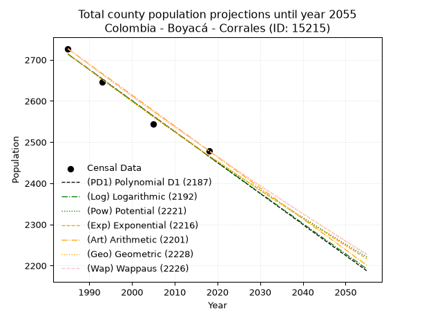
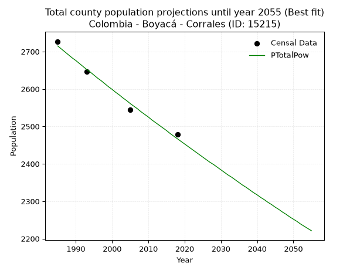
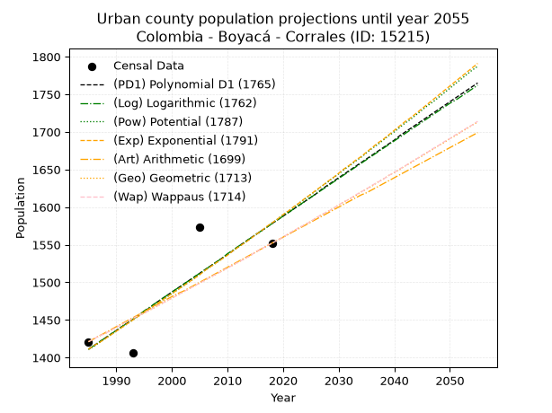
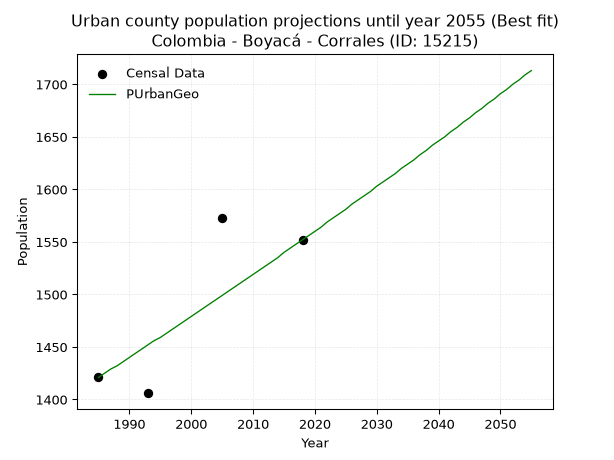
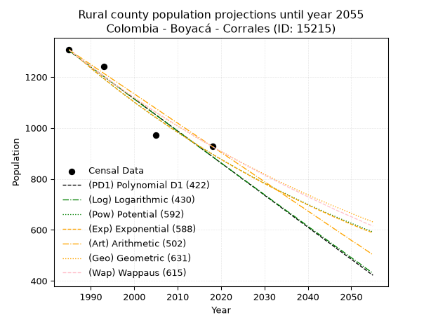
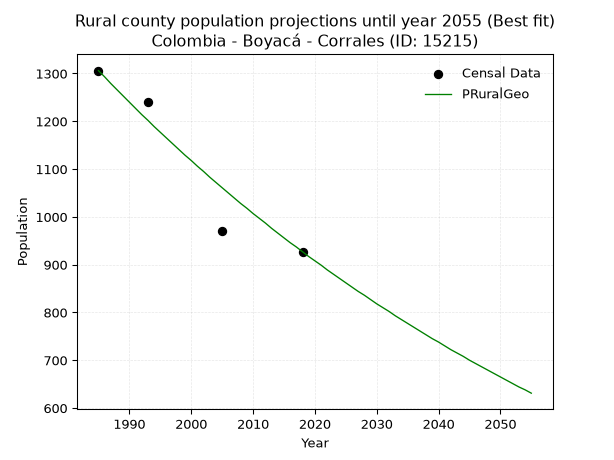

<div align="center">


</div>

# 📜 _“Population and Public Services Demand Projections (PPSD) until Year 2050 for Colombia - Boyacá - Corrales (ID: 15215)”_
Keywords: `population` `public-service` `projection` `lineal` `polynomial` `logarithmic` `potential` `exponential` `arithmetic` `geometric` `wappaus` `dane` `colombia` `south-america`

PPSD are analytical estimates used by governments and planners to anticipate future changes in population size, age distribution, and the resulting community needs for utilities, healthcare, education, and infrastructure as sizing future water treatment facilities, electrical grids, and road networks based on spatial growth.

<div align="center">

</img>

</div>


> **General running parameters**: • app_version: _v20260806_. • Python version: _3.14.7_. • Pandas version: _3.0.5_. • NumPy version: _2.5.1_. • Creates, save and include plots into reports (create_plot): _False_. • Projection until year: _2050_. • Process polynomial degree 2 and up: _False_. • Process Wappaus: _True_. • Process Wappaus: _True_. • Set negative values to zero: _True_. • Set infinite values to zero: _True_. • Drop dataset notes: _True_. 
<div align="center">

Maps & GIS Layers: [:earth_americas:Google](http://maps.google.com/maps?q=5.82806447,-72.8447947) [:earth_americas:OSM](https://www.openstreetmap.org/#map=18/5.82806447/-72.8447947&layers=P) [:earth_americas:Bing](https://www.bing.com/maps?cp=5.82806447~-72.8447947&lvl=18) [:earth_americas:Apple](https://maps.apple.com/frame?center=5.82806447%2C-72.8447947&span=0.003%2C0.006) [:earth_americas:GISMobile](https://github.com/rcfdtools/R.GISMobile/blob/main/file/gis/CountyLayer_CO/Readme.md)

</div>


<div align="center">

```geojson
{
  "type": "Feature",
  "geometry": {
    "type": "Point", 
    "coordinates": [-72.8447947, 5.82806447]
  }, 
  "properties": {
    "Name": "Colombia - Boyacá - Corrales (ID: 15215)"
  }
}
```

</div>


## 0. Census Data (4 records)

Census data are official statistics collected by a government about the people and housing in a country. They usually include counts of total population, age, sex, race, income, education, and jobs.

📅Global census file: [Population.xlsx](../data/Population.xlsx)

| Source   |   Year |   CountryID | CountryName   |   StateID | StateName   |   CountyID | CountyName   |   PTotal |   PUrban |   PRural |
|:---------|-------:|------------:|:--------------|----------:|:------------|-----------:|:-------------|---------:|---------:|---------:|
| DANE     |   1985 |          57 | Colombia      |        15 | Boyacá      |      15215 | Corrales     |     2727 |     1421 |     1306 |
| DANE     |   1993 |          57 | Colombia      |        15 | Boyacá      |      15215 | Corrales     |     2646 |     1406 |     1240 |
| DANE     |   2005 |          57 | Colombia      |        15 | Boyacá      |      15215 | Corrales     |     2544 |     1573 |      971 |
| DANE     |   2018 |          57 | Colombia      |        15 | Boyacá      |      15215 | Corrales     |     2479 |     1552 |      927 |

> 🔥Some records could had specific notes about the registered values or the corresponding urban or rural distribution.

📅[SUI-RUPS](https://www.datos.gov.co/Hacienda-y-Cr-dito-P-blico/Registro-nico-de-Prestadores-de-Servicios-P-blicos/4qkq-csdn/about_data) - Local public utility companies: [RUPS.csv](../data/RUPS.csv)

 | SERVICIO       | ESTADO    | NOMBRE                                   | NIT         | DEPARTAMENTO_DOMICILIO   | MUNICIPIO_DOMICILIO   | DIRECCION     |   TELEFONO | EMAIL                                    | TIPO_PRESTADOR                 | CLASIFICACION                 |
|:---------------|:----------|:-----------------------------------------|:------------|:-------------------------|:----------------------|:--------------|-----------:|:-----------------------------------------|:-------------------------------|:------------------------------|
| ACUEDUCTO      | OPERATIVA | UNIDAD DE SERVICIOS PUBLICOS DE CORRALES | 891855748-2 | BOYACA                   | CORRALES              | CALLE 8 3  40 |    7777000 | serviciospublicos@corrales-boyaca.gov.co | MUNICIPIO (PRESTACIÓN DIRECTA) | MENOR O IGUAL A 2500 USUARIOS |
| ALCANTARILLADO | OPERATIVA | UNIDAD DE SERVICIOS PUBLICOS DE CORRALES | 891855748-2 | BOYACA                   | CORRALES              | CALLE 8 3  40 |    7777000 | serviciospublicos@corrales-boyaca.gov.co | MUNICIPIO (PRESTACIÓN DIRECTA) | MENOR O IGUAL A 2500 USUARIOS |

## 1. Total

### 1.1. Coefficients and Parameters

* (PD1) Polynomial Deg 1: -7.52147731834601, 17643.835006021607 (lineal)
* (Log) Logarithmic: -15060.37752193852, 117073.05023054598
* (Pow) Potential: -5.79940013098663, 22.558776795331063
* (Exp) Exponential: -0.0028964323604632985, 852394.839427507
* (Art) Arithmetic: Year diff. 2018 - 1985 = 33, Population diff. 2479 - 2727 = -248, Annual growth = -7.515151515151516
* (Geo) Geometric: Year diff. 2018 - 1985 = 33, Population diff. 2479 - 2727 = -248, Annual growth % = -0.0028851285035651486
* (Wap) Wappaus: i = -0.28871116078184844, Condition values only valid for < 200)

<sub>
Wappaus condition values: ['-0.00', '-0.29', '-0.58', '-0.87', '-1.15', '-1.44', '-1.73', '-2.02', '-2.31', '-2.60', '-2.89', '-3.18', '-3.46', '-3.75', '-4.04', '-4.33', '-4.62', '-4.91', '-5.20', '-5.49', '-5.77', '-6.06', '-6.35', '-6.64', '-6.93', '-7.22', '-7.51', '-7.80', '-8.08', '-8.37', '-8.66', '-8.95', '-9.24', '-9.53', '-9.82', '-10.10', '-10.39', '-10.68', '-10.97', '-11.26', '-11.55', '-11.84', '-12.13', '-12.41', '-12.70', '-12.99', '-13.28', '-13.57', '-13.86', '-14.15', '-14.44', '-14.72', '-15.01', '-15.30', '-15.59', '-15.88', '-16.17', '-16.46', '-16.75', '-17.03', '-17.32', '-17.61', '-17.90', '-18.19', '-18.48', '-18.77']
</sub>


### 1.2. Projected Dataset

|   Year |   CountyID |   PTotalPD1 |   PTotalLog |   PTotalPow |   PTotalExp |   PTotalArt |   PTotalGeo |   PTotalWap |
|-------:|-----------:|------------:|------------:|------------:|------------:|------------:|------------:|------------:|
|   1985 |      15215 |        2714 |        2714 |        2715 |        2715 |        2727 |        2727 |        2727 |
|   1986 |      15215 |        2706 |        2706 |        2707 |        2707 |        2719 |        2719 |        2719 |
|   1987 |      15215 |        2699 |        2699 |        2699 |        2699 |        2712 |        2711 |        2711 |
|   1988 |      15215 |        2691 |        2691 |        2691 |        2691 |        2704 |        2703 |        2703 |
|   1989 |      15215 |        2684 |        2684 |        2683 |        2683 |        2697 |        2696 |        2696 |
|   1990 |      15215 |        2676 |        2676 |        2676 |        2676 |        2689 |        2688 |        2688 |
|   1991 |      15215 |        2669 |        2669 |        2668 |        2668 |        2682 |        2680 |        2680 |
|   1992 |      15215 |        2661 |        2661 |        2660 |        2660 |        2674 |        2672 |        2672 |
|   1993 |      15215 |        2654 |        2653 |        2652 |        2652 |        2667 |        2665 |        2665 |
|   1994 |      15215 |        2646 |        2646 |        2645 |        2645 |        2659 |        2657 |        2657 |
|   1995 |      15215 |        2638 |        2638 |        2637 |        2637 |        2652 |        2649 |        2649 |
|   1996 |      15215 |        2631 |        2631 |        2629 |        2629 |        2644 |        2642 |        2642 |
|   1997 |      15215 |        2623 |        2623 |        2622 |        2622 |        2637 |        2634 |        2634 |
|   1998 |      15215 |        2616 |        2616 |        2614 |        2614 |        2629 |        2626 |        2627 |
|   1999 |      15215 |        2608 |        2608 |        2606 |        2607 |        2622 |        2619 |        2619 |
|   2000 |      15215 |        2601 |        2601 |        2599 |        2599 |        2614 |        2611 |        2611 |
|   2001 |      15215 |        2593 |        2593 |        2591 |        2592 |        2607 |        2604 |        2604 |
|   2002 |      15215 |        2586 |        2586 |        2584 |        2584 |        2599 |        2596 |        2596 |
|   2003 |      15215 |        2578 |        2578 |        2576 |        2577 |        2592 |        2589 |        2589 |
|   2004 |      15215 |        2571 |        2570 |        2569 |        2569 |        2584 |        2581 |        2581 |
|   2005 |      15215 |        2563 |        2563 |        2561 |        2562 |        2577 |        2574 |        2574 |
|   2006 |      15215 |        2556 |        2555 |        2554 |        2554 |        2569 |        2566 |        2567 |
|   2007 |      15215 |        2548 |        2548 |        2547 |        2547 |        2562 |        2559 |        2559 |
|   2008 |      15215 |        2541 |        2540 |        2539 |        2540 |        2554 |        2552 |        2552 |
|   2009 |      15215 |        2533 |        2533 |        2532 |        2532 |        2547 |        2544 |        2544 |
|   2010 |      15215 |        2526 |        2525 |        2525 |        2525 |        2539 |        2537 |        2537 |
|   2011 |      15215 |        2518 |        2518 |        2517 |        2518 |        2532 |        2530 |        2530 |
|   2012 |      15215 |        2511 |        2510 |        2510 |        2510 |        2524 |        2522 |        2522 |
|   2013 |      15215 |        2503 |        2503 |        2503 |        2503 |        2517 |        2515 |        2515 |
|   2014 |      15215 |        2496 |        2496 |        2496 |        2496 |        2509 |        2508 |        2508 |
|   2015 |      15215 |        2488 |        2488 |        2489 |        2489 |        2502 |        2501 |        2501 |
|   2016 |      15215 |        2481 |        2481 |        2481 |        2481 |        2494 |        2493 |        2493 |
|   2017 |      15215 |        2473 |        2473 |        2474 |        2474 |        2487 |        2486 |        2486 |
|   2018 |      15215 |        2465 |        2466 |        2467 |        2467 |        2479 |        2479 |        2479 |
|   2019 |      15215 |        2458 |        2458 |        2460 |        2460 |        2471 |        2472 |        2472 |
|   2020 |      15215 |        2450 |        2451 |        2453 |        2453 |        2464 |        2465 |        2465 |
|   2021 |      15215 |        2443 |        2443 |        2446 |        2446 |        2456 |        2458 |        2458 |
|   2022 |      15215 |        2435 |        2436 |        2439 |        2439 |        2449 |        2451 |        2450 |
|   2023 |      15215 |        2428 |        2428 |        2432 |        2432 |        2441 |        2443 |        2443 |
|   2024 |      15215 |        2420 |        2421 |        2425 |        2425 |        2434 |        2436 |        2436 |
|   2025 |      15215 |        2413 |        2414 |        2418 |        2418 |        2426 |        2429 |        2429 |
|   2026 |      15215 |        2405 |        2406 |        2411 |        2411 |        2419 |        2422 |        2422 |
|   2027 |      15215 |        2398 |        2399 |        2404 |        2404 |        2411 |        2415 |        2415 |
|   2028 |      15215 |        2390 |        2391 |        2398 |        2397 |        2404 |        2408 |        2408 |
|   2029 |      15215 |        2383 |        2384 |        2391 |        2390 |        2396 |        2401 |        2401 |
|   2030 |      15215 |        2375 |        2376 |        2384 |        2383 |        2389 |        2395 |        2394 |
|   2031 |      15215 |        2368 |        2369 |        2377 |        2376 |        2381 |        2388 |        2387 |
|   2032 |      15215 |        2360 |        2362 |        2370 |        2369 |        2374 |        2381 |        2380 |
|   2033 |      15215 |        2353 |        2354 |        2364 |        2362 |        2366 |        2374 |        2374 |
|   2034 |      15215 |        2345 |        2347 |        2357 |        2355 |        2359 |        2367 |        2367 |
|   2035 |      15215 |        2338 |        2339 |        2350 |        2349 |        2351 |        2360 |        2360 |
|   2036 |      15215 |        2330 |        2332 |        2343 |        2342 |        2344 |        2353 |        2353 |
|   2037 |      15215 |        2323 |        2325 |        2337 |        2335 |        2336 |        2347 |        2346 |
|   2038 |      15215 |        2315 |        2317 |        2330 |        2328 |        2329 |        2340 |        2339 |
|   2039 |      15215 |        2308 |        2310 |        2323 |        2322 |        2321 |        2333 |        2333 |
|   2040 |      15215 |        2300 |        2302 |        2317 |        2315 |        2314 |        2326 |        2326 |
|   2041 |      15215 |        2292 |        2295 |        2310 |        2308 |        2306 |        2320 |        2319 |
|   2042 |      15215 |        2285 |        2288 |        2304 |        2301 |        2299 |        2313 |        2312 |
|   2043 |      15215 |        2277 |        2280 |        2297 |        2295 |        2291 |        2306 |        2306 |
|   2044 |      15215 |        2270 |        2273 |        2291 |        2288 |        2284 |        2300 |        2299 |
|   2045 |      15215 |        2262 |        2265 |        2284 |        2282 |        2276 |        2293 |        2292 |
|   2046 |      15215 |        2255 |        2258 |        2278 |        2275 |        2269 |        2286 |        2286 |
|   2047 |      15215 |        2247 |        2251 |        2271 |        2268 |        2261 |        2280 |        2279 |
|   2048 |      15215 |        2240 |        2243 |        2265 |        2262 |        2254 |        2273 |        2272 |
|   2049 |      15215 |        2232 |        2236 |        2258 |        2255 |        2246 |        2267 |        2266 |
|   2050 |      15215 |        2225 |        2229 |        2252 |        2249 |        2239 |        2260 |        2259 |
<div align="center">

</img>

</div>


### 1.3. Best fit with absolute and relative error (%)

Relative error puts that difference into context by dividing the absolute error by the true value, creating a unitless ratio or percentage that shows the scale of the mistake.

Absolute and relative error

|   Year | Source   |   CountryID | CountryName   |   StateID | StateName   |   CountyID_x | CountyName   |   PTotal |   PUrban |   PRural |   CountyID_y |   PTotalPD1 |   PTotalLog |   PTotalPow |   PTotalExp |   PTotalArt |   PTotalGeo |   PTotalWap |   PTotalPD1AbsError |   PTotalLogAbsError |   PTotalPowAbsError |   PTotalExpAbsError |   PTotalArtAbsError |   PTotalGeoAbsError |   PTotalWapAbsError |   PTotalPD1RelError |   PTotalLogRelError |   PTotalPowRelError |   PTotalExpRelError |   PTotalArtRelError |   PTotalGeoRelError |   PTotalWapRelError |
|-------:|:---------|------------:|:--------------|----------:|:------------|-------------:|:-------------|---------:|---------:|---------:|-------------:|------------:|------------:|------------:|------------:|------------:|------------:|------------:|--------------------:|--------------------:|--------------------:|--------------------:|--------------------:|--------------------:|--------------------:|--------------------:|--------------------:|--------------------:|--------------------:|--------------------:|--------------------:|--------------------:|
|   1985 | DANE     |          57 | Colombia      |        15 | Boyacá      |        15215 | Corrales     |     2727 |     1421 |     1306 |        15215 |        2714 |        2714 |        2715 |        2715 |        2727 |        2727 |        2727 |                  13 |                  13 |                  12 |                  12 |                   0 |                   0 |                   0 |            0.476714 |            0.476714 |            0.440044 |            0.440044 |            0        |            0        |            0        |
|   1993 | DANE     |          57 | Colombia      |        15 | Boyacá      |        15215 | Corrales     |     2646 |     1406 |     1240 |        15215 |        2654 |        2653 |        2652 |        2652 |        2667 |        2665 |        2665 |                   8 |                   7 |                   6 |                   6 |                  21 |                  19 |                  19 |            0.302343 |            0.26455  |            0.226757 |            0.226757 |            0.793651 |            0.718065 |            0.718065 |
|   2005 | DANE     |          57 | Colombia      |        15 | Boyacá      |        15215 | Corrales     |     2544 |     1573 |      971 |        15215 |        2563 |        2563 |        2561 |        2562 |        2577 |        2574 |        2574 |                  19 |                  19 |                  17 |                  18 |                  33 |                  30 |                  30 |            0.746855 |            0.746855 |            0.668239 |            0.707547 |            1.29717  |            1.17925  |            1.17925  |
|   2018 | DANE     |          57 | Colombia      |        15 | Boyacá      |        15215 | Corrales     |     2479 |     1552 |      927 |        15215 |        2465 |        2466 |        2467 |        2467 |        2479 |        2479 |        2479 |                  14 |                  13 |                  12 |                  12 |                   0 |                   0 |                   0 |            0.564744 |            0.524405 |            0.484066 |            0.484066 |            0        |            0        |            0        |

Relative error mean

| Method    |   RelError | Best   |
|:----------|-----------:|:-------|
| PTotalPD1 |   0.522664 |        |
| PTotalLog |   0.503131 |        |
| PTotalPow |   0.454777 | True   |
| PTotalExp |   0.464604 |        |
| PTotalArt |   0.522705 |        |
| PTotalGeo |   0.474328 |        |
| PTotalWap |   0.474328 |        |

💙Best method: _**PTotalPow**_
<div align="center">

</img>

</div>


### 1.4. Fresh water supply demand in liters per capita per day (lpcd)

The fresh water supply demand typically ranges from 100 to 300 liters per capita per day (lpcd) for standard domestic and municipal planning, though absolute survival minimums set by the World Health Organization are as low as 7.5 to 20 liters per day, and total consumption in high-income nations can exceed 400 liters.

> `CZ`: Level in meters above the sea level (masl)<br> `WS`: Fresh water supply demand in liters per capita per day (lpcd or l/h/d)<br> `WSAll`: Zonal fresh water supply demand in liters per second (l/s)<br> `A`: Zonal area in square meters<br> `DP`: Population density (people/hectare or p/ha)

Reference values (RAS Colombia)

|    CZ |   WS |
|------:|-----:|
|  1000 |  120 |
|  2000 |  130 |
| 99999 |  140 |

County shapefile geometry properties and water supply values

|   CountyID |      ATotal |   CZTotal |   WSTotal |
|-----------:|------------:|----------:|----------:|
|      15215 | 6.07268e+07 |   2628.21 |       140 |

Projected values for best method: PTotalPow

|   CountyID |   Year |   PTotalPow |   DPTotal |   WSTotal |   WSTotalAll |
|-----------:|-------:|------------:|----------:|----------:|-------------:|
|      15215 |   1985 |        2715 |      0.45 |       140 |      4.39931 |
|      15215 |   1986 |        2707 |      0.45 |       140 |      4.38634 |
|      15215 |   1987 |        2699 |      0.44 |       140 |      4.37338 |
|      15215 |   1988 |        2691 |      0.44 |       140 |      4.36042 |
|      15215 |   1989 |        2683 |      0.44 |       140 |      4.34745 |
|      15215 |   1990 |        2676 |      0.44 |       140 |      4.33611 |
|      15215 |   1991 |        2668 |      0.44 |       140 |      4.32315 |
|      15215 |   1992 |        2660 |      0.44 |       140 |      4.31019 |
|      15215 |   1993 |        2652 |      0.44 |       140 |      4.29722 |
|      15215 |   1994 |        2645 |      0.44 |       140 |      4.28588 |
|      15215 |   1995 |        2637 |      0.43 |       140 |      4.27292 |
|      15215 |   1996 |        2629 |      0.43 |       140 |      4.25995 |
|      15215 |   1997 |        2622 |      0.43 |       140 |      4.24861 |
|      15215 |   1998 |        2614 |      0.43 |       140 |      4.23565 |
|      15215 |   1999 |        2606 |      0.43 |       140 |      4.22269 |
|      15215 |   2000 |        2599 |      0.43 |       140 |      4.21134 |
|      15215 |   2001 |        2591 |      0.43 |       140 |      4.19838 |
|      15215 |   2002 |        2584 |      0.43 |       140 |      4.18704 |
|      15215 |   2003 |        2576 |      0.42 |       140 |      4.17407 |
|      15215 |   2004 |        2569 |      0.42 |       140 |      4.16273 |
|      15215 |   2005 |        2561 |      0.42 |       140 |      4.14977 |
|      15215 |   2006 |        2554 |      0.42 |       140 |      4.13843 |
|      15215 |   2007 |        2547 |      0.42 |       140 |      4.12708 |
|      15215 |   2008 |        2539 |      0.42 |       140 |      4.11412 |
|      15215 |   2009 |        2532 |      0.42 |       140 |      4.10278 |
|      15215 |   2010 |        2525 |      0.42 |       140 |      4.09144 |
|      15215 |   2011 |        2517 |      0.41 |       140 |      4.07847 |
|      15215 |   2012 |        2510 |      0.41 |       140 |      4.06713 |
|      15215 |   2013 |        2503 |      0.41 |       140 |      4.05579 |
|      15215 |   2014 |        2496 |      0.41 |       140 |      4.04444 |
|      15215 |   2015 |        2489 |      0.41 |       140 |      4.0331  |
|      15215 |   2016 |        2481 |      0.41 |       140 |      4.02014 |
|      15215 |   2017 |        2474 |      0.41 |       140 |      4.0088  |
|      15215 |   2018 |        2467 |      0.41 |       140 |      3.99745 |
|      15215 |   2019 |        2460 |      0.41 |       140 |      3.98611 |
|      15215 |   2020 |        2453 |      0.4  |       140 |      3.97477 |
|      15215 |   2021 |        2446 |      0.4  |       140 |      3.96343 |
|      15215 |   2022 |        2439 |      0.4  |       140 |      3.95208 |
|      15215 |   2023 |        2432 |      0.4  |       140 |      3.94074 |
|      15215 |   2024 |        2425 |      0.4  |       140 |      3.9294  |
|      15215 |   2025 |        2418 |      0.4  |       140 |      3.91806 |
|      15215 |   2026 |        2411 |      0.4  |       140 |      3.90671 |
|      15215 |   2027 |        2404 |      0.4  |       140 |      3.89537 |
|      15215 |   2028 |        2398 |      0.39 |       140 |      3.88565 |
|      15215 |   2029 |        2391 |      0.39 |       140 |      3.87431 |
|      15215 |   2030 |        2384 |      0.39 |       140 |      3.86296 |
|      15215 |   2031 |        2377 |      0.39 |       140 |      3.85162 |
|      15215 |   2032 |        2370 |      0.39 |       140 |      3.84028 |
|      15215 |   2033 |        2364 |      0.39 |       140 |      3.83056 |
|      15215 |   2034 |        2357 |      0.39 |       140 |      3.81921 |
|      15215 |   2035 |        2350 |      0.39 |       140 |      3.80787 |
|      15215 |   2036 |        2343 |      0.39 |       140 |      3.79653 |
|      15215 |   2037 |        2337 |      0.38 |       140 |      3.78681 |
|      15215 |   2038 |        2330 |      0.38 |       140 |      3.77546 |
|      15215 |   2039 |        2323 |      0.38 |       140 |      3.76412 |
|      15215 |   2040 |        2317 |      0.38 |       140 |      3.7544  |
|      15215 |   2041 |        2310 |      0.38 |       140 |      3.74306 |
|      15215 |   2042 |        2304 |      0.38 |       140 |      3.73333 |
|      15215 |   2043 |        2297 |      0.38 |       140 |      3.72199 |
|      15215 |   2044 |        2291 |      0.38 |       140 |      3.71227 |
|      15215 |   2045 |        2284 |      0.38 |       140 |      3.70093 |
|      15215 |   2046 |        2278 |      0.38 |       140 |      3.6912  |
|      15215 |   2047 |        2271 |      0.37 |       140 |      3.67986 |
|      15215 |   2048 |        2265 |      0.37 |       140 |      3.67014 |
|      15215 |   2049 |        2258 |      0.37 |       140 |      3.6588  |
|      15215 |   2050 |        2252 |      0.37 |       140 |      3.64907 |

## 2. Urban

### 2.1. Coefficients and Parameters

* (PD1) Polynomial Deg 1: 5.067844239261341, -8648.955439582498 (lineal)
* (Log) Logarithmic: 10149.319121895667, -75657.05597706813
* (Pow) Potential: 6.833335996324482, -19.385310385151776
* (Exp) Exponential: 0.003412137694982345, 1.6141145283886267
* (Art) Arithmetic: Year diff. 2018 - 1985 = 33, Population diff. 1552 - 1421 = 131, Annual growth = 3.9696969696969697
* (Geo) Geometric: Year diff. 2018 - 1985 = 33, Population diff. 1552 - 1421 = 131, Annual growth % = 0.0026758030617439754
* (Wap) Wappaus: i = 0.2670499138713064, Condition values only valid for < 200)

<sub>
Wappaus condition values: ['0.00', '0.27', '0.53', '0.80', '1.07', '1.34', '1.60', '1.87', '2.14', '2.40', '2.67', '2.94', '3.20', '3.47', '3.74', '4.01', '4.27', '4.54', '4.81', '5.07', '5.34', '5.61', '5.88', '6.14', '6.41', '6.68', '6.94', '7.21', '7.48', '7.74', '8.01', '8.28', '8.55', '8.81', '9.08', '9.35', '9.61', '9.88', '10.15', '10.41', '10.68', '10.95', '11.22', '11.48', '11.75', '12.02', '12.28', '12.55', '12.82', '13.09', '13.35', '13.62', '13.89', '14.15', '14.42', '14.69', '14.95', '15.22', '15.49', '15.76', '16.02', '16.29', '16.56', '16.82', '17.09', '17.36']
</sub>


### 2.2. Projected Dataset

|   Year |   CountyID |   PUrbanPD1 |   PUrbanLog |   PUrbanPow |   PUrbanExp |   PUrbanArt |   PUrbanGeo |   PUrbanWap |
|-------:|-----------:|------------:|------------:|------------:|------------:|------------:|------------:|------------:|
|   1985 |      15215 |        1411 |        1411 |        1411 |        1411 |        1421 |        1421 |        1421 |
|   1986 |      15215 |        1416 |        1416 |        1415 |        1416 |        1425 |        1425 |        1425 |
|   1987 |      15215 |        1421 |        1421 |        1420 |        1420 |        1429 |        1429 |        1429 |
|   1988 |      15215 |        1426 |        1426 |        1425 |        1425 |        1433 |        1432 |        1432 |
|   1989 |      15215 |        1431 |        1431 |        1430 |        1430 |        1437 |        1436 |        1436 |
|   1990 |      15215 |        1436 |        1436 |        1435 |        1435 |        1441 |        1440 |        1440 |
|   1991 |      15215 |        1441 |        1441 |        1440 |        1440 |        1445 |        1444 |        1444 |
|   1992 |      15215 |        1446 |        1446 |        1445 |        1445 |        1449 |        1448 |        1448 |
|   1993 |      15215 |        1451 |        1451 |        1450 |        1450 |        1453 |        1452 |        1452 |
|   1994 |      15215 |        1456 |        1456 |        1455 |        1455 |        1457 |        1456 |        1456 |
|   1995 |      15215 |        1461 |        1462 |        1460 |        1460 |        1461 |        1459 |        1459 |
|   1996 |      15215 |        1466 |        1467 |        1465 |        1465 |        1465 |        1463 |        1463 |
|   1997 |      15215 |        1472 |        1472 |        1470 |        1470 |        1469 |        1467 |        1467 |
|   1998 |      15215 |        1477 |        1477 |        1475 |        1475 |        1473 |        1471 |        1471 |
|   1999 |      15215 |        1482 |        1482 |        1480 |        1480 |        1477 |        1475 |        1475 |
|   2000 |      15215 |        1487 |        1487 |        1485 |        1485 |        1481 |        1479 |        1479 |
|   2001 |      15215 |        1492 |        1492 |        1490 |        1490 |        1485 |        1483 |        1483 |
|   2002 |      15215 |        1497 |        1497 |        1495 |        1495 |        1488 |        1487 |        1487 |
|   2003 |      15215 |        1502 |        1502 |        1500 |        1500 |        1492 |        1491 |        1491 |
|   2004 |      15215 |        1507 |        1507 |        1505 |        1505 |        1496 |        1495 |        1495 |
|   2005 |      15215 |        1512 |        1512 |        1511 |        1510 |        1500 |        1499 |        1499 |
|   2006 |      15215 |        1517 |        1517 |        1516 |        1516 |        1504 |        1503 |        1503 |
|   2007 |      15215 |        1522 |        1522 |        1521 |        1521 |        1508 |        1507 |        1507 |
|   2008 |      15215 |        1527 |        1527 |        1526 |        1526 |        1512 |        1511 |        1511 |
|   2009 |      15215 |        1532 |        1532 |        1531 |        1531 |        1516 |        1515 |        1515 |
|   2010 |      15215 |        1537 |        1538 |        1537 |        1536 |        1520 |        1519 |        1519 |
|   2011 |      15215 |        1542 |        1543 |        1542 |        1542 |        1524 |        1523 |        1523 |
|   2012 |      15215 |        1548 |        1548 |        1547 |        1547 |        1528 |        1527 |        1527 |
|   2013 |      15215 |        1553 |        1553 |        1552 |        1552 |        1532 |        1531 |        1531 |
|   2014 |      15215 |        1558 |        1558 |        1558 |        1557 |        1536 |        1535 |        1535 |
|   2015 |      15215 |        1563 |        1563 |        1563 |        1563 |        1540 |        1540 |        1540 |
|   2016 |      15215 |        1568 |        1568 |        1568 |        1568 |        1544 |        1544 |        1544 |
|   2017 |      15215 |        1573 |        1573 |        1573 |        1574 |        1548 |        1548 |        1548 |
|   2018 |      15215 |        1578 |        1578 |        1579 |        1579 |        1552 |        1552 |        1552 |
|   2019 |      15215 |        1583 |        1583 |        1584 |        1584 |        1556 |        1556 |        1556 |
|   2020 |      15215 |        1588 |        1588 |        1590 |        1590 |        1560 |        1560 |        1560 |
|   2021 |      15215 |        1593 |        1593 |        1595 |        1595 |        1564 |        1564 |        1565 |
|   2022 |      15215 |        1598 |        1598 |        1600 |        1601 |        1568 |        1569 |        1569 |
|   2023 |      15215 |        1603 |        1603 |        1606 |        1606 |        1572 |        1573 |        1573 |
|   2024 |      15215 |        1608 |        1608 |        1611 |        1612 |        1576 |        1577 |        1577 |
|   2025 |      15215 |        1613 |        1613 |        1617 |        1617 |        1580 |        1581 |        1581 |
|   2026 |      15215 |        1618 |        1618 |        1622 |        1623 |        1584 |        1586 |        1586 |
|   2027 |      15215 |        1624 |        1623 |        1628 |        1628 |        1588 |        1590 |        1590 |
|   2028 |      15215 |        1629 |        1628 |        1633 |        1634 |        1592 |        1594 |        1594 |
|   2029 |      15215 |        1634 |        1633 |        1639 |        1639 |        1596 |        1598 |        1598 |
|   2030 |      15215 |        1639 |        1638 |        1644 |        1645 |        1600 |        1603 |        1603 |
|   2031 |      15215 |        1644 |        1643 |        1650 |        1651 |        1604 |        1607 |        1607 |
|   2032 |      15215 |        1649 |        1648 |        1655 |        1656 |        1608 |        1611 |        1611 |
|   2033 |      15215 |        1654 |        1653 |        1661 |        1662 |        1612 |        1615 |        1616 |
|   2034 |      15215 |        1659 |        1658 |        1666 |        1667 |        1616 |        1620 |        1620 |
|   2035 |      15215 |        1664 |        1663 |        1672 |        1673 |        1619 |        1624 |        1624 |
|   2036 |      15215 |        1669 |        1668 |        1678 |        1679 |        1623 |        1628 |        1629 |
|   2037 |      15215 |        1674 |        1673 |        1683 |        1685 |        1627 |        1633 |        1633 |
|   2038 |      15215 |        1679 |        1678 |        1689 |        1690 |        1631 |        1637 |        1637 |
|   2039 |      15215 |        1684 |        1683 |        1695 |        1696 |        1635 |        1642 |        1642 |
|   2040 |      15215 |        1689 |        1688 |        1700 |        1702 |        1639 |        1646 |        1646 |
|   2041 |      15215 |        1695 |        1693 |        1706 |        1708 |        1643 |        1650 |        1651 |
|   2042 |      15215 |        1700 |        1698 |        1712 |        1714 |        1647 |        1655 |        1655 |
|   2043 |      15215 |        1705 |        1703 |        1717 |        1719 |        1651 |        1659 |        1660 |
|   2044 |      15215 |        1710 |        1708 |        1723 |        1725 |        1655 |        1664 |        1664 |
|   2045 |      15215 |        1715 |        1713 |        1729 |        1731 |        1659 |        1668 |        1669 |
|   2046 |      15215 |        1720 |        1718 |        1735 |        1737 |        1663 |        1673 |        1673 |
|   2047 |      15215 |        1725 |        1723 |        1740 |        1743 |        1667 |        1677 |        1678 |
|   2048 |      15215 |        1730 |        1728 |        1746 |        1749 |        1671 |        1682 |        1682 |
|   2049 |      15215 |        1735 |        1733 |        1752 |        1755 |        1675 |        1686 |        1687 |
|   2050 |      15215 |        1740 |        1738 |        1758 |        1761 |        1679 |        1691 |        1691 |
<div align="center">

</img>

</div>


### 2.3. Best fit with absolute and relative error (%)

Relative error puts that difference into context by dividing the absolute error by the true value, creating a unitless ratio or percentage that shows the scale of the mistake.

Absolute and relative error

|   Year | Source   |   CountryID | CountryName   |   StateID | StateName   |   CountyID_x | CountyName   |   PTotal |   PUrban |   PRural |   CountyID_y |   PUrbanPD1 |   PUrbanLog |   PUrbanPow |   PUrbanExp |   PUrbanArt |   PUrbanGeo |   PUrbanWap |   PUrbanPD1AbsError |   PUrbanLogAbsError |   PUrbanPowAbsError |   PUrbanExpAbsError |   PUrbanArtAbsError |   PUrbanGeoAbsError |   PUrbanWapAbsError |   PUrbanPD1RelError |   PUrbanLogRelError |   PUrbanPowRelError |   PUrbanExpRelError |   PUrbanArtRelError |   PUrbanGeoRelError |   PUrbanWapRelError |
|-------:|:---------|------------:|:--------------|----------:|:------------|-------------:|:-------------|---------:|---------:|---------:|-------------:|------------:|------------:|------------:|------------:|------------:|------------:|------------:|--------------------:|--------------------:|--------------------:|--------------------:|--------------------:|--------------------:|--------------------:|--------------------:|--------------------:|--------------------:|--------------------:|--------------------:|--------------------:|--------------------:|
|   1985 | DANE     |          57 | Colombia      |        15 | Boyacá      |        15215 | Corrales     |     2727 |     1421 |     1306 |        15215 |        1411 |        1411 |        1411 |        1411 |        1421 |        1421 |        1421 |                  10 |                  10 |                  10 |                  10 |                   0 |                   0 |                   0 |             0.70373 |             0.70373 |             0.70373 |             0.70373 |             0       |             0       |             0       |
|   1993 | DANE     |          57 | Colombia      |        15 | Boyacá      |        15215 | Corrales     |     2646 |     1406 |     1240 |        15215 |        1451 |        1451 |        1450 |        1450 |        1453 |        1452 |        1452 |                  45 |                  45 |                  44 |                  44 |                  47 |                  46 |                  46 |             3.20057 |             3.20057 |             3.12945 |             3.12945 |             3.34282 |             3.27169 |             3.27169 |
|   2005 | DANE     |          57 | Colombia      |        15 | Boyacá      |        15215 | Corrales     |     2544 |     1573 |      971 |        15215 |        1512 |        1512 |        1511 |        1510 |        1500 |        1499 |        1499 |                  61 |                  61 |                  62 |                  63 |                  73 |                  74 |                  74 |             3.87794 |             3.87794 |             3.94151 |             4.00509 |             4.64081 |             4.70439 |             4.70439 |
|   2018 | DANE     |          57 | Colombia      |        15 | Boyacá      |        15215 | Corrales     |     2479 |     1552 |      927 |        15215 |        1578 |        1578 |        1579 |        1579 |        1552 |        1552 |        1552 |                  26 |                  26 |                  27 |                  27 |                   0 |                   0 |                   0 |             1.67526 |             1.67526 |             1.73969 |             1.73969 |             0       |             0       |             0       |

Relative error mean

| Method    |   RelError | Best   |
|:----------|-----------:|:-------|
| PUrbanPD1 |    2.36437 |        |
| PUrbanLog |    2.36437 |        |
| PUrbanPow |    2.37859 |        |
| PUrbanExp |    2.39449 |        |
| PUrbanArt |    1.99591 |        |
| PUrbanGeo |    1.99402 | True   |
| PUrbanWap |    1.99402 | True   |

💙Best method: _**PUrbanGeo**_
<div align="center">

</img>

</div>


### 2.4. Fresh water supply demand in liters per capita per day (lpcd)

The fresh water supply demand typically ranges from 100 to 300 liters per capita per day (lpcd) for standard domestic and municipal planning, though absolute survival minimums set by the World Health Organization are as low as 7.5 to 20 liters per day, and total consumption in high-income nations can exceed 400 liters.

> `CZ`: Level in meters above the sea level (masl)<br> `WS`: Fresh water supply demand in liters per capita per day (lpcd or l/h/d)<br> `WSAll`: Zonal fresh water supply demand in liters per second (l/s)<br> `A`: Zonal area in square meters<br> `DP`: Population density (people/hectare or p/ha)

Reference values (RAS Colombia)

|    CZ |   WS |
|------:|-----:|
|  1000 |  120 |
|  2000 |  130 |
| 99999 |  140 |

County shapefile geometry properties and water supply values

|   CountyID |   AUrban |   CZUrban |   WSUrban |
|-----------:|---------:|----------:|----------:|
|      15215 |   496653 |   2407.22 |       140 |

Projected values for best method: PUrbanGeo

|   CountyID |   Year |   PUrbanGeo |   DPUrban |   WSUrban |   WSUrbanAll |
|-----------:|-------:|------------:|----------:|----------:|-------------:|
|      15215 |   1985 |        1421 |     28.61 |       140 |      2.30255 |
|      15215 |   1986 |        1425 |     28.69 |       140 |      2.30903 |
|      15215 |   1987 |        1429 |     28.77 |       140 |      2.31551 |
|      15215 |   1988 |        1432 |     28.83 |       140 |      2.32037 |
|      15215 |   1989 |        1436 |     28.91 |       140 |      2.32685 |
|      15215 |   1990 |        1440 |     28.99 |       140 |      2.33333 |
|      15215 |   1991 |        1444 |     29.07 |       140 |      2.33981 |
|      15215 |   1992 |        1448 |     29.16 |       140 |      2.3463  |
|      15215 |   1993 |        1452 |     29.24 |       140 |      2.35278 |
|      15215 |   1994 |        1456 |     29.32 |       140 |      2.35926 |
|      15215 |   1995 |        1459 |     29.38 |       140 |      2.36412 |
|      15215 |   1996 |        1463 |     29.46 |       140 |      2.3706  |
|      15215 |   1997 |        1467 |     29.54 |       140 |      2.37708 |
|      15215 |   1998 |        1471 |     29.62 |       140 |      2.38356 |
|      15215 |   1999 |        1475 |     29.7  |       140 |      2.39005 |
|      15215 |   2000 |        1479 |     29.78 |       140 |      2.39653 |
|      15215 |   2001 |        1483 |     29.86 |       140 |      2.40301 |
|      15215 |   2002 |        1487 |     29.94 |       140 |      2.40949 |
|      15215 |   2003 |        1491 |     30.02 |       140 |      2.41597 |
|      15215 |   2004 |        1495 |     30.1  |       140 |      2.42245 |
|      15215 |   2005 |        1499 |     30.18 |       140 |      2.42894 |
|      15215 |   2006 |        1503 |     30.26 |       140 |      2.43542 |
|      15215 |   2007 |        1507 |     30.34 |       140 |      2.4419  |
|      15215 |   2008 |        1511 |     30.42 |       140 |      2.44838 |
|      15215 |   2009 |        1515 |     30.5  |       140 |      2.45486 |
|      15215 |   2010 |        1519 |     30.58 |       140 |      2.46134 |
|      15215 |   2011 |        1523 |     30.67 |       140 |      2.46782 |
|      15215 |   2012 |        1527 |     30.75 |       140 |      2.47431 |
|      15215 |   2013 |        1531 |     30.83 |       140 |      2.48079 |
|      15215 |   2014 |        1535 |     30.91 |       140 |      2.48727 |
|      15215 |   2015 |        1540 |     31.01 |       140 |      2.49537 |
|      15215 |   2016 |        1544 |     31.09 |       140 |      2.50185 |
|      15215 |   2017 |        1548 |     31.17 |       140 |      2.50833 |
|      15215 |   2018 |        1552 |     31.25 |       140 |      2.51481 |
|      15215 |   2019 |        1556 |     31.33 |       140 |      2.5213  |
|      15215 |   2020 |        1560 |     31.41 |       140 |      2.52778 |
|      15215 |   2021 |        1564 |     31.49 |       140 |      2.53426 |
|      15215 |   2022 |        1569 |     31.59 |       140 |      2.54236 |
|      15215 |   2023 |        1573 |     31.67 |       140 |      2.54884 |
|      15215 |   2024 |        1577 |     31.75 |       140 |      2.55532 |
|      15215 |   2025 |        1581 |     31.83 |       140 |      2.56181 |
|      15215 |   2026 |        1586 |     31.93 |       140 |      2.56991 |
|      15215 |   2027 |        1590 |     32.01 |       140 |      2.57639 |
|      15215 |   2028 |        1594 |     32.09 |       140 |      2.58287 |
|      15215 |   2029 |        1598 |     32.18 |       140 |      2.58935 |
|      15215 |   2030 |        1603 |     32.28 |       140 |      2.59745 |
|      15215 |   2031 |        1607 |     32.36 |       140 |      2.60394 |
|      15215 |   2032 |        1611 |     32.44 |       140 |      2.61042 |
|      15215 |   2033 |        1615 |     32.52 |       140 |      2.6169  |
|      15215 |   2034 |        1620 |     32.62 |       140 |      2.625   |
|      15215 |   2035 |        1624 |     32.7  |       140 |      2.63148 |
|      15215 |   2036 |        1628 |     32.78 |       140 |      2.63796 |
|      15215 |   2037 |        1633 |     32.88 |       140 |      2.64606 |
|      15215 |   2038 |        1637 |     32.96 |       140 |      2.65255 |
|      15215 |   2039 |        1642 |     33.06 |       140 |      2.66065 |
|      15215 |   2040 |        1646 |     33.14 |       140 |      2.66713 |
|      15215 |   2041 |        1650 |     33.22 |       140 |      2.67361 |
|      15215 |   2042 |        1655 |     33.32 |       140 |      2.68171 |
|      15215 |   2043 |        1659 |     33.4  |       140 |      2.68819 |
|      15215 |   2044 |        1664 |     33.5  |       140 |      2.6963  |
|      15215 |   2045 |        1668 |     33.58 |       140 |      2.70278 |
|      15215 |   2046 |        1673 |     33.69 |       140 |      2.71088 |
|      15215 |   2047 |        1677 |     33.77 |       140 |      2.71736 |
|      15215 |   2048 |        1682 |     33.87 |       140 |      2.72546 |
|      15215 |   2049 |        1686 |     33.95 |       140 |      2.73194 |
|      15215 |   2050 |        1691 |     34.05 |       140 |      2.74005 |

## 3. Rural

### 3.1. Coefficients and Parameters

* (PD1) Polynomial Deg 1: -12.589321557607347, 26292.790445604092 (lineal)
* (Log) Logarithmic: -25209.696643834184, 192730.10620761404
* (Pow) Potential: -22.88065853406365, 78.57170498174033
* (Exp) Exponential: -0.011426900821630405, 9277619579935.943
* (Art) Arithmetic: Year diff. 2018 - 1985 = 33, Population diff. 927 - 1306 = -379, Annual growth = -11.484848484848484
* (Geo) Geometric: Year diff. 2018 - 1985 = 33, Population diff. 927 - 1306 = -379, Annual growth % = -0.010333233737367165
* (Wap) Wappaus: i = -1.0286474236317495, Condition values only valid for < 200)

<sub>
Wappaus condition values: ['-0.00', '-1.03', '-2.06', '-3.09', '-4.11', '-5.14', '-6.17', '-7.20', '-8.23', '-9.26', '-10.29', '-11.32', '-12.34', '-13.37', '-14.40', '-15.43', '-16.46', '-17.49', '-18.52', '-19.54', '-20.57', '-21.60', '-22.63', '-23.66', '-24.69', '-25.72', '-26.74', '-27.77', '-28.80', '-29.83', '-30.86', '-31.89', '-32.92', '-33.95', '-34.97', '-36.00', '-37.03', '-38.06', '-39.09', '-40.12', '-41.15', '-42.17', '-43.20', '-44.23', '-45.26', '-46.29', '-47.32', '-48.35', '-49.38', '-50.40', '-51.43', '-52.46', '-53.49', '-54.52', '-55.55', '-56.58', '-57.60', '-58.63', '-59.66', '-60.69', '-61.72', '-62.75', '-63.78', '-64.80', '-65.83', '-66.86']
</sub>


### 3.2. Projected Dataset

|   Year |   CountyID |   PRuralPD1 |   PRuralLog |   PRuralPow |   PRuralExp |   PRuralArt |   PRuralGeo |   PRuralWap |
|-------:|-----------:|------------:|------------:|------------:|------------:|------------:|------------:|------------:|
|   1985 |      15215 |        1303 |        1303 |        1308 |        1308 |        1306 |        1306 |        1306 |
|   1986 |      15215 |        1290 |        1291 |        1294 |        1293 |        1295 |        1293 |        1293 |
|   1987 |      15215 |        1278 |        1278 |        1279 |        1278 |        1283 |        1279 |        1279 |
|   1988 |      15215 |        1265 |        1265 |        1264 |        1264 |        1272 |        1266 |        1266 |
|   1989 |      15215 |        1253 |        1253 |        1250 |        1250 |        1260 |        1253 |        1253 |
|   1990 |      15215 |        1240 |        1240 |        1235 |        1235 |        1249 |        1240 |        1241 |
|   1991 |      15215 |        1227 |        1227 |        1221 |        1221 |        1237 |        1227 |        1228 |
|   1992 |      15215 |        1215 |        1215 |        1207 |        1207 |        1226 |        1214 |        1215 |
|   1993 |      15215 |        1202 |        1202 |        1193 |        1194 |        1214 |        1202 |        1203 |
|   1994 |      15215 |        1190 |        1189 |        1180 |        1180 |        1203 |        1189 |        1190 |
|   1995 |      15215 |        1177 |        1177 |        1166 |        1167 |        1191 |        1177 |        1178 |
|   1996 |      15215 |        1165 |        1164 |        1153 |        1153 |        1180 |        1165 |        1166 |
|   1997 |      15215 |        1152 |        1152 |        1140 |        1140 |        1168 |        1153 |        1154 |
|   1998 |      15215 |        1139 |        1139 |        1127 |        1127 |        1157 |        1141 |        1142 |
|   1999 |      15215 |        1127 |        1126 |        1114 |        1115 |        1145 |        1129 |        1131 |
|   2000 |      15215 |        1114 |        1114 |        1101 |        1102 |        1134 |        1118 |        1119 |
|   2001 |      15215 |        1102 |        1101 |        1089 |        1089 |        1122 |        1106 |        1107 |
|   2002 |      15215 |        1089 |        1088 |        1077 |        1077 |        1111 |        1095 |        1096 |
|   2003 |      15215 |        1076 |        1076 |        1064 |        1065 |        1099 |        1083 |        1085 |
|   2004 |      15215 |        1064 |        1063 |        1052 |        1053 |        1088 |        1072 |        1073 |
|   2005 |      15215 |        1051 |        1051 |        1040 |        1041 |        1076 |        1061 |        1062 |
|   2006 |      15215 |        1039 |        1038 |        1028 |        1029 |        1065 |        1050 |        1051 |
|   2007 |      15215 |        1026 |        1026 |        1017 |        1017 |        1053 |        1039 |        1040 |
|   2008 |      15215 |        1013 |        1013 |        1005 |        1006 |        1042 |        1028 |        1030 |
|   2009 |      15215 |        1001 |        1000 |         994 |         994 |        1030 |        1018 |        1019 |
|   2010 |      15215 |         988 |         988 |         983 |         983 |        1019 |        1007 |        1008 |
|   2011 |      15215 |         976 |         975 |         972 |         972 |        1007 |         997 |         998 |
|   2012 |      15215 |         963 |         963 |         961 |         961 |         996 |         987 |         988 |
|   2013 |      15215 |         950 |         950 |         950 |         950 |         984 |         976 |         977 |
|   2014 |      15215 |         938 |         938 |         939 |         939 |         973 |         966 |         967 |
|   2015 |      15215 |         925 |         925 |         928 |         928 |         961 |         956 |         957 |
|   2016 |      15215 |         913 |         913 |         918 |         918 |         950 |         946 |         947 |
|   2017 |      15215 |         900 |         900 |         908 |         907 |         938 |         937 |         937 |
|   2018 |      15215 |         888 |         888 |         897 |         897 |         927 |         927 |         927 |
|   2019 |      15215 |         875 |         875 |         887 |         887 |         916 |         917 |         917 |
|   2020 |      15215 |         862 |         863 |         877 |         877 |         904 |         908 |         908 |
|   2021 |      15215 |         850 |         850 |         867 |         867 |         893 |         899 |         898 |
|   2022 |      15215 |         837 |         838 |         858 |         857 |         881 |         889 |         888 |
|   2023 |      15215 |         825 |         825 |         848 |         847 |         870 |         880 |         879 |
|   2024 |      15215 |         812 |         813 |         838 |         838 |         858 |         871 |         870 |
|   2025 |      15215 |         799 |         800 |         829 |         828 |         847 |         862 |         860 |
|   2026 |      15215 |         787 |         788 |         820 |         819 |         835 |         853 |         851 |
|   2027 |      15215 |         774 |         776 |         810 |         809 |         824 |         844 |         842 |
|   2028 |      15215 |         762 |         763 |         801 |         800 |         812 |         836 |         833 |
|   2029 |      15215 |         749 |         751 |         792 |         791 |         801 |         827 |         824 |
|   2030 |      15215 |         736 |         738 |         783 |         782 |         789 |         818 |         815 |
|   2031 |      15215 |         724 |         726 |         775 |         773 |         778 |         810 |         806 |
|   2032 |      15215 |         711 |         713 |         766 |         764 |         766 |         802 |         798 |
|   2033 |      15215 |         699 |         701 |         757 |         756 |         755 |         793 |         789 |
|   2034 |      15215 |         686 |         689 |         749 |         747 |         743 |         785 |         780 |
|   2035 |      15215 |         674 |         676 |         741 |         739 |         732 |         777 |         772 |
|   2036 |      15215 |         661 |         664 |         732 |         730 |         720 |         769 |         763 |
|   2037 |      15215 |         648 |         652 |         724 |         722 |         709 |         761 |         755 |
|   2038 |      15215 |         636 |         639 |         716 |         714 |         697 |         753 |         747 |
|   2039 |      15215 |         623 |         627 |         708 |         706 |         686 |         745 |         738 |
|   2040 |      15215 |         611 |         614 |         700 |         698 |         674 |         738 |         730 |
|   2041 |      15215 |         598 |         602 |         692 |         690 |         663 |         730 |         722 |
|   2042 |      15215 |         585 |         590 |         685 |         682 |         651 |         722 |         714 |
|   2043 |      15215 |         573 |         577 |         677 |         674 |         640 |         715 |         706 |
|   2044 |      15215 |         560 |         565 |         669 |         667 |         628 |         708 |         698 |
|   2045 |      15215 |         548 |         553 |         662 |         659 |         617 |         700 |         690 |
|   2046 |      15215 |         535 |         540 |         655 |         651 |         605 |         693 |         682 |
|   2047 |      15215 |         522 |         528 |         647 |         644 |         594 |         686 |         674 |
|   2048 |      15215 |         510 |         516 |         640 |         637 |         582 |         679 |         667 |
|   2049 |      15215 |         497 |         503 |         633 |         629 |         571 |         672 |         659 |
|   2050 |      15215 |         485 |         491 |         626 |         622 |         559 |         665 |         652 |
<div align="center">

</img>

</div>


### 3.3. Best fit with absolute and relative error (%)

Relative error puts that difference into context by dividing the absolute error by the true value, creating a unitless ratio or percentage that shows the scale of the mistake.

Absolute and relative error

|   Year | Source   |   CountryID | CountryName   |   StateID | StateName   |   CountyID_x | CountyName   |   PTotal |   PUrban |   PRural |   CountyID_y |   PRuralPD1 |   PRuralLog |   PRuralPow |   PRuralExp |   PRuralArt |   PRuralGeo |   PRuralWap |   PRuralPD1AbsError |   PRuralLogAbsError |   PRuralPowAbsError |   PRuralExpAbsError |   PRuralArtAbsError |   PRuralGeoAbsError |   PRuralWapAbsError |   PRuralPD1RelError |   PRuralLogRelError |   PRuralPowRelError |   PRuralExpRelError |   PRuralArtRelError |   PRuralGeoRelError |   PRuralWapRelError |
|-------:|:---------|------------:|:--------------|----------:|:------------|-------------:|:-------------|---------:|---------:|---------:|-------------:|------------:|------------:|------------:|------------:|------------:|------------:|------------:|--------------------:|--------------------:|--------------------:|--------------------:|--------------------:|--------------------:|--------------------:|--------------------:|--------------------:|--------------------:|--------------------:|--------------------:|--------------------:|--------------------:|
|   1985 | DANE     |          57 | Colombia      |        15 | Boyacá      |        15215 | Corrales     |     2727 |     1421 |     1306 |        15215 |        1303 |        1303 |        1308 |        1308 |        1306 |        1306 |        1306 |                   3 |                   3 |                   2 |                   2 |                   0 |                   0 |                   0 |            0.229709 |            0.229709 |            0.153139 |            0.153139 |             0       |             0       |             0       |
|   1993 | DANE     |          57 | Colombia      |        15 | Boyacá      |        15215 | Corrales     |     2646 |     1406 |     1240 |        15215 |        1202 |        1202 |        1193 |        1194 |        1214 |        1202 |        1203 |                  38 |                  38 |                  47 |                  46 |                  26 |                  38 |                  37 |            3.06452  |            3.06452  |            3.79032  |            3.70968  |             2.09677 |             3.06452 |             2.98387 |
|   2005 | DANE     |          57 | Colombia      |        15 | Boyacá      |        15215 | Corrales     |     2544 |     1573 |      971 |        15215 |        1051 |        1051 |        1040 |        1041 |        1076 |        1061 |        1062 |                  80 |                  80 |                  69 |                  70 |                 105 |                  90 |                  91 |            8.23893  |            8.23893  |            7.10608  |            7.20906  |            10.8136  |             9.2688  |             9.37178 |
|   2018 | DANE     |          57 | Colombia      |        15 | Boyacá      |        15215 | Corrales     |     2479 |     1552 |      927 |        15215 |         888 |         888 |         897 |         897 |         927 |         927 |         927 |                  39 |                  39 |                  30 |                  30 |                   0 |                   0 |                   0 |            4.20712  |            4.20712  |            3.23625  |            3.23625  |             0       |             0       |             0       |

Relative error mean

| Method    |   RelError | Best   |
|:----------|-----------:|:-------|
| PRuralPD1 |    3.93507 |        |
| PRuralLog |    3.93507 |        |
| PRuralPow |    3.57145 |        |
| PRuralExp |    3.57703 |        |
| PRuralArt |    3.22759 |        |
| PRuralGeo |    3.08333 | True   |
| PRuralWap |    3.08891 |        |

💙Best method: _**PRuralGeo**_
<div align="center">

</img>

</div>


### 3.4. Fresh water supply demand in liters per capita per day (lpcd)

The fresh water supply demand typically ranges from 100 to 300 liters per capita per day (lpcd) for standard domestic and municipal planning, though absolute survival minimums set by the World Health Organization are as low as 7.5 to 20 liters per day, and total consumption in high-income nations can exceed 400 liters.

> `CZ`: Level in meters above the sea level (masl)<br> `WS`: Fresh water supply demand in liters per capita per day (lpcd or l/h/d)<br> `WSAll`: Zonal fresh water supply demand in liters per second (l/s)<br> `A`: Zonal area in square meters<br> `DP`: Population density (people/hectare or p/ha)

Reference values (RAS Colombia)

|    CZ |   WS |
|------:|-----:|
|  1000 |  120 |
|  2000 |  130 |
| 99999 |  140 |

County shapefile geometry properties and water supply values

|   CountyID |      ARural |   CZRural |   WSRural |
|-----------:|------------:|----------:|----------:|
|      15215 | 6.02302e+07 |   2630.05 |       140 |

Projected values for best method: PRuralGeo

|   CountyID |   Year |   PRuralGeo |   DPRural |   WSRural |   WSRuralAll |
|-----------:|-------:|------------:|----------:|----------:|-------------:|
|      15215 |   1985 |        1306 |      0.22 |       140 |      2.1162  |
|      15215 |   1986 |        1293 |      0.21 |       140 |      2.09514 |
|      15215 |   1987 |        1279 |      0.21 |       140 |      2.07245 |
|      15215 |   1988 |        1266 |      0.21 |       140 |      2.05139 |
|      15215 |   1989 |        1253 |      0.21 |       140 |      2.03032 |
|      15215 |   1990 |        1240 |      0.21 |       140 |      2.00926 |
|      15215 |   1991 |        1227 |      0.2  |       140 |      1.98819 |
|      15215 |   1992 |        1214 |      0.2  |       140 |      1.96713 |
|      15215 |   1993 |        1202 |      0.2  |       140 |      1.94769 |
|      15215 |   1994 |        1189 |      0.2  |       140 |      1.92662 |
|      15215 |   1995 |        1177 |      0.2  |       140 |      1.90718 |
|      15215 |   1996 |        1165 |      0.19 |       140 |      1.88773 |
|      15215 |   1997 |        1153 |      0.19 |       140 |      1.86829 |
|      15215 |   1998 |        1141 |      0.19 |       140 |      1.84884 |
|      15215 |   1999 |        1129 |      0.19 |       140 |      1.8294  |
|      15215 |   2000 |        1118 |      0.19 |       140 |      1.81157 |
|      15215 |   2001 |        1106 |      0.18 |       140 |      1.79213 |
|      15215 |   2002 |        1095 |      0.18 |       140 |      1.77431 |
|      15215 |   2003 |        1083 |      0.18 |       140 |      1.75486 |
|      15215 |   2004 |        1072 |      0.18 |       140 |      1.73704 |
|      15215 |   2005 |        1061 |      0.18 |       140 |      1.71921 |
|      15215 |   2006 |        1050 |      0.17 |       140 |      1.70139 |
|      15215 |   2007 |        1039 |      0.17 |       140 |      1.68356 |
|      15215 |   2008 |        1028 |      0.17 |       140 |      1.66574 |
|      15215 |   2009 |        1018 |      0.17 |       140 |      1.64954 |
|      15215 |   2010 |        1007 |      0.17 |       140 |      1.63171 |
|      15215 |   2011 |         997 |      0.17 |       140 |      1.61551 |
|      15215 |   2012 |         987 |      0.16 |       140 |      1.59931 |
|      15215 |   2013 |         976 |      0.16 |       140 |      1.58148 |
|      15215 |   2014 |         966 |      0.16 |       140 |      1.56528 |
|      15215 |   2015 |         956 |      0.16 |       140 |      1.54907 |
|      15215 |   2016 |         946 |      0.16 |       140 |      1.53287 |
|      15215 |   2017 |         937 |      0.16 |       140 |      1.51829 |
|      15215 |   2018 |         927 |      0.15 |       140 |      1.50208 |
|      15215 |   2019 |         917 |      0.15 |       140 |      1.48588 |
|      15215 |   2020 |         908 |      0.15 |       140 |      1.4713  |
|      15215 |   2021 |         899 |      0.15 |       140 |      1.45671 |
|      15215 |   2022 |         889 |      0.15 |       140 |      1.44051 |
|      15215 |   2023 |         880 |      0.15 |       140 |      1.42593 |
|      15215 |   2024 |         871 |      0.14 |       140 |      1.41134 |
|      15215 |   2025 |         862 |      0.14 |       140 |      1.39676 |
|      15215 |   2026 |         853 |      0.14 |       140 |      1.38218 |
|      15215 |   2027 |         844 |      0.14 |       140 |      1.36759 |
|      15215 |   2028 |         836 |      0.14 |       140 |      1.35463 |
|      15215 |   2029 |         827 |      0.14 |       140 |      1.34005 |
|      15215 |   2030 |         818 |      0.14 |       140 |      1.32546 |
|      15215 |   2031 |         810 |      0.13 |       140 |      1.3125  |
|      15215 |   2032 |         802 |      0.13 |       140 |      1.29954 |
|      15215 |   2033 |         793 |      0.13 |       140 |      1.28495 |
|      15215 |   2034 |         785 |      0.13 |       140 |      1.27199 |
|      15215 |   2035 |         777 |      0.13 |       140 |      1.25903 |
|      15215 |   2036 |         769 |      0.13 |       140 |      1.24606 |
|      15215 |   2037 |         761 |      0.13 |       140 |      1.2331  |
|      15215 |   2038 |         753 |      0.13 |       140 |      1.22014 |
|      15215 |   2039 |         745 |      0.12 |       140 |      1.20718 |
|      15215 |   2040 |         738 |      0.12 |       140 |      1.19583 |
|      15215 |   2041 |         730 |      0.12 |       140 |      1.18287 |
|      15215 |   2042 |         722 |      0.12 |       140 |      1.16991 |
|      15215 |   2043 |         715 |      0.12 |       140 |      1.15856 |
|      15215 |   2044 |         708 |      0.12 |       140 |      1.14722 |
|      15215 |   2045 |         700 |      0.12 |       140 |      1.13426 |
|      15215 |   2046 |         693 |      0.12 |       140 |      1.12292 |
|      15215 |   2047 |         686 |      0.11 |       140 |      1.11157 |
|      15215 |   2048 |         679 |      0.11 |       140 |      1.10023 |
|      15215 |   2049 |         672 |      0.11 |       140 |      1.08889 |
|      15215 |   2050 |         665 |      0.11 |       140 |      1.07755 |

#

<div align="center"><br><sub>Share this research</sub></div><br>

<sub>**APPS & TOOLS & CONTENT DISCLAIMER**: • NO WARRANTY - This content and software is provided by <a href="https://github.com/rcfdtools" target="_blank">github.com/rcfdtools</a> "as is", without any express or implied warranty, including warranties of merchantability, fitness for a particular purpose, or non-infringement. There is no guarantee that the software will be error-free or operate without interruption. • LIMITATION OF LIABILITY - Neither the authors nor copyright holders will be liable for claims or damages arising from the software or its use. You are responsible for determining if the software is appropriate for your use and assume all associated risks, including errors, legal compliance, and data loss. • NO PROFESSIONAL ADVICE - The software provides general information and does not offer professional advice. It should not replace consultation with professional advisors. [Clauses and global license for rcfdtools use.](https://github.com/rcfdtools/rcfdtools/blob/main/LICENSE.md)</sub>

| [:house: Home](Readme.md)  | [:beginner: Help / Collab](https://github.com/rcfdtools/R.HydroTools/discussions/31) |
|----------------------------|-------------------------------------------------------------------------------------------|