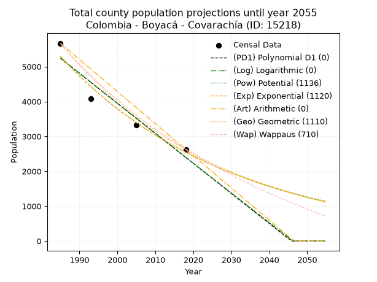
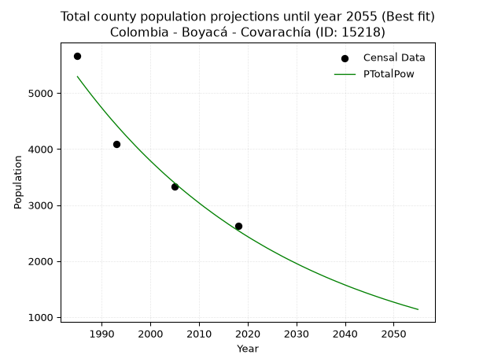
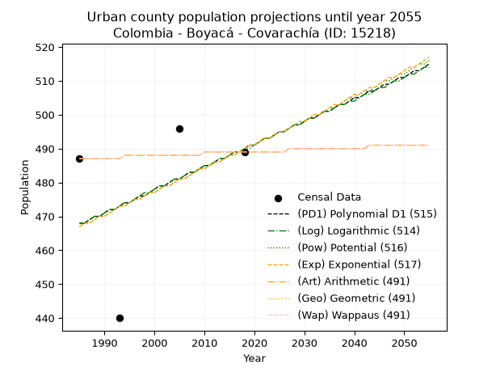
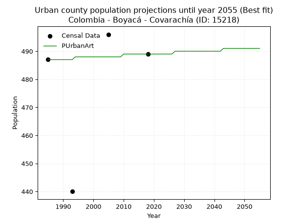
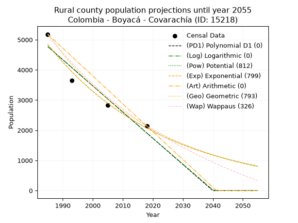
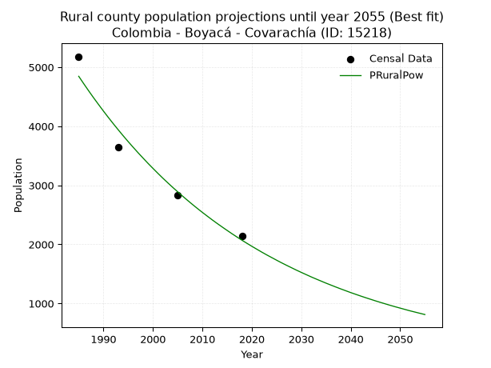

<div align="center">


</div>

# _“Population and Public Services Demand Projections (PPSD) until Year 2050 for Colombia - Boyacá - Covarachía (ID: 15218)”_
Keywords: `population` `public-service` `projection` `lineal` `polynomial` `logarithmic` `potential` `exponential` `arithmetic` `geometric` `wappaus` `dane` `colombia` `south-america`

PPSD are analytical estimates used by governments and planners to anticipate future changes in population size, age distribution, and the resulting community needs for utilities, healthcare, education, and infrastructure as sizing future water treatment facilities, electrical grids, and road networks based on spatial growth.

> **General running parameters**: • app_version: _v20260806_. • Python version: _3.14.7_. • Pandas version: _3.0.5_. • NumPy version: _2.5.1_. • Creates, save and include plots into reports (create_plot): _False_. • Projection until year: _2050_. • Process polynomial degree 2 and up: _False_. • Process Wappaus: _True_. • Process Wappaus: _True_. • Set negative values to zero: _True_. • Set infinite values to zero: _True_. • Drop dataset notes: _True_. 
<div align="center">

Dynamic map: [:earth_americas:Google](http://maps.google.com/maps?q=6.50017746,-72.7389779) [:earth_americas:OSM](https://www.openstreetmap.org/#map=18/6.50017746/-72.7389779&layers=P) [:earth_americas:Bing](https://www.bing.com/maps?cp=6.50017746~-72.7389779&lvl=18) [:earth_americas:Apple](https://maps.apple.com/frame?center=6.50017746%2C-72.7389779&span=0.003%2C0.006)

</div>


<div align="center">

```geojson
{
  "type": "Feature",
  "geometry": {
    "type": "Point", 
    "coordinates": [-72.7389779, 6.50017746]
  }, 
  "properties": {
    "Name": "Colombia - Boyacá - Covarachía (ID: 15218)"
  }
}
```

</div>


## 0. Census Data (4 records)

Census data are official statistics collected by a government about the people and housing in a country. They usually include counts of total population, age, sex, race, income, education, and jobs.

📅Global census file: [Population.xlsx](../data/Population.xlsx)

| Source   |   Year |   CountryID | CountryName   |   StateID | StateName   |   CountyID | CountyName   |   PTotal |   PUrban |   PRural |
|:---------|-------:|------------:|:--------------|----------:|:------------|-----------:|:-------------|---------:|---------:|---------:|
| DANE     |   1985 |          57 | Colombia      |        15 | Boyacá      |      15218 | Covarachía   |     5668 |      487 |     5181 |
| DANE     |   1993 |          57 | Colombia      |        15 | Boyacá      |      15218 | Covarachía   |     4087 |      440 |     3647 |
| DANE     |   2005 |          57 | Colombia      |        15 | Boyacá      |      15218 | Covarachía   |     3324 |      496 |     2828 |
| DANE     |   2018 |          57 | Colombia      |        15 | Boyacá      |      15218 | Covarachía   |     2628 |      489 |     2139 |

> 🔥Some records has specific notes about the registered values or the corresponding urban or rural distribution.

## 1. Total

### 1.1. Coefficients and Parameters

* (PD1) Polynomial Deg 1: -86.12083500602117, 176189.95022079386 (lineal)
* (Log) Logarithmic: -172496.39583255336, 1315073.2370226022
* (Pow) Potential: -44.394898319088405, 150.12745634832507
* (Exp) Exponential: -0.022170811624792265, 6.858982187839467e+22
* (Art) Arithmetic: Year diff. 2018 - 1985 = 33, Population diff. 2628 - 5668 = -3040, Annual growth = -92.12121212121212
* (Geo) Geometric: Year diff. 2018 - 1985 = 33, Population diff. 2628 - 5668 = -3040, Annual growth % = -0.023022160838561345
* (Wap) Wappaus: i = -2.220858537155548, Condition values only valid for < 200)

<sub>
Wappaus condition values: ['-0.00', '-2.22', '-4.44', '-6.66', '-8.88', '-11.10', '-13.33', '-15.55', '-17.77', '-19.99', '-22.21', '-24.43', '-26.65', '-28.87', '-31.09', '-33.31', '-35.53', '-37.75', '-39.98', '-42.20', '-44.42', '-46.64', '-48.86', '-51.08', '-53.30', '-55.52', '-57.74', '-59.96', '-62.18', '-64.40', '-66.63', '-68.85', '-71.07', '-73.29', '-75.51', '-77.73', '-79.95', '-82.17', '-84.39', '-86.61', '-88.83', '-91.06', '-93.28', '-95.50', '-97.72', '-99.94', '-102.16', '-104.38', '-106.60', '-108.82', '-111.04', '-113.26', '-115.48', '-117.71', '-119.93', '-122.15', '-124.37', '-126.59', '-128.81', '-131.03', '-133.25', '-135.47', '-137.69', '-139.91', '-142.13', '-144.36']
</sub>


### 1.2. Projected Dataset

|   Year |   CountyID |   PTotalPD1 |   PTotalLog |   PTotalPow |   PTotalExp |   PTotalArt |   PTotalGeo |   PTotalWap |
|-------:|-----------:|------------:|------------:|------------:|------------:|------------:|------------:|------------:|
|   1985 |      15218 |        5240 |        5244 |        5293 |        5289 |        5668 |        5668 |        5668 |
|   1986 |      15218 |        5154 |        5157 |        5176 |        5173 |        5576 |        5538 |        5544 |
|   1987 |      15218 |        5068 |        5070 |        5062 |        5060 |        5484 |        5410 |        5422 |
|   1988 |      15218 |        4982 |        4983 |        4950 |        4949 |        5392 |        5285 |        5303 |
|   1989 |      15218 |        4896 |        4896 |        4841 |        4840 |        5300 |        5164 |        5186 |
|   1990 |      15218 |        4809 |        4810 |        4734 |        4734 |        5207 |        5045 |        5072 |
|   1991 |      15218 |        4723 |        4723 |        4629 |        4630 |        5115 |        4929 |        4960 |
|   1992 |      15218 |        4637 |        4636 |        4527 |        4529 |        5023 |        4815 |        4850 |
|   1993 |      15218 |        4551 |        4550 |        4428 |        4429 |        4931 |        4704 |        4743 |
|   1994 |      15218 |        4465 |        4463 |        4330 |        4332 |        4839 |        4596 |        4638 |
|   1995 |      15218 |        4379 |        4377 |        4235 |        4237 |        4747 |        4490 |        4535 |
|   1996 |      15218 |        4293 |        4290 |        4142 |        4144 |        4655 |        4387 |        4434 |
|   1997 |      15218 |        4207 |        4204 |        4050 |        4053 |        4563 |        4286 |        4335 |
|   1998 |      15218 |        4121 |        4118 |        3961 |        3965 |        4470 |        4187 |        4238 |
|   1999 |      15218 |        4034 |        4031 |        3874 |        3878 |        4378 |        4091 |        4143 |
|   2000 |      15218 |        3948 |        3945 |        3789 |        3793 |        4286 |        3997 |        4049 |
|   2001 |      15218 |        3862 |        3859 |        3706 |        3709 |        4194 |        3905 |        3958 |
|   2002 |      15218 |        3776 |        3773 |        3625 |        3628 |        4102 |        3815 |        3868 |
|   2003 |      15218 |        3690 |        3686 |        3545 |        3549 |        4010 |        3727 |        3780 |
|   2004 |      15218 |        3604 |        3600 |        3468 |        3471 |        3918 |        3641 |        3693 |
|   2005 |      15218 |        3518 |        3514 |        3392 |        3395 |        3826 |        3557 |        3608 |
|   2006 |      15218 |        3432 |        3428 |        3317 |        3320 |        3733 |        3475 |        3524 |
|   2007 |      15218 |        3345 |        3342 |        3245 |        3247 |        3641 |        3395 |        3442 |
|   2008 |      15218 |        3259 |        3256 |        3174 |        3176 |        3549 |        3317 |        3362 |
|   2009 |      15218 |        3173 |        3170 |        3105 |        3107 |        3457 |        3241 |        3283 |
|   2010 |      15218 |        3087 |        3085 |        3037 |        3038 |        3365 |        3166 |        3205 |
|   2011 |      15218 |        3001 |        2999 |        2970 |        2972 |        3273 |        3093 |        3128 |
|   2012 |      15218 |        2915 |        2913 |        2906 |        2907 |        3181 |        3022 |        3053 |
|   2013 |      15218 |        2829 |        2827 |        2842 |        2843 |        3089 |        2953 |        2979 |
|   2014 |      15218 |        2743 |        2742 |        2780 |        2781 |        2996 |        2885 |        2907 |
|   2015 |      15218 |        2656 |        2656 |        2720 |        2720 |        2904 |        2818 |        2835 |
|   2016 |      15218 |        2570 |        2570 |        2660 |        2660 |        2812 |        2753 |        2765 |
|   2017 |      15218 |        2484 |        2485 |        2602 |        2602 |        2720 |        2690 |        2696 |
|   2018 |      15218 |        2398 |        2399 |        2546 |        2545 |        2628 |        2628 |        2628 |
|   2019 |      15218 |        2312 |        2314 |        2490 |        2489 |        2536 |        2567 |        2561 |
|   2020 |      15218 |        2226 |        2229 |        2436 |        2434 |        2444 |        2508 |        2495 |
|   2021 |      15218 |        2140 |        2143 |        2383 |        2381 |        2352 |        2451 |        2431 |
|   2022 |      15218 |        2054 |        2058 |        2332 |        2329 |        2260 |        2394 |        2367 |
|   2023 |      15218 |        1968 |        1973 |        2281 |        2278 |        2167 |        2339 |        2304 |
|   2024 |      15218 |        1881 |        1887 |        2231 |        2228 |        2075 |        2285 |        2242 |
|   2025 |      15218 |        1795 |        1802 |        2183 |        2179 |        1983 |        2233 |        2181 |
|   2026 |      15218 |        1709 |        1717 |        2136 |        2131 |        1891 |        2181 |        2122 |
|   2027 |      15218 |        1623 |        1632 |        2089 |        2084 |        1799 |        2131 |        2063 |
|   2028 |      15218 |        1537 |        1547 |        2044 |        2039 |        1707 |        2082 |        2004 |
|   2029 |      15218 |        1451 |        1462 |        2000 |        1994 |        1615 |        2034 |        1947 |
|   2030 |      15218 |        1365 |        1377 |        1957 |        1950 |        1523 |        1987 |        1891 |
|   2031 |      15218 |        1279 |        1292 |        1914 |        1907 |        1430 |        1941 |        1835 |
|   2032 |      15218 |        1192 |        1207 |        1873 |        1866 |        1338 |        1897 |        1781 |
|   2033 |      15218 |        1106 |        1122 |        1832 |        1825 |        1246 |        1853 |        1727 |
|   2034 |      15218 |        1020 |        1037 |        1793 |        1785 |        1154 |        1810 |        1673 |
|   2035 |      15218 |         934 |         952 |        1754 |        1746 |        1062 |        1769 |        1621 |
|   2036 |      15218 |         848 |         868 |        1716 |        1707 |         970 |        1728 |        1569 |
|   2037 |      15218 |         762 |         783 |        1679 |        1670 |         878 |        1688 |        1518 |
|   2038 |      15218 |         676 |         698 |        1643 |        1633 |         786 |        1649 |        1468 |
|   2039 |      15218 |         590 |         614 |        1608 |        1597 |         693 |        1611 |        1419 |
|   2040 |      15218 |         503 |         529 |        1573 |        1562 |         601 |        1574 |        1370 |
|   2041 |      15218 |         417 |         445 |        1539 |        1528 |         509 |        1538 |        1322 |
|   2042 |      15218 |         331 |         360 |        1506 |        1495 |         417 |        1503 |        1274 |
|   2043 |      15218 |         245 |         276 |        1474 |        1462 |         325 |        1468 |        1227 |
|   2044 |      15218 |         159 |         191 |        1442 |        1430 |         233 |        1434 |        1181 |
|   2045 |      15218 |          73 |         107 |        1411 |        1398 |         141 |        1401 |        1135 |
|   2046 |      15218 |           0 |          22 |        1381 |        1368 |          49 |        1369 |        1090 |
|   2047 |      15218 |           0 |           0 |        1351 |        1338 |         -44 |        1337 |        1046 |
|   2048 |      15218 |           0 |           0 |        1322 |        1308 |        -136 |        1307 |        1002 |
|   2049 |      15218 |           0 |           0 |        1294 |        1280 |        -228 |        1277 |         959 |
|   2050 |      15218 |           0 |           0 |        1266 |        1252 |        -320 |        1247 |         916 |
<div align="center">

</img>

</div>


### 1.3. Best fit with absolute error and relative error (%)

Relative error puts that difference into context by dividing the absolute error by the true value, creating a unitless ratio or percentage that shows the scale of the mistake.

Absolute and relative error

|   Year | Source   |   CountryID | CountryName   |   StateID | StateName   |   CountyID_x | CountyName   |   PTotal |   PUrban |   PRural |   CountyID_y |   PTotalPD1 |   PTotalLog |   PTotalPow |   PTotalExp |   PTotalArt |   PTotalGeo |   PTotalWap |   PTotalPD1AbsError |   PTotalLogAbsError |   PTotalPowAbsError |   PTotalExpAbsError |   PTotalArtAbsError |   PTotalGeoAbsError |   PTotalWapAbsError |   PTotalPD1RelError |   PTotalLogRelError |   PTotalPowRelError |   PTotalExpRelError |   PTotalArtRelError |   PTotalGeoRelError |   PTotalWapRelError |
|-------:|:---------|------------:|:--------------|----------:|:------------|-------------:|:-------------|---------:|---------:|---------:|-------------:|------------:|------------:|------------:|------------:|------------:|------------:|------------:|--------------------:|--------------------:|--------------------:|--------------------:|--------------------:|--------------------:|--------------------:|--------------------:|--------------------:|--------------------:|--------------------:|--------------------:|--------------------:|--------------------:|
|   1985 | DANE     |          57 | Colombia      |        15 | Boyacá      |        15218 | Covarachía   |     5668 |      487 |     5181 |        15218 |        5240 |        5244 |        5293 |        5289 |        5668 |        5668 |        5668 |                 428 |                 424 |                 375 |                 379 |                   0 |                   0 |                   0 |             7.55116 |             7.48059 |             6.61609 |             6.68666 |              0      |             0       |             0       |
|   1993 | DANE     |          57 | Colombia      |        15 | Boyacá      |        15218 | Covarachía   |     4087 |      440 |     3647 |        15218 |        4551 |        4550 |        4428 |        4429 |        4931 |        4704 |        4743 |                 464 |                 463 |                 341 |                 342 |                 844 |                 617 |                 656 |            11.3531  |            11.3286  |             8.34353 |             8.368   |             20.6508 |            15.0966  |            16.0509  |
|   2005 | DANE     |          57 | Colombia      |        15 | Boyacá      |        15218 | Covarachía   |     3324 |      496 |     2828 |        15218 |        3518 |        3514 |        3392 |        3395 |        3826 |        3557 |        3608 |                 194 |                 190 |                  68 |                  71 |                 502 |                 233 |                 284 |             5.83634 |             5.716   |             2.04573 |             2.13598 |             15.1023 |             7.00963 |             8.54392 |
|   2018 | DANE     |          57 | Colombia      |        15 | Boyacá      |        15218 | Covarachía   |     2628 |      489 |     2139 |        15218 |        2398 |        2399 |        2546 |        2545 |        2628 |        2628 |        2628 |                 230 |                 229 |                  82 |                  83 |                   0 |                   0 |                   0 |             8.7519  |             8.71385 |             3.12024 |             3.1583  |              0      |             0       |             0       |

Relative error mean

| Method    |   RelError | Best   |
|:----------|-----------:|:-------|
| PTotalPD1 |    8.37312 |        |
| PTotalLog |    8.30976 |        |
| PTotalPow |    5.0314  | True   |
| PTotalExp |    5.08723 |        |
| PTotalArt |    8.93828 |        |
| PTotalGeo |    5.52657 |        |
| PTotalWap |    6.1487  |        |

💙Best method: _**PTotalPow**_
<div align="center">

</img>

</div>


### 1.4. Fresh water supply demand in liters per capita per day (lpcd)

The fresh water supply demand typically ranges from 100 to 300 liters per capita per day (lpcd) for standard domestic and municipal planning, though absolute survival minimums set by the World Health Organization are as low as 7.5 to 20 liters per day, and total consumption in high-income nations can exceed 400 liters.

> `CZ`: Level in meters above the sea level (masl).<br> `WS`: Fresh water supply demand in liters per capita per day (lpcd or l/h/d).<br> `WSAll`: Zonal fresh water supply demand in liters per second (l/s).<br> `A`: Zonal area in square meters.

Reference values (RAS Colombia)

|    CZ |   WS |
|------:|-----:|
|  1000 |  120 |
|  2000 |  130 |
| 99999 |  140 |

County shapefile geometry properties and water supply values

|   CountyID |      ATotal |   CZTotal |   WSTotal |
|-----------:|------------:|----------:|----------:|
|      15218 | 1.02088e+08 |   1685.14 |       130 |

Projected values for best method: PTotalPow

|   CountyID |   Year |   PTotalPow |   WSTotal |   WSTotalAll |
|-----------:|-------:|------------:|----------:|-------------:|
|      15218 |   1985 |        5293 |       130 |      7.964   |
|      15218 |   1986 |        5176 |       130 |      7.78796 |
|      15218 |   1987 |        5062 |       130 |      7.61644 |
|      15218 |   1988 |        4950 |       130 |      7.44792 |
|      15218 |   1989 |        4841 |       130 |      7.28391 |
|      15218 |   1990 |        4734 |       130 |      7.12292 |
|      15218 |   1991 |        4629 |       130 |      6.96493 |
|      15218 |   1992 |        4527 |       130 |      6.81146 |
|      15218 |   1993 |        4428 |       130 |      6.6625  |
|      15218 |   1994 |        4330 |       130 |      6.51505 |
|      15218 |   1995 |        4235 |       130 |      6.37211 |
|      15218 |   1996 |        4142 |       130 |      6.23218 |
|      15218 |   1997 |        4050 |       130 |      6.09375 |
|      15218 |   1998 |        3961 |       130 |      5.95984 |
|      15218 |   1999 |        3874 |       130 |      5.82894 |
|      15218 |   2000 |        3789 |       130 |      5.70104 |
|      15218 |   2001 |        3706 |       130 |      5.57616 |
|      15218 |   2002 |        3625 |       130 |      5.45428 |
|      15218 |   2003 |        3545 |       130 |      5.33391 |
|      15218 |   2004 |        3468 |       130 |      5.21806 |
|      15218 |   2005 |        3392 |       130 |      5.1037  |
|      15218 |   2006 |        3317 |       130 |      4.99086 |
|      15218 |   2007 |        3245 |       130 |      4.88252 |
|      15218 |   2008 |        3174 |       130 |      4.77569 |
|      15218 |   2009 |        3105 |       130 |      4.67188 |
|      15218 |   2010 |        3037 |       130 |      4.56956 |
|      15218 |   2011 |        2970 |       130 |      4.46875 |
|      15218 |   2012 |        2906 |       130 |      4.37245 |
|      15218 |   2013 |        2842 |       130 |      4.27616 |
|      15218 |   2014 |        2780 |       130 |      4.18287 |
|      15218 |   2015 |        2720 |       130 |      4.09259 |
|      15218 |   2016 |        2660 |       130 |      4.00231 |
|      15218 |   2017 |        2602 |       130 |      3.91505 |
|      15218 |   2018 |        2546 |       130 |      3.83079 |
|      15218 |   2019 |        2490 |       130 |      3.74653 |
|      15218 |   2020 |        2436 |       130 |      3.66528 |
|      15218 |   2021 |        2383 |       130 |      3.58553 |
|      15218 |   2022 |        2332 |       130 |      3.5088  |
|      15218 |   2023 |        2281 |       130 |      3.43206 |
|      15218 |   2024 |        2231 |       130 |      3.35683 |
|      15218 |   2025 |        2183 |       130 |      3.28461 |
|      15218 |   2026 |        2136 |       130 |      3.21389 |
|      15218 |   2027 |        2089 |       130 |      3.14317 |
|      15218 |   2028 |        2044 |       130 |      3.07546 |
|      15218 |   2029 |        2000 |       130 |      3.00926 |
|      15218 |   2030 |        1957 |       130 |      2.94456 |
|      15218 |   2031 |        1914 |       130 |      2.87986 |
|      15218 |   2032 |        1873 |       130 |      2.81817 |
|      15218 |   2033 |        1832 |       130 |      2.75648 |
|      15218 |   2034 |        1793 |       130 |      2.6978  |
|      15218 |   2035 |        1754 |       130 |      2.63912 |
|      15218 |   2036 |        1716 |       130 |      2.58194 |
|      15218 |   2037 |        1679 |       130 |      2.52627 |
|      15218 |   2038 |        1643 |       130 |      2.47211 |
|      15218 |   2039 |        1608 |       130 |      2.41944 |
|      15218 |   2040 |        1573 |       130 |      2.36678 |
|      15218 |   2041 |        1539 |       130 |      2.31562 |
|      15218 |   2042 |        1506 |       130 |      2.26597 |
|      15218 |   2043 |        1474 |       130 |      2.21782 |
|      15218 |   2044 |        1442 |       130 |      2.16968 |
|      15218 |   2045 |        1411 |       130 |      2.12303 |
|      15218 |   2046 |        1381 |       130 |      2.07789 |
|      15218 |   2047 |        1351 |       130 |      2.03275 |
|      15218 |   2048 |        1322 |       130 |      1.98912 |
|      15218 |   2049 |        1294 |       130 |      1.94699 |
|      15218 |   2050 |        1266 |       130 |      1.90486 |

## 2. Urban

### 2.1. Coefficients and Parameters

* (PD1) Polynomial Deg 1: 0.6728221597751939, -867.8125250903316 (lineal)
* (Log) Logarithmic: 1344.4874647914644, -9741.459993926293
* (Pow) Potential: 2.873399615285541, -6.806366997207288
* (Exp) Exponential: 0.001438017170612063, 26.899305569971947
* (Art) Arithmetic: Year diff. 2018 - 1985 = 33, Population diff. 489 - 487 = 2, Annual growth = 0.06060606060606061
* (Geo) Geometric: Year diff. 2018 - 1985 = 33, Population diff. 489 - 487 = 2, Annual growth % = 0.00012420063323825836
* (Wap) Wappaus: i = 0.012419274714356682, Condition values only valid for < 200)

<sub>
Wappaus condition values: ['0.00', '0.01', '0.02', '0.04', '0.05', '0.06', '0.07', '0.09', '0.10', '0.11', '0.12', '0.14', '0.15', '0.16', '0.17', '0.19', '0.20', '0.21', '0.22', '0.24', '0.25', '0.26', '0.27', '0.29', '0.30', '0.31', '0.32', '0.34', '0.35', '0.36', '0.37', '0.38', '0.40', '0.41', '0.42', '0.43', '0.45', '0.46', '0.47', '0.48', '0.50', '0.51', '0.52', '0.53', '0.55', '0.56', '0.57', '0.58', '0.60', '0.61', '0.62', '0.63', '0.65', '0.66', '0.67', '0.68', '0.70', '0.71', '0.72', '0.73', '0.75', '0.76', '0.77', '0.78', '0.79', '0.81']
</sub>


### 2.2. Projected Dataset

|   Year |   CountyID |   PUrbanPD1 |   PUrbanLog |   PUrbanPow |   PUrbanExp |   PUrbanArt |   PUrbanGeo |   PUrbanWap |
|-------:|-----------:|------------:|------------:|------------:|------------:|------------:|------------:|------------:|
|   1985 |      15218 |         468 |         468 |         467 |         467 |         487 |         487 |         487 |
|   1986 |      15218 |         468 |         468 |         468 |         468 |         487 |         487 |         487 |
|   1987 |      15218 |         469 |         469 |         468 |         468 |         487 |         487 |         487 |
|   1988 |      15218 |         470 |         470 |         469 |         469 |         487 |         487 |         487 |
|   1989 |      15218 |         470 |         470 |         470 |         470 |         487 |         487 |         487 |
|   1990 |      15218 |         471 |         471 |         470 |         470 |         487 |         487 |         487 |
|   1991 |      15218 |         472 |         472 |         471 |         471 |         487 |         487 |         487 |
|   1992 |      15218 |         472 |         472 |         472 |         472 |         487 |         487 |         487 |
|   1993 |      15218 |         473 |         473 |         473 |         473 |         487 |         487 |         487 |
|   1994 |      15218 |         474 |         474 |         473 |         473 |         488 |         488 |         488 |
|   1995 |      15218 |         474 |         474 |         474 |         474 |         488 |         488 |         488 |
|   1996 |      15218 |         475 |         475 |         475 |         475 |         488 |         488 |         488 |
|   1997 |      15218 |         476 |         476 |         475 |         475 |         488 |         488 |         488 |
|   1998 |      15218 |         476 |         477 |         476 |         476 |         488 |         488 |         488 |
|   1999 |      15218 |         477 |         477 |         477 |         477 |         488 |         488 |         488 |
|   2000 |      15218 |         478 |         478 |         477 |         477 |         488 |         488 |         488 |
|   2001 |      15218 |         479 |         479 |         478 |         478 |         488 |         488 |         488 |
|   2002 |      15218 |         479 |         479 |         479 |         479 |         488 |         488 |         488 |
|   2003 |      15218 |         480 |         480 |         479 |         479 |         488 |         488 |         488 |
|   2004 |      15218 |         481 |         481 |         480 |         480 |         488 |         488 |         488 |
|   2005 |      15218 |         481 |         481 |         481 |         481 |         488 |         488 |         488 |
|   2006 |      15218 |         482 |         482 |         481 |         481 |         488 |         488 |         488 |
|   2007 |      15218 |         483 |         483 |         482 |         482 |         488 |         488 |         488 |
|   2008 |      15218 |         483 |         483 |         483 |         483 |         488 |         488 |         488 |
|   2009 |      15218 |         484 |         484 |         484 |         484 |         488 |         488 |         488 |
|   2010 |      15218 |         485 |         485 |         484 |         484 |         489 |         489 |         489 |
|   2011 |      15218 |         485 |         485 |         485 |         485 |         489 |         489 |         489 |
|   2012 |      15218 |         486 |         486 |         486 |         486 |         489 |         489 |         489 |
|   2013 |      15218 |         487 |         487 |         486 |         486 |         489 |         489 |         489 |
|   2014 |      15218 |         487 |         487 |         487 |         487 |         489 |         489 |         489 |
|   2015 |      15218 |         488 |         488 |         488 |         488 |         489 |         489 |         489 |
|   2016 |      15218 |         489 |         489 |         488 |         488 |         489 |         489 |         489 |
|   2017 |      15218 |         489 |         489 |         489 |         489 |         489 |         489 |         489 |
|   2018 |      15218 |         490 |         490 |         490 |         490 |         489 |         489 |         489 |
|   2019 |      15218 |         491 |         491 |         490 |         491 |         489 |         489 |         489 |
|   2020 |      15218 |         491 |         491 |         491 |         491 |         489 |         489 |         489 |
|   2021 |      15218 |         492 |         492 |         492 |         492 |         489 |         489 |         489 |
|   2022 |      15218 |         493 |         493 |         493 |         493 |         489 |         489 |         489 |
|   2023 |      15218 |         493 |         493 |         493 |         493 |         489 |         489 |         489 |
|   2024 |      15218 |         494 |         494 |         494 |         494 |         489 |         489 |         489 |
|   2025 |      15218 |         495 |         495 |         495 |         495 |         489 |         489 |         489 |
|   2026 |      15218 |         495 |         495 |         495 |         495 |         489 |         489 |         489 |
|   2027 |      15218 |         496 |         496 |         496 |         496 |         490 |         490 |         490 |
|   2028 |      15218 |         497 |         497 |         497 |         497 |         490 |         490 |         490 |
|   2029 |      15218 |         497 |         497 |         497 |         498 |         490 |         490 |         490 |
|   2030 |      15218 |         498 |         498 |         498 |         498 |         490 |         490 |         490 |
|   2031 |      15218 |         499 |         499 |         499 |         499 |         490 |         490 |         490 |
|   2032 |      15218 |         499 |         499 |         500 |         500 |         490 |         490 |         490 |
|   2033 |      15218 |         500 |         500 |         500 |         500 |         490 |         490 |         490 |
|   2034 |      15218 |         501 |         501 |         501 |         501 |         490 |         490 |         490 |
|   2035 |      15218 |         501 |         501 |         502 |         502 |         490 |         490 |         490 |
|   2036 |      15218 |         502 |         502 |         502 |         503 |         490 |         490 |         490 |
|   2037 |      15218 |         503 |         503 |         503 |         503 |         490 |         490 |         490 |
|   2038 |      15218 |         503 |         503 |         504 |         504 |         490 |         490 |         490 |
|   2039 |      15218 |         504 |         504 |         505 |         505 |         490 |         490 |         490 |
|   2040 |      15218 |         505 |         504 |         505 |         506 |         490 |         490 |         490 |
|   2041 |      15218 |         505 |         505 |         506 |         506 |         490 |         490 |         490 |
|   2042 |      15218 |         506 |         506 |         507 |         507 |         490 |         490 |         490 |
|   2043 |      15218 |         507 |         506 |         507 |         508 |         491 |         491 |         491 |
|   2044 |      15218 |         507 |         507 |         508 |         508 |         491 |         491 |         491 |
|   2045 |      15218 |         508 |         508 |         509 |         509 |         491 |         491 |         491 |
|   2046 |      15218 |         509 |         508 |         510 |         510 |         491 |         491 |         491 |
|   2047 |      15218 |         509 |         509 |         510 |         511 |         491 |         491 |         491 |
|   2048 |      15218 |         510 |         510 |         511 |         511 |         491 |         491 |         491 |
|   2049 |      15218 |         511 |         510 |         512 |         512 |         491 |         491 |         491 |
|   2050 |      15218 |         511 |         511 |         512 |         513 |         491 |         491 |         491 |
<div align="center">

</img>

</div>


### 2.3. Best fit with absolute error and relative error (%)

Relative error puts that difference into context by dividing the absolute error by the true value, creating a unitless ratio or percentage that shows the scale of the mistake.

Absolute and relative error

|   Year | Source   |   CountryID | CountryName   |   StateID | StateName   |   CountyID_x | CountyName   |   PTotal |   PUrban |   PRural |   CountyID_y |   PUrbanPD1 |   PUrbanLog |   PUrbanPow |   PUrbanExp |   PUrbanArt |   PUrbanGeo |   PUrbanWap |   PUrbanPD1AbsError |   PUrbanLogAbsError |   PUrbanPowAbsError |   PUrbanExpAbsError |   PUrbanArtAbsError |   PUrbanGeoAbsError |   PUrbanWapAbsError |   PUrbanPD1RelError |   PUrbanLogRelError |   PUrbanPowRelError |   PUrbanExpRelError |   PUrbanArtRelError |   PUrbanGeoRelError |   PUrbanWapRelError |
|-------:|:---------|------------:|:--------------|----------:|:------------|-------------:|:-------------|---------:|---------:|---------:|-------------:|------------:|------------:|------------:|------------:|------------:|------------:|------------:|--------------------:|--------------------:|--------------------:|--------------------:|--------------------:|--------------------:|--------------------:|--------------------:|--------------------:|--------------------:|--------------------:|--------------------:|--------------------:|--------------------:|
|   1985 | DANE     |          57 | Colombia      |        15 | Boyacá      |        15218 | Covarachía   |     5668 |      487 |     5181 |        15218 |         468 |         468 |         467 |         467 |         487 |         487 |         487 |                  19 |                  19 |                  20 |                  20 |                   0 |                   0 |                   0 |            3.90144  |            3.90144  |            4.10678  |            4.10678  |              0      |              0      |              0      |
|   1993 | DANE     |          57 | Colombia      |        15 | Boyacá      |        15218 | Covarachía   |     4087 |      440 |     3647 |        15218 |         473 |         473 |         473 |         473 |         487 |         487 |         487 |                  33 |                  33 |                  33 |                  33 |                  47 |                  47 |                  47 |            7.5      |            7.5      |            7.5      |            7.5      |             10.6818 |             10.6818 |             10.6818 |
|   2005 | DANE     |          57 | Colombia      |        15 | Boyacá      |        15218 | Covarachía   |     3324 |      496 |     2828 |        15218 |         481 |         481 |         481 |         481 |         488 |         488 |         488 |                  15 |                  15 |                  15 |                  15 |                   8 |                   8 |                   8 |            3.02419  |            3.02419  |            3.02419  |            3.02419  |              1.6129 |              1.6129 |              1.6129 |
|   2018 | DANE     |          57 | Colombia      |        15 | Boyacá      |        15218 | Covarachía   |     2628 |      489 |     2139 |        15218 |         490 |         490 |         490 |         490 |         489 |         489 |         489 |                   1 |                   1 |                   1 |                   1 |                   0 |                   0 |                   0 |            0.204499 |            0.204499 |            0.204499 |            0.204499 |              0      |              0      |              0      |

Relative error mean

| Method    |   RelError | Best   |
|:----------|-----------:|:-------|
| PUrbanPD1 |    3.65753 |        |
| PUrbanLog |    3.65753 |        |
| PUrbanPow |    3.70887 |        |
| PUrbanExp |    3.70887 |        |
| PUrbanArt |    3.07368 | True   |
| PUrbanGeo |    3.07368 | True   |
| PUrbanWap |    3.07368 | True   |

💙Best method: _**PUrbanArt**_
<div align="center">

</img>

</div>


### 2.4. Fresh water supply demand in liters per capita per day (lpcd)

The fresh water supply demand typically ranges from 100 to 300 liters per capita per day (lpcd) for standard domestic and municipal planning, though absolute survival minimums set by the World Health Organization are as low as 7.5 to 20 liters per day, and total consumption in high-income nations can exceed 400 liters.

> `CZ`: Level in meters above the sea level (masl).<br> `WS`: Fresh water supply demand in liters per capita per day (lpcd or l/h/d).<br> `WSAll`: Zonal fresh water supply demand in liters per second (l/s).<br> `A`: Zonal area in square meters.

Reference values (RAS Colombia)

|    CZ |   WS |
|------:|-----:|
|  1000 |  120 |
|  2000 |  130 |
| 99999 |  140 |

County shapefile geometry properties and water supply values

|   CountyID |   AUrban |   CZUrban |   WSUrban |
|-----------:|---------:|----------:|----------:|
|      15218 |   102117 |   2333.33 |       140 |

Projected values for best method: PUrbanArt

|   CountyID |   Year |   PUrbanArt |   WSUrban |   WSUrbanAll |
|-----------:|-------:|------------:|----------:|-------------:|
|      15218 |   1985 |         487 |       140 |     0.78912  |
|      15218 |   1986 |         487 |       140 |     0.78912  |
|      15218 |   1987 |         487 |       140 |     0.78912  |
|      15218 |   1988 |         487 |       140 |     0.78912  |
|      15218 |   1989 |         487 |       140 |     0.78912  |
|      15218 |   1990 |         487 |       140 |     0.78912  |
|      15218 |   1991 |         487 |       140 |     0.78912  |
|      15218 |   1992 |         487 |       140 |     0.78912  |
|      15218 |   1993 |         487 |       140 |     0.78912  |
|      15218 |   1994 |         488 |       140 |     0.790741 |
|      15218 |   1995 |         488 |       140 |     0.790741 |
|      15218 |   1996 |         488 |       140 |     0.790741 |
|      15218 |   1997 |         488 |       140 |     0.790741 |
|      15218 |   1998 |         488 |       140 |     0.790741 |
|      15218 |   1999 |         488 |       140 |     0.790741 |
|      15218 |   2000 |         488 |       140 |     0.790741 |
|      15218 |   2001 |         488 |       140 |     0.790741 |
|      15218 |   2002 |         488 |       140 |     0.790741 |
|      15218 |   2003 |         488 |       140 |     0.790741 |
|      15218 |   2004 |         488 |       140 |     0.790741 |
|      15218 |   2005 |         488 |       140 |     0.790741 |
|      15218 |   2006 |         488 |       140 |     0.790741 |
|      15218 |   2007 |         488 |       140 |     0.790741 |
|      15218 |   2008 |         488 |       140 |     0.790741 |
|      15218 |   2009 |         488 |       140 |     0.790741 |
|      15218 |   2010 |         489 |       140 |     0.792361 |
|      15218 |   2011 |         489 |       140 |     0.792361 |
|      15218 |   2012 |         489 |       140 |     0.792361 |
|      15218 |   2013 |         489 |       140 |     0.792361 |
|      15218 |   2014 |         489 |       140 |     0.792361 |
|      15218 |   2015 |         489 |       140 |     0.792361 |
|      15218 |   2016 |         489 |       140 |     0.792361 |
|      15218 |   2017 |         489 |       140 |     0.792361 |
|      15218 |   2018 |         489 |       140 |     0.792361 |
|      15218 |   2019 |         489 |       140 |     0.792361 |
|      15218 |   2020 |         489 |       140 |     0.792361 |
|      15218 |   2021 |         489 |       140 |     0.792361 |
|      15218 |   2022 |         489 |       140 |     0.792361 |
|      15218 |   2023 |         489 |       140 |     0.792361 |
|      15218 |   2024 |         489 |       140 |     0.792361 |
|      15218 |   2025 |         489 |       140 |     0.792361 |
|      15218 |   2026 |         489 |       140 |     0.792361 |
|      15218 |   2027 |         490 |       140 |     0.793981 |
|      15218 |   2028 |         490 |       140 |     0.793981 |
|      15218 |   2029 |         490 |       140 |     0.793981 |
|      15218 |   2030 |         490 |       140 |     0.793981 |
|      15218 |   2031 |         490 |       140 |     0.793981 |
|      15218 |   2032 |         490 |       140 |     0.793981 |
|      15218 |   2033 |         490 |       140 |     0.793981 |
|      15218 |   2034 |         490 |       140 |     0.793981 |
|      15218 |   2035 |         490 |       140 |     0.793981 |
|      15218 |   2036 |         490 |       140 |     0.793981 |
|      15218 |   2037 |         490 |       140 |     0.793981 |
|      15218 |   2038 |         490 |       140 |     0.793981 |
|      15218 |   2039 |         490 |       140 |     0.793981 |
|      15218 |   2040 |         490 |       140 |     0.793981 |
|      15218 |   2041 |         490 |       140 |     0.793981 |
|      15218 |   2042 |         490 |       140 |     0.793981 |
|      15218 |   2043 |         491 |       140 |     0.795602 |
|      15218 |   2044 |         491 |       140 |     0.795602 |
|      15218 |   2045 |         491 |       140 |     0.795602 |
|      15218 |   2046 |         491 |       140 |     0.795602 |
|      15218 |   2047 |         491 |       140 |     0.795602 |
|      15218 |   2048 |         491 |       140 |     0.795602 |
|      15218 |   2049 |         491 |       140 |     0.795602 |
|      15218 |   2050 |         491 |       140 |     0.795602 |

## 3. Rural

### 3.1. Coefficients and Parameters

* (PD1) Polynomial Deg 1: -86.79365716579638, 177057.76274588422 (lineal)
* (Log) Logarithmic: -173840.88329734487, 1324814.6970165288
* (Pow) Potential: -51.55015226514926, 173.68547193094275
* (Exp) Exponential: -0.025745592955033925, 7.579544131525571e+25
* (Art) Arithmetic: Year diff. 2018 - 1985 = 33, Population diff. 2139 - 5181 = -3042, Annual growth = -92.18181818181819
* (Geo) Geometric: Year diff. 2018 - 1985 = 33, Population diff. 2139 - 5181 = -3042, Annual growth % = -0.02645172707190968
* (Wap) Wappaus: i = -2.518628912071535, Condition values only valid for < 200)

<sub>
Wappaus condition values: ['-0.00', '-2.52', '-5.04', '-7.56', '-10.07', '-12.59', '-15.11', '-17.63', '-20.15', '-22.67', '-25.19', '-27.70', '-30.22', '-32.74', '-35.26', '-37.78', '-40.30', '-42.82', '-45.34', '-47.85', '-50.37', '-52.89', '-55.41', '-57.93', '-60.45', '-62.97', '-65.48', '-68.00', '-70.52', '-73.04', '-75.56', '-78.08', '-80.60', '-83.11', '-85.63', '-88.15', '-90.67', '-93.19', '-95.71', '-98.23', '-100.75', '-103.26', '-105.78', '-108.30', '-110.82', '-113.34', '-115.86', '-118.38', '-120.89', '-123.41', '-125.93', '-128.45', '-130.97', '-133.49', '-136.01', '-138.52', '-141.04', '-143.56', '-146.08', '-148.60', '-151.12', '-153.64', '-156.15', '-158.67', '-161.19', '-163.71']
</sub>


### 3.2. Projected Dataset

|   Year |   CountyID |   PRuralPD1 |   PRuralLog |   PRuralPow |   PRuralExp |   PRuralArt |   PRuralGeo |   PRuralWap |
|-------:|-----------:|------------:|------------:|------------:|------------:|------------:|------------:|------------:|
|   1985 |      15218 |        4772 |        4776 |        4846 |        4842 |        5181 |        5181 |        5181 |
|   1986 |      15218 |        4686 |        4688 |        4722 |        4719 |        5089 |        5044 |        5052 |
|   1987 |      15218 |        4599 |        4601 |        4601 |        4599 |        4997 |        4911 |        4926 |
|   1988 |      15218 |        4512 |        4513 |        4483 |        4482 |        4904 |        4781 |        4804 |
|   1989 |      15218 |        4425 |        4426 |        4369 |        4368 |        4812 |        4654 |        4684 |
|   1990 |      15218 |        4338 |        4338 |        4257 |        4257 |        4720 |        4531 |        4567 |
|   1991 |      15218 |        4252 |        4251 |        4148 |        4149 |        4628 |        4411 |        4453 |
|   1992 |      15218 |        4165 |        4164 |        4042 |        4043 |        4536 |        4295 |        4342 |
|   1993 |      15218 |        4078 |        4077 |        3939 |        3941 |        4444 |        4181 |        4233 |
|   1994 |      15218 |        3991 |        3989 |        3838 |        3841 |        4351 |        4070 |        4126 |
|   1995 |      15218 |        3904 |        3902 |        3740 |        3743 |        4259 |        3963 |        4022 |
|   1996 |      15218 |        3818 |        3815 |        3645 |        3648 |        4167 |        3858 |        3920 |
|   1997 |      15218 |        3731 |        3728 |        3552 |        3555 |        4075 |        3756 |        3821 |
|   1998 |      15218 |        3644 |        3641 |        3462 |        3465 |        3983 |        3656 |        3723 |
|   1999 |      15218 |        3557 |        3554 |        3373 |        3377 |        3890 |        3560 |        3628 |
|   2000 |      15218 |        3470 |        3467 |        3288 |        3291 |        3798 |        3466 |        3535 |
|   2001 |      15218 |        3384 |        3380 |        3204 |        3207 |        3706 |        3374 |        3443 |
|   2002 |      15218 |        3297 |        3293 |        3122 |        3126 |        3614 |        3285 |        3354 |
|   2003 |      15218 |        3210 |        3207 |        3043 |        3046 |        3522 |        3198 |        3266 |
|   2004 |      15218 |        3123 |        3120 |        2966 |        2969 |        3430 |        3113 |        3180 |
|   2005 |      15218 |        3036 |        3033 |        2891 |        2893 |        3337 |        3031 |        3096 |
|   2006 |      15218 |        2950 |        2946 |        2817 |        2820 |        3245 |        2951 |        3014 |
|   2007 |      15218 |        2863 |        2860 |        2746 |        2748 |        3153 |        2873 |        2933 |
|   2008 |      15218 |        2776 |        2773 |        2676 |        2678 |        3061 |        2797 |        2854 |
|   2009 |      15218 |        2689 |        2687 |        2608 |        2610 |        2969 |        2723 |        2776 |
|   2010 |      15218 |        2603 |        2600 |        2542 |        2544 |        2876 |        2651 |        2700 |
|   2011 |      15218 |        2516 |        2514 |        2478 |        2479 |        2784 |        2581 |        2625 |
|   2012 |      15218 |        2429 |        2427 |        2415 |        2416 |        2692 |        2512 |        2552 |
|   2013 |      15218 |        2342 |        2341 |        2354 |        2355 |        2600 |        2446 |        2480 |
|   2014 |      15218 |        2255 |        2254 |        2295 |        2295 |        2508 |        2381 |        2409 |
|   2015 |      15218 |        2169 |        2168 |        2237 |        2237 |        2416 |        2318 |        2340 |
|   2016 |      15218 |        2082 |        2082 |        2180 |        2180 |        2323 |        2257 |        2272 |
|   2017 |      15218 |        1995 |        1996 |        2125 |        2124 |        2231 |        2197 |        2205 |
|   2018 |      15218 |        1908 |        1910 |        2071 |        2070 |        2139 |        2139 |        2139 |
|   2019 |      15218 |        1821 |        1823 |        2019 |        2018 |        2047 |        2082 |        2074 |
|   2020 |      15218 |        1735 |        1737 |        1968 |        1966 |        1955 |        2027 |        2011 |
|   2021 |      15218 |        1648 |        1651 |        1919 |        1916 |        1862 |        1974 |        1949 |
|   2022 |      15218 |        1561 |        1565 |        1870 |        1868 |        1770 |        1922 |        1887 |
|   2023 |      15218 |        1474 |        1479 |        1823 |        1820 |        1678 |        1871 |        1827 |
|   2024 |      15218 |        1387 |        1393 |        1778 |        1774 |        1586 |        1821 |        1768 |
|   2025 |      15218 |        1301 |        1308 |        1733 |        1729 |        1494 |        1773 |        1710 |
|   2026 |      15218 |        1214 |        1222 |        1689 |        1685 |        1402 |        1726 |        1653 |
|   2027 |      15218 |        1127 |        1136 |        1647 |        1642 |        1309 |        1680 |        1596 |
|   2028 |      15218 |        1040 |        1050 |        1606 |        1600 |        1217 |        1636 |        1541 |
|   2029 |      15218 |         953 |         965 |        1565 |        1560 |        1125 |        1593 |        1487 |
|   2030 |      15218 |         867 |         879 |        1526 |        1520 |        1033 |        1551 |        1433 |
|   2031 |      15218 |         780 |         793 |        1488 |        1481 |         941 |        1510 |        1380 |
|   2032 |      15218 |         693 |         708 |        1450 |        1444 |         848 |        1470 |        1328 |
|   2033 |      15218 |         606 |         622 |        1414 |        1407 |         756 |        1431 |        1277 |
|   2034 |      15218 |         519 |         537 |        1379 |        1371 |         664 |        1393 |        1227 |
|   2035 |      15218 |         433 |         451 |        1344 |        1336 |         572 |        1356 |        1177 |
|   2036 |      15218 |         346 |         366 |        1311 |        1303 |         480 |        1320 |        1129 |
|   2037 |      15218 |         259 |         280 |        1278 |        1269 |         388 |        1285 |        1081 |
|   2038 |      15218 |         172 |         195 |        1246 |        1237 |         295 |        1251 |        1033 |
|   2039 |      15218 |          85 |         110 |        1215 |        1206 |         203 |        1218 |         987 |
|   2040 |      15218 |           0 |          25 |        1184 |        1175 |         111 |        1186 |         941 |
|   2041 |      15218 |           0 |           0 |        1155 |        1145 |          19 |        1155 |         896 |
|   2042 |      15218 |           0 |           0 |        1126 |        1116 |         -73 |        1124 |         851 |
|   2043 |      15218 |           0 |           0 |        1098 |        1088 |        -166 |        1094 |         807 |
|   2044 |      15218 |           0 |           0 |        1071 |        1060 |        -258 |        1065 |         764 |
|   2045 |      15218 |           0 |           0 |        1044 |        1033 |        -350 |        1037 |         721 |
|   2046 |      15218 |           0 |           0 |        1018 |        1007 |        -442 |        1010 |         679 |
|   2047 |      15218 |           0 |           0 |         993 |         981 |        -534 |         983 |         638 |
|   2048 |      15218 |           0 |           0 |         968 |         956 |        -626 |         957 |         597 |
|   2049 |      15218 |           0 |           0 |         944 |         932 |        -719 |         932 |         557 |
|   2050 |      15218 |           0 |           0 |         921 |         908 |        -811 |         907 |         517 |
<div align="center">

</img>

</div>


### 3.3. Best fit with absolute error and relative error (%)

Relative error puts that difference into context by dividing the absolute error by the true value, creating a unitless ratio or percentage that shows the scale of the mistake.

Absolute and relative error

|   Year | Source   |   CountryID | CountryName   |   StateID | StateName   |   CountyID_x | CountyName   |   PTotal |   PUrban |   PRural |   CountyID_y |   PRuralPD1 |   PRuralLog |   PRuralPow |   PRuralExp |   PRuralArt |   PRuralGeo |   PRuralWap |   PRuralPD1AbsError |   PRuralLogAbsError |   PRuralPowAbsError |   PRuralExpAbsError |   PRuralArtAbsError |   PRuralGeoAbsError |   PRuralWapAbsError |   PRuralPD1RelError |   PRuralLogRelError |   PRuralPowRelError |   PRuralExpRelError |   PRuralArtRelError |   PRuralGeoRelError |   PRuralWapRelError |
|-------:|:---------|------------:|:--------------|----------:|:------------|-------------:|:-------------|---------:|---------:|---------:|-------------:|------------:|------------:|------------:|------------:|------------:|------------:|------------:|--------------------:|--------------------:|--------------------:|--------------------:|--------------------:|--------------------:|--------------------:|--------------------:|--------------------:|--------------------:|--------------------:|--------------------:|--------------------:|--------------------:|
|   1985 | DANE     |          57 | Colombia      |        15 | Boyacá      |        15218 | Covarachía   |     5668 |      487 |     5181 |        15218 |        4772 |        4776 |        4846 |        4842 |        5181 |        5181 |        5181 |                 409 |                 405 |                 335 |                 339 |                   0 |                   0 |                   0 |             7.89423 |             7.81702 |             6.46593 |             6.54314 |              0      |             0       |             0       |
|   1993 | DANE     |          57 | Colombia      |        15 | Boyacá      |        15218 | Covarachía   |     4087 |      440 |     3647 |        15218 |        4078 |        4077 |        3939 |        3941 |        4444 |        4181 |        4233 |                 431 |                 430 |                 292 |                 294 |                 797 |                 534 |                 586 |            11.8179  |            11.7905  |             8.00658 |             8.06142 |             21.8536 |            14.6422  |            16.068   |
|   2005 | DANE     |          57 | Colombia      |        15 | Boyacá      |        15218 | Covarachía   |     3324 |      496 |     2828 |        15218 |        3036 |        3033 |        2891 |        2893 |        3337 |        3031 |        3096 |                 208 |                 205 |                  63 |                  65 |                 509 |                 203 |                 268 |             7.35502 |             7.24894 |             2.22772 |             2.29844 |             17.9986 |             7.17822 |             9.47666 |
|   2018 | DANE     |          57 | Colombia      |        15 | Boyacá      |        15218 | Covarachía   |     2628 |      489 |     2139 |        15218 |        1908 |        1910 |        2071 |        2070 |        2139 |        2139 |        2139 |                 231 |                 229 |                  68 |                  69 |                   0 |                   0 |                   0 |            10.7994  |            10.7059  |             3.17906 |             3.22581 |              0      |             0       |             0       |

Relative error mean

| Method    |   RelError | Best   |
|:----------|-----------:|:-------|
| PRuralPD1 |    9.46666 |        |
| PRuralLog |    9.3906  |        |
| PRuralPow |    4.96982 | True   |
| PRuralExp |    5.0322  |        |
| PRuralArt |    9.96304 |        |
| PRuralGeo |    5.4551  |        |
| PRuralWap |    6.38617 |        |

💙Best method: _**PRuralPow**_
<div align="center">

</img>

</div>


### 3.4. Fresh water supply demand in liters per capita per day (lpcd)

The fresh water supply demand typically ranges from 100 to 300 liters per capita per day (lpcd) for standard domestic and municipal planning, though absolute survival minimums set by the World Health Organization are as low as 7.5 to 20 liters per day, and total consumption in high-income nations can exceed 400 liters.

> `CZ`: Level in meters above the sea level (masl).<br> `WS`: Fresh water supply demand in liters per capita per day (lpcd or l/h/d).<br> `WSAll`: Zonal fresh water supply demand in liters per second (l/s).<br> `A`: Zonal area in square meters.

Reference values (RAS Colombia)

|    CZ |   WS |
|------:|-----:|
|  1000 |  120 |
|  2000 |  130 |
| 99999 |  140 |

County shapefile geometry properties and water supply values

|   CountyID |      ARural |   CZRural |   WSRural |
|-----------:|------------:|----------:|----------:|
|      15218 | 1.01986e+08 |   1684.49 |       130 |

Projected values for best method: PRuralPow

|   CountyID |   Year |   PRuralPow |   WSRural |   WSRuralAll |
|-----------:|-------:|------------:|----------:|-------------:|
|      15218 |   1985 |        4846 |       130 |      7.29144 |
|      15218 |   1986 |        4722 |       130 |      7.10486 |
|      15218 |   1987 |        4601 |       130 |      6.9228  |
|      15218 |   1988 |        4483 |       130 |      6.74525 |
|      15218 |   1989 |        4369 |       130 |      6.57373 |
|      15218 |   1990 |        4257 |       130 |      6.40521 |
|      15218 |   1991 |        4148 |       130 |      6.2412  |
|      15218 |   1992 |        4042 |       130 |      6.08171 |
|      15218 |   1993 |        3939 |       130 |      5.92674 |
|      15218 |   1994 |        3838 |       130 |      5.77477 |
|      15218 |   1995 |        3740 |       130 |      5.62731 |
|      15218 |   1996 |        3645 |       130 |      5.48438 |
|      15218 |   1997 |        3552 |       130 |      5.34444 |
|      15218 |   1998 |        3462 |       130 |      5.20903 |
|      15218 |   1999 |        3373 |       130 |      5.07512 |
|      15218 |   2000 |        3288 |       130 |      4.94722 |
|      15218 |   2001 |        3204 |       130 |      4.82083 |
|      15218 |   2002 |        3122 |       130 |      4.69745 |
|      15218 |   2003 |        3043 |       130 |      4.57859 |
|      15218 |   2004 |        2966 |       130 |      4.46273 |
|      15218 |   2005 |        2891 |       130 |      4.34988 |
|      15218 |   2006 |        2817 |       130 |      4.23854 |
|      15218 |   2007 |        2746 |       130 |      4.13171 |
|      15218 |   2008 |        2676 |       130 |      4.02639 |
|      15218 |   2009 |        2608 |       130 |      3.92407 |
|      15218 |   2010 |        2542 |       130 |      3.82477 |
|      15218 |   2011 |        2478 |       130 |      3.72847 |
|      15218 |   2012 |        2415 |       130 |      3.63368 |
|      15218 |   2013 |        2354 |       130 |      3.5419  |
|      15218 |   2014 |        2295 |       130 |      3.45312 |
|      15218 |   2015 |        2237 |       130 |      3.36586 |
|      15218 |   2016 |        2180 |       130 |      3.28009 |
|      15218 |   2017 |        2125 |       130 |      3.19734 |
|      15218 |   2018 |        2071 |       130 |      3.11609 |
|      15218 |   2019 |        2019 |       130 |      3.03785 |
|      15218 |   2020 |        1968 |       130 |      2.96111 |
|      15218 |   2021 |        1919 |       130 |      2.88738 |
|      15218 |   2022 |        1870 |       130 |      2.81366 |
|      15218 |   2023 |        1823 |       130 |      2.74294 |
|      15218 |   2024 |        1778 |       130 |      2.67523 |
|      15218 |   2025 |        1733 |       130 |      2.60752 |
|      15218 |   2026 |        1689 |       130 |      2.54132 |
|      15218 |   2027 |        1647 |       130 |      2.47812 |
|      15218 |   2028 |        1606 |       130 |      2.41644 |
|      15218 |   2029 |        1565 |       130 |      2.35475 |
|      15218 |   2030 |        1526 |       130 |      2.29606 |
|      15218 |   2031 |        1488 |       130 |      2.23889 |
|      15218 |   2032 |        1450 |       130 |      2.18171 |
|      15218 |   2033 |        1414 |       130 |      2.12755 |
|      15218 |   2034 |        1379 |       130 |      2.07488 |
|      15218 |   2035 |        1344 |       130 |      2.02222 |
|      15218 |   2036 |        1311 |       130 |      1.97257 |
|      15218 |   2037 |        1278 |       130 |      1.92292 |
|      15218 |   2038 |        1246 |       130 |      1.87477 |
|      15218 |   2039 |        1215 |       130 |      1.82812 |
|      15218 |   2040 |        1184 |       130 |      1.78148 |
|      15218 |   2041 |        1155 |       130 |      1.73785 |
|      15218 |   2042 |        1126 |       130 |      1.69421 |
|      15218 |   2043 |        1098 |       130 |      1.65208 |
|      15218 |   2044 |        1071 |       130 |      1.61146 |
|      15218 |   2045 |        1044 |       130 |      1.57083 |
|      15218 |   2046 |        1018 |       130 |      1.53171 |
|      15218 |   2047 |         993 |       130 |      1.4941  |
|      15218 |   2048 |         968 |       130 |      1.45648 |
|      15218 |   2049 |         944 |       130 |      1.42037 |
|      15218 |   2050 |         921 |       130 |      1.38576 |

<div align="center"><br><sub>Share this research</sub></div><br>

<sub>**APPS & TOOLS & CONTENT DISCLAIMER**: • NO WARRANTY - This content and software is provided by <a href="https://github.com/rcfdtools" target="_blank">github.com/rcfdtools</a> "as is", without any express or implied warranty, including warranties of merchantability, fitness for a particular purpose, or non-infringement. There is no guarantee that the software will be error-free or operate without interruption. • LIMITATION OF LIABILITY - Neither the authors nor copyright holders will be liable for claims or damages arising from the software or its use. You are responsible for determining if the software is appropriate for your use and assume all associated risks, including errors, legal compliance, and data loss. • NO PROFESSIONAL ADVICE - The software provides general information and does not offer professional advice. It should not replace consultation with professional advisors. [Clauses and global license for rcfdtools use.](https://github.com/rcfdtools/rcfdtools/blob/main/LICENSE.md)</sub>