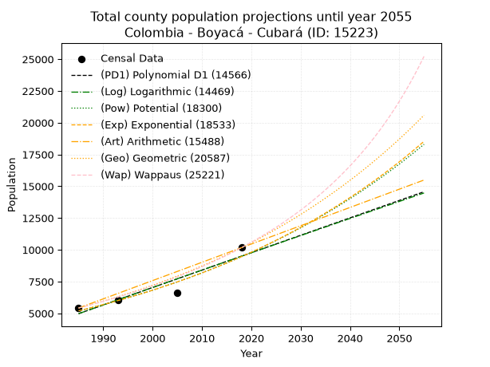
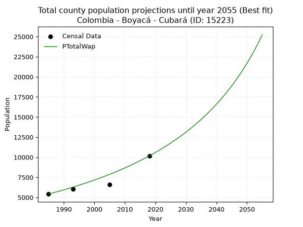
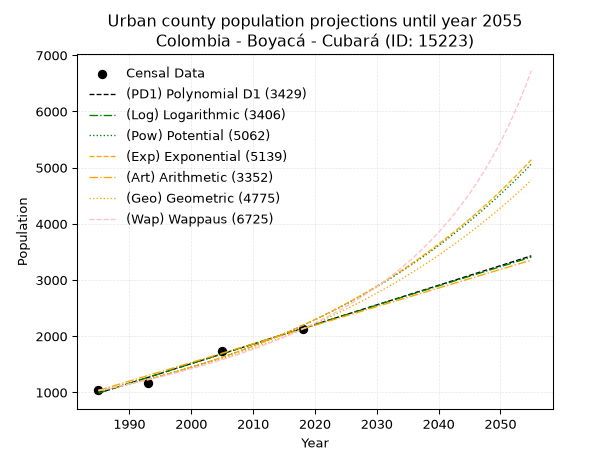
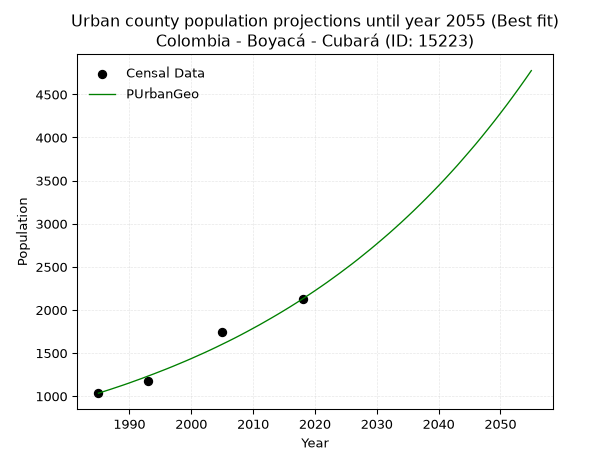
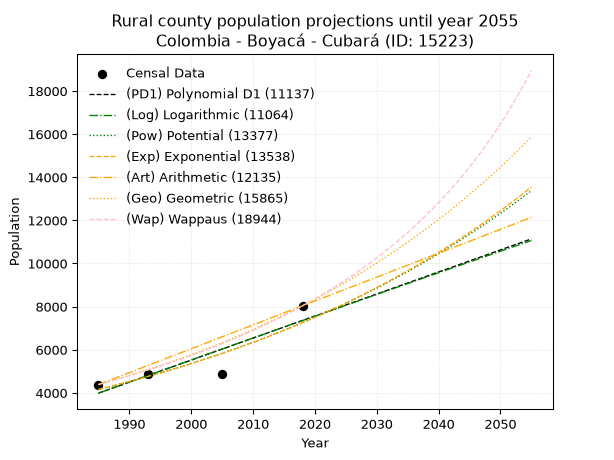
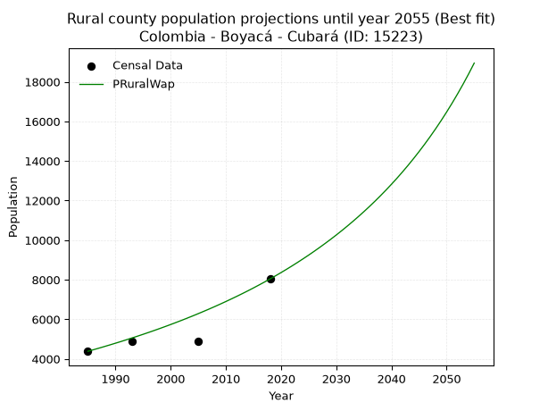

<div align="center">


</div>

# 📜 _“Population and Public Services Demand Projections (PPSD) until Year 2050 for Colombia - Boyacá - Cubará (ID: 15223)”_
Keywords: `population` `public-service` `projection` `lineal` `polynomial` `logarithmic` `potential` `exponential` `arithmetic` `geometric` `wappaus` `dane` `colombia` `south-america`

PPSD are analytical estimates used by governments and planners to anticipate future changes in population size, age distribution, and the resulting community needs for utilities, healthcare, education, and infrastructure as sizing future water treatment facilities, electrical grids, and road networks based on spatial growth.

<div align="center">

</img>

</div>


> **General running parameters**: • app_version: _v20260806_. • Python version: _3.14.7_. • Pandas version: _3.0.5_. • NumPy version: _2.5.1_. • Creates, save and include plots into reports (create_plot): _False_. • Projection until year: _2050_. • Process polynomial degree 2 and up: _False_. • Process Wappaus: _True_. • Process Wappaus: _True_. • Set negative values to zero: _True_. • Set infinite values to zero: _True_. • Drop dataset notes: _True_. 
<div align="center">

Maps & GIS Layers: [:earth_americas:Google](http://maps.google.com/maps?q=6.99727508,-72.107939) [:earth_americas:OSM](https://www.openstreetmap.org/#map=18/6.99727508/-72.107939&layers=P) [:earth_americas:Bing](https://www.bing.com/maps?cp=6.99727508~-72.107939&lvl=18) [:earth_americas:Apple](https://maps.apple.com/frame?center=6.99727508%2C-72.107939&span=0.003%2C0.006) [:earth_americas:GISMobile](https://github.com/rcfdtools/R.GISMobile/blob/main/file/gis/CountyLayer_CO/Readme.md)

</div>


<div align="center">

```geojson
{
  "type": "Feature",
  "geometry": {
    "type": "Point", 
    "coordinates": [-72.107939, 6.99727508]
  }, 
  "properties": {
    "Name": "Colombia - Boyacá - Cubará (ID: 15223)"
  }
}
```

</div>


## 0. Census Data (4 records)

Census data are official statistics collected by a government about the people and housing in a country. They usually include counts of total population, age, sex, race, income, education, and jobs.

📅Global census file: [Population.xlsx](../data/Population.xlsx)

| Source   |   Year |   CountryID | CountryName   |   StateID | StateName   |   CountyID | CountyName   |   PTotal |   PUrban |   PRural |
|:---------|-------:|------------:|:--------------|----------:|:------------|-----------:|:-------------|---------:|---------:|---------:|
| DANE     |   1985 |          57 | Colombia      |        15 | Boyacá      |      15223 | Cubará       |     5416 |     1034 |     4382 |
| DANE     |   1993 |          57 | Colombia      |        15 | Boyacá      |      15223 | Cubará       |     6051 |     1174 |     4877 |
| DANE     |   2005 |          57 | Colombia      |        15 | Boyacá      |      15223 | Cubará       |     6614 |     1738 |     4876 |
| DANE     |   2018 |          57 | Colombia      |        15 | Boyacá      |      15223 | Cubará       |    10164 |     2127 |     8037 |

> 🔥Some records could had specific notes about the registered values or the corresponding urban or rural distribution.

📅[SUI-RUPS](https://www.datos.gov.co/Hacienda-y-Cr-dito-P-blico/Registro-nico-de-Prestadores-de-Servicios-P-blicos/4qkq-csdn/about_data) - Local public utility companies: [RUPS.csv](../data/RUPS.csv)

 | SERVICIO       | ESTADO    | NOMBRE                      | NIT         | DEPARTAMENTO_DOMICILIO   | MUNICIPIO_DOMICILIO   | DIRECCION                        |   TELEFONO | EMAIL                   | TIPO_PRESTADOR                 | CLASIFICACION                 |
|:---------------|:----------|:----------------------------|:------------|:-------------------------|:----------------------|:---------------------------------|-----------:|:------------------------|:-------------------------------|:------------------------------|
| ACUEDUCTO      | OPERATIVA | ALCALDIA ESPECIAL DE CUBARA | 800099196-2 | BOYACA                   | CUBARA                | Calle 4 No. 4 - 43 B El Comercio |    8838052 | asesoramosspd@gmail.com | MUNICIPIO (PRESTACIÓN DIRECTA) | MENOR O IGUAL A 2500 USUARIOS |
| ALCANTARILLADO | OPERATIVA | ALCALDIA ESPECIAL DE CUBARA | 800099196-2 | BOYACA                   | CUBARA                | Calle 4 No. 4 - 43 B El Comercio |    8838052 | asesoramosspd@gmail.com | MUNICIPIO (PRESTACIÓN DIRECTA) | MENOR O IGUAL A 2500 USUARIOS |

## 1. Total

### 1.1. Coefficients and Parameters

* (PD1) Polynomial Deg 1: 137.075471698111, -267123.96226414654 (lineal)
* (Log) Logarithmic: 274141.4108919682, -2076689.811021246
* (Pow) Potential: 36.35682895390916, -116.18089091176914
* (Exp) Exponential: 0.018175747800228886, 1.1130926344220924e-12
* (Art) Arithmetic: Year diff. 2018 - 1985 = 33, Population diff. 10164 - 5416 = 4748, Annual growth = 143.87878787878788
* (Geo) Geometric: Year diff. 2018 - 1985 = 33, Population diff. 10164 - 5416 = 4748, Annual growth % = 0.019258693318526143
* (Wap) Wappaus: i = 1.8469677519741705, Condition values only valid for < 200)

<sub>
Wappaus condition values: ['0.00', '1.85', '3.69', '5.54', '7.39', '9.23', '11.08', '12.93', '14.78', '16.62', '18.47', '20.32', '22.16', '24.01', '25.86', '27.70', '29.55', '31.40', '33.25', '35.09', '36.94', '38.79', '40.63', '42.48', '44.33', '46.17', '48.02', '49.87', '51.72', '53.56', '55.41', '57.26', '59.10', '60.95', '62.80', '64.64', '66.49', '68.34', '70.18', '72.03', '73.88', '75.73', '77.57', '79.42', '81.27', '83.11', '84.96', '86.81', '88.65', '90.50', '92.35', '94.20', '96.04', '97.89', '99.74', '101.58', '103.43', '105.28', '107.12', '108.97', '110.82', '112.67', '114.51', '116.36', '118.21', '120.05']
</sub>


### 1.2. Projected Dataset

|   Year |   CountyID |   PTotalPD1 |   PTotalLog |   PTotalPow |   PTotalExp |   PTotalArt |   PTotalGeo |   PTotalWap |
|-------:|-----------:|------------:|------------:|------------:|------------:|------------:|------------:|------------:|
|   1985 |      15223 |        4971 |        4969 |        5191 |        5193 |        5416 |        5416 |        5416 |
|   1986 |      15223 |        5108 |        5107 |        5287 |        5288 |        5560 |        5520 |        5517 |
|   1987 |      15223 |        5245 |        5245 |        5384 |        5385 |        5704 |        5627 |        5620 |
|   1988 |      15223 |        5382 |        5383 |        5484 |        5484 |        5848 |        5735 |        5725 |
|   1989 |      15223 |        5519 |        5520 |        5585 |        5584 |        5992 |        5845 |        5831 |
|   1990 |      15223 |        5656 |        5658 |        5688 |        5687 |        6135 |        5958 |        5940 |
|   1991 |      15223 |        5793 |        5796 |        5793 |        5791 |        6279 |        6073 |        6051 |
|   1992 |      15223 |        5930 |        5934 |        5899 |        5897 |        6423 |        6190 |        6165 |
|   1993 |      15223 |        6067 |        6071 |        6008 |        6005 |        6567 |        6309 |        6280 |
|   1994 |      15223 |        6205 |        6209 |        6119 |        6115 |        6711 |        6430 |        6398 |
|   1995 |      15223 |        6342 |        6346 |        6231 |        6228 |        6855 |        6554 |        6518 |
|   1996 |      15223 |        6479 |        6483 |        6346 |        6342 |        6999 |        6680 |        6641 |
|   1997 |      15223 |        6616 |        6621 |        6462 |        6458 |        7143 |        6809 |        6766 |
|   1998 |      15223 |        6753 |        6758 |        6581 |        6577 |        7286 |        6940 |        6894 |
|   1999 |      15223 |        6890 |        6895 |        6702 |        6697 |        7430 |        7074 |        7024 |
|   2000 |      15223 |        7027 |        7032 |        6825 |        6820 |        7574 |        7210 |        7158 |
|   2001 |      15223 |        7164 |        7169 |        6950 |        6945 |        7718 |        7349 |        7294 |
|   2002 |      15223 |        7301 |        7306 |        7077 |        7072 |        7862 |        7491 |        7433 |
|   2003 |      15223 |        7438 |        7443 |        7207 |        7202 |        8006 |        7635 |        7576 |
|   2004 |      15223 |        7575 |        7580 |        7339 |        7334 |        8150 |        7782 |        7721 |
|   2005 |      15223 |        7712 |        7717 |        7473 |        7469 |        8294 |        7932 |        7870 |
|   2006 |      15223 |        7849 |        7854 |        7610 |        7606 |        8437 |        8084 |        8022 |
|   2007 |      15223 |        7987 |        7990 |        7749 |        7745 |        8581 |        8240 |        8178 |
|   2008 |      15223 |        8124 |        8127 |        7891 |        7887 |        8725 |        8399 |        8337 |
|   2009 |      15223 |        8261 |        8263 |        8035 |        8032 |        8869 |        8561 |        8500 |
|   2010 |      15223 |        8398 |        8400 |        8182 |        8179 |        9013 |        8725 |        8667 |
|   2011 |      15223 |        8535 |        8536 |        8331 |        8329 |        9157 |        8894 |        8839 |
|   2012 |      15223 |        8672 |        8672 |        8483 |        8482 |        9301 |        9065 |        9014 |
|   2013 |      15223 |        8809 |        8808 |        8638 |        8638 |        9445 |        9239 |        9194 |
|   2014 |      15223 |        8946 |        8945 |        8795 |        8796 |        9588 |        9417 |        9378 |
|   2015 |      15223 |        9083 |        9081 |        8955 |        8958 |        9732 |        9599 |        9567 |
|   2016 |      15223 |        9220 |        9217 |        9118 |        9122 |        9876 |        9784 |        9761 |
|   2017 |      15223 |        9357 |        9353 |        9284 |        9289 |       10020 |        9972 |        9960 |
|   2018 |      15223 |        9494 |        9489 |        9453 |        9460 |       10164 |       10164 |       10164 |
|   2019 |      15223 |        9631 |        9624 |        9625 |        9633 |       10308 |       10360 |       10374 |
|   2020 |      15223 |        9768 |        9760 |        9799 |        9810 |       10452 |       10559 |       10589 |
|   2021 |      15223 |        9906 |        9896 |        9977 |        9990 |       10596 |       10763 |       10811 |
|   2022 |      15223 |       10043 |       10031 |       10158 |       10173 |       10740 |       10970 |       11038 |
|   2023 |      15223 |       10180 |       10167 |       10343 |       10359 |       10883 |       11181 |       11272 |
|   2024 |      15223 |       10317 |       10302 |       10530 |       10550 |       11027 |       11396 |       11513 |
|   2025 |      15223 |       10454 |       10438 |       10721 |       10743 |       11171 |       11616 |       11761 |
|   2026 |      15223 |       10591 |       10573 |       10915 |       10940 |       11315 |       11840 |       12016 |
|   2027 |      15223 |       10728 |       10708 |       11113 |       11141 |       11459 |       12068 |       12279 |
|   2028 |      15223 |       10865 |       10844 |       11314 |       11345 |       11603 |       12300 |       12550 |
|   2029 |      15223 |       11002 |       10979 |       11519 |       11553 |       11747 |       12537 |       12830 |
|   2030 |      15223 |       11139 |       11114 |       11727 |       11765 |       11891 |       12778 |       13118 |
|   2031 |      15223 |       11276 |       11249 |       11939 |       11981 |       12034 |       13025 |       13416 |
|   2032 |      15223 |       11413 |       11384 |       12154 |       12201 |       12178 |       13275 |       13723 |
|   2033 |      15223 |       11550 |       11519 |       12374 |       12424 |       12322 |       13531 |       14041 |
|   2034 |      15223 |       11688 |       11654 |       12597 |       12652 |       12466 |       13792 |       14369 |
|   2035 |      15223 |       11825 |       11788 |       12824 |       12884 |       12610 |       14057 |       14708 |
|   2036 |      15223 |       11962 |       11923 |       13055 |       13121 |       12754 |       14328 |       15059 |
|   2037 |      15223 |       12099 |       12058 |       13290 |       13361 |       12898 |       14604 |       15423 |
|   2038 |      15223 |       12236 |       12192 |       13529 |       13606 |       13042 |       14885 |       15800 |
|   2039 |      15223 |       12373 |       12327 |       13773 |       13856 |       13185 |       15172 |       16191 |
|   2040 |      15223 |       12510 |       12461 |       14021 |       14110 |       13329 |       15464 |       16597 |
|   2041 |      15223 |       12647 |       12595 |       14273 |       14369 |       13473 |       15762 |       17018 |
|   2042 |      15223 |       12784 |       12730 |       14529 |       14632 |       13617 |       16065 |       17455 |
|   2043 |      15223 |       12921 |       12864 |       14790 |       14901 |       13761 |       16375 |       17910 |
|   2044 |      15223 |       13058 |       12998 |       15056 |       15174 |       13905 |       16690 |       18383 |
|   2045 |      15223 |       13195 |       13132 |       15326 |       15452 |       14049 |       17012 |       18876 |
|   2046 |      15223 |       13332 |       13266 |       15601 |       15736 |       14193 |       17339 |       19390 |
|   2047 |      15223 |       13470 |       13400 |       15880 |       16025 |       14336 |       17673 |       19926 |
|   2048 |      15223 |       13607 |       13534 |       16165 |       16318 |       14480 |       18013 |       20485 |
|   2049 |      15223 |       13744 |       13668 |       16454 |       16618 |       14624 |       18360 |       21070 |
|   2050 |      15223 |       13881 |       13802 |       16749 |       16923 |       14768 |       18714 |       21682 |
<div align="center">

</img>

</div>


### 1.3. Best fit with absolute and relative error (%)

Relative error puts that difference into context by dividing the absolute error by the true value, creating a unitless ratio or percentage that shows the scale of the mistake.

Absolute and relative error

|   Year | Source   |   CountryID | CountryName   |   StateID | StateName   |   CountyID_x | CountyName   |   PTotal |   PUrban |   PRural |   CountyID_y |   PTotalPD1 |   PTotalLog |   PTotalPow |   PTotalExp |   PTotalArt |   PTotalGeo |   PTotalWap |   PTotalPD1AbsError |   PTotalLogAbsError |   PTotalPowAbsError |   PTotalExpAbsError |   PTotalArtAbsError |   PTotalGeoAbsError |   PTotalWapAbsError |   PTotalPD1RelError |   PTotalLogRelError |   PTotalPowRelError |   PTotalExpRelError |   PTotalArtRelError |   PTotalGeoRelError |   PTotalWapRelError |
|-------:|:---------|------------:|:--------------|----------:|:------------|-------------:|:-------------|---------:|---------:|---------:|-------------:|------------:|------------:|------------:|------------:|------------:|------------:|------------:|--------------------:|--------------------:|--------------------:|--------------------:|--------------------:|--------------------:|--------------------:|--------------------:|--------------------:|--------------------:|--------------------:|--------------------:|--------------------:|--------------------:|
|   1985 | DANE     |          57 | Colombia      |        15 | Boyacá      |        15223 | Cubará       |     5416 |     1034 |     4382 |        15223 |        4971 |        4969 |        5191 |        5193 |        5416 |        5416 |        5416 |                 445 |                 447 |                 225 |                 223 |                   0 |                   0 |                   0 |            8.2164   |            8.25332  |            4.15436  |            4.11743  |             0       |             0       |              0      |
|   1993 | DANE     |          57 | Colombia      |        15 | Boyacá      |        15223 | Cubará       |     6051 |     1174 |     4877 |        15223 |        6067 |        6071 |        6008 |        6005 |        6567 |        6309 |        6280 |                  16 |                  20 |                  43 |                  46 |                 516 |                 258 |                 229 |            0.264419 |            0.330524 |            0.710626 |            0.760205 |             8.52752 |             4.26376 |              3.7845 |
|   2005 | DANE     |          57 | Colombia      |        15 | Boyacá      |        15223 | Cubará       |     6614 |     1738 |     4876 |        15223 |        7712 |        7717 |        7473 |        7469 |        8294 |        7932 |        7870 |                1098 |                1103 |                 859 |                 855 |                1680 |                1318 |                1256 |           16.6011   |           16.6767   |           12.9876   |           12.9271   |            25.4007  |            19.9274  |             18.99   |
|   2018 | DANE     |          57 | Colombia      |        15 | Boyacá      |        15223 | Cubará       |    10164 |     2127 |     8037 |        15223 |        9494 |        9489 |        9453 |        9460 |       10164 |       10164 |       10164 |                 670 |                 675 |                 711 |                 704 |                   0 |                   0 |                   0 |            6.59189  |            6.64109  |            6.99528  |            6.92641  |             0       |             0       |              0      |

Relative error mean

| Method    |   RelError | Best   |
|:----------|-----------:|:-------|
| PTotalPD1 |    7.91846 |        |
| PTotalLog |    7.97542 |        |
| PTotalPow |    6.21197 |        |
| PTotalExp |    6.18279 |        |
| PTotalArt |    8.48205 |        |
| PTotalGeo |    6.0478  |        |
| PTotalWap |    5.69363 | True   |

💙Best method: _**PTotalWap**_
<div align="center">

</img>

</div>


### 1.4. Fresh water supply demand in liters per capita per day (lpcd)

The fresh water supply demand typically ranges from 100 to 300 liters per capita per day (lpcd) for standard domestic and municipal planning, though absolute survival minimums set by the World Health Organization are as low as 7.5 to 20 liters per day, and total consumption in high-income nations can exceed 400 liters.

> `CZ`: Level in meters above the sea level (masl)<br> `WS`: Fresh water supply demand in liters per capita per day (lpcd or l/h/d)<br> `WSAll`: Zonal fresh water supply demand in liters per second (l/s)<br> `A`: Zonal area in square meters<br> `DP`: Population density (people/hectare or p/ha)

Reference values (RAS Colombia)

|    CZ |   WS |
|------:|-----:|
|  1000 |  120 |
|  2000 |  130 |
| 99999 |  140 |

County shapefile geometry properties and water supply values

|   CountyID |      ATotal |   CZTotal |   WSTotal |
|-----------:|------------:|----------:|----------:|
|      15223 | 1.13821e+09 |   1471.87 |       130 |

Projected values for best method: PTotalWap

|   CountyID |   Year |   PTotalWap |   DPTotal |   WSTotal |   WSTotalAll |
|-----------:|-------:|------------:|----------:|----------:|-------------:|
|      15223 |   1985 |        5416 |      0.05 |       130 |      8.14907 |
|      15223 |   1986 |        5517 |      0.05 |       130 |      8.30104 |
|      15223 |   1987 |        5620 |      0.05 |       130 |      8.45602 |
|      15223 |   1988 |        5725 |      0.05 |       130 |      8.614   |
|      15223 |   1989 |        5831 |      0.05 |       130 |      8.7735  |
|      15223 |   1990 |        5940 |      0.05 |       130 |      8.9375  |
|      15223 |   1991 |        6051 |      0.05 |       130 |      9.10451 |
|      15223 |   1992 |        6165 |      0.05 |       130 |      9.27604 |
|      15223 |   1993 |        6280 |      0.06 |       130 |      9.44907 |
|      15223 |   1994 |        6398 |      0.06 |       130 |      9.62662 |
|      15223 |   1995 |        6518 |      0.06 |       130 |      9.80718 |
|      15223 |   1996 |        6641 |      0.06 |       130 |      9.99225 |
|      15223 |   1997 |        6766 |      0.06 |       130 |     10.1803  |
|      15223 |   1998 |        6894 |      0.06 |       130 |     10.3729  |
|      15223 |   1999 |        7024 |      0.06 |       130 |     10.5685  |
|      15223 |   2000 |        7158 |      0.06 |       130 |     10.7701  |
|      15223 |   2001 |        7294 |      0.06 |       130 |     10.9748  |
|      15223 |   2002 |        7433 |      0.07 |       130 |     11.1839  |
|      15223 |   2003 |        7576 |      0.07 |       130 |     11.3991  |
|      15223 |   2004 |        7721 |      0.07 |       130 |     11.6172  |
|      15223 |   2005 |        7870 |      0.07 |       130 |     11.8414  |
|      15223 |   2006 |        8022 |      0.07 |       130 |     12.0701  |
|      15223 |   2007 |        8178 |      0.07 |       130 |     12.3049  |
|      15223 |   2008 |        8337 |      0.07 |       130 |     12.5441  |
|      15223 |   2009 |        8500 |      0.07 |       130 |     12.7894  |
|      15223 |   2010 |        8667 |      0.08 |       130 |     13.0406  |
|      15223 |   2011 |        8839 |      0.08 |       130 |     13.2994  |
|      15223 |   2012 |        9014 |      0.08 |       130 |     13.5627  |
|      15223 |   2013 |        9194 |      0.08 |       130 |     13.8336  |
|      15223 |   2014 |        9378 |      0.08 |       130 |     14.1104  |
|      15223 |   2015 |        9567 |      0.08 |       130 |     14.3948  |
|      15223 |   2016 |        9761 |      0.09 |       130 |     14.6867  |
|      15223 |   2017 |        9960 |      0.09 |       130 |     14.9861  |
|      15223 |   2018 |       10164 |      0.09 |       130 |     15.2931  |
|      15223 |   2019 |       10374 |      0.09 |       130 |     15.609   |
|      15223 |   2020 |       10589 |      0.09 |       130 |     15.9325  |
|      15223 |   2021 |       10811 |      0.09 |       130 |     16.2666  |
|      15223 |   2022 |       11038 |      0.1  |       130 |     16.6081  |
|      15223 |   2023 |       11272 |      0.1  |       130 |     16.9602  |
|      15223 |   2024 |       11513 |      0.1  |       130 |     17.3228  |
|      15223 |   2025 |       11761 |      0.1  |       130 |     17.6959  |
|      15223 |   2026 |       12016 |      0.11 |       130 |     18.0796  |
|      15223 |   2027 |       12279 |      0.11 |       130 |     18.4753  |
|      15223 |   2028 |       12550 |      0.11 |       130 |     18.8831  |
|      15223 |   2029 |       12830 |      0.11 |       130 |     19.3044  |
|      15223 |   2030 |       13118 |      0.12 |       130 |     19.7377  |
|      15223 |   2031 |       13416 |      0.12 |       130 |     20.1861  |
|      15223 |   2032 |       13723 |      0.12 |       130 |     20.648   |
|      15223 |   2033 |       14041 |      0.12 |       130 |     21.1265  |
|      15223 |   2034 |       14369 |      0.13 |       130 |     21.62    |
|      15223 |   2035 |       14708 |      0.13 |       130 |     22.1301  |
|      15223 |   2036 |       15059 |      0.13 |       130 |     22.6582  |
|      15223 |   2037 |       15423 |      0.14 |       130 |     23.2059  |
|      15223 |   2038 |       15800 |      0.14 |       130 |     23.7731  |
|      15223 |   2039 |       16191 |      0.14 |       130 |     24.3615  |
|      15223 |   2040 |       16597 |      0.15 |       130 |     24.9723  |
|      15223 |   2041 |       17018 |      0.15 |       130 |     25.6058  |
|      15223 |   2042 |       17455 |      0.15 |       130 |     26.2633  |
|      15223 |   2043 |       17910 |      0.16 |       130 |     26.9479  |
|      15223 |   2044 |       18383 |      0.16 |       130 |     27.6596  |
|      15223 |   2045 |       18876 |      0.17 |       130 |     28.4014  |
|      15223 |   2046 |       19390 |      0.17 |       130 |     29.1748  |
|      15223 |   2047 |       19926 |      0.18 |       130 |     29.9812  |
|      15223 |   2048 |       20485 |      0.18 |       130 |     30.8223  |
|      15223 |   2049 |       21070 |      0.19 |       130 |     31.7025  |
|      15223 |   2050 |       21682 |      0.19 |       130 |     32.6234  |

## 2. Urban

### 2.1. Coefficients and Parameters

* (PD1) Polynomial Deg 1: 34.89321557607358, -68276.90445604117 (lineal)
* (Log) Logarithmic: 69839.54801859846, -529332.714148381
* (Pow) Potential: 46.12566391155028, -149.10131313715317
* (Exp) Exponential: 0.02304092706522434, 1.4041220932181125e-17
* (Art) Arithmetic: Year diff. 2018 - 1985 = 33, Population diff. 2127 - 1034 = 1093, Annual growth = 33.121212121212125
* (Geo) Geometric: Year diff. 2018 - 1985 = 33, Population diff. 2127 - 1034 = 1093, Annual growth % = 0.022097513713379202
* (Wap) Wappaus: i = 2.0956160785328772, Condition values only valid for < 200)

<sub>
Wappaus condition values: ['0.00', '2.10', '4.19', '6.29', '8.38', '10.48', '12.57', '14.67', '16.76', '18.86', '20.96', '23.05', '25.15', '27.24', '29.34', '31.43', '33.53', '35.63', '37.72', '39.82', '41.91', '44.01', '46.10', '48.20', '50.29', '52.39', '54.49', '56.58', '58.68', '60.77', '62.87', '64.96', '67.06', '69.16', '71.25', '73.35', '75.44', '77.54', '79.63', '81.73', '83.82', '85.92', '88.02', '90.11', '92.21', '94.30', '96.40', '98.49', '100.59', '102.69', '104.78', '106.88', '108.97', '111.07', '113.16', '115.26', '117.35', '119.45', '121.55', '123.64', '125.74', '127.83', '129.93', '132.02', '134.12', '136.22']
</sub>


### 2.2. Projected Dataset

|   Year |   CountyID |   PUrbanPD1 |   PUrbanLog |   PUrbanPow |   PUrbanExp |   PUrbanArt |   PUrbanGeo |   PUrbanWap |
|-------:|-----------:|------------:|------------:|------------:|------------:|------------:|------------:|------------:|
|   1985 |      15223 |         986 |         985 |        1023 |        1024 |        1034 |        1034 |        1034 |
|   1986 |      15223 |        1021 |        1020 |        1048 |        1048 |        1067 |        1057 |        1056 |
|   1987 |      15223 |        1056 |        1055 |        1072 |        1073 |        1100 |        1080 |        1078 |
|   1988 |      15223 |        1091 |        1091 |        1097 |        1098 |        1133 |        1104 |        1101 |
|   1989 |      15223 |        1126 |        1126 |        1123 |        1123 |        1166 |        1128 |        1124 |
|   1990 |      15223 |        1161 |        1161 |        1149 |        1149 |        1200 |        1153 |        1148 |
|   1991 |      15223 |        1195 |        1196 |        1176 |        1176 |        1233 |        1179 |        1173 |
|   1992 |      15223 |        1230 |        1231 |        1204 |        1204 |        1266 |        1205 |        1198 |
|   1993 |      15223 |        1265 |        1266 |        1232 |        1232 |        1299 |        1232 |        1223 |
|   1994 |      15223 |        1300 |        1301 |        1261 |        1260 |        1332 |        1259 |        1249 |
|   1995 |      15223 |        1335 |        1336 |        1290 |        1290 |        1365 |        1287 |        1276 |
|   1996 |      15223 |        1370 |        1371 |        1321 |        1320 |        1398 |        1315 |        1303 |
|   1997 |      15223 |        1405 |        1406 |        1352 |        1350 |        1431 |        1344 |        1331 |
|   1998 |      15223 |        1440 |        1441 |        1383 |        1382 |        1465 |        1374 |        1360 |
|   1999 |      15223 |        1475 |        1476 |        1415 |        1414 |        1498 |        1404 |        1390 |
|   2000 |      15223 |        1510 |        1511 |        1448 |        1447 |        1531 |        1435 |        1420 |
|   2001 |      15223 |        1544 |        1546 |        1482 |        1481 |        1564 |        1467 |        1451 |
|   2002 |      15223 |        1579 |        1581 |        1517 |        1515 |        1597 |        1499 |        1482 |
|   2003 |      15223 |        1614 |        1616 |        1552 |        1551 |        1630 |        1532 |        1515 |
|   2004 |      15223 |        1649 |        1650 |        1588 |        1587 |        1663 |        1566 |        1548 |
|   2005 |      15223 |        1684 |        1685 |        1625 |        1624 |        1696 |        1601 |        1582 |
|   2006 |      15223 |        1719 |        1720 |        1663 |        1662 |        1730 |        1636 |        1617 |
|   2007 |      15223 |        1754 |        1755 |        1702 |        1700 |        1763 |        1672 |        1654 |
|   2008 |      15223 |        1789 |        1790 |        1741 |        1740 |        1796 |        1709 |        1691 |
|   2009 |      15223 |        1824 |        1824 |        1782 |        1781 |        1829 |        1747 |        1729 |
|   2010 |      15223 |        1858 |        1859 |        1823 |        1822 |        1862 |        1786 |        1768 |
|   2011 |      15223 |        1893 |        1894 |        1865 |        1865 |        1895 |        1825 |        1808 |
|   2012 |      15223 |        1928 |        1929 |        1909 |        1908 |        1928 |        1866 |        1850 |
|   2013 |      15223 |        1963 |        1963 |        1953 |        1952 |        1961 |        1907 |        1893 |
|   2014 |      15223 |        1998 |        1998 |        1998 |        1998 |        1995 |        1949 |        1937 |
|   2015 |      15223 |        2033 |        2033 |        2044 |        2045 |        2028 |        1992 |        1982 |
|   2016 |      15223 |        2068 |        2067 |        2092 |        2092 |        2061 |        2036 |        2029 |
|   2017 |      15223 |        2103 |        2102 |        2140 |        2141 |        2094 |        2081 |        2077 |
|   2018 |      15223 |        2138 |        2137 |        2190 |        2191 |        2127 |        2127 |        2127 |
|   2019 |      15223 |        2172 |        2171 |        2240 |        2242 |        2160 |        2174 |        2178 |
|   2020 |      15223 |        2207 |        2206 |        2292 |        2294 |        2193 |        2222 |        2232 |
|   2021 |      15223 |        2242 |        2240 |        2345 |        2348 |        2226 |        2271 |        2287 |
|   2022 |      15223 |        2277 |        2275 |        2399 |        2402 |        2259 |        2321 |        2343 |
|   2023 |      15223 |        2312 |        2309 |        2454 |        2458 |        2293 |        2373 |        2402 |
|   2024 |      15223 |        2347 |        2344 |        2511 |        2516 |        2326 |        2425 |        2463 |
|   2025 |      15223 |        2382 |        2378 |        2569 |        2574 |        2359 |        2479 |        2526 |
|   2026 |      15223 |        2417 |        2413 |        2628 |        2634 |        2392 |        2533 |        2592 |
|   2027 |      15223 |        2452 |        2447 |        2689 |        2696 |        2425 |        2589 |        2659 |
|   2028 |      15223 |        2487 |        2482 |        2750 |        2759 |        2458 |        2647 |        2730 |
|   2029 |      15223 |        2521 |        2516 |        2814 |        2823 |        2491 |        2705 |        2803 |
|   2030 |      15223 |        2556 |        2551 |        2878 |        2889 |        2524 |        2765 |        2879 |
|   2031 |      15223 |        2591 |        2585 |        2944 |        2956 |        2558 |        2826 |        2958 |
|   2032 |      15223 |        2626 |        2619 |        3012 |        3025 |        2591 |        2888 |        3041 |
|   2033 |      15223 |        2661 |        2654 |        3081 |        3095 |        2624 |        2952 |        3127 |
|   2034 |      15223 |        2696 |        2688 |        3152 |        3168 |        2657 |        3017 |        3216 |
|   2035 |      15223 |        2731 |        2722 |        3224 |        3241 |        2690 |        3084 |        3310 |
|   2036 |      15223 |        2766 |        2757 |        3298 |        3317 |        2723 |        3152 |        3407 |
|   2037 |      15223 |        2801 |        2791 |        3374 |        3394 |        2756 |        3222 |        3510 |
|   2038 |      15223 |        2835 |        2825 |        3451 |        3473 |        2789 |        3293 |        3617 |
|   2039 |      15223 |        2870 |        2860 |        3530 |        3554 |        2823 |        3366 |        3729 |
|   2040 |      15223 |        2905 |        2894 |        3611 |        3637 |        2856 |        3440 |        3847 |
|   2041 |      15223 |        2940 |        2928 |        3693 |        3722 |        2889 |        3516 |        3971 |
|   2042 |      15223 |        2975 |        2962 |        3778 |        3809 |        2922 |        3594 |        4101 |
|   2043 |      15223 |        3010 |        2997 |        3864 |        3897 |        2955 |        3673 |        4238 |
|   2044 |      15223 |        3045 |        3031 |        3952 |        3988 |        2988 |        3755 |        4383 |
|   2045 |      15223 |        3080 |        3065 |        4042 |        4081 |        3021 |        3838 |        4535 |
|   2046 |      15223 |        3115 |        3099 |        4134 |        4176 |        3054 |        3922 |        4697 |
|   2047 |      15223 |        3150 |        3133 |        4229 |        4274 |        3088 |        4009 |        4869 |
|   2048 |      15223 |        3184 |        3167 |        4325 |        4373 |        3121 |        4098 |        5050 |
|   2049 |      15223 |        3219 |        3201 |        4423 |        4475 |        3154 |        4188 |        5244 |
|   2050 |      15223 |        3254 |        3235 |        4524 |        4580 |        3187 |        4281 |        5450 |
<div align="center">

</img>

</div>


### 2.3. Best fit with absolute and relative error (%)

Relative error puts that difference into context by dividing the absolute error by the true value, creating a unitless ratio or percentage that shows the scale of the mistake.

Absolute and relative error

|   Year | Source   |   CountryID | CountryName   |   StateID | StateName   |   CountyID_x | CountyName   |   PTotal |   PUrban |   PRural |   CountyID_y |   PUrbanPD1 |   PUrbanLog |   PUrbanPow |   PUrbanExp |   PUrbanArt |   PUrbanGeo |   PUrbanWap |   PUrbanPD1AbsError |   PUrbanLogAbsError |   PUrbanPowAbsError |   PUrbanExpAbsError |   PUrbanArtAbsError |   PUrbanGeoAbsError |   PUrbanWapAbsError |   PUrbanPD1RelError |   PUrbanLogRelError |   PUrbanPowRelError |   PUrbanExpRelError |   PUrbanArtRelError |   PUrbanGeoRelError |   PUrbanWapRelError |
|-------:|:---------|------------:|:--------------|----------:|:------------|-------------:|:-------------|---------:|---------:|---------:|-------------:|------------:|------------:|------------:|------------:|------------:|------------:|------------:|--------------------:|--------------------:|--------------------:|--------------------:|--------------------:|--------------------:|--------------------:|--------------------:|--------------------:|--------------------:|--------------------:|--------------------:|--------------------:|--------------------:|
|   1985 | DANE     |          57 | Colombia      |        15 | Boyacá      |        15223 | Cubará       |     5416 |     1034 |     4382 |        15223 |         986 |         985 |        1023 |        1024 |        1034 |        1034 |        1034 |                  48 |                  49 |                  11 |                  10 |                   0 |                   0 |                   0 |             4.64217 |            4.73888  |             1.06383 |            0.967118 |             0       |             0       |             0       |
|   1993 | DANE     |          57 | Colombia      |        15 | Boyacá      |        15223 | Cubará       |     6051 |     1174 |     4877 |        15223 |        1265 |        1266 |        1232 |        1232 |        1299 |        1232 |        1223 |                  91 |                  92 |                  58 |                  58 |                 125 |                  58 |                  49 |             7.75128 |            7.83646  |             4.94037 |            4.94037  |            10.6474  |             4.94037 |             4.17376 |
|   2005 | DANE     |          57 | Colombia      |        15 | Boyacá      |        15223 | Cubará       |     6614 |     1738 |     4876 |        15223 |        1684 |        1685 |        1625 |        1624 |        1696 |        1601 |        1582 |                  54 |                  53 |                 113 |                 114 |                  42 |                 137 |                 156 |             3.10702 |            3.04948  |             6.50173 |            6.55926  |             2.41657 |             7.88262 |             8.97583 |
|   2018 | DANE     |          57 | Colombia      |        15 | Boyacá      |        15223 | Cubará       |    10164 |     2127 |     8037 |        15223 |        2138 |        2137 |        2190 |        2191 |        2127 |        2127 |        2127 |                  11 |                  10 |                  63 |                  64 |                   0 |                   0 |                   0 |             0.51716 |            0.470146 |             2.96192 |            3.00893  |             0       |             0       |             0       |

Relative error mean

| Method    |   RelError | Best   |
|:----------|-----------:|:-------|
| PUrbanPD1 |    4.00441 |        |
| PUrbanLog |    4.02374 |        |
| PUrbanPow |    3.86696 |        |
| PUrbanExp |    3.86892 |        |
| PUrbanArt |    3.26598 |        |
| PUrbanGeo |    3.20575 | True   |
| PUrbanWap |    3.2874  |        |

💙Best method: _**PUrbanGeo**_
<div align="center">

</img>

</div>


### 2.4. Fresh water supply demand in liters per capita per day (lpcd)

The fresh water supply demand typically ranges from 100 to 300 liters per capita per day (lpcd) for standard domestic and municipal planning, though absolute survival minimums set by the World Health Organization are as low as 7.5 to 20 liters per day, and total consumption in high-income nations can exceed 400 liters.

> `CZ`: Level in meters above the sea level (masl)<br> `WS`: Fresh water supply demand in liters per capita per day (lpcd or l/h/d)<br> `WSAll`: Zonal fresh water supply demand in liters per second (l/s)<br> `A`: Zonal area in square meters<br> `DP`: Population density (people/hectare or p/ha)

Reference values (RAS Colombia)

|    CZ |   WS |
|------:|-----:|
|  1000 |  120 |
|  2000 |  130 |
| 99999 |  140 |

County shapefile geometry properties and water supply values

|   CountyID |     AUrban |   CZUrban |   WSUrban |
|-----------:|-----------:|----------:|----------:|
|      15223 | 1.0096e+06 |   371.929 |       120 |

Projected values for best method: PUrbanGeo

|   CountyID |   Year |   PUrbanGeo |   DPUrban |   WSUrban |   WSUrbanAll |
|-----------:|-------:|------------:|----------:|----------:|-------------:|
|      15223 |   1985 |        1034 |     10.24 |       120 |      1.43611 |
|      15223 |   1986 |        1057 |     10.47 |       120 |      1.46806 |
|      15223 |   1987 |        1080 |     10.7  |       120 |      1.5     |
|      15223 |   1988 |        1104 |     10.94 |       120 |      1.53333 |
|      15223 |   1989 |        1128 |     11.17 |       120 |      1.56667 |
|      15223 |   1990 |        1153 |     11.42 |       120 |      1.60139 |
|      15223 |   1991 |        1179 |     11.68 |       120 |      1.6375  |
|      15223 |   1992 |        1205 |     11.94 |       120 |      1.67361 |
|      15223 |   1993 |        1232 |     12.2  |       120 |      1.71111 |
|      15223 |   1994 |        1259 |     12.47 |       120 |      1.74861 |
|      15223 |   1995 |        1287 |     12.75 |       120 |      1.7875  |
|      15223 |   1996 |        1315 |     13.03 |       120 |      1.82639 |
|      15223 |   1997 |        1344 |     13.31 |       120 |      1.86667 |
|      15223 |   1998 |        1374 |     13.61 |       120 |      1.90833 |
|      15223 |   1999 |        1404 |     13.91 |       120 |      1.95    |
|      15223 |   2000 |        1435 |     14.21 |       120 |      1.99306 |
|      15223 |   2001 |        1467 |     14.53 |       120 |      2.0375  |
|      15223 |   2002 |        1499 |     14.85 |       120 |      2.08194 |
|      15223 |   2003 |        1532 |     15.17 |       120 |      2.12778 |
|      15223 |   2004 |        1566 |     15.51 |       120 |      2.175   |
|      15223 |   2005 |        1601 |     15.86 |       120 |      2.22361 |
|      15223 |   2006 |        1636 |     16.2  |       120 |      2.27222 |
|      15223 |   2007 |        1672 |     16.56 |       120 |      2.32222 |
|      15223 |   2008 |        1709 |     16.93 |       120 |      2.37361 |
|      15223 |   2009 |        1747 |     17.3  |       120 |      2.42639 |
|      15223 |   2010 |        1786 |     17.69 |       120 |      2.48056 |
|      15223 |   2011 |        1825 |     18.08 |       120 |      2.53472 |
|      15223 |   2012 |        1866 |     18.48 |       120 |      2.59167 |
|      15223 |   2013 |        1907 |     18.89 |       120 |      2.64861 |
|      15223 |   2014 |        1949 |     19.3  |       120 |      2.70694 |
|      15223 |   2015 |        1992 |     19.73 |       120 |      2.76667 |
|      15223 |   2016 |        2036 |     20.17 |       120 |      2.82778 |
|      15223 |   2017 |        2081 |     20.61 |       120 |      2.89028 |
|      15223 |   2018 |        2127 |     21.07 |       120 |      2.95417 |
|      15223 |   2019 |        2174 |     21.53 |       120 |      3.01944 |
|      15223 |   2020 |        2222 |     22.01 |       120 |      3.08611 |
|      15223 |   2021 |        2271 |     22.49 |       120 |      3.15417 |
|      15223 |   2022 |        2321 |     22.99 |       120 |      3.22361 |
|      15223 |   2023 |        2373 |     23.5  |       120 |      3.29583 |
|      15223 |   2024 |        2425 |     24.02 |       120 |      3.36806 |
|      15223 |   2025 |        2479 |     24.55 |       120 |      3.44306 |
|      15223 |   2026 |        2533 |     25.09 |       120 |      3.51806 |
|      15223 |   2027 |        2589 |     25.64 |       120 |      3.59583 |
|      15223 |   2028 |        2647 |     26.22 |       120 |      3.67639 |
|      15223 |   2029 |        2705 |     26.79 |       120 |      3.75694 |
|      15223 |   2030 |        2765 |     27.39 |       120 |      3.84028 |
|      15223 |   2031 |        2826 |     27.99 |       120 |      3.925   |
|      15223 |   2032 |        2888 |     28.61 |       120 |      4.01111 |
|      15223 |   2033 |        2952 |     29.24 |       120 |      4.1     |
|      15223 |   2034 |        3017 |     29.88 |       120 |      4.19028 |
|      15223 |   2035 |        3084 |     30.55 |       120 |      4.28333 |
|      15223 |   2036 |        3152 |     31.22 |       120 |      4.37778 |
|      15223 |   2037 |        3222 |     31.91 |       120 |      4.475   |
|      15223 |   2038 |        3293 |     32.62 |       120 |      4.57361 |
|      15223 |   2039 |        3366 |     33.34 |       120 |      4.675   |
|      15223 |   2040 |        3440 |     34.07 |       120 |      4.77778 |
|      15223 |   2041 |        3516 |     34.83 |       120 |      4.88333 |
|      15223 |   2042 |        3594 |     35.6  |       120 |      4.99167 |
|      15223 |   2043 |        3673 |     36.38 |       120 |      5.10139 |
|      15223 |   2044 |        3755 |     37.19 |       120 |      5.21528 |
|      15223 |   2045 |        3838 |     38.02 |       120 |      5.33056 |
|      15223 |   2046 |        3922 |     38.85 |       120 |      5.44722 |
|      15223 |   2047 |        4009 |     39.71 |       120 |      5.56806 |
|      15223 |   2048 |        4098 |     40.59 |       120 |      5.69167 |
|      15223 |   2049 |        4188 |     41.48 |       120 |      5.81667 |
|      15223 |   2050 |        4281 |     42.4  |       120 |      5.94583 |

## 3. Rural

### 3.1. Coefficients and Parameters

* (PD1) Polynomial Deg 1: 102.18225612203734, -198847.05780810522 (lineal)
* (Log) Logarithmic: 204301.8628733695, -1547357.0968728634
* (Pow) Potential: 33.70814618774741, -107.54240119744819
* (Exp) Exponential: 0.016857064917483934, 1.221954166276273e-11
* (Art) Arithmetic: Year diff. 2018 - 1985 = 33, Population diff. 8037 - 4382 = 3655, Annual growth = 110.75757575757575
* (Geo) Geometric: Year diff. 2018 - 1985 = 33, Population diff. 8037 - 4382 = 3655, Annual growth % = 0.01855028018678917
* (Wap) Wappaus: i = 1.7836794549895443, Condition values only valid for < 200)

<sub>
Wappaus condition values: ['0.00', '1.78', '3.57', '5.35', '7.13', '8.92', '10.70', '12.49', '14.27', '16.05', '17.84', '19.62', '21.40', '23.19', '24.97', '26.76', '28.54', '30.32', '32.11', '33.89', '35.67', '37.46', '39.24', '41.02', '42.81', '44.59', '46.38', '48.16', '49.94', '51.73', '53.51', '55.29', '57.08', '58.86', '60.65', '62.43', '64.21', '66.00', '67.78', '69.56', '71.35', '73.13', '74.91', '76.70', '78.48', '80.27', '82.05', '83.83', '85.62', '87.40', '89.18', '90.97', '92.75', '94.54', '96.32', '98.10', '99.89', '101.67', '103.45', '105.24', '107.02', '108.80', '110.59', '112.37', '114.16', '115.94']
</sub>


### 3.2. Projected Dataset

|   Year |   CountyID |   PRuralPD1 |   PRuralLog |   PRuralPow |   PRuralExp |   PRuralArt |   PRuralGeo |   PRuralWap |
|-------:|-----------:|------------:|------------:|------------:|------------:|------------:|------------:|------------:|
|   1985 |      15223 |        3985 |        3983 |        4159 |        4160 |        4382 |        4382 |        4382 |
|   1986 |      15223 |        4087 |        4086 |        4230 |        4231 |        4493 |        4463 |        4461 |
|   1987 |      15223 |        4189 |        4189 |        4303 |        4303 |        4604 |        4546 |        4541 |
|   1988 |      15223 |        4291 |        4292 |        4376 |        4376 |        4714 |        4630 |        4623 |
|   1989 |      15223 |        4393 |        4395 |        4451 |        4450 |        4825 |        4716 |        4706 |
|   1990 |      15223 |        4496 |        4497 |        4527 |        4526 |        4936 |        4804 |        4791 |
|   1991 |      15223 |        4598 |        4600 |        4604 |        4603 |        5047 |        4893 |        4877 |
|   1992 |      15223 |        4700 |        4703 |        4683 |        4681 |        5157 |        4984 |        4966 |
|   1993 |      15223 |        4802 |        4805 |        4763 |        4761 |        5268 |        5076 |        5055 |
|   1994 |      15223 |        4904 |        4908 |        4844 |        4842 |        5379 |        5170 |        5147 |
|   1995 |      15223 |        5007 |        5010 |        4927 |        4924 |        5490 |        5266 |        5240 |
|   1996 |      15223 |        5109 |        5112 |        5011 |        5008 |        5600 |        5364 |        5335 |
|   1997 |      15223 |        5211 |        5215 |        5096 |        5093 |        5711 |        5463 |        5432 |
|   1998 |      15223 |        5313 |        5317 |        5183 |        5179 |        5822 |        5565 |        5531 |
|   1999 |      15223 |        5415 |        5419 |        5271 |        5267 |        5933 |        5668 |        5632 |
|   2000 |      15223 |        5517 |        5521 |        5360 |        5357 |        6043 |        5773 |        5735 |
|   2001 |      15223 |        5620 |        5624 |        5452 |        5448 |        6154 |        5880 |        5841 |
|   2002 |      15223 |        5722 |        5726 |        5544 |        5541 |        6265 |        5989 |        5948 |
|   2003 |      15223 |        5824 |        5828 |        5638 |        5635 |        6376 |        6100 |        6058 |
|   2004 |      15223 |        5926 |        5930 |        5734 |        5731 |        6486 |        6214 |        6170 |
|   2005 |      15223 |        6028 |        6032 |        5831 |        5828 |        6597 |        6329 |        6285 |
|   2006 |      15223 |        6131 |        6133 |        5930 |        5927 |        6708 |        6446 |        6402 |
|   2007 |      15223 |        6233 |        6235 |        6030 |        6028 |        6819 |        6566 |        6521 |
|   2008 |      15223 |        6335 |        6337 |        6133 |        6130 |        6929 |        6688 |        6644 |
|   2009 |      15223 |        6437 |        6439 |        6236 |        6235 |        7040 |        6812 |        6769 |
|   2010 |      15223 |        6539 |        6540 |        6342 |        6341 |        7151 |        6938 |        6897 |
|   2011 |      15223 |        6641 |        6642 |        6449 |        6448 |        7262 |        7067 |        7028 |
|   2012 |      15223 |        6744 |        6744 |        6558 |        6558 |        7372 |        7198 |        7162 |
|   2013 |      15223 |        6846 |        6845 |        6669 |        6669 |        7483 |        7331 |        7299 |
|   2014 |      15223 |        6948 |        6947 |        6781 |        6783 |        7594 |        7467 |        7439 |
|   2015 |      15223 |        7050 |        7048 |        6896 |        6898 |        7705 |        7606 |        7583 |
|   2016 |      15223 |        7152 |        7149 |        7012 |        7015 |        7815 |        7747 |        7731 |
|   2017 |      15223 |        7255 |        7251 |        7130 |        7135 |        7926 |        7891 |        7882 |
|   2018 |      15223 |        7357 |        7352 |        7250 |        7256 |        8037 |        8037 |        8037 |
|   2019 |      15223 |        7459 |        7453 |        7373 |        7379 |        8148 |        8186 |        8196 |
|   2020 |      15223 |        7561 |        7554 |        7497 |        7505 |        8259 |        8338 |        8359 |
|   2021 |      15223 |        7663 |        7655 |        7623 |        7632 |        8369 |        8493 |        8526 |
|   2022 |      15223 |        7765 |        7756 |        7751 |        7762 |        8480 |        8650 |        8698 |
|   2023 |      15223 |        7868 |        7857 |        7881 |        7894 |        8591 |        8811 |        8875 |
|   2024 |      15223 |        7970 |        7958 |        8014 |        8028 |        8702 |        8974 |        9056 |
|   2025 |      15223 |        8072 |        8059 |        8148 |        8165 |        8812 |        9141 |        9242 |
|   2026 |      15223 |        8174 |        8160 |        8285 |        8303 |        8923 |        9310 |        9434 |
|   2027 |      15223 |        8276 |        8261 |        8424 |        8445 |        9034 |        9483 |        9631 |
|   2028 |      15223 |        8379 |        8362 |        8565 |        8588 |        9145 |        9659 |        9834 |
|   2029 |      15223 |        8481 |        8463 |        8709 |        8734 |        9255 |        9838 |       10042 |
|   2030 |      15223 |        8583 |        8563 |        8854 |        8883 |        9366 |       10020 |       10257 |
|   2031 |      15223 |        8685 |        8664 |        9003 |        9034 |        9477 |       10206 |       10478 |
|   2032 |      15223 |        8787 |        8764 |        9153 |        9187 |        9588 |       10396 |       10707 |
|   2033 |      15223 |        8889 |        8865 |        9306 |        9343 |        9698 |       10588 |       10942 |
|   2034 |      15223 |        8992 |        8965 |        9462 |        9502 |        9809 |       10785 |       11185 |
|   2035 |      15223 |        9094 |        9066 |        9620 |        9664 |        9920 |       10985 |       11435 |
|   2036 |      15223 |        9196 |        9166 |        9781 |        9828 |       10031 |       11189 |       11694 |
|   2037 |      15223 |        9298 |        9266 |        9944 |        9995 |       10141 |       11396 |       11961 |
|   2038 |      15223 |        9400 |        9367 |       10110 |       10165 |       10252 |       11608 |       12238 |
|   2039 |      15223 |        9503 |        9467 |       10278 |       10338 |       10363 |       11823 |       12524 |
|   2040 |      15223 |        9605 |        9567 |       10450 |       10514 |       10474 |       12042 |       12820 |
|   2041 |      15223 |        9707 |        9667 |       10624 |       10692 |       10584 |       12266 |       13126 |
|   2042 |      15223 |        9809 |        9767 |       10800 |       10874 |       10695 |       12493 |       13444 |
|   2043 |      15223 |        9911 |        9867 |       10980 |       11059 |       10806 |       12725 |       13773 |
|   2044 |      15223 |       10013 |        9967 |       11163 |       11247 |       10917 |       12961 |       14115 |
|   2045 |      15223 |       10116 |       10067 |       11348 |       11438 |       11027 |       13201 |       14470 |
|   2046 |      15223 |       10218 |       10167 |       11537 |       11633 |       11138 |       13446 |       14838 |
|   2047 |      15223 |       10320 |       10267 |       11729 |       11830 |       11249 |       13696 |       15222 |
|   2048 |      15223 |       10422 |       10367 |       11923 |       12032 |       11360 |       13950 |       15621 |
|   2049 |      15223 |       10524 |       10466 |       12121 |       12236 |       11470 |       14209 |       16036 |
|   2050 |      15223 |       10627 |       10566 |       12322 |       12444 |       11581 |       14472 |       16470 |
<div align="center">

</img>

</div>


### 3.3. Best fit with absolute and relative error (%)

Relative error puts that difference into context by dividing the absolute error by the true value, creating a unitless ratio or percentage that shows the scale of the mistake.

Absolute and relative error

|   Year | Source   |   CountryID | CountryName   |   StateID | StateName   |   CountyID_x | CountyName   |   PTotal |   PUrban |   PRural |   CountyID_y |   PRuralPD1 |   PRuralLog |   PRuralPow |   PRuralExp |   PRuralArt |   PRuralGeo |   PRuralWap |   PRuralPD1AbsError |   PRuralLogAbsError |   PRuralPowAbsError |   PRuralExpAbsError |   PRuralArtAbsError |   PRuralGeoAbsError |   PRuralWapAbsError |   PRuralPD1RelError |   PRuralLogRelError |   PRuralPowRelError |   PRuralExpRelError |   PRuralArtRelError |   PRuralGeoRelError |   PRuralWapRelError |
|-------:|:---------|------------:|:--------------|----------:|:------------|-------------:|:-------------|---------:|---------:|---------:|-------------:|------------:|------------:|------------:|------------:|------------:|------------:|------------:|--------------------:|--------------------:|--------------------:|--------------------:|--------------------:|--------------------:|--------------------:|--------------------:|--------------------:|--------------------:|--------------------:|--------------------:|--------------------:|--------------------:|
|   1985 | DANE     |          57 | Colombia      |        15 | Boyacá      |        15223 | Cubará       |     5416 |     1034 |     4382 |        15223 |        3985 |        3983 |        4159 |        4160 |        4382 |        4382 |        4382 |                 397 |                 399 |                 223 |                 222 |                   0 |                   0 |                   0 |             9.05979 |             9.10543 |             5.089   |             5.06618 |             0       |             0       |             0       |
|   1993 | DANE     |          57 | Colombia      |        15 | Boyacá      |        15223 | Cubará       |     6051 |     1174 |     4877 |        15223 |        4802 |        4805 |        4763 |        4761 |        5268 |        5076 |        5055 |                  75 |                  72 |                 114 |                 116 |                 391 |                 199 |                 178 |             1.53783 |             1.47632 |             2.3375  |             2.37851 |             8.01722 |             4.08038 |             3.64978 |
|   2005 | DANE     |          57 | Colombia      |        15 | Boyacá      |        15223 | Cubará       |     6614 |     1738 |     4876 |        15223 |        6028 |        6032 |        5831 |        5828 |        6597 |        6329 |        6285 |                1152 |                1156 |                 955 |                 952 |                1721 |                1453 |                1409 |            23.6259  |            23.708   |            19.5857  |            19.5242  |            35.2953  |            29.799   |            28.8966  |
|   2018 | DANE     |          57 | Colombia      |        15 | Boyacá      |        15223 | Cubará       |    10164 |     2127 |     8037 |        15223 |        7357 |        7352 |        7250 |        7256 |        8037 |        8037 |        8037 |                 680 |                 685 |                 787 |                 781 |                   0 |                   0 |                   0 |             8.46087 |             8.52308 |             9.79221 |             9.71756 |             0       |             0       |             0       |

Relative error mean

| Method    |   RelError | Best   |
|:----------|-----------:|:-------|
| PRuralPD1 |   10.6711  |        |
| PRuralLog |   10.7032  |        |
| PRuralPow |    9.20111 |        |
| PRuralExp |    9.17161 |        |
| PRuralArt |   10.8281  |        |
| PRuralGeo |    8.46985 |        |
| PRuralWap |    8.13661 | True   |

💙Best method: _**PRuralWap**_
<div align="center">

</img>

</div>


### 3.4. Fresh water supply demand in liters per capita per day (lpcd)

The fresh water supply demand typically ranges from 100 to 300 liters per capita per day (lpcd) for standard domestic and municipal planning, though absolute survival minimums set by the World Health Organization are as low as 7.5 to 20 liters per day, and total consumption in high-income nations can exceed 400 liters.

> `CZ`: Level in meters above the sea level (masl)<br> `WS`: Fresh water supply demand in liters per capita per day (lpcd or l/h/d)<br> `WSAll`: Zonal fresh water supply demand in liters per second (l/s)<br> `A`: Zonal area in square meters<br> `DP`: Population density (people/hectare or p/ha)

Reference values (RAS Colombia)

|    CZ |   WS |
|------:|-----:|
|  1000 |  120 |
|  2000 |  130 |
| 99999 |  140 |

County shapefile geometry properties and water supply values

|   CountyID |     ARural |   CZRural |   WSRural |
|-----------:|-----------:|----------:|----------:|
|      15223 | 1.1372e+09 |   1472.81 |       130 |

Projected values for best method: PRuralWap

|   CountyID |   Year |   PRuralWap |   DPRural |   WSRural |   WSRuralAll |
|-----------:|-------:|------------:|----------:|----------:|-------------:|
|      15223 |   1985 |        4382 |      0.04 |       130 |      6.59329 |
|      15223 |   1986 |        4461 |      0.04 |       130 |      6.71215 |
|      15223 |   1987 |        4541 |      0.04 |       130 |      6.83252 |
|      15223 |   1988 |        4623 |      0.04 |       130 |      6.9559  |
|      15223 |   1989 |        4706 |      0.04 |       130 |      7.08079 |
|      15223 |   1990 |        4791 |      0.04 |       130 |      7.20868 |
|      15223 |   1991 |        4877 |      0.04 |       130 |      7.33808 |
|      15223 |   1992 |        4966 |      0.04 |       130 |      7.47199 |
|      15223 |   1993 |        5055 |      0.04 |       130 |      7.6059  |
|      15223 |   1994 |        5147 |      0.05 |       130 |      7.74433 |
|      15223 |   1995 |        5240 |      0.05 |       130 |      7.88426 |
|      15223 |   1996 |        5335 |      0.05 |       130 |      8.0272  |
|      15223 |   1997 |        5432 |      0.05 |       130 |      8.17315 |
|      15223 |   1998 |        5531 |      0.05 |       130 |      8.32211 |
|      15223 |   1999 |        5632 |      0.05 |       130 |      8.47407 |
|      15223 |   2000 |        5735 |      0.05 |       130 |      8.62905 |
|      15223 |   2001 |        5841 |      0.05 |       130 |      8.78854 |
|      15223 |   2002 |        5948 |      0.05 |       130 |      8.94954 |
|      15223 |   2003 |        6058 |      0.05 |       130 |      9.11505 |
|      15223 |   2004 |        6170 |      0.05 |       130 |      9.28356 |
|      15223 |   2005 |        6285 |      0.06 |       130 |      9.4566  |
|      15223 |   2006 |        6402 |      0.06 |       130 |      9.63264 |
|      15223 |   2007 |        6521 |      0.06 |       130 |      9.81169 |
|      15223 |   2008 |        6644 |      0.06 |       130 |      9.99676 |
|      15223 |   2009 |        6769 |      0.06 |       130 |     10.1848  |
|      15223 |   2010 |        6897 |      0.06 |       130 |     10.3774  |
|      15223 |   2011 |        7028 |      0.06 |       130 |     10.5745  |
|      15223 |   2012 |        7162 |      0.06 |       130 |     10.7762  |
|      15223 |   2013 |        7299 |      0.06 |       130 |     10.9823  |
|      15223 |   2014 |        7439 |      0.07 |       130 |     11.1929  |
|      15223 |   2015 |        7583 |      0.07 |       130 |     11.4096  |
|      15223 |   2016 |        7731 |      0.07 |       130 |     11.6323  |
|      15223 |   2017 |        7882 |      0.07 |       130 |     11.8595  |
|      15223 |   2018 |        8037 |      0.07 |       130 |     12.0927  |
|      15223 |   2019 |        8196 |      0.07 |       130 |     12.3319  |
|      15223 |   2020 |        8359 |      0.07 |       130 |     12.5772  |
|      15223 |   2021 |        8526 |      0.07 |       130 |     12.8285  |
|      15223 |   2022 |        8698 |      0.08 |       130 |     13.0873  |
|      15223 |   2023 |        8875 |      0.08 |       130 |     13.3536  |
|      15223 |   2024 |        9056 |      0.08 |       130 |     13.6259  |
|      15223 |   2025 |        9242 |      0.08 |       130 |     13.9058  |
|      15223 |   2026 |        9434 |      0.08 |       130 |     14.1947  |
|      15223 |   2027 |        9631 |      0.08 |       130 |     14.4911  |
|      15223 |   2028 |        9834 |      0.09 |       130 |     14.7965  |
|      15223 |   2029 |       10042 |      0.09 |       130 |     15.1095  |
|      15223 |   2030 |       10257 |      0.09 |       130 |     15.433   |
|      15223 |   2031 |       10478 |      0.09 |       130 |     15.7655  |
|      15223 |   2032 |       10707 |      0.09 |       130 |     16.1101  |
|      15223 |   2033 |       10942 |      0.1  |       130 |     16.4637  |
|      15223 |   2034 |       11185 |      0.1  |       130 |     16.8293  |
|      15223 |   2035 |       11435 |      0.1  |       130 |     17.2054  |
|      15223 |   2036 |       11694 |      0.1  |       130 |     17.5951  |
|      15223 |   2037 |       11961 |      0.11 |       130 |     17.9969  |
|      15223 |   2038 |       12238 |      0.11 |       130 |     18.4137  |
|      15223 |   2039 |       12524 |      0.11 |       130 |     18.844   |
|      15223 |   2040 |       12820 |      0.11 |       130 |     19.2894  |
|      15223 |   2041 |       13126 |      0.12 |       130 |     19.7498  |
|      15223 |   2042 |       13444 |      0.12 |       130 |     20.2282  |
|      15223 |   2043 |       13773 |      0.12 |       130 |     20.7233  |
|      15223 |   2044 |       14115 |      0.12 |       130 |     21.2378  |
|      15223 |   2045 |       14470 |      0.13 |       130 |     21.772   |
|      15223 |   2046 |       14838 |      0.13 |       130 |     22.3257  |
|      15223 |   2047 |       15222 |      0.13 |       130 |     22.9035  |
|      15223 |   2048 |       15621 |      0.14 |       130 |     23.5038  |
|      15223 |   2049 |       16036 |      0.14 |       130 |     24.1282  |
|      15223 |   2050 |       16470 |      0.14 |       130 |     24.7812  |

#

<div align="center"><br><sub>Share this research</sub></div><br>

<sub>**APPS & TOOLS & CONTENT DISCLAIMER**: • NO WARRANTY - This content and software is provided by <a href="https://github.com/rcfdtools" target="_blank">github.com/rcfdtools</a> "as is", without any express or implied warranty, including warranties of merchantability, fitness for a particular purpose, or non-infringement. There is no guarantee that the software will be error-free or operate without interruption. • LIMITATION OF LIABILITY - Neither the authors nor copyright holders will be liable for claims or damages arising from the software or its use. You are responsible for determining if the software is appropriate for your use and assume all associated risks, including errors, legal compliance, and data loss. • NO PROFESSIONAL ADVICE - The software provides general information and does not offer professional advice. It should not replace consultation with professional advisors. [Clauses and global license for rcfdtools use.](https://github.com/rcfdtools/rcfdtools/blob/main/LICENSE.md)</sub>

| [:house: Home](Readme.md)  | [:beginner: Help / Collab](https://github.com/rcfdtools/R.HydroTools/discussions/31) |
|----------------------------|-------------------------------------------------------------------------------------------|