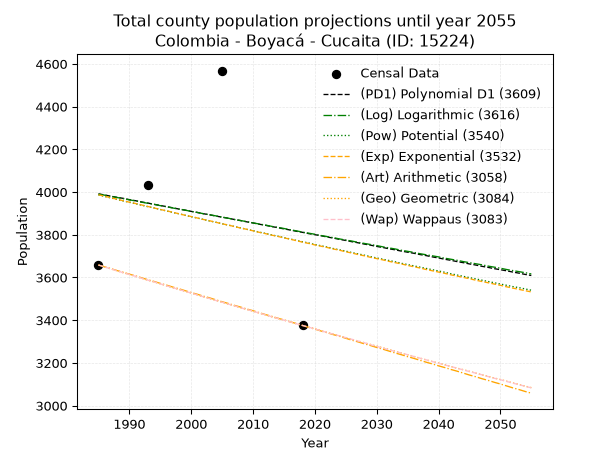
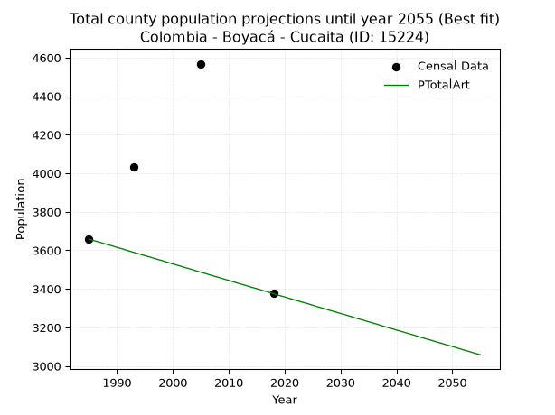
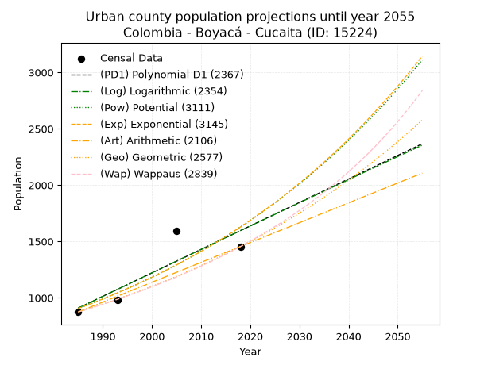
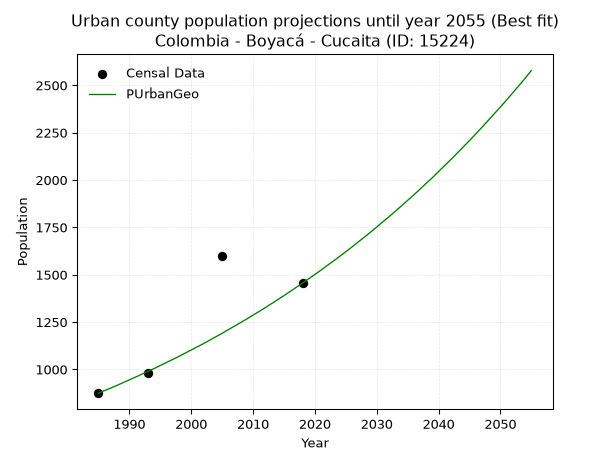
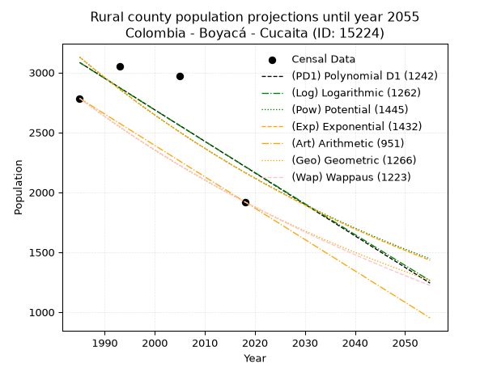
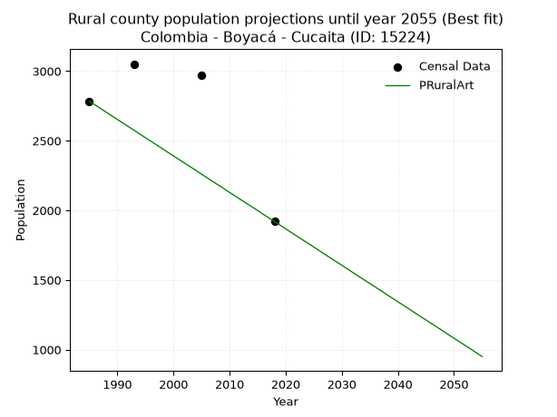

<div align="center">


</div>

# 📜 _“Population and Public Services Demand Projections (PPSD) until Year 2050 for Colombia - Boyacá - Cucaita (ID: 15224)”_
Keywords: `population` `public-service` `projection` `lineal` `polynomial` `logarithmic` `potential` `exponential` `arithmetic` `geometric` `wappaus` `dane` `colombia` `south-america`

PPSD are analytical estimates used by governments and planners to anticipate future changes in population size, age distribution, and the resulting community needs for utilities, healthcare, education, and infrastructure as sizing future water treatment facilities, electrical grids, and road networks based on spatial growth.

<div align="center">

</img>

</div>


> **General running parameters**: • app_version: _v20260806_. • Python version: _3.14.7_. • Pandas version: _3.0.5_. • NumPy version: _2.5.1_. • Creates, save and include plots into reports (create_plot): _False_. • Projection until year: _2050_. • Process polynomial degree 2 and up: _False_. • Process Wappaus: _True_. • Process Wappaus: _True_. • Set negative values to zero: _True_. • Set infinite values to zero: _True_. • Drop dataset notes: _True_. 
<div align="center">

Dynamic map: [:earth_americas:Google](http://maps.google.com/maps?q=5.544451558,-73.4543376) [:earth_americas:OSM](https://www.openstreetmap.org/#map=18/5.544451558/-73.4543376&layers=P) [:earth_americas:Bing](https://www.bing.com/maps?cp=5.544451558~-73.4543376&lvl=18) [:earth_americas:Apple](https://maps.apple.com/frame?center=5.544451558%2C-73.4543376&span=0.003%2C0.006)

</div>


<div align="center">

```geojson
{
  "type": "Feature",
  "geometry": {
    "type": "Point", 
    "coordinates": [-73.4543376, 5.544451558]
  }, 
  "properties": {
    "Name": "Colombia - Boyacá - Cucaita (ID: 15224)"
  }
}
```

</div>


## 0. Census Data (4 records)

Census data are official statistics collected by a government about the people and housing in a country. They usually include counts of total population, age, sex, race, income, education, and jobs.

📅Global census file: [Population.xlsx](../data/Population.xlsx)

| Source   |   Year |   CountryID | CountryName   |   StateID | StateName   |   CountyID | CountyName   |   PTotal |   PUrban |   PRural |
|:---------|-------:|------------:|:--------------|----------:|:------------|-----------:|:-------------|---------:|---------:|---------:|
| DANE     |   1985 |          57 | Colombia      |        15 | Boyacá      |      15224 | Cucaita      |     3658 |      874 |     2784 |
| DANE     |   1993 |          57 | Colombia      |        15 | Boyacá      |      15224 | Cucaita      |     4031 |      980 |     3051 |
| DANE     |   2005 |          57 | Colombia      |        15 | Boyacá      |      15224 | Cucaita      |     4568 |     1596 |     2972 |
| DANE     |   2018 |          57 | Colombia      |        15 | Boyacá      |      15224 | Cucaita      |     3375 |     1455 |     1920 |

> 🔥Some records could had specific notes about the registered values or the corresponding urban or rural distribution.

📅[SUI-RUPS](https://www.datos.gov.co/Hacienda-y-Cr-dito-P-blico/Registro-nico-de-Prestadores-de-Servicios-P-blicos/4qkq-csdn/about_data) - Local public utility companies: [RUPS.csv](../data/RUPS.xlsx)

 | SERVICIO       | ESTADO    | NOMBRE                                                                                                         | NIT         | DEPARTAMENTO_DOMICILIO   | MUNICIPIO_DOMICILIO   | DIRECCION                   |   TELEFONO | EMAIL                                   | TIPO_PRESTADOR          | CLASIFICACION                 |
|:---------------|:----------|:---------------------------------------------------------------------------------------------------------------|:------------|:-------------------------|:----------------------|:----------------------------|-----------:|:----------------------------------------|:------------------------|:------------------------------|
| ACUEDUCTO      | OPERATIVA | ADMINISTRACIÓN PÚBLICA COOPERATIVA ENTIDAD PRESTADORA DE SERVICIOS PÚBLICOS DE ACUEDUCTO ALCANTARILLADO Y ASEO | 900303007-7 | BOYACA                   | CUCAITA               | CALLE 7 NO. 6-43            |    7340127 | servimanantialesa.p.c.cucaita@gmail.com | ORGANIZACION AUTORIZADA | MENOR O IGUAL A 2500 USUARIOS |
| ALCANTARILLADO | OPERATIVA | ADMINISTRACIÓN PÚBLICA COOPERATIVA ENTIDAD PRESTADORA DE SERVICIOS PÚBLICOS DE ACUEDUCTO ALCANTARILLADO Y ASEO | 900303007-7 | BOYACA                   | CUCAITA               | CALLE 7 NO. 6-43            |    7340127 | servimanantialesa.p.c.cucaita@gmail.com | ORGANIZACION AUTORIZADA | MENOR O IGUAL A 2500 USUARIOS |
| ACUEDUCTO      | OPERATIVA | ASOCIACION DE SUSCRIPTORES DEL ACUEDUCTO DE LA VEREDA LLUVIOSOS PARTE ALTA DEL MUNICIPIO DE CUCAITA - BOYACA   | 900153716-6 | BOYACA                   | CUCAITA               | VEREDA LLUVIOSOS PARTE ALTA |    7372702 | egresap@hotmail.com                     | ORGANIZACION AUTORIZADA | MENOR O IGUAL A 2500 USUARIOS |
| ACUEDUCTO      | OPERATIVA | ASOCIACION DE SUSCRIPTORES DEL ACUEDUCTO DE LA VEREDA EL LLANO ACUALLANO DEL MUNICIPIO DE CUCAITA              | 900376359-7 | BOYACA                   | CUCAITA               | VEREDA EL LLANO             |    0000000 | sin@sin.com                             | ORGANIZACION AUTORIZADA | HASTA 2500 SUSCRIPTORES       |
| ACUEDUCTO      | OPERATIVA | ASOCIACION DE SUSCRIPTORES DEL PRO ACUEDUCTO DE LA VEREDA EL ESCALON DEL MUNICIPIO DE CUCAITA BOYACA           | 900314886-1 | BOYACA                   | CUCAITA               | VEREDA EL ESCALON           |    7340127 | egresap@hotmail.com                     | ORGANIZACION AUTORIZADA | MENOR O IGUAL A 2500 USUARIOS |
| ACUEDUCTO      | OPERATIVA | ASOCIACION DE SUSCRIPTORES DEL ACUEDUCTO DE LA VEREDA PIJAOS                                                   | 900087531-8 | BOYACA                   | CUCAITA               | VEREDA PIJAOS               |    7454916 | acueductopijaos@gamail.com              | ORGANIZACION AUTORIZADA | HASTA 2500 SUSCRIPTORES       |
| ACUEDUCTO      | OPERATIVA | ASOCIACION DE SUSCRIPTORES DEL PROACUEDUCTO DE LA VEREDA PIJAOS PARTE ALTA DEL MUNICIPIO DE CUCAITA BOYACA     | 900342631-1 | BOYACA                   | CUCAITA               | VEREDA PIJAOS PARTE ALTA    |    7422723 | juliorosorubio@hotmail.com              | ORGANIZACION AUTORIZADA | MENOR O IGUAL A 2500 USUARIOS |
| ACUEDUCTO      | OPERATIVA | ASOCIACION DE SUSCRIPTORES VEREDA CHIPACATA DEL MUNICIPIO DE CUCAITA                                           | 820003465-1 | BOYACA                   | CUCAITA               | VEREDA CHIPACATA            |    0000000 | egresap@hotmail.com                     | ORGANIZACION AUTORIZADA | MENOR O IGUAL A 2500 USUARIOS |
| ACUEDUCTO      | OPERATIVA | ASOCIACION DE SUSRIPTORES PROACUEDUCTO DE LA VEREDA DE LLUVIOSOS SECTOR ALTO BLANCO                            | 900299005-5 | BOYACA                   | CUCAITA               | CALLE 7 No 6-43             |    7340079 | gonzalochivata@hotmail.com              | ORGANIZACION AUTORIZADA | HASTA 2500 SUSCRIPTORES       |

## 1. Total

### 1.1. Coefficients and Parameters

* (PD1) Polynomial Deg 1: -5.467683661179531, 14844.734243274359 (lineal)
* (Log) Logarithmic: -10787.74969619417, 85905.77188837258
* (Pow) Potential: -3.425128361910666, 14.895772567613594
* (Exp) Exponential: -0.0017309624994962143, 123836.01086470373
* (Art) Arithmetic: Year diff. 2018 - 1985 = 33, Population diff. 3375 - 3658 = -283, Annual growth = -8.575757575757576
* (Geo) Geometric: Year diff. 2018 - 1985 = 33, Population diff. 3375 - 3658 = -283, Annual growth % = -0.0024370626698736464
* (Wap) Wappaus: i = -0.24387196291077992, Condition values only valid for < 200)

<sub>
Wappaus condition values: ['-0.00', '-0.24', '-0.49', '-0.73', '-0.98', '-1.22', '-1.46', '-1.71', '-1.95', '-2.19', '-2.44', '-2.68', '-2.93', '-3.17', '-3.41', '-3.66', '-3.90', '-4.15', '-4.39', '-4.63', '-4.88', '-5.12', '-5.37', '-5.61', '-5.85', '-6.10', '-6.34', '-6.58', '-6.83', '-7.07', '-7.32', '-7.56', '-7.80', '-8.05', '-8.29', '-8.54', '-8.78', '-9.02', '-9.27', '-9.51', '-9.75', '-10.00', '-10.24', '-10.49', '-10.73', '-10.97', '-11.22', '-11.46', '-11.71', '-11.95', '-12.19', '-12.44', '-12.68', '-12.93', '-13.17', '-13.41', '-13.66', '-13.90', '-14.14', '-14.39', '-14.63', '-14.88', '-15.12', '-15.36', '-15.61', '-15.85']
</sub>


### 1.2. Projected Dataset

|   Year |   CountyID |   PTotalPD1 |   PTotalLog |   PTotalPow |   PTotalExp |   PTotalArt |   PTotalGeo |   PTotalWap |
|-------:|-----------:|------------:|------------:|------------:|------------:|------------:|------------:|------------:|
|   1985 |      15224 |        3991 |        3990 |        3986 |        3987 |        3658 |        3658 |        3658 |
|   1986 |      15224 |        3986 |        3985 |        3979 |        3980 |        3649 |        3649 |        3649 |
|   1987 |      15224 |        3980 |        3979 |        3972 |        3973 |        3641 |        3640 |        3640 |
|   1988 |      15224 |        3975 |        3974 |        3965 |        3966 |        3632 |        3631 |        3631 |
|   1989 |      15224 |        3970 |        3969 |        3958 |        3959 |        3624 |        3622 |        3622 |
|   1990 |      15224 |        3964 |        3963 |        3952 |        3952 |        3615 |        3614 |        3614 |
|   1991 |      15224 |        3959 |        3958 |        3945 |        3946 |        3607 |        3605 |        3605 |
|   1992 |      15224 |        3953 |        3952 |        3938 |        3939 |        3598 |        3596 |        3596 |
|   1993 |      15224 |        3948 |        3947 |        3931 |        3932 |        3589 |        3587 |        3587 |
|   1994 |      15224 |        3942 |        3942 |        3925 |        3925 |        3581 |        3579 |        3579 |
|   1995 |      15224 |        3937 |        3936 |        3918 |        3918 |        3572 |        3570 |        3570 |
|   1996 |      15224 |        3931 |        3931 |        3911 |        3912 |        3564 |        3561 |        3561 |
|   1997 |      15224 |        3926 |        3925 |        3904 |        3905 |        3555 |        3552 |        3552 |
|   1998 |      15224 |        3920 |        3920 |        3898 |        3898 |        3547 |        3544 |        3544 |
|   1999 |      15224 |        3915 |        3915 |        3891 |        3891 |        3538 |        3535 |        3535 |
|   2000 |      15224 |        3909 |        3909 |        3884 |        3885 |        3529 |        3527 |        3527 |
|   2001 |      15224 |        3904 |        3904 |        3878 |        3878 |        3521 |        3518 |        3518 |
|   2002 |      15224 |        3898 |        3898 |        3871 |        3871 |        3512 |        3509 |        3509 |
|   2003 |      15224 |        3893 |        3893 |        3864 |        3865 |        3504 |        3501 |        3501 |
|   2004 |      15224 |        3887 |        3888 |        3858 |        3858 |        3495 |        3492 |        3492 |
|   2005 |      15224 |        3882 |        3882 |        3851 |        3851 |        3486 |        3484 |        3484 |
|   2006 |      15224 |        3877 |        3877 |        3845 |        3845 |        3478 |        3475 |        3475 |
|   2007 |      15224 |        3871 |        3871 |        3838 |        3838 |        3469 |        3467 |        3467 |
|   2008 |      15224 |        3866 |        3866 |        3832 |        3831 |        3461 |        3458 |        3458 |
|   2009 |      15224 |        3860 |        3861 |        3825 |        3825 |        3452 |        3450 |        3450 |
|   2010 |      15224 |        3855 |        3855 |        3819 |        3818 |        3444 |        3442 |        3442 |
|   2011 |      15224 |        3849 |        3850 |        3812 |        3811 |        3435 |        3433 |        3433 |
|   2012 |      15224 |        3844 |        3845 |        3806 |        3805 |        3426 |        3425 |        3425 |
|   2013 |      15224 |        3838 |        3839 |        3799 |        3798 |        3418 |        3416 |        3416 |
|   2014 |      15224 |        3833 |        3834 |        3793 |        3792 |        3409 |        3408 |        3408 |
|   2015 |      15224 |        3827 |        3829 |        3786 |        3785 |        3401 |        3400 |        3400 |
|   2016 |      15224 |        3822 |        3823 |        3780 |        3779 |        3392 |        3392 |        3392 |
|   2017 |      15224 |        3816 |        3818 |        3773 |        3772 |        3384 |        3383 |        3383 |
|   2018 |      15224 |        3811 |        3812 |        3767 |        3765 |        3375 |        3375 |        3375 |
|   2019 |      15224 |        3805 |        3807 |        3761 |        3759 |        3366 |        3367 |        3367 |
|   2020 |      15224 |        3800 |        3802 |        3754 |        3752 |        3358 |        3359 |        3359 |
|   2021 |      15224 |        3795 |        3796 |        3748 |        3746 |        3349 |        3350 |        3350 |
|   2022 |      15224 |        3789 |        3791 |        3742 |        3740 |        3341 |        3342 |        3342 |
|   2023 |      15224 |        3784 |        3786 |        3735 |        3733 |        3332 |        3334 |        3334 |
|   2024 |      15224 |        3778 |        3780 |        3729 |        3727 |        3324 |        3326 |        3326 |
|   2025 |      15224 |        3773 |        3775 |        3723 |        3720 |        3315 |        3318 |        3318 |
|   2026 |      15224 |        3767 |        3770 |        3716 |        3714 |        3306 |        3310 |        3310 |
|   2027 |      15224 |        3762 |        3764 |        3710 |        3707 |        3298 |        3302 |        3302 |
|   2028 |      15224 |        3756 |        3759 |        3704 |        3701 |        3289 |        3294 |        3294 |
|   2029 |      15224 |        3751 |        3754 |        3697 |        3694 |        3281 |        3286 |        3285 |
|   2030 |      15224 |        3745 |        3749 |        3691 |        3688 |        3272 |        3278 |        3277 |
|   2031 |      15224 |        3740 |        3743 |        3685 |        3682 |        3264 |        3270 |        3269 |
|   2032 |      15224 |        3734 |        3738 |        3679 |        3675 |        3255 |        3262 |        3261 |
|   2033 |      15224 |        3729 |        3733 |        3673 |        3669 |        3246 |        3254 |        3253 |
|   2034 |      15224 |        3723 |        3727 |        3666 |        3663 |        3238 |        3246 |        3246 |
|   2035 |      15224 |        3718 |        3722 |        3660 |        3656 |        3229 |        3238 |        3238 |
|   2036 |      15224 |        3713 |        3717 |        3654 |        3650 |        3221 |        3230 |        3230 |
|   2037 |      15224 |        3707 |        3711 |        3648 |        3644 |        3212 |        3222 |        3222 |
|   2038 |      15224 |        3702 |        3706 |        3642 |        3637 |        3203 |        3214 |        3214 |
|   2039 |      15224 |        3696 |        3701 |        3636 |        3631 |        3195 |        3206 |        3206 |
|   2040 |      15224 |        3691 |        3696 |        3630 |        3625 |        3186 |        3199 |        3198 |
|   2041 |      15224 |        3685 |        3690 |        3624 |        3619 |        3178 |        3191 |        3190 |
|   2042 |      15224 |        3680 |        3685 |        3617 |        3612 |        3169 |        3183 |        3183 |
|   2043 |      15224 |        3674 |        3680 |        3611 |        3606 |        3161 |        3175 |        3175 |
|   2044 |      15224 |        3669 |        3674 |        3605 |        3600 |        3152 |        3168 |        3167 |
|   2045 |      15224 |        3663 |        3669 |        3599 |        3594 |        3143 |        3160 |        3159 |
|   2046 |      15224 |        3658 |        3664 |        3593 |        3587 |        3135 |        3152 |        3152 |
|   2047 |      15224 |        3652 |        3659 |        3587 |        3581 |        3126 |        3144 |        3144 |
|   2048 |      15224 |        3647 |        3653 |        3581 |        3575 |        3118 |        3137 |        3136 |
|   2049 |      15224 |        3641 |        3648 |        3575 |        3569 |        3109 |        3129 |        3128 |
|   2050 |      15224 |        3636 |        3643 |        3569 |        3563 |        3101 |        3122 |        3121 |
<div align="center">

</img>

</div>


### 1.3. Best fit with absolute and relative error (%)

Relative error puts that difference into context by dividing the absolute error by the true value, creating a unitless ratio or percentage that shows the scale of the mistake.

Absolute and relative error

|   Year | Source   |   CountryID | CountryName   |   StateID | StateName   |   CountyID_x | CountyName   |   PTotal |   PUrban |   PRural |   CountyID_y |   PTotalPD1 |   PTotalLog |   PTotalPow |   PTotalExp |   PTotalArt |   PTotalGeo |   PTotalWap |   PTotalPD1AbsError |   PTotalLogAbsError |   PTotalPowAbsError |   PTotalExpAbsError |   PTotalArtAbsError |   PTotalGeoAbsError |   PTotalWapAbsError |   PTotalPD1RelError |   PTotalLogRelError |   PTotalPowRelError |   PTotalExpRelError |   PTotalArtRelError |   PTotalGeoRelError |   PTotalWapRelError |
|-------:|:---------|------------:|:--------------|----------:|:------------|-------------:|:-------------|---------:|---------:|---------:|-------------:|------------:|------------:|------------:|------------:|------------:|------------:|------------:|--------------------:|--------------------:|--------------------:|--------------------:|--------------------:|--------------------:|--------------------:|--------------------:|--------------------:|--------------------:|--------------------:|--------------------:|--------------------:|--------------------:|
|   1985 | DANE     |          57 | Colombia      |        15 | Boyacá      |        15224 | Cucaita      |     3658 |      874 |     2784 |        15224 |        3991 |        3990 |        3986 |        3987 |        3658 |        3658 |        3658 |                 333 |                 332 |                 328 |                 329 |                   0 |                   0 |                   0 |             9.10334 |             9.076   |             8.96665 |             8.99399 |              0      |              0      |              0      |
|   1993 | DANE     |          57 | Colombia      |        15 | Boyacá      |        15224 | Cucaita      |     4031 |      980 |     3051 |        15224 |        3948 |        3947 |        3931 |        3932 |        3589 |        3587 |        3587 |                  83 |                  84 |                 100 |                  99 |                 442 |                 444 |                 444 |             2.05904 |             2.08385 |             2.48077 |             2.45597 |             10.965  |             11.0146 |             11.0146 |
|   2005 | DANE     |          57 | Colombia      |        15 | Boyacá      |        15224 | Cucaita      |     4568 |     1596 |     2972 |        15224 |        3882 |        3882 |        3851 |        3851 |        3486 |        3484 |        3484 |                 686 |                 686 |                 717 |                 717 |                1082 |                1084 |                1084 |            15.0175  |            15.0175  |            15.6961  |            15.6961  |             23.6865 |             23.7303 |             23.7303 |
|   2018 | DANE     |          57 | Colombia      |        15 | Boyacá      |        15224 | Cucaita      |     3375 |     1455 |     1920 |        15224 |        3811 |        3812 |        3767 |        3765 |        3375 |        3375 |        3375 |                 436 |                 437 |                 392 |                 390 |                   0 |                   0 |                   0 |            12.9185  |            12.9481  |            11.6148  |            11.5556  |              0      |              0      |              0      |

Relative error mean

| Method    |   RelError | Best   |
|:----------|-----------:|:-------|
| PTotalPD1 |    9.7746  |        |
| PTotalLog |    9.78138 |        |
| PTotalPow |    9.6896  |        |
| PTotalExp |    9.67541 |        |
| PTotalArt |    8.66288 | True   |
| PTotalGeo |    8.68623 |        |
| PTotalWap |    8.68623 |        |

💙Best method: _**PTotalArt**_
<div align="center">

</img>

</div>


### 1.4. Fresh water supply demand in liters per capita per day (lpcd)

The fresh water supply demand typically ranges from 100 to 300 liters per capita per day (lpcd) for standard domestic and municipal planning, though absolute survival minimums set by the World Health Organization are as low as 7.5 to 20 liters per day, and total consumption in high-income nations can exceed 400 liters.

> `CZ`: Level in meters above the sea level (masl)<br> `WS`: Fresh water supply demand in liters per capita per day (lpcd or l/h/d)<br> `WSAll`: Zonal fresh water supply demand in liters per second (l/s)<br> `A`: Zonal area in square meters<br> `DP`: Population density (people/hectare or p/ha)

Reference values (RAS Colombia)

|    CZ |   WS |
|------:|-----:|
|  1000 |  120 |
|  2000 |  130 |
| 99999 |  140 |

County shapefile geometry properties and water supply values

|   CountyID |      ATotal |   CZTotal |   WSTotal |
|-----------:|------------:|----------:|----------:|
|      15224 | 4.20581e+07 |   2879.71 |       140 |

Projected values for best method: PTotalArt

|   CountyID |   Year |   PTotalArt |   DPTotal |   WSTotal |   WSTotalAll |
|-----------:|-------:|------------:|----------:|----------:|-------------:|
|      15224 |   1985 |        3658 |      0.87 |       140 |      5.92731 |
|      15224 |   1986 |        3649 |      0.87 |       140 |      5.91273 |
|      15224 |   1987 |        3641 |      0.87 |       140 |      5.89977 |
|      15224 |   1988 |        3632 |      0.86 |       140 |      5.88519 |
|      15224 |   1989 |        3624 |      0.86 |       140 |      5.87222 |
|      15224 |   1990 |        3615 |      0.86 |       140 |      5.85764 |
|      15224 |   1991 |        3607 |      0.86 |       140 |      5.84468 |
|      15224 |   1992 |        3598 |      0.86 |       140 |      5.83009 |
|      15224 |   1993 |        3589 |      0.85 |       140 |      5.81551 |
|      15224 |   1994 |        3581 |      0.85 |       140 |      5.80255 |
|      15224 |   1995 |        3572 |      0.85 |       140 |      5.78796 |
|      15224 |   1996 |        3564 |      0.85 |       140 |      5.775   |
|      15224 |   1997 |        3555 |      0.85 |       140 |      5.76042 |
|      15224 |   1998 |        3547 |      0.84 |       140 |      5.74745 |
|      15224 |   1999 |        3538 |      0.84 |       140 |      5.73287 |
|      15224 |   2000 |        3529 |      0.84 |       140 |      5.71829 |
|      15224 |   2001 |        3521 |      0.84 |       140 |      5.70532 |
|      15224 |   2002 |        3512 |      0.84 |       140 |      5.69074 |
|      15224 |   2003 |        3504 |      0.83 |       140 |      5.67778 |
|      15224 |   2004 |        3495 |      0.83 |       140 |      5.66319 |
|      15224 |   2005 |        3486 |      0.83 |       140 |      5.64861 |
|      15224 |   2006 |        3478 |      0.83 |       140 |      5.63565 |
|      15224 |   2007 |        3469 |      0.82 |       140 |      5.62106 |
|      15224 |   2008 |        3461 |      0.82 |       140 |      5.6081  |
|      15224 |   2009 |        3452 |      0.82 |       140 |      5.59352 |
|      15224 |   2010 |        3444 |      0.82 |       140 |      5.58056 |
|      15224 |   2011 |        3435 |      0.82 |       140 |      5.56597 |
|      15224 |   2012 |        3426 |      0.81 |       140 |      5.55139 |
|      15224 |   2013 |        3418 |      0.81 |       140 |      5.53843 |
|      15224 |   2014 |        3409 |      0.81 |       140 |      5.52384 |
|      15224 |   2015 |        3401 |      0.81 |       140 |      5.51088 |
|      15224 |   2016 |        3392 |      0.81 |       140 |      5.4963  |
|      15224 |   2017 |        3384 |      0.8  |       140 |      5.48333 |
|      15224 |   2018 |        3375 |      0.8  |       140 |      5.46875 |
|      15224 |   2019 |        3366 |      0.8  |       140 |      5.45417 |
|      15224 |   2020 |        3358 |      0.8  |       140 |      5.4412  |
|      15224 |   2021 |        3349 |      0.8  |       140 |      5.42662 |
|      15224 |   2022 |        3341 |      0.79 |       140 |      5.41366 |
|      15224 |   2023 |        3332 |      0.79 |       140 |      5.39907 |
|      15224 |   2024 |        3324 |      0.79 |       140 |      5.38611 |
|      15224 |   2025 |        3315 |      0.79 |       140 |      5.37153 |
|      15224 |   2026 |        3306 |      0.79 |       140 |      5.35694 |
|      15224 |   2027 |        3298 |      0.78 |       140 |      5.34398 |
|      15224 |   2028 |        3289 |      0.78 |       140 |      5.3294  |
|      15224 |   2029 |        3281 |      0.78 |       140 |      5.31644 |
|      15224 |   2030 |        3272 |      0.78 |       140 |      5.30185 |
|      15224 |   2031 |        3264 |      0.78 |       140 |      5.28889 |
|      15224 |   2032 |        3255 |      0.77 |       140 |      5.27431 |
|      15224 |   2033 |        3246 |      0.77 |       140 |      5.25972 |
|      15224 |   2034 |        3238 |      0.77 |       140 |      5.24676 |
|      15224 |   2035 |        3229 |      0.77 |       140 |      5.23218 |
|      15224 |   2036 |        3221 |      0.77 |       140 |      5.21921 |
|      15224 |   2037 |        3212 |      0.76 |       140 |      5.20463 |
|      15224 |   2038 |        3203 |      0.76 |       140 |      5.19005 |
|      15224 |   2039 |        3195 |      0.76 |       140 |      5.17708 |
|      15224 |   2040 |        3186 |      0.76 |       140 |      5.1625  |
|      15224 |   2041 |        3178 |      0.76 |       140 |      5.14954 |
|      15224 |   2042 |        3169 |      0.75 |       140 |      5.13495 |
|      15224 |   2043 |        3161 |      0.75 |       140 |      5.12199 |
|      15224 |   2044 |        3152 |      0.75 |       140 |      5.10741 |
|      15224 |   2045 |        3143 |      0.75 |       140 |      5.09282 |
|      15224 |   2046 |        3135 |      0.75 |       140 |      5.07986 |
|      15224 |   2047 |        3126 |      0.74 |       140 |      5.06528 |
|      15224 |   2048 |        3118 |      0.74 |       140 |      5.05231 |
|      15224 |   2049 |        3109 |      0.74 |       140 |      5.03773 |
|      15224 |   2050 |        3101 |      0.74 |       140 |      5.02477 |

## 2. Urban

### 2.1. Coefficients and Parameters

* (PD1) Polynomial Deg 1: 20.832998795664434, -40444.95584102779 (lineal)
* (Log) Logarithmic: 41740.90067952667, -316046.6705556679
* (Pow) Potential: 35.63793456215279, -114.56886632239487
* (Exp) Exponential: 0.017787625869498582, 4.1936439747601574e-13
* (Art) Arithmetic: Year diff. 2018 - 1985 = 33, Population diff. 1455 - 874 = 581, Annual growth = 17.606060606060606
* (Geo) Geometric: Year diff. 2018 - 1985 = 33, Population diff. 1455 - 874 = 581, Annual growth % = 0.0155647613211225
* (Wap) Wappaus: i = 1.5118987210013402, Condition values only valid for < 200)

<sub>
Wappaus condition values: ['0.00', '1.51', '3.02', '4.54', '6.05', '7.56', '9.07', '10.58', '12.10', '13.61', '15.12', '16.63', '18.14', '19.65', '21.17', '22.68', '24.19', '25.70', '27.21', '28.73', '30.24', '31.75', '33.26', '34.77', '36.29', '37.80', '39.31', '40.82', '42.33', '43.85', '45.36', '46.87', '48.38', '49.89', '51.40', '52.92', '54.43', '55.94', '57.45', '58.96', '60.48', '61.99', '63.50', '65.01', '66.52', '68.04', '69.55', '71.06', '72.57', '74.08', '75.59', '77.11', '78.62', '80.13', '81.64', '83.15', '84.67', '86.18', '87.69', '89.20', '90.71', '92.23', '93.74', '95.25', '96.76', '98.27']
</sub>


### 2.2. Projected Dataset

|   Year |   CountyID |   PUrbanPD1 |   PUrbanLog |   PUrbanPow |   PUrbanExp |   PUrbanArt |   PUrbanGeo |   PUrbanWap |
|-------:|-----------:|------------:|------------:|------------:|------------:|------------:|------------:|------------:|
|   1985 |      15224 |         909 |         908 |         905 |         905 |         874 |         874 |         874 |
|   1986 |      15224 |         929 |         929 |         921 |         922 |         892 |         888 |         887 |
|   1987 |      15224 |         950 |         950 |         938 |         938 |         909 |         901 |         901 |
|   1988 |      15224 |         971 |         971 |         955 |         955 |         927 |         915 |         915 |
|   1989 |      15224 |         992 |         992 |         972 |         972 |         944 |         930 |         929 |
|   1990 |      15224 |        1013 |        1013 |         990 |         990 |         962 |         944 |         943 |
|   1991 |      15224 |        1034 |        1034 |        1007 |        1007 |         980 |         959 |         957 |
|   1992 |      15224 |        1054 |        1055 |        1026 |        1025 |         997 |         974 |         972 |
|   1993 |      15224 |        1075 |        1075 |        1044 |        1044 |        1015 |         989 |         987 |
|   1994 |      15224 |        1096 |        1096 |        1063 |        1063 |        1032 |        1004 |        1002 |
|   1995 |      15224 |        1117 |        1117 |        1082 |        1082 |        1050 |        1020 |        1017 |
|   1996 |      15224 |        1138 |        1138 |        1102 |        1101 |        1068 |        1036 |        1033 |
|   1997 |      15224 |        1159 |        1159 |        1121 |        1121 |        1085 |        1052 |        1048 |
|   1998 |      15224 |        1179 |        1180 |        1142 |        1141 |        1103 |        1068 |        1065 |
|   1999 |      15224 |        1200 |        1201 |        1162 |        1161 |        1120 |        1085 |        1081 |
|   2000 |      15224 |        1221 |        1222 |        1183 |        1182 |        1138 |        1102 |        1098 |
|   2001 |      15224 |        1242 |        1243 |        1204 |        1204 |        1156 |        1119 |        1115 |
|   2002 |      15224 |        1263 |        1264 |        1226 |        1225 |        1173 |        1136 |        1132 |
|   2003 |      15224 |        1284 |        1284 |        1248 |        1247 |        1191 |        1154 |        1149 |
|   2004 |      15224 |        1304 |        1305 |        1270 |        1269 |        1209 |        1172 |        1167 |
|   2005 |      15224 |        1325 |        1326 |        1293 |        1292 |        1226 |        1190 |        1185 |
|   2006 |      15224 |        1346 |        1347 |        1316 |        1315 |        1244 |        1209 |        1204 |
|   2007 |      15224 |        1367 |        1368 |        1340 |        1339 |        1261 |        1228 |        1223 |
|   2008 |      15224 |        1388 |        1388 |        1364 |        1363 |        1279 |        1247 |        1242 |
|   2009 |      15224 |        1409 |        1409 |        1388 |        1388 |        1297 |        1266 |        1261 |
|   2010 |      15224 |        1429 |        1430 |        1413 |        1412 |        1314 |        1286 |        1281 |
|   2011 |      15224 |        1450 |        1451 |        1439 |        1438 |        1332 |        1306 |        1302 |
|   2012 |      15224 |        1471 |        1472 |        1464 |        1464 |        1349 |        1326 |        1322 |
|   2013 |      15224 |        1492 |        1492 |        1490 |        1490 |        1367 |        1347 |        1343 |
|   2014 |      15224 |        1513 |        1513 |        1517 |        1517 |        1385 |        1368 |        1365 |
|   2015 |      15224 |        1534 |        1534 |        1544 |        1544 |        1402 |        1389 |        1387 |
|   2016 |      15224 |        1554 |        1554 |        1572 |        1572 |        1420 |        1411 |        1409 |
|   2017 |      15224 |        1575 |        1575 |        1600 |        1600 |        1437 |        1433 |        1432 |
|   2018 |      15224 |        1596 |        1596 |        1628 |        1628 |        1455 |        1455 |        1455 |
|   2019 |      15224 |        1617 |        1617 |        1657 |        1658 |        1473 |        1478 |        1479 |
|   2020 |      15224 |        1638 |        1637 |        1687 |        1687 |        1490 |        1501 |        1503 |
|   2021 |      15224 |        1659 |        1658 |        1717 |        1718 |        1508 |        1524 |        1528 |
|   2022 |      15224 |        1679 |        1678 |        1747 |        1749 |        1525 |        1548 |        1553 |
|   2023 |      15224 |        1700 |        1699 |        1778 |        1780 |        1543 |        1572 |        1579 |
|   2024 |      15224 |        1721 |        1720 |        1810 |        1812 |        1561 |        1596 |        1605 |
|   2025 |      15224 |        1742 |        1740 |        1842 |        1844 |        1578 |        1621 |        1632 |
|   2026 |      15224 |        1763 |        1761 |        1875 |        1877 |        1596 |        1646 |        1659 |
|   2027 |      15224 |        1784 |        1782 |        1908 |        1911 |        1613 |        1672 |        1687 |
|   2028 |      15224 |        1804 |        1802 |        1942 |        1945 |        1631 |        1698 |        1716 |
|   2029 |      15224 |        1825 |        1823 |        1976 |        1980 |        1649 |        1724 |        1745 |
|   2030 |      15224 |        1846 |        1843 |        2011 |        2016 |        1666 |        1751 |        1775 |
|   2031 |      15224 |        1867 |        1864 |        2047 |        2052 |        1684 |        1779 |        1806 |
|   2032 |      15224 |        1888 |        1884 |        2083 |        2089 |        1701 |        1806 |        1837 |
|   2033 |      15224 |        1909 |        1905 |        2120 |        2126 |        1719 |        1834 |        1869 |
|   2034 |      15224 |        1929 |        1925 |        2157 |        2165 |        1737 |        1863 |        1902 |
|   2035 |      15224 |        1950 |        1946 |        2196 |        2203 |        1754 |        1892 |        1936 |
|   2036 |      15224 |        1971 |        1966 |        2234 |        2243 |        1772 |        1921 |        1971 |
|   2037 |      15224 |        1992 |        1987 |        2274 |        2283 |        1790 |        1951 |        2006 |
|   2038 |      15224 |        2013 |        2007 |        2314 |        2324 |        1807 |        1982 |        2043 |
|   2039 |      15224 |        2034 |        2028 |        2355 |        2366 |        1825 |        2012 |        2080 |
|   2040 |      15224 |        2054 |        2048 |        2396 |        2408 |        1842 |        2044 |        2118 |
|   2041 |      15224 |        2075 |        2069 |        2438 |        2452 |        1860 |        2076 |        2157 |
|   2042 |      15224 |        2096 |        2089 |        2481 |        2496 |        1878 |        2108 |        2197 |
|   2043 |      15224 |        2117 |        2110 |        2525 |        2540 |        1895 |        2141 |        2239 |
|   2044 |      15224 |        2138 |        2130 |        2569 |        2586 |        1913 |        2174 |        2281 |
|   2045 |      15224 |        2159 |        2151 |        2615 |        2632 |        1930 |        2208 |        2325 |
|   2046 |      15224 |        2179 |        2171 |        2661 |        2680 |        1948 |        2242 |        2370 |
|   2047 |      15224 |        2200 |        2191 |        2707 |        2728 |        1966 |        2277 |        2416 |
|   2048 |      15224 |        2221 |        2212 |        2755 |        2777 |        1983 |        2313 |        2463 |
|   2049 |      15224 |        2242 |        2232 |        2803 |        2827 |        2001 |        2349 |        2512 |
|   2050 |      15224 |        2263 |        2253 |        2852 |        2877 |        2018 |        2385 |        2563 |
<div align="center">

</img>

</div>


### 2.3. Best fit with absolute and relative error (%)

Relative error puts that difference into context by dividing the absolute error by the true value, creating a unitless ratio or percentage that shows the scale of the mistake.

Absolute and relative error

|   Year | Source   |   CountryID | CountryName   |   StateID | StateName   |   CountyID_x | CountyName   |   PTotal |   PUrban |   PRural |   CountyID_y |   PUrbanPD1 |   PUrbanLog |   PUrbanPow |   PUrbanExp |   PUrbanArt |   PUrbanGeo |   PUrbanWap |   PUrbanPD1AbsError |   PUrbanLogAbsError |   PUrbanPowAbsError |   PUrbanExpAbsError |   PUrbanArtAbsError |   PUrbanGeoAbsError |   PUrbanWapAbsError |   PUrbanPD1RelError |   PUrbanLogRelError |   PUrbanPowRelError |   PUrbanExpRelError |   PUrbanArtRelError |   PUrbanGeoRelError |   PUrbanWapRelError |
|-------:|:---------|------------:|:--------------|----------:|:------------|-------------:|:-------------|---------:|---------:|---------:|-------------:|------------:|------------:|------------:|------------:|------------:|------------:|------------:|--------------------:|--------------------:|--------------------:|--------------------:|--------------------:|--------------------:|--------------------:|--------------------:|--------------------:|--------------------:|--------------------:|--------------------:|--------------------:|--------------------:|
|   1985 | DANE     |          57 | Colombia      |        15 | Boyacá      |        15224 | Cucaita      |     3658 |      874 |     2784 |        15224 |         909 |         908 |         905 |         905 |         874 |         874 |         874 |                  35 |                  34 |                  31 |                  31 |                   0 |                   0 |                   0 |             4.00458 |             3.89016 |             3.54691 |             3.54691 |             0       |            0        |            0        |
|   1993 | DANE     |          57 | Colombia      |        15 | Boyacá      |        15224 | Cucaita      |     4031 |      980 |     3051 |        15224 |        1075 |        1075 |        1044 |        1044 |        1015 |         989 |         987 |                  95 |                  95 |                  64 |                  64 |                  35 |                   9 |                   7 |             9.69388 |             9.69388 |             6.53061 |             6.53061 |             3.57143 |            0.918367 |            0.714286 |
|   2005 | DANE     |          57 | Colombia      |        15 | Boyacá      |        15224 | Cucaita      |     4568 |     1596 |     2972 |        15224 |        1325 |        1326 |        1293 |        1292 |        1226 |        1190 |        1185 |                 271 |                 270 |                 303 |                 304 |                 370 |                 406 |                 411 |            16.9799  |            16.9173  |            18.985   |            19.0476  |            23.183   |           25.4386   |           25.7519   |
|   2018 | DANE     |          57 | Colombia      |        15 | Boyacá      |        15224 | Cucaita      |     3375 |     1455 |     1920 |        15224 |        1596 |        1596 |        1628 |        1628 |        1455 |        1455 |        1455 |                 141 |                 141 |                 173 |                 173 |                   0 |                   0 |                   0 |             9.69072 |             9.69072 |            11.89    |            11.89    |             0       |            0        |            0        |

Relative error mean

| Method    |   RelError | Best   |
|:----------|-----------:|:-------|
| PUrbanPD1 |   10.0923  |        |
| PUrbanLog |   10.048   |        |
| PUrbanPow |   10.2381  |        |
| PUrbanExp |   10.2538  |        |
| PUrbanArt |    6.6886  |        |
| PUrbanGeo |    6.58924 | True   |
| PUrbanWap |    6.61654 |        |

💙Best method: _**PUrbanGeo**_
<div align="center">

</img>

</div>


### 2.4. Fresh water supply demand in liters per capita per day (lpcd)

The fresh water supply demand typically ranges from 100 to 300 liters per capita per day (lpcd) for standard domestic and municipal planning, though absolute survival minimums set by the World Health Organization are as low as 7.5 to 20 liters per day, and total consumption in high-income nations can exceed 400 liters.

> `CZ`: Level in meters above the sea level (masl)<br> `WS`: Fresh water supply demand in liters per capita per day (lpcd or l/h/d)<br> `WSAll`: Zonal fresh water supply demand in liters per second (l/s)<br> `A`: Zonal area in square meters<br> `DP`: Population density (people/hectare or p/ha)

Reference values (RAS Colombia)

|    CZ |   WS |
|------:|-----:|
|  1000 |  120 |
|  2000 |  130 |
| 99999 |  140 |

County shapefile geometry properties and water supply values

|   CountyID |   AUrban |   CZUrban |   WSUrban |
|-----------:|---------:|----------:|----------:|
|      15224 |   341500 |    2634.7 |       140 |

Projected values for best method: PUrbanGeo

|   CountyID |   Year |   PUrbanGeo |   DPUrban |   WSUrban |   WSUrbanAll |
|-----------:|-------:|------------:|----------:|----------:|-------------:|
|      15224 |   1985 |         874 |     25.59 |       140 |      1.4162  |
|      15224 |   1986 |         888 |     26    |       140 |      1.43889 |
|      15224 |   1987 |         901 |     26.38 |       140 |      1.45995 |
|      15224 |   1988 |         915 |     26.79 |       140 |      1.48264 |
|      15224 |   1989 |         930 |     27.23 |       140 |      1.50694 |
|      15224 |   1990 |         944 |     27.64 |       140 |      1.52963 |
|      15224 |   1991 |         959 |     28.08 |       140 |      1.55394 |
|      15224 |   1992 |         974 |     28.52 |       140 |      1.57824 |
|      15224 |   1993 |         989 |     28.96 |       140 |      1.60255 |
|      15224 |   1994 |        1004 |     29.4  |       140 |      1.62685 |
|      15224 |   1995 |        1020 |     29.87 |       140 |      1.65278 |
|      15224 |   1996 |        1036 |     30.34 |       140 |      1.6787  |
|      15224 |   1997 |        1052 |     30.81 |       140 |      1.70463 |
|      15224 |   1998 |        1068 |     31.27 |       140 |      1.73056 |
|      15224 |   1999 |        1085 |     31.77 |       140 |      1.7581  |
|      15224 |   2000 |        1102 |     32.27 |       140 |      1.78565 |
|      15224 |   2001 |        1119 |     32.77 |       140 |      1.81319 |
|      15224 |   2002 |        1136 |     33.27 |       140 |      1.84074 |
|      15224 |   2003 |        1154 |     33.79 |       140 |      1.86991 |
|      15224 |   2004 |        1172 |     34.32 |       140 |      1.89907 |
|      15224 |   2005 |        1190 |     34.85 |       140 |      1.92824 |
|      15224 |   2006 |        1209 |     35.4  |       140 |      1.95903 |
|      15224 |   2007 |        1228 |     35.96 |       140 |      1.98981 |
|      15224 |   2008 |        1247 |     36.52 |       140 |      2.0206  |
|      15224 |   2009 |        1266 |     37.07 |       140 |      2.05139 |
|      15224 |   2010 |        1286 |     37.66 |       140 |      2.0838  |
|      15224 |   2011 |        1306 |     38.24 |       140 |      2.1162  |
|      15224 |   2012 |        1326 |     38.83 |       140 |      2.14861 |
|      15224 |   2013 |        1347 |     39.44 |       140 |      2.18264 |
|      15224 |   2014 |        1368 |     40.06 |       140 |      2.21667 |
|      15224 |   2015 |        1389 |     40.67 |       140 |      2.25069 |
|      15224 |   2016 |        1411 |     41.32 |       140 |      2.28634 |
|      15224 |   2017 |        1433 |     41.96 |       140 |      2.32199 |
|      15224 |   2018 |        1455 |     42.61 |       140 |      2.35764 |
|      15224 |   2019 |        1478 |     43.28 |       140 |      2.39491 |
|      15224 |   2020 |        1501 |     43.95 |       140 |      2.43218 |
|      15224 |   2021 |        1524 |     44.63 |       140 |      2.46944 |
|      15224 |   2022 |        1548 |     45.33 |       140 |      2.50833 |
|      15224 |   2023 |        1572 |     46.03 |       140 |      2.54722 |
|      15224 |   2024 |        1596 |     46.73 |       140 |      2.58611 |
|      15224 |   2025 |        1621 |     47.47 |       140 |      2.62662 |
|      15224 |   2026 |        1646 |     48.2  |       140 |      2.66713 |
|      15224 |   2027 |        1672 |     48.96 |       140 |      2.70926 |
|      15224 |   2028 |        1698 |     49.72 |       140 |      2.75139 |
|      15224 |   2029 |        1724 |     50.48 |       140 |      2.79352 |
|      15224 |   2030 |        1751 |     51.27 |       140 |      2.83727 |
|      15224 |   2031 |        1779 |     52.09 |       140 |      2.88264 |
|      15224 |   2032 |        1806 |     52.88 |       140 |      2.92639 |
|      15224 |   2033 |        1834 |     53.7  |       140 |      2.97176 |
|      15224 |   2034 |        1863 |     54.55 |       140 |      3.01875 |
|      15224 |   2035 |        1892 |     55.4  |       140 |      3.06574 |
|      15224 |   2036 |        1921 |     56.25 |       140 |      3.11273 |
|      15224 |   2037 |        1951 |     57.13 |       140 |      3.16134 |
|      15224 |   2038 |        1982 |     58.04 |       140 |      3.21157 |
|      15224 |   2039 |        2012 |     58.92 |       140 |      3.26019 |
|      15224 |   2040 |        2044 |     59.85 |       140 |      3.31204 |
|      15224 |   2041 |        2076 |     60.79 |       140 |      3.36389 |
|      15224 |   2042 |        2108 |     61.73 |       140 |      3.41574 |
|      15224 |   2043 |        2141 |     62.69 |       140 |      3.46921 |
|      15224 |   2044 |        2174 |     63.66 |       140 |      3.52269 |
|      15224 |   2045 |        2208 |     64.66 |       140 |      3.57778 |
|      15224 |   2046 |        2242 |     65.65 |       140 |      3.63287 |
|      15224 |   2047 |        2277 |     66.68 |       140 |      3.68958 |
|      15224 |   2048 |        2313 |     67.73 |       140 |      3.74792 |
|      15224 |   2049 |        2349 |     68.78 |       140 |      3.80625 |
|      15224 |   2050 |        2385 |     69.84 |       140 |      3.86458 |

## 3. Rural

### 3.1. Coefficients and Parameters

* (PD1) Polynomial Deg 1: -26.300682456843994, 55289.69008430221 (lineal)
* (Log) Logarithmic: -52528.65037572083, 401952.44244404044
* (Pow) Potential: -22.28840752945115, 76.99708891243259
* (Exp) Exponential: -0.011158277975925559, 13017691275593.879
* (Art) Arithmetic: Year diff. 2018 - 1985 = 33, Population diff. 1920 - 2784 = -864, Annual growth = -26.181818181818183
* (Geo) Geometric: Year diff. 2018 - 1985 = 33, Population diff. 1920 - 2784 = -864, Annual growth % = -0.011196350758999385
* (Wap) Wappaus: i = -1.1131725417439704, Condition values only valid for < 200)

<sub>
Wappaus condition values: ['-0.00', '-1.11', '-2.23', '-3.34', '-4.45', '-5.57', '-6.68', '-7.79', '-8.91', '-10.02', '-11.13', '-12.24', '-13.36', '-14.47', '-15.58', '-16.70', '-17.81', '-18.92', '-20.04', '-21.15', '-22.26', '-23.38', '-24.49', '-25.60', '-26.72', '-27.83', '-28.94', '-30.06', '-31.17', '-32.28', '-33.40', '-34.51', '-35.62', '-36.73', '-37.85', '-38.96', '-40.07', '-41.19', '-42.30', '-43.41', '-44.53', '-45.64', '-46.75', '-47.87', '-48.98', '-50.09', '-51.21', '-52.32', '-53.43', '-54.55', '-55.66', '-56.77', '-57.88', '-59.00', '-60.11', '-61.22', '-62.34', '-63.45', '-64.56', '-65.68', '-66.79', '-67.90', '-69.02', '-70.13', '-71.24', '-72.36']
</sub>


### 3.2. Projected Dataset

|   Year |   CountyID |   PRuralPD1 |   PRuralLog |   PRuralPow |   PRuralExp |   PRuralArt |   PRuralGeo |   PRuralWap |
|-------:|-----------:|------------:|------------:|------------:|------------:|------------:|------------:|------------:|
|   1985 |      15224 |        3083 |        3083 |        3128 |        3128 |        2784 |        2784 |        2784 |
|   1986 |      15224 |        3057 |        3056 |        3093 |        3093 |        2758 |        2753 |        2753 |
|   1987 |      15224 |        3030 |        3030 |        3059 |        3059 |        2732 |        2722 |        2723 |
|   1988 |      15224 |        3004 |        3003 |        3024 |        3025 |        2705 |        2692 |        2693 |
|   1989 |      15224 |        2978 |        2977 |        2991 |        2991 |        2679 |        2661 |        2663 |
|   1990 |      15224 |        2951 |        2951 |        2957 |        2958 |        2653 |        2632 |        2633 |
|   1991 |      15224 |        2925 |        2924 |        2924 |        2925 |        2627 |        2602 |        2604 |
|   1992 |      15224 |        2899 |        2898 |        2892 |        2893 |        2601 |        2573 |        2575 |
|   1993 |      15224 |        2872 |        2871 |        2860 |        2861 |        2575 |        2544 |        2547 |
|   1994 |      15224 |        2846 |        2845 |        2828 |        2829 |        2548 |        2516 |        2518 |
|   1995 |      15224 |        2820 |        2819 |        2797 |        2798 |        2522 |        2488 |        2490 |
|   1996 |      15224 |        2794 |        2792 |        2765 |        2767 |        2496 |        2460 |        2463 |
|   1997 |      15224 |        2767 |        2766 |        2735 |        2736 |        2470 |        2432 |        2435 |
|   1998 |      15224 |        2741 |        2740 |        2704 |        2706 |        2444 |        2405 |        2408 |
|   1999 |      15224 |        2715 |        2714 |        2674 |        2676 |        2417 |        2378 |        2381 |
|   2000 |      15224 |        2688 |        2687 |        2645 |        2646 |        2391 |        2351 |        2355 |
|   2001 |      15224 |        2662 |        2661 |        2615 |        2617 |        2365 |        2325 |        2329 |
|   2002 |      15224 |        2636 |        2635 |        2586 |        2588 |        2339 |        2299 |        2303 |
|   2003 |      15224 |        2609 |        2609 |        2558 |        2559 |        2313 |        2273 |        2277 |
|   2004 |      15224 |        2583 |        2582 |        2530 |        2530 |        2287 |        2248 |        2251 |
|   2005 |      15224 |        2557 |        2556 |        2502 |        2502 |        2260 |        2223 |        2226 |
|   2006 |      15224 |        2531 |        2530 |        2474 |        2475 |        2234 |        2198 |        2201 |
|   2007 |      15224 |        2504 |        2504 |        2447 |        2447 |        2208 |        2173 |        2177 |
|   2008 |      15224 |        2478 |        2478 |        2420 |        2420 |        2182 |        2149 |        2152 |
|   2009 |      15224 |        2452 |        2451 |        2393 |        2393 |        2156 |        2125 |        2128 |
|   2010 |      15224 |        2425 |        2425 |        2367 |        2367 |        2129 |        2101 |        2104 |
|   2011 |      15224 |        2399 |        2399 |        2340 |        2340 |        2103 |        2077 |        2080 |
|   2012 |      15224 |        2373 |        2373 |        2315 |        2314 |        2077 |        2054 |        2057 |
|   2013 |      15224 |        2346 |        2347 |        2289 |        2289 |        2051 |        2031 |        2033 |
|   2014 |      15224 |        2320 |        2321 |        2264 |        2263 |        2025 |        2008 |        2010 |
|   2015 |      15224 |        2294 |        2295 |        2239 |        2238 |        1999 |        1986 |        1987 |
|   2016 |      15224 |        2268 |        2269 |        2214 |        2213 |        1972 |        1964 |        1965 |
|   2017 |      15224 |        2241 |        2243 |        2190 |        2189 |        1946 |        1942 |        1942 |
|   2018 |      15224 |        2215 |        2217 |        2166 |        2164 |        1920 |        1920 |        1920 |
|   2019 |      15224 |        2189 |        2191 |        2142 |        2140 |        1894 |        1899 |        1898 |
|   2020 |      15224 |        2162 |        2165 |        2119 |        2117 |        1868 |        1877 |        1876 |
|   2021 |      15224 |        2136 |        2139 |        2095 |        2093 |        1841 |        1856 |        1855 |
|   2022 |      15224 |        2110 |        2113 |        2072 |        2070 |        1815 |        1835 |        1833 |
|   2023 |      15224 |        2083 |        2087 |        2050 |        2047 |        1789 |        1815 |        1812 |
|   2024 |      15224 |        2057 |        2061 |        2027 |        2024 |        1763 |        1795 |        1791 |
|   2025 |      15224 |        2031 |        2035 |        2005 |        2002 |        1737 |        1774 |        1770 |
|   2026 |      15224 |        2005 |        2009 |        1983 |        1980 |        1711 |        1755 |        1749 |
|   2027 |      15224 |        1978 |        1983 |        1961 |        1958 |        1684 |        1735 |        1729 |
|   2028 |      15224 |        1952 |        1957 |        1940 |        1936 |        1658 |        1716 |        1709 |
|   2029 |      15224 |        1926 |        1931 |        1919 |        1914 |        1632 |        1696 |        1689 |
|   2030 |      15224 |        1899 |        1905 |        1898 |        1893 |        1606 |        1677 |        1669 |
|   2031 |      15224 |        1873 |        1879 |        1877 |        1872 |        1580 |        1659 |        1649 |
|   2032 |      15224 |        1847 |        1853 |        1857 |        1851 |        1553 |        1640 |        1629 |
|   2033 |      15224 |        1820 |        1828 |        1836 |        1831 |        1527 |        1622 |        1610 |
|   2034 |      15224 |        1794 |        1802 |        1816 |        1811 |        1501 |        1603 |        1591 |
|   2035 |      15224 |        1768 |        1776 |        1797 |        1790 |        1475 |        1586 |        1572 |
|   2036 |      15224 |        1742 |        1750 |        1777 |        1771 |        1449 |        1568 |        1553 |
|   2037 |      15224 |        1715 |        1724 |        1758 |        1751 |        1423 |        1550 |        1534 |
|   2038 |      15224 |        1689 |        1699 |        1739 |        1732 |        1396 |        1533 |        1516 |
|   2039 |      15224 |        1663 |        1673 |        1720 |        1712 |        1370 |        1516 |        1497 |
|   2040 |      15224 |        1636 |        1647 |        1701 |        1693 |        1344 |        1499 |        1479 |
|   2041 |      15224 |        1610 |        1621 |        1683 |        1675 |        1318 |        1482 |        1461 |
|   2042 |      15224 |        1584 |        1596 |        1664 |        1656 |        1292 |        1465 |        1443 |
|   2043 |      15224 |        1557 |        1570 |        1646 |        1638 |        1265 |        1449 |        1425 |
|   2044 |      15224 |        1531 |        1544 |        1628 |        1619 |        1239 |        1433 |        1408 |
|   2045 |      15224 |        1505 |        1519 |        1611 |        1601 |        1213 |        1417 |        1390 |
|   2046 |      15224 |        1478 |        1493 |        1593 |        1584 |        1187 |        1401 |        1373 |
|   2047 |      15224 |        1452 |        1467 |        1576 |        1566 |        1161 |        1385 |        1356 |
|   2048 |      15224 |        1426 |        1441 |        1559 |        1549 |        1135 |        1370 |        1338 |
|   2049 |      15224 |        1400 |        1416 |        1542 |        1532 |        1108 |        1354 |        1322 |
|   2050 |      15224 |        1373 |        1390 |        1525 |        1515 |        1082 |        1339 |        1305 |
<div align="center">

</img>

</div>


### 3.3. Best fit with absolute and relative error (%)

Relative error puts that difference into context by dividing the absolute error by the true value, creating a unitless ratio or percentage that shows the scale of the mistake.

Absolute and relative error

|   Year | Source   |   CountryID | CountryName   |   StateID | StateName   |   CountyID_x | CountyName   |   PTotal |   PUrban |   PRural |   CountyID_y |   PRuralPD1 |   PRuralLog |   PRuralPow |   PRuralExp |   PRuralArt |   PRuralGeo |   PRuralWap |   PRuralPD1AbsError |   PRuralLogAbsError |   PRuralPowAbsError |   PRuralExpAbsError |   PRuralArtAbsError |   PRuralGeoAbsError |   PRuralWapAbsError |   PRuralPD1RelError |   PRuralLogRelError |   PRuralPowRelError |   PRuralExpRelError |   PRuralArtRelError |   PRuralGeoRelError |   PRuralWapRelError |
|-------:|:---------|------------:|:--------------|----------:|:------------|-------------:|:-------------|---------:|---------:|---------:|-------------:|------------:|------------:|------------:|------------:|------------:|------------:|------------:|--------------------:|--------------------:|--------------------:|--------------------:|--------------------:|--------------------:|--------------------:|--------------------:|--------------------:|--------------------:|--------------------:|--------------------:|--------------------:|--------------------:|
|   1985 | DANE     |          57 | Colombia      |        15 | Boyacá      |        15224 | Cucaita      |     3658 |      874 |     2784 |        15224 |        3083 |        3083 |        3128 |        3128 |        2784 |        2784 |        2784 |                 299 |                 299 |                 344 |                 344 |                   0 |                   0 |                   0 |            10.7399  |            10.7399  |            12.3563  |            12.3563  |              0      |              0      |              0      |
|   1993 | DANE     |          57 | Colombia      |        15 | Boyacá      |        15224 | Cucaita      |     4031 |      980 |     3051 |        15224 |        2872 |        2871 |        2860 |        2861 |        2575 |        2544 |        2547 |                 179 |                 180 |                 191 |                 190 |                 476 |                 507 |                 504 |             5.86693 |             5.89971 |             6.26024 |             6.22747 |             15.6014 |             16.6175 |             16.5192 |
|   2005 | DANE     |          57 | Colombia      |        15 | Boyacá      |        15224 | Cucaita      |     4568 |     1596 |     2972 |        15224 |        2557 |        2556 |        2502 |        2502 |        2260 |        2223 |        2226 |                 415 |                 416 |                 470 |                 470 |                 712 |                 749 |                 746 |            13.9637  |            13.9973  |            15.8143  |            15.8143  |             23.9569 |             25.2019 |             25.1009 |
|   2018 | DANE     |          57 | Colombia      |        15 | Boyacá      |        15224 | Cucaita      |     3375 |     1455 |     1920 |        15224 |        2215 |        2217 |        2166 |        2164 |        1920 |        1920 |        1920 |                 295 |                 297 |                 246 |                 244 |                   0 |                   0 |                   0 |            15.3646  |            15.4688  |            12.8125  |            12.7083  |              0      |              0      |              0      |

Relative error mean

| Method    |   RelError | Best   |
|:----------|-----------:|:-------|
| PRuralPD1 |   11.4838  |        |
| PRuralLog |   11.5264  |        |
| PRuralPow |   11.8108  |        |
| PRuralExp |   11.7766  |        |
| PRuralArt |    9.88959 | True   |
| PRuralGeo |   10.4548  |        |
| PRuralWap |   10.405   |        |

💙Best method: _**PRuralArt**_
<div align="center">

</img>

</div>


### 3.4. Fresh water supply demand in liters per capita per day (lpcd)

The fresh water supply demand typically ranges from 100 to 300 liters per capita per day (lpcd) for standard domestic and municipal planning, though absolute survival minimums set by the World Health Organization are as low as 7.5 to 20 liters per day, and total consumption in high-income nations can exceed 400 liters.

> `CZ`: Level in meters above the sea level (masl)<br> `WS`: Fresh water supply demand in liters per capita per day (lpcd or l/h/d)<br> `WSAll`: Zonal fresh water supply demand in liters per second (l/s)<br> `A`: Zonal area in square meters<br> `DP`: Population density (people/hectare or p/ha)

Reference values (RAS Colombia)

|    CZ |   WS |
|------:|-----:|
|  1000 |  120 |
|  2000 |  130 |
| 99999 |  140 |

County shapefile geometry properties and water supply values

|   CountyID |      ARural |   CZRural |   WSRural |
|-----------:|------------:|----------:|----------:|
|      15224 | 4.17166e+07 |    2881.6 |       140 |

Projected values for best method: PRuralArt

|   CountyID |   Year |   PRuralArt |   DPRural |   WSRural |   WSRuralAll |
|-----------:|-------:|------------:|----------:|----------:|-------------:|
|      15224 |   1985 |        2784 |      0.67 |       140 |      4.51111 |
|      15224 |   1986 |        2758 |      0.66 |       140 |      4.46898 |
|      15224 |   1987 |        2732 |      0.65 |       140 |      4.42685 |
|      15224 |   1988 |        2705 |      0.65 |       140 |      4.3831  |
|      15224 |   1989 |        2679 |      0.64 |       140 |      4.34097 |
|      15224 |   1990 |        2653 |      0.64 |       140 |      4.29884 |
|      15224 |   1991 |        2627 |      0.63 |       140 |      4.25671 |
|      15224 |   1992 |        2601 |      0.62 |       140 |      4.21458 |
|      15224 |   1993 |        2575 |      0.62 |       140 |      4.17245 |
|      15224 |   1994 |        2548 |      0.61 |       140 |      4.1287  |
|      15224 |   1995 |        2522 |      0.6  |       140 |      4.08657 |
|      15224 |   1996 |        2496 |      0.6  |       140 |      4.04444 |
|      15224 |   1997 |        2470 |      0.59 |       140 |      4.00231 |
|      15224 |   1998 |        2444 |      0.59 |       140 |      3.96019 |
|      15224 |   1999 |        2417 |      0.58 |       140 |      3.91644 |
|      15224 |   2000 |        2391 |      0.57 |       140 |      3.87431 |
|      15224 |   2001 |        2365 |      0.57 |       140 |      3.83218 |
|      15224 |   2002 |        2339 |      0.56 |       140 |      3.79005 |
|      15224 |   2003 |        2313 |      0.55 |       140 |      3.74792 |
|      15224 |   2004 |        2287 |      0.55 |       140 |      3.70579 |
|      15224 |   2005 |        2260 |      0.54 |       140 |      3.66204 |
|      15224 |   2006 |        2234 |      0.54 |       140 |      3.61991 |
|      15224 |   2007 |        2208 |      0.53 |       140 |      3.57778 |
|      15224 |   2008 |        2182 |      0.52 |       140 |      3.53565 |
|      15224 |   2009 |        2156 |      0.52 |       140 |      3.49352 |
|      15224 |   2010 |        2129 |      0.51 |       140 |      3.44977 |
|      15224 |   2011 |        2103 |      0.5  |       140 |      3.40764 |
|      15224 |   2012 |        2077 |      0.5  |       140 |      3.36551 |
|      15224 |   2013 |        2051 |      0.49 |       140 |      3.32338 |
|      15224 |   2014 |        2025 |      0.49 |       140 |      3.28125 |
|      15224 |   2015 |        1999 |      0.48 |       140 |      3.23912 |
|      15224 |   2016 |        1972 |      0.47 |       140 |      3.19537 |
|      15224 |   2017 |        1946 |      0.47 |       140 |      3.15324 |
|      15224 |   2018 |        1920 |      0.46 |       140 |      3.11111 |
|      15224 |   2019 |        1894 |      0.45 |       140 |      3.06898 |
|      15224 |   2020 |        1868 |      0.45 |       140 |      3.02685 |
|      15224 |   2021 |        1841 |      0.44 |       140 |      2.9831  |
|      15224 |   2022 |        1815 |      0.44 |       140 |      2.94097 |
|      15224 |   2023 |        1789 |      0.43 |       140 |      2.89884 |
|      15224 |   2024 |        1763 |      0.42 |       140 |      2.85671 |
|      15224 |   2025 |        1737 |      0.42 |       140 |      2.81458 |
|      15224 |   2026 |        1711 |      0.41 |       140 |      2.77245 |
|      15224 |   2027 |        1684 |      0.4  |       140 |      2.7287  |
|      15224 |   2028 |        1658 |      0.4  |       140 |      2.68657 |
|      15224 |   2029 |        1632 |      0.39 |       140 |      2.64444 |
|      15224 |   2030 |        1606 |      0.38 |       140 |      2.60231 |
|      15224 |   2031 |        1580 |      0.38 |       140 |      2.56019 |
|      15224 |   2032 |        1553 |      0.37 |       140 |      2.51644 |
|      15224 |   2033 |        1527 |      0.37 |       140 |      2.47431 |
|      15224 |   2034 |        1501 |      0.36 |       140 |      2.43218 |
|      15224 |   2035 |        1475 |      0.35 |       140 |      2.39005 |
|      15224 |   2036 |        1449 |      0.35 |       140 |      2.34792 |
|      15224 |   2037 |        1423 |      0.34 |       140 |      2.30579 |
|      15224 |   2038 |        1396 |      0.33 |       140 |      2.26204 |
|      15224 |   2039 |        1370 |      0.33 |       140 |      2.21991 |
|      15224 |   2040 |        1344 |      0.32 |       140 |      2.17778 |
|      15224 |   2041 |        1318 |      0.32 |       140 |      2.13565 |
|      15224 |   2042 |        1292 |      0.31 |       140 |      2.09352 |
|      15224 |   2043 |        1265 |      0.3  |       140 |      2.04977 |
|      15224 |   2044 |        1239 |      0.3  |       140 |      2.00764 |
|      15224 |   2045 |        1213 |      0.29 |       140 |      1.96551 |
|      15224 |   2046 |        1187 |      0.28 |       140 |      1.92338 |
|      15224 |   2047 |        1161 |      0.28 |       140 |      1.88125 |
|      15224 |   2048 |        1135 |      0.27 |       140 |      1.83912 |
|      15224 |   2049 |        1108 |      0.27 |       140 |      1.79537 |
|      15224 |   2050 |        1082 |      0.26 |       140 |      1.75324 |

#

<div align="center"><br><sub>Share this research</sub></div><br>

<sub>**APPS & TOOLS & CONTENT DISCLAIMER**: • NO WARRANTY - This content and software is provided by <a href="https://github.com/rcfdtools" target="_blank">github.com/rcfdtools</a> "as is", without any express or implied warranty, including warranties of merchantability, fitness for a particular purpose, or non-infringement. There is no guarantee that the software will be error-free or operate without interruption. • LIMITATION OF LIABILITY - Neither the authors nor copyright holders will be liable for claims or damages arising from the software or its use. You are responsible for determining if the software is appropriate for your use and assume all associated risks, including errors, legal compliance, and data loss. • NO PROFESSIONAL ADVICE - The software provides general information and does not offer professional advice. It should not replace consultation with professional advisors. [Clauses and global license for rcfdtools use.](https://github.com/rcfdtools/rcfdtools/blob/main/LICENSE.md)</sub>

| [:house: Home](Readme.md)  | [:beginner: Help / Collab](https://github.com/rcfdtools/R.HydroTools/discussions/31) |
|----------------------------|-------------------------------------------------------------------------------------------|