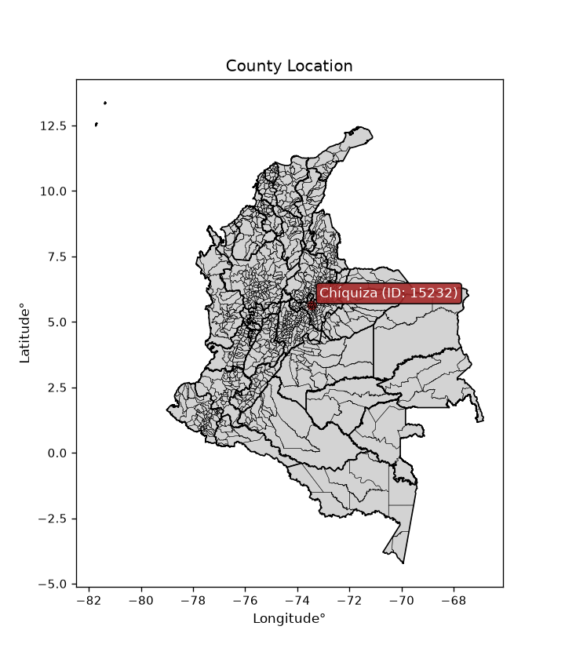
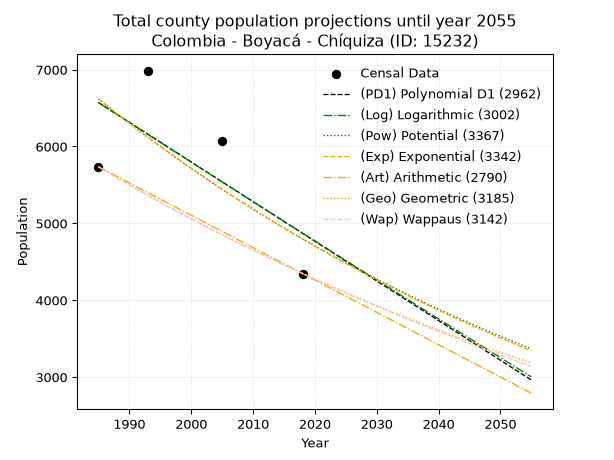
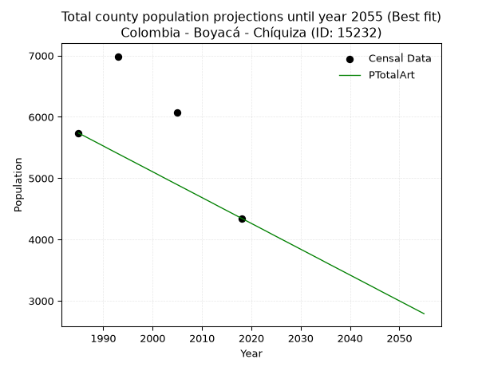
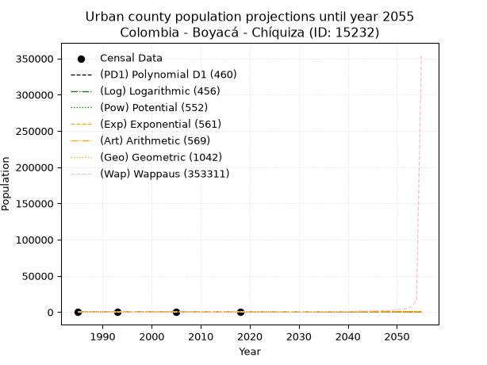
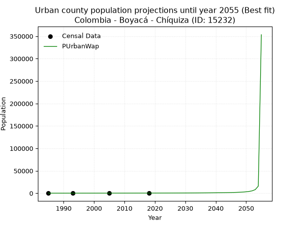
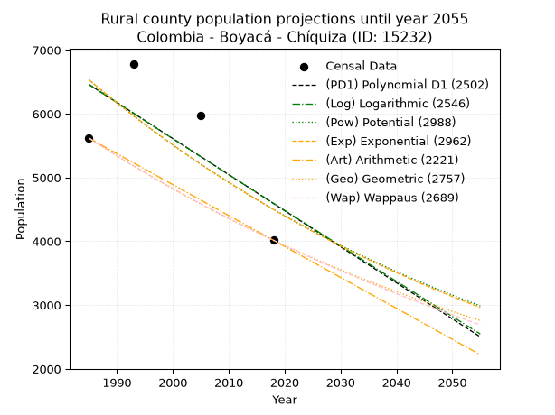
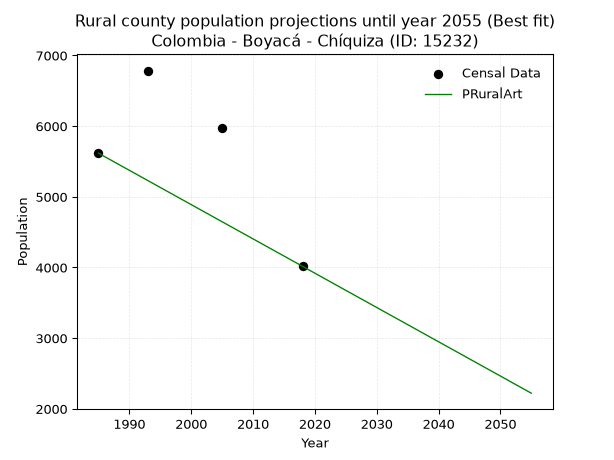

<div align="center">


</div>

# _“Population and Public Services Demand Projections (PPSD) until Year 2050 for Colombia - Boyacá - Chíquiza (ID: 15232)”_
Keywords: `population` `public-service` `projection` `lineal` `polynomial` `logarithmic` `potential` `exponential` `arithmetic` `geometric` `wappaus` `dane` `colombia` `south-america`

PPSD are analytical estimates used by governments and planners to anticipate future changes in population size, age distribution, and the resulting community needs for utilities, healthcare, education, and infrastructure as sizing future water treatment facilities, electrical grids, and road networks based on spatial growth.

> **General running parameters**: • app_version: _v20260806_. • Python version: _3.14.7_. • Pandas version: _3.0.5_. • NumPy version: _2.5.1_. • Creates, save and include plots into reports (create_plot): _False_. • Projection until year: _2050_. • Process polynomial degree 2 and up: _False_. • Process Wappaus: _True_. • Process Wappaus: _True_. • Set negative values to zero: _True_. • Set infinite values to zero: _True_. • Drop dataset notes: _True_. 
<div align="center">

Dynamic map: [:earth_americas:Google](http://maps.google.com/maps?q=5.639834305,-73.4494626) [:earth_americas:OSM](https://www.openstreetmap.org/#map=18/5.639834305/-73.4494626&layers=P) [:earth_americas:Bing](https://www.bing.com/maps?cp=5.639834305~-73.4494626&lvl=18) [:earth_americas:Apple](https://maps.apple.com/frame?center=5.639834305%2C-73.4494626&span=0.003%2C0.006)

</div>


<div align="center">

```geojson
{
  "type": "Feature",
  "geometry": {
    "type": "Point", 
    "coordinates": [-73.4494626, 5.639834305]
  }, 
  "properties": {
    "Name": "Colombia - Boyacá - Chíquiza (ID: 15232)"
  }
}
```

</div>


<div align="center">

</img>

</div>


## 0. Census Data (4 records)

Census data are official statistics collected by a government about the people and housing in a country. They usually include counts of total population, age, sex, race, income, education, and jobs.

📅Global census file: [Population.xlsx](../data/Population.xlsx)

| Source   |   Year |   CountryID | CountryName   |   StateID | StateName   |   CountyID | CountyName   |   PTotal |   PUrban |   PRural |
|:---------|-------:|------------:|:--------------|----------:|:------------|-----------:|:-------------|---------:|---------:|---------:|
| DANE     |   1985 |          57 | Colombia      |        15 | Boyacá      |      15232 | Chíquiza     |     5736 |      119 |     5617 |
| DANE     |   1993 |          57 | Colombia      |        15 | Boyacá      |      15232 | Chíquiza     |     6987 |      202 |     6785 |
| DANE     |   2005 |          57 | Colombia      |        15 | Boyacá      |      15232 | Chíquiza     |     6073 |      103 |     5970 |
| DANE     |   2018 |          57 | Colombia      |        15 | Boyacá      |      15232 | Chíquiza     |     4347 |      331 |     4016 |

> 🔥Some records could had specific notes about the registered values or the corresponding urban or rural distribution.

📅   [RUPS](https://www.datos.gov.co/Hacienda-y-Cr-dito-P-blico/Registro-nico-de-Prestadores-de-Servicios-P-blicos/4qkq-csdn/about_data) - Local public utility companies: [RUPS.csv](../data/RUPS.xlsx)

 | SERVICIO       | ESTADO    | NOMBRE                                                                                                    | NIT         | DEPARTAMENTO_DOMICILIO   | MUNICIPIO_DOMICILIO   | DIRECCION        |   TELEFONO | EMAIL                       | TIPO_PRESTADOR                 | CLASIFICACION                 |
|:---------------|:----------|:----------------------------------------------------------------------------------------------------------|:------------|:-------------------------|:----------------------|:-----------------|-----------:|:----------------------------|:-------------------------------|:------------------------------|
| ACUEDUCTO      | OPERATIVA | UNIDAD DE SERVICIOS PUBLICOS DOMICILIARIOS DE CHIQUIZA                                                    | 800099723-4 | BOYACA                   | CHIQUIZA              | calle 6 N°3-08   |    7426822 | juliorosorubio@hotmail.com  | MUNICIPIO (PRESTACIÓN DIRECTA) | MENOR O IGUAL A 2500 USUARIOS |
| ALCANTARILLADO | OPERATIVA | UNIDAD DE SERVICIOS PUBLICOS DOMICILIARIOS DE CHIQUIZA                                                    | 800099723-4 | BOYACA                   | CHIQUIZA              | calle 6 N°3-08   |    7426822 | juliorosorubio@hotmail.com  | MUNICIPIO (PRESTACIÓN DIRECTA) | MENOR O IGUAL A 2500 USUARIOS |
| ACUEDUCTO      | OPERATIVA | ASOCIACION DE SUSCRIPTORES DEL ACUEDUCTO VEREDAS TURMAL  Y PUENTE PIEDRA DEL MUNICIPIO DE CHIQUIZA BOYACA | 900215237-7 | BOYACA                   | CHIQUIZA              | Vereda el Turmal |    7426822 | arquimedesamado@hotmail.com | ORGANIZACION AUTORIZADA        | HASTA 2500 SUSCRIPTORES       |

## 1. Total

### 1.1. Coefficients and Parameters

* (PD1) Polynomial Deg 1: -51.58370132476807, 108966.04857486734 (lineal)
* (Log) Logarithmic: -103006.76831457502, 788741.0214035219
* (Pow) Potential: -19.50067983972226, 68.12934622898865
* (Exp) Exponential: -0.00976446053585281, 1731753298848.397
* (Art) Arithmetic: Year diff. 2018 - 1985 = 33, Population diff. 4347 - 5736 = -1389, Annual growth = -42.09090909090909
* (Geo) Geometric: Year diff. 2018 - 1985 = 33, Population diff. 4347 - 5736 = -1389, Annual growth % = -0.008367106886350228
* (Wap) Wappaus: i = -0.8348886063851848, Condition values only valid for < 200)

<sub>
Wappaus condition values: ['-0.00', '-0.83', '-1.67', '-2.50', '-3.34', '-4.17', '-5.01', '-5.84', '-6.68', '-7.51', '-8.35', '-9.18', '-10.02', '-10.85', '-11.69', '-12.52', '-13.36', '-14.19', '-15.03', '-15.86', '-16.70', '-17.53', '-18.37', '-19.20', '-20.04', '-20.87', '-21.71', '-22.54', '-23.38', '-24.21', '-25.05', '-25.88', '-26.72', '-27.55', '-28.39', '-29.22', '-30.06', '-30.89', '-31.73', '-32.56', '-33.40', '-34.23', '-35.07', '-35.90', '-36.74', '-37.57', '-38.40', '-39.24', '-40.07', '-40.91', '-41.74', '-42.58', '-43.41', '-44.25', '-45.08', '-45.92', '-46.75', '-47.59', '-48.42', '-49.26', '-50.09', '-50.93', '-51.76', '-52.60', '-53.43', '-54.27']
</sub>


### 1.2. Projected Dataset

|   Year |   CountyID |   PTotalPD1 |   PTotalLog |   PTotalPow |   PTotalExp |   PTotalArt |   PTotalGeo |   PTotalWap |
|-------:|-----------:|------------:|------------:|------------:|------------:|------------:|------------:|------------:|
|   1985 |      15232 |        6572 |        6572 |        6619 |        6619 |        5736 |        5736 |        5736 |
|   1986 |      15232 |        6521 |        6520 |        6554 |        6555 |        5694 |        5688 |        5688 |
|   1987 |      15232 |        6469 |        6468 |        6490 |        6491 |        5652 |        5640 |        5641 |
|   1988 |      15232 |        6418 |        6417 |        6427 |        6428 |        5610 |        5593 |        5594 |
|   1989 |      15232 |        6366 |        6365 |        6364 |        6365 |        5568 |        5546 |        5548 |
|   1990 |      15232 |        6314 |        6313 |        6302 |        6304 |        5526 |        5500 |        5501 |
|   1991 |      15232 |        6263 |        6261 |        6240 |        6242 |        5483 |        5454 |        5456 |
|   1992 |      15232 |        6211 |        6209 |        6180 |        6182 |        5441 |        5408 |        5410 |
|   1993 |      15232 |        6160 |        6158 |        6119 |        6122 |        5399 |        5363 |        5365 |
|   1994 |      15232 |        6108 |        6106 |        6060 |        6062 |        5357 |        5318 |        5321 |
|   1995 |      15232 |        6057 |        6054 |        6001 |        6003 |        5315 |        5274 |        5276 |
|   1996 |      15232 |        6005 |        6003 |        5943 |        5945 |        5273 |        5230 |        5232 |
|   1997 |      15232 |        5953 |        5951 |        5885 |        5887 |        5231 |        5186 |        5189 |
|   1998 |      15232 |        5902 |        5900 |        5828 |        5830 |        5189 |        5142 |        5145 |
|   1999 |      15232 |        5850 |        5848 |        5771 |        5773 |        5147 |        5099 |        5103 |
|   2000 |      15232 |        5799 |        5797 |        5715 |        5717 |        5105 |        5057 |        5060 |
|   2001 |      15232 |        5747 |        5745 |        5660 |        5662 |        5063 |        5014 |        5018 |
|   2002 |      15232 |        5695 |        5694 |        5605 |        5607 |        5020 |        4973 |        4976 |
|   2003 |      15232 |        5644 |        5642 |        5550 |        5552 |        4978 |        4931 |        4934 |
|   2004 |      15232 |        5592 |        5591 |        5497 |        5498 |        4936 |        4890 |        4893 |
|   2005 |      15232 |        5541 |        5539 |        5443 |        5445 |        4894 |        4849 |        4852 |
|   2006 |      15232 |        5489 |        5488 |        5391 |        5392 |        4852 |        4808 |        4811 |
|   2007 |      15232 |        5438 |        5437 |        5339 |        5339 |        4810 |        4768 |        4771 |
|   2008 |      15232 |        5386 |        5385 |        5287 |        5288 |        4768 |        4728 |        4731 |
|   2009 |      15232 |        5334 |        5334 |        5236 |        5236 |        4726 |        4688 |        4691 |
|   2010 |      15232 |        5283 |        5283 |        5185 |        5185 |        4684 |        4649 |        4652 |
|   2011 |      15232 |        5231 |        5232 |        5135 |        5135 |        4642 |        4610 |        4613 |
|   2012 |      15232 |        5180 |        5180 |        5086 |        5085 |        4600 |        4572 |        4574 |
|   2013 |      15232 |        5128 |        5129 |        5037 |        5036 |        4557 |        4534 |        4535 |
|   2014 |      15232 |        5076 |        5078 |        4988 |        4987 |        4515 |        4496 |        4497 |
|   2015 |      15232 |        5025 |        5027 |        4940 |        4938 |        4473 |        4458 |        4459 |
|   2016 |      15232 |        4973 |        4976 |        4893 |        4890 |        4431 |        4421 |        4422 |
|   2017 |      15232 |        4922 |        4925 |        4845 |        4843 |        4389 |        4384 |        4384 |
|   2018 |      15232 |        4870 |        4874 |        4799 |        4796 |        4347 |        4347 |        4347 |
|   2019 |      15232 |        4819 |        4823 |        4753 |        4749 |        4305 |        4311 |        4310 |
|   2020 |      15232 |        4767 |        4772 |        4707 |        4703 |        4263 |        4275 |        4274 |
|   2021 |      15232 |        4715 |        4721 |        4662 |        4657 |        4221 |        4239 |        4237 |
|   2022 |      15232 |        4664 |        4670 |        4617 |        4612 |        4179 |        4203 |        4201 |
|   2023 |      15232 |        4612 |        4619 |        4573 |        4567 |        4137 |        4168 |        4165 |
|   2024 |      15232 |        4561 |        4568 |        4529 |        4523 |        4094 |        4133 |        4130 |
|   2025 |      15232 |        4509 |        4517 |        4485 |        4479 |        4052 |        4099 |        4095 |
|   2026 |      15232 |        4457 |        4466 |        4443 |        4435 |        4010 |        4064 |        4059 |
|   2027 |      15232 |        4406 |        4415 |        4400 |        4392 |        3968 |        4030 |        4025 |
|   2028 |      15232 |        4354 |        4365 |        4358 |        4350 |        3926 |        3997 |        3990 |
|   2029 |      15232 |        4303 |        4314 |        4316 |        4307 |        3884 |        3963 |        3956 |
|   2030 |      15232 |        4251 |        4263 |        4275 |        4265 |        3842 |        3930 |        3922 |
|   2031 |      15232 |        4200 |        4212 |        4234 |        4224 |        3800 |        3897 |        3888 |
|   2032 |      15232 |        4148 |        4162 |        4194 |        4183 |        3758 |        3865 |        3854 |
|   2033 |      15232 |        4096 |        4111 |        4154 |        4142 |        3716 |        3832 |        3821 |
|   2034 |      15232 |        4045 |        4060 |        4114 |        4102 |        3674 |        3800 |        3788 |
|   2035 |      15232 |        3993 |        4010 |        4075 |        4062 |        3631 |        3768 |        3755 |
|   2036 |      15232 |        3942 |        3959 |        4036 |        4023 |        3589 |        3737 |        3722 |
|   2037 |      15232 |        3890 |        3908 |        3997 |        3984 |        3547 |        3706 |        3690 |
|   2038 |      15232 |        3838 |        3858 |        3959 |        3945 |        3505 |        3675 |        3658 |
|   2039 |      15232 |        3787 |        3807 |        3922 |        3907 |        3463 |        3644 |        3626 |
|   2040 |      15232 |        3735 |        3757 |        3884 |        3869 |        3421 |        3613 |        3594 |
|   2041 |      15232 |        3684 |        3706 |        3847 |        3831 |        3379 |        3583 |        3562 |
|   2042 |      15232 |        3632 |        3656 |        3811 |        3794 |        3337 |        3553 |        3531 |
|   2043 |      15232 |        3581 |        3605 |        3775 |        3757 |        3295 |        3523 |        3500 |
|   2044 |      15232 |        3529 |        3555 |        3739 |        3720 |        3253 |        3494 |        3469 |
|   2045 |      15232 |        3477 |        3505 |        3703 |        3684 |        3211 |        3465 |        3438 |
|   2046 |      15232 |        3426 |        3454 |        3668 |        3648 |        3168 |        3436 |        3408 |
|   2047 |      15232 |        3374 |        3404 |        3633 |        3613 |        3126 |        3407 |        3377 |
|   2048 |      15232 |        3323 |        3354 |        3599 |        3578 |        3084 |        3378 |        3347 |
|   2049 |      15232 |        3271 |        3303 |        3565 |        3543 |        3042 |        3350 |        3317 |
|   2050 |      15232 |        3219 |        3253 |        3531 |        3509 |        3000 |        3322 |        3288 |
<div align="center">

</img>

</div>


### 1.3. Best fit with absolute and relative error (%)

Relative error puts that difference into context by dividing the absolute error by the true value, creating a unitless ratio or percentage that shows the scale of the mistake.

Absolute and relative error

|   Year | Source   |   CountryID | CountryName   |   StateID | StateName   |   CountyID_x | CountyName   |   PTotal |   PUrban |   PRural |   CountyID_y |   PTotalPD1 |   PTotalLog |   PTotalPow |   PTotalExp |   PTotalArt |   PTotalGeo |   PTotalWap |   PTotalPD1AbsError |   PTotalLogAbsError |   PTotalPowAbsError |   PTotalExpAbsError |   PTotalArtAbsError |   PTotalGeoAbsError |   PTotalWapAbsError |   PTotalPD1RelError |   PTotalLogRelError |   PTotalPowRelError |   PTotalExpRelError |   PTotalArtRelError |   PTotalGeoRelError |   PTotalWapRelError |
|-------:|:---------|------------:|:--------------|----------:|:------------|-------------:|:-------------|---------:|---------:|---------:|-------------:|------------:|------------:|------------:|------------:|------------:|------------:|------------:|--------------------:|--------------------:|--------------------:|--------------------:|--------------------:|--------------------:|--------------------:|--------------------:|--------------------:|--------------------:|--------------------:|--------------------:|--------------------:|--------------------:|
|   1985 | DANE     |          57 | Colombia      |        15 | Boyacá      |        15232 | Chíquiza     |     5736 |      119 |     5617 |        15232 |        6572 |        6572 |        6619 |        6619 |        5736 |        5736 |        5736 |                 836 |                 836 |                 883 |                 883 |                   0 |                   0 |                   0 |            14.5746  |            14.5746  |             15.394  |             15.394  |              0      |              0      |              0      |
|   1993 | DANE     |          57 | Colombia      |        15 | Boyacá      |        15232 | Chíquiza     |     6987 |      202 |     6785 |        15232 |        6160 |        6158 |        6119 |        6122 |        5399 |        5363 |        5365 |                 827 |                 829 |                 868 |                 865 |                1588 |                1624 |                1622 |            11.8363  |            11.8649  |             12.4231 |             12.3801 |             22.7279 |             23.2432 |             23.2145 |
|   2005 | DANE     |          57 | Colombia      |        15 | Boyacá      |        15232 | Chíquiza     |     6073 |      103 |     5970 |        15232 |        5541 |        5539 |        5443 |        5445 |        4894 |        4849 |        4852 |                 532 |                 534 |                 630 |                 628 |                1179 |                1224 |                1221 |             8.76009 |             8.79302 |             10.3738 |             10.3409 |             19.4138 |             20.1548 |             20.1054 |
|   2018 | DANE     |          57 | Colombia      |        15 | Boyacá      |        15232 | Chíquiza     |     4347 |      331 |     4016 |        15232 |        4870 |        4874 |        4799 |        4796 |        4347 |        4347 |        4347 |                 523 |                 527 |                 452 |                 449 |                   0 |                   0 |                   0 |            12.0313  |            12.1233  |             10.398  |             10.329  |              0      |              0      |              0      |

Relative error mean

| Method    |   RelError | Best   |
|:----------|-----------:|:-------|
| PTotalPD1 |    11.8006 |        |
| PTotalLog |    11.839  |        |
| PTotalPow |    12.1472 |        |
| PTotalExp |    12.111  |        |
| PTotalArt |    10.5354 | True   |
| PTotalGeo |    10.8495 |        |
| PTotalWap |    10.83   |        |

💙Best method: _**PTotalArt**_
<div align="center">

</img>

</div>


### 1.4. Fresh water supply demand in liters per capita per day (lpcd)

The fresh water supply demand typically ranges from 100 to 300 liters per capita per day (lpcd) for standard domestic and municipal planning, though absolute survival minimums set by the World Health Organization are as low as 7.5 to 20 liters per day, and total consumption in high-income nations can exceed 400 liters.

> `CZ`: Level in meters above the sea level (masl)<br> `WS`: Fresh water supply demand in liters per capita per day (lpcd or l/h/d)<br> `WSAll`: Zonal fresh water supply demand in liters per second (l/s)<br> `A`: Zonal area in square meters<br> `DP`: Population density (people/hectare or p/ha)

Reference values (RAS Colombia)

|    CZ |   WS |
|------:|-----:|
|  1000 |  120 |
|  2000 |  130 |
| 99999 |  140 |

County shapefile geometry properties and water supply values

|   CountyID |      ATotal |   CZTotal |   WSTotal |
|-----------:|------------:|----------:|----------:|
|      15232 | 1.16318e+08 |   3008.41 |       140 |

Projected values for best method: PTotalArt

|   CountyID |   Year |   PTotalArt |   DPTotal |   WSTotal |   WSTotalAll |
|-----------:|-------:|------------:|----------:|----------:|-------------:|
|      15232 |   1985 |        5736 |      0.49 |       140 |      9.29444 |
|      15232 |   1986 |        5694 |      0.49 |       140 |      9.22639 |
|      15232 |   1987 |        5652 |      0.49 |       140 |      9.15833 |
|      15232 |   1988 |        5610 |      0.48 |       140 |      9.09028 |
|      15232 |   1989 |        5568 |      0.48 |       140 |      9.02222 |
|      15232 |   1990 |        5526 |      0.48 |       140 |      8.95417 |
|      15232 |   1991 |        5483 |      0.47 |       140 |      8.88449 |
|      15232 |   1992 |        5441 |      0.47 |       140 |      8.81644 |
|      15232 |   1993 |        5399 |      0.46 |       140 |      8.74838 |
|      15232 |   1994 |        5357 |      0.46 |       140 |      8.68032 |
|      15232 |   1995 |        5315 |      0.46 |       140 |      8.61227 |
|      15232 |   1996 |        5273 |      0.45 |       140 |      8.54421 |
|      15232 |   1997 |        5231 |      0.45 |       140 |      8.47616 |
|      15232 |   1998 |        5189 |      0.45 |       140 |      8.4081  |
|      15232 |   1999 |        5147 |      0.44 |       140 |      8.34005 |
|      15232 |   2000 |        5105 |      0.44 |       140 |      8.27199 |
|      15232 |   2001 |        5063 |      0.44 |       140 |      8.20394 |
|      15232 |   2002 |        5020 |      0.43 |       140 |      8.13426 |
|      15232 |   2003 |        4978 |      0.43 |       140 |      8.0662  |
|      15232 |   2004 |        4936 |      0.42 |       140 |      7.99815 |
|      15232 |   2005 |        4894 |      0.42 |       140 |      7.93009 |
|      15232 |   2006 |        4852 |      0.42 |       140 |      7.86204 |
|      15232 |   2007 |        4810 |      0.41 |       140 |      7.79398 |
|      15232 |   2008 |        4768 |      0.41 |       140 |      7.72593 |
|      15232 |   2009 |        4726 |      0.41 |       140 |      7.65787 |
|      15232 |   2010 |        4684 |      0.4  |       140 |      7.58981 |
|      15232 |   2011 |        4642 |      0.4  |       140 |      7.52176 |
|      15232 |   2012 |        4600 |      0.4  |       140 |      7.4537  |
|      15232 |   2013 |        4557 |      0.39 |       140 |      7.38403 |
|      15232 |   2014 |        4515 |      0.39 |       140 |      7.31597 |
|      15232 |   2015 |        4473 |      0.38 |       140 |      7.24792 |
|      15232 |   2016 |        4431 |      0.38 |       140 |      7.17986 |
|      15232 |   2017 |        4389 |      0.38 |       140 |      7.11181 |
|      15232 |   2018 |        4347 |      0.37 |       140 |      7.04375 |
|      15232 |   2019 |        4305 |      0.37 |       140 |      6.97569 |
|      15232 |   2020 |        4263 |      0.37 |       140 |      6.90764 |
|      15232 |   2021 |        4221 |      0.36 |       140 |      6.83958 |
|      15232 |   2022 |        4179 |      0.36 |       140 |      6.77153 |
|      15232 |   2023 |        4137 |      0.36 |       140 |      6.70347 |
|      15232 |   2024 |        4094 |      0.35 |       140 |      6.6338  |
|      15232 |   2025 |        4052 |      0.35 |       140 |      6.56574 |
|      15232 |   2026 |        4010 |      0.34 |       140 |      6.49769 |
|      15232 |   2027 |        3968 |      0.34 |       140 |      6.42963 |
|      15232 |   2028 |        3926 |      0.34 |       140 |      6.36157 |
|      15232 |   2029 |        3884 |      0.33 |       140 |      6.29352 |
|      15232 |   2030 |        3842 |      0.33 |       140 |      6.22546 |
|      15232 |   2031 |        3800 |      0.33 |       140 |      6.15741 |
|      15232 |   2032 |        3758 |      0.32 |       140 |      6.08935 |
|      15232 |   2033 |        3716 |      0.32 |       140 |      6.0213  |
|      15232 |   2034 |        3674 |      0.32 |       140 |      5.95324 |
|      15232 |   2035 |        3631 |      0.31 |       140 |      5.88356 |
|      15232 |   2036 |        3589 |      0.31 |       140 |      5.81551 |
|      15232 |   2037 |        3547 |      0.3  |       140 |      5.74745 |
|      15232 |   2038 |        3505 |      0.3  |       140 |      5.6794  |
|      15232 |   2039 |        3463 |      0.3  |       140 |      5.61134 |
|      15232 |   2040 |        3421 |      0.29 |       140 |      5.54329 |
|      15232 |   2041 |        3379 |      0.29 |       140 |      5.47523 |
|      15232 |   2042 |        3337 |      0.29 |       140 |      5.40718 |
|      15232 |   2043 |        3295 |      0.28 |       140 |      5.33912 |
|      15232 |   2044 |        3253 |      0.28 |       140 |      5.27106 |
|      15232 |   2045 |        3211 |      0.28 |       140 |      5.20301 |
|      15232 |   2046 |        3168 |      0.27 |       140 |      5.13333 |
|      15232 |   2047 |        3126 |      0.27 |       140 |      5.06528 |
|      15232 |   2048 |        3084 |      0.27 |       140 |      4.99722 |
|      15232 |   2049 |        3042 |      0.26 |       140 |      4.92917 |
|      15232 |   2050 |        3000 |      0.26 |       140 |      4.86111 |

## 2. Urban

### 2.1. Coefficients and Parameters

* (PD1) Polynomial Deg 1: 4.954235246888665, -9720.95905258905 (lineal)
* (Log) Logarithmic: 9901.629317887155, -75073.61379193788
* (Pow) Potential: 43.757224527805164, -142.21752570277533
* (Exp) Exponential: 0.021896410728099, 1.610767318091057e-17
* (Art) Arithmetic: Year diff. 2018 - 1985 = 33, Population diff. 331 - 119 = 212, Annual growth = 6.424242424242424
* (Geo) Geometric: Year diff. 2018 - 1985 = 33, Population diff. 331 - 119 = 212, Annual growth % = 0.03148534392081048
* (Wap) Wappaus: i = 2.855218855218855, Condition values only valid for < 200)

<sub>
Wappaus condition values: ['0.00', '2.86', '5.71', '8.57', '11.42', '14.28', '17.13', '19.99', '22.84', '25.70', '28.55', '31.41', '34.26', '37.12', '39.97', '42.83', '45.68', '48.54', '51.39', '54.25', '57.10', '59.96', '62.81', '65.67', '68.53', '71.38', '74.24', '77.09', '79.95', '82.80', '85.66', '88.51', '91.37', '94.22', '97.08', '99.93', '102.79', '105.64', '108.50', '111.35', '114.21', '117.06', '119.92', '122.77', '125.63', '128.48', '131.34', '134.20', '137.05', '139.91', '142.76', '145.62', '148.47', '151.33', '154.18', '157.04', '159.89', '162.75', '165.60', '168.46', '171.31', '174.17', '177.02', '179.88', '182.73', '185.59']
</sub>


### 2.2. Projected Dataset

|   Year |   CountyID |   PUrbanPD1 |   PUrbanLog |   PUrbanPow |   PUrbanExp |   PUrbanArt |   PUrbanGeo |   PUrbanWap |
|-------:|-----------:|------------:|------------:|------------:|------------:|------------:|------------:|------------:|
|   1985 |      15232 |         113 |         113 |         121 |         121 |         119 |         119 |         119 |
|   1986 |      15232 |         118 |         118 |         124 |         124 |         125 |         123 |         122 |
|   1987 |      15232 |         123 |         123 |         127 |         127 |         132 |         127 |         126 |
|   1988 |      15232 |         128 |         128 |         129 |         129 |         138 |         131 |         130 |
|   1989 |      15232 |         133 |         133 |         132 |         132 |         145 |         135 |         133 |
|   1990 |      15232 |         138 |         138 |         135 |         135 |         151 |         139 |         137 |
|   1991 |      15232 |         143 |         143 |         138 |         138 |         158 |         143 |         141 |
|   1992 |      15232 |         148 |         148 |         141 |         141 |         164 |         148 |         145 |
|   1993 |      15232 |         153 |         153 |         144 |         144 |         170 |         152 |         150 |
|   1994 |      15232 |         158 |         158 |         148 |         148 |         177 |         157 |         154 |
|   1995 |      15232 |         163 |         163 |         151 |         151 |         183 |         162 |         159 |
|   1996 |      15232 |         168 |         168 |         154 |         154 |         190 |         167 |         163 |
|   1997 |      15232 |         173 |         173 |         158 |         158 |         196 |         173 |         168 |
|   1998 |      15232 |         178 |         178 |         161 |         161 |         203 |         178 |         173 |
|   1999 |      15232 |         183 |         183 |         165 |         165 |         209 |         184 |         178 |
|   2000 |      15232 |         188 |         188 |         168 |         168 |         215 |         189 |         184 |
|   2001 |      15232 |         192 |         193 |         172 |         172 |         222 |         195 |         189 |
|   2002 |      15232 |         197 |         198 |         176 |         176 |         228 |         202 |         195 |
|   2003 |      15232 |         202 |         203 |         180 |         180 |         235 |         208 |         201 |
|   2004 |      15232 |         207 |         207 |         184 |         184 |         241 |         214 |         208 |
|   2005 |      15232 |         212 |         212 |         188 |         188 |         247 |         221 |         214 |
|   2006 |      15232 |         217 |         217 |         192 |         192 |         254 |         228 |         221 |
|   2007 |      15232 |         222 |         222 |         196 |         196 |         260 |         235 |         228 |
|   2008 |      15232 |         227 |         227 |         201 |         200 |         267 |         243 |         235 |
|   2009 |      15232 |         232 |         232 |         205 |         205 |         273 |         250 |         243 |
|   2010 |      15232 |         237 |         237 |         209 |         209 |         280 |         258 |         251 |
|   2011 |      15232 |         242 |         242 |         214 |         214 |         286 |         266 |         259 |
|   2012 |      15232 |         247 |         247 |         219 |         219 |         292 |         275 |         268 |
|   2013 |      15232 |         252 |         252 |         224 |         224 |         299 |         283 |         277 |
|   2014 |      15232 |         257 |         257 |         229 |         229 |         305 |         292 |         287 |
|   2015 |      15232 |         262 |         262 |         234 |         234 |         312 |         302 |         297 |
|   2016 |      15232 |         267 |         267 |         239 |         239 |         318 |         311 |         308 |
|   2017 |      15232 |         272 |         272 |         244 |         244 |         325 |         321 |         319 |
|   2018 |      15232 |         277 |         276 |         249 |         250 |         331 |         331 |         331 |
|   2019 |      15232 |         282 |         281 |         255 |         255 |         337 |         341 |         343 |
|   2020 |      15232 |         287 |         286 |         260 |         261 |         344 |         352 |         357 |
|   2021 |      15232 |         292 |         291 |         266 |         267 |         350 |         363 |         371 |
|   2022 |      15232 |         297 |         296 |         272 |         272 |         357 |         375 |         385 |
|   2023 |      15232 |         301 |         301 |         278 |         278 |         363 |         386 |         401 |
|   2024 |      15232 |         306 |         306 |         284 |         285 |         370 |         399 |         418 |
|   2025 |      15232 |         311 |         311 |         290 |         291 |         376 |         411 |         436 |
|   2026 |      15232 |         316 |         316 |         296 |         297 |         382 |         424 |         455 |
|   2027 |      15232 |         321 |         320 |         303 |         304 |         389 |         438 |         475 |
|   2028 |      15232 |         326 |         325 |         309 |         311 |         395 |         451 |         497 |
|   2029 |      15232 |         331 |         330 |         316 |         318 |         402 |         466 |         521 |
|   2030 |      15232 |         336 |         335 |         323 |         325 |         408 |         480 |         547 |
|   2031 |      15232 |         341 |         340 |         330 |         332 |         415 |         495 |         574 |
|   2032 |      15232 |         346 |         345 |         337 |         339 |         421 |         511 |         604 |
|   2033 |      15232 |         351 |         350 |         345 |         347 |         427 |         527 |         637 |
|   2034 |      15232 |         356 |         355 |         352 |         354 |         434 |         544 |         673 |
|   2035 |      15232 |         361 |         359 |         360 |         362 |         440 |         561 |         713 |
|   2036 |      15232 |         366 |         364 |         368 |         370 |         447 |         578 |         756 |
|   2037 |      15232 |         371 |         369 |         376 |         378 |         453 |         597 |         805 |
|   2038 |      15232 |         376 |         374 |         384 |         387 |         459 |         615 |         859 |
|   2039 |      15232 |         381 |         379 |         392 |         395 |         466 |         635 |         920 |
|   2040 |      15232 |         386 |         384 |         401 |         404 |         472 |         655 |         989 |
|   2041 |      15232 |         391 |         389 |         409 |         413 |         479 |         675 |        1068 |
|   2042 |      15232 |         396 |         393 |         418 |         422 |         485 |         697 |        1159 |
|   2043 |      15232 |         401 |         398 |         427 |         431 |         492 |         718 |        1265 |
|   2044 |      15232 |         405 |         403 |         436 |         441 |         498 |         741 |        1390 |
|   2045 |      15232 |         410 |         408 |         446 |         451 |         504 |         764 |        1540 |
|   2046 |      15232 |         415 |         413 |         456 |         461 |         511 |         788 |        1724 |
|   2047 |      15232 |         420 |         418 |         465 |         471 |         517 |         813 |        1953 |
|   2048 |      15232 |         425 |         423 |         475 |         481 |         524 |         839 |        2247 |
|   2049 |      15232 |         430 |         427 |         486 |         492 |         530 |         865 |        2638 |
|   2050 |      15232 |         435 |         432 |         496 |         503 |         537 |         893 |        3184 |
<div align="center">

</img>

</div>


### 2.3. Best fit with absolute and relative error (%)

Relative error puts that difference into context by dividing the absolute error by the true value, creating a unitless ratio or percentage that shows the scale of the mistake.

Absolute and relative error

|   Year | Source   |   CountryID | CountryName   |   StateID | StateName   |   CountyID_x | CountyName   |   PTotal |   PUrban |   PRural |   CountyID_y |   PUrbanPD1 |   PUrbanLog |   PUrbanPow |   PUrbanExp |   PUrbanArt |   PUrbanGeo |   PUrbanWap |   PUrbanPD1AbsError |   PUrbanLogAbsError |   PUrbanPowAbsError |   PUrbanExpAbsError |   PUrbanArtAbsError |   PUrbanGeoAbsError |   PUrbanWapAbsError |   PUrbanPD1RelError |   PUrbanLogRelError |   PUrbanPowRelError |   PUrbanExpRelError |   PUrbanArtRelError |   PUrbanGeoRelError |   PUrbanWapRelError |
|-------:|:---------|------------:|:--------------|----------:|:------------|-------------:|:-------------|---------:|---------:|---------:|-------------:|------------:|------------:|------------:|------------:|------------:|------------:|------------:|--------------------:|--------------------:|--------------------:|--------------------:|--------------------:|--------------------:|--------------------:|--------------------:|--------------------:|--------------------:|--------------------:|--------------------:|--------------------:|--------------------:|
|   1985 | DANE     |          57 | Colombia      |        15 | Boyacá      |        15232 | Chíquiza     |     5736 |      119 |     5617 |        15232 |         113 |         113 |         121 |         121 |         119 |         119 |         119 |                   6 |                   6 |                   2 |                   2 |                   0 |                   0 |                   0 |             5.04202 |             5.04202 |             1.68067 |             1.68067 |              0      |              0      |              0      |
|   1993 | DANE     |          57 | Colombia      |        15 | Boyacá      |        15232 | Chíquiza     |     6987 |      202 |     6785 |        15232 |         153 |         153 |         144 |         144 |         170 |         152 |         150 |                  49 |                  49 |                  58 |                  58 |                  32 |                  50 |                  52 |            24.2574  |            24.2574  |            28.7129  |            28.7129  |             15.8416 |             24.7525 |             25.7426 |
|   2005 | DANE     |          57 | Colombia      |        15 | Boyacá      |        15232 | Chíquiza     |     6073 |      103 |     5970 |        15232 |         212 |         212 |         188 |         188 |         247 |         221 |         214 |                 109 |                 109 |                  85 |                  85 |                 144 |                 118 |                 111 |           105.825   |           105.825   |            82.5243  |            82.5243  |            139.806  |            114.563  |            107.767  |
|   2018 | DANE     |          57 | Colombia      |        15 | Boyacá      |        15232 | Chíquiza     |     4347 |      331 |     4016 |        15232 |         277 |         276 |         249 |         250 |         331 |         331 |         331 |                  54 |                  55 |                  82 |                  81 |                   0 |                   0 |                   0 |            16.3142  |            16.6163  |            24.7734  |            24.4713  |              0      |              0      |              0      |

Relative error mean

| Method    |   RelError | Best   |
|:----------|-----------:|:-------|
| PUrbanPD1 |    37.8597 |        |
| PUrbanLog |    37.9352 |        |
| PUrbanPow |    34.4228 |        |
| PUrbanExp |    34.3473 |        |
| PUrbanArt |    38.9119 |        |
| PUrbanGeo |    34.8289 |        |
| PUrbanWap |    33.3774 | True   |

💙Best method: _**PUrbanWap**_
<div align="center">

</img>

</div>


### 2.4. Fresh water supply demand in liters per capita per day (lpcd)

The fresh water supply demand typically ranges from 100 to 300 liters per capita per day (lpcd) for standard domestic and municipal planning, though absolute survival minimums set by the World Health Organization are as low as 7.5 to 20 liters per day, and total consumption in high-income nations can exceed 400 liters.

> `CZ`: Level in meters above the sea level (masl)<br> `WS`: Fresh water supply demand in liters per capita per day (lpcd or l/h/d)<br> `WSAll`: Zonal fresh water supply demand in liters per second (l/s)<br> `A`: Zonal area in square meters<br> `DP`: Population density (people/hectare or p/ha)

Reference values (RAS Colombia)

|    CZ |   WS |
|------:|-----:|
|  1000 |  120 |
|  2000 |  130 |
| 99999 |  140 |

County shapefile geometry properties and water supply values

|   CountyID |   AUrban |   CZUrban |   WSUrban |
|-----------:|---------:|----------:|----------:|
|      15232 |   141029 |   2958.23 |       140 |

Projected values for best method: PUrbanWap

|   CountyID |   Year |   PUrbanWap |   DPUrban |   WSUrban |   WSUrbanAll |
|-----------:|-------:|------------:|----------:|----------:|-------------:|
|      15232 |   1985 |         119 |      8.44 |       140 |     0.192824 |
|      15232 |   1986 |         122 |      8.65 |       140 |     0.197685 |
|      15232 |   1987 |         126 |      8.93 |       140 |     0.204167 |
|      15232 |   1988 |         130 |      9.22 |       140 |     0.210648 |
|      15232 |   1989 |         133 |      9.43 |       140 |     0.215509 |
|      15232 |   1990 |         137 |      9.71 |       140 |     0.221991 |
|      15232 |   1991 |         141 |     10    |       140 |     0.228472 |
|      15232 |   1992 |         145 |     10.28 |       140 |     0.234954 |
|      15232 |   1993 |         150 |     10.64 |       140 |     0.243056 |
|      15232 |   1994 |         154 |     10.92 |       140 |     0.249537 |
|      15232 |   1995 |         159 |     11.27 |       140 |     0.257639 |
|      15232 |   1996 |         163 |     11.56 |       140 |     0.26412  |
|      15232 |   1997 |         168 |     11.91 |       140 |     0.272222 |
|      15232 |   1998 |         173 |     12.27 |       140 |     0.280324 |
|      15232 |   1999 |         178 |     12.62 |       140 |     0.288426 |
|      15232 |   2000 |         184 |     13.05 |       140 |     0.298148 |
|      15232 |   2001 |         189 |     13.4  |       140 |     0.30625  |
|      15232 |   2002 |         195 |     13.83 |       140 |     0.315972 |
|      15232 |   2003 |         201 |     14.25 |       140 |     0.325694 |
|      15232 |   2004 |         208 |     14.75 |       140 |     0.337037 |
|      15232 |   2005 |         214 |     15.17 |       140 |     0.346759 |
|      15232 |   2006 |         221 |     15.67 |       140 |     0.358102 |
|      15232 |   2007 |         228 |     16.17 |       140 |     0.369444 |
|      15232 |   2008 |         235 |     16.66 |       140 |     0.380787 |
|      15232 |   2009 |         243 |     17.23 |       140 |     0.39375  |
|      15232 |   2010 |         251 |     17.8  |       140 |     0.406713 |
|      15232 |   2011 |         259 |     18.37 |       140 |     0.419676 |
|      15232 |   2012 |         268 |     19    |       140 |     0.434259 |
|      15232 |   2013 |         277 |     19.64 |       140 |     0.448843 |
|      15232 |   2014 |         287 |     20.35 |       140 |     0.465046 |
|      15232 |   2015 |         297 |     21.06 |       140 |     0.48125  |
|      15232 |   2016 |         308 |     21.84 |       140 |     0.499074 |
|      15232 |   2017 |         319 |     22.62 |       140 |     0.516898 |
|      15232 |   2018 |         331 |     23.47 |       140 |     0.536343 |
|      15232 |   2019 |         343 |     24.32 |       140 |     0.555787 |
|      15232 |   2020 |         357 |     25.31 |       140 |     0.578472 |
|      15232 |   2021 |         371 |     26.31 |       140 |     0.601157 |
|      15232 |   2022 |         385 |     27.3  |       140 |     0.623843 |
|      15232 |   2023 |         401 |     28.43 |       140 |     0.649769 |
|      15232 |   2024 |         418 |     29.64 |       140 |     0.677315 |
|      15232 |   2025 |         436 |     30.92 |       140 |     0.706481 |
|      15232 |   2026 |         455 |     32.26 |       140 |     0.737269 |
|      15232 |   2027 |         475 |     33.68 |       140 |     0.769676 |
|      15232 |   2028 |         497 |     35.24 |       140 |     0.805324 |
|      15232 |   2029 |         521 |     36.94 |       140 |     0.844213 |
|      15232 |   2030 |         547 |     38.79 |       140 |     0.886343 |
|      15232 |   2031 |         574 |     40.7  |       140 |     0.930093 |
|      15232 |   2032 |         604 |     42.83 |       140 |     0.978704 |
|      15232 |   2033 |         637 |     45.17 |       140 |     1.03218  |
|      15232 |   2034 |         673 |     47.72 |       140 |     1.09051  |
|      15232 |   2035 |         713 |     50.56 |       140 |     1.15532  |
|      15232 |   2036 |         756 |     53.61 |       140 |     1.225    |
|      15232 |   2037 |         805 |     57.08 |       140 |     1.3044   |
|      15232 |   2038 |         859 |     60.91 |       140 |     1.3919   |
|      15232 |   2039 |         920 |     65.23 |       140 |     1.49074  |
|      15232 |   2040 |         989 |     70.13 |       140 |     1.60255  |
|      15232 |   2041 |        1068 |     75.73 |       140 |     1.73056  |
|      15232 |   2042 |        1159 |     82.18 |       140 |     1.87801  |
|      15232 |   2043 |        1265 |     89.7  |       140 |     2.04977  |
|      15232 |   2044 |        1390 |     98.56 |       140 |     2.25231  |
|      15232 |   2045 |        1540 |    109.2  |       140 |     2.49537  |
|      15232 |   2046 |        1724 |    122.24 |       140 |     2.79352  |
|      15232 |   2047 |        1953 |    138.48 |       140 |     3.16458  |
|      15232 |   2048 |        2247 |    159.33 |       140 |     3.64097  |
|      15232 |   2049 |        2638 |    187.05 |       140 |     4.27454  |
|      15232 |   2050 |        3184 |    225.77 |       140 |     5.15926  |

## 3. Rural

### 3.1. Coefficients and Parameters

* (PD1) Polynomial Deg 1: -56.53793657165669, 118687.00762745629 (lineal)
* (Log) Logarithmic: -112908.39763246223, 863814.6351954603
* (Pow) Potential: -22.564082191704216, 78.22595208860588
* (Exp) Exponential: -0.011297410783440587, 35829314953843.83
* (Art) Arithmetic: Year diff. 2018 - 1985 = 33, Population diff. 4016 - 5617 = -1601, Annual growth = -48.515151515151516
* (Geo) Geometric: Year diff. 2018 - 1985 = 33, Population diff. 4016 - 5617 = -1601, Annual growth % = -0.0101155007017536
* (Wap) Wappaus: i = -1.0072698331807644, Condition values only valid for < 200)

<sub>
Wappaus condition values: ['-0.00', '-1.01', '-2.01', '-3.02', '-4.03', '-5.04', '-6.04', '-7.05', '-8.06', '-9.07', '-10.07', '-11.08', '-12.09', '-13.09', '-14.10', '-15.11', '-16.12', '-17.12', '-18.13', '-19.14', '-20.15', '-21.15', '-22.16', '-23.17', '-24.17', '-25.18', '-26.19', '-27.20', '-28.20', '-29.21', '-30.22', '-31.23', '-32.23', '-33.24', '-34.25', '-35.25', '-36.26', '-37.27', '-38.28', '-39.28', '-40.29', '-41.30', '-42.31', '-43.31', '-44.32', '-45.33', '-46.33', '-47.34', '-48.35', '-49.36', '-50.36', '-51.37', '-52.38', '-53.39', '-54.39', '-55.40', '-56.41', '-57.41', '-58.42', '-59.43', '-60.44', '-61.44', '-62.45', '-63.46', '-64.47', '-65.47']
</sub>


### 3.2. Projected Dataset

|   Year |   CountyID |   PRuralPD1 |   PRuralLog |   PRuralPow |   PRuralExp |   PRuralArt |   PRuralGeo |   PRuralWap |
|-------:|-----------:|------------:|------------:|------------:|------------:|------------:|------------:|------------:|
|   1985 |      15232 |        6459 |        6459 |        6531 |        6532 |        5617 |        5617 |        5617 |
|   1986 |      15232 |        6403 |        6402 |        6458 |        6458 |        5568 |        5560 |        5561 |
|   1987 |      15232 |        6346 |        6345 |        6385 |        6386 |        5520 |        5504 |        5505 |
|   1988 |      15232 |        6290 |        6288 |        6313 |        6314 |        5471 |        5448 |        5450 |
|   1989 |      15232 |        6233 |        6232 |        6241 |        6243 |        5423 |        5393 |        5395 |
|   1990 |      15232 |        6177 |        6175 |        6171 |        6173 |        5374 |        5339 |        5341 |
|   1991 |      15232 |        6120 |        6118 |        6102 |        6104 |        5326 |        5285 |        5287 |
|   1992 |      15232 |        6063 |        6061 |        6033 |        6035 |        5277 |        5231 |        5234 |
|   1993 |      15232 |        6007 |        6005 |        5965 |        5967 |        5229 |        5178 |        5182 |
|   1994 |      15232 |        5950 |        5948 |        5898 |        5900 |        5180 |        5126 |        5130 |
|   1995 |      15232 |        5894 |        5892 |        5831 |        5834 |        5132 |        5074 |        5078 |
|   1996 |      15232 |        5837 |        5835 |        5766 |        5768 |        5083 |        5023 |        5027 |
|   1997 |      15232 |        5781 |        5778 |        5701 |        5704 |        5035 |        4972 |        4977 |
|   1998 |      15232 |        5724 |        5722 |        5637 |        5640 |        4986 |        4922 |        4927 |
|   1999 |      15232 |        5668 |        5665 |        5574 |        5576 |        4938 |        4872 |        4877 |
|   2000 |      15232 |        5611 |        5609 |        5511 |        5514 |        4889 |        4823 |        4828 |
|   2001 |      15232 |        5555 |        5552 |        5449 |        5452 |        4841 |        4774 |        4779 |
|   2002 |      15232 |        5498 |        5496 |        5388 |        5390 |        4792 |        4725 |        4731 |
|   2003 |      15232 |        5442 |        5440 |        5328 |        5330 |        4744 |        4678 |        4683 |
|   2004 |      15232 |        5385 |        5383 |        5268 |        5270 |        4695 |        4630 |        4636 |
|   2005 |      15232 |        5328 |        5327 |        5209 |        5211 |        4647 |        4583 |        4589 |
|   2006 |      15232 |        5272 |        5271 |        5151 |        5152 |        4598 |        4537 |        4542 |
|   2007 |      15232 |        5215 |        5214 |        5093 |        5094 |        4550 |        4491 |        4496 |
|   2008 |      15232 |        5159 |        5158 |        5036 |        5037 |        4501 |        4446 |        4451 |
|   2009 |      15232 |        5102 |        5102 |        4980 |        4981 |        4453 |        4401 |        4406 |
|   2010 |      15232 |        5046 |        5046 |        4925 |        4925 |        4404 |        4356 |        4361 |
|   2011 |      15232 |        4989 |        4990 |        4870 |        4869 |        4356 |        4312 |        4316 |
|   2012 |      15232 |        4933 |        4933 |        4815 |        4815 |        4307 |        4269 |        4272 |
|   2013 |      15232 |        4876 |        4877 |        4762 |        4760 |        4259 |        4225 |        4229 |
|   2014 |      15232 |        4820 |        4821 |        4709 |        4707 |        4210 |        4183 |        4185 |
|   2015 |      15232 |        4763 |        4765 |        4656 |        4654 |        4162 |        4140 |        4142 |
|   2016 |      15232 |        4707 |        4709 |        4604 |        4602 |        4113 |        4098 |        4100 |
|   2017 |      15232 |        4650 |        4653 |        4553 |        4550 |        4065 |        4057 |        4058 |
|   2018 |      15232 |        4593 |        4597 |        4502 |        4499 |        4016 |        4016 |        4016 |
|   2019 |      15232 |        4537 |        4541 |        4452 |        4448 |        3967 |        3975 |        3975 |
|   2020 |      15232 |        4480 |        4485 |        4403 |        4398 |        3919 |        3935 |        3934 |
|   2021 |      15232 |        4424 |        4430 |        4354 |        4349 |        3870 |        3895 |        3893 |
|   2022 |      15232 |        4367 |        4374 |        4306 |        4300 |        3822 |        3856 |        3852 |
|   2023 |      15232 |        4311 |        4318 |        4258 |        4252 |        3773 |        3817 |        3812 |
|   2024 |      15232 |        4254 |        4262 |        4211 |        4204 |        3725 |        3778 |        3773 |
|   2025 |      15232 |        4198 |        4206 |        4164 |        4157 |        3676 |        3740 |        3733 |
|   2026 |      15232 |        4141 |        4151 |        4118 |        4110 |        3628 |        3702 |        3694 |
|   2027 |      15232 |        4085 |        4095 |        4072 |        4064 |        3579 |        3665 |        3656 |
|   2028 |      15232 |        4028 |        4039 |        4027 |        4018 |        3531 |        3628 |        3617 |
|   2029 |      15232 |        3972 |        3984 |        3983 |        3973 |        3482 |        3591 |        3579 |
|   2030 |      15232 |        3915 |        3928 |        3939 |        3929 |        3434 |        3555 |        3541 |
|   2031 |      15232 |        3858 |        3872 |        3895 |        3884 |        3385 |        3519 |        3504 |
|   2032 |      15232 |        3802 |        3817 |        3852 |        3841 |        3337 |        3483 |        3467 |
|   2033 |      15232 |        3745 |        3761 |        3810 |        3798 |        3288 |        3448 |        3430 |
|   2034 |      15232 |        3689 |        3706 |        3767 |        3755 |        3240 |        3413 |        3393 |
|   2035 |      15232 |        3632 |        3650 |        3726 |        3713 |        3191 |        3379 |        3357 |
|   2036 |      15232 |        3576 |        3595 |        3685 |        3671 |        3143 |        3344 |        3321 |
|   2037 |      15232 |        3519 |        3539 |        3644 |        3630 |        3094 |        3311 |        3286 |
|   2038 |      15232 |        3463 |        3484 |        3604 |        3589 |        3046 |        3277 |        3250 |
|   2039 |      15232 |        3406 |        3428 |        3564 |        3549 |        2997 |        3244 |        3215 |
|   2040 |      15232 |        3350 |        3373 |        3525 |        3509 |        2949 |        3211 |        3180 |
|   2041 |      15232 |        3293 |        3318 |        3486 |        3470 |        2900 |        3179 |        3146 |
|   2042 |      15232 |        3237 |        3262 |        3448 |        3431 |        2852 |        3146 |        3111 |
|   2043 |      15232 |        3180 |        3207 |        3410 |        3392 |        2803 |        3115 |        3077 |
|   2044 |      15232 |        3123 |        3152 |        3373 |        3354 |        2755 |        3083 |        3044 |
|   2045 |      15232 |        3067 |        3097 |        3336 |        3316 |        2706 |        3052 |        3010 |
|   2046 |      15232 |        3010 |        3041 |        3299 |        3279 |        2658 |        3021 |        2977 |
|   2047 |      15232 |        2954 |        2986 |        3263 |        3242 |        2609 |        2991 |        2944 |
|   2048 |      15232 |        2897 |        2931 |        3227 |        3206 |        2561 |        2960 |        2911 |
|   2049 |      15232 |        2841 |        2876 |        3192 |        3170 |        2512 |        2930 |        2879 |
|   2050 |      15232 |        2784 |        2821 |        3157 |        3134 |        2464 |        2901 |        2846 |
<div align="center">

</img>

</div>


### 3.3. Best fit with absolute and relative error (%)

Relative error puts that difference into context by dividing the absolute error by the true value, creating a unitless ratio or percentage that shows the scale of the mistake.

Absolute and relative error

|   Year | Source   |   CountryID | CountryName   |   StateID | StateName   |   CountyID_x | CountyName   |   PTotal |   PUrban |   PRural |   CountyID_y |   PRuralPD1 |   PRuralLog |   PRuralPow |   PRuralExp |   PRuralArt |   PRuralGeo |   PRuralWap |   PRuralPD1AbsError |   PRuralLogAbsError |   PRuralPowAbsError |   PRuralExpAbsError |   PRuralArtAbsError |   PRuralGeoAbsError |   PRuralWapAbsError |   PRuralPD1RelError |   PRuralLogRelError |   PRuralPowRelError |   PRuralExpRelError |   PRuralArtRelError |   PRuralGeoRelError |   PRuralWapRelError |
|-------:|:---------|------------:|:--------------|----------:|:------------|-------------:|:-------------|---------:|---------:|---------:|-------------:|------------:|------------:|------------:|------------:|------------:|------------:|------------:|--------------------:|--------------------:|--------------------:|--------------------:|--------------------:|--------------------:|--------------------:|--------------------:|--------------------:|--------------------:|--------------------:|--------------------:|--------------------:|--------------------:|
|   1985 | DANE     |          57 | Colombia      |        15 | Boyacá      |        15232 | Chíquiza     |     5736 |      119 |     5617 |        15232 |        6459 |        6459 |        6531 |        6532 |        5617 |        5617 |        5617 |                 842 |                 842 |                 914 |                 915 |                   0 |                   0 |                   0 |             14.9902 |             14.9902 |             16.272  |             16.2898 |              0      |              0      |              0      |
|   1993 | DANE     |          57 | Colombia      |        15 | Boyacá      |        15232 | Chíquiza     |     6987 |      202 |     6785 |        15232 |        6007 |        6005 |        5965 |        5967 |        5229 |        5178 |        5182 |                 778 |                 780 |                 820 |                 818 |                1556 |                1607 |                1603 |             11.4665 |             11.4959 |             12.0855 |             12.056  |             22.9329 |             23.6846 |             23.6256 |
|   2005 | DANE     |          57 | Colombia      |        15 | Boyacá      |        15232 | Chíquiza     |     6073 |      103 |     5970 |        15232 |        5328 |        5327 |        5209 |        5211 |        4647 |        4583 |        4589 |                 642 |                 643 |                 761 |                 759 |                1323 |                1387 |                1381 |             10.7538 |             10.7705 |             12.7471 |             12.7136 |             22.1608 |             23.2328 |             23.1323 |
|   2018 | DANE     |          57 | Colombia      |        15 | Boyacá      |        15232 | Chíquiza     |     4347 |      331 |     4016 |        15232 |        4593 |        4597 |        4502 |        4499 |        4016 |        4016 |        4016 |                 577 |                 581 |                 486 |                 483 |                   0 |                   0 |                   0 |             14.3675 |             14.4671 |             12.1016 |             12.0269 |              0      |              0      |              0      |

Relative error mean

| Method    |   RelError | Best   |
|:----------|-----------:|:-------|
| PRuralPD1 |    12.8945 |        |
| PRuralLog |    12.931  |        |
| PRuralPow |    13.3015 |        |
| PRuralExp |    13.2716 |        |
| PRuralArt |    11.2734 | True   |
| PRuralGeo |    11.7294 |        |
| PRuralWap |    11.6895 |        |

💙Best method: _**PRuralArt**_
<div align="center">

</img>

</div>


### 3.4. Fresh water supply demand in liters per capita per day (lpcd)

The fresh water supply demand typically ranges from 100 to 300 liters per capita per day (lpcd) for standard domestic and municipal planning, though absolute survival minimums set by the World Health Organization are as low as 7.5 to 20 liters per day, and total consumption in high-income nations can exceed 400 liters.

> `CZ`: Level in meters above the sea level (masl)<br> `WS`: Fresh water supply demand in liters per capita per day (lpcd or l/h/d)<br> `WSAll`: Zonal fresh water supply demand in liters per second (l/s)<br> `A`: Zonal area in square meters<br> `DP`: Population density (people/hectare or p/ha)

Reference values (RAS Colombia)

|    CZ |   WS |
|------:|-----:|
|  1000 |  120 |
|  2000 |  130 |
| 99999 |  140 |

County shapefile geometry properties and water supply values

|   CountyID |      ARural |   CZRural |   WSRural |
|-----------:|------------:|----------:|----------:|
|      15232 | 1.16177e+08 |   3008.47 |       140 |

Projected values for best method: PRuralArt

|   CountyID |   Year |   PRuralArt |   DPRural |   WSRural |   WSRuralAll |
|-----------:|-------:|------------:|----------:|----------:|-------------:|
|      15232 |   1985 |        5617 |      0.48 |       140 |      9.10162 |
|      15232 |   1986 |        5568 |      0.48 |       140 |      9.02222 |
|      15232 |   1987 |        5520 |      0.48 |       140 |      8.94444 |
|      15232 |   1988 |        5471 |      0.47 |       140 |      8.86505 |
|      15232 |   1989 |        5423 |      0.47 |       140 |      8.78727 |
|      15232 |   1990 |        5374 |      0.46 |       140 |      8.70787 |
|      15232 |   1991 |        5326 |      0.46 |       140 |      8.63009 |
|      15232 |   1992 |        5277 |      0.45 |       140 |      8.55069 |
|      15232 |   1993 |        5229 |      0.45 |       140 |      8.47292 |
|      15232 |   1994 |        5180 |      0.45 |       140 |      8.39352 |
|      15232 |   1995 |        5132 |      0.44 |       140 |      8.31574 |
|      15232 |   1996 |        5083 |      0.44 |       140 |      8.23634 |
|      15232 |   1997 |        5035 |      0.43 |       140 |      8.15856 |
|      15232 |   1998 |        4986 |      0.43 |       140 |      8.07917 |
|      15232 |   1999 |        4938 |      0.43 |       140 |      8.00139 |
|      15232 |   2000 |        4889 |      0.42 |       140 |      7.92199 |
|      15232 |   2001 |        4841 |      0.42 |       140 |      7.84421 |
|      15232 |   2002 |        4792 |      0.41 |       140 |      7.76481 |
|      15232 |   2003 |        4744 |      0.41 |       140 |      7.68704 |
|      15232 |   2004 |        4695 |      0.4  |       140 |      7.60764 |
|      15232 |   2005 |        4647 |      0.4  |       140 |      7.52986 |
|      15232 |   2006 |        4598 |      0.4  |       140 |      7.45046 |
|      15232 |   2007 |        4550 |      0.39 |       140 |      7.37269 |
|      15232 |   2008 |        4501 |      0.39 |       140 |      7.29329 |
|      15232 |   2009 |        4453 |      0.38 |       140 |      7.21551 |
|      15232 |   2010 |        4404 |      0.38 |       140 |      7.13611 |
|      15232 |   2011 |        4356 |      0.37 |       140 |      7.05833 |
|      15232 |   2012 |        4307 |      0.37 |       140 |      6.97894 |
|      15232 |   2013 |        4259 |      0.37 |       140 |      6.90116 |
|      15232 |   2014 |        4210 |      0.36 |       140 |      6.82176 |
|      15232 |   2015 |        4162 |      0.36 |       140 |      6.74398 |
|      15232 |   2016 |        4113 |      0.35 |       140 |      6.66458 |
|      15232 |   2017 |        4065 |      0.35 |       140 |      6.58681 |
|      15232 |   2018 |        4016 |      0.35 |       140 |      6.50741 |
|      15232 |   2019 |        3967 |      0.34 |       140 |      6.42801 |
|      15232 |   2020 |        3919 |      0.34 |       140 |      6.35023 |
|      15232 |   2021 |        3870 |      0.33 |       140 |      6.27083 |
|      15232 |   2022 |        3822 |      0.33 |       140 |      6.19306 |
|      15232 |   2023 |        3773 |      0.32 |       140 |      6.11366 |
|      15232 |   2024 |        3725 |      0.32 |       140 |      6.03588 |
|      15232 |   2025 |        3676 |      0.32 |       140 |      5.95648 |
|      15232 |   2026 |        3628 |      0.31 |       140 |      5.8787  |
|      15232 |   2027 |        3579 |      0.31 |       140 |      5.79931 |
|      15232 |   2028 |        3531 |      0.3  |       140 |      5.72153 |
|      15232 |   2029 |        3482 |      0.3  |       140 |      5.64213 |
|      15232 |   2030 |        3434 |      0.3  |       140 |      5.56435 |
|      15232 |   2031 |        3385 |      0.29 |       140 |      5.48495 |
|      15232 |   2032 |        3337 |      0.29 |       140 |      5.40718 |
|      15232 |   2033 |        3288 |      0.28 |       140 |      5.32778 |
|      15232 |   2034 |        3240 |      0.28 |       140 |      5.25    |
|      15232 |   2035 |        3191 |      0.27 |       140 |      5.1706  |
|      15232 |   2036 |        3143 |      0.27 |       140 |      5.09282 |
|      15232 |   2037 |        3094 |      0.27 |       140 |      5.01343 |
|      15232 |   2038 |        3046 |      0.26 |       140 |      4.93565 |
|      15232 |   2039 |        2997 |      0.26 |       140 |      4.85625 |
|      15232 |   2040 |        2949 |      0.25 |       140 |      4.77847 |
|      15232 |   2041 |        2900 |      0.25 |       140 |      4.69907 |
|      15232 |   2042 |        2852 |      0.25 |       140 |      4.6213  |
|      15232 |   2043 |        2803 |      0.24 |       140 |      4.5419  |
|      15232 |   2044 |        2755 |      0.24 |       140 |      4.46412 |
|      15232 |   2045 |        2706 |      0.23 |       140 |      4.38472 |
|      15232 |   2046 |        2658 |      0.23 |       140 |      4.30694 |
|      15232 |   2047 |        2609 |      0.22 |       140 |      4.22755 |
|      15232 |   2048 |        2561 |      0.22 |       140 |      4.14977 |
|      15232 |   2049 |        2512 |      0.22 |       140 |      4.07037 |
|      15232 |   2050 |        2464 |      0.21 |       140 |      3.99259 |

<div align="center"><br><sub>Share this research</sub></div><br>

<sub>**APPS & TOOLS & CONTENT DISCLAIMER**: • NO WARRANTY - This content and software is provided by <a href="https://github.com/rcfdtools" target="_blank">github.com/rcfdtools</a> "as is", without any express or implied warranty, including warranties of merchantability, fitness for a particular purpose, or non-infringement. There is no guarantee that the software will be error-free or operate without interruption. • LIMITATION OF LIABILITY - Neither the authors nor copyright holders will be liable for claims or damages arising from the software or its use. You are responsible for determining if the software is appropriate for your use and assume all associated risks, including errors, legal compliance, and data loss. • NO PROFESSIONAL ADVICE - The software provides general information and does not offer professional advice. It should not replace consultation with professional advisors. [Clauses and global license for rcfdtools use.](https://github.com/rcfdtools/rcfdtools/blob/main/LICENSE.md)</sub>

| [:house: Home](Readme.md)  | [:beginner: Help / Collab](https://github.com/rcfdtools/R.HydroTools/discussions/31) |
|----------------------------|-------------------------------------------------------------------------------------------|