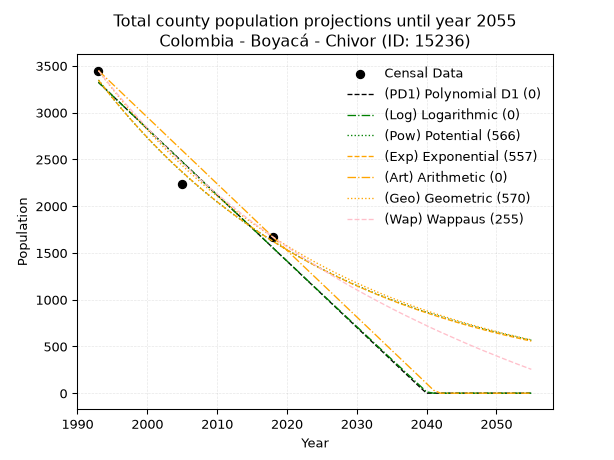
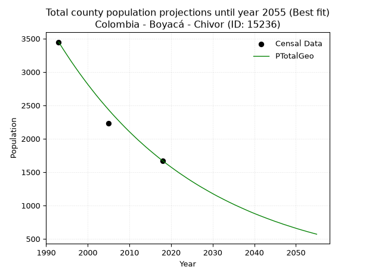
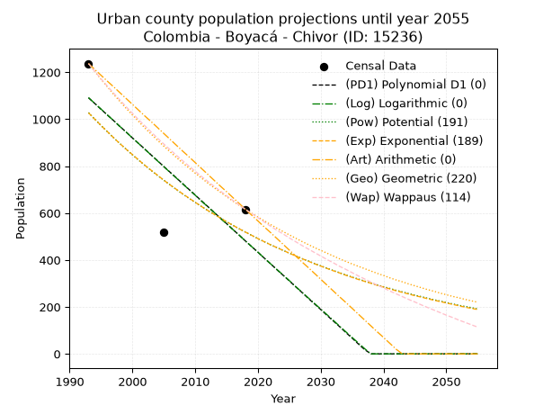
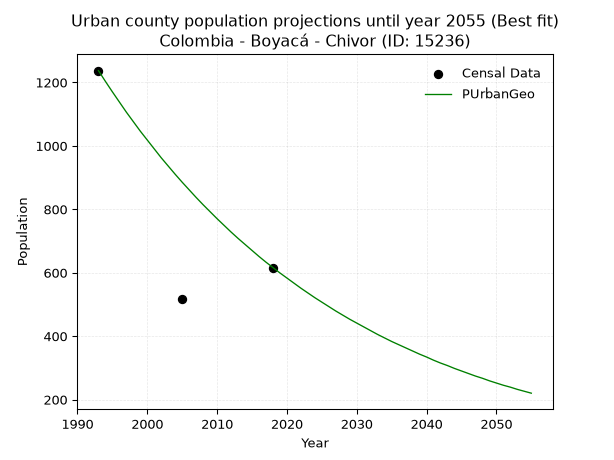
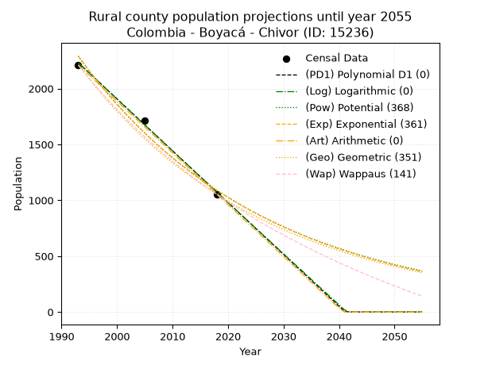
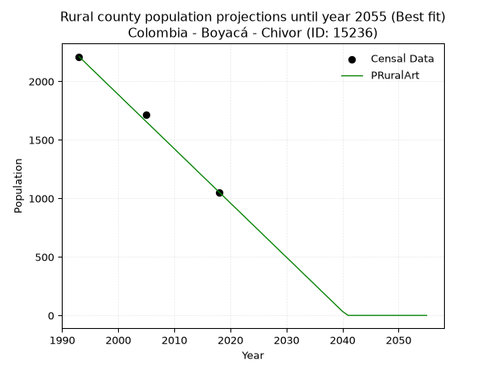

<div align="center">


</div>

# _“Population and Public Services Demand Projections (PPSD) until Year 2050 for Colombia - Boyacá - Chivor (ID: 15236)”_
Keywords: `population` `public-service` `projection` `lineal` `polynomial` `logarithmic` `potential` `exponential` `arithmetic` `geometric` `wappaus` `dane` `colombia` `south-america`

PPSD are analytical estimates used by governments and planners to anticipate future changes in population size, age distribution, and the resulting community needs for utilities, healthcare, education, and infrastructure as sizing future water treatment facilities, electrical grids, and road networks based on spatial growth.

> **General running parameters**: • app_version: _v20260806_. • Python version: _3.14.7_. • Pandas version: _3.0.5_. • NumPy version: _2.5.1_. • Creates, save and include plots into reports (create_plot): _True_. • Projection until year: _2050_. • Process polynomial degree 2 and up: _False_. • Process Wappaus: _True_. • Process Wappaus: _True_. • Set negative values to zero: _True_. • Set infinite values to zero: _True_. • Drop dataset notes: _True_. 
<div align="center">

Dynamic map: [:earth_americas:Google](http://maps.google.com/maps?q=4.888172955,-73.3683981) [:earth_americas:OSM](https://www.openstreetmap.org/#map=18/4.888172955/-73.3683981&layers=P) [:earth_americas:Bing](https://www.bing.com/maps?cp=4.888172955~-73.3683981&lvl=18) [:earth_americas:Apple](https://maps.apple.com/frame?center=4.888172955%2C-73.3683981&span=0.003%2C0.006)

</div>


<div align="center">

```geojson
{
  "type": "Feature",
  "geometry": {
    "type": "Point", 
    "coordinates": [-73.3683981, 4.888172955]
  }, 
  "properties": {
    "Name": "Colombia - Boyacá - Chivor (ID: 15236)"
  }
}
```

</div>


## 0. Census Data (3 records)

Census data are official statistics collected by a government about the people and housing in a country. They usually include counts of total population, age, sex, race, income, education, and jobs.

📅Global census file: [Population.xlsx](../data/Population.xlsx)

| Source   |   Year |   CountryID | CountryName   |   StateID | StateName   |   CountyID | CountyName   |   PTotal |   PUrban |   PRural |
|:---------|-------:|------------:|:--------------|----------:|:------------|-----------:|:-------------|---------:|---------:|---------:|
| DANE     |   1993 |          57 | Colombia      |        15 | Boyacá      |      15236 | Chivor       |     3448 |     1237 |     2211 |
| DANE     |   2005 |          57 | Colombia      |        15 | Boyacá      |      15236 | Chivor       |     2232 |      518 |     1714 |
| DANE     |   2018 |          57 | Colombia      |        15 | Boyacá      |      15236 | Chivor       |     1669 |      616 |     1053 |

> 🔥Some records has specific notes about the registered values or the corresponding urban or rural distribution.

## 1. Total

### 1.1. Coefficients and Parameters

* (PD1) Polynomial Deg 1: -70.77398720682476, 144375.1023454192 (lineal)
* (Log) Logarithmic: -142001.0223038931, 1082161.9118891505
* (Pow) Potential: -58.03586704971219, 195.01450694228922
* (Exp) Exponential: -0.028930439872435904, 3.674879880945855e+28
* (Art) Arithmetic: Year diff. 2018 - 1993 = 25, Population diff. 1669 - 3448 = -1779, Annual growth = -71.16
* (Geo) Geometric: Year diff. 2018 - 1993 = 25, Population diff. 1669 - 3448 = -1779, Annual growth % = -0.028605672235141322
* (Wap) Wappaus: i = -2.7813171780340045, Condition values only valid for < 200)

<sub>
Wappaus condition values: ['-0.00', '-2.78', '-5.56', '-8.34', '-11.13', '-13.91', '-16.69', '-19.47', '-22.25', '-25.03', '-27.81', '-30.59', '-33.38', '-36.16', '-38.94', '-41.72', '-44.50', '-47.28', '-50.06', '-52.85', '-55.63', '-58.41', '-61.19', '-63.97', '-66.75', '-69.53', '-72.31', '-75.10', '-77.88', '-80.66', '-83.44', '-86.22', '-89.00', '-91.78', '-94.56', '-97.35', '-100.13', '-102.91', '-105.69', '-108.47', '-111.25', '-114.03', '-116.82', '-119.60', '-122.38', '-125.16', '-127.94', '-130.72', '-133.50', '-136.28', '-139.07', '-141.85', '-144.63', '-147.41', '-150.19', '-152.97', '-155.75', '-158.54']
</sub>


### 1.2. Projected Dataset

|   Year |   CountyID |   PTotalPD1 |   PTotalLog |   PTotalPow |   PTotalExp |   PTotalArt |   PTotalGeo |   PTotalWap |
|-------:|-----------:|------------:|------------:|------------:|------------:|------------:|------------:|------------:|
|   1993 |      15236 |        3323 |        3324 |        3348 |        3346 |        3448 |        3448 |        3448 |
|   1994 |      15236 |        3252 |        3253 |        3252 |        3251 |        3377 |        3349 |        3353 |
|   1995 |      15236 |        3181 |        3181 |        3158 |        3158 |        3306 |        3254 |        3261 |
|   1996 |      15236 |        3110 |        3110 |        3068 |        3068 |        3235 |        3160 |        3172 |
|   1997 |      15236 |        3039 |        3039 |        2980 |        2980 |        3163 |        3070 |        3085 |
|   1998 |      15236 |        2969 |        2968 |        2895 |        2895 |        3092 |        2982 |        3000 |
|   1999 |      15236 |        2898 |        2897 |        2812 |        2813 |        3021 |        2897 |        2917 |
|   2000 |      15236 |        2827 |        2826 |        2731 |        2733 |        2950 |        2814 |        2836 |
|   2001 |      15236 |        2756 |        2755 |        2653 |        2655 |        2879 |        2734 |        2758 |
|   2002 |      15236 |        2686 |        2684 |        2577 |        2579 |        2808 |        2655 |        2681 |
|   2003 |      15236 |        2615 |        2613 |        2504 |        2505 |        2736 |        2579 |        2606 |
|   2004 |      15236 |        2544 |        2542 |        2432 |        2434 |        2665 |        2506 |        2533 |
|   2005 |      15236 |        2473 |        2471 |        2363 |        2365 |        2594 |        2434 |        2462 |
|   2006 |      15236 |        2402 |        2401 |        2295 |        2297 |        2523 |        2364 |        2392 |
|   2007 |      15236 |        2332 |        2330 |        2230 |        2232 |        2452 |        2297 |        2324 |
|   2008 |      15236 |        2261 |        2259 |        2166 |        2168 |        2381 |        2231 |        2258 |
|   2009 |      15236 |        2190 |        2188 |        2105 |        2106 |        2309 |        2167 |        2193 |
|   2010 |      15236 |        2119 |        2118 |        2045 |        2046 |        2238 |        2105 |        2129 |
|   2011 |      15236 |        2049 |        2047 |        1987 |        1988 |        2167 |        2045 |        2067 |
|   2012 |      15236 |        1978 |        1977 |        1930 |        1931 |        2096 |        1986 |        2007 |
|   2013 |      15236 |        1907 |        1906 |        1875 |        1876 |        2025 |        1930 |        1947 |
|   2014 |      15236 |        1836 |        1835 |        1822 |        1823 |        1954 |        1874 |        1889 |
|   2015 |      15236 |        1766 |        1765 |        1770 |        1771 |        1882 |        1821 |        1832 |
|   2016 |      15236 |        1695 |        1695 |        1720 |        1720 |        1811 |        1769 |        1777 |
|   2017 |      15236 |        1624 |        1624 |        1671 |        1671 |        1740 |        1718 |        1722 |
|   2018 |      15236 |        1553 |        1554 |        1624 |        1623 |        1669 |        1669 |        1669 |
|   2019 |      15236 |        1482 |        1483 |        1578 |        1577 |        1598 |        1621 |        1617 |
|   2020 |      15236 |        1412 |        1413 |        1533 |        1532 |        1527 |        1575 |        1566 |
|   2021 |      15236 |        1341 |        1343 |        1490 |        1488 |        1456 |        1530 |        1515 |
|   2022 |      15236 |        1270 |        1273 |        1448 |        1446 |        1384 |        1486 |        1466 |
|   2023 |      15236 |        1199 |        1202 |        1407 |        1405 |        1313 |        1444 |        1418 |
|   2024 |      15236 |        1129 |        1132 |        1367 |        1365 |        1242 |        1402 |        1371 |
|   2025 |      15236 |        1058 |        1062 |        1328 |        1326 |        1171 |        1362 |        1324 |
|   2026 |      15236 |         987 |         992 |        1291 |        1288 |        1100 |        1323 |        1279 |
|   2027 |      15236 |         916 |         922 |        1254 |        1251 |        1029 |        1285 |        1234 |
|   2028 |      15236 |         845 |         852 |        1219 |        1216 |         957 |        1249 |        1190 |
|   2029 |      15236 |         775 |         782 |        1184 |        1181 |         886 |        1213 |        1147 |
|   2030 |      15236 |         704 |         712 |        1151 |        1147 |         815 |        1178 |        1105 |
|   2031 |      15236 |         633 |         642 |        1119 |        1115 |         744 |        1144 |        1064 |
|   2032 |      15236 |         562 |         572 |        1087 |        1083 |         673 |        1112 |        1023 |
|   2033 |      15236 |         492 |         502 |        1057 |        1052 |         602 |        1080 |         983 |
|   2034 |      15236 |         421 |         432 |        1027 |        1022 |         530 |        1049 |         944 |
|   2035 |      15236 |         350 |         362 |         998 |         993 |         459 |        1019 |         905 |
|   2036 |      15236 |         279 |         293 |         970 |         964 |         388 |         990 |         867 |
|   2037 |      15236 |         208 |         223 |         943 |         937 |         317 |         962 |         830 |
|   2038 |      15236 |         138 |         153 |         916 |         910 |         246 |         934 |         794 |
|   2039 |      15236 |          67 |          84 |         890 |         884 |         175 |         907 |         758 |
|   2040 |      15236 |           0 |          14 |         865 |         859 |         103 |         881 |         722 |
|   2041 |      15236 |           0 |           0 |         841 |         835 |          32 |         856 |         687 |
|   2042 |      15236 |           0 |           0 |         818 |         811 |           0 |         832 |         653 |
|   2043 |      15236 |           0 |           0 |         795 |         788 |           0 |         808 |         620 |
|   2044 |      15236 |           0 |           0 |         772 |         765 |           0 |         785 |         587 |
|   2045 |      15236 |           0 |           0 |         751 |         743 |           0 |         762 |         554 |
|   2046 |      15236 |           0 |           0 |         730 |         722 |           0 |         741 |         522 |
|   2047 |      15236 |           0 |           0 |         709 |         702 |           0 |         719 |         490 |
|   2048 |      15236 |           0 |           0 |         690 |         682 |           0 |         699 |         459 |
|   2049 |      15236 |           0 |           0 |         670 |         662 |           0 |         679 |         429 |
|   2050 |      15236 |           0 |           0 |         652 |         643 |           0 |         659 |         399 |
<div align="center">

</img>

</div>


### 1.3. Best fit with absolute error and relative error (%)

Relative error puts that difference into context by dividing the absolute error by the true value, creating a unitless ratio or percentage that shows the scale of the mistake.

Absolute and relative error

|   Year | Source   |   CountryID | CountryName   |   StateID | StateName   |   CountyID_x | CountyName   |   PTotal |   PUrban |   PRural |   CountyID_y |   PTotalPD1 |   PTotalLog |   PTotalPow |   PTotalExp |   PTotalArt |   PTotalGeo |   PTotalWap |   PTotalPD1AbsError |   PTotalLogAbsError |   PTotalPowAbsError |   PTotalExpAbsError |   PTotalArtAbsError |   PTotalGeoAbsError |   PTotalWapAbsError |   PTotalPD1RelError |   PTotalLogRelError |   PTotalPowRelError |   PTotalExpRelError |   PTotalArtRelError |   PTotalGeoRelError |   PTotalWapRelError |
|-------:|:---------|------------:|:--------------|----------:|:------------|-------------:|:-------------|---------:|---------:|---------:|-------------:|------------:|------------:|------------:|------------:|------------:|------------:|------------:|--------------------:|--------------------:|--------------------:|--------------------:|--------------------:|--------------------:|--------------------:|--------------------:|--------------------:|--------------------:|--------------------:|--------------------:|--------------------:|--------------------:|
|   1993 | DANE     |          57 | Colombia      |        15 | Boyacá      |        15236 | Chivor       |     3448 |     1237 |     2211 |        15236 |        3323 |        3324 |        3348 |        3346 |        3448 |        3448 |        3448 |                 125 |                 124 |                 100 |                 102 |                   0 |                   0 |                   0 |             3.62529 |             3.59629 |             2.90023 |             2.95824 |              0      |             0       |              0      |
|   2005 | DANE     |          57 | Colombia      |        15 | Boyacá      |        15236 | Chivor       |     2232 |      518 |     1714 |        15236 |        2473 |        2471 |        2363 |        2365 |        2594 |        2434 |        2462 |                 241 |                 239 |                 131 |                 133 |                 362 |                 202 |                 230 |            10.7975  |            10.7079  |             5.86918 |             5.95878 |             16.2186 |             9.05018 |             10.3047 |
|   2018 | DANE     |          57 | Colombia      |        15 | Boyacá      |        15236 | Chivor       |     1669 |      616 |     1053 |        15236 |        1553 |        1554 |        1624 |        1623 |        1669 |        1669 |        1669 |                 116 |                 115 |                  45 |                  46 |                   0 |                   0 |                   0 |             6.95027 |             6.89035 |             2.69623 |             2.75614 |              0      |             0       |              0      |

Relative error mean

| Method    |   RelError | Best   |
|:----------|-----------:|:-------|
| PTotalPD1 |    7.12435 |        |
| PTotalLog |    7.06484 |        |
| PTotalPow |    3.82188 |        |
| PTotalExp |    3.89105 |        |
| PTotalArt |    5.40621 |        |
| PTotalGeo |    3.01673 | True   |
| PTotalWap |    3.43489 |        |

💙Best method: _**PTotalGeo**_
<div align="center">

</img>

</div>


### 1.4. Fresh water supply demand in liters per capita per day (lpcd)

The fresh water supply demand typically ranges from 100 to 300 liters per capita per day (lpcd) for standard domestic and municipal planning, though absolute survival minimums set by the World Health Organization are as low as 7.5 to 20 liters per day, and total consumption in high-income nations can exceed 400 liters.

> `CZ`: Level in meters above the sea level (masl).<br> `WS`: Fresh water supply demand in liters per capita per day (lpcd or l/h/d).<br> `WSAll`: Zonal fresh water supply demand in liters per second (l/s).<br> `A`: Zonal area in square meters.

Reference values (RAS Colombia)

|    CZ |   WS |
|------:|-----:|
|  1000 |  120 |
|  2000 |  130 |
| 99999 |  140 |

County shapefile geometry properties and water supply values

|   CountyID |      ATotal |   CZTotal |   WSTotal |
|-----------:|------------:|----------:|----------:|
|      15236 | 1.08493e+08 |    1889.3 |       130 |

Projected values for best method: PTotalGeo

|   CountyID |   Year |   PTotalGeo |   WSTotal |   WSTotalAll |
|-----------:|-------:|------------:|----------:|-------------:|
|      15236 |   1993 |        3448 |       130 |     5.18796  |
|      15236 |   1994 |        3349 |       130 |     5.039    |
|      15236 |   1995 |        3254 |       130 |     4.89606  |
|      15236 |   1996 |        3160 |       130 |     4.75463  |
|      15236 |   1997 |        3070 |       130 |     4.61921  |
|      15236 |   1998 |        2982 |       130 |     4.48681  |
|      15236 |   1999 |        2897 |       130 |     4.35891  |
|      15236 |   2000 |        2814 |       130 |     4.23403  |
|      15236 |   2001 |        2734 |       130 |     4.11366  |
|      15236 |   2002 |        2655 |       130 |     3.99479  |
|      15236 |   2003 |        2579 |       130 |     3.88044  |
|      15236 |   2004 |        2506 |       130 |     3.7706   |
|      15236 |   2005 |        2434 |       130 |     3.66227  |
|      15236 |   2006 |        2364 |       130 |     3.55694  |
|      15236 |   2007 |        2297 |       130 |     3.45613  |
|      15236 |   2008 |        2231 |       130 |     3.35683  |
|      15236 |   2009 |        2167 |       130 |     3.26053  |
|      15236 |   2010 |        2105 |       130 |     3.16725  |
|      15236 |   2011 |        2045 |       130 |     3.07697  |
|      15236 |   2012 |        1986 |       130 |     2.98819  |
|      15236 |   2013 |        1930 |       130 |     2.90394  |
|      15236 |   2014 |        1874 |       130 |     2.81968  |
|      15236 |   2015 |        1821 |       130 |     2.73993  |
|      15236 |   2016 |        1769 |       130 |     2.66169  |
|      15236 |   2017 |        1718 |       130 |     2.58495  |
|      15236 |   2018 |        1669 |       130 |     2.51123  |
|      15236 |   2019 |        1621 |       130 |     2.439    |
|      15236 |   2020 |        1575 |       130 |     2.36979  |
|      15236 |   2021 |        1530 |       130 |     2.30208  |
|      15236 |   2022 |        1486 |       130 |     2.23588  |
|      15236 |   2023 |        1444 |       130 |     2.17269  |
|      15236 |   2024 |        1402 |       130 |     2.10949  |
|      15236 |   2025 |        1362 |       130 |     2.04931  |
|      15236 |   2026 |        1323 |       130 |     1.99063  |
|      15236 |   2027 |        1285 |       130 |     1.93345  |
|      15236 |   2028 |        1249 |       130 |     1.87928  |
|      15236 |   2029 |        1213 |       130 |     1.82512  |
|      15236 |   2030 |        1178 |       130 |     1.77245  |
|      15236 |   2031 |        1144 |       130 |     1.7213   |
|      15236 |   2032 |        1112 |       130 |     1.67315  |
|      15236 |   2033 |        1080 |       130 |     1.625    |
|      15236 |   2034 |        1049 |       130 |     1.57836  |
|      15236 |   2035 |        1019 |       130 |     1.53322  |
|      15236 |   2036 |         990 |       130 |     1.48958  |
|      15236 |   2037 |         962 |       130 |     1.44745  |
|      15236 |   2038 |         934 |       130 |     1.40532  |
|      15236 |   2039 |         907 |       130 |     1.3647   |
|      15236 |   2040 |         881 |       130 |     1.32558  |
|      15236 |   2041 |         856 |       130 |     1.28796  |
|      15236 |   2042 |         832 |       130 |     1.25185  |
|      15236 |   2043 |         808 |       130 |     1.21574  |
|      15236 |   2044 |         785 |       130 |     1.18113  |
|      15236 |   2045 |         762 |       130 |     1.14653  |
|      15236 |   2046 |         741 |       130 |     1.11493  |
|      15236 |   2047 |         719 |       130 |     1.08183  |
|      15236 |   2048 |         699 |       130 |     1.05174  |
|      15236 |   2049 |         679 |       130 |     1.02164  |
|      15236 |   2050 |         659 |       130 |     0.991551 |

## 2. Urban

### 2.1. Coefficients and Parameters

* (PD1) Polynomial Deg 1: -24.39125799573617, 49702.93603411624 (lineal)
* (Log) Logarithmic: -48987.8885714282, 373272.321843042
* (Pow) Potential: -54.874044718209085, 184.0694516141757
* (Exp) Exponential: -0.027316665678580467, 4.5253579650891246e+26
* (Art) Arithmetic: Year diff. 2018 - 1993 = 25, Population diff. 616 - 1237 = -621, Annual growth = -24.84
* (Geo) Geometric: Year diff. 2018 - 1993 = 25, Population diff. 616 - 1237 = -621, Annual growth % = -0.027502618807514367
* (Wap) Wappaus: i = -2.681057744198597, Condition values only valid for < 200)

<sub>
Wappaus condition values: ['-0.00', '-2.68', '-5.36', '-8.04', '-10.72', '-13.41', '-16.09', '-18.77', '-21.45', '-24.13', '-26.81', '-29.49', '-32.17', '-34.85', '-37.53', '-40.22', '-42.90', '-45.58', '-48.26', '-50.94', '-53.62', '-56.30', '-58.98', '-61.66', '-64.35', '-67.03', '-69.71', '-72.39', '-75.07', '-77.75', '-80.43', '-83.11', '-85.79', '-88.47', '-91.16', '-93.84', '-96.52', '-99.20', '-101.88', '-104.56', '-107.24', '-109.92', '-112.60', '-115.29', '-117.97', '-120.65', '-123.33', '-126.01', '-128.69', '-131.37', '-134.05', '-136.73', '-139.42', '-142.10', '-144.78', '-147.46', '-150.14', '-152.82']
</sub>


### 2.2. Projected Dataset

|   Year |   CountyID |   PUrbanPD1 |   PUrbanLog |   PUrbanPow |   PUrbanExp |   PUrbanArt |   PUrbanGeo |   PUrbanWap |
|-------:|-----------:|------------:|------------:|------------:|------------:|------------:|------------:|------------:|
|   1993 |      15236 |        1091 |        1092 |        1028 |        1027 |        1237 |        1237 |        1237 |
|   1994 |      15236 |        1067 |        1067 |        1000 |        1000 |        1212 |        1203 |        1204 |
|   1995 |      15236 |        1042 |        1043 |         973 |         973 |        1187 |        1170 |        1172 |
|   1996 |      15236 |        1018 |        1018 |         947 |         947 |        1162 |        1138 |        1141 |
|   1997 |      15236 |         994 |         994 |         921 |         921 |        1138 |        1106 |        1111 |
|   1998 |      15236 |         969 |         969 |         896 |         896 |        1113 |        1076 |        1082 |
|   1999 |      15236 |         945 |         945 |         872 |         872 |        1088 |        1046 |        1053 |
|   2000 |      15236 |         920 |         920 |         848 |         849 |        1063 |        1018 |        1025 |
|   2001 |      15236 |         896 |         896 |         825 |         826 |        1038 |         990 |         997 |
|   2002 |      15236 |         872 |         871 |         803 |         803 |        1013 |         962 |         971 |
|   2003 |      15236 |         847 |         847 |         781 |         782 |         989 |         936 |         945 |
|   2004 |      15236 |         823 |         822 |         760 |         761 |         964 |         910 |         919 |
|   2005 |      15236 |         798 |         798 |         740 |         740 |         939 |         885 |         894 |
|   2006 |      15236 |         774 |         773 |         720 |         720 |         914 |         861 |         870 |
|   2007 |      15236 |         750 |         749 |         700 |         701 |         889 |         837 |         846 |
|   2008 |      15236 |         725 |         725 |         681 |         682 |         864 |         814 |         823 |
|   2009 |      15236 |         701 |         700 |         663 |         664 |         840 |         792 |         800 |
|   2010 |      15236 |         677 |         676 |         645 |         646 |         815 |         770 |         778 |
|   2011 |      15236 |         652 |         651 |         628 |         628 |         790 |         749 |         756 |
|   2012 |      15236 |         628 |         627 |         611 |         611 |         765 |         728 |         735 |
|   2013 |      15236 |         603 |         603 |         595 |         595 |         740 |         708 |         714 |
|   2014 |      15236 |         579 |         578 |         579 |         579 |         715 |         689 |         694 |
|   2015 |      15236 |         555 |         554 |         563 |         563 |         691 |         670 |         674 |
|   2016 |      15236 |         530 |         530 |         548 |         548 |         666 |         651 |         654 |
|   2017 |      15236 |         506 |         506 |         533 |         533 |         641 |         633 |         635 |
|   2018 |      15236 |         481 |         481 |         519 |         519 |         616 |         616 |         616 |
|   2019 |      15236 |         457 |         457 |         505 |         505 |         591 |         599 |         598 |
|   2020 |      15236 |         433 |         433 |         491 |         491 |         566 |         583 |         580 |
|   2021 |      15236 |         408 |         408 |         478 |         478 |         541 |         567 |         562 |
|   2022 |      15236 |         384 |         384 |         465 |         465 |         517 |         551 |         544 |
|   2023 |      15236 |         359 |         360 |         453 |         453 |         492 |         536 |         527 |
|   2024 |      15236 |         335 |         336 |         441 |         441 |         467 |         521 |         511 |
|   2025 |      15236 |         311 |         312 |         429 |         429 |         442 |         507 |         494 |
|   2026 |      15236 |         286 |         287 |         418 |         417 |         417 |         493 |         478 |
|   2027 |      15236 |         262 |         263 |         406 |         406 |         392 |         479 |         462 |
|   2028 |      15236 |         237 |         239 |         396 |         395 |         368 |         466 |         447 |
|   2029 |      15236 |         213 |         215 |         385 |         384 |         343 |         453 |         432 |
|   2030 |      15236 |         189 |         191 |         375 |         374 |         318 |         441 |         417 |
|   2031 |      15236 |         164 |         167 |         365 |         364 |         293 |         429 |         402 |
|   2032 |      15236 |         140 |         143 |         355 |         354 |         268 |         417 |         388 |
|   2033 |      15236 |         116 |         118 |         346 |         345 |         243 |         405 |         373 |
|   2034 |      15236 |          91 |          94 |         336 |         335 |         219 |         394 |         360 |
|   2035 |      15236 |          67 |          70 |         327 |         326 |         194 |         383 |         346 |
|   2036 |      15236 |          42 |          46 |         319 |         317 |         169 |         373 |         332 |
|   2037 |      15236 |          18 |          22 |         310 |         309 |         144 |         363 |         319 |
|   2038 |      15236 |           0 |           0 |         302 |         301 |         119 |         353 |         306 |
|   2039 |      15236 |           0 |           0 |         294 |         292 |          94 |         343 |         293 |
|   2040 |      15236 |           0 |           0 |         286 |         285 |          70 |         334 |         281 |
|   2041 |      15236 |           0 |           0 |         279 |         277 |          45 |         324 |         268 |
|   2042 |      15236 |           0 |           0 |         271 |         269 |          20 |         315 |         256 |
|   2043 |      15236 |           0 |           0 |         264 |         262 |           0 |         307 |         244 |
|   2044 |      15236 |           0 |           0 |         257 |         255 |           0 |         298 |         232 |
|   2045 |      15236 |           0 |           0 |         250 |         248 |           0 |         290 |         221 |
|   2046 |      15236 |           0 |           0 |         244 |         242 |           0 |         282 |         209 |
|   2047 |      15236 |           0 |           0 |         237 |         235 |           0 |         274 |         198 |
|   2048 |      15236 |           0 |           0 |         231 |         229 |           0 |         267 |         187 |
|   2049 |      15236 |           0 |           0 |         225 |         223 |           0 |         259 |         176 |
|   2050 |      15236 |           0 |           0 |         219 |         217 |           0 |         252 |         165 |
<div align="center">

</img>

</div>


### 2.3. Best fit with absolute error and relative error (%)

Relative error puts that difference into context by dividing the absolute error by the true value, creating a unitless ratio or percentage that shows the scale of the mistake.

Absolute and relative error

|   Year | Source   |   CountryID | CountryName   |   StateID | StateName   |   CountyID_x | CountyName   |   PTotal |   PUrban |   PRural |   CountyID_y |   PUrbanPD1 |   PUrbanLog |   PUrbanPow |   PUrbanExp |   PUrbanArt |   PUrbanGeo |   PUrbanWap |   PUrbanPD1AbsError |   PUrbanLogAbsError |   PUrbanPowAbsError |   PUrbanExpAbsError |   PUrbanArtAbsError |   PUrbanGeoAbsError |   PUrbanWapAbsError |   PUrbanPD1RelError |   PUrbanLogRelError |   PUrbanPowRelError |   PUrbanExpRelError |   PUrbanArtRelError |   PUrbanGeoRelError |   PUrbanWapRelError |
|-------:|:---------|------------:|:--------------|----------:|:------------|-------------:|:-------------|---------:|---------:|---------:|-------------:|------------:|------------:|------------:|------------:|------------:|------------:|------------:|--------------------:|--------------------:|--------------------:|--------------------:|--------------------:|--------------------:|--------------------:|--------------------:|--------------------:|--------------------:|--------------------:|--------------------:|--------------------:|--------------------:|
|   1993 | DANE     |          57 | Colombia      |        15 | Boyacá      |        15236 | Chivor       |     3448 |     1237 |     2211 |        15236 |        1091 |        1092 |        1028 |        1027 |        1237 |        1237 |        1237 |                 146 |                 145 |                 209 |                 210 |                   0 |                   0 |                   0 |             11.8027 |             11.7219 |             16.8957 |             16.9766 |              0      |              0      |              0      |
|   2005 | DANE     |          57 | Colombia      |        15 | Boyacá      |        15236 | Chivor       |     2232 |      518 |     1714 |        15236 |         798 |         798 |         740 |         740 |         939 |         885 |         894 |                 280 |                 280 |                 222 |                 222 |                 421 |                 367 |                 376 |             54.0541 |             54.0541 |             42.8571 |             42.8571 |             81.2741 |             70.8494 |             72.5869 |
|   2018 | DANE     |          57 | Colombia      |        15 | Boyacá      |        15236 | Chivor       |     1669 |      616 |     1053 |        15236 |         481 |         481 |         519 |         519 |         616 |         616 |         616 |                 135 |                 135 |                  97 |                  97 |                   0 |                   0 |                   0 |             21.9156 |             21.9156 |             15.7468 |             15.7468 |              0      |              0      |              0      |

Relative error mean

| Method    |   RelError | Best   |
|:----------|-----------:|:-------|
| PUrbanPD1 |    29.2575 |        |
| PUrbanLog |    29.2305 |        |
| PUrbanPow |    25.1665 |        |
| PUrbanExp |    25.1935 |        |
| PUrbanArt |    27.0914 |        |
| PUrbanGeo |    23.6165 | True   |
| PUrbanWap |    24.1956 |        |

💙Best method: _**PUrbanGeo**_
<div align="center">

</img>

</div>


### 2.4. Fresh water supply demand in liters per capita per day (lpcd)

The fresh water supply demand typically ranges from 100 to 300 liters per capita per day (lpcd) for standard domestic and municipal planning, though absolute survival minimums set by the World Health Organization are as low as 7.5 to 20 liters per day, and total consumption in high-income nations can exceed 400 liters.

> `CZ`: Level in meters above the sea level (masl).<br> `WS`: Fresh water supply demand in liters per capita per day (lpcd or l/h/d).<br> `WSAll`: Zonal fresh water supply demand in liters per second (l/s).<br> `A`: Zonal area in square meters.

Reference values (RAS Colombia)

|    CZ |   WS |
|------:|-----:|
|  1000 |  120 |
|  2000 |  130 |
| 99999 |  140 |

County shapefile geometry properties and water supply values

|   CountyID |   AUrban |   CZUrban |   WSUrban |
|-----------:|---------:|----------:|----------:|
|      15236 |   132862 |   1817.12 |       130 |

Projected values for best method: PUrbanGeo

|   CountyID |   Year |   PUrbanGeo |   WSUrban |   WSUrbanAll |
|-----------:|-------:|------------:|----------:|-------------:|
|      15236 |   1993 |        1237 |       130 |     1.86123  |
|      15236 |   1994 |        1203 |       130 |     1.81007  |
|      15236 |   1995 |        1170 |       130 |     1.76042  |
|      15236 |   1996 |        1138 |       130 |     1.71227  |
|      15236 |   1997 |        1106 |       130 |     1.66412  |
|      15236 |   1998 |        1076 |       130 |     1.61898  |
|      15236 |   1999 |        1046 |       130 |     1.57384  |
|      15236 |   2000 |        1018 |       130 |     1.53171  |
|      15236 |   2001 |         990 |       130 |     1.48958  |
|      15236 |   2002 |         962 |       130 |     1.44745  |
|      15236 |   2003 |         936 |       130 |     1.40833  |
|      15236 |   2004 |         910 |       130 |     1.36921  |
|      15236 |   2005 |         885 |       130 |     1.3316   |
|      15236 |   2006 |         861 |       130 |     1.29549  |
|      15236 |   2007 |         837 |       130 |     1.25937  |
|      15236 |   2008 |         814 |       130 |     1.22477  |
|      15236 |   2009 |         792 |       130 |     1.19167  |
|      15236 |   2010 |         770 |       130 |     1.15856  |
|      15236 |   2011 |         749 |       130 |     1.12697  |
|      15236 |   2012 |         728 |       130 |     1.09537  |
|      15236 |   2013 |         708 |       130 |     1.06528  |
|      15236 |   2014 |         689 |       130 |     1.03669  |
|      15236 |   2015 |         670 |       130 |     1.0081   |
|      15236 |   2016 |         651 |       130 |     0.979514 |
|      15236 |   2017 |         633 |       130 |     0.952431 |
|      15236 |   2018 |         616 |       130 |     0.926852 |
|      15236 |   2019 |         599 |       130 |     0.901273 |
|      15236 |   2020 |         583 |       130 |     0.877199 |
|      15236 |   2021 |         567 |       130 |     0.853125 |
|      15236 |   2022 |         551 |       130 |     0.829051 |
|      15236 |   2023 |         536 |       130 |     0.806481 |
|      15236 |   2024 |         521 |       130 |     0.783912 |
|      15236 |   2025 |         507 |       130 |     0.762847 |
|      15236 |   2026 |         493 |       130 |     0.741782 |
|      15236 |   2027 |         479 |       130 |     0.720718 |
|      15236 |   2028 |         466 |       130 |     0.701157 |
|      15236 |   2029 |         453 |       130 |     0.681597 |
|      15236 |   2030 |         441 |       130 |     0.663542 |
|      15236 |   2031 |         429 |       130 |     0.645486 |
|      15236 |   2032 |         417 |       130 |     0.627431 |
|      15236 |   2033 |         405 |       130 |     0.609375 |
|      15236 |   2034 |         394 |       130 |     0.592824 |
|      15236 |   2035 |         383 |       130 |     0.576273 |
|      15236 |   2036 |         373 |       130 |     0.561227 |
|      15236 |   2037 |         363 |       130 |     0.546181 |
|      15236 |   2038 |         353 |       130 |     0.531134 |
|      15236 |   2039 |         343 |       130 |     0.516088 |
|      15236 |   2040 |         334 |       130 |     0.502546 |
|      15236 |   2041 |         324 |       130 |     0.4875   |
|      15236 |   2042 |         315 |       130 |     0.473958 |
|      15236 |   2043 |         307 |       130 |     0.461921 |
|      15236 |   2044 |         298 |       130 |     0.44838  |
|      15236 |   2045 |         290 |       130 |     0.436343 |
|      15236 |   2046 |         282 |       130 |     0.424306 |
|      15236 |   2047 |         274 |       130 |     0.412269 |
|      15236 |   2048 |         267 |       130 |     0.401736 |
|      15236 |   2049 |         259 |       130 |     0.389699 |
|      15236 |   2050 |         252 |       130 |     0.379167 |

## 3. Rural

### 3.1. Coefficients and Parameters

* (PD1) Polynomial Deg 1: -46.38272921108859, 94672.16631130295 (lineal)
* (Log) Logarithmic: -93013.13373246483, 708889.590046108
* (Pow) Potential: -59.708879012402704, 200.36986521675374
* (Exp) Exponential: -0.02978022209999252, 1.3680216134859252e+29
* (Art) Arithmetic: Year diff. 2018 - 1993 = 25, Population diff. 1053 - 2211 = -1158, Annual growth = -46.32
* (Geo) Geometric: Year diff. 2018 - 1993 = 25, Population diff. 1053 - 2211 = -1158, Annual growth % = -0.02923617290603131
* (Wap) Wappaus: i = -2.838235294117647, Condition values only valid for < 200)

<sub>
Wappaus condition values: ['-0.00', '-2.84', '-5.68', '-8.51', '-11.35', '-14.19', '-17.03', '-19.87', '-22.71', '-25.54', '-28.38', '-31.22', '-34.06', '-36.90', '-39.74', '-42.57', '-45.41', '-48.25', '-51.09', '-53.93', '-56.76', '-59.60', '-62.44', '-65.28', '-68.12', '-70.96', '-73.79', '-76.63', '-79.47', '-82.31', '-85.15', '-87.99', '-90.82', '-93.66', '-96.50', '-99.34', '-102.18', '-105.01', '-107.85', '-110.69', '-113.53', '-116.37', '-119.21', '-122.04', '-124.88', '-127.72', '-130.56', '-133.40', '-136.24', '-139.07', '-141.91', '-144.75', '-147.59', '-150.43', '-153.26', '-156.10', '-158.94', '-161.78']
</sub>


### 3.2. Projected Dataset

|   Year |   CountyID |   PRuralPD1 |   PRuralLog |   PRuralPow |   PRuralExp |   PRuralArt |   PRuralGeo |   PRuralWap |
|-------:|-----------:|------------:|------------:|------------:|------------:|------------:|------------:|------------:|
|   1993 |      15236 |        2231 |        2232 |        2291 |        2290 |        2211 |        2211 |        2211 |
|   1994 |      15236 |        2185 |        2185 |        2223 |        2223 |        2165 |        2146 |        2149 |
|   1995 |      15236 |        2139 |        2139 |        2158 |        2158 |        2118 |        2084 |        2089 |
|   1996 |      15236 |        2092 |        2092 |        2094 |        2094 |        2072 |        2023 |        2030 |
|   1997 |      15236 |        2046 |        2045 |        2032 |        2033 |        2026 |        1964 |        1973 |
|   1998 |      15236 |        1999 |        1999 |        1972 |        1973 |        1979 |        1906 |        1918 |
|   1999 |      15236 |        1953 |        1952 |        1914 |        1915 |        1933 |        1850 |        1864 |
|   2000 |      15236 |        1907 |        1906 |        1858 |        1859 |        1887 |        1796 |        1811 |
|   2001 |      15236 |        1860 |        1859 |        1803 |        1805 |        1840 |        1744 |        1760 |
|   2002 |      15236 |        1814 |        1813 |        1750 |        1752 |        1794 |        1693 |        1710 |
|   2003 |      15236 |        1768 |        1766 |        1699 |        1700 |        1748 |        1643 |        1661 |
|   2004 |      15236 |        1721 |        1720 |        1649 |        1650 |        1701 |        1595 |        1614 |
|   2005 |      15236 |        1675 |        1674 |        1601 |        1602 |        1655 |        1549 |        1568 |
|   2006 |      15236 |        1628 |        1627 |        1554 |        1555 |        1609 |        1503 |        1522 |
|   2007 |      15236 |        1582 |        1581 |        1508 |        1509 |        1563 |        1459 |        1478 |
|   2008 |      15236 |        1536 |        1535 |        1464 |        1465 |        1516 |        1417 |        1435 |
|   2009 |      15236 |        1489 |        1488 |        1421 |        1422 |        1470 |        1375 |        1393 |
|   2010 |      15236 |        1443 |        1442 |        1380 |        1380 |        1424 |        1335 |        1352 |
|   2011 |      15236 |        1396 |        1396 |        1339 |        1340 |        1377 |        1296 |        1311 |
|   2012 |      15236 |        1350 |        1349 |        1300 |        1301 |        1331 |        1258 |        1272 |
|   2013 |      15236 |        1304 |        1303 |        1262 |        1262 |        1285 |        1221 |        1233 |
|   2014 |      15236 |        1257 |        1257 |        1225 |        1225 |        1238 |        1186 |        1196 |
|   2015 |      15236 |        1211 |        1211 |        1189 |        1189 |        1192 |        1151 |        1159 |
|   2016 |      15236 |        1165 |        1165 |        1155 |        1154 |        1146 |        1117 |        1123 |
|   2017 |      15236 |        1118 |        1119 |        1121 |        1121 |        1099 |        1085 |        1088 |
|   2018 |      15236 |        1072 |        1072 |        1088 |        1088 |        1053 |        1053 |        1053 |
|   2019 |      15236 |        1025 |        1026 |        1057 |        1056 |        1007 |        1022 |        1019 |
|   2020 |      15236 |         979 |         980 |        1026 |        1025 |         960 |         992 |         986 |
|   2021 |      15236 |         933 |         934 |         996 |         995 |         914 |         963 |         954 |
|   2022 |      15236 |         886 |         888 |         967 |         966 |         868 |         935 |         922 |
|   2023 |      15236 |         840 |         842 |         939 |         937 |         821 |         908 |         891 |
|   2024 |      15236 |         794 |         796 |         911 |         910 |         775 |         881 |         860 |
|   2025 |      15236 |         747 |         750 |         885 |         883 |         729 |         856 |         830 |
|   2026 |      15236 |         701 |         704 |         859 |         857 |         682 |         830 |         801 |
|   2027 |      15236 |         654 |         659 |         834 |         832 |         636 |         806 |         772 |
|   2028 |      15236 |         608 |         613 |         810 |         808 |         590 |         783 |         744 |
|   2029 |      15236 |         562 |         567 |         787 |         784 |         543 |         760 |         716 |
|   2030 |      15236 |         515 |         521 |         764 |         761 |         497 |         738 |         689 |
|   2031 |      15236 |         469 |         475 |         742 |         739 |         451 |         716 |         662 |
|   2032 |      15236 |         422 |         429 |         720 |         717 |         405 |         695 |         636 |
|   2033 |      15236 |         376 |         384 |         699 |         696 |         358 |         675 |         610 |
|   2034 |      15236 |         330 |         338 |         679 |         675 |         312 |         655 |         584 |
|   2035 |      15236 |         283 |         292 |         659 |         656 |         266 |         636 |         560 |
|   2036 |      15236 |         237 |         246 |         640 |         636 |         219 |         617 |         535 |
|   2037 |      15236 |         191 |         201 |         622 |         618 |         173 |         599 |         511 |
|   2038 |      15236 |         144 |         155 |         604 |         600 |         127 |         582 |         488 |
|   2039 |      15236 |          98 |         110 |         587 |         582 |          80 |         565 |         464 |
|   2040 |      15236 |          51 |          64 |         570 |         565 |          34 |         548 |         442 |
|   2041 |      15236 |           5 |          18 |         553 |         548 |           0 |         532 |         419 |
|   2042 |      15236 |           0 |           0 |         537 |         532 |           0 |         517 |         397 |
|   2043 |      15236 |           0 |           0 |         522 |         517 |           0 |         501 |         376 |
|   2044 |      15236 |           0 |           0 |         507 |         501 |           0 |         487 |         354 |
|   2045 |      15236 |           0 |           0 |         492 |         487 |           0 |         473 |         333 |
|   2046 |      15236 |           0 |           0 |         478 |         472 |           0 |         459 |         313 |
|   2047 |      15236 |           0 |           0 |         464 |         459 |           0 |         445 |         293 |
|   2048 |      15236 |           0 |           0 |         451 |         445 |           0 |         432 |         273 |
|   2049 |      15236 |           0 |           0 |         438 |         432 |           0 |         420 |         253 |
|   2050 |      15236 |           0 |           0 |         425 |         419 |           0 |         407 |         234 |
<div align="center">

</img>

</div>


### 3.3. Best fit with absolute error and relative error (%)

Relative error puts that difference into context by dividing the absolute error by the true value, creating a unitless ratio or percentage that shows the scale of the mistake.

Absolute and relative error

|   Year | Source   |   CountryID | CountryName   |   StateID | StateName   |   CountyID_x | CountyName   |   PTotal |   PUrban |   PRural |   CountyID_y |   PRuralPD1 |   PRuralLog |   PRuralPow |   PRuralExp |   PRuralArt |   PRuralGeo |   PRuralWap |   PRuralPD1AbsError |   PRuralLogAbsError |   PRuralPowAbsError |   PRuralExpAbsError |   PRuralArtAbsError |   PRuralGeoAbsError |   PRuralWapAbsError |   PRuralPD1RelError |   PRuralLogRelError |   PRuralPowRelError |   PRuralExpRelError |   PRuralArtRelError |   PRuralGeoRelError |   PRuralWapRelError |
|-------:|:---------|------------:|:--------------|----------:|:------------|-------------:|:-------------|---------:|---------:|---------:|-------------:|------------:|------------:|------------:|------------:|------------:|------------:|------------:|--------------------:|--------------------:|--------------------:|--------------------:|--------------------:|--------------------:|--------------------:|--------------------:|--------------------:|--------------------:|--------------------:|--------------------:|--------------------:|--------------------:|
|   1993 | DANE     |          57 | Colombia      |        15 | Boyacá      |        15236 | Chivor       |     3448 |     1237 |     2211 |        15236 |        2231 |        2232 |        2291 |        2290 |        2211 |        2211 |        2211 |                  20 |                  21 |                  80 |                  79 |                   0 |                   0 |                   0 |            0.904568 |            0.949796 |             3.61827 |             3.57304 |             0       |              0      |             0       |
|   2005 | DANE     |          57 | Colombia      |        15 | Boyacá      |        15236 | Chivor       |     2232 |      518 |     1714 |        15236 |        1675 |        1674 |        1601 |        1602 |        1655 |        1549 |        1568 |                  39 |                  40 |                 113 |                 112 |                  59 |                 165 |                 146 |            2.27538  |            2.33372  |             6.59277 |             6.53442 |             3.44224 |              9.6266 |             8.51809 |
|   2018 | DANE     |          57 | Colombia      |        15 | Boyacá      |        15236 | Chivor       |     1669 |      616 |     1053 |        15236 |        1072 |        1072 |        1088 |        1088 |        1053 |        1053 |        1053 |                  19 |                  19 |                  35 |                  35 |                   0 |                   0 |                   0 |            1.80437  |            1.80437  |             3.32384 |             3.32384 |             0       |              0      |             0       |

Relative error mean

| Method    |   RelError | Best   |
|:----------|-----------:|:-------|
| PRuralPD1 |    1.66144 |        |
| PRuralLog |    1.69596 |        |
| PRuralPow |    4.51162 |        |
| PRuralExp |    4.4771  |        |
| PRuralArt |    1.14741 | True   |
| PRuralGeo |    3.20887 |        |
| PRuralWap |    2.83936 |        |

💙Best method: _**PRuralArt**_
<div align="center">

</img>

</div>


### 3.4. Fresh water supply demand in liters per capita per day (lpcd)

The fresh water supply demand typically ranges from 100 to 300 liters per capita per day (lpcd) for standard domestic and municipal planning, though absolute survival minimums set by the World Health Organization are as low as 7.5 to 20 liters per day, and total consumption in high-income nations can exceed 400 liters.

> `CZ`: Level in meters above the sea level (masl).<br> `WS`: Fresh water supply demand in liters per capita per day (lpcd or l/h/d).<br> `WSAll`: Zonal fresh water supply demand in liters per second (l/s).<br> `A`: Zonal area in square meters.

Reference values (RAS Colombia)

|    CZ |   WS |
|------:|-----:|
|  1000 |  120 |
|  2000 |  130 |
| 99999 |  140 |

County shapefile geometry properties and water supply values

|   CountyID |     ARural |   CZRural |   WSRural |
|-----------:|-----------:|----------:|----------:|
|      15236 | 1.0836e+08 |   1889.39 |       130 |

Projected values for best method: PRuralArt

|   CountyID |   Year |   PRuralArt |   WSRural |   WSRuralAll |
|-----------:|-------:|------------:|----------:|-------------:|
|      15236 |   1993 |        2211 |       130 |    3.32674   |
|      15236 |   1994 |        2165 |       130 |    3.25752   |
|      15236 |   1995 |        2118 |       130 |    3.18681   |
|      15236 |   1996 |        2072 |       130 |    3.11759   |
|      15236 |   1997 |        2026 |       130 |    3.04838   |
|      15236 |   1998 |        1979 |       130 |    2.97766   |
|      15236 |   1999 |        1933 |       130 |    2.90845   |
|      15236 |   2000 |        1887 |       130 |    2.83924   |
|      15236 |   2001 |        1840 |       130 |    2.76852   |
|      15236 |   2002 |        1794 |       130 |    2.69931   |
|      15236 |   2003 |        1748 |       130 |    2.63009   |
|      15236 |   2004 |        1701 |       130 |    2.55938   |
|      15236 |   2005 |        1655 |       130 |    2.49016   |
|      15236 |   2006 |        1609 |       130 |    2.42095   |
|      15236 |   2007 |        1563 |       130 |    2.35174   |
|      15236 |   2008 |        1516 |       130 |    2.28102   |
|      15236 |   2009 |        1470 |       130 |    2.21181   |
|      15236 |   2010 |        1424 |       130 |    2.14259   |
|      15236 |   2011 |        1377 |       130 |    2.07187   |
|      15236 |   2012 |        1331 |       130 |    2.00266   |
|      15236 |   2013 |        1285 |       130 |    1.93345   |
|      15236 |   2014 |        1238 |       130 |    1.86273   |
|      15236 |   2015 |        1192 |       130 |    1.79352   |
|      15236 |   2016 |        1146 |       130 |    1.72431   |
|      15236 |   2017 |        1099 |       130 |    1.65359   |
|      15236 |   2018 |        1053 |       130 |    1.58438   |
|      15236 |   2019 |        1007 |       130 |    1.51516   |
|      15236 |   2020 |         960 |       130 |    1.44444   |
|      15236 |   2021 |         914 |       130 |    1.37523   |
|      15236 |   2022 |         868 |       130 |    1.30602   |
|      15236 |   2023 |         821 |       130 |    1.2353    |
|      15236 |   2024 |         775 |       130 |    1.16609   |
|      15236 |   2025 |         729 |       130 |    1.09688   |
|      15236 |   2026 |         682 |       130 |    1.02616   |
|      15236 |   2027 |         636 |       130 |    0.956944  |
|      15236 |   2028 |         590 |       130 |    0.887731  |
|      15236 |   2029 |         543 |       130 |    0.817014  |
|      15236 |   2030 |         497 |       130 |    0.747801  |
|      15236 |   2031 |         451 |       130 |    0.678588  |
|      15236 |   2032 |         405 |       130 |    0.609375  |
|      15236 |   2033 |         358 |       130 |    0.538657  |
|      15236 |   2034 |         312 |       130 |    0.469444  |
|      15236 |   2035 |         266 |       130 |    0.400231  |
|      15236 |   2036 |         219 |       130 |    0.329514  |
|      15236 |   2037 |         173 |       130 |    0.260301  |
|      15236 |   2038 |         127 |       130 |    0.191088  |
|      15236 |   2039 |          80 |       130 |    0.12037   |
|      15236 |   2040 |          34 |       130 |    0.0511574 |
|      15236 |   2041 |           0 |       130 |    0         |
|      15236 |   2042 |           0 |       130 |    0         |
|      15236 |   2043 |           0 |       130 |    0         |
|      15236 |   2044 |           0 |       130 |    0         |
|      15236 |   2045 |           0 |       130 |    0         |
|      15236 |   2046 |           0 |       130 |    0         |
|      15236 |   2047 |           0 |       130 |    0         |
|      15236 |   2048 |           0 |       130 |    0         |
|      15236 |   2049 |           0 |       130 |    0         |
|      15236 |   2050 |           0 |       130 |    0         |

<div align="center"><br><sub>Share this research</sub></div><br>

<sub>**APPS & TOOLS & CONTENT DISCLAIMER**: • NO WARRANTY - This content and software is provided by <a href="https://github.com/rcfdtools" target="_blank">github.com/rcfdtools</a> "as is", without any express or implied warranty, including warranties of merchantability, fitness for a particular purpose, or non-infringement. There is no guarantee that the software will be error-free or operate without interruption. • LIMITATION OF LIABILITY - Neither the authors nor copyright holders will be liable for claims or damages arising from the software or its use. You are responsible for determining if the software is appropriate for your use and assume all associated risks, including errors, legal compliance, and data loss. • NO PROFESSIONAL ADVICE - The software provides general information and does not offer professional advice. It should not replace consultation with professional advisors. [Clauses and global license for rcfdtools use.](https://github.com/rcfdtools/rcfdtools/blob/main/LICENSE.md)</sub>