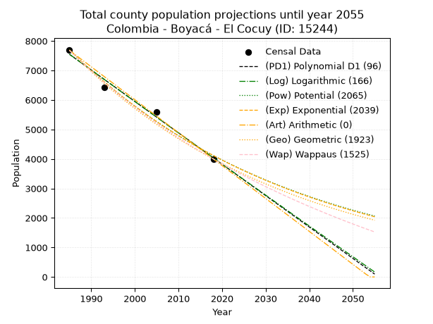
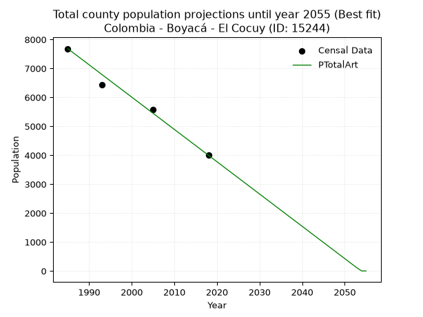
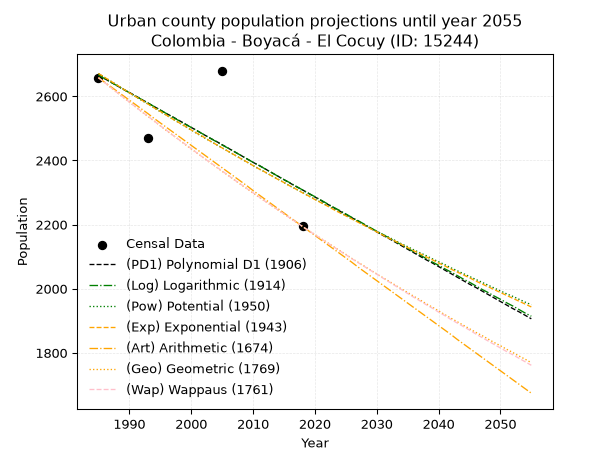
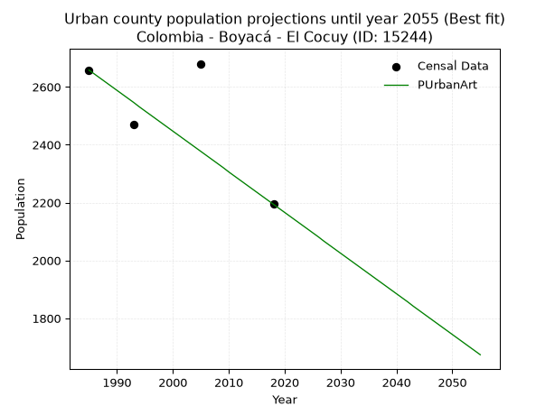
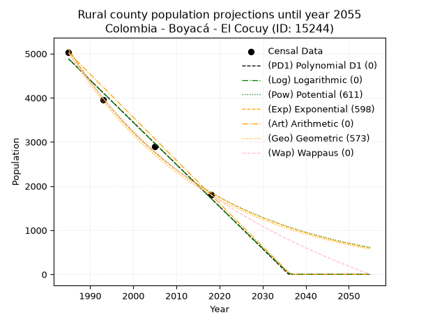
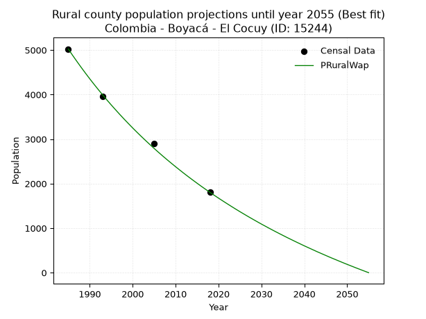

<div align="center">


</div>

# _“Population and Public Services Demand Projections (PPSD) until Year 2050 for Colombia - Boyacá - El Cocuy (ID: 15244)”_
Keywords: `population` `public-service` `projection` `lineal` `polynomial` `logarithmic` `potential` `exponential` `arithmetic` `geometric` `wappaus` `dane` `colombia` `south-america`

PPSD are analytical estimates used by governments and planners to anticipate future changes in population size, age distribution, and the resulting community needs for utilities, healthcare, education, and infrastructure as sizing future water treatment facilities, electrical grids, and road networks based on spatial growth.

> **General running parameters**: • app_version: _v20260806_. • Python version: _3.14.7_. • Pandas version: _3.0.5_. • NumPy version: _2.5.1_. • Creates, save and include plots into reports (create_plot): _False_. • Projection until year: _2050_. • Process polynomial degree 2 and up: _False_. • Process Wappaus: _True_. • Process Wappaus: _True_. • Set negative values to zero: _True_. • Set infinite values to zero: _True_. • Drop dataset notes: _True_. 
<div align="center">

Dynamic map: [:earth_americas:Google](http://maps.google.com/maps?q=6.407738224,-72.4445368) [:earth_americas:OSM](https://www.openstreetmap.org/#map=18/6.407738224/-72.4445368&layers=P) [:earth_americas:Bing](https://www.bing.com/maps?cp=6.407738224~-72.4445368&lvl=18) [:earth_americas:Apple](https://maps.apple.com/frame?center=6.407738224%2C-72.4445368&span=0.003%2C0.006)

</div>


<div align="center">

```geojson
{
  "type": "Feature",
  "geometry": {
    "type": "Point", 
    "coordinates": [-72.4445368, 6.407738224]
  }, 
  "properties": {
    "Name": "Colombia - Boyacá - El Cocuy (ID: 15244)"
  }
}
```

</div>


## 0. Census Data (4 records)

Census data are official statistics collected by a government about the people and housing in a country. They usually include counts of total population, age, sex, race, income, education, and jobs.

📅Global census file: [Population.xlsx](../data/Population.xlsx)

| Source   |   Year |   CountryID | CountryName   |   StateID | StateName   |   CountyID | CountyName   |   PTotal |   PUrban |   PRural |
|:---------|-------:|------------:|:--------------|----------:|:------------|-----------:|:-------------|---------:|---------:|---------:|
| DANE     |   1985 |          57 | Colombia      |        15 | Boyacá      |      15244 | El Cocuy     |     7682 |     2658 |     5024 |
| DANE     |   1993 |          57 | Colombia      |        15 | Boyacá      |      15244 | El Cocuy     |     6432 |     2469 |     3963 |
| DANE     |   2005 |          57 | Colombia      |        15 | Boyacá      |      15244 | El Cocuy     |     5582 |     2680 |     2902 |
| DANE     |   2018 |          57 | Colombia      |        15 | Boyacá      |      15244 | El Cocuy     |     3999 |     2194 |     1805 |

> 🔥Some records could had specific notes about the registered values or the corresponding urban or rural distribution.

## 1. Total

### 1.1. Coefficients and Parameters

* (PD1) Polynomial Deg 1: -106.44038538739359, 218831.13087113405 (lineal)
* (Log) Logarithmic: -213061.55092398106, 1625406.3059412963
* (Pow) Potential: -37.97443087012819, 129.11711656915554
* (Exp) Exponential: -0.018975677704620036, 1.7569721873621978e+20
* (Art) Arithmetic: Year diff. 2018 - 1985 = 33, Population diff. 3999 - 7682 = -3683, Annual growth = -111.60606060606061
* (Geo) Geometric: Year diff. 2018 - 1985 = 33, Population diff. 3999 - 7682 = -3683, Annual growth % = -0.019588499490845068
* (Wap) Wappaus: i = -1.9108990772375756, Condition values only valid for < 200)

<sub>
Wappaus condition values: ['-0.00', '-1.91', '-3.82', '-5.73', '-7.64', '-9.55', '-11.47', '-13.38', '-15.29', '-17.20', '-19.11', '-21.02', '-22.93', '-24.84', '-26.75', '-28.66', '-30.57', '-32.49', '-34.40', '-36.31', '-38.22', '-40.13', '-42.04', '-43.95', '-45.86', '-47.77', '-49.68', '-51.59', '-53.51', '-55.42', '-57.33', '-59.24', '-61.15', '-63.06', '-64.97', '-66.88', '-68.79', '-70.70', '-72.61', '-74.53', '-76.44', '-78.35', '-80.26', '-82.17', '-84.08', '-85.99', '-87.90', '-89.81', '-91.72', '-93.63', '-95.54', '-97.46', '-99.37', '-101.28', '-103.19', '-105.10', '-107.01', '-108.92', '-110.83', '-112.74', '-114.65', '-116.56', '-118.48', '-120.39', '-122.30', '-124.21']
</sub>


### 1.2. Projected Dataset

|   Year |   CountyID |   PTotalPD1 |   PTotalLog |   PTotalPow |   PTotalExp |   PTotalArt |   PTotalGeo |   PTotalWap |
|-------:|-----------:|------------:|------------:|------------:|------------:|------------:|------------:|------------:|
|   1985 |      15244 |        7547 |        7550 |        7701 |        7697 |        7682 |        7682 |        7682 |
|   1986 |      15244 |        7441 |        7443 |        7555 |        7552 |        7570 |        7532 |        7537 |
|   1987 |      15244 |        7334 |        7336 |        7412 |        7410 |        7459 |        7384 |        7394 |
|   1988 |      15244 |        7228 |        7228 |        7272 |        7271 |        7347 |        7239 |        7254 |
|   1989 |      15244 |        7121 |        7121 |        7134 |        7134 |        7236 |        7098 |        7116 |
|   1990 |      15244 |        7015 |        7014 |        6999 |        7000 |        7124 |        6959 |        6981 |
|   1991 |      15244 |        6908 |        6907 |        6867 |        6869 |        7012 |        6822 |        6849 |
|   1992 |      15244 |        6802 |        6800 |        6737 |        6740 |        6901 |        6689 |        6719 |
|   1993 |      15244 |        6695 |        6693 |        6610 |        6613 |        6789 |        6558 |        6591 |
|   1994 |      15244 |        6589 |        6586 |        6485 |        6489 |        6678 |        6429 |        6465 |
|   1995 |      15244 |        6483 |        6480 |        6363 |        6367 |        6566 |        6303 |        6342 |
|   1996 |      15244 |        6376 |        6373 |        6243 |        6247 |        6454 |        6180 |        6221 |
|   1997 |      15244 |        6270 |        6266 |        6125 |        6129 |        6343 |        6059 |        6102 |
|   1998 |      15244 |        6163 |        6159 |        6010 |        6014 |        6231 |        5940 |        5985 |
|   1999 |      15244 |        6057 |        6053 |        5897 |        5901 |        6120 |        5824 |        5869 |
|   2000 |      15244 |        5950 |        5946 |        5786 |        5790 |        6008 |        5710 |        5756 |
|   2001 |      15244 |        5844 |        5840 |        5677 |        5681 |        5896 |        5598 |        5645 |
|   2002 |      15244 |        5737 |        5733 |        5571 |        5575 |        5785 |        5488 |        5535 |
|   2003 |      15244 |        5631 |        5627 |        5466 |        5470 |        5673 |        5381 |        5427 |
|   2004 |      15244 |        5525 |        5521 |        5363 |        5367 |        5561 |        5275 |        5321 |
|   2005 |      15244 |        5418 |        5414 |        5263 |        5266 |        5450 |        5172 |        5217 |
|   2006 |      15244 |        5312 |        5308 |        5164 |        5167 |        5338 |        5070 |        5114 |
|   2007 |      15244 |        5205 |        5202 |        5067 |        5070 |        5227 |        4971 |        5013 |
|   2008 |      15244 |        5099 |        5096 |        4972 |        4975 |        5115 |        4874 |        4914 |
|   2009 |      15244 |        4992 |        4990 |        4879 |        4881 |        5003 |        4778 |        4816 |
|   2010 |      15244 |        4886 |        4884 |        4788 |        4790 |        4892 |        4685 |        4720 |
|   2011 |      15244 |        4780 |        4778 |        4698 |        4699 |        4780 |        4593 |        4625 |
|   2012 |      15244 |        4673 |        4672 |        4610 |        4611 |        4669 |        4503 |        4531 |
|   2013 |      15244 |        4567 |        4566 |        4524 |        4524 |        4557 |        4415 |        4439 |
|   2014 |      15244 |        4460 |        4460 |        4440 |        4439 |        4445 |        4328 |        4349 |
|   2015 |      15244 |        4354 |        4354 |        4357 |        4356 |        4334 |        4244 |        4259 |
|   2016 |      15244 |        4247 |        4249 |        4275 |        4274 |        4222 |        4160 |        4171 |
|   2017 |      15244 |        4141 |        4143 |        4196 |        4194 |        4111 |        4079 |        4084 |
|   2018 |      15244 |        4034 |        4037 |        4117 |        4115 |        3999 |        3999 |        3999 |
|   2019 |      15244 |        3928 |        3932 |        4041 |        4038 |        3887 |        3921 |        3915 |
|   2020 |      15244 |        3822 |        3826 |        3965 |        3962 |        3776 |        3844 |        3832 |
|   2021 |      15244 |        3715 |        3721 |        3892 |        3887 |        3664 |        3769 |        3750 |
|   2022 |      15244 |        3609 |        3615 |        3819 |        3814 |        3553 |        3695 |        3669 |
|   2023 |      15244 |        3502 |        3510 |        3748 |        3742 |        3441 |        3622 |        3590 |
|   2024 |      15244 |        3396 |        3405 |        3678 |        3672 |        3329 |        3551 |        3511 |
|   2025 |      15244 |        3289 |        3299 |        3610 |        3603 |        3218 |        3482 |        3434 |
|   2026 |      15244 |        3183 |        3194 |        3543 |        3535 |        3106 |        3414 |        3357 |
|   2027 |      15244 |        3076 |        3089 |        3477 |        3469 |        2995 |        3347 |        3282 |
|   2028 |      15244 |        2970 |        2984 |        3413 |        3404 |        2883 |        3281 |        3208 |
|   2029 |      15244 |        2864 |        2879 |        3349 |        3340 |        2771 |        3217 |        3135 |
|   2030 |      15244 |        2757 |        2774 |        3287 |        3277 |        2660 |        3154 |        3062 |
|   2031 |      15244 |        2651 |        2669 |        3226 |        3215 |        2548 |        3092 |        2991 |
|   2032 |      15244 |        2544 |        2564 |        3167 |        3155 |        2437 |        3032 |        2921 |
|   2033 |      15244 |        2438 |        2459 |        3108 |        3096 |        2325 |        2972 |        2851 |
|   2034 |      15244 |        2331 |        2355 |        3051 |        3037 |        2213 |        2914 |        2783 |
|   2035 |      15244 |        2225 |        2250 |        2994 |        2980 |        2102 |        2857 |        2715 |
|   2036 |      15244 |        2119 |        2145 |        2939 |        2924 |        1990 |        2801 |        2648 |
|   2037 |      15244 |        2012 |        2041 |        2884 |        2869 |        1878 |        2746 |        2582 |
|   2038 |      15244 |        1906 |        1936 |        2831 |        2815 |        1767 |        2692 |        2517 |
|   2039 |      15244 |        1799 |        1832 |        2779 |        2762 |        1655 |        2640 |        2453 |
|   2040 |      15244 |        1693 |        1727 |        2728 |        2711 |        1544 |        2588 |        2389 |
|   2041 |      15244 |        1586 |        1623 |        2677 |        2660 |        1432 |        2537 |        2327 |
|   2042 |      15244 |        1480 |        1518 |        2628 |        2610 |        1320 |        2487 |        2265 |
|   2043 |      15244 |        1373 |        1414 |        2580 |        2561 |        1209 |        2439 |        2204 |
|   2044 |      15244 |        1267 |        1310 |        2532 |        2512 |        1097 |        2391 |        2143 |
|   2045 |      15244 |        1161 |        1205 |        2486 |        2465 |         986 |        2344 |        2084 |
|   2046 |      15244 |        1054 |        1101 |        2440 |        2419 |         874 |        2298 |        2025 |
|   2047 |      15244 |         948 |         997 |        2395 |        2373 |         762 |        2253 |        1966 |
|   2048 |      15244 |         841 |         893 |        2351 |        2329 |         651 |        2209 |        1909 |
|   2049 |      15244 |         735 |         789 |        2308 |        2285 |         539 |        2166 |        1852 |
|   2050 |      15244 |         628 |         685 |        2265 |        2242 |         428 |        2123 |        1796 |
<div align="center">

</img>

</div>


### 1.3. Best fit with absolute and relative error (%)

Relative error puts that difference into context by dividing the absolute error by the true value, creating a unitless ratio or percentage that shows the scale of the mistake.

Absolute and relative error

|   Year | Source   |   CountryID | CountryName   |   StateID | StateName   |   CountyID_x | CountyName   |   PTotal |   PUrban |   PRural |   CountyID_y |   PTotalPD1 |   PTotalLog |   PTotalPow |   PTotalExp |   PTotalArt |   PTotalGeo |   PTotalWap |   PTotalPD1AbsError |   PTotalLogAbsError |   PTotalPowAbsError |   PTotalExpAbsError |   PTotalArtAbsError |   PTotalGeoAbsError |   PTotalWapAbsError |   PTotalPD1RelError |   PTotalLogRelError |   PTotalPowRelError |   PTotalExpRelError |   PTotalArtRelError |   PTotalGeoRelError |   PTotalWapRelError |
|-------:|:---------|------------:|:--------------|----------:|:------------|-------------:|:-------------|---------:|---------:|---------:|-------------:|------------:|------------:|------------:|------------:|------------:|------------:|------------:|--------------------:|--------------------:|--------------------:|--------------------:|--------------------:|--------------------:|--------------------:|--------------------:|--------------------:|--------------------:|--------------------:|--------------------:|--------------------:|--------------------:|
|   1985 | DANE     |          57 | Colombia      |        15 | Boyacá      |        15244 | El Cocuy     |     7682 |     2658 |     5024 |        15244 |        7547 |        7550 |        7701 |        7697 |        7682 |        7682 |        7682 |                 135 |                 132 |                  19 |                  15 |                   0 |                   0 |                   0 |            1.75735  |            1.7183   |            0.247331 |            0.195262 |             0       |             0       |             0       |
|   1993 | DANE     |          57 | Colombia      |        15 | Boyacá      |        15244 | El Cocuy     |     6432 |     2469 |     3963 |        15244 |        6695 |        6693 |        6610 |        6613 |        6789 |        6558 |        6591 |                 263 |                 261 |                 178 |                 181 |                 357 |                 126 |                 159 |            4.08893  |            4.05784  |            2.76741  |            2.81405  |             5.55037 |             1.95896 |             2.47201 |
|   2005 | DANE     |          57 | Colombia      |        15 | Boyacá      |        15244 | El Cocuy     |     5582 |     2680 |     2902 |        15244 |        5418 |        5414 |        5263 |        5266 |        5450 |        5172 |        5217 |                 164 |                 168 |                 319 |                 316 |                 132 |                 410 |                 365 |            2.93802  |            3.00967  |            5.7148   |            5.66105  |             2.36474 |             7.34504 |             6.53887 |
|   2018 | DANE     |          57 | Colombia      |        15 | Boyacá      |        15244 | El Cocuy     |     3999 |     2194 |     1805 |        15244 |        4034 |        4037 |        4117 |        4115 |        3999 |        3999 |        3999 |                  35 |                  38 |                 118 |                 116 |                   0 |                   0 |                   0 |            0.875219 |            0.950238 |            2.95074  |            2.90073  |             0       |             0       |             0       |

Relative error mean

| Method    |   RelError | Best   |
|:----------|-----------:|:-------|
| PTotalPD1 |    2.41488 |        |
| PTotalLog |    2.43401 |        |
| PTotalPow |    2.92007 |        |
| PTotalExp |    2.89277 |        |
| PTotalArt |    1.97878 | True   |
| PTotalGeo |    2.326   |        |
| PTotalWap |    2.25272 |        |

💙Best method: _**PTotalArt**_
<div align="center">

</img>

</div>


### 1.4. Fresh water supply demand in liters per capita per day (lpcd)

The fresh water supply demand typically ranges from 100 to 300 liters per capita per day (lpcd) for standard domestic and municipal planning, though absolute survival minimums set by the World Health Organization are as low as 7.5 to 20 liters per day, and total consumption in high-income nations can exceed 400 liters.

> `CZ`: Level in meters above the sea level (masl).<br> `WS`: Fresh water supply demand in liters per capita per day (lpcd or l/h/d).<br> `WSAll`: Zonal fresh water supply demand in liters per second (l/s).<br> `A`: Zonal area in square meters.

Reference values (RAS Colombia)

|    CZ |   WS |
|------:|-----:|
|  1000 |  120 |
|  2000 |  130 |
| 99999 |  140 |

County shapefile geometry properties and water supply values

|   CountyID |     ATotal |   CZTotal |   WSTotal |
|-----------:|-----------:|----------:|----------:|
|      15244 | 2.3779e+08 |   3706.64 |       140 |

Projected values for best method: PTotalArt

|   CountyID |   Year |   PTotalArt |   WSTotal |   WSTotalAll |
|-----------:|-------:|------------:|----------:|-------------:|
|      15244 |   1985 |        7682 |       140 |    12.4477   |
|      15244 |   1986 |        7570 |       140 |    12.2662   |
|      15244 |   1987 |        7459 |       140 |    12.0863   |
|      15244 |   1988 |        7347 |       140 |    11.9049   |
|      15244 |   1989 |        7236 |       140 |    11.725    |
|      15244 |   1990 |        7124 |       140 |    11.5435   |
|      15244 |   1991 |        7012 |       140 |    11.362    |
|      15244 |   1992 |        6901 |       140 |    11.1822   |
|      15244 |   1993 |        6789 |       140 |    11.0007   |
|      15244 |   1994 |        6678 |       140 |    10.8208   |
|      15244 |   1995 |        6566 |       140 |    10.6394   |
|      15244 |   1996 |        6454 |       140 |    10.4579   |
|      15244 |   1997 |        6343 |       140 |    10.278    |
|      15244 |   1998 |        6231 |       140 |    10.0965   |
|      15244 |   1999 |        6120 |       140 |     9.91667  |
|      15244 |   2000 |        6008 |       140 |     9.73519  |
|      15244 |   2001 |        5896 |       140 |     9.5537   |
|      15244 |   2002 |        5785 |       140 |     9.37384  |
|      15244 |   2003 |        5673 |       140 |     9.19236  |
|      15244 |   2004 |        5561 |       140 |     9.01088  |
|      15244 |   2005 |        5450 |       140 |     8.83102  |
|      15244 |   2006 |        5338 |       140 |     8.64954  |
|      15244 |   2007 |        5227 |       140 |     8.46968  |
|      15244 |   2008 |        5115 |       140 |     8.28819  |
|      15244 |   2009 |        5003 |       140 |     8.10671  |
|      15244 |   2010 |        4892 |       140 |     7.92685  |
|      15244 |   2011 |        4780 |       140 |     7.74537  |
|      15244 |   2012 |        4669 |       140 |     7.56551  |
|      15244 |   2013 |        4557 |       140 |     7.38403  |
|      15244 |   2014 |        4445 |       140 |     7.20255  |
|      15244 |   2015 |        4334 |       140 |     7.02269  |
|      15244 |   2016 |        4222 |       140 |     6.8412   |
|      15244 |   2017 |        4111 |       140 |     6.66134  |
|      15244 |   2018 |        3999 |       140 |     6.47986  |
|      15244 |   2019 |        3887 |       140 |     6.29838  |
|      15244 |   2020 |        3776 |       140 |     6.11852  |
|      15244 |   2021 |        3664 |       140 |     5.93704  |
|      15244 |   2022 |        3553 |       140 |     5.75718  |
|      15244 |   2023 |        3441 |       140 |     5.57569  |
|      15244 |   2024 |        3329 |       140 |     5.39421  |
|      15244 |   2025 |        3218 |       140 |     5.21435  |
|      15244 |   2026 |        3106 |       140 |     5.03287  |
|      15244 |   2027 |        2995 |       140 |     4.85301  |
|      15244 |   2028 |        2883 |       140 |     4.67153  |
|      15244 |   2029 |        2771 |       140 |     4.49005  |
|      15244 |   2030 |        2660 |       140 |     4.31019  |
|      15244 |   2031 |        2548 |       140 |     4.1287   |
|      15244 |   2032 |        2437 |       140 |     3.94884  |
|      15244 |   2033 |        2325 |       140 |     3.76736  |
|      15244 |   2034 |        2213 |       140 |     3.58588  |
|      15244 |   2035 |        2102 |       140 |     3.40602  |
|      15244 |   2036 |        1990 |       140 |     3.22454  |
|      15244 |   2037 |        1878 |       140 |     3.04306  |
|      15244 |   2038 |        1767 |       140 |     2.86319  |
|      15244 |   2039 |        1655 |       140 |     2.68171  |
|      15244 |   2040 |        1544 |       140 |     2.50185  |
|      15244 |   2041 |        1432 |       140 |     2.32037  |
|      15244 |   2042 |        1320 |       140 |     2.13889  |
|      15244 |   2043 |        1209 |       140 |     1.95903  |
|      15244 |   2044 |        1097 |       140 |     1.77755  |
|      15244 |   2045 |         986 |       140 |     1.59769  |
|      15244 |   2046 |         874 |       140 |     1.4162   |
|      15244 |   2047 |         762 |       140 |     1.23472  |
|      15244 |   2048 |         651 |       140 |     1.05486  |
|      15244 |   2049 |         539 |       140 |     0.87338  |
|      15244 |   2050 |         428 |       140 |     0.693519 |

## 2. Urban

### 2.1. Coefficients and Parameters

* (PD1) Polynomial Deg 1: -10.857085507827897, 24217.135287032746 (lineal)
* (Log) Logarithmic: -21701.238747968117, 167451.53962611896
* (Pow) Potential: -9.087692947073585, 33.395775474103466
* (Exp) Exponential: -0.004546569205453241, 22192454.772238117
* (Art) Arithmetic: Year diff. 2018 - 1985 = 33, Population diff. 2194 - 2658 = -464, Annual growth = -14.06060606060606
* (Geo) Geometric: Year diff. 2018 - 1985 = 33, Population diff. 2194 - 2658 = -464, Annual growth % = -0.005796697528029693
* (Wap) Wappaus: i = -0.5795798046416348, Condition values only valid for < 200)

<sub>
Wappaus condition values: ['-0.00', '-0.58', '-1.16', '-1.74', '-2.32', '-2.90', '-3.48', '-4.06', '-4.64', '-5.22', '-5.80', '-6.38', '-6.95', '-7.53', '-8.11', '-8.69', '-9.27', '-9.85', '-10.43', '-11.01', '-11.59', '-12.17', '-12.75', '-13.33', '-13.91', '-14.49', '-15.07', '-15.65', '-16.23', '-16.81', '-17.39', '-17.97', '-18.55', '-19.13', '-19.71', '-20.29', '-20.86', '-21.44', '-22.02', '-22.60', '-23.18', '-23.76', '-24.34', '-24.92', '-25.50', '-26.08', '-26.66', '-27.24', '-27.82', '-28.40', '-28.98', '-29.56', '-30.14', '-30.72', '-31.30', '-31.88', '-32.46', '-33.04', '-33.62', '-34.20', '-34.77', '-35.35', '-35.93', '-36.51', '-37.09', '-37.67']
</sub>


### 2.2. Projected Dataset

|   Year |   CountyID |   PUrbanPD1 |   PUrbanLog |   PUrbanPow |   PUrbanExp |   PUrbanArt |   PUrbanGeo |   PUrbanWap |
|-------:|-----------:|------------:|------------:|------------:|------------:|------------:|------------:|------------:|
|   1985 |      15244 |        2666 |        2666 |        2671 |        2671 |        2658 |        2658 |        2658 |
|   1986 |      15244 |        2655 |        2655 |        2659 |        2659 |        2644 |        2643 |        2643 |
|   1987 |      15244 |        2644 |        2644 |        2647 |        2647 |        2630 |        2627 |        2627 |
|   1988 |      15244 |        2633 |        2633 |        2635 |        2635 |        2616 |        2612 |        2612 |
|   1989 |      15244 |        2622 |        2622 |        2623 |        2623 |        2602 |        2597 |        2597 |
|   1990 |      15244 |        2612 |        2611 |        2611 |        2611 |        2588 |        2582 |        2582 |
|   1991 |      15244 |        2601 |        2600 |        2599 |        2599 |        2574 |        2567 |        2567 |
|   1992 |      15244 |        2590 |        2590 |        2587 |        2588 |        2560 |        2552 |        2552 |
|   1993 |      15244 |        2579 |        2579 |        2576 |        2576 |        2546 |        2537 |        2538 |
|   1994 |      15244 |        2568 |        2568 |        2564 |        2564 |        2531 |        2523 |        2523 |
|   1995 |      15244 |        2557 |        2557 |        2552 |        2553 |        2517 |        2508 |        2508 |
|   1996 |      15244 |        2546 |        2546 |        2541 |        2541 |        2503 |        2493 |        2494 |
|   1997 |      15244 |        2536 |        2535 |        2529 |        2529 |        2489 |        2479 |        2479 |
|   1998 |      15244 |        2525 |        2524 |        2518 |        2518 |        2475 |        2465 |        2465 |
|   1999 |      15244 |        2514 |        2513 |        2506 |        2507 |        2461 |        2450 |        2451 |
|   2000 |      15244 |        2503 |        2503 |        2495 |        2495 |        2447 |        2436 |        2437 |
|   2001 |      15244 |        2492 |        2492 |        2483 |        2484 |        2433 |        2422 |        2422 |
|   2002 |      15244 |        2481 |        2481 |        2472 |        2473 |        2419 |        2408 |        2408 |
|   2003 |      15244 |        2470 |        2470 |        2461 |        2461 |        2405 |        2394 |        2394 |
|   2004 |      15244 |        2460 |        2459 |        2450 |        2450 |        2391 |        2380 |        2381 |
|   2005 |      15244 |        2449 |        2448 |        2439 |        2439 |        2377 |        2366 |        2367 |
|   2006 |      15244 |        2438 |        2438 |        2428 |        2428 |        2363 |        2353 |        2353 |
|   2007 |      15244 |        2427 |        2427 |        2417 |        2417 |        2349 |        2339 |        2339 |
|   2008 |      15244 |        2416 |        2416 |        2406 |        2406 |        2335 |        2325 |        2326 |
|   2009 |      15244 |        2405 |        2405 |        2395 |        2395 |        2321 |        2312 |        2312 |
|   2010 |      15244 |        2394 |        2394 |        2384 |        2384 |        2306 |        2298 |        2299 |
|   2011 |      15244 |        2384 |        2384 |        2373 |        2373 |        2292 |        2285 |        2286 |
|   2012 |      15244 |        2373 |        2373 |        2363 |        2363 |        2278 |        2272 |        2272 |
|   2013 |      15244 |        2362 |        2362 |        2352 |        2352 |        2264 |        2259 |        2259 |
|   2014 |      15244 |        2351 |        2351 |        2342 |        2341 |        2250 |        2246 |        2246 |
|   2015 |      15244 |        2340 |        2340 |        2331 |        2331 |        2236 |        2233 |        2233 |
|   2016 |      15244 |        2329 |        2330 |        2320 |        2320 |        2222 |        2220 |        2220 |
|   2017 |      15244 |        2318 |        2319 |        2310 |        2310 |        2208 |        2207 |        2207 |
|   2018 |      15244 |        2308 |        2308 |        2300 |        2299 |        2194 |        2194 |        2194 |
|   2019 |      15244 |        2297 |        2297 |        2289 |        2289 |        2180 |        2181 |        2181 |
|   2020 |      15244 |        2286 |        2287 |        2279 |        2278 |        2166 |        2169 |        2168 |
|   2021 |      15244 |        2275 |        2276 |        2269 |        2268 |        2152 |        2156 |        2156 |
|   2022 |      15244 |        2264 |        2265 |        2259 |        2258 |        2138 |        2144 |        2143 |
|   2023 |      15244 |        2253 |        2254 |        2249 |        2247 |        2124 |        2131 |        2131 |
|   2024 |      15244 |        2242 |        2244 |        2238 |        2237 |        2110 |        2119 |        2118 |
|   2025 |      15244 |        2232 |        2233 |        2228 |        2227 |        2096 |        2107 |        2106 |
|   2026 |      15244 |        2221 |        2222 |        2218 |        2217 |        2082 |        2094 |        2093 |
|   2027 |      15244 |        2210 |        2212 |        2209 |        2207 |        2067 |        2082 |        2081 |
|   2028 |      15244 |        2199 |        2201 |        2199 |        2197 |        2053 |        2070 |        2069 |
|   2029 |      15244 |        2188 |        2190 |        2189 |        2187 |        2039 |        2058 |        2057 |
|   2030 |      15244 |        2177 |        2179 |        2179 |        2177 |        2025 |        2046 |        2045 |
|   2031 |      15244 |        2166 |        2169 |        2169 |        2167 |        2011 |        2034 |        2033 |
|   2032 |      15244 |        2156 |        2158 |        2160 |        2157 |        1997 |        2023 |        2021 |
|   2033 |      15244 |        2145 |        2147 |        2150 |        2148 |        1983 |        2011 |        2009 |
|   2034 |      15244 |        2134 |        2137 |        2140 |        2138 |        1969 |        1999 |        1997 |
|   2035 |      15244 |        2123 |        2126 |        2131 |        2128 |        1955 |        1988 |        1985 |
|   2036 |      15244 |        2112 |        2115 |        2121 |        2118 |        1941 |        1976 |        1973 |
|   2037 |      15244 |        2101 |        2105 |        2112 |        2109 |        1927 |        1965 |        1962 |
|   2038 |      15244 |        2090 |        2094 |        2103 |        2099 |        1913 |        1953 |        1950 |
|   2039 |      15244 |        2080 |        2083 |        2093 |        2090 |        1899 |        1942 |        1939 |
|   2040 |      15244 |        2069 |        2073 |        2084 |        2080 |        1885 |        1931 |        1927 |
|   2041 |      15244 |        2058 |        2062 |        2075 |        2071 |        1871 |        1919 |        1916 |
|   2042 |      15244 |        2047 |        2052 |        2065 |        2061 |        1857 |        1908 |        1904 |
|   2043 |      15244 |        2036 |        2041 |        2056 |        2052 |        1842 |        1897 |        1893 |
|   2044 |      15244 |        2025 |        2030 |        2047 |        2043 |        1828 |        1886 |        1882 |
|   2045 |      15244 |        2014 |        2020 |        2038 |        2034 |        1814 |        1875 |        1871 |
|   2046 |      15244 |        2004 |        2009 |        2029 |        2024 |        1800 |        1864 |        1859 |
|   2047 |      15244 |        1993 |        1998 |        2020 |        2015 |        1786 |        1854 |        1848 |
|   2048 |      15244 |        1982 |        1988 |        2011 |        2006 |        1772 |        1843 |        1837 |
|   2049 |      15244 |        1971 |        1977 |        2002 |        1997 |        1758 |        1832 |        1826 |
|   2050 |      15244 |        1960 |        1967 |        1993 |        1988 |        1744 |        1822 |        1815 |
<div align="center">

</img>

</div>


### 2.3. Best fit with absolute and relative error (%)

Relative error puts that difference into context by dividing the absolute error by the true value, creating a unitless ratio or percentage that shows the scale of the mistake.

Absolute and relative error

|   Year | Source   |   CountryID | CountryName   |   StateID | StateName   |   CountyID_x | CountyName   |   PTotal |   PUrban |   PRural |   CountyID_y |   PUrbanPD1 |   PUrbanLog |   PUrbanPow |   PUrbanExp |   PUrbanArt |   PUrbanGeo |   PUrbanWap |   PUrbanPD1AbsError |   PUrbanLogAbsError |   PUrbanPowAbsError |   PUrbanExpAbsError |   PUrbanArtAbsError |   PUrbanGeoAbsError |   PUrbanWapAbsError |   PUrbanPD1RelError |   PUrbanLogRelError |   PUrbanPowRelError |   PUrbanExpRelError |   PUrbanArtRelError |   PUrbanGeoRelError |   PUrbanWapRelError |
|-------:|:---------|------------:|:--------------|----------:|:------------|-------------:|:-------------|---------:|---------:|---------:|-------------:|------------:|------------:|------------:|------------:|------------:|------------:|------------:|--------------------:|--------------------:|--------------------:|--------------------:|--------------------:|--------------------:|--------------------:|--------------------:|--------------------:|--------------------:|--------------------:|--------------------:|--------------------:|--------------------:|
|   1985 | DANE     |          57 | Colombia      |        15 | Boyacá      |        15244 | El Cocuy     |     7682 |     2658 |     5024 |        15244 |        2666 |        2666 |        2671 |        2671 |        2658 |        2658 |        2658 |                   8 |                   8 |                  13 |                  13 |                   0 |                   0 |                   0 |            0.300978 |            0.300978 |             0.48909 |             0.48909 |             0       |             0       |             0       |
|   1993 | DANE     |          57 | Colombia      |        15 | Boyacá      |        15244 | El Cocuy     |     6432 |     2469 |     3963 |        15244 |        2579 |        2579 |        2576 |        2576 |        2546 |        2537 |        2538 |                 110 |                 110 |                 107 |                 107 |                  77 |                  68 |                  69 |            4.45525  |            4.45525  |             4.33374 |             4.33374 |             3.11867 |             2.75415 |             2.79465 |
|   2005 | DANE     |          57 | Colombia      |        15 | Boyacá      |        15244 | El Cocuy     |     5582 |     2680 |     2902 |        15244 |        2449 |        2448 |        2439 |        2439 |        2377 |        2366 |        2367 |                 231 |                 232 |                 241 |                 241 |                 303 |                 314 |                 313 |            8.6194   |            8.65672  |             8.99254 |             8.99254 |            11.306   |            11.7164  |            11.6791  |
|   2018 | DANE     |          57 | Colombia      |        15 | Boyacá      |        15244 | El Cocuy     |     3999 |     2194 |     1805 |        15244 |        2308 |        2308 |        2300 |        2299 |        2194 |        2194 |        2194 |                 114 |                 114 |                 106 |                 105 |                   0 |                   0 |                   0 |            5.19599  |            5.19599  |             4.83136 |             4.78578 |             0       |             0       |             0       |

Relative error mean

| Method    |   RelError | Best   |
|:----------|-----------:|:-------|
| PUrbanPD1 |    4.6429  |        |
| PUrbanLog |    4.65223 |        |
| PUrbanPow |    4.66168 |        |
| PUrbanExp |    4.65029 |        |
| PUrbanArt |    3.60616 | True   |
| PUrbanGeo |    3.61764 |        |
| PUrbanWap |    3.61844 |        |

💙Best method: _**PUrbanArt**_
<div align="center">

</img>

</div>


### 2.4. Fresh water supply demand in liters per capita per day (lpcd)

The fresh water supply demand typically ranges from 100 to 300 liters per capita per day (lpcd) for standard domestic and municipal planning, though absolute survival minimums set by the World Health Organization are as low as 7.5 to 20 liters per day, and total consumption in high-income nations can exceed 400 liters.

> `CZ`: Level in meters above the sea level (masl).<br> `WS`: Fresh water supply demand in liters per capita per day (lpcd or l/h/d).<br> `WSAll`: Zonal fresh water supply demand in liters per second (l/s).<br> `A`: Zonal area in square meters.

Reference values (RAS Colombia)

|    CZ |   WS |
|------:|-----:|
|  1000 |  120 |
|  2000 |  130 |
| 99999 |  140 |

County shapefile geometry properties and water supply values

|   CountyID |   AUrban |   CZUrban |   WSUrban |
|-----------:|---------:|----------:|----------:|
|      15244 |   643786 |   2713.07 |       140 |

Projected values for best method: PUrbanArt

|   CountyID |   Year |   PUrbanArt |   WSUrban |   WSUrbanAll |
|-----------:|-------:|------------:|----------:|-------------:|
|      15244 |   1985 |        2658 |       140 |      4.30694 |
|      15244 |   1986 |        2644 |       140 |      4.28426 |
|      15244 |   1987 |        2630 |       140 |      4.26157 |
|      15244 |   1988 |        2616 |       140 |      4.23889 |
|      15244 |   1989 |        2602 |       140 |      4.2162  |
|      15244 |   1990 |        2588 |       140 |      4.19352 |
|      15244 |   1991 |        2574 |       140 |      4.17083 |
|      15244 |   1992 |        2560 |       140 |      4.14815 |
|      15244 |   1993 |        2546 |       140 |      4.12546 |
|      15244 |   1994 |        2531 |       140 |      4.10116 |
|      15244 |   1995 |        2517 |       140 |      4.07847 |
|      15244 |   1996 |        2503 |       140 |      4.05579 |
|      15244 |   1997 |        2489 |       140 |      4.0331  |
|      15244 |   1998 |        2475 |       140 |      4.01042 |
|      15244 |   1999 |        2461 |       140 |      3.98773 |
|      15244 |   2000 |        2447 |       140 |      3.96505 |
|      15244 |   2001 |        2433 |       140 |      3.94236 |
|      15244 |   2002 |        2419 |       140 |      3.91968 |
|      15244 |   2003 |        2405 |       140 |      3.89699 |
|      15244 |   2004 |        2391 |       140 |      3.87431 |
|      15244 |   2005 |        2377 |       140 |      3.85162 |
|      15244 |   2006 |        2363 |       140 |      3.82894 |
|      15244 |   2007 |        2349 |       140 |      3.80625 |
|      15244 |   2008 |        2335 |       140 |      3.78356 |
|      15244 |   2009 |        2321 |       140 |      3.76088 |
|      15244 |   2010 |        2306 |       140 |      3.73657 |
|      15244 |   2011 |        2292 |       140 |      3.71389 |
|      15244 |   2012 |        2278 |       140 |      3.6912  |
|      15244 |   2013 |        2264 |       140 |      3.66852 |
|      15244 |   2014 |        2250 |       140 |      3.64583 |
|      15244 |   2015 |        2236 |       140 |      3.62315 |
|      15244 |   2016 |        2222 |       140 |      3.60046 |
|      15244 |   2017 |        2208 |       140 |      3.57778 |
|      15244 |   2018 |        2194 |       140 |      3.55509 |
|      15244 |   2019 |        2180 |       140 |      3.53241 |
|      15244 |   2020 |        2166 |       140 |      3.50972 |
|      15244 |   2021 |        2152 |       140 |      3.48704 |
|      15244 |   2022 |        2138 |       140 |      3.46435 |
|      15244 |   2023 |        2124 |       140 |      3.44167 |
|      15244 |   2024 |        2110 |       140 |      3.41898 |
|      15244 |   2025 |        2096 |       140 |      3.3963  |
|      15244 |   2026 |        2082 |       140 |      3.37361 |
|      15244 |   2027 |        2067 |       140 |      3.34931 |
|      15244 |   2028 |        2053 |       140 |      3.32662 |
|      15244 |   2029 |        2039 |       140 |      3.30394 |
|      15244 |   2030 |        2025 |       140 |      3.28125 |
|      15244 |   2031 |        2011 |       140 |      3.25856 |
|      15244 |   2032 |        1997 |       140 |      3.23588 |
|      15244 |   2033 |        1983 |       140 |      3.21319 |
|      15244 |   2034 |        1969 |       140 |      3.19051 |
|      15244 |   2035 |        1955 |       140 |      3.16782 |
|      15244 |   2036 |        1941 |       140 |      3.14514 |
|      15244 |   2037 |        1927 |       140 |      3.12245 |
|      15244 |   2038 |        1913 |       140 |      3.09977 |
|      15244 |   2039 |        1899 |       140 |      3.07708 |
|      15244 |   2040 |        1885 |       140 |      3.0544  |
|      15244 |   2041 |        1871 |       140 |      3.03171 |
|      15244 |   2042 |        1857 |       140 |      3.00903 |
|      15244 |   2043 |        1842 |       140 |      2.98472 |
|      15244 |   2044 |        1828 |       140 |      2.96204 |
|      15244 |   2045 |        1814 |       140 |      2.93935 |
|      15244 |   2046 |        1800 |       140 |      2.91667 |
|      15244 |   2047 |        1786 |       140 |      2.89398 |
|      15244 |   2048 |        1772 |       140 |      2.8713  |
|      15244 |   2049 |        1758 |       140 |      2.84861 |
|      15244 |   2050 |        1744 |       140 |      2.82593 |

## 3. Rural

### 3.1. Coefficients and Parameters

* (PD1) Polynomial Deg 1: -95.5832998795657, 194613.99558410127 (lineal)
* (Log) Logarithmic: -191360.31217601287, 1457954.7663151769
* (Pow) Potential: -61.243548076919346, 205.67415881827282
* (Exp) Exponential: -0.03060154369315845, 1.224750786620018e+30
* (Art) Arithmetic: Year diff. 2018 - 1985 = 33, Population diff. 1805 - 5024 = -3219, Annual growth = -97.54545454545455
* (Geo) Geometric: Year diff. 2018 - 1985 = 33, Population diff. 1805 - 5024 = -3219, Annual growth % = -0.030543987728955613
* (Wap) Wappaus: i = -2.856800543138221, Condition values only valid for < 200)

<sub>
Wappaus condition values: ['-0.00', '-2.86', '-5.71', '-8.57', '-11.43', '-14.28', '-17.14', '-20.00', '-22.85', '-25.71', '-28.57', '-31.42', '-34.28', '-37.14', '-40.00', '-42.85', '-45.71', '-48.57', '-51.42', '-54.28', '-57.14', '-59.99', '-62.85', '-65.71', '-68.56', '-71.42', '-74.28', '-77.13', '-79.99', '-82.85', '-85.70', '-88.56', '-91.42', '-94.27', '-97.13', '-99.99', '-102.84', '-105.70', '-108.56', '-111.42', '-114.27', '-117.13', '-119.99', '-122.84', '-125.70', '-128.56', '-131.41', '-134.27', '-137.13', '-139.98', '-142.84', '-145.70', '-148.55', '-151.41', '-154.27', '-157.12', '-159.98', '-162.84', '-165.69', '-168.55', '-171.41', '-174.26', '-177.12', '-179.98', '-182.84', '-185.69']
</sub>


### 3.2. Projected Dataset

|   Year |   CountyID |   PRuralPD1 |   PRuralLog |   PRuralPow |   PRuralExp |   PRuralArt |   PRuralGeo |   PRuralWap |
|-------:|-----------:|------------:|------------:|------------:|------------:|------------:|------------:|------------:|
|   1985 |      15244 |        4881 |        4884 |        5100 |        5096 |        5024 |        5024 |        5024 |
|   1986 |      15244 |        4786 |        4788 |        4945 |        4942 |        4926 |        4871 |        4882 |
|   1987 |      15244 |        4690 |        4692 |        4795 |        4794 |        4829 |        4722 |        4745 |
|   1988 |      15244 |        4594 |        4595 |        4650 |        4649 |        4731 |        4578 |        4611 |
|   1989 |      15244 |        4499 |        4499 |        4509 |        4509 |        4634 |        4438 |        4481 |
|   1990 |      15244 |        4403 |        4403 |        4372 |        4373 |        4536 |        4302 |        4354 |
|   1991 |      15244 |        4308 |        4307 |        4240 |        4241 |        4439 |        4171 |        4231 |
|   1992 |      15244 |        4212 |        4211 |        4111 |        4113 |        4341 |        4043 |        4111 |
|   1993 |      15244 |        4116 |        4115 |        3987 |        3989 |        4244 |        3920 |        3994 |
|   1994 |      15244 |        4021 |        4019 |        3866 |        3869 |        4146 |        3800 |        3879 |
|   1995 |      15244 |        3925 |        3923 |        3749 |        3753 |        4049 |        3684 |        3768 |
|   1996 |      15244 |        3830 |        3827 |        3636 |        3640 |        3951 |        3572 |        3660 |
|   1997 |      15244 |        3734 |        3731 |        3526 |        3530 |        3853 |        3462 |        3554 |
|   1998 |      15244 |        3639 |        3635 |        3420 |        3423 |        3756 |        3357 |        3450 |
|   1999 |      15244 |        3543 |        3539 |        3316 |        3320 |        3658 |        3254 |        3350 |
|   2000 |      15244 |        3447 |        3444 |        3216 |        3220 |        3561 |        3155 |        3251 |
|   2001 |      15244 |        3352 |        3348 |        3119 |        3123 |        3463 |        3058 |        3155 |
|   2002 |      15244 |        3256 |        3252 |        3025 |        3029 |        3366 |        2965 |        3061 |
|   2003 |      15244 |        3161 |        3157 |        2934 |        2938 |        3268 |        2874 |        2969 |
|   2004 |      15244 |        3065 |        3061 |        2846 |        2849 |        3171 |        2787 |        2879 |
|   2005 |      15244 |        2969 |        2966 |        2760 |        2763 |        3073 |        2702 |        2791 |
|   2006 |      15244 |        2874 |        2870 |        2677 |        2680 |        2976 |        2619 |        2705 |
|   2007 |      15244 |        2778 |        2775 |        2597 |        2599 |        2878 |        2539 |        2621 |
|   2008 |      15244 |        2683 |        2680 |        2519 |        2521 |        2780 |        2461 |        2539 |
|   2009 |      15244 |        2587 |        2585 |        2443 |        2445 |        2683 |        2386 |        2459 |
|   2010 |      15244 |        2492 |        2489 |        2370 |        2371 |        2585 |        2313 |        2380 |
|   2011 |      15244 |        2396 |        2394 |        2299 |        2300 |        2488 |        2243 |        2303 |
|   2012 |      15244 |        2300 |        2299 |        2230 |        2231 |        2390 |        2174 |        2227 |
|   2013 |      15244 |        2205 |        2204 |        2163 |        2163 |        2293 |        2108 |        2153 |
|   2014 |      15244 |        2109 |        2109 |        2098 |        2098 |        2195 |        2043 |        2081 |
|   2015 |      15244 |        2014 |        2014 |        2035 |        2035 |        2098 |        1981 |        2010 |
|   2016 |      15244 |        1918 |        1919 |        1974 |        1974 |        2000 |        1921 |        1940 |
|   2017 |      15244 |        1822 |        1824 |        1915 |        1914 |        1903 |        1862 |        1872 |
|   2018 |      15244 |        1727 |        1729 |        1858 |        1856 |        1805 |        1805 |        1805 |
|   2019 |      15244 |        1631 |        1634 |        1803 |        1800 |        1707 |        1750 |        1739 |
|   2020 |      15244 |        1536 |        1540 |        1749 |        1746 |        1610 |        1696 |        1675 |
|   2021 |      15244 |        1440 |        1445 |        1696 |        1694 |        1512 |        1645 |        1612 |
|   2022 |      15244 |        1345 |        1350 |        1646 |        1642 |        1415 |        1594 |        1550 |
|   2023 |      15244 |        1249 |        1256 |        1597 |        1593 |        1317 |        1546 |        1489 |
|   2024 |      15244 |        1153 |        1161 |        1549 |        1545 |        1220 |        1498 |        1429 |
|   2025 |      15244 |        1058 |        1067 |        1503 |        1498 |        1122 |        1453 |        1370 |
|   2026 |      15244 |         962 |         972 |        1458 |        1453 |        1025 |        1408 |        1313 |
|   2027 |      15244 |         867 |         878 |        1415 |        1409 |         927 |        1365 |        1256 |
|   2028 |      15244 |         771 |         783 |        1373 |        1367 |         830 |        1324 |        1201 |
|   2029 |      15244 |         675 |         689 |        1332 |        1326 |         732 |        1283 |        1146 |
|   2030 |      15244 |         580 |         595 |        1292 |        1286 |         634 |        1244 |        1092 |
|   2031 |      15244 |         484 |         500 |        1254 |        1247 |         537 |        1206 |        1040 |
|   2032 |      15244 |         389 |         406 |        1217 |        1209 |         439 |        1169 |         988 |
|   2033 |      15244 |         293 |         312 |        1181 |        1173 |         342 |        1133 |         937 |
|   2034 |      15244 |         198 |         218 |        1146 |        1138 |         244 |        1099 |         887 |
|   2035 |      15244 |         102 |         124 |        1112 |        1103 |         147 |        1065 |         838 |
|   2036 |      15244 |           6 |          30 |        1079 |        1070 |          49 |        1033 |         789 |
|   2037 |      15244 |           0 |           0 |        1047 |        1038 |           0 |        1001 |         742 |
|   2038 |      15244 |           0 |           0 |        1016 |        1007 |           0 |         971 |         695 |
|   2039 |      15244 |           0 |           0 |         986 |         976 |           0 |         941 |         649 |
|   2040 |      15244 |           0 |           0 |         956 |         947 |           0 |         912 |         603 |
|   2041 |      15244 |           0 |           0 |         928 |         918 |           0 |         884 |         559 |
|   2042 |      15244 |           0 |           0 |         901 |         891 |           0 |         857 |         515 |
|   2043 |      15244 |           0 |           0 |         874 |         864 |           0 |         831 |         471 |
|   2044 |      15244 |           0 |           0 |         848 |         838 |           0 |         806 |         429 |
|   2045 |      15244 |           0 |           0 |         823 |         813 |           0 |         781 |         387 |
|   2046 |      15244 |           0 |           0 |         799 |         788 |           0 |         757 |         345 |
|   2047 |      15244 |           0 |           0 |         775 |         764 |           0 |         734 |         305 |
|   2048 |      15244 |           0 |           0 |         753 |         741 |           0 |         712 |         265 |
|   2049 |      15244 |           0 |           0 |         730 |         719 |           0 |         690 |         225 |
|   2050 |      15244 |           0 |           0 |         709 |         697 |           0 |         669 |         186 |
<div align="center">

</img>

</div>


### 3.3. Best fit with absolute and relative error (%)

Relative error puts that difference into context by dividing the absolute error by the true value, creating a unitless ratio or percentage that shows the scale of the mistake.

Absolute and relative error

|   Year | Source   |   CountryID | CountryName   |   StateID | StateName   |   CountyID_x | CountyName   |   PTotal |   PUrban |   PRural |   CountyID_y |   PRuralPD1 |   PRuralLog |   PRuralPow |   PRuralExp |   PRuralArt |   PRuralGeo |   PRuralWap |   PRuralPD1AbsError |   PRuralLogAbsError |   PRuralPowAbsError |   PRuralExpAbsError |   PRuralArtAbsError |   PRuralGeoAbsError |   PRuralWapAbsError |   PRuralPD1RelError |   PRuralLogRelError |   PRuralPowRelError |   PRuralExpRelError |   PRuralArtRelError |   PRuralGeoRelError |   PRuralWapRelError |
|-------:|:---------|------------:|:--------------|----------:|:------------|-------------:|:-------------|---------:|---------:|---------:|-------------:|------------:|------------:|------------:|------------:|------------:|------------:|------------:|--------------------:|--------------------:|--------------------:|--------------------:|--------------------:|--------------------:|--------------------:|--------------------:|--------------------:|--------------------:|--------------------:|--------------------:|--------------------:|--------------------:|
|   1985 | DANE     |          57 | Colombia      |        15 | Boyacá      |        15244 | El Cocuy     |     7682 |     2658 |     5024 |        15244 |        4881 |        4884 |        5100 |        5096 |        5024 |        5024 |        5024 |                 143 |                 140 |                  76 |                  72 |                   0 |                   0 |                   0 |             2.84634 |             2.78662 |            1.51274  |            1.43312  |             0       |             0       |            0        |
|   1993 | DANE     |          57 | Colombia      |        15 | Boyacá      |        15244 | El Cocuy     |     6432 |     2469 |     3963 |        15244 |        4116 |        4115 |        3987 |        3989 |        4244 |        3920 |        3994 |                 153 |                 152 |                  24 |                  26 |                 281 |                  43 |                  31 |             3.86071 |             3.83548 |            0.605602 |            0.656069 |             7.09059 |             1.08504 |            0.782236 |
|   2005 | DANE     |          57 | Colombia      |        15 | Boyacá      |        15244 | El Cocuy     |     5582 |     2680 |     2902 |        15244 |        2969 |        2966 |        2760 |        2763 |        3073 |        2702 |        2791 |                  67 |                  64 |                 142 |                 139 |                 171 |                 200 |                 111 |             2.30875 |             2.20538 |            4.89318  |            4.7898   |             5.89249 |             6.8918  |            3.82495  |
|   2018 | DANE     |          57 | Colombia      |        15 | Boyacá      |        15244 | El Cocuy     |     3999 |     2194 |     1805 |        15244 |        1727 |        1729 |        1858 |        1856 |        1805 |        1805 |        1805 |                  78 |                  76 |                  53 |                  51 |                   0 |                   0 |                   0 |             4.32133 |             4.21053 |            2.93629  |            2.82548  |             0       |             0       |            0        |

Relative error mean

| Method    |   RelError | Best   |
|:----------|-----------:|:-------|
| PRuralPD1 |    3.33428 |        |
| PRuralLog |    3.2595  |        |
| PRuralPow |    2.48695 |        |
| PRuralExp |    2.42612 |        |
| PRuralArt |    3.24577 |        |
| PRuralGeo |    1.99421 |        |
| PRuralWap |    1.1518  | True   |

💙Best method: _**PRuralWap**_
<div align="center">

</img>

</div>


### 3.4. Fresh water supply demand in liters per capita per day (lpcd)

The fresh water supply demand typically ranges from 100 to 300 liters per capita per day (lpcd) for standard domestic and municipal planning, though absolute survival minimums set by the World Health Organization are as low as 7.5 to 20 liters per day, and total consumption in high-income nations can exceed 400 liters.

> `CZ`: Level in meters above the sea level (masl).<br> `WS`: Fresh water supply demand in liters per capita per day (lpcd or l/h/d).<br> `WSAll`: Zonal fresh water supply demand in liters per second (l/s).<br> `A`: Zonal area in square meters.

Reference values (RAS Colombia)

|    CZ |   WS |
|------:|-----:|
|  1000 |  120 |
|  2000 |  130 |
| 99999 |  140 |

County shapefile geometry properties and water supply values

|   CountyID |      ARural |   CZRural |   WSRural |
|-----------:|------------:|----------:|----------:|
|      15244 | 2.37146e+08 |   3709.31 |       140 |

Projected values for best method: PRuralWap

|   CountyID |   Year |   PRuralWap |   WSRural |   WSRuralAll |
|-----------:|-------:|------------:|----------:|-------------:|
|      15244 |   1985 |        5024 |       140 |     8.14074  |
|      15244 |   1986 |        4882 |       140 |     7.91065  |
|      15244 |   1987 |        4745 |       140 |     7.68866  |
|      15244 |   1988 |        4611 |       140 |     7.47153  |
|      15244 |   1989 |        4481 |       140 |     7.26088  |
|      15244 |   1990 |        4354 |       140 |     7.05509  |
|      15244 |   1991 |        4231 |       140 |     6.85579  |
|      15244 |   1992 |        4111 |       140 |     6.66134  |
|      15244 |   1993 |        3994 |       140 |     6.47176  |
|      15244 |   1994 |        3879 |       140 |     6.28542  |
|      15244 |   1995 |        3768 |       140 |     6.10556  |
|      15244 |   1996 |        3660 |       140 |     5.93056  |
|      15244 |   1997 |        3554 |       140 |     5.7588   |
|      15244 |   1998 |        3450 |       140 |     5.59028  |
|      15244 |   1999 |        3350 |       140 |     5.42824  |
|      15244 |   2000 |        3251 |       140 |     5.26782  |
|      15244 |   2001 |        3155 |       140 |     5.11227  |
|      15244 |   2002 |        3061 |       140 |     4.95995  |
|      15244 |   2003 |        2969 |       140 |     4.81088  |
|      15244 |   2004 |        2879 |       140 |     4.66505  |
|      15244 |   2005 |        2791 |       140 |     4.52245  |
|      15244 |   2006 |        2705 |       140 |     4.3831   |
|      15244 |   2007 |        2621 |       140 |     4.24699  |
|      15244 |   2008 |        2539 |       140 |     4.11412  |
|      15244 |   2009 |        2459 |       140 |     3.98449  |
|      15244 |   2010 |        2380 |       140 |     3.85648  |
|      15244 |   2011 |        2303 |       140 |     3.73171  |
|      15244 |   2012 |        2227 |       140 |     3.60856  |
|      15244 |   2013 |        2153 |       140 |     3.48866  |
|      15244 |   2014 |        2081 |       140 |     3.37199  |
|      15244 |   2015 |        2010 |       140 |     3.25694  |
|      15244 |   2016 |        1940 |       140 |     3.14352  |
|      15244 |   2017 |        1872 |       140 |     3.03333  |
|      15244 |   2018 |        1805 |       140 |     2.92477  |
|      15244 |   2019 |        1739 |       140 |     2.81782  |
|      15244 |   2020 |        1675 |       140 |     2.71412  |
|      15244 |   2021 |        1612 |       140 |     2.61204  |
|      15244 |   2022 |        1550 |       140 |     2.51157  |
|      15244 |   2023 |        1489 |       140 |     2.41273  |
|      15244 |   2024 |        1429 |       140 |     2.31551  |
|      15244 |   2025 |        1370 |       140 |     2.21991  |
|      15244 |   2026 |        1313 |       140 |     2.12755  |
|      15244 |   2027 |        1256 |       140 |     2.03519  |
|      15244 |   2028 |        1201 |       140 |     1.94606  |
|      15244 |   2029 |        1146 |       140 |     1.85694  |
|      15244 |   2030 |        1092 |       140 |     1.76944  |
|      15244 |   2031 |        1040 |       140 |     1.68519  |
|      15244 |   2032 |         988 |       140 |     1.60093  |
|      15244 |   2033 |         937 |       140 |     1.51829  |
|      15244 |   2034 |         887 |       140 |     1.43727  |
|      15244 |   2035 |         838 |       140 |     1.35787  |
|      15244 |   2036 |         789 |       140 |     1.27847  |
|      15244 |   2037 |         742 |       140 |     1.20231  |
|      15244 |   2038 |         695 |       140 |     1.12616  |
|      15244 |   2039 |         649 |       140 |     1.05162  |
|      15244 |   2040 |         603 |       140 |     0.977083 |
|      15244 |   2041 |         559 |       140 |     0.905787 |
|      15244 |   2042 |         515 |       140 |     0.834491 |
|      15244 |   2043 |         471 |       140 |     0.763194 |
|      15244 |   2044 |         429 |       140 |     0.695139 |
|      15244 |   2045 |         387 |       140 |     0.627083 |
|      15244 |   2046 |         345 |       140 |     0.559028 |
|      15244 |   2047 |         305 |       140 |     0.494213 |
|      15244 |   2048 |         265 |       140 |     0.429398 |
|      15244 |   2049 |         225 |       140 |     0.364583 |
|      15244 |   2050 |         186 |       140 |     0.301389 |

<div align="center"><br><sub>Share this research</sub></div><br>

<sub>**APPS & TOOLS & CONTENT DISCLAIMER**: • NO WARRANTY - This content and software is provided by <a href="https://github.com/rcfdtools" target="_blank">github.com/rcfdtools</a> "as is", without any express or implied warranty, including warranties of merchantability, fitness for a particular purpose, or non-infringement. There is no guarantee that the software will be error-free or operate without interruption. • LIMITATION OF LIABILITY - Neither the authors nor copyright holders will be liable for claims or damages arising from the software or its use. You are responsible for determining if the software is appropriate for your use and assume all associated risks, including errors, legal compliance, and data loss. • NO PROFESSIONAL ADVICE - The software provides general information and does not offer professional advice. It should not replace consultation with professional advisors. [Clauses and global license for rcfdtools use.](https://github.com/rcfdtools/rcfdtools/blob/main/LICENSE.md)</sub>

| [:house: Home](Readme.md)  | [:beginner: Help / Collaborate](https://github.com/rcfdtools/R.HydroTools/discussions/31) |
|----------------------------|-------------------------------------------------------------------------------------------|