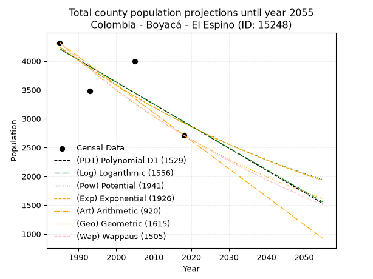
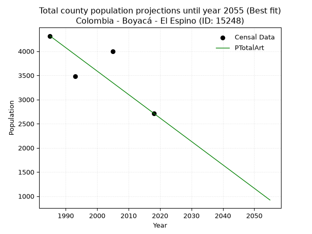
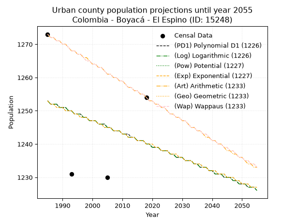
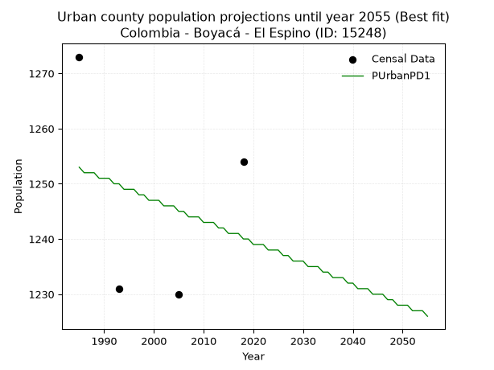
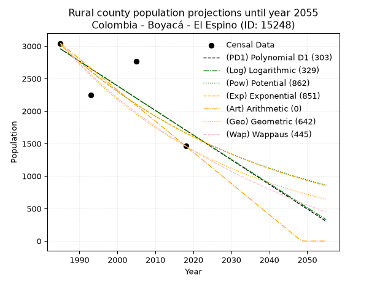
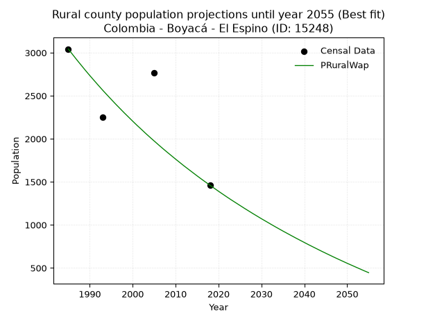

<div align="center">


</div>

# _“Population and Public Services Demand Projections (PPSD) until Year 2050 for Colombia - Boyacá - El Espino (ID: 15248)”_
Keywords: `population` `public-service` `projection` `lineal` `polynomial` `logarithmic` `potential` `exponential` `arithmetic` `geometric` `wappaus` `dane` `colombia` `south-america`

PPSD are analytical estimates used by governments and planners to anticipate future changes in population size, age distribution, and the resulting community needs for utilities, healthcare, education, and infrastructure as sizing future water treatment facilities, electrical grids, and road networks based on spatial growth.

> **General running parameters**: • app_version: _v20260806_. • Python version: _3.14.7_. • Pandas version: _3.0.5_. • NumPy version: _2.5.1_. • Creates, save and include plots into reports (create_plot): _False_. • Projection until year: _2050_. • Process polynomial degree 2 and up: _False_. • Process Wappaus: _True_. • Process Wappaus: _True_. • Set negative values to zero: _True_. • Set infinite values to zero: _True_. • Drop dataset notes: _True_. 
<div align="center">

Dynamic map: [:earth_americas:Google](http://maps.google.com/maps?q=6.483027405,-72.4970073) [:earth_americas:OSM](https://www.openstreetmap.org/#map=18/6.483027405/-72.4970073&layers=P) [:earth_americas:Bing](https://www.bing.com/maps?cp=6.483027405~-72.4970073&lvl=18) [:earth_americas:Apple](https://maps.apple.com/frame?center=6.483027405%2C-72.4970073&span=0.003%2C0.006)

</div>


<div align="center">

```geojson
{
  "type": "Feature",
  "geometry": {
    "type": "Point", 
    "coordinates": [-72.4970073, 6.483027405]
  }, 
  "properties": {
    "Name": "Colombia - Boyacá - El Espino (ID: 15248)"
  }
}
```

</div>


## 0. Census Data (4 records)

Census data are official statistics collected by a government about the people and housing in a country. They usually include counts of total population, age, sex, race, income, education, and jobs.

📅Global census file: [Population.xlsx](../data/Population.xlsx)

| Source   |   Year |   CountryID | CountryName   |   StateID | StateName   |   CountyID | CountyName   |   PTotal |   PUrban |   PRural |
|:---------|-------:|------------:|:--------------|----------:|:------------|-----------:|:-------------|---------:|---------:|---------:|
| DANE     |   1985 |          57 | Colombia      |        15 | Boyacá      |      15248 | El Espino    |     4316 |     1273 |     3043 |
| DANE     |   1993 |          57 | Colombia      |        15 | Boyacá      |      15248 | El Espino    |     3478 |     1231 |     2247 |
| DANE     |   2005 |          57 | Colombia      |        15 | Boyacá      |      15248 | El Espino    |     3997 |     1230 |     2767 |
| DANE     |   2018 |          57 | Colombia      |        15 | Boyacá      |      15248 | El Espino    |     2715 |     1254 |     1461 |

> 🔥Some records could had specific notes about the registered values or the corresponding urban or rural distribution.

📅   [RUPS](https://www.datos.gov.co/Hacienda-y-Cr-dito-P-blico/Registro-nico-de-Prestadores-de-Servicios-P-blicos/4qkq-csdn/about_data) - Local public utility companies: [RUPS.csv](../data/RUPS.xlsx)

 | SERVICIO       | ESTADO    | NOMBRE                                                                                                 | NIT         | DEPARTAMENTO_DOMICILIO   | MUNICIPIO_DOMICILIO   | DIRECCION          |   TELEFONO | EMAIL                           | TIPO_PRESTADOR                 | CLASIFICACION                 |
|:---------------|:----------|:-------------------------------------------------------------------------------------------------------|:------------|:-------------------------|:----------------------|:-------------------|-----------:|:--------------------------------|:-------------------------------|:------------------------------|
| ACUEDUCTO      | OPERATIVA | UNIDAD DE SERVICIOS PUBLICOS DOMICILIARIOS DEL MUNICIPIO DE EL ESPINO-BOYACA                           | 800031073-2 | BOYACA                   | EL ESPINO             | K 5 5 57           |    7884302 | maribelpulidoaponte@hotmail.com | MUNICIPIO (PRESTACIÓN DIRECTA) | MENOR O IGUAL A 2500 USUARIOS |
| ALCANTARILLADO | OPERATIVA | UNIDAD DE SERVICIOS PUBLICOS DOMICILIARIOS DEL MUNICIPIO DE EL ESPINO-BOYACA                           | 800031073-2 | BOYACA                   | EL ESPINO             | K 5 5 57           |    7884302 | maribelpulidoaponte@hotmail.com | MUNICIPIO (PRESTACIÓN DIRECTA) | MENOR O IGUAL A 2500 USUARIOS |
| ACUEDUCTO      | OPERATIVA | ASOCIACION DE SUSCRIPTORES DEL ACUEDUCTO PIE DE PEÑA DEL MUNICIPIO DE EL ESPINO DEPARTAMENTO DE BOYACA | 900122873-1 | BOYACA                   | EL ESPINO             | VEREDA LA BURRERA  |    7426822 | abelino1867@gmail.com           | ORGANIZACION AUTORIZADA        | MENOR O IGUAL A 2500 USUARIOS |
| ACUEDUCTO      | OPERATIVA | ASOCIACION DE SUSCRIPTORES DEL ACUEDUCTO SABANETA                                                      | 900136859-9 | BOYACA                   | EL ESPINO             | VEREDA LLANO LARGO |    7884302 | carlostarazona1967@yahoo.es     | ORGANIZACION AUTORIZADA        | HASTA 2500 SUSCRIPTORES       |
| ACUEDUCTO      | OPERATIVA | ASOCIACION DE SUSCRIPTORES DEL ACUEDUCTO LOMA DEL TORO DE LA VEREDA EL TOBAL DEL MUNICIPIO DEL ESPINO  | 900101721-0 | BOYACA                   | EL ESPINO             | VEREDA EL TOBAL    |    7884302 | juliorosorubio@hotmail.com      | ORGANIZACION AUTORIZADA        | MENOR O IGUAL A 2500 USUARIOS |
| ACUEDUCTO      | OPERATIVA | ASOCIACION DE SUSCRIPTORESDEL ACUEDUCTO EL CHUSCAL VEREDA LA LAGUNA Y SECTOR SALINITAS                 | 900372845-7 | BOYACA                   | EL ESPINO             | vereda la laguna   |    7884003 | carmenrincon-22@hotmail.com     | ORGANIZACION AUTORIZADA        | MENOR O IGUAL A 2500 USUARIOS |

## 1. Total

### 1.1. Coefficients and Parameters

* (PD1) Polynomial Deg 1: -38.309915696506664, 80255.90887193747 (lineal)
* (Log) Logarithmic: -76635.36162499394, 586132.4978288255
* (Pow) Potential: -22.57026226521699, 78.05912615113188
* (Exp) Exponential: -0.01128453261659008, 22689474839377.246
* (Art) Arithmetic: Year diff. 2018 - 1985 = 33, Population diff. 2715 - 4316 = -1601, Annual growth = -48.515151515151516
* (Geo) Geometric: Year diff. 2018 - 1985 = 33, Population diff. 2715 - 4316 = -1601, Annual growth % = -0.01394838571680268
* (Wap) Wappaus: i = -1.3800355999189735, Condition values only valid for < 200)

<sub>
Wappaus condition values: ['-0.00', '-1.38', '-2.76', '-4.14', '-5.52', '-6.90', '-8.28', '-9.66', '-11.04', '-12.42', '-13.80', '-15.18', '-16.56', '-17.94', '-19.32', '-20.70', '-22.08', '-23.46', '-24.84', '-26.22', '-27.60', '-28.98', '-30.36', '-31.74', '-33.12', '-34.50', '-35.88', '-37.26', '-38.64', '-40.02', '-41.40', '-42.78', '-44.16', '-45.54', '-46.92', '-48.30', '-49.68', '-51.06', '-52.44', '-53.82', '-55.20', '-56.58', '-57.96', '-59.34', '-60.72', '-62.10', '-63.48', '-64.86', '-66.24', '-67.62', '-69.00', '-70.38', '-71.76', '-73.14', '-74.52', '-75.90', '-77.28', '-78.66', '-80.04', '-81.42', '-82.80', '-84.18', '-85.56', '-86.94', '-88.32', '-89.70']
</sub>


### 1.2. Projected Dataset

|   Year |   CountyID |   PTotalPD1 |   PTotalLog |   PTotalPow |   PTotalExp |   PTotalArt |   PTotalGeo |   PTotalWap |
|-------:|-----------:|------------:|------------:|------------:|------------:|------------:|------------:|------------:|
|   1985 |      15248 |        4211 |        4212 |        4244 |        4243 |        4316 |        4316 |        4316 |
|   1986 |      15248 |        4172 |        4173 |        4196 |        4196 |        4267 |        4256 |        4257 |
|   1987 |      15248 |        4134 |        4134 |        4149 |        4149 |        4219 |        4196 |        4198 |
|   1988 |      15248 |        4096 |        4096 |        4102 |        4102 |        4170 |        4138 |        4141 |
|   1989 |      15248 |        4057 |        4057 |        4056 |        4056 |        4122 |        4080 |        4084 |
|   1990 |      15248 |        4019 |        4019 |        4010 |        4011 |        4073 |        4023 |        4028 |
|   1991 |      15248 |        3981 |        3980 |        3965 |        3966 |        4025 |        3967 |        3973 |
|   1992 |      15248 |        3943 |        3942 |        3920 |        3921 |        3976 |        3912 |        3918 |
|   1993 |      15248 |        3904 |        3903 |        3876 |        3877 |        3928 |        3857 |        3864 |
|   1994 |      15248 |        3866 |        3865 |        3832 |        3834 |        3879 |        3803 |        3811 |
|   1995 |      15248 |        3828 |        3826 |        3789 |        3791 |        3831 |        3750 |        3759 |
|   1996 |      15248 |        3789 |        3788 |        3747 |        3748 |        3782 |        3698 |        3707 |
|   1997 |      15248 |        3751 |        3750 |        3704 |        3706 |        3734 |        3647 |        3656 |
|   1998 |      15248 |        3713 |        3711 |        3663 |        3664 |        3685 |        3596 |        3605 |
|   1999 |      15248 |        3674 |        3673 |        3622 |        3623 |        3637 |        3545 |        3556 |
|   2000 |      15248 |        3636 |        3635 |        3581 |        3583 |        3588 |        3496 |        3506 |
|   2001 |      15248 |        3598 |        3596 |        3541 |        3542 |        3540 |        3447 |        3458 |
|   2002 |      15248 |        3559 |        3558 |        3501 |        3503 |        3491 |        3399 |        3410 |
|   2003 |      15248 |        3521 |        3520 |        3462 |        3463 |        3443 |        3352 |        3362 |
|   2004 |      15248 |        3483 |        3481 |        3423 |        3425 |        3394 |        3305 |        3315 |
|   2005 |      15248 |        3445 |        3443 |        3385 |        3386 |        3346 |        3259 |        3269 |
|   2006 |      15248 |        3406 |        3405 |        3347 |        3348 |        3297 |        3213 |        3223 |
|   2007 |      15248 |        3368 |        3367 |        3310 |        3311 |        3249 |        3169 |        3178 |
|   2008 |      15248 |        3330 |        3329 |        3273 |        3273 |        3200 |        3124 |        3134 |
|   2009 |      15248 |        3291 |        3291 |        3236 |        3237 |        3152 |        3081 |        3090 |
|   2010 |      15248 |        3253 |        3252 |        3200 |        3200 |        3103 |        3038 |        3046 |
|   2011 |      15248 |        3215 |        3214 |        3164 |        3164 |        3055 |        2996 |        3003 |
|   2012 |      15248 |        3176 |        3176 |        3129 |        3129 |        3006 |        2954 |        2960 |
|   2013 |      15248 |        3138 |        3138 |        3094 |        3094 |        2958 |        2913 |        2918 |
|   2014 |      15248 |        3100 |        3100 |        3059 |        3059 |        2909 |        2872 |        2877 |
|   2015 |      15248 |        3061 |        3062 |        3025 |        3025 |        2861 |        2832 |        2836 |
|   2016 |      15248 |        3023 |        3024 |        2992 |        2991 |        2812 |        2792 |        2795 |
|   2017 |      15248 |        2985 |        2986 |        2958 |        2957 |        2764 |        2753 |        2755 |
|   2018 |      15248 |        2946 |        2948 |        2925 |        2924 |        2715 |        2715 |        2715 |
|   2019 |      15248 |        2908 |        2910 |        2893 |        2891 |        2666 |        2677 |        2676 |
|   2020 |      15248 |        2870 |        2872 |        2861 |        2859 |        2618 |        2640 |        2637 |
|   2021 |      15248 |        2832 |        2834 |        2829 |        2827 |        2569 |        2603 |        2598 |
|   2022 |      15248 |        2793 |        2796 |        2798 |        2795 |        2521 |        2567 |        2560 |
|   2023 |      15248 |        2755 |        2758 |        2767 |        2764 |        2472 |        2531 |        2523 |
|   2024 |      15248 |        2717 |        2720 |        2736 |        2733 |        2424 |        2496 |        2486 |
|   2025 |      15248 |        2678 |        2683 |        2705 |        2702 |        2375 |        2461 |        2449 |
|   2026 |      15248 |        2640 |        2645 |        2676 |        2672 |        2327 |        2426 |        2412 |
|   2027 |      15248 |        2602 |        2607 |        2646 |        2642 |        2278 |        2393 |        2376 |
|   2028 |      15248 |        2563 |        2569 |        2617 |        2612 |        2230 |        2359 |        2341 |
|   2029 |      15248 |        2525 |        2531 |        2588 |        2583 |        2181 |        2326 |        2306 |
|   2030 |      15248 |        2487 |        2494 |        2559 |        2554 |        2133 |        2294 |        2271 |
|   2031 |      15248 |        2448 |        2456 |        2531 |        2525 |        2084 |        2262 |        2236 |
|   2032 |      15248 |        2410 |        2418 |        2503 |        2497 |        2036 |        2230 |        2202 |
|   2033 |      15248 |        2372 |        2380 |        2475 |        2469 |        1987 |        2199 |        2168 |
|   2034 |      15248 |        2334 |        2343 |        2448 |        2441 |        1939 |        2169 |        2135 |
|   2035 |      15248 |        2295 |        2305 |        2421 |        2414 |        1890 |        2138 |        2102 |
|   2036 |      15248 |        2257 |        2267 |        2394 |        2387 |        1842 |        2108 |        2069 |
|   2037 |      15248 |        2219 |        2230 |        2368 |        2360 |        1793 |        2079 |        2037 |
|   2038 |      15248 |        2180 |        2192 |        2342 |        2333 |        1745 |        2050 |        2005 |
|   2039 |      15248 |        2142 |        2155 |        2316 |        2307 |        1696 |        2021 |        1973 |
|   2040 |      15248 |        2104 |        2117 |        2290 |        2281 |        1648 |        1993 |        1941 |
|   2041 |      15248 |        2065 |        2079 |        2265 |        2256 |        1599 |        1965 |        1910 |
|   2042 |      15248 |        2027 |        2042 |        2240 |        2230 |        1551 |        1938 |        1879 |
|   2043 |      15248 |        1989 |        2004 |        2216 |        2205 |        1502 |        1911 |        1849 |
|   2044 |      15248 |        1950 |        1967 |        2191 |        2181 |        1454 |        1884 |        1819 |
|   2045 |      15248 |        1912 |        1929 |        2167 |        2156 |        1405 |        1858 |        1789 |
|   2046 |      15248 |        1874 |        1892 |        2143 |        2132 |        1357 |        1832 |        1759 |
|   2047 |      15248 |        1836 |        1854 |        2120 |        2108 |        1308 |        1807 |        1730 |
|   2048 |      15248 |        1797 |        1817 |        2097 |        2084 |        1260 |        1781 |        1701 |
|   2049 |      15248 |        1759 |        1780 |        2074 |        2061 |        1211 |        1757 |        1672 |
|   2050 |      15248 |        1721 |        1742 |        2051 |        2038 |        1163 |        1732 |        1643 |
<div align="center">

</img>

</div>


### 1.3. Best fit with absolute and relative error (%)

Relative error puts that difference into context by dividing the absolute error by the true value, creating a unitless ratio or percentage that shows the scale of the mistake.

Absolute and relative error

|   Year | Source   |   CountryID | CountryName   |   StateID | StateName   |   CountyID_x | CountyName   |   PTotal |   PUrban |   PRural |   CountyID_y |   PTotalPD1 |   PTotalLog |   PTotalPow |   PTotalExp |   PTotalArt |   PTotalGeo |   PTotalWap |   PTotalPD1AbsError |   PTotalLogAbsError |   PTotalPowAbsError |   PTotalExpAbsError |   PTotalArtAbsError |   PTotalGeoAbsError |   PTotalWapAbsError |   PTotalPD1RelError |   PTotalLogRelError |   PTotalPowRelError |   PTotalExpRelError |   PTotalArtRelError |   PTotalGeoRelError |   PTotalWapRelError |
|-------:|:---------|------------:|:--------------|----------:|:------------|-------------:|:-------------|---------:|---------:|---------:|-------------:|------------:|------------:|------------:|------------:|------------:|------------:|------------:|--------------------:|--------------------:|--------------------:|--------------------:|--------------------:|--------------------:|--------------------:|--------------------:|--------------------:|--------------------:|--------------------:|--------------------:|--------------------:|--------------------:|
|   1985 | DANE     |          57 | Colombia      |        15 | Boyacá      |        15248 | El Espino    |     4316 |     1273 |     3043 |        15248 |        4211 |        4212 |        4244 |        4243 |        4316 |        4316 |        4316 |                 105 |                 104 |                  72 |                  73 |                   0 |                   0 |                   0 |             2.43281 |             2.40964 |             1.66821 |             1.69138 |              0      |              0      |              0      |
|   1993 | DANE     |          57 | Colombia      |        15 | Boyacá      |        15248 | El Espino    |     3478 |     1231 |     2247 |        15248 |        3904 |        3903 |        3876 |        3877 |        3928 |        3857 |        3864 |                 426 |                 425 |                 398 |                 399 |                 450 |                 379 |                 386 |            12.2484  |            12.2197  |            11.4434  |            11.4721  |             12.9385 |             10.8971 |             11.0983 |
|   2005 | DANE     |          57 | Colombia      |        15 | Boyacá      |        15248 | El Espino    |     3997 |     1230 |     2767 |        15248 |        3445 |        3443 |        3385 |        3386 |        3346 |        3259 |        3269 |                 552 |                 554 |                 612 |                 611 |                 651 |                 738 |                 728 |            13.8104  |            13.8604  |            15.3115  |            15.2865  |             16.2872 |             18.4638 |             18.2137 |
|   2018 | DANE     |          57 | Colombia      |        15 | Boyacá      |        15248 | El Espino    |     2715 |     1254 |     1461 |        15248 |        2946 |        2948 |        2925 |        2924 |        2715 |        2715 |        2715 |                 231 |                 233 |                 210 |                 209 |                   0 |                   0 |                   0 |             8.50829 |             8.58195 |             7.73481 |             7.69797 |              0      |              0      |              0      |

Relative error mean

| Method    |   RelError | Best   |
|:----------|-----------:|:-------|
| PTotalPD1 |    9.24997 |        |
| PTotalLog |    9.26791 |        |
| PTotalPow |    9.03946 |        |
| PTotalExp |    9.03698 |        |
| PTotalArt |    7.30642 | True   |
| PTotalGeo |    7.34023 |        |
| PTotalWap |    7.328   |        |

💙Best method: _**PTotalArt**_
<div align="center">

</img>

</div>


### 1.4. Fresh water supply demand in liters per capita per day (lpcd)

The fresh water supply demand typically ranges from 100 to 300 liters per capita per day (lpcd) for standard domestic and municipal planning, though absolute survival minimums set by the World Health Organization are as low as 7.5 to 20 liters per day, and total consumption in high-income nations can exceed 400 liters.

> `CZ`: Level in meters above the sea level (masl)<br> `WS`: Fresh water supply demand in liters per capita per day (lpcd or l/h/d)<br> `WSAll`: Zonal fresh water supply demand in liters per second (l/s)<br> `A`: Zonal area in square meters<br> `DP`: Population density (people/hectare or p/ha)

Reference values (RAS Colombia)

|    CZ |   WS |
|------:|-----:|
|  1000 |  120 |
|  2000 |  130 |
| 99999 |  140 |

County shapefile geometry properties and water supply values

|   CountyID |      ATotal |   CZTotal |   WSTotal |
|-----------:|------------:|----------:|----------:|
|      15248 | 6.92418e+07 |   2795.46 |       140 |

Projected values for best method: PTotalArt

|   CountyID |   Year |   PTotalArt |   DPTotal |   WSTotal |   WSTotalAll |
|-----------:|-------:|------------:|----------:|----------:|-------------:|
|      15248 |   1985 |        4316 |      0.62 |       140 |      6.99352 |
|      15248 |   1986 |        4267 |      0.62 |       140 |      6.91412 |
|      15248 |   1987 |        4219 |      0.61 |       140 |      6.83634 |
|      15248 |   1988 |        4170 |      0.6  |       140 |      6.75694 |
|      15248 |   1989 |        4122 |      0.6  |       140 |      6.67917 |
|      15248 |   1990 |        4073 |      0.59 |       140 |      6.59977 |
|      15248 |   1991 |        4025 |      0.58 |       140 |      6.52199 |
|      15248 |   1992 |        3976 |      0.57 |       140 |      6.44259 |
|      15248 |   1993 |        3928 |      0.57 |       140 |      6.36481 |
|      15248 |   1994 |        3879 |      0.56 |       140 |      6.28542 |
|      15248 |   1995 |        3831 |      0.55 |       140 |      6.20764 |
|      15248 |   1996 |        3782 |      0.55 |       140 |      6.12824 |
|      15248 |   1997 |        3734 |      0.54 |       140 |      6.05046 |
|      15248 |   1998 |        3685 |      0.53 |       140 |      5.97106 |
|      15248 |   1999 |        3637 |      0.53 |       140 |      5.89329 |
|      15248 |   2000 |        3588 |      0.52 |       140 |      5.81389 |
|      15248 |   2001 |        3540 |      0.51 |       140 |      5.73611 |
|      15248 |   2002 |        3491 |      0.5  |       140 |      5.65671 |
|      15248 |   2003 |        3443 |      0.5  |       140 |      5.57894 |
|      15248 |   2004 |        3394 |      0.49 |       140 |      5.49954 |
|      15248 |   2005 |        3346 |      0.48 |       140 |      5.42176 |
|      15248 |   2006 |        3297 |      0.48 |       140 |      5.34236 |
|      15248 |   2007 |        3249 |      0.47 |       140 |      5.26458 |
|      15248 |   2008 |        3200 |      0.46 |       140 |      5.18519 |
|      15248 |   2009 |        3152 |      0.46 |       140 |      5.10741 |
|      15248 |   2010 |        3103 |      0.45 |       140 |      5.02801 |
|      15248 |   2011 |        3055 |      0.44 |       140 |      4.95023 |
|      15248 |   2012 |        3006 |      0.43 |       140 |      4.87083 |
|      15248 |   2013 |        2958 |      0.43 |       140 |      4.79306 |
|      15248 |   2014 |        2909 |      0.42 |       140 |      4.71366 |
|      15248 |   2015 |        2861 |      0.41 |       140 |      4.63588 |
|      15248 |   2016 |        2812 |      0.41 |       140 |      4.55648 |
|      15248 |   2017 |        2764 |      0.4  |       140 |      4.4787  |
|      15248 |   2018 |        2715 |      0.39 |       140 |      4.39931 |
|      15248 |   2019 |        2666 |      0.39 |       140 |      4.31991 |
|      15248 |   2020 |        2618 |      0.38 |       140 |      4.24213 |
|      15248 |   2021 |        2569 |      0.37 |       140 |      4.16273 |
|      15248 |   2022 |        2521 |      0.36 |       140 |      4.08495 |
|      15248 |   2023 |        2472 |      0.36 |       140 |      4.00556 |
|      15248 |   2024 |        2424 |      0.35 |       140 |      3.92778 |
|      15248 |   2025 |        2375 |      0.34 |       140 |      3.84838 |
|      15248 |   2026 |        2327 |      0.34 |       140 |      3.7706  |
|      15248 |   2027 |        2278 |      0.33 |       140 |      3.6912  |
|      15248 |   2028 |        2230 |      0.32 |       140 |      3.61343 |
|      15248 |   2029 |        2181 |      0.31 |       140 |      3.53403 |
|      15248 |   2030 |        2133 |      0.31 |       140 |      3.45625 |
|      15248 |   2031 |        2084 |      0.3  |       140 |      3.37685 |
|      15248 |   2032 |        2036 |      0.29 |       140 |      3.29907 |
|      15248 |   2033 |        1987 |      0.29 |       140 |      3.21968 |
|      15248 |   2034 |        1939 |      0.28 |       140 |      3.1419  |
|      15248 |   2035 |        1890 |      0.27 |       140 |      3.0625  |
|      15248 |   2036 |        1842 |      0.27 |       140 |      2.98472 |
|      15248 |   2037 |        1793 |      0.26 |       140 |      2.90532 |
|      15248 |   2038 |        1745 |      0.25 |       140 |      2.82755 |
|      15248 |   2039 |        1696 |      0.24 |       140 |      2.74815 |
|      15248 |   2040 |        1648 |      0.24 |       140 |      2.67037 |
|      15248 |   2041 |        1599 |      0.23 |       140 |      2.59097 |
|      15248 |   2042 |        1551 |      0.22 |       140 |      2.51319 |
|      15248 |   2043 |        1502 |      0.22 |       140 |      2.4338  |
|      15248 |   2044 |        1454 |      0.21 |       140 |      2.35602 |
|      15248 |   2045 |        1405 |      0.2  |       140 |      2.27662 |
|      15248 |   2046 |        1357 |      0.2  |       140 |      2.19884 |
|      15248 |   2047 |        1308 |      0.19 |       140 |      2.11944 |
|      15248 |   2048 |        1260 |      0.18 |       140 |      2.04167 |
|      15248 |   2049 |        1211 |      0.17 |       140 |      1.96227 |
|      15248 |   2050 |        1163 |      0.17 |       140 |      1.88449 |

## 2. Urban

### 2.1. Coefficients and Parameters

* (PD1) Polynomial Deg 1: -0.3805700521878932, 2008.2352468888334 (lineal)
* (Log) Logarithmic: -767.9465041043422, 7084.1675316341725
* (Pow) Potential: -0.6057137931656634, 5.095329442985999
* (Exp) Exponential: -0.00030013466386780597, 2272.7335316561393
* (Art) Arithmetic: Year diff. 2018 - 1985 = 33, Population diff. 1254 - 1273 = -19, Annual growth = -0.5757575757575758
* (Geo) Geometric: Year diff. 2018 - 1985 = 33, Population diff. 1254 - 1273 = -19, Annual growth % = -0.0004555894410697148
* (Wap) Wappaus: i = -0.0455684666210982, Condition values only valid for < 200)

<sub>
Wappaus condition values: ['-0.00', '-0.05', '-0.09', '-0.14', '-0.18', '-0.23', '-0.27', '-0.32', '-0.36', '-0.41', '-0.46', '-0.50', '-0.55', '-0.59', '-0.64', '-0.68', '-0.73', '-0.77', '-0.82', '-0.87', '-0.91', '-0.96', '-1.00', '-1.05', '-1.09', '-1.14', '-1.18', '-1.23', '-1.28', '-1.32', '-1.37', '-1.41', '-1.46', '-1.50', '-1.55', '-1.59', '-1.64', '-1.69', '-1.73', '-1.78', '-1.82', '-1.87', '-1.91', '-1.96', '-2.01', '-2.05', '-2.10', '-2.14', '-2.19', '-2.23', '-2.28', '-2.32', '-2.37', '-2.42', '-2.46', '-2.51', '-2.55', '-2.60', '-2.64', '-2.69', '-2.73', '-2.78', '-2.83', '-2.87', '-2.92', '-2.96']
</sub>


### 2.2. Projected Dataset

|   Year |   CountyID |   PUrbanPD1 |   PUrbanLog |   PUrbanPow |   PUrbanExp |   PUrbanArt |   PUrbanGeo |   PUrbanWap |
|-------:|-----------:|------------:|------------:|------------:|------------:|------------:|------------:|------------:|
|   1985 |      15248 |        1253 |        1253 |        1253 |        1253 |        1273 |        1273 |        1273 |
|   1986 |      15248 |        1252 |        1252 |        1252 |        1252 |        1272 |        1272 |        1272 |
|   1987 |      15248 |        1252 |        1252 |        1252 |        1252 |        1272 |        1272 |        1272 |
|   1988 |      15248 |        1252 |        1252 |        1252 |        1251 |        1271 |        1271 |        1271 |
|   1989 |      15248 |        1251 |        1251 |        1251 |        1251 |        1271 |        1271 |        1271 |
|   1990 |      15248 |        1251 |        1251 |        1251 |        1251 |        1270 |        1270 |        1270 |
|   1991 |      15248 |        1251 |        1251 |        1250 |        1250 |        1270 |        1270 |        1270 |
|   1992 |      15248 |        1250 |        1250 |        1250 |        1250 |        1269 |        1269 |        1269 |
|   1993 |      15248 |        1250 |        1250 |        1250 |        1250 |        1268 |        1268 |        1268 |
|   1994 |      15248 |        1249 |        1249 |        1249 |        1249 |        1268 |        1268 |        1268 |
|   1995 |      15248 |        1249 |        1249 |        1249 |        1249 |        1267 |        1267 |        1267 |
|   1996 |      15248 |        1249 |        1249 |        1248 |        1248 |        1267 |        1267 |        1267 |
|   1997 |      15248 |        1248 |        1248 |        1248 |        1248 |        1266 |        1266 |        1266 |
|   1998 |      15248 |        1248 |        1248 |        1248 |        1248 |        1266 |        1265 |        1265 |
|   1999 |      15248 |        1247 |        1247 |        1247 |        1247 |        1265 |        1265 |        1265 |
|   2000 |      15248 |        1247 |        1247 |        1247 |        1247 |        1264 |        1264 |        1264 |
|   2001 |      15248 |        1247 |        1247 |        1247 |        1247 |        1264 |        1264 |        1264 |
|   2002 |      15248 |        1246 |        1246 |        1246 |        1246 |        1263 |        1263 |        1263 |
|   2003 |      15248 |        1246 |        1246 |        1246 |        1246 |        1263 |        1263 |        1263 |
|   2004 |      15248 |        1246 |        1246 |        1245 |        1245 |        1262 |        1262 |        1262 |
|   2005 |      15248 |        1245 |        1245 |        1245 |        1245 |        1261 |        1261 |        1261 |
|   2006 |      15248 |        1245 |        1245 |        1245 |        1245 |        1261 |        1261 |        1261 |
|   2007 |      15248 |        1244 |        1244 |        1244 |        1244 |        1260 |        1260 |        1260 |
|   2008 |      15248 |        1244 |        1244 |        1244 |        1244 |        1260 |        1260 |        1260 |
|   2009 |      15248 |        1244 |        1244 |        1244 |        1244 |        1259 |        1259 |        1259 |
|   2010 |      15248 |        1243 |        1243 |        1243 |        1243 |        1259 |        1259 |        1259 |
|   2011 |      15248 |        1243 |        1243 |        1243 |        1243 |        1258 |        1258 |        1258 |
|   2012 |      15248 |        1243 |        1242 |        1242 |        1242 |        1257 |        1257 |        1257 |
|   2013 |      15248 |        1242 |        1242 |        1242 |        1242 |        1257 |        1257 |        1257 |
|   2014 |      15248 |        1242 |        1242 |        1242 |        1242 |        1256 |        1256 |        1256 |
|   2015 |      15248 |        1241 |        1241 |        1241 |        1241 |        1256 |        1256 |        1256 |
|   2016 |      15248 |        1241 |        1241 |        1241 |        1241 |        1255 |        1255 |        1255 |
|   2017 |      15248 |        1241 |        1241 |        1241 |        1241 |        1255 |        1255 |        1255 |
|   2018 |      15248 |        1240 |        1240 |        1240 |        1240 |        1254 |        1254 |        1254 |
|   2019 |      15248 |        1240 |        1240 |        1240 |        1240 |        1253 |        1253 |        1253 |
|   2020 |      15248 |        1239 |        1239 |        1239 |        1240 |        1253 |        1253 |        1253 |
|   2021 |      15248 |        1239 |        1239 |        1239 |        1239 |        1252 |        1252 |        1252 |
|   2022 |      15248 |        1239 |        1239 |        1239 |        1239 |        1252 |        1252 |        1252 |
|   2023 |      15248 |        1238 |        1238 |        1238 |        1238 |        1251 |        1251 |        1251 |
|   2024 |      15248 |        1238 |        1238 |        1238 |        1238 |        1251 |        1251 |        1251 |
|   2025 |      15248 |        1238 |        1238 |        1238 |        1238 |        1250 |        1250 |        1250 |
|   2026 |      15248 |        1237 |        1237 |        1237 |        1237 |        1249 |        1249 |        1249 |
|   2027 |      15248 |        1237 |        1237 |        1237 |        1237 |        1249 |        1249 |        1249 |
|   2028 |      15248 |        1236 |        1236 |        1236 |        1237 |        1248 |        1248 |        1248 |
|   2029 |      15248 |        1236 |        1236 |        1236 |        1236 |        1248 |        1248 |        1248 |
|   2030 |      15248 |        1236 |        1236 |        1236 |        1236 |        1247 |        1247 |        1247 |
|   2031 |      15248 |        1235 |        1235 |        1235 |        1235 |        1247 |        1247 |        1247 |
|   2032 |      15248 |        1235 |        1235 |        1235 |        1235 |        1246 |        1246 |        1246 |
|   2033 |      15248 |        1235 |        1235 |        1235 |        1235 |        1245 |        1245 |        1245 |
|   2034 |      15248 |        1234 |        1234 |        1234 |        1234 |        1245 |        1245 |        1245 |
|   2035 |      15248 |        1234 |        1234 |        1234 |        1234 |        1244 |        1244 |        1244 |
|   2036 |      15248 |        1233 |        1233 |        1234 |        1234 |        1244 |        1244 |        1244 |
|   2037 |      15248 |        1233 |        1233 |        1233 |        1233 |        1243 |        1243 |        1243 |
|   2038 |      15248 |        1233 |        1233 |        1233 |        1233 |        1242 |        1243 |        1243 |
|   2039 |      15248 |        1232 |        1232 |        1232 |        1232 |        1242 |        1242 |        1242 |
|   2040 |      15248 |        1232 |        1232 |        1232 |        1232 |        1241 |        1241 |        1241 |
|   2041 |      15248 |        1231 |        1231 |        1232 |        1232 |        1241 |        1241 |        1241 |
|   2042 |      15248 |        1231 |        1231 |        1231 |        1231 |        1240 |        1240 |        1240 |
|   2043 |      15248 |        1231 |        1231 |        1231 |        1231 |        1240 |        1240 |        1240 |
|   2044 |      15248 |        1230 |        1230 |        1231 |        1231 |        1239 |        1239 |        1239 |
|   2045 |      15248 |        1230 |        1230 |        1230 |        1230 |        1238 |        1239 |        1239 |
|   2046 |      15248 |        1230 |        1230 |        1230 |        1230 |        1238 |        1238 |        1238 |
|   2047 |      15248 |        1229 |        1229 |        1230 |        1230 |        1237 |        1238 |        1238 |
|   2048 |      15248 |        1229 |        1229 |        1229 |        1229 |        1237 |        1237 |        1237 |
|   2049 |      15248 |        1228 |        1228 |        1229 |        1229 |        1236 |        1236 |        1236 |
|   2050 |      15248 |        1228 |        1228 |        1228 |        1228 |        1236 |        1236 |        1236 |
<div align="center">

</img>

</div>


### 2.3. Best fit with absolute and relative error (%)

Relative error puts that difference into context by dividing the absolute error by the true value, creating a unitless ratio or percentage that shows the scale of the mistake.

Absolute and relative error

|   Year | Source   |   CountryID | CountryName   |   StateID | StateName   |   CountyID_x | CountyName   |   PTotal |   PUrban |   PRural |   CountyID_y |   PUrbanPD1 |   PUrbanLog |   PUrbanPow |   PUrbanExp |   PUrbanArt |   PUrbanGeo |   PUrbanWap |   PUrbanPD1AbsError |   PUrbanLogAbsError |   PUrbanPowAbsError |   PUrbanExpAbsError |   PUrbanArtAbsError |   PUrbanGeoAbsError |   PUrbanWapAbsError |   PUrbanPD1RelError |   PUrbanLogRelError |   PUrbanPowRelError |   PUrbanExpRelError |   PUrbanArtRelError |   PUrbanGeoRelError |   PUrbanWapRelError |
|-------:|:---------|------------:|:--------------|----------:|:------------|-------------:|:-------------|---------:|---------:|---------:|-------------:|------------:|------------:|------------:|------------:|------------:|------------:|------------:|--------------------:|--------------------:|--------------------:|--------------------:|--------------------:|--------------------:|--------------------:|--------------------:|--------------------:|--------------------:|--------------------:|--------------------:|--------------------:|--------------------:|
|   1985 | DANE     |          57 | Colombia      |        15 | Boyacá      |        15248 | El Espino    |     4316 |     1273 |     3043 |        15248 |        1253 |        1253 |        1253 |        1253 |        1273 |        1273 |        1273 |                  20 |                  20 |                  20 |                  20 |                   0 |                   0 |                   0 |             1.57109 |             1.57109 |             1.57109 |             1.57109 |             0       |             0       |             0       |
|   1993 | DANE     |          57 | Colombia      |        15 | Boyacá      |        15248 | El Espino    |     3478 |     1231 |     2247 |        15248 |        1250 |        1250 |        1250 |        1250 |        1268 |        1268 |        1268 |                  19 |                  19 |                  19 |                  19 |                  37 |                  37 |                  37 |             1.54346 |             1.54346 |             1.54346 |             1.54346 |             3.00569 |             3.00569 |             3.00569 |
|   2005 | DANE     |          57 | Colombia      |        15 | Boyacá      |        15248 | El Espino    |     3997 |     1230 |     2767 |        15248 |        1245 |        1245 |        1245 |        1245 |        1261 |        1261 |        1261 |                  15 |                  15 |                  15 |                  15 |                  31 |                  31 |                  31 |             1.21951 |             1.21951 |             1.21951 |             1.21951 |             2.52033 |             2.52033 |             2.52033 |
|   2018 | DANE     |          57 | Colombia      |        15 | Boyacá      |        15248 | El Espino    |     2715 |     1254 |     1461 |        15248 |        1240 |        1240 |        1240 |        1240 |        1254 |        1254 |        1254 |                  14 |                  14 |                  14 |                  14 |                   0 |                   0 |                   0 |             1.11643 |             1.11643 |             1.11643 |             1.11643 |             0       |             0       |             0       |

Relative error mean

| Method    |   RelError | Best   |
|:----------|-----------:|:-------|
| PUrbanPD1 |    1.36262 | True   |
| PUrbanLog |    1.36262 | True   |
| PUrbanPow |    1.36262 | True   |
| PUrbanExp |    1.36262 | True   |
| PUrbanArt |    1.3815  |        |
| PUrbanGeo |    1.3815  |        |
| PUrbanWap |    1.3815  |        |

💙Best method: _**PUrbanPD1**_
<div align="center">

</img>

</div>


### 2.4. Fresh water supply demand in liters per capita per day (lpcd)

The fresh water supply demand typically ranges from 100 to 300 liters per capita per day (lpcd) for standard domestic and municipal planning, though absolute survival minimums set by the World Health Organization are as low as 7.5 to 20 liters per day, and total consumption in high-income nations can exceed 400 liters.

> `CZ`: Level in meters above the sea level (masl)<br> `WS`: Fresh water supply demand in liters per capita per day (lpcd or l/h/d)<br> `WSAll`: Zonal fresh water supply demand in liters per second (l/s)<br> `A`: Zonal area in square meters<br> `DP`: Population density (people/hectare or p/ha)

Reference values (RAS Colombia)

|    CZ |   WS |
|------:|-----:|
|  1000 |  120 |
|  2000 |  130 |
| 99999 |  140 |

County shapefile geometry properties and water supply values

|   CountyID |   AUrban |   CZUrban |   WSUrban |
|-----------:|---------:|----------:|----------:|
|      15248 |   300447 |   2122.82 |       140 |

Projected values for best method: PUrbanPD1

|   CountyID |   Year |   PUrbanPD1 |   DPUrban |   WSUrban |   WSUrbanAll |
|-----------:|-------:|------------:|----------:|----------:|-------------:|
|      15248 |   1985 |        1253 |     41.7  |       140 |      2.03032 |
|      15248 |   1986 |        1252 |     41.67 |       140 |      2.0287  |
|      15248 |   1987 |        1252 |     41.67 |       140 |      2.0287  |
|      15248 |   1988 |        1252 |     41.67 |       140 |      2.0287  |
|      15248 |   1989 |        1251 |     41.64 |       140 |      2.02708 |
|      15248 |   1990 |        1251 |     41.64 |       140 |      2.02708 |
|      15248 |   1991 |        1251 |     41.64 |       140 |      2.02708 |
|      15248 |   1992 |        1250 |     41.6  |       140 |      2.02546 |
|      15248 |   1993 |        1250 |     41.6  |       140 |      2.02546 |
|      15248 |   1994 |        1249 |     41.57 |       140 |      2.02384 |
|      15248 |   1995 |        1249 |     41.57 |       140 |      2.02384 |
|      15248 |   1996 |        1249 |     41.57 |       140 |      2.02384 |
|      15248 |   1997 |        1248 |     41.54 |       140 |      2.02222 |
|      15248 |   1998 |        1248 |     41.54 |       140 |      2.02222 |
|      15248 |   1999 |        1247 |     41.5  |       140 |      2.0206  |
|      15248 |   2000 |        1247 |     41.5  |       140 |      2.0206  |
|      15248 |   2001 |        1247 |     41.5  |       140 |      2.0206  |
|      15248 |   2002 |        1246 |     41.47 |       140 |      2.01898 |
|      15248 |   2003 |        1246 |     41.47 |       140 |      2.01898 |
|      15248 |   2004 |        1246 |     41.47 |       140 |      2.01898 |
|      15248 |   2005 |        1245 |     41.44 |       140 |      2.01736 |
|      15248 |   2006 |        1245 |     41.44 |       140 |      2.01736 |
|      15248 |   2007 |        1244 |     41.4  |       140 |      2.01574 |
|      15248 |   2008 |        1244 |     41.4  |       140 |      2.01574 |
|      15248 |   2009 |        1244 |     41.4  |       140 |      2.01574 |
|      15248 |   2010 |        1243 |     41.37 |       140 |      2.01412 |
|      15248 |   2011 |        1243 |     41.37 |       140 |      2.01412 |
|      15248 |   2012 |        1243 |     41.37 |       140 |      2.01412 |
|      15248 |   2013 |        1242 |     41.34 |       140 |      2.0125  |
|      15248 |   2014 |        1242 |     41.34 |       140 |      2.0125  |
|      15248 |   2015 |        1241 |     41.31 |       140 |      2.01088 |
|      15248 |   2016 |        1241 |     41.31 |       140 |      2.01088 |
|      15248 |   2017 |        1241 |     41.31 |       140 |      2.01088 |
|      15248 |   2018 |        1240 |     41.27 |       140 |      2.00926 |
|      15248 |   2019 |        1240 |     41.27 |       140 |      2.00926 |
|      15248 |   2020 |        1239 |     41.24 |       140 |      2.00764 |
|      15248 |   2021 |        1239 |     41.24 |       140 |      2.00764 |
|      15248 |   2022 |        1239 |     41.24 |       140 |      2.00764 |
|      15248 |   2023 |        1238 |     41.21 |       140 |      2.00602 |
|      15248 |   2024 |        1238 |     41.21 |       140 |      2.00602 |
|      15248 |   2025 |        1238 |     41.21 |       140 |      2.00602 |
|      15248 |   2026 |        1237 |     41.17 |       140 |      2.0044  |
|      15248 |   2027 |        1237 |     41.17 |       140 |      2.0044  |
|      15248 |   2028 |        1236 |     41.14 |       140 |      2.00278 |
|      15248 |   2029 |        1236 |     41.14 |       140 |      2.00278 |
|      15248 |   2030 |        1236 |     41.14 |       140 |      2.00278 |
|      15248 |   2031 |        1235 |     41.11 |       140 |      2.00116 |
|      15248 |   2032 |        1235 |     41.11 |       140 |      2.00116 |
|      15248 |   2033 |        1235 |     41.11 |       140 |      2.00116 |
|      15248 |   2034 |        1234 |     41.07 |       140 |      1.99954 |
|      15248 |   2035 |        1234 |     41.07 |       140 |      1.99954 |
|      15248 |   2036 |        1233 |     41.04 |       140 |      1.99792 |
|      15248 |   2037 |        1233 |     41.04 |       140 |      1.99792 |
|      15248 |   2038 |        1233 |     41.04 |       140 |      1.99792 |
|      15248 |   2039 |        1232 |     41.01 |       140 |      1.9963  |
|      15248 |   2040 |        1232 |     41.01 |       140 |      1.9963  |
|      15248 |   2041 |        1231 |     40.97 |       140 |      1.99468 |
|      15248 |   2042 |        1231 |     40.97 |       140 |      1.99468 |
|      15248 |   2043 |        1231 |     40.97 |       140 |      1.99468 |
|      15248 |   2044 |        1230 |     40.94 |       140 |      1.99306 |
|      15248 |   2045 |        1230 |     40.94 |       140 |      1.99306 |
|      15248 |   2046 |        1230 |     40.94 |       140 |      1.99306 |
|      15248 |   2047 |        1229 |     40.91 |       140 |      1.99144 |
|      15248 |   2048 |        1229 |     40.91 |       140 |      1.99144 |
|      15248 |   2049 |        1228 |     40.87 |       140 |      1.98981 |
|      15248 |   2050 |        1228 |     40.87 |       140 |      1.98981 |

## 3. Rural

### 3.1. Coefficients and Parameters

* (PD1) Polynomial Deg 1: -37.929345644318744, 78247.67362504856 (lineal)
* (Log) Logarithmic: -75867.41512088952, 579048.3302971907
* (Pow) Potential: -36.21231932284101, 122.90000342426708
* (Exp) Exponential: -0.018107847927273168, 1.2320660837081362e+19
* (Art) Arithmetic: Year diff. 2018 - 1985 = 33, Population diff. 1461 - 3043 = -1582, Annual growth = -47.93939393939394
* (Geo) Geometric: Year diff. 2018 - 1985 = 33, Population diff. 1461 - 3043 = -1582, Annual growth % = -0.02198866825984469
* (Wap) Wappaus: i = -2.1287475106302813, Condition values only valid for < 200)

<sub>
Wappaus condition values: ['-0.00', '-2.13', '-4.26', '-6.39', '-8.51', '-10.64', '-12.77', '-14.90', '-17.03', '-19.16', '-21.29', '-23.42', '-25.54', '-27.67', '-29.80', '-31.93', '-34.06', '-36.19', '-38.32', '-40.45', '-42.57', '-44.70', '-46.83', '-48.96', '-51.09', '-53.22', '-55.35', '-57.48', '-59.60', '-61.73', '-63.86', '-65.99', '-68.12', '-70.25', '-72.38', '-74.51', '-76.63', '-78.76', '-80.89', '-83.02', '-85.15', '-87.28', '-89.41', '-91.54', '-93.66', '-95.79', '-97.92', '-100.05', '-102.18', '-104.31', '-106.44', '-108.57', '-110.69', '-112.82', '-114.95', '-117.08', '-119.21', '-121.34', '-123.47', '-125.60', '-127.72', '-129.85', '-131.98', '-134.11', '-136.24', '-138.37']
</sub>


### 3.2. Projected Dataset

|   Year |   CountyID |   PRuralPD1 |   PRuralLog |   PRuralPow |   PRuralExp |   PRuralArt |   PRuralGeo |   PRuralWap |
|-------:|-----------:|------------:|------------:|------------:|------------:|------------:|------------:|------------:|
|   1985 |      15248 |        2958 |        2959 |        3023 |        3022 |        3043 |        3043 |        3043 |
|   1986 |      15248 |        2920 |        2920 |        2968 |        2968 |        2995 |        2976 |        2979 |
|   1987 |      15248 |        2882 |        2882 |        2915 |        2915 |        2947 |        2911 |        2916 |
|   1988 |      15248 |        2844 |        2844 |        2862 |        2862 |        2899 |        2847 |        2855 |
|   1989 |      15248 |        2806 |        2806 |        2811 |        2811 |        2851 |        2784 |        2794 |
|   1990 |      15248 |        2768 |        2768 |        2760 |        2761 |        2803 |        2723 |        2735 |
|   1991 |      15248 |        2730 |        2730 |        2710 |        2711 |        2755 |        2663 |        2678 |
|   1992 |      15248 |        2692 |        2692 |        2661 |        2662 |        2707 |        2604 |        2621 |
|   1993 |      15248 |        2654 |        2654 |        2613 |        2615 |        2659 |        2547 |        2565 |
|   1994 |      15248 |        2617 |        2615 |        2566 |        2568 |        2612 |        2491 |        2511 |
|   1995 |      15248 |        2579 |        2577 |        2520 |        2522 |        2564 |        2436 |        2458 |
|   1996 |      15248 |        2541 |        2539 |        2475 |        2476 |        2516 |        2383 |        2405 |
|   1997 |      15248 |        2503 |        2501 |        2430 |        2432 |        2468 |        2330 |        2354 |
|   1998 |      15248 |        2465 |        2463 |        2387 |        2388 |        2420 |        2279 |        2303 |
|   1999 |      15248 |        2427 |        2425 |        2344 |        2345 |        2372 |        2229 |        2254 |
|   2000 |      15248 |        2389 |        2388 |        2302 |        2303 |        2324 |        2180 |        2205 |
|   2001 |      15248 |        2351 |        2350 |        2260 |        2262 |        2276 |        2132 |        2157 |
|   2002 |      15248 |        2313 |        2312 |        2220 |        2221 |        2228 |        2085 |        2111 |
|   2003 |      15248 |        2275 |        2274 |        2180 |        2182 |        2180 |        2039 |        2064 |
|   2004 |      15248 |        2237 |        2236 |        2141 |        2142 |        2132 |        1995 |        2019 |
|   2005 |      15248 |        2199 |        2198 |        2103 |        2104 |        2084 |        1951 |        1975 |
|   2006 |      15248 |        2161 |        2160 |        2065 |        2066 |        2036 |        1908 |        1931 |
|   2007 |      15248 |        2123 |        2122 |        2028 |        2029 |        1988 |        1866 |        1888 |
|   2008 |      15248 |        2086 |        2085 |        1992 |        1993 |        1940 |        1825 |        1846 |
|   2009 |      15248 |        2048 |        2047 |        1956 |        1957 |        1892 |        1785 |        1805 |
|   2010 |      15248 |        2010 |        2009 |        1921 |        1922 |        1845 |        1745 |        1764 |
|   2011 |      15248 |        1972 |        1971 |        1887 |        1887 |        1797 |        1707 |        1724 |
|   2012 |      15248 |        1934 |        1934 |        1853 |        1853 |        1749 |        1670 |        1684 |
|   2013 |      15248 |        1896 |        1896 |        1820 |        1820 |        1701 |        1633 |        1646 |
|   2014 |      15248 |        1858 |        1858 |        1788 |        1788 |        1653 |        1597 |        1608 |
|   2015 |      15248 |        1820 |        1821 |        1756 |        1755 |        1605 |        1562 |        1570 |
|   2016 |      15248 |        1782 |        1783 |        1725 |        1724 |        1557 |        1527 |        1533 |
|   2017 |      15248 |        1744 |        1745 |        1694 |        1693 |        1509 |        1494 |        1497 |
|   2018 |      15248 |        1706 |        1708 |        1664 |        1663 |        1461 |        1461 |        1461 |
|   2019 |      15248 |        1668 |        1670 |        1634 |        1633 |        1413 |        1429 |        1426 |
|   2020 |      15248 |        1630 |        1633 |        1605 |        1604 |        1365 |        1397 |        1391 |
|   2021 |      15248 |        1592 |        1595 |        1577 |        1575 |        1317 |        1367 |        1357 |
|   2022 |      15248 |        1555 |        1558 |        1549 |        1546 |        1269 |        1337 |        1323 |
|   2023 |      15248 |        1517 |        1520 |        1521 |        1519 |        1221 |        1307 |        1290 |
|   2024 |      15248 |        1479 |        1483 |        1494 |        1491 |        1173 |        1279 |        1258 |
|   2025 |      15248 |        1441 |        1445 |        1468 |        1465 |        1125 |        1250 |        1226 |
|   2026 |      15248 |        1403 |        1408 |        1442 |        1438 |        1077 |        1223 |        1194 |
|   2027 |      15248 |        1365 |        1370 |        1416 |        1413 |        1030 |        1196 |        1163 |
|   2028 |      15248 |        1327 |        1333 |        1391 |        1387 |         982 |        1170 |        1132 |
|   2029 |      15248 |        1289 |        1295 |        1367 |        1362 |         934 |        1144 |        1102 |
|   2030 |      15248 |        1251 |        1258 |        1342 |        1338 |         886 |        1119 |        1072 |
|   2031 |      15248 |        1213 |        1221 |        1319 |        1314 |         838 |        1094 |        1043 |
|   2032 |      15248 |        1175 |        1183 |        1295 |        1290 |         790 |        1070 |        1014 |
|   2033 |      15248 |        1137 |        1146 |        1273 |        1267 |         742 |        1047 |         985 |
|   2034 |      15248 |        1099 |        1109 |        1250 |        1244 |         694 |        1024 |         957 |
|   2035 |      15248 |        1061 |        1071 |        1228 |        1222 |         646 |        1001 |         929 |
|   2036 |      15248 |        1024 |        1034 |        1206 |        1200 |         598 |         979 |         902 |
|   2037 |      15248 |         986 |         997 |        1185 |        1179 |         550 |         958 |         875 |
|   2038 |      15248 |         948 |         960 |        1164 |        1157 |         502 |         937 |         848 |
|   2039 |      15248 |         910 |         922 |        1144 |        1137 |         454 |         916 |         822 |
|   2040 |      15248 |         872 |         885 |        1124 |        1116 |         406 |         896 |         796 |
|   2041 |      15248 |         834 |         848 |        1104 |        1096 |         358 |         876 |         770 |
|   2042 |      15248 |         796 |         811 |        1084 |        1077 |         310 |         857 |         745 |
|   2043 |      15248 |         758 |         774 |        1065 |        1057 |         263 |         838 |         720 |
|   2044 |      15248 |         720 |         737 |        1047 |        1038 |         215 |         820 |         695 |
|   2045 |      15248 |         682 |         699 |        1028 |        1020 |         167 |         802 |         671 |
|   2046 |      15248 |         644 |         662 |        1010 |        1001 |         119 |         784 |         647 |
|   2047 |      15248 |         606 |         625 |         993 |         983 |          71 |         767 |         623 |
|   2048 |      15248 |         568 |         588 |         975 |         966 |          23 |         750 |         600 |
|   2049 |      15248 |         530 |         551 |         958 |         948 |           0 |         733 |         577 |
|   2050 |      15248 |         493 |         514 |         941 |         931 |           0 |         717 |         554 |
<div align="center">

</img>

</div>


### 3.3. Best fit with absolute and relative error (%)

Relative error puts that difference into context by dividing the absolute error by the true value, creating a unitless ratio or percentage that shows the scale of the mistake.

Absolute and relative error

|   Year | Source   |   CountryID | CountryName   |   StateID | StateName   |   CountyID_x | CountyName   |   PTotal |   PUrban |   PRural |   CountyID_y |   PRuralPD1 |   PRuralLog |   PRuralPow |   PRuralExp |   PRuralArt |   PRuralGeo |   PRuralWap |   PRuralPD1AbsError |   PRuralLogAbsError |   PRuralPowAbsError |   PRuralExpAbsError |   PRuralArtAbsError |   PRuralGeoAbsError |   PRuralWapAbsError |   PRuralPD1RelError |   PRuralLogRelError |   PRuralPowRelError |   PRuralExpRelError |   PRuralArtRelError |   PRuralGeoRelError |   PRuralWapRelError |
|-------:|:---------|------------:|:--------------|----------:|:------------|-------------:|:-------------|---------:|---------:|---------:|-------------:|------------:|------------:|------------:|------------:|------------:|------------:|------------:|--------------------:|--------------------:|--------------------:|--------------------:|--------------------:|--------------------:|--------------------:|--------------------:|--------------------:|--------------------:|--------------------:|--------------------:|--------------------:|--------------------:|
|   1985 | DANE     |          57 | Colombia      |        15 | Boyacá      |        15248 | El Espino    |     4316 |     1273 |     3043 |        15248 |        2958 |        2959 |        3023 |        3022 |        3043 |        3043 |        3043 |                  85 |                  84 |                  20 |                  21 |                   0 |                   0 |                   0 |              2.7933 |             2.76043 |            0.657246 |            0.690108 |              0      |              0      |              0      |
|   1993 | DANE     |          57 | Colombia      |        15 | Boyacá      |        15248 | El Espino    |     3478 |     1231 |     2247 |        15248 |        2654 |        2654 |        2613 |        2615 |        2659 |        2547 |        2565 |                 407 |                 407 |                 366 |                 368 |                 412 |                 300 |                 318 |             18.113  |            18.113   |           16.2884   |           16.3774   |             18.3356 |             13.3511 |             14.1522 |
|   2005 | DANE     |          57 | Colombia      |        15 | Boyacá      |        15248 | El Espino    |     3997 |     1230 |     2767 |        15248 |        2199 |        2198 |        2103 |        2104 |        2084 |        1951 |        1975 |                 568 |                 569 |                 664 |                 663 |                 683 |                 816 |                 792 |             20.5276 |            20.5638  |           23.9971   |           23.961    |             24.6838 |             29.4904 |             28.6231 |
|   2018 | DANE     |          57 | Colombia      |        15 | Boyacá      |        15248 | El Espino    |     2715 |     1254 |     1461 |        15248 |        1706 |        1708 |        1664 |        1663 |        1461 |        1461 |        1461 |                 245 |                 247 |                 203 |                 202 |                   0 |                   0 |                   0 |             16.7693 |            16.9062  |           13.8946   |           13.8261   |              0      |              0      |              0      |

Relative error mean

| Method    |   RelError | Best   |
|:----------|-----------:|:-------|
| PRuralPD1 |    14.5508 |        |
| PRuralLog |    14.5859 |        |
| PRuralPow |    13.7093 |        |
| PRuralExp |    13.7137 |        |
| PRuralArt |    10.7548 |        |
| PRuralGeo |    10.7104 |        |
| PRuralWap |    10.6938 | True   |

💙Best method: _**PRuralWap**_
<div align="center">

</img>

</div>


### 3.4. Fresh water supply demand in liters per capita per day (lpcd)

The fresh water supply demand typically ranges from 100 to 300 liters per capita per day (lpcd) for standard domestic and municipal planning, though absolute survival minimums set by the World Health Organization are as low as 7.5 to 20 liters per day, and total consumption in high-income nations can exceed 400 liters.

> `CZ`: Level in meters above the sea level (masl)<br> `WS`: Fresh water supply demand in liters per capita per day (lpcd or l/h/d)<br> `WSAll`: Zonal fresh water supply demand in liters per second (l/s)<br> `A`: Zonal area in square meters<br> `DP`: Population density (people/hectare or p/ha)

Reference values (RAS Colombia)

|    CZ |   WS |
|------:|-----:|
|  1000 |  120 |
|  2000 |  130 |
| 99999 |  140 |

County shapefile geometry properties and water supply values

|   CountyID |      ARural |   CZRural |   WSRural |
|-----------:|------------:|----------:|----------:|
|      15248 | 6.89414e+07 |   2798.53 |       140 |

Projected values for best method: PRuralWap

|   CountyID |   Year |   PRuralWap |   DPRural |   WSRural |   WSRuralAll |
|-----------:|-------:|------------:|----------:|----------:|-------------:|
|      15248 |   1985 |        3043 |      0.44 |       140 |     4.93079  |
|      15248 |   1986 |        2979 |      0.43 |       140 |     4.82708  |
|      15248 |   1987 |        2916 |      0.42 |       140 |     4.725    |
|      15248 |   1988 |        2855 |      0.41 |       140 |     4.62616  |
|      15248 |   1989 |        2794 |      0.41 |       140 |     4.52731  |
|      15248 |   1990 |        2735 |      0.4  |       140 |     4.43171  |
|      15248 |   1991 |        2678 |      0.39 |       140 |     4.33935  |
|      15248 |   1992 |        2621 |      0.38 |       140 |     4.24699  |
|      15248 |   1993 |        2565 |      0.37 |       140 |     4.15625  |
|      15248 |   1994 |        2511 |      0.36 |       140 |     4.06875  |
|      15248 |   1995 |        2458 |      0.36 |       140 |     3.98287  |
|      15248 |   1996 |        2405 |      0.35 |       140 |     3.89699  |
|      15248 |   1997 |        2354 |      0.34 |       140 |     3.81435  |
|      15248 |   1998 |        2303 |      0.33 |       140 |     3.73171  |
|      15248 |   1999 |        2254 |      0.33 |       140 |     3.65231  |
|      15248 |   2000 |        2205 |      0.32 |       140 |     3.57292  |
|      15248 |   2001 |        2157 |      0.31 |       140 |     3.49514  |
|      15248 |   2002 |        2111 |      0.31 |       140 |     3.4206   |
|      15248 |   2003 |        2064 |      0.3  |       140 |     3.34444  |
|      15248 |   2004 |        2019 |      0.29 |       140 |     3.27153  |
|      15248 |   2005 |        1975 |      0.29 |       140 |     3.20023  |
|      15248 |   2006 |        1931 |      0.28 |       140 |     3.12894  |
|      15248 |   2007 |        1888 |      0.27 |       140 |     3.05926  |
|      15248 |   2008 |        1846 |      0.27 |       140 |     2.9912   |
|      15248 |   2009 |        1805 |      0.26 |       140 |     2.92477  |
|      15248 |   2010 |        1764 |      0.26 |       140 |     2.85833  |
|      15248 |   2011 |        1724 |      0.25 |       140 |     2.79352  |
|      15248 |   2012 |        1684 |      0.24 |       140 |     2.7287   |
|      15248 |   2013 |        1646 |      0.24 |       140 |     2.66713  |
|      15248 |   2014 |        1608 |      0.23 |       140 |     2.60556  |
|      15248 |   2015 |        1570 |      0.23 |       140 |     2.54398  |
|      15248 |   2016 |        1533 |      0.22 |       140 |     2.48403  |
|      15248 |   2017 |        1497 |      0.22 |       140 |     2.42569  |
|      15248 |   2018 |        1461 |      0.21 |       140 |     2.36736  |
|      15248 |   2019 |        1426 |      0.21 |       140 |     2.31065  |
|      15248 |   2020 |        1391 |      0.2  |       140 |     2.25394  |
|      15248 |   2021 |        1357 |      0.2  |       140 |     2.19884  |
|      15248 |   2022 |        1323 |      0.19 |       140 |     2.14375  |
|      15248 |   2023 |        1290 |      0.19 |       140 |     2.09028  |
|      15248 |   2024 |        1258 |      0.18 |       140 |     2.03843  |
|      15248 |   2025 |        1226 |      0.18 |       140 |     1.98657  |
|      15248 |   2026 |        1194 |      0.17 |       140 |     1.93472  |
|      15248 |   2027 |        1163 |      0.17 |       140 |     1.88449  |
|      15248 |   2028 |        1132 |      0.16 |       140 |     1.83426  |
|      15248 |   2029 |        1102 |      0.16 |       140 |     1.78565  |
|      15248 |   2030 |        1072 |      0.16 |       140 |     1.73704  |
|      15248 |   2031 |        1043 |      0.15 |       140 |     1.69005  |
|      15248 |   2032 |        1014 |      0.15 |       140 |     1.64306  |
|      15248 |   2033 |         985 |      0.14 |       140 |     1.59606  |
|      15248 |   2034 |         957 |      0.14 |       140 |     1.55069  |
|      15248 |   2035 |         929 |      0.13 |       140 |     1.50532  |
|      15248 |   2036 |         902 |      0.13 |       140 |     1.46157  |
|      15248 |   2037 |         875 |      0.13 |       140 |     1.41782  |
|      15248 |   2038 |         848 |      0.12 |       140 |     1.37407  |
|      15248 |   2039 |         822 |      0.12 |       140 |     1.33194  |
|      15248 |   2040 |         796 |      0.12 |       140 |     1.28981  |
|      15248 |   2041 |         770 |      0.11 |       140 |     1.24769  |
|      15248 |   2042 |         745 |      0.11 |       140 |     1.20718  |
|      15248 |   2043 |         720 |      0.1  |       140 |     1.16667  |
|      15248 |   2044 |         695 |      0.1  |       140 |     1.12616  |
|      15248 |   2045 |         671 |      0.1  |       140 |     1.08727  |
|      15248 |   2046 |         647 |      0.09 |       140 |     1.04838  |
|      15248 |   2047 |         623 |      0.09 |       140 |     1.00949  |
|      15248 |   2048 |         600 |      0.09 |       140 |     0.972222 |
|      15248 |   2049 |         577 |      0.08 |       140 |     0.934954 |
|      15248 |   2050 |         554 |      0.08 |       140 |     0.897685 |

<div align="center"><br><sub>Share this research</sub></div><br>

<sub>**APPS & TOOLS & CONTENT DISCLAIMER**: • NO WARRANTY - This content and software is provided by <a href="https://github.com/rcfdtools" target="_blank">github.com/rcfdtools</a> "as is", without any express or implied warranty, including warranties of merchantability, fitness for a particular purpose, or non-infringement. There is no guarantee that the software will be error-free or operate without interruption. • LIMITATION OF LIABILITY - Neither the authors nor copyright holders will be liable for claims or damages arising from the software or its use. You are responsible for determining if the software is appropriate for your use and assume all associated risks, including errors, legal compliance, and data loss. • NO PROFESSIONAL ADVICE - The software provides general information and does not offer professional advice. It should not replace consultation with professional advisors. [Clauses and global license for rcfdtools use.](https://github.com/rcfdtools/rcfdtools/blob/main/LICENSE.md)</sub>

| [:house: Home](Readme.md)  | [:beginner: Help / Collab](https://github.com/rcfdtools/R.HydroTools/discussions/31) |
|----------------------------|-------------------------------------------------------------------------------------------|