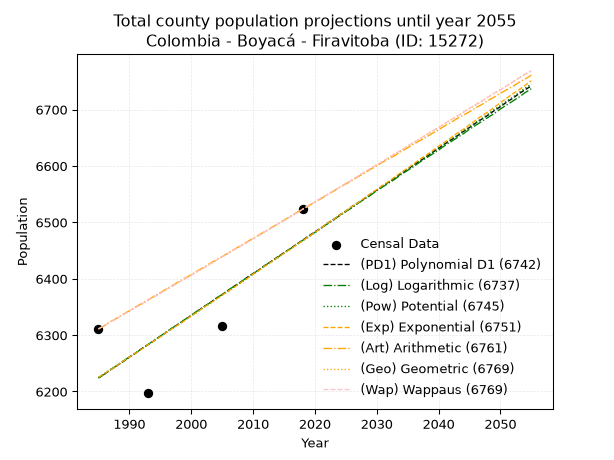
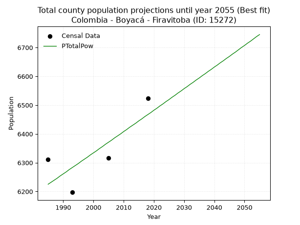
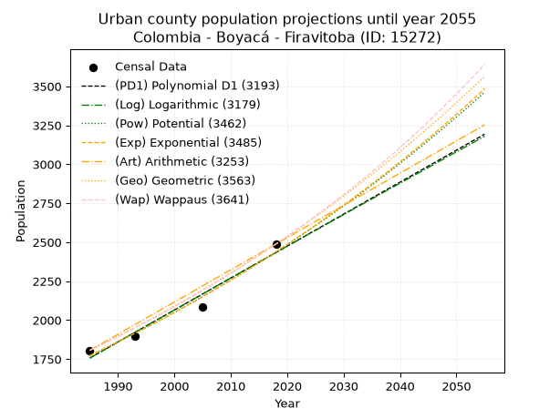
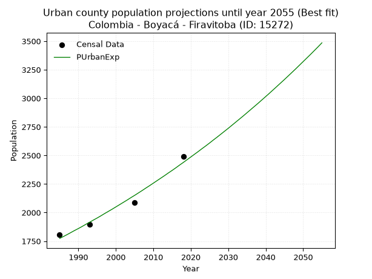
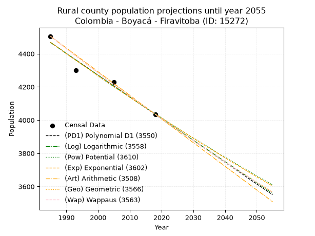
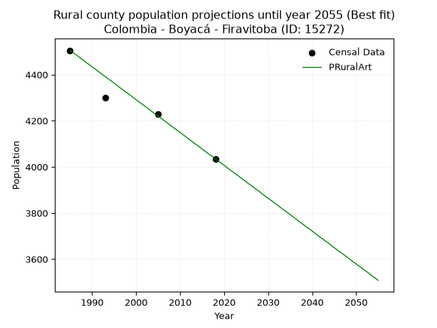

<div align="center">


</div>

# _“Population and Public Services Demand Projections (PPSD) until Year 2050 for Colombia - Boyacá - Firavitoba (ID: 15272)”_
Keywords: `population` `public-service` `projection` `lineal` `polynomial` `logarithmic` `potential` `exponential` `arithmetic` `geometric` `wappaus` `dane` `colombia` `south-america`

PPSD are analytical estimates used by governments and planners to anticipate future changes in population size, age distribution, and the resulting community needs for utilities, healthcare, education, and infrastructure as sizing future water treatment facilities, electrical grids, and road networks based on spatial growth.

> **General running parameters**: • app_version: _v20260806_. • Python version: _3.14.7_. • Pandas version: _3.0.5_. • NumPy version: _2.5.1_. • Creates, save and include plots into reports (create_plot): _False_. • Projection until year: _2050_. • Process polynomial degree 2 and up: _False_. • Process Wappaus: _True_. • Process Wappaus: _True_. • Set negative values to zero: _True_. • Set infinite values to zero: _True_. • Drop dataset notes: _True_. 
<div align="center">

Dynamic map: [:earth_americas:Google](http://maps.google.com/maps?q=5.668884851,-72.9933916) [:earth_americas:OSM](https://www.openstreetmap.org/#map=18/5.668884851/-72.9933916&layers=P) [:earth_americas:Bing](https://www.bing.com/maps?cp=5.668884851~-72.9933916&lvl=18) [:earth_americas:Apple](https://maps.apple.com/frame?center=5.668884851%2C-72.9933916&span=0.003%2C0.006)

</div>


<div align="center">

```geojson
{
  "type": "Feature",
  "geometry": {
    "type": "Point", 
    "coordinates": [-72.9933916, 5.668884851]
  }, 
  "properties": {
    "Name": "Colombia - Boyacá - Firavitoba (ID: 15272)"
  }
}
```

</div>


## 0. Census Data (4 records)

Census data are official statistics collected by a government about the people and housing in a country. They usually include counts of total population, age, sex, race, income, education, and jobs.

📅Global census file: [Population.xlsx](../data/Population.xlsx)

| Source   |   Year |   CountryID | CountryName   |   StateID | StateName   |   CountyID | CountyName   |   PTotal |   PUrban |   PRural |
|:---------|-------:|------------:|:--------------|----------:|:------------|-----------:|:-------------|---------:|---------:|---------:|
| DANE     |   1985 |          57 | Colombia      |        15 | Boyacá      |      15272 | Firavitoba   |     6311 |     1806 |     4505 |
| DANE     |   1993 |          57 | Colombia      |        15 | Boyacá      |      15272 | Firavitoba   |     6197 |     1898 |     4299 |
| DANE     |   2005 |          57 | Colombia      |        15 | Boyacá      |      15272 | Firavitoba   |     6316 |     2087 |     4229 |
| DANE     |   2018 |          57 | Colombia      |        15 | Boyacá      |      15272 | Firavitoba   |     6523 |     2488 |     4035 |

> 🔥Some records has specific notes about the registered values or the corresponding urban or rural distribution.

## 1. Total

### 1.1. Coefficients and Parameters

* (PD1) Polynomial Deg 1: 7.407868325973375, -8480.838619028244 (lineal)
* (Log) Logarithmic: 14802.219921948998, -106175.04224428047
* (Pow) Potential: 2.3178579289696843, -3.84963250925543
* (Exp) Exponential: 0.0011599924556877632, 622.457500326332
* (Art) Arithmetic: Year diff. 2018 - 1985 = 33, Population diff. 6523 - 6311 = 212, Annual growth = 6.424242424242424
* (Geo) Geometric: Year diff. 2018 - 1985 = 33, Population diff. 6523 - 6311 = 212, Annual growth % = 0.0010017210911559271
* (Wap) Wappaus: i = 0.10011286308621511, Condition values only valid for < 200)

<sub>
Wappaus condition values: ['0.00', '0.10', '0.20', '0.30', '0.40', '0.50', '0.60', '0.70', '0.80', '0.90', '1.00', '1.10', '1.20', '1.30', '1.40', '1.50', '1.60', '1.70', '1.80', '1.90', '2.00', '2.10', '2.20', '2.30', '2.40', '2.50', '2.60', '2.70', '2.80', '2.90', '3.00', '3.10', '3.20', '3.30', '3.40', '3.50', '3.60', '3.70', '3.80', '3.90', '4.00', '4.10', '4.20', '4.30', '4.40', '4.51', '4.61', '4.71', '4.81', '4.91', '5.01', '5.11', '5.21', '5.31', '5.41', '5.51', '5.61', '5.71', '5.81', '5.91', '6.01', '6.11', '6.21', '6.31', '6.41', '6.51']
</sub>


### 1.2. Projected Dataset

|   Year |   CountyID |   PTotalPD1 |   PTotalLog |   PTotalPow |   PTotalExp |   PTotalArt |   PTotalGeo |   PTotalWap |
|-------:|-----------:|------------:|------------:|------------:|------------:|------------:|------------:|------------:|
|   1985 |      15272 |        6224 |        6224 |        6225 |        6225 |        6311 |        6311 |        6311 |
|   1986 |      15272 |        6231 |        6231 |        6232 |        6232 |        6317 |        6317 |        6317 |
|   1987 |      15272 |        6239 |        6239 |        6239 |        6239 |        6324 |        6324 |        6324 |
|   1988 |      15272 |        6246 |        6246 |        6246 |        6246 |        6330 |        6330 |        6330 |
|   1989 |      15272 |        6253 |        6254 |        6254 |        6254 |        6337 |        6336 |        6336 |
|   1990 |      15272 |        6261 |        6261 |        6261 |        6261 |        6343 |        6343 |        6343 |
|   1991 |      15272 |        6268 |        6268 |        6268 |        6268 |        6350 |        6349 |        6349 |
|   1992 |      15272 |        6276 |        6276 |        6276 |        6275 |        6356 |        6355 |        6355 |
|   1993 |      15272 |        6283 |        6283 |        6283 |        6283 |        6362 |        6362 |        6362 |
|   1994 |      15272 |        6290 |        6291 |        6290 |        6290 |        6369 |        6368 |        6368 |
|   1995 |      15272 |        6298 |        6298 |        6297 |        6297 |        6375 |        6375 |        6374 |
|   1996 |      15272 |        6305 |        6306 |        6305 |        6305 |        6382 |        6381 |        6381 |
|   1997 |      15272 |        6313 |        6313 |        6312 |        6312 |        6388 |        6387 |        6387 |
|   1998 |      15272 |        6320 |        6320 |        6319 |        6319 |        6395 |        6394 |        6394 |
|   1999 |      15272 |        6327 |        6328 |        6327 |        6326 |        6401 |        6400 |        6400 |
|   2000 |      15272 |        6335 |        6335 |        6334 |        6334 |        6407 |        6406 |        6406 |
|   2001 |      15272 |        6342 |        6343 |        6341 |        6341 |        6414 |        6413 |        6413 |
|   2002 |      15272 |        6350 |        6350 |        6349 |        6349 |        6420 |        6419 |        6419 |
|   2003 |      15272 |        6357 |        6357 |        6356 |        6356 |        6427 |        6426 |        6426 |
|   2004 |      15272 |        6365 |        6365 |        6364 |        6363 |        6433 |        6432 |        6432 |
|   2005 |      15272 |        6372 |        6372 |        6371 |        6371 |        6439 |        6439 |        6439 |
|   2006 |      15272 |        6379 |        6380 |        6378 |        6378 |        6446 |        6445 |        6445 |
|   2007 |      15272 |        6387 |        6387 |        6386 |        6385 |        6452 |        6452 |        6452 |
|   2008 |      15272 |        6394 |        6394 |        6393 |        6393 |        6459 |        6458 |        6458 |
|   2009 |      15272 |        6402 |        6402 |        6400 |        6400 |        6465 |        6464 |        6464 |
|   2010 |      15272 |        6409 |        6409 |        6408 |        6408 |        6472 |        6471 |        6471 |
|   2011 |      15272 |        6416 |        6416 |        6415 |        6415 |        6478 |        6477 |        6477 |
|   2012 |      15272 |        6424 |        6424 |        6423 |        6423 |        6484 |        6484 |        6484 |
|   2013 |      15272 |        6431 |        6431 |        6430 |        6430 |        6491 |        6490 |        6490 |
|   2014 |      15272 |        6439 |        6438 |        6437 |        6438 |        6497 |        6497 |        6497 |
|   2015 |      15272 |        6446 |        6446 |        6445 |        6445 |        6504 |        6503 |        6503 |
|   2016 |      15272 |        6453 |        6453 |        6452 |        6452 |        6510 |        6510 |        6510 |
|   2017 |      15272 |        6461 |        6460 |        6460 |        6460 |        6517 |        6516 |        6516 |
|   2018 |      15272 |        6468 |        6468 |        6467 |        6467 |        6523 |        6523 |        6523 |
|   2019 |      15272 |        6476 |        6475 |        6474 |        6475 |        6529 |        6530 |        6530 |
|   2020 |      15272 |        6483 |        6482 |        6482 |        6482 |        6536 |        6536 |        6536 |
|   2021 |      15272 |        6490 |        6490 |        6489 |        6490 |        6542 |        6543 |        6543 |
|   2022 |      15272 |        6498 |        6497 |        6497 |        6498 |        6549 |        6549 |        6549 |
|   2023 |      15272 |        6505 |        6504 |        6504 |        6505 |        6555 |        6556 |        6556 |
|   2024 |      15272 |        6513 |        6512 |        6512 |        6513 |        6562 |        6562 |        6562 |
|   2025 |      15272 |        6520 |        6519 |        6519 |        6520 |        6568 |        6569 |        6569 |
|   2026 |      15272 |        6528 |        6526 |        6527 |        6528 |        6574 |        6575 |        6575 |
|   2027 |      15272 |        6535 |        6534 |        6534 |        6535 |        6581 |        6582 |        6582 |
|   2028 |      15272 |        6542 |        6541 |        6542 |        6543 |        6587 |        6589 |        6589 |
|   2029 |      15272 |        6550 |        6548 |        6549 |        6551 |        6594 |        6595 |        6595 |
|   2030 |      15272 |        6557 |        6556 |        6557 |        6558 |        6600 |        6602 |        6602 |
|   2031 |      15272 |        6565 |        6563 |        6564 |        6566 |        6607 |        6608 |        6608 |
|   2032 |      15272 |        6572 |        6570 |        6572 |        6573 |        6613 |        6615 |        6615 |
|   2033 |      15272 |        6579 |        6577 |        6579 |        6581 |        6619 |        6622 |        6622 |
|   2034 |      15272 |        6587 |        6585 |        6587 |        6589 |        6626 |        6628 |        6628 |
|   2035 |      15272 |        6594 |        6592 |        6594 |        6596 |        6632 |        6635 |        6635 |
|   2036 |      15272 |        6602 |        6599 |        6602 |        6604 |        6639 |        6642 |        6642 |
|   2037 |      15272 |        6609 |        6607 |        6609 |        6612 |        6645 |        6648 |        6648 |
|   2038 |      15272 |        6616 |        6614 |        6617 |        6619 |        6651 |        6655 |        6655 |
|   2039 |      15272 |        6624 |        6621 |        6624 |        6627 |        6658 |        6662 |        6662 |
|   2040 |      15272 |        6631 |        6628 |        6632 |        6635 |        6664 |        6668 |        6668 |
|   2041 |      15272 |        6639 |        6636 |        6639 |        6642 |        6671 |        6675 |        6675 |
|   2042 |      15272 |        6646 |        6643 |        6647 |        6650 |        6677 |        6682 |        6682 |
|   2043 |      15272 |        6653 |        6650 |        6654 |        6658 |        6684 |        6688 |        6688 |
|   2044 |      15272 |        6661 |        6657 |        6662 |        6665 |        6690 |        6695 |        6695 |
|   2045 |      15272 |        6668 |        6665 |        6669 |        6673 |        6696 |        6702 |        6702 |
|   2046 |      15272 |        6676 |        6672 |        6677 |        6681 |        6703 |        6708 |        6709 |
|   2047 |      15272 |        6683 |        6679 |        6684 |        6689 |        6709 |        6715 |        6715 |
|   2048 |      15272 |        6690 |        6686 |        6692 |        6696 |        6716 |        6722 |        6722 |
|   2049 |      15272 |        6698 |        6693 |        6700 |        6704 |        6722 |        6729 |        6729 |
|   2050 |      15272 |        6705 |        6701 |        6707 |        6712 |        6729 |        6735 |        6735 |
<div align="center">

</img>

</div>


### 1.3. Best fit with absolute error and relative error (%)

Relative error puts that difference into context by dividing the absolute error by the true value, creating a unitless ratio or percentage that shows the scale of the mistake.

Absolute and relative error

|   Year | Source   |   CountryID | CountryName   |   StateID | StateName   |   CountyID_x | CountyName   |   PTotal |   PUrban |   PRural |   CountyID_y |   PTotalPD1 |   PTotalLog |   PTotalPow |   PTotalExp |   PTotalArt |   PTotalGeo |   PTotalWap |   PTotalPD1AbsError |   PTotalLogAbsError |   PTotalPowAbsError |   PTotalExpAbsError |   PTotalArtAbsError |   PTotalGeoAbsError |   PTotalWapAbsError |   PTotalPD1RelError |   PTotalLogRelError |   PTotalPowRelError |   PTotalExpRelError |   PTotalArtRelError |   PTotalGeoRelError |   PTotalWapRelError |
|-------:|:---------|------------:|:--------------|----------:|:------------|-------------:|:-------------|---------:|---------:|---------:|-------------:|------------:|------------:|------------:|------------:|------------:|------------:|------------:|--------------------:|--------------------:|--------------------:|--------------------:|--------------------:|--------------------:|--------------------:|--------------------:|--------------------:|--------------------:|--------------------:|--------------------:|--------------------:|--------------------:|
|   1985 | DANE     |          57 | Colombia      |        15 | Boyacá      |        15272 | Firavitoba   |     6311 |     1806 |     4505 |        15272 |        6224 |        6224 |        6225 |        6225 |        6311 |        6311 |        6311 |                  87 |                  87 |                  86 |                  86 |                   0 |                   0 |                   0 |            1.37855  |            1.37855  |            1.3627   |            1.3627   |             0       |             0       |             0       |
|   1993 | DANE     |          57 | Colombia      |        15 | Boyacá      |        15272 | Firavitoba   |     6197 |     1898 |     4299 |        15272 |        6283 |        6283 |        6283 |        6283 |        6362 |        6362 |        6362 |                  86 |                  86 |                  86 |                  86 |                 165 |                 165 |                 165 |            1.38777  |            1.38777  |            1.38777  |            1.38777  |             2.66258 |             2.66258 |             2.66258 |
|   2005 | DANE     |          57 | Colombia      |        15 | Boyacá      |        15272 | Firavitoba   |     6316 |     2087 |     4229 |        15272 |        6372 |        6372 |        6371 |        6371 |        6439 |        6439 |        6439 |                  56 |                  56 |                  55 |                  55 |                 123 |                 123 |                 123 |            0.886637 |            0.886637 |            0.870804 |            0.870804 |             1.94744 |             1.94744 |             1.94744 |
|   2018 | DANE     |          57 | Colombia      |        15 | Boyacá      |        15272 | Firavitoba   |     6523 |     2488 |     4035 |        15272 |        6468 |        6468 |        6467 |        6467 |        6523 |        6523 |        6523 |                  55 |                  55 |                  56 |                  56 |                   0 |                   0 |                   0 |            0.84317  |            0.84317  |            0.858501 |            0.858501 |             0       |             0       |             0       |

Relative error mean

| Method    |   RelError | Best   |
|:----------|-----------:|:-------|
| PTotalPD1 |    1.12403 |        |
| PTotalLog |    1.12403 |        |
| PTotalPow |    1.11994 | True   |
| PTotalExp |    1.11994 | True   |
| PTotalArt |    1.1525  |        |
| PTotalGeo |    1.1525  |        |
| PTotalWap |    1.1525  |        |

💙Best method: _**PTotalPow**_
<div align="center">

</img>

</div>


### 1.4. Fresh water supply demand in liters per capita per day (lpcd)

The fresh water supply demand typically ranges from 100 to 300 liters per capita per day (lpcd) for standard domestic and municipal planning, though absolute survival minimums set by the World Health Organization are as low as 7.5 to 20 liters per day, and total consumption in high-income nations can exceed 400 liters.

> `CZ`: Level in meters above the sea level (masl).<br> `WS`: Fresh water supply demand in liters per capita per day (lpcd or l/h/d).<br> `WSAll`: Zonal fresh water supply demand in liters per second (l/s).<br> `A`: Zonal area in square meters.

Reference values (RAS Colombia)

|    CZ |   WS |
|------:|-----:|
|  1000 |  120 |
|  2000 |  130 |
| 99999 |  140 |

County shapefile geometry properties and water supply values

|   CountyID |      ATotal |   CZTotal |   WSTotal |
|-----------:|------------:|----------:|----------:|
|      15272 | 1.09118e+08 |   2722.82 |       140 |

Projected values for best method: PTotalPow

|   CountyID |   Year |   PTotalPow |   WSTotal |   WSTotalAll |
|-----------:|-------:|------------:|----------:|-------------:|
|      15272 |   1985 |        6225 |       140 |      10.0868 |
|      15272 |   1986 |        6232 |       140 |      10.0981 |
|      15272 |   1987 |        6239 |       140 |      10.1095 |
|      15272 |   1988 |        6246 |       140 |      10.1208 |
|      15272 |   1989 |        6254 |       140 |      10.1338 |
|      15272 |   1990 |        6261 |       140 |      10.1451 |
|      15272 |   1991 |        6268 |       140 |      10.1565 |
|      15272 |   1992 |        6276 |       140 |      10.1694 |
|      15272 |   1993 |        6283 |       140 |      10.1808 |
|      15272 |   1994 |        6290 |       140 |      10.1921 |
|      15272 |   1995 |        6297 |       140 |      10.2035 |
|      15272 |   1996 |        6305 |       140 |      10.2164 |
|      15272 |   1997 |        6312 |       140 |      10.2278 |
|      15272 |   1998 |        6319 |       140 |      10.2391 |
|      15272 |   1999 |        6327 |       140 |      10.2521 |
|      15272 |   2000 |        6334 |       140 |      10.2634 |
|      15272 |   2001 |        6341 |       140 |      10.2748 |
|      15272 |   2002 |        6349 |       140 |      10.2877 |
|      15272 |   2003 |        6356 |       140 |      10.2991 |
|      15272 |   2004 |        6364 |       140 |      10.312  |
|      15272 |   2005 |        6371 |       140 |      10.3234 |
|      15272 |   2006 |        6378 |       140 |      10.3347 |
|      15272 |   2007 |        6386 |       140 |      10.3477 |
|      15272 |   2008 |        6393 |       140 |      10.359  |
|      15272 |   2009 |        6400 |       140 |      10.3704 |
|      15272 |   2010 |        6408 |       140 |      10.3833 |
|      15272 |   2011 |        6415 |       140 |      10.3947 |
|      15272 |   2012 |        6423 |       140 |      10.4076 |
|      15272 |   2013 |        6430 |       140 |      10.419  |
|      15272 |   2014 |        6437 |       140 |      10.4303 |
|      15272 |   2015 |        6445 |       140 |      10.4433 |
|      15272 |   2016 |        6452 |       140 |      10.4546 |
|      15272 |   2017 |        6460 |       140 |      10.4676 |
|      15272 |   2018 |        6467 |       140 |      10.4789 |
|      15272 |   2019 |        6474 |       140 |      10.4903 |
|      15272 |   2020 |        6482 |       140 |      10.5032 |
|      15272 |   2021 |        6489 |       140 |      10.5146 |
|      15272 |   2022 |        6497 |       140 |      10.5275 |
|      15272 |   2023 |        6504 |       140 |      10.5389 |
|      15272 |   2024 |        6512 |       140 |      10.5519 |
|      15272 |   2025 |        6519 |       140 |      10.5632 |
|      15272 |   2026 |        6527 |       140 |      10.5762 |
|      15272 |   2027 |        6534 |       140 |      10.5875 |
|      15272 |   2028 |        6542 |       140 |      10.6005 |
|      15272 |   2029 |        6549 |       140 |      10.6118 |
|      15272 |   2030 |        6557 |       140 |      10.6248 |
|      15272 |   2031 |        6564 |       140 |      10.6361 |
|      15272 |   2032 |        6572 |       140 |      10.6491 |
|      15272 |   2033 |        6579 |       140 |      10.6604 |
|      15272 |   2034 |        6587 |       140 |      10.6734 |
|      15272 |   2035 |        6594 |       140 |      10.6847 |
|      15272 |   2036 |        6602 |       140 |      10.6977 |
|      15272 |   2037 |        6609 |       140 |      10.709  |
|      15272 |   2038 |        6617 |       140 |      10.722  |
|      15272 |   2039 |        6624 |       140 |      10.7333 |
|      15272 |   2040 |        6632 |       140 |      10.7463 |
|      15272 |   2041 |        6639 |       140 |      10.7576 |
|      15272 |   2042 |        6647 |       140 |      10.7706 |
|      15272 |   2043 |        6654 |       140 |      10.7819 |
|      15272 |   2044 |        6662 |       140 |      10.7949 |
|      15272 |   2045 |        6669 |       140 |      10.8063 |
|      15272 |   2046 |        6677 |       140 |      10.8192 |
|      15272 |   2047 |        6684 |       140 |      10.8306 |
|      15272 |   2048 |        6692 |       140 |      10.8435 |
|      15272 |   2049 |        6700 |       140 |      10.8565 |
|      15272 |   2050 |        6707 |       140 |      10.8678 |

## 2. Urban

### 2.1. Coefficients and Parameters

* (PD1) Polynomial Deg 1: 20.511039743074814, -38957.457246085396 (lineal)
* (Log) Logarithmic: 41034.891684561764, -309836.7905273387
* (Pow) Potential: 19.319602734506116, -60.46287707570089
* (Exp) Exponential: 0.009655818663163921, 8.406414500903934e-06
* (Art) Arithmetic: Year diff. 2018 - 1985 = 33, Population diff. 2488 - 1806 = 682, Annual growth = 20.666666666666668
* (Geo) Geometric: Year diff. 2018 - 1985 = 33, Population diff. 2488 - 1806 = 682, Annual growth % = 0.009755297519065342
* (Wap) Wappaus: i = 0.9625834497748796, Condition values only valid for < 200)

<sub>
Wappaus condition values: ['0.00', '0.96', '1.93', '2.89', '3.85', '4.81', '5.78', '6.74', '7.70', '8.66', '9.63', '10.59', '11.55', '12.51', '13.48', '14.44', '15.40', '16.36', '17.33', '18.29', '19.25', '20.21', '21.18', '22.14', '23.10', '24.06', '25.03', '25.99', '26.95', '27.91', '28.88', '29.84', '30.80', '31.77', '32.73', '33.69', '34.65', '35.62', '36.58', '37.54', '38.50', '39.47', '40.43', '41.39', '42.35', '43.32', '44.28', '45.24', '46.20', '47.17', '48.13', '49.09', '50.05', '51.02', '51.98', '52.94', '53.90', '54.87', '55.83', '56.79', '57.76', '58.72', '59.68', '60.64', '61.61', '62.57']
</sub>


### 2.2. Projected Dataset

|   Year |   CountyID |   PUrbanPD1 |   PUrbanLog |   PUrbanPow |   PUrbanExp |   PUrbanArt |   PUrbanGeo |   PUrbanWap |
|-------:|-----------:|------------:|------------:|------------:|------------:|------------:|------------:|------------:|
|   1985 |      15272 |        1757 |        1756 |        1772 |        1773 |        1806 |        1806 |        1806 |
|   1986 |      15272 |        1777 |        1777 |        1790 |        1790 |        1827 |        1824 |        1823 |
|   1987 |      15272 |        1798 |        1798 |        1807 |        1807 |        1847 |        1841 |        1841 |
|   1988 |      15272 |        1818 |        1818 |        1825 |        1825 |        1868 |        1859 |        1859 |
|   1989 |      15272 |        1839 |        1839 |        1843 |        1843 |        1889 |        1878 |        1877 |
|   1990 |      15272 |        1860 |        1860 |        1861 |        1860 |        1909 |        1896 |        1895 |
|   1991 |      15272 |        1880 |        1880 |        1879 |        1878 |        1930 |        1914 |        1913 |
|   1992 |      15272 |        1901 |        1901 |        1897 |        1897 |        1951 |        1933 |        1932 |
|   1993 |      15272 |        1921 |        1922 |        1916 |        1915 |        1971 |        1952 |        1951 |
|   1994 |      15272 |        1942 |        1942 |        1934 |        1934 |        1992 |        1971 |        1970 |
|   1995 |      15272 |        1962 |        1963 |        1953 |        1952 |        2013 |        1990 |        1989 |
|   1996 |      15272 |        1983 |        1983 |        1972 |        1971 |        2033 |        2010 |        2008 |
|   1997 |      15272 |        2003 |        2004 |        1991 |        1991 |        2054 |        2029 |        2027 |
|   1998 |      15272 |        2024 |        2024 |        2011 |        2010 |        2075 |        2049 |        2047 |
|   1999 |      15272 |        2044 |        2045 |        2030 |        2029 |        2095 |        2069 |        2067 |
|   2000 |      15272 |        2065 |        2065 |        2050 |        2049 |        2116 |        2089 |        2087 |
|   2001 |      15272 |        2085 |        2086 |        2070 |        2069 |        2137 |        2109 |        2107 |
|   2002 |      15272 |        2106 |        2106 |        2090 |        2089 |        2157 |        2130 |        2128 |
|   2003 |      15272 |        2126 |        2127 |        2110 |        2109 |        2178 |        2151 |        2149 |
|   2004 |      15272 |        2147 |        2147 |        2130 |        2130 |        2199 |        2172 |        2170 |
|   2005 |      15272 |        2167 |        2168 |        2151 |        2150 |        2219 |        2193 |        2191 |
|   2006 |      15272 |        2188 |        2188 |        2172 |        2171 |        2240 |        2214 |        2212 |
|   2007 |      15272 |        2208 |        2209 |        2193 |        2192 |        2261 |        2236 |        2234 |
|   2008 |      15272 |        2229 |        2229 |        2214 |        2214 |        2281 |        2258 |        2256 |
|   2009 |      15272 |        2249 |        2250 |        2236 |        2235 |        2302 |        2280 |        2278 |
|   2010 |      15272 |        2270 |        2270 |        2257 |        2257 |        2323 |        2302 |        2300 |
|   2011 |      15272 |        2290 |        2290 |        2279 |        2279 |        2343 |        2325 |        2323 |
|   2012 |      15272 |        2311 |        2311 |        2301 |        2301 |        2364 |        2347 |        2345 |
|   2013 |      15272 |        2331 |        2331 |        2323 |        2323 |        2385 |        2370 |        2369 |
|   2014 |      15272 |        2352 |        2352 |        2346 |        2346 |        2405 |        2393 |        2392 |
|   2015 |      15272 |        2372 |        2372 |        2368 |        2368 |        2426 |        2417 |        2416 |
|   2016 |      15272 |        2393 |        2392 |        2391 |        2391 |        2447 |        2440 |        2439 |
|   2017 |      15272 |        2413 |        2413 |        2414 |        2415 |        2467 |        2464 |        2464 |
|   2018 |      15272 |        2434 |        2433 |        2437 |        2438 |        2488 |        2488 |        2488 |
|   2019 |      15272 |        2454 |        2453 |        2461 |        2462 |        2509 |        2512 |        2513 |
|   2020 |      15272 |        2475 |        2474 |        2484 |        2486 |        2529 |        2537 |        2538 |
|   2021 |      15272 |        2495 |        2494 |        2508 |        2510 |        2550 |        2562 |        2563 |
|   2022 |      15272 |        2516 |        2514 |        2532 |        2534 |        2571 |        2587 |        2589 |
|   2023 |      15272 |        2536 |        2535 |        2557 |        2559 |        2591 |        2612 |        2614 |
|   2024 |      15272 |        2557 |        2555 |        2581 |        2583 |        2612 |        2637 |        2641 |
|   2025 |      15272 |        2577 |        2575 |        2606 |        2608 |        2633 |        2663 |        2667 |
|   2026 |      15272 |        2598 |        2595 |        2631 |        2634 |        2653 |        2689 |        2694 |
|   2027 |      15272 |        2618 |        2616 |        2656 |        2659 |        2674 |        2715 |        2721 |
|   2028 |      15272 |        2639 |        2636 |        2681 |        2685 |        2695 |        2742 |        2749 |
|   2029 |      15272 |        2659 |        2656 |        2707 |        2711 |        2715 |        2768 |        2776 |
|   2030 |      15272 |        2680 |        2676 |        2733 |        2737 |        2736 |        2795 |        2805 |
|   2031 |      15272 |        2700 |        2697 |        2759 |        2764 |        2757 |        2823 |        2833 |
|   2032 |      15272 |        2721 |        2717 |        2785 |        2791 |        2777 |        2850 |        2862 |
|   2033 |      15272 |        2741 |        2737 |        2812 |        2818 |        2798 |        2878 |        2891 |
|   2034 |      15272 |        2762 |        2757 |        2839 |        2845 |        2819 |        2906 |        2921 |
|   2035 |      15272 |        2783 |        2777 |        2866 |        2873 |        2839 |        2934 |        2951 |
|   2036 |      15272 |        2803 |        2797 |        2893 |        2901 |        2860 |        2963 |        2981 |
|   2037 |      15272 |        2824 |        2818 |        2921 |        2929 |        2881 |        2992 |        3012 |
|   2038 |      15272 |        2844 |        2838 |        2949 |        2957 |        2901 |        3021 |        3043 |
|   2039 |      15272 |        2865 |        2858 |        2977 |        2986 |        2922 |        3051 |        3074 |
|   2040 |      15272 |        2885 |        2878 |        3005 |        3015 |        2943 |        3080 |        3106 |
|   2041 |      15272 |        2906 |        2898 |        3034 |        3044 |        2963 |        3110 |        3139 |
|   2042 |      15272 |        2926 |        2918 |        3063 |        3074 |        2984 |        3141 |        3172 |
|   2043 |      15272 |        2947 |        2938 |        3092 |        3104 |        3005 |        3171 |        3205 |
|   2044 |      15272 |        2967 |        2958 |        3121 |        3134 |        3025 |        3202 |        3238 |
|   2045 |      15272 |        2988 |        2978 |        3151 |        3164 |        3046 |        3234 |        3273 |
|   2046 |      15272 |        3008 |        2999 |        3181 |        3195 |        3067 |        3265 |        3307 |
|   2047 |      15272 |        3029 |        3019 |        3211 |        3226 |        3087 |        3297 |        3342 |
|   2048 |      15272 |        3049 |        3039 |        3241 |        3257 |        3108 |        3329 |        3378 |
|   2049 |      15272 |        3070 |        3059 |        3272 |        3289 |        3129 |        3362 |        3414 |
|   2050 |      15272 |        3090 |        3079 |        3303 |        3321 |        3149 |        3394 |        3450 |
<div align="center">

</img>

</div>


### 2.3. Best fit with absolute error and relative error (%)

Relative error puts that difference into context by dividing the absolute error by the true value, creating a unitless ratio or percentage that shows the scale of the mistake.

Absolute and relative error

|   Year | Source   |   CountryID | CountryName   |   StateID | StateName   |   CountyID_x | CountyName   |   PTotal |   PUrban |   PRural |   CountyID_y |   PUrbanPD1 |   PUrbanLog |   PUrbanPow |   PUrbanExp |   PUrbanArt |   PUrbanGeo |   PUrbanWap |   PUrbanPD1AbsError |   PUrbanLogAbsError |   PUrbanPowAbsError |   PUrbanExpAbsError |   PUrbanArtAbsError |   PUrbanGeoAbsError |   PUrbanWapAbsError |   PUrbanPD1RelError |   PUrbanLogRelError |   PUrbanPowRelError |   PUrbanExpRelError |   PUrbanArtRelError |   PUrbanGeoRelError |   PUrbanWapRelError |
|-------:|:---------|------------:|:--------------|----------:|:------------|-------------:|:-------------|---------:|---------:|---------:|-------------:|------------:|------------:|------------:|------------:|------------:|------------:|------------:|--------------------:|--------------------:|--------------------:|--------------------:|--------------------:|--------------------:|--------------------:|--------------------:|--------------------:|--------------------:|--------------------:|--------------------:|--------------------:|--------------------:|
|   1985 | DANE     |          57 | Colombia      |        15 | Boyacá      |        15272 | Firavitoba   |     6311 |     1806 |     4505 |        15272 |        1757 |        1756 |        1772 |        1773 |        1806 |        1806 |        1806 |                  49 |                  50 |                  34 |                  33 |                   0 |                   0 |                   0 |             2.71318 |             2.76855 |            1.88261  |             1.82724 |             0       |             0       |             0       |
|   1993 | DANE     |          57 | Colombia      |        15 | Boyacá      |        15272 | Firavitoba   |     6197 |     1898 |     4299 |        15272 |        1921 |        1922 |        1916 |        1915 |        1971 |        1952 |        1951 |                  23 |                  24 |                  18 |                  17 |                  73 |                  54 |                  53 |             1.2118  |             1.26449 |            0.948367 |             0.89568 |             3.84615 |             2.8451  |             2.79241 |
|   2005 | DANE     |          57 | Colombia      |        15 | Boyacá      |        15272 | Firavitoba   |     6316 |     2087 |     4229 |        15272 |        2167 |        2168 |        2151 |        2150 |        2219 |        2193 |        2191 |                  80 |                  81 |                  64 |                  63 |                 132 |                 106 |                 104 |             3.83325 |             3.88117 |            3.0666   |             3.01869 |             6.32487 |             5.07906 |             4.98323 |
|   2018 | DANE     |          57 | Colombia      |        15 | Boyacá      |        15272 | Firavitoba   |     6523 |     2488 |     4035 |        15272 |        2434 |        2433 |        2437 |        2438 |        2488 |        2488 |        2488 |                  54 |                  55 |                  51 |                  50 |                   0 |                   0 |                   0 |             2.17042 |             2.21061 |            2.04984  |             2.00965 |             0       |             0       |             0       |

Relative error mean

| Method    |   RelError | Best   |
|:----------|-----------:|:-------|
| PUrbanPD1 |    2.48216 |        |
| PUrbanLog |    2.5312  |        |
| PUrbanPow |    1.98686 |        |
| PUrbanExp |    1.93781 | True   |
| PUrbanArt |    2.54276 |        |
| PUrbanGeo |    1.98104 |        |
| PUrbanWap |    1.94391 |        |

💙Best method: _**PUrbanExp**_
<div align="center">

</img>

</div>


### 2.4. Fresh water supply demand in liters per capita per day (lpcd)

The fresh water supply demand typically ranges from 100 to 300 liters per capita per day (lpcd) for standard domestic and municipal planning, though absolute survival minimums set by the World Health Organization are as low as 7.5 to 20 liters per day, and total consumption in high-income nations can exceed 400 liters.

> `CZ`: Level in meters above the sea level (masl).<br> `WS`: Fresh water supply demand in liters per capita per day (lpcd or l/h/d).<br> `WSAll`: Zonal fresh water supply demand in liters per second (l/s).<br> `A`: Zonal area in square meters.

Reference values (RAS Colombia)

|    CZ |   WS |
|------:|-----:|
|  1000 |  120 |
|  2000 |  130 |
| 99999 |  140 |

County shapefile geometry properties and water supply values

|   CountyID |   AUrban |   CZUrban |   WSUrban |
|-----------:|---------:|----------:|----------:|
|      15272 |   711094 |    2492.2 |       140 |

Projected values for best method: PUrbanExp

|   CountyID |   Year |   PUrbanExp |   WSUrban |   WSUrbanAll |
|-----------:|-------:|------------:|----------:|-------------:|
|      15272 |   1985 |        1773 |       140 |      2.87292 |
|      15272 |   1986 |        1790 |       140 |      2.90046 |
|      15272 |   1987 |        1807 |       140 |      2.92801 |
|      15272 |   1988 |        1825 |       140 |      2.95718 |
|      15272 |   1989 |        1843 |       140 |      2.98634 |
|      15272 |   1990 |        1860 |       140 |      3.01389 |
|      15272 |   1991 |        1878 |       140 |      3.04306 |
|      15272 |   1992 |        1897 |       140 |      3.07384 |
|      15272 |   1993 |        1915 |       140 |      3.10301 |
|      15272 |   1994 |        1934 |       140 |      3.1338  |
|      15272 |   1995 |        1952 |       140 |      3.16296 |
|      15272 |   1996 |        1971 |       140 |      3.19375 |
|      15272 |   1997 |        1991 |       140 |      3.22616 |
|      15272 |   1998 |        2010 |       140 |      3.25694 |
|      15272 |   1999 |        2029 |       140 |      3.28773 |
|      15272 |   2000 |        2049 |       140 |      3.32014 |
|      15272 |   2001 |        2069 |       140 |      3.35255 |
|      15272 |   2002 |        2089 |       140 |      3.38495 |
|      15272 |   2003 |        2109 |       140 |      3.41736 |
|      15272 |   2004 |        2130 |       140 |      3.45139 |
|      15272 |   2005 |        2150 |       140 |      3.4838  |
|      15272 |   2006 |        2171 |       140 |      3.51782 |
|      15272 |   2007 |        2192 |       140 |      3.55185 |
|      15272 |   2008 |        2214 |       140 |      3.5875  |
|      15272 |   2009 |        2235 |       140 |      3.62153 |
|      15272 |   2010 |        2257 |       140 |      3.65718 |
|      15272 |   2011 |        2279 |       140 |      3.69282 |
|      15272 |   2012 |        2301 |       140 |      3.72847 |
|      15272 |   2013 |        2323 |       140 |      3.76412 |
|      15272 |   2014 |        2346 |       140 |      3.80139 |
|      15272 |   2015 |        2368 |       140 |      3.83704 |
|      15272 |   2016 |        2391 |       140 |      3.87431 |
|      15272 |   2017 |        2415 |       140 |      3.91319 |
|      15272 |   2018 |        2438 |       140 |      3.95046 |
|      15272 |   2019 |        2462 |       140 |      3.98935 |
|      15272 |   2020 |        2486 |       140 |      4.02824 |
|      15272 |   2021 |        2510 |       140 |      4.06713 |
|      15272 |   2022 |        2534 |       140 |      4.10602 |
|      15272 |   2023 |        2559 |       140 |      4.14653 |
|      15272 |   2024 |        2583 |       140 |      4.18542 |
|      15272 |   2025 |        2608 |       140 |      4.22593 |
|      15272 |   2026 |        2634 |       140 |      4.26806 |
|      15272 |   2027 |        2659 |       140 |      4.30856 |
|      15272 |   2028 |        2685 |       140 |      4.35069 |
|      15272 |   2029 |        2711 |       140 |      4.39282 |
|      15272 |   2030 |        2737 |       140 |      4.43495 |
|      15272 |   2031 |        2764 |       140 |      4.4787  |
|      15272 |   2032 |        2791 |       140 |      4.52245 |
|      15272 |   2033 |        2818 |       140 |      4.5662  |
|      15272 |   2034 |        2845 |       140 |      4.60995 |
|      15272 |   2035 |        2873 |       140 |      4.65532 |
|      15272 |   2036 |        2901 |       140 |      4.70069 |
|      15272 |   2037 |        2929 |       140 |      4.74606 |
|      15272 |   2038 |        2957 |       140 |      4.79144 |
|      15272 |   2039 |        2986 |       140 |      4.83843 |
|      15272 |   2040 |        3015 |       140 |      4.88542 |
|      15272 |   2041 |        3044 |       140 |      4.93241 |
|      15272 |   2042 |        3074 |       140 |      4.98102 |
|      15272 |   2043 |        3104 |       140 |      5.02963 |
|      15272 |   2044 |        3134 |       140 |      5.07824 |
|      15272 |   2045 |        3164 |       140 |      5.12685 |
|      15272 |   2046 |        3195 |       140 |      5.17708 |
|      15272 |   2047 |        3226 |       140 |      5.22731 |
|      15272 |   2048 |        3257 |       140 |      5.27755 |
|      15272 |   2049 |        3289 |       140 |      5.3294  |
|      15272 |   2050 |        3321 |       140 |      5.38125 |

## 3. Rural

### 3.1. Coefficients and Parameters

* (PD1) Polynomial Deg 1: -13.103171417101459, 30476.618627057196 (lineal)
* (Log) Logarithmic: -26232.671762612725, 203661.74828305788
* (Pow) Potential: -6.161476352470645, 23.969286574558595
* (Exp) Exponential: -0.0030777836246551867, 2011170.6458999468
* (Art) Arithmetic: Year diff. 2018 - 1985 = 33, Population diff. 4035 - 4505 = -470, Annual growth = -14.242424242424242
* (Geo) Geometric: Year diff. 2018 - 1985 = 33, Population diff. 4035 - 4505 = -470, Annual growth % = -0.003333268325790395
* (Wap) Wappaus: i = -0.33354623518557946, Condition values only valid for < 200)

<sub>
Wappaus condition values: ['-0.00', '-0.33', '-0.67', '-1.00', '-1.33', '-1.67', '-2.00', '-2.33', '-2.67', '-3.00', '-3.34', '-3.67', '-4.00', '-4.34', '-4.67', '-5.00', '-5.34', '-5.67', '-6.00', '-6.34', '-6.67', '-7.00', '-7.34', '-7.67', '-8.01', '-8.34', '-8.67', '-9.01', '-9.34', '-9.67', '-10.01', '-10.34', '-10.67', '-11.01', '-11.34', '-11.67', '-12.01', '-12.34', '-12.67', '-13.01', '-13.34', '-13.68', '-14.01', '-14.34', '-14.68', '-15.01', '-15.34', '-15.68', '-16.01', '-16.34', '-16.68', '-17.01', '-17.34', '-17.68', '-18.01', '-18.35', '-18.68', '-19.01', '-19.35', '-19.68', '-20.01', '-20.35', '-20.68', '-21.01', '-21.35', '-21.68']
</sub>


### 3.2. Projected Dataset

|   Year |   CountyID |   PRuralPD1 |   PRuralLog |   PRuralPow |   PRuralExp |   PRuralArt |   PRuralGeo |   PRuralWap |
|-------:|-----------:|------------:|------------:|------------:|------------:|------------:|------------:|------------:|
|   1985 |      15272 |        4467 |        4467 |        4469 |        4469 |        4505 |        4505 |        4505 |
|   1986 |      15272 |        4454 |        4454 |        4455 |        4455 |        4491 |        4490 |        4490 |
|   1987 |      15272 |        4441 |        4441 |        4441 |        4441 |        4477 |        4475 |        4475 |
|   1988 |      15272 |        4428 |        4428 |        4428 |        4428 |        4462 |        4460 |        4460 |
|   1989 |      15272 |        4414 |        4414 |        4414 |        4414 |        4448 |        4445 |        4445 |
|   1990 |      15272 |        4401 |        4401 |        4400 |        4400 |        4434 |        4430 |        4430 |
|   1991 |      15272 |        4388 |        4388 |        4387 |        4387 |        4420 |        4416 |        4416 |
|   1992 |      15272 |        4375 |        4375 |        4373 |        4373 |        4405 |        4401 |        4401 |
|   1993 |      15272 |        4362 |        4362 |        4360 |        4360 |        4391 |        4386 |        4386 |
|   1994 |      15272 |        4349 |        4349 |        4346 |        4347 |        4377 |        4372 |        4372 |
|   1995 |      15272 |        4336 |        4335 |        4333 |        4333 |        4363 |        4357 |        4357 |
|   1996 |      15272 |        4323 |        4322 |        4319 |        4320 |        4348 |        4343 |        4343 |
|   1997 |      15272 |        4310 |        4309 |        4306 |        4307 |        4334 |        4328 |        4328 |
|   1998 |      15272 |        4296 |        4296 |        4293 |        4293 |        4320 |        4314 |        4314 |
|   1999 |      15272 |        4283 |        4283 |        4280 |        4280 |        4306 |        4299 |        4299 |
|   2000 |      15272 |        4270 |        4270 |        4266 |        4267 |        4291 |        4285 |        4285 |
|   2001 |      15272 |        4257 |        4257 |        4253 |        4254 |        4277 |        4271 |        4271 |
|   2002 |      15272 |        4244 |        4244 |        4240 |        4241 |        4263 |        4256 |        4257 |
|   2003 |      15272 |        4231 |        4230 |        4227 |        4228 |        4249 |        4242 |        4242 |
|   2004 |      15272 |        4218 |        4217 |        4214 |        4215 |        4234 |        4228 |        4228 |
|   2005 |      15272 |        4205 |        4204 |        4201 |        4202 |        4220 |        4214 |        4214 |
|   2006 |      15272 |        4192 |        4191 |        4188 |        4189 |        4206 |        4200 |        4200 |
|   2007 |      15272 |        4179 |        4178 |        4176 |        4176 |        4192 |        4186 |        4186 |
|   2008 |      15272 |        4165 |        4165 |        4163 |        4163 |        4177 |        4172 |        4172 |
|   2009 |      15272 |        4152 |        4152 |        4150 |        4150 |        4163 |        4158 |        4158 |
|   2010 |      15272 |        4139 |        4139 |        4137 |        4138 |        4149 |        4144 |        4144 |
|   2011 |      15272 |        4126 |        4126 |        4125 |        4125 |        4135 |        4130 |        4131 |
|   2012 |      15272 |        4113 |        4113 |        4112 |        4112 |        4120 |        4117 |        4117 |
|   2013 |      15272 |        4100 |        4100 |        4100 |        4100 |        4106 |        4103 |        4103 |
|   2014 |      15272 |        4087 |        4087 |        4087 |        4087 |        4092 |        4089 |        4089 |
|   2015 |      15272 |        4074 |        4074 |        4074 |        4074 |        4078 |        4076 |        4076 |
|   2016 |      15272 |        4061 |        4061 |        4062 |        4062 |        4063 |        4062 |        4062 |
|   2017 |      15272 |        4048 |        4048 |        4050 |        4049 |        4049 |        4048 |        4049 |
|   2018 |      15272 |        4034 |        4035 |        4037 |        4037 |        4035 |        4035 |        4035 |
|   2019 |      15272 |        4021 |        4022 |        4025 |        4025 |        4021 |        4022 |        4022 |
|   2020 |      15272 |        4008 |        4009 |        4013 |        4012 |        4007 |        4008 |        4008 |
|   2021 |      15272 |        3995 |        3996 |        4001 |        4000 |        3992 |        3995 |        3995 |
|   2022 |      15272 |        3982 |        3983 |        3988 |        3988 |        3978 |        3981 |        3981 |
|   2023 |      15272 |        3969 |        3970 |        3976 |        3975 |        3964 |        3968 |        3968 |
|   2024 |      15272 |        3956 |        3957 |        3964 |        3963 |        3950 |        3955 |        3955 |
|   2025 |      15272 |        3943 |        3944 |        3952 |        3951 |        3935 |        3942 |        3942 |
|   2026 |      15272 |        3930 |        3931 |        3940 |        3939 |        3921 |        3929 |        3928 |
|   2027 |      15272 |        3916 |        3918 |        3928 |        3927 |        3907 |        3916 |        3915 |
|   2028 |      15272 |        3903 |        3905 |        3916 |        3915 |        3893 |        3903 |        3902 |
|   2029 |      15272 |        3890 |        3892 |        3904 |        3903 |        3878 |        3889 |        3889 |
|   2030 |      15272 |        3877 |        3879 |        3892 |        3891 |        3864 |        3877 |        3876 |
|   2031 |      15272 |        3864 |        3866 |        3881 |        3879 |        3850 |        3864 |        3863 |
|   2032 |      15272 |        3851 |        3853 |        3869 |        3867 |        3836 |        3851 |        3850 |
|   2033 |      15272 |        3838 |        3840 |        3857 |        3855 |        3821 |        3838 |        3837 |
|   2034 |      15272 |        3825 |        3828 |        3846 |        3843 |        3807 |        3825 |        3824 |
|   2035 |      15272 |        3812 |        3815 |        3834 |        3831 |        3793 |        3812 |        3812 |
|   2036 |      15272 |        3799 |        3802 |        3822 |        3819 |        3779 |        3800 |        3799 |
|   2037 |      15272 |        3785 |        3789 |        3811 |        3808 |        3764 |        3787 |        3786 |
|   2038 |      15272 |        3772 |        3776 |        3799 |        3796 |        3750 |        3774 |        3773 |
|   2039 |      15272 |        3759 |        3763 |        3788 |        3784 |        3736 |        3762 |        3761 |
|   2040 |      15272 |        3746 |        3750 |        3776 |        3773 |        3722 |        3749 |        3748 |
|   2041 |      15272 |        3733 |        3737 |        3765 |        3761 |        3707 |        3737 |        3735 |
|   2042 |      15272 |        3720 |        3725 |        3754 |        3750 |        3693 |        3724 |        3723 |
|   2043 |      15272 |        3707 |        3712 |        3742 |        3738 |        3679 |        3712 |        3710 |
|   2044 |      15272 |        3694 |        3699 |        3731 |        3727 |        3665 |        3699 |        3698 |
|   2045 |      15272 |        3681 |        3686 |        3720 |        3715 |        3650 |        3687 |        3685 |
|   2046 |      15272 |        3668 |        3673 |        3709 |        3704 |        3636 |        3675 |        3673 |
|   2047 |      15272 |        3654 |        3660 |        3698 |        3692 |        3622 |        3663 |        3661 |
|   2048 |      15272 |        3641 |        3648 |        3686 |        3681 |        3608 |        3650 |        3648 |
|   2049 |      15272 |        3628 |        3635 |        3675 |        3670 |        3593 |        3638 |        3636 |
|   2050 |      15272 |        3615 |        3622 |        3664 |        3658 |        3579 |        3626 |        3624 |
<div align="center">

</img>

</div>


### 3.3. Best fit with absolute error and relative error (%)

Relative error puts that difference into context by dividing the absolute error by the true value, creating a unitless ratio or percentage that shows the scale of the mistake.

Absolute and relative error

|   Year | Source   |   CountryID | CountryName   |   StateID | StateName   |   CountyID_x | CountyName   |   PTotal |   PUrban |   PRural |   CountyID_y |   PRuralPD1 |   PRuralLog |   PRuralPow |   PRuralExp |   PRuralArt |   PRuralGeo |   PRuralWap |   PRuralPD1AbsError |   PRuralLogAbsError |   PRuralPowAbsError |   PRuralExpAbsError |   PRuralArtAbsError |   PRuralGeoAbsError |   PRuralWapAbsError |   PRuralPD1RelError |   PRuralLogRelError |   PRuralPowRelError |   PRuralExpRelError |   PRuralArtRelError |   PRuralGeoRelError |   PRuralWapRelError |
|-------:|:---------|------------:|:--------------|----------:|:------------|-------------:|:-------------|---------:|---------:|---------:|-------------:|------------:|------------:|------------:|------------:|------------:|------------:|------------:|--------------------:|--------------------:|--------------------:|--------------------:|--------------------:|--------------------:|--------------------:|--------------------:|--------------------:|--------------------:|--------------------:|--------------------:|--------------------:|--------------------:|
|   1985 | DANE     |          57 | Colombia      |        15 | Boyacá      |        15272 | Firavitoba   |     6311 |     1806 |     4505 |        15272 |        4467 |        4467 |        4469 |        4469 |        4505 |        4505 |        4505 |                  38 |                  38 |                  36 |                  36 |                   0 |                   0 |                   0 |           0.843507  |            0.843507 |           0.799112  |           0.799112  |            0        |            0        |            0        |
|   1993 | DANE     |          57 | Colombia      |        15 | Boyacá      |        15272 | Firavitoba   |     6197 |     1898 |     4299 |        15272 |        4362 |        4362 |        4360 |        4360 |        4391 |        4386 |        4386 |                  63 |                  63 |                  61 |                  61 |                  92 |                  87 |                  87 |           1.46546   |            1.46546  |           1.41893   |           1.41893   |            2.14003  |            2.02373  |            2.02373  |
|   2005 | DANE     |          57 | Colombia      |        15 | Boyacá      |        15272 | Firavitoba   |     6316 |     2087 |     4229 |        15272 |        4205 |        4204 |        4201 |        4202 |        4220 |        4214 |        4214 |                  24 |                  25 |                  28 |                  27 |                   9 |                  15 |                  15 |           0.56751   |            0.591156 |           0.662095  |           0.638449  |            0.212816 |            0.354694 |            0.354694 |
|   2018 | DANE     |          57 | Colombia      |        15 | Boyacá      |        15272 | Firavitoba   |     6523 |     2488 |     4035 |        15272 |        4034 |        4035 |        4037 |        4037 |        4035 |        4035 |        4035 |                   1 |                   0 |                   2 |                   2 |                   0 |                   0 |                   0 |           0.0247831 |            0        |           0.0495663 |           0.0495663 |            0        |            0        |            0        |

Relative error mean

| Method    |   RelError | Best   |
|:----------|-----------:|:-------|
| PRuralPD1 |   0.725314 |        |
| PRuralLog |   0.72503  |        |
| PRuralPow |   0.732427 |        |
| PRuralExp |   0.726515 |        |
| PRuralArt |   0.588212 | True   |
| PRuralGeo |   0.594605 |        |
| PRuralWap |   0.594605 |        |

💙Best method: _**PRuralArt**_
<div align="center">

</img>

</div>


### 3.4. Fresh water supply demand in liters per capita per day (lpcd)

The fresh water supply demand typically ranges from 100 to 300 liters per capita per day (lpcd) for standard domestic and municipal planning, though absolute survival minimums set by the World Health Organization are as low as 7.5 to 20 liters per day, and total consumption in high-income nations can exceed 400 liters.

> `CZ`: Level in meters above the sea level (masl).<br> `WS`: Fresh water supply demand in liters per capita per day (lpcd or l/h/d).<br> `WSAll`: Zonal fresh water supply demand in liters per second (l/s).<br> `A`: Zonal area in square meters.

Reference values (RAS Colombia)

|    CZ |   WS |
|------:|-----:|
|  1000 |  120 |
|  2000 |  130 |
| 99999 |  140 |

County shapefile geometry properties and water supply values

|   CountyID |      ARural |   CZRural |   WSRural |
|-----------:|------------:|----------:|----------:|
|      15272 | 1.08406e+08 |   2724.29 |       140 |

Projected values for best method: PRuralArt

|   CountyID |   Year |   PRuralArt |   WSRural |   WSRuralAll |
|-----------:|-------:|------------:|----------:|-------------:|
|      15272 |   1985 |        4505 |       140 |      7.29977 |
|      15272 |   1986 |        4491 |       140 |      7.27708 |
|      15272 |   1987 |        4477 |       140 |      7.2544  |
|      15272 |   1988 |        4462 |       140 |      7.23009 |
|      15272 |   1989 |        4448 |       140 |      7.20741 |
|      15272 |   1990 |        4434 |       140 |      7.18472 |
|      15272 |   1991 |        4420 |       140 |      7.16204 |
|      15272 |   1992 |        4405 |       140 |      7.13773 |
|      15272 |   1993 |        4391 |       140 |      7.11505 |
|      15272 |   1994 |        4377 |       140 |      7.09236 |
|      15272 |   1995 |        4363 |       140 |      7.06968 |
|      15272 |   1996 |        4348 |       140 |      7.04537 |
|      15272 |   1997 |        4334 |       140 |      7.02269 |
|      15272 |   1998 |        4320 |       140 |      7       |
|      15272 |   1999 |        4306 |       140 |      6.97731 |
|      15272 |   2000 |        4291 |       140 |      6.95301 |
|      15272 |   2001 |        4277 |       140 |      6.93032 |
|      15272 |   2002 |        4263 |       140 |      6.90764 |
|      15272 |   2003 |        4249 |       140 |      6.88495 |
|      15272 |   2004 |        4234 |       140 |      6.86065 |
|      15272 |   2005 |        4220 |       140 |      6.83796 |
|      15272 |   2006 |        4206 |       140 |      6.81528 |
|      15272 |   2007 |        4192 |       140 |      6.79259 |
|      15272 |   2008 |        4177 |       140 |      6.76829 |
|      15272 |   2009 |        4163 |       140 |      6.7456  |
|      15272 |   2010 |        4149 |       140 |      6.72292 |
|      15272 |   2011 |        4135 |       140 |      6.70023 |
|      15272 |   2012 |        4120 |       140 |      6.67593 |
|      15272 |   2013 |        4106 |       140 |      6.65324 |
|      15272 |   2014 |        4092 |       140 |      6.63056 |
|      15272 |   2015 |        4078 |       140 |      6.60787 |
|      15272 |   2016 |        4063 |       140 |      6.58356 |
|      15272 |   2017 |        4049 |       140 |      6.56088 |
|      15272 |   2018 |        4035 |       140 |      6.53819 |
|      15272 |   2019 |        4021 |       140 |      6.51551 |
|      15272 |   2020 |        4007 |       140 |      6.49282 |
|      15272 |   2021 |        3992 |       140 |      6.46852 |
|      15272 |   2022 |        3978 |       140 |      6.44583 |
|      15272 |   2023 |        3964 |       140 |      6.42315 |
|      15272 |   2024 |        3950 |       140 |      6.40046 |
|      15272 |   2025 |        3935 |       140 |      6.37616 |
|      15272 |   2026 |        3921 |       140 |      6.35347 |
|      15272 |   2027 |        3907 |       140 |      6.33079 |
|      15272 |   2028 |        3893 |       140 |      6.3081  |
|      15272 |   2029 |        3878 |       140 |      6.2838  |
|      15272 |   2030 |        3864 |       140 |      6.26111 |
|      15272 |   2031 |        3850 |       140 |      6.23843 |
|      15272 |   2032 |        3836 |       140 |      6.21574 |
|      15272 |   2033 |        3821 |       140 |      6.19144 |
|      15272 |   2034 |        3807 |       140 |      6.16875 |
|      15272 |   2035 |        3793 |       140 |      6.14606 |
|      15272 |   2036 |        3779 |       140 |      6.12338 |
|      15272 |   2037 |        3764 |       140 |      6.09907 |
|      15272 |   2038 |        3750 |       140 |      6.07639 |
|      15272 |   2039 |        3736 |       140 |      6.0537  |
|      15272 |   2040 |        3722 |       140 |      6.03102 |
|      15272 |   2041 |        3707 |       140 |      6.00671 |
|      15272 |   2042 |        3693 |       140 |      5.98403 |
|      15272 |   2043 |        3679 |       140 |      5.96134 |
|      15272 |   2044 |        3665 |       140 |      5.93866 |
|      15272 |   2045 |        3650 |       140 |      5.91435 |
|      15272 |   2046 |        3636 |       140 |      5.89167 |
|      15272 |   2047 |        3622 |       140 |      5.86898 |
|      15272 |   2048 |        3608 |       140 |      5.8463  |
|      15272 |   2049 |        3593 |       140 |      5.82199 |
|      15272 |   2050 |        3579 |       140 |      5.79931 |

<div align="center"><br><sub>Share this research</sub></div><br>

<sub>**APPS & TOOLS & CONTENT DISCLAIMER**: • NO WARRANTY - This content and software is provided by <a href="https://github.com/rcfdtools" target="_blank">github.com/rcfdtools</a> "as is", without any express or implied warranty, including warranties of merchantability, fitness for a particular purpose, or non-infringement. There is no guarantee that the software will be error-free or operate without interruption. • LIMITATION OF LIABILITY - Neither the authors nor copyright holders will be liable for claims or damages arising from the software or its use. You are responsible for determining if the software is appropriate for your use and assume all associated risks, including errors, legal compliance, and data loss. • NO PROFESSIONAL ADVICE - The software provides general information and does not offer professional advice. It should not replace consultation with professional advisors. [Clauses and global license for rcfdtools use.](https://github.com/rcfdtools/rcfdtools/blob/main/LICENSE.md)</sub>