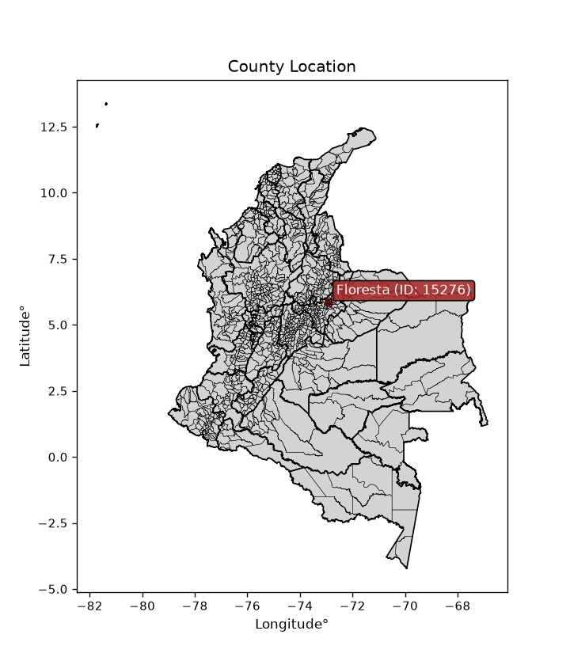
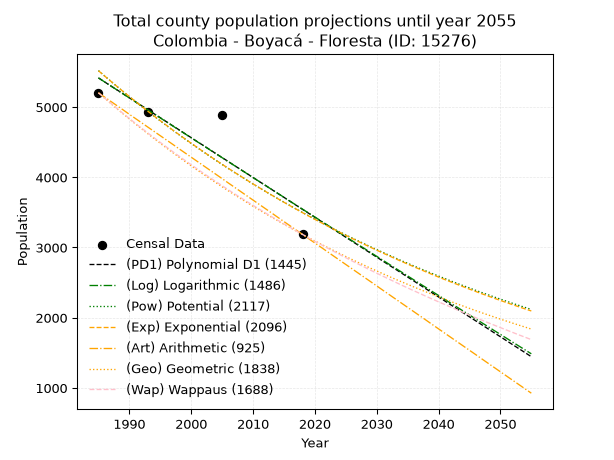
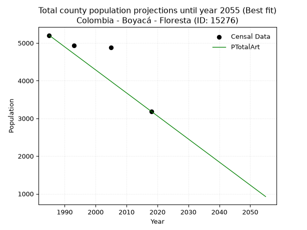
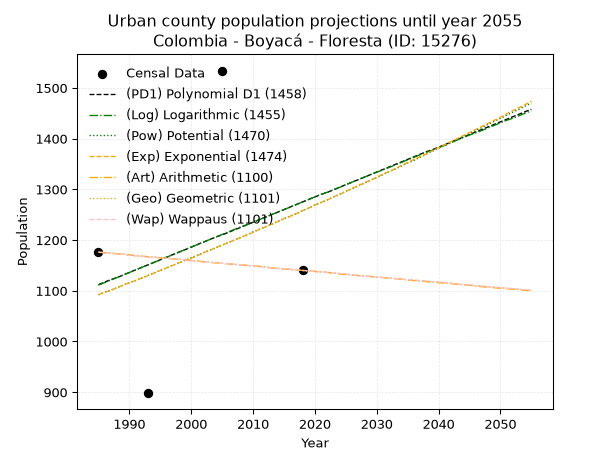
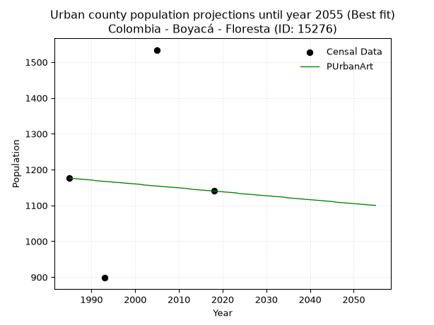
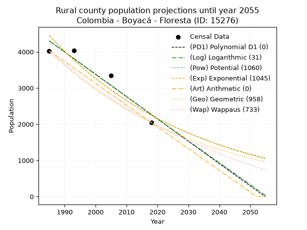
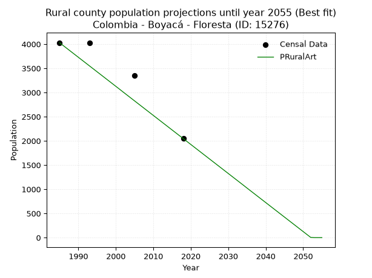

<div align="center">


</div>

# _“Population and Public Services Demand Projections (PPSD) until Year 2050 for Colombia - Boyacá - Floresta (ID: 15276)”_
Keywords: `population` `public-service` `projection` `lineal` `polynomial` `logarithmic` `potential` `exponential` `arithmetic` `geometric` `wappaus` `dane` `colombia` `south-america`

PPSD are analytical estimates used by governments and planners to anticipate future changes in population size, age distribution, and the resulting community needs for utilities, healthcare, education, and infrastructure as sizing future water treatment facilities, electrical grids, and road networks based on spatial growth.

> **General running parameters**: • app_version: _v20260806_. • Python version: _3.14.7_. • Pandas version: _3.0.5_. • NumPy version: _2.5.1_. • Creates, save and include plots into reports (create_plot): _False_. • Projection until year: _2050_. • Process polynomial degree 2 and up: _False_. • Process Wappaus: _True_. • Process Wappaus: _True_. • Set negative values to zero: _True_. • Set infinite values to zero: _True_. • Drop dataset notes: _True_. 
<div align="center">

Dynamic map: [:earth_americas:Google](http://maps.google.com/maps?q=5.859519124,-72.9181113) [:earth_americas:OSM](https://www.openstreetmap.org/#map=18/5.859519124/-72.9181113&layers=P) [:earth_americas:Bing](https://www.bing.com/maps?cp=5.859519124~-72.9181113&lvl=18) [:earth_americas:Apple](https://maps.apple.com/frame?center=5.859519124%2C-72.9181113&span=0.003%2C0.006)

</div>


<div align="center">

```geojson
{
  "type": "Feature",
  "geometry": {
    "type": "Point", 
    "coordinates": [-72.9181113, 5.859519124]
  }, 
  "properties": {
    "Name": "Colombia - Boyacá - Floresta (ID: 15276)"
  }
}
```

</div>


<div align="center">

</img>

</div>


## 0. Census Data (4 records)

Census data are official statistics collected by a government about the people and housing in a country. They usually include counts of total population, age, sex, race, income, education, and jobs.

📅Global census file: [Population.xlsx](../data/Population.xlsx)

| Source   |   Year |   CountryID | CountryName   |   StateID | StateName   |   CountyID | CountyName   |   PTotal |   PUrban |   PRural |
|:---------|-------:|------------:|:--------------|----------:|:------------|-----------:|:-------------|---------:|---------:|---------:|
| DANE     |   1985 |          57 | Colombia      |        15 | Boyacá      |      15276 | Floresta     |     5203 |     1176 |     4027 |
| DANE     |   1993 |          57 | Colombia      |        15 | Boyacá      |      15276 | Floresta     |     4927 |      898 |     4029 |
| DANE     |   2005 |          57 | Colombia      |        15 | Boyacá      |      15276 | Floresta     |     4884 |     1534 |     3350 |
| DANE     |   2018 |          57 | Colombia      |        15 | Boyacá      |      15276 | Floresta     |     3186 |     1140 |     2046 |

> 🔥Some records could had specific notes about the registered values or the corresponding urban or rural distribution.

📅   [RUPS](https://www.datos.gov.co/Hacienda-y-Cr-dito-P-blico/Registro-nico-de-Prestadores-de-Servicios-P-blicos/4qkq-csdn/about_data) - Local public utility companies: [RUPS.csv](../data/RUPS.xlsx)

 | SERVICIO       | ESTADO    | NOMBRE                                                            | NIT         | DEPARTAMENTO_DOMICILIO   | MUNICIPIO_DOMICILIO   | DIRECCION             |   TELEFONO | EMAIL                     | TIPO_PRESTADOR                 | CLASIFICACION                 |
|:---------------|:----------|:------------------------------------------------------------------|:------------|:-------------------------|:----------------------|:----------------------|-----------:|:--------------------------|:-------------------------------|:------------------------------|
| ALCANTARILLADO | OPERATIVA | MUNICIPIO DE FLORESTA                                             | 800026368-1 | BOYACA                   | FLORESTA              | PALACIO MUNICIPAL     |    7863094 | andreita227_6@hotmail.com | MUNICIPIO (PRESTACIÓN DIRECTA) | HASTA 2500 SUSCRIPTORES       |
| ACUEDUCTO      | OPERATIVA | EMPRESA SOLIDARIA DE SERVICIOS PUBLICOS DEL MUNICIPIO DE FLORESTA | 900303661-4 | BOYACA                   | FLORESTA              | Calle 3 No. 3 - 22    |    7863094 | dumaro3019@hotmail.com    | ORGANIZACION AUTORIZADA        | MENOR O IGUAL A 2500 USUARIOS |
| ALCANTARILLADO | OPERATIVA | EMPRESA SOLIDARIA DE SERVICIOS PUBLICOS DEL MUNICIPIO DE FLORESTA | 900303661-4 | BOYACA                   | FLORESTA              | Calle 3 No. 3 - 22    |    7863094 | dumaro3019@hotmail.com    | ORGANIZACION AUTORIZADA        | MENOR O IGUAL A 2500 USUARIOS |
| ACUEDUCTO      | OPERATIVA | ASOCIACIÒN DE USUARIOS DEL ACUEDUCTO DE TOBASIA                   | 900278617-2 | BOYACA                   | FLORESTA              | Salon Comunal Tobasia |    0000000 | jorozcoguecha@yahoo.com   | ORGANIZACION AUTORIZADA        | HASTA 2500 SUSCRIPTORES       |

## 1. Total

### 1.1. Coefficients and Parameters

* (PD1) Polynomial Deg 1: -56.7097551184253, 117983.68767563021 (lineal)
* (Log) Logarithmic: -113391.09639961935, 866436.6323927266
* (Pow) Potential: -27.64603860896811, 94.91188449909984
* (Exp) Exponential: -0.013827703315829757, 4595219619385150.0
* (Art) Arithmetic: Year diff. 2018 - 1985 = 33, Population diff. 3186 - 5203 = -2017, Annual growth = -61.121212121212125
* (Geo) Geometric: Year diff. 2018 - 1985 = 33, Population diff. 3186 - 5203 = -2017, Annual growth % = -0.014752797356298863
* (Wap) Wappaus: i = -1.457175160834715, Condition values only valid for < 200)

<sub>
Wappaus condition values: ['-0.00', '-1.46', '-2.91', '-4.37', '-5.83', '-7.29', '-8.74', '-10.20', '-11.66', '-13.11', '-14.57', '-16.03', '-17.49', '-18.94', '-20.40', '-21.86', '-23.31', '-24.77', '-26.23', '-27.69', '-29.14', '-30.60', '-32.06', '-33.52', '-34.97', '-36.43', '-37.89', '-39.34', '-40.80', '-42.26', '-43.72', '-45.17', '-46.63', '-48.09', '-49.54', '-51.00', '-52.46', '-53.92', '-55.37', '-56.83', '-58.29', '-59.74', '-61.20', '-62.66', '-64.12', '-65.57', '-67.03', '-68.49', '-69.94', '-71.40', '-72.86', '-74.32', '-75.77', '-77.23', '-78.69', '-80.14', '-81.60', '-83.06', '-84.52', '-85.97', '-87.43', '-88.89', '-90.34', '-91.80', '-93.26', '-94.72']
</sub>


### 1.2. Projected Dataset

|   Year |   CountyID |   PTotalPD1 |   PTotalLog |   PTotalPow |   PTotalExp |   PTotalArt |   PTotalGeo |   PTotalWap |
|-------:|-----------:|------------:|------------:|------------:|------------:|------------:|------------:|------------:|
|   1985 |      15276 |        5415 |        5416 |        5519 |        5518 |        5203 |        5203 |        5203 |
|   1986 |      15276 |        5358 |        5358 |        5443 |        5442 |        5142 |        5126 |        5128 |
|   1987 |      15276 |        5301 |        5301 |        5368 |        5368 |        5081 |        5051 |        5054 |
|   1988 |      15276 |        5245 |        5244 |        5293 |        5294 |        5020 |        4976 |        4980 |
|   1989 |      15276 |        5188 |        5187 |        5220 |        5221 |        4959 |        4903 |        4908 |
|   1990 |      15276 |        5131 |        5130 |        5148 |        5150 |        4897 |        4830 |        4837 |
|   1991 |      15276 |        5075 |        5073 |        5077 |        5079 |        4836 |        4759 |        4767 |
|   1992 |      15276 |        5018 |        5016 |        5007 |        5009 |        4775 |        4689 |        4698 |
|   1993 |      15276 |        4961 |        4960 |        4938 |        4940 |        4714 |        4620 |        4630 |
|   1994 |      15276 |        4904 |        4903 |        4870 |        4872 |        4653 |        4552 |        4563 |
|   1995 |      15276 |        4848 |        4846 |        4803 |        4806 |        4592 |        4484 |        4496 |
|   1996 |      15276 |        4791 |        4789 |        4737 |        4740 |        4531 |        4418 |        4431 |
|   1997 |      15276 |        4734 |        4732 |        4672 |        4674 |        4470 |        4353 |        4366 |
|   1998 |      15276 |        4678 |        4675 |        4608 |        4610 |        4408 |        4289 |        4303 |
|   1999 |      15276 |        4621 |        4619 |        4545 |        4547 |        4347 |        4226 |        4240 |
|   2000 |      15276 |        4564 |        4562 |        4482 |        4485 |        4286 |        4163 |        4178 |
|   2001 |      15276 |        4507 |        4505 |        4421 |        4423 |        4225 |        4102 |        4117 |
|   2002 |      15276 |        4451 |        4449 |        4360 |        4362 |        4164 |        4041 |        4056 |
|   2003 |      15276 |        4394 |        4392 |        4300 |        4302 |        4103 |        3982 |        3997 |
|   2004 |      15276 |        4337 |        4335 |        4241 |        4243 |        4042 |        3923 |        3938 |
|   2005 |      15276 |        4281 |        4279 |        4183 |        4185 |        3981 |        3865 |        3880 |
|   2006 |      15276 |        4224 |        4222 |        4126 |        4127 |        3919 |        3808 |        3822 |
|   2007 |      15276 |        4167 |        4166 |        4069 |        4071 |        3858 |        3752 |        3765 |
|   2008 |      15276 |        4110 |        4109 |        4014 |        4015 |        3797 |        3697 |        3709 |
|   2009 |      15276 |        4054 |        4053 |        3959 |        3960 |        3736 |        3642 |        3654 |
|   2010 |      15276 |        3997 |        3996 |        3905 |        3905 |        3675 |        3588 |        3600 |
|   2011 |      15276 |        3940 |        3940 |        3851 |        3852 |        3614 |        3535 |        3546 |
|   2012 |      15276 |        3884 |        3884 |        3799 |        3799 |        3553 |        3483 |        3492 |
|   2013 |      15276 |        3827 |        3827 |        3747 |        3747 |        3492 |        3432 |        3440 |
|   2014 |      15276 |        3770 |        3771 |        3696 |        3695 |        3430 |        3381 |        3388 |
|   2015 |      15276 |        3714 |        3715 |        3646 |        3644 |        3369 |        3331 |        3336 |
|   2016 |      15276 |        3657 |        3658 |        3596 |        3594 |        3308 |        3282 |        3286 |
|   2017 |      15276 |        3600 |        3602 |        3547 |        3545 |        3247 |        3234 |        3236 |
|   2018 |      15276 |        3543 |        3546 |        3499 |        3496 |        3186 |        3186 |        3186 |
|   2019 |      15276 |        3487 |        3490 |        3451 |        3448 |        3125 |        3139 |        3137 |
|   2020 |      15276 |        3430 |        3434 |        3404 |        3401 |        3064 |        3093 |        3089 |
|   2021 |      15276 |        3373 |        3378 |        3358 |        3354 |        3003 |        3047 |        3041 |
|   2022 |      15276 |        3317 |        3321 |        3312 |        3308 |        2942 |        3002 |        2993 |
|   2023 |      15276 |        3260 |        3265 |        3267 |        3263 |        2880 |        2958 |        2947 |
|   2024 |      15276 |        3203 |        3209 |        3223 |        3218 |        2819 |        2914 |        2900 |
|   2025 |      15276 |        3146 |        3153 |        3179 |        3174 |        2758 |        2871 |        2855 |
|   2026 |      15276 |        3090 |        3097 |        3136 |        3130 |        2697 |        2829 |        2809 |
|   2027 |      15276 |        3033 |        3041 |        3094 |        3087 |        2636 |        2787 |        2765 |
|   2028 |      15276 |        2976 |        2986 |        3052 |        3045 |        2575 |        2746 |        2721 |
|   2029 |      15276 |        2920 |        2930 |        3010 |        3003 |        2514 |        2705 |        2677 |
|   2030 |      15276 |        2863 |        2874 |        2970 |        2962 |        2453 |        2666 |        2634 |
|   2031 |      15276 |        2806 |        2818 |        2930 |        2921 |        2391 |        2626 |        2591 |
|   2032 |      15276 |        2749 |        2762 |        2890 |        2881 |        2330 |        2587 |        2549 |
|   2033 |      15276 |        2693 |        2706 |        2851 |        2841 |        2269 |        2549 |        2507 |
|   2034 |      15276 |        2636 |        2651 |        2812 |        2802 |        2208 |        2512 |        2465 |
|   2035 |      15276 |        2579 |        2595 |        2775 |        2764 |        2147 |        2475 |        2424 |
|   2036 |      15276 |        2523 |        2539 |        2737 |        2726 |        2086 |        2438 |        2384 |
|   2037 |      15276 |        2466 |        2483 |        2700 |        2689 |        2025 |        2402 |        2344 |
|   2038 |      15276 |        2409 |        2428 |        2664 |        2652 |        1964 |        2367 |        2304 |
|   2039 |      15276 |        2352 |        2372 |        2628 |        2615 |        1902 |        2332 |        2265 |
|   2040 |      15276 |        2296 |        2317 |        2593 |        2579 |        1841 |        2297 |        2226 |
|   2041 |      15276 |        2239 |        2261 |        2558 |        2544 |        1780 |        2264 |        2188 |
|   2042 |      15276 |        2182 |        2205 |        2523 |        2509 |        1719 |        2230 |        2150 |
|   2043 |      15276 |        2126 |        2150 |        2489 |        2475 |        1658 |        2197 |        2112 |
|   2044 |      15276 |        2069 |        2094 |        2456 |        2441 |        1597 |        2165 |        2075 |
|   2045 |      15276 |        2012 |        2039 |        2423 |        2407 |        1536 |        2133 |        2038 |
|   2046 |      15276 |        1956 |        1984 |        2390 |        2374 |        1475 |        2101 |        2001 |
|   2047 |      15276 |        1899 |        1928 |        2358 |        2341 |        1413 |        2070 |        1965 |
|   2048 |      15276 |        1842 |        1873 |        2327 |        2309 |        1352 |        2040 |        1929 |
|   2049 |      15276 |        1785 |        1817 |        2295 |        2277 |        1291 |        2010 |        1894 |
|   2050 |      15276 |        1729 |        1762 |        2265 |        2246 |        1230 |        1980 |        1859 |
<div align="center">

</img>

</div>


### 1.3. Best fit with absolute and relative error (%)

Relative error puts that difference into context by dividing the absolute error by the true value, creating a unitless ratio or percentage that shows the scale of the mistake.

Absolute and relative error

|   Year | Source   |   CountryID | CountryName   |   StateID | StateName   |   CountyID_x | CountyName   |   PTotal |   PUrban |   PRural |   CountyID_y |   PTotalPD1 |   PTotalLog |   PTotalPow |   PTotalExp |   PTotalArt |   PTotalGeo |   PTotalWap |   PTotalPD1AbsError |   PTotalLogAbsError |   PTotalPowAbsError |   PTotalExpAbsError |   PTotalArtAbsError |   PTotalGeoAbsError |   PTotalWapAbsError |   PTotalPD1RelError |   PTotalLogRelError |   PTotalPowRelError |   PTotalExpRelError |   PTotalArtRelError |   PTotalGeoRelError |   PTotalWapRelError |
|-------:|:---------|------------:|:--------------|----------:|:------------|-------------:|:-------------|---------:|---------:|---------:|-------------:|------------:|------------:|------------:|------------:|------------:|------------:|------------:|--------------------:|--------------------:|--------------------:|--------------------:|--------------------:|--------------------:|--------------------:|--------------------:|--------------------:|--------------------:|--------------------:|--------------------:|--------------------:|--------------------:|
|   1985 | DANE     |          57 | Colombia      |        15 | Boyacá      |        15276 | Floresta     |     5203 |     1176 |     4027 |        15276 |        5415 |        5416 |        5519 |        5518 |        5203 |        5203 |        5203 |                 212 |                 213 |                 316 |                 315 |                   0 |                   0 |                   0 |            4.07457  |            4.09379  |             6.07342 |            6.0542   |             0       |             0       |             0       |
|   1993 | DANE     |          57 | Colombia      |        15 | Boyacá      |        15276 | Floresta     |     4927 |      898 |     4029 |        15276 |        4961 |        4960 |        4938 |        4940 |        4714 |        4620 |        4630 |                  34 |                  33 |                  11 |                  13 |                 213 |                 307 |                 297 |            0.690075 |            0.669779 |             0.22326 |            0.263852 |             4.32312 |             6.23097 |             6.02801 |
|   2005 | DANE     |          57 | Colombia      |        15 | Boyacá      |        15276 | Floresta     |     4884 |     1534 |     3350 |        15276 |        4281 |        4279 |        4183 |        4185 |        3981 |        3865 |        3880 |                 603 |                 605 |                 701 |                 699 |                 903 |                1019 |                1004 |           12.3464   |           12.3874   |            14.353   |           14.312    |            18.4889  |            20.864   |            20.5569  |
|   2018 | DANE     |          57 | Colombia      |        15 | Boyacá      |        15276 | Floresta     |     3186 |     1140 |     2046 |        15276 |        3543 |        3546 |        3499 |        3496 |        3186 |        3186 |        3186 |                 357 |                 360 |                 313 |                 310 |                   0 |                   0 |                   0 |           11.2053   |           11.2994   |             9.82423 |            9.73007  |             0       |             0       |             0       |

Relative error mean

| Method    |   RelError | Best   |
|:----------|-----------:|:-------|
| PTotalPD1 |    7.07909 |        |
| PTotalLog |    7.1126  |        |
| PTotalPow |    7.61847 |        |
| PTotalExp |    7.59004 |        |
| PTotalArt |    5.70302 | True   |
| PTotalGeo |    6.77375 |        |
| PTotalWap |    6.64623 |        |

💙Best method: _**PTotalArt**_
<div align="center">

</img>

</div>


### 1.4. Fresh water supply demand in liters per capita per day (lpcd)

The fresh water supply demand typically ranges from 100 to 300 liters per capita per day (lpcd) for standard domestic and municipal planning, though absolute survival minimums set by the World Health Organization are as low as 7.5 to 20 liters per day, and total consumption in high-income nations can exceed 400 liters.

> `CZ`: Level in meters above the sea level (masl)<br> `WS`: Fresh water supply demand in liters per capita per day (lpcd or l/h/d)<br> `WSAll`: Zonal fresh water supply demand in liters per second (l/s)<br> `A`: Zonal area in square meters<br> `DP`: Population density (people/hectare or p/ha)

Reference values (RAS Colombia)

|    CZ |   WS |
|------:|-----:|
|  1000 |  120 |
|  2000 |  130 |
| 99999 |  140 |

County shapefile geometry properties and water supply values

|   CountyID |      ATotal |   CZTotal |   WSTotal |
|-----------:|------------:|----------:|----------:|
|      15276 | 8.79579e+07 |   2730.18 |       140 |

Projected values for best method: PTotalArt

|   CountyID |   Year |   PTotalArt |   DPTotal |   WSTotal |   WSTotalAll |
|-----------:|-------:|------------:|----------:|----------:|-------------:|
|      15276 |   1985 |        5203 |      0.59 |       140 |      8.43079 |
|      15276 |   1986 |        5142 |      0.58 |       140 |      8.33194 |
|      15276 |   1987 |        5081 |      0.58 |       140 |      8.2331  |
|      15276 |   1988 |        5020 |      0.57 |       140 |      8.13426 |
|      15276 |   1989 |        4959 |      0.56 |       140 |      8.03542 |
|      15276 |   1990 |        4897 |      0.56 |       140 |      7.93495 |
|      15276 |   1991 |        4836 |      0.55 |       140 |      7.83611 |
|      15276 |   1992 |        4775 |      0.54 |       140 |      7.73727 |
|      15276 |   1993 |        4714 |      0.54 |       140 |      7.63843 |
|      15276 |   1994 |        4653 |      0.53 |       140 |      7.53958 |
|      15276 |   1995 |        4592 |      0.52 |       140 |      7.44074 |
|      15276 |   1996 |        4531 |      0.52 |       140 |      7.3419  |
|      15276 |   1997 |        4470 |      0.51 |       140 |      7.24306 |
|      15276 |   1998 |        4408 |      0.5  |       140 |      7.14259 |
|      15276 |   1999 |        4347 |      0.49 |       140 |      7.04375 |
|      15276 |   2000 |        4286 |      0.49 |       140 |      6.94491 |
|      15276 |   2001 |        4225 |      0.48 |       140 |      6.84606 |
|      15276 |   2002 |        4164 |      0.47 |       140 |      6.74722 |
|      15276 |   2003 |        4103 |      0.47 |       140 |      6.64838 |
|      15276 |   2004 |        4042 |      0.46 |       140 |      6.54954 |
|      15276 |   2005 |        3981 |      0.45 |       140 |      6.45069 |
|      15276 |   2006 |        3919 |      0.45 |       140 |      6.35023 |
|      15276 |   2007 |        3858 |      0.44 |       140 |      6.25139 |
|      15276 |   2008 |        3797 |      0.43 |       140 |      6.15255 |
|      15276 |   2009 |        3736 |      0.42 |       140 |      6.0537  |
|      15276 |   2010 |        3675 |      0.42 |       140 |      5.95486 |
|      15276 |   2011 |        3614 |      0.41 |       140 |      5.85602 |
|      15276 |   2012 |        3553 |      0.4  |       140 |      5.75718 |
|      15276 |   2013 |        3492 |      0.4  |       140 |      5.65833 |
|      15276 |   2014 |        3430 |      0.39 |       140 |      5.55787 |
|      15276 |   2015 |        3369 |      0.38 |       140 |      5.45903 |
|      15276 |   2016 |        3308 |      0.38 |       140 |      5.36019 |
|      15276 |   2017 |        3247 |      0.37 |       140 |      5.26134 |
|      15276 |   2018 |        3186 |      0.36 |       140 |      5.1625  |
|      15276 |   2019 |        3125 |      0.36 |       140 |      5.06366 |
|      15276 |   2020 |        3064 |      0.35 |       140 |      4.96481 |
|      15276 |   2021 |        3003 |      0.34 |       140 |      4.86597 |
|      15276 |   2022 |        2942 |      0.33 |       140 |      4.76713 |
|      15276 |   2023 |        2880 |      0.33 |       140 |      4.66667 |
|      15276 |   2024 |        2819 |      0.32 |       140 |      4.56782 |
|      15276 |   2025 |        2758 |      0.31 |       140 |      4.46898 |
|      15276 |   2026 |        2697 |      0.31 |       140 |      4.37014 |
|      15276 |   2027 |        2636 |      0.3  |       140 |      4.2713  |
|      15276 |   2028 |        2575 |      0.29 |       140 |      4.17245 |
|      15276 |   2029 |        2514 |      0.29 |       140 |      4.07361 |
|      15276 |   2030 |        2453 |      0.28 |       140 |      3.97477 |
|      15276 |   2031 |        2391 |      0.27 |       140 |      3.87431 |
|      15276 |   2032 |        2330 |      0.26 |       140 |      3.77546 |
|      15276 |   2033 |        2269 |      0.26 |       140 |      3.67662 |
|      15276 |   2034 |        2208 |      0.25 |       140 |      3.57778 |
|      15276 |   2035 |        2147 |      0.24 |       140 |      3.47894 |
|      15276 |   2036 |        2086 |      0.24 |       140 |      3.38009 |
|      15276 |   2037 |        2025 |      0.23 |       140 |      3.28125 |
|      15276 |   2038 |        1964 |      0.22 |       140 |      3.18241 |
|      15276 |   2039 |        1902 |      0.22 |       140 |      3.08194 |
|      15276 |   2040 |        1841 |      0.21 |       140 |      2.9831  |
|      15276 |   2041 |        1780 |      0.2  |       140 |      2.88426 |
|      15276 |   2042 |        1719 |      0.2  |       140 |      2.78542 |
|      15276 |   2043 |        1658 |      0.19 |       140 |      2.68657 |
|      15276 |   2044 |        1597 |      0.18 |       140 |      2.58773 |
|      15276 |   2045 |        1536 |      0.17 |       140 |      2.48889 |
|      15276 |   2046 |        1475 |      0.17 |       140 |      2.39005 |
|      15276 |   2047 |        1413 |      0.16 |       140 |      2.28958 |
|      15276 |   2048 |        1352 |      0.15 |       140 |      2.19074 |
|      15276 |   2049 |        1291 |      0.15 |       140 |      2.0919  |
|      15276 |   2050 |        1230 |      0.14 |       140 |      1.99306 |

## 2. Urban

### 2.1. Coefficients and Parameters

* (PD1) Polynomial Deg 1: 4.940987555198919, -8696.210357286638 (lineal)
* (Log) Logarithmic: 9916.67623262475, -74189.73551143674
* (Pow) Potential: 8.58447743470727, -25.271407567054087
* (Exp) Exponential: 0.004280780119818151, 0.22279237285815626
* (Art) Arithmetic: Year diff. 2018 - 1985 = 33, Population diff. 1140 - 1176 = -36, Annual growth = -1.0909090909090908
* (Geo) Geometric: Year diff. 2018 - 1985 = 33, Population diff. 1140 - 1176 = -36, Annual growth % = -0.0009416953285175111
* (Wap) Wappaus: i = -0.09420631182289213, Condition values only valid for < 200)

<sub>
Wappaus condition values: ['-0.00', '-0.09', '-0.19', '-0.28', '-0.38', '-0.47', '-0.57', '-0.66', '-0.75', '-0.85', '-0.94', '-1.04', '-1.13', '-1.22', '-1.32', '-1.41', '-1.51', '-1.60', '-1.70', '-1.79', '-1.88', '-1.98', '-2.07', '-2.17', '-2.26', '-2.36', '-2.45', '-2.54', '-2.64', '-2.73', '-2.83', '-2.92', '-3.01', '-3.11', '-3.20', '-3.30', '-3.39', '-3.49', '-3.58', '-3.67', '-3.77', '-3.86', '-3.96', '-4.05', '-4.15', '-4.24', '-4.33', '-4.43', '-4.52', '-4.62', '-4.71', '-4.80', '-4.90', '-4.99', '-5.09', '-5.18', '-5.28', '-5.37', '-5.46', '-5.56', '-5.65', '-5.75', '-5.84', '-5.93', '-6.03', '-6.12']
</sub>


### 2.2. Projected Dataset

|   Year |   CountyID |   PUrbanPD1 |   PUrbanLog |   PUrbanPow |   PUrbanExp |   PUrbanArt |   PUrbanGeo |   PUrbanWap |
|-------:|-----------:|------------:|------------:|------------:|------------:|------------:|------------:|------------:|
|   1985 |      15276 |        1112 |        1111 |        1092 |        1092 |        1176 |        1176 |        1176 |
|   1986 |      15276 |        1117 |        1116 |        1097 |        1097 |        1175 |        1175 |        1175 |
|   1987 |      15276 |        1122 |        1121 |        1101 |        1101 |        1174 |        1174 |        1174 |
|   1988 |      15276 |        1126 |        1126 |        1106 |        1106 |        1173 |        1173 |        1173 |
|   1989 |      15276 |        1131 |        1131 |        1111 |        1111 |        1172 |        1172 |        1172 |
|   1990 |      15276 |        1136 |        1136 |        1116 |        1116 |        1171 |        1170 |        1170 |
|   1991 |      15276 |        1141 |        1141 |        1120 |        1120 |        1169 |        1169 |        1169 |
|   1992 |      15276 |        1146 |        1146 |        1125 |        1125 |        1168 |        1168 |        1168 |
|   1993 |      15276 |        1151 |        1151 |        1130 |        1130 |        1167 |        1167 |        1167 |
|   1994 |      15276 |        1156 |        1156 |        1135 |        1135 |        1166 |        1166 |        1166 |
|   1995 |      15276 |        1161 |        1161 |        1140 |        1140 |        1165 |        1165 |        1165 |
|   1996 |      15276 |        1166 |        1166 |        1145 |        1145 |        1164 |        1164 |        1164 |
|   1997 |      15276 |        1171 |        1171 |        1150 |        1150 |        1163 |        1163 |        1163 |
|   1998 |      15276 |        1176 |        1176 |        1155 |        1155 |        1162 |        1162 |        1162 |
|   1999 |      15276 |        1181 |        1181 |        1160 |        1160 |        1161 |        1161 |        1161 |
|   2000 |      15276 |        1186 |        1186 |        1165 |        1164 |        1160 |        1159 |        1159 |
|   2001 |      15276 |        1191 |        1191 |        1170 |        1169 |        1159 |        1158 |        1158 |
|   2002 |      15276 |        1196 |        1196 |        1175 |        1175 |        1157 |        1157 |        1157 |
|   2003 |      15276 |        1201 |        1201 |        1180 |        1180 |        1156 |        1156 |        1156 |
|   2004 |      15276 |        1206 |        1206 |        1185 |        1185 |        1155 |        1155 |        1155 |
|   2005 |      15276 |        1210 |        1211 |        1190 |        1190 |        1154 |        1154 |        1154 |
|   2006 |      15276 |        1215 |        1216 |        1195 |        1195 |        1153 |        1153 |        1153 |
|   2007 |      15276 |        1220 |        1221 |        1200 |        1200 |        1152 |        1152 |        1152 |
|   2008 |      15276 |        1225 |        1226 |        1205 |        1205 |        1151 |        1151 |        1151 |
|   2009 |      15276 |        1230 |        1230 |        1210 |        1210 |        1150 |        1150 |        1150 |
|   2010 |      15276 |        1235 |        1235 |        1216 |        1215 |        1149 |        1149 |        1149 |
|   2011 |      15276 |        1240 |        1240 |        1221 |        1221 |        1148 |        1148 |        1148 |
|   2012 |      15276 |        1245 |        1245 |        1226 |        1226 |        1147 |        1146 |        1146 |
|   2013 |      15276 |        1250 |        1250 |        1231 |        1231 |        1145 |        1145 |        1145 |
|   2014 |      15276 |        1255 |        1255 |        1237 |        1236 |        1144 |        1144 |        1144 |
|   2015 |      15276 |        1260 |        1260 |        1242 |        1242 |        1143 |        1143 |        1143 |
|   2016 |      15276 |        1265 |        1265 |        1247 |        1247 |        1142 |        1142 |        1142 |
|   2017 |      15276 |        1270 |        1270 |        1252 |        1252 |        1141 |        1141 |        1141 |
|   2018 |      15276 |        1275 |        1275 |        1258 |        1258 |        1140 |        1140 |        1140 |
|   2019 |      15276 |        1280 |        1280 |        1263 |        1263 |        1139 |        1139 |        1139 |
|   2020 |      15276 |        1285 |        1285 |        1269 |        1269 |        1138 |        1138 |        1138 |
|   2021 |      15276 |        1290 |        1290 |        1274 |        1274 |        1137 |        1137 |        1137 |
|   2022 |      15276 |        1294 |        1294 |        1279 |        1279 |        1136 |        1136 |        1136 |
|   2023 |      15276 |        1299 |        1299 |        1285 |        1285 |        1135 |        1135 |        1135 |
|   2024 |      15276 |        1304 |        1304 |        1290 |        1290 |        1133 |        1134 |        1134 |
|   2025 |      15276 |        1309 |        1309 |        1296 |        1296 |        1132 |        1133 |        1133 |
|   2026 |      15276 |        1314 |        1314 |        1301 |        1302 |        1131 |        1131 |        1131 |
|   2027 |      15276 |        1319 |        1319 |        1307 |        1307 |        1130 |        1130 |        1130 |
|   2028 |      15276 |        1324 |        1324 |        1312 |        1313 |        1129 |        1129 |        1129 |
|   2029 |      15276 |        1329 |        1329 |        1318 |        1318 |        1128 |        1128 |        1128 |
|   2030 |      15276 |        1334 |        1334 |        1323 |        1324 |        1127 |        1127 |        1127 |
|   2031 |      15276 |        1339 |        1338 |        1329 |        1330 |        1126 |        1126 |        1126 |
|   2032 |      15276 |        1344 |        1343 |        1335 |        1335 |        1125 |        1125 |        1125 |
|   2033 |      15276 |        1349 |        1348 |        1340 |        1341 |        1124 |        1124 |        1124 |
|   2034 |      15276 |        1354 |        1353 |        1346 |        1347 |        1123 |        1123 |        1123 |
|   2035 |      15276 |        1359 |        1358 |        1352 |        1353 |        1121 |        1122 |        1122 |
|   2036 |      15276 |        1364 |        1363 |        1357 |        1359 |        1120 |        1121 |        1121 |
|   2037 |      15276 |        1369 |        1368 |        1363 |        1364 |        1119 |        1120 |        1120 |
|   2038 |      15276 |        1374 |        1373 |        1369 |        1370 |        1118 |        1119 |        1119 |
|   2039 |      15276 |        1378 |        1377 |        1375 |        1376 |        1117 |        1118 |        1118 |
|   2040 |      15276 |        1383 |        1382 |        1381 |        1382 |        1116 |        1117 |        1117 |
|   2041 |      15276 |        1388 |        1387 |        1386 |        1388 |        1115 |        1116 |        1116 |
|   2042 |      15276 |        1393 |        1392 |        1392 |        1394 |        1114 |        1115 |        1115 |
|   2043 |      15276 |        1398 |        1397 |        1398 |        1400 |        1113 |        1113 |        1113 |
|   2044 |      15276 |        1403 |        1402 |        1404 |        1406 |        1112 |        1112 |        1112 |
|   2045 |      15276 |        1408 |        1407 |        1410 |        1412 |        1111 |        1111 |        1111 |
|   2046 |      15276 |        1413 |        1411 |        1416 |        1418 |        1109 |        1110 |        1110 |
|   2047 |      15276 |        1418 |        1416 |        1422 |        1424 |        1108 |        1109 |        1109 |
|   2048 |      15276 |        1423 |        1421 |        1428 |        1430 |        1107 |        1108 |        1108 |
|   2049 |      15276 |        1428 |        1426 |        1434 |        1436 |        1106 |        1107 |        1107 |
|   2050 |      15276 |        1433 |        1431 |        1440 |        1442 |        1105 |        1106 |        1106 |
<div align="center">

</img>

</div>


### 2.3. Best fit with absolute and relative error (%)

Relative error puts that difference into context by dividing the absolute error by the true value, creating a unitless ratio or percentage that shows the scale of the mistake.

Absolute and relative error

|   Year | Source   |   CountryID | CountryName   |   StateID | StateName   |   CountyID_x | CountyName   |   PTotal |   PUrban |   PRural |   CountyID_y |   PUrbanPD1 |   PUrbanLog |   PUrbanPow |   PUrbanExp |   PUrbanArt |   PUrbanGeo |   PUrbanWap |   PUrbanPD1AbsError |   PUrbanLogAbsError |   PUrbanPowAbsError |   PUrbanExpAbsError |   PUrbanArtAbsError |   PUrbanGeoAbsError |   PUrbanWapAbsError |   PUrbanPD1RelError |   PUrbanLogRelError |   PUrbanPowRelError |   PUrbanExpRelError |   PUrbanArtRelError |   PUrbanGeoRelError |   PUrbanWapRelError |
|-------:|:---------|------------:|:--------------|----------:|:------------|-------------:|:-------------|---------:|---------:|---------:|-------------:|------------:|------------:|------------:|------------:|------------:|------------:|------------:|--------------------:|--------------------:|--------------------:|--------------------:|--------------------:|--------------------:|--------------------:|--------------------:|--------------------:|--------------------:|--------------------:|--------------------:|--------------------:|--------------------:|
|   1985 | DANE     |          57 | Colombia      |        15 | Boyacá      |        15276 | Floresta     |     5203 |     1176 |     4027 |        15276 |        1112 |        1111 |        1092 |        1092 |        1176 |        1176 |        1176 |                  64 |                  65 |                  84 |                  84 |                   0 |                   0 |                   0 |             5.44218 |             5.52721 |             7.14286 |             7.14286 |              0      |              0      |              0      |
|   1993 | DANE     |          57 | Colombia      |        15 | Boyacá      |        15276 | Floresta     |     4927 |      898 |     4029 |        15276 |        1151 |        1151 |        1130 |        1130 |        1167 |        1167 |        1167 |                 253 |                 253 |                 232 |                 232 |                 269 |                 269 |                 269 |            28.1737  |            28.1737  |            25.8352  |            25.8352  |             29.9555 |             29.9555 |             29.9555 |
|   2005 | DANE     |          57 | Colombia      |        15 | Boyacá      |        15276 | Floresta     |     4884 |     1534 |     3350 |        15276 |        1210 |        1211 |        1190 |        1190 |        1154 |        1154 |        1154 |                 324 |                 323 |                 344 |                 344 |                 380 |                 380 |                 380 |            21.1213  |            21.0561  |            22.425   |            22.425   |             24.7718 |             24.7718 |             24.7718 |
|   2018 | DANE     |          57 | Colombia      |        15 | Boyacá      |        15276 | Floresta     |     3186 |     1140 |     2046 |        15276 |        1275 |        1275 |        1258 |        1258 |        1140 |        1140 |        1140 |                 135 |                 135 |                 118 |                 118 |                   0 |                   0 |                   0 |            11.8421  |            11.8421  |            10.3509  |            10.3509  |              0      |              0      |              0      |

Relative error mean

| Method    |   RelError | Best   |
|:----------|-----------:|:-------|
| PUrbanPD1 |    16.6448 |        |
| PUrbanLog |    16.6498 |        |
| PUrbanPow |    16.4385 |        |
| PUrbanExp |    16.4385 |        |
| PUrbanArt |    13.6818 | True   |
| PUrbanGeo |    13.6818 | True   |
| PUrbanWap |    13.6818 | True   |

💙Best method: _**PUrbanArt**_
<div align="center">

</img>

</div>


### 2.4. Fresh water supply demand in liters per capita per day (lpcd)

The fresh water supply demand typically ranges from 100 to 300 liters per capita per day (lpcd) for standard domestic and municipal planning, though absolute survival minimums set by the World Health Organization are as low as 7.5 to 20 liters per day, and total consumption in high-income nations can exceed 400 liters.

> `CZ`: Level in meters above the sea level (masl)<br> `WS`: Fresh water supply demand in liters per capita per day (lpcd or l/h/d)<br> `WSAll`: Zonal fresh water supply demand in liters per second (l/s)<br> `A`: Zonal area in square meters<br> `DP`: Population density (people/hectare or p/ha)

Reference values (RAS Colombia)

|    CZ |   WS |
|------:|-----:|
|  1000 |  120 |
|  2000 |  130 |
| 99999 |  140 |

County shapefile geometry properties and water supply values

|   CountyID |   AUrban |   CZUrban |   WSUrban |
|-----------:|---------:|----------:|----------:|
|      15276 |   468192 |   2504.63 |       140 |

Projected values for best method: PUrbanArt

|   CountyID |   Year |   PUrbanArt |   DPUrban |   WSUrban |   WSUrbanAll |
|-----------:|-------:|------------:|----------:|----------:|-------------:|
|      15276 |   1985 |        1176 |     25.12 |       140 |      1.90556 |
|      15276 |   1986 |        1175 |     25.1  |       140 |      1.90394 |
|      15276 |   1987 |        1174 |     25.08 |       140 |      1.90231 |
|      15276 |   1988 |        1173 |     25.05 |       140 |      1.90069 |
|      15276 |   1989 |        1172 |     25.03 |       140 |      1.89907 |
|      15276 |   1990 |        1171 |     25.01 |       140 |      1.89745 |
|      15276 |   1991 |        1169 |     24.97 |       140 |      1.89421 |
|      15276 |   1992 |        1168 |     24.95 |       140 |      1.89259 |
|      15276 |   1993 |        1167 |     24.93 |       140 |      1.89097 |
|      15276 |   1994 |        1166 |     24.9  |       140 |      1.88935 |
|      15276 |   1995 |        1165 |     24.88 |       140 |      1.88773 |
|      15276 |   1996 |        1164 |     24.86 |       140 |      1.88611 |
|      15276 |   1997 |        1163 |     24.84 |       140 |      1.88449 |
|      15276 |   1998 |        1162 |     24.82 |       140 |      1.88287 |
|      15276 |   1999 |        1161 |     24.8  |       140 |      1.88125 |
|      15276 |   2000 |        1160 |     24.78 |       140 |      1.87963 |
|      15276 |   2001 |        1159 |     24.75 |       140 |      1.87801 |
|      15276 |   2002 |        1157 |     24.71 |       140 |      1.87477 |
|      15276 |   2003 |        1156 |     24.69 |       140 |      1.87315 |
|      15276 |   2004 |        1155 |     24.67 |       140 |      1.87153 |
|      15276 |   2005 |        1154 |     24.65 |       140 |      1.86991 |
|      15276 |   2006 |        1153 |     24.63 |       140 |      1.86829 |
|      15276 |   2007 |        1152 |     24.61 |       140 |      1.86667 |
|      15276 |   2008 |        1151 |     24.58 |       140 |      1.86505 |
|      15276 |   2009 |        1150 |     24.56 |       140 |      1.86343 |
|      15276 |   2010 |        1149 |     24.54 |       140 |      1.86181 |
|      15276 |   2011 |        1148 |     24.52 |       140 |      1.86019 |
|      15276 |   2012 |        1147 |     24.5  |       140 |      1.85856 |
|      15276 |   2013 |        1145 |     24.46 |       140 |      1.85532 |
|      15276 |   2014 |        1144 |     24.43 |       140 |      1.8537  |
|      15276 |   2015 |        1143 |     24.41 |       140 |      1.85208 |
|      15276 |   2016 |        1142 |     24.39 |       140 |      1.85046 |
|      15276 |   2017 |        1141 |     24.37 |       140 |      1.84884 |
|      15276 |   2018 |        1140 |     24.35 |       140 |      1.84722 |
|      15276 |   2019 |        1139 |     24.33 |       140 |      1.8456  |
|      15276 |   2020 |        1138 |     24.31 |       140 |      1.84398 |
|      15276 |   2021 |        1137 |     24.28 |       140 |      1.84236 |
|      15276 |   2022 |        1136 |     24.26 |       140 |      1.84074 |
|      15276 |   2023 |        1135 |     24.24 |       140 |      1.83912 |
|      15276 |   2024 |        1133 |     24.2  |       140 |      1.83588 |
|      15276 |   2025 |        1132 |     24.18 |       140 |      1.83426 |
|      15276 |   2026 |        1131 |     24.16 |       140 |      1.83264 |
|      15276 |   2027 |        1130 |     24.14 |       140 |      1.83102 |
|      15276 |   2028 |        1129 |     24.11 |       140 |      1.8294  |
|      15276 |   2029 |        1128 |     24.09 |       140 |      1.82778 |
|      15276 |   2030 |        1127 |     24.07 |       140 |      1.82616 |
|      15276 |   2031 |        1126 |     24.05 |       140 |      1.82454 |
|      15276 |   2032 |        1125 |     24.03 |       140 |      1.82292 |
|      15276 |   2033 |        1124 |     24.01 |       140 |      1.8213  |
|      15276 |   2034 |        1123 |     23.99 |       140 |      1.81968 |
|      15276 |   2035 |        1121 |     23.94 |       140 |      1.81644 |
|      15276 |   2036 |        1120 |     23.92 |       140 |      1.81481 |
|      15276 |   2037 |        1119 |     23.9  |       140 |      1.81319 |
|      15276 |   2038 |        1118 |     23.88 |       140 |      1.81157 |
|      15276 |   2039 |        1117 |     23.86 |       140 |      1.80995 |
|      15276 |   2040 |        1116 |     23.84 |       140 |      1.80833 |
|      15276 |   2041 |        1115 |     23.82 |       140 |      1.80671 |
|      15276 |   2042 |        1114 |     23.79 |       140 |      1.80509 |
|      15276 |   2043 |        1113 |     23.77 |       140 |      1.80347 |
|      15276 |   2044 |        1112 |     23.75 |       140 |      1.80185 |
|      15276 |   2045 |        1111 |     23.73 |       140 |      1.80023 |
|      15276 |   2046 |        1109 |     23.69 |       140 |      1.79699 |
|      15276 |   2047 |        1108 |     23.67 |       140 |      1.79537 |
|      15276 |   2048 |        1107 |     23.64 |       140 |      1.79375 |
|      15276 |   2049 |        1106 |     23.62 |       140 |      1.79213 |
|      15276 |   2050 |        1105 |     23.6  |       140 |      1.79051 |

## 3. Rural

### 3.1. Coefficients and Parameters

* (PD1) Polynomial Deg 1: -61.65074267362419, 126679.89803291677 (lineal)
* (Log) Logarithmic: -123307.77263224417, 940626.3679041639
* (Pow) Potential: -41.41564090627282, 140.22770380971772
* (Exp) Exponential: -0.020709815579527256, 3.177591959249398e+21
* (Art) Arithmetic: Year diff. 2018 - 1985 = 33, Population diff. 2046 - 4027 = -1981, Annual growth = -60.03030303030303
* (Geo) Geometric: Year diff. 2018 - 1985 = 33, Population diff. 2046 - 4027 = -1981, Annual growth % = -0.020310155740192348
* (Wap) Wappaus: i = -1.976957122684111, Condition values only valid for < 200)

<sub>
Wappaus condition values: ['-0.00', '-1.98', '-3.95', '-5.93', '-7.91', '-9.88', '-11.86', '-13.84', '-15.82', '-17.79', '-19.77', '-21.75', '-23.72', '-25.70', '-27.68', '-29.65', '-31.63', '-33.61', '-35.59', '-37.56', '-39.54', '-41.52', '-43.49', '-45.47', '-47.45', '-49.42', '-51.40', '-53.38', '-55.35', '-57.33', '-59.31', '-61.29', '-63.26', '-65.24', '-67.22', '-69.19', '-71.17', '-73.15', '-75.12', '-77.10', '-79.08', '-81.06', '-83.03', '-85.01', '-86.99', '-88.96', '-90.94', '-92.92', '-94.89', '-96.87', '-98.85', '-100.82', '-102.80', '-104.78', '-106.76', '-108.73', '-110.71', '-112.69', '-114.66', '-116.64', '-118.62', '-120.59', '-122.57', '-124.55', '-126.53', '-128.50']
</sub>


### 3.2. Projected Dataset

|   Year |   CountyID |   PRuralPD1 |   PRuralLog |   PRuralPow |   PRuralExp |   PRuralArt |   PRuralGeo |   PRuralWap |
|-------:|-----------:|------------:|------------:|------------:|------------:|------------:|------------:|------------:|
|   1985 |      15276 |        4303 |        4304 |        4455 |        4453 |        4027 |        4027 |        4027 |
|   1986 |      15276 |        4242 |        4242 |        4363 |        4362 |        3967 |        3945 |        3948 |
|   1987 |      15276 |        4180 |        4180 |        4273 |        4273 |        3907 |        3865 |        3871 |
|   1988 |      15276 |        4118 |        4118 |        4185 |        4185 |        3847 |        3787 |        3795 |
|   1989 |      15276 |        4057 |        4056 |        4099 |        4099 |        3787 |        3710 |        3721 |
|   1990 |      15276 |        3995 |        3994 |        4014 |        4015 |        3727 |        3634 |        3648 |
|   1991 |      15276 |        3933 |        3932 |        3931 |        3933 |        3667 |        3561 |        3576 |
|   1992 |      15276 |        3872 |        3870 |        3851 |        3852 |        3607 |        3488 |        3506 |
|   1993 |      15276 |        3810 |        3808 |        3771 |        3773 |        3547 |        3417 |        3437 |
|   1994 |      15276 |        3748 |        3746 |        3694 |        3696 |        3487 |        3348 |        3369 |
|   1995 |      15276 |        3687 |        3685 |        3618 |        3620 |        3427 |        3280 |        3302 |
|   1996 |      15276 |        3625 |        3623 |        3544 |        3546 |        3367 |        3213 |        3237 |
|   1997 |      15276 |        3563 |        3561 |        3471 |        3473 |        3307 |        3148 |        3173 |
|   1998 |      15276 |        3502 |        3499 |        3400 |        3402 |        3247 |        3084 |        3110 |
|   1999 |      15276 |        3440 |        3438 |        3330 |        3333 |        3187 |        3021 |        3048 |
|   2000 |      15276 |        3378 |        3376 |        3262 |        3264 |        3127 |        2960 |        2987 |
|   2001 |      15276 |        3317 |        3314 |        3195 |        3197 |        3067 |        2900 |        2927 |
|   2002 |      15276 |        3255 |        3253 |        3129 |        3132 |        3006 |        2841 |        2868 |
|   2003 |      15276 |        3193 |        3191 |        3065 |        3068 |        2946 |        2783 |        2810 |
|   2004 |      15276 |        3132 |        3130 |        3003 |        3005 |        2886 |        2727 |        2754 |
|   2005 |      15276 |        3070 |        3068 |        2941 |        2943 |        2826 |        2671 |        2698 |
|   2006 |      15276 |        3009 |        3007 |        2881 |        2883 |        2766 |        2617 |        2643 |
|   2007 |      15276 |        2947 |        2945 |        2822 |        2824 |        2706 |        2564 |        2588 |
|   2008 |      15276 |        2885 |        2884 |        2765 |        2766 |        2646 |        2512 |        2535 |
|   2009 |      15276 |        2824 |        2822 |        2708 |        2709 |        2586 |        2461 |        2483 |
|   2010 |      15276 |        2762 |        2761 |        2653 |        2654 |        2526 |        2411 |        2431 |
|   2011 |      15276 |        2700 |        2700 |        2599 |        2599 |        2466 |        2362 |        2380 |
|   2012 |      15276 |        2639 |        2638 |        2546 |        2546 |        2406 |        2314 |        2330 |
|   2013 |      15276 |        2577 |        2577 |        2494 |        2494 |        2346 |        2267 |        2281 |
|   2014 |      15276 |        2515 |        2516 |        2443 |        2443 |        2286 |        2221 |        2233 |
|   2015 |      15276 |        2454 |        2455 |        2394 |        2393 |        2226 |        2176 |        2185 |
|   2016 |      15276 |        2392 |        2393 |        2345 |        2344 |        2166 |        2132 |        2138 |
|   2017 |      15276 |        2330 |        2332 |        2297 |        2296 |        2106 |        2088 |        2092 |
|   2018 |      15276 |        2269 |        2271 |        2250 |        2248 |        2046 |        2046 |        2046 |
|   2019 |      15276 |        2207 |        2210 |        2205 |        2202 |        1986 |        2004 |        2001 |
|   2020 |      15276 |        2145 |        2149 |        2160 |        2157 |        1926 |        1964 |        1957 |
|   2021 |      15276 |        2084 |        2088 |        2116 |        2113 |        1866 |        1924 |        1913 |
|   2022 |      15276 |        2022 |        2027 |        2073 |        2070 |        1806 |        1885 |        1870 |
|   2023 |      15276 |        1960 |        1966 |        2031 |        2027 |        1746 |        1846 |        1828 |
|   2024 |      15276 |        1899 |        1905 |        1990 |        1986 |        1686 |        1809 |        1786 |
|   2025 |      15276 |        1837 |        1844 |        1950 |        1945 |        1626 |        1772 |        1745 |
|   2026 |      15276 |        1775 |        1783 |        1910 |        1905 |        1566 |        1736 |        1704 |
|   2027 |      15276 |        1714 |        1722 |        1872 |        1866 |        1506 |        1701 |        1664 |
|   2028 |      15276 |        1652 |        1662 |        1834 |        1828 |        1446 |        1666 |        1625 |
|   2029 |      15276 |        1591 |        1601 |        1797 |        1790 |        1386 |        1633 |        1586 |
|   2030 |      15276 |        1529 |        1540 |        1760 |        1754 |        1326 |        1599 |        1547 |
|   2031 |      15276 |        1467 |        1479 |        1725 |        1718 |        1266 |        1567 |        1510 |
|   2032 |      15276 |        1406 |        1419 |        1690 |        1683 |        1206 |        1535 |        1472 |
|   2033 |      15276 |        1344 |        1358 |        1656 |        1648 |        1146 |        1504 |        1435 |
|   2034 |      15276 |        1282 |        1297 |        1623 |        1614 |        1086 |        1473 |        1399 |
|   2035 |      15276 |        1221 |        1237 |        1590 |        1581 |        1025 |        1443 |        1363 |
|   2036 |      15276 |        1159 |        1176 |        1558 |        1549 |         965 |        1414 |        1328 |
|   2037 |      15276 |        1097 |        1116 |        1527 |        1517 |         905 |        1385 |        1293 |
|   2038 |      15276 |        1036 |        1055 |        1496 |        1486 |         845 |        1357 |        1258 |
|   2039 |      15276 |         974 |         995 |        1466 |        1455 |         785 |        1330 |        1224 |
|   2040 |      15276 |         912 |         934 |        1436 |        1426 |         725 |        1303 |        1190 |
|   2041 |      15276 |         851 |         874 |        1407 |        1396 |         665 |        1276 |        1157 |
|   2042 |      15276 |         789 |         813 |        1379 |        1368 |         605 |        1250 |        1124 |
|   2043 |      15276 |         727 |         753 |        1352 |        1340 |         545 |        1225 |        1092 |
|   2044 |      15276 |         666 |         693 |        1324 |        1312 |         485 |        1200 |        1060 |
|   2045 |      15276 |         604 |         632 |        1298 |        1285 |         425 |        1176 |        1029 |
|   2046 |      15276 |         542 |         572 |        1272 |        1259 |         365 |        1152 |         997 |
|   2047 |      15276 |         481 |         512 |        1246 |        1233 |         305 |        1128 |         967 |
|   2048 |      15276 |         419 |         452 |        1221 |        1208 |         245 |        1106 |         936 |
|   2049 |      15276 |         358 |         391 |        1197 |        1183 |         185 |        1083 |         906 |
|   2050 |      15276 |         296 |         331 |        1173 |        1159 |         125 |        1061 |         876 |
<div align="center">

</img>

</div>


### 3.3. Best fit with absolute and relative error (%)

Relative error puts that difference into context by dividing the absolute error by the true value, creating a unitless ratio or percentage that shows the scale of the mistake.

Absolute and relative error

|   Year | Source   |   CountryID | CountryName   |   StateID | StateName   |   CountyID_x | CountyName   |   PTotal |   PUrban |   PRural |   CountyID_y |   PRuralPD1 |   PRuralLog |   PRuralPow |   PRuralExp |   PRuralArt |   PRuralGeo |   PRuralWap |   PRuralPD1AbsError |   PRuralLogAbsError |   PRuralPowAbsError |   PRuralExpAbsError |   PRuralArtAbsError |   PRuralGeoAbsError |   PRuralWapAbsError |   PRuralPD1RelError |   PRuralLogRelError |   PRuralPowRelError |   PRuralExpRelError |   PRuralArtRelError |   PRuralGeoRelError |   PRuralWapRelError |
|-------:|:---------|------------:|:--------------|----------:|:------------|-------------:|:-------------|---------:|---------:|---------:|-------------:|------------:|------------:|------------:|------------:|------------:|------------:|------------:|--------------------:|--------------------:|--------------------:|--------------------:|--------------------:|--------------------:|--------------------:|--------------------:|--------------------:|--------------------:|--------------------:|--------------------:|--------------------:|--------------------:|
|   1985 | DANE     |          57 | Colombia      |        15 | Boyacá      |        15276 | Floresta     |     5203 |     1176 |     4027 |        15276 |        4303 |        4304 |        4455 |        4453 |        4027 |        4027 |        4027 |                 276 |                 277 |                 428 |                 426 |                   0 |                   0 |                   0 |             6.85374 |             6.87857 |            10.6283  |            10.5786  |              0      |              0      |              0      |
|   1993 | DANE     |          57 | Colombia      |        15 | Boyacá      |        15276 | Floresta     |     4927 |      898 |     4029 |        15276 |        3810 |        3808 |        3771 |        3773 |        3547 |        3417 |        3437 |                 219 |                 221 |                 258 |                 256 |                 482 |                 612 |                 592 |             5.43559 |             5.48523 |             6.40357 |             6.35393 |             11.9633 |             15.1899 |             14.6935 |
|   2005 | DANE     |          57 | Colombia      |        15 | Boyacá      |        15276 | Floresta     |     4884 |     1534 |     3350 |        15276 |        3070 |        3068 |        2941 |        2943 |        2826 |        2671 |        2698 |                 280 |                 282 |                 409 |                 407 |                 524 |                 679 |                 652 |             8.35821 |             8.41791 |            12.209   |            12.1493  |             15.6418 |             20.2687 |             19.4627 |
|   2018 | DANE     |          57 | Colombia      |        15 | Boyacá      |        15276 | Floresta     |     3186 |     1140 |     2046 |        15276 |        2269 |        2271 |        2250 |        2248 |        2046 |        2046 |        2046 |                 223 |                 225 |                 204 |                 202 |                   0 |                   0 |                   0 |            10.8993  |            10.9971  |             9.97067 |             9.87292 |              0      |              0      |              0      |

Relative error mean

| Method    |   RelError | Best   |
|:----------|-----------:|:-------|
| PRuralPD1 |    7.88671 |        |
| PRuralLog |    7.94469 |        |
| PRuralPow |    9.80287 |        |
| PRuralExp |    9.73868 |        |
| PRuralArt |    6.90126 | True   |
| PRuralGeo |    8.86463 |        |
| PRuralWap |    8.53904 |        |

💙Best method: _**PRuralArt**_
<div align="center">

</img>

</div>


### 3.4. Fresh water supply demand in liters per capita per day (lpcd)

The fresh water supply demand typically ranges from 100 to 300 liters per capita per day (lpcd) for standard domestic and municipal planning, though absolute survival minimums set by the World Health Organization are as low as 7.5 to 20 liters per day, and total consumption in high-income nations can exceed 400 liters.

> `CZ`: Level in meters above the sea level (masl)<br> `WS`: Fresh water supply demand in liters per capita per day (lpcd or l/h/d)<br> `WSAll`: Zonal fresh water supply demand in liters per second (l/s)<br> `A`: Zonal area in square meters<br> `DP`: Population density (people/hectare or p/ha)

Reference values (RAS Colombia)

|    CZ |   WS |
|------:|-----:|
|  1000 |  120 |
|  2000 |  130 |
| 99999 |  140 |

County shapefile geometry properties and water supply values

|   CountyID |      ARural |   CZRural |   WSRural |
|-----------:|------------:|----------:|----------:|
|      15276 | 8.74897e+07 |   2731.43 |       140 |

Projected values for best method: PRuralArt

|   CountyID |   Year |   PRuralArt |   DPRural |   WSRural |   WSRuralAll |
|-----------:|-------:|------------:|----------:|----------:|-------------:|
|      15276 |   1985 |        4027 |      0.46 |       140 |     6.52523  |
|      15276 |   1986 |        3967 |      0.45 |       140 |     6.42801  |
|      15276 |   1987 |        3907 |      0.45 |       140 |     6.33079  |
|      15276 |   1988 |        3847 |      0.44 |       140 |     6.23356  |
|      15276 |   1989 |        3787 |      0.43 |       140 |     6.13634  |
|      15276 |   1990 |        3727 |      0.43 |       140 |     6.03912  |
|      15276 |   1991 |        3667 |      0.42 |       140 |     5.9419   |
|      15276 |   1992 |        3607 |      0.41 |       140 |     5.84468  |
|      15276 |   1993 |        3547 |      0.41 |       140 |     5.74745  |
|      15276 |   1994 |        3487 |      0.4  |       140 |     5.65023  |
|      15276 |   1995 |        3427 |      0.39 |       140 |     5.55301  |
|      15276 |   1996 |        3367 |      0.38 |       140 |     5.45579  |
|      15276 |   1997 |        3307 |      0.38 |       140 |     5.35856  |
|      15276 |   1998 |        3247 |      0.37 |       140 |     5.26134  |
|      15276 |   1999 |        3187 |      0.36 |       140 |     5.16412  |
|      15276 |   2000 |        3127 |      0.36 |       140 |     5.0669   |
|      15276 |   2001 |        3067 |      0.35 |       140 |     4.96968  |
|      15276 |   2002 |        3006 |      0.34 |       140 |     4.87083  |
|      15276 |   2003 |        2946 |      0.34 |       140 |     4.77361  |
|      15276 |   2004 |        2886 |      0.33 |       140 |     4.67639  |
|      15276 |   2005 |        2826 |      0.32 |       140 |     4.57917  |
|      15276 |   2006 |        2766 |      0.32 |       140 |     4.48194  |
|      15276 |   2007 |        2706 |      0.31 |       140 |     4.38472  |
|      15276 |   2008 |        2646 |      0.3  |       140 |     4.2875   |
|      15276 |   2009 |        2586 |      0.3  |       140 |     4.19028  |
|      15276 |   2010 |        2526 |      0.29 |       140 |     4.09306  |
|      15276 |   2011 |        2466 |      0.28 |       140 |     3.99583  |
|      15276 |   2012 |        2406 |      0.28 |       140 |     3.89861  |
|      15276 |   2013 |        2346 |      0.27 |       140 |     3.80139  |
|      15276 |   2014 |        2286 |      0.26 |       140 |     3.70417  |
|      15276 |   2015 |        2226 |      0.25 |       140 |     3.60694  |
|      15276 |   2016 |        2166 |      0.25 |       140 |     3.50972  |
|      15276 |   2017 |        2106 |      0.24 |       140 |     3.4125   |
|      15276 |   2018 |        2046 |      0.23 |       140 |     3.31528  |
|      15276 |   2019 |        1986 |      0.23 |       140 |     3.21806  |
|      15276 |   2020 |        1926 |      0.22 |       140 |     3.12083  |
|      15276 |   2021 |        1866 |      0.21 |       140 |     3.02361  |
|      15276 |   2022 |        1806 |      0.21 |       140 |     2.92639  |
|      15276 |   2023 |        1746 |      0.2  |       140 |     2.82917  |
|      15276 |   2024 |        1686 |      0.19 |       140 |     2.73194  |
|      15276 |   2025 |        1626 |      0.19 |       140 |     2.63472  |
|      15276 |   2026 |        1566 |      0.18 |       140 |     2.5375   |
|      15276 |   2027 |        1506 |      0.17 |       140 |     2.44028  |
|      15276 |   2028 |        1446 |      0.17 |       140 |     2.34306  |
|      15276 |   2029 |        1386 |      0.16 |       140 |     2.24583  |
|      15276 |   2030 |        1326 |      0.15 |       140 |     2.14861  |
|      15276 |   2031 |        1266 |      0.14 |       140 |     2.05139  |
|      15276 |   2032 |        1206 |      0.14 |       140 |     1.95417  |
|      15276 |   2033 |        1146 |      0.13 |       140 |     1.85694  |
|      15276 |   2034 |        1086 |      0.12 |       140 |     1.75972  |
|      15276 |   2035 |        1025 |      0.12 |       140 |     1.66088  |
|      15276 |   2036 |         965 |      0.11 |       140 |     1.56366  |
|      15276 |   2037 |         905 |      0.1  |       140 |     1.46644  |
|      15276 |   2038 |         845 |      0.1  |       140 |     1.36921  |
|      15276 |   2039 |         785 |      0.09 |       140 |     1.27199  |
|      15276 |   2040 |         725 |      0.08 |       140 |     1.17477  |
|      15276 |   2041 |         665 |      0.08 |       140 |     1.07755  |
|      15276 |   2042 |         605 |      0.07 |       140 |     0.980324 |
|      15276 |   2043 |         545 |      0.06 |       140 |     0.883102 |
|      15276 |   2044 |         485 |      0.06 |       140 |     0.78588  |
|      15276 |   2045 |         425 |      0.05 |       140 |     0.688657 |
|      15276 |   2046 |         365 |      0.04 |       140 |     0.591435 |
|      15276 |   2047 |         305 |      0.03 |       140 |     0.494213 |
|      15276 |   2048 |         245 |      0.03 |       140 |     0.396991 |
|      15276 |   2049 |         185 |      0.02 |       140 |     0.299769 |
|      15276 |   2050 |         125 |      0.01 |       140 |     0.202546 |

<div align="center"><br><sub>Share this research</sub></div><br>

<sub>**APPS & TOOLS & CONTENT DISCLAIMER**: • NO WARRANTY - This content and software is provided by <a href="https://github.com/rcfdtools" target="_blank">github.com/rcfdtools</a> "as is", without any express or implied warranty, including warranties of merchantability, fitness for a particular purpose, or non-infringement. There is no guarantee that the software will be error-free or operate without interruption. • LIMITATION OF LIABILITY - Neither the authors nor copyright holders will be liable for claims or damages arising from the software or its use. You are responsible for determining if the software is appropriate for your use and assume all associated risks, including errors, legal compliance, and data loss. • NO PROFESSIONAL ADVICE - The software provides general information and does not offer professional advice. It should not replace consultation with professional advisors. [Clauses and global license for rcfdtools use.](https://github.com/rcfdtools/rcfdtools/blob/main/LICENSE.md)</sub>

| [:house: Home](Readme.md)  | [:beginner: Help / Collab](https://github.com/rcfdtools/R.HydroTools/discussions/31) |
|----------------------------|-------------------------------------------------------------------------------------------|