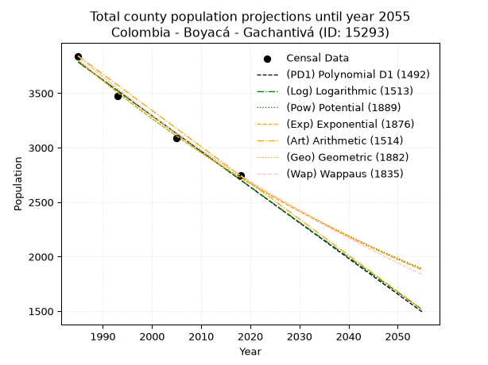
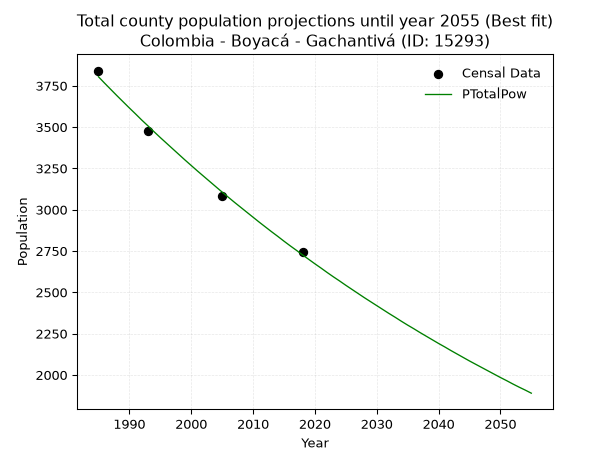
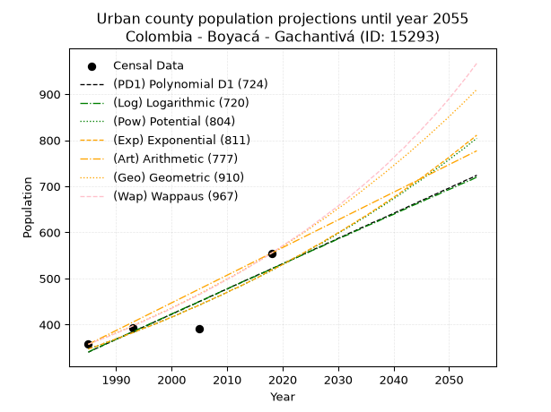
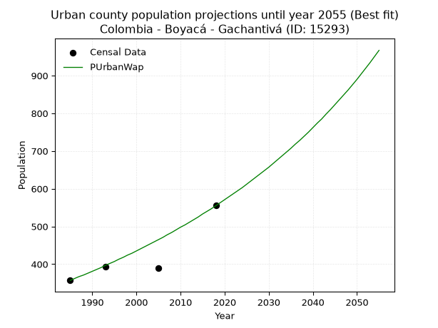
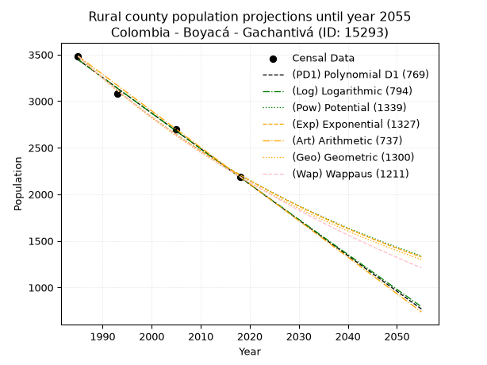
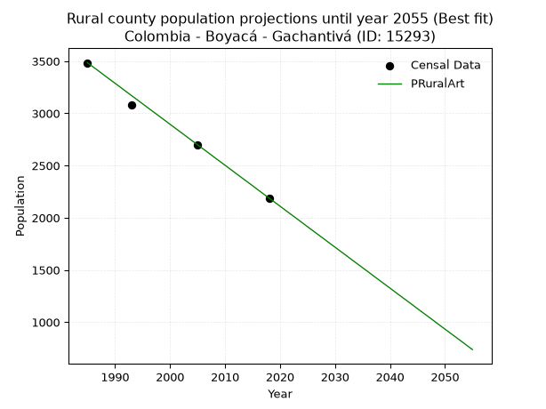

<div align="center">


</div>

# _“Population and Public Services Demand Projections (PPSD) until Year 2050 for Colombia - Boyacá - Gachantivá (ID: 15293)”_
Keywords: `population` `public-service` `projection` `lineal` `polynomial` `logarithmic` `potential` `exponential` `arithmetic` `geometric` `wappaus` `dane` `colombia` `south-america`

PPSD are analytical estimates used by governments and planners to anticipate future changes in population size, age distribution, and the resulting community needs for utilities, healthcare, education, and infrastructure as sizing future water treatment facilities, electrical grids, and road networks based on spatial growth.

> **General running parameters**: • app_version: _v20260806_. • Python version: _3.14.7_. • Pandas version: _3.0.5_. • NumPy version: _2.5.1_. • Creates, save and include plots into reports (create_plot): _False_. • Projection until year: _2050_. • Process polynomial degree 2 and up: _False_. • Process Wappaus: _True_. • Process Wappaus: _True_. • Set negative values to zero: _True_. • Set infinite values to zero: _True_. • Drop dataset notes: _True_. 
<div align="center">

Dynamic map: [:earth_americas:Google](http://maps.google.com/maps?q=5.751891082,-73.5490923) [:earth_americas:OSM](https://www.openstreetmap.org/#map=18/5.751891082/-73.5490923&layers=P) [:earth_americas:Bing](https://www.bing.com/maps?cp=5.751891082~-73.5490923&lvl=18) [:earth_americas:Apple](https://maps.apple.com/frame?center=5.751891082%2C-73.5490923&span=0.003%2C0.006)

</div>


<div align="center">

```geojson
{
  "type": "Feature",
  "geometry": {
    "type": "Point", 
    "coordinates": [-73.5490923, 5.751891082]
  }, 
  "properties": {
    "Name": "Colombia - Boyacá - Gachantivá (ID: 15293)"
  }
}
```

</div>


## 0. Census Data (4 records)

Census data are official statistics collected by a government about the people and housing in a country. They usually include counts of total population, age, sex, race, income, education, and jobs.

📅Global census file: [Population.xlsx](../data/Population.xlsx)

| Source   |   Year |   CountryID | CountryName   |   StateID | StateName   |   CountyID | CountyName   |   PTotal |   PUrban |   PRural |
|:---------|-------:|------------:|:--------------|----------:|:------------|-----------:|:-------------|---------:|---------:|---------:|
| DANE     |   1985 |          57 | Colombia      |        15 | Boyacá      |      15293 | Gachantivá   |     3841 |      357 |     3484 |
| DANE     |   1993 |          57 | Colombia      |        15 | Boyacá      |      15293 | Gachantivá   |     3474 |      393 |     3081 |
| DANE     |   2005 |          57 | Colombia      |        15 | Boyacá      |      15293 | Gachantivá   |     3085 |      390 |     2695 |
| DANE     |   2018 |          57 | Colombia      |        15 | Boyacá      |      15293 | Gachantivá   |     2744 |      555 |     2189 |

> 🔥Some records could had specific notes about the registered values or the corresponding urban or rural distribution.

## 1. Total

### 1.1. Coefficients and Parameters

* (PD1) Polynomial Deg 1: -32.7611401043755, 68816.4704937771 (lineal)
* (Log) Logarithmic: -65592.81926513565, 501857.5448621618
* (Pow) Potential: -20.196469615740305, 70.18330619371089
* (Exp) Exponential: -0.010088527975845099, 1892813209133.8992
* (Art) Arithmetic: Year diff. 2018 - 1985 = 33, Population diff. 2744 - 3841 = -1097, Annual growth = -33.24242424242424
* (Geo) Geometric: Year diff. 2018 - 1985 = 33, Population diff. 2744 - 3841 = -1097, Annual growth % = -0.010139638841128451
* (Wap) Wappaus: i = -1.0096408274084812, Condition values only valid for < 200)

<sub>
Wappaus condition values: ['-0.00', '-1.01', '-2.02', '-3.03', '-4.04', '-5.05', '-6.06', '-7.07', '-8.08', '-9.09', '-10.10', '-11.11', '-12.12', '-13.13', '-14.13', '-15.14', '-16.15', '-17.16', '-18.17', '-19.18', '-20.19', '-21.20', '-22.21', '-23.22', '-24.23', '-25.24', '-26.25', '-27.26', '-28.27', '-29.28', '-30.29', '-31.30', '-32.31', '-33.32', '-34.33', '-35.34', '-36.35', '-37.36', '-38.37', '-39.38', '-40.39', '-41.40', '-42.40', '-43.41', '-44.42', '-45.43', '-46.44', '-47.45', '-48.46', '-49.47', '-50.48', '-51.49', '-52.50', '-53.51', '-54.52', '-55.53', '-56.54', '-57.55', '-58.56', '-59.57', '-60.58', '-61.59', '-62.60', '-63.61', '-64.62', '-65.63']
</sub>


### 1.2. Projected Dataset

|   Year |   CountyID |   PTotalPD1 |   PTotalLog |   PTotalPow |   PTotalExp |   PTotalArt |   PTotalGeo |   PTotalWap |
|-------:|-----------:|------------:|------------:|------------:|------------:|------------:|------------:|------------:|
|   1985 |      15293 |        3786 |        3787 |        3804 |        3802 |        3841 |        3841 |        3841 |
|   1986 |      15293 |        3753 |        3754 |        3765 |        3764 |        3808 |        3802 |        3802 |
|   1987 |      15293 |        3720 |        3721 |        3727 |        3726 |        3775 |        3764 |        3764 |
|   1988 |      15293 |        3687 |        3688 |        3689 |        3689 |        3741 |        3725 |        3726 |
|   1989 |      15293 |        3655 |        3655 |        3652 |        3652 |        3708 |        3688 |        3689 |
|   1990 |      15293 |        3622 |        3622 |        3615 |        3615 |        3675 |        3650 |        3652 |
|   1991 |      15293 |        3589 |        3589 |        3579 |        3579 |        3642 |        3613 |        3615 |
|   1992 |      15293 |        3556 |        3556 |        3542 |        3543 |        3608 |        3577 |        3579 |
|   1993 |      15293 |        3524 |        3523 |        3507 |        3507 |        3575 |        3540 |        3543 |
|   1994 |      15293 |        3491 |        3490 |        3471 |        3472 |        3542 |        3504 |        3507 |
|   1995 |      15293 |        3458 |        3457 |        3436 |        3437 |        3509 |        3469 |        3472 |
|   1996 |      15293 |        3425 |        3424 |        3402 |        3403 |        3475 |        3434 |        3437 |
|   1997 |      15293 |        3392 |        3391 |        3368 |        3369 |        3442 |        3399 |        3402 |
|   1998 |      15293 |        3360 |        3359 |        3334 |        3335 |        3409 |        3364 |        3368 |
|   1999 |      15293 |        3327 |        3326 |        3300 |        3301 |        3376 |        3330 |        3334 |
|   2000 |      15293 |        3294 |        3293 |        3267 |        3268 |        3342 |        3297 |        3300 |
|   2001 |      15293 |        3261 |        3260 |        3234 |        3236 |        3309 |        3263 |        3267 |
|   2002 |      15293 |        3229 |        3227 |        3202 |        3203 |        3276 |        3230 |        3234 |
|   2003 |      15293 |        3196 |        3195 |        3170 |        3171 |        3243 |        3197 |        3201 |
|   2004 |      15293 |        3163 |        3162 |        3138 |        3139 |        3209 |        3165 |        3169 |
|   2005 |      15293 |        3130 |        3129 |        3106 |        3108 |        3176 |        3133 |        3137 |
|   2006 |      15293 |        3098 |        3096 |        3075 |        3076 |        3143 |        3101 |        3105 |
|   2007 |      15293 |        3065 |        3064 |        3044 |        3045 |        3110 |        3070 |        3073 |
|   2008 |      15293 |        3032 |        3031 |        3014 |        3015 |        3076 |        3038 |        3042 |
|   2009 |      15293 |        2999 |        2998 |        2984 |        2985 |        3043 |        3008 |        3011 |
|   2010 |      15293 |        2967 |        2966 |        2954 |        2955 |        3010 |        2977 |        2980 |
|   2011 |      15293 |        2934 |        2933 |        2924 |        2925 |        2977 |        2947 |        2950 |
|   2012 |      15293 |        2901 |        2901 |        2895 |        2896 |        2943 |        2917 |        2920 |
|   2013 |      15293 |        2868 |        2868 |        2866 |        2867 |        2910 |        2887 |        2890 |
|   2014 |      15293 |        2836 |        2835 |        2838 |        2838 |        2877 |        2858 |        2860 |
|   2015 |      15293 |        2803 |        2803 |        2809 |        2809 |        2844 |        2829 |        2831 |
|   2016 |      15293 |        2770 |        2770 |        2781 |        2781 |        2810 |        2801 |        2801 |
|   2017 |      15293 |        2737 |        2738 |        2754 |        2753 |        2777 |        2772 |        2773 |
|   2018 |      15293 |        2704 |        2705 |        2726 |        2726 |        2744 |        2744 |        2744 |
|   2019 |      15293 |        2672 |        2673 |        2699 |        2698 |        2711 |        2716 |        2716 |
|   2020 |      15293 |        2639 |        2640 |        2672 |        2671 |        2678 |        2689 |        2687 |
|   2021 |      15293 |        2606 |        2608 |        2646 |        2644 |        2644 |        2661 |        2660 |
|   2022 |      15293 |        2573 |        2575 |        2619 |        2618 |        2611 |        2634 |        2632 |
|   2023 |      15293 |        2541 |        2543 |        2593 |        2592 |        2578 |        2608 |        2605 |
|   2024 |      15293 |        2508 |        2510 |        2568 |        2565 |        2545 |        2581 |        2577 |
|   2025 |      15293 |        2475 |        2478 |        2542 |        2540 |        2511 |        2555 |        2550 |
|   2026 |      15293 |        2442 |        2446 |        2517 |        2514 |        2478 |        2529 |        2524 |
|   2027 |      15293 |        2410 |        2413 |        2492 |        2489 |        2445 |        2504 |        2497 |
|   2028 |      15293 |        2377 |        2381 |        2467 |        2464 |        2412 |        2478 |        2471 |
|   2029 |      15293 |        2344 |        2349 |        2443 |        2439 |        2378 |        2453 |        2445 |
|   2030 |      15293 |        2311 |        2316 |        2419 |        2415 |        2345 |        2428 |        2419 |
|   2031 |      15293 |        2279 |        2284 |        2395 |        2391 |        2312 |        2404 |        2393 |
|   2032 |      15293 |        2246 |        2252 |        2371 |        2367 |        2279 |        2379 |        2368 |
|   2033 |      15293 |        2213 |        2219 |        2348 |        2343 |        2245 |        2355 |        2343 |
|   2034 |      15293 |        2180 |        2187 |        2324 |        2319 |        2212 |        2331 |        2318 |
|   2035 |      15293 |        2148 |        2155 |        2301 |        2296 |        2179 |        2307 |        2293 |
|   2036 |      15293 |        2115 |        2123 |        2279 |        2273 |        2146 |        2284 |        2268 |
|   2037 |      15293 |        2082 |        2091 |        2256 |        2250 |        2112 |        2261 |        2244 |
|   2038 |      15293 |        2049 |        2058 |        2234 |        2228 |        2079 |        2238 |        2219 |
|   2039 |      15293 |        2017 |        2026 |        2212 |        2205 |        2046 |        2215 |        2195 |
|   2040 |      15293 |        1984 |        1994 |        2190 |        2183 |        2013 |        2193 |        2172 |
|   2041 |      15293 |        1951 |        1962 |        2169 |        2161 |        1979 |        2171 |        2148 |
|   2042 |      15293 |        1918 |        1930 |        2147 |        2139 |        1946 |        2149 |        2124 |
|   2043 |      15293 |        1885 |        1898 |        2126 |        2118 |        1913 |        2127 |        2101 |
|   2044 |      15293 |        1853 |        1866 |        2105 |        2097 |        1880 |        2105 |        2078 |
|   2045 |      15293 |        1820 |        1833 |        2084 |        2076 |        1846 |        2084 |        2055 |
|   2046 |      15293 |        1787 |        1801 |        2064 |        2055 |        1813 |        2063 |        2032 |
|   2047 |      15293 |        1754 |        1769 |        2044 |        2034 |        1780 |        2042 |        2010 |
|   2048 |      15293 |        1722 |        1737 |        2024 |        2014 |        1747 |        2021 |        1987 |
|   2049 |      15293 |        1689 |        1705 |        2004 |        1994 |        1713 |        2001 |        1965 |
|   2050 |      15293 |        1656 |        1673 |        1984 |        1974 |        1680 |        1980 |        1943 |
<div align="center">

</img>

</div>


### 1.3. Best fit with absolute and relative error (%)

Relative error puts that difference into context by dividing the absolute error by the true value, creating a unitless ratio or percentage that shows the scale of the mistake.

Absolute and relative error

|   Year | Source   |   CountryID | CountryName   |   StateID | StateName   |   CountyID_x | CountyName   |   PTotal |   PUrban |   PRural |   CountyID_y |   PTotalPD1 |   PTotalLog |   PTotalPow |   PTotalExp |   PTotalArt |   PTotalGeo |   PTotalWap |   PTotalPD1AbsError |   PTotalLogAbsError |   PTotalPowAbsError |   PTotalExpAbsError |   PTotalArtAbsError |   PTotalGeoAbsError |   PTotalWapAbsError |   PTotalPD1RelError |   PTotalLogRelError |   PTotalPowRelError |   PTotalExpRelError |   PTotalArtRelError |   PTotalGeoRelError |   PTotalWapRelError |
|-------:|:---------|------------:|:--------------|----------:|:------------|-------------:|:-------------|---------:|---------:|---------:|-------------:|------------:|------------:|------------:|------------:|------------:|------------:|------------:|--------------------:|--------------------:|--------------------:|--------------------:|--------------------:|--------------------:|--------------------:|--------------------:|--------------------:|--------------------:|--------------------:|--------------------:|--------------------:|--------------------:|
|   1985 | DANE     |          57 | Colombia      |        15 | Boyacá      |        15293 | Gachantivá   |     3841 |      357 |     3484 |        15293 |        3786 |        3787 |        3804 |        3802 |        3841 |        3841 |        3841 |                  55 |                  54 |                  37 |                  39 |                   0 |                   0 |                   0 |             1.43192 |             1.40588 |            0.963291 |            1.01536  |             0       |             0       |             0       |
|   1993 | DANE     |          57 | Colombia      |        15 | Boyacá      |        15293 | Gachantivá   |     3474 |      393 |     3081 |        15293 |        3524 |        3523 |        3507 |        3507 |        3575 |        3540 |        3543 |                  50 |                  49 |                  33 |                  33 |                 101 |                  66 |                  69 |             1.43926 |             1.41048 |            0.949914 |            0.949914 |             2.90731 |             1.89983 |             1.98618 |
|   2005 | DANE     |          57 | Colombia      |        15 | Boyacá      |        15293 | Gachantivá   |     3085 |      390 |     2695 |        15293 |        3130 |        3129 |        3106 |        3108 |        3176 |        3133 |        3137 |                  45 |                  44 |                  21 |                  23 |                  91 |                  48 |                  52 |             1.45867 |             1.42626 |            0.680713 |            0.745543 |             2.94976 |             1.55592 |             1.68558 |
|   2018 | DANE     |          57 | Colombia      |        15 | Boyacá      |        15293 | Gachantivá   |     2744 |      555 |     2189 |        15293 |        2704 |        2705 |        2726 |        2726 |        2744 |        2744 |        2744 |                  40 |                  39 |                  18 |                  18 |                   0 |                   0 |                   0 |             1.45773 |             1.42128 |            0.655977 |            0.655977 |             0       |             0       |             0       |

Relative error mean

| Method    |   RelError | Best   |
|:----------|-----------:|:-------|
| PTotalPD1 |   1.44689  |        |
| PTotalLog |   1.41598  |        |
| PTotalPow |   0.812474 | True   |
| PTotalExp |   0.841698 |        |
| PTotalArt |   1.46427  |        |
| PTotalGeo |   0.863936 |        |
| PTotalWap |   0.91794  |        |

💙Best method: _**PTotalPow**_
<div align="center">

</img>

</div>


### 1.4. Fresh water supply demand in liters per capita per day (lpcd)

The fresh water supply demand typically ranges from 100 to 300 liters per capita per day (lpcd) for standard domestic and municipal planning, though absolute survival minimums set by the World Health Organization are as low as 7.5 to 20 liters per day, and total consumption in high-income nations can exceed 400 liters.

> `CZ`: Level in meters above the sea level (masl).<br> `WS`: Fresh water supply demand in liters per capita per day (lpcd or l/h/d).<br> `WSAll`: Zonal fresh water supply demand in liters per second (l/s).<br> `A`: Zonal area in square meters.

Reference values (RAS Colombia)

|    CZ |   WS |
|------:|-----:|
|  1000 |  120 |
|  2000 |  130 |
| 99999 |  140 |

County shapefile geometry properties and water supply values

|   CountyID |      ATotal |   CZTotal |   WSTotal |
|-----------:|------------:|----------:|----------:|
|      15293 | 8.80257e+07 |    2375.3 |       140 |

Projected values for best method: PTotalPow

|   CountyID |   Year |   PTotalPow |   WSTotal |   WSTotalAll |
|-----------:|-------:|------------:|----------:|-------------:|
|      15293 |   1985 |        3804 |       140 |      6.16389 |
|      15293 |   1986 |        3765 |       140 |      6.10069 |
|      15293 |   1987 |        3727 |       140 |      6.03912 |
|      15293 |   1988 |        3689 |       140 |      5.97755 |
|      15293 |   1989 |        3652 |       140 |      5.91759 |
|      15293 |   1990 |        3615 |       140 |      5.85764 |
|      15293 |   1991 |        3579 |       140 |      5.79931 |
|      15293 |   1992 |        3542 |       140 |      5.73935 |
|      15293 |   1993 |        3507 |       140 |      5.68264 |
|      15293 |   1994 |        3471 |       140 |      5.62431 |
|      15293 |   1995 |        3436 |       140 |      5.56759 |
|      15293 |   1996 |        3402 |       140 |      5.5125  |
|      15293 |   1997 |        3368 |       140 |      5.45741 |
|      15293 |   1998 |        3334 |       140 |      5.40231 |
|      15293 |   1999 |        3300 |       140 |      5.34722 |
|      15293 |   2000 |        3267 |       140 |      5.29375 |
|      15293 |   2001 |        3234 |       140 |      5.24028 |
|      15293 |   2002 |        3202 |       140 |      5.18843 |
|      15293 |   2003 |        3170 |       140 |      5.13657 |
|      15293 |   2004 |        3138 |       140 |      5.08472 |
|      15293 |   2005 |        3106 |       140 |      5.03287 |
|      15293 |   2006 |        3075 |       140 |      4.98264 |
|      15293 |   2007 |        3044 |       140 |      4.93241 |
|      15293 |   2008 |        3014 |       140 |      4.8838  |
|      15293 |   2009 |        2984 |       140 |      4.83519 |
|      15293 |   2010 |        2954 |       140 |      4.78657 |
|      15293 |   2011 |        2924 |       140 |      4.73796 |
|      15293 |   2012 |        2895 |       140 |      4.69097 |
|      15293 |   2013 |        2866 |       140 |      4.64398 |
|      15293 |   2014 |        2838 |       140 |      4.59861 |
|      15293 |   2015 |        2809 |       140 |      4.55162 |
|      15293 |   2016 |        2781 |       140 |      4.50625 |
|      15293 |   2017 |        2754 |       140 |      4.4625  |
|      15293 |   2018 |        2726 |       140 |      4.41713 |
|      15293 |   2019 |        2699 |       140 |      4.37338 |
|      15293 |   2020 |        2672 |       140 |      4.32963 |
|      15293 |   2021 |        2646 |       140 |      4.2875  |
|      15293 |   2022 |        2619 |       140 |      4.24375 |
|      15293 |   2023 |        2593 |       140 |      4.20162 |
|      15293 |   2024 |        2568 |       140 |      4.16111 |
|      15293 |   2025 |        2542 |       140 |      4.11898 |
|      15293 |   2026 |        2517 |       140 |      4.07847 |
|      15293 |   2027 |        2492 |       140 |      4.03796 |
|      15293 |   2028 |        2467 |       140 |      3.99745 |
|      15293 |   2029 |        2443 |       140 |      3.95856 |
|      15293 |   2030 |        2419 |       140 |      3.91968 |
|      15293 |   2031 |        2395 |       140 |      3.88079 |
|      15293 |   2032 |        2371 |       140 |      3.8419  |
|      15293 |   2033 |        2348 |       140 |      3.80463 |
|      15293 |   2034 |        2324 |       140 |      3.76574 |
|      15293 |   2035 |        2301 |       140 |      3.72847 |
|      15293 |   2036 |        2279 |       140 |      3.69282 |
|      15293 |   2037 |        2256 |       140 |      3.65556 |
|      15293 |   2038 |        2234 |       140 |      3.61991 |
|      15293 |   2039 |        2212 |       140 |      3.58426 |
|      15293 |   2040 |        2190 |       140 |      3.54861 |
|      15293 |   2041 |        2169 |       140 |      3.51458 |
|      15293 |   2042 |        2147 |       140 |      3.47894 |
|      15293 |   2043 |        2126 |       140 |      3.44491 |
|      15293 |   2044 |        2105 |       140 |      3.41088 |
|      15293 |   2045 |        2084 |       140 |      3.37685 |
|      15293 |   2046 |        2064 |       140 |      3.34444 |
|      15293 |   2047 |        2044 |       140 |      3.31204 |
|      15293 |   2048 |        2024 |       140 |      3.27963 |
|      15293 |   2049 |        2004 |       140 |      3.24722 |
|      15293 |   2050 |        1984 |       140 |      3.21481 |

## 2. Urban

### 2.1. Coefficients and Parameters

* (PD1) Polynomial Deg 1: 5.476114010437472, -10529.847049377555 (lineal)
* (Log) Logarithmic: 10950.08267177039, -82807.91613658227
* (Pow) Potential: 24.262188484928096, -77.47071957515992
* (Exp) Exponential: 0.012132140781445174, 1.2062678934345494e-08
* (Art) Arithmetic: Year diff. 2018 - 1985 = 33, Population diff. 555 - 357 = 198, Annual growth = 6.0
* (Geo) Geometric: Year diff. 2018 - 1985 = 33, Population diff. 555 - 357 = 198, Annual growth % = 0.013460463950028867
* (Wap) Wappaus: i = 1.3157894736842106, Condition values only valid for < 200)

<sub>
Wappaus condition values: ['0.00', '1.32', '2.63', '3.95', '5.26', '6.58', '7.89', '9.21', '10.53', '11.84', '13.16', '14.47', '15.79', '17.11', '18.42', '19.74', '21.05', '22.37', '23.68', '25.00', '26.32', '27.63', '28.95', '30.26', '31.58', '32.89', '34.21', '35.53', '36.84', '38.16', '39.47', '40.79', '42.11', '43.42', '44.74', '46.05', '47.37', '48.68', '50.00', '51.32', '52.63', '53.95', '55.26', '56.58', '57.89', '59.21', '60.53', '61.84', '63.16', '64.47', '65.79', '67.11', '68.42', '69.74', '71.05', '72.37', '73.68', '75.00', '76.32', '77.63', '78.95', '80.26', '81.58', '82.89', '84.21', '85.53']
</sub>


### 2.2. Projected Dataset

|   Year |   CountyID |   PUrbanPD1 |   PUrbanLog |   PUrbanPow |   PUrbanExp |   PUrbanArt |   PUrbanGeo |   PUrbanWap |
|-------:|-----------:|------------:|------------:|------------:|------------:|------------:|------------:|------------:|
|   1985 |      15293 |         340 |         340 |         347 |         347 |         357 |         357 |         357 |
|   1986 |      15293 |         346 |         346 |         351 |         351 |         363 |         362 |         362 |
|   1987 |      15293 |         351 |         351 |         355 |         355 |         369 |         367 |         367 |
|   1988 |      15293 |         357 |         357 |         360 |         360 |         375 |         372 |         371 |
|   1989 |      15293 |         362 |         362 |         364 |         364 |         381 |         377 |         376 |
|   1990 |      15293 |         368 |         368 |         369 |         369 |         387 |         382 |         381 |
|   1991 |      15293 |         373 |         373 |         373 |         373 |         393 |         387 |         386 |
|   1992 |      15293 |         379 |         379 |         378 |         378 |         399 |         392 |         391 |
|   1993 |      15293 |         384 |         384 |         382 |         382 |         405 |         397 |         397 |
|   1994 |      15293 |         390 |         390 |         387 |         387 |         411 |         403 |         402 |
|   1995 |      15293 |         395 |         395 |         392 |         392 |         417 |         408 |         407 |
|   1996 |      15293 |         400 |         401 |         397 |         396 |         423 |         414 |         413 |
|   1997 |      15293 |         406 |         406 |         401 |         401 |         429 |         419 |         418 |
|   1998 |      15293 |         411 |         412 |         406 |         406 |         435 |         425 |         424 |
|   1999 |      15293 |         417 |         417 |         411 |         411 |         441 |         430 |         429 |
|   2000 |      15293 |         422 |         423 |         416 |         416 |         447 |         436 |         435 |
|   2001 |      15293 |         428 |         428 |         421 |         421 |         453 |         442 |         441 |
|   2002 |      15293 |         433 |         434 |         427 |         426 |         459 |         448 |         447 |
|   2003 |      15293 |         439 |         439 |         432 |         432 |         465 |         454 |         453 |
|   2004 |      15293 |         444 |         444 |         437 |         437 |         471 |         460 |         459 |
|   2005 |      15293 |         450 |         450 |         442 |         442 |         477 |         466 |         465 |
|   2006 |      15293 |         455 |         455 |         448 |         448 |         483 |         473 |         471 |
|   2007 |      15293 |         461 |         461 |         453 |         453 |         489 |         479 |         478 |
|   2008 |      15293 |         466 |         466 |         459 |         459 |         495 |         486 |         484 |
|   2009 |      15293 |         472 |         472 |         464 |         464 |         501 |         492 |         491 |
|   2010 |      15293 |         477 |         477 |         470 |         470 |         507 |         499 |         498 |
|   2011 |      15293 |         483 |         483 |         476 |         476 |         513 |         505 |         504 |
|   2012 |      15293 |         488 |         488 |         481 |         481 |         519 |         512 |         511 |
|   2013 |      15293 |         494 |         494 |         487 |         487 |         525 |         519 |         518 |
|   2014 |      15293 |         499 |         499 |         493 |         493 |         531 |         526 |         525 |
|   2015 |      15293 |         505 |         504 |         499 |         499 |         537 |         533 |         533 |
|   2016 |      15293 |         510 |         510 |         505 |         505 |         543 |         540 |         540 |
|   2017 |      15293 |         515 |         515 |         511 |         512 |         549 |         548 |         547 |
|   2018 |      15293 |         521 |         521 |         517 |         518 |         555 |         555 |         555 |
|   2019 |      15293 |         526 |         526 |         524 |         524 |         561 |         562 |         563 |
|   2020 |      15293 |         532 |         532 |         530 |         530 |         567 |         570 |         571 |
|   2021 |      15293 |         537 |         537 |         536 |         537 |         573 |         578 |         579 |
|   2022 |      15293 |         543 |         542 |         543 |         544 |         579 |         585 |         587 |
|   2023 |      15293 |         548 |         548 |         550 |         550 |         585 |         593 |         595 |
|   2024 |      15293 |         554 |         553 |         556 |         557 |         591 |         601 |         603 |
|   2025 |      15293 |         559 |         559 |         563 |         564 |         597 |         609 |         612 |
|   2026 |      15293 |         565 |         564 |         570 |         571 |         603 |         618 |         621 |
|   2027 |      15293 |         570 |         569 |         576 |         577 |         609 |         626 |         630 |
|   2028 |      15293 |         576 |         575 |         583 |         585 |         615 |         634 |         639 |
|   2029 |      15293 |         581 |         580 |         590 |         592 |         621 |         643 |         648 |
|   2030 |      15293 |         587 |         586 |         598 |         599 |         627 |         652 |         657 |
|   2031 |      15293 |         592 |         591 |         605 |         606 |         633 |         660 |         667 |
|   2032 |      15293 |         598 |         596 |         612 |         614 |         639 |         669 |         677 |
|   2033 |      15293 |         603 |         602 |         619 |         621 |         645 |         678 |         687 |
|   2034 |      15293 |         609 |         607 |         627 |         629 |         651 |         687 |         697 |
|   2035 |      15293 |         614 |         613 |         634 |         636 |         657 |         697 |         707 |
|   2036 |      15293 |         620 |         618 |         642 |         644 |         663 |         706 |         718 |
|   2037 |      15293 |         625 |         623 |         650 |         652 |         669 |         716 |         728 |
|   2038 |      15293 |         630 |         629 |         657 |         660 |         675 |         725 |         739 |
|   2039 |      15293 |         636 |         634 |         665 |         668 |         681 |         735 |         750 |
|   2040 |      15293 |         641 |         639 |         673 |         676 |         687 |         745 |         762 |
|   2041 |      15293 |         647 |         645 |         681 |         684 |         693 |         755 |         774 |
|   2042 |      15293 |         652 |         650 |         689 |         693 |         699 |         765 |         785 |
|   2043 |      15293 |         658 |         656 |         698 |         701 |         705 |         775 |         798 |
|   2044 |      15293 |         663 |         661 |         706 |         710 |         711 |         786 |         810 |
|   2045 |      15293 |         669 |         666 |         714 |         718 |         717 |         796 |         823 |
|   2046 |      15293 |         674 |         672 |         723 |         727 |         723 |         807 |         836 |
|   2047 |      15293 |         680 |         677 |         732 |         736 |         729 |         818 |         849 |
|   2048 |      15293 |         685 |         682 |         740 |         745 |         735 |         829 |         862 |
|   2049 |      15293 |         691 |         688 |         749 |         754 |         741 |         840 |         876 |
|   2050 |      15293 |         696 |         693 |         758 |         763 |         747 |         851 |         890 |
<div align="center">

</img>

</div>


### 2.3. Best fit with absolute and relative error (%)

Relative error puts that difference into context by dividing the absolute error by the true value, creating a unitless ratio or percentage that shows the scale of the mistake.

Absolute and relative error

|   Year | Source   |   CountryID | CountryName   |   StateID | StateName   |   CountyID_x | CountyName   |   PTotal |   PUrban |   PRural |   CountyID_y |   PUrbanPD1 |   PUrbanLog |   PUrbanPow |   PUrbanExp |   PUrbanArt |   PUrbanGeo |   PUrbanWap |   PUrbanPD1AbsError |   PUrbanLogAbsError |   PUrbanPowAbsError |   PUrbanExpAbsError |   PUrbanArtAbsError |   PUrbanGeoAbsError |   PUrbanWapAbsError |   PUrbanPD1RelError |   PUrbanLogRelError |   PUrbanPowRelError |   PUrbanExpRelError |   PUrbanArtRelError |   PUrbanGeoRelError |   PUrbanWapRelError |
|-------:|:---------|------------:|:--------------|----------:|:------------|-------------:|:-------------|---------:|---------:|---------:|-------------:|------------:|------------:|------------:|------------:|------------:|------------:|------------:|--------------------:|--------------------:|--------------------:|--------------------:|--------------------:|--------------------:|--------------------:|--------------------:|--------------------:|--------------------:|--------------------:|--------------------:|--------------------:|--------------------:|
|   1985 | DANE     |          57 | Colombia      |        15 | Boyacá      |        15293 | Gachantivá   |     3841 |      357 |     3484 |        15293 |         340 |         340 |         347 |         347 |         357 |         357 |         357 |                  17 |                  17 |                  10 |                  10 |                   0 |                   0 |                   0 |             4.7619  |             4.7619  |             2.80112 |             2.80112 |             0       |             0       |             0       |
|   1993 | DANE     |          57 | Colombia      |        15 | Boyacá      |        15293 | Gachantivá   |     3474 |      393 |     3081 |        15293 |         384 |         384 |         382 |         382 |         405 |         397 |         397 |                   9 |                   9 |                  11 |                  11 |                  12 |                   4 |                   4 |             2.29008 |             2.29008 |             2.79898 |             2.79898 |             3.05344 |             1.01781 |             1.01781 |
|   2005 | DANE     |          57 | Colombia      |        15 | Boyacá      |        15293 | Gachantivá   |     3085 |      390 |     2695 |        15293 |         450 |         450 |         442 |         442 |         477 |         466 |         465 |                  60 |                  60 |                  52 |                  52 |                  87 |                  76 |                  75 |            15.3846  |            15.3846  |            13.3333  |            13.3333  |            22.3077  |            19.4872  |            19.2308  |
|   2018 | DANE     |          57 | Colombia      |        15 | Boyacá      |        15293 | Gachantivá   |     2744 |      555 |     2189 |        15293 |         521 |         521 |         517 |         518 |         555 |         555 |         555 |                  34 |                  34 |                  38 |                  37 |                   0 |                   0 |                   0 |             6.12613 |             6.12613 |             6.84685 |             6.66667 |             0       |             0       |             0       |

Relative error mean

| Method    |   RelError | Best   |
|:----------|-----------:|:-------|
| PUrbanPD1 |    7.14068 |        |
| PUrbanLog |    7.14068 |        |
| PUrbanPow |    6.44507 |        |
| PUrbanExp |    6.40003 |        |
| PUrbanArt |    6.34028 |        |
| PUrbanGeo |    5.12625 |        |
| PUrbanWap |    5.06215 | True   |

💙Best method: _**PUrbanWap**_
<div align="center">

</img>

</div>


### 2.4. Fresh water supply demand in liters per capita per day (lpcd)

The fresh water supply demand typically ranges from 100 to 300 liters per capita per day (lpcd) for standard domestic and municipal planning, though absolute survival minimums set by the World Health Organization are as low as 7.5 to 20 liters per day, and total consumption in high-income nations can exceed 400 liters.

> `CZ`: Level in meters above the sea level (masl).<br> `WS`: Fresh water supply demand in liters per capita per day (lpcd or l/h/d).<br> `WSAll`: Zonal fresh water supply demand in liters per second (l/s).<br> `A`: Zonal area in square meters.

Reference values (RAS Colombia)

|    CZ |   WS |
|------:|-----:|
|  1000 |  120 |
|  2000 |  130 |
| 99999 |  140 |

County shapefile geometry properties and water supply values

|   CountyID |   AUrban |   CZUrban |   WSUrban |
|-----------:|---------:|----------:|----------:|
|      15293 |   155471 |   2377.49 |       140 |

Projected values for best method: PUrbanWap

|   CountyID |   Year |   PUrbanWap |   WSUrban |   WSUrbanAll |
|-----------:|-------:|------------:|----------:|-------------:|
|      15293 |   1985 |         357 |       140 |     0.578472 |
|      15293 |   1986 |         362 |       140 |     0.586574 |
|      15293 |   1987 |         367 |       140 |     0.594676 |
|      15293 |   1988 |         371 |       140 |     0.601157 |
|      15293 |   1989 |         376 |       140 |     0.609259 |
|      15293 |   1990 |         381 |       140 |     0.617361 |
|      15293 |   1991 |         386 |       140 |     0.625463 |
|      15293 |   1992 |         391 |       140 |     0.633565 |
|      15293 |   1993 |         397 |       140 |     0.643287 |
|      15293 |   1994 |         402 |       140 |     0.651389 |
|      15293 |   1995 |         407 |       140 |     0.659491 |
|      15293 |   1996 |         413 |       140 |     0.669213 |
|      15293 |   1997 |         418 |       140 |     0.677315 |
|      15293 |   1998 |         424 |       140 |     0.687037 |
|      15293 |   1999 |         429 |       140 |     0.695139 |
|      15293 |   2000 |         435 |       140 |     0.704861 |
|      15293 |   2001 |         441 |       140 |     0.714583 |
|      15293 |   2002 |         447 |       140 |     0.724306 |
|      15293 |   2003 |         453 |       140 |     0.734028 |
|      15293 |   2004 |         459 |       140 |     0.74375  |
|      15293 |   2005 |         465 |       140 |     0.753472 |
|      15293 |   2006 |         471 |       140 |     0.763194 |
|      15293 |   2007 |         478 |       140 |     0.774537 |
|      15293 |   2008 |         484 |       140 |     0.784259 |
|      15293 |   2009 |         491 |       140 |     0.795602 |
|      15293 |   2010 |         498 |       140 |     0.806944 |
|      15293 |   2011 |         504 |       140 |     0.816667 |
|      15293 |   2012 |         511 |       140 |     0.828009 |
|      15293 |   2013 |         518 |       140 |     0.839352 |
|      15293 |   2014 |         525 |       140 |     0.850694 |
|      15293 |   2015 |         533 |       140 |     0.863657 |
|      15293 |   2016 |         540 |       140 |     0.875    |
|      15293 |   2017 |         547 |       140 |     0.886343 |
|      15293 |   2018 |         555 |       140 |     0.899306 |
|      15293 |   2019 |         563 |       140 |     0.912269 |
|      15293 |   2020 |         571 |       140 |     0.925231 |
|      15293 |   2021 |         579 |       140 |     0.938194 |
|      15293 |   2022 |         587 |       140 |     0.951157 |
|      15293 |   2023 |         595 |       140 |     0.96412  |
|      15293 |   2024 |         603 |       140 |     0.977083 |
|      15293 |   2025 |         612 |       140 |     0.991667 |
|      15293 |   2026 |         621 |       140 |     1.00625  |
|      15293 |   2027 |         630 |       140 |     1.02083  |
|      15293 |   2028 |         639 |       140 |     1.03542  |
|      15293 |   2029 |         648 |       140 |     1.05     |
|      15293 |   2030 |         657 |       140 |     1.06458  |
|      15293 |   2031 |         667 |       140 |     1.08079  |
|      15293 |   2032 |         677 |       140 |     1.09699  |
|      15293 |   2033 |         687 |       140 |     1.11319  |
|      15293 |   2034 |         697 |       140 |     1.1294   |
|      15293 |   2035 |         707 |       140 |     1.1456   |
|      15293 |   2036 |         718 |       140 |     1.16343  |
|      15293 |   2037 |         728 |       140 |     1.17963  |
|      15293 |   2038 |         739 |       140 |     1.19745  |
|      15293 |   2039 |         750 |       140 |     1.21528  |
|      15293 |   2040 |         762 |       140 |     1.23472  |
|      15293 |   2041 |         774 |       140 |     1.25417  |
|      15293 |   2042 |         785 |       140 |     1.27199  |
|      15293 |   2043 |         798 |       140 |     1.29306  |
|      15293 |   2044 |         810 |       140 |     1.3125   |
|      15293 |   2045 |         823 |       140 |     1.33356  |
|      15293 |   2046 |         836 |       140 |     1.35463  |
|      15293 |   2047 |         849 |       140 |     1.37569  |
|      15293 |   2048 |         862 |       140 |     1.39676  |
|      15293 |   2049 |         876 |       140 |     1.41944  |
|      15293 |   2050 |         890 |       140 |     1.44213  |

## 3. Rural

### 3.1. Coefficients and Parameters

* (PD1) Polynomial Deg 1: -38.23725411481299, 79346.31754315468 (lineal)
* (Log) Logarithmic: -76542.90193690604, 584665.460998744
* (Pow) Potential: -27.567470930787316, 94.45270577528369
* (Exp) Exponential: -0.013773692881564454, 2603554549563117.0
* (Art) Arithmetic: Year diff. 2018 - 1985 = 33, Population diff. 2189 - 3484 = -1295, Annual growth = -39.24242424242424
* (Geo) Geometric: Year diff. 2018 - 1985 = 33, Population diff. 2189 - 3484 = -1295, Annual growth % = -0.01398421598345334
* (Wap) Wappaus: i = -1.383480495061669, Condition values only valid for < 200)

<sub>
Wappaus condition values: ['-0.00', '-1.38', '-2.77', '-4.15', '-5.53', '-6.92', '-8.30', '-9.68', '-11.07', '-12.45', '-13.83', '-15.22', '-16.60', '-17.99', '-19.37', '-20.75', '-22.14', '-23.52', '-24.90', '-26.29', '-27.67', '-29.05', '-30.44', '-31.82', '-33.20', '-34.59', '-35.97', '-37.35', '-38.74', '-40.12', '-41.50', '-42.89', '-44.27', '-45.65', '-47.04', '-48.42', '-49.81', '-51.19', '-52.57', '-53.96', '-55.34', '-56.72', '-58.11', '-59.49', '-60.87', '-62.26', '-63.64', '-65.02', '-66.41', '-67.79', '-69.17', '-70.56', '-71.94', '-73.32', '-74.71', '-76.09', '-77.47', '-78.86', '-80.24', '-81.63', '-83.01', '-84.39', '-85.78', '-87.16', '-88.54', '-89.93']
</sub>


### 3.2. Projected Dataset

|   Year |   CountyID |   PRuralPD1 |   PRuralLog |   PRuralPow |   PRuralExp |   PRuralArt |   PRuralGeo |   PRuralWap |
|-------:|-----------:|------------:|------------:|------------:|------------:|------------:|------------:|------------:|
|   1985 |      15293 |        3445 |        3447 |        3482 |        3480 |        3484 |        3484 |        3484 |
|   1986 |      15293 |        3407 |        3408 |        3434 |        3433 |        3445 |        3435 |        3436 |
|   1987 |      15293 |        3369 |        3369 |        3386 |        3386 |        3406 |        3387 |        3389 |
|   1988 |      15293 |        3331 |        3331 |        3340 |        3339 |        3366 |        3340 |        3342 |
|   1989 |      15293 |        3292 |        3292 |        3294 |        3294 |        3327 |        3293 |        3296 |
|   1990 |      15293 |        3254 |        3254 |        3248 |        3249 |        3288 |        3247 |        3251 |
|   1991 |      15293 |        3216 |        3216 |        3204 |        3204 |        3249 |        3202 |        3206 |
|   1992 |      15293 |        3178 |        3177 |        3160 |        3160 |        3209 |        3157 |        3162 |
|   1993 |      15293 |        3139 |        3139 |        3116 |        3117 |        3170 |        3113 |        3119 |
|   1994 |      15293 |        3101 |        3100 |        3073 |        3075 |        3131 |        3069 |        3076 |
|   1995 |      15293 |        3063 |        3062 |        3031 |        3032 |        3092 |        3026 |        3033 |
|   1996 |      15293 |        3025 |        3024 |        2990 |        2991 |        3052 |        2984 |        2991 |
|   1997 |      15293 |        2987 |        2985 |        2949 |        2950 |        3013 |        2942 |        2950 |
|   1998 |      15293 |        2948 |        2947 |        2908 |        2910 |        2974 |        2901 |        2909 |
|   1999 |      15293 |        2910 |        2909 |        2868 |        2870 |        2935 |        2861 |        2869 |
|   2000 |      15293 |        2872 |        2870 |        2829 |        2831 |        2895 |        2821 |        2829 |
|   2001 |      15293 |        2834 |        2832 |        2790 |        2792 |        2856 |        2781 |        2790 |
|   2002 |      15293 |        2795 |        2794 |        2752 |        2754 |        2817 |        2742 |        2751 |
|   2003 |      15293 |        2757 |        2756 |        2715 |        2716 |        2778 |        2704 |        2712 |
|   2004 |      15293 |        2719 |        2717 |        2678 |        2679 |        2738 |        2666 |        2675 |
|   2005 |      15293 |        2681 |        2679 |        2641 |        2642 |        2699 |        2629 |        2637 |
|   2006 |      15293 |        2642 |        2641 |        2605 |        2606 |        2660 |        2592 |        2600 |
|   2007 |      15293 |        2604 |        2603 |        2569 |        2570 |        2621 |        2556 |        2564 |
|   2008 |      15293 |        2566 |        2565 |        2534 |        2535 |        2581 |        2520 |        2528 |
|   2009 |      15293 |        2528 |        2527 |        2500 |        2501 |        2542 |        2485 |        2492 |
|   2010 |      15293 |        2489 |        2489 |        2466 |        2466 |        2503 |        2450 |        2457 |
|   2011 |      15293 |        2451 |        2450 |        2432 |        2433 |        2464 |        2416 |        2422 |
|   2012 |      15293 |        2413 |        2412 |        2399 |        2399 |        2424 |        2382 |        2387 |
|   2013 |      15293 |        2375 |        2374 |        2366 |        2367 |        2385 |        2349 |        2353 |
|   2014 |      15293 |        2336 |        2336 |        2334 |        2334 |        2346 |        2316 |        2320 |
|   2015 |      15293 |        2298 |        2298 |        2302 |        2302 |        2307 |        2283 |        2286 |
|   2016 |      15293 |        2260 |        2260 |        2271 |        2271 |        2267 |        2252 |        2254 |
|   2017 |      15293 |        2222 |        2222 |        2240 |        2240 |        2228 |        2220 |        2221 |
|   2018 |      15293 |        2184 |        2185 |        2210 |        2209 |        2189 |        2189 |        2189 |
|   2019 |      15293 |        2145 |        2147 |        2180 |        2179 |        2150 |        2158 |        2157 |
|   2020 |      15293 |        2107 |        2109 |        2150 |        2149 |        2111 |        2128 |        2126 |
|   2021 |      15293 |        2069 |        2071 |        2121 |        2120 |        2071 |        2098 |        2095 |
|   2022 |      15293 |        2031 |        2033 |        2093 |        2091 |        2032 |        2069 |        2064 |
|   2023 |      15293 |        1992 |        1995 |        2064 |        2062 |        1993 |        2040 |        2034 |
|   2024 |      15293 |        1954 |        1957 |        2036 |        2034 |        1954 |        2012 |        2004 |
|   2025 |      15293 |        1916 |        1919 |        2009 |        2006 |        1914 |        1984 |        1974 |
|   2026 |      15293 |        1878 |        1882 |        1982 |        1979 |        1875 |        1956 |        1944 |
|   2027 |      15293 |        1839 |        1844 |        1955 |        1952 |        1836 |        1928 |        1915 |
|   2028 |      15293 |        1801 |        1806 |        1928 |        1925 |        1797 |        1901 |        1887 |
|   2029 |      15293 |        1763 |        1768 |        1902 |        1899 |        1757 |        1875 |        1858 |
|   2030 |      15293 |        1725 |        1731 |        1877 |        1873 |        1718 |        1849 |        1830 |
|   2031 |      15293 |        1686 |        1693 |        1851 |        1847 |        1679 |        1823 |        1802 |
|   2032 |      15293 |        1648 |        1655 |        1826 |        1822 |        1640 |        1797 |        1774 |
|   2033 |      15293 |        1610 |        1618 |        1802 |        1797 |        1600 |        1772 |        1747 |
|   2034 |      15293 |        1572 |        1580 |        1778 |        1772 |        1561 |        1747 |        1720 |
|   2035 |      15293 |        1534 |        1542 |        1754 |        1748 |        1522 |        1723 |        1693 |
|   2036 |      15293 |        1495 |        1505 |        1730 |        1724 |        1483 |        1699 |        1667 |
|   2037 |      15293 |        1457 |        1467 |        1707 |        1700 |        1443 |        1675 |        1641 |
|   2038 |      15293 |        1419 |        1430 |        1684 |        1677 |        1404 |        1652 |        1615 |
|   2039 |      15293 |        1381 |        1392 |        1661 |        1654 |        1365 |        1629 |        1589 |
|   2040 |      15293 |        1342 |        1355 |        1639 |        1632 |        1326 |        1606 |        1564 |
|   2041 |      15293 |        1304 |        1317 |        1617 |        1609 |        1286 |        1583 |        1538 |
|   2042 |      15293 |        1266 |        1280 |        1595 |        1587 |        1247 |        1561 |        1514 |
|   2043 |      15293 |        1228 |        1242 |        1574 |        1566 |        1208 |        1539 |        1489 |
|   2044 |      15293 |        1189 |        1205 |        1553 |        1544 |        1169 |        1518 |        1464 |
|   2045 |      15293 |        1151 |        1167 |        1532 |        1523 |        1129 |        1497 |        1440 |
|   2046 |      15293 |        1113 |        1130 |        1512 |        1502 |        1090 |        1476 |        1416 |
|   2047 |      15293 |        1075 |        1092 |        1491 |        1482 |        1051 |        1455 |        1393 |
|   2048 |      15293 |        1036 |        1055 |        1471 |        1461 |        1012 |        1435 |        1369 |
|   2049 |      15293 |         998 |        1018 |        1452 |        1441 |         972 |        1415 |        1346 |
|   2050 |      15293 |         960 |         980 |        1432 |        1422 |         933 |        1395 |        1323 |
<div align="center">

</img>

</div>


### 3.3. Best fit with absolute and relative error (%)

Relative error puts that difference into context by dividing the absolute error by the true value, creating a unitless ratio or percentage that shows the scale of the mistake.

Absolute and relative error

|   Year | Source   |   CountryID | CountryName   |   StateID | StateName   |   CountyID_x | CountyName   |   PTotal |   PUrban |   PRural |   CountyID_y |   PRuralPD1 |   PRuralLog |   PRuralPow |   PRuralExp |   PRuralArt |   PRuralGeo |   PRuralWap |   PRuralPD1AbsError |   PRuralLogAbsError |   PRuralPowAbsError |   PRuralExpAbsError |   PRuralArtAbsError |   PRuralGeoAbsError |   PRuralWapAbsError |   PRuralPD1RelError |   PRuralLogRelError |   PRuralPowRelError |   PRuralExpRelError |   PRuralArtRelError |   PRuralGeoRelError |   PRuralWapRelError |
|-------:|:---------|------------:|:--------------|----------:|:------------|-------------:|:-------------|---------:|---------:|---------:|-------------:|------------:|------------:|------------:|------------:|------------:|------------:|------------:|--------------------:|--------------------:|--------------------:|--------------------:|--------------------:|--------------------:|--------------------:|--------------------:|--------------------:|--------------------:|--------------------:|--------------------:|--------------------:|--------------------:|
|   1985 | DANE     |          57 | Colombia      |        15 | Boyacá      |        15293 | Gachantivá   |     3841 |      357 |     3484 |        15293 |        3445 |        3447 |        3482 |        3480 |        3484 |        3484 |        3484 |                  39 |                  37 |                   2 |                   4 |                   0 |                   0 |                   0 |            1.1194   |            1.062    |           0.0574053 |            0.114811 |            0        |             0       |             0       |
|   1993 | DANE     |          57 | Colombia      |        15 | Boyacá      |        15293 | Gachantivá   |     3474 |      393 |     3081 |        15293 |        3139 |        3139 |        3116 |        3117 |        3170 |        3113 |        3119 |                  58 |                  58 |                  35 |                  36 |                  89 |                  32 |                  38 |            1.88251  |            1.88251  |           1.13599   |            1.16845  |            2.88867  |             1.03862 |             1.23337 |
|   2005 | DANE     |          57 | Colombia      |        15 | Boyacá      |        15293 | Gachantivá   |     3085 |      390 |     2695 |        15293 |        2681 |        2679 |        2641 |        2642 |        2699 |        2629 |        2637 |                  14 |                  16 |                  54 |                  53 |                   4 |                  66 |                  58 |            0.519481 |            0.593692 |           2.00371   |            1.9666   |            0.148423 |             2.44898 |             2.15213 |
|   2018 | DANE     |          57 | Colombia      |        15 | Boyacá      |        15293 | Gachantivá   |     2744 |      555 |     2189 |        15293 |        2184 |        2185 |        2210 |        2209 |        2189 |        2189 |        2189 |                   5 |                   4 |                  21 |                  20 |                   0 |                   0 |                   0 |            0.228415 |            0.182732 |           0.959342  |            0.913659 |            0        |             0       |             0       |

Relative error mean

| Method    |   RelError | Best   |
|:----------|-----------:|:-------|
| PRuralPD1 |   0.937451 |        |
| PRuralLog |   0.930232 |        |
| PRuralPow |   1.03911  |        |
| PRuralExp |   1.04088  |        |
| PRuralArt |   0.759274 | True   |
| PRuralGeo |   0.871901 |        |
| PRuralWap |   0.846375 |        |

💙Best method: _**PRuralArt**_
<div align="center">

</img>

</div>


### 3.4. Fresh water supply demand in liters per capita per day (lpcd)

The fresh water supply demand typically ranges from 100 to 300 liters per capita per day (lpcd) for standard domestic and municipal planning, though absolute survival minimums set by the World Health Organization are as low as 7.5 to 20 liters per day, and total consumption in high-income nations can exceed 400 liters.

> `CZ`: Level in meters above the sea level (masl).<br> `WS`: Fresh water supply demand in liters per capita per day (lpcd or l/h/d).<br> `WSAll`: Zonal fresh water supply demand in liters per second (l/s).<br> `A`: Zonal area in square meters.

Reference values (RAS Colombia)

|    CZ |   WS |
|------:|-----:|
|  1000 |  120 |
|  2000 |  130 |
| 99999 |  140 |

County shapefile geometry properties and water supply values

|   CountyID |      ARural |   CZRural |   WSRural |
|-----------:|------------:|----------:|----------:|
|      15293 | 8.78702e+07 |    2375.3 |       140 |

Projected values for best method: PRuralArt

|   CountyID |   Year |   PRuralArt |   WSRural |   WSRuralAll |
|-----------:|-------:|------------:|----------:|-------------:|
|      15293 |   1985 |        3484 |       140 |      5.64537 |
|      15293 |   1986 |        3445 |       140 |      5.58218 |
|      15293 |   1987 |        3406 |       140 |      5.51898 |
|      15293 |   1988 |        3366 |       140 |      5.45417 |
|      15293 |   1989 |        3327 |       140 |      5.39097 |
|      15293 |   1990 |        3288 |       140 |      5.32778 |
|      15293 |   1991 |        3249 |       140 |      5.26458 |
|      15293 |   1992 |        3209 |       140 |      5.19977 |
|      15293 |   1993 |        3170 |       140 |      5.13657 |
|      15293 |   1994 |        3131 |       140 |      5.07338 |
|      15293 |   1995 |        3092 |       140 |      5.01019 |
|      15293 |   1996 |        3052 |       140 |      4.94537 |
|      15293 |   1997 |        3013 |       140 |      4.88218 |
|      15293 |   1998 |        2974 |       140 |      4.81898 |
|      15293 |   1999 |        2935 |       140 |      4.75579 |
|      15293 |   2000 |        2895 |       140 |      4.69097 |
|      15293 |   2001 |        2856 |       140 |      4.62778 |
|      15293 |   2002 |        2817 |       140 |      4.56458 |
|      15293 |   2003 |        2778 |       140 |      4.50139 |
|      15293 |   2004 |        2738 |       140 |      4.43657 |
|      15293 |   2005 |        2699 |       140 |      4.37338 |
|      15293 |   2006 |        2660 |       140 |      4.31019 |
|      15293 |   2007 |        2621 |       140 |      4.24699 |
|      15293 |   2008 |        2581 |       140 |      4.18218 |
|      15293 |   2009 |        2542 |       140 |      4.11898 |
|      15293 |   2010 |        2503 |       140 |      4.05579 |
|      15293 |   2011 |        2464 |       140 |      3.99259 |
|      15293 |   2012 |        2424 |       140 |      3.92778 |
|      15293 |   2013 |        2385 |       140 |      3.86458 |
|      15293 |   2014 |        2346 |       140 |      3.80139 |
|      15293 |   2015 |        2307 |       140 |      3.73819 |
|      15293 |   2016 |        2267 |       140 |      3.67338 |
|      15293 |   2017 |        2228 |       140 |      3.61019 |
|      15293 |   2018 |        2189 |       140 |      3.54699 |
|      15293 |   2019 |        2150 |       140 |      3.4838  |
|      15293 |   2020 |        2111 |       140 |      3.4206  |
|      15293 |   2021 |        2071 |       140 |      3.35579 |
|      15293 |   2022 |        2032 |       140 |      3.29259 |
|      15293 |   2023 |        1993 |       140 |      3.2294  |
|      15293 |   2024 |        1954 |       140 |      3.1662  |
|      15293 |   2025 |        1914 |       140 |      3.10139 |
|      15293 |   2026 |        1875 |       140 |      3.03819 |
|      15293 |   2027 |        1836 |       140 |      2.975   |
|      15293 |   2028 |        1797 |       140 |      2.91181 |
|      15293 |   2029 |        1757 |       140 |      2.84699 |
|      15293 |   2030 |        1718 |       140 |      2.7838  |
|      15293 |   2031 |        1679 |       140 |      2.7206  |
|      15293 |   2032 |        1640 |       140 |      2.65741 |
|      15293 |   2033 |        1600 |       140 |      2.59259 |
|      15293 |   2034 |        1561 |       140 |      2.5294  |
|      15293 |   2035 |        1522 |       140 |      2.4662  |
|      15293 |   2036 |        1483 |       140 |      2.40301 |
|      15293 |   2037 |        1443 |       140 |      2.33819 |
|      15293 |   2038 |        1404 |       140 |      2.275   |
|      15293 |   2039 |        1365 |       140 |      2.21181 |
|      15293 |   2040 |        1326 |       140 |      2.14861 |
|      15293 |   2041 |        1286 |       140 |      2.0838  |
|      15293 |   2042 |        1247 |       140 |      2.0206  |
|      15293 |   2043 |        1208 |       140 |      1.95741 |
|      15293 |   2044 |        1169 |       140 |      1.89421 |
|      15293 |   2045 |        1129 |       140 |      1.8294  |
|      15293 |   2046 |        1090 |       140 |      1.7662  |
|      15293 |   2047 |        1051 |       140 |      1.70301 |
|      15293 |   2048 |        1012 |       140 |      1.63981 |
|      15293 |   2049 |         972 |       140 |      1.575   |
|      15293 |   2050 |         933 |       140 |      1.51181 |

<div align="center"><br><sub>Share this research</sub></div><br>

<sub>**APPS & TOOLS & CONTENT DISCLAIMER**: • NO WARRANTY - This content and software is provided by <a href="https://github.com/rcfdtools" target="_blank">github.com/rcfdtools</a> "as is", without any express or implied warranty, including warranties of merchantability, fitness for a particular purpose, or non-infringement. There is no guarantee that the software will be error-free or operate without interruption. • LIMITATION OF LIABILITY - Neither the authors nor copyright holders will be liable for claims or damages arising from the software or its use. You are responsible for determining if the software is appropriate for your use and assume all associated risks, including errors, legal compliance, and data loss. • NO PROFESSIONAL ADVICE - The software provides general information and does not offer professional advice. It should not replace consultation with professional advisors. [Clauses and global license for rcfdtools use.](https://github.com/rcfdtools/rcfdtools/blob/main/LICENSE.md)</sub>

| [:house: Home](Readme.md)  | [:beginner: Help / Collaborate](https://github.com/rcfdtools/R.HydroTools/discussions/31) |
|----------------------------|-------------------------------------------------------------------------------------------|