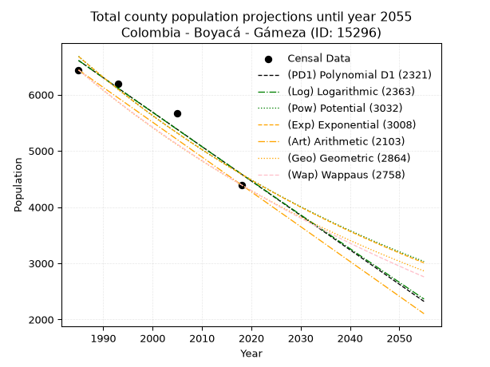
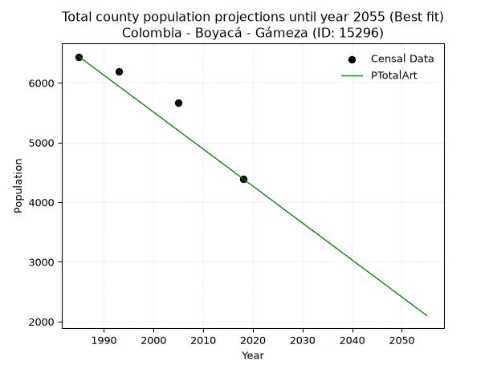
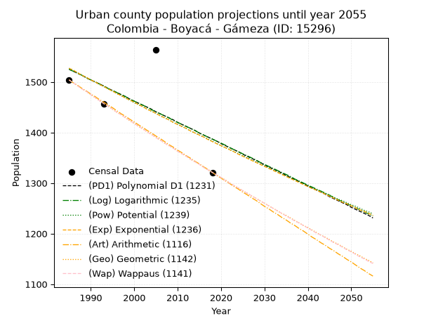
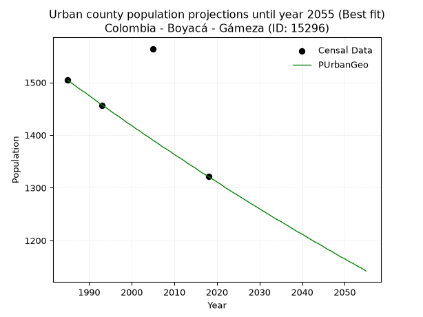
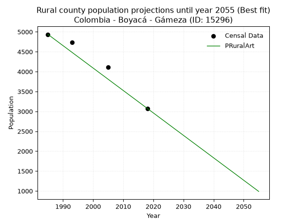

<div align="center">


</div>

# 📜 _“Population and Public Services Demand Projections (PPSD) until Year 2050 for Colombia - Boyacá - Gámeza (ID: 15296)”_
Keywords: `population` `public-service` `projection` `lineal` `polynomial` `logarithmic` `potential` `exponential` `arithmetic` `geometric` `wappaus` `dane` `colombia` `south-america`

PPSD are analytical estimates used by governments and planners to anticipate future changes in population size, age distribution, and the resulting community needs for utilities, healthcare, education, and infrastructure as sizing future water treatment facilities, electrical grids, and road networks based on spatial growth.

<div align="center">

</img>

</div>


> **General running parameters**: • app_version: _v20260806_. • Python version: _3.14.7_. • Pandas version: _3.0.5_. • NumPy version: _2.5.1_. • Creates, save and include plots into reports (create_plot): _False_. • Projection until year: _2050_. • Process polynomial degree 2 and up: _False_. • Process Wappaus: _True_. • Process Wappaus: _True_. • Set negative values to zero: _True_. • Set infinite values to zero: _True_. • Drop dataset notes: _True_. 
<div align="center">

Maps & GIS Layers: [:earth_americas:Google](http://maps.google.com/maps?q=5.802332846,-72.8055303) [:earth_americas:OSM](https://www.openstreetmap.org/#map=18/5.802332846/-72.8055303&layers=P) [:earth_americas:Bing](https://www.bing.com/maps?cp=5.802332846~-72.8055303&lvl=18) [:earth_americas:Apple](https://maps.apple.com/frame?center=5.802332846%2C-72.8055303&span=0.003%2C0.006) [:earth_americas:GISMobile](https://github.com/rcfdtools/R.GISMobile/blob/main/file/gis/CountyLayer_CO/Readme.md)

</div>


<div align="center">

```geojson
{
  "type": "Feature",
  "geometry": {
    "type": "Point", 
    "coordinates": [-72.8055303, 5.802332846]
  }, 
  "properties": {
    "Name": "Colombia - Boyacá - Gámeza (ID: 15296)"
  }
}
```

</div>


## 0. Census Data (4 records)

Census data are official statistics collected by a government about the people and housing in a country. They usually include counts of total population, age, sex, race, income, education, and jobs.

📅Global census file: [Population.xlsx](../data/Population.xlsx)

| Source   |   Year |   CountryID | CountryName   |   StateID | StateName   |   CountyID | CountyName   |   PTotal |   PUrban |   PRural |
|:---------|-------:|------------:|:--------------|----------:|:------------|-----------:|:-------------|---------:|---------:|---------:|
| DANE     |   1985 |          57 | Colombia      |        15 | Boyacá      |      15296 | Gámeza       |     6439 |     1504 |     4935 |
| DANE     |   1993 |          57 | Colombia      |        15 | Boyacá      |      15296 | Gámeza       |     6190 |     1456 |     4734 |
| DANE     |   2005 |          57 | Colombia      |        15 | Boyacá      |      15296 | Gámeza       |     5669 |     1564 |     4105 |
| DANE     |   2018 |          57 | Colombia      |        15 | Boyacá      |      15296 | Gámeza       |     4395 |     1321 |     3074 |

> 🔥Some records could had specific notes about the registered values or the corresponding urban or rural distribution.

📅[SUI-RUPS](https://www.datos.gov.co/Hacienda-y-Cr-dito-P-blico/Registro-nico-de-Prestadores-de-Servicios-P-blicos/4qkq-csdn/about_data) - Local public utility companies: [RUPS.csv](../data/RUPS.csv)

 | SERVICIO       | ESTADO    | NOMBRE                                                                                                                   | NIT         | DEPARTAMENTO_DOMICILIO   | MUNICIPIO_DOMICILIO   | DIRECCION                    |   TELEFONO | EMAIL                                  | TIPO_PRESTADOR                 | CLASIFICACION                 |
|:---------------|:----------|:-------------------------------------------------------------------------------------------------------------------------|:------------|:-------------------------|:----------------------|:-----------------------------|-----------:|:---------------------------------------|:-------------------------------|:------------------------------|
| ACUEDUCTO      | OPERATIVA | ASOCIACION DE SUSCRIPTORES DEL ACUEDUCTO SADACHI DE LA VEREDA SAZA SECTORES SAZA, DAITA Y CHITAL DEL MUNICIPIO DE GAMEZA | 900116666-9 | BOYACA                   | GAMEZA                | CALLE 3A No 3 - 44           |    7778107 | lgvargas1067@gmail.com                 | ORGANIZACION AUTORIZADA        | MENOR O IGUAL A 2500 USUARIOS |
| ACUEDUCTO      | OPERATIVA | ASOCIACION DE SUSCRIPTORES DEL ACUEDUCTO DE LA VEREDA VILLA GIRON MUNICIPIO DE GAMEZA                                    | 900108429-6 | BOYACA                   | GAMEZA                | Cr 5 No. 3 45                |    7778050 | asuagiron@hotmail.com                  | ORGANIZACION AUTORIZADA        | HASTA 2500 SUSCRIPTORES       |
| ACUEDUCTO      | OPERATIVA | UNIDAD DE SERVICIOS PUBLICOS DOMICILIARIOS DE GAMEZA                                                                     | 891857764-1 | BOYACA                   | GAMEZA                | calle 3 A No. 3-44           |    7778107 | serviciospublicos@gameza-boyaca.gov.co | MUNICIPIO (PRESTACIÓN DIRECTA) | MENOR O IGUAL A 2500 USUARIOS |
| ALCANTARILLADO | OPERATIVA | UNIDAD DE SERVICIOS PUBLICOS DOMICILIARIOS DE GAMEZA                                                                     | 891857764-1 | BOYACA                   | GAMEZA                | calle 3 A No. 3-44           |    7778107 | serviciospublicos@gameza-boyaca.gov.co | MUNICIPIO (PRESTACIÓN DIRECTA) | MENOR O IGUAL A 2500 USUARIOS |
| ACUEDUCTO      | OPERATIVA | JUNTA ADMINISTRADORA DEL ACUEDUCTO RURAL DE LA UNION DE LA VEREDA LA CAPILLA                                             | 900089295-3 | BOYACA                   | GAMEZA                | alcaldia municipal de gámeza |    7778001 | joviriga@hotmail.com                   | ORGANIZACION AUTORIZADA        | HASTA 2500 SUSCRIPTORES       |
| ACUEDUCTO      | OPERATIVA | ASOCIACION DE SUSCRIPTORES DEL ACUEDUCTO DE LA VEREDA SAN ANTONIO                                                        | 900076896-3 | BOYACA                   | GAMEZA                | Alcaldia Municipal           |    7778001 | joviriga@hotmail.com                   | ORGANIZACION AUTORIZADA        | HASTA 2500 SUSCRIPTORES       |
| ACUEDUCTO      | OPERATIVA | ASOCIACION DE SUSCRIPTORES DEL ACUEDUCTO DE LA VEREDA GUANTO GAMEZA BOYACA                                               | 900121656-5 | BOYACA                   | GAMEZA                | Vereda Guanto                |    7778211 | joviringa@hotmail.com                  | ORGANIZACION AUTORIZADA        | HASTA 2500 SUSCRIPTORES       |

## 1. Total

### 1.1. Coefficients and Parameters

* (PD1) Polynomial Deg 1: -61.23364110798793, 128155.84062625286 (lineal)
* (Log) Logarithmic: -122495.03304981119, 936758.9778252045
* (Pow) Potential: -22.79792518686684, 79.00692357447103
* (Exp) Exponential: -0.011397610997141257, 44701305656846.1
* (Art) Arithmetic: Year diff. 2018 - 1985 = 33, Population diff. 4395 - 6439 = -2044, Annual growth = -61.93939393939394
* (Geo) Geometric: Year diff. 2018 - 1985 = 33, Population diff. 4395 - 6439 = -2044, Annual growth % = -0.011506192099187684
* (Wap) Wappaus: i = -1.1434261388110383, Condition values only valid for < 200)

<sub>
Wappaus condition values: ['-0.00', '-1.14', '-2.29', '-3.43', '-4.57', '-5.72', '-6.86', '-8.00', '-9.15', '-10.29', '-11.43', '-12.58', '-13.72', '-14.86', '-16.01', '-17.15', '-18.29', '-19.44', '-20.58', '-21.73', '-22.87', '-24.01', '-25.16', '-26.30', '-27.44', '-28.59', '-29.73', '-30.87', '-32.02', '-33.16', '-34.30', '-35.45', '-36.59', '-37.73', '-38.88', '-40.02', '-41.16', '-42.31', '-43.45', '-44.59', '-45.74', '-46.88', '-48.02', '-49.17', '-50.31', '-51.45', '-52.60', '-53.74', '-54.88', '-56.03', '-57.17', '-58.31', '-59.46', '-60.60', '-61.75', '-62.89', '-64.03', '-65.18', '-66.32', '-67.46', '-68.61', '-69.75', '-70.89', '-72.04', '-73.18', '-74.32']
</sub>


### 1.2. Projected Dataset

|   Year |   CountyID |   PTotalPD1 |   PTotalLog |   PTotalPow |   PTotalExp |   PTotalArt |   PTotalGeo |   PTotalWap |
|-------:|-----------:|------------:|------------:|------------:|------------:|------------:|------------:|------------:|
|   1985 |      15296 |        6607 |        6608 |        6681 |        6679 |        6439 |        6439 |        6439 |
|   1986 |      15296 |        6546 |        6547 |        6604 |        6604 |        6377 |        6365 |        6366 |
|   1987 |      15296 |        6485 |        6485 |        6529 |        6529 |        6315 |        6292 |        6293 |
|   1988 |      15296 |        6423 |        6423 |        6455 |        6455 |        6253 |        6219 |        6222 |
|   1989 |      15296 |        6362 |        6362 |        6381 |        6382 |        6191 |        6148 |        6151 |
|   1990 |      15296 |        6301 |        6300 |        6308 |        6309 |        6129 |        6077 |        6081 |
|   1991 |      15296 |        6240 |        6239 |        6237 |        6238 |        6067 |        6007 |        6012 |
|   1992 |      15296 |        6178 |        6177 |        6166 |        6167 |        6005 |        5938 |        5943 |
|   1993 |      15296 |        6117 |        6116 |        6095 |        6097 |        5943 |        5870 |        5876 |
|   1994 |      15296 |        6056 |        6054 |        6026 |        6028 |        5882 |        5802 |        5809 |
|   1995 |      15296 |        5995 |        5993 |        5958 |        5960 |        5820 |        5735 |        5743 |
|   1996 |      15296 |        5933 |        5931 |        5890 |        5892 |        5758 |        5669 |        5677 |
|   1997 |      15296 |        5872 |        5870 |        5823 |        5825 |        5696 |        5604 |        5612 |
|   1998 |      15296 |        5811 |        5809 |        5757 |        5759 |        5634 |        5540 |        5548 |
|   1999 |      15296 |        5750 |        5747 |        5692 |        5694 |        5572 |        5476 |        5485 |
|   2000 |      15296 |        5689 |        5686 |        5627 |        5630 |        5510 |        5413 |        5422 |
|   2001 |      15296 |        5627 |        5625 |        5563 |        5566 |        5448 |        5351 |        5360 |
|   2002 |      15296 |        5566 |        5564 |        5500 |        5503 |        5386 |        5289 |        5298 |
|   2003 |      15296 |        5505 |        5503 |        5438 |        5440 |        5324 |        5228 |        5237 |
|   2004 |      15296 |        5444 |        5441 |        5377 |        5379 |        5262 |        5168 |        5177 |
|   2005 |      15296 |        5382 |        5380 |        5316 |        5318 |        5200 |        5109 |        5118 |
|   2006 |      15296 |        5321 |        5319 |        5256 |        5258 |        5138 |        5050 |        5059 |
|   2007 |      15296 |        5260 |        5258 |        5196 |        5198 |        5076 |        4992 |        5000 |
|   2008 |      15296 |        5199 |        5197 |        5138 |        5139 |        5014 |        4934 |        4942 |
|   2009 |      15296 |        5137 |        5136 |        5080 |        5081 |        4952 |        4877 |        4885 |
|   2010 |      15296 |        5076 |        5075 |        5022 |        5023 |        4891 |        4821 |        4829 |
|   2011 |      15296 |        5015 |        5014 |        4966 |        4966 |        4829 |        4766 |        4772 |
|   2012 |      15296 |        4954 |        4953 |        4910 |        4910 |        4767 |        4711 |        4717 |
|   2013 |      15296 |        4893 |        4893 |        4854 |        4854 |        4705 |        4657 |        4662 |
|   2014 |      15296 |        4831 |        4832 |        4800 |        4799 |        4643 |        4603 |        4608 |
|   2015 |      15296 |        4770 |        4771 |        4746 |        4745 |        4581 |        4550 |        4554 |
|   2016 |      15296 |        4709 |        4710 |        4692 |        4691 |        4519 |        4498 |        4500 |
|   2017 |      15296 |        4648 |        4649 |        4640 |        4638 |        4457 |        4446 |        4447 |
|   2018 |      15296 |        4586 |        4589 |        4588 |        4585 |        4395 |        4395 |        4395 |
|   2019 |      15296 |        4525 |        4528 |        4536 |        4533 |        4333 |        4344 |        4343 |
|   2020 |      15296 |        4464 |        4467 |        4485 |        4482 |        4271 |        4294 |        4292 |
|   2021 |      15296 |        4403 |        4407 |        4435 |        4431 |        4209 |        4245 |        4241 |
|   2022 |      15296 |        4341 |        4346 |        4385 |        4381 |        4147 |        4196 |        4191 |
|   2023 |      15296 |        4280 |        4286 |        4336 |        4331 |        4085 |        4148 |        4141 |
|   2024 |      15296 |        4219 |        4225 |        4287 |        4282 |        4023 |        4100 |        4091 |
|   2025 |      15296 |        4158 |        4164 |        4239 |        4234 |        3961 |        4053 |        4042 |
|   2026 |      15296 |        4096 |        4104 |        4192 |        4186 |        3899 |        4006 |        3994 |
|   2027 |      15296 |        4035 |        4044 |        4145 |        4138 |        3838 |        3960 |        3945 |
|   2028 |      15296 |        3974 |        3983 |        4099 |        4092 |        3776 |        3915 |        3898 |
|   2029 |      15296 |        3913 |        3923 |        4053 |        4045 |        3714 |        3870 |        3851 |
|   2030 |      15296 |        3852 |        3862 |        4008 |        3999 |        3652 |        3825 |        3804 |
|   2031 |      15296 |        3790 |        3802 |        3963 |        3954 |        3590 |        3781 |        3757 |
|   2032 |      15296 |        3729 |        3742 |        3919 |        3909 |        3528 |        3738 |        3712 |
|   2033 |      15296 |        3668 |        3682 |        3875 |        3865 |        3466 |        3695 |        3666 |
|   2034 |      15296 |        3607 |        3621 |        3832 |        3821 |        3404 |        3652 |        3621 |
|   2035 |      15296 |        3545 |        3561 |        3789 |        3778 |        3342 |        3610 |        3576 |
|   2036 |      15296 |        3484 |        3501 |        3747 |        3735 |        3280 |        3569 |        3532 |
|   2037 |      15296 |        3423 |        3441 |        3705 |        3693 |        3218 |        3527 |        3488 |
|   2038 |      15296 |        3362 |        3381 |        3664 |        3651 |        3156 |        3487 |        3444 |
|   2039 |      15296 |        3300 |        3321 |        3623 |        3609 |        3094 |        3447 |        3401 |
|   2040 |      15296 |        3239 |        3260 |        3583 |        3568 |        3032 |        3407 |        3358 |
|   2041 |      15296 |        3178 |        3200 |        3543 |        3528 |        2970 |        3368 |        3316 |
|   2042 |      15296 |        3117 |        3140 |        3504 |        3488 |        2908 |        3329 |        3274 |
|   2043 |      15296 |        3056 |        3080 |        3465 |        3449 |        2847 |        3291 |        3232 |
|   2044 |      15296 |        2994 |        3021 |        3426 |        3409 |        2785 |        3253 |        3191 |
|   2045 |      15296 |        2933 |        2961 |        3388 |        3371 |        2723 |        3216 |        3150 |
|   2046 |      15296 |        2872 |        2901 |        3351 |        3333 |        2661 |        3179 |        3109 |
|   2047 |      15296 |        2811 |        2841 |        3314 |        3295 |        2599 |        3142 |        3069 |
|   2048 |      15296 |        2749 |        2781 |        3277 |        3258 |        2537 |        3106 |        3029 |
|   2049 |      15296 |        2688 |        2721 |        3241 |        3221 |        2475 |        3070 |        2989 |
|   2050 |      15296 |        2627 |        2661 |        3205 |        3184 |        2413 |        3035 |        2950 |
<div align="center">

</img>

</div>


### 1.3. Best fit with absolute and relative error (%)

Relative error puts that difference into context by dividing the absolute error by the true value, creating a unitless ratio or percentage that shows the scale of the mistake.

Absolute and relative error

|   Year | Source   |   CountryID | CountryName   |   StateID | StateName   |   CountyID_x | CountyName   |   PTotal |   PUrban |   PRural |   CountyID_y |   PTotalPD1 |   PTotalLog |   PTotalPow |   PTotalExp |   PTotalArt |   PTotalGeo |   PTotalWap |   PTotalPD1AbsError |   PTotalLogAbsError |   PTotalPowAbsError |   PTotalExpAbsError |   PTotalArtAbsError |   PTotalGeoAbsError |   PTotalWapAbsError |   PTotalPD1RelError |   PTotalLogRelError |   PTotalPowRelError |   PTotalExpRelError |   PTotalArtRelError |   PTotalGeoRelError |   PTotalWapRelError |
|-------:|:---------|------------:|:--------------|----------:|:------------|-------------:|:-------------|---------:|---------:|---------:|-------------:|------------:|------------:|------------:|------------:|------------:|------------:|------------:|--------------------:|--------------------:|--------------------:|--------------------:|--------------------:|--------------------:|--------------------:|--------------------:|--------------------:|--------------------:|--------------------:|--------------------:|--------------------:|--------------------:|
|   1985 | DANE     |          57 | Colombia      |        15 | Boyacá      |        15296 | Gámeza       |     6439 |     1504 |     4935 |        15296 |        6607 |        6608 |        6681 |        6679 |        6439 |        6439 |        6439 |                 168 |                 169 |                 242 |                 240 |                   0 |                   0 |                   0 |             2.6091  |             2.62463 |             3.75835 |             3.72729 |             0       |             0       |             0       |
|   1993 | DANE     |          57 | Colombia      |        15 | Boyacá      |        15296 | Gámeza       |     6190 |     1456 |     4734 |        15296 |        6117 |        6116 |        6095 |        6097 |        5943 |        5870 |        5876 |                  73 |                  74 |                  95 |                  93 |                 247 |                 320 |                 314 |             1.17932 |             1.19548 |             1.53473 |             1.50242 |             3.99031 |             5.16963 |             5.0727  |
|   2005 | DANE     |          57 | Colombia      |        15 | Boyacá      |        15296 | Gámeza       |     5669 |     1564 |     4105 |        15296 |        5382 |        5380 |        5316 |        5318 |        5200 |        5109 |        5118 |                 287 |                 289 |                 353 |                 351 |                 469 |                 560 |                 551 |             5.06262 |             5.0979  |             6.22685 |             6.19157 |             8.27306 |             9.87829 |             9.71953 |
|   2018 | DANE     |          57 | Colombia      |        15 | Boyacá      |        15296 | Gámeza       |     4395 |     1321 |     3074 |        15296 |        4586 |        4589 |        4588 |        4585 |        4395 |        4395 |        4395 |                 191 |                 194 |                 193 |                 190 |                   0 |                   0 |                   0 |             4.34585 |             4.41411 |             4.39135 |             4.32309 |             0       |             0       |             0       |

Relative error mean

| Method    |   RelError | Best   |
|:----------|-----------:|:-------|
| PTotalPD1 |    3.29922 |        |
| PTotalLog |    3.33303 |        |
| PTotalPow |    3.97782 |        |
| PTotalExp |    3.93609 |        |
| PTotalArt |    3.06584 | True   |
| PTotalGeo |    3.76198 |        |
| PTotalWap |    3.69806 |        |

💙Best method: _**PTotalArt**_
<div align="center">

</img>

</div>


### 1.4. Fresh water supply demand in liters per capita per day (lpcd)

The fresh water supply demand typically ranges from 100 to 300 liters per capita per day (lpcd) for standard domestic and municipal planning, though absolute survival minimums set by the World Health Organization are as low as 7.5 to 20 liters per day, and total consumption in high-income nations can exceed 400 liters.

> `CZ`: Level in meters above the sea level (masl)<br> `WS`: Fresh water supply demand in liters per capita per day (lpcd or l/h/d)<br> `WSAll`: Zonal fresh water supply demand in liters per second (l/s)<br> `A`: Zonal area in square meters<br> `DP`: Population density (people/hectare or p/ha)

Reference values (RAS Colombia)

|    CZ |   WS |
|------:|-----:|
|  1000 |  120 |
|  2000 |  130 |
| 99999 |  140 |

County shapefile geometry properties and water supply values

|   CountyID |      ATotal |   CZTotal |   WSTotal |
|-----------:|------------:|----------:|----------:|
|      15296 | 1.23419e+08 |   3304.53 |       140 |

Projected values for best method: PTotalArt

|   CountyID |   Year |   PTotalArt |   DPTotal |   WSTotal |   WSTotalAll |
|-----------:|-------:|------------:|----------:|----------:|-------------:|
|      15296 |   1985 |        6439 |      0.52 |       140 |     10.4336  |
|      15296 |   1986 |        6377 |      0.52 |       140 |     10.3331  |
|      15296 |   1987 |        6315 |      0.51 |       140 |     10.2326  |
|      15296 |   1988 |        6253 |      0.51 |       140 |     10.1322  |
|      15296 |   1989 |        6191 |      0.5  |       140 |     10.0317  |
|      15296 |   1990 |        6129 |      0.5  |       140 |      9.93125 |
|      15296 |   1991 |        6067 |      0.49 |       140 |      9.83079 |
|      15296 |   1992 |        6005 |      0.49 |       140 |      9.73032 |
|      15296 |   1993 |        5943 |      0.48 |       140 |      9.62986 |
|      15296 |   1994 |        5882 |      0.48 |       140 |      9.53102 |
|      15296 |   1995 |        5820 |      0.47 |       140 |      9.43056 |
|      15296 |   1996 |        5758 |      0.47 |       140 |      9.33009 |
|      15296 |   1997 |        5696 |      0.46 |       140 |      9.22963 |
|      15296 |   1998 |        5634 |      0.46 |       140 |      9.12917 |
|      15296 |   1999 |        5572 |      0.45 |       140 |      9.0287  |
|      15296 |   2000 |        5510 |      0.45 |       140 |      8.92824 |
|      15296 |   2001 |        5448 |      0.44 |       140 |      8.82778 |
|      15296 |   2002 |        5386 |      0.44 |       140 |      8.72731 |
|      15296 |   2003 |        5324 |      0.43 |       140 |      8.62685 |
|      15296 |   2004 |        5262 |      0.43 |       140 |      8.52639 |
|      15296 |   2005 |        5200 |      0.42 |       140 |      8.42593 |
|      15296 |   2006 |        5138 |      0.42 |       140 |      8.32546 |
|      15296 |   2007 |        5076 |      0.41 |       140 |      8.225   |
|      15296 |   2008 |        5014 |      0.41 |       140 |      8.12454 |
|      15296 |   2009 |        4952 |      0.4  |       140 |      8.02407 |
|      15296 |   2010 |        4891 |      0.4  |       140 |      7.92523 |
|      15296 |   2011 |        4829 |      0.39 |       140 |      7.82477 |
|      15296 |   2012 |        4767 |      0.39 |       140 |      7.72431 |
|      15296 |   2013 |        4705 |      0.38 |       140 |      7.62384 |
|      15296 |   2014 |        4643 |      0.38 |       140 |      7.52338 |
|      15296 |   2015 |        4581 |      0.37 |       140 |      7.42292 |
|      15296 |   2016 |        4519 |      0.37 |       140 |      7.32245 |
|      15296 |   2017 |        4457 |      0.36 |       140 |      7.22199 |
|      15296 |   2018 |        4395 |      0.36 |       140 |      7.12153 |
|      15296 |   2019 |        4333 |      0.35 |       140 |      7.02106 |
|      15296 |   2020 |        4271 |      0.35 |       140 |      6.9206  |
|      15296 |   2021 |        4209 |      0.34 |       140 |      6.82014 |
|      15296 |   2022 |        4147 |      0.34 |       140 |      6.71968 |
|      15296 |   2023 |        4085 |      0.33 |       140 |      6.61921 |
|      15296 |   2024 |        4023 |      0.33 |       140 |      6.51875 |
|      15296 |   2025 |        3961 |      0.32 |       140 |      6.41829 |
|      15296 |   2026 |        3899 |      0.32 |       140 |      6.31782 |
|      15296 |   2027 |        3838 |      0.31 |       140 |      6.21898 |
|      15296 |   2028 |        3776 |      0.31 |       140 |      6.11852 |
|      15296 |   2029 |        3714 |      0.3  |       140 |      6.01806 |
|      15296 |   2030 |        3652 |      0.3  |       140 |      5.91759 |
|      15296 |   2031 |        3590 |      0.29 |       140 |      5.81713 |
|      15296 |   2032 |        3528 |      0.29 |       140 |      5.71667 |
|      15296 |   2033 |        3466 |      0.28 |       140 |      5.6162  |
|      15296 |   2034 |        3404 |      0.28 |       140 |      5.51574 |
|      15296 |   2035 |        3342 |      0.27 |       140 |      5.41528 |
|      15296 |   2036 |        3280 |      0.27 |       140 |      5.31481 |
|      15296 |   2037 |        3218 |      0.26 |       140 |      5.21435 |
|      15296 |   2038 |        3156 |      0.26 |       140 |      5.11389 |
|      15296 |   2039 |        3094 |      0.25 |       140 |      5.01343 |
|      15296 |   2040 |        3032 |      0.25 |       140 |      4.91296 |
|      15296 |   2041 |        2970 |      0.24 |       140 |      4.8125  |
|      15296 |   2042 |        2908 |      0.24 |       140 |      4.71204 |
|      15296 |   2043 |        2847 |      0.23 |       140 |      4.61319 |
|      15296 |   2044 |        2785 |      0.23 |       140 |      4.51273 |
|      15296 |   2045 |        2723 |      0.22 |       140 |      4.41227 |
|      15296 |   2046 |        2661 |      0.22 |       140 |      4.31181 |
|      15296 |   2047 |        2599 |      0.21 |       140 |      4.21134 |
|      15296 |   2048 |        2537 |      0.21 |       140 |      4.11088 |
|      15296 |   2049 |        2475 |      0.2  |       140 |      4.01042 |
|      15296 |   2050 |        2413 |      0.2  |       140 |      3.90995 |

## 2. Urban

### 2.1. Coefficients and Parameters

* (PD1) Polynomial Deg 1: -4.199518265756573, 9861.336411079583 (lineal)
* (Log) Logarithmic: -8386.004754967096, 65203.339343729516
* (Pow) Potential: -6.034974966889988, 23.085797235483977
* (Exp) Exponential: -0.003021923037717371, 615211.2882509334
* (Art) Arithmetic: Year diff. 2018 - 1985 = 33, Population diff. 1321 - 1504 = -183, Annual growth = -5.545454545454546
* (Geo) Geometric: Year diff. 2018 - 1985 = 33, Population diff. 1321 - 1504 = -183, Annual growth % = -0.003923772716308949
* (Wap) Wappaus: i = -0.3925985518905873, Condition values only valid for < 200)

<sub>
Wappaus condition values: ['-0.00', '-0.39', '-0.79', '-1.18', '-1.57', '-1.96', '-2.36', '-2.75', '-3.14', '-3.53', '-3.93', '-4.32', '-4.71', '-5.10', '-5.50', '-5.89', '-6.28', '-6.67', '-7.07', '-7.46', '-7.85', '-8.24', '-8.64', '-9.03', '-9.42', '-9.81', '-10.21', '-10.60', '-10.99', '-11.39', '-11.78', '-12.17', '-12.56', '-12.96', '-13.35', '-13.74', '-14.13', '-14.53', '-14.92', '-15.31', '-15.70', '-16.10', '-16.49', '-16.88', '-17.27', '-17.67', '-18.06', '-18.45', '-18.84', '-19.24', '-19.63', '-20.02', '-20.42', '-20.81', '-21.20', '-21.59', '-21.99', '-22.38', '-22.77', '-23.16', '-23.56', '-23.95', '-24.34', '-24.73', '-25.13', '-25.52']
</sub>


### 2.2. Projected Dataset

|   Year |   CountyID |   PUrbanPD1 |   PUrbanLog |   PUrbanPow |   PUrbanExp |   PUrbanArt |   PUrbanGeo |   PUrbanWap |
|-------:|-----------:|------------:|------------:|------------:|------------:|------------:|------------:|------------:|
|   1985 |      15296 |        1525 |        1525 |        1527 |        1527 |        1504 |        1504 |        1504 |
|   1986 |      15296 |        1521 |        1521 |        1523 |        1523 |        1498 |        1498 |        1498 |
|   1987 |      15296 |        1517 |        1517 |        1518 |        1518 |        1493 |        1492 |        1492 |
|   1988 |      15296 |        1513 |        1513 |        1513 |        1513 |        1487 |        1486 |        1486 |
|   1989 |      15296 |        1508 |        1508 |        1509 |        1509 |        1482 |        1481 |        1481 |
|   1990 |      15296 |        1504 |        1504 |        1504 |        1504 |        1476 |        1475 |        1475 |
|   1991 |      15296 |        1500 |        1500 |        1500 |        1500 |        1471 |        1469 |        1469 |
|   1992 |      15296 |        1496 |        1496 |        1495 |        1495 |        1465 |        1463 |        1463 |
|   1993 |      15296 |        1492 |        1492 |        1491 |        1491 |        1460 |        1457 |        1457 |
|   1994 |      15296 |        1487 |        1487 |        1486 |        1486 |        1454 |        1452 |        1452 |
|   1995 |      15296 |        1483 |        1483 |        1482 |        1482 |        1449 |        1446 |        1446 |
|   1996 |      15296 |        1479 |        1479 |        1477 |        1477 |        1443 |        1440 |        1440 |
|   1997 |      15296 |        1475 |        1475 |        1473 |        1473 |        1437 |        1435 |        1435 |
|   1998 |      15296 |        1471 |        1471 |        1468 |        1468 |        1432 |        1429 |        1429 |
|   1999 |      15296 |        1466 |        1466 |        1464 |        1464 |        1426 |        1423 |        1424 |
|   2000 |      15296 |        1462 |        1462 |        1459 |        1460 |        1421 |        1418 |        1418 |
|   2001 |      15296 |        1458 |        1458 |        1455 |        1455 |        1415 |        1412 |        1412 |
|   2002 |      15296 |        1454 |        1454 |        1451 |        1451 |        1410 |        1407 |        1407 |
|   2003 |      15296 |        1450 |        1450 |        1446 |        1446 |        1404 |        1401 |        1401 |
|   2004 |      15296 |        1446 |        1445 |        1442 |        1442 |        1399 |        1396 |        1396 |
|   2005 |      15296 |        1441 |        1441 |        1438 |        1438 |        1393 |        1390 |        1390 |
|   2006 |      15296 |        1437 |        1437 |        1433 |        1433 |        1388 |        1385 |        1385 |
|   2007 |      15296 |        1433 |        1433 |        1429 |        1429 |        1382 |        1379 |        1379 |
|   2008 |      15296 |        1429 |        1429 |        1425 |        1425 |        1376 |        1374 |        1374 |
|   2009 |      15296 |        1425 |        1424 |        1420 |        1420 |        1371 |        1369 |        1369 |
|   2010 |      15296 |        1420 |        1420 |        1416 |        1416 |        1365 |        1363 |        1363 |
|   2011 |      15296 |        1416 |        1416 |        1412 |        1412 |        1360 |        1358 |        1358 |
|   2012 |      15296 |        1412 |        1412 |        1408 |        1408 |        1354 |        1353 |        1353 |
|   2013 |      15296 |        1408 |        1408 |        1403 |        1403 |        1349 |        1347 |        1347 |
|   2014 |      15296 |        1404 |        1404 |        1399 |        1399 |        1343 |        1342 |        1342 |
|   2015 |      15296 |        1399 |        1399 |        1395 |        1395 |        1338 |        1337 |        1337 |
|   2016 |      15296 |        1395 |        1395 |        1391 |        1391 |        1332 |        1331 |        1331 |
|   2017 |      15296 |        1391 |        1391 |        1387 |        1386 |        1327 |        1326 |        1326 |
|   2018 |      15296 |        1387 |        1387 |        1383 |        1382 |        1321 |        1321 |        1321 |
|   2019 |      15296 |        1383 |        1383 |        1378 |        1378 |        1315 |        1316 |        1316 |
|   2020 |      15296 |        1378 |        1379 |        1374 |        1374 |        1310 |        1311 |        1311 |
|   2021 |      15296 |        1374 |        1375 |        1370 |        1370 |        1304 |        1306 |        1305 |
|   2022 |      15296 |        1370 |        1370 |        1366 |        1366 |        1299 |        1300 |        1300 |
|   2023 |      15296 |        1366 |        1366 |        1362 |        1362 |        1293 |        1295 |        1295 |
|   2024 |      15296 |        1362 |        1362 |        1358 |        1357 |        1288 |        1290 |        1290 |
|   2025 |      15296 |        1357 |        1358 |        1354 |        1353 |        1282 |        1285 |        1285 |
|   2026 |      15296 |        1353 |        1354 |        1350 |        1349 |        1277 |        1280 |        1280 |
|   2027 |      15296 |        1349 |        1350 |        1346 |        1345 |        1271 |        1275 |        1275 |
|   2028 |      15296 |        1345 |        1346 |        1342 |        1341 |        1266 |        1270 |        1270 |
|   2029 |      15296 |        1341 |        1341 |        1338 |        1337 |        1260 |        1265 |        1265 |
|   2030 |      15296 |        1336 |        1337 |        1334 |        1333 |        1254 |        1260 |        1260 |
|   2031 |      15296 |        1332 |        1333 |        1330 |        1329 |        1249 |        1255 |        1255 |
|   2032 |      15296 |        1328 |        1329 |        1326 |        1325 |        1243 |        1250 |        1250 |
|   2033 |      15296 |        1324 |        1325 |        1322 |        1321 |        1238 |        1245 |        1245 |
|   2034 |      15296 |        1320 |        1321 |        1318 |        1317 |        1232 |        1240 |        1240 |
|   2035 |      15296 |        1315 |        1317 |        1314 |        1313 |        1227 |        1236 |        1235 |
|   2036 |      15296 |        1311 |        1313 |        1310 |        1309 |        1221 |        1231 |        1230 |
|   2037 |      15296 |        1307 |        1308 |        1307 |        1305 |        1216 |        1226 |        1225 |
|   2038 |      15296 |        1303 |        1304 |        1303 |        1301 |        1210 |        1221 |        1221 |
|   2039 |      15296 |        1299 |        1300 |        1299 |        1297 |        1205 |        1216 |        1216 |
|   2040 |      15296 |        1294 |        1296 |        1295 |        1293 |        1199 |        1212 |        1211 |
|   2041 |      15296 |        1290 |        1292 |        1291 |        1289 |        1193 |        1207 |        1206 |
|   2042 |      15296 |        1286 |        1288 |        1287 |        1286 |        1188 |        1202 |        1201 |
|   2043 |      15296 |        1282 |        1284 |        1284 |        1282 |        1182 |        1197 |        1197 |
|   2044 |      15296 |        1278 |        1280 |        1280 |        1278 |        1177 |        1193 |        1192 |
|   2045 |      15296 |        1273 |        1276 |        1276 |        1274 |        1171 |        1188 |        1187 |
|   2046 |      15296 |        1269 |        1271 |        1272 |        1270 |        1166 |        1183 |        1182 |
|   2047 |      15296 |        1265 |        1267 |        1268 |        1266 |        1160 |        1179 |        1178 |
|   2048 |      15296 |        1261 |        1263 |        1265 |        1262 |        1155 |        1174 |        1173 |
|   2049 |      15296 |        1257 |        1259 |        1261 |        1259 |        1149 |        1169 |        1168 |
|   2050 |      15296 |        1252 |        1255 |        1257 |        1255 |        1144 |        1165 |        1164 |
<div align="center">

</img>

</div>


### 2.3. Best fit with absolute and relative error (%)

Relative error puts that difference into context by dividing the absolute error by the true value, creating a unitless ratio or percentage that shows the scale of the mistake.

Absolute and relative error

|   Year | Source   |   CountryID | CountryName   |   StateID | StateName   |   CountyID_x | CountyName   |   PTotal |   PUrban |   PRural |   CountyID_y |   PUrbanPD1 |   PUrbanLog |   PUrbanPow |   PUrbanExp |   PUrbanArt |   PUrbanGeo |   PUrbanWap |   PUrbanPD1AbsError |   PUrbanLogAbsError |   PUrbanPowAbsError |   PUrbanExpAbsError |   PUrbanArtAbsError |   PUrbanGeoAbsError |   PUrbanWapAbsError |   PUrbanPD1RelError |   PUrbanLogRelError |   PUrbanPowRelError |   PUrbanExpRelError |   PUrbanArtRelError |   PUrbanGeoRelError |   PUrbanWapRelError |
|-------:|:---------|------------:|:--------------|----------:|:------------|-------------:|:-------------|---------:|---------:|---------:|-------------:|------------:|------------:|------------:|------------:|------------:|------------:|------------:|--------------------:|--------------------:|--------------------:|--------------------:|--------------------:|--------------------:|--------------------:|--------------------:|--------------------:|--------------------:|--------------------:|--------------------:|--------------------:|--------------------:|
|   1985 | DANE     |          57 | Colombia      |        15 | Boyacá      |        15296 | Gámeza       |     6439 |     1504 |     4935 |        15296 |        1525 |        1525 |        1527 |        1527 |        1504 |        1504 |        1504 |                  21 |                  21 |                  23 |                  23 |                   0 |                   0 |                   0 |             1.39628 |             1.39628 |             1.52926 |             1.52926 |            0        |           0         |           0         |
|   1993 | DANE     |          57 | Colombia      |        15 | Boyacá      |        15296 | Gámeza       |     6190 |     1456 |     4734 |        15296 |        1492 |        1492 |        1491 |        1491 |        1460 |        1457 |        1457 |                  36 |                  36 |                  35 |                  35 |                   4 |                   1 |                   1 |             2.47253 |             2.47253 |             2.40385 |             2.40385 |            0.274725 |           0.0686813 |           0.0686813 |
|   2005 | DANE     |          57 | Colombia      |        15 | Boyacá      |        15296 | Gámeza       |     5669 |     1564 |     4105 |        15296 |        1441 |        1441 |        1438 |        1438 |        1393 |        1390 |        1390 |                 123 |                 123 |                 126 |                 126 |                 171 |                 174 |                 174 |             7.86445 |             7.86445 |             8.05627 |             8.05627 |           10.9335   |          11.1253    |          11.1253    |
|   2018 | DANE     |          57 | Colombia      |        15 | Boyacá      |        15296 | Gámeza       |     4395 |     1321 |     3074 |        15296 |        1387 |        1387 |        1383 |        1382 |        1321 |        1321 |        1321 |                  66 |                  66 |                  62 |                  61 |                   0 |                   0 |                   0 |             4.99621 |             4.99621 |             4.69341 |             4.61771 |            0        |           0         |           0         |

Relative error mean

| Method    |   RelError | Best   |
|:----------|-----------:|:-------|
| PUrbanPD1 |    4.18237 |        |
| PUrbanLog |    4.18237 |        |
| PUrbanPow |    4.1707  |        |
| PUrbanExp |    4.15177 |        |
| PUrbanArt |    2.80206 |        |
| PUrbanGeo |    2.7985  | True   |
| PUrbanWap |    2.7985  | True   |

💙Best method: _**PUrbanGeo**_
<div align="center">

</img>

</div>


### 2.4. Fresh water supply demand in liters per capita per day (lpcd)

The fresh water supply demand typically ranges from 100 to 300 liters per capita per day (lpcd) for standard domestic and municipal planning, though absolute survival minimums set by the World Health Organization are as low as 7.5 to 20 liters per day, and total consumption in high-income nations can exceed 400 liters.

> `CZ`: Level in meters above the sea level (masl)<br> `WS`: Fresh water supply demand in liters per capita per day (lpcd or l/h/d)<br> `WSAll`: Zonal fresh water supply demand in liters per second (l/s)<br> `A`: Zonal area in square meters<br> `DP`: Population density (people/hectare or p/ha)

Reference values (RAS Colombia)

|    CZ |   WS |
|------:|-----:|
|  1000 |  120 |
|  2000 |  130 |
| 99999 |  140 |

County shapefile geometry properties and water supply values

|   CountyID |   AUrban |   CZUrban |   WSUrban |
|-----------:|---------:|----------:|----------:|
|      15296 |   416641 |   2748.07 |       140 |

Projected values for best method: PUrbanGeo

|   CountyID |   Year |   PUrbanGeo |   DPUrban |   WSUrban |   WSUrbanAll |
|-----------:|-------:|------------:|----------:|----------:|-------------:|
|      15296 |   1985 |        1504 |     36.1  |       140 |      2.43704 |
|      15296 |   1986 |        1498 |     35.95 |       140 |      2.42731 |
|      15296 |   1987 |        1492 |     35.81 |       140 |      2.41759 |
|      15296 |   1988 |        1486 |     35.67 |       140 |      2.40787 |
|      15296 |   1989 |        1481 |     35.55 |       140 |      2.39977 |
|      15296 |   1990 |        1475 |     35.4  |       140 |      2.39005 |
|      15296 |   1991 |        1469 |     35.26 |       140 |      2.38032 |
|      15296 |   1992 |        1463 |     35.11 |       140 |      2.3706  |
|      15296 |   1993 |        1457 |     34.97 |       140 |      2.36088 |
|      15296 |   1994 |        1452 |     34.85 |       140 |      2.35278 |
|      15296 |   1995 |        1446 |     34.71 |       140 |      2.34306 |
|      15296 |   1996 |        1440 |     34.56 |       140 |      2.33333 |
|      15296 |   1997 |        1435 |     34.44 |       140 |      2.32523 |
|      15296 |   1998 |        1429 |     34.3  |       140 |      2.31551 |
|      15296 |   1999 |        1423 |     34.15 |       140 |      2.30579 |
|      15296 |   2000 |        1418 |     34.03 |       140 |      2.29769 |
|      15296 |   2001 |        1412 |     33.89 |       140 |      2.28796 |
|      15296 |   2002 |        1407 |     33.77 |       140 |      2.27986 |
|      15296 |   2003 |        1401 |     33.63 |       140 |      2.27014 |
|      15296 |   2004 |        1396 |     33.51 |       140 |      2.26204 |
|      15296 |   2005 |        1390 |     33.36 |       140 |      2.25231 |
|      15296 |   2006 |        1385 |     33.24 |       140 |      2.24421 |
|      15296 |   2007 |        1379 |     33.1  |       140 |      2.23449 |
|      15296 |   2008 |        1374 |     32.98 |       140 |      2.22639 |
|      15296 |   2009 |        1369 |     32.86 |       140 |      2.21829 |
|      15296 |   2010 |        1363 |     32.71 |       140 |      2.20856 |
|      15296 |   2011 |        1358 |     32.59 |       140 |      2.20046 |
|      15296 |   2012 |        1353 |     32.47 |       140 |      2.19236 |
|      15296 |   2013 |        1347 |     32.33 |       140 |      2.18264 |
|      15296 |   2014 |        1342 |     32.21 |       140 |      2.17454 |
|      15296 |   2015 |        1337 |     32.09 |       140 |      2.16644 |
|      15296 |   2016 |        1331 |     31.95 |       140 |      2.15671 |
|      15296 |   2017 |        1326 |     31.83 |       140 |      2.14861 |
|      15296 |   2018 |        1321 |     31.71 |       140 |      2.14051 |
|      15296 |   2019 |        1316 |     31.59 |       140 |      2.13241 |
|      15296 |   2020 |        1311 |     31.47 |       140 |      2.12431 |
|      15296 |   2021 |        1306 |     31.35 |       140 |      2.1162  |
|      15296 |   2022 |        1300 |     31.2  |       140 |      2.10648 |
|      15296 |   2023 |        1295 |     31.08 |       140 |      2.09838 |
|      15296 |   2024 |        1290 |     30.96 |       140 |      2.09028 |
|      15296 |   2025 |        1285 |     30.84 |       140 |      2.08218 |
|      15296 |   2026 |        1280 |     30.72 |       140 |      2.07407 |
|      15296 |   2027 |        1275 |     30.6  |       140 |      2.06597 |
|      15296 |   2028 |        1270 |     30.48 |       140 |      2.05787 |
|      15296 |   2029 |        1265 |     30.36 |       140 |      2.04977 |
|      15296 |   2030 |        1260 |     30.24 |       140 |      2.04167 |
|      15296 |   2031 |        1255 |     30.12 |       140 |      2.03356 |
|      15296 |   2032 |        1250 |     30    |       140 |      2.02546 |
|      15296 |   2033 |        1245 |     29.88 |       140 |      2.01736 |
|      15296 |   2034 |        1240 |     29.76 |       140 |      2.00926 |
|      15296 |   2035 |        1236 |     29.67 |       140 |      2.00278 |
|      15296 |   2036 |        1231 |     29.55 |       140 |      1.99468 |
|      15296 |   2037 |        1226 |     29.43 |       140 |      1.98657 |
|      15296 |   2038 |        1221 |     29.31 |       140 |      1.97847 |
|      15296 |   2039 |        1216 |     29.19 |       140 |      1.97037 |
|      15296 |   2040 |        1212 |     29.09 |       140 |      1.96389 |
|      15296 |   2041 |        1207 |     28.97 |       140 |      1.95579 |
|      15296 |   2042 |        1202 |     28.85 |       140 |      1.94769 |
|      15296 |   2043 |        1197 |     28.73 |       140 |      1.93958 |
|      15296 |   2044 |        1193 |     28.63 |       140 |      1.9331  |
|      15296 |   2045 |        1188 |     28.51 |       140 |      1.925   |
|      15296 |   2046 |        1183 |     28.39 |       140 |      1.9169  |
|      15296 |   2047 |        1179 |     28.3  |       140 |      1.91042 |
|      15296 |   2048 |        1174 |     28.18 |       140 |      1.90231 |
|      15296 |   2049 |        1169 |     28.06 |       140 |      1.89421 |
|      15296 |   2050 |        1165 |     27.96 |       140 |      1.88773 |

## 3. Rural

### 3.1. Coefficients and Parameters

* (PD1) Polynomial Deg 1: -57.03412284223139, 118294.50421517332 (lineal)
* (Log) Logarithmic: -114109.028294844, 871555.6384814741
* (Pow) Potential: -28.83210276847819, 98.79434089246226
* (Exp) Exponential: -0.014412843817433043, 1.37336204344697e+16
* (Art) Arithmetic: Year diff. 2018 - 1985 = 33, Population diff. 3074 - 4935 = -1861, Annual growth = -56.39393939393939
* (Geo) Geometric: Year diff. 2018 - 1985 = 33, Population diff. 3074 - 4935 = -1861, Annual growth % = -0.014242243083727013
* (Wap) Wappaus: i = -1.4082641876373927, Condition values only valid for < 200)

<sub>
Wappaus condition values: ['-0.00', '-1.41', '-2.82', '-4.22', '-5.63', '-7.04', '-8.45', '-9.86', '-11.27', '-12.67', '-14.08', '-15.49', '-16.90', '-18.31', '-19.72', '-21.12', '-22.53', '-23.94', '-25.35', '-26.76', '-28.17', '-29.57', '-30.98', '-32.39', '-33.80', '-35.21', '-36.61', '-38.02', '-39.43', '-40.84', '-42.25', '-43.66', '-45.06', '-46.47', '-47.88', '-49.29', '-50.70', '-52.11', '-53.51', '-54.92', '-56.33', '-57.74', '-59.15', '-60.56', '-61.96', '-63.37', '-64.78', '-66.19', '-67.60', '-69.00', '-70.41', '-71.82', '-73.23', '-74.64', '-76.05', '-77.45', '-78.86', '-80.27', '-81.68', '-83.09', '-84.50', '-85.90', '-87.31', '-88.72', '-90.13', '-91.54']
</sub>


### 3.2. Projected Dataset

|   Year |   CountyID |   PRuralPD1 |   PRuralLog |   PRuralPow |   PRuralExp |   PRuralArt |   PRuralGeo |   PRuralWap |
|-------:|-----------:|------------:|------------:|------------:|------------:|------------:|------------:|------------:|
|   1985 |      15296 |        5082 |        5083 |        5164 |        5162 |        4935 |        4935 |        4935 |
|   1986 |      15296 |        5025 |        5026 |        5089 |        5088 |        4879 |        4865 |        4866 |
|   1987 |      15296 |        4968 |        4968 |        5016 |        5016 |        4822 |        4795 |        4798 |
|   1988 |      15296 |        4911 |        4911 |        4944 |        4944 |        4766 |        4727 |        4731 |
|   1989 |      15296 |        4854 |        4853 |        4873 |        4873 |        4709 |        4660 |        4665 |
|   1990 |      15296 |        4797 |        4796 |        4803 |        4803 |        4653 |        4593 |        4599 |
|   1991 |      15296 |        4740 |        4739 |        4733 |        4735 |        4597 |        4528 |        4535 |
|   1992 |      15296 |        4683 |        4681 |        4665 |        4667 |        4540 |        4464 |        4471 |
|   1993 |      15296 |        4625 |        4624 |        4598 |        4600 |        4484 |        4400 |        4409 |
|   1994 |      15296 |        4568 |        4567 |        4532 |        4534 |        4427 |        4337 |        4347 |
|   1995 |      15296 |        4511 |        4510 |        4467 |        4469 |        4371 |        4276 |        4286 |
|   1996 |      15296 |        4454 |        4452 |        4403 |        4405 |        4315 |        4215 |        4225 |
|   1997 |      15296 |        4397 |        4395 |        4340 |        4342 |        4258 |        4155 |        4166 |
|   1998 |      15296 |        4340 |        4338 |        4278 |        4280 |        4202 |        4095 |        4107 |
|   1999 |      15296 |        4283 |        4281 |        4217 |        4219 |        4145 |        4037 |        4049 |
|   2000 |      15296 |        4226 |        4224 |        4156 |        4159 |        4089 |        3980 |        3992 |
|   2001 |      15296 |        4169 |        4167 |        4097 |        4099 |        4033 |        3923 |        3936 |
|   2002 |      15296 |        4112 |        4110 |        4038 |        4040 |        3976 |        3867 |        3880 |
|   2003 |      15296 |        4055 |        4053 |        3980 |        3983 |        3920 |        3812 |        3825 |
|   2004 |      15296 |        3998 |        3996 |        3924 |        3926 |        3864 |        3758 |        3770 |
|   2005 |      15296 |        3941 |        3939 |        3868 |        3869 |        3807 |        3704 |        3717 |
|   2006 |      15296 |        3884 |        3882 |        3812 |        3814 |        3751 |        3651 |        3664 |
|   2007 |      15296 |        3827 |        3825 |        3758 |        3760 |        3694 |        3599 |        3611 |
|   2008 |      15296 |        3770 |        3769 |        3704 |        3706 |        3638 |        3548 |        3559 |
|   2009 |      15296 |        3713 |        3712 |        3652 |        3653 |        3582 |        3498 |        3508 |
|   2010 |      15296 |        3656 |        3655 |        3600 |        3600 |        3525 |        3448 |        3458 |
|   2011 |      15296 |        3599 |        3598 |        3548 |        3549 |        3469 |        3399 |        3408 |
|   2012 |      15296 |        3542 |        3541 |        3498 |        3498 |        3412 |        3350 |        3358 |
|   2013 |      15296 |        3485 |        3485 |        3448 |        3448 |        3356 |        3303 |        3310 |
|   2014 |      15296 |        3428 |        3428 |        3399 |        3399 |        3300 |        3256 |        3261 |
|   2015 |      15296 |        3371 |        3371 |        3351 |        3350 |        3243 |        3209 |        3214 |
|   2016 |      15296 |        3314 |        3315 |        3303 |        3302 |        3187 |        3163 |        3167 |
|   2017 |      15296 |        3257 |        3258 |        3256 |        3255 |        3130 |        3118 |        3120 |
|   2018 |      15296 |        3200 |        3202 |        3210 |        3208 |        3074 |        3074 |        3074 |
|   2019 |      15296 |        3143 |        3145 |        3165 |        3162 |        3018 |        3030 |        3028 |
|   2020 |      15296 |        3086 |        3089 |        3120 |        3117 |        2961 |        2987 |        2984 |
|   2021 |      15296 |        3029 |        3032 |        3075 |        3073 |        2905 |        2945 |        2939 |
|   2022 |      15296 |        2972 |        2976 |        3032 |        3029 |        2848 |        2903 |        2895 |
|   2023 |      15296 |        2914 |        2919 |        2989 |        2985 |        2792 |        2861 |        2852 |
|   2024 |      15296 |        2857 |        2863 |        2947 |        2943 |        2736 |        2820 |        2809 |
|   2025 |      15296 |        2800 |        2807 |        2905 |        2900 |        2679 |        2780 |        2766 |
|   2026 |      15296 |        2743 |        2750 |        2864 |        2859 |        2623 |        2741 |        2724 |
|   2027 |      15296 |        2686 |        2694 |        2824 |        2818 |        2566 |        2702 |        2682 |
|   2028 |      15296 |        2629 |        2638 |        2784 |        2778 |        2510 |        2663 |        2641 |
|   2029 |      15296 |        2572 |        2581 |        2744 |        2738 |        2454 |        2625 |        2600 |
|   2030 |      15296 |        2515 |        2525 |        2706 |        2699 |        2397 |        2588 |        2560 |
|   2031 |      15296 |        2458 |        2469 |        2668 |        2660 |        2341 |        2551 |        2520 |
|   2032 |      15296 |        2401 |        2413 |        2630 |        2622 |        2284 |        2515 |        2481 |
|   2033 |      15296 |        2344 |        2357 |        2593 |        2585 |        2228 |        2479 |        2442 |
|   2034 |      15296 |        2287 |        2300 |        2556 |        2548 |        2172 |        2444 |        2403 |
|   2035 |      15296 |        2230 |        2244 |        2520 |        2511 |        2115 |        2409 |        2365 |
|   2036 |      15296 |        2173 |        2188 |        2485 |        2475 |        2059 |        2374 |        2327 |
|   2037 |      15296 |        2116 |        2132 |        2450 |        2440 |        2003 |        2341 |        2290 |
|   2038 |      15296 |        2059 |        2076 |        2416 |        2405 |        1946 |        2307 |        2253 |
|   2039 |      15296 |        2002 |        2020 |        2382 |        2370 |        1890 |        2274 |        2216 |
|   2040 |      15296 |        1945 |        1964 |        2348 |        2337 |        1833 |        2242 |        2180 |
|   2041 |      15296 |        1888 |        1908 |        2315 |        2303 |        1777 |        2210 |        2144 |
|   2042 |      15296 |        1831 |        1853 |        2283 |        2270 |        1721 |        2179 |        2108 |
|   2043 |      15296 |        1774 |        1797 |        2251 |        2238 |        1664 |        2148 |        2073 |
|   2044 |      15296 |        1717 |        1741 |        2219 |        2206 |        1608 |        2117 |        2038 |
|   2045 |      15296 |        1660 |        1685 |        2188 |        2174 |        1551 |        2087 |        2004 |
|   2046 |      15296 |        1603 |        1629 |        2158 |        2143 |        1495 |        2057 |        1969 |
|   2047 |      15296 |        1546 |        1574 |        2127 |        2112 |        1439 |        2028 |        1936 |
|   2048 |      15296 |        1489 |        1518 |        2098 |        2082 |        1382 |        1999 |        1902 |
|   2049 |      15296 |        1432 |        1462 |        2068 |        2052 |        1326 |        1971 |        1869 |
|   2050 |      15296 |        1375 |        1406 |        2039 |        2023 |        1269 |        1942 |        1836 |
<div align="center">

</img>

</div>


### 3.3. Best fit with absolute and relative error (%)

Relative error puts that difference into context by dividing the absolute error by the true value, creating a unitless ratio or percentage that shows the scale of the mistake.

Absolute and relative error

|   Year | Source   |   CountryID | CountryName   |   StateID | StateName   |   CountyID_x | CountyName   |   PTotal |   PUrban |   PRural |   CountyID_y |   PRuralPD1 |   PRuralLog |   PRuralPow |   PRuralExp |   PRuralArt |   PRuralGeo |   PRuralWap |   PRuralPD1AbsError |   PRuralLogAbsError |   PRuralPowAbsError |   PRuralExpAbsError |   PRuralArtAbsError |   PRuralGeoAbsError |   PRuralWapAbsError |   PRuralPD1RelError |   PRuralLogRelError |   PRuralPowRelError |   PRuralExpRelError |   PRuralArtRelError |   PRuralGeoRelError |   PRuralWapRelError |
|-------:|:---------|------------:|:--------------|----------:|:------------|-------------:|:-------------|---------:|---------:|---------:|-------------:|------------:|------------:|------------:|------------:|------------:|------------:|------------:|--------------------:|--------------------:|--------------------:|--------------------:|--------------------:|--------------------:|--------------------:|--------------------:|--------------------:|--------------------:|--------------------:|--------------------:|--------------------:|--------------------:|
|   1985 | DANE     |          57 | Colombia      |        15 | Boyacá      |        15296 | Gámeza       |     6439 |     1504 |     4935 |        15296 |        5082 |        5083 |        5164 |        5162 |        4935 |        4935 |        4935 |                 147 |                 148 |                 229 |                 227 |                   0 |                   0 |                   0 |             2.97872 |             2.99899 |             4.64032 |             4.5998  |             0       |             0       |             0       |
|   1993 | DANE     |          57 | Colombia      |        15 | Boyacá      |        15296 | Gámeza       |     6190 |     1456 |     4734 |        15296 |        4625 |        4624 |        4598 |        4600 |        4484 |        4400 |        4409 |                 109 |                 110 |                 136 |                 134 |                 250 |                 334 |                 325 |             2.30249 |             2.32362 |             2.87283 |             2.83059 |             5.28095 |             7.05534 |             6.86523 |
|   2005 | DANE     |          57 | Colombia      |        15 | Boyacá      |        15296 | Gámeza       |     5669 |     1564 |     4105 |        15296 |        3941 |        3939 |        3868 |        3869 |        3807 |        3704 |        3717 |                 164 |                 166 |                 237 |                 236 |                 298 |                 401 |                 388 |             3.99513 |             4.04385 |             5.77345 |             5.74909 |             7.25944 |             9.76857 |             9.45189 |
|   2018 | DANE     |          57 | Colombia      |        15 | Boyacá      |        15296 | Gámeza       |     4395 |     1321 |     3074 |        15296 |        3200 |        3202 |        3210 |        3208 |        3074 |        3074 |        3074 |                 126 |                 128 |                 136 |                 134 |                   0 |                   0 |                   0 |             4.09889 |             4.16396 |             4.4242  |             4.35914 |             0       |             0       |             0       |

Relative error mean

| Method    |   RelError | Best   |
|:----------|-----------:|:-------|
| PRuralPD1 |    3.34381 |        |
| PRuralLog |    3.3826  |        |
| PRuralPow |    4.4277  |        |
| PRuralExp |    4.38465 |        |
| PRuralArt |    3.1351  | True   |
| PRuralGeo |    4.20598 |        |
| PRuralWap |    4.07928 |        |

💙Best method: _**PRuralArt**_
<div align="center">

</img>

</div>


### 3.4. Fresh water supply demand in liters per capita per day (lpcd)

The fresh water supply demand typically ranges from 100 to 300 liters per capita per day (lpcd) for standard domestic and municipal planning, though absolute survival minimums set by the World Health Organization are as low as 7.5 to 20 liters per day, and total consumption in high-income nations can exceed 400 liters.

> `CZ`: Level in meters above the sea level (masl)<br> `WS`: Fresh water supply demand in liters per capita per day (lpcd or l/h/d)<br> `WSAll`: Zonal fresh water supply demand in liters per second (l/s)<br> `A`: Zonal area in square meters<br> `DP`: Population density (people/hectare or p/ha)

Reference values (RAS Colombia)

|    CZ |   WS |
|------:|-----:|
|  1000 |  120 |
|  2000 |  130 |
| 99999 |  140 |

County shapefile geometry properties and water supply values

|   CountyID |      ARural |   CZRural |   WSRural |
|-----------:|------------:|----------:|----------:|
|      15296 | 1.23002e+08 |   3306.42 |       140 |

Projected values for best method: PRuralArt

|   CountyID |   Year |   PRuralArt |   DPRural |   WSRural |   WSRuralAll |
|-----------:|-------:|------------:|----------:|----------:|-------------:|
|      15296 |   1985 |        4935 |      0.4  |       140 |      7.99653 |
|      15296 |   1986 |        4879 |      0.4  |       140 |      7.90579 |
|      15296 |   1987 |        4822 |      0.39 |       140 |      7.81343 |
|      15296 |   1988 |        4766 |      0.39 |       140 |      7.72269 |
|      15296 |   1989 |        4709 |      0.38 |       140 |      7.63032 |
|      15296 |   1990 |        4653 |      0.38 |       140 |      7.53958 |
|      15296 |   1991 |        4597 |      0.37 |       140 |      7.44884 |
|      15296 |   1992 |        4540 |      0.37 |       140 |      7.35648 |
|      15296 |   1993 |        4484 |      0.36 |       140 |      7.26574 |
|      15296 |   1994 |        4427 |      0.36 |       140 |      7.17338 |
|      15296 |   1995 |        4371 |      0.36 |       140 |      7.08264 |
|      15296 |   1996 |        4315 |      0.35 |       140 |      6.9919  |
|      15296 |   1997 |        4258 |      0.35 |       140 |      6.89954 |
|      15296 |   1998 |        4202 |      0.34 |       140 |      6.8088  |
|      15296 |   1999 |        4145 |      0.34 |       140 |      6.71644 |
|      15296 |   2000 |        4089 |      0.33 |       140 |      6.62569 |
|      15296 |   2001 |        4033 |      0.33 |       140 |      6.53495 |
|      15296 |   2002 |        3976 |      0.32 |       140 |      6.44259 |
|      15296 |   2003 |        3920 |      0.32 |       140 |      6.35185 |
|      15296 |   2004 |        3864 |      0.31 |       140 |      6.26111 |
|      15296 |   2005 |        3807 |      0.31 |       140 |      6.16875 |
|      15296 |   2006 |        3751 |      0.3  |       140 |      6.07801 |
|      15296 |   2007 |        3694 |      0.3  |       140 |      5.98565 |
|      15296 |   2008 |        3638 |      0.3  |       140 |      5.89491 |
|      15296 |   2009 |        3582 |      0.29 |       140 |      5.80417 |
|      15296 |   2010 |        3525 |      0.29 |       140 |      5.71181 |
|      15296 |   2011 |        3469 |      0.28 |       140 |      5.62106 |
|      15296 |   2012 |        3412 |      0.28 |       140 |      5.5287  |
|      15296 |   2013 |        3356 |      0.27 |       140 |      5.43796 |
|      15296 |   2014 |        3300 |      0.27 |       140 |      5.34722 |
|      15296 |   2015 |        3243 |      0.26 |       140 |      5.25486 |
|      15296 |   2016 |        3187 |      0.26 |       140 |      5.16412 |
|      15296 |   2017 |        3130 |      0.25 |       140 |      5.07176 |
|      15296 |   2018 |        3074 |      0.25 |       140 |      4.98102 |
|      15296 |   2019 |        3018 |      0.25 |       140 |      4.89028 |
|      15296 |   2020 |        2961 |      0.24 |       140 |      4.79792 |
|      15296 |   2021 |        2905 |      0.24 |       140 |      4.70718 |
|      15296 |   2022 |        2848 |      0.23 |       140 |      4.61481 |
|      15296 |   2023 |        2792 |      0.23 |       140 |      4.52407 |
|      15296 |   2024 |        2736 |      0.22 |       140 |      4.43333 |
|      15296 |   2025 |        2679 |      0.22 |       140 |      4.34097 |
|      15296 |   2026 |        2623 |      0.21 |       140 |      4.25023 |
|      15296 |   2027 |        2566 |      0.21 |       140 |      4.15787 |
|      15296 |   2028 |        2510 |      0.2  |       140 |      4.06713 |
|      15296 |   2029 |        2454 |      0.2  |       140 |      3.97639 |
|      15296 |   2030 |        2397 |      0.19 |       140 |      3.88403 |
|      15296 |   2031 |        2341 |      0.19 |       140 |      3.79329 |
|      15296 |   2032 |        2284 |      0.19 |       140 |      3.70093 |
|      15296 |   2033 |        2228 |      0.18 |       140 |      3.61019 |
|      15296 |   2034 |        2172 |      0.18 |       140 |      3.51944 |
|      15296 |   2035 |        2115 |      0.17 |       140 |      3.42708 |
|      15296 |   2036 |        2059 |      0.17 |       140 |      3.33634 |
|      15296 |   2037 |        2003 |      0.16 |       140 |      3.2456  |
|      15296 |   2038 |        1946 |      0.16 |       140 |      3.15324 |
|      15296 |   2039 |        1890 |      0.15 |       140 |      3.0625  |
|      15296 |   2040 |        1833 |      0.15 |       140 |      2.97014 |
|      15296 |   2041 |        1777 |      0.14 |       140 |      2.8794  |
|      15296 |   2042 |        1721 |      0.14 |       140 |      2.78866 |
|      15296 |   2043 |        1664 |      0.14 |       140 |      2.6963  |
|      15296 |   2044 |        1608 |      0.13 |       140 |      2.60556 |
|      15296 |   2045 |        1551 |      0.13 |       140 |      2.51319 |
|      15296 |   2046 |        1495 |      0.12 |       140 |      2.42245 |
|      15296 |   2047 |        1439 |      0.12 |       140 |      2.33171 |
|      15296 |   2048 |        1382 |      0.11 |       140 |      2.23935 |
|      15296 |   2049 |        1326 |      0.11 |       140 |      2.14861 |
|      15296 |   2050 |        1269 |      0.1  |       140 |      2.05625 |

#

<div align="center"><br><sub>Share this research</sub></div><br>

<sub>**APPS & TOOLS & CONTENT DISCLAIMER**: • NO WARRANTY - This content and software is provided by <a href="https://github.com/rcfdtools" target="_blank">github.com/rcfdtools</a> "as is", without any express or implied warranty, including warranties of merchantability, fitness for a particular purpose, or non-infringement. There is no guarantee that the software will be error-free or operate without interruption. • LIMITATION OF LIABILITY - Neither the authors nor copyright holders will be liable for claims or damages arising from the software or its use. You are responsible for determining if the software is appropriate for your use and assume all associated risks, including errors, legal compliance, and data loss. • NO PROFESSIONAL ADVICE - The software provides general information and does not offer professional advice. It should not replace consultation with professional advisors. [Clauses and global license for rcfdtools use.](https://github.com/rcfdtools/rcfdtools/blob/main/LICENSE.md)</sub>

| [:house: Home](Readme.md)  | [:beginner: Help / Collab](https://github.com/rcfdtools/R.HydroTools/discussions/31) |
|----------------------------|-------------------------------------------------------------------------------------------|