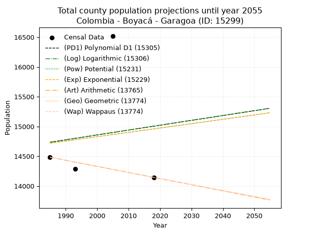
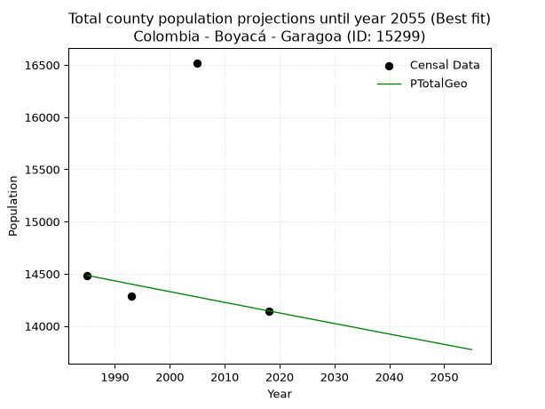
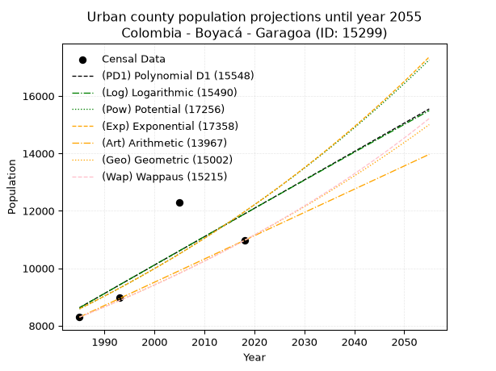
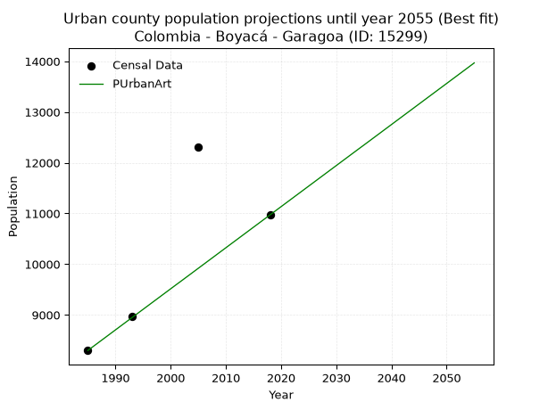
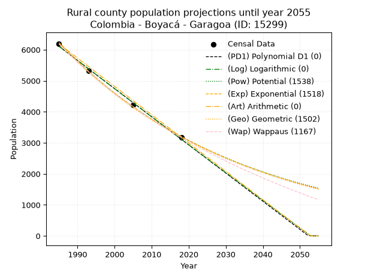
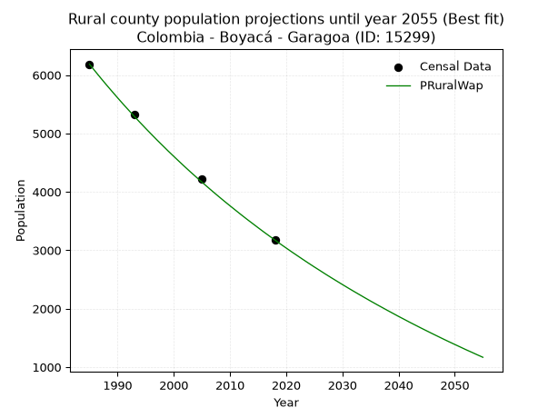

<div align="center">


</div>

# _“Population and Public Services Demand Projections (PPSD) until Year 2050 for Colombia - Boyacá - Garagoa (ID: 15299)”_
Keywords: `population` `public-service` `projection` `lineal` `polynomial` `logarithmic` `potential` `exponential` `arithmetic` `geometric` `wappaus` `dane` `colombia` `south-america`

PPSD are analytical estimates used by governments and planners to anticipate future changes in population size, age distribution, and the resulting community needs for utilities, healthcare, education, and infrastructure as sizing future water treatment facilities, electrical grids, and road networks based on spatial growth.

> **General running parameters**: • app_version: _v20260806_. • Python version: _3.14.7_. • Pandas version: _3.0.5_. • NumPy version: _2.5.1_. • Creates, save and include plots into reports (create_plot): _True_. • Projection until year: _2050_. • Process polynomial degree 2 and up: _False_. • Process Wappaus: _True_. • Process Wappaus: _True_. • Set negative values to zero: _True_. • Set infinite values to zero: _True_. • Drop dataset notes: _True_. 
<div align="center">

Dynamic map: [:earth_americas:Google](http://maps.google.com/maps?q=5.08323426,-73.3644125) [:earth_americas:OSM](https://www.openstreetmap.org/#map=18/5.08323426/-73.3644125&layers=P) [:earth_americas:Bing](https://www.bing.com/maps?cp=5.08323426~-73.3644125&lvl=18) [:earth_americas:Apple](https://maps.apple.com/frame?center=5.08323426%2C-73.3644125&span=0.003%2C0.006)

</div>


<div align="center">

```geojson
{
  "type": "Feature",
  "geometry": {
    "type": "Point", 
    "coordinates": [-73.3644125, 5.08323426]
  }, 
  "properties": {
    "Name": "Colombia - Boyacá - Garagoa (ID: 15299)"
  }
}
```

</div>


## 0. Census Data (4 records)

Census data are official statistics collected by a government about the people and housing in a country. They usually include counts of total population, age, sex, race, income, education, and jobs.

📅Global census file: [Population.xlsx](../data/Population.xlsx)

| Source   |   Year |   CountryID | CountryName   |   StateID | StateName   |   CountyID | CountyName   |   PTotal |   PUrban |   PRural |
|:---------|-------:|------------:|:--------------|----------:|:------------|-----------:|:-------------|---------:|---------:|---------:|
| DANE     |   1985 |          57 | Colombia      |        15 | Boyacá      |      15299 | Garagoa      |    14484 |     8299 |     6185 |
| DANE     |   1993 |          57 | Colombia      |        15 | Boyacá      |      15299 | Garagoa      |    14290 |     8971 |     5319 |
| DANE     |   2005 |          57 | Colombia      |        15 | Boyacá      |      15299 | Garagoa      |    16520 |    12301 |     4219 |
| DANE     |   2018 |          57 | Colombia      |        15 | Boyacá      |      15299 | Garagoa      |    14145 |    10971 |     3174 |

> 🔥Some records has specific notes about the registered values or the corresponding urban or rural distribution.

## 1. Total

### 1.1. Coefficients and Parameters

* (PD1) Polynomial Deg 1: 8.125652348455759, -1393.5861099986312 (lineal)
* (Log) Logarithmic: 16520.381555269007, -110711.80258762908
* (Pow) Potential: 0.9877431479794587, 0.9105183958088547
* (Exp) Exponential: 0.000485166302226455, 5619.15048453472
* (Art) Arithmetic: Year diff. 2018 - 1985 = 33, Population diff. 14145 - 14484 = -339, Annual growth = -10.272727272727273
* (Geo) Geometric: Year diff. 2018 - 1985 = 33, Population diff. 14145 - 14484 = -339, Annual growth % = -0.0007174209289360078
* (Wap) Wappaus: i = -0.07176448547086711, Condition values only valid for < 200)

<sub>
Wappaus condition values: ['-0.00', '-0.07', '-0.14', '-0.22', '-0.29', '-0.36', '-0.43', '-0.50', '-0.57', '-0.65', '-0.72', '-0.79', '-0.86', '-0.93', '-1.00', '-1.08', '-1.15', '-1.22', '-1.29', '-1.36', '-1.44', '-1.51', '-1.58', '-1.65', '-1.72', '-1.79', '-1.87', '-1.94', '-2.01', '-2.08', '-2.15', '-2.22', '-2.30', '-2.37', '-2.44', '-2.51', '-2.58', '-2.66', '-2.73', '-2.80', '-2.87', '-2.94', '-3.01', '-3.09', '-3.16', '-3.23', '-3.30', '-3.37', '-3.44', '-3.52', '-3.59', '-3.66', '-3.73', '-3.80', '-3.88', '-3.95', '-4.02', '-4.09', '-4.16', '-4.23', '-4.31', '-4.38', '-4.45', '-4.52', '-4.59', '-4.66']
</sub>


### 1.2. Projected Dataset

|   Year |   CountyID |   PTotalPD1 |   PTotalLog |   PTotalPow |   PTotalExp |   PTotalArt |   PTotalGeo |   PTotalWap |
|-------:|-----------:|------------:|------------:|------------:|------------:|------------:|------------:|------------:|
|   1985 |      15299 |       14736 |       14734 |       14718 |       14720 |       14484 |       14484 |       14484 |
|   1986 |      15299 |       14744 |       14742 |       14726 |       14728 |       14474 |       14474 |       14474 |
|   1987 |      15299 |       14752 |       14750 |       14733 |       14735 |       14463 |       14463 |       14463 |
|   1988 |      15299 |       14760 |       14759 |       14740 |       14742 |       14453 |       14453 |       14453 |
|   1989 |      15299 |       14768 |       14767 |       14748 |       14749 |       14443 |       14442 |       14442 |
|   1990 |      15299 |       14776 |       14775 |       14755 |       14756 |       14433 |       14432 |       14432 |
|   1991 |      15299 |       14785 |       14783 |       14762 |       14763 |       14422 |       14422 |       14422 |
|   1992 |      15299 |       14793 |       14792 |       14770 |       14770 |       14412 |       14411 |       14411 |
|   1993 |      15299 |       14801 |       14800 |       14777 |       14778 |       14402 |       14401 |       14401 |
|   1994 |      15299 |       14809 |       14808 |       14784 |       14785 |       14392 |       14391 |       14391 |
|   1995 |      15299 |       14817 |       14817 |       14792 |       14792 |       14381 |       14380 |       14380 |
|   1996 |      15299 |       14825 |       14825 |       14799 |       14799 |       14371 |       14370 |       14370 |
|   1997 |      15299 |       14833 |       14833 |       14806 |       14806 |       14361 |       14360 |       14360 |
|   1998 |      15299 |       14841 |       14841 |       14814 |       14814 |       14350 |       14349 |       14350 |
|   1999 |      15299 |       14850 |       14850 |       14821 |       14821 |       14340 |       14339 |       14339 |
|   2000 |      15299 |       14858 |       14858 |       14828 |       14828 |       14330 |       14329 |       14329 |
|   2001 |      15299 |       14866 |       14866 |       14836 |       14835 |       14320 |       14319 |       14319 |
|   2002 |      15299 |       14874 |       14875 |       14843 |       14842 |       14309 |       14308 |       14308 |
|   2003 |      15299 |       14882 |       14883 |       14850 |       14850 |       14299 |       14298 |       14298 |
|   2004 |      15299 |       14890 |       14891 |       14857 |       14857 |       14289 |       14288 |       14288 |
|   2005 |      15299 |       14898 |       14899 |       14865 |       14864 |       14279 |       14278 |       14278 |
|   2006 |      15299 |       14906 |       14907 |       14872 |       14871 |       14268 |       14267 |       14267 |
|   2007 |      15299 |       14915 |       14916 |       14879 |       14878 |       14258 |       14257 |       14257 |
|   2008 |      15299 |       14923 |       14924 |       14887 |       14886 |       14248 |       14247 |       14247 |
|   2009 |      15299 |       14931 |       14932 |       14894 |       14893 |       14237 |       14237 |       14237 |
|   2010 |      15299 |       14939 |       14940 |       14901 |       14900 |       14227 |       14226 |       14226 |
|   2011 |      15299 |       14947 |       14949 |       14909 |       14907 |       14217 |       14216 |       14216 |
|   2012 |      15299 |       14955 |       14957 |       14916 |       14915 |       14207 |       14206 |       14206 |
|   2013 |      15299 |       14963 |       14965 |       14923 |       14922 |       14196 |       14196 |       14196 |
|   2014 |      15299 |       14971 |       14973 |       14931 |       14929 |       14186 |       14186 |       14186 |
|   2015 |      15299 |       14980 |       14981 |       14938 |       14936 |       14176 |       14175 |       14175 |
|   2016 |      15299 |       14988 |       14990 |       14945 |       14943 |       14166 |       14165 |       14165 |
|   2017 |      15299 |       14996 |       14998 |       14953 |       14951 |       14155 |       14155 |       14155 |
|   2018 |      15299 |       15004 |       15006 |       14960 |       14958 |       14145 |       14145 |       14145 |
|   2019 |      15299 |       15012 |       15014 |       14967 |       14965 |       14135 |       14135 |       14135 |
|   2020 |      15299 |       15020 |       15022 |       14975 |       14973 |       14124 |       14125 |       14125 |
|   2021 |      15299 |       15028 |       15031 |       14982 |       14980 |       14114 |       14115 |       14115 |
|   2022 |      15299 |       15036 |       15039 |       14989 |       14987 |       14104 |       14104 |       14104 |
|   2023 |      15299 |       15045 |       15047 |       14997 |       14994 |       14094 |       14094 |       14094 |
|   2024 |      15299 |       15053 |       15055 |       15004 |       15002 |       14083 |       14084 |       14084 |
|   2025 |      15299 |       15061 |       15063 |       15011 |       15009 |       14073 |       14074 |       14074 |
|   2026 |      15299 |       15069 |       15071 |       15019 |       15016 |       14063 |       14064 |       14064 |
|   2027 |      15299 |       15077 |       15080 |       15026 |       15023 |       14053 |       14054 |       14054 |
|   2028 |      15299 |       15085 |       15088 |       15033 |       15031 |       14042 |       14044 |       14044 |
|   2029 |      15299 |       15093 |       15096 |       15041 |       15038 |       14032 |       14034 |       14034 |
|   2030 |      15299 |       15101 |       15104 |       15048 |       15045 |       14022 |       14024 |       14024 |
|   2031 |      15299 |       15110 |       15112 |       15055 |       15053 |       14011 |       14014 |       14014 |
|   2032 |      15299 |       15118 |       15120 |       15063 |       15060 |       14001 |       14004 |       14004 |
|   2033 |      15299 |       15126 |       15128 |       15070 |       15067 |       13991 |       13994 |       13994 |
|   2034 |      15299 |       15134 |       15136 |       15077 |       15075 |       13981 |       13984 |       13983 |
|   2035 |      15299 |       15142 |       15145 |       15084 |       15082 |       13970 |       13973 |       13973 |
|   2036 |      15299 |       15150 |       15153 |       15092 |       15089 |       13960 |       13963 |       13963 |
|   2037 |      15299 |       15158 |       15161 |       15099 |       15097 |       13950 |       13953 |       13953 |
|   2038 |      15299 |       15166 |       15169 |       15106 |       15104 |       13940 |       13943 |       13943 |
|   2039 |      15299 |       15175 |       15177 |       15114 |       15111 |       13929 |       13933 |       13933 |
|   2040 |      15299 |       15183 |       15185 |       15121 |       15119 |       13919 |       13923 |       13923 |
|   2041 |      15299 |       15191 |       15193 |       15128 |       15126 |       13909 |       13913 |       13913 |
|   2042 |      15299 |       15199 |       15201 |       15136 |       15133 |       13898 |       13903 |       13903 |
|   2043 |      15299 |       15207 |       15209 |       15143 |       15141 |       13888 |       13893 |       13893 |
|   2044 |      15299 |       15215 |       15218 |       15150 |       15148 |       13878 |       13884 |       13883 |
|   2045 |      15299 |       15223 |       15226 |       15158 |       15155 |       13868 |       13874 |       13873 |
|   2046 |      15299 |       15231 |       15234 |       15165 |       15163 |       13857 |       13864 |       13864 |
|   2047 |      15299 |       15240 |       15242 |       15172 |       15170 |       13847 |       13854 |       13854 |
|   2048 |      15299 |       15248 |       15250 |       15180 |       15177 |       13837 |       13844 |       13844 |
|   2049 |      15299 |       15256 |       15258 |       15187 |       15185 |       13827 |       13834 |       13834 |
|   2050 |      15299 |       15264 |       15266 |       15194 |       15192 |       13816 |       13824 |       13824 |
<div align="center">

</img>

</div>


### 1.3. Best fit with absolute error and relative error (%)

Relative error puts that difference into context by dividing the absolute error by the true value, creating a unitless ratio or percentage that shows the scale of the mistake.

Absolute and relative error

|   Year | Source   |   CountryID | CountryName   |   StateID | StateName   |   CountyID_x | CountyName   |   PTotal |   PUrban |   PRural |   CountyID_y |   PTotalPD1 |   PTotalLog |   PTotalPow |   PTotalExp |   PTotalArt |   PTotalGeo |   PTotalWap |   PTotalPD1AbsError |   PTotalLogAbsError |   PTotalPowAbsError |   PTotalExpAbsError |   PTotalArtAbsError |   PTotalGeoAbsError |   PTotalWapAbsError |   PTotalPD1RelError |   PTotalLogRelError |   PTotalPowRelError |   PTotalExpRelError |   PTotalArtRelError |   PTotalGeoRelError |   PTotalWapRelError |
|-------:|:---------|------------:|:--------------|----------:|:------------|-------------:|:-------------|---------:|---------:|---------:|-------------:|------------:|------------:|------------:|------------:|------------:|------------:|------------:|--------------------:|--------------------:|--------------------:|--------------------:|--------------------:|--------------------:|--------------------:|--------------------:|--------------------:|--------------------:|--------------------:|--------------------:|--------------------:|--------------------:|
|   1985 | DANE     |          57 | Colombia      |        15 | Boyacá      |        15299 | Garagoa      |    14484 |     8299 |     6185 |        15299 |       14736 |       14734 |       14718 |       14720 |       14484 |       14484 |       14484 |                 252 |                 250 |                 234 |                 236 |                   0 |                   0 |                   0 |             1.73985 |             1.72604 |             1.61558 |             1.62938 |            0        |            0        |            0        |
|   1993 | DANE     |          57 | Colombia      |        15 | Boyacá      |        15299 | Garagoa      |    14290 |     8971 |     5319 |        15299 |       14801 |       14800 |       14777 |       14778 |       14402 |       14401 |       14401 |                 511 |                 510 |                 487 |                 488 |                 112 |                 111 |                 111 |             3.57593 |             3.56893 |             3.40798 |             3.41498 |            0.783765 |            0.776767 |            0.776767 |
|   2005 | DANE     |          57 | Colombia      |        15 | Boyacá      |        15299 | Garagoa      |    16520 |    12301 |     4219 |        15299 |       14898 |       14899 |       14865 |       14864 |       14279 |       14278 |       14278 |                1622 |                1621 |                1655 |                1656 |                2241 |                2242 |                2242 |             9.8184  |             9.81235 |            10.0182  |            10.0242  |           13.5654   |           13.5714   |           13.5714   |
|   2018 | DANE     |          57 | Colombia      |        15 | Boyacá      |        15299 | Garagoa      |    14145 |    10971 |     3174 |        15299 |       15004 |       15006 |       14960 |       14958 |       14145 |       14145 |       14145 |                 859 |                 861 |                 815 |                 813 |                   0 |                   0 |                   0 |             6.07282 |             6.08696 |             5.76175 |             5.74761 |            0        |            0        |            0        |

Relative error mean

| Method    |   RelError | Best   |
|:----------|-----------:|:-------|
| PTotalPD1 |    5.30175 |        |
| PTotalLog |    5.29857 |        |
| PTotalPow |    5.20087 |        |
| PTotalExp |    5.20405 |        |
| PTotalArt |    3.58729 |        |
| PTotalGeo |    3.58705 | True   |
| PTotalWap |    3.58705 | True   |

💙Best method: _**PTotalGeo**_
<div align="center">

</img>

</div>


### 1.4. Fresh water supply demand in liters per capita per day (lpcd)

The fresh water supply demand typically ranges from 100 to 300 liters per capita per day (lpcd) for standard domestic and municipal planning, though absolute survival minimums set by the World Health Organization are as low as 7.5 to 20 liters per day, and total consumption in high-income nations can exceed 400 liters.

> `CZ`: Level in meters above the sea level (masl).<br> `WS`: Fresh water supply demand in liters per capita per day (lpcd or l/h/d).<br> `WSAll`: Zonal fresh water supply demand in liters per second (l/s).<br> `A`: Zonal area in square meters.

Reference values (RAS Colombia)

|    CZ |   WS |
|------:|-----:|
|  1000 |  120 |
|  2000 |  130 |
| 99999 |  140 |

County shapefile geometry properties and water supply values

|   CountyID |      ATotal |   CZTotal |   WSTotal |
|-----------:|------------:|----------:|----------:|
|      15299 | 1.93175e+08 |   2095.77 |       140 |

Projected values for best method: PTotalGeo

|   CountyID |   Year |   PTotalGeo |   WSTotal |   WSTotalAll |
|-----------:|-------:|------------:|----------:|-------------:|
|      15299 |   1985 |       14484 |       140 |      23.4694 |
|      15299 |   1986 |       14474 |       140 |      23.4532 |
|      15299 |   1987 |       14463 |       140 |      23.4354 |
|      15299 |   1988 |       14453 |       140 |      23.4192 |
|      15299 |   1989 |       14442 |       140 |      23.4014 |
|      15299 |   1990 |       14432 |       140 |      23.3852 |
|      15299 |   1991 |       14422 |       140 |      23.369  |
|      15299 |   1992 |       14411 |       140 |      23.3512 |
|      15299 |   1993 |       14401 |       140 |      23.335  |
|      15299 |   1994 |       14391 |       140 |      23.3188 |
|      15299 |   1995 |       14380 |       140 |      23.3009 |
|      15299 |   1996 |       14370 |       140 |      23.2847 |
|      15299 |   1997 |       14360 |       140 |      23.2685 |
|      15299 |   1998 |       14349 |       140 |      23.2507 |
|      15299 |   1999 |       14339 |       140 |      23.2345 |
|      15299 |   2000 |       14329 |       140 |      23.2183 |
|      15299 |   2001 |       14319 |       140 |      23.2021 |
|      15299 |   2002 |       14308 |       140 |      23.1843 |
|      15299 |   2003 |       14298 |       140 |      23.1681 |
|      15299 |   2004 |       14288 |       140 |      23.1519 |
|      15299 |   2005 |       14278 |       140 |      23.1356 |
|      15299 |   2006 |       14267 |       140 |      23.1178 |
|      15299 |   2007 |       14257 |       140 |      23.1016 |
|      15299 |   2008 |       14247 |       140 |      23.0854 |
|      15299 |   2009 |       14237 |       140 |      23.0692 |
|      15299 |   2010 |       14226 |       140 |      23.0514 |
|      15299 |   2011 |       14216 |       140 |      23.0352 |
|      15299 |   2012 |       14206 |       140 |      23.019  |
|      15299 |   2013 |       14196 |       140 |      23.0028 |
|      15299 |   2014 |       14186 |       140 |      22.9866 |
|      15299 |   2015 |       14175 |       140 |      22.9688 |
|      15299 |   2016 |       14165 |       140 |      22.9525 |
|      15299 |   2017 |       14155 |       140 |      22.9363 |
|      15299 |   2018 |       14145 |       140 |      22.9201 |
|      15299 |   2019 |       14135 |       140 |      22.9039 |
|      15299 |   2020 |       14125 |       140 |      22.8877 |
|      15299 |   2021 |       14115 |       140 |      22.8715 |
|      15299 |   2022 |       14104 |       140 |      22.8537 |
|      15299 |   2023 |       14094 |       140 |      22.8375 |
|      15299 |   2024 |       14084 |       140 |      22.8213 |
|      15299 |   2025 |       14074 |       140 |      22.8051 |
|      15299 |   2026 |       14064 |       140 |      22.7889 |
|      15299 |   2027 |       14054 |       140 |      22.7727 |
|      15299 |   2028 |       14044 |       140 |      22.7565 |
|      15299 |   2029 |       14034 |       140 |      22.7403 |
|      15299 |   2030 |       14024 |       140 |      22.7241 |
|      15299 |   2031 |       14014 |       140 |      22.7079 |
|      15299 |   2032 |       14004 |       140 |      22.6917 |
|      15299 |   2033 |       13994 |       140 |      22.6755 |
|      15299 |   2034 |       13984 |       140 |      22.6593 |
|      15299 |   2035 |       13973 |       140 |      22.6414 |
|      15299 |   2036 |       13963 |       140 |      22.6252 |
|      15299 |   2037 |       13953 |       140 |      22.609  |
|      15299 |   2038 |       13943 |       140 |      22.5928 |
|      15299 |   2039 |       13933 |       140 |      22.5766 |
|      15299 |   2040 |       13923 |       140 |      22.5604 |
|      15299 |   2041 |       13913 |       140 |      22.5442 |
|      15299 |   2042 |       13903 |       140 |      22.528  |
|      15299 |   2043 |       13893 |       140 |      22.5118 |
|      15299 |   2044 |       13884 |       140 |      22.4972 |
|      15299 |   2045 |       13874 |       140 |      22.481  |
|      15299 |   2046 |       13864 |       140 |      22.4648 |
|      15299 |   2047 |       13854 |       140 |      22.4486 |
|      15299 |   2048 |       13844 |       140 |      22.4324 |
|      15299 |   2049 |       13834 |       140 |      22.4162 |
|      15299 |   2050 |       13824 |       140 |      22.4    |

## 2. Urban

### 2.1. Coefficients and Parameters

* (PD1) Polynomial Deg 1: 98.86069851465335, -187610.6122039354 (lineal)
* (Log) Logarithmic: 198163.18223728143, -1496104.4361656585
* (Pow) Potential: 20.145229151903305, -62.50041587377857
* (Exp) Exponential: 0.010050948224337343, 1.858999797296799e-05
* (Art) Arithmetic: Year diff. 2018 - 1985 = 33, Population diff. 10971 - 8299 = 2672, Annual growth = 80.96969696969697
* (Geo) Geometric: Year diff. 2018 - 1985 = 33, Population diff. 10971 - 8299 = 2672, Annual growth % = 0.008494065594521816
* (Wap) Wappaus: i = 0.8403704926797817, Condition values only valid for < 200)

<sub>
Wappaus condition values: ['0.00', '0.84', '1.68', '2.52', '3.36', '4.20', '5.04', '5.88', '6.72', '7.56', '8.40', '9.24', '10.08', '10.92', '11.77', '12.61', '13.45', '14.29', '15.13', '15.97', '16.81', '17.65', '18.49', '19.33', '20.17', '21.01', '21.85', '22.69', '23.53', '24.37', '25.21', '26.05', '26.89', '27.73', '28.57', '29.41', '30.25', '31.09', '31.93', '32.77', '33.61', '34.46', '35.30', '36.14', '36.98', '37.82', '38.66', '39.50', '40.34', '41.18', '42.02', '42.86', '43.70', '44.54', '45.38', '46.22', '47.06', '47.90', '48.74', '49.58', '50.42', '51.26', '52.10', '52.94', '53.78', '54.62']
</sub>


### 2.2. Projected Dataset

|   Year |   CountyID |   PUrbanPD1 |   PUrbanLog |   PUrbanPow |   PUrbanExp |   PUrbanArt |   PUrbanGeo |   PUrbanWap |
|-------:|-----------:|------------:|------------:|------------:|------------:|------------:|------------:|------------:|
|   1985 |      15299 |        8628 |        8623 |        8585 |        8589 |        8299 |        8299 |        8299 |
|   1986 |      15299 |        8727 |        8723 |        8672 |        8676 |        8380 |        8369 |        8369 |
|   1987 |      15299 |        8826 |        8822 |        8761 |        8763 |        8461 |        8441 |        8440 |
|   1988 |      15299 |        8924 |        8922 |        8850 |        8852 |        8542 |        8512 |        8511 |
|   1989 |      15299 |        9023 |        9022 |        8940 |        8941 |        8623 |        8585 |        8583 |
|   1990 |      15299 |        9122 |        9121 |        9031 |        9032 |        8704 |        8657 |        8655 |
|   1991 |      15299 |        9221 |        9221 |        9123 |        9123 |        8785 |        8731 |        8728 |
|   1992 |      15299 |        9320 |        9320 |        9216 |        9215 |        8866 |        8805 |        8802 |
|   1993 |      15299 |        9419 |        9420 |        9309 |        9308 |        8947 |        8880 |        8876 |
|   1994 |      15299 |        9518 |        9519 |        9404 |        9402 |        9028 |        8955 |        8951 |
|   1995 |      15299 |        9616 |        9619 |        9499 |        9497 |        9109 |        9031 |        9027 |
|   1996 |      15299 |        9715 |        9718 |        9596 |        9593 |        9190 |        9108 |        9103 |
|   1997 |      15299 |        9814 |        9817 |        9693 |        9690 |        9271 |        9186 |        9180 |
|   1998 |      15299 |        9913 |        9916 |        9791 |        9788 |        9352 |        9264 |        9258 |
|   1999 |      15299 |       10012 |       10015 |        9890 |        9887 |        9433 |        9342 |        9336 |
|   2000 |      15299 |       10111 |       10115 |        9991 |        9987 |        9514 |        9422 |        9416 |
|   2001 |      15299 |       10210 |       10214 |       10092 |       10088 |        9595 |        9502 |        9495 |
|   2002 |      15299 |       10309 |       10313 |       10194 |       10189 |        9675 |        9582 |        9576 |
|   2003 |      15299 |       10407 |       10412 |       10297 |       10292 |        9756 |        9664 |        9657 |
|   2004 |      15299 |       10506 |       10511 |       10401 |       10396 |        9837 |        9746 |        9739 |
|   2005 |      15299 |       10605 |       10609 |       10506 |       10501 |        9918 |        9829 |        9822 |
|   2006 |      15299 |       10704 |       10708 |       10612 |       10607 |        9999 |        9912 |        9905 |
|   2007 |      15299 |       10803 |       10807 |       10719 |       10715 |       10080 |        9996 |        9990 |
|   2008 |      15299 |       10902 |       10906 |       10827 |       10823 |       10161 |       10081 |       10075 |
|   2009 |      15299 |       11001 |       11004 |       10936 |       10932 |       10242 |       10167 |       10161 |
|   2010 |      15299 |       11099 |       11103 |       11047 |       11043 |       10323 |       10253 |       10247 |
|   2011 |      15299 |       11198 |       11201 |       11158 |       11154 |       10404 |       10340 |       10335 |
|   2012 |      15299 |       11297 |       11300 |       11270 |       11267 |       10485 |       10428 |       10423 |
|   2013 |      15299 |       11396 |       11398 |       11383 |       11381 |       10566 |       10517 |       10512 |
|   2014 |      15299 |       11495 |       11497 |       11498 |       11496 |       10647 |       10606 |       10602 |
|   2015 |      15299 |       11594 |       11595 |       11613 |       11612 |       10728 |       10696 |       10693 |
|   2016 |      15299 |       11693 |       11694 |       11730 |       11729 |       10809 |       10787 |       10785 |
|   2017 |      15299 |       11791 |       11792 |       11848 |       11848 |       10890 |       10879 |       10877 |
|   2018 |      15299 |       11890 |       11890 |       11967 |       11967 |       10971 |       10971 |       10971 |
|   2019 |      15299 |       11989 |       11988 |       12087 |       12088 |       11052 |       11064 |       11065 |
|   2020 |      15299 |       12088 |       12086 |       12208 |       12210 |       11133 |       11158 |       11161 |
|   2021 |      15299 |       12187 |       12184 |       12330 |       12334 |       11214 |       11253 |       11257 |
|   2022 |      15299 |       12286 |       12282 |       12454 |       12458 |       11295 |       11349 |       11355 |
|   2023 |      15299 |       12385 |       12380 |       12578 |       12584 |       11376 |       11445 |       11453 |
|   2024 |      15299 |       12483 |       12478 |       12704 |       12711 |       11457 |       11542 |       11552 |
|   2025 |      15299 |       12582 |       12576 |       12831 |       12840 |       11538 |       11640 |       11652 |
|   2026 |      15299 |       12681 |       12674 |       12960 |       12969 |       11619 |       11739 |       11754 |
|   2027 |      15299 |       12780 |       12772 |       13089 |       13100 |       11700 |       11839 |       11856 |
|   2028 |      15299 |       12879 |       12870 |       13220 |       13233 |       11781 |       11939 |       11959 |
|   2029 |      15299 |       12978 |       12967 |       13352 |       13366 |       11862 |       12041 |       12064 |
|   2030 |      15299 |       13077 |       13065 |       13485 |       13501 |       11943 |       12143 |       12169 |
|   2031 |      15299 |       13175 |       13163 |       13619 |       13638 |       12024 |       12246 |       12276 |
|   2032 |      15299 |       13274 |       13260 |       13755 |       13775 |       12105 |       12350 |       12384 |
|   2033 |      15299 |       13373 |       13358 |       13892 |       13915 |       12186 |       12455 |       12492 |
|   2034 |      15299 |       13472 |       13455 |       14030 |       14055 |       12267 |       12561 |       12602 |
|   2035 |      15299 |       13571 |       13552 |       14170 |       14197 |       12347 |       12668 |       12714 |
|   2036 |      15299 |       13670 |       13650 |       14311 |       14341 |       12428 |       12775 |       12826 |
|   2037 |      15299 |       13769 |       13747 |       14453 |       14485 |       12509 |       12884 |       12940 |
|   2038 |      15299 |       13867 |       13844 |       14597 |       14632 |       12590 |       12993 |       13054 |
|   2039 |      15299 |       13966 |       13942 |       14742 |       14780 |       12671 |       13103 |       13170 |
|   2040 |      15299 |       14065 |       14039 |       14888 |       14929 |       12752 |       13215 |       13288 |
|   2041 |      15299 |       14164 |       14136 |       15036 |       15080 |       12833 |       13327 |       13406 |
|   2042 |      15299 |       14263 |       14233 |       15185 |       15232 |       12914 |       13440 |       13526 |
|   2043 |      15299 |       14362 |       14330 |       15336 |       15386 |       12995 |       13554 |       13648 |
|   2044 |      15299 |       14461 |       14427 |       15487 |       15541 |       13076 |       13670 |       13770 |
|   2045 |      15299 |       14560 |       14524 |       15641 |       15698 |       13157 |       13786 |       13894 |
|   2046 |      15299 |       14658 |       14621 |       15796 |       15857 |       13238 |       13903 |       14020 |
|   2047 |      15299 |       14757 |       14718 |       15952 |       16017 |       13319 |       14021 |       14146 |
|   2048 |      15299 |       14856 |       14814 |       16110 |       16179 |       13400 |       14140 |       14275 |
|   2049 |      15299 |       14955 |       14911 |       16269 |       16342 |       13481 |       14260 |       14404 |
|   2050 |      15299 |       15054 |       15008 |       16430 |       16507 |       13562 |       14381 |       14536 |
<div align="center">

</img>

</div>


### 2.3. Best fit with absolute error and relative error (%)

Relative error puts that difference into context by dividing the absolute error by the true value, creating a unitless ratio or percentage that shows the scale of the mistake.

Absolute and relative error

|   Year | Source   |   CountryID | CountryName   |   StateID | StateName   |   CountyID_x | CountyName   |   PTotal |   PUrban |   PRural |   CountyID_y |   PUrbanPD1 |   PUrbanLog |   PUrbanPow |   PUrbanExp |   PUrbanArt |   PUrbanGeo |   PUrbanWap |   PUrbanPD1AbsError |   PUrbanLogAbsError |   PUrbanPowAbsError |   PUrbanExpAbsError |   PUrbanArtAbsError |   PUrbanGeoAbsError |   PUrbanWapAbsError |   PUrbanPD1RelError |   PUrbanLogRelError |   PUrbanPowRelError |   PUrbanExpRelError |   PUrbanArtRelError |   PUrbanGeoRelError |   PUrbanWapRelError |
|-------:|:---------|------------:|:--------------|----------:|:------------|-------------:|:-------------|---------:|---------:|---------:|-------------:|------------:|------------:|------------:|------------:|------------:|------------:|------------:|--------------------:|--------------------:|--------------------:|--------------------:|--------------------:|--------------------:|--------------------:|--------------------:|--------------------:|--------------------:|--------------------:|--------------------:|--------------------:|--------------------:|
|   1985 | DANE     |          57 | Colombia      |        15 | Boyacá      |        15299 | Garagoa      |    14484 |     8299 |     6185 |        15299 |        8628 |        8623 |        8585 |        8589 |        8299 |        8299 |        8299 |                 329 |                 324 |                 286 |                 290 |                   0 |                   0 |                   0 |             3.96433 |             3.90408 |             3.4462  |             3.4944  |            0        |             0       |             0       |
|   1993 | DANE     |          57 | Colombia      |        15 | Boyacá      |        15299 | Garagoa      |    14290 |     8971 |     5319 |        15299 |        9419 |        9420 |        9309 |        9308 |        8947 |        8880 |        8876 |                 448 |                 449 |                 338 |                 337 |                  24 |                  91 |                  95 |             4.99387 |             5.00502 |             3.7677  |             3.75655 |            0.267529 |             1.01438 |             1.05897 |
|   2005 | DANE     |          57 | Colombia      |        15 | Boyacá      |        15299 | Garagoa      |    16520 |    12301 |     4219 |        15299 |       10605 |       10609 |       10506 |       10501 |        9918 |        9829 |        9822 |                1696 |                1692 |                1795 |                1800 |                2383 |                2472 |                2479 |            13.7875  |            13.755   |            14.5923  |            14.633   |           19.3724   |            20.0959  |            20.1528  |
|   2018 | DANE     |          57 | Colombia      |        15 | Boyacá      |        15299 | Garagoa      |    14145 |    10971 |     3174 |        15299 |       11890 |       11890 |       11967 |       11967 |       10971 |       10971 |       10971 |                 919 |                 919 |                 996 |                 996 |                   0 |                   0 |                   0 |             8.37663 |             8.37663 |             9.07848 |             9.07848 |            0        |             0       |             0       |

Relative error mean

| Method    |   RelError | Best   |
|:----------|-----------:|:-------|
| PUrbanPD1 |    7.78058 |        |
| PUrbanLog |    7.76018 |        |
| PUrbanPow |    7.72117 |        |
| PUrbanExp |    7.7406  |        |
| PUrbanArt |    4.90998 | True   |
| PUrbanGeo |    5.27758 |        |
| PUrbanWap |    5.30295 |        |

💙Best method: _**PUrbanArt**_
<div align="center">

</img>

</div>


### 2.4. Fresh water supply demand in liters per capita per day (lpcd)

The fresh water supply demand typically ranges from 100 to 300 liters per capita per day (lpcd) for standard domestic and municipal planning, though absolute survival minimums set by the World Health Organization are as low as 7.5 to 20 liters per day, and total consumption in high-income nations can exceed 400 liters.

> `CZ`: Level in meters above the sea level (masl).<br> `WS`: Fresh water supply demand in liters per capita per day (lpcd or l/h/d).<br> `WSAll`: Zonal fresh water supply demand in liters per second (l/s).<br> `A`: Zonal area in square meters.

Reference values (RAS Colombia)

|    CZ |   WS |
|------:|-----:|
|  1000 |  120 |
|  2000 |  130 |
| 99999 |  140 |

County shapefile geometry properties and water supply values

|   CountyID |      AUrban |   CZUrban |   WSUrban |
|-----------:|------------:|----------:|----------:|
|      15299 | 2.03269e+06 |   1658.43 |       130 |

Projected values for best method: PUrbanArt

|   CountyID |   Year |   PUrbanArt |   WSUrban |   WSUrbanAll |
|-----------:|-------:|------------:|----------:|-------------:|
|      15299 |   1985 |        8299 |       130 |      12.4869 |
|      15299 |   1986 |        8380 |       130 |      12.6088 |
|      15299 |   1987 |        8461 |       130 |      12.7307 |
|      15299 |   1988 |        8542 |       130 |      12.8525 |
|      15299 |   1989 |        8623 |       130 |      12.9744 |
|      15299 |   1990 |        8704 |       130 |      13.0963 |
|      15299 |   1991 |        8785 |       130 |      13.2182 |
|      15299 |   1992 |        8866 |       130 |      13.34   |
|      15299 |   1993 |        8947 |       130 |      13.4619 |
|      15299 |   1994 |        9028 |       130 |      13.5838 |
|      15299 |   1995 |        9109 |       130 |      13.7057 |
|      15299 |   1996 |        9190 |       130 |      13.8275 |
|      15299 |   1997 |        9271 |       130 |      13.9494 |
|      15299 |   1998 |        9352 |       130 |      14.0713 |
|      15299 |   1999 |        9433 |       130 |      14.1932 |
|      15299 |   2000 |        9514 |       130 |      14.315  |
|      15299 |   2001 |        9595 |       130 |      14.4369 |
|      15299 |   2002 |        9675 |       130 |      14.5573 |
|      15299 |   2003 |        9756 |       130 |      14.6792 |
|      15299 |   2004 |        9837 |       130 |      14.801  |
|      15299 |   2005 |        9918 |       130 |      14.9229 |
|      15299 |   2006 |        9999 |       130 |      15.0448 |
|      15299 |   2007 |       10080 |       130 |      15.1667 |
|      15299 |   2008 |       10161 |       130 |      15.2885 |
|      15299 |   2009 |       10242 |       130 |      15.4104 |
|      15299 |   2010 |       10323 |       130 |      15.5323 |
|      15299 |   2011 |       10404 |       130 |      15.6542 |
|      15299 |   2012 |       10485 |       130 |      15.776  |
|      15299 |   2013 |       10566 |       130 |      15.8979 |
|      15299 |   2014 |       10647 |       130 |      16.0198 |
|      15299 |   2015 |       10728 |       130 |      16.1417 |
|      15299 |   2016 |       10809 |       130 |      16.2635 |
|      15299 |   2017 |       10890 |       130 |      16.3854 |
|      15299 |   2018 |       10971 |       130 |      16.5073 |
|      15299 |   2019 |       11052 |       130 |      16.6292 |
|      15299 |   2020 |       11133 |       130 |      16.751  |
|      15299 |   2021 |       11214 |       130 |      16.8729 |
|      15299 |   2022 |       11295 |       130 |      16.9948 |
|      15299 |   2023 |       11376 |       130 |      17.1167 |
|      15299 |   2024 |       11457 |       130 |      17.2385 |
|      15299 |   2025 |       11538 |       130 |      17.3604 |
|      15299 |   2026 |       11619 |       130 |      17.4823 |
|      15299 |   2027 |       11700 |       130 |      17.6042 |
|      15299 |   2028 |       11781 |       130 |      17.726  |
|      15299 |   2029 |       11862 |       130 |      17.8479 |
|      15299 |   2030 |       11943 |       130 |      17.9698 |
|      15299 |   2031 |       12024 |       130 |      18.0917 |
|      15299 |   2032 |       12105 |       130 |      18.2135 |
|      15299 |   2033 |       12186 |       130 |      18.3354 |
|      15299 |   2034 |       12267 |       130 |      18.4573 |
|      15299 |   2035 |       12347 |       130 |      18.5777 |
|      15299 |   2036 |       12428 |       130 |      18.6995 |
|      15299 |   2037 |       12509 |       130 |      18.8214 |
|      15299 |   2038 |       12590 |       130 |      18.9433 |
|      15299 |   2039 |       12671 |       130 |      19.0652 |
|      15299 |   2040 |       12752 |       130 |      19.187  |
|      15299 |   2041 |       12833 |       130 |      19.3089 |
|      15299 |   2042 |       12914 |       130 |      19.4308 |
|      15299 |   2043 |       12995 |       130 |      19.5527 |
|      15299 |   2044 |       13076 |       130 |      19.6745 |
|      15299 |   2045 |       13157 |       130 |      19.7964 |
|      15299 |   2046 |       13238 |       130 |      19.9183 |
|      15299 |   2047 |       13319 |       130 |      20.0402 |
|      15299 |   2048 |       13400 |       130 |      20.162  |
|      15299 |   2049 |       13481 |       130 |      20.2839 |
|      15299 |   2050 |       13562 |       130 |      20.4058 |

## 3. Rural

### 3.1. Coefficients and Parameters

* (PD1) Polynomial Deg 1: -90.73504616619759, 186217.0260939367 (lineal)
* (Log) Logarithmic: -181642.8006820125, 1385392.63357803
* (Pow) Potential: -40.38283339200879, 136.9677920821086
* (Exp) Exponential: -0.020176708476296643, 1.5433111798718278e+21
* (Art) Arithmetic: Year diff. 2018 - 1985 = 33, Population diff. 3174 - 6185 = -3011, Annual growth = -91.24242424242425
* (Geo) Geometric: Year diff. 2018 - 1985 = 33, Population diff. 3174 - 6185 = -3011, Annual growth % = -0.020013216317452565
* (Wap) Wappaus: i = -1.9498327650908054, Condition values only valid for < 200)

<sub>
Wappaus condition values: ['-0.00', '-1.95', '-3.90', '-5.85', '-7.80', '-9.75', '-11.70', '-13.65', '-15.60', '-17.55', '-19.50', '-21.45', '-23.40', '-25.35', '-27.30', '-29.25', '-31.20', '-33.15', '-35.10', '-37.05', '-39.00', '-40.95', '-42.90', '-44.85', '-46.80', '-48.75', '-50.70', '-52.65', '-54.60', '-56.55', '-58.49', '-60.44', '-62.39', '-64.34', '-66.29', '-68.24', '-70.19', '-72.14', '-74.09', '-76.04', '-77.99', '-79.94', '-81.89', '-83.84', '-85.79', '-87.74', '-89.69', '-91.64', '-93.59', '-95.54', '-97.49', '-99.44', '-101.39', '-103.34', '-105.29', '-107.24', '-109.19', '-111.14', '-113.09', '-115.04', '-116.99', '-118.94', '-120.89', '-122.84', '-124.79', '-126.74']
</sub>


### 3.2. Projected Dataset

|   Year |   CountyID |   PRuralPD1 |   PRuralLog |   PRuralPow |   PRuralExp |   PRuralArt |   PRuralGeo |   PRuralWap |
|-------:|-----------:|------------:|------------:|------------:|------------:|------------:|------------:|------------:|
|   1985 |      15299 |        6108 |        6111 |        6236 |        6232 |        6185 |        6185 |        6185 |
|   1986 |      15299 |        6017 |        6019 |        6110 |        6108 |        6094 |        6061 |        6066 |
|   1987 |      15299 |        5926 |        5928 |        5987 |        5986 |        6003 |        5940 |        5948 |
|   1988 |      15299 |        5836 |        5837 |        5867 |        5866 |        5911 |        5821 |        5833 |
|   1989 |      15299 |        5745 |        5745 |        5749 |        5749 |        5820 |        5705 |        5721 |
|   1990 |      15299 |        5654 |        5654 |        5633 |        5634 |        5729 |        5590 |        5610 |
|   1991 |      15299 |        5564 |        5563 |        5520 |        5521 |        5638 |        5478 |        5501 |
|   1992 |      15299 |        5473 |        5471 |        5409 |        5411 |        5546 |        5369 |        5395 |
|   1993 |      15299 |        5382 |        5380 |        5301 |        5303 |        5455 |        5261 |        5290 |
|   1994 |      15299 |        5291 |        5289 |        5194 |        5197 |        5364 |        5156 |        5187 |
|   1995 |      15299 |        5201 |        5198 |        5090 |        5093 |        5273 |        5053 |        5086 |
|   1996 |      15299 |        5110 |        5107 |        4988 |        4992 |        5181 |        4952 |        4987 |
|   1997 |      15299 |        5019 |        5016 |        4888 |        4892 |        5090 |        4853 |        4889 |
|   1998 |      15299 |        4928 |        4925 |        4791 |        4794 |        4999 |        4756 |        4794 |
|   1999 |      15299 |        4838 |        4834 |        4695 |        4698 |        4908 |        4660 |        4699 |
|   2000 |      15299 |        4747 |        4743 |        4601 |        4605 |        4816 |        4567 |        4607 |
|   2001 |      15299 |        4656 |        4653 |        4509 |        4513 |        4725 |        4476 |        4516 |
|   2002 |      15299 |        4565 |        4562 |        4419 |        4422 |        4634 |        4386 |        4426 |
|   2003 |      15299 |        4475 |        4471 |        4331 |        4334 |        4543 |        4298 |        4338 |
|   2004 |      15299 |        4384 |        4381 |        4244 |        4248 |        4451 |        4212 |        4252 |
|   2005 |      15299 |        4293 |        4290 |        4160 |        4163 |        4360 |        4128 |        4167 |
|   2006 |      15299 |        4203 |        4199 |        4077 |        4080 |        4269 |        4045 |        4083 |
|   2007 |      15299 |        4112 |        4109 |        3996 |        3998 |        4178 |        3964 |        4000 |
|   2008 |      15299 |        4021 |        4018 |        3916 |        3918 |        4086 |        3885 |        3919 |
|   2009 |      15299 |        3930 |        3928 |        3838 |        3840 |        3995 |        3807 |        3839 |
|   2010 |      15299 |        3840 |        3837 |        3762 |        3763 |        3904 |        3731 |        3761 |
|   2011 |      15299 |        3749 |        3747 |        3687 |        3688 |        3813 |        3656 |        3684 |
|   2012 |      15299 |        3658 |        3657 |        3614 |        3614 |        3721 |        3583 |        3607 |
|   2013 |      15299 |        3567 |        3567 |        3542 |        3542 |        3630 |        3512 |        3532 |
|   2014 |      15299 |        3477 |        3476 |        3471 |        3471 |        3539 |        3441 |        3459 |
|   2015 |      15299 |        3386 |        3386 |        3403 |        3402 |        3448 |        3372 |        3386 |
|   2016 |      15299 |        3295 |        3296 |        3335 |        3334 |        3356 |        3305 |        3314 |
|   2017 |      15299 |        3204 |        3206 |        3269 |        3268 |        3265 |        3239 |        3244 |
|   2018 |      15299 |        3114 |        3116 |        3204 |        3202 |        3174 |        3174 |        3174 |
|   2019 |      15299 |        3023 |        3026 |        3141 |        3138 |        3083 |        3110 |        3105 |
|   2020 |      15299 |        2932 |        2936 |        3078 |        3076 |        2992 |        3048 |        3038 |
|   2021 |      15299 |        2841 |        2846 |        3018 |        3014 |        2900 |        2987 |        2971 |
|   2022 |      15299 |        2751 |        2756 |        2958 |        2954 |        2809 |        2927 |        2906 |
|   2023 |      15299 |        2660 |        2666 |        2899 |        2895 |        2718 |        2869 |        2841 |
|   2024 |      15299 |        2569 |        2577 |        2842 |        2837 |        2627 |        2811 |        2777 |
|   2025 |      15299 |        2479 |        2487 |        2786 |        2780 |        2535 |        2755 |        2714 |
|   2026 |      15299 |        2388 |        2397 |        2731 |        2725 |        2444 |        2700 |        2653 |
|   2027 |      15299 |        2297 |        2308 |        2677 |        2671 |        2353 |        2646 |        2591 |
|   2028 |      15299 |        2206 |        2218 |        2624 |        2617 |        2262 |        2593 |        2531 |
|   2029 |      15299 |        2116 |        2129 |        2573 |        2565 |        2170 |        2541 |        2472 |
|   2030 |      15299 |        2025 |        2039 |        2522 |        2514 |        2079 |        2490 |        2413 |
|   2031 |      15299 |        1934 |        1950 |        2472 |        2463 |        1988 |        2440 |        2355 |
|   2032 |      15299 |        1843 |        1860 |        2424 |        2414 |        1897 |        2392 |        2298 |
|   2033 |      15299 |        1753 |        1771 |        2376 |        2366 |        1805 |        2344 |        2242 |
|   2034 |      15299 |        1662 |        1681 |        2329 |        2319 |        1714 |        2297 |        2186 |
|   2035 |      15299 |        1571 |        1592 |        2283 |        2272 |        1623 |        2251 |        2131 |
|   2036 |      15299 |        1480 |        1503 |        2239 |        2227 |        1532 |        2206 |        2077 |
|   2037 |      15299 |        1390 |        1414 |        2195 |        2183 |        1440 |        2162 |        2024 |
|   2038 |      15299 |        1299 |        1325 |        2152 |        2139 |        1349 |        2118 |        1971 |
|   2039 |      15299 |        1208 |        1235 |        2109 |        2096 |        1258 |        2076 |        1919 |
|   2040 |      15299 |        1118 |        1146 |        2068 |        2054 |        1167 |        2034 |        1867 |
|   2041 |      15299 |        1027 |        1057 |        2027 |        2013 |        1075 |        1994 |        1817 |
|   2042 |      15299 |         936 |         968 |        1988 |        1973 |         984 |        1954 |        1766 |
|   2043 |      15299 |         845 |         879 |        1949 |        1934 |         893 |        1915 |        1717 |
|   2044 |      15299 |         755 |         791 |        1911 |        1895 |         802 |        1876 |        1668 |
|   2045 |      15299 |         664 |         702 |        1873 |        1857 |         710 |        1839 |        1620 |
|   2046 |      15299 |         573 |         613 |        1837 |        1820 |         619 |        1802 |        1572 |
|   2047 |      15299 |         482 |         524 |        1801 |        1784 |         528 |        1766 |        1525 |
|   2048 |      15299 |         392 |         435 |        1766 |        1748 |         437 |        1731 |        1478 |
|   2049 |      15299 |         301 |         347 |        1731 |        1713 |         345 |        1696 |        1432 |
|   2050 |      15299 |         210 |         258 |        1697 |        1679 |         254 |        1662 |        1387 |
<div align="center">

</img>

</div>


### 3.3. Best fit with absolute error and relative error (%)

Relative error puts that difference into context by dividing the absolute error by the true value, creating a unitless ratio or percentage that shows the scale of the mistake.

Absolute and relative error

|   Year | Source   |   CountryID | CountryName   |   StateID | StateName   |   CountyID_x | CountyName   |   PTotal |   PUrban |   PRural |   CountyID_y |   PRuralPD1 |   PRuralLog |   PRuralPow |   PRuralExp |   PRuralArt |   PRuralGeo |   PRuralWap |   PRuralPD1AbsError |   PRuralLogAbsError |   PRuralPowAbsError |   PRuralExpAbsError |   PRuralArtAbsError |   PRuralGeoAbsError |   PRuralWapAbsError |   PRuralPD1RelError |   PRuralLogRelError |   PRuralPowRelError |   PRuralExpRelError |   PRuralArtRelError |   PRuralGeoRelError |   PRuralWapRelError |
|-------:|:---------|------------:|:--------------|----------:|:------------|-------------:|:-------------|---------:|---------:|---------:|-------------:|------------:|------------:|------------:|------------:|------------:|------------:|------------:|--------------------:|--------------------:|--------------------:|--------------------:|--------------------:|--------------------:|--------------------:|--------------------:|--------------------:|--------------------:|--------------------:|--------------------:|--------------------:|--------------------:|
|   1985 | DANE     |          57 | Colombia      |        15 | Boyacá      |        15299 | Garagoa      |    14484 |     8299 |     6185 |        15299 |        6108 |        6111 |        6236 |        6232 |        6185 |        6185 |        6185 |                  77 |                  74 |                  51 |                  47 |                   0 |                   0 |                   0 |             1.24495 |             1.19644 |            0.824576 |            0.759903 |             0       |             0       |            0        |
|   1993 | DANE     |          57 | Colombia      |        15 | Boyacá      |        15299 | Garagoa      |    14290 |     8971 |     5319 |        15299 |        5382 |        5380 |        5301 |        5303 |        5455 |        5261 |        5290 |                  63 |                  61 |                  18 |                  16 |                 136 |                  58 |                  29 |             1.18443 |             1.14683 |            0.338409 |            0.300808 |             2.55687 |             1.09043 |            0.545215 |
|   2005 | DANE     |          57 | Colombia      |        15 | Boyacá      |        15299 | Garagoa      |    16520 |    12301 |     4219 |        15299 |        4293 |        4290 |        4160 |        4163 |        4360 |        4128 |        4167 |                  74 |                  71 |                  59 |                  56 |                 141 |                  91 |                  52 |             1.75397 |             1.68286 |            1.39844  |            1.32733  |             3.34202 |             2.15691 |            1.23252  |
|   2018 | DANE     |          57 | Colombia      |        15 | Boyacá      |        15299 | Garagoa      |    14145 |    10971 |     3174 |        15299 |        3114 |        3116 |        3204 |        3202 |        3174 |        3174 |        3174 |                  60 |                  58 |                  30 |                  28 |                   0 |                   0 |                   0 |             1.89036 |             1.82735 |            0.94518  |            0.882168 |             0       |             0       |            0        |

Relative error mean

| Method    |   RelError | Best   |
|:----------|-----------:|:-------|
| PRuralPD1 |   1.51843  |        |
| PRuralLog |   1.46337  |        |
| PRuralPow |   0.87665  |        |
| PRuralExp |   0.817552 |        |
| PRuralArt |   1.47472  |        |
| PRuralGeo |   0.811835 |        |
| PRuralWap |   0.444434 | True   |

💙Best method: _**PRuralWap**_
<div align="center">

</img>

</div>


### 3.4. Fresh water supply demand in liters per capita per day (lpcd)

The fresh water supply demand typically ranges from 100 to 300 liters per capita per day (lpcd) for standard domestic and municipal planning, though absolute survival minimums set by the World Health Organization are as low as 7.5 to 20 liters per day, and total consumption in high-income nations can exceed 400 liters.

> `CZ`: Level in meters above the sea level (masl).<br> `WS`: Fresh water supply demand in liters per capita per day (lpcd or l/h/d).<br> `WSAll`: Zonal fresh water supply demand in liters per second (l/s).<br> `A`: Zonal area in square meters.

Reference values (RAS Colombia)

|    CZ |   WS |
|------:|-----:|
|  1000 |  120 |
|  2000 |  130 |
| 99999 |  140 |

County shapefile geometry properties and water supply values

|   CountyID |      ARural |   CZRural |   WSRural |
|-----------:|------------:|----------:|----------:|
|      15299 | 1.91142e+08 |   2100.42 |       140 |

Projected values for best method: PRuralWap

|   CountyID |   Year |   PRuralWap |   WSRural |   WSRuralAll |
|-----------:|-------:|------------:|----------:|-------------:|
|      15299 |   1985 |        6185 |       140 |     10.022   |
|      15299 |   1986 |        6066 |       140 |      9.82917 |
|      15299 |   1987 |        5948 |       140 |      9.63796 |
|      15299 |   1988 |        5833 |       140 |      9.45162 |
|      15299 |   1989 |        5721 |       140 |      9.27014 |
|      15299 |   1990 |        5610 |       140 |      9.09028 |
|      15299 |   1991 |        5501 |       140 |      8.91366 |
|      15299 |   1992 |        5395 |       140 |      8.7419  |
|      15299 |   1993 |        5290 |       140 |      8.57176 |
|      15299 |   1994 |        5187 |       140 |      8.40486 |
|      15299 |   1995 |        5086 |       140 |      8.2412  |
|      15299 |   1996 |        4987 |       140 |      8.08079 |
|      15299 |   1997 |        4889 |       140 |      7.92199 |
|      15299 |   1998 |        4794 |       140 |      7.76806 |
|      15299 |   1999 |        4699 |       140 |      7.61412 |
|      15299 |   2000 |        4607 |       140 |      7.46505 |
|      15299 |   2001 |        4516 |       140 |      7.31759 |
|      15299 |   2002 |        4426 |       140 |      7.17176 |
|      15299 |   2003 |        4338 |       140 |      7.02917 |
|      15299 |   2004 |        4252 |       140 |      6.88981 |
|      15299 |   2005 |        4167 |       140 |      6.75208 |
|      15299 |   2006 |        4083 |       140 |      6.61597 |
|      15299 |   2007 |        4000 |       140 |      6.48148 |
|      15299 |   2008 |        3919 |       140 |      6.35023 |
|      15299 |   2009 |        3839 |       140 |      6.2206  |
|      15299 |   2010 |        3761 |       140 |      6.09421 |
|      15299 |   2011 |        3684 |       140 |      5.96944 |
|      15299 |   2012 |        3607 |       140 |      5.84468 |
|      15299 |   2013 |        3532 |       140 |      5.72315 |
|      15299 |   2014 |        3459 |       140 |      5.60486 |
|      15299 |   2015 |        3386 |       140 |      5.48657 |
|      15299 |   2016 |        3314 |       140 |      5.36991 |
|      15299 |   2017 |        3244 |       140 |      5.25648 |
|      15299 |   2018 |        3174 |       140 |      5.14306 |
|      15299 |   2019 |        3105 |       140 |      5.03125 |
|      15299 |   2020 |        3038 |       140 |      4.92269 |
|      15299 |   2021 |        2971 |       140 |      4.81412 |
|      15299 |   2022 |        2906 |       140 |      4.7088  |
|      15299 |   2023 |        2841 |       140 |      4.60347 |
|      15299 |   2024 |        2777 |       140 |      4.49977 |
|      15299 |   2025 |        2714 |       140 |      4.39769 |
|      15299 |   2026 |        2653 |       140 |      4.29884 |
|      15299 |   2027 |        2591 |       140 |      4.19838 |
|      15299 |   2028 |        2531 |       140 |      4.10116 |
|      15299 |   2029 |        2472 |       140 |      4.00556 |
|      15299 |   2030 |        2413 |       140 |      3.90995 |
|      15299 |   2031 |        2355 |       140 |      3.81597 |
|      15299 |   2032 |        2298 |       140 |      3.72361 |
|      15299 |   2033 |        2242 |       140 |      3.63287 |
|      15299 |   2034 |        2186 |       140 |      3.54213 |
|      15299 |   2035 |        2131 |       140 |      3.45301 |
|      15299 |   2036 |        2077 |       140 |      3.36551 |
|      15299 |   2037 |        2024 |       140 |      3.27963 |
|      15299 |   2038 |        1971 |       140 |      3.19375 |
|      15299 |   2039 |        1919 |       140 |      3.10949 |
|      15299 |   2040 |        1867 |       140 |      3.02523 |
|      15299 |   2041 |        1817 |       140 |      2.94421 |
|      15299 |   2042 |        1766 |       140 |      2.86157 |
|      15299 |   2043 |        1717 |       140 |      2.78218 |
|      15299 |   2044 |        1668 |       140 |      2.70278 |
|      15299 |   2045 |        1620 |       140 |      2.625   |
|      15299 |   2046 |        1572 |       140 |      2.54722 |
|      15299 |   2047 |        1525 |       140 |      2.47106 |
|      15299 |   2048 |        1478 |       140 |      2.39491 |
|      15299 |   2049 |        1432 |       140 |      2.32037 |
|      15299 |   2050 |        1387 |       140 |      2.24745 |

<div align="center"><br><sub>Share this research</sub></div><br>

<sub>**APPS & TOOLS & CONTENT DISCLAIMER**: • NO WARRANTY - This content and software is provided by <a href="https://github.com/rcfdtools" target="_blank">github.com/rcfdtools</a> "as is", without any express or implied warranty, including warranties of merchantability, fitness for a particular purpose, or non-infringement. There is no guarantee that the software will be error-free or operate without interruption. • LIMITATION OF LIABILITY - Neither the authors nor copyright holders will be liable for claims or damages arising from the software or its use. You are responsible for determining if the software is appropriate for your use and assume all associated risks, including errors, legal compliance, and data loss. • NO PROFESSIONAL ADVICE - The software provides general information and does not offer professional advice. It should not replace consultation with professional advisors. [Clauses and global license for rcfdtools use.](https://github.com/rcfdtools/rcfdtools/blob/main/LICENSE.md)</sub>