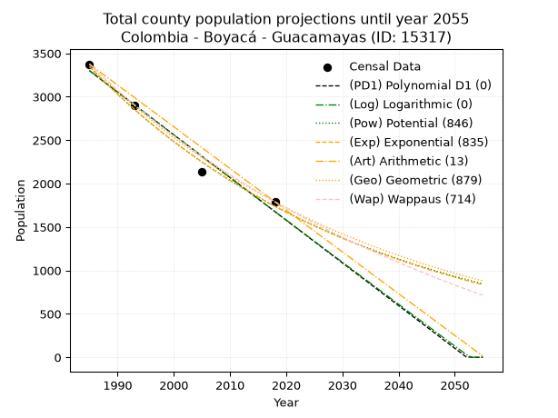
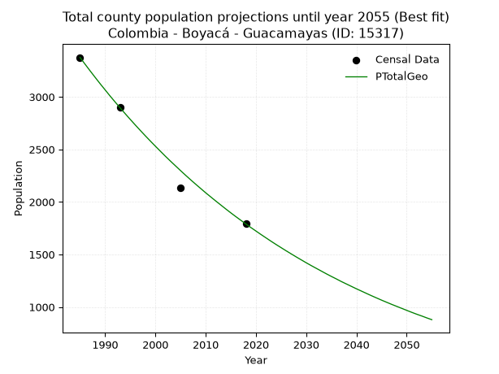
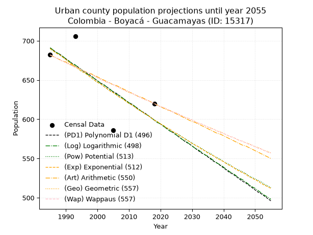
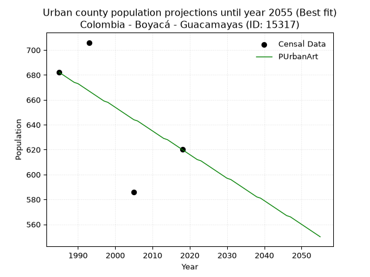
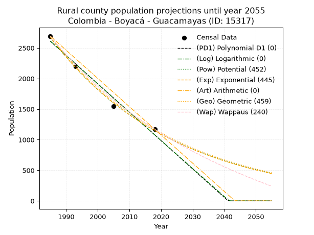
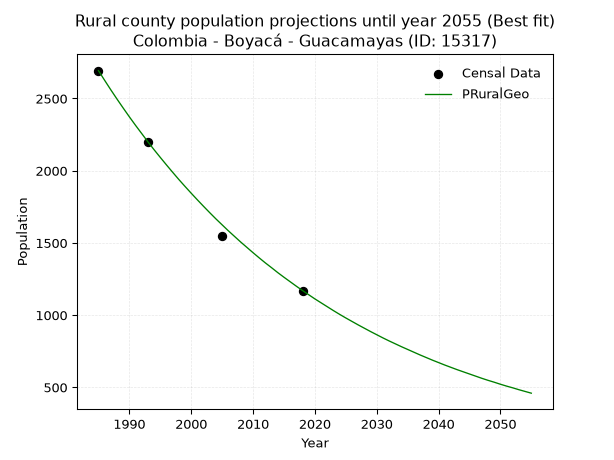

<div align="center">


</div>

# _“Population and Public Services Demand Projections (PPSD) until Year 2050 for Colombia - Boyacá - Guacamayas (ID: 15317)”_
Keywords: `population` `public-service` `projection` `lineal` `polynomial` `logarithmic` `potential` `exponential` `arithmetic` `geometric` `wappaus` `dane` `colombia` `south-america`

PPSD are analytical estimates used by governments and planners to anticipate future changes in population size, age distribution, and the resulting community needs for utilities, healthcare, education, and infrastructure as sizing future water treatment facilities, electrical grids, and road networks based on spatial growth.

> **General running parameters**: • app_version: _v20260806_. • Python version: _3.14.7_. • Pandas version: _3.0.5_. • NumPy version: _2.5.1_. • Creates, save and include plots into reports (create_plot): _False_. • Projection until year: _2050_. • Process polynomial degree 2 and up: _False_. • Process Wappaus: _True_. • Process Wappaus: _True_. • Set negative values to zero: _True_. • Set infinite values to zero: _True_. • Drop dataset notes: _True_. 
<div align="center">

Dynamic map: [:earth_americas:Google](http://maps.google.com/maps?q=6.459666515,-72.5008119) [:earth_americas:OSM](https://www.openstreetmap.org/#map=18/6.459666515/-72.5008119&layers=P) [:earth_americas:Bing](https://www.bing.com/maps?cp=6.459666515~-72.5008119&lvl=18) [:earth_americas:Apple](https://maps.apple.com/frame?center=6.459666515%2C-72.5008119&span=0.003%2C0.006)

</div>


<div align="center">

```geojson
{
  "type": "Feature",
  "geometry": {
    "type": "Point", 
    "coordinates": [-72.5008119, 6.459666515]
  }, 
  "properties": {
    "Name": "Colombia - Boyacá - Guacamayas (ID: 15317)"
  }
}
```

</div>


## 0. Census Data (4 records)

Census data are official statistics collected by a government about the people and housing in a country. They usually include counts of total population, age, sex, race, income, education, and jobs.

📅Global census file: [Population.xlsx](../data/Population.xlsx)

| Source   |   Year |   CountryID | CountryName   |   StateID | StateName   |   CountyID | CountyName   |   PTotal |   PUrban |   PRural |
|:---------|-------:|------------:|:--------------|----------:|:------------|-----------:|:-------------|---------:|---------:|---------:|
| DANE     |   1985 |          57 | Colombia      |        15 | Boyacá      |      15317 | Guacamayas   |     3375 |      682 |     2693 |
| DANE     |   1993 |          57 | Colombia      |        15 | Boyacá      |      15317 | Guacamayas   |     2903 |      706 |     2197 |
| DANE     |   2005 |          57 | Colombia      |        15 | Boyacá      |      15317 | Guacamayas   |     2132 |      586 |     1546 |
| DANE     |   2018 |          57 | Colombia      |        15 | Boyacá      |      15317 | Guacamayas   |     1790 |      620 |     1170 |

> 🔥Some records could had specific notes about the registered values or the corresponding urban or rural distribution.

📅   [RUPS](https://www.datos.gov.co/Hacienda-y-Cr-dito-P-blico/Registro-nico-de-Prestadores-de-Servicios-P-blicos/4qkq-csdn/about_data) - Local public utility companies: [RUPS.csv](../data/RUPS.xlsx)

 | SERVICIO       | ESTADO    | NOMBRE                                                                                                              | NIT         | DEPARTAMENTO_DOMICILIO   | MUNICIPIO_DOMICILIO   | DIRECCION                            |   TELEFONO | EMAIL                            | TIPO_PRESTADOR          | CLASIFICACION                 |
|:---------------|:----------|:--------------------------------------------------------------------------------------------------------------------|:------------|:-------------------------|:----------------------|:-------------------------------------|-----------:|:---------------------------------|:------------------------|:------------------------------|
| ACUEDUCTO      | OPERATIVA | ADMINISTRACION PUBLICA COPERATIVA DE GUACAMAYAS                                                                     | 900282153-2 | BOYACA                   | GUACAMAYAS            | CARRERA 5 No 3-35 CENTRO             |    7880283 | maribelpulidoaponte@hotmail.com  | ORGANIZACION AUTORIZADA | MENOR O IGUAL A 2500 USUARIOS |
| ALCANTARILLADO | OPERATIVA | ADMINISTRACION PUBLICA COPERATIVA DE GUACAMAYAS                                                                     | 900282153-2 | BOYACA                   | GUACAMAYAS            | CARRERA 5 No 3-35 CENTRO             |    7880283 | maribelpulidoaponte@hotmail.com  | ORGANIZACION AUTORIZADA | MENOR O IGUAL A 2500 USUARIOS |
| ACUEDUCTO      | OPERATIVA | ASOCIACION DE SUSCRIPTORES DEL ACUEDUCTO EL GRAN TESORO DE LA VEREDA EL CHIVECHE DEL MUNICIPIO DE GUACAMAYAS BOYACA | 900316789-4 | BOYACA                   | GUACAMAYAS            | VEREDA EL CHIVECHE                   |    7880283 | yobana2385@hotmail.com           | ORGANIZACION AUTORIZADA | HASTA 2500 SUSCRIPTORES       |
| ACUEDUCTO      | OPERATIVA | ASOCIACION DE SUSCRIPTORES DEL ACUEDUCTO VEREDAL DE LA LAGUNA DEL MUNICIPIO DE GUACAMAYAS                           | 900209107-3 | BOYACA                   | GUACAMAYAS            | VEREDA LA LAGUNA                     |    3213432 | yobana2385@hotmail.com           | ORGANIZACION AUTORIZADA | HASTA 2500 SUSCRIPTORES       |
| ACUEDUCTO      | OPERATIVA | ASOCIACION DE SUSCRIPTORES DEL ACUEDUCTO EL MANANTIAL DE LA VEREDA DE GUIRAGON                                      | 900191065-1 | BOYACA                   | GUACAMAYAS            | VEREDA GUIRAGON                      |    3115443 | yobana2385@hotmail.com           | ORGANIZACION AUTORIZADA | HASTA 2500 SUSCRIPTORES       |
| ACUEDUCTO      | OPERATIVA | ASOCIACIÓN DE SUSCRIPTORES DEL ACUEDUCTO VEREDAL DE CHISCOTE Y CHIMITA                                              | 900348309-1 | BOYACA                   | GUACAMAYAS            | VEREDA CHICHIMITA CASA DANIEL JURADO |    3123277 | yobana2385@hotmail.com           | ORGANIZACION AUTORIZADA | HASTA 2500 SUSCRIPTORES       |
| ACUEDUCTO      | OPERATIVA | ASOCIACION DE SUSCRIPTORES DEL ACUEDUCTO LAGUNA NEGRA DE LA VEREDA ALIZAL DEL MUNICIPIO DE GUACAMAYAS               | 900378452-3 | BOYACA                   | GUACAMAYAS            | Vereda Alizal                        |    7880283 | acueductolagunanegra@autlook.com | ORGANIZACION AUTORIZADA | HASTA 2500 SUSCRIPTORES       |

## 1. Total

### 1.1. Coefficients and Parameters

* (PD1) Polynomial Deg 1: -49.16258530710529, 100887.46126053735 (lineal)
* (Log) Logarithmic: -98443.87659964118, 750822.6949135903
* (Pow) Potential: -39.69168222937361, 134.41844340486733
* (Exp) Exponential: -0.019825472509320964, 4.1260017539721586e+20
* (Art) Arithmetic: Year diff. 2018 - 1985 = 33, Population diff. 1790 - 3375 = -1585, Annual growth = -48.03030303030303
* (Geo) Geometric: Year diff. 2018 - 1985 = 33, Population diff. 1790 - 3375 = -1585, Annual growth % = -0.01903408659286665
* (Wap) Wappaus: i = -1.8598374842324503, Condition values only valid for < 200)

<sub>
Wappaus condition values: ['-0.00', '-1.86', '-3.72', '-5.58', '-7.44', '-9.30', '-11.16', '-13.02', '-14.88', '-16.74', '-18.60', '-20.46', '-22.32', '-24.18', '-26.04', '-27.90', '-29.76', '-31.62', '-33.48', '-35.34', '-37.20', '-39.06', '-40.92', '-42.78', '-44.64', '-46.50', '-48.36', '-50.22', '-52.08', '-53.94', '-55.80', '-57.65', '-59.51', '-61.37', '-63.23', '-65.09', '-66.95', '-68.81', '-70.67', '-72.53', '-74.39', '-76.25', '-78.11', '-79.97', '-81.83', '-83.69', '-85.55', '-87.41', '-89.27', '-91.13', '-92.99', '-94.85', '-96.71', '-98.57', '-100.43', '-102.29', '-104.15', '-106.01', '-107.87', '-109.73', '-111.59', '-113.45', '-115.31', '-117.17', '-119.03', '-120.89']
</sub>


### 1.2. Projected Dataset

|   Year |   CountyID |   PTotalPD1 |   PTotalLog |   PTotalPow |   PTotalExp |   PTotalArt |   PTotalGeo |   PTotalWap |
|-------:|-----------:|------------:|------------:|------------:|------------:|------------:|------------:|------------:|
|   1985 |      15317 |        3300 |        3302 |        3348 |        3346 |        3375 |        3375 |        3375 |
|   1986 |      15317 |        3251 |        3252 |        3282 |        3280 |        3327 |        3311 |        3313 |
|   1987 |      15317 |        3201 |        3202 |        3217 |        3216 |        3279 |        3248 |        3252 |
|   1988 |      15317 |        3152 |        3153 |        3153 |        3153 |        3231 |        3186 |        3192 |
|   1989 |      15317 |        3103 |        3103 |        3091 |        3091 |        3183 |        3125 |        3133 |
|   1990 |      15317 |        3054 |        3054 |        3030 |        3030 |        3135 |        3066 |        3075 |
|   1991 |      15317 |        3005 |        3004 |        2970 |        2971 |        3087 |        3007 |        3018 |
|   1992 |      15317 |        2956 |        2955 |        2911 |        2912 |        3039 |        2950 |        2962 |
|   1993 |      15317 |        2906 |        2906 |        2854 |        2855 |        2991 |        2894 |        2908 |
|   1994 |      15317 |        2857 |        2856 |        2798 |        2799 |        2943 |        2839 |        2854 |
|   1995 |      15317 |        2808 |        2807 |        2743 |        2744 |        2895 |        2785 |        2801 |
|   1996 |      15317 |        2759 |        2757 |        2689 |        2690 |        2847 |        2732 |        2749 |
|   1997 |      15317 |        2710 |        2708 |        2636 |        2637 |        2799 |        2680 |        2697 |
|   1998 |      15317 |        2661 |        2659 |        2584 |        2586 |        2751 |        2629 |        2647 |
|   1999 |      15317 |        2611 |        2610 |        2533 |        2535 |        2703 |        2579 |        2597 |
|   2000 |      15317 |        2562 |        2560 |        2483 |        2485 |        2655 |        2530 |        2549 |
|   2001 |      15317 |        2513 |        2511 |        2434 |        2436 |        2607 |        2482 |        2501 |
|   2002 |      15317 |        2464 |        2462 |        2387 |        2388 |        2558 |        2434 |        2454 |
|   2003 |      15317 |        2415 |        2413 |        2340 |        2342 |        2510 |        2388 |        2407 |
|   2004 |      15317 |        2366 |        2364 |        2294 |        2296 |        2462 |        2343 |        2361 |
|   2005 |      15317 |        2316 |        2315 |        2249 |        2251 |        2414 |        2298 |        2316 |
|   2006 |      15317 |        2267 |        2266 |        2205 |        2206 |        2366 |        2254 |        2272 |
|   2007 |      15317 |        2218 |        2216 |        2162 |        2163 |        2318 |        2211 |        2229 |
|   2008 |      15317 |        2169 |        2167 |        2119 |        2121 |        2270 |        2169 |        2186 |
|   2009 |      15317 |        2120 |        2118 |        2078 |        2079 |        2222 |        2128 |        2143 |
|   2010 |      15317 |        2071 |        2069 |        2037 |        2038 |        2174 |        2087 |        2102 |
|   2011 |      15317 |        2022 |        2020 |        1997 |        1998 |        2126 |        2048 |        2061 |
|   2012 |      15317 |        1972 |        1971 |        1958 |        1959 |        2078 |        2009 |        2020 |
|   2013 |      15317 |        1923 |        1923 |        1920 |        1920 |        2030 |        1971 |        1981 |
|   2014 |      15317 |        1874 |        1874 |        1883 |        1883 |        1982 |        1933 |        1941 |
|   2015 |      15317 |        1825 |        1825 |        1846 |        1846 |        1934 |        1896 |        1903 |
|   2016 |      15317 |        1776 |        1776 |        1810 |        1810 |        1886 |        1860 |        1865 |
|   2017 |      15317 |        1727 |        1727 |        1775 |        1774 |        1838 |        1825 |        1827 |
|   2018 |      15317 |        1677 |        1678 |        1740 |        1739 |        1790 |        1790 |        1790 |
|   2019 |      15317 |        1628 |        1630 |        1706 |        1705 |        1742 |        1756 |        1754 |
|   2020 |      15317 |        1579 |        1581 |        1673 |        1672 |        1694 |        1723 |        1718 |
|   2021 |      15317 |        1530 |        1532 |        1640 |        1639 |        1646 |        1690 |        1682 |
|   2022 |      15317 |        1481 |        1483 |        1609 |        1607 |        1598 |        1658 |        1647 |
|   2023 |      15317 |        1432 |        1435 |        1577 |        1575 |        1550 |        1626 |        1613 |
|   2024 |      15317 |        1382 |        1386 |        1547 |        1544 |        1502 |        1595 |        1579 |
|   2025 |      15317 |        1333 |        1337 |        1517 |        1514 |        1454 |        1565 |        1545 |
|   2026 |      15317 |        1284 |        1289 |        1487 |        1484 |        1406 |        1535 |        1512 |
|   2027 |      15317 |        1235 |        1240 |        1458 |        1455 |        1358 |        1506 |        1479 |
|   2028 |      15317 |        1186 |        1192 |        1430 |        1426 |        1310 |        1477 |        1447 |
|   2029 |      15317 |        1137 |        1143 |        1402 |        1398 |        1262 |        1449 |        1415 |
|   2030 |      15317 |        1087 |        1095 |        1375 |        1371 |        1214 |        1421 |        1384 |
|   2031 |      15317 |        1038 |        1046 |        1349 |        1344 |        1166 |        1394 |        1353 |
|   2032 |      15317 |         989 |         998 |        1322 |        1318 |        1118 |        1368 |        1322 |
|   2033 |      15317 |         940 |         949 |        1297 |        1292 |        1070 |        1342 |        1292 |
|   2034 |      15317 |         891 |         901 |        1272 |        1266 |        1022 |        1316 |        1262 |
|   2035 |      15317 |         842 |         853 |        1247 |        1242 |         973 |        1291 |        1233 |
|   2036 |      15317 |         792 |         804 |        1223 |        1217 |         925 |        1267 |        1204 |
|   2037 |      15317 |         743 |         756 |        1200 |        1193 |         877 |        1242 |        1175 |
|   2038 |      15317 |         694 |         708 |        1176 |        1170 |         829 |        1219 |        1147 |
|   2039 |      15317 |         645 |         659 |        1154 |        1147 |         781 |        1196 |        1119 |
|   2040 |      15317 |         596 |         611 |        1131 |        1124 |         733 |        1173 |        1091 |
|   2041 |      15317 |         547 |         563 |        1110 |        1102 |         685 |        1151 |        1064 |
|   2042 |      15317 |         497 |         514 |        1088 |        1081 |         637 |        1129 |        1037 |
|   2043 |      15317 |         448 |         466 |        1067 |        1060 |         589 |        1107 |        1010 |
|   2044 |      15317 |         399 |         418 |        1047 |        1039 |         541 |        1086 |         984 |
|   2045 |      15317 |         350 |         370 |        1027 |        1018 |         493 |        1065 |         958 |
|   2046 |      15317 |         301 |         322 |        1007 |         998 |         445 |        1045 |         932 |
|   2047 |      15317 |         252 |         274 |         988 |         979 |         397 |        1025 |         907 |
|   2048 |      15317 |         202 |         226 |         969 |         960 |         349 |        1006 |         881 |
|   2049 |      15317 |         153 |         178 |         950 |         941 |         301 |         987 |         857 |
|   2050 |      15317 |         104 |         130 |         932 |         922 |         253 |         968 |         832 |
<div align="center">

</img>

</div>


### 1.3. Best fit with absolute and relative error (%)

Relative error puts that difference into context by dividing the absolute error by the true value, creating a unitless ratio or percentage that shows the scale of the mistake.

Absolute and relative error

|   Year | Source   |   CountryID | CountryName   |   StateID | StateName   |   CountyID_x | CountyName   |   PTotal |   PUrban |   PRural |   CountyID_y |   PTotalPD1 |   PTotalLog |   PTotalPow |   PTotalExp |   PTotalArt |   PTotalGeo |   PTotalWap |   PTotalPD1AbsError |   PTotalLogAbsError |   PTotalPowAbsError |   PTotalExpAbsError |   PTotalArtAbsError |   PTotalGeoAbsError |   PTotalWapAbsError |   PTotalPD1RelError |   PTotalLogRelError |   PTotalPowRelError |   PTotalExpRelError |   PTotalArtRelError |   PTotalGeoRelError |   PTotalWapRelError |
|-------:|:---------|------------:|:--------------|----------:|:------------|-------------:|:-------------|---------:|---------:|---------:|-------------:|------------:|------------:|------------:|------------:|------------:|------------:|------------:|--------------------:|--------------------:|--------------------:|--------------------:|--------------------:|--------------------:|--------------------:|--------------------:|--------------------:|--------------------:|--------------------:|--------------------:|--------------------:|--------------------:|
|   1985 | DANE     |          57 | Colombia      |        15 | Boyacá      |        15317 | Guacamayas   |     3375 |      682 |     2693 |        15317 |        3300 |        3302 |        3348 |        3346 |        3375 |        3375 |        3375 |                  75 |                  73 |                  27 |                  29 |                   0 |                   0 |                   0 |            2.22222  |            2.16296  |             0.8     |            0.859259 |             0       |            0        |            0        |
|   1993 | DANE     |          57 | Colombia      |        15 | Boyacá      |        15317 | Guacamayas   |     2903 |      706 |     2197 |        15317 |        2906 |        2906 |        2854 |        2855 |        2991 |        2894 |        2908 |                   3 |                   3 |                  49 |                  48 |                  88 |                   9 |                   5 |            0.103341 |            0.103341 |             1.68791 |            1.65346  |             3.03135 |            0.310024 |            0.172236 |
|   2005 | DANE     |          57 | Colombia      |        15 | Boyacá      |        15317 | Guacamayas   |     2132 |      586 |     1546 |        15317 |        2316 |        2315 |        2249 |        2251 |        2414 |        2298 |        2316 |                 184 |                 183 |                 117 |                 119 |                 282 |                 166 |                 184 |            8.63039  |            8.58349  |             5.4878  |            5.58161  |            13.227   |            7.78612  |            8.63039  |
|   2018 | DANE     |          57 | Colombia      |        15 | Boyacá      |        15317 | Guacamayas   |     1790 |      620 |     1170 |        15317 |        1677 |        1678 |        1740 |        1739 |        1790 |        1790 |        1790 |                 113 |                 112 |                  50 |                  51 |                   0 |                   0 |                   0 |            6.31285  |            6.25698  |             2.7933  |            2.84916  |             0       |            0        |            0        |

Relative error mean

| Method    |   RelError | Best   |
|:----------|-----------:|:-------|
| PTotalPD1 |    4.3172  |        |
| PTotalLog |    4.27669 |        |
| PTotalPow |    2.69225 |        |
| PTotalExp |    2.73587 |        |
| PTotalArt |    4.06459 |        |
| PTotalGeo |    2.02404 | True   |
| PTotalWap |    2.20066 |        |

💙Best method: _**PTotalGeo**_
<div align="center">

</img>

</div>


### 1.4. Fresh water supply demand in liters per capita per day (lpcd)

The fresh water supply demand typically ranges from 100 to 300 liters per capita per day (lpcd) for standard domestic and municipal planning, though absolute survival minimums set by the World Health Organization are as low as 7.5 to 20 liters per day, and total consumption in high-income nations can exceed 400 liters.

> `CZ`: Level in meters above the sea level (masl)<br> `WS`: Fresh water supply demand in liters per capita per day (lpcd or l/h/d)<br> `WSAll`: Zonal fresh water supply demand in liters per second (l/s)<br> `A`: Zonal area in square meters<br> `DP`: Population density (people/hectare or p/ha)

Reference values (RAS Colombia)

|    CZ |   WS |
|------:|-----:|
|  1000 |  120 |
|  2000 |  130 |
| 99999 |  140 |

County shapefile geometry properties and water supply values

|   CountyID |      ATotal |   CZTotal |   WSTotal |
|-----------:|------------:|----------:|----------:|
|      15317 | 5.75217e+07 |   2669.89 |       140 |

Projected values for best method: PTotalGeo

|   CountyID |   Year |   PTotalGeo |   DPTotal |   WSTotal |   WSTotalAll |
|-----------:|-------:|------------:|----------:|----------:|-------------:|
|      15317 |   1985 |        3375 |      0.59 |       140 |      5.46875 |
|      15317 |   1986 |        3311 |      0.58 |       140 |      5.36505 |
|      15317 |   1987 |        3248 |      0.56 |       140 |      5.26296 |
|      15317 |   1988 |        3186 |      0.55 |       140 |      5.1625  |
|      15317 |   1989 |        3125 |      0.54 |       140 |      5.06366 |
|      15317 |   1990 |        3066 |      0.53 |       140 |      4.96806 |
|      15317 |   1991 |        3007 |      0.52 |       140 |      4.87245 |
|      15317 |   1992 |        2950 |      0.51 |       140 |      4.78009 |
|      15317 |   1993 |        2894 |      0.5  |       140 |      4.68935 |
|      15317 |   1994 |        2839 |      0.49 |       140 |      4.60023 |
|      15317 |   1995 |        2785 |      0.48 |       140 |      4.51273 |
|      15317 |   1996 |        2732 |      0.47 |       140 |      4.42685 |
|      15317 |   1997 |        2680 |      0.47 |       140 |      4.34259 |
|      15317 |   1998 |        2629 |      0.46 |       140 |      4.25995 |
|      15317 |   1999 |        2579 |      0.45 |       140 |      4.17894 |
|      15317 |   2000 |        2530 |      0.44 |       140 |      4.09954 |
|      15317 |   2001 |        2482 |      0.43 |       140 |      4.02176 |
|      15317 |   2002 |        2434 |      0.42 |       140 |      3.94398 |
|      15317 |   2003 |        2388 |      0.42 |       140 |      3.86944 |
|      15317 |   2004 |        2343 |      0.41 |       140 |      3.79653 |
|      15317 |   2005 |        2298 |      0.4  |       140 |      3.72361 |
|      15317 |   2006 |        2254 |      0.39 |       140 |      3.65231 |
|      15317 |   2007 |        2211 |      0.38 |       140 |      3.58264 |
|      15317 |   2008 |        2169 |      0.38 |       140 |      3.51458 |
|      15317 |   2009 |        2128 |      0.37 |       140 |      3.44815 |
|      15317 |   2010 |        2087 |      0.36 |       140 |      3.38171 |
|      15317 |   2011 |        2048 |      0.36 |       140 |      3.31852 |
|      15317 |   2012 |        2009 |      0.35 |       140 |      3.25532 |
|      15317 |   2013 |        1971 |      0.34 |       140 |      3.19375 |
|      15317 |   2014 |        1933 |      0.34 |       140 |      3.13218 |
|      15317 |   2015 |        1896 |      0.33 |       140 |      3.07222 |
|      15317 |   2016 |        1860 |      0.32 |       140 |      3.01389 |
|      15317 |   2017 |        1825 |      0.32 |       140 |      2.95718 |
|      15317 |   2018 |        1790 |      0.31 |       140 |      2.90046 |
|      15317 |   2019 |        1756 |      0.31 |       140 |      2.84537 |
|      15317 |   2020 |        1723 |      0.3  |       140 |      2.7919  |
|      15317 |   2021 |        1690 |      0.29 |       140 |      2.73843 |
|      15317 |   2022 |        1658 |      0.29 |       140 |      2.68657 |
|      15317 |   2023 |        1626 |      0.28 |       140 |      2.63472 |
|      15317 |   2024 |        1595 |      0.28 |       140 |      2.58449 |
|      15317 |   2025 |        1565 |      0.27 |       140 |      2.53588 |
|      15317 |   2026 |        1535 |      0.27 |       140 |      2.48727 |
|      15317 |   2027 |        1506 |      0.26 |       140 |      2.44028 |
|      15317 |   2028 |        1477 |      0.26 |       140 |      2.39329 |
|      15317 |   2029 |        1449 |      0.25 |       140 |      2.34792 |
|      15317 |   2030 |        1421 |      0.25 |       140 |      2.30255 |
|      15317 |   2031 |        1394 |      0.24 |       140 |      2.2588  |
|      15317 |   2032 |        1368 |      0.24 |       140 |      2.21667 |
|      15317 |   2033 |        1342 |      0.23 |       140 |      2.17454 |
|      15317 |   2034 |        1316 |      0.23 |       140 |      2.13241 |
|      15317 |   2035 |        1291 |      0.22 |       140 |      2.0919  |
|      15317 |   2036 |        1267 |      0.22 |       140 |      2.05301 |
|      15317 |   2037 |        1242 |      0.22 |       140 |      2.0125  |
|      15317 |   2038 |        1219 |      0.21 |       140 |      1.97523 |
|      15317 |   2039 |        1196 |      0.21 |       140 |      1.93796 |
|      15317 |   2040 |        1173 |      0.2  |       140 |      1.90069 |
|      15317 |   2041 |        1151 |      0.2  |       140 |      1.86505 |
|      15317 |   2042 |        1129 |      0.2  |       140 |      1.8294  |
|      15317 |   2043 |        1107 |      0.19 |       140 |      1.79375 |
|      15317 |   2044 |        1086 |      0.19 |       140 |      1.75972 |
|      15317 |   2045 |        1065 |      0.19 |       140 |      1.72569 |
|      15317 |   2046 |        1045 |      0.18 |       140 |      1.69329 |
|      15317 |   2047 |        1025 |      0.18 |       140 |      1.66088 |
|      15317 |   2048 |        1006 |      0.17 |       140 |      1.63009 |
|      15317 |   2049 |         987 |      0.17 |       140 |      1.59931 |
|      15317 |   2050 |         968 |      0.17 |       140 |      1.56852 |

## 2. Urban

### 2.1. Coefficients and Parameters

* (PD1) Polynomial Deg 1: -2.7788036932958775, 6206.802087515079 (lineal)
* (Log) Logarithmic: -5566.376329889992, 42958.5710896343
* (Pow) Potential: -8.566910689947418, 31.09074147303508
* (Exp) Exponential: -0.004276391839828656, 3354367.608449122
* (Art) Arithmetic: Year diff. 2018 - 1985 = 33, Population diff. 620 - 682 = -62, Annual growth = -1.878787878787879
* (Geo) Geometric: Year diff. 2018 - 1985 = 33, Population diff. 620 - 682 = -62, Annual growth % = -0.0028840204664188906
* (Wap) Wappaus: i = -0.2886002886002886, Condition values only valid for < 200)

<sub>
Wappaus condition values: ['-0.00', '-0.29', '-0.58', '-0.87', '-1.15', '-1.44', '-1.73', '-2.02', '-2.31', '-2.60', '-2.89', '-3.17', '-3.46', '-3.75', '-4.04', '-4.33', '-4.62', '-4.91', '-5.19', '-5.48', '-5.77', '-6.06', '-6.35', '-6.64', '-6.93', '-7.22', '-7.50', '-7.79', '-8.08', '-8.37', '-8.66', '-8.95', '-9.24', '-9.52', '-9.81', '-10.10', '-10.39', '-10.68', '-10.97', '-11.26', '-11.54', '-11.83', '-12.12', '-12.41', '-12.70', '-12.99', '-13.28', '-13.56', '-13.85', '-14.14', '-14.43', '-14.72', '-15.01', '-15.30', '-15.58', '-15.87', '-16.16', '-16.45', '-16.74', '-17.03', '-17.32', '-17.60', '-17.89', '-18.18', '-18.47', '-18.76']
</sub>


### 2.2. Projected Dataset

|   Year |   CountyID |   PUrbanPD1 |   PUrbanLog |   PUrbanPow |   PUrbanExp |   PUrbanArt |   PUrbanGeo |   PUrbanWap |
|-------:|-----------:|------------:|------------:|------------:|------------:|------------:|------------:|------------:|
|   1985 |      15317 |         691 |         691 |         690 |         690 |         682 |         682 |         682 |
|   1986 |      15317 |         688 |         688 |         687 |         687 |         680 |         680 |         680 |
|   1987 |      15317 |         685 |         685 |         685 |         684 |         678 |         678 |         678 |
|   1988 |      15317 |         683 |         683 |         682 |         682 |         676 |         676 |         676 |
|   1989 |      15317 |         680 |         680 |         679 |         679 |         674 |         674 |         674 |
|   1990 |      15317 |         677 |         677 |         676 |         676 |         673 |         672 |         672 |
|   1991 |      15317 |         674 |         674 |         673 |         673 |         671 |         670 |         670 |
|   1992 |      15317 |         671 |         671 |         670 |         670 |         669 |         668 |         668 |
|   1993 |      15317 |         669 |         669 |         667 |         667 |         667 |         666 |         666 |
|   1994 |      15317 |         666 |         666 |         664 |         664 |         665 |         665 |         665 |
|   1995 |      15317 |         663 |         663 |         661 |         661 |         663 |         663 |         663 |
|   1996 |      15317 |         660 |         660 |         659 |         659 |         661 |         661 |         661 |
|   1997 |      15317 |         658 |         657 |         656 |         656 |         659 |         659 |         659 |
|   1998 |      15317 |         655 |         655 |         653 |         653 |         658 |         657 |         657 |
|   1999 |      15317 |         652 |         652 |         650 |         650 |         656 |         655 |         655 |
|   2000 |      15317 |         649 |         649 |         647 |         647 |         654 |         653 |         653 |
|   2001 |      15317 |         646 |         646 |         645 |         645 |         652 |         651 |         651 |
|   2002 |      15317 |         644 |         644 |         642 |         642 |         650 |         649 |         649 |
|   2003 |      15317 |         641 |         641 |         639 |         639 |         648 |         647 |         647 |
|   2004 |      15317 |         638 |         638 |         636 |         636 |         646 |         646 |         646 |
|   2005 |      15317 |         635 |         635 |         634 |         634 |         644 |         644 |         644 |
|   2006 |      15317 |         633 |         632 |         631 |         631 |         643 |         642 |         642 |
|   2007 |      15317 |         630 |         630 |         628 |         628 |         641 |         640 |         640 |
|   2008 |      15317 |         627 |         627 |         626 |         626 |         639 |         638 |         638 |
|   2009 |      15317 |         624 |         624 |         623 |         623 |         637 |         636 |         636 |
|   2010 |      15317 |         621 |         621 |         620 |         620 |         635 |         634 |         635 |
|   2011 |      15317 |         619 |         619 |         618 |         618 |         633 |         633 |         633 |
|   2012 |      15317 |         616 |         616 |         615 |         615 |         631 |         631 |         631 |
|   2013 |      15317 |         613 |         613 |         612 |         612 |         629 |         629 |         629 |
|   2014 |      15317 |         610 |         610 |         610 |         610 |         628 |         627 |         627 |
|   2015 |      15317 |         608 |         607 |         607 |         607 |         626 |         625 |         625 |
|   2016 |      15317 |         605 |         605 |         605 |         605 |         624 |         624 |         624 |
|   2017 |      15317 |         602 |         602 |         602 |         602 |         622 |         622 |         622 |
|   2018 |      15317 |         599 |         599 |         599 |         599 |         620 |         620 |         620 |
|   2019 |      15317 |         596 |         596 |         597 |         597 |         618 |         618 |         618 |
|   2020 |      15317 |         594 |         594 |         594 |         594 |         616 |         616 |         616 |
|   2021 |      15317 |         591 |         591 |         592 |         592 |         614 |         615 |         615 |
|   2022 |      15317 |         588 |         588 |         589 |         589 |         612 |         613 |         613 |
|   2023 |      15317 |         585 |         585 |         587 |         587 |         611 |         611 |         611 |
|   2024 |      15317 |         583 |         583 |         584 |         584 |         609 |         609 |         609 |
|   2025 |      15317 |         580 |         580 |         582 |         582 |         607 |         608 |         608 |
|   2026 |      15317 |         577 |         577 |         580 |         579 |         605 |         606 |         606 |
|   2027 |      15317 |         574 |         574 |         577 |         577 |         603 |         604 |         604 |
|   2028 |      15317 |         571 |         572 |         575 |         574 |         601 |         602 |         602 |
|   2029 |      15317 |         569 |         569 |         572 |         572 |         599 |         601 |         601 |
|   2030 |      15317 |         566 |         566 |         570 |         569 |         597 |         599 |         599 |
|   2031 |      15317 |         563 |         563 |         567 |         567 |         596 |         597 |         597 |
|   2032 |      15317 |         560 |         561 |         565 |         565 |         594 |         595 |         595 |
|   2033 |      15317 |         557 |         558 |         563 |         562 |         592 |         594 |         594 |
|   2034 |      15317 |         555 |         555 |         560 |         560 |         590 |         592 |         592 |
|   2035 |      15317 |         552 |         553 |         558 |         557 |         588 |         590 |         590 |
|   2036 |      15317 |         549 |         550 |         556 |         555 |         586 |         589 |         588 |
|   2037 |      15317 |         546 |         547 |         553 |         553 |         584 |         587 |         587 |
|   2038 |      15317 |         544 |         544 |         551 |         550 |         582 |         585 |         585 |
|   2039 |      15317 |         541 |         542 |         549 |         548 |         581 |         584 |         583 |
|   2040 |      15317 |         538 |         539 |         546 |         546 |         579 |         582 |         582 |
|   2041 |      15317 |         535 |         536 |         544 |         543 |         577 |         580 |         580 |
|   2042 |      15317 |         532 |         533 |         542 |         541 |         575 |         578 |         578 |
|   2043 |      15317 |         530 |         531 |         539 |         539 |         573 |         577 |         577 |
|   2044 |      15317 |         527 |         528 |         537 |         536 |         571 |         575 |         575 |
|   2045 |      15317 |         524 |         525 |         535 |         534 |         569 |         573 |         573 |
|   2046 |      15317 |         521 |         523 |         533 |         532 |         567 |         572 |         572 |
|   2047 |      15317 |         519 |         520 |         531 |         530 |         566 |         570 |         570 |
|   2048 |      15317 |         516 |         517 |         528 |         527 |         564 |         569 |         568 |
|   2049 |      15317 |         513 |         514 |         526 |         525 |         562 |         567 |         567 |
|   2050 |      15317 |         510 |         512 |         524 |         523 |         560 |         565 |         565 |
<div align="center">

</img>

</div>


### 2.3. Best fit with absolute and relative error (%)

Relative error puts that difference into context by dividing the absolute error by the true value, creating a unitless ratio or percentage that shows the scale of the mistake.

Absolute and relative error

|   Year | Source   |   CountryID | CountryName   |   StateID | StateName   |   CountyID_x | CountyName   |   PTotal |   PUrban |   PRural |   CountyID_y |   PUrbanPD1 |   PUrbanLog |   PUrbanPow |   PUrbanExp |   PUrbanArt |   PUrbanGeo |   PUrbanWap |   PUrbanPD1AbsError |   PUrbanLogAbsError |   PUrbanPowAbsError |   PUrbanExpAbsError |   PUrbanArtAbsError |   PUrbanGeoAbsError |   PUrbanWapAbsError |   PUrbanPD1RelError |   PUrbanLogRelError |   PUrbanPowRelError |   PUrbanExpRelError |   PUrbanArtRelError |   PUrbanGeoRelError |   PUrbanWapRelError |
|-------:|:---------|------------:|:--------------|----------:|:------------|-------------:|:-------------|---------:|---------:|---------:|-------------:|------------:|------------:|------------:|------------:|------------:|------------:|------------:|--------------------:|--------------------:|--------------------:|--------------------:|--------------------:|--------------------:|--------------------:|--------------------:|--------------------:|--------------------:|--------------------:|--------------------:|--------------------:|--------------------:|
|   1985 | DANE     |          57 | Colombia      |        15 | Boyacá      |        15317 | Guacamayas   |     3375 |      682 |     2693 |        15317 |         691 |         691 |         690 |         690 |         682 |         682 |         682 |                   9 |                   9 |                   8 |                   8 |                   0 |                   0 |                   0 |             1.31965 |             1.31965 |             1.17302 |             1.17302 |             0       |             0       |             0       |
|   1993 | DANE     |          57 | Colombia      |        15 | Boyacá      |        15317 | Guacamayas   |     2903 |      706 |     2197 |        15317 |         669 |         669 |         667 |         667 |         667 |         666 |         666 |                  37 |                  37 |                  39 |                  39 |                  39 |                  40 |                  40 |             5.24079 |             5.24079 |             5.52408 |             5.52408 |             5.52408 |             5.66572 |             5.66572 |
|   2005 | DANE     |          57 | Colombia      |        15 | Boyacá      |        15317 | Guacamayas   |     2132 |      586 |     1546 |        15317 |         635 |         635 |         634 |         634 |         644 |         644 |         644 |                  49 |                  49 |                  48 |                  48 |                  58 |                  58 |                  58 |             8.36177 |             8.36177 |             8.19113 |             8.19113 |             9.89761 |             9.89761 |             9.89761 |
|   2018 | DANE     |          57 | Colombia      |        15 | Boyacá      |        15317 | Guacamayas   |     1790 |      620 |     1170 |        15317 |         599 |         599 |         599 |         599 |         620 |         620 |         620 |                  21 |                  21 |                  21 |                  21 |                   0 |                   0 |                   0 |             3.3871  |             3.3871  |             3.3871  |             3.3871  |             0       |             0       |             0       |

Relative error mean

| Method    |   RelError | Best   |
|:----------|-----------:|:-------|
| PUrbanPD1 |    4.57733 |        |
| PUrbanLog |    4.57733 |        |
| PUrbanPow |    4.56883 |        |
| PUrbanExp |    4.56883 |        |
| PUrbanArt |    3.85542 | True   |
| PUrbanGeo |    3.89083 |        |
| PUrbanWap |    3.89083 |        |

💙Best method: _**PUrbanArt**_
<div align="center">

</img>

</div>


### 2.4. Fresh water supply demand in liters per capita per day (lpcd)

The fresh water supply demand typically ranges from 100 to 300 liters per capita per day (lpcd) for standard domestic and municipal planning, though absolute survival minimums set by the World Health Organization are as low as 7.5 to 20 liters per day, and total consumption in high-income nations can exceed 400 liters.

> `CZ`: Level in meters above the sea level (masl)<br> `WS`: Fresh water supply demand in liters per capita per day (lpcd or l/h/d)<br> `WSAll`: Zonal fresh water supply demand in liters per second (l/s)<br> `A`: Zonal area in square meters<br> `DP`: Population density (people/hectare or p/ha)

Reference values (RAS Colombia)

|    CZ |   WS |
|------:|-----:|
|  1000 |  120 |
|  2000 |  130 |
| 99999 |  140 |

County shapefile geometry properties and water supply values

|   CountyID |   AUrban |   CZUrban |   WSUrban |
|-----------:|---------:|----------:|----------:|
|      15317 |   264015 |   2192.51 |       140 |

Projected values for best method: PUrbanArt

|   CountyID |   Year |   PUrbanArt |   DPUrban |   WSUrban |   WSUrbanAll |
|-----------:|-------:|------------:|----------:|----------:|-------------:|
|      15317 |   1985 |         682 |     25.83 |       140 |     1.10509  |
|      15317 |   1986 |         680 |     25.76 |       140 |     1.10185  |
|      15317 |   1987 |         678 |     25.68 |       140 |     1.09861  |
|      15317 |   1988 |         676 |     25.6  |       140 |     1.09537  |
|      15317 |   1989 |         674 |     25.53 |       140 |     1.09213  |
|      15317 |   1990 |         673 |     25.49 |       140 |     1.09051  |
|      15317 |   1991 |         671 |     25.42 |       140 |     1.08727  |
|      15317 |   1992 |         669 |     25.34 |       140 |     1.08403  |
|      15317 |   1993 |         667 |     25.26 |       140 |     1.08079  |
|      15317 |   1994 |         665 |     25.19 |       140 |     1.07755  |
|      15317 |   1995 |         663 |     25.11 |       140 |     1.07431  |
|      15317 |   1996 |         661 |     25.04 |       140 |     1.07106  |
|      15317 |   1997 |         659 |     24.96 |       140 |     1.06782  |
|      15317 |   1998 |         658 |     24.92 |       140 |     1.0662   |
|      15317 |   1999 |         656 |     24.85 |       140 |     1.06296  |
|      15317 |   2000 |         654 |     24.77 |       140 |     1.05972  |
|      15317 |   2001 |         652 |     24.7  |       140 |     1.05648  |
|      15317 |   2002 |         650 |     24.62 |       140 |     1.05324  |
|      15317 |   2003 |         648 |     24.54 |       140 |     1.05     |
|      15317 |   2004 |         646 |     24.47 |       140 |     1.04676  |
|      15317 |   2005 |         644 |     24.39 |       140 |     1.04352  |
|      15317 |   2006 |         643 |     24.35 |       140 |     1.0419   |
|      15317 |   2007 |         641 |     24.28 |       140 |     1.03866  |
|      15317 |   2008 |         639 |     24.2  |       140 |     1.03542  |
|      15317 |   2009 |         637 |     24.13 |       140 |     1.03218  |
|      15317 |   2010 |         635 |     24.05 |       140 |     1.02894  |
|      15317 |   2011 |         633 |     23.98 |       140 |     1.02569  |
|      15317 |   2012 |         631 |     23.9  |       140 |     1.02245  |
|      15317 |   2013 |         629 |     23.82 |       140 |     1.01921  |
|      15317 |   2014 |         628 |     23.79 |       140 |     1.01759  |
|      15317 |   2015 |         626 |     23.71 |       140 |     1.01435  |
|      15317 |   2016 |         624 |     23.64 |       140 |     1.01111  |
|      15317 |   2017 |         622 |     23.56 |       140 |     1.00787  |
|      15317 |   2018 |         620 |     23.48 |       140 |     1.00463  |
|      15317 |   2019 |         618 |     23.41 |       140 |     1.00139  |
|      15317 |   2020 |         616 |     23.33 |       140 |     0.998148 |
|      15317 |   2021 |         614 |     23.26 |       140 |     0.994907 |
|      15317 |   2022 |         612 |     23.18 |       140 |     0.991667 |
|      15317 |   2023 |         611 |     23.14 |       140 |     0.990046 |
|      15317 |   2024 |         609 |     23.07 |       140 |     0.986806 |
|      15317 |   2025 |         607 |     22.99 |       140 |     0.983565 |
|      15317 |   2026 |         605 |     22.92 |       140 |     0.980324 |
|      15317 |   2027 |         603 |     22.84 |       140 |     0.977083 |
|      15317 |   2028 |         601 |     22.76 |       140 |     0.973843 |
|      15317 |   2029 |         599 |     22.69 |       140 |     0.970602 |
|      15317 |   2030 |         597 |     22.61 |       140 |     0.967361 |
|      15317 |   2031 |         596 |     22.57 |       140 |     0.965741 |
|      15317 |   2032 |         594 |     22.5  |       140 |     0.9625   |
|      15317 |   2033 |         592 |     22.42 |       140 |     0.959259 |
|      15317 |   2034 |         590 |     22.35 |       140 |     0.956019 |
|      15317 |   2035 |         588 |     22.27 |       140 |     0.952778 |
|      15317 |   2036 |         586 |     22.2  |       140 |     0.949537 |
|      15317 |   2037 |         584 |     22.12 |       140 |     0.946296 |
|      15317 |   2038 |         582 |     22.04 |       140 |     0.943056 |
|      15317 |   2039 |         581 |     22.01 |       140 |     0.941435 |
|      15317 |   2040 |         579 |     21.93 |       140 |     0.938194 |
|      15317 |   2041 |         577 |     21.85 |       140 |     0.934954 |
|      15317 |   2042 |         575 |     21.78 |       140 |     0.931713 |
|      15317 |   2043 |         573 |     21.7  |       140 |     0.928472 |
|      15317 |   2044 |         571 |     21.63 |       140 |     0.925231 |
|      15317 |   2045 |         569 |     21.55 |       140 |     0.921991 |
|      15317 |   2046 |         567 |     21.48 |       140 |     0.91875  |
|      15317 |   2047 |         566 |     21.44 |       140 |     0.91713  |
|      15317 |   2048 |         564 |     21.36 |       140 |     0.913889 |
|      15317 |   2049 |         562 |     21.29 |       140 |     0.910648 |
|      15317 |   2050 |         560 |     21.21 |       140 |     0.907407 |

## 3. Rural

### 3.1. Coefficients and Parameters

* (PD1) Polynomial Deg 1: -46.383781613809425, 94680.6591730223 (lineal)
* (Log) Logarithmic: -92877.50026975117, 707864.1238239557
* (Pow) Potential: -51.29651557705746, 172.5910535425554
* (Exp) Exponential: -0.02562452084851175, 3.2909675441769586e+25
* (Art) Arithmetic: Year diff. 2018 - 1985 = 33, Population diff. 1170 - 2693 = -1523, Annual growth = -46.15151515151515
* (Geo) Geometric: Year diff. 2018 - 1985 = 33, Population diff. 1170 - 2693 = -1523, Annual growth % = -0.024945764900706213
* (Wap) Wappaus: i = -2.389413158245672, Condition values only valid for < 200)

<sub>
Wappaus condition values: ['-0.00', '-2.39', '-4.78', '-7.17', '-9.56', '-11.95', '-14.34', '-16.73', '-19.12', '-21.50', '-23.89', '-26.28', '-28.67', '-31.06', '-33.45', '-35.84', '-38.23', '-40.62', '-43.01', '-45.40', '-47.79', '-50.18', '-52.57', '-54.96', '-57.35', '-59.74', '-62.12', '-64.51', '-66.90', '-69.29', '-71.68', '-74.07', '-76.46', '-78.85', '-81.24', '-83.63', '-86.02', '-88.41', '-90.80', '-93.19', '-95.58', '-97.97', '-100.36', '-102.74', '-105.13', '-107.52', '-109.91', '-112.30', '-114.69', '-117.08', '-119.47', '-121.86', '-124.25', '-126.64', '-129.03', '-131.42', '-133.81', '-136.20', '-138.59', '-140.98', '-143.36', '-145.75', '-148.14', '-150.53', '-152.92', '-155.31']
</sub>


### 3.2. Projected Dataset

|   Year |   CountyID |   PRuralPD1 |   PRuralLog |   PRuralPow |   PRuralExp |   PRuralArt |   PRuralGeo |   PRuralWap |
|-------:|-----------:|------------:|------------:|------------:|------------:|------------:|------------:|------------:|
|   1985 |      15317 |        2609 |        2611 |        2676 |        2673 |        2693 |        2693 |        2693 |
|   1986 |      15317 |        2562 |        2564 |        2607 |        2606 |        2647 |        2626 |        2629 |
|   1987 |      15317 |        2516 |        2517 |        2541 |        2540 |        2601 |        2560 |        2567 |
|   1988 |      15317 |        2470 |        2470 |        2476 |        2476 |        2555 |        2496 |        2507 |
|   1989 |      15317 |        2423 |        2424 |        2413 |        2413 |        2508 |        2434 |        2447 |
|   1990 |      15317 |        2377 |        2377 |        2352 |        2352 |        2462 |        2373 |        2389 |
|   1991 |      15317 |        2331 |        2330 |        2292 |        2292 |        2416 |        2314 |        2333 |
|   1992 |      15317 |        2284 |        2284 |        2234 |        2234 |        2370 |        2257 |        2277 |
|   1993 |      15317 |        2238 |        2237 |        2177 |        2178 |        2324 |        2200 |        2223 |
|   1994 |      15317 |        2191 |        2190 |        2122 |        2123 |        2278 |        2145 |        2170 |
|   1995 |      15317 |        2145 |        2144 |        2068 |        2069 |        2231 |        2092 |        2118 |
|   1996 |      15317 |        2099 |        2097 |        2015 |        2017 |        2185 |        2040 |        2067 |
|   1997 |      15317 |        2052 |        2051 |        1964 |        1966 |        2139 |        1989 |        2018 |
|   1998 |      15317 |        2006 |        2004 |        1914 |        1916 |        2093 |        1939 |        1969 |
|   1999 |      15317 |        1959 |        1958 |        1866 |        1868 |        2047 |        1891 |        1921 |
|   2000 |      15317 |        1913 |        1911 |        1819 |        1820 |        2001 |        1844 |        1874 |
|   2001 |      15317 |        1867 |        1865 |        1772 |        1774 |        1955 |        1798 |        1829 |
|   2002 |      15317 |        1820 |        1818 |        1728 |        1729 |        1908 |        1753 |        1784 |
|   2003 |      15317 |        1774 |        1772 |        1684 |        1686 |        1862 |        1709 |        1740 |
|   2004 |      15317 |        1728 |        1726 |        1641 |        1643 |        1816 |        1666 |        1697 |
|   2005 |      15317 |        1681 |        1679 |        1600 |        1601 |        1770 |        1625 |        1654 |
|   2006 |      15317 |        1635 |        1633 |        1559 |        1561 |        1724 |        1584 |        1613 |
|   2007 |      15317 |        1588 |        1587 |        1520 |        1521 |        1678 |        1545 |        1572 |
|   2008 |      15317 |        1542 |        1541 |        1482 |        1483 |        1632 |        1506 |        1532 |
|   2009 |      15317 |        1496 |        1494 |        1444 |        1445 |        1585 |        1469 |        1493 |
|   2010 |      15317 |        1449 |        1448 |        1408 |        1409 |        1539 |        1432 |        1454 |
|   2011 |      15317 |        1403 |        1402 |        1373 |        1373 |        1493 |        1396 |        1416 |
|   2012 |      15317 |        1356 |        1356 |        1338 |        1338 |        1447 |        1361 |        1379 |
|   2013 |      15317 |        1310 |        1310 |        1304 |        1305 |        1401 |        1328 |        1343 |
|   2014 |      15317 |        1264 |        1263 |        1271 |        1272 |        1355 |        1294 |        1307 |
|   2015 |      15317 |        1217 |        1217 |        1240 |        1239 |        1308 |        1262 |        1272 |
|   2016 |      15317 |        1171 |        1171 |        1208 |        1208 |        1262 |        1231 |        1237 |
|   2017 |      15317 |        1125 |        1125 |        1178 |        1178 |        1216 |        1200 |        1203 |
|   2018 |      15317 |        1078 |        1079 |        1148 |        1148 |        1170 |        1170 |        1170 |
|   2019 |      15317 |        1032 |        1033 |        1120 |        1119 |        1124 |        1141 |        1137 |
|   2020 |      15317 |         985 |         987 |        1092 |        1090 |        1078 |        1112 |        1105 |
|   2021 |      15317 |         939 |         941 |        1064 |        1063 |        1032 |        1085 |        1073 |
|   2022 |      15317 |         893 |         895 |        1038 |        1036 |         985 |        1058 |        1042 |
|   2023 |      15317 |         846 |         849 |        1012 |        1010 |         939 |        1031 |        1011 |
|   2024 |      15317 |         800 |         803 |         986 |         984 |         893 |        1005 |         981 |
|   2025 |      15317 |         754 |         758 |         962 |         959 |         847 |         980 |         951 |
|   2026 |      15317 |         707 |         712 |         938 |         935 |         801 |         956 |         922 |
|   2027 |      15317 |         661 |         666 |         914 |         911 |         755 |         932 |         893 |
|   2028 |      15317 |         614 |         620 |         891 |         888 |         708 |         909 |         865 |
|   2029 |      15317 |         568 |         574 |         869 |         866 |         662 |         886 |         837 |
|   2030 |      15317 |         522 |         528 |         847 |         844 |         616 |         864 |         810 |
|   2031 |      15317 |         475 |         483 |         826 |         823 |         570 |         842 |         783 |
|   2032 |      15317 |         429 |         437 |         806 |         802 |         524 |         821 |         756 |
|   2033 |      15317 |         382 |         391 |         785 |         781 |         478 |         801 |         730 |
|   2034 |      15317 |         336 |         346 |         766 |         762 |         432 |         781 |         704 |
|   2035 |      15317 |         290 |         300 |         747 |         742 |         385 |         762 |         679 |
|   2036 |      15317 |         243 |         254 |         728 |         724 |         339 |         743 |         654 |
|   2037 |      15317 |         197 |         209 |         710 |         705 |         293 |         724 |         629 |
|   2038 |      15317 |         151 |         163 |         692 |         687 |         247 |         706 |         605 |
|   2039 |      15317 |         104 |         118 |         675 |         670 |         201 |         688 |         581 |
|   2040 |      15317 |          58 |          72 |         659 |         653 |         155 |         671 |         557 |
|   2041 |      15317 |          11 |          27 |         642 |         637 |         109 |         654 |         534 |
|   2042 |      15317 |           0 |           0 |         626 |         621 |          62 |         638 |         511 |
|   2043 |      15317 |           0 |           0 |         611 |         605 |          16 |         622 |         488 |
|   2044 |      15317 |           0 |           0 |         596 |         590 |           0 |         607 |         466 |
|   2045 |      15317 |           0 |           0 |         581 |         575 |           0 |         592 |         444 |
|   2046 |      15317 |           0 |           0 |         566 |         560 |           0 |         577 |         423 |
|   2047 |      15317 |           0 |           0 |         552 |         546 |           0 |         562 |         401 |
|   2048 |      15317 |           0 |           0 |         539 |         532 |           0 |         548 |         380 |
|   2049 |      15317 |           0 |           0 |         525 |         519 |           0 |         535 |         359 |
|   2050 |      15317 |           0 |           0 |         512 |         505 |           0 |         521 |         339 |
<div align="center">

</img>

</div>


### 3.3. Best fit with absolute and relative error (%)

Relative error puts that difference into context by dividing the absolute error by the true value, creating a unitless ratio or percentage that shows the scale of the mistake.

Absolute and relative error

|   Year | Source   |   CountryID | CountryName   |   StateID | StateName   |   CountyID_x | CountyName   |   PTotal |   PUrban |   PRural |   CountyID_y |   PRuralPD1 |   PRuralLog |   PRuralPow |   PRuralExp |   PRuralArt |   PRuralGeo |   PRuralWap |   PRuralPD1AbsError |   PRuralLogAbsError |   PRuralPowAbsError |   PRuralExpAbsError |   PRuralArtAbsError |   PRuralGeoAbsError |   PRuralWapAbsError |   PRuralPD1RelError |   PRuralLogRelError |   PRuralPowRelError |   PRuralExpRelError |   PRuralArtRelError |   PRuralGeoRelError |   PRuralWapRelError |
|-------:|:---------|------------:|:--------------|----------:|:------------|-------------:|:-------------|---------:|---------:|---------:|-------------:|------------:|------------:|------------:|------------:|------------:|------------:|------------:|--------------------:|--------------------:|--------------------:|--------------------:|--------------------:|--------------------:|--------------------:|--------------------:|--------------------:|--------------------:|--------------------:|--------------------:|--------------------:|--------------------:|
|   1985 | DANE     |          57 | Colombia      |        15 | Boyacá      |        15317 | Guacamayas   |     3375 |      682 |     2693 |        15317 |        2609 |        2611 |        2676 |        2673 |        2693 |        2693 |        2693 |                  84 |                  82 |                  17 |                  20 |                   0 |                   0 |                   0 |             3.1192  |             3.04493 |            0.631266 |            0.742666 |             0       |             0       |             0       |
|   1993 | DANE     |          57 | Colombia      |        15 | Boyacá      |        15317 | Guacamayas   |     2903 |      706 |     2197 |        15317 |        2238 |        2237 |        2177 |        2178 |        2324 |        2200 |        2223 |                  41 |                  40 |                  20 |                  19 |                 127 |                   3 |                  26 |             1.86618 |             1.82066 |            0.910332 |            0.864816 |             5.78061 |             0.13655 |             1.18343 |
|   2005 | DANE     |          57 | Colombia      |        15 | Boyacá      |        15317 | Guacamayas   |     2132 |      586 |     1546 |        15317 |        1681 |        1679 |        1600 |        1601 |        1770 |        1625 |        1654 |                 135 |                 133 |                  54 |                  55 |                 224 |                  79 |                 108 |             8.73221 |             8.60285 |            3.49288  |            3.55757  |            14.489   |             5.10996 |             6.98577 |
|   2018 | DANE     |          57 | Colombia      |        15 | Boyacá      |        15317 | Guacamayas   |     1790 |      620 |     1170 |        15317 |        1078 |        1079 |        1148 |        1148 |        1170 |        1170 |        1170 |                  92 |                  91 |                  22 |                  22 |                   0 |                   0 |                   0 |             7.86325 |             7.77778 |            1.88034  |            1.88034  |             0       |             0       |             0       |

Relative error mean

| Method    |   RelError | Best   |
|:----------|-----------:|:-------|
| PRuralPD1 |    5.39521 |        |
| PRuralLog |    5.31155 |        |
| PRuralPow |    1.72871 |        |
| PRuralExp |    1.76135 |        |
| PRuralArt |    5.0674  |        |
| PRuralGeo |    1.31163 | True   |
| PRuralWap |    2.0423  |        |

💙Best method: _**PRuralGeo**_
<div align="center">

</img>

</div>


### 3.4. Fresh water supply demand in liters per capita per day (lpcd)

The fresh water supply demand typically ranges from 100 to 300 liters per capita per day (lpcd) for standard domestic and municipal planning, though absolute survival minimums set by the World Health Organization are as low as 7.5 to 20 liters per day, and total consumption in high-income nations can exceed 400 liters.

> `CZ`: Level in meters above the sea level (masl)<br> `WS`: Fresh water supply demand in liters per capita per day (lpcd or l/h/d)<br> `WSAll`: Zonal fresh water supply demand in liters per second (l/s)<br> `A`: Zonal area in square meters<br> `DP`: Population density (people/hectare or p/ha)

Reference values (RAS Colombia)

|    CZ |   WS |
|------:|-----:|
|  1000 |  120 |
|  2000 |  130 |
| 99999 |  140 |

County shapefile geometry properties and water supply values

|   CountyID |      ARural |   CZRural |   WSRural |
|-----------:|------------:|----------:|----------:|
|      15317 | 5.72577e+07 |   2672.15 |       140 |

Projected values for best method: PRuralGeo

|   CountyID |   Year |   PRuralGeo |   DPRural |   WSRural |   WSRuralAll |
|-----------:|-------:|------------:|----------:|----------:|-------------:|
|      15317 |   1985 |        2693 |      0.47 |       140 |     4.36366  |
|      15317 |   1986 |        2626 |      0.46 |       140 |     4.25509  |
|      15317 |   1987 |        2560 |      0.45 |       140 |     4.14815  |
|      15317 |   1988 |        2496 |      0.44 |       140 |     4.04444  |
|      15317 |   1989 |        2434 |      0.43 |       140 |     3.94398  |
|      15317 |   1990 |        2373 |      0.41 |       140 |     3.84514  |
|      15317 |   1991 |        2314 |      0.4  |       140 |     3.74954  |
|      15317 |   1992 |        2257 |      0.39 |       140 |     3.65718  |
|      15317 |   1993 |        2200 |      0.38 |       140 |     3.56481  |
|      15317 |   1994 |        2145 |      0.37 |       140 |     3.47569  |
|      15317 |   1995 |        2092 |      0.37 |       140 |     3.38981  |
|      15317 |   1996 |        2040 |      0.36 |       140 |     3.30556  |
|      15317 |   1997 |        1989 |      0.35 |       140 |     3.22292  |
|      15317 |   1998 |        1939 |      0.34 |       140 |     3.1419   |
|      15317 |   1999 |        1891 |      0.33 |       140 |     3.06412  |
|      15317 |   2000 |        1844 |      0.32 |       140 |     2.98796  |
|      15317 |   2001 |        1798 |      0.31 |       140 |     2.91343  |
|      15317 |   2002 |        1753 |      0.31 |       140 |     2.84051  |
|      15317 |   2003 |        1709 |      0.3  |       140 |     2.76921  |
|      15317 |   2004 |        1666 |      0.29 |       140 |     2.69954  |
|      15317 |   2005 |        1625 |      0.28 |       140 |     2.6331   |
|      15317 |   2006 |        1584 |      0.28 |       140 |     2.56667  |
|      15317 |   2007 |        1545 |      0.27 |       140 |     2.50347  |
|      15317 |   2008 |        1506 |      0.26 |       140 |     2.44028  |
|      15317 |   2009 |        1469 |      0.26 |       140 |     2.38032  |
|      15317 |   2010 |        1432 |      0.25 |       140 |     2.32037  |
|      15317 |   2011 |        1396 |      0.24 |       140 |     2.26204  |
|      15317 |   2012 |        1361 |      0.24 |       140 |     2.20532  |
|      15317 |   2013 |        1328 |      0.23 |       140 |     2.15185  |
|      15317 |   2014 |        1294 |      0.23 |       140 |     2.09676  |
|      15317 |   2015 |        1262 |      0.22 |       140 |     2.04491  |
|      15317 |   2016 |        1231 |      0.21 |       140 |     1.99468  |
|      15317 |   2017 |        1200 |      0.21 |       140 |     1.94444  |
|      15317 |   2018 |        1170 |      0.2  |       140 |     1.89583  |
|      15317 |   2019 |        1141 |      0.2  |       140 |     1.84884  |
|      15317 |   2020 |        1112 |      0.19 |       140 |     1.80185  |
|      15317 |   2021 |        1085 |      0.19 |       140 |     1.7581   |
|      15317 |   2022 |        1058 |      0.18 |       140 |     1.71435  |
|      15317 |   2023 |        1031 |      0.18 |       140 |     1.6706   |
|      15317 |   2024 |        1005 |      0.18 |       140 |     1.62847  |
|      15317 |   2025 |         980 |      0.17 |       140 |     1.58796  |
|      15317 |   2026 |         956 |      0.17 |       140 |     1.54907  |
|      15317 |   2027 |         932 |      0.16 |       140 |     1.51019  |
|      15317 |   2028 |         909 |      0.16 |       140 |     1.47292  |
|      15317 |   2029 |         886 |      0.15 |       140 |     1.43565  |
|      15317 |   2030 |         864 |      0.15 |       140 |     1.4      |
|      15317 |   2031 |         842 |      0.15 |       140 |     1.36435  |
|      15317 |   2032 |         821 |      0.14 |       140 |     1.33032  |
|      15317 |   2033 |         801 |      0.14 |       140 |     1.29792  |
|      15317 |   2034 |         781 |      0.14 |       140 |     1.26551  |
|      15317 |   2035 |         762 |      0.13 |       140 |     1.23472  |
|      15317 |   2036 |         743 |      0.13 |       140 |     1.20394  |
|      15317 |   2037 |         724 |      0.13 |       140 |     1.17315  |
|      15317 |   2038 |         706 |      0.12 |       140 |     1.14398  |
|      15317 |   2039 |         688 |      0.12 |       140 |     1.11481  |
|      15317 |   2040 |         671 |      0.12 |       140 |     1.08727  |
|      15317 |   2041 |         654 |      0.11 |       140 |     1.05972  |
|      15317 |   2042 |         638 |      0.11 |       140 |     1.0338   |
|      15317 |   2043 |         622 |      0.11 |       140 |     1.00787  |
|      15317 |   2044 |         607 |      0.11 |       140 |     0.983565 |
|      15317 |   2045 |         592 |      0.1  |       140 |     0.959259 |
|      15317 |   2046 |         577 |      0.1  |       140 |     0.934954 |
|      15317 |   2047 |         562 |      0.1  |       140 |     0.910648 |
|      15317 |   2048 |         548 |      0.1  |       140 |     0.887963 |
|      15317 |   2049 |         535 |      0.09 |       140 |     0.866898 |
|      15317 |   2050 |         521 |      0.09 |       140 |     0.844213 |

<div align="center"><br><sub>Share this research</sub></div><br>

<sub>**APPS & TOOLS & CONTENT DISCLAIMER**: • NO WARRANTY - This content and software is provided by <a href="https://github.com/rcfdtools" target="_blank">github.com/rcfdtools</a> "as is", without any express or implied warranty, including warranties of merchantability, fitness for a particular purpose, or non-infringement. There is no guarantee that the software will be error-free or operate without interruption. • LIMITATION OF LIABILITY - Neither the authors nor copyright holders will be liable for claims or damages arising from the software or its use. You are responsible for determining if the software is appropriate for your use and assume all associated risks, including errors, legal compliance, and data loss. • NO PROFESSIONAL ADVICE - The software provides general information and does not offer professional advice. It should not replace consultation with professional advisors. [Clauses and global license for rcfdtools use.](https://github.com/rcfdtools/rcfdtools/blob/main/LICENSE.md)</sub>

| [:house: Home](Readme.md)  | [:beginner: Help / Collab](https://github.com/rcfdtools/R.HydroTools/discussions/31) |
|----------------------------|-------------------------------------------------------------------------------------------|