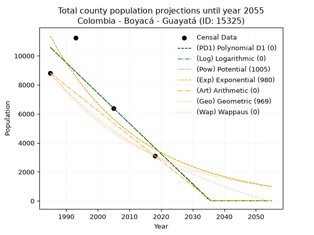
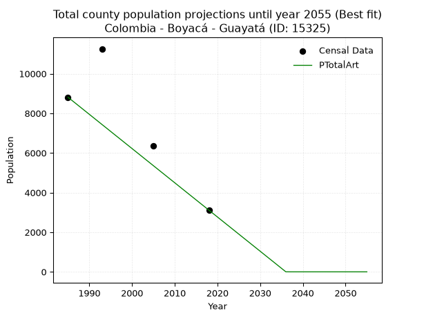
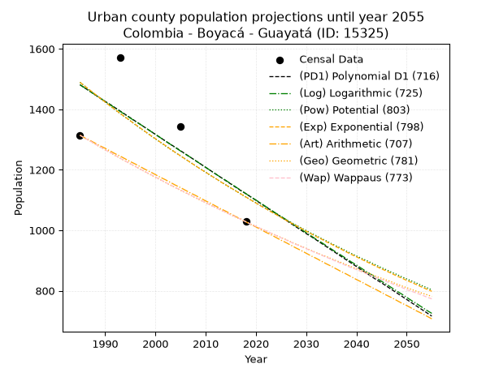
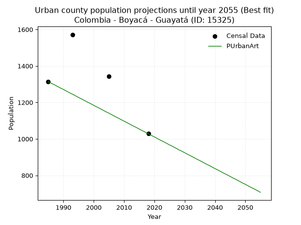
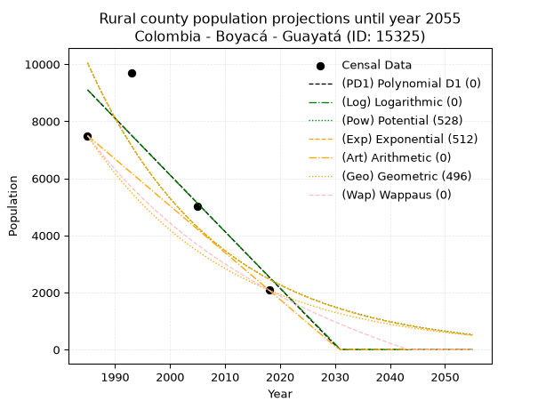
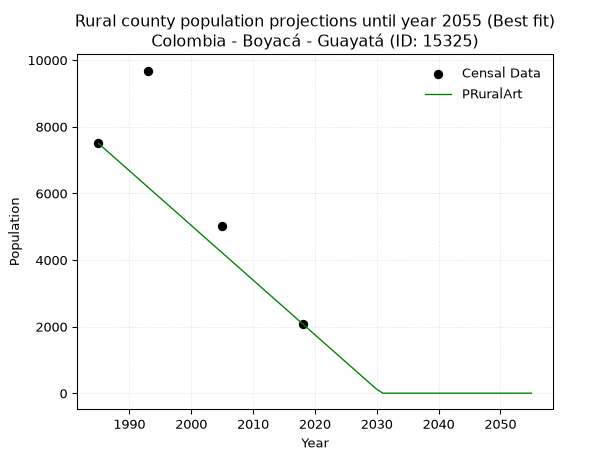

<div align="center">


</div>

# _“Population and Public Services Demand Projections (PPSD) until Year 2050 for Colombia - Boyacá - Guayatá (ID: 15325)”_
Keywords: `population` `public-service` `projection` `lineal` `polynomial` `logarithmic` `potential` `exponential` `arithmetic` `geometric` `wappaus` `dane` `colombia` `south-america`

PPSD are analytical estimates used by governments and planners to anticipate future changes in population size, age distribution, and the resulting community needs for utilities, healthcare, education, and infrastructure as sizing future water treatment facilities, electrical grids, and road networks based on spatial growth.

> **General running parameters**: • app_version: _v20260806_. • Python version: _3.14.7_. • Pandas version: _3.0.5_. • NumPy version: _2.5.1_. • Creates, save and include plots into reports (create_plot): _False_. • Projection until year: _2050_. • Process polynomial degree 2 and up: _False_. • Process Wappaus: _True_. • Process Wappaus: _True_. • Set negative values to zero: _True_. • Set infinite values to zero: _True_. • Drop dataset notes: _True_. 
<div align="center">

Dynamic map: [:earth_americas:Google](http://maps.google.com/maps?q=4.967121866,-73.4896975) [:earth_americas:OSM](https://www.openstreetmap.org/#map=18/4.967121866/-73.4896975&layers=P) [:earth_americas:Bing](https://www.bing.com/maps?cp=4.967121866~-73.4896975&lvl=18) [:earth_americas:Apple](https://maps.apple.com/frame?center=4.967121866%2C-73.4896975&span=0.003%2C0.006)

</div>


<div align="center">

```geojson
{
  "type": "Feature",
  "geometry": {
    "type": "Point", 
    "coordinates": [-73.4896975, 4.967121866]
  }, 
  "properties": {
    "Name": "Colombia - Boyacá - Guayatá (ID: 15325)"
  }
}
```

</div>


## 0. Census Data (4 records)

Census data are official statistics collected by a government about the people and housing in a country. They usually include counts of total population, age, sex, race, income, education, and jobs.

📅Global census file: [Population.xlsx](../data/Population.xlsx)

| Source   |   Year |   CountryID | CountryName   |   StateID | StateName   |   CountyID | CountyName   |   PTotal |   PUrban |   PRural |
|:---------|-------:|------------:|:--------------|----------:|:------------|-----------:|:-------------|---------:|---------:|---------:|
| DANE     |   1985 |          57 | Colombia      |        15 | Boyacá      |      15325 | Guayatá      |     8811 |     1314 |     7497 |
| DANE     |   1993 |          57 | Colombia      |        15 | Boyacá      |      15325 | Guayatá      |    11254 |     1572 |     9682 |
| DANE     |   2005 |          57 | Colombia      |        15 | Boyacá      |      15325 | Guayatá      |     6368 |     1344 |     5024 |
| DANE     |   2018 |          57 | Colombia      |        15 | Boyacá      |      15325 | Guayatá      |     3112 |     1028 |     2084 |

> 🔥Some records could had specific notes about the registered values or the corresponding urban or rural distribution.

## 1. Total

### 1.1. Coefficients and Parameters

* (PD1) Polynomial Deg 1: -209.51144118827548, 426461.51023684803 (lineal)
* (Log) Logarithmic: -418988.97211616475, 3192124.784621873
* (Pow) Potential: -69.96658651522226, 234.78835184303418
* (Exp) Exponential: -0.03498946641209741, 1.6542722965633293e+34
* (Art) Arithmetic: Year diff. 2018 - 1985 = 33, Population diff. 3112 - 8811 = -5699, Annual growth = -172.6969696969697
* (Geo) Geometric: Year diff. 2018 - 1985 = 33, Population diff. 3112 - 8811 = -5699, Annual growth % = -0.031045316443845117
* (Wap) Wappaus: i = -2.896871084407778, Condition values only valid for < 200)

<sub>
Wappaus condition values: ['-0.00', '-2.90', '-5.79', '-8.69', '-11.59', '-14.48', '-17.38', '-20.28', '-23.17', '-26.07', '-28.97', '-31.87', '-34.76', '-37.66', '-40.56', '-43.45', '-46.35', '-49.25', '-52.14', '-55.04', '-57.94', '-60.83', '-63.73', '-66.63', '-69.52', '-72.42', '-75.32', '-78.22', '-81.11', '-84.01', '-86.91', '-89.80', '-92.70', '-95.60', '-98.49', '-101.39', '-104.29', '-107.18', '-110.08', '-112.98', '-115.87', '-118.77', '-121.67', '-124.57', '-127.46', '-130.36', '-133.26', '-136.15', '-139.05', '-141.95', '-144.84', '-147.74', '-150.64', '-153.53', '-156.43', '-159.33', '-162.22', '-165.12', '-168.02', '-170.92', '-173.81', '-176.71', '-179.61', '-182.50', '-185.40', '-188.30']
</sub>


### 1.2. Projected Dataset

|   Year |   CountyID |   PTotalPD1 |   PTotalLog |   PTotalPow |   PTotalExp |   PTotalArt |   PTotalGeo |   PTotalWap |
|-------:|-----------:|------------:|------------:|------------:|------------:|------------:|------------:|------------:|
|   1985 |      15325 |       10581 |       10585 |       11358 |       11352 |        8811 |        8811 |        8811 |
|   1986 |      15325 |       10372 |       10374 |       10965 |       10962 |        8638 |        8537 |        8559 |
|   1987 |      15325 |       10162 |       10163 |       10585 |       10585 |        8466 |        8272 |        8315 |
|   1988 |      15325 |        9953 |        9952 |       10219 |       10221 |        8293 |        8016 |        8077 |
|   1989 |      15325 |        9743 |        9741 |        9866 |        9870 |        8120 |        7767 |        7846 |
|   1990 |      15325 |        9534 |        9531 |        9525 |        9530 |        7948 |        7526 |        7621 |
|   1991 |      15325 |        9324 |        9320 |        9196 |        9202 |        7775 |        7292 |        7402 |
|   1992 |      15325 |        9115 |        9110 |        8878 |        8886 |        7602 |        7066 |        7189 |
|   1993 |      15325 |        8905 |        8900 |        8572 |        8581 |        7429 |        6846 |        6981 |
|   1994 |      15325 |        8696 |        8689 |        8276 |        8285 |        7257 |        6634 |        6779 |
|   1995 |      15325 |        8486 |        8479 |        7991 |        8001 |        7084 |        6428 |        6581 |
|   1996 |      15325 |        8277 |        8269 |        7716 |        7725 |        6911 |        6228 |        6389 |
|   1997 |      15325 |        8067 |        8059 |        7450 |        7460 |        6739 |        6035 |        6202 |
|   1998 |      15325 |        7858 |        7850 |        7194 |        7203 |        6566 |        5848 |        6019 |
|   1999 |      15325 |        7648 |        7640 |        6946 |        6956 |        6393 |        5666 |        5840 |
|   2000 |      15325 |        7439 |        7430 |        6707 |        6716 |        6221 |        5490 |        5666 |
|   2001 |      15325 |        7229 |        7221 |        6477 |        6486 |        6048 |        5320 |        5495 |
|   2002 |      15325 |        7020 |        7012 |        6254 |        6263 |        5875 |        5154 |        5329 |
|   2003 |      15325 |        6810 |        6802 |        6040 |        6047 |        5702 |        4994 |        5167 |
|   2004 |      15325 |        6601 |        6593 |        5832 |        5839 |        5530 |        4839 |        5008 |
|   2005 |      15325 |        6391 |        6384 |        5632 |        5639 |        5357 |        4689 |        4853 |
|   2006 |      15325 |        6182 |        6175 |        5439 |        5445 |        5184 |        4544 |        4701 |
|   2007 |      15325 |        5972 |        5967 |        5253 |        5257 |        5012 |        4403 |        4553 |
|   2008 |      15325 |        5763 |        5758 |        5073 |        5077 |        4839 |        4266 |        4407 |
|   2009 |      15325 |        5553 |        5549 |        4899 |        4902 |        4666 |        4133 |        4265 |
|   2010 |      15325 |        5344 |        5341 |        4732 |        4734 |        4494 |        4005 |        4126 |
|   2011 |      15325 |        5134 |        5132 |        4570 |        4571 |        4321 |        3881 |        3990 |
|   2012 |      15325 |        4924 |        4924 |        4413 |        4414 |        4148 |        3760 |        3857 |
|   2013 |      15325 |        4715 |        4716 |        4263 |        4262 |        3975 |        3644 |        3726 |
|   2014 |      15325 |        4505 |        4508 |        4117 |        4115 |        3803 |        3530 |        3598 |
|   2015 |      15325 |        4296 |        4300 |        3977 |        3974 |        3630 |        3421 |        3473 |
|   2016 |      15325 |        4086 |        4092 |        3841 |        3837 |        3457 |        3315 |        3350 |
|   2017 |      15325 |        3877 |        3884 |        3710 |        3705 |        3285 |        3212 |        3230 |
|   2018 |      15325 |        3667 |        3676 |        3583 |        3578 |        3112 |        3112 |        3112 |
|   2019 |      15325 |        3458 |        3469 |        3461 |        3455 |        2939 |        3015 |        2996 |
|   2020 |      15325 |        3248 |        3261 |        3343 |        3336 |        2767 |        2922 |        2883 |
|   2021 |      15325 |        3039 |        3054 |        3230 |        3221 |        2594 |        2831 |        2771 |
|   2022 |      15325 |        2829 |        2847 |        3120 |        3111 |        2421 |        2743 |        2662 |
|   2023 |      15325 |        2620 |        2640 |        3014 |        3004 |        2249 |        2658 |        2555 |
|   2024 |      15325 |        2410 |        2433 |        2911 |        2900 |        2076 |        2575 |        2450 |
|   2025 |      15325 |        2201 |        2226 |        2812 |        2801 |        1903 |        2496 |        2347 |
|   2026 |      15325 |        1991 |        2019 |        2717 |        2704 |        1730 |        2418 |        2245 |
|   2027 |      15325 |        1782 |        1812 |        2625 |        2611 |        1558 |        2343 |        2146 |
|   2028 |      15325 |        1572 |        1605 |        2536 |        2522 |        1385 |        2270 |        2048 |
|   2029 |      15325 |        1363 |        1399 |        2450 |        2435 |        1212 |        2200 |        1952 |
|   2030 |      15325 |        1153 |        1192 |        2367 |        2351 |        1040 |        2131 |        1857 |
|   2031 |      15325 |         944 |         986 |        2287 |        2270 |         867 |        2065 |        1765 |
|   2032 |      15325 |         734 |         780 |        2209 |        2192 |         694 |        2001 |        1674 |
|   2033 |      15325 |         525 |         574 |        2134 |        2117 |         522 |        1939 |        1584 |
|   2034 |      15325 |         315 |         368 |        2062 |        2044 |         349 |        1879 |        1496 |
|   2035 |      15325 |         106 |         162 |        1992 |        1974 |         176 |        1821 |        1409 |
|   2036 |      15325 |           0 |           0 |        1925 |        1906 |           3 |        1764 |        1324 |
|   2037 |      15325 |           0 |           0 |        1860 |        1840 |           0 |        1709 |        1240 |
|   2038 |      15325 |           0 |           0 |        1797 |        1777 |           0 |        1656 |        1158 |
|   2039 |      15325 |           0 |           0 |        1737 |        1716 |           0 |        1605 |        1077 |
|   2040 |      15325 |           0 |           0 |        1678 |        1657 |           0 |        1555 |         997 |
|   2041 |      15325 |           0 |           0 |        1622 |        1600 |           0 |        1507 |         919 |
|   2042 |      15325 |           0 |           0 |        1567 |        1545 |           0 |        1460 |         842 |
|   2043 |      15325 |           0 |           0 |        1514 |        1492 |           0 |        1415 |         766 |
|   2044 |      15325 |           0 |           0 |        1463 |        1441 |           0 |        1371 |         691 |
|   2045 |      15325 |           0 |           0 |        1414 |        1391 |           0 |        1328 |         617 |
|   2046 |      15325 |           0 |           0 |        1366 |        1343 |           0 |        1287 |         545 |
|   2047 |      15325 |           0 |           0 |        1321 |        1297 |           0 |        1247 |         473 |
|   2048 |      15325 |           0 |           0 |        1276 |        1252 |           0 |        1208 |         403 |
|   2049 |      15325 |           0 |           0 |        1233 |        1209 |           0 |        1171 |         334 |
|   2050 |      15325 |           0 |           0 |        1192 |        1168 |           0 |        1134 |         266 |
<div align="center">

</img>

</div>


### 1.3. Best fit with absolute and relative error (%)

Relative error puts that difference into context by dividing the absolute error by the true value, creating a unitless ratio or percentage that shows the scale of the mistake.

Absolute and relative error

|   Year | Source   |   CountryID | CountryName   |   StateID | StateName   |   CountyID_x | CountyName   |   PTotal |   PUrban |   PRural |   CountyID_y |   PTotalPD1 |   PTotalLog |   PTotalPow |   PTotalExp |   PTotalArt |   PTotalGeo |   PTotalWap |   PTotalPD1AbsError |   PTotalLogAbsError |   PTotalPowAbsError |   PTotalExpAbsError |   PTotalArtAbsError |   PTotalGeoAbsError |   PTotalWapAbsError |   PTotalPD1RelError |   PTotalLogRelError |   PTotalPowRelError |   PTotalExpRelError |   PTotalArtRelError |   PTotalGeoRelError |   PTotalWapRelError |
|-------:|:---------|------------:|:--------------|----------:|:------------|-------------:|:-------------|---------:|---------:|---------:|-------------:|------------:|------------:|------------:|------------:|------------:|------------:|------------:|--------------------:|--------------------:|--------------------:|--------------------:|--------------------:|--------------------:|--------------------:|--------------------:|--------------------:|--------------------:|--------------------:|--------------------:|--------------------:|--------------------:|
|   1985 | DANE     |          57 | Colombia      |        15 | Boyacá      |        15325 | Guayatá      |     8811 |     1314 |     7497 |        15325 |       10581 |       10585 |       11358 |       11352 |        8811 |        8811 |        8811 |                1770 |                1774 |                2547 |                2541 |                   0 |                   0 |                   0 |           20.0885   |           20.1339   |             28.907  |             28.839  |              0      |              0      |              0      |
|   1993 | DANE     |          57 | Colombia      |        15 | Boyacá      |        15325 | Guayatá      |    11254 |     1572 |     9682 |        15325 |        8905 |        8900 |        8572 |        8581 |        7429 |        6846 |        6981 |                2349 |                2354 |                2682 |                2673 |                3825 |                4408 |                4273 |           20.8726   |           20.917    |             23.8315 |             23.7516 |             33.9879 |             39.1683 |             37.9687 |
|   2005 | DANE     |          57 | Colombia      |        15 | Boyacá      |        15325 | Guayatá      |     6368 |     1344 |     5024 |        15325 |        6391 |        6384 |        5632 |        5639 |        5357 |        4689 |        4853 |                  23 |                  16 |                 736 |                 729 |                1011 |                1679 |                1515 |            0.361181 |            0.251256 |             11.5578 |             11.4479 |             15.8763 |             26.3662 |             23.7908 |
|   2018 | DANE     |          57 | Colombia      |        15 | Boyacá      |        15325 | Guayatá      |     3112 |     1028 |     2084 |        15325 |        3667 |        3676 |        3583 |        3578 |        3112 |        3112 |        3112 |                 555 |                 564 |                 471 |                 466 |                   0 |                   0 |                   0 |           17.8342   |           18.1234   |             15.135  |             14.9743 |              0      |              0      |              0      |

Relative error mean

| Method    |   RelError | Best   |
|:----------|-----------:|:-------|
| PTotalPD1 |    14.7891 |        |
| PTotalLog |    14.8564 |        |
| PTotalPow |    19.8578 |        |
| PTotalExp |    19.7532 |        |
| PTotalArt |    12.466  | True   |
| PTotalGeo |    16.3836 |        |
| PTotalWap |    15.4399 |        |

💙Best method: _**PTotalArt**_
<div align="center">

</img>

</div>


### 1.4. Fresh water supply demand in liters per capita per day (lpcd)

The fresh water supply demand typically ranges from 100 to 300 liters per capita per day (lpcd) for standard domestic and municipal planning, though absolute survival minimums set by the World Health Organization are as low as 7.5 to 20 liters per day, and total consumption in high-income nations can exceed 400 liters.

> `CZ`: Level in meters above the sea level (masl).<br> `WS`: Fresh water supply demand in liters per capita per day (lpcd or l/h/d).<br> `WSAll`: Zonal fresh water supply demand in liters per second (l/s).<br> `A`: Zonal area in square meters.

Reference values (RAS Colombia)

|    CZ |   WS |
|------:|-----:|
|  1000 |  120 |
|  2000 |  130 |
| 99999 |  140 |

County shapefile geometry properties and water supply values

|   CountyID |      ATotal |   CZTotal |   WSTotal |
|-----------:|------------:|----------:|----------:|
|      15325 | 9.98042e+07 |   2211.57 |       140 |

Projected values for best method: PTotalArt

|   CountyID |   Year |   PTotalArt |   WSTotal |   WSTotalAll |
|-----------:|-------:|------------:|----------:|-------------:|
|      15325 |   1985 |        8811 |       140 |  14.2771     |
|      15325 |   1986 |        8638 |       140 |  13.9968     |
|      15325 |   1987 |        8466 |       140 |  13.7181     |
|      15325 |   1988 |        8293 |       140 |  13.4377     |
|      15325 |   1989 |        8120 |       140 |  13.1574     |
|      15325 |   1990 |        7948 |       140 |  12.8787     |
|      15325 |   1991 |        7775 |       140 |  12.5984     |
|      15325 |   1992 |        7602 |       140 |  12.3181     |
|      15325 |   1993 |        7429 |       140 |  12.0377     |
|      15325 |   1994 |        7257 |       140 |  11.759      |
|      15325 |   1995 |        7084 |       140 |  11.4787     |
|      15325 |   1996 |        6911 |       140 |  11.1984     |
|      15325 |   1997 |        6739 |       140 |  10.9197     |
|      15325 |   1998 |        6566 |       140 |  10.6394     |
|      15325 |   1999 |        6393 |       140 |  10.359      |
|      15325 |   2000 |        6221 |       140 |  10.0803     |
|      15325 |   2001 |        6048 |       140 |   9.8        |
|      15325 |   2002 |        5875 |       140 |   9.51968    |
|      15325 |   2003 |        5702 |       140 |   9.23935    |
|      15325 |   2004 |        5530 |       140 |   8.96065    |
|      15325 |   2005 |        5357 |       140 |   8.68032    |
|      15325 |   2006 |        5184 |       140 |   8.4        |
|      15325 |   2007 |        5012 |       140 |   8.1213     |
|      15325 |   2008 |        4839 |       140 |   7.84097    |
|      15325 |   2009 |        4666 |       140 |   7.56065    |
|      15325 |   2010 |        4494 |       140 |   7.28194    |
|      15325 |   2011 |        4321 |       140 |   7.00162    |
|      15325 |   2012 |        4148 |       140 |   6.7213     |
|      15325 |   2013 |        3975 |       140 |   6.44097    |
|      15325 |   2014 |        3803 |       140 |   6.16227    |
|      15325 |   2015 |        3630 |       140 |   5.88194    |
|      15325 |   2016 |        3457 |       140 |   5.60162    |
|      15325 |   2017 |        3285 |       140 |   5.32292    |
|      15325 |   2018 |        3112 |       140 |   5.04259    |
|      15325 |   2019 |        2939 |       140 |   4.76227    |
|      15325 |   2020 |        2767 |       140 |   4.48356    |
|      15325 |   2021 |        2594 |       140 |   4.20324    |
|      15325 |   2022 |        2421 |       140 |   3.92292    |
|      15325 |   2023 |        2249 |       140 |   3.64421    |
|      15325 |   2024 |        2076 |       140 |   3.36389    |
|      15325 |   2025 |        1903 |       140 |   3.08356    |
|      15325 |   2026 |        1730 |       140 |   2.80324    |
|      15325 |   2027 |        1558 |       140 |   2.52454    |
|      15325 |   2028 |        1385 |       140 |   2.24421    |
|      15325 |   2029 |        1212 |       140 |   1.96389    |
|      15325 |   2030 |        1040 |       140 |   1.68519    |
|      15325 |   2031 |         867 |       140 |   1.40486    |
|      15325 |   2032 |         694 |       140 |   1.12454    |
|      15325 |   2033 |         522 |       140 |   0.845833   |
|      15325 |   2034 |         349 |       140 |   0.565509   |
|      15325 |   2035 |         176 |       140 |   0.285185   |
|      15325 |   2036 |           3 |       140 |   0.00486111 |
|      15325 |   2037 |           0 |       140 |   0          |
|      15325 |   2038 |           0 |       140 |   0          |
|      15325 |   2039 |           0 |       140 |   0          |
|      15325 |   2040 |           0 |       140 |   0          |
|      15325 |   2041 |           0 |       140 |   0          |
|      15325 |   2042 |           0 |       140 |   0          |
|      15325 |   2043 |           0 |       140 |   0          |
|      15325 |   2044 |           0 |       140 |   0          |
|      15325 |   2045 |           0 |       140 |   0          |
|      15325 |   2046 |           0 |       140 |   0          |
|      15325 |   2047 |           0 |       140 |   0          |
|      15325 |   2048 |           0 |       140 |   0          |
|      15325 |   2049 |           0 |       140 |   0          |
|      15325 |   2050 |           0 |       140 |   0          |

## 2. Urban

### 2.1. Coefficients and Parameters

* (PD1) Polynomial Deg 1: -10.926535527900228, 23170.302689682427 (lineal)
* (Log) Logarithmic: -21825.091003345246, 167207.19161173026
* (Pow) Potential: -17.800739968649008, 61.87545266672594
* (Exp) Exponential: -0.008911164909976376, 71608913684.39421
* (Art) Arithmetic: Year diff. 2018 - 1985 = 33, Population diff. 1028 - 1314 = -286, Annual growth = -8.666666666666666
* (Geo) Geometric: Year diff. 2018 - 1985 = 33, Population diff. 1028 - 1314 = -286, Annual growth % = -0.007410609654574296
* (Wap) Wappaus: i = -0.740108169655565, Condition values only valid for < 200)

<sub>
Wappaus condition values: ['-0.00', '-0.74', '-1.48', '-2.22', '-2.96', '-3.70', '-4.44', '-5.18', '-5.92', '-6.66', '-7.40', '-8.14', '-8.88', '-9.62', '-10.36', '-11.10', '-11.84', '-12.58', '-13.32', '-14.06', '-14.80', '-15.54', '-16.28', '-17.02', '-17.76', '-18.50', '-19.24', '-19.98', '-20.72', '-21.46', '-22.20', '-22.94', '-23.68', '-24.42', '-25.16', '-25.90', '-26.64', '-27.38', '-28.12', '-28.86', '-29.60', '-30.34', '-31.08', '-31.82', '-32.56', '-33.30', '-34.04', '-34.79', '-35.53', '-36.27', '-37.01', '-37.75', '-38.49', '-39.23', '-39.97', '-40.71', '-41.45', '-42.19', '-42.93', '-43.67', '-44.41', '-45.15', '-45.89', '-46.63', '-47.37', '-48.11']
</sub>


### 2.2. Projected Dataset

|   Year |   CountyID |   PUrbanPD1 |   PUrbanLog |   PUrbanPow |   PUrbanExp |   PUrbanArt |   PUrbanGeo |   PUrbanWap |
|-------:|-----------:|------------:|------------:|------------:|------------:|------------:|------------:|------------:|
|   1985 |      15325 |        1481 |        1481 |        1489 |        1489 |        1314 |        1314 |        1314 |
|   1986 |      15325 |        1470 |        1470 |        1476 |        1476 |        1305 |        1304 |        1304 |
|   1987 |      15325 |        1459 |        1459 |        1462 |        1463 |        1297 |        1295 |        1295 |
|   1988 |      15325 |        1448 |        1448 |        1449 |        1450 |        1288 |        1285 |        1285 |
|   1989 |      15325 |        1437 |        1437 |        1437 |        1437 |        1279 |        1275 |        1276 |
|   1990 |      15325 |        1426 |        1426 |        1424 |        1424 |        1271 |        1266 |        1266 |
|   1991 |      15325 |        1416 |        1415 |        1411 |        1411 |        1262 |        1257 |        1257 |
|   1992 |      15325 |        1405 |        1404 |        1398 |        1399 |        1253 |        1247 |        1248 |
|   1993 |      15325 |        1394 |        1393 |        1386 |        1386 |        1245 |        1238 |        1238 |
|   1994 |      15325 |        1383 |        1382 |        1374 |        1374 |        1236 |        1229 |        1229 |
|   1995 |      15325 |        1372 |        1371 |        1362 |        1362 |        1227 |        1220 |        1220 |
|   1996 |      15325 |        1361 |        1360 |        1349 |        1350 |        1219 |        1211 |        1211 |
|   1997 |      15325 |        1350 |        1350 |        1337 |        1338 |        1210 |        1202 |        1202 |
|   1998 |      15325 |        1339 |        1339 |        1326 |        1326 |        1201 |        1193 |        1193 |
|   1999 |      15325 |        1328 |        1328 |        1314 |        1314 |        1193 |        1184 |        1185 |
|   2000 |      15325 |        1317 |        1317 |        1302 |        1303 |        1184 |        1175 |        1176 |
|   2001 |      15325 |        1306 |        1306 |        1291 |        1291 |        1175 |        1167 |        1167 |
|   2002 |      15325 |        1295 |        1295 |        1279 |        1280 |        1167 |        1158 |        1158 |
|   2003 |      15325 |        1284 |        1284 |        1268 |        1268 |        1158 |        1149 |        1150 |
|   2004 |      15325 |        1274 |        1273 |        1257 |        1257 |        1149 |        1141 |        1141 |
|   2005 |      15325 |        1263 |        1262 |        1246 |        1246 |        1141 |        1132 |        1133 |
|   2006 |      15325 |        1252 |        1251 |        1235 |        1235 |        1132 |        1124 |        1125 |
|   2007 |      15325 |        1241 |        1241 |        1224 |        1224 |        1123 |        1116 |        1116 |
|   2008 |      15325 |        1230 |        1230 |        1213 |        1213 |        1115 |        1107 |        1108 |
|   2009 |      15325 |        1219 |        1219 |        1202 |        1202 |        1106 |        1099 |        1100 |
|   2010 |      15325 |        1208 |        1208 |        1192 |        1192 |        1097 |        1091 |        1091 |
|   2011 |      15325 |        1197 |        1197 |        1181 |        1181 |        1089 |        1083 |        1083 |
|   2012 |      15325 |        1186 |        1186 |        1171 |        1171 |        1080 |        1075 |        1075 |
|   2013 |      15325 |        1175 |        1175 |        1160 |        1160 |        1071 |        1067 |        1067 |
|   2014 |      15325 |        1164 |        1165 |        1150 |        1150 |        1063 |        1059 |        1059 |
|   2015 |      15325 |        1153 |        1154 |        1140 |        1140 |        1054 |        1051 |        1051 |
|   2016 |      15325 |        1142 |        1143 |        1130 |        1130 |        1045 |        1043 |        1044 |
|   2017 |      15325 |        1131 |        1132 |        1120 |        1120 |        1037 |        1036 |        1036 |
|   2018 |      15325 |        1121 |        1121 |        1110 |        1110 |        1028 |        1028 |        1028 |
|   2019 |      15325 |        1110 |        1110 |        1100 |        1100 |        1019 |        1020 |        1020 |
|   2020 |      15325 |        1099 |        1100 |        1091 |        1090 |        1011 |        1013 |        1013 |
|   2021 |      15325 |        1088 |        1089 |        1081 |        1080 |        1002 |        1005 |        1005 |
|   2022 |      15325 |        1077 |        1078 |        1072 |        1071 |         993 |         998 |         998 |
|   2023 |      15325 |        1066 |        1067 |        1062 |        1061 |         985 |         990 |         990 |
|   2024 |      15325 |        1055 |        1056 |        1053 |        1052 |         976 |         983 |         983 |
|   2025 |      15325 |        1044 |        1046 |        1044 |        1042 |         967 |         976 |         975 |
|   2026 |      15325 |        1033 |        1035 |        1035 |        1033 |         959 |         969 |         968 |
|   2027 |      15325 |        1022 |        1024 |        1026 |        1024 |         950 |         961 |         960 |
|   2028 |      15325 |        1011 |        1013 |        1017 |        1015 |         941 |         954 |         953 |
|   2029 |      15325 |        1000 |        1003 |        1008 |        1006 |         933 |         947 |         946 |
|   2030 |      15325 |         989 |         992 |         999 |         997 |         924 |         940 |         939 |
|   2031 |      15325 |         979 |         981 |         990 |         988 |         915 |         933 |         932 |
|   2032 |      15325 |         968 |         970 |         982 |         979 |         907 |         926 |         925 |
|   2033 |      15325 |         957 |         960 |         973 |         971 |         898 |         919 |         918 |
|   2034 |      15325 |         946 |         949 |         965 |         962 |         889 |         913 |         911 |
|   2035 |      15325 |         935 |         938 |         956 |         954 |         881 |         906 |         904 |
|   2036 |      15325 |         924 |         927 |         948 |         945 |         872 |         899 |         897 |
|   2037 |      15325 |         913 |         917 |         940 |         937 |         863 |         893 |         890 |
|   2038 |      15325 |         902 |         906 |         931 |         928 |         855 |         886 |         883 |
|   2039 |      15325 |         891 |         895 |         923 |         920 |         846 |         879 |         876 |
|   2040 |      15325 |         880 |         885 |         915 |         912 |         837 |         873 |         870 |
|   2041 |      15325 |         869 |         874 |         907 |         904 |         829 |         866 |         863 |
|   2042 |      15325 |         858 |         863 |         900 |         896 |         820 |         860 |         856 |
|   2043 |      15325 |         847 |         853 |         892 |         888 |         811 |         854 |         850 |
|   2044 |      15325 |         836 |         842 |         884 |         880 |         803 |         847 |         843 |
|   2045 |      15325 |         826 |         831 |         876 |         872 |         794 |         841 |         837 |
|   2046 |      15325 |         815 |         821 |         869 |         865 |         785 |         835 |         830 |
|   2047 |      15325 |         804 |         810 |         861 |         857 |         777 |         829 |         824 |
|   2048 |      15325 |         793 |         799 |         854 |         849 |         768 |         822 |         817 |
|   2049 |      15325 |         782 |         789 |         846 |         842 |         759 |         816 |         811 |
|   2050 |      15325 |         771 |         778 |         839 |         834 |         751 |         810 |         804 |
<div align="center">

</img>

</div>


### 2.3. Best fit with absolute and relative error (%)

Relative error puts that difference into context by dividing the absolute error by the true value, creating a unitless ratio or percentage that shows the scale of the mistake.

Absolute and relative error

|   Year | Source   |   CountryID | CountryName   |   StateID | StateName   |   CountyID_x | CountyName   |   PTotal |   PUrban |   PRural |   CountyID_y |   PUrbanPD1 |   PUrbanLog |   PUrbanPow |   PUrbanExp |   PUrbanArt |   PUrbanGeo |   PUrbanWap |   PUrbanPD1AbsError |   PUrbanLogAbsError |   PUrbanPowAbsError |   PUrbanExpAbsError |   PUrbanArtAbsError |   PUrbanGeoAbsError |   PUrbanWapAbsError |   PUrbanPD1RelError |   PUrbanLogRelError |   PUrbanPowRelError |   PUrbanExpRelError |   PUrbanArtRelError |   PUrbanGeoRelError |   PUrbanWapRelError |
|-------:|:---------|------------:|:--------------|----------:|:------------|-------------:|:-------------|---------:|---------:|---------:|-------------:|------------:|------------:|------------:|------------:|------------:|------------:|------------:|--------------------:|--------------------:|--------------------:|--------------------:|--------------------:|--------------------:|--------------------:|--------------------:|--------------------:|--------------------:|--------------------:|--------------------:|--------------------:|--------------------:|
|   1985 | DANE     |          57 | Colombia      |        15 | Boyacá      |        15325 | Guayatá      |     8811 |     1314 |     7497 |        15325 |        1481 |        1481 |        1489 |        1489 |        1314 |        1314 |        1314 |                 167 |                 167 |                 175 |                 175 |                   0 |                   0 |                   0 |            12.7093  |            12.7093  |            13.3181  |            13.3181  |              0      |              0      |              0      |
|   1993 | DANE     |          57 | Colombia      |        15 | Boyacá      |        15325 | Guayatá      |    11254 |     1572 |     9682 |        15325 |        1394 |        1393 |        1386 |        1386 |        1245 |        1238 |        1238 |                 178 |                 179 |                 186 |                 186 |                 327 |                 334 |                 334 |            11.3232  |            11.3868  |            11.8321  |            11.8321  |             20.8015 |             21.2468 |             21.2468 |
|   2005 | DANE     |          57 | Colombia      |        15 | Boyacá      |        15325 | Guayatá      |     6368 |     1344 |     5024 |        15325 |        1263 |        1262 |        1246 |        1246 |        1141 |        1132 |        1133 |                  81 |                  82 |                  98 |                  98 |                 203 |                 212 |                 211 |             6.02679 |             6.10119 |             7.29167 |             7.29167 |             15.1042 |             15.7738 |             15.6994 |
|   2018 | DANE     |          57 | Colombia      |        15 | Boyacá      |        15325 | Guayatá      |     3112 |     1028 |     2084 |        15325 |        1121 |        1121 |        1110 |        1110 |        1028 |        1028 |        1028 |                  93 |                  93 |                  82 |                  82 |                   0 |                   0 |                   0 |             9.04669 |             9.04669 |             7.97665 |             7.97665 |              0      |              0      |              0      |

Relative error mean

| Method    |   RelError | Best   |
|:----------|-----------:|:-------|
| PUrbanPD1 |    9.77648 |        |
| PUrbanLog |    9.81098 |        |
| PUrbanPow |   10.1046  |        |
| PUrbanExp |   10.1046  |        |
| PUrbanArt |    8.97642 | True   |
| PUrbanGeo |    9.25516 |        |
| PUrbanWap |    9.23656 |        |

💙Best method: _**PUrbanArt**_
<div align="center">

</img>

</div>


### 2.4. Fresh water supply demand in liters per capita per day (lpcd)

The fresh water supply demand typically ranges from 100 to 300 liters per capita per day (lpcd) for standard domestic and municipal planning, though absolute survival minimums set by the World Health Organization are as low as 7.5 to 20 liters per day, and total consumption in high-income nations can exceed 400 liters.

> `CZ`: Level in meters above the sea level (masl).<br> `WS`: Fresh water supply demand in liters per capita per day (lpcd or l/h/d).<br> `WSAll`: Zonal fresh water supply demand in liters per second (l/s).<br> `A`: Zonal area in square meters.

Reference values (RAS Colombia)

|    CZ |   WS |
|------:|-----:|
|  1000 |  120 |
|  2000 |  130 |
| 99999 |  140 |

County shapefile geometry properties and water supply values

|   CountyID |   AUrban |   CZUrban |   WSUrban |
|-----------:|---------:|----------:|----------:|
|      15325 |   317889 |   1710.23 |       130 |

Projected values for best method: PUrbanArt

|   CountyID |   Year |   PUrbanArt |   WSUrban |   WSUrbanAll |
|-----------:|-------:|------------:|----------:|-------------:|
|      15325 |   1985 |        1314 |       130 |      1.97708 |
|      15325 |   1986 |        1305 |       130 |      1.96354 |
|      15325 |   1987 |        1297 |       130 |      1.9515  |
|      15325 |   1988 |        1288 |       130 |      1.93796 |
|      15325 |   1989 |        1279 |       130 |      1.92442 |
|      15325 |   1990 |        1271 |       130 |      1.91238 |
|      15325 |   1991 |        1262 |       130 |      1.89884 |
|      15325 |   1992 |        1253 |       130 |      1.8853  |
|      15325 |   1993 |        1245 |       130 |      1.87326 |
|      15325 |   1994 |        1236 |       130 |      1.85972 |
|      15325 |   1995 |        1227 |       130 |      1.84618 |
|      15325 |   1996 |        1219 |       130 |      1.83414 |
|      15325 |   1997 |        1210 |       130 |      1.8206  |
|      15325 |   1998 |        1201 |       130 |      1.80706 |
|      15325 |   1999 |        1193 |       130 |      1.79502 |
|      15325 |   2000 |        1184 |       130 |      1.78148 |
|      15325 |   2001 |        1175 |       130 |      1.76794 |
|      15325 |   2002 |        1167 |       130 |      1.7559  |
|      15325 |   2003 |        1158 |       130 |      1.74236 |
|      15325 |   2004 |        1149 |       130 |      1.72882 |
|      15325 |   2005 |        1141 |       130 |      1.71678 |
|      15325 |   2006 |        1132 |       130 |      1.70324 |
|      15325 |   2007 |        1123 |       130 |      1.6897  |
|      15325 |   2008 |        1115 |       130 |      1.67766 |
|      15325 |   2009 |        1106 |       130 |      1.66412 |
|      15325 |   2010 |        1097 |       130 |      1.65058 |
|      15325 |   2011 |        1089 |       130 |      1.63854 |
|      15325 |   2012 |        1080 |       130 |      1.625   |
|      15325 |   2013 |        1071 |       130 |      1.61146 |
|      15325 |   2014 |        1063 |       130 |      1.59942 |
|      15325 |   2015 |        1054 |       130 |      1.58588 |
|      15325 |   2016 |        1045 |       130 |      1.57234 |
|      15325 |   2017 |        1037 |       130 |      1.5603  |
|      15325 |   2018 |        1028 |       130 |      1.54676 |
|      15325 |   2019 |        1019 |       130 |      1.53322 |
|      15325 |   2020 |        1011 |       130 |      1.52118 |
|      15325 |   2021 |        1002 |       130 |      1.50764 |
|      15325 |   2022 |         993 |       130 |      1.4941  |
|      15325 |   2023 |         985 |       130 |      1.48206 |
|      15325 |   2024 |         976 |       130 |      1.46852 |
|      15325 |   2025 |         967 |       130 |      1.45498 |
|      15325 |   2026 |         959 |       130 |      1.44294 |
|      15325 |   2027 |         950 |       130 |      1.4294  |
|      15325 |   2028 |         941 |       130 |      1.41586 |
|      15325 |   2029 |         933 |       130 |      1.40382 |
|      15325 |   2030 |         924 |       130 |      1.39028 |
|      15325 |   2031 |         915 |       130 |      1.37674 |
|      15325 |   2032 |         907 |       130 |      1.3647  |
|      15325 |   2033 |         898 |       130 |      1.35116 |
|      15325 |   2034 |         889 |       130 |      1.33762 |
|      15325 |   2035 |         881 |       130 |      1.32558 |
|      15325 |   2036 |         872 |       130 |      1.31204 |
|      15325 |   2037 |         863 |       130 |      1.2985  |
|      15325 |   2038 |         855 |       130 |      1.28646 |
|      15325 |   2039 |         846 |       130 |      1.27292 |
|      15325 |   2040 |         837 |       130 |      1.25937 |
|      15325 |   2041 |         829 |       130 |      1.24734 |
|      15325 |   2042 |         820 |       130 |      1.2338  |
|      15325 |   2043 |         811 |       130 |      1.22025 |
|      15325 |   2044 |         803 |       130 |      1.20822 |
|      15325 |   2045 |         794 |       130 |      1.19468 |
|      15325 |   2046 |         785 |       130 |      1.18113 |
|      15325 |   2047 |         777 |       130 |      1.1691  |
|      15325 |   2048 |         768 |       130 |      1.15556 |
|      15325 |   2049 |         759 |       130 |      1.14201 |
|      15325 |   2050 |         751 |       130 |      1.12998 |

## 3. Rural

### 3.1. Coefficients and Parameters

* (PD1) Polynomial Deg 1: -198.5849056603752, 403291.2075471655 (lineal)
* (Log) Logarithmic: -397163.8811128194, 3024917.593010142
* (Pow) Potential: -85.02733619920836, 284.4018850092687
* (Exp) Exponential: -0.04252012672635918, 4.542860091914272e+40
* (Art) Arithmetic: Year diff. 2018 - 1985 = 33, Population diff. 2084 - 7497 = -5413, Annual growth = -164.03030303030303
* (Geo) Geometric: Year diff. 2018 - 1985 = 33, Population diff. 2084 - 7497 = -5413, Annual growth % = -0.03805149425400667
* (Wap) Wappaus: i = -3.424074794495419, Condition values only valid for < 200)

<sub>
Wappaus condition values: ['-0.00', '-3.42', '-6.85', '-10.27', '-13.70', '-17.12', '-20.54', '-23.97', '-27.39', '-30.82', '-34.24', '-37.66', '-41.09', '-44.51', '-47.94', '-51.36', '-54.79', '-58.21', '-61.63', '-65.06', '-68.48', '-71.91', '-75.33', '-78.75', '-82.18', '-85.60', '-89.03', '-92.45', '-95.87', '-99.30', '-102.72', '-106.15', '-109.57', '-112.99', '-116.42', '-119.84', '-123.27', '-126.69', '-130.11', '-133.54', '-136.96', '-140.39', '-143.81', '-147.24', '-150.66', '-154.08', '-157.51', '-160.93', '-164.36', '-167.78', '-171.20', '-174.63', '-178.05', '-181.48', '-184.90', '-188.32', '-191.75', '-195.17', '-198.60', '-202.02', '-205.44', '-208.87', '-212.29', '-215.72', '-219.14', '-222.56']
</sub>


### 3.2. Projected Dataset

|   Year |   CountyID |   PRuralPD1 |   PRuralLog |   PRuralPow |   PRuralExp |   PRuralArt |   PRuralGeo |   PRuralWap |
|-------:|-----------:|------------:|------------:|------------:|------------:|------------:|------------:|------------:|
|   1985 |      15325 |        9100 |        9104 |       10048 |       10042 |        7497 |        7497 |        7497 |
|   1986 |      15325 |        8902 |        8904 |        9627 |        9624 |        7333 |        7212 |        7245 |
|   1987 |      15325 |        8703 |        8704 |        9224 |        9223 |        7169 |        6937 |        7001 |
|   1988 |      15325 |        8504 |        8504 |        8837 |        8839 |        7005 |        6673 |        6765 |
|   1989 |      15325 |        8306 |        8304 |        8468 |        8471 |        6841 |        6419 |        6536 |
|   1990 |      15325 |        8107 |        8104 |        8113 |        8119 |        6677 |        6175 |        6315 |
|   1991 |      15325 |        7909 |        7905 |        7774 |        7781 |        6513 |        5940 |        6100 |
|   1992 |      15325 |        7710 |        7706 |        7449 |        7457 |        6349 |        5714 |        5892 |
|   1993 |      15325 |        7511 |        7506 |        7138 |        7146 |        6185 |        5497 |        5691 |
|   1994 |      15325 |        7313 |        7307 |        6840 |        6849 |        6021 |        5288 |        5495 |
|   1995 |      15325 |        7114 |        7108 |        6554 |        6564 |        5857 |        5086 |        5305 |
|   1996 |      15325 |        6916 |        6909 |        6281 |        6290 |        5693 |        4893 |        5121 |
|   1997 |      15325 |        6717 |        6710 |        6019 |        6029 |        5529 |        4707 |        4942 |
|   1998 |      15325 |        6519 |        6511 |        5768 |        5778 |        5365 |        4528 |        4767 |
|   1999 |      15325 |        6320 |        6312 |        5528 |        5537 |        5201 |        4355 |        4598 |
|   2000 |      15325 |        6121 |        6114 |        5298 |        5307 |        5037 |        4190 |        4433 |
|   2001 |      15325 |        5923 |        5915 |        5077 |        5086 |        4873 |        4030 |        4273 |
|   2002 |      15325 |        5724 |        5717 |        4866 |        4874 |        4708 |        3877 |        4117 |
|   2003 |      15325 |        5526 |        5518 |        4664 |        4671 |        4544 |        3729 |        3965 |
|   2004 |      15325 |        5327 |        5320 |        4470 |        4477 |        4380 |        3587 |        3817 |
|   2005 |      15325 |        5128 |        5122 |        4284 |        4290 |        4216 |        3451 |        3672 |
|   2006 |      15325 |        4930 |        4924 |        4107 |        4112 |        4052 |        3320 |        3532 |
|   2007 |      15325 |        4731 |        4726 |        3936 |        3941 |        3888 |        3193 |        3395 |
|   2008 |      15325 |        4533 |        4528 |        3773 |        3776 |        3724 |        3072 |        3261 |
|   2009 |      15325 |        4334 |        4330 |        3617 |        3619 |        3560 |        2955 |        3130 |
|   2010 |      15325 |        4136 |        4133 |        3467 |        3469 |        3396 |        2842 |        3003 |
|   2011 |      15325 |        3937 |        3935 |        3323 |        3324 |        3232 |        2734 |        2879 |
|   2012 |      15325 |        3738 |        3738 |        3186 |        3186 |        3068 |        2630 |        2757 |
|   2013 |      15325 |        3540 |        3540 |        3054 |        3053 |        2904 |        2530 |        2638 |
|   2014 |      15325 |        3341 |        3343 |        2928 |        2926 |        2740 |        2434 |        2522 |
|   2015 |      15325 |        3143 |        3146 |        2807 |        2804 |        2576 |        2341 |        2409 |
|   2016 |      15325 |        2944 |        2949 |        2691 |        2688 |        2412 |        2252 |        2298 |
|   2017 |      15325 |        2745 |        2752 |        2580 |        2576 |        2248 |        2166 |        2190 |
|   2018 |      15325 |        2547 |        2555 |        2473 |        2468 |        2084 |        2084 |        2084 |
|   2019 |      15325 |        2348 |        2358 |        2371 |        2366 |        1920 |        2005 |        1980 |
|   2020 |      15325 |        2150 |        2162 |        2273 |        2267 |        1756 |        1928 |        1879 |
|   2021 |      15325 |        1951 |        1965 |        2180 |        2173 |        1592 |        1855 |        1780 |
|   2022 |      15325 |        1753 |        1769 |        2090 |        2082 |        1428 |        1784 |        1682 |
|   2023 |      15325 |        1554 |        1572 |        2004 |        1996 |        1264 |        1717 |        1587 |
|   2024 |      15325 |        1355 |        1376 |        1921 |        1913 |        1100 |        1651 |        1494 |
|   2025 |      15325 |        1157 |        1180 |        1842 |        1833 |         936 |        1588 |        1402 |
|   2026 |      15325 |         958 |         984 |        1767 |        1757 |         772 |        1528 |        1313 |
|   2027 |      15325 |         760 |         788 |        1694 |        1684 |         608 |        1470 |        1225 |
|   2028 |      15325 |         561 |         592 |        1624 |        1613 |         444 |        1414 |        1139 |
|   2029 |      15325 |         362 |         396 |        1558 |        1546 |         280 |        1360 |        1055 |
|   2030 |      15325 |         164 |         200 |        1494 |        1482 |         116 |        1308 |         972 |
|   2031 |      15325 |           0 |           5 |        1433 |        1420 |           0 |        1259 |         891 |
|   2032 |      15325 |           0 |           0 |        1374 |        1361 |           0 |        1211 |         812 |
|   2033 |      15325 |           0 |           0 |        1318 |        1304 |           0 |        1165 |         733 |
|   2034 |      15325 |           0 |           0 |        1264 |        1250 |           0 |        1120 |         657 |
|   2035 |      15325 |           0 |           0 |        1212 |        1198 |           0 |        1078 |         582 |
|   2036 |      15325 |           0 |           0 |        1162 |        1148 |           0 |        1037 |         508 |
|   2037 |      15325 |           0 |           0 |        1115 |        1100 |           0 |         997 |         435 |
|   2038 |      15325 |           0 |           0 |        1069 |        1055 |           0 |         959 |         364 |
|   2039 |      15325 |           0 |           0 |        1026 |        1011 |           0 |         923 |         294 |
|   2040 |      15325 |           0 |           0 |         984 |         969 |           0 |         888 |         225 |
|   2041 |      15325 |           0 |           0 |         944 |         928 |           0 |         854 |         158 |
|   2042 |      15325 |           0 |           0 |         905 |         890 |           0 |         821 |          92 |
|   2043 |      15325 |           0 |           0 |         868 |         853 |           0 |         790 |          26 |
|   2044 |      15325 |           0 |           0 |         833 |         817 |           0 |         760 |           0 |
|   2045 |      15325 |           0 |           0 |         799 |         783 |           0 |         731 |           0 |
|   2046 |      15325 |           0 |           0 |         766 |         751 |           0 |         703 |           0 |
|   2047 |      15325 |           0 |           0 |         735 |         719 |           0 |         677 |           0 |
|   2048 |      15325 |           0 |           0 |         705 |         689 |           0 |         651 |           0 |
|   2049 |      15325 |           0 |           0 |         677 |         661 |           0 |         626 |           0 |
|   2050 |      15325 |           0 |           0 |         649 |         633 |           0 |         602 |           0 |
<div align="center">

</img>

</div>


### 3.3. Best fit with absolute and relative error (%)

Relative error puts that difference into context by dividing the absolute error by the true value, creating a unitless ratio or percentage that shows the scale of the mistake.

Absolute and relative error

|   Year | Source   |   CountryID | CountryName   |   StateID | StateName   |   CountyID_x | CountyName   |   PTotal |   PUrban |   PRural |   CountyID_y |   PRuralPD1 |   PRuralLog |   PRuralPow |   PRuralExp |   PRuralArt |   PRuralGeo |   PRuralWap |   PRuralPD1AbsError |   PRuralLogAbsError |   PRuralPowAbsError |   PRuralExpAbsError |   PRuralArtAbsError |   PRuralGeoAbsError |   PRuralWapAbsError |   PRuralPD1RelError |   PRuralLogRelError |   PRuralPowRelError |   PRuralExpRelError |   PRuralArtRelError |   PRuralGeoRelError |   PRuralWapRelError |
|-------:|:---------|------------:|:--------------|----------:|:------------|-------------:|:-------------|---------:|---------:|---------:|-------------:|------------:|------------:|------------:|------------:|------------:|------------:|------------:|--------------------:|--------------------:|--------------------:|--------------------:|--------------------:|--------------------:|--------------------:|--------------------:|--------------------:|--------------------:|--------------------:|--------------------:|--------------------:|--------------------:|
|   1985 | DANE     |          57 | Colombia      |        15 | Boyacá      |        15325 | Guayatá      |     8811 |     1314 |     7497 |        15325 |        9100 |        9104 |       10048 |       10042 |        7497 |        7497 |        7497 |                1603 |                1607 |                2551 |                2545 |                   0 |                   0 |                   0 |            21.3819  |            21.4352  |             34.0269 |             33.9469 |              0      |              0      |              0      |
|   1993 | DANE     |          57 | Colombia      |        15 | Boyacá      |        15325 | Guayatá      |    11254 |     1572 |     9682 |        15325 |        7511 |        7506 |        7138 |        7146 |        6185 |        5497 |        5691 |                2171 |                2176 |                2544 |                2536 |                3497 |                4185 |                3991 |            22.4231  |            22.4747  |             26.2756 |             26.1929 |             36.1186 |             43.2245 |             41.2208 |
|   2005 | DANE     |          57 | Colombia      |        15 | Boyacá      |        15325 | Guayatá      |     6368 |     1344 |     5024 |        15325 |        5128 |        5122 |        4284 |        4290 |        4216 |        3451 |        3672 |                 104 |                  98 |                 740 |                 734 |                 808 |                1573 |                1352 |             2.07006 |             1.95064 |             14.7293 |             14.6099 |             16.0828 |             31.3097 |             26.9108 |
|   2018 | DANE     |          57 | Colombia      |        15 | Boyacá      |        15325 | Guayatá      |     3112 |     1028 |     2084 |        15325 |        2547 |        2555 |        2473 |        2468 |        2084 |        2084 |        2084 |                 463 |                 471 |                 389 |                 384 |                   0 |                   0 |                   0 |            22.2169  |            22.6008  |             18.666  |             18.4261 |              0      |              0      |              0      |

Relative error mean

| Method    |   RelError | Best   |
|:----------|-----------:|:-------|
| PRuralPD1 |    17.023  |        |
| PRuralLog |    17.1153 |        |
| PRuralPow |    23.4245 |        |
| PRuralExp |    23.294  |        |
| PRuralArt |    13.0503 | True   |
| PRuralGeo |    18.6336 |        |
| PRuralWap |    17.0329 |        |

💙Best method: _**PRuralArt**_
<div align="center">

</img>

</div>


### 3.4. Fresh water supply demand in liters per capita per day (lpcd)

The fresh water supply demand typically ranges from 100 to 300 liters per capita per day (lpcd) for standard domestic and municipal planning, though absolute survival minimums set by the World Health Organization are as low as 7.5 to 20 liters per day, and total consumption in high-income nations can exceed 400 liters.

> `CZ`: Level in meters above the sea level (masl).<br> `WS`: Fresh water supply demand in liters per capita per day (lpcd or l/h/d).<br> `WSAll`: Zonal fresh water supply demand in liters per second (l/s).<br> `A`: Zonal area in square meters.

Reference values (RAS Colombia)

|    CZ |   WS |
|------:|-----:|
|  1000 |  120 |
|  2000 |  130 |
| 99999 |  140 |

County shapefile geometry properties and water supply values

|   CountyID |      ARural |   CZRural |   WSRural |
|-----------:|------------:|----------:|----------:|
|      15325 | 9.94863e+07 |   2213.11 |       140 |

Projected values for best method: PRuralArt

|   CountyID |   Year |   PRuralArt |   WSRural |   WSRuralAll |
|-----------:|-------:|------------:|----------:|-------------:|
|      15325 |   1985 |        7497 |       140 |    12.1479   |
|      15325 |   1986 |        7333 |       140 |    11.8822   |
|      15325 |   1987 |        7169 |       140 |    11.6164   |
|      15325 |   1988 |        7005 |       140 |    11.3507   |
|      15325 |   1989 |        6841 |       140 |    11.085    |
|      15325 |   1990 |        6677 |       140 |    10.8192   |
|      15325 |   1991 |        6513 |       140 |    10.5535   |
|      15325 |   1992 |        6349 |       140 |    10.2877   |
|      15325 |   1993 |        6185 |       140 |    10.022    |
|      15325 |   1994 |        6021 |       140 |     9.75625  |
|      15325 |   1995 |        5857 |       140 |     9.49051  |
|      15325 |   1996 |        5693 |       140 |     9.22477  |
|      15325 |   1997 |        5529 |       140 |     8.95903  |
|      15325 |   1998 |        5365 |       140 |     8.69329  |
|      15325 |   1999 |        5201 |       140 |     8.42755  |
|      15325 |   2000 |        5037 |       140 |     8.16181  |
|      15325 |   2001 |        4873 |       140 |     7.89606  |
|      15325 |   2002 |        4708 |       140 |     7.6287   |
|      15325 |   2003 |        4544 |       140 |     7.36296  |
|      15325 |   2004 |        4380 |       140 |     7.09722  |
|      15325 |   2005 |        4216 |       140 |     6.83148  |
|      15325 |   2006 |        4052 |       140 |     6.56574  |
|      15325 |   2007 |        3888 |       140 |     6.3      |
|      15325 |   2008 |        3724 |       140 |     6.03426  |
|      15325 |   2009 |        3560 |       140 |     5.76852  |
|      15325 |   2010 |        3396 |       140 |     5.50278  |
|      15325 |   2011 |        3232 |       140 |     5.23704  |
|      15325 |   2012 |        3068 |       140 |     4.9713   |
|      15325 |   2013 |        2904 |       140 |     4.70556  |
|      15325 |   2014 |        2740 |       140 |     4.43981  |
|      15325 |   2015 |        2576 |       140 |     4.17407  |
|      15325 |   2016 |        2412 |       140 |     3.90833  |
|      15325 |   2017 |        2248 |       140 |     3.64259  |
|      15325 |   2018 |        2084 |       140 |     3.37685  |
|      15325 |   2019 |        1920 |       140 |     3.11111  |
|      15325 |   2020 |        1756 |       140 |     2.84537  |
|      15325 |   2021 |        1592 |       140 |     2.57963  |
|      15325 |   2022 |        1428 |       140 |     2.31389  |
|      15325 |   2023 |        1264 |       140 |     2.04815  |
|      15325 |   2024 |        1100 |       140 |     1.78241  |
|      15325 |   2025 |         936 |       140 |     1.51667  |
|      15325 |   2026 |         772 |       140 |     1.25093  |
|      15325 |   2027 |         608 |       140 |     0.985185 |
|      15325 |   2028 |         444 |       140 |     0.719444 |
|      15325 |   2029 |         280 |       140 |     0.453704 |
|      15325 |   2030 |         116 |       140 |     0.187963 |
|      15325 |   2031 |           0 |       140 |     0        |
|      15325 |   2032 |           0 |       140 |     0        |
|      15325 |   2033 |           0 |       140 |     0        |
|      15325 |   2034 |           0 |       140 |     0        |
|      15325 |   2035 |           0 |       140 |     0        |
|      15325 |   2036 |           0 |       140 |     0        |
|      15325 |   2037 |           0 |       140 |     0        |
|      15325 |   2038 |           0 |       140 |     0        |
|      15325 |   2039 |           0 |       140 |     0        |
|      15325 |   2040 |           0 |       140 |     0        |
|      15325 |   2041 |           0 |       140 |     0        |
|      15325 |   2042 |           0 |       140 |     0        |
|      15325 |   2043 |           0 |       140 |     0        |
|      15325 |   2044 |           0 |       140 |     0        |
|      15325 |   2045 |           0 |       140 |     0        |
|      15325 |   2046 |           0 |       140 |     0        |
|      15325 |   2047 |           0 |       140 |     0        |
|      15325 |   2048 |           0 |       140 |     0        |
|      15325 |   2049 |           0 |       140 |     0        |
|      15325 |   2050 |           0 |       140 |     0        |

<div align="center"><br><sub>Share this research</sub></div><br>

<sub>**APPS & TOOLS & CONTENT DISCLAIMER**: • NO WARRANTY - This content and software is provided by <a href="https://github.com/rcfdtools" target="_blank">github.com/rcfdtools</a> "as is", without any express or implied warranty, including warranties of merchantability, fitness for a particular purpose, or non-infringement. There is no guarantee that the software will be error-free or operate without interruption. • LIMITATION OF LIABILITY - Neither the authors nor copyright holders will be liable for claims or damages arising from the software or its use. You are responsible for determining if the software is appropriate for your use and assume all associated risks, including errors, legal compliance, and data loss. • NO PROFESSIONAL ADVICE - The software provides general information and does not offer professional advice. It should not replace consultation with professional advisors. [Clauses and global license for rcfdtools use.](https://github.com/rcfdtools/rcfdtools/blob/main/LICENSE.md)</sub>