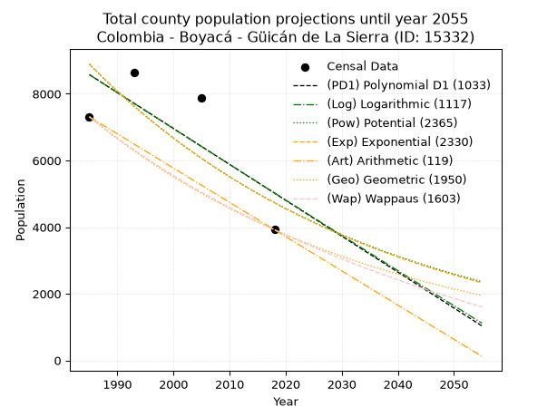
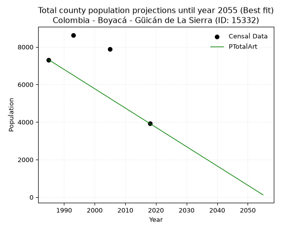
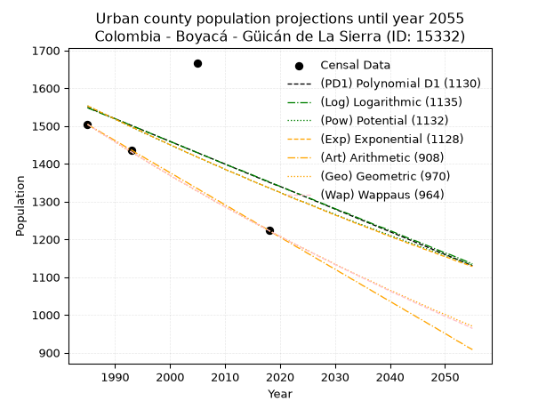
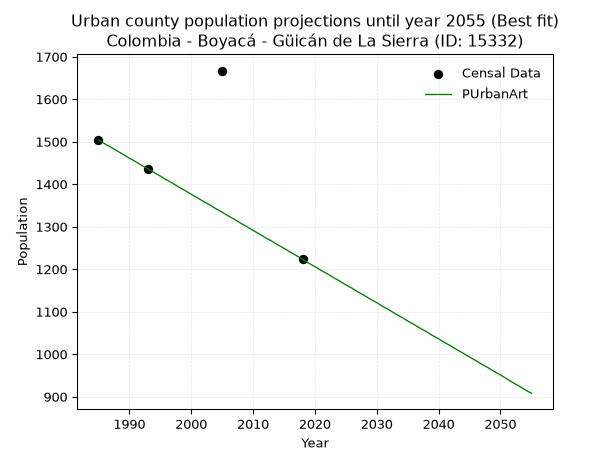
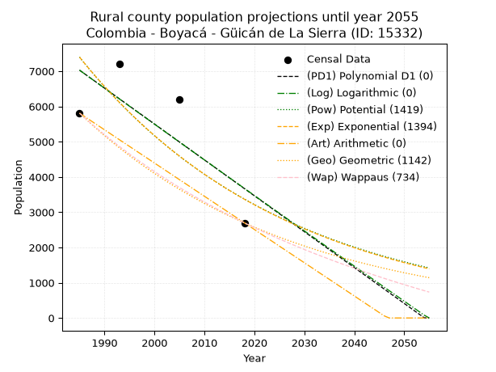
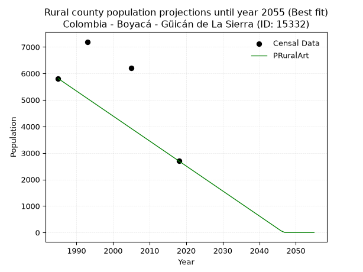

<div align="center">


</div>

# 📜 _“Population and Public Services Demand Projections (PPSD) until Year 2050 for Colombia - Boyacá - Güicán de La Sierra (ID: 15332)”_
Keywords: `population` `public-service` `projection` `lineal` `polynomial` `logarithmic` `potential` `exponential` `arithmetic` `geometric` `wappaus` `dane` `colombia` `south-america`

PPSD are analytical estimates used by governments and planners to anticipate future changes in population size, age distribution, and the resulting community needs for utilities, healthcare, education, and infrastructure as sizing future water treatment facilities, electrical grids, and road networks based on spatial growth.

<div align="center">

</img>

</div>


> **General running parameters**: • app_version: _v20260806_. • Python version: _3.14.7_. • Pandas version: _3.0.5_. • NumPy version: _2.5.1_. • Creates, save and include plots into reports (create_plot): _False_. • Projection until year: _2050_. • Process polynomial degree 2 and up: _False_. • Process Wappaus: _True_. • Process Wappaus: _True_. • Set negative values to zero: _True_. • Set infinite values to zero: _True_. • Drop dataset notes: _True_. 
<div align="center">

Dynamic map: [:earth_americas:Google](http://maps.google.com/maps?q=6.462863754,-72.4117626) [:earth_americas:OSM](https://www.openstreetmap.org/#map=18/6.462863754/-72.4117626&layers=P) [:earth_americas:Bing](https://www.bing.com/maps?cp=6.462863754~-72.4117626&lvl=18) [:earth_americas:Apple](https://maps.apple.com/frame?center=6.462863754%2C-72.4117626&span=0.003%2C0.006)

</div>


<div align="center">

```geojson
{
  "type": "Feature",
  "geometry": {
    "type": "Point", 
    "coordinates": [-72.4117626, 6.462863754]
  }, 
  "properties": {
    "Name": "Colombia - Boyacá - Güicán de La Sierra (ID: 15332)"
  }
}
```

</div>


## 0. Census Data (4 records)

Census data are official statistics collected by a government about the people and housing in a country. They usually include counts of total population, age, sex, race, income, education, and jobs.

📅Global census file: [Population.xlsx](../data/Population.xlsx)

| Source   |   Year |   CountryID | CountryName   |   StateID | StateName   |   CountyID | CountyName          |   PTotal |   PUrban |   PRural |
|:---------|-------:|------------:|:--------------|----------:|:------------|-----------:|:--------------------|---------:|---------:|---------:|
| DANE     |   1985 |          57 | Colombia      |        15 | Boyacá      |      15332 | Güicán de La Sierra |     7312 |     1504 |     5808 |
| DANE     |   1993 |          57 | Colombia      |        15 | Boyacá      |      15332 | Güicán de La Sierra |     8631 |     1436 |     7195 |
| DANE     |   2005 |          57 | Colombia      |        15 | Boyacá      |      15332 | Güicán de La Sierra |     7869 |     1667 |     6202 |
| DANE     |   2018 |          57 | Colombia      |        15 | Boyacá      |      15332 | Güicán de La Sierra |     3921 |     1223 |     2698 |

> 🔥Some records could had specific notes about the registered values or the corresponding urban or rural distribution.

## 1. Total

### 1.1. Coefficients and Parameters

* (PD1) Polynomial Deg 1: -107.7595343235623, 222479.2585307055 (lineal)
* (Log) Logarithmic: -215244.2274540373, 1643006.3477371256
* (Pow) Potential: -38.22239751465385, 129.99738629584448
* (Exp) Exponential: -0.019132746507676456, 2.7728297000772557e+20
* (Art) Arithmetic: Year diff. 2018 - 1985 = 33, Population diff. 3921 - 7312 = -3391, Annual growth = -102.75757575757575
* (Geo) Geometric: Year diff. 2018 - 1985 = 33, Population diff. 3921 - 7312 = -3391, Annual growth % = -0.01870675817323275
* (Wap) Wappaus: i = -1.8295660243492524, Condition values only valid for < 200)

<sub>
Wappaus condition values: ['-0.00', '-1.83', '-3.66', '-5.49', '-7.32', '-9.15', '-10.98', '-12.81', '-14.64', '-16.47', '-18.30', '-20.13', '-21.95', '-23.78', '-25.61', '-27.44', '-29.27', '-31.10', '-32.93', '-34.76', '-36.59', '-38.42', '-40.25', '-42.08', '-43.91', '-45.74', '-47.57', '-49.40', '-51.23', '-53.06', '-54.89', '-56.72', '-58.55', '-60.38', '-62.21', '-64.03', '-65.86', '-67.69', '-69.52', '-71.35', '-73.18', '-75.01', '-76.84', '-78.67', '-80.50', '-82.33', '-84.16', '-85.99', '-87.82', '-89.65', '-91.48', '-93.31', '-95.14', '-96.97', '-98.80', '-100.63', '-102.46', '-104.29', '-106.11', '-107.94', '-109.77', '-111.60', '-113.43', '-115.26', '-117.09', '-118.92']
</sub>


### 1.2. Projected Dataset

|   Year |   CountyID |   PTotalPD1 |   PTotalLog |   PTotalPow |   PTotalExp |   PTotalArt |   PTotalGeo |   PTotalWap |
|-------:|-----------:|------------:|------------:|------------:|------------:|------------:|------------:|------------:|
|   1985 |      15332 |        8577 |        8576 |        8894 |        8893 |        7312 |        7312 |        7312 |
|   1986 |      15332 |        8469 |        8468 |        8724 |        8725 |        7209 |        7175 |        7179 |
|   1987 |      15332 |        8361 |        8360 |        8558 |        8560 |        7106 |        7041 |        7049 |
|   1988 |      15332 |        8253 |        8251 |        8395 |        8397 |        7004 |        6909 |        6921 |
|   1989 |      15332 |        8146 |        8143 |        8235 |        8238 |        6901 |        6780 |        6796 |
|   1990 |      15332 |        8038 |        8035 |        8078 |        8082 |        6798 |        6653 |        6672 |
|   1991 |      15332 |        7930 |        7927 |        7925 |        7929 |        6695 |        6529 |        6551 |
|   1992 |      15332 |        7822 |        7819 |        7774 |        7779 |        6593 |        6407 |        6432 |
|   1993 |      15332 |        7715 |        7711 |        7626 |        7631 |        6490 |        6287 |        6315 |
|   1994 |      15332 |        7607 |        7603 |        7481 |        7487 |        6387 |        6169 |        6200 |
|   1995 |      15332 |        7499 |        7495 |        7339 |        7345 |        6284 |        6054 |        6086 |
|   1996 |      15332 |        7391 |        7387 |        7200 |        7206 |        6182 |        5941 |        5975 |
|   1997 |      15332 |        7283 |        7279 |        7064 |        7069 |        6079 |        5829 |        5865 |
|   1998 |      15332 |        7176 |        7171 |        6930 |        6935 |        5976 |        5720 |        5758 |
|   1999 |      15332 |        7068 |        7064 |        6798 |        6804 |        5873 |        5613 |        5652 |
|   2000 |      15332 |        6960 |        6956 |        6670 |        6675 |        5771 |        5508 |        5547 |
|   2001 |      15332 |        6852 |        6848 |        6543 |        6548 |        5668 |        5405 |        5445 |
|   2002 |      15332 |        6745 |        6741 |        6420 |        6424 |        5565 |        5304 |        5344 |
|   2003 |      15332 |        6637 |        6633 |        6298 |        6302 |        5462 |        5205 |        5244 |
|   2004 |      15332 |        6529 |        6526 |        6179 |        6183 |        5360 |        5108 |        5147 |
|   2005 |      15332 |        6421 |        6419 |        6063 |        6066 |        5257 |        5012 |        5050 |
|   2006 |      15332 |        6314 |        6311 |        5948 |        5951 |        5154 |        4918 |        4955 |
|   2007 |      15332 |        6206 |        6204 |        5836 |        5838 |        5051 |        4826 |        4862 |
|   2008 |      15332 |        6098 |        6097 |        5726 |        5727 |        4949 |        4736 |        4770 |
|   2009 |      15332 |        5990 |        5990 |        5618 |        5619 |        4846 |        4647 |        4679 |
|   2010 |      15332 |        5883 |        5882 |        5512 |        5512 |        4743 |        4560 |        4590 |
|   2011 |      15332 |        5775 |        5775 |        5408 |        5408 |        4640 |        4475 |        4502 |
|   2012 |      15332 |        5667 |        5668 |        5306 |        5305 |        4538 |        4391 |        4415 |
|   2013 |      15332 |        5559 |        5561 |        5207 |        5205 |        4435 |        4309 |        4330 |
|   2014 |      15332 |        5452 |        5455 |        5109 |        5106 |        4332 |        4229 |        4246 |
|   2015 |      15332 |        5344 |        5348 |        5013 |        5009 |        4229 |        4150 |        4163 |
|   2016 |      15332 |        5236 |        5241 |        4919 |        4915 |        4127 |        4072 |        4081 |
|   2017 |      15332 |        5128 |        5134 |        4826 |        4821 |        4024 |        3996 |        4000 |
|   2018 |      15332 |        5021 |        5027 |        4736 |        4730 |        3921 |        3921 |        3921 |
|   2019 |      15332 |        4913 |        4921 |        4647 |        4640 |        3818 |        3848 |        3843 |
|   2020 |      15332 |        4805 |        4814 |        4560 |        4552 |        3715 |        3776 |        3765 |
|   2021 |      15332 |        4697 |        4708 |        4474 |        4466 |        3613 |        3705 |        3689 |
|   2022 |      15332 |        4589 |        4601 |        4390 |        4382 |        3510 |        3636 |        3614 |
|   2023 |      15332 |        4482 |        4495 |        4308 |        4299 |        3407 |        3568 |        3540 |
|   2024 |      15332 |        4374 |        4388 |        4228 |        4217 |        3304 |        3501 |        3467 |
|   2025 |      15332 |        4266 |        4282 |        4149 |        4137 |        3202 |        3435 |        3394 |
|   2026 |      15332 |        4158 |        4176 |        4071 |        4059 |        3099 |        3371 |        3323 |
|   2027 |      15332 |        4051 |        4070 |        3995 |        3982 |        2996 |        3308 |        3253 |
|   2028 |      15332 |        3943 |        3963 |        3920 |        3906 |        2893 |        3246 |        3184 |
|   2029 |      15332 |        3835 |        3857 |        3847 |        3832 |        2791 |        3186 |        3115 |
|   2030 |      15332 |        3727 |        3751 |        3775 |        3760 |        2688 |        3126 |        3047 |
|   2031 |      15332 |        3620 |        3645 |        3705 |        3688 |        2585 |        3067 |        2981 |
|   2032 |      15332 |        3512 |        3539 |        3636 |        3619 |        2482 |        3010 |        2915 |
|   2033 |      15332 |        3404 |        3433 |        3568 |        3550 |        2380 |        2954 |        2850 |
|   2034 |      15332 |        3296 |        3328 |        3502 |        3483 |        2277 |        2899 |        2786 |
|   2035 |      15332 |        3189 |        3222 |        3437 |        3417 |        2174 |        2844 |        2722 |
|   2036 |      15332 |        3081 |        3116 |        3373 |        3352 |        2071 |        2791 |        2660 |
|   2037 |      15332 |        2973 |        3010 |        3310 |        3288 |        1969 |        2739 |        2598 |
|   2038 |      15332 |        2865 |        2905 |        3248 |        3226 |        1866 |        2688 |        2537 |
|   2039 |      15332 |        2758 |        2799 |        3188 |        3165 |        1763 |        2637 |        2477 |
|   2040 |      15332 |        2650 |        2694 |        3129 |        3105 |        1660 |        2588 |        2417 |
|   2041 |      15332 |        2542 |        2588 |        3071 |        3046 |        1558 |        2540 |        2358 |
|   2042 |      15332 |        2434 |        2483 |        3014 |        2988 |        1455 |        2492 |        2300 |
|   2043 |      15332 |        2327 |        2377 |        2958 |        2932 |        1352 |        2445 |        2243 |
|   2044 |      15332 |        2219 |        2272 |        2903 |        2876 |        1249 |        2400 |        2186 |
|   2045 |      15332 |        2111 |        2167 |        2849 |        2822 |        1147 |        2355 |        2130 |
|   2046 |      15332 |        2003 |        2061 |        2797 |        2768 |        1044 |        2311 |        2074 |
|   2047 |      15332 |        1895 |        1956 |        2745 |        2716 |         941 |        2268 |        2019 |
|   2048 |      15332 |        1788 |        1851 |        2694 |        2664 |         838 |        2225 |        1965 |
|   2049 |      15332 |        1680 |        1746 |        2644 |        2614 |         736 |        2184 |        1912 |
|   2050 |      15332 |        1572 |        1641 |        2595 |        2564 |         633 |        2143 |        1859 |
<div align="center">

</img>

</div>


### 1.3. Best fit with absolute and relative error (%)

Relative error puts that difference into context by dividing the absolute error by the true value, creating a unitless ratio or percentage that shows the scale of the mistake.

Absolute and relative error

|   Year | Source   |   CountryID | CountryName   |   StateID | StateName   |   CountyID_x | CountyName          |   PTotal |   PUrban |   PRural |   CountyID_y |   PTotalPD1 |   PTotalLog |   PTotalPow |   PTotalExp |   PTotalArt |   PTotalGeo |   PTotalWap |   PTotalPD1AbsError |   PTotalLogAbsError |   PTotalPowAbsError |   PTotalExpAbsError |   PTotalArtAbsError |   PTotalGeoAbsError |   PTotalWapAbsError |   PTotalPD1RelError |   PTotalLogRelError |   PTotalPowRelError |   PTotalExpRelError |   PTotalArtRelError |   PTotalGeoRelError |   PTotalWapRelError |
|-------:|:---------|------------:|:--------------|----------:|:------------|-------------:|:--------------------|---------:|---------:|---------:|-------------:|------------:|------------:|------------:|------------:|------------:|------------:|------------:|--------------------:|--------------------:|--------------------:|--------------------:|--------------------:|--------------------:|--------------------:|--------------------:|--------------------:|--------------------:|--------------------:|--------------------:|--------------------:|--------------------:|
|   1985 | DANE     |          57 | Colombia      |        15 | Boyacá      |        15332 | Güicán de La Sierra |     7312 |     1504 |     5808 |        15332 |        8577 |        8576 |        8894 |        8893 |        7312 |        7312 |        7312 |                1265 |                1264 |                1582 |                1581 |                   0 |                   0 |                   0 |             17.3003 |             17.2867 |             21.6357 |             21.622  |              0      |              0      |              0      |
|   1993 | DANE     |          57 | Colombia      |        15 | Boyacá      |        15332 | Güicán de La Sierra |     8631 |     1436 |     7195 |        15332 |        7715 |        7711 |        7626 |        7631 |        6490 |        6287 |        6315 |                 916 |                 920 |                1005 |                1000 |                2141 |                2344 |                2316 |             10.6129 |             10.6593 |             11.6441 |             11.5861 |             24.8059 |             27.1579 |             26.8335 |
|   2005 | DANE     |          57 | Colombia      |        15 | Boyacá      |        15332 | Güicán de La Sierra |     7869 |     1667 |     6202 |        15332 |        6421 |        6419 |        6063 |        6066 |        5257 |        5012 |        5050 |                1448 |                1450 |                1806 |                1803 |                2612 |                2857 |                2819 |             18.4013 |             18.4267 |             22.9508 |             22.9127 |             33.1935 |             36.307  |             35.8241 |
|   2018 | DANE     |          57 | Colombia      |        15 | Boyacá      |        15332 | Güicán de La Sierra |     3921 |     1223 |     2698 |        15332 |        5021 |        5027 |        4736 |        4730 |        3921 |        3921 |        3921 |                1100 |                1106 |                 815 |                 809 |                   0 |                   0 |                   0 |             28.0541 |             28.2071 |             20.7855 |             20.6325 |              0      |              0      |              0      |

Relative error mean

| Method    |   RelError | Best   |
|:----------|-----------:|:-------|
| PTotalPD1 |    18.5922 |        |
| PTotalLog |    18.6449 |        |
| PTotalPow |    19.254  |        |
| PTotalExp |    19.1883 |        |
| PTotalArt |    14.4999 | True   |
| PTotalGeo |    15.8662 |        |
| PTotalWap |    15.6644 |        |

💙Best method: _**PTotalArt**_
<div align="center">

</img>

</div>


### 1.4. Fresh water supply demand in liters per capita per day (lpcd)

The fresh water supply demand typically ranges from 100 to 300 liters per capita per day (lpcd) for standard domestic and municipal planning, though absolute survival minimums set by the World Health Organization are as low as 7.5 to 20 liters per day, and total consumption in high-income nations can exceed 400 liters.

> `CZ`: Level in meters above the sea level (masl)<br> `WS`: Fresh water supply demand in liters per capita per day (lpcd or l/h/d)<br> `WSAll`: Zonal fresh water supply demand in liters per second (l/s)<br> `A`: Zonal area in square meters<br> `DP`: Population density (people/hectare or p/ha)

Reference values (RAS Colombia)

|    CZ |   WS |
|------:|-----:|
|  1000 |  120 |
|  2000 |  130 |
| 99999 |  140 |

County shapefile geometry properties and water supply values

|   CountyID |    ATotal |   CZTotal |   WSTotal |
|-----------:|----------:|----------:|----------:|
|      15332 | 9.499e+08 |    3625.1 |       140 |

Projected values for best method: PTotalArt

|   CountyID |   Year |   PTotalArt |   DPTotal |   WSTotal |   WSTotalAll |
|-----------:|-------:|------------:|----------:|----------:|-------------:|
|      15332 |   1985 |        7312 |      0.08 |       140 |     11.8481  |
|      15332 |   1986 |        7209 |      0.08 |       140 |     11.6813  |
|      15332 |   1987 |        7106 |      0.07 |       140 |     11.5144  |
|      15332 |   1988 |        7004 |      0.07 |       140 |     11.3491  |
|      15332 |   1989 |        6901 |      0.07 |       140 |     11.1822  |
|      15332 |   1990 |        6798 |      0.07 |       140 |     11.0153  |
|      15332 |   1991 |        6695 |      0.07 |       140 |     10.8484  |
|      15332 |   1992 |        6593 |      0.07 |       140 |     10.6831  |
|      15332 |   1993 |        6490 |      0.07 |       140 |     10.5162  |
|      15332 |   1994 |        6387 |      0.07 |       140 |     10.3493  |
|      15332 |   1995 |        6284 |      0.07 |       140 |     10.1824  |
|      15332 |   1996 |        6182 |      0.07 |       140 |     10.0171  |
|      15332 |   1997 |        6079 |      0.06 |       140 |      9.85023 |
|      15332 |   1998 |        5976 |      0.06 |       140 |      9.68333 |
|      15332 |   1999 |        5873 |      0.06 |       140 |      9.51644 |
|      15332 |   2000 |        5771 |      0.06 |       140 |      9.35116 |
|      15332 |   2001 |        5668 |      0.06 |       140 |      9.18426 |
|      15332 |   2002 |        5565 |      0.06 |       140 |      9.01736 |
|      15332 |   2003 |        5462 |      0.06 |       140 |      8.85046 |
|      15332 |   2004 |        5360 |      0.06 |       140 |      8.68519 |
|      15332 |   2005 |        5257 |      0.06 |       140 |      8.51829 |
|      15332 |   2006 |        5154 |      0.05 |       140 |      8.35139 |
|      15332 |   2007 |        5051 |      0.05 |       140 |      8.18449 |
|      15332 |   2008 |        4949 |      0.05 |       140 |      8.01921 |
|      15332 |   2009 |        4846 |      0.05 |       140 |      7.85231 |
|      15332 |   2010 |        4743 |      0.05 |       140 |      7.68542 |
|      15332 |   2011 |        4640 |      0.05 |       140 |      7.51852 |
|      15332 |   2012 |        4538 |      0.05 |       140 |      7.35324 |
|      15332 |   2013 |        4435 |      0.05 |       140 |      7.18634 |
|      15332 |   2014 |        4332 |      0.05 |       140 |      7.01944 |
|      15332 |   2015 |        4229 |      0.04 |       140 |      6.85255 |
|      15332 |   2016 |        4127 |      0.04 |       140 |      6.68727 |
|      15332 |   2017 |        4024 |      0.04 |       140 |      6.52037 |
|      15332 |   2018 |        3921 |      0.04 |       140 |      6.35347 |
|      15332 |   2019 |        3818 |      0.04 |       140 |      6.18657 |
|      15332 |   2020 |        3715 |      0.04 |       140 |      6.01968 |
|      15332 |   2021 |        3613 |      0.04 |       140 |      5.8544  |
|      15332 |   2022 |        3510 |      0.04 |       140 |      5.6875  |
|      15332 |   2023 |        3407 |      0.04 |       140 |      5.5206  |
|      15332 |   2024 |        3304 |      0.03 |       140 |      5.3537  |
|      15332 |   2025 |        3202 |      0.03 |       140 |      5.18843 |
|      15332 |   2026 |        3099 |      0.03 |       140 |      5.02153 |
|      15332 |   2027 |        2996 |      0.03 |       140 |      4.85463 |
|      15332 |   2028 |        2893 |      0.03 |       140 |      4.68773 |
|      15332 |   2029 |        2791 |      0.03 |       140 |      4.52245 |
|      15332 |   2030 |        2688 |      0.03 |       140 |      4.35556 |
|      15332 |   2031 |        2585 |      0.03 |       140 |      4.18866 |
|      15332 |   2032 |        2482 |      0.03 |       140 |      4.02176 |
|      15332 |   2033 |        2380 |      0.03 |       140 |      3.85648 |
|      15332 |   2034 |        2277 |      0.02 |       140 |      3.68958 |
|      15332 |   2035 |        2174 |      0.02 |       140 |      3.52269 |
|      15332 |   2036 |        2071 |      0.02 |       140 |      3.35579 |
|      15332 |   2037 |        1969 |      0.02 |       140 |      3.19051 |
|      15332 |   2038 |        1866 |      0.02 |       140 |      3.02361 |
|      15332 |   2039 |        1763 |      0.02 |       140 |      2.85671 |
|      15332 |   2040 |        1660 |      0.02 |       140 |      2.68981 |
|      15332 |   2041 |        1558 |      0.02 |       140 |      2.52454 |
|      15332 |   2042 |        1455 |      0.02 |       140 |      2.35764 |
|      15332 |   2043 |        1352 |      0.01 |       140 |      2.19074 |
|      15332 |   2044 |        1249 |      0.01 |       140 |      2.02384 |
|      15332 |   2045 |        1147 |      0.01 |       140 |      1.85856 |
|      15332 |   2046 |        1044 |      0.01 |       140 |      1.69167 |
|      15332 |   2047 |         941 |      0.01 |       140 |      1.52477 |
|      15332 |   2048 |         838 |      0.01 |       140 |      1.35787 |
|      15332 |   2049 |         736 |      0.01 |       140 |      1.19259 |
|      15332 |   2050 |         633 |      0.01 |       140 |      1.02569 |

## 2. Urban

### 2.1. Coefficients and Parameters

* (PD1) Polynomial Deg 1: -5.974307507025031, 13407.608590926819 (lineal)
* (Log) Logarithmic: -11919.129520814224, 92054.89900161851
* (Pow) Potential: -9.123274154276674, 33.27756094976373
* (Exp) Exponential: -0.004571469734114464, 13557062.047004964
* (Art) Arithmetic: Year diff. 2018 - 1985 = 33, Population diff. 1223 - 1504 = -281, Annual growth = -8.515151515151516
* (Geo) Geometric: Year diff. 2018 - 1985 = 33, Population diff. 1223 - 1504 = -281, Annual growth % = -0.006247715558067468
* (Wap) Wappaus: i = -0.6245068951339579, Condition values only valid for < 200)

<sub>
Wappaus condition values: ['-0.00', '-0.62', '-1.25', '-1.87', '-2.50', '-3.12', '-3.75', '-4.37', '-5.00', '-5.62', '-6.25', '-6.87', '-7.49', '-8.12', '-8.74', '-9.37', '-9.99', '-10.62', '-11.24', '-11.87', '-12.49', '-13.11', '-13.74', '-14.36', '-14.99', '-15.61', '-16.24', '-16.86', '-17.49', '-18.11', '-18.74', '-19.36', '-19.98', '-20.61', '-21.23', '-21.86', '-22.48', '-23.11', '-23.73', '-24.36', '-24.98', '-25.60', '-26.23', '-26.85', '-27.48', '-28.10', '-28.73', '-29.35', '-29.98', '-30.60', '-31.23', '-31.85', '-32.47', '-33.10', '-33.72', '-34.35', '-34.97', '-35.60', '-36.22', '-36.85', '-37.47', '-38.09', '-38.72', '-39.34', '-39.97', '-40.59']
</sub>


### 2.2. Projected Dataset

|   Year |   CountyID |   PUrbanPD1 |   PUrbanLog |   PUrbanPow |   PUrbanExp |   PUrbanArt |   PUrbanGeo |   PUrbanWap |
|-------:|-----------:|------------:|------------:|------------:|------------:|------------:|------------:|------------:|
|   1985 |      15332 |        1549 |        1548 |        1553 |        1553 |        1504 |        1504 |        1504 |
|   1986 |      15332 |        1543 |        1542 |        1546 |        1546 |        1495 |        1495 |        1495 |
|   1987 |      15332 |        1537 |        1536 |        1539 |        1539 |        1487 |        1485 |        1485 |
|   1988 |      15332 |        1531 |        1530 |        1532 |        1532 |        1478 |        1476 |        1476 |
|   1989 |      15332 |        1525 |        1524 |        1525 |        1525 |        1470 |        1467 |        1467 |
|   1990 |      15332 |        1519 |        1519 |        1518 |        1518 |        1461 |        1458 |        1458 |
|   1991 |      15332 |        1513 |        1513 |        1511 |        1511 |        1453 |        1448 |        1449 |
|   1992 |      15332 |        1507 |        1507 |        1504 |        1504 |        1444 |        1439 |        1440 |
|   1993 |      15332 |        1501 |        1501 |        1497 |        1497 |        1436 |        1430 |        1431 |
|   1994 |      15332 |        1495 |        1495 |        1490 |        1491 |        1427 |        1422 |        1422 |
|   1995 |      15332 |        1489 |        1489 |        1483 |        1484 |        1419 |        1413 |        1413 |
|   1996 |      15332 |        1483 |        1483 |        1477 |        1477 |        1410 |        1404 |        1404 |
|   1997 |      15332 |        1477 |        1477 |        1470 |        1470 |        1402 |        1395 |        1395 |
|   1998 |      15332 |        1471 |        1471 |        1463 |        1464 |        1393 |        1386 |        1387 |
|   1999 |      15332 |        1465 |        1465 |        1457 |        1457 |        1385 |        1378 |        1378 |
|   2000 |      15332 |        1459 |        1459 |        1450 |        1450 |        1376 |        1369 |        1369 |
|   2001 |      15332 |        1453 |        1453 |        1443 |        1444 |        1368 |        1360 |        1361 |
|   2002 |      15332 |        1447 |        1447 |        1437 |        1437 |        1359 |        1352 |        1352 |
|   2003 |      15332 |        1441 |        1441 |        1430 |        1430 |        1351 |        1344 |        1344 |
|   2004 |      15332 |        1435 |        1435 |        1424 |        1424 |        1342 |        1335 |        1336 |
|   2005 |      15332 |        1429 |        1429 |        1417 |        1417 |        1334 |        1327 |        1327 |
|   2006 |      15332 |        1423 |        1423 |        1411 |        1411 |        1325 |        1319 |        1319 |
|   2007 |      15332 |        1417 |        1417 |        1404 |        1405 |        1317 |        1310 |        1311 |
|   2008 |      15332 |        1411 |        1411 |        1398 |        1398 |        1308 |        1302 |        1302 |
|   2009 |      15332 |        1405 |        1405 |        1392 |        1392 |        1300 |        1294 |        1294 |
|   2010 |      15332 |        1399 |        1399 |        1385 |        1385 |        1291 |        1286 |        1286 |
|   2011 |      15332 |        1393 |        1393 |        1379 |        1379 |        1283 |        1278 |        1278 |
|   2012 |      15332 |        1387 |        1387 |        1373 |        1373 |        1274 |        1270 |        1270 |
|   2013 |      15332 |        1381 |        1382 |        1367 |        1367 |        1266 |        1262 |        1262 |
|   2014 |      15332 |        1375 |        1376 |        1361 |        1360 |        1257 |        1254 |        1254 |
|   2015 |      15332 |        1369 |        1370 |        1354 |        1354 |        1249 |        1246 |        1246 |
|   2016 |      15332 |        1363 |        1364 |        1348 |        1348 |        1240 |        1238 |        1239 |
|   2017 |      15332 |        1357 |        1358 |        1342 |        1342 |        1232 |        1231 |        1231 |
|   2018 |      15332 |        1351 |        1352 |        1336 |        1336 |        1223 |        1223 |        1223 |
|   2019 |      15332 |        1345 |        1346 |        1330 |        1330 |        1214 |        1215 |        1215 |
|   2020 |      15332 |        1340 |        1340 |        1324 |        1324 |        1206 |        1208 |        1208 |
|   2021 |      15332 |        1334 |        1334 |        1318 |        1317 |        1197 |        1200 |        1200 |
|   2022 |      15332 |        1328 |        1328 |        1312 |        1311 |        1189 |        1193 |        1192 |
|   2023 |      15332 |        1322 |        1322 |        1306 |        1305 |        1180 |        1185 |        1185 |
|   2024 |      15332 |        1316 |        1317 |        1300 |        1300 |        1172 |        1178 |        1177 |
|   2025 |      15332 |        1310 |        1311 |        1295 |        1294 |        1163 |        1171 |        1170 |
|   2026 |      15332 |        1304 |        1305 |        1289 |        1288 |        1155 |        1163 |        1163 |
|   2027 |      15332 |        1298 |        1299 |        1283 |        1282 |        1146 |        1156 |        1155 |
|   2028 |      15332 |        1292 |        1293 |        1277 |        1276 |        1138 |        1149 |        1148 |
|   2029 |      15332 |        1286 |        1287 |        1272 |        1270 |        1129 |        1142 |        1141 |
|   2030 |      15332 |        1280 |        1281 |        1266 |        1264 |        1121 |        1134 |        1133 |
|   2031 |      15332 |        1274 |        1275 |        1260 |        1259 |        1112 |        1127 |        1126 |
|   2032 |      15332 |        1268 |        1270 |        1254 |        1253 |        1104 |        1120 |        1119 |
|   2033 |      15332 |        1262 |        1264 |        1249 |        1247 |        1095 |        1113 |        1112 |
|   2034 |      15332 |        1256 |        1258 |        1243 |        1241 |        1087 |        1106 |        1105 |
|   2035 |      15332 |        1250 |        1252 |        1238 |        1236 |        1078 |        1099 |        1098 |
|   2036 |      15332 |        1244 |        1246 |        1232 |        1230 |        1070 |        1093 |        1091 |
|   2037 |      15332 |        1238 |        1240 |        1227 |        1225 |        1061 |        1086 |        1084 |
|   2038 |      15332 |        1232 |        1234 |        1221 |        1219 |        1053 |        1079 |        1077 |
|   2039 |      15332 |        1226 |        1229 |        1216 |        1213 |        1044 |        1072 |        1070 |
|   2040 |      15332 |        1220 |        1223 |        1210 |        1208 |        1036 |        1065 |        1063 |
|   2041 |      15332 |        1214 |        1217 |        1205 |        1202 |        1027 |        1059 |        1056 |
|   2042 |      15332 |        1208 |        1211 |        1200 |        1197 |        1019 |        1052 |        1050 |
|   2043 |      15332 |        1202 |        1205 |        1194 |        1191 |        1010 |        1046 |        1043 |
|   2044 |      15332 |        1196 |        1199 |        1189 |        1186 |        1002 |        1039 |        1036 |
|   2045 |      15332 |        1190 |        1194 |        1184 |        1181 |         993 |        1033 |        1029 |
|   2046 |      15332 |        1184 |        1188 |        1178 |        1175 |         985 |        1026 |        1023 |
|   2047 |      15332 |        1178 |        1182 |        1173 |        1170 |         976 |        1020 |        1016 |
|   2048 |      15332 |        1172 |        1176 |        1168 |        1165 |         968 |        1013 |        1010 |
|   2049 |      15332 |        1166 |        1170 |        1163 |        1159 |         959 |        1007 |        1003 |
|   2050 |      15332 |        1160 |        1164 |        1158 |        1154 |         951 |        1001 |         996 |
<div align="center">

</img>

</div>


### 2.3. Best fit with absolute and relative error (%)

Relative error puts that difference into context by dividing the absolute error by the true value, creating a unitless ratio or percentage that shows the scale of the mistake.

Absolute and relative error

|   Year | Source   |   CountryID | CountryName   |   StateID | StateName   |   CountyID_x | CountyName          |   PTotal |   PUrban |   PRural |   CountyID_y |   PUrbanPD1 |   PUrbanLog |   PUrbanPow |   PUrbanExp |   PUrbanArt |   PUrbanGeo |   PUrbanWap |   PUrbanPD1AbsError |   PUrbanLogAbsError |   PUrbanPowAbsError |   PUrbanExpAbsError |   PUrbanArtAbsError |   PUrbanGeoAbsError |   PUrbanWapAbsError |   PUrbanPD1RelError |   PUrbanLogRelError |   PUrbanPowRelError |   PUrbanExpRelError |   PUrbanArtRelError |   PUrbanGeoRelError |   PUrbanWapRelError |
|-------:|:---------|------------:|:--------------|----------:|:------------|-------------:|:--------------------|---------:|---------:|---------:|-------------:|------------:|------------:|------------:|------------:|------------:|------------:|------------:|--------------------:|--------------------:|--------------------:|--------------------:|--------------------:|--------------------:|--------------------:|--------------------:|--------------------:|--------------------:|--------------------:|--------------------:|--------------------:|--------------------:|
|   1985 | DANE     |          57 | Colombia      |        15 | Boyacá      |        15332 | Güicán de La Sierra |     7312 |     1504 |     5808 |        15332 |        1549 |        1548 |        1553 |        1553 |        1504 |        1504 |        1504 |                  45 |                  44 |                  49 |                  49 |                   0 |                   0 |                   0 |             2.99202 |             2.92553 |             3.25798 |             3.25798 |               0     |            0        |            0        |
|   1993 | DANE     |          57 | Colombia      |        15 | Boyacá      |        15332 | Güicán de La Sierra |     8631 |     1436 |     7195 |        15332 |        1501 |        1501 |        1497 |        1497 |        1436 |        1430 |        1431 |                  65 |                  65 |                  61 |                  61 |                   0 |                   6 |                   5 |             4.52646 |             4.52646 |             4.24791 |             4.24791 |               0     |            0.417827 |            0.348189 |
|   2005 | DANE     |          57 | Colombia      |        15 | Boyacá      |        15332 | Güicán de La Sierra |     7869 |     1667 |     6202 |        15332 |        1429 |        1429 |        1417 |        1417 |        1334 |        1327 |        1327 |                 238 |                 238 |                 250 |                 250 |                 333 |                 340 |                 340 |            14.2771  |            14.2771  |            14.997   |            14.997   |              19.976 |           20.3959   |           20.3959   |
|   2018 | DANE     |          57 | Colombia      |        15 | Boyacá      |        15332 | Güicán de La Sierra |     3921 |     1223 |     2698 |        15332 |        1351 |        1352 |        1336 |        1336 |        1223 |        1223 |        1223 |                 128 |                 129 |                 113 |                 113 |                   0 |                   0 |                   0 |            10.4661  |            10.5478  |             9.23957 |             9.23957 |               0     |            0        |            0        |

Relative error mean

| Method    |   RelError | Best   |
|:----------|-----------:|:-------|
| PUrbanPD1 |    8.06542 |        |
| PUrbanLog |    8.06924 |        |
| PUrbanPow |    7.93562 |        |
| PUrbanExp |    7.93562 |        |
| PUrbanArt |    4.994   | True   |
| PUrbanGeo |    5.20344 |        |
| PUrbanWap |    5.18603 |        |

💙Best method: _**PUrbanArt**_
<div align="center">

</img>

</div>


### 2.4. Fresh water supply demand in liters per capita per day (lpcd)

The fresh water supply demand typically ranges from 100 to 300 liters per capita per day (lpcd) for standard domestic and municipal planning, though absolute survival minimums set by the World Health Organization are as low as 7.5 to 20 liters per day, and total consumption in high-income nations can exceed 400 liters.

> `CZ`: Level in meters above the sea level (masl)<br> `WS`: Fresh water supply demand in liters per capita per day (lpcd or l/h/d)<br> `WSAll`: Zonal fresh water supply demand in liters per second (l/s)<br> `A`: Zonal area in square meters<br> `DP`: Population density (people/hectare or p/ha)

Reference values (RAS Colombia)

|    CZ |   WS |
|------:|-----:|
|  1000 |  120 |
|  2000 |  130 |
| 99999 |  140 |

County shapefile geometry properties and water supply values

|   CountyID |   AUrban |   CZUrban |   WSUrban |
|-----------:|---------:|----------:|----------:|
|      15332 |   309077 |   2883.97 |       140 |

Projected values for best method: PUrbanArt

|   CountyID |   Year |   PUrbanArt |   DPUrban |   WSUrban |   WSUrbanAll |
|-----------:|-------:|------------:|----------:|----------:|-------------:|
|      15332 |   1985 |        1504 |     48.66 |       140 |      2.43704 |
|      15332 |   1986 |        1495 |     48.37 |       140 |      2.42245 |
|      15332 |   1987 |        1487 |     48.11 |       140 |      2.40949 |
|      15332 |   1988 |        1478 |     47.82 |       140 |      2.39491 |
|      15332 |   1989 |        1470 |     47.56 |       140 |      2.38194 |
|      15332 |   1990 |        1461 |     47.27 |       140 |      2.36736 |
|      15332 |   1991 |        1453 |     47.01 |       140 |      2.3544  |
|      15332 |   1992 |        1444 |     46.72 |       140 |      2.33981 |
|      15332 |   1993 |        1436 |     46.46 |       140 |      2.32685 |
|      15332 |   1994 |        1427 |     46.17 |       140 |      2.31227 |
|      15332 |   1995 |        1419 |     45.91 |       140 |      2.29931 |
|      15332 |   1996 |        1410 |     45.62 |       140 |      2.28472 |
|      15332 |   1997 |        1402 |     45.36 |       140 |      2.27176 |
|      15332 |   1998 |        1393 |     45.07 |       140 |      2.25718 |
|      15332 |   1999 |        1385 |     44.81 |       140 |      2.24421 |
|      15332 |   2000 |        1376 |     44.52 |       140 |      2.22963 |
|      15332 |   2001 |        1368 |     44.26 |       140 |      2.21667 |
|      15332 |   2002 |        1359 |     43.97 |       140 |      2.20208 |
|      15332 |   2003 |        1351 |     43.71 |       140 |      2.18912 |
|      15332 |   2004 |        1342 |     43.42 |       140 |      2.17454 |
|      15332 |   2005 |        1334 |     43.16 |       140 |      2.16157 |
|      15332 |   2006 |        1325 |     42.87 |       140 |      2.14699 |
|      15332 |   2007 |        1317 |     42.61 |       140 |      2.13403 |
|      15332 |   2008 |        1308 |     42.32 |       140 |      2.11944 |
|      15332 |   2009 |        1300 |     42.06 |       140 |      2.10648 |
|      15332 |   2010 |        1291 |     41.77 |       140 |      2.0919  |
|      15332 |   2011 |        1283 |     41.51 |       140 |      2.07894 |
|      15332 |   2012 |        1274 |     41.22 |       140 |      2.06435 |
|      15332 |   2013 |        1266 |     40.96 |       140 |      2.05139 |
|      15332 |   2014 |        1257 |     40.67 |       140 |      2.03681 |
|      15332 |   2015 |        1249 |     40.41 |       140 |      2.02384 |
|      15332 |   2016 |        1240 |     40.12 |       140 |      2.00926 |
|      15332 |   2017 |        1232 |     39.86 |       140 |      1.9963  |
|      15332 |   2018 |        1223 |     39.57 |       140 |      1.98171 |
|      15332 |   2019 |        1214 |     39.28 |       140 |      1.96713 |
|      15332 |   2020 |        1206 |     39.02 |       140 |      1.95417 |
|      15332 |   2021 |        1197 |     38.73 |       140 |      1.93958 |
|      15332 |   2022 |        1189 |     38.47 |       140 |      1.92662 |
|      15332 |   2023 |        1180 |     38.18 |       140 |      1.91204 |
|      15332 |   2024 |        1172 |     37.92 |       140 |      1.89907 |
|      15332 |   2025 |        1163 |     37.63 |       140 |      1.88449 |
|      15332 |   2026 |        1155 |     37.37 |       140 |      1.87153 |
|      15332 |   2027 |        1146 |     37.08 |       140 |      1.85694 |
|      15332 |   2028 |        1138 |     36.82 |       140 |      1.84398 |
|      15332 |   2029 |        1129 |     36.53 |       140 |      1.8294  |
|      15332 |   2030 |        1121 |     36.27 |       140 |      1.81644 |
|      15332 |   2031 |        1112 |     35.98 |       140 |      1.80185 |
|      15332 |   2032 |        1104 |     35.72 |       140 |      1.78889 |
|      15332 |   2033 |        1095 |     35.43 |       140 |      1.77431 |
|      15332 |   2034 |        1087 |     35.17 |       140 |      1.76134 |
|      15332 |   2035 |        1078 |     34.88 |       140 |      1.74676 |
|      15332 |   2036 |        1070 |     34.62 |       140 |      1.7338  |
|      15332 |   2037 |        1061 |     34.33 |       140 |      1.71921 |
|      15332 |   2038 |        1053 |     34.07 |       140 |      1.70625 |
|      15332 |   2039 |        1044 |     33.78 |       140 |      1.69167 |
|      15332 |   2040 |        1036 |     33.52 |       140 |      1.6787  |
|      15332 |   2041 |        1027 |     33.23 |       140 |      1.66412 |
|      15332 |   2042 |        1019 |     32.97 |       140 |      1.65116 |
|      15332 |   2043 |        1010 |     32.68 |       140 |      1.63657 |
|      15332 |   2044 |        1002 |     32.42 |       140 |      1.62361 |
|      15332 |   2045 |         993 |     32.13 |       140 |      1.60903 |
|      15332 |   2046 |         985 |     31.87 |       140 |      1.59606 |
|      15332 |   2047 |         976 |     31.58 |       140 |      1.58148 |
|      15332 |   2048 |         968 |     31.32 |       140 |      1.56852 |
|      15332 |   2049 |         959 |     31.03 |       140 |      1.55394 |
|      15332 |   2050 |         951 |     30.77 |       140 |      1.54097 |

## 3. Rural

### 3.1. Coefficients and Parameters

* (PD1) Polynomial Deg 1: -101.78522681653732, 209071.64993977876 (lineal)
* (Log) Logarithmic: -203325.0979332231, 1550951.4487355072
* (Pow) Potential: -47.64202398884991, 160.98109200148903
* (Exp) Exponential: -0.0238461615427738, 2.6684531825065043e+24
* (Art) Arithmetic: Year diff. 2018 - 1985 = 33, Population diff. 2698 - 5808 = -3110, Annual growth = -94.24242424242425
* (Geo) Geometric: Year diff. 2018 - 1985 = 33, Population diff. 2698 - 5808 = -3110, Annual growth % = -0.022966273103668167
* (Wap) Wappaus: i = -2.2159046377245297, Condition values only valid for < 200)

<sub>
Wappaus condition values: ['-0.00', '-2.22', '-4.43', '-6.65', '-8.86', '-11.08', '-13.30', '-15.51', '-17.73', '-19.94', '-22.16', '-24.37', '-26.59', '-28.81', '-31.02', '-33.24', '-35.45', '-37.67', '-39.89', '-42.10', '-44.32', '-46.53', '-48.75', '-50.97', '-53.18', '-55.40', '-57.61', '-59.83', '-62.05', '-64.26', '-66.48', '-68.69', '-70.91', '-73.12', '-75.34', '-77.56', '-79.77', '-81.99', '-84.20', '-86.42', '-88.64', '-90.85', '-93.07', '-95.28', '-97.50', '-99.72', '-101.93', '-104.15', '-106.36', '-108.58', '-110.80', '-113.01', '-115.23', '-117.44', '-119.66', '-121.87', '-124.09', '-126.31', '-128.52', '-130.74', '-132.95', '-135.17', '-137.39', '-139.60', '-141.82', '-144.03']
</sub>


### 3.2. Projected Dataset

|   Year |   CountyID |   PRuralPD1 |   PRuralLog |   PRuralPow |   PRuralExp |   PRuralArt |   PRuralGeo |   PRuralWap |
|-------:|-----------:|------------:|------------:|------------:|------------:|------------:|------------:|------------:|
|   1985 |      15332 |        7028 |        7028 |        7398 |        7398 |        5808 |        5808 |        5808 |
|   1986 |      15332 |        6926 |        6925 |        7222 |        7223 |        5714 |        5675 |        5681 |
|   1987 |      15332 |        6824 |        6823 |        7051 |        7053 |        5620 |        5544 |        5556 |
|   1988 |      15332 |        6723 |        6721 |        6884 |        6887 |        5525 |        5417 |        5434 |
|   1989 |      15332 |        6621 |        6619 |        6721 |        6725 |        5431 |        5293 |        5315 |
|   1990 |      15332 |        6519 |        6516 |        6562 |        6566 |        5337 |        5171 |        5198 |
|   1991 |      15332 |        6417 |        6414 |        6407 |        6411 |        5243 |        5052 |        5084 |
|   1992 |      15332 |        6315 |        6312 |        6256 |        6260 |        5148 |        4936 |        4972 |
|   1993 |      15332 |        6214 |        6210 |        6108 |        6113 |        5054 |        4823 |        4862 |
|   1994 |      15332 |        6112 |        6108 |        5964 |        5969 |        4960 |        4712 |        4755 |
|   1995 |      15332 |        6010 |        6006 |        5823 |        5828 |        4866 |        4604 |        4649 |
|   1996 |      15332 |        5908 |        5904 |        5685 |        5691 |        4771 |        4498 |        4546 |
|   1997 |      15332 |        5807 |        5802 |        5551 |        5557 |        4677 |        4395 |        4445 |
|   1998 |      15332 |        5705 |        5701 |        5421 |        5426 |        4583 |        4294 |        4346 |
|   1999 |      15332 |        5603 |        5599 |        5293 |        5298 |        4489 |        4195 |        4248 |
|   2000 |      15332 |        5501 |        5497 |        5168 |        5173 |        4394 |        4099 |        4153 |
|   2001 |      15332 |        5399 |        5396 |        5047 |        5051 |        4300 |        4005 |        4059 |
|   2002 |      15332 |        5298 |        5294 |        4928 |        4932 |        4206 |        3913 |        3967 |
|   2003 |      15332 |        5196 |        5192 |        4812 |        4816 |        4112 |        3823 |        3877 |
|   2004 |      15332 |        5094 |        5091 |        4699 |        4702 |        4017 |        3735 |        3788 |
|   2005 |      15332 |        4992 |        4990 |        4589 |        4592 |        3923 |        3649 |        3701 |
|   2006 |      15332 |        4890 |        4888 |        4481 |        4483 |        3829 |        3566 |        3615 |
|   2007 |      15332 |        4789 |        4787 |        4376 |        4378 |        3735 |        3484 |        3532 |
|   2008 |      15332 |        4687 |        4686 |        4273 |        4275 |        3640 |        3404 |        3449 |
|   2009 |      15332 |        4585 |        4584 |        4173 |        4174 |        3546 |        3325 |        3368 |
|   2010 |      15332 |        4483 |        4483 |        4075 |        4076 |        3452 |        3249 |        3288 |
|   2011 |      15332 |        4382 |        4382 |        3980 |        3979 |        3358 |        3174 |        3210 |
|   2012 |      15332 |        4280 |        4281 |        3887 |        3886 |        3263 |        3102 |        3133 |
|   2013 |      15332 |        4178 |        4180 |        3796 |        3794 |        3169 |        3030 |        3058 |
|   2014 |      15332 |        4076 |        4079 |        3707 |        3705 |        3075 |        2961 |        2983 |
|   2015 |      15332 |        3974 |        3978 |        3620 |        3617 |        2981 |        2893 |        2910 |
|   2016 |      15332 |        3873 |        3877 |        3536 |        3532 |        2886 |        2826 |        2838 |
|   2017 |      15332 |        3771 |        3776 |        3453 |        3449 |        2792 |        2761 |        2768 |
|   2018 |      15332 |        3669 |        3675 |        3373 |        3368 |        2698 |        2698 |        2698 |
|   2019 |      15332 |        3567 |        3575 |        3294 |        3288 |        2604 |        2636 |        2630 |
|   2020 |      15332 |        3465 |        3474 |        3217 |        3211 |        2510 |        2575 |        2562 |
|   2021 |      15332 |        3364 |        3373 |        3142 |        3135 |        2415 |        2516 |        2496 |
|   2022 |      15332 |        3262 |        3273 |        3069 |        3061 |        2321 |        2459 |        2431 |
|   2023 |      15332 |        3160 |        3172 |        2997 |        2989 |        2227 |        2402 |        2366 |
|   2024 |      15332 |        3058 |        3072 |        2928 |        2919 |        2133 |        2347 |        2303 |
|   2025 |      15332 |        2957 |        2971 |        2860 |        2850 |        2038 |        2293 |        2241 |
|   2026 |      15332 |        2855 |        2871 |        2793 |        2783 |        1944 |        2240 |        2180 |
|   2027 |      15332 |        2753 |        2771 |        2728 |        2717 |        1850 |        2189 |        2119 |
|   2028 |      15332 |        2651 |        2670 |        2665 |        2653 |        1756 |        2139 |        2060 |
|   2029 |      15332 |        2549 |        2570 |        2603 |        2591 |        1661 |        2090 |        2001 |
|   2030 |      15332 |        2448 |        2470 |        2543 |        2530 |        1567 |        2042 |        1943 |
|   2031 |      15332 |        2346 |        2370 |        2484 |        2470 |        1473 |        1995 |        1886 |
|   2032 |      15332 |        2244 |        2270 |        2426 |        2412 |        1379 |        1949 |        1830 |
|   2033 |      15332 |        2142 |        2170 |        2370 |        2355 |        1284 |        1904 |        1775 |
|   2034 |      15332 |        2040 |        2070 |        2315 |        2300 |        1190 |        1860 |        1721 |
|   2035 |      15332 |        1939 |        1970 |        2261 |        2245 |        1096 |        1818 |        1667 |
|   2036 |      15332 |        1837 |        1870 |        2209 |        2192 |        1002 |        1776 |        1614 |
|   2037 |      15332 |        1735 |        1770 |        2158 |        2141 |         907 |        1735 |        1562 |
|   2038 |      15332 |        1633 |        1670 |        2108 |        2090 |         813 |        1695 |        1510 |
|   2039 |      15332 |        1532 |        1571 |        2059 |        2041 |         719 |        1656 |        1460 |
|   2040 |      15332 |        1430 |        1471 |        2012 |        1993 |         625 |        1618 |        1410 |
|   2041 |      15332 |        1328 |        1371 |        1965 |        1946 |         530 |        1581 |        1360 |
|   2042 |      15332 |        1226 |        1272 |        1920 |        1900 |         436 |        1545 |        1312 |
|   2043 |      15332 |        1124 |        1172 |        1876 |        1855 |         342 |        1509 |        1264 |
|   2044 |      15332 |        1023 |        1073 |        1833 |        1812 |         248 |        1475 |        1216 |
|   2045 |      15332 |         921 |         973 |        1790 |        1769 |         153 |        1441 |        1170 |
|   2046 |      15332 |         819 |         874 |        1749 |        1727 |          59 |        1408 |        1123 |
|   2047 |      15332 |         717 |         774 |        1709 |        1687 |           0 |        1375 |        1078 |
|   2048 |      15332 |         616 |         675 |        1670 |        1647 |           0 |        1344 |        1033 |
|   2049 |      15332 |         514 |         576 |        1631 |        1608 |           0 |        1313 |         989 |
|   2050 |      15332 |         412 |         477 |        1594 |        1570 |           0 |        1283 |         945 |
<div align="center">

</img>

</div>


### 3.3. Best fit with absolute and relative error (%)

Relative error puts that difference into context by dividing the absolute error by the true value, creating a unitless ratio or percentage that shows the scale of the mistake.

Absolute and relative error

|   Year | Source   |   CountryID | CountryName   |   StateID | StateName   |   CountyID_x | CountyName          |   PTotal |   PUrban |   PRural |   CountyID_y |   PRuralPD1 |   PRuralLog |   PRuralPow |   PRuralExp |   PRuralArt |   PRuralGeo |   PRuralWap |   PRuralPD1AbsError |   PRuralLogAbsError |   PRuralPowAbsError |   PRuralExpAbsError |   PRuralArtAbsError |   PRuralGeoAbsError |   PRuralWapAbsError |   PRuralPD1RelError |   PRuralLogRelError |   PRuralPowRelError |   PRuralExpRelError |   PRuralArtRelError |   PRuralGeoRelError |   PRuralWapRelError |
|-------:|:---------|------------:|:--------------|----------:|:------------|-------------:|:--------------------|---------:|---------:|---------:|-------------:|------------:|------------:|------------:|------------:|------------:|------------:|------------:|--------------------:|--------------------:|--------------------:|--------------------:|--------------------:|--------------------:|--------------------:|--------------------:|--------------------:|--------------------:|--------------------:|--------------------:|--------------------:|--------------------:|
|   1985 | DANE     |          57 | Colombia      |        15 | Boyacá      |        15332 | Güicán de La Sierra |     7312 |     1504 |     5808 |        15332 |        7028 |        7028 |        7398 |        7398 |        5808 |        5808 |        5808 |                1220 |                1220 |                1590 |                1590 |                   0 |                   0 |                   0 |             21.0055 |             21.0055 |             27.376  |             27.376  |              0      |              0      |              0      |
|   1993 | DANE     |          57 | Colombia      |        15 | Boyacá      |        15332 | Güicán de La Sierra |     8631 |     1436 |     7195 |        15332 |        6214 |        6210 |        6108 |        6113 |        5054 |        4823 |        4862 |                 981 |                 985 |                1087 |                1082 |                2141 |                2372 |                2333 |             13.6345 |             13.6901 |             15.1077 |             15.0382 |             29.7568 |             32.9673 |             32.4253 |
|   2005 | DANE     |          57 | Colombia      |        15 | Boyacá      |        15332 | Güicán de La Sierra |     7869 |     1667 |     6202 |        15332 |        4992 |        4990 |        4589 |        4592 |        3923 |        3649 |        3701 |                1210 |                1212 |                1613 |                1610 |                2279 |                2553 |                2501 |             19.5098 |             19.5421 |             26.0077 |             25.9594 |             36.7462 |             41.1641 |             40.3257 |
|   2018 | DANE     |          57 | Colombia      |        15 | Boyacá      |        15332 | Güicán de La Sierra |     3921 |     1223 |     2698 |        15332 |        3669 |        3675 |        3373 |        3368 |        2698 |        2698 |        2698 |                 971 |                 977 |                 675 |                 670 |                   0 |                   0 |                   0 |             35.9896 |             36.212  |             25.0185 |             24.8332 |              0      |              0      |              0      |

Relative error mean

| Method    |   RelError | Best   |
|:----------|-----------:|:-------|
| PRuralPD1 |    22.5349 |        |
| PRuralLog |    22.6124 |        |
| PRuralPow |    23.3775 |        |
| PRuralExp |    23.3017 |        |
| PRuralArt |    16.6257 | True   |
| PRuralGeo |    18.5329 |        |
| PRuralWap |    18.1877 |        |

💙Best method: _**PRuralArt**_
<div align="center">

</img>

</div>


### 3.4. Fresh water supply demand in liters per capita per day (lpcd)

The fresh water supply demand typically ranges from 100 to 300 liters per capita per day (lpcd) for standard domestic and municipal planning, though absolute survival minimums set by the World Health Organization are as low as 7.5 to 20 liters per day, and total consumption in high-income nations can exceed 400 liters.

> `CZ`: Level in meters above the sea level (masl)<br> `WS`: Fresh water supply demand in liters per capita per day (lpcd or l/h/d)<br> `WSAll`: Zonal fresh water supply demand in liters per second (l/s)<br> `A`: Zonal area in square meters<br> `DP`: Population density (people/hectare or p/ha)

Reference values (RAS Colombia)

|    CZ |   WS |
|------:|-----:|
|  1000 |  120 |
|  2000 |  130 |
| 99999 |  140 |

County shapefile geometry properties and water supply values

|   CountyID |      ARural |   CZRural |   WSRural |
|-----------:|------------:|----------:|----------:|
|      15332 | 9.49591e+08 |   3625.33 |       140 |

Projected values for best method: PRuralArt

|   CountyID |   Year |   PRuralArt |   DPRural |   WSRural |   WSRuralAll |
|-----------:|-------:|------------:|----------:|----------:|-------------:|
|      15332 |   1985 |        5808 |      0.06 |       140 |    9.41111   |
|      15332 |   1986 |        5714 |      0.06 |       140 |    9.2588    |
|      15332 |   1987 |        5620 |      0.06 |       140 |    9.10648   |
|      15332 |   1988 |        5525 |      0.06 |       140 |    8.95255   |
|      15332 |   1989 |        5431 |      0.06 |       140 |    8.80023   |
|      15332 |   1990 |        5337 |      0.06 |       140 |    8.64792   |
|      15332 |   1991 |        5243 |      0.06 |       140 |    8.4956    |
|      15332 |   1992 |        5148 |      0.05 |       140 |    8.34167   |
|      15332 |   1993 |        5054 |      0.05 |       140 |    8.18935   |
|      15332 |   1994 |        4960 |      0.05 |       140 |    8.03704   |
|      15332 |   1995 |        4866 |      0.05 |       140 |    7.88472   |
|      15332 |   1996 |        4771 |      0.05 |       140 |    7.73079   |
|      15332 |   1997 |        4677 |      0.05 |       140 |    7.57847   |
|      15332 |   1998 |        4583 |      0.05 |       140 |    7.42616   |
|      15332 |   1999 |        4489 |      0.05 |       140 |    7.27384   |
|      15332 |   2000 |        4394 |      0.05 |       140 |    7.11991   |
|      15332 |   2001 |        4300 |      0.05 |       140 |    6.96759   |
|      15332 |   2002 |        4206 |      0.04 |       140 |    6.81528   |
|      15332 |   2003 |        4112 |      0.04 |       140 |    6.66296   |
|      15332 |   2004 |        4017 |      0.04 |       140 |    6.50903   |
|      15332 |   2005 |        3923 |      0.04 |       140 |    6.35671   |
|      15332 |   2006 |        3829 |      0.04 |       140 |    6.2044    |
|      15332 |   2007 |        3735 |      0.04 |       140 |    6.05208   |
|      15332 |   2008 |        3640 |      0.04 |       140 |    5.89815   |
|      15332 |   2009 |        3546 |      0.04 |       140 |    5.74583   |
|      15332 |   2010 |        3452 |      0.04 |       140 |    5.59352   |
|      15332 |   2011 |        3358 |      0.04 |       140 |    5.4412    |
|      15332 |   2012 |        3263 |      0.03 |       140 |    5.28727   |
|      15332 |   2013 |        3169 |      0.03 |       140 |    5.13495   |
|      15332 |   2014 |        3075 |      0.03 |       140 |    4.98264   |
|      15332 |   2015 |        2981 |      0.03 |       140 |    4.83032   |
|      15332 |   2016 |        2886 |      0.03 |       140 |    4.67639   |
|      15332 |   2017 |        2792 |      0.03 |       140 |    4.52407   |
|      15332 |   2018 |        2698 |      0.03 |       140 |    4.37176   |
|      15332 |   2019 |        2604 |      0.03 |       140 |    4.21944   |
|      15332 |   2020 |        2510 |      0.03 |       140 |    4.06713   |
|      15332 |   2021 |        2415 |      0.03 |       140 |    3.91319   |
|      15332 |   2022 |        2321 |      0.02 |       140 |    3.76088   |
|      15332 |   2023 |        2227 |      0.02 |       140 |    3.60856   |
|      15332 |   2024 |        2133 |      0.02 |       140 |    3.45625   |
|      15332 |   2025 |        2038 |      0.02 |       140 |    3.30231   |
|      15332 |   2026 |        1944 |      0.02 |       140 |    3.15      |
|      15332 |   2027 |        1850 |      0.02 |       140 |    2.99769   |
|      15332 |   2028 |        1756 |      0.02 |       140 |    2.84537   |
|      15332 |   2029 |        1661 |      0.02 |       140 |    2.69144   |
|      15332 |   2030 |        1567 |      0.02 |       140 |    2.53912   |
|      15332 |   2031 |        1473 |      0.02 |       140 |    2.38681   |
|      15332 |   2032 |        1379 |      0.01 |       140 |    2.23449   |
|      15332 |   2033 |        1284 |      0.01 |       140 |    2.08056   |
|      15332 |   2034 |        1190 |      0.01 |       140 |    1.92824   |
|      15332 |   2035 |        1096 |      0.01 |       140 |    1.77593   |
|      15332 |   2036 |        1002 |      0.01 |       140 |    1.62361   |
|      15332 |   2037 |         907 |      0.01 |       140 |    1.46968   |
|      15332 |   2038 |         813 |      0.01 |       140 |    1.31736   |
|      15332 |   2039 |         719 |      0.01 |       140 |    1.16505   |
|      15332 |   2040 |         625 |      0.01 |       140 |    1.01273   |
|      15332 |   2041 |         530 |      0.01 |       140 |    0.858796  |
|      15332 |   2042 |         436 |      0    |       140 |    0.706481  |
|      15332 |   2043 |         342 |      0    |       140 |    0.554167  |
|      15332 |   2044 |         248 |      0    |       140 |    0.401852  |
|      15332 |   2045 |         153 |      0    |       140 |    0.247917  |
|      15332 |   2046 |          59 |      0    |       140 |    0.0956019 |
|      15332 |   2047 |           0 |      0    |       140 |    0         |
|      15332 |   2048 |           0 |      0    |       140 |    0         |
|      15332 |   2049 |           0 |      0    |       140 |    0         |
|      15332 |   2050 |           0 |      0    |       140 |    0         |

#

<div align="center"><br><sub>Share this research</sub></div><br>

<sub>**APPS & TOOLS & CONTENT DISCLAIMER**: • NO WARRANTY - This content and software is provided by <a href="https://github.com/rcfdtools" target="_blank">github.com/rcfdtools</a> "as is", without any express or implied warranty, including warranties of merchantability, fitness for a particular purpose, or non-infringement. There is no guarantee that the software will be error-free or operate without interruption. • LIMITATION OF LIABILITY - Neither the authors nor copyright holders will be liable for claims or damages arising from the software or its use. You are responsible for determining if the software is appropriate for your use and assume all associated risks, including errors, legal compliance, and data loss. • NO PROFESSIONAL ADVICE - The software provides general information and does not offer professional advice. It should not replace consultation with professional advisors. [Clauses and global license for rcfdtools use.](https://github.com/rcfdtools/rcfdtools/blob/main/LICENSE.md)</sub>

| [:house: Home](Readme.md)  | [:beginner: Help / Collab](https://github.com/rcfdtools/R.HydroTools/discussions/31) |
|----------------------------|-------------------------------------------------------------------------------------------|