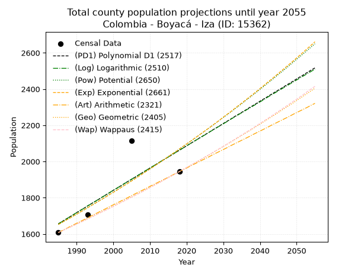
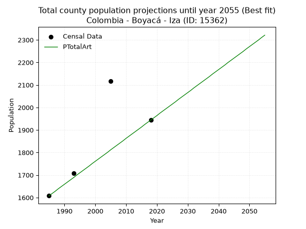
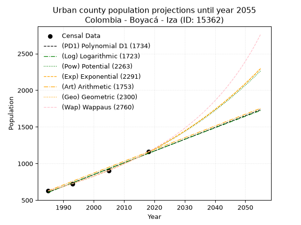
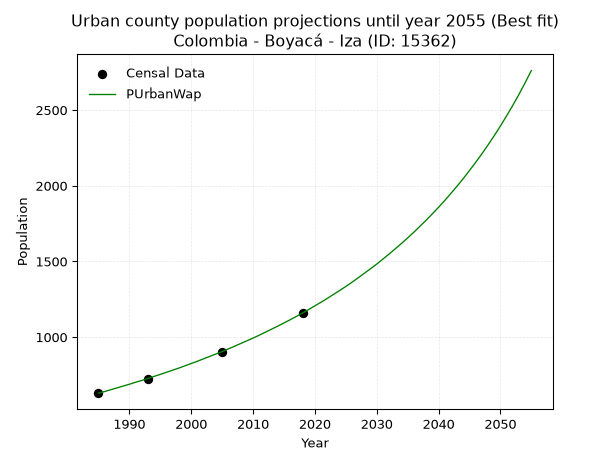
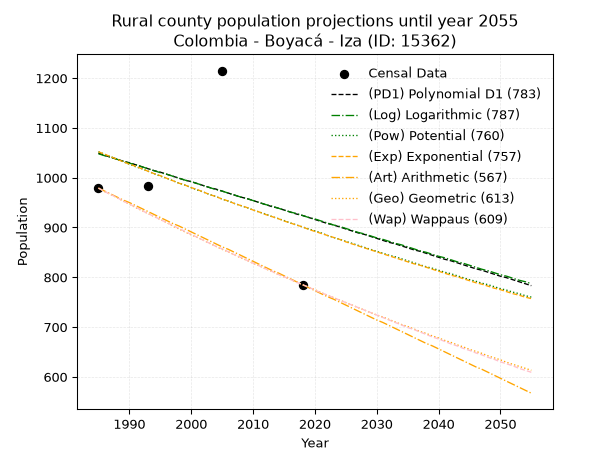
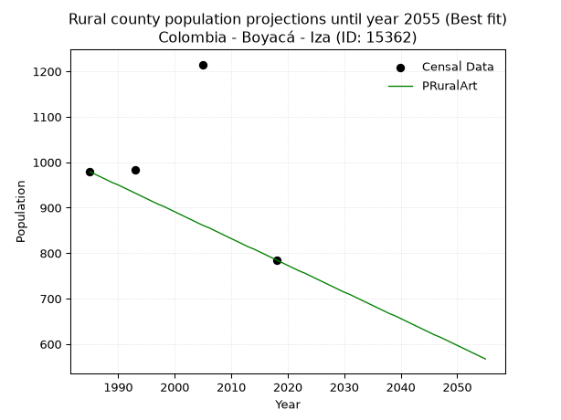

<div align="center">


</div>

# _“Population and Public Services Demand Projections (PPSD) until Year 2050 for Colombia - Boyacá - Iza (ID: 15362)”_
Keywords: `population` `public-service` `projection` `lineal` `polynomial` `logarithmic` `potential` `exponential` `arithmetic` `geometric` `wappaus` `dane` `colombia` `south-america`

PPSD are analytical estimates used by governments and planners to anticipate future changes in population size, age distribution, and the resulting community needs for utilities, healthcare, education, and infrastructure as sizing future water treatment facilities, electrical grids, and road networks based on spatial growth.

> **General running parameters**: • app_version: _v20260806_. • Python version: _3.14.7_. • Pandas version: _3.0.5_. • NumPy version: _2.5.1_. • Creates, save and include plots into reports (create_plot): _False_. • Projection until year: _2050_. • Process polynomial degree 2 and up: _False_. • Process Wappaus: _True_. • Process Wappaus: _True_. • Set negative values to zero: _True_. • Set infinite values to zero: _True_. • Drop dataset notes: _True_. 
<div align="center">

Dynamic map: [:earth_americas:Google](http://maps.google.com/maps?q=5.611576814,-72.9795591) [:earth_americas:OSM](https://www.openstreetmap.org/#map=18/5.611576814/-72.9795591&layers=P) [:earth_americas:Bing](https://www.bing.com/maps?cp=5.611576814~-72.9795591&lvl=18) [:earth_americas:Apple](https://maps.apple.com/frame?center=5.611576814%2C-72.9795591&span=0.003%2C0.006)

</div>


<div align="center">

```geojson
{
  "type": "Feature",
  "geometry": {
    "type": "Point", 
    "coordinates": [-72.9795591, 5.611576814]
  }, 
  "properties": {
    "Name": "Colombia - Boyacá - Iza (ID: 15362)"
  }
}
```

</div>


## 0. Census Data (4 records)

Census data are official statistics collected by a government about the people and housing in a country. They usually include counts of total population, age, sex, race, income, education, and jobs.

📅Global census file: [Population.xlsx](../data/Population.xlsx)

| Source   |   Year |   CountryID | CountryName   |   StateID | StateName   |   CountyID | CountyName   |   PTotal |   PUrban |   PRural |
|:---------|-------:|------------:|:--------------|----------:|:------------|-----------:|:-------------|---------:|---------:|---------:|
| DANE     |   1985 |          57 | Colombia      |        15 | Boyacá      |      15362 | Iza          |     1608 |      629 |      979 |
| DANE     |   1993 |          57 | Colombia      |        15 | Boyacá      |      15362 | Iza          |     1707 |      723 |      984 |
| DANE     |   2005 |          57 | Colombia      |        15 | Boyacá      |      15362 | Iza          |     2116 |      901 |     1215 |
| DANE     |   2018 |          57 | Colombia      |        15 | Boyacá      |      15362 | Iza          |     1944 |     1159 |      785 |

> 🔥Some records could had specific notes about the registered values or the corresponding urban or rural distribution.

**Local public utility companies (RUPS)**

 | SERVICIO       | ESTADO    | NOMBRE                                                          | NIT         | DEPARTAMENTO_DOMICILIO   | MUNICIPIO_DOMICILIO   | DIRECCION                                  |   TELEFONO | EMAIL                     | TIPO_INSCRIPCION    | REPRESENTANTE_LEGAL               | TIPO_PRESTADOR                             | CLASIFICACION                  |
|:---------------|:----------|:----------------------------------------------------------------|:------------|:-------------------------|:----------------------|:-------------------------------------------|-----------:|:--------------------------|:--------------------|:----------------------------------|:-------------------------------------------|:-------------------------------|
| ACUEDUCTO      | OPERATIVA | COMPAÑÍA DE SERVICIOS PÚBLICOS DE SOGAMOSO S.A. E.S.P.          | 891800031-4 | BOYACA                   | SOGAMOSO              | Carrera 11 no 15-10 Edificio Mirador Plaza |    7702110 | sui@coserviciosesp.com.co | Registro por la ESP | PEDRO ELIAS BARRERA  MESA         | SOCIEDADES (EMPRESA DE SERVICIOS PUBLICOS) | MAYOR O IGUAL A 5001 USUARIOS  |
| ASEO           | OPERATIVA | COMPAÑÍA DE SERVICIOS PÚBLICOS DE SOGAMOSO S.A. E.S.P.          | 891800031-4 | BOYACA                   | SOGAMOSO              | Carrera 11 no 15-10 Edificio Mirador Plaza |    7702110 | sui@coserviciosesp.com.co | Registro por la ESP | PEDRO ELIAS BARRERA  MESA         | SOCIEDADES (EMPRESA DE SERVICIOS PUBLICOS) | MAYOR O IGUAL A 5001 USUARIOS  |
| ACUEDUCTO      | OPERATIVA | UNIDAD DE SERVICIOS PUBLICOS DOMICILIARIOS DEL MUNICIPIO DE IZA | 891856077-3 | BOYACA                   | IZA                   | carrera 4 # 4-10                           |    7790190 | Uspi@iza-boyaca.gov.co    | Registro por la ESP | ROBINSON LEANDRO SALAMANCA RINCON | MUNICIPIO (PRESTACIÓN DIRECTA)             | MENOR O IGUAL A 2500 USUARIOS  |
| ALCANTARILLADO | OPERATIVA | UNIDAD DE SERVICIOS PUBLICOS DOMICILIARIOS DEL MUNICIPIO DE IZA | 891856077-3 | BOYACA                   | IZA                   | carrera 4 # 4-10                           |    7790190 | Uspi@iza-boyaca.gov.co    | Registro por la ESP | ROBINSON LEANDRO SALAMANCA RINCON | MUNICIPIO (PRESTACIÓN DIRECTA)             | MENOR O IGUAL A 2500 USUARIOS  |
| ASEO           | OPERATIVA | UNIDAD DE SERVICIOS PUBLICOS DOMICILIARIOS DEL MUNICIPIO DE IZA | 891856077-3 | BOYACA                   | IZA                   | carrera 4 # 4-10                           |    7790190 | Uspi@iza-boyaca.gov.co    | Registro por la ESP | ROBINSON LEANDRO SALAMANCA RINCON | MUNICIPIO (PRESTACIÓN DIRECTA)             | MENOR O IGUAL A 2500 USUARIOS  |
| ASEO           | OPERATIVA | URBASER TUNJA S.A.  E.S.P.                                      | 900159283-6 | BOYACA                   | TUNJA                 | TRANSVERSAL 15 No. 24 - 12                 |    7441826 | Luz.galvis@urbaser.co     | Registro por la ESP | OSCAR HERNAN PARRA  ERAZO         | SOCIEDADES (EMPRESA DE SERVICIOS PUBLICOS) | MAYOR O IGUAL A 5001 USUARIOS  |
| ASEO           | OPERATIVA | eco visionarios s.a.s                                           | 901114132-2 | BOYACA                   | SOGAMOSO              | calle 9 numero 27-47                       |    6365070 | laalezones@hotmail.com    | Registro por la ESP | LAURA MARITHZA CASTRO ALEZONES    | SOCIEDADES (EMPRESA DE SERVICIOS PUBLICOS) | DESDE 2501 HASTA 5000 USUARIOS |

> [📅RUPS Database: Registro Único de Prestadores de Servicios Públicos de Colombia Suramérica - RUPS](https://www.datos.gov.co/Hacienda-y-Cr-dito-P-blico/Registro-nico-de-Prestadores-de-Servicios-P-blicos/4qkq-csdn/about_data)

## 1. Total

### 1.1. Coefficients and Parameters

* (PD1) Polynomial Deg 1: 12.299076676033803, -22757.47812123661 (lineal)
* (Log) Logarithmic: 24655.016494052226, -185559.22794419367
* (Pow) Potential: 13.644712513415474, -41.779047910717395
* (Exp) Exponential: 0.006807010280176914, 0.00223846240469111
* (Art) Arithmetic: Year diff. 2018 - 1985 = 33, Population diff. 1944 - 1608 = 336, Annual growth = 10.181818181818182
* (Geo) Geometric: Year diff. 2018 - 1985 = 33, Population diff. 1944 - 1608 = 336, Annual growth % = 0.005766762161350858
* (Wap) Wappaus: i = 0.5733005733005733, Condition values only valid for < 200)

<sub>
Wappaus condition values: ['0.00', '0.57', '1.15', '1.72', '2.29', '2.87', '3.44', '4.01', '4.59', '5.16', '5.73', '6.31', '6.88', '7.45', '8.03', '8.60', '9.17', '9.75', '10.32', '10.89', '11.47', '12.04', '12.61', '13.19', '13.76', '14.33', '14.91', '15.48', '16.05', '16.63', '17.20', '17.77', '18.35', '18.92', '19.49', '20.07', '20.64', '21.21', '21.79', '22.36', '22.93', '23.51', '24.08', '24.65', '25.23', '25.80', '26.37', '26.95', '27.52', '28.09', '28.67', '29.24', '29.81', '30.38', '30.96', '31.53', '32.10', '32.68', '33.25', '33.82', '34.40', '34.97', '35.54', '36.12', '36.69', '37.26']
</sub>


### 1.2. Projected Dataset

|   Year |   CountyID |   PTotalPD1 |   PTotalLog |   PTotalPow |   PTotalExp |   PTotalArt |   PTotalGeo |   PTotalWap |
|-------:|-----------:|------------:|------------:|------------:|------------:|------------:|------------:|------------:|
|   1985 |      15362 |        1656 |        1656 |        1652 |        1652 |        1608 |        1608 |        1608 |
|   1986 |      15362 |        1668 |        1668 |        1663 |        1664 |        1618 |        1617 |        1617 |
|   1987 |      15362 |        1681 |        1680 |        1675 |        1675 |        1628 |        1627 |        1627 |
|   1988 |      15362 |        1693 |        1693 |        1686 |        1686 |        1639 |        1636 |        1636 |
|   1989 |      15362 |        1705 |        1705 |        1698 |        1698 |        1649 |        1645 |        1645 |
|   1990 |      15362 |        1718 |        1718 |        1709 |        1710 |        1659 |        1655 |        1655 |
|   1991 |      15362 |        1730 |        1730 |        1721 |        1721 |        1669 |        1664 |        1664 |
|   1992 |      15362 |        1742 |        1742 |        1733 |        1733 |        1679 |        1674 |        1674 |
|   1993 |      15362 |        1755 |        1755 |        1745 |        1745 |        1689 |        1684 |        1683 |
|   1994 |      15362 |        1767 |        1767 |        1757 |        1757 |        1700 |        1693 |        1693 |
|   1995 |      15362 |        1779 |        1779 |        1769 |        1769 |        1710 |        1703 |        1703 |
|   1996 |      15362 |        1791 |        1792 |        1781 |        1781 |        1720 |        1713 |        1713 |
|   1997 |      15362 |        1804 |        1804 |        1793 |        1793 |        1730 |        1723 |        1723 |
|   1998 |      15362 |        1816 |        1816 |        1806 |        1805 |        1740 |        1733 |        1732 |
|   1999 |      15362 |        1828 |        1829 |        1818 |        1818 |        1751 |        1743 |        1742 |
|   2000 |      15362 |        1841 |        1841 |        1830 |        1830 |        1761 |        1753 |        1752 |
|   2001 |      15362 |        1853 |        1853 |        1843 |        1842 |        1771 |        1763 |        1763 |
|   2002 |      15362 |        1865 |        1866 |        1856 |        1855 |        1781 |        1773 |        1773 |
|   2003 |      15362 |        1878 |        1878 |        1868 |        1868 |        1791 |        1783 |        1783 |
|   2004 |      15362 |        1890 |        1890 |        1881 |        1880 |        1801 |        1794 |        1793 |
|   2005 |      15362 |        1902 |        1903 |        1894 |        1893 |        1812 |        1804 |        1804 |
|   2006 |      15362 |        1914 |        1915 |        1907 |        1906 |        1822 |        1814 |        1814 |
|   2007 |      15362 |        1927 |        1927 |        1920 |        1919 |        1832 |        1825 |        1824 |
|   2008 |      15362 |        1939 |        1940 |        1933 |        1932 |        1842 |        1835 |        1835 |
|   2009 |      15362 |        1951 |        1952 |        1946 |        1946 |        1852 |        1846 |        1846 |
|   2010 |      15362 |        1964 |        1964 |        1959 |        1959 |        1863 |        1857 |        1856 |
|   2011 |      15362 |        1976 |        1976 |        1973 |        1972 |        1873 |        1867 |        1867 |
|   2012 |      15362 |        1988 |        1989 |        1986 |        1986 |        1883 |        1878 |        1878 |
|   2013 |      15362 |        2001 |        2001 |        2000 |        1999 |        1893 |        1889 |        1889 |
|   2014 |      15362 |        2013 |        2013 |        2013 |        2013 |        1903 |        1900 |        1900 |
|   2015 |      15362 |        2025 |        2025 |        2027 |        2027 |        1913 |        1911 |        1911 |
|   2016 |      15362 |        2037 |        2038 |        2041 |        2041 |        1924 |        1922 |        1922 |
|   2017 |      15362 |        2050 |        2050 |        2055 |        2054 |        1934 |        1933 |        1933 |
|   2018 |      15362 |        2062 |        2062 |        2068 |        2069 |        1944 |        1944 |        1944 |
|   2019 |      15362 |        2074 |        2074 |        2083 |        2083 |        1954 |        1955 |        1955 |
|   2020 |      15362 |        2087 |        2086 |        2097 |        2097 |        1964 |        1966 |        1967 |
|   2021 |      15362 |        2099 |        2099 |        2111 |        2111 |        1975 |        1978 |        1978 |
|   2022 |      15362 |        2111 |        2111 |        2125 |        2126 |        1985 |        1989 |        1990 |
|   2023 |      15362 |        2124 |        2123 |        2140 |        2140 |        1995 |        2001 |        2001 |
|   2024 |      15362 |        2136 |        2135 |        2154 |        2155 |        2005 |        2012 |        2013 |
|   2025 |      15362 |        2148 |        2147 |        2169 |        2169 |        2015 |        2024 |        2025 |
|   2026 |      15362 |        2160 |        2160 |        2183 |        2184 |        2025 |        2036 |        2036 |
|   2027 |      15362 |        2173 |        2172 |        2198 |        2199 |        2036 |        2047 |        2048 |
|   2028 |      15362 |        2185 |        2184 |        2213 |        2214 |        2046 |        2059 |        2060 |
|   2029 |      15362 |        2197 |        2196 |        2228 |        2229 |        2056 |        2071 |        2072 |
|   2030 |      15362 |        2210 |        2208 |        2243 |        2245 |        2066 |        2083 |        2084 |
|   2031 |      15362 |        2222 |        2220 |        2258 |        2260 |        2076 |        2095 |        2096 |
|   2032 |      15362 |        2234 |        2233 |        2273 |        2275 |        2087 |        2107 |        2109 |
|   2033 |      15362 |        2247 |        2245 |        2288 |        2291 |        2097 |        2119 |        2121 |
|   2034 |      15362 |        2259 |        2257 |        2304 |        2307 |        2107 |        2131 |        2134 |
|   2035 |      15362 |        2271 |        2269 |        2319 |        2322 |        2117 |        2144 |        2146 |
|   2036 |      15362 |        2283 |        2281 |        2335 |        2338 |        2127 |        2156 |        2159 |
|   2037 |      15362 |        2296 |        2293 |        2351 |        2354 |        2137 |        2168 |        2171 |
|   2038 |      15362 |        2308 |        2305 |        2366 |        2370 |        2148 |        2181 |        2184 |
|   2039 |      15362 |        2320 |        2317 |        2382 |        2386 |        2158 |        2194 |        2197 |
|   2040 |      15362 |        2333 |        2329 |        2398 |        2403 |        2168 |        2206 |        2210 |
|   2041 |      15362 |        2345 |        2341 |        2414 |        2419 |        2178 |        2219 |        2223 |
|   2042 |      15362 |        2357 |        2354 |        2431 |        2436 |        2188 |        2232 |        2236 |
|   2043 |      15362 |        2370 |        2366 |        2447 |        2452 |        2199 |        2245 |        2249 |
|   2044 |      15362 |        2382 |        2378 |        2463 |        2469 |        2209 |        2257 |        2263 |
|   2045 |      15362 |        2394 |        2390 |        2480 |        2486 |        2219 |        2271 |        2276 |
|   2046 |      15362 |        2406 |        2402 |        2496 |        2503 |        2229 |        2284 |        2290 |
|   2047 |      15362 |        2419 |        2414 |        2513 |        2520 |        2239 |        2297 |        2303 |
|   2048 |      15362 |        2431 |        2426 |        2530 |        2537 |        2249 |        2310 |        2317 |
|   2049 |      15362 |        2443 |        2438 |        2547 |        2554 |        2260 |        2323 |        2331 |
|   2050 |      15362 |        2456 |        2450 |        2564 |        2572 |        2270 |        2337 |        2344 |
<div align="center">

</img>

</div>


### 1.3. Best fit with absolute and relative error (%)

Relative error puts that difference into context by dividing the absolute error by the true value, creating a unitless ratio or percentage that shows the scale of the mistake.

Absolute and relative error

|   Year | Source   |   CountryID | CountryName   |   StateID | StateName   |   CountyID_x | CountyName   |   PTotal |   PUrban |   PRural |   CountyID_y |   PTotalPD1 |   PTotalLog |   PTotalPow |   PTotalExp |   PTotalArt |   PTotalGeo |   PTotalWap |   PTotalPD1AbsError |   PTotalLogAbsError |   PTotalPowAbsError |   PTotalExpAbsError |   PTotalArtAbsError |   PTotalGeoAbsError |   PTotalWapAbsError |   PTotalPD1RelError |   PTotalLogRelError |   PTotalPowRelError |   PTotalExpRelError |   PTotalArtRelError |   PTotalGeoRelError |   PTotalWapRelError |
|-------:|:---------|------------:|:--------------|----------:|:------------|-------------:|:-------------|---------:|---------:|---------:|-------------:|------------:|------------:|------------:|------------:|------------:|------------:|------------:|--------------------:|--------------------:|--------------------:|--------------------:|--------------------:|--------------------:|--------------------:|--------------------:|--------------------:|--------------------:|--------------------:|--------------------:|--------------------:|--------------------:|
|   1985 | DANE     |          57 | Colombia      |        15 | Boyacá      |        15362 | Iza          |     1608 |      629 |      979 |        15362 |        1656 |        1656 |        1652 |        1652 |        1608 |        1608 |        1608 |                  48 |                  48 |                  44 |                  44 |                   0 |                   0 |                   0 |             2.98507 |             2.98507 |             2.73632 |             2.73632 |             0       |             0       |             0       |
|   1993 | DANE     |          57 | Colombia      |        15 | Boyacá      |        15362 | Iza          |     1707 |      723 |      984 |        15362 |        1755 |        1755 |        1745 |        1745 |        1689 |        1684 |        1683 |                  48 |                  48 |                  38 |                  38 |                  18 |                  23 |                  24 |             2.81195 |             2.81195 |             2.22613 |             2.22613 |             1.05448 |             1.34739 |             1.40598 |
|   2005 | DANE     |          57 | Colombia      |        15 | Boyacá      |        15362 | Iza          |     2116 |      901 |     1215 |        15362 |        1902 |        1903 |        1894 |        1893 |        1812 |        1804 |        1804 |                 214 |                 213 |                 222 |                 223 |                 304 |                 312 |                 312 |            10.1134  |            10.0662  |            10.4915  |            10.5388  |            14.3667  |            14.7448  |            14.7448  |
|   2018 | DANE     |          57 | Colombia      |        15 | Boyacá      |        15362 | Iza          |     1944 |     1159 |      785 |        15362 |        2062 |        2062 |        2068 |        2069 |        1944 |        1944 |        1944 |                 118 |                 118 |                 124 |                 125 |                   0 |                   0 |                   0 |             6.06996 |             6.06996 |             6.3786  |             6.43004 |             0       |             0       |             0       |

Relative error mean

| Method    |   RelError | Best   |
|:----------|-----------:|:-------|
| PTotalPD1 |    5.4951  |        |
| PTotalLog |    5.48329 |        |
| PTotalPow |    5.45814 |        |
| PTotalExp |    5.48281 |        |
| PTotalArt |    3.8553  | True   |
| PTotalGeo |    4.02305 |        |
| PTotalWap |    4.03769 |        |

💙Best method: _**PTotalArt**_
<div align="center">

</img>

</div>


### 1.4. Fresh water supply demand in liters per capita per day (lpcd)

The fresh water supply demand typically ranges from 100 to 300 liters per capita per day (lpcd) for standard domestic and municipal planning, though absolute survival minimums set by the World Health Organization are as low as 7.5 to 20 liters per day, and total consumption in high-income nations can exceed 400 liters.

> `CZ`: Level in meters above the sea level (masl)<br> `WS`: Fresh water supply demand in liters per capita per day (lpcd or l/h/d)<br> `WSAll`: Zonal fresh water supply demand in liters per second (l/s)<br> `A`: Zonal area in square meters<br> `DP`: Population density (people/hectare or p/ha)

Reference values (RAS Colombia)

|    CZ |   WS |
|------:|-----:|
|  1000 |  120 |
|  2000 |  130 |
| 99999 |  140 |

County shapefile geometry properties and water supply values

|   CountyID |      ATotal |   CZTotal |   WSTotal |
|-----------:|------------:|----------:|----------:|
|      15362 | 3.41803e+07 |    2761.5 |       140 |

Projected values for best method: PTotalArt

|   CountyID |   Year |   PTotalArt |   DPTotal |   WSTotal |   WSTotalAll |
|-----------:|-------:|------------:|----------:|----------:|-------------:|
|      15362 |   1985 |        1608 |      0.47 |       140 |      2.60556 |
|      15362 |   1986 |        1618 |      0.47 |       140 |      2.62176 |
|      15362 |   1987 |        1628 |      0.48 |       140 |      2.63796 |
|      15362 |   1988 |        1639 |      0.48 |       140 |      2.65579 |
|      15362 |   1989 |        1649 |      0.48 |       140 |      2.67199 |
|      15362 |   1990 |        1659 |      0.49 |       140 |      2.68819 |
|      15362 |   1991 |        1669 |      0.49 |       140 |      2.7044  |
|      15362 |   1992 |        1679 |      0.49 |       140 |      2.7206  |
|      15362 |   1993 |        1689 |      0.49 |       140 |      2.73681 |
|      15362 |   1994 |        1700 |      0.5  |       140 |      2.75463 |
|      15362 |   1995 |        1710 |      0.5  |       140 |      2.77083 |
|      15362 |   1996 |        1720 |      0.5  |       140 |      2.78704 |
|      15362 |   1997 |        1730 |      0.51 |       140 |      2.80324 |
|      15362 |   1998 |        1740 |      0.51 |       140 |      2.81944 |
|      15362 |   1999 |        1751 |      0.51 |       140 |      2.83727 |
|      15362 |   2000 |        1761 |      0.52 |       140 |      2.85347 |
|      15362 |   2001 |        1771 |      0.52 |       140 |      2.86968 |
|      15362 |   2002 |        1781 |      0.52 |       140 |      2.88588 |
|      15362 |   2003 |        1791 |      0.52 |       140 |      2.90208 |
|      15362 |   2004 |        1801 |      0.53 |       140 |      2.91829 |
|      15362 |   2005 |        1812 |      0.53 |       140 |      2.93611 |
|      15362 |   2006 |        1822 |      0.53 |       140 |      2.95231 |
|      15362 |   2007 |        1832 |      0.54 |       140 |      2.96852 |
|      15362 |   2008 |        1842 |      0.54 |       140 |      2.98472 |
|      15362 |   2009 |        1852 |      0.54 |       140 |      3.00093 |
|      15362 |   2010 |        1863 |      0.55 |       140 |      3.01875 |
|      15362 |   2011 |        1873 |      0.55 |       140 |      3.03495 |
|      15362 |   2012 |        1883 |      0.55 |       140 |      3.05116 |
|      15362 |   2013 |        1893 |      0.55 |       140 |      3.06736 |
|      15362 |   2014 |        1903 |      0.56 |       140 |      3.08356 |
|      15362 |   2015 |        1913 |      0.56 |       140 |      3.09977 |
|      15362 |   2016 |        1924 |      0.56 |       140 |      3.11759 |
|      15362 |   2017 |        1934 |      0.57 |       140 |      3.1338  |
|      15362 |   2018 |        1944 |      0.57 |       140 |      3.15    |
|      15362 |   2019 |        1954 |      0.57 |       140 |      3.1662  |
|      15362 |   2020 |        1964 |      0.57 |       140 |      3.18241 |
|      15362 |   2021 |        1975 |      0.58 |       140 |      3.20023 |
|      15362 |   2022 |        1985 |      0.58 |       140 |      3.21644 |
|      15362 |   2023 |        1995 |      0.58 |       140 |      3.23264 |
|      15362 |   2024 |        2005 |      0.59 |       140 |      3.24884 |
|      15362 |   2025 |        2015 |      0.59 |       140 |      3.26505 |
|      15362 |   2026 |        2025 |      0.59 |       140 |      3.28125 |
|      15362 |   2027 |        2036 |      0.6  |       140 |      3.29907 |
|      15362 |   2028 |        2046 |      0.6  |       140 |      3.31528 |
|      15362 |   2029 |        2056 |      0.6  |       140 |      3.33148 |
|      15362 |   2030 |        2066 |      0.6  |       140 |      3.34769 |
|      15362 |   2031 |        2076 |      0.61 |       140 |      3.36389 |
|      15362 |   2032 |        2087 |      0.61 |       140 |      3.38171 |
|      15362 |   2033 |        2097 |      0.61 |       140 |      3.39792 |
|      15362 |   2034 |        2107 |      0.62 |       140 |      3.41412 |
|      15362 |   2035 |        2117 |      0.62 |       140 |      3.43032 |
|      15362 |   2036 |        2127 |      0.62 |       140 |      3.44653 |
|      15362 |   2037 |        2137 |      0.63 |       140 |      3.46273 |
|      15362 |   2038 |        2148 |      0.63 |       140 |      3.48056 |
|      15362 |   2039 |        2158 |      0.63 |       140 |      3.49676 |
|      15362 |   2040 |        2168 |      0.63 |       140 |      3.51296 |
|      15362 |   2041 |        2178 |      0.64 |       140 |      3.52917 |
|      15362 |   2042 |        2188 |      0.64 |       140 |      3.54537 |
|      15362 |   2043 |        2199 |      0.64 |       140 |      3.56319 |
|      15362 |   2044 |        2209 |      0.65 |       140 |      3.5794  |
|      15362 |   2045 |        2219 |      0.65 |       140 |      3.5956  |
|      15362 |   2046 |        2229 |      0.65 |       140 |      3.61181 |
|      15362 |   2047 |        2239 |      0.66 |       140 |      3.62801 |
|      15362 |   2048 |        2249 |      0.66 |       140 |      3.64421 |
|      15362 |   2049 |        2260 |      0.66 |       140 |      3.66204 |
|      15362 |   2050 |        2270 |      0.66 |       140 |      3.67824 |

## 2. Urban

### 2.1. Coefficients and Parameters

* (PD1) Polynomial Deg 1: 16.086712163789468, -31324.446005619888 (lineal)
* (Log) Logarithmic: 32191.418921095486, -243834.23318508832
* (Pow) Potential: 37.10799806356654, -119.57716648075403
* (Exp) Exponential: 0.018539918775732342, 6.50979792941201e-14
* (Art) Arithmetic: Year diff. 2018 - 1985 = 33, Population diff. 1159 - 629 = 530, Annual growth = 16.060606060606062
* (Geo) Geometric: Year diff. 2018 - 1985 = 33, Population diff. 1159 - 629 = 530, Annual growth % = 0.01869322518537886
* (Wap) Wappaus: i = 1.7964883736695818, Condition values only valid for < 200)

<sub>
Wappaus condition values: ['0.00', '1.80', '3.59', '5.39', '7.19', '8.98', '10.78', '12.58', '14.37', '16.17', '17.96', '19.76', '21.56', '23.35', '25.15', '26.95', '28.74', '30.54', '32.34', '34.13', '35.93', '37.73', '39.52', '41.32', '43.12', '44.91', '46.71', '48.51', '50.30', '52.10', '53.89', '55.69', '57.49', '59.28', '61.08', '62.88', '64.67', '66.47', '68.27', '70.06', '71.86', '73.66', '75.45', '77.25', '79.05', '80.84', '82.64', '84.43', '86.23', '88.03', '89.82', '91.62', '93.42', '95.21', '97.01', '98.81', '100.60', '102.40', '104.20', '105.99', '107.79', '109.59', '111.38', '113.18', '114.98', '116.77']
</sub>


### 2.2. Projected Dataset

|   Year |   CountyID |   PUrbanPD1 |   PUrbanLog |   PUrbanPow |   PUrbanExp |   PUrbanArt |   PUrbanGeo |   PUrbanWap |
|-------:|-----------:|------------:|------------:|------------:|------------:|------------:|------------:|------------:|
|   1985 |      15362 |         608 |         607 |         625 |         626 |         629 |         629 |         629 |
|   1986 |      15362 |         624 |         623 |         637 |         637 |         645 |         641 |         640 |
|   1987 |      15362 |         640 |         640 |         649 |         649 |         661 |         653 |         652 |
|   1988 |      15362 |         656 |         656 |         661 |         661 |         677 |         665 |         664 |
|   1989 |      15362 |         672 |         672 |         674 |         674 |         693 |         677 |         676 |
|   1990 |      15362 |         688 |         688 |         687 |         686 |         709 |         690 |         688 |
|   1991 |      15362 |         704 |         704 |         699 |         699 |         725 |         703 |         701 |
|   1992 |      15362 |         720 |         721 |         713 |         712 |         741 |         716 |         713 |
|   1993 |      15362 |         736 |         737 |         726 |         726 |         757 |         729 |         726 |
|   1994 |      15362 |         752 |         753 |         740 |         739 |         774 |         743 |         740 |
|   1995 |      15362 |         769 |         769 |         754 |         753 |         790 |         757 |         753 |
|   1996 |      15362 |         785 |         785 |         768 |         767 |         806 |         771 |         767 |
|   1997 |      15362 |         801 |         801 |         782 |         782 |         822 |         786 |         781 |
|   1998 |      15362 |         817 |         817 |         797 |         796 |         838 |         800 |         795 |
|   1999 |      15362 |         833 |         834 |         812 |         811 |         854 |         815 |         810 |
|   2000 |      15362 |         849 |         850 |         827 |         826 |         870 |         830 |         825 |
|   2001 |      15362 |         865 |         866 |         842 |         842 |         886 |         846 |         840 |
|   2002 |      15362 |         881 |         882 |         858 |         858 |         902 |         862 |         856 |
|   2003 |      15362 |         897 |         898 |         874 |         874 |         918 |         878 |         872 |
|   2004 |      15362 |         913 |         914 |         891 |         890 |         934 |         894 |         888 |
|   2005 |      15362 |         929 |         930 |         907 |         907 |         950 |         911 |         904 |
|   2006 |      15362 |         945 |         946 |         924 |         924 |         966 |         928 |         921 |
|   2007 |      15362 |         962 |         962 |         941 |         941 |         982 |         945 |         939 |
|   2008 |      15362 |         978 |         978 |         959 |         958 |         998 |         963 |         957 |
|   2009 |      15362 |         994 |         994 |         977 |         976 |        1014 |         981 |         975 |
|   2010 |      15362 |        1010 |        1010 |         995 |         995 |        1031 |         999 |         993 |
|   2011 |      15362 |        1026 |        1026 |        1014 |        1013 |        1047 |        1018 |        1012 |
|   2012 |      15362 |        1042 |        1042 |        1032 |        1032 |        1063 |        1037 |        1032 |
|   2013 |      15362 |        1058 |        1058 |        1052 |        1052 |        1079 |        1056 |        1052 |
|   2014 |      15362 |        1074 |        1074 |        1071 |        1071 |        1095 |        1076 |        1072 |
|   2015 |      15362 |        1090 |        1090 |        1091 |        1091 |        1111 |        1096 |        1093 |
|   2016 |      15362 |        1106 |        1106 |        1111 |        1112 |        1127 |        1117 |        1114 |
|   2017 |      15362 |        1122 |        1122 |        1132 |        1132 |        1143 |        1138 |        1136 |
|   2018 |      15362 |        1139 |        1138 |        1153 |        1154 |        1159 |        1159 |        1159 |
|   2019 |      15362 |        1155 |        1154 |        1174 |        1175 |        1175 |        1181 |        1182 |
|   2020 |      15362 |        1171 |        1170 |        1196 |        1197 |        1191 |        1203 |        1206 |
|   2021 |      15362 |        1187 |        1186 |        1218 |        1220 |        1207 |        1225 |        1230 |
|   2022 |      15362 |        1203 |        1202 |        1241 |        1242 |        1223 |        1248 |        1255 |
|   2023 |      15362 |        1219 |        1218 |        1264 |        1266 |        1239 |        1271 |        1281 |
|   2024 |      15362 |        1235 |        1234 |        1287 |        1289 |        1255 |        1295 |        1307 |
|   2025 |      15362 |        1251 |        1250 |        1311 |        1314 |        1271 |        1319 |        1334 |
|   2026 |      15362 |        1267 |        1265 |        1335 |        1338 |        1287 |        1344 |        1362 |
|   2027 |      15362 |        1283 |        1281 |        1360 |        1363 |        1304 |        1369 |        1391 |
|   2028 |      15362 |        1299 |        1297 |        1385 |        1389 |        1320 |        1395 |        1421 |
|   2029 |      15362 |        1315 |        1313 |        1411 |        1415 |        1336 |        1421 |        1451 |
|   2030 |      15362 |        1332 |        1329 |        1437 |        1441 |        1352 |        1447 |        1482 |
|   2031 |      15362 |        1348 |        1345 |        1463 |        1468 |        1368 |        1475 |        1515 |
|   2032 |      15362 |        1364 |        1361 |        1490 |        1496 |        1384 |        1502 |        1548 |
|   2033 |      15362 |        1380 |        1376 |        1518 |        1524 |        1400 |        1530 |        1583 |
|   2034 |      15362 |        1396 |        1392 |        1546 |        1552 |        1416 |        1559 |        1618 |
|   2035 |      15362 |        1412 |        1408 |        1574 |        1581 |        1432 |        1588 |        1655 |
|   2036 |      15362 |        1428 |        1424 |        1603 |        1611 |        1448 |        1618 |        1692 |
|   2037 |      15362 |        1444 |        1440 |        1633 |        1641 |        1464 |        1648 |        1732 |
|   2038 |      15362 |        1460 |        1456 |        1663 |        1671 |        1480 |        1679 |        1772 |
|   2039 |      15362 |        1476 |        1471 |        1693 |        1703 |        1496 |        1710 |        1814 |
|   2040 |      15362 |        1492 |        1487 |        1724 |        1735 |        1512 |        1742 |        1857 |
|   2041 |      15362 |        1509 |        1503 |        1756 |        1767 |        1528 |        1775 |        1902 |
|   2042 |      15362 |        1525 |        1519 |        1788 |        1800 |        1544 |        1808 |        1949 |
|   2043 |      15362 |        1541 |        1534 |        1821 |        1834 |        1561 |        1841 |        1997 |
|   2044 |      15362 |        1557 |        1550 |        1854 |        1868 |        1577 |        1876 |        2047 |
|   2045 |      15362 |        1573 |        1566 |        1888 |        1903 |        1593 |        1911 |        2100 |
|   2046 |      15362 |        1589 |        1582 |        1923 |        1939 |        1609 |        1947 |        2154 |
|   2047 |      15362 |        1605 |        1597 |        1958 |        1975 |        1625 |        1983 |        2210 |
|   2048 |      15362 |        1621 |        1613 |        1994 |        2012 |        1641 |        2020 |        2269 |
|   2049 |      15362 |        1637 |        1629 |        2030 |        2050 |        1657 |        2058 |        2330 |
|   2050 |      15362 |        1653 |        1644 |        2067 |        2088 |        1673 |        2096 |        2394 |
<div align="center">

</img>

</div>


### 2.3. Best fit with absolute and relative error (%)

Relative error puts that difference into context by dividing the absolute error by the true value, creating a unitless ratio or percentage that shows the scale of the mistake.

Absolute and relative error

|   Year | Source   |   CountryID | CountryName   |   StateID | StateName   |   CountyID_x | CountyName   |   PTotal |   PUrban |   PRural |   CountyID_y |   PUrbanPD1 |   PUrbanLog |   PUrbanPow |   PUrbanExp |   PUrbanArt |   PUrbanGeo |   PUrbanWap |   PUrbanPD1AbsError |   PUrbanLogAbsError |   PUrbanPowAbsError |   PUrbanExpAbsError |   PUrbanArtAbsError |   PUrbanGeoAbsError |   PUrbanWapAbsError |   PUrbanPD1RelError |   PUrbanLogRelError |   PUrbanPowRelError |   PUrbanExpRelError |   PUrbanArtRelError |   PUrbanGeoRelError |   PUrbanWapRelError |
|-------:|:---------|------------:|:--------------|----------:|:------------|-------------:|:-------------|---------:|---------:|---------:|-------------:|------------:|------------:|------------:|------------:|------------:|------------:|------------:|--------------------:|--------------------:|--------------------:|--------------------:|--------------------:|--------------------:|--------------------:|--------------------:|--------------------:|--------------------:|--------------------:|--------------------:|--------------------:|--------------------:|
|   1985 | DANE     |          57 | Colombia      |        15 | Boyacá      |        15362 | Iza          |     1608 |      629 |      979 |        15362 |         608 |         607 |         625 |         626 |         629 |         629 |         629 |                  21 |                  22 |                   4 |                   3 |                   0 |                   0 |                   0 |             3.33863 |             3.49762 |            0.63593  |            0.476948 |             0       |            0        |            0        |
|   1993 | DANE     |          57 | Colombia      |        15 | Boyacá      |        15362 | Iza          |     1707 |      723 |      984 |        15362 |         736 |         737 |         726 |         726 |         757 |         729 |         726 |                  13 |                  14 |                   3 |                   3 |                  34 |                   6 |                   3 |             1.79806 |             1.93638 |            0.414938 |            0.414938 |             4.70263 |            0.829876 |            0.414938 |
|   2005 | DANE     |          57 | Colombia      |        15 | Boyacá      |        15362 | Iza          |     2116 |      901 |     1215 |        15362 |         929 |         930 |         907 |         907 |         950 |         911 |         904 |                  28 |                  29 |                   6 |                   6 |                  49 |                  10 |                   3 |             3.10766 |             3.21865 |            0.665927 |            0.665927 |             5.4384  |            1.10988  |            0.332963 |
|   2018 | DANE     |          57 | Colombia      |        15 | Boyacá      |        15362 | Iza          |     1944 |     1159 |      785 |        15362 |        1139 |        1138 |        1153 |        1154 |        1159 |        1159 |        1159 |                  20 |                  21 |                   6 |                   5 |                   0 |                   0 |                   0 |             1.72563 |             1.81191 |            0.517688 |            0.431406 |             0       |            0        |            0        |

Relative error mean

| Method    |   RelError | Best   |
|:----------|-----------:|:-------|
| PUrbanPD1 |   2.4925   |        |
| PUrbanLog |   2.61614  |        |
| PUrbanPow |   0.558621 |        |
| PUrbanExp |   0.497305 |        |
| PUrbanArt |   2.53526  |        |
| PUrbanGeo |   0.484938 |        |
| PUrbanWap |   0.186975 | True   |

💙Best method: _**PUrbanWap**_
<div align="center">

</img>

</div>


### 2.4. Fresh water supply demand in liters per capita per day (lpcd)

The fresh water supply demand typically ranges from 100 to 300 liters per capita per day (lpcd) for standard domestic and municipal planning, though absolute survival minimums set by the World Health Organization are as low as 7.5 to 20 liters per day, and total consumption in high-income nations can exceed 400 liters.

> `CZ`: Level in meters above the sea level (masl)<br> `WS`: Fresh water supply demand in liters per capita per day (lpcd or l/h/d)<br> `WSAll`: Zonal fresh water supply demand in liters per second (l/s)<br> `A`: Zonal area in square meters<br> `DP`: Population density (people/hectare or p/ha)

Reference values (RAS Colombia)

|    CZ |   WS |
|------:|-----:|
|  1000 |  120 |
|  2000 |  130 |
| 99999 |  140 |

County shapefile geometry properties and water supply values

|   CountyID |   AUrban |   CZUrban |   WSUrban |
|-----------:|---------:|----------:|----------:|
|      15362 |   892808 |    2530.9 |       140 |

Projected values for best method: PUrbanWap

|   CountyID |   Year |   PUrbanWap |   DPUrban |   WSUrban |   WSUrbanAll |
|-----------:|-------:|------------:|----------:|----------:|-------------:|
|      15362 |   1985 |         629 |      7.05 |       140 |      1.01921 |
|      15362 |   1986 |         640 |      7.17 |       140 |      1.03704 |
|      15362 |   1987 |         652 |      7.3  |       140 |      1.05648 |
|      15362 |   1988 |         664 |      7.44 |       140 |      1.07593 |
|      15362 |   1989 |         676 |      7.57 |       140 |      1.09537 |
|      15362 |   1990 |         688 |      7.71 |       140 |      1.11481 |
|      15362 |   1991 |         701 |      7.85 |       140 |      1.13588 |
|      15362 |   1992 |         713 |      7.99 |       140 |      1.15532 |
|      15362 |   1993 |         726 |      8.13 |       140 |      1.17639 |
|      15362 |   1994 |         740 |      8.29 |       140 |      1.19907 |
|      15362 |   1995 |         753 |      8.43 |       140 |      1.22014 |
|      15362 |   1996 |         767 |      8.59 |       140 |      1.24282 |
|      15362 |   1997 |         781 |      8.75 |       140 |      1.26551 |
|      15362 |   1998 |         795 |      8.9  |       140 |      1.28819 |
|      15362 |   1999 |         810 |      9.07 |       140 |      1.3125  |
|      15362 |   2000 |         825 |      9.24 |       140 |      1.33681 |
|      15362 |   2001 |         840 |      9.41 |       140 |      1.36111 |
|      15362 |   2002 |         856 |      9.59 |       140 |      1.38704 |
|      15362 |   2003 |         872 |      9.77 |       140 |      1.41296 |
|      15362 |   2004 |         888 |      9.95 |       140 |      1.43889 |
|      15362 |   2005 |         904 |     10.13 |       140 |      1.46481 |
|      15362 |   2006 |         921 |     10.32 |       140 |      1.49236 |
|      15362 |   2007 |         939 |     10.52 |       140 |      1.52153 |
|      15362 |   2008 |         957 |     10.72 |       140 |      1.55069 |
|      15362 |   2009 |         975 |     10.92 |       140 |      1.57986 |
|      15362 |   2010 |         993 |     11.12 |       140 |      1.60903 |
|      15362 |   2011 |        1012 |     11.34 |       140 |      1.63981 |
|      15362 |   2012 |        1032 |     11.56 |       140 |      1.67222 |
|      15362 |   2013 |        1052 |     11.78 |       140 |      1.70463 |
|      15362 |   2014 |        1072 |     12.01 |       140 |      1.73704 |
|      15362 |   2015 |        1093 |     12.24 |       140 |      1.77106 |
|      15362 |   2016 |        1114 |     12.48 |       140 |      1.80509 |
|      15362 |   2017 |        1136 |     12.72 |       140 |      1.84074 |
|      15362 |   2018 |        1159 |     12.98 |       140 |      1.87801 |
|      15362 |   2019 |        1182 |     13.24 |       140 |      1.91528 |
|      15362 |   2020 |        1206 |     13.51 |       140 |      1.95417 |
|      15362 |   2021 |        1230 |     13.78 |       140 |      1.99306 |
|      15362 |   2022 |        1255 |     14.06 |       140 |      2.03356 |
|      15362 |   2023 |        1281 |     14.35 |       140 |      2.07569 |
|      15362 |   2024 |        1307 |     14.64 |       140 |      2.11782 |
|      15362 |   2025 |        1334 |     14.94 |       140 |      2.16157 |
|      15362 |   2026 |        1362 |     15.26 |       140 |      2.20694 |
|      15362 |   2027 |        1391 |     15.58 |       140 |      2.25394 |
|      15362 |   2028 |        1421 |     15.92 |       140 |      2.30255 |
|      15362 |   2029 |        1451 |     16.25 |       140 |      2.35116 |
|      15362 |   2030 |        1482 |     16.6  |       140 |      2.40139 |
|      15362 |   2031 |        1515 |     16.97 |       140 |      2.45486 |
|      15362 |   2032 |        1548 |     17.34 |       140 |      2.50833 |
|      15362 |   2033 |        1583 |     17.73 |       140 |      2.56505 |
|      15362 |   2034 |        1618 |     18.12 |       140 |      2.62176 |
|      15362 |   2035 |        1655 |     18.54 |       140 |      2.68171 |
|      15362 |   2036 |        1692 |     18.95 |       140 |      2.74167 |
|      15362 |   2037 |        1732 |     19.4  |       140 |      2.80648 |
|      15362 |   2038 |        1772 |     19.85 |       140 |      2.8713  |
|      15362 |   2039 |        1814 |     20.32 |       140 |      2.93935 |
|      15362 |   2040 |        1857 |     20.8  |       140 |      3.00903 |
|      15362 |   2041 |        1902 |     21.3  |       140 |      3.08194 |
|      15362 |   2042 |        1949 |     21.83 |       140 |      3.1581  |
|      15362 |   2043 |        1997 |     22.37 |       140 |      3.23588 |
|      15362 |   2044 |        2047 |     22.93 |       140 |      3.3169  |
|      15362 |   2045 |        2100 |     23.52 |       140 |      3.40278 |
|      15362 |   2046 |        2154 |     24.13 |       140 |      3.49028 |
|      15362 |   2047 |        2210 |     24.75 |       140 |      3.58102 |
|      15362 |   2048 |        2269 |     25.41 |       140 |      3.67662 |
|      15362 |   2049 |        2330 |     26.1  |       140 |      3.77546 |
|      15362 |   2050 |        2394 |     26.81 |       140 |      3.87917 |

## 3. Rural

### 3.1. Coefficients and Parameters

* (PD1) Polynomial Deg 1: -3.787635487755673, 8566.967884383284 (lineal)
* (Log) Logarithmic: -7536.402427043292, 58275.00524089491
* (Pow) Potential: -9.376151594590635, 33.94219340572004
* (Exp) Exponential: -0.004706764145566651, 12010479.705775786
* (Art) Arithmetic: Year diff. 2018 - 1985 = 33, Population diff. 785 - 979 = -194, Annual growth = -5.878787878787879
* (Geo) Geometric: Year diff. 2018 - 1985 = 33, Population diff. 785 - 979 = -194, Annual growth % = -0.006670017378187065
* (Wap) Wappaus: i = -0.6665292379578094, Condition values only valid for < 200)

<sub>
Wappaus condition values: ['-0.00', '-0.67', '-1.33', '-2.00', '-2.67', '-3.33', '-4.00', '-4.67', '-5.33', '-6.00', '-6.67', '-7.33', '-8.00', '-8.66', '-9.33', '-10.00', '-10.66', '-11.33', '-12.00', '-12.66', '-13.33', '-14.00', '-14.66', '-15.33', '-16.00', '-16.66', '-17.33', '-18.00', '-18.66', '-19.33', '-20.00', '-20.66', '-21.33', '-22.00', '-22.66', '-23.33', '-24.00', '-24.66', '-25.33', '-25.99', '-26.66', '-27.33', '-27.99', '-28.66', '-29.33', '-29.99', '-30.66', '-31.33', '-31.99', '-32.66', '-33.33', '-33.99', '-34.66', '-35.33', '-35.99', '-36.66', '-37.33', '-37.99', '-38.66', '-39.33', '-39.99', '-40.66', '-41.32', '-41.99', '-42.66', '-43.32']
</sub>


### 3.2. Projected Dataset

|   Year |   CountyID |   PRuralPD1 |   PRuralLog |   PRuralPow |   PRuralExp |   PRuralArt |   PRuralGeo |   PRuralWap |
|-------:|-----------:|------------:|------------:|------------:|------------:|------------:|------------:|------------:|
|   1985 |      15362 |        1049 |        1048 |        1052 |        1052 |         979 |         979 |         979 |
|   1986 |      15362 |        1045 |        1044 |        1047 |        1047 |         973 |         972 |         972 |
|   1987 |      15362 |        1041 |        1041 |        1042 |        1042 |         967 |         966 |         966 |
|   1988 |      15362 |        1037 |        1037 |        1037 |        1037 |         961 |         960 |         960 |
|   1989 |      15362 |        1033 |        1033 |        1032 |        1032 |         955 |         953 |         953 |
|   1990 |      15362 |        1030 |        1029 |        1027 |        1027 |         950 |         947 |         947 |
|   1991 |      15362 |        1026 |        1026 |        1022 |        1023 |         944 |         940 |         941 |
|   1992 |      15362 |        1022 |        1022 |        1018 |        1018 |         938 |         934 |         934 |
|   1993 |      15362 |        1018 |        1018 |        1013 |        1013 |         932 |         928 |         928 |
|   1994 |      15362 |        1014 |        1014 |        1008 |        1008 |         926 |         922 |         922 |
|   1995 |      15362 |        1011 |        1010 |        1003 |        1004 |         920 |         916 |         916 |
|   1996 |      15362 |        1007 |        1007 |         999 |         999 |         914 |         910 |         910 |
|   1997 |      15362 |        1003 |        1003 |         994 |         994 |         908 |         903 |         904 |
|   1998 |      15362 |         999 |         999 |         989 |         989 |         903 |         897 |         898 |
|   1999 |      15362 |         995 |         995 |         985 |         985 |         897 |         891 |         892 |
|   2000 |      15362 |         992 |         992 |         980 |         980 |         891 |         885 |         886 |
|   2001 |      15362 |         988 |         988 |         975 |         976 |         885 |         880 |         880 |
|   2002 |      15362 |         984 |         984 |         971 |         971 |         879 |         874 |         874 |
|   2003 |      15362 |         980 |         980 |         966 |         966 |         873 |         868 |         868 |
|   2004 |      15362 |         977 |         976 |         962 |         962 |         867 |         862 |         862 |
|   2005 |      15362 |         973 |         973 |         957 |         957 |         861 |         856 |         857 |
|   2006 |      15362 |         969 |         969 |         953 |         953 |         856 |         851 |         851 |
|   2007 |      15362 |         965 |         965 |         948 |         948 |         850 |         845 |         845 |
|   2008 |      15362 |         961 |         961 |         944 |         944 |         844 |         839 |         840 |
|   2009 |      15362 |         958 |         958 |         940 |         940 |         838 |         834 |         834 |
|   2010 |      15362 |         954 |         954 |         935 |         935 |         832 |         828 |         828 |
|   2011 |      15362 |         950 |         950 |         931 |         931 |         826 |         823 |         823 |
|   2012 |      15362 |         946 |         946 |         927 |         926 |         820 |         817 |         817 |
|   2013 |      15362 |         942 |         943 |         922 |         922 |         814 |         812 |         812 |
|   2014 |      15362 |         939 |         939 |         918 |         918 |         809 |         806 |         806 |
|   2015 |      15362 |         935 |         935 |         914 |         913 |         803 |         801 |         801 |
|   2016 |      15362 |         931 |         931 |         909 |         909 |         797 |         796 |         796 |
|   2017 |      15362 |         927 |         928 |         905 |         905 |         791 |         790 |         790 |
|   2018 |      15362 |         924 |         924 |         901 |         901 |         785 |         785 |         785 |
|   2019 |      15362 |         920 |         920 |         897 |         896 |         779 |         780 |         780 |
|   2020 |      15362 |         916 |         917 |         893 |         892 |         773 |         775 |         774 |
|   2021 |      15362 |         912 |         913 |         889 |         888 |         767 |         769 |         769 |
|   2022 |      15362 |         908 |         909 |         884 |         884 |         761 |         764 |         764 |
|   2023 |      15362 |         905 |         905 |         880 |         880 |         756 |         759 |         759 |
|   2024 |      15362 |         901 |         902 |         876 |         876 |         750 |         754 |         754 |
|   2025 |      15362 |         897 |         898 |         872 |         871 |         744 |         749 |         749 |
|   2026 |      15362 |         893 |         894 |         868 |         867 |         738 |         744 |         744 |
|   2027 |      15362 |         889 |         890 |         864 |         863 |         732 |         739 |         739 |
|   2028 |      15362 |         886 |         887 |         860 |         859 |         726 |         734 |         734 |
|   2029 |      15362 |         882 |         883 |         856 |         855 |         720 |         729 |         729 |
|   2030 |      15362 |         878 |         879 |         852 |         851 |         714 |         724 |         724 |
|   2031 |      15362 |         874 |         876 |         848 |         847 |         709 |         720 |         719 |
|   2032 |      15362 |         870 |         872 |         844 |         843 |         703 |         715 |         714 |
|   2033 |      15362 |         867 |         868 |         841 |         839 |         697 |         710 |         709 |
|   2034 |      15362 |         863 |         865 |         837 |         835 |         691 |         705 |         704 |
|   2035 |      15362 |         859 |         861 |         833 |         831 |         685 |         701 |         699 |
|   2036 |      15362 |         855 |         857 |         829 |         827 |         679 |         696 |         695 |
|   2037 |      15362 |         852 |         853 |         825 |         824 |         673 |         691 |         690 |
|   2038 |      15362 |         848 |         850 |         821 |         820 |         667 |         687 |         685 |
|   2039 |      15362 |         844 |         846 |         818 |         816 |         662 |         682 |         680 |
|   2040 |      15362 |         840 |         842 |         814 |         812 |         656 |         678 |         676 |
|   2041 |      15362 |         836 |         839 |         810 |         808 |         650 |         673 |         671 |
|   2042 |      15362 |         833 |         835 |         807 |         804 |         644 |         669 |         666 |
|   2043 |      15362 |         829 |         831 |         803 |         801 |         638 |         664 |         662 |
|   2044 |      15362 |         825 |         828 |         799 |         797 |         632 |         660 |         657 |
|   2045 |      15362 |         821 |         824 |         795 |         793 |         626 |         655 |         653 |
|   2046 |      15362 |         817 |         820 |         792 |         789 |         620 |         651 |         648 |
|   2047 |      15362 |         814 |         816 |         788 |         786 |         615 |         647 |         644 |
|   2048 |      15362 |         810 |         813 |         785 |         782 |         609 |         642 |         639 |
|   2049 |      15362 |         806 |         809 |         781 |         778 |         603 |         638 |         635 |
|   2050 |      15362 |         802 |         805 |         777 |         775 |         597 |         634 |         630 |
<div align="center">

</img>

</div>


### 3.3. Best fit with absolute and relative error (%)

Relative error puts that difference into context by dividing the absolute error by the true value, creating a unitless ratio or percentage that shows the scale of the mistake.

Absolute and relative error

|   Year | Source   |   CountryID | CountryName   |   StateID | StateName   |   CountyID_x | CountyName   |   PTotal |   PUrban |   PRural |   CountyID_y |   PRuralPD1 |   PRuralLog |   PRuralPow |   PRuralExp |   PRuralArt |   PRuralGeo |   PRuralWap |   PRuralPD1AbsError |   PRuralLogAbsError |   PRuralPowAbsError |   PRuralExpAbsError |   PRuralArtAbsError |   PRuralGeoAbsError |   PRuralWapAbsError |   PRuralPD1RelError |   PRuralLogRelError |   PRuralPowRelError |   PRuralExpRelError |   PRuralArtRelError |   PRuralGeoRelError |   PRuralWapRelError |
|-------:|:---------|------------:|:--------------|----------:|:------------|-------------:|:-------------|---------:|---------:|---------:|-------------:|------------:|------------:|------------:|------------:|------------:|------------:|------------:|--------------------:|--------------------:|--------------------:|--------------------:|--------------------:|--------------------:|--------------------:|--------------------:|--------------------:|--------------------:|--------------------:|--------------------:|--------------------:|--------------------:|
|   1985 | DANE     |          57 | Colombia      |        15 | Boyacá      |        15362 | Iza          |     1608 |      629 |      979 |        15362 |        1049 |        1048 |        1052 |        1052 |         979 |         979 |         979 |                  70 |                  69 |                  73 |                  73 |                   0 |                   0 |                   0 |             7.15015 |             7.04801 |             7.45659 |             7.45659 |             0       |             0       |             0       |
|   1993 | DANE     |          57 | Colombia      |        15 | Boyacá      |        15362 | Iza          |     1707 |      723 |      984 |        15362 |        1018 |        1018 |        1013 |        1013 |         932 |         928 |         928 |                  34 |                  34 |                  29 |                  29 |                  52 |                  56 |                  56 |             3.45528 |             3.45528 |             2.94715 |             2.94715 |             5.28455 |             5.69106 |             5.69106 |
|   2005 | DANE     |          57 | Colombia      |        15 | Boyacá      |        15362 | Iza          |     2116 |      901 |     1215 |        15362 |         973 |         973 |         957 |         957 |         861 |         856 |         857 |                 242 |                 242 |                 258 |                 258 |                 354 |                 359 |                 358 |            19.9177  |            19.9177  |            21.2346  |            21.2346  |            29.1358  |            29.5473  |            29.465   |
|   2018 | DANE     |          57 | Colombia      |        15 | Boyacá      |        15362 | Iza          |     1944 |     1159 |      785 |        15362 |         924 |         924 |         901 |         901 |         785 |         785 |         785 |                 139 |                 139 |                 116 |                 116 |                   0 |                   0 |                   0 |            17.707   |            17.707   |            14.7771  |            14.7771  |             0       |             0       |             0       |

Relative error mean

| Method    |   RelError | Best   |
|:----------|-----------:|:-------|
| PRuralPD1 |   12.0575  |        |
| PRuralLog |   12.032   |        |
| PRuralPow |   11.6038  |        |
| PRuralExp |   11.6038  |        |
| PRuralArt |    8.60509 | True   |
| PRuralGeo |    8.8096  |        |
| PRuralWap |    8.78902 |        |

💙Best method: _**PRuralArt**_
<div align="center">

</img>

</div>


### 3.4. Fresh water supply demand in liters per capita per day (lpcd)

The fresh water supply demand typically ranges from 100 to 300 liters per capita per day (lpcd) for standard domestic and municipal planning, though absolute survival minimums set by the World Health Organization are as low as 7.5 to 20 liters per day, and total consumption in high-income nations can exceed 400 liters.

> `CZ`: Level in meters above the sea level (masl)<br> `WS`: Fresh water supply demand in liters per capita per day (lpcd or l/h/d)<br> `WSAll`: Zonal fresh water supply demand in liters per second (l/s)<br> `A`: Zonal area in square meters<br> `DP`: Population density (people/hectare or p/ha)

Reference values (RAS Colombia)

|    CZ |   WS |
|------:|-----:|
|  1000 |  120 |
|  2000 |  130 |
| 99999 |  140 |

County shapefile geometry properties and water supply values

|   CountyID |      ARural |   CZRural |   WSRural |
|-----------:|------------:|----------:|----------:|
|      15362 | 3.32875e+07 |   2767.73 |       140 |

Projected values for best method: PRuralArt

|   CountyID |   Year |   PRuralArt |   DPRural |   WSRural |   WSRuralAll |
|-----------:|-------:|------------:|----------:|----------:|-------------:|
|      15362 |   1985 |         979 |      0.29 |       140 |     1.58634  |
|      15362 |   1986 |         973 |      0.29 |       140 |     1.57662  |
|      15362 |   1987 |         967 |      0.29 |       140 |     1.5669   |
|      15362 |   1988 |         961 |      0.29 |       140 |     1.55718  |
|      15362 |   1989 |         955 |      0.29 |       140 |     1.54745  |
|      15362 |   1990 |         950 |      0.29 |       140 |     1.53935  |
|      15362 |   1991 |         944 |      0.28 |       140 |     1.52963  |
|      15362 |   1992 |         938 |      0.28 |       140 |     1.51991  |
|      15362 |   1993 |         932 |      0.28 |       140 |     1.51019  |
|      15362 |   1994 |         926 |      0.28 |       140 |     1.50046  |
|      15362 |   1995 |         920 |      0.28 |       140 |     1.49074  |
|      15362 |   1996 |         914 |      0.27 |       140 |     1.48102  |
|      15362 |   1997 |         908 |      0.27 |       140 |     1.4713   |
|      15362 |   1998 |         903 |      0.27 |       140 |     1.46319  |
|      15362 |   1999 |         897 |      0.27 |       140 |     1.45347  |
|      15362 |   2000 |         891 |      0.27 |       140 |     1.44375  |
|      15362 |   2001 |         885 |      0.27 |       140 |     1.43403  |
|      15362 |   2002 |         879 |      0.26 |       140 |     1.42431  |
|      15362 |   2003 |         873 |      0.26 |       140 |     1.41458  |
|      15362 |   2004 |         867 |      0.26 |       140 |     1.40486  |
|      15362 |   2005 |         861 |      0.26 |       140 |     1.39514  |
|      15362 |   2006 |         856 |      0.26 |       140 |     1.38704  |
|      15362 |   2007 |         850 |      0.26 |       140 |     1.37731  |
|      15362 |   2008 |         844 |      0.25 |       140 |     1.36759  |
|      15362 |   2009 |         838 |      0.25 |       140 |     1.35787  |
|      15362 |   2010 |         832 |      0.25 |       140 |     1.34815  |
|      15362 |   2011 |         826 |      0.25 |       140 |     1.33843  |
|      15362 |   2012 |         820 |      0.25 |       140 |     1.3287   |
|      15362 |   2013 |         814 |      0.24 |       140 |     1.31898  |
|      15362 |   2014 |         809 |      0.24 |       140 |     1.31088  |
|      15362 |   2015 |         803 |      0.24 |       140 |     1.30116  |
|      15362 |   2016 |         797 |      0.24 |       140 |     1.29144  |
|      15362 |   2017 |         791 |      0.24 |       140 |     1.28171  |
|      15362 |   2018 |         785 |      0.24 |       140 |     1.27199  |
|      15362 |   2019 |         779 |      0.23 |       140 |     1.26227  |
|      15362 |   2020 |         773 |      0.23 |       140 |     1.25255  |
|      15362 |   2021 |         767 |      0.23 |       140 |     1.24282  |
|      15362 |   2022 |         761 |      0.23 |       140 |     1.2331   |
|      15362 |   2023 |         756 |      0.23 |       140 |     1.225    |
|      15362 |   2024 |         750 |      0.23 |       140 |     1.21528  |
|      15362 |   2025 |         744 |      0.22 |       140 |     1.20556  |
|      15362 |   2026 |         738 |      0.22 |       140 |     1.19583  |
|      15362 |   2027 |         732 |      0.22 |       140 |     1.18611  |
|      15362 |   2028 |         726 |      0.22 |       140 |     1.17639  |
|      15362 |   2029 |         720 |      0.22 |       140 |     1.16667  |
|      15362 |   2030 |         714 |      0.21 |       140 |     1.15694  |
|      15362 |   2031 |         709 |      0.21 |       140 |     1.14884  |
|      15362 |   2032 |         703 |      0.21 |       140 |     1.13912  |
|      15362 |   2033 |         697 |      0.21 |       140 |     1.1294   |
|      15362 |   2034 |         691 |      0.21 |       140 |     1.11968  |
|      15362 |   2035 |         685 |      0.21 |       140 |     1.10995  |
|      15362 |   2036 |         679 |      0.2  |       140 |     1.10023  |
|      15362 |   2037 |         673 |      0.2  |       140 |     1.09051  |
|      15362 |   2038 |         667 |      0.2  |       140 |     1.08079  |
|      15362 |   2039 |         662 |      0.2  |       140 |     1.07269  |
|      15362 |   2040 |         656 |      0.2  |       140 |     1.06296  |
|      15362 |   2041 |         650 |      0.2  |       140 |     1.05324  |
|      15362 |   2042 |         644 |      0.19 |       140 |     1.04352  |
|      15362 |   2043 |         638 |      0.19 |       140 |     1.0338   |
|      15362 |   2044 |         632 |      0.19 |       140 |     1.02407  |
|      15362 |   2045 |         626 |      0.19 |       140 |     1.01435  |
|      15362 |   2046 |         620 |      0.19 |       140 |     1.00463  |
|      15362 |   2047 |         615 |      0.18 |       140 |     0.996528 |
|      15362 |   2048 |         609 |      0.18 |       140 |     0.986806 |
|      15362 |   2049 |         603 |      0.18 |       140 |     0.977083 |
|      15362 |   2050 |         597 |      0.18 |       140 |     0.967361 |

<div align="center"><br><sub>Share this research</sub></div><br>

<sub>**APPS & TOOLS & CONTENT DISCLAIMER**: • NO WARRANTY - This content and software is provided by <a href="https://github.com/rcfdtools" target="_blank">github.com/rcfdtools</a> "as is", without any express or implied warranty, including warranties of merchantability, fitness for a particular purpose, or non-infringement. There is no guarantee that the software will be error-free or operate without interruption. • LIMITATION OF LIABILITY - Neither the authors nor copyright holders will be liable for claims or damages arising from the software or its use. You are responsible for determining if the software is appropriate for your use and assume all associated risks, including errors, legal compliance, and data loss. • NO PROFESSIONAL ADVICE - The software provides general information and does not offer professional advice. It should not replace consultation with professional advisors. [Clauses and global license for rcfdtools use.](https://github.com/rcfdtools/rcfdtools/blob/main/LICENSE.md)</sub>

| [:house: Home](Readme.md)  | [:beginner: Help / Collaborate](https://github.com/rcfdtools/R.HydroTools/discussions/31) |
|----------------------------|-------------------------------------------------------------------------------------------|