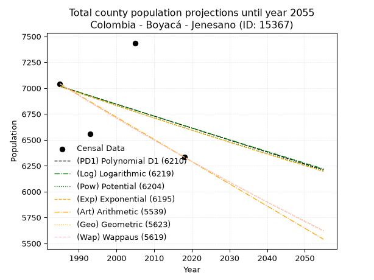
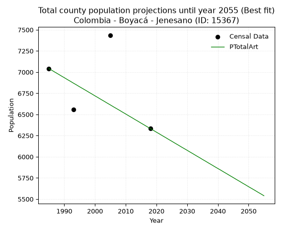
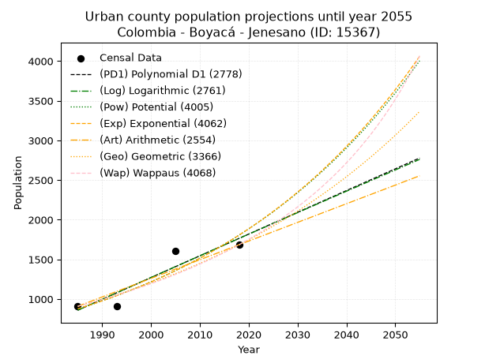
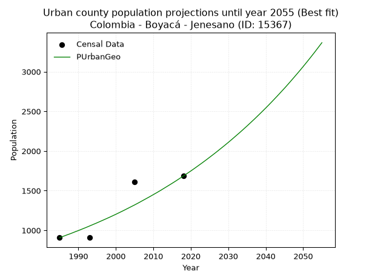
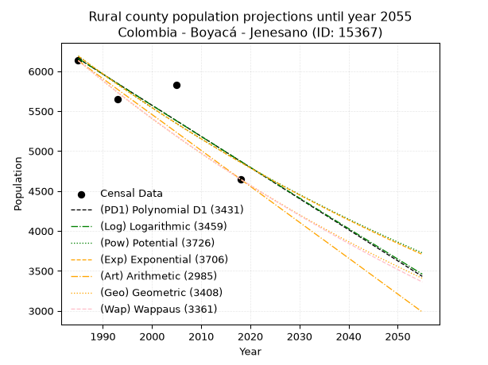
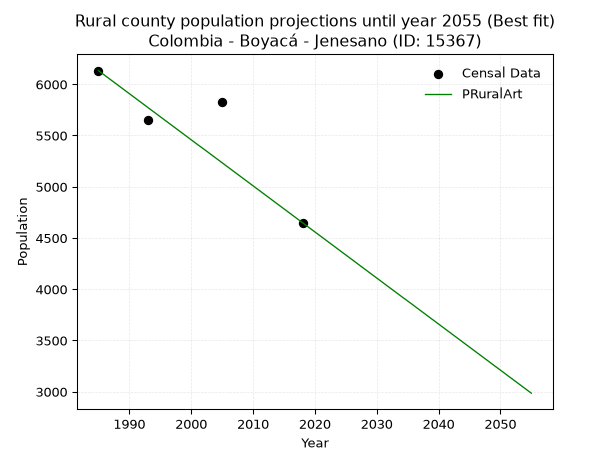

<div align="center">


</div>

# 📜 _“Population and Public Services Demand Projections (PPSD) until Year 2050 for Colombia - Boyacá - Jenesano (ID: 15367)”_
Keywords: `population` `public-service` `projection` `lineal` `polynomial` `logarithmic` `potential` `exponential` `arithmetic` `geometric` `wappaus` `dane` `colombia` `south-america`

PPSD are analytical estimates used by governments and planners to anticipate future changes in population size, age distribution, and the resulting community needs for utilities, healthcare, education, and infrastructure as sizing future water treatment facilities, electrical grids, and road networks based on spatial growth.

<div align="center">

</img>

</div>


> **General running parameters**: • app_version: _v20260806_. • Python version: _3.14.7_. • Pandas version: _3.0.5_. • NumPy version: _2.5.1_. • Creates, save and include plots into reports (create_plot): _False_. • Projection until year: _2050_. • Process polynomial degree 2 and up: _False_. • Process Wappaus: _True_. • Process Wappaus: _True_. • Set negative values to zero: _True_. • Set infinite values to zero: _True_. • Drop dataset notes: _True_. 
<div align="center">

Maps & GIS Layers: [:earth_americas:Google](http://maps.google.com/maps?q=5.385812844,-73.3637375) [:earth_americas:OSM](https://www.openstreetmap.org/#map=18/5.385812844/-73.3637375&layers=P) [:earth_americas:Bing](https://www.bing.com/maps?cp=5.385812844~-73.3637375&lvl=18) [:earth_americas:Apple](https://maps.apple.com/frame?center=5.385812844%2C-73.3637375&span=0.003%2C0.006) [:earth_americas:GISMobile](https://github.com/rcfdtools/R.GISMobile/blob/main/file/gis/CountyLayer_CO/Readme.md)

</div>


<div align="center">

```geojson
{
  "type": "Feature",
  "geometry": {
    "type": "Point", 
    "coordinates": [-73.3637375, 5.385812844]
  }, 
  "properties": {
    "Name": "Colombia - Boyacá - Jenesano (ID: 15367)"
  }
}
```

</div>


## 0. Census Data (4 records)

Census data are official statistics collected by a government about the people and housing in a country. They usually include counts of total population, age, sex, race, income, education, and jobs.

📅Global census file: [Population.xlsx](../data/Population.xlsx)

| Source   |   Year |   CountryID | CountryName   |   StateID | StateName   |   CountyID | CountyName   |   PTotal |   PUrban |   PRural |
|:---------|-------:|------------:|:--------------|----------:|:------------|-----------:|:-------------|---------:|---------:|---------:|
| DANE     |   1985 |          57 | Colombia      |        15 | Boyacá      |      15367 | Jenesano     |     7041 |      908 |     6133 |
| DANE     |   1993 |          57 | Colombia      |        15 | Boyacá      |      15367 | Jenesano     |     6559 |      911 |     5648 |
| DANE     |   2005 |          57 | Colombia      |        15 | Boyacá      |      15367 | Jenesano     |     7436 |     1607 |     5829 |
| DANE     |   2018 |          57 | Colombia      |        15 | Boyacá      |      15367 | Jenesano     |     6333 |     1684 |     4649 |

> 🔥Some records could had specific notes about the registered values or the corresponding urban or rural distribution.

📅[SUI-RUPS](https://www.datos.gov.co/Hacienda-y-Cr-dito-P-blico/Registro-nico-de-Prestadores-de-Servicios-P-blicos/4qkq-csdn/about_data) - Local public utility companies: [RUPS.csv](../data/RUPS.csv)

 | SERVICIO       | ESTADO    | NOMBRE                                                                                                     | NIT         | DEPARTAMENTO_DOMICILIO   | MUNICIPIO_DOMICILIO   | DIRECCION          |   TELEFONO | EMAIL                           | TIPO_PRESTADOR                 | CLASIFICACION                 |
|:---------------|:----------|:-----------------------------------------------------------------------------------------------------------|:------------|:-------------------------|:----------------------|:-------------------|-----------:|:--------------------------------|:-------------------------------|:------------------------------|
| ACUEDUCTO      | OPERATIVA | UNIDAD DE SERVICIOS PUBLICOS DE ACUEDUCTO, ALCANTARILLADO Y ASEO DE JENESANO                               | 891801376-4 | BOYACA                   | JENESANO              | Carrera 4 No. 7-11 |    7363258 | maribelpulidoaponte@hotmail.com | MUNICIPIO (PRESTACIÓN DIRECTA) | MENOR O IGUAL A 2500 USUARIOS |
| ALCANTARILLADO | OPERATIVA | UNIDAD DE SERVICIOS PUBLICOS DE ACUEDUCTO, ALCANTARILLADO Y ASEO DE JENESANO                               | 891801376-4 | BOYACA                   | JENESANO              | Carrera 4 No. 7-11 |    7363258 | maribelpulidoaponte@hotmail.com | MUNICIPIO (PRESTACIÓN DIRECTA) | MENOR O IGUAL A 2500 USUARIOS |
| ACUEDUCTO      | OPERATIVA | ASOCIACION DE SUSCRIPTORES DEL ACUEDUCTO AGUA CLARA  DE LA VEREDA FORAQUIRA DEL MUNICIPIO DE JENESANO      | 820004804-8 | BOYACA                   | JENESANO              | VEREDA FORAQUIRA   |    7363368 | juliorosorubio@hotmail.com      | ORGANIZACION AUTORIZADA        | MENOR O IGUAL A 2500 USUARIOS |
| ACUEDUCTO      | OPERATIVA | ASOCIACION DE SUSCRIPTORES ACUEDUCTO REGIONAL AGUA BLANCA DEL MUNICIPIO DE JENESANO DEPARTAMENTO DE BOYACA | 820005143-2 | BOYACA                   | JENESANO              | Calle 7  No. 3-43  |    7363134 | juliorosorubio@hotmail.com      | ORGANIZACION AUTORIZADA        | MENOR O IGUAL A 2500 USUARIOS |
| ACUEDUCTO      | OPERATIVA | ASOSICION DE SUSCRIPTORES ACUEDUCTO NARANJOS Y DELCEYES DEL MUNICIPIO DE JENESANO BOYACA                   | 820003292-2 | BOYACA                   | JENESANO              | VEREDA DULCEYES    |    7422723 | juliorosorubio@hotmail.com      | ORGANIZACION AUTORIZADA        | MENOR O IGUAL A 2500 USUARIOS |
| ACUEDUCTO      | OPERATIVA | ASOCIACIÓN  DE SUSCRIPTORES DEL ACUEDUCTO SAN PEDRO DE LAS VEREDAS DE SOLERES Y VOLADOR                    | 820004351-3 | BOYACA                   | JENESANO              | vereda dulceyes    |    7363367 | juliorosorubio@hotmail.com      | ORGANIZACION AUTORIZADA        | MENOR O IGUAL A 2500 USUARIOS |

## 1. Total

### 1.1. Coefficients and Parameters

* (PD1) Polynomial Deg 1: -11.555600160577457, 29956.33922119506 (lineal)
* (Log) Logarithmic: -23053.774697042045, 182074.1762135728
* (Pow) Potential: -3.5493679668391356, 15.551088043624084
* (Exp) Exponential: -0.0017787163960390044, 239619.28288449725
* (Art) Arithmetic: Year diff. 2018 - 1985 = 33, Population diff. 6333 - 7041 = -708, Annual growth = -21.454545454545453
* (Geo) Geometric: Year diff. 2018 - 1985 = 33, Population diff. 6333 - 7041 = -708, Annual growth % = -0.0032062473998770713
* (Wap) Wappaus: i = -0.3208396209742105, Condition values only valid for < 200)

<sub>
Wappaus condition values: ['-0.00', '-0.32', '-0.64', '-0.96', '-1.28', '-1.60', '-1.93', '-2.25', '-2.57', '-2.89', '-3.21', '-3.53', '-3.85', '-4.17', '-4.49', '-4.81', '-5.13', '-5.45', '-5.78', '-6.10', '-6.42', '-6.74', '-7.06', '-7.38', '-7.70', '-8.02', '-8.34', '-8.66', '-8.98', '-9.30', '-9.63', '-9.95', '-10.27', '-10.59', '-10.91', '-11.23', '-11.55', '-11.87', '-12.19', '-12.51', '-12.83', '-13.15', '-13.48', '-13.80', '-14.12', '-14.44', '-14.76', '-15.08', '-15.40', '-15.72', '-16.04', '-16.36', '-16.68', '-17.00', '-17.33', '-17.65', '-17.97', '-18.29', '-18.61', '-18.93', '-19.25', '-19.57', '-19.89', '-20.21', '-20.53', '-20.85']
</sub>


### 1.2. Projected Dataset

|   Year |   CountyID |   PTotalPD1 |   PTotalLog |   PTotalPow |   PTotalExp |   PTotalArt |   PTotalGeo |   PTotalWap |
|-------:|-----------:|------------:|------------:|------------:|------------:|------------:|------------:|------------:|
|   1985 |      15367 |        7018 |        7018 |        7017 |        7017 |        7041 |        7041 |        7041 |
|   1986 |      15367 |        7007 |        7007 |        7004 |        7004 |        7020 |        7018 |        7018 |
|   1987 |      15367 |        6995 |        6995 |        6991 |        6992 |        6998 |        6996 |        6996 |
|   1988 |      15367 |        6984 |        6983 |        6979 |        6979 |        6977 |        6973 |        6974 |
|   1989 |      15367 |        6972 |        6972 |        6967 |        6967 |        6955 |        6951 |        6951 |
|   1990 |      15367 |        6961 |        6960 |        6954 |        6955 |        6934 |        6929 |        6929 |
|   1991 |      15367 |        6949 |        6949 |        6942 |        6942 |        6912 |        6907 |        6907 |
|   1992 |      15367 |        6938 |        6937 |        6929 |        6930 |        6891 |        6884 |        6885 |
|   1993 |      15367 |        6926 |        6926 |        6917 |        6918 |        6869 |        6862 |        6863 |
|   1994 |      15367 |        6914 |        6914 |        6905 |        6905 |        6848 |        6840 |        6841 |
|   1995 |      15367 |        6903 |        6902 |        6892 |        6893 |        6826 |        6818 |        6819 |
|   1996 |      15367 |        6891 |        6891 |        6880 |        6881 |        6805 |        6797 |        6797 |
|   1997 |      15367 |        6880 |        6879 |        6868 |        6869 |        6784 |        6775 |        6775 |
|   1998 |      15367 |        6868 |        6868 |        6856 |        6856 |        6762 |        6753 |        6753 |
|   1999 |      15367 |        6857 |        6856 |        6844 |        6844 |        6741 |        6731 |        6732 |
|   2000 |      15367 |        6845 |        6845 |        6832 |        6832 |        6719 |        6710 |        6710 |
|   2001 |      15367 |        6834 |        6833 |        6819 |        6820 |        6698 |        6688 |        6689 |
|   2002 |      15367 |        6822 |        6822 |        6807 |        6808 |        6676 |        6667 |        6667 |
|   2003 |      15367 |        6810 |        6810 |        6795 |        6796 |        6655 |        6646 |        6646 |
|   2004 |      15367 |        6799 |        6799 |        6783 |        6784 |        6633 |        6624 |        6624 |
|   2005 |      15367 |        6787 |        6787 |        6771 |        6772 |        6612 |        6603 |        6603 |
|   2006 |      15367 |        6776 |        6776 |        6759 |        6759 |        6590 |        6582 |        6582 |
|   2007 |      15367 |        6764 |        6764 |        6747 |        6747 |        6569 |        6561 |        6561 |
|   2008 |      15367 |        6753 |        6753 |        6735 |        6735 |        6548 |        6540 |        6540 |
|   2009 |      15367 |        6741 |        6741 |        6724 |        6724 |        6526 |        6519 |        6519 |
|   2010 |      15367 |        6730 |        6730 |        6712 |        6712 |        6505 |        6498 |        6498 |
|   2011 |      15367 |        6718 |        6718 |        6700 |        6700 |        6483 |        6477 |        6477 |
|   2012 |      15367 |        6706 |        6707 |        6688 |        6688 |        6462 |        6456 |        6456 |
|   2013 |      15367 |        6695 |        6695 |        6676 |        6676 |        6440 |        6436 |        6436 |
|   2014 |      15367 |        6683 |        6684 |        6664 |        6664 |        6419 |        6415 |        6415 |
|   2015 |      15367 |        6672 |        6672 |        6653 |        6652 |        6397 |        6394 |        6394 |
|   2016 |      15367 |        6660 |        6661 |        6641 |        6640 |        6376 |        6374 |        6374 |
|   2017 |      15367 |        6649 |        6650 |        6629 |        6629 |        6354 |        6353 |        6353 |
|   2018 |      15367 |        6637 |        6638 |        6618 |        6617 |        6333 |        6333 |        6333 |
|   2019 |      15367 |        6626 |        6627 |        6606 |        6605 |        6312 |        6313 |        6313 |
|   2020 |      15367 |        6614 |        6615 |        6594 |        6593 |        6290 |        6292 |        6292 |
|   2021 |      15367 |        6602 |        6604 |        6583 |        6582 |        6269 |        6272 |        6272 |
|   2022 |      15367 |        6591 |        6592 |        6571 |        6570 |        6247 |        6252 |        6252 |
|   2023 |      15367 |        6579 |        6581 |        6560 |        6558 |        6226 |        6232 |        6232 |
|   2024 |      15367 |        6568 |        6570 |        6548 |        6546 |        6204 |        6212 |        6212 |
|   2025 |      15367 |        6556 |        6558 |        6537 |        6535 |        6183 |        6192 |        6192 |
|   2026 |      15367 |        6545 |        6547 |        6525 |        6523 |        6161 |        6172 |        6172 |
|   2027 |      15367 |        6533 |        6536 |        6514 |        6512 |        6140 |        6153 |        6152 |
|   2028 |      15367 |        6522 |        6524 |        6503 |        6500 |        6118 |        6133 |        6132 |
|   2029 |      15367 |        6510 |        6513 |        6491 |        6489 |        6097 |        6113 |        6113 |
|   2030 |      15367 |        6498 |        6501 |        6480 |        6477 |        6076 |        6094 |        6093 |
|   2031 |      15367 |        6487 |        6490 |        6469 |        6465 |        6054 |        6074 |        6073 |
|   2032 |      15367 |        6475 |        6479 |        6457 |        6454 |        6033 |        6055 |        6054 |
|   2033 |      15367 |        6464 |        6467 |        6446 |        6443 |        6011 |        6035 |        6034 |
|   2034 |      15367 |        6452 |        6456 |        6435 |        6431 |        5990 |        6016 |        6015 |
|   2035 |      15367 |        6441 |        6445 |        6424 |        6420 |        5968 |        5997 |        5995 |
|   2036 |      15367 |        6429 |        6433 |        6412 |        6408 |        5947 |        5977 |        5976 |
|   2037 |      15367 |        6418 |        6422 |        6401 |        6397 |        5925 |        5958 |        5957 |
|   2038 |      15367 |        6406 |        6411 |        6390 |        6385 |        5904 |        5939 |        5938 |
|   2039 |      15367 |        6394 |        6399 |        6379 |        6374 |        5882 |        5920 |        5918 |
|   2040 |      15367 |        6383 |        6388 |        6368 |        6363 |        5861 |        5901 |        5899 |
|   2041 |      15367 |        6371 |        6377 |        6357 |        6352 |        5840 |        5882 |        5880 |
|   2042 |      15367 |        6360 |        6366 |        6346 |        6340 |        5818 |        5863 |        5861 |
|   2043 |      15367 |        6348 |        6354 |        6335 |        6329 |        5797 |        5844 |        5842 |
|   2044 |      15367 |        6337 |        6343 |        6324 |        6318 |        5775 |        5826 |        5823 |
|   2045 |      15367 |        6325 |        6332 |        6313 |        6306 |        5754 |        5807 |        5805 |
|   2046 |      15367 |        6314 |        6320 |        6302 |        6295 |        5732 |        5788 |        5786 |
|   2047 |      15367 |        6302 |        6309 |        6291 |        6284 |        5711 |        5770 |        5767 |
|   2048 |      15367 |        6290 |        6298 |        6280 |        6273 |        5689 |        5751 |        5748 |
|   2049 |      15367 |        6279 |        6287 |        6269 |        6262 |        5668 |        5733 |        5730 |
|   2050 |      15367 |        6267 |        6275 |        6258 |        6251 |        5646 |        5715 |        5711 |
<div align="center">

</img>

</div>


### 1.3. Best fit with absolute and relative error (%)

Relative error puts that difference into context by dividing the absolute error by the true value, creating a unitless ratio or percentage that shows the scale of the mistake.

Absolute and relative error

|   Year | Source   |   CountryID | CountryName   |   StateID | StateName   |   CountyID_x | CountyName   |   PTotal |   PUrban |   PRural |   CountyID_y |   PTotalPD1 |   PTotalLog |   PTotalPow |   PTotalExp |   PTotalArt |   PTotalGeo |   PTotalWap |   PTotalPD1AbsError |   PTotalLogAbsError |   PTotalPowAbsError |   PTotalExpAbsError |   PTotalArtAbsError |   PTotalGeoAbsError |   PTotalWapAbsError |   PTotalPD1RelError |   PTotalLogRelError |   PTotalPowRelError |   PTotalExpRelError |   PTotalArtRelError |   PTotalGeoRelError |   PTotalWapRelError |
|-------:|:---------|------------:|:--------------|----------:|:------------|-------------:|:-------------|---------:|---------:|---------:|-------------:|------------:|------------:|------------:|------------:|------------:|------------:|------------:|--------------------:|--------------------:|--------------------:|--------------------:|--------------------:|--------------------:|--------------------:|--------------------:|--------------------:|--------------------:|--------------------:|--------------------:|--------------------:|--------------------:|
|   1985 | DANE     |          57 | Colombia      |        15 | Boyacá      |        15367 | Jenesano     |     7041 |      908 |     6133 |        15367 |        7018 |        7018 |        7017 |        7017 |        7041 |        7041 |        7041 |                  23 |                  23 |                  24 |                  24 |                   0 |                   0 |                   0 |            0.326658 |            0.326658 |            0.340861 |            0.340861 |             0       |             0       |             0       |
|   1993 | DANE     |          57 | Colombia      |        15 | Boyacá      |        15367 | Jenesano     |     6559 |      911 |     5648 |        15367 |        6926 |        6926 |        6917 |        6918 |        6869 |        6862 |        6863 |                 367 |                 367 |                 358 |                 359 |                 310 |                 303 |                 304 |            5.59537  |            5.59537  |            5.45815  |            5.4734   |             4.72633 |             4.61961 |             4.63485 |
|   2005 | DANE     |          57 | Colombia      |        15 | Boyacá      |        15367 | Jenesano     |     7436 |     1607 |     5829 |        15367 |        6787 |        6787 |        6771 |        6772 |        6612 |        6603 |        6603 |                 649 |                 649 |                 665 |                 664 |                 824 |                 833 |                 833 |            8.72781  |            8.72781  |            8.94298  |            8.92953  |            11.0812  |            11.2023  |            11.2023  |
|   2018 | DANE     |          57 | Colombia      |        15 | Boyacá      |        15367 | Jenesano     |     6333 |     1684 |     4649 |        15367 |        6637 |        6638 |        6618 |        6617 |        6333 |        6333 |        6333 |                 304 |                 305 |                 285 |                 284 |                   0 |                   0 |                   0 |            4.80025  |            4.81604  |            4.50024  |            4.48445  |             0       |             0       |             0       |

Relative error mean

| Method    |   RelError | Best   |
|:----------|-----------:|:-------|
| PTotalPD1 |    4.86252 |        |
| PTotalLog |    4.86647 |        |
| PTotalPow |    4.81056 |        |
| PTotalExp |    4.80706 |        |
| PTotalArt |    3.95189 | True   |
| PTotalGeo |    3.95547 |        |
| PTotalWap |    3.95928 |        |

💙Best method: _**PTotalArt**_
<div align="center">

</img>

</div>


### 1.4. Fresh water supply demand in liters per capita per day (lpcd)

The fresh water supply demand typically ranges from 100 to 300 liters per capita per day (lpcd) for standard domestic and municipal planning, though absolute survival minimums set by the World Health Organization are as low as 7.5 to 20 liters per day, and total consumption in high-income nations can exceed 400 liters.

> `CZ`: Level in meters above the sea level (masl)<br> `WS`: Fresh water supply demand in liters per capita per day (lpcd or l/h/d)<br> `WSAll`: Zonal fresh water supply demand in liters per second (l/s)<br> `A`: Zonal area in square meters<br> `DP`: Population density (people/hectare or p/ha)

Reference values (RAS Colombia)

|    CZ |   WS |
|------:|-----:|
|  1000 |  120 |
|  2000 |  130 |
| 99999 |  140 |

County shapefile geometry properties and water supply values

|   CountyID |      ATotal |   CZTotal |   WSTotal |
|-----------:|------------:|----------:|----------:|
|      15367 | 5.89502e+07 |   2425.62 |       140 |

Projected values for best method: PTotalArt

|   CountyID |   Year |   PTotalArt |   DPTotal |   WSTotal |   WSTotalAll |
|-----------:|-------:|------------:|----------:|----------:|-------------:|
|      15367 |   1985 |        7041 |      1.19 |       140 |     11.409   |
|      15367 |   1986 |        7020 |      1.19 |       140 |     11.375   |
|      15367 |   1987 |        6998 |      1.19 |       140 |     11.3394  |
|      15367 |   1988 |        6977 |      1.18 |       140 |     11.3053  |
|      15367 |   1989 |        6955 |      1.18 |       140 |     11.2697  |
|      15367 |   1990 |        6934 |      1.18 |       140 |     11.2356  |
|      15367 |   1991 |        6912 |      1.17 |       140 |     11.2     |
|      15367 |   1992 |        6891 |      1.17 |       140 |     11.166   |
|      15367 |   1993 |        6869 |      1.17 |       140 |     11.1303  |
|      15367 |   1994 |        6848 |      1.16 |       140 |     11.0963  |
|      15367 |   1995 |        6826 |      1.16 |       140 |     11.0606  |
|      15367 |   1996 |        6805 |      1.15 |       140 |     11.0266  |
|      15367 |   1997 |        6784 |      1.15 |       140 |     10.9926  |
|      15367 |   1998 |        6762 |      1.15 |       140 |     10.9569  |
|      15367 |   1999 |        6741 |      1.14 |       140 |     10.9229  |
|      15367 |   2000 |        6719 |      1.14 |       140 |     10.8873  |
|      15367 |   2001 |        6698 |      1.14 |       140 |     10.8532  |
|      15367 |   2002 |        6676 |      1.13 |       140 |     10.8176  |
|      15367 |   2003 |        6655 |      1.13 |       140 |     10.7836  |
|      15367 |   2004 |        6633 |      1.13 |       140 |     10.7479  |
|      15367 |   2005 |        6612 |      1.12 |       140 |     10.7139  |
|      15367 |   2006 |        6590 |      1.12 |       140 |     10.6782  |
|      15367 |   2007 |        6569 |      1.11 |       140 |     10.6442  |
|      15367 |   2008 |        6548 |      1.11 |       140 |     10.6102  |
|      15367 |   2009 |        6526 |      1.11 |       140 |     10.5745  |
|      15367 |   2010 |        6505 |      1.1  |       140 |     10.5405  |
|      15367 |   2011 |        6483 |      1.1  |       140 |     10.5049  |
|      15367 |   2012 |        6462 |      1.1  |       140 |     10.4708  |
|      15367 |   2013 |        6440 |      1.09 |       140 |     10.4352  |
|      15367 |   2014 |        6419 |      1.09 |       140 |     10.4012  |
|      15367 |   2015 |        6397 |      1.09 |       140 |     10.3655  |
|      15367 |   2016 |        6376 |      1.08 |       140 |     10.3315  |
|      15367 |   2017 |        6354 |      1.08 |       140 |     10.2958  |
|      15367 |   2018 |        6333 |      1.07 |       140 |     10.2618  |
|      15367 |   2019 |        6312 |      1.07 |       140 |     10.2278  |
|      15367 |   2020 |        6290 |      1.07 |       140 |     10.1921  |
|      15367 |   2021 |        6269 |      1.06 |       140 |     10.1581  |
|      15367 |   2022 |        6247 |      1.06 |       140 |     10.1225  |
|      15367 |   2023 |        6226 |      1.06 |       140 |     10.0884  |
|      15367 |   2024 |        6204 |      1.05 |       140 |     10.0528  |
|      15367 |   2025 |        6183 |      1.05 |       140 |     10.0188  |
|      15367 |   2026 |        6161 |      1.05 |       140 |      9.9831  |
|      15367 |   2027 |        6140 |      1.04 |       140 |      9.94907 |
|      15367 |   2028 |        6118 |      1.04 |       140 |      9.91343 |
|      15367 |   2029 |        6097 |      1.03 |       140 |      9.8794  |
|      15367 |   2030 |        6076 |      1.03 |       140 |      9.84537 |
|      15367 |   2031 |        6054 |      1.03 |       140 |      9.80972 |
|      15367 |   2032 |        6033 |      1.02 |       140 |      9.77569 |
|      15367 |   2033 |        6011 |      1.02 |       140 |      9.74005 |
|      15367 |   2034 |        5990 |      1.02 |       140 |      9.70602 |
|      15367 |   2035 |        5968 |      1.01 |       140 |      9.67037 |
|      15367 |   2036 |        5947 |      1.01 |       140 |      9.63634 |
|      15367 |   2037 |        5925 |      1.01 |       140 |      9.60069 |
|      15367 |   2038 |        5904 |      1    |       140 |      9.56667 |
|      15367 |   2039 |        5882 |      1    |       140 |      9.53102 |
|      15367 |   2040 |        5861 |      0.99 |       140 |      9.49699 |
|      15367 |   2041 |        5840 |      0.99 |       140 |      9.46296 |
|      15367 |   2042 |        5818 |      0.99 |       140 |      9.42731 |
|      15367 |   2043 |        5797 |      0.98 |       140 |      9.39329 |
|      15367 |   2044 |        5775 |      0.98 |       140 |      9.35764 |
|      15367 |   2045 |        5754 |      0.98 |       140 |      9.32361 |
|      15367 |   2046 |        5732 |      0.97 |       140 |      9.28796 |
|      15367 |   2047 |        5711 |      0.97 |       140 |      9.25394 |
|      15367 |   2048 |        5689 |      0.97 |       140 |      9.21829 |
|      15367 |   2049 |        5668 |      0.96 |       140 |      9.18426 |
|      15367 |   2050 |        5646 |      0.96 |       140 |      9.14861 |

## 2. Urban

### 2.1. Coefficients and Parameters

* (PD1) Polynomial Deg 1: 27.414692894419815, -53558.73946206323 (lineal)
* (Log) Logarithmic: 54888.36086730873, -415929.37080013315
* (Pow) Potential: 43.89193712068395, -141.803122528064
* (Exp) Exponential: 0.021921534590428015, 1.1074074274615003e-16
* (Art) Arithmetic: Year diff. 2018 - 1985 = 33, Population diff. 1684 - 908 = 776, Annual growth = 23.515151515151516
* (Geo) Geometric: Year diff. 2018 - 1985 = 33, Population diff. 1684 - 908 = 776, Annual growth % = 0.0188939346071193
* (Wap) Wappaus: i = 1.8144407033295922, Condition values only valid for < 200)

<sub>
Wappaus condition values: ['0.00', '1.81', '3.63', '5.44', '7.26', '9.07', '10.89', '12.70', '14.52', '16.33', '18.14', '19.96', '21.77', '23.59', '25.40', '27.22', '29.03', '30.85', '32.66', '34.47', '36.29', '38.10', '39.92', '41.73', '43.55', '45.36', '47.18', '48.99', '50.80', '52.62', '54.43', '56.25', '58.06', '59.88', '61.69', '63.51', '65.32', '67.13', '68.95', '70.76', '72.58', '74.39', '76.21', '78.02', '79.84', '81.65', '83.46', '85.28', '87.09', '88.91', '90.72', '92.54', '94.35', '96.17', '97.98', '99.79', '101.61', '103.42', '105.24', '107.05', '108.87', '110.68', '112.50', '114.31', '116.12', '117.94']
</sub>


### 2.2. Projected Dataset

|   Year |   CountyID |   PUrbanPD1 |   PUrbanLog |   PUrbanPow |   PUrbanExp |   PUrbanArt |   PUrbanGeo |   PUrbanWap |
|-------:|-----------:|------------:|------------:|------------:|------------:|------------:|------------:|------------:|
|   1985 |      15367 |         859 |         858 |         875 |         876 |         908 |         908 |         908 |
|   1986 |      15367 |         887 |         886 |         894 |         895 |         932 |         925 |         925 |
|   1987 |      15367 |         914 |         914 |         914 |         915 |         955 |         943 |         942 |
|   1988 |      15367 |         942 |         941 |         935 |         935 |         979 |         960 |         959 |
|   1989 |      15367 |         969 |         969 |         956 |         956 |        1002 |         979 |         976 |
|   1990 |      15367 |         996 |         997 |         977 |         977 |        1026 |         997 |         994 |
|   1991 |      15367 |        1024 |        1024 |         999 |         999 |        1049 |        1016 |        1013 |
|   1992 |      15367 |        1051 |        1052 |        1021 |        1021 |        1073 |        1035 |        1031 |
|   1993 |      15367 |        1079 |        1079 |        1044 |        1043 |        1096 |        1055 |        1050 |
|   1994 |      15367 |        1106 |        1107 |        1067 |        1067 |        1120 |        1075 |        1069 |
|   1995 |      15367 |        1134 |        1134 |        1091 |        1090 |        1143 |        1095 |        1089 |
|   1996 |      15367 |        1161 |        1162 |        1115 |        1114 |        1167 |        1116 |        1109 |
|   1997 |      15367 |        1188 |        1189 |        1140 |        1139 |        1190 |        1137 |        1130 |
|   1998 |      15367 |        1216 |        1217 |        1165 |        1164 |        1214 |        1158 |        1151 |
|   1999 |      15367 |        1243 |        1244 |        1191 |        1190 |        1237 |        1180 |        1172 |
|   2000 |      15367 |        1271 |        1272 |        1218 |        1216 |        1261 |        1202 |        1194 |
|   2001 |      15367 |        1298 |        1299 |        1245 |        1243 |        1284 |        1225 |        1216 |
|   2002 |      15367 |        1325 |        1327 |        1272 |        1271 |        1308 |        1248 |        1239 |
|   2003 |      15367 |        1353 |        1354 |        1300 |        1299 |        1331 |        1272 |        1262 |
|   2004 |      15367 |        1380 |        1381 |        1329 |        1328 |        1355 |        1296 |        1286 |
|   2005 |      15367 |        1408 |        1409 |        1359 |        1357 |        1378 |        1320 |        1311 |
|   2006 |      15367 |        1435 |        1436 |        1389 |        1387 |        1402 |        1345 |        1335 |
|   2007 |      15367 |        1463 |        1463 |        1419 |        1418 |        1425 |        1371 |        1361 |
|   2008 |      15367 |        1490 |        1491 |        1451 |        1450 |        1449 |        1397 |        1387 |
|   2009 |      15367 |        1517 |        1518 |        1483 |        1482 |        1472 |        1423 |        1413 |
|   2010 |      15367 |        1545 |        1545 |        1515 |        1515 |        1496 |        1450 |        1441 |
|   2011 |      15367 |        1572 |        1573 |        1549 |        1548 |        1519 |        1477 |        1469 |
|   2012 |      15367 |        1600 |        1600 |        1583 |        1583 |        1543 |        1505 |        1497 |
|   2013 |      15367 |        1627 |        1627 |        1618 |        1618 |        1566 |        1534 |        1526 |
|   2014 |      15367 |        1654 |        1655 |        1654 |        1653 |        1590 |        1563 |        1556 |
|   2015 |      15367 |        1682 |        1682 |        1690 |        1690 |        1613 |        1592 |        1587 |
|   2016 |      15367 |        1709 |        1709 |        1727 |        1728 |        1637 |        1622 |        1619 |
|   2017 |      15367 |        1737 |        1736 |        1765 |        1766 |        1660 |        1653 |        1651 |
|   2018 |      15367 |        1764 |        1763 |        1804 |        1805 |        1684 |        1684 |        1684 |
|   2019 |      15367 |        1792 |        1791 |        1844 |        1845 |        1708 |        1716 |        1718 |
|   2020 |      15367 |        1819 |        1818 |        1884 |        1886 |        1731 |        1748 |        1753 |
|   2021 |      15367 |        1846 |        1845 |        1926 |        1928 |        1755 |        1781 |        1789 |
|   2022 |      15367 |        1874 |        1872 |        1968 |        1970 |        1778 |        1815 |        1826 |
|   2023 |      15367 |        1901 |        1899 |        2011 |        2014 |        1802 |        1849 |        1863 |
|   2024 |      15367 |        1929 |        1926 |        2055 |        2059 |        1825 |        1884 |        1902 |
|   2025 |      15367 |        1956 |        1954 |        2100 |        2104 |        1849 |        1920 |        1942 |
|   2026 |      15367 |        1983 |        1981 |        2146 |        2151 |        1872 |        1956 |        1984 |
|   2027 |      15367 |        2011 |        2008 |        2193 |        2199 |        1896 |        1993 |        2026 |
|   2028 |      15367 |        2038 |        2035 |        2241 |        2247 |        1919 |        2031 |        2070 |
|   2029 |      15367 |        2066 |        2062 |        2290 |        2297 |        1943 |        2069 |        2115 |
|   2030 |      15367 |        2093 |        2089 |        2340 |        2348 |        1966 |        2108 |        2161 |
|   2031 |      15367 |        2121 |        2116 |        2392 |        2400 |        1990 |        2148 |        2209 |
|   2032 |      15367 |        2148 |        2143 |        2444 |        2453 |        2013 |        2189 |        2258 |
|   2033 |      15367 |        2175 |        2170 |        2497 |        2508 |        2037 |        2230 |        2309 |
|   2034 |      15367 |        2203 |        2197 |        2552 |        2563 |        2060 |        2272 |        2361 |
|   2035 |      15367 |        2230 |        2224 |        2607 |        2620 |        2084 |        2315 |        2416 |
|   2036 |      15367 |        2258 |        2251 |        2664 |        2678 |        2107 |        2359 |        2472 |
|   2037 |      15367 |        2285 |        2278 |        2722 |        2738 |        2131 |        2403 |        2530 |
|   2038 |      15367 |        2312 |        2305 |        2781 |        2798 |        2154 |        2449 |        2590 |
|   2039 |      15367 |        2340 |        2332 |        2842 |        2860 |        2178 |        2495 |        2652 |
|   2040 |      15367 |        2367 |        2359 |        2904 |        2924 |        2201 |        2542 |        2717 |
|   2041 |      15367 |        2395 |        2386 |        2967 |        2988 |        2225 |        2590 |        2783 |
|   2042 |      15367 |        2422 |        2412 |        3031 |        3055 |        2248 |        2639 |        2853 |
|   2043 |      15367 |        2449 |        2439 |        3097 |        3122 |        2272 |        2689 |        2925 |
|   2044 |      15367 |        2477 |        2466 |        3164 |        3192 |        2295 |        2740 |        3000 |
|   2045 |      15367 |        2504 |        2493 |        3233 |        3262 |        2319 |        2791 |        3077 |
|   2046 |      15367 |        2532 |        2520 |        3303 |        3335 |        2342 |        2844 |        3158 |
|   2047 |      15367 |        2559 |        2547 |        3375 |        3409 |        2366 |        2898 |        3243 |
|   2048 |      15367 |        2587 |        2573 |        3448 |        3484 |        2389 |        2953 |        3331 |
|   2049 |      15367 |        2614 |        2600 |        3523 |        3561 |        2413 |        3008 |        3422 |
|   2050 |      15367 |        2641 |        2627 |        3599 |        3640 |        2436 |        3065 |        3518 |
<div align="center">

</img>

</div>


### 2.3. Best fit with absolute and relative error (%)

Relative error puts that difference into context by dividing the absolute error by the true value, creating a unitless ratio or percentage that shows the scale of the mistake.

Absolute and relative error

|   Year | Source   |   CountryID | CountryName   |   StateID | StateName   |   CountyID_x | CountyName   |   PTotal |   PUrban |   PRural |   CountyID_y |   PUrbanPD1 |   PUrbanLog |   PUrbanPow |   PUrbanExp |   PUrbanArt |   PUrbanGeo |   PUrbanWap |   PUrbanPD1AbsError |   PUrbanLogAbsError |   PUrbanPowAbsError |   PUrbanExpAbsError |   PUrbanArtAbsError |   PUrbanGeoAbsError |   PUrbanWapAbsError |   PUrbanPD1RelError |   PUrbanLogRelError |   PUrbanPowRelError |   PUrbanExpRelError |   PUrbanArtRelError |   PUrbanGeoRelError |   PUrbanWapRelError |
|-------:|:---------|------------:|:--------------|----------:|:------------|-------------:|:-------------|---------:|---------:|---------:|-------------:|------------:|------------:|------------:|------------:|------------:|------------:|------------:|--------------------:|--------------------:|--------------------:|--------------------:|--------------------:|--------------------:|--------------------:|--------------------:|--------------------:|--------------------:|--------------------:|--------------------:|--------------------:|--------------------:|
|   1985 | DANE     |          57 | Colombia      |        15 | Boyacá      |        15367 | Jenesano     |     7041 |      908 |     6133 |        15367 |         859 |         858 |         875 |         876 |         908 |         908 |         908 |                  49 |                  50 |                  33 |                  32 |                   0 |                   0 |                   0 |             5.39648 |             5.50661 |             3.63436 |             3.52423 |              0      |              0      |              0      |
|   1993 | DANE     |          57 | Colombia      |        15 | Boyacá      |        15367 | Jenesano     |     6559 |      911 |     5648 |        15367 |        1079 |        1079 |        1044 |        1043 |        1096 |        1055 |        1050 |                 168 |                 168 |                 133 |                 132 |                 185 |                 144 |                 139 |            18.4413  |            18.4413  |            14.5993  |            14.4896  |             20.3074 |             15.8068 |             15.258  |
|   2005 | DANE     |          57 | Colombia      |        15 | Boyacá      |        15367 | Jenesano     |     7436 |     1607 |     5829 |        15367 |        1408 |        1409 |        1359 |        1357 |        1378 |        1320 |        1311 |                 199 |                 198 |                 248 |                 250 |                 229 |                 287 |                 296 |            12.3833  |            12.3211  |            15.4325  |            15.5569  |             14.2502 |             17.8594 |             18.4194 |
|   2018 | DANE     |          57 | Colombia      |        15 | Boyacá      |        15367 | Jenesano     |     6333 |     1684 |     4649 |        15367 |        1764 |        1763 |        1804 |        1805 |        1684 |        1684 |        1684 |                  80 |                  79 |                 120 |                 121 |                   0 |                   0 |                   0 |             4.75059 |             4.69121 |             7.12589 |             7.18527 |              0      |              0      |              0      |

Relative error mean

| Method    |   RelError | Best   |
|:----------|-----------:|:-------|
| PUrbanPD1 |   10.2429  |        |
| PUrbanLog |   10.24    |        |
| PUrbanPow |   10.198   |        |
| PUrbanExp |   10.189   |        |
| PUrbanArt |    8.63938 |        |
| PUrbanGeo |    8.41654 | True   |
| PUrbanWap |    8.41934 |        |

💙Best method: _**PUrbanGeo**_
<div align="center">

</img>

</div>


### 2.4. Fresh water supply demand in liters per capita per day (lpcd)

The fresh water supply demand typically ranges from 100 to 300 liters per capita per day (lpcd) for standard domestic and municipal planning, though absolute survival minimums set by the World Health Organization are as low as 7.5 to 20 liters per day, and total consumption in high-income nations can exceed 400 liters.

> `CZ`: Level in meters above the sea level (masl)<br> `WS`: Fresh water supply demand in liters per capita per day (lpcd or l/h/d)<br> `WSAll`: Zonal fresh water supply demand in liters per second (l/s)<br> `A`: Zonal area in square meters<br> `DP`: Population density (people/hectare or p/ha)

Reference values (RAS Colombia)

|    CZ |   WS |
|------:|-----:|
|  1000 |  120 |
|  2000 |  130 |
| 99999 |  140 |

County shapefile geometry properties and water supply values

|   CountyID |   AUrban |   CZUrban |   WSUrban |
|-----------:|---------:|----------:|----------:|
|      15367 |   800104 |   2088.96 |       140 |

Projected values for best method: PUrbanGeo

|   CountyID |   Year |   PUrbanGeo |   DPUrban |   WSUrban |   WSUrbanAll |
|-----------:|-------:|------------:|----------:|----------:|-------------:|
|      15367 |   1985 |         908 |     11.35 |       140 |      1.4713  |
|      15367 |   1986 |         925 |     11.56 |       140 |      1.49884 |
|      15367 |   1987 |         943 |     11.79 |       140 |      1.52801 |
|      15367 |   1988 |         960 |     12    |       140 |      1.55556 |
|      15367 |   1989 |         979 |     12.24 |       140 |      1.58634 |
|      15367 |   1990 |         997 |     12.46 |       140 |      1.61551 |
|      15367 |   1991 |        1016 |     12.7  |       140 |      1.6463  |
|      15367 |   1992 |        1035 |     12.94 |       140 |      1.67708 |
|      15367 |   1993 |        1055 |     13.19 |       140 |      1.70949 |
|      15367 |   1994 |        1075 |     13.44 |       140 |      1.7419  |
|      15367 |   1995 |        1095 |     13.69 |       140 |      1.77431 |
|      15367 |   1996 |        1116 |     13.95 |       140 |      1.80833 |
|      15367 |   1997 |        1137 |     14.21 |       140 |      1.84236 |
|      15367 |   1998 |        1158 |     14.47 |       140 |      1.87639 |
|      15367 |   1999 |        1180 |     14.75 |       140 |      1.91204 |
|      15367 |   2000 |        1202 |     15.02 |       140 |      1.94769 |
|      15367 |   2001 |        1225 |     15.31 |       140 |      1.98495 |
|      15367 |   2002 |        1248 |     15.6  |       140 |      2.02222 |
|      15367 |   2003 |        1272 |     15.9  |       140 |      2.06111 |
|      15367 |   2004 |        1296 |     16.2  |       140 |      2.1     |
|      15367 |   2005 |        1320 |     16.5  |       140 |      2.13889 |
|      15367 |   2006 |        1345 |     16.81 |       140 |      2.1794  |
|      15367 |   2007 |        1371 |     17.14 |       140 |      2.22153 |
|      15367 |   2008 |        1397 |     17.46 |       140 |      2.26366 |
|      15367 |   2009 |        1423 |     17.79 |       140 |      2.30579 |
|      15367 |   2010 |        1450 |     18.12 |       140 |      2.34954 |
|      15367 |   2011 |        1477 |     18.46 |       140 |      2.39329 |
|      15367 |   2012 |        1505 |     18.81 |       140 |      2.43866 |
|      15367 |   2013 |        1534 |     19.17 |       140 |      2.48565 |
|      15367 |   2014 |        1563 |     19.53 |       140 |      2.53264 |
|      15367 |   2015 |        1592 |     19.9  |       140 |      2.57963 |
|      15367 |   2016 |        1622 |     20.27 |       140 |      2.62824 |
|      15367 |   2017 |        1653 |     20.66 |       140 |      2.67847 |
|      15367 |   2018 |        1684 |     21.05 |       140 |      2.7287  |
|      15367 |   2019 |        1716 |     21.45 |       140 |      2.78056 |
|      15367 |   2020 |        1748 |     21.85 |       140 |      2.83241 |
|      15367 |   2021 |        1781 |     22.26 |       140 |      2.88588 |
|      15367 |   2022 |        1815 |     22.68 |       140 |      2.94097 |
|      15367 |   2023 |        1849 |     23.11 |       140 |      2.99606 |
|      15367 |   2024 |        1884 |     23.55 |       140 |      3.05278 |
|      15367 |   2025 |        1920 |     24    |       140 |      3.11111 |
|      15367 |   2026 |        1956 |     24.45 |       140 |      3.16944 |
|      15367 |   2027 |        1993 |     24.91 |       140 |      3.2294  |
|      15367 |   2028 |        2031 |     25.38 |       140 |      3.29097 |
|      15367 |   2029 |        2069 |     25.86 |       140 |      3.35255 |
|      15367 |   2030 |        2108 |     26.35 |       140 |      3.41574 |
|      15367 |   2031 |        2148 |     26.85 |       140 |      3.48056 |
|      15367 |   2032 |        2189 |     27.36 |       140 |      3.54699 |
|      15367 |   2033 |        2230 |     27.87 |       140 |      3.61343 |
|      15367 |   2034 |        2272 |     28.4  |       140 |      3.68148 |
|      15367 |   2035 |        2315 |     28.93 |       140 |      3.75116 |
|      15367 |   2036 |        2359 |     29.48 |       140 |      3.82245 |
|      15367 |   2037 |        2403 |     30.03 |       140 |      3.89375 |
|      15367 |   2038 |        2449 |     30.61 |       140 |      3.96829 |
|      15367 |   2039 |        2495 |     31.18 |       140 |      4.04282 |
|      15367 |   2040 |        2542 |     31.77 |       140 |      4.11898 |
|      15367 |   2041 |        2590 |     32.37 |       140 |      4.19676 |
|      15367 |   2042 |        2639 |     32.98 |       140 |      4.27616 |
|      15367 |   2043 |        2689 |     33.61 |       140 |      4.35718 |
|      15367 |   2044 |        2740 |     34.25 |       140 |      4.43981 |
|      15367 |   2045 |        2791 |     34.88 |       140 |      4.52245 |
|      15367 |   2046 |        2844 |     35.55 |       140 |      4.60833 |
|      15367 |   2047 |        2898 |     36.22 |       140 |      4.69583 |
|      15367 |   2048 |        2953 |     36.91 |       140 |      4.78495 |
|      15367 |   2049 |        3008 |     37.6  |       140 |      4.87407 |
|      15367 |   2050 |        3065 |     38.31 |       140 |      4.96644 |

## 3. Rural

### 3.1. Coefficients and Parameters

* (PD1) Polynomial Deg 1: -38.97029305499726, 83515.07868325828 (lineal)
* (Log) Logarithmic: -77942.13556435076, 598003.5470137057
* (Pow) Potential: -14.648753504841991, 52.09977655296641
* (Exp) Exponential: -0.007324810628786406, 12769540471.810816
* (Art) Arithmetic: Year diff. 2018 - 1985 = 33, Population diff. 4649 - 6133 = -1484, Annual growth = -44.96969696969697
* (Geo) Geometric: Year diff. 2018 - 1985 = 33, Population diff. 4649 - 6133 = -1484, Annual growth % = -0.008359766751784403
* (Wap) Wappaus: i = -0.8341624368335554, Condition values only valid for < 200)

<sub>
Wappaus condition values: ['-0.00', '-0.83', '-1.67', '-2.50', '-3.34', '-4.17', '-5.00', '-5.84', '-6.67', '-7.51', '-8.34', '-9.18', '-10.01', '-10.84', '-11.68', '-12.51', '-13.35', '-14.18', '-15.01', '-15.85', '-16.68', '-17.52', '-18.35', '-19.19', '-20.02', '-20.85', '-21.69', '-22.52', '-23.36', '-24.19', '-25.02', '-25.86', '-26.69', '-27.53', '-28.36', '-29.20', '-30.03', '-30.86', '-31.70', '-32.53', '-33.37', '-34.20', '-35.03', '-35.87', '-36.70', '-37.54', '-38.37', '-39.21', '-40.04', '-40.87', '-41.71', '-42.54', '-43.38', '-44.21', '-45.04', '-45.88', '-46.71', '-47.55', '-48.38', '-49.22', '-50.05', '-50.88', '-51.72', '-52.55', '-53.39', '-54.22']
</sub>


### 3.2. Projected Dataset

|   Year |   CountyID |   PRuralPD1 |   PRuralLog |   PRuralPow |   PRuralExp |   PRuralArt |   PRuralGeo |   PRuralWap |
|-------:|-----------:|------------:|------------:|------------:|------------:|------------:|------------:|------------:|
|   1985 |      15367 |        6159 |        6160 |        6190 |        6189 |        6133 |        6133 |        6133 |
|   1986 |      15367 |        6120 |        6120 |        6145 |        6144 |        6088 |        6082 |        6082 |
|   1987 |      15367 |        6081 |        6081 |        6099 |        6099 |        6043 |        6031 |        6032 |
|   1988 |      15367 |        6042 |        6042 |        6055 |        6055 |        5998 |        5980 |        5981 |
|   1989 |      15367 |        6003 |        6003 |        6010 |        6011 |        5953 |        5930 |        5932 |
|   1990 |      15367 |        5964 |        5964 |        5966 |        5967 |        5908 |        5881 |        5882 |
|   1991 |      15367 |        5925 |        5925 |        5922 |        5923 |        5863 |        5832 |        5834 |
|   1992 |      15367 |        5886 |        5885 |        5879 |        5880 |        5818 |        5783 |        5785 |
|   1993 |      15367 |        5847 |        5846 |        5836 |        5837 |        5773 |        5735 |        5737 |
|   1994 |      15367 |        5808 |        5807 |        5793 |        5794 |        5728 |        5687 |        5689 |
|   1995 |      15367 |        5769 |        5768 |        5751 |        5752 |        5683 |        5639 |        5642 |
|   1996 |      15367 |        5730 |        5729 |        5709 |        5710 |        5638 |        5592 |        5595 |
|   1997 |      15367 |        5691 |        5690 |        5667 |        5669 |        5593 |        5545 |        5548 |
|   1998 |      15367 |        5652 |        5651 |        5626 |        5627 |        5548 |        5499 |        5502 |
|   1999 |      15367 |        5613 |        5612 |        5584 |        5586 |        5503 |        5453 |        5456 |
|   2000 |      15367 |        5574 |        5573 |        5544 |        5545 |        5458 |        5407 |        5411 |
|   2001 |      15367 |        5536 |        5534 |        5503 |        5505 |        5413 |        5362 |        5366 |
|   2002 |      15367 |        5497 |        5495 |        5463 |        5465 |        5369 |        5317 |        5321 |
|   2003 |      15367 |        5458 |        5456 |        5423 |        5425 |        5324 |        5273 |        5276 |
|   2004 |      15367 |        5419 |        5417 |        5384 |        5385 |        5279 |        5229 |        5232 |
|   2005 |      15367 |        5380 |        5378 |        5345 |        5346 |        5234 |        5185 |        5189 |
|   2006 |      15367 |        5341 |        5340 |        5306 |        5307 |        5189 |        5142 |        5145 |
|   2007 |      15367 |        5302 |        5301 |        5267 |        5268 |        5144 |        5099 |        5102 |
|   2008 |      15367 |        5263 |        5262 |        5229 |        5230 |        5099 |        5056 |        5059 |
|   2009 |      15367 |        5224 |        5223 |        5191 |        5192 |        5054 |        5014 |        5017 |
|   2010 |      15367 |        5185 |        5184 |        5153 |        5154 |        5009 |        4972 |        4975 |
|   2011 |      15367 |        5146 |        5145 |        5116 |        5116 |        4964 |        4930 |        4933 |
|   2012 |      15367 |        5107 |        5107 |        5079 |        5079 |        4919 |        4889 |        4892 |
|   2013 |      15367 |        5068 |        5068 |        5042 |        5042 |        4874 |        4848 |        4850 |
|   2014 |      15367 |        5029 |        5029 |        5005 |        5005 |        4829 |        4808 |        4809 |
|   2015 |      15367 |        4990 |        4991 |        4969 |        4968 |        4784 |        4768 |        4769 |
|   2016 |      15367 |        4951 |        4952 |        4933 |        4932 |        4739 |        4728 |        4729 |
|   2017 |      15367 |        4912 |        4913 |        4897 |        4896 |        4694 |        4688 |        4689 |
|   2018 |      15367 |        4873 |        4875 |        4862 |        4860 |        4649 |        4649 |        4649 |
|   2019 |      15367 |        4834 |        4836 |        4827 |        4825 |        4604 |        4610 |        4610 |
|   2020 |      15367 |        4795 |        4797 |        4792 |        4790 |        4559 |        4572 |        4571 |
|   2021 |      15367 |        4756 |        4759 |        4757 |        4755 |        4514 |        4533 |        4532 |
|   2022 |      15367 |        4717 |        4720 |        4723 |        4720 |        4469 |        4495 |        4493 |
|   2023 |      15367 |        4678 |        4682 |        4689 |        4686 |        4424 |        4458 |        4455 |
|   2024 |      15367 |        4639 |        4643 |        4655 |        4651 |        4379 |        4421 |        4417 |
|   2025 |      15367 |        4600 |        4605 |        4621 |        4617 |        4334 |        4384 |        4379 |
|   2026 |      15367 |        4561 |        4566 |        4588 |        4584 |        4289 |        4347 |        4342 |
|   2027 |      15367 |        4522 |        4528 |        4555 |        4550 |        4244 |        4311 |        4305 |
|   2028 |      15367 |        4483 |        4489 |        4522 |        4517 |        4199 |        4275 |        4268 |
|   2029 |      15367 |        4444 |        4451 |        4490 |        4484 |        4154 |        4239 |        4231 |
|   2030 |      15367 |        4405 |        4413 |        4457 |        4451 |        4109 |        4203 |        4195 |
|   2031 |      15367 |        4366 |        4374 |        4425 |        4419 |        4064 |        4168 |        4158 |
|   2032 |      15367 |        4327 |        4336 |        4394 |        4387 |        4019 |        4133 |        4123 |
|   2033 |      15367 |        4288 |        4297 |        4362 |        4355 |        3974 |        4099 |        4087 |
|   2034 |      15367 |        4250 |        4259 |        4331 |        4323 |        3929 |        4065 |        4052 |
|   2035 |      15367 |        4211 |        4221 |        4300 |        4291 |        3885 |        4031 |        4016 |
|   2036 |      15367 |        4172 |        4182 |        4269 |        4260 |        3840 |        3997 |        3982 |
|   2037 |      15367 |        4133 |        4144 |        4238 |        4229 |        3795 |        3964 |        3947 |
|   2038 |      15367 |        4094 |        4106 |        4208 |        4198 |        3750 |        3930 |        3912 |
|   2039 |      15367 |        4055 |        4068 |        4178 |        4167 |        3705 |        3898 |        3878 |
|   2040 |      15367 |        4016 |        4030 |        4148 |        4137 |        3660 |        3865 |        3844 |
|   2041 |      15367 |        3977 |        3991 |        4118 |        4107 |        3615 |        3833 |        3811 |
|   2042 |      15367 |        3938 |        3953 |        4089 |        4077 |        3570 |        3801 |        3777 |
|   2043 |      15367 |        3899 |        3915 |        4059 |        4047 |        3525 |        3769 |        3744 |
|   2044 |      15367 |        3860 |        3877 |        4030 |        4018 |        3480 |        3737 |        3711 |
|   2045 |      15367 |        3821 |        3839 |        4002 |        3988 |        3435 |        3706 |        3678 |
|   2046 |      15367 |        3782 |        3801 |        3973 |        3959 |        3390 |        3675 |        3645 |
|   2047 |      15367 |        3743 |        3763 |        3945 |        3930 |        3345 |        3644 |        3613 |
|   2048 |      15367 |        3704 |        3724 |        3917 |        3901 |        3300 |        3614 |        3581 |
|   2049 |      15367 |        3665 |        3686 |        3889 |        3873 |        3255 |        3584 |        3549 |
|   2050 |      15367 |        3626 |        3648 |        3861 |        3845 |        3210 |        3554 |        3517 |
<div align="center">

</img>

</div>


### 3.3. Best fit with absolute and relative error (%)

Relative error puts that difference into context by dividing the absolute error by the true value, creating a unitless ratio or percentage that shows the scale of the mistake.

Absolute and relative error

|   Year | Source   |   CountryID | CountryName   |   StateID | StateName   |   CountyID_x | CountyName   |   PTotal |   PUrban |   PRural |   CountyID_y |   PRuralPD1 |   PRuralLog |   PRuralPow |   PRuralExp |   PRuralArt |   PRuralGeo |   PRuralWap |   PRuralPD1AbsError |   PRuralLogAbsError |   PRuralPowAbsError |   PRuralExpAbsError |   PRuralArtAbsError |   PRuralGeoAbsError |   PRuralWapAbsError |   PRuralPD1RelError |   PRuralLogRelError |   PRuralPowRelError |   PRuralExpRelError |   PRuralArtRelError |   PRuralGeoRelError |   PRuralWapRelError |
|-------:|:---------|------------:|:--------------|----------:|:------------|-------------:|:-------------|---------:|---------:|---------:|-------------:|------------:|------------:|------------:|------------:|------------:|------------:|------------:|--------------------:|--------------------:|--------------------:|--------------------:|--------------------:|--------------------:|--------------------:|--------------------:|--------------------:|--------------------:|--------------------:|--------------------:|--------------------:|--------------------:|
|   1985 | DANE     |          57 | Colombia      |        15 | Boyacá      |        15367 | Jenesano     |     7041 |      908 |     6133 |        15367 |        6159 |        6160 |        6190 |        6189 |        6133 |        6133 |        6133 |                  26 |                  27 |                  57 |                  56 |                   0 |                   0 |                   0 |            0.423936 |            0.440241 |            0.929398 |            0.913093 |             0       |             0       |             0       |
|   1993 | DANE     |          57 | Colombia      |        15 | Boyacá      |        15367 | Jenesano     |     6559 |      911 |     5648 |        15367 |        5847 |        5846 |        5836 |        5837 |        5773 |        5735 |        5737 |                 199 |                 198 |                 188 |                 189 |                 125 |                  87 |                  89 |            3.52337  |            3.50567  |            3.32861  |            3.34632  |             2.21317 |             1.54037 |             1.57578 |
|   2005 | DANE     |          57 | Colombia      |        15 | Boyacá      |        15367 | Jenesano     |     7436 |     1607 |     5829 |        15367 |        5380 |        5378 |        5345 |        5346 |        5234 |        5185 |        5189 |                 449 |                 451 |                 484 |                 483 |                 595 |                 644 |                 640 |            7.70286  |            7.73718  |            8.30331  |            8.28616  |            10.2076  |            11.0482  |            10.9796  |
|   2018 | DANE     |          57 | Colombia      |        15 | Boyacá      |        15367 | Jenesano     |     6333 |     1684 |     4649 |        15367 |        4873 |        4875 |        4862 |        4860 |        4649 |        4649 |        4649 |                 224 |                 226 |                 213 |                 211 |                   0 |                   0 |                   0 |            4.81824  |            4.86126  |            4.58163  |            4.53861  |             0       |             0       |             0       |

Relative error mean

| Method    |   RelError | Best   |
|:----------|-----------:|:-------|
| PRuralPD1 |    4.1171  |        |
| PRuralLog |    4.13609 |        |
| PRuralPow |    4.28574 |        |
| PRuralExp |    4.27104 |        |
| PRuralArt |    3.10519 | True   |
| PRuralGeo |    3.14714 |        |
| PRuralWap |    3.13884 |        |

💙Best method: _**PRuralArt**_
<div align="center">

</img>

</div>


### 3.4. Fresh water supply demand in liters per capita per day (lpcd)

The fresh water supply demand typically ranges from 100 to 300 liters per capita per day (lpcd) for standard domestic and municipal planning, though absolute survival minimums set by the World Health Organization are as low as 7.5 to 20 liters per day, and total consumption in high-income nations can exceed 400 liters.

> `CZ`: Level in meters above the sea level (masl)<br> `WS`: Fresh water supply demand in liters per capita per day (lpcd or l/h/d)<br> `WSAll`: Zonal fresh water supply demand in liters per second (l/s)<br> `A`: Zonal area in square meters<br> `DP`: Population density (people/hectare or p/ha)

Reference values (RAS Colombia)

|    CZ |   WS |
|------:|-----:|
|  1000 |  120 |
|  2000 |  130 |
| 99999 |  140 |

County shapefile geometry properties and water supply values

|   CountyID |      ARural |   CZRural |   WSRural |
|-----------:|------------:|----------:|----------:|
|      15367 | 5.81501e+07 |    2430.4 |       140 |

Projected values for best method: PRuralArt

|   CountyID |   Year |   PRuralArt |   DPRural |   WSRural |   WSRuralAll |
|-----------:|-------:|------------:|----------:|----------:|-------------:|
|      15367 |   1985 |        6133 |      1.05 |       140 |      9.93773 |
|      15367 |   1986 |        6088 |      1.05 |       140 |      9.86481 |
|      15367 |   1987 |        6043 |      1.04 |       140 |      9.7919  |
|      15367 |   1988 |        5998 |      1.03 |       140 |      9.71898 |
|      15367 |   1989 |        5953 |      1.02 |       140 |      9.64606 |
|      15367 |   1990 |        5908 |      1.02 |       140 |      9.57315 |
|      15367 |   1991 |        5863 |      1.01 |       140 |      9.50023 |
|      15367 |   1992 |        5818 |      1    |       140 |      9.42731 |
|      15367 |   1993 |        5773 |      0.99 |       140 |      9.3544  |
|      15367 |   1994 |        5728 |      0.99 |       140 |      9.28148 |
|      15367 |   1995 |        5683 |      0.98 |       140 |      9.20856 |
|      15367 |   1996 |        5638 |      0.97 |       140 |      9.13565 |
|      15367 |   1997 |        5593 |      0.96 |       140 |      9.06273 |
|      15367 |   1998 |        5548 |      0.95 |       140 |      8.98981 |
|      15367 |   1999 |        5503 |      0.95 |       140 |      8.9169  |
|      15367 |   2000 |        5458 |      0.94 |       140 |      8.84398 |
|      15367 |   2001 |        5413 |      0.93 |       140 |      8.77106 |
|      15367 |   2002 |        5369 |      0.92 |       140 |      8.69977 |
|      15367 |   2003 |        5324 |      0.92 |       140 |      8.62685 |
|      15367 |   2004 |        5279 |      0.91 |       140 |      8.55394 |
|      15367 |   2005 |        5234 |      0.9  |       140 |      8.48102 |
|      15367 |   2006 |        5189 |      0.89 |       140 |      8.4081  |
|      15367 |   2007 |        5144 |      0.88 |       140 |      8.33519 |
|      15367 |   2008 |        5099 |      0.88 |       140 |      8.26227 |
|      15367 |   2009 |        5054 |      0.87 |       140 |      8.18935 |
|      15367 |   2010 |        5009 |      0.86 |       140 |      8.11644 |
|      15367 |   2011 |        4964 |      0.85 |       140 |      8.04352 |
|      15367 |   2012 |        4919 |      0.85 |       140 |      7.9706  |
|      15367 |   2013 |        4874 |      0.84 |       140 |      7.89769 |
|      15367 |   2014 |        4829 |      0.83 |       140 |      7.82477 |
|      15367 |   2015 |        4784 |      0.82 |       140 |      7.75185 |
|      15367 |   2016 |        4739 |      0.81 |       140 |      7.67894 |
|      15367 |   2017 |        4694 |      0.81 |       140 |      7.60602 |
|      15367 |   2018 |        4649 |      0.8  |       140 |      7.5331  |
|      15367 |   2019 |        4604 |      0.79 |       140 |      7.46019 |
|      15367 |   2020 |        4559 |      0.78 |       140 |      7.38727 |
|      15367 |   2021 |        4514 |      0.78 |       140 |      7.31435 |
|      15367 |   2022 |        4469 |      0.77 |       140 |      7.24144 |
|      15367 |   2023 |        4424 |      0.76 |       140 |      7.16852 |
|      15367 |   2024 |        4379 |      0.75 |       140 |      7.0956  |
|      15367 |   2025 |        4334 |      0.75 |       140 |      7.02269 |
|      15367 |   2026 |        4289 |      0.74 |       140 |      6.94977 |
|      15367 |   2027 |        4244 |      0.73 |       140 |      6.87685 |
|      15367 |   2028 |        4199 |      0.72 |       140 |      6.80394 |
|      15367 |   2029 |        4154 |      0.71 |       140 |      6.73102 |
|      15367 |   2030 |        4109 |      0.71 |       140 |      6.6581  |
|      15367 |   2031 |        4064 |      0.7  |       140 |      6.58519 |
|      15367 |   2032 |        4019 |      0.69 |       140 |      6.51227 |
|      15367 |   2033 |        3974 |      0.68 |       140 |      6.43935 |
|      15367 |   2034 |        3929 |      0.68 |       140 |      6.36644 |
|      15367 |   2035 |        3885 |      0.67 |       140 |      6.29514 |
|      15367 |   2036 |        3840 |      0.66 |       140 |      6.22222 |
|      15367 |   2037 |        3795 |      0.65 |       140 |      6.14931 |
|      15367 |   2038 |        3750 |      0.64 |       140 |      6.07639 |
|      15367 |   2039 |        3705 |      0.64 |       140 |      6.00347 |
|      15367 |   2040 |        3660 |      0.63 |       140 |      5.93056 |
|      15367 |   2041 |        3615 |      0.62 |       140 |      5.85764 |
|      15367 |   2042 |        3570 |      0.61 |       140 |      5.78472 |
|      15367 |   2043 |        3525 |      0.61 |       140 |      5.71181 |
|      15367 |   2044 |        3480 |      0.6  |       140 |      5.63889 |
|      15367 |   2045 |        3435 |      0.59 |       140 |      5.56597 |
|      15367 |   2046 |        3390 |      0.58 |       140 |      5.49306 |
|      15367 |   2047 |        3345 |      0.58 |       140 |      5.42014 |
|      15367 |   2048 |        3300 |      0.57 |       140 |      5.34722 |
|      15367 |   2049 |        3255 |      0.56 |       140 |      5.27431 |
|      15367 |   2050 |        3210 |      0.55 |       140 |      5.20139 |

#

<div align="center"><br><sub>Share this research</sub></div><br>

<sub>**APPS & TOOLS & CONTENT DISCLAIMER**: • NO WARRANTY - This content and software is provided by <a href="https://github.com/rcfdtools" target="_blank">github.com/rcfdtools</a> "as is", without any express or implied warranty, including warranties of merchantability, fitness for a particular purpose, or non-infringement. There is no guarantee that the software will be error-free or operate without interruption. • LIMITATION OF LIABILITY - Neither the authors nor copyright holders will be liable for claims or damages arising from the software or its use. You are responsible for determining if the software is appropriate for your use and assume all associated risks, including errors, legal compliance, and data loss. • NO PROFESSIONAL ADVICE - The software provides general information and does not offer professional advice. It should not replace consultation with professional advisors. [Clauses and global license for rcfdtools use.](https://github.com/rcfdtools/rcfdtools/blob/main/LICENSE.md)</sub>

| [:house: Home](Readme.md)  | [:beginner: Help / Collab](https://github.com/rcfdtools/R.HydroTools/discussions/31) |
|----------------------------|-------------------------------------------------------------------------------------------|