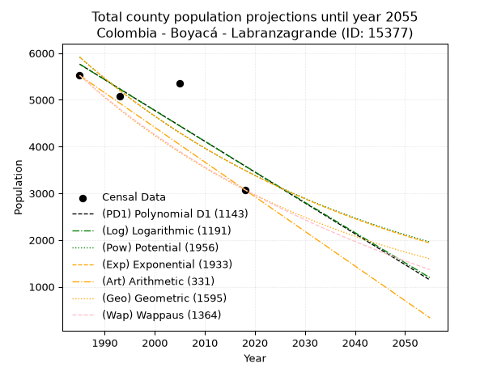
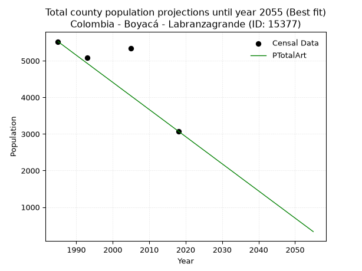
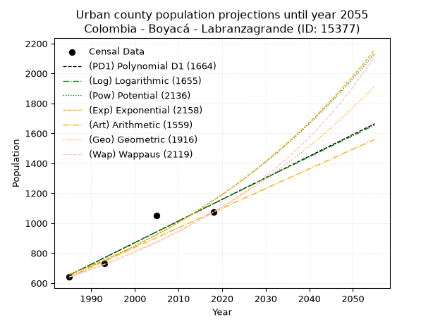
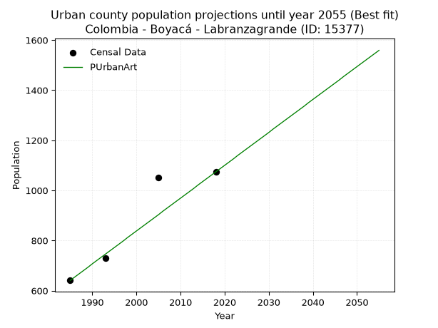
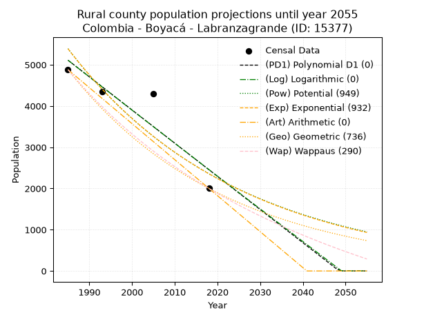
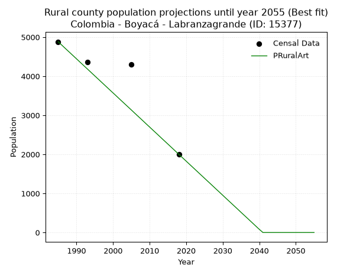

<div align="center">


</div>

# 📜 _“Population and Public Services Demand Projections (PPSD) until Year 2050 for Colombia - Boyacá - Labranzagrande (ID: 15377)”_
Keywords: `population` `public-service` `projection` `lineal` `polynomial` `logarithmic` `potential` `exponential` `arithmetic` `geometric` `wappaus` `dane` `colombia` `south-america`

PPSD are analytical estimates used by governments and planners to anticipate future changes in population size, age distribution, and the resulting community needs for utilities, healthcare, education, and infrastructure as sizing future water treatment facilities, electrical grids, and road networks based on spatial growth.

<div align="center">

</img>

</div>


> **General running parameters**: • app_version: _v20260806_. • Python version: _3.14.7_. • Pandas version: _3.0.5_. • NumPy version: _2.5.1_. • Creates, save and include plots into reports (create_plot): _False_. • Projection until year: _2050_. • Process polynomial degree 2 and up: _False_. • Process Wappaus: _True_. • Process Wappaus: _True_. • Set negative values to zero: _True_. • Set infinite values to zero: _True_. • Drop dataset notes: _True_. 
<div align="center">

Dynamic map: [:earth_americas:Google](http://maps.google.com/maps?q=5.562687048,-72.5777701) [:earth_americas:OSM](https://www.openstreetmap.org/#map=18/5.562687048/-72.5777701&layers=P) [:earth_americas:Bing](https://www.bing.com/maps?cp=5.562687048~-72.5777701&lvl=18) [:earth_americas:Apple](https://maps.apple.com/frame?center=5.562687048%2C-72.5777701&span=0.003%2C0.006)

</div>


<div align="center">

```geojson
{
  "type": "Feature",
  "geometry": {
    "type": "Point", 
    "coordinates": [-72.5777701, 5.562687048]
  }, 
  "properties": {
    "Name": "Colombia - Boyacá - Labranzagrande (ID: 15377)"
  }
}
```

</div>


## 0. Census Data (4 records)

Census data are official statistics collected by a government about the people and housing in a country. They usually include counts of total population, age, sex, race, income, education, and jobs.

📅Global census file: [Population.xlsx](../data/Population.xlsx)

| Source   |   Year |   CountryID | CountryName   |   StateID | StateName   |   CountyID | CountyName     |   PTotal |   PUrban |   PRural |
|:---------|-------:|------------:|:--------------|----------:|:------------|-----------:|:---------------|---------:|---------:|---------:|
| DANE     |   1985 |          57 | Colombia      |        15 | Boyacá      |      15377 | Labranzagrande |     5522 |      641 |     4881 |
| DANE     |   1993 |          57 | Colombia      |        15 | Boyacá      |      15377 | Labranzagrande |     5085 |      729 |     4356 |
| DANE     |   2005 |          57 | Colombia      |        15 | Boyacá      |      15377 | Labranzagrande |     5345 |     1050 |     4295 |
| DANE     |   2018 |          57 | Colombia      |        15 | Boyacá      |      15377 | Labranzagrande |     3075 |     1074 |     2001 |

> 🔥Some records could had specific notes about the registered values or the corresponding urban or rural distribution.

📅[SUI-RUPS](https://www.datos.gov.co/Hacienda-y-Cr-dito-P-blico/Registro-nico-de-Prestadores-de-Servicios-P-blicos/4qkq-csdn/about_data) - Local public utility companies: [RUPS.csv](../data/RUPS.csv)

 | SERVICIO       | ESTADO    | NOMBRE                                                              | NIT         | DEPARTAMENTO_DOMICILIO   | MUNICIPIO_DOMICILIO   | DIRECCION       |   TELEFONO | EMAIL               | TIPO_PRESTADOR                             | CLASIFICACION                 |
|:---------------|:----------|:--------------------------------------------------------------------|:------------|:-------------------------|:----------------------|:----------------|-----------:|:--------------------|:-------------------------------------------|:------------------------------|
| ACUEDUCTO      | OPERATIVA | EMPRESA DE ACUEDUCTO ALCANTARILLADO Y ASEO DE LABRANZAGRANDE SA ESP | 900399994-3 | BOYACA                   | LABRANZAGRANDE        | Carrera 9 8  05 |    6359576 | empolab@hotmail.com | SOCIEDADES (EMPRESA DE SERVICIOS PUBLICOS) | MENOR O IGUAL A 2500 USUARIOS |
| ALCANTARILLADO | OPERATIVA | EMPRESA DE ACUEDUCTO ALCANTARILLADO Y ASEO DE LABRANZAGRANDE SA ESP | 900399994-3 | BOYACA                   | LABRANZAGRANDE        | Carrera 9 8  05 |    6359576 | empolab@hotmail.com | SOCIEDADES (EMPRESA DE SERVICIOS PUBLICOS) | MENOR O IGUAL A 2500 USUARIOS |

## 1. Total

### 1.1. Coefficients and Parameters

* (PD1) Polynomial Deg 1: -66.00843034925592, 136790.11280609918 (lineal)
* (Log) Logarithmic: -131959.9949009293, 1007785.7287029973
* (Pow) Potential: -31.934280707804483, 109.08352746905612
* (Exp) Exponential: -0.015975104554429805, 3.496061259106793e+17
* (Art) Arithmetic: Year diff. 2018 - 1985 = 33, Population diff. 3075 - 5522 = -2447, Annual growth = -74.15151515151516
* (Geo) Geometric: Year diff. 2018 - 1985 = 33, Population diff. 3075 - 5522 = -2447, Annual growth % = -0.01758402544489157
* (Wap) Wappaus: i = -1.7250556043158114, Condition values only valid for < 200)

<sub>
Wappaus condition values: ['-0.00', '-1.73', '-3.45', '-5.18', '-6.90', '-8.63', '-10.35', '-12.08', '-13.80', '-15.53', '-17.25', '-18.98', '-20.70', '-22.43', '-24.15', '-25.88', '-27.60', '-29.33', '-31.05', '-32.78', '-34.50', '-36.23', '-37.95', '-39.68', '-41.40', '-43.13', '-44.85', '-46.58', '-48.30', '-50.03', '-51.75', '-53.48', '-55.20', '-56.93', '-58.65', '-60.38', '-62.10', '-63.83', '-65.55', '-67.28', '-69.00', '-70.73', '-72.45', '-74.18', '-75.90', '-77.63', '-79.35', '-81.08', '-82.80', '-84.53', '-86.25', '-87.98', '-89.70', '-91.43', '-93.15', '-94.88', '-96.60', '-98.33', '-100.05', '-101.78', '-103.50', '-105.23', '-106.95', '-108.68', '-110.40', '-112.13']
</sub>


### 1.2. Projected Dataset

|   Year |   CountyID |   PTotalPD1 |   PTotalLog |   PTotalPow |   PTotalExp |   PTotalArt |   PTotalGeo |   PTotalWap |
|-------:|-----------:|------------:|------------:|------------:|------------:|------------:|------------:|------------:|
|   1985 |      15377 |        5763 |        5764 |        5914 |        5914 |        5522 |        5522 |        5522 |
|   1986 |      15377 |        5697 |        5698 |        5820 |        5820 |        5448 |        5425 |        5428 |
|   1987 |      15377 |        5631 |        5631 |        5727 |        5728 |        5374 |        5330 |        5335 |
|   1988 |      15377 |        5565 |        5565 |        5636 |        5637 |        5300 |        5236 |        5243 |
|   1989 |      15377 |        5499 |        5498 |        5546 |        5547 |        5225 |        5144 |        5154 |
|   1990 |      15377 |        5433 |        5432 |        5458 |        5460 |        5151 |        5053 |        5065 |
|   1991 |      15377 |        5367 |        5366 |        5371 |        5373 |        5077 |        4964 |        4979 |
|   1992 |      15377 |        5301 |        5300 |        5286 |        5288 |        5003 |        4877 |        4893 |
|   1993 |      15377 |        5235 |        5233 |        5202 |        5204 |        4929 |        4791 |        4809 |
|   1994 |      15377 |        5169 |        5167 |        5119 |        5122 |        4855 |        4707 |        4726 |
|   1995 |      15377 |        5103 |        5101 |        5038 |        5040 |        4780 |        4624 |        4645 |
|   1996 |      15377 |        5037 |        5035 |        4958 |        4961 |        4706 |        4543 |        4565 |
|   1997 |      15377 |        4971 |        4969 |        4879 |        4882 |        4632 |        4463 |        4486 |
|   1998 |      15377 |        4905 |        4903 |        4802 |        4805 |        4558 |        4385 |        4409 |
|   1999 |      15377 |        4839 |        4837 |        4725 |        4728 |        4484 |        4308 |        4332 |
|   2000 |      15377 |        4773 |        4771 |        4651 |        4653 |        4410 |        4232 |        4257 |
|   2001 |      15377 |        4707 |        4705 |        4577 |        4580 |        4336 |        4157 |        4183 |
|   2002 |      15377 |        4641 |        4639 |        4505 |        4507 |        4261 |        4084 |        4110 |
|   2003 |      15377 |        4575 |        4573 |        4433 |        4436 |        4187 |        4012 |        4038 |
|   2004 |      15377 |        4509 |        4507 |        4363 |        4365 |        4113 |        3942 |        3967 |
|   2005 |      15377 |        4443 |        4441 |        4294 |        4296 |        4039 |        3873 |        3897 |
|   2006 |      15377 |        4377 |        4375 |        4226 |        4228 |        3965 |        3805 |        3828 |
|   2007 |      15377 |        4311 |        4310 |        4160 |        4161 |        3891 |        3738 |        3761 |
|   2008 |      15377 |        4245 |        4244 |        4094 |        4095 |        3817 |        3672 |        3694 |
|   2009 |      15377 |        4179 |        4178 |        4029 |        4030 |        3742 |        3607 |        3628 |
|   2010 |      15377 |        4113 |        4113 |        3966 |        3966 |        3668 |        3544 |        3563 |
|   2011 |      15377 |        4047 |        4047 |        3903 |        3904 |        3594 |        3482 |        3499 |
|   2012 |      15377 |        3981 |        3981 |        3842 |        3842 |        3520 |        3420 |        3436 |
|   2013 |      15377 |        3915 |        3916 |        3781 |        3781 |        3446 |        3360 |        3374 |
|   2014 |      15377 |        3849 |        3850 |        3722 |        3721 |        3372 |        3301 |        3312 |
|   2015 |      15377 |        3783 |        3785 |        3663 |        3662 |        3297 |        3243 |        3252 |
|   2016 |      15377 |        3717 |        3719 |        3606 |        3604 |        3223 |        3186 |        3192 |
|   2017 |      15377 |        3651 |        3654 |        3549 |        3547 |        3149 |        3130 |        3133 |
|   2018 |      15377 |        3585 |        3588 |        3493 |        3491 |        3075 |        3075 |        3075 |
|   2019 |      15377 |        3519 |        3523 |        3439 |        3435 |        3001 |        3021 |        3018 |
|   2020 |      15377 |        3453 |        3458 |        3385 |        3381 |        2927 |        2968 |        2961 |
|   2021 |      15377 |        3387 |        3392 |        3332 |        3327 |        2853 |        2916 |        2905 |
|   2022 |      15377 |        3321 |        3327 |        3279 |        3275 |        2778 |        2864 |        2850 |
|   2023 |      15377 |        3255 |        3262 |        3228 |        3223 |        2704 |        2814 |        2796 |
|   2024 |      15377 |        3189 |        3197 |        3177 |        3172 |        2630 |        2765 |        2742 |
|   2025 |      15377 |        3123 |        3131 |        3128 |        3121 |        2556 |        2716 |        2689 |
|   2026 |      15377 |        3057 |        3066 |        3079 |        3072 |        2482 |        2668 |        2637 |
|   2027 |      15377 |        2991 |        3001 |        3031 |        3023 |        2408 |        2621 |        2585 |
|   2028 |      15377 |        2925 |        2936 |        2983 |        2975 |        2333 |        2575 |        2534 |
|   2029 |      15377 |        2859 |        2871 |        2937 |        2928 |        2259 |        2530 |        2484 |
|   2030 |      15377 |        2793 |        2806 |        2891 |        2882 |        2185 |        2485 |        2434 |
|   2031 |      15377 |        2727 |        2741 |        2846 |        2836 |        2111 |        2442 |        2385 |
|   2032 |      15377 |        2661 |        2676 |        2801 |        2791 |        2037 |        2399 |        2336 |
|   2033 |      15377 |        2595 |        2611 |        2758 |        2747 |        1963 |        2357 |        2288 |
|   2034 |      15377 |        2529 |        2546 |        2715 |        2703 |        1889 |        2315 |        2241 |
|   2035 |      15377 |        2463 |        2481 |        2672 |        2660 |        1814 |        2274 |        2194 |
|   2036 |      15377 |        2397 |        2417 |        2631 |        2618 |        1740 |        2234 |        2148 |
|   2037 |      15377 |        2331 |        2352 |        2590 |        2577 |        1666 |        2195 |        2102 |
|   2038 |      15377 |        2265 |        2287 |        2550 |        2536 |        1592 |        2157 |        2057 |
|   2039 |      15377 |        2199 |        2222 |        2510 |        2496 |        1518 |        2119 |        2013 |
|   2040 |      15377 |        2133 |        2158 |        2471 |        2456 |        1444 |        2081 |        1969 |
|   2041 |      15377 |        2067 |        2093 |        2433 |        2417 |        1370 |        2045 |        1925 |
|   2042 |      15377 |        2001 |        2028 |        2395 |        2379 |        1295 |        2009 |        1882 |
|   2043 |      15377 |        1935 |        1964 |        2358 |        2341 |        1221 |        1973 |        1839 |
|   2044 |      15377 |        1869 |        1899 |        2321 |        2304 |        1147 |        1939 |        1797 |
|   2045 |      15377 |        1803 |        1834 |        2285 |        2268 |        1073 |        1905 |        1756 |
|   2046 |      15377 |        1737 |        1770 |        2250 |        2232 |         999 |        1871 |        1715 |
|   2047 |      15377 |        1671 |        1705 |        2215 |        2196 |         925 |        1838 |        1674 |
|   2048 |      15377 |        1605 |        1641 |        2181 |        2162 |         850 |        1806 |        1634 |
|   2049 |      15377 |        1539 |        1577 |        2147 |        2127 |         776 |        1774 |        1594 |
|   2050 |      15377 |        1473 |        1512 |        2114 |        2094 |         702 |        1743 |        1555 |
<div align="center">

</img>

</div>


### 1.3. Best fit with absolute and relative error (%)

Relative error puts that difference into context by dividing the absolute error by the true value, creating a unitless ratio or percentage that shows the scale of the mistake.

Absolute and relative error

|   Year | Source   |   CountryID | CountryName   |   StateID | StateName   |   CountyID_x | CountyName     |   PTotal |   PUrban |   PRural |   CountyID_y |   PTotalPD1 |   PTotalLog |   PTotalPow |   PTotalExp |   PTotalArt |   PTotalGeo |   PTotalWap |   PTotalPD1AbsError |   PTotalLogAbsError |   PTotalPowAbsError |   PTotalExpAbsError |   PTotalArtAbsError |   PTotalGeoAbsError |   PTotalWapAbsError |   PTotalPD1RelError |   PTotalLogRelError |   PTotalPowRelError |   PTotalExpRelError |   PTotalArtRelError |   PTotalGeoRelError |   PTotalWapRelError |
|-------:|:---------|------------:|:--------------|----------:|:------------|-------------:|:---------------|---------:|---------:|---------:|-------------:|------------:|------------:|------------:|------------:|------------:|------------:|------------:|--------------------:|--------------------:|--------------------:|--------------------:|--------------------:|--------------------:|--------------------:|--------------------:|--------------------:|--------------------:|--------------------:|--------------------:|--------------------:|--------------------:|
|   1985 | DANE     |          57 | Colombia      |        15 | Boyacá      |        15377 | Labranzagrande |     5522 |      641 |     4881 |        15377 |        5763 |        5764 |        5914 |        5914 |        5522 |        5522 |        5522 |                 241 |                 242 |                 392 |                 392 |                   0 |                   0 |                   0 |             4.36436 |             4.38247 |             7.09888 |             7.09888 |             0       |             0       |             0       |
|   1993 | DANE     |          57 | Colombia      |        15 | Boyacá      |        15377 | Labranzagrande |     5085 |      729 |     4356 |        15377 |        5235 |        5233 |        5202 |        5204 |        4929 |        4791 |        4809 |                 150 |                 148 |                 117 |                 119 |                 156 |                 294 |                 276 |             2.94985 |             2.91052 |             2.30088 |             2.34022 |             3.06785 |             5.78171 |             5.42773 |
|   2005 | DANE     |          57 | Colombia      |        15 | Boyacá      |        15377 | Labranzagrande |     5345 |     1050 |     4295 |        15377 |        4443 |        4441 |        4294 |        4296 |        4039 |        3873 |        3897 |                 902 |                 904 |                1051 |                1049 |                1306 |                1472 |                1448 |            16.8756  |            16.913   |            19.6632  |            19.6258  |            24.4341  |            27.5398  |            27.0907  |
|   2018 | DANE     |          57 | Colombia      |        15 | Boyacá      |        15377 | Labranzagrande |     3075 |     1074 |     2001 |        15377 |        3585 |        3588 |        3493 |        3491 |        3075 |        3075 |        3075 |                 510 |                 513 |                 418 |                 416 |                   0 |                   0 |                   0 |            16.5854  |            16.6829  |            13.5935  |            13.5285  |             0       |             0       |             0       |

Relative error mean

| Method    |   RelError | Best   |
|:----------|-----------:|:-------|
| PTotalPD1 |   10.1938  |        |
| PTotalLog |   10.2222  |        |
| PTotalPow |   10.6641  |        |
| PTotalExp |   10.6483  |        |
| PTotalArt |    6.87547 | True   |
| PTotalGeo |    8.33037 |        |
| PTotalWap |    8.12962 |        |

💙Best method: _**PTotalArt**_
<div align="center">

</img>

</div>


### 1.4. Fresh water supply demand in liters per capita per day (lpcd)

The fresh water supply demand typically ranges from 100 to 300 liters per capita per day (lpcd) for standard domestic and municipal planning, though absolute survival minimums set by the World Health Organization are as low as 7.5 to 20 liters per day, and total consumption in high-income nations can exceed 400 liters.

> `CZ`: Level in meters above the sea level (masl)<br> `WS`: Fresh water supply demand in liters per capita per day (lpcd or l/h/d)<br> `WSAll`: Zonal fresh water supply demand in liters per second (l/s)<br> `A`: Zonal area in square meters<br> `DP`: Population density (people/hectare or p/ha)

Reference values (RAS Colombia)

|    CZ |   WS |
|------:|-----:|
|  1000 |  120 |
|  2000 |  130 |
| 99999 |  140 |

County shapefile geometry properties and water supply values

|   CountyID |      ATotal |   CZTotal |   WSTotal |
|-----------:|------------:|----------:|----------:|
|      15377 | 5.79987e+08 |   1859.42 |       130 |

Projected values for best method: PTotalArt

|   CountyID |   Year |   PTotalArt |   DPTotal |   WSTotal |   WSTotalAll |
|-----------:|-------:|------------:|----------:|----------:|-------------:|
|      15377 |   1985 |        5522 |      0.1  |       130 |      8.30856 |
|      15377 |   1986 |        5448 |      0.09 |       130 |      8.19722 |
|      15377 |   1987 |        5374 |      0.09 |       130 |      8.08588 |
|      15377 |   1988 |        5300 |      0.09 |       130 |      7.97454 |
|      15377 |   1989 |        5225 |      0.09 |       130 |      7.86169 |
|      15377 |   1990 |        5151 |      0.09 |       130 |      7.75035 |
|      15377 |   1991 |        5077 |      0.09 |       130 |      7.639   |
|      15377 |   1992 |        5003 |      0.09 |       130 |      7.52766 |
|      15377 |   1993 |        4929 |      0.08 |       130 |      7.41632 |
|      15377 |   1994 |        4855 |      0.08 |       130 |      7.30498 |
|      15377 |   1995 |        4780 |      0.08 |       130 |      7.19213 |
|      15377 |   1996 |        4706 |      0.08 |       130 |      7.08079 |
|      15377 |   1997 |        4632 |      0.08 |       130 |      6.96944 |
|      15377 |   1998 |        4558 |      0.08 |       130 |      6.8581  |
|      15377 |   1999 |        4484 |      0.08 |       130 |      6.74676 |
|      15377 |   2000 |        4410 |      0.08 |       130 |      6.63542 |
|      15377 |   2001 |        4336 |      0.07 |       130 |      6.52407 |
|      15377 |   2002 |        4261 |      0.07 |       130 |      6.41123 |
|      15377 |   2003 |        4187 |      0.07 |       130 |      6.29988 |
|      15377 |   2004 |        4113 |      0.07 |       130 |      6.18854 |
|      15377 |   2005 |        4039 |      0.07 |       130 |      6.0772  |
|      15377 |   2006 |        3965 |      0.07 |       130 |      5.96586 |
|      15377 |   2007 |        3891 |      0.07 |       130 |      5.85451 |
|      15377 |   2008 |        3817 |      0.07 |       130 |      5.74317 |
|      15377 |   2009 |        3742 |      0.06 |       130 |      5.63032 |
|      15377 |   2010 |        3668 |      0.06 |       130 |      5.51898 |
|      15377 |   2011 |        3594 |      0.06 |       130 |      5.40764 |
|      15377 |   2012 |        3520 |      0.06 |       130 |      5.2963  |
|      15377 |   2013 |        3446 |      0.06 |       130 |      5.18495 |
|      15377 |   2014 |        3372 |      0.06 |       130 |      5.07361 |
|      15377 |   2015 |        3297 |      0.06 |       130 |      4.96076 |
|      15377 |   2016 |        3223 |      0.06 |       130 |      4.84942 |
|      15377 |   2017 |        3149 |      0.05 |       130 |      4.73808 |
|      15377 |   2018 |        3075 |      0.05 |       130 |      4.62674 |
|      15377 |   2019 |        3001 |      0.05 |       130 |      4.51539 |
|      15377 |   2020 |        2927 |      0.05 |       130 |      4.40405 |
|      15377 |   2021 |        2853 |      0.05 |       130 |      4.29271 |
|      15377 |   2022 |        2778 |      0.05 |       130 |      4.17986 |
|      15377 |   2023 |        2704 |      0.05 |       130 |      4.06852 |
|      15377 |   2024 |        2630 |      0.05 |       130 |      3.95718 |
|      15377 |   2025 |        2556 |      0.04 |       130 |      3.84583 |
|      15377 |   2026 |        2482 |      0.04 |       130 |      3.73449 |
|      15377 |   2027 |        2408 |      0.04 |       130 |      3.62315 |
|      15377 |   2028 |        2333 |      0.04 |       130 |      3.5103  |
|      15377 |   2029 |        2259 |      0.04 |       130 |      3.39896 |
|      15377 |   2030 |        2185 |      0.04 |       130 |      3.28762 |
|      15377 |   2031 |        2111 |      0.04 |       130 |      3.17627 |
|      15377 |   2032 |        2037 |      0.04 |       130 |      3.06493 |
|      15377 |   2033 |        1963 |      0.03 |       130 |      2.95359 |
|      15377 |   2034 |        1889 |      0.03 |       130 |      2.84225 |
|      15377 |   2035 |        1814 |      0.03 |       130 |      2.7294  |
|      15377 |   2036 |        1740 |      0.03 |       130 |      2.61806 |
|      15377 |   2037 |        1666 |      0.03 |       130 |      2.50671 |
|      15377 |   2038 |        1592 |      0.03 |       130 |      2.39537 |
|      15377 |   2039 |        1518 |      0.03 |       130 |      2.28403 |
|      15377 |   2040 |        1444 |      0.02 |       130 |      2.17269 |
|      15377 |   2041 |        1370 |      0.02 |       130 |      2.06134 |
|      15377 |   2042 |        1295 |      0.02 |       130 |      1.9485  |
|      15377 |   2043 |        1221 |      0.02 |       130 |      1.83715 |
|      15377 |   2044 |        1147 |      0.02 |       130 |      1.72581 |
|      15377 |   2045 |        1073 |      0.02 |       130 |      1.61447 |
|      15377 |   2046 |         999 |      0.02 |       130 |      1.50313 |
|      15377 |   2047 |         925 |      0.02 |       130 |      1.39178 |
|      15377 |   2048 |         850 |      0.01 |       130 |      1.27894 |
|      15377 |   2049 |         776 |      0.01 |       130 |      1.16759 |
|      15377 |   2050 |         702 |      0.01 |       130 |      1.05625 |

## 2. Urban

### 2.1. Coefficients and Parameters

* (PD1) Polynomial Deg 1: 14.436772380570023, -28003.653954235186 (lineal)
* (Log) Logarithmic: 28913.035179151386, -218894.71209125267
* (Pow) Potential: 34.00349496377575, -109.31767081948638
* (Exp) Exponential: 0.016977255258672545, 1.5217557418236364e-12
* (Art) Arithmetic: Year diff. 2018 - 1985 = 33, Population diff. 1074 - 641 = 433, Annual growth = 13.121212121212121
* (Geo) Geometric: Year diff. 2018 - 1985 = 33, Population diff. 1074 - 641 = 433, Annual growth % = 0.015762816196287055
* (Wap) Wappaus: i = 1.5301705097623466, Condition values only valid for < 200)

<sub>
Wappaus condition values: ['0.00', '1.53', '3.06', '4.59', '6.12', '7.65', '9.18', '10.71', '12.24', '13.77', '15.30', '16.83', '18.36', '19.89', '21.42', '22.95', '24.48', '26.01', '27.54', '29.07', '30.60', '32.13', '33.66', '35.19', '36.72', '38.25', '39.78', '41.31', '42.84', '44.37', '45.91', '47.44', '48.97', '50.50', '52.03', '53.56', '55.09', '56.62', '58.15', '59.68', '61.21', '62.74', '64.27', '65.80', '67.33', '68.86', '70.39', '71.92', '73.45', '74.98', '76.51', '78.04', '79.57', '81.10', '82.63', '84.16', '85.69', '87.22', '88.75', '90.28', '91.81', '93.34', '94.87', '96.40', '97.93', '99.46']
</sub>


### 2.2. Projected Dataset

|   Year |   CountyID |   PUrbanPD1 |   PUrbanLog |   PUrbanPow |   PUrbanExp |   PUrbanArt |   PUrbanGeo |   PUrbanWap |
|-------:|-----------:|------------:|------------:|------------:|------------:|------------:|------------:|------------:|
|   1985 |      15377 |         653 |         653 |         657 |         658 |         641 |         641 |         641 |
|   1986 |      15377 |         668 |         667 |         669 |         669 |         654 |         651 |         651 |
|   1987 |      15377 |         682 |         682 |         680 |         680 |         667 |         661 |         661 |
|   1988 |      15377 |         697 |         696 |         692 |         692 |         680 |         672 |         671 |
|   1989 |      15377 |         711 |         711 |         704 |         704 |         693 |         682 |         681 |
|   1990 |      15377 |         726 |         726 |         716 |         716 |         707 |         693 |         692 |
|   1991 |      15377 |         740 |         740 |         728 |         728 |         720 |         704 |         703 |
|   1992 |      15377 |         754 |         755 |         741 |         741 |         733 |         715 |         714 |
|   1993 |      15377 |         769 |         769 |         754 |         753 |         746 |         726 |         725 |
|   1994 |      15377 |         783 |         784 |         767 |         766 |         759 |         738 |         736 |
|   1995 |      15377 |         798 |         798 |         780 |         779 |         772 |         750 |         747 |
|   1996 |      15377 |         812 |         813 |         793 |         793 |         785 |         761 |         759 |
|   1997 |      15377 |         827 |         827 |         807 |         806 |         798 |         773 |         771 |
|   1998 |      15377 |         841 |         842 |         821 |         820 |         812 |         786 |         783 |
|   1999 |      15377 |         855 |         856 |         835 |         834 |         825 |         798 |         795 |
|   2000 |      15377 |         870 |         870 |         849 |         848 |         838 |         810 |         807 |
|   2001 |      15377 |         884 |         885 |         864 |         863 |         851 |         823 |         820 |
|   2002 |      15377 |         899 |         899 |         878 |         878 |         864 |         836 |         833 |
|   2003 |      15377 |         913 |         914 |         893 |         893 |         877 |         849 |         846 |
|   2004 |      15377 |         928 |         928 |         909 |         908 |         890 |         863 |         859 |
|   2005 |      15377 |         942 |         943 |         924 |         924 |         903 |         876 |         873 |
|   2006 |      15377 |         957 |         957 |         940 |         939 |         917 |         890 |         886 |
|   2007 |      15377 |         971 |         971 |         956 |         955 |         930 |         904 |         900 |
|   2008 |      15377 |         985 |         986 |         972 |         972 |         943 |         919 |         915 |
|   2009 |      15377 |        1000 |        1000 |         989 |         988 |         956 |         933 |         929 |
|   2010 |      15377 |        1014 |        1015 |        1006 |        1005 |         969 |         948 |         944 |
|   2011 |      15377 |        1029 |        1029 |        1023 |        1023 |         982 |         963 |         959 |
|   2012 |      15377 |        1043 |        1043 |        1040 |        1040 |         995 |         978 |         975 |
|   2013 |      15377 |        1058 |        1058 |        1058 |        1058 |        1008 |         993 |         991 |
|   2014 |      15377 |        1072 |        1072 |        1076 |        1076 |        1022 |        1009 |        1007 |
|   2015 |      15377 |        1086 |        1086 |        1095 |        1094 |        1035 |        1025 |        1023 |
|   2016 |      15377 |        1101 |        1101 |        1113 |        1113 |        1048 |        1041 |        1040 |
|   2017 |      15377 |        1115 |        1115 |        1132 |        1132 |        1061 |        1057 |        1057 |
|   2018 |      15377 |        1130 |        1130 |        1151 |        1152 |        1074 |        1074 |        1074 |
|   2019 |      15377 |        1144 |        1144 |        1171 |        1171 |        1087 |        1091 |        1092 |
|   2020 |      15377 |        1159 |        1158 |        1191 |        1191 |        1100 |        1108 |        1110 |
|   2021 |      15377 |        1173 |        1172 |        1211 |        1212 |        1113 |        1126 |        1128 |
|   2022 |      15377 |        1187 |        1187 |        1232 |        1233 |        1126 |        1143 |        1147 |
|   2023 |      15377 |        1202 |        1201 |        1252 |        1254 |        1140 |        1161 |        1166 |
|   2024 |      15377 |        1216 |        1215 |        1274 |        1275 |        1153 |        1180 |        1186 |
|   2025 |      15377 |        1231 |        1230 |        1295 |        1297 |        1166 |        1198 |        1206 |
|   2026 |      15377 |        1245 |        1244 |        1317 |        1319 |        1179 |        1217 |        1227 |
|   2027 |      15377 |        1260 |        1258 |        1339 |        1342 |        1192 |        1236 |        1248 |
|   2028 |      15377 |        1274 |        1272 |        1362 |        1365 |        1205 |        1256 |        1270 |
|   2029 |      15377 |        1289 |        1287 |        1385 |        1388 |        1218 |        1276 |        1292 |
|   2030 |      15377 |        1303 |        1301 |        1408 |        1412 |        1231 |        1296 |        1314 |
|   2031 |      15377 |        1317 |        1315 |        1432 |        1436 |        1245 |        1316 |        1337 |
|   2032 |      15377 |        1332 |        1329 |        1456 |        1461 |        1258 |        1337 |        1361 |
|   2033 |      15377 |        1346 |        1344 |        1481 |        1486 |        1271 |        1358 |        1385 |
|   2034 |      15377 |        1361 |        1358 |        1506 |        1511 |        1284 |        1379 |        1410 |
|   2035 |      15377 |        1375 |        1372 |        1531 |        1537 |        1297 |        1401 |        1435 |
|   2036 |      15377 |        1390 |        1386 |        1557 |        1563 |        1310 |        1423 |        1461 |
|   2037 |      15377 |        1404 |        1400 |        1583 |        1590 |        1323 |        1446 |        1488 |
|   2038 |      15377 |        1418 |        1415 |        1610 |        1617 |        1336 |        1468 |        1515 |
|   2039 |      15377 |        1433 |        1429 |        1637 |        1645 |        1350 |        1492 |        1544 |
|   2040 |      15377 |        1447 |        1443 |        1665 |        1673 |        1363 |        1515 |        1572 |
|   2041 |      15377 |        1462 |        1457 |        1693 |        1702 |        1376 |        1539 |        1602 |
|   2042 |      15377 |        1476 |        1471 |        1721 |        1731 |        1389 |        1563 |        1632 |
|   2043 |      15377 |        1491 |        1485 |        1750 |        1761 |        1402 |        1588 |        1664 |
|   2044 |      15377 |        1505 |        1500 |        1779 |        1791 |        1415 |        1613 |        1696 |
|   2045 |      15377 |        1520 |        1514 |        1809 |        1821 |        1428 |        1638 |        1729 |
|   2046 |      15377 |        1534 |        1528 |        1839 |        1853 |        1441 |        1664 |        1763 |
|   2047 |      15377 |        1548 |        1542 |        1870 |        1884 |        1455 |        1690 |        1798 |
|   2048 |      15377 |        1563 |        1556 |        1902 |        1917 |        1468 |        1717 |        1834 |
|   2049 |      15377 |        1577 |        1570 |        1933 |        1949 |        1481 |        1744 |        1871 |
|   2050 |      15377 |        1592 |        1584 |        1966 |        1983 |        1494 |        1772 |        1909 |
<div align="center">

</img>

</div>


### 2.3. Best fit with absolute and relative error (%)

Relative error puts that difference into context by dividing the absolute error by the true value, creating a unitless ratio or percentage that shows the scale of the mistake.

Absolute and relative error

|   Year | Source   |   CountryID | CountryName   |   StateID | StateName   |   CountyID_x | CountyName     |   PTotal |   PUrban |   PRural |   CountyID_y |   PUrbanPD1 |   PUrbanLog |   PUrbanPow |   PUrbanExp |   PUrbanArt |   PUrbanGeo |   PUrbanWap |   PUrbanPD1AbsError |   PUrbanLogAbsError |   PUrbanPowAbsError |   PUrbanExpAbsError |   PUrbanArtAbsError |   PUrbanGeoAbsError |   PUrbanWapAbsError |   PUrbanPD1RelError |   PUrbanLogRelError |   PUrbanPowRelError |   PUrbanExpRelError |   PUrbanArtRelError |   PUrbanGeoRelError |   PUrbanWapRelError |
|-------:|:---------|------------:|:--------------|----------:|:------------|-------------:|:---------------|---------:|---------:|---------:|-------------:|------------:|------------:|------------:|------------:|------------:|------------:|------------:|--------------------:|--------------------:|--------------------:|--------------------:|--------------------:|--------------------:|--------------------:|--------------------:|--------------------:|--------------------:|--------------------:|--------------------:|--------------------:|--------------------:|
|   1985 | DANE     |          57 | Colombia      |        15 | Boyacá      |        15377 | Labranzagrande |     5522 |      641 |     4881 |        15377 |         653 |         653 |         657 |         658 |         641 |         641 |         641 |                  12 |                  12 |                  16 |                  17 |                   0 |                   0 |                   0 |             1.87207 |             1.87207 |             2.4961  |             2.65211 |             0       |            0        |            0        |
|   1993 | DANE     |          57 | Colombia      |        15 | Boyacá      |        15377 | Labranzagrande |     5085 |      729 |     4356 |        15377 |         769 |         769 |         754 |         753 |         746 |         726 |         725 |                  40 |                  40 |                  25 |                  24 |                  17 |                   3 |                   4 |             5.48697 |             5.48697 |             3.42936 |             3.29218 |             2.33196 |            0.411523 |            0.548697 |
|   2005 | DANE     |          57 | Colombia      |        15 | Boyacá      |        15377 | Labranzagrande |     5345 |     1050 |     4295 |        15377 |         942 |         943 |         924 |         924 |         903 |         876 |         873 |                 108 |                 107 |                 126 |                 126 |                 147 |                 174 |                 177 |            10.2857  |            10.1905  |            12       |            12       |            14       |           16.5714   |           16.8571   |
|   2018 | DANE     |          57 | Colombia      |        15 | Boyacá      |        15377 | Labranzagrande |     3075 |     1074 |     2001 |        15377 |        1130 |        1130 |        1151 |        1152 |        1074 |        1074 |        1074 |                  56 |                  56 |                  77 |                  78 |                   0 |                   0 |                   0 |             5.21415 |             5.21415 |             7.16946 |             7.26257 |             0       |            0        |            0        |

Relative error mean

| Method    |   RelError | Best   |
|:----------|-----------:|:-------|
| PUrbanPD1 |    5.71473 |        |
| PUrbanLog |    5.69092 |        |
| PUrbanPow |    6.27373 |        |
| PUrbanExp |    6.30171 |        |
| PUrbanArt |    4.08299 | True   |
| PUrbanGeo |    4.24574 |        |
| PUrbanWap |    4.35146 |        |

💙Best method: _**PUrbanArt**_
<div align="center">

</img>

</div>


### 2.4. Fresh water supply demand in liters per capita per day (lpcd)

The fresh water supply demand typically ranges from 100 to 300 liters per capita per day (lpcd) for standard domestic and municipal planning, though absolute survival minimums set by the World Health Organization are as low as 7.5 to 20 liters per day, and total consumption in high-income nations can exceed 400 liters.

> `CZ`: Level in meters above the sea level (masl)<br> `WS`: Fresh water supply demand in liters per capita per day (lpcd or l/h/d)<br> `WSAll`: Zonal fresh water supply demand in liters per second (l/s)<br> `A`: Zonal area in square meters<br> `DP`: Population density (people/hectare or p/ha)

Reference values (RAS Colombia)

|    CZ |   WS |
|------:|-----:|
|  1000 |  120 |
|  2000 |  130 |
| 99999 |  140 |

County shapefile geometry properties and water supply values

|   CountyID |   AUrban |   CZUrban |   WSUrban |
|-----------:|---------:|----------:|----------:|
|      15377 |   274147 |    1108.3 |       130 |

Projected values for best method: PUrbanArt

|   CountyID |   Year |   PUrbanArt |   DPUrban |   WSUrban |   WSUrbanAll |
|-----------:|-------:|------------:|----------:|----------:|-------------:|
|      15377 |   1985 |         641 |     23.38 |       130 |     0.964468 |
|      15377 |   1986 |         654 |     23.86 |       130 |     0.984028 |
|      15377 |   1987 |         667 |     24.33 |       130 |     1.00359  |
|      15377 |   1988 |         680 |     24.8  |       130 |     1.02315  |
|      15377 |   1989 |         693 |     25.28 |       130 |     1.04271  |
|      15377 |   1990 |         707 |     25.79 |       130 |     1.06377  |
|      15377 |   1991 |         720 |     26.26 |       130 |     1.08333  |
|      15377 |   1992 |         733 |     26.74 |       130 |     1.10289  |
|      15377 |   1993 |         746 |     27.21 |       130 |     1.12245  |
|      15377 |   1994 |         759 |     27.69 |       130 |     1.14201  |
|      15377 |   1995 |         772 |     28.16 |       130 |     1.16157  |
|      15377 |   1996 |         785 |     28.63 |       130 |     1.18113  |
|      15377 |   1997 |         798 |     29.11 |       130 |     1.20069  |
|      15377 |   1998 |         812 |     29.62 |       130 |     1.22176  |
|      15377 |   1999 |         825 |     30.09 |       130 |     1.24132  |
|      15377 |   2000 |         838 |     30.57 |       130 |     1.26088  |
|      15377 |   2001 |         851 |     31.04 |       130 |     1.28044  |
|      15377 |   2002 |         864 |     31.52 |       130 |     1.3      |
|      15377 |   2003 |         877 |     31.99 |       130 |     1.31956  |
|      15377 |   2004 |         890 |     32.46 |       130 |     1.33912  |
|      15377 |   2005 |         903 |     32.94 |       130 |     1.35868  |
|      15377 |   2006 |         917 |     33.45 |       130 |     1.37975  |
|      15377 |   2007 |         930 |     33.92 |       130 |     1.39931  |
|      15377 |   2008 |         943 |     34.4  |       130 |     1.41887  |
|      15377 |   2009 |         956 |     34.87 |       130 |     1.43843  |
|      15377 |   2010 |         969 |     35.35 |       130 |     1.45799  |
|      15377 |   2011 |         982 |     35.82 |       130 |     1.47755  |
|      15377 |   2012 |         995 |     36.29 |       130 |     1.49711  |
|      15377 |   2013 |        1008 |     36.77 |       130 |     1.51667  |
|      15377 |   2014 |        1022 |     37.28 |       130 |     1.53773  |
|      15377 |   2015 |        1035 |     37.75 |       130 |     1.55729  |
|      15377 |   2016 |        1048 |     38.23 |       130 |     1.57685  |
|      15377 |   2017 |        1061 |     38.7  |       130 |     1.59641  |
|      15377 |   2018 |        1074 |     39.18 |       130 |     1.61597  |
|      15377 |   2019 |        1087 |     39.65 |       130 |     1.63553  |
|      15377 |   2020 |        1100 |     40.12 |       130 |     1.65509  |
|      15377 |   2021 |        1113 |     40.6  |       130 |     1.67465  |
|      15377 |   2022 |        1126 |     41.07 |       130 |     1.69421  |
|      15377 |   2023 |        1140 |     41.58 |       130 |     1.71528  |
|      15377 |   2024 |        1153 |     42.06 |       130 |     1.73484  |
|      15377 |   2025 |        1166 |     42.53 |       130 |     1.7544   |
|      15377 |   2026 |        1179 |     43.01 |       130 |     1.77396  |
|      15377 |   2027 |        1192 |     43.48 |       130 |     1.79352  |
|      15377 |   2028 |        1205 |     43.95 |       130 |     1.81308  |
|      15377 |   2029 |        1218 |     44.43 |       130 |     1.83264  |
|      15377 |   2030 |        1231 |     44.9  |       130 |     1.8522   |
|      15377 |   2031 |        1245 |     45.41 |       130 |     1.87326  |
|      15377 |   2032 |        1258 |     45.89 |       130 |     1.89282  |
|      15377 |   2033 |        1271 |     46.36 |       130 |     1.91238  |
|      15377 |   2034 |        1284 |     46.84 |       130 |     1.93194  |
|      15377 |   2035 |        1297 |     47.31 |       130 |     1.9515   |
|      15377 |   2036 |        1310 |     47.78 |       130 |     1.97106  |
|      15377 |   2037 |        1323 |     48.26 |       130 |     1.99063  |
|      15377 |   2038 |        1336 |     48.73 |       130 |     2.01019  |
|      15377 |   2039 |        1350 |     49.24 |       130 |     2.03125  |
|      15377 |   2040 |        1363 |     49.72 |       130 |     2.05081  |
|      15377 |   2041 |        1376 |     50.19 |       130 |     2.07037  |
|      15377 |   2042 |        1389 |     50.67 |       130 |     2.08993  |
|      15377 |   2043 |        1402 |     51.14 |       130 |     2.10949  |
|      15377 |   2044 |        1415 |     51.61 |       130 |     2.12905  |
|      15377 |   2045 |        1428 |     52.09 |       130 |     2.14861  |
|      15377 |   2046 |        1441 |     52.56 |       130 |     2.16817  |
|      15377 |   2047 |        1455 |     53.07 |       130 |     2.18924  |
|      15377 |   2048 |        1468 |     53.55 |       130 |     2.2088   |
|      15377 |   2049 |        1481 |     54.02 |       130 |     2.22836  |
|      15377 |   2050 |        1494 |     54.5  |       130 |     2.24792  |

## 3. Rural

### 3.1. Coefficients and Parameters

* (PD1) Polynomial Deg 1: -80.44520272982594, 164793.76676033437 (lineal)
* (Log) Logarithmic: -160873.0300800806, 1226680.4407942498
* (Pow) Potential: -50.11854749563312, 169.01057786548566
* (Exp) Exponential: -0.025066603202430152, 2.1915339732657324e+25
* (Art) Arithmetic: Year diff. 2018 - 1985 = 33, Population diff. 2001 - 4881 = -2880, Annual growth = -87.27272727272727
* (Geo) Geometric: Year diff. 2018 - 1985 = 33, Population diff. 2001 - 4881 = -2880, Annual growth % = -0.026659495606978223
* (Wap) Wappaus: i = -2.5362606007767297, Condition values only valid for < 200)

<sub>
Wappaus condition values: ['-0.00', '-2.54', '-5.07', '-7.61', '-10.15', '-12.68', '-15.22', '-17.75', '-20.29', '-22.83', '-25.36', '-27.90', '-30.44', '-32.97', '-35.51', '-38.04', '-40.58', '-43.12', '-45.65', '-48.19', '-50.73', '-53.26', '-55.80', '-58.33', '-60.87', '-63.41', '-65.94', '-68.48', '-71.02', '-73.55', '-76.09', '-78.62', '-81.16', '-83.70', '-86.23', '-88.77', '-91.31', '-93.84', '-96.38', '-98.91', '-101.45', '-103.99', '-106.52', '-109.06', '-111.60', '-114.13', '-116.67', '-119.20', '-121.74', '-124.28', '-126.81', '-129.35', '-131.89', '-134.42', '-136.96', '-139.49', '-142.03', '-144.57', '-147.10', '-149.64', '-152.18', '-154.71', '-157.25', '-159.78', '-162.32', '-164.86']
</sub>


### 3.2. Projected Dataset

|   Year |   CountyID |   PRuralPD1 |   PRuralLog |   PRuralPow |   PRuralExp |   PRuralArt |   PRuralGeo |   PRuralWap |
|-------:|-----------:|------------:|------------:|------------:|------------:|------------:|------------:|------------:|
|   1985 |      15377 |        5110 |        5111 |        5390 |        5388 |        4881 |        4881 |        4881 |
|   1986 |      15377 |        5030 |        5030 |        5256 |        5255 |        4794 |        4751 |        4759 |
|   1987 |      15377 |        4949 |        4949 |        5125 |        5125 |        4706 |        4624 |        4640 |
|   1988 |      15377 |        4869 |        4868 |        4997 |        4998 |        4619 |        4501 |        4523 |
|   1989 |      15377 |        4788 |        4787 |        4873 |        4874 |        4532 |        4381 |        4410 |
|   1990 |      15377 |        4708 |        4707 |        4752 |        4754 |        4445 |        4264 |        4299 |
|   1991 |      15377 |        4627 |        4626 |        4634 |        4636 |        4357 |        4150 |        4191 |
|   1992 |      15377 |        4547 |        4545 |        4518 |        4521 |        4270 |        4040 |        4085 |
|   1993 |      15377 |        4466 |        4464 |        4406 |        4409 |        4183 |        3932 |        3982 |
|   1994 |      15377 |        4386 |        4384 |        4297 |        4300 |        4096 |        3827 |        3881 |
|   1995 |      15377 |        4306 |        4303 |        4190 |        4194 |        4008 |        3725 |        3782 |
|   1996 |      15377 |        4225 |        4222 |        4086 |        4090 |        3921 |        3626 |        3686 |
|   1997 |      15377 |        4145 |        4142 |        3985 |        3989 |        3834 |        3529 |        3592 |
|   1998 |      15377 |        4064 |        4061 |        3886 |        3890 |        3746 |        3435 |        3499 |
|   1999 |      15377 |        3984 |        3981 |        3790 |        3794 |        3659 |        3344 |        3409 |
|   2000 |      15377 |        3903 |        3900 |        3696 |        3700 |        3572 |        3254 |        3321 |
|   2001 |      15377 |        3823 |        3820 |        3605 |        3608 |        3485 |        3168 |        3234 |
|   2002 |      15377 |        3742 |        3739 |        3516 |        3519 |        3397 |        3083 |        3150 |
|   2003 |      15377 |        3662 |        3659 |        3429 |        3432 |        3310 |        3001 |        3067 |
|   2004 |      15377 |        3582 |        3579 |        3344 |        3347 |        3223 |        2921 |        2986 |
|   2005 |      15377 |        3501 |        3499 |        3261 |        3264 |        3136 |        2843 |        2906 |
|   2006 |      15377 |        3421 |        3418 |        3181 |        3183 |        3048 |        2767 |        2828 |
|   2007 |      15377 |        3340 |        3338 |        3102 |        3104 |        2961 |        2694 |        2752 |
|   2008 |      15377 |        3260 |        3258 |        3026 |        3027 |        2874 |        2622 |        2677 |
|   2009 |      15377 |        3179 |        3178 |        2951 |        2953 |        2786 |        2552 |        2603 |
|   2010 |      15377 |        3099 |        3098 |        2879 |        2879 |        2699 |        2484 |        2531 |
|   2011 |      15377 |        3018 |        3018 |        2808 |        2808 |        2612 |        2418 |        2460 |
|   2012 |      15377 |        2938 |        2938 |        2739 |        2739 |        2525 |        2353 |        2391 |
|   2013 |      15377 |        2858 |        2858 |        2671 |        2671 |        2437 |        2290 |        2323 |
|   2014 |      15377 |        2777 |        2778 |        2606 |        2605 |        2350 |        2229 |        2256 |
|   2015 |      15377 |        2697 |        2698 |        2542 |        2540 |        2263 |        2170 |        2191 |
|   2016 |      15377 |        2616 |        2618 |        2479 |        2477 |        2176 |        2112 |        2126 |
|   2017 |      15377 |        2536 |        2539 |        2418 |        2416 |        2088 |        2056 |        2063 |
|   2018 |      15377 |        2455 |        2459 |        2359 |        2356 |        2001 |        2001 |        2001 |
|   2019 |      15377 |        2375 |        2379 |        2301 |        2298 |        1914 |        1948 |        1940 |
|   2020 |      15377 |        2294 |        2299 |        2245 |        2241 |        1826 |        1896 |        1880 |
|   2021 |      15377 |        2214 |        2220 |        2190 |        2186 |        1739 |        1845 |        1821 |
|   2022 |      15377 |        2134 |        2140 |        2136 |        2131 |        1652 |        1796 |        1763 |
|   2023 |      15377 |        2053 |        2061 |        2084 |        2079 |        1565 |        1748 |        1707 |
|   2024 |      15377 |        1973 |        1981 |        2033 |        2027 |        1477 |        1702 |        1651 |
|   2025 |      15377 |        1892 |        1902 |        1983 |        1977 |        1390 |        1656 |        1596 |
|   2026 |      15377 |        1812 |        1822 |        1935 |        1928 |        1303 |        1612 |        1542 |
|   2027 |      15377 |        1731 |        1743 |        1887 |        1880 |        1216 |        1569 |        1489 |
|   2028 |      15377 |        1651 |        1664 |        1841 |        1834 |        1128 |        1527 |        1436 |
|   2029 |      15377 |        1570 |        1584 |        1796 |        1788 |        1041 |        1486 |        1385 |
|   2030 |      15377 |        1490 |        1505 |        1753 |        1744 |         954 |        1447 |        1334 |
|   2031 |      15377 |        1410 |        1426 |        1710 |        1701 |         866 |        1408 |        1284 |
|   2032 |      15377 |        1329 |        1347 |        1668 |        1659 |         779 |        1371 |        1235 |
|   2033 |      15377 |        1249 |        1267 |        1628 |        1618 |         692 |        1334 |        1187 |
|   2034 |      15377 |        1168 |        1188 |        1588 |        1578 |         605 |        1299 |        1140 |
|   2035 |      15377 |        1088 |        1109 |        1549 |        1539 |         517 |        1264 |        1093 |
|   2036 |      15377 |        1007 |        1030 |        1512 |        1501 |         430 |        1230 |        1047 |
|   2037 |      15377 |         927 |         951 |        1475 |        1463 |         343 |        1198 |        1002 |
|   2038 |      15377 |         846 |         872 |        1439 |        1427 |         256 |        1166 |         957 |
|   2039 |      15377 |         766 |         793 |        1404 |        1392 |         168 |        1135 |         913 |
|   2040 |      15377 |         686 |         715 |        1370 |        1357 |          81 |        1104 |         870 |
|   2041 |      15377 |         605 |         636 |        1337 |        1324 |           0 |        1075 |         827 |
|   2042 |      15377 |         525 |         557 |        1304 |        1291 |           0 |        1046 |         785 |
|   2043 |      15377 |         444 |         478 |        1273 |        1259 |           0 |        1018 |         744 |
|   2044 |      15377 |         364 |         399 |        1242 |        1228 |           0 |         991 |         703 |
|   2045 |      15377 |         283 |         321 |        1212 |        1198 |           0 |         965 |         663 |
|   2046 |      15377 |         203 |         242 |        1182 |        1168 |           0 |         939 |         623 |
|   2047 |      15377 |         122 |         163 |        1154 |        1139 |           0 |         914 |         584 |
|   2048 |      15377 |          42 |          85 |        1126 |        1111 |           0 |         890 |         546 |
|   2049 |      15377 |           0 |           6 |        1099 |        1083 |           0 |         866 |         508 |
|   2050 |      15377 |           0 |           0 |        1072 |        1056 |           0 |         843 |         470 |
<div align="center">

</img>

</div>


### 3.3. Best fit with absolute and relative error (%)

Relative error puts that difference into context by dividing the absolute error by the true value, creating a unitless ratio or percentage that shows the scale of the mistake.

Absolute and relative error

|   Year | Source   |   CountryID | CountryName   |   StateID | StateName   |   CountyID_x | CountyName     |   PTotal |   PUrban |   PRural |   CountyID_y |   PRuralPD1 |   PRuralLog |   PRuralPow |   PRuralExp |   PRuralArt |   PRuralGeo |   PRuralWap |   PRuralPD1AbsError |   PRuralLogAbsError |   PRuralPowAbsError |   PRuralExpAbsError |   PRuralArtAbsError |   PRuralGeoAbsError |   PRuralWapAbsError |   PRuralPD1RelError |   PRuralLogRelError |   PRuralPowRelError |   PRuralExpRelError |   PRuralArtRelError |   PRuralGeoRelError |   PRuralWapRelError |
|-------:|:---------|------------:|:--------------|----------:|:------------|-------------:|:---------------|---------:|---------:|---------:|-------------:|------------:|------------:|------------:|------------:|------------:|------------:|------------:|--------------------:|--------------------:|--------------------:|--------------------:|--------------------:|--------------------:|--------------------:|--------------------:|--------------------:|--------------------:|--------------------:|--------------------:|--------------------:|--------------------:|
|   1985 | DANE     |          57 | Colombia      |        15 | Boyacá      |        15377 | Labranzagrande |     5522 |      641 |     4881 |        15377 |        5110 |        5111 |        5390 |        5388 |        4881 |        4881 |        4881 |                 229 |                 230 |                 509 |                 507 |                   0 |                   0 |                   0 |             4.69166 |             4.71215 |            10.4282  |            10.3872  |             0       |              0      |             0       |
|   1993 | DANE     |          57 | Colombia      |        15 | Boyacá      |        15377 | Labranzagrande |     5085 |      729 |     4356 |        15377 |        4466 |        4464 |        4406 |        4409 |        4183 |        3932 |        3982 |                 110 |                 108 |                  50 |                  53 |                 173 |                 424 |                 374 |             2.52525 |             2.47934 |             1.14784 |             1.21671 |             3.97153 |              9.7337 |             8.58586 |
|   2005 | DANE     |          57 | Colombia      |        15 | Boyacá      |        15377 | Labranzagrande |     5345 |     1050 |     4295 |        15377 |        3501 |        3499 |        3261 |        3264 |        3136 |        2843 |        2906 |                 794 |                 796 |                1034 |                1031 |                1159 |                1452 |                1389 |            18.4866  |            18.5332  |            24.0745  |            24.0047  |            26.9849  |             33.8068 |            32.3399  |
|   2018 | DANE     |          57 | Colombia      |        15 | Boyacá      |        15377 | Labranzagrande |     3075 |     1074 |     2001 |        15377 |        2455 |        2459 |        2359 |        2356 |        2001 |        2001 |        2001 |                 454 |                 458 |                 358 |                 355 |                   0 |                   0 |                   0 |            22.6887  |            22.8886  |            17.8911  |            17.7411  |             0       |              0      |             0       |

Relative error mean

| Method    |   RelError | Best   |
|:----------|-----------:|:-------|
| PRuralPD1 |    12.098  |        |
| PRuralLog |    12.1533 |        |
| PRuralPow |    13.3854 |        |
| PRuralExp |    13.3374 |        |
| PRuralArt |     7.7391 | True   |
| PRuralGeo |    10.8851 |        |
| PRuralWap |    10.2314 |        |

💙Best method: _**PRuralArt**_
<div align="center">

</img>

</div>


### 3.4. Fresh water supply demand in liters per capita per day (lpcd)

The fresh water supply demand typically ranges from 100 to 300 liters per capita per day (lpcd) for standard domestic and municipal planning, though absolute survival minimums set by the World Health Organization are as low as 7.5 to 20 liters per day, and total consumption in high-income nations can exceed 400 liters.

> `CZ`: Level in meters above the sea level (masl)<br> `WS`: Fresh water supply demand in liters per capita per day (lpcd or l/h/d)<br> `WSAll`: Zonal fresh water supply demand in liters per second (l/s)<br> `A`: Zonal area in square meters<br> `DP`: Population density (people/hectare or p/ha)

Reference values (RAS Colombia)

|    CZ |   WS |
|------:|-----:|
|  1000 |  120 |
|  2000 |  130 |
| 99999 |  140 |

County shapefile geometry properties and water supply values

|   CountyID |      ARural |   CZRural |   WSRural |
|-----------:|------------:|----------:|----------:|
|      15377 | 5.79713e+08 |   1859.75 |       130 |

Projected values for best method: PRuralArt

|   CountyID |   Year |   PRuralArt |   DPRural |   WSRural |   WSRuralAll |
|-----------:|-------:|------------:|----------:|----------:|-------------:|
|      15377 |   1985 |        4881 |      0.08 |       130 |     7.3441   |
|      15377 |   1986 |        4794 |      0.08 |       130 |     7.21319  |
|      15377 |   1987 |        4706 |      0.08 |       130 |     7.08079  |
|      15377 |   1988 |        4619 |      0.08 |       130 |     6.94988  |
|      15377 |   1989 |        4532 |      0.08 |       130 |     6.81898  |
|      15377 |   1990 |        4445 |      0.08 |       130 |     6.68808  |
|      15377 |   1991 |        4357 |      0.08 |       130 |     6.55567  |
|      15377 |   1992 |        4270 |      0.07 |       130 |     6.42477  |
|      15377 |   1993 |        4183 |      0.07 |       130 |     6.29387  |
|      15377 |   1994 |        4096 |      0.07 |       130 |     6.16296  |
|      15377 |   1995 |        4008 |      0.07 |       130 |     6.03056  |
|      15377 |   1996 |        3921 |      0.07 |       130 |     5.89965  |
|      15377 |   1997 |        3834 |      0.07 |       130 |     5.76875  |
|      15377 |   1998 |        3746 |      0.06 |       130 |     5.63634  |
|      15377 |   1999 |        3659 |      0.06 |       130 |     5.50544  |
|      15377 |   2000 |        3572 |      0.06 |       130 |     5.37454  |
|      15377 |   2001 |        3485 |      0.06 |       130 |     5.24363  |
|      15377 |   2002 |        3397 |      0.06 |       130 |     5.11123  |
|      15377 |   2003 |        3310 |      0.06 |       130 |     4.98032  |
|      15377 |   2004 |        3223 |      0.06 |       130 |     4.84942  |
|      15377 |   2005 |        3136 |      0.05 |       130 |     4.71852  |
|      15377 |   2006 |        3048 |      0.05 |       130 |     4.58611  |
|      15377 |   2007 |        2961 |      0.05 |       130 |     4.45521  |
|      15377 |   2008 |        2874 |      0.05 |       130 |     4.32431  |
|      15377 |   2009 |        2786 |      0.05 |       130 |     4.1919   |
|      15377 |   2010 |        2699 |      0.05 |       130 |     4.061    |
|      15377 |   2011 |        2612 |      0.05 |       130 |     3.93009  |
|      15377 |   2012 |        2525 |      0.04 |       130 |     3.79919  |
|      15377 |   2013 |        2437 |      0.04 |       130 |     3.66678  |
|      15377 |   2014 |        2350 |      0.04 |       130 |     3.53588  |
|      15377 |   2015 |        2263 |      0.04 |       130 |     3.40498  |
|      15377 |   2016 |        2176 |      0.04 |       130 |     3.27407  |
|      15377 |   2017 |        2088 |      0.04 |       130 |     3.14167  |
|      15377 |   2018 |        2001 |      0.03 |       130 |     3.01076  |
|      15377 |   2019 |        1914 |      0.03 |       130 |     2.87986  |
|      15377 |   2020 |        1826 |      0.03 |       130 |     2.74745  |
|      15377 |   2021 |        1739 |      0.03 |       130 |     2.61655  |
|      15377 |   2022 |        1652 |      0.03 |       130 |     2.48565  |
|      15377 |   2023 |        1565 |      0.03 |       130 |     2.35475  |
|      15377 |   2024 |        1477 |      0.03 |       130 |     2.22234  |
|      15377 |   2025 |        1390 |      0.02 |       130 |     2.09144  |
|      15377 |   2026 |        1303 |      0.02 |       130 |     1.96053  |
|      15377 |   2027 |        1216 |      0.02 |       130 |     1.82963  |
|      15377 |   2028 |        1128 |      0.02 |       130 |     1.69722  |
|      15377 |   2029 |        1041 |      0.02 |       130 |     1.56632  |
|      15377 |   2030 |         954 |      0.02 |       130 |     1.43542  |
|      15377 |   2031 |         866 |      0.01 |       130 |     1.30301  |
|      15377 |   2032 |         779 |      0.01 |       130 |     1.17211  |
|      15377 |   2033 |         692 |      0.01 |       130 |     1.0412   |
|      15377 |   2034 |         605 |      0.01 |       130 |     0.910301 |
|      15377 |   2035 |         517 |      0.01 |       130 |     0.777894 |
|      15377 |   2036 |         430 |      0.01 |       130 |     0.646991 |
|      15377 |   2037 |         343 |      0.01 |       130 |     0.516088 |
|      15377 |   2038 |         256 |      0    |       130 |     0.385185 |
|      15377 |   2039 |         168 |      0    |       130 |     0.252778 |
|      15377 |   2040 |          81 |      0    |       130 |     0.121875 |
|      15377 |   2041 |           0 |      0    |       130 |     0        |
|      15377 |   2042 |           0 |      0    |       130 |     0        |
|      15377 |   2043 |           0 |      0    |       130 |     0        |
|      15377 |   2044 |           0 |      0    |       130 |     0        |
|      15377 |   2045 |           0 |      0    |       130 |     0        |
|      15377 |   2046 |           0 |      0    |       130 |     0        |
|      15377 |   2047 |           0 |      0    |       130 |     0        |
|      15377 |   2048 |           0 |      0    |       130 |     0        |
|      15377 |   2049 |           0 |      0    |       130 |     0        |
|      15377 |   2050 |           0 |      0    |       130 |     0        |

#

<div align="center"><br><sub>Share this research</sub></div><br>

<sub>**APPS & TOOLS & CONTENT DISCLAIMER**: • NO WARRANTY - This content and software is provided by <a href="https://github.com/rcfdtools" target="_blank">github.com/rcfdtools</a> "as is", without any express or implied warranty, including warranties of merchantability, fitness for a particular purpose, or non-infringement. There is no guarantee that the software will be error-free or operate without interruption. • LIMITATION OF LIABILITY - Neither the authors nor copyright holders will be liable for claims or damages arising from the software or its use. You are responsible for determining if the software is appropriate for your use and assume all associated risks, including errors, legal compliance, and data loss. • NO PROFESSIONAL ADVICE - The software provides general information and does not offer professional advice. It should not replace consultation with professional advisors. [Clauses and global license for rcfdtools use.](https://github.com/rcfdtools/rcfdtools/blob/main/LICENSE.md)</sub>

| [:house: Home](Readme.md)  | [:beginner: Help / Collab](https://github.com/rcfdtools/R.HydroTools/discussions/31) |
|----------------------------|-------------------------------------------------------------------------------------------|