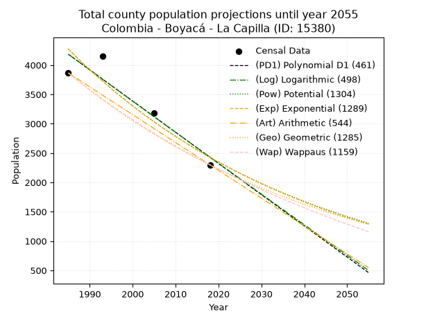
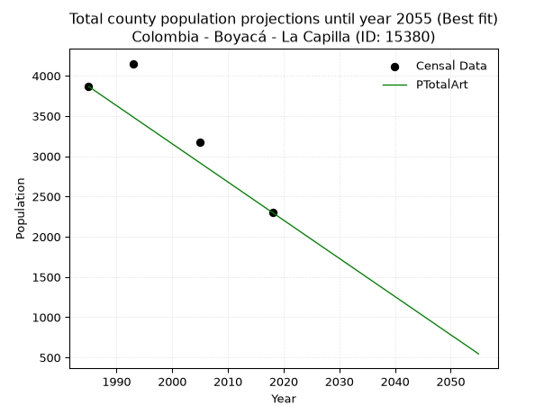
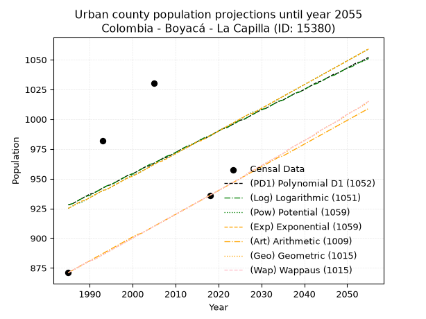
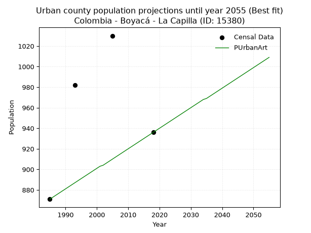
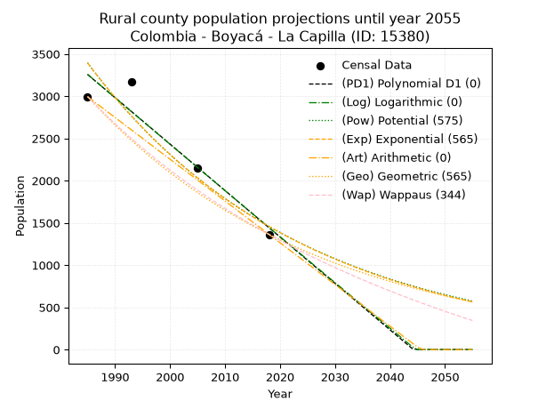
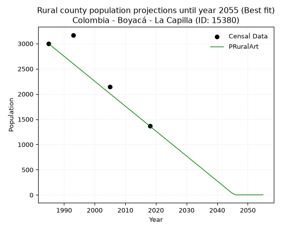

<div align="center">


</div>

# _“Population and Public Services Demand Projections (PPSD) until Year 2050 for Colombia - Boyacá - La Capilla (ID: 15380)”_
Keywords: `population` `public-service` `projection` `lineal` `polynomial` `logarithmic` `potential` `exponential` `arithmetic` `geometric` `wappaus` `dane` `colombia` `south-america`

PPSD are analytical estimates used by governments and planners to anticipate future changes in population size, age distribution, and the resulting community needs for utilities, healthcare, education, and infrastructure as sizing future water treatment facilities, electrical grids, and road networks based on spatial growth.

> **General running parameters**: • app_version: _v20260806_. • Python version: _3.14.7_. • Pandas version: _3.0.5_. • NumPy version: _2.5.1_. • Creates, save and include plots into reports (create_plot): _False_. • Projection until year: _2050_. • Process polynomial degree 2 and up: _False_. • Process Wappaus: _True_. • Process Wappaus: _True_. • Set negative values to zero: _True_. • Set infinite values to zero: _True_. • Drop dataset notes: _True_. 
<div align="center">

Dynamic map: [:earth_americas:Google](http://maps.google.com/maps?q=5.095686992,-73.4443474) [:earth_americas:OSM](https://www.openstreetmap.org/#map=18/5.095686992/-73.4443474&layers=P) [:earth_americas:Bing](https://www.bing.com/maps?cp=5.095686992~-73.4443474&lvl=18) [:earth_americas:Apple](https://maps.apple.com/frame?center=5.095686992%2C-73.4443474&span=0.003%2C0.006)

</div>


<div align="center">

```geojson
{
  "type": "Feature",
  "geometry": {
    "type": "Point", 
    "coordinates": [-73.4443474, 5.095686992]
  }, 
  "properties": {
    "Name": "Colombia - Boyacá - La Capilla (ID: 15380)"
  }
}
```

</div>


## 0. Census Data (4 records)

Census data are official statistics collected by a government about the people and housing in a country. They usually include counts of total population, age, sex, race, income, education, and jobs.

📅Global census file: [Population.xlsx](../data/Population.xlsx)

| Source   |   Year |   CountryID | CountryName   |   StateID | StateName   |   CountyID | CountyName   |   PTotal |   PUrban |   PRural |
|:---------|-------:|------------:|:--------------|----------:|:------------|-----------:|:-------------|---------:|---------:|---------:|
| DANE     |   1985 |          57 | Colombia      |        15 | Boyacá      |      15380 | La Capilla   |     3866 |      871 |     2995 |
| DANE     |   1993 |          57 | Colombia      |        15 | Boyacá      |      15380 | La Capilla   |     4151 |      982 |     3169 |
| DANE     |   2005 |          57 | Colombia      |        15 | Boyacá      |      15380 | La Capilla   |     3178 |     1030 |     2148 |
| DANE     |   2018 |          57 | Colombia      |        15 | Boyacá      |      15380 | La Capilla   |     2300 |      936 |     1364 |

> 🔥Some records could had specific notes about the registered values or the corresponding urban or rural distribution.

## 1. Total

### 1.1. Coefficients and Parameters

* (PD1) Polynomial Deg 1: -53.200722601364326, 109788.49538337899 (lineal)
* (Log) Logarithmic: -106412.73325898904, 812217.788239703
* (Pow) Potential: -34.24976477516686, 116.57839500585014
* (Exp) Exponential: -0.01712454235585781, 2.4738413936050683e+18
* (Art) Arithmetic: Year diff. 2018 - 1985 = 33, Population diff. 2300 - 3866 = -1566, Annual growth = -47.45454545454545
* (Geo) Geometric: Year diff. 2018 - 1985 = 33, Population diff. 2300 - 3866 = -1566, Annual growth % = -0.015613529813786386
* (Wap) Wappaus: i = -1.5392327426060803, Condition values only valid for < 200)

<sub>
Wappaus condition values: ['-0.00', '-1.54', '-3.08', '-4.62', '-6.16', '-7.70', '-9.24', '-10.77', '-12.31', '-13.85', '-15.39', '-16.93', '-18.47', '-20.01', '-21.55', '-23.09', '-24.63', '-26.17', '-27.71', '-29.25', '-30.78', '-32.32', '-33.86', '-35.40', '-36.94', '-38.48', '-40.02', '-41.56', '-43.10', '-44.64', '-46.18', '-47.72', '-49.26', '-50.79', '-52.33', '-53.87', '-55.41', '-56.95', '-58.49', '-60.03', '-61.57', '-63.11', '-64.65', '-66.19', '-67.73', '-69.27', '-70.80', '-72.34', '-73.88', '-75.42', '-76.96', '-78.50', '-80.04', '-81.58', '-83.12', '-84.66', '-86.20', '-87.74', '-89.28', '-90.81', '-92.35', '-93.89', '-95.43', '-96.97', '-98.51', '-100.05']
</sub>


### 1.2. Projected Dataset

|   Year |   CountyID |   PTotalPD1 |   PTotalLog |   PTotalPow |   PTotalExp |   PTotalArt |   PTotalGeo |   PTotalWap |
|-------:|-----------:|------------:|------------:|------------:|------------:|------------:|------------:|------------:|
|   1985 |      15380 |        4185 |        4186 |        4274 |        4273 |        3866 |        3866 |        3866 |
|   1986 |      15380 |        4132 |        4132 |        4201 |        4201 |        3819 |        3806 |        3807 |
|   1987 |      15380 |        4079 |        4079 |        4129 |        4129 |        3771 |        3746 |        3749 |
|   1988 |      15380 |        4025 |        4025 |        4059 |        4059 |        3724 |        3688 |        3692 |
|   1989 |      15380 |        3972 |        3972 |        3990 |        3990 |        3676 |        3630 |        3635 |
|   1990 |      15380 |        3919 |        3918 |        3922 |        3922 |        3629 |        3573 |        3579 |
|   1991 |      15380 |        3866 |        3865 |        3855 |        3856 |        3581 |        3518 |        3525 |
|   1992 |      15380 |        3813 |        3811 |        3789 |        3790 |        3534 |        3463 |        3471 |
|   1993 |      15380 |        3759 |        3758 |        3724 |        3726 |        3486 |        3409 |        3418 |
|   1994 |      15380 |        3706 |        3705 |        3661 |        3663 |        3439 |        3355 |        3365 |
|   1995 |      15380 |        3653 |        3651 |        3599 |        3601 |        3391 |        3303 |        3313 |
|   1996 |      15380 |        3600 |        3598 |        3537 |        3539 |        3344 |        3252 |        3263 |
|   1997 |      15380 |        3547 |        3545 |        3477 |        3479 |        3297 |        3201 |        3212 |
|   1998 |      15380 |        3493 |        3491 |        3418 |        3420 |        3249 |        3151 |        3163 |
|   1999 |      15380 |        3440 |        3438 |        3360 |        3362 |        3202 |        3102 |        3114 |
|   2000 |      15380 |        3387 |        3385 |        3303 |        3305 |        3154 |        3053 |        3066 |
|   2001 |      15380 |        3334 |        3332 |        3247 |        3249 |        3107 |        3005 |        3018 |
|   2002 |      15380 |        3281 |        3279 |        3192 |        3194 |        3059 |        2959 |        2971 |
|   2003 |      15380 |        3227 |        3225 |        3138 |        3140 |        3012 |        2912 |        2925 |
|   2004 |      15380 |        3174 |        3172 |        3084 |        3086 |        2964 |        2867 |        2880 |
|   2005 |      15380 |        3121 |        3119 |        3032 |        3034 |        2917 |        2822 |        2835 |
|   2006 |      15380 |        3068 |        3066 |        2981 |        2982 |        2869 |        2778 |        2790 |
|   2007 |      15380 |        3015 |        3013 |        2930 |        2932 |        2822 |        2735 |        2746 |
|   2008 |      15380 |        2961 |        2960 |        2881 |        2882 |        2775 |        2692 |        2703 |
|   2009 |      15380 |        2908 |        2907 |        2832 |        2833 |        2727 |        2650 |        2661 |
|   2010 |      15380 |        2855 |        2854 |        2784 |        2785 |        2680 |        2609 |        2618 |
|   2011 |      15380 |        2802 |        2801 |        2737 |        2738 |        2632 |        2568 |        2577 |
|   2012 |      15380 |        2749 |        2748 |        2691 |        2691 |        2585 |        2528 |        2536 |
|   2013 |      15380 |        2695 |        2696 |        2646 |        2645 |        2537 |        2488 |        2495 |
|   2014 |      15380 |        2642 |        2643 |        2601 |        2601 |        2490 |        2449 |        2455 |
|   2015 |      15380 |        2589 |        2590 |        2557 |        2556 |        2442 |        2411 |        2416 |
|   2016 |      15380 |        2536 |        2537 |        2514 |        2513 |        2395 |        2374 |        2377 |
|   2017 |      15380 |        2483 |        2484 |        2472 |        2470 |        2347 |        2336 |        2338 |
|   2018 |      15380 |        2429 |        2432 |        2430 |        2428 |        2300 |        2300 |        2300 |
|   2019 |      15380 |        2376 |        2379 |        2389 |        2387 |        2253 |        2264 |        2262 |
|   2020 |      15380 |        2323 |        2326 |        2349 |        2347 |        2205 |        2229 |        2225 |
|   2021 |      15380 |        2270 |        2273 |        2310 |        2307 |        2158 |        2194 |        2189 |
|   2022 |      15380 |        2217 |        2221 |        2271 |        2268 |        2110 |        2160 |        2152 |
|   2023 |      15380 |        2163 |        2168 |        2233 |        2229 |        2063 |        2126 |        2116 |
|   2024 |      15380 |        2110 |        2116 |        2195 |        2191 |        2015 |        2093 |        2081 |
|   2025 |      15380 |        2057 |        2063 |        2158 |        2154 |        1968 |        2060 |        2046 |
|   2026 |      15380 |        2004 |        2011 |        2122 |        2117 |        1920 |        2028 |        2011 |
|   2027 |      15380 |        1951 |        1958 |        2087 |        2082 |        1873 |        1996 |        1977 |
|   2028 |      15380 |        1897 |        1906 |        2052 |        2046 |        1825 |        1965 |        1943 |
|   2029 |      15380 |        1844 |        1853 |        2017 |        2011 |        1778 |        1934 |        1910 |
|   2030 |      15380 |        1791 |        1801 |        1984 |        1977 |        1731 |        1904 |        1877 |
|   2031 |      15380 |        1738 |        1748 |        1950 |        1944 |        1683 |        1874 |        1844 |
|   2032 |      15380 |        1685 |        1696 |        1918 |        1911 |        1636 |        1845 |        1812 |
|   2033 |      15380 |        1631 |        1644 |        1886 |        1878 |        1588 |        1816 |        1780 |
|   2034 |      15380 |        1578 |        1591 |        1854 |        1846 |        1541 |        1788 |        1749 |
|   2035 |      15380 |        1525 |        1539 |        1823 |        1815 |        1493 |        1760 |        1717 |
|   2036 |      15380 |        1472 |        1487 |        1793 |        1784 |        1446 |        1733 |        1687 |
|   2037 |      15380 |        1419 |        1434 |        1763 |        1754 |        1398 |        1706 |        1656 |
|   2038 |      15380 |        1365 |        1382 |        1734 |        1724 |        1351 |        1679 |        1626 |
|   2039 |      15380 |        1312 |        1330 |        1705 |        1695 |        1303 |        1653 |        1596 |
|   2040 |      15380 |        1259 |        1278 |        1676 |        1666 |        1256 |        1627 |        1566 |
|   2041 |      15380 |        1206 |        1226 |        1648 |        1638 |        1209 |        1602 |        1537 |
|   2042 |      15380 |        1153 |        1173 |        1621 |        1610 |        1161 |        1577 |        1508 |
|   2043 |      15380 |        1099 |        1121 |        1594 |        1583 |        1114 |        1552 |        1480 |
|   2044 |      15380 |        1046 |        1069 |        1567 |        1556 |        1066 |        1528 |        1451 |
|   2045 |      15380 |         993 |        1017 |        1541 |        1529 |        1019 |        1504 |        1423 |
|   2046 |      15380 |         940 |         965 |        1516 |        1503 |         971 |        1480 |        1396 |
|   2047 |      15380 |         887 |         913 |        1491 |        1478 |         924 |        1457 |        1368 |
|   2048 |      15380 |         833 |         861 |        1466 |        1453 |         876 |        1434 |        1341 |
|   2049 |      15380 |         780 |         809 |        1442 |        1428 |         829 |        1412 |        1314 |
|   2050 |      15380 |         727 |         757 |        1418 |        1404 |         781 |        1390 |        1288 |
<div align="center">

</img>

</div>


### 1.3. Best fit with absolute and relative error (%)

Relative error puts that difference into context by dividing the absolute error by the true value, creating a unitless ratio or percentage that shows the scale of the mistake.

Absolute and relative error

|   Year | Source   |   CountryID | CountryName   |   StateID | StateName   |   CountyID_x | CountyName   |   PTotal |   PUrban |   PRural |   CountyID_y |   PTotalPD1 |   PTotalLog |   PTotalPow |   PTotalExp |   PTotalArt |   PTotalGeo |   PTotalWap |   PTotalPD1AbsError |   PTotalLogAbsError |   PTotalPowAbsError |   PTotalExpAbsError |   PTotalArtAbsError |   PTotalGeoAbsError |   PTotalWapAbsError |   PTotalPD1RelError |   PTotalLogRelError |   PTotalPowRelError |   PTotalExpRelError |   PTotalArtRelError |   PTotalGeoRelError |   PTotalWapRelError |
|-------:|:---------|------------:|:--------------|----------:|:------------|-------------:|:-------------|---------:|---------:|---------:|-------------:|------------:|------------:|------------:|------------:|------------:|------------:|------------:|--------------------:|--------------------:|--------------------:|--------------------:|--------------------:|--------------------:|--------------------:|--------------------:|--------------------:|--------------------:|--------------------:|--------------------:|--------------------:|--------------------:|
|   1985 | DANE     |          57 | Colombia      |        15 | Boyacá      |        15380 | La Capilla   |     3866 |      871 |     2995 |        15380 |        4185 |        4186 |        4274 |        4273 |        3866 |        3866 |        3866 |                 319 |                 320 |                 408 |                 407 |                   0 |                   0 |                   0 |             8.25142 |             8.27729 |            10.5535  |            10.5277  |             0       |              0      |              0      |
|   1993 | DANE     |          57 | Colombia      |        15 | Boyacá      |        15380 | La Capilla   |     4151 |      982 |     3169 |        15380 |        3759 |        3758 |        3724 |        3726 |        3486 |        3409 |        3418 |                 392 |                 393 |                 427 |                 425 |                 665 |                 742 |                 733 |             9.44351 |             9.4676  |            10.2867  |            10.2385  |            16.0202  |             17.8752 |             17.6584 |
|   2005 | DANE     |          57 | Colombia      |        15 | Boyacá      |        15380 | La Capilla   |     3178 |     1030 |     2148 |        15380 |        3121 |        3119 |        3032 |        3034 |        2917 |        2822 |        2835 |                  57 |                  59 |                 146 |                 144 |                 261 |                 356 |                 343 |             1.79358 |             1.85651 |             4.59408 |             4.53115 |             8.21271 |             11.202  |             10.793  |
|   2018 | DANE     |          57 | Colombia      |        15 | Boyacá      |        15380 | La Capilla   |     2300 |      936 |     1364 |        15380 |        2429 |        2432 |        2430 |        2428 |        2300 |        2300 |        2300 |                 129 |                 132 |                 130 |                 128 |                   0 |                   0 |                   0 |             5.6087  |             5.73913 |             5.65217 |             5.56522 |             0       |              0      |              0      |

Relative error mean

| Method    |   RelError | Best   |
|:----------|-----------:|:-------|
| PTotalPD1 |    6.2743  |        |
| PTotalLog |    6.33513 |        |
| PTotalPow |    7.77162 |        |
| PTotalExp |    7.71564 |        |
| PTotalArt |    6.05824 | True   |
| PTotalGeo |    7.26931 |        |
| PTotalWap |    7.11284 |        |

💙Best method: _**PTotalArt**_
<div align="center">

</img>

</div>


### 1.4. Fresh water supply demand in liters per capita per day (lpcd)

The fresh water supply demand typically ranges from 100 to 300 liters per capita per day (lpcd) for standard domestic and municipal planning, though absolute survival minimums set by the World Health Organization are as low as 7.5 to 20 liters per day, and total consumption in high-income nations can exceed 400 liters.

> `CZ`: Level in meters above the sea level (masl)<br> `WS`: Fresh water supply demand in liters per capita per day (lpcd or l/h/d)<br> `WSAll`: Zonal fresh water supply demand in liters per second (l/s)<br> `A`: Zonal area in square meters<br> `DP`: Population density (people/hectare)

Reference values (RAS Colombia)

|    CZ |   WS |
|------:|-----:|
|  1000 |  120 |
|  2000 |  130 |
| 99999 |  140 |

County shapefile geometry properties and water supply values

|   CountyID |      ATotal |   CZTotal |   WSTotal |
|-----------:|------------:|----------:|----------:|
|      15380 | 5.68372e+07 |   2387.42 |       140 |

Projected values for best method: PTotalArt

|   CountyID |   Year |   PTotalArt |   DPTotal |   WSTotal |   WSTotalAll |
|-----------:|-------:|------------:|----------:|----------:|-------------:|
|      15380 |   1985 |        3866 |      0.68 |       140 |      6.26435 |
|      15380 |   1986 |        3819 |      0.67 |       140 |      6.18819 |
|      15380 |   1987 |        3771 |      0.66 |       140 |      6.11042 |
|      15380 |   1988 |        3724 |      0.66 |       140 |      6.03426 |
|      15380 |   1989 |        3676 |      0.65 |       140 |      5.95648 |
|      15380 |   1990 |        3629 |      0.64 |       140 |      5.88032 |
|      15380 |   1991 |        3581 |      0.63 |       140 |      5.80255 |
|      15380 |   1992 |        3534 |      0.62 |       140 |      5.72639 |
|      15380 |   1993 |        3486 |      0.61 |       140 |      5.64861 |
|      15380 |   1994 |        3439 |      0.61 |       140 |      5.57245 |
|      15380 |   1995 |        3391 |      0.6  |       140 |      5.49468 |
|      15380 |   1996 |        3344 |      0.59 |       140 |      5.41852 |
|      15380 |   1997 |        3297 |      0.58 |       140 |      5.34236 |
|      15380 |   1998 |        3249 |      0.57 |       140 |      5.26458 |
|      15380 |   1999 |        3202 |      0.56 |       140 |      5.18843 |
|      15380 |   2000 |        3154 |      0.55 |       140 |      5.11065 |
|      15380 |   2001 |        3107 |      0.55 |       140 |      5.03449 |
|      15380 |   2002 |        3059 |      0.54 |       140 |      4.95671 |
|      15380 |   2003 |        3012 |      0.53 |       140 |      4.88056 |
|      15380 |   2004 |        2964 |      0.52 |       140 |      4.80278 |
|      15380 |   2005 |        2917 |      0.51 |       140 |      4.72662 |
|      15380 |   2006 |        2869 |      0.5  |       140 |      4.64884 |
|      15380 |   2007 |        2822 |      0.5  |       140 |      4.57269 |
|      15380 |   2008 |        2775 |      0.49 |       140 |      4.49653 |
|      15380 |   2009 |        2727 |      0.48 |       140 |      4.41875 |
|      15380 |   2010 |        2680 |      0.47 |       140 |      4.34259 |
|      15380 |   2011 |        2632 |      0.46 |       140 |      4.26481 |
|      15380 |   2012 |        2585 |      0.45 |       140 |      4.18866 |
|      15380 |   2013 |        2537 |      0.45 |       140 |      4.11088 |
|      15380 |   2014 |        2490 |      0.44 |       140 |      4.03472 |
|      15380 |   2015 |        2442 |      0.43 |       140 |      3.95694 |
|      15380 |   2016 |        2395 |      0.42 |       140 |      3.88079 |
|      15380 |   2017 |        2347 |      0.41 |       140 |      3.80301 |
|      15380 |   2018 |        2300 |      0.4  |       140 |      3.72685 |
|      15380 |   2019 |        2253 |      0.4  |       140 |      3.65069 |
|      15380 |   2020 |        2205 |      0.39 |       140 |      3.57292 |
|      15380 |   2021 |        2158 |      0.38 |       140 |      3.49676 |
|      15380 |   2022 |        2110 |      0.37 |       140 |      3.41898 |
|      15380 |   2023 |        2063 |      0.36 |       140 |      3.34282 |
|      15380 |   2024 |        2015 |      0.35 |       140 |      3.26505 |
|      15380 |   2025 |        1968 |      0.35 |       140 |      3.18889 |
|      15380 |   2026 |        1920 |      0.34 |       140 |      3.11111 |
|      15380 |   2027 |        1873 |      0.33 |       140 |      3.03495 |
|      15380 |   2028 |        1825 |      0.32 |       140 |      2.95718 |
|      15380 |   2029 |        1778 |      0.31 |       140 |      2.88102 |
|      15380 |   2030 |        1731 |      0.3  |       140 |      2.80486 |
|      15380 |   2031 |        1683 |      0.3  |       140 |      2.72708 |
|      15380 |   2032 |        1636 |      0.29 |       140 |      2.65093 |
|      15380 |   2033 |        1588 |      0.28 |       140 |      2.57315 |
|      15380 |   2034 |        1541 |      0.27 |       140 |      2.49699 |
|      15380 |   2035 |        1493 |      0.26 |       140 |      2.41921 |
|      15380 |   2036 |        1446 |      0.25 |       140 |      2.34306 |
|      15380 |   2037 |        1398 |      0.25 |       140 |      2.26528 |
|      15380 |   2038 |        1351 |      0.24 |       140 |      2.18912 |
|      15380 |   2039 |        1303 |      0.23 |       140 |      2.11134 |
|      15380 |   2040 |        1256 |      0.22 |       140 |      2.03519 |
|      15380 |   2041 |        1209 |      0.21 |       140 |      1.95903 |
|      15380 |   2042 |        1161 |      0.2  |       140 |      1.88125 |
|      15380 |   2043 |        1114 |      0.2  |       140 |      1.80509 |
|      15380 |   2044 |        1066 |      0.19 |       140 |      1.72731 |
|      15380 |   2045 |        1019 |      0.18 |       140 |      1.65116 |
|      15380 |   2046 |         971 |      0.17 |       140 |      1.57338 |
|      15380 |   2047 |         924 |      0.16 |       140 |      1.49722 |
|      15380 |   2048 |         876 |      0.15 |       140 |      1.41944 |
|      15380 |   2049 |         829 |      0.15 |       140 |      1.34329 |
|      15380 |   2050 |         781 |      0.14 |       140 |      1.26551 |

## 2. Urban

### 2.1. Coefficients and Parameters

* (PD1) Polynomial Deg 1: 1.7731834604577046, -2592.060216780524 (lineal)
* (Log) Logarithmic: 3569.6365949583915, -26178.086363551163
* (Pow) Potential: 3.8923463206714213, -9.869869709983849
* (Exp) Exponential: 0.0019339051958558306, 19.91049227367463
* (Art) Arithmetic: Year diff. 2018 - 1985 = 33, Population diff. 936 - 871 = 65, Annual growth = 1.9696969696969697
* (Geo) Geometric: Year diff. 2018 - 1985 = 33, Population diff. 936 - 871 = 65, Annual growth % = 0.0021833952837368997
* (Wap) Wappaus: i = 0.21800741225201656, Condition values only valid for < 200)

<sub>
Wappaus condition values: ['0.00', '0.22', '0.44', '0.65', '0.87', '1.09', '1.31', '1.53', '1.74', '1.96', '2.18', '2.40', '2.62', '2.83', '3.05', '3.27', '3.49', '3.71', '3.92', '4.14', '4.36', '4.58', '4.80', '5.01', '5.23', '5.45', '5.67', '5.89', '6.10', '6.32', '6.54', '6.76', '6.98', '7.19', '7.41', '7.63', '7.85', '8.07', '8.28', '8.50', '8.72', '8.94', '9.16', '9.37', '9.59', '9.81', '10.03', '10.25', '10.46', '10.68', '10.90', '11.12', '11.34', '11.55', '11.77', '11.99', '12.21', '12.43', '12.64', '12.86', '13.08', '13.30', '13.52', '13.73', '13.95', '14.17']
</sub>


### 2.2. Projected Dataset

|   Year |   CountyID |   PUrbanPD1 |   PUrbanLog |   PUrbanPow |   PUrbanExp |   PUrbanArt |   PUrbanGeo |   PUrbanWap |
|-------:|-----------:|------------:|------------:|------------:|------------:|------------:|------------:|------------:|
|   1985 |      15380 |         928 |         928 |         925 |         925 |         871 |         871 |         871 |
|   1986 |      15380 |         929 |         929 |         927 |         927 |         873 |         873 |         873 |
|   1987 |      15380 |         931 |         931 |         929 |         929 |         875 |         875 |         875 |
|   1988 |      15380 |         933 |         933 |         930 |         931 |         877 |         877 |         877 |
|   1989 |      15380 |         935 |         935 |         932 |         932 |         879 |         879 |         879 |
|   1990 |      15380 |         937 |         936 |         934 |         934 |         881 |         881 |         881 |
|   1991 |      15380 |         938 |         938 |         936 |         936 |         883 |         882 |         882 |
|   1992 |      15380 |         940 |         940 |         938 |         938 |         885 |         884 |         884 |
|   1993 |      15380 |         942 |         942 |         940 |         940 |         887 |         886 |         886 |
|   1994 |      15380 |         944 |         944 |         941 |         941 |         889 |         888 |         888 |
|   1995 |      15380 |         945 |         945 |         943 |         943 |         891 |         890 |         890 |
|   1996 |      15380 |         947 |         947 |         945 |         945 |         893 |         892 |         892 |
|   1997 |      15380 |         949 |         949 |         947 |         947 |         895 |         894 |         894 |
|   1998 |      15380 |         951 |         951 |         949 |         949 |         897 |         896 |         896 |
|   1999 |      15380 |         953 |         953 |         951 |         951 |         899 |         898 |         898 |
|   2000 |      15380 |         954 |         954 |         953 |         952 |         901 |         900 |         900 |
|   2001 |      15380 |         956 |         956 |         954 |         954 |         903 |         902 |         902 |
|   2002 |      15380 |         958 |         958 |         956 |         956 |         904 |         904 |         904 |
|   2003 |      15380 |         960 |         960 |         958 |         958 |         906 |         906 |         906 |
|   2004 |      15380 |         961 |         962 |         960 |         960 |         908 |         908 |         908 |
|   2005 |      15380 |         963 |         963 |         962 |         962 |         910 |         910 |         910 |
|   2006 |      15380 |         965 |         965 |         964 |         964 |         912 |         912 |         912 |
|   2007 |      15380 |         967 |         967 |         966 |         965 |         914 |         914 |         914 |
|   2008 |      15380 |         968 |         969 |         967 |         967 |         916 |         916 |         916 |
|   2009 |      15380 |         970 |         970 |         969 |         969 |         918 |         918 |         918 |
|   2010 |      15380 |         972 |         972 |         971 |         971 |         920 |         920 |         920 |
|   2011 |      15380 |         974 |         974 |         973 |         973 |         922 |         922 |         922 |
|   2012 |      15380 |         976 |         976 |         975 |         975 |         924 |         924 |         924 |
|   2013 |      15380 |         977 |         978 |         977 |         977 |         926 |         926 |         926 |
|   2014 |      15380 |         979 |         979 |         979 |         979 |         928 |         928 |         928 |
|   2015 |      15380 |         981 |         981 |         981 |         981 |         930 |         930 |         930 |
|   2016 |      15380 |         983 |         983 |         983 |         982 |         932 |         932 |         932 |
|   2017 |      15380 |         984 |         985 |         984 |         984 |         934 |         934 |         934 |
|   2018 |      15380 |         986 |         986 |         986 |         986 |         936 |         936 |         936 |
|   2019 |      15380 |         988 |         988 |         988 |         988 |         938 |         938 |         938 |
|   2020 |      15380 |         990 |         990 |         990 |         990 |         940 |         940 |         940 |
|   2021 |      15380 |         992 |         992 |         992 |         992 |         942 |         942 |         942 |
|   2022 |      15380 |         993 |         993 |         994 |         994 |         944 |         944 |         944 |
|   2023 |      15380 |         995 |         995 |         996 |         996 |         946 |         946 |         946 |
|   2024 |      15380 |         997 |         997 |         998 |         998 |         948 |         948 |         948 |
|   2025 |      15380 |         999 |         999 |        1000 |        1000 |         950 |         950 |         950 |
|   2026 |      15380 |        1000 |        1000 |        1002 |        1002 |         952 |         952 |         952 |
|   2027 |      15380 |        1002 |        1002 |        1004 |        1004 |         954 |         955 |         955 |
|   2028 |      15380 |        1004 |        1004 |        1006 |        1005 |         956 |         957 |         957 |
|   2029 |      15380 |        1006 |        1006 |        1007 |        1007 |         958 |         959 |         959 |
|   2030 |      15380 |        1008 |        1008 |        1009 |        1009 |         960 |         961 |         961 |
|   2031 |      15380 |        1009 |        1009 |        1011 |        1011 |         962 |         963 |         963 |
|   2032 |      15380 |        1011 |        1011 |        1013 |        1013 |         964 |         965 |         965 |
|   2033 |      15380 |        1013 |        1013 |        1015 |        1015 |         966 |         967 |         967 |
|   2034 |      15380 |        1015 |        1015 |        1017 |        1017 |         968 |         969 |         969 |
|   2035 |      15380 |        1016 |        1016 |        1019 |        1019 |         969 |         971 |         971 |
|   2036 |      15380 |        1018 |        1018 |        1021 |        1021 |         971 |         973 |         974 |
|   2037 |      15380 |        1020 |        1020 |        1023 |        1023 |         973 |         976 |         976 |
|   2038 |      15380 |        1022 |        1022 |        1025 |        1025 |         975 |         978 |         978 |
|   2039 |      15380 |        1023 |        1023 |        1027 |        1027 |         977 |         980 |         980 |
|   2040 |      15380 |        1025 |        1025 |        1029 |        1029 |         979 |         982 |         982 |
|   2041 |      15380 |        1027 |        1027 |        1031 |        1031 |         981 |         984 |         984 |
|   2042 |      15380 |        1029 |        1029 |        1033 |        1033 |         983 |         986 |         986 |
|   2043 |      15380 |        1031 |        1030 |        1035 |        1035 |         985 |         988 |         989 |
|   2044 |      15380 |        1032 |        1032 |        1037 |        1037 |         987 |         991 |         991 |
|   2045 |      15380 |        1034 |        1034 |        1039 |        1039 |         989 |         993 |         993 |
|   2046 |      15380 |        1036 |        1036 |        1041 |        1041 |         991 |         995 |         995 |
|   2047 |      15380 |        1038 |        1037 |        1043 |        1043 |         993 |         997 |         997 |
|   2048 |      15380 |        1039 |        1039 |        1045 |        1045 |         995 |         999 |         999 |
|   2049 |      15380 |        1041 |        1041 |        1047 |        1047 |         997 |        1001 |        1002 |
|   2050 |      15380 |        1043 |        1043 |        1049 |        1049 |         999 |        1004 |        1004 |
<div align="center">

</img>

</div>


### 2.3. Best fit with absolute and relative error (%)

Relative error puts that difference into context by dividing the absolute error by the true value, creating a unitless ratio or percentage that shows the scale of the mistake.

Absolute and relative error

|   Year | Source   |   CountryID | CountryName   |   StateID | StateName   |   CountyID_x | CountyName   |   PTotal |   PUrban |   PRural |   CountyID_y |   PUrbanPD1 |   PUrbanLog |   PUrbanPow |   PUrbanExp |   PUrbanArt |   PUrbanGeo |   PUrbanWap |   PUrbanPD1AbsError |   PUrbanLogAbsError |   PUrbanPowAbsError |   PUrbanExpAbsError |   PUrbanArtAbsError |   PUrbanGeoAbsError |   PUrbanWapAbsError |   PUrbanPD1RelError |   PUrbanLogRelError |   PUrbanPowRelError |   PUrbanExpRelError |   PUrbanArtRelError |   PUrbanGeoRelError |   PUrbanWapRelError |
|-------:|:---------|------------:|:--------------|----------:|:------------|-------------:|:-------------|---------:|---------:|---------:|-------------:|------------:|------------:|------------:|------------:|------------:|------------:|------------:|--------------------:|--------------------:|--------------------:|--------------------:|--------------------:|--------------------:|--------------------:|--------------------:|--------------------:|--------------------:|--------------------:|--------------------:|--------------------:|--------------------:|
|   1985 | DANE     |          57 | Colombia      |        15 | Boyacá      |        15380 | La Capilla   |     3866 |      871 |     2995 |        15380 |         928 |         928 |         925 |         925 |         871 |         871 |         871 |                  57 |                  57 |                  54 |                  54 |                   0 |                   0 |                   0 |             6.5442  |             6.5442  |             6.19977 |             6.19977 |             0       |             0       |             0       |
|   1993 | DANE     |          57 | Colombia      |        15 | Boyacá      |        15380 | La Capilla   |     4151 |      982 |     3169 |        15380 |         942 |         942 |         940 |         940 |         887 |         886 |         886 |                  40 |                  40 |                  42 |                  42 |                  95 |                  96 |                  96 |             4.07332 |             4.07332 |             4.27699 |             4.27699 |             9.67413 |             9.77597 |             9.77597 |
|   2005 | DANE     |          57 | Colombia      |        15 | Boyacá      |        15380 | La Capilla   |     3178 |     1030 |     2148 |        15380 |         963 |         963 |         962 |         962 |         910 |         910 |         910 |                  67 |                  67 |                  68 |                  68 |                 120 |                 120 |                 120 |             6.50485 |             6.50485 |             6.60194 |             6.60194 |            11.6505  |            11.6505  |            11.6505  |
|   2018 | DANE     |          57 | Colombia      |        15 | Boyacá      |        15380 | La Capilla   |     2300 |      936 |     1364 |        15380 |         986 |         986 |         986 |         986 |         936 |         936 |         936 |                  50 |                  50 |                  50 |                  50 |                   0 |                   0 |                   0 |             5.34188 |             5.34188 |             5.34188 |             5.34188 |             0       |             0       |             0       |

Relative error mean

| Method    |   RelError | Best   |
|:----------|-----------:|:-------|
| PUrbanPD1 |    5.61606 |        |
| PUrbanLog |    5.61606 |        |
| PUrbanPow |    5.60514 |        |
| PUrbanExp |    5.60514 |        |
| PUrbanArt |    5.33115 | True   |
| PUrbanGeo |    5.35661 |        |
| PUrbanWap |    5.35661 |        |

💙Best method: _**PUrbanArt**_
<div align="center">

</img>

</div>


### 2.4. Fresh water supply demand in liters per capita per day (lpcd)

The fresh water supply demand typically ranges from 100 to 300 liters per capita per day (lpcd) for standard domestic and municipal planning, though absolute survival minimums set by the World Health Organization are as low as 7.5 to 20 liters per day, and total consumption in high-income nations can exceed 400 liters.

> `CZ`: Level in meters above the sea level (masl)<br> `WS`: Fresh water supply demand in liters per capita per day (lpcd or l/h/d)<br> `WSAll`: Zonal fresh water supply demand in liters per second (l/s)<br> `A`: Zonal area in square meters<br> `DP`: Population density (people/hectare)

Reference values (RAS Colombia)

|    CZ |   WS |
|------:|-----:|
|  1000 |  120 |
|  2000 |  130 |
| 99999 |  140 |

County shapefile geometry properties and water supply values

|   CountyID |   AUrban |   CZUrban |   WSUrban |
|-----------:|---------:|----------:|----------:|
|      15380 |   279516 |   1749.95 |       130 |

Projected values for best method: PUrbanArt

|   CountyID |   Year |   PUrbanArt |   DPUrban |   WSUrban |   WSUrbanAll |
|-----------:|-------:|------------:|----------:|----------:|-------------:|
|      15380 |   1985 |         871 |     31.16 |       130 |      1.31053 |
|      15380 |   1986 |         873 |     31.23 |       130 |      1.31354 |
|      15380 |   1987 |         875 |     31.3  |       130 |      1.31655 |
|      15380 |   1988 |         877 |     31.38 |       130 |      1.31956 |
|      15380 |   1989 |         879 |     31.45 |       130 |      1.32257 |
|      15380 |   1990 |         881 |     31.52 |       130 |      1.32558 |
|      15380 |   1991 |         883 |     31.59 |       130 |      1.32859 |
|      15380 |   1992 |         885 |     31.66 |       130 |      1.3316  |
|      15380 |   1993 |         887 |     31.73 |       130 |      1.33461 |
|      15380 |   1994 |         889 |     31.81 |       130 |      1.33762 |
|      15380 |   1995 |         891 |     31.88 |       130 |      1.34062 |
|      15380 |   1996 |         893 |     31.95 |       130 |      1.34363 |
|      15380 |   1997 |         895 |     32.02 |       130 |      1.34664 |
|      15380 |   1998 |         897 |     32.09 |       130 |      1.34965 |
|      15380 |   1999 |         899 |     32.16 |       130 |      1.35266 |
|      15380 |   2000 |         901 |     32.23 |       130 |      1.35567 |
|      15380 |   2001 |         903 |     32.31 |       130 |      1.35868 |
|      15380 |   2002 |         904 |     32.34 |       130 |      1.36019 |
|      15380 |   2003 |         906 |     32.41 |       130 |      1.36319 |
|      15380 |   2004 |         908 |     32.48 |       130 |      1.3662  |
|      15380 |   2005 |         910 |     32.56 |       130 |      1.36921 |
|      15380 |   2006 |         912 |     32.63 |       130 |      1.37222 |
|      15380 |   2007 |         914 |     32.7  |       130 |      1.37523 |
|      15380 |   2008 |         916 |     32.77 |       130 |      1.37824 |
|      15380 |   2009 |         918 |     32.84 |       130 |      1.38125 |
|      15380 |   2010 |         920 |     32.91 |       130 |      1.38426 |
|      15380 |   2011 |         922 |     32.99 |       130 |      1.38727 |
|      15380 |   2012 |         924 |     33.06 |       130 |      1.39028 |
|      15380 |   2013 |         926 |     33.13 |       130 |      1.39329 |
|      15380 |   2014 |         928 |     33.2  |       130 |      1.3963  |
|      15380 |   2015 |         930 |     33.27 |       130 |      1.39931 |
|      15380 |   2016 |         932 |     33.34 |       130 |      1.40231 |
|      15380 |   2017 |         934 |     33.41 |       130 |      1.40532 |
|      15380 |   2018 |         936 |     33.49 |       130 |      1.40833 |
|      15380 |   2019 |         938 |     33.56 |       130 |      1.41134 |
|      15380 |   2020 |         940 |     33.63 |       130 |      1.41435 |
|      15380 |   2021 |         942 |     33.7  |       130 |      1.41736 |
|      15380 |   2022 |         944 |     33.77 |       130 |      1.42037 |
|      15380 |   2023 |         946 |     33.84 |       130 |      1.42338 |
|      15380 |   2024 |         948 |     33.92 |       130 |      1.42639 |
|      15380 |   2025 |         950 |     33.99 |       130 |      1.4294  |
|      15380 |   2026 |         952 |     34.06 |       130 |      1.43241 |
|      15380 |   2027 |         954 |     34.13 |       130 |      1.43542 |
|      15380 |   2028 |         956 |     34.2  |       130 |      1.43843 |
|      15380 |   2029 |         958 |     34.27 |       130 |      1.44144 |
|      15380 |   2030 |         960 |     34.35 |       130 |      1.44444 |
|      15380 |   2031 |         962 |     34.42 |       130 |      1.44745 |
|      15380 |   2032 |         964 |     34.49 |       130 |      1.45046 |
|      15380 |   2033 |         966 |     34.56 |       130 |      1.45347 |
|      15380 |   2034 |         968 |     34.63 |       130 |      1.45648 |
|      15380 |   2035 |         969 |     34.67 |       130 |      1.45799 |
|      15380 |   2036 |         971 |     34.74 |       130 |      1.461   |
|      15380 |   2037 |         973 |     34.81 |       130 |      1.464   |
|      15380 |   2038 |         975 |     34.88 |       130 |      1.46701 |
|      15380 |   2039 |         977 |     34.95 |       130 |      1.47002 |
|      15380 |   2040 |         979 |     35.02 |       130 |      1.47303 |
|      15380 |   2041 |         981 |     35.1  |       130 |      1.47604 |
|      15380 |   2042 |         983 |     35.17 |       130 |      1.47905 |
|      15380 |   2043 |         985 |     35.24 |       130 |      1.48206 |
|      15380 |   2044 |         987 |     35.31 |       130 |      1.48507 |
|      15380 |   2045 |         989 |     35.38 |       130 |      1.48808 |
|      15380 |   2046 |         991 |     35.45 |       130 |      1.49109 |
|      15380 |   2047 |         993 |     35.53 |       130 |      1.4941  |
|      15380 |   2048 |         995 |     35.6  |       130 |      1.49711 |
|      15380 |   2049 |         997 |     35.67 |       130 |      1.50012 |
|      15380 |   2050 |         999 |     35.74 |       130 |      1.50313 |

## 3. Rural

### 3.1. Coefficients and Parameters

* (PD1) Polynomial Deg 1: -54.973906061822035, 112380.55560015953 (lineal)
* (Log) Logarithmic: -109982.36985394747, 838395.8746032544
* (Pow) Potential: -51.22971938546738, 172.47423073638356
* (Exp) Exponential: -0.02561080987192693, 4.065270004393071e+25
* (Art) Arithmetic: Year diff. 2018 - 1985 = 33, Population diff. 1364 - 2995 = -1631, Annual growth = -49.42424242424242
* (Geo) Geometric: Year diff. 2018 - 1985 = 33, Population diff. 1364 - 2995 = -1631, Annual growth % = -0.02355223325061373
* (Wap) Wappaus: i = -2.2676871954229147, Condition values only valid for < 200)

<sub>
Wappaus condition values: ['-0.00', '-2.27', '-4.54', '-6.80', '-9.07', '-11.34', '-13.61', '-15.87', '-18.14', '-20.41', '-22.68', '-24.94', '-27.21', '-29.48', '-31.75', '-34.02', '-36.28', '-38.55', '-40.82', '-43.09', '-45.35', '-47.62', '-49.89', '-52.16', '-54.42', '-56.69', '-58.96', '-61.23', '-63.50', '-65.76', '-68.03', '-70.30', '-72.57', '-74.83', '-77.10', '-79.37', '-81.64', '-83.90', '-86.17', '-88.44', '-90.71', '-92.98', '-95.24', '-97.51', '-99.78', '-102.05', '-104.31', '-106.58', '-108.85', '-111.12', '-113.38', '-115.65', '-117.92', '-120.19', '-122.46', '-124.72', '-126.99', '-129.26', '-131.53', '-133.79', '-136.06', '-138.33', '-140.60', '-142.86', '-145.13', '-147.40']
</sub>


### 3.2. Projected Dataset

|   Year |   CountyID |   PRuralPD1 |   PRuralLog |   PRuralPow |   PRuralExp |   PRuralArt |   PRuralGeo |   PRuralWap |
|-------:|-----------:|------------:|------------:|------------:|------------:|------------:|------------:|------------:|
|   1985 |      15380 |        3257 |        3259 |        3395 |        3394 |        2995 |        2995 |        2995 |
|   1986 |      15380 |        3202 |        3203 |        3309 |        3308 |        2946 |        2924 |        2928 |
|   1987 |      15380 |        3147 |        3148 |        3225 |        3224 |        2896 |        2856 |        2862 |
|   1988 |      15380 |        3092 |        3092 |        3143 |        3143 |        2847 |        2788 |        2798 |
|   1989 |      15380 |        3037 |        3037 |        3063 |        3063 |        2797 |        2723 |        2735 |
|   1990 |      15380 |        2982 |        2982 |        2985 |        2986 |        2748 |        2659 |        2674 |
|   1991 |      15380 |        2928 |        2927 |        2909 |        2910 |        2698 |        2596 |        2613 |
|   1992 |      15380 |        2873 |        2871 |        2835 |        2837 |        2649 |        2535 |        2555 |
|   1993 |      15380 |        2818 |        2816 |        2763 |        2765 |        2600 |        2475 |        2497 |
|   1994 |      15380 |        2763 |        2761 |        2693 |        2695 |        2550 |        2417 |        2440 |
|   1995 |      15380 |        2708 |        2706 |        2625 |        2627 |        2501 |        2360 |        2385 |
|   1996 |      15380 |        2653 |        2651 |        2558 |        2560 |        2451 |        2304 |        2331 |
|   1997 |      15380 |        2598 |        2596 |        2493 |        2496 |        2402 |        2250 |        2278 |
|   1998 |      15380 |        2543 |        2541 |        2430 |        2433 |        2352 |        2197 |        2226 |
|   1999 |      15380 |        2488 |        2486 |        2369 |        2371 |        2303 |        2145 |        2174 |
|   2000 |      15380 |        2433 |        2431 |        2309 |        2311 |        2254 |        2095 |        2124 |
|   2001 |      15380 |        2378 |        2376 |        2250 |        2253 |        2204 |        2045 |        2075 |
|   2002 |      15380 |        2323 |        2321 |        2194 |        2196 |        2155 |        1997 |        2027 |
|   2003 |      15380 |        2268 |        2266 |        2138 |        2140 |        2105 |        1950 |        1980 |
|   2004 |      15380 |        2213 |        2211 |        2084 |        2086 |        2056 |        1904 |        1933 |
|   2005 |      15380 |        2158 |        2156 |        2032 |        2033 |        2007 |        1859 |        1888 |
|   2006 |      15380 |        2103 |        2101 |        1980 |        1982 |        1957 |        1816 |        1843 |
|   2007 |      15380 |        2048 |        2046 |        1930 |        1932 |        1908 |        1773 |        1799 |
|   2008 |      15380 |        1993 |        1992 |        1882 |        1883 |        1858 |        1731 |        1756 |
|   2009 |      15380 |        1938 |        1937 |        1834 |        1835 |        1809 |        1690 |        1714 |
|   2010 |      15380 |        1883 |        1882 |        1788 |        1789 |        1759 |        1651 |        1672 |
|   2011 |      15380 |        1828 |        1827 |        1743 |        1744 |        1710 |        1612 |        1631 |
|   2012 |      15380 |        1773 |        1773 |        1699 |        1700 |        1661 |        1574 |        1591 |
|   2013 |      15380 |        1718 |        1718 |        1657 |        1657 |        1611 |        1537 |        1552 |
|   2014 |      15380 |        1663 |        1663 |        1615 |        1615 |        1562 |        1500 |        1513 |
|   2015 |      15380 |        1608 |        1609 |        1575 |        1574 |        1512 |        1465 |        1475 |
|   2016 |      15380 |        1553 |        1554 |        1535 |        1534 |        1463 |        1431 |        1437 |
|   2017 |      15380 |        1498 |        1500 |        1496 |        1495 |        1413 |        1397 |        1400 |
|   2018 |      15380 |        1443 |        1445 |        1459 |        1458 |        1364 |        1364 |        1364 |
|   2019 |      15380 |        1388 |        1391 |        1422 |        1421 |        1315 |        1332 |        1328 |
|   2020 |      15380 |        1333 |        1336 |        1387 |        1385 |        1265 |        1301 |        1293 |
|   2021 |      15380 |        1278 |        1282 |        1352 |        1350 |        1216 |        1270 |        1259 |
|   2022 |      15380 |        1223 |        1227 |        1318 |        1316 |        1166 |        1240 |        1225 |
|   2023 |      15380 |        1168 |        1173 |        1285 |        1282 |        1117 |        1211 |        1191 |
|   2024 |      15380 |        1113 |        1119 |        1253 |        1250 |        1067 |        1182 |        1158 |
|   2025 |      15380 |        1058 |        1064 |        1222 |        1218 |        1018 |        1154 |        1126 |
|   2026 |      15380 |        1003 |        1010 |        1191 |        1188 |         969 |        1127 |        1094 |
|   2027 |      15380 |         948 |         956 |        1162 |        1157 |         919 |        1101 |        1063 |
|   2028 |      15380 |         893 |         902 |        1133 |        1128 |         870 |        1075 |        1032 |
|   2029 |      15380 |         839 |         847 |        1104 |        1100 |         820 |        1049 |        1001 |
|   2030 |      15380 |         784 |         793 |        1077 |        1072 |         771 |        1025 |         971 |
|   2031 |      15380 |         729 |         739 |        1050 |        1045 |         721 |        1001 |         942 |
|   2032 |      15380 |         674 |         685 |        1024 |        1018 |         672 |         977 |         913 |
|   2033 |      15380 |         619 |         631 |         998 |         993 |         623 |         954 |         884 |
|   2034 |      15380 |         564 |         577 |         974 |         968 |         573 |         932 |         856 |
|   2035 |      15380 |         509 |         523 |         949 |         943 |         524 |         910 |         828 |
|   2036 |      15380 |         454 |         469 |         926 |         919 |         474 |         888 |         800 |
|   2037 |      15380 |         399 |         415 |         903 |         896 |         425 |         867 |         773 |
|   2038 |      15380 |         344 |         361 |         880 |         873 |         376 |         847 |         747 |
|   2039 |      15380 |         289 |         307 |         858 |         851 |         326 |         827 |         720 |
|   2040 |      15380 |         234 |         253 |         837 |         830 |         277 |         807 |         694 |
|   2041 |      15380 |         179 |         199 |         816 |         809 |         227 |         788 |         669 |
|   2042 |      15380 |         124 |         145 |         796 |         788 |         178 |         770 |         643 |
|   2043 |      15380 |          69 |          91 |         776 |         768 |         128 |         752 |         619 |
|   2044 |      15380 |          14 |          37 |         757 |         749 |          79 |         734 |         594 |
|   2045 |      15380 |           0 |           0 |         738 |         730 |          30 |         717 |         570 |
|   2046 |      15380 |           0 |           0 |         720 |         712 |           0 |         700 |         546 |
|   2047 |      15380 |           0 |           0 |         702 |         694 |           0 |         683 |         522 |
|   2048 |      15380 |           0 |           0 |         685 |         676 |           0 |         667 |         499 |
|   2049 |      15380 |           0 |           0 |         668 |         659 |           0 |         652 |         476 |
|   2050 |      15380 |           0 |           0 |         652 |         642 |           0 |         636 |         453 |
<div align="center">

</img>

</div>


### 3.3. Best fit with absolute and relative error (%)

Relative error puts that difference into context by dividing the absolute error by the true value, creating a unitless ratio or percentage that shows the scale of the mistake.

Absolute and relative error

|   Year | Source   |   CountryID | CountryName   |   StateID | StateName   |   CountyID_x | CountyName   |   PTotal |   PUrban |   PRural |   CountyID_y |   PRuralPD1 |   PRuralLog |   PRuralPow |   PRuralExp |   PRuralArt |   PRuralGeo |   PRuralWap |   PRuralPD1AbsError |   PRuralLogAbsError |   PRuralPowAbsError |   PRuralExpAbsError |   PRuralArtAbsError |   PRuralGeoAbsError |   PRuralWapAbsError |   PRuralPD1RelError |   PRuralLogRelError |   PRuralPowRelError |   PRuralExpRelError |   PRuralArtRelError |   PRuralGeoRelError |   PRuralWapRelError |
|-------:|:---------|------------:|:--------------|----------:|:------------|-------------:|:-------------|---------:|---------:|---------:|-------------:|------------:|------------:|------------:|------------:|------------:|------------:|------------:|--------------------:|--------------------:|--------------------:|--------------------:|--------------------:|--------------------:|--------------------:|--------------------:|--------------------:|--------------------:|--------------------:|--------------------:|--------------------:|--------------------:|
|   1985 | DANE     |          57 | Colombia      |        15 | Boyacá      |        15380 | La Capilla   |     3866 |      871 |     2995 |        15380 |        3257 |        3259 |        3395 |        3394 |        2995 |        2995 |        2995 |                 262 |                 264 |                 400 |                 399 |                   0 |                   0 |                   0 |            8.74791  |            8.81469  |            13.3556  |            13.3222  |             0       |              0      |              0      |
|   1993 | DANE     |          57 | Colombia      |        15 | Boyacá      |        15380 | La Capilla   |     4151 |      982 |     3169 |        15380 |        2818 |        2816 |        2763 |        2765 |        2600 |        2475 |        2497 |                 351 |                 353 |                 406 |                 404 |                 569 |                 694 |                 672 |           11.076    |           11.1392   |            12.8116  |            12.7485  |            17.9552  |             21.8997 |             21.2054 |
|   2005 | DANE     |          57 | Colombia      |        15 | Boyacá      |        15380 | La Capilla   |     3178 |     1030 |     2148 |        15380 |        2158 |        2156 |        2032 |        2033 |        2007 |        1859 |        1888 |                  10 |                   8 |                 116 |                 115 |                 141 |                 289 |                 260 |            0.465549 |            0.372439 |             5.40037 |             5.35382 |             6.56425 |             13.4544 |             12.1043 |
|   2018 | DANE     |          57 | Colombia      |        15 | Boyacá      |        15380 | La Capilla   |     2300 |      936 |     1364 |        15380 |        1443 |        1445 |        1459 |        1458 |        1364 |        1364 |        1364 |                  79 |                  81 |                  95 |                  94 |                   0 |                   0 |                   0 |            5.79179  |            5.93842  |             6.96481 |             6.8915  |             0       |              0      |              0      |

Relative error mean

| Method    |   RelError | Best   |
|:----------|-----------:|:-------|
| PRuralPD1 |    6.52033 |        |
| PRuralLog |    6.56618 |        |
| PRuralPow |    9.6331  |        |
| PRuralExp |    9.579   |        |
| PRuralArt |    6.12986 | True   |
| PRuralGeo |    8.83851 |        |
| PRuralWap |    8.32743 |        |

💙Best method: _**PRuralArt**_
<div align="center">

</img>

</div>


### 3.4. Fresh water supply demand in liters per capita per day (lpcd)

The fresh water supply demand typically ranges from 100 to 300 liters per capita per day (lpcd) for standard domestic and municipal planning, though absolute survival minimums set by the World Health Organization are as low as 7.5 to 20 liters per day, and total consumption in high-income nations can exceed 400 liters.

> `CZ`: Level in meters above the sea level (masl)<br> `WS`: Fresh water supply demand in liters per capita per day (lpcd or l/h/d)<br> `WSAll`: Zonal fresh water supply demand in liters per second (l/s)<br> `A`: Zonal area in square meters<br> `DP`: Population density (people/hectare)

Reference values (RAS Colombia)

|    CZ |   WS |
|------:|-----:|
|  1000 |  120 |
|  2000 |  130 |
| 99999 |  140 |

County shapefile geometry properties and water supply values

|   CountyID |      ARural |   CZRural |   WSRural |
|-----------:|------------:|----------:|----------:|
|      15380 | 5.65576e+07 |   2390.58 |       140 |

Projected values for best method: PRuralArt

|   CountyID |   Year |   PRuralArt |   DPRural |   WSRural |   WSRuralAll |
|-----------:|-------:|------------:|----------:|----------:|-------------:|
|      15380 |   1985 |        2995 |      0.53 |       140 |    4.85301   |
|      15380 |   1986 |        2946 |      0.52 |       140 |    4.77361   |
|      15380 |   1987 |        2896 |      0.51 |       140 |    4.69259   |
|      15380 |   1988 |        2847 |      0.5  |       140 |    4.61319   |
|      15380 |   1989 |        2797 |      0.49 |       140 |    4.53218   |
|      15380 |   1990 |        2748 |      0.49 |       140 |    4.45278   |
|      15380 |   1991 |        2698 |      0.48 |       140 |    4.37176   |
|      15380 |   1992 |        2649 |      0.47 |       140 |    4.29236   |
|      15380 |   1993 |        2600 |      0.46 |       140 |    4.21296   |
|      15380 |   1994 |        2550 |      0.45 |       140 |    4.13194   |
|      15380 |   1995 |        2501 |      0.44 |       140 |    4.05255   |
|      15380 |   1996 |        2451 |      0.43 |       140 |    3.97153   |
|      15380 |   1997 |        2402 |      0.42 |       140 |    3.89213   |
|      15380 |   1998 |        2352 |      0.42 |       140 |    3.81111   |
|      15380 |   1999 |        2303 |      0.41 |       140 |    3.73171   |
|      15380 |   2000 |        2254 |      0.4  |       140 |    3.65231   |
|      15380 |   2001 |        2204 |      0.39 |       140 |    3.5713    |
|      15380 |   2002 |        2155 |      0.38 |       140 |    3.4919    |
|      15380 |   2003 |        2105 |      0.37 |       140 |    3.41088   |
|      15380 |   2004 |        2056 |      0.36 |       140 |    3.33148   |
|      15380 |   2005 |        2007 |      0.35 |       140 |    3.25208   |
|      15380 |   2006 |        1957 |      0.35 |       140 |    3.17106   |
|      15380 |   2007 |        1908 |      0.34 |       140 |    3.09167   |
|      15380 |   2008 |        1858 |      0.33 |       140 |    3.01065   |
|      15380 |   2009 |        1809 |      0.32 |       140 |    2.93125   |
|      15380 |   2010 |        1759 |      0.31 |       140 |    2.85023   |
|      15380 |   2011 |        1710 |      0.3  |       140 |    2.77083   |
|      15380 |   2012 |        1661 |      0.29 |       140 |    2.69144   |
|      15380 |   2013 |        1611 |      0.28 |       140 |    2.61042   |
|      15380 |   2014 |        1562 |      0.28 |       140 |    2.53102   |
|      15380 |   2015 |        1512 |      0.27 |       140 |    2.45      |
|      15380 |   2016 |        1463 |      0.26 |       140 |    2.3706    |
|      15380 |   2017 |        1413 |      0.25 |       140 |    2.28958   |
|      15380 |   2018 |        1364 |      0.24 |       140 |    2.21019   |
|      15380 |   2019 |        1315 |      0.23 |       140 |    2.13079   |
|      15380 |   2020 |        1265 |      0.22 |       140 |    2.04977   |
|      15380 |   2021 |        1216 |      0.22 |       140 |    1.97037   |
|      15380 |   2022 |        1166 |      0.21 |       140 |    1.88935   |
|      15380 |   2023 |        1117 |      0.2  |       140 |    1.80995   |
|      15380 |   2024 |        1067 |      0.19 |       140 |    1.72894   |
|      15380 |   2025 |        1018 |      0.18 |       140 |    1.64954   |
|      15380 |   2026 |         969 |      0.17 |       140 |    1.57014   |
|      15380 |   2027 |         919 |      0.16 |       140 |    1.48912   |
|      15380 |   2028 |         870 |      0.15 |       140 |    1.40972   |
|      15380 |   2029 |         820 |      0.14 |       140 |    1.3287    |
|      15380 |   2030 |         771 |      0.14 |       140 |    1.24931   |
|      15380 |   2031 |         721 |      0.13 |       140 |    1.16829   |
|      15380 |   2032 |         672 |      0.12 |       140 |    1.08889   |
|      15380 |   2033 |         623 |      0.11 |       140 |    1.00949   |
|      15380 |   2034 |         573 |      0.1  |       140 |    0.928472  |
|      15380 |   2035 |         524 |      0.09 |       140 |    0.849074  |
|      15380 |   2036 |         474 |      0.08 |       140 |    0.768056  |
|      15380 |   2037 |         425 |      0.08 |       140 |    0.688657  |
|      15380 |   2038 |         376 |      0.07 |       140 |    0.609259  |
|      15380 |   2039 |         326 |      0.06 |       140 |    0.528241  |
|      15380 |   2040 |         277 |      0.05 |       140 |    0.448843  |
|      15380 |   2041 |         227 |      0.04 |       140 |    0.367824  |
|      15380 |   2042 |         178 |      0.03 |       140 |    0.288426  |
|      15380 |   2043 |         128 |      0.02 |       140 |    0.207407  |
|      15380 |   2044 |          79 |      0.01 |       140 |    0.128009  |
|      15380 |   2045 |          30 |      0.01 |       140 |    0.0486111 |
|      15380 |   2046 |           0 |      0    |       140 |    0         |
|      15380 |   2047 |           0 |      0    |       140 |    0         |
|      15380 |   2048 |           0 |      0    |       140 |    0         |
|      15380 |   2049 |           0 |      0    |       140 |    0         |
|      15380 |   2050 |           0 |      0    |       140 |    0         |

<div align="center"><br><sub>Share this research</sub></div><br>

<sub>**APPS & TOOLS & CONTENT DISCLAIMER**: • NO WARRANTY - This content and software is provided by <a href="https://github.com/rcfdtools" target="_blank">github.com/rcfdtools</a> "as is", without any express or implied warranty, including warranties of merchantability, fitness for a particular purpose, or non-infringement. There is no guarantee that the software will be error-free or operate without interruption. • LIMITATION OF LIABILITY - Neither the authors nor copyright holders will be liable for claims or damages arising from the software or its use. You are responsible for determining if the software is appropriate for your use and assume all associated risks, including errors, legal compliance, and data loss. • NO PROFESSIONAL ADVICE - The software provides general information and does not offer professional advice. It should not replace consultation with professional advisors. [Clauses and global license for rcfdtools use.](https://github.com/rcfdtools/rcfdtools/blob/main/LICENSE.md)</sub>

| [:house: Home](Readme.md)  | [:beginner: Help / Collaborate](https://github.com/rcfdtools/R.HydroTools/discussions/31) |
|----------------------------|-------------------------------------------------------------------------------------------|