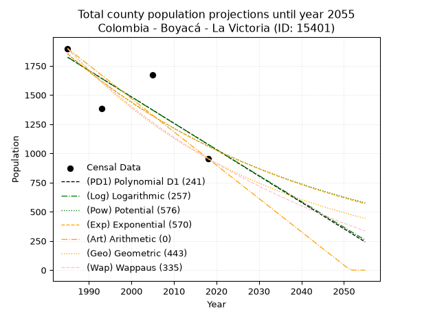
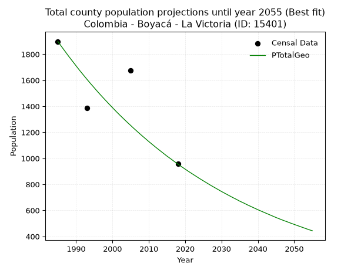
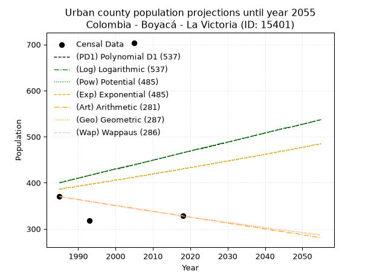
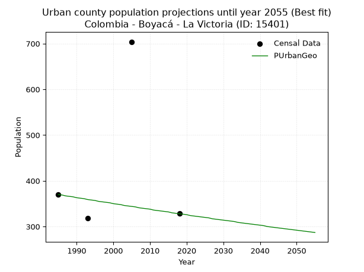
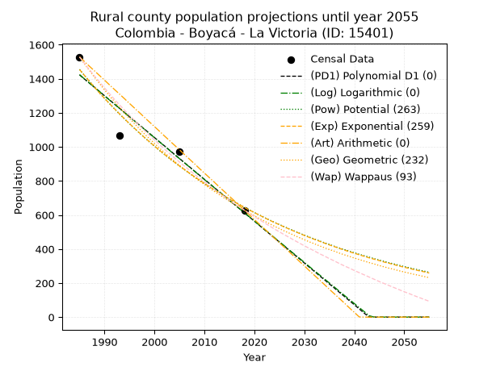
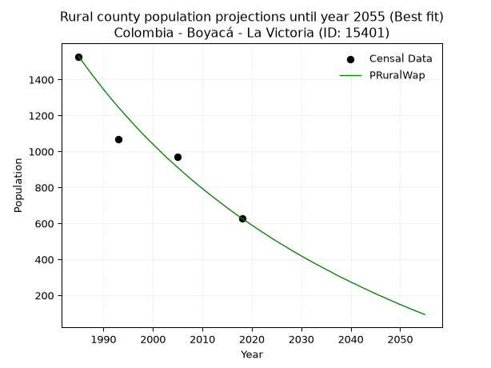

<div align="center">


</div>

# 📜 _“Population and Public Services Demand Projections (PPSD) until Year 2050 for Colombia - Boyacá - La Victoria (ID: 15401)”_
Keywords: `population` `public-service` `projection` `lineal` `polynomial` `logarithmic` `potential` `exponential` `arithmetic` `geometric` `wappaus` `dane` `colombia` `south-america`

PPSD are analytical estimates used by governments and planners to anticipate future changes in population size, age distribution, and the resulting community needs for utilities, healthcare, education, and infrastructure as sizing future water treatment facilities, electrical grids, and road networks based on spatial growth.

<div align="center">

</img>

</div>


> **General running parameters**: • app_version: _v20260806_. • Python version: _3.14.7_. • Pandas version: _3.0.5_. • NumPy version: _2.5.1_. • Creates, save and include plots into reports (create_plot): _False_. • Projection until year: _2050_. • Process polynomial degree 2 and up: _False_. • Process Wappaus: _True_. • Process Wappaus: _True_. • Set negative values to zero: _True_. • Set infinite values to zero: _True_. • Drop dataset notes: _True_. 
<div align="center">

Maps & GIS Layers: [:earth_americas:Google](http://maps.google.com/maps?q=5.523792239,-74.2343932) [:earth_americas:OSM](https://www.openstreetmap.org/#map=18/5.523792239/-74.2343932&layers=P) [:earth_americas:Bing](https://www.bing.com/maps?cp=5.523792239~-74.2343932&lvl=18) [:earth_americas:Apple](https://maps.apple.com/frame?center=5.523792239%2C-74.2343932&span=0.003%2C0.006) [:earth_americas:GISMobile](https://github.com/rcfdtools/R.GISMobile/blob/main/file/gis/CountyLayer_CO/Readme.md)

</div>


<div align="center">

```geojson
{
  "type": "Feature",
  "geometry": {
    "type": "Point", 
    "coordinates": [-74.2343932, 5.523792239]
  }, 
  "properties": {
    "Name": "Colombia - Boyacá - La Victoria (ID: 15401)"
  }
}
```

</div>


## 0. Census Data (4 records)

Census data are official statistics collected by a government about the people and housing in a country. They usually include counts of total population, age, sex, race, income, education, and jobs.

📅Global census file: [Population.xlsx](../data/Population.xlsx)

| Source   |   Year |   CountryID | CountryName   |   StateID | StateName   |   CountyID | CountyName   |   PTotal |   PUrban |   PRural |
|:---------|-------:|------------:|:--------------|----------:|:------------|-----------:|:-------------|---------:|---------:|---------:|
| DANE     |   1985 |          57 | Colombia      |        15 | Boyacá      |      15401 | La Victoria  |     1898 |      370 |     1528 |
| DANE     |   1993 |          57 | Colombia      |        15 | Boyacá      |      15401 | La Victoria  |     1386 |      318 |     1068 |
| DANE     |   2005 |          57 | Colombia      |        15 | Boyacá      |      15401 | La Victoria  |     1674 |      704 |      970 |
| DANE     |   2018 |          57 | Colombia      |        15 | Boyacá      |      15401 | La Victoria  |      956 |      328 |      628 |

> 🔥Some records could had specific notes about the registered values or the corresponding urban or rural distribution.

📅[SUI-RUPS](https://www.datos.gov.co/Hacienda-y-Cr-dito-P-blico/Registro-nico-de-Prestadores-de-Servicios-P-blicos/4qkq-csdn/about_data) - Local public utility companies: [RUPS.csv](../data/RUPS.csv)

 | SERVICIO       | ESTADO    | NOMBRE                                                                  | NIT         | DEPARTAMENTO_DOMICILIO   | MUNICIPIO_DOMICILIO   | DIRECCION        |   TELEFONO | EMAIL                                           | TIPO_PRESTADOR                 | CLASIFICACION                 |
|:---------------|:----------|:------------------------------------------------------------------------|:------------|:-------------------------|:----------------------|:-----------------|-----------:|:------------------------------------------------|:-------------------------------|:------------------------------|
| ACUEDUCTO      | OPERATIVA | UNIDAD DE SERVICIOS PUBLICOS DOMICILIARIOS DEL MUNICIPIO DE LA VICTORIA | 800006541-2 | BOYACA                   | LA VICTORIA           | CALLE 2 No. 2-18 |    2522719 | secretariadeplaneacion@lavictoria-boyaca.gov.co | MUNICIPIO (PRESTACIÓN DIRECTA) | MENOR O IGUAL A 2500 USUARIOS |
| ALCANTARILLADO | OPERATIVA | UNIDAD DE SERVICIOS PUBLICOS DOMICILIARIOS DEL MUNICIPIO DE LA VICTORIA | 800006541-2 | BOYACA                   | LA VICTORIA           | CALLE 2 No. 2-18 |    2522719 | secretariadeplaneacion@lavictoria-boyaca.gov.co | MUNICIPIO (PRESTACIÓN DIRECTA) | MENOR O IGUAL A 2500 USUARIOS |

## 1. Total

### 1.1. Coefficients and Parameters

* (PD1) Polynomial Deg 1: -22.597350461661556, 46678.850260938525 (lineal)
* (Log) Logarithmic: -45209.45692419865, 345115.944366685
* (Pow) Potential: -33.69300182257712, 114.37922239411306
* (Exp) Exponential: -0.016844956782624924, 6.155178772512045e+17
* (Art) Arithmetic: Year diff. 2018 - 1985 = 33, Population diff. 956 - 1898 = -942, Annual growth = -28.545454545454547
* (Geo) Geometric: Year diff. 2018 - 1985 = 33, Population diff. 956 - 1898 = -942, Annual growth % = -0.020567306950553643
* (Wap) Wappaus: i = -2.000382238644327, Condition values only valid for < 200)

<sub>
Wappaus condition values: ['-0.00', '-2.00', '-4.00', '-6.00', '-8.00', '-10.00', '-12.00', '-14.00', '-16.00', '-18.00', '-20.00', '-22.00', '-24.00', '-26.00', '-28.01', '-30.01', '-32.01', '-34.01', '-36.01', '-38.01', '-40.01', '-42.01', '-44.01', '-46.01', '-48.01', '-50.01', '-52.01', '-54.01', '-56.01', '-58.01', '-60.01', '-62.01', '-64.01', '-66.01', '-68.01', '-70.01', '-72.01', '-74.01', '-76.01', '-78.01', '-80.02', '-82.02', '-84.02', '-86.02', '-88.02', '-90.02', '-92.02', '-94.02', '-96.02', '-98.02', '-100.02', '-102.02', '-104.02', '-106.02', '-108.02', '-110.02', '-112.02', '-114.02', '-116.02', '-118.02', '-120.02', '-122.02', '-124.02', '-126.02', '-128.02', '-130.02']
</sub>


### 1.2. Projected Dataset

|   Year |   CountyID |   PTotalPD1 |   PTotalLog |   PTotalPow |   PTotalExp |   PTotalArt |   PTotalGeo |   PTotalWap |
|-------:|-----------:|------------:|------------:|------------:|------------:|------------:|------------:|------------:|
|   1985 |      15401 |        1823 |        1824 |        1853 |        1852 |        1898 |        1898 |        1898 |
|   1986 |      15401 |        1801 |        1801 |        1821 |        1821 |        1869 |        1859 |        1860 |
|   1987 |      15401 |        1778 |        1778 |        1791 |        1791 |        1841 |        1821 |        1824 |
|   1988 |      15401 |        1755 |        1755 |        1761 |        1761 |        1812 |        1783 |        1787 |
|   1989 |      15401 |        1733 |        1733 |        1731 |        1731 |        1784 |        1747 |        1752 |
|   1990 |      15401 |        1710 |        1710 |        1702 |        1702 |        1755 |        1711 |        1717 |
|   1991 |      15401 |        1688 |        1687 |        1673 |        1674 |        1727 |        1675 |        1683 |
|   1992 |      15401 |        1665 |        1664 |        1645 |        1646 |        1698 |        1641 |        1650 |
|   1993 |      15401 |        1642 |        1642 |        1618 |        1618 |        1670 |        1607 |        1617 |
|   1994 |      15401 |        1620 |        1619 |        1591 |        1591 |        1641 |        1574 |        1585 |
|   1995 |      15401 |        1597 |        1596 |        1564 |        1565 |        1613 |        1542 |        1553 |
|   1996 |      15401 |        1575 |        1574 |        1538 |        1539 |        1584 |        1510 |        1522 |
|   1997 |      15401 |        1552 |        1551 |        1512 |        1513 |        1555 |        1479 |        1491 |
|   1998 |      15401 |        1529 |        1529 |        1487 |        1488 |        1527 |        1449 |        1461 |
|   1999 |      15401 |        1507 |        1506 |        1462 |        1463 |        1498 |        1419 |        1432 |
|   2000 |      15401 |        1484 |        1483 |        1438 |        1438 |        1470 |        1390 |        1403 |
|   2001 |      15401 |        1462 |        1461 |        1414 |        1414 |        1441 |        1361 |        1374 |
|   2002 |      15401 |        1439 |        1438 |        1390 |        1391 |        1413 |        1333 |        1346 |
|   2003 |      15401 |        1416 |        1416 |        1367 |        1368 |        1384 |        1306 |        1319 |
|   2004 |      15401 |        1394 |        1393 |        1344 |        1345 |        1356 |        1279 |        1292 |
|   2005 |      15401 |        1371 |        1370 |        1322 |        1322 |        1327 |        1253 |        1265 |
|   2006 |      15401 |        1349 |        1348 |        1300 |        1300 |        1299 |        1227 |        1239 |
|   2007 |      15401 |        1326 |        1325 |        1278 |        1278 |        1270 |        1202 |        1213 |
|   2008 |      15401 |        1303 |        1303 |        1257 |        1257 |        1241 |        1177 |        1188 |
|   2009 |      15401 |        1281 |        1280 |        1236 |        1236 |        1213 |        1153 |        1163 |
|   2010 |      15401 |        1258 |        1258 |        1215 |        1215 |        1184 |        1129 |        1139 |
|   2011 |      15401 |        1236 |        1235 |        1195 |        1195 |        1156 |        1106 |        1115 |
|   2012 |      15401 |        1213 |        1213 |        1175 |        1175 |        1127 |        1083 |        1091 |
|   2013 |      15401 |        1190 |        1190 |        1156 |        1156 |        1099 |        1061 |        1068 |
|   2014 |      15401 |        1168 |        1168 |        1136 |        1136 |        1070 |        1039 |        1045 |
|   2015 |      15401 |        1145 |        1145 |        1118 |        1117 |        1042 |        1017 |        1022 |
|   2016 |      15401 |        1123 |        1123 |        1099 |        1099 |        1013 |         997 |        1000 |
|   2017 |      15401 |        1100 |        1101 |        1081 |        1080 |         985 |         976 |         978 |
|   2018 |      15401 |        1077 |        1078 |        1063 |        1062 |         956 |         956 |         956 |
|   2019 |      15401 |        1055 |        1056 |        1045 |        1044 |         927 |         936 |         935 |
|   2020 |      15401 |        1032 |        1033 |        1028 |        1027 |         899 |         917 |         914 |
|   2021 |      15401 |        1010 |        1011 |        1011 |        1010 |         870 |         898 |         893 |
|   2022 |      15401 |         987 |         989 |         994 |         993 |         842 |         880 |         873 |
|   2023 |      15401 |         964 |         966 |         978 |         976 |         813 |         862 |         853 |
|   2024 |      15401 |         942 |         944 |         962 |         960 |         785 |         844 |         833 |
|   2025 |      15401 |         919 |         922 |         946 |         944 |         756 |         827 |         813 |
|   2026 |      15401 |         897 |         899 |         930 |         928 |         728 |         810 |         794 |
|   2027 |      15401 |         874 |         877 |         915 |         913 |         699 |         793 |         775 |
|   2028 |      15401 |         851 |         855 |         900 |         898 |         671 |         777 |         756 |
|   2029 |      15401 |         829 |         832 |         885 |         883 |         642 |         761 |         738 |
|   2030 |      15401 |         806 |         810 |         870 |         868 |         613 |         745 |         720 |
|   2031 |      15401 |         784 |         788 |         856 |         853 |         585 |         730 |         702 |
|   2032 |      15401 |         761 |         766 |         842 |         839 |         556 |         715 |         684 |
|   2033 |      15401 |         738 |         743 |         828 |         825 |         528 |         700 |         667 |
|   2034 |      15401 |         716 |         721 |         815 |         811 |         499 |         686 |         649 |
|   2035 |      15401 |         693 |         699 |         801 |         798 |         471 |         671 |         633 |
|   2036 |      15401 |         671 |         677 |         788 |         784 |         442 |         658 |         616 |
|   2037 |      15401 |         648 |         655 |         775 |         771 |         414 |         644 |         599 |
|   2038 |      15401 |         625 |         632 |         762 |         758 |         385 |         631 |         583 |
|   2039 |      15401 |         603 |         610 |         750 |         746 |         357 |         618 |         567 |
|   2040 |      15401 |         580 |         588 |         738 |         733 |         328 |         605 |         551 |
|   2041 |      15401 |         558 |         566 |         726 |         721 |         299 |         593 |         535 |
|   2042 |      15401 |         535 |         544 |         714 |         709 |         271 |         581 |         520 |
|   2043 |      15401 |         512 |         522 |         702 |         697 |         242 |         569 |         504 |
|   2044 |      15401 |         490 |         499 |         691 |         686 |         214 |         557 |         489 |
|   2045 |      15401 |         467 |         477 |         679 |         674 |         185 |         545 |         474 |
|   2046 |      15401 |         445 |         455 |         668 |         663 |         157 |         534 |         460 |
|   2047 |      15401 |         422 |         433 |         657 |         652 |         128 |         523 |         445 |
|   2048 |      15401 |         399 |         411 |         647 |         641 |         100 |         513 |         431 |
|   2049 |      15401 |         377 |         389 |         636 |         630 |          71 |         502 |         416 |
|   2050 |      15401 |         354 |         367 |         626 |         620 |          43 |         492 |         402 |
<div align="center">

</img>

</div>


### 1.3. Best fit with absolute and relative error (%)

Relative error puts that difference into context by dividing the absolute error by the true value, creating a unitless ratio or percentage that shows the scale of the mistake.

Absolute and relative error

|   Year | Source   |   CountryID | CountryName   |   StateID | StateName   |   CountyID_x | CountyName   |   PTotal |   PUrban |   PRural |   CountyID_y |   PTotalPD1 |   PTotalLog |   PTotalPow |   PTotalExp |   PTotalArt |   PTotalGeo |   PTotalWap |   PTotalPD1AbsError |   PTotalLogAbsError |   PTotalPowAbsError |   PTotalExpAbsError |   PTotalArtAbsError |   PTotalGeoAbsError |   PTotalWapAbsError |   PTotalPD1RelError |   PTotalLogRelError |   PTotalPowRelError |   PTotalExpRelError |   PTotalArtRelError |   PTotalGeoRelError |   PTotalWapRelError |
|-------:|:---------|------------:|:--------------|----------:|:------------|-------------:|:-------------|---------:|---------:|---------:|-------------:|------------:|------------:|------------:|------------:|------------:|------------:|------------:|--------------------:|--------------------:|--------------------:|--------------------:|--------------------:|--------------------:|--------------------:|--------------------:|--------------------:|--------------------:|--------------------:|--------------------:|--------------------:|--------------------:|
|   1985 | DANE     |          57 | Colombia      |        15 | Boyacá      |        15401 | La Victoria  |     1898 |      370 |     1528 |        15401 |        1823 |        1824 |        1853 |        1852 |        1898 |        1898 |        1898 |                  75 |                  74 |                  45 |                  46 |                   0 |                   0 |                   0 |             3.95153 |             3.89884 |             2.37092 |              2.4236 |              0      |              0      |              0      |
|   1993 | DANE     |          57 | Colombia      |        15 | Boyacá      |        15401 | La Victoria  |     1386 |      318 |     1068 |        15401 |        1642 |        1642 |        1618 |        1618 |        1670 |        1607 |        1617 |                 256 |                 256 |                 232 |                 232 |                 284 |                 221 |                 231 |            18.4704  |            18.4704  |            16.7388  |             16.7388 |             20.4906 |             15.9452 |             16.6667 |
|   2005 | DANE     |          57 | Colombia      |        15 | Boyacá      |        15401 | La Victoria  |     1674 |      704 |      970 |        15401 |        1371 |        1370 |        1322 |        1322 |        1327 |        1253 |        1265 |                 303 |                 304 |                 352 |                 352 |                 347 |                 421 |                 409 |            18.1004  |            18.1601  |            21.0275  |             21.0275 |             20.7288 |             25.1493 |             24.4325 |
|   2018 | DANE     |          57 | Colombia      |        15 | Boyacá      |        15401 | La Victoria  |      956 |      328 |      628 |        15401 |        1077 |        1078 |        1063 |        1062 |         956 |         956 |         956 |                 121 |                 122 |                 107 |                 106 |                   0 |                   0 |                   0 |            12.6569  |            12.7615  |            11.1925  |             11.0879 |              0      |              0      |              0      |

Relative error mean

| Method    |   RelError | Best   |
|:----------|-----------:|:-------|
| PTotalPD1 |    13.2948 |        |
| PTotalLog |    13.3227 |        |
| PTotalPow |    12.8324 |        |
| PTotalExp |    12.8194 |        |
| PTotalArt |    10.3049 |        |
| PTotalGeo |    10.2736 | True   |
| PTotalWap |    10.2748 |        |

💙Best method: _**PTotalGeo**_
<div align="center">

</img>

</div>


### 1.4. Fresh water supply demand in liters per capita per day (lpcd)

The fresh water supply demand typically ranges from 100 to 300 liters per capita per day (lpcd) for standard domestic and municipal planning, though absolute survival minimums set by the World Health Organization are as low as 7.5 to 20 liters per day, and total consumption in high-income nations can exceed 400 liters.

> `CZ`: Level in meters above the sea level (masl)<br> `WS`: Fresh water supply demand in liters per capita per day (lpcd or l/h/d)<br> `WSAll`: Zonal fresh water supply demand in liters per second (l/s)<br> `A`: Zonal area in square meters<br> `DP`: Population density (people/hectare or p/ha)

Reference values (RAS Colombia)

|    CZ |   WS |
|------:|-----:|
|  1000 |  120 |
|  2000 |  130 |
| 99999 |  140 |

County shapefile geometry properties and water supply values

|   CountyID |      ATotal |   CZTotal |   WSTotal |
|-----------:|------------:|----------:|----------:|
|      15401 | 2.79731e+07 |   1469.25 |       130 |

Projected values for best method: PTotalGeo

|   CountyID |   Year |   PTotalGeo |   DPTotal |   WSTotal |   WSTotalAll |
|-----------:|-------:|------------:|----------:|----------:|-------------:|
|      15401 |   1985 |        1898 |      0.68 |       130 |     2.85579  |
|      15401 |   1986 |        1859 |      0.66 |       130 |     2.79711  |
|      15401 |   1987 |        1821 |      0.65 |       130 |     2.73993  |
|      15401 |   1988 |        1783 |      0.64 |       130 |     2.68275  |
|      15401 |   1989 |        1747 |      0.62 |       130 |     2.62859  |
|      15401 |   1990 |        1711 |      0.61 |       130 |     2.57442  |
|      15401 |   1991 |        1675 |      0.6  |       130 |     2.52025  |
|      15401 |   1992 |        1641 |      0.59 |       130 |     2.4691   |
|      15401 |   1993 |        1607 |      0.57 |       130 |     2.41794  |
|      15401 |   1994 |        1574 |      0.56 |       130 |     2.36829  |
|      15401 |   1995 |        1542 |      0.55 |       130 |     2.32014  |
|      15401 |   1996 |        1510 |      0.54 |       130 |     2.27199  |
|      15401 |   1997 |        1479 |      0.53 |       130 |     2.22535  |
|      15401 |   1998 |        1449 |      0.52 |       130 |     2.18021  |
|      15401 |   1999 |        1419 |      0.51 |       130 |     2.13507  |
|      15401 |   2000 |        1390 |      0.5  |       130 |     2.09144  |
|      15401 |   2001 |        1361 |      0.49 |       130 |     2.0478   |
|      15401 |   2002 |        1333 |      0.48 |       130 |     2.00567  |
|      15401 |   2003 |        1306 |      0.47 |       130 |     1.96505  |
|      15401 |   2004 |        1279 |      0.46 |       130 |     1.92442  |
|      15401 |   2005 |        1253 |      0.45 |       130 |     1.8853   |
|      15401 |   2006 |        1227 |      0.44 |       130 |     1.84618  |
|      15401 |   2007 |        1202 |      0.43 |       130 |     1.80856  |
|      15401 |   2008 |        1177 |      0.42 |       130 |     1.77095  |
|      15401 |   2009 |        1153 |      0.41 |       130 |     1.73484  |
|      15401 |   2010 |        1129 |      0.4  |       130 |     1.69873  |
|      15401 |   2011 |        1106 |      0.4  |       130 |     1.66412  |
|      15401 |   2012 |        1083 |      0.39 |       130 |     1.62951  |
|      15401 |   2013 |        1061 |      0.38 |       130 |     1.59641  |
|      15401 |   2014 |        1039 |      0.37 |       130 |     1.56331  |
|      15401 |   2015 |        1017 |      0.36 |       130 |     1.53021  |
|      15401 |   2016 |         997 |      0.36 |       130 |     1.50012  |
|      15401 |   2017 |         976 |      0.35 |       130 |     1.46852  |
|      15401 |   2018 |         956 |      0.34 |       130 |     1.43843  |
|      15401 |   2019 |         936 |      0.33 |       130 |     1.40833  |
|      15401 |   2020 |         917 |      0.33 |       130 |     1.37975  |
|      15401 |   2021 |         898 |      0.32 |       130 |     1.35116  |
|      15401 |   2022 |         880 |      0.31 |       130 |     1.32407  |
|      15401 |   2023 |         862 |      0.31 |       130 |     1.29699  |
|      15401 |   2024 |         844 |      0.3  |       130 |     1.26991  |
|      15401 |   2025 |         827 |      0.3  |       130 |     1.24433  |
|      15401 |   2026 |         810 |      0.29 |       130 |     1.21875  |
|      15401 |   2027 |         793 |      0.28 |       130 |     1.19317  |
|      15401 |   2028 |         777 |      0.28 |       130 |     1.1691   |
|      15401 |   2029 |         761 |      0.27 |       130 |     1.14502  |
|      15401 |   2030 |         745 |      0.27 |       130 |     1.12095  |
|      15401 |   2031 |         730 |      0.26 |       130 |     1.09838  |
|      15401 |   2032 |         715 |      0.26 |       130 |     1.07581  |
|      15401 |   2033 |         700 |      0.25 |       130 |     1.05324  |
|      15401 |   2034 |         686 |      0.25 |       130 |     1.03218  |
|      15401 |   2035 |         671 |      0.24 |       130 |     1.00961  |
|      15401 |   2036 |         658 |      0.24 |       130 |     0.990046 |
|      15401 |   2037 |         644 |      0.23 |       130 |     0.968981 |
|      15401 |   2038 |         631 |      0.23 |       130 |     0.949421 |
|      15401 |   2039 |         618 |      0.22 |       130 |     0.929861 |
|      15401 |   2040 |         605 |      0.22 |       130 |     0.910301 |
|      15401 |   2041 |         593 |      0.21 |       130 |     0.892245 |
|      15401 |   2042 |         581 |      0.21 |       130 |     0.87419  |
|      15401 |   2043 |         569 |      0.2  |       130 |     0.856134 |
|      15401 |   2044 |         557 |      0.2  |       130 |     0.838079 |
|      15401 |   2045 |         545 |      0.19 |       130 |     0.820023 |
|      15401 |   2046 |         534 |      0.19 |       130 |     0.803472 |
|      15401 |   2047 |         523 |      0.19 |       130 |     0.786921 |
|      15401 |   2048 |         513 |      0.18 |       130 |     0.771875 |
|      15401 |   2049 |         502 |      0.18 |       130 |     0.755324 |
|      15401 |   2050 |         492 |      0.18 |       130 |     0.740278 |

## 2. Urban

### 2.1. Coefficients and Parameters

* (PD1) Polynomial Deg 1: 1.955841027699927, -3482.1710156567788 (lineal)
* (Log) Logarithmic: 3954.3002252624974, -29626.667699993555
* (Pow) Potential: 6.552223342354638, -19.020867318423704
* (Exp) Exponential: 0.003235480336298025, 0.6278632101702768
* (Art) Arithmetic: Year diff. 2018 - 1985 = 33, Population diff. 328 - 370 = -42, Annual growth = -1.2727272727272727
* (Geo) Geometric: Year diff. 2018 - 1985 = 33, Population diff. 328 - 370 = -42, Annual growth % = -0.003644536352974237
* (Wap) Wappaus: i = -0.36467830164105236, Condition values only valid for < 200)

<sub>
Wappaus condition values: ['-0.00', '-0.36', '-0.73', '-1.09', '-1.46', '-1.82', '-2.19', '-2.55', '-2.92', '-3.28', '-3.65', '-4.01', '-4.38', '-4.74', '-5.11', '-5.47', '-5.83', '-6.20', '-6.56', '-6.93', '-7.29', '-7.66', '-8.02', '-8.39', '-8.75', '-9.12', '-9.48', '-9.85', '-10.21', '-10.58', '-10.94', '-11.31', '-11.67', '-12.03', '-12.40', '-12.76', '-13.13', '-13.49', '-13.86', '-14.22', '-14.59', '-14.95', '-15.32', '-15.68', '-16.05', '-16.41', '-16.78', '-17.14', '-17.50', '-17.87', '-18.23', '-18.60', '-18.96', '-19.33', '-19.69', '-20.06', '-20.42', '-20.79', '-21.15', '-21.52', '-21.88', '-22.25', '-22.61', '-22.97', '-23.34', '-23.70']
</sub>


### 2.2. Projected Dataset

|   Year |   CountyID |   PUrbanPD1 |   PUrbanLog |   PUrbanPow |   PUrbanExp |   PUrbanArt |   PUrbanGeo |   PUrbanWap |
|-------:|-----------:|------------:|------------:|------------:|------------:|------------:|------------:|------------:|
|   1985 |      15401 |         400 |         400 |         386 |         386 |         370 |         370 |         370 |
|   1986 |      15401 |         402 |         402 |         387 |         388 |         369 |         369 |         369 |
|   1987 |      15401 |         404 |         404 |         389 |         389 |         367 |         367 |         367 |
|   1988 |      15401 |         406 |         406 |         390 |         390 |         366 |         366 |         366 |
|   1989 |      15401 |         408 |         408 |         391 |         391 |         365 |         365 |         365 |
|   1990 |      15401 |         410 |         410 |         393 |         393 |         364 |         363 |         363 |
|   1991 |      15401 |         412 |         412 |         394 |         394 |         362 |         362 |         362 |
|   1992 |      15401 |         414 |         414 |         395 |         395 |         361 |         361 |         361 |
|   1993 |      15401 |         416 |         416 |         396 |         397 |         360 |         359 |         359 |
|   1994 |      15401 |         418 |         418 |         398 |         398 |         359 |         358 |         358 |
|   1995 |      15401 |         420 |         420 |         399 |         399 |         357 |         357 |         357 |
|   1996 |      15401 |         422 |         422 |         400 |         400 |         356 |         355 |         355 |
|   1997 |      15401 |         424 |         424 |         402 |         402 |         355 |         354 |         354 |
|   1998 |      15401 |         426 |         426 |         403 |         403 |         353 |         353 |         353 |
|   1999 |      15401 |         428 |         428 |         404 |         404 |         352 |         352 |         352 |
|   2000 |      15401 |         430 |         430 |         406 |         406 |         351 |         350 |         350 |
|   2001 |      15401 |         431 |         432 |         407 |         407 |         350 |         349 |         349 |
|   2002 |      15401 |         433 |         434 |         408 |         408 |         348 |         348 |         348 |
|   2003 |      15401 |         435 |         436 |         410 |         410 |         347 |         346 |         346 |
|   2004 |      15401 |         437 |         437 |         411 |         411 |         346 |         345 |         345 |
|   2005 |      15401 |         439 |         439 |         412 |         412 |         345 |         344 |         344 |
|   2006 |      15401 |         441 |         441 |         414 |         414 |         343 |         343 |         343 |
|   2007 |      15401 |         443 |         443 |         415 |         415 |         342 |         341 |         341 |
|   2008 |      15401 |         445 |         445 |         416 |         416 |         341 |         340 |         340 |
|   2009 |      15401 |         447 |         447 |         418 |         418 |         339 |         339 |         339 |
|   2010 |      15401 |         449 |         449 |         419 |         419 |         338 |         338 |         338 |
|   2011 |      15401 |         451 |         451 |         421 |         420 |         337 |         336 |         337 |
|   2012 |      15401 |         453 |         453 |         422 |         422 |         336 |         335 |         335 |
|   2013 |      15401 |         455 |         455 |         423 |         423 |         334 |         334 |         334 |
|   2014 |      15401 |         457 |         457 |         425 |         424 |         333 |         333 |         333 |
|   2015 |      15401 |         459 |         459 |         426 |         426 |         332 |         332 |         332 |
|   2016 |      15401 |         461 |         461 |         427 |         427 |         331 |         330 |         330 |
|   2017 |      15401 |         463 |         463 |         429 |         429 |         329 |         329 |         329 |
|   2018 |      15401 |         465 |         465 |         430 |         430 |         328 |         328 |         328 |
|   2019 |      15401 |         467 |         467 |         432 |         431 |         327 |         327 |         327 |
|   2020 |      15401 |         469 |         469 |         433 |         433 |         325 |         326 |         326 |
|   2021 |      15401 |         471 |         471 |         434 |         434 |         324 |         324 |         324 |
|   2022 |      15401 |         473 |         473 |         436 |         436 |         323 |         323 |         323 |
|   2023 |      15401 |         474 |         475 |         437 |         437 |         322 |         322 |         322 |
|   2024 |      15401 |         476 |         477 |         439 |         438 |         320 |         321 |         321 |
|   2025 |      15401 |         478 |         479 |         440 |         440 |         319 |         320 |         320 |
|   2026 |      15401 |         480 |         481 |         442 |         441 |         318 |         319 |         319 |
|   2027 |      15401 |         482 |         483 |         443 |         443 |         317 |         317 |         317 |
|   2028 |      15401 |         484 |         485 |         444 |         444 |         315 |         316 |         316 |
|   2029 |      15401 |         486 |         487 |         446 |         446 |         314 |         315 |         315 |
|   2030 |      15401 |         488 |         488 |         447 |         447 |         313 |         314 |         314 |
|   2031 |      15401 |         490 |         490 |         449 |         448 |         311 |         313 |         313 |
|   2032 |      15401 |         492 |         492 |         450 |         450 |         310 |         312 |         312 |
|   2033 |      15401 |         494 |         494 |         452 |         451 |         309 |         311 |         310 |
|   2034 |      15401 |         496 |         496 |         453 |         453 |         308 |         309 |         309 |
|   2035 |      15401 |         498 |         498 |         455 |         454 |         306 |         308 |         308 |
|   2036 |      15401 |         500 |         500 |         456 |         456 |         305 |         307 |         307 |
|   2037 |      15401 |         502 |         502 |         457 |         457 |         304 |         306 |         306 |
|   2038 |      15401 |         504 |         504 |         459 |         459 |         303 |         305 |         305 |
|   2039 |      15401 |         506 |         506 |         460 |         460 |         301 |         304 |         304 |
|   2040 |      15401 |         508 |         508 |         462 |         462 |         300 |         303 |         303 |
|   2041 |      15401 |         510 |         510 |         463 |         463 |         299 |         302 |         301 |
|   2042 |      15401 |         512 |         512 |         465 |         465 |         297 |         300 |         300 |
|   2043 |      15401 |         514 |         514 |         466 |         466 |         296 |         299 |         299 |
|   2044 |      15401 |         516 |         516 |         468 |         468 |         295 |         298 |         298 |
|   2045 |      15401 |         518 |         518 |         469 |         469 |         294 |         297 |         297 |
|   2046 |      15401 |         519 |         520 |         471 |         471 |         292 |         296 |         296 |
|   2047 |      15401 |         521 |         521 |         472 |         472 |         291 |         295 |         295 |
|   2048 |      15401 |         523 |         523 |         474 |         474 |         290 |         294 |         294 |
|   2049 |      15401 |         525 |         525 |         475 |         475 |         289 |         293 |         293 |
|   2050 |      15401 |         527 |         527 |         477 |         477 |         287 |         292 |         292 |
<div align="center">

</img>

</div>


### 2.3. Best fit with absolute and relative error (%)

Relative error puts that difference into context by dividing the absolute error by the true value, creating a unitless ratio or percentage that shows the scale of the mistake.

Absolute and relative error

|   Year | Source   |   CountryID | CountryName   |   StateID | StateName   |   CountyID_x | CountyName   |   PTotal |   PUrban |   PRural |   CountyID_y |   PUrbanPD1 |   PUrbanLog |   PUrbanPow |   PUrbanExp |   PUrbanArt |   PUrbanGeo |   PUrbanWap |   PUrbanPD1AbsError |   PUrbanLogAbsError |   PUrbanPowAbsError |   PUrbanExpAbsError |   PUrbanArtAbsError |   PUrbanGeoAbsError |   PUrbanWapAbsError |   PUrbanPD1RelError |   PUrbanLogRelError |   PUrbanPowRelError |   PUrbanExpRelError |   PUrbanArtRelError |   PUrbanGeoRelError |   PUrbanWapRelError |
|-------:|:---------|------------:|:--------------|----------:|:------------|-------------:|:-------------|---------:|---------:|---------:|-------------:|------------:|------------:|------------:|------------:|------------:|------------:|------------:|--------------------:|--------------------:|--------------------:|--------------------:|--------------------:|--------------------:|--------------------:|--------------------:|--------------------:|--------------------:|--------------------:|--------------------:|--------------------:|--------------------:|
|   1985 | DANE     |          57 | Colombia      |        15 | Boyacá      |        15401 | La Victoria  |     1898 |      370 |     1528 |        15401 |         400 |         400 |         386 |         386 |         370 |         370 |         370 |                  30 |                  30 |                  16 |                  16 |                   0 |                   0 |                   0 |             8.10811 |             8.10811 |             4.32432 |             4.32432 |              0      |              0      |              0      |
|   1993 | DANE     |          57 | Colombia      |        15 | Boyacá      |        15401 | La Victoria  |     1386 |      318 |     1068 |        15401 |         416 |         416 |         396 |         397 |         360 |         359 |         359 |                  98 |                  98 |                  78 |                  79 |                  42 |                  41 |                  41 |            30.8176  |            30.8176  |            24.5283  |            24.8428  |             13.2075 |             12.8931 |             12.8931 |
|   2005 | DANE     |          57 | Colombia      |        15 | Boyacá      |        15401 | La Victoria  |     1674 |      704 |      970 |        15401 |         439 |         439 |         412 |         412 |         345 |         344 |         344 |                 265 |                 265 |                 292 |                 292 |                 359 |                 360 |                 360 |            37.642   |            37.642   |            41.4773  |            41.4773  |             50.9943 |             51.1364 |             51.1364 |
|   2018 | DANE     |          57 | Colombia      |        15 | Boyacá      |        15401 | La Victoria  |      956 |      328 |      628 |        15401 |         465 |         465 |         430 |         430 |         328 |         328 |         328 |                 137 |                 137 |                 102 |                 102 |                   0 |                   0 |                   0 |            41.7683  |            41.7683  |            31.0976  |            31.0976  |              0      |              0      |              0      |

Relative error mean

| Method    |   RelError | Best   |
|:----------|-----------:|:-------|
| PUrbanPD1 |    29.584  |        |
| PUrbanLog |    29.584  |        |
| PUrbanPow |    25.3569 |        |
| PUrbanExp |    25.4355 |        |
| PUrbanArt |    16.0505 |        |
| PUrbanGeo |    16.0074 | True   |
| PUrbanWap |    16.0074 | True   |

💙Best method: _**PUrbanGeo**_
<div align="center">

</img>

</div>


### 2.4. Fresh water supply demand in liters per capita per day (lpcd)

The fresh water supply demand typically ranges from 100 to 300 liters per capita per day (lpcd) for standard domestic and municipal planning, though absolute survival minimums set by the World Health Organization are as low as 7.5 to 20 liters per day, and total consumption in high-income nations can exceed 400 liters.

> `CZ`: Level in meters above the sea level (masl)<br> `WS`: Fresh water supply demand in liters per capita per day (lpcd or l/h/d)<br> `WSAll`: Zonal fresh water supply demand in liters per second (l/s)<br> `A`: Zonal area in square meters<br> `DP`: Population density (people/hectare or p/ha)

Reference values (RAS Colombia)

|    CZ |   WS |
|------:|-----:|
|  1000 |  120 |
|  2000 |  130 |
| 99999 |  140 |

County shapefile geometry properties and water supply values

|   CountyID |   AUrban |   CZUrban |   WSUrban |
|-----------:|---------:|----------:|----------:|
|      15401 |  71974.3 |   1469.07 |       130 |

Projected values for best method: PUrbanGeo

|   CountyID |   Year |   PUrbanGeo |   DPUrban |   WSUrban |   WSUrbanAll |
|-----------:|-------:|------------:|----------:|----------:|-------------:|
|      15401 |   1985 |         370 |     51.41 |       130 |     0.556713 |
|      15401 |   1986 |         369 |     51.27 |       130 |     0.555208 |
|      15401 |   1987 |         367 |     50.99 |       130 |     0.552199 |
|      15401 |   1988 |         366 |     50.85 |       130 |     0.550694 |
|      15401 |   1989 |         365 |     50.71 |       130 |     0.54919  |
|      15401 |   1990 |         363 |     50.43 |       130 |     0.546181 |
|      15401 |   1991 |         362 |     50.3  |       130 |     0.544676 |
|      15401 |   1992 |         361 |     50.16 |       130 |     0.543171 |
|      15401 |   1993 |         359 |     49.88 |       130 |     0.540162 |
|      15401 |   1994 |         358 |     49.74 |       130 |     0.538657 |
|      15401 |   1995 |         357 |     49.6  |       130 |     0.537153 |
|      15401 |   1996 |         355 |     49.32 |       130 |     0.534144 |
|      15401 |   1997 |         354 |     49.18 |       130 |     0.532639 |
|      15401 |   1998 |         353 |     49.05 |       130 |     0.531134 |
|      15401 |   1999 |         352 |     48.91 |       130 |     0.52963  |
|      15401 |   2000 |         350 |     48.63 |       130 |     0.52662  |
|      15401 |   2001 |         349 |     48.49 |       130 |     0.525116 |
|      15401 |   2002 |         348 |     48.35 |       130 |     0.523611 |
|      15401 |   2003 |         346 |     48.07 |       130 |     0.520602 |
|      15401 |   2004 |         345 |     47.93 |       130 |     0.519097 |
|      15401 |   2005 |         344 |     47.79 |       130 |     0.517593 |
|      15401 |   2006 |         343 |     47.66 |       130 |     0.516088 |
|      15401 |   2007 |         341 |     47.38 |       130 |     0.513079 |
|      15401 |   2008 |         340 |     47.24 |       130 |     0.511574 |
|      15401 |   2009 |         339 |     47.1  |       130 |     0.510069 |
|      15401 |   2010 |         338 |     46.96 |       130 |     0.508565 |
|      15401 |   2011 |         336 |     46.68 |       130 |     0.505556 |
|      15401 |   2012 |         335 |     46.54 |       130 |     0.504051 |
|      15401 |   2013 |         334 |     46.41 |       130 |     0.502546 |
|      15401 |   2014 |         333 |     46.27 |       130 |     0.501042 |
|      15401 |   2015 |         332 |     46.13 |       130 |     0.499537 |
|      15401 |   2016 |         330 |     45.85 |       130 |     0.496528 |
|      15401 |   2017 |         329 |     45.71 |       130 |     0.495023 |
|      15401 |   2018 |         328 |     45.57 |       130 |     0.493519 |
|      15401 |   2019 |         327 |     45.43 |       130 |     0.492014 |
|      15401 |   2020 |         326 |     45.29 |       130 |     0.490509 |
|      15401 |   2021 |         324 |     45.02 |       130 |     0.4875   |
|      15401 |   2022 |         323 |     44.88 |       130 |     0.485995 |
|      15401 |   2023 |         322 |     44.74 |       130 |     0.484491 |
|      15401 |   2024 |         321 |     44.6  |       130 |     0.482986 |
|      15401 |   2025 |         320 |     44.46 |       130 |     0.481481 |
|      15401 |   2026 |         319 |     44.32 |       130 |     0.479977 |
|      15401 |   2027 |         317 |     44.04 |       130 |     0.476968 |
|      15401 |   2028 |         316 |     43.9  |       130 |     0.475463 |
|      15401 |   2029 |         315 |     43.77 |       130 |     0.473958 |
|      15401 |   2030 |         314 |     43.63 |       130 |     0.472454 |
|      15401 |   2031 |         313 |     43.49 |       130 |     0.470949 |
|      15401 |   2032 |         312 |     43.35 |       130 |     0.469444 |
|      15401 |   2033 |         311 |     43.21 |       130 |     0.46794  |
|      15401 |   2034 |         309 |     42.93 |       130 |     0.464931 |
|      15401 |   2035 |         308 |     42.79 |       130 |     0.463426 |
|      15401 |   2036 |         307 |     42.65 |       130 |     0.461921 |
|      15401 |   2037 |         306 |     42.52 |       130 |     0.460417 |
|      15401 |   2038 |         305 |     42.38 |       130 |     0.458912 |
|      15401 |   2039 |         304 |     42.24 |       130 |     0.457407 |
|      15401 |   2040 |         303 |     42.1  |       130 |     0.455903 |
|      15401 |   2041 |         302 |     41.96 |       130 |     0.454398 |
|      15401 |   2042 |         300 |     41.68 |       130 |     0.451389 |
|      15401 |   2043 |         299 |     41.54 |       130 |     0.449884 |
|      15401 |   2044 |         298 |     41.4  |       130 |     0.44838  |
|      15401 |   2045 |         297 |     41.26 |       130 |     0.446875 |
|      15401 |   2046 |         296 |     41.13 |       130 |     0.44537  |
|      15401 |   2047 |         295 |     40.99 |       130 |     0.443866 |
|      15401 |   2048 |         294 |     40.85 |       130 |     0.442361 |
|      15401 |   2049 |         293 |     40.71 |       130 |     0.440856 |
|      15401 |   2050 |         292 |     40.57 |       130 |     0.439352 |

## 3. Rural

### 3.1. Coefficients and Parameters

* (PD1) Polynomial Deg 1: -24.553191489361478, 50161.02127659529 (lineal)
* (Log) Logarithmic: -49163.757149461155, 374742.6120666786
* (Pow) Potential: -49.31962433103829, 165.80717667343893
* (Exp) Exponential: -0.024640057624128686, 2.535793453834797e+24
* (Art) Arithmetic: Year diff. 2018 - 1985 = 33, Population diff. 628 - 1528 = -900, Annual growth = -27.272727272727273
* (Geo) Geometric: Year diff. 2018 - 1985 = 33, Population diff. 628 - 1528 = -900, Annual growth % = -0.026584921357548863
* (Wap) Wappaus: i = -2.52993759487266, Condition values only valid for < 200)

<sub>
Wappaus condition values: ['-0.00', '-2.53', '-5.06', '-7.59', '-10.12', '-12.65', '-15.18', '-17.71', '-20.24', '-22.77', '-25.30', '-27.83', '-30.36', '-32.89', '-35.42', '-37.95', '-40.48', '-43.01', '-45.54', '-48.07', '-50.60', '-53.13', '-55.66', '-58.19', '-60.72', '-63.25', '-65.78', '-68.31', '-70.84', '-73.37', '-75.90', '-78.43', '-80.96', '-83.49', '-86.02', '-88.55', '-91.08', '-93.61', '-96.14', '-98.67', '-101.20', '-103.73', '-106.26', '-108.79', '-111.32', '-113.85', '-116.38', '-118.91', '-121.44', '-123.97', '-126.50', '-129.03', '-131.56', '-134.09', '-136.62', '-139.15', '-141.68', '-144.21', '-146.74', '-149.27', '-151.80', '-154.33', '-156.86', '-159.39', '-161.92', '-164.45']
</sub>


### 3.2. Projected Dataset

|   Year |   CountyID |   PRuralPD1 |   PRuralLog |   PRuralPow |   PRuralExp |   PRuralArt |   PRuralGeo |   PRuralWap |
|-------:|-----------:|------------:|------------:|------------:|------------:|------------:|------------:|------------:|
|   1985 |      15401 |        1423 |        1424 |        1455 |        1454 |        1528 |        1528 |        1528 |
|   1986 |      15401 |        1398 |        1399 |        1419 |        1419 |        1501 |        1487 |        1490 |
|   1987 |      15401 |        1374 |        1374 |        1385 |        1384 |        1473 |        1448 |        1453 |
|   1988 |      15401 |        1349 |        1350 |        1351 |        1350 |        1446 |        1409 |        1416 |
|   1989 |      15401 |        1325 |        1325 |        1317 |        1317 |        1419 |        1372 |        1381 |
|   1990 |      15401 |        1300 |        1300 |        1285 |        1285 |        1392 |        1335 |        1346 |
|   1991 |      15401 |        1276 |        1275 |        1254 |        1254 |        1364 |        1300 |        1312 |
|   1992 |      15401 |        1251 |        1251 |        1223 |        1224 |        1337 |        1265 |        1279 |
|   1993 |      15401 |        1227 |        1226 |        1193 |        1194 |        1310 |        1232 |        1247 |
|   1994 |      15401 |        1202 |        1201 |        1164 |        1165 |        1283 |        1199 |        1216 |
|   1995 |      15401 |        1177 |        1177 |        1136 |        1136 |        1255 |        1167 |        1185 |
|   1996 |      15401 |        1153 |        1152 |        1108 |        1109 |        1228 |        1136 |        1155 |
|   1997 |      15401 |        1128 |        1127 |        1081 |        1082 |        1201 |        1106 |        1125 |
|   1998 |      15401 |        1104 |        1103 |        1055 |        1055 |        1173 |        1076 |        1096 |
|   1999 |      15401 |        1079 |        1078 |        1029 |        1030 |        1146 |        1048 |        1068 |
|   2000 |      15401 |        1055 |        1054 |        1004 |        1005 |        1119 |        1020 |        1041 |
|   2001 |      15401 |        1030 |        1029 |         979 |         980 |        1092 |         993 |        1014 |
|   2002 |      15401 |        1006 |        1005 |         955 |         956 |        1064 |         966 |         987 |
|   2003 |      15401 |         981 |         980 |         932 |         933 |        1037 |         941 |         961 |
|   2004 |      15401 |         956 |         955 |         910 |         910 |        1010 |         916 |         936 |
|   2005 |      15401 |         932 |         931 |         887 |         888 |         983 |         891 |         911 |
|   2006 |      15401 |         907 |         906 |         866 |         867 |         955 |         868 |         887 |
|   2007 |      15401 |         883 |         882 |         845 |         846 |         928 |         845 |         863 |
|   2008 |      15401 |         858 |         857 |         824 |         825 |         901 |         822 |         839 |
|   2009 |      15401 |         834 |         833 |         804 |         805 |         873 |         800 |         816 |
|   2010 |      15401 |         809 |         808 |         785 |         785 |         846 |         779 |         794 |
|   2011 |      15401 |         785 |         784 |         766 |         766 |         819 |         758 |         772 |
|   2012 |      15401 |         760 |         760 |         747 |         748 |         792 |         738 |         750 |
|   2013 |      15401 |         735 |         735 |         729 |         729 |         764 |         719 |         729 |
|   2014 |      15401 |         711 |         711 |         712 |         712 |         737 |         699 |         708 |
|   2015 |      15401 |         686 |         686 |         694 |         694 |         710 |         681 |         687 |
|   2016 |      15401 |         662 |         662 |         678 |         677 |         683 |         663 |         667 |
|   2017 |      15401 |         637 |         638 |         661 |         661 |         655 |         645 |         647 |
|   2018 |      15401 |         613 |         613 |         645 |         645 |         628 |         628 |         628 |
|   2019 |      15401 |         588 |         589 |         630 |         629 |         601 |         611 |         609 |
|   2020 |      15401 |         564 |         564 |         614 |         614 |         573 |         595 |         590 |
|   2021 |      15401 |         539 |         540 |         600 |         599 |         546 |         579 |         572 |
|   2022 |      15401 |         514 |         516 |         585 |         584 |         519 |         564 |         554 |
|   2023 |      15401 |         490 |         492 |         571 |         570 |         492 |         549 |         536 |
|   2024 |      15401 |         465 |         467 |         557 |         556 |         464 |         534 |         518 |
|   2025 |      15401 |         441 |         443 |         544 |         543 |         437 |         520 |         501 |
|   2026 |      15401 |         416 |         419 |         531 |         529 |         410 |         506 |         484 |
|   2027 |      15401 |         392 |         394 |         518 |         517 |         383 |         493 |         468 |
|   2028 |      15401 |         367 |         370 |         506 |         504 |         355 |         480 |         451 |
|   2029 |      15401 |         343 |         346 |         493 |         492 |         328 |         467 |         435 |
|   2030 |      15401 |         318 |         322 |         482 |         480 |         301 |         455 |         419 |
|   2031 |      15401 |         293 |         297 |         470 |         468 |         273 |         442 |         404 |
|   2032 |      15401 |         269 |         273 |         459 |         457 |         246 |         431 |         389 |
|   2033 |      15401 |         244 |         249 |         448 |         446 |         219 |         419 |         373 |
|   2034 |      15401 |         220 |         225 |         437 |         435 |         192 |         408 |         359 |
|   2035 |      15401 |         195 |         201 |         427 |         424 |         164 |         397 |         344 |
|   2036 |      15401 |         171 |         177 |         416 |         414 |         137 |         387 |         330 |
|   2037 |      15401 |         146 |         152 |         406 |         404 |         110 |         376 |         315 |
|   2038 |      15401 |         122 |         128 |         397 |         394 |          83 |         366 |         301 |
|   2039 |      15401 |          97 |         104 |         387 |         384 |          55 |         357 |         288 |
|   2040 |      15401 |          73 |          80 |         378 |         375 |          28 |         347 |         274 |
|   2041 |      15401 |          48 |          56 |         369 |         366 |           1 |         338 |         261 |
|   2042 |      15401 |          23 |          32 |         360 |         357 |           0 |         329 |         248 |
|   2043 |      15401 |           0 |           8 |         352 |         348 |           0 |         320 |         235 |
|   2044 |      15401 |           0 |           0 |         343 |         340 |           0 |         312 |         222 |
|   2045 |      15401 |           0 |           0 |         335 |         332 |           0 |         303 |         209 |
|   2046 |      15401 |           0 |           0 |         327 |         323 |           0 |         295 |         197 |
|   2047 |      15401 |           0 |           0 |         319 |         316 |           0 |         287 |         185 |
|   2048 |      15401 |           0 |           0 |         312 |         308 |           0 |         280 |         173 |
|   2049 |      15401 |           0 |           0 |         304 |         300 |           0 |         272 |         161 |
|   2050 |      15401 |           0 |           0 |         297 |         293 |           0 |         265 |         149 |
<div align="center">

</img>

</div>


### 3.3. Best fit with absolute and relative error (%)

Relative error puts that difference into context by dividing the absolute error by the true value, creating a unitless ratio or percentage that shows the scale of the mistake.

Absolute and relative error

|   Year | Source   |   CountryID | CountryName   |   StateID | StateName   |   CountyID_x | CountyName   |   PTotal |   PUrban |   PRural |   CountyID_y |   PRuralPD1 |   PRuralLog |   PRuralPow |   PRuralExp |   PRuralArt |   PRuralGeo |   PRuralWap |   PRuralPD1AbsError |   PRuralLogAbsError |   PRuralPowAbsError |   PRuralExpAbsError |   PRuralArtAbsError |   PRuralGeoAbsError |   PRuralWapAbsError |   PRuralPD1RelError |   PRuralLogRelError |   PRuralPowRelError |   PRuralExpRelError |   PRuralArtRelError |   PRuralGeoRelError |   PRuralWapRelError |
|-------:|:---------|------------:|:--------------|----------:|:------------|-------------:|:-------------|---------:|---------:|---------:|-------------:|------------:|------------:|------------:|------------:|------------:|------------:|------------:|--------------------:|--------------------:|--------------------:|--------------------:|--------------------:|--------------------:|--------------------:|--------------------:|--------------------:|--------------------:|--------------------:|--------------------:|--------------------:|--------------------:|
|   1985 | DANE     |          57 | Colombia      |        15 | Boyacá      |        15401 | La Victoria  |     1898 |      370 |     1528 |        15401 |        1423 |        1424 |        1455 |        1454 |        1528 |        1528 |        1528 |                 105 |                 104 |                  73 |                  74 |                   0 |                   0 |                   0 |             6.87173 |             6.80628 |             4.77749 |             4.84293 |             0       |             0       |             0       |
|   1993 | DANE     |          57 | Colombia      |        15 | Boyacá      |        15401 | La Victoria  |     1386 |      318 |     1068 |        15401 |        1227 |        1226 |        1193 |        1194 |        1310 |        1232 |        1247 |                 159 |                 158 |                 125 |                 126 |                 242 |                 164 |                 179 |            14.8876  |            14.794   |            11.7041  |            11.7978  |            22.6592  |            15.3558  |            16.7603  |
|   2005 | DANE     |          57 | Colombia      |        15 | Boyacá      |        15401 | La Victoria  |     1674 |      704 |      970 |        15401 |         932 |         931 |         887 |         888 |         983 |         891 |         911 |                  38 |                  39 |                  83 |                  82 |                  13 |                  79 |                  59 |             3.91753 |             4.02062 |             8.5567  |             8.45361 |             1.34021 |             8.14433 |             6.08247 |
|   2018 | DANE     |          57 | Colombia      |        15 | Boyacá      |        15401 | La Victoria  |      956 |      328 |      628 |        15401 |         613 |         613 |         645 |         645 |         628 |         628 |         628 |                  15 |                  15 |                  17 |                  17 |                   0 |                   0 |                   0 |             2.38854 |             2.38854 |             2.70701 |             2.70701 |             0       |             0       |             0       |

Relative error mean

| Method    |   RelError | Best   |
|:----------|-----------:|:-------|
| PRuralPD1 |    7.01636 |        |
| PRuralLog |    7.00236 |        |
| PRuralPow |    6.93633 |        |
| PRuralExp |    6.95032 |        |
| PRuralArt |    5.99985 |        |
| PRuralGeo |    5.87503 |        |
| PRuralWap |    5.71069 | True   |

💙Best method: _**PRuralWap**_
<div align="center">

</img>

</div>


### 3.4. Fresh water supply demand in liters per capita per day (lpcd)

The fresh water supply demand typically ranges from 100 to 300 liters per capita per day (lpcd) for standard domestic and municipal planning, though absolute survival minimums set by the World Health Organization are as low as 7.5 to 20 liters per day, and total consumption in high-income nations can exceed 400 liters.

> `CZ`: Level in meters above the sea level (masl)<br> `WS`: Fresh water supply demand in liters per capita per day (lpcd or l/h/d)<br> `WSAll`: Zonal fresh water supply demand in liters per second (l/s)<br> `A`: Zonal area in square meters<br> `DP`: Population density (people/hectare or p/ha)

Reference values (RAS Colombia)

|    CZ |   WS |
|------:|-----:|
|  1000 |  120 |
|  2000 |  130 |
| 99999 |  140 |

County shapefile geometry properties and water supply values

|   CountyID |      ARural |   CZRural |   WSRural |
|-----------:|------------:|----------:|----------:|
|      15401 | 2.79011e+07 |   1469.25 |       130 |

Projected values for best method: PRuralWap

|   CountyID |   Year |   PRuralWap |   DPRural |   WSRural |   WSRuralAll |
|-----------:|-------:|------------:|----------:|----------:|-------------:|
|      15401 |   1985 |        1528 |      0.55 |       130 |     2.29907  |
|      15401 |   1986 |        1490 |      0.53 |       130 |     2.2419   |
|      15401 |   1987 |        1453 |      0.52 |       130 |     2.18623  |
|      15401 |   1988 |        1416 |      0.51 |       130 |     2.13056  |
|      15401 |   1989 |        1381 |      0.49 |       130 |     2.07789  |
|      15401 |   1990 |        1346 |      0.48 |       130 |     2.02523  |
|      15401 |   1991 |        1312 |      0.47 |       130 |     1.97407  |
|      15401 |   1992 |        1279 |      0.46 |       130 |     1.92442  |
|      15401 |   1993 |        1247 |      0.45 |       130 |     1.87627  |
|      15401 |   1994 |        1216 |      0.44 |       130 |     1.82963  |
|      15401 |   1995 |        1185 |      0.42 |       130 |     1.78299  |
|      15401 |   1996 |        1155 |      0.41 |       130 |     1.73785  |
|      15401 |   1997 |        1125 |      0.4  |       130 |     1.69271  |
|      15401 |   1998 |        1096 |      0.39 |       130 |     1.64907  |
|      15401 |   1999 |        1068 |      0.38 |       130 |     1.60694  |
|      15401 |   2000 |        1041 |      0.37 |       130 |     1.56632  |
|      15401 |   2001 |        1014 |      0.36 |       130 |     1.52569  |
|      15401 |   2002 |         987 |      0.35 |       130 |     1.48507  |
|      15401 |   2003 |         961 |      0.34 |       130 |     1.44595  |
|      15401 |   2004 |         936 |      0.34 |       130 |     1.40833  |
|      15401 |   2005 |         911 |      0.33 |       130 |     1.37072  |
|      15401 |   2006 |         887 |      0.32 |       130 |     1.33461  |
|      15401 |   2007 |         863 |      0.31 |       130 |     1.2985   |
|      15401 |   2008 |         839 |      0.3  |       130 |     1.26238  |
|      15401 |   2009 |         816 |      0.29 |       130 |     1.22778  |
|      15401 |   2010 |         794 |      0.28 |       130 |     1.19468  |
|      15401 |   2011 |         772 |      0.28 |       130 |     1.16157  |
|      15401 |   2012 |         750 |      0.27 |       130 |     1.12847  |
|      15401 |   2013 |         729 |      0.26 |       130 |     1.09688  |
|      15401 |   2014 |         708 |      0.25 |       130 |     1.06528  |
|      15401 |   2015 |         687 |      0.25 |       130 |     1.03368  |
|      15401 |   2016 |         667 |      0.24 |       130 |     1.00359  |
|      15401 |   2017 |         647 |      0.23 |       130 |     0.973495 |
|      15401 |   2018 |         628 |      0.23 |       130 |     0.944907 |
|      15401 |   2019 |         609 |      0.22 |       130 |     0.916319 |
|      15401 |   2020 |         590 |      0.21 |       130 |     0.887731 |
|      15401 |   2021 |         572 |      0.21 |       130 |     0.860648 |
|      15401 |   2022 |         554 |      0.2  |       130 |     0.833565 |
|      15401 |   2023 |         536 |      0.19 |       130 |     0.806481 |
|      15401 |   2024 |         518 |      0.19 |       130 |     0.779398 |
|      15401 |   2025 |         501 |      0.18 |       130 |     0.753819 |
|      15401 |   2026 |         484 |      0.17 |       130 |     0.728241 |
|      15401 |   2027 |         468 |      0.17 |       130 |     0.704167 |
|      15401 |   2028 |         451 |      0.16 |       130 |     0.678588 |
|      15401 |   2029 |         435 |      0.16 |       130 |     0.654514 |
|      15401 |   2030 |         419 |      0.15 |       130 |     0.63044  |
|      15401 |   2031 |         404 |      0.14 |       130 |     0.60787  |
|      15401 |   2032 |         389 |      0.14 |       130 |     0.585301 |
|      15401 |   2033 |         373 |      0.13 |       130 |     0.561227 |
|      15401 |   2034 |         359 |      0.13 |       130 |     0.540162 |
|      15401 |   2035 |         344 |      0.12 |       130 |     0.517593 |
|      15401 |   2036 |         330 |      0.12 |       130 |     0.496528 |
|      15401 |   2037 |         315 |      0.11 |       130 |     0.473958 |
|      15401 |   2038 |         301 |      0.11 |       130 |     0.452894 |
|      15401 |   2039 |         288 |      0.1  |       130 |     0.433333 |
|      15401 |   2040 |         274 |      0.1  |       130 |     0.412269 |
|      15401 |   2041 |         261 |      0.09 |       130 |     0.392708 |
|      15401 |   2042 |         248 |      0.09 |       130 |     0.373148 |
|      15401 |   2043 |         235 |      0.08 |       130 |     0.353588 |
|      15401 |   2044 |         222 |      0.08 |       130 |     0.334028 |
|      15401 |   2045 |         209 |      0.07 |       130 |     0.314468 |
|      15401 |   2046 |         197 |      0.07 |       130 |     0.296412 |
|      15401 |   2047 |         185 |      0.07 |       130 |     0.278356 |
|      15401 |   2048 |         173 |      0.06 |       130 |     0.260301 |
|      15401 |   2049 |         161 |      0.06 |       130 |     0.242245 |
|      15401 |   2050 |         149 |      0.05 |       130 |     0.22419  |

#

<div align="center"><br><sub>Share this research</sub></div><br>

<sub>**APPS & TOOLS & CONTENT DISCLAIMER**: • NO WARRANTY - This content and software is provided by <a href="https://github.com/rcfdtools" target="_blank">github.com/rcfdtools</a> "as is", without any express or implied warranty, including warranties of merchantability, fitness for a particular purpose, or non-infringement. There is no guarantee that the software will be error-free or operate without interruption. • LIMITATION OF LIABILITY - Neither the authors nor copyright holders will be liable for claims or damages arising from the software or its use. You are responsible for determining if the software is appropriate for your use and assume all associated risks, including errors, legal compliance, and data loss. • NO PROFESSIONAL ADVICE - The software provides general information and does not offer professional advice. It should not replace consultation with professional advisors. [Clauses and global license for rcfdtools use.](https://github.com/rcfdtools/rcfdtools/blob/main/LICENSE.md)</sub>

| [:house: Home](Readme.md)  | [:beginner: Help / Collab](https://github.com/rcfdtools/R.HydroTools/discussions/31) |
|----------------------------|-------------------------------------------------------------------------------------------|