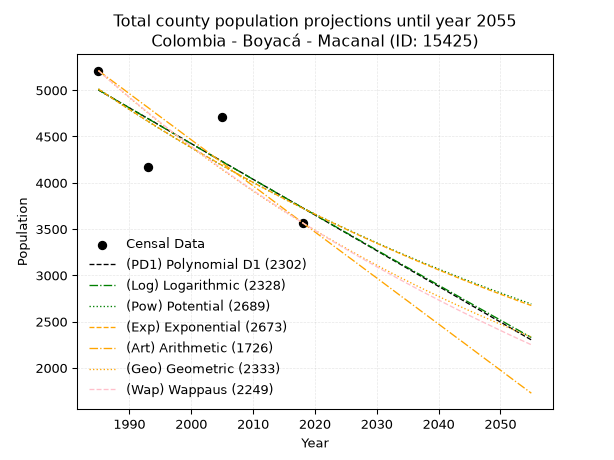
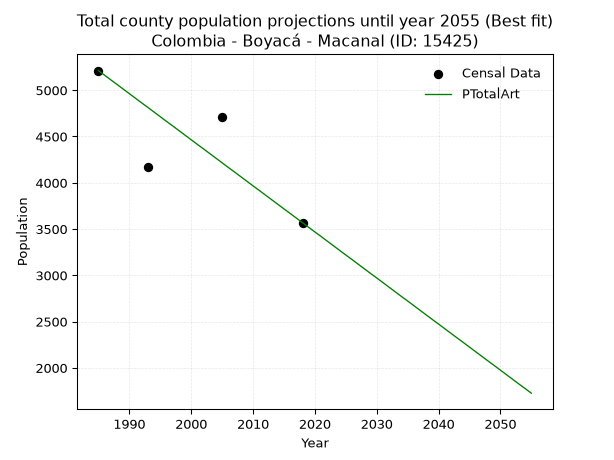
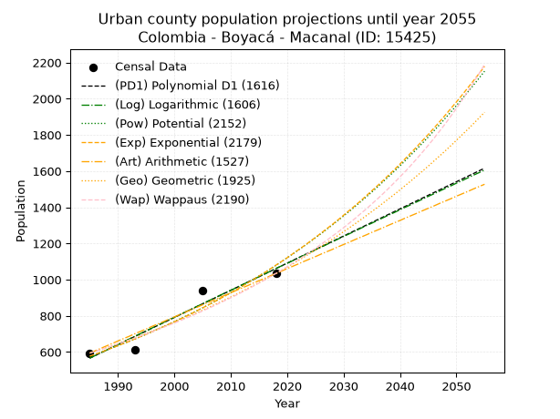
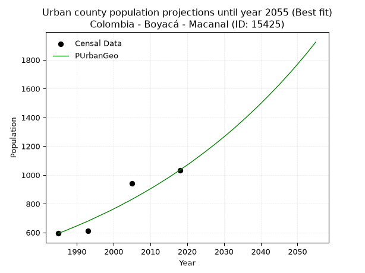
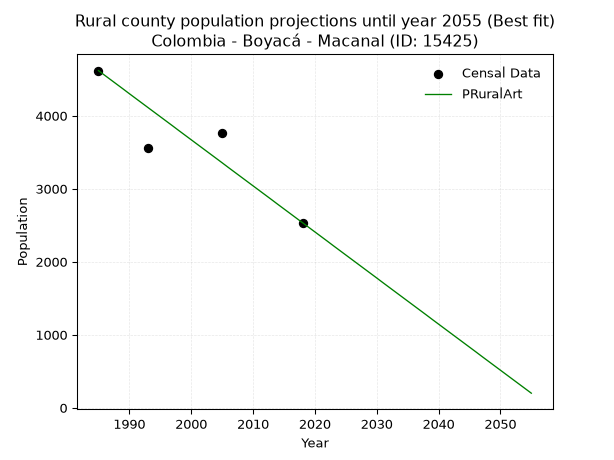

<div align="center">


</div>

# _“Population and Public Services Demand Projections (PPSD) until Year 2050 for Colombia - Boyacá - Macanal (ID: 15425)”_
Keywords: `population` `public-service` `projection` `lineal` `polynomial` `logarithmic` `potential` `exponential` `arithmetic` `geometric` `wappaus` `dane` `colombia` `south-america`

PPSD are analytical estimates used by governments and planners to anticipate future changes in population size, age distribution, and the resulting community needs for utilities, healthcare, education, and infrastructure as sizing future water treatment facilities, electrical grids, and road networks based on spatial growth.

> **General running parameters**: • app_version: _v20260806_. • Python version: _3.14.7_. • Pandas version: _3.0.5_. • NumPy version: _2.5.1_. • Creates, save and include plots into reports (create_plot): _False_. • Projection until year: _2050_. • Process polynomial degree 2 and up: _False_. • Process Wappaus: _True_. • Process Wappaus: _True_. • Set negative values to zero: _True_. • Set infinite values to zero: _True_. • Drop dataset notes: _True_. 
<div align="center">

Dynamic map: [:earth_americas:Google](http://maps.google.com/maps?q=4.972464334,-73.3195927) [:earth_americas:OSM](https://www.openstreetmap.org/#map=18/4.972464334/-73.3195927&layers=P) [:earth_americas:Bing](https://www.bing.com/maps?cp=4.972464334~-73.3195927&lvl=18) [:earth_americas:Apple](https://maps.apple.com/frame?center=4.972464334%2C-73.3195927&span=0.003%2C0.006)

</div>


<div align="center">

```geojson
{
  "type": "Feature",
  "geometry": {
    "type": "Point", 
    "coordinates": [-73.3195927, 4.972464334]
  }, 
  "properties": {
    "Name": "Colombia - Boyacá - Macanal (ID: 15425)"
  }
}
```

</div>


## 0. Census Data (4 records)

Census data are official statistics collected by a government about the people and housing in a country. They usually include counts of total population, age, sex, race, income, education, and jobs.

📅Global census file: [Population.xlsx](../data/Population.xlsx)

| Source   |   Year |   CountryID | CountryName   |   StateID | StateName   |   CountyID | CountyName   |   PTotal |   PUrban |   PRural |
|:---------|-------:|------------:|:--------------|----------:|:------------|-----------:|:-------------|---------:|---------:|---------:|
| DANE     |   1985 |          57 | Colombia      |        15 | Boyacá      |      15425 | Macanal      |     5211 |      594 |     4617 |
| DANE     |   1993 |          57 | Colombia      |        15 | Boyacá      |      15425 | Macanal      |     4170 |      611 |     3559 |
| DANE     |   2005 |          57 | Colombia      |        15 | Boyacá      |      15425 | Macanal      |     4705 |      941 |     3764 |
| DANE     |   2018 |          57 | Colombia      |        15 | Boyacá      |      15425 | Macanal      |     3568 |     1034 |     2534 |

> 🔥Some records could had specific notes about the registered values or the corresponding urban or rural distribution.

📅   [RUPS](https://www.datos.gov.co/Hacienda-y-Cr-dito-P-blico/Registro-nico-de-Prestadores-de-Servicios-P-blicos/4qkq-csdn/about_data) - Local public utility companies: [RUPS.csv](../data/RUPS.xlsx)

 | SERVICIO       | ESTADO    | NOMBRE                                                    | NIT         | DEPARTAMENTO_DOMICILIO   | MUNICIPIO_DOMICILIO   | DIRECCION         |   TELEFONO | EMAIL                  | TIPO_PRESTADOR                             | CLASIFICACION                 |
|:---------------|:----------|:----------------------------------------------------------|:------------|:-------------------------|:----------------------|:------------------|-----------:|:-----------------------|:-------------------------------------------|:------------------------------|
| ACUEDUCTO      | OPERATIVA | EMPRESA DE SERVICIOS PUBLICOS DE MACANAL MANANTIAL SA ESP | 900275530-7 | BOYACA                   | MACANAL               | carrera 6 no 2-79 |    7590132 | espmanantial@gmail.com | SOCIEDADES (EMPRESA DE SERVICIOS PUBLICOS) | MENOR O IGUAL A 2500 USUARIOS |
| ALCANTARILLADO | OPERATIVA | EMPRESA DE SERVICIOS PUBLICOS DE MACANAL MANANTIAL SA ESP | 900275530-7 | BOYACA                   | MACANAL               | carrera 6 no 2-79 |    7590132 | espmanantial@gmail.com | SOCIEDADES (EMPRESA DE SERVICIOS PUBLICOS) | MENOR O IGUAL A 2500 USUARIOS |

## 1. Total

### 1.1. Coefficients and Parameters

* (PD1) Polynomial Deg 1: -38.57005218787571, 81563.2468887984 (lineal)
* (Log) Logarithmic: -77187.87781143944, 591119.1777895847
* (Pow) Potential: -17.96927862585435, 62.9584618834805
* (Exp) Exponential: -0.008980483114167484, 276588402900.73663
* (Art) Arithmetic: Year diff. 2018 - 1985 = 33, Population diff. 3568 - 5211 = -1643, Annual growth = -49.78787878787879
* (Geo) Geometric: Year diff. 2018 - 1985 = 33, Population diff. 3568 - 5211 = -1643, Annual growth % = -0.011412156218292724
* (Wap) Wappaus: i = -1.1342494313219909, Condition values only valid for < 200)

<sub>
Wappaus condition values: ['-0.00', '-1.13', '-2.27', '-3.40', '-4.54', '-5.67', '-6.81', '-7.94', '-9.07', '-10.21', '-11.34', '-12.48', '-13.61', '-14.75', '-15.88', '-17.01', '-18.15', '-19.28', '-20.42', '-21.55', '-22.68', '-23.82', '-24.95', '-26.09', '-27.22', '-28.36', '-29.49', '-30.62', '-31.76', '-32.89', '-34.03', '-35.16', '-36.30', '-37.43', '-38.56', '-39.70', '-40.83', '-41.97', '-43.10', '-44.24', '-45.37', '-46.50', '-47.64', '-48.77', '-49.91', '-51.04', '-52.18', '-53.31', '-54.44', '-55.58', '-56.71', '-57.85', '-58.98', '-60.12', '-61.25', '-62.38', '-63.52', '-64.65', '-65.79', '-66.92', '-68.05', '-69.19', '-70.32', '-71.46', '-72.59', '-73.73']
</sub>


### 1.2. Projected Dataset

|   Year |   CountyID |   PTotalPD1 |   PTotalLog |   PTotalPow |   PTotalExp |   PTotalArt |   PTotalGeo |   PTotalWap |
|-------:|-----------:|------------:|------------:|------------:|------------:|------------:|------------:|------------:|
|   1985 |      15425 |        5002 |        5003 |        5013 |        5012 |        5211 |        5211 |        5211 |
|   1986 |      15425 |        4963 |        4964 |        4968 |        4967 |        5161 |        5152 |        5152 |
|   1987 |      15425 |        4925 |        4925 |        4923 |        4923 |        5111 |        5093 |        5094 |
|   1988 |      15425 |        4886 |        4886 |        4879 |        4879 |        5062 |        5035 |        5037 |
|   1989 |      15425 |        4847 |        4847 |        4835 |        4835 |        5012 |        4977 |        4980 |
|   1990 |      15425 |        4809 |        4809 |        4791 |        4792 |        4962 |        4920 |        4924 |
|   1991 |      15425 |        4770 |        4770 |        4748 |        4749 |        4912 |        4864 |        4868 |
|   1992 |      15425 |        4732 |        4731 |        4706 |        4706 |        4862 |        4809 |        4813 |
|   1993 |      15425 |        4693 |        4692 |        4663 |        4664 |        4813 |        4754 |        4759 |
|   1994 |      15425 |        4655 |        4654 |        4621 |        4623 |        4763 |        4700 |        4705 |
|   1995 |      15425 |        4616 |        4615 |        4580 |        4581 |        4713 |        4646 |        4652 |
|   1996 |      15425 |        4577 |        4576 |        4539 |        4540 |        4663 |        4593 |        4599 |
|   1997 |      15425 |        4539 |        4538 |        4498 |        4500 |        4614 |        4541 |        4547 |
|   1998 |      15425 |        4500 |        4499 |        4458 |        4459 |        4564 |        4489 |        4495 |
|   1999 |      15425 |        4462 |        4460 |        4418 |        4420 |        4514 |        4437 |        4444 |
|   2000 |      15425 |        4423 |        4422 |        4379 |        4380 |        4464 |        4387 |        4394 |
|   2001 |      15425 |        4385 |        4383 |        4339 |        4341 |        4414 |        4337 |        4344 |
|   2002 |      15425 |        4346 |        4344 |        4301 |        4302 |        4365 |        4287 |        4295 |
|   2003 |      15425 |        4307 |        4306 |        4262 |        4264 |        4315 |        4238 |        4246 |
|   2004 |      15425 |        4269 |        4267 |        4224 |        4226 |        4265 |        4190 |        4197 |
|   2005 |      15425 |        4230 |        4229 |        4186 |        4188 |        4215 |        4142 |        4149 |
|   2006 |      15425 |        4192 |        4190 |        4149 |        4150 |        4165 |        4095 |        4102 |
|   2007 |      15425 |        4153 |        4152 |        4112 |        4113 |        4116 |        4048 |        4055 |
|   2008 |      15425 |        4115 |        4114 |        4075 |        4076 |        4066 |        4002 |        4008 |
|   2009 |      15425 |        4076 |        4075 |        4039 |        4040 |        4016 |        3956 |        3962 |
|   2010 |      15425 |        4037 |        4037 |        4003 |        4004 |        3966 |        3911 |        3917 |
|   2011 |      15425 |        3999 |        3998 |        3968 |        3968 |        3917 |        3866 |        3872 |
|   2012 |      15425 |        3960 |        3960 |        3932 |        3933 |        3867 |        3822 |        3827 |
|   2013 |      15425 |        3922 |        3922 |        3897 |        3897 |        3817 |        3779 |        3783 |
|   2014 |      15425 |        3883 |        3883 |        3863 |        3863 |        3767 |        3736 |        3739 |
|   2015 |      15425 |        3845 |        3845 |        3828 |        3828 |        3717 |        3693 |        3696 |
|   2016 |      15425 |        3806 |        3807 |        3794 |        3794 |        3668 |        3651 |        3653 |
|   2017 |      15425 |        3767 |        3768 |        3761 |        3760 |        3618 |        3609 |        3610 |
|   2018 |      15425 |        3729 |        3730 |        3727 |        3726 |        3568 |        3568 |        3568 |
|   2019 |      15425 |        3690 |        3692 |        3694 |        3693 |        3518 |        3527 |        3526 |
|   2020 |      15425 |        3652 |        3654 |        3662 |        3660 |        3468 |        3487 |        3485 |
|   2021 |      15425 |        3613 |        3615 |        3629 |        3627 |        3419 |        3447 |        3444 |
|   2022 |      15425 |        3575 |        3577 |        3597 |        3595 |        3369 |        3408 |        3403 |
|   2023 |      15425 |        3536 |        3539 |        3565 |        3563 |        3319 |        3369 |        3363 |
|   2024 |      15425 |        3497 |        3501 |        3534 |        3531 |        3269 |        3331 |        3323 |
|   2025 |      15425 |        3459 |        3463 |        3503 |        3499 |        3219 |        3293 |        3284 |
|   2026 |      15425 |        3420 |        3425 |        3472 |        3468 |        3170 |        3255 |        3245 |
|   2027 |      15425 |        3382 |        3387 |        3441 |        3437 |        3120 |        3218 |        3206 |
|   2028 |      15425 |        3343 |        3349 |        3411 |        3406 |        3070 |        3181 |        3168 |
|   2029 |      15425 |        3305 |        3310 |        3381 |        3376 |        3020 |        3145 |        3130 |
|   2030 |      15425 |        3266 |        3272 |        3351 |        3346 |        2971 |        3109 |        3092 |
|   2031 |      15425 |        3227 |        3234 |        3321 |        3316 |        2921 |        3073 |        3055 |
|   2032 |      15425 |        3189 |        3196 |        3292 |        3286 |        2871 |        3038 |        3018 |
|   2033 |      15425 |        3150 |        3158 |        3263 |        3257 |        2821 |        3004 |        2981 |
|   2034 |      15425 |        3112 |        3120 |        3234 |        3228 |        2771 |        2969 |        2945 |
|   2035 |      15425 |        3073 |        3083 |        3206 |        3199 |        2722 |        2936 |        2909 |
|   2036 |      15425 |        3035 |        3045 |        3178 |        3170 |        2672 |        2902 |        2873 |
|   2037 |      15425 |        2996 |        3007 |        3150 |        3142 |        2622 |        2869 |        2837 |
|   2038 |      15425 |        2957 |        2969 |        3122 |        3114 |        2572 |        2836 |        2802 |
|   2039 |      15425 |        2919 |        2931 |        3095 |        3086 |        2522 |        2804 |        2768 |
|   2040 |      15425 |        2880 |        2893 |        3068 |        3058 |        2473 |        2772 |        2733 |
|   2041 |      15425 |        2842 |        2855 |        3041 |        3031 |        2423 |        2740 |        2699 |
|   2042 |      15425 |        2803 |        2817 |        3014 |        3004 |        2373 |        2709 |        2665 |
|   2043 |      15425 |        2765 |        2780 |        2988 |        2977 |        2323 |        2678 |        2631 |
|   2044 |      15425 |        2726 |        2742 |        2961 |        2950 |        2274 |        2647 |        2598 |
|   2045 |      15425 |        2687 |        2704 |        2936 |        2924 |        2224 |        2617 |        2565 |
|   2046 |      15425 |        2649 |        2666 |        2910 |        2898 |        2174 |        2587 |        2532 |
|   2047 |      15425 |        2610 |        2629 |        2884 |        2872 |        2124 |        2558 |        2500 |
|   2048 |      15425 |        2572 |        2591 |        2859 |        2846 |        2074 |        2529 |        2468 |
|   2049 |      15425 |        2533 |        2553 |        2834 |        2821 |        2025 |        2500 |        2436 |
|   2050 |      15425 |        2495 |        2516 |        2810 |        2796 |        1975 |        2471 |        2404 |
<div align="center">

</img>

</div>


### 1.3. Best fit with absolute and relative error (%)

Relative error puts that difference into context by dividing the absolute error by the true value, creating a unitless ratio or percentage that shows the scale of the mistake.

Absolute and relative error

|   Year | Source   |   CountryID | CountryName   |   StateID | StateName   |   CountyID_x | CountyName   |   PTotal |   PUrban |   PRural |   CountyID_y |   PTotalPD1 |   PTotalLog |   PTotalPow |   PTotalExp |   PTotalArt |   PTotalGeo |   PTotalWap |   PTotalPD1AbsError |   PTotalLogAbsError |   PTotalPowAbsError |   PTotalExpAbsError |   PTotalArtAbsError |   PTotalGeoAbsError |   PTotalWapAbsError |   PTotalPD1RelError |   PTotalLogRelError |   PTotalPowRelError |   PTotalExpRelError |   PTotalArtRelError |   PTotalGeoRelError |   PTotalWapRelError |
|-------:|:---------|------------:|:--------------|----------:|:------------|-------------:|:-------------|---------:|---------:|---------:|-------------:|------------:|------------:|------------:|------------:|------------:|------------:|------------:|--------------------:|--------------------:|--------------------:|--------------------:|--------------------:|--------------------:|--------------------:|--------------------:|--------------------:|--------------------:|--------------------:|--------------------:|--------------------:|--------------------:|
|   1985 | DANE     |          57 | Colombia      |        15 | Boyacá      |        15425 | Macanal      |     5211 |      594 |     4617 |        15425 |        5002 |        5003 |        5013 |        5012 |        5211 |        5211 |        5211 |                 209 |                 208 |                 198 |                 199 |                   0 |                   0 |                   0 |             4.01075 |             3.99156 |             3.79965 |             3.81884 |              0      |              0      |              0      |
|   1993 | DANE     |          57 | Colombia      |        15 | Boyacá      |        15425 | Macanal      |     4170 |      611 |     3559 |        15425 |        4693 |        4692 |        4663 |        4664 |        4813 |        4754 |        4759 |                 523 |                 522 |                 493 |                 494 |                 643 |                 584 |                 589 |            12.542   |            12.518   |            11.8225  |            11.8465  |             15.4197 |             14.0048 |             14.1247 |
|   2005 | DANE     |          57 | Colombia      |        15 | Boyacá      |        15425 | Macanal      |     4705 |      941 |     3764 |        15425 |        4230 |        4229 |        4186 |        4188 |        4215 |        4142 |        4149 |                 475 |                 476 |                 519 |                 517 |                 490 |                 563 |                 556 |            10.0956  |            10.1169  |            11.0308  |            10.9883  |             10.4145 |             11.966  |             11.8172 |
|   2018 | DANE     |          57 | Colombia      |        15 | Boyacá      |        15425 | Macanal      |     3568 |     1034 |     2534 |        15425 |        3729 |        3730 |        3727 |        3726 |        3568 |        3568 |        3568 |                 161 |                 162 |                 159 |                 158 |                   0 |                   0 |                   0 |             4.51233 |             4.54036 |             4.45628 |             4.42825 |              0      |              0      |              0      |

Relative error mean

| Method    |   RelError | Best   |
|:----------|-----------:|:-------|
| PTotalPD1 |    7.79017 |        |
| PTotalLog |    7.7917  |        |
| PTotalPow |    7.77732 |        |
| PTotalExp |    7.77048 |        |
| PTotalArt |    6.45853 | True   |
| PTotalGeo |    6.4927  |        |
| PTotalWap |    6.48548 |        |

💙Best method: _**PTotalArt**_
<div align="center">

</img>

</div>


### 1.4. Fresh water supply demand in liters per capita per day (lpcd)

The fresh water supply demand typically ranges from 100 to 300 liters per capita per day (lpcd) for standard domestic and municipal planning, though absolute survival minimums set by the World Health Organization are as low as 7.5 to 20 liters per day, and total consumption in high-income nations can exceed 400 liters.

> `CZ`: Level in meters above the sea level (masl)<br> `WS`: Fresh water supply demand in liters per capita per day (lpcd or l/h/d)<br> `WSAll`: Zonal fresh water supply demand in liters per second (l/s)<br> `A`: Zonal area in square meters<br> `DP`: Population density (people/hectare or p/ha)

Reference values (RAS Colombia)

|    CZ |   WS |
|------:|-----:|
|  1000 |  120 |
|  2000 |  130 |
| 99999 |  140 |

County shapefile geometry properties and water supply values

|   CountyID |      ATotal |   CZTotal |   WSTotal |
|-----------:|------------:|----------:|----------:|
|      15425 | 1.99614e+08 |   1828.05 |       130 |

Projected values for best method: PTotalArt

|   CountyID |   Year |   PTotalArt |   DPTotal |   WSTotal |   WSTotalAll |
|-----------:|-------:|------------:|----------:|----------:|-------------:|
|      15425 |   1985 |        5211 |      0.26 |       130 |      7.84063 |
|      15425 |   1986 |        5161 |      0.26 |       130 |      7.76539 |
|      15425 |   1987 |        5111 |      0.26 |       130 |      7.69016 |
|      15425 |   1988 |        5062 |      0.25 |       130 |      7.61644 |
|      15425 |   1989 |        5012 |      0.25 |       130 |      7.5412  |
|      15425 |   1990 |        4962 |      0.25 |       130 |      7.46597 |
|      15425 |   1991 |        4912 |      0.25 |       130 |      7.39074 |
|      15425 |   1992 |        4862 |      0.24 |       130 |      7.31551 |
|      15425 |   1993 |        4813 |      0.24 |       130 |      7.24178 |
|      15425 |   1994 |        4763 |      0.24 |       130 |      7.16655 |
|      15425 |   1995 |        4713 |      0.24 |       130 |      7.09132 |
|      15425 |   1996 |        4663 |      0.23 |       130 |      7.01609 |
|      15425 |   1997 |        4614 |      0.23 |       130 |      6.94236 |
|      15425 |   1998 |        4564 |      0.23 |       130 |      6.86713 |
|      15425 |   1999 |        4514 |      0.23 |       130 |      6.7919  |
|      15425 |   2000 |        4464 |      0.22 |       130 |      6.71667 |
|      15425 |   2001 |        4414 |      0.22 |       130 |      6.64144 |
|      15425 |   2002 |        4365 |      0.22 |       130 |      6.56771 |
|      15425 |   2003 |        4315 |      0.22 |       130 |      6.49248 |
|      15425 |   2004 |        4265 |      0.21 |       130 |      6.41725 |
|      15425 |   2005 |        4215 |      0.21 |       130 |      6.34201 |
|      15425 |   2006 |        4165 |      0.21 |       130 |      6.26678 |
|      15425 |   2007 |        4116 |      0.21 |       130 |      6.19306 |
|      15425 |   2008 |        4066 |      0.2  |       130 |      6.11782 |
|      15425 |   2009 |        4016 |      0.2  |       130 |      6.04259 |
|      15425 |   2010 |        3966 |      0.2  |       130 |      5.96736 |
|      15425 |   2011 |        3917 |      0.2  |       130 |      5.89363 |
|      15425 |   2012 |        3867 |      0.19 |       130 |      5.8184  |
|      15425 |   2013 |        3817 |      0.19 |       130 |      5.74317 |
|      15425 |   2014 |        3767 |      0.19 |       130 |      5.66794 |
|      15425 |   2015 |        3717 |      0.19 |       130 |      5.59271 |
|      15425 |   2016 |        3668 |      0.18 |       130 |      5.51898 |
|      15425 |   2017 |        3618 |      0.18 |       130 |      5.44375 |
|      15425 |   2018 |        3568 |      0.18 |       130 |      5.36852 |
|      15425 |   2019 |        3518 |      0.18 |       130 |      5.29329 |
|      15425 |   2020 |        3468 |      0.17 |       130 |      5.21806 |
|      15425 |   2021 |        3419 |      0.17 |       130 |      5.14433 |
|      15425 |   2022 |        3369 |      0.17 |       130 |      5.0691  |
|      15425 |   2023 |        3319 |      0.17 |       130 |      4.99387 |
|      15425 |   2024 |        3269 |      0.16 |       130 |      4.91863 |
|      15425 |   2025 |        3219 |      0.16 |       130 |      4.8434  |
|      15425 |   2026 |        3170 |      0.16 |       130 |      4.76968 |
|      15425 |   2027 |        3120 |      0.16 |       130 |      4.69444 |
|      15425 |   2028 |        3070 |      0.15 |       130 |      4.61921 |
|      15425 |   2029 |        3020 |      0.15 |       130 |      4.54398 |
|      15425 |   2030 |        2971 |      0.15 |       130 |      4.47025 |
|      15425 |   2031 |        2921 |      0.15 |       130 |      4.39502 |
|      15425 |   2032 |        2871 |      0.14 |       130 |      4.31979 |
|      15425 |   2033 |        2821 |      0.14 |       130 |      4.24456 |
|      15425 |   2034 |        2771 |      0.14 |       130 |      4.16933 |
|      15425 |   2035 |        2722 |      0.14 |       130 |      4.0956  |
|      15425 |   2036 |        2672 |      0.13 |       130 |      4.02037 |
|      15425 |   2037 |        2622 |      0.13 |       130 |      3.94514 |
|      15425 |   2038 |        2572 |      0.13 |       130 |      3.86991 |
|      15425 |   2039 |        2522 |      0.13 |       130 |      3.79468 |
|      15425 |   2040 |        2473 |      0.12 |       130 |      3.72095 |
|      15425 |   2041 |        2423 |      0.12 |       130 |      3.64572 |
|      15425 |   2042 |        2373 |      0.12 |       130 |      3.57049 |
|      15425 |   2043 |        2323 |      0.12 |       130 |      3.49525 |
|      15425 |   2044 |        2274 |      0.11 |       130 |      3.42153 |
|      15425 |   2045 |        2224 |      0.11 |       130 |      3.3463  |
|      15425 |   2046 |        2174 |      0.11 |       130 |      3.27106 |
|      15425 |   2047 |        2124 |      0.11 |       130 |      3.19583 |
|      15425 |   2048 |        2074 |      0.1  |       130 |      3.1206  |
|      15425 |   2049 |        2025 |      0.1  |       130 |      3.04688 |
|      15425 |   2050 |        1975 |      0.1  |       130 |      2.97164 |

## 2. Urban

### 2.1. Coefficients and Parameters

* (PD1) Polynomial Deg 1: 14.989963869931673, -29188.67523083083 (lineal)
* (Log) Logarithmic: 30007.690348475222, -227293.6948052991
* (Pow) Potential: 37.998101367709694, -122.54762982870936
* (Exp) Exponential: 0.018979912992725386, 2.5071526492048355e-14
* (Art) Arithmetic: Year diff. 2018 - 1985 = 33, Population diff. 1034 - 594 = 440, Annual growth = 13.333333333333334
* (Geo) Geometric: Year diff. 2018 - 1985 = 33, Population diff. 1034 - 594 = 440, Annual growth % = 0.01693916279991825
* (Wap) Wappaus: i = 1.638001638001638, Condition values only valid for < 200)

<sub>
Wappaus condition values: ['0.00', '1.64', '3.28', '4.91', '6.55', '8.19', '9.83', '11.47', '13.10', '14.74', '16.38', '18.02', '19.66', '21.29', '22.93', '24.57', '26.21', '27.85', '29.48', '31.12', '32.76', '34.40', '36.04', '37.67', '39.31', '40.95', '42.59', '44.23', '45.86', '47.50', '49.14', '50.78', '52.42', '54.05', '55.69', '57.33', '58.97', '60.61', '62.24', '63.88', '65.52', '67.16', '68.80', '70.43', '72.07', '73.71', '75.35', '76.99', '78.62', '80.26', '81.90', '83.54', '85.18', '86.81', '88.45', '90.09', '91.73', '93.37', '95.00', '96.64', '98.28', '99.92', '101.56', '103.19', '104.83', '106.47']
</sub>


### 2.2. Projected Dataset

|   Year |   CountyID |   PUrbanPD1 |   PUrbanLog |   PUrbanPow |   PUrbanExp |   PUrbanArt |   PUrbanGeo |   PUrbanWap |
|-------:|-----------:|------------:|------------:|------------:|------------:|------------:|------------:|------------:|
|   1985 |      15425 |         566 |         566 |         577 |         577 |         594 |         594 |         594 |
|   1986 |      15425 |         581 |         581 |         588 |         588 |         607 |         604 |         604 |
|   1987 |      15425 |         596 |         596 |         599 |         599 |         621 |         614 |         614 |
|   1988 |      15425 |         611 |         611 |         611 |         611 |         634 |         625 |         624 |
|   1989 |      15425 |         626 |         626 |         623 |         623 |         647 |         635 |         634 |
|   1990 |      15425 |         641 |         641 |         635 |         635 |         661 |         646 |         645 |
|   1991 |      15425 |         656 |         656 |         647 |         647 |         674 |         657 |         655 |
|   1992 |      15425 |         671 |         672 |         659 |         659 |         687 |         668 |         666 |
|   1993 |      15425 |         686 |         687 |         672 |         672 |         701 |         679 |         677 |
|   1994 |      15425 |         701 |         702 |         685 |         685 |         714 |         691 |         689 |
|   1995 |      15425 |         716 |         717 |         698 |         698 |         727 |         703 |         700 |
|   1996 |      15425 |         731 |         732 |         712 |         711 |         741 |         715 |         712 |
|   1997 |      15425 |         746 |         747 |         725 |         725 |         754 |         727 |         723 |
|   1998 |      15425 |         761 |         762 |         739 |         739 |         767 |         739 |         736 |
|   1999 |      15425 |         776 |         777 |         753 |         753 |         781 |         751 |         748 |
|   2000 |      15425 |         791 |         792 |         768 |         767 |         794 |         764 |         760 |
|   2001 |      15425 |         806 |         807 |         783 |         782 |         807 |         777 |         773 |
|   2002 |      15425 |         821 |         822 |         798 |         797 |         821 |         790 |         786 |
|   2003 |      15425 |         836 |         837 |         813 |         812 |         834 |         804 |         799 |
|   2004 |      15425 |         851 |         852 |         828 |         828 |         847 |         817 |         813 |
|   2005 |      15425 |         866 |         867 |         844 |         844 |         861 |         831 |         827 |
|   2006 |      15425 |         881 |         882 |         860 |         860 |         874 |         845 |         841 |
|   2007 |      15425 |         896 |         897 |         877 |         876 |         887 |         860 |         855 |
|   2008 |      15425 |         911 |         912 |         894 |         893 |         901 |         874 |         870 |
|   2009 |      15425 |         926 |         927 |         911 |         910 |         914 |         889 |         885 |
|   2010 |      15425 |         941 |         941 |         928 |         928 |         927 |         904 |         900 |
|   2011 |      15425 |         956 |         956 |         946 |         945 |         941 |         919 |         915 |
|   2012 |      15425 |         971 |         971 |         964 |         963 |         954 |         935 |         931 |
|   2013 |      15425 |         986 |         986 |         982 |         982 |         967 |         951 |         947 |
|   2014 |      15425 |        1001 |        1001 |        1001 |        1001 |         981 |         967 |         964 |
|   2015 |      15425 |        1016 |        1016 |        1020 |        1020 |         994 |         983 |         981 |
|   2016 |      15425 |        1031 |        1031 |        1039 |        1039 |        1007 |        1000 |         998 |
|   2017 |      15425 |        1046 |        1046 |        1059 |        1059 |        1021 |        1017 |        1016 |
|   2018 |      15425 |        1061 |        1061 |        1079 |        1080 |        1034 |        1034 |        1034 |
|   2019 |      15425 |        1076 |        1076 |        1100 |        1100 |        1047 |        1052 |        1052 |
|   2020 |      15425 |        1091 |        1090 |        1121 |        1121 |        1061 |        1069 |        1071 |
|   2021 |      15425 |        1106 |        1105 |        1142 |        1143 |        1074 |        1087 |        1091 |
|   2022 |      15425 |        1121 |        1120 |        1164 |        1165 |        1087 |        1106 |        1111 |
|   2023 |      15425 |        1136 |        1135 |        1186 |        1187 |        1101 |        1125 |        1131 |
|   2024 |      15425 |        1151 |        1150 |        1208 |        1210 |        1114 |        1144 |        1152 |
|   2025 |      15425 |        1166 |        1165 |        1231 |        1233 |        1127 |        1163 |        1173 |
|   2026 |      15425 |        1181 |        1179 |        1254 |        1257 |        1141 |        1183 |        1195 |
|   2027 |      15425 |        1196 |        1194 |        1278 |        1281 |        1154 |        1203 |        1217 |
|   2028 |      15425 |        1211 |        1209 |        1302 |        1305 |        1167 |        1223 |        1240 |
|   2029 |      15425 |        1226 |        1224 |        1327 |        1330 |        1181 |        1244 |        1263 |
|   2030 |      15425 |        1241 |        1239 |        1352 |        1356 |        1194 |        1265 |        1287 |
|   2031 |      15425 |        1256 |        1253 |        1377 |        1382 |        1207 |        1286 |        1312 |
|   2032 |      15425 |        1271 |        1268 |        1403 |        1408 |        1221 |        1308 |        1337 |
|   2033 |      15425 |        1286 |        1283 |        1430 |        1435 |        1234 |        1330 |        1364 |
|   2034 |      15425 |        1301 |        1298 |        1457 |        1463 |        1247 |        1353 |        1390 |
|   2035 |      15425 |        1316 |        1312 |        1484 |        1491 |        1261 |        1376 |        1418 |
|   2036 |      15425 |        1331 |        1327 |        1512 |        1519 |        1274 |        1399 |        1446 |
|   2037 |      15425 |        1346 |        1342 |        1541 |        1548 |        1287 |        1423 |        1475 |
|   2038 |      15425 |        1361 |        1357 |        1570 |        1578 |        1301 |        1447 |        1505 |
|   2039 |      15425 |        1376 |        1371 |        1599 |        1608 |        1314 |        1471 |        1536 |
|   2040 |      15425 |        1391 |        1386 |        1629 |        1639 |        1327 |        1496 |        1568 |
|   2041 |      15425 |        1406 |        1401 |        1660 |        1671 |        1341 |        1522 |        1600 |
|   2042 |      15425 |        1421 |        1415 |        1691 |        1703 |        1354 |        1547 |        1634 |
|   2043 |      15425 |        1436 |        1430 |        1723 |        1735 |        1367 |        1574 |        1669 |
|   2044 |      15425 |        1451 |        1445 |        1755 |        1769 |        1381 |        1600 |        1705 |
|   2045 |      15425 |        1466 |        1460 |        1788 |        1802 |        1394 |        1627 |        1742 |
|   2046 |      15425 |        1481 |        1474 |        1822 |        1837 |        1407 |        1655 |        1780 |
|   2047 |      15425 |        1496 |        1489 |        1856 |        1872 |        1421 |        1683 |        1820 |
|   2048 |      15425 |        1511 |        1504 |        1891 |        1908 |        1434 |        1711 |        1860 |
|   2049 |      15425 |        1526 |        1518 |        1926 |        1945 |        1447 |        1740 |        1903 |
|   2050 |      15425 |        1541 |        1533 |        1962 |        1982 |        1461 |        1770 |        1946 |
<div align="center">

</img>

</div>


### 2.3. Best fit with absolute and relative error (%)

Relative error puts that difference into context by dividing the absolute error by the true value, creating a unitless ratio or percentage that shows the scale of the mistake.

Absolute and relative error

|   Year | Source   |   CountryID | CountryName   |   StateID | StateName   |   CountyID_x | CountyName   |   PTotal |   PUrban |   PRural |   CountyID_y |   PUrbanPD1 |   PUrbanLog |   PUrbanPow |   PUrbanExp |   PUrbanArt |   PUrbanGeo |   PUrbanWap |   PUrbanPD1AbsError |   PUrbanLogAbsError |   PUrbanPowAbsError |   PUrbanExpAbsError |   PUrbanArtAbsError |   PUrbanGeoAbsError |   PUrbanWapAbsError |   PUrbanPD1RelError |   PUrbanLogRelError |   PUrbanPowRelError |   PUrbanExpRelError |   PUrbanArtRelError |   PUrbanGeoRelError |   PUrbanWapRelError |
|-------:|:---------|------------:|:--------------|----------:|:------------|-------------:|:-------------|---------:|---------:|---------:|-------------:|------------:|------------:|------------:|------------:|------------:|------------:|------------:|--------------------:|--------------------:|--------------------:|--------------------:|--------------------:|--------------------:|--------------------:|--------------------:|--------------------:|--------------------:|--------------------:|--------------------:|--------------------:|--------------------:|
|   1985 | DANE     |          57 | Colombia      |        15 | Boyacá      |        15425 | Macanal      |     5211 |      594 |     4617 |        15425 |         566 |         566 |         577 |         577 |         594 |         594 |         594 |                  28 |                  28 |                  17 |                  17 |                   0 |                   0 |                   0 |             4.7138  |             4.7138  |             2.86195 |             2.86195 |             0       |              0      |              0      |
|   1993 | DANE     |          57 | Colombia      |        15 | Boyacá      |        15425 | Macanal      |     4170 |      611 |     3559 |        15425 |         686 |         687 |         672 |         672 |         701 |         679 |         677 |                  75 |                  76 |                  61 |                  61 |                  90 |                  68 |                  66 |            12.275   |            12.4386  |             9.98363 |             9.98363 |            14.73    |             11.1293 |             10.802  |
|   2005 | DANE     |          57 | Colombia      |        15 | Boyacá      |        15425 | Macanal      |     4705 |      941 |     3764 |        15425 |         866 |         867 |         844 |         844 |         861 |         831 |         827 |                  75 |                  74 |                  97 |                  97 |                  80 |                 110 |                 114 |             7.97024 |             7.86397 |            10.3082  |            10.3082  |             8.50159 |             11.6897 |             12.1148 |
|   2018 | DANE     |          57 | Colombia      |        15 | Boyacá      |        15425 | Macanal      |     3568 |     1034 |     2534 |        15425 |        1061 |        1061 |        1079 |        1080 |        1034 |        1034 |        1034 |                  27 |                  27 |                  45 |                  46 |                   0 |                   0 |                   0 |             2.61122 |             2.61122 |             4.35203 |             4.44874 |             0       |              0      |              0      |

Relative error mean

| Method    |   RelError | Best   |
|:----------|-----------:|:-------|
| PUrbanPD1 |    6.89256 |        |
| PUrbanLog |    6.90691 |        |
| PUrbanPow |    6.87645 |        |
| PUrbanExp |    6.90063 |        |
| PUrbanArt |    5.80789 |        |
| PUrbanGeo |    5.70475 | True   |
| PUrbanWap |    5.72918 |        |

💙Best method: _**PUrbanGeo**_
<div align="center">

</img>

</div>


### 2.4. Fresh water supply demand in liters per capita per day (lpcd)

The fresh water supply demand typically ranges from 100 to 300 liters per capita per day (lpcd) for standard domestic and municipal planning, though absolute survival minimums set by the World Health Organization are as low as 7.5 to 20 liters per day, and total consumption in high-income nations can exceed 400 liters.

> `CZ`: Level in meters above the sea level (masl)<br> `WS`: Fresh water supply demand in liters per capita per day (lpcd or l/h/d)<br> `WSAll`: Zonal fresh water supply demand in liters per second (l/s)<br> `A`: Zonal area in square meters<br> `DP`: Population density (people/hectare or p/ha)

Reference values (RAS Colombia)

|    CZ |   WS |
|------:|-----:|
|  1000 |  120 |
|  2000 |  130 |
| 99999 |  140 |

County shapefile geometry properties and water supply values

|   CountyID |   AUrban |   CZUrban |   WSUrban |
|-----------:|---------:|----------:|----------:|
|      15425 |   233397 |   1680.13 |       130 |

Projected values for best method: PUrbanGeo

|   CountyID |   Year |   PUrbanGeo |   DPUrban |   WSUrban |   WSUrbanAll |
|-----------:|-------:|------------:|----------:|----------:|-------------:|
|      15425 |   1985 |         594 |     25.45 |       130 |     0.89375  |
|      15425 |   1986 |         604 |     25.88 |       130 |     0.908796 |
|      15425 |   1987 |         614 |     26.31 |       130 |     0.923843 |
|      15425 |   1988 |         625 |     26.78 |       130 |     0.940394 |
|      15425 |   1989 |         635 |     27.21 |       130 |     0.95544  |
|      15425 |   1990 |         646 |     27.68 |       130 |     0.971991 |
|      15425 |   1991 |         657 |     28.15 |       130 |     0.988542 |
|      15425 |   1992 |         668 |     28.62 |       130 |     1.00509  |
|      15425 |   1993 |         679 |     29.09 |       130 |     1.02164  |
|      15425 |   1994 |         691 |     29.61 |       130 |     1.0397   |
|      15425 |   1995 |         703 |     30.12 |       130 |     1.05775  |
|      15425 |   1996 |         715 |     30.63 |       130 |     1.07581  |
|      15425 |   1997 |         727 |     31.15 |       130 |     1.09387  |
|      15425 |   1998 |         739 |     31.66 |       130 |     1.11192  |
|      15425 |   1999 |         751 |     32.18 |       130 |     1.12998  |
|      15425 |   2000 |         764 |     32.73 |       130 |     1.14954  |
|      15425 |   2001 |         777 |     33.29 |       130 |     1.1691   |
|      15425 |   2002 |         790 |     33.85 |       130 |     1.18866  |
|      15425 |   2003 |         804 |     34.45 |       130 |     1.20972  |
|      15425 |   2004 |         817 |     35    |       130 |     1.22928  |
|      15425 |   2005 |         831 |     35.6  |       130 |     1.25035  |
|      15425 |   2006 |         845 |     36.2  |       130 |     1.27141  |
|      15425 |   2007 |         860 |     36.85 |       130 |     1.29398  |
|      15425 |   2008 |         874 |     37.45 |       130 |     1.31505  |
|      15425 |   2009 |         889 |     38.09 |       130 |     1.33762  |
|      15425 |   2010 |         904 |     38.73 |       130 |     1.36019  |
|      15425 |   2011 |         919 |     39.37 |       130 |     1.38275  |
|      15425 |   2012 |         935 |     40.06 |       130 |     1.40683  |
|      15425 |   2013 |         951 |     40.75 |       130 |     1.4309   |
|      15425 |   2014 |         967 |     41.43 |       130 |     1.45498  |
|      15425 |   2015 |         983 |     42.12 |       130 |     1.47905  |
|      15425 |   2016 |        1000 |     42.85 |       130 |     1.50463  |
|      15425 |   2017 |        1017 |     43.57 |       130 |     1.53021  |
|      15425 |   2018 |        1034 |     44.3  |       130 |     1.55579  |
|      15425 |   2019 |        1052 |     45.07 |       130 |     1.58287  |
|      15425 |   2020 |        1069 |     45.8  |       130 |     1.60845  |
|      15425 |   2021 |        1087 |     46.57 |       130 |     1.63553  |
|      15425 |   2022 |        1106 |     47.39 |       130 |     1.66412  |
|      15425 |   2023 |        1125 |     48.2  |       130 |     1.69271  |
|      15425 |   2024 |        1144 |     49.02 |       130 |     1.7213   |
|      15425 |   2025 |        1163 |     49.83 |       130 |     1.74988  |
|      15425 |   2026 |        1183 |     50.69 |       130 |     1.77998  |
|      15425 |   2027 |        1203 |     51.54 |       130 |     1.81007  |
|      15425 |   2028 |        1223 |     52.4  |       130 |     1.84016  |
|      15425 |   2029 |        1244 |     53.3  |       130 |     1.87176  |
|      15425 |   2030 |        1265 |     54.2  |       130 |     1.90336  |
|      15425 |   2031 |        1286 |     55.1  |       130 |     1.93495  |
|      15425 |   2032 |        1308 |     56.04 |       130 |     1.96806  |
|      15425 |   2033 |        1330 |     56.98 |       130 |     2.00116  |
|      15425 |   2034 |        1353 |     57.97 |       130 |     2.03576  |
|      15425 |   2035 |        1376 |     58.96 |       130 |     2.07037  |
|      15425 |   2036 |        1399 |     59.94 |       130 |     2.10498  |
|      15425 |   2037 |        1423 |     60.97 |       130 |     2.14109  |
|      15425 |   2038 |        1447 |     62    |       130 |     2.1772   |
|      15425 |   2039 |        1471 |     63.03 |       130 |     2.21331  |
|      15425 |   2040 |        1496 |     64.1  |       130 |     2.25093  |
|      15425 |   2041 |        1522 |     65.21 |       130 |     2.29005  |
|      15425 |   2042 |        1547 |     66.28 |       130 |     2.32766  |
|      15425 |   2043 |        1574 |     67.44 |       130 |     2.36829  |
|      15425 |   2044 |        1600 |     68.55 |       130 |     2.40741  |
|      15425 |   2045 |        1627 |     69.71 |       130 |     2.44803  |
|      15425 |   2046 |        1655 |     70.91 |       130 |     2.49016  |
|      15425 |   2047 |        1683 |     72.11 |       130 |     2.53229  |
|      15425 |   2048 |        1711 |     73.31 |       130 |     2.57442  |
|      15425 |   2049 |        1740 |     74.55 |       130 |     2.61806  |
|      15425 |   2050 |        1770 |     75.84 |       130 |     2.66319  |

## 3. Rural

### 3.1. Coefficients and Parameters

* (PD1) Polynomial Deg 1: -53.560016057807324, 110751.92211962912 (lineal)
* (Log) Logarithmic: -107195.56815991458, 818412.8725948832
* (Pow) Potential: -31.270349732160668, 106.77458194247333
* (Exp) Exponential: -0.01562804709625219, 1.3330058313332053e+17
* (Art) Arithmetic: Year diff. 2018 - 1985 = 33, Population diff. 2534 - 4617 = -2083, Annual growth = -63.121212121212125
* (Geo) Geometric: Year diff. 2018 - 1985 = 33, Population diff. 2534 - 4617 = -2083, Annual growth % = -0.01801592109385386
* (Wap) Wappaus: i = -1.7653814045927037, Condition values only valid for < 200)

<sub>
Wappaus condition values: ['-0.00', '-1.77', '-3.53', '-5.30', '-7.06', '-8.83', '-10.59', '-12.36', '-14.12', '-15.89', '-17.65', '-19.42', '-21.18', '-22.95', '-24.72', '-26.48', '-28.25', '-30.01', '-31.78', '-33.54', '-35.31', '-37.07', '-38.84', '-40.60', '-42.37', '-44.13', '-45.90', '-47.67', '-49.43', '-51.20', '-52.96', '-54.73', '-56.49', '-58.26', '-60.02', '-61.79', '-63.55', '-65.32', '-67.08', '-68.85', '-70.62', '-72.38', '-74.15', '-75.91', '-77.68', '-79.44', '-81.21', '-82.97', '-84.74', '-86.50', '-88.27', '-90.03', '-91.80', '-93.57', '-95.33', '-97.10', '-98.86', '-100.63', '-102.39', '-104.16', '-105.92', '-107.69', '-109.45', '-111.22', '-112.98', '-114.75']
</sub>


### 3.2. Projected Dataset

|   Year |   CountyID |   PRuralPD1 |   PRuralLog |   PRuralPow |   PRuralExp |   PRuralArt |   PRuralGeo |   PRuralWap |
|-------:|-----------:|------------:|------------:|------------:|------------:|------------:|------------:|------------:|
|   1985 |      15425 |        4435 |        4437 |        4492 |        4490 |        4617 |        4617 |        4617 |
|   1986 |      15425 |        4382 |        4383 |        4422 |        4421 |        4554 |        4534 |        4536 |
|   1987 |      15425 |        4328 |        4329 |        4353 |        4352 |        4491 |        4452 |        4457 |
|   1988 |      15425 |        4275 |        4275 |        4285 |        4285 |        4428 |        4372 |        4379 |
|   1989 |      15425 |        4221 |        4221 |        4218 |        4218 |        4365 |        4293 |        4302 |
|   1990 |      15425 |        4167 |        4167 |        4152 |        4153 |        4301 |        4216 |        4227 |
|   1991 |      15425 |        4114 |        4113 |        4088 |        4089 |        4238 |        4140 |        4153 |
|   1992 |      15425 |        4060 |        4059 |        4024 |        4025 |        4175 |        4065 |        4080 |
|   1993 |      15425 |        4007 |        4006 |        3961 |        3963 |        4112 |        3992 |        4008 |
|   1994 |      15425 |        3953 |        3952 |        3900 |        3901 |        4049 |        3920 |        3937 |
|   1995 |      15425 |        3900 |        3898 |        3839 |        3841 |        3986 |        3850 |        3868 |
|   1996 |      15425 |        3846 |        3844 |        3779 |        3781 |        3923 |        3780 |        3800 |
|   1997 |      15425 |        3793 |        3791 |        3721 |        3723 |        3860 |        3712 |        3733 |
|   1998 |      15425 |        3739 |        3737 |        3663 |        3665 |        3796 |        3645 |        3666 |
|   1999 |      15425 |        3685 |        3683 |        3606 |        3608 |        3733 |        3579 |        3601 |
|   2000 |      15425 |        3632 |        3630 |        3550 |        3552 |        3670 |        3515 |        3537 |
|   2001 |      15425 |        3578 |        3576 |        3495 |        3497 |        3607 |        3452 |        3474 |
|   2002 |      15425 |        3525 |        3523 |        3441 |        3443 |        3544 |        3389 |        3412 |
|   2003 |      15425 |        3471 |        3469 |        3387 |        3389 |        3481 |        3328 |        3351 |
|   2004 |      15425 |        3418 |        3416 |        3335 |        3337 |        3418 |        3268 |        3291 |
|   2005 |      15425 |        3364 |        3362 |        3283 |        3285 |        3355 |        3210 |        3231 |
|   2006 |      15425 |        3311 |        3309 |        3233 |        3234 |        3291 |        3152 |        3173 |
|   2007 |      15425 |        3257 |        3255 |        3183 |        3184 |        3228 |        3095 |        3115 |
|   2008 |      15425 |        3203 |        3202 |        3133 |        3135 |        3165 |        3039 |        3059 |
|   2009 |      15425 |        3150 |        3149 |        3085 |        3086 |        3102 |        2984 |        3003 |
|   2010 |      15425 |        3096 |        3095 |        3037 |        3038 |        3039 |        2931 |        2948 |
|   2011 |      15425 |        3043 |        3042 |        2990 |        2991 |        2976 |        2878 |        2893 |
|   2012 |      15425 |        2989 |        2989 |        2944 |        2945 |        2913 |        2826 |        2840 |
|   2013 |      15425 |        2936 |        2935 |        2899 |        2899 |        2850 |        2775 |        2787 |
|   2014 |      15425 |        2882 |        2882 |        2854 |        2854 |        2786 |        2725 |        2735 |
|   2015 |      15425 |        2828 |        2829 |        2810 |        2810 |        2723 |        2676 |        2684 |
|   2016 |      15425 |        2775 |        2776 |        2767 |        2766 |        2660 |        2628 |        2633 |
|   2017 |      15425 |        2721 |        2723 |        2724 |        2723 |        2597 |        2580 |        2583 |
|   2018 |      15425 |        2668 |        2669 |        2683 |        2681 |        2534 |        2534 |        2534 |
|   2019 |      15425 |        2614 |        2616 |        2641 |        2640 |        2471 |        2488 |        2485 |
|   2020 |      15425 |        2561 |        2563 |        2601 |        2599 |        2408 |        2444 |        2438 |
|   2021 |      15425 |        2507 |        2510 |        2561 |        2558 |        2345 |        2399 |        2390 |
|   2022 |      15425 |        2454 |        2457 |        2521 |        2519 |        2282 |        2356 |        2344 |
|   2023 |      15425 |        2400 |        2404 |        2483 |        2480 |        2218 |        2314 |        2298 |
|   2024 |      15425 |        2346 |        2351 |        2445 |        2441 |        2155 |        2272 |        2252 |
|   2025 |      15425 |        2293 |        2298 |        2407 |        2403 |        2092 |        2231 |        2207 |
|   2026 |      15425 |        2239 |        2245 |        2370 |        2366 |        2029 |        2191 |        2163 |
|   2027 |      15425 |        2186 |        2192 |        2334 |        2329 |        1966 |        2152 |        2120 |
|   2028 |      15425 |        2132 |        2139 |        2298 |        2293 |        1903 |        2113 |        2076 |
|   2029 |      15425 |        2079 |        2087 |        2263 |        2258 |        1840 |        2075 |        2034 |
|   2030 |      15425 |        2025 |        2034 |        2229 |        2223 |        1777 |        2037 |        1992 |
|   2031 |      15425 |        1972 |        1981 |        2195 |        2188 |        1713 |        2001 |        1950 |
|   2032 |      15425 |        1918 |        1928 |        2161 |        2154 |        1650 |        1965 |        1909 |
|   2033 |      15425 |        1864 |        1876 |        2128 |        2121 |        1587 |        1929 |        1869 |
|   2034 |      15425 |        1811 |        1823 |        2096 |        2088 |        1524 |        1894 |        1829 |
|   2035 |      15425 |        1757 |        1770 |        2064 |        2056 |        1461 |        1860 |        1790 |
|   2036 |      15425 |        1704 |        1717 |        2032 |        2024 |        1398 |        1827 |        1751 |
|   2037 |      15425 |        1650 |        1665 |        2001 |        1992 |        1335 |        1794 |        1712 |
|   2038 |      15425 |        1597 |        1612 |        1971 |        1961 |        1272 |        1762 |        1674 |
|   2039 |      15425 |        1543 |        1560 |        1941 |        1931 |        1208 |        1730 |        1636 |
|   2040 |      15425 |        1489 |        1507 |        1911 |        1901 |        1145 |        1699 |        1599 |
|   2041 |      15425 |        1436 |        1455 |        1882 |        1872 |        1082 |        1668 |        1562 |
|   2042 |      15425 |        1382 |        1402 |        1853 |        1843 |        1019 |        1638 |        1526 |
|   2043 |      15425 |        1329 |        1350 |        1825 |        1814 |         956 |        1608 |        1490 |
|   2044 |      15425 |        1275 |        1297 |        1798 |        1786 |         893 |        1580 |        1455 |
|   2045 |      15425 |        1222 |        1245 |        1770 |        1758 |         830 |        1551 |        1420 |
|   2046 |      15425 |        1168 |        1192 |        1743 |        1731 |         767 |        1523 |        1385 |
|   2047 |      15425 |        1115 |        1140 |        1717 |        1704 |         703 |        1496 |        1351 |
|   2048 |      15425 |        1061 |        1088 |        1691 |        1678 |         640 |        1469 |        1317 |
|   2049 |      15425 |        1007 |        1035 |        1665 |        1652 |         577 |        1442 |        1284 |
|   2050 |      15425 |         954 |         983 |        1640 |        1626 |         514 |        1416 |        1251 |
<div align="center">

</img>

</div>


### 3.3. Best fit with absolute and relative error (%)

Relative error puts that difference into context by dividing the absolute error by the true value, creating a unitless ratio or percentage that shows the scale of the mistake.

Absolute and relative error

|   Year | Source   |   CountryID | CountryName   |   StateID | StateName   |   CountyID_x | CountyName   |   PTotal |   PUrban |   PRural |   CountyID_y |   PRuralPD1 |   PRuralLog |   PRuralPow |   PRuralExp |   PRuralArt |   PRuralGeo |   PRuralWap |   PRuralPD1AbsError |   PRuralLogAbsError |   PRuralPowAbsError |   PRuralExpAbsError |   PRuralArtAbsError |   PRuralGeoAbsError |   PRuralWapAbsError |   PRuralPD1RelError |   PRuralLogRelError |   PRuralPowRelError |   PRuralExpRelError |   PRuralArtRelError |   PRuralGeoRelError |   PRuralWapRelError |
|-------:|:---------|------------:|:--------------|----------:|:------------|-------------:|:-------------|---------:|---------:|---------:|-------------:|------------:|------------:|------------:|------------:|------------:|------------:|------------:|--------------------:|--------------------:|--------------------:|--------------------:|--------------------:|--------------------:|--------------------:|--------------------:|--------------------:|--------------------:|--------------------:|--------------------:|--------------------:|--------------------:|
|   1985 | DANE     |          57 | Colombia      |        15 | Boyacá      |        15425 | Macanal      |     5211 |      594 |     4617 |        15425 |        4435 |        4437 |        4492 |        4490 |        4617 |        4617 |        4617 |                 182 |                 180 |                 125 |                 127 |                   0 |                   0 |                   0 |             3.94195 |             3.89864 |             2.70739 |              2.7507 |              0      |              0      |              0      |
|   1993 | DANE     |          57 | Colombia      |        15 | Boyacá      |        15425 | Macanal      |     4170 |      611 |     3559 |        15425 |        4007 |        4006 |        3961 |        3963 |        4112 |        3992 |        4008 |                 448 |                 447 |                 402 |                 404 |                 553 |                 433 |                 449 |            12.5878  |            12.5597  |            11.2953  |             11.3515 |             15.5381 |             12.1663 |             12.6159 |
|   2005 | DANE     |          57 | Colombia      |        15 | Boyacá      |        15425 | Macanal      |     4705 |      941 |     3764 |        15425 |        3364 |        3362 |        3283 |        3285 |        3355 |        3210 |        3231 |                 400 |                 402 |                 481 |                 479 |                 409 |                 554 |                 533 |            10.627   |            10.6801  |            12.779   |             12.7258 |             10.8661 |             14.7184 |             14.1605 |
|   2018 | DANE     |          57 | Colombia      |        15 | Boyacá      |        15425 | Macanal      |     3568 |     1034 |     2534 |        15425 |        2668 |        2669 |        2683 |        2681 |        2534 |        2534 |        2534 |                 134 |                 135 |                 149 |                 147 |                   0 |                   0 |                   0 |             5.28808 |             5.32755 |             5.88003 |              5.8011 |              0      |              0      |              0      |

Relative error mean

| Method    |   RelError | Best   |
|:----------|-----------:|:-------|
| PRuralPD1 |    8.11121 |        |
| PRuralLog |    8.1165  |        |
| PRuralPow |    8.16542 |        |
| PRuralExp |    8.15728 |        |
| PRuralArt |    6.60104 | True   |
| PRuralGeo |    6.72118 |        |
| PRuralWap |    6.69409 |        |

💙Best method: _**PRuralArt**_
<div align="center">

</img>

</div>


### 3.4. Fresh water supply demand in liters per capita per day (lpcd)

The fresh water supply demand typically ranges from 100 to 300 liters per capita per day (lpcd) for standard domestic and municipal planning, though absolute survival minimums set by the World Health Organization are as low as 7.5 to 20 liters per day, and total consumption in high-income nations can exceed 400 liters.

> `CZ`: Level in meters above the sea level (masl)<br> `WS`: Fresh water supply demand in liters per capita per day (lpcd or l/h/d)<br> `WSAll`: Zonal fresh water supply demand in liters per second (l/s)<br> `A`: Zonal area in square meters<br> `DP`: Population density (people/hectare or p/ha)

Reference values (RAS Colombia)

|    CZ |   WS |
|------:|-----:|
|  1000 |  120 |
|  2000 |  130 |
| 99999 |  140 |

County shapefile geometry properties and water supply values

|   CountyID |      ARural |   CZRural |   WSRural |
|-----------:|------------:|----------:|----------:|
|      15425 | 1.99381e+08 |   1828.22 |       130 |

Projected values for best method: PRuralArt

|   CountyID |   Year |   PRuralArt |   DPRural |   WSRural |   WSRuralAll |
|-----------:|-------:|------------:|----------:|----------:|-------------:|
|      15425 |   1985 |        4617 |      0.23 |       130 |     6.94688  |
|      15425 |   1986 |        4554 |      0.23 |       130 |     6.85208  |
|      15425 |   1987 |        4491 |      0.23 |       130 |     6.75729  |
|      15425 |   1988 |        4428 |      0.22 |       130 |     6.6625   |
|      15425 |   1989 |        4365 |      0.22 |       130 |     6.56771  |
|      15425 |   1990 |        4301 |      0.22 |       130 |     6.47141  |
|      15425 |   1991 |        4238 |      0.21 |       130 |     6.37662  |
|      15425 |   1992 |        4175 |      0.21 |       130 |     6.28183  |
|      15425 |   1993 |        4112 |      0.21 |       130 |     6.18704  |
|      15425 |   1994 |        4049 |      0.2  |       130 |     6.09225  |
|      15425 |   1995 |        3986 |      0.2  |       130 |     5.99745  |
|      15425 |   1996 |        3923 |      0.2  |       130 |     5.90266  |
|      15425 |   1997 |        3860 |      0.19 |       130 |     5.80787  |
|      15425 |   1998 |        3796 |      0.19 |       130 |     5.71157  |
|      15425 |   1999 |        3733 |      0.19 |       130 |     5.61678  |
|      15425 |   2000 |        3670 |      0.18 |       130 |     5.52199  |
|      15425 |   2001 |        3607 |      0.18 |       130 |     5.4272   |
|      15425 |   2002 |        3544 |      0.18 |       130 |     5.33241  |
|      15425 |   2003 |        3481 |      0.17 |       130 |     5.23762  |
|      15425 |   2004 |        3418 |      0.17 |       130 |     5.14282  |
|      15425 |   2005 |        3355 |      0.17 |       130 |     5.04803  |
|      15425 |   2006 |        3291 |      0.17 |       130 |     4.95174  |
|      15425 |   2007 |        3228 |      0.16 |       130 |     4.85694  |
|      15425 |   2008 |        3165 |      0.16 |       130 |     4.76215  |
|      15425 |   2009 |        3102 |      0.16 |       130 |     4.66736  |
|      15425 |   2010 |        3039 |      0.15 |       130 |     4.57257  |
|      15425 |   2011 |        2976 |      0.15 |       130 |     4.47778  |
|      15425 |   2012 |        2913 |      0.15 |       130 |     4.38299  |
|      15425 |   2013 |        2850 |      0.14 |       130 |     4.28819  |
|      15425 |   2014 |        2786 |      0.14 |       130 |     4.1919   |
|      15425 |   2015 |        2723 |      0.14 |       130 |     4.09711  |
|      15425 |   2016 |        2660 |      0.13 |       130 |     4.00231  |
|      15425 |   2017 |        2597 |      0.13 |       130 |     3.90752  |
|      15425 |   2018 |        2534 |      0.13 |       130 |     3.81273  |
|      15425 |   2019 |        2471 |      0.12 |       130 |     3.71794  |
|      15425 |   2020 |        2408 |      0.12 |       130 |     3.62315  |
|      15425 |   2021 |        2345 |      0.12 |       130 |     3.52836  |
|      15425 |   2022 |        2282 |      0.11 |       130 |     3.43356  |
|      15425 |   2023 |        2218 |      0.11 |       130 |     3.33727  |
|      15425 |   2024 |        2155 |      0.11 |       130 |     3.24248  |
|      15425 |   2025 |        2092 |      0.1  |       130 |     3.14769  |
|      15425 |   2026 |        2029 |      0.1  |       130 |     3.05289  |
|      15425 |   2027 |        1966 |      0.1  |       130 |     2.9581   |
|      15425 |   2028 |        1903 |      0.1  |       130 |     2.86331  |
|      15425 |   2029 |        1840 |      0.09 |       130 |     2.76852  |
|      15425 |   2030 |        1777 |      0.09 |       130 |     2.67373  |
|      15425 |   2031 |        1713 |      0.09 |       130 |     2.57743  |
|      15425 |   2032 |        1650 |      0.08 |       130 |     2.48264  |
|      15425 |   2033 |        1587 |      0.08 |       130 |     2.38785  |
|      15425 |   2034 |        1524 |      0.08 |       130 |     2.29306  |
|      15425 |   2035 |        1461 |      0.07 |       130 |     2.19826  |
|      15425 |   2036 |        1398 |      0.07 |       130 |     2.10347  |
|      15425 |   2037 |        1335 |      0.07 |       130 |     2.00868  |
|      15425 |   2038 |        1272 |      0.06 |       130 |     1.91389  |
|      15425 |   2039 |        1208 |      0.06 |       130 |     1.81759  |
|      15425 |   2040 |        1145 |      0.06 |       130 |     1.7228   |
|      15425 |   2041 |        1082 |      0.05 |       130 |     1.62801  |
|      15425 |   2042 |        1019 |      0.05 |       130 |     1.53322  |
|      15425 |   2043 |         956 |      0.05 |       130 |     1.43843  |
|      15425 |   2044 |         893 |      0.04 |       130 |     1.34363  |
|      15425 |   2045 |         830 |      0.04 |       130 |     1.24884  |
|      15425 |   2046 |         767 |      0.04 |       130 |     1.15405  |
|      15425 |   2047 |         703 |      0.04 |       130 |     1.05775  |
|      15425 |   2048 |         640 |      0.03 |       130 |     0.962963 |
|      15425 |   2049 |         577 |      0.03 |       130 |     0.868171 |
|      15425 |   2050 |         514 |      0.03 |       130 |     0.77338  |

<div align="center"><br><sub>Share this research</sub></div><br>

<sub>**APPS & TOOLS & CONTENT DISCLAIMER**: • NO WARRANTY - This content and software is provided by <a href="https://github.com/rcfdtools" target="_blank">github.com/rcfdtools</a> "as is", without any express or implied warranty, including warranties of merchantability, fitness for a particular purpose, or non-infringement. There is no guarantee that the software will be error-free or operate without interruption. • LIMITATION OF LIABILITY - Neither the authors nor copyright holders will be liable for claims or damages arising from the software or its use. You are responsible for determining if the software is appropriate for your use and assume all associated risks, including errors, legal compliance, and data loss. • NO PROFESSIONAL ADVICE - The software provides general information and does not offer professional advice. It should not replace consultation with professional advisors. [Clauses and global license for rcfdtools use.](https://github.com/rcfdtools/rcfdtools/blob/main/LICENSE.md)</sub>

| [:house: Home](Readme.md)  | [:beginner: Help / Collab](https://github.com/rcfdtools/R.HydroTools/discussions/31) |
|----------------------------|-------------------------------------------------------------------------------------------|