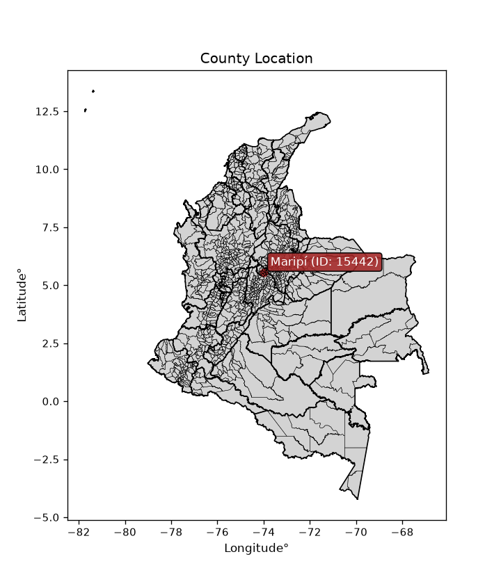
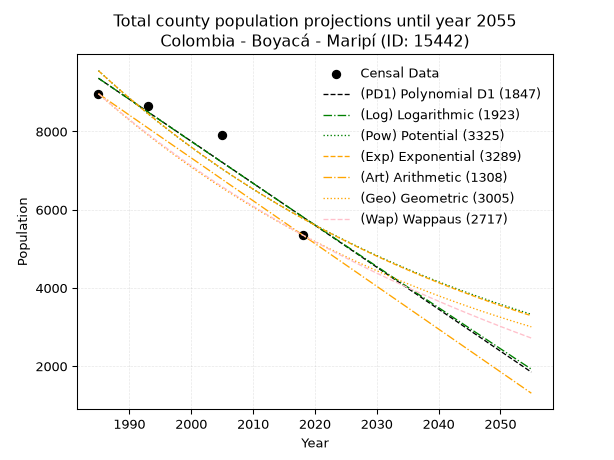
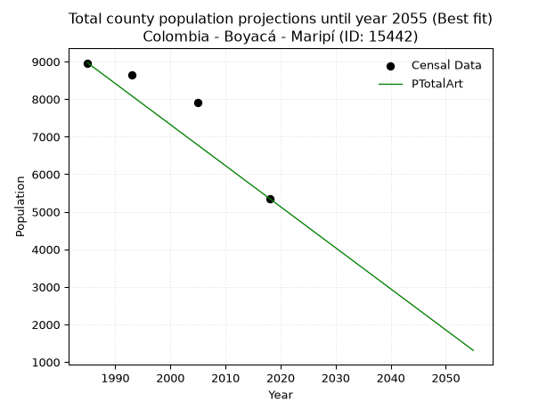
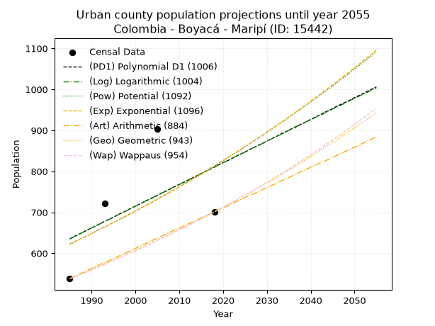
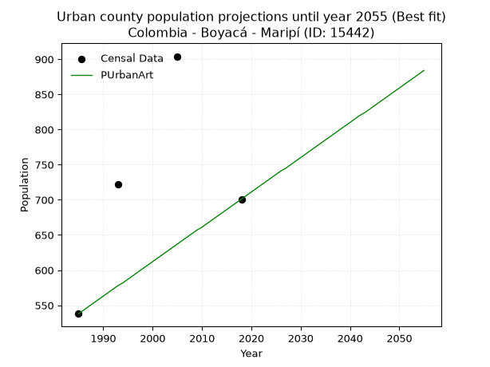
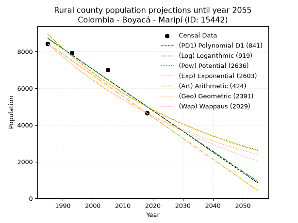
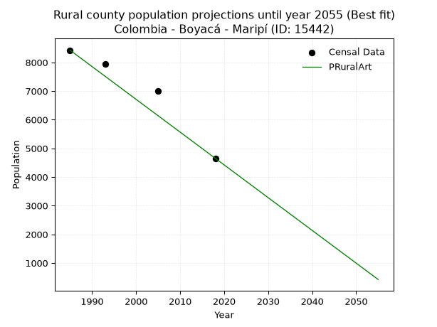

<div align="center">


</div>

# _“Population and Public Services Demand Projections (PPSD) until Year 2050 for Colombia - Boyacá - Maripí (ID: 15442)”_
Keywords: `population` `public-service` `projection` `lineal` `polynomial` `logarithmic` `potential` `exponential` `arithmetic` `geometric` `wappaus` `dane` `colombia` `south-america`

PPSD are analytical estimates used by governments and planners to anticipate future changes in population size, age distribution, and the resulting community needs for utilities, healthcare, education, and infrastructure as sizing future water treatment facilities, electrical grids, and road networks based on spatial growth.

<div align="center">

</img>

</div>


> **General running parameters**: • app_version: _v20260806_. • Python version: _3.14.7_. • Pandas version: _3.0.5_. • NumPy version: _2.5.1_. • Creates, save and include plots into reports (create_plot): _False_. • Projection until year: _2050_. • Process polynomial degree 2 and up: _False_. • Process Wappaus: _True_. • Process Wappaus: _True_. • Set negative values to zero: _True_. • Set infinite values to zero: _True_. • Drop dataset notes: _True_. 
<div align="center">

Dynamic map: [:earth_americas:Google](http://maps.google.com/maps?q=5.55009071,-74.0040499) [:earth_americas:OSM](https://www.openstreetmap.org/#map=18/5.55009071/-74.0040499&layers=P) [:earth_americas:Bing](https://www.bing.com/maps?cp=5.55009071~-74.0040499&lvl=18) [:earth_americas:Apple](https://maps.apple.com/frame?center=5.55009071%2C-74.0040499&span=0.003%2C0.006)

</div>


<div align="center">

```geojson
{
  "type": "Feature",
  "geometry": {
    "type": "Point", 
    "coordinates": [-74.0040499, 5.55009071]
  }, 
  "properties": {
    "Name": "Colombia - Boyacá - Maripí (ID: 15442)"
  }
}
```

</div>


## 0. Census Data (4 records)

Census data are official statistics collected by a government about the people and housing in a country. They usually include counts of total population, age, sex, race, income, education, and jobs.

📅Global census file: [Population.xlsx](../data/Population.xlsx)

| Source   |   Year |   CountryID | CountryName   |   StateID | StateName   |   CountyID | CountyName   |   PTotal |   PUrban |   PRural |
|:---------|-------:|------------:|:--------------|----------:|:------------|-----------:|:-------------|---------:|---------:|---------:|
| DANE     |   1985 |          57 | Colombia      |        15 | Boyacá      |      15442 | Maripí       |     8963 |      538 |     8425 |
| DANE     |   1993 |          57 | Colombia      |        15 | Boyacá      |      15442 | Maripí       |     8657 |      722 |     7935 |
| DANE     |   2005 |          57 | Colombia      |        15 | Boyacá      |      15442 | Maripí       |     7914 |      904 |     7010 |
| DANE     |   2018 |          57 | Colombia      |        15 | Boyacá      |      15442 | Maripí       |     5354 |      701 |     4653 |

> 🔥Some records could had specific notes about the registered values or the corresponding urban or rural distribution.

📅   [RUPS](https://www.datos.gov.co/Hacienda-y-Cr-dito-P-blico/Registro-nico-de-Prestadores-de-Servicios-P-blicos/4qkq-csdn/about_data) - Local public utility companies: [RUPS.csv](../data/RUPS.xlsx)

 | SERVICIO       | ESTADO    | NOMBRE                                                              | NIT         | DEPARTAMENTO_DOMICILIO   | MUNICIPIO_DOMICILIO   | DIRECCION                             |   TELEFONO | EMAIL                                        | TIPO_PRESTADOR                 | CLASIFICACION                 |
|:---------------|:----------|:--------------------------------------------------------------------|:------------|:-------------------------|:----------------------|:--------------------------------------|-----------:|:---------------------------------------------|:-------------------------------|:------------------------------|
| ACUEDUCTO      | OPERATIVA | UNIDAD ADMINISTRADORA DE SERVICIOS PUBLICOS DEL MUNICIPIO DE MARIPI | 800024789-8 | BOYACA                   | MARIPI                | Carrera 5 No  3 - 30 Parque Principal |    7265121 | unidadserviciospublicos@maripi-boyaca.gov.co | MUNICIPIO (PRESTACIÓN DIRECTA) | MENOR O IGUAL A 2500 USUARIOS |
| ALCANTARILLADO | OPERATIVA | UNIDAD ADMINISTRADORA DE SERVICIOS PUBLICOS DEL MUNICIPIO DE MARIPI | 800024789-8 | BOYACA                   | MARIPI                | Carrera 5 No  3 - 30 Parque Principal |    7265121 | unidadserviciospublicos@maripi-boyaca.gov.co | MUNICIPIO (PRESTACIÓN DIRECTA) | MENOR O IGUAL A 2500 USUARIOS |

## 1. Total

### 1.1. Coefficients and Parameters

* (PD1) Polynomial Deg 1: -107.30469690887031, 222358.21999196784 (lineal)
* (Log) Logarithmic: -214611.68636199005, 1638987.1478276083
* (Pow) Potential: -30.45918456909998, 104.42730200746026
* (Exp) Exponential: -0.015231284601121123, 1.2900401631883438e+17
* (Art) Arithmetic: Year diff. 2018 - 1985 = 33, Population diff. 5354 - 8963 = -3609, Annual growth = -109.36363636363636
* (Geo) Geometric: Year diff. 2018 - 1985 = 33, Population diff. 5354 - 8963 = -3609, Annual growth % = -0.01549270505111111
* (Wap) Wappaus: i = -1.5277451472185006, Condition values only valid for < 200)

<sub>
Wappaus condition values: ['-0.00', '-1.53', '-3.06', '-4.58', '-6.11', '-7.64', '-9.17', '-10.69', '-12.22', '-13.75', '-15.28', '-16.81', '-18.33', '-19.86', '-21.39', '-22.92', '-24.44', '-25.97', '-27.50', '-29.03', '-30.55', '-32.08', '-33.61', '-35.14', '-36.67', '-38.19', '-39.72', '-41.25', '-42.78', '-44.30', '-45.83', '-47.36', '-48.89', '-50.42', '-51.94', '-53.47', '-55.00', '-56.53', '-58.05', '-59.58', '-61.11', '-62.64', '-64.17', '-65.69', '-67.22', '-68.75', '-70.28', '-71.80', '-73.33', '-74.86', '-76.39', '-77.92', '-79.44', '-80.97', '-82.50', '-84.03', '-85.55', '-87.08', '-88.61', '-90.14', '-91.66', '-93.19', '-94.72', '-96.25', '-97.78', '-99.30']
</sub>


### 1.2. Projected Dataset

|   Year |   CountyID |   PTotalPD1 |   PTotalLog |   PTotalPow |   PTotalExp |   PTotalArt |   PTotalGeo |   PTotalWap |
|-------:|-----------:|------------:|------------:|------------:|------------:|------------:|------------:|------------:|
|   1985 |      15442 |        9358 |        9360 |        9554 |        9552 |        8963 |        8963 |        8963 |
|   1986 |      15442 |        9251 |        9252 |        9409 |        9408 |        8854 |        8824 |        8827 |
|   1987 |      15442 |        9144 |        9144 |        9266 |        9266 |        8744 |        8687 |        8693 |
|   1988 |      15442 |        9036 |        9036 |        9125 |        9125 |        8635 |        8553 |        8561 |
|   1989 |      15442 |        8929 |        8928 |        8986 |        8988 |        8526 |        8420 |        8432 |
|   1990 |      15442 |        8822 |        8820 |        8850 |        8852 |        8416 |        8290 |        8304 |
|   1991 |      15442 |        8715 |        8713 |        8715 |        8718 |        8307 |        8161 |        8177 |
|   1992 |      15442 |        8607 |        8605 |        8583 |        8586 |        8197 |        8035 |        8053 |
|   1993 |      15442 |        8500 |        8497 |        8453 |        8456 |        8088 |        7911 |        7931 |
|   1994 |      15442 |        8393 |        8389 |        8325 |        8328 |        7979 |        7788 |        7810 |
|   1995 |      15442 |        8285 |        8282 |        8198 |        8203 |        7869 |        7667 |        7691 |
|   1996 |      15442 |        8178 |        8174 |        8074 |        8079 |        7760 |        7549 |        7574 |
|   1997 |      15442 |        8071 |        8067 |        7952 |        7957 |        7651 |        7432 |        7458 |
|   1998 |      15442 |        7963 |        7959 |        7832 |        7836 |        7541 |        7316 |        7344 |
|   1999 |      15442 |        7856 |        7852 |        7713 |        7718 |        7432 |        7203 |        7231 |
|   2000 |      15442 |        7749 |        7745 |        7597 |        7601 |        7323 |        7091 |        7120 |
|   2001 |      15442 |        7642 |        7637 |        7482 |        7486 |        7213 |        6982 |        7011 |
|   2002 |      15442 |        7534 |        7530 |        7369 |        7373 |        7104 |        6873 |        6903 |
|   2003 |      15442 |        7427 |        7423 |        7258 |        7262 |        6994 |        6767 |        6796 |
|   2004 |      15442 |        7320 |        7316 |        7148 |        7152 |        6885 |        6662 |        6691 |
|   2005 |      15442 |        7212 |        7209 |        7040 |        7044 |        6776 |        6559 |        6587 |
|   2006 |      15442 |        7105 |        7102 |        6934 |        6937 |        6666 |        6457 |        6485 |
|   2007 |      15442 |        6998 |        6995 |        6830 |        6832 |        6557 |        6357 |        6384 |
|   2008 |      15442 |        6890 |        6888 |        6727 |        6729 |        6448 |        6259 |        6284 |
|   2009 |      15442 |        6783 |        6781 |        6626 |        6627 |        6338 |        6162 |        6186 |
|   2010 |      15442 |        6676 |        6674 |        6526 |        6527 |        6229 |        6066 |        6089 |
|   2011 |      15442 |        6568 |        6568 |        6428 |        6429 |        6120 |        5972 |        5993 |
|   2012 |      15442 |        6461 |        6461 |        6331 |        6331 |        6010 |        5880 |        5898 |
|   2013 |      15442 |        6354 |        6354 |        6236 |        6236 |        5901 |        5789 |        5804 |
|   2014 |      15442 |        6247 |        6248 |        6142 |        6141 |        5791 |        5699 |        5712 |
|   2015 |      15442 |        6139 |        6141 |        6050 |        6049 |        5682 |        5611 |        5621 |
|   2016 |      15442 |        6032 |        6035 |        5960 |        5957 |        5573 |        5524 |        5531 |
|   2017 |      15442 |        5925 |        5928 |        5870 |        5867 |        5463 |        5438 |        5442 |
|   2018 |      15442 |        5817 |        5822 |        5782 |        5778 |        5354 |        5354 |        5354 |
|   2019 |      15442 |        5710 |        5715 |        5696 |        5691 |        5245 |        5271 |        5267 |
|   2020 |      15442 |        5603 |        5609 |        5610 |        5605 |        5135 |        5189 |        5181 |
|   2021 |      15442 |        5495 |        5503 |        5526 |        5520 |        5026 |        5109 |        5097 |
|   2022 |      15442 |        5388 |        5397 |        5444 |        5437 |        4917 |        5030 |        5013 |
|   2023 |      15442 |        5281 |        5291 |        5362 |        5355 |        4807 |        4952 |        4930 |
|   2024 |      15442 |        5174 |        5185 |        5282 |        5274 |        4698 |        4875 |        4848 |
|   2025 |      15442 |        5066 |        5079 |        5203 |        5194 |        4588 |        4800 |        4768 |
|   2026 |      15442 |        4959 |        4973 |        5126 |        5116 |        4479 |        4725 |        4688 |
|   2027 |      15442 |        4852 |        4867 |        5049 |        5038 |        4370 |        4652 |        4609 |
|   2028 |      15442 |        4744 |        4761 |        4974 |        4962 |        4260 |        4580 |        4531 |
|   2029 |      15442 |        4637 |        4655 |        4900 |        4887 |        4151 |        4509 |        4454 |
|   2030 |      15442 |        4530 |        4549 |        4827 |        4813 |        4042 |        4439 |        4377 |
|   2031 |      15442 |        4422 |        4444 |        4755 |        4740 |        3932 |        4370 |        4302 |
|   2032 |      15442 |        4315 |        4338 |        4684 |        4669 |        3823 |        4303 |        4227 |
|   2033 |      15442 |        4208 |        4232 |        4615 |        4598 |        3714 |        4236 |        4154 |
|   2034 |      15442 |        4100 |        4127 |        4546 |        4529 |        3604 |        4170 |        4081 |
|   2035 |      15442 |        3993 |        4021 |        4478 |        4460 |        3495 |        4106 |        4009 |
|   2036 |      15442 |        3886 |        3916 |        4412 |        4393 |        3385 |        4042 |        3937 |
|   2037 |      15442 |        3779 |        3811 |        4346 |        4326 |        3276 |        3980 |        3867 |
|   2038 |      15442 |        3671 |        3705 |        4282 |        4261 |        3167 |        3918 |        3797 |
|   2039 |      15442 |        3564 |        3600 |        4218 |        4197 |        3057 |        3857 |        3728 |
|   2040 |      15442 |        3457 |        3495 |        4156 |        4133 |        2948 |        3797 |        3660 |
|   2041 |      15442 |        3349 |        3390 |        4094 |        4071 |        2839 |        3739 |        3592 |
|   2042 |      15442 |        3242 |        3284 |        4034 |        4009 |        2729 |        3681 |        3525 |
|   2043 |      15442 |        3135 |        3179 |        3974 |        3949 |        2620 |        3624 |        3459 |
|   2044 |      15442 |        3027 |        3074 |        3915 |        3889 |        2511 |        3568 |        3394 |
|   2045 |      15442 |        2920 |        2969 |        3857 |        3830 |        2401 |        3512 |        3329 |
|   2046 |      15442 |        2813 |        2864 |        3800 |        3772 |        2292 |        3458 |        3265 |
|   2047 |      15442 |        2706 |        2760 |        3744 |        3715 |        2182 |        3404 |        3202 |
|   2048 |      15442 |        2598 |        2655 |        3689 |        3659 |        2073 |        3352 |        3139 |
|   2049 |      15442 |        2491 |        2550 |        3634 |        3604 |        1964 |        3300 |        3077 |
|   2050 |      15442 |        2384 |        2445 |        3581 |        3549 |        1854 |        3249 |        3015 |
<div align="center">

</img>

</div>


### 1.3. Best fit with absolute and relative error (%)

Relative error puts that difference into context by dividing the absolute error by the true value, creating a unitless ratio or percentage that shows the scale of the mistake.

Absolute and relative error

|   Year | Source   |   CountryID | CountryName   |   StateID | StateName   |   CountyID_x | CountyName   |   PTotal |   PUrban |   PRural |   CountyID_y |   PTotalPD1 |   PTotalLog |   PTotalPow |   PTotalExp |   PTotalArt |   PTotalGeo |   PTotalWap |   PTotalPD1AbsError |   PTotalLogAbsError |   PTotalPowAbsError |   PTotalExpAbsError |   PTotalArtAbsError |   PTotalGeoAbsError |   PTotalWapAbsError |   PTotalPD1RelError |   PTotalLogRelError |   PTotalPowRelError |   PTotalExpRelError |   PTotalArtRelError |   PTotalGeoRelError |   PTotalWapRelError |
|-------:|:---------|------------:|:--------------|----------:|:------------|-------------:|:-------------|---------:|---------:|---------:|-------------:|------------:|------------:|------------:|------------:|------------:|------------:|------------:|--------------------:|--------------------:|--------------------:|--------------------:|--------------------:|--------------------:|--------------------:|--------------------:|--------------------:|--------------------:|--------------------:|--------------------:|--------------------:|--------------------:|
|   1985 | DANE     |          57 | Colombia      |        15 | Boyacá      |        15442 | Maripí       |     8963 |      538 |     8425 |        15442 |        9358 |        9360 |        9554 |        9552 |        8963 |        8963 |        8963 |                 395 |                 397 |                 591 |                 589 |                   0 |                   0 |                   0 |             4.40701 |             4.42932 |             6.59377 |             6.57146 |             0       |              0      |             0       |
|   1993 | DANE     |          57 | Colombia      |        15 | Boyacá      |        15442 | Maripí       |     8657 |      722 |     7935 |        15442 |        8500 |        8497 |        8453 |        8456 |        8088 |        7911 |        7931 |                 157 |                 160 |                 204 |                 201 |                 569 |                 746 |                 726 |             1.81356 |             1.84822 |             2.35647 |             2.32182 |             6.57272 |              8.6173 |             8.38628 |
|   2005 | DANE     |          57 | Colombia      |        15 | Boyacá      |        15442 | Maripí       |     7914 |      904 |     7010 |        15442 |        7212 |        7209 |        7040 |        7044 |        6776 |        6559 |        6587 |                 702 |                 705 |                 874 |                 870 |                1138 |                1355 |                1327 |             8.87036 |             8.90826 |            11.0437  |            10.9932  |            14.3796  |             17.1216 |            16.7678  |
|   2018 | DANE     |          57 | Colombia      |        15 | Boyacá      |        15442 | Maripí       |     5354 |      701 |     4653 |        15442 |        5817 |        5822 |        5782 |        5778 |        5354 |        5354 |        5354 |                 463 |                 468 |                 428 |                 424 |                   0 |                   0 |                   0 |             8.64774 |             8.74113 |             7.99402 |             7.91931 |             0       |              0      |             0       |

Relative error mean

| Method    |   RelError | Best   |
|:----------|-----------:|:-------|
| PTotalPD1 |    5.93467 |        |
| PTotalLog |    5.98173 |        |
| PTotalPow |    6.997   |        |
| PTotalExp |    6.95144 |        |
| PTotalArt |    5.23807 | True   |
| PTotalGeo |    6.43472 |        |
| PTotalWap |    6.28851 |        |

💙Best method: _**PTotalArt**_
<div align="center">

</img>

</div>


### 1.4. Fresh water supply demand in liters per capita per day (lpcd)

The fresh water supply demand typically ranges from 100 to 300 liters per capita per day (lpcd) for standard domestic and municipal planning, though absolute survival minimums set by the World Health Organization are as low as 7.5 to 20 liters per day, and total consumption in high-income nations can exceed 400 liters.

> `CZ`: Level in meters above the sea level (masl)<br> `WS`: Fresh water supply demand in liters per capita per day (lpcd or l/h/d)<br> `WSAll`: Zonal fresh water supply demand in liters per second (l/s)<br> `A`: Zonal area in square meters<br> `DP`: Population density (people/hectare or p/ha)

Reference values (RAS Colombia)

|    CZ |   WS |
|------:|-----:|
|  1000 |  120 |
|  2000 |  130 |
| 99999 |  140 |

County shapefile geometry properties and water supply values

|   CountyID |      ATotal |   CZTotal |   WSTotal |
|-----------:|------------:|----------:|----------:|
|      15442 | 1.60478e+08 |   1307.71 |       130 |

Projected values for best method: PTotalArt

|   CountyID |   Year |   PTotalArt |   DPTotal |   WSTotal |   WSTotalAll |
|-----------:|-------:|------------:|----------:|----------:|-------------:|
|      15442 |   1985 |        8963 |      0.56 |       130 |     13.486   |
|      15442 |   1986 |        8854 |      0.55 |       130 |     13.322   |
|      15442 |   1987 |        8744 |      0.54 |       130 |     13.1565  |
|      15442 |   1988 |        8635 |      0.54 |       130 |     12.9925  |
|      15442 |   1989 |        8526 |      0.53 |       130 |     12.8285  |
|      15442 |   1990 |        8416 |      0.52 |       130 |     12.663   |
|      15442 |   1991 |        8307 |      0.52 |       130 |     12.499   |
|      15442 |   1992 |        8197 |      0.51 |       130 |     12.3334  |
|      15442 |   1993 |        8088 |      0.5  |       130 |     12.1694  |
|      15442 |   1994 |        7979 |      0.5  |       130 |     12.0054  |
|      15442 |   1995 |        7869 |      0.49 |       130 |     11.8399  |
|      15442 |   1996 |        7760 |      0.48 |       130 |     11.6759  |
|      15442 |   1997 |        7651 |      0.48 |       130 |     11.5119  |
|      15442 |   1998 |        7541 |      0.47 |       130 |     11.3464  |
|      15442 |   1999 |        7432 |      0.46 |       130 |     11.1824  |
|      15442 |   2000 |        7323 |      0.46 |       130 |     11.0184  |
|      15442 |   2001 |        7213 |      0.45 |       130 |     10.8529  |
|      15442 |   2002 |        7104 |      0.44 |       130 |     10.6889  |
|      15442 |   2003 |        6994 |      0.44 |       130 |     10.5234  |
|      15442 |   2004 |        6885 |      0.43 |       130 |     10.3594  |
|      15442 |   2005 |        6776 |      0.42 |       130 |     10.1954  |
|      15442 |   2006 |        6666 |      0.42 |       130 |     10.0299  |
|      15442 |   2007 |        6557 |      0.41 |       130 |      9.86586 |
|      15442 |   2008 |        6448 |      0.4  |       130 |      9.70185 |
|      15442 |   2009 |        6338 |      0.39 |       130 |      9.53634 |
|      15442 |   2010 |        6229 |      0.39 |       130 |      9.37234 |
|      15442 |   2011 |        6120 |      0.38 |       130 |      9.20833 |
|      15442 |   2012 |        6010 |      0.37 |       130 |      9.04282 |
|      15442 |   2013 |        5901 |      0.37 |       130 |      8.87882 |
|      15442 |   2014 |        5791 |      0.36 |       130 |      8.71331 |
|      15442 |   2015 |        5682 |      0.35 |       130 |      8.54931 |
|      15442 |   2016 |        5573 |      0.35 |       130 |      8.3853  |
|      15442 |   2017 |        5463 |      0.34 |       130 |      8.21979 |
|      15442 |   2018 |        5354 |      0.33 |       130 |      8.05579 |
|      15442 |   2019 |        5245 |      0.33 |       130 |      7.89178 |
|      15442 |   2020 |        5135 |      0.32 |       130 |      7.72627 |
|      15442 |   2021 |        5026 |      0.31 |       130 |      7.56227 |
|      15442 |   2022 |        4917 |      0.31 |       130 |      7.39826 |
|      15442 |   2023 |        4807 |      0.3  |       130 |      7.23275 |
|      15442 |   2024 |        4698 |      0.29 |       130 |      7.06875 |
|      15442 |   2025 |        4588 |      0.29 |       130 |      6.90324 |
|      15442 |   2026 |        4479 |      0.28 |       130 |      6.73924 |
|      15442 |   2027 |        4370 |      0.27 |       130 |      6.57523 |
|      15442 |   2028 |        4260 |      0.27 |       130 |      6.40972 |
|      15442 |   2029 |        4151 |      0.26 |       130 |      6.24572 |
|      15442 |   2030 |        4042 |      0.25 |       130 |      6.08171 |
|      15442 |   2031 |        3932 |      0.25 |       130 |      5.9162  |
|      15442 |   2032 |        3823 |      0.24 |       130 |      5.7522  |
|      15442 |   2033 |        3714 |      0.23 |       130 |      5.58819 |
|      15442 |   2034 |        3604 |      0.22 |       130 |      5.42269 |
|      15442 |   2035 |        3495 |      0.22 |       130 |      5.25868 |
|      15442 |   2036 |        3385 |      0.21 |       130 |      5.09317 |
|      15442 |   2037 |        3276 |      0.2  |       130 |      4.92917 |
|      15442 |   2038 |        3167 |      0.2  |       130 |      4.76516 |
|      15442 |   2039 |        3057 |      0.19 |       130 |      4.59965 |
|      15442 |   2040 |        2948 |      0.18 |       130 |      4.43565 |
|      15442 |   2041 |        2839 |      0.18 |       130 |      4.27164 |
|      15442 |   2042 |        2729 |      0.17 |       130 |      4.10613 |
|      15442 |   2043 |        2620 |      0.16 |       130 |      3.94213 |
|      15442 |   2044 |        2511 |      0.16 |       130 |      3.77813 |
|      15442 |   2045 |        2401 |      0.15 |       130 |      3.61262 |
|      15442 |   2046 |        2292 |      0.14 |       130 |      3.44861 |
|      15442 |   2047 |        2182 |      0.14 |       130 |      3.2831  |
|      15442 |   2048 |        2073 |      0.13 |       130 |      3.1191  |
|      15442 |   2049 |        1964 |      0.12 |       130 |      2.95509 |
|      15442 |   2050 |        1854 |      0.12 |       130 |      2.78958 |

## 2. Urban

### 2.1. Coefficients and Parameters

* (PD1) Polynomial Deg 1: 5.295463669209263, -9876.00120433583 (lineal)
* (Log) Logarithmic: 10640.527907337042, -80162.48789150816
* (Pow) Potential: 16.224466665964847, -50.710393401472714
* (Exp) Exponential: 0.00807696372105451, 6.782081213904312e-05
* (Art) Arithmetic: Year diff. 2018 - 1985 = 33, Population diff. 701 - 538 = 163, Annual growth = 4.9393939393939394
* (Geo) Geometric: Year diff. 2018 - 1985 = 33, Population diff. 701 - 538 = 163, Annual growth % = 0.008051920315224503
* (Wap) Wappaus: i = 0.797319441387238, Condition values only valid for < 200)

<sub>
Wappaus condition values: ['0.00', '0.80', '1.59', '2.39', '3.19', '3.99', '4.78', '5.58', '6.38', '7.18', '7.97', '8.77', '9.57', '10.37', '11.16', '11.96', '12.76', '13.55', '14.35', '15.15', '15.95', '16.74', '17.54', '18.34', '19.14', '19.93', '20.73', '21.53', '22.32', '23.12', '23.92', '24.72', '25.51', '26.31', '27.11', '27.91', '28.70', '29.50', '30.30', '31.10', '31.89', '32.69', '33.49', '34.28', '35.08', '35.88', '36.68', '37.47', '38.27', '39.07', '39.87', '40.66', '41.46', '42.26', '43.06', '43.85', '44.65', '45.45', '46.24', '47.04', '47.84', '48.64', '49.43', '50.23', '51.03', '51.83']
</sub>


### 2.2. Projected Dataset

|   Year |   CountyID |   PUrbanPD1 |   PUrbanLog |   PUrbanPow |   PUrbanExp |   PUrbanArt |   PUrbanGeo |   PUrbanWap |
|-------:|-----------:|------------:|------------:|------------:|------------:|------------:|------------:|------------:|
|   1985 |      15442 |         635 |         635 |         622 |         623 |         538 |         538 |         538 |
|   1986 |      15442 |         641 |         640 |         627 |         628 |         543 |         542 |         542 |
|   1987 |      15442 |         646 |         646 |         633 |         633 |         548 |         547 |         547 |
|   1988 |      15442 |         651 |         651 |         638 |         638 |         553 |         551 |         551 |
|   1989 |      15442 |         657 |         656 |         643 |         643 |         558 |         556 |         555 |
|   1990 |      15442 |         662 |         662 |         648 |         648 |         563 |         560 |         560 |
|   1991 |      15442 |         667 |         667 |         654 |         654 |         568 |         565 |         564 |
|   1992 |      15442 |         673 |         672 |         659 |         659 |         573 |         569 |         569 |
|   1993 |      15442 |         678 |         678 |         664 |         664 |         578 |         574 |         573 |
|   1994 |      15442 |         683 |         683 |         670 |         670 |         582 |         578 |         578 |
|   1995 |      15442 |         688 |         688 |         675 |         675 |         587 |         583 |         583 |
|   1996 |      15442 |         694 |         694 |         681 |         681 |         592 |         588 |         587 |
|   1997 |      15442 |         699 |         699 |         686 |         686 |         597 |         592 |         592 |
|   1998 |      15442 |         704 |         704 |         692 |         692 |         602 |         597 |         597 |
|   1999 |      15442 |         710 |         710 |         697 |         697 |         607 |         602 |         602 |
|   2000 |      15442 |         715 |         715 |         703 |         703 |         612 |         607 |         606 |
|   2001 |      15442 |         720 |         720 |         709 |         709 |         617 |         612 |         611 |
|   2002 |      15442 |         726 |         726 |         715 |         714 |         622 |         617 |         616 |
|   2003 |      15442 |         731 |         731 |         720 |         720 |         627 |         622 |         621 |
|   2004 |      15442 |         736 |         736 |         726 |         726 |         632 |         627 |         626 |
|   2005 |      15442 |         741 |         742 |         732 |         732 |         637 |         632 |         631 |
|   2006 |      15442 |         747 |         747 |         738 |         738 |         642 |         637 |         636 |
|   2007 |      15442 |         752 |         752 |         744 |         744 |         647 |         642 |         641 |
|   2008 |      15442 |         757 |         758 |         750 |         750 |         652 |         647 |         647 |
|   2009 |      15442 |         763 |         763 |         756 |         756 |         657 |         652 |         652 |
|   2010 |      15442 |         768 |         768 |         762 |         762 |         661 |         657 |         657 |
|   2011 |      15442 |         773 |         773 |         769 |         768 |         666 |         663 |         662 |
|   2012 |      15442 |         778 |         779 |         775 |         774 |         671 |         668 |         668 |
|   2013 |      15442 |         784 |         784 |         781 |         781 |         676 |         673 |         673 |
|   2014 |      15442 |         789 |         789 |         787 |         787 |         681 |         679 |         679 |
|   2015 |      15442 |         794 |         795 |         794 |         793 |         686 |         684 |         684 |
|   2016 |      15442 |         800 |         800 |         800 |         800 |         691 |         690 |         690 |
|   2017 |      15442 |         805 |         805 |         807 |         806 |         696 |         695 |         695 |
|   2018 |      15442 |         810 |         810 |         813 |         813 |         701 |         701 |         701 |
|   2019 |      15442 |         816 |         816 |         820 |         820 |         706 |         707 |         707 |
|   2020 |      15442 |         821 |         821 |         826 |         826 |         711 |         712 |         712 |
|   2021 |      15442 |         826 |         826 |         833 |         833 |         716 |         718 |         718 |
|   2022 |      15442 |         831 |         832 |         840 |         840 |         721 |         724 |         724 |
|   2023 |      15442 |         837 |         837 |         846 |         846 |         726 |         730 |         730 |
|   2024 |      15442 |         842 |         842 |         853 |         853 |         731 |         736 |         736 |
|   2025 |      15442 |         847 |         847 |         860 |         860 |         736 |         741 |         742 |
|   2026 |      15442 |         853 |         853 |         867 |         867 |         741 |         747 |         748 |
|   2027 |      15442 |         858 |         858 |         874 |         874 |         745 |         753 |         754 |
|   2028 |      15442 |         863 |         863 |         881 |         881 |         750 |         760 |         761 |
|   2029 |      15442 |         868 |         868 |         888 |         888 |         755 |         766 |         767 |
|   2030 |      15442 |         874 |         874 |         895 |         896 |         760 |         772 |         773 |
|   2031 |      15442 |         879 |         879 |         902 |         903 |         765 |         778 |         780 |
|   2032 |      15442 |         884 |         884 |         910 |         910 |         770 |         784 |         786 |
|   2033 |      15442 |         890 |         889 |         917 |         918 |         775 |         791 |         793 |
|   2034 |      15442 |         895 |         894 |         924 |         925 |         780 |         797 |         799 |
|   2035 |      15442 |         900 |         900 |         932 |         933 |         785 |         803 |         806 |
|   2036 |      15442 |         906 |         905 |         939 |         940 |         790 |         810 |         813 |
|   2037 |      15442 |         911 |         910 |         947 |         948 |         795 |         816 |         819 |
|   2038 |      15442 |         916 |         915 |         954 |         955 |         800 |         823 |         826 |
|   2039 |      15442 |         921 |         921 |         962 |         963 |         805 |         830 |         833 |
|   2040 |      15442 |         927 |         926 |         970 |         971 |         810 |         836 |         840 |
|   2041 |      15442 |         932 |         931 |         977 |         979 |         815 |         843 |         847 |
|   2042 |      15442 |         937 |         936 |         985 |         987 |         820 |         850 |         854 |
|   2043 |      15442 |         943 |         941 |         993 |         995 |         824 |         857 |         862 |
|   2044 |      15442 |         948 |         947 |        1001 |        1003 |         829 |         864 |         869 |
|   2045 |      15442 |         953 |         952 |        1009 |        1011 |         834 |         870 |         876 |
|   2046 |      15442 |         959 |         957 |        1017 |        1019 |         839 |         877 |         884 |
|   2047 |      15442 |         964 |         962 |        1025 |        1028 |         844 |         885 |         891 |
|   2048 |      15442 |         969 |         967 |        1033 |        1036 |         849 |         892 |         899 |
|   2049 |      15442 |         974 |         973 |        1041 |        1044 |         854 |         899 |         907 |
|   2050 |      15442 |         980 |         978 |        1050 |        1053 |         859 |         906 |         914 |
<div align="center">

</img>

</div>


### 2.3. Best fit with absolute and relative error (%)

Relative error puts that difference into context by dividing the absolute error by the true value, creating a unitless ratio or percentage that shows the scale of the mistake.

Absolute and relative error

|   Year | Source   |   CountryID | CountryName   |   StateID | StateName   |   CountyID_x | CountyName   |   PTotal |   PUrban |   PRural |   CountyID_y |   PUrbanPD1 |   PUrbanLog |   PUrbanPow |   PUrbanExp |   PUrbanArt |   PUrbanGeo |   PUrbanWap |   PUrbanPD1AbsError |   PUrbanLogAbsError |   PUrbanPowAbsError |   PUrbanExpAbsError |   PUrbanArtAbsError |   PUrbanGeoAbsError |   PUrbanWapAbsError |   PUrbanPD1RelError |   PUrbanLogRelError |   PUrbanPowRelError |   PUrbanExpRelError |   PUrbanArtRelError |   PUrbanGeoRelError |   PUrbanWapRelError |
|-------:|:---------|------------:|:--------------|----------:|:------------|-------------:|:-------------|---------:|---------:|---------:|-------------:|------------:|------------:|------------:|------------:|------------:|------------:|------------:|--------------------:|--------------------:|--------------------:|--------------------:|--------------------:|--------------------:|--------------------:|--------------------:|--------------------:|--------------------:|--------------------:|--------------------:|--------------------:|--------------------:|
|   1985 | DANE     |          57 | Colombia      |        15 | Boyacá      |        15442 | Maripí       |     8963 |      538 |     8425 |        15442 |         635 |         635 |         622 |         623 |         538 |         538 |         538 |                  97 |                  97 |                  84 |                  85 |                   0 |                   0 |                   0 |            18.0297  |            18.0297  |            15.6134  |            15.7993  |              0      |              0      |              0      |
|   1993 | DANE     |          57 | Colombia      |        15 | Boyacá      |        15442 | Maripí       |     8657 |      722 |     7935 |        15442 |         678 |         678 |         664 |         664 |         578 |         574 |         573 |                  44 |                  44 |                  58 |                  58 |                 144 |                 148 |                 149 |             6.09418 |             6.09418 |             8.03324 |             8.03324 |             19.9446 |             20.4986 |             20.6371 |
|   2005 | DANE     |          57 | Colombia      |        15 | Boyacá      |        15442 | Maripí       |     7914 |      904 |     7010 |        15442 |         741 |         742 |         732 |         732 |         637 |         632 |         631 |                 163 |                 162 |                 172 |                 172 |                 267 |                 272 |                 273 |            18.031   |            17.9204  |            19.0265  |            19.0265  |             29.5354 |             30.0885 |             30.1991 |
|   2018 | DANE     |          57 | Colombia      |        15 | Boyacá      |        15442 | Maripí       |     5354 |      701 |     4653 |        15442 |         810 |         810 |         813 |         813 |         701 |         701 |         701 |                 109 |                 109 |                 112 |                 112 |                   0 |                   0 |                   0 |            15.5492  |            15.5492  |            15.9772  |            15.9772  |              0      |              0      |              0      |

Relative error mean

| Method    |   RelError | Best   |
|:----------|-----------:|:-------|
| PUrbanPD1 |    14.426  |        |
| PUrbanLog |    14.3984 |        |
| PUrbanPow |    14.6626 |        |
| PUrbanExp |    14.7091 |        |
| PUrbanArt |    12.37   | True   |
| PUrbanGeo |    12.6468 |        |
| PUrbanWap |    12.7091 |        |

💙Best method: _**PUrbanArt**_
<div align="center">

</img>

</div>


### 2.4. Fresh water supply demand in liters per capita per day (lpcd)

The fresh water supply demand typically ranges from 100 to 300 liters per capita per day (lpcd) for standard domestic and municipal planning, though absolute survival minimums set by the World Health Organization are as low as 7.5 to 20 liters per day, and total consumption in high-income nations can exceed 400 liters.

> `CZ`: Level in meters above the sea level (masl)<br> `WS`: Fresh water supply demand in liters per capita per day (lpcd or l/h/d)<br> `WSAll`: Zonal fresh water supply demand in liters per second (l/s)<br> `A`: Zonal area in square meters<br> `DP`: Population density (people/hectare or p/ha)

Reference values (RAS Colombia)

|    CZ |   WS |
|------:|-----:|
|  1000 |  120 |
|  2000 |  130 |
| 99999 |  140 |

County shapefile geometry properties and water supply values

|   CountyID |   AUrban |   CZUrban |   WSUrban |
|-----------:|---------:|----------:|----------:|
|      15442 |   160557 |   1278.11 |       130 |

Projected values for best method: PUrbanArt

|   CountyID |   Year |   PUrbanArt |   DPUrban |   WSUrban |   WSUrbanAll |
|-----------:|-------:|------------:|----------:|----------:|-------------:|
|      15442 |   1985 |         538 |     33.51 |       130 |     0.809491 |
|      15442 |   1986 |         543 |     33.82 |       130 |     0.817014 |
|      15442 |   1987 |         548 |     34.13 |       130 |     0.824537 |
|      15442 |   1988 |         553 |     34.44 |       130 |     0.83206  |
|      15442 |   1989 |         558 |     34.75 |       130 |     0.839583 |
|      15442 |   1990 |         563 |     35.07 |       130 |     0.847106 |
|      15442 |   1991 |         568 |     35.38 |       130 |     0.85463  |
|      15442 |   1992 |         573 |     35.69 |       130 |     0.862153 |
|      15442 |   1993 |         578 |     36    |       130 |     0.869676 |
|      15442 |   1994 |         582 |     36.25 |       130 |     0.875694 |
|      15442 |   1995 |         587 |     36.56 |       130 |     0.883218 |
|      15442 |   1996 |         592 |     36.87 |       130 |     0.890741 |
|      15442 |   1997 |         597 |     37.18 |       130 |     0.898264 |
|      15442 |   1998 |         602 |     37.49 |       130 |     0.905787 |
|      15442 |   1999 |         607 |     37.81 |       130 |     0.91331  |
|      15442 |   2000 |         612 |     38.12 |       130 |     0.920833 |
|      15442 |   2001 |         617 |     38.43 |       130 |     0.928356 |
|      15442 |   2002 |         622 |     38.74 |       130 |     0.93588  |
|      15442 |   2003 |         627 |     39.05 |       130 |     0.943403 |
|      15442 |   2004 |         632 |     39.36 |       130 |     0.950926 |
|      15442 |   2005 |         637 |     39.67 |       130 |     0.958449 |
|      15442 |   2006 |         642 |     39.99 |       130 |     0.965972 |
|      15442 |   2007 |         647 |     40.3  |       130 |     0.973495 |
|      15442 |   2008 |         652 |     40.61 |       130 |     0.981019 |
|      15442 |   2009 |         657 |     40.92 |       130 |     0.988542 |
|      15442 |   2010 |         661 |     41.17 |       130 |     0.99456  |
|      15442 |   2011 |         666 |     41.48 |       130 |     1.00208  |
|      15442 |   2012 |         671 |     41.79 |       130 |     1.00961  |
|      15442 |   2013 |         676 |     42.1  |       130 |     1.01713  |
|      15442 |   2014 |         681 |     42.41 |       130 |     1.02465  |
|      15442 |   2015 |         686 |     42.73 |       130 |     1.03218  |
|      15442 |   2016 |         691 |     43.04 |       130 |     1.0397   |
|      15442 |   2017 |         696 |     43.35 |       130 |     1.04722  |
|      15442 |   2018 |         701 |     43.66 |       130 |     1.05475  |
|      15442 |   2019 |         706 |     43.97 |       130 |     1.06227  |
|      15442 |   2020 |         711 |     44.28 |       130 |     1.06979  |
|      15442 |   2021 |         716 |     44.59 |       130 |     1.07731  |
|      15442 |   2022 |         721 |     44.91 |       130 |     1.08484  |
|      15442 |   2023 |         726 |     45.22 |       130 |     1.09236  |
|      15442 |   2024 |         731 |     45.53 |       130 |     1.09988  |
|      15442 |   2025 |         736 |     45.84 |       130 |     1.10741  |
|      15442 |   2026 |         741 |     46.15 |       130 |     1.11493  |
|      15442 |   2027 |         745 |     46.4  |       130 |     1.12095  |
|      15442 |   2028 |         750 |     46.71 |       130 |     1.12847  |
|      15442 |   2029 |         755 |     47.02 |       130 |     1.136    |
|      15442 |   2030 |         760 |     47.34 |       130 |     1.14352  |
|      15442 |   2031 |         765 |     47.65 |       130 |     1.15104  |
|      15442 |   2032 |         770 |     47.96 |       130 |     1.15856  |
|      15442 |   2033 |         775 |     48.27 |       130 |     1.16609  |
|      15442 |   2034 |         780 |     48.58 |       130 |     1.17361  |
|      15442 |   2035 |         785 |     48.89 |       130 |     1.18113  |
|      15442 |   2036 |         790 |     49.2  |       130 |     1.18866  |
|      15442 |   2037 |         795 |     49.52 |       130 |     1.19618  |
|      15442 |   2038 |         800 |     49.83 |       130 |     1.2037   |
|      15442 |   2039 |         805 |     50.14 |       130 |     1.21123  |
|      15442 |   2040 |         810 |     50.45 |       130 |     1.21875  |
|      15442 |   2041 |         815 |     50.76 |       130 |     1.22627  |
|      15442 |   2042 |         820 |     51.07 |       130 |     1.2338   |
|      15442 |   2043 |         824 |     51.32 |       130 |     1.23981  |
|      15442 |   2044 |         829 |     51.63 |       130 |     1.24734  |
|      15442 |   2045 |         834 |     51.94 |       130 |     1.25486  |
|      15442 |   2046 |         839 |     52.26 |       130 |     1.26238  |
|      15442 |   2047 |         844 |     52.57 |       130 |     1.26991  |
|      15442 |   2048 |         849 |     52.88 |       130 |     1.27743  |
|      15442 |   2049 |         854 |     53.19 |       130 |     1.28495  |
|      15442 |   2050 |         859 |     53.5  |       130 |     1.29248  |

## 3. Rural

### 3.1. Coefficients and Parameters

* (PD1) Polynomial Deg 1: -112.60016057807954, 232234.22119630364 (lineal)
* (Log) Logarithmic: -225252.2142693272, 1719149.6357191175
* (Pow) Potential: -35.25549257525741, 120.2156966452869
* (Exp) Exponential: -0.017626595231952716, 1.4022383774062684e+19
* (Art) Arithmetic: Year diff. 2018 - 1985 = 33, Population diff. 4653 - 8425 = -3772, Annual growth = -114.3030303030303
* (Geo) Geometric: Year diff. 2018 - 1985 = 33, Population diff. 4653 - 8425 = -3772, Annual growth % = -0.017829780029181452
* (Wap) Wappaus: i = -1.7480200382784876, Condition values only valid for < 200)

<sub>
Wappaus condition values: ['-0.00', '-1.75', '-3.50', '-5.24', '-6.99', '-8.74', '-10.49', '-12.24', '-13.98', '-15.73', '-17.48', '-19.23', '-20.98', '-22.72', '-24.47', '-26.22', '-27.97', '-29.72', '-31.46', '-33.21', '-34.96', '-36.71', '-38.46', '-40.20', '-41.95', '-43.70', '-45.45', '-47.20', '-48.94', '-50.69', '-52.44', '-54.19', '-55.94', '-57.68', '-59.43', '-61.18', '-62.93', '-64.68', '-66.42', '-68.17', '-69.92', '-71.67', '-73.42', '-75.16', '-76.91', '-78.66', '-80.41', '-82.16', '-83.90', '-85.65', '-87.40', '-89.15', '-90.90', '-92.65', '-94.39', '-96.14', '-97.89', '-99.64', '-101.39', '-103.13', '-104.88', '-106.63', '-108.38', '-110.13', '-111.87', '-113.62']
</sub>


### 3.2. Projected Dataset

|   Year |   CountyID |   PRuralPD1 |   PRuralLog |   PRuralPow |   PRuralExp |   PRuralArt |   PRuralGeo |   PRuralWap |
|-------:|-----------:|------------:|------------:|------------:|------------:|------------:|------------:|------------:|
|   1985 |      15442 |        8723 |        8725 |        8944 |        8941 |        8425 |        8425 |        8425 |
|   1986 |      15442 |        8610 |        8612 |        8786 |        8785 |        8311 |        8275 |        8279 |
|   1987 |      15442 |        8498 |        8498 |        8632 |        8631 |        8196 |        8127 |        8136 |
|   1988 |      15442 |        8385 |        8385 |        8480 |        8480 |        8082 |        7982 |        7994 |
|   1989 |      15442 |        8273 |        8272 |        8331 |        8332 |        7968 |        7840 |        7856 |
|   1990 |      15442 |        8160 |        8159 |        8185 |        8187 |        7853 |        7700 |        7719 |
|   1991 |      15442 |        8047 |        8045 |        8041 |        8044 |        7739 |        7563 |        7585 |
|   1992 |      15442 |        7935 |        7932 |        7900 |        7903 |        7625 |        7428 |        7454 |
|   1993 |      15442 |        7822 |        7819 |        7761 |        7765 |        7511 |        7296 |        7324 |
|   1994 |      15442 |        7710 |        7706 |        7625 |        7629 |        7396 |        7166 |        7196 |
|   1995 |      15442 |        7597 |        7593 |        7492 |        7496 |        7282 |        7038 |        7071 |
|   1996 |      15442 |        7484 |        7480 |        7361 |        7365 |        7168 |        6912 |        6947 |
|   1997 |      15442 |        7372 |        7368 |        7232 |        7236 |        7053 |        6789 |        6826 |
|   1998 |      15442 |        7259 |        7255 |        7105 |        7110 |        6939 |        6668 |        6706 |
|   1999 |      15442 |        7147 |        7142 |        6981 |        6986 |        6825 |        6549 |        6588 |
|   2000 |      15442 |        7034 |        7030 |        6859 |        6864 |        6710 |        6432 |        6472 |
|   2001 |      15442 |        6921 |        6917 |        6739 |        6744 |        6596 |        6318 |        6358 |
|   2002 |      15442 |        6809 |        6804 |        6621 |        6626 |        6482 |        6205 |        6245 |
|   2003 |      15442 |        6696 |        6692 |        6506 |        6510 |        6368 |        6094 |        6134 |
|   2004 |      15442 |        6583 |        6579 |        6392 |        6396 |        6253 |        5986 |        6025 |
|   2005 |      15442 |        6471 |        6467 |        6281 |        6285 |        6139 |        5879 |        5918 |
|   2006 |      15442 |        6358 |        6355 |        6172 |        6175 |        6025 |        5774 |        5812 |
|   2007 |      15442 |        6246 |        6243 |        6064 |        6067 |        5910 |        5671 |        5708 |
|   2008 |      15442 |        6133 |        6130 |        5958 |        5961 |        5796 |        5570 |        5605 |
|   2009 |      15442 |        6020 |        6018 |        5855 |        5857 |        5682 |        5471 |        5503 |
|   2010 |      15442 |        5908 |        5906 |        5753 |        5754 |        5567 |        5373 |        5403 |
|   2011 |      15442 |        5795 |        5794 |        5653 |        5654 |        5453 |        5277 |        5305 |
|   2012 |      15442 |        5683 |        5682 |        5555 |        5555 |        5339 |        5183 |        5208 |
|   2013 |      15442 |        5570 |        5570 |        5458 |        5458 |        5225 |        5091 |        5112 |
|   2014 |      15442 |        5457 |        5458 |        5364 |        5363 |        5110 |        5000 |        5018 |
|   2015 |      15442 |        5345 |        5346 |        5271 |        5269 |        4996 |        4911 |        4925 |
|   2016 |      15442 |        5232 |        5235 |        5179 |        5177 |        4882 |        4823 |        4833 |
|   2017 |      15442 |        5120 |        5123 |        5089 |        5086 |        4767 |        4737 |        4742 |
|   2018 |      15442 |        5007 |        5011 |        5001 |        4998 |        4653 |        4653 |        4653 |
|   2019 |      15442 |        4894 |        4900 |        4915 |        4910 |        4539 |        4570 |        4565 |
|   2020 |      15442 |        4782 |        4788 |        4830 |        4825 |        4424 |        4489 |        4478 |
|   2021 |      15442 |        4669 |        4677 |        4746 |        4740 |        4310 |        4409 |        4392 |
|   2022 |      15442 |        4557 |        4565 |        4664 |        4657 |        4196 |        4330 |        4308 |
|   2023 |      15442 |        4444 |        4454 |        4583 |        4576 |        4081 |        4253 |        4224 |
|   2024 |      15442 |        4331 |        4343 |        4504 |        4496 |        3967 |        4177 |        4142 |
|   2025 |      15442 |        4219 |        4231 |        4426 |        4418 |        3853 |        4102 |        4060 |
|   2026 |      15442 |        4106 |        4120 |        4350 |        4340 |        3739 |        4029 |        3980 |
|   2027 |      15442 |        3994 |        4009 |        4275 |        4264 |        3624 |        3957 |        3901 |
|   2028 |      15442 |        3881 |        3898 |        4201 |        4190 |        3510 |        3887 |        3822 |
|   2029 |      15442 |        3768 |        3787 |        4129 |        4117 |        3396 |        3818 |        3745 |
|   2030 |      15442 |        3656 |        3676 |        4058 |        4045 |        3281 |        3750 |        3669 |
|   2031 |      15442 |        3543 |        3565 |        3988 |        3974 |        3167 |        3683 |        3593 |
|   2032 |      15442 |        3431 |        3454 |        3919 |        3905 |        3053 |        3617 |        3519 |
|   2033 |      15442 |        3318 |        3343 |        3852 |        3837 |        2938 |        3553 |        3445 |
|   2034 |      15442 |        3205 |        3232 |        3786 |        3769 |        2824 |        3489 |        3373 |
|   2035 |      15442 |        3093 |        3122 |        3721 |        3704 |        2710 |        3427 |        3301 |
|   2036 |      15442 |        2980 |        3011 |        3657 |        3639 |        2596 |        3366 |        3230 |
|   2037 |      15442 |        2868 |        2900 |        3594 |        3575 |        2481 |        3306 |        3160 |
|   2038 |      15442 |        2755 |        2790 |        3532 |        3513 |        2367 |        3247 |        3091 |
|   2039 |      15442 |        2642 |        2679 |        3472 |        3451 |        2253 |        3189 |        3022 |
|   2040 |      15442 |        2530 |        2569 |        3412 |        3391 |        2138 |        3132 |        2955 |
|   2041 |      15442 |        2417 |        2459 |        3354 |        3332 |        2024 |        3076 |        2888 |
|   2042 |      15442 |        2305 |        2348 |        3296 |        3274 |        1910 |        3021 |        2822 |
|   2043 |      15442 |        2192 |        2238 |        3240 |        3217 |        1795 |        2968 |        2757 |
|   2044 |      15442 |        2079 |        2128 |        3185 |        3160 |        1681 |        2915 |        2692 |
|   2045 |      15442 |        1967 |        2018 |        3130 |        3105 |        1567 |        2863 |        2628 |
|   2046 |      15442 |        1854 |        1907 |        3077 |        3051 |        1453 |        2812 |        2565 |
|   2047 |      15442 |        1742 |        1797 |        3024 |        2998 |        1338 |        2762 |        2503 |
|   2048 |      15442 |        1629 |        1687 |        2973 |        2945 |        1224 |        2712 |        2442 |
|   2049 |      15442 |        1516 |        1577 |        2922 |        2894 |        1110 |        2664 |        2381 |
|   2050 |      15442 |        1404 |        1467 |        2872 |        2843 |         995 |        2616 |        2320 |
<div align="center">

</img>

</div>


### 3.3. Best fit with absolute and relative error (%)

Relative error puts that difference into context by dividing the absolute error by the true value, creating a unitless ratio or percentage that shows the scale of the mistake.

Absolute and relative error

|   Year | Source   |   CountryID | CountryName   |   StateID | StateName   |   CountyID_x | CountyName   |   PTotal |   PUrban |   PRural |   CountyID_y |   PRuralPD1 |   PRuralLog |   PRuralPow |   PRuralExp |   PRuralArt |   PRuralGeo |   PRuralWap |   PRuralPD1AbsError |   PRuralLogAbsError |   PRuralPowAbsError |   PRuralExpAbsError |   PRuralArtAbsError |   PRuralGeoAbsError |   PRuralWapAbsError |   PRuralPD1RelError |   PRuralLogRelError |   PRuralPowRelError |   PRuralExpRelError |   PRuralArtRelError |   PRuralGeoRelError |   PRuralWapRelError |
|-------:|:---------|------------:|:--------------|----------:|:------------|-------------:|:-------------|---------:|---------:|---------:|-------------:|------------:|------------:|------------:|------------:|------------:|------------:|------------:|--------------------:|--------------------:|--------------------:|--------------------:|--------------------:|--------------------:|--------------------:|--------------------:|--------------------:|--------------------:|--------------------:|--------------------:|--------------------:|--------------------:|
|   1985 | DANE     |          57 | Colombia      |        15 | Boyacá      |        15442 | Maripí       |     8963 |      538 |     8425 |        15442 |        8723 |        8725 |        8944 |        8941 |        8425 |        8425 |        8425 |                 298 |                 300 |                 519 |                 516 |                   0 |                   0 |                   0 |             3.53709 |             3.56083 |             6.16024 |             6.12463 |             0       |             0       |             0       |
|   1993 | DANE     |          57 | Colombia      |        15 | Boyacá      |        15442 | Maripí       |     8657 |      722 |     7935 |        15442 |        7822 |        7819 |        7761 |        7765 |        7511 |        7296 |        7324 |                 113 |                 116 |                 174 |                 170 |                 424 |                 639 |                 611 |             1.42407 |             1.46188 |             2.19282 |             2.14241 |             5.34342 |             8.05293 |             7.70006 |
|   2005 | DANE     |          57 | Colombia      |        15 | Boyacá      |        15442 | Maripí       |     7914 |      904 |     7010 |        15442 |        6471 |        6467 |        6281 |        6285 |        6139 |        5879 |        5918 |                 539 |                 543 |                 729 |                 725 |                 871 |                1131 |                1092 |             7.68902 |             7.74608 |            10.3994  |            10.3424  |            12.4251  |            16.1341  |            15.5777  |
|   2018 | DANE     |          57 | Colombia      |        15 | Boyacá      |        15442 | Maripí       |     5354 |      701 |     4653 |        15442 |        5007 |        5011 |        5001 |        4998 |        4653 |        4653 |        4653 |                 354 |                 358 |                 348 |                 345 |                   0 |                   0 |                   0 |             7.60799 |             7.69396 |             7.47905 |             7.41457 |             0       |             0       |             0       |

Relative error mean

| Method    |   RelError | Best   |
|:----------|-----------:|:-------|
| PRuralPD1 |    5.06454 |        |
| PRuralLog |    5.11569 |        |
| PRuralPow |    6.55788 |        |
| PRuralExp |    6.50599 |        |
| PRuralArt |    4.44213 | True   |
| PRuralGeo |    6.04676 |        |
| PRuralWap |    5.81945 |        |

💙Best method: _**PRuralArt**_
<div align="center">

</img>

</div>


### 3.4. Fresh water supply demand in liters per capita per day (lpcd)

The fresh water supply demand typically ranges from 100 to 300 liters per capita per day (lpcd) for standard domestic and municipal planning, though absolute survival minimums set by the World Health Organization are as low as 7.5 to 20 liters per day, and total consumption in high-income nations can exceed 400 liters.

> `CZ`: Level in meters above the sea level (masl)<br> `WS`: Fresh water supply demand in liters per capita per day (lpcd or l/h/d)<br> `WSAll`: Zonal fresh water supply demand in liters per second (l/s)<br> `A`: Zonal area in square meters<br> `DP`: Population density (people/hectare or p/ha)

Reference values (RAS Colombia)

|    CZ |   WS |
|------:|-----:|
|  1000 |  120 |
|  2000 |  130 |
| 99999 |  140 |

County shapefile geometry properties and water supply values

|   CountyID |      ARural |   CZRural |   WSRural |
|-----------:|------------:|----------:|----------:|
|      15442 | 1.60318e+08 |   1307.73 |       130 |

Projected values for best method: PRuralArt

|   CountyID |   Year |   PRuralArt |   DPRural |   WSRural |   WSRuralAll |
|-----------:|-------:|------------:|----------:|----------:|-------------:|
|      15442 |   1985 |        8425 |      0.53 |       130 |     12.6765  |
|      15442 |   1986 |        8311 |      0.52 |       130 |     12.505   |
|      15442 |   1987 |        8196 |      0.51 |       130 |     12.3319  |
|      15442 |   1988 |        8082 |      0.5  |       130 |     12.1604  |
|      15442 |   1989 |        7968 |      0.5  |       130 |     11.9889  |
|      15442 |   1990 |        7853 |      0.49 |       130 |     11.8159  |
|      15442 |   1991 |        7739 |      0.48 |       130 |     11.6443  |
|      15442 |   1992 |        7625 |      0.48 |       130 |     11.4728  |
|      15442 |   1993 |        7511 |      0.47 |       130 |     11.3013  |
|      15442 |   1994 |        7396 |      0.46 |       130 |     11.1282  |
|      15442 |   1995 |        7282 |      0.45 |       130 |     10.9567  |
|      15442 |   1996 |        7168 |      0.45 |       130 |     10.7852  |
|      15442 |   1997 |        7053 |      0.44 |       130 |     10.6122  |
|      15442 |   1998 |        6939 |      0.43 |       130 |     10.4406  |
|      15442 |   1999 |        6825 |      0.43 |       130 |     10.2691  |
|      15442 |   2000 |        6710 |      0.42 |       130 |     10.0961  |
|      15442 |   2001 |        6596 |      0.41 |       130 |      9.92454 |
|      15442 |   2002 |        6482 |      0.4  |       130 |      9.75301 |
|      15442 |   2003 |        6368 |      0.4  |       130 |      9.58148 |
|      15442 |   2004 |        6253 |      0.39 |       130 |      9.40845 |
|      15442 |   2005 |        6139 |      0.38 |       130 |      9.23692 |
|      15442 |   2006 |        6025 |      0.38 |       130 |      9.06539 |
|      15442 |   2007 |        5910 |      0.37 |       130 |      8.89236 |
|      15442 |   2008 |        5796 |      0.36 |       130 |      8.72083 |
|      15442 |   2009 |        5682 |      0.35 |       130 |      8.54931 |
|      15442 |   2010 |        5567 |      0.35 |       130 |      8.37627 |
|      15442 |   2011 |        5453 |      0.34 |       130 |      8.20475 |
|      15442 |   2012 |        5339 |      0.33 |       130 |      8.03322 |
|      15442 |   2013 |        5225 |      0.33 |       130 |      7.86169 |
|      15442 |   2014 |        5110 |      0.32 |       130 |      7.68866 |
|      15442 |   2015 |        4996 |      0.31 |       130 |      7.51713 |
|      15442 |   2016 |        4882 |      0.3  |       130 |      7.3456  |
|      15442 |   2017 |        4767 |      0.3  |       130 |      7.17257 |
|      15442 |   2018 |        4653 |      0.29 |       130 |      7.00104 |
|      15442 |   2019 |        4539 |      0.28 |       130 |      6.82951 |
|      15442 |   2020 |        4424 |      0.28 |       130 |      6.65648 |
|      15442 |   2021 |        4310 |      0.27 |       130 |      6.48495 |
|      15442 |   2022 |        4196 |      0.26 |       130 |      6.31343 |
|      15442 |   2023 |        4081 |      0.25 |       130 |      6.14039 |
|      15442 |   2024 |        3967 |      0.25 |       130 |      5.96887 |
|      15442 |   2025 |        3853 |      0.24 |       130 |      5.79734 |
|      15442 |   2026 |        3739 |      0.23 |       130 |      5.62581 |
|      15442 |   2027 |        3624 |      0.23 |       130 |      5.45278 |
|      15442 |   2028 |        3510 |      0.22 |       130 |      5.28125 |
|      15442 |   2029 |        3396 |      0.21 |       130 |      5.10972 |
|      15442 |   2030 |        3281 |      0.2  |       130 |      4.93669 |
|      15442 |   2031 |        3167 |      0.2  |       130 |      4.76516 |
|      15442 |   2032 |        3053 |      0.19 |       130 |      4.59363 |
|      15442 |   2033 |        2938 |      0.18 |       130 |      4.4206  |
|      15442 |   2034 |        2824 |      0.18 |       130 |      4.24907 |
|      15442 |   2035 |        2710 |      0.17 |       130 |      4.07755 |
|      15442 |   2036 |        2596 |      0.16 |       130 |      3.90602 |
|      15442 |   2037 |        2481 |      0.15 |       130 |      3.73299 |
|      15442 |   2038 |        2367 |      0.15 |       130 |      3.56146 |
|      15442 |   2039 |        2253 |      0.14 |       130 |      3.38993 |
|      15442 |   2040 |        2138 |      0.13 |       130 |      3.2169  |
|      15442 |   2041 |        2024 |      0.13 |       130 |      3.04537 |
|      15442 |   2042 |        1910 |      0.12 |       130 |      2.87384 |
|      15442 |   2043 |        1795 |      0.11 |       130 |      2.70081 |
|      15442 |   2044 |        1681 |      0.1  |       130 |      2.52928 |
|      15442 |   2045 |        1567 |      0.1  |       130 |      2.35775 |
|      15442 |   2046 |        1453 |      0.09 |       130 |      2.18623 |
|      15442 |   2047 |        1338 |      0.08 |       130 |      2.01319 |
|      15442 |   2048 |        1224 |      0.08 |       130 |      1.84167 |
|      15442 |   2049 |        1110 |      0.07 |       130 |      1.67014 |
|      15442 |   2050 |         995 |      0.06 |       130 |      1.49711 |

<div align="center"><br><sub>Share this research</sub></div><br>

<sub>**APPS & TOOLS & CONTENT DISCLAIMER**: • NO WARRANTY - This content and software is provided by <a href="https://github.com/rcfdtools" target="_blank">github.com/rcfdtools</a> "as is", without any express or implied warranty, including warranties of merchantability, fitness for a particular purpose, or non-infringement. There is no guarantee that the software will be error-free or operate without interruption. • LIMITATION OF LIABILITY - Neither the authors nor copyright holders will be liable for claims or damages arising from the software or its use. You are responsible for determining if the software is appropriate for your use and assume all associated risks, including errors, legal compliance, and data loss. • NO PROFESSIONAL ADVICE - The software provides general information and does not offer professional advice. It should not replace consultation with professional advisors. [Clauses and global license for rcfdtools use.](https://github.com/rcfdtools/rcfdtools/blob/main/LICENSE.md)</sub>

| [:house: Home](Readme.md)  | [:beginner: Help / Collab](https://github.com/rcfdtools/R.HydroTools/discussions/31) |
|----------------------------|-------------------------------------------------------------------------------------------|