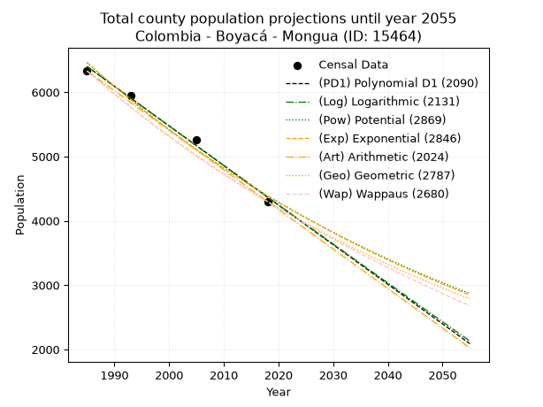
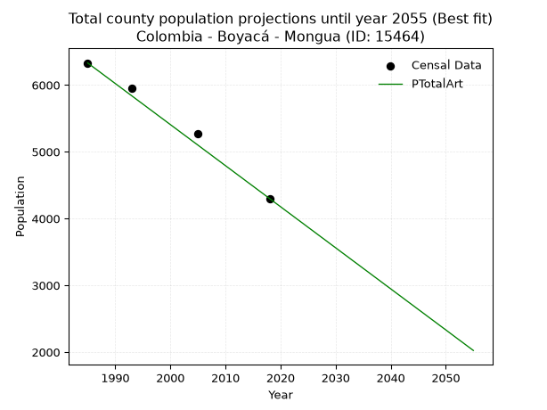
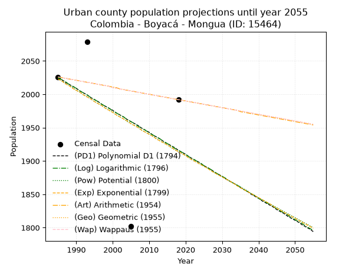
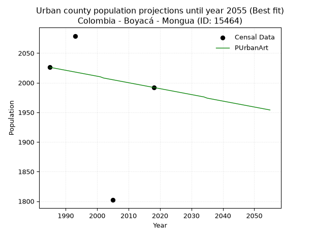
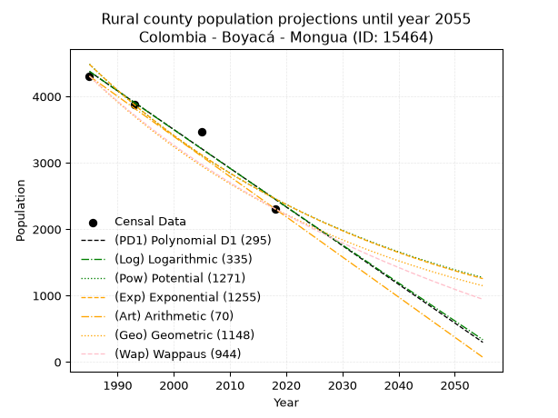
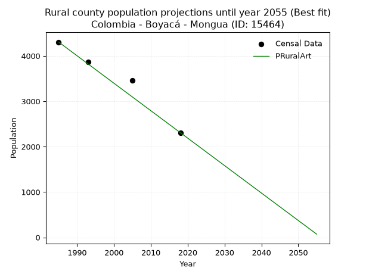

<div align="center">


</div>

# _“Population and Public Services Demand Projections (PPSD) until Year 2050 for Colombia - Boyacá - Mongua (ID: 15464)”_
Keywords: `population` `public-service` `projection` `lineal` `polynomial` `logarithmic` `potential` `exponential` `arithmetic` `geometric` `wappaus` `dane` `colombia` `south-america`

PPSD are analytical estimates used by governments and planners to anticipate future changes in population size, age distribution, and the resulting community needs for utilities, healthcare, education, and infrastructure as sizing future water treatment facilities, electrical grids, and road networks based on spatial growth.

> **General running parameters**: • app_version: _v20260806_. • Python version: _3.14.7_. • Pandas version: _3.0.5_. • NumPy version: _2.5.1_. • Creates, save and include plots into reports (create_plot): _False_. • Projection until year: _2050_. • Process polynomial degree 2 and up: _False_. • Process Wappaus: _True_. • Process Wappaus: _True_. • Set negative values to zero: _True_. • Set infinite values to zero: _True_. • Drop dataset notes: _True_. 
<div align="center">

Dynamic map: [:earth_americas:Google](http://maps.google.com/maps?q=5.754242228,-72.7980904) [:earth_americas:OSM](https://www.openstreetmap.org/#map=18/5.754242228/-72.7980904&layers=P) [:earth_americas:Bing](https://www.bing.com/maps?cp=5.754242228~-72.7980904&lvl=18) [:earth_americas:Apple](https://maps.apple.com/frame?center=5.754242228%2C-72.7980904&span=0.003%2C0.006)

</div>


<div align="center">

```geojson
{
  "type": "Feature",
  "geometry": {
    "type": "Point", 
    "coordinates": [-72.7980904, 5.754242228]
  }, 
  "properties": {
    "Name": "Colombia - Boyacá - Mongua (ID: 15464)"
  }
}
```

</div>


## 0. Census Data (4 records)

Census data are official statistics collected by a government about the people and housing in a country. They usually include counts of total population, age, sex, race, income, education, and jobs.

📅Global census file: [Population.xlsx](../data/Population.xlsx)

| Source   |   Year |   CountryID | CountryName   |   StateID | StateName   |   CountyID | CountyName   |   PTotal |   PUrban |   PRural |
|:---------|-------:|------------:|:--------------|----------:|:------------|-----------:|:-------------|---------:|---------:|---------:|
| DANE     |   1985 |          57 | Colombia      |        15 | Boyacá      |      15464 | Mongua       |     6330 |     2026 |     4304 |
| DANE     |   1993 |          57 | Colombia      |        15 | Boyacá      |      15464 | Mongua       |     5951 |     2079 |     3872 |
| DANE     |   2005 |          57 | Colombia      |        15 | Boyacá      |      15464 | Mongua       |     5264 |     1802 |     3462 |
| DANE     |   2018 |          57 | Colombia      |        15 | Boyacá      |      15464 | Mongua       |     4300 |     1992 |     2308 |

> 🔥Some records could had specific notes about the registered values or the corresponding urban or rural distribution.

**Local public utility companies (RUPS)**

 | SERVICIO       | ESTADO    | NOMBRE                                                 | NIT         | DEPARTAMENTO_DOMICILIO   | MUNICIPIO_DOMICILIO   | DIRECCION                                  |   TELEFONO | EMAIL                     | TIPO_INSCRIPCION    | REPRESENTANTE_LEGAL       | TIPO_PRESTADOR                             | CLASIFICACION                 |
|:---------------|:----------|:-------------------------------------------------------|:------------|:-------------------------|:----------------------|:-------------------------------------------|-----------:|:--------------------------|:--------------------|:--------------------------|:-------------------------------------------|:------------------------------|
| ASEO           | OPERATIVA | COMPAÑÍA DE SERVICIOS PÚBLICOS DE SOGAMOSO S.A. E.S.P. | 891800031-4 | BOYACA                   | SOGAMOSO              | Carrera 11 no 15-10 Edificio Mirador Plaza |    7702110 | sui@coserviciosesp.com.co | Registro por la ESP | PEDRO ELIAS BARRERA  MESA | SOCIEDADES (EMPRESA DE SERVICIOS PUBLICOS) | MAYOR O IGUAL A 5001 USUARIOS |
| ACUEDUCTO      | OPERATIVA | EMPRESA SOLIDARIA DE SERVICIOS PUBLICOS DE MONGUA      | 826003628-5 | BOYACA                   | MONGUA                | CALLE 4  N 3-73                            |    7797078 | apcemsomongua@yahoo.es    | Registro por la ESP | LUZ AMANDA RINCON  NUEZ   | ORGANIZACION AUTORIZADA                    | MENOR O IGUAL A 2500 USUARIOS |
| ALCANTARILLADO | OPERATIVA | EMPRESA SOLIDARIA DE SERVICIOS PUBLICOS DE MONGUA      | 826003628-5 | BOYACA                   | MONGUA                | CALLE 4  N 3-73                            |    7797078 | apcemsomongua@yahoo.es    | Registro por la ESP | LUZ AMANDA RINCON  NUEZ   | ORGANIZACION AUTORIZADA                    | MENOR O IGUAL A 2500 USUARIOS |
| ASEO           | OPERATIVA | EMPRESA SOLIDARIA DE SERVICIOS PUBLICOS DE MONGUA      | 826003628-5 | BOYACA                   | MONGUA                | CALLE 4  N 3-73                            |    7797078 | apcemsomongua@yahoo.es    | Registro por la ESP | LUZ AMANDA RINCON  NUEZ   | ORGANIZACION AUTORIZADA                    | MENOR O IGUAL A 2500 USUARIOS |
| ASEO           | OPERATIVA | URBASER TUNJA S.A.  E.S.P.                             | 900159283-6 | BOYACA                   | TUNJA                 | TRANSVERSAL 15 No. 24 - 12                 |    7441826 | Luz.galvis@urbaser.co     | Registro por la ESP | OSCAR HERNAN PARRA  ERAZO | SOCIEDADES (EMPRESA DE SERVICIOS PUBLICOS) | MAYOR O IGUAL A 5001 USUARIOS |

> [📅RUPS Database: Registro Único de Prestadores de Servicios Públicos de Colombia Suramérica - RUPS](https://www.datos.gov.co/Hacienda-y-Cr-dito-P-blico/Registro-nico-de-Prestadores-de-Servicios-P-blicos/4qkq-csdn/about_data)

## 1. Total

### 1.1. Coefficients and Parameters

* (PD1) Polynomial Deg 1: -61.57888398233579, 128634.41268566716 (lineal)
* (Log) Logarithmic: -123230.73670995244, 942139.0672414972
* (Pow) Potential: -23.429633364039, 81.07569107076172
* (Exp) Exponential: -0.011709327183716004, 80270910389244.25
* (Art) Arithmetic: Year diff. 2018 - 1985 = 33, Population diff. 4300 - 6330 = -2030, Annual growth = -61.515151515151516
* (Geo) Geometric: Year diff. 2018 - 1985 = 33, Population diff. 4300 - 6330 = -2030, Annual growth % = -0.011649348466527432
* (Wap) Wappaus: i = -1.157387610821289, Condition values only valid for < 200)

<sub>
Wappaus condition values: ['-0.00', '-1.16', '-2.31', '-3.47', '-4.63', '-5.79', '-6.94', '-8.10', '-9.26', '-10.42', '-11.57', '-12.73', '-13.89', '-15.05', '-16.20', '-17.36', '-18.52', '-19.68', '-20.83', '-21.99', '-23.15', '-24.31', '-25.46', '-26.62', '-27.78', '-28.93', '-30.09', '-31.25', '-32.41', '-33.56', '-34.72', '-35.88', '-37.04', '-38.19', '-39.35', '-40.51', '-41.67', '-42.82', '-43.98', '-45.14', '-46.30', '-47.45', '-48.61', '-49.77', '-50.93', '-52.08', '-53.24', '-54.40', '-55.55', '-56.71', '-57.87', '-59.03', '-60.18', '-61.34', '-62.50', '-63.66', '-64.81', '-65.97', '-67.13', '-68.29', '-69.44', '-70.60', '-71.76', '-72.92', '-74.07', '-75.23']
</sub>


### 1.2. Projected Dataset

|   Year |   CountyID |   PTotalPD1 |   PTotalLog |   PTotalPow |   PTotalExp |   PTotalArt |   PTotalGeo |   PTotalWap |
|-------:|-----------:|------------:|------------:|------------:|------------:|------------:|------------:|------------:|
|   1985 |      15464 |        6400 |        6402 |        6462 |        6460 |        6330 |        6330 |        6330 |
|   1986 |      15464 |        6339 |        6340 |        6386 |        6385 |        6268 |        6256 |        6257 |
|   1987 |      15464 |        6277 |        6278 |        6311 |        6311 |        6207 |        6183 |        6185 |
|   1988 |      15464 |        6216 |        6216 |        6237 |        6237 |        6145 |        6111 |        6114 |
|   1989 |      15464 |        6154 |        6154 |        6164 |        6165 |        6084 |        6040 |        6044 |
|   1990 |      15464 |        6092 |        6092 |        6092 |        6093 |        6022 |        5970 |        5974 |
|   1991 |      15464 |        6031 |        6030 |        6021 |        6022 |        5961 |        5900 |        5905 |
|   1992 |      15464 |        5969 |        5968 |        5950 |        5952 |        5899 |        5832 |        5837 |
|   1993 |      15464 |        5908 |        5906 |        5881 |        5883 |        5838 |        5764 |        5770 |
|   1994 |      15464 |        5846 |        5845 |        5812 |        5814 |        5776 |        5696 |        5703 |
|   1995 |      15464 |        5785 |        5783 |        5744 |        5746 |        5715 |        5630 |        5637 |
|   1996 |      15464 |        5723 |        5721 |        5677 |        5679 |        5653 |        5564 |        5572 |
|   1997 |      15464 |        5661 |        5659 |        5611 |        5613 |        5592 |        5500 |        5508 |
|   1998 |      15464 |        5600 |        5598 |        5546 |        5548 |        5530 |        5436 |        5444 |
|   1999 |      15464 |        5538 |        5536 |        5481 |        5483 |        5469 |        5372 |        5381 |
|   2000 |      15464 |        5477 |        5474 |        5417 |        5420 |        5407 |        5310 |        5319 |
|   2001 |      15464 |        5415 |        5413 |        5354 |        5356 |        5346 |        5248 |        5257 |
|   2002 |      15464 |        5353 |        5351 |        5292 |        5294 |        5284 |        5187 |        5196 |
|   2003 |      15464 |        5292 |        5290 |        5230 |        5233 |        5223 |        5126 |        5136 |
|   2004 |      15464 |        5230 |        5228 |        5169 |        5172 |        5161 |        5067 |        5076 |
|   2005 |      15464 |        5169 |        5167 |        5109 |        5111 |        5100 |        5008 |        5017 |
|   2006 |      15464 |        5107 |        5105 |        5050 |        5052 |        5038 |        4949 |        4958 |
|   2007 |      15464 |        5046 |        5044 |        4991 |        4993 |        4977 |        4892 |        4900 |
|   2008 |      15464 |        4984 |        4982 |        4933 |        4935 |        4915 |        4835 |        4843 |
|   2009 |      15464 |        4922 |        4921 |        4876 |        4878 |        4854 |        4778 |        4786 |
|   2010 |      15464 |        4861 |        4860 |        4820 |        4821 |        4792 |        4723 |        4730 |
|   2011 |      15464 |        4799 |        4798 |        4764 |        4765 |        4731 |        4668 |        4674 |
|   2012 |      15464 |        4738 |        4737 |        4709 |        4709 |        4669 |        4613 |        4619 |
|   2013 |      15464 |        4676 |        4676 |        4654 |        4654 |        4608 |        4559 |        4565 |
|   2014 |      15464 |        4615 |        4615 |        4600 |        4600 |        4546 |        4506 |        4511 |
|   2015 |      15464 |        4553 |        4553 |        4547 |        4547 |        4485 |        4454 |        4457 |
|   2016 |      15464 |        4491 |        4492 |        4495 |        4494 |        4423 |        4402 |        4404 |
|   2017 |      15464 |        4430 |        4431 |        4443 |        4441 |        4362 |        4351 |        4352 |
|   2018 |      15464 |        4368 |        4370 |        4391 |        4390 |        4300 |        4300 |        4300 |
|   2019 |      15464 |        4307 |        4309 |        4341 |        4339 |        4238 |        4250 |        4249 |
|   2020 |      15464 |        4245 |        4248 |        4291 |        4288 |        4177 |        4200 |        4198 |
|   2021 |      15464 |        4183 |        4187 |        4241 |        4238 |        4115 |        4151 |        4147 |
|   2022 |      15464 |        4122 |        4126 |        4192 |        4189 |        4054 |        4103 |        4097 |
|   2023 |      15464 |        4060 |        4065 |        4144 |        4140 |        3992 |        4055 |        4048 |
|   2024 |      15464 |        3999 |        4004 |        4096 |        4092 |        3931 |        4008 |        3999 |
|   2025 |      15464 |        3937 |        3943 |        4049 |        4044 |        3869 |        3961 |        3950 |
|   2026 |      15464 |        3876 |        3883 |        4003 |        3997 |        3808 |        3915 |        3902 |
|   2027 |      15464 |        3814 |        3822 |        3957 |        3951 |        3746 |        3870 |        3855 |
|   2028 |      15464 |        3752 |        3761 |        3911 |        3905 |        3685 |        3825 |        3807 |
|   2029 |      15464 |        3691 |        3700 |        3866 |        3859 |        3623 |        3780 |        3761 |
|   2030 |      15464 |        3629 |        3640 |        3822 |        3814 |        3562 |        3736 |        3714 |
|   2031 |      15464 |        3568 |        3579 |        3778 |        3770 |        3500 |        3692 |        3668 |
|   2032 |      15464 |        3506 |        3518 |        3735 |        3726 |        3439 |        3649 |        3623 |
|   2033 |      15464 |        3445 |        3458 |        3692 |        3683 |        3377 |        3607 |        3578 |
|   2034 |      15464 |        3383 |        3397 |        3650 |        3640 |        3316 |        3565 |        3533 |
|   2035 |      15464 |        3321 |        3336 |        3608 |        3597 |        3254 |        3523 |        3489 |
|   2036 |      15464 |        3260 |        3276 |        3566 |        3555 |        3193 |        3482 |        3445 |
|   2037 |      15464 |        3198 |        3215 |        3526 |        3514 |        3131 |        3442 |        3402 |
|   2038 |      15464 |        3137 |        3155 |        3485 |        3473 |        3070 |        3402 |        3358 |
|   2039 |      15464 |        3075 |        3094 |        3446 |        3433 |        3008 |        3362 |        3316 |
|   2040 |      15464 |        3013 |        3034 |        3406 |        3393 |        2947 |        3323 |        3273 |
|   2041 |      15464 |        2952 |        2974 |        3367 |        3353 |        2885 |        3284 |        3231 |
|   2042 |      15464 |        2890 |        2913 |        3329 |        3314 |        2824 |        3246 |        3190 |
|   2043 |      15464 |        2829 |        2853 |        3291 |        3276 |        2762 |        3208 |        3149 |
|   2044 |      15464 |        2767 |        2793 |        3253 |        3238 |        2701 |        3171 |        3108 |
|   2045 |      15464 |        2706 |        2732 |        3216 |        3200 |        2639 |        3134 |        3067 |
|   2046 |      15464 |        2644 |        2672 |        3180 |        3163 |        2578 |        3097 |        3027 |
|   2047 |      15464 |        2582 |        2612 |        3144 |        3126 |        2516 |        3061 |        2987 |
|   2048 |      15464 |        2521 |        2552 |        3108 |        3089 |        2455 |        3026 |        2948 |
|   2049 |      15464 |        2459 |        2491 |        3072 |        3053 |        2393 |        2990 |        2908 |
|   2050 |      15464 |        2398 |        2431 |        3037 |        3018 |        2332 |        2955 |        2870 |
<div align="center">

</img>

</div>


### 1.3. Best fit with absolute and relative error (%)

Relative error puts that difference into context by dividing the absolute error by the true value, creating a unitless ratio or percentage that shows the scale of the mistake.

Absolute and relative error

|   Year | Source   |   CountryID | CountryName   |   StateID | StateName   |   CountyID_x | CountyName   |   PTotal |   PUrban |   PRural |   CountyID_y |   PTotalPD1 |   PTotalLog |   PTotalPow |   PTotalExp |   PTotalArt |   PTotalGeo |   PTotalWap |   PTotalPD1AbsError |   PTotalLogAbsError |   PTotalPowAbsError |   PTotalExpAbsError |   PTotalArtAbsError |   PTotalGeoAbsError |   PTotalWapAbsError |   PTotalPD1RelError |   PTotalLogRelError |   PTotalPowRelError |   PTotalExpRelError |   PTotalArtRelError |   PTotalGeoRelError |   PTotalWapRelError |
|-------:|:---------|------------:|:--------------|----------:|:------------|-------------:|:-------------|---------:|---------:|---------:|-------------:|------------:|------------:|------------:|------------:|------------:|------------:|------------:|--------------------:|--------------------:|--------------------:|--------------------:|--------------------:|--------------------:|--------------------:|--------------------:|--------------------:|--------------------:|--------------------:|--------------------:|--------------------:|--------------------:|
|   1985 | DANE     |          57 | Colombia      |        15 | Boyacá      |        15464 | Mongua       |     6330 |     2026 |     4304 |        15464 |        6400 |        6402 |        6462 |        6460 |        6330 |        6330 |        6330 |                  70 |                  72 |                 132 |                 130 |                   0 |                   0 |                   0 |            1.10585  |            1.13744  |             2.08531 |             2.05371 |             0       |             0       |             0       |
|   1993 | DANE     |          57 | Colombia      |        15 | Boyacá      |        15464 | Mongua       |     5951 |     2079 |     3872 |        15464 |        5908 |        5906 |        5881 |        5883 |        5838 |        5764 |        5770 |                  43 |                  45 |                  70 |                  68 |                 113 |                 187 |                 181 |            0.722568 |            0.756175 |             1.17627 |             1.14267 |             1.89884 |             3.14233 |             3.04151 |
|   2005 | DANE     |          57 | Colombia      |        15 | Boyacá      |        15464 | Mongua       |     5264 |     1802 |     3462 |        15464 |        5169 |        5167 |        5109 |        5111 |        5100 |        5008 |        5017 |                  95 |                  97 |                 155 |                 153 |                 164 |                 256 |                 247 |            1.80471  |            1.84271  |             2.94453 |             2.90653 |             3.1155  |             4.86322 |             4.69225 |
|   2018 | DANE     |          57 | Colombia      |        15 | Boyacá      |        15464 | Mongua       |     4300 |     1992 |     2308 |        15464 |        4368 |        4370 |        4391 |        4390 |        4300 |        4300 |        4300 |                  68 |                  70 |                  91 |                  90 |                   0 |                   0 |                   0 |            1.5814   |            1.62791  |             2.11628 |             2.09302 |             0       |             0       |             0       |

Relative error mean

| Method    |   RelError | Best   |
|:----------|-----------:|:-------|
| PTotalPD1 |    1.30363 |        |
| PTotalLog |    1.34106 |        |
| PTotalPow |    2.0806  |        |
| PTotalExp |    2.04898 |        |
| PTotalArt |    1.25359 | True   |
| PTotalGeo |    2.00139 |        |
| PTotalWap |    1.93344 |        |

💙Best method: _**PTotalArt**_
<div align="center">

</img>

</div>


### 1.4. Fresh water supply demand in liters per capita per day (lpcd)

The fresh water supply demand typically ranges from 100 to 300 liters per capita per day (lpcd) for standard domestic and municipal planning, though absolute survival minimums set by the World Health Organization are as low as 7.5 to 20 liters per day, and total consumption in high-income nations can exceed 400 liters.

> `CZ`: Level in meters above the sea level (masl)<br> `WS`: Fresh water supply demand in liters per capita per day (lpcd or l/h/d)<br> `WSAll`: Zonal fresh water supply demand in liters per second (l/s)<br> `A`: Zonal area in square meters<br> `DP`: Population density (people/hectare or p/ha)

Reference values (RAS Colombia)

|    CZ |   WS |
|------:|-----:|
|  1000 |  120 |
|  2000 |  130 |
| 99999 |  140 |

County shapefile geometry properties and water supply values

|   CountyID |     ATotal |   CZTotal |   WSTotal |
|-----------:|-----------:|----------:|----------:|
|      15464 | 3.6004e+08 |   2856.24 |       140 |

Projected values for best method: PTotalArt

|   CountyID |   Year |   PTotalArt |   DPTotal |   WSTotal |   WSTotalAll |
|-----------:|-------:|------------:|----------:|----------:|-------------:|
|      15464 |   1985 |        6330 |      0.18 |       140 |     10.2569  |
|      15464 |   1986 |        6268 |      0.17 |       140 |     10.1565  |
|      15464 |   1987 |        6207 |      0.17 |       140 |     10.0576  |
|      15464 |   1988 |        6145 |      0.17 |       140 |      9.95718 |
|      15464 |   1989 |        6084 |      0.17 |       140 |      9.85833 |
|      15464 |   1990 |        6022 |      0.17 |       140 |      9.75787 |
|      15464 |   1991 |        5961 |      0.17 |       140 |      9.65903 |
|      15464 |   1992 |        5899 |      0.16 |       140 |      9.55856 |
|      15464 |   1993 |        5838 |      0.16 |       140 |      9.45972 |
|      15464 |   1994 |        5776 |      0.16 |       140 |      9.35926 |
|      15464 |   1995 |        5715 |      0.16 |       140 |      9.26042 |
|      15464 |   1996 |        5653 |      0.16 |       140 |      9.15995 |
|      15464 |   1997 |        5592 |      0.16 |       140 |      9.06111 |
|      15464 |   1998 |        5530 |      0.15 |       140 |      8.96065 |
|      15464 |   1999 |        5469 |      0.15 |       140 |      8.86181 |
|      15464 |   2000 |        5407 |      0.15 |       140 |      8.76134 |
|      15464 |   2001 |        5346 |      0.15 |       140 |      8.6625  |
|      15464 |   2002 |        5284 |      0.15 |       140 |      8.56204 |
|      15464 |   2003 |        5223 |      0.15 |       140 |      8.46319 |
|      15464 |   2004 |        5161 |      0.14 |       140 |      8.36273 |
|      15464 |   2005 |        5100 |      0.14 |       140 |      8.26389 |
|      15464 |   2006 |        5038 |      0.14 |       140 |      8.16343 |
|      15464 |   2007 |        4977 |      0.14 |       140 |      8.06458 |
|      15464 |   2008 |        4915 |      0.14 |       140 |      7.96412 |
|      15464 |   2009 |        4854 |      0.13 |       140 |      7.86528 |
|      15464 |   2010 |        4792 |      0.13 |       140 |      7.76481 |
|      15464 |   2011 |        4731 |      0.13 |       140 |      7.66597 |
|      15464 |   2012 |        4669 |      0.13 |       140 |      7.56551 |
|      15464 |   2013 |        4608 |      0.13 |       140 |      7.46667 |
|      15464 |   2014 |        4546 |      0.13 |       140 |      7.3662  |
|      15464 |   2015 |        4485 |      0.12 |       140 |      7.26736 |
|      15464 |   2016 |        4423 |      0.12 |       140 |      7.1669  |
|      15464 |   2017 |        4362 |      0.12 |       140 |      7.06806 |
|      15464 |   2018 |        4300 |      0.12 |       140 |      6.96759 |
|      15464 |   2019 |        4238 |      0.12 |       140 |      6.86713 |
|      15464 |   2020 |        4177 |      0.12 |       140 |      6.76829 |
|      15464 |   2021 |        4115 |      0.11 |       140 |      6.66782 |
|      15464 |   2022 |        4054 |      0.11 |       140 |      6.56898 |
|      15464 |   2023 |        3992 |      0.11 |       140 |      6.46852 |
|      15464 |   2024 |        3931 |      0.11 |       140 |      6.36968 |
|      15464 |   2025 |        3869 |      0.11 |       140 |      6.26921 |
|      15464 |   2026 |        3808 |      0.11 |       140 |      6.17037 |
|      15464 |   2027 |        3746 |      0.1  |       140 |      6.06991 |
|      15464 |   2028 |        3685 |      0.1  |       140 |      5.97106 |
|      15464 |   2029 |        3623 |      0.1  |       140 |      5.8706  |
|      15464 |   2030 |        3562 |      0.1  |       140 |      5.77176 |
|      15464 |   2031 |        3500 |      0.1  |       140 |      5.6713  |
|      15464 |   2032 |        3439 |      0.1  |       140 |      5.57245 |
|      15464 |   2033 |        3377 |      0.09 |       140 |      5.47199 |
|      15464 |   2034 |        3316 |      0.09 |       140 |      5.37315 |
|      15464 |   2035 |        3254 |      0.09 |       140 |      5.27269 |
|      15464 |   2036 |        3193 |      0.09 |       140 |      5.17384 |
|      15464 |   2037 |        3131 |      0.09 |       140 |      5.07338 |
|      15464 |   2038 |        3070 |      0.09 |       140 |      4.97454 |
|      15464 |   2039 |        3008 |      0.08 |       140 |      4.87407 |
|      15464 |   2040 |        2947 |      0.08 |       140 |      4.77523 |
|      15464 |   2041 |        2885 |      0.08 |       140 |      4.67477 |
|      15464 |   2042 |        2824 |      0.08 |       140 |      4.57593 |
|      15464 |   2043 |        2762 |      0.08 |       140 |      4.47546 |
|      15464 |   2044 |        2701 |      0.08 |       140 |      4.37662 |
|      15464 |   2045 |        2639 |      0.07 |       140 |      4.27616 |
|      15464 |   2046 |        2578 |      0.07 |       140 |      4.17731 |
|      15464 |   2047 |        2516 |      0.07 |       140 |      4.07685 |
|      15464 |   2048 |        2455 |      0.07 |       140 |      3.97801 |
|      15464 |   2049 |        2393 |      0.07 |       140 |      3.87755 |
|      15464 |   2050 |        2332 |      0.06 |       140 |      3.7787  |

## 2. Urban

### 2.1. Coefficients and Parameters

* (PD1) Polynomial Deg 1: -3.294660778803808, 8564.895222802317 (lineal)
* (Log) Logarithmic: -6614.480149642548, 52251.46662255037
* (Pow) Potential: -3.3666895638609406, 14.40858208326577
* (Exp) Exponential: -0.001676702002307897, 56419.78322378871
* (Art) Arithmetic: Year diff. 2018 - 1985 = 33, Population diff. 1992 - 2026 = -34, Annual growth = -1.0303030303030303
* (Geo) Geometric: Year diff. 2018 - 1985 = 33, Population diff. 1992 - 2026 = -34, Annual growth % = -0.0005127244713792889
* (Wap) Wappaus: i = -0.05128437184186313, Condition values only valid for < 200)

<sub>
Wappaus condition values: ['-0.00', '-0.05', '-0.10', '-0.15', '-0.21', '-0.26', '-0.31', '-0.36', '-0.41', '-0.46', '-0.51', '-0.56', '-0.62', '-0.67', '-0.72', '-0.77', '-0.82', '-0.87', '-0.92', '-0.97', '-1.03', '-1.08', '-1.13', '-1.18', '-1.23', '-1.28', '-1.33', '-1.38', '-1.44', '-1.49', '-1.54', '-1.59', '-1.64', '-1.69', '-1.74', '-1.79', '-1.85', '-1.90', '-1.95', '-2.00', '-2.05', '-2.10', '-2.15', '-2.21', '-2.26', '-2.31', '-2.36', '-2.41', '-2.46', '-2.51', '-2.56', '-2.62', '-2.67', '-2.72', '-2.77', '-2.82', '-2.87', '-2.92', '-2.97', '-3.03', '-3.08', '-3.13', '-3.18', '-3.23', '-3.28', '-3.33']
</sub>


### 2.2. Projected Dataset

|   Year |   CountyID |   PUrbanPD1 |   PUrbanLog |   PUrbanPow |   PUrbanExp |   PUrbanArt |   PUrbanGeo |   PUrbanWap |
|-------:|-----------:|------------:|------------:|------------:|------------:|------------:|------------:|------------:|
|   1985 |      15464 |        2025 |        2025 |        2023 |        2023 |        2026 |        2026 |        2026 |
|   1986 |      15464 |        2022 |        2022 |        2020 |        2020 |        2025 |        2025 |        2025 |
|   1987 |      15464 |        2018 |        2019 |        2016 |        2016 |        2024 |        2024 |        2024 |
|   1988 |      15464 |        2015 |        2015 |        2013 |        2013 |        2023 |        2023 |        2023 |
|   1989 |      15464 |        2012 |        2012 |        2010 |        2009 |        2022 |        2022 |        2022 |
|   1990 |      15464 |        2009 |        2009 |        2006 |        2006 |        2021 |        2021 |        2021 |
|   1991 |      15464 |        2005 |        2005 |        2003 |        2003 |        2020 |        2020 |        2020 |
|   1992 |      15464 |        2002 |        2002 |        1999 |        1999 |        2019 |        2019 |        2019 |
|   1993 |      15464 |        1999 |        1999 |        1996 |        1996 |        2018 |        2018 |        2018 |
|   1994 |      15464 |        1995 |        1995 |        1993 |        1993 |        2017 |        2017 |        2017 |
|   1995 |      15464 |        1992 |        1992 |        1989 |        1989 |        2016 |        2016 |        2016 |
|   1996 |      15464 |        1989 |        1989 |        1986 |        1986 |        2015 |        2015 |        2015 |
|   1997 |      15464 |        1985 |        1985 |        1983 |        1983 |        2014 |        2014 |        2014 |
|   1998 |      15464 |        1982 |        1982 |        1979 |        1979 |        2013 |        2013 |        2013 |
|   1999 |      15464 |        1979 |        1979 |        1976 |        1976 |        2012 |        2012 |        2012 |
|   2000 |      15464 |        1976 |        1975 |        1973 |        1973 |        2011 |        2010 |        2010 |
|   2001 |      15464 |        1972 |        1972 |        1969 |        1969 |        2010 |        2009 |        2009 |
|   2002 |      15464 |        1969 |        1969 |        1966 |        1966 |        2008 |        2008 |        2008 |
|   2003 |      15464 |        1966 |        1966 |        1963 |        1963 |        2007 |        2007 |        2007 |
|   2004 |      15464 |        1962 |        1962 |        1959 |        1960 |        2006 |        2006 |        2006 |
|   2005 |      15464 |        1959 |        1959 |        1956 |        1956 |        2005 |        2005 |        2005 |
|   2006 |      15464 |        1956 |        1956 |        1953 |        1953 |        2004 |        2004 |        2004 |
|   2007 |      15464 |        1953 |        1952 |        1950 |        1950 |        2003 |        2003 |        2003 |
|   2008 |      15464 |        1949 |        1949 |        1946 |        1946 |        2002 |        2002 |        2002 |
|   2009 |      15464 |        1946 |        1946 |        1943 |        1943 |        2001 |        2001 |        2001 |
|   2010 |      15464 |        1943 |        1942 |        1940 |        1940 |        2000 |        2000 |        2000 |
|   2011 |      15464 |        1939 |        1939 |        1937 |        1937 |        1999 |        1999 |        1999 |
|   2012 |      15464 |        1936 |        1936 |        1933 |        1933 |        1998 |        1998 |        1998 |
|   2013 |      15464 |        1933 |        1933 |        1930 |        1930 |        1997 |        1997 |        1997 |
|   2014 |      15464 |        1929 |        1929 |        1927 |        1927 |        1996 |        1996 |        1996 |
|   2015 |      15464 |        1926 |        1926 |        1924 |        1924 |        1995 |        1995 |        1995 |
|   2016 |      15464 |        1923 |        1923 |        1920 |        1921 |        1994 |        1994 |        1994 |
|   2017 |      15464 |        1920 |        1919 |        1917 |        1917 |        1993 |        1993 |        1993 |
|   2018 |      15464 |        1916 |        1916 |        1914 |        1914 |        1992 |        1992 |        1992 |
|   2019 |      15464 |        1913 |        1913 |        1911 |        1911 |        1991 |        1991 |        1991 |
|   2020 |      15464 |        1910 |        1910 |        1908 |        1908 |        1990 |        1990 |        1990 |
|   2021 |      15464 |        1906 |        1906 |        1904 |        1904 |        1989 |        1989 |        1989 |
|   2022 |      15464 |        1903 |        1903 |        1901 |        1901 |        1988 |        1988 |        1988 |
|   2023 |      15464 |        1900 |        1900 |        1898 |        1898 |        1987 |        1987 |        1987 |
|   2024 |      15464 |        1897 |        1897 |        1895 |        1895 |        1986 |        1986 |        1986 |
|   2025 |      15464 |        1893 |        1893 |        1892 |        1892 |        1985 |        1985 |        1985 |
|   2026 |      15464 |        1890 |        1890 |        1889 |        1889 |        1984 |        1984 |        1984 |
|   2027 |      15464 |        1887 |        1887 |        1886 |        1885 |        1983 |        1983 |        1983 |
|   2028 |      15464 |        1883 |        1883 |        1882 |        1882 |        1982 |        1982 |        1982 |
|   2029 |      15464 |        1880 |        1880 |        1879 |        1879 |        1981 |        1981 |        1981 |
|   2030 |      15464 |        1877 |        1877 |        1876 |        1876 |        1980 |        1980 |        1980 |
|   2031 |      15464 |        1873 |        1874 |        1873 |        1873 |        1979 |        1979 |        1979 |
|   2032 |      15464 |        1870 |        1870 |        1870 |        1870 |        1978 |        1978 |        1978 |
|   2033 |      15464 |        1867 |        1867 |        1867 |        1867 |        1977 |        1977 |        1977 |
|   2034 |      15464 |        1864 |        1864 |        1864 |        1863 |        1976 |        1976 |        1976 |
|   2035 |      15464 |        1860 |        1861 |        1861 |        1860 |        1974 |        1975 |        1975 |
|   2036 |      15464 |        1857 |        1857 |        1858 |        1857 |        1973 |        1974 |        1974 |
|   2037 |      15464 |        1854 |        1854 |        1855 |        1854 |        1972 |        1973 |        1973 |
|   2038 |      15464 |        1850 |        1851 |        1851 |        1851 |        1971 |        1972 |        1972 |
|   2039 |      15464 |        1847 |        1848 |        1848 |        1848 |        1970 |        1971 |        1971 |
|   2040 |      15464 |        1844 |        1844 |        1845 |        1845 |        1969 |        1970 |        1970 |
|   2041 |      15464 |        1840 |        1841 |        1842 |        1842 |        1968 |        1969 |        1969 |
|   2042 |      15464 |        1837 |        1838 |        1839 |        1839 |        1967 |        1968 |        1968 |
|   2043 |      15464 |        1834 |        1835 |        1836 |        1836 |        1966 |        1967 |        1967 |
|   2044 |      15464 |        1831 |        1832 |        1833 |        1832 |        1965 |        1966 |        1966 |
|   2045 |      15464 |        1827 |        1828 |        1830 |        1829 |        1964 |        1965 |        1965 |
|   2046 |      15464 |        1824 |        1825 |        1827 |        1826 |        1963 |        1964 |        1964 |
|   2047 |      15464 |        1821 |        1822 |        1824 |        1823 |        1962 |        1963 |        1963 |
|   2048 |      15464 |        1817 |        1819 |        1821 |        1820 |        1961 |        1962 |        1962 |
|   2049 |      15464 |        1814 |        1815 |        1818 |        1817 |        1960 |        1961 |        1961 |
|   2050 |      15464 |        1811 |        1812 |        1815 |        1814 |        1959 |        1960 |        1960 |
<div align="center">

</img>

</div>


### 2.3. Best fit with absolute and relative error (%)

Relative error puts that difference into context by dividing the absolute error by the true value, creating a unitless ratio or percentage that shows the scale of the mistake.

Absolute and relative error

|   Year | Source   |   CountryID | CountryName   |   StateID | StateName   |   CountyID_x | CountyName   |   PTotal |   PUrban |   PRural |   CountyID_y |   PUrbanPD1 |   PUrbanLog |   PUrbanPow |   PUrbanExp |   PUrbanArt |   PUrbanGeo |   PUrbanWap |   PUrbanPD1AbsError |   PUrbanLogAbsError |   PUrbanPowAbsError |   PUrbanExpAbsError |   PUrbanArtAbsError |   PUrbanGeoAbsError |   PUrbanWapAbsError |   PUrbanPD1RelError |   PUrbanLogRelError |   PUrbanPowRelError |   PUrbanExpRelError |   PUrbanArtRelError |   PUrbanGeoRelError |   PUrbanWapRelError |
|-------:|:---------|------------:|:--------------|----------:|:------------|-------------:|:-------------|---------:|---------:|---------:|-------------:|------------:|------------:|------------:|------------:|------------:|------------:|------------:|--------------------:|--------------------:|--------------------:|--------------------:|--------------------:|--------------------:|--------------------:|--------------------:|--------------------:|--------------------:|--------------------:|--------------------:|--------------------:|--------------------:|
|   1985 | DANE     |          57 | Colombia      |        15 | Boyacá      |        15464 | Mongua       |     6330 |     2026 |     4304 |        15464 |        2025 |        2025 |        2023 |        2023 |        2026 |        2026 |        2026 |                   1 |                   1 |                   3 |                   3 |                   0 |                   0 |                   0 |           0.0493583 |           0.0493583 |            0.148075 |            0.148075 |              0      |              0      |              0      |
|   1993 | DANE     |          57 | Colombia      |        15 | Boyacá      |        15464 | Mongua       |     5951 |     2079 |     3872 |        15464 |        1999 |        1999 |        1996 |        1996 |        2018 |        2018 |        2018 |                  80 |                  80 |                  83 |                  83 |                  61 |                  61 |                  61 |           3.848     |           3.848     |            3.9923   |            3.9923   |              2.9341 |              2.9341 |              2.9341 |
|   2005 | DANE     |          57 | Colombia      |        15 | Boyacá      |        15464 | Mongua       |     5264 |     1802 |     3462 |        15464 |        1959 |        1959 |        1956 |        1956 |        2005 |        2005 |        2005 |                 157 |                 157 |                 154 |                 154 |                 203 |                 203 |                 203 |           8.71254   |           8.71254   |            8.54606  |            8.54606  |             11.2653 |             11.2653 |             11.2653 |
|   2018 | DANE     |          57 | Colombia      |        15 | Boyacá      |        15464 | Mongua       |     4300 |     1992 |     2308 |        15464 |        1916 |        1916 |        1914 |        1914 |        1992 |        1992 |        1992 |                  76 |                  76 |                  78 |                  78 |                   0 |                   0 |                   0 |           3.81526   |           3.81526   |            3.91566  |            3.91566  |              0      |              0      |              0      |

Relative error mean

| Method    |   RelError | Best   |
|:----------|-----------:|:-------|
| PUrbanPD1 |    4.10629 |        |
| PUrbanLog |    4.10629 |        |
| PUrbanPow |    4.15053 |        |
| PUrbanExp |    4.15053 |        |
| PUrbanArt |    3.54984 | True   |
| PUrbanGeo |    3.54984 | True   |
| PUrbanWap |    3.54984 | True   |

💙Best method: _**PUrbanArt**_
<div align="center">

</img>

</div>


### 2.4. Fresh water supply demand in liters per capita per day (lpcd)

The fresh water supply demand typically ranges from 100 to 300 liters per capita per day (lpcd) for standard domestic and municipal planning, though absolute survival minimums set by the World Health Organization are as low as 7.5 to 20 liters per day, and total consumption in high-income nations can exceed 400 liters.

> `CZ`: Level in meters above the sea level (masl)<br> `WS`: Fresh water supply demand in liters per capita per day (lpcd or l/h/d)<br> `WSAll`: Zonal fresh water supply demand in liters per second (l/s)<br> `A`: Zonal area in square meters<br> `DP`: Population density (people/hectare or p/ha)

Reference values (RAS Colombia)

|    CZ |   WS |
|------:|-----:|
|  1000 |  120 |
|  2000 |  130 |
| 99999 |  140 |

County shapefile geometry properties and water supply values

|   CountyID |   AUrban |   CZUrban |   WSUrban |
|-----------:|---------:|----------:|----------:|
|      15464 |   736301 |   2967.52 |       140 |

Projected values for best method: PUrbanArt

|   CountyID |   Year |   PUrbanArt |   DPUrban |   WSUrban |   WSUrbanAll |
|-----------:|-------:|------------:|----------:|----------:|-------------:|
|      15464 |   1985 |        2026 |     27.52 |       140 |      3.28287 |
|      15464 |   1986 |        2025 |     27.5  |       140 |      3.28125 |
|      15464 |   1987 |        2024 |     27.49 |       140 |      3.27963 |
|      15464 |   1988 |        2023 |     27.48 |       140 |      3.27801 |
|      15464 |   1989 |        2022 |     27.46 |       140 |      3.27639 |
|      15464 |   1990 |        2021 |     27.45 |       140 |      3.27477 |
|      15464 |   1991 |        2020 |     27.43 |       140 |      3.27315 |
|      15464 |   1992 |        2019 |     27.42 |       140 |      3.27153 |
|      15464 |   1993 |        2018 |     27.41 |       140 |      3.26991 |
|      15464 |   1994 |        2017 |     27.39 |       140 |      3.26829 |
|      15464 |   1995 |        2016 |     27.38 |       140 |      3.26667 |
|      15464 |   1996 |        2015 |     27.37 |       140 |      3.26505 |
|      15464 |   1997 |        2014 |     27.35 |       140 |      3.26343 |
|      15464 |   1998 |        2013 |     27.34 |       140 |      3.26181 |
|      15464 |   1999 |        2012 |     27.33 |       140 |      3.26019 |
|      15464 |   2000 |        2011 |     27.31 |       140 |      3.25856 |
|      15464 |   2001 |        2010 |     27.3  |       140 |      3.25694 |
|      15464 |   2002 |        2008 |     27.27 |       140 |      3.2537  |
|      15464 |   2003 |        2007 |     27.26 |       140 |      3.25208 |
|      15464 |   2004 |        2006 |     27.24 |       140 |      3.25046 |
|      15464 |   2005 |        2005 |     27.23 |       140 |      3.24884 |
|      15464 |   2006 |        2004 |     27.22 |       140 |      3.24722 |
|      15464 |   2007 |        2003 |     27.2  |       140 |      3.2456  |
|      15464 |   2008 |        2002 |     27.19 |       140 |      3.24398 |
|      15464 |   2009 |        2001 |     27.18 |       140 |      3.24236 |
|      15464 |   2010 |        2000 |     27.16 |       140 |      3.24074 |
|      15464 |   2011 |        1999 |     27.15 |       140 |      3.23912 |
|      15464 |   2012 |        1998 |     27.14 |       140 |      3.2375  |
|      15464 |   2013 |        1997 |     27.12 |       140 |      3.23588 |
|      15464 |   2014 |        1996 |     27.11 |       140 |      3.23426 |
|      15464 |   2015 |        1995 |     27.09 |       140 |      3.23264 |
|      15464 |   2016 |        1994 |     27.08 |       140 |      3.23102 |
|      15464 |   2017 |        1993 |     27.07 |       140 |      3.2294  |
|      15464 |   2018 |        1992 |     27.05 |       140 |      3.22778 |
|      15464 |   2019 |        1991 |     27.04 |       140 |      3.22616 |
|      15464 |   2020 |        1990 |     27.03 |       140 |      3.22454 |
|      15464 |   2021 |        1989 |     27.01 |       140 |      3.22292 |
|      15464 |   2022 |        1988 |     27    |       140 |      3.2213  |
|      15464 |   2023 |        1987 |     26.99 |       140 |      3.21968 |
|      15464 |   2024 |        1986 |     26.97 |       140 |      3.21806 |
|      15464 |   2025 |        1985 |     26.96 |       140 |      3.21644 |
|      15464 |   2026 |        1984 |     26.95 |       140 |      3.21481 |
|      15464 |   2027 |        1983 |     26.93 |       140 |      3.21319 |
|      15464 |   2028 |        1982 |     26.92 |       140 |      3.21157 |
|      15464 |   2029 |        1981 |     26.9  |       140 |      3.20995 |
|      15464 |   2030 |        1980 |     26.89 |       140 |      3.20833 |
|      15464 |   2031 |        1979 |     26.88 |       140 |      3.20671 |
|      15464 |   2032 |        1978 |     26.86 |       140 |      3.20509 |
|      15464 |   2033 |        1977 |     26.85 |       140 |      3.20347 |
|      15464 |   2034 |        1976 |     26.84 |       140 |      3.20185 |
|      15464 |   2035 |        1974 |     26.81 |       140 |      3.19861 |
|      15464 |   2036 |        1973 |     26.8  |       140 |      3.19699 |
|      15464 |   2037 |        1972 |     26.78 |       140 |      3.19537 |
|      15464 |   2038 |        1971 |     26.77 |       140 |      3.19375 |
|      15464 |   2039 |        1970 |     26.76 |       140 |      3.19213 |
|      15464 |   2040 |        1969 |     26.74 |       140 |      3.19051 |
|      15464 |   2041 |        1968 |     26.73 |       140 |      3.18889 |
|      15464 |   2042 |        1967 |     26.71 |       140 |      3.18727 |
|      15464 |   2043 |        1966 |     26.7  |       140 |      3.18565 |
|      15464 |   2044 |        1965 |     26.69 |       140 |      3.18403 |
|      15464 |   2045 |        1964 |     26.67 |       140 |      3.18241 |
|      15464 |   2046 |        1963 |     26.66 |       140 |      3.18079 |
|      15464 |   2047 |        1962 |     26.65 |       140 |      3.17917 |
|      15464 |   2048 |        1961 |     26.63 |       140 |      3.17755 |
|      15464 |   2049 |        1960 |     26.62 |       140 |      3.17593 |
|      15464 |   2050 |        1959 |     26.61 |       140 |      3.17431 |

## 3. Rural

### 3.1. Coefficients and Parameters

* (PD1) Polynomial Deg 1: -58.28422320353194, 120069.51746286478 (lineal)
* (Log) Logarithmic: -116616.25656030982, 889887.6006189462
* (Pow) Potential: -36.3893969681509, 123.65525168036778
* (Exp) Exponential: -0.01819086297682116, 2.1550159628865245e+19
* (Art) Arithmetic: Year diff. 2018 - 1985 = 33, Population diff. 2308 - 4304 = -1996, Annual growth = -60.484848484848484
* (Geo) Geometric: Year diff. 2018 - 1985 = 33, Population diff. 2308 - 4304 = -1996, Annual growth % = -0.018706560825387797
* (Wap) Wappaus: i = -1.8295477460631726, Condition values only valid for < 200)

<sub>
Wappaus condition values: ['-0.00', '-1.83', '-3.66', '-5.49', '-7.32', '-9.15', '-10.98', '-12.81', '-14.64', '-16.47', '-18.30', '-20.13', '-21.95', '-23.78', '-25.61', '-27.44', '-29.27', '-31.10', '-32.93', '-34.76', '-36.59', '-38.42', '-40.25', '-42.08', '-43.91', '-45.74', '-47.57', '-49.40', '-51.23', '-53.06', '-54.89', '-56.72', '-58.55', '-60.38', '-62.20', '-64.03', '-65.86', '-67.69', '-69.52', '-71.35', '-73.18', '-75.01', '-76.84', '-78.67', '-80.50', '-82.33', '-84.16', '-85.99', '-87.82', '-89.65', '-91.48', '-93.31', '-95.14', '-96.97', '-98.80', '-100.63', '-102.45', '-104.28', '-106.11', '-107.94', '-109.77', '-111.60', '-113.43', '-115.26', '-117.09', '-118.92']
</sub>


### 3.2. Projected Dataset

|   Year |   CountyID |   PRuralPD1 |   PRuralLog |   PRuralPow |   PRuralExp |   PRuralArt |   PRuralGeo |   PRuralWap |
|-------:|-----------:|------------:|------------:|------------:|------------:|------------:|------------:|------------:|
|   1985 |      15464 |        4375 |        4377 |        4485 |        4483 |        4304 |        4304 |        4304 |
|   1986 |      15464 |        4317 |        4318 |        4403 |        4402 |        4244 |        4223 |        4226 |
|   1987 |      15464 |        4259 |        4259 |        4323 |        4323 |        4183 |        4144 |        4149 |
|   1988 |      15464 |        4200 |        4201 |        4245 |        4245 |        4123 |        4067 |        4074 |
|   1989 |      15464 |        4142 |        4142 |        4168 |        4168 |        4062 |        3991 |        4000 |
|   1990 |      15464 |        4084 |        4083 |        4092 |        4093 |        4002 |        3916 |        3928 |
|   1991 |      15464 |        4026 |        4025 |        4018 |        4019 |        3941 |        3843 |        3856 |
|   1992 |      15464 |        3967 |        3966 |        3946 |        3947 |        3881 |        3771 |        3786 |
|   1993 |      15464 |        3909 |        3908 |        3874 |        3876 |        3820 |        3701 |        3717 |
|   1994 |      15464 |        3851 |        3849 |        3804 |        3806 |        3760 |        3631 |        3649 |
|   1995 |      15464 |        3792 |        3791 |        3735 |        3737 |        3699 |        3563 |        3583 |
|   1996 |      15464 |        3734 |        3732 |        3668 |        3670 |        3639 |        3497 |        3517 |
|   1997 |      15464 |        3676 |        3674 |        3602 |        3604 |        3578 |        3431 |        3453 |
|   1998 |      15464 |        3618 |        3615 |        3536 |        3539 |        3518 |        3367 |        3389 |
|   1999 |      15464 |        3559 |        3557 |        3473 |        3475 |        3457 |        3304 |        3327 |
|   2000 |      15464 |        3501 |        3499 |        3410 |        3412 |        3397 |        3242 |        3265 |
|   2001 |      15464 |        3443 |        3441 |        3349 |        3351 |        3336 |        3182 |        3205 |
|   2002 |      15464 |        3385 |        3382 |        3288 |        3291 |        3276 |        3122 |        3146 |
|   2003 |      15464 |        3326 |        3324 |        3229 |        3231 |        3215 |        3064 |        3087 |
|   2004 |      15464 |        3268 |        3266 |        3171 |        3173 |        3155 |        3006 |        3029 |
|   2005 |      15464 |        3210 |        3208 |        3114 |        3116 |        3094 |        2950 |        2973 |
|   2006 |      15464 |        3151 |        3149 |        3058 |        3060 |        3034 |        2895 |        2917 |
|   2007 |      15464 |        3093 |        3091 |        3003 |        3004 |        2973 |        2841 |        2862 |
|   2008 |      15464 |        3035 |        3033 |        2949 |        2950 |        2913 |        2788 |        2808 |
|   2009 |      15464 |        2977 |        2975 |        2896 |        2897 |        2852 |        2736 |        2754 |
|   2010 |      15464 |        2918 |        2917 |        2844 |        2845 |        2792 |        2684 |        2702 |
|   2011 |      15464 |        2860 |        2859 |        2793 |        2794 |        2731 |        2634 |        2650 |
|   2012 |      15464 |        2802 |        2801 |        2743 |        2743 |        2671 |        2585 |        2599 |
|   2013 |      15464 |        2743 |        2743 |        2694 |        2694 |        2610 |        2537 |        2549 |
|   2014 |      15464 |        2685 |        2685 |        2646 |        2645 |        2550 |        2489 |        2499 |
|   2015 |      15464 |        2627 |        2627 |        2598 |        2598 |        2489 |        2443 |        2450 |
|   2016 |      15464 |        2569 |        2570 |        2552 |        2551 |        2429 |        2397 |        2402 |
|   2017 |      15464 |        2510 |        2512 |        2506 |        2505 |        2368 |        2352 |        2355 |
|   2018 |      15464 |        2452 |        2454 |        2461 |        2460 |        2308 |        2308 |        2308 |
|   2019 |      15464 |        2394 |        2396 |        2417 |        2415 |        2248 |        2265 |        2262 |
|   2020 |      15464 |        2335 |        2338 |        2374 |        2372 |        2187 |        2222 |        2216 |
|   2021 |      15464 |        2277 |        2281 |        2332 |        2329 |        2127 |        2181 |        2171 |
|   2022 |      15464 |        2219 |        2223 |        2290 |        2287 |        2066 |        2140 |        2127 |
|   2023 |      15464 |        2161 |        2165 |        2249 |        2246 |        2006 |        2100 |        2084 |
|   2024 |      15464 |        2102 |        2108 |        2209 |        2205 |        1945 |        2061 |        2041 |
|   2025 |      15464 |        2044 |        2050 |        2170 |        2166 |        1885 |        2022 |        1998 |
|   2026 |      15464 |        1986 |        1993 |        2131 |        2126 |        1824 |        1984 |        1956 |
|   2027 |      15464 |        1927 |        1935 |        2093 |        2088 |        1764 |        1947 |        1915 |
|   2028 |      15464 |        1869 |        1878 |        2056 |        2051 |        1703 |        1911 |        1874 |
|   2029 |      15464 |        1811 |        1820 |        2020 |        2014 |        1643 |        1875 |        1834 |
|   2030 |      15464 |        1753 |        1763 |        1984 |        1977 |        1582 |        1840 |        1794 |
|   2031 |      15464 |        1694 |        1705 |        1948 |        1942 |        1522 |        1806 |        1755 |
|   2032 |      15464 |        1636 |        1648 |        1914 |        1907 |        1461 |        1772 |        1716 |
|   2033 |      15464 |        1578 |        1590 |        1880 |        1872 |        1401 |        1739 |        1678 |
|   2034 |      15464 |        1519 |        1533 |        1847 |        1838 |        1340 |        1706 |        1640 |
|   2035 |      15464 |        1461 |        1476 |        1814 |        1805 |        1280 |        1674 |        1602 |
|   2036 |      15464 |        1403 |        1418 |        1782 |        1773 |        1219 |        1643 |        1566 |
|   2037 |      15464 |        1345 |        1361 |        1750 |        1741 |        1159 |        1612 |        1529 |
|   2038 |      15464 |        1286 |        1304 |        1719 |        1709 |        1098 |        1582 |        1493 |
|   2039 |      15464 |        1228 |        1247 |        1689 |        1679 |        1038 |        1552 |        1458 |
|   2040 |      15464 |        1170 |        1190 |        1659 |        1648 |         977 |        1523 |        1423 |
|   2041 |      15464 |        1111 |        1132 |        1630 |        1619 |         917 |        1495 |        1388 |
|   2042 |      15464 |        1053 |        1075 |        1601 |        1589 |         856 |        1467 |        1354 |
|   2043 |      15464 |         995 |        1018 |        1572 |        1561 |         796 |        1439 |        1320 |
|   2044 |      15464 |         937 |         961 |        1545 |        1533 |         735 |        1413 |        1287 |
|   2045 |      15464 |         878 |         904 |        1517 |        1505 |         675 |        1386 |        1254 |
|   2046 |      15464 |         820 |         847 |        1491 |        1478 |         614 |        1360 |        1221 |
|   2047 |      15464 |         762 |         790 |        1464 |        1451 |         554 |        1335 |        1189 |
|   2048 |      15464 |         703 |         733 |        1439 |        1425 |         493 |        1310 |        1157 |
|   2049 |      15464 |         645 |         676 |        1413 |        1399 |         433 |        1285 |        1125 |
|   2050 |      15464 |         587 |         619 |        1388 |        1374 |         372 |        1261 |        1094 |
<div align="center">

</img>

</div>


### 3.3. Best fit with absolute and relative error (%)

Relative error puts that difference into context by dividing the absolute error by the true value, creating a unitless ratio or percentage that shows the scale of the mistake.

Absolute and relative error

|   Year | Source   |   CountryID | CountryName   |   StateID | StateName   |   CountyID_x | CountyName   |   PTotal |   PUrban |   PRural |   CountyID_y |   PRuralPD1 |   PRuralLog |   PRuralPow |   PRuralExp |   PRuralArt |   PRuralGeo |   PRuralWap |   PRuralPD1AbsError |   PRuralLogAbsError |   PRuralPowAbsError |   PRuralExpAbsError |   PRuralArtAbsError |   PRuralGeoAbsError |   PRuralWapAbsError |   PRuralPD1RelError |   PRuralLogRelError |   PRuralPowRelError |   PRuralExpRelError |   PRuralArtRelError |   PRuralGeoRelError |   PRuralWapRelError |
|-------:|:---------|------------:|:--------------|----------:|:------------|-------------:|:-------------|---------:|---------:|---------:|-------------:|------------:|------------:|------------:|------------:|------------:|------------:|------------:|--------------------:|--------------------:|--------------------:|--------------------:|--------------------:|--------------------:|--------------------:|--------------------:|--------------------:|--------------------:|--------------------:|--------------------:|--------------------:|--------------------:|
|   1985 | DANE     |          57 | Colombia      |        15 | Boyacá      |        15464 | Mongua       |     6330 |     2026 |     4304 |        15464 |        4375 |        4377 |        4485 |        4483 |        4304 |        4304 |        4304 |                  71 |                  73 |                 181 |                 179 |                   0 |                   0 |                   0 |            1.64963  |            1.6961   |           4.20539   |            4.15892  |             0       |             0       |              0      |
|   1993 | DANE     |          57 | Colombia      |        15 | Boyacá      |        15464 | Mongua       |     5951 |     2079 |     3872 |        15464 |        3909 |        3908 |        3874 |        3876 |        3820 |        3701 |        3717 |                  37 |                  36 |                   2 |                   4 |                  52 |                 171 |                 155 |            0.955579 |            0.929752 |           0.0516529 |            0.103306 |             1.34298 |             4.41632 |              4.0031 |
|   2005 | DANE     |          57 | Colombia      |        15 | Boyacá      |        15464 | Mongua       |     5264 |     1802 |     3462 |        15464 |        3210 |        3208 |        3114 |        3116 |        3094 |        2950 |        2973 |                 252 |                 254 |                 348 |                 346 |                 368 |                 512 |                 489 |            7.27903  |            7.3368   |          10.052     |            9.99422  |            10.6297  |            14.7891  |             14.1248 |
|   2018 | DANE     |          57 | Colombia      |        15 | Boyacá      |        15464 | Mongua       |     4300 |     1992 |     2308 |        15464 |        2452 |        2454 |        2461 |        2460 |        2308 |        2308 |        2308 |                 144 |                 146 |                 153 |                 152 |                   0 |                   0 |                   0 |            6.23917  |            6.32582  |           6.62912   |            6.58579  |             0       |             0       |              0      |

Relative error mean

| Method    |   RelError | Best   |
|:----------|-----------:|:-------|
| PRuralPD1 |    4.03085 |        |
| PRuralLog |    4.07212 |        |
| PRuralPow |    5.23454 |        |
| PRuralExp |    5.21056 |        |
| PRuralArt |    2.99317 | True   |
| PRuralGeo |    4.80137 |        |
| PRuralWap |    4.53197 |        |

💙Best method: _**PRuralArt**_
<div align="center">

</img>

</div>


### 3.4. Fresh water supply demand in liters per capita per day (lpcd)

The fresh water supply demand typically ranges from 100 to 300 liters per capita per day (lpcd) for standard domestic and municipal planning, though absolute survival minimums set by the World Health Organization are as low as 7.5 to 20 liters per day, and total consumption in high-income nations can exceed 400 liters.

> `CZ`: Level in meters above the sea level (masl)<br> `WS`: Fresh water supply demand in liters per capita per day (lpcd or l/h/d)<br> `WSAll`: Zonal fresh water supply demand in liters per second (l/s)<br> `A`: Zonal area in square meters<br> `DP`: Population density (people/hectare or p/ha)

Reference values (RAS Colombia)

|    CZ |   WS |
|------:|-----:|
|  1000 |  120 |
|  2000 |  130 |
| 99999 |  140 |

County shapefile geometry properties and water supply values

|   CountyID |      ARural |   CZRural |   WSRural |
|-----------:|------------:|----------:|----------:|
|      15464 | 3.59304e+08 |   2856.01 |       140 |

Projected values for best method: PRuralArt

|   CountyID |   Year |   PRuralArt |   DPRural |   WSRural |   WSRuralAll |
|-----------:|-------:|------------:|----------:|----------:|-------------:|
|      15464 |   1985 |        4304 |      0.12 |       140 |     6.97407  |
|      15464 |   1986 |        4244 |      0.12 |       140 |     6.87685  |
|      15464 |   1987 |        4183 |      0.12 |       140 |     6.77801  |
|      15464 |   1988 |        4123 |      0.11 |       140 |     6.68079  |
|      15464 |   1989 |        4062 |      0.11 |       140 |     6.58194  |
|      15464 |   1990 |        4002 |      0.11 |       140 |     6.48472  |
|      15464 |   1991 |        3941 |      0.11 |       140 |     6.38588  |
|      15464 |   1992 |        3881 |      0.11 |       140 |     6.28866  |
|      15464 |   1993 |        3820 |      0.11 |       140 |     6.18981  |
|      15464 |   1994 |        3760 |      0.1  |       140 |     6.09259  |
|      15464 |   1995 |        3699 |      0.1  |       140 |     5.99375  |
|      15464 |   1996 |        3639 |      0.1  |       140 |     5.89653  |
|      15464 |   1997 |        3578 |      0.1  |       140 |     5.79769  |
|      15464 |   1998 |        3518 |      0.1  |       140 |     5.70046  |
|      15464 |   1999 |        3457 |      0.1  |       140 |     5.60162  |
|      15464 |   2000 |        3397 |      0.09 |       140 |     5.5044   |
|      15464 |   2001 |        3336 |      0.09 |       140 |     5.40556  |
|      15464 |   2002 |        3276 |      0.09 |       140 |     5.30833  |
|      15464 |   2003 |        3215 |      0.09 |       140 |     5.20949  |
|      15464 |   2004 |        3155 |      0.09 |       140 |     5.11227  |
|      15464 |   2005 |        3094 |      0.09 |       140 |     5.01343  |
|      15464 |   2006 |        3034 |      0.08 |       140 |     4.9162   |
|      15464 |   2007 |        2973 |      0.08 |       140 |     4.81736  |
|      15464 |   2008 |        2913 |      0.08 |       140 |     4.72014  |
|      15464 |   2009 |        2852 |      0.08 |       140 |     4.6213   |
|      15464 |   2010 |        2792 |      0.08 |       140 |     4.52407  |
|      15464 |   2011 |        2731 |      0.08 |       140 |     4.42523  |
|      15464 |   2012 |        2671 |      0.07 |       140 |     4.32801  |
|      15464 |   2013 |        2610 |      0.07 |       140 |     4.22917  |
|      15464 |   2014 |        2550 |      0.07 |       140 |     4.13194  |
|      15464 |   2015 |        2489 |      0.07 |       140 |     4.0331   |
|      15464 |   2016 |        2429 |      0.07 |       140 |     3.93588  |
|      15464 |   2017 |        2368 |      0.07 |       140 |     3.83704  |
|      15464 |   2018 |        2308 |      0.06 |       140 |     3.73981  |
|      15464 |   2019 |        2248 |      0.06 |       140 |     3.64259  |
|      15464 |   2020 |        2187 |      0.06 |       140 |     3.54375  |
|      15464 |   2021 |        2127 |      0.06 |       140 |     3.44653  |
|      15464 |   2022 |        2066 |      0.06 |       140 |     3.34769  |
|      15464 |   2023 |        2006 |      0.06 |       140 |     3.25046  |
|      15464 |   2024 |        1945 |      0.05 |       140 |     3.15162  |
|      15464 |   2025 |        1885 |      0.05 |       140 |     3.0544   |
|      15464 |   2026 |        1824 |      0.05 |       140 |     2.95556  |
|      15464 |   2027 |        1764 |      0.05 |       140 |     2.85833  |
|      15464 |   2028 |        1703 |      0.05 |       140 |     2.75949  |
|      15464 |   2029 |        1643 |      0.05 |       140 |     2.66227  |
|      15464 |   2030 |        1582 |      0.04 |       140 |     2.56343  |
|      15464 |   2031 |        1522 |      0.04 |       140 |     2.4662   |
|      15464 |   2032 |        1461 |      0.04 |       140 |     2.36736  |
|      15464 |   2033 |        1401 |      0.04 |       140 |     2.27014  |
|      15464 |   2034 |        1340 |      0.04 |       140 |     2.1713   |
|      15464 |   2035 |        1280 |      0.04 |       140 |     2.07407  |
|      15464 |   2036 |        1219 |      0.03 |       140 |     1.97523  |
|      15464 |   2037 |        1159 |      0.03 |       140 |     1.87801  |
|      15464 |   2038 |        1098 |      0.03 |       140 |     1.77917  |
|      15464 |   2039 |        1038 |      0.03 |       140 |     1.68194  |
|      15464 |   2040 |         977 |      0.03 |       140 |     1.5831   |
|      15464 |   2041 |         917 |      0.03 |       140 |     1.48588  |
|      15464 |   2042 |         856 |      0.02 |       140 |     1.38704  |
|      15464 |   2043 |         796 |      0.02 |       140 |     1.28981  |
|      15464 |   2044 |         735 |      0.02 |       140 |     1.19097  |
|      15464 |   2045 |         675 |      0.02 |       140 |     1.09375  |
|      15464 |   2046 |         614 |      0.02 |       140 |     0.994907 |
|      15464 |   2047 |         554 |      0.02 |       140 |     0.897685 |
|      15464 |   2048 |         493 |      0.01 |       140 |     0.798843 |
|      15464 |   2049 |         433 |      0.01 |       140 |     0.70162  |
|      15464 |   2050 |         372 |      0.01 |       140 |     0.602778 |

<div align="center"><br><sub>Share this research</sub></div><br>

<sub>**APPS & TOOLS & CONTENT DISCLAIMER**: • NO WARRANTY - This content and software is provided by <a href="https://github.com/rcfdtools" target="_blank">github.com/rcfdtools</a> "as is", without any express or implied warranty, including warranties of merchantability, fitness for a particular purpose, or non-infringement. There is no guarantee that the software will be error-free or operate without interruption. • LIMITATION OF LIABILITY - Neither the authors nor copyright holders will be liable for claims or damages arising from the software or its use. You are responsible for determining if the software is appropriate for your use and assume all associated risks, including errors, legal compliance, and data loss. • NO PROFESSIONAL ADVICE - The software provides general information and does not offer professional advice. It should not replace consultation with professional advisors. [Clauses and global license for rcfdtools use.](https://github.com/rcfdtools/rcfdtools/blob/main/LICENSE.md)</sub>

| [:house: Home](Readme.md)  | [:beginner: Help / Collaborate](https://github.com/rcfdtools/R.HydroTools/discussions/31) |
|----------------------------|-------------------------------------------------------------------------------------------|