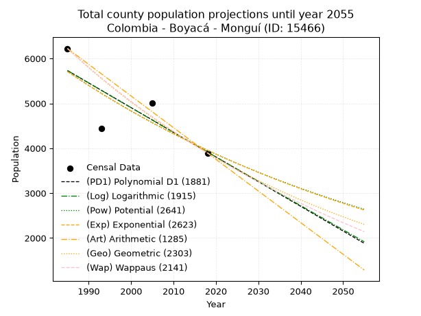
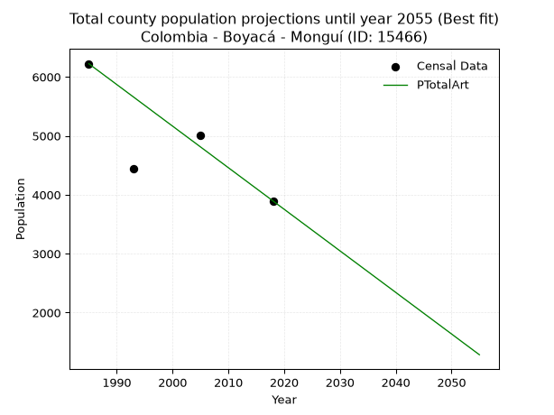
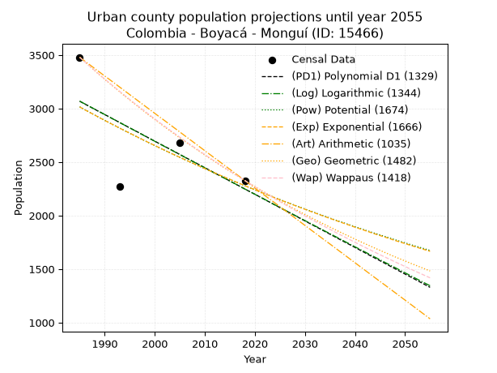
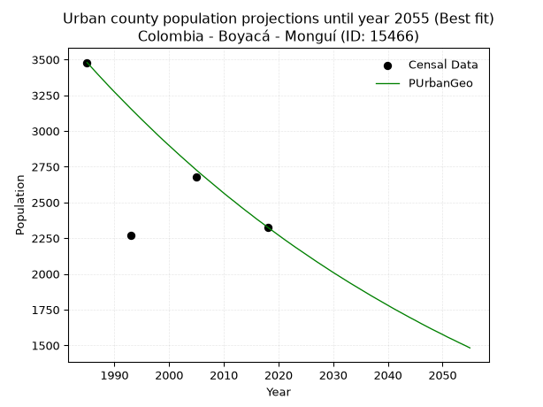
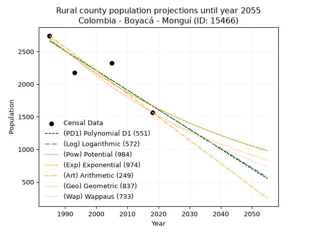
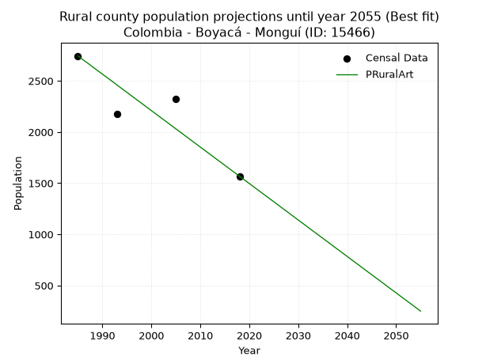

<div align="center">


</div>

# _“Population and Public Services Demand Projections (PPSD) until Year 2050 for Colombia - Boyacá - Monguí (ID: 15466)”_
Keywords: `population` `public-service` `projection` `lineal` `polynomial` `logarithmic` `potential` `exponential` `arithmetic` `geometric` `wappaus` `dane` `colombia` `south-america`

PPSD are analytical estimates used by governments and planners to anticipate future changes in population size, age distribution, and the resulting community needs for utilities, healthcare, education, and infrastructure as sizing future water treatment facilities, electrical grids, and road networks based on spatial growth.

> **General running parameters**: • app_version: _v20260806_. • Python version: _3.14.7_. • Pandas version: _3.0.5_. • NumPy version: _2.5.1_. • Creates, save and include plots into reports (create_plot): _False_. • Projection until year: _2050_. • Process polynomial degree 2 and up: _False_. • Process Wappaus: _True_. • Process Wappaus: _True_. • Set negative values to zero: _True_. • Set infinite values to zero: _True_. • Drop dataset notes: _True_. 
<div align="center">

Dynamic map: [:earth_americas:Google](http://maps.google.com/maps?q=5.72348639,-72.8492924) [:earth_americas:OSM](https://www.openstreetmap.org/#map=18/5.72348639/-72.8492924&layers=P) [:earth_americas:Bing](https://www.bing.com/maps?cp=5.72348639~-72.8492924&lvl=18) [:earth_americas:Apple](https://maps.apple.com/frame?center=5.72348639%2C-72.8492924&span=0.003%2C0.006)

</div>


<div align="center">

```geojson
{
  "type": "Feature",
  "geometry": {
    "type": "Point", 
    "coordinates": [-72.8492924, 5.72348639]
  }, 
  "properties": {
    "Name": "Colombia - Boyacá - Monguí (ID: 15466)"
  }
}
```

</div>


## 0. Census Data (4 records)

Census data are official statistics collected by a government about the people and housing in a country. They usually include counts of total population, age, sex, race, income, education, and jobs.

📅Global census file: [Population.xlsx](../data/Population.xlsx)

| Source   |   Year |   CountryID | CountryName   |   StateID | StateName   |   CountyID | CountyName   |   PTotal |   PUrban |   PRural |
|:---------|-------:|------------:|:--------------|----------:|:------------|-----------:|:-------------|---------:|---------:|---------:|
| DANE     |   1985 |          57 | Colombia      |        15 | Boyacá      |      15466 | Monguí       |     6223 |     3479 |     2744 |
| DANE     |   1993 |          57 | Colombia      |        15 | Boyacá      |      15466 | Monguí       |     4448 |     2269 |     2179 |
| DANE     |   2005 |          57 | Colombia      |        15 | Boyacá      |      15466 | Monguí       |     5002 |     2681 |     2321 |
| DANE     |   2018 |          57 | Colombia      |        15 | Boyacá      |      15466 | Monguí       |     3895 |     2327 |     1568 |

> 🔥Some records could had specific notes about the registered values or the corresponding urban or rural distribution.

## 1. Total

### 1.1. Coefficients and Parameters

* (PD1) Polynomial Deg 1: -55.00281011641847, 114911.37093536607 (lineal)
* (Log) Logarithmic: -110153.08107436332, 842166.451957629
* (Pow) Potential: -22.24862260436836, 77.12734442170554
* (Exp) Exponential: -0.011111758548272196, 21662631876755.816
* (Art) Arithmetic: Year diff. 2018 - 1985 = 33, Population diff. 3895 - 6223 = -2328, Annual growth = -70.54545454545455
* (Geo) Geometric: Year diff. 2018 - 1985 = 33, Population diff. 3895 - 6223 = -2328, Annual growth % = -0.014098413477290905
* (Wap) Wappaus: i = -1.3944545274847706, Condition values only valid for < 200)

<sub>
Wappaus condition values: ['-0.00', '-1.39', '-2.79', '-4.18', '-5.58', '-6.97', '-8.37', '-9.76', '-11.16', '-12.55', '-13.94', '-15.34', '-16.73', '-18.13', '-19.52', '-20.92', '-22.31', '-23.71', '-25.10', '-26.49', '-27.89', '-29.28', '-30.68', '-32.07', '-33.47', '-34.86', '-36.26', '-37.65', '-39.04', '-40.44', '-41.83', '-43.23', '-44.62', '-46.02', '-47.41', '-48.81', '-50.20', '-51.59', '-52.99', '-54.38', '-55.78', '-57.17', '-58.57', '-59.96', '-61.36', '-62.75', '-64.14', '-65.54', '-66.93', '-68.33', '-69.72', '-71.12', '-72.51', '-73.91', '-75.30', '-76.69', '-78.09', '-79.48', '-80.88', '-82.27', '-83.67', '-85.06', '-86.46', '-87.85', '-89.25', '-90.64']
</sub>


### 1.2. Projected Dataset

|   Year |   CountyID |   PTotalPD1 |   PTotalLog |   PTotalPow |   PTotalExp |   PTotalArt |   PTotalGeo |   PTotalWap |
|-------:|-----------:|------------:|------------:|------------:|------------:|------------:|------------:|------------:|
|   1985 |      15466 |        5731 |        5733 |        5711 |        5709 |        6223 |        6223 |        6223 |
|   1986 |      15466 |        5676 |        5677 |        5647 |        5646 |        6152 |        6135 |        6137 |
|   1987 |      15466 |        5621 |        5622 |        5585 |        5583 |        6082 |        6049 |        6052 |
|   1988 |      15466 |        5566 |        5567 |        5522 |        5522 |        6011 |        5963 |        5968 |
|   1989 |      15466 |        5511 |        5511 |        5461 |        5461 |        5941 |        5879 |        5885 |
|   1990 |      15466 |        5456 |        5456 |        5400 |        5400 |        5870 |        5797 |        5804 |
|   1991 |      15466 |        5401 |        5400 |        5340 |        5341 |        5800 |        5715 |        5723 |
|   1992 |      15466 |        5346 |        5345 |        5281 |        5282 |        5729 |        5634 |        5644 |
|   1993 |      15466 |        5291 |        5290 |        5222 |        5223 |        5659 |        5555 |        5565 |
|   1994 |      15466 |        5236 |        5235 |        5164 |        5166 |        5588 |        5476 |        5488 |
|   1995 |      15466 |        5181 |        5179 |        5107 |        5108 |        5518 |        5399 |        5412 |
|   1996 |      15466 |        5126 |        5124 |        5050 |        5052 |        5447 |        5323 |        5336 |
|   1997 |      15466 |        5071 |        5069 |        4994 |        4996 |        5376 |        5248 |        5262 |
|   1998 |      15466 |        5016 |        5014 |        4939 |        4941 |        5306 |        5174 |        5189 |
|   1999 |      15466 |        4961 |        4959 |        4884 |        4886 |        5235 |        5101 |        5116 |
|   2000 |      15466 |        4906 |        4904 |        4830 |        4832 |        5165 |        5029 |        5045 |
|   2001 |      15466 |        4851 |        4849 |        4777 |        4779 |        5094 |        4958 |        4974 |
|   2002 |      15466 |        4796 |        4794 |        4724 |        4726 |        5024 |        4888 |        4904 |
|   2003 |      15466 |        4741 |        4739 |        4672 |        4674 |        4953 |        4820 |        4835 |
|   2004 |      15466 |        4686 |        4684 |        4620 |        4622 |        4883 |        4752 |        4767 |
|   2005 |      15466 |        4631 |        4629 |        4569 |        4571 |        4812 |        4685 |        4700 |
|   2006 |      15466 |        4576 |        4574 |        4519 |        4521 |        4742 |        4619 |        4633 |
|   2007 |      15466 |        4521 |        4519 |        4469 |        4471 |        4671 |        4553 |        4568 |
|   2008 |      15466 |        4466 |        4464 |        4420 |        4421 |        4600 |        4489 |        4503 |
|   2009 |      15466 |        4411 |        4409 |        4371 |        4372 |        4530 |        4426 |        4439 |
|   2010 |      15466 |        4356 |        4354 |        4323 |        4324 |        4459 |        4364 |        4376 |
|   2011 |      15466 |        4301 |        4299 |        4275 |        4276 |        4389 |        4302 |        4313 |
|   2012 |      15466 |        4246 |        4245 |        4228 |        4229 |        4318 |        4241 |        4251 |
|   2013 |      15466 |        4191 |        4190 |        4182 |        4182 |        4248 |        4182 |        4190 |
|   2014 |      15466 |        4136 |        4135 |        4136 |        4136 |        4177 |        4123 |        4130 |
|   2015 |      15466 |        4081 |        4081 |        4090 |        4090 |        4107 |        4064 |        4070 |
|   2016 |      15466 |        4026 |        4026 |        4046 |        4045 |        4036 |        4007 |        4011 |
|   2017 |      15466 |        3971 |        3971 |        4001 |        4001 |        3966 |        3951 |        3953 |
|   2018 |      15466 |        3916 |        3917 |        3957 |        3956 |        3895 |        3895 |        3895 |
|   2019 |      15466 |        3861 |        3862 |        3914 |        3913 |        3824 |        3840 |        3838 |
|   2020 |      15466 |        3806 |        3808 |        3871 |        3869 |        3754 |        3786 |        3782 |
|   2021 |      15466 |        3751 |        3753 |        3829 |        3827 |        3683 |        3733 |        3726 |
|   2022 |      15466 |        3696 |        3699 |        3787 |        3784 |        3613 |        3680 |        3671 |
|   2023 |      15466 |        3641 |        3644 |        3745 |        3743 |        3542 |        3628 |        3616 |
|   2024 |      15466 |        3586 |        3590 |        3704 |        3701 |        3472 |        3577 |        3562 |
|   2025 |      15466 |        3531 |        3535 |        3664 |        3660 |        3401 |        3526 |        3509 |
|   2026 |      15466 |        3476 |        3481 |        3624 |        3620 |        3331 |        3477 |        3456 |
|   2027 |      15466 |        3421 |        3427 |        3584 |        3580 |        3260 |        3428 |        3404 |
|   2028 |      15466 |        3366 |        3372 |        3545 |        3540 |        3190 |        3379 |        3352 |
|   2029 |      15466 |        3311 |        3318 |        3507 |        3501 |        3119 |        3332 |        3301 |
|   2030 |      15466 |        3256 |        3264 |        3468 |        3462 |        3048 |        3285 |        3251 |
|   2031 |      15466 |        3201 |        3209 |        3430 |        3424 |        2978 |        3238 |        3201 |
|   2032 |      15466 |        3146 |        3155 |        3393 |        3386 |        2907 |        3193 |        3151 |
|   2033 |      15466 |        3091 |        3101 |        3356 |        3349 |        2837 |        3148 |        3102 |
|   2034 |      15466 |        3036 |        3047 |        3320 |        3312 |        2766 |        3103 |        3054 |
|   2035 |      15466 |        2981 |        2993 |        3284 |        3275 |        2696 |        3060 |        3006 |
|   2036 |      15466 |        2926 |        2939 |        3248 |        3239 |        2625 |        3017 |        2958 |
|   2037 |      15466 |        2871 |        2884 |        3213 |        3203 |        2555 |        2974 |        2911 |
|   2038 |      15466 |        2816 |        2830 |        3178 |        3168 |        2484 |        2932 |        2865 |
|   2039 |      15466 |        2761 |        2776 |        3143 |        3133 |        2414 |        2891 |        2819 |
|   2040 |      15466 |        2706 |        2722 |        3109 |        3098 |        2343 |        2850 |        2773 |
|   2041 |      15466 |        2651 |        2668 |        3075 |        3064 |        2272 |        2810 |        2728 |
|   2042 |      15466 |        2596 |        2614 |        3042 |        3030 |        2202 |        2770 |        2683 |
|   2043 |      15466 |        2541 |        2560 |        3009 |        2997 |        2131 |        2731 |        2639 |
|   2044 |      15466 |        2486 |        2507 |        2976 |        2964 |        2061 |        2693 |        2595 |
|   2045 |      15466 |        2431 |        2453 |        2944 |        2931 |        1990 |        2655 |        2552 |
|   2046 |      15466 |        2376 |        2399 |        2912 |        2899 |        1920 |        2617 |        2509 |
|   2047 |      15466 |        2321 |        2345 |        2881 |        2866 |        1849 |        2580 |        2467 |
|   2048 |      15466 |        2266 |        2291 |        2850 |        2835 |        1779 |        2544 |        2425 |
|   2049 |      15466 |        2211 |        2237 |        2819 |        2803 |        1708 |        2508 |        2383 |
|   2050 |      15466 |        2156 |        2184 |        2789 |        2773 |        1638 |        2473 |        2342 |
<div align="center">

</img>

</div>


### 1.3. Best fit with absolute and relative error (%)

Relative error puts that difference into context by dividing the absolute error by the true value, creating a unitless ratio or percentage that shows the scale of the mistake.

Absolute and relative error

|   Year | Source   |   CountryID | CountryName   |   StateID | StateName   |   CountyID_x | CountyName   |   PTotal |   PUrban |   PRural |   CountyID_y |   PTotalPD1 |   PTotalLog |   PTotalPow |   PTotalExp |   PTotalArt |   PTotalGeo |   PTotalWap |   PTotalPD1AbsError |   PTotalLogAbsError |   PTotalPowAbsError |   PTotalExpAbsError |   PTotalArtAbsError |   PTotalGeoAbsError |   PTotalWapAbsError |   PTotalPD1RelError |   PTotalLogRelError |   PTotalPowRelError |   PTotalExpRelError |   PTotalArtRelError |   PTotalGeoRelError |   PTotalWapRelError |
|-------:|:---------|------------:|:--------------|----------:|:------------|-------------:|:-------------|---------:|---------:|---------:|-------------:|------------:|------------:|------------:|------------:|------------:|------------:|------------:|--------------------:|--------------------:|--------------------:|--------------------:|--------------------:|--------------------:|--------------------:|--------------------:|--------------------:|--------------------:|--------------------:|--------------------:|--------------------:|--------------------:|
|   1985 | DANE     |          57 | Colombia      |        15 | Boyacá      |        15466 | Monguí       |     6223 |     3479 |     2744 |        15466 |        5731 |        5733 |        5711 |        5709 |        6223 |        6223 |        6223 |                 492 |                 490 |                 512 |                 514 |                   0 |                   0 |                   0 |            7.90615  |            7.87402  |             8.22754 |             8.25968 |             0       |             0       |             0       |
|   1993 | DANE     |          57 | Colombia      |        15 | Boyacá      |        15466 | Monguí       |     4448 |     2269 |     2179 |        15466 |        5291 |        5290 |        5222 |        5223 |        5659 |        5555 |        5565 |                 843 |                 842 |                 774 |                 775 |                1211 |                1107 |                1117 |           18.9523   |           18.9299   |            17.4011  |            17.4236  |            27.2257  |            24.8876  |            25.1124  |
|   2005 | DANE     |          57 | Colombia      |        15 | Boyacá      |        15466 | Monguí       |     5002 |     2681 |     2321 |        15466 |        4631 |        4629 |        4569 |        4571 |        4812 |        4685 |        4700 |                 371 |                 373 |                 433 |                 431 |                 190 |                 317 |                 302 |            7.41703  |            7.45702  |             8.65654 |             8.61655 |             3.79848 |             6.33747 |             6.03758 |
|   2018 | DANE     |          57 | Colombia      |        15 | Boyacá      |        15466 | Monguí       |     3895 |     2327 |     1568 |        15466 |        3916 |        3917 |        3957 |        3956 |        3895 |        3895 |        3895 |                  21 |                  22 |                  62 |                  61 |                   0 |                   0 |                   0 |            0.539153 |            0.564827 |             1.59178 |             1.56611 |             0       |             0       |             0       |

Relative error mean

| Method    |   RelError | Best   |
|:----------|-----------:|:-------|
| PTotalPD1 |    8.70367 |        |
| PTotalLog |    8.70643 |        |
| PTotalPow |    8.96924 |        |
| PTotalExp |    8.96648 |        |
| PTotalArt |    7.75605 | True   |
| PTotalGeo |    7.80626 |        |
| PTotalWap |    7.7875  |        |

💙Best method: _**PTotalArt**_
<div align="center">

</img>

</div>


### 1.4. Fresh water supply demand in liters per capita per day (lpcd)

The fresh water supply demand typically ranges from 100 to 300 liters per capita per day (lpcd) for standard domestic and municipal planning, though absolute survival minimums set by the World Health Organization are as low as 7.5 to 20 liters per day, and total consumption in high-income nations can exceed 400 liters.

> `CZ`: Level in meters above the sea level (masl).<br> `WS`: Fresh water supply demand in liters per capita per day (lpcd or l/h/d).<br> `WSAll`: Zonal fresh water supply demand in liters per second (l/s).<br> `A`: Zonal area in square meters.

Reference values (RAS Colombia)

|    CZ |   WS |
|------:|-----:|
|  1000 |  120 |
|  2000 |  130 |
| 99999 |  140 |

County shapefile geometry properties and water supply values

|   CountyID |      ATotal |   CZTotal |   WSTotal |
|-----------:|------------:|----------:|----------:|
|      15466 | 6.86739e+07 |   3394.27 |       140 |

Projected values for best method: PTotalArt

|   CountyID |   Year |   PTotalArt |   WSTotal |   WSTotalAll |
|-----------:|-------:|------------:|----------:|-------------:|
|      15466 |   1985 |        6223 |       140 |     10.0836  |
|      15466 |   1986 |        6152 |       140 |      9.96852 |
|      15466 |   1987 |        6082 |       140 |      9.85509 |
|      15466 |   1988 |        6011 |       140 |      9.74005 |
|      15466 |   1989 |        5941 |       140 |      9.62662 |
|      15466 |   1990 |        5870 |       140 |      9.51157 |
|      15466 |   1991 |        5800 |       140 |      9.39815 |
|      15466 |   1992 |        5729 |       140 |      9.2831  |
|      15466 |   1993 |        5659 |       140 |      9.16968 |
|      15466 |   1994 |        5588 |       140 |      9.05463 |
|      15466 |   1995 |        5518 |       140 |      8.9412  |
|      15466 |   1996 |        5447 |       140 |      8.82616 |
|      15466 |   1997 |        5376 |       140 |      8.71111 |
|      15466 |   1998 |        5306 |       140 |      8.59769 |
|      15466 |   1999 |        5235 |       140 |      8.48264 |
|      15466 |   2000 |        5165 |       140 |      8.36921 |
|      15466 |   2001 |        5094 |       140 |      8.25417 |
|      15466 |   2002 |        5024 |       140 |      8.14074 |
|      15466 |   2003 |        4953 |       140 |      8.02569 |
|      15466 |   2004 |        4883 |       140 |      7.91227 |
|      15466 |   2005 |        4812 |       140 |      7.79722 |
|      15466 |   2006 |        4742 |       140 |      7.6838  |
|      15466 |   2007 |        4671 |       140 |      7.56875 |
|      15466 |   2008 |        4600 |       140 |      7.4537  |
|      15466 |   2009 |        4530 |       140 |      7.34028 |
|      15466 |   2010 |        4459 |       140 |      7.22523 |
|      15466 |   2011 |        4389 |       140 |      7.11181 |
|      15466 |   2012 |        4318 |       140 |      6.99676 |
|      15466 |   2013 |        4248 |       140 |      6.88333 |
|      15466 |   2014 |        4177 |       140 |      6.76829 |
|      15466 |   2015 |        4107 |       140 |      6.65486 |
|      15466 |   2016 |        4036 |       140 |      6.53981 |
|      15466 |   2017 |        3966 |       140 |      6.42639 |
|      15466 |   2018 |        3895 |       140 |      6.31134 |
|      15466 |   2019 |        3824 |       140 |      6.1963  |
|      15466 |   2020 |        3754 |       140 |      6.08287 |
|      15466 |   2021 |        3683 |       140 |      5.96782 |
|      15466 |   2022 |        3613 |       140 |      5.8544  |
|      15466 |   2023 |        3542 |       140 |      5.73935 |
|      15466 |   2024 |        3472 |       140 |      5.62593 |
|      15466 |   2025 |        3401 |       140 |      5.51088 |
|      15466 |   2026 |        3331 |       140 |      5.39745 |
|      15466 |   2027 |        3260 |       140 |      5.28241 |
|      15466 |   2028 |        3190 |       140 |      5.16898 |
|      15466 |   2029 |        3119 |       140 |      5.05394 |
|      15466 |   2030 |        3048 |       140 |      4.93889 |
|      15466 |   2031 |        2978 |       140 |      4.82546 |
|      15466 |   2032 |        2907 |       140 |      4.71042 |
|      15466 |   2033 |        2837 |       140 |      4.59699 |
|      15466 |   2034 |        2766 |       140 |      4.48194 |
|      15466 |   2035 |        2696 |       140 |      4.36852 |
|      15466 |   2036 |        2625 |       140 |      4.25347 |
|      15466 |   2037 |        2555 |       140 |      4.14005 |
|      15466 |   2038 |        2484 |       140 |      4.025   |
|      15466 |   2039 |        2414 |       140 |      3.91157 |
|      15466 |   2040 |        2343 |       140 |      3.79653 |
|      15466 |   2041 |        2272 |       140 |      3.68148 |
|      15466 |   2042 |        2202 |       140 |      3.56806 |
|      15466 |   2043 |        2131 |       140 |      3.45301 |
|      15466 |   2044 |        2061 |       140 |      3.33958 |
|      15466 |   2045 |        1990 |       140 |      3.22454 |
|      15466 |   2046 |        1920 |       140 |      3.11111 |
|      15466 |   2047 |        1849 |       140 |      2.99606 |
|      15466 |   2048 |        1779 |       140 |      2.88264 |
|      15466 |   2049 |        1708 |       140 |      2.76759 |
|      15466 |   2050 |        1638 |       140 |      2.65417 |

## 2. Urban

### 2.1. Coefficients and Parameters

* (PD1) Polynomial Deg 1: -24.83500602167784, 52365.22079486111 (lineal)
* (Log) Logarithmic: -49783.976541334865, 381097.404634437
* (Pow) Potential: -16.98629467947963, 59.49614245985619
* (Exp) Exponential: -0.008474306110773837, 60912213305.44595
* (Art) Arithmetic: Year diff. 2018 - 1985 = 33, Population diff. 2327 - 3479 = -1152, Annual growth = -34.90909090909091
* (Geo) Geometric: Year diff. 2018 - 1985 = 33, Population diff. 2327 - 3479 = -1152, Annual growth % = -0.012112860012415072
* (Wap) Wappaus: i = -1.2025177715842545, Condition values only valid for < 200)

<sub>
Wappaus condition values: ['-0.00', '-1.20', '-2.41', '-3.61', '-4.81', '-6.01', '-7.22', '-8.42', '-9.62', '-10.82', '-12.03', '-13.23', '-14.43', '-15.63', '-16.84', '-18.04', '-19.24', '-20.44', '-21.65', '-22.85', '-24.05', '-25.25', '-26.46', '-27.66', '-28.86', '-30.06', '-31.27', '-32.47', '-33.67', '-34.87', '-36.08', '-37.28', '-38.48', '-39.68', '-40.89', '-42.09', '-43.29', '-44.49', '-45.70', '-46.90', '-48.10', '-49.30', '-50.51', '-51.71', '-52.91', '-54.11', '-55.32', '-56.52', '-57.72', '-58.92', '-60.13', '-61.33', '-62.53', '-63.73', '-64.94', '-66.14', '-67.34', '-68.54', '-69.75', '-70.95', '-72.15', '-73.35', '-74.56', '-75.76', '-76.96', '-78.16']
</sub>


### 2.2. Projected Dataset

|   Year |   CountyID |   PUrbanPD1 |   PUrbanLog |   PUrbanPow |   PUrbanExp |   PUrbanArt |   PUrbanGeo |   PUrbanWap |
|-------:|-----------:|------------:|------------:|------------:|------------:|------------:|------------:|------------:|
|   1985 |      15466 |        3068 |        3069 |        3016 |        3015 |        3479 |        3479 |        3479 |
|   1986 |      15466 |        3043 |        3044 |        2990 |        2989 |        3444 |        3437 |        3437 |
|   1987 |      15466 |        3018 |        3019 |        2965 |        2964 |        3409 |        3395 |        3396 |
|   1988 |      15466 |        2993 |        2994 |        2939 |        2939 |        3374 |        3354 |        3356 |
|   1989 |      15466 |        2968 |        2969 |        2914 |        2914 |        3339 |        3313 |        3316 |
|   1990 |      15466 |        2944 |        2944 |        2890 |        2889 |        3304 |        3273 |        3276 |
|   1991 |      15466 |        2919 |        2919 |        2865 |        2865 |        3270 |        3234 |        3237 |
|   1992 |      15466 |        2894 |        2894 |        2841 |        2841 |        3235 |        3195 |        3198 |
|   1993 |      15466 |        2869 |        2869 |        2817 |        2817 |        3200 |        3156 |        3160 |
|   1994 |      15466 |        2844 |        2844 |        2793 |        2793 |        3165 |        3118 |        3122 |
|   1995 |      15466 |        2819 |        2819 |        2769 |        2770 |        3130 |        3080 |        3084 |
|   1996 |      15466 |        2795 |        2794 |        2746 |        2746 |        3095 |        3043 |        3047 |
|   1997 |      15466 |        2770 |        2769 |        2722 |        2723 |        3060 |        3006 |        3011 |
|   1998 |      15466 |        2745 |        2744 |        2699 |        2700 |        3025 |        2969 |        2975 |
|   1999 |      15466 |        2720 |        2719 |        2676 |        2677 |        2990 |        2933 |        2939 |
|   2000 |      15466 |        2695 |        2694 |        2654 |        2655 |        2955 |        2898 |        2903 |
|   2001 |      15466 |        2670 |        2669 |        2631 |        2632 |        2920 |        2863 |        2868 |
|   2002 |      15466 |        2646 |        2644 |        2609 |        2610 |        2886 |        2828 |        2834 |
|   2003 |      15466 |        2621 |        2620 |        2587 |        2588 |        2851 |        2794 |        2799 |
|   2004 |      15466 |        2596 |        2595 |        2565 |        2566 |        2816 |        2760 |        2766 |
|   2005 |      15466 |        2571 |        2570 |        2544 |        2545 |        2781 |        2726 |        2732 |
|   2006 |      15466 |        2546 |        2545 |        2522 |        2523 |        2746 |        2693 |        2699 |
|   2007 |      15466 |        2521 |        2520 |        2501 |        2502 |        2711 |        2661 |        2666 |
|   2008 |      15466 |        2497 |        2496 |        2480 |        2481 |        2676 |        2629 |        2634 |
|   2009 |      15466 |        2472 |        2471 |        2459 |        2460 |        2641 |        2597 |        2602 |
|   2010 |      15466 |        2447 |        2446 |        2438 |        2439 |        2606 |        2565 |        2570 |
|   2011 |      15466 |        2422 |        2421 |        2418 |        2418 |        2571 |        2534 |        2538 |
|   2012 |      15466 |        2397 |        2396 |        2397 |        2398 |        2536 |        2504 |        2507 |
|   2013 |      15466 |        2372 |        2372 |        2377 |        2378 |        2502 |        2473 |        2476 |
|   2014 |      15466 |        2348 |        2347 |        2357 |        2358 |        2467 |        2443 |        2446 |
|   2015 |      15466 |        2323 |        2322 |        2338 |        2338 |        2432 |        2414 |        2416 |
|   2016 |      15466 |        2298 |        2298 |        2318 |        2318 |        2397 |        2384 |        2386 |
|   2017 |      15466 |        2273 |        2273 |        2298 |        2299 |        2362 |        2356 |        2356 |
|   2018 |      15466 |        2248 |        2248 |        2279 |        2279 |        2327 |        2327 |        2327 |
|   2019 |      15466 |        2223 |        2224 |        2260 |        2260 |        2292 |        2299 |        2298 |
|   2020 |      15466 |        2199 |        2199 |        2241 |        2241 |        2257 |        2271 |        2269 |
|   2021 |      15466 |        2174 |        2174 |        2222 |        2222 |        2222 |        2243 |        2241 |
|   2022 |      15466 |        2149 |        2150 |        2204 |        2203 |        2187 |        2216 |        2213 |
|   2023 |      15466 |        2124 |        2125 |        2185 |        2185 |        2152 |        2189 |        2185 |
|   2024 |      15466 |        2099 |        2100 |        2167 |        2166 |        2118 |        2163 |        2157 |
|   2025 |      15466 |        2074 |        2076 |        2149 |        2148 |        2083 |        2137 |        2130 |
|   2026 |      15466 |        2049 |        2051 |        2131 |        2130 |        2048 |        2111 |        2103 |
|   2027 |      15466 |        2025 |        2027 |        2113 |        2112 |        2013 |        2085 |        2076 |
|   2028 |      15466 |        2000 |        2002 |        2096 |        2094 |        1978 |        2060 |        2050 |
|   2029 |      15466 |        1975 |        1978 |        2078 |        2076 |        1943 |        2035 |        2023 |
|   2030 |      15466 |        1950 |        1953 |        2061 |        2059 |        1908 |        2010 |        1997 |
|   2031 |      15466 |        1925 |        1929 |        2044 |        2041 |        1873 |        1986 |        1972 |
|   2032 |      15466 |        1900 |        1904 |        2027 |        2024 |        1838 |        1962 |        1946 |
|   2033 |      15466 |        1876 |        1880 |        2010 |        2007 |        1803 |        1938 |        1921 |
|   2034 |      15466 |        1851 |        1855 |        1993 |        1990 |        1768 |        1915 |        1896 |
|   2035 |      15466 |        1826 |        1831 |        1976 |        1973 |        1734 |        1892 |        1871 |
|   2036 |      15466 |        1801 |        1806 |        1960 |        1957 |        1699 |        1869 |        1846 |
|   2037 |      15466 |        1776 |        1782 |        1944 |        1940 |        1664 |        1846 |        1822 |
|   2038 |      15466 |        1751 |        1757 |        1928 |        1924 |        1629 |        1824 |        1798 |
|   2039 |      15466 |        1727 |        1733 |        1912 |        1908 |        1594 |        1802 |        1774 |
|   2040 |      15466 |        1702 |        1708 |        1896 |        1891 |        1559 |        1780 |        1750 |
|   2041 |      15466 |        1677 |        1684 |        1880 |        1876 |        1524 |        1758 |        1726 |
|   2042 |      15466 |        1652 |        1660 |        1864 |        1860 |        1489 |        1737 |        1703 |
|   2043 |      15466 |        1627 |        1635 |        1849 |        1844 |        1454 |        1716 |        1680 |
|   2044 |      15466 |        1602 |        1611 |        1834 |        1828 |        1419 |        1695 |        1657 |
|   2045 |      15466 |        1578 |        1587 |        1819 |        1813 |        1384 |        1675 |        1634 |
|   2046 |      15466 |        1553 |        1562 |        1804 |        1798 |        1350 |        1654 |        1612 |
|   2047 |      15466 |        1528 |        1538 |        1789 |        1783 |        1315 |        1634 |        1590 |
|   2048 |      15466 |        1503 |        1514 |        1774 |        1767 |        1280 |        1614 |        1567 |
|   2049 |      15466 |        1478 |        1489 |        1759 |        1753 |        1245 |        1595 |        1546 |
|   2050 |      15466 |        1453 |        1465 |        1745 |        1738 |        1210 |        1576 |        1524 |
<div align="center">

</img>

</div>


### 2.3. Best fit with absolute and relative error (%)

Relative error puts that difference into context by dividing the absolute error by the true value, creating a unitless ratio or percentage that shows the scale of the mistake.

Absolute and relative error

|   Year | Source   |   CountryID | CountryName   |   StateID | StateName   |   CountyID_x | CountyName   |   PTotal |   PUrban |   PRural |   CountyID_y |   PUrbanPD1 |   PUrbanLog |   PUrbanPow |   PUrbanExp |   PUrbanArt |   PUrbanGeo |   PUrbanWap |   PUrbanPD1AbsError |   PUrbanLogAbsError |   PUrbanPowAbsError |   PUrbanExpAbsError |   PUrbanArtAbsError |   PUrbanGeoAbsError |   PUrbanWapAbsError |   PUrbanPD1RelError |   PUrbanLogRelError |   PUrbanPowRelError |   PUrbanExpRelError |   PUrbanArtRelError |   PUrbanGeoRelError |   PUrbanWapRelError |
|-------:|:---------|------------:|:--------------|----------:|:------------|-------------:|:-------------|---------:|---------:|---------:|-------------:|------------:|------------:|------------:|------------:|------------:|------------:|------------:|--------------------:|--------------------:|--------------------:|--------------------:|--------------------:|--------------------:|--------------------:|--------------------:|--------------------:|--------------------:|--------------------:|--------------------:|--------------------:|--------------------:|
|   1985 | DANE     |          57 | Colombia      |        15 | Boyacá      |        15466 | Monguí       |     6223 |     3479 |     2744 |        15466 |        3068 |        3069 |        3016 |        3015 |        3479 |        3479 |        3479 |                 411 |                 410 |                 463 |                 464 |                   0 |                   0 |                   0 |            11.8137  |            11.785   |            13.3084  |            13.3372  |             0       |             0       |             0       |
|   1993 | DANE     |          57 | Colombia      |        15 | Boyacá      |        15466 | Monguí       |     4448 |     2269 |     2179 |        15466 |        2869 |        2869 |        2817 |        2817 |        3200 |        3156 |        3160 |                 600 |                 600 |                 548 |                 548 |                 931 |                 887 |                 891 |            26.4434  |            26.4434  |            24.1516  |            24.1516  |            41.0313  |            39.0921  |            39.2684  |
|   2005 | DANE     |          57 | Colombia      |        15 | Boyacá      |        15466 | Monguí       |     5002 |     2681 |     2321 |        15466 |        2571 |        2570 |        2544 |        2545 |        2781 |        2726 |        2732 |                 110 |                 111 |                 137 |                 136 |                 100 |                  45 |                  51 |             4.10295 |             4.14025 |             5.11003 |             5.07273 |             3.72995 |             1.67848 |             1.90228 |
|   2018 | DANE     |          57 | Colombia      |        15 | Boyacá      |        15466 | Monguí       |     3895 |     2327 |     1568 |        15466 |        2248 |        2248 |        2279 |        2279 |        2327 |        2327 |        2327 |                  79 |                  79 |                  48 |                  48 |                   0 |                   0 |                   0 |             3.39493 |             3.39493 |             2.06274 |             2.06274 |             0       |             0       |             0       |

Relative error mean

| Method    |   RelError | Best   |
|:----------|-----------:|:-------|
| PUrbanPD1 |    11.4387 |        |
| PUrbanLog |    11.4409 |        |
| PUrbanPow |    11.1582 |        |
| PUrbanExp |    11.1561 |        |
| PUrbanArt |    11.1903 |        |
| PUrbanGeo |    10.1926 | True   |
| PUrbanWap |    10.2927 |        |

💙Best method: _**PUrbanGeo**_
<div align="center">

</img>

</div>


### 2.4. Fresh water supply demand in liters per capita per day (lpcd)

The fresh water supply demand typically ranges from 100 to 300 liters per capita per day (lpcd) for standard domestic and municipal planning, though absolute survival minimums set by the World Health Organization are as low as 7.5 to 20 liters per day, and total consumption in high-income nations can exceed 400 liters.

> `CZ`: Level in meters above the sea level (masl).<br> `WS`: Fresh water supply demand in liters per capita per day (lpcd or l/h/d).<br> `WSAll`: Zonal fresh water supply demand in liters per second (l/s).<br> `A`: Zonal area in square meters.

Reference values (RAS Colombia)

|    CZ |   WS |
|------:|-----:|
|  1000 |  120 |
|  2000 |  130 |
| 99999 |  140 |

County shapefile geometry properties and water supply values

|   CountyID |   AUrban |   CZUrban |   WSUrban |
|-----------:|---------:|----------:|----------:|
|      15466 |   795741 |    2910.3 |       140 |

Projected values for best method: PUrbanGeo

|   CountyID |   Year |   PUrbanGeo |   WSUrban |   WSUrbanAll |
|-----------:|-------:|------------:|----------:|-------------:|
|      15466 |   1985 |        3479 |       140 |      5.63727 |
|      15466 |   1986 |        3437 |       140 |      5.56921 |
|      15466 |   1987 |        3395 |       140 |      5.50116 |
|      15466 |   1988 |        3354 |       140 |      5.43472 |
|      15466 |   1989 |        3313 |       140 |      5.36829 |
|      15466 |   1990 |        3273 |       140 |      5.30347 |
|      15466 |   1991 |        3234 |       140 |      5.24028 |
|      15466 |   1992 |        3195 |       140 |      5.17708 |
|      15466 |   1993 |        3156 |       140 |      5.11389 |
|      15466 |   1994 |        3118 |       140 |      5.05231 |
|      15466 |   1995 |        3080 |       140 |      4.99074 |
|      15466 |   1996 |        3043 |       140 |      4.93079 |
|      15466 |   1997 |        3006 |       140 |      4.87083 |
|      15466 |   1998 |        2969 |       140 |      4.81088 |
|      15466 |   1999 |        2933 |       140 |      4.75255 |
|      15466 |   2000 |        2898 |       140 |      4.69583 |
|      15466 |   2001 |        2863 |       140 |      4.63912 |
|      15466 |   2002 |        2828 |       140 |      4.58241 |
|      15466 |   2003 |        2794 |       140 |      4.52731 |
|      15466 |   2004 |        2760 |       140 |      4.47222 |
|      15466 |   2005 |        2726 |       140 |      4.41713 |
|      15466 |   2006 |        2693 |       140 |      4.36366 |
|      15466 |   2007 |        2661 |       140 |      4.31181 |
|      15466 |   2008 |        2629 |       140 |      4.25995 |
|      15466 |   2009 |        2597 |       140 |      4.2081  |
|      15466 |   2010 |        2565 |       140 |      4.15625 |
|      15466 |   2011 |        2534 |       140 |      4.10602 |
|      15466 |   2012 |        2504 |       140 |      4.05741 |
|      15466 |   2013 |        2473 |       140 |      4.00718 |
|      15466 |   2014 |        2443 |       140 |      3.95856 |
|      15466 |   2015 |        2414 |       140 |      3.91157 |
|      15466 |   2016 |        2384 |       140 |      3.86296 |
|      15466 |   2017 |        2356 |       140 |      3.81759 |
|      15466 |   2018 |        2327 |       140 |      3.7706  |
|      15466 |   2019 |        2299 |       140 |      3.72523 |
|      15466 |   2020 |        2271 |       140 |      3.67986 |
|      15466 |   2021 |        2243 |       140 |      3.63449 |
|      15466 |   2022 |        2216 |       140 |      3.59074 |
|      15466 |   2023 |        2189 |       140 |      3.54699 |
|      15466 |   2024 |        2163 |       140 |      3.50486 |
|      15466 |   2025 |        2137 |       140 |      3.46273 |
|      15466 |   2026 |        2111 |       140 |      3.4206  |
|      15466 |   2027 |        2085 |       140 |      3.37847 |
|      15466 |   2028 |        2060 |       140 |      3.33796 |
|      15466 |   2029 |        2035 |       140 |      3.29745 |
|      15466 |   2030 |        2010 |       140 |      3.25694 |
|      15466 |   2031 |        1986 |       140 |      3.21806 |
|      15466 |   2032 |        1962 |       140 |      3.17917 |
|      15466 |   2033 |        1938 |       140 |      3.14028 |
|      15466 |   2034 |        1915 |       140 |      3.10301 |
|      15466 |   2035 |        1892 |       140 |      3.06574 |
|      15466 |   2036 |        1869 |       140 |      3.02847 |
|      15466 |   2037 |        1846 |       140 |      2.9912  |
|      15466 |   2038 |        1824 |       140 |      2.95556 |
|      15466 |   2039 |        1802 |       140 |      2.91991 |
|      15466 |   2040 |        1780 |       140 |      2.88426 |
|      15466 |   2041 |        1758 |       140 |      2.84861 |
|      15466 |   2042 |        1737 |       140 |      2.81458 |
|      15466 |   2043 |        1716 |       140 |      2.78056 |
|      15466 |   2044 |        1695 |       140 |      2.74653 |
|      15466 |   2045 |        1675 |       140 |      2.71412 |
|      15466 |   2046 |        1654 |       140 |      2.68009 |
|      15466 |   2047 |        1634 |       140 |      2.64769 |
|      15466 |   2048 |        1614 |       140 |      2.61528 |
|      15466 |   2049 |        1595 |       140 |      2.58449 |
|      15466 |   2050 |        1576 |       140 |      2.5537  |

## 3. Rural

### 3.1. Coefficients and Parameters

* (PD1) Polynomial Deg 1: -30.167804094740593, 62546.15014050488 (lineal)
* (Log) Logarithmic: -60369.104533028345, 461069.04732319136
* (Pow) Potential: -29.096589485268364, 99.38446412772602
* (Exp) Exponential: -0.014543438397886944, 9295328788862258.0
* (Art) Arithmetic: Year diff. 2018 - 1985 = 33, Population diff. 1568 - 2744 = -1176, Annual growth = -35.63636363636363
* (Geo) Geometric: Year diff. 2018 - 1985 = 33, Population diff. 1568 - 2744 = -1176, Annual growth % = -0.016815075732015128
* (Wap) Wappaus: i = -1.6528925619834711, Condition values only valid for < 200)

<sub>
Wappaus condition values: ['-0.00', '-1.65', '-3.31', '-4.96', '-6.61', '-8.26', '-9.92', '-11.57', '-13.22', '-14.88', '-16.53', '-18.18', '-19.83', '-21.49', '-23.14', '-24.79', '-26.45', '-28.10', '-29.75', '-31.40', '-33.06', '-34.71', '-36.36', '-38.02', '-39.67', '-41.32', '-42.98', '-44.63', '-46.28', '-47.93', '-49.59', '-51.24', '-52.89', '-54.55', '-56.20', '-57.85', '-59.50', '-61.16', '-62.81', '-64.46', '-66.12', '-67.77', '-69.42', '-71.07', '-72.73', '-74.38', '-76.03', '-77.69', '-79.34', '-80.99', '-82.64', '-84.30', '-85.95', '-87.60', '-89.26', '-90.91', '-92.56', '-94.21', '-95.87', '-97.52', '-99.17', '-100.83', '-102.48', '-104.13', '-105.79', '-107.44']
</sub>


### 3.2. Projected Dataset

|   Year |   CountyID |   PRuralPD1 |   PRuralLog |   PRuralPow |   PRuralExp |   PRuralArt |   PRuralGeo |   PRuralWap |
|-------:|-----------:|------------:|------------:|------------:|------------:|------------:|------------:|------------:|
|   1985 |      15466 |        2663 |        2664 |        2697 |        2696 |        2744 |        2744 |        2744 |
|   1986 |      15466 |        2633 |        2633 |        2658 |        2657 |        2708 |        2698 |        2699 |
|   1987 |      15466 |        2603 |        2603 |        2619 |        2619 |        2673 |        2652 |        2655 |
|   1988 |      15466 |        2573 |        2573 |        2581 |        2581 |        2637 |        2608 |        2611 |
|   1989 |      15466 |        2542 |        2542 |        2544 |        2544 |        2601 |        2564 |        2568 |
|   1990 |      15466 |        2512 |        2512 |        2507 |        2507 |        2566 |        2521 |        2526 |
|   1991 |      15466 |        2482 |        2482 |        2470 |        2471 |        2530 |        2479 |        2485 |
|   1992 |      15466 |        2452 |        2451 |        2434 |        2435 |        2495 |        2437 |        2444 |
|   1993 |      15466 |        2422 |        2421 |        2399 |        2400 |        2459 |        2396 |        2404 |
|   1994 |      15466 |        2392 |        2391 |        2364 |        2365 |        2423 |        2356 |        2364 |
|   1995 |      15466 |        2361 |        2360 |        2330 |        2331 |        2388 |        2316 |        2325 |
|   1996 |      15466 |        2331 |        2330 |        2296 |        2298 |        2352 |        2277 |        2287 |
|   1997 |      15466 |        2301 |        2300 |        2263 |        2264 |        2316 |        2239 |        2249 |
|   1998 |      15466 |        2271 |        2270 |        2230 |        2232 |        2281 |        2201 |        2212 |
|   1999 |      15466 |        2241 |        2240 |        2198 |        2199 |        2245 |        2164 |        2175 |
|   2000 |      15466 |        2211 |        2209 |        2166 |        2168 |        2209 |        2128 |        2139 |
|   2001 |      15466 |        2180 |        2179 |        2135 |        2136 |        2174 |        2092 |        2103 |
|   2002 |      15466 |        2150 |        2149 |        2104 |        2106 |        2138 |        2057 |        2068 |
|   2003 |      15466 |        2120 |        2119 |        2074 |        2075 |        2103 |        2022 |        2033 |
|   2004 |      15466 |        2090 |        2089 |        2044 |        2045 |        2067 |        1988 |        1999 |
|   2005 |      15466 |        2060 |        2059 |        2015 |        2016 |        2031 |        1955 |        1966 |
|   2006 |      15466 |        2030 |        2029 |        1986 |        1987 |        1996 |        1922 |        1932 |
|   2007 |      15466 |        1999 |        1998 |        1957 |        1958 |        1960 |        1890 |        1900 |
|   2008 |      15466 |        1969 |        1968 |        1929 |        1930 |        1924 |        1858 |        1867 |
|   2009 |      15466 |        1939 |        1938 |        1901 |        1902 |        1889 |        1827 |        1836 |
|   2010 |      15466 |        1909 |        1908 |        1874 |        1874 |        1853 |        1796 |        1804 |
|   2011 |      15466 |        1879 |        1878 |        1847 |        1847 |        1817 |        1766 |        1773 |
|   2012 |      15466 |        1849 |        1848 |        1820 |        1821 |        1782 |        1736 |        1743 |
|   2013 |      15466 |        1818 |        1818 |        1794 |        1794 |        1746 |        1707 |        1713 |
|   2014 |      15466 |        1788 |        1788 |        1768 |        1768 |        1711 |        1678 |        1683 |
|   2015 |      15466 |        1758 |        1758 |        1743 |        1743 |        1675 |        1650 |        1654 |
|   2016 |      15466 |        1728 |        1728 |        1718 |        1718 |        1639 |        1622 |        1625 |
|   2017 |      15466 |        1698 |        1698 |        1694 |        1693 |        1604 |        1595 |        1596 |
|   2018 |      15466 |        1668 |        1668 |        1669 |        1668 |        1568 |        1568 |        1568 |
|   2019 |      15466 |        1637 |        1639 |        1645 |        1644 |        1532 |        1542 |        1540 |
|   2020 |      15466 |        1607 |        1609 |        1622 |        1621 |        1497 |        1516 |        1513 |
|   2021 |      15466 |        1577 |        1579 |        1599 |        1597 |        1461 |        1490 |        1486 |
|   2022 |      15466 |        1547 |        1549 |        1576 |        1574 |        1425 |        1465 |        1459 |
|   2023 |      15466 |        1517 |        1519 |        1553 |        1551 |        1390 |        1441 |        1432 |
|   2024 |      15466 |        1487 |        1489 |        1531 |        1529 |        1354 |        1416 |        1406 |
|   2025 |      15466 |        1456 |        1459 |        1509 |        1507 |        1319 |        1392 |        1381 |
|   2026 |      15466 |        1426 |        1430 |        1488 |        1485 |        1283 |        1369 |        1355 |
|   2027 |      15466 |        1396 |        1400 |        1467 |        1464 |        1247 |        1346 |        1330 |
|   2028 |      15466 |        1366 |        1370 |        1446 |        1443 |        1212 |        1323 |        1305 |
|   2029 |      15466 |        1336 |        1340 |        1425 |        1422 |        1176 |        1301 |        1281 |
|   2030 |      15466 |        1306 |        1311 |        1405 |        1401 |        1140 |        1279 |        1256 |
|   2031 |      15466 |        1275 |        1281 |        1385 |        1381 |        1105 |        1258 |        1232 |
|   2032 |      15466 |        1245 |        1251 |        1365 |        1361 |        1069 |        1237 |        1209 |
|   2033 |      15466 |        1215 |        1221 |        1346 |        1341 |        1033 |        1216 |        1185 |
|   2034 |      15466 |        1185 |        1192 |        1327 |        1322 |         998 |        1195 |        1162 |
|   2035 |      15466 |        1155 |        1162 |        1308 |        1303 |         962 |        1175 |        1139 |
|   2036 |      15466 |        1125 |        1132 |        1289 |        1284 |         927 |        1156 |        1117 |
|   2037 |      15466 |        1094 |        1103 |        1271 |        1266 |         891 |        1136 |        1094 |
|   2038 |      15466 |        1064 |        1073 |        1253 |        1247 |         855 |        1117 |        1072 |
|   2039 |      15466 |        1034 |        1044 |        1235 |        1229 |         820 |        1098 |        1051 |
|   2040 |      15466 |        1004 |        1014 |        1218 |        1212 |         784 |        1080 |        1029 |
|   2041 |      15466 |         974 |         984 |        1200 |        1194 |         748 |        1062 |        1008 |
|   2042 |      15466 |         943 |         955 |        1183 |        1177 |         713 |        1044 |         987 |
|   2043 |      15466 |         913 |         925 |        1167 |        1160 |         677 |        1026 |         966 |
|   2044 |      15466 |         883 |         896 |        1150 |        1143 |         641 |        1009 |         945 |
|   2045 |      15466 |         853 |         866 |        1134 |        1127 |         606 |         992 |         925 |
|   2046 |      15466 |         823 |         837 |        1118 |        1110 |         570 |         975 |         905 |
|   2047 |      15466 |         793 |         807 |        1102 |        1094 |         535 |         959 |         885 |
|   2048 |      15466 |         762 |         778 |        1087 |        1079 |         499 |         943 |         865 |
|   2049 |      15466 |         732 |         748 |        1071 |        1063 |         463 |         927 |         845 |
|   2050 |      15466 |         702 |         719 |        1056 |        1048 |         428 |         911 |         826 |
<div align="center">

</img>

</div>


### 3.3. Best fit with absolute and relative error (%)

Relative error puts that difference into context by dividing the absolute error by the true value, creating a unitless ratio or percentage that shows the scale of the mistake.

Absolute and relative error

|   Year | Source   |   CountryID | CountryName   |   StateID | StateName   |   CountyID_x | CountyName   |   PTotal |   PUrban |   PRural |   CountyID_y |   PRuralPD1 |   PRuralLog |   PRuralPow |   PRuralExp |   PRuralArt |   PRuralGeo |   PRuralWap |   PRuralPD1AbsError |   PRuralLogAbsError |   PRuralPowAbsError |   PRuralExpAbsError |   PRuralArtAbsError |   PRuralGeoAbsError |   PRuralWapAbsError |   PRuralPD1RelError |   PRuralLogRelError |   PRuralPowRelError |   PRuralExpRelError |   PRuralArtRelError |   PRuralGeoRelError |   PRuralWapRelError |
|-------:|:---------|------------:|:--------------|----------:|:------------|-------------:|:-------------|---------:|---------:|---------:|-------------:|------------:|------------:|------------:|------------:|------------:|------------:|------------:|--------------------:|--------------------:|--------------------:|--------------------:|--------------------:|--------------------:|--------------------:|--------------------:|--------------------:|--------------------:|--------------------:|--------------------:|--------------------:|--------------------:|
|   1985 | DANE     |          57 | Colombia      |        15 | Boyacá      |        15466 | Monguí       |     6223 |     3479 |     2744 |        15466 |        2663 |        2664 |        2697 |        2696 |        2744 |        2744 |        2744 |                  81 |                  80 |                  47 |                  48 |                   0 |                   0 |                   0 |             2.9519  |             2.91545 |             1.71283 |             1.74927 |              0      |              0      |              0      |
|   1993 | DANE     |          57 | Colombia      |        15 | Boyacá      |        15466 | Monguí       |     4448 |     2269 |     2179 |        15466 |        2422 |        2421 |        2399 |        2400 |        2459 |        2396 |        2404 |                 243 |                 242 |                 220 |                 221 |                 280 |                 217 |                 225 |            11.1519  |            11.106   |            10.0964  |            10.1423  |             12.8499 |              9.9587 |             10.3258 |
|   2005 | DANE     |          57 | Colombia      |        15 | Boyacá      |        15466 | Monguí       |     5002 |     2681 |     2321 |        15466 |        2060 |        2059 |        2015 |        2016 |        2031 |        1955 |        1966 |                 261 |                 262 |                 306 |                 305 |                 290 |                 366 |                 355 |            11.2452  |            11.2882  |            13.184   |            13.1409  |             12.4946 |             15.7691 |             15.2951 |
|   2018 | DANE     |          57 | Colombia      |        15 | Boyacá      |        15466 | Monguí       |     3895 |     2327 |     1568 |        15466 |        1668 |        1668 |        1669 |        1668 |        1568 |        1568 |        1568 |                 100 |                 100 |                 101 |                 100 |                   0 |                   0 |                   0 |             6.37755 |             6.37755 |             6.44133 |             6.37755 |              0      |              0      |              0      |

Relative error mean

| Method    |   RelError | Best   |
|:----------|-----------:|:-------|
| PRuralPD1 |    7.93163 |        |
| PRuralLog |    7.92181 |        |
| PRuralPow |    7.85863 |        |
| PRuralExp |    7.85249 |        |
| PRuralArt |    6.33614 | True   |
| PRuralGeo |    6.43194 |        |
| PRuralWap |    6.40524 |        |

💙Best method: _**PRuralArt**_
<div align="center">

</img>

</div>


### 3.4. Fresh water supply demand in liters per capita per day (lpcd)

The fresh water supply demand typically ranges from 100 to 300 liters per capita per day (lpcd) for standard domestic and municipal planning, though absolute survival minimums set by the World Health Organization are as low as 7.5 to 20 liters per day, and total consumption in high-income nations can exceed 400 liters.

> `CZ`: Level in meters above the sea level (masl).<br> `WS`: Fresh water supply demand in liters per capita per day (lpcd or l/h/d).<br> `WSAll`: Zonal fresh water supply demand in liters per second (l/s).<br> `A`: Zonal area in square meters.

Reference values (RAS Colombia)

|    CZ |   WS |
|------:|-----:|
|  1000 |  120 |
|  2000 |  130 |
| 99999 |  140 |

County shapefile geometry properties and water supply values

|   CountyID |      ARural |   CZRural |   WSRural |
|-----------:|------------:|----------:|----------:|
|      15466 | 6.78781e+07 |    3399.9 |       140 |

Projected values for best method: PRuralArt

|   CountyID |   Year |   PRuralArt |   WSRural |   WSRuralAll |
|-----------:|-------:|------------:|----------:|-------------:|
|      15466 |   1985 |        2744 |       140 |     4.4463   |
|      15466 |   1986 |        2708 |       140 |     4.38796  |
|      15466 |   1987 |        2673 |       140 |     4.33125  |
|      15466 |   1988 |        2637 |       140 |     4.27292  |
|      15466 |   1989 |        2601 |       140 |     4.21458  |
|      15466 |   1990 |        2566 |       140 |     4.15787  |
|      15466 |   1991 |        2530 |       140 |     4.09954  |
|      15466 |   1992 |        2495 |       140 |     4.04282  |
|      15466 |   1993 |        2459 |       140 |     3.98449  |
|      15466 |   1994 |        2423 |       140 |     3.92616  |
|      15466 |   1995 |        2388 |       140 |     3.86944  |
|      15466 |   1996 |        2352 |       140 |     3.81111  |
|      15466 |   1997 |        2316 |       140 |     3.75278  |
|      15466 |   1998 |        2281 |       140 |     3.69606  |
|      15466 |   1999 |        2245 |       140 |     3.63773  |
|      15466 |   2000 |        2209 |       140 |     3.5794   |
|      15466 |   2001 |        2174 |       140 |     3.52269  |
|      15466 |   2002 |        2138 |       140 |     3.46435  |
|      15466 |   2003 |        2103 |       140 |     3.40764  |
|      15466 |   2004 |        2067 |       140 |     3.34931  |
|      15466 |   2005 |        2031 |       140 |     3.29097  |
|      15466 |   2006 |        1996 |       140 |     3.23426  |
|      15466 |   2007 |        1960 |       140 |     3.17593  |
|      15466 |   2008 |        1924 |       140 |     3.11759  |
|      15466 |   2009 |        1889 |       140 |     3.06088  |
|      15466 |   2010 |        1853 |       140 |     3.00255  |
|      15466 |   2011 |        1817 |       140 |     2.94421  |
|      15466 |   2012 |        1782 |       140 |     2.8875   |
|      15466 |   2013 |        1746 |       140 |     2.82917  |
|      15466 |   2014 |        1711 |       140 |     2.77245  |
|      15466 |   2015 |        1675 |       140 |     2.71412  |
|      15466 |   2016 |        1639 |       140 |     2.65579  |
|      15466 |   2017 |        1604 |       140 |     2.59907  |
|      15466 |   2018 |        1568 |       140 |     2.54074  |
|      15466 |   2019 |        1532 |       140 |     2.48241  |
|      15466 |   2020 |        1497 |       140 |     2.42569  |
|      15466 |   2021 |        1461 |       140 |     2.36736  |
|      15466 |   2022 |        1425 |       140 |     2.30903  |
|      15466 |   2023 |        1390 |       140 |     2.25231  |
|      15466 |   2024 |        1354 |       140 |     2.19398  |
|      15466 |   2025 |        1319 |       140 |     2.13727  |
|      15466 |   2026 |        1283 |       140 |     2.07894  |
|      15466 |   2027 |        1247 |       140 |     2.0206   |
|      15466 |   2028 |        1212 |       140 |     1.96389  |
|      15466 |   2029 |        1176 |       140 |     1.90556  |
|      15466 |   2030 |        1140 |       140 |     1.84722  |
|      15466 |   2031 |        1105 |       140 |     1.79051  |
|      15466 |   2032 |        1069 |       140 |     1.73218  |
|      15466 |   2033 |        1033 |       140 |     1.67384  |
|      15466 |   2034 |         998 |       140 |     1.61713  |
|      15466 |   2035 |         962 |       140 |     1.5588   |
|      15466 |   2036 |         927 |       140 |     1.50208  |
|      15466 |   2037 |         891 |       140 |     1.44375  |
|      15466 |   2038 |         855 |       140 |     1.38542  |
|      15466 |   2039 |         820 |       140 |     1.3287   |
|      15466 |   2040 |         784 |       140 |     1.27037  |
|      15466 |   2041 |         748 |       140 |     1.21204  |
|      15466 |   2042 |         713 |       140 |     1.15532  |
|      15466 |   2043 |         677 |       140 |     1.09699  |
|      15466 |   2044 |         641 |       140 |     1.03866  |
|      15466 |   2045 |         606 |       140 |     0.981944 |
|      15466 |   2046 |         570 |       140 |     0.923611 |
|      15466 |   2047 |         535 |       140 |     0.866898 |
|      15466 |   2048 |         499 |       140 |     0.808565 |
|      15466 |   2049 |         463 |       140 |     0.750231 |
|      15466 |   2050 |         428 |       140 |     0.693519 |

<div align="center"><br><sub>Share this research</sub></div><br>

<sub>**APPS & TOOLS & CONTENT DISCLAIMER**: • NO WARRANTY - This content and software is provided by <a href="https://github.com/rcfdtools" target="_blank">github.com/rcfdtools</a> "as is", without any express or implied warranty, including warranties of merchantability, fitness for a particular purpose, or non-infringement. There is no guarantee that the software will be error-free or operate without interruption. • LIMITATION OF LIABILITY - Neither the authors nor copyright holders will be liable for claims or damages arising from the software or its use. You are responsible for determining if the software is appropriate for your use and assume all associated risks, including errors, legal compliance, and data loss. • NO PROFESSIONAL ADVICE - The software provides general information and does not offer professional advice. It should not replace consultation with professional advisors. [Clauses and global license for rcfdtools use.](https://github.com/rcfdtools/rcfdtools/blob/main/LICENSE.md)</sub>