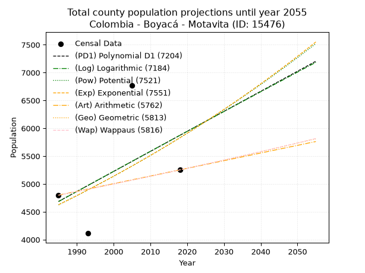
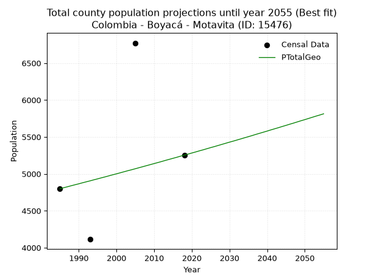
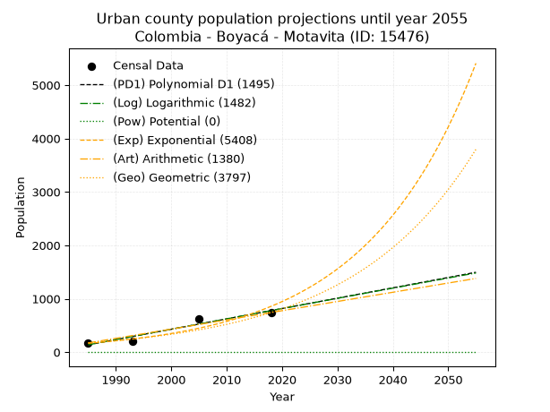
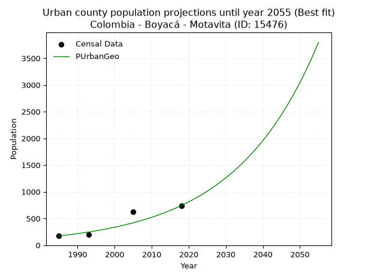
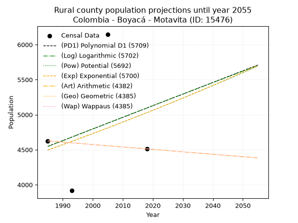
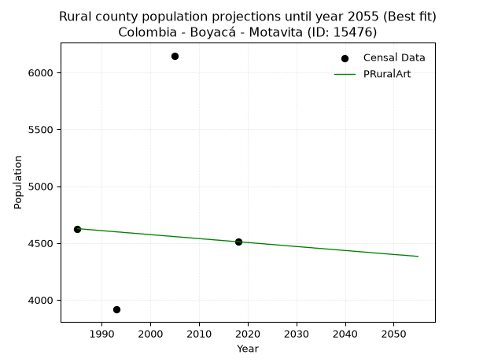

<div align="center">


</div>

# 📜 _“Population and Public Services Demand Projections (PPSD) until Year 2050 for Colombia - Boyacá - Motavita (ID: 15476)”_
Keywords: `population` `public-service` `projection` `lineal` `polynomial` `logarithmic` `potential` `exponential` `arithmetic` `geometric` `wappaus` `dane` `colombia` `south-america`

PPSD are analytical estimates used by governments and planners to anticipate future changes in population size, age distribution, and the resulting community needs for utilities, healthcare, education, and infrastructure as sizing future water treatment facilities, electrical grids, and road networks based on spatial growth.

<div align="center">

</img>

</div>


> **General running parameters**: • app_version: _v20260806_. • Python version: _3.14.7_. • Pandas version: _3.0.5_. • NumPy version: _2.5.1_. • Creates, save and include plots into reports (create_plot): _False_. • Projection until year: _2050_. • Process polynomial degree 2 and up: _False_. • Process Wappaus: _True_. • Process Wappaus: _True_. • Set negative values to zero: _True_. • Set infinite values to zero: _True_. • Drop dataset notes: _True_. 
<div align="center">

Maps & GIS Layers: [:earth_americas:Google](http://maps.google.com/maps?q=5.577699599,-73.367841) [:earth_americas:OSM](https://www.openstreetmap.org/#map=18/5.577699599/-73.367841&layers=P) [:earth_americas:Bing](https://www.bing.com/maps?cp=5.577699599~-73.367841&lvl=18) [:earth_americas:Apple](https://maps.apple.com/frame?center=5.577699599%2C-73.367841&span=0.003%2C0.006) [:earth_americas:GISMobile](https://github.com/rcfdtools/R.GISMobile/blob/main/file/gis/CountyLayer_CO/Readme.md)

</div>


<div align="center">

```geojson
{
  "type": "Feature",
  "geometry": {
    "type": "Point", 
    "coordinates": [-73.367841, 5.577699599]
  }, 
  "properties": {
    "Name": "Colombia - Boyacá - Motavita (ID: 15476)"
  }
}
```

</div>


## 0. Census Data (4 records)

Census data are official statistics collected by a government about the people and housing in a country. They usually include counts of total population, age, sex, race, income, education, and jobs.

📅Global census file: [Population.xlsx](../data/Population.xlsx)

| Source   |   Year |   CountryID | CountryName   |   StateID | StateName   |   CountyID | CountyName   |   PTotal |   PUrban |   PRural |
|:---------|-------:|------------:|:--------------|----------:|:------------|-----------:|:-------------|---------:|---------:|---------:|
| DANE     |   1985 |          57 | Colombia      |        15 | Boyacá      |      15476 | Motavita     |     4799 |      173 |     4626 |
| DANE     |   1993 |          57 | Colombia      |        15 | Boyacá      |      15476 | Motavita     |     4113 |      197 |     3916 |
| DANE     |   2005 |          57 | Colombia      |        15 | Boyacá      |      15476 | Motavita     |     6772 |      624 |     6148 |
| DANE     |   2018 |          57 | Colombia      |        15 | Boyacá      |      15476 | Motavita     |     5253 |      742 |     4511 |

> 🔥Some records could had specific notes about the registered values or the corresponding urban or rural distribution.

📅[SUI-RUPS](https://www.datos.gov.co/Hacienda-y-Cr-dito-P-blico/Registro-nico-de-Prestadores-de-Servicios-P-blicos/4qkq-csdn/about_data) - Local public utility companies: [RUPS.csv](../data/RUPS.csv)

 | SERVICIO       | ESTADO      | NOMBRE                                                                                                  | NIT         | DEPARTAMENTO_DOMICILIO   | MUNICIPIO_DOMICILIO   | DIRECCION                          |   TELEFONO | EMAIL                              | TIPO_PRESTADOR                 | CLASIFICACION                 |
|:---------------|:------------|:--------------------------------------------------------------------------------------------------------|:------------|:-------------------------|:----------------------|:-----------------------------------|-----------:|:-----------------------------------|:-------------------------------|:------------------------------|
| ACUEDUCTO      | OPERATIVA   | UNIDAD DE SERVICIOS PUBLICOS DE MOTAVITA                                                                | 891801994-6 | BOYACA                   | MOTAVITA              | Carrera 2 N 2 -56                  |    7404283 | contactenos@motavita-boyaca.gov.co | MUNICIPIO (PRESTACIÓN DIRECTA) | MENOR O IGUAL A 2500 USUARIOS |
| ALCANTARILLADO | OPERATIVA   | UNIDAD DE SERVICIOS PUBLICOS DE MOTAVITA                                                                | 891801994-6 | BOYACA                   | MOTAVITA              | Carrera 2 N 2 -56                  |    7404283 | contactenos@motavita-boyaca.gov.co | MUNICIPIO (PRESTACIÓN DIRECTA) | MENOR O IGUAL A 2500 USUARIOS |
| ACUEDUCTO      | CANCELACION | ASOCIACION DE SUSCRIPTORES DEL ACUEDUCTO DE LA VEREDA DEL SALVIAL Y EL CENTRO DEL MUNICIPIO DE MOTAVITA | 900067997-0 | BOYACA                   | MOTAVITA              | CARRERA 3 2-05                     |    7433023 | edissonlop.sigospu@gmail.com       | nan                            | nan                           |
| ACUEDUCTO      | OPERATIVA   | ACUEDUCTO DE LA VEREDA SOTE PANELAS DEL MUNICIPIO DE MOTAVITA                                           | 900014629-8 | BOYACA                   | MOTAVITA              | VEREDA SOTE PANELAS                |    7426289 | contactenos@motavita-boyaca.gov.co | ORGANIZACION AUTORIZADA        | HASTA 2500 SUSCRIPTORES       |
| ACUEDUCTO      | OPERATIVA   | ASOCIACION DE SUSCRIPTORES DEL ACUEDUCTO DE LA VEREDA CARBONERA DEL MUNICIPIO DE MOTAVITA               | 820003783-7 | BOYACA                   | MOTAVITA              | calle 3 No 1 -14 motavita centro   |    7459614 | edissonlop.sigospu@gmail.com       | ORGANIZACION AUTORIZADA        | MENOR O IGUAL A 2500 USUARIOS |
| ACUEDUCTO      | OPERATIVA   | ASOCIACION DE SUSCRIPTORES ACUEDUCTO VEREDA RISTA MUNICIPIO DE MOTAVITA                                 | 900076666-6 | BOYACA                   | MOTAVITA              | Vereda Rista Municipio de Motavita |    7447023 | contar_asesorestunja@hotmail.com   | ORGANIZACION AUTORIZADA        | MENOR O IGUAL A 2500 USUARIOS |
| ACUEDUCTO      | OPERATIVA   | EMPRESA SOLIDARIA DE SERVICIOS PUBLICOS DEL MUNICIPIO DE MOTAVITA                                       | 900284763-4 | BOYACA                   | MOTAVITA              | carrera 2 2 48                     |    7404283 | marycruzmunozrangel@gmail.com      | ORGANIZACION AUTORIZADA        | MENOR O IGUAL A 2500 USUARIOS |
| ALCANTARILLADO | OPERATIVA   | EMPRESA SOLIDARIA DE SERVICIOS PUBLICOS DEL MUNICIPIO DE MOTAVITA                                       | 900284763-4 | BOYACA                   | MOTAVITA              | carrera 2 2 48                     |    7404283 | marycruzmunozrangel@gmail.com      | ORGANIZACION AUTORIZADA        | MENOR O IGUAL A 2500 USUARIOS |

## 1. Total

### 1.1. Coefficients and Parameters

* (PD1) Polynomial Deg 1: 35.975511842634226, -66725.76756322912 (lineal)
* (Log) Logarithmic: 72155.80099767707, -543222.571603644
* (Pow) Potential: 14.031708581270665, -42.60812569934146
* (Exp) Exponential: 0.006999035237857818, 0.004281182849131298
* (Art) Arithmetic: Year diff. 2018 - 1985 = 33, Population diff. 5253 - 4799 = 454, Annual growth = 13.757575757575758
* (Geo) Geometric: Year diff. 2018 - 1985 = 33, Population diff. 5253 - 4799 = 454, Annual growth % = 0.002742899705866053
* (Wap) Wappaus: i = 0.27372812888133224, Condition values only valid for < 200)

<sub>
Wappaus condition values: ['0.00', '0.27', '0.55', '0.82', '1.09', '1.37', '1.64', '1.92', '2.19', '2.46', '2.74', '3.01', '3.28', '3.56', '3.83', '4.11', '4.38', '4.65', '4.93', '5.20', '5.47', '5.75', '6.02', '6.30', '6.57', '6.84', '7.12', '7.39', '7.66', '7.94', '8.21', '8.49', '8.76', '9.03', '9.31', '9.58', '9.85', '10.13', '10.40', '10.68', '10.95', '11.22', '11.50', '11.77', '12.04', '12.32', '12.59', '12.87', '13.14', '13.41', '13.69', '13.96', '14.23', '14.51', '14.78', '15.06', '15.33', '15.60', '15.88', '16.15', '16.42', '16.70', '16.97', '17.24', '17.52', '17.79']
</sub>


### 1.2. Projected Dataset

|   Year |   CountyID |   PTotalPD1 |   PTotalLog |   PTotalPow |   PTotalExp |   PTotalArt |   PTotalGeo |   PTotalWap |
|-------:|-----------:|------------:|------------:|------------:|------------:|------------:|------------:|------------:|
|   1985 |      15476 |        4686 |        4683 |        4625 |        4627 |        4799 |        4799 |        4799 |
|   1986 |      15476 |        4722 |        4720 |        4658 |        4659 |        4813 |        4812 |        4812 |
|   1987 |      15476 |        4758 |        4756 |        4691 |        4692 |        4827 |        4825 |        4825 |
|   1988 |      15476 |        4794 |        4792 |        4724 |        4725 |        4840 |        4839 |        4839 |
|   1989 |      15476 |        4830 |        4829 |        4757 |        4758 |        4854 |        4852 |        4852 |
|   1990 |      15476 |        4866 |        4865 |        4791 |        4791 |        4868 |        4865 |        4865 |
|   1991 |      15476 |        4901 |        4901 |        4825 |        4825 |        4882 |        4879 |        4878 |
|   1992 |      15476 |        4937 |        4937 |        4859 |        4859 |        4895 |        4892 |        4892 |
|   1993 |      15476 |        4973 |        4974 |        4893 |        4893 |        4909 |        4905 |        4905 |
|   1994 |      15476 |        5009 |        5010 |        4928 |        4927 |        4923 |        4919 |        4919 |
|   1995 |      15476 |        5045 |        5046 |        4963 |        4962 |        4937 |        4932 |        4932 |
|   1996 |      15476 |        5081 |        5082 |        4998 |        4997 |        4950 |        4946 |        4946 |
|   1997 |      15476 |        5117 |        5118 |        5033 |        5032 |        4964 |        4959 |        4959 |
|   1998 |      15476 |        5153 |        5154 |        5068 |        5067 |        4978 |        4973 |        4973 |
|   1999 |      15476 |        5189 |        5191 |        5104 |        5103 |        4992 |        4987 |        4986 |
|   2000 |      15476 |        5225 |        5227 |        5140 |        5139 |        5005 |        5000 |        5000 |
|   2001 |      15476 |        5261 |        5263 |        5176 |        5175 |        5019 |        5014 |        5014 |
|   2002 |      15476 |        5297 |        5299 |        5213 |        5211 |        5033 |        5028 |        5028 |
|   2003 |      15476 |        5333 |        5335 |        5249 |        5248 |        5047 |        5042 |        5041 |
|   2004 |      15476 |        5369 |        5371 |        5286 |        5285 |        5060 |        5055 |        5055 |
|   2005 |      15476 |        5405 |        5407 |        5323 |        5322 |        5074 |        5069 |        5069 |
|   2006 |      15476 |        5441 |        5443 |        5361 |        5359 |        5088 |        5083 |        5083 |
|   2007 |      15476 |        5477 |        5479 |        5398 |        5397 |        5102 |        5097 |        5097 |
|   2008 |      15476 |        5513 |        5515 |        5436 |        5435 |        5115 |        5111 |        5111 |
|   2009 |      15476 |        5549 |        5551 |        5474 |        5473 |        5129 |        5125 |        5125 |
|   2010 |      15476 |        5585 |        5587 |        5513 |        5511 |        5143 |        5139 |        5139 |
|   2011 |      15476 |        5621 |        5622 |        5551 |        5550 |        5157 |        5153 |        5153 |
|   2012 |      15476 |        5657 |        5658 |        5590 |        5589 |        5170 |        5167 |        5167 |
|   2013 |      15476 |        5693 |        5694 |        5629 |        5628 |        5184 |        5182 |        5181 |
|   2014 |      15476 |        5729 |        5730 |        5669 |        5668 |        5198 |        5196 |        5196 |
|   2015 |      15476 |        5765 |        5766 |        5708 |        5707 |        5212 |        5210 |        5210 |
|   2016 |      15476 |        5801 |        5802 |        5748 |        5748 |        5225 |        5224 |        5224 |
|   2017 |      15476 |        5837 |        5837 |        5788 |        5788 |        5239 |        5239 |        5239 |
|   2018 |      15476 |        5873 |        5873 |        5829 |        5829 |        5253 |        5253 |        5253 |
|   2019 |      15476 |        5909 |        5909 |        5869 |        5870 |        5267 |        5267 |        5267 |
|   2020 |      15476 |        5945 |        5945 |        5910 |        5911 |        5281 |        5282 |        5282 |
|   2021 |      15476 |        5981 |        5980 |        5951 |        5952 |        5294 |        5296 |        5296 |
|   2022 |      15476 |        6017 |        6016 |        5993 |        5994 |        5308 |        5311 |        5311 |
|   2023 |      15476 |        6053 |        6052 |        6035 |        6036 |        5322 |        5325 |        5326 |
|   2024 |      15476 |        6089 |        6087 |        6077 |        6079 |        5336 |        5340 |        5340 |
|   2025 |      15476 |        6125 |        6123 |        6119 |        6121 |        5349 |        5355 |        5355 |
|   2026 |      15476 |        6161 |        6159 |        6161 |        6164 |        5363 |        5369 |        5370 |
|   2027 |      15476 |        6197 |        6194 |        6204 |        6208 |        5377 |        5384 |        5384 |
|   2028 |      15476 |        6233 |        6230 |        6247 |        6251 |        5391 |        5399 |        5399 |
|   2029 |      15476 |        6269 |        6265 |        6291 |        6295 |        5404 |        5414 |        5414 |
|   2030 |      15476 |        6305 |        6301 |        6334 |        6339 |        5418 |        5429 |        5429 |
|   2031 |      15476 |        6340 |        6336 |        6378 |        6384 |        5432 |        5443 |        5444 |
|   2032 |      15476 |        6376 |        6372 |        6422 |        6429 |        5446 |        5458 |        5459 |
|   2033 |      15476 |        6412 |        6407 |        6467 |        6474 |        5459 |        5473 |        5474 |
|   2034 |      15476 |        6448 |        6443 |        6512 |        6519 |        5473 |        5488 |        5489 |
|   2035 |      15476 |        6484 |        6478 |        6557 |        6565 |        5487 |        5503 |        5504 |
|   2036 |      15476 |        6520 |        6514 |        6602 |        6611 |        5501 |        5518 |        5519 |
|   2037 |      15476 |        6556 |        6549 |        6648 |        6658 |        5514 |        5534 |        5534 |
|   2038 |      15476 |        6592 |        6585 |        6694 |        6704 |        5528 |        5549 |        5550 |
|   2039 |      15476 |        6628 |        6620 |        6740 |        6751 |        5542 |        5564 |        5565 |
|   2040 |      15476 |        6664 |        6656 |        6786 |        6799 |        5556 |        5579 |        5580 |
|   2041 |      15476 |        6700 |        6691 |        6833 |        6847 |        5569 |        5595 |        5596 |
|   2042 |      15476 |        6736 |        6726 |        6880 |        6895 |        5583 |        5610 |        5611 |
|   2043 |      15476 |        6772 |        6762 |        6928 |        6943 |        5597 |        5625 |        5627 |
|   2044 |      15476 |        6808 |        6797 |        6976 |        6992 |        5611 |        5641 |        5642 |
|   2045 |      15476 |        6844 |        6832 |        7024 |        7041 |        5624 |        5656 |        5658 |
|   2046 |      15476 |        6880 |        6867 |        7072 |        7090 |        5638 |        5672 |        5673 |
|   2047 |      15476 |        6916 |        6903 |        7121 |        7140 |        5652 |        5687 |        5689 |
|   2048 |      15476 |        6952 |        6938 |        7170 |        7190 |        5666 |        5703 |        5705 |
|   2049 |      15476 |        6988 |        6973 |        7219 |        7241 |        5679 |        5719 |        5720 |
|   2050 |      15476 |        7024 |        7008 |        7268 |        7292 |        5693 |        5734 |        5736 |
<div align="center">

</img>

</div>


### 1.3. Best fit with absolute and relative error (%)

Relative error puts that difference into context by dividing the absolute error by the true value, creating a unitless ratio or percentage that shows the scale of the mistake.

Absolute and relative error

|   Year | Source   |   CountryID | CountryName   |   StateID | StateName   |   CountyID_x | CountyName   |   PTotal |   PUrban |   PRural |   CountyID_y |   PTotalPD1 |   PTotalLog |   PTotalPow |   PTotalExp |   PTotalArt |   PTotalGeo |   PTotalWap |   PTotalPD1AbsError |   PTotalLogAbsError |   PTotalPowAbsError |   PTotalExpAbsError |   PTotalArtAbsError |   PTotalGeoAbsError |   PTotalWapAbsError |   PTotalPD1RelError |   PTotalLogRelError |   PTotalPowRelError |   PTotalExpRelError |   PTotalArtRelError |   PTotalGeoRelError |   PTotalWapRelError |
|-------:|:---------|------------:|:--------------|----------:|:------------|-------------:|:-------------|---------:|---------:|---------:|-------------:|------------:|------------:|------------:|------------:|------------:|------------:|------------:|--------------------:|--------------------:|--------------------:|--------------------:|--------------------:|--------------------:|--------------------:|--------------------:|--------------------:|--------------------:|--------------------:|--------------------:|--------------------:|--------------------:|
|   1985 | DANE     |          57 | Colombia      |        15 | Boyacá      |        15476 | Motavita     |     4799 |      173 |     4626 |        15476 |        4686 |        4683 |        4625 |        4627 |        4799 |        4799 |        4799 |                 113 |                 116 |                 174 |                 172 |                   0 |                   0 |                   0 |             2.35466 |             2.41717 |             3.62576 |             3.58408 |              0      |              0      |              0      |
|   1993 | DANE     |          57 | Colombia      |        15 | Boyacá      |        15476 | Motavita     |     4113 |      197 |     3916 |        15476 |        4973 |        4974 |        4893 |        4893 |        4909 |        4905 |        4905 |                 860 |                 861 |                 780 |                 780 |                 796 |                 792 |                 792 |            20.9093  |            20.9336  |            18.9643  |            18.9643  |             19.3533 |             19.256  |             19.256  |
|   2005 | DANE     |          57 | Colombia      |        15 | Boyacá      |        15476 | Motavita     |     6772 |      624 |     6148 |        15476 |        5405 |        5407 |        5323 |        5322 |        5074 |        5069 |        5069 |                1367 |                1365 |                1449 |                1450 |                1698 |                1703 |                1703 |            20.1861  |            20.1565  |            21.3969  |            21.4117  |             25.0738 |             25.1477 |             25.1477 |
|   2018 | DANE     |          57 | Colombia      |        15 | Boyacá      |        15476 | Motavita     |     5253 |      742 |     4511 |        15476 |        5873 |        5873 |        5829 |        5829 |        5253 |        5253 |        5253 |                 620 |                 620 |                 576 |                 576 |                   0 |                   0 |                   0 |            11.8028  |            11.8028  |            10.9652  |            10.9652  |              0      |              0      |              0      |

Relative error mean

| Method    |   RelError | Best   |
|:----------|-----------:|:-------|
| PTotalPD1 |    13.8132 |        |
| PTotalLog |    13.8275 |        |
| PTotalPow |    13.738  |        |
| PTotalExp |    13.7313 |        |
| PTotalArt |    11.1068 |        |
| PTotalGeo |    11.1009 | True   |
| PTotalWap |    11.1009 | True   |

💙Best method: _**PTotalGeo**_
<div align="center">

</img>

</div>


### 1.4. Fresh water supply demand in liters per capita per day (lpcd)

The fresh water supply demand typically ranges from 100 to 300 liters per capita per day (lpcd) for standard domestic and municipal planning, though absolute survival minimums set by the World Health Organization are as low as 7.5 to 20 liters per day, and total consumption in high-income nations can exceed 400 liters.

> `CZ`: Level in meters above the sea level (masl)<br> `WS`: Fresh water supply demand in liters per capita per day (lpcd or l/h/d)<br> `WSAll`: Zonal fresh water supply demand in liters per second (l/s)<br> `A`: Zonal area in square meters<br> `DP`: Population density (people/hectare or p/ha)

Reference values (RAS Colombia)

|    CZ |   WS |
|------:|-----:|
|  1000 |  120 |
|  2000 |  130 |
| 99999 |  140 |

County shapefile geometry properties and water supply values

|   CountyID |      ATotal |   CZTotal |   WSTotal |
|-----------:|------------:|----------:|----------:|
|      15476 | 5.99473e+07 |   3050.99 |       140 |

Projected values for best method: PTotalGeo

|   CountyID |   Year |   PTotalGeo |   DPTotal |   WSTotal |   WSTotalAll |
|-----------:|-------:|------------:|----------:|----------:|-------------:|
|      15476 |   1985 |        4799 |      0.8  |       140 |      7.77616 |
|      15476 |   1986 |        4812 |      0.8  |       140 |      7.79722 |
|      15476 |   1987 |        4825 |      0.8  |       140 |      7.81829 |
|      15476 |   1988 |        4839 |      0.81 |       140 |      7.84097 |
|      15476 |   1989 |        4852 |      0.81 |       140 |      7.86204 |
|      15476 |   1990 |        4865 |      0.81 |       140 |      7.8831  |
|      15476 |   1991 |        4879 |      0.81 |       140 |      7.90579 |
|      15476 |   1992 |        4892 |      0.82 |       140 |      7.92685 |
|      15476 |   1993 |        4905 |      0.82 |       140 |      7.94792 |
|      15476 |   1994 |        4919 |      0.82 |       140 |      7.9706  |
|      15476 |   1995 |        4932 |      0.82 |       140 |      7.99167 |
|      15476 |   1996 |        4946 |      0.83 |       140 |      8.01435 |
|      15476 |   1997 |        4959 |      0.83 |       140 |      8.03542 |
|      15476 |   1998 |        4973 |      0.83 |       140 |      8.0581  |
|      15476 |   1999 |        4987 |      0.83 |       140 |      8.08079 |
|      15476 |   2000 |        5000 |      0.83 |       140 |      8.10185 |
|      15476 |   2001 |        5014 |      0.84 |       140 |      8.12454 |
|      15476 |   2002 |        5028 |      0.84 |       140 |      8.14722 |
|      15476 |   2003 |        5042 |      0.84 |       140 |      8.16991 |
|      15476 |   2004 |        5055 |      0.84 |       140 |      8.19097 |
|      15476 |   2005 |        5069 |      0.85 |       140 |      8.21366 |
|      15476 |   2006 |        5083 |      0.85 |       140 |      8.23634 |
|      15476 |   2007 |        5097 |      0.85 |       140 |      8.25903 |
|      15476 |   2008 |        5111 |      0.85 |       140 |      8.28171 |
|      15476 |   2009 |        5125 |      0.85 |       140 |      8.3044  |
|      15476 |   2010 |        5139 |      0.86 |       140 |      8.32708 |
|      15476 |   2011 |        5153 |      0.86 |       140 |      8.34977 |
|      15476 |   2012 |        5167 |      0.86 |       140 |      8.37245 |
|      15476 |   2013 |        5182 |      0.86 |       140 |      8.39676 |
|      15476 |   2014 |        5196 |      0.87 |       140 |      8.41944 |
|      15476 |   2015 |        5210 |      0.87 |       140 |      8.44213 |
|      15476 |   2016 |        5224 |      0.87 |       140 |      8.46481 |
|      15476 |   2017 |        5239 |      0.87 |       140 |      8.48912 |
|      15476 |   2018 |        5253 |      0.88 |       140 |      8.51181 |
|      15476 |   2019 |        5267 |      0.88 |       140 |      8.53449 |
|      15476 |   2020 |        5282 |      0.88 |       140 |      8.5588  |
|      15476 |   2021 |        5296 |      0.88 |       140 |      8.58148 |
|      15476 |   2022 |        5311 |      0.89 |       140 |      8.60579 |
|      15476 |   2023 |        5325 |      0.89 |       140 |      8.62847 |
|      15476 |   2024 |        5340 |      0.89 |       140 |      8.65278 |
|      15476 |   2025 |        5355 |      0.89 |       140 |      8.67708 |
|      15476 |   2026 |        5369 |      0.9  |       140 |      8.69977 |
|      15476 |   2027 |        5384 |      0.9  |       140 |      8.72407 |
|      15476 |   2028 |        5399 |      0.9  |       140 |      8.74838 |
|      15476 |   2029 |        5414 |      0.9  |       140 |      8.77269 |
|      15476 |   2030 |        5429 |      0.91 |       140 |      8.79699 |
|      15476 |   2031 |        5443 |      0.91 |       140 |      8.81968 |
|      15476 |   2032 |        5458 |      0.91 |       140 |      8.84398 |
|      15476 |   2033 |        5473 |      0.91 |       140 |      8.86829 |
|      15476 |   2034 |        5488 |      0.92 |       140 |      8.89259 |
|      15476 |   2035 |        5503 |      0.92 |       140 |      8.9169  |
|      15476 |   2036 |        5518 |      0.92 |       140 |      8.9412  |
|      15476 |   2037 |        5534 |      0.92 |       140 |      8.96713 |
|      15476 |   2038 |        5549 |      0.93 |       140 |      8.99144 |
|      15476 |   2039 |        5564 |      0.93 |       140 |      9.01574 |
|      15476 |   2040 |        5579 |      0.93 |       140 |      9.04005 |
|      15476 |   2041 |        5595 |      0.93 |       140 |      9.06597 |
|      15476 |   2042 |        5610 |      0.94 |       140 |      9.09028 |
|      15476 |   2043 |        5625 |      0.94 |       140 |      9.11458 |
|      15476 |   2044 |        5641 |      0.94 |       140 |      9.14051 |
|      15476 |   2045 |        5656 |      0.94 |       140 |      9.16481 |
|      15476 |   2046 |        5672 |      0.95 |       140 |      9.19074 |
|      15476 |   2047 |        5687 |      0.95 |       140 |      9.21505 |
|      15476 |   2048 |        5703 |      0.95 |       140 |      9.24097 |
|      15476 |   2049 |        5719 |      0.95 |       140 |      9.2669  |
|      15476 |   2050 |        5734 |      0.96 |       140 |      9.2912  |

## 2. Urban

### 2.1. Coefficients and Parameters

* (PD1) Polynomial Deg 1: 19.378562826174125, -38327.9702930548 (lineal)
* (Log) Logarithmic: 38793.418208544084, -294435.0826740871
* (Pow) Potential: 99.66080007092197, -326.4383338205076
* (Exp) Exponential: 0.04977396943642573, 2.0464471278986644e-41
* (Art) Arithmetic: Year diff. 2018 - 1985 = 33, Population diff. 742 - 173 = 569, Annual growth = 17.242424242424242
* (Geo) Geometric: Year diff. 2018 - 1985 = 33, Population diff. 742 - 173 = 569, Annual growth % = 0.04511085282651872
* (Wap) Wappaus: i = 3.768835899983441, Condition values only valid for < 200)

<sub>
Wappaus condition values: ['0.00', '3.77', '7.54', '11.31', '15.08', '18.84', '22.61', '26.38', '30.15', '33.92', '37.69', '41.46', '45.23', '48.99', '52.76', '56.53', '60.30', '64.07', '67.84', '71.61', '75.38', '79.15', '82.91', '86.68', '90.45', '94.22', '97.99', '101.76', '105.53', '109.30', '113.07', '116.83', '120.60', '124.37', '128.14', '131.91', '135.68', '139.45', '143.22', '146.98', '150.75', '154.52', '158.29', '162.06', '165.83', '169.60', '173.37', '177.14', '180.90', '184.67', '188.44', '192.21', '195.98', '199.75', '203.52', '207.29', '211.05', '214.82', '218.59', '222.36', '226.13', '229.90', '233.67', '237.44', '241.21', '244.97']
</sub>


### 2.2. Projected Dataset

|   Year |   CountyID |   PUrbanPD1 |   PUrbanLog |   PUrbanPow |   PUrbanExp |   PUrbanArt |   PUrbanGeo |
|-------:|-----------:|------------:|------------:|------------:|------------:|------------:|------------:|
|   1985 |      15476 |         138 |         138 |           0 |         166 |         173 |         173 |
|   1986 |      15476 |         158 |         157 |           0 |         174 |         190 |         181 |
|   1987 |      15476 |         177 |         177 |           0 |         183 |         207 |         189 |
|   1988 |      15476 |         197 |         196 |           0 |         193 |         225 |         197 |
|   1989 |      15476 |         216 |         216 |           0 |         202 |         242 |         206 |
|   1990 |      15476 |         235 |         235 |           0 |         213 |         259 |         216 |
|   1991 |      15476 |         255 |         255 |           0 |         224 |         276 |         225 |
|   1992 |      15476 |         274 |         274 |           0 |         235 |         294 |         236 |
|   1993 |      15476 |         294 |         294 |           0 |         247 |         311 |         246 |
|   1994 |      15476 |         313 |         313 |           0 |         260 |         328 |         257 |
|   1995 |      15476 |         332 |         333 |           0 |         273 |         345 |         269 |
|   1996 |      15476 |         352 |         352 |           0 |         287 |         363 |         281 |
|   1997 |      15476 |         371 |         372 |           0 |         301 |         380 |         294 |
|   1998 |      15476 |         390 |         391 |           0 |         317 |         397 |         307 |
|   1999 |      15476 |         410 |         411 |           0 |         333 |         414 |         321 |
|   2000 |      15476 |         429 |         430 |           0 |         350 |         432 |         335 |
|   2001 |      15476 |         449 |         449 |           0 |         368 |         449 |         350 |
|   2002 |      15476 |         468 |         469 |           0 |         387 |         466 |         366 |
|   2003 |      15476 |         487 |         488 |           0 |         406 |         483 |         383 |
|   2004 |      15476 |         507 |         507 |           0 |         427 |         501 |         400 |
|   2005 |      15476 |         526 |         527 |           0 |         449 |         518 |         418 |
|   2006 |      15476 |         545 |         546 |           0 |         472 |         535 |         437 |
|   2007 |      15476 |         565 |         565 |           0 |         496 |         552 |         457 |
|   2008 |      15476 |         584 |         585 |           0 |         521 |         570 |         477 |
|   2009 |      15476 |         604 |         604 |           0 |         548 |         587 |         499 |
|   2010 |      15476 |         623 |         623 |           0 |         576 |         604 |         521 |
|   2011 |      15476 |         642 |         643 |           0 |         605 |         621 |         545 |
|   2012 |      15476 |         662 |         662 |           0 |         636 |         639 |         569 |
|   2013 |      15476 |         681 |         681 |           0 |         669 |         656 |         595 |
|   2014 |      15476 |         700 |         701 |           0 |         703 |         673 |         622 |
|   2015 |      15476 |         720 |         720 |           0 |         739 |         690 |         650 |
|   2016 |      15476 |         739 |         739 |           0 |         776 |         708 |         679 |
|   2017 |      15476 |         759 |         758 |           0 |         816 |         725 |         710 |
|   2018 |      15476 |         778 |         777 |           0 |         857 |         742 |         742 |
|   2019 |      15476 |         797 |         797 |           0 |         901 |         759 |         775 |
|   2020 |      15476 |         817 |         816 |           0 |         947 |         776 |         810 |
|   2021 |      15476 |         836 |         835 |           0 |         996 |         794 |         847 |
|   2022 |      15476 |         855 |         854 |           0 |        1046 |         811 |         885 |
|   2023 |      15476 |         875 |         873 |           0 |        1100 |         828 |         925 |
|   2024 |      15476 |         894 |         893 |           0 |        1156 |         845 |         967 |
|   2025 |      15476 |         914 |         912 |           0 |        1215 |         863 |        1011 |
|   2026 |      15476 |         933 |         931 |           0 |        1277 |         880 |        1056 |
|   2027 |      15476 |         952 |         950 |           0 |        1342 |         897 |        1104 |
|   2028 |      15476 |         972 |         969 |           0 |        1411 |         914 |        1154 |
|   2029 |      15476 |         991 |         988 |           0 |        1483 |         932 |        1206 |
|   2030 |      15476 |        1011 |        1007 |           0 |        1558 |         949 |        1260 |
|   2031 |      15476 |        1030 |        1027 |           0 |        1638 |         966 |        1317 |
|   2032 |      15476 |        1049 |        1046 |           0 |        1721 |         983 |        1376 |
|   2033 |      15476 |        1069 |        1065 |           0 |        1809 |        1001 |        1438 |
|   2034 |      15476 |        1088 |        1084 |           0 |        1901 |        1018 |        1503 |
|   2035 |      15476 |        1107 |        1103 |           0 |        1998 |        1035 |        1571 |
|   2036 |      15476 |        1127 |        1122 |           0 |        2100 |        1052 |        1642 |
|   2037 |      15476 |        1146 |        1141 |           0 |        2208 |        1070 |        1716 |
|   2038 |      15476 |        1166 |        1160 |           0 |        2320 |        1087 |        1793 |
|   2039 |      15476 |        1185 |        1179 |           0 |        2439 |        1104 |        1874 |
|   2040 |      15476 |        1204 |        1198 |           0 |        2563 |        1121 |        1959 |
|   2041 |      15476 |        1224 |        1217 |           0 |        2694 |        1139 |        2047 |
|   2042 |      15476 |        1243 |        1236 |           0 |        2832 |        1156 |        2139 |
|   2043 |      15476 |        1262 |        1255 |           0 |        2976 |        1173 |        2236 |
|   2044 |      15476 |        1282 |        1274 |           0 |        3128 |        1190 |        2337 |
|   2045 |      15476 |        1301 |        1293 |           0 |        3288 |        1208 |        2442 |
|   2046 |      15476 |        1321 |        1312 |           0 |        3455 |        1225 |        2552 |
|   2047 |      15476 |        1340 |        1331 |           0 |        3632 |        1242 |        2668 |
|   2048 |      15476 |        1359 |        1350 |           0 |        3817 |        1259 |        2788 |
|   2049 |      15476 |        1379 |        1369 |           0 |        4012 |        1277 |        2914 |
|   2050 |      15476 |        1398 |        1388 |           0 |        4216 |        1294 |        3045 |
<div align="center">

</img>

</div>


### 2.3. Best fit with absolute and relative error (%)

Relative error puts that difference into context by dividing the absolute error by the true value, creating a unitless ratio or percentage that shows the scale of the mistake.

Absolute and relative error

|   Year | Source   |   CountryID | CountryName   |   StateID | StateName   |   CountyID_x | CountyName   |   PTotal |   PUrban |   PRural |   CountyID_y |   PUrbanPD1 |   PUrbanLog |   PUrbanPow |   PUrbanExp |   PUrbanArt |   PUrbanGeo |   PUrbanPD1AbsError |   PUrbanLogAbsError |   PUrbanPowAbsError |   PUrbanExpAbsError |   PUrbanArtAbsError |   PUrbanGeoAbsError |   PUrbanPD1RelError |   PUrbanLogRelError |   PUrbanPowRelError |   PUrbanExpRelError |   PUrbanArtRelError |   PUrbanGeoRelError |
|-------:|:---------|------------:|:--------------|----------:|:------------|-------------:|:-------------|---------:|---------:|---------:|-------------:|------------:|------------:|------------:|------------:|------------:|------------:|--------------------:|--------------------:|--------------------:|--------------------:|--------------------:|--------------------:|--------------------:|--------------------:|--------------------:|--------------------:|--------------------:|--------------------:|
|   1985 | DANE     |          57 | Colombia      |        15 | Boyacá      |        15476 | Motavita     |     4799 |      173 |     4626 |        15476 |         138 |         138 |           0 |         166 |         173 |         173 |                  35 |                  35 |                 173 |                   7 |                   0 |                   0 |            20.2312  |            20.2312  |                 100 |             4.04624 |              0      |              0      |
|   1993 | DANE     |          57 | Colombia      |        15 | Boyacá      |        15476 | Motavita     |     4113 |      197 |     3916 |        15476 |         294 |         294 |           0 |         247 |         311 |         246 |                  97 |                  97 |                 197 |                  50 |                 114 |                  49 |            49.2386  |            49.2386  |                 100 |            25.3807  |             57.868  |             24.8731 |
|   2005 | DANE     |          57 | Colombia      |        15 | Boyacá      |        15476 | Motavita     |     6772 |      624 |     6148 |        15476 |         526 |         527 |           0 |         449 |         518 |         418 |                  98 |                  97 |                 624 |                 175 |                 106 |                 206 |            15.7051  |            15.5449  |                 100 |            28.0449  |             16.9872 |             33.0128 |
|   2018 | DANE     |          57 | Colombia      |        15 | Boyacá      |        15476 | Motavita     |     5253 |      742 |     4511 |        15476 |         778 |         777 |           0 |         857 |         742 |         742 |                  36 |                  35 |                 742 |                 115 |                   0 |                   0 |             4.85175 |             4.71698 |                 100 |            15.4987  |              0      |              0      |

Relative error mean

| Method    |   RelError | Best   |
|:----------|-----------:|:-------|
| PUrbanPD1 |    22.5067 |        |
| PUrbanLog |    22.4329 |        |
| PUrbanPow |   100      |        |
| PUrbanExp |    18.2426 |        |
| PUrbanArt |    18.7138 |        |
| PUrbanGeo |    14.4715 | True   |

💙Best method: _**PUrbanGeo**_
<div align="center">

</img>

</div>


### 2.4. Fresh water supply demand in liters per capita per day (lpcd)

The fresh water supply demand typically ranges from 100 to 300 liters per capita per day (lpcd) for standard domestic and municipal planning, though absolute survival minimums set by the World Health Organization are as low as 7.5 to 20 liters per day, and total consumption in high-income nations can exceed 400 liters.

> `CZ`: Level in meters above the sea level (masl)<br> `WS`: Fresh water supply demand in liters per capita per day (lpcd or l/h/d)<br> `WSAll`: Zonal fresh water supply demand in liters per second (l/s)<br> `A`: Zonal area in square meters<br> `DP`: Population density (people/hectare or p/ha)

Reference values (RAS Colombia)

|    CZ |   WS |
|------:|-----:|
|  1000 |  120 |
|  2000 |  130 |
| 99999 |  140 |

County shapefile geometry properties and water supply values

|   CountyID |   AUrban |   CZUrban |   WSUrban |
|-----------:|---------:|----------:|----------:|
|      15476 |   233042 |   2900.91 |       140 |

Projected values for best method: PUrbanGeo

|   CountyID |   Year |   PUrbanGeo |   DPUrban |   WSUrban |   WSUrbanAll |
|-----------:|-------:|------------:|----------:|----------:|-------------:|
|      15476 |   1985 |         173 |      7.42 |       140 |     0.280324 |
|      15476 |   1986 |         181 |      7.77 |       140 |     0.293287 |
|      15476 |   1987 |         189 |      8.11 |       140 |     0.30625  |
|      15476 |   1988 |         197 |      8.45 |       140 |     0.319213 |
|      15476 |   1989 |         206 |      8.84 |       140 |     0.333796 |
|      15476 |   1990 |         216 |      9.27 |       140 |     0.35     |
|      15476 |   1991 |         225 |      9.65 |       140 |     0.364583 |
|      15476 |   1992 |         236 |     10.13 |       140 |     0.382407 |
|      15476 |   1993 |         246 |     10.56 |       140 |     0.398611 |
|      15476 |   1994 |         257 |     11.03 |       140 |     0.416435 |
|      15476 |   1995 |         269 |     11.54 |       140 |     0.43588  |
|      15476 |   1996 |         281 |     12.06 |       140 |     0.455324 |
|      15476 |   1997 |         294 |     12.62 |       140 |     0.476389 |
|      15476 |   1998 |         307 |     13.17 |       140 |     0.497454 |
|      15476 |   1999 |         321 |     13.77 |       140 |     0.520139 |
|      15476 |   2000 |         335 |     14.38 |       140 |     0.542824 |
|      15476 |   2001 |         350 |     15.02 |       140 |     0.56713  |
|      15476 |   2002 |         366 |     15.71 |       140 |     0.593056 |
|      15476 |   2003 |         383 |     16.43 |       140 |     0.620602 |
|      15476 |   2004 |         400 |     17.16 |       140 |     0.648148 |
|      15476 |   2005 |         418 |     17.94 |       140 |     0.677315 |
|      15476 |   2006 |         437 |     18.75 |       140 |     0.708102 |
|      15476 |   2007 |         457 |     19.61 |       140 |     0.740509 |
|      15476 |   2008 |         477 |     20.47 |       140 |     0.772917 |
|      15476 |   2009 |         499 |     21.41 |       140 |     0.808565 |
|      15476 |   2010 |         521 |     22.36 |       140 |     0.844213 |
|      15476 |   2011 |         545 |     23.39 |       140 |     0.883102 |
|      15476 |   2012 |         569 |     24.42 |       140 |     0.921991 |
|      15476 |   2013 |         595 |     25.53 |       140 |     0.96412  |
|      15476 |   2014 |         622 |     26.69 |       140 |     1.00787  |
|      15476 |   2015 |         650 |     27.89 |       140 |     1.05324  |
|      15476 |   2016 |         679 |     29.14 |       140 |     1.10023  |
|      15476 |   2017 |         710 |     30.47 |       140 |     1.15046  |
|      15476 |   2018 |         742 |     31.84 |       140 |     1.20231  |
|      15476 |   2019 |         775 |     33.26 |       140 |     1.25579  |
|      15476 |   2020 |         810 |     34.76 |       140 |     1.3125   |
|      15476 |   2021 |         847 |     36.35 |       140 |     1.37245  |
|      15476 |   2022 |         885 |     37.98 |       140 |     1.43403  |
|      15476 |   2023 |         925 |     39.69 |       140 |     1.49884  |
|      15476 |   2024 |         967 |     41.49 |       140 |     1.5669   |
|      15476 |   2025 |        1011 |     43.38 |       140 |     1.63819  |
|      15476 |   2026 |        1056 |     45.31 |       140 |     1.71111  |
|      15476 |   2027 |        1104 |     47.37 |       140 |     1.78889  |
|      15476 |   2028 |        1154 |     49.52 |       140 |     1.86991  |
|      15476 |   2029 |        1206 |     51.75 |       140 |     1.95417  |
|      15476 |   2030 |        1260 |     54.07 |       140 |     2.04167  |
|      15476 |   2031 |        1317 |     56.51 |       140 |     2.13403  |
|      15476 |   2032 |        1376 |     59.05 |       140 |     2.22963  |
|      15476 |   2033 |        1438 |     61.71 |       140 |     2.33009  |
|      15476 |   2034 |        1503 |     64.49 |       140 |     2.43542  |
|      15476 |   2035 |        1571 |     67.41 |       140 |     2.5456   |
|      15476 |   2036 |        1642 |     70.46 |       140 |     2.66065  |
|      15476 |   2037 |        1716 |     73.63 |       140 |     2.78056  |
|      15476 |   2038 |        1793 |     76.94 |       140 |     2.90532  |
|      15476 |   2039 |        1874 |     80.41 |       140 |     3.03657  |
|      15476 |   2040 |        1959 |     84.06 |       140 |     3.17431  |
|      15476 |   2041 |        2047 |     87.84 |       140 |     3.3169   |
|      15476 |   2042 |        2139 |     91.79 |       140 |     3.46597  |
|      15476 |   2043 |        2236 |     95.95 |       140 |     3.62315  |
|      15476 |   2044 |        2337 |    100.28 |       140 |     3.78681  |
|      15476 |   2045 |        2442 |    104.79 |       140 |     3.95694  |
|      15476 |   2046 |        2552 |    109.51 |       140 |     4.13519  |
|      15476 |   2047 |        2668 |    114.49 |       140 |     4.32315  |
|      15476 |   2048 |        2788 |    119.64 |       140 |     4.51759  |
|      15476 |   2049 |        2914 |    125.04 |       140 |     4.72176  |
|      15476 |   2050 |        3045 |    130.66 |       140 |     4.93403  |

## 3. Rural

### 3.1. Coefficients and Parameters

* (PD1) Polynomial Deg 1: 16.596949016460155, -28397.797270174422 (lineal)
* (Log) Logarithmic: 33362.382789132964, -248787.48892955674
* (Pow) Potential: 6.813600478269814, -18.816948153533993
* (Exp) Exponential: 0.0033917909387281707, 5.3557872055655364
* (Art) Arithmetic: Year diff. 2018 - 1985 = 33, Population diff. 4511 - 4626 = -115, Annual growth = -3.484848484848485
* (Geo) Geometric: Year diff. 2018 - 1985 = 33, Population diff. 4511 - 4626 = -115, Annual growth % = -0.0007625486689369909
* (Wap) Wappaus: i = -0.07627992743457337, Condition values only valid for < 200)

<sub>
Wappaus condition values: ['-0.00', '-0.08', '-0.15', '-0.23', '-0.31', '-0.38', '-0.46', '-0.53', '-0.61', '-0.69', '-0.76', '-0.84', '-0.92', '-0.99', '-1.07', '-1.14', '-1.22', '-1.30', '-1.37', '-1.45', '-1.53', '-1.60', '-1.68', '-1.75', '-1.83', '-1.91', '-1.98', '-2.06', '-2.14', '-2.21', '-2.29', '-2.36', '-2.44', '-2.52', '-2.59', '-2.67', '-2.75', '-2.82', '-2.90', '-2.97', '-3.05', '-3.13', '-3.20', '-3.28', '-3.36', '-3.43', '-3.51', '-3.59', '-3.66', '-3.74', '-3.81', '-3.89', '-3.97', '-4.04', '-4.12', '-4.20', '-4.27', '-4.35', '-4.42', '-4.50', '-4.58', '-4.65', '-4.73', '-4.81', '-4.88', '-4.96']
</sub>


### 3.2. Projected Dataset

|   Year |   CountyID |   PRuralPD1 |   PRuralLog |   PRuralPow |   PRuralExp |   PRuralArt |   PRuralGeo |   PRuralWap |
|-------:|-----------:|------------:|------------:|------------:|------------:|------------:|------------:|------------:|
|   1985 |      15476 |        4547 |        4546 |        4494 |        4496 |        4626 |        4626 |        4626 |
|   1986 |      15476 |        4564 |        4562 |        4510 |        4511 |        4623 |        4622 |        4622 |
|   1987 |      15476 |        4580 |        4579 |        4525 |        4526 |        4619 |        4619 |        4619 |
|   1988 |      15476 |        4597 |        4596 |        4541 |        4542 |        4616 |        4615 |        4615 |
|   1989 |      15476 |        4614 |        4613 |        4557 |        4557 |        4612 |        4612 |        4612 |
|   1990 |      15476 |        4630 |        4629 |        4572 |        4573 |        4609 |        4608 |        4608 |
|   1991 |      15476 |        4647 |        4646 |        4588 |        4588 |        4605 |        4605 |        4605 |
|   1992 |      15476 |        4663 |        4663 |        4604 |        4604 |        4602 |        4601 |        4601 |
|   1993 |      15476 |        4680 |        4680 |        4619 |        4619 |        4598 |        4598 |        4598 |
|   1994 |      15476 |        4697 |        4696 |        4635 |        4635 |        4595 |        4594 |        4594 |
|   1995 |      15476 |        4713 |        4713 |        4651 |        4651 |        4591 |        4591 |        4591 |
|   1996 |      15476 |        4730 |        4730 |        4667 |        4667 |        4588 |        4587 |        4587 |
|   1997 |      15476 |        4746 |        4747 |        4683 |        4682 |        4584 |        4584 |        4584 |
|   1998 |      15476 |        4763 |        4763 |        4699 |        4698 |        4581 |        4580 |        4580 |
|   1999 |      15476 |        4780 |        4780 |        4715 |        4714 |        4577 |        4577 |        4577 |
|   2000 |      15476 |        4796 |        4797 |        4731 |        4730 |        4574 |        4573 |        4573 |
|   2001 |      15476 |        4813 |        4813 |        4747 |        4746 |        4570 |        4570 |        4570 |
|   2002 |      15476 |        4829 |        4830 |        4763 |        4763 |        4567 |        4566 |        4566 |
|   2003 |      15476 |        4846 |        4847 |        4780 |        4779 |        4563 |        4563 |        4563 |
|   2004 |      15476 |        4862 |        4863 |        4796 |        4795 |        4560 |        4559 |        4559 |
|   2005 |      15476 |        4879 |        4880 |        4812 |        4811 |        4556 |        4556 |        4556 |
|   2006 |      15476 |        4896 |        4897 |        4829 |        4828 |        4553 |        4552 |        4552 |
|   2007 |      15476 |        4912 |        4913 |        4845 |        4844 |        4549 |        4549 |        4549 |
|   2008 |      15476 |        4929 |        4930 |        4861 |        4860 |        4546 |        4546 |        4546 |
|   2009 |      15476 |        4945 |        4947 |        4878 |        4877 |        4542 |        4542 |        4542 |
|   2010 |      15476 |        4962 |        4963 |        4895 |        4894 |        4539 |        4539 |        4539 |
|   2011 |      15476 |        4979 |        4980 |        4911 |        4910 |        4535 |        4535 |        4535 |
|   2012 |      15476 |        4995 |        4996 |        4928 |        4927 |        4532 |        4532 |        4532 |
|   2013 |      15476 |        5012 |        5013 |        4945 |        4944 |        4528 |        4528 |        4528 |
|   2014 |      15476 |        5028 |        5029 |        4961 |        4960 |        4525 |        4525 |        4525 |
|   2015 |      15476 |        5045 |        5046 |        4978 |        4977 |        4521 |        4521 |        4521 |
|   2016 |      15476 |        5062 |        5063 |        4995 |        4994 |        4518 |        4518 |        4518 |
|   2017 |      15476 |        5078 |        5079 |        5012 |        5011 |        4514 |        4514 |        4514 |
|   2018 |      15476 |        5095 |        5096 |        5029 |        5028 |        4511 |        4511 |        4511 |
|   2019 |      15476 |        5111 |        5112 |        5046 |        5045 |        4508 |        4508 |        4508 |
|   2020 |      15476 |        5128 |        5129 |        5063 |        5062 |        4504 |        4504 |        4504 |
|   2021 |      15476 |        5145 |        5145 |        5080 |        5080 |        4501 |        4501 |        4501 |
|   2022 |      15476 |        5161 |        5162 |        5097 |        5097 |        4497 |        4497 |        4497 |
|   2023 |      15476 |        5178 |        5178 |        5114 |        5114 |        4494 |        4494 |        4494 |
|   2024 |      15476 |        5194 |        5195 |        5132 |        5132 |        4490 |        4490 |        4490 |
|   2025 |      15476 |        5211 |        5211 |        5149 |        5149 |        4487 |        4487 |        4487 |
|   2026 |      15476 |        5228 |        5228 |        5166 |        5166 |        4483 |        4484 |        4484 |
|   2027 |      15476 |        5244 |        5244 |        5184 |        5184 |        4480 |        4480 |        4480 |
|   2028 |      15476 |        5261 |        5261 |        5201 |        5202 |        4476 |        4477 |        4477 |
|   2029 |      15476 |        5277 |        5277 |        5219 |        5219 |        4473 |        4473 |        4473 |
|   2030 |      15476 |        5294 |        5293 |        5236 |        5237 |        4469 |        4470 |        4470 |
|   2031 |      15476 |        5311 |        5310 |        5254 |        5255 |        4466 |        4466 |        4466 |
|   2032 |      15476 |        5327 |        5326 |        5271 |        5273 |        4462 |        4463 |        4463 |
|   2033 |      15476 |        5344 |        5343 |        5289 |        5291 |        4459 |        4460 |        4460 |
|   2034 |      15476 |        5360 |        5359 |        5307 |        5309 |        4455 |        4456 |        4456 |
|   2035 |      15476 |        5377 |        5376 |        5325 |        5327 |        4452 |        4453 |        4453 |
|   2036 |      15476 |        5394 |        5392 |        5342 |        5345 |        4448 |        4449 |        4449 |
|   2037 |      15476 |        5410 |        5408 |        5360 |        5363 |        4445 |        4446 |        4446 |
|   2038 |      15476 |        5427 |        5425 |        5378 |        5381 |        4441 |        4443 |        4443 |
|   2039 |      15476 |        5443 |        5441 |        5396 |        5399 |        4438 |        4439 |        4439 |
|   2040 |      15476 |        5460 |        5457 |        5414 |        5418 |        4434 |        4436 |        4436 |
|   2041 |      15476 |        5477 |        5474 |        5432 |        5436 |        4431 |        4433 |        4433 |
|   2042 |      15476 |        5493 |        5490 |        5451 |        5455 |        4427 |        4429 |        4429 |
|   2043 |      15476 |        5510 |        5506 |        5469 |        5473 |        4424 |        4426 |        4426 |
|   2044 |      15476 |        5526 |        5523 |        5487 |        5492 |        4420 |        4422 |        4422 |
|   2045 |      15476 |        5543 |        5539 |        5505 |        5510 |        4417 |        4419 |        4419 |
|   2046 |      15476 |        5560 |        5555 |        5524 |        5529 |        4413 |        4416 |        4416 |
|   2047 |      15476 |        5576 |        5572 |        5542 |        5548 |        4410 |        4412 |        4412 |
|   2048 |      15476 |        5593 |        5588 |        5561 |        5567 |        4406 |        4409 |        4409 |
|   2049 |      15476 |        5609 |        5604 |        5579 |        5586 |        4403 |        4406 |        4406 |
|   2050 |      15476 |        5626 |        5621 |        5598 |        5605 |        4399 |        4402 |        4402 |
<div align="center">

</img>

</div>


### 3.3. Best fit with absolute and relative error (%)

Relative error puts that difference into context by dividing the absolute error by the true value, creating a unitless ratio or percentage that shows the scale of the mistake.

Absolute and relative error

|   Year | Source   |   CountryID | CountryName   |   StateID | StateName   |   CountyID_x | CountyName   |   PTotal |   PUrban |   PRural |   CountyID_y |   PRuralPD1 |   PRuralLog |   PRuralPow |   PRuralExp |   PRuralArt |   PRuralGeo |   PRuralWap |   PRuralPD1AbsError |   PRuralLogAbsError |   PRuralPowAbsError |   PRuralExpAbsError |   PRuralArtAbsError |   PRuralGeoAbsError |   PRuralWapAbsError |   PRuralPD1RelError |   PRuralLogRelError |   PRuralPowRelError |   PRuralExpRelError |   PRuralArtRelError |   PRuralGeoRelError |   PRuralWapRelError |
|-------:|:---------|------------:|:--------------|----------:|:------------|-------------:|:-------------|---------:|---------:|---------:|-------------:|------------:|------------:|------------:|------------:|------------:|------------:|------------:|--------------------:|--------------------:|--------------------:|--------------------:|--------------------:|--------------------:|--------------------:|--------------------:|--------------------:|--------------------:|--------------------:|--------------------:|--------------------:|--------------------:|
|   1985 | DANE     |          57 | Colombia      |        15 | Boyacá      |        15476 | Motavita     |     4799 |      173 |     4626 |        15476 |        4547 |        4546 |        4494 |        4496 |        4626 |        4626 |        4626 |                  79 |                  80 |                 132 |                 130 |                   0 |                   0 |                   0 |             1.70774 |             1.72936 |             2.85344 |              2.8102 |              0      |              0      |              0      |
|   1993 | DANE     |          57 | Colombia      |        15 | Boyacá      |        15476 | Motavita     |     4113 |      197 |     3916 |        15476 |        4680 |        4680 |        4619 |        4619 |        4598 |        4598 |        4598 |                 764 |                 764 |                 703 |                 703 |                 682 |                 682 |                 682 |            19.5097  |            19.5097  |            17.952   |             17.952  |             17.4157 |             17.4157 |             17.4157 |
|   2005 | DANE     |          57 | Colombia      |        15 | Boyacá      |        15476 | Motavita     |     6772 |      624 |     6148 |        15476 |        4879 |        4880 |        4812 |        4811 |        4556 |        4556 |        4556 |                1269 |                1268 |                1336 |                1337 |                1592 |                1592 |                1592 |            20.6409  |            20.6246  |            21.7306  |             21.7469 |             25.8946 |             25.8946 |             25.8946 |
|   2018 | DANE     |          57 | Colombia      |        15 | Boyacá      |        15476 | Motavita     |     5253 |      742 |     4511 |        15476 |        5095 |        5096 |        5029 |        5028 |        4511 |        4511 |        4511 |                 584 |                 585 |                 518 |                 517 |                   0 |                   0 |                   0 |            12.9461  |            12.9683  |            11.483   |             11.4609 |              0      |              0      |              0      |

Relative error mean

| Method    |   RelError | Best   |
|:----------|-----------:|:-------|
| PRuralPD1 |    13.7011 |        |
| PRuralLog |    13.708  |        |
| PRuralPow |    13.5048 |        |
| PRuralExp |    13.4925 |        |
| PRuralArt |    10.8276 | True   |
| PRuralGeo |    10.8276 | True   |
| PRuralWap |    10.8276 | True   |

💙Best method: _**PRuralArt**_
<div align="center">

</img>

</div>


### 3.4. Fresh water supply demand in liters per capita per day (lpcd)

The fresh water supply demand typically ranges from 100 to 300 liters per capita per day (lpcd) for standard domestic and municipal planning, though absolute survival minimums set by the World Health Organization are as low as 7.5 to 20 liters per day, and total consumption in high-income nations can exceed 400 liters.

> `CZ`: Level in meters above the sea level (masl)<br> `WS`: Fresh water supply demand in liters per capita per day (lpcd or l/h/d)<br> `WSAll`: Zonal fresh water supply demand in liters per second (l/s)<br> `A`: Zonal area in square meters<br> `DP`: Population density (people/hectare or p/ha)

Reference values (RAS Colombia)

|    CZ |   WS |
|------:|-----:|
|  1000 |  120 |
|  2000 |  130 |
| 99999 |  140 |

County shapefile geometry properties and water supply values

|   CountyID |      ARural |   CZRural |   WSRural |
|-----------:|------------:|----------:|----------:|
|      15476 | 5.97142e+07 |   3051.61 |       140 |

Projected values for best method: PRuralArt

|   CountyID |   Year |   PRuralArt |   DPRural |   WSRural |   WSRuralAll |
|-----------:|-------:|------------:|----------:|----------:|-------------:|
|      15476 |   1985 |        4626 |      0.77 |       140 |      7.49583 |
|      15476 |   1986 |        4623 |      0.77 |       140 |      7.49097 |
|      15476 |   1987 |        4619 |      0.77 |       140 |      7.48449 |
|      15476 |   1988 |        4616 |      0.77 |       140 |      7.47963 |
|      15476 |   1989 |        4612 |      0.77 |       140 |      7.47315 |
|      15476 |   1990 |        4609 |      0.77 |       140 |      7.46829 |
|      15476 |   1991 |        4605 |      0.77 |       140 |      7.46181 |
|      15476 |   1992 |        4602 |      0.77 |       140 |      7.45694 |
|      15476 |   1993 |        4598 |      0.77 |       140 |      7.45046 |
|      15476 |   1994 |        4595 |      0.77 |       140 |      7.4456  |
|      15476 |   1995 |        4591 |      0.77 |       140 |      7.43912 |
|      15476 |   1996 |        4588 |      0.77 |       140 |      7.43426 |
|      15476 |   1997 |        4584 |      0.77 |       140 |      7.42778 |
|      15476 |   1998 |        4581 |      0.77 |       140 |      7.42292 |
|      15476 |   1999 |        4577 |      0.77 |       140 |      7.41644 |
|      15476 |   2000 |        4574 |      0.77 |       140 |      7.41157 |
|      15476 |   2001 |        4570 |      0.77 |       140 |      7.40509 |
|      15476 |   2002 |        4567 |      0.76 |       140 |      7.40023 |
|      15476 |   2003 |        4563 |      0.76 |       140 |      7.39375 |
|      15476 |   2004 |        4560 |      0.76 |       140 |      7.38889 |
|      15476 |   2005 |        4556 |      0.76 |       140 |      7.38241 |
|      15476 |   2006 |        4553 |      0.76 |       140 |      7.37755 |
|      15476 |   2007 |        4549 |      0.76 |       140 |      7.37106 |
|      15476 |   2008 |        4546 |      0.76 |       140 |      7.3662  |
|      15476 |   2009 |        4542 |      0.76 |       140 |      7.35972 |
|      15476 |   2010 |        4539 |      0.76 |       140 |      7.35486 |
|      15476 |   2011 |        4535 |      0.76 |       140 |      7.34838 |
|      15476 |   2012 |        4532 |      0.76 |       140 |      7.34352 |
|      15476 |   2013 |        4528 |      0.76 |       140 |      7.33704 |
|      15476 |   2014 |        4525 |      0.76 |       140 |      7.33218 |
|      15476 |   2015 |        4521 |      0.76 |       140 |      7.32569 |
|      15476 |   2016 |        4518 |      0.76 |       140 |      7.32083 |
|      15476 |   2017 |        4514 |      0.76 |       140 |      7.31435 |
|      15476 |   2018 |        4511 |      0.76 |       140 |      7.30949 |
|      15476 |   2019 |        4508 |      0.75 |       140 |      7.30463 |
|      15476 |   2020 |        4504 |      0.75 |       140 |      7.29815 |
|      15476 |   2021 |        4501 |      0.75 |       140 |      7.29329 |
|      15476 |   2022 |        4497 |      0.75 |       140 |      7.28681 |
|      15476 |   2023 |        4494 |      0.75 |       140 |      7.28194 |
|      15476 |   2024 |        4490 |      0.75 |       140 |      7.27546 |
|      15476 |   2025 |        4487 |      0.75 |       140 |      7.2706  |
|      15476 |   2026 |        4483 |      0.75 |       140 |      7.26412 |
|      15476 |   2027 |        4480 |      0.75 |       140 |      7.25926 |
|      15476 |   2028 |        4476 |      0.75 |       140 |      7.25278 |
|      15476 |   2029 |        4473 |      0.75 |       140 |      7.24792 |
|      15476 |   2030 |        4469 |      0.75 |       140 |      7.24144 |
|      15476 |   2031 |        4466 |      0.75 |       140 |      7.23657 |
|      15476 |   2032 |        4462 |      0.75 |       140 |      7.23009 |
|      15476 |   2033 |        4459 |      0.75 |       140 |      7.22523 |
|      15476 |   2034 |        4455 |      0.75 |       140 |      7.21875 |
|      15476 |   2035 |        4452 |      0.75 |       140 |      7.21389 |
|      15476 |   2036 |        4448 |      0.74 |       140 |      7.20741 |
|      15476 |   2037 |        4445 |      0.74 |       140 |      7.20255 |
|      15476 |   2038 |        4441 |      0.74 |       140 |      7.19606 |
|      15476 |   2039 |        4438 |      0.74 |       140 |      7.1912  |
|      15476 |   2040 |        4434 |      0.74 |       140 |      7.18472 |
|      15476 |   2041 |        4431 |      0.74 |       140 |      7.17986 |
|      15476 |   2042 |        4427 |      0.74 |       140 |      7.17338 |
|      15476 |   2043 |        4424 |      0.74 |       140 |      7.16852 |
|      15476 |   2044 |        4420 |      0.74 |       140 |      7.16204 |
|      15476 |   2045 |        4417 |      0.74 |       140 |      7.15718 |
|      15476 |   2046 |        4413 |      0.74 |       140 |      7.15069 |
|      15476 |   2047 |        4410 |      0.74 |       140 |      7.14583 |
|      15476 |   2048 |        4406 |      0.74 |       140 |      7.13935 |
|      15476 |   2049 |        4403 |      0.74 |       140 |      7.13449 |
|      15476 |   2050 |        4399 |      0.74 |       140 |      7.12801 |

#

<div align="center"><br><sub>Share this research</sub></div><br>

<sub>**APPS & TOOLS & CONTENT DISCLAIMER**: • NO WARRANTY - This content and software is provided by <a href="https://github.com/rcfdtools" target="_blank">github.com/rcfdtools</a> "as is", without any express or implied warranty, including warranties of merchantability, fitness for a particular purpose, or non-infringement. There is no guarantee that the software will be error-free or operate without interruption. • LIMITATION OF LIABILITY - Neither the authors nor copyright holders will be liable for claims or damages arising from the software or its use. You are responsible for determining if the software is appropriate for your use and assume all associated risks, including errors, legal compliance, and data loss. • NO PROFESSIONAL ADVICE - The software provides general information and does not offer professional advice. It should not replace consultation with professional advisors. [Clauses and global license for rcfdtools use.](https://github.com/rcfdtools/rcfdtools/blob/main/LICENSE.md)</sub>

| [:house: Home](Readme.md)  | [:beginner: Help / Collab](https://github.com/rcfdtools/R.HydroTools/discussions/31) |
|----------------------------|-------------------------------------------------------------------------------------------|