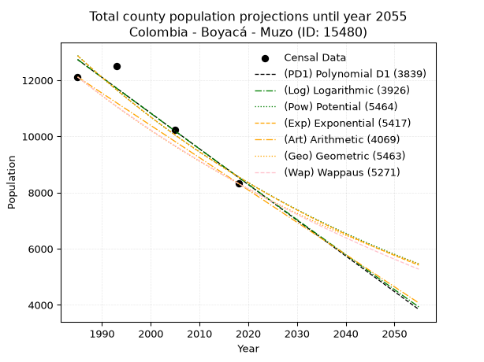
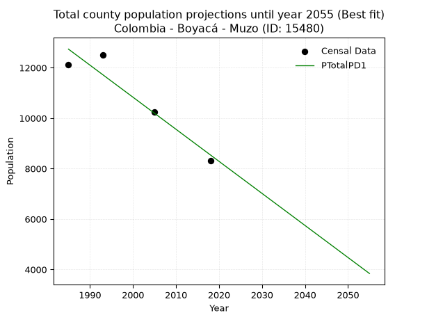
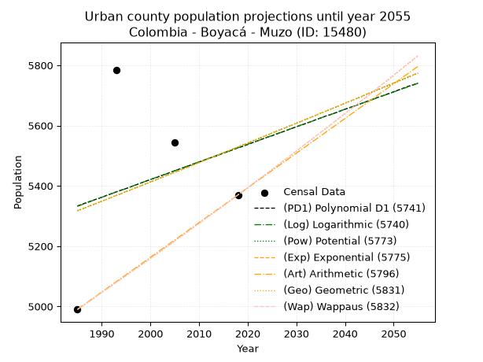
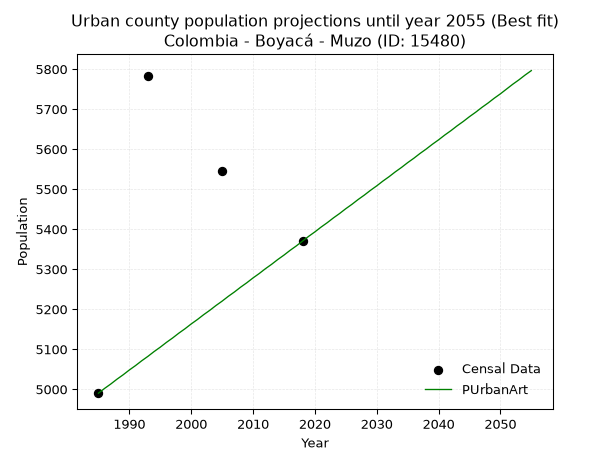
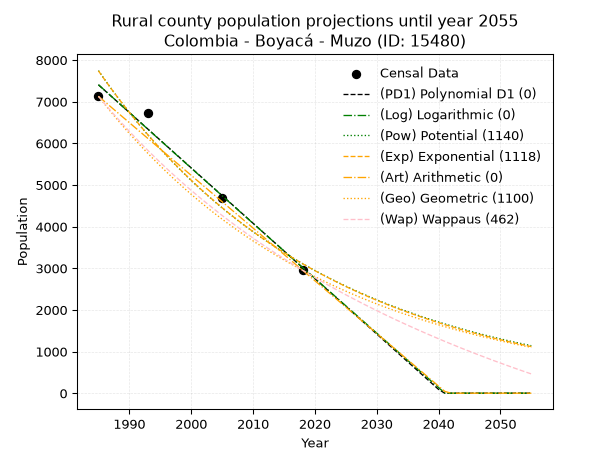
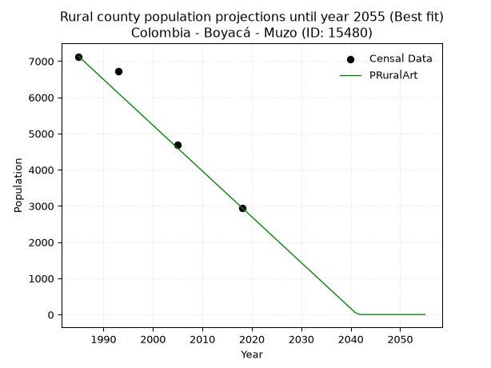

<div align="center">


</div>

# 📜 _“Population and Public Services Demand Projections (PPSD) until Year 2050 for Colombia - Boyacá - Muzo (ID: 15480)”_
Keywords: `population` `public-service` `projection` `lineal` `polynomial` `logarithmic` `potential` `exponential` `arithmetic` `geometric` `wappaus` `dane` `colombia` `south-america`

PPSD are analytical estimates used by governments and planners to anticipate future changes in population size, age distribution, and the resulting community needs for utilities, healthcare, education, and infrastructure as sizing future water treatment facilities, electrical grids, and road networks based on spatial growth.

<div align="center">

</img>

</div>


> **General running parameters**: • app_version: _v20260806_. • Python version: _3.14.7_. • Pandas version: _3.0.5_. • NumPy version: _2.5.1_. • Creates, save and include plots into reports (create_plot): _False_. • Projection until year: _2050_. • Process polynomial degree 2 and up: _False_. • Process Wappaus: _True_. • Process Wappaus: _True_. • Set negative values to zero: _True_. • Set infinite values to zero: _True_. • Drop dataset notes: _True_. 
<div align="center">

Maps & GIS Layers: [:earth_americas:Google](http://maps.google.com/maps?q=5.532757956,-74.1026903) [:earth_americas:OSM](https://www.openstreetmap.org/#map=18/5.532757956/-74.1026903&layers=P) [:earth_americas:Bing](https://www.bing.com/maps?cp=5.532757956~-74.1026903&lvl=18) [:earth_americas:Apple](https://maps.apple.com/frame?center=5.532757956%2C-74.1026903&span=0.003%2C0.006) [:earth_americas:GISMobile](https://github.com/rcfdtools/R.GISMobile/blob/main/file/gis/CountyLayer_CO/Readme.md)

</div>


<div align="center">

```geojson
{
  "type": "Feature",
  "geometry": {
    "type": "Point", 
    "coordinates": [-74.1026903, 5.532757956]
  }, 
  "properties": {
    "Name": "Colombia - Boyacá - Muzo (ID: 15480)"
  }
}
```

</div>


## 0. Census Data (4 records)

Census data are official statistics collected by a government about the people and housing in a country. They usually include counts of total population, age, sex, race, income, education, and jobs.

📅Global census file: [Population.xlsx](../data/Population.xlsx)

| Source   |   Year |   CountryID | CountryName   |   StateID | StateName   |   CountyID | CountyName   |   PTotal |   PUrban |   PRural |
|:---------|-------:|------------:|:--------------|----------:|:------------|-----------:|:-------------|---------:|---------:|---------:|
| DANE     |   1985 |          57 | Colombia      |        15 | Boyacá      |      15480 | Muzo         |    12117 |     4990 |     7127 |
| DANE     |   1993 |          57 | Colombia      |        15 | Boyacá      |      15480 | Muzo         |    12515 |     5783 |     6732 |
| DANE     |   2005 |          57 | Colombia      |        15 | Boyacá      |      15480 | Muzo         |    10237 |     5545 |     4692 |
| DANE     |   2018 |          57 | Colombia      |        15 | Boyacá      |      15480 | Muzo         |     8323 |     5370 |     2953 |

> 🔥Some records could had specific notes about the registered values or the corresponding urban or rural distribution.

📅[SUI-RUPS](https://www.datos.gov.co/Hacienda-y-Cr-dito-P-blico/Registro-nico-de-Prestadores-de-Servicios-P-blicos/4qkq-csdn/about_data) - Local public utility companies: [RUPS.csv](../data/RUPS.csv)

 | SERVICIO       | ESTADO    | NOMBRE                                                           | NIT         | DEPARTAMENTO_DOMICILIO   | MUNICIPIO_DOMICILIO   | DIRECCION       |   TELEFONO | EMAIL                       | TIPO_PRESTADOR                 | CLASIFICACION                 |
|:---------------|:----------|:-----------------------------------------------------------------|:------------|:-------------------------|:----------------------|:----------------|-----------:|:----------------------------|:-------------------------------|:------------------------------|
| ACUEDUCTO      | OPERATIVA | UNIDAD DE SERVICIOS PUBLICOS DOMICILIARIOS DEL MUNICIPIO DE MUZO | 800077808-7 | BOYACA                   | MUZO                  | CALLE 3 No 8-03 |    7256057 | uspdmuzo@muzo-boyaca.gov.co | MUNICIPIO (PRESTACIÓN DIRECTA) | MENOR O IGUAL A 2500 USUARIOS |
| ALCANTARILLADO | OPERATIVA | UNIDAD DE SERVICIOS PUBLICOS DOMICILIARIOS DEL MUNICIPIO DE MUZO | 800077808-7 | BOYACA                   | MUZO                  | CALLE 3 No 8-03 |    7256057 | uspdmuzo@muzo-boyaca.gov.co | MUNICIPIO (PRESTACIÓN DIRECTA) | MENOR O IGUAL A 2500 USUARIOS |

## 1. Total

### 1.1. Coefficients and Parameters

* (PD1) Polynomial Deg 1: -127.11200321156032, 265053.7844239235 (lineal)
* (Log) Logarithmic: -254292.99375148682, 1943681.0832812143
* (Pow) Potential: -24.73978309375681, 85.69571982742187
* (Exp) Exponential: -0.012367444709267204, 590729151563942.6
* (Art) Arithmetic: Year diff. 2018 - 1985 = 33, Population diff. 8323 - 12117 = -3794, Annual growth = -114.96969696969697
* (Geo) Geometric: Year diff. 2018 - 1985 = 33, Population diff. 8323 - 12117 = -3794, Annual growth % = -0.011316890623066178
* (Wap) Wappaus: i = -1.124948111249481, Condition values only valid for < 200)

<sub>
Wappaus condition values: ['-0.00', '-1.12', '-2.25', '-3.37', '-4.50', '-5.62', '-6.75', '-7.87', '-9.00', '-10.12', '-11.25', '-12.37', '-13.50', '-14.62', '-15.75', '-16.87', '-18.00', '-19.12', '-20.25', '-21.37', '-22.50', '-23.62', '-24.75', '-25.87', '-27.00', '-28.12', '-29.25', '-30.37', '-31.50', '-32.62', '-33.75', '-34.87', '-36.00', '-37.12', '-38.25', '-39.37', '-40.50', '-41.62', '-42.75', '-43.87', '-45.00', '-46.12', '-47.25', '-48.37', '-49.50', '-50.62', '-51.75', '-52.87', '-54.00', '-55.12', '-56.25', '-57.37', '-58.50', '-59.62', '-60.75', '-61.87', '-63.00', '-64.12', '-65.25', '-66.37', '-67.50', '-68.62', '-69.75', '-70.87', '-72.00', '-73.12']
</sub>


### 1.2. Projected Dataset

|   Year |   CountyID |   PTotalPD1 |   PTotalLog |   PTotalPow |   PTotalExp |   PTotalArt |   PTotalGeo |   PTotalWap |
|-------:|-----------:|------------:|------------:|------------:|------------:|------------:|------------:|------------:|
|   1985 |      15480 |       12736 |       12739 |       12878 |       12874 |       12117 |       12117 |       12117 |
|   1986 |      15480 |       12609 |       12611 |       12718 |       12716 |       12002 |       11980 |       11981 |
|   1987 |      15480 |       12482 |       12483 |       12561 |       12560 |       11887 |       11844 |       11847 |
|   1988 |      15480 |       12355 |       12355 |       12405 |       12406 |       11772 |       11710 |       11715 |
|   1989 |      15480 |       12228 |       12227 |       12252 |       12253 |       11657 |       11578 |       11584 |
|   1990 |      15480 |       12101 |       12099 |       12101 |       12102 |       11542 |       11447 |       11454 |
|   1991 |      15480 |       11974 |       11972 |       11951 |       11954 |       11427 |       11317 |       11326 |
|   1992 |      15480 |       11847 |       11844 |       11804 |       11807 |       11312 |       11189 |       11199 |
|   1993 |      15480 |       11720 |       11716 |       11658 |       11662 |       11197 |       11062 |       11073 |
|   1994 |      15480 |       11592 |       11589 |       11514 |       11518 |       11082 |       10937 |       10949 |
|   1995 |      15480 |       11465 |       11461 |       11372 |       11377 |       10967 |       10813 |       10826 |
|   1996 |      15480 |       11338 |       11334 |       11232 |       11237 |       10852 |       10691 |       10705 |
|   1997 |      15480 |       11211 |       11207 |       11094 |       11099 |       10737 |       10570 |       10585 |
|   1998 |      15480 |       11084 |       11079 |       10957 |       10962 |       10622 |       10451 |       10466 |
|   1999 |      15480 |       10957 |       10952 |       10822 |       10828 |       10507 |       10332 |       10348 |
|   2000 |      15480 |       10830 |       10825 |       10689 |       10695 |       10392 |       10215 |       10231 |
|   2001 |      15480 |       10703 |       10698 |       10558 |       10563 |       10277 |       10100 |       10116 |
|   2002 |      15480 |       10576 |       10571 |       10428 |       10433 |       10163 |        9985 |       10002 |
|   2003 |      15480 |       10448 |       10444 |       10300 |       10305 |       10048 |        9872 |        9889 |
|   2004 |      15480 |       10321 |       10317 |       10174 |       10178 |        9933 |        9761 |        9777 |
|   2005 |      15480 |       10194 |       10190 |       10049 |       10053 |        9818 |        9650 |        9666 |
|   2006 |      15480 |       10067 |       10063 |        9926 |        9930 |        9703 |        9541 |        9557 |
|   2007 |      15480 |        9940 |        9936 |        9804 |        9808 |        9588 |        9433 |        9448 |
|   2008 |      15480 |        9813 |        9810 |        9684 |        9687 |        9473 |        9326 |        9341 |
|   2009 |      15480 |        9686 |        9683 |        9566 |        9568 |        9358 |        9221 |        9235 |
|   2010 |      15480 |        9559 |        9557 |        9449 |        9450 |        9243 |        9116 |        9129 |
|   2011 |      15480 |        9432 |        9430 |        9333 |        9334 |        9128 |        9013 |        9025 |
|   2012 |      15480 |        9304 |        9304 |        9219 |        9220 |        9013 |        8911 |        8922 |
|   2013 |      15480 |        9177 |        9177 |        9106 |        9106 |        8898 |        8810 |        8820 |
|   2014 |      15480 |        9050 |        9051 |        8995 |        8994 |        8783 |        8711 |        8718 |
|   2015 |      15480 |        8923 |        8925 |        8885 |        8884 |        8668 |        8612 |        8618 |
|   2016 |      15480 |        8796 |        8799 |        8777 |        8775 |        8553 |        8515 |        8519 |
|   2017 |      15480 |        8669 |        8672 |        8670 |        8667 |        8438 |        8418 |        8420 |
|   2018 |      15480 |        8542 |        8546 |        8564 |        8560 |        8323 |        8323 |        8323 |
|   2019 |      15480 |        8415 |        8420 |        8460 |        8455 |        8208 |        8229 |        8226 |
|   2020 |      15480 |        8288 |        8295 |        8357 |        8351 |        8093 |        8136 |        8131 |
|   2021 |      15480 |        8160 |        8169 |        8255 |        8248 |        7978 |        8044 |        8036 |
|   2022 |      15480 |        8033 |        8043 |        8155 |        8147 |        7863 |        7953 |        7942 |
|   2023 |      15480 |        7906 |        7917 |        8056 |        8047 |        7748 |        7863 |        7849 |
|   2024 |      15480 |        7779 |        7791 |        7958 |        7948 |        7633 |        7774 |        7757 |
|   2025 |      15480 |        7652 |        7666 |        7861 |        7850 |        7518 |        7686 |        7666 |
|   2026 |      15480 |        7525 |        7540 |        7766 |        7754 |        7403 |        7599 |        7576 |
|   2027 |      15480 |        7398 |        7415 |        7671 |        7658 |        7288 |        7513 |        7486 |
|   2028 |      15480 |        7271 |        7289 |        7578 |        7564 |        7173 |        7428 |        7397 |
|   2029 |      15480 |        7144 |        7164 |        7487 |        7471 |        7058 |        7344 |        7309 |
|   2030 |      15480 |        7016 |        7039 |        7396 |        7380 |        6943 |        7260 |        7222 |
|   2031 |      15480 |        6889 |        6914 |        7306 |        7289 |        6828 |        7178 |        7136 |
|   2032 |      15480 |        6762 |        6788 |        7218 |        7199 |        6713 |        7097 |        7050 |
|   2033 |      15480 |        6635 |        6663 |        7130 |        7111 |        6598 |        7017 |        6965 |
|   2034 |      15480 |        6508 |        6538 |        7044 |        7023 |        6483 |        6937 |        6881 |
|   2035 |      15480 |        6381 |        6413 |        6959 |        6937 |        6369 |        6859 |        6798 |
|   2036 |      15480 |        6254 |        6288 |        6875 |        6852 |        6254 |        6781 |        6715 |
|   2037 |      15480 |        6127 |        6163 |        6792 |        6768 |        6139 |        6704 |        6633 |
|   2038 |      15480 |        6000 |        6039 |        6710 |        6684 |        6024 |        6629 |        6552 |
|   2039 |      15480 |        5872 |        5914 |        6629 |        6602 |        5909 |        6554 |        6471 |
|   2040 |      15480 |        5745 |        5789 |        6549 |        6521 |        5794 |        6479 |        6391 |
|   2041 |      15480 |        5618 |        5665 |        6470 |        6441 |        5679 |        6406 |        6312 |
|   2042 |      15480 |        5491 |        5540 |        6392 |        6362 |        5564 |        6334 |        6234 |
|   2043 |      15480 |        5364 |        5415 |        6315 |        6284 |        5449 |        6262 |        6156 |
|   2044 |      15480 |        5237 |        5291 |        6239 |        6206 |        5334 |        6191 |        6079 |
|   2045 |      15480 |        5110 |        5167 |        6164 |        6130 |        5219 |        6121 |        6002 |
|   2046 |      15480 |        4983 |        5042 |        6090 |        6055 |        5104 |        6052 |        5926 |
|   2047 |      15480 |        4856 |        4918 |        6017 |        5980 |        4989 |        5983 |        5851 |
|   2048 |      15480 |        4728 |        4794 |        5945 |        5907 |        4874 |        5916 |        5776 |
|   2049 |      15480 |        4601 |        4670 |        5873 |        5834 |        4759 |        5849 |        5702 |
|   2050 |      15480 |        4474 |        4546 |        5803 |        5762 |        4644 |        5782 |        5629 |
<div align="center">

</img>

</div>


### 1.3. Best fit with absolute and relative error (%)

Relative error puts that difference into context by dividing the absolute error by the true value, creating a unitless ratio or percentage that shows the scale of the mistake.

Absolute and relative error

|   Year | Source   |   CountryID | CountryName   |   StateID | StateName   |   CountyID_x | CountyName   |   PTotal |   PUrban |   PRural |   CountyID_y |   PTotalPD1 |   PTotalLog |   PTotalPow |   PTotalExp |   PTotalArt |   PTotalGeo |   PTotalWap |   PTotalPD1AbsError |   PTotalLogAbsError |   PTotalPowAbsError |   PTotalExpAbsError |   PTotalArtAbsError |   PTotalGeoAbsError |   PTotalWapAbsError |   PTotalPD1RelError |   PTotalLogRelError |   PTotalPowRelError |   PTotalExpRelError |   PTotalArtRelError |   PTotalGeoRelError |   PTotalWapRelError |
|-------:|:---------|------------:|:--------------|----------:|:------------|-------------:|:-------------|---------:|---------:|---------:|-------------:|------------:|------------:|------------:|------------:|------------:|------------:|------------:|--------------------:|--------------------:|--------------------:|--------------------:|--------------------:|--------------------:|--------------------:|--------------------:|--------------------:|--------------------:|--------------------:|--------------------:|--------------------:|--------------------:|
|   1985 | DANE     |          57 | Colombia      |        15 | Boyacá      |        15480 | Muzo         |    12117 |     4990 |     7127 |        15480 |       12736 |       12739 |       12878 |       12874 |       12117 |       12117 |       12117 |                 619 |                 622 |                 761 |                 757 |                   0 |                   0 |                   0 |            5.10853  |            5.13328  |             6.28043 |             6.24742 |              0      |              0      |             0       |
|   1993 | DANE     |          57 | Colombia      |        15 | Boyacá      |        15480 | Muzo         |    12515 |     5783 |     6732 |        15480 |       11720 |       11716 |       11658 |       11662 |       11197 |       11062 |       11073 |                 795 |                 799 |                 857 |                 853 |                1318 |                1453 |                1442 |            6.35238  |            6.38434  |             6.84778 |             6.81582 |             10.5314 |             11.6101 |            11.5222  |
|   2005 | DANE     |          57 | Colombia      |        15 | Boyacá      |        15480 | Muzo         |    10237 |     5545 |     4692 |        15480 |       10194 |       10190 |       10049 |       10053 |        9818 |        9650 |        9666 |                  43 |                  47 |                 188 |                 184 |                 419 |                 587 |                 571 |            0.420045 |            0.459119 |             1.83648 |             1.7974  |              4.093  |              5.7341 |             5.57781 |
|   2018 | DANE     |          57 | Colombia      |        15 | Boyacá      |        15480 | Muzo         |     8323 |     5370 |     2953 |        15480 |        8542 |        8546 |        8564 |        8560 |        8323 |        8323 |        8323 |                 219 |                 223 |                 241 |                 237 |                   0 |                   0 |                   0 |            2.63126  |            2.67932  |             2.89559 |             2.84753 |              0      |              0      |             0       |

Relative error mean

| Method    |   RelError | Best   |
|:----------|-----------:|:-------|
| PTotalPD1 |    3.62805 | True   |
| PTotalLog |    3.66402 |        |
| PTotalPow |    4.46507 |        |
| PTotalExp |    4.42704 |        |
| PTotalArt |    3.65609 |        |
| PTotalGeo |    4.33604 |        |
| PTotalWap |    4.27499 |        |

💙Best method: _**PTotalPD1**_
<div align="center">

</img>

</div>


### 1.4. Fresh water supply demand in liters per capita per day (lpcd)

The fresh water supply demand typically ranges from 100 to 300 liters per capita per day (lpcd) for standard domestic and municipal planning, though absolute survival minimums set by the World Health Organization are as low as 7.5 to 20 liters per day, and total consumption in high-income nations can exceed 400 liters.

> `CZ`: Level in meters above the sea level (masl)<br> `WS`: Fresh water supply demand in liters per capita per day (lpcd or l/h/d)<br> `WSAll`: Zonal fresh water supply demand in liters per second (l/s)<br> `A`: Zonal area in square meters<br> `DP`: Population density (people/hectare or p/ha)

Reference values (RAS Colombia)

|    CZ |   WS |
|------:|-----:|
|  1000 |  120 |
|  2000 |  130 |
| 99999 |  140 |

County shapefile geometry properties and water supply values

|   CountyID |     ATotal |   CZTotal |   WSTotal |
|-----------:|-----------:|----------:|----------:|
|      15480 | 1.3771e+08 |   985.829 |       120 |

Projected values for best method: PTotalPD1

|   CountyID |   Year |   PTotalPD1 |   DPTotal |   WSTotal |   WSTotalAll |
|-----------:|-------:|------------:|----------:|----------:|-------------:|
|      15480 |   1985 |       12736 |      0.92 |       120 |     17.6889  |
|      15480 |   1986 |       12609 |      0.92 |       120 |     17.5125  |
|      15480 |   1987 |       12482 |      0.91 |       120 |     17.3361  |
|      15480 |   1988 |       12355 |      0.9  |       120 |     17.1597  |
|      15480 |   1989 |       12228 |      0.89 |       120 |     16.9833  |
|      15480 |   1990 |       12101 |      0.88 |       120 |     16.8069  |
|      15480 |   1991 |       11974 |      0.87 |       120 |     16.6306  |
|      15480 |   1992 |       11847 |      0.86 |       120 |     16.4542  |
|      15480 |   1993 |       11720 |      0.85 |       120 |     16.2778  |
|      15480 |   1994 |       11592 |      0.84 |       120 |     16.1     |
|      15480 |   1995 |       11465 |      0.83 |       120 |     15.9236  |
|      15480 |   1996 |       11338 |      0.82 |       120 |     15.7472  |
|      15480 |   1997 |       11211 |      0.81 |       120 |     15.5708  |
|      15480 |   1998 |       11084 |      0.8  |       120 |     15.3944  |
|      15480 |   1999 |       10957 |      0.8  |       120 |     15.2181  |
|      15480 |   2000 |       10830 |      0.79 |       120 |     15.0417  |
|      15480 |   2001 |       10703 |      0.78 |       120 |     14.8653  |
|      15480 |   2002 |       10576 |      0.77 |       120 |     14.6889  |
|      15480 |   2003 |       10448 |      0.76 |       120 |     14.5111  |
|      15480 |   2004 |       10321 |      0.75 |       120 |     14.3347  |
|      15480 |   2005 |       10194 |      0.74 |       120 |     14.1583  |
|      15480 |   2006 |       10067 |      0.73 |       120 |     13.9819  |
|      15480 |   2007 |        9940 |      0.72 |       120 |     13.8056  |
|      15480 |   2008 |        9813 |      0.71 |       120 |     13.6292  |
|      15480 |   2009 |        9686 |      0.7  |       120 |     13.4528  |
|      15480 |   2010 |        9559 |      0.69 |       120 |     13.2764  |
|      15480 |   2011 |        9432 |      0.68 |       120 |     13.1     |
|      15480 |   2012 |        9304 |      0.68 |       120 |     12.9222  |
|      15480 |   2013 |        9177 |      0.67 |       120 |     12.7458  |
|      15480 |   2014 |        9050 |      0.66 |       120 |     12.5694  |
|      15480 |   2015 |        8923 |      0.65 |       120 |     12.3931  |
|      15480 |   2016 |        8796 |      0.64 |       120 |     12.2167  |
|      15480 |   2017 |        8669 |      0.63 |       120 |     12.0403  |
|      15480 |   2018 |        8542 |      0.62 |       120 |     11.8639  |
|      15480 |   2019 |        8415 |      0.61 |       120 |     11.6875  |
|      15480 |   2020 |        8288 |      0.6  |       120 |     11.5111  |
|      15480 |   2021 |        8160 |      0.59 |       120 |     11.3333  |
|      15480 |   2022 |        8033 |      0.58 |       120 |     11.1569  |
|      15480 |   2023 |        7906 |      0.57 |       120 |     10.9806  |
|      15480 |   2024 |        7779 |      0.56 |       120 |     10.8042  |
|      15480 |   2025 |        7652 |      0.56 |       120 |     10.6278  |
|      15480 |   2026 |        7525 |      0.55 |       120 |     10.4514  |
|      15480 |   2027 |        7398 |      0.54 |       120 |     10.275   |
|      15480 |   2028 |        7271 |      0.53 |       120 |     10.0986  |
|      15480 |   2029 |        7144 |      0.52 |       120 |      9.92222 |
|      15480 |   2030 |        7016 |      0.51 |       120 |      9.74444 |
|      15480 |   2031 |        6889 |      0.5  |       120 |      9.56806 |
|      15480 |   2032 |        6762 |      0.49 |       120 |      9.39167 |
|      15480 |   2033 |        6635 |      0.48 |       120 |      9.21528 |
|      15480 |   2034 |        6508 |      0.47 |       120 |      9.03889 |
|      15480 |   2035 |        6381 |      0.46 |       120 |      8.8625  |
|      15480 |   2036 |        6254 |      0.45 |       120 |      8.68611 |
|      15480 |   2037 |        6127 |      0.44 |       120 |      8.50972 |
|      15480 |   2038 |        6000 |      0.44 |       120 |      8.33333 |
|      15480 |   2039 |        5872 |      0.43 |       120 |      8.15556 |
|      15480 |   2040 |        5745 |      0.42 |       120 |      7.97917 |
|      15480 |   2041 |        5618 |      0.41 |       120 |      7.80278 |
|      15480 |   2042 |        5491 |      0.4  |       120 |      7.62639 |
|      15480 |   2043 |        5364 |      0.39 |       120 |      7.45    |
|      15480 |   2044 |        5237 |      0.38 |       120 |      7.27361 |
|      15480 |   2045 |        5110 |      0.37 |       120 |      7.09722 |
|      15480 |   2046 |        4983 |      0.36 |       120 |      6.92083 |
|      15480 |   2047 |        4856 |      0.35 |       120 |      6.74444 |
|      15480 |   2048 |        4728 |      0.34 |       120 |      6.56667 |
|      15480 |   2049 |        4601 |      0.33 |       120 |      6.39028 |
|      15480 |   2050 |        4474 |      0.32 |       120 |      6.21389 |

## 2. Urban

### 2.1. Coefficients and Parameters

* (PD1) Polynomial Deg 1: 5.832195905259075, -6243.849859494467 (lineal)
* (Log) Logarithmic: 11758.670838511669, -83955.7512716016
* (Pow) Potential: 2.3761815054380273, -4.110422958789945
* (Exp) Exponential: 0.0011792340459830983, 511.8405409480584
* (Art) Arithmetic: Year diff. 2018 - 1985 = 33, Population diff. 5370 - 4990 = 380, Annual growth = 11.515151515151516
* (Geo) Geometric: Year diff. 2018 - 1985 = 33, Population diff. 5370 - 4990 = 380, Annual growth % = 0.0022264748846623217
* (Wap) Wappaus: i = 0.2223002223002223, Condition values only valid for < 200)

<sub>
Wappaus condition values: ['0.00', '0.22', '0.44', '0.67', '0.89', '1.11', '1.33', '1.56', '1.78', '2.00', '2.22', '2.45', '2.67', '2.89', '3.11', '3.33', '3.56', '3.78', '4.00', '4.22', '4.45', '4.67', '4.89', '5.11', '5.34', '5.56', '5.78', '6.00', '6.22', '6.45', '6.67', '6.89', '7.11', '7.34', '7.56', '7.78', '8.00', '8.23', '8.45', '8.67', '8.89', '9.11', '9.34', '9.56', '9.78', '10.00', '10.23', '10.45', '10.67', '10.89', '11.12', '11.34', '11.56', '11.78', '12.00', '12.23', '12.45', '12.67', '12.89', '13.12', '13.34', '13.56', '13.78', '14.00', '14.23', '14.45']
</sub>


### 2.2. Projected Dataset

|   Year |   CountyID |   PUrbanPD1 |   PUrbanLog |   PUrbanPow |   PUrbanExp |   PUrbanArt |   PUrbanGeo |   PUrbanWap |
|-------:|-----------:|------------:|------------:|------------:|------------:|------------:|------------:|------------:|
|   1985 |      15480 |        5333 |        5332 |        5317 |        5318 |        4990 |        4990 |        4990 |
|   1986 |      15480 |        5339 |        5338 |        5323 |        5324 |        5002 |        5001 |        5001 |
|   1987 |      15480 |        5345 |        5344 |        5330 |        5330 |        5013 |        5012 |        5012 |
|   1988 |      15480 |        5351 |        5350 |        5336 |        5337 |        5025 |        5023 |        5023 |
|   1989 |      15480 |        5356 |        5356 |        5342 |        5343 |        5036 |        5035 |        5035 |
|   1990 |      15480 |        5362 |        5362 |        5349 |        5349 |        5048 |        5046 |        5046 |
|   1991 |      15480 |        5368 |        5368 |        5355 |        5355 |        5059 |        5057 |        5057 |
|   1992 |      15480 |        5374 |        5374 |        5362 |        5362 |        5071 |        5068 |        5068 |
|   1993 |      15480 |        5380 |        5380 |        5368 |        5368 |        5082 |        5080 |        5080 |
|   1994 |      15480 |        5386 |        5385 |        5374 |        5374 |        5094 |        5091 |        5091 |
|   1995 |      15480 |        5391 |        5391 |        5381 |        5381 |        5105 |        5102 |        5102 |
|   1996 |      15480 |        5397 |        5397 |        5387 |        5387 |        5117 |        5114 |        5114 |
|   1997 |      15480 |        5403 |        5403 |        5394 |        5393 |        5128 |        5125 |        5125 |
|   1998 |      15480 |        5409 |        5409 |        5400 |        5400 |        5140 |        5136 |        5136 |
|   1999 |      15480 |        5415 |        5415 |        5406 |        5406 |        5151 |        5148 |        5148 |
|   2000 |      15480 |        5421 |        5421 |        5413 |        5413 |        5163 |        5159 |        5159 |
|   2001 |      15480 |        5426 |        5427 |        5419 |        5419 |        5174 |        5171 |        5171 |
|   2002 |      15480 |        5432 |        5433 |        5426 |        5425 |        5186 |        5182 |        5182 |
|   2003 |      15480 |        5438 |        5438 |        5432 |        5432 |        5197 |        5194 |        5194 |
|   2004 |      15480 |        5444 |        5444 |        5439 |        5438 |        5209 |        5205 |        5205 |
|   2005 |      15480 |        5450 |        5450 |        5445 |        5445 |        5220 |        5217 |        5217 |
|   2006 |      15480 |        5456 |        5456 |        5451 |        5451 |        5232 |        5229 |        5229 |
|   2007 |      15480 |        5461 |        5462 |        5458 |        5457 |        5243 |        5240 |        5240 |
|   2008 |      15480 |        5467 |        5468 |        5464 |        5464 |        5255 |        5252 |        5252 |
|   2009 |      15480 |        5473 |        5474 |        5471 |        5470 |        5266 |        5264 |        5264 |
|   2010 |      15480 |        5479 |        5479 |        5477 |        5477 |        5278 |        5275 |        5275 |
|   2011 |      15480 |        5485 |        5485 |        5484 |        5483 |        5289 |        5287 |        5287 |
|   2012 |      15480 |        5491 |        5491 |        5490 |        5490 |        5301 |        5299 |        5299 |
|   2013 |      15480 |        5496 |        5497 |        5497 |        5496 |        5312 |        5311 |        5311 |
|   2014 |      15480 |        5502 |        5503 |        5503 |        5503 |        5324 |        5322 |        5322 |
|   2015 |      15480 |        5508 |        5509 |        5510 |        5509 |        5335 |        5334 |        5334 |
|   2016 |      15480 |        5514 |        5514 |        5516 |        5516 |        5347 |        5346 |        5346 |
|   2017 |      15480 |        5520 |        5520 |        5523 |        5522 |        5358 |        5358 |        5358 |
|   2018 |      15480 |        5526 |        5526 |        5529 |        5529 |        5370 |        5370 |        5370 |
|   2019 |      15480 |        5531 |        5532 |        5536 |        5535 |        5382 |        5382 |        5382 |
|   2020 |      15480 |        5537 |        5538 |        5542 |        5542 |        5393 |        5394 |        5394 |
|   2021 |      15480 |        5543 |        5544 |        5549 |        5548 |        5405 |        5406 |        5406 |
|   2022 |      15480 |        5549 |        5549 |        5555 |        5555 |        5416 |        5418 |        5418 |
|   2023 |      15480 |        5555 |        5555 |        5562 |        5561 |        5428 |        5430 |        5430 |
|   2024 |      15480 |        5561 |        5561 |        5568 |        5568 |        5439 |        5442 |        5442 |
|   2025 |      15480 |        5566 |        5567 |        5575 |        5575 |        5451 |        5454 |        5454 |
|   2026 |      15480 |        5572 |        5573 |        5582 |        5581 |        5462 |        5466 |        5467 |
|   2027 |      15480 |        5578 |        5578 |        5588 |        5588 |        5474 |        5479 |        5479 |
|   2028 |      15480 |        5584 |        5584 |        5595 |        5594 |        5485 |        5491 |        5491 |
|   2029 |      15480 |        5590 |        5590 |        5601 |        5601 |        5497 |        5503 |        5503 |
|   2030 |      15480 |        5596 |        5596 |        5608 |        5607 |        5508 |        5515 |        5515 |
|   2031 |      15480 |        5601 |        5602 |        5614 |        5614 |        5520 |        5528 |        5528 |
|   2032 |      15480 |        5607 |        5607 |        5621 |        5621 |        5531 |        5540 |        5540 |
|   2033 |      15480 |        5613 |        5613 |        5627 |        5627 |        5543 |        5552 |        5552 |
|   2034 |      15480 |        5619 |        5619 |        5634 |        5634 |        5554 |        5565 |        5565 |
|   2035 |      15480 |        5625 |        5625 |        5641 |        5641 |        5566 |        5577 |        5577 |
|   2036 |      15480 |        5631 |        5631 |        5647 |        5647 |        5577 |        5589 |        5590 |
|   2037 |      15480 |        5636 |        5636 |        5654 |        5654 |        5589 |        5602 |        5602 |
|   2038 |      15480 |        5642 |        5642 |        5660 |        5661 |        5600 |        5614 |        5615 |
|   2039 |      15480 |        5648 |        5648 |        5667 |        5667 |        5612 |        5627 |        5627 |
|   2040 |      15480 |        5654 |        5654 |        5674 |        5674 |        5623 |        5639 |        5640 |
|   2041 |      15480 |        5660 |        5659 |        5680 |        5681 |        5635 |        5652 |        5652 |
|   2042 |      15480 |        5665 |        5665 |        5687 |        5687 |        5646 |        5664 |        5665 |
|   2043 |      15480 |        5671 |        5671 |        5693 |        5694 |        5658 |        5677 |        5678 |
|   2044 |      15480 |        5677 |        5677 |        5700 |        5701 |        5669 |        5690 |        5690 |
|   2045 |      15480 |        5683 |        5682 |        5707 |        5708 |        5681 |        5702 |        5703 |
|   2046 |      15480 |        5689 |        5688 |        5713 |        5714 |        5692 |        5715 |        5716 |
|   2047 |      15480 |        5695 |        5694 |        5720 |        5721 |        5704 |        5728 |        5729 |
|   2048 |      15480 |        5700 |        5700 |        5727 |        5728 |        5715 |        5741 |        5741 |
|   2049 |      15480 |        5706 |        5705 |        5733 |        5735 |        5727 |        5753 |        5754 |
|   2050 |      15480 |        5712 |        5711 |        5740 |        5741 |        5738 |        5766 |        5767 |
<div align="center">

</img>

</div>


### 2.3. Best fit with absolute and relative error (%)

Relative error puts that difference into context by dividing the absolute error by the true value, creating a unitless ratio or percentage that shows the scale of the mistake.

Absolute and relative error

|   Year | Source   |   CountryID | CountryName   |   StateID | StateName   |   CountyID_x | CountyName   |   PTotal |   PUrban |   PRural |   CountyID_y |   PUrbanPD1 |   PUrbanLog |   PUrbanPow |   PUrbanExp |   PUrbanArt |   PUrbanGeo |   PUrbanWap |   PUrbanPD1AbsError |   PUrbanLogAbsError |   PUrbanPowAbsError |   PUrbanExpAbsError |   PUrbanArtAbsError |   PUrbanGeoAbsError |   PUrbanWapAbsError |   PUrbanPD1RelError |   PUrbanLogRelError |   PUrbanPowRelError |   PUrbanExpRelError |   PUrbanArtRelError |   PUrbanGeoRelError |   PUrbanWapRelError |
|-------:|:---------|------------:|:--------------|----------:|:------------|-------------:|:-------------|---------:|---------:|---------:|-------------:|------------:|------------:|------------:|------------:|------------:|------------:|------------:|--------------------:|--------------------:|--------------------:|--------------------:|--------------------:|--------------------:|--------------------:|--------------------:|--------------------:|--------------------:|--------------------:|--------------------:|--------------------:|--------------------:|
|   1985 | DANE     |          57 | Colombia      |        15 | Boyacá      |        15480 | Muzo         |    12117 |     4990 |     7127 |        15480 |        5333 |        5332 |        5317 |        5318 |        4990 |        4990 |        4990 |                 343 |                 342 |                 327 |                 328 |                   0 |                   0 |                   0 |             6.87375 |             6.85371 |             6.55311 |             6.57315 |             0       |             0       |             0       |
|   1993 | DANE     |          57 | Colombia      |        15 | Boyacá      |        15480 | Muzo         |    12515 |     5783 |     6732 |        15480 |        5380 |        5380 |        5368 |        5368 |        5082 |        5080 |        5080 |                 403 |                 403 |                 415 |                 415 |                 701 |                 703 |                 703 |             6.9687  |             6.9687  |             7.17621 |             7.17621 |            12.1217  |            12.1563  |            12.1563  |
|   2005 | DANE     |          57 | Colombia      |        15 | Boyacá      |        15480 | Muzo         |    10237 |     5545 |     4692 |        15480 |        5450 |        5450 |        5445 |        5445 |        5220 |        5217 |        5217 |                  95 |                  95 |                 100 |                 100 |                 325 |                 328 |                 328 |             1.71326 |             1.71326 |             1.80343 |             1.80343 |             5.86114 |             5.91524 |             5.91524 |
|   2018 | DANE     |          57 | Colombia      |        15 | Boyacá      |        15480 | Muzo         |     8323 |     5370 |     2953 |        15480 |        5526 |        5526 |        5529 |        5529 |        5370 |        5370 |        5370 |                 156 |                 156 |                 159 |                 159 |                   0 |                   0 |                   0 |             2.90503 |             2.90503 |             2.96089 |             2.96089 |             0       |             0       |             0       |

Relative error mean

| Method    |   RelError | Best   |
|:----------|-----------:|:-------|
| PUrbanPD1 |    4.61518 |        |
| PUrbanLog |    4.61017 |        |
| PUrbanPow |    4.62341 |        |
| PUrbanExp |    4.62842 |        |
| PUrbanArt |    4.49572 | True   |
| PUrbanGeo |    4.51789 |        |
| PUrbanWap |    4.51789 |        |

💙Best method: _**PUrbanArt**_
<div align="center">

</img>

</div>


### 2.4. Fresh water supply demand in liters per capita per day (lpcd)

The fresh water supply demand typically ranges from 100 to 300 liters per capita per day (lpcd) for standard domestic and municipal planning, though absolute survival minimums set by the World Health Organization are as low as 7.5 to 20 liters per day, and total consumption in high-income nations can exceed 400 liters.

> `CZ`: Level in meters above the sea level (masl)<br> `WS`: Fresh water supply demand in liters per capita per day (lpcd or l/h/d)<br> `WSAll`: Zonal fresh water supply demand in liters per second (l/s)<br> `A`: Zonal area in square meters<br> `DP`: Population density (people/hectare or p/ha)

Reference values (RAS Colombia)

|    CZ |   WS |
|------:|-----:|
|  1000 |  120 |
|  2000 |  130 |
| 99999 |  140 |

County shapefile geometry properties and water supply values

|   CountyID |   AUrban |   CZUrban |   WSUrban |
|-----------:|---------:|----------:|----------:|
|      15480 |   743027 |   859.114 |       120 |

Projected values for best method: PUrbanArt

|   CountyID |   Year |   PUrbanArt |   DPUrban |   WSUrban |   WSUrbanAll |
|-----------:|-------:|------------:|----------:|----------:|-------------:|
|      15480 |   1985 |        4990 |     67.16 |       120 |      6.93056 |
|      15480 |   1986 |        5002 |     67.32 |       120 |      6.94722 |
|      15480 |   1987 |        5013 |     67.47 |       120 |      6.9625  |
|      15480 |   1988 |        5025 |     67.63 |       120 |      6.97917 |
|      15480 |   1989 |        5036 |     67.78 |       120 |      6.99444 |
|      15480 |   1990 |        5048 |     67.94 |       120 |      7.01111 |
|      15480 |   1991 |        5059 |     68.09 |       120 |      7.02639 |
|      15480 |   1992 |        5071 |     68.25 |       120 |      7.04306 |
|      15480 |   1993 |        5082 |     68.4  |       120 |      7.05833 |
|      15480 |   1994 |        5094 |     68.56 |       120 |      7.075   |
|      15480 |   1995 |        5105 |     68.71 |       120 |      7.09028 |
|      15480 |   1996 |        5117 |     68.87 |       120 |      7.10694 |
|      15480 |   1997 |        5128 |     69.01 |       120 |      7.12222 |
|      15480 |   1998 |        5140 |     69.18 |       120 |      7.13889 |
|      15480 |   1999 |        5151 |     69.32 |       120 |      7.15417 |
|      15480 |   2000 |        5163 |     69.49 |       120 |      7.17083 |
|      15480 |   2001 |        5174 |     69.63 |       120 |      7.18611 |
|      15480 |   2002 |        5186 |     69.8  |       120 |      7.20278 |
|      15480 |   2003 |        5197 |     69.94 |       120 |      7.21806 |
|      15480 |   2004 |        5209 |     70.11 |       120 |      7.23472 |
|      15480 |   2005 |        5220 |     70.25 |       120 |      7.25    |
|      15480 |   2006 |        5232 |     70.41 |       120 |      7.26667 |
|      15480 |   2007 |        5243 |     70.56 |       120 |      7.28194 |
|      15480 |   2008 |        5255 |     70.72 |       120 |      7.29861 |
|      15480 |   2009 |        5266 |     70.87 |       120 |      7.31389 |
|      15480 |   2010 |        5278 |     71.03 |       120 |      7.33056 |
|      15480 |   2011 |        5289 |     71.18 |       120 |      7.34583 |
|      15480 |   2012 |        5301 |     71.34 |       120 |      7.3625  |
|      15480 |   2013 |        5312 |     71.49 |       120 |      7.37778 |
|      15480 |   2014 |        5324 |     71.65 |       120 |      7.39444 |
|      15480 |   2015 |        5335 |     71.8  |       120 |      7.40972 |
|      15480 |   2016 |        5347 |     71.96 |       120 |      7.42639 |
|      15480 |   2017 |        5358 |     72.11 |       120 |      7.44167 |
|      15480 |   2018 |        5370 |     72.27 |       120 |      7.45833 |
|      15480 |   2019 |        5382 |     72.43 |       120 |      7.475   |
|      15480 |   2020 |        5393 |     72.58 |       120 |      7.49028 |
|      15480 |   2021 |        5405 |     72.74 |       120 |      7.50694 |
|      15480 |   2022 |        5416 |     72.89 |       120 |      7.52222 |
|      15480 |   2023 |        5428 |     73.05 |       120 |      7.53889 |
|      15480 |   2024 |        5439 |     73.2  |       120 |      7.55417 |
|      15480 |   2025 |        5451 |     73.36 |       120 |      7.57083 |
|      15480 |   2026 |        5462 |     73.51 |       120 |      7.58611 |
|      15480 |   2027 |        5474 |     73.67 |       120 |      7.60278 |
|      15480 |   2028 |        5485 |     73.82 |       120 |      7.61806 |
|      15480 |   2029 |        5497 |     73.98 |       120 |      7.63472 |
|      15480 |   2030 |        5508 |     74.13 |       120 |      7.65    |
|      15480 |   2031 |        5520 |     74.29 |       120 |      7.66667 |
|      15480 |   2032 |        5531 |     74.44 |       120 |      7.68194 |
|      15480 |   2033 |        5543 |     74.6  |       120 |      7.69861 |
|      15480 |   2034 |        5554 |     74.75 |       120 |      7.71389 |
|      15480 |   2035 |        5566 |     74.91 |       120 |      7.73056 |
|      15480 |   2036 |        5577 |     75.06 |       120 |      7.74583 |
|      15480 |   2037 |        5589 |     75.22 |       120 |      7.7625  |
|      15480 |   2038 |        5600 |     75.37 |       120 |      7.77778 |
|      15480 |   2039 |        5612 |     75.53 |       120 |      7.79444 |
|      15480 |   2040 |        5623 |     75.68 |       120 |      7.80972 |
|      15480 |   2041 |        5635 |     75.84 |       120 |      7.82639 |
|      15480 |   2042 |        5646 |     75.99 |       120 |      7.84167 |
|      15480 |   2043 |        5658 |     76.15 |       120 |      7.85833 |
|      15480 |   2044 |        5669 |     76.3  |       120 |      7.87361 |
|      15480 |   2045 |        5681 |     76.46 |       120 |      7.89028 |
|      15480 |   2046 |        5692 |     76.61 |       120 |      7.90556 |
|      15480 |   2047 |        5704 |     76.77 |       120 |      7.92222 |
|      15480 |   2048 |        5715 |     76.92 |       120 |      7.9375  |
|      15480 |   2049 |        5727 |     77.08 |       120 |      7.95417 |
|      15480 |   2050 |        5738 |     77.22 |       120 |      7.96944 |

## 3. Rural

### 3.1. Coefficients and Parameters

* (PD1) Polynomial Deg 1: -132.9441991168194, 271297.63428341795 (lineal)
* (Log) Logarithmic: -266051.6645899986, 2027636.8345528163
* (Pow) Potential: -55.29569881931496, 186.24096335067574
* (Exp) Exponential: -0.02763747741152593, 5.179366544816061e+27
* (Art) Arithmetic: Year diff. 2018 - 1985 = 33, Population diff. 2953 - 7127 = -4174, Annual growth = -126.48484848484848
* (Geo) Geometric: Year diff. 2018 - 1985 = 33, Population diff. 2953 - 7127 = -4174, Annual growth % = -0.026345785331995053
* (Wap) Wappaus: i = -2.5096200096200096, Condition values only valid for < 200)

<sub>
Wappaus condition values: ['-0.00', '-2.51', '-5.02', '-7.53', '-10.04', '-12.55', '-15.06', '-17.57', '-20.08', '-22.59', '-25.10', '-27.61', '-30.12', '-32.63', '-35.13', '-37.64', '-40.15', '-42.66', '-45.17', '-47.68', '-50.19', '-52.70', '-55.21', '-57.72', '-60.23', '-62.74', '-65.25', '-67.76', '-70.27', '-72.78', '-75.29', '-77.80', '-80.31', '-82.82', '-85.33', '-87.84', '-90.35', '-92.86', '-95.37', '-97.88', '-100.38', '-102.89', '-105.40', '-107.91', '-110.42', '-112.93', '-115.44', '-117.95', '-120.46', '-122.97', '-125.48', '-127.99', '-130.50', '-133.01', '-135.52', '-138.03', '-140.54', '-143.05', '-145.56', '-148.07', '-150.58', '-153.09', '-155.60', '-158.11', '-160.62', '-163.13']
</sub>


### 3.2. Projected Dataset

|   Year |   CountyID |   PRuralPD1 |   PRuralLog |   PRuralPow |   PRuralExp |   PRuralArt |   PRuralGeo |   PRuralWap |
|-------:|-----------:|------------:|------------:|------------:|------------:|------------:|------------:|------------:|
|   1985 |      15480 |        7403 |        7407 |        7744 |        7739 |        7127 |        7127 |        7127 |
|   1986 |      15480 |        7270 |        7273 |        7532 |        7528 |        7001 |        6939 |        6950 |
|   1987 |      15480 |        7138 |        7139 |        7325 |        7323 |        6874 |        6756 |        6778 |
|   1988 |      15480 |        7005 |        7005 |        7124 |        7124 |        6748 |        6578 |        6610 |
|   1989 |      15480 |        6872 |        6871 |        6929 |        6929 |        6621 |        6405 |        6446 |
|   1990 |      15480 |        6739 |        6738 |        6739 |        6741 |        6495 |        6236 |        6285 |
|   1991 |      15480 |        6606 |        6604 |        6554 |        6557 |        6368 |        6072 |        6129 |
|   1992 |      15480 |        6473 |        6470 |        6375 |        6378 |        6242 |        5912 |        5976 |
|   1993 |      15480 |        6340 |        6337 |        6200 |        6204 |        6115 |        5756 |        5827 |
|   1994 |      15480 |        6207 |        6203 |        6031 |        6035 |        5989 |        5605 |        5681 |
|   1995 |      15480 |        6074 |        6070 |        5866 |        5871 |        5862 |        5457 |        5538 |
|   1996 |      15480 |        5941 |        5937 |        5705 |        5711 |        5736 |        5313 |        5398 |
|   1997 |      15480 |        5808 |        5803 |        5549 |        5555 |        5609 |        5173 |        5262 |
|   1998 |      15480 |        5675 |        5670 |        5398 |        5403 |        5483 |        5037 |        5128 |
|   1999 |      15480 |        5542 |        5537 |        5251 |        5256 |        5356 |        4904 |        4997 |
|   2000 |      15480 |        5409 |        5404 |        5107 |        5113 |        5230 |        4775 |        4869 |
|   2001 |      15480 |        5276 |        5271 |        4968 |        4974 |        5103 |        4649 |        4744 |
|   2002 |      15480 |        5143 |        5138 |        4833 |        4838 |        4977 |        4527 |        4621 |
|   2003 |      15480 |        5010 |        5005 |        4701 |        4706 |        4850 |        4407 |        4501 |
|   2004 |      15480 |        4877 |        4873 |        4573 |        4578 |        4724 |        4291 |        4383 |
|   2005 |      15480 |        4745 |        4740 |        4449 |        4453 |        4597 |        4178 |        4267 |
|   2006 |      15480 |        4612 |        4607 |        4328 |        4332 |        4471 |        4068 |        4154 |
|   2007 |      15480 |        4479 |        4475 |        4210 |        4214 |        4344 |        3961 |        4043 |
|   2008 |      15480 |        4346 |        4342 |        4096 |        4099 |        4218 |        3857 |        3935 |
|   2009 |      15480 |        4213 |        4210 |        3985 |        3987 |        4091 |        3755 |        3828 |
|   2010 |      15480 |        4080 |        4077 |        3876 |        3878 |        3965 |        3656 |        3723 |
|   2011 |      15480 |        3947 |        3945 |        3771 |        3773 |        3838 |        3560 |        3621 |
|   2012 |      15480 |        3814 |        3813 |        3669 |        3670 |        3712 |        3466 |        3520 |
|   2013 |      15480 |        3681 |        3680 |        3570 |        3570 |        3585 |        3375 |        3421 |
|   2014 |      15480 |        3548 |        3548 |        3473 |        3472 |        3459 |        3286 |        3324 |
|   2015 |      15480 |        3415 |        3416 |        3379 |        3378 |        3332 |        3199 |        3229 |
|   2016 |      15480 |        3282 |        3284 |        3287 |        3286 |        3206 |        3115 |        3135 |
|   2017 |      15480 |        3149 |        3152 |        3198 |        3196 |        3079 |        3033 |        3043 |
|   2018 |      15480 |        3016 |        3020 |        3112 |        3109 |        2953 |        2953 |        2953 |
|   2019 |      15480 |        2883 |        2889 |        3028 |        3024 |        2827 |        2875 |        2864 |
|   2020 |      15480 |        2750 |        2757 |        2946 |        2942 |        2700 |        2799 |        2777 |
|   2021 |      15480 |        2617 |        2625 |        2867 |        2862 |        2574 |        2726 |        2692 |
|   2022 |      15480 |        2484 |        2493 |        2789 |        2784 |        2447 |        2654 |        2607 |
|   2023 |      15480 |        2352 |        2362 |        2714 |        2708 |        2321 |        2584 |        2525 |
|   2024 |      15480 |        2219 |        2230 |        2641 |        2634 |        2194 |        2516 |        2443 |
|   2025 |      15480 |        2086 |        2099 |        2570 |        2562 |        2068 |        2450 |        2363 |
|   2026 |      15480 |        1953 |        1968 |        2500 |        2492 |        1941 |        2385 |        2285 |
|   2027 |      15480 |        1820 |        1836 |        2433 |        2424 |        1815 |        2322 |        2208 |
|   2028 |      15480 |        1687 |        1705 |        2368 |        2358 |        1688 |        2261 |        2131 |
|   2029 |      15480 |        1554 |        1574 |        2304 |        2294 |        1562 |        2201 |        2057 |
|   2030 |      15480 |        1421 |        1443 |        2242 |        2231 |        1435 |        2143 |        1983 |
|   2031 |      15480 |        1288 |        1312 |        2182 |        2171 |        1309 |        2087 |        1910 |
|   2032 |      15480 |        1155 |        1181 |        2123 |        2111 |        1182 |        2032 |        1839 |
|   2033 |      15480 |        1022 |        1050 |        2066 |        2054 |        1056 |        1978 |        1769 |
|   2034 |      15480 |         889 |         919 |        2011 |        1998 |         929 |        1926 |        1700 |
|   2035 |      15480 |         756 |         788 |        1957 |        1943 |         803 |        1876 |        1632 |
|   2036 |      15480 |         623 |         658 |        1905 |        1890 |         676 |        1826 |        1565 |
|   2037 |      15480 |         490 |         527 |        1853 |        1839 |         550 |        1778 |        1499 |
|   2038 |      15480 |         357 |         397 |        1804 |        1789 |         423 |        1731 |        1434 |
|   2039 |      15480 |         224 |         266 |        1756 |        1740 |         297 |        1686 |        1370 |
|   2040 |      15480 |          91 |         136 |        1709 |        1693 |         170 |        1641 |        1307 |
|   2041 |      15480 |           0 |           5 |        1663 |        1646 |          44 |        1598 |        1244 |
|   2042 |      15480 |           0 |           0 |        1619 |        1602 |           0 |        1556 |        1183 |
|   2043 |      15480 |           0 |           0 |        1575 |        1558 |           0 |        1515 |        1123 |
|   2044 |      15480 |           0 |           0 |        1533 |        1515 |           0 |        1475 |        1063 |
|   2045 |      15480 |           0 |           0 |        1492 |        1474 |           0 |        1436 |        1005 |
|   2046 |      15480 |           0 |           0 |        1453 |        1434 |           0 |        1398 |         947 |
|   2047 |      15480 |           0 |           0 |        1414 |        1395 |           0 |        1361 |         890 |
|   2048 |      15480 |           0 |           0 |        1376 |        1357 |           0 |        1326 |         834 |
|   2049 |      15480 |           0 |           0 |        1339 |        1320 |           0 |        1291 |         778 |
|   2050 |      15480 |           0 |           0 |        1304 |        1284 |           0 |        1257 |         724 |
<div align="center">

</img>

</div>


### 3.3. Best fit with absolute and relative error (%)

Relative error puts that difference into context by dividing the absolute error by the true value, creating a unitless ratio or percentage that shows the scale of the mistake.

Absolute and relative error

|   Year | Source   |   CountryID | CountryName   |   StateID | StateName   |   CountyID_x | CountyName   |   PTotal |   PUrban |   PRural |   CountyID_y |   PRuralPD1 |   PRuralLog |   PRuralPow |   PRuralExp |   PRuralArt |   PRuralGeo |   PRuralWap |   PRuralPD1AbsError |   PRuralLogAbsError |   PRuralPowAbsError |   PRuralExpAbsError |   PRuralArtAbsError |   PRuralGeoAbsError |   PRuralWapAbsError |   PRuralPD1RelError |   PRuralLogRelError |   PRuralPowRelError |   PRuralExpRelError |   PRuralArtRelError |   PRuralGeoRelError |   PRuralWapRelError |
|-------:|:---------|------------:|:--------------|----------:|:------------|-------------:|:-------------|---------:|---------:|---------:|-------------:|------------:|------------:|------------:|------------:|------------:|------------:|------------:|--------------------:|--------------------:|--------------------:|--------------------:|--------------------:|--------------------:|--------------------:|--------------------:|--------------------:|--------------------:|--------------------:|--------------------:|--------------------:|--------------------:|
|   1985 | DANE     |          57 | Colombia      |        15 | Boyacá      |        15480 | Muzo         |    12117 |     4990 |     7127 |        15480 |        7403 |        7407 |        7744 |        7739 |        7127 |        7127 |        7127 |                 276 |                 280 |                 617 |                 612 |                   0 |                   0 |                   0 |             3.8726  |             3.92872 |             8.65722 |             8.58706 |             0       |              0      |             0       |
|   1993 | DANE     |          57 | Colombia      |        15 | Boyacá      |        15480 | Muzo         |    12515 |     5783 |     6732 |        15480 |        6340 |        6337 |        6200 |        6204 |        6115 |        5756 |        5827 |                 392 |                 395 |                 532 |                 528 |                 617 |                 976 |                 905 |             5.82294 |             5.8675  |             7.90255 |             7.84314 |             9.16518 |             14.4979 |            13.4433  |
|   2005 | DANE     |          57 | Colombia      |        15 | Boyacá      |        15480 | Muzo         |    10237 |     5545 |     4692 |        15480 |        4745 |        4740 |        4449 |        4453 |        4597 |        4178 |        4267 |                  53 |                  48 |                 243 |                 239 |                  95 |                 514 |                 425 |             1.12958 |             1.02302 |             5.17903 |             5.09378 |             2.02472 |             10.9548 |             9.05797 |
|   2018 | DANE     |          57 | Colombia      |        15 | Boyacá      |        15480 | Muzo         |     8323 |     5370 |     2953 |        15480 |        3016 |        3020 |        3112 |        3109 |        2953 |        2953 |        2953 |                  63 |                  67 |                 159 |                 156 |                   0 |                   0 |                   0 |             2.13342 |             2.26888 |             5.38435 |             5.28276 |             0       |              0      |             0       |

Relative error mean

| Method    |   RelError | Best   |
|:----------|-----------:|:-------|
| PRuralPD1 |    3.23963 |        |
| PRuralLog |    3.27203 |        |
| PRuralPow |    6.78079 |        |
| PRuralExp |    6.70169 |        |
| PRuralArt |    2.79748 | True   |
| PRuralGeo |    6.36318 |        |
| PRuralWap |    5.62531 |        |

💙Best method: _**PRuralArt**_
<div align="center">

</img>

</div>


### 3.4. Fresh water supply demand in liters per capita per day (lpcd)

The fresh water supply demand typically ranges from 100 to 300 liters per capita per day (lpcd) for standard domestic and municipal planning, though absolute survival minimums set by the World Health Organization are as low as 7.5 to 20 liters per day, and total consumption in high-income nations can exceed 400 liters.

> `CZ`: Level in meters above the sea level (masl)<br> `WS`: Fresh water supply demand in liters per capita per day (lpcd or l/h/d)<br> `WSAll`: Zonal fresh water supply demand in liters per second (l/s)<br> `A`: Zonal area in square meters<br> `DP`: Population density (people/hectare or p/ha)

Reference values (RAS Colombia)

|    CZ |   WS |
|------:|-----:|
|  1000 |  120 |
|  2000 |  130 |
| 99999 |  140 |

County shapefile geometry properties and water supply values

|   CountyID |      ARural |   CZRural |   WSRural |
|-----------:|------------:|----------:|----------:|
|      15480 | 1.36967e+08 |   986.529 |       120 |

Projected values for best method: PRuralArt

|   CountyID |   Year |   PRuralArt |   DPRural |   WSRural |   WSRuralAll |
|-----------:|-------:|------------:|----------:|----------:|-------------:|
|      15480 |   1985 |        7127 |      0.52 |       120 |    9.89861   |
|      15480 |   1986 |        7001 |      0.51 |       120 |    9.72361   |
|      15480 |   1987 |        6874 |      0.5  |       120 |    9.54722   |
|      15480 |   1988 |        6748 |      0.49 |       120 |    9.37222   |
|      15480 |   1989 |        6621 |      0.48 |       120 |    9.19583   |
|      15480 |   1990 |        6495 |      0.47 |       120 |    9.02083   |
|      15480 |   1991 |        6368 |      0.46 |       120 |    8.84444   |
|      15480 |   1992 |        6242 |      0.46 |       120 |    8.66944   |
|      15480 |   1993 |        6115 |      0.45 |       120 |    8.49306   |
|      15480 |   1994 |        5989 |      0.44 |       120 |    8.31806   |
|      15480 |   1995 |        5862 |      0.43 |       120 |    8.14167   |
|      15480 |   1996 |        5736 |      0.42 |       120 |    7.96667   |
|      15480 |   1997 |        5609 |      0.41 |       120 |    7.79028   |
|      15480 |   1998 |        5483 |      0.4  |       120 |    7.61528   |
|      15480 |   1999 |        5356 |      0.39 |       120 |    7.43889   |
|      15480 |   2000 |        5230 |      0.38 |       120 |    7.26389   |
|      15480 |   2001 |        5103 |      0.37 |       120 |    7.0875    |
|      15480 |   2002 |        4977 |      0.36 |       120 |    6.9125    |
|      15480 |   2003 |        4850 |      0.35 |       120 |    6.73611   |
|      15480 |   2004 |        4724 |      0.34 |       120 |    6.56111   |
|      15480 |   2005 |        4597 |      0.34 |       120 |    6.38472   |
|      15480 |   2006 |        4471 |      0.33 |       120 |    6.20972   |
|      15480 |   2007 |        4344 |      0.32 |       120 |    6.03333   |
|      15480 |   2008 |        4218 |      0.31 |       120 |    5.85833   |
|      15480 |   2009 |        4091 |      0.3  |       120 |    5.68194   |
|      15480 |   2010 |        3965 |      0.29 |       120 |    5.50694   |
|      15480 |   2011 |        3838 |      0.28 |       120 |    5.33056   |
|      15480 |   2012 |        3712 |      0.27 |       120 |    5.15556   |
|      15480 |   2013 |        3585 |      0.26 |       120 |    4.97917   |
|      15480 |   2014 |        3459 |      0.25 |       120 |    4.80417   |
|      15480 |   2015 |        3332 |      0.24 |       120 |    4.62778   |
|      15480 |   2016 |        3206 |      0.23 |       120 |    4.45278   |
|      15480 |   2017 |        3079 |      0.22 |       120 |    4.27639   |
|      15480 |   2018 |        2953 |      0.22 |       120 |    4.10139   |
|      15480 |   2019 |        2827 |      0.21 |       120 |    3.92639   |
|      15480 |   2020 |        2700 |      0.2  |       120 |    3.75      |
|      15480 |   2021 |        2574 |      0.19 |       120 |    3.575     |
|      15480 |   2022 |        2447 |      0.18 |       120 |    3.39861   |
|      15480 |   2023 |        2321 |      0.17 |       120 |    3.22361   |
|      15480 |   2024 |        2194 |      0.16 |       120 |    3.04722   |
|      15480 |   2025 |        2068 |      0.15 |       120 |    2.87222   |
|      15480 |   2026 |        1941 |      0.14 |       120 |    2.69583   |
|      15480 |   2027 |        1815 |      0.13 |       120 |    2.52083   |
|      15480 |   2028 |        1688 |      0.12 |       120 |    2.34444   |
|      15480 |   2029 |        1562 |      0.11 |       120 |    2.16944   |
|      15480 |   2030 |        1435 |      0.1  |       120 |    1.99306   |
|      15480 |   2031 |        1309 |      0.1  |       120 |    1.81806   |
|      15480 |   2032 |        1182 |      0.09 |       120 |    1.64167   |
|      15480 |   2033 |        1056 |      0.08 |       120 |    1.46667   |
|      15480 |   2034 |         929 |      0.07 |       120 |    1.29028   |
|      15480 |   2035 |         803 |      0.06 |       120 |    1.11528   |
|      15480 |   2036 |         676 |      0.05 |       120 |    0.938889  |
|      15480 |   2037 |         550 |      0.04 |       120 |    0.763889  |
|      15480 |   2038 |         423 |      0.03 |       120 |    0.5875    |
|      15480 |   2039 |         297 |      0.02 |       120 |    0.4125    |
|      15480 |   2040 |         170 |      0.01 |       120 |    0.236111  |
|      15480 |   2041 |          44 |      0    |       120 |    0.0611111 |
|      15480 |   2042 |           0 |      0    |       120 |    0         |
|      15480 |   2043 |           0 |      0    |       120 |    0         |
|      15480 |   2044 |           0 |      0    |       120 |    0         |
|      15480 |   2045 |           0 |      0    |       120 |    0         |
|      15480 |   2046 |           0 |      0    |       120 |    0         |
|      15480 |   2047 |           0 |      0    |       120 |    0         |
|      15480 |   2048 |           0 |      0    |       120 |    0         |
|      15480 |   2049 |           0 |      0    |       120 |    0         |
|      15480 |   2050 |           0 |      0    |       120 |    0         |

#

<div align="center"><br><sub>Share this research</sub></div><br>

<sub>**APPS & TOOLS & CONTENT DISCLAIMER**: • NO WARRANTY - This content and software is provided by <a href="https://github.com/rcfdtools" target="_blank">github.com/rcfdtools</a> "as is", without any express or implied warranty, including warranties of merchantability, fitness for a particular purpose, or non-infringement. There is no guarantee that the software will be error-free or operate without interruption. • LIMITATION OF LIABILITY - Neither the authors nor copyright holders will be liable for claims or damages arising from the software or its use. You are responsible for determining if the software is appropriate for your use and assume all associated risks, including errors, legal compliance, and data loss. • NO PROFESSIONAL ADVICE - The software provides general information and does not offer professional advice. It should not replace consultation with professional advisors. [Clauses and global license for rcfdtools use.](https://github.com/rcfdtools/rcfdtools/blob/main/LICENSE.md)</sub>

| [:house: Home](Readme.md)  | [:beginner: Help / Collab](https://github.com/rcfdtools/R.HydroTools/discussions/31) |
|----------------------------|-------------------------------------------------------------------------------------------|