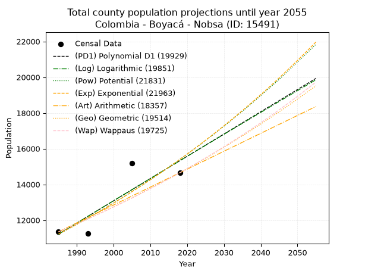
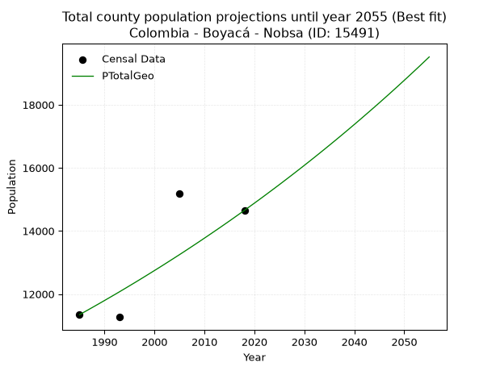
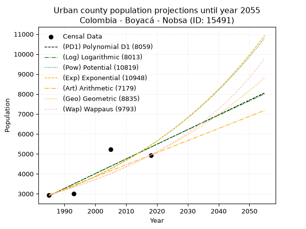
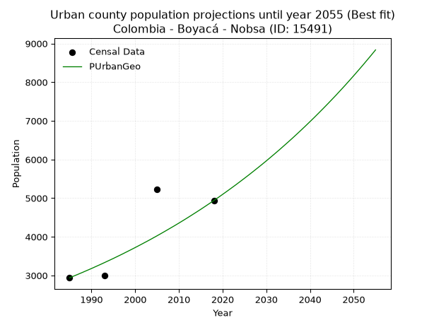
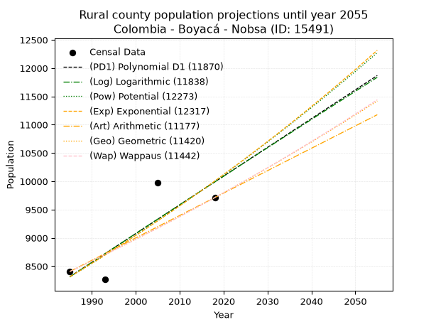
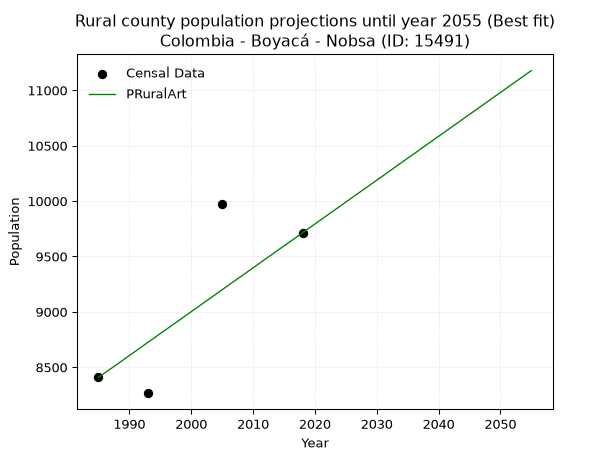

<div align="center">


</div>

# _“Population and Public Services Demand Projections (PPSD) until Year 2050 for Colombia - Boyacá - Nobsa (ID: 15491)”_
Keywords: `population` `public-service` `projection` `lineal` `polynomial` `logarithmic` `potential` `exponential` `arithmetic` `geometric` `wappaus` `dane` `colombia` `south-america`

PPSD are analytical estimates used by governments and planners to anticipate future changes in population size, age distribution, and the resulting community needs for utilities, healthcare, education, and infrastructure as sizing future water treatment facilities, electrical grids, and road networks based on spatial growth.

> **General running parameters**: • app_version: _v20260806_. • Python version: _3.14.7_. • Pandas version: _3.0.5_. • NumPy version: _2.5.1_. • Creates, save and include plots into reports (create_plot): _False_. • Projection until year: _2050_. • Process polynomial degree 2 and up: _False_. • Process Wappaus: _True_. • Process Wappaus: _True_. • Set negative values to zero: _True_. • Set infinite values to zero: _True_. • Drop dataset notes: _True_. 
<div align="center">

Dynamic map: [:earth_americas:Google](http://maps.google.com/maps?q=5.768045637,-72.9370421) [:earth_americas:OSM](https://www.openstreetmap.org/#map=18/5.768045637/-72.9370421&layers=P) [:earth_americas:Bing](https://www.bing.com/maps?cp=5.768045637~-72.9370421&lvl=18) [:earth_americas:Apple](https://maps.apple.com/frame?center=5.768045637%2C-72.9370421&span=0.003%2C0.006)

</div>


<div align="center">

```geojson
{
  "type": "Feature",
  "geometry": {
    "type": "Point", 
    "coordinates": [-72.9370421, 5.768045637]
  }, 
  "properties": {
    "Name": "Colombia - Boyacá - Nobsa (ID: 15491)"
  }
}
```

</div>


## 0. Census Data (4 records)

Census data are official statistics collected by a government about the people and housing in a country. They usually include counts of total population, age, sex, race, income, education, and jobs.

📅Global census file: [Population.xlsx](../data/Population.xlsx)

| Source   |   Year |   CountryID | CountryName   |   StateID | StateName   |   CountyID | CountyName   |   PTotal |   PUrban |   PRural |
|:---------|-------:|------------:|:--------------|----------:|:------------|-----------:|:-------------|---------:|---------:|---------:|
| DANE     |   1985 |          57 | Colombia      |        15 | Boyacá      |      15491 | Nobsa        |    11346 |     2939 |     8407 |
| DANE     |   1993 |          57 | Colombia      |        15 | Boyacá      |      15491 | Nobsa        |    11268 |     3003 |     8265 |
| DANE     |   2005 |          57 | Colombia      |        15 | Boyacá      |      15491 | Nobsa        |    15194 |     5224 |     9970 |
| DANE     |   2018 |          57 | Colombia      |        15 | Boyacá      |      15491 | Nobsa        |    14651 |     4938 |     9713 |

> 🔥Some records could had specific notes about the registered values or the corresponding urban or rural distribution.

## 1. Total

### 1.1. Coefficients and Parameters

* (PD1) Polynomial Deg 1: 124.4596547571257, -235835.6744279407 (lineal)
* (Log) Logarithmic: 249279.24931878425, -1881658.8216706156
* (Pow) Potential: 19.21567261623436, -59.31883531631771
* (Exp) Exponential: 0.009594300390937156, 6.011905273986499e-05
* (Art) Arithmetic: Year diff. 2018 - 1985 = 33, Population diff. 14651 - 11346 = 3305, Annual growth = 100.15151515151516
* (Geo) Geometric: Year diff. 2018 - 1985 = 33, Population diff. 14651 - 11346 = 3305, Annual growth % = 0.007776851524075923
* (Wap) Wappaus: i = 0.7704851725315625, Condition values only valid for < 200)

<sub>
Wappaus condition values: ['0.00', '0.77', '1.54', '2.31', '3.08', '3.85', '4.62', '5.39', '6.16', '6.93', '7.70', '8.48', '9.25', '10.02', '10.79', '11.56', '12.33', '13.10', '13.87', '14.64', '15.41', '16.18', '16.95', '17.72', '18.49', '19.26', '20.03', '20.80', '21.57', '22.34', '23.11', '23.89', '24.66', '25.43', '26.20', '26.97', '27.74', '28.51', '29.28', '30.05', '30.82', '31.59', '32.36', '33.13', '33.90', '34.67', '35.44', '36.21', '36.98', '37.75', '38.52', '39.29', '40.07', '40.84', '41.61', '42.38', '43.15', '43.92', '44.69', '45.46', '46.23', '47.00', '47.77', '48.54', '49.31', '50.08']
</sub>


### 1.2. Projected Dataset

|   Year |   CountyID |   PTotalPD1 |   PTotalLog |   PTotalPow |   PTotalExp |   PTotalArt |   PTotalGeo |   PTotalWap |
|-------:|-----------:|------------:|------------:|------------:|------------:|------------:|------------:|------------:|
|   1985 |      15491 |       11217 |       11212 |       11216 |       11221 |       11346 |       11346 |       11346 |
|   1986 |      15491 |       11341 |       11337 |       11325 |       11329 |       11446 |       11434 |       11434 |
|   1987 |      15491 |       11466 |       11463 |       11435 |       11438 |       11546 |       11523 |       11522 |
|   1988 |      15491 |       11590 |       11588 |       11547 |       11548 |       11646 |       11613 |       11611 |
|   1989 |      15491 |       11715 |       11714 |       11659 |       11660 |       11747 |       11703 |       11701 |
|   1990 |      15491 |       11839 |       11839 |       11772 |       11772 |       11847 |       11794 |       11792 |
|   1991 |      15491 |       11963 |       11964 |       11886 |       11885 |       11947 |       11886 |       11883 |
|   1992 |      15491 |       12088 |       12089 |       12001 |       12000 |       12047 |       11978 |       11975 |
|   1993 |      15491 |       12212 |       12214 |       12118 |       12116 |       12147 |       12071 |       12068 |
|   1994 |      15491 |       12337 |       12339 |       12235 |       12232 |       12247 |       12165 |       12161 |
|   1995 |      15491 |       12461 |       12464 |       12353 |       12350 |       12348 |       12260 |       12255 |
|   1996 |      15491 |       12586 |       12589 |       12473 |       12469 |       12448 |       12355 |       12350 |
|   1997 |      15491 |       12710 |       12714 |       12594 |       12590 |       12548 |       12451 |       12446 |
|   1998 |      15491 |       12835 |       12839 |       12715 |       12711 |       12648 |       12548 |       12542 |
|   1999 |      15491 |       12959 |       12964 |       12838 |       12834 |       12748 |       12646 |       12640 |
|   2000 |      15491 |       13084 |       13088 |       12962 |       12957 |       12848 |       12744 |       12738 |
|   2001 |      15491 |       13208 |       13213 |       13087 |       13082 |       12948 |       12843 |       12837 |
|   2002 |      15491 |       13333 |       13338 |       13213 |       13208 |       13049 |       12943 |       12936 |
|   2003 |      15491 |       13457 |       13462 |       13341 |       13336 |       13149 |       13044 |       13037 |
|   2004 |      15491 |       13581 |       13586 |       13469 |       13464 |       13249 |       13145 |       13138 |
|   2005 |      15491 |       13706 |       13711 |       13599 |       13594 |       13349 |       13247 |       13240 |
|   2006 |      15491 |       13830 |       13835 |       13730 |       13725 |       13449 |       13350 |       13343 |
|   2007 |      15491 |       13955 |       13959 |       13862 |       13857 |       13549 |       13454 |       13447 |
|   2008 |      15491 |       14079 |       14084 |       13996 |       13991 |       13649 |       13559 |       13552 |
|   2009 |      15491 |       14204 |       14208 |       14130 |       14126 |       13750 |       13664 |       13658 |
|   2010 |      15491 |       14328 |       14332 |       14266 |       14262 |       13850 |       13771 |       13764 |
|   2011 |      15491 |       14453 |       14456 |       14403 |       14400 |       13950 |       13878 |       13872 |
|   2012 |      15491 |       14577 |       14580 |       14541 |       14538 |       14050 |       13986 |       13980 |
|   2013 |      15491 |       14702 |       14704 |       14681 |       14679 |       14150 |       14094 |       14090 |
|   2014 |      15491 |       14826 |       14827 |       14821 |       14820 |       14250 |       14204 |       14200 |
|   2015 |      15491 |       14951 |       14951 |       14963 |       14963 |       14351 |       14314 |       14311 |
|   2016 |      15491 |       15075 |       15075 |       15107 |       15107 |       14451 |       14426 |       14424 |
|   2017 |      15491 |       15199 |       15198 |       15251 |       15253 |       14551 |       14538 |       14537 |
|   2018 |      15491 |       15324 |       15322 |       15397 |       15400 |       14651 |       14651 |       14651 |
|   2019 |      15491 |       15448 |       15445 |       15545 |       15548 |       14751 |       14765 |       14766 |
|   2020 |      15491 |       15573 |       15569 |       15693 |       15698 |       14851 |       14880 |       14883 |
|   2021 |      15491 |       15697 |       15692 |       15843 |       15850 |       14951 |       14995 |       15000 |
|   2022 |      15491 |       15822 |       15816 |       15995 |       16002 |       15052 |       15112 |       15118 |
|   2023 |      15491 |       15946 |       15939 |       16147 |       16157 |       15152 |       15230 |       15238 |
|   2024 |      15491 |       16071 |       16062 |       16301 |       16312 |       15252 |       15348 |       15358 |
|   2025 |      15491 |       16195 |       16185 |       16457 |       16470 |       15352 |       15467 |       15480 |
|   2026 |      15491 |       16320 |       16308 |       16614 |       16628 |       15452 |       15588 |       15603 |
|   2027 |      15491 |       16444 |       16431 |       16772 |       16789 |       15552 |       15709 |       15726 |
|   2028 |      15491 |       16569 |       16554 |       16932 |       16951 |       15653 |       15831 |       15851 |
|   2029 |      15491 |       16693 |       16677 |       17093 |       17114 |       15753 |       15954 |       15978 |
|   2030 |      15491 |       16817 |       16800 |       17255 |       17279 |       15853 |       16078 |       16105 |
|   2031 |      15491 |       16942 |       16923 |       17419 |       17446 |       15953 |       16203 |       16233 |
|   2032 |      15491 |       17066 |       17045 |       17585 |       17614 |       16053 |       16329 |       16363 |
|   2033 |      15491 |       17191 |       17168 |       17752 |       17784 |       16153 |       16456 |       16494 |
|   2034 |      15491 |       17315 |       17291 |       17921 |       17955 |       16253 |       16584 |       16626 |
|   2035 |      15491 |       17440 |       17413 |       18091 |       18128 |       16354 |       16713 |       16760 |
|   2036 |      15491 |       17564 |       17536 |       18262 |       18303 |       16454 |       16843 |       16895 |
|   2037 |      15491 |       17689 |       17658 |       18435 |       18479 |       16554 |       16974 |       17031 |
|   2038 |      15491 |       17813 |       17780 |       18610 |       18657 |       16654 |       17106 |       17168 |
|   2039 |      15491 |       17938 |       17903 |       18786 |       18837 |       16754 |       17239 |       17307 |
|   2040 |      15491 |       18062 |       18025 |       18964 |       19019 |       16854 |       17373 |       17447 |
|   2041 |      15491 |       18186 |       18147 |       19144 |       19202 |       16954 |       17508 |       17588 |
|   2042 |      15491 |       18311 |       18269 |       19325 |       19387 |       17055 |       17645 |       17731 |
|   2043 |      15491 |       18435 |       18391 |       19507 |       19574 |       17155 |       17782 |       17875 |
|   2044 |      15491 |       18560 |       18513 |       19692 |       19763 |       17255 |       17920 |       18021 |
|   2045 |      15491 |       18684 |       18635 |       19878 |       19954 |       17355 |       18059 |       18168 |
|   2046 |      15491 |       18809 |       18757 |       20065 |       20146 |       17455 |       18200 |       18317 |
|   2047 |      15491 |       18933 |       18879 |       20254 |       20340 |       17555 |       18341 |       18467 |
|   2048 |      15491 |       19058 |       19000 |       20445 |       20536 |       17656 |       18484 |       18618 |
|   2049 |      15491 |       19182 |       19122 |       20638 |       20734 |       17756 |       18628 |       18772 |
|   2050 |      15491 |       19307 |       19244 |       20833 |       20934 |       17856 |       18773 |       18926 |
<div align="center">

</img>

</div>


### 1.3. Best fit with absolute and relative error (%)

Relative error puts that difference into context by dividing the absolute error by the true value, creating a unitless ratio or percentage that shows the scale of the mistake.

Absolute and relative error

|   Year | Source   |   CountryID | CountryName   |   StateID | StateName   |   CountyID_x | CountyName   |   PTotal |   PUrban |   PRural |   CountyID_y |   PTotalPD1 |   PTotalLog |   PTotalPow |   PTotalExp |   PTotalArt |   PTotalGeo |   PTotalWap |   PTotalPD1AbsError |   PTotalLogAbsError |   PTotalPowAbsError |   PTotalExpAbsError |   PTotalArtAbsError |   PTotalGeoAbsError |   PTotalWapAbsError |   PTotalPD1RelError |   PTotalLogRelError |   PTotalPowRelError |   PTotalExpRelError |   PTotalArtRelError |   PTotalGeoRelError |   PTotalWapRelError |
|-------:|:---------|------------:|:--------------|----------:|:------------|-------------:|:-------------|---------:|---------:|---------:|-------------:|------------:|------------:|------------:|------------:|------------:|------------:|------------:|--------------------:|--------------------:|--------------------:|--------------------:|--------------------:|--------------------:|--------------------:|--------------------:|--------------------:|--------------------:|--------------------:|--------------------:|--------------------:|--------------------:|
|   1985 | DANE     |          57 | Colombia      |        15 | Boyacá      |        15491 | Nobsa        |    11346 |     2939 |     8407 |        15491 |       11217 |       11212 |       11216 |       11221 |       11346 |       11346 |       11346 |                 129 |                 134 |                 130 |                 125 |                   0 |                   0 |                   0 |             1.13696 |             1.18103 |             1.14578 |             1.10171 |             0       |             0       |             0       |
|   1993 | DANE     |          57 | Colombia      |        15 | Boyacá      |        15491 | Nobsa        |    11268 |     3003 |     8265 |        15491 |       12212 |       12214 |       12118 |       12116 |       12147 |       12071 |       12068 |                 944 |                 946 |                 850 |                 848 |                 879 |                 803 |                 800 |             8.37771 |             8.39546 |             7.54349 |             7.52574 |             7.80085 |             7.12638 |             7.09975 |
|   2005 | DANE     |          57 | Colombia      |        15 | Boyacá      |        15491 | Nobsa        |    15194 |     5224 |     9970 |        15491 |       13706 |       13711 |       13599 |       13594 |       13349 |       13247 |       13240 |                1488 |                1483 |                1595 |                1600 |                1845 |                1947 |                1954 |             9.79334 |             9.76043 |            10.4976  |            10.5305  |            12.143   |            12.8143  |            12.8603  |
|   2018 | DANE     |          57 | Colombia      |        15 | Boyacá      |        15491 | Nobsa        |    14651 |     4938 |     9713 |        15491 |       15324 |       15322 |       15397 |       15400 |       14651 |       14651 |       14651 |                 673 |                 671 |                 746 |                 749 |                   0 |                   0 |                   0 |             4.59354 |             4.57989 |             5.0918  |             5.11228 |             0       |             0       |             0       |

Relative error mean

| Method    |   RelError | Best   |
|:----------|-----------:|:-------|
| PTotalPD1 |    5.97539 |        |
| PTotalLog |    5.9792  |        |
| PTotalPow |    6.06966 |        |
| PTotalExp |    6.06755 |        |
| PTotalArt |    4.98595 |        |
| PTotalGeo |    4.98516 | True   |
| PTotalWap |    4.99002 |        |

💙Best method: _**PTotalGeo**_
<div align="center">

</img>

</div>


### 1.4. Fresh water supply demand in liters per capita per day (lpcd)

The fresh water supply demand typically ranges from 100 to 300 liters per capita per day (lpcd) for standard domestic and municipal planning, though absolute survival minimums set by the World Health Organization are as low as 7.5 to 20 liters per day, and total consumption in high-income nations can exceed 400 liters.

> `CZ`: Level in meters above the sea level (masl).<br> `WS`: Fresh water supply demand in liters per capita per day (lpcd or l/h/d).<br> `WSAll`: Zonal fresh water supply demand in liters per second (l/s).<br> `A`: Zonal area in square meters.

Reference values (RAS Colombia)

|    CZ |   WS |
|------:|-----:|
|  1000 |  120 |
|  2000 |  130 |
| 99999 |  140 |

County shapefile geometry properties and water supply values

|   CountyID |     ATotal |   CZTotal |   WSTotal |
|-----------:|-----------:|----------:|----------:|
|      15491 | 5.5403e+07 |   2642.73 |       140 |

Projected values for best method: PTotalGeo

|   CountyID |   Year |   PTotalGeo |   WSTotal |   WSTotalAll |
|-----------:|-------:|------------:|----------:|-------------:|
|      15491 |   1985 |       11346 |       140 |      18.3847 |
|      15491 |   1986 |       11434 |       140 |      18.5273 |
|      15491 |   1987 |       11523 |       140 |      18.6715 |
|      15491 |   1988 |       11613 |       140 |      18.8174 |
|      15491 |   1989 |       11703 |       140 |      18.9632 |
|      15491 |   1990 |       11794 |       140 |      19.1106 |
|      15491 |   1991 |       11886 |       140 |      19.2597 |
|      15491 |   1992 |       11978 |       140 |      19.4088 |
|      15491 |   1993 |       12071 |       140 |      19.5595 |
|      15491 |   1994 |       12165 |       140 |      19.7118 |
|      15491 |   1995 |       12260 |       140 |      19.8657 |
|      15491 |   1996 |       12355 |       140 |      20.0197 |
|      15491 |   1997 |       12451 |       140 |      20.1752 |
|      15491 |   1998 |       12548 |       140 |      20.3324 |
|      15491 |   1999 |       12646 |       140 |      20.4912 |
|      15491 |   2000 |       12744 |       140 |      20.65   |
|      15491 |   2001 |       12843 |       140 |      20.8104 |
|      15491 |   2002 |       12943 |       140 |      20.9725 |
|      15491 |   2003 |       13044 |       140 |      21.1361 |
|      15491 |   2004 |       13145 |       140 |      21.2998 |
|      15491 |   2005 |       13247 |       140 |      21.465  |
|      15491 |   2006 |       13350 |       140 |      21.6319 |
|      15491 |   2007 |       13454 |       140 |      21.8005 |
|      15491 |   2008 |       13559 |       140 |      21.9706 |
|      15491 |   2009 |       13664 |       140 |      22.1407 |
|      15491 |   2010 |       13771 |       140 |      22.3141 |
|      15491 |   2011 |       13878 |       140 |      22.4875 |
|      15491 |   2012 |       13986 |       140 |      22.6625 |
|      15491 |   2013 |       14094 |       140 |      22.8375 |
|      15491 |   2014 |       14204 |       140 |      23.0157 |
|      15491 |   2015 |       14314 |       140 |      23.194  |
|      15491 |   2016 |       14426 |       140 |      23.3755 |
|      15491 |   2017 |       14538 |       140 |      23.5569 |
|      15491 |   2018 |       14651 |       140 |      23.74   |
|      15491 |   2019 |       14765 |       140 |      23.9248 |
|      15491 |   2020 |       14880 |       140 |      24.1111 |
|      15491 |   2021 |       14995 |       140 |      24.2975 |
|      15491 |   2022 |       15112 |       140 |      24.487  |
|      15491 |   2023 |       15230 |       140 |      24.6782 |
|      15491 |   2024 |       15348 |       140 |      24.8694 |
|      15491 |   2025 |       15467 |       140 |      25.0623 |
|      15491 |   2026 |       15588 |       140 |      25.2583 |
|      15491 |   2027 |       15709 |       140 |      25.4544 |
|      15491 |   2028 |       15831 |       140 |      25.6521 |
|      15491 |   2029 |       15954 |       140 |      25.8514 |
|      15491 |   2030 |       16078 |       140 |      26.0523 |
|      15491 |   2031 |       16203 |       140 |      26.2549 |
|      15491 |   2032 |       16329 |       140 |      26.459  |
|      15491 |   2033 |       16456 |       140 |      26.6648 |
|      15491 |   2034 |       16584 |       140 |      26.8722 |
|      15491 |   2035 |       16713 |       140 |      27.0813 |
|      15491 |   2036 |       16843 |       140 |      27.2919 |
|      15491 |   2037 |       16974 |       140 |      27.5042 |
|      15491 |   2038 |       17106 |       140 |      27.7181 |
|      15491 |   2039 |       17239 |       140 |      27.9336 |
|      15491 |   2040 |       17373 |       140 |      28.1507 |
|      15491 |   2041 |       17508 |       140 |      28.3694 |
|      15491 |   2042 |       17645 |       140 |      28.5914 |
|      15491 |   2043 |       17782 |       140 |      28.8134 |
|      15491 |   2044 |       17920 |       140 |      29.037  |
|      15491 |   2045 |       18059 |       140 |      29.2623 |
|      15491 |   2046 |       18200 |       140 |      29.4907 |
|      15491 |   2047 |       18341 |       140 |      29.7192 |
|      15491 |   2048 |       18484 |       140 |      29.9509 |
|      15491 |   2049 |       18628 |       140 |      30.1843 |
|      15491 |   2050 |       18773 |       140 |      30.4192 |

## 2. Urban

### 2.1. Coefficients and Parameters

* (PD1) Polynomial Deg 1: 73.66037735849059, -143313.1698113208 (lineal)
* (Log) Logarithmic: 147538.25787970974, -1117413.4804410725
* (Pow) Potential: 37.90680765731837, -121.54391952857009
* (Exp) Exponential: 0.01892622147264645, 1.4065828145273394e-13
* (Art) Arithmetic: Year diff. 2018 - 1985 = 33, Population diff. 4938 - 2939 = 1999, Annual growth = 60.57575757575758
* (Geo) Geometric: Year diff. 2018 - 1985 = 33, Population diff. 4938 - 2939 = 1999, Annual growth % = 0.015848241911708083
* (Wap) Wappaus: i = 1.5380413247621576, Condition values only valid for < 200)

<sub>
Wappaus condition values: ['0.00', '1.54', '3.08', '4.61', '6.15', '7.69', '9.23', '10.77', '12.30', '13.84', '15.38', '16.92', '18.46', '19.99', '21.53', '23.07', '24.61', '26.15', '27.68', '29.22', '30.76', '32.30', '33.84', '35.37', '36.91', '38.45', '39.99', '41.53', '43.07', '44.60', '46.14', '47.68', '49.22', '50.76', '52.29', '53.83', '55.37', '56.91', '58.45', '59.98', '61.52', '63.06', '64.60', '66.14', '67.67', '69.21', '70.75', '72.29', '73.83', '75.36', '76.90', '78.44', '79.98', '81.52', '83.05', '84.59', '86.13', '87.67', '89.21', '90.74', '92.28', '93.82', '95.36', '96.90', '98.43', '99.97']
</sub>


### 2.2. Projected Dataset

|   Year |   CountyID |   PUrbanPD1 |   PUrbanLog |   PUrbanPow |   PUrbanExp |   PUrbanArt |   PUrbanGeo |   PUrbanWap |
|-------:|-----------:|------------:|------------:|------------:|------------:|------------:|------------:|------------:|
|   1985 |      15491 |        2903 |        2900 |        2908 |        2911 |        2939 |        2939 |        2939 |
|   1986 |      15491 |        2976 |        2974 |        2964 |        2966 |        3000 |        2986 |        2985 |
|   1987 |      15491 |        3050 |        3048 |        3022 |        3023 |        3060 |        3033 |        3031 |
|   1988 |      15491 |        3124 |        3123 |        3080 |        3081 |        3121 |        3081 |        3078 |
|   1989 |      15491 |        3197 |        3197 |        3139 |        3139 |        3181 |        3130 |        3126 |
|   1990 |      15491 |        3271 |        3271 |        3199 |        3199 |        3242 |        3179 |        3174 |
|   1991 |      15491 |        3345 |        3345 |        3261 |        3261 |        3302 |        3230 |        3223 |
|   1992 |      15491 |        3418 |        3419 |        3324 |        3323 |        3363 |        3281 |        3273 |
|   1993 |      15491 |        3492 |        3493 |        3387 |        3386 |        3424 |        3333 |        3324 |
|   1994 |      15491 |        3566 |        3567 |        3452 |        3451 |        3484 |        3386 |        3376 |
|   1995 |      15491 |        3639 |        3641 |        3519 |        3517 |        3545 |        3439 |        3429 |
|   1996 |      15491 |        3713 |        3715 |        3586 |        3584 |        3605 |        3494 |        3482 |
|   1997 |      15491 |        3787 |        3789 |        3655 |        3653 |        3666 |        3549 |        3537 |
|   1998 |      15491 |        3860 |        3863 |        3725 |        3722 |        3726 |        3606 |        3592 |
|   1999 |      15491 |        3934 |        3937 |        3796 |        3794 |        3787 |        3663 |        3648 |
|   2000 |      15491 |        4008 |        4010 |        3869 |        3866 |        3848 |        3721 |        3705 |
|   2001 |      15491 |        4081 |        4084 |        3943 |        3940 |        3908 |        3780 |        3764 |
|   2002 |      15491 |        4155 |        4158 |        4018 |        4015 |        3969 |        3840 |        3823 |
|   2003 |      15491 |        4229 |        4232 |        4095 |        4092 |        4029 |        3900 |        3883 |
|   2004 |      15491 |        4302 |        4305 |        4173 |        4170 |        4090 |        3962 |        3945 |
|   2005 |      15491 |        4376 |        4379 |        4253 |        4250 |        4151 |        4025 |        4007 |
|   2006 |      15491 |        4450 |        4452 |        4334 |        4331 |        4211 |        4089 |        4071 |
|   2007 |      15491 |        4523 |        4526 |        4417 |        4414 |        4272 |        4154 |        4136 |
|   2008 |      15491 |        4597 |        4599 |        4501 |        4498 |        4332 |        4220 |        4202 |
|   2009 |      15491 |        4671 |        4673 |        4587 |        4584 |        4393 |        4286 |        4269 |
|   2010 |      15491 |        4744 |        4746 |        4674 |        4672 |        4453 |        4354 |        4338 |
|   2011 |      15491 |        4818 |        4820 |        4763 |        4761 |        4514 |        4423 |        4408 |
|   2012 |      15491 |        4892 |        4893 |        4854 |        4852 |        4575 |        4493 |        4479 |
|   2013 |      15491 |        4965 |        4966 |        4946 |        4945 |        4635 |        4565 |        4552 |
|   2014 |      15491 |        5039 |        5040 |        5040 |        5039 |        4696 |        4637 |        4626 |
|   2015 |      15491 |        5112 |        5113 |        5136 |        5135 |        4756 |        4710 |        4702 |
|   2016 |      15491 |        5186 |        5186 |        5233 |        5233 |        4817 |        4785 |        4779 |
|   2017 |      15491 |        5260 |        5259 |        5333 |        5333 |        4877 |        4861 |        4858 |
|   2018 |      15491 |        5333 |        5332 |        5434 |        5435 |        4938 |        4938 |        4938 |
|   2019 |      15491 |        5407 |        5405 |        5537 |        5539 |        4999 |        5016 |        5020 |
|   2020 |      15491 |        5481 |        5478 |        5642 |        5645 |        5059 |        5096 |        5104 |
|   2021 |      15491 |        5554 |        5552 |        5748 |        5753 |        5120 |        5177 |        5189 |
|   2022 |      15491 |        5628 |        5624 |        5857 |        5863 |        5180 |        5259 |        5277 |
|   2023 |      15491 |        5702 |        5697 |        5968 |        5975 |        5241 |        5342 |        5366 |
|   2024 |      15491 |        5775 |        5770 |        6081 |        6089 |        5301 |        5427 |        5457 |
|   2025 |      15491 |        5849 |        5843 |        6196 |        6205 |        5362 |        5513 |        5550 |
|   2026 |      15491 |        5923 |        5916 |        6313 |        6324 |        5423 |        5600 |        5646 |
|   2027 |      15491 |        5996 |        5989 |        6432 |        6445 |        5483 |        5689 |        5743 |
|   2028 |      15491 |        6070 |        6062 |        6553 |        6568 |        5544 |        5779 |        5843 |
|   2029 |      15491 |        6144 |        6134 |        6677 |        6693 |        5604 |        5870 |        5945 |
|   2030 |      15491 |        6217 |        6207 |        6803 |        6821 |        5665 |        5963 |        6050 |
|   2031 |      15491 |        6291 |        6280 |        6931 |        6952 |        5725 |        6058 |        6157 |
|   2032 |      15491 |        6365 |        6352 |        7062 |        7084 |        5786 |        6154 |        6266 |
|   2033 |      15491 |        6438 |        6425 |        7195 |        7220 |        5847 |        6251 |        6378 |
|   2034 |      15491 |        6512 |        6497 |        7330 |        7358 |        5907 |        6351 |        6493 |
|   2035 |      15491 |        6586 |        6570 |        7468 |        7498 |        5968 |        6451 |        6611 |
|   2036 |      15491 |        6659 |        6642 |        7608 |        7641 |        6028 |        6553 |        6732 |
|   2037 |      15491 |        6733 |        6715 |        7751 |        7787 |        6089 |        6657 |        6856 |
|   2038 |      15491 |        6807 |        6787 |        7897 |        7936 |        6150 |        6763 |        6983 |
|   2039 |      15491 |        6880 |        6860 |        8045 |        8088 |        6210 |        6870 |        7114 |
|   2040 |      15491 |        6954 |        6932 |        8196 |        8242 |        6271 |        6979 |        7247 |
|   2041 |      15491 |        7028 |        7004 |        8350 |        8400 |        6331 |        7089 |        7385 |
|   2042 |      15491 |        7101 |        7077 |        8506 |        8560 |        6392 |        7202 |        7526 |
|   2043 |      15491 |        7175 |        7149 |        8665 |        8724 |        6452 |        7316 |        7672 |
|   2044 |      15491 |        7249 |        7221 |        8828 |        8891 |        6513 |        7432 |        7821 |
|   2045 |      15491 |        7322 |        7293 |        8993 |        9061 |        6574 |        7550 |        7975 |
|   2046 |      15491 |        7396 |        7365 |        9161 |        9234 |        6634 |        7669 |        8133 |
|   2047 |      15491 |        7470 |        7437 |        9332 |        9410 |        6695 |        7791 |        8296 |
|   2048 |      15491 |        7543 |        7510 |        9507 |        9590 |        6755 |        7914 |        8463 |
|   2049 |      15491 |        7617 |        7582 |        9684 |        9773 |        6816 |        8040 |        8636 |
|   2050 |      15491 |        7691 |        7654 |        9865 |        9960 |        6876 |        8167 |        8814 |
<div align="center">

</img>

</div>


### 2.3. Best fit with absolute and relative error (%)

Relative error puts that difference into context by dividing the absolute error by the true value, creating a unitless ratio or percentage that shows the scale of the mistake.

Absolute and relative error

|   Year | Source   |   CountryID | CountryName   |   StateID | StateName   |   CountyID_x | CountyName   |   PTotal |   PUrban |   PRural |   CountyID_y |   PUrbanPD1 |   PUrbanLog |   PUrbanPow |   PUrbanExp |   PUrbanArt |   PUrbanGeo |   PUrbanWap |   PUrbanPD1AbsError |   PUrbanLogAbsError |   PUrbanPowAbsError |   PUrbanExpAbsError |   PUrbanArtAbsError |   PUrbanGeoAbsError |   PUrbanWapAbsError |   PUrbanPD1RelError |   PUrbanLogRelError |   PUrbanPowRelError |   PUrbanExpRelError |   PUrbanArtRelError |   PUrbanGeoRelError |   PUrbanWapRelError |
|-------:|:---------|------------:|:--------------|----------:|:------------|-------------:|:-------------|---------:|---------:|---------:|-------------:|------------:|------------:|------------:|------------:|------------:|------------:|------------:|--------------------:|--------------------:|--------------------:|--------------------:|--------------------:|--------------------:|--------------------:|--------------------:|--------------------:|--------------------:|--------------------:|--------------------:|--------------------:|--------------------:|
|   1985 | DANE     |          57 | Colombia      |        15 | Boyacá      |        15491 | Nobsa        |    11346 |     2939 |     8407 |        15491 |        2903 |        2900 |        2908 |        2911 |        2939 |        2939 |        2939 |                  36 |                  39 |                  31 |                  28 |                   0 |                   0 |                   0 |             1.22491 |             1.32698 |             1.05478 |            0.952705 |              0      |              0      |              0      |
|   1993 | DANE     |          57 | Colombia      |        15 | Boyacá      |        15491 | Nobsa        |    11268 |     3003 |     8265 |        15491 |        3492 |        3493 |        3387 |        3386 |        3424 |        3333 |        3324 |                 489 |                 490 |                 384 |                 383 |                 421 |                 330 |                 321 |            16.2837  |            16.317   |            12.7872  |           12.7539   |             14.0193 |             10.989  |             10.6893 |
|   2005 | DANE     |          57 | Colombia      |        15 | Boyacá      |        15491 | Nobsa        |    15194 |     5224 |     9970 |        15491 |        4376 |        4379 |        4253 |        4250 |        4151 |        4025 |        4007 |                 848 |                 845 |                 971 |                 974 |                1073 |                1199 |                1217 |            16.2328  |            16.1753  |            18.5873  |           18.6447   |             20.5398 |             22.9518 |             23.2963 |
|   2018 | DANE     |          57 | Colombia      |        15 | Boyacá      |        15491 | Nobsa        |    14651 |     4938 |     9713 |        15491 |        5333 |        5332 |        5434 |        5435 |        4938 |        4938 |        4938 |                 395 |                 394 |                 496 |                 497 |                   0 |                   0 |                   0 |             7.99919 |             7.97894 |            10.0446  |           10.0648   |              0      |              0      |              0      |

Relative error mean

| Method    |   RelError | Best   |
|:----------|-----------:|:-------|
| PUrbanPD1 |   10.4351  |        |
| PUrbanLog |   10.4496  |        |
| PUrbanPow |   10.6185  |        |
| PUrbanExp |   10.604   |        |
| PUrbanArt |    8.63978 |        |
| PUrbanGeo |    8.48519 | True   |
| PUrbanWap |    8.49641 |        |

💙Best method: _**PUrbanGeo**_
<div align="center">

</img>

</div>


### 2.4. Fresh water supply demand in liters per capita per day (lpcd)

The fresh water supply demand typically ranges from 100 to 300 liters per capita per day (lpcd) for standard domestic and municipal planning, though absolute survival minimums set by the World Health Organization are as low as 7.5 to 20 liters per day, and total consumption in high-income nations can exceed 400 liters.

> `CZ`: Level in meters above the sea level (masl).<br> `WS`: Fresh water supply demand in liters per capita per day (lpcd or l/h/d).<br> `WSAll`: Zonal fresh water supply demand in liters per second (l/s).<br> `A`: Zonal area in square meters.

Reference values (RAS Colombia)

|    CZ |   WS |
|------:|-----:|
|  1000 |  120 |
|  2000 |  130 |
| 99999 |  140 |

County shapefile geometry properties and water supply values

|   CountyID |      AUrban |   CZUrban |   WSUrban |
|-----------:|------------:|----------:|----------:|
|      15491 | 1.46474e+06 |   2496.14 |       140 |

Projected values for best method: PUrbanGeo

|   CountyID |   Year |   PUrbanGeo |   WSUrban |   WSUrbanAll |
|-----------:|-------:|------------:|----------:|-------------:|
|      15491 |   1985 |        2939 |       140 |      4.76227 |
|      15491 |   1986 |        2986 |       140 |      4.83843 |
|      15491 |   1987 |        3033 |       140 |      4.91458 |
|      15491 |   1988 |        3081 |       140 |      4.99236 |
|      15491 |   1989 |        3130 |       140 |      5.07176 |
|      15491 |   1990 |        3179 |       140 |      5.15116 |
|      15491 |   1991 |        3230 |       140 |      5.2338  |
|      15491 |   1992 |        3281 |       140 |      5.31644 |
|      15491 |   1993 |        3333 |       140 |      5.40069 |
|      15491 |   1994 |        3386 |       140 |      5.48657 |
|      15491 |   1995 |        3439 |       140 |      5.57245 |
|      15491 |   1996 |        3494 |       140 |      5.66157 |
|      15491 |   1997 |        3549 |       140 |      5.75069 |
|      15491 |   1998 |        3606 |       140 |      5.84306 |
|      15491 |   1999 |        3663 |       140 |      5.93542 |
|      15491 |   2000 |        3721 |       140 |      6.0294  |
|      15491 |   2001 |        3780 |       140 |      6.125   |
|      15491 |   2002 |        3840 |       140 |      6.22222 |
|      15491 |   2003 |        3900 |       140 |      6.31944 |
|      15491 |   2004 |        3962 |       140 |      6.41991 |
|      15491 |   2005 |        4025 |       140 |      6.52199 |
|      15491 |   2006 |        4089 |       140 |      6.62569 |
|      15491 |   2007 |        4154 |       140 |      6.73102 |
|      15491 |   2008 |        4220 |       140 |      6.83796 |
|      15491 |   2009 |        4286 |       140 |      6.94491 |
|      15491 |   2010 |        4354 |       140 |      7.05509 |
|      15491 |   2011 |        4423 |       140 |      7.1669  |
|      15491 |   2012 |        4493 |       140 |      7.28032 |
|      15491 |   2013 |        4565 |       140 |      7.39699 |
|      15491 |   2014 |        4637 |       140 |      7.51366 |
|      15491 |   2015 |        4710 |       140 |      7.63194 |
|      15491 |   2016 |        4785 |       140 |      7.75347 |
|      15491 |   2017 |        4861 |       140 |      7.87662 |
|      15491 |   2018 |        4938 |       140 |      8.00139 |
|      15491 |   2019 |        5016 |       140 |      8.12778 |
|      15491 |   2020 |        5096 |       140 |      8.25741 |
|      15491 |   2021 |        5177 |       140 |      8.38866 |
|      15491 |   2022 |        5259 |       140 |      8.52153 |
|      15491 |   2023 |        5342 |       140 |      8.65602 |
|      15491 |   2024 |        5427 |       140 |      8.79375 |
|      15491 |   2025 |        5513 |       140 |      8.9331  |
|      15491 |   2026 |        5600 |       140 |      9.07407 |
|      15491 |   2027 |        5689 |       140 |      9.21829 |
|      15491 |   2028 |        5779 |       140 |      9.36412 |
|      15491 |   2029 |        5870 |       140 |      9.51157 |
|      15491 |   2030 |        5963 |       140 |      9.66227 |
|      15491 |   2031 |        6058 |       140 |      9.8162  |
|      15491 |   2032 |        6154 |       140 |      9.97176 |
|      15491 |   2033 |        6251 |       140 |     10.1289  |
|      15491 |   2034 |        6351 |       140 |     10.291   |
|      15491 |   2035 |        6451 |       140 |     10.453   |
|      15491 |   2036 |        6553 |       140 |     10.6183  |
|      15491 |   2037 |        6657 |       140 |     10.7868  |
|      15491 |   2038 |        6763 |       140 |     10.9586  |
|      15491 |   2039 |        6870 |       140 |     11.1319  |
|      15491 |   2040 |        6979 |       140 |     11.3086  |
|      15491 |   2041 |        7089 |       140 |     11.4868  |
|      15491 |   2042 |        7202 |       140 |     11.6699  |
|      15491 |   2043 |        7316 |       140 |     11.8546  |
|      15491 |   2044 |        7432 |       140 |     12.0426  |
|      15491 |   2045 |        7550 |       140 |     12.2338  |
|      15491 |   2046 |        7669 |       140 |     12.4266  |
|      15491 |   2047 |        7791 |       140 |     12.6243  |
|      15491 |   2048 |        7914 |       140 |     12.8236  |
|      15491 |   2049 |        8040 |       140 |     13.0278  |
|      15491 |   2050 |        8167 |       140 |     13.2336  |

## 3. Rural

### 3.1. Coefficients and Parameters

* (PD1) Polynomial Deg 1: 50.799277398635134, -92522.50461661992 (lineal)
* (Log) Logarithmic: 101740.99143907448, -764245.341229543
* (Pow) Potential: 11.244813506646146, -33.16299904711398
* (Exp) Exponential: 0.005614713557236188, 0.12008680011068448
* (Art) Arithmetic: Year diff. 2018 - 1985 = 33, Population diff. 9713 - 8407 = 1306, Annual growth = 39.57575757575758
* (Geo) Geometric: Year diff. 2018 - 1985 = 33, Population diff. 9713 - 8407 = 1306, Annual growth % = 0.004385360469143951
* (Wap) Wappaus: i = 0.436818516288715, Condition values only valid for < 200)

<sub>
Wappaus condition values: ['0.00', '0.44', '0.87', '1.31', '1.75', '2.18', '2.62', '3.06', '3.49', '3.93', '4.37', '4.81', '5.24', '5.68', '6.12', '6.55', '6.99', '7.43', '7.86', '8.30', '8.74', '9.17', '9.61', '10.05', '10.48', '10.92', '11.36', '11.79', '12.23', '12.67', '13.10', '13.54', '13.98', '14.42', '14.85', '15.29', '15.73', '16.16', '16.60', '17.04', '17.47', '17.91', '18.35', '18.78', '19.22', '19.66', '20.09', '20.53', '20.97', '21.40', '21.84', '22.28', '22.71', '23.15', '23.59', '24.03', '24.46', '24.90', '25.34', '25.77', '26.21', '26.65', '27.08', '27.52', '27.96', '28.39']
</sub>


### 3.2. Projected Dataset

|   Year |   CountyID |   PRuralPD1 |   PRuralLog |   PRuralPow |   PRuralExp |   PRuralArt |   PRuralGeo |   PRuralWap |
|-------:|-----------:|------------:|------------:|------------:|------------:|------------:|------------:|------------:|
|   1985 |      15491 |        8314 |        8312 |        8312 |        8314 |        8407 |        8407 |        8407 |
|   1986 |      15491 |        8365 |        8363 |        8359 |        8361 |        8447 |        8444 |        8444 |
|   1987 |      15491 |        8416 |        8415 |        8407 |        8408 |        8486 |        8481 |        8481 |
|   1988 |      15491 |        8466 |        8466 |        8454 |        8455 |        8526 |        8518 |        8518 |
|   1989 |      15491 |        8517 |        8517 |        8502 |        8503 |        8565 |        8555 |        8555 |
|   1990 |      15491 |        8568 |        8568 |        8550 |        8550 |        8605 |        8593 |        8593 |
|   1991 |      15491 |        8619 |        8619 |        8599 |        8599 |        8644 |        8631 |        8630 |
|   1992 |      15491 |        8670 |        8670 |        8648 |        8647 |        8684 |        8668 |        8668 |
|   1993 |      15491 |        8720 |        8721 |        8697 |        8696 |        8724 |        8707 |        8706 |
|   1994 |      15491 |        8771 |        8772 |        8746 |        8745 |        8763 |        8745 |        8744 |
|   1995 |      15491 |        8822 |        8823 |        8795 |        8794 |        8803 |        8783 |        8782 |
|   1996 |      15491 |        8873 |        8874 |        8845 |        8843 |        8842 |        8822 |        8821 |
|   1997 |      15491 |        8924 |        8925 |        8895 |        8893 |        8882 |        8860 |        8860 |
|   1998 |      15491 |        8974 |        8976 |        8945 |        8943 |        8921 |        8899 |        8898 |
|   1999 |      15491 |        9025 |        9027 |        8995 |        8994 |        8961 |        8938 |        8937 |
|   2000 |      15491 |        9076 |        9078 |        9046 |        9044 |        9001 |        8977 |        8977 |
|   2001 |      15491 |        9127 |        9129 |        9097 |        9095 |        9040 |        9017 |        9016 |
|   2002 |      15491 |        9178 |        9180 |        9148 |        9146 |        9080 |        9056 |        9055 |
|   2003 |      15491 |        9228 |        9231 |        9200 |        9198 |        9119 |        9096 |        9095 |
|   2004 |      15491 |        9279 |        9281 |        9252 |        9250 |        9159 |        9136 |        9135 |
|   2005 |      15491 |        9330 |        9332 |        9304 |        9302 |        9199 |        9176 |        9175 |
|   2006 |      15491 |        9381 |        9383 |        9356 |        9354 |        9238 |        9216 |        9215 |
|   2007 |      15491 |        9432 |        9433 |        9409 |        9407 |        9278 |        9257 |        9256 |
|   2008 |      15491 |        9482 |        9484 |        9462 |        9460 |        9317 |        9297 |        9296 |
|   2009 |      15491 |        9533 |        9535 |        9515 |        9513 |        9357 |        9338 |        9337 |
|   2010 |      15491 |        9584 |        9585 |        9568 |        9567 |        9396 |        9379 |        9378 |
|   2011 |      15491 |        9635 |        9636 |        9622 |        9620 |        9436 |        9420 |        9419 |
|   2012 |      15491 |        9686 |        9687 |        9676 |        9675 |        9476 |        9461 |        9461 |
|   2013 |      15491 |        9736 |        9737 |        9730 |        9729 |        9515 |        9503 |        9502 |
|   2014 |      15491 |        9787 |        9788 |        9784 |        9784 |        9555 |        9544 |        9544 |
|   2015 |      15491 |        9838 |        9838 |        9839 |        9839 |        9594 |        9586 |        9586 |
|   2016 |      15491 |        9889 |        9889 |        9894 |        9894 |        9634 |        9628 |        9628 |
|   2017 |      15491 |        9940 |        9939 |        9950 |        9950 |        9673 |        9671 |        9670 |
|   2018 |      15491 |        9990 |        9990 |       10005 |       10006 |        9713 |        9713 |        9713 |
|   2019 |      15491 |       10041 |       10040 |       10061 |       10062 |        9753 |        9756 |        9756 |
|   2020 |      15491 |       10092 |       10090 |       10117 |       10119 |        9792 |        9798 |        9799 |
|   2021 |      15491 |       10143 |       10141 |       10174 |       10176 |        9832 |        9841 |        9842 |
|   2022 |      15491 |       10194 |       10191 |       10230 |       10233 |        9871 |        9885 |        9885 |
|   2023 |      15491 |       10244 |       10241 |       10287 |       10291 |        9911 |        9928 |        9929 |
|   2024 |      15491 |       10295 |       10292 |       10345 |       10349 |        9950 |        9971 |        9973 |
|   2025 |      15491 |       10346 |       10342 |       10402 |       10407 |        9990 |       10015 |       10017 |
|   2026 |      15491 |       10397 |       10392 |       10460 |       10466 |       10030 |       10059 |       10061 |
|   2027 |      15491 |       10448 |       10442 |       10519 |       10525 |       10069 |       10103 |       10105 |
|   2028 |      15491 |       10498 |       10493 |       10577 |       10584 |       10109 |       10147 |       10150 |
|   2029 |      15491 |       10549 |       10543 |       10636 |       10644 |       10148 |       10192 |       10195 |
|   2030 |      15491 |       10600 |       10593 |       10695 |       10704 |       10188 |       10237 |       10240 |
|   2031 |      15491 |       10651 |       10643 |       10754 |       10764 |       10227 |       10282 |       10285 |
|   2032 |      15491 |       10702 |       10693 |       10814 |       10824 |       10267 |       10327 |       10330 |
|   2033 |      15491 |       10752 |       10743 |       10874 |       10885 |       10307 |       10372 |       10376 |
|   2034 |      15491 |       10803 |       10793 |       10934 |       10947 |       10346 |       10417 |       10422 |
|   2035 |      15491 |       10854 |       10843 |       10995 |       11008 |       10386 |       10463 |       10468 |
|   2036 |      15491 |       10905 |       10893 |       11056 |       11070 |       10425 |       10509 |       10515 |
|   2037 |      15491 |       10956 |       10943 |       11117 |       11133 |       10465 |       10555 |       10561 |
|   2038 |      15491 |       11006 |       10993 |       11179 |       11195 |       10505 |       10601 |       10608 |
|   2039 |      15491 |       11057 |       11043 |       11240 |       11258 |       10544 |       10648 |       10655 |
|   2040 |      15491 |       11108 |       11093 |       11303 |       11322 |       10584 |       10695 |       10703 |
|   2041 |      15491 |       11159 |       11143 |       11365 |       11385 |       10623 |       10741 |       10750 |
|   2042 |      15491 |       11210 |       11192 |       11428 |       11450 |       10663 |       10789 |       10798 |
|   2043 |      15491 |       11260 |       11242 |       11491 |       11514 |       10702 |       10836 |       10846 |
|   2044 |      15491 |       11311 |       11292 |       11554 |       11579 |       10742 |       10883 |       10894 |
|   2045 |      15491 |       11362 |       11342 |       11618 |       11644 |       10782 |       10931 |       10943 |
|   2046 |      15491 |       11413 |       11392 |       11682 |       11710 |       10821 |       10979 |       10991 |
|   2047 |      15491 |       11464 |       11441 |       11746 |       11776 |       10861 |       11027 |       11040 |
|   2048 |      15491 |       11514 |       11491 |       11811 |       11842 |       10900 |       11076 |       11090 |
|   2049 |      15491 |       11565 |       11541 |       11876 |       11908 |       10940 |       11124 |       11139 |
|   2050 |      15491 |       11616 |       11590 |       11941 |       11976 |       10979 |       11173 |       11189 |
<div align="center">

</img>

</div>


### 3.3. Best fit with absolute and relative error (%)

Relative error puts that difference into context by dividing the absolute error by the true value, creating a unitless ratio or percentage that shows the scale of the mistake.

Absolute and relative error

|   Year | Source   |   CountryID | CountryName   |   StateID | StateName   |   CountyID_x | CountyName   |   PTotal |   PUrban |   PRural |   CountyID_y |   PRuralPD1 |   PRuralLog |   PRuralPow |   PRuralExp |   PRuralArt |   PRuralGeo |   PRuralWap |   PRuralPD1AbsError |   PRuralLogAbsError |   PRuralPowAbsError |   PRuralExpAbsError |   PRuralArtAbsError |   PRuralGeoAbsError |   PRuralWapAbsError |   PRuralPD1RelError |   PRuralLogRelError |   PRuralPowRelError |   PRuralExpRelError |   PRuralArtRelError |   PRuralGeoRelError |   PRuralWapRelError |
|-------:|:---------|------------:|:--------------|----------:|:------------|-------------:|:-------------|---------:|---------:|---------:|-------------:|------------:|------------:|------------:|------------:|------------:|------------:|------------:|--------------------:|--------------------:|--------------------:|--------------------:|--------------------:|--------------------:|--------------------:|--------------------:|--------------------:|--------------------:|--------------------:|--------------------:|--------------------:|--------------------:|
|   1985 | DANE     |          57 | Colombia      |        15 | Boyacá      |        15491 | Nobsa        |    11346 |     2939 |     8407 |        15491 |        8314 |        8312 |        8312 |        8314 |        8407 |        8407 |        8407 |                  93 |                  95 |                  95 |                  93 |                   0 |                   0 |                   0 |             1.10622 |             1.13001 |             1.13001 |             1.10622 |             0       |             0       |             0       |
|   1993 | DANE     |          57 | Colombia      |        15 | Boyacá      |        15491 | Nobsa        |    11268 |     3003 |     8265 |        15491 |        8720 |        8721 |        8697 |        8696 |        8724 |        8707 |        8706 |                 455 |                 456 |                 432 |                 431 |                 459 |                 442 |                 441 |             5.50514 |             5.51724 |             5.22686 |             5.21476 |             5.55354 |             5.34785 |             5.33575 |
|   2005 | DANE     |          57 | Colombia      |        15 | Boyacá      |        15491 | Nobsa        |    15194 |     5224 |     9970 |        15491 |        9330 |        9332 |        9304 |        9302 |        9199 |        9176 |        9175 |                 640 |                 638 |                 666 |                 668 |                 771 |                 794 |                 795 |             6.41926 |             6.3992  |             6.68004 |             6.7001  |             7.7332  |             7.96389 |             7.97392 |
|   2018 | DANE     |          57 | Colombia      |        15 | Boyacá      |        15491 | Nobsa        |    14651 |     4938 |     9713 |        15491 |        9990 |        9990 |       10005 |       10006 |        9713 |        9713 |        9713 |                 277 |                 277 |                 292 |                 293 |                   0 |                   0 |                   0 |             2.85185 |             2.85185 |             3.00628 |             3.01658 |             0       |             0       |             0       |

Relative error mean

| Method    |   RelError | Best   |
|:----------|-----------:|:-------|
| PRuralPD1 |    3.97062 |        |
| PRuralLog |    3.97457 |        |
| PRuralPow |    4.0108  |        |
| PRuralExp |    4.00941 |        |
| PRuralArt |    3.32168 | True   |
| PRuralGeo |    3.32794 |        |
| PRuralWap |    3.32742 |        |

💙Best method: _**PRuralArt**_
<div align="center">

</img>

</div>


### 3.4. Fresh water supply demand in liters per capita per day (lpcd)

The fresh water supply demand typically ranges from 100 to 300 liters per capita per day (lpcd) for standard domestic and municipal planning, though absolute survival minimums set by the World Health Organization are as low as 7.5 to 20 liters per day, and total consumption in high-income nations can exceed 400 liters.

> `CZ`: Level in meters above the sea level (masl).<br> `WS`: Fresh water supply demand in liters per capita per day (lpcd or l/h/d).<br> `WSAll`: Zonal fresh water supply demand in liters per second (l/s).<br> `A`: Zonal area in square meters.

Reference values (RAS Colombia)

|    CZ |   WS |
|------:|-----:|
|  1000 |  120 |
|  2000 |  130 |
| 99999 |  140 |

County shapefile geometry properties and water supply values

|   CountyID |      ARural |   CZRural |   WSRural |
|-----------:|------------:|----------:|----------:|
|      15491 | 5.39382e+07 |   2646.71 |       140 |

Projected values for best method: PRuralArt

|   CountyID |   Year |   PRuralArt |   WSRural |   WSRuralAll |
|-----------:|-------:|------------:|----------:|-------------:|
|      15491 |   1985 |        8407 |       140 |      13.6225 |
|      15491 |   1986 |        8447 |       140 |      13.6873 |
|      15491 |   1987 |        8486 |       140 |      13.7505 |
|      15491 |   1988 |        8526 |       140 |      13.8153 |
|      15491 |   1989 |        8565 |       140 |      13.8785 |
|      15491 |   1990 |        8605 |       140 |      13.9433 |
|      15491 |   1991 |        8644 |       140 |      14.0065 |
|      15491 |   1992 |        8684 |       140 |      14.0713 |
|      15491 |   1993 |        8724 |       140 |      14.1361 |
|      15491 |   1994 |        8763 |       140 |      14.1993 |
|      15491 |   1995 |        8803 |       140 |      14.2641 |
|      15491 |   1996 |        8842 |       140 |      14.3273 |
|      15491 |   1997 |        8882 |       140 |      14.3921 |
|      15491 |   1998 |        8921 |       140 |      14.4553 |
|      15491 |   1999 |        8961 |       140 |      14.5201 |
|      15491 |   2000 |        9001 |       140 |      14.585  |
|      15491 |   2001 |        9040 |       140 |      14.6481 |
|      15491 |   2002 |        9080 |       140 |      14.713  |
|      15491 |   2003 |        9119 |       140 |      14.7762 |
|      15491 |   2004 |        9159 |       140 |      14.841  |
|      15491 |   2005 |        9199 |       140 |      14.9058 |
|      15491 |   2006 |        9238 |       140 |      14.969  |
|      15491 |   2007 |        9278 |       140 |      15.0338 |
|      15491 |   2008 |        9317 |       140 |      15.097  |
|      15491 |   2009 |        9357 |       140 |      15.1618 |
|      15491 |   2010 |        9396 |       140 |      15.225  |
|      15491 |   2011 |        9436 |       140 |      15.2898 |
|      15491 |   2012 |        9476 |       140 |      15.3546 |
|      15491 |   2013 |        9515 |       140 |      15.4178 |
|      15491 |   2014 |        9555 |       140 |      15.4826 |
|      15491 |   2015 |        9594 |       140 |      15.5458 |
|      15491 |   2016 |        9634 |       140 |      15.6106 |
|      15491 |   2017 |        9673 |       140 |      15.6738 |
|      15491 |   2018 |        9713 |       140 |      15.7387 |
|      15491 |   2019 |        9753 |       140 |      15.8035 |
|      15491 |   2020 |        9792 |       140 |      15.8667 |
|      15491 |   2021 |        9832 |       140 |      15.9315 |
|      15491 |   2022 |        9871 |       140 |      15.9947 |
|      15491 |   2023 |        9911 |       140 |      16.0595 |
|      15491 |   2024 |        9950 |       140 |      16.1227 |
|      15491 |   2025 |        9990 |       140 |      16.1875 |
|      15491 |   2026 |       10030 |       140 |      16.2523 |
|      15491 |   2027 |       10069 |       140 |      16.3155 |
|      15491 |   2028 |       10109 |       140 |      16.3803 |
|      15491 |   2029 |       10148 |       140 |      16.4435 |
|      15491 |   2030 |       10188 |       140 |      16.5083 |
|      15491 |   2031 |       10227 |       140 |      16.5715 |
|      15491 |   2032 |       10267 |       140 |      16.6363 |
|      15491 |   2033 |       10307 |       140 |      16.7012 |
|      15491 |   2034 |       10346 |       140 |      16.7644 |
|      15491 |   2035 |       10386 |       140 |      16.8292 |
|      15491 |   2036 |       10425 |       140 |      16.8924 |
|      15491 |   2037 |       10465 |       140 |      16.9572 |
|      15491 |   2038 |       10505 |       140 |      17.022  |
|      15491 |   2039 |       10544 |       140 |      17.0852 |
|      15491 |   2040 |       10584 |       140 |      17.15   |
|      15491 |   2041 |       10623 |       140 |      17.2132 |
|      15491 |   2042 |       10663 |       140 |      17.278  |
|      15491 |   2043 |       10702 |       140 |      17.3412 |
|      15491 |   2044 |       10742 |       140 |      17.406  |
|      15491 |   2045 |       10782 |       140 |      17.4708 |
|      15491 |   2046 |       10821 |       140 |      17.534  |
|      15491 |   2047 |       10861 |       140 |      17.5988 |
|      15491 |   2048 |       10900 |       140 |      17.662  |
|      15491 |   2049 |       10940 |       140 |      17.7269 |
|      15491 |   2050 |       10979 |       140 |      17.79   |

<div align="center"><br><sub>Share this research</sub></div><br>

<sub>**APPS & TOOLS & CONTENT DISCLAIMER**: • NO WARRANTY - This content and software is provided by <a href="https://github.com/rcfdtools" target="_blank">github.com/rcfdtools</a> "as is", without any express or implied warranty, including warranties of merchantability, fitness for a particular purpose, or non-infringement. There is no guarantee that the software will be error-free or operate without interruption. • LIMITATION OF LIABILITY - Neither the authors nor copyright holders will be liable for claims or damages arising from the software or its use. You are responsible for determining if the software is appropriate for your use and assume all associated risks, including errors, legal compliance, and data loss. • NO PROFESSIONAL ADVICE - The software provides general information and does not offer professional advice. It should not replace consultation with professional advisors. [Clauses and global license for rcfdtools use.](https://github.com/rcfdtools/rcfdtools/blob/main/LICENSE.md)</sub>

| [:house: Home](Readme.md)  | [:beginner: Help / Collaborate](https://github.com/rcfdtools/R.HydroTools/discussions/31) |
|----------------------------|-------------------------------------------------------------------------------------------|