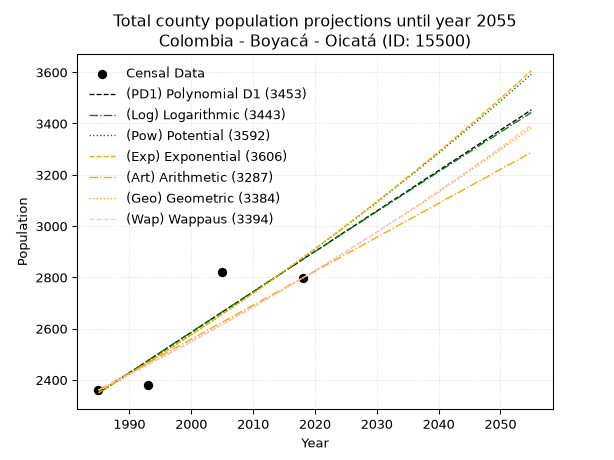
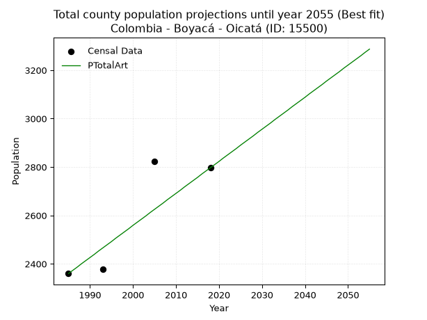
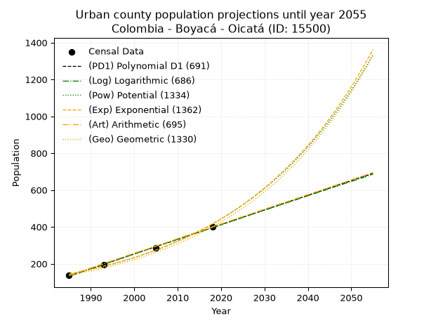
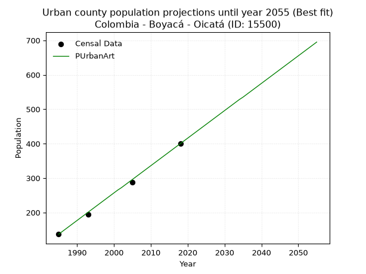
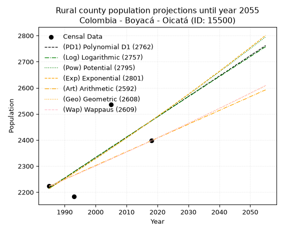
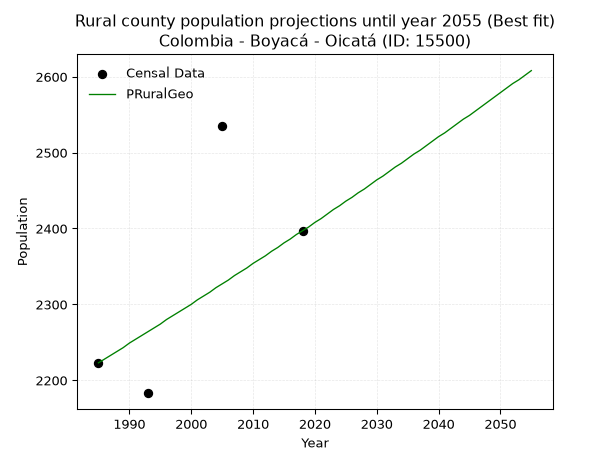

<div align="center">


</div>

# 📜 _“Population and Public Services Demand Projections (PPSD) until Year 2050 for Colombia - Boyacá - Oicatá (ID: 15500)”_
Keywords: `population` `public-service` `projection` `lineal` `polynomial` `logarithmic` `potential` `exponential` `arithmetic` `geometric` `wappaus` `dane` `colombia` `south-america`

PPSD are analytical estimates used by governments and planners to anticipate future changes in population size, age distribution, and the resulting community needs for utilities, healthcare, education, and infrastructure as sizing future water treatment facilities, electrical grids, and road networks based on spatial growth.

<div align="center">

</img>

</div>


> **General running parameters**: • app_version: _v20260806_. • Python version: _3.14.7_. • Pandas version: _3.0.5_. • NumPy version: _2.5.1_. • Creates, save and include plots into reports (create_plot): _False_. • Projection until year: _2050_. • Process polynomial degree 2 and up: _False_. • Process Wappaus: _True_. • Process Wappaus: _True_. • Set negative values to zero: _True_. • Set infinite values to zero: _True_. • Drop dataset notes: _True_. 
<div align="center">

Maps & GIS Layers: [:earth_americas:Google](http://maps.google.com/maps?q=5.595234767,-73.3083991) [:earth_americas:OSM](https://www.openstreetmap.org/#map=18/5.595234767/-73.3083991&layers=P) [:earth_americas:Bing](https://www.bing.com/maps?cp=5.595234767~-73.3083991&lvl=18) [:earth_americas:Apple](https://maps.apple.com/frame?center=5.595234767%2C-73.3083991&span=0.003%2C0.006) [:earth_americas:GISMobile](https://github.com/rcfdtools/R.GISMobile/blob/main/file/gis/CountyLayer_CO/Readme.md)

</div>


<div align="center">

```geojson
{
  "type": "Feature",
  "geometry": {
    "type": "Point", 
    "coordinates": [-73.3083991, 5.595234767]
  }, 
  "properties": {
    "Name": "Colombia - Boyacá - Oicatá (ID: 15500)"
  }
}
```

</div>


## 0. Census Data (4 records)

Census data are official statistics collected by a government about the people and housing in a country. They usually include counts of total population, age, sex, race, income, education, and jobs.

📅Global census file: [Population.xlsx](../data/Population.xlsx)

| Source   |   Year |   CountryID | CountryName   |   StateID | StateName   |   CountyID | CountyName   |   PTotal |   PUrban |   PRural |
|:---------|-------:|------------:|:--------------|----------:|:------------|-----------:|:-------------|---------:|---------:|---------:|
| DANE     |   1985 |          57 | Colombia      |        15 | Boyacá      |      15500 | Oicatá       |     2360 |      137 |     2223 |
| DANE     |   1993 |          57 | Colombia      |        15 | Boyacá      |      15500 | Oicatá       |     2378 |      195 |     2183 |
| DANE     |   2005 |          57 | Colombia      |        15 | Boyacá      |      15500 | Oicatá       |     2822 |      287 |     2535 |
| DANE     |   2018 |          57 | Colombia      |        15 | Boyacá      |      15500 | Oicatá       |     2797 |      400 |     2397 |

> 🔥Some records could had specific notes about the registered values or the corresponding urban or rural distribution.

📅[SUI-RUPS](https://www.datos.gov.co/Hacienda-y-Cr-dito-P-blico/Registro-nico-de-Prestadores-de-Servicios-P-blicos/4qkq-csdn/about_data) - Local public utility companies: [RUPS.csv](../data/RUPS.csv)

 | SERVICIO       | ESTADO    | NOMBRE                                                                                                    | NIT         | DEPARTAMENTO_DOMICILIO   | MUNICIPIO_DOMICILIO   | DIRECCION        |   TELEFONO | EMAIL                            | TIPO_PRESTADOR                 | CLASIFICACION                 |
|:---------------|:----------|:----------------------------------------------------------------------------------------------------------|:------------|:-------------------------|:----------------------|:-----------------|-----------:|:---------------------------------|:-------------------------------|:------------------------------|
| ACUEDUCTO      | OPERATIVA | UNIDAD ADMINISTRADORA DE SERVICIOS PUBLICOS DE ACUEDUCTO, ALCANTARILLADO Y ASEO EN EL MUNICIPIO DE OICATA | 800026156-5 | BOYACA                   | OICATA                | Calle 4 No. 3-17 |    0000000 | catalinagomezpinto29@hotmail.com | MUNICIPIO (PRESTACIÓN DIRECTA) | MENOR O IGUAL A 2500 USUARIOS |
| ALCANTARILLADO | OPERATIVA | UNIDAD ADMINISTRADORA DE SERVICIOS PUBLICOS DE ACUEDUCTO, ALCANTARILLADO Y ASEO EN EL MUNICIPIO DE OICATA | 800026156-5 | BOYACA                   | OICATA                | Calle 4 No. 3-17 |    0000000 | catalinagomezpinto29@hotmail.com | MUNICIPIO (PRESTACIÓN DIRECTA) | MENOR O IGUAL A 2500 USUARIOS |
| ACUEDUCTO      | OPERATIVA | ASOCIACIÓN DE SUSCRIPTORES DEL ACUEDUCTO RURAL DE OICATÁ                                                  | 820001781-3 | BOYACA                   | OICATA                | Carrera 3 # 5-45 |    7422050 | acuorural@yahoo.es               | ORGANIZACION AUTORIZADA        | MENOR O IGUAL A 2500 USUARIOS |

## 1. Total

### 1.1. Coefficients and Parameters

* (PD1) Polynomial Deg 1: 15.769971898835804, -28954.636290646315 (lineal)
* (Log) Logarithmic: 31582.810908858177, -237471.94880699398
* (Pow) Potential: 12.251387973804762, -37.03116747979004
* (Exp) Exponential: 0.006117400527383188, 0.012514760958542393
* (Art) Arithmetic: Year diff. 2018 - 1985 = 33, Population diff. 2797 - 2360 = 437, Annual growth = 13.242424242424242
* (Geo) Geometric: Year diff. 2018 - 1985 = 33, Population diff. 2797 - 2360 = 437, Annual growth % = 0.005161328400164145
* (Wap) Wappaus: i = 0.5135708451589778, Condition values only valid for < 200)

<sub>
Wappaus condition values: ['0.00', '0.51', '1.03', '1.54', '2.05', '2.57', '3.08', '3.59', '4.11', '4.62', '5.14', '5.65', '6.16', '6.68', '7.19', '7.70', '8.22', '8.73', '9.24', '9.76', '10.27', '10.78', '11.30', '11.81', '12.33', '12.84', '13.35', '13.87', '14.38', '14.89', '15.41', '15.92', '16.43', '16.95', '17.46', '17.97', '18.49', '19.00', '19.52', '20.03', '20.54', '21.06', '21.57', '22.08', '22.60', '23.11', '23.62', '24.14', '24.65', '25.16', '25.68', '26.19', '26.71', '27.22', '27.73', '28.25', '28.76', '29.27', '29.79', '30.30', '30.81', '31.33', '31.84', '32.35', '32.87', '33.38']
</sub>


### 1.2. Projected Dataset

|   Year |   CountyID |   PTotalPD1 |   PTotalLog |   PTotalPow |   PTotalExp |   PTotalArt |   PTotalGeo |   PTotalWap |
|-------:|-----------:|------------:|------------:|------------:|------------:|------------:|------------:|------------:|
|   1985 |      15500 |        2349 |        2348 |        2350 |        2350 |        2360 |        2360 |        2360 |
|   1986 |      15500 |        2365 |        2364 |        2364 |        2364 |        2373 |        2372 |        2372 |
|   1987 |      15500 |        2380 |        2380 |        2379 |        2379 |        2386 |        2384 |        2384 |
|   1988 |      15500 |        2396 |        2396 |        2393 |        2394 |        2400 |        2397 |        2397 |
|   1989 |      15500 |        2412 |        2412 |        2408 |        2408 |        2413 |        2409 |        2409 |
|   1990 |      15500 |        2428 |        2428 |        2423 |        2423 |        2426 |        2422 |        2421 |
|   1991 |      15500 |        2443 |        2443 |        2438 |        2438 |        2439 |        2434 |        2434 |
|   1992 |      15500 |        2459 |        2459 |        2453 |        2453 |        2453 |        2447 |        2446 |
|   1993 |      15500 |        2475 |        2475 |        2468 |        2468 |        2466 |        2459 |        2459 |
|   1994 |      15500 |        2491 |        2491 |        2483 |        2483 |        2479 |        2472 |        2472 |
|   1995 |      15500 |        2506 |        2507 |        2499 |        2498 |        2492 |        2485 |        2484 |
|   1996 |      15500 |        2522 |        2523 |        2514 |        2514 |        2506 |        2497 |        2497 |
|   1997 |      15500 |        2538 |        2539 |        2530 |        2529 |        2519 |        2510 |        2510 |
|   1998 |      15500 |        2554 |        2554 |        2545 |        2545 |        2532 |        2523 |        2523 |
|   1999 |      15500 |        2570 |        2570 |        2561 |        2560 |        2545 |        2536 |        2536 |
|   2000 |      15500 |        2585 |        2586 |        2577 |        2576 |        2559 |        2549 |        2549 |
|   2001 |      15500 |        2601 |        2602 |        2592 |        2592 |        2572 |        2563 |        2562 |
|   2002 |      15500 |        2617 |        2617 |        2608 |        2608 |        2585 |        2576 |        2575 |
|   2003 |      15500 |        2633 |        2633 |        2624 |        2624 |        2598 |        2589 |        2589 |
|   2004 |      15500 |        2648 |        2649 |        2640 |        2640 |        2612 |        2603 |        2602 |
|   2005 |      15500 |        2664 |        2665 |        2657 |        2656 |        2625 |        2616 |        2616 |
|   2006 |      15500 |        2680 |        2681 |        2673 |        2672 |        2638 |        2629 |        2629 |
|   2007 |      15500 |        2696 |        2696 |        2689 |        2689 |        2651 |        2643 |        2643 |
|   2008 |      15500 |        2711 |        2712 |        2706 |        2705 |        2665 |        2657 |        2656 |
|   2009 |      15500 |        2727 |        2728 |        2722 |        2722 |        2678 |        2670 |        2670 |
|   2010 |      15500 |        2743 |        2743 |        2739 |        2738 |        2691 |        2684 |        2684 |
|   2011 |      15500 |        2759 |        2759 |        2756 |        2755 |        2704 |        2698 |        2698 |
|   2012 |      15500 |        2775 |        2775 |        2772 |        2772 |        2718 |        2712 |        2712 |
|   2013 |      15500 |        2790 |        2791 |        2789 |        2789 |        2731 |        2726 |        2726 |
|   2014 |      15500 |        2806 |        2806 |        2806 |        2806 |        2744 |        2740 |        2740 |
|   2015 |      15500 |        2822 |        2822 |        2824 |        2823 |        2757 |        2754 |        2754 |
|   2016 |      15500 |        2838 |        2838 |        2841 |        2841 |        2771 |        2768 |        2768 |
|   2017 |      15500 |        2853 |        2853 |        2858 |        2858 |        2784 |        2783 |        2783 |
|   2018 |      15500 |        2869 |        2869 |        2875 |        2876 |        2797 |        2797 |        2797 |
|   2019 |      15500 |        2885 |        2885 |        2893 |        2893 |        2810 |        2811 |        2812 |
|   2020 |      15500 |        2901 |        2900 |        2911 |        2911 |        2823 |        2826 |        2826 |
|   2021 |      15500 |        2916 |        2916 |        2928 |        2929 |        2837 |        2841 |        2841 |
|   2022 |      15500 |        2932 |        2931 |        2946 |        2947 |        2850 |        2855 |        2856 |
|   2023 |      15500 |        2948 |        2947 |        2964 |        2965 |        2863 |        2870 |        2870 |
|   2024 |      15500 |        2964 |        2963 |        2982 |        2983 |        2876 |        2885 |        2885 |
|   2025 |      15500 |        2980 |        2978 |        3000 |        3002 |        2890 |        2900 |        2900 |
|   2026 |      15500 |        2995 |        2994 |        3018 |        3020 |        2903 |        2915 |        2915 |
|   2027 |      15500 |        3011 |        3009 |        3037 |        3039 |        2916 |        2930 |        2931 |
|   2028 |      15500 |        3027 |        3025 |        3055 |        3057 |        2929 |        2945 |        2946 |
|   2029 |      15500 |        3043 |        3041 |        3073 |        3076 |        2943 |        2960 |        2961 |
|   2030 |      15500 |        3058 |        3056 |        3092 |        3095 |        2956 |        2975 |        2977 |
|   2031 |      15500 |        3074 |        3072 |        3111 |        3114 |        2969 |        2991 |        2992 |
|   2032 |      15500 |        3090 |        3087 |        3130 |        3133 |        2982 |        3006 |        3008 |
|   2033 |      15500 |        3106 |        3103 |        3149 |        3152 |        2996 |        3022 |        3024 |
|   2034 |      15500 |        3121 |        3118 |        3168 |        3171 |        3009 |        3037 |        3039 |
|   2035 |      15500 |        3137 |        3134 |        3187 |        3191 |        3022 |        3053 |        3055 |
|   2036 |      15500 |        3153 |        3149 |        3206 |        3210 |        3035 |        3069 |        3071 |
|   2037 |      15500 |        3169 |        3165 |        3225 |        3230 |        3049 |        3084 |        3087 |
|   2038 |      15500 |        3185 |        3180 |        3245 |        3250 |        3062 |        3100 |        3104 |
|   2039 |      15500 |        3200 |        3196 |        3264 |        3270 |        3075 |        3116 |        3120 |
|   2040 |      15500 |        3216 |        3211 |        3284 |        3290 |        3088 |        3132 |        3136 |
|   2041 |      15500 |        3232 |        3227 |        3304 |        3310 |        3102 |        3149 |        3153 |
|   2042 |      15500 |        3248 |        3242 |        3324 |        3331 |        3115 |        3165 |        3169 |
|   2043 |      15500 |        3263 |        3258 |        3344 |        3351 |        3128 |        3181 |        3186 |
|   2044 |      15500 |        3279 |        3273 |        3364 |        3372 |        3141 |        3198 |        3203 |
|   2045 |      15500 |        3295 |        3289 |        3384 |        3392 |        3155 |        3214 |        3220 |
|   2046 |      15500 |        3311 |        3304 |        3404 |        3413 |        3168 |        3231 |        3237 |
|   2047 |      15500 |        3326 |        3320 |        3425 |        3434 |        3181 |        3247 |        3254 |
|   2048 |      15500 |        3342 |        3335 |        3445 |        3455 |        3194 |        3264 |        3271 |
|   2049 |      15500 |        3358 |        3350 |        3466 |        3476 |        3208 |        3281 |        3288 |
|   2050 |      15500 |        3374 |        3366 |        3487 |        3498 |        3221 |        3298 |        3306 |
<div align="center">

</img>

</div>


### 1.3. Best fit with absolute and relative error (%)

Relative error puts that difference into context by dividing the absolute error by the true value, creating a unitless ratio or percentage that shows the scale of the mistake.

Absolute and relative error

|   Year | Source   |   CountryID | CountryName   |   StateID | StateName   |   CountyID_x | CountyName   |   PTotal |   PUrban |   PRural |   CountyID_y |   PTotalPD1 |   PTotalLog |   PTotalPow |   PTotalExp |   PTotalArt |   PTotalGeo |   PTotalWap |   PTotalPD1AbsError |   PTotalLogAbsError |   PTotalPowAbsError |   PTotalExpAbsError |   PTotalArtAbsError |   PTotalGeoAbsError |   PTotalWapAbsError |   PTotalPD1RelError |   PTotalLogRelError |   PTotalPowRelError |   PTotalExpRelError |   PTotalArtRelError |   PTotalGeoRelError |   PTotalWapRelError |
|-------:|:---------|------------:|:--------------|----------:|:------------|-------------:|:-------------|---------:|---------:|---------:|-------------:|------------:|------------:|------------:|------------:|------------:|------------:|------------:|--------------------:|--------------------:|--------------------:|--------------------:|--------------------:|--------------------:|--------------------:|--------------------:|--------------------:|--------------------:|--------------------:|--------------------:|--------------------:|--------------------:|
|   1985 | DANE     |          57 | Colombia      |        15 | Boyacá      |        15500 | Oicatá       |     2360 |      137 |     2223 |        15500 |        2349 |        2348 |        2350 |        2350 |        2360 |        2360 |        2360 |                  11 |                  12 |                  10 |                  10 |                   0 |                   0 |                   0 |            0.466102 |            0.508475 |            0.423729 |            0.423729 |             0       |             0       |             0       |
|   1993 | DANE     |          57 | Colombia      |        15 | Boyacá      |        15500 | Oicatá       |     2378 |      195 |     2183 |        15500 |        2475 |        2475 |        2468 |        2468 |        2466 |        2459 |        2459 |                  97 |                  97 |                  90 |                  90 |                  88 |                  81 |                  81 |            4.07906  |            4.07906  |            3.78469  |            3.78469  |             3.70059 |             3.40622 |             3.40622 |
|   2005 | DANE     |          57 | Colombia      |        15 | Boyacá      |        15500 | Oicatá       |     2822 |      287 |     2535 |        15500 |        2664 |        2665 |        2657 |        2656 |        2625 |        2616 |        2616 |                 158 |                 157 |                 165 |                 166 |                 197 |                 206 |                 206 |            5.59887  |            5.56343  |            5.84692  |            5.88235  |             6.98086 |             7.29979 |             7.29979 |
|   2018 | DANE     |          57 | Colombia      |        15 | Boyacá      |        15500 | Oicatá       |     2797 |      400 |     2397 |        15500 |        2869 |        2869 |        2875 |        2876 |        2797 |        2797 |        2797 |                  72 |                  72 |                  78 |                  79 |                   0 |                   0 |                   0 |            2.57419  |            2.57419  |            2.7887   |            2.82445  |             0       |             0       |             0       |

Relative error mean

| Method    |   RelError | Best   |
|:----------|-----------:|:-------|
| PTotalPD1 |    3.17955 |        |
| PTotalLog |    3.18129 |        |
| PTotalPow |    3.21101 |        |
| PTotalExp |    3.22881 |        |
| PTotalArt |    2.67036 | True   |
| PTotalGeo |    2.6765  |        |
| PTotalWap |    2.6765  |        |

💙Best method: _**PTotalArt**_
<div align="center">

</img>

</div>


### 1.4. Fresh water supply demand in liters per capita per day (lpcd)

The fresh water supply demand typically ranges from 100 to 300 liters per capita per day (lpcd) for standard domestic and municipal planning, though absolute survival minimums set by the World Health Organization are as low as 7.5 to 20 liters per day, and total consumption in high-income nations can exceed 400 liters.

> `CZ`: Level in meters above the sea level (masl)<br> `WS`: Fresh water supply demand in liters per capita per day (lpcd or l/h/d)<br> `WSAll`: Zonal fresh water supply demand in liters per second (l/s)<br> `A`: Zonal area in square meters<br> `DP`: Population density (people/hectare or p/ha)

Reference values (RAS Colombia)

|    CZ |   WS |
|------:|-----:|
|  1000 |  120 |
|  2000 |  130 |
| 99999 |  140 |

County shapefile geometry properties and water supply values

|   CountyID |      ATotal |   CZTotal |   WSTotal |
|-----------:|------------:|----------:|----------:|
|      15500 | 6.01955e+07 |   2690.44 |       140 |

Projected values for best method: PTotalArt

|   CountyID |   Year |   PTotalArt |   DPTotal |   WSTotal |   WSTotalAll |
|-----------:|-------:|------------:|----------:|----------:|-------------:|
|      15500 |   1985 |        2360 |      0.39 |       140 |      3.82407 |
|      15500 |   1986 |        2373 |      0.39 |       140 |      3.84514 |
|      15500 |   1987 |        2386 |      0.4  |       140 |      3.8662  |
|      15500 |   1988 |        2400 |      0.4  |       140 |      3.88889 |
|      15500 |   1989 |        2413 |      0.4  |       140 |      3.90995 |
|      15500 |   1990 |        2426 |      0.4  |       140 |      3.93102 |
|      15500 |   1991 |        2439 |      0.41 |       140 |      3.95208 |
|      15500 |   1992 |        2453 |      0.41 |       140 |      3.97477 |
|      15500 |   1993 |        2466 |      0.41 |       140 |      3.99583 |
|      15500 |   1994 |        2479 |      0.41 |       140 |      4.0169  |
|      15500 |   1995 |        2492 |      0.41 |       140 |      4.03796 |
|      15500 |   1996 |        2506 |      0.42 |       140 |      4.06065 |
|      15500 |   1997 |        2519 |      0.42 |       140 |      4.08171 |
|      15500 |   1998 |        2532 |      0.42 |       140 |      4.10278 |
|      15500 |   1999 |        2545 |      0.42 |       140 |      4.12384 |
|      15500 |   2000 |        2559 |      0.43 |       140 |      4.14653 |
|      15500 |   2001 |        2572 |      0.43 |       140 |      4.16759 |
|      15500 |   2002 |        2585 |      0.43 |       140 |      4.18866 |
|      15500 |   2003 |        2598 |      0.43 |       140 |      4.20972 |
|      15500 |   2004 |        2612 |      0.43 |       140 |      4.23241 |
|      15500 |   2005 |        2625 |      0.44 |       140 |      4.25347 |
|      15500 |   2006 |        2638 |      0.44 |       140 |      4.27454 |
|      15500 |   2007 |        2651 |      0.44 |       140 |      4.2956  |
|      15500 |   2008 |        2665 |      0.44 |       140 |      4.31829 |
|      15500 |   2009 |        2678 |      0.44 |       140 |      4.33935 |
|      15500 |   2010 |        2691 |      0.45 |       140 |      4.36042 |
|      15500 |   2011 |        2704 |      0.45 |       140 |      4.38148 |
|      15500 |   2012 |        2718 |      0.45 |       140 |      4.40417 |
|      15500 |   2013 |        2731 |      0.45 |       140 |      4.42523 |
|      15500 |   2014 |        2744 |      0.46 |       140 |      4.4463  |
|      15500 |   2015 |        2757 |      0.46 |       140 |      4.46736 |
|      15500 |   2016 |        2771 |      0.46 |       140 |      4.49005 |
|      15500 |   2017 |        2784 |      0.46 |       140 |      4.51111 |
|      15500 |   2018 |        2797 |      0.46 |       140 |      4.53218 |
|      15500 |   2019 |        2810 |      0.47 |       140 |      4.55324 |
|      15500 |   2020 |        2823 |      0.47 |       140 |      4.57431 |
|      15500 |   2021 |        2837 |      0.47 |       140 |      4.59699 |
|      15500 |   2022 |        2850 |      0.47 |       140 |      4.61806 |
|      15500 |   2023 |        2863 |      0.48 |       140 |      4.63912 |
|      15500 |   2024 |        2876 |      0.48 |       140 |      4.66019 |
|      15500 |   2025 |        2890 |      0.48 |       140 |      4.68287 |
|      15500 |   2026 |        2903 |      0.48 |       140 |      4.70394 |
|      15500 |   2027 |        2916 |      0.48 |       140 |      4.725   |
|      15500 |   2028 |        2929 |      0.49 |       140 |      4.74606 |
|      15500 |   2029 |        2943 |      0.49 |       140 |      4.76875 |
|      15500 |   2030 |        2956 |      0.49 |       140 |      4.78981 |
|      15500 |   2031 |        2969 |      0.49 |       140 |      4.81088 |
|      15500 |   2032 |        2982 |      0.5  |       140 |      4.83194 |
|      15500 |   2033 |        2996 |      0.5  |       140 |      4.85463 |
|      15500 |   2034 |        3009 |      0.5  |       140 |      4.87569 |
|      15500 |   2035 |        3022 |      0.5  |       140 |      4.89676 |
|      15500 |   2036 |        3035 |      0.5  |       140 |      4.91782 |
|      15500 |   2037 |        3049 |      0.51 |       140 |      4.94051 |
|      15500 |   2038 |        3062 |      0.51 |       140 |      4.96157 |
|      15500 |   2039 |        3075 |      0.51 |       140 |      4.98264 |
|      15500 |   2040 |        3088 |      0.51 |       140 |      5.0037  |
|      15500 |   2041 |        3102 |      0.52 |       140 |      5.02639 |
|      15500 |   2042 |        3115 |      0.52 |       140 |      5.04745 |
|      15500 |   2043 |        3128 |      0.52 |       140 |      5.06852 |
|      15500 |   2044 |        3141 |      0.52 |       140 |      5.08958 |
|      15500 |   2045 |        3155 |      0.52 |       140 |      5.11227 |
|      15500 |   2046 |        3168 |      0.53 |       140 |      5.13333 |
|      15500 |   2047 |        3181 |      0.53 |       140 |      5.1544  |
|      15500 |   2048 |        3194 |      0.53 |       140 |      5.17546 |
|      15500 |   2049 |        3208 |      0.53 |       140 |      5.19815 |
|      15500 |   2050 |        3221 |      0.54 |       140 |      5.21921 |

## 2. Urban

### 2.1. Coefficients and Parameters

* (PD1) Polynomial Deg 1: 7.9650742673624295, -15677.389803291699 (lineal)
* (Log) Logarithmic: 15941.571123344816, -120917.2598562776
* (Pow) Potential: 64.21034610456353, -209.59154775507852
* (Exp) Exponential: 0.03207078332807493, 3.2498533676517236e-26
* (Art) Arithmetic: Year diff. 2018 - 1985 = 33, Population diff. 400 - 137 = 263, Annual growth = 7.96969696969697
* (Geo) Geometric: Year diff. 2018 - 1985 = 33, Population diff. 400 - 137 = 263, Annual growth % = 0.033002076856172735
* (Wap) Wappaus: i = 2.968229783872242, Condition values only valid for < 200)

<sub>
Wappaus condition values: ['0.00', '2.97', '5.94', '8.90', '11.87', '14.84', '17.81', '20.78', '23.75', '26.71', '29.68', '32.65', '35.62', '38.59', '41.56', '44.52', '47.49', '50.46', '53.43', '56.40', '59.36', '62.33', '65.30', '68.27', '71.24', '74.21', '77.17', '80.14', '83.11', '86.08', '89.05', '92.02', '94.98', '97.95', '100.92', '103.89', '106.86', '109.82', '112.79', '115.76', '118.73', '121.70', '124.67', '127.63', '130.60', '133.57', '136.54', '139.51', '142.48', '145.44', '148.41', '151.38', '154.35', '157.32', '160.28', '163.25', '166.22', '169.19', '172.16', '175.13', '178.09', '181.06', '184.03', '187.00', '189.97', '192.93']
</sub>


### 2.2. Projected Dataset

|   Year |   CountyID |   PUrbanPD1 |   PUrbanLog |   PUrbanPow |   PUrbanExp |   PUrbanArt |   PUrbanGeo |   PUrbanWap |
|-------:|-----------:|------------:|------------:|------------:|------------:|------------:|------------:|------------:|
|   1985 |      15500 |         133 |         133 |         144 |         144 |         137 |         137 |         137 |
|   1986 |      15500 |         141 |         141 |         149 |         149 |         145 |         142 |         141 |
|   1987 |      15500 |         149 |         149 |         154 |         154 |         153 |         146 |         145 |
|   1988 |      15500 |         157 |         157 |         159 |         159 |         161 |         151 |         150 |
|   1989 |      15500 |         165 |         165 |         164 |         164 |         169 |         156 |         154 |
|   1990 |      15500 |         173 |         173 |         169 |         169 |         177 |         161 |         159 |
|   1991 |      15500 |         181 |         181 |         175 |         175 |         185 |         166 |         164 |
|   1992 |      15500 |         189 |         189 |         181 |         181 |         193 |         172 |         169 |
|   1993 |      15500 |         197 |         197 |         187 |         187 |         201 |         178 |         174 |
|   1994 |      15500 |         205 |         205 |         193 |         193 |         209 |         183 |         179 |
|   1995 |      15500 |         213 |         213 |         199 |         199 |         217 |         190 |         185 |
|   1996 |      15500 |         221 |         221 |         206 |         205 |         225 |         196 |         190 |
|   1997 |      15500 |         229 |         229 |         212 |         212 |         233 |         202 |         196 |
|   1998 |      15500 |         237 |         237 |         219 |         219 |         241 |         209 |         203 |
|   1999 |      15500 |         245 |         245 |         226 |         226 |         249 |         216 |         209 |
|   2000 |      15500 |         253 |         253 |         234 |         233 |         257 |         223 |         215 |
|   2001 |      15500 |         261 |         261 |         241 |         241 |         265 |         230 |         222 |
|   2002 |      15500 |         269 |         269 |         249 |         249 |         272 |         238 |         229 |
|   2003 |      15500 |         277 |         277 |         257 |         257 |         280 |         246 |         237 |
|   2004 |      15500 |         285 |         285 |         266 |         265 |         288 |         254 |         245 |
|   2005 |      15500 |         293 |         293 |         274 |         274 |         296 |         262 |         253 |
|   2006 |      15500 |         301 |         301 |         283 |         283 |         304 |         271 |         261 |
|   2007 |      15500 |         309 |         309 |         293 |         292 |         312 |         280 |         270 |
|   2008 |      15500 |         316 |         317 |         302 |         302 |         320 |         289 |         279 |
|   2009 |      15500 |         324 |         325 |         312 |         312 |         328 |         299 |         289 |
|   2010 |      15500 |         332 |         333 |         322 |         322 |         336 |         308 |         299 |
|   2011 |      15500 |         340 |         341 |         332 |         332 |         344 |         319 |         309 |
|   2012 |      15500 |         348 |         348 |         343 |         343 |         352 |         329 |         320 |
|   2013 |      15500 |         356 |         356 |         354 |         354 |         360 |         340 |         332 |
|   2014 |      15500 |         364 |         364 |         366 |         366 |         368 |         351 |         344 |
|   2015 |      15500 |         372 |         372 |         378 |         378 |         376 |         363 |         357 |
|   2016 |      15500 |         380 |         380 |         390 |         390 |         384 |         375 |         370 |
|   2017 |      15500 |         388 |         388 |         402 |         403 |         392 |         387 |         385 |
|   2018 |      15500 |         396 |         396 |         416 |         416 |         400 |         400 |         400 |
|   2019 |      15500 |         404 |         404 |         429 |         429 |         408 |         413 |         416 |
|   2020 |      15500 |         412 |         412 |         443 |         443 |         416 |         427 |         433 |
|   2021 |      15500 |         420 |         420 |         457 |         458 |         424 |         441 |         451 |
|   2022 |      15500 |         428 |         427 |         472 |         473 |         432 |         455 |         471 |
|   2023 |      15500 |         436 |         435 |         487 |         488 |         440 |         471 |         491 |
|   2024 |      15500 |         444 |         443 |         503 |         504 |         448 |         486 |         514 |
|   2025 |      15500 |         452 |         451 |         519 |         520 |         456 |         502 |         537 |
|   2026 |      15500 |         460 |         459 |         536 |         537 |         464 |         519 |         563 |
|   2027 |      15500 |         468 |         467 |         553 |         555 |         472 |         536 |         590 |
|   2028 |      15500 |         476 |         475 |         571 |         573 |         480 |         553 |         620 |
|   2029 |      15500 |         484 |         483 |         589 |         592 |         488 |         572 |         653 |
|   2030 |      15500 |         492 |         490 |         608 |         611 |         496 |         591 |         688 |
|   2031 |      15500 |         500 |         498 |         628 |         631 |         504 |         610 |         727 |
|   2032 |      15500 |         508 |         506 |         648 |         651 |         512 |         630 |         769 |
|   2033 |      15500 |         516 |         514 |         668 |         673 |         520 |         651 |         816 |
|   2034 |      15500 |         524 |         522 |         690 |         695 |         528 |         672 |         867 |
|   2035 |      15500 |         532 |         530 |         712 |         717 |         535 |         695 |         925 |
|   2036 |      15500 |         540 |         537 |         735 |         741 |         543 |         718 |         990 |
|   2037 |      15500 |         547 |         545 |         758 |         765 |         551 |         741 |        1063 |
|   2038 |      15500 |         555 |         553 |         783 |         790 |         559 |         766 |        1147 |
|   2039 |      15500 |         563 |         561 |         808 |         815 |         567 |         791 |        1243 |
|   2040 |      15500 |         571 |         569 |         834 |         842 |         575 |         817 |        1354 |
|   2041 |      15500 |         579 |         577 |         860 |         869 |         583 |         844 |        1485 |
|   2042 |      15500 |         587 |         584 |         888 |         898 |         591 |         872 |        1642 |
|   2043 |      15500 |         595 |         592 |         916 |         927 |         599 |         901 |        1831 |
|   2044 |      15500 |         603 |         600 |         945 |         957 |         607 |         930 |        2066 |
|   2045 |      15500 |         611 |         608 |         975 |         988 |         615 |         961 |        2365 |
|   2046 |      15500 |         619 |         616 |        1007 |        1021 |         623 |         993 |        2757 |
|   2047 |      15500 |         627 |         623 |        1039 |        1054 |         631 |        1026 |        3294 |
|   2048 |      15500 |         635 |         631 |        1072 |        1088 |         639 |        1059 |        4078 |
|   2049 |      15500 |         643 |         639 |        1106 |        1124 |         647 |        1094 |        5325 |
|   2050 |      15500 |         651 |         647 |        1141 |        1160 |         655 |        1131 |        7619 |
<div align="center">

</img>

</div>


### 2.3. Best fit with absolute and relative error (%)

Relative error puts that difference into context by dividing the absolute error by the true value, creating a unitless ratio or percentage that shows the scale of the mistake.

Absolute and relative error

|   Year | Source   |   CountryID | CountryName   |   StateID | StateName   |   CountyID_x | CountyName   |   PTotal |   PUrban |   PRural |   CountyID_y |   PUrbanPD1 |   PUrbanLog |   PUrbanPow |   PUrbanExp |   PUrbanArt |   PUrbanGeo |   PUrbanWap |   PUrbanPD1AbsError |   PUrbanLogAbsError |   PUrbanPowAbsError |   PUrbanExpAbsError |   PUrbanArtAbsError |   PUrbanGeoAbsError |   PUrbanWapAbsError |   PUrbanPD1RelError |   PUrbanLogRelError |   PUrbanPowRelError |   PUrbanExpRelError |   PUrbanArtRelError |   PUrbanGeoRelError |   PUrbanWapRelError |
|-------:|:---------|------------:|:--------------|----------:|:------------|-------------:|:-------------|---------:|---------:|---------:|-------------:|------------:|------------:|------------:|------------:|------------:|------------:|------------:|--------------------:|--------------------:|--------------------:|--------------------:|--------------------:|--------------------:|--------------------:|--------------------:|--------------------:|--------------------:|--------------------:|--------------------:|--------------------:|--------------------:|
|   1985 | DANE     |          57 | Colombia      |        15 | Boyacá      |        15500 | Oicatá       |     2360 |      137 |     2223 |        15500 |         133 |         133 |         144 |         144 |         137 |         137 |         137 |                   4 |                   4 |                   7 |                   7 |                   0 |                   0 |                   0 |             2.91971 |             2.91971 |             5.10949 |             5.10949 |             0       |             0       |              0      |
|   1993 | DANE     |          57 | Colombia      |        15 | Boyacá      |        15500 | Oicatá       |     2378 |      195 |     2183 |        15500 |         197 |         197 |         187 |         187 |         201 |         178 |         174 |                   2 |                   2 |                   8 |                   8 |                   6 |                  17 |                  21 |             1.02564 |             1.02564 |             4.10256 |             4.10256 |             3.07692 |             8.71795 |             10.7692 |
|   2005 | DANE     |          57 | Colombia      |        15 | Boyacá      |        15500 | Oicatá       |     2822 |      287 |     2535 |        15500 |         293 |         293 |         274 |         274 |         296 |         262 |         253 |                   6 |                   6 |                  13 |                  13 |                   9 |                  25 |                  34 |             2.09059 |             2.09059 |             4.52962 |             4.52962 |             3.13589 |             8.7108  |             11.8467 |
|   2018 | DANE     |          57 | Colombia      |        15 | Boyacá      |        15500 | Oicatá       |     2797 |      400 |     2397 |        15500 |         396 |         396 |         416 |         416 |         400 |         400 |         400 |                   4 |                   4 |                  16 |                  16 |                   0 |                   0 |                   0 |             1       |             1       |             4       |             4       |             0       |             0       |              0      |

Relative error mean

| Method    |   RelError | Best   |
|:----------|-----------:|:-------|
| PUrbanPD1 |    1.75899 |        |
| PUrbanLog |    1.75899 |        |
| PUrbanPow |    4.43542 |        |
| PUrbanExp |    4.43542 |        |
| PUrbanArt |    1.5532  | True   |
| PUrbanGeo |    4.35719 |        |
| PUrbanWap |    5.65398 |        |

💙Best method: _**PUrbanArt**_
<div align="center">

</img>

</div>


### 2.4. Fresh water supply demand in liters per capita per day (lpcd)

The fresh water supply demand typically ranges from 100 to 300 liters per capita per day (lpcd) for standard domestic and municipal planning, though absolute survival minimums set by the World Health Organization are as low as 7.5 to 20 liters per day, and total consumption in high-income nations can exceed 400 liters.

> `CZ`: Level in meters above the sea level (masl)<br> `WS`: Fresh water supply demand in liters per capita per day (lpcd or l/h/d)<br> `WSAll`: Zonal fresh water supply demand in liters per second (l/s)<br> `A`: Zonal area in square meters<br> `DP`: Population density (people/hectare or p/ha)

Reference values (RAS Colombia)

|    CZ |   WS |
|------:|-----:|
|  1000 |  120 |
|  2000 |  130 |
| 99999 |  140 |

County shapefile geometry properties and water supply values

|   CountyID |   AUrban |   CZUrban |   WSUrban |
|-----------:|---------:|----------:|----------:|
|      15500 |   350120 |   2704.54 |       140 |

Projected values for best method: PUrbanArt

|   CountyID |   Year |   PUrbanArt |   DPUrban |   WSUrban |   WSUrbanAll |
|-----------:|-------:|------------:|----------:|----------:|-------------:|
|      15500 |   1985 |         137 |      3.91 |       140 |     0.221991 |
|      15500 |   1986 |         145 |      4.14 |       140 |     0.234954 |
|      15500 |   1987 |         153 |      4.37 |       140 |     0.247917 |
|      15500 |   1988 |         161 |      4.6  |       140 |     0.26088  |
|      15500 |   1989 |         169 |      4.83 |       140 |     0.273843 |
|      15500 |   1990 |         177 |      5.06 |       140 |     0.286806 |
|      15500 |   1991 |         185 |      5.28 |       140 |     0.299769 |
|      15500 |   1992 |         193 |      5.51 |       140 |     0.312731 |
|      15500 |   1993 |         201 |      5.74 |       140 |     0.325694 |
|      15500 |   1994 |         209 |      5.97 |       140 |     0.338657 |
|      15500 |   1995 |         217 |      6.2  |       140 |     0.35162  |
|      15500 |   1996 |         225 |      6.43 |       140 |     0.364583 |
|      15500 |   1997 |         233 |      6.65 |       140 |     0.377546 |
|      15500 |   1998 |         241 |      6.88 |       140 |     0.390509 |
|      15500 |   1999 |         249 |      7.11 |       140 |     0.403472 |
|      15500 |   2000 |         257 |      7.34 |       140 |     0.416435 |
|      15500 |   2001 |         265 |      7.57 |       140 |     0.429398 |
|      15500 |   2002 |         272 |      7.77 |       140 |     0.440741 |
|      15500 |   2003 |         280 |      8    |       140 |     0.453704 |
|      15500 |   2004 |         288 |      8.23 |       140 |     0.466667 |
|      15500 |   2005 |         296 |      8.45 |       140 |     0.47963  |
|      15500 |   2006 |         304 |      8.68 |       140 |     0.492593 |
|      15500 |   2007 |         312 |      8.91 |       140 |     0.505556 |
|      15500 |   2008 |         320 |      9.14 |       140 |     0.518519 |
|      15500 |   2009 |         328 |      9.37 |       140 |     0.531481 |
|      15500 |   2010 |         336 |      9.6  |       140 |     0.544444 |
|      15500 |   2011 |         344 |      9.83 |       140 |     0.557407 |
|      15500 |   2012 |         352 |     10.05 |       140 |     0.57037  |
|      15500 |   2013 |         360 |     10.28 |       140 |     0.583333 |
|      15500 |   2014 |         368 |     10.51 |       140 |     0.596296 |
|      15500 |   2015 |         376 |     10.74 |       140 |     0.609259 |
|      15500 |   2016 |         384 |     10.97 |       140 |     0.622222 |
|      15500 |   2017 |         392 |     11.2  |       140 |     0.635185 |
|      15500 |   2018 |         400 |     11.42 |       140 |     0.648148 |
|      15500 |   2019 |         408 |     11.65 |       140 |     0.661111 |
|      15500 |   2020 |         416 |     11.88 |       140 |     0.674074 |
|      15500 |   2021 |         424 |     12.11 |       140 |     0.687037 |
|      15500 |   2022 |         432 |     12.34 |       140 |     0.7      |
|      15500 |   2023 |         440 |     12.57 |       140 |     0.712963 |
|      15500 |   2024 |         448 |     12.8  |       140 |     0.725926 |
|      15500 |   2025 |         456 |     13.02 |       140 |     0.738889 |
|      15500 |   2026 |         464 |     13.25 |       140 |     0.751852 |
|      15500 |   2027 |         472 |     13.48 |       140 |     0.764815 |
|      15500 |   2028 |         480 |     13.71 |       140 |     0.777778 |
|      15500 |   2029 |         488 |     13.94 |       140 |     0.790741 |
|      15500 |   2030 |         496 |     14.17 |       140 |     0.803704 |
|      15500 |   2031 |         504 |     14.4  |       140 |     0.816667 |
|      15500 |   2032 |         512 |     14.62 |       140 |     0.82963  |
|      15500 |   2033 |         520 |     14.85 |       140 |     0.842593 |
|      15500 |   2034 |         528 |     15.08 |       140 |     0.855556 |
|      15500 |   2035 |         535 |     15.28 |       140 |     0.866898 |
|      15500 |   2036 |         543 |     15.51 |       140 |     0.879861 |
|      15500 |   2037 |         551 |     15.74 |       140 |     0.892824 |
|      15500 |   2038 |         559 |     15.97 |       140 |     0.905787 |
|      15500 |   2039 |         567 |     16.19 |       140 |     0.91875  |
|      15500 |   2040 |         575 |     16.42 |       140 |     0.931713 |
|      15500 |   2041 |         583 |     16.65 |       140 |     0.944676 |
|      15500 |   2042 |         591 |     16.88 |       140 |     0.957639 |
|      15500 |   2043 |         599 |     17.11 |       140 |     0.970602 |
|      15500 |   2044 |         607 |     17.34 |       140 |     0.983565 |
|      15500 |   2045 |         615 |     17.57 |       140 |     0.996528 |
|      15500 |   2046 |         623 |     17.79 |       140 |     1.00949  |
|      15500 |   2047 |         631 |     18.02 |       140 |     1.02245  |
|      15500 |   2048 |         639 |     18.25 |       140 |     1.03542  |
|      15500 |   2049 |         647 |     18.48 |       140 |     1.04838  |
|      15500 |   2050 |         655 |     18.71 |       140 |     1.06134  |

## 3. Rural

### 3.1. Coefficients and Parameters

* (PD1) Polynomial Deg 1: 7.804897631473372, -13277.24648735461 (lineal)
* (Log) Logarithmic: 15641.239785513377, -116554.68895071653
* (Pow) Potential: 6.735315284683131, -18.86637674292227
* (Exp) Exponential: 0.0033611143948443574, 2.8029671063527792
* (Art) Arithmetic: Year diff. 2018 - 1985 = 33, Population diff. 2397 - 2223 = 174, Annual growth = 5.2727272727272725
* (Geo) Geometric: Year diff. 2018 - 1985 = 33, Population diff. 2397 - 2223 = 174, Annual growth % = 0.002286255580569607
* (Wap) Wappaus: i = 0.22825659189295552, Condition values only valid for < 200)

<sub>
Wappaus condition values: ['0.00', '0.23', '0.46', '0.68', '0.91', '1.14', '1.37', '1.60', '1.83', '2.05', '2.28', '2.51', '2.74', '2.97', '3.20', '3.42', '3.65', '3.88', '4.11', '4.34', '4.57', '4.79', '5.02', '5.25', '5.48', '5.71', '5.93', '6.16', '6.39', '6.62', '6.85', '7.08', '7.30', '7.53', '7.76', '7.99', '8.22', '8.45', '8.67', '8.90', '9.13', '9.36', '9.59', '9.82', '10.04', '10.27', '10.50', '10.73', '10.96', '11.18', '11.41', '11.64', '11.87', '12.10', '12.33', '12.55', '12.78', '13.01', '13.24', '13.47', '13.70', '13.92', '14.15', '14.38', '14.61', '14.84']
</sub>


### 3.2. Projected Dataset

|   Year |   CountyID |   PRuralPD1 |   PRuralLog |   PRuralPow |   PRuralExp |   PRuralArt |   PRuralGeo |   PRuralWap |
|-------:|-----------:|------------:|------------:|------------:|------------:|------------:|------------:|------------:|
|   1985 |      15500 |        2215 |        2215 |        2214 |        2214 |        2223 |        2223 |        2223 |
|   1986 |      15500 |        2223 |        2223 |        2221 |        2221 |        2228 |        2228 |        2228 |
|   1987 |      15500 |        2231 |        2231 |        2229 |        2229 |        2234 |        2233 |        2233 |
|   1988 |      15500 |        2239 |        2239 |        2236 |        2236 |        2239 |        2238 |        2238 |
|   1989 |      15500 |        2247 |        2247 |        2244 |        2244 |        2244 |        2243 |        2243 |
|   1990 |      15500 |        2254 |        2254 |        2251 |        2251 |        2249 |        2249 |        2249 |
|   1991 |      15500 |        2262 |        2262 |        2259 |        2259 |        2255 |        2254 |        2254 |
|   1992 |      15500 |        2270 |        2270 |        2267 |        2267 |        2260 |        2259 |        2259 |
|   1993 |      15500 |        2278 |        2278 |        2274 |        2274 |        2265 |        2264 |        2264 |
|   1994 |      15500 |        2286 |        2286 |        2282 |        2282 |        2270 |        2269 |        2269 |
|   1995 |      15500 |        2294 |        2294 |        2290 |        2290 |        2276 |        2274 |        2274 |
|   1996 |      15500 |        2301 |        2302 |        2297 |        2297 |        2281 |        2280 |        2280 |
|   1997 |      15500 |        2309 |        2309 |        2305 |        2305 |        2286 |        2285 |        2285 |
|   1998 |      15500 |        2317 |        2317 |        2313 |        2313 |        2292 |        2290 |        2290 |
|   1999 |      15500 |        2325 |        2325 |        2321 |        2321 |        2297 |        2295 |        2295 |
|   2000 |      15500 |        2333 |        2333 |        2329 |        2328 |        2302 |        2300 |        2300 |
|   2001 |      15500 |        2340 |        2341 |        2336 |        2336 |        2307 |        2306 |        2306 |
|   2002 |      15500 |        2348 |        2348 |        2344 |        2344 |        2313 |        2311 |        2311 |
|   2003 |      15500 |        2356 |        2356 |        2352 |        2352 |        2318 |        2316 |        2316 |
|   2004 |      15500 |        2364 |        2364 |        2360 |        2360 |        2323 |        2322 |        2322 |
|   2005 |      15500 |        2372 |        2372 |        2368 |        2368 |        2328 |        2327 |        2327 |
|   2006 |      15500 |        2379 |        2380 |        2376 |        2376 |        2334 |        2332 |        2332 |
|   2007 |      15500 |        2387 |        2387 |        2384 |        2384 |        2339 |        2338 |        2338 |
|   2008 |      15500 |        2395 |        2395 |        2392 |        2392 |        2344 |        2343 |        2343 |
|   2009 |      15500 |        2403 |        2403 |        2400 |        2400 |        2350 |        2348 |        2348 |
|   2010 |      15500 |        2411 |        2411 |        2408 |        2408 |        2355 |        2354 |        2354 |
|   2011 |      15500 |        2418 |        2419 |        2416 |        2416 |        2360 |        2359 |        2359 |
|   2012 |      15500 |        2426 |        2426 |        2424 |        2424 |        2365 |        2364 |        2364 |
|   2013 |      15500 |        2434 |        2434 |        2432 |        2432 |        2371 |        2370 |        2370 |
|   2014 |      15500 |        2442 |        2442 |        2441 |        2441 |        2376 |        2375 |        2375 |
|   2015 |      15500 |        2450 |        2450 |        2449 |        2449 |        2381 |        2381 |        2381 |
|   2016 |      15500 |        2457 |        2457 |        2457 |        2457 |        2386 |        2386 |        2386 |
|   2017 |      15500 |        2465 |        2465 |        2465 |        2465 |        2392 |        2392 |        2392 |
|   2018 |      15500 |        2473 |        2473 |        2473 |        2474 |        2397 |        2397 |        2397 |
|   2019 |      15500 |        2481 |        2481 |        2482 |        2482 |        2402 |        2402 |        2402 |
|   2020 |      15500 |        2489 |        2488 |        2490 |        2490 |        2408 |        2408 |        2408 |
|   2021 |      15500 |        2496 |        2496 |        2498 |        2499 |        2413 |        2413 |        2413 |
|   2022 |      15500 |        2504 |        2504 |        2507 |        2507 |        2418 |        2419 |        2419 |
|   2023 |      15500 |        2512 |        2512 |        2515 |        2515 |        2423 |        2425 |        2425 |
|   2024 |      15500 |        2520 |        2519 |        2523 |        2524 |        2429 |        2430 |        2430 |
|   2025 |      15500 |        2528 |        2527 |        2532 |        2532 |        2434 |        2436 |        2436 |
|   2026 |      15500 |        2535 |        2535 |        2540 |        2541 |        2439 |        2441 |        2441 |
|   2027 |      15500 |        2543 |        2543 |        2549 |        2550 |        2444 |        2447 |        2447 |
|   2028 |      15500 |        2551 |        2550 |        2557 |        2558 |        2450 |        2452 |        2452 |
|   2029 |      15500 |        2559 |        2558 |        2566 |        2567 |        2455 |        2458 |        2458 |
|   2030 |      15500 |        2567 |        2566 |        2574 |        2575 |        2460 |        2464 |        2464 |
|   2031 |      15500 |        2575 |        2573 |        2583 |        2584 |        2466 |        2469 |        2469 |
|   2032 |      15500 |        2582 |        2581 |        2591 |        2593 |        2471 |        2475 |        2475 |
|   2033 |      15500 |        2590 |        2589 |        2600 |        2601 |        2476 |        2481 |        2481 |
|   2034 |      15500 |        2598 |        2597 |        2609 |        2610 |        2481 |        2486 |        2486 |
|   2035 |      15500 |        2606 |        2604 |        2617 |        2619 |        2487 |        2492 |        2492 |
|   2036 |      15500 |        2614 |        2612 |        2626 |        2628 |        2492 |        2498 |        2498 |
|   2037 |      15500 |        2621 |        2620 |        2635 |        2637 |        2497 |        2503 |        2504 |
|   2038 |      15500 |        2629 |        2627 |        2643 |        2646 |        2502 |        2509 |        2509 |
|   2039 |      15500 |        2637 |        2635 |        2652 |        2654 |        2508 |        2515 |        2515 |
|   2040 |      15500 |        2645 |        2643 |        2661 |        2663 |        2513 |        2521 |        2521 |
|   2041 |      15500 |        2653 |        2650 |        2670 |        2672 |        2518 |        2526 |        2527 |
|   2042 |      15500 |        2660 |        2658 |        2679 |        2681 |        2524 |        2532 |        2532 |
|   2043 |      15500 |        2668 |        2666 |        2687 |        2690 |        2529 |        2538 |        2538 |
|   2044 |      15500 |        2676 |        2673 |        2696 |        2699 |        2534 |        2544 |        2544 |
|   2045 |      15500 |        2684 |        2681 |        2705 |        2709 |        2539 |        2549 |        2550 |
|   2046 |      15500 |        2692 |        2689 |        2714 |        2718 |        2545 |        2555 |        2556 |
|   2047 |      15500 |        2699 |        2696 |        2723 |        2727 |        2550 |        2561 |        2562 |
|   2048 |      15500 |        2707 |        2704 |        2732 |        2736 |        2555 |        2567 |        2567 |
|   2049 |      15500 |        2715 |        2711 |        2741 |        2745 |        2560 |        2573 |        2573 |
|   2050 |      15500 |        2723 |        2719 |        2750 |        2754 |        2566 |        2579 |        2579 |
<div align="center">

</img>

</div>


### 3.3. Best fit with absolute and relative error (%)

Relative error puts that difference into context by dividing the absolute error by the true value, creating a unitless ratio or percentage that shows the scale of the mistake.

Absolute and relative error

|   Year | Source   |   CountryID | CountryName   |   StateID | StateName   |   CountyID_x | CountyName   |   PTotal |   PUrban |   PRural |   CountyID_y |   PRuralPD1 |   PRuralLog |   PRuralPow |   PRuralExp |   PRuralArt |   PRuralGeo |   PRuralWap |   PRuralPD1AbsError |   PRuralLogAbsError |   PRuralPowAbsError |   PRuralExpAbsError |   PRuralArtAbsError |   PRuralGeoAbsError |   PRuralWapAbsError |   PRuralPD1RelError |   PRuralLogRelError |   PRuralPowRelError |   PRuralExpRelError |   PRuralArtRelError |   PRuralGeoRelError |   PRuralWapRelError |
|-------:|:---------|------------:|:--------------|----------:|:------------|-------------:|:-------------|---------:|---------:|---------:|-------------:|------------:|------------:|------------:|------------:|------------:|------------:|------------:|--------------------:|--------------------:|--------------------:|--------------------:|--------------------:|--------------------:|--------------------:|--------------------:|--------------------:|--------------------:|--------------------:|--------------------:|--------------------:|--------------------:|
|   1985 | DANE     |          57 | Colombia      |        15 | Boyacá      |        15500 | Oicatá       |     2360 |      137 |     2223 |        15500 |        2215 |        2215 |        2214 |        2214 |        2223 |        2223 |        2223 |                   8 |                   8 |                   9 |                   9 |                   0 |                   0 |                   0 |            0.359874 |            0.359874 |            0.404858 |            0.404858 |             0       |             0       |             0       |
|   1993 | DANE     |          57 | Colombia      |        15 | Boyacá      |        15500 | Oicatá       |     2378 |      195 |     2183 |        15500 |        2278 |        2278 |        2274 |        2274 |        2265 |        2264 |        2264 |                  95 |                  95 |                  91 |                  91 |                  82 |                  81 |                  81 |            4.35181  |            4.35181  |            4.16858  |            4.16858  |             3.7563  |             3.71049 |             3.71049 |
|   2005 | DANE     |          57 | Colombia      |        15 | Boyacá      |        15500 | Oicatá       |     2822 |      287 |     2535 |        15500 |        2372 |        2372 |        2368 |        2368 |        2328 |        2327 |        2327 |                 163 |                 163 |                 167 |                 167 |                 207 |                 208 |                 208 |            6.42998  |            6.42998  |            6.58777  |            6.58777  |             8.16568 |             8.20513 |             8.20513 |
|   2018 | DANE     |          57 | Colombia      |        15 | Boyacá      |        15500 | Oicatá       |     2797 |      400 |     2397 |        15500 |        2473 |        2473 |        2473 |        2474 |        2397 |        2397 |        2397 |                  76 |                  76 |                  76 |                  77 |                   0 |                   0 |                   0 |            3.17063  |            3.17063  |            3.17063  |            3.21235  |             0       |             0       |             0       |

Relative error mean

| Method    |   RelError | Best   |
|:----------|-----------:|:-------|
| PRuralPD1 |    3.57807 |        |
| PRuralLog |    3.57807 |        |
| PRuralPow |    3.58296 |        |
| PRuralExp |    3.59339 |        |
| PRuralArt |    2.98049 |        |
| PRuralGeo |    2.9789  | True   |
| PRuralWap |    2.9789  | True   |

💙Best method: _**PRuralGeo**_
<div align="center">

</img>

</div>


### 3.4. Fresh water supply demand in liters per capita per day (lpcd)

The fresh water supply demand typically ranges from 100 to 300 liters per capita per day (lpcd) for standard domestic and municipal planning, though absolute survival minimums set by the World Health Organization are as low as 7.5 to 20 liters per day, and total consumption in high-income nations can exceed 400 liters.

> `CZ`: Level in meters above the sea level (masl)<br> `WS`: Fresh water supply demand in liters per capita per day (lpcd or l/h/d)<br> `WSAll`: Zonal fresh water supply demand in liters per second (l/s)<br> `A`: Zonal area in square meters<br> `DP`: Population density (people/hectare or p/ha)

Reference values (RAS Colombia)

|    CZ |   WS |
|------:|-----:|
|  1000 |  120 |
|  2000 |  130 |
| 99999 |  140 |

County shapefile geometry properties and water supply values

|   CountyID |      ARural |   CZRural |   WSRural |
|-----------:|------------:|----------:|----------:|
|      15500 | 5.98454e+07 |   2690.36 |       140 |

Projected values for best method: PRuralGeo

|   CountyID |   Year |   PRuralGeo |   DPRural |   WSRural |   WSRuralAll |
|-----------:|-------:|------------:|----------:|----------:|-------------:|
|      15500 |   1985 |        2223 |      0.37 |       140 |      3.60208 |
|      15500 |   1986 |        2228 |      0.37 |       140 |      3.61019 |
|      15500 |   1987 |        2233 |      0.37 |       140 |      3.61829 |
|      15500 |   1988 |        2238 |      0.37 |       140 |      3.62639 |
|      15500 |   1989 |        2243 |      0.37 |       140 |      3.63449 |
|      15500 |   1990 |        2249 |      0.38 |       140 |      3.64421 |
|      15500 |   1991 |        2254 |      0.38 |       140 |      3.65231 |
|      15500 |   1992 |        2259 |      0.38 |       140 |      3.66042 |
|      15500 |   1993 |        2264 |      0.38 |       140 |      3.66852 |
|      15500 |   1994 |        2269 |      0.38 |       140 |      3.67662 |
|      15500 |   1995 |        2274 |      0.38 |       140 |      3.68472 |
|      15500 |   1996 |        2280 |      0.38 |       140 |      3.69444 |
|      15500 |   1997 |        2285 |      0.38 |       140 |      3.70255 |
|      15500 |   1998 |        2290 |      0.38 |       140 |      3.71065 |
|      15500 |   1999 |        2295 |      0.38 |       140 |      3.71875 |
|      15500 |   2000 |        2300 |      0.38 |       140 |      3.72685 |
|      15500 |   2001 |        2306 |      0.39 |       140 |      3.73657 |
|      15500 |   2002 |        2311 |      0.39 |       140 |      3.74468 |
|      15500 |   2003 |        2316 |      0.39 |       140 |      3.75278 |
|      15500 |   2004 |        2322 |      0.39 |       140 |      3.7625  |
|      15500 |   2005 |        2327 |      0.39 |       140 |      3.7706  |
|      15500 |   2006 |        2332 |      0.39 |       140 |      3.7787  |
|      15500 |   2007 |        2338 |      0.39 |       140 |      3.78843 |
|      15500 |   2008 |        2343 |      0.39 |       140 |      3.79653 |
|      15500 |   2009 |        2348 |      0.39 |       140 |      3.80463 |
|      15500 |   2010 |        2354 |      0.39 |       140 |      3.81435 |
|      15500 |   2011 |        2359 |      0.39 |       140 |      3.82245 |
|      15500 |   2012 |        2364 |      0.4  |       140 |      3.83056 |
|      15500 |   2013 |        2370 |      0.4  |       140 |      3.84028 |
|      15500 |   2014 |        2375 |      0.4  |       140 |      3.84838 |
|      15500 |   2015 |        2381 |      0.4  |       140 |      3.8581  |
|      15500 |   2016 |        2386 |      0.4  |       140 |      3.8662  |
|      15500 |   2017 |        2392 |      0.4  |       140 |      3.87593 |
|      15500 |   2018 |        2397 |      0.4  |       140 |      3.88403 |
|      15500 |   2019 |        2402 |      0.4  |       140 |      3.89213 |
|      15500 |   2020 |        2408 |      0.4  |       140 |      3.90185 |
|      15500 |   2021 |        2413 |      0.4  |       140 |      3.90995 |
|      15500 |   2022 |        2419 |      0.4  |       140 |      3.91968 |
|      15500 |   2023 |        2425 |      0.41 |       140 |      3.9294  |
|      15500 |   2024 |        2430 |      0.41 |       140 |      3.9375  |
|      15500 |   2025 |        2436 |      0.41 |       140 |      3.94722 |
|      15500 |   2026 |        2441 |      0.41 |       140 |      3.95532 |
|      15500 |   2027 |        2447 |      0.41 |       140 |      3.96505 |
|      15500 |   2028 |        2452 |      0.41 |       140 |      3.97315 |
|      15500 |   2029 |        2458 |      0.41 |       140 |      3.98287 |
|      15500 |   2030 |        2464 |      0.41 |       140 |      3.99259 |
|      15500 |   2031 |        2469 |      0.41 |       140 |      4.00069 |
|      15500 |   2032 |        2475 |      0.41 |       140 |      4.01042 |
|      15500 |   2033 |        2481 |      0.41 |       140 |      4.02014 |
|      15500 |   2034 |        2486 |      0.42 |       140 |      4.02824 |
|      15500 |   2035 |        2492 |      0.42 |       140 |      4.03796 |
|      15500 |   2036 |        2498 |      0.42 |       140 |      4.04769 |
|      15500 |   2037 |        2503 |      0.42 |       140 |      4.05579 |
|      15500 |   2038 |        2509 |      0.42 |       140 |      4.06551 |
|      15500 |   2039 |        2515 |      0.42 |       140 |      4.07523 |
|      15500 |   2040 |        2521 |      0.42 |       140 |      4.08495 |
|      15500 |   2041 |        2526 |      0.42 |       140 |      4.09306 |
|      15500 |   2042 |        2532 |      0.42 |       140 |      4.10278 |
|      15500 |   2043 |        2538 |      0.42 |       140 |      4.1125  |
|      15500 |   2044 |        2544 |      0.43 |       140 |      4.12222 |
|      15500 |   2045 |        2549 |      0.43 |       140 |      4.13032 |
|      15500 |   2046 |        2555 |      0.43 |       140 |      4.14005 |
|      15500 |   2047 |        2561 |      0.43 |       140 |      4.14977 |
|      15500 |   2048 |        2567 |      0.43 |       140 |      4.15949 |
|      15500 |   2049 |        2573 |      0.43 |       140 |      4.16921 |
|      15500 |   2050 |        2579 |      0.43 |       140 |      4.17894 |

#

<div align="center"><br><sub>Share this research</sub></div><br>

<sub>**APPS & TOOLS & CONTENT DISCLAIMER**: • NO WARRANTY - This content and software is provided by <a href="https://github.com/rcfdtools" target="_blank">github.com/rcfdtools</a> "as is", without any express or implied warranty, including warranties of merchantability, fitness for a particular purpose, or non-infringement. There is no guarantee that the software will be error-free or operate without interruption. • LIMITATION OF LIABILITY - Neither the authors nor copyright holders will be liable for claims or damages arising from the software or its use. You are responsible for determining if the software is appropriate for your use and assume all associated risks, including errors, legal compliance, and data loss. • NO PROFESSIONAL ADVICE - The software provides general information and does not offer professional advice. It should not replace consultation with professional advisors. [Clauses and global license for rcfdtools use.](https://github.com/rcfdtools/rcfdtools/blob/main/LICENSE.md)</sub>

| [:house: Home](Readme.md)  | [:beginner: Help / Collab](https://github.com/rcfdtools/R.HydroTools/discussions/31) |
|----------------------------|-------------------------------------------------------------------------------------------|