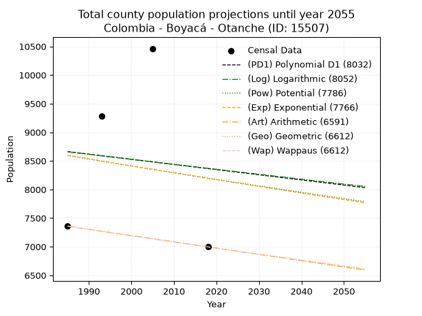
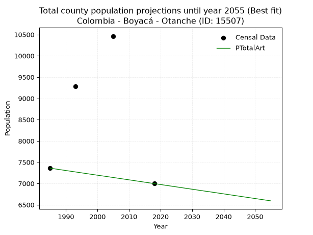
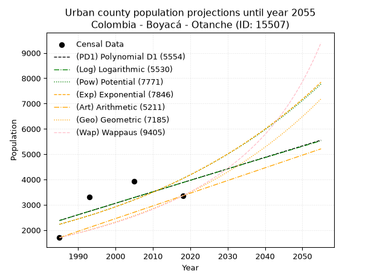
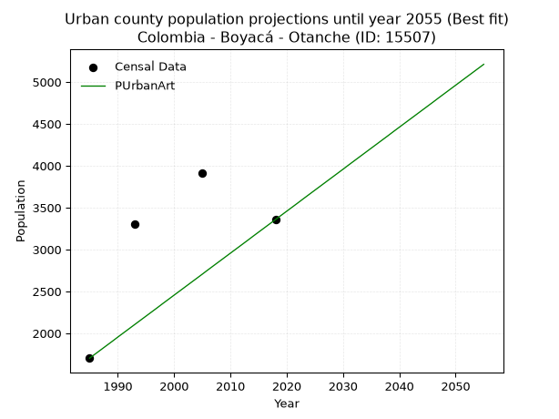
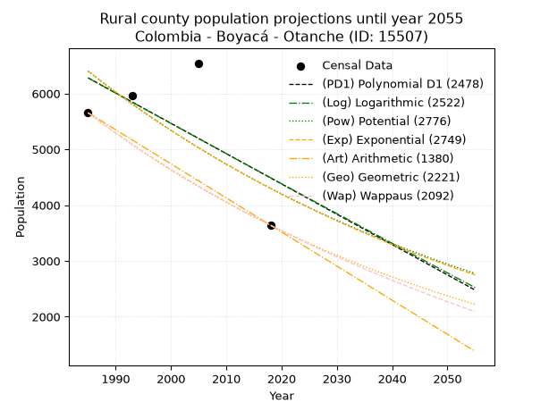
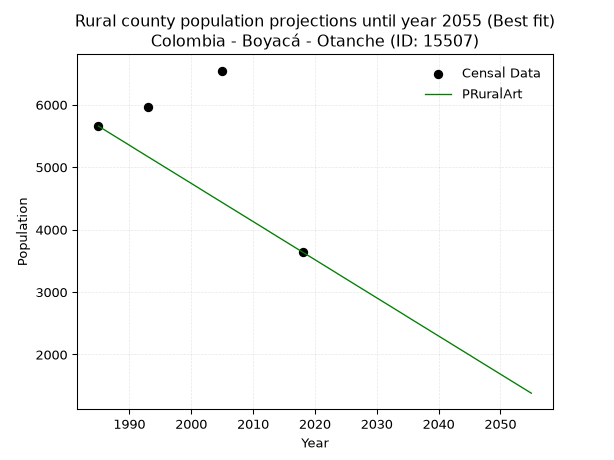

<div align="center">


</div>

# _“Population and Public Services Demand Projections (PPSD) until Year 2050 for Colombia - Boyacá - Otanche (ID: 15507)”_
Keywords: `population` `public-service` `projection` `lineal` `polynomial` `logarithmic` `potential` `exponential` `arithmetic` `geometric` `wappaus` `dane` `colombia` `south-america`

PPSD are analytical estimates used by governments and planners to anticipate future changes in population size, age distribution, and the resulting community needs for utilities, healthcare, education, and infrastructure as sizing future water treatment facilities, electrical grids, and road networks based on spatial growth.

> **General running parameters**: • app_version: _v20260806_. • Python version: _3.14.7_. • Pandas version: _3.0.5_. • NumPy version: _2.5.1_. • Creates, save and include plots into reports (create_plot): _False_. • Projection until year: _2050_. • Process polynomial degree 2 and up: _False_. • Process Wappaus: _True_. • Process Wappaus: _True_. • Set negative values to zero: _True_. • Set infinite values to zero: _True_. • Drop dataset notes: _True_. 
<div align="center">

Dynamic map: [:earth_americas:Google](http://maps.google.com/maps?q=5.657535713,-74.1809647) [:earth_americas:OSM](https://www.openstreetmap.org/#map=18/5.657535713/-74.1809647&layers=P) [:earth_americas:Bing](https://www.bing.com/maps?cp=5.657535713~-74.1809647&lvl=18) [:earth_americas:Apple](https://maps.apple.com/frame?center=5.657535713%2C-74.1809647&span=0.003%2C0.006)

</div>


<div align="center">

```geojson
{
  "type": "Feature",
  "geometry": {
    "type": "Point", 
    "coordinates": [-74.1809647, 5.657535713]
  }, 
  "properties": {
    "Name": "Colombia - Boyacá - Otanche (ID: 15507)"
  }
}
```

</div>


## 0. Census Data (4 records)

Census data are official statistics collected by a government about the people and housing in a country. They usually include counts of total population, age, sex, race, income, education, and jobs.

📅Global census file: [Population.xlsx](../data/Population.xlsx)

| Source   |   Year |   CountryID | CountryName   |   StateID | StateName   |   CountyID | CountyName   |   PTotal |   PUrban |   PRural |
|:---------|-------:|------------:|:--------------|----------:|:------------|-----------:|:-------------|---------:|---------:|---------:|
| DANE     |   1985 |          57 | Colombia      |        15 | Boyacá      |      15507 | Otanche      |     7359 |     1703 |     5656 |
| DANE     |   1993 |          57 | Colombia      |        15 | Boyacá      |      15507 | Otanche      |     9279 |     3309 |     5970 |
| DANE     |   2005 |          57 | Colombia      |        15 | Boyacá      |      15507 | Otanche      |    10463 |     3918 |     6545 |
| DANE     |   2018 |          57 | Colombia      |        15 | Boyacá      |      15507 | Otanche      |     6997 |     3357 |     3640 |

> 🔥Some records could had specific notes about the registered values or the corresponding urban or rural distribution.

## 1. Total

### 1.1. Coefficients and Parameters

* (PD1) Polynomial Deg 1: -8.99478121236243, 26516.311120027953 (lineal)
* (Log) Logarithmic: -17479.95605392516, 141389.78604146195
* (Pow) Potential: -2.8460036833171114, 13.319596010698465
* (Exp) Exponential: -0.0014524216084165584, 153616.22687556097
* (Art) Arithmetic: Year diff. 2018 - 1985 = 33, Population diff. 6997 - 7359 = -362, Annual growth = -10.969696969696969
* (Geo) Geometric: Year diff. 2018 - 1985 = 33, Population diff. 6997 - 7359 = -362, Annual growth % = -0.001527395015242572
* (Wap) Wappaus: i = -0.15282386416407034, Condition values only valid for < 200)

<sub>
Wappaus condition values: ['-0.00', '-0.15', '-0.31', '-0.46', '-0.61', '-0.76', '-0.92', '-1.07', '-1.22', '-1.38', '-1.53', '-1.68', '-1.83', '-1.99', '-2.14', '-2.29', '-2.45', '-2.60', '-2.75', '-2.90', '-3.06', '-3.21', '-3.36', '-3.51', '-3.67', '-3.82', '-3.97', '-4.13', '-4.28', '-4.43', '-4.58', '-4.74', '-4.89', '-5.04', '-5.20', '-5.35', '-5.50', '-5.65', '-5.81', '-5.96', '-6.11', '-6.27', '-6.42', '-6.57', '-6.72', '-6.88', '-7.03', '-7.18', '-7.34', '-7.49', '-7.64', '-7.79', '-7.95', '-8.10', '-8.25', '-8.41', '-8.56', '-8.71', '-8.86', '-9.02', '-9.17', '-9.32', '-9.48', '-9.63', '-9.78', '-9.93']
</sub>


### 1.2. Projected Dataset

|   Year |   CountyID |   PTotalPD1 |   PTotalLog |   PTotalPow |   PTotalExp |   PTotalArt |   PTotalGeo |   PTotalWap |
|-------:|-----------:|------------:|------------:|------------:|------------:|------------:|------------:|------------:|
|   1985 |      15507 |        8662 |        8658 |        8593 |        8597 |        7359 |        7359 |        7359 |
|   1986 |      15507 |        8653 |        8649 |        8581 |        8584 |        7348 |        7348 |        7348 |
|   1987 |      15507 |        8644 |        8640 |        8569 |        8572 |        7337 |        7337 |        7337 |
|   1988 |      15507 |        8635 |        8632 |        8556 |        8560 |        7326 |        7325 |        7325 |
|   1989 |      15507 |        8626 |        8623 |        8544 |        8547 |        7315 |        7314 |        7314 |
|   1990 |      15507 |        8617 |        8614 |        8532 |        8535 |        7304 |        7303 |        7303 |
|   1991 |      15507 |        8608 |        8605 |        8520 |        8522 |        7293 |        7292 |        7292 |
|   1992 |      15507 |        8599 |        8596 |        8508 |        8510 |        7282 |        7281 |        7281 |
|   1993 |      15507 |        8590 |        8588 |        8495 |        8498 |        7271 |        7270 |        7270 |
|   1994 |      15507 |        8581 |        8579 |        8483 |        8485 |        7260 |        7258 |        7258 |
|   1995 |      15507 |        8572 |        8570 |        8471 |        8473 |        7249 |        7247 |        7247 |
|   1996 |      15507 |        8563 |        8561 |        8459 |        8461 |        7238 |        7236 |        7236 |
|   1997 |      15507 |        8554 |        8553 |        8447 |        8448 |        7227 |        7225 |        7225 |
|   1998 |      15507 |        8545 |        8544 |        8435 |        8436 |        7216 |        7214 |        7214 |
|   1999 |      15507 |        8536 |        8535 |        8423 |        8424 |        7205 |        7203 |        7203 |
|   2000 |      15507 |        8527 |        8526 |        8411 |        8412 |        7194 |        7192 |        7192 |
|   2001 |      15507 |        8518 |        8518 |        8399 |        8399 |        7183 |        7181 |        7181 |
|   2002 |      15507 |        8509 |        8509 |        8387 |        8387 |        7173 |        7170 |        7170 |
|   2003 |      15507 |        8500 |        8500 |        8375 |        8375 |        7162 |        7159 |        7159 |
|   2004 |      15507 |        8491 |        8491 |        8363 |        8363 |        7151 |        7148 |        7148 |
|   2005 |      15507 |        8482 |        8483 |        8352 |        8351 |        7140 |        7137 |        7137 |
|   2006 |      15507 |        8473 |        8474 |        8340 |        8339 |        7129 |        7127 |        7127 |
|   2007 |      15507 |        8464 |        8465 |        8328 |        8327 |        7118 |        7116 |        7116 |
|   2008 |      15507 |        8455 |        8457 |        8316 |        8314 |        7107 |        7105 |        7105 |
|   2009 |      15507 |        8446 |        8448 |        8304 |        8302 |        7096 |        7094 |        7094 |
|   2010 |      15507 |        8437 |        8439 |        8293 |        8290 |        7085 |        7083 |        7083 |
|   2011 |      15507 |        8428 |        8430 |        8281 |        8278 |        7074 |        7072 |        7072 |
|   2012 |      15507 |        8419 |        8422 |        8269 |        8266 |        7063 |        7061 |        7061 |
|   2013 |      15507 |        8410 |        8413 |        8257 |        8254 |        7052 |        7051 |        7051 |
|   2014 |      15507 |        8401 |        8404 |        8246 |        8242 |        7041 |        7040 |        7040 |
|   2015 |      15507 |        8392 |        8396 |        8234 |        8230 |        7030 |        7029 |        7029 |
|   2016 |      15507 |        8383 |        8387 |        8222 |        8218 |        7019 |        7018 |        7018 |
|   2017 |      15507 |        8374 |        8378 |        8211 |        8206 |        7008 |        7008 |        7008 |
|   2018 |      15507 |        8365 |        8370 |        8199 |        8195 |        6997 |        6997 |        6997 |
|   2019 |      15507 |        8356 |        8361 |        8188 |        8183 |        6986 |        6986 |        6986 |
|   2020 |      15507 |        8347 |        8352 |        8176 |        8171 |        6975 |        6976 |        6976 |
|   2021 |      15507 |        8338 |        8344 |        8165 |        8159 |        6964 |        6965 |        6965 |
|   2022 |      15507 |        8329 |        8335 |        8153 |        8147 |        6953 |        6954 |        6954 |
|   2023 |      15507 |        8320 |        8326 |        8142 |        8135 |        6942 |        6944 |        6944 |
|   2024 |      15507 |        8311 |        8318 |        8130 |        8123 |        6931 |        6933 |        6933 |
|   2025 |      15507 |        8302 |        8309 |        8119 |        8112 |        6920 |        6923 |        6922 |
|   2026 |      15507 |        8293 |        8301 |        8108 |        8100 |        6909 |        6912 |        6912 |
|   2027 |      15507 |        8284 |        8292 |        8096 |        8088 |        6898 |        6901 |        6901 |
|   2028 |      15507 |        8275 |        8283 |        8085 |        8076 |        6887 |        6891 |        6891 |
|   2029 |      15507 |        8266 |        8275 |        8073 |        8065 |        6876 |        6880 |        6880 |
|   2030 |      15507 |        8257 |        8266 |        8062 |        8053 |        6865 |        6870 |        6870 |
|   2031 |      15507 |        8248 |        8257 |        8051 |        8041 |        6854 |        6859 |        6859 |
|   2032 |      15507 |        8239 |        8249 |        8040 |        8030 |        6843 |        6849 |        6849 |
|   2033 |      15507 |        8230 |        8240 |        8028 |        8018 |        6832 |        6838 |        6838 |
|   2034 |      15507 |        8221 |        8232 |        8017 |        8006 |        6821 |        6828 |        6828 |
|   2035 |      15507 |        8212 |        8223 |        8006 |        7995 |        6811 |        6818 |        6817 |
|   2036 |      15507 |        8203 |        8215 |        7995 |        7983 |        6800 |        6807 |        6807 |
|   2037 |      15507 |        8194 |        8206 |        7984 |        7972 |        6789 |        6797 |        6797 |
|   2038 |      15507 |        8185 |        8197 |        7972 |        7960 |        6778 |        6786 |        6786 |
|   2039 |      15507 |        8176 |        8189 |        7961 |        7948 |        6767 |        6776 |        6776 |
|   2040 |      15507 |        8167 |        8180 |        7950 |        7937 |        6756 |        6766 |        6765 |
|   2041 |      15507 |        8158 |        8172 |        7939 |        7925 |        6745 |        6755 |        6755 |
|   2042 |      15507 |        8149 |        8163 |        7928 |        7914 |        6734 |        6745 |        6745 |
|   2043 |      15507 |        8140 |        8155 |        7917 |        7902 |        6723 |        6735 |        6734 |
|   2044 |      15507 |        8131 |        8146 |        7906 |        7891 |        6712 |        6724 |        6724 |
|   2045 |      15507 |        8122 |        8137 |        7895 |        7879 |        6701 |        6714 |        6714 |
|   2046 |      15507 |        8113 |        8129 |        7884 |        7868 |        6690 |        6704 |        6704 |
|   2047 |      15507 |        8104 |        8120 |        7873 |        7857 |        6679 |        6694 |        6693 |
|   2048 |      15507 |        8095 |        8112 |        7862 |        7845 |        6668 |        6683 |        6683 |
|   2049 |      15507 |        8086 |        8103 |        7851 |        7834 |        6657 |        6673 |        6673 |
|   2050 |      15507 |        8077 |        8095 |        7840 |        7822 |        6646 |        6663 |        6663 |
<div align="center">

</img>

</div>


### 1.3. Best fit with absolute and relative error (%)

Relative error puts that difference into context by dividing the absolute error by the true value, creating a unitless ratio or percentage that shows the scale of the mistake.

Absolute and relative error

|   Year | Source   |   CountryID | CountryName   |   StateID | StateName   |   CountyID_x | CountyName   |   PTotal |   PUrban |   PRural |   CountyID_y |   PTotalPD1 |   PTotalLog |   PTotalPow |   PTotalExp |   PTotalArt |   PTotalGeo |   PTotalWap |   PTotalPD1AbsError |   PTotalLogAbsError |   PTotalPowAbsError |   PTotalExpAbsError |   PTotalArtAbsError |   PTotalGeoAbsError |   PTotalWapAbsError |   PTotalPD1RelError |   PTotalLogRelError |   PTotalPowRelError |   PTotalExpRelError |   PTotalArtRelError |   PTotalGeoRelError |   PTotalWapRelError |
|-------:|:---------|------------:|:--------------|----------:|:------------|-------------:|:-------------|---------:|---------:|---------:|-------------:|------------:|------------:|------------:|------------:|------------:|------------:|------------:|--------------------:|--------------------:|--------------------:|--------------------:|--------------------:|--------------------:|--------------------:|--------------------:|--------------------:|--------------------:|--------------------:|--------------------:|--------------------:|--------------------:|
|   1985 | DANE     |          57 | Colombia      |        15 | Boyacá      |        15507 | Otanche      |     7359 |     1703 |     5656 |        15507 |        8662 |        8658 |        8593 |        8597 |        7359 |        7359 |        7359 |                1303 |                1299 |                1234 |                1238 |                   0 |                   0 |                   0 |            17.7062  |            17.6519  |            16.7686  |            16.8229  |              0      |              0      |              0      |
|   1993 | DANE     |          57 | Colombia      |        15 | Boyacá      |        15507 | Otanche      |     9279 |     3309 |     5970 |        15507 |        8590 |        8588 |        8495 |        8498 |        7271 |        7270 |        7270 |                 689 |                 691 |                 784 |                 781 |                2008 |                2009 |                2009 |             7.42537 |             7.44692 |             8.44919 |             8.41686 |             21.6403 |             21.651  |             21.651  |
|   2005 | DANE     |          57 | Colombia      |        15 | Boyacá      |        15507 | Otanche      |    10463 |     3918 |     6545 |        15507 |        8482 |        8483 |        8352 |        8351 |        7140 |        7137 |        7137 |                1981 |                1980 |                2111 |                2112 |                3323 |                3326 |                3326 |            18.9334  |            18.9238  |            20.1759  |            20.1854  |             31.7595 |             31.7882 |             31.7882 |
|   2018 | DANE     |          57 | Colombia      |        15 | Boyacá      |        15507 | Otanche      |     6997 |     3357 |     3640 |        15507 |        8365 |        8370 |        8199 |        8195 |        6997 |        6997 |        6997 |                1368 |                1373 |                1202 |                1198 |                   0 |                   0 |                   0 |            19.5512  |            19.6227  |            17.1788  |            17.1216  |              0      |              0      |              0      |

Relative error mean

| Method    |   RelError | Best   |
|:----------|-----------:|:-------|
| PTotalPD1 |    15.904  |        |
| PTotalLog |    15.9113 |        |
| PTotalPow |    15.6431 |        |
| PTotalExp |    15.6367 |        |
| PTotalArt |    13.3499 | True   |
| PTotalGeo |    13.3598 |        |
| PTotalWap |    13.3598 |        |

💙Best method: _**PTotalArt**_
<div align="center">

</img>

</div>


### 1.4. Fresh water supply demand in liters per capita per day (lpcd)

The fresh water supply demand typically ranges from 100 to 300 liters per capita per day (lpcd) for standard domestic and municipal planning, though absolute survival minimums set by the World Health Organization are as low as 7.5 to 20 liters per day, and total consumption in high-income nations can exceed 400 liters.

> `CZ`: Level in meters above the sea level (masl).<br> `WS`: Fresh water supply demand in liters per capita per day (lpcd or l/h/d).<br> `WSAll`: Zonal fresh water supply demand in liters per second (l/s).<br> `A`: Zonal area in square meters.

Reference values (RAS Colombia)

|    CZ |   WS |
|------:|-----:|
|  1000 |  120 |
|  2000 |  130 |
| 99999 |  140 |

County shapefile geometry properties and water supply values

|   CountyID |      ATotal |   CZTotal |   WSTotal |
|-----------:|------------:|----------:|----------:|
|      15507 | 4.74548e+08 |    837.34 |       120 |

Projected values for best method: PTotalArt

|   CountyID |   Year |   PTotalArt |   WSTotal |   WSTotalAll |
|-----------:|-------:|------------:|----------:|-------------:|
|      15507 |   1985 |        7359 |       120 |     10.2208  |
|      15507 |   1986 |        7348 |       120 |     10.2056  |
|      15507 |   1987 |        7337 |       120 |     10.1903  |
|      15507 |   1988 |        7326 |       120 |     10.175   |
|      15507 |   1989 |        7315 |       120 |     10.1597  |
|      15507 |   1990 |        7304 |       120 |     10.1444  |
|      15507 |   1991 |        7293 |       120 |     10.1292  |
|      15507 |   1992 |        7282 |       120 |     10.1139  |
|      15507 |   1993 |        7271 |       120 |     10.0986  |
|      15507 |   1994 |        7260 |       120 |     10.0833  |
|      15507 |   1995 |        7249 |       120 |     10.0681  |
|      15507 |   1996 |        7238 |       120 |     10.0528  |
|      15507 |   1997 |        7227 |       120 |     10.0375  |
|      15507 |   1998 |        7216 |       120 |     10.0222  |
|      15507 |   1999 |        7205 |       120 |     10.0069  |
|      15507 |   2000 |        7194 |       120 |      9.99167 |
|      15507 |   2001 |        7183 |       120 |      9.97639 |
|      15507 |   2002 |        7173 |       120 |      9.9625  |
|      15507 |   2003 |        7162 |       120 |      9.94722 |
|      15507 |   2004 |        7151 |       120 |      9.93194 |
|      15507 |   2005 |        7140 |       120 |      9.91667 |
|      15507 |   2006 |        7129 |       120 |      9.90139 |
|      15507 |   2007 |        7118 |       120 |      9.88611 |
|      15507 |   2008 |        7107 |       120 |      9.87083 |
|      15507 |   2009 |        7096 |       120 |      9.85556 |
|      15507 |   2010 |        7085 |       120 |      9.84028 |
|      15507 |   2011 |        7074 |       120 |      9.825   |
|      15507 |   2012 |        7063 |       120 |      9.80972 |
|      15507 |   2013 |        7052 |       120 |      9.79444 |
|      15507 |   2014 |        7041 |       120 |      9.77917 |
|      15507 |   2015 |        7030 |       120 |      9.76389 |
|      15507 |   2016 |        7019 |       120 |      9.74861 |
|      15507 |   2017 |        7008 |       120 |      9.73333 |
|      15507 |   2018 |        6997 |       120 |      9.71806 |
|      15507 |   2019 |        6986 |       120 |      9.70278 |
|      15507 |   2020 |        6975 |       120 |      9.6875  |
|      15507 |   2021 |        6964 |       120 |      9.67222 |
|      15507 |   2022 |        6953 |       120 |      9.65694 |
|      15507 |   2023 |        6942 |       120 |      9.64167 |
|      15507 |   2024 |        6931 |       120 |      9.62639 |
|      15507 |   2025 |        6920 |       120 |      9.61111 |
|      15507 |   2026 |        6909 |       120 |      9.59583 |
|      15507 |   2027 |        6898 |       120 |      9.58056 |
|      15507 |   2028 |        6887 |       120 |      9.56528 |
|      15507 |   2029 |        6876 |       120 |      9.55    |
|      15507 |   2030 |        6865 |       120 |      9.53472 |
|      15507 |   2031 |        6854 |       120 |      9.51944 |
|      15507 |   2032 |        6843 |       120 |      9.50417 |
|      15507 |   2033 |        6832 |       120 |      9.48889 |
|      15507 |   2034 |        6821 |       120 |      9.47361 |
|      15507 |   2035 |        6811 |       120 |      9.45972 |
|      15507 |   2036 |        6800 |       120 |      9.44444 |
|      15507 |   2037 |        6789 |       120 |      9.42917 |
|      15507 |   2038 |        6778 |       120 |      9.41389 |
|      15507 |   2039 |        6767 |       120 |      9.39861 |
|      15507 |   2040 |        6756 |       120 |      9.38333 |
|      15507 |   2041 |        6745 |       120 |      9.36806 |
|      15507 |   2042 |        6734 |       120 |      9.35278 |
|      15507 |   2043 |        6723 |       120 |      9.3375  |
|      15507 |   2044 |        6712 |       120 |      9.32222 |
|      15507 |   2045 |        6701 |       120 |      9.30694 |
|      15507 |   2046 |        6690 |       120 |      9.29167 |
|      15507 |   2047 |        6679 |       120 |      9.27639 |
|      15507 |   2048 |        6668 |       120 |      9.26111 |
|      15507 |   2049 |        6657 |       120 |      9.24583 |
|      15507 |   2050 |        6646 |       120 |      9.23056 |

## 2. Urban

### 2.1. Coefficients and Parameters

* (PD1) Polynomial Deg 1: 45.34122842232065, -87622.04215174688 (lineal)
* (Log) Logarithmic: 90978.66608601589, -688457.8199770817
* (Pow) Potential: 36.0427762564438, -115.51245600745412
* (Exp) Exponential: 0.017965404539147824, 7.260710401598111e-13
* (Art) Arithmetic: Year diff. 2018 - 1985 = 33, Population diff. 3357 - 1703 = 1654, Annual growth = 50.121212121212125
* (Geo) Geometric: Year diff. 2018 - 1985 = 33, Population diff. 3357 - 1703 = 1654, Annual growth % = 0.020778266695333114
* (Wap) Wappaus: i = 1.9810755779135225, Condition values only valid for < 200)

<sub>
Wappaus condition values: ['0.00', '1.98', '3.96', '5.94', '7.92', '9.91', '11.89', '13.87', '15.85', '17.83', '19.81', '21.79', '23.77', '25.75', '27.74', '29.72', '31.70', '33.68', '35.66', '37.64', '39.62', '41.60', '43.58', '45.56', '47.55', '49.53', '51.51', '53.49', '55.47', '57.45', '59.43', '61.41', '63.39', '65.38', '67.36', '69.34', '71.32', '73.30', '75.28', '77.26', '79.24', '81.22', '83.21', '85.19', '87.17', '89.15', '91.13', '93.11', '95.09', '97.07', '99.05', '101.03', '103.02', '105.00', '106.98', '108.96', '110.94', '112.92', '114.90', '116.88', '118.86', '120.85', '122.83', '124.81', '126.79', '128.77']
</sub>


### 2.2. Projected Dataset

|   Year |   CountyID |   PUrbanPD1 |   PUrbanLog |   PUrbanPow |   PUrbanExp |   PUrbanArt |   PUrbanGeo |   PUrbanWap |
|-------:|-----------:|------------:|------------:|------------:|------------:|------------:|------------:|------------:|
|   1985 |      15507 |        2380 |        2377 |        2228 |        2231 |        1703 |        1703 |        1703 |
|   1986 |      15507 |        2426 |        2423 |        2269 |        2271 |        1753 |        1738 |        1737 |
|   1987 |      15507 |        2471 |        2469 |        2311 |        2313 |        1803 |        1775 |        1772 |
|   1988 |      15507 |        2516 |        2515 |        2353 |        2355 |        1853 |        1811 |        1807 |
|   1989 |      15507 |        2562 |        2560 |        2396 |        2397 |        1903 |        1849 |        1844 |
|   1990 |      15507 |        2607 |        2606 |        2440 |        2441 |        1954 |        1887 |        1880 |
|   1991 |      15507 |        2652 |        2652 |        2484 |        2485 |        2004 |        1927 |        1918 |
|   1992 |      15507 |        2698 |        2698 |        2530 |        2530 |        2054 |        1967 |        1957 |
|   1993 |      15507 |        2743 |        2743 |        2576 |        2576 |        2104 |        2008 |        1996 |
|   1994 |      15507 |        2788 |        2789 |        2623 |        2623 |        2154 |        2049 |        2036 |
|   1995 |      15507 |        2834 |        2834 |        2671 |        2670 |        2204 |        2092 |        2077 |
|   1996 |      15507 |        2879 |        2880 |        2720 |        2718 |        2254 |        2135 |        2119 |
|   1997 |      15507 |        2924 |        2926 |        2769 |        2768 |        2304 |        2180 |        2162 |
|   1998 |      15507 |        2970 |        2971 |        2819 |        2818 |        2355 |        2225 |        2206 |
|   1999 |      15507 |        3015 |        3017 |        2871 |        2869 |        2405 |        2271 |        2251 |
|   2000 |      15507 |        3060 |        3062 |        2923 |        2921 |        2455 |        2318 |        2297 |
|   2001 |      15507 |        3106 |        3108 |        2976 |        2974 |        2505 |        2367 |        2344 |
|   2002 |      15507 |        3151 |        3153 |        3030 |        3028 |        2555 |        2416 |        2393 |
|   2003 |      15507 |        3196 |        3199 |        3085 |        3083 |        2605 |        2466 |        2442 |
|   2004 |      15507 |        3242 |        3244 |        3141 |        3139 |        2655 |        2517 |        2493 |
|   2005 |      15507 |        3287 |        3289 |        3198 |        3196 |        2705 |        2569 |        2544 |
|   2006 |      15507 |        3332 |        3335 |        3256 |        3253 |        2756 |        2623 |        2598 |
|   2007 |      15507 |        3378 |        3380 |        3315 |        3312 |        2806 |        2677 |        2652 |
|   2008 |      15507 |        3423 |        3425 |        3375 |        3372 |        2856 |        2733 |        2708 |
|   2009 |      15507 |        3468 |        3471 |        3436 |        3434 |        2906 |        2790 |        2765 |
|   2010 |      15507 |        3514 |        3516 |        3499 |        3496 |        2956 |        2848 |        2824 |
|   2011 |      15507 |        3559 |        3561 |        3562 |        3559 |        3006 |        2907 |        2884 |
|   2012 |      15507 |        3605 |        3606 |        3626 |        3624 |        3056 |        2967 |        2946 |
|   2013 |      15507 |        3650 |        3652 |        3692 |        3689 |        3106 |        3029 |        3010 |
|   2014 |      15507 |        3695 |        3697 |        3759 |        3756 |        3157 |        3092 |        3076 |
|   2015 |      15507 |        3741 |        3742 |        3826 |        3824 |        3207 |        3156 |        3143 |
|   2016 |      15507 |        3786 |        3787 |        3895 |        3894 |        3257 |        3222 |        3212 |
|   2017 |      15507 |        3831 |        3832 |        3966 |        3964 |        3307 |        3289 |        3284 |
|   2018 |      15507 |        3877 |        3877 |        4037 |        4036 |        3357 |        3357 |        3357 |
|   2019 |      15507 |        3922 |        3922 |        4110 |        4109 |        3407 |        3427 |        3433 |
|   2020 |      15507 |        3967 |        3967 |        4184 |        4184 |        3457 |        3498 |        3510 |
|   2021 |      15507 |        4013 |        4012 |        4259 |        4260 |        3507 |        3571 |        3591 |
|   2022 |      15507 |        4058 |        4057 |        4336 |        4337 |        3557 |        3645 |        3673 |
|   2023 |      15507 |        4103 |        4102 |        4414 |        4416 |        3608 |        3721 |        3759 |
|   2024 |      15507 |        4149 |        4147 |        4493 |        4496 |        3658 |        3798 |        3847 |
|   2025 |      15507 |        4194 |        4192 |        4574 |        4577 |        3708 |        3877 |        3938 |
|   2026 |      15507 |        4239 |        4237 |        4656 |        4660 |        3758 |        3957 |        4032 |
|   2027 |      15507 |        4285 |        4282 |        4740 |        4745 |        3808 |        4040 |        4129 |
|   2028 |      15507 |        4330 |        4327 |        4825 |        4831 |        3858 |        4123 |        4230 |
|   2029 |      15507 |        4375 |        4372 |        4911 |        4918 |        3908 |        4209 |        4334 |
|   2030 |      15507 |        4421 |        4417 |        4999 |        5007 |        3958 |        4297 |        4442 |
|   2031 |      15507 |        4466 |        4461 |        5089 |        5098 |        4009 |        4386 |        4554 |
|   2032 |      15507 |        4511 |        4506 |        5180 |        5190 |        4059 |        4477 |        4670 |
|   2033 |      15507 |        4557 |        4551 |        5272 |        5285 |        4109 |        4570 |        4790 |
|   2034 |      15507 |        4602 |        4596 |        5367 |        5380 |        4159 |        4665 |        4915 |
|   2035 |      15507 |        4647 |        4641 |        5462 |        5478 |        4209 |        4762 |        5045 |
|   2036 |      15507 |        4693 |        4685 |        5560 |        5577 |        4259 |        4861 |        5180 |
|   2037 |      15507 |        4738 |        4730 |        5659 |        5678 |        4309 |        4962 |        5321 |
|   2038 |      15507 |        4783 |        4775 |        5760 |        5781 |        4359 |        5065 |        5467 |
|   2039 |      15507 |        4829 |        4819 |        5863 |        5886 |        4410 |        5170 |        5620 |
|   2040 |      15507 |        4874 |        4864 |        5968 |        5993 |        4460 |        5278 |        5779 |
|   2041 |      15507 |        4919 |        4908 |        6074 |        6101 |        4510 |        5387 |        5946 |
|   2042 |      15507 |        4965 |        4953 |        6182 |        6212 |        4560 |        5499 |        6120 |
|   2043 |      15507 |        5010 |        4997 |        6292 |        6325 |        4610 |        5614 |        6302 |
|   2044 |      15507 |        5055 |        5042 |        6404 |        6439 |        4660 |        5730 |        6493 |
|   2045 |      15507 |        5101 |        5086 |        6518 |        6556 |        4710 |        5849 |        6693 |
|   2046 |      15507 |        5146 |        5131 |        6634 |        6675 |        4760 |        5971 |        6903 |
|   2047 |      15507 |        5191 |        5175 |        6752 |        6796 |        4811 |        6095 |        7124 |
|   2048 |      15507 |        5237 |        5220 |        6872 |        6919 |        4861 |        6221 |        7356 |
|   2049 |      15507 |        5282 |        5264 |        6994 |        7044 |        4911 |        6351 |        7602 |
|   2050 |      15507 |        5327 |        5309 |        7118 |        7172 |        4961 |        6483 |        7860 |
<div align="center">

</img>

</div>


### 2.3. Best fit with absolute and relative error (%)

Relative error puts that difference into context by dividing the absolute error by the true value, creating a unitless ratio or percentage that shows the scale of the mistake.

Absolute and relative error

|   Year | Source   |   CountryID | CountryName   |   StateID | StateName   |   CountyID_x | CountyName   |   PTotal |   PUrban |   PRural |   CountyID_y |   PUrbanPD1 |   PUrbanLog |   PUrbanPow |   PUrbanExp |   PUrbanArt |   PUrbanGeo |   PUrbanWap |   PUrbanPD1AbsError |   PUrbanLogAbsError |   PUrbanPowAbsError |   PUrbanExpAbsError |   PUrbanArtAbsError |   PUrbanGeoAbsError |   PUrbanWapAbsError |   PUrbanPD1RelError |   PUrbanLogRelError |   PUrbanPowRelError |   PUrbanExpRelError |   PUrbanArtRelError |   PUrbanGeoRelError |   PUrbanWapRelError |
|-------:|:---------|------------:|:--------------|----------:|:------------|-------------:|:-------------|---------:|---------:|---------:|-------------:|------------:|------------:|------------:|------------:|------------:|------------:|------------:|--------------------:|--------------------:|--------------------:|--------------------:|--------------------:|--------------------:|--------------------:|--------------------:|--------------------:|--------------------:|--------------------:|--------------------:|--------------------:|--------------------:|
|   1985 | DANE     |          57 | Colombia      |        15 | Boyacá      |        15507 | Otanche      |     7359 |     1703 |     5656 |        15507 |        2380 |        2377 |        2228 |        2231 |        1703 |        1703 |        1703 |                 677 |                 674 |                 525 |                 528 |                   0 |                   0 |                   0 |             39.7534 |             39.5772 |             30.828  |             31.0041 |              0      |              0      |              0      |
|   1993 | DANE     |          57 | Colombia      |        15 | Boyacá      |        15507 | Otanche      |     9279 |     3309 |     5970 |        15507 |        2743 |        2743 |        2576 |        2576 |        2104 |        2008 |        1996 |                 566 |                 566 |                 733 |                 733 |                1205 |                1301 |                1313 |             17.1049 |             17.1049 |             22.1517 |             22.1517 |             36.4158 |             39.317  |             39.6797 |
|   2005 | DANE     |          57 | Colombia      |        15 | Boyacá      |        15507 | Otanche      |    10463 |     3918 |     6545 |        15507 |        3287 |        3289 |        3198 |        3196 |        2705 |        2569 |        2544 |                 631 |                 629 |                 720 |                 722 |                1213 |                1349 |                1374 |             16.1052 |             16.0541 |             18.3767 |             18.4278 |             30.9597 |             34.4308 |             35.0689 |
|   2018 | DANE     |          57 | Colombia      |        15 | Boyacá      |        15507 | Otanche      |     6997 |     3357 |     3640 |        15507 |        3877 |        3877 |        4037 |        4036 |        3357 |        3357 |        3357 |                 520 |                 520 |                 680 |                 679 |                   0 |                   0 |                   0 |             15.49   |             15.49   |             20.2562 |             20.2264 |              0      |              0      |              0      |

Relative error mean

| Method    |   RelError | Best   |
|:----------|-----------:|:-------|
| PUrbanPD1 |    22.1134 |        |
| PUrbanLog |    22.0566 |        |
| PUrbanPow |    22.9031 |        |
| PUrbanExp |    22.9525 |        |
| PUrbanArt |    16.8439 | True   |
| PUrbanGeo |    18.437  |        |
| PUrbanWap |    18.6871 |        |

💙Best method: _**PUrbanArt**_
<div align="center">

</img>

</div>


### 2.4. Fresh water supply demand in liters per capita per day (lpcd)

The fresh water supply demand typically ranges from 100 to 300 liters per capita per day (lpcd) for standard domestic and municipal planning, though absolute survival minimums set by the World Health Organization are as low as 7.5 to 20 liters per day, and total consumption in high-income nations can exceed 400 liters.

> `CZ`: Level in meters above the sea level (masl).<br> `WS`: Fresh water supply demand in liters per capita per day (lpcd or l/h/d).<br> `WSAll`: Zonal fresh water supply demand in liters per second (l/s).<br> `A`: Zonal area in square meters.

Reference values (RAS Colombia)

|    CZ |   WS |
|------:|-----:|
|  1000 |  120 |
|  2000 |  130 |
| 99999 |  140 |

County shapefile geometry properties and water supply values

|   CountyID |   AUrban |   CZUrban |   WSUrban |
|-----------:|---------:|----------:|----------:|
|      15507 |   392900 |   1050.42 |       130 |

Projected values for best method: PUrbanArt

|   CountyID |   Year |   PUrbanArt |   WSUrban |   WSUrbanAll |
|-----------:|-------:|------------:|----------:|-------------:|
|      15507 |   1985 |        1703 |       130 |      2.56238 |
|      15507 |   1986 |        1753 |       130 |      2.63762 |
|      15507 |   1987 |        1803 |       130 |      2.71285 |
|      15507 |   1988 |        1853 |       130 |      2.78808 |
|      15507 |   1989 |        1903 |       130 |      2.86331 |
|      15507 |   1990 |        1954 |       130 |      2.94005 |
|      15507 |   1991 |        2004 |       130 |      3.01528 |
|      15507 |   1992 |        2054 |       130 |      3.09051 |
|      15507 |   1993 |        2104 |       130 |      3.16574 |
|      15507 |   1994 |        2154 |       130 |      3.24097 |
|      15507 |   1995 |        2204 |       130 |      3.3162  |
|      15507 |   1996 |        2254 |       130 |      3.39144 |
|      15507 |   1997 |        2304 |       130 |      3.46667 |
|      15507 |   1998 |        2355 |       130 |      3.5434  |
|      15507 |   1999 |        2405 |       130 |      3.61863 |
|      15507 |   2000 |        2455 |       130 |      3.69387 |
|      15507 |   2001 |        2505 |       130 |      3.7691  |
|      15507 |   2002 |        2555 |       130 |      3.84433 |
|      15507 |   2003 |        2605 |       130 |      3.91956 |
|      15507 |   2004 |        2655 |       130 |      3.99479 |
|      15507 |   2005 |        2705 |       130 |      4.07002 |
|      15507 |   2006 |        2756 |       130 |      4.14676 |
|      15507 |   2007 |        2806 |       130 |      4.22199 |
|      15507 |   2008 |        2856 |       130 |      4.29722 |
|      15507 |   2009 |        2906 |       130 |      4.37245 |
|      15507 |   2010 |        2956 |       130 |      4.44769 |
|      15507 |   2011 |        3006 |       130 |      4.52292 |
|      15507 |   2012 |        3056 |       130 |      4.59815 |
|      15507 |   2013 |        3106 |       130 |      4.67338 |
|      15507 |   2014 |        3157 |       130 |      4.75012 |
|      15507 |   2015 |        3207 |       130 |      4.82535 |
|      15507 |   2016 |        3257 |       130 |      4.90058 |
|      15507 |   2017 |        3307 |       130 |      4.97581 |
|      15507 |   2018 |        3357 |       130 |      5.05104 |
|      15507 |   2019 |        3407 |       130 |      5.12627 |
|      15507 |   2020 |        3457 |       130 |      5.2015  |
|      15507 |   2021 |        3507 |       130 |      5.27674 |
|      15507 |   2022 |        3557 |       130 |      5.35197 |
|      15507 |   2023 |        3608 |       130 |      5.4287  |
|      15507 |   2024 |        3658 |       130 |      5.50394 |
|      15507 |   2025 |        3708 |       130 |      5.57917 |
|      15507 |   2026 |        3758 |       130 |      5.6544  |
|      15507 |   2027 |        3808 |       130 |      5.72963 |
|      15507 |   2028 |        3858 |       130 |      5.80486 |
|      15507 |   2029 |        3908 |       130 |      5.88009 |
|      15507 |   2030 |        3958 |       130 |      5.95532 |
|      15507 |   2031 |        4009 |       130 |      6.03206 |
|      15507 |   2032 |        4059 |       130 |      6.10729 |
|      15507 |   2033 |        4109 |       130 |      6.18252 |
|      15507 |   2034 |        4159 |       130 |      6.25775 |
|      15507 |   2035 |        4209 |       130 |      6.33299 |
|      15507 |   2036 |        4259 |       130 |      6.40822 |
|      15507 |   2037 |        4309 |       130 |      6.48345 |
|      15507 |   2038 |        4359 |       130 |      6.55868 |
|      15507 |   2039 |        4410 |       130 |      6.63542 |
|      15507 |   2040 |        4460 |       130 |      6.71065 |
|      15507 |   2041 |        4510 |       130 |      6.78588 |
|      15507 |   2042 |        4560 |       130 |      6.86111 |
|      15507 |   2043 |        4610 |       130 |      6.93634 |
|      15507 |   2044 |        4660 |       130 |      7.01157 |
|      15507 |   2045 |        4710 |       130 |      7.08681 |
|      15507 |   2046 |        4760 |       130 |      7.16204 |
|      15507 |   2047 |        4811 |       130 |      7.23877 |
|      15507 |   2048 |        4861 |       130 |      7.314   |
|      15507 |   2049 |        4911 |       130 |      7.38924 |
|      15507 |   2050 |        4961 |       130 |      7.46447 |

## 3. Rural

### 3.1. Coefficients and Parameters

* (PD1) Polynomial Deg 1: -54.33600963468305, 114138.35327177477 (lineal)
* (Log) Logarithmic: -108458.62213994106, 829847.6060185437
* (Pow) Potential: -24.115464798414067, 83.33335183964151
* (Exp) Exponential: -0.01207756947171863, 165245084609286.6
* (Art) Arithmetic: Year diff. 2018 - 1985 = 33, Population diff. 3640 - 5656 = -2016, Annual growth = -61.09090909090909
* (Geo) Geometric: Year diff. 2018 - 1985 = 33, Population diff. 3640 - 5656 = -2016, Annual growth % = -0.013266763258567904
* (Wap) Wappaus: i = -1.3143483023001095, Condition values only valid for < 200)

<sub>
Wappaus condition values: ['-0.00', '-1.31', '-2.63', '-3.94', '-5.26', '-6.57', '-7.89', '-9.20', '-10.51', '-11.83', '-13.14', '-14.46', '-15.77', '-17.09', '-18.40', '-19.72', '-21.03', '-22.34', '-23.66', '-24.97', '-26.29', '-27.60', '-28.92', '-30.23', '-31.54', '-32.86', '-34.17', '-35.49', '-36.80', '-38.12', '-39.43', '-40.74', '-42.06', '-43.37', '-44.69', '-46.00', '-47.32', '-48.63', '-49.95', '-51.26', '-52.57', '-53.89', '-55.20', '-56.52', '-57.83', '-59.15', '-60.46', '-61.77', '-63.09', '-64.40', '-65.72', '-67.03', '-68.35', '-69.66', '-70.97', '-72.29', '-73.60', '-74.92', '-76.23', '-77.55', '-78.86', '-80.18', '-81.49', '-82.80', '-84.12', '-85.43']
</sub>


### 3.2. Projected Dataset

|   Year |   CountyID |   PRuralPD1 |   PRuralLog |   PRuralPow |   PRuralExp |   PRuralArt |   PRuralGeo |   PRuralWap |
|-------:|-----------:|------------:|------------:|------------:|------------:|------------:|------------:|------------:|
|   1985 |      15507 |        6281 |        6281 |        6402 |        6403 |        5656 |        5656 |        5656 |
|   1986 |      15507 |        6227 |        6226 |        6325 |        6326 |        5595 |        5581 |        5582 |
|   1987 |      15507 |        6173 |        6171 |        6249 |        6250 |        5534 |        5507 |        5509 |
|   1988 |      15507 |        6118 |        6117 |        6173 |        6175 |        5473 |        5434 |        5437 |
|   1989 |      15507 |        6064 |        6062 |        6099 |        6101 |        5412 |        5362 |        5366 |
|   1990 |      15507 |        6010 |        6008 |        6025 |        6027 |        5351 |        5291 |        5296 |
|   1991 |      15507 |        5955 |        5953 |        5953 |        5955 |        5289 |        5220 |        5227 |
|   1992 |      15507 |        5901 |        5899 |        5881 |        5884 |        5228 |        5151 |        5159 |
|   1993 |      15507 |        5847 |        5844 |        5810 |        5813 |        5167 |        5083 |        5091 |
|   1994 |      15507 |        5792 |        5790 |        5740 |        5743 |        5106 |        5015 |        5024 |
|   1995 |      15507 |        5738 |        5736 |        5671 |        5674 |        5045 |        4949 |        4958 |
|   1996 |      15507 |        5684 |        5681 |        5603 |        5606 |        4984 |        4883 |        4893 |
|   1997 |      15507 |        5629 |        5627 |        5536 |        5539 |        4923 |        4818 |        4829 |
|   1998 |      15507 |        5575 |        5573 |        5470 |        5472 |        4862 |        4755 |        4766 |
|   1999 |      15507 |        5521 |        5518 |        5404 |        5407 |        4801 |        4691 |        4703 |
|   2000 |      15507 |        5466 |        5464 |        5339 |        5342 |        4740 |        4629 |        4641 |
|   2001 |      15507 |        5412 |        5410 |        5275 |        5278 |        4679 |        4568 |        4580 |
|   2002 |      15507 |        5358 |        5356 |        5212 |        5214 |        4617 |        4507 |        4519 |
|   2003 |      15507 |        5303 |        5302 |        5150 |        5152 |        4556 |        4447 |        4459 |
|   2004 |      15507 |        5249 |        5247 |        5088 |        5090 |        4495 |        4388 |        4400 |
|   2005 |      15507 |        5195 |        5193 |        5027 |        5029 |        4434 |        4330 |        4342 |
|   2006 |      15507 |        5140 |        5139 |        4967 |        4968 |        4373 |        4273 |        4284 |
|   2007 |      15507 |        5086 |        5085 |        4908 |        4909 |        4312 |        4216 |        4227 |
|   2008 |      15507 |        5032 |        5031 |        4849 |        4850 |        4251 |        4160 |        4171 |
|   2009 |      15507 |        4977 |        4977 |        4791 |        4792 |        4190 |        4105 |        4115 |
|   2010 |      15507 |        4923 |        4923 |        4734 |        4734 |        4129 |        4050 |        4060 |
|   2011 |      15507 |        4869 |        4869 |        4678 |        4677 |        4068 |        3997 |        4005 |
|   2012 |      15507 |        4814 |        4815 |        4622 |        4621 |        4007 |        3944 |        3951 |
|   2013 |      15507 |        4760 |        4761 |        4567 |        4566 |        3945 |        3891 |        3898 |
|   2014 |      15507 |        4706 |        4708 |        4513 |        4511 |        3884 |        3840 |        3845 |
|   2015 |      15507 |        4651 |        4654 |        4459 |        4457 |        3823 |        3789 |        3793 |
|   2016 |      15507 |        4597 |        4600 |        4406 |        4403 |        3762 |        3739 |        3742 |
|   2017 |      15507 |        4543 |        4546 |        4353 |        4350 |        3701 |        3689 |        3690 |
|   2018 |      15507 |        4488 |        4492 |        4302 |        4298 |        3640 |        3640 |        3640 |
|   2019 |      15507 |        4434 |        4439 |        4251 |        4246 |        3579 |        3592 |        3590 |
|   2020 |      15507 |        4380 |        4385 |        4200 |        4195 |        3518 |        3544 |        3541 |
|   2021 |      15507 |        4325 |        4331 |        4150 |        4145 |        3457 |        3497 |        3492 |
|   2022 |      15507 |        4271 |        4278 |        4101 |        4095 |        3396 |        3451 |        3443 |
|   2023 |      15507 |        4217 |        4224 |        4053 |        4046 |        3335 |        3405 |        3396 |
|   2024 |      15507 |        4162 |        4170 |        4005 |        3998 |        3273 |        3360 |        3348 |
|   2025 |      15507 |        4108 |        4117 |        3957 |        3950 |        3212 |        3315 |        3301 |
|   2026 |      15507 |        4054 |        4063 |        3910 |        3902 |        3151 |        3271 |        3255 |
|   2027 |      15507 |        3999 |        4010 |        3864 |        3855 |        3090 |        3228 |        3209 |
|   2028 |      15507 |        3945 |        3956 |        3818 |        3809 |        3029 |        3185 |        3164 |
|   2029 |      15507 |        3891 |        3903 |        3773 |        3763 |        2968 |        3143 |        3119 |
|   2030 |      15507 |        3836 |        3849 |        3729 |        3718 |        2907 |        3101 |        3074 |
|   2031 |      15507 |        3782 |        3796 |        3685 |        3674 |        2846 |        3060 |        3030 |
|   2032 |      15507 |        3728 |        3743 |        3641 |        3629 |        2785 |        3019 |        2987 |
|   2033 |      15507 |        3673 |        3689 |        3598 |        3586 |        2724 |        2979 |        2943 |
|   2034 |      15507 |        3619 |        3636 |        3556 |        3543 |        2663 |        2940 |        2901 |
|   2035 |      15507 |        3565 |        3583 |        3514 |        3500 |        2601 |        2901 |        2858 |
|   2036 |      15507 |        3510 |        3529 |        3472 |        3458 |        2540 |        2862 |        2816 |
|   2037 |      15507 |        3456 |        3476 |        3432 |        3417 |        2479 |        2824 |        2775 |
|   2038 |      15507 |        3402 |        3423 |        3391 |        3376 |        2418 |        2787 |        2734 |
|   2039 |      15507 |        3347 |        3370 |        3351 |        3335 |        2357 |        2750 |        2693 |
|   2040 |      15507 |        3293 |        3316 |        3312 |        3295 |        2296 |        2713 |        2653 |
|   2041 |      15507 |        3239 |        3263 |        3273 |        3256 |        2235 |        2677 |        2613 |
|   2042 |      15507 |        3184 |        3210 |        3235 |        3217 |        2174 |        2642 |        2573 |
|   2043 |      15507 |        3130 |        3157 |        3197 |        3178 |        2113 |        2607 |        2534 |
|   2044 |      15507 |        3076 |        3104 |        3159 |        3140 |        2052 |        2572 |        2495 |
|   2045 |      15507 |        3021 |        3051 |        3122 |        3102 |        1991 |        2538 |        2457 |
|   2046 |      15507 |        2967 |        2998 |        3085 |        3065 |        1929 |        2504 |        2419 |
|   2047 |      15507 |        2913 |        2945 |        3049 |        3028 |        1868 |        2471 |        2381 |
|   2048 |      15507 |        2858 |        2892 |        3014 |        2992 |        1807 |        2438 |        2344 |
|   2049 |      15507 |        2804 |        2839 |        2978 |        2956 |        1746 |        2406 |        2307 |
|   2050 |      15507 |        2750 |        2786 |        2944 |        2920 |        1685 |        2374 |        2270 |
<div align="center">

</img>

</div>


### 3.3. Best fit with absolute and relative error (%)

Relative error puts that difference into context by dividing the absolute error by the true value, creating a unitless ratio or percentage that shows the scale of the mistake.

Absolute and relative error

|   Year | Source   |   CountryID | CountryName   |   StateID | StateName   |   CountyID_x | CountyName   |   PTotal |   PUrban |   PRural |   CountyID_y |   PRuralPD1 |   PRuralLog |   PRuralPow |   PRuralExp |   PRuralArt |   PRuralGeo |   PRuralWap |   PRuralPD1AbsError |   PRuralLogAbsError |   PRuralPowAbsError |   PRuralExpAbsError |   PRuralArtAbsError |   PRuralGeoAbsError |   PRuralWapAbsError |   PRuralPD1RelError |   PRuralLogRelError |   PRuralPowRelError |   PRuralExpRelError |   PRuralArtRelError |   PRuralGeoRelError |   PRuralWapRelError |
|-------:|:---------|------------:|:--------------|----------:|:------------|-------------:|:-------------|---------:|---------:|---------:|-------------:|------------:|------------:|------------:|------------:|------------:|------------:|------------:|--------------------:|--------------------:|--------------------:|--------------------:|--------------------:|--------------------:|--------------------:|--------------------:|--------------------:|--------------------:|--------------------:|--------------------:|--------------------:|--------------------:|
|   1985 | DANE     |          57 | Colombia      |        15 | Boyacá      |        15507 | Otanche      |     7359 |     1703 |     5656 |        15507 |        6281 |        6281 |        6402 |        6403 |        5656 |        5656 |        5656 |                 625 |                 625 |                 746 |                 747 |                   0 |                   0 |                   0 |             11.0502 |            11.0502  |            13.1895  |            13.2072  |              0      |              0      |              0      |
|   1993 | DANE     |          57 | Colombia      |        15 | Boyacá      |        15507 | Otanche      |     9279 |     3309 |     5970 |        15507 |        5847 |        5844 |        5810 |        5813 |        5167 |        5083 |        5091 |                 123 |                 126 |                 160 |                 157 |                 803 |                 887 |                 879 |              2.0603 |             2.11055 |             2.68007 |             2.62982 |             13.4506 |             14.8576 |             14.7236 |
|   2005 | DANE     |          57 | Colombia      |        15 | Boyacá      |        15507 | Otanche      |    10463 |     3918 |     6545 |        15507 |        5195 |        5193 |        5027 |        5029 |        4434 |        4330 |        4342 |                1350 |                1352 |                1518 |                1516 |                2111 |                2215 |                2203 |             20.6264 |            20.657   |            23.1933  |            23.1627  |             32.2536 |             33.8426 |             33.6593 |
|   2018 | DANE     |          57 | Colombia      |        15 | Boyacá      |        15507 | Otanche      |     6997 |     3357 |     3640 |        15507 |        4488 |        4492 |        4302 |        4298 |        3640 |        3640 |        3640 |                 848 |                 852 |                 662 |                 658 |                   0 |                   0 |                   0 |             23.2967 |            23.4066  |            18.1868  |            18.0769  |              0      |              0      |              0      |

Relative error mean

| Method    |   RelError | Best   |
|:----------|-----------:|:-------|
| PRuralPD1 |    14.2584 |        |
| PRuralLog |    14.3061 |        |
| PRuralPow |    14.3124 |        |
| PRuralExp |    14.2692 |        |
| PRuralArt |    11.4261 | True   |
| PRuralGeo |    12.1751 |        |
| PRuralWap |    12.0957 |        |

💙Best method: _**PRuralArt**_
<div align="center">

</img>

</div>


### 3.4. Fresh water supply demand in liters per capita per day (lpcd)

The fresh water supply demand typically ranges from 100 to 300 liters per capita per day (lpcd) for standard domestic and municipal planning, though absolute survival minimums set by the World Health Organization are as low as 7.5 to 20 liters per day, and total consumption in high-income nations can exceed 400 liters.

> `CZ`: Level in meters above the sea level (masl).<br> `WS`: Fresh water supply demand in liters per capita per day (lpcd or l/h/d).<br> `WSAll`: Zonal fresh water supply demand in liters per second (l/s).<br> `A`: Zonal area in square meters.

Reference values (RAS Colombia)

|    CZ |   WS |
|------:|-----:|
|  1000 |  120 |
|  2000 |  130 |
| 99999 |  140 |

County shapefile geometry properties and water supply values

|   CountyID |      ARural |   CZRural |   WSRural |
|-----------:|------------:|----------:|----------:|
|      15507 | 4.74155e+08 |    837.16 |       120 |

Projected values for best method: PRuralArt

|   CountyID |   Year |   PRuralArt |   WSRural |   WSRuralAll |
|-----------:|-------:|------------:|----------:|-------------:|
|      15507 |   1985 |        5656 |       120 |      7.85556 |
|      15507 |   1986 |        5595 |       120 |      7.77083 |
|      15507 |   1987 |        5534 |       120 |      7.68611 |
|      15507 |   1988 |        5473 |       120 |      7.60139 |
|      15507 |   1989 |        5412 |       120 |      7.51667 |
|      15507 |   1990 |        5351 |       120 |      7.43194 |
|      15507 |   1991 |        5289 |       120 |      7.34583 |
|      15507 |   1992 |        5228 |       120 |      7.26111 |
|      15507 |   1993 |        5167 |       120 |      7.17639 |
|      15507 |   1994 |        5106 |       120 |      7.09167 |
|      15507 |   1995 |        5045 |       120 |      7.00694 |
|      15507 |   1996 |        4984 |       120 |      6.92222 |
|      15507 |   1997 |        4923 |       120 |      6.8375  |
|      15507 |   1998 |        4862 |       120 |      6.75278 |
|      15507 |   1999 |        4801 |       120 |      6.66806 |
|      15507 |   2000 |        4740 |       120 |      6.58333 |
|      15507 |   2001 |        4679 |       120 |      6.49861 |
|      15507 |   2002 |        4617 |       120 |      6.4125  |
|      15507 |   2003 |        4556 |       120 |      6.32778 |
|      15507 |   2004 |        4495 |       120 |      6.24306 |
|      15507 |   2005 |        4434 |       120 |      6.15833 |
|      15507 |   2006 |        4373 |       120 |      6.07361 |
|      15507 |   2007 |        4312 |       120 |      5.98889 |
|      15507 |   2008 |        4251 |       120 |      5.90417 |
|      15507 |   2009 |        4190 |       120 |      5.81944 |
|      15507 |   2010 |        4129 |       120 |      5.73472 |
|      15507 |   2011 |        4068 |       120 |      5.65    |
|      15507 |   2012 |        4007 |       120 |      5.56528 |
|      15507 |   2013 |        3945 |       120 |      5.47917 |
|      15507 |   2014 |        3884 |       120 |      5.39444 |
|      15507 |   2015 |        3823 |       120 |      5.30972 |
|      15507 |   2016 |        3762 |       120 |      5.225   |
|      15507 |   2017 |        3701 |       120 |      5.14028 |
|      15507 |   2018 |        3640 |       120 |      5.05556 |
|      15507 |   2019 |        3579 |       120 |      4.97083 |
|      15507 |   2020 |        3518 |       120 |      4.88611 |
|      15507 |   2021 |        3457 |       120 |      4.80139 |
|      15507 |   2022 |        3396 |       120 |      4.71667 |
|      15507 |   2023 |        3335 |       120 |      4.63194 |
|      15507 |   2024 |        3273 |       120 |      4.54583 |
|      15507 |   2025 |        3212 |       120 |      4.46111 |
|      15507 |   2026 |        3151 |       120 |      4.37639 |
|      15507 |   2027 |        3090 |       120 |      4.29167 |
|      15507 |   2028 |        3029 |       120 |      4.20694 |
|      15507 |   2029 |        2968 |       120 |      4.12222 |
|      15507 |   2030 |        2907 |       120 |      4.0375  |
|      15507 |   2031 |        2846 |       120 |      3.95278 |
|      15507 |   2032 |        2785 |       120 |      3.86806 |
|      15507 |   2033 |        2724 |       120 |      3.78333 |
|      15507 |   2034 |        2663 |       120 |      3.69861 |
|      15507 |   2035 |        2601 |       120 |      3.6125  |
|      15507 |   2036 |        2540 |       120 |      3.52778 |
|      15507 |   2037 |        2479 |       120 |      3.44306 |
|      15507 |   2038 |        2418 |       120 |      3.35833 |
|      15507 |   2039 |        2357 |       120 |      3.27361 |
|      15507 |   2040 |        2296 |       120 |      3.18889 |
|      15507 |   2041 |        2235 |       120 |      3.10417 |
|      15507 |   2042 |        2174 |       120 |      3.01944 |
|      15507 |   2043 |        2113 |       120 |      2.93472 |
|      15507 |   2044 |        2052 |       120 |      2.85    |
|      15507 |   2045 |        1991 |       120 |      2.76528 |
|      15507 |   2046 |        1929 |       120 |      2.67917 |
|      15507 |   2047 |        1868 |       120 |      2.59444 |
|      15507 |   2048 |        1807 |       120 |      2.50972 |
|      15507 |   2049 |        1746 |       120 |      2.425   |
|      15507 |   2050 |        1685 |       120 |      2.34028 |

<div align="center"><br><sub>Share this research</sub></div><br>

<sub>**APPS & TOOLS & CONTENT DISCLAIMER**: • NO WARRANTY - This content and software is provided by <a href="https://github.com/rcfdtools" target="_blank">github.com/rcfdtools</a> "as is", without any express or implied warranty, including warranties of merchantability, fitness for a particular purpose, or non-infringement. There is no guarantee that the software will be error-free or operate without interruption. • LIMITATION OF LIABILITY - Neither the authors nor copyright holders will be liable for claims or damages arising from the software or its use. You are responsible for determining if the software is appropriate for your use and assume all associated risks, including errors, legal compliance, and data loss. • NO PROFESSIONAL ADVICE - The software provides general information and does not offer professional advice. It should not replace consultation with professional advisors. [Clauses and global license for rcfdtools use.](https://github.com/rcfdtools/rcfdtools/blob/main/LICENSE.md)</sub>

| [:house: Home](Readme.md)  | [:beginner: Help / Collaborate](https://github.com/rcfdtools/R.HydroTools/discussions/31) |
|----------------------------|-------------------------------------------------------------------------------------------|